# 第 32 章 电商用户 C 端搜索、交易、履约与售后全生命周期设计

> **本章定位**：如果第 31 章回答的是“平台怎样把商品供给进来、治理好、发布出去”，这一章回答的就是“用户怎样从发现商品一路走到支付、履约、核销与售后”。它不是对搜索、购物车、订单、支付四章的简单拼接，而是站在 **C 端交易旅程** 视角，把弱一致读链路、强一致交易链路、履约后链路以及解释历史事实的快照体系收敛成一条完整主线。

如果前面的专题章节分别回答的是“某个系统内部怎么设计”，这一章回答的则是：

1. 用户在 C 端到底会经历哪些关键交易阶段。
2. 为什么搜索、详情、购物车、结算、订单、支付、履约、售后不能揉成一个系统。
3. 为什么搜索和详情可以弱一致，而下单和支付必须强校验。
4. 为什么订单之后不应该再依赖“最新商品真相”，而要依赖快照和履约事实。
5. 为什么真正难的不是画一条交易链路，而是跨商品、库存、营销、计价、订单、支付、履约之间的一致性和资损防控。

建议配合以下章节交叉阅读：

- [第 26 章 搜索与导购](../part02/07-search-discovery.md)
- [第 27 章 购物车与结算](../part02/08-cart-checkout.md)
- [第 28 章 订单系统](../part02/09-order-system.md)
- [第 29 章 支付系统](../part02/10-payment-system.md)
- [第 21 章 商品中心系统](../part02/03-product-center.md)
- [第 22 章 库存系统](../part02/04-inventory-system.md)
- [第 25 章 计价系统设计与实现](../part02/06-pricing-system.md)

---

## 1. 核心使用场景：C 端用户到底在完成什么交易动作

很多团队讲 C 端架构时，会按系统模块切开：搜索一章、购物车一章、订单一章、支付一章。这样当然清楚，但读者很容易失去真正的主线，因为用户不会感知自己“正在使用哪个中台系统”，他只会感知：

> 我能不能找到商品、看懂规则、拿到正确价格、顺利下单、正常支付、按承诺履约，以及出问题后能不能退款。

### 1.1 搜索与导购找商品

用户进入平台后的第一步，通常不是直接下单，而是先找到“值得交易的候选集”。

| 场景 | 用户动作 | 典型特征 | 系统重点 |
| --- | --- | --- | --- |
| 关键词搜索 | 搜品牌、搜型号、搜服务词 | 强相关性、结果多 | Query 理解、召回、排序、Hydrate |
| 类目导购 | 逛频道、逛类目、逛店铺 | 弱文本、强筛选 | 类目树、Facet、稳定排序 |
| 活动导购 | 进会场、看榜单、看运营专区 | 强陈列、强运营控制 | 搜索索引 + 运营露出 + 营销标 |

这一阶段要回答几个问题：

1. 搜索结果页为什么可以弱一致。
2. 为什么列表页不直接读商品中心主库。
3. 为什么用户看到的“列表价”和最终下单价不一定完全相同。

### 1.2 详情页理解商品

详情页是用户第一次把“可检索商品”理解为“可交易契约”的地方。

| 用户关注点 | 背后依赖的域 |
| --- | --- |
| 商品标题、主图、卖点、规格 | 商品中心 |
| 当前价格、到手价、阶梯价、实时价 | 计价中心 |
| 库存是否充足、是否限购 | 库存中心 |
| 活动、优惠券、赠品、满减露出 | 营销中心 |
| 发货时效、门店核销、预约规则、退款规则 | 商品中心 / 履约规则域 |

这意味着详情页本质上不是“查一张表”，而是一个 **多域聚合页**。它天然带来两个工程问题：

1. 详情页为什么不能直接等于下单事实。
2. 商品、价格、库存、营销版本不一致时，到底以谁为准。

### 1.3 加购与购物车暂存

购物车表达的是“用户意愿”，而不是“交易事实”。

| 场景 | 典型动作 | 关键差异 |
| --- | --- | --- |
| 未登录加购 | 用 `cart_token` 暂存 | 允许匿名、弱一致、可过期 |
| 登录后加购 | 绑定用户购物车 | 支持跨端同步 |
| 登录合并 | 匿名购物车合并到用户态 | 要处理数量合并、失效商品、限购截断 |

这里最重要的判断是：

- 购物车里为什么不锁库存。
- 为什么购物车允许展示价滞后，但结算必须实时试算。

### 1.4 结算、校验与提交订单

结算页是整条 C 端链路第一次真正进入 **强一致交易编排** 的地方。

| 结算阶段动作 | 关键系统 |
| --- | --- |
| 价格试算 | 计价系统 |
| 库存预占 | 库存系统 |
| 优惠校验 / 占用 | 营销系统 |
| 地址与运费计算 | 地址 / 运费系统 |
| 商品静态合规校验 | 商品中心 |

这一步要回答：

1. 为什么购物车不锁库存，结算才预占库存。
2. 为什么订单提交前要再次做版本校验。
3. 为什么结算页的本质是一个短生命周期 Saga，而不是简单表单确认。

### 1.5 下单、支付、履约与售后

用户点击“提交订单”之后，系统就从“交易前”进入“交易中与交易后”。

| 阶段 | 用户看到的动作 | 系统主导域 |
| --- | --- | --- |
| 下单 | 生成订单、等待支付 | 订单中心 |
| 支付 | 调起收银台、支付结果回流 | 支付中心 |
| 履约 | 发货、发码、预约、核销 | 履约 / 券码 / 供应商域 |
| 售后 | 退款、退货、取消、争议 | 订单 / 支付 / 履约协同 |

这阶段的核心问题包括：

1. 订单为什么必须保存商品、价格、履约快照。
2. 支付为什么不能直接决定商品状态和库存真相。
3. 为什么售后必须基于订单事实，而不是去查最新商品。

### 1.6 场景到系统问题的映射

| 场景类型 | 典型问题 |
| --- | --- |
| 搜索导购 | 弱一致索引、动态 Hydrate、排序与活动露出 |
| 商品详情 | 多域聚合、库存与价格展示口径、规则解释 |
| 购物车 | 匿名暂存、登录合并、失效商品治理 |
| 结算 | 价格试算、库存预占、优惠校验、提交前最终校验 |
| 下单支付 | 幂等、快照、支付回调、状态机推进 |
| 履约售后 | 发货 / 发码 / 核销、退款回补、历史订单解释 |

---

## 2. 整体方案设计

这一节按照“先看系统边界，再看主链路，最后看关键决策”的顺序展开。先把商品、库存、计价、营销、订单、支付和履约各自的职责划清楚，再把这些系统放进一条 C 端完整交易主链路中理解，最后集中讨论搜索弱一致、详情聚合、结算预占、订单快照和售后事实这些关键设计选择。

### 2.1 系统边界和职责

| 系统 | 负责什么 | 不负责什么 |
| --- | --- | --- |
| 商品中心 | 正式商品契约、履约规则、退款规则、商品快照 | 购物车暂存、库存事实、支付状态 |
| 搜索与导购 | 商品召回、排序、导购投影 | 商品正式真相、订单事实 |
| 购物车与结算 | 用户意愿暂存、结算编排、试算与预占协同 | 正式创单、支付状态机 |
| 计价系统 | 实时报价、到手价解释、价格快照 | 订单状态推进、库存扣减 |
| 库存系统 | 可售库存事实、预占、确认、释放、消费 | 购物车、订单金额、营销规则 |
| 营销系统 | 优惠规则、券可用性、权益占用与释放 | 商品正式态、库存总账 |
| 订单系统 | 订单事实、订单状态机、交易快照 | 渠道支付、库存脚本实现 |
| 支付系统 | 支付单、渠道交互、支付事实 | 订单商品解释、商品真相 |
| 履约 / 核销 / 售后 | 发货、发码、核销、退款闭环 | 商品供给、搜索索引 |

最重要的三条原则是：

1. 搜索和详情服务用户发现，订单和支付服务用户承诺，履约和售后服务用户交付。
2. 商品中心负责交易前契约，订单中心负责交易事实，支付中心负责资金事实。
3. 订单之后，任何解释都优先基于快照和履约事实，而不是基于最新主数据。

### 2.2 C 端交易主链路总览

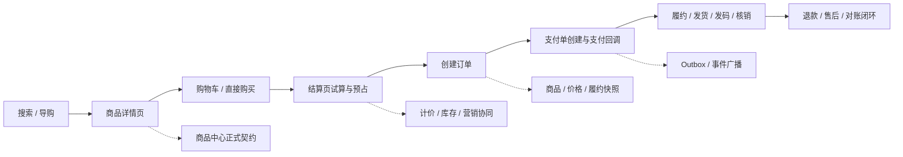

这条主链路表达的是：

1. 搜索、列表和详情是交易前的信息发现链路，允许适度弱一致。
2. 结算、下单、支付是交易承诺链路，必须逐步收紧校验口径。
3. 履约和售后是交易后事实链路，必须围绕订单快照和支付结果闭环。

### 2.3 决策点 1：为什么 C 端不能只用一个“大前台服务”承接全部链路

如果把搜索、详情、购物车、结算、订单、支付、履约全塞进一个“大前台交易服务”，短期当然看似简单，但长期一定会失控。

| 方案 | 优点 | 缺点 / 风险 | 推荐结论 |
| --- | --- | --- | --- |
| 方案 A：大一统前台服务 | 入口统一、联调简单 | 搜索弱一致和交易强一致混在一起；边界塌陷；状态机膨胀 | 不推荐 |
| 方案 B：按交易旅程拆域 | 职责清晰；一致性口径可分层；便于扩容和治理 | 系统间编排更复杂 | 推荐 |

推荐结论：

- 搜索 / 导购负责发现。
- 商品详情负责解释。
- 购物车负责意愿暂存。
- 结算负责强校验编排。
- 订单负责承诺落地。
- 支付负责资金事实。
- 履约与售后负责交易后闭环。

### 2.4 决策点 2：为什么搜索结果和详情页允许不同一致性口径

搜索结果页面对的是高 QPS 召回，详情页面对的是单商品强解释。

| 对象 | 推荐一致性 | 原因 |
| --- | --- | --- |
| 搜索结果页 | 弱一致 | 索引是投影，允许短暂滞后 |
| 详情页 | 近实时一致 | 需要展示交易前关键信息 |
| 下单 / 支付 | 强校验 | 不能靠展示信息直接成交 |

推荐结论：

- 搜索索引和列表投影可以异步刷新。
- 搜索结果页不是“所有字段都由 ES 直接吐出”；只有参与召回、过滤、排序且可容忍滞后的骨架字段进索引，高频强一致字段要通过商品中心、计价和库存批量 Hydrate。
- 详情页必须以正式商品契约为底，再补充当前价、库存和营销。
- 下单永远不能只信列表或详情页展示结果。

### 2.5 决策点 3：为什么购物车不锁库存，结算才预占库存

购物车表达的是“想买”，不是“已经占用交易资源”。

| 方案 | 风险 | 推荐结论 |
| --- | --- | --- |
| 购物车加购即锁库存 | 大量僵尸占用；资源利用率极差；售罄假象 | 不推荐 |
| 结算时再预占库存 | 只在交易临门一脚时收紧资源 | 推荐 |

推荐结论：

- 购物车只保存用户意愿。
- 进入结算页时，库存中心才执行 `ReserveInventory`。
- 支付失败、超时取消、风控拒绝后，必须显式释放预占。

### 2.6 决策点 4：为什么订单必须保存商品 / 价格 / 履约快照

如果订单创建后还依赖“实时查最新商品”，未来只会产生解释灾难。

| 事实 | 为什么要快照 |
| --- | --- |
| 商品标题、规格、履约规则 | 商品可能后续被改名、改规格、改退款口径 |
| 价格与优惠结果 | 价格和活动经常变化 |
| 履约参数 | 发码、预约、核销规则可能调整 |

推荐结论：

- 订单保存或引用创单时的商品快照、价格快照、履约快照。
- 售后和客服解释历史订单时，只认快照，不认最新商品。

### 2.7 决策点 5：为什么支付不能反向驱动订单主状态机

支付是资金事实，但不是订单全业务事实。

| 方案 | 风险 | 推荐结论 |
| --- | --- | --- |
| 支付中心直接改订单所有主状态 | 状态主权错位；订单域被支付绑死 | 不推荐 |
| 支付中心发支付事实事件，订单域自行推进状态 | 支付和订单解耦；幂等更清晰 | 推荐 |

推荐结论：

- 支付系统只负责支付单与支付结果。
- 订单系统消费支付成功 / 失败事件，自行推进自己的状态机。

### 2.8 决策点 6：为什么售后必须基于订单事实，而不是回查最新商品

退款、退货、取消和争议处理面对的是“历史承诺”，不是“当前最新售卖状态”。

推荐结论：

- 售后判断以订单快照、支付结果、履约状态和库存回补策略为准。
- 不允许用最新商品标题、最新价格、最新规则反向解释旧单。

---

## 3. 商品搜索、导购与详情链路

### 3.1 场景画像

从用户进入平台到决定“我要不要买”，通常依次经过两种读路径：

1. 搜索 / 导购结果页：看的是候选集。
2. 商品详情页：看的是交易前解释。

这两条链路看起来都只是“读”，但它们的职责截然不同：

- 搜索结果页服务于召回和转化，强调高吞吐和可排序。
- 详情页服务于交易前理解，强调解释性和当前性。

### 3.2 关键技术点

#### 3.2.1 搜索结果页本质上是弱一致投影

搜索结果页的目标是高吞吐召回、排序和转化，不承担交易真相主权。它展示的是“当前最有可能被用户点击的候选集”，不是“此刻可以直接下单成交的最终合同”。

因此，搜索页允许：

- 索引异步刷新
- 列表字段局部滞后
- 某些弱展示字段降级缺失

但它不能越界去承担：

- 实时价格真相
- 实时库存真相
- 权益资格最终裁决

#### 3.2.2 列表页的第一责任是高效召回和可排序，而不是输出所有实时交易字段

这条链路里最关键的设计点，不是“多调了几个下游”，而是：**搜索结果页到底哪些数据应该直接来自搜索中心，哪些数据应该回商品中心 / 计价 / 库存实时补齐**。

决策原则只有三条：

1. **是否参与召回、过滤、排序**：参与这些能力的字段，优先放到 ES。
2. **变动频次高不高**：高频变化字段不要把绝对真相压进 ES。
3. **对准确性要求高不高**：一旦字段直接影响成交，就应该让实时权威域说了算。

因此，搜索结果页通常采用“**ES 出骨架，商品中心与交易相关域补血肉**”的模式：

| 字段类型 | 主要来源 | 为什么这么设计 |
| --- | --- | --- |
| 标题、副标题、主图、品牌、类目、属性标签 | 搜索中心 / ES | 这些字段参与检索、过滤、聚合或高频展示，适合做索引骨架。 |
| 上下架状态、可搜状态 | 搜索中心 / ES 过滤 | 必须在搜索阶段先过滤掉不可售对象，避免返回无意义结果。 |
| 销量、评分、热度等排序因子 | 搜索中心 / ES | 直接用于粗排或综合排序，允许弱一致。 |
| 实时到手价、会员价、促销价 | 计价中心 / 商品中心 Hydrate | 高敏感、高频变化，列表允许短暂滞后，但展示时最好用实时结果覆盖。 |
| 绝对库存数、紧张库存文案 | 库存中心 Hydrate | 属于高频高并发变化字段，不能让 ES 承担绝对数写入。 |
| 活动标签、圈品命中、促销露出 | 营销中心 Hydrate | 露出逻辑变化快，且失败时可以局部降级。 |
| 冷门说明类字段 | 商品中心 | 不参与搜索与排序，没必要进 ES。 |

一个很实用的判断方法是：

- **只要字段决定“搜不搜得到、排在第几位、能不能按它筛选”**，就应该优先放进 ES。
- **只要字段决定“现在到底多少钱、到底还有没有货、这个活动此刻还能不能领”**，就应该优先让商品中心、计价或库存域返回实时结果。

#### 3.2.3 详情页是多域聚合页，但它依然只是“交易前解释”，不是订单事实

详情页虽然比列表页更接近交易真相，但它仍然只是用户下单前的解释界面。它需要把：

- 正式商品契约
- 当前价格
- 当前库存摘要
- 营销露出
- 履约规则

聚合成一个可理解的商品页面，但它仍然不能替代：

- 结算页的价格试算
- 预占库存
- 优惠校验
- 创单前最终版本校验

#### 3.2.4 酒店搜索场景：哪些信息来自 ES，哪些信息来自商品中心

酒店搜索比普通实物电商更复杂，因为它的库存和价格天然带有 **日期维度** 与 **用户上下文**。同一家酒店，在不同入住日、房型、会员等级和连住天数下，真实价格和真实可售状态都可能完全不同。

因此在酒店搜索里，字段边界通常这样划：

- **来自搜索中心 / ES 的信息**：
  - 酒店名称、别名、地址、经纬度、星级、品牌、设施标签、商圈、地标、基础房型名
  - 粗粒度的 `has_room`
  - 用于价格粗排的 `base_min_price`
- **来自商品中心 / 资源域的实时信息**：
  - 指定入住日到离店日之间的真实可售房态
  - 具体房型在该日期区间下的实时到手价、会员价、连住价
  - 退改政策、确认时效、最晚保留时间

所以酒店搜索的标准模式通常是：

1. ES 先负责按城市、星级、地理位置、设施等条件召回和粗排。
2. 搜索服务拿着 `hotel_ids + checkin + checkout + user_id` 去商品中心 / 计价 / 库存资源域批量查询。
3. 用实时价格和真实房态覆盖掉 ES 的粗粒度字段，再返回给前端。

这也解释了为什么列表页不能直接把 ES 的价格和库存当成交易真相：

- ES 擅长做大规模检索和排序。
- 商品中心、计价、库存才是交易前最后的权威真相。

#### 3.2.5 酒店搜索中的价格排序：为什么要“ES 粗排，商品中心精展”

酒店搜索里，“按价格从低到高排序”是一个典型的工程取舍点。难点在于：**ES 必须先拿到一个字段值才能完成全局排序，但酒店的真实价格又是动态计算出来的**，它同时受到入住日期、连住天数、会员等级、售卖计划、实时促销和税费规则影响。

如果试图把“所有用户、所有日期、所有房型组合下的真实到手价”全部塞进 ES，不但索引维度会爆炸，写入频率也会把搜索集群拖垮。因此，业界更常见也更稳妥的方案是：

1. **ES 存基础价或粗粒度低价**，例如 `base_min_price`。
2. **ES 用这个基础价完成粗排和分页**。
3. **搜索服务再拿当前页酒店 ID 去商品中心 / 计价引擎算真实价**。
4. **前端最终展示真实价，而不是 ES 里的基础价**。

可以把它理解成两层排序：

- **第一层：ES 粗排**
  - 目标：快速筛出大体上价格更低的候选酒店。
  - 使用字段：`base_min_price`、地理距离、评分等低频或可容忍滞后的排序因子。
- **第二层：商品中心精展**
  - 目标：把当前用户、当前日期区间下的真实到手价展示给用户。
  - 使用输入：`hotel_ids + checkin + checkout + user_id + member_level`。

这种做法的优点是：

- ES 可以继续承担高并发检索和翻页，不会因为实时价格频繁变动而被拖垮。
- 商品中心只需要对当前页有限数量的酒店做实时算价，成本可控。
- 最终展示价足够新鲜，不至于让用户看到完全错误的成交价格。

它的代价也要诚实承认：**可能存在轻微排序错位**。例如某酒店在 ES 粗排时基础价更高，但在当前会员和促销条件下真实价反而更低。工程上通常接受这种小范围偏差，因为相比“绝对精确排序”，大促和高并发场景下的系统可用性更重要。

如果业务规模较小，且平台对“价格排序绝对精准”要求极高，也可以采用“扩大召回 + 内存二次精排”的方案：

1. ES 先按基础价或日期维度价格取前 50～100 条候选。
2. 商品中心批量算出这些候选的真实到手价。
3. 搜索服务在内存中对这批结果按真实价重新排序。
4. 最后截取前 20 条返回前端。

这种方案体验更精确，但成本也更高：

- 商品中心一次性算价对象更多；
- 分页会更复杂；
- 在高并发场景下更容易放大下游 RPC 压力。

因此，对于大多数中大型酒旅平台，更推荐的默认结论是：

> **价格排序粗排交给 ES，真实价格展示交给商品中心；宁可接受轻微排序偏差，也不要让搜索集群承担实时交易字段的高频写压力。**

#### 3.2.6 酒店搜索中的深翻页：为什么不能一边无限翻页，一边无限精排

在 ES 里，深翻页不是看“一个城市总共有多少家酒店”，而是看 **`from + size` 有多深**。默认情况下，`max_result_window = 10000`，超过这个窗口 ES 会直接拒绝请求。

因此，“一个城市 1000 家酒店”本身不算问题；真正的问题是：

- 用户是否在持续向后翻页；
- 系统是否还想对越往后的结果继续做高成本的实时算价和二次精排。

这也是酒店搜索比普通商品搜索更难的地方。因为一旦用户选择“按价格排序”，后端往往不只是简单翻页，而是在做：

1. ES 先按基础价召回一批候选；
2. 商品中心对候选酒店批量算真实价；
3. 搜索服务在内存里重新精排；
4. 再截取当前页返回。

如果对所有翻页都维持这套逻辑，哪怕用户只翻到第 3 页，后端也可能已经在做“前 100 条甚至前 300 条候选的批量算价和内存重排”，这就进入了**类深翻页**问题：不是 ES 一定先死，而是商品中心和 Hydrate 编排先被拖垮。

酒店搜索里更稳妥的处理方式通常有三层：

1. **产品侧先限深**
   - C 端列表采用懒加载，而不是允许无限页码跳转。
   - 滚到较深位置时，优先引导用户缩小日期、商圈、价格区间、设施等筛选范围。
   - 这一步往往比任何底层技术优化都更有效。

2. **ES 侧用 `search_after`，不用无脑 `from + size`**
   - 对 C 端连续下拉场景，使用 `search_after` 更合适。
   - 它不支持任意跳页，但非常适合移动端“下一页、再下一页”的滚动浏览。
   - 这样可以避免 ES 为了翻到更后面的页而反复丢弃前面的大量结果。

3. **精排只保证前 N 条，后面自动降级**
   - 可以定义一个“最高精排桶”，例如只保证前 100 家酒店的价格排序绝对精准。
   - 前 100 条以内：走“扩大召回 + 批量算价 + 内存精排”。
   - 超过 100 条之后：只对当前页做实时价覆盖，不再对更大候选集做二次精排。
   - 这样既保住前几屏的用户体验，也不会让后端为极低转化概率的深页结果付出无限成本。

为了进一步保护商品中心的报价引擎，通常还会加一层 **批量报价缓存**：

- 当用户带着同一组条件（如入住日、离店日、人数、会员等级）连续翻页时；
- 商品中心第一次批量算出来的结果可以短暂缓存；
- 后续翻页优先走缓存或 MGET，而不是每翻一页都重新全量计算。

因此，这里的推荐结论可以落成：

> **酒店搜索要把“深翻页问题”和“动态价格排序问题”一起看。ES 负责可扩展的游标翻页，商品中心只为前部高价值结果做精排和算价，越往后越要主动降级，而不是对所有结果做无限精确排序。**

#### 3.2.7 酒店房态与价格的秒级缓存一致性：什么时候应该实时查，什么时候必须缓存

酒店搜索里还有一个非常高频的决策点：**列表页到底应不应该实时去查 30 家酒店的价格和房态**。

这个问题没有统一答案，关键看两件事：

1. 单次批量查询的真实耗时能不能稳定控制在可接受范围内。
2. 高并发、大促、爬虫和跨境供应商抖动时，底层资源层能不能扛住放大的吞吐压力。

如果你们的业务压测结果表明：

- 同一批次实时查询 30 家酒店的价格与房态只需要大约 100ms；
- 且这条链路经过了限流、隔离、超时和降级设计；

那么列表页采用“**ES 粗排 + 当前页 30 家实时查询**”是完全合理的，并且会比死缓存带来更好的用户体验。因为它能显著减少“列表页看到 300 元有房，点进详情页变成 500 元或满房”的落差。

但这里真正的难点，不是“单次 100ms 能不能做到”，而是以下三个工程问题。

**第一，怎么扛住高并发下的整体吞吐量。**

单次查 30 家只要 100ms，不代表在大促、暑期、国庆或被外部爬虫高频抓取时依然成立。因为一旦搜索 QPS 被放大，请求总量会迅速变成：

- `搜索 QPS × 每次查询酒店数`

这时候真正需要保护的不是搜索服务本身，而是后面的：

- 商品中心 / 报价引擎
- 库存 / 房态资源层
- 海外供应商接口

因此更稳妥的做法是：

- 在搜索服务到资源层之间做 **线程池隔离 / 舱壁隔离**
- 对供应商或报价 RPC 做 **超时控制与限流**
- 对异常来源流量做 **防刷与防爬**
- 超过保护阈值时，自动退化为“ES 基础价 + 粗房态”模式

也就是说，**实时查 30 家可以作为主路径，但必须有明确的降级开关**。

**第二，怎么避免慢供应商拖垮整个列表页。**

酒店列表经常会混入海外供应商或跨境资源方，它们的接口 RT 波动可能远大于本地酒店资源系统。如果 30 家里有 2~3 家供应商超时，不能让整页结果跟着被拖慢。

因此列表页更推荐采用：

- 批量并行查询
- 严格的总超时预算
- 单酒店或单供应商分支的独立超时中断

在这种模式下：

- 100ms 内成功返回的酒店正常展示实时价
- 超时或失败的酒店退化成 ES 基础价、基础房态或“参考价”文案
- 绝不允许少数慢分支把整页响应时间拉穿

换句话说，酒店列表的目标不是“每一条都实时且完整”，而是：

> **绝大多数酒店在预算时间内拿到实时结果，少量超时酒店局部降级，但整页体验必须稳定。**

**第三，实时查和价格排序怎么同时成立。**

这正是为什么前面 `3.2.5` 里强调“**ES 粗排，商品中心精展**”。

因为即使当前页 30 家的实时查询只要 100ms，ES 在全局排序时也不可能提前知道所有酒店对当前用户、当前入住日期下的真实到手价。所以更现实的做法仍然是：

1. ES 先按 `base_min_price` 做全局粗排。
2. 取出当前页 30 家酒店 ID。
3. 搜索服务实时查这 30 家的真实价格与真实房态。
4. 在内存中对这 30 条结果做一次轻量二次微调排序。

这样可以兼顾：

- ES 的可扩展粗排能力
- 当前页实时价格展示的准确性
- 以及不把整条链路压成“全量动态排序”的系统风险

因此，这里的推荐结论不是“必须缓存”或“必须实时查”，而是：

> **酒店列表页可以实时查当前页 30 家数据，但前提是这条路径经过限流、隔离、超时和降级保护；真正的主架构仍然是 ES 负责粗排，商品中心 / 报价引擎负责当前页实时修正。**

如果业务已经压测证明当前页实时查询稳定在 100ms 左右，那么比起把价格和房态死死缓存住，这种“**小批量实时查 + 局部降级 + 全局粗排**”往往是更符合真实酒旅体验的工程方案。

#### 3.2.8 Hydrate 编排应该纯串行还是半并行

Hydrate 层最容易被低估的一个问题是：**下游依赖到底应该串行调用，还是并行调用**。

如果完全按照“商品中心 -> 库存中心 -> 营销中心 -> 计价中心”的直觉串行走，业务理解上很顺，但性能上很危险。因为只要每个 RPC 平均耗时 20ms，四段串行下来就已经接近 80ms；任意一个下游轻微抖动，整条列表页链路就会很容易冲到 150ms 以上。

更稳妥的工程实践通常不是“全串行”，也不是“无脑全并行”，而是**带依赖关系的半并行编排**：

1. **第一阶段并行**
   - 商品中心：拿商品卡片骨架、类目、品牌、商家等基础信息
   - 库存中心：拿库存摘要、是否有货、紧张状态
2. **第二阶段**
   - 营销中心：基于商品基础信息和用户上下文，先判断活动命中、优惠资格、券与满减露出
3. **第三阶段**
   - 计价中心：在拿到营销结果之后，再基于商品基础信息、营销结果和用户上下文计算展示价、会员价、到手价

这样做的原因是：

- **库存中心通常只依赖 item_id / sku_id**，并不依赖商品标题、品牌、类目这些骨架字段；
- **商品中心也不依赖价格和库存**，它本身就是卡片骨架来源；
- **营销中心** 往往依赖商品类目、商家、售卖属性来判断露出与资格；
- **计价中心** 在很多实现里并不是独立“拍脑袋算价”，而是要把营销命中的结果、优惠叠加关系、会员折扣、活动门槛一起折进最终展示价，所以它天然位于营销之后。

这种编排的总耗时，更接近：

- `max(商品中心, 库存中心) + 营销中心 + 计价中心`

而不是四段简单相加。所以它通常仍然明显优于“商品 -> 库存 -> 营销 -> 计价”的纯串行模式，同时又不会像“盲目全并行”那样把前置依赖关系搞乱。

如果业务继续追求更低的列表页延迟，还可以进一步演进到**近似全并行**：在计价中心和营销中心内部也冗余一份极简的商品基础信息，例如：

- `item_id -> 类目`
- `item_id -> 商家`
- `item_id -> 基础售卖属性`

这样一来，Hydrate 层在收到 ES 返回的 item_id 列表后，就可以：

- 同时查商品中心
- 同时查库存中心
- 同时查营销中心
- 等营销结果返回后，再调计价中心

因为营销不再必须等待商品中心先返回类目信息，而计价至少不需要再回头额外查一次商品中心。这本质上是：

> **用数据冗余换实时编排延迟。**

但要注意，这种“绝对并行”只适合在两个前提下使用：

1. 营销和计价中心内部维护的商品轻量副本足够新鲜；
2. 你们愿意承担多一层数据同步和一致性治理的复杂度。

所以默认推荐结论是：

> **Hydrate 层优先采用“商品 + 库存第一阶段并行，营销第二阶段，计价第三阶段”的半并行架构；只有在对延迟极度敏感、且下游已经具备足够商品副本和营销结果缓存时，才继续压缩计价前置依赖。**

#### 3.2.9 详情页的核心架构思想：动静分离与多级缓存

商品详情页（PDP）是交易漏斗里最核心的读页面之一。它的特点是：

- 流量极大
- 读多写少
- 高可用要求极苛刻
- 用户对页面解释能力和加载速度都极其敏感

因此，详情页不能做成“每次请求实时查所有下游”的重聚合链路，而要先做**动静分离**。

从工程上看，详情页的数据通常可以拆成两类：

- **静态数据**：
  - 标题、副标题
  - 主图、详情图
  - 商品参数说明
  - 低频变化的文案和结构化描述
- **动态数据**：
  - 当前到手价
  - 库存摘要
  - 当前用户可见的权益和促销露出
  - 配送时效、门店核销、预约规则、评价摘要

更稳妥的详情页架构通常是：

1. **静态骨架优先**
   - 商品静态内容通过静态 JSON、静态片段或 CDN 化页面骨架快速返回。
   - 用户先看到稳定的页面结构、标题和主图，而不是等待所有后端系统都准备完毕。
2. **动态数据异步 Hydrate**
   - 前端或详情聚合层再去批量拿价格、库存、营销和履约数据。
   - 动态内容可以稍晚几十毫秒填充，但不能把首屏完全卡死。

为了让这条链路在大促和高并发下仍然稳定，通常要配合**多级缓存**：

- **CDN / 静态内容缓存**
  - 兜底标题、主图、详情骨架
- **聚合层本地缓存（如 Caffeine）**
  - 缓住极短时间内的重复请求和热点详情
- **分布式缓存（如 Redis）**
  - 缓住基础价、库存摘要、详情聚合片段或短期动态结果

这样做的目标不是追求“所有详情字段都绝对实时”，而是：

> **先保证详情页稳定打开，再保证动态关键信息足够新鲜，最后在创单前做最终强校验。**

#### 3.2.10 详情页里的实时计价、库存摘要与大促降级

详情页里最敏感的两个问题，永远是：

1. 现在多少钱
2. 现在还有没有货

这两个字段之所以难，是因为它们都不适合做成简单的全量缓存。

对于**价格**来说，真正的到手价往往同时受以下因素影响：

- 会员等级
- 商品基础价
- 店铺活动
- 平台券 / 品类券
- 用户专属权益

因此更常见的做法不是缓存“所有用户的最终价”，而是：

- 缓存**基础价 / 会员价矩阵 / 基础促销价**
- 在详情请求进来时，再结合用户上下文和营销命中做轻量实时计算

对于**库存**来说，详情页一般不追求展示精确库存数字，而是展示：

- 有货
- 无货
- 紧张库存
- 仅剩少量

这样可以显著降低库存读压力，同时也避免把高频变化的绝对库存数暴露到前台。

但真正的大问题出现在**大促、热点商品和下游抖动**场景下。此时详情页必须具备明确的降级能力：

- **计价服务超时**
  - 优先展示基础销售价或指导价
- **库存摘要超时**
  - 退化为保守文案，如“库存确认中”或“请以下单时校验为准”
- **营销露出超时**
  - 隐藏活动标签，不阻塞主页面
- **Redis 或下游依赖异常**
  - 先用本地缓存或静态兜底页保证详情可打开

对热点商品，还要配合：

- 热 Key 探测
- 本地热点缓存
- 限流与线程池隔离

这样即使某个爆款详情在几秒内被打到极高 QPS，也不至于把 Redis、计价、库存或营销服务一起拖崩。

所以详情页的核心不是“把所有数据都实时算到最准”，而是：

> **在可接受的一致性范围内，把最重要的动态字段算出来，把不重要的字段降级掉，并且永远保证详情页页面本身不因为单个下游故障而整体不可用。**

### 3.3 搜索结果页查询时序图

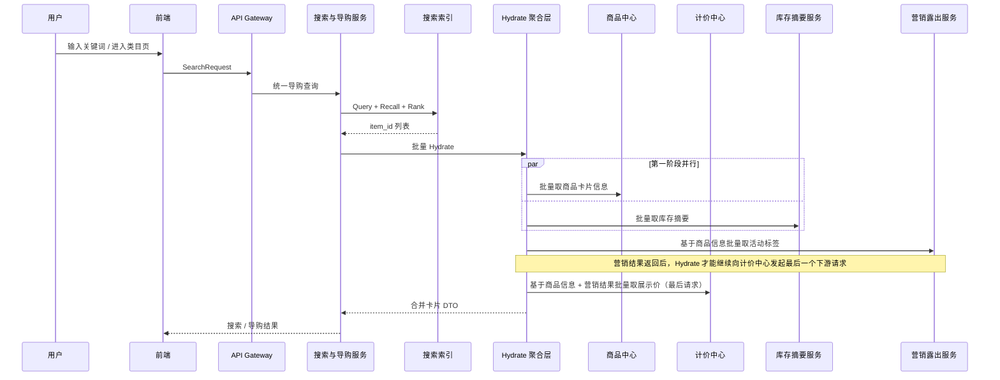

### 3.4 详情页聚合查询时序图

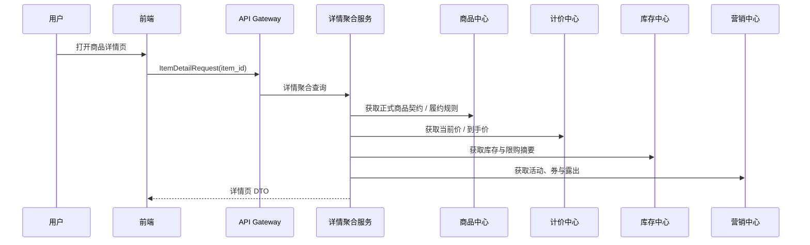

---

## 4. 购物车与结算链路

### 4.1 场景画像

购物车和结算虽然常常出现在同一个前端页面体系里，但它们在系统设计上承担完全不同的角色：

- 购物车是“意愿篮”，弱一致、可长期暂存。
- 结算页是“交易前总校验器”，会触发价格试算、库存预占和优惠校验。

用户从加购到结算，通常会依次跨过下面几种典型动作：

1. 未登录用户把商品先放进匿名购物车。
2. 登录后把匿名购物车和账号购物车合并。
3. 在购物车里勾选部分商品进入结算页。
4. 结算服务对商品、价格、库存、权益、运费做一次交易前汇总校验。
5. 用户点击“提交订单”前，系统再次确认这些结算结果是否还有效。

因此，购物车与结算链路的本质不是“把商品列出来然后直接下单”，而是：

- 购物车负责保存用户意图；
- 结算负责把用户意图收敛成一次可提交的交易尝试；
- 订单创建必须建立在结算凭证仍然有效的前提之上。

### 4.2 关键技术点

#### 4.2.1 为什么购物车不锁库存，而要等到结算阶段才预占

购物车天然是一个长生命周期容器，商品可能被用户放进去几分钟、几小时，甚至几天。如果在加购时就锁库存，会出现两个严重问题：

- 资源被大量无效占用，真实买家反而看见“无货”；
- 购物车会从“意愿篮”退化成“半订单系统”，导致系统复杂度失控。

因此更合理的边界是：

- **加购阶段只记录意愿，不锁任何资源；**
- **结算阶段才做短 TTL 的库存预占和权益占用。**

#### 4.2.2 为什么购物车服务和结算服务要分开

购物车服务面对的是：

- 高读写、弱一致、频繁加减数量；
- 匿名态与登录态合并；
- 失效商品标记、限购截断、展示优化。

结算服务面对的是：

- 商品正式态校验；
- 价格试算与营销试算；
- 库存预占、权益占用；
- 生成一组可供订单提交消费的结算凭证。

二者虽然都服务于“买东西”，但读写模型完全不同。如果把它们揉进一个服务里，最终会变成：

- 购物车流量冲击交易校验逻辑；
- 结算逻辑污染购物车的简单读写路径；
- 系统很难分别做缓存、限流、降级和扩展。

所以更清晰的职责划分是：

- **购物车服务**负责意愿存储和合并；
- **结算服务**负责交易前编排和凭证生成。

#### 4.2.3 结算页为什么本质上是一笔短生命周期 Saga

进入结算页时，系统需要跨多个域临时拿到“当前这笔交易是否可成立”的真相：

- 商品是否仍然可售；
- 当前价格和优惠是否仍有效；
- 库存是否足够；
- 地址、运费、履约规则是否匹配。

这些结果不是永久事实，而是一组**瞬时成立的交易前提**。因此结算页本质上不是订单，而是一笔短生命周期的 Saga 编排，其输出通常包括：

- `price_token / price_snapshot_id`
- `reserve_ids`
- `coupon_tokens / benefit_tokens`
- `freight_snapshot`

这些凭证只在短时间内有效，供后续提交订单消费。

#### 4.2.4 结算页为什么必须返回凭证，而不是只返回一个总价

如果结算页只把“总价 299 元”返回给前端，而不携带任何可验证的结算凭证，那么提交订单时系统无法判断：

- 这个价格是不是旧价格；
- 这个优惠是不是已经失效；
- 这批库存是不是已经被别人买走；
- 用户有没有抓包篡改前端金额。

因此结算页必须返回可验证的凭证集合，而不是一个纯展示结果。到了提交订单阶段，结算服务或订单中心才能拿这些凭证再次校验，确认这次提交是否仍然合法。

#### 4.2.5 购物车合并为什么不是简单的“两个列表拼起来”

匿名购物车和登录购物车合并时，至少要处理下面几类现实问题：

- 同一 `sku` 在两个桶里都存在，需要合并数量；
- 合并后可能触发限购上限，需要截断；
- 某些商品已经下架、缺货或不可售，需要打失效标记；
- 某些商品规格变了、价格变了，需要提示刷新；
- 不同端（H5、App、小程序）带来的本地购物车格式可能不同。

所以购物车合并的正确语义不是“简单拼数组”，而是：

> **以用户账号购物车为权威桶，对匿名购物车做一次规则化并入。**

#### 4.2.6 结算确认为什么必须支持“失效与刷新”

用户进入结算页到真正提交订单，中间可能经过几十秒甚至几分钟。期间世界已经变了：

- 商品被下架；
- 价格发生变化；
- 优惠券被别的订单占用了；
- 库存被抢空；
- 配送范围或运费模板发生变化。

所以结算确认一定要支持：

- 显式校验失效；
- 告知前端“哪些条件失效了”；
- 允许用户一键刷新结算页重新生成凭证。

这也是为什么订单系统只认**校验通过后的结算凭证**，而不认用户页面上肉眼看到的旧数据。

### 4.3 场景一：加购与购物车合并时序图

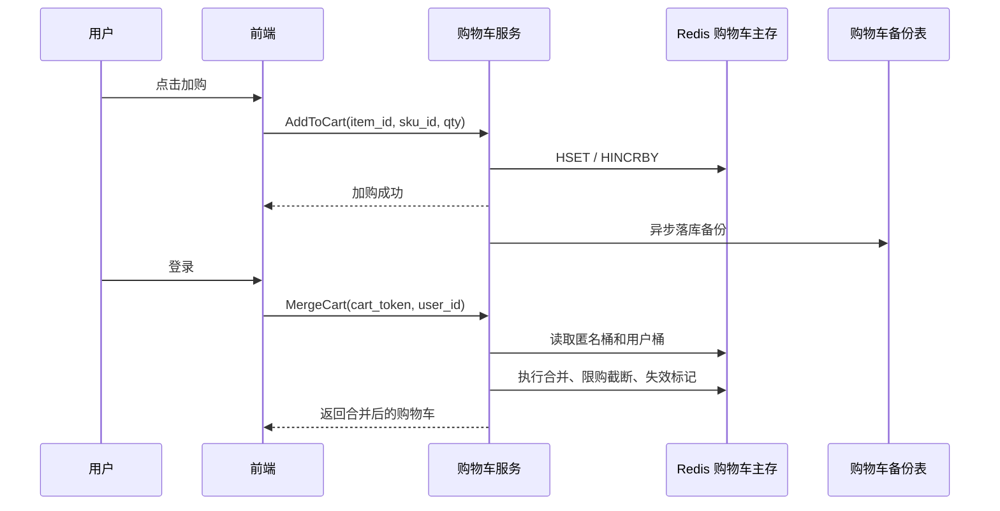

### 4.4 场景二：进入结算页的 Saga 编排时序图

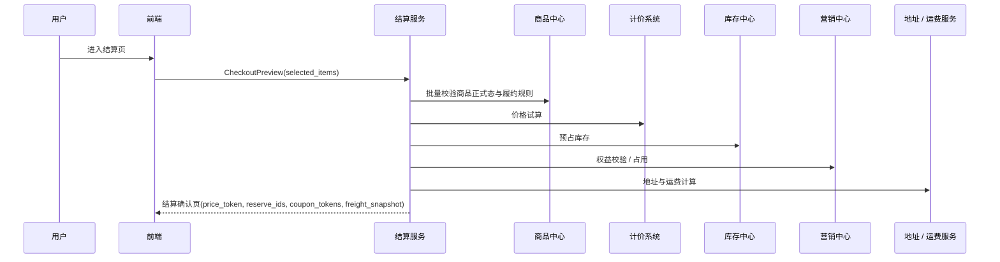

### 4.5 场景三：结算确认页失效与刷新时序图

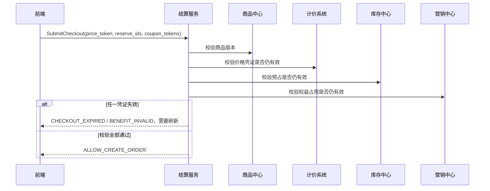

### 4.6 购物车与结算链路的统一架构原则

购物车与结算链路的统一设计原则，可以浓缩成下面四句话：

1. 购物车只保存购买意愿，不保存交易事实。
2. 结算服务负责把商品、价格、库存、权益和履约规则收敛成一次可提交的交易尝试。
3. 结算页返回的是一组短期有效的交易凭证，而不是最终订单。
4. 提交订单前必须再次校验这些凭证，才能把“意愿”推进成真正的“交易事实”。

---

## 5. 下单、支付与订单编排链路

### 5.1 场景画像

用户点击“提交订单”时，系统会从“交易前校验”进入“交易事实落地”：

1. 订单中心基于结算凭证创建订单。
2. 订单保存商品、价格和履约快照。
3. 支付系统创建支付单并和外部渠道交互。
4. 支付结果回流后，订单状态推进。
5. 支付失败、超时取消或风控拒绝时，显式释放库存与权益。

### 5.2 关键技术点

在订单提交链路里，面试官最喜欢围绕“幂等、一致性、高并发、快照、补偿、安全、扩展”连续追问。为了便于答辩，可以先用一张总览表把这些问题压住：

| 追问方向 | 典型问题 | 简要回答口径 |
| --- | --- | --- |
| 幂等与重复提交 | `token/order_no` 过期怎么办 | 先按 `order_no` 反查订单；查到则返回已有订单，查不到再提示刷新确认页 |
| 幂等与重复提交 | Redis 挂了幂等怎么保证 | Redis 只做前置消峰，最终靠订单表 `order_no unique` 兜底 |
| 幂等与重复提交 | 多个请求同时消费凭证怎么办 | Redis 用 Lua / 原子删除一次性消费；提交时还要校验凭证绑定的 `user_id / session_id`，防止别人拿到凭证越权提交；数据库唯一索引做最后防线 |
| 幂等与重复提交 | 重复点击、网络重试、MQ 重发怎么分层处理 | 前端防抖处理点击；同步接口靠 `submit_token/order_no`；异步链路靠消息幂等键 |
| 幂等与重复提交 | 技术幂等和业务重复单提醒有什么区别 | 技术幂等解决“同一请求别处理两次”；业务重复单提醒解决“同一用户短时间内别无意中下两笔相似订单”，两者要同时存在但不要混为一谈 |
| 分布式事务与一致性 | 跨服务调用怎么保证一致性 | 不做 XA；主链路快速失败，靠事件补偿 + 延迟反查释放做最终一致性 |
| 分布式事务与一致性 | 库存预占成功但创单失败怎么办 | 发布 `OrderCreateFailedEvent`；库存和营销中心异步解冻，并保留延迟反查自愈 |
| 分布式事务与一致性 | 用 Saga、TCC 还是本地消息表 | 标准电商更常用 Saga / 本地消息表 + 补偿；避免重型强一致事务 |
| 分布式事务与一致性 | 真正扣库存在哪里做 | 创单阶段通常只预占；支付成功后由订单中心编排库存确认 |
| 高并发与性能 | `order_no` 怎么高性能全局唯一 | 常用 Snowflake / 号段；避免纯数据库自增暴露给外部 |
| 高并发与性能 | 这条链路瓶颈在哪里 | 通常在计价、库存预占、营销校验和订单库写入；通过缓存、批量接口、隔离和削峰扩容 |
| 高并发与性能 | 热点 `order_no` 被狂刷怎么办 | 网关限流 + 用户态校验 + Redis 短 TTL 幂等凭证 + 本地缓存已有结果 |
| 高并发与性能 | 唯一索引高并发插入有什么问题 | 会放大热点写竞争；但它是最后兜底，前面必须用 Redis 把大部分重复流量挡掉 |
| 下游凭证设计 | `price_token`、`reserve_ids`、`coupon_tokens` 是什么 | 分别代表价格真相、库存预占凭证、权益占用凭证，是创单前各域冻结结果的引用 |
| 下游凭证设计 | 这些凭证有效期怎么定 | 按业务风险定：价格一般秒级到分钟级，库存预占和券占用通常与结算超时时间一致 |
| 下游凭证设计 | 营销占用失败怎么办 | 直接阻断创单，主链路快速失败，不进入订单落库 |
| 下游凭证设计 | 商品静态合规校验校什么 | 上下架、可售状态、类目限制、店铺状态、限购规则、黑名单等交易前静态约束 |
| 下游凭证设计 | 价格版本校验意义是什么 | 防抓包改价、防旧价格重放、防优惠过期后继续创单 |
| 订单快照 | 为什么必须落快照 | 订单之后不能再依赖最新商品真相；退款、客诉、售后都要基于历史成交事实解释 |
| 订单快照 | 快照和订单主表怎么关联 | 一般按 `order_id` / `order_item_id` 一对一或一对多关联，主表和快照表物理分离 |
| 订单快照 | 快照数据量太大怎么办 | 只保留维权关键字段；大字段不进快照；历史快照可冷热分层下沉 |
| 异常与补偿 | 前端超时、后端超时怎么办 | 前端超时靠幂等重试；后端超时按订单真相反查，必要时用结果缓存顺水推舟 |
| 异常与补偿 | 部分成功怎么补偿 | 依赖事件补偿、延迟反查和人工对账，不在主请求里同步回滚所有域 |
| 异常与补偿 | 风控在哪做 | 一般在创单主链路前段或中段做硬拦截，避免无意义占库存和占券 |
| 数据一致性与查询 | 刷新页面如何立刻查到订单 | 创单成功后优先读主库 / 写后读一致路径，避免立刻落到延迟从库 |
| 数据一致性与查询 | 列表和详情走主库还是从库 | 订单详情、支付后短时间查询优先强一致；普通历史列表可走从库或读模型 |
| 数据一致性与查询 | `order_no` 和内部 `order_id` 区别 | `order_no` 偏业务外显与幂等；`order_id` 偏内部主键和关系索引 |
| 安全与风控 | 怎么防别人拿别人的 `order_no` 提交 | `order_no` 必须绑定用户身份、会话上下文和提交签名，不允许裸号直接创单 |
| 安全与风控 | 怎么防中间人改价 | 价格签名 / 价格版本核销 + 时间窗口 + nonce 防重放 |
| 安全与风控 | 怎么防恶意刷 Redis | 网关限流、人机校验、用户级频控、短 TTL、异常流量隔离 |
| 技术细节 | Redis 原子性怎么做 | 关键消费凭证通常用 Lua；简单抢锁可用 `SET NX EX` |
| 技术细节 | 数据库事务怎么开 | 创单本地事务只包订单事实与快照落库，保持短事务；隔离级别通常用 RC/RR 结合唯一键 |
| 技术细节 | 监控埋点看什么 | 提单 RT、成功率、重复提交率、Redis 命中率、唯一键冲突率、补偿成功率、订单创建失败率 |
| 扩展性与演进 | 合并支付、分单怎么扩展 | 结算服务继续负责编排，订单中心拆出主单/子单/支付单关系模型 |
| 扩展性与演进 | 预售、0 元购怎么扩展 | 复用创单骨架，替换价格确认、库存锁定和支付触发条件 |
| 扩展性与演进 | 怎么做降级和熔断 | 计价、营销、库存预占分别限流熔断；必要时关闭复杂权益，优先保核心创单链路 |

#### 5.2.1 订单应该在“提交订单”时创建，还是在“点击支付”时创建

这在电商里是一个非常经典的交易架构决策点，通常有两种主流方案：

- **方案 A：提单时创单**
  - 用户点击“提交订单”时，先创建一笔待支付订单，再进入收银台选择支付渠道。
- **方案 B：支付时创单**
  - 用户点击“立即支付”时才真正建单；支付成功后，再落最终订单事实。

二者的本质区别在于：**库存锁定发生得早还是晚、订单事实生成得早还是晚**。

| 方案 | 优点 | 风险 | 适用场景 |
| --- | --- | --- | --- |
| 提单时创单 | 用户一旦进入收银台，库存和交易资格通常已经预留；支持待支付、催付、继续支付 | 更容易被恶意占库存；高并发时前置写库和锁资源压力更大 | 实物电商、大多数标准电商、酒店、机酒票务、重体验场景 |
| 支付时创单 | 极大减轻前置创单压力；不容易被恶意占库存；更适合极端高并发 | 可能出现“钱付了但后置建单 / 扣库存失败”的补偿复杂度；用户体验更容易受损 | 秒杀、抢购、部分虚拟商品、部分极端高并发场景 |

这章默认采用的是 **方案 A：提单时创单**。原因是本章的主线更偏向：

- 购物车 -> 结算 -> 提交订单 -> 支付 -> 履约

这类标准交易旅程。它的优点是：

- 订单能够稳定承接商品、价格、履约快照；
- 用户进入收银台后，交易关系已经明确；
- 支付结果回调只需要推进订单状态，而不是同时承担“先建单、再扣库存、再补偿”的复杂责任。

但也要明确：**这不是唯一正确答案**。如果业务是：

- 极端高并发秒杀
- 超稀缺票券抢购
- 低客单价虚拟商品

那么“支付时创单”往往更合理，因为它能把大量无效创单和恶意占坑挡在支付前面。

因此这里更稳妥的结论是：

> **标准电商与重体验商品，优先采用“先创单、后支付”；极端高并发和强防刷场景，再考虑“支付时创单”。**

#### 5.2.2 订单提交流程应该由独立聚合服务编排，还是由订单中心自己协调下游

这也是交易架构里非常经典的一个分歧点，通常存在两种方案：

- **方案 A：单独起一个结算 / 交易聚合服务**
  - 由结算服务或 Trade-CO 统一去协调商品、库存、计价、营销，再把最终结果交给订单中心落单。
- **方案 B：前端直接调用订单中心，由订单中心自己协调下游**
  - 订单中心既管订单写库，又去调用商品、库存、计价、营销这些服务完成前置校验与编排。

这两种方案的本质区别是：**交易主流程编排逻辑，是放在订单领域之外的场景聚合层，还是直接压进订单中心内部。**

| 方案 | 优点 | 风险 | 适用场景 |
| --- | --- | --- | --- |
| 独立聚合服务 | 订单中心更纯净；读写压力与场景编排隔离；更适合复杂结算页和多业务协同 | 多一跳 RPC；多一个服务需要治理 | 中大型电商、业务复杂、团队分工清晰、存在独立预结算页 |
| 订单中心自己协调 | 链路短；服务更少；前期开发快 | 订单中心容易膨胀成万能大管家；读写混合；迭代风险高 | 小团队、早期系统、短期快速上线 |

从工程演进角度看，很多系统早期会采用“订单中心自己协调”的方式快速上线，但随着以下问题出现，通常都会向独立聚合服务演进：

- 结算页逻辑越来越复杂
- 商品、计价、库存、营销团队开始独立演进
- 订单中心既要承接创单写流量，又要承接大量预览与预结算读流量
- 大促时希望把“重编排逻辑”和“订单写库主链路”物理隔离

本章默认采用的是 **方案 A：独立结算聚合服务编排，下游原子服务各自归位**。原因是：

- 结算页本身就天然是一个跨商品、库存、计价、营销、地址的聚合场景；
- 订单中心更适合回归为“交易事实持久化 + 状态机推进”的原子领域服务；
- 支付、履约、售后后续也都更容易围绕清晰的订单事实展开。

因此这里的推荐结论是：

> **当系统存在独立的确认订单页 / 预结算页，且交易链路已经明显跨多个领域服务时，优先采用“结算聚合服务编排，下游原子服务落地”的架构；只有在系统非常轻量时，才让订单中心临时兼做协调者。**

#### 5.2.3 创单接口的幂等性应该怎么设计

创单接口的幂等性，不能只理解成“用户重复点按钮怎么办”。它真正要解决的是：

- 同一个下单意图因为网络抖动、页面重试、MQ 重放或用户多次点击而重复到达时；
- 系统最多只能创建一笔订单；
- 如果第一次其实已经成功了，后续重试还应该尽量返回第一次成功的结果，而不是简单报错。

这类设计在工程上通常不是靠单点手段，而是靠一套**分层防御模型**完成：

- **第一层：前端轻量防抖**
  - 用户点击“提交订单”后，按钮立刻置灰
  - 页面进入 loading 状态，减少肉眼可见的重复点击
- **第二层：结算服务前置防重**
  - 用户进入确认订单页时，后端生成一个全局唯一的 `submit_token`
  - 提交订单时，前端必须把这个 `submit_token` 原样透传回来
  - 结算服务先在 Redis 上做一次幂等拦截，例如：
  - `SET submit_lock:{submit_token} 1 NX EX 30`
  - 如果没有拿到锁，说明相同提交意图正在处理中，或者已经处理过
- **第三层：订单中心存储级最终兜底**
  - Redis 分布式锁并不是绝对强一致的
  - 极端情况下，主从切换、锁过期或网络抖动仍然可能让重复请求穿透
  - 所以订单中心在落库时，仍然必须对 `submit_token` 做唯一约束
  - 即使两个请求同时穿透了 Redis，MySQL 也只能允许一笔订单真正写成功
- **第四层：结果幂等与顺水推舟**
  - 如果第一次创单已经成功，但响应前端时网络丢包
  - 第二次相同请求进来，不应该只返回“重复提交”
  - 更好的做法是缓存 `submit_token -> {status, order_id}`
  - 后续重试命中后，直接返回第一次成功的 `order_id`，把用户平滑带到收银台

这几层的职责并不相同：

| 防线 | 核心目标 | 典型实现 |
| --- | --- | --- |
| 前端防抖 | 减少普通重复点击 | 按钮置灰、loading、防重复提交 |
| Redis 防重 | 前置消峰，保护下游资源 | `submit_token` + 分布式锁 / SETNX |
| DB 唯一约束 | 存储层最终绝对幂等 | 订单表或防重表上的唯一索引 |
| 结果缓存 | 平滑处理“成功但回包丢失” | `submit_token -> order_id` 结果映射 |

面试里经常会被继续追问两个极端场景。

**场景一：业务还没执行完，Redis 锁先过期怎么办？**

如果创单链路比较长，固定的 `EX 30` 很容易在高峰期被打穿。更稳妥的工程实现通常是：

- 使用具备看门狗续期能力的分布式锁实现；
- 业务未结束时自动续期；
- 业务结束后显式解锁。

这样可以避免“创单事务还没跑完，锁却先失效”的幂等击穿问题。

**场景二：Redis 锁挡住了大部分流量，但极端情况下仍然漏了怎么办？**

这里真正的底线是：

> **Redis 负责前置消峰，MySQL 唯一键负责最终闭环。**

也就是说，Redis 锁不是为了替代数据库唯一约束，而是为了减少无意义的重复流量冲击商品、库存、营销和订单中心。

因此这里更稳妥的结论是：

> **创单幂等要做成“前端防抖 + 结算服务 submit_token 防重 + 订单中心唯一索引兜底 + 结果缓存顺水推舟”的四层模型。Redis 负责前置消峰，数据库负责最终绝对幂等。**

#### 5.2.4 预生成的订单号能不能直接作为创单幂等 token

在创单幂等设计里，还有一个非常实用的工程化问题：

- 结算页是不是一定要单独发一个随机 `submit_token`；
- 还是说，**预生成的订单号本身就可以兼做创单幂等键**。

答案是：**可以，而且在很多系统里这是更推荐的做法。**

这里的关键不是“先写一条待支付订单”，而是：

- 用户进入确认订单页时，系统先生成一个全局唯一的 `order_no`；
- 这个 `order_no` 先不落订单主表；
- 而是先作为一次性的创单提交凭证，写入 Redis，设置合理的过期时间；
- 真正提交订单时，前端带着这个 `order_no` 回来，由后端原子消费它，再执行正式创单。

这意味着，一个预生成订单号同时承担了两层身份：

- **业务主键**：后续支付、履约、售后都围绕这个订单号推进；
- **提交幂等键**：用于防止同一个结算确认页被重复提交多次。

与“纯随机 token”相比，它的优势很明显：

- 不需要再维护一套独立 token 体系；
- 幂等键和订单主键天然合一，链路更清晰；
- 如果提交时 Redis token 已经过期，后端可以直接按 `order_no` 去订单库反查是否已经成功创单；
- 即使前端回包丢失，用户重试时也更容易平滑返回已有订单。

但要想把这个方案用稳，必须满足几个前提：

| 设计点 | 要求 |
| --- | --- |
| 订单号生成时机 | 必须在确认订单页阶段就预生成，而不是创单事务最后才生成 |
| Redis 侧 | `order_no` 要作为一次性可消费凭证写入缓存，并设置 TTL |
| MySQL 侧 | 订单表必须对 `order_no` 做唯一索引，承担最终兜底 |
| 提交失败处理 | Redis token 失效后，不能直接报错，要先按 `order_no` 反查订单是否已存在 |

最稳妥的提交流程通常是：

1. 用户进入确认订单页；
2. 结算服务预生成 `order_no`；
3. Redis 写入 `order:submit:{order_no}`，TTL 例如 15~30 分钟；
4. 前端提交订单时，原样带回这个 `order_no`；
5. 后端先原子消费 Redis 中的提交凭证；
6. 再进入正式创单事务；
7. 订单表以 `order_no unique` 最终兜底。

这里尤其要注意一个容易答错的点：

> **token 过期，不等于订单一定创建失败。**

所以当 Redis 里发现 `order_no` 已不存在时，更合理的后端处理顺序是：

- 先按 `order_no` 去订单库查；
- 如果已经有订单，直接返回这笔已有订单；
- 如果没有订单，再提示用户“页面已超时，请刷新后重新提交”。

当然，这种方案也有边界：

- 不要直接暴露纯自增订单号；
- 更适合使用 Snowflake、号段 + 随机扰动、带业务前缀的全局唯一号；
- 并且 Redis 只负责前置防重，**绝不能替代数据库唯一约束**。

因此这里更稳妥的结论是：

> **预生成订单号完全可以直接作为创单幂等 token。最佳实践是“预生成订单号 = 提交幂等键 = 订单业务主键”，再配合 Redis 一次性消费和数据库唯一索引，形成一前一后的双保险。**

#### 5.2.5 技术幂等和业务重复单提醒，为什么要分两层设计

创单链路里还有一个很容易被忽略的点：

- **技术幂等**，解决的是“同一个请求重复到达，系统不要创建两笔订单”；
- **业务重复单提醒**，解决的是“同一个用户在很短时间内，可能无意中下了两笔高度相似的订单”。

这两者看起来都在处理“重复”，但其实完全不是一回事。

**技术幂等**的典型触发原因通常是：

- 用户重复点击提交；
- 网络抖动导致前端自动重试；
- 网关超时后客户端再次发起请求；
- 消息重发或服务重试。

它的目标非常纯粹：

> **同一个下单请求，多次到达，只能被系统真正处理一次。**

而**业务重复单提醒**更偏用户体验和业务治理，它处理的是：

- 用户已经成功下过一笔极其相似的订单；
- 但因为没注意页面状态、没看到待支付订单、或者切了支付方式，又重新下了一笔；
- 这两笔订单在技术上是两次不同请求，但在业务上很可能是用户误操作。

它的目标不是强拦截，而是：

> **在不破坏正常下单自由度的前提下，提示用户“你刚刚可能已经下过一笔类似订单了”。**

所以一个成熟的订单系统，通常要把这两层拆开设计：

| 层次 | 目标 | 典型手段 |
| --- | --- | --- |
| 技术幂等 | 防止同一请求被重复处理 | `submit_token/order_no`、Redis 一次性消费、数据库唯一索引 |
| 业务重复单提醒 | 防止用户短时间内误下两笔相似订单 | 按用户、商品、地址、金额、时间窗口做相似订单检测，并给出二次确认提示 |

业务重复单提醒一般不会像技术幂等那样做成强约束唯一键，而是更偏“软校验”。例如：

- 同一用户；
- 在最近 1~5 分钟；
- 针对相同商品 / SKU / 房型 / 行程；
- 收货地址、数量、金额高度一致；
- 且前一笔订单还处于待支付或刚支付状态。

这时系统更合理的动作通常是：

- 弹出提醒：
  - “你刚刚已经提交过一笔相似订单，是否继续下单？”
- 给用户两个选择：
  - 去查看已有订单；
  - 继续提交当前订单。

这样做的原因是：

- 有些重复单确实是误操作；
- 但也有些重复单是用户有意为之，例如：
  - 给不同人各买一份相同商品；
  - 同一酒店房型连续下两间；
  - 同一活动商品分开下单。

如果把业务重复单也像技术幂等一样硬挡掉，反而会伤害真实交易。

因此更稳妥的结论是：

> **技术幂等和业务重复单提醒必须分层设计：技术幂等前置，负责防止同一请求被系统处理两次；业务重复单提醒后置，负责识别“相似订单”并给用户二次确认。技术幂等优先，业务提醒辅助。**

#### 5.2.6 创单失败后，库存预占和权益占用怎么做最终一致性补偿

这也是结算编排里非常关键的一道资损防线。

在标准的提单链路里，前面往往已经发生了这些动作：

- 价格快照已经生成
- 库存已经预占，拿到了 `reserve_ids`
- 营销权益已经占用，拿到了 `coupon_tokens`

这时如果最后一步：

- `结算服务 -> 订单中心 CreateOrder`

在写库时因为数据库超时、网络断开、主从抖动等原因失败，系统就会落入一个非常危险的中间态：

- 前端看到的是“创单失败”
- 但库存和权益其实已经被前置链路冻结住了

如果不处理，就会出现：

- 僵尸库存预占
- 优惠券被卡死
- 用户无法再次下单
- 商家可售资源被无故锁住

这里不能靠 Seata / XA 这类强一致事务硬拉平，因为它们会把高并发交易主链路拖得过重。更可落地的做法是：

- **主链路快速失败**
- **异步补偿兜底**
- **延迟反查再兜底**

推荐的补偿模型一般有两层：

**第一层：消息补偿**

当结算服务或订单中心感知到创单明确失败时，发布一条 `OrderCreateFailedEvent`：

- 库存中心订阅后释放 `reserve_ids`
- 营销中心订阅后释放 `coupon_tokens`

这样可以把大部分“明确失败”的场景快速回滚掉，而不需要让前台请求同步等待所有补偿完成。

**第二层：下游主动反查 + 延迟释放**

为了防止消息丢失、网络抖动或“创单结果未知”这种灰色状态，库存中心和营销中心本身还应该有一层延迟自愈：

- 在预占 / 占用成功时，挂一条延迟检查任务
- 到达超时时间后，主动去订单中心反查：
  - 这个 `reserve_ids` / `coupon_tokens` 对应的订单到底创建成功了吗
- 如果订单不存在，或者订单已经被关闭 / 取消，就自动释放资源

这意味着：

- 结算服务负责主流程编排
- 订单中心负责创单真相
- 库存和营销中心各自对自己的冻结资源负责自我救赎

因此这里更稳妥的结论是：

> **创单失败后的最终一致性，不能依赖运行时强事务，而要依赖“失败事件补偿 + 延迟反查释放”的双层自愈机制。**

#### 5.2.7 价格防篡改应该重新计算一遍，还是依赖价格签名 / 版本核销

创单链路里还有一个非常关键的安全问题：**前端提交的价格到底能不能信**。

如果黑客通过抓包改包，把前端传给 `SubmitOrder` 的金额从 5999 改成 0.01，而后端又没有做价格防篡改校验，就会直接造成巨大资损。

这类防护一般有两种主流方案：

- **方案 A：无状态签名校验**
  - 预结算时由计价系统生成一个 `price_token`
  - 它通常由 `item_id + user_id + price + timestamp + secret` 等因子签名得到
  - 创单时前端把价格和 `price_token` 一起透传回来
  - 结算服务或计价服务重新验签，确认价格未被改包
- **方案 B：有状态版本核销**
  - 预结算时由计价系统生成一个 `price_version_id`
  - 并把对应价格结果写到 Redis 或计价缓存中
  - 创单时前端只透传版本号
  - 后端按版本号回查真实价格，再以缓存中的真相落单

这两种方案的本质区别是：

- 方案 A 更像“**数学签名防篡改**”
- 方案 B 更像“**后端状态核销防篡改**”

| 方案 | 优点 | 风险 | 适用场景 |
| --- | --- | --- | --- |
| 无状态签名校验 | 不需要高频读 Redis；延迟低；更适合高并发 | 如果只做简单签名，天然不防重放；仍需额外处理超时窗口和 nonce | 高并发场景、性能优先场景 |
| 有状态版本核销 | 安全边界清晰；天然适合做一次性核销；方便过期控制 | 对 Redis / 状态存储依赖更强；预结算和创单时会增加缓存 IO 压力 | 安全要求高、流程较长、可接受缓存成本的场景 |

工业界更常见的落地方式，往往是：

- 以 **无状态签名** 作为主防线，防止前端改价
- 再加上 **时间窗口 + nonce 防重放**
- 如有必要，再用轻量 Redis 记录短期 nonce 或一次性 token

这样既能保持高并发下的低延迟，又能防止用户把一个合法的价格签名反复提交多次。

因此这里更稳妥的结论是：

> **高并发电商链路里，优先采用“价格签名校验 + 时间窗口 / nonce 防重放”的轻量方案；只有在业务对一次性核销、价格版本冻结要求特别强时，再演进到有状态版本核销。**

#### 5.2.8 订单快照应该由谁构建：商品中心、订单中心，还是结算服务

订单快照的职责划分也是一个非常容易设计错的点。这里真正的问题不是“谁能拿到商品标题”，而是：

- 谁手里拥有最完整的下单上下文；
- 谁最适合在创单前把商品、价格、履约三类事实揉成一份订单解释材料；
- 谁应该只负责持久化，而不要再次退化成交易大管家。

这类职责一般会出现三种候选方案：

- **方案 A：由商品中心构建快照**
  - 看起来商品中心最懂商品，但它只拥有“当前商品真相”
  - 它并不知道这次交易用了什么券、最终成交价是多少、履约承诺是什么
  - 如果让商品中心在提单时参与组装订单快照，会把交易上下文反向污染到商品域
- **方案 B：由订单中心构建快照**
  - 订单中心在收到创单请求时，理论上可以再去查商品、计价、营销、履约
  - 但这会让订单中心重新变成“大管家”
  - 创单链路的耗时、依赖数和失败面都会急剧上升
- **方案 C：由结算服务构建快照，订单中心只负责落库**
  - 结算服务在提交订单前，本来就已经拿到了：
  - 商品静态信息
  - 价格明细和优惠分摊结果
  - 履约承诺与交付上下文
  - 它是最适合在内存里把这些信息揉成 `SnapshotDTO` 的那一层
  - 订单中心收到后，只需要把订单事实和快照 JSON 一起持久化

三种方案的关键差异如下：

| 方案 | 优点 | 风险 | 推荐度 |
| --- | --- | --- | --- |
| 商品中心构建 | 商品标题、主图、类目天然可得 | 职责越界；不拥有价格与履约上下文；容易把交易逻辑污染回商品域 | 不推荐 |
| 订单中心构建 | 创单和落库在一个服务里闭环 | 订单中心重新退化成大管家；创单链路变重；依赖面暴涨 | 谨慎使用 |
| 结算服务构建 | 最接近完整交易上下文；适合在创单前聚合和揉快照 | 需要明确快照字段边界，避免把无意义大字段塞进快照 | 推荐 |

因此这里更稳妥的结论是：

> **订单快照应由结算服务在提交订单前完成组装，订单中心只负责把订单事实与快照结果持久化；商品中心提供静态契约，但不直接参与快照构建。**

进一步说，快照也不能无限膨胀。真正应该进入订单快照的，通常是：

- 商品 ID、SKU ID、标题、下单时主图 URL、规格属性；
- 成交单价、原价、优惠分摊、券抵扣、运费、税费；
- 履约类型、承诺送达时间、退改规则摘要。

而像商品详情图文、长文本介绍、视频等大字段，不应该进入订单快照。订单列表查询也不应该把大 JSON 混在主表里，而应该通过独立的 `order_snapshot` 之类的附表按需读取。

#### 5.2.9 订单中心负责交易事实编排，商品中心负责交易前静态契约

商品中心负责“商品身份与价格合规”的静态校验，订单中心负责“交易行为与流水合规”的最终编排。

#### 5.2.10 订单必须保存商品快照、价格快照和履约快照

订单必须保存商品快照、价格快照和履约快照，而不是回读最新商品。

#### 5.2.11 支付发起和支付结果回调是两条不同链路

支付发起和支付结果回调是两条不同链路：前者负责创建支付单，后者负责提供支付事实。

#### 5.2.12 支付系统只提供支付事实，订单系统自己推进状态机

支付系统只提供支付事实，订单系统自行推进自己的状态机。

#### 5.2.13 支付成功之后，订单中心再去编排库存确认、权益确认和后续履约触发

支付成功回调之后，订单中心才去编排库存确认、权益确认和后续履约触发。

#### 5.2.14 支付失败、超时取消和风控拒绝后，库存和营销权益必须显式释放

支付失败、超时取消和风控拒绝后，库存和营销权益必须显式释放。

#### 5.2.15 订单模型的演进：从支付单 + 订单，到主单 / 子单 / 商品维度退款

订单模型的演进，本质上是在回答一个问题：系统到底要先解决“支付聚合”，还是先解决“履约拆分、售后拆分和商品维度退款”。

在业务早期，很多系统只有三张核心表：

- `pay_order_tab`
- `order_tab`
- `refund_tab`

这套模型足以支撑最基础的交易闭环：

- 一个支付单对应一个或多个订单
- 一个订单下挂多个订单明细
- 退款主要按整单维度处理

它的优点是简单、上线快、链路短。但当业务开始出现下面这些诉求时，模型就会越来越吃力：

- 一个支付单下挂多个业务订单，需要合并支付
- 一个用户视角上的“大订单”需要按商家、仓库、履约方式拆成多个子单
- 售后不再只是整单退款，而是按某个商品、某个 `order_item` 退款
- 后续还可能出现部分发货、部分签收、部分退款、部分核销

这时候，更稳妥的演进方向是把“支付域聚合”和“订单域聚合”拆开：

- `pay_order_tab`：属于支付域，只解决一次支付要付多少钱、走哪个渠道、支付状态是什么
- `parent_order`：属于订单域，解决用户视角和业务聚合问题
- `order_tab`：承载子单，解决分商家、分仓、分履约、分售后的独立处理
- `order_item_tab`：承载商品维度事实，给商品维度退款、部分售后、部分履约提供锚点
- `refund_tab`：从“只关联合同/整单”演进到既可关联订单，也可关联 `order_item_id`

可以用一句话概括这种演进模型：

> 主单解决“支付和用户视角的统一”问题，子单解决“履约、结算、售后等多维度独立处理”问题。

一个比较务实的演进顺序通常是三步走：

1. 先保留现有 `pay_order_tab + order_tab + refund_tab`，快速支撑基础交易。
2. 在订单域引入 `parent_order`，或者至少先在 `order_tab` 上补 `parent_order_id`，开始支持合并支付和业务聚合。
3. 在 `refund_tab` 上增加 `order_item_id`，让退款能力从整单退款演进到商品维度退款。

这里有一个很重要的边界要守住：

- `pay_order_tab` 不应该替代 `parent_order`
- 支付单是支付域对象，关注资金流
- 主单是订单域对象，关注用户视角、履约拆分和售后聚合

也就是说，支付单可以聚合多笔业务订单，但它不应该承接“用户看到的是一单还是多单”“履约怎么拆”“退款按哪个粒度处理”这类订单域问题。

如果系统还处在简单阶段，完全没必要一开始就把主单、子单、订单项、退款项全部做满；但设计时要预留一条清晰演进路径：

- 简单模式先跑通支付和整单退款
- 复杂模式再逐步引入主单、子单和商品维度退款

这样既能避免过度设计，也不会在后期被早期模型彻底卡死。

#### 5.2.16 为什么库存 Confirm 不应该反查订单中心，而订单中心必须主动查询支付网关

这两个场景表面上都像“结果确认”，但它们的依赖方向其实完全不同。

| 维度 | 库存 Confirm | 支付结果查询 |
| --- | --- | --- |
| 对象 | 库存中心（内部服务） | 支付网关（外部第三方） |
| 控制权 | 我们完全可控 | 我们不可控 |
| 推荐方向 | 订单中心主动调用库存 Confirm | 订单中心主动查询支付网关状态 |
| 是否希望被动反查订单中心 | 不希望 | 不适用 |
| 核心原因 | 避免内部服务双向依赖和职责污染 | 第三方回调不可靠，必须主动核实 |

库存中心之所以**不应该反查订单中心**，核心原因有三个：

- **避免循环依赖**
  - 订单中心调用库存中心做 `Reserve / Confirm / Cancel` 是合理的单向依赖；
  - 如果库存中心再反过来查询订单中心，就会形成双向耦合。
- **保持库存中心职责纯净**
  - 库存中心的职责是管理库存资源和 `reserve_token` 状态；
  - 它不应该理解“这个订单是不是已经支付成功”这样的订单域语义。
- **防止订单中心膨胀成上帝服务**
  - 如果库存、营销、物流都回头查订单中心，订单中心会变成整个交易系统的公共查询枢纽；
  - 这会放大瓶颈，也会放大故障传播面。

因此，更合理的做法是：

- 订单中心作为协调者，在支付成功后主动调用库存中心做 `Confirm`；
- 库存中心只根据 `reserve_token` 做幂等状态流转：
  - `RESERVED -> CONFIRMED`
  - 或 `RESERVED -> CANCELED`

这也意味着，**订单中心必须能正确处理库存 Confirm 的响应结果**：

- `SUCCESS`
- `ALREADY_CONFIRMED`
- `RESERVE_TOKEN_NOT_FOUND`
- 网络超时 / 调用失败

并且这条 `Confirm` 调用本身必须支持幂等重试。通常的推荐做法是：

- 支付成功后，订单中心在本地事务里写一条待确认库存的 Outbox / 本地消息；
- 异步 Worker 调用库存中心 `ConfirmInventory(reserve_token)`；
- 只有收到明确成功响应，才把本地消息标记为完成；
- 若响应丢失或调用失败，则按退避策略重试；
- 多次失败后，把订单打到“支付成功_库存确认异常”状态，进入自动退款或人工补偿。

和库存中心不同，**支付网关必须允许订单中心主动查询**。原因也非常明确：

- 它是外部第三方，我们无法完全掌控回调行为；
- 回调可能丢失、延迟、重复甚至异常；
- 所以只依赖回调不足以支撑订单状态推进。

因此支付结果的推荐模型通常是：

- **以回调为主**
- **以主动查询为兜底**

也就是说：

- 支付网关回调来了，订单中心先按回调推进支付事实；
- 如果回调迟迟不来，订单中心可以通过定时任务、用户主动查询或收银台轮询去调用支付网关 `query` 接口确认状态；
- 一旦确认支付成功，再继续触发库存 Confirm、权益 Confirm 和履约编排。

一句话总结就是：

> **库存是我们的内部资源中心，要保持干净、独立、单向依赖；支付网关是外部不可信第三方，订单中心必须主动多长一个心眼去确认它的最终状态。**

#### 5.2.17 Outbox 本地消息表：支付成功后如何可靠驱动库存 Confirm

如果订单中心承担了主动 `ConfirmInventory` 的职责，接下来最关键的问题就是：

- 支付成功后，怎么保证这条 Confirm 动作一定会被发出去；
- 如果调用库存中心时网络超时、响应丢失，怎么继续重试；
- 如果系统重启、进程崩溃，怎么保证这条确认任务不会消失。

这里最稳妥的工业级做法就是 **Outbox Pattern（本地消息表模式）**。

核心思想是：

> **把“订单状态更新”和“待确认库存消息写入”放进同一个本地事务里，先把消息落到订单库自己的 `outbox` 表，再由异步 Worker 扫描并可靠投递。**

这里推荐表名直接使用 `outbox`，而不是 `local_message`，原因有三点：

- `outbox` 更符合行业标准语义；
- 在面试和评审里，一说就能让人联想到 Outbox Pattern；
- 后续如果再引入 `inbox`、事件总线或双向事件处理，命名也更自然。

推荐的表结构大致如下：

```sql
CREATE TABLE `outbox` (
    `id` BIGINT(20) NOT NULL AUTO_INCREMENT COMMENT '主键',
    `message_id` VARCHAR(64) NOT NULL COMMENT '全局唯一消息ID',
    `biz_type` VARCHAR(32) NOT NULL COMMENT '业务类型：INVENTORY_CONFIRM、MARKETING_CONFIRM 等',
    `biz_key` VARCHAR(64) NOT NULL COMMENT '业务唯一键，如 order_no',
    `payload` JSON NOT NULL COMMENT '消息体',
    `status` VARCHAR(20) NOT NULL DEFAULT 'PENDING' COMMENT 'PENDING/PROCESSING/SUCCESS/FAILED/DEAD',
    `retry_count` INT NOT NULL DEFAULT 0 COMMENT '重试次数',
    `next_retry_time` DATETIME NOT NULL COMMENT '下次重试时间',
    `create_time` DATETIME NOT NULL DEFAULT CURRENT_TIMESTAMP COMMENT '创建时间',
    `update_time` DATETIME NOT NULL DEFAULT CURRENT_TIMESTAMP ON UPDATE CURRENT_TIMESTAMP COMMENT '更新时间',
    PRIMARY KEY (`id`),
    UNIQUE KEY `uk_message_id` (`message_id`),
    UNIQUE KEY `uk_biz` (`biz_type`, `biz_key`),
    KEY `idx_status_retry` (`status`, `next_retry_time`),
    KEY `idx_create_time` (`create_time`)
) ENGINE=InnoDB DEFAULT CHARSET=utf8mb4 COMMENT='Outbox 表（本地消息表）';
```

几个关键字段的职责分别是：

| 字段 | 作用 |
| --- | --- |
| `message_id` | 全局唯一消息标识，方便排障和防重 |
| `biz_type` | 区分库存确认、营销确认、退款等不同任务 |
| `biz_key` | 业务唯一键，通常用 `order_no` 或 `reserve_token` |
| `payload` | 真正的调用参数，如 `reserve_token / order_no / sku_list` |
| `status` | 当前处理状态，支持重试和死信管理 |
| `retry_count` | 已重试次数 |
| `next_retry_time` | 下一次允许被扫描和重试的时间点 |

对应到库存 Confirm 场景，订单中心最典型的本地事务写法就是：

1. 支付回调确认成功；
2. 在同一个数据库事务里：
   - 更新订单状态为 `PAID`
   - 插入一条 `biz_type = INVENTORY_CONFIRM` 的 Outbox 记录
3. 事务提交后，异步 Worker 扫描 `PENDING/FAILED` 且 `next_retry_time <= now()` 的消息；
4. Worker 调用库存中心 `ConfirmInventory(reserve_token)`；
5. 若收到明确成功响应，则把 Outbox 记录标记为 `SUCCESS`；
6. 若调用失败或响应丢失，则把状态改成 `FAILED`，并按指数退避推进 `next_retry_time`。

这里尤其要注意两层幂等：

- **订单中心侧幂等**
  - 同一笔 `biz_type + biz_key` 的 Outbox 记录只能插一次；
  - Worker 重复扫描时，也不能重复推进本地状态。
- **库存中心侧幂等**
  - 以 `reserve_token` 为主键推进状态机：
  - `RESERVED -> CONFIRMED`
  - 重复 Confirm 返回成功或 `ALREADY_CONFIRMED`

因此，订单中心处理库存 Confirm 的推荐口径可以总结成：

- 同步调用可以有，但**不能只依赖同步 response**；
- 最终必须以 Outbox + Worker 重试为准；
- 只有收到明确成功响应，才把本地消息标记完成；
- 多次重试仍失败，就把订单打到“支付成功_库存确认异常”状态，进入自动退款或人工补偿。

如果用 Go 落地，这个 Worker 的职责通常就是：

- 周期性扫描 `outbox`
- 反序列化 `payload`
- 调库存中心 Confirm 接口
- 根据返回结果更新 `status / retry_count / next_retry_time`

也就是说，Go 代码真正需要保证的不是“调一次 RPC 就好”，而是：

> **订单状态推进、Outbox 持久化、异步 Worker 重试、库存 Confirm 幂等，这四层一起构成最终一致性。**

#### 5.2.18 混合支付的状态机应该怎么设计

当一笔订单不是“纯现金支付”，而是由 `Coin + Voucher + 支付渠道` 共同组成时，支付链路的难点就不再只是调起支付，而是**多种资产的锁定顺序、状态流转以及部分失败时的回滚**。

这里最容易出问题的点有两个：

- 多种资产同时参与，扣减顺序稍有不慎就会在高并发下形成死锁
- 渠道支付成功、券已锁定、Coin 已冻结，但后续某一步失败时，必须能可靠回滚

因此，混合支付更推荐采用三段式状态流转：

| 阶段 | 动作 | 目标 |
| --- | --- | --- |
| 冻结阶段 | `Lock Voucher` + `Freeze Coin` | 在不真正消耗资产的前提下，先锁定用户可用权益 |
| 确认阶段 | `Use Voucher` + `Deduct Coin` | 渠道支付成功后，把冻结态转成最终消耗态 |
| 释放阶段 | `Unlock Voucher` + `Unfreeze Coin` | 用户取消、超时关闭或支付失败后，归还所有锁定资产 |

推荐的设计原则是：

- 结算服务或支付中心在拉起支付前，只做**锁定 / 冻结**
- 渠道支付成功回调之后，再做**确认使用**
- 支付失败、超时关闭、风控拦截之后，再做**逆向释放**

这样做的好处是：

- 用户点击支付时，平台已经知道这笔单最多能用多少券、多少 Coin
- 最终需要请求第三方支付网关的现金金额是确定的
- 资产和渠道支付被拆成“可逆阶段”和“不可逆阶段”，更适合 Saga 编排

在实现层面，推荐让营销 / 资产中心都提供三段式接口：

- `Lock / Freeze`
- `Confirm / Use / Deduct`
- `Cancel / Unlock / Unfreeze`

不要让订单中心或支付中心自己去推导“这张券是不是已经用了”“Coin 到底是冻结还是已扣减”，而应该以下游返回的凭证和状态机为准。

还有一个很关键的财务边界：

> 用户现金实付 + 平台营销补贴 = 商户实收 + 渠道手续费。

因此，混合支付场景下，系统不仅要记录最终现金支付金额，还要记录：

- `marketing_discount_amount`
- `coin_deduct_amount`
- `voucher_discount_amount`
- `channel_fee_amount`

否则后续对账、退款分摊、商家结算都会变得非常困难。

### 5.3 场景一：提交订单时序图

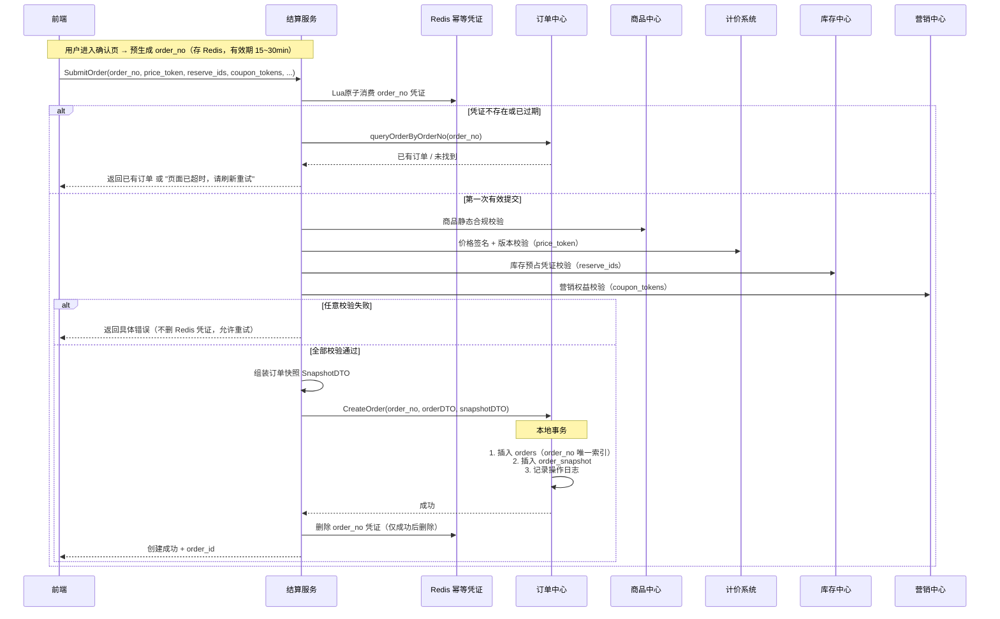

### 5.4 场景二：提交支付时序图

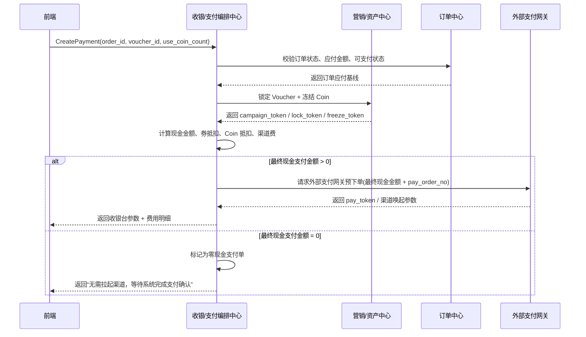

### 5.5 场景三：支付结果回调与订单编排时序图

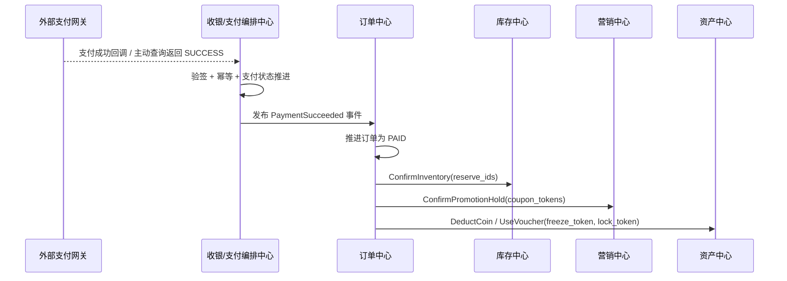

### 5.6 场景四：支付失败与超时回滚时序图

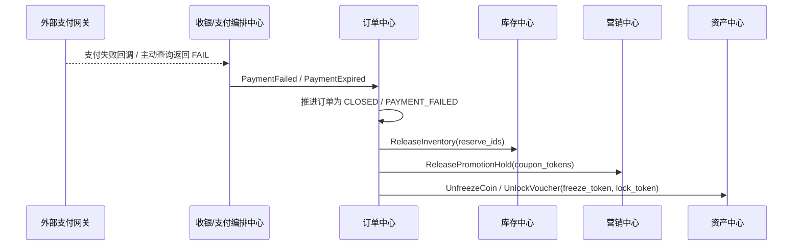

### 5.7 特殊场景：预售订单

预售订单的本质，不是“普通订单加一个活动标签”，而是**延迟履约 + 分阶段支付 + 长周期资源占用**。它和现货单最大的区别在于：交易事实可以先成立，但资源最终确认和履约发生在更晚的时间点。

#### 5.7.1 业务生命周期

一个典型的预售订单，通常会经历下面几个阶段：

- 预热期：用户可以浏览和加购，但还不能正式下单
- 定金期：用户支付定金，锁定购买资格
- 尾款期：活动切换到尾款支付窗口，用户补齐尾款
- 履约期：尾款支付成功后，订单才进入正常发货 / 履约流程
- 异常终止：定金支付后尾款超时、用户主动取消、活动终止

因此，预售订单不是一次支付完成全部交易，而是把“购买承诺”和“最终成交”拆成了两个时间点。

#### 5.7.2 核心模型

预售订单建议显式建模，而不是把逻辑散落在普通订单字段里拼凑：

- `order_type = PRESALE`
- `presale_end_time`：尾款支付截止时间
- `delivery_time`：预计发货时间
- `lock_deadline`：库存锁定截止时间

其中最关键的是“分阶段支付”模型。更推荐单独抽一层 `pay_stage` 或等价支付阶段表，而不是在 `pay_order_tab` 上硬塞一组定金 / 尾款字段。原因很简单：

- 每个阶段都可能有独立的支付流水 `trade_no`
- 退款时可能只退定金，或者只退尾款
- 财务对账更容易按阶段落账
- 后续即使出现三阶段支付，也不需要推翻原模型

#### 5.7.3 与其他服务的交互边界

预售单会把多个中心的责任拉得更长，因此边界必须先钉死：

- 商品中心：提供预售商品快照，尤其是定金金额、尾款金额、预计发货时间、活动承诺文案
- 营销中心：提供预售活动规则，如定金比例、尾款优惠、限购数量
- 库存中心：在定金支付成功后做长时间预占；在尾款支付成功后再转成最终 Confirm
- 消息中心：在尾款截止前做多轮提醒，例如提前 24 小时、3 小时、30 分钟

这里的设计重点是：

> 结算服务在定金阶段解决“资格锁定”，订单中心在尾款支付完成后才把这笔交易推进到真正可履约状态。

#### 5.7.4 预售链路的关键挑战

预售最大的风险，不在于普通创单，而在于它把资源和资金拉成了一个长周期博弈。

**挑战一：用户付了定金，但长时间不付尾款**

- 风险：库存被长时间占用，影响后续售卖
- 处理：库存中心使用长 TTL 预占；尾款超时后由订单中心通过 Outbox 异步 Cancel；必要时按规则扣除部分定金作为违约成本

**挑战二：尾款支付窗口集中爆发**

- 风险：大量用户在最后几小时同时补尾款，触发支付、库存 Confirm、营销结算的洪峰
- 处理：尾款支付仍然走普通支付主链路的幂等、防重、Outbox、Confirm 编排，不因为它是“第二阶段支付”就绕开主流程

**挑战三：退款复杂度更高**

- 风险：预售退款不再是简单整单退款，而可能区分定金退款、尾款退款、履约前退款
- 处理：退款模型增加 `refund_stage = DEPOSIT / FINAL` 一类字段，显式标记退款属于哪个支付阶段

#### 5.7.5 推荐的落地原则

预售场景最容易犯的错误，是把它当成“普通订单 + 两次付款”来实现。更稳妥的思路是：

- 把预售当成一种独立 `order_type`
- 把定金和尾款视为两个支付阶段
- 把库存看成“长预占 + 最终确认”的两段式资源状态
- 把尾款超时和活动终止视为标准 Saga Cancel 场景

一句话总结：

> 预售订单的核心，不是先收一笔钱，而是先锁定资格，再在更晚的时间点完成真正成交与履约。

### 5.8 特殊场景：0 元购订单

0 元购的本质，不是“没有支付所以更简单”，而是**营销驱动的超高风险低价订单**。它的目标通常是拉新、促活、带动搭售，但系统设计上反而要更谨慎，因为一旦风控、营销核销或库存确认做得不严，很容易直接形成资损。

#### 5.8.1 业务本质与核心模型

0 元购订单建议也显式建模，而不是混在普通订单里只靠金额判断：

- `order_type = ZERO_YUAN`
- `real_pay_amount`：实际支付金额，很多场景为 `0`
- `marketing_discount_amount`：营销补贴金额，给财务和活动归因使用
- `campaign_token`：营销中心返回的强凭证，后续用于核销和反查
- `risk_score / risk_level`：风控打分结果

这里要特别强调一个设计边界：

> 0 元购不是“没有成本”，只是用户不付钱，平台通过营销补贴替用户付款。

因此，订单里必须保留补贴金额和活动凭证，否则后续对账、活动归因、反作弊和财务核销都会变得很被动。

#### 5.8.2 是否一定要走支付网关

0 元购最常见的设计争议，是要不要经过支付网关。

推荐结论是：

- 如果用户仍需支付运费或其他附加费用，就必须走正常支付链路
- 如果商品、运费、附加费用全部为 `0`，可以跳过第三方支付网关

但即使跳过真实支付，也建议保留一笔 `pay_order_tab` 记录，原因包括：

- 用户订单列表和交易流水仍需要一条完整支付事实
- 财务和活动分析需要知道这笔单是“0 元成交”，不是“没有支付过程”
- 后续退款、活动冲正、对账也更容易统一模型

也就是说，0 元购可以**跳过外部支付渠道**，但不应该跳过系统内部的支付事实建模。

#### 5.8.3 库存、营销和风控的处理原则

0 元购最容易犯的错误，是把它当成“福利单”，然后在库存和营销链路上放松规则。更稳妥的做法是：

- 库存仍然走正常的 `Reserve -> Confirm / Cancel`
- 营销权益建议在订单创建成功后异步核销，而不是在主请求里同步硬卡死
- 风控必须前置，并且允许在订单创建后继续异步二次审查

为什么营销核销更推荐异步？

- 同步核销会把营销中心稳定性直接传染给下单主链路
- 0 元购经常是活动洪峰场景，营销系统更容易成为热点瓶颈
- 订单事实先落下，再通过 Outbox 异步核销，更符合本章的最终一致性设计

#### 5.8.4 风控是 0 元购的第一优先级

0 元购的最大风险，不是支付失败，而是被羊毛党刷穿。推荐采用三层风控：

**事前风控**

- 用户画像
- 设备指纹
- 历史 0 元购记录
- IP / 设备 / 账号限频

**事中风控**

- 营销中心限购规则
- 实时风险打分
- 对高风险请求直接拒绝创单

**事后风控**

- 订单创建成功后做异步复审
- 对异常订单做人工审核、活动回收或后续履约拦截

典型规则包括：

- 单用户 / 单设备每日限购 N 单
- 新用户 + 老设备组合高风险
- 短时间内同一商品出现大量 0 元单，直接熔断活动入口

#### 5.8.5 0 元购的共性架构要求

虽然预售和 0 元购看起来很不一样，但它们都在提醒我们一件事：

> 不要把所有业务特性都塞进一个大状态机，而要通过 `order_type + 扩展字段 + 异步编排` 来承接复杂场景。

因此，这类特殊订单更适合统一遵守下面几条原则：

- 基础交易状态仍保持简单：`PENDING -> PAID -> FULFILLING -> COMPLETED`
- 业务差异通过 `order_type` 和专属扩展字段表达
- 营销核销、库存确认、风控补偿都依赖 Outbox 和重试机制保证最终一致性
- 关键峰值场景仍要靠 Redis + 幂等 + 唯一索引兜底

一句话总结：

> 0 元购不是“省掉支付就结束了”，而是把支付简化成了营销补贴问题，同时把风控和最终一致性的要求提高到了更高优先级。

### 5.9 结算服务中的“预占凭证 + 本地事务 + 异步确认”Saga 编排

在标准电商创单链路里，结算服务最核心的一点，不是自己去做最终扣减，而是把整条交易链路组织成：

- **创单前只做预占（Reserve）**
- **创单成功后保存订单事实**
- **支付成功后再做确认（Confirm）**
- **创单失败、支付失败、超时取消后再做取消（Cancel）**

这本质上是一种非常典型的 **Saga 编排模式**。它的核心思想是：

> **所有下游都采用“预占（Reserve）+ 确认（Confirm）/ 取消（Cancel）”模式；结算服务只做预占校验，不做最终扣减；订单中心创建订单成功后，作为交易事实协调点，再通过本地消息表 / Outbox 异步完成最终确认或取消。**

这样设计的原因很直接：

- 结算服务面对的是商品、库存、营销、价格等多个下游域；
- 如果在提交订单时就要求所有域同步做最终扣减，主链路会非常重；
- 一旦订单落库失败，还会面临极其难看的跨域回滚问题；
- 因此更稳妥的工业级做法，是让每个下游先给出一个“可确认、可取消”的资源凭证。

这个模式通常会落成三段：

| 阶段 | 动作 | 目标 |
| --- | --- | --- |
| 创单前 | `Reserve` | 预占库存、预占权益、冻结报价结果，拿到 `reserve_ids / coupon_tokens / price_token` |
| 支付成功后 | `Confirm` | 正式确认库存消耗、权益消耗，把预占资源转成成交事实 |
| 失败或取消后 | `Cancel` | 释放库存、释放权益、失效价格凭证，避免僵尸资源 |

因此，结算服务在创单阶段的职责不是：

- 直接扣库存；
- 直接核销券；
- 直接把营销权益变成最终消耗。

而是：

- 收集并校验这些预占凭证是否有效；
- 把它们和订单事实绑定在一起；
- 在订单创建成功后，把后续确认责任交给订单中心；
- 通过本地消息表 / Outbox，把“确认”或“取消”动作异步可靠地下发给库存中心和营销中心。

一个更贴近落地的职责分工可以概括为：

| 系统 | 在 Saga 中的职责 |
| --- | --- |
| 结算服务 | 组织预占、校验凭证、提交创单请求 |
| 订单中心 | 落交易事实，成为后续确认 / 取消的协调点 |
| 库存中心 | 提供 `Reserve / Confirm / Cancel` 三段式库存能力 |
| 营销中心 | 提供权益占用、权益确认、权益释放三段式能力 |
| 支付中心 | 提供支付事实，不直接操作库存和营销资源 |

这里尤其要强调一个经常被问到的点：

> **为什么创单时只做预占，支付成功后再 Confirm？**

因为创单阶段的核心目标是：

- 快速、安全地把用户带到收银台；
- 让订单中心先拿到一笔清晰、可解释的交易事实；
- 把真正不可逆的资源消耗动作，推迟到“支付成功”这个更强的业务事实之后。

所以本章推荐的主流方案就是：

> **“预占凭证 + 本地事务落订单 + Outbox 异步确认 / 取消”的 Saga 模式。**

也就是说：

- **创单时做资源预占**
- **支付成功后 Confirm 库存和权益**
- **创单失败、支付失败或超时后 Cancel 资源**
- **通过本地消息表 / Outbox 保证最终一致性**

它的优势在于：

- 主请求足够轻，不需要 XA / Seata 这种重型运行时强一致；
- 下游域边界清楚，各自只负责自己的资源预占、确认和释放；
- 即使出现网络抖动或部分失败，也可以依赖消息补偿和延迟反查完成自愈。

#### 5.9.1 为什么核心交易长事务一定要做方案选型

“用户点击下单 -> 校验商品 -> 预占库存 -> 占用优惠 -> 请求支付” 这条链路，本质上是一个跨订单、库存、营销、支付多个服务的分布式长事务。单机时代的本地事务在这里已经失效，系统必须在下面几个目标之间做权衡：

- 数据一致性
- 高并发吞吐
- 外部支付网关可接入性
- 失败后的补偿成本

因此，创单链路不能只问“能不能保证一致”，而要问：

> **在高并发电商场景下，系统要用什么代价去换一致性。**

#### 5.9.2 四种典型方案的核心差异

**方案一：2PC / XA**

2PC 依赖全局协调器和底层数据库 XA 协议。所有参与方先进入 `Prepare`，锁住本地资源但不提交；只有全部成功后，协调器才下发 `Commit`。

它的问题非常直接：

- 底层数据库锁会跟着整个长事务一起悬挂
- 高并发下吞吐量会被严重拖死
- 外部支付网关根本不支持 XA 协议

所以在电商创单支付链路里，2PC 基本等于一条走不通的死路。

**方案二：经典 Saga**

经典 Saga 把长事务拆成一串本地子事务，每个服务先执行正向动作并立刻提交；如果后续失败，再逆向执行补偿。

它的优点是吞吐高、没有数据库全局锁，但缺点也很致命：

- 缺少隔离性，容易出现“先真扣库存，后又补回来”的僵尸占位
- 容易被网络乱序拖进悬挂、空补偿和重复补偿问题
- 防悬挂、防乱序的代码会越来越重

**方案三：标准 TCC**

TCC 把两阶段提交抬升到业务层，要求每个下游都实现：

- `Try`
- `Confirm`
- `Cancel`

库存中心在 `Try` 阶段不是直接扣库存，而是冻结一部分资源；支付成功后走 `Confirm`，失败时走 `Cancel`。

它的优点是隔离性很强，特别适合资金类、账户类系统；但代价也很高：

- 每个下游都要手写三套接口和状态机
- 编排器一般依赖同步 RPC，链路长时容易拖垮线程池
- 对研发规范和团队成熟度要求非常高

**方案四：工业级改良 Saga**

这也是本章一直在推荐的方案：把 TCC 的“预留资源思想”和 Saga 的“异步最终一致性”结合起来。

它的典型形态就是：

- 创单时只做 `Reserve`
- 订单中心先落本地交易事实
- 支付成功后再异步 `Confirm`
- 支付失败、超时关闭后异步 `Cancel`
- 整个过程依赖 `Outbox + Worker + 幂等状态机`

这也是为什么本章一直强调：

> **“预占凭证 + 本地事务落订单 + Outbox 异步确认 / 取消”** 才是标准电商创单支付链路的主流工业实现。

#### 5.9.3 四种方案综合对比

| 对比维度 | 2PC / XA | 经典 Saga | 标准 TCC | 改良版 Saga（推荐） |
| --- | --- | --- | --- | --- |
| 一致性级别 | 强一致 | 最终一致 | 业务层强一致 | 最终一致 |
| 并发吞吐 | 极低 | 高 | 中 | 高 |
| 资源隔离性 | 高，但依赖数据库锁 | 差 | 高 | 高 |
| 对外部支付友好度 | 极差 | 较好 | 一般 | 极好 |
| 开发成本 | 中 | 中 | 极高 | 中 |
| 高并发电商适配度 | 很差 | 一般 | 有限适配 | 最优 |

把它翻译成更贴近业务的话就是：

- 2PC 太重，锁不起
- 经典 Saga 太莽，容易伤库存和权益
- 标准 TCC 太贵，不适合所有链路都重做三段式
- 改良版 Saga 在复杂度、性能和一致性之间最平衡

#### 5.9.4 本章的选型结论

因此，对标准的电商创单支付链路，推荐结论非常明确：

- **坚决不选 2PC / XA**
- **不建议在核心交易主链路直接使用经典 Saga**
- **只有金融级资管、账务划转这类场景才值得咬牙做标准 TCC**
- **普通电商创单支付链路优先使用改良版 Saga**

这也是为什么结算服务在本章里的角色不是“硬拉所有服务做一次全局提交”，而是：

- 组织预占
- 快速确立订单事实
- 把最终确认和取消交给订单中心异步编排

一句话总结：

> **在电商结算场景中，我们追求的不是运行时强一致，而是“资源先预占、订单先落地、后续异步确认、失败可靠补偿”的高吞吐最终一致。**

#### 5.9.5 落地建议

如果团队自己维护状态机和消息补偿能力，改良版 Saga 完全可以直接落地为：

- 下游三段式接口：`Reserve / Confirm / Cancel`
- 订单中心本地事务：订单事实 + `outbox`
- Worker 异步扫描 + 幂等重试

如果后续链路继续拉长，比如：

- 跨境履约
- 多段商旅履约
- 超长时间预约 / 改签 / 多次补偿

那么也可以再演进到更成熟的工作流 / Saga 引擎，例如：

- Seata 的 Saga 模式
- Temporal / Cadence 这一类代码化工作流引擎

但无论是否引入框架，原则都不变：

> **先把交易链路拆成可预占、可确认、可取消的资源状态机，再谈框架选型。**

---

## 6. 履约、发货、核销与售后闭环

### 6.1 场景画像

订单支付成功只是用户交易旅程的中点，不是终点。后面的系统挑战包括：

- 实物商品怎么发货、签收、退货退款。
- 券码商品怎么发码、核销、退款。
- 酒旅、到店和预约型商品怎么预约、履约、取消和退款。

这里最重要的统一原则是：

> **订单之后，系统不再回头依赖最新商品真相，而是基于订单快照和履约事实继续推进。**

### 6.2 关键技术点

履约、发码、核销、退款、库存回补、权益回补，看起来像很多独立动作，但真正落地时不能让订单中心自己直接编排所有下游，否则它会再次膨胀成“大管家”。

因此，第 6 节建议显式引入一个统一角色：

> **履约与售后服务**

它的职责不是拥有订单主状态，而是承接支付之后的流程编排：

- 组织履约创建
- 接收外部履约回调
- 路由发码、核销、预约等不同履约分支
- 编排退款、库存回补、权益回补
- 把这些结果统一翻译成订单中心可消费的标准化事实

这套设计里需要先钉死 5 个原则：

1. **订单中心拥有交易主事实和用户可见订单状态。**
   履约与售后服务只负责组织流程，不直接决定最终订单展示语义。

2. **履约结果、核销结果、退款结果都只是事实输入。**
   外部仓配、发码、核销、退款系统只负责回传“发生了什么”，状态推进仍由订单中心完成。

3. **售后必须基于订单快照、支付事实和履约事实。**
   不能在退款时重新查当前商品价格、当前详情页规则或当前库存展示。

4. **实物、券码、预约型商品虽然路径不同，但必须复用同一套幂等、回调归一和补偿机制。**

5. **外部回调先进入履约与售后服务，再由订单中心消费标准化事件。**
   不让仓配、核销、退款系统直接改订单主状态。

可以把它和第 5 节做一个镜像理解：

- 结算服务解决“如何生成一笔订单”
- 履约与售后服务解决“订单支付之后如何被执行、被核销、被退款、被回补”

### 6.3 场景一：履约发起时序图

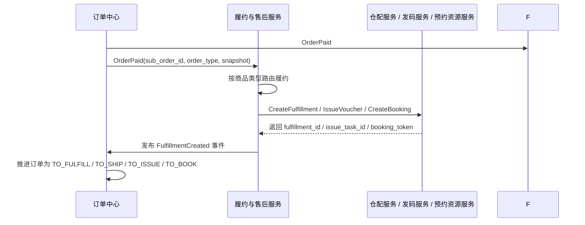

### 6.4 场景二：履约结果回调与订单编排时序图

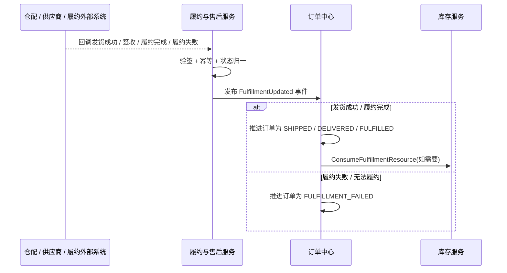

### 6.5 场景三：券码发码与核销时序图

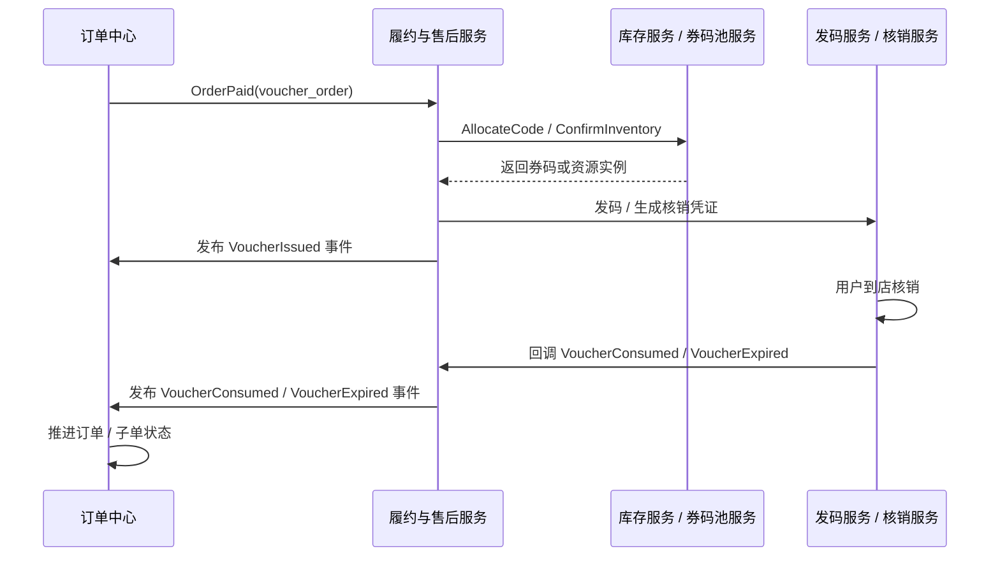

### 6.6 场景四：售后退款与库存 / 权益回补时序图

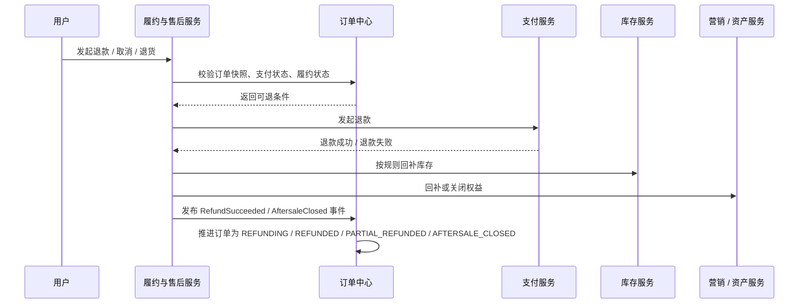

### 6.7 特殊场景：预约 / 酒旅 / 到店履约

这几类场景看起来不像传统“发货”，但它们并不是独立订单系统，而只是履约与售后服务下的不同履约分支。

它们的共同点是：

- 都不再依赖最新商品真相
- 都依赖订单快照和支付后的履约事实推进
- 都需要把外部世界的状态翻译成订单中心可理解的标准化事件

其中最典型的事实包括：

- 预约 / 酒旅：
  - `BookingConfirmed`
  - `CheckedIn`
  - `CheckedOut`
  - `BookingCanceled`
- 到店 / 券码：
  - `VoucherIssued`
  - `VoucherConsumed`
  - `VoucherExpired`

也就是说，履约与售后服务本质上承担了一个“协议翻译层”的角色：

- 下游系统说的是“已发码”“已预约”“已入住”“已核销”
- 订单中心认的是“这笔订单现在是否已履约、是否可退款、是否已完结”

### 6.8 履约与售后服务的统一架构原则

第 6 节之所以也需要一个明确的编排角色，原因和第 5 节是对称的：

- 第 5 节有结算服务 / 支付编排服务，解决“怎么生成一笔订单”
- 第 6 节有履约与售后服务，解决“订单支付之后如何被执行、核销、退款、回补”

如果没有这一层，订单中心就必须直接对接：

- 仓配
- 发码
- 核销
- 预约资源
- 退款
- 库存回补
- 权益回补

这样它会再次膨胀成“大管家”，把整个后交易阶段的复杂性都吸进去。

因此本章的统一结论是：

- 订单中心拥有订单主事实和用户可见订单状态
- 履约与售后服务拥有支付后的流程编排职责
- 下游仓配、发码、核销、退款、回补服务只提供事实，不直接拥有订单主状态

最后用一句话收口：

> 结算服务解决“如何生成订单”，履约与售后服务解决“订单支付之后如何被执行、被核销、被退款、被回补”。

---

## 7. 典型业务场景串讲

### 7.1 实物电商主链路

用户搜索手机 → 看详情页 → 加购物车 → 进入结算页试算和预占 → 创建订单 → 支付成功 → 仓配发货 → 签收完成 → 可发起退货退款。

这一链路的核心风险在于：

- 列表页展示价与下单价不一致。
- 支付失败后库存未释放。
- 发货后退款和库存回补规则错乱。

### 7.2 券码 / 到店商品主链路

用户搜索餐饮券或景区票 → 详情页看使用规则 → 结算页试算与预占 → 支付成功 → 发码 → 到店核销 → 核销完成 → 按规则退款或不可退。

这一链路的核心风险在于：

- 发空码。
- 券码核销与订单状态不一致。
- 退款后券码或权益没有正确回收。

### 7.3 酒旅 / 预约型商品主链路

用户查看房型、日期、价格日历 → 结算页锁房 / 预占 → 创建订单 → 支付成功 → 预约 / 确认单生成 → 入住 / 出行 / 使用完成 → 按取消规则退款。

这一链路的核心风险在于：

- 详情页看见的日期价与下单时的真实价格不一致。
- 预约资源已变动但订单仍按旧状态继续推进。
- 售后取消没有依据订单时的规则解释。

---

## 8. 面试答辩与工程总结

如果面试官问“C 端交易链路最难的地方是什么”，比较好的回答不是背一串系统名词，而是先给出总心智：

> C 端系统的难点，不是把搜索、购物车、订单、支付这些服务拆出来，而是让用户在整条交易旅程里既感受到响应足够快，又始终不会用旧价格、旧库存、旧规则成功交易，更不会在支付后、履约后和售后阶段失去解释依据。

这章建议记住 6 句话：

1. 搜索结果页是弱一致投影，详情页是交易前解释，创单时再做强校验。
2. 购物车保存的是意愿，不是资源占用。
3. 结算页是一次短生命周期的 Saga，负责把价格、库存、营销和地址收敛成可提交交易。
4. 订单是交易事实，不是“重新查商品”的入口。
5. 支付系统提供资金事实，订单系统自己推进状态。
6. 订单之后，任何履约和售后都优先基于快照和履约事实解释。

当你能把这 6 句话和上面的时序图、快照、预占、幂等、回补策略串起来时，这一章就不只是一个“电商流程介绍”，而是一套真正可落地、可答辩、可治理的 C 端全生命周期设计。
