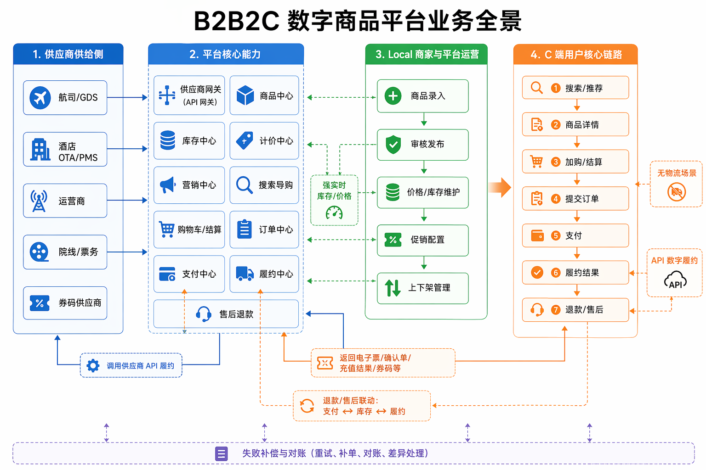
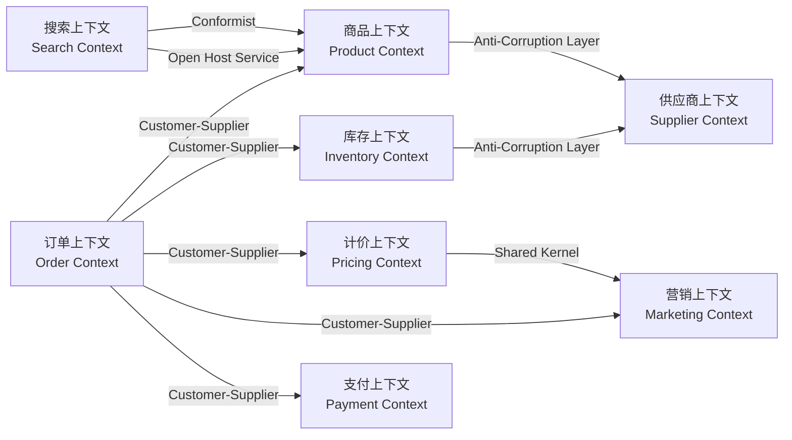
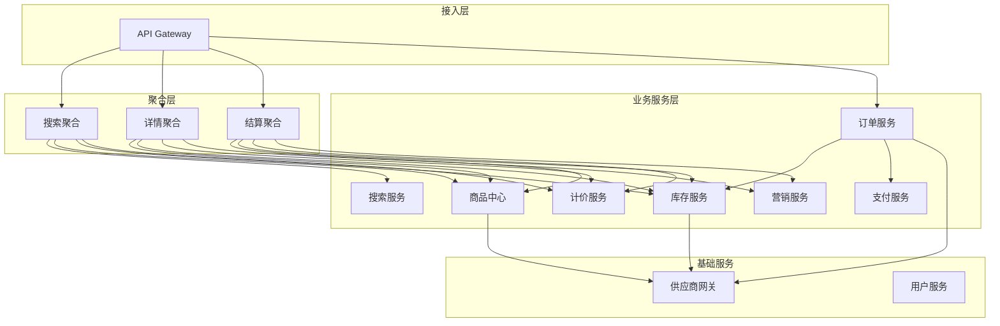

# 32.1-32.3 业务背景、品类模型与边界设计

## 32.1 项目背景与业务约束（Business Context）

本章讨论的是一个中大型 B2B2C 聚合电商平台。它不是传统实物电商，也不是单一供应商商城，而是连接多类外部供应商与自营虚拟商品的平台型系统。平台侧负责商品组织、搜索导购、价格试算、营销、下单、支付和履约编排；供应商侧负责实际资源确认与数字履约。

这个背景很重要。因为系统的核心复杂度不来自物流仓配，而来自**多品类、多供应商、强实时交易和不一致外部接口**的叠加：机票和酒店要求零超卖，充值和礼品卡允许失败后补偿，电子券又依赖本地券码池发放。不同品类背后的库存、价格、履约模型完全不同，直接决定后续的领域划分、服务边界和一致性策略。

### 32.1.1 业务定位

平台采用“聚合供应商 + 自营虚拟商品”的 B2B2C 模式，连接航司/GDS、酒店 OTA/PMS、运营商、院线、券码供应商等外部系统，同时保留部分自营业务能力。

**业务范围**：

| 业务类型 | 典型品类 | 履约方式 | 关键特征 |
|---------|---------|---------|---------|
| **供应商聚合** | 机票、酒店、充值、电影票 | 调用供应商 API 完成出票、确认、充值、锁座 | 接口差异大，实时性和可用性依赖外部系统 |
| **平台自营** | 优惠券、线下券、礼品卡 | 平台本地发券码或调用内部发码系统 | 可控性更强，但需要券码池、核销和过期管理 |
| **数字履约** | 所有品类 | API 调用、异步确认、电子凭证发放 | 无物流链路，但交易状态和补偿链路更复杂 |

**业务全景图**：



这张图展示了平台业务链路的四个关键视角：供应商供给侧负责资源供给与数字履约；平台核心能力负责商品、库存、价格、营销、订单、支付、履约和售后编排；本地商家与平台运营负责商品录入、审核、维护、促销和上下架；C 端用户则围绕搜索导购、结算下单、支付、履约结果和退款售后形成完整交易闭环。

本平台的一个关键前提是**无物流场景**。所有商品都是虚拟数字商品，履约不经过仓库、分拣、配送，而是通过 API 调用、电子票、确认单、充值结果或券码完成。因此，本章不会讨论仓配、物流轨迹、签收等实物电商问题，而是聚焦数字商品平台中更核心的四类问题：

1. **供应商差异**：50+ 外部供应商接口形态不一致，可能同时存在实时查询、定时同步和事件推送。
2. **库存差异**：机票/酒店依赖供应商实时库存，电子券依赖本地券码池，充值类商品近似无限库存。
3. **价格差异**：机票动态定价、酒店日历价、充值固定面额、优惠券固定折扣价并存。
4. **履约差异**：有的品类同步返回结果，有的品类需要异步确认，有的品类需要本地分配唯一券码。

### 32.1.2 业务与技术目标

平台的核心目标可以概括为四句话：

1. **交易链路要稳**：订单创建、支付、履约不能丢数据，核心链路故障要快速恢复。
2. **导购链路要快**：搜索、详情、结算要在高并发下保持低延迟，并允许适度降级。
3. **供给运营要可控**：商品上架、运营编辑、供应商同步、促销配置和上下架要有明确流程、审核机制和可追溯记录。
4. **品类接入要快**：新增品类和供应商不能反复改造主流程。
5. **团队协作要顺**：服务边界、API 契约和事件契约必须足够清晰，支撑多人多团队并行开发。

**性能目标**：

| 指标 | 正常值 | 大促峰值 | 设计含义 |
|------|--------|---------|---------|
| 日订单量 | 200 万 | 1000 万 | 交易链路需要支持 5 倍峰值弹性 |
| 搜索 QPS | 3000 | 15000 | 搜索与聚合层需要缓存、批量查询和降级能力 |
| 详情页 QPS | 5000 | 25000 | 商品、库存、计价、营销服务需要并发编排 |
| 下单 QPS | 1000 | 5000 | 库存预占、价格校验、订单写入必须控制事务边界 |
| P99 延迟 | 200ms | 500ms | 大促期间允许部分非核心能力降级 |

**可用性目标**：

| 目标 | 要求 | 说明 |
|------|------|------|
| 核心链路 SLA | 99.95% | 覆盖订单创建、支付、履约等交易动作 |
| 搜索/详情 SLA | 99.9% | 可通过缓存、兜底价格、隐藏营销信息等方式降级 |
| RTO | < 5 分钟 | 故障后需要在 5 分钟内恢复核心能力 |
| RPO | 0 | 核心交易数据不允许丢失 |

**扩展性目标**：

| 扩展场景 | 目标 | 关键依赖 |
|---------|------|---------|
| 新品类接入 | < 2 周 | 品类策略、库存策略、履约策略可插拔 |
| 新供应商接入 | < 1 周 | 供应商适配器、防腐层、统一错误模型 |
| 新营销玩法 | < 3 天 | 规则引擎、计价输入标准化、活动配置平台 |

### 32.1.3 本章的核心架构命题

在上述业务背景下，架构设计的难点不是“要不要拆微服务”，而是**如何在品类差异、供应商不确定性和交易一致性之间找到可演进的边界**。

本章后续会围绕四个问题展开：

1. **如何理解品类差异**：机票、酒店、充值、电子券为什么不能用同一套库存和履约模型。
2. **如何划分系统边界**：订单、商品、库存、计价、营销、支付、供应商网关各自拥有怎样的数据和职责。
3. **如何组织交易链路**：搜索、详情、结算、下单、支付如何在性能与准确性之间取舍。
4. **如何沉淀架构决策**：通过 ADR 记录关键取舍，避免团队在同一问题上反复争论。

---

## 32.2 品类业务模型分析（Business Architecture）

不同品类的业务模型存在显著差异，直接影响架构设计决策。理解这些差异是系统设计的基础。

### 32.2.1 机票业务模型

**业务特点**：
```text
• 库存模型：实时库存（供应商侧），强依赖供应商实时查询
• 价格模型：动态定价，实时波动（可能秒级变化）
• SKU复杂度：极高（航司+航班号+舱位+日期+...组合）
• 库存单位：座位数量（不可超卖）
• 扣减时机：创单前向供应商实时确认并占座 → 创单待支付 → 支付确认 → 出票
• 履约流程：查询报价/库存 → 占座/预订 → 创建订单 → 支付 → 出票（调用GDS/供应商API）→ 发送电子票
```

**架构影响**：
- ✓ 必须支持实时库存查询（高频调用供应商API）
- ✓ 价格快照必须精确到秒级，防止价格变动纠纷
- ✓ 超卖零容忍 → 创建订单前必须完成供应商侧占座/预订
- ✓ 供应商故障需快速切换到备用供应商
- ✓ 订单状态复杂（待出票、出票中、出票失败、已出票）

**技术要点**：
```go
// 机票库存查询策略
type FlightStockStrategy struct {
    supplierClient rpc.SupplierClient
    redis          redis.Client
    config         *FlightConfig
}

func (s *FlightStockStrategy) CheckStock(ctx context.Context, req *StockRequest) (*StockResponse, error) {
    // Step 1: 尝试从Redis获取缓存（TTL=5分钟）
    cacheKey := fmt.Sprintf("flight:stock:%s:%s", req.FlightNo, req.Date)
    cached, err := s.redis.Get(ctx, cacheKey).Result()
    if err == nil {
        return parseStockFromCache(cached), nil
    }
    
    // Step 2: 缓存未命中，调用供应商实时查询
    ctx, cancel := context.WithTimeout(ctx, 800*time.Millisecond)  // 800ms超时
    defer cancel()
    
    stock, err := s.supplierClient.QueryStock(ctx, req)
    if err != nil {
        // 供应商故障，切换备用供应商
        return s.fallbackToSecondarySupplier(ctx, req)
    }
    
    // Step 3: 缓存结果（短TTL，机票价格变化快）
    s.redis.Set(ctx, cacheKey, marshal(stock), 5*time.Minute)
    
    return stock, nil
}
```

**监控指标**：
- 供应商调用超时率：< 1%
- 缓存命中率：> 70%
- 出票成功率：> 99.5%
- 出票平均时长：< 30秒

### 32.2.2 酒店业务模型

**业务特点**：
```text
• 库存模型：房间数量（按日期维度管理）
• 价格模型：日历房价（每个日期不同价格）
• SKU复杂度：高（酒店ID+房型+日期范围+早餐+...）
• 库存单位：房间数/间夜数
• 扣减时机：下单预占 → 支付确认 → 供应商确认
• 履约流程：下单 → 支付 → 提交供应商 → 确认单 → 入住凭证
```

**架构影响**：
- ✓ 支持日期范围查询（check-in到check-out）
- ✓ 日历价格存储（每个日期一条记录）
- ✓ 库存按日期维度管理（某天无房不影响其他日期）
- ✓ 支持"担保"模式（先占房，入住时结算）
- ✓ 需处理"确认单延迟"（供应商异步确认）

**数据模型**：

```go
// 酒店日历价格表（宽表存储）
type HotelCalendarPrice struct {
    HotelID      int64     `gorm:"primaryKey"`
    RoomTypeID   int64     `gorm:"primaryKey"`
    Date         time.Time `gorm:"primaryKey;index"`  // 日期维度
    BasePrice    int64     // 基础价格（分）
    WeekendPrice int64     // 周末价格
    Stock        int       // 当日库存
    Status       string    // 可售状态（AVAILABLE/SOLD_OUT/CLOSED）
}

// 查询日期范围内的价格与库存
func (r *HotelRepo) GetCalendarPrice(hotelID, roomTypeID int64, checkIn, checkOut time.Time) ([]*HotelCalendarPrice, error) {
    var prices []*HotelCalendarPrice
    err := r.db.Where("hotel_id = ? AND room_type_id = ? AND date >= ? AND date < ?",
        hotelID, roomTypeID, checkIn, checkOut).
        Order("date ASC").
        Find(&prices).Error
    return prices, err
}
```

**缓存策略**：
- 热门酒店：30分钟缓存
- 长尾酒店：1小时缓存
- 价格变更：主动失效缓存

### 32.2.3 充值业务模型

**业务特点**：
```text
• 库存模型：无限库存（供应商侧无限制）
• 价格模型：固定面额（10元、50元、100元）
• SKU复杂度：低（运营商+面额）
• 库存单位：无限
• 扣减时机：支付后
• 履约流程：下单 → 支付 → 调用供应商API → 充值成功/失败
```

**架构影响**：
- ✓ 无需库存管理（库存类型=无限）
- ✓ 价格简单（基础价+平台服务费）
- ✓ 超卖可接受（事后补偿）
- ✓ 供应商调用简单（同步API，3秒内返回）
- ✓ 失败重试友好（幂等性强）

**技术要点**：
```go
// 充值库存策略（无限库存）
type RechargeStockStrategy struct{}

func (s *RechargeStockStrategy) CheckStock(ctx context.Context, req *StockRequest) (*StockResponse, error) {
    // 充值类商品无需检查库存，直接返回"可售"
    return &StockResponse{
        Available: true,
        Quantity:  999999,  // 虚拟无限库存
        Message:   "充值类商品，库存充足",
    }, nil
}

func (s *RechargeStockStrategy) Reserve(ctx context.Context, req *ReserveRequest) (*ReserveResponse, error) {
    // 充值类商品无需预占，直接返回成功
    return &ReserveResponse{
        ReserveID: "",  // 无预占ID
        Success:   true,
    }, nil
}
```

### 32.2.4 电子券业务模型

**业务特点**：
```text
• 库存模型：固定库存（券码池）
• 价格模型：固定折扣价
• SKU复杂度：中（商户+门店+商品+...）
• 库存单位：券码（一券一码）
• 扣减时机：支付后
• 履约流程：下单 → 支付 → 发券码 → 到店核销
```

**架构影响**：
- ✓ 券码池管理（预生成10万个券码）
- ✓ 券码发放（支付后随机分配）
- ✓ 核销系统（商户扫码核销）
- ✓ 过期管理（券有效期7天-180天）
- ✓ 退款逻辑（未核销可退，已核销不可退）

**技术要点**：
```go
// 券码池管理：MySQL 是权威，Redis LIST 只缓存 code_id
type VoucherCodePool struct {
    redis redis.Client
    repo  CodePoolRepository
}

func (p *VoucherCodePool) ReserveCode(ctx context.Context, batchID string, orderID int64) (int64, error) {
    for attempt := 0; attempt < 3; attempt++ {
        // Step 1: Redis LIST 只取 code_id，不取明文券码
        poolKey := fmt.Sprintf("inventory:code:pool:%s:%d", batchID, shard(batchID))
        codeID, err := p.redis.LPop(ctx, poolKey).Int64()
        if err == redis.Nil {
            return 0, errors.New("券码池为空")
        }
        if err != nil {
            return 0, err
        }

        // Step 2: MySQL CAS 才是锁码成功的判定
        // UPDATE inventory_code_pool_XX
        // SET status='BOOKING', order_id=?, booked_at=NOW()
        // WHERE code_id=? AND status='AVAILABLE'
        ok, err := p.repo.BookCode(ctx, codeID, orderID)
        if err != nil {
            return 0, err
        }
        if ok {
            return codeID, nil
        }
        // Redis 中的陈旧 code_id，丢弃后继续取下一个。
    }

    return 0, errors.New("券码池热队列需要回填")
}
```

### 32.2.5 差异化设计策略

通过上述品类分析，我们提炼出三个核心设计维度：

**维度1：库存管理类型**

| 类型 | 典型品类 | 库存来源 | 预占策略 |
|------|---------|---------|---------|
| **实时库存** | 机票、酒店、电影票 | 供应商实时查询 | 创单前确认资源，订单超时释放 |
| **池化库存** | 优惠券、礼品卡 | 平台自有（券码池） | 支付后扣减 |
| **无限库存** | 充值、SaaS服务 | 无库存概念 | 无需预占 |

**维度2：价格模型**

| 类型 | 典型品类 | 缓存策略 | 快照策略 |
|------|---------|---------|---------|
| **动态定价** | 机票 | 5分钟TTL | 秒级快照 |
| **日历定价** | 酒店 | 30分钟TTL | 日期维度快照 |
| **固定定价** | 充值、礼品卡 | 1小时TTL | 简单快照 |

**维度3：履约模式**

| 类型 | 典型品类 | 调用方式 | 失败处理 |
|------|---------|---------|---------|
| **同步履约** | 充值 | 同步API（3秒超时） | 立即重试3次 |
| **异步履约** | 机票、酒店 | 异步轮询（30秒/次） | 补偿任务 |
| **券码发放** | 优惠券 | 本地分配（无外部调用） | 券码池补充 |

**统一抽象**：

```go
// 品类策略接口（策略模式）
type CategoryStrategy interface {
    // 库存检查
    CheckStock(ctx context.Context, req *StockRequest) (*StockResponse, error)
    // 库存预占
    ReserveStock(ctx context.Context, req *ReserveRequest) (*ReserveResponse, error)
    // 价格计算
    CalculatePrice(ctx context.Context, req *PriceRequest) (*PriceResponse, error)
    // 订单履约
    Fulfill(ctx context.Context, order *Order) (*FulfillResult, error)
}

// 策略工厂（根据品类选择策略）
type CategoryStrategyFactory struct {
    strategies map[CategoryType]CategoryStrategy
}

func (f *CategoryStrategyFactory) GetStrategy(categoryType CategoryType) CategoryStrategy {
    return f.strategies[categoryType]
}
```

**设计原则**：
1. **策略模式**：每个品类一个策略实现，避免 if-else 地狱
2. **适配器模式**：统一供应商接口差异，降低耦合
3. **模板方法**：下单流程统一，具体步骤由策略实现
4. **可扩展性**：新增品类只需新增策略，不影响主流程

---

## 32.3 DDD战略设计与系统边界（Application Architecture - 设计过程）

基于32.2的品类业务分析，本节展示如何运用DDD战略设计方法，从业务领域识别限界上下文、划分系统边界、设计服务间集成方式，最终形成32.4的整体架构全貌。

### 32.3.1 限界上下文识别

**限界上下文是DDD战略设计的核心概念**，它定义了一个模型的适用边界。本系统通过事件风暴识别出12个核心限界上下文。

**识别过程**（事件风暴Workshop）：

```text
第1步：领域事件识别（橙色便签）
• OrderCreated（订单创建）
• ProductOnShelf（商品上架）
• StockReserved（库存预占）
• PaymentPaid（支付成功）
• PromotionApplied（促销应用）
...

第2步：聚合命令（蓝色便签）
• CreateOrder（创建订单）
• ReserveStock（预占库存）
• CalculatePrice（计算价格）
• ApplyPromotion（应用促销）
...

第3步：聚合实体（黄色便签）
• Order（订单）
• Product（商品）
• Stock（库存）
• Payment（支付）
• Promotion（促销）
...

第4步：限界上下文识别（用绳子圈起相关的实体/命令/事件）
• 订单上下文：Order + CreateOrder + OrderCreated
• 商品上下文：Product + OnShelfProduct + ProductOnShelf
• 库存上下文：Stock + ReserveStock + StockReserved
...
```

**识别出的12个限界上下文**：

| 限界上下文 | 核心聚合根 | 核心职责 | 数据所有权 |
|---------|---------|---------|-----------|
| **订单上下文** | Order | 订单创建、状态机、履约 | orders、order_items |
| **商品上下文** | Product | 商品信息、类目、属性 | products、categories |
| **库存上下文** | Stock | 库存管理、预占、扣减 | stocks、stock_logs |
| **计价上下文** | Price | 价格计算、试算、快照 | price_snapshots |
| **营销上下文** | Promotion | 营销规则、优惠券、活动 | promotions、coupons |
| **支付上下文** | Payment | 支付、退款、对账 | payments、refunds |
| **搜索上下文** | ProductIndex | 商品搜索、筛选、排序 | ES索引 |
| **用户上下文** | User | 用户信息、登录、权限 | users、roles |
| **供应商上下文** | Supplier | 供应商对接、适配、熔断 | suppliers、supplier_products |
| **购物车上下文** | Cart | 购物车管理、合并 | carts |
| **评价上下文** | Review | 用户评价、晒单 | reviews |
| **消息上下文** | Notification | 消息通知、推送 | notifications |

**为什么这样划分？**

1. **订单与商品分离**：
   - 订单关注"交易流程"（下单、支付、履约）
   - 商品关注"商品信息"（SPU/SKU、类目、属性）
   - 分离原因：变化速度不同（订单频繁变更，商品相对稳定）

2. **库存独立**：
   - 库存是"资源"，订单/商品都依赖它
   - 库存有独立的生命周期（预占 → 扣减 → 释放）
   - 独立原因：单一职责，避免库存逻辑分散

3. **计价独立**：
   - 价格计算涉及多个维度（基础价、营销、优惠券、Coin）
   - 多个场景需要试算（详情页、购物车、结算页）
   - 独立原因：统一计价逻辑，避免不一致

4. **营销独立**：
   - 营销规则复杂（满减、折扣、买赠、限时秒杀）
   - 营销活动变化频繁
   - 独立原因：灵活支持新玩法，不影响主流程

**上下文大小原则**：

```text
过小：每个实体一个上下文 ❌
• 导致上下文过多，通信成本高
• 事务边界不清晰

合适：一个聚合根（或紧密相关的聚合根）一个上下文 ✅
• 订单上下文：Order + OrderItem
• 商品上下文：Product + Category

过大：多个不相关的聚合根在一个上下文 ❌
• 导致上下文职责不清晰
• 团队协作困难
```

### 32.3.2 上下文映射关系

**上下文映射是限界上下文之间的关系**，定义了它们如何协作、如何通信、谁主导谁跟随。

**本系统的上下文映射图**：



**映射关系类型**：

| 关系类型 | 说明 | 本系统示例 | 实现方式 |
|---------|------|-----------|---------|
| **Customer-Supplier** | 下游（客户）依赖上游（供应商） | 订单 → 商品<br/>订单 → 库存 | 同步RPC调用 |
| **Conformist** | 下游完全遵循上游模型 | 搜索 → 商品 | 搜索直接使用商品模型 |
| **Anti-Corruption Layer** | 下游用防腐层保护自己 | 库存 → 供应商 | 适配器翻译外部模型 |
| **Open Host Service** | 上游提供公开服务 | 商品 → 搜索 | RESTful API + Events |
| **Shared Kernel** | 两个上下文共享部分模型 | 计价 ⇄ 营销 | 共享折扣计算规则 |
| **Published Language** | 上游定义标准数据格式 | 订单事件（Kafka） | Protobuf/JSON Schema |

**关键决策解析**：

**决策1：订单 → 商品（Customer-Supplier）**

```text
为什么不是Conformist（遵奉者）？
• 订单需要保存商品快照（商品模型可能变化）
• 订单不应该被商品模型变更影响
• 订单有自己的领域模型（OrderItem vs Product）

为什么是Customer-Supplier？
• 订单依赖商品（下游依赖上游）
• 商品提供稳定的API（上游为下游服务）
• 变更需要协商（商品API变更需通知订单团队）
```

**决策2：库存 → 供应商（Anti-Corruption Layer）**

```text
为什么需要防腐层？
• 供应商模型不稳定（50+供应商，接口各不相同）
• 防止供应商模型污染库存域
• 便于切换供应商（ACL隔离变化）

防腐层职责：
• 翻译外部模型 → 内部模型
• 统一异常处理
• 适配器模式（每个供应商一个适配器）
```

**决策3：计价 ⇄ 营销（Shared Kernel）**

```text
为什么是Shared Kernel？
• 折扣计算规则在两个上下文都需要
• 规则变更需要两个上下文同步
• 共享折扣计算代码（避免重复）

Shared Kernel范围：
• DiscountRule（折扣规则接口）
• PriceBreakdown（价格明细结构）
• 仅共享"计算规则"，不共享"数据存储"
```

**上下文通信机制**：

| 场景 | 通信方式 | 协议 | 示例 |
|------|---------|------|------|
| **同步查询** | RPC | gRPC + Protobuf | 订单查询商品信息 |
| **同步操作** | RPC | gRPC + Protobuf | 订单预占库存 |
| **异步事件** | 消息队列 | Kafka + Protobuf | 订单创建 → 搜索更新销量 |
| **批量查询** | RPC | gRPC + Stream | 批量查询商品价格 |

### 32.3.3 边界划分实践案例

```text
┌──────────────────────────────────────────────────────┐
│              接入层（API Gateway）                    │
│  • 鉴权、限流、路由、协议转换                         │
│  • Web/App/小程序统一接入                            │
└──────────────────────────────────────────────────────┘
                          ↓
┌──────────────────────────────────────────────────────┐
│             聚合层（Aggregation Service）             │
│  • 数据编排：并发调用多个微服务                       │
│  • 降级策略：服务故障时的降级处理                     │
│  • 缓存优化：聚合结果缓存                            │
└──────────────────────────────────────────────────────┘
                          ↓
┌─────────────────────────────────────────────────────────────┐
│                   业务服务层（Microservices）                │
│  ┌────────┬────────┬────────┬────────┬────────┬────────┐   │
│  │ Product│Inventory│ Pricing│Marketing│ Order │ Payment│   │
│  │  商品  │  库存  │  计价  │  营销  │  订单 │  支付  │   │
│  └────────┴────────┴────────┴────────┴────────┴────────┘   │
└─────────────────────────────────────────────────────────────┘
                          ↓
┌──────────────────────────────────────────────────────┐
│           基础设施层（Infrastructure）                │
│  • MySQL、Redis、Elasticsearch、Kafka               │
│  • 服务发现（Consul）、服务网格（Envoy）             │
│  • 监控告警（Prometheus、Grafana、Jaeger）          │
└──────────────────────────────────────────────────────┘
```

**分层职责**：

| 层级 | 服务 | 职责 | 不负责 |
|------|------|------|--------|
| **接入层** | API Gateway | 鉴权、限流、路由 | 业务逻辑、数据编排 |
| **聚合层** | Aggregation | 数据获取、编排、降级 | 具体业务计算 |
| **业务层** | Microservices | 单一业务领域逻辑 | 跨域数据获取 |
| **基础层** | Infra | 存储、消息、监控 | 业务规则 |

### 32.4.2 微服务拆分

**拆分原则**：
1. **按业务能力拆分**（而非技术层次）
2. **单一职责**：每个服务只负责一个限界上下文
3. **数据所有权**：每个服务拥有自己的数据库
4. **API优先**：服务间只通过API或事件通信

**核心服务清单**：

| 服务名称 | 职责 | 数据库 | QPS（峰值） | 团队规模 |
|---------|------|--------|------------|---------|
| **Product Center** | 商品信息、类目、属性 | MySQL（4分库） | 20000 | 12人 |
| **Inventory Service** | 库存管理、预占、扣减 | MySQL+Redis | 8000 | 10人 |
| **Pricing Service** | 价格计算、试算、快照 | MySQL | 15000 | 8人 |
| **Marketing Service** | 营销规则、优惠券、活动 | MySQL+Redis | 10000 | 12人 |
| **Order Service** | 订单创建、状态机、履约 | MySQL（8分库64表） | 5000 | 15人 |
| **Payment Service** | 支付、退款、对账 | MySQL | 6000 | 10人 |
| **Search Service** | 商品搜索、筛选、排序 | Elasticsearch | 15000 | 8人 |
| **User Service** | 用户信息、登录、权限 | MySQL | 8000 | 6人 |
| **Supplier Gateway** | 供应商对接、适配、熔断 | MySQL+Redis | 12000 | 15人 |

**聚合服务**：

| 服务 | 职责 | 依赖服务 |
|------|------|---------|
| **Search Aggregation** | 搜索结果聚合 | Search + Product + Inventory + Pricing |
| **Detail Aggregation** | 详情页聚合 | Product + Inventory + Pricing + Marketing |
| **Checkout Aggregation** | 结算页聚合 | Product + Inventory + Pricing + Marketing |

### 32.4.3 服务依赖关系



**依赖原则**：
1. **上游 → 下游**：聚合层调用业务层，不反向依赖
2. **避免循环依赖**：严格禁止服务间循环调用
3. **异步解耦**：非核心路径使用Kafka事件异步
4. **降级友好**：下游故障不影响上游核心功能

### 32.4.4 数据流转

**同步数据流（关键路径）**：

```text
用户搜索商品：
API Gateway → Search Aggregation 
            → Search Service（ES查询）
            → Product Service（批量获取基础信息）
            → Inventory Service（批量查库存）
            → Pricing Service（批量计算价格）
            ← 返回聚合结果

响应时间：< 200ms（P99）
```

**异步数据流（非关键路径）**：

```text
订单创建成功 → Kafka Event：OrderCreated
            → 订阅者1：Inventory Service（确认扣减）
            → 订阅者2：Search Service（更新销量）
            → 订阅者3：User Service（积分增加）
            → 订阅者4：Data Team（数据分析）

最终一致性：< 5秒
```

**32.4小结**：

以上展示了系统的整体架构全貌：四层架构、12个核心微服务、服务依赖关系、数据流转模式。这些是32.3战略设计的具体落地——12个限界上下文对应12个微服务，上下文映射关系决定了服务间的集成方式。

接下来32.5节将讨论技术选型决策，32.6节将深入各个系统的详细设计。

---
