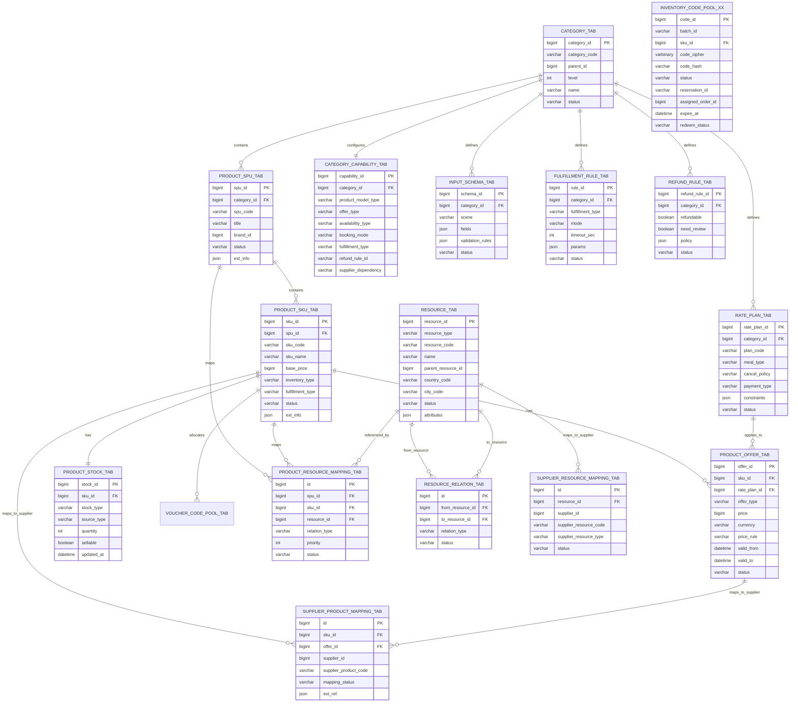

# 32.6 核心系统设计

## 32.6 核心系统设计（Application + Data Architecture详细设计）

基于32.4的整体架构，本节深入每个核心系统的详细设计，包括应用层的业务逻辑设计和数据层的模型设计。

### 32.6.1 商品中心设计

#### 32.6.1.1 服务定位与职责

一句话概括，**商品中心 = 商品主数据 + 供给运营 + 库存管理 + 搜索导购中心**。

商品中心处在供应商供给、平台运营、C 端导购和交易系统之间。它不是简单的商品表 CRUD，也不是只维护标题、图片、类目和上下架状态的 PIM 系统；在数字商品平台里，商品中心还要承接商品如何进入平台、如何被运营维护、如何保持供应商数据新鲜、如何判断可售、如何支撑搜索列表和详情页，以及如何在下单前给订单系统提供稳定的商品快照和库存校验结果。

由于团队规模和系统演进阶段限制，本平台没有独立拆分库存中心和搜索中心，库存能力与搜索导购能力都由商品中心内部模块承接。这里需要特别说明：**库存和搜索归商品中心，不代表商品主数据、库存状态、搜索索引混在一起**。商品中心内部仍然按六个域拆分，分别管理不同的数据模型、生命周期和对外契约，避免商品定义、库存状态、搜索索引、供应商模型和交易状态互相污染。

从业务链路看，商品中心主要承接三类问题：

1. **供给侧问题**：商品从哪里来，如何上传、审核、同步、修正和下架。
2. **导购侧问题**：用户如何在首页、列表页、详情页看到正确、可搜索、可筛选、可展示的商品。
3. **交易前问题**：商品是否存在、是否上架、是否可售、库存是否满足、是否需要供应商实时确认。

因此，商品中心内部可以拆成六个稳定的职责域：

| 职责域 | 解决的问题 | 关键输出 |
|-------|-----------|---------|
| **商品主数据域** | 定义商品是什么，包括类目、SPU/SKU、属性、素材、业务实体和商品状态 | 标准商品模型、类目属性、商品详情、商品快照 |
| **商品供给与运营域** | 管理商品如何进入平台、如何审核、如何编辑、如何上下架 | Listing Task、审核结果、发布事件、变更日志 |
| **供应商商品同步域** | 管理外部供应商商品如何映射、同步、刷新和补偿 | 供应商映射、同步任务、数据完整性报告 |
| **库存与可售域** | 判断商品是否能卖，统一无限库存、池化库存和实时库存差异 | 库存查询结果、预占结果、可售状态、券码发放结果 |
| **搜索与导购域** | 支撑首页、列表页、详情页的召回、筛选、排序、Hydrate 和缓存 | ES 索引、搜索结果、详情页聚合数据、降级结果 |
| **系统集成与事件域** | 向营销、计价、订单、履约、供应商网关和数据平台输出稳定契约 | 查询 API、领域事件、CDC、质量监控数据 |

**商品中心内部模块划分**：

```text
商品中心 Product Center
├─ 1. 商品主数据域（Product Master Data）
│  ├─ 类目：前台类目、后台类目、类目层级、类目属性模板
│  ├─ SPU/SKU：标准商品、销售单元、组合 SKU
│  ├─ 商品属性：基础属性、业务属性、动态属性、扩展属性
│  ├─ 业务实体：运营商、银行、航司、酒店、影院、商户、门店
│  ├─ 商品素材：标题、描述、图片、Icon、展示标签
│  └─ 商品状态：草稿、待审核、已上架、已下架、已归档
│
├─ 2. 商品供给与运营域（Supply & Operation）
│  ├─ 商品供给：人工上传、批量上传、模板下载、供应商导入
│  ├─ 数据校验：字段校验、类目校验、属性校验、价格/库存预检
│  ├─ 审核发布：新商品审核、编辑审核、高风险变更审核
│  ├─ 商品运营：编辑、批量编辑、上下架、排序、入口配置
│  ├─ 质量治理：缺字段检查、异常价格检查、库存异常检查
│  └─ 操作追踪：Listing Task、审核日志、变更日志、状态流水
│
├─ 3. 供应商商品同步域（Supplier Sync）
│  ├─ 商品映射：平台 SKU 与供应商 SKU、外部资源 ID、业务实体 ID 映射
│  ├─ 静态同步：酒店基础信息、影院信息、商户门店、票务基础数据
│  ├─ 动态同步：可缓存价格、库存水位、上下架状态
│  ├─ 同步任务：全量同步、增量同步、供应商 Push、接入层 Push
│  └─ 同步治理：重试、补偿、告警、数据完整性巡检
│
├─ 4. 库存与可售域（Stock & Sellable）
│  ├─ 库存模型：无限库存、池化库存、实时库存
│  ├─ 库存来源：本地 DB、券码池、供应商接入层 API、供应商 API
│  ├─ 交易动作：查询、预占、释放、扣减、回补
│  ├─ 券码管理：券码池、发码、核销状态、过期管理
│  └─ 可售判断：商品状态、库存状态、供应商可用性、业务规则
│
├─ 5. 搜索与导购域（Search & Discovery）
│  ├─ 搜索索引：ES 索引构建、索引刷新、索引回滚
│  ├─ 召回筛选：关键词、类目、品牌/Carrier、城市、商户、标签
│  ├─ 排序展示：运营排序、销量、价格、活动标签、库存状态
│  ├─ Hydrate：补齐商品详情、库存状态、展示价、营销标签
│  ├─ 页面能力：首页入口、列表页、详情页、商品缓存
│  └─ 降级策略：缓存兜底、隐藏营销标签、库存弱展示
│
└─ 6. 系统集成与事件域（Integration & Event）
   ├─ 对营销：类目、Tag、商品范围、圈品能力、可营销状态
   ├─ 对计价：基础价、类目、属性、库存上下文、能力配置
   ├─ 对订单：商品快照、上下架状态、可售校验、库存预占结果
   ├─ 对履约：履约类型、供应商映射、发货/出票/充值能力配置
   ├─ 对供应商网关：查价、查库存、同步任务、履约参数映射
   ├─ 对数据平台：CDC、商品变更日志、质量监控、经营分析
   └─ 事件机制：商品创建、商品更新、上下架、库存变化、同步失败
```

**与其他系统的边界**：

| 系统 | 商品中心提供 | 对方负责 |
|------|-------------|---------|
| **营销系统** | 类目、Tag、业务实体、商品范围、可营销状态 | 活动配置、圈品、优惠券、满减/折扣规则 |
| **计价中心** | 基础价、类目、属性、库存上下文、能力配置 | PDP 价格、结算页试算价、下单价、支付价、结算价 |
| **订单系统** | 商品详情、商品快照、上下架状态、库存可售性、预占结果 | 订单创建、订单状态机、支付前后流转 |
| **履约系统** | 履约类型、供应商映射、商品能力配置 | 出票、预订确认、充值、发券、销账、履约补偿 |
| **供应商网关/供应商接入层** | 平台 SKU、供应商映射、同步任务、商品能力配置 | 外部 API 适配、供应商查价查库存、供应商履约调用 |

因此，商品中心的定位不是“商品表 CRUD 服务”，而是数字商品平台交易前链路的核心系统。它统一商品定义、库存能力和搜索导购能力，屏蔽供应商商品模型差异，对外稳定输出商品、库存、搜索结果和能力配置，并通过事件机制驱动营销、计价、订单和履约系统协同。

---

#### 32.6.1.2 核心设计挑战：异构商品模型

数字商品平台的商品中心，最大的难点不是“字段很多”，而是**不同品类对交易对象的定义并不相同**。实物电商的交易对象通常比较稳定：用户买的是一个 SKU，平台围绕 SKU 管库存、价格、物流和售后即可。但 OTA、O2O 和虚拟商品不是这样。它们卖的可能是一次账户余额变更、一个数字凭证、一项到店服务权益、一个特定时间窗口内的资源确认权，或者一次供应商实时返回的临时报价。

所以，这里的“商品”不能简单理解为 `Product + SKU`。更准确的说法是：**商品中心要统一的是交易前的经营表达，而不是所有品类的实时交易状态**。

**1. 不同品类卖的不是同一种东西**

| 品类类型 | 用户实际购买的是什么 | 典型品类 | 核心复杂度 |
|---------|------------------|---------|-----------|
| **账户变更型** | 给外部账户充值、销账或开通权益 | Topup、账单缴费、流量包 | 下单前要校验账户，支付后要确认外部账户状态变化 |
| **数字凭证型** | 一个可兑换、可消费或可核销的凭证 | Gift Card、E-Voucher、Payment Voucher | 商品定义与券码库存必须隔离，发码后状态不可随意回滚 |
| **到店服务型** | 某商户或门店的一次服务权益 | Local Service、Deal Voucher | 商户、门店、核销、过期、退款规则比 SKU 字段更重要 |
| **资源确认型** | 某个时间窗口下的稀缺资源确认权 | Flight、Hotel、Movie、Train、Bus | 价格和库存高度实时，通常需要供应商确认或锁定 |
| **组合套餐型** | 多个权益或资源的组合 | 电影 + 小食、酒店 + 活动券 | 需要处理组合价、组合库存、部分履约和部分退款 |

如果用实物电商的思路强行套这些品类，会遇到五类问题：

1. **SKU 爆炸**：把机票、酒店、电影票的每次报价都沉淀成 SKU，会产生海量临时 SKU，而且很快过期。
2. **字段污染**：把所有品类字段都放进一张商品宽表，最后会变成大量空字段、重复字段和语义不清的扩展字段。
3. **实时性误判**：把动态价格和实时库存当成商品主数据保存，会导致列表页、详情页和下单价频繁不一致。
4. **流程耦合**：把账号校验、账单查询、锁座、房态确认、券码发放都写进商品 CRUD，会让商品中心变成交易系统和履约系统的混合体。
5. **售后规则丢失**：OTA/O2O 的退改签、取消政策、核销后不可退等规则不是普通展示字段，而是影响订单状态机和资损风险的交易规则。

**2. 三种常见解决方案**

面对异构商品，业界通常会经历三种建模方案。它们不是简单的“谁对谁错”，而是适用于不同阶段、不同品类复杂度。

**方案A：标准 SPU/SKU + EAV/ExtInfo 扩展**

这是最接近传统电商商品中心的方案。核心模型是：

```text
Category
  → SPU
  → SKU
  → Attribute / EAV
  → ExtInfo JSON
```

所有商品尽量表达为 SPU/SKU。固定字段放主表，可搜索、可筛选字段放属性表，品类专属展示字段放 `ExtInfo JSON`。

| 维度 | 评价 |
|------|------|
| **优点** | 简单直观，运营后台容易实现，适合 Topup、Gift Card、E-Voucher、Local Service 等固定面额或固定券模板商品 |
| **缺点** | 难以表达 Flight、Hotel、Movie 这类实时供给；如果把日期、舱位、房态、座位都 SKU 化，会造成 SKU 爆炸 |
| **适用阶段** | 平台早期、品类较少、以固定数字商品为主 |

这套方案的问题在于：它容易让团队误以为“所有东西都应该变成 SKU”。一旦把实时报价、房态、座位图、账单金额都塞进 SKU，商品中心就会从主数据系统滑向交易结果缓存系统。

**方案B：资源中心化模型**

OTA 和 O2O 平台常见的另一种做法，是先把业务资源标准化，再在资源上包装可售商品。

```text
Resource
  → Product Package
  → Offer / Rate Plan
  → Availability
```

这里的 Resource 可以是酒店、房型、城市、机场、车站、影院、影厅、影片、商户、门店、账单机构等。SPU/SKU 不再是唯一核心，而是资源上的销售包装。

| 维度 | 评价 |
|------|------|
| **优点** | 适合酒店、电影、本地服务、交通票务；避免把所有资源组合都沉淀成 SKU；供应商资源映射更清晰 |
| **缺点** | 模型理解成本更高；只解决资源建模，还不能完整表达用户输入、预订锁定、履约和售后 |
| **适用阶段** | 平台开始接入 OTA/O2O 品类，资源、门店、城市、场次、房型等成为核心数据 |

资源中心化模型能解决“商品背后是什么资源”的问题，但还没有完整回答“这个资源在交易链路里怎么报价、怎么锁定、怎么履约、怎么退款”。

**方案C：商品交易契约模型（推荐）**

更完整的做法是把商品中心从“商品字段存储系统”升级为“交易前契约系统”。它不是推翻 SPU/SKU，也不是单纯资源化，而是把两者组合起来：

```text
SPU/SKU               表达平台商品定义
Resource              表达商品背后的业务资源
Offer / Rate Plan     表达售卖条件和报价规则
Capability Matrix     表达类目能力差异
Runtime Context       表达交易前运行时上下文
```

这套方案的核心思想是：

> 商品中心统一的是经营表达和交易前契约，不是所有品类的实时资源状态。

| 维度 | 评价 |
|------|------|
| **优点** | 解释力强，能同时覆盖固定 SKU、资源型商品和实时供给商品；边界清晰，适合书籍总结和答辩表达 |
| **缺点** | 初期理解成本较高，需要治理“哪些数据稳定、哪些数据实时、哪些数据只进快照” |
| **适用阶段** | 多品类平台，尤其是同时覆盖 Topup、Bill、Voucher、Hotel、Flight、Movie、Local Service 的平台 |

因此，本章采用方案 C 作为推荐方案。它吸收方案 A 的 SPU/SKU 基础能力，也吸收方案 B 的 Resource 建模能力，再通过能力矩阵和运行时上下文把不同品类的交易差异显式表达出来。

**3. 八层商品交易模型**

对 OTA、O2O 和虚拟商品来说，一个可交易商品通常可以拆成八层。不是每个品类都完整使用八层，但这个分层能帮助我们判断“什么应该进商品中心，什么应该留给库存、计价、订单和履约系统”。

| 层次 | 解决的问题 | 商品中心是否负责 | 示例 |
|------|-----------|----------------|------|
| **Product Definition** | 平台如何运营和展示这个商品 | 负责 | 类目、标题、图片、品牌/实体、基础描述、上下架状态 |
| **Resource** | 商品背后的资源是什么 | 负责稳定部分 | 酒店、房型、影院、场次、商户、门店、账单机构、城市站点 |
| **Offer / Rate Plan** | 在某个上下文下如何报价 | 负责配置，不负责所有实时结果 | 面额、套餐、日历价规则、供应商报价计划、活动价输入 |
| **Availability** | 当前是否可买 | 负责统一入口和可售判断 | 券码池库存、供应商实时库存、房态、座位、通道可用性 |
| **Input Schema** | 下单前需要用户提供什么 | 负责配置 | 手机号、账单号、乘客证件、入住人、座位选择、邮箱 |
| **Booking / Lock** | 支付前是否需要锁定资源 | 只负责能力配置和结果引用 | 占座、锁房、锁券码、锁账单金额、锁场次座位 |
| **Fulfillment Contract** | 支付后如何交付 | 负责履约能力配置 | 充值、销账、发码、出票、预订确认、到店核销 |
| **Refund / After-sale Rule** | 失败或退款时如何处理 | 负责规则配置和快照输入 | 未核销可退、已出票退改签、取消政策、失败自动退款 |

这八层之间的关系可以理解为：

```text
Product Definition  定义平台卖什么
  → Resource        指向背后的资源
  → Offer           生成可展示或可购买的报价
  → Availability    判断当前是否可买
  → Input Schema    收集交易所需信息
  → Booking / Lock  锁定稀缺资源或金额
  → Fulfillment     支付后完成数字交付
  → Refund Rule     失败或售后时决定如何回滚
```

这套分层的价值在于：**它不要求所有品类长得一样，但要求所有品类在交易链路里说清楚自己处在哪一层、依赖哪些层、哪些数据需要实时确认**。

**4. 典型品类的八层映射**

| 品类 | Product Definition | Resource | Offer / Rate Plan | Availability | Input Schema | Booking / Lock | Fulfillment | Refund / After-sale |
|------|-------------------|----------|-------------------|--------------|--------------|----------------|-------------|---------------------|
| **Topup** | 运营商、面额、套餐说明 | 手机号账户、区域 | 固定面额/套餐价 | 供应商通道可用性 | 手机号、区域 | 通常无需锁定 | 充值到账 | 失败退款，成功后通常不可退 |
| **Bill** | 账单机构、账单类型 | 用户账单账户 | 查账后生成金额 | 账单是否可缴 | 账单号、用户标识 | 可锁定账单金额或查询流水 | 代缴销账 | 已销账通常不可退 |
| **Gift Card** | 品牌、面额、有效期、使用说明 | 券码池 | 固定面额/折扣价 | 未分配券码数量 | 收件账号/邮箱 | 可在支付后分配，也可提前锁码 | 发码 | 未发码可退，已发码受限 |
| **E-Voucher / Local Service** | 商户、门店、券模板、核销规则 | 门店服务能力、券码池 | 券售价/活动价 | 本地库存/券码数量 | 门店、购买数量 | 可锁库存或支付后扣减 | 发券 + 到店核销 | 未核销可退，已核销不可退 |
| **Flight / Train / Bus** | 城市、站点、承运方、基础运营配置 | 班次、舱位/座位 | 供应商实时报价 | 实时座位/占座结果 | 乘客、证件、行李等 | 创单前占座/预订 | 出票 | 退改签规则复杂 |
| **Hotel** | 酒店、房型、设施、地理位置、政策 | 房型 + 日期范围 | Rate Plan / 日历价 / 动态价 | 房态确认 | 入住人、日期、人数 | 预订确认或担保锁房 | 预订确认 | 受取消政策约束 |
| **Movie** | 影片、影院、影厅、场次基础信息 | 场次 + 座位 | 场次价/套餐价 | 座位图和锁座状态 | 座位、手机号 | 锁座 | 出票/取票码 | 通常不可退或限时退 |

这张表说明了一个关键事实：**同样叫商品，但不同品类的“可售单元”可能位于不同层次**。Gift Card 的可售单元很接近 SKU；Hotel 的可售单元是“房型 + 日期范围 + Rate Plan”；Flight 的可售单元是一次实时报价和占座结果；Bill 的可售单元甚至要在用户输入账单号之后才形成。

**5. 商品中心的职责边界**

基于八层模型，商品中心应该重点负责交易前可复用、可运营、可搜索、可配置的部分：

```text
商品中心负责：
  Product Definition：类目、SPU/SKU、标题、图片、状态、Tag
  Resource 稳定部分：酒店、房型、影院、商户、门店、城市、站点、账单机构
  Offer 配置：基础价、面额、套餐、价格规则输入、供应商报价映射
  Availability 入口：库存类型、库存来源、可售规则、查询/预占能力
  Input Schema：手机号、账单号、乘客、入住人、座位等表单配置
  Contract 配置：履约类型、退款规则、供应商映射、能力开关

商品中心不负责：
  实时航班报价、实时房态房价、座位锁定状态
  用户账单金额、支付结果、订单履约状态、售后处理结果
```

这样划分之后，商品中心不会因为接入一个新品类就不断膨胀。新增品类时，优先回答八个问题：

1. 它的稳定商品定义是什么？
2. 它依赖哪些资源？
3. 报价是平台配置还是供应商实时返回？
4. 可用性由谁确认？
5. 用户下单前需要输入什么？
6. 是否需要预订、锁定或占用资源？
7. 支付后如何履约？
8. 失败、取消、退款时遵循什么规则？

这八个问题回答清楚，商品中心、计价、库存、订单、履约和售后之间的边界也就清楚了。

**6. 建模原则**

最终的建模原则可以总结为六句话：

1. **不要用一个 SKU 表硬套所有品类**：SKU 是稳定可售单元，不是所有实时报价和资源组合的容器。
2. **静态资源和动态资源分离**：酒店资料、影院资料可以同步；房态、座位、报价必须按时效处理。
3. **商品定义和交易结果分离**：商品中心保存能力和规则，订单/履约系统保存每笔交易的状态。
4. **用户输入配置化**：不同品类的表单和校验规则要通过 Input Schema 表达，避免写死在交易代码里。
5. **履约和售后契约前置**：商品中心要告诉订单系统“这个商品怎么履约、怎么退”，但不处理具体订单的履约状态。
6. **供应商差异通过映射和防腐层隔离**：商品中心只保留平台模型和供应商映射，不让供应商字段污染主模型。

这一节的核心结论是：**商品中心真正统一的是经营表达和交易前契约，而不是统一所有品类的实时资源状态**。这是数字商品平台避免商品模型失控的关键。

---

#### 32.6.1.3 统一商品模型设计

商品中心的统一模型目标不是把所有品类强行压成同一种 SKU，而是提供一个稳定的“商品表达框架”，让不同品类都能被运营、搜索、计价、下单和履约系统理解。

**核心模型分层**：

| 模型 | 作用 | 示例 |
|------|------|------|
| **Category** | 统一品类层级和能力开关 | `40102` 机票、`10102` 话费充值、`70101` Deal Voucher |
| **Resource** | 表达商品背后的稳定业务资源 | 酒店、房型、城市、机场、影院、商户、门店、账单机构 |
| **Carrier / Brand** | 统一业务实体、品牌、运营商、机构 | 某运营商、某礼品卡品牌、某酒店品牌、某银行、某影院 |
| **SPU** | 表达平台商品或商品族 | 某品牌礼品卡、某酒店商品页、某商户套餐 |
| **SKU** | 表达稳定可售单元或销售模板 | 100 元礼品卡、某券模板、某充值面额、某房型 + Rate Plan |
| **Offer / Rate Plan** | 表达报价和售卖条件 | 固定面额、套餐价、含早/无早、可取消/不可取消 |
| **Attribute / EAV** | 支持可搜索、可筛选、可分析属性 | 面额、有效期、城市、商户类型、是否支持退款 |
| **ExtInfo JSON** | 承接低频、展示型、品类专属字段 | 酒店设施、券使用说明、账单字段配置 |
| **Supplier Mapping** | 连接平台商品与外部供应商资源 | 平台 SKU ↔ 供应商 SKU / 外部资源 ID / 业务实体 ID |
| **Category Capability** | 表达类目在交易链路中的能力差异 | 是否实时查价、是否需要输入账号、是否需要锁座/锁房 |
| **Runtime Context** | 为列表、详情、结算、创单组装交易前上下文 | 商品定义 + 资源 + 报价 + 可售 + 输入 + 履约 + 售后 |

这套模型可以理解为三层：

```text
第一层：稳定主数据
  Category + Resource + SPU + SKU + Attribute

第二层：交易前契约
  Offer / Rate Plan + Capability + Input Schema + Fulfillment Rule + Refund Rule

第三层：运行时上下文
  Runtime Context = 稳定主数据 + 交易前契约 + 实时查询结果
```

其中第一层主要持久化在商品中心；第二层也是商品中心负责维护，但会被计价、订单、履约和售后系统消费；第三层通常不是永久主数据，而是在搜索、详情、结算、创单等场景下按需组装，并在订单创建时形成订单快照。

**设计原则**：

1. **类目表达业务类型**：不要再额外引入 `product_type` 与 `category_id` 互相重叠，类目编码本身可以表达一级、二级、三级业务含义。
2. **Resource 表达稳定业务资源**：酒店、房型、影院、商户、门店、城市、机场、车站等不是普通 SKU 字段，而是可以被多个商品、多个供应商和多个场景复用的资源。
3. **Carrier / Brand 表达业务实体**：运营商、银行、航司、影院、酒店品牌、商户都可以归入业务实体模型，再通过实体类型区分。
4. **SPU/SKU 表达可运营商品**：Gift Card、Voucher、Topup 面额适合沉淀 SKU；Flight 搜索结果不适合沉淀完整 SKU，只沉淀城市、站点、航司等基础资源。
5. **Offer / Rate Plan 表达售卖条件**：酒店的含早/无早、可取消/不可取消，电影套餐，礼品卡面额，都应该从“商品是什么”里拆出来，作为“如何售卖”的配置。
6. **EAV 只放可检索属性**：需要筛选、搜索、分析的字段进入属性表；仅用于展示的复杂结构进入 `ExtInfo`。
7. **动态价格和实时库存不进商品主表**：商品主表保存稳定定义，动态报价、房态、座位库存通过缓存、供应商查询和订单快照处理。

---

#### 32.6.1.4 商品中心核心表设计

商品中心的表设计要支撑三件事：稳定主数据、灵活品类差异、可追溯运营链路。下面是核心表的定位，不要求所有字段一次性设计到位，但边界要清晰。

| 表名 | 定位 | 关键内容 |
|------|------|---------|
| `category_tab` | 类目树 | 类目编码、父类目、层级、名称、排序、状态、能力开关 |
| `carrier_brand_tab` | 业务实体/品牌/运营商 | 实体类型、名称、Logo、国家/地区、状态、扩展配置 |
| `resource_tab` | 统一业务资源 | 资源类型、资源编码、名称、父资源、国家/城市、状态、通用属性 |
| `resource_ext_*_tab` | 高频资源扩展表 | 酒店、房型、门店、影院、航线等高频字段，避免全部塞进 JSON |
| `product_spu_tab` | 标准商品或商品族 | SPU Code、类目、品牌/实体、标题、状态、素材 |
| `product_sku_tab` | 可售单元 | SKU Code、SPU ID、基础价、销售状态、库存类型、履约类型 |
| `product_resource_mapping_tab` | 商品与资源关系 | SKU/SPU 与酒店、房型、门店、影院、城市等资源的关系 |
| `product_offer_tab` | 商品报价配置 | 固定价、套餐价、展示价、报价来源、价格生效范围 |
| `rate_plan_tab` | 售卖条件计划 | 早餐、取消政策、支付方式、入住人数、供应商报价计划 |
| `product_attr_definition_tab` | 属性定义 | 属性 Code、属性类型、适用类目、是否可搜索/筛选 |
| `product_attr_value_tab` | 商品属性值 | SKU/SPU 与属性值绑定，用于筛选、搜索、分析 |
| `product_ext_info_tab` | 品类扩展信息 | JSON 结构，保存低频展示型、品类专属字段 |
| `supplier_product_mapping_tab` | 供应商商品映射 | 平台 SKU/SPU 与供应商 SKU、外部资源 ID、业务实体 ID 的映射 |
| `category_capability_tab` | 类目能力矩阵 | 商品模型类型、报价类型、库存类型、输入 Schema、锁定模式、履约类型、售后规则 |
| `input_schema_tab` | 用户输入表单配置 | 手机号、账单号、乘客、入住人、邮箱、座位选择等输入字段 |
| `fulfillment_rule_tab` | 履约契约配置 | 充值、销账、发码、出票、预订确认、核销等履约模式 |
| `refund_rule_tab` | 售后规则配置 | 是否可退、是否人工审核、取消政策、核销后限制、供应商退改规则 |
| `product_stock_tab` | 库存与可售状态 | 库存类型、库存来源、可售状态、库存数量、更新时间 |
| `inventory_create_task` | 库存创建任务 | 数量初始化、券码导入 / 生成、门店日期切片、创建状态和错误信息 |
| `inventory_code_batch_tab` | 券码批次 | 批次来源、生成模式、总码量、有效期、密钥版本、分表路由 |
| `inventory_code_pool_XX` | 券码池分表 | 一码一行、加密券码、状态机、分配订单、核销状态；Redis 只缓存 `code_id` |
| `product_supply_task` | 商品供给任务 | 导入批次、任务状态、操作人、成功/失败数量、错误文件 |
| `product_audit_log_tab` | 审核日志 | 审核对象、变更内容、审核结论、审核人、驳回原因 |
| `product_change_log_tab` | 变更日志 | 商品字段变更前后值、操作来源、TraceID、操作人 |
| `product_search_index_task_tab` | 搜索索引任务 | 索引动作、目标 SKU、任务状态、重试次数、失败原因 |

**方案 3 的核心 ER 关系**：



一个重要经验是：**表结构要承认异构，而不是掩盖异构**。主表保持稳定，资源表承接业务资源，Offer/Rate Plan 表承接售卖条件，能力矩阵承接流程差异，映射表连接供应商，日志表保证可追溯。这样既不会让主表无限膨胀，也不会每新增一个品类就新建一整套孤立模型。

资源表建议采用“统一资源表 + 高频扩展表”的方式：

```text
resource_tab
  保存资源身份、资源类型、名称、父子关系、状态、国家/城市等通用字段

resource_ext_hotel_tab / resource_ext_room_type_tab
  保存酒店星级、地址、经纬度、设施、房型面积、床型等高频字段

resource_ext_merchant_tab / resource_ext_outlet_tab
  保存商户、门店、营业时间、地理位置、核销能力等高频字段

resource_ext_cinema_tab / resource_ext_route_tab
  保存影院、影厅、城市站点、航线/车线等高频字段
```

这样设计的原因是：不是所有资源都值得单独建完整模型，但高频检索、高频展示、高频排序的资源字段不能长期躲在 JSON 里。统一 `resource_tab` 负责身份和关系，扩展表负责高频业务字段。

---

#### 32.6.1.5 不同品类的数据存储样例

不同品类进入商品中心时，关键是判断“哪些信息稳定，哪些信息动态，哪些信息不应该沉淀”。下面按典型品类说明。

| 品类 | SPU/SKU 存什么 | Resource 存什么 | Offer / Rate Plan 存什么 | 动态数据在哪里 |
|------|---------------|----------------|--------------------------|---------------|
| **Topup** | 运营商面额 SKU、套餐说明、基础价、可售状态 | 运营商、国家/地区、号码归属规则 | 固定面额、套餐价、手续费规则 | 手机号校验、供应商通道状态实时查询或短缓存 |
| **Bill** | 账单机构商品、账单类型、缴费入口 | 账单机构、账单地区、账单账号类型 | 手续费规则、是否支持部分支付、滞纳金规则 | 用户账单金额、欠费明细、账单可缴状态实时查询 |
| **Gift Card** | 品牌 + 面额 SKU、有效期、使用说明 | 礼品卡品牌、券码池资源 | 固定面额、折扣价、发码规则 | 券码分配结果、用户核销状态进入履约/核销链路 |
| **E-Voucher / Local Service** | 券模板 SKU、购买限制、可用时间、核销规则摘要 | 商户、门店、服务项目、券码池 | 券售价、活动价、门店适用范围 | 发券、核销、过期、退款状态进入履约/售后链路 |
| **Flight / Train / Bus** | 通常不沉淀完整行程 SKU，只存基础运营配置 | 城市、机场/车站、航司/车司、线路 | 供应商报价计划、服务费、加价规则 | 航班/班次报价、座位、舱位、占座结果实时查询 |
| **Hotel** | 酒店 SPU、房型销售模板 SKU、上下架、展示素材 | 酒店、房型、品牌、城市、商圈、设施 | Rate Plan：含早/无早、可取消/不可取消、支付方式 | 某日期房态房价、税费、供应商确认结果走缓存或实时查询 |
| **Movie** | 影片/影院/套餐商品、基础场次配置 | 影片、影院、影厅、座位区域 | 场次价、套餐价、服务费规则 | 实时座位图、锁座状态、出票结果走供应商查询 |

这种划分的核心标准是：**稳定内容进商品中心，动态资源走缓存/供应商，交易结果进订单/履约/售后快照**。

以酒店为例，酒店本身是 Resource，平台上售卖的不是“酒店这一条记录”，而是围绕酒店资源包装出来的商品和售卖条件：

```text
resource_tab
  HOTEL: Bangkok Central Hotel
  ROOM_TYPE: Deluxe King Room

product_spu_tab
  SPU-HOTEL-90001: 平台上的 Bangkok Central Hotel 商品页

product_sku_tab
  SKU-HOTEL-90001-ROOM90002-BF-RF:
    Deluxe King Room + 含早 + 可取消

rate_plan_tab
  BF_RF:
    breakfast = included
    cancel_policy = free_cancel_before_deadline
    payment_type = prepay

实时查询 / 报价缓存
  check_in = 2026-05-01
  nights = 2
  adult = 2
  price = 实时返回
  availability = 实时确认
```

这个例子说明：`resource_tab` 回答“资源是什么”，`product_spu_tab` 回答“平台是否运营这个资源”，`product_sku_tab` 回答“卖哪个稳定销售模板”，`rate_plan_tab` 回答“用什么售卖条件”，实时查询回答“这个日期和人数下是否真的可以买”。

再以账单缴费为例，账单机构和缴费入口可以沉淀在商品中心，但用户账单金额不能沉淀成商品主数据：

```text
resource_tab
  BILLER: 某电力公司

product_spu_tab
  SPU-BILL-ELECTRICITY: 电费缴费

product_sku_tab
  SKU-BILL-ELECTRICITY-REGION-A: A 地区电费缴费入口

input_schema_tab
  account_no: 必填，数字，长度 10-16

实时查账
  account_no = 用户输入
  bill_amount = 实时返回
  due_date = 实时返回
```

这类商品的可售单元不是固定面额，而是“用户输入账号后形成的一次账单支付上下文”。因此商品中心只保存账单机构、输入规则、手续费规则和履约契约，具体账单金额进入计价上下文和订单快照。

---

#### 32.6.1.6 商品供给与运营链路

商品供给与运营链路解决的是“商品如何进入平台，以及上线后如何被持续维护”的问题。供应商同步本质上属于供给链路，但它不是唯一入口。更准确的划分是：

```text
商品供给与运营治理平台
  ├─ 人工创建/上传：运营/商家从 0 到 1 创建商品
  ├─ 批量导入：文件、模板、批量任务导入商品和配置
  ├─ 运营编辑：标题、图片、类目、价格、库存、上下架、退款规则变更
  └─ 供应商同步：外部供给数据全量/增量/Push/刷新
```

这四类入口应该进入同一个“供给治理控制面”，共享任务模型、校验、审核、发布版本、Outbox、补偿和可观测性；但供应商同步因为存在长任务、Checkpoint、Raw Snapshot、Worker 租约、DLQ、数据新鲜度等复杂问题，可以单独展开成 `32.6.1.7` 和附录案例。

相关答辩判断已统一收录到[第 35 章](../part05/03-ecommerce-architecture-interview.md)。

如果这条链路设计不好

如果这条链路设计不好，问题会很快暴露到 C 端交易链路：列表页搜不到、详情页价格错误、下单时库存不可用、券码发放失败、供应商映射缺失、退款规则不完整。商品供给链路的核心不是“把商品写进数据库”，而是“让一个商品从供给入口到可被搜索、可被下单、可被履约、可被追溯”。

这条链路的系统难点和解决方法可以先这样收敛：

| 难点 | 典型表现 | 解决方法 |
|------|----------|----------|
| **入口多且语义不同** | 人工创建、批量导入、运营编辑、供应商同步都在改商品 | 统一进入 Supply Task 和 Staging，但按 `task_type` 路由不同策略 |
| **半成品污染线上** | 草稿、导入半成品、同步脏数据直接写正式表 | Draft / Staging 与正式表隔离，只有发布事务能写线上版本 |
| **品类差异大** | 酒店、话费、账单、礼品卡、电影票字段和交易规则完全不同 | 类目模板 + 能力矩阵 + Schema 驱动表单、校验和发布规则 |
| **运营误操作风险高** | 批量改价、退款规则变更、类目迁移导致资损或投诉 | 字段级 Diff、风险评分、强审核、版本回滚和灰度发布 |
| **供应商和运营冲突** | 供应商同步覆盖运营修正字段，线上数据反复抖动 | 字段主导权、人工覆盖保护期、冲突日志和巡检 |
| **发布不一致** | 商品库成功，ES、缓存、营销、计价没有刷新 | 发布事务 + Outbox + 异步刷新 + 补偿重试 |
| **失败不可运营** | 错误只在日志里，运营不知道哪一行失败、怎么修 | 行级明细、错误文件、MySQL DLQ、修复建议和重新投递 |
| **历史订单被新配置影响** | 商品改价或退款规则变更后影响旧订单解释 | 创单保存商品快照、报价快照、履约契约和退款规则快照 |

**1. 三种方案对比**

| 方案 | 核心思路 | 优点 | 缺点 | 适用阶段 |
|------|---------|------|------|---------|
| **方案A：后台 CRUD + 简单审核** | 运营直接编辑商品正式表，审核通过后上架 | 实现简单，适合固定 SKU、低规模自营商品 | 无法支撑批量导入、错误隔离、版本回滚、下游一致性和事故追溯 | 早期平台 |
| **方案B：任务化上架系统** | 用 Listing Task 承接人工上传、批量导入和运营编辑 | 支持异步处理、进度追踪、错误文件、失败重试 | 只解决“任务怎么跑”，没有完整的质量治理、风险分级和发布一致性 | 中期平台 |
| **方案C：供给治理平台** | 在任务化基础上加入暂存区、标准化、质量校验、Diff、差异化审核、发布快照、Outbox、补偿和巡检 | 能支撑 OTA、O2O、虚拟商品、多供应商、多运营角色长期演进 | 设计复杂度更高，需要明确模型边界和流程状态机 | 多品类、多来源、强运营平台 |

本系统选择 **方案C：供给治理平台**。它不是把所有入口混成一条大流程，而是提供统一控制面，让不同入口走不同策略、共享同一套发布和治理能力。

**2. 推荐架构：供给治理控制面**

```text
供给入口层
  → Draft / Staging 暂存区
  → Listing Task / Batch / Item
  → 标准化与类目模板适配
  → 多层质量校验
  → Diff 与风险识别
  → 审核流 / 自动准入
  → 发布事务：主数据 + 交易契约 + Outbox
  → 搜索索引 / 缓存 / 营销 / 计价 / 订单上下文刷新
  → DLQ / 补偿 / 巡检 / 质量报表
```

各层职责如下：

| 层级 | 职责 | 关键产物 |
|------|------|----------|
| **供给入口层** | 接收运营表单、批量文件、供应商同步、商家 API | 原始输入、操作者、来源、TraceID |
| **暂存层** | 保存未发布数据，避免污染线上正式表 | Draft、Staging Snapshot、Import Row |
| **任务编排层** | 把一次供给动作变成可恢复任务 | `product_supply_task`、`product_supply_task_item`、进度和失败明细 |
| **标准化层** | 把入口数据转换成平台 Resource/SPU/SKU/Offer/Rule 模型 | 标准化模型、字段来源、数据 hash |
| **校验层** | 检查字段、主数据、交易契约、可售规则 | 校验结果、错误码、质量分 |
| **风险审核层** | 识别高风险变更并路由审核 | Diff、风险等级、审核单 |
| **发布层** | 写正式表、生成版本、写 Outbox | `publish_version`、商品快照、事件 |
| **下游刷新层** | 刷新搜索、缓存、营销、计价、数据平台 | 索引任务、缓存失效任务、补偿任务 |
| **治理层** | 巡检、补偿、报表、审计 | DLQ、质量报告、操作日志 |

这里最重要的边界是：**所有入口都不要直接写商品正式表**。人工表单、Excel 导入、供应商同步和运营批量编辑都先写暂存区和任务表，经过校验、审核和发布后，再写入正式主数据和交易契约表。

**3. 四类入口的差异化设计**

| 入口 | 典型场景 | 主流程 | 关键风险 | 处理策略 |
|------|----------|--------|----------|----------|
| **人工创建** | 运营创建本地生活券、礼品卡、话费套餐、账单缴费入口 | 表单草稿 → 实时校验 → 提交审核 → 发布 | 字段漏填、类目选错、履约规则不完整 | 表单配置化、类目模板、强校验、完整审核 |
| **批量导入** | 大促前批量创建套餐、门店、价格计划、券码池 | 上传文件 → 预校验 → 异步解析 → 分批处理 → 错误文件 | 大批量错误、重复导入、局部失败 | 任务化、行级状态、部分成功、失败文件、幂等 key |
| **运营编辑** | 改标题、图片、价格、库存、退款规则、上下架 | 读取线上版本 → 创建变更单 → Diff → 风险审核 → 发布 | 误操作、批量事故、覆盖供应商数据 | 字段主导权、版本锁、风险阈值、回滚 |
| **供应商同步** | 酒店、影院、活动、票务等外部数据同步 | 同步任务 → Raw Snapshot → 标准化 → 映射 → Diff → 发布 | 接口不稳定、模型不一致、新鲜度、长任务失败 | 独立同步链路，见 `32.6.1.7` |

这四类入口共享最终发布模型，但入口策略不同。人工创建强调“完整性和可解释”；批量导入强调“吞吐和错误隔离”；运营编辑强调“Diff、权限和风险”；供应商同步强调“可恢复、可追溯和自动化治理”。

**4. 核心数据模型**

供给治理平台的表设计不要从“一张商品表”出发，而要围绕“未发布隔离、任务可恢复、行级可定位、校验可解释、变更可审核、发布可追溯、失败可补偿”来组织。核心可以分成八组：

| 表组 | 典型表 | 作用 |
|------|--------|------|
| **Draft 草稿表** | `product_supply_draft`、`product_supply_draft_version` | 保存单商品创建和编辑过程中的草稿，允许反复保存，不影响线上 |
| **Task 任务表** | `product_supply_task` | 记录一次供给动作，如人工创建、批量导入、运营编辑、供应商同步后的商品变更接入 |
| **Task Item 明细表** | `product_supply_task_item` | 记录每一行、每个商品、每个 Offer 或每条规则的处理状态，是失败定位单元 |
| **Staging 暂存表** | `product_supply_staging`、`product_supply_staging_snapshot` | 保存已经提交、已经标准化、但未发布到正式表的数据 |
| **Validation 校验表** | `product_validation_result` | 保存 Schema、类目模板、主数据、商品模型、交易契约、风险规则的校验结果 |
| **Change / Audit 表** | `product_change_request`、`product_audit_log`、`product_field_ownership` | 保存字段 Diff、风险等级、审核策略、审核动作和字段主导权 |
| **Publish / Snapshot 表** | `product_publish_record`、`product_publish_snapshot`、`product_change_log` | 保存发布批次、线上版本快照和正式变更日志，支持追溯和回滚 |
| **Outbox / DLQ / Compensation 表** | `product_outbox_event`、`product_supply_dead_letter`、`product_compensation_task`、`product_quality_issue` | 保证下游最终一致，承接失败补偿、人工修复和质量巡检 |

第一期不一定把所有可选表都建齐，最小闭环建议包括：

```text
product_supply_draft
product_supply_task
product_supply_task_item
product_supply_staging
product_validation_result
product_change_request
product_audit_log
product_publish_snapshot
product_change_log
product_outbox_event
product_supply_dead_letter
```

供应商同步执行层可以独立使用 `supplier_sync_task`、`supplier_sync_batch`、`supplier_sync_snapshot` 和 `supplier_sync_dead_letter`，但标准化之后要进入供给平台的 `product_supply_staging`、`product_validation_result`、`product_change_request` 和统一发布链路。

`product_supply_task` 记录一次供给动作：

```sql
CREATE TABLE product_supply_task (
    id BIGINT PRIMARY KEY AUTO_INCREMENT,
    task_id VARCHAR(64) NOT NULL,
    task_type VARCHAR(32) NOT NULL COMMENT 'MANUAL_CREATE/BATCH_IMPORT/OPS_EDIT/SUPPLIER_SYNC',
    source_type VARCHAR(32) NOT NULL COMMENT 'OPS/MERCHANT/SUPPLIER/SYSTEM',
    source_id VARCHAR(64) DEFAULT NULL,
    category_code VARCHAR(32) NOT NULL,
    operator_id VARCHAR(64) DEFAULT NULL,
    trigger_id VARCHAR(64) DEFAULT NULL COMMENT '外部幂等 ID',
    status VARCHAR(32) NOT NULL COMMENT 'DRAFT/VALIDATING/REVIEWING/APPROVED/PUBLISHING/PUBLISHED/PARTIAL_FAILED/REJECTED/FAILED/CANCELLED',
    total_count INT NOT NULL DEFAULT 0,
    success_count INT NOT NULL DEFAULT 0,
    failed_count INT NOT NULL DEFAULT 0,
    skipped_count INT NOT NULL DEFAULT 0,
    current_stage VARCHAR(64) DEFAULT NULL,
    error_file_ref VARCHAR(512) DEFAULT NULL,
    publish_version BIGINT DEFAULT NULL,
    created_at DATETIME NOT NULL,
    started_at DATETIME DEFAULT NULL,
    finished_at DATETIME DEFAULT NULL,
    updated_at DATETIME NOT NULL,
    UNIQUE KEY uk_task_id (task_id),
    UNIQUE KEY uk_trigger (task_type, trigger_id),
    KEY idx_status (status),
    KEY idx_category_status (category_code, status)
) ENGINE=InnoDB DEFAULT CHARSET=utf8mb4 COMMENT='商品供给任务';
```

`product_supply_task_item` 记录每个商品、资源或 Offer 的处理结果：

```sql
CREATE TABLE product_supply_task_item (
    id BIGINT PRIMARY KEY AUTO_INCREMENT,
    task_id VARCHAR(64) NOT NULL,
    item_no VARCHAR(64) NOT NULL COMMENT '文件行号或外部对象序号',
    item_type VARCHAR(32) NOT NULL COMMENT 'RESOURCE/SPU/SKU/OFFER/STOCK/RULE',
    idempotency_key VARCHAR(128) NOT NULL,
    platform_resource_id BIGINT DEFAULT NULL,
    spu_id BIGINT DEFAULT NULL,
    sku_id BIGINT DEFAULT NULL,
    offer_id BIGINT DEFAULT NULL,
    status VARCHAR(32) NOT NULL COMMENT 'PENDING/VALIDATING/REVIEWING/PUBLISHING/SUCCESS/FAILED/SKIPPED',
    risk_level VARCHAR(32) DEFAULT NULL COMMENT 'LOW/MEDIUM/HIGH',
    error_code VARCHAR(128) DEFAULT NULL,
    error_message VARCHAR(1024) DEFAULT NULL,
    draft_ref VARCHAR(512) DEFAULT NULL,
    normalized_ref VARCHAR(512) DEFAULT NULL,
    created_at DATETIME NOT NULL,
    updated_at DATETIME NOT NULL,
    UNIQUE KEY uk_task_item (task_id, item_no),
    UNIQUE KEY uk_task_idempotency (task_id, idempotency_key),
    KEY idx_task_status (task_id, status),
    KEY idx_platform_object (platform_resource_id, spu_id, sku_id, offer_id)
) ENGINE=InnoDB DEFAULT CHARSET=utf8mb4 COMMENT='商品供给任务明细';
```

暂存区保存未发布的数据，不直接影响线上：

```sql
CREATE TABLE product_supply_staging (
    id BIGINT PRIMARY KEY AUTO_INCREMENT,
    staging_id VARCHAR(64) NOT NULL,
    task_id VARCHAR(64) NOT NULL,
    item_no VARCHAR(64) NOT NULL,
    object_type VARCHAR(32) NOT NULL COMMENT 'RESOURCE/SPU/SKU/OFFER/RATE_PLAN/STOCK/RULE',
    object_key VARCHAR(128) NOT NULL,
    source_type VARCHAR(32) NOT NULL,
    raw_payload_ref VARCHAR(512) DEFAULT NULL,
    normalized_payload JSON NOT NULL,
    payload_hash VARCHAR(64) NOT NULL,
    base_publish_version BIGINT DEFAULT NULL,
    status VARCHAR(32) NOT NULL COMMENT 'DRAFT/VALIDATED/REVIEWING/APPROVED/PUBLISHED/REJECTED',
    created_at DATETIME NOT NULL,
    updated_at DATETIME NOT NULL,
    UNIQUE KEY uk_staging_id (staging_id),
    UNIQUE KEY uk_task_object (task_id, object_type, object_key),
    KEY idx_status (status)
) ENGINE=InnoDB DEFAULT CHARSET=utf8mb4 COMMENT='商品供给暂存数据';
```

变更日志保存 Diff、风险和审核依据：

```sql
CREATE TABLE product_change_request (
    id BIGINT PRIMARY KEY AUTO_INCREMENT,
    change_id VARCHAR(64) NOT NULL,
    task_id VARCHAR(64) NOT NULL,
    object_type VARCHAR(32) NOT NULL,
    object_id BIGINT DEFAULT NULL,
    old_publish_version BIGINT DEFAULT NULL,
    new_staging_id VARCHAR(64) NOT NULL,
    changed_fields JSON NOT NULL,
    risk_level VARCHAR(32) NOT NULL,
    review_policy VARCHAR(32) NOT NULL COMMENT 'AUTO_APPROVE/MANUAL_REVIEW/BLOCK',
    status VARCHAR(32) NOT NULL COMMENT 'PENDING/APPROVED/REJECTED/PUBLISHED',
    reviewer_id VARCHAR(64) DEFAULT NULL,
    review_note VARCHAR(1024) DEFAULT NULL,
    created_at DATETIME NOT NULL,
    updated_at DATETIME NOT NULL,
    UNIQUE KEY uk_change_id (change_id),
    KEY idx_task (task_id),
    KEY idx_status_risk (status, risk_level)
) ENGINE=InnoDB DEFAULT CHARSET=utf8mb4 COMMENT='商品供给变更单';
```

**5. 人工创建链路**

人工创建不是简单表单提交。它要把“类目模板、交易契约、履约契约、退款规则”一次性收齐，否则商品看似创建成功，交易时会失败。

```text
选择类目
  → 加载类目模板和能力矩阵
  → 填写 Resource / SPU / SKU / Offer / Rule
  → 前端实时校验 + 后端强校验
  → 保存 Draft
  → 提交 Listing Task
  → 生成 Staging Snapshot
  → 质量校验
  → 新商品审核
  → 发布正式表
```

人工创建的关键设计：

| 设计点 | 说明 |
|--------|------|
| **类目模板驱动表单** | 不同品类展示不同字段，例如酒店要地址和坐标，充值要号码规则，账单缴费要 Input Schema |
| **Draft 与正式表隔离** | 草稿允许反复保存，不影响线上商品 |
| **交易契约强校验** | Offer、库存来源、履约规则、退款规则、Input Schema 不完整时不能提交 |
| **审核证据完整** | 审核员看到的是标准化后的商品快照、字段来源、风险命中和历史版本 |
| **创建后不等于上线** | 发布成功后还要等待库存初始化、索引刷新、可售校验通过 |

人工创建链路的答辩提示已统一收录到[第 35 章](../part05/03-ecommerce-architecture-interview.md)。

**6. 批量导入链路**

批量导入要按“任务 + 行级明细 + 暂存快照 + 错误文件”设计，不能把整个 Excel 读进内存后循环写正式表。

```text
下载模板
  → 上传文件
  → 文件格式预检
  → 创建 product_supply_task(status=PENDING)
  → 流式解析文件
  → 每行生成 product_supply_task_item
  → 分批标准化和校验
  → 成功项进入发布/审核
  → 失败项生成错误文件
  → 任务状态汇总为 PUBLISHED / PARTIAL_FAILED / FAILED
```

批量导入的关键设计：

| 设计点 | 说明 |
|--------|------|
| **模板版本化** | 模板字段随类目演进，导入文件必须记录 `template_version` |
| **行级幂等** | 用 `task_id + row_no` 和业务幂等 key 防止重复导入 |
| **部分成功** | 10000 行中 9800 行成功、200 行失败时，不应该整批回滚 |
| **错误文件下载** | 失败行要带 `error_code`、`error_message`、原始值和建议修复方式 |
| **背压与限流** | 大文件分片处理，避免压垮商品库、库存系统和搜索刷新 |
| **批量事故防护** | 高风险批量变更必须二次确认或抽样审核 |

批量异步链路要拆成多个 Worker 阶段，而不是一个 Worker 从解析文件一路写到正式表：

```text
上传文件 / 批量提交
  → 创建 product_supply_task(status=PENDING)
  → Parser Worker 抢占任务并流式解析文件
  → 批量写入 product_supply_task_item
  → Item Worker 分批处理 item
  → 标准化 / 校验 / Staging / Diff
  → 低风险自动发布，高风险进入审核
  → Publish Worker 发布正式表并写 Outbox
  → 生成错误文件 / DLQ / 质量报告
```

**Parser Worker 只负责解析，不负责发布**。它校验文件 hash、模板版本和列结构，按行流式读取文件，每 N 行批量插入 `product_supply_task_item`，并持续更新 `parsed_count` 和 `parse_checkpoint`。如果 Worker 中途退出，下次从 checkpoint 继续；如果重复解析上一小批数据，通过 `task_id + item_no` 和 `task_id + idempotency_key` 唯一键去重。

```json
{
  "sheet": "Sheet1",
  "row_no": 12000,
  "byte_offset": 8842211
}
```

**`product_supply_task_item` 是真正的问题定位单元**。Task 只表示一次批量任务，Item 表示每一行、每一个商品对象或每一个 Offer 的处理状态。

```text
PENDING
  → NORMALIZING
  → VALIDATING
  → STAGING
  → DIFFING
  → REVIEWING
  → PUBLISHING
  → SUCCESS

失败分支：
NORMALIZING / VALIDATING / STAGING / DIFFING / PUBLISHING
  → FAILED / DLQ / SKIPPED
```

Item Worker 不按文件整批处理，而是扫描小批量 item：

```sql
SELECT *
FROM product_supply_task_item
WHERE task_id = ?
  AND status IN ('PENDING', 'FAILED')
  AND next_retry_at <= NOW()
ORDER BY item_no ASC
LIMIT 500;
```

每个 item 或小批次独立事务，流程是：读取原始行 → 按类目模板标准化 → 写 `normalized_ref` → 执行 Schema、主数据、交易契约校验 → 写 `product_supply_staging` → 与线上 `publish_version` 做 Diff → 生成 `product_change_request` → 按风险等级进入自动发布或人工审核。

Publish Worker 只处理已经通过审核或自动准入的变更：

```text
读取 APPROVED change
  → 开启发布事务
  → 写 Resource / SPU / SKU / Offer / Rule
  → 写 publish_snapshot 和 change_log
  → 写 outbox_event
  → 提交事务
  → item.status = SUCCESS
```

Task 状态由 item 统计汇总，而不是 Worker 主观判断：

| Item 汇总结果 | Task 状态 |
|---------------|-----------|
| 全部 `SUCCESS` | `PUBLISHED` |
| 部分 `SUCCESS`，部分 `FAILED/DLQ` | `PARTIAL_FAILED` |
| 全部失败 | `FAILED` |
| 存在 `REVIEWING` | `REVIEWING` |
| 存在 `PUBLISHING` | `PUBLISHING` |

这里的关键原则是：**Parser Worker 只解析，Item Worker 推进行级状态，Publish Worker 只做已审核发布；Task 管整体进度，Item 管失败定位，Staging 管线上隔离，Outbox 管下游一致性**。

错误文件示例：

```text
row_no, sku_code, field, error_code, error_message
12, SKU_001, price, PRICE_TOO_LOW, price is lower than category floor price
25, SKU_014, refund_rule, REFUND_RULE_MISSING, refund rule is required for hotel offer
31, SKU_020, city_code, CITY_NOT_FOUND, city code cannot map to platform city
```

**7. 运营编辑链路**

运营编辑不是“打开商品详情页直接保存”。一个线上商品可能同时被供应商同步、运营编辑、库存系统、风控系统影响。运营编辑必须明确字段主导权、版本锁和风险审核。

```text
读取当前 publish_version
  → 创建编辑草稿
  → 修改字段
  → 与线上版本做 Diff
  → 判断字段主导权和风险等级
  → 自动通过 / 人工审核 / 阻断
  → 发布新 publish_version
  → Outbox 通知搜索、缓存、营销、计价、订单
```

字段主导权可以这样定义：

| 字段 | 主导方 | 供应商同步能否覆盖 | 运营编辑策略 |
|------|--------|-------------------|--------------|
| 酒店名称、地址、设施 | 供应商/平台治理 | 低风险可覆盖，高风险审核 | 可人工修正并加保护期 |
| 标题、卖点、活动标签 | 平台运营 | 不能直接覆盖 | 运营编辑为准 |
| 基础价格、Rate Plan | 供应商/计价 | 取决于品类 | 超阈值审核 |
| 库存水位、可售状态 | 库存域/供应商 | 可覆盖 | 异常告警，不建议人工长期覆盖 |
| 退款规则、履约规则 | 平台/供应商契约 | 高风险覆盖 | 强制审核 |
| 类目、Resource 映射 | 平台治理 | 不能自动覆盖 | 强制审核和巡检 |

高风险运营编辑必须具备三个能力：

1. **Diff 可读**：审核员看到字段级变化，而不是整段 JSON。
2. **版本可回滚**：发布新版本后出现事故，可以回滚到上一个 `publish_version`。
3. **覆盖可解释**：如果运营字段覆盖了供应商字段，要记录覆盖原因、有效期和责任人。

**8. 标准化校验与风险审核**

数字商品供给不能只做字段必填校验，还要校验交易前契约是否完整。

| 校验层 | 检查内容 | 示例 | 失败处理 |
|--------|----------|------|----------|
| **Schema 校验** | 字段类型、必填、枚举、长度、格式 | 图片 URL、手机号规则、账单号长度 | 行级失败 |
| **类目模板校验** | 类目要求的属性、能力、扩展字段是否完整 | Gift Card 必须有面额和有效期 | 阻断提交 |
| **主数据校验** | Resource、Brand、Carrier、城市、商户是否存在 | 酒店必须有关联城市 | 进入人工映射 |
| **商品模型校验** | SPU/SKU/Offer/Rate Plan 关系是否成立 | SKU 不能缺 Offer | 阻断发布 |
| **交易契约校验** | 库存来源、Input Schema、履约规则、退款规则是否完整 | Voucher 券码池为空不能发布 | 阻断发布或告警 |
| **风险校验** | 价格、类目、履约、退款、映射是否高风险 | 价格大幅变化、退款规则变严 | 人工审核 |

审核策略应该差异化，而不是所有变更都人工审核：

| 变更类型 | 风险等级 | 策略 |
|----------|----------|------|
| 标题、描述、普通图片修改 | 低 | 自动通过，记录变更日志 |
| 库存水位、供应商可售状态 | 中 | 自动校验，通过后发布，异常告警 |
| 展示价、Offer 规则、活动标签 | 中高 | 超过阈值进入人工审核 |
| 类目、履约类型、退款规则 | 高 | 强制人工审核 |
| 供应商映射、Resource ID、SPU/SKU 结构 | 高 | 强制审核，并触发巡检 |

风险规则要配置化：

```text
risk_score =
  field_weight
  + change_ratio_weight
  + category_weight
  + operator_risk_weight
  + product_heat_weight
```

例如同样是改价，长尾商品小幅调价可以自动通过，热门酒店或高销量礼品卡大幅降价必须人工复核。

**9. 发布一致性设计**

审核通过不代表商品已经可售。真正发布时，要保证商品主数据、资源映射、交易契约、库存可售、搜索缓存和下游系统最终一致。

```text
审核通过
  → 开启发布事务
  → 写入 Resource / SPU / SKU / Offer / Rate Plan
  → 写入 Stock Config / Sellable Rule
  → 写入 Input Schema / Fulfillment Rule / Refund Rule
  → 生成 publish_version 和 product_snapshot
  → 写入 product_change_log
  → 写入 Outbox 事件
  → 提交事务
  → 异步刷新搜索、缓存、营销、计价、数据平台
```

发布事务里只做商品中心必须强一致的事情；ES 刷新、缓存失效、营销圈品、计价上下文刷新都通过 Outbox 异步执行。

| 设计点 | 说明 |
|--------|------|
| **正式表与暂存表分离** | 任务处理中的半成品不能污染线上 |
| **发布版本化** | 每次发布生成 `publish_version`，支持回滚、对账和排查 |
| **Outbox 同事务** | 商品变更与事件写入同事务，避免“商品变了但下游不知道” |
| **下游刷新可重试** | ES、缓存、营销、计价刷新失败进入补偿任务 |
| **订单只信快照** | 创单保存商品快照、报价快照、履约契约和退款规则快照 |

Outbox 事件示例：

```text
ProductPublished
ProductContentChanged
OfferChanged
SellableRuleChanged
FulfillmentRuleChanged
SearchIndexRefreshRequired
ProductCacheInvalidationRequired
```

**10. DLQ、补偿与质量巡检**

人工供给和运营编辑也需要 DLQ。它们的失败不一定来自供应商接口，更多来自文件格式、字段错误、审核驳回、发布失败和下游刷新失败。

| 失败类型 | 示例 | 处理 |
|----------|------|------|
| **输入失败** | Excel 字段非法、必填缺失 | 生成错误文件，运营修复后重新提交 |
| **映射失败** | 城市、商户、品牌、Resource 找不到 | 进入人工映射队列 |
| **审核失败** | 高风险变更被驳回 | 回到草稿，保留驳回原因 |
| **发布失败** | DB 写入冲突、版本过期 | 重试或要求基于最新版本重新编辑 |
| **下游失败** | ES 刷新失败、缓存失效失败 | Outbox 补偿 |
| **质量失败** | 缺图、缺价、无库存、不可履约 | 质量巡检下架或告警 |

补偿任务包括：

1. 失败行重新投递。
2. 审核通过但发布失败重试。
3. 搜索索引重建。
4. 商品缓存失效重试。
5. 发布版本与 ES 索引一致性校验。
6. 商品质量日报。
7. 运营覆盖字段到期巡检。
8. 无库存、无价格、无履约规则商品巡检。

**11. 可观测性指标**

供给运营链路需要可观测，否则运营会遇到“上传了但不知道失败在哪里”“审核通过但前台搜不到”“商品发布了但不能下单”等问题。

| 指标 | 说明 | 目标 |
|------|------|------|
| **任务成功率** | 成功任务 / 总任务 | 按入口拆分统计 |
| **行级成功率** | 成功 item / 总 item | 批量导入核心指标 |
| **任务完成耗时** | 从创建到发布完成 | P95 可控 |
| **自动审核占比** | 自动通过 / 总审核 | 持续提升，但高风险不追求自动化 |
| **审核驳回率** | 驳回 / 审核提交 | 反映输入质量和规则合理性 |
| **发布失败率** | 发布失败 / 发布任务 | < 1% |
| **索引刷新成功率** | ES 刷新成功 / 总刷新 | > 99% |
| **缓存失效成功率** | 缓存失效成功 / 总失效 | > 99% |
| **商品质量缺陷率** | 缺图、缺价、无库存、映射缺失商品占比 | 持续下降 |
| **人工修复耗时** | 从失败到修复完成 | 按错误类型统计 |

运营后台至少要能看到：

```text
任务进度：总数、成功、失败、跳过、当前阶段
失败原因：错误码、错误字段、建议修复方式、错误文件
审核队列：风险等级、命中规则、Diff、责任人
发布结果：publish_version、Outbox 状态、索引/缓存刷新状态
质量看板：缺图、缺价、无库存、无履约规则、映射缺失
```

**12. 与供应商同步链路的关系**

供应商同步不是被排除在供给链路之外，而是供给链路中自动化程度最高、数据治理要求最强的入口。

```text
统一供给治理平台
  → 统一发布模型：Resource / SPU / SKU / Offer / Rule
  → 统一治理能力：校验 / Diff / 审核 / 发布 / Outbox / 补偿
  → 统一观测能力：任务进度 / 失败明细 / 质量指标

供应商同步专项链路
  → Raw Snapshot
  → Checkpoint
  → Worker Lease
  → Sync Batch Version
  → Supplier Mapping
  → 数据新鲜度
```

所以本章采用“主链路 + 专项链路”的写法：`32.6.1.6` 讲统一商品供给与运营治理平台，完整设计见[第 31 章：商品供给与运营治理平台](./12-product-supply-governance.md)；`32.6.1.7` 专门讲供应商同步，因为它有长任务恢复、外部数据追溯和供应商质量治理等额外复杂度。

本节答辩总结已统一收录到[第 35 章](../part05/03-ecommerce-architecture-interview.md)。

#### 32.6.1.7 供应商商品同步链路

#### 32.6.1.7 供应商商品同步链路

供应商同步链路解决的是“外部供给数据如何进入平台，并持续保持可用、可信、足够新鲜”的问题。它不是简单的定时任务，也不是把供应商字段原样搬进商品表，而是一个完整的数据治理链路：接入外部数据、适配不同协议、完成平台模型映射、校验数据质量、生成发布版本、刷新搜索缓存、通知下游系统，并在失败时可追踪、可补偿、可人工修复。

从系统边界上看，它属于 `32.6.1.6` 里的供应商供给入口，但执行层要单独设计。统一供给平台负责发布模型、审核、Outbox 和质量治理；供应商同步专项链路负责外部协议适配、Raw Snapshot、Checkpoint、租约、批次版本、新鲜度和供应商质量治理。

在数字商品平台中，供应商同步的复杂度来自四个方面：

1. **接口不稳定**：供应商可能超时、限流、重复推送、乱序推送，也可能临时修改字段含义。
2. **模型不一致**：供应商有自己的酒店、房型、套餐、面额、场次、票种模型，平台则使用 Resource、SPU、SKU、Offer、Rate Plan 等统一抽象。
3. **新鲜度不同**：酒店地址和设施可以小时级更新，酒店最低价需要分钟级刷新，机票报价和下单前房态房价必须实时确认。
4. **交易风险高**：列表页展示可以允许轻微过期，但创单前如果使用过期价格或库存，就会带来资损、投诉和履约失败。

因此，供应商同步链路的核心目标不是“同步成功”，而是：**正确映射、变化可追溯、错误可隔离、数据可验证、过期可感知、失败可补偿**。

核心难点和解决方法如下：

| 难点 | 典型表现 | 解决方法 |
|------|----------|----------|
| **长任务易中断** | 100 万酒店全量同步跑 10 小时，发布、重启、OOM 都可能中断 | Batch + Page/Cursor Checkpoint + Worker Lease |
| **外部数据不可控** | 字段缺失、枚举变化、分页游标失效、重复 Push | Adapter 防腐层、Schema 校验、幂等 key、指数退避和熔断 |
| **模型映射复杂** | 供应商酒店/房型/套餐无法直接对应平台 Resource/SPU/SKU/Offer | supplier mapping 表、标准化快照、映射失败进入人工修复 |
| **同步成功不等于可发布** | 拉到了数据但城市映射失败、价格异常、坐标漂移 | 质量校验、Diff、风险分级、低风险自动发布，高风险审核或 DLQ |
| **数据新鲜度不一致** | 静态信息小时级即可，房态房价下单前必须实时 | 按数据类型和交易阶段分层 TTL，列表缓存、详情刷新、创单确认 |
| **失败需要可追溯** | 线上价格异常时不知道供应商当时返回什么 | Raw Snapshot / Normalized Snapshot / Diff / publish_version 分离 |
| **下游最终一致** | DB 更新成功但 ES、缓存、营销、计价没有同步 | Outbox 同事务写入，索引和缓存刷新失败进入补偿 |

**供应商同步架构图与 Data Flow Diagram**：


完整的任务模型、Checkpoint、Worker 租约、DLQ 和监控指标，见[第 30 章：供应商数据同步链路](./11-supplier-sync.md)。

图中可以看到，供应商数据进入平台后会经过五个阶段：

```text
供应商数据源
  → 接入适配与同步任务
  → 标准化、质量校验、平台模型映射
  → Resource / SPU / SKU / Offer / Mapping / Stock Snapshot 落库
  → 搜索索引、缓存、营销、计价、订单、数据平台刷新
  → 失败补偿、监控告警、数据巡检
```

**1. 同步对象分层**

供应商同步首先要分清楚“同步的到底是什么”。不同数据的生命周期、新鲜度和交易风险完全不同，不能放在同一张表、使用同一个刷新策略。

| 数据层 | 示例 | 平台承接模型 | 同步特点 |
|-------|------|-------------|---------|
| **资源数据** | 城市、机场、车站、酒店、影院、商户、门店 | `resource_tab` | 相对稳定，适合全量 + 增量同步 |
| **商品主数据** | 标题、图片、类目、属性、可售范围 | `product_spu_tab`、`product_sku_tab` | 变化频率中等，需要审核与发布版本 |
| **销售配置** | 面额、套餐、房价计划、票种、售卖规则 | `product_offer_tab`、`rate_plan_tab` | 直接影响展示价和可售性 |
| **动态交易数据** | 价格、库存、座位图、房态、可售状态 | `product_stock_tab`、缓存、实时查询 | 变化快，需要 TTL 和交易前确认 |
| **供应商映射** | 供应商酒店 ID、房型 ID、套餐 ID、票种 ID | `supplier_product_mapping_tab` | 是履约、查价、查库存的关键桥梁 |

这个分层决定了同步策略：静态资源可以沉淀，动态报价可以缓存，强交易数据必须实时确认。商品中心不能为了统一而把所有数据都持久化成 SKU，也不能为了灵活而完全不沉淀基础资源。

**2. 同步模式设计**

供应商同步通常要同时支持五种模式：

| 同步模式 | 适用场景 | 设计重点 |
|---------|---------|---------|
| **全量同步** | 新供应商接入、数据修复、周期校准 | 分片、断点续跑、批次版本、失败明细 |
| **增量同步** | 日常商品、资源、状态变化 | 游标、更新时间、水位记录、乱序处理 |
| **供应商 Push** | 供应商主动推送价格、库存、上下架变化 | 幂等、签名校验、重复消息去重 |
| **平台主动刷新** | 热门酒店、热门影片、热门面额、活动商品 | 根据曝光、点击、转化、变价率动态调频 |
| **交易前实时确认** | Flight、Hotel、Movie 等强实时品类 | 下单前查价、查库存、锁资源或确认可售 |

实际系统中这五种模式会同时存在。比如酒店静态信息来自全量和增量同步，列表页最低价来自定时刷新，详情页房态房价来自短 TTL 缓存，下单前必须实时向供应商确认。

**3. 幂等设计**

供应商同步的幂等要覆盖三层：

| 层级 | 幂等对象 | 幂等 Key | 目的 |
|------|---------|---------|------|
| **接入层** | 一次供应商 Push 或同步消息 | `supplier_id + event_id` 或 payload hash | 防止重复消费 |
| **映射层** | 一个外部资源或商品 | `supplier_id + supplier_resource_code + supplier_product_code` | 防止重复创建 Resource/SPU/SKU |
| **发布层** | 一次平台商品变更 | `sync_batch_id + platform_product_id + data_hash` | 防止重复发布、重复刷新索引 |

其中 `supplier_resource_code` 表示供应商侧稳定资源，例如酒店 ID、影院 ID、商户 ID、机场/车站代码；`supplier_product_code` 表示供应商侧可售对象，例如房型、套餐、面额、场次、票种。

```text
供应商原始数据
  → 生成 source_hash
  → 查询 supplier_mapping
  → 已存在：比较 data_hash，变化才更新
  → 不存在：创建平台 Resource / SPU / SKU / Offer
  → 写入 mapping，保证后续同步可定位
```

这里最容易踩坑的是供应商编码不稳定。有些供应商会复用商品编码、合并资源、拆分资源，甚至换供应商后编码体系完全变化。因此平台不能直接把供应商编码当成平台主键，而要维护独立的 `platform_resource_id`、`spu_id`、`sku_id`，供应商编码只作为映射关系存在。

**4. 版本设计**

版本要分清楚三类，不能混在一起：

| 版本 | 含义 | 用途 |
|------|------|------|
| `sync_batch_version` | 本次同步任务版本 | 排查“哪次同步带来了变化” |
| `data_snapshot_version` | 原始数据和标准化数据快照版本 | 支持回放、diff、回滚 |
| `publish_version` | 平台正式发布版本 | 控制搜索、缓存、下游事件一致性 |

推荐链路如下：

```text
Sync Batch v102
  → Raw Snapshot v102.1
  → Normalized Snapshot v102.1
  → Diff: price changed / room name changed / offer disabled
  → Publish Version p5688
  → ProductUpdated / OfferChanged / StockChanged Event
```

版本设计的关键是：**同步版本不等于发布版本**。供应商同步可能只是拉到了数据，但经过校验后发现字段缺失，不应该发布；也可能一次同步中有 10 万条数据，只有 300 条真正变化。平台需要把“同步到了什么”和“发布了什么”分开记录。

**5. 质量校验设计**

质量校验不能只做字段非空，而要分成五层：

| 校验层 | 校验内容 | 失败处理 |
|-------|---------|---------|
| **Schema 校验** | 必填字段、类型、枚举、时间格式、货币单位 | 直接拦截，进入失败明细 |
| **主数据校验** | 城市、机场、酒店、商户、品牌、类目是否存在 | 进入待映射或人工修复 |
| **模型校验** | 是否能映射到 Resource/SPU/SKU/Offer/Rate Plan | 阻断发布 |
| **交易校验** | 价格是否异常、库存是否为负、可售状态是否矛盾 | 高风险拦截或降级 |
| **业务规则校验** | 是否允许该站点、渠道、品类售卖，是否需要审核 | 进入审核或灰度发布 |

质量校验要支持“部分成功”。例如酒店全量同步 100 万条房型数据，不能因为 100 条数据失败就整批失败。更合理的处理方式是：可处理数据继续写入，失败明细单独记录 `error_code`、`error_message`、`raw_payload_ref`，高风险数据不发布，进入人工修复或补偿队列。

供应商同步失败治理的答辩提示已统一收录到[第 35 章](../part05/03-ecommerce-architecture-interview.md)。

**6. 新鲜度设计**

不同数据的 TTL 不一样，不能使用统一缓存时间。

| 数据类型 | 示例 | 新鲜度要求 | 策略 |
|---------|------|-----------|------|
| **静态资源** | 酒店名称、地址、设施、机场、车站 | 小时级或天级 | 全量 + 增量同步 |
| **半动态数据** | 酒店最低价、可售状态、热门库存水位 | 分钟级 | 定时刷新 + 热门加频 |
| **强动态数据** | 机票报价、座位图、下单前房态房价 | 秒级或实时 | 搜索缓存，详情刷新，下单实时确认 |
| **交易契约** | 退款规则、履约参数、供应商映射 | 强一致倾向 | 发布版本控制，不随意覆盖 |

新鲜度可以按三个维度决策：

```text
TTL = f(category, popularity, transaction_stage)
```

示例：

| 场景 | TTL 策略 |
|------|---------|
| Hotel 列表页最低价 | 热门酒店 10 分钟刷新，长尾酒店 1-6 小时 |
| Hotel 详情页房态房价 | 用户进入详情页时刷新或短 TTL 缓存 |
| Hotel 下单前确认 | 必须实时查供应商 |
| Flight 搜索报价 | 实时查或极短 TTL |
| Topup 面额配置 | 小时级缓存即可 |
| Bill 账单金额 | 用户输入账单号后实时查询 |

这里的原则是：**L 页可以快，D 页要准，创单必须安全**。列表页价格允许作为导购参考，详情页价格要尽量接近实时，创单价格必须基于最新供应商状态确认。

**7. 补偿设计**

补偿不是“失败后重试三次”这么简单，而要按失败类型分类处理。

| 失败类型 | 示例 | 处理方式 |
|---------|------|---------|
| **临时失败** | 网络超时、供应商 5xx、限流 | 指数退避重试 |
| **数据失败** | 字段缺失、枚举非法、价格异常 | 不盲目重试，进入修复队列 |
| **映射失败** | 找不到城市、酒店、影院、商户映射 | 进入人工映射或规则匹配 |
| **发布失败** | DB 成功但 ES 刷新失败 | Outbox 重试，索引补偿 |
| **一致性失败** | 平台数据与供应商数据长期不一致 | 对账任务 + 差异修复 |

推荐处理链路：

```text
Sync Failed
  → 判断错误类型
  → Retryable：延迟重试
  → NonRetryable：进入失败明细
  → MappingRequired：进入人工修复队列
  → PublishFailed：Outbox 补偿
  → StaleData：巡检任务重新拉取
```

死信队列中不要只存错误信息，要存完整上下文：

```text
supplier_id
sync_batch_id
supplier_resource_code
supplier_product_code
error_code
error_message
raw_payload_ref
retry_count
next_retry_time
owner_team
```

否则线上排查时只能看到“同步失败”，不知道失败的是哪个供应商、哪个资源、哪条商品。

**8. 死信队列落地设计**

死信队列（Dead Letter Queue, DLQ）不要只理解成“失败消息丢到一个 MQ Topic”。在供应商商品同步场景里，失败往往不是单纯的消息消费失败，而是字段缺失、映射失败、价格异常、发布失败、索引刷新失败等需要人工修复、状态流转和审计的问题。因此，推荐设计成 **MySQL 为主的可运营 DLQ + MQ/Redis 做调度辅助**。

| 组件 | 职责 |
|------|------|
| **MySQL DLQ 表** | 权威问题单，支持查询、筛选、人工修复、状态流转、审计和报表 |
| **Kafka / MQ** | 可选，用于失败事件的短期缓冲和异步投递 |
| **Redis ZSet** | 可选，用于延迟重试调度，按 `next_retry_at` 排序 |
| **Raw Snapshot / 对象存储** | 保存大体积原始 payload，DLQ 表只保存引用 |

判断一条失败是否进入 DLQ，需要先做错误分类：

| 失败类型 | 是否进入 DLQ | 处理方式 |
|---------|-------------|---------|
| 网络超时、供应商 5xx | 不一定 | 先自动重试，超过次数后进入 DLQ |
| 供应商限流 | 不一定 | 延迟重试、降速、熔断 |
| 字段缺失、枚举非法 | 是 | 需要人工或规则修复 |
| 城市、酒店、影院、商户映射失败 | 是 | 需要补映射 |
| 价格异常、库存异常 | 是 | 高风险数据拦截 |
| DB 写入成功但 ES 刷新失败 | 是 | 索引补偿 |
| 同步成功但发布失败 | 是 | 发布补偿 |
| 重复消息 | 否 | 幂等丢弃即可 |

推荐处理架构如下：

```text
同步任务失败
  → 错误分类
  → Retryable：进入延迟重试队列
  → 达到最大重试次数：写入 MySQL DLQ
  → NonRetryable：直接写入 MySQL DLQ
  → 人工修复 / 规则修复 / 定时补偿
  → 重新投递同步任务
  → 成功后标记 RESOLVED
```

DLQ 主表可以这样设计：

```sql
CREATE TABLE supplier_sync_dead_letter (
    id BIGINT PRIMARY KEY AUTO_INCREMENT,

    -- 定位同步批次
    sync_batch_id VARCHAR(64) NOT NULL,
    sync_task_id VARCHAR(64) NOT NULL,
    sync_mode VARCHAR(32) NOT NULL COMMENT 'FULL/INCREMENTAL/PUSH/REFRESH',
    category_code VARCHAR(32) NOT NULL,

    -- 定位供应商和外部对象
    supplier_id BIGINT NOT NULL,
    supplier_resource_code VARCHAR(128) DEFAULT NULL,
    supplier_product_code VARCHAR(128) DEFAULT NULL,

    -- 平台侧映射，可为空，因为很多失败发生在映射前
    platform_resource_id BIGINT DEFAULT NULL,
    spu_id BIGINT DEFAULT NULL,
    sku_id BIGINT DEFAULT NULL,
    offer_id BIGINT DEFAULT NULL,

    -- 错误分类
    error_stage VARCHAR(64) NOT NULL COMMENT 'ADAPTER/VALIDATION/MAPPING/PUBLISH/INDEX',
    error_type VARCHAR(64) NOT NULL COMMENT 'RETRYABLE/NON_RETRYABLE/MAPPING_REQUIRED/RISK_BLOCKED',
    error_code VARCHAR(128) NOT NULL,
    error_message VARCHAR(1024) NOT NULL,

    -- Payload 不建议大字段直接塞满主表
    raw_payload_ref VARCHAR(512) DEFAULT NULL,
    raw_payload_hash VARCHAR(64) DEFAULT NULL,
    normalized_payload_ref VARCHAR(512) DEFAULT NULL,

    -- 重试与状态
    status VARCHAR(32) NOT NULL DEFAULT 'PENDING'
        COMMENT 'PENDING/RETRYING/MANUAL_FIX/RESOLVED/IGNORED/FAILED',
    retry_count INT NOT NULL DEFAULT 0,
    max_retry_count INT NOT NULL DEFAULT 5,
    next_retry_at DATETIME DEFAULT NULL,
    last_retry_at DATETIME DEFAULT NULL,

    -- 人工处理
    owner_team VARCHAR(64) DEFAULT NULL,
    assignee VARCHAR(64) DEFAULT NULL,
    fix_note VARCHAR(1024) DEFAULT NULL,

    created_at DATETIME NOT NULL DEFAULT CURRENT_TIMESTAMP,
    updated_at DATETIME NOT NULL DEFAULT CURRENT_TIMESTAMP ON UPDATE CURRENT_TIMESTAMP,
    resolved_at DATETIME DEFAULT NULL,

    UNIQUE KEY uk_dedup (
        sync_batch_id,
        supplier_id,
        supplier_resource_code,
        supplier_product_code,
        error_stage,
        raw_payload_hash
    ),
    KEY idx_status_next_retry (status, next_retry_at),
    KEY idx_supplier_status (supplier_id, status),
    KEY idx_category_status (category_code, status),
    KEY idx_task (sync_task_id),
    KEY idx_created_at (created_at)
) ENGINE=InnoDB DEFAULT CHARSET=utf8mb4 COMMENT='供应商同步死信队列';
```

这个表有几个关键设计点：

1. **定位外部对象**：`supplier_resource_code` 和 `supplier_product_code` 用来定位供应商侧资源和可售对象。
2. **平台映射允许为空**：很多失败发生在映射前，所以 `platform_resource_id`、`sku_id`、`offer_id` 都不能强制非空。
3. **Payload 存引用**：供应商原始数据可能很大，尤其是酒店图片、设施、电影座位图，不建议全部放在 DLQ 主表。
4. **唯一键去重**：`uk_dedup` 防止同一条错误反复写入 DLQ。
5. **补偿扫描索引**：`idx_status_next_retry` 支持补偿 Job 按状态和下次重试时间扫描。

如果不想引入对象存储，也可以把 payload 放到单独快照表：

```sql
CREATE TABLE supplier_sync_payload_snapshot (
    id BIGINT PRIMARY KEY AUTO_INCREMENT,
    payload_ref VARCHAR(128) NOT NULL,
    payload_type VARCHAR(32) NOT NULL COMMENT 'RAW/NORMALIZED',
    payload_json JSON NOT NULL,
    created_at DATETIME NOT NULL DEFAULT CURRENT_TIMESTAMP,
    UNIQUE KEY uk_payload_ref (payload_ref)
) ENGINE=InnoDB DEFAULT CHARSET=utf8mb4 COMMENT='供应商同步载荷快照';
```

DLQ 状态机建议保持简单：

```text
PENDING
  → RETRYING
  → RESOLVED

PENDING
  → MANUAL_FIX
  → RETRYING
  → RESOLVED

PENDING
  → IGNORED

RETRYING
  → FAILED
```

| 状态 | 含义 |
|------|------|
| `PENDING` | 等待系统或人工处理 |
| `RETRYING` | 正在补偿重试 |
| `MANUAL_FIX` | 需要人工补映射、修字段、确认风险 |
| `RESOLVED` | 已修复成功 |
| `IGNORED` | 确认无需处理，例如供应商下架或数据已废弃 |
| `FAILED` | 多次补偿仍失败，需要升级 |

补偿 Job 可以按 `status` 和 `next_retry_at` 扫描：

```sql
SELECT *
FROM supplier_sync_dead_letter
WHERE status IN ('PENDING', 'FAILED')
  AND next_retry_at <= NOW()
  AND retry_count < max_retry_count
ORDER BY next_retry_at ASC
LIMIT 100;
```

处理时要按错误类型走不同分支：

```go
func ProcessDeadLetter(ctx context.Context, dlq *DeadLetter) error {
    if !tryLock(dlq.ID) {
        return nil
    }

    switch dlq.ErrorType {
    case "RETRYABLE":
        return retryOriginalSync(ctx, dlq)
    case "MAPPING_REQUIRED":
        if !mappingFixed(dlq) {
            markManualFix(dlq)
            return nil
        }
        return retryOriginalSync(ctx, dlq)
    case "RISK_BLOCKED":
        return waitManualApproval(ctx, dlq)
    case "PUBLISH_FAILED":
        return retryPublish(ctx, dlq)
    default:
        markManualFix(dlq)
        return nil
    }
}
```

重试时间建议使用指数退避，避免供应商故障时补偿任务反复打爆外部接口：

```text
next_retry_at = now + min(2^retry_count minutes, 1 hour)
```

为什么不只用 Kafka DLQ？因为 Kafka 更适合保留失败消息，不适合作为运营治理主存储。

| 能力 | Kafka DLQ | MySQL DLQ |
|------|-----------|-----------|
| 保留失败消息 | 好 | 好 |
| 按供应商、品类、错误码查询 | 弱 | 强 |
| 人工修复状态流转 | 弱 | 强 |
| 审计和报表 | 弱 | 强 |
| 定时补偿扫描 | 一般 | 强 |
| 高吞吐消息暂存 | 强 | 一般 |

所以更推荐采用：

```text
Kafka DLQ：短期消息缓冲，可选
MySQL DLQ：权威问题单和补偿状态
```

供应商同步 DLQ 的答辩总结已统一收录到[第 35 章](../part05/03-ecommerce-architecture-interview.md)。

**9. 监控设计**

**9. 监控设计**

供应商同步监控要分成技术指标、数据质量指标和业务影响指标。

| 指标类型 | 指标 | 说明 |
|---------|------|------|
| **技术指标** | 同步成功率、失败率、平均耗时、P99 耗时、重试次数 | 看任务是否健康 |
| **数据质量** | 字段缺失率、映射失败率、重复数据率、异常价格率 | 看数据是否可信 |
| **新鲜度** | 数据延迟、过期数据比例、热门商品刷新延迟 | 看数据是否足够新 |
| **交易影响** | L-D 变价率、D-B 不可售率、下单前确认失败率 | 看同步对转化和交易的影响 |
| **供应商维度** | 每个供应商成功率、超时率、字段错误率 | 支持供应商治理 |
| **品类维度** | 每个品类同步量、失败率、变价率 | 支持品类策略优化 |

核心指标可以这样定义：

```text
同步成功率 = 成功处理 item 数 / 总 item 数
映射失败率 = 映射失败 item 数 / 总 item 数
字段缺失率 = 缺失关键字段 item 数 / 总 item 数
数据新鲜度延迟 = now - last_success_sync_time
L-D 变价率 = 详情页价格 != 列表页价格 的访问占比
D-B 不可售率 = 下单前确认不可售 / 详情页可售点击
```

这些指标不仅用于技术告警，也应该反馈到运营和供应商治理。比如某个供应商字段缺失率长期高，说明不是偶发故障，而是供应商数据质量问题；某个品类 L-D 变价率长期高，说明列表页缓存刷新策略需要调整；某个热门酒店 D-B 不可售率高，说明详情页房态刷新或下单前确认策略存在问题。

**10. 不同品类的同步策略**

| 品类 | 平台沉淀什么 | 实时获取什么 | 同步重点 |
|------|-------------|-------------|---------|
| **Flight / Train / Bus** | 城市、机场、车站、航司/车司、基础线路 | 报价、余票、座位、退改规则确认 | 少沉淀 SKU，搜索和下单前强实时 |
| **Hotel** | 酒店、房型、设施、地理位置、图片、品牌 | 房态、房价、取消规则最终确认 | 静态资源沉淀，动态价格库存按热度刷新 |
| **Topup** | 运营商、国家/地区、面额、套餐、号码规则 | 账号可用性、供应商可用性 | 商品配置稳定，重点是账号校验和供应商状态 |
| **Bill** | 账单机构、账单类型、输入字段、支付规则 | 账单金额、欠费状态、是否可缴 | 低代码表单 + 实时查账单 |
| **Movie / Event** | 影片、影院、活动、场次、票种、套餐 | 座位图、最终票态、锁座结果 | 半同步半实时，座位相关必须实时确认 |
| **Voucher / Gift Card** | 商户、品牌、面额、有效期、核销规则 | 本地券码池库存或供应商券码状态 | 更偏平台自营库存，重点是券码池和核销状态 |

供应商同步整体答辩总结已统一收录到[第 35 章](../part05/03-ecommerce-architecture-interview.md)。

#### 32.6.1.8 库存与可售设计

#### 32.6.1.8 库存与可售设计

在本平台中库存没有独立拆服务，而是由商品中心内部的库存与可售域承接。这里的关键不是把库存字段放进商品主表，而是建立统一的库存抽象，屏蔽不同品类的库存来源差异。

| 库存类型 | 典型品类 | 库存来源 | 处理方式 |
|---------|---------|---------|---------|
| **无限库存** | Topup、Bill | 无明确库存或供应商容量足够 | 只做可售规则与供应商可用性校验 |
| **池化库存** | Voucher、Gift Card | 平台券码池或本地库存 | 支付后分配券码，库存不足时停止售卖 |
| **实时库存** | Flight、Hotel、Movie | 供应商接入层 / 外部供应商实时查询 | 搜索展示可缓存，下单前必须实时确认 |

**统一可售判断**：

```text
可售 = 商品状态可售
    + 类目/站点/渠道可售
    + 库存满足
    + 供应商可用
    + 风控/业务规则允许
```

库存相关动作包括查询、预占、释放、扣减、回补和对账。对于 Flight/Hotel/Movie 这类实时库存，商品中心更多是统一入口和状态判断，真实资源确认仍然要通过供应商网关或供应商接入层完成。

---

#### 32.6.1.9 搜索与导购设计

由于搜索也由商品中心负责，商品中心不仅要管理商品数据，还要负责把商品组织成用户可浏览、可搜索、可筛选、可点击的前台体验。

**搜索导购链路**：

```text
首页入口/类目导航
  → 列表页搜索与筛选
  → ES 召回
  → 排序与过滤
  → Hydrate 商品信息、库存、展示价、营销标签
  → 返回列表页
  → 详情页聚合
```

**关键设计点**：

| 能力 | 设计重点 |
|------|---------|
| 首页入口 | 入口配置、类目分组、排序、发布快照、CDN/Redis 缓存 |
| ES 索引 | 商品主数据、类目、实体、Tag、可售状态、运营排序字段 |
| Hydrate | 搜索只返回候选 ID，详情信息、库存、价格、营销标签统一补齐 |
| 缓存 | 热门商品、本地缓存、Redis、索引快照结合使用 |
| 降级 | 价格不可用时展示基础价，营销不可用时隐藏标签，库存不可用时弱提示 |
| 新鲜度 | L 页允许缓存，D 页更接近实时，创单必须实时校验 |

搜索导购的答辩总结已统一收录到[第 35 章](../part05/03-ecommerce-architecture-interview.md)。

---

#### 32.6.1.10 跨系统集成与事件设计

商品中心位于交易前链路，需要向多个系统输出稳定契约。

| 下游系统 | 商品中心输出 | 对方使用方式 |
|---------|-------------|-------------|
| **营销系统** | 类目、Tag、商品范围、业务实体、可营销状态 | 圈品、活动配置、券可用范围 |
| **计价中心** | 基础价、类目、属性、库存上下文、能力配置 | PDP 价格、结算试算价、下单价、结算价 |
| **订单系统** | 商品快照、上下架状态、可售校验、库存预占结果 | 创建订单前校验与订单快照落库 |
| **履约系统** | 履约类型、供应商映射、履约参数 | 出票、充值、发券、预订确认 |
| **供应商网关/供应商接入层** | 平台 SKU、供应商映射、同步任务上下文 | 查价、查库存、同步、履约调用 |
| **数据平台** | CDC、商品变更日志、质量监控数据 | 经营分析、质量报表、异常发现 |

**核心事件**：

| 事件 | 触发时机 | 典型消费者 |
|------|---------|------------|
| `ProductCreated` | 商品创建成功 | 搜索索引、营销、数据平台 |
| `ProductUpdated` | 商品字段变化 | 搜索索引、缓存刷新、质量监控 |
| `ProductOnShelf` | 商品上架 | 搜索、营销、推荐 |
| `ProductOffShelf` | 商品下架 | 搜索、订单前校验、运营看板 |
| `StockChanged` | 库存变化 | 搜索导购、告警、数据平台 |
| `SupplierSyncFailed` | 供应商同步失败 | 告警、运营后台、任务补偿 |

事件发布建议使用 Outbox 或可靠消息机制，避免“商品已更新但事件丢失”导致搜索、营销、计价数据不一致。

---

#### 32.6.1.11 架构取舍与经验总结

**1. 为什么没有独立拆库存中心和搜索中心？**

这是团队规模和演进阶段下的取舍。库存和搜索都与商品强相关，早期拆成独立服务会增加团队协作、接口维护和数据一致性成本。把它们放在商品中心内部，可以减少跨服务调用，提高迭代效率。但内部必须按域隔离，避免主数据、库存状态和搜索索引混成一团。

**2. 为什么不用一张大宽表？**

大宽表短期开发快，但会很快变成 80+ 字段、15+ 品类混杂、字段语义不清的“大泥球”。更好的做法是：稳定字段进主表，可检索字段进属性表，展示型差异进 ExtInfo，高频品类能力进入扩展表。

**3. ExtInfo JSON、EAV、扩展表怎么取舍？**

| 方案 | 适合场景 | 不适合场景 |
|------|---------|-----------|
| **ExtInfo JSON** | 低频展示字段、品类专属配置 | 高频查询、筛选、排序 |
| **EAV 属性表** | 可搜索、可筛选、可分析属性 | 强事务、高频更新字段 |
| **扩展表** | 高频访问的品类核心字段 | 低频字段和一次性配置 |

**4. 为什么 Flight 不沉淀完整 SKU？**

机票报价由日期、航线、航班、舱位、乘客类型、供应商策略共同决定，价格和库存变化太快。如果把每次报价都沉淀成 SKU，会产生巨量临时 SKU，且数据很快过期。更合理的是商品中心维护城市、机场、航司等基础资源，搜索和创单实时请求供应商。

**5. 为什么 Hotel 要静态信息和动态房态房价分离？**

酒店名称、地址、设施、图片相对稳定，适合同步到商品中心并进入搜索索引；房态和房价按日期、间夜、人数实时变化，适合缓存刷新和下单前实时确认。两者分离可以兼顾搜索性能和交易准确性。

**6. 如何避免商品中心变成“大泥球”？**

关键是三条边界：内部按六个域拆分，数据库按主表/属性/扩展/映射/日志拆分，对外用 API 和事件契约隔离。即便物理上是一个商品中心，逻辑上也要保持清晰边界，为未来拆分成商品中台、库存中心、搜索中心留下演进空间。

---

#### 32.6.1.12 实现落地参考：DDD 分层与代码组织

前面 32.6.1.2 到 32.6.1.11 讨论的是商品中心的业务架构和数据架构。本节保留一个简化版 DDD 代码落地参考，用于说明 Product 聚合根、Repository、接口层、事件订阅和缓存如何组织。它不是上述完整商品中心的全量实现，而是帮助读者理解“架构如何落到代码”的最小示例。

##### 32.6.1.12.1 八层模型的工程落地方式

八层商品交易模型不建议直接落成八个服务或八组强耦合表。更合理的落地方式是：**用八层模型识别品类差异，用品类能力矩阵沉淀差异，用 Runtime Context 输出交易前上下文，用 Category Strategy 执行动态差异，用供应商适配器隔离外部接口差异**。

```text
八层商品交易模型
  → Category Capability Matrix  品类能力矩阵
  → Product Master Model        商品主模型
  → ProductRuntimeContext       交易前运行时上下文
  → CategoryStrategy            品类策略
  → Supplier Adapter / ACL      供应商适配器/防腐层
```

**1. Category Capability Matrix：把八层模型变成品类配置**

能力矩阵描述每个类目在八层模型上的行为。新增品类时，先补齐能力矩阵，再判断是否需要新增策略代码。

```text
category_capability
├─ category_id
├─ product_model_type       // SINGLE_SKU / RESOURCE_BASED / REALTIME_OFFER / ACCOUNT_BASED
├─ resource_type            // NONE / HOTEL / FLIGHT / MOVIE / MERCHANT / BILLER
├─ offer_type               // FIXED_PRICE / RATE_PLAN / REALTIME_QUOTE / BILL_QUERY
├─ availability_type        // UNLIMITED / LOCAL_POOL / REALTIME_SUPPLIER / SEATMAP
├─ input_schema_id
├─ booking_mode             // NONE / PRE_LOCK / PAY_THEN_LOCK / CONFIRM_AFTER_PAY
├─ fulfillment_type         // TOPUP / BILL_PAY / ISSUE_CODE / TICKET / BOOKING_CONFIRM
├─ refund_rule_id
└─ supplier_dependency      // LOW / MEDIUM / HIGH
```

| 品类 | 商品模型 | 报价 | 可用性 | 输入 | 锁定 | 履约 |
|------|---------|------|--------|------|------|------|
| Topup | `SINGLE_SKU` | `FIXED_PRICE` | `SUPPLIER_CHANNEL` | 手机号 | `NONE` | 充值 |
| Bill | `ACCOUNT_BASED` | `BILL_QUERY` | `BILL_PAYABLE` | 账单号 | `LOCK_AMOUNT` | 销账 |
| Gift Card | `SINGLE_SKU` | `FIXED_PRICE` | `LOCAL_POOL` | 邮箱/账号 | `LOCK_CODE` | 发码 |
| Hotel | `RESOURCE_BASED` | `RATE_PLAN` | `REALTIME_SUPPLIER` | 入住人/日期 | `CONFIRM_BOOKING` | 预订确认 |
| Flight | `REALTIME_OFFER` | `REALTIME_QUOTE` | `REALTIME_SUPPLIER` | 乘客证件 | `PRE_LOCK` | 出票 |

**2. ProductRuntimeContext：给交易前链路统一输出**

搜索、详情、结算、创单都需要商品信息，但需要的深度不同。因此商品中心可以输出统一的运行时上下文，再由调用方按场景读取需要的部分。

```go
type ProductRuntimeContext struct {
    ProductDefinition   ProductDefinition
    ResourceContext     ResourceContext
    OfferContext        OfferContext
    Availability        AvailabilityContext
    InputSchema         InputSchema
    BookingRequirement  BookingRequirement
    FulfillmentContract FulfillmentContract
    RefundRule          RefundRule
}
```

| 场景 | 需要的上下文 |
|------|-------------|
| 首页 | `ProductDefinition` |
| 列表页 | `ProductDefinition + Offer 展示价 + Availability 弱状态` |
| 详情页 | `Product + Resource + Offer + Availability + RefundRule` |
| 结算页 | `Product + Offer + Availability + InputSchema` |
| 创单 | `Product + 实时 Offer + 实时 Availability + Booking + Fulfillment + RefundRule` |

**3. CategoryStrategy：让主流程不感知品类差异**

主流程不应该写大量 `if category == flight`、`if category == hotel`。品类差异应该进入策略接口。

```go
type CategoryStrategy interface {
    BuildProductContext(ctx context.Context, req *RuntimeRequest) (*ProductDefinition, error)
    ResolveOffer(ctx context.Context, req *RuntimeRequest) (*OfferContext, error)
    CheckAvailability(ctx context.Context, req *RuntimeRequest) (*AvailabilityContext, error)
    ValidateInput(ctx context.Context, req *RuntimeRequest) error
    PrepareBooking(ctx context.Context, req *RuntimeRequest) (*BookingRequirement, error)
    BuildFulfillmentContract(ctx context.Context, req *RuntimeRequest) (*FulfillmentContract, error)
    BuildRefundRule(ctx context.Context, req *RuntimeRequest) (*RefundRule, error)
}
```

不同品类实现不同策略：

```text
TopupStrategy
BillStrategy
GiftCardStrategy
LocalServiceStrategy
HotelStrategy
FlightStrategy
MovieStrategy
```

**4. Supplier Adapter / ACL：隔离供应商接口差异**

供应商请求参数、响应字段、错误码和超时策略都不一致，不能让这些差异污染商品中心主模型。供应商适配器负责请求转换、响应转换、错误码统一、超时重试、熔断、幂等键和 TraceID 透传。

```text
平台统一请求
  → Supplier Adapter
  → 供应商 A/B/C 私有协议
  → Supplier Adapter 归一化响应
  → OfferContext / AvailabilityContext
```

**5. 创单场景下的完整运行流程**

```text
1. 订单系统请求商品中心构造 RuntimeContext
2. 商品中心读取 category_capability
3. 根据 category_id 找到对应 CategoryStrategy
4. Strategy 读取商品主数据、资源、输入配置、履约配置
5. Strategy 调供应商适配器获取实时 Offer / Availability
6. Strategy 校验用户输入
7. 如果需要 Booking，则执行预订、占座或锁定
8. 商品中心返回 ProductRuntimeContext
9. 订单系统保存商品快照、报价快照、履约契约、售后规则快照
10. 支付成功后，履约系统按 FulfillmentContract 执行交付
```

这套落地方式的关键是：**商品中心保存能力与规则，RuntimeContext 输出交易前上下文，订单保存交易快照，履约系统执行交付，售后系统执行退款规则**。

**领域模型设计思想**：商品域的特点是"树形结构+读多写少"，与订单域的"复杂状态机+高并发写"完全不同。

##### 32.6.1.12.2 Product 聚合根示例

```go
// Product聚合根（SKU维度）
type Product struct {
    // 聚合根ID
    skuID SKU_ID  // 值对象
    
    // SPU信息（实体引用）
    spu *SPU
    
    // SKU规格（值对象）
    specs Specifications
    
    // 基础价格（值对象）
    basePrice Price
    
    // 状态（值对象）
    status ProductStatus
    
    // 多媒体素材
    images []ImageURL
    
    // 时间戳
    createdAt time.Time
    updatedAt time.Time
    
    // 领域事件（未提交）
    domainEvents []DomainEvent
}

// 值对象：SKU_ID
type SKU_ID struct {
    value int64
}

func NewSKU_ID(id int64) SKU_ID {
    return SKU_ID{value: id}
}

func (id SKU_ID) Int64() int64 {
    return id.value
}

// 值对象：Price（基础价格，单位：分）
type Price struct {
    amount int64  // 分为单位
}

func NewPrice(amount int64) (Price, error) {
    if amount < 0 {
        return Price{}, errors.New("价格不能为负数")
    }
    if amount > 100000000 { // 100万元上限
        return Price{}, errors.New("价格超过上限")
    }
    return Price{amount: amount}, nil
}

func (p Price) Amount() int64 {
    return p.amount
}

func (p Price) Yuan() float64 {
    return float64(p.amount) / 100.0
}

// 值对象：Specifications（SKU规格）
type Specifications struct {
    attributes map[string]string  // {"颜色":"红色","尺寸":"L"}
}

func NewSpecifications(attrs map[string]string) Specifications {
    return Specifications{attributes: attrs}
}

func (s Specifications) Get(key string) string {
    return s.attributes[key]
}

func (s Specifications) ToJSON() string {
    data, _ := json.Marshal(s.attributes)
    return string(data)
}

// 值对象：ProductStatus
type ProductStatus string

const (
    ProductDraft     ProductStatus = "DRAFT"      // 草稿
    ProductOnShelf   ProductStatus = "ON_SHELF"   // 在架
    ProductOffShelf  ProductStatus = "OFF_SHELF"  // 下架
)

// 实体：SPU（标准产品单元）
type SPU struct {
    id         SPU_ID
    title      string
    categoryID int64
    brandID    int64
    attributes map[string][]string  // 属性模板{"颜色":["红","蓝"],"尺寸":["S","M","L"]}
    description string
    
    // SPU下的所有SKU（聚合内实体集合）
    skus []*Product
}

func (spu *SPU) ID() SPU_ID {
    return spu.id
}

func (spu *SPU) Title() string {
    return spu.title
}

func (spu *SPU) AddSKU(sku *Product) error {
    // 不变量检查：SKU规格必须符合SPU属性模板
    if !spu.isValidSpecs(sku.specs) {
        return errors.New("SKU规格不符合SPU属性模板")
    }
    spu.skus = append(spu.skus, sku)
    return nil
}

func (spu *SPU) isValidSpecs(specs Specifications) bool {
    // 检查SKU的规格是否都在SPU的属性模板中
    for key, value := range specs.attributes {
        allowedValues, exists := spu.attributes[key]
        if !exists {
            return false
        }
        if !contains(allowedValues, value) {
            return false
        }
    }
    return true
}
```

##### 32.6.1.12.3 聚合根方法

```go
// 上架（状态转换）
func (p *Product) OnShelf() error {
    if p.status == ProductOnShelf {
        return errors.New("商品已在架")
    }
    
    // 不变量检查：必须有基础价格
    if p.basePrice.Amount() == 0 {
        return errors.New("商品未设置价格，不能上架")
    }
    
    // 不变量检查：必须有商品图片
    if len(p.images) == 0 {
        return errors.New("商品未上传图片，不能上架")
    }
    
    oldStatus := p.status
    p.status = ProductOnShelf
    p.updatedAt = time.Now()
    
    // 发布领域事件
    p.addDomainEvent(&ProductOnShelfEvent{
        SKUID:      p.skuID,
        SPUID:      p.spu.id,
        OnShelfTime: p.updatedAt,
    })
    
    return nil
}

// 下架
func (p *Product) OffShelf(reason string) error {
    if p.status == ProductOffShelf {
        return errors.New("商品已下架")
    }
    
    oldStatus := p.status
    p.status = ProductOffShelf
    p.updatedAt = time.Now()
    
    // 发布领域事件
    p.addDomainEvent(&ProductOffShelfEvent{
        SKUID:       p.skuID,
        Reason:      reason,
        OffShelfTime: p.updatedAt,
    })
    
    return nil
}

// 更新基础价格
func (p *Product) UpdateBasePrice(newPrice Price) error {
    if newPrice.Amount() == p.basePrice.Amount() {
        return nil  // 价格未变化
    }
    
    oldPrice := p.basePrice
    p.basePrice = newPrice
    p.updatedAt = time.Now()
    
    // 发布领域事件
    p.addDomainEvent(&PriceChangedEvent{
        SKUID:    p.skuID,
        OldPrice: oldPrice.Amount(),
        NewPrice: newPrice.Amount(),
        ChangedAt: p.updatedAt,
    })
    
    return nil
}

// 领域事件管理
func (p *Product) addDomainEvent(event DomainEvent) {
    p.domainEvents = append(p.domainEvents, event)
}

func (p *Product) DomainEvents() []DomainEvent {
    return p.domainEvents
}

func (p *Product) ClearDomainEvents() {
    p.domainEvents = nil
}

// 查询方法
func (p *Product) IsOnShelf() bool {
    return p.status == ProductOnShelf
}

func (p *Product) BasePrice() Price {
    return p.basePrice
}

func (p *Product) Specs() Specifications {
    return p.specs
}
```

##### 32.6.1.12.4 Repository 模式（防腐层）

```go
// ProductRepository接口（领域层定义）
type ProductRepository interface {
    // 查询
    FindBySKUID(ctx context.Context, skuID SKU_ID) (*Product, error)
    FindBySPUID(ctx context.Context, spuID SPU_ID) ([]*Product, error)
    BatchFindBySKUIDs(ctx context.Context, skuIDs []SKU_ID) ([]*Product, error)
    
    // 保存
    Save(ctx context.Context, product *Product) error
    Update(ctx context.Context, product *Product) error
    
    // 删除
    Delete(ctx context.Context, skuID SKU_ID) error
}

// ProductRepositoryImpl实现（基础设施层）
type ProductRepositoryImpl struct {
    db             *gorm.DB
    cache          cache.Cache
    eventPublisher EventPublisher
    sharding       ShardingStrategy
}

func (r *ProductRepositoryImpl) FindBySKUID(ctx context.Context, skuID SKU_ID) (*Product, error) {
    // Step 1: 查询L1本地缓存
    cacheKey := fmt.Sprintf("product:%d", skuID.Int64())
    if cached, found := r.cache.GetLocal(cacheKey); found {
        return cached.(*Product), nil
    }
    
    // Step 2: 查询L2 Redis缓存
    if cached, err := r.cache.Get(ctx, cacheKey); err == nil {
        product := r.unmarshalProduct(cached)
        r.cache.SetLocal(cacheKey, product, 1*time.Minute)
        return product, nil
    }
    
    // Step 3: 查询MySQL
    productDO, err := r.queryFromDB(ctx, skuID)
    if err != nil {
        return nil, err
    }
    
    // Step 4: 转换DO → Domain Model
    product := r.toDomain(productDO)
    
    // Step 5: 回写缓存
    r.cache.Set(ctx, cacheKey, r.marshalProduct(product), 30*time.Minute)
    r.cache.SetLocal(cacheKey, product, 1*time.Minute)
    
    return product, nil
}

func (r *ProductRepositoryImpl) Save(ctx context.Context, product *Product) error {
    // Step 1: 转换Domain Model → DO
    productDO := r.toDataObject(product)
    
    // Step 2: 分库路由
    db := r.sharding.Route(product.spu.categoryID)
    
    // Step 3: 保存到数据库
    if err := db.WithContext(ctx).Create(productDO).Error; err != nil {
        return fmt.Errorf("save product failed: %w", err)
    }
    
    // Step 4: 发布领域事件（事务提交后）
    for _, event := range product.DomainEvents() {
        if err := r.eventPublisher.Publish(ctx, event); err != nil {
            log.Errorf("publish event failed: %v", err)
        }
    }
    product.ClearDomainEvents()
    
    // Step 5: 清除缓存
    cacheKey := fmt.Sprintf("product:%d", product.skuID.Int64())
    r.cache.Delete(ctx, cacheKey)
    
    return nil
}

func (r *ProductRepositoryImpl) BatchFindBySKUIDs(ctx context.Context, skuIDs []SKU_ID) ([]*Product, error) {
    products := make([]*Product, 0, len(skuIDs))
    
    // 批量查询优化：分离缓存命中和未命中
    var missedIDs []SKU_ID
    
    for _, skuID := range skuIDs {
        cacheKey := fmt.Sprintf("product:%d", skuID.Int64())
        if cached, err := r.cache.Get(ctx, cacheKey); err == nil {
            products = append(products, r.unmarshalProduct(cached))
        } else {
            missedIDs = append(missedIDs, skuID)
        }
    }
    
    // 批量查询数据库（未命中的）
    if len(missedIDs) > 0 {
        missedProducts, err := r.batchQueryFromDB(ctx, missedIDs)
        if err != nil {
            return nil, err
        }
        
        // 回写缓存
        for _, product := range missedProducts {
            cacheKey := fmt.Sprintf("product:%d", product.skuID.Int64())
            r.cache.Set(ctx, cacheKey, r.marshalProduct(product), 30*time.Minute)
        }
        
        products = append(products, missedProducts...)
    }
    
    return products, nil
}
```

---

##### 32.6.1.12.5 基础设施层（Infrastructure Layer）

###### 32.6.1.12.5.1 核心存储设计

**表结构设计**：

```sql
-- SPU表（标准产品单元）
CREATE TABLE product_spu (
    id BIGINT PRIMARY KEY AUTO_INCREMENT,
    title VARCHAR(255) NOT NULL COMMENT '商品标题',
    category_id BIGINT NOT NULL COMMENT '类目ID',
    brand_id BIGINT COMMENT '品牌ID',
    attributes JSON COMMENT '属性模板',
    description TEXT COMMENT '商品描述',
    status VARCHAR(20) DEFAULT 'DRAFT' COMMENT '状态',
    created_at TIMESTAMP DEFAULT CURRENT_TIMESTAMP,
    updated_at TIMESTAMP DEFAULT CURRENT_TIMESTAMP ON UPDATE CURRENT_TIMESTAMP,
    INDEX idx_category (category_id),
    INDEX idx_brand (brand_id),
    INDEX idx_status (status)
) ENGINE=InnoDB DEFAULT CHARSET=utf8mb4 COMMENT='SPU表';

-- SKU表（库存保持单元）
CREATE TABLE product_sku (
    id BIGINT PRIMARY KEY AUTO_INCREMENT,
    spu_id BIGINT NOT NULL COMMENT 'SPU ID',
    sku_code VARCHAR(100) UNIQUE NOT NULL COMMENT 'SKU编码',
    specs JSON COMMENT '规格值',
    base_price BIGINT NOT NULL COMMENT '基础价格（分）',
    images JSON COMMENT '商品图片',
    status VARCHAR(20) DEFAULT 'DRAFT' COMMENT '状态',
    created_at TIMESTAMP DEFAULT CURRENT_TIMESTAMP,
    updated_at TIMESTAMP DEFAULT CURRENT_TIMESTAMP ON UPDATE CURRENT_TIMESTAMP,
    INDEX idx_spu (spu_id),
    INDEX idx_code (sku_code),
    INDEX idx_status (status)
) ENGINE=InnoDB DEFAULT CHARSET=utf8mb4 COMMENT='SKU表';

-- 类目表
CREATE TABLE product_category (
    id BIGINT PRIMARY KEY AUTO_INCREMENT,
    name VARCHAR(100) NOT NULL,
    parent_id BIGINT DEFAULT 0 COMMENT '父类目ID',
    level INT DEFAULT 1 COMMENT '层级',
    sort_order INT DEFAULT 0 COMMENT '排序',
    status VARCHAR(20) DEFAULT 'ACTIVE',
    INDEX idx_parent (parent_id),
    INDEX idx_level (level)
) ENGINE=InnoDB DEFAULT CHARSET=utf8mb4 COMMENT='商品类目表';
```

**分库分表策略**：

```sql
-- 按 category_id 分4库
-- 理由：同品类商品通常一起查询（搜索、推荐）
db_index = category_id % 4

-- 单表不分表
-- 理由：单品类商品数量可控（< 100万），查询模式简单
```

**索引策略**：

| 索引名 | 字段 | 类型 | 用途 |
|-------|------|------|------|
| PRIMARY | id | 主键 | 主键查询 |
| idx_category | category_id | 普通 | 类目查询 |
| idx_brand | brand_id | 普通 | 品牌查询 |
| idx_status | status | 普通 | 状态筛选 |
| idx_spu | spu_id | 普通 | SPU查SKU |
| idx_code | sku_code | 唯一 | SKU编码查询 |

---

###### 32.6.1.12.5.2 缓存策略

详见下文"32.6.1.12.8 三级缓存实现"。

---

###### 32.6.1.12.5.3 消息中间件（Messaging）⭐️

**职责划分**：

| 组件 | 层级 | 职责 | 示例 |
|-----|------|------|------|
| **Kafka Producer** | Infrastructure | 事件发布（技术实现） | 发送消息到Kafka Topic |
| **Kafka Consumer** | Infrastructure | 事件消费（技术实现） | 订阅Topic、接收消息、路由 |
| **Event Handler** | Interface | 协议适配 | Kafka消息 → DTO |

**Kafka Producer（事件发布）**：

```go
// internal/infrastructure/messaging/kafka_producer.go

type KafkaProducer struct {
    producer *kafka.Producer
}

func (p *KafkaProducer) Publish(ctx context.Context, event domain.DomainEvent) error {
    topic := p.getTopicByEventType(event.EventType())
    
    // 序列化事件
    data, _ := json.Marshal(event)
    
    // 发送到Kafka
    return p.producer.Produce(&kafka.Message{
        TopicPartition: kafka.TopicPartition{
            Topic:     &topic,
            Partition: kafka.PartitionAny,
        },
        Key:   []byte(event.EventType()),
        Value: data,
        Headers: []kafka.Header{
            {Key: "event_type", Value: []byte(event.EventType())},
            {Key: "timestamp", Value: []byte(fmt.Sprint(event.OccurredAt().Unix()))},
        },
    }, nil)
}
```

**Kafka Consumer（事件消费）**：

```go
// internal/infrastructure/messaging/kafka_consumer.go

type KafkaConsumer struct {
    consumer     *kafka.Consumer
    eventHandler *event.ProductEventHandler  // 注入Interface Layer的Handler
}

func (c *KafkaConsumer) Start(ctx context.Context) error {
    // 订阅Topic
    c.consumer.SubscribeTopics([]string{
        "supplier-product-events",
        "pricing-events",
    }, nil)
    
    // 消费循环
    for {
        msg, err := c.consumer.ReadMessage(100 * time.Millisecond)
        if err != nil {
            continue
        }
        
        // ⭐️ 路由到Interface Layer的Event Handler
        messageType := string(msg.Key)
        if err := c.eventHandler.HandleMessage(ctx, messageType, msg.Value); err != nil {
            log.Errorf("Handle message failed: %v", err)
        } else {
            c.consumer.CommitMessage(msg)  // 手动提交offset
        }
    }
}
```

**Topic设计**：

| Topic | 生产者 | 消费者 | 用途 |
|-------|--------|--------|------|
| `product-domain-events` | Product Service | Search Service, Marketing Service | 商品领域事件（商品创建、上架、价格变更） |
| `supplier-product-events` | Supplier Service | Product Service | 供应商商品事件（供应商创建商品） |
| `pricing-events` | Pricing Service | Product Service | 定价事件（价格计算完成） |

详见 `32.6.1.12.7.4 事件订阅者的分层设计`。

---

##### 32.6.1.12.6 接口层（Interface Layer）

###### 32.6.1.12.6.1 gRPC 接口定义

**核心接口**（product.proto）：

```protobuf
// ProductService商品服务
service ProductService {
    // 查询单个商品
    rpc GetProduct(GetProductRequest) returns (GetProductResponse);
    
    // 批量查询商品
    rpc BatchGetProducts(BatchGetProductsRequest) returns (BatchGetProductsResponse);
    
    // 创建商品
    rpc CreateProduct(CreateProductRequest) returns (CreateProductResponse);
    
    // 更新基础价格
    rpc UpdateBasePrice(UpdateBasePriceRequest) returns (UpdateBasePriceResponse);
    
    // 上架
    rpc OnShelf(OnShelfRequest) returns (OnShelfResponse);
    
    // 下架
    rpc OffShelf(OffShelfRequest) returns (OffShelfResponse);
}

message GetProductRequest {
    int64 sku_id = 1;
}

message GetProductResponse {
    ProductInfo product = 1;
}

message BatchGetProductsRequest {
    repeated int64 sku_ids = 1;  // 最多100个
}

message BatchGetProductsResponse {
    repeated ProductInfo products = 1;
}

message ProductInfo {
    int64 sku_id = 1;
    int64 spu_id = 2;
    string sku_code = 3;
    string sku_name = 4;
    Price base_price = 5;
    Specifications specs = 6;
    ProductStatus status = 7;
}

message Price {
    int64 amount = 1;  // 金额（分）
    string currency = 2;  // 货币（CNY）
}

message Specifications {
    string color = 1;
    string size = 2;
    map<string, string> attrs = 3;  // 其他属性
}

enum ProductStatus {
    DRAFT = 0;      // 草稿
    ON_SHELF = 1;   // 上架
    OFF_SHELF = 2;  // 下架
}
```

###### 32.6.1.12.6.2 HTTP 接口（可选）

```go
// HTTP接口（供运营后台使用）
GET    /api/v1/products/:sku_id           # 查询商品
POST   /api/v1/products                    # 创建商品
PUT    /api/v1/products/:sku_id           # 更新商品
POST   /api/v1/products/:sku_id/on-shelf  # 上架
POST   /api/v1/products/:sku_id/off-shelf # 下架
```

###### 32.6.1.12.6.3 Event 接口（异步）⭐️

**事件订阅接口**（接收外部服务事件）：

```go
// ProductEventHandler 商品事件处理器（接口层）
// 职责：适配外部事件消息 → 调用Application Service
type ProductEventHandler struct {
    productService *service.ProductService
}

// 处理消息入口
func (h *ProductEventHandler) HandleMessage(ctx context.Context, messageType string, data []byte) error

// 订阅的事件类型
const (
    SupplierProductCreated = "supplier.product.created"  // 供应商商品创建
    PricingPriceChanged    = "pricing.price_changed"     // 定价变更
)
```

**与HTTP/gRPC的区别**：
- **同步接口**（HTTP/gRPC）：客户端等待响应
- **异步接口**（Event）：消息队列异步触发，无响应

**职责**：
- ✅ 协议适配（Kafka消息 → DTO）
- ✅ 调用Application Service
- ❌ 不负责Kafka连接（由Infrastructure Layer的Kafka Consumer负责）

详见 `32.6.1.12.7.4 事件订阅者的分层设计`。

---

##### 32.6.1.12.7 应用服务层（Application Layer）

###### 32.6.1.12.7.1 核心代码结构

```text
product-service/
├── cmd/
│   └── main.go                          # 服务入口
├── internal/
│   ├── domain/                          # 领域模型层
│   │   ├── product.go                   # Product聚合根
│   │   ├── spu.go                       # SPU实体
│   │   ├── value_objects.go             # 值对象（SKU_ID, Price, Specifications）
│   │   ├── events.go                    # 领域事件
│   │   └── repository.go                # Repository接口
│   ├── application/                     # 应用服务层
│   │   ├── dto/
│   │   │   ├── product_request.go       # 请求DTO
│   │   │   └── product_response.go      # 响应DTO
│   │   └── service/
│   │       ├── product_service.go       # 商品应用服务
│   │       └── product_query_service.go # 查询服务（CQRS）
│   ├── infrastructure/                  # 基础设施层
│   │   ├── persistence/
│   │   │   ├── product_repository.go    # Repository实现
│   │   │   ├── data_object.go           # 数据对象（DO）
│   │   │   └── sharding.go              # 分库路由
│   │   ├── cache/
│   │   │   ├── redis_cache.go           # Redis缓存
│   │   │   └── local_cache.go           # 本地缓存
│   │   └── messaging/                   # 消息中间件 ⭐️
│   │       ├── kafka_producer.go        # Kafka生产者（事件发布）
│   │       └── kafka_consumer.go        # Kafka消费者（技术实现）
│   └── interfaces/                      # 接口层
│       ├── grpc/
│       │   ├── product_handler.go       # gRPC处理器
│       │   └── proto/
│       │       └── product.proto        # Protobuf定义
│       ├── http/
│       │   └── product_handler.go       # HTTP处理器（可选）
│       └── event/ ⭐️                     # 事件接口（异步）
│           └── product_event_handler.go # Event Handler
├── config/
│   └── config.yaml                      # 配置文件
├── migrations/                          # 数据库迁移
│   └── 001_create_product_tables.sql
└── go.mod
```

---

###### 32.6.1.12.7.2 核心应用服务实现

**应用服务层**（product_service.go）：

```go
type ProductService struct {
    repo           domain.ProductRepository
    eventPublisher EventPublisher
}

// GetProduct 查询商品（三级缓存）
func (s *ProductService) GetProduct(ctx context.Context, skuID int64) (*dto.ProductResponse, error) {
    // Step 1: 通过Repository查询（Repository内部实现三级缓存）
    product, err := s.repo.FindBySKUID(ctx, domain.NewSKU_ID(skuID))
    if err != nil {
        return nil, fmt.Errorf("product not found: %w", err)
    }
    
    // Step 2: Domain Model → DTO
    return s.toDTO(product), nil
}

// BatchGetProducts 批量查询商品
func (s *ProductService) BatchGetProducts(ctx context.Context, skuIDs []int64) ([]*dto.ProductResponse, error) {
    // 参数校验：限制批量大小
    if len(skuIDs) > 100 {
        return nil, errors.New("批量查询最多100个")
    }
    
    // 转换为值对象
    domainIDs := make([]domain.SKU_ID, len(skuIDs))
    for i, id := range skuIDs {
        domainIDs[i] = domain.NewSKU_ID(id)
    }
    
    // 批量查询
    products, err := s.repo.BatchFindBySKUIDs(ctx, domainIDs)
    if err != nil {
        return nil, err
    }
    
    // 转换为DTO
    dtos := make([]*dto.ProductResponse, len(products))
    for i, p := range products {
        dtos[i] = s.toDTO(p)
    }
    
    return dtos, nil
}

// CreateProduct 创建商品
func (s *ProductService) CreateProduct(ctx context.Context, req *dto.CreateProductRequest) (*dto.ProductResponse, error) {
    // Step 1: DTO → Domain Model
    product, err := s.buildProduct(req)
    if err != nil {
        return nil, fmt.Errorf("build product failed: %w", err)
    }
    
    // Step 2: 保存（Repository内部发布领域事件）
    if err := s.repo.Save(ctx, product); err != nil {
        return nil, fmt.Errorf("save product failed: %w", err)
    }
    
    return s.toDTO(product), nil
}

// OnShelf 商品上架
func (s *ProductService) OnShelf(ctx context.Context, skuID int64) error {
    // Step 1: 查询聚合根
    product, err := s.repo.FindBySKUID(ctx, domain.NewSKU_ID(skuID))
    if err != nil {
        return err
    }
    
    // Step 2: 执行领域逻辑（状态转换）
    if err := product.OnShelf(); err != nil {
        return err
    }
    
    // Step 3: 保存聚合根（自动发布领域事件）
    return s.repo.Update(ctx, product)
}

// UpdateBasePrice 更新基础价格
func (s *ProductService) UpdateBasePrice(ctx context.Context, skuID int64, newPrice int64) error {
    // Step 1: 查询聚合根
    product, err := s.repo.FindBySKUID(ctx, domain.NewSKU_ID(skuID))
    if err != nil {
        return err
    }
    
    // Step 2: 创建价格值对象（带校验）
    price, err := domain.NewPrice(newPrice)
    if err != nil {
        return fmt.Errorf("invalid price: %w", err)
    }
    
    // Step 3: 执行领域逻辑
    if err := product.UpdateBasePrice(price); err != nil {
        return err
    }
    
    // Step 4: 保存聚合根（自动发布PriceChangedEvent）
    return s.repo.Update(ctx, product)
}
```

---

###### 32.6.1.12.7.3 领域事件

| 事件名 | 触发时机 | 事件数据 | 消费方 | Topic | 用途 |
|-------|---------|---------|--------|-------|------|
| **ProductCreated** | 商品创建成功 | sku_id, spu_id, title, category_id, base_price | Search Service, Recommendation | product-events | 同步到ES索引 |
| **ProductUpdated** | 商品信息更新 | sku_id, changed_fields | Search Service, Cache Invalidation | product-events | 更新ES、清缓存 |
| **ProductOnShelf** | 商品上架 | sku_id, spu_id, on_shelf_time | Search Service, Marketing | product-events | 上架通知、活动关联 |
| **ProductOffShelf** | 商品下架 | sku_id, reason, off_shelf_time | Search Service, Order Service | product-events | 从ES移除、停止接单 |
| **PriceChanged** | 基础价格变更 | sku_id, old_price, new_price | Pricing Service, Analytics | product-events | 重新计算售价、价格分析 |

**事件结构定义**：

```go
// ProductCreatedEvent 商品创建事件
type ProductCreatedEvent struct {
    SKUID      int64     `json:"sku_id"`
    SPUID      int64     `json:"spu_id"`
    Title      string    `json:"title"`
    CategoryID int64     `json:"category_id"`
    BasePrice  int64     `json:"base_price"`
    CreatedAt  time.Time `json:"created_at"`
}

func (e *ProductCreatedEvent) Type() string {
    return "product.created"
}

// ProductOnShelfEvent 商品上架事件
type ProductOnShelfEvent struct {
    SKUID       int64     `json:"sku_id"`
    SPUID       int64     `json:"spu_id"`
    OnShelfTime time.Time `json:"on_shelf_time"`
}

func (e *ProductOnShelfEvent) Type() string {
    return "product.on_shelf"
}

// PriceChangedEvent 价格变更事件
type PriceChangedEvent struct {
    SKUID     int64     `json:"sku_id"`
    OldPrice  int64     `json:"old_price"`
    NewPrice  int64     `json:"new_price"`
    ChangedAt time.Time `json:"changed_at"`
}

func (e *PriceChangedEvent) Type() string {
    return "product.price_changed"
}
```

---

###### 32.6.1.12.7.4 事件订阅者的分层设计 ⭐️

**核心问题**：DDD架构中，事件订阅者（Event Subscriber）应该放在哪一层？

这是微服务架构中的经典设计问题。不同的分层方案会影响代码的复用性、可测试性和职责清晰度。

###### 方案对比

**方案A：Interface Layer（推荐）⭐️**

事件订阅者是"异步接口"，与HTTP/gRPC同级。

```text
┌─────────────────────────────────────────────────────────────┐
│              Interface Layer (接口层)                          │
│  ┌──────────────┐  ┌──────────────┐  ┌──────────────┐       │
│  │ HTTP Handler │  │ gRPC Handler │  │Event Subscriber│     │
│  │  (同步接口)   │  │  (同步接口)   │  │  (异步接口) ⭐️│     │
│  └──────┬───────┘  └──────┬───────┘  └──────┬───────┘       │
│         │                  │                  │               │
└─────────┼──────────────────┼──────────────────┼─────────────┘
          ↓                  ↓                  ↓
┌─────────────────────────────────────────────────────────────┐
│    同一个 Application Service (ProductService)                │
│    - GetProduct()     (查询)                                 │
│    - CreateProduct()  (命令)                                 │
│    - OnShelf()        (命令)                                 │
│    - UpdatePrice()    (命令)                                 │
└─────────────────────────────────────────────────────────────┘
```

**方案B：Infrastructure Layer（不推荐）**

Kafka Consumer直接调用Application Service。

问题：
- ❌ 违反依赖倒置原则（Infrastructure依赖Application）
- ❌ 职责不清晰（Infrastructure既是实现层又是入口层）
- ❌ 难以替换消息队列（从Kafka切换到RabbitMQ需要大量修改）

**推荐方案A的原因**：

1. **对称性**：HTTP、gRPC、Event都是外部触发源，应该同级
2. **复用性**：Application Service被所有接口复用，业务逻辑只写一次
3. **职责清晰**：Interface负责协议适配，Infrastructure负责技术实现
4. **易于测试**：可以直接测试Application Service，不依赖Kafka
5. **易于替换**：更换消息队列只需修改Infrastructure Layer

---

###### 完整调用链路

**HTTP同步调用**：

```text
Client
  ↓ HTTP Request
┌─────────────────────────────────┐
│ Interface Layer - HTTP Handler  │ ← 解析HTTP请求
│ product_handler.go              │
└──────────────┬──────────────────┘
               ↓ DTO
┌─────────────────────────────────┐
│ Application Layer               │ ← 业务编排
│ product_service.go              │
└──────────────┬──────────────────┘
               ↓ Domain Model
┌─────────────────────────────────┐
│ Domain Layer                    │ ← 业务规则
│ product.go                      │
└──────────────┬──────────────────┘
               ↓ Repository
┌─────────────────────────────────┐
│ Infrastructure Layer            │ ← 数据持久化
│ product_repository.go           │
└─────────────────────────────────┘
```

**Kafka异步调用**：

```text
Kafka Topic (supplier-product-events)
  ↓ 异步消息
┌─────────────────────────────────┐
│ Infrastructure Layer            │ ← 技术实现（Kafka连接、消息接收）
│ kafka_consumer.go               │
└──────────────┬──────────────────┘
               ↓ 消息路由
┌─────────────────────────────────┐
│ Interface Layer - Event Handler │ ← 协议适配（Kafka消息 → DTO）
│ product_event_handler.go        │
└──────────────┬──────────────────┘
               ↓ DTO
┌─────────────────────────────────┐
│ Application Layer               │ ← 业务编排（复用同一个Service）
│ product_service.go              │
└──────────────┬──────────────────┘
               ↓ Domain Model
┌─────────────────────────────────┐
│ Domain Layer                    │ ← 业务规则
│ product.go                      │
└──────────────┬──────────────────┘
               ↓ Repository
┌─────────────────────────────────┐
│ Infrastructure Layer            │ ← 数据持久化
│ product_repository.go           │
└─────────────────────────────────┘
```

**关键差异**：
- HTTP: `Interface → Application`
- Event: `Infrastructure → Interface → Application`（多一层技术实现）

---

###### 目录结构调整

```diff
product-service/
├── internal/
│   ├── interfaces/                      # 接口层
│   │   ├── http/
│   │   │   └── product_handler.go       # HTTP Handler（同步）
│   │   ├── grpc/
│   │   │   ├── proto/product.proto      
│   │   │   └── product_handler.go       # gRPC Handler（同步）
+│   │   └── event/ ⭐️                    # 新增：事件接口
+│   │       └── product_event_handler.go # Event Handler（异步接口）
│   │
│   ├── application/                     
│   │   └── service/
│   │       └── product_service.go       # 应用服务（被所有接口复用）
│   │
│   ├── infrastructure/                  
│   │   ├── persistence/
│   │   │   └── product_repository.go    
-│   │   └── event/
-│   │       └── kafka_publisher.go      # 事件发布
+│   │   └── messaging/ ⭐️                # 重命名：消息中间件
+│   │       ├── kafka_producer.go       # Kafka生产者（事件发布）
+│   │       └── kafka_consumer.go       # Kafka消费者（技术实现）
```

---

###### Interface Layer - Event Handler实现

**职责**：协议适配（Kafka消息 → DTO → 调用Application Service）

```go
// internal/interfaces/event/product_event_handler.go

package event

import (
    "context"
    "encoding/json"
    "fmt"

    "product-service/internal/application/dto"
    "product-service/internal/application/service"
)

// ProductEventHandler 商品事件处理器（接口层）
// 职责：适配外部事件消息 → 调用Application Service
// 与HTTP/gRPC Handler同级，是"异步接口"
type ProductEventHandler struct {
    productService *service.ProductService
}

func NewProductEventHandler(productService *service.ProductService) *ProductEventHandler {
    return &ProductEventHandler{
        productService: productService,
    }
}

// HandleMessage 统一的消息处理入口
// 由Infrastructure Layer的Kafka Consumer调用
func (h *ProductEventHandler) HandleMessage(ctx context.Context, messageType string, data []byte) error {
    fmt.Printf("🔔 [Interface Layer - Event] Received message: %s\n", messageType)

    switch messageType {
    case "supplier.product.created":
        return h.handleSupplierProductCreated(ctx, data)

    case "pricing.price_changed":
        return h.handlePriceChanged(ctx, data)

    default:
        fmt.Printf("⚠️  Unknown message type: %s\n", messageType)
        return nil
    }
}

// handleSupplierProductCreated 处理供应商商品创建事件
// 场景：供应商服务创建新商品后，通过Kafka通知商品服务同步
func (h *ProductEventHandler) handleSupplierProductCreated(ctx context.Context, data []byte) error {
    // Step 1: 反序列化Kafka消息
    var kafkaEvent struct {
        SupplierID  int64  `json:"supplier_id"`
        SupplierSKU string `json:"supplier_sku"`
        Title       string `json:"title"`
        BasePrice   int64  `json:"base_price"`
        CategoryID  int64  `json:"category_id"`
    }
    if err := json.Unmarshal(data, &kafkaEvent); err != nil {
        return fmt.Errorf("反序列化失败: %w", err)
    }

    // Step 2: Kafka消息 → DTO（协议适配）
    req := &dto.CreateProductRequest{
        SupplierID:  kafkaEvent.SupplierID,
        SupplierSKU: kafkaEvent.SupplierSKU,
        Title:       kafkaEvent.Title,
        BasePrice:   kafkaEvent.BasePrice,
        CategoryID:  kafkaEvent.CategoryID,
    }

    // Step 3: 调用应用服务（与HTTP/gRPC调用同一个方法！）
    resp, err := h.productService.CreateProduct(ctx, req)
    if err != nil {
        return fmt.Errorf("创建商品失败: %w", err)
    }

    fmt.Printf("✅ [Interface Layer - Event] Product created, SKUID=%d\n", resp.SKUID)
    return nil
}

// handlePriceChanged 处理价格变更事件
// 场景：定价服务计算出新价格后，通知商品服务更新基础价格
func (h *ProductEventHandler) handlePriceChanged(ctx context.Context, data []byte) error {
    var kafkaEvent struct {
        SKUID    int64 `json:"sku_id"`
        NewPrice int64 `json:"new_price"`
    }
    if err := json.Unmarshal(data, &kafkaEvent); err != nil {
        return fmt.Errorf("反序列化失败: %w", err)
    }

    // Kafka消息 → DTO
    req := &dto.UpdatePriceRequest{
        SKUID:    kafkaEvent.SKUID,
        NewPrice: kafkaEvent.NewPrice,
    }

    // 调用应用服务（复用业务逻辑）
    _, err := h.productService.UpdateBasePrice(ctx, req)
    if err != nil {
        return fmt.Errorf("更新价格失败: %w", err)
    }

    fmt.Printf("✅ [Interface Layer - Event] Price updated, SKUID=%d\n", kafkaEvent.SKUID)
    return nil
}
```

**关键设计点**：

1. **协议适配**：将Kafka特有的消息格式转换为通用的DTO
2. **复用Service**：调用 `productService.CreateProduct()`（与HTTP/gRPC同一个方法）
3. **错误处理**：返回错误给Kafka Consumer，由Consumer决定重试或DLQ
4. **日志跟踪**：打印日志便于调试异步流程

---

###### Infrastructure Layer - Kafka Consumer实现

**职责**：技术实现（Kafka连接、订阅Topic、接收消息、路由到Interface Layer）

```go
// internal/infrastructure/messaging/kafka_consumer.go

package messaging

import (
    "context"
    "fmt"
    "time"

    eventHandler "product-service/internal/interfaces/event"
    "github.com/confluentinc/confluent-kafka-go/kafka"
)

// KafkaConsumer Kafka消费者（基础设施层）
// 职责：管理Kafka连接、订阅Topic、接收消息、路由到Interface Layer
type KafkaConsumer struct {
    consumer     *kafka.Consumer
    eventHandler *eventHandler.ProductEventHandler
    topics       []string
}

func NewKafkaConsumer(eventHandler *eventHandler.ProductEventHandler) *KafkaConsumer {
    return &KafkaConsumer{
        eventHandler: eventHandler,
        topics: []string{
            "supplier-product-events",  // 供应商事件
            "pricing-events",           // 定价事件
        },
    }
}

// Start 启动消费者（阻塞）
func (c *KafkaConsumer) Start(ctx context.Context) error {
    fmt.Printf("📡 [Infrastructure - Kafka Consumer] Starting...\n")
    
    // 初始化Kafka Consumer
    consumer, err := kafka.NewConsumer(&kafka.ConfigMap{
        "bootstrap.servers": "localhost:9092",
        "group.id":          "product-service-group",
        "auto.offset.reset": "earliest",
        "enable.auto.commit": false,  // 手动提交offset（保证at-least-once）
    })
    if err != nil {
        return fmt.Errorf("创建Kafka Consumer失败: %w", err)
    }
    c.consumer = consumer

    // 订阅Topic
    if err := c.consumer.SubscribeTopics(c.topics, nil); err != nil {
        return fmt.Errorf("订阅Topic失败: %w", err)
    }
    
    fmt.Printf("📡 [Infrastructure - Kafka Consumer] Subscribed to: %v\n", c.topics)

    // 消费循环
    for {
        select {
        case <-ctx.Done():
            fmt.Println("📡 [Infrastructure - Kafka Consumer] Stopping...")
            return ctx.Err()
            
        default:
            // 读取消息（100ms超时）
            msg, err := c.consumer.ReadMessage(100 * time.Millisecond)
            if err != nil {
                continue  // 超时或临时错误，继续循环
            }

            // ⭐️ 路由消息到Interface Layer的Handler
            messageType := string(msg.Key)
            if err := c.routeMessage(ctx, messageType, msg.Value); err != nil {
                fmt.Printf("❌ [Infrastructure - Kafka Consumer] Handle error: %v\n", err)
                // 错误处理：重试或发送到DLQ (Dead Letter Queue)
            } else {
                // ⭐️ 手动提交offset（保证at-least-once）
                c.consumer.CommitMessage(msg)
            }
        }
    }
}

// routeMessage 路由消息到Interface Layer的Handler
func (c *KafkaConsumer) routeMessage(ctx context.Context, messageType string, data []byte) error {
    fmt.Printf("📬 [Infrastructure - Kafka Consumer] Routing: %s\n", messageType)

    // ⭐️ 调用Interface Layer的Handler
    if err := c.eventHandler.HandleMessage(ctx, messageType, data); err != nil {
        return fmt.Errorf("处理消息失败: %w", err)
    }

    return nil
}

// Stop 停止消费者
func (c *KafkaConsumer) Stop() error {
    if c.consumer != nil {
        return c.consumer.Close()
    }
    return nil
}
```

**关键设计点**：

1. **技术实现**：负责Kafka连接、消息接收等技术细节
2. **消息路由**：根据消息类型路由到Interface Layer的Handler
3. **手动提交Offset**：保证at-least-once语义（消息处理成功后才提交）
4. **错误处理**：失败消息可以重试或发送到DLQ
5. **优雅停机**：通过Context取消消费循环

---

###### 依赖注入与启动

**main.go**：

```go
package main

import (
    "context"
    "product-service/internal/application/service"
    "product-service/internal/infrastructure/messaging"
    "product-service/internal/infrastructure/persistence"
    eventHandler "product-service/internal/interfaces/event"
    httpHandler "product-service/internal/interfaces/http"
)

func main() {
    // Infrastructure Layer - 持久化
    repo := persistence.NewProductRepository(...)

    // Infrastructure Layer - 消息发布
    eventPublisher := messaging.NewKafkaProducer()

    // Application Layer
    productService := service.NewProductService(repo, eventPublisher)

    // Interface Layer - HTTP
    handler := httpHandler.NewProductHandler(productService)

    // ⭐️ Interface Layer - Event (异步接口)
    evtHandler := eventHandler.NewProductEventHandler(productService)

    // ⭐️ Infrastructure Layer - Kafka Consumer (技术实现)
    kafkaConsumer := messaging.NewKafkaConsumer(evtHandler)

    // 启动HTTP服务器
    go startHTTPServer(handler)

    // ⭐️ 启动Kafka Consumer
    ctx := context.Background()
    if err := kafkaConsumer.Start(ctx); err != nil {
        log.Fatalf("Kafka Consumer error: %v", err)
    }
}
```

**依赖关系**：

```text
Infrastructure (KafkaConsumer)
    ↓ 调用
Interface (ProductEventHandler)
    ↓ 调用
Application (ProductService)
    ↓ 调用
Domain (Product)
```

✅ 依赖方向：外层 → 内层（符合依赖倒置原则）

---

###### 实际项目优化

**1. 服务分离部署**

```text
product-service-api (处理HTTP/gRPC)
├── Deployment: 10副本
├── 职责：对外接口
└── 扩容依据：QPS

product-service-consumer (处理Kafka事件)
├── Deployment: 3副本
├── Consumer Group: product-service-group
├── 职责：消费事件
└── 扩容依据：消息堆积

共享：
├── Application Service
├── Domain Model
└── Repository
```

**好处**：
- API服务可以独立扩容（根据QPS）
- Consumer服务可以独立扩容（根据消息堆积）
- Consumer故障不影响API可用性

**2. Outbox Pattern（保证一致性）**

```sql
-- 事件表（保证事务一致性）
CREATE TABLE domain_event_outbox (
    id BIGINT PRIMARY KEY AUTO_INCREMENT,
    aggregate_type VARCHAR(50) NOT NULL COMMENT '聚合类型',
    aggregate_id BIGINT NOT NULL COMMENT '聚合ID',
    event_type VARCHAR(100) NOT NULL COMMENT '事件类型',
    event_data JSON NOT NULL COMMENT '事件数据',
    created_at TIMESTAMP DEFAULT CURRENT_TIMESTAMP,
    published_at TIMESTAMP NULL COMMENT '发布时间',
    status ENUM('PENDING', 'PUBLISHED', 'FAILED') DEFAULT 'PENDING',
    retry_count INT DEFAULT 0,
    INDEX idx_status_created (status, created_at)
) ENGINE=InnoDB COMMENT='领域事件发件箱';
```

**Outbox发送器**：

```go
// 定时扫描未发布的事件
func (s *OutboxSender) SendPendingEvents(ctx context.Context) error {
    events, err := s.repo.FindPendingEvents(ctx, limit)
    if err != nil {
        return err
    }

    for _, event := range events {
        // 发布到Kafka
        if err := s.kafkaProducer.Publish(ctx, event); err != nil {
            s.repo.MarkFailed(ctx, event.ID)
            continue
        }

        // 标记为已发布
        s.repo.MarkPublished(ctx, event.ID)
    }

    return nil
}
```

**3. 事件幂等性处理**

```go
// Event Handler中的幂等性检查
func (h *ProductEventHandler) handlePriceChanged(ctx context.Context, data []byte) error {
    var event PriceChangedEvent
    json.Unmarshal(data, &event)

    // ⭐️ 检查是否已处理（根据event_id或业务维度）
    if h.isEventProcessed(ctx, event.EventID) {
        fmt.Println("⏭️  Event already processed, skipping...")
        return nil  // 幂等性：已处理，直接返回成功
    }

    // 处理业务逻辑
    if err := h.productService.UpdateBasePrice(ctx, ...); err != nil {
        return err
    }

    // 记录已处理
    h.markEventProcessed(ctx, event.EventID)

    return nil
}

// 使用Redis或DB记录已处理的事件
func (h *ProductEventHandler) isEventProcessed(ctx context.Context, eventID string) bool {
    exists, _ := h.redis.Exists(ctx, "processed:event:"+eventID).Result()
    return exists > 0
}

func (h *ProductEventHandler) markEventProcessed(ctx context.Context, eventID string) {
    // 保存24小时（TTL根据业务重试窗口决定）
    h.redis.SetEX(ctx, "processed:event:"+eventID, "1", 24*time.Hour)
}
```

---

###### 总结

**事件订阅者应该放在Interface Layer**，原因：

1. ✅ **对称性**：HTTP、gRPC、Event都是外部触发源，应该同级
2. ✅ **复用性**：Application Service被所有接口复用，业务逻辑只写一次
3. ✅ **职责清晰**：Interface负责协议适配，Infrastructure负责技术实现
4. ✅ **易于测试**：可以直接测试Application Service，不依赖Kafka
5. ✅ **易于替换**：更换消息队列只需修改Infrastructure Layer

**完整调用链路**：

```text
Kafka Topic 
  → Infrastructure (接收消息)
  → Interface (协议适配) 
  → Application (业务编排)
  → Domain (业务规则)
  → Infrastructure (持久化)
```

**示例代码**：参见 `books/system-design-architecture-book/example-codes/product-service/` 完整 Demo

---

##### 32.6.1.12.8 三级缓存实现（Infrastructure Layer 详细实现）

**三级缓存架构**：

```go
// L1: 本地缓存（1分钟）
// 优点：延迟最低（<1ms），适合热点商品
// 缺点：容量有限，多实例不一致
localCache.Set("product:"+skuID, product, 1*time.Minute)

// L2: Redis缓存（30分钟）
// 优点：容量大，多实例共享
// 缺点：网络开销（1-5ms）
redis.Set("product:"+skuID, marshal(product), 30*time.Minute)

// L3: MySQL（源数据）
// 优点：数据权威、一致
// 缺点：延迟最高（10-50ms）
db.QueryOne("SELECT * FROM product_sku WHERE id = ?", skuID)
```

**缓存更新策略**：

1. **商品更新时**：主动删除缓存（Cache Aside模式）
2. **上下架时**：删除L1+L2缓存，强制下次查询走DB
3. **价格变更时**：删除缓存 + 发布PriceChangedEvent通知Pricing Service

**缓存Key设计**：

```text
product:{sku_id}                    # 单个商品
product:spu:{spu_id}                # SPU下所有SKU（Hash结构）
product:category:{category_id}      # 类目商品列表（Set结构）
```

---

##### 32.6.1.12.9 完整示例代码 ⭐️

本章节的完整代码实现（包含 DDD 四层架构、事件发布订阅、三级缓存等）详见：

**示例代码路径**：`books/system-design-architecture-book/example-codes/product-service/`

这部分示例代码不是完整生产系统，而是为了帮助读者把前面的架构设计映射到工程结构中。它重点覆盖商品中心的 DDD 分层、聚合根、Repository、缓存、事件发布订阅和接口适配。前面讨论的供给运营、供应商同步、库存可售、搜索导购等能力，在真实项目中会继续扩展为更多应用服务和任务模块；示例工程先保留最小可读骨架，避免把主线淹没在实现细节里。

**目录结构**：

```text
example-codes/product-service/
├── README.md                               # 项目说明
├── QUICKSTART.md                           # 快速开始指南
├── EIGHT_LAYER_MODEL.md                    # 八层商品交易模型说明
├── EVENT_PATTERN.md                        # 事件模式说明
├── EVENT_SUBSCRIBER_LAYER.md               # 事件订阅者分层设计
├── RESTORE_GUIDE.md                        # 示例恢复与排查指南
├── go.mod
├── cmd/
│   └── main.go                             # 程序入口
└── internal/
    ├── domain/                             # 领域层
    │   ├── product.go                      # Product 聚合根
    │   ├── spu.go                          # SPU 实体
    │   ├── value_objects.go                # 值对象
    │   ├── events.go                       # 领域事件
    │   ├── repository.go                   # Repository 接口
    │   ├── category_capability.go          # 品类能力矩阵
    │   ├── runtime_context.go              # 八层运行时上下文
    │   ├── category_strategy.go            # 品类策略接口
    │   └── strategy/                       # Topup/GiftCard/Flight/Hotel策略
    ├── application/                        # 应用层
    │   ├── dto/
    │   │   ├── product_dto.go              # 商品 DTO
    │   │   ├── runtime_context_dto.go      # 八层上下文 DTO
    │   │   └── category_action_dto.go      # 品类动作/垂直搜索 DTO
    │   └── service/
    │       ├── product_service.go          # 商品应用服务
    │       ├── runtime_context_service.go  # 八层上下文应用服务
    │       └── category_action_service.go  # Topup校验/Flight搜索应用服务
    ├── infrastructure/                     # 基础设施层
    │   ├── cache/cache.go                  # 三级缓存
    │   ├── event/
    │   │   ├── event_handlers.go           # 领域事件处理
    │   │   └── event_publisher.go          # 事件发布抽象
    │   ├── messaging/
    │   │   ├── kafka_producer.go           # Kafka 生产者
    │   │   └── kafka_consumer.go           # Kafka 消费者
    │   └── persistence/
    │       ├── product_repository.go       # Repository 实现
    │       ├── data_object.go              # 数据对象
    │       └── capability_repository.go    # 品类能力与示例数据
    └── interfaces/                         # 接口层
        ├── http/product_handler.go         # HTTP 接口
        ├── http/runtime_context_handler.go # 八层上下文 HTTP 接口
        ├── http/category_action_handler.go # 品类动作/垂直搜索 HTTP 接口
        ├── grpc/product_handler.go         # gRPC 接口
        └── event/product_event_handler.go  # Event 接口
```

**章节内容与示例代码的对应关系**：

| 本节设计点 | 示例代码位置 | 说明 |
|-----------|-------------|------|
| DDD 分层结构 | `internal/domain`、`internal/application`、`internal/infrastructure`、`internal/interfaces` | 展示领域层、应用层、基础设施层、接口层的依赖方向 |
| Product 聚合根 | `internal/domain/product.go` | 承载商品状态、基础价格、上下架行为和领域事件 |
| SPU 与值对象 | `internal/domain/spu.go`、`internal/domain/value_objects.go` | 展示 SPU/SKU、价格、规格等核心模型 |
| 八层商品交易模型 | `internal/domain/runtime_context.go`、`internal/domain/category_capability.go` | 展示 Product Definition、Resource、Offer、Availability、Input Schema、Booking、Fulfillment、Refund Rule |
| 品类差异策略 | `internal/domain/strategy` | 展示 Topup、Gift Card、Flight、Hotel 如何分别构建八层上下文 |
| 交易前上下文编排 | `internal/application/service/runtime_context_service.go` | 根据 SKU、类目和场景选择策略并组装 `ProductRuntimeContext` |
| 品类动作与垂直搜索 | `internal/application/service/category_action_service.go`、`internal/interfaces/http/category_action_handler.go` | 展示 Topup 账号校验和 Flight 实时搜索如何复用品类能力，但保留独立场景接口 |
| Repository 抽象 | `internal/domain/repository.go` | 在领域层定义仓储接口，避免领域模型依赖数据库实现 |
| Repository 实现 | `internal/infrastructure/persistence/product_repository.go` | 负责 DO 与 Domain Model 转换、缓存回写和持久化 |
| 品类能力示例数据 | `internal/infrastructure/persistence/capability_repository.go` | 用内存数据模拟品类能力矩阵和商品运行时数据 |
| 缓存策略 | `internal/infrastructure/cache/cache.go` | 演示本地缓存、Redis 缓存和源数据查询的组合方式 |
| HTTP/gRPC 接口 | `internal/interfaces/http`、`internal/interfaces/grpc` | 同步接口入口，负责请求协议到应用服务 DTO 的转换 |
| Event 接口 | `internal/interfaces/event/product_event_handler.go` | 异步接口入口，把外部事件转换为应用服务调用 |
| Kafka 技术实现 | `internal/infrastructure/messaging` | 负责消息队列连接、消费、生产等基础设施细节 |
| 事件模式说明 | `EVENT_PATTERN.md`、`EVENT_SUBSCRIBER_LAYER.md` | 解释事件发布、订阅者分层和接口层定位 |

**运行 Demo**：

```bash
cd books/system-design-architecture-book/example-codes/product-service
go run cmd/main.go
```

**学习要点**：

1. **DDD分层架构**：Domain、Application、Infrastructure、Interface四层
2. **事件订阅者分层**：Interface Layer作为异步接口（推荐阅读 `EVENT_SUBSCRIBER_LAYER.md`）
3. **三级缓存实现**：L1本地缓存 → L2 Redis → L3 MySQL
4. **领域事件发布订阅**：Domain产生事件 → Application发布 → Infrastructure投递 → Interface消费
5. **八层商品交易模型**：通过 `ProductRuntimeContext` 展示 Topup、Gift Card、Flight、Hotel 的商品模型差异

---

### 32.6.2 库存系统设计

**二维库存模型**（参考32.2.5）：

```go
// 库存策略接口
type StockStrategy interface {
    CheckStock(ctx context.Context, req *StockRequest) (*StockResponse, error)
    Reserve(ctx context.Context, req *ReserveRequest) (*ReserveResponse, error)
    Deduct(ctx context.Context, req *DeductRequest) error
    Release(ctx context.Context, reserveID string) error
}

// 策略工厂
func NewStockStrategy(managementType ManagementType) StockStrategy {
    switch managementType {
    case Realtime:
        return &RealtimeStockStrategy{}  // 机票、酒店
    case Pooled:
        return &PooledStockStrategy{}    // 优惠券
    case Unlimited:
        return &UnlimitedStockStrategy{} // 充值
    }
}
```

**预占机制**：

```go
// Redis Lua脚本（原子预占）
const reserveScript = `
local stock_key = KEYS[1]
local reserve_key = KEYS[2]
local qty = tonumber(ARGV[1])
local ttl = tonumber(ARGV[2])

local stock = tonumber(redis.call('GET', stock_key) or 0)
if stock >= qty then
    redis.call('DECRBY', stock_key, qty)
    redis.call('SET', reserve_key, qty, 'EX', ttl)
    return 1
else
    return 0
end
`

func (r *StockRepo) Reserve(ctx context.Context, skuID int64, qty int, ttl time.Duration) (string, error) {
    reserveID := generateReserveID()
    stockKey := fmt.Sprintf("stock:%d", skuID)
    reserveKey := fmt.Sprintf("reserve:%s", reserveID)
    
    result, err := r.redis.Eval(ctx, reserveScript, 
        []string{stockKey, reserveKey}, 
        qty, int(ttl.Seconds())).Result()
    
    if result == int64(1) {
        return reserveID, nil
    }
    return "", errors.New("库存不足")
}
```

### 32.6.3 订单系统设计

**状态机**：

```go
type OrderStatus string

const (
    StatusCreated          OrderStatus = "CREATED"           // 已创建
    StatusPendingPayment   OrderStatus = "PENDING_PAYMENT"   // 待支付
    StatusPaid             OrderStatus = "PAID"              // 已支付
    StatusFulfilling       OrderStatus = "FULFILLING"        // 履约中
    StatusFulfilled        OrderStatus = "FULFILLED"         // 已履约
    StatusCanceled         OrderStatus = "CANCELED"          // 已取消
    StatusRefunded         OrderStatus = "REFUNDED"          // 已退款
)

// 状态转换规则
var transitions = map[OrderStatus][]OrderStatus{
    StatusCreated:        {StatusPendingPayment, StatusCanceled},
    StatusPendingPayment: {StatusPaid, StatusCanceled},
    StatusPaid:           {StatusFulfilling, StatusRefunded},
    StatusFulfilling:     {StatusFulfilled, StatusRefunded},
    StatusFulfilled:      {StatusRefunded},  // 已履约可申请退款
}

func (o *Order) TransitionTo(newStatus OrderStatus) error {
    allowed, ok := transitions[o.Status]
    if !ok || !contains(allowed, newStatus) {
        return fmt.Errorf("不允许从 %s 转换到 %s", o.Status, newStatus)
    }
    o.Status = newStatus
    return nil
}
```

**分库分表**（参考ADR-007）：

```text
• 分库：按 user_id % 8（用户维度查询最频繁）
• 分表：按 create_time 分表（按月归档，64表）
• 路由表：order_route（order_id → db_index, table_index）
```

### 32.6.4 支付系统设计

**支付流程**：

```go
// Step 1: 创建支付单
func (s *PaymentService) CreatePayment(ctx context.Context, orderID int64, amount int64) (*Payment, error) {
    payment := &Payment{
        ID:      generatePaymentID(),
        OrderID: orderID,
        Amount:  amount,
        Status:  PaymentStatusCreated,
    }
    s.repo.Save(ctx, payment)
    return payment, nil
}

// Step 2: 调用支付渠道（支付宝/微信）
func (s *PaymentService) Pay(ctx context.Context, paymentID int64, channel string) (*PayURL, error) {
    gateway := s.gatewayFactory.Get(channel)
    payURL, err := gateway.CreateOrder(ctx, payment)
    return payURL, err
}

// Step 3: 接收支付回调（幂等处理）
func (s *PaymentService) HandleCallback(ctx context.Context, callbackData *CallbackData) error {
    // 幂等性检查
    payment, err := s.repo.GetByPaymentID(ctx, callbackData.PaymentID)
    if payment.Status == PaymentStatusPaid {
        return nil  // 已处理，幂等返回
    }
    
    // 验签
    if !s.verifySign(callbackData) {
        return errors.New("签名验证失败")
    }
    
    // 更新支付状态（乐观锁）
    affected, err := s.repo.UpdateStatus(ctx, callbackData.PaymentID, 
        PaymentStatusCreated, PaymentStatusPaid)
    if affected == 0 {
        return errors.New("支付单状态已变更")
    }
    
    // 发布支付成功事件
    s.eventPublisher.Publish(ctx, &PaymentPaidEvent{
        OrderID:   payment.OrderID,
        PaymentID: payment.ID,
        Amount:    payment.Amount,
    })
    
    return nil
}
```

**对账流程**：

```go
// 每小时对账任务
func (s *PaymentService) ReconcileHourly(ctx context.Context, hour time.Time) error {
    // Step 1: 获取本地支付记录
    localPayments, _ := s.repo.GetByHour(ctx, hour)
    
    // Step 2: 获取支付渠道对账单
    remotePayments, _ := s.gatewayClient.DownloadBill(ctx, hour)
    
    // Step 3: 比对差异
    diff := s.compare(localPayments, remotePayments)
    
    // Step 4: 处理差异
    for _, d := range diff {
        if d.Type == Missing {
            // 本地有，渠道无 → 可能是渠道延迟
            s.alertService.Alert("支付对账差异", d)
        } else if d.Type == Extra {
            // 本地无，渠道有 → 可能是回调丢失
            s.补单处理(d)
        }
    }
    
    return nil
}
```

### 32.6.5 供应商集成设计

**适配器模式**：

```go
// 供应商接口（统一抽象）
type SupplierAdapter interface {
    QueryStock(ctx context.Context, req *StockQueryRequest) (*StockQueryResponse, error)
    ReserveStock(ctx context.Context, req *ReserveRequest) (*ReserveResponse, error)
    CreateOrder(ctx context.Context, req *CreateOrderRequest) (*CreateOrderResponse, error)
    QueryOrderStatus(ctx context.Context, orderID string) (*OrderStatus, error)
}

// 机票供应商适配器
type FlightSupplierAdapter struct {
    client *FlightSupplierClient
    config *Config
}

func (a *FlightSupplierAdapter) QueryStock(ctx context.Context, req *StockQueryRequest) (*StockQueryResponse, error) {
    // Step 1: 参数转换（平台模型 → 供应商模型）
    supplierReq := a.transformRequest(req)
    
    // Step 2: 调用供应商API（熔断保护）
    supplierResp, err := a.client.QueryAvailability(ctx, supplierReq)
    if err != nil {
        return nil, fmt.Errorf("供应商调用失败: %w", err)
    }
    
    // Step 3: 响应转换（供应商模型 → 平台模型）
    resp := a.transformResponse(supplierResp)
    return resp, nil
}
```

**熔断机制**：

```go
import "github.com/sony/gobreaker"

func NewSupplierClientWithCircuitBreaker(client *http.Client) *SupplierClient {
    cb := gobreaker.NewCircuitBreaker(gobreaker.Settings{
        Name:        "SupplierAPI",
        MaxRequests: 3,
        Interval:    10 * time.Second,
        Timeout:     30 * time.Second,
        ReadyToTrip: func(counts gobreaker.Counts) bool {
            failureRatio := float64(counts.TotalFailures) / float64(counts.Requests)
            return counts.Requests >= 3 && failureRatio >= 0.5
        },
        OnStateChange: func(name string, from, to gobreaker.State) {
            log.Printf("熔断器 %s 状态变更: %s -> %s", name, from, to)
        },
    })
    
    return &SupplierClient{
        client: client,
        cb:     cb,
    }
}

func (c *SupplierClient) QueryStock(ctx context.Context, req *Request) (*Response, error) {
    result, err := c.cb.Execute(func() (interface{}, error) {
        return c.client.Do(buildHTTPRequest(req))
    })
    if err != nil {
        return nil, err
    }
    return parseResponse(result), nil
}
```

---
