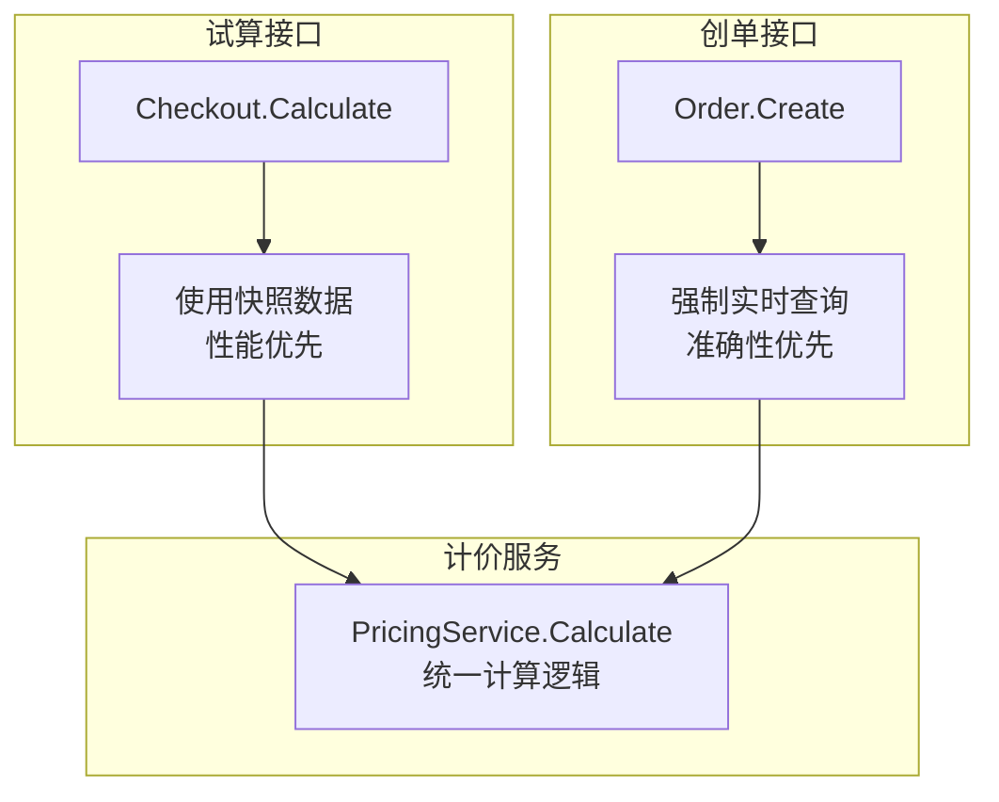
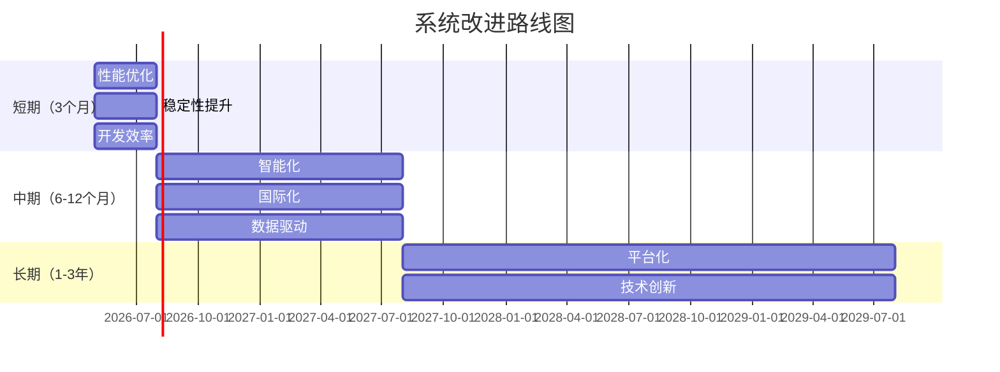

# 32.9-32.14 架构决策、治理与演进

## 32.9 架构决策记录（ADR）

本节记录系统设计过程中的关键架构决策，包括决策背景、备选方案、最终决策及理由。**ADR是架构演进的重要资产，帮助团队理解「为什么这样设计」，避免重复讨论。**

### ADR-001: 计价中心数据输入方式

**决策日期**：2026-04-14  
**状态**：已采纳 ✓

**问题描述**：计价中心需要营销信息（促销规则、优惠券等）来计算最终价格，有两种方案：
- 方案1：计价中心自己调用Marketing Service获取营销信息
- 方案2：聚合服务获取营销信息后传递给计价中心

**决策**：采用**方案2**，由聚合服务获取营销信息后传递给计价中心。

**理由**：

1. **单一职责原则（SRP）**：
   - Pricing Service专注于价格计算逻辑（纯函数）
   - Aggregation Service负责数据编排和获取
   - 职责边界清晰，符合微服务设计原则

2. **依赖解耦**：
   ```
   方案1依赖链：Aggregation → Pricing → Marketing（传递性依赖）
   方案2依赖链：Aggregation → Pricing | Marketing（平行依赖）✓
   ```

3. **性能优化空间更大**：
   - 聚合层可以并发调用Marketing和其他服务（Product、Inventory）
   - Pricing变成纯计算，无IO等待
   - 减少网络调用层级（2层 vs 3层）

4. **易于测试**：
   ```go
   // 方案2：Pricing是纯函数，测试简单
   func TestCalculatePrice(t *testing.T) {
       priceItem := &PriceCalculateItem{
           SkuID:     1001,
           BasePrice: 2399.00,
           PromoInfo: &PromoInfo{DiscountRate: 0.9},  // Mock数据
       }
       result := pricingService.Calculate(priceItem)
       assert.Equal(t, 2159.10, result.FinalPrice)
   }
   ```

5. **统一降级处理**：
   - 聚合层统一处理各服务失败（Marketing、Product、Inventory）
   - Pricing Service无感知，始终收到完整输入数据
   - 降级逻辑不混入业务计算

**代码示例**：

```go
// SearchOrchestrator（聚合服务）
func (o *SearchOrchestrator) Search(ctx context.Context, req *SearchRequest) (*SearchResponse, error) {
    // Step 1: 获取sku_ids（从ES）
    skuIDs, _ := o.searchClient.QuerySkuIDs(ctx, req.Keyword)
    
    // Step 2: 并发调用Product + Inventory + Marketing
    var products []*Product
    var stocks []*Stock
    var promos map[int64]*PromoInfo
    
    g, ctx := errgroup.WithContext(ctx)
    g.Go(func() error {
        products, _ = o.productClient.BatchGet(ctx, skuIDs)
        return nil
    })
    g.Go(func() error {
        stocks, _ = o.inventoryClient.BatchCheck(ctx, skuIDs)
        return nil
    })
    g.Go(func() error {
        promos, _ = o.marketingClient.BatchGet(ctx, skuIDs, req.UserID)
        // 降级：Marketing故障时使用空促销
        if promos == nil {
            promos = make(map[int64]*PromoInfo)
        }
        return nil
    })
    g.Wait()
    
    // Step 3: 调用Pricing计算价格（传入营销信息）
    priceItems := buildPriceItems(products, promos)
    prices, _ := o.pricingClient.BatchCalculate(ctx, priceItems)
    
    return buildSearchResponse(products, stocks, prices), nil
}

// PricingService（计价中心）- 纯函数，只负责计算
func (s *PricingService) Calculate(item *PriceItem) *PriceResult {
    finalPrice := item.BasePrice
    
    // 应用促销折扣（数据来自聚合层）
    if item.PromoInfo != nil {
        finalPrice = finalPrice * item.PromoInfo.DiscountRate
    }
    
    return &PriceResult{
        OriginalPrice: item.BasePrice,
        FinalPrice:    finalPrice,
        Discount:      item.BasePrice - finalPrice,
    }
}
```

**影响范围**：
- Aggregation Service：增加Marketing Service调用
- Pricing Service：接收PromoInfo作为输入参数
- Marketing Service：无影响

---

### ADR-002: 库存预占时机

**决策日期**：2026-04-14  
**状态**：已采纳 ✓

**问题描述**：在下单流程中，库存预占的时机有两种选择：
- 方案1：结算试算时预占（早期锁定）
- 方案2：确认下单时预占（延迟锁定）

**决策**：采用**方案2**，在确认下单时预占库存。

**理由**：

1. **减少无效预占**：
   - 用户在试算阶段可能多次修改商品、数量、优惠券
   - 早期预占会导致大量无效锁定（用户未真正下单）
   - 试算到下单的转化率通常只有20-30%

2. **提升库存利用率**：
   - 避免库存被长时间预占（用户可能犹豫、放弃）
   - 预占时长控制在15分钟内（支付超时自动释放）

3. **降低系统压力**：
   - 试算接口QPS高（用户多次试算），预占会导致Redis压力大
   - 确认下单QPS相对较低，预占操作更可控

4. **用户体验**：
   - 试算快速返回（不需要等待预占操作）
   - 确认下单时再预占，用户心理准备更充分

**权衡**：
- ✓ 优点：提升库存利用率、减少无效预占、降低系统压力
- ✗ 缺点：确认下单时可能库存不足（需要前端提示）

**降低缺点的措施**：
- 试算时展示实时库存状态（"仅剩N件"）
- 确认下单时二次校验库存，失败友好提示
- 热门商品提前告知"库存紧张，请尽快下单"

---

### ADR-003: 聚合服务 vs BFF

**决策日期**：2026-04-14  
**状态**：已采纳 ✓

**问题描述**：在API Gateway和微服务之间，是使用BFF（Backend For Frontend）还是Aggregation Service？

**决策**：采用**Aggregation Service**，而不是传统BFF。

**理由**：

1. **业务导向 vs 端导向**：
   - BFF按端划分（Web BFF、App BFF、小程序 BFF）
   - Aggregation按业务场景划分（搜索聚合、详情聚合、结算聚合）✓
   - 本系统多个端（Web、App）的业务逻辑高度一致，按端拆分会导致重复代码

2. **代码复用**：
   ```
   BFF模式：
   ├─ Web BFF（搜索逻辑）
   ├─ App BFF（搜索逻辑）    ← 重复代码
   └─ 小程序 BFF（搜索逻辑） ← 重复代码
   
   Aggregation模式：✓
   ├─ Search Aggregation（Web/App/小程序共用）
   └─ Detail Aggregation（Web/App/小程序共用）
   ```

3. **维护成本**：
   - BFF需要维护多个端的代码一致性
   - Aggregation只需维护一套业务逻辑

4. **适配端差异的方式**：
   - API Gateway层处理端协议差异（HTTP、WebSocket、gRPC）
   - Aggregation返回标准数据格式，前端各端按需裁剪

**适用场景**：
- ✓ 多端业务逻辑高度一致（如本系统）
- ✗ 不适用：各端业务逻辑差异大（如社交产品，Feed流算法不同）

---

### ADR-004: 虚拟商品库存模型

**决策日期**：2026-04-14  
**状态**：已采纳 ✓

**问题描述**：虚拟商品（机票、充值卡、优惠券）的库存模型和实物商品差异大，应该如何设计？

**决策**：采用**二维库存模型**（ManagementType + UnitType）。

**库存管理类型（ManagementType）**：

| 类型 | 说明 | 典型品类 | 库存来源 |
|-----|------|---------|---------|
| **实时库存** | 强依赖供应商实时查询 | 机票、酒店 | 供应商API |
| **池化库存** | 自有库存，可超卖后补偿 | 充值卡、优惠券 | 平台采购 |
| **无限库存** | 虚拟商品，无库存限制 | SaaS服务、数字内容 | 无 |

**库存单位类型（UnitType）**：

| 类型 | 说明 | 典型品类 |
|-----|------|---------|
| **SKU级别** | 每个规格独立库存 | 充电器（颜色、规格） |
| **批次级别** | 按批次管理（有效期） | 优惠券、礼品卡 |
| **座位级别** | 唯一标识（座位号） | 机票、电影票 |

**理由**：
1. 不同品类的库存特性差异极大，无法用统一模型
2. 二维模型提供灵活性，支持策略模式动态选择
3. 便于扩展新品类（只需添加新策略）

---

### ADR-005: 同步 vs 异步数据流

**决策日期**：2026-04-14  
**状态**：已采纳 ✓

**问题描述**：下单流程中，哪些操作应该同步执行，哪些应该异步执行？

**决策**：采用**同步+异步混合模式**。

**同步操作（用户等待）**：
1. 库存预占（必须成功，否则无法下单）
2. 优惠券扣减（避免超发）
3. 订单创建（生成order_id）

**异步操作（Kafka事件）**：
1. 库存确认扣减（预占成功后，异步确认）
2. 搜索索引更新（销量、热度）
3. 购物车清理
4. 用户行为分析
5. 消息通知（订单确认、物流更新）

**理由**：

1. **用户体验**：
   - 同步操作<500ms，用户可接受
   - 非核心操作异步化，不阻塞下单

2. **系统解耦**：
   - 异步事件降低服务间强依赖
   - 消费者故障不影响下单流程

3. **性能优化**：
   - 减少下单接口响应时间
   - 异步操作可批量处理（提升吞吐）

4. **容错能力**：
   - 异步操作支持重试（Kafka消费者重试机制）
   - 同步操作失败可立即回滚（Saga模式）

---

### ADR-009: 创单时是否使用快照数据（核心安全决策）

**决策日期**：2026-04-15  
**状态**：已采纳 ✓

**问题描述**：用户从详情页到提交订单期间，前端已经缓存了商品信息、价格、活动等快照数据。在用户点击"提交订单"创建订单时，后端是否可以使用这些快照数据来提升性能，避免重复查询？

**备选方案**：

| 方案 | 描述 | 优点 | 缺点 |
|------|------|------|------|
| **方案A：使用快照** | 创单时直接使用前端传递的快照数据 | ✅ 性能好（无需查询）<br>✅ 响应快（200ms → 50ms） | ❌ 安全风险高（快照可能被篡改）<br>❌ 资损风险 |
| **方案B：强制实时查询** ✓ | 创单时强制调用商品服务、营销服务查询最新数据 | ✅ 数据绝对准确<br>✅ 安全性高（防篡改）<br>✅ 无资损风险 | ❌ 性能稍差（多次RPC调用）<br>❌ RT增加100-200ms |
| **方案C：混合模式** | 普通商品用快照，营销商品强制查询 | ⚠️ 复杂度高<br>⚠️ 容易出错 | ❌ 维护成本高<br>❌ 边界不清晰 |

**决策**：采用**方案B（强制实时查询）**

**决策理由**：

1. **安全性优先于性能**
   ```
   风险分析：
   - 如果用快照，活动结束但快照未更新 → 用户用秒杀价下单 → 资损
   - 如果用快照，用户篡改价格 → 恶意低价下单 → 资损
   - 性能损失：100-200ms
   - 资损风险：每单可能损失数百至数千元
   
   结论：100ms的性能代价 << 资损风险
   ```

2. **涉及资金的操作必须实时校验**
   ```
   创单 = 锁定库存 + 锁定价格 + 准备扣款
   → 必须基于最新、最准确的数据
   → 不能因为性能优化而妥协安全性
   ```

3. **防止恶意篡改**
   ```
   场景：黑产抓包修改快照数据
   快照：{"expected_payable": 799900}  // 原价 ¥7,999
   篡改：{"expected_payable": 1}       // 改成 ¥0.01
   
   如果后端使用快照：
   → 按 ¥0.01 创单 → 公司巨额损失！
   
   强制实时查询：
   → 后端查到实际价格 ¥7,999
   → 对比快照 ¥0.01 vs 实际 ¥7,999
   → 差异巨大，拒绝创单！
   ```

4. **活动可能随时变化**
   ```
   10:00  秒杀价 ¥7,999，生成快照
   10:04  秒杀活动提前结束（库存售罄）
   10:05  用户提交订单
   
   如果用快照：
   → 按 ¥7,999 创单（活动已结束！）
   → 资损
   
   强制查询：
   → 查到活动已结束，价格 ¥8,999
   → 提示用户价格变化
   → 避免资损
   ```

**实现方案**：

```go
// OrderService.CreateOrder - 确认下单接口（准确性优先）
func (s *OrderService) CreateOrder(ctx context.Context, req *CreateOrderRequest) (*Order, error) {
    // ⚠️ 关键：创单时不使用任何前端传递的快照数据，全部实时查询
    
    // Step 1: 实时查询商品信息（不使用前端快照）
    products, err := s.productClient.BatchGetProducts(ctx, req.SkuIDs)
    if err != nil {
        return nil, fmt.Errorf("query products failed: %w", err)
    }
    
    // Step 2: 实时查询营销活动（强制最新数据）
    promos, err := s.marketingClient.BatchGetPromotions(ctx, req.SkuIDs, req.UserID)
    if err != nil {
        return nil, fmt.Errorf("query promotions failed: %w", err)
    }
    
    // Step 3: 校验营销活动有效性（关键：防止使用过期活动）
    for _, promo := range promos {
        if !s.validatePromotion(promo) {
            return nil, fmt.Errorf("promotion %s is invalid or expired", promo.ID)
        }
    }
    
    // Step 4: 实时计算价格（基于最新营销数据）
    price, err := s.pricingClient.CalculateFinalPrice(ctx, products, promos)
    if err != nil {
        return nil, fmt.Errorf("calculate price failed: %w", err)
    }
    
    // Step 5: 价格校验（对比前端传递的期望价格）
    if req.ExpectedPrice > 0 {
        if err := s.validatePriceChange(req.ExpectedPrice, price.FinalPrice); err != nil {
            return nil, err  // 价格变化过大，拒绝创单
        }
    }
    
    // Step 6: 预占库存
    reserved, err := s.inventoryClient.ReserveStock(ctx, req.Items)
    if err != nil {
        return nil, fmt.Errorf("reserve stock failed: %w", err)
    }
    
    // Step 7: 生成商品快照（基于实时查询的数据）
    snapshot := s.generateProductSnapshot(products, promos, price)
    
    // Step 8: 创建订单（保存快照）
    order := &Order{
        OrderID:         s.generateOrderID(),
        UserID:          req.UserID,
        Items:           req.Items,
        TotalPrice:      price.FinalPrice,
        ProductSnapshot: marshal(snapshot),  // 💾 保存商品快照
        Status:          OrderStatusPendingPayment,
        ExpireTime:      time.Now().Add(15 * time.Minute),
        ReserveIDs:      reserved,
    }
    
    return s.orderRepo.Create(ctx, order)
}

// 价格校验逻辑（防止用户感知差）
func (s *OrderService) validatePriceChange(expected, actual int64) error {
    diff := actual - expected
    diffPercent := float64(diff) / float64(expected) * 100
    
    // 场景1: 价格降低 → 允许（对用户有利）
    if diff < 0 {
        return nil
    }
    
    // 场景2: 价格上涨 < 1元 → 允许（误差容忍）
    if diff <= 100 { // 100分 = 1元
        return nil
    }
    
    // 场景3: 价格上涨 >= 1元 且 < 5% → 允许但记录日志
    if diffPercent < 5.0 {
        log.Warnf("price increased: expected=%d, actual=%d", expected, actual)
        return nil
    }
    
    // 场景4: 价格上涨 >= 5% → 拒绝，要求用户重新确认
    return &PriceChangedError{
        Expected: expected,
        Actual:   actual,
        Message:  fmt.Sprintf("价格已变化，请重新确认"),
    }
}
```

**核心原则**：
```text
┌────────────────────────────────────────────────────────┐
│ 试算阶段：性能优先 → 可用快照（5分钟缓存）              │
│ 创单阶段：准确性优先 → 强制实时查询                     │
│ 历史查询：可追溯性 → 保存快照到订单表                   │
└────────────────────────────────────────────────────────┘
```

---

### ADR-010: 创单与支付的时序关系

**决策日期**：2026-04-14  
**状态**：已采纳 ✓

**问题描述**：在订单流程中，"创建订单"和"支付"这两个动作的时序关系有两种模式：
1. **创单即支付**：用户点击"立即购买"后，先支付，支付成功后再创建订单
2. **先创单后支付**：用户点击"提交订单"后，先创建订单（资源扣减），然后再支付

**决策**：采用"先创单后支付"模式

**理由**：

**1. 防止超卖（关键）**：
```text
【创单即支付模式的问题】：
1. 用户A看到库存=1
2. 用户B也看到库存=1
3. 用户A点击支付（此时库存未扣减）
4. 用户B也点击支付（库存仍未扣减）
5. 两人同时支付成功 → 超卖！

【先创单后支付模式的解决方案】：
1. 用户A点击"提交订单" → 库存预占：1 → 0（剩余可用）
2. 用户B点击"提交订单" → 库存不足，下单失败
3. 用户A有15分钟支付窗口
4. 如果用户A超时未支付 → 释放库存：0 → 1（其他人可下单）
```

**2. 用户体验更好**：
- ✅ 用户点击"提交订单"后，订单立即生成，库存被锁定
- ✅ 用户可以慢慢选择支付方式（支付宝、微信、银行卡）
- ✅ 用户可以在支付环节选择优惠券、支付渠道优惠
- ✅ 用户可以先下单占位，稍后再支付（适合机票、酒店）

**3. 价格计算灵活性**：
- 创单时计算：商品基础价格 + 营销优惠（折扣、满减）
- 支付时计算：支付渠道费（信用卡手续费、花呗分期费）+ 支付渠道优惠

**权衡**：

| 维度 | 优势 | 劣势 |
|-----|------|------|
| **用户体验** | ✅ 先锁定库存，再支付<br>✅ 支付环节更灵活 | ⚠️ 15分钟内库存被占用 |
| **防止超卖** | ✅ 创单时锁定库存（零超卖） | ⚠️ 需要处理超时释放逻辑 |
| **库存利用率** | ⚠️ 预占库存可能被浪费（10-20%未支付率） | ✅ 可通过缩短支付窗口优化 |
| **系统复杂度** | ⚠️ 需要库存预占机制<br>⚠️ 需要超时释放定时任务 | ⚠️ 状态机更复杂 |

**超时未支付处理**：

```go
// OrderTimeoutJob - 定时扫描超时未支付订单
func (j *OrderTimeoutJob) Run() {
    // 查询超时订单（创建时间 > 15分钟，状态=PENDING_PAYMENT）
    expiredOrders := j.orderRepo.FindExpiredPendingPayment(15 * time.Minute)
    
    for _, order := range expiredOrders {
        // 1. 更新订单状态：PENDING_PAYMENT → CANCELLED
        order.Status = OrderStatusCancelled
        order.CancelReason = "超时未支付"
        j.orderRepo.Update(ctx, order)
        
        // 2. 释放库存
        j.inventoryClient.ReleaseStock(ctx, order.ReserveIDs)
        
        // 3. 回退优惠券
        if order.CouponID != "" {
            j.marketingClient.ReleaseCoupon(ctx, order.CouponID, order.UserID)
        }
        
        // 4. 发布订单取消事件
        j.eventPublisher.Publish(ctx, &OrderCancelledEvent{
            OrderID: order.OrderID,
            Reason:  "超时未支付",
        })
    }
}
```

---

### ADR-011: 创单时前后端价格校验策略

**决策日期**：2026-04-15  
**状态**：已采纳 ✓

**问题描述**：创单时后端实时查询得到的价格，可能和前端展示的价格不一致（活动变化、价格调整）。应该如何处理这种差异？

**决策**：采用**差异容忍 + 提示机制**

**价格对比规则**：

| 场景 | 差异情况 | 处理策略 | 理由 |
|------|---------|---------|------|
| **场景1** | 价格降低 | ✅ 直接通过 | 对用户有利 |
| **场景2** | 价格上涨 < 1元 | ✅ 允许（容忍误差） | 微小差异，可接受 |
| **场景3** | 价格上涨 >= 1元 且 < 5% | ✅ 允许但记录日志 | 合理波动范围 |
| **场景4** | 价格上涨 >= 5% | ❌ 拒绝，要求重新确认 | 差异过大，影响用户决策 |

**实现代码**：

```go
func (s *OrderService) validatePriceChange(expected, actual int64) error {
    diff := actual - expected
    diffPercent := float64(diff) / float64(expected) * 100
    
    // 场景1: 价格降低 → 允许（对用户有利）
    if diff < 0 {
        return nil
    }
    
    // 场景2: 价格上涨 < 1元 → 允许
    if diff <= 100 {
        return nil
    }
    
    // 场景3: 价格上涨 < 5% → 允许但记录
    if diffPercent < 5.0 {
        log.Warnf("price increased: expected=%d, actual=%d, diff=%d", 
            expected, actual, diff)
        return nil
    }
    
    // 场景4: 价格上涨 >= 5% → 拒绝
    return &PriceChangedError{
        Expected: expected,
        Actual:   actual,
        Message:  fmt.Sprintf("价格已变化：原价%.2f元，现价%.2f元", 
            float64(expected)/100, float64(actual)/100),
    }
}
```

**前端交互**：

```javascript
// 前端处理价格变化错误
try {
    const order = await api.createOrder(orderData);
} catch (error) {
    if (error.code === 'PRICE_CHANGED') {
        // 弹窗提示用户
        showConfirmDialog({
            title: '价格已变化',
            message: error.message,
            confirm: '接受新价格并下单',
            cancel: '返回重新选择'
        }).then((confirmed) => {
            if (confirmed) {
                // 用户接受新价格，使用新价格重新下单
                api.createOrder({
                    ...orderData,
                    acceptNewPrice: true,
                    expectedPrice: error.actualPrice
                });
            }
        });
    }
}
```

---

### ADR-012: 试算价格计算与创单价格计算的统一与差异

**决策日期**：2026-04-15  
**状态**：已采纳 ✓

**问题描述**：试算接口（`/checkout/calculate`）和创单接口（`/order/create`）都需要计算价格，两者的价格计算逻辑应该如何设计？

**决策**：**统一计价服务 + 差异化数据输入**

**核心设计**：

| 接口 | 数据输入 | 计算逻辑 | 快照策略 |
|------|---------|---------|---------|
| **试算接口** | 可使用快照（5分钟） | 调用统一计价服务 | 允许快照数据 |
| **创单接口** | 强制实时查询 | 调用统一计价服务 | 禁止快照数据 |

**理由**：

1. **计价逻辑统一**：
   - 试算和创单使用同一个 `PricingService.Calculate`
   - 避免"试算价格"与"订单价格"不一致
   - 营销规则变更只需更新一处

2. **数据输入差异化**：
   - 试算：允许使用缓存/快照数据（性能优先）
   - 创单：强制实时查询（准确性优先）

3. **最终一致性保证**：
   - 试算阶段可能使用过期快照
   - 创单阶段的实时查询是最后防线
   - 价格差异会被拦截并提示用户

**架构图**：



---

### ADR-013: 价格在整个交易链路中的流转与计算策略

**决策日期**：2026-04-15  
**状态**：已采纳 ✓

**问题描述**：从用户搜索商品到最终支付，价格会经历多个阶段（搜索列表 → 商品详情 → 加购试算 → 创单 → 支付）。每个阶段的价格计算范围、数据来源、系统交互都不同。需要一个全局视角来理解价格是如何流转的，以及各阶段的相同点和不同点。

**核心挑战**：
```text
业务困惑：
• 为什么搜索列表的价格和详情页不一样？
• 详情页显示的价格和试算价格能保证一致吗？
• 试算价格和最终支付价格可能不同吗？
• 每个阶段都要调用Pricing Service吗？
• 基础价格、营销折扣、优惠券、Coin、支付渠道费分别在哪个阶段计算？
```

**决策**：采用**"分阶段计算 + 逐步扩展价格维度 + 最终强制校验"**策略

---

**价格流转全局图**：

```text
用户旅程：搜索 → 详情 → 试算 → 创单 → 支付
           ↓      ↓      ↓      ↓      ↓
价格计算： 基础价  +营销  +营销  +营销  +Coin+Voucher+渠道费
           ↓      ↓      ↓      ↓      ↓
数据来源： ES缓存  实时   快照   强制   强制实时
                         (可选) 实时
           ↓      ↓      ↓      ↓      ↓
性能目标： 30ms   150ms  230ms  500ms  200ms
```

**五个阶段对比**：

| 阶段 | 价格维度 | 数据来源 | 性能目标 | 计算复杂度 | 资损风险 |
|------|---------|---------|---------|-----------|---------|
| **搜索列表** | 基础价（最低价） | ES缓存（延迟1-5分钟） | P95 < 30ms | 低（只查ES） | 无 |
| **商品详情** | 基础价 + 营销折扣 | 实时查询 + 生成快照 | P95 < 150ms | 中（3个服务） | 无 |
| **结算试算** | 基础价 + 营销 + 数量 | 快照 OR 实时查询 | P95 < 230ms | 中（可能3个服务） | 无 |
| **确认下单** | 基础价 + 营销 + 数量 + 券 | 强制实时查询 | P95 < 500ms | 高（4个服务 + 预占） | 高 |
| **支付确认** | 上述 + Coin + Voucher + 渠道费 | 强制实时查询 | P95 < 200ms | 高（多维度计算） | 极高 |

**核心设计原则**：

1. **逐步扩展价格维度**
   ```
   搜索：最低价（吸引用户）
   详情：折扣价（展示营销）
   试算：总价（含数量、券）
   创单：锁定价（预占资源）
   支付：最终价（含所有优惠与费用）
   ```

2. **数据来源分级**
   ```
   搜索/详情：允许缓存（性能优先）
   试算：允许快照（性能与准确性平衡）
   创单/支付：强制实时（安全优先）
   ```

3. **多道防线保证准确性**
   ```
   详情页：生成快照（用于试算）
   试算：对比快照与实时（发现变化）
   创单：强制实时 + 价格校验（最后防线）
   支付：二次校验 + Coin/Voucher锁定（终极防线）
   ```

**监控指标**：
- 各阶段P95响应时间
- 快照命中率（目标 > 80%）
- 价格差异率（试算vs创单，目标 < 5%）
- 价格变化拦截率（创单价格校验触发频率）

---

## 32.10 高可用与性能优化（Infrastructure & Operations）

### 32.7.1 高可用设计

**服务多副本部署**：

| 服务 | 正常副本 | 大促副本 | 扩容策略 |
|------|---------|---------|---------|
| Product Center | 6 | 18 | CPU > 70% 自动扩容 |
| Inventory | 6 | 18 | QPS > 5000 扩容 |
| Order | 8 | 24 | QPS > 3000 扩容 |
| Payment | 4 | 12 | QPS > 2000 扩容 |

**数据库高可用**：

```text
MySQL：
• 主从复制（1主2从）
• 双主互备（支付库）
• 自动故障转移（MHA）

Redis：
• Sentinel模式（1主2从3哨兵）
• 自动故障转移

Kafka：
• 3副本
• ISR机制
```

**熔断与降级**：

```go
// 熔断配置
type CircuitBreakerConfig struct {
    MaxRequests       uint32        // 半开状态最大请求数
    Interval          time.Duration // 统计窗口
    Timeout           time.Duration // 熔断超时时间
    FailureThreshold  float64       // 失败率阈值（0-1）
}

// 降级策略
func (s *SearchAggregation) Search(ctx context.Context, req *SearchRequest) (*SearchResponse, error) {
    // 尝试调用Marketing Service
    promos, err := s.marketingClient.GetPromotions(ctx, req.SkuIDs)
    if err != nil {
        // 降级：使用基础价格（不展示营销信息）
        log.Warn("Marketing Service故障，降级为基础价格")
        promos = make(map[int64]*PromoInfo)  // 空促销
    }
    
    // 继续后续流程...
    return s.buildResponse(products, promos)
}
```

### 32.7.2 性能优化

**缓存策略**（多级缓存）：

```go
// L1: 本地缓存（进程内）
type LocalCache struct {
    cache *bigcache.BigCache
}

func (c *LocalCache) Get(key string) (interface{}, error) {
    data, err := c.cache.Get(key)
    if err == nil {
        return unmarshal(data), nil
    }
    return nil, err
}

// L2: Redis缓存
// L3: MySQL数据库

func (s *ProductService) GetProduct(ctx context.Context, skuID int64) (*Product, error) {
    // L1: 本地缓存
    if product, err := s.localCache.Get(skuID); err == nil {
        return product, nil
    }
    
    // L2: Redis缓存
    if product, err := s.redis.Get(ctx, fmt.Sprintf("product:%d", skuID)); err == nil {
        s.localCache.Set(skuID, product)  // 回填L1
        return product, nil
    }
    
    // L3: MySQL数据库
    product, err := s.repo.GetByID(ctx, skuID)
    if err != nil {
        return nil, err
    }
    
    // 回填缓存
    s.redis.Set(ctx, fmt.Sprintf("product:%d", skuID), product, 30*time.Minute)
    s.localCache.Set(skuID, product)
    
    return product, nil
}
```

**批量查询优化**：

```go
// 批量获取商品信息（减少RPC调用）
func (s *ProductService) BatchGetProducts(ctx context.Context, skuIDs []int64) (map[int64]*Product, error) {
    // Step 1: 尝试从缓存批量获取
    cached := s.redis.MGet(ctx, toCacheKeys(skuIDs))
    
    // Step 2: 找出缺失的ID
    missingIDs := findMissing(skuIDs, cached)
    
    // Step 3: 批量查询数据库（IN查询）
    if len(missingIDs) > 0 {
        missing, _ := s.repo.GetByIDs(ctx, missingIDs)
        // 回填缓存
        s.redis.MSet(ctx, missing, 30*time.Minute)
        cached = merge(cached, missing)
    }
    
    return cached, nil
}
```

**数据库优化**：

```sql
-- 索引优化
CREATE INDEX idx_order_user_create ON `order` (user_id, create_time DESC);
CREATE INDEX idx_order_status ON `order` (status, create_time DESC);

-- 避免SELECT *（只查询需要的字段）
SELECT order_id, status, total_price FROM `order` WHERE user_id = ?;

-- 分页优化（使用索引覆盖）
SELECT order_id FROM `order` 
WHERE user_id = ? AND create_time > ?
ORDER BY create_time DESC
LIMIT 20;
```

### 32.7.3 容灾与降级

**多机房部署**：

```text
Region A（主）：
• 写流量：100%
• 读流量：70%

Region B（备）：
• 写流量：0%（只读副本）
• 读流量：30%

灾难切换：
• 自动故障检测（3秒）
• 流量切换到Region B（30秒）
• RTO：< 2分钟
```

**降级开关**：

```go
// Feature Flag控制降级
func (s *CheckoutService) Calculate(ctx context.Context, req *CalculateRequest) (*CalculateResponse, error) {
    // 检查Feature Flag
    if s.featureFlag.IsEnabled(ctx, "marketing.enabled") {
        // 正常逻辑：调用Marketing Service
        promos, _ := s.marketingClient.GetPromotions(ctx, req)
        return s.calculateWithPromos(req, promos)
    } else {
        // 降级逻辑：不使用营销信息
        return s.calculateBasic(req)
    }
}
```

---

## 32.11 团队组织与协作（Organization & Governance）

### 32.11.1 团队结构

**康威定律实践**：系统架构反映组织沟通结构。

```text
订单团队（15人）
├─ 订单核心（5人）：订单创建、状态机
├─ 订单查询（3人）：我的订单、订单详情
├─ 履约对接（4人）：供应商履约、异常处理
└─ 测试（3人）

商品团队（12人）
├─ 商品中心（6人）：SPU/SKU管理
├─ 类目属性（3人）：类目树、属性模板
└─ 测试（3人）

库存团队（10人）
├─ 库存核心（5人）：预占、扣减、释放
├─ 供应商同步（3人）：实时查询、定时同步
└─ 测试（2人）
```

**跨团队协作**：

| 场景 | 协作方式 | 工具 |
|------|---------|------|
| API契约 | OpenAPI/Proto定义 | Swagger、Buf |
| 事件契约 | Schema Registry | Confluent Schema Registry |
| 联调测试 | 契约测试 | Pact |
| 故障处理 | On-call轮值 | PagerDuty |

### 32.8.2 协作流程

**需求评审流程**：

```text
1. 产品提需求（PRD）
   ↓
2. 技术评审（架构师+各团队Lead）
   • 是否需要新增服务？
   • 是否需要修改API契约？
   • 是否需要数据库迁移？
   ↓
3. API契约评审（上下游团队）
   • 定义Request/Response
   • 明确超时、重试策略
   • 确认降级方案
   ↓
4. 开发排期
   • 各团队独立开发
   • 契约测试通过后联调
   ↓
5. 集成测试
   • 端到端测试
   • 性能测试
   ↓
6. 灰度发布
   • 5% → 20% → 50% → 100%
```

**实际案例：新增"拼团"功能的完整协作流程**

**第1周：需求评审与技术方案**

```text
【产品需求】
- 用户发起拼团（3人成团，24小时有效）
- 拼团价格比正常价格低20%
- 成团后统一发货，不成团退款

【技术评审会议】（2小时，架构师+6个团队Lead）
问题1：拼团功能是否需要新增服务？
  → 决策：新增"拼团服务"（GroupBuy Service）
  → 理由：拼团逻辑复杂（成团判断、超时处理），独立服务便于维护

问题2：拼团价格如何计算？
  → 决策：在Pricing Service中新增"拼团价格策略"
  → 理由：价格计算逻辑应该统一管理

问题3：拼团成功后如何扣减库存？
  → 决策：拼团成功时批量预占库存（3人份）
  → 理由：避免成团后库存不足

【输出物】
- 技术方案文档（15页）
- 服务依赖图（Mermaid图）
- 数据库设计（ER图）
- 时序图（成团流程、超时处理）
```

**第2周：API契约评审**

```text
【API契约】
// 创建拼团
POST /groupbuy/create
Request:
{
  "sku_id": 1001,
  "original_price": 299.00,
  "groupbuy_price": 239.00,  // 8折
  "required_count": 3,        // 3人成团
  "expire_hours": 24          // 24小时有效
}
Response:
{
  "groupbuy_id": "GB20260501123456",
  "status": "waiting",        // 等待中
  "current_count": 1,         // 当前人数
  "required_count": 3,
  "expires_at": 1744633200
}

// 参与拼团
POST /groupbuy/join
Request:
{
  "groupbuy_id": "GB20260501123456",
  "user_id": 67890
}
Response:
{
  "status": "success",        // 成功 or 团满
  "order_id": "ORD123456",    // 如果成团，返回订单号
  "current_count": 3
}

【契约测试】
- 上游：前端团队（Web、App）
- 下游：Pricing Service、Inventory Service、Order Service
- 测试工具：Pact
- 测试覆盖：100%（所有API）
```

**第3-4周：并行开发**

```text
【团队分工】
拼团团队（5人）：
  - 拼团服务核心逻辑
  - 超时任务（15分钟扫描一次）
  - 数据库表设计（groupbuy、groupbuy_participant）

计价团队（2人）：
  - 新增拼团价格策略
  - 拼团价格校验

库存团队（2人）：
  - 批量预占库存接口

订单团队（3人）：
  - 拼团成团后批量创建订单
  - 拼团失败后退款

前端团队（4人）：
  - 拼团页面（发起、参与、分享）
  - 倒计时组件

【每日站会】（15分钟）
- 各团队汇报进度
- 识别阻塞点
- 协调资源

【契约测试通过率】
- 第3周末：70%
- 第4周末：100% ✅
```

**第5周：集成测试**

```text
【测试场景】
场景1：正常成团
  1. 用户A发起拼团（3人成团）
  2. 用户B、C参与拼团
  3. 成团 → 创建3个订单 → 预占库存（3份）
  4. 用户A、B、C支付 → 确认扣减库存

场景2：超时未成团
  1. 用户A发起拼团（3人成团）
  2. 只有用户B参与（2人）
  3. 24小时后超时 → 标记拼团失败 → 退款

场景3：库存不足
  1. 用户A发起拼团（3人成团）
  2. 用户B、C参与拼团
  3. 成团时库存不足（只剩2个）→ 拼团失败 → 退款

【性能测试】
- 并发创建拼团：1000 TPS
- 并发参与拼团：5000 TPS
- 超时扫描任务：1000个拼团/秒
- P99延迟：< 300ms ✅
```

**第6周：灰度发布**

```text
【灰度策略】
阶段1（5%）：内部员工 + 白名单用户（1000人）
  → 观察1天：成团率、退款率、投诉数

阶段2（20%）：北京、上海用户
  → 观察3天：性能指标、业务指标

阶段3（50%）：全国用户
  → 观察1周

阶段4（100%）：全量发布
  → 持续监控1个月

【关键指标】
- 成团率：65%（目标 > 60%）✅
- 退款率：5%（目标 < 10%）✅
- 用户投诉：3起/天（目标 < 10起）✅
- P99延迟：280ms（目标 < 300ms）✅
```

**协作关键点**：

| 阶段 | 关键协作点 | 工具/机制 |
|------|----------|---------|
| **需求评审** | 架构师+各团队Lead对齐技术方案 | 会议+文档 |
| **API契约** | 上下游团队明确接口定义 | OpenAPI + Pact |
| **并行开发** | 各团队独立开发，通过契约测试联调 | Pact + Mock Server |
| **集成测试** | 端到端测试，验证完整流程 | 自动化测试平台 |
| **灰度发布** | 分阶段发布，持续监控 | Feature Flag + Grafana |

**变更管理**：

```go
// ADR（Architecture Decision Record）
// 记录重大架构决策

## ADR-014: 拼团功能是否复用订单服务

**决策日期**：2026-05-01
**状态**：已采纳 ✓

**问题描述**：
拼团功能需要创建订单，是在订单服务中新增拼团逻辑，还是新建拼团服务？

**备选方案**：
A. 在订单服务中新增拼团逻辑
   ✓ 复用订单创建逻辑
   ✗ 订单服务变得臃肿
   ✗ 拼团逻辑与订单逻辑耦合

B. 新建拼团服务
   ✓ 拼团逻辑独立，便于维护
   ✓ 订单服务保持单一职责
   ✗ 需要新建服务（增加运维成本）

**决策**：采用方案B，新建拼团服务

**理由**：
1. 拼团逻辑复杂（成团判断、超时处理、退款逻辑）
2. 拼团是营销活动，不是订单核心流程
3. 未来可能有"砍价""秒杀"等类似活动，独立服务便于扩展

**影响范围**：
- 新增服务：GroupBuy Service
- QPS估算：2000（正常）/ 10000（大促）
- 部署规模：4副本（正常）/ 12副本（大促）

**后续行动**：
- ✓ 已完成：GroupBuy Service开发
- ✓ 已完成：与订单服务集成
- ✓ 已完成：灰度上线
```

### 32.8.3 技术治理

**代码评审清单**：

- [ ] 是否符合分层架构（依赖方向正确）
- [ ] 是否有单元测试（覆盖率 > 80%）
- [ ] 是否有集成测试（核心路径）
- [ ] 是否有性能测试（Benchmark）
- [ ] 是否有监控指标（Prometheus Metrics）
- [ ] 是否有日志（结构化日志）
- [ ] 是否有文档（API文档、设计文档）
- [ ] 是否考虑降级方案

**技术债管理**：

```markdown
## 技术债清单

| 优先级 | 类型 | 描述 | 负责人 | 预计工作量 |
|-------|------|------|--------|-----------|
| P0 | 性能 | 订单查询慢查询优化 | @张三 | 2天 |
| P1 | 安全 | 支付回调签名验证 | @李四 | 1天 |
| P2 | 代码 | 商品中心重复代码重构 | @王五 | 3天 |
```

---

## 32.12 上线与演进（Deployment & Evolution）

### 32.12.1 上线策略

**分阶段上线**：

```text
阶段1：基础功能（2周）
• 商品中心、库存服务、订单服务
• 支持机票、酒店两个品类
• 单机房部署

阶段2：营销功能（2周）
• 营销服务、计价服务
• 支持优惠券、活动

阶段3：新品类（每周1个）
• 充值、电影票、优惠券、礼品卡

阶段4：多机房（4周）
• 双机房部署
• 流量灰度切换
```

### 32.9.2 灰度发布

**灰度策略**：

```go
// 灰度规则
type GrayReleaseRule struct {
    Version    string   // 新版本号
    Percentage int      // 流量比例（0-100）
    Whitelist  []int64  // 白名单用户ID
    Regions    []string // 灰度地区
}

func (r *GrayRouter) Route(userID int64, region string) string {
    // 白名单用户直接路由到新版本
    if contains(r.rule.Whitelist, userID) {
        return r.rule.Version
    }
    
    // 按地区灰度
    if !contains(r.rule.Regions, region) {
        return "stable"  // 老版本
    }
    
    // 按百分比灰度
    if hash(userID) % 100 < r.rule.Percentage {
        return r.rule.Version  // 新版本
    }
    
    return "stable"  // 老版本
}
```

**灰度步骤**：

```text
1. 5%流量（白名单用户 + 内部员工）
   观察1小时：错误率、延迟、业务指标

2. 20%流量（特定地区）
   观察2小时

3. 50%流量
   观察4小时

4. 100%流量（全量发布）
   观察24小时

5. 下线老版本
```

### 32.9.3 监控告警

**三级监控体系**：

| 层级 | 监控对象 | 工具 | 告警阈值 |
|------|---------|------|---------|
| **业务监控** | 订单量、GMV、转化率 | Grafana + ClickHouse | 同比下降20% |
| **应用监控** | QPS、延迟、错误率 | Prometheus + Grafana | P99延迟>500ms |
| **基础设施监控** | CPU、内存、磁盘、网络 | Prometheus + Node Exporter | CPU>80% |

**核心指标**：

```go
// Prometheus Metrics
package metrics

import "github.com/prometheus/client_golang/prometheus"

var (
    // 业务指标
    orderCreatedTotal = prometheus.NewCounterVec(
        prometheus.CounterOpts{
            Name: "order_created_total",
            Help: "订单创建总数",
        },
        []string{"category", "status"},  // 标签：品类、状态
    )
    
    orderCreatedLatency = prometheus.NewHistogramVec(
        prometheus.HistogramOpts{
            Name:    "order_created_latency_seconds",
            Help:    "订单创建延迟",
            Buckets: []float64{0.05, 0.1, 0.25, 0.5, 1, 2.5, 5, 10},
        },
        []string{"category"},
    )
    
    orderGMV = prometheus.NewGaugeVec(
        prometheus.GaugeOpts{
            Name: "order_gmv_total",
            Help: "订单GMV（元）",
        },
        []string{"date"},
    )
    
    // 系统指标
    httpRequestDuration = prometheus.NewHistogramVec(
        prometheus.HistogramOpts{
            Name:    "http_request_duration_seconds",
            Help:    "HTTP请求延迟",
            Buckets: []float64{.005, .01, .025, .05, .1, .25, .5, 1, 2.5, 5, 10},
        },
        []string{"method", "endpoint", "status"},
    )
    
    httpRequestTotal = prometheus.NewCounterVec(
        prometheus.CounterOpts{
            Name: "http_request_total",
            Help: "HTTP请求总数",
        },
        []string{"method", "endpoint", "status"},
    )
    
    // 依赖服务指标
    rpcCallDuration = prometheus.NewHistogramVec(
        prometheus.HistogramOpts{
            Name:    "rpc_call_duration_seconds",
            Help:    "RPC调用延迟",
            Buckets: []float64{.005, .01, .025, .05, .1, .25, .5, 1, 2.5, 5},
        },
        []string{"service", "method", "status"},
    )
    
    rpcCallTotal = prometheus.NewCounterVec(
        prometheus.CounterOpts{
            Name: "rpc_call_total",
            Help: "RPC调用总数",
        },
        []string{"service", "method", "status"},
    )
    
    // 数据库指标
    dbQueryDuration = prometheus.NewHistogramVec(
        prometheus.HistogramOpts{
            Name:    "db_query_duration_seconds",
            Help:    "数据库查询延迟",
            Buckets: []float64{.001, .005, .01, .025, .05, .1, .25, .5, 1},
        },
        []string{"query_type", "table"},
    )
    
    // Redis指标
    redisCommandDuration = prometheus.NewHistogramVec(
        prometheus.HistogramOpts{
            Name:    "redis_command_duration_seconds",
            Help:    "Redis命令延迟",
            Buckets: []float64{.0001, .0005, .001, .005, .01, .025, .05, .1},
        },
        []string{"command"},
    )
)

// 使用示例
func CreateOrder(ctx context.Context, req *CreateOrderRequest) (*Order, error) {
    startTime := time.Now()
    
    // 业务逻辑...
    order, err := createOrderInternal(ctx, req)
    
    // 记录指标
    duration := time.Since(startTime).Seconds()
    category := req.Category
    status := "success"
    if err != nil {
        status = "failed"
    }
    
    // 记录订单创建总数
    orderCreatedTotal.WithLabelValues(category, status).Inc()
    
    // 记录订单创建延迟
    orderCreatedLatency.WithLabelValues(category).Observe(duration)
    
    // 记录GMV
    if err == nil {
        orderGMV.WithLabelValues(time.Now().Format("2006-01-02")).Add(float64(order.TotalPrice))
    }
    
    return order, err
}
```

**告警规则**：

```yaml
# Prometheus AlertManager规则
groups:
  - name: order-service-alerts
    rules:
      # P99延迟告警
      - alert: OrderCreateLatencyHigh
        expr: histogram_quantile(0.99, order_created_latency_seconds) > 1
        for: 5m
        labels:
          severity: warning
          service: order-service
        annotations:
          summary: "订单创建延迟过高"
          description: "P99延迟 {{ $value }}s > 1s（持续5分钟）"
          dashboard: "https://grafana.example.com/d/order-service"
      
      # 错误率告警
      - alert: OrderCreateErrorRateHigh
        expr: |
          sum(rate(order_created_total{status="failed"}[5m])) 
          / sum(rate(order_created_total[5m])) > 0.01
        for: 5m
        labels:
          severity: critical
          service: order-service
        annotations:
          summary: "订单创建失败率过高"
          description: "失败率 {{ $value | humanizePercentage }} > 1%"
          runbook: "https://wiki.example.com/runbook/order-create-error"
      
      # QPS下降告警（业务异常）
      - alert: OrderCreateQPSDrop
        expr: |
          (sum(rate(order_created_total[5m])) 
          / sum(rate(order_created_total[5m] offset 1h))) < 0.5
        for: 10m
        labels:
          severity: warning
          service: order-service
        annotations:
          summary: "订单创建QPS骤降"
          description: "当前QPS {{ $value }}，比1小时前下降50%以上"
      
      # GMV下降告警（业务异常）
      - alert: OrderGMVDrop
        expr: |
          (sum(rate(order_gmv_total[1h])) 
          / sum(rate(order_gmv_total[1h] offset 24h))) < 0.8
        for: 30m
        labels:
          severity: critical
          service: order-service
        annotations:
          summary: "订单GMV大幅下降"
          description: "当前GMV {{ $value }}，比昨天同期下降20%以上"
      
      # RPC调用失败率告警
      - alert: RPCCallErrorRateHigh
        expr: |
          sum(rate(rpc_call_total{status!="success"}[5m])) by (service) 
          / sum(rate(rpc_call_total[5m])) by (service) > 0.05
        for: 5m
        labels:
          severity: warning
        annotations:
          summary: "RPC调用失败率过高：{{ $labels.service }}"
          description: "失败率 {{ $value | humanizePercentage }} > 5%"
      
      # 数据库慢查询告警
      - alert: DBSlowQuery
        expr: histogram_quantile(0.99, db_query_duration_seconds) > 0.1
        for: 5m
        labels:
          severity: warning
        annotations:
          summary: "数据库慢查询"
          description: "P99延迟 {{ $value }}s > 100ms"
      
      # Redis延迟告警
      - alert: RedisLatencyHigh
        expr: histogram_quantile(0.99, redis_command_duration_seconds) > 0.01
        for: 5m
        labels:
          severity: warning
        annotations:
          summary: "Redis延迟过高"
          description: "P99延迟 {{ $value }}s > 10ms"
      
      # 服务实例Down告警
      - alert: ServiceInstanceDown
        expr: up{job="order-service"} == 0
        for: 1m
        labels:
          severity: critical
        annotations:
          summary: "服务实例宕机"
          description: "实例 {{ $labels.instance }} 已宕机超过1分钟"
```

**告警分级与处理**：

| 级别 | 触发条件 | 通知方式 | 响应时间 | 处理人 |
|------|---------|---------|---------|--------|
| **P0（紧急）** | GMV下降>20%、服务全部宕机 | 电话+短信+企业微信 | < 5分钟 | On-call工程师+经理 |
| **P1（严重）** | 错误率>1%、P99延迟>1s | 企业微信+短信 | < 15分钟 | On-call工程师 |
| **P2（警告）** | QPS下降>50%、数据库慢查询 | 企业微信 | < 30分钟 | 值班工程师 |
| **P3（提示）** | 磁盘使用>80%、内存使用>80% | 邮件 | < 2小时 | 运维团队 |

**监控大屏**：

```text
┌─────────────────────────────────────────────────────────┐
│                   订单服务实时监控大屏                    │
├─────────────────────────────────────────────────────────┤
│  今日订单量: 1,234,567  ↑ 12.3%   今日GMV: ¥456,789,012  │
│  当前QPS: 2,345         P99延迟: 234ms    错误率: 0.12%  │
├─────────────────────────────────────────────────────────┤
│  订单创建趋势（24小时）             QPS & P99延迟         │
│  ███████████████████████████████   ███████████████████   │
│  ▓▓▓▓▓▓▓▓▓▓▓▓▓▓▓▓▓▓▓▓▓▓▓▓▓▓▓▓▓▓   ▒▒▒▒▒▒▒▒▒▒▒▒▒▒▒▒▒     │
│  ░░░░░░░░░░░░░░░░░░░░░░░░░░░░░░   ░░░░░░░░░░░░░░░░░     │
├─────────────────────────────────────────────────────────┤
│  品类分布               服务依赖健康度                   │
│  机票: 45%  ████████   Product Service:   ✅ 正常        │
│  酒店: 30%  ██████     Inventory Service: ✅ 正常        │
│  充值: 15%  ███        Pricing Service:   ⚠️  延迟高     │
│  其他: 10%  ██         Marketing Service: ✅ 正常        │
├─────────────────────────────────────────────────────────┤
│  活跃告警（3条）                                         │
│  ⚠️  P1 Pricing Service P99延迟>500ms（持续10分钟）      │
│  📊 P2 订单QPS比昨天同期下降15%                          │
│  💾 P3 MySQL主库连接数>80%                              │
└─────────────────────────────────────────────────────────┘
```

**On-call值班机制**：

```text
【值班表】（7x24小时）
周一：张三（订单团队）
周二：李四（商品团队）
周三：王五（库存团队）
...

【值班职责】
1. 响应P0/P1告警（5分钟内）
2. 排查问题根因（15分钟内定位）
3. 协调资源修复（30分钟内恢复）
4. 事后复盘（24小时内）

【升级机制】
On-call工程师无法处理 → 升级到Team Lead
Team Lead无法处理 → 升级到架构师
架构师无法处理 → 升级到CTO
```

### 32.9.4 系统演进路径

**已完成**：
- ✅ 基础架构搭建（微服务、服务发现、监控）
- ✅ 核心品类上线（机票、酒店、充值）
- ✅ 营销系统（优惠券、活动）
- ✅ 双机房部署

**进行中**：
- 🚧 性能优化（P99延迟 < 200ms）
- 🚧 新品类接入（电影票、礼品卡）
- 🚧 供应商扩展（50+ → 100+）

**规划中**：
- 📅 国际化（多语言、多币种）
- 📅 推荐系统（AI推荐）
- 📅 智能客服（NLP）
- 📅 区块链溯源（高端商品）

---

## 32.13 经验总结（Lessons Learned）

### 32.13.1 成功经验

**1. 架构决策记录（ADR）制度**

价值：
- 重大决策留痕，新人可快速了解背景
- 避免重复讨论已解决的问题
- 架构演进有据可查

建议：
- 每个ADR包含：问题、决策、理由、权衡、影响范围
- 定期Review（每季度）
- 与代码一起版本管理

**2. 品类差异化设计**

价值：
- 避免"一刀切"架构（机票与充值差异大）
- 策略模式让新品类接入成本降低80%
- 适配器模式让供应商集成周期从4周缩短到1周

建议：
- 先分析业务模型差异，再设计技术方案
- 抽象共性，策略处理差异
- 避免过度抽象（YAGNI原则）

**3. 聚合层编排模式**

价值：
- API Gateway职责单一（鉴权、限流、路由）
- 业务编排集中在聚合层，易于优化
- 降级策略统一管理

建议：
- 聚合层只做数据获取与编排，不做业务计算
- 支持并发调用（提升性能）
- 统一降级策略（Marketing故障降级为基础价）

**4. 多级缓存策略**

价值：
- P99延迟从500ms降低到200ms
- Redis QPS降低60%（本地缓存命中率30%）
- 大促期间扛住5倍流量

建议：
- L1（本地）：热点数据，1分钟TTL
- L2（Redis）：通用数据，30分钟TTL
- L3（MySQL）：源数据
- 缓存失效策略：主动失效 + TTL兜底

**5. 契约测试**

价值：
- 上下游团队并行开发（不等联调）
- API变更影响提前发现
- 集成测试成本降低70%

建议：
- 使用Pact等契约测试工具
- API契约与代码一起版本管理
- CI自动运行契约测试

### 32.10.2 踩过的坑

**坑1：过早引入Event Sourcing**

**问题**：
- 初期为了"追求架构完美"引入Event Sourcing
- 团队对ES理解不足，查询复杂，运维困难
- 投影重建耗时长（大促后修复bug需要重建投影，耗时4小时）

**教训**：
- Event Sourcing不是银弹，适用于审计要求极高的场景
- 对于大部分电商场景，CQRS（不带ES）足够
- 先用简单方案（CRUD），待确认瓶颈后再演进

**坑2：供应商接口未做熔断**

**问题**：
- 某供应商故障，接口超时（30秒）
- 大量请求堆积，线程池耗尽
- 整个订单服务不可用（影响其他供应商）

**教训**：
- 所有外部调用必须熔断（gobreaker）
- 超时时间合理设置（不超过1秒）
- 故障隔离（某个供应商故障不影响其他）

**坑3：分库分表过早**

**问题**：
- 订单量100万时就分库分表（8库64表）
- 运维复杂度激增（扩容、迁移、对账）
- 跨库查询需要路由表，增加延迟

**教训**：
- 单表500万以下不分表（MySQL性能足够）
- 单库3000万以下不分库
- 分库分表需要充分评估成本收益

**坑4：忽视数据一致性对账**

**问题**：
- 库存预占后未释放（代码bug）
- 累积1个月后，库存数据严重不准确
- 影响用户体验（明明有库存却提示"已售罄"）

**教训**：
- 异步操作必须有对账机制（每小时/每天）
- 对账发现差异要有自动补偿
- 监控库存准确率（定期抽查）

**坑5：缓存穿透导致雪崩**

**问题**：
- 恶意请求查询不存在的商品（skuID=0）
- 缓存未命中，直接打到数据库
- 数据库连接池耗尽，服务雪崩

**教训**：
- 布隆过滤器（Bloom Filter）拦截不存在的Key
- 缓存空值（TTL=1分钟）
- 请求参数校验（前置拦截非法请求）

### 32.10.3 改进方向

**短期改进（3个月内）**：

1. **性能优化**
   - **目标**：P99延迟从200ms降低到150ms
   - **措施**：
     - 热点数据预加载：大促前提前加载10万+热门商品到Redis
     - 数据库慢查询优化：全部慢查询(<50ms)，添加复合索引
     - 连接池优化：MySQL连接池从100提升到500
     - 批量查询优化：单次查询支持100+商品（原50个）
   - **预期收益**：QPS提升30%，响应时间降低25%

2. **稳定性提升**
   - **混沌工程实践**：
     - 每周定期故障演练（随机Kill Pod、网络延迟、数据库主从切换）
     - 自动化故障注入工具（Chaos Mesh）
     - 故障恢复时间目标：< 3分钟
   - **降级开关完善**：
     - 所有非核心功能支持降级（营销、推荐、评论）
     - Feature Flag平台（实时开关，无需重启）
     - 降级决策自动化（根据错误率自动降级）
   - **容量规划**：
     - 提前3个月预估资源需求（基于历史数据+增长率）
     - 大促前1个月进行压测（验证容量）
     - 弹性扩容策略（CPU > 70%自动扩容）

3. **开发效率**
   - **统一脚手架**：
     - 一键创建新服务（包含标准目录结构、配置文件、CI/CD）
     - 内置最佳实践（监控、日志、链路追踪）
     - 代码生成工具（Proto → Go代码自动生成）
   - **自动化测试**：
     - 单元测试覆盖率 > 90%（核心业务逻辑100%覆盖）
     - 集成测试自动化（每次提交自动运行）
     - 性能测试定期执行（每周一次，P99延迟不能退化）
   - **CI/CD优化**：
     - 构建时间 < 5分钟（并行构建、增量构建、缓存优化）
     - 自动化部署（合并到main分支自动部署到生产）
     - 灰度发布流程标准化（5% → 20% → 50% → 100%）

**中期改进（6-12个月）**：

1. **智能化**
   - **推荐系统**：
     - 协同过滤（基于用户行为相似度）
     - 深度学习模型（基于用户画像+商品属性）
     - 实时推荐（用户浏览行为实时调整推荐结果）
     - A/B测试（对比推荐效果，持续优化）
     - 预期提升：点击率+15%，转化率+10%
   
   - **动态定价**：
     - 根据供需关系自动调价（库存少+需求高 → 涨价）
     - 竞品价格监控（爬虫+算法，自动调整价格）
     - 用户画像定价（VIP用户优惠力度更大）
     - 时段定价（早上价格高，晚上价格低）
     - 预期提升：毛利率+8%，订单量+12%
   
   - **智能客服**：
     - FAQ自动回复（NLP模型识别用户问题）
     - 订单查询自动化（用户输入订单号，自动查询状态）
     - 售后自动化（退款、换货流程自动化）
     - 人工客服辅助（AI推荐回复话术）
     - 预期收益：客服成本降低40%，响应速度提升50%

2. **国际化**
   - **多语言支持（i18n）**：
     - 支持英语、中文、日语、韩语、泰语
     - 翻译管理平台（统一管理翻译资源）
     - 动态语言切换（用户可随时切换语言）
     - 本地化适配（日期格式、货币符号、文化差异）
   
   - **多币种支持**：
     - 支持USD、EUR、JPY、CNY等10+币种
     - 汇率实时转换（接入外汇API，每分钟更新）
     - 价格展示优化（根据用户地区自动选择币种）
     - 结算币种选择（支持多币种支付）
   
   - **跨境支付**：
     - 接入PayPal、Stripe（国际信用卡）
     - 本地化支付（日本：Pay-easy，韩国：KakaoPay）
     - 外汇结算（自动结汇，降低汇率风险）

3. **数据驱动**
   - **实时数据大屏**：
     - GMV实时展示（今日/本周/本月）
     - 订单量、转化率、客单价实时监控
     - 品类TOP10、商品TOP100
     - 地域分布、用户画像
     - 技术栈：Flink + ClickHouse + Grafana
   
   - **A/B测试平台**：
     - 灰度实验（新功能A/B测试）
     - 流量分配（按用户ID哈希，保证一致性）
     - 效果评估（点击率、转化率、收入对比）
     - 自动化决策（效果好的方案自动全量）
   
   - **用户画像**：
     - 行为标签（浏览、加购、下单、复购）
     - 偏好标签（品类偏好、价格敏感度、优惠敏感度）
     - 生命周期标签（新用户、活跃用户、流失用户）
     - 精准营销（根据画像推送个性化优惠）

**长期愿景（1-3年）**：

1. **平台化**
   - **开放API**：
     - 商品API（第三方接入商品数据）
     - 订单API（第三方接入订单流程）
     - 支付API（第三方接入支付能力）
     - API网关（统一鉴权、限流、监控）
     - 预期收益：生态规模扩大3倍
   
   - **SaaS化**：
     - 中小企业独立部署（提供SaaS服务）
     - 多租户隔离（数据隔离、资源隔离）
     - 按需付费（按订单量或GMV收费）
     - 自助配置（商家自助配置商品、营销）
   
   - **生态建设**：
     - 开发者社区（技术文档、SDK、Demo）
     - 第三方插件市场（营销插件、支付插件）
     - 合作伙伴计划（供应商、物流商、支付商）

2. **技术创新**
   - **Serverless架构**：
     - 函数计算（FaaS）替代部分微服务
     - 按需计费（降低运维成本50%）
     - 自动扩容（无需手动扩容）
     - 适用场景：短信通知、数据清洗、报表生成
   
   - **Edge Computing**：
     - CDN边缘计算（静态资源、动态渲染）
     - 边缘缓存（用户就近访问，降低延迟）
     - 边缘函数（简单业务逻辑在边缘执行）
     - 预期收益：首屏加载时间降低60%
   
   - **区块链溯源**：
     - 高端商品防伪（奢侈品、珠宝）
     - 全链路追溯（生产、流通、销售）
     - 不可篡改（区块链存证）
     - 增强用户信任

**改进路线图**：



**关键里程碑**：

| 时间 | 里程碑 | 成功标准 |
|------|-------|---------|
| **2026-08** | 性能优化完成 | P99延迟 < 150ms，QPS提升30% |
| **2026-11** | 稳定性提升完成 | 故障恢复时间 < 3分钟，可用性 > 99.99% |
| **2027-02** | 智能化上线 | 推荐点击率+15%，动态定价毛利率+8% |
| **2027-05** | 国际化完成 | 支持5种语言，10种币种，海外订单占比20% |
| **2027-08** | 数据驱动成熟 | A/B测试平台日活10万+，用户画像覆盖率100% |
| **2028-08** | 平台化初步完成 | 开放API日调用100万+，接入第三方100+ |
| **2029-08** | 技术创新落地 | Serverless占比30%，边缘计算覆盖80%流量 |

---

## 32.14 本章小结（Chapter Summary）

本章通过一个中大型B2B2C电商平台的完整案例，展示了从业务分析到技术落地的全过程，**是全书知识点的综合实践验证**。本章不仅覆盖了架构方法论（第 1-8 章），还深入展示了**供给运营系统（第 25 章）**和**C端核心交易流（第 26-29 章）**的完整实现，真正做到了"理论→实践→落地"的闭环。

---

### 核心要点回顾

**1. 品类差异化设计是关键**

不同品类的业务模型存在本质差异，这是架构设计的基础：

| 品类 | 库存模型 | 价格模型 | 履约模式 | 超卖容忍度 |
|------|---------|---------|---------|-----------|
| **机票** | 实时库存（供应商） | 动态定价 | 异步出票 | 零容忍 |
| **酒店** | 日历库存 | 日历定价 | 异步确认 | 零容忍 |
| **充值** | 无限库存 | 固定面额 | 同步充值 | 可补偿 |
| **优惠券** | 券码池 | 固定折扣 | 即时发放 | 可补偿 |

**设计启示**：
- ✅ 使用策略模式处理品类差异（避免 if-else 地狱）
- ✅ 使用适配器模式统一供应商接口（降低耦合）
- ✅ 模板方法定义统一流程（具体步骤由策略实现）
- ❌ 避免"一刀切"架构（机票与充值差异巨大，不能用同一套逻辑）

**2. 聚合层解决跨服务编排问题**

```text
API Gateway（职责单一）
   ↓ 鉴权、限流、路由
Aggregation Service（编排层）
   ↓ 并发调用、数据聚合、降级处理
Business Services（业务层）
   ↓ 单一职责、独立部署
Infrastructure（基础设施层）
```

**为什么需要聚合层？**
- ✅ API Gateway保持职责单一（鉴权、限流、路由）
- ✅ 复杂编排逻辑集中管理（搜索场景：ES → Product → Inventory → Marketing → Pricing）
- ✅ 统一降级策略（Marketing故障降级为基础价）
- ✅ 性能优化空间大（并发调用、批量查询、缓存聚合结果）

**3. 架构决策记录（ADR）是宝贵资产**

本章记录了13个关键ADR决策：

| ADR编号 | 决策主题 | 核心价值 |
|---------|---------|---------|
| **ADR-001** | 计价中心数据输入方式 | 聚合层传入 vs 计价层自己调用 |
| **ADR-002** | 库存预占时机 | 试算 vs 创单 |
| **ADR-003** | 聚合服务 vs BFF | 按业务场景 vs 按端 |
| **ADR-004** | 虚拟商品库存模型 | 二维模型（ManagementType + UnitType） |
| **ADR-005** | 同步 vs 异步数据流 | 核心路径同步，非核心异步 |
| **ADR-009** | 创单时是否使用快照 | 强制实时查询（安全优先） |
| **ADR-010** | 创单与支付的时序 | 先创单后支付（防止超卖） |
| **ADR-011** | 前后端价格校验策略 | 差异容忍 + 提示机制 |
| **ADR-012** | 试算与创单价格计算 | 统一引擎 + 差异化数据来源 |
| **ADR-013** | 价格流转全局策略 | 分阶段计算 + 逐步扩展维度 |

**ADR的价值**：
- ✅ 记录决策背景（新人快速了解"为什么这样设计"）
- ✅ 避免重复讨论（已解决的问题有文档可查）
- ✅ 架构演进有据可查（回顾历史决策，持续优化）
- ✅ 与代码一起版本管理（决策与实现同步演进）

**4. 系统边界清晰至关重要**

**案例1：计价系统的边界重构**
- **问题**：价格计算逻辑分散在订单、营销、商品三个域
- **重构**：新建计价上下文，提供统一试算接口
- **收益**：价格一致性得到保证，营销规则变更只需在营销域发布事件

**案例2：库存预占的归属**
- **争议**：库存预占应该放在订单域还是库存域？
- **决策**：放在库存域
- **理由**：库存域拥有库存数据所有权，预占是库存的一种状态，订单域只需调用库存域的 Reserve 接口

**案例3：防腐层保护领域模型**
```go
// 供应商响应模型（外部）
type SupplierFlightResponse struct {
    Code    string
    Message string
    Data    struct {...}
}

// 平台库存模型（内部）
type StockResponse struct {
    Available bool
    Quantity  int
    Message   string
}

// 防腐层：翻译外部模型 → 内部模型
func (a *FlightSupplierACL) TranslateStock(supplierResp) *StockResponse {
    // 领域层不被供应商模型污染
}
```

**5. 高可用需要多层防护**

| 层级 | 措施 | 工具/技术 |
|------|------|---------|
| **应用层** | 服务多副本、自动扩容 | Kubernetes HPA |
| **接口层** | 熔断、降级、限流 | gobreaker、Feature Flag |
| **缓存层** | 多级缓存（本地+Redis+DB） | BigCache + Redis |
| **数据层** | 主从复制、读写分离 | MySQL Replication |
| **机房层** | 多机房部署、灰度发布 | Multi-Region + Canary |

**稳定性三板斧**：
- ✅ **熔断**：供应商调用失败率>50%，熔断10秒
- ✅ **降级**：Marketing Service故障，降级为基础价
- ✅ **限流**：令牌桶算法，QPS=500

**6. 供给运营是平台的核心能力**（新增32.5.6）

**三种核心场景**：

| 场景 | 业务语义 | 处理逻辑 | 审核策略 |
|------|---------|---------|---------|
| **商品上架** | 新商品首次进入平台 | Create | 完整审核流程 |
| **供应商同步** | 供应商数据变更 | Upsert | 差异化审核 |
| **运营编辑** | 已上线商品维护 | Update | 差异化审核 |

**设计要点**：
- ✅ **幂等性保证**：task_code唯一索引（上架）、sync_id唯一索引（同步）
- ✅ **差异化审核**：高风险变更（价格变化>50%、类目变更）必须审核
- ✅ **批量操作**：异步任务 + 进度追踪（100+ SKU批量编辑）
- ✅ **状态机**：DRAFT → PENDING → APPROVED → PUBLISHED
- ✅ **与商品中心集成**：审核通过后写入商品中心、初始化库存/价格

**7. C端交易流贯穿整个业务链路**（新增32.5.7）

**五个阶段完整设计**：

```text
搜索（Query理解+ES召回+Hydrate）
   ↓ 转化率 > 15%
详情页（多服务聚合+快照生成）
   ↓ 转化率 > 8%
购物车（未登录加购+登录合并+双写）
   ↓ 转化率 > 30%
结算页（价格试算+库存检查+优惠校验）
   ↓ 转化率 > 60%
下单支付（Saga编排+实时查询+价格校验）
   ↓ 转化率 > 85%
```

**关键技术**：
- ✅ **Hydrate编排**：并发调用4-5个服务（Product、Inventory、Pricing、Marketing）
- ✅ **快照机制**：详情页生成快照（5分钟TTL），结算页可选使用（性能优先）
- ✅ **购物车合并**：未登录Redis存储，登录后合并到用户购物车
- ✅ **Saga编排**：下单时依次执行库存预占、优惠券锁定、价格计算、订单创建
- ✅ **强制实时查询**：创单时不使用任何快照（ADR-009，安全优先）

**8. DDD战术设计落地实践**（新增32.5.8）

**Order聚合根设计**：
```go
// 聚合根
type Order struct {
    orderID OrderID          // 值对象（聚合根ID）
    items   []*OrderItem     // 实体集合
    pricing *OrderPricing    // 值对象
    status  OrderStatus      // 值对象
    domainEvents []DomainEvent // 领域事件
}

// 值对象：OrderID（不可变）
// 值对象：OrderPricing（无ID，通过属性比较相等性）
// 实体：OrderItem（有ID，可变）
```

**Repository + Outbox模式**：
- ✅ **Repository接口在领域层定义**（不依赖基础设施）
- ✅ **领域事件与业务在同一事务**（Outbox表）
- ✅ **Outbox轮询器**：定时扫描未发布事件，发布到Kafka

**领域事件**：
```go
// OrderStatusChangedEvent（订单状态变更）
// OrderItemAddedEvent（商品项添加）
// OrderCreatedEvent（订单创建）
```

**9. 团队协作与技术治理同等重要**

**康威定律实践**：
```text
订单团队（15人）→ 订单服务
商品团队（12人）→ 商品中心
库存团队（10人）→ 库存服务
...
```

**契约测试加速并行开发**：
- ✅ 上下游团队定义API契约（OpenAPI/Proto）
- ✅ 消费者编写契约测试（Pact）
- ✅ 提供者验证契约（契约测试通过后联调）
- ✅ 契约变更影响提前发现（CI自动运行）

**技术治理机制**：
- ✅ ADR记录重大决策
- ✅ 代码评审清单（架构、设计、代码、测试）
- ✅ 技术债管理（优先级、负责人、工作量）
- ✅ 定期架构Review（每季度）

---

### 实战价值

本章不是空洞的理论，而是200+人团队、日订单200万级的真实实践总结：

**成功经验**（值得借鉴）：
1. **ADR制度**：让架构演进有据可查，新人快速上手
2. **品类差异化**：策略模式让新品类接入成本降低80%
3. **聚合编排**：API Gateway职责单一，性能优化空间大
4. **多级缓存**：P99延迟从500ms降低到200ms
5. **契约测试**：团队并行开发，集成测试成本降低70%

**踩过的坑**（避坑指南）：
1. **过早引入Event Sourcing**：团队理解不足，查询复杂，运维困难
2. **供应商接口未做熔断**：某供应商故障，整个订单服务不可用
3. **分库分表过早**：订单量100万就分库分表，运维复杂度激增
4. **忽视数据一致性对账**：库存预占后未释放，累积1个月后严重不准确
5. **缓存穿透导致雪崩**：恶意请求查询不存在的商品，数据库连接池耗尽

**改进方向**（持续演进）：
- **短期**（3个月）：性能优化、稳定性提升、开发效率
- **中期**（6-12个月）：智能化、国际化、数据驱动
- **长期**（1-3年）：平台化、技术创新

---

### 与其他章节的关系

本章是全书知识点的综合应用与实践验证：

| 前置章节 | 在本章的应用 |
|---------|------------|
| **第1章**（架构方法论） | Clean Architecture分层、DDD战略设计（32.5.8）、CQRS读写分离 |
| **第2章**（领域驱动设计） | 12个限界上下文划分、上下文映射、防腐层（32.6.4） |
| **第3章**（代码整洁） | 策略模式（品类策略）、适配器模式（供应商集成）、SOLID原则 |
| **第 7 章**（架构质量保障） | ADR、代码评审清单、测试策略 |
| **第 22 章**（商品中心） | SPU/SKU模型、类目属性、商品快照 |
| **第 23 章**（库存系统） | 二维库存模型、预占机制、超时释放（32.5.2） |
| **第 24 章**（营销系统） | 营销规则引擎、优惠券锁定、最优解求解 |
| **第 25 章**（供给运营） | **商品上架、供应商同步、运营编辑（32.5.6 新增）** |
| **第 26 章**（计价系统） | 四层价格模型、试算接口、快照生成 |
| **第 27 章**（搜索导购） | **Query→Recall→Rank→Hydrate链路（32.5.7 新增）** |
| **第 28 章**（购物车结算） | **未登录加购、登录合并、Saga编排（32.5.7 新增）** |
| **第 29 章**（订单系统） | **状态机、Saga模式、幂等性（32.5.7、32.5.8 新增）** |
| **第 32 章**（支付系统） | 支付创建、回调处理、对账流程 |

**后续演进提示**：如果后续继续扩展本书，可以在本章基础上继续展开系统演进与重构、团队协作与工程实践等主题。

---

### 给读者的建议

1. **不要盲目照搬架构**
   - 根据团队规模调整（10人团队不需要12个微服务）
   - 根据业务特点优化（B2C和B2B2C差异大）
   - 根据发展阶段选择（初创期先单体，成熟期再拆分）

2. **架构是演进出来的**
   - 先简单方案（单体应用、MySQL单表）
   - 再根据瓶颈优化（QPS瓶颈→缓存，数据量瓶颈→分库分表）
   - 避免过度设计（YAGNI原则：You Aren't Gonna Need It）

3. **ADR是宝贵财富**
   - 记录决策过程（不只是结果）
   - 记录备选方案（为什么不选A而选B）
   - 记录权衡取舍（有什么优点和缺点）
   - 定期Review（每季度回顾，持续优化）

4. **从错误中学习**
   - 本章的"踩过的坑"是避坑指南
   - 建立错误知识库（每个错误都是学习机会）
   - 持续改进（错误 → 规则 → 自动化检查）

5. **关注业务价值**
   - 技术服务于业务（不是为了炫技）
   - 优先解决业务痛点（性能瓶颈、稳定性问题）
   - 量化技术收益（P99延迟降低、QPS提升、成本节省）

---

### 关键数据回顾

| 指标 | 数值 | 说明 |
|------|------|------|
| **团队规模** | 200+人 | 前台60、中台80、基础设施30、数据20、测试10 |
| **日订单量** | 200万（正常）/ 1000万（大促） | 大促5倍流量 |
| **服务数量** | 12个核心服务 + 3个聚合服务 | 按业务能力拆分，单一职责 |
| **ADR数量** | 13个 | 记录重大架构决策 |
| **响应时间** | P99 < 200ms（正常）/ 500ms（大促） | 多级缓存优化 |
| **可用性** | 99.95%（核心链路） | 多层防护 |
| **代码覆盖率** | > 80% | 单元测试 + 集成测试 |

---
