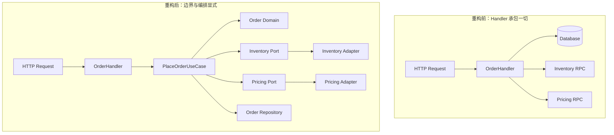

# 第 2 章 编码、重构与 Code Review：构建可演进代码的实践方法

> 把架构意图写成可读、可测、可重构、可审查的代码，并通过高质量 Review 持续阻止系统走向腐化。

第 1 章讨论的是系统设计与技术方案写作，回答了“为什么这样设计”和“如何把设计讲清楚”。但真正决定系统长期质量的，往往不是 PPT 上的架构图，而是每天进入仓库的代码。

很多团队在方案阶段讲得很好，落地时却迅速失真：

- 设计文档里分层清晰，代码里却出现跨层直连；
- 领域边界在图里很优雅，提交里却把 Controller、Service、DAO 和第三方调用揉成一团；
- 大家都知道要做幂等、超时、补偿和监控，但真正写代码时这些保障常常遗漏；
- 团队也做 Code Review，但流于“看起来没问题”或“只是挑格式”，没有真正拦住设计偏移和线上风险。

所以这一章不再把“编码”理解成语法熟练度，也不把“重构”理解成推倒重写，更不把“Code Review”理解成合并前的礼貌动作，而是把它们一起看成架构执行力的一部分。一个成熟的工程团队，至少要在三个层面上同时达标：

- **编码阶段**：把复杂业务拆成清晰边界、稳定抽象和可验证实现。
- **重构阶段**：在不停止交付的前提下，持续修复边界失真、抽象退化和历史包袱。
- **评审阶段**：在缺陷、耦合和错误模式进入主干前，把问题尽可能提前暴露。

这种闭环在 AI 辅助编码普及后反而更重要。代码生成工具可以快速补齐 DTO、适配器和测试骨架，却不会自动拥有当前业务的隐含约束，也不会替团队承担并发、幂等、数据一致性和回滚责任。代码越容易生成，团队越需要把边界和验证写成机器能够检查的规则。

读完本章，你应该能建立三件事的共同语言：

- 什么样的代码，才算真正支持系统长期演进。
- 老代码开始腐化时，应该如何小步重构，而不是等到必须重写。
- Code Review 到底在审什么，而不只是“帮忙看一眼”。
- 架构师、开发者、Reviewer 分别应该承担什么责任。

---

## 2.1 为什么架构最终会输在代码细节上

### 2.1.1 架构不是画出来的，是提交出来的

系统设计常常失败，不是因为没人知道应该分层、隔离依赖、控制一致性，而是因为这些原则没有被持续写进代码。架构图表达的是目标形态，代码库体现的才是真实形态。

如果一个团队长期容忍下面这些现象，再好的技术方案也会被慢慢掏空：

- Handler 直接拼 SQL；
- 领域对象里混入远程调用和缓存访问；
- “临时”分支逻辑逐步堆成主流程；
- 为了赶需求，把异常处理、超时控制、回滚语义留给“后面补”。

时间一长，团队面对的就不再是“如何实现新需求”，而是“改一行为什么会炸三处”。这类问题本质上不是功能问题，而是**代码结构已经不再承载架构意图**。

### 2.1.2 代码质量差的真实代价

很多人把代码质量理解成审美问题，仿佛只是“优雅不优雅”。但对业务系统来说，代码质量的代价非常具体：

| 问题 | 短期表现 | 长期后果 |
| --- | --- | --- |
| 边界混乱 | 改动快，复制方便 | 模块无法替换，重构成本陡增 |
| 函数过大 | 新需求先堆进去 | 回归风险高，没人敢动老逻辑 |
| 缺少测试点 | 交付初期看不出来 | 故障只能靠线上反馈暴露 |
| Review 走形式 | 合并速度快 | 缺陷和坏味道持续进入主干 |
| 命名模糊 | 写的人知道 | 半年后团队整体认知失真 |

架构师尤其不能把这些问题看成“实现细节”。系统能否长期演进，往往不是取决于是否用了微服务、CQRS、Saga 这些名词，而是取决于每一次提交是否在强化还是侵蚀边界。

### 2.1.3 架构师为什么必须懂编码和 Review

架构师不一定要承担最多业务代码，但必须对代码落地保持足够近的距离。原因很简单：

- 设计是否真的可实现，只有进入代码以后才会暴露真实摩擦；
- 团队抽象是否过度、边界是否失真，Review 时最容易看出来；
- 如果架构师长期离开编码现场，方案会越来越像“理想模型”，而不是可落地工程。

一个可操作的底线是：核心链路的关键模块，架构师至少要能定期深度 Review，并能亲自写出代表团队标准的样例代码。


这条闭环里，编码和 Review 不是末端动作，而是把设计变成现实、再把现实反馈给设计的关键环节。

### 2.1.4 AI 辅助编码时代的架构防守

AI 辅助编码改变的是代码生产速度，不是业务约束本身。它很擅长生成重复性高、局部上下文充分的代码，例如请求对象、数据访问适配器、序列化逻辑和测试样板；但它很难仅凭一个函数或一个文件判断以下问题：

- 领域规则是否必须由聚合根保护，而不是由每个调用方自行记忆；
- 一个超时后的重试是否可能重复扣减、重复发消息或重复创建订单；
- 新模块是否越过了依赖边界，直接访问了数据库、缓存或第三方客户端；
- 旧接口、旧数据和旧消费者是否仍然兼容；
- 失败后系统最终应该进入什么状态，以及由谁负责补偿。

因此，AI 时代的 Review 重点不是“代码是不是 AI 写的”，而是把人工注意力放到 AI 无法替团队决定的地方：业务不变量、状态迁移、并发语义、分布式一致性、权限边界和恢复路径。语法、格式、简单的错误检查和部分依赖约束，应尽量交给编译器、Lint、测试和 CI。

可以把 AI 生成代码的验收分为三层：

| 层次 | 必须回答的问题 | 推荐验证方式 |
| --- | --- | --- |
| 结构 | 是否进入了正确的包和抽象层 | 编译、依赖图检查、架构规则测试 |
| 行为 | 是否满足业务不变量和失败语义 | 单元测试、特征测试、状态迁移测试 |
| 运行 | 是否具备超时、幂等、观测和回滚抓手 | 集成测试、灰度指标、故障演练 |

这也是架构师在 AI 编程时代的新职责：不是亲自审查每一行生成代码，而是把团队的设计原则转化成 Prompt 约束、代码模板、静态检查、测试夹具和发布门禁。只有这样，Review 才不会成为吞噬所有注意力的人工补丁。

---

## 2.2 好代码首先是边界清楚

### 2.2.1 先问职责，再写函数

很多坏代码并不是因为工程师不会写，而是因为下笔前没先回答一个问题：**这段代码到底属于哪一层、承担什么职责。**

以电商下单为例，至少有几类不同职责：

- Handler：接收请求、参数绑定、鉴权、返回协议；
- Use Case / Application：编排下单流程，协调库存、计价、订单持久化；
- Domain：表达订单、库存、金额、不变量与业务规则；
- Infrastructure：数据库、缓存、MQ、RPC 客户端实现。

这些职责一旦混在一起，短期会觉得“写起来更快”，长期就会出现两个典型后果：

- 业务逻辑无法脱离接口或存储独立测试；
- 每次改动都必须理解整条链路的全部技术细节。

关于「这些职责在真实工程里如何落到目录结构上」，第 1 章给出了两套完整的 Go 目录映射（三层架构版与 DDD 版），第 2.6 节会基于配套示例仓库中的 `examples/product-service` 做完整走读。示例工程独立于本书仓库维护，本文只保留关键片段。

### 2.2.2 用例编排层要显式，不要隐式散落

业务系统最常见的腐化方式，不是类太多，而是“关键业务流程没有稳定的编排层”。于是下单的一部分逻辑藏在 Handler，另一部分藏在 Service，另一部分又埋在 Repository Hook 或异步消费者里。

更健康的做法是让“流程在哪里发生”这件事一眼可见：

```go
type PlaceOrderUseCase struct {
	inventory InventoryService
	pricing   PricingService
	repo      OrderRepository
}

func (uc *PlaceOrderUseCase) Execute(ctx context.Context, cmd PlaceOrderCommand) (string, error) {
	if err := cmd.Validate(); err != nil {
		return "", err
	}

	quote, err := uc.pricing.Quote(ctx, cmd.UserID, cmd.Items)
	if err != nil {
		return "", fmt.Errorf("quote price: %w", err)
	}

	if err := uc.inventory.Reserve(ctx, cmd.Items); err != nil {
		return "", fmt.Errorf("reserve inventory: %w", err)
	}

	order := NewOrder(cmd.UserID, cmd.Items, quote.PayableAmount)
	if err := uc.repo.Save(ctx, order); err != nil {
		return "", fmt.Errorf("save order: %w", err)
	}

	return order.ID, nil
}
```

这段代码未必复杂，但它提供了两个重要价值：

- 流程顺序显式可读；
- 下层依赖是抽象接口，便于测试和替换。

但它仍然是教学用的最小骨架，不能被误读成完整的分布式事务方案。库存预留成功而订单保存失败时，必须有释放预留、进入待补偿状态或由后续任务重试的语义；重复请求时，`Reserve` 和 `Save` 也必须围绕同一个幂等键设计。第 4 章会系统讨论 Saga、Outbox 和补偿，这里只要求读者在 Review 时意识到这些边界不能被省略。

### 2.2.3 写“业务语言”，不要写“技术噪音”

很多代码难读，不是逻辑太深，而是表达层级不对。调用方真正关心的是“预留库存”“计算应付金额”“创建订单”，而不是一堆技术性细节。

反例通常长这样：

```go
func CreateOrder(ctx context.Context, req *Request) error {
	if req == nil {
		return errors.New("nil")
	}
	// 混着校验、查库、拼对象、写缓存、打日志、改状态
	return nil
}
```

问题不在于函数短，而在于它没有向读者提供清晰语义。好的业务代码，读起来应该像在追踪一个真实业务动作，而不是在猜作者想做什么。

### 2.2.4 参数太多，通常说明抽象不对

参数列表过长，往往意味着以下几种问题之一：

- 缺少输入模型，调用方必须自己拼装上下文；
- 一个函数做了太多事，需要的上下文过多；
- 中间状态没有被显式建模，只能靠参数平铺传递。

例如下面这种签名几乎注定不可维护：

```go
func CalcPrice(userID string, city string, channel string, skuID string, qty int, couponCode string, vipLevel int, usePoints bool) (int64, error) {
	return 0, nil
}
```

更合理的做法是让输入拥有清晰语义：

```go
type PriceQuoteQuery struct {
	UserID     string
	City       string
	Channel    string
	Items      []QuoteItem
	CouponCode string
	VIPLevel   int
	UsePoints  bool
}
```

这样做不只是“好看”，更重要的是：

- 新字段扩展不会破坏大批调用方；
- 测试构造输入更自然；
- Review 时更容易判断字段语义是否合理。

---

## 2.3 重构不是推倒重来，而是持续纠偏

很多团队嘴上都知道“代码要可维护”，但一旦老逻辑开始变形，第一反应要么是继续堆条件，要么是豪情万丈地说“找时间重写”。前者会让代码越改越烂，后者通常永远没有时间真正发生。对业务系统来说，真正可执行的路径往往只有一条：**在持续交付中小步纠偏。**

重构的目标不是把代码变得“更漂亮”，而是降低未来每一次变更的摩擦成本，让系统重新回到可理解、可替换、可测试、可评审的状态。如果一段代码已经让团队不敢动、不愿改、每次修改都伴随高回归风险，那么它就已经不是局部实现问题，而是生产效率和系统演进能力的问题。

### 2.3.1 什么信号说明已经不能再继续堆逻辑

下面这些现象，通常意味着代码已经进入“继续堆功能比及时重构更危险”的阶段：

- 一个函数同时处理校验、编排、持久化、远程调用和异常恢复。
- 改一条业务规则要同时改多个层次，甚至多个服务。
- 同一类逻辑在不同分支里复制粘贴，只是改了几个字段名。
- 命名已经和真实业务语义对不上，只能靠口口相传理解。
- Reviewer 看到代码时会说“能跑，但我不敢保证后面还好改”。

这些信号的共同点是：代码已经不再帮助团队表达业务，而是在迫使团队绕着历史包袱工作。

### 2.3.2 重构的第一原则：先收口边界，再优化内部实现

很多失败的重构，不是因为方向不对，而是因为一上来就想把所有问题一起解决：顺手改命名、顺手换框架、顺手改协议、顺手统一抽象。结果系统还没变好，风险面先被扩大了。

更稳妥的路径通常是：

1. 先识别最关键的腐化点，到底是编排层缺失、依赖泄漏，还是领域规则散落。
2. 先把边界收口，让调用关系清楚，职责归属明确。
3. 再逐步替换内部实现，而不是先大面积重写细节。

换句话说，重构优先级往往不是“把代码写得更优雅”，而是“让未来的改动先有一个正确的落点”。

### 2.3.3 小步重构的常用路径

对线上系统来说，最有价值的不是理想化重构，而是能在真实交付节奏里落地的重构路径。下面几种方式最常见，也最实用：

| 重构路径 | 适用场景 | 关键动作 |
| --- | --- | --- |
| 抽输入模型 | 参数平铺、语义混乱 | 先把输入收拢成明确命令或查询对象 |
| 补编排层 | 流程散落在 Handler / Service / Hook | 把主流程显式收敛到 Use Case / Application 层 |
| 包装旧实现 | 老模块不能立刻替换 | 先加抽象隔离层，再逐步迁移调用方 |
| 拆副作用 | 核心逻辑难测 | 把纯业务判断与数据库 / RPC / MQ 分开 |
| 显式错误语义 | 失败路径模糊 | 把重复、超时、冲突、不可恢复错误区分开 |

这些动作看起来不“宏大”，但恰恰因为它们足够小，才更容易进入日常交付节奏，而不是永远停留在重构计划里。

Martin Fowler 将重构定义为保持外部行为不变、逐步调整内部结构的过程；重构的价值不在于一次性写出理想代码，而在于让每一步都足够小、足够可验证。[1]

### 2.3.4 安全重构的落地方案：适配、切换与流量验证

系统重构和架构重构有一个共同点：真正成熟的做法，往往不是停机重建，而是在线迁移。代码层面同样如此。很多时候，旧实现不能立刻删除，但可以先被包进一个更干净的抽象中，让新逻辑逐渐迁移到新边界。以下三种模式解决的是不同层次的问题，不能只因为都支持“渐进式迁移”就混为一谈：

| 模式 | 适用前提 | 切换位置 | 必须先解决的问题 |
| --- | --- | --- | --- |
| 按抽象分支（Branch by Abstraction） | 新旧实现位于同一代码库 | 接口或应用服务内部 | 抽象契约、兼容行为和旧实现删除时间 |
| 绞杀者模式（Strangler Fig） | 新旧模块可以由路由或边界隔离 | 请求路由、服务入口或领域边界 | 数据所有权、流量切分、回滚和双写风险 |
| 并行双跑（Shadow Run） | 新实现可以抑制外部副作用 | 流量复制和结果比较 | 结果规范化、成本控制、隐私和副作用隔离 |

**按抽象分支**适合先在代码库内部建立稳定的端口。调用方依赖接口，旧实现和新实现分别挂在接口后面，再通过配置或 Feature Flag 切换。它比长期维护一个大 Git 分支更容易持续合并，也能让新需求优先落到新边界。切换完成后必须删除旧适配器和临时开关，否则抽象层会从迁移工具变成永久复杂度。

**绞杀者模式**适合边界已经足够清晰、可以按接口或流量逐步迁移的场景。它的核心不是“把旧服务复制一遍”，而是让新实现逐渐接管一个可验证的业务切片。每次迁移都应记录流量比例、错误率、延迟、数据差异和回滚条件；涉及写入时，还要先明确谁拥有权威事实，避免新旧系统长期双写却没有对账机制。Martin Fowler 将它与一次性切换重写进行对比时，强调的正是风险分散，而不是迁移本身更“时髦”。[2]

**并行双跑**适合验证新旧实现的结果差异，但不等于让两条路径都执行真实副作用。计价、规则计算、搜索召回等相对容易做结果比较；库存扣减、余额变更、消息发送则必须使用只读查询、沙箱适配器或副作用抑制器。比较结果时不能只比较字符串，还要定义字段归一化、允许误差和差异处置，否则“有差异”无法转化为可行动的结论。

一个常见步骤是：

```text
识别腐化模块
  -> 用特征测试锁住既有行为
  -> 定义新接口与失败语义
  -> 用适配层包装旧实现
  -> 新需求优先走新接口
  -> 小流量切换或并行比较
  -> 用指标、测试和 Review 验证
  -> 删除旧路径与临时开关
```

这种做法的意义在于，它允许团队在保持业务连续交付的同时，逐步让代码库重新变得可演进，而不是在“继续忍受”和“推倒重写”之间二选一。

## 2.4 编码时真正应该守住的几个原则
### 2.4.1 可读性优先于炫技

业务系统不是算法竞赛，维护周期远长于编写周期。多数情况下，未来读代码的人并不是当前作者本人，因此代码首先要对团队友好，而不是对作者本人高效。

可读性通常来自四件事：

- 命名和业务语义一致；
- 控制流简单，避免多层嵌套；
- 副作用位置明确；
- 错误路径可见，不靠隐式约定。

### 2.4.2 把变化点隔离，而不是把一切都抽象

很多团队一遇到重复就急着抽象，最后得到的是“看起来可复用、实际没人敢改”的公共代码。真正应该抽象的不是相似代码本身，而是**稳定的概念和可预期的变化点**。

例如：

- 不同库存来源的预留逻辑，可以抽象成同一接口下的不同实现；
- 不同业务线都要发消息，不一定需要一个万能 `SendEverythingService`；
- 只出现两次的小差异，不一定值得立即抽象成复杂模式。

好的抽象会减少决策面，坏的抽象会制造更多决策面。John Ousterhout 在《A Philosophy of Software Design》中用“深层模块”（Deep Module）解释了类似问题：好的模块用相对简单的接口隐藏较多实现复杂度；如果拆分后每个模块只有很薄的逻辑，却增加了大量接口、跳转和命名，系统的整体认知负荷反而会上升。[7]

这也说明 SOLID 不能被机械地理解成“类越小越好”或“接口越多越好”。单一职责应理解为“因同一类变化而共同修改”，依赖倒置应落到稳定的业务边界上，接口隔离则要避免把调用方强迫绑定到无关能力。原则的价值在于帮助团队识别变化方向，而不是替代具体的业务判断。

### 2.4.3 失败路径要和成功路径一样认真

线上事故很少发生在“主流程最理想的那条路”，而更常见于：

- 超时后是否重试；
- 重试后是否重复扣减；
- 部分成功后如何补偿；
- 下游失败时状态是否半提交；
- 幂等键是否真的覆盖重放场景。

所以编码时必须把错误处理当成一等公民。下面的例子比“调用成功就返回”更接近生产代码：

```go
var ErrOrderAlreadyExists = errors.New("order already exists")

func (r *OrderRepository) Save(ctx context.Context, order *Order) error {
	_, err := r.db.ExecContext(
		ctx,
		`INSERT INTO orders (id, user_id, amount_cents) VALUES (?, ?, ?)`,
		order.ID,
		order.UserID,
		order.AmountCents,
	)
	if err != nil {
		if isDuplicateKey(err) {
			return ErrOrderAlreadyExists
		}
		return fmt.Errorf("insert order: %w", err)
	}
	return nil
}
```

这种写法的价值在于：

- 业务性冲突可被上层识别；
- 基础设施故障仍能保留错误链；
- Review 时容易判断幂等行为是否符合预期。

失败路径至少要回答五个问题：

1. 失败发生在哪个阶段，已经产生了哪些副作用？
2. 调用方收到的是明确失败，还是“结果未知，需要查询”？
3. 重试由谁发起，重试使用什么幂等键，最多重试几次？
4. 如果无法自动恢复，系统会进入哪个可观测、可人工接管的状态？
5. 这次失败是否需要补偿、对账或告警，而不是只记录一行错误日志？

例如，库存服务超时不一定等于“库存没有扣减”。如果请求已经到达下游但响应丢失，直接重试可能造成重复预留；如果订单服务把它简单映射成 500，用户再次点击又可能创建第二笔订单。更稳妥的代码会把“明确失败”和“结果未知”区分开，给每种状态规定查询、重试或人工处理路径。这里的重点不是为每个函数塞进复杂状态机，而是不要让异常语义隐藏在一个泛化的 `error` 中。

### 2.4.4 让测试点自然存在

代码未必必须先写测试，但一定要写成“能被测试”的形状。最糟糕的情况不是没有测试，而是代码结构让你根本无法只测业务逻辑，只能起整套环境做脆弱的集成验证。

更易测的代码通常具备这些特征：

- 输入和输出明确；
- 外部依赖通过接口注入；
- 核心逻辑不依赖全局状态；
- 纯计算与副作用分离。

可测试性不是测试工程师的额外要求，而是架构是否清晰的副产品。

### 2.4.5 小步提交，优于大爆炸提交

许多 Review 效率低，不是 Reviewer 不负责，而是提交本身已经不可评审。一个同时包含“重命名、重构、修 bug、加新功能、顺手格式化全目录”的 PR，几乎不可能被认真看完。

高质量提交通常有三个特征：

- 主题单一：一个 PR 只解决一类问题；
- 变更可解释：作者能说明改动前后行为差异；
- 回滚可控：出问题时能相对独立地撤回。

从工程协作角度看，小步提交本身就是对 Review 质量的投资。

### 2.4.6 将架构规则代码化：Fitness Functions 与 CI 门禁

仅靠工程师记忆和 Reviewer 的眼睛，无法长期守住大型代码库的边界。Neal Ford、Rebecca Parsons 和 Patrick Kua 在演进式架构方法中提出“架构适应度函数”（Architecture Fitness Functions）：把能够反复验证的架构特征写成自动化检查，让系统在持续变化中仍然受到约束。[3]

适应度函数不应停留在“代码质量要好”这种口号，而应写成可以失败的断言，例如：

- `domain` 包不能直接依赖 `infrastructure`；
- Handler 不能直接导入数据库驱动或执行 SQL；
- application 层只能依赖由自己定义的端口接口；
- 核心写操作必须具备幂等键或明确的重复请求策略；
- 关键状态迁移必须有行为测试；
- 新增外部调用必须声明超时、错误映射和观测字段。

其中，依赖方向和禁止导入适合用静态检查完成；幂等、补偿和状态迁移则通常需要测试夹具或集成测试，不能幻想用一个 Lint 规则解决所有架构问题。

在 CI 中可以分三档处理：

| 检查类型 | 示例 | 失败策略 |
| --- | --- | --- |
| 硬门禁 | 编译失败、禁止依赖、格式错误、核心测试失败 | 阻止合并 |
| 风险门禁 | 关键模块缺少行为测试、API 不兼容、敏感调用无超时 | 阻止合并或要求架构负责人确认 |
| 观察指标 | PR 大小、复杂度趋势、技术债例外数量 | 记录趋势，不直接阻塞 |

Go 项目可以组合 `golangci-lint`、`staticcheck`、`errcheck`、依赖图脚本和自定义测试；Java 项目可以用 ArchUnit 对包依赖和分层规则做断言。工具不是目的，关键是把团队反复争论的边界转化成可重复执行的证据。Uber Go Style Guide 也把错误处理、包命名、并发和 Lint 配置放在同一套工程约束中，而不是将“风格”局限为格式问题。[4]

---

## 2.5 Code Review 到底在审什么

### 2.5.1 Review 的目标不是挑错字

Code Review 的核心目标有四个：

- 在合并前发现正确性和稳定性问题；
- 检查实现是否偏离架构和设计约束；
- 传播团队编码标准和隐性知识；
- 通过讨论提升系统长期可维护性。

所以真正有价值的 Review，应该优先关注：

- 这段代码会不会做错；
- 这段代码以后会不会很难改；
- 这段代码是不是把风险藏起来了。

而格式、换行、 import 排序这些内容，应该尽量交给格式化工具和静态检查器，而不是浪费人工评审注意力。

### 2.5.2 Reviewer 的检查顺序

一份高质量 Review，最好按由大到小的顺序看，而不是一上来盯局部实现。

建议顺序如下：

1. **需求与行为**：这次改动到底解决什么问题，是否改变了用户可见行为。
2. **边界与设计**：代码是否放在正确层次，是否引入了不必要耦合。
3. **正确性**：状态迁移、并发、异常、幂等、空值、边界条件是否安全。
4. **可维护性**：命名、结构、复用方式、注释是否帮助未来修改。
5. **验证覆盖**：测试、日志、指标、灰度与回滚手段是否足够。

这个顺序很重要，因为很多真正致命的问题，根本不是“某行写错”，而是整段代码从一开始就放错了位置。

### 2.5.3 Reviewer 最容易漏掉的风险

在业务系统里，下面几类问题尤其值得重点关注：

| 风险类型 | 典型问题 |
| --- | --- |
| 状态一致性 | 是否可能部分成功、部分失败 |
| 并发语义 | 是否会重复执行、重复扣减、脏写覆盖 |
| 超时重试 | 重试是否幂等，是否放大下游压力 |
| 兼容性 | 新字段、新枚举、新协议是否影响旧调用方 |
| 观测性 | 故障发生后是否能定位到哪一步出错 |
| 回滚能力 | 发布失败后是否能快速止损 |

如果 Review 长期只盯代码风格，这些风险就会直接穿透到线上。

### 2.5.3 Author 应该怎样配合 Review

Review 质量不只是 Reviewer 的责任，Author 同样负有很大责任。作者在发起 PR 时，至少应该主动提供这些信息：

- 这次改动解决什么问题；
- 改动范围和非目标范围是什么；
- 有没有行为变化或数据兼容风险；
- 如何验证；
- 有没有需要 Reviewer 特别关注的点。

一个好的 PR 描述，能显著降低 Reviewer 的理解成本，也更容易把注意力放到真正重要的问题上。

---

### 2.5.4 一份可执行的 Code Review 清单

下面给出一份更适合业务系统的 Review Checklist。它不是要求每次逐条机械打勾，而是帮助团队形成稳定视角。

#### 业务与正确性

- 这次实现是否真的满足需求，而不是只满足 happy path。
- 是否覆盖了空输入、重复请求、无权限、数据不存在等边界情况。
- 是否存在状态半提交、重复执行、顺序错误的问题。
- 失败后是否有明确返回、重试策略或补偿语义。

#### 架构与边界

- 代码是否放在正确层次，是否出现跨层泄漏。
- 领域规则是否仍由领域对象或用例层表达，而不是散落在外层。
- 是否引入了新的隐式耦合，例如直接依赖具体实现、共享可变状态、万能工具类。
- 新抽象是否真有稳定价值，还是为了“看起来高级”。
- 目录结构与分层是否符合团队约定的映射（可对照第 1 章目录映射与 `examples/product-service` 样例）。

#### 可读性与可维护性

- 命名是否表达业务语义，而不是技术细节。
- 函数是否过长、职责是否过多。
- 控制流是否过深，是否需要提前返回或拆分步骤。
- 注释是否解释“为什么”，而不是重复“代码在做什么”。

#### 可靠性与可运维性

- 是否设置了合理的超时、重试、限流或幂等控制。
- 是否补充了必要的日志、指标、Tracing 标签。
- 故障发生时，能否快速定位模块、输入和阶段。
- 发布后是否具备灰度、监控和回滚抓手。

#### 测试与验证

- 是否新增或调整了足够说明行为的测试。
- 测试是否覆盖关键分支，而不是只覆盖表面行数。
- 是否区分了单元测试、集成测试和端到端验证责任。
- 是否给出手工验证步骤或构造数据方式。

如果团队能长期围绕这五个维度讨论，Review 很快就会从“凭感觉”升级为“有共同标准”。

### 2.5.4.1 让 Review 意见具备可执行性

高质量意见应该描述风险，而不是表达个人偏好。一个有效的 Review 意见至少包含四部分：观察到的事实、可能造成的后果、建议的处理方向，以及是否必须在当前 PR 解决。例如：

```text
[必须修复] 这里使用请求 ID 生成订单，但没有数据库唯一约束。
并发重试时可能创建两条订单，导致库存预留无法对应唯一订单。
建议把 idempotency_key 纳入订单唯一索引，并增加重复提交测试。
```

这种写法把讨论从“我不喜欢这个实现”转成“哪项业务不变量可能被破坏”。如果意见只是风格偏好，可以标记为非阻塞建议；如果涉及数据丢失、重复扣减、权限绕过或不可回滚发布，则应明确为阻塞问题。Google 的 Code Review 规范强调，Reviewer 既要保护代码库健康，也要避免用个人偏好制造不必要的交付阻力。[6]

Author 也可以主动把 PR 分成三类信息：**必须理解的业务变化**、**可以机械验证的代码变化**、**希望 Reviewer 重点挑战的风险假设**。这样 Reviewer 不必先猜测作者意图，再把时间花在真正需要经验判断的地方。

Review 结束后还应记录无法在当前 PR 解决的问题，例如“暂时保留旧适配器，下一阶段迁移”“先允许一处架构例外，月底前删除”。没有责任人和到期时间的 Review 结论，往往会变成无人追踪的技术债。

---

## 2.6 静态标杆：优秀代码应该长什么样

前面几节讲的是原则，这一节看实例。本书配套示例仓库的 `examples/` 目录下有三个可编译运行的 Go 工程，它们不是玩具 Demo，而是刻意用来展示「代码结构如何承载架构意图」的对照样本。这里的聚合根、值对象、领域事件和应用服务，分别对应 Eric Evans 的领域驱动设计与 Vaughn Vernon 的实现方法；它们不是必须照搬的目录模板，而是帮助团队把业务规则放到正确位置的分析工具。[8][9]

示例代码已从书籍仓库移出，避免书稿构建项目和可运行工程相互耦合：

| 示例工程 | 展示重点 | 对应的代码问题 |
| --- | --- | --- |
| `examples/order-service` | 标准三层架构的自然形态 | 职责够清楚，但业务规则散落在 service，依赖具体实现 |
| `examples/product-service` | DDD 四层架构、聚合根、值对象、领域事件、三级缓存、Outbox | 业务规则内聚到领域模型，依赖方向向内，可独立测试 |
| `examples/common-services` | 全局 ID 等基础服务的薄封装 | 通用域不需要重抽象 |

这三个工程不应被理解成“所有项目都必须长成同一个目录”。目录只是依赖方向和职责边界的可视化结果。小型模块可能只需要一个清晰的应用服务和一个存储适配器；只有当业务规则、入口类型或基础设施变化足够复杂时，才值得引入更完整的领域层和事件机制。好的标杆不是增加层数，而是让团队能够解释每一层为什么存在、由谁拥有、如何测试，以及什么时候可以被替换。

这一节从这三个工程里挑出五段代码，分别对应 2.2-2.4 的原则。读的时候建议对照源码完整看一遍——真实工程里的取舍细节（日志、注释、错误处理）比书上任何摘录都更有信息量。

### 2.6.1 目录结构本身就是第一份「好代码」

`product-service` 的顶层结构，几乎可以直接拿来当团队模板（完整树见本节后续的分层示例）：

```text
product-service/
├── cmd/main.go                    # 入口：只做组装，不写业务
└── internal/
    ├── domain/                    # 领域层：聚合根、值对象、领域事件、Repository 接口
    ├── application/               # 应用层：用例编排、DTO
    ├── infrastructure/            # 基础设施：Repository 实现、缓存、Kafka
    └── interfaces/                # 接口层：HTTP、gRPC、Event 三种触发方式
```

这个结构好在哪里，用 2.2 的视角看非常清楚：

- **职责归属没有歧义**。一个新需求来了，「这段代码该放哪」有明确答案，这是 2.2.1 的落地。
- **依赖方向物理可见**。`domain` 不 import 任何其他 internal 包，`interfaces` 和 `infrastructure` 都依赖内层——Review 时一条 import 就能发现跨层泄漏。
- **三种入口（HTTP/gRPC/Event）平级**，都只做协议转换后调用同一个 application service，不存在「Kafka 消费者里藏着一版业务逻辑」的隐式编排问题（2.2.2）。

相比之下，`order-service` 代表了大多数项目的现状：`application/service` 直接依赖 `infrastructure/persistence` 的具体实现，`model.Order` 是贫血对象。它的 README 自己也写明「这些正是后面引入 Clean Architecture、DDD 和 CQRS 的原因」。两个工程对照读，能直观看到 2.3 说的「腐化信号」长什么样、演进的终点长什么样。这里的“终点”不是永远不变的最终架构，而是当前约束下足够清晰、可替换和可测试的目标形态。

### 2.6.2 领域模型：业务规则内聚，而不是散落在 setter 之外

`internal/domain/product.go` 中的 `Product` 聚合根，是 2.2.3「写业务语言」的完整范例。看它的上架方法：

```go
// OnShelf 上架
func (p *Product) OnShelf() error {
	if p.status == ProductStatusOnShelf {
		return errors.New("商品已上架")
	}
	if p.basePrice.Amount() <= 0 {
		return errors.New("商品价格必须大于0")
	}
	if len(p.images) == 0 {
		return errors.New("商品必须有至少一张图片")
	}

	p.status = ProductStatusOnShelf
	p.updatedAt = time.Now()

	p.addDomainEvent(ProductOnShelfEvent{
		SKUID:     p.skuID.Value(),
		OnShelfAt: p.updatedAt,
	})

	return nil
}
```

这段代码值得走读的四个点：

1. **不变量由聚合根自己保护**。调用方不可能绕过「价格必须大于 0」这个规则——规则内聚在模型里，而不是靠每个调用方「记得检查」。这正是第 1 章「贫血 vs 充血」对比的完整版。
2. **状态迁移表达为业务动词**。`OnShelf()`、`OffShelf(reason)`、`UpdateBasePrice(price)`，读代码就是在读业务流程，没有任何技术噪音。
3. **每次状态变更留下领域事件**。事件在聚合内部积累，由应用层统一发布——「业务事实已经发生」这件事被显式建模，而不是散落在各处 `kafka.Send()`。
4. **字段私有 + 只读 Getter**。外部无法直接把商品改成上架状态，只能走 `OnShelf()`，非法状态在类型层面就不存在。

### 2.6.3 值对象：让非法输入在构造时就失败

`internal/domain/value_objects.go` 里金额的处理方式，是业务系统最值得抄的一个习惯：

```go
// Price 值对象（使用分为单位，避免浮点精度问题）
type Price struct {
	amount   int64  // 金额（分）
	currency string // 货币（CNY）
}

func NewPrice(amount int64, currency string) (Price, error) {
	if amount < 0 {
		return Price{}, errors.New("价格不能为负数")
	}
	if currency == "" {
		currency = "CNY"
	}
	return Price{amount: amount, currency: currency}, nil
}
```

两个设计决策都值得在 Review 中坚持：

- **金额用「分」存 int64，不用 float64**。浮点精度问题在计价、退款分摊场景是真金白银的事故源（第 13 章营销与计价系统会再次遇到这个约束）。
- **校验收敛在构造函数**。`NewPrice` 是唯一能造出 `Price` 的地方，负数价格在系统中根本不可能存在——这比在每个使用处写 `if price < 0` 高一个量级，也正是 2.4.2「把变化点隔离」的实例。

### 2.6.4 应用服务：编排显式、依赖抽象、失败语义清楚

`internal/application/service/product_service.go` 展示了一个符合 2.2.2 的用例编排层：

```go
// EventPublisher is owned by the application layer.
// Infrastructure adapters such as KafkaProducer implement it.
type EventPublisher interface {
	Publish(ctx context.Context, event domain.DomainEvent) error
	PublishBatch(ctx context.Context, events []domain.DomainEvent) error
}

type ProductService struct {
	repo           domain.ProductRepository
	eventPublisher EventPublisher
}

func (s *ProductService) CreateProduct(ctx context.Context, req *dto.CreateProductRequest) (*dto.CreateProductResponse, error) {
	// Step 1: 创建领域对象（校验和不变量在领域层完成）
	product := domain.NewProduct(skuID, spu, req.SupplierSKU, price, specs)

	// Step 2: 保存聚合根
	if err := s.repo.Save(ctx, product); err != nil {
		return nil, fmt.Errorf("保存商品失败: %w", err)
	}

	// Step 3: 发布聚合中积累的领域事件
	if err := s.publishDomainEvents(ctx, product); err != nil {
		...
	}
}
```

对应 2.4.3 和 2.4.4，这段代码的三个好习惯：

- **接口在使用方定义**。`EventPublisher` 接口声明在 application 层、由 infrastructure 的 KafkaProducer 实现——依赖方向向内，单元测试时可以注入内存假实现，不需要起 Kafka。
- **错误用 `%w` 包装并带业务语义**。`保存商品失败: %w` 既保留了错误链可供日志追溯，又给上层提供了可判断的上下文。
- **流程步骤一眼可读**。建领域对象 → 保存 → 发事件，顺序显式。编排层的职责是「编排」，不是「什么都干」。

这里还必须补充一个事务边界：如果 `Save` 只保存聚合，而 `publishDomainEvents` 直接调用 Kafka，那么数据库提交成功、消息发布失败时仍然会产生丢消息风险。生产实现应当在保存聚合的本地事务中同时写入 Outbox，再由 Worker 异步投递并更新发送状态。应用服务负责表达“保存事实并留下待发布事件”，基础设施负责可靠投递，不应把两者简化成一次普通函数调用。

### 2.6.5 测试：好结构让测试自然存在

2.4.4 说「可测试性是架构清晰的副产品」，这个工程给出了证据。`product_center_service_test.go` 不需要任何外部依赖就能验证核心业务行为：

```go
func TestProductCenterPublishesSnapshotAndOutbox(t *testing.T) {
	repo := persistence.NewProductCenterRepository()   // 内存实现
	svc := NewProductCenterService(repo)

	result, err := svc.PublishCommand(ctx, domain.PublishProductVersionCommand{...})

	// 断言发布版本递增、快照内容正确、Outbox 事件已写入
	snapshot, _ := repo.GetSnapshot(ctx, result.ItemID, result.PublishVersion)
	events, _ := repo.ListOutbox(ctx, domain.OutboxPending)
	...
}
```

能写出这种测试，前提是前面所有的结构决策都做对了：依赖接口注入、核心逻辑不碰全局状态、Repository 有内存实现。反过来，2.7.1 节（下单反例）里那个把一切都揉在 Handler 里的写法，你想给它补一个「库存不足」的单元测试都无从下手——只能起数据库做脆弱的集成测试。**测试写不出来，往往就是结构腐化最早的报警器。**

### 2.6.6 把示例工程用起来

建议团队这样使用这些示例，而不是读完就忘：

- **新人 Onboarding**：先跑通 `examples/product-service`（`go run ./cmd`），再回答「我要加一个新的商品字段，应该改哪几层」。
- **Review 参照系**：当 PR 里出现「这段逻辑该放哪层」的争论时，用示例工程的同类代码做参照，比抽象讨论快得多。
- **重构对照目标**：迁移老代码时，把 `examples/order-service`（现状）和 `examples/product-service`（目标）摆在一起，演进路径就是 2.3.4 的安全重构模式。

---

## 2.7 动态演进：电商下单场景里的编码、重构与 Review

为了把原则落到具体场景，下面用一个简化的下单流程说明“代码怎么写”和“Review 怎么看”。

### 2.7.1 一个不健康的实现

```go
func (h *OrderHandler) Create(c *gin.Context) {
	var req CreateOrderRequest
	if err := c.ShouldBindJSON(&req); err != nil {
		c.JSON(400, gin.H{"error": err.Error()})
		return
	}

	user, _ := h.userRepo.FindByID(c, req.UserID)
	if user == nil {
		c.JSON(400, gin.H{"error": "user not found"})
		return
	}

	total := int64(0)
	for _, item := range req.Items {
		sku, _ := h.skuRepo.Find(c, item.SKU)
		total += sku.Price * int64(item.Qty)
		_ = h.inventoryRepo.Decrease(c, item.SKU, item.Qty)
	}

	orderID := uuid.NewString()
	_ = h.db.ExecContext(c, "insert into orders(id,user_id,total_amount) values(?,?,?)", orderID, req.UserID, total)
	c.JSON(200, gin.H{"order_id": orderID})
}
```

这段代码的问题非常典型：

- Handler 同时承担协议层、编排层、领域校验和持久化职责；
- 错误基本被吞掉；
- 库存扣减和订单写入之间没有一致性语义；
- 没有超时、幂等、日志和观测点；
- 几乎无法只针对业务规则编写单元测试。

### 2.7.2 如果这是线上老代码，应该怎么重构

真实团队里更常见的情况不是“从零开始写一个更好的版本”，而是坏代码已经在线上跑了很久，周围还挂着依赖、监控、补偿脚本和历史调用。这个时候，最危险的做法往往不是不动，而是上来就想一口气彻底重写。

更现实的重构路径通常是：

1. 先记录旧接口的输入、输出、错误码、日志字段和关键副作用，形成一组特征测试。
2. 在不改变路由的前提下，把 Handler 中的流程编排提出来，形成单独的 Use Case。
3. 再把库存、计价、订单持久化等依赖抽成清晰接口，并用适配器包住旧实现。
4. 明确错误语义和幂等语义，让旧逻辑至少先变得可判断。
5. 补上关键路径测试和最小观测点，再用按抽象分支、灰度或双跑继续替换内部实现。

特征测试不一定一开始就漂亮。它的任务是记录系统当前对外表现，例如重复请求是否返回同一个订单号、库存不足时返回什么错误、计价超时时订单是否会落库。对一个没有测试的遗留模块来说，先把这些行为固定下来，通常比一开始就追求理想的单元测试更现实。Michael Feathers 将这种能够插入测试、替换依赖和打破耦合的位置称为“接缝”（Seam），它是遗留代码安全演进的重要入口。[5]

每一步重构都应有停止条件：测试结果没有扩大差异，关键指标没有恶化，旧路径仍然可以回滚，且新边界已经能够承接下一次需求。没有停止条件的重构，很容易从“降低风险”变成“借重构之名扩大变更范围”。

这一阶段的目标不是“一次性得到完美代码”，而是让这段链路重新进入可控状态：可以测、可以审、可以继续演进。

### 2.7.3 更合理的拆分

重构前后最重要的变化不是文件数量增加，而是依赖方向和副作用位置变得可见：



```go
type OrderHandler struct {
	uc *PlaceOrderUseCase
}

func (h *OrderHandler) Create(c *gin.Context) {
	var req CreateOrderRequest
	if err := c.ShouldBindJSON(&req); err != nil {
		c.JSON(http.StatusBadRequest, gin.H{"error": err.Error()})
		return
	}

	orderID, err := h.uc.Execute(c.Request.Context(), req.ToCommand())
	if err != nil {
		writeOrderError(c, err)
		return
	}

	c.JSON(http.StatusOK, gin.H{"order_id": orderID})
}
```

这时 Reviewer 能更容易聚焦真正重要的问题：

- `Execute` 是否定义了清晰的事务边界或补偿策略；
- `ToCommand()` 是否丢失关键字段；
- `writeOrderError` 是否正确映射业务错误与系统错误；
- 下层依赖是否具备幂等和超时语义。

好的结构不是为了“看起来分层”，而是为了让 Review 变得可行。

如果继续向下展开，Use Case 应该只保留流程和失败语义，领域对象负责保护不变量，Port 负责表达外部能力，Adapter 负责处理具体协议：

```go
type PlaceOrderUseCase struct {
	inventory InventoryPort
	pricing   PricingPort
	orders    OrderRepository
}

func (uc *PlaceOrderUseCase) Execute(ctx context.Context, cmd PlaceOrderCommand) (string, error) {
	if err := cmd.Validate(); err != nil {
		return "", err
	}

	quote, err := uc.pricing.Quote(ctx, cmd.Items)
	if err != nil {
		return "", fmt.Errorf("quote order: %w", err)
	}

	reservation, err := uc.inventory.Reserve(ctx, cmd.IdempotencyKey, cmd.Items)
	if err != nil {
		return "", fmt.Errorf("reserve inventory: %w", err)
	}

	order, err := NewOrder(cmd.UserID, cmd.Items, quote.PayableAmount, reservation.ID)
	if err != nil {
		return "", fmt.Errorf("create order: %w", err)
	}
	if err := uc.orders.Save(ctx, order); err != nil {
		return "", fmt.Errorf("save order: %w", err)
	}
	return order.ID(), nil
}
```

这段代码仍然没有替代完整的 Saga 或本地事务设计，但它已经把几个必须讨论的问题显式化了：请求有幂等键，库存预留有业务编号，订单构造会校验不变量，外部依赖通过端口进入。若保存订单失败，系统还需要调用释放预留、进入补偿队列，或者由订单状态机记录“待确认”状态。真正的设计结论应由业务事实和失败恢复要求决定，而不是由代码层次名称决定。

经过上述拆分，下单链路已经与第 2.6 节 `examples/product-service` 所展示的应用层、领域层和基础设施边界保持一致。第 2.6 节回答“目标形态是什么”，本节回答“团队如何从现状安全地走到目标形态”。

### 2.7.4 Reviewer 在这个场景里应该怎么提问

看到类似下单链路时，Reviewer 至少应该追问这些问题：

- 如果前端重复提交，请求是否会创建重复订单。
- 如果库存扣减成功、订单写库失败，后续怎么恢复。
- 如果计价服务超时，是否会重试，重试是否安全。
- 是否需要在日志或指标里区分哪一个阶段失败。
- 是否有测试覆盖“库存不足”“重复请求”“下游超时”这些关键场景。

这些问题的价值远高于“变量名是不是更短一点”。

### 2.7.5 重构完成的判断与复盘

重构完成不等于“所有旧代码都已经删除”，而是新边界已经成为默认落点，旧路径已经不再承接新增业务，并且团队拥有删除它的条件。可以用下面的结果判断是否达到阶段目标：

- 外部行为和关键业务不变量由特征测试或契约测试覆盖；
- 新实现的错误、超时、重试和幂等语义能够在代码中被定位；
- 新旧路径的延迟、错误率、数据差异和资源成本可以比较；
- 灰度失败时能够回到旧实现，且回滚不会制造重复副作用；
- 临时适配器、Feature Flag 和架构例外都有明确删除人和到期时间。

上线后还要复盘“哪些假设被验证、哪些假设被推翻”。如果新实现只是把复杂度从 Handler 移到了一个巨大的 Use Case，说明这次重构只改变了目录，没有改变职责；如果测试数量增加但关键失败路径仍然没有保护，说明覆盖率没有转化为安全性。重构的产出应当是更低的下一次变更成本，而不是一次漂亮的代码截图。

---

## 2.8 常见误区与团队实践建议

### 2.8.1 误区一：把 Review 当审批，不当协作

有些团队把 Review 理解成“有人点了 Approve 就行”，于是流程是有了，质量却没有提升。真正有效的 Review 应该是共同发现风险、澄清设计和统一标准，而不是机械签字。

### 2.8.2 误区二：用 Review 替代设计

如果一个 PR 到了 Review 阶段才第一次暴露“模块边界错了”“方案方向不对”，说明前面的设计沟通已经缺位。Review 可以发现架构偏移，但不应该承担完整设计工作的全部责任。

更稳妥的做法是：

- 大改动先有 TD 或 RFC；
- 中等改动先在 Issue、文档或评论里对齐边界；
- PR Review 重点核对“实现是否符合设计”，而不是从零开始发明设计。

### 2.8.3 误区三：提交太大，导致没人真看

如果团队长期接受超大 PR，最终结果通常是：

- Reviewer 只看自己熟悉的几处；
- 边界性问题被“以后再说”跳过；
- 真正复杂的改动在匆忙中直接进入主干。

团队应该把“小步可审查”当成明确要求，而不是个人习惯。

### 2.8.4 误区四：把风格争议交给人肉争论

缩进、换行、 import 排序、基础 lint 规则，尽量交给自动化工具。人工注意力很贵，应该用来识别架构偏移、错误语义和未来维护成本，而不是反复争论空格。

### 2.8.5 建议建立团队级样例、重构预算与评审文化

单靠口头要求，很难稳定提升团队编码、重构和 Review 水平。更有效的做法通常包括：

- 为核心链路维护“代表团队标准”的样例实现（配套示例仓库中的三个 Go 工程就是这种样例的最小形态，见第 2.6 节）；
- 为高风险场景维护 Review Checklist；
- 为历史包袱最重的模块预留明确的重构预算，而不是永远让它排在需求之后；
- 在复盘中把真实事故沉淀成新的评审规则；
- 鼓励 Reviewer 提出基于风险的意见，而不是只给抽象评价。

最好的 Review 文化，不是“大家都很严格”，而是“大家知道为什么严格、严格在什么地方”。

### 2.8.6 推荐的自动化守护工具与规范

人肉 Checklist 适合建立共同语言，但不适合承担所有重复检查。团队可以把工具和人工 Review 按照“机器查确定性问题，人查语义和取舍”的原则分工：

| 目标 | Go 示例 | 评审关注点 |
| --- | --- | --- |
| 格式与基础错误 | `gofmt`、`go vet`、`staticcheck` | 是否存在编译器和静态分析无法表达的业务风险 |
| 错误处理 | `errcheck`、`golangci-lint` | 错误是否被正确分类、包装和恢复 |
| 架构依赖 | import graph 脚本、`depguard` 或自定义规则 | 是否出现跨层依赖、基础设施泄漏 |
| Go 工程规范 | Uber Go Style Guide | 包命名、并发、错误、可读性和工具配置 |
| Code Review 流程 | Google Engineering Practices | Change List 是否足够小，Author 和 Reviewer 是否提供了必要证据 |
| 重构查询 | Refactoring.com、Refactoring.guru | 是否选用了行为保持的重构手法，而不是扩大变更范围 |

Google 的 Code Review 指南把“持续提升代码库整体健康度”作为评审标准，同时也提醒团队不能为了追求局部完美而阻止所有交付。[6] 这意味着 CI 门禁需要有边界：编译失败、禁止依赖和核心测试失败可以直接阻止合并；复杂度趋势、技术债例外和非关键覆盖率则更适合作为可见的治理指标。

PR 模板也不应只要求 Author 勾选“已测试”。对涉及核心链路的改动，至少应要求作者回答：

```text
- 这次改动保护了哪些业务不变量？
- 是否改变了接口、数据格式或状态迁移？
- 重试、重复请求和部分失败如何处理？
- 如何验证日志、指标和 Trace 能定位故障？
- 灰度、回滚和遗留路径删除条件是什么？
- 如果使用 AI 辅助，哪些代码由工具生成，哪些行为由测试或人工验证？
```

最后一项不是为了追踪工具使用，而是要求 Author 对验证证据负责。AI 可以帮助生成代码，却不能替 Author 对业务行为签字。

### 2.8.7 团队如何把 AI 纳入工程流程

团队不必把 AI 编程单独变成一套神秘流程，可以把它纳入既有的软件交付环：

1. **先给边界，再让工具生成**：在 Prompt、仓库规则或任务描述中写清楚允许修改的包、禁止依赖、错误语义和测试要求。
2. **先生成局部变化，再扩大范围**：优先让工具处理一个函数、一个适配器或一组测试，不要让它在没有行为基线的情况下重写整个模块。
3. **先验证行为，再接受重构**：运行特征测试、单元测试、Lint 和依赖检查，确认工具没有改变状态迁移和失败语义。
4. **让人审查不可自动化的部分**：Reviewer 重点挑战业务不变量、并发安全、兼容性、观测、灰度和回滚，而不是重复检查格式。
5. **把有效约束沉淀回仓库**：如果 AI 反复生成相同的错误结构，就把问题转化成模板、示例、静态规则或测试，而不是每次重新提醒。

这里的关键不是限制工具，而是限制未经验证的变化范围。AI 越擅长生成大批代码，团队越应该要求每次提交都能说明“改变了什么、没有改变什么、如何证明”。

### 2.8.8 用预算和指标保护重构时间

重构预算不能只写成“有空再做”。团队可以为高风险模块设置季度预算，并把预算和可观察指标联系起来：一次需求从开始到合并需要多少时间，Reviewer 需要多少轮才能理解，关键模块的缺陷逃逸率如何变化，架构例外是否按期删除，发布后回滚和人工补偿是否减少。指标的作用是帮助团队判断“是否值得继续投入”，而不是把工程师变成追逐数字的人。

同样，测试覆盖率不能独立证明代码安全。一个没有覆盖异常分支的整洁测试套件，可能比覆盖率较低但覆盖关键业务不变量的测试更危险；一个 PR 平均很小，也不代表它没有把数据迁移、接口兼容和回滚问题藏在脚本之外。因此，指标必须和案例、故障复盘及 Review 证据一起解释。

当模块的变更耗时、线上风险和认知负担持续上升时，团队应把它视为架构信号，重新评估边界和所有权，而不是要求个人“写得更仔细”。这会把重构从临时的个人偏好，转化为可以被管理、被复盘和被持续改进的工程能力。

---

## 2.9 本章小结

编码、重构与 Code Review 不是架构之后的附属环节，而是架构能否真正落地的主战场。一个团队如果只会写设计文档，却不能持续写出边界清晰、错误可控、便于重构和审查的代码，系统质量最终仍会滑向混乱。

你可以把本章压缩成四句行动原则：

- **编码时先守边界，再谈技巧。**
- **重构时先收口边界，再替换内部实现。**
- **Review 时先看正确性与设计，再看局部实现。**
- **让提交可审查，让风险可讨论，让结论可复用。**
- **把可重复的架构判断交给自动化，把不可替代的业务取舍留给团队。**

从下一章开始，我们会进一步进入生产级系统保障，讨论当代码进入真实流量、真实故障和真实资金风险环境后，还需要哪些可靠性、恢复与防资损能力。

把这些原则放回日常工作，可以形成一条足够小的行动路径。接到新需求时，先写出业务事实、变化边界和失败后的状态，再决定代码放在哪个层次；发现旧代码难以修改时，先补一条能够描述现状的测试或观测，再寻找接缝，而不是直接打开一个长期存在的重写分支；准备提交时，主动拆出机械重命名、结构调整和行为变化，让每个 PR 都能被完整理解；进入 Review 时，先检查正确性、边界和恢复能力，再讨论命名与风格；当同一条意见反复出现时，把它升级为模板、测试、Lint 或 CI 规则。

这条路径的最终目标不是制造更多流程，而是降低团队对个人记忆和英雄式谨慎的依赖。代码边界清楚，重构就能小步发生；测试和观测充分，Review 才能围绕风险讨论；架构规则可以自动检查，人工注意力才能留给业务判断；团队还要通过复盘把一次事故或一次成功迁移沉淀成下一次可以复用的证据。AI 工具会继续提高代码生成速度，但真正决定系统能否演进的，仍然是团队能否把约束、证据和责任放进工程机制。

否则每次新需求都要重新依赖少数熟悉系统的人，组织规模越大，质量越难稳定。

工程机制的价值，就是让正确做法更容易发生，让错误做法更早暴露。

## 2.10 延伸阅读与经典方法论索引

代码质量与演进能力不是一组可以一次性背完的规则，而是软件工程长期积累的判断框架。本章只提取与当前论点直接相关的部分，读者可以按问题继续深入。书籍中的原则存在差异，尤其是“方法应该多长”“应该先拆分还是先集中复杂度”等问题，不宜脱离上下文机械执行；阅读时应比较它们各自解决的复杂度来源，再回到业务边界和变更成本做选择。

### 2.10.1 设计、抽象与领域模型

| 主题 | 推荐资料 | 与本章的映射 |
| --- | --- | --- |
| 深层模块与认知负荷 | John Ousterhout，《A Philosophy of Software Design》第二版，[作者主页](https://web.stanford.edu/~ouster/cgi-bin/book.php) | 支撑 2.2 的边界、2.4.2 的变化隔离和“不要为了复用而制造浅层模块”。 |
| 代码整洁与职责 | Robert C. Martin，《Clean Code》 | 用于理解命名、函数职责和可读性；应与深层模块观点结合，而不是把短函数当作绝对目标。 |
| 实用主义与重复控制 | Andrew Hunt、David Thomas，《The Pragmatic Programmer》20 周年版，[出版社页面](https://books.pragprog.com/titles/tpp20/the-pragmatic-programmer-20th-anniversary-edition/) | 支撑 DRY、KISS、正交性、可逆性和 Boy Scout Rule；适合对应 2.3 与 2.4 的小步改进。 |
| 领域驱动设计 | Eric Evans，《Domain-Driven Design》，[O'Reilly 页面](https://www.oreilly.com/library/view/domain-driven-design-tackling/0321125215/title.html) | 支撑通用语言、聚合、值对象和领域边界，主要对应 2.2 和 2.6。 |
| DDD 工程实现 | Vaughn Vernon，《Implementing Domain-Driven Design》，[InformIT 样章](https://www.informit.com/content/images/9780321834577/samplepages/0321834577.pdf) | 补充聚合、应用服务、仓储和领域事件的工程落地，帮助读者理解 2.6 中示例的取舍。 |

### 2.10.2 重构、遗留系统与演进式架构

| 主题 | 推荐资料 | 与本章的映射 |
| --- | --- | --- |
| 代码坏味道与行为保持重构 | Martin Fowler，《Refactoring》第二版，[作者页面](https://www.martinfowler.com/books/refactoring.html)；[在线重构目录](https://refactoring.com/catalog/) | 支撑 2.3.1 的腐化信号和 2.3.3 的原子化重构。重构的关键是保持可验证的外部行为，而不是一次性重写。 |
| 无测试遗留代码 | Michael Feathers，《Working Effectively with Legacy Code》，[Pearson 页面](https://www.pearson.com/en-us/subject-catalog/p/working-effectively-with-legacy-code/P200000008984) | 支撑 2.7.2 的特征测试、接缝、依赖打破和渐进式迁移。 |
| 渐进式替换 | Martin Fowler，[Strangler Fig Application](https://martinfowler.com/bliki/StranglerFigApplication.html) | 支撑 2.3.4 的绞杀者模式，重点关注风险分散、边界切片和回滚条件。 |
| 演进式架构 | Neal Ford、Rebecca Parsons、Patrick Kua 等，《Building Evolutionary Architectures》第二版，[O'Reilly 页面](https://www.oreilly.com/library/view/building-evolutionary-architectures/9781492097532/) | 支撑 2.4.6 的 Architecture Fitness Functions，以及用自动化约束保护长期演进。 |

### 2.10.3 Code Review、Go 工程与在线指南

| 主题 | 推荐资料 | 与本章的映射 |
| --- | --- | --- |
| Code Review 标准 | Google，[Engineering Practices Documentation](https://google.github.io/eng-practices/)；[The Standard of Code Review](https://google.github.io/eng-practices/review/reviewer/standard.html) | 支撑 2.5 和 2.8：Review 的目标是持续提升代码库整体健康度，同时保持交付能力和沟通效率。 |
| Code Review 实证研究 | Google，[Modern Code Review: A Case Study at Google](https://storage.googleapis.com/gweb-research2023-media/pubtools/4476.pdf) | 说明 Review 除了发现缺陷，还承担设计一致性、测试充分性、安全和知识传播等作用。 |
| Go 工程规范 | Uber，[Uber Go Style Guide](https://github.com/uber-go/guide/blob/master/style.md) | 配合 2.6 的 Go 示例，参考错误处理、并发、包命名、测试表和 Lint 配置；不把团队规范误写成语言标准。 |
| 重构与模式图解 | [Refactoring.guru](https://refactoring.guru/) | 作为快速查询工具，用于查阅坏味道、重构手法和常见设计模式；复杂场景仍应回到原始书籍和业务约束。 |

### 2.10.4 本章方法论的使用顺序

遇到一段难以修改的代码时，可以按下面的顺序阅读和行动：

1. 先用 Ousterhout、Evans 和 Vernon 的观点判断边界、职责和业务模型是否清楚。
2. 再用 Fowler 和 Feathers 的方法寻找坏味道、接缝和可插入测试的位置。
3. 如果改动跨越模块或服务，使用 Branch by Abstraction、Strangler Fig 或 Shadow Run 设计迁移路径。
4. 用 Google Code Review Guide 和本章 Checklist 组织人类评审。
5. 用 Fitness Functions、Lint、依赖检查和测试把已经达成的共识固定下来。

这套顺序的目的不是增加流程，而是避免把所有问题都推给最后一次 PR Review：设计问题应尽量在设计阶段暴露，结构问题应在重构阶段收口，确定性的规则应由 CI 执行，剩下的业务取舍才值得消耗专家的人工注意力。
