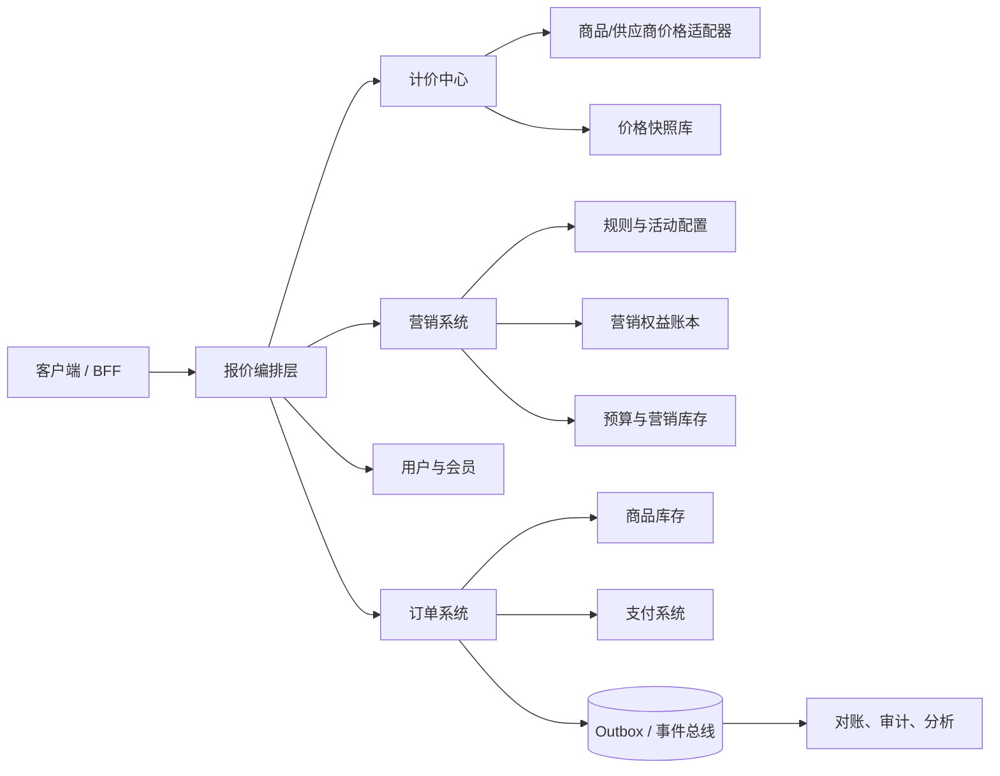
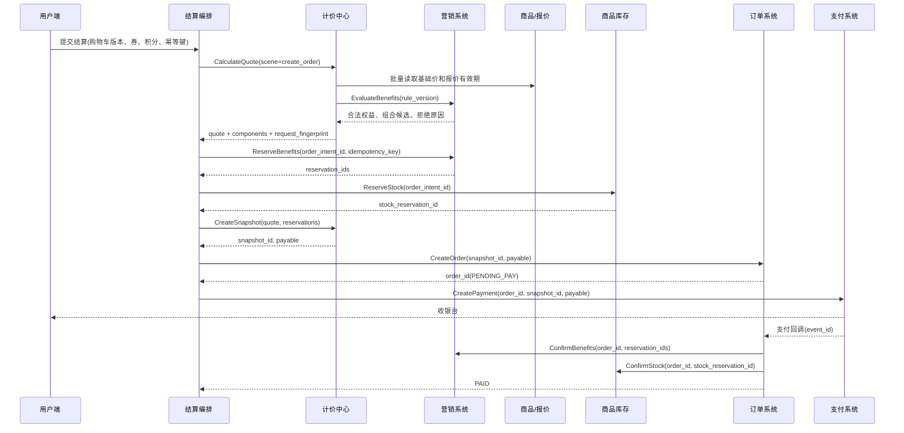

# 第 28 章 营销与计价系统

> **本章定位**：营销系统决定用户在什么条件下可以获得什么权益，计价系统把基础价格、营销权益、费用和支付方式编排成一份可解释、可审计、可锁定的价格事实。两者不是两个互相调用的“优惠服务”和“金额服务”，而是交易报价域中的两个限界上下文：营销提供资格与权益，计价负责金额计算，订单负责把计算结果变成交易快照，支付负责验证并完成资金交换。

电商平台最容易被低估的复杂度，往往不在“商品单价乘数量”，而在于同一件商品会同时受到用户、渠道、店铺、活动、库存、时间、币种、费用和支付方式的影响。一个用户在商品详情页看到的价格，可能只是匿名展示价；进入购物车后，会员身份和券发生变化；在结算页，跨店满减需要先按店铺分组再计算；创单时，供应商报价可能已经过期；支付时，平台还需要确认订单金额、币种、支付渠道费和营销出资方都没有被篡改。任何一个环节只保存一个 `total_amount`，后续客服、财务、商家和风控都无法回答“为什么是这个数”。

本章讨论一套适用于 B2C、B2B2C 和多品类虚拟商品平台的统一方法。文中的流量、延迟、预算和库存数字都属于**示例假设**，用于说明如何做容量规划和决策，不代表任何平台的公开事实。正文引用采用 `[n]` 简注，章末列出每个来源的作者或机构、标题、年份和原始 URL；引用支持相邻的理论、协议语义或工程判断，示例推导会明确标记为本章设计。

## 28.1 问题定义、约束与设计目标

### 28.1.1 先定义交易事实，再定义服务

营销和计价的第一项工作不是选 Redis、规则引擎或消息队列，而是回答四个问题：

1. **什么是商品事实**：商品中心或供应商报价系统提供了什么可售对象、基础价、币种、有效期和销售约束？
2. **什么是权益事实**：用户是否拥有某张券、是否满足满减门槛、是否仍有积分、平台是否愿意承担补贴？
3. **什么是价格事实**：在某个场景、某个时间点、使用某个规则版本计算出的每一行金额和订单应付金额是什么？
4. **什么是交易事实**：订单创建后，哪些输入被锁定，哪些权益已经冻结，哪些变化必须重新确认？

如果这四类事实没有分开，系统会出现三种典型混乱。第一，营销服务把“优惠 20 元”直接写到订单的最终金额里，计价服务无法解释优惠先后顺序和出资方。第二，页面使用缓存价而创单重新计算，用户看到的是 80 元、提交后却变成 86 元，客服只能依赖日志猜测原因。第三，订单取消时直接把券状态改回“未使用”，但另一笔重试请求已经消费了这张券，最终形成重复使用或资金损失。

因此，本章采用如下统一定义：

> 营销系统发布可版本化的权益规则并管理有限权益的生命周期；计价系统读取基础价格事实，选择合法权益，计算价格组件并生成快照；订单系统保存快照引用和交易状态；支付系统只接受与快照一致的应付金额。

这个定义借鉴领域驱动设计中的统一语言、限界上下文和模型边界思想。[1][2] 它也符合企业应用架构中“领域逻辑不能被数据库字段和远程调用隐式取代”的原则：分层不是把代码机械地分成 Controller、Service、DAO，而是让业务规则在能够表达业务概念的位置上保持内聚。[3]

### 28.1.2 业务范围与不做什么

本章覆盖以下场景：

| 场景 | 典型需求 | 必须锁定的事实 |
|---|---|---|
| 商品详情页 | 展示会员价、活动价、匿名价和“最高可省” | 商品版本、用户分群、活动版本；允许短暂过期 |
| 购物车 | 多行商品、跨店铺券、积分和运费预览 | 行快照、数量、店铺归属、候选权益 |
| 结算与创单 | 选择地址、配送、券和支付方式 | 基础价、规则版本、费用、分摊结果、库存引用 |
| 支付校验 | 防止金额被篡改、确认动态报价仍有效 | `snapshot_id`、币种、应付金额、报价有效期 |
| 取消与退款 | 释放冻结权益、恢复可退积分、拆分退款 | 原快照、组件 ID、退款范围、补偿状态 |
| 大促与秒杀 | 高峰抢券、限时折扣、预算和配额 | 热点活动版本、营销库存、限流结果和审计事件 |

本章不把广告竞价、复杂推荐排序、税务申报、支付清算网络和仓储履约展开为独立系统；但会定义它们与营销计价之间的接口边界。动态定价模型可以作为基础价格适配器接入，机器学习模型只负责产生候选价格或折扣建议，不直接绕过价格安全检查和快照机制。个性化定价还涉及价格公平、福利和可解释性，不能因为“算法可以提高转化”就忽略用户权益；相关研究将价格负担、群体公平、企业收益和资源可及性作为不同目标讨论。[19]

### 28.1.3 约束、数量级与验收指标

以下是一组用于设计演练的假设。真实项目应以压测、线上采样和业务峰值测量替换它们。

| 维度 | 示例假设 | 对设计的影响 |
|---|---:|---|
| 日活用户 | 500 万 | 用户分群、券查询和活动列表不能每次回源全表 |
| 普通结算峰值 | 2,000 QPS | 计价需要批量读取、并行依赖和稳定尾延迟 |
| 大促展示峰值 | 50,000 QPS | 展示路径和交易路径必须分离，允许缓存和部分降级 |
| 创单峰值 | 5,000 QPS | 快照与权益冻结必须有明确幂等语义 |
| 购物车行数 | P95 8 行，极端 50 行 | 组合优惠搜索要设上限，不能无限枚举 |
| 规则数量 | 单活动数百条，用户可见活动数十个 | 规则需预编译、分层过滤和版本化 |
| 价格有效期 | 固定价 30 分钟，供应商报价 1–5 分钟 | 支付前必须校验报价过期时间 |
| 资金误差 | 不允许出现负价、超预算、分摊不闭合 | 金额整数化、组件审计和对账是硬约束 |
| 用户体验 | 结算页 P99 目标由业务设定，例如 300 ms | 预算必须按依赖拆分，不能只给总超时 |

SLO 不应在系统上线后凭感觉制定。Google SRE 将 SLI、SLO 和错误预算作为服务治理的基础，强调指标必须描述用户真正关心的行为，而不是只挑容易采集的机器指标。[14] 对本章而言，至少需要分别定义：展示试算成功率、创单价格校验成功率、快照写入成功率、支付金额不一致率、权益冻结超时率、营销补偿积压、价格解释请求成功率和对账差异率。一个“计价服务 99.99% 可用”的抽象数字，不能替代“99.9% 结算请求在 300 ms 内返回，并且价格组件完整”的业务指标。

### 28.1.4 设计目标与 ADR-01

本章的设计目标有五个：

- **正确**：金额非负、分摊闭合、优惠不超过适用范围，平台和商家出资可追溯；
- **一致**：展示、结算、创单和支付之间有明确的口径关系，创单后的历史金额不因新规则发布而重算；
- **可扩展**：增加一个费用、优惠类型或新品类时，主要新增组件和适配器，不修改所有调用方；
- **可恢复**：网络超时、消息重复、服务重启、支付未知和部分退款都能通过重试、补偿或对账收敛；
- **可解释**：客服能够从 `snapshot_id` 还原输入、规则版本、价格层、优惠组件和出资方。

**ADR-01：营销和计价分离，但共享报价编排契约。**

背景是优惠规则变化快、商品基础价具有不同事实来源、交易链路又要求金额可审计。如果把所有逻辑放在营销服务，营销服务会变成隐含的订单服务；如果把所有规则放进计价服务，营销运营无法独立发布活动，代码会被配置分支和品类条件淹没。最终决策是：营销域输出候选权益、资格判断、资源冻结和核销结果；计价域负责把基础价、候选权益和费用组装为 `PriceComponent`；订单保存快照，不把两个服务的数据库表拼成一个“大促表”。

获得的能力是边界清楚、规则可审计、品类可扩展；主动牺牲的是一次请求中需要跨服务协作，且必须承担版本传递、补偿、对账和最终一致性。这个取舍不是“微服务越多越先进”，而是因为价格事实和权益事实有不同的变化速率、责任人和生命周期。ADR 应记录背景、决定和后果，并在边界条件改变时重新评估。[17]

## 28.2 统一模型：营销权益、价格层、快照与状态机

### 28.2.1 统一语言与核心对象

新功能进入系统前，产品、运营、客服、财务和研发应先对以下对象达成一致。美团关于互联网业务 DDD 的实践指出，复杂系统的腐化常常不是因为少了一个技术组件，而是模型与代码逐渐脱离业务语言，导致边界低内聚、高耦合。[21] 在交易场景中，最危险的词是“优惠”“价格”“库存”这类看似人人理解、实际上每个团队含义不同的词。

| 对象 | 业务含义 | 关键属性 | 所属事实 |
|---|---|---|---|
| `Money` | 带币种的不可变金额 | `minor_units`、`currency`、`scale` | 计价域 |
| `PriceComponent` | 对某个行或订单总额的增量影响 | `component_id`、`type`、`amount`、`source`、`rule_version` | 计价域 |
| `Benefit` | 用户或订单可获得的权益 | 资格条件、使用限制、有效期、出资方 | 营销域 |
| `PromotionRule` | 描述如何产生权益的可版本化规则 | 优先级、互斥组、门槛、适用范围 | 营销域 |
| `Reservation` | 对有限权益或预算的临时占用 | 资源、数量、订单、过期时间、状态 | 营销域 |
| `PriceSnapshot` | 某次计算的输入和输出快照 | 请求指纹、层级结果、组件、规则哈希、有效期 | 计价/订单协作 |
| `Allocation` | 把订单级优惠分配到行的结果 | 行 ID、组件 ID、分摊金额、尾差标记 | 计价域 |
| `LedgerEntry` | 权益或积分的不可变流水 | 账户、方向、数量、业务单号、幂等键 | 营销域 |

`PriceComponent` 不能只保存一个数。至少应描述“这是基础价、活动减免、平台券、商家券、积分抵扣、运费、服务费还是税费；金额由谁承担；适用于哪一行；由哪个规则版本产生”。组件的稳定 ID 比数组下标重要，因为订单行可能在合并、拆单和退款时重排。退款、开票和财务分摊都应引用 `component_id`，而不是假设“第三个数组元素永远是优惠券”。

### 28.2.2 四层价格模型与公式

为了避免“先打折还是先减券”的口头争论，先把计算拆成语义层。一个适用于多数实物和虚拟商品的模型如下：

```text
LineBase       = 基础价适配器输出的单行价格 × 数量
PromotionTotal = 按活动规则对 LineBase 计算的活动价或活动减免
DeductionTotal = 券、积分、红包等在合法范围内的抵扣
ChargeTotal    = 运费、服务费、渠道费、税费等附加费用
Payable        = LineBase - PromotionTotal - DeductionTotal + ChargeTotal
```

这里的 `PromotionTotal` 和 `DeductionTotal` 不是允许负数随便叠加的字段，而是组件集合的聚合结果。对每一个组件，都需要回答四个问题：计算前的基数是什么；组件是否与其他组件互斥；该组件能否覆盖费用；平台、商家和渠道分别承担多少。某些业务要把营销价格写成“活动后的新单价”，另一些业务要把它写成“对基础价的减量”，二者都可以，但必须在统一模型里选择一种语义。本章采用“组件保存增量、层负责计算顺序”的方式，因为增量更适合审计、分摊和逆向退款。

价格层的顺序是业务契约，不是实现细节。比如“满 300 减 50”应先按适用商品集合求门槛，再判断是否达到 300；平台券可能只能作用于活动后的小计；积分抵扣可能受支付金额上限约束；税费可能不能被折扣覆盖。促销研究也表明，门槛型和封顶型优惠即使最大经济收益相同，消费者对公平性和转化的感知仍可能不同，因此优惠规则既要表达经济约束，也要表达对用户展示的条件。[18]

### 28.2.3 权益状态机、价格快照与不变量

有限权益必须有明确状态机。以优惠券为例，推荐使用以下状态：

| 状态 | 可执行操作 | 不允许操作 | 迁移触发 |
|---|---|---|---|
| `AVAILABLE` | 试算、冻结 | 重复冻结同一券 | 用户选择并创建预占 |
| `FROZEN` | 查询、确认、释放 | 再次被其他订单确认 | 订单创建成功或超时 |
| `CONSUMED` | 查询、退款按业务规则补偿 | 再次使用 | 支付成功/履约确认 |
| `RELEASED` | 审计、重新进入可用池（若策略允许） | 按旧订单消费 | 取消、支付失败或超时 |
| `EXPIRED` | 审计 | 冻结或消费 | 过期任务或规则判断 |

积分账户更适合“账户余额 + 不可变流水”，而不是只更新 `available_points`。流水中记录发放、冻结、消费、释放、退还和过期，每个动作带 `biz_id`、`idempotency_key` 和前序流水引用。预算也使用类似模型：预算桶有承诺额、已冻结额、已消费额和可用额，消费不应只依赖一个 Redis 计数器。

价格快照至少包含以下字段：

```json
{
  "snapshot_id": "ps_20260921_01H...",
  "request_fingerprint": "sha256(...) ",
  "scene": "create_order",
  "currency": "CNY",
  "items": [{"line_id": "l1", "sku_id": "sku-1", "qty": 2}],
  "base_price_version": "product-v91",
  "marketing_rule_version": "campaign-v12",
  "components": [],
  "allocations": [],
  "payable_minor_units": 26800,
  "expires_at": "2026-09-21T12:00:30Z"
}
```

快照的关键不是“把 JSON 存下来”，而是让未来能够重建“当时看到了什么”。因此应保存输入哈希、规则哈希、供应商报价引用、用户资格分群版本、舍入过程、组件出资方和计算引擎版本。订单创建后，新的活动可以影响下一笔订单，但不能悄悄改写已支付订单的历史快照。

本章采用以下不变量：

1. 任意行的最终价不得小于零，订单应付金额不得小于零；
2. 行级应付金额之和等于订单应付金额，分摊尾差必须有唯一归属行；
3. 任何优惠组件都不能超过其适用基数和剩余预算；
4. `FROZEN` 权益只能由创建它的业务单号确认或释放；
5. 同一个幂等键和相同请求指纹必须返回相同业务结果；同一个幂等键不能接受不同请求体；
6. 价格快照只追加或生成新版本，不直接覆盖历史快照；
7. 事件重复、回调重复和补偿重试不能使余额、库存、预算或核销次数重复变化。

### 28.2.4 领域边界不是数据库边界

营销域拥有“用户有没有资格、优惠是否可用、资源能否冻结、支付成功后是否核销”的规则；计价域拥有“这些合法权益如何影响金额、费用如何计算、金额如何分摊和快照如何生成”的规则；订单域拥有“何时创建、何时取消、订单状态如何推进”的规则。三者可以共用数据库集群，也可以独立部署，但不能通过直接读写对方私有表来建立契约。

一个常见错误是把 `coupon_user.status` 直接暴露给计价服务。计价服务看到 `unused` 就认为可以用券，但它不知道冻结时限、并发版本和订单归属，最终形成“计价说可用、冻结说冲突”的竞态。正确方式是营销服务提供 `EvaluateBenefits` 和 `ReserveBenefits` 接口，返回带版本和过期时间的权益结果；计价服务只消费接口契约，不猜内部状态。

DDD 并不要求所有业务对象都使用复杂聚合。简单的展示资格可以使用查询模型；需要维护不变量的券、积分账户、预算桶和快照才需要聚合边界。美团交易系统的实践强调，限界上下文是连接问题空间和解决方案空间的桥梁，模型应随着新认知迭代，而不是一次性画完后永远不变。[23]

## 28.3 参考架构与职责边界

### 28.3.1 端到端参考架构

参考架构按“事实源、决策、编排、交易和治理”分层，而不是按技术组件名称分层。商品中心提供商品、SKU、店铺和基础价引用；供应商价格服务提供有过期时间的外部报价；用户和会员系统提供身份、等级和风控分群；营销系统提供活动、券、积分、补贴和预算；计价中心把这些输入编排为价格快照；订单、库存和支付完成交易状态推进。



“报价编排层”可以位于结算服务、BFF 或计价应用服务中，关键是不要让客户端自己拼价格。客户端可以提交用户选择的券和积分数量，但服务端必须重新验证资格、基数、版本和上限。展示路径可以读取缓存视图，创单路径必须经过权威接口；同一个 `trace_id` 贯穿两条路径，使团队能区分“页面展示旧价”和“创单错误价”。

### 28.3.2 职责矩阵

| 能力 | 商品中心 | 营销系统 | 计价中心 | 订单系统 | 支付系统 | 财务/对账 |
|---|---|---|---|---|---|---|
| 基础商品与 SKU | 权威 | 只读 | 只读 | 快照引用 | 不关心 | 查询 |
| 基础价格 | 自营/供应商事实 | 不拥有 | 适配并计算 | 保存快照 | 校验 | 对账 |
| 优惠资格 | 提供圈品维度 | 权威 | 调用 | 保存选择 | 不决定 | 审计 |
| 优惠金额 | 不计算 | 提供权益规则 | 权威计算 | 保存组件 | 校验 | 分摊 |
| 券/积分/预算状态 | 不拥有 | 权威状态机 | 不直接写 | 触发冻结/释放 | 触发确认 | 对账 |
| 订单总额 | 不拥有 | 不拥有 | 生成建议/快照 | 交易事实 | 验证应付额 | 结算事实 |
| 支付金额 | 不拥有 | 不拥有 | 提供快照 | 提交支付单 | 资金事实 | 清算核对 |
| 规则发布 | 商品规则 | 活动规则 | 引擎版本 | 不发布 | 不发布 | 审批审计 |

边界的一个实用测试是“如果删除这个系统，哪一条事实会失去权威来源”。如果答案是“没有，另一个系统也有一份”，说明出现了双写事实；如果答案是“订单里有一个优惠金额字段”，还需要追问它是支付快照的冗余字段，还是营销规则的权威来源。订单可以保存结果，但不应成为营销规则的配置中心。

### 28.3.3 API 契约：评估、试算、冻结和快照

营销和计价的接口要区分只读评估与有副作用操作。一个最小契约如下：

```text
EvaluateBenefits(request, scene) -> candidates, rejected_reasons, rule_version
CalculateQuote(request, candidates, scene) -> price_components, allocations, quote
ReserveBenefits(order_id, quote_id, selected_benefits, idempotency_key) -> reservations
CreateSnapshot(quote, reservations, idempotency_key) -> snapshot_id
ConfirmBenefits(order_id, reservation_ids, idempotency_key) -> consumed
ReleaseBenefits(order_id, reservation_ids, idempotency_key) -> released
```

`EvaluateBenefits` 不修改券和预算，适合 PDP、购物车和结算预览；`ReserveBenefits` 才产生冻结记录，必须拥有订单或结算会话 ID。`CalculateQuote` 需要把营销返回的拒绝原因结构化，例如 `expired`、`threshold_not_met`、`scope_mismatch`、`quota_exhausted`、`risk_rejected`，不能只返回“优惠不可用”。结构化原因可以用于页面提示、运营分析和客服解释。

计价接口的请求必须显式包含 `scene`。PDP、列表页、购物车、创单和支付校验不是同一个 API 换一个枚举值，而是不同的正确性契约：PDP 接受短暂过期和部分结果；创单必须有完整组件和可用的基础价；支付校验必须拒绝过期供应商报价和快照金额不一致。一个“万能价格接口”往往把所有场景都降级到最严格的成本，或者把交易路径错误地降级为展示路径。

### 28.3.4 ADR-02：快照传递而不是重复重算

**背景**：如果结算生成金额后，订单再次从商品、营销、用户和供应商系统重新计算，任何一个规则版本、用户等级、汇率或供应商报价变化都可能改变结果；但如果订单盲信客户端传来的金额，又无法防止篡改。

**候选方案**：

| 方案 | 优点 | 牺牲/风险 |
|---|---|---|
| 每个阶段都实时重算 | 输入最新 | 同一操作口径漂移，依赖放大，难以解释历史 |
| 客户端传最终金额 | 调用少 | 不可信，无法审计，易产生资损 |
| 结算生成快照，创单/支付校验引用并验证 | 口径稳定，可审计，可防篡改 | 需要快照存储、有效期和失效处理 |
| 只保存组件，不保存输入 | 存储小 | 规则和报价变化后无法重建当时结果 |

**决策**：采用第三种方案。快照由服务端生成并带有请求指纹；订单创建时验证签名、版本、有效期和用户/商品关键字段；支付时比较订单应付金额、快照金额和支付单金额。动态价格过期时生成新快照并要求用户重新确认，而不是偷偷替换订单金额。

该决策获得了一致口径、审计重放和安全校验，牺牲了部分实时性和存储空间；需要接受的风险是供应商报价在快照有效期内仍可能发生外部变化，因此品类策略必须明确“允许用快照成交”还是“支付前必须二次询价”。这种有背景、有候选、有牺牲、有重新评估条件的 ADR 比一句“采用快照机制”更能帮助后续团队做判断。[17]

### 28.3.5 配置发布与规则版本

规则配置不是直接改一行数据库记录。发布流程至少包括草稿、校验、审批、仿真、灰度、生效和下线。校验器应检查：时间窗口是否重叠；互斥组是否形成环；折扣是否超过上限；适用商品集合是否为空；预算是否有承担方；不同币种的金额是否使用正确精度；规则是否引用了已删除的券或店铺；新的活动是否会绕过最低价保护。

每次发布生成不可变的 `rule_version`。预览返回这个版本，快照引用这个版本，客服查询按这个版本重放。配置中心可以缓存当前版本，但数据库仍保存版本历史和发布人。回滚不是把配置改回旧值，而是把旧版本重新标记为有效并记录新的发布事件，避免审计时间线被覆盖。

规则仿真应使用历史请求样本和合成边界样本：单行恰好达到门槛、跨店恰好差一分钱、券过期一秒、预算只剩一单位、两张互斥券同时提交、退款只覆盖一个订单行。规则评估结果除了最终价格，还要输出命中的规则、被拒绝的规则及原因，以支持发布前人工检查。

## 28.4 营销规则、优惠组合与营销库存

### 28.4.1 优惠券、积分、活动和补贴不是四套孤立 CRUD

营销工具虽然在产品上表现为券、积分、活动和补贴，但它们共享三个抽象：**资格**、**有限资源**和**生命周期**。优惠券的有限资源是发行量和用户配额；积分的有限资源是账户余额；活动的有限资源是时间窗口、参与次数和预算；补贴的有限资源是平台或商家的资金承诺。把这些工具分别实现成“发一张券”“加积分”“改活动状态”“减预算”四个接口，会在下单、取消和退款时出现四种不同的幂等语义。

营销系统应区分配置对象和用户权益对象：

| 层次 | 例子 | 生命周期 | 典型存储 |
|---|---|---|---|
| 活动配置 | 满减、折扣、买赠、秒杀 | 草稿→审核→生效→结束 | 关系库 + 版本 |
| 规则对象 | 门槛、圈品、会员、渠道、互斥 | 随活动版本发布 | 配置快照/规则索引 |
| 用户权益 | 某用户领取的一张券、一次资格 | 可用→冻结→核销/释放 | 权益表 + 流水 |
| 营销库存 | 券额度、活动名额、预算桶 | 可用→冻结→消耗/回补 | 账本 + 热点缓存 |
| 事件记录 | 发放、冻结、确认、释放、过期 | 不可变追加 | Outbox/事件表 |

活动配置可以被运营修改，用户权益和订单快照不能随之重写。活动命中结果也不应等同于“用户已经获得优惠”：命中只是试算，冻结才是交易承诺，确认才是消费。

### 28.4.2 圈品、资格与规则匹配

圈品规则常见三种表达：全部商品、集合匹配和条件匹配。集合匹配适合 SKU、类目、品牌和店铺 ID；条件匹配适合价格区间、标签、渠道和用户等级。规则引擎不应在每次请求中扫描全量商品。发布时把静态集合编译成可查询索引，运行时先做粗筛，再做用户和订单上下文判断。

资格判断要分成“稳定资格”和“瞬时资格”。会员等级、注册时间和渠道来源通常可以缓存；库存、预算、券状态和供应商报价是瞬时事实，必须在冻结或创单前重新确认。缓存资格只能减少读取，不能替代权威状态机。

规则命中结果包含：

```json
{
  "benefit_id": "coupon-100-20",
  "eligible": true,
  "scope": ["line-1", "line-2"],
  "discount_type": "amount",
  "discount_minor_units": 2000,
  "exclusive_group": "merchant-activity",
  "priority": 80,
  "funding": [{"source": "merchant", "amount": 1500}, {"source": "platform", "amount": 500}],
  "rule_version": "campaign-v12",
  "explain": "商品小计达到 10000 分，且用户为会员"
}
```

美团外卖营销实践把领域对象、策略模式和领域事件结合起来处理复杂营销逻辑，说明营销代码的可维护性来自业务语义的组织，而不只是把 if-else 换成工厂类。[22] 本章的推导是：资格、组合和资金分摊分别建模，才可以在不改变券生命周期的情况下替换组合算法，也可以在不改变计价层的情况下增加新的券类型。

### 28.4.3 优惠叠加、互斥与最优组合

优惠组合不能简单按“折扣金额最大”求解，因为业务还要约束顺序、互斥、同组最多一个、平台券和商家券的共同使用，以及是否允许覆盖运费。可将候选优惠看作带约束的集合选择问题：

```text
候选集合 C = {c1, c2, ... cn}
选择集合 S ⊆ C
约束：
  互斥组中最多选择一个
  每个券的适用范围必须非空
  组合后的折扣不得超过适用基数
  平台/商家预算都不能为负
目标：
  在业务优先级、用户应付金额、商家承担额和体验规则之间选择合法解
```

求解策略依购物车大小选择：单行和候选很少时可枚举；多行、多店铺时先按互斥组做局部最优，再用分支限界或动态规划搜索；候选过多时保留用户可见的前 K 组，并明确展示“已按当前规则选择最优组合”。不能为了追求理论最优而让结算页在所有活动上做指数级搜索。

规则顺序要固定并输出：

1. 确认行和店铺边界，排除不适用商品；
2. 应用只能改变单价的活动价或阶梯价；
3. 计算店铺券、跨店券和平台券的合法组合；
4. 应用积分、红包等支付抵扣；
5. 计算可打折费用和不可打折费用；
6. 进行金额下限、预算、出资方和尾差检查。

门槛优惠的“门槛基数”必须写在规则中：是原价、活动后小计、扣券前小计，还是含运费金额。否则运营说“满 300”，研发可能用不同金额层判断，用户会遇到“明明超过门槛却不可用”。研究显示，用户不仅关心经济收益，也会根据预期和公平感评价门槛或封顶促销。[18] 工程上应把这种产品语义落实为可解释的 `threshold_basis`，而不是让文案和代码各自猜测。

### 28.4.4 营销库存与原子预占

营销库存与商品库存不同。商品库存通常表示可履约数量，营销库存表示平台愿意承诺的权益数量或金额；前者可能在仓库中有物理位置，后者通常由配额、预算和用户限制构成。二者可以在同一个订单编排中协作，但不能共享一张“库存表”而不区分语义。

营销库存至少包括：

| 资源 | 约束 | 例子 |
|---|---|---|
| 活动总量 | 全局数量或金额 | 发放 100 万张券 |
| 时段配额 | 时间片内上限 | 每分钟 2 万张 |
| 用户配额 | 单用户、设备、账户族群 | 每人限 1 张 |
| 预算桶 | 平台、商家、渠道或活动预算 | 平台补贴 500 万元 |
| 并发占用 | 短期冻结 | 未支付订单占用 15 分钟 |

抢券和预占的热路径可以使用 Redis 脚本做条件检查和计数更新，但 Redis 不是营销账本。脚本只负责在一个热点分片内原子判断，成功后必须写入持久化的 `reservation` 和事件记录；异步消费者、定时任务和对账程序负责把缓存计数与账本收敛。Redis Lua 脚本在服务端串行执行，能把多键条件更新放在一次原子操作中，但长脚本会阻塞其他请求，且脚本缓存本身不是持久数据库。[12]

```lua
-- KEYS[1] = campaign quota
-- KEYS[2] = user quota
-- ARGV[1] = requested amount
-- ARGV[2] = user limit
-- ARGV[3] = reservation id
local total = tonumber(redis.call('GET', KEYS[1]) or '0')
local used = tonumber(redis.call('GET', KEYS[2]) or '0')
local request = tonumber(ARGV[1])
local limit = tonumber(ARGV[2])

if total < request then return {0, 'campaign_exhausted'} end
if used + request > limit then return {0, 'user_limit'} end

redis.call('DECRBY', KEYS[1], request)
redis.call('INCRBY', KEYS[2], request)
redis.call('HSET', 'reservation:' .. ARGV[3],
  'amount', request, 'status', 'FROZEN')
return {1, 'reserved'}
```

脚本的业务约束是：所有涉及的 Key 必须属于同一 Redis Cluster hash slot；脚本参数不能来自客户端未经验证的价格；返回成功后，应用必须把 `reservation_id` 和订单幂等键持久化。若持久化失败，不能简单把脚本再执行一次，因为第二次可能重复扣减；应通过状态查询和补偿释放解决“缓存成功、账本未知”的情况。

### 28.4.5 券、积分与补贴的逆向流程

取消和退款不是“把正向接口反过来调用”这么简单。券可能已经过期，积分可能已经被用户继续消费，平台补贴可能已经进入商家结算。逆向流程要按组件和订单状态决定：

| 逆向场景 | 券 | 积分 | 平台/商家补贴 | 处理原则 |
|---|---|---|---|---|
| 创单失败 | 释放冻结 | 释放冻结 | 释放预算冻结 | 必须幂等，优先恢复可用额度 |
| 支付超时 | 释放或过期 | 释放冻结 | 释放预算 | 以支付最终状态查询为前提 |
| 订单取消未履约 | 按策略退回 | 退回或生成新流水 | 冲正待结算金额 | 不能直接删除原流水 |
| 部分退款 | 按行/组件规则 | 按分摊退回 | 按出资方冲正 | 引用 `component_id` 和分摊明细 |
| 已结算退款 | 生成售后调整 | 生成退还流水 | 进入财务调整单 | 不改写历史快照 |

平台补贴和商家补贴必须在价格组件中分拆，否则财务只能从最终优惠金额猜出资比例。多店铺订单尤其要保存店铺维度、平台维度和渠道维度的分摊结果；跨店满减的用户优惠可以集中计算，但资金承担必须可拆解。

## 28.5 计价引擎、费用模型与多品类适配

### 28.5.1 计价不是一段公式，而是一条可追踪的计算管线

计价引擎需要同时满足三个看似冲突的目标：在读路径足够快，在交易路径足够严格，在事后能够解释。解决方法是把计算拆成稳定的层和可插拔的适配器，每层接受结构化状态并追加组件，不把所有中间结果压缩成一个总数。


每层输出 `PricingState`，其中至少包含行级中间金额、组件列表、已选营销权益、供应商报价引用、规则版本、舍入记录、错误/降级标志和剩余超时。层之间传递的是值对象和不可变输入；如果某层需要修改，生成新的状态或追加事件，不要在多个 goroutine 中共享可变的金额对象。

### 28.5.2 基础价格层：不同品类，不同事实来源

固定实物价格可以从商品中心读取；酒店和票务价格通常依赖日期、场次、座位或供应商；充值和电子钱包可能存在面额、汇率和通道费；订阅商品需要周期和续费规则。它们的共同接口不是“返回一个 int”，而是：

```go
type BaseQuote struct {
	LineID       string
	UnitAmount   Money
	Quantity     int64
	Currency     string
	QuoteID      string
	Version      string
	ExpiresAt    time.Time
	Source       string
	Attributes   map[string]string
}

type BasePriceProvider interface {
	Quote(ctx context.Context, req BasePriceRequest) (BaseQuote, error)
}
```

适配器要把外部报价的有效期、请求参数摘要和供应商返回 ID 带入内部状态。一个供应商返回 100 元，另一个供应商返回 100 元，不代表它们的可售事实相同；前者可能有 10 分钟有效期，后者可能只保证 30 秒。计价中心可以缓存结果，但不能把无限期缓存价当成交易价。

价格请求先做规范化：对行项目排序、统一数量和币种、剔除不可售行、补充用户/渠道/地区上下文，然后计算 `request_fingerprint`。相同业务请求的字段顺序不同，不应导致不同快照；但数量、地址、配送方式、支付渠道、券选择或会员状态变化时，指纹必须变化。

### 28.5.3 价格层与费用模型

本章采用五个逻辑阶段：

| 阶段 | 处理内容 | 主要输出 | 不能做什么 |
|---|---|---|---|
| Base | 基础价、数量、币种、报价有效期 | 行基础价 | 不读取券并自行打折 |
| Promotion | 活动价、阶梯、买赠、秒杀 | 活动组件 | 不直接确认券核销 |
| Deduction | 券、红包、积分、会员抵扣 | 抵扣组件 | 不绕过资格和预算 |
| Charge | 运费、服务费、渠道费、税费 | 费用组件 | 不隐式改变优惠顺序 |
| Finalize | 下限、分摊、舍入、安全检查 | 快照/报价 | 不覆盖历史快照 |

费用建模要先回答“费用是什么”，再回答“如何计算”。建议每项费用带有 `fee_code`、`basis`、`calculation_type`、`discountable`、`funding_source`、`taxable` 和 `allocation_policy`。服务费可以是固定金额，平台费可以按比例，供应商手续费可能与支付方式相关，税费还可能依赖地区。费用是否可被券覆盖必须是显式配置；如果把它写成代码中的一个 if，后续加入新费用时极易出现旧券意外覆盖新费用。

```text
ChargeComponent {
  fee_code: SERVICE_FEE
  basis: PROMOTED_SUBTOTAL
  calculation: fixed(1500) | percentage(3%)
  discountable: false
  funding_source: merchant
  allocation_policy: by_line_weight
}
```

多币种场景必须保留原币金额和结算币金额，汇率版本和有效期也属于快照输入。金额计算使用货币最小单位的整数或经过明确舍入规则的十进制定点数，不能使用二进制浮点数直接累加。MySQL 的事务隔离级别决定了并发读取和更新时的可见性，默认隔离级别和业务所需的锁定语义不能靠“数据库会保证一致”一笔带过。[11]

### 28.5.4 分摊、尾差与退款

订单级优惠必须下沉到订单行，否则商品部分退款时无法知道应退多少。设订单行的活动后小计为 `b_i`，订单级优惠为 `D`，则一种按权重分摊的初始结果为：

```text
raw_i = D × b_i / Σb_i
allocated_i = floor(raw_i, currency_scale)
tail = D - Σallocated_i
把 tail 加到满足业务规则的最后一行或最大金额行
```

选择“最后一行”还是“最大金额行”必须固定并写入快照。多币种、零金额赠品、负向组件和跨店铺券都要覆盖测试。分摊结果应满足：所有行分摊之和等于订单优惠；每行分摊不超过适用金额；平台和商家出资分摊之和等于总优惠；退款按原组件和原分摊恢复，而不是重新按当前行金额计算。

常见错误包括：先四舍五入每一行导致总额多一分；把运费按商品金额分摊却没有记录配送维度；商品数量减少后重新算历史优惠；合并订单行后丢失原 `component_id`。这些问题看起来是金额细节，实际会扩散到发票、结算、退款、客服和财务对账。

### 28.5.5 领域模型与代码边界

计价领域可以使用值对象 `Money` 和 `PriceLayer`，聚合根可以是某个行级报价或订单报价。值对象负责金额加减、币种和精度；聚合负责不变量；领域服务负责跨多个组件的优惠组合和分摊；应用服务负责调用商品、营销、用户和供应商端口；基础设施负责缓存、数据库和消息。

```go
type Money struct {
	MinorUnits int64
	Currency   string
}

func (m Money) Add(other Money) (Money, error) {
	if m.Currency != other.Currency {
		return Money{}, ErrCurrencyMismatch
	}
	return Money{MinorUnits: m.MinorUnits + other.MinorUnits,
		Currency: m.Currency}, nil
}

type PriceComponent struct {
	ID             string
	Kind           string
	Amount         Money // 减免用负数，费用用正数，或统一使用 direction 字段
	LineID         string
	RuleVersion    string
	FundingSource  string
	Discountable   bool
}

type PricingCalculator interface {
	Calculate(ctx context.Context, input PricingInput) (PricingResult, error)
}
```

这里的代码只是边界示意，不是可以直接上线的完整实现。生产代码还需要显式区分“减免金额为正、方向单独表示”和“减免组件用负数”的方案，不能让不同计算器各自选择。DDD 的价值是把选择固化为统一语言和领域不变量，而不是给普通 CRUD 代码增加一层抽象。[1][2]

### 28.5.6 场景驱动的计算器

不要让一个 `CalculatePrice` 接口携带几十个可选字段，然后在实现中根据 `scene` 走无穷分支。可以保留统一的领域管线，但为场景定义不同的输入和强约束：

| 场景 | 允许缓存 | 依赖完整度 | 失败策略 | 是否生成交易快照 |
|---|---|---|---|---|
| 列表页 | 高 | 可只读匿名/会员展示价 | 返回基础价或隐藏营销标签 | 否 |
| PDP | 中 | 基础价 + 可展示权益 | 局部降级，标记不完整 | 否 |
| 加购 | 中 | 行价和限购 | 提示重新试算 | 否 |
| 购物车 | 低到中 | 多行、多店铺、券预览 | 失败行显式标记 | 可生成短期 quote |
| 创单 | 低 | 所有交易依赖和营销冻结 | fail-fast，不用旧营销价 | 是 |
| 支付校验 | 低 | 快照、币种、报价有效期 | 金额不一致即拒绝 | 验证已有快照 |

供应商类商品还需要 `quote_token` 和 `expires_at`。支付校验发现报价过期时，不能默默使用缓存报价；可根据品类策略选择重新询价、重新生成快照、提示用户确认或失败。航空、酒店和票务常常不允许用过期报价成交，固定实物可能允许在很短窗口内使用锁定价，这应是配置化的品类策略。

### 28.5.7 个性化价格与安全护栏

个性化定价的输入可能来自用户等级、渠道、地区、会员权益和行为分群。系统必须区分“对所有符合资格的用户公开的会员权益”和“基于不可解释特征给每个人返回不同的基础价”。前者可以用权益规则建模，后者需要额外的公平、合规、可解释和审计约束。个性化价格研究指出，价格优化涉及消费者福利、企业收益、平等获得和分配结果等不同目标，不能用单一收入指标判断系统成功。[19]

安全检查器应在快照写入前运行：

```go
func CheckQuote(req PricingRequest, result PricingResult) error {
	if result.Payable.MinorUnits < 0 {
		return ErrNegativePayable
	}
	if result.DiscountTotal().GreaterThan(result.EligibleSubtotal()) {
		return ErrDiscountExceedsBase
	}
	if result.AllocatedDiscount() != result.DiscountTotal() {
		return ErrAllocationMismatch
	}
	if result.BudgetDelta().IsOverLimit() {
		return ErrBudgetExceeded
	}
	if !result.CurrencyMatches(req.Currency) {
		return ErrCurrencyMismatch
	}
	return nil
}
```

安全检查不是风控的替代品。风控可以拒绝疑似脚本、设备族群或异常行为；计价安全检查只保证金额、范围、预算和版本的内部不变量。两者都失败时，不能为了转化率只跳过一个检查器。

## 28.6 从展示到支付的完整交易链路

### 28.6.1 示例场景与时间轴

下面用一个**示例假设**走通完整链路：用户在两个店铺购买三件商品。店铺 A 的商品基础小计为 220 元，店铺 B 的商品基础小计为 130 元；店铺 A 有“满 200 减 30”的活动，平台发放一张“满 300 减 20”的平台券，用户选择抵扣 50 元积分；订单有 12 元服务费，其中 5 元可被店铺承担、7 元不可折扣。平台券由平台承担，店铺活动由店铺承担。商品库存、券、积分和预算都必须在交易链路中形成对应的承诺。

这组数字不是行业标准，只用于说明“先定义基数和出资方，再算总价”。假设营销规则规定：店铺活动先于平台券，平台券基于活动后商品小计，积分只能抵扣商品应付金额，服务费不可被积分抵扣。于是：

```text
商品基础小计             350.00
店铺 A 活动减免          -30.00
活动后商品小计           320.00
平台券                   -20.00
积分抵扣                 -50.00
可折扣服务费              +5.00
不可折扣服务费            +7.00
最终应付                  262.00
```

真实实现还要将 30 元和 20 元分摊到相应订单行，记录平台/店铺出资，并根据库存、地址、运费、税费和支付渠道重新校验。这个例子最重要的不是算出 262，而是每一行都能回答“它的输入、规则、责任人和回滚方式是什么”。

### 28.6.2 PDP 与购物车：允许变化，但要诚实表达

商品详情页请求可以使用 `GetQuote(scene=pdp)`。它读取基础价、活动展示信息和用户可见券，但不冻结券、不扣预算。响应中返回：

- 当前展示金额和币种；
- 已应用的公开活动组件；
- “还差多少达到门槛”这类解释信息；
- 价格有效期和是否为缓存/部分结果；
- 进入结算后可能变化的条件，例如库存、供应商报价、地址和支付方式。

购物车请求要以服务端行项目为准。未登录购物车合并到登录账户时，不能沿用客户端缓存的券选择和价格，必须先完成行合并、店铺归属确认和权益重新评估。购物车可以保存用户选择，但选择只是意图，不是核销事实。

当某个活动服务超时时，列表页可以隐藏活动标签或返回基础价；购物车应把对应行标记为“优惠待重新计算”，而不是展示旧的优惠金额并让用户误以为已经锁定。展示降级的前提是用户能看见不确定性；交易路径不应把“缓存成功”当作“权利成功”。

### 28.6.3 结算、冻结与创单

结算服务收集地址、配送方式、支付渠道、券选择、积分数量和用户确认，然后调用计价中心生成 `quote_id`。计价中心并行读取商品/供应商报价、用户资格、营销候选和费用配置；营销服务只在用户点击“提交订单”后执行权益冻结。推荐顺序如下：

1. 校验请求指纹、用户身份、购物车版本和商品可售状态；
2. 获取各行基础报价并检查报价有效期；
3. 评估营销候选，过滤资格不满足和预算不足的权益；
4. 选择合法优惠组合，生成组件和初步分摊；
5. 冻结券、积分、营销预算和必要的商品库存；
6. 在冻结结果和价格组件都成功后写入价格快照；
7. 创建待支付订单，订单保存快照 ID 和所有冻结资源 ID；
8. 生成支付单，支付单金额来自快照而非客户端参数。

这里存在一个重要的竞态：如果先冻结营销权益，后写价格快照失败，必须有补偿释放；如果先写快照，后冻结失败，快照只能标记为不可用，不能被订单复用。因此订单编排器需要把每一步的状态写入流程表，使用幂等键重复推进，而不是在超时后盲目从第一步重新执行。

### 28.6.4 端到端时序图



如果营销冻结成功、库存冻结失败，编排器释放营销冻结；如果库存冻结成功、快照写入失败，释放库存并把营销释放任务写入补偿表；如果支付回调重复，订单和营销确认都以 `event_id`、订单号和资源 ID 做幂等。支付回调到达时，订单系统不应根据回调金额直接更新订单金额，而应查询订单快照并比较金额和币种。

### 28.6.5 关键字段与契约检查

| 字段 | 产生方 | 消费方 | 失败后果 | 保留时间 |
|---|---|---|---|---|
| `request_fingerprint` | 结算/计价 | 快照、幂等层 | 同一请求可能生成多个报价 | 至少覆盖报价有效期 |
| `quote_id` | 计价 | 结算、订单 | 无法把预览与创单关联 | 交易周期 |
| `snapshot_id` | 计价 | 订单、支付、客服 | 金额口径漂移 | 订单生命周期 + 审计周期 |
| `rule_version` | 营销 | 计价、快照、审计 | 无法重放活动规则 | 永久或合规要求 |
| `reservation_id` | 营销/库存 | 编排器、订单、补偿 | 无法释放或确认资源 | 直到终态后归档 |
| `idempotency_key` | 调用方 | 每个有副作用服务 | 重试造成重复冻结/核销 | 覆盖最大重试窗口 |
| `event_id` | 事件发布方 | 消费者、对账 | 重复消费改变余额 | 永久流水/去重窗口 |
| `trace_id` | 网关 | 全链路 | 客服和研发无法定位一次操作 | 采样保留策略 |

幂等键应该绑定业务动作，而不是只绑定 HTTP 请求。比如 `reserve_coupon:{order_intent_id}`、`confirm_points:{order_id}`、`payment_callback:{payment_event_id}`。Stripe 的 API 文档把幂等键视为客户端安全重试的契约，并且要求同一个键复用时请求参数保持一致；这比在服务端“遇到重复就返回成功”更严格，也更能避免调用方误复用键。[10]

### 28.6.6 支付校验与用户确认

支付校验至少比较四项：订单快照应付金额、支付单创建金额、渠道回调金额、币种。对于多支付方式、部分支付和合并支付，要定义快照粒度：是整单快照，还是每个支付子单一份快照。支付成功并不自动代表所有权益都已经消费，订单状态推进和营销确认可以异步，但订单对用户必须有明确的“支付处理中”状态，避免前端重复提交。

价格变化时，用户体验策略应和品类策略绑定：价格下降可以提示并让用户确认新价；价格上涨通常需要显式二次确认；供应商不可预订可以提供替代日期或退款路径；优惠失效要展示失效原因和可选替代优惠。最终价格研究说明，用户对多商品促销可能更关注展示时的最终可支付金额，而不是单独的折扣标记，因此结算页必须展示行价、优惠、费用和最终价，而不是只展示“省了多少”。[20]
