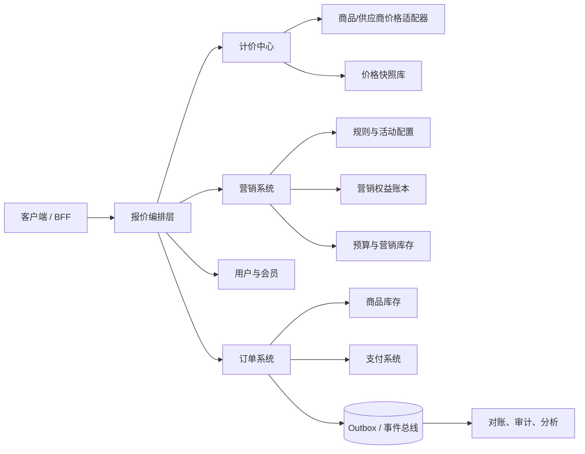
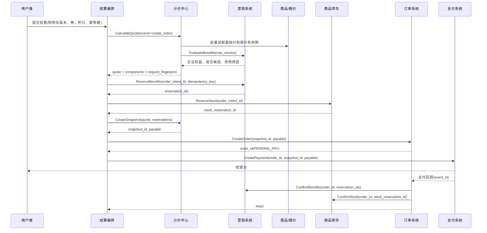

# 第 28 章 营销与计价系统

> **本章定位**：营销系统决定用户在什么条件下可以获得什么权益，计价系统把基础价格、营销权益、费用和支付方式编排成一份可解释、可审计、可锁定的价格事实。两者不是两个互相调用的“优惠服务”和“金额服务”，而是交易报价域中的两个限界上下文：营销提供资格与权益，计价负责金额计算，订单负责把计算结果变成交易快照，支付负责验证并完成资金交换。

电商平台最容易被低估的复杂度，往往不在“商品单价乘数量”，而在于同一件商品会同时受到用户、渠道、店铺、活动、库存、时间、币种、费用和支付方式的影响。一个用户在商品详情页看到的价格，可能只是匿名展示价；进入购物车后，会员身份和券发生变化；在结算页，跨店满减需要先按店铺分组再计算；创单时，供应商报价可能已经过期；支付时，平台还需要确认订单金额、币种、支付渠道费和营销出资方都没有被篡改。任何一个环节只保存一个 `total_amount`，后续客服、财务、商家和风控都无法回答“为什么是这个数”。

本章讨论一套适用于 B2C、B2B2C 和多品类虚拟商品平台的统一方法。文中的流量、延迟、预算和库存数字都属于**示例假设**，用于说明如何做容量规划和决策，不代表任何平台的公开事实。正文引用采用 `[n]` 简注，章末列出每个来源的作者或机构、标题、年份和原始 URL；引用支持相邻的理论、协议语义或工程判断，示例推导会明确标记为本章设计。

## 28.1 问题定义、约束与设计目标

### 28.1.1 先定义交易事实，再定义服务

营销和计价的第一项工作不是选 Redis、规则引擎或消息队列，而是回答四个问题：

1. **什么是商品事实**：商品中心或供应商报价系统提供了什么可售对象、基础价、币种、有效期和销售约束？
2. **什么是权益事实**：用户是否拥有某张券、是否满足满减门槛、是否仍有积分、平台是否愿意承担补贴？
3. **什么是价格事实**：在某个场景、某个时间点、使用某个规则版本计算出的每一行金额和订单应付金额是什么？
4. **什么是交易事实**：订单创建后，哪些输入被锁定，哪些权益已经冻结，哪些变化必须重新确认？

如果这四类事实没有分开，系统会出现三种典型混乱。第一，营销服务把“优惠 20 元”直接写到订单的最终金额里，计价服务无法解释优惠先后顺序和出资方。第二，页面使用缓存价而创单重新计算，用户看到的是 80 元、提交后却变成 86 元，客服只能依赖日志猜测原因。第三，订单取消时直接把券状态改回“未使用”，但另一笔重试请求已经消费了这张券，最终形成重复使用或资金损失。

因此，本章采用如下统一定义：

> 营销系统发布可版本化的权益规则并管理有限权益的生命周期；计价系统读取基础价格事实，选择合法权益，计算价格组件并生成快照；订单系统保存快照引用和交易状态；支付系统只接受与快照一致的应付金额。

这个定义借鉴领域驱动设计中的统一语言、限界上下文和模型边界思想。[1][2] 它也符合企业应用架构中“领域逻辑不能被数据库字段和远程调用隐式取代”的原则：分层不是把代码机械地分成 Controller、Service、DAO，而是让业务规则在能够表达业务概念的位置上保持内聚。[3]

### 28.1.2 业务范围与不做什么

本章覆盖以下场景：

| 场景 | 典型需求 | 必须锁定的事实 |
|---|---|---|
| 商品详情页 | 展示会员价、活动价、匿名价和“最高可省” | 商品版本、用户分群、活动版本；允许短暂过期 |
| 购物车 | 多行商品、跨店铺券、积分和运费预览 | 行快照、数量、店铺归属、候选权益 |
| 结算与创单 | 选择地址、配送、券和支付方式 | 基础价、规则版本、费用、分摊结果、库存引用 |
| 支付校验 | 防止金额被篡改、确认动态报价仍有效 | `snapshot_id`、币种、应付金额、报价有效期 |
| 取消与退款 | 释放冻结权益、恢复可退积分、拆分退款 | 原快照、组件 ID、退款范围、补偿状态 |
| 大促与秒杀 | 高峰抢券、限时折扣、预算和配额 | 热点活动版本、营销库存、限流结果和审计事件 |

本章不把广告竞价、复杂推荐排序、税务申报、支付清算网络和仓储履约展开为独立系统；但会定义它们与营销计价之间的接口边界。动态定价模型可以作为基础价格适配器接入，机器学习模型只负责产生候选价格或折扣建议，不直接绕过价格安全检查和快照机制。个性化定价还涉及价格公平、福利和可解释性，不能因为“算法可以提高转化”就忽略用户权益；相关研究将价格负担、群体公平、企业收益和资源可及性作为不同目标讨论。[19]

### 28.1.3 约束、数量级与验收指标

以下是一组用于设计演练的假设。真实项目应以压测、线上采样和业务峰值测量替换它们。

| 维度 | 示例假设 | 对设计的影响 |
|---|---:|---|
| 日活用户 | 500 万 | 用户分群、券查询和活动列表不能每次回源全表 |
| 普通结算峰值 | 2,000 QPS | 计价需要批量读取、并行依赖和稳定尾延迟 |
| 大促展示峰值 | 50,000 QPS | 展示路径和交易路径必须分离，允许缓存和部分降级 |
| 创单峰值 | 5,000 QPS | 快照与权益冻结必须有明确幂等语义 |
| 购物车行数 | P95 8 行，极端 50 行 | 组合优惠搜索要设上限，不能无限枚举 |
| 规则数量 | 单活动数百条，用户可见活动数十个 | 规则需预编译、分层过滤和版本化 |
| 价格有效期 | 固定价 30 分钟，供应商报价 1–5 分钟 | 支付前必须校验报价过期时间 |
| 资金误差 | 不允许出现负价、超预算、分摊不闭合 | 金额整数化、组件审计和对账是硬约束 |
| 用户体验 | 结算页 P99 目标由业务设定，例如 300 ms | 预算必须按依赖拆分，不能只给总超时 |

SLO 不应在系统上线后凭感觉制定。Google SRE 将 SLI、SLO 和错误预算作为服务治理的基础，强调指标必须描述用户真正关心的行为，而不是只挑容易采集的机器指标。[14] 对本章而言，至少需要分别定义：展示试算成功率、创单价格校验成功率、快照写入成功率、支付金额不一致率、权益冻结超时率、营销补偿积压、价格解释请求成功率和对账差异率。一个“计价服务 99.99% 可用”的抽象数字，不能替代“99.9% 结算请求在 300 ms 内返回，并且价格组件完整”的业务指标。

### 28.1.4 设计目标与 ADR-01

本章的设计目标有五个：

- **正确**：金额非负、分摊闭合、优惠不超过适用范围，平台和商家出资可追溯；
- **一致**：展示、结算、创单和支付之间有明确的口径关系，创单后的历史金额不因新规则发布而重算；
- **可扩展**：增加一个费用、优惠类型或新品类时，主要新增组件和适配器，不修改所有调用方；
- **可恢复**：网络超时、消息重复、服务重启、支付未知和部分退款都能通过重试、补偿或对账收敛；
- **可解释**：客服能够从 `snapshot_id` 还原输入、规则版本、价格层、优惠组件和出资方。

**ADR-01：营销和计价分离，但共享报价编排契约。**

背景是优惠规则变化快、商品基础价具有不同事实来源、交易链路又要求金额可审计。如果把所有逻辑放在营销服务，营销服务会变成隐含的订单服务；如果把所有规则放进计价服务，营销运营无法独立发布活动，代码会被配置分支和品类条件淹没。最终决策是：营销域输出候选权益、资格判断、资源冻结和核销结果；计价域负责把基础价、候选权益和费用组装为 `PriceComponent`；订单保存快照，不把两个服务的数据库表拼成一个“大促表”。

获得的能力是边界清楚、规则可审计、品类可扩展；主动牺牲的是一次请求中需要跨服务协作，且必须承担版本传递、补偿、对账和最终一致性。这个取舍不是“微服务越多越先进”，而是因为价格事实和权益事实有不同的变化速率、责任人和生命周期。ADR 应记录背景、决定和后果，并在边界条件改变时重新评估。[17]

### 28.1.5 四类业务压力与设计取舍

营销和计价的复杂度可以按四类压力观察。第一类是**规则压力**：活动越来越多，券有门槛、范围、互斥和优先级，运营希望不发版就能调整。解决办法是版本化配置、规则编译和仿真，但配置越灵活，越需要 schema、权限和回滚，否则把代码复杂度转移成运营资损。

第二类是**交易压力**：用户希望页面快速，订单希望金额稳定，支付希望校验严格。不能用一个“实时性”指标覆盖三者。展示可以接受短 TTL；购物车需要提示变化；创单和支付必须引用快照。快照本质上是把一个短暂的计算结果转化为交易承诺，承诺一旦产生，变化必须通过显式确认或售后流程处理。

第三类是**资源压力**：券、预算、积分、库存和供应商报价都可能在高峰被争抢。资源压力要求状态机、原子预占和释放，但不意味着所有状态都要同步完成。可以把展示和候选计算异步化，把真正影响资金的冻结、确认、释放做成可查询的同步命令，再用事件驱动统计和分析。

第四类是**组织压力**：商品、营销、订单、支付、财务和客服由不同团队负责，每个团队都可能在本地添加一个价格字段。此时最重要的不是继续建表，而是把价格组件、快照、规则版本和责任矩阵写成跨团队契约。ADR 让团队能够看到某个决策获得了什么、牺牲了什么，也能知道在什么条件下重新评估。[17]

从这四类压力可以推导出一张取舍表：

| 决策 | 获得 | 牺牲 | 适用前提 | 重新评估条件 |
|---|---|---|---|---|
| 规则配置化 | 发布快、运营可控 | 配置校验和仿真复杂 | 规则类型有稳定抽象 | 配置分支超过领域模型可理解范围 |
| 统一计价 | 口径一致、扩展复用 | 依赖编排、快照和迁移成本 | 多场景共享价格事实 | 只有单一固定价且无跨域资金影响 |
| 营销库存缓存预扣 | 高峰吞吐、低延迟 | 需要对账和补偿 | 资源可按分片分配 | 预算必须强一致且无法预分配 |
| 异步事件 | 解耦、削峰、可重放 | 最终一致、重复消费 | 消费者可幂等 | 用户必须在一个本地事务内立即看到结果 |
| 个性化权益 | 精细运营、可实验 | 公平、隐私、解释成本 | 有清晰资格和审计策略 | 价格差异无法解释或触发合规风险 |

促销研究从消费者对公平交易的感知讨论门槛和封顶优惠；本章将其转译为工程约束：规则应显式保存触发条件、展示文案和最终价影响，系统应能重放同一条件下的决策，而不是只保存一个折扣数字。[18] 个性化价格研究则提醒工程团队，收入、转化、公平和福利不是同一个目标函数；如果产品选择个性化定价，至少要保存资格版本、价格范围和审计解释。[19]

### 28.1.6 典型反模式

**反模式一：一个 `discount_amount` 字段走遍所有服务。** 它无法表达多张券的来源、顺序、适用行和部分退款，最终所有服务都在猜这个数字的含义。改法是组件化，并在订单中保存组件和分摊。

**反模式二：把活动配置直接放进客户端。** 客户端可以提前展示，但不能决定资格、门槛、库存和金额。改法是客户端传选择，服务端重新评估，返回拒绝原因和新快照。

**反模式三：用分布式锁代替状态机。** 锁只能减少并发冲突，不能表示支付未知、订单取消、补偿失败和人工接管。改法是锁用于保护短临界区，状态机和流水用于表达业务事实。

**反模式四：把消息“恰好一次”当成资金“恰好一次”。** 消息系统的语义只覆盖它的边界，外部数据库、支付渠道和供应商仍可能重复或超时。改法是外部副作用使用幂等键、状态查询和对账。

**反模式五：把降级写成“营销服务失败就原价下单”。** 原价可能缺少供应商费用、用户已选择的承诺或最低价保护。改法是按场景定义降级等级，交易路径在无法形成可信快照时快速失败。

## 28.2 统一模型：营销权益、价格层、快照与状态机

### 28.2.1 统一语言与核心对象

新功能进入系统前，产品、运营、客服、财务和研发应先对以下对象达成一致。美团关于互联网业务 DDD 的实践指出，复杂系统的腐化常常不是因为少了一个技术组件，而是模型与代码逐渐脱离业务语言，导致边界低内聚、高耦合。[21] 在交易场景中，最危险的词是“优惠”“价格”“库存”这类看似人人理解、实际上每个团队含义不同的词。

| 对象 | 业务含义 | 关键属性 | 所属事实 |
|---|---|---|---|
| `Money` | 带币种的不可变金额 | `minor_units`、`currency`、`scale` | 计价域 |
| `PriceComponent` | 对某个行或订单总额的增量影响 | `component_id`、`type`、`amount`、`source`、`rule_version` | 计价域 |
| `Benefit` | 用户或订单可获得的权益 | 资格条件、使用限制、有效期、出资方 | 营销域 |
| `PromotionRule` | 描述如何产生权益的可版本化规则 | 优先级、互斥组、门槛、适用范围 | 营销域 |
| `Reservation` | 对有限权益或预算的临时占用 | 资源、数量、订单、过期时间、状态 | 营销域 |
| `PriceSnapshot` | 某次计算的输入和输出快照 | 请求指纹、层级结果、组件、规则哈希、有效期 | 计价/订单协作 |
| `Allocation` | 把订单级优惠分配到行的结果 | 行 ID、组件 ID、分摊金额、尾差标记 | 计价域 |
| `LedgerEntry` | 权益或积分的不可变流水 | 账户、方向、数量、业务单号、幂等键 | 营销域 |

`PriceComponent` 不能只保存一个数。至少应描述“这是基础价、活动减免、平台券、商家券、积分抵扣、运费、服务费还是税费；金额由谁承担；适用于哪一行；由哪个规则版本产生”。组件的稳定 ID 比数组下标重要，因为订单行可能在合并、拆单和退款时重排。退款、开票和财务分摊都应引用 `component_id`，而不是假设“第三个数组元素永远是优惠券”。

### 28.2.2 四层价格模型与公式

为了避免“先打折还是先减券”的口头争论，先把计算拆成语义层。一个适用于多数实物和虚拟商品的模型如下：

```text
LineBase       = 基础价适配器输出的单行价格 × 数量
PromotionTotal = 按活动规则对 LineBase 计算的活动价或活动减免
DeductionTotal = 券、积分、红包等在合法范围内的抵扣
ChargeTotal    = 运费、服务费、渠道费、税费等附加费用
Payable        = LineBase - PromotionTotal - DeductionTotal + ChargeTotal
```

这里的 `PromotionTotal` 和 `DeductionTotal` 不是允许负数随便叠加的字段，而是组件集合的聚合结果。对每一个组件，都需要回答四个问题：计算前的基数是什么；组件是否与其他组件互斥；该组件能否覆盖费用；平台、商家和渠道分别承担多少。某些业务要把营销价格写成“活动后的新单价”，另一些业务要把它写成“对基础价的减量”，二者都可以，但必须在统一模型里选择一种语义。本章采用“组件保存增量、层负责计算顺序”的方式，因为增量更适合审计、分摊和逆向退款。

价格层的顺序是业务契约，不是实现细节。比如“满 300 减 50”应先按适用商品集合求门槛，再判断是否达到 300；平台券可能只能作用于活动后的小计；积分抵扣可能受支付金额上限约束；税费可能不能被折扣覆盖。促销研究也表明，门槛型和封顶型优惠即使最大经济收益相同，消费者对公平性和转化的感知仍可能不同，因此优惠规则既要表达经济约束，也要表达对用户展示的条件。[18]

### 28.2.3 权益状态机、价格快照与不变量

有限权益必须有明确状态机。以优惠券为例，推荐使用以下状态：

| 状态 | 可执行操作 | 不允许操作 | 迁移触发 |
|---|---|---|---|
| `AVAILABLE` | 试算、冻结 | 重复冻结同一券 | 用户选择并创建预占 |
| `FROZEN` | 查询、确认、释放 | 再次被其他订单确认 | 订单创建成功或超时 |
| `CONSUMED` | 查询、退款按业务规则补偿 | 再次使用 | 支付成功/履约确认 |
| `RELEASED` | 审计、重新进入可用池（若策略允许） | 按旧订单消费 | 取消、支付失败或超时 |
| `EXPIRED` | 审计 | 冻结或消费 | 过期任务或规则判断 |

积分账户更适合“账户余额 + 不可变流水”，而不是只更新 `available_points`。流水中记录发放、冻结、消费、释放、退还和过期，每个动作带 `biz_id`、`idempotency_key` 和前序流水引用。预算也使用类似模型：预算桶有承诺额、已冻结额、已消费额和可用额，消费不应只依赖一个 Redis 计数器。

价格快照至少包含以下字段：

```json
{
  "snapshot_id": "ps_20260921_01H...",
  "request_fingerprint": "sha256(...) ",
  "scene": "create_order",
  "currency": "CNY",
  "items": [{"line_id": "l1", "sku_id": "sku-1", "qty": 2}],
  "base_price_version": "product-v91",
  "marketing_rule_version": "campaign-v12",
  "components": [],
  "allocations": [],
  "payable_minor_units": 26800,
  "expires_at": "2026-09-21T12:00:30Z"
}
```

快照的关键不是“把 JSON 存下来”，而是让未来能够重建“当时看到了什么”。因此应保存输入哈希、规则哈希、供应商报价引用、用户资格分群版本、舍入过程、组件出资方和计算引擎版本。订单创建后，新的活动可以影响下一笔订单，但不能悄悄改写已支付订单的历史快照。

本章采用以下不变量：

1. 任意行的最终价不得小于零，订单应付金额不得小于零；
2. 行级应付金额之和等于订单应付金额，分摊尾差必须有唯一归属行；
3. 任何优惠组件都不能超过其适用基数和剩余预算；
4. `FROZEN` 权益只能由创建它的业务单号确认或释放；
5. 同一个幂等键和相同请求指纹必须返回相同业务结果；同一个幂等键不能接受不同请求体；
6. 价格快照只追加或生成新版本，不直接覆盖历史快照；
7. 事件重复、回调重复和补偿重试不能使余额、库存、预算或核销次数重复变化。

### 28.2.4 领域边界不是数据库边界

营销域拥有“用户有没有资格、优惠是否可用、资源能否冻结、支付成功后是否核销”的规则；计价域拥有“这些合法权益如何影响金额、费用如何计算、金额如何分摊和快照如何生成”的规则；订单域拥有“何时创建、何时取消、订单状态如何推进”的规则。三者可以共用数据库集群，也可以独立部署，但不能通过直接读写对方私有表来建立契约。

一个常见错误是把 `coupon_user.status` 直接暴露给计价服务。计价服务看到 `unused` 就认为可以用券，但它不知道冻结时限、并发版本和订单归属，最终形成“计价说可用、冻结说冲突”的竞态。正确方式是营销服务提供 `EvaluateBenefits` 和 `ReserveBenefits` 接口，返回带版本和过期时间的权益结果；计价服务只消费接口契约，不猜内部状态。

DDD 并不要求所有业务对象都使用复杂聚合。简单的展示资格可以使用查询模型；需要维护不变量的券、积分账户、预算桶和快照才需要聚合边界。美团交易系统的实践强调，限界上下文是连接问题空间和解决方案空间的桥梁，模型应随着新认知迭代，而不是一次性画完后永远不变。[23]

### 28.2.5 请求、报价和快照的版本关系

版本不是一个字段加在表尾就完成了。一次价格计算至少同时涉及四类版本：商品版本、营销规则版本、计价引擎版本和外部报价版本。它们的职责不同：商品版本回答“这个 SKU 当时是什么”；规则版本回答“当时有哪些权益和顺序”；引擎版本回答“程序用什么算法解释规则”；报价版本回答“供应商在什么时间给了什么可售价格”。

| 版本 | 变化来源 | 是否影响展示缓存 | 是否写入快照 | 变更后的动作 |
|---|---|---|---|---|
| 商品版本 | SKU、上下架、基础价、库存策略 | 通常失效 | 必须 | 重新读取商品事实 |
| 营销规则版本 | 活动发布、券规则、门槛、互斥 | 立即失效或按版本隔离 | 必须 | 重新评估资格 |
| 引擎版本 | 代码发布、舍入或组合算法 | 灰度隔离 | 必须 | 空跑 diff 后逐步切流 |
| 报价版本 | 供应商响应、汇率、报价 token | 短 TTL | 必须 | 过期时重新询价 |
| 用户资格版本 | 会员变更、风控标签、渠道身份 | 短 TTL | 视业务 | 创单前二次校验 |

如果只保存一个 `rule_version`，仍然无法重建一份依赖供应商报价的历史价格。反过来，如果把所有下游响应完整复制到每一份快照，存储和隐私成本又会迅速膨胀。可以采用“快照正文 + 外部引用 + 摘要哈希”的折中：对金额、币种、组件、分摊和规则参数保存完整值；对大体积商品描述、用户画像和供应商原始响应保存版本引用与哈希；在合规允许的范围内保留重放所需的最小输入。

`quote_id` 和 `snapshot_id` 也不应混用。报价是一个可失效的计算结果，可以被新的请求替换；快照是交易事实，具有明确的创建者、有效期和状态。订单创建成功后，`quote_id` 可以归档，`snapshot_id` 继续被支付、退款、客服和财务引用。支付系统接收快照引用并验证摘要，而不是依赖客户端再次上传完整规则。

### 28.2.6 价格字典与领域事件

团队规模变大后，最常见的协作问题是同一个词在不同服务里含义不同。例如营销说“活动价”，商品说“销售价”，计价说“促销层”，订单说“成交价”，财务说“含税结算价”。应建立价格字典，至少定义：原价、基础价、活动后价、商品小计、订单小计、优惠、费用、支付应付、商家收入、平台补贴、退款金额和结算金额。每个术语附带金额层、币种、税费和是否可变的说明。

领域事件也要表达状态变化，而不是只表达“某某服务调用成功”：

```text
BenefitIssued       用户获得权益
BenefitReserved     交易意图冻结权益
BenefitReleased     交易失败释放权益
BenefitConsumed     支付/履约确认核销权益
SnapshotCreated     形成价格事实
SnapshotInvalidated 报价或依赖版本失效
OrderPriceChanged   订单被允许通过显式流程改价
```

事件名称应以业务事实的完成为准。`ReserveBenefitRequested` 是命令或意图，`BenefitReserved` 才是消费者可以依赖的事实。事件携带 `aggregate_id`、`aggregate_version`、`event_id`、`occurred_at` 和 `trace_id`，这样重放、排序和对账时才能判断是旧事件、重复事件还是合法的新状态。数据密集型系统设计强调，日志和事件的价值不只是异步通知，也在于提供可重放、可审计的事实流；但重放仍必须尊重外部副作用的幂等边界。[4]

### 28.2.7 什么时候不需要统一计价中心

统一计价不是默认答案。以下情况可以暂时保留简单实现：商品只有一个币种和固定价；没有用户差异化；只有一种不叠加的折扣；没有平台/商家分摊；订单生命周期短且不支持部分退款；价格变化不会跨服务产生资金影响。在这种场景中，单体内的领域服务和数据库事务可能比远程计价服务更容易保证正确。

当出现下列任意两个信号时，再考虑拆分或建设统一引擎：同一价格逻辑在商品、购物车、订单和支付中复制；新增优惠要修改多个服务；客服无法解释价格；退款只能按总额估算；促销预算需要按出资方结算；供应商报价和固定价共存；大促时营销和计价分别扩容却互相放大流量。架构演进的目标是消除真实的变化耦合，而不是把每张表都变成微服务。

## 28.3 参考架构与职责边界

### 28.3.1 端到端参考架构

参考架构按“事实源、决策、编排、交易和治理”分层，而不是按技术组件名称分层。商品中心提供商品、SKU、店铺和基础价引用；供应商价格服务提供有过期时间的外部报价；用户和会员系统提供身份、等级和风控分群；营销系统提供活动、券、积分、补贴和预算；计价中心把这些输入编排为价格快照；订单、库存和支付完成交易状态推进。



“报价编排层”可以位于结算服务、BFF 或计价应用服务中，关键是不要让客户端自己拼价格。客户端可以提交用户选择的券和积分数量，但服务端必须重新验证资格、基数、版本和上限。展示路径可以读取缓存视图，创单路径必须经过权威接口；同一个 `trace_id` 贯穿两条路径，使团队能区分“页面展示旧价”和“创单错误价”。

### 28.3.2 职责矩阵

| 能力 | 商品中心 | 营销系统 | 计价中心 | 订单系统 | 支付系统 | 财务/对账 |
|---|---|---|---|---|---|---|
| 基础商品与 SKU | 权威 | 只读 | 只读 | 快照引用 | 不关心 | 查询 |
| 基础价格 | 自营/供应商事实 | 不拥有 | 适配并计算 | 保存快照 | 校验 | 对账 |
| 优惠资格 | 提供圈品维度 | 权威 | 调用 | 保存选择 | 不决定 | 审计 |
| 优惠金额 | 不计算 | 提供权益规则 | 权威计算 | 保存组件 | 校验 | 分摊 |
| 券/积分/预算状态 | 不拥有 | 权威状态机 | 不直接写 | 触发冻结/释放 | 触发确认 | 对账 |
| 订单总额 | 不拥有 | 不拥有 | 生成建议/快照 | 交易事实 | 验证应付额 | 结算事实 |
| 支付金额 | 不拥有 | 不拥有 | 提供快照 | 提交支付单 | 资金事实 | 清算核对 |
| 规则发布 | 商品规则 | 活动规则 | 引擎版本 | 不发布 | 不发布 | 审批审计 |

边界的一个实用测试是“如果删除这个系统，哪一条事实会失去权威来源”。如果答案是“没有，另一个系统也有一份”，说明出现了双写事实；如果答案是“订单里有一个优惠金额字段”，还需要追问它是支付快照的冗余字段，还是营销规则的权威来源。订单可以保存结果，但不应成为营销规则的配置中心。

### 28.3.3 API 契约：评估、试算、冻结和快照

营销和计价的接口要区分只读评估与有副作用操作。一个最小契约如下：

```text
EvaluateBenefits(request, scene) -> candidates, rejected_reasons, rule_version
CalculateQuote(request, candidates, scene) -> price_components, allocations, quote
ReserveBenefits(order_id, quote_id, selected_benefits, idempotency_key) -> reservations
CreateSnapshot(quote, reservations, idempotency_key) -> snapshot_id
ConfirmBenefits(order_id, reservation_ids, idempotency_key) -> consumed
ReleaseBenefits(order_id, reservation_ids, idempotency_key) -> released
```

`EvaluateBenefits` 不修改券和预算，适合 PDP、购物车和结算预览；`ReserveBenefits` 才产生冻结记录，必须拥有订单或结算会话 ID。`CalculateQuote` 需要把营销返回的拒绝原因结构化，例如 `expired`、`threshold_not_met`、`scope_mismatch`、`quota_exhausted`、`risk_rejected`，不能只返回“优惠不可用”。结构化原因可以用于页面提示、运营分析和客服解释。

计价接口的请求必须显式包含 `scene`。PDP、列表页、购物车、创单和支付校验不是同一个 API 换一个枚举值，而是不同的正确性契约：PDP 接受短暂过期和部分结果；创单必须有完整组件和可用的基础价；支付校验必须拒绝过期供应商报价和快照金额不一致。一个“万能价格接口”往往把所有场景都降级到最严格的成本，或者把交易路径错误地降级为展示路径。

### 28.3.4 ADR-02：快照传递而不是重复重算

**背景**：如果结算生成金额后，订单再次从商品、营销、用户和供应商系统重新计算，任何一个规则版本、用户等级、汇率或供应商报价变化都可能改变结果；但如果订单盲信客户端传来的金额，又无法防止篡改。

**候选方案**：

| 方案 | 优点 | 牺牲/风险 |
|---|---|---|
| 每个阶段都实时重算 | 输入最新 | 同一操作口径漂移，依赖放大，难以解释历史 |
| 客户端传最终金额 | 调用少 | 不可信，无法审计，易产生资损 |
| 结算生成快照，创单/支付校验引用并验证 | 口径稳定，可审计，可防篡改 | 需要快照存储、有效期和失效处理 |
| 只保存组件，不保存输入 | 存储小 | 规则和报价变化后无法重建当时结果 |

**决策**：采用第三种方案。快照由服务端生成并带有请求指纹；订单创建时验证签名、版本、有效期和用户/商品关键字段；支付时比较订单应付金额、快照金额和支付单金额。动态价格过期时生成新快照并要求用户重新确认，而不是偷偷替换订单金额。

该决策获得了一致口径、审计重放和安全校验，牺牲了部分实时性和存储空间；需要接受的风险是供应商报价在快照有效期内仍可能发生外部变化，因此品类策略必须明确“允许用快照成交”还是“支付前必须二次询价”。这种有背景、有候选、有牺牲、有重新评估条件的 ADR 比一句“采用快照机制”更能帮助后续团队做判断。[17]

### 28.3.5 配置发布与规则版本

规则配置不是直接改一行数据库记录。发布流程至少包括草稿、校验、审批、仿真、灰度、生效和下线。校验器应检查：时间窗口是否重叠；互斥组是否形成环；折扣是否超过上限；适用商品集合是否为空；预算是否有承担方；不同币种的金额是否使用正确精度；规则是否引用了已删除的券或店铺；新的活动是否会绕过最低价保护。

每次发布生成不可变的 `rule_version`。预览返回这个版本，快照引用这个版本，客服查询按这个版本重放。配置中心可以缓存当前版本，但数据库仍保存版本历史和发布人。回滚不是把配置改回旧值，而是把旧版本重新标记为有效并记录新的发布事件，避免审计时间线被覆盖。

规则仿真应使用历史请求样本和合成边界样本：单行恰好达到门槛、跨店恰好差一分钱、券过期一秒、预算只剩一单位、两张互斥券同时提交、退款只覆盖一个订单行。规则评估结果除了最终价格，还要输出命中的规则、被拒绝的规则及原因，以支持发布前人工检查。

### 28.3.6 读模型、写模型和缓存投影

营销与计价的查询量和写入语义差异很大。活动列表、可用券列表和“预计节省”属于读模型，可以按用户分群、店铺和渠道预计算；券冻结、积分消费、预算扣减和价格快照属于写模型，必须在权威存储中完成状态迁移。不要为了让查询快，把写模型中的 `coupon_user.status` 直接复制成多个可写缓存；读模型只能通过事件或版本刷新，不能反向修改权威事实。

一种常见的读模型是 `BenefitView`：它把用户当前可见的券、活动命中摘要和预计优惠聚合在一起，但不包含“已经保证可用”的承诺。视图带 `generated_at`、`source_version` 和 `partial` 标志，页面可以据此决定是展示、提示刷新还是隐藏。结算预览重新调用权威评估，创单则重新调用冻结接口。这样既能承受高读 QPS，又不会让缓存陈旧状态直接成为交易事实。

计价读模型可以预热匿名价、会员价和公开活动价；个性化价要把用户分群键、渠道和地区纳入 Key。缓存投影更新采用版本比较：只有事件版本大于当前版本时才覆盖，乱序事件放入延迟队列或重新读取权威数据。数据密集型系统中，复制和异步投影本来就会引入滞后，因此应用必须明确哪些读可以接受滞后、哪些读必须回到权威源。[4]

### 28.3.7 API 错误模型与可演进契约

金额系统的错误码要区分用户可修复错误、系统暂态错误和不可自动重试错误。推荐至少包括：`INVALID_ARGUMENT`、`VERSION_CONFLICT`、`BENEFIT_NOT_ELIGIBLE`、`QUOTA_EXHAUSTED`、`QUOTE_EXPIRED`、`PRICE_CHANGED`、`IDEMPOTENCY_CONFLICT`、`DEPENDENCY_TIMEOUT`、`SAFETY_CHECK_FAILED` 和 `UNKNOWN_STATE`。错误响应包含 `retryable`、`next_action`、`reason_code`、`snapshot_id` 或 `reservation_id`，让上游知道应该刷新、重新确认、查询状态还是联系客服。

接口演进必须向后兼容。新增价格组件类型时，旧客户端可以把它展示为“其他优惠/费用”，但不能忽略影响应付金额；新增字段使用可选语义，删除字段先经历弃用期；枚举未知值不能让反序列化直接崩溃；错误码新增时不改变已有错误的重试含义。创单和支付的核心字段应使用契约测试锁定，不能因为营销服务新增一个展示字段就改变交易金额。

接口还要区分命令和查询：`GetQuote`、`GetSnapshot`、`GetBenefitStatus` 是查询，重复调用不应产生副作用；`Reserve`、`Confirm`、`Release`、`CreateSnapshot` 是命令，必须有业务幂等键。Saga 模式通常通过编排器调用多个参与者；参与者应提供正向动作、补偿动作和状态查询三个能力，而不是只提供一个“万能更新状态”接口。[7]

## 28.4 营销规则、优惠组合与营销库存

### 28.4.1 优惠券、积分、活动和补贴不是四套孤立 CRUD

营销工具虽然在产品上表现为券、积分、活动和补贴，但它们共享三个抽象：**资格**、**有限资源**和**生命周期**。优惠券的有限资源是发行量和用户配额；积分的有限资源是账户余额；活动的有限资源是时间窗口、参与次数和预算；补贴的有限资源是平台或商家的资金承诺。把这些工具分别实现成“发一张券”“加积分”“改活动状态”“减预算”四个接口，会在下单、取消和退款时出现四种不同的幂等语义。

营销系统应区分配置对象和用户权益对象：

| 层次 | 例子 | 生命周期 | 典型存储 |
|---|---|---|---|
| 活动配置 | 满减、折扣、买赠、秒杀 | 草稿→审核→生效→结束 | 关系库 + 版本 |
| 规则对象 | 门槛、圈品、会员、渠道、互斥 | 随活动版本发布 | 配置快照/规则索引 |
| 用户权益 | 某用户领取的一张券、一次资格 | 可用→冻结→核销/释放 | 权益表 + 流水 |
| 营销库存 | 券额度、活动名额、预算桶 | 可用→冻结→消耗/回补 | 账本 + 热点缓存 |
| 事件记录 | 发放、冻结、确认、释放、过期 | 不可变追加 | Outbox/事件表 |

活动配置可以被运营修改，用户权益和订单快照不能随之重写。活动命中结果也不应等同于“用户已经获得优惠”：命中只是试算，冻结才是交易承诺，确认才是消费。

### 28.4.2 圈品、资格与规则匹配

圈品规则常见三种表达：全部商品、集合匹配和条件匹配。集合匹配适合 SKU、类目、品牌和店铺 ID；条件匹配适合价格区间、标签、渠道和用户等级。规则引擎不应在每次请求中扫描全量商品。发布时把静态集合编译成可查询索引，运行时先做粗筛，再做用户和订单上下文判断。

资格判断要分成“稳定资格”和“瞬时资格”。会员等级、注册时间和渠道来源通常可以缓存；库存、预算、券状态和供应商报价是瞬时事实，必须在冻结或创单前重新确认。缓存资格只能减少读取，不能替代权威状态机。

规则命中结果包含：

```json
{
  "benefit_id": "coupon-100-20",
  "eligible": true,
  "scope": ["line-1", "line-2"],
  "discount_type": "amount",
  "discount_minor_units": 2000,
  "exclusive_group": "merchant-activity",
  "priority": 80,
  "funding": [{"source": "merchant", "amount": 1500}, {"source": "platform", "amount": 500}],
  "rule_version": "campaign-v12",
  "explain": "商品小计达到 10000 分，且用户为会员"
}
```

美团外卖营销实践把领域对象、策略模式和领域事件结合起来处理复杂营销逻辑，说明营销代码的可维护性来自业务语义的组织，而不只是把 if-else 换成工厂类。[22] 本章的推导是：资格、组合和资金分摊分别建模，才可以在不改变券生命周期的情况下替换组合算法，也可以在不改变计价层的情况下增加新的券类型。

### 28.4.3 优惠叠加、互斥与最优组合

优惠组合不能简单按“折扣金额最大”求解，因为业务还要约束顺序、互斥、同组最多一个、平台券和商家券的共同使用，以及是否允许覆盖运费。可将候选优惠看作带约束的集合选择问题：

```text
候选集合 C = {c1, c2, ... cn}
选择集合 S ⊆ C
约束：
  互斥组中最多选择一个
  每个券的适用范围必须非空
  组合后的折扣不得超过适用基数
  平台/商家预算都不能为负
目标：
  在业务优先级、用户应付金额、商家承担额和体验规则之间选择合法解
```

求解策略依购物车大小选择：单行和候选很少时可枚举；多行、多店铺时先按互斥组做局部最优，再用分支限界或动态规划搜索；候选过多时保留用户可见的前 K 组，并明确展示“已按当前规则选择最优组合”。不能为了追求理论最优而让结算页在所有活动上做指数级搜索。

规则顺序要固定并输出：

1. 确认行和店铺边界，排除不适用商品；
2. 应用只能改变单价的活动价或阶梯价；
3. 计算店铺券、跨店券和平台券的合法组合；
4. 应用积分、红包等支付抵扣；
5. 计算可打折费用和不可打折费用；
6. 进行金额下限、预算、出资方和尾差检查。

门槛优惠的“门槛基数”必须写在规则中：是原价、活动后小计、扣券前小计，还是含运费金额。否则运营说“满 300”，研发可能用不同金额层判断，用户会遇到“明明超过门槛却不可用”。研究显示，用户不仅关心经济收益，也会根据预期和公平感评价门槛或封顶促销。[18] 工程上应把这种产品语义落实为可解释的 `threshold_basis`，而不是让文案和代码各自猜测。

### 28.4.4 营销库存与原子预占

营销库存与商品库存不同。商品库存通常表示可履约数量，营销库存表示平台愿意承诺的权益数量或金额；前者可能在仓库中有物理位置，后者通常由配额、预算和用户限制构成。二者可以在同一个订单编排中协作，但不能共享一张“库存表”而不区分语义。

营销库存至少包括：

| 资源 | 约束 | 例子 |
|---|---|---|
| 活动总量 | 全局数量或金额 | 发放 100 万张券 |
| 时段配额 | 时间片内上限 | 每分钟 2 万张 |
| 用户配额 | 单用户、设备、账户族群 | 每人限 1 张 |
| 预算桶 | 平台、商家、渠道或活动预算 | 平台补贴 500 万元 |
| 并发占用 | 短期冻结 | 未支付订单占用 15 分钟 |

抢券和预占的热路径可以使用 Redis 脚本做条件检查和计数更新，但 Redis 不是营销账本。脚本只负责在一个热点分片内原子判断，成功后必须写入持久化的 `reservation` 和事件记录；异步消费者、定时任务和对账程序负责把缓存计数与账本收敛。Redis Lua 脚本在服务端串行执行，能把多键条件更新放在一次原子操作中，但长脚本会阻塞其他请求，且脚本缓存本身不是持久数据库。[12]

```lua
-- KEYS[1] = campaign quota
-- KEYS[2] = user quota
-- ARGV[1] = requested amount
-- ARGV[2] = user limit
-- ARGV[3] = reservation id
local total = tonumber(redis.call('GET', KEYS[1]) or '0')
local used = tonumber(redis.call('GET', KEYS[2]) or '0')
local request = tonumber(ARGV[1])
local limit = tonumber(ARGV[2])

if total < request then return {0, 'campaign_exhausted'} end
if used + request > limit then return {0, 'user_limit'} end

redis.call('DECRBY', KEYS[1], request)
redis.call('INCRBY', KEYS[2], request)
redis.call('HSET', 'reservation:' .. ARGV[3],
  'amount', request, 'status', 'FROZEN')
return {1, 'reserved'}
```

脚本的业务约束是：所有涉及的 Key 必须属于同一 Redis Cluster hash slot；脚本参数不能来自客户端未经验证的价格；返回成功后，应用必须把 `reservation_id` 和订单幂等键持久化。若持久化失败，不能简单把脚本再执行一次，因为第二次可能重复扣减；应通过状态查询和补偿释放解决“缓存成功、账本未知”的情况。

### 28.4.5 券、积分与补贴的逆向流程

取消和退款不是“把正向接口反过来调用”这么简单。券可能已经过期，积分可能已经被用户继续消费，平台补贴可能已经进入商家结算。逆向流程要按组件和订单状态决定：

| 逆向场景 | 券 | 积分 | 平台/商家补贴 | 处理原则 |
|---|---|---|---|---|
| 创单失败 | 释放冻结 | 释放冻结 | 释放预算冻结 | 必须幂等，优先恢复可用额度 |
| 支付超时 | 释放或过期 | 释放冻结 | 释放预算 | 以支付最终状态查询为前提 |
| 订单取消未履约 | 按策略退回 | 退回或生成新流水 | 冲正待结算金额 | 不能直接删除原流水 |
| 部分退款 | 按行/组件规则 | 按分摊退回 | 按出资方冲正 | 引用 `component_id` 和分摊明细 |
| 已结算退款 | 生成售后调整 | 生成退还流水 | 进入财务调整单 | 不改写历史快照 |

平台补贴和商家补贴必须在价格组件中分拆，否则财务只能从最终优惠金额猜出资比例。多店铺订单尤其要保存店铺维度、平台维度和渠道维度的分摊结果；跨店满减的用户优惠可以集中计算，但资金承担必须可拆解。

### 28.4.6 优惠券发放与用户权益表

优惠券有两个不同的库存问题：模板发行量，以及用户是否已经拥有一张具体权益。模板库存可以按活动分片预扣，用户权益表则需要唯一约束避免同一用户超过领取上限。推荐的数据模型如下：

| 表/对象 | 关键字段 | 作用 |
|---|---|---|
| `coupon_template` | `template_id`、`rule_version`、`total_quota`、`validity` | 描述可发行的券和规则 |
| `coupon_user` | `coupon_id`、`user_id`、`status`、`expire_at` | 用户持有的具体权益 |
| `coupon_reservation` | `reservation_id`、`order_id`、`coupon_id`、`expires_at` | 交易期间的冻结 |
| `coupon_ledger` | `event_id`、`action`、`before_status`、`after_status` | 不可变状态流水 |
| `coupon_outbox` | `event_id`、`event_type`、`payload` | 可靠发布领域事件 |

领取接口的幂等键可以是 `receive:{user_id}:{template_id}:{campaign_round}`，使用唯一键控制并发；发券成功后才返回券 ID。若库存预扣成功而用户权益写入失败，补偿任务应释放模板配额；若用户权益写入成功而响应超时，重试应根据幂等键返回原券，而不是再发一张。领取成功、冻结成功和核销成功分别产生不同流水，客服可以沿流水看出“券从未领取”“已领取但未使用”“订单已冻结等待支付”还是“支付成功已核销”。

券的过期不应依赖一个定时任务把所有状态批量改成 `EXPIRED`。读取时可以依据 `expire_at` 判定不可用，后台任务负责补写审计状态和释放过期预算；如果过期和冻结并发发生，状态更新必须带版本或条件，例如只允许 `AVAILABLE` 且 `expire_at > now` 的记录进入 `FROZEN`。过期任务重复执行应是幂等的。

### 28.4.7 积分账户：余额是投影，流水是证据

积分经常被实现成“余额加减”，但电商交易里至少有赚取、冻结、消费、释放、退还和过期六种动作。账户表可以保存可用、冻结、累计获得和累计消费等投影；真正的证据保存在流水表。每次变更用 `entry_id` 和 `biz_id` 唯一约束，方向、数量、过期批次和关联订单写入同一事务。

```text
可用积分 = 历史入账 + 退还 + 释放 - 已消费 - 已过期 - 已冻结
账户不变量：available >= 0，frozen >= 0
消费前提：available >= requested
释放前提：冻结流水属于同一 order_id 和 reservation_id
```

积分有有效期时，消费还涉及批次选择，例如优先消费最早过期批次。这个选择必须进入冻结流水，否则退款时无法知道应该退回哪个批次。部分退款可以按订单行和组件分摊积分；如果产品不允许按行退还，要在规则中说明“整单退款后统一退还”，不能让售后服务自行决定。

### 28.4.8 活动类型与活动状态

活动类型不应直接决定数据库表结构。满减、折扣、阶梯价、买赠、N 元购、秒杀和拼团都可以建模为“适用范围 + 资格条件 + 计算器 + 资源约束 + 生命周期”。区别在于计算器和状态机：

| 活动 | 核心输入 | 资源约束 | 失败/过期处理 |
|---|---|---|---|
| 满减 | 适用小计、门槛、减免额 | 活动预算、用户次数 | 未达门槛返回差额 |
| 折扣 | 基础价、折扣率、封顶 | 预算、最低价 | 超过封顶按上限 |
| 阶梯 | 累计金额或数量 | 每级配额 | 选择可达到的最高级 |
| 买赠 | 主商品、赠品、数量 | 赠品库存 | 赠品缺货拒绝或降级 |
| 秒杀 | 时间、库存、用户资格 | 高并发配额 | 排队、限流或售罄 |
| 拼团 | 团状态、人数、截止时间 | 团名额、补贴 | 团失败按策略退款 |

活动状态通常包括草稿、待审核、已发布、预热、进行中、暂停、已结束和已取消。运营暂停活动时，新请求不能再命中；已经冻结的订单要根据活动规则确认或释放。若活动支持延迟生效，发布事件要携带生效时间和版本，不能依赖各服务本地时钟恰好一致。

### 28.4.9 反作弊与营销公平

营销风控要避免两个极端：只用 IP 限制导致共享网络用户被误伤，或只靠黑名单导致黑产换设备后继续领取。可组合账户、设备、手机号、支付工具、收货地址、行为速度、历史退款率和订单完成率等信号，并把决策分为允许、挑战、排队、拒绝和人工审核。风控结果是资格输入的一部分，但不应把完整风险模型细节写进价格快照；快照只保存决策版本和审计摘要。

公平还体现在规则文案和最终金额。平台需要避免同一公开条件下出现无法解释的不同优惠，也要允许个性化权益明确说明适用对象。促销的门槛、封顶、概率和有效期应在页面展示，不能依靠用户点击后才发现限制。技术系统能够做到“每次规则一致执行”，但不自动证明规则对所有用户公平；这需要产品、法务、风控和数据团队共同定义评价指标。

## 28.5 计价引擎、费用模型与多品类适配

### 28.5.1 计价不是一段公式，而是一条可追踪的计算管线

计价引擎需要同时满足三个看似冲突的目标：在读路径足够快，在交易路径足够严格，在事后能够解释。解决方法是把计算拆成稳定的层和可插拔的适配器，每层接受结构化状态并追加组件，不把所有中间结果压缩成一个总数。


每层输出 `PricingState`，其中至少包含行级中间金额、组件列表、已选营销权益、供应商报价引用、规则版本、舍入记录、错误/降级标志和剩余超时。层之间传递的是值对象和不可变输入；如果某层需要修改，生成新的状态或追加事件，不要在多个 goroutine 中共享可变的金额对象。

### 28.5.2 基础价格层：不同品类，不同事实来源

固定实物价格可以从商品中心读取；酒店和票务价格通常依赖日期、场次、座位或供应商；充值和电子钱包可能存在面额、汇率和通道费；订阅商品需要周期和续费规则。它们的共同接口不是“返回一个 int”，而是：

```go
type BaseQuote struct {
	LineID       string
	UnitAmount   Money
	Quantity     int64
	Currency     string
	QuoteID      string
	Version      string
	ExpiresAt    time.Time
	Source       string
	Attributes   map[string]string
}

type BasePriceProvider interface {
	Quote(ctx context.Context, req BasePriceRequest) (BaseQuote, error)
}
```

适配器要把外部报价的有效期、请求参数摘要和供应商返回 ID 带入内部状态。一个供应商返回 100 元，另一个供应商返回 100 元，不代表它们的可售事实相同；前者可能有 10 分钟有效期，后者可能只保证 30 秒。计价中心可以缓存结果，但不能把无限期缓存价当成交易价。

价格请求先做规范化：对行项目排序、统一数量和币种、剔除不可售行、补充用户/渠道/地区上下文，然后计算 `request_fingerprint`。相同业务请求的字段顺序不同，不应导致不同快照；但数量、地址、配送方式、支付渠道、券选择或会员状态变化时，指纹必须变化。

### 28.5.3 价格层与费用模型

本章采用五个逻辑阶段：

| 阶段 | 处理内容 | 主要输出 | 不能做什么 |
|---|---|---|---|
| Base | 基础价、数量、币种、报价有效期 | 行基础价 | 不读取券并自行打折 |
| Promotion | 活动价、阶梯、买赠、秒杀 | 活动组件 | 不直接确认券核销 |
| Deduction | 券、红包、积分、会员抵扣 | 抵扣组件 | 不绕过资格和预算 |
| Charge | 运费、服务费、渠道费、税费 | 费用组件 | 不隐式改变优惠顺序 |
| Finalize | 下限、分摊、舍入、安全检查 | 快照/报价 | 不覆盖历史快照 |

费用建模要先回答“费用是什么”，再回答“如何计算”。建议每项费用带有 `fee_code`、`basis`、`calculation_type`、`discountable`、`funding_source`、`taxable` 和 `allocation_policy`。服务费可以是固定金额，平台费可以按比例，供应商手续费可能与支付方式相关，税费还可能依赖地区。费用是否可被券覆盖必须是显式配置；如果把它写成代码中的一个 if，后续加入新费用时极易出现旧券意外覆盖新费用。

```text
ChargeComponent {
  fee_code: SERVICE_FEE
  basis: PROMOTED_SUBTOTAL
  calculation: fixed(1500) | percentage(3%)
  discountable: false
  funding_source: merchant
  allocation_policy: by_line_weight
}
```

多币种场景必须保留原币金额和结算币金额，汇率版本和有效期也属于快照输入。金额计算使用货币最小单位的整数或经过明确舍入规则的十进制定点数，不能使用二进制浮点数直接累加。MySQL 的事务隔离级别决定了并发读取和更新时的可见性，默认隔离级别和业务所需的锁定语义不能靠“数据库会保证一致”一笔带过。[11]

### 28.5.4 分摊、尾差与退款

订单级优惠必须下沉到订单行，否则商品部分退款时无法知道应退多少。设订单行的活动后小计为 `b_i`，订单级优惠为 `D`，则一种按权重分摊的初始结果为：

```text
raw_i = D × b_i / Σb_i
allocated_i = floor(raw_i, currency_scale)
tail = D - Σallocated_i
把 tail 加到满足业务规则的最后一行或最大金额行
```

选择“最后一行”还是“最大金额行”必须固定并写入快照。多币种、零金额赠品、负向组件和跨店铺券都要覆盖测试。分摊结果应满足：所有行分摊之和等于订单优惠；每行分摊不超过适用金额；平台和商家出资分摊之和等于总优惠；退款按原组件和原分摊恢复，而不是重新按当前行金额计算。

常见错误包括：先四舍五入每一行导致总额多一分；把运费按商品金额分摊却没有记录配送维度；商品数量减少后重新算历史优惠；合并订单行后丢失原 `component_id`。这些问题看起来是金额细节，实际会扩散到发票、结算、退款、客服和财务对账。

### 28.5.5 领域模型与代码边界

计价领域可以使用值对象 `Money` 和 `PriceLayer`，聚合根可以是某个行级报价或订单报价。值对象负责金额加减、币种和精度；聚合负责不变量；领域服务负责跨多个组件的优惠组合和分摊；应用服务负责调用商品、营销、用户和供应商端口；基础设施负责缓存、数据库和消息。

```go
type Money struct {
	MinorUnits int64
	Currency   string
}

func (m Money) Add(other Money) (Money, error) {
	if m.Currency != other.Currency {
		return Money{}, ErrCurrencyMismatch
	}
	return Money{MinorUnits: m.MinorUnits + other.MinorUnits,
		Currency: m.Currency}, nil
}

type PriceComponent struct {
	ID             string
	Kind           string
	Amount         Money // 减免用负数，费用用正数，或统一使用 direction 字段
	LineID         string
	RuleVersion    string
	FundingSource  string
	Discountable   bool
}

type PricingCalculator interface {
	Calculate(ctx context.Context, input PricingInput) (PricingResult, error)
}
```

这里的代码只是边界示意，不是可以直接上线的完整实现。生产代码还需要显式区分“减免金额为正、方向单独表示”和“减免组件用负数”的方案，不能让不同计算器各自选择。DDD 的价值是把选择固化为统一语言和领域不变量，而不是给普通 CRUD 代码增加一层抽象。[1][2]

### 28.5.6 场景驱动的计算器

不要让一个 `CalculatePrice` 接口携带几十个可选字段，然后在实现中根据 `scene` 走无穷分支。可以保留统一的领域管线，但为场景定义不同的输入和强约束：

| 场景 | 允许缓存 | 依赖完整度 | 失败策略 | 是否生成交易快照 |
|---|---|---|---|---|
| 列表页 | 高 | 可只读匿名/会员展示价 | 返回基础价或隐藏营销标签 | 否 |
| PDP | 中 | 基础价 + 可展示权益 | 局部降级，标记不完整 | 否 |
| 加购 | 中 | 行价和限购 | 提示重新试算 | 否 |
| 购物车 | 低到中 | 多行、多店铺、券预览 | 失败行显式标记 | 可生成短期 quote |
| 创单 | 低 | 所有交易依赖和营销冻结 | fail-fast，不用旧营销价 | 是 |
| 支付校验 | 低 | 快照、币种、报价有效期 | 金额不一致即拒绝 | 验证已有快照 |

供应商类商品还需要 `quote_token` 和 `expires_at`。支付校验发现报价过期时，不能默默使用缓存报价；可根据品类策略选择重新询价、重新生成快照、提示用户确认或失败。航空、酒店和票务常常不允许用过期报价成交，固定实物可能允许在很短窗口内使用锁定价，这应是配置化的品类策略。

### 28.5.7 个性化价格与安全护栏

个性化定价的输入可能来自用户等级、渠道、地区、会员权益和行为分群。系统必须区分“对所有符合资格的用户公开的会员权益”和“基于不可解释特征给每个人返回不同的基础价”。前者可以用权益规则建模，后者需要额外的公平、合规、可解释和审计约束。个性化价格研究指出，价格优化涉及消费者福利、企业收益、平等获得和分配结果等不同目标，不能用单一收入指标判断系统成功。[19]

安全检查器应在快照写入前运行：

```go
func CheckQuote(req PricingRequest, result PricingResult) error {
	if result.Payable.MinorUnits < 0 {
		return ErrNegativePayable
	}
	if result.DiscountTotal().GreaterThan(result.EligibleSubtotal()) {
		return ErrDiscountExceedsBase
	}
	if result.AllocatedDiscount() != result.DiscountTotal() {
		return ErrAllocationMismatch
	}
	if result.BudgetDelta().IsOverLimit() {
		return ErrBudgetExceeded
	}
	if !result.CurrencyMatches(req.Currency) {
		return ErrCurrencyMismatch
	}
	return nil
}
```

安全检查不是风控的替代品。风控可以拒绝疑似脚本、设备族群或异常行为；计价安全检查只保证金额、范围、预算和版本的内部不变量。两者都失败时，不能为了转化率只跳过一个检查器。

### 28.5.8 供应商报价与动态价格适配

固定价格和动态价格的最大差异不是“一个来自数据库、一个来自接口”，而是承诺方式不同。固定价通常有较长有效期，动态报价可能绑定日期、库存、房型、座位、供应商 token 和取消政策。适配器返回报价时，需要把这些条件统一为内部可校验对象：

```text
SupplierQuote {
  quote_id             外部报价标识
  product_ref          供应商商品/资源引用
  amount, currency     原币金额
  valid_until          报价过期时间
  reservation_token    后续预订或出票 token
  cancellation_policy  取消和退款条件
  source_version       客户端/供应商协议版本
}
```

计价中心不能把“查询到了价格”误认为“资源已被锁定”。酒店房间、电影座位、机票和第三方券码可能需要另一个预订动作。若业务要求在创单时锁定供应商资源，价格快照应引用预订 token；支付失败时，取消预订也成为 Saga 的一个补偿步骤。若供应商只提供报价不提供锁定，则快照只能表达“在有效期内按策略尝试成交”，不能对用户承诺绝对可得。

动态报价缓存必须遵循最短有效期和品类策略。缓存命中后仍校验 `valid_until`，并在支付或创单前根据风险等级二次询价。对于用户展示，可返回“价格以结算为准”；对于已经支付的订单，后续供应商涨价不能直接转嫁给用户，系统应按照订单快照和履约/退款策略处理。

### 28.5.9 计价字典服务与配置治理

费用和营销组件多起来后，规则配置中的字符串会产生隐形耦合，例如 `service_fee` 在一个服务表示平台服务费，在另一个服务表示供应商手续费。可以建立轻量的价格字典服务，维护组件编码、中文展示名、会计科目、出资方、可折扣性、可退款性、税务属性和默认分摊策略。字典只负责语义和元数据，不负责执行复杂计算。

配置治理包括：字段 schema、单位和精度校验；向后兼容；默认值禁止隐式改变金额；审批人和发布单；版本回滚；生产快照；配置变更通知。对 JSON 规则配置应做结构化验证，而不是只检查 JSON 能否解析。规则中的金额以最小货币单位表示，折扣率明确使用百分比还是小数，时间明确使用 UTC 或带时区时间。

### 28.5.10 新品类接入四步法

接入一个新品类时，先不要复制一份价格服务。按四步检查：

1. **定义基础事实**：价格来自固定表、日历、供应商还是实时算法；是否需要报价 token；库存和价格是否同一来源。
2. **选择通用层**：该品类能否复用基础价、营销、抵扣、费用和快照层；哪些层要跳过，必须写入场景矩阵。
3. **实现专用适配器**：只在基础价、供应商预订、费用或退款语义确实不同处增加 Calculator/Adapter，不在调用方写品类 if-else。
4. **验证完整链路**：详情页、购物车、创单、支付、取消、部分退款、对账和故障演练全部走通。

新品类验收表应包含基础价格来源、币种精度、费用配置、营销兼容性、快照字段、供应商有效期、库存预占、退款规则、SLO 和监控指标。这样“接入新品类”变成一组可验证的能力，而不是新建一套互不兼容的订单和计价逻辑。

### 28.5.11 计算引擎的确定性

同样的输入和版本应产生相同的价格组件顺序、金额和分摊结果。确定性要求包括：候选规则排序稳定；集合遍历不依赖哈希表随机顺序；舍入规则固定；时间由请求中的 `as_of` 或受控时钟提供；随机实验分组写入输入；错误和降级标志进入结果；供应商响应原始数据经过规范化后再计算。

确定性让空跑 diff、历史重放和客服解释成为可能。它不等于所有环境必须得到同一字节 JSON：字段排序可以由序列化层统一；但金额、组件 ID、规则版本和分摊结果必须语义相同。引擎输出可以同时包含人类可读的解释树和机器校验的哈希，前者服务客服，后者服务支付和对账。

## 28.6 从展示到支付的完整交易链路

### 28.6.1 示例场景与时间轴

下面用一个**示例假设**走通完整链路：用户在两个店铺购买三件商品。店铺 A 的商品基础小计为 220 元，店铺 B 的商品基础小计为 130 元；店铺 A 有“满 200 减 30”的活动，平台发放一张“满 300 减 20”的平台券，用户选择抵扣 50 元积分；订单有 12 元服务费，其中 5 元可被店铺承担、7 元不可折扣。平台券由平台承担，店铺活动由店铺承担。商品库存、券、积分和预算都必须在交易链路中形成对应的承诺。

这组数字不是行业标准，只用于说明“先定义基数和出资方，再算总价”。假设营销规则规定：店铺活动先于平台券，平台券基于活动后商品小计，积分只能抵扣商品应付金额，服务费不可被积分抵扣。于是：

```text
商品基础小计             350.00
店铺 A 活动减免          -30.00
活动后商品小计           320.00
平台券                   -20.00
积分抵扣                 -50.00
可折扣服务费              +5.00
不可折扣服务费            +7.00
最终应付                  262.00
```

真实实现还要将 30 元和 20 元分摊到相应订单行，记录平台/店铺出资，并根据库存、地址、运费、税费和支付渠道重新校验。这个例子最重要的不是算出 262，而是每一行都能回答“它的输入、规则、责任人和回滚方式是什么”。

### 28.6.2 PDP 与购物车：允许变化，但要诚实表达

商品详情页请求可以使用 `GetQuote(scene=pdp)`。它读取基础价、活动展示信息和用户可见券，但不冻结券、不扣预算。响应中返回：

- 当前展示金额和币种；
- 已应用的公开活动组件；
- “还差多少达到门槛”这类解释信息；
- 价格有效期和是否为缓存/部分结果；
- 进入结算后可能变化的条件，例如库存、供应商报价、地址和支付方式。

购物车请求要以服务端行项目为准。未登录购物车合并到登录账户时，不能沿用客户端缓存的券选择和价格，必须先完成行合并、店铺归属确认和权益重新评估。购物车可以保存用户选择，但选择只是意图，不是核销事实。

当某个活动服务超时时，列表页可以隐藏活动标签或返回基础价；购物车应把对应行标记为“优惠待重新计算”，而不是展示旧的优惠金额并让用户误以为已经锁定。展示降级的前提是用户能看见不确定性；交易路径不应把“缓存成功”当作“权利成功”。

### 28.6.3 结算、冻结与创单

结算服务收集地址、配送方式、支付渠道、券选择、积分数量和用户确认，然后调用计价中心生成 `quote_id`。计价中心并行读取商品/供应商报价、用户资格、营销候选和费用配置；营销服务只在用户点击“提交订单”后执行权益冻结。推荐顺序如下：

1. 校验请求指纹、用户身份、购物车版本和商品可售状态；
2. 获取各行基础报价并检查报价有效期；
3. 评估营销候选，过滤资格不满足和预算不足的权益；
4. 选择合法优惠组合，生成组件和初步分摊；
5. 冻结券、积分、营销预算和必要的商品库存；
6. 在冻结结果和价格组件都成功后写入价格快照；
7. 创建待支付订单，订单保存快照 ID 和所有冻结资源 ID；
8. 生成支付单，支付单金额来自快照而非客户端参数。

这里存在一个重要的竞态：如果先冻结营销权益，后写价格快照失败，必须有补偿释放；如果先写快照，后冻结失败，快照只能标记为不可用，不能被订单复用。因此订单编排器需要把每一步的状态写入流程表，使用幂等键重复推进，而不是在超时后盲目从第一步重新执行。

### 28.6.4 端到端时序图



如果营销冻结成功、库存冻结失败，编排器释放营销冻结；如果库存冻结成功、快照写入失败，释放库存并把营销释放任务写入补偿表；如果支付回调重复，订单和营销确认都以 `event_id`、订单号和资源 ID 做幂等。支付回调到达时，订单系统不应根据回调金额直接更新订单金额，而应查询订单快照并比较金额和币种。

### 28.6.5 关键字段与契约检查

| 字段 | 产生方 | 消费方 | 失败后果 | 保留时间 |
|---|---|---|---|---|
| `request_fingerprint` | 结算/计价 | 快照、幂等层 | 同一请求可能生成多个报价 | 至少覆盖报价有效期 |
| `quote_id` | 计价 | 结算、订单 | 无法把预览与创单关联 | 交易周期 |
| `snapshot_id` | 计价 | 订单、支付、客服 | 金额口径漂移 | 订单生命周期 + 审计周期 |
| `rule_version` | 营销 | 计价、快照、审计 | 无法重放活动规则 | 永久或合规要求 |
| `reservation_id` | 营销/库存 | 编排器、订单、补偿 | 无法释放或确认资源 | 直到终态后归档 |
| `idempotency_key` | 调用方 | 每个有副作用服务 | 重试造成重复冻结/核销 | 覆盖最大重试窗口 |
| `event_id` | 事件发布方 | 消费者、对账 | 重复消费改变余额 | 永久流水/去重窗口 |
| `trace_id` | 网关 | 全链路 | 客服和研发无法定位一次操作 | 采样保留策略 |

幂等键应该绑定业务动作，而不是只绑定 HTTP 请求。比如 `reserve_coupon:{order_intent_id}`、`confirm_points:{order_id}`、`payment_callback:{payment_event_id}`。Stripe 的 API 文档把幂等键视为客户端安全重试的契约，并且要求同一个键复用时请求参数保持一致；这比在服务端“遇到重复就返回成功”更严格，也更能避免调用方误复用键。[10]

### 28.6.6 支付校验与用户确认

支付校验至少比较四项：订单快照应付金额、支付单创建金额、渠道回调金额、币种。对于多支付方式、部分支付和合并支付，要定义快照粒度：是整单快照，还是每个支付子单一份快照。支付成功并不自动代表所有权益都已经消费，订单状态推进和营销确认可以异步，但订单对用户必须有明确的“支付处理中”状态，避免前端重复提交。

价格变化时，用户体验策略应和品类策略绑定：价格下降可以提示并让用户确认新价；价格上涨通常需要显式二次确认；供应商不可预订可以提供替代日期或退款路径；优惠失效要展示失效原因和可选替代优惠。最终价格研究说明，用户对多商品促销可能更关注展示时的最终可支付金额，而不是单独的折扣标记，因此结算页必须展示行价、优惠、费用和最终价，而不是只展示“省了多少”。[20]

### 28.6.7 跨店铺满减与行级分摊

跨店铺活动最容易把“用户优惠”和“商家承担”混为一谈。以两个店铺共同参加平台满减为例，用户看到一张 40 元券，但平台可能承担 25 元，店铺 A 承担 10 元，店铺 B 承担 5 元。计价系统先在订单级判断用户是否达到门槛，再依据适用行、出资规则和尾差策略把优惠拆到行；订单系统保存订单级组件和行级分摊；结算系统按出资方取数。

行级分摊需要处理四种边界：某个店铺只有一行；某行是赠品或零价；用户删除一行后门槛不再满足；退款只覆盖某个店铺。若删除一行导致活动失效，购物车可以重新试算并要求确认；创单后不能因为其他行取消就偷偷重算已支付行的历史价格，售后应根据活动规则生成差额调整。

### 28.6.8 秒杀、抢券与普通下单的不同链路

秒杀不是把普通下单接口加一个 `activity_id`。秒杀入口需要排队、验证码或风控挑战、热点缓存、活动资格预热和独立限流；真正能够进入交易的请求数量要受营销库存、商品库存和用户配额共同控制。前置排队只解决流量削峰，不代表库存已经锁定；用户从队列拿到资格后仍需在有效时间内完成预占。

典型秒杀链路是：活动配置预热到边缘和 Redis；入口按用户/设备/活动限流；资格令牌限制进入预占接口；Redis 脚本原子扣减营销和商品配额；成功请求写入消息队列；订单消费者按幂等键创建待支付订单；支付超时由延迟任务释放资源；数据库与缓存按批次对账。消息队列只承担削峰和异步化，不能掩盖资源预占的最终事实。

秒杀商品和营销券的库存要区分：秒杀商品库存决定能否履约，秒杀券配额决定能否获得让利；商品库存成功、营销预算失败时不能只看一个结果。若业务要求二者必须同时成功，就需要同一个编排状态机和补偿；若允许“商品可买但无优惠”，则应把这种降级写入产品契约，并在页面清楚展示。

### 28.6.9 售后、部分退款与价格解释

售后系统收到退款请求时，应读取原订单快照，而不是调用当前计价接口。系统按订单行、组件和出资方计算退款：商品本金、可退服务费、积分退还、券是否返还、商家承担的活动金额和平台补贴冲正分别形成退款组件。对于已经履约的赠品、已经使用的服务和不可退供应商资源，退款规则可能不是简单比例。

客服解释接口可以返回一个“价格解释树”：

```text
订单应付 262.00
├── 商品基础价 350.00
│   ├── 店铺 A 活动 -30.00（商家承担）
│   └── 平台券 -20.00（平台承担）
├── 积分抵扣 -50.00（用户积分）
├── 可折扣服务费 +5.00
└── 不可折扣服务费 +7.00
```

解释树不是把内部规则全部暴露给用户，而是提供客服、财务和用户都能理解的最小充分信息。每个节点引用 `component_id`、规则版本和适用行，支持进一步查看原始输入。价格发生人工改动时，必须走订单变更流程，生成新快照或差额单，并记录授权人和原因；禁止客服直接修改 `order.total_amount`。

### 28.6.10 价格一致性测试矩阵

一致性不仅是“同一个 API 返回同一个数”，还要覆盖跨场景。测试矩阵至少包括：

| 变更 | PDP | 购物车 | 创单 | 支付 | 预期 |
|---|---|---|---|---|---|
| 规则发布 | 新展示可见 | 重新试算 | 新快照使用新版本 | 旧订单不变 | 历史快照稳定 |
| 用户升级会员 | 重新评估 | 重新试算 | 使用创单时身份 | 校验快照 | 不影响已创建订单 |
| 供应商报价过期 | 显示过期提示 | 刷新报价 | 拒绝旧 quote | 拒绝过期快照 | 不用缓存猜价 |
| 券被其他订单冻结 | 隐藏或标记 | 移除不可用券 | 冻结失败 | 已有快照可继续 | 状态机胜出 |
| 活动预算耗尽 | 隐藏活动 | 重新试算 | 不再冻结 | 已冻结按策略确认 | 预算不为负 |
| 订单行减少 | 重新报价 | 重新计算门槛 | 售后按原快照 | 退款按组件 | 不重算历史 |

这张表也可以作为前端、结算、计价、订单和支付联合评审的契约。每一行都应该有一个故障测试和一个客服解释示例，避免只测 happy path。

## 28.7 一致性、幂等、补偿、对账与资损防控

### 28.7.1 先划分本地事务，再讨论分布式事务

订单、营销、库存、计价和支付之间通常无法共享一个数据库事务。正确的起点是列出每个服务内部必须原子提交的事实：

| 本地事务 | 必须一起提交 | 可以异步发布 |
|---|---|---|
| 营销冻结 | 权益状态、冻结流水、幂等记录 | `BenefitReserved` |
| 预算冻结 | 预算账本、预占记录、版本号 | `BudgetReserved` |
| 价格快照 | 快照正文、输入哈希、规则版本 | `SnapshotCreated` |
| 订单创建 | 订单状态、快照引用、资源引用 | `OrderCreated` |
| 支付入账 | 支付状态、渠道回执、回调幂等记录 | `PaymentSucceeded` |
| 对账修复 | 修复单、差异原因、人工审批 | `ReconciliationClosed` |

本地事务内先写业务事实和 Outbox 记录，提交后由消息中继发布；不要先发消息再写数据库，也不要在数据库事务里同步等待所有下游。Transactional Outbox 的核心是让数据库更新和消息待发记录在同一个本地事务中提交，消息中继可能重复发布，因此消费端仍必须幂等。[8]

### 28.7.2 Saga：正向步骤和补偿步骤都要有业务语义

一次下单 Saga 可以表示为：

```text
Evaluate benefits       只读，不补偿
Reserve benefits        compensation: Release benefits
Reserve stock           compensation: Release stock
Create price snapshot   compensation: Invalidate snapshot
Create order            compensation: Cancel pending order
Create payment          compensation: Query final payment state
Confirm payment         forward recovery: Confirm benefits/stock
```

Saga 不是“失败后把接口按相反顺序调用”。补偿动作的语义可能与正向动作不同：冻结券的补偿是释放券，但已经核销的券不一定能简单恢复；订单取消的补偿可能生成售后单；支付未知不能直接退款，而要先查询渠道最终状态；已经结算的商家补贴需要财务调整单。原始 Sagas 论文把长事务拆成一系列本地事务和补偿步骤，这种思想适合跨多个参与者的长流程，但不提供自动的业务隔离。[5]

Seata 的中文文档也明确说明 Saga 参与者各自提交本地事务，失败后执行由业务开发定义的补偿；Saga 不保证隔离性，极端情况下前序结果可能已经被其他业务改变，导致原样回滚不可行。[24] 因此营销和计价的补偿设计应允许两种路径：能安全反向的就释放/冲正；不能安全反向的就转为向前恢复、人工接管或财务调整，并把原因记录到状态机。

### 28.7.3 幂等、重试和未知状态

重试的前提不是“网络错误一般可以重试”，而是操作拥有稳定的幂等语义。AWS Builders’ Library 说明，客户端令牌、语义等价响应和服务端持久化的幂等记录可以把复杂重试变成可控契约，但记录幂等令牌和执行副作用必须具有原子性，否则会出现“记住了请求却没有创建资源”或“创建了资源却忘记令牌”的分裂状态。[6]

每个有副作用的接口都要明确：

- **幂等键来源**：谁生成，是否跨重试复用，作用域是用户、订单还是资源；
- **参数绑定**：同一个键的请求体不同是返回冲突还是覆盖；推荐返回参数不一致错误；
- **结果保存**：保存成功结果、失败结果还是处理中状态；
- **超时查询**：调用方不知道服务是否执行时，使用查询接口确认状态，不直接重放；
- **过期策略**：键和去重记录保存到哪个业务终态之后；
- **并发竞争**：两个相同键同时到达时，谁创建进行中记录，其他请求等待还是返回处理中。

事件消费采用至少一次投递时，消费者用 `event_id` 或业务联合键去重。Kafka 文档区分了至多一次、至少一次和恰好一次语义，并指出“写入 Kafka 的恰好一次”不等于对外部数据库的端到端恰好一次；外部系统仍需要协作或幂等设计。[13] 因此本章不把“Kafka 开启 exactly-once”当作营销账本的最终保证，余额和核销仍以本地事务、唯一约束和对账为准。

### 28.7.4 失败矩阵

| 故障点 | 已完成事实 | 首选处理 | 不能做什么 | 最终校验 |
|---|---|---|---|---|
| 评估超时 | 无副作用 | 展示降级；创单失败 | 使用未知的旧权益 | 记录降级原因 |
| 券冻结成功、库存失败 | 券 `FROZEN` | 释放券，重试释放 | 再次冻结同一券 | 券流水与订单意图对账 |
| 库存成功、快照失败 | 库存预占 | 释放库存、失效 quote | 把 quote 当快照复用 | 预占记录无悬挂 |
| 订单成功、支付创建超时 | 订单待支付 | 查询支付；未创建则重试 | 直接再建支付单 | 支付单唯一键 |
| 支付回调重复 | 已有支付成功 | 返回幂等结果 | 重复确认权益 | event_id/订单状态 |
| 支付状态未知 | 渠道可能成功 | 查询、延迟补偿、人工阈值 | 立即释放所有资源 | 渠道对账 |
| 消费事件重复 | 业务已处理 | 去重后确认消费 | 再扣积分/预算 | 消费者处理流水 |
| 部分退款 | 部分组件已生效 | 按组件/行分摊冲正 | 重新按当前价计算 | 售后单与原快照 |
| 规则误发布 | 新版本生效 | 熔断发布、切旧版本、冻结高风险活动 | 修改历史订单快照 | 发布审计和价格差异 |

### 28.7.5 Outbox、事件和消费者

Outbox 表至少包含 `event_id`、`aggregate_type`、`aggregate_id`、`event_type`、`payload`、`version`、`created_at`、`published_at` 和重试字段。事件载荷不应只带“订单号”，而应携带消费者判断幂等和更新状态所需的业务版本。消费者处理时在本地事务中完成：检查去重表、校验聚合版本、更新本地事实、写入下一跳 Outbox，再标记事件已处理。

```sql
CREATE TABLE event_consume_log (
    consumer_name VARCHAR(80) NOT NULL,
    event_id      VARCHAR(80) NOT NULL,
    status        VARCHAR(20) NOT NULL,
    processed_at  TIMESTAMP NULL,
    PRIMARY KEY (consumer_name, event_id)
);
```

如果事件处理和去重记录不在同一个本地事务里，服务在“业务更新成功、去重记录失败”后重启，就会重复执行。唯一键只能防止完全相同的事件重复，但不能阻止两个不同事件错误地修改同一个账户，因此账户更新还需要版本号、余额不变量和顺序约束。

幂等消费者的实现有三种常见选择。第一，在消费者数据库中建立 `processed_event` 唯一表，业务更新和插入去重记录放在一个本地事务；适合权益、账户和订单这类关系数据。第二，把事件版本写入聚合，只有更高版本才能更新；适合同一聚合有明确顺序的状态机。第三，让业务更新本身具备幂等性质，例如按业务键覆盖投影；适合可重建读模型。实际系统可以组合使用，但不能把“消息队列不会重复”作为前提。

microservices.io 对幂等消费者模式的定义强调，消息处理失败后的重新投递是正常情况，消费者需要记录已处理消息或设计可重复执行的更新。[9] 本章的进一步约束是：去重记录的保存期限应覆盖消息保留期、最大补偿期和人工重放期；如果删除过早，旧事件重放可能再次扣减积分。对于永久流水，最好让业务联合键和金额不变量同时防止重复，即使去重表被清理也不会产生第二笔有效消费。

事件顺序也不能被抽象成“同一 Topic 全局有序”。同一订单或同一权益账户需要按聚合键分区，消费者对版本跳跃进行检测；收到版本 8 而本地只有版本 6 时，不能直接应用，应该等待版本 7、重新读取快照或把事件放入异常队列。跨聚合没有天然的全局顺序，流程状态应由编排器或业务版本表达，而不是依赖消息到达顺序猜测。

RocketMQ 事务消息提供半事务消息、二次确认和回查机制，可以让本地事务与消息投递之间保持最终一致，但官方文档也明确指出它不保证消息消费结果与上游事务完全同步，消费端仍需重试和幂等。[25] 所以事务消息适合“支付成功后异步发放积分”“订单成功后异步清理购物车”等场景，不适合替代订单、营销和支付之间所有同步的金额校验。

### 28.7.6 对账是系统的一部分，不是运营补丁

最终一致系统必须有独立对账，否则“理论上会补偿”无法转化为“实际已经收敛”。对账不应只比较总数，而要比较维度：订单、订单行、组件、券、积分账户、预算桶、店铺、出资方、币种、事件和时间窗口。

推荐的对账任务包括：

1. **订单—快照对账**：订单金额、币种、组件总额与快照一致；
2. **快照—营销对账**：快照引用的券/积分/预算是否存在对应冻结和确认流水；
3. **营销—预算对账**：用户权益流水累计值与平台、商家预算桶相符；
4. **订单—支付对账**：支付单、渠道回执、订单状态和退款状态一致；
5. **事件—消费对账**：Outbox 已发布事件是否有消费者处理结果和重试记录；
6. **分摊—结算对账**：平台、商家、渠道的优惠承担与清算单一致。

差异处理要分级：可自动修复的悬挂冻结、重复事件和缓存计数走补偿；金额或出资方不一致先冻结结算，再生成差异单；历史订单不直接 UPDATE 金额字段，而是追加冲正、退款或财务调整记录。每次修复都记录“原状态、目标状态、证据、操作者、工具版本和审批人”。

### 28.7.7 资损防控的纵深防御

资损防控不是一个“最大折扣”判断，而是多道护栏：

| 护栏 | 检查内容 | 失败动作 |
|---|---|---|
| 配置校验 | 门槛、互斥、折扣上限、时间和预算 | 阻止发布 |
| 规则仿真 | 历史样本、边界样本、新旧 diff | 阻止灰度 |
| 运行时安全检查 | 非负价、范围、分摊、币种和版本 | 拒绝快照 |
| 预算与配额 | 用户、活动、店铺、平台上限 | 失败或降级 |
| 风控 | 账户族群、设备、IP、频率、异常行为 | 拒绝权益/排队 |
| 灰度空跑 | 新旧引擎金额、组件和延迟差异 | 自动告警/回滚 |
| 对账 | 订单、支付、权益、预算和结算 | 补偿/人工接管 |

发布错误和运行时错误要分开处理。发布错误应尽快停止新版本、保留旧快照并禁止继续扩大损失；运行时错误可能是下游超时或数据漂移，应按影响范围降级或重试。切回旧引擎不等于重算历史订单，历史快照始终是客服和财务解释的基准。

### 28.7.8 Saga 编排器的状态模型

编排器本身也是一个需要持久化状态的业务对象，不能只存在于一次 HTTP 请求的内存里。每个流程实例保存 `process_id`、业务主键、当前步骤、整体状态、步骤输入摘要、步骤输出引用、重试次数、下一次执行时间和最后错误。步骤状态至少区分 `PENDING`、`RUNNING`、`SUCCEEDED`、`FAILED`、`COMPENSATING`、`COMPENSATED`、`UNKNOWN` 和 `MANUAL`。

```text
PENDING -> RUNNING -> SUCCEEDED
                     └-> FAILED -> RETRYING -> RUNNING
                     └-> UNKNOWN -> QUERYING -> SUCCEEDED/FAILED/MANUAL
FAILED -> COMPENSATING -> COMPENSATED
                         └-> MANUAL
```

`UNKNOWN` 很重要。网络超时不代表下游没有执行；如果把未知直接当失败并重新冻结券，可能发生重复副作用。编排器遇到未知状态时先调用查询接口或等待回查，只有确认下游未执行后才重试。补偿也可能未知，因此补偿步骤同样需要查询、幂等和人工接管。

### 28.7.9 补偿任务与人工接管

补偿表可采用以下字段：`task_id`、`process_id`、`step`、`action`、`business_key`、`payload_hash`、`attempts`、`next_retry_at`、`status`、`last_error`、`owner` 和 `manual_reason`。重试采用指数退避加随机抖动，并设置最大次数和最大存活时间；金额相关任务不能因为达到最大次数就静默丢弃，而应进入人工队列。

人工接管不是“开发直接改数据库”。操作台应展示原订单、快照、权益流水、支付状态、事件时间线、重试历史和可执行动作。人工动作调用与自动补偿相同的应用服务，使用新的人工幂等键，并记录操作者、审批人和证据。高风险动作如冲正平台补贴、退回已过期券和修改订单应要求双人复核。

### 28.7.10 对账查询的粒度与性能

对账任务往往扫描大量历史记录，不能直接把交易主库打满。可以按日、店铺、出资方和币种切分范围，使用只读副本或离线明细表；对账结果保存摘要和差异明细，修复任务只处理差异。总额对账用于发现大方向问题，明细对账用于定位具体订单。

```sql
SELECT merchant_id, currency,
       SUM(component_amount) AS component_total,
       SUM(settlement_amount) AS settlement_total,
       COUNT(*) AS component_count
FROM settlement_component
WHERE settled_at >= :from AND settled_at < :to
GROUP BY merchant_id, currency;
```

金额对账要注意汇率、税费、舍入和结算时间窗口。支付渠道按自然日清算，订单按业务日统计，不能直接把两个日期字段相减就认定差异。所有汇总都能回溯到订单行和组件，无法回溯的汇总表只能作为监控指标，不能作为修复依据。

### 28.7.11 安全、隐私与审计保留

价格和营销日志包含用户、店铺、活动和支付关联信息。审计需要能够重建业务，但不代表可以无限保存完整个人信息。日志字段应分类：业务关联键脱敏但可关联；用户画像只记录分群版本而不记录完整特征；支付信息只保存支付单号和金额，不保存敏感卡信息；规则快照保留发布人和审批信息。数据保留期限由合规和财务要求决定，过期后删除或匿名化，同时保留不能反推个人的聚合统计。

权限也要按动作拆分：运营可以创建草稿但不能直接生效；财务可以查看出资方和结算组件但不能修改营销规则；客服可以查询解释树和触发标准补偿，但不能直接冲正金额；研发可以回放计算但不能绕过应用服务改库。审计日志本身必须防篡改，至少通过追加写、哈希链或受控存储保证“谁在什么时候看过或改变过什么”可追踪。

中文分布式系统实践常把 Saga、本地消息和最终一致性放在业务流程中共同设计，而不是认为选择了某个框架就自动获得一致性；《凤凰架构》对分布式事务、消息和可靠性边界的讨论也强调了业务补偿与技术机制的结合。[28] 阿里云对 TCC、FMT 和 Saga 参与者接入模式的说明则提醒我们，参与者能力、隔离要求和接入成本不同，不能用单一模式覆盖所有交易步骤。[27]

## 28.8 高并发、性能、可观测性与演进

### 28.8.1 容量规划要按路径拆分

计价系统至少有四种负载：展示读、权益评估、资源预占和交易写。把它们全部用一个 QPS 数字描述，会掩盖真正的瓶颈。展示路径可能是创单路径的十倍，但它可以使用缓存和较弱一致性；冻结路径 QPS 较低，却需要关系库唯一约束、Redis 原子操作和补偿；创单路径要等待多个依赖并写快照，尾延迟最重要。

容量模型可以从业务动作开始：

```text
展示请求数 = DAU × 每用户浏览页数 × 页面并发比例
计价依赖调用数 = 请求数 × 平均行数 × 每行依赖数
冻结写入数 = 创单数 × (券/积分/预算/库存资源数)
事件数 = 成功交易数 × 领域事件类型数 × 消费者数
```

大促前分别压测“仅展示”“券领取”“多优惠试算”“营销预占”“创单全链路”“支付回调”和“补偿积压”。压测报告要记录请求分布、缓存命中、下游错误、连接池、线程/goroutine、数据库锁等待和消息积压，而不能只记录平均 QPS。一个平均 50 ms、P99 2 s 的结算接口对用户仍然是慢的。

### 28.8.2 缓存、多级读取与失效

缓存适合保存稳定、可重建、允许短暂过期的事实：活动元数据、规则索引、商品基础价、匿名展示价和用户资格视图。缓存不适合成为支付金额、券核销和预算账本的唯一事实来源。

可以使用三层读取：

1. **L1 本地缓存**：小而热的规则元数据，TTL 短，发布版本变化时主动失效；
2. **L2 Redis**：活动索引、用户资格、热点展示价和营销配额预扣；
3. **L3 关系库/报价源**：权威配置、流水、快照和供应商报价。

缓存 Key 应包含租户/店铺、商品或活动、用户分群、渠道、币种和规则版本，避免把个性化价格错误地缓存为公共价。缓存失效不能只依赖 TTL：规则发布写入版本事件，消费者按版本删除或刷新；消费者失败后由定时任务扫描版本差异。空值缓存、布隆过滤器和入口限流用于防止缓存穿透，但不能把不存在的商品当成永久不存在。

Redis 脚本适合短小的条件更新；长脚本会阻塞单线程执行，跨槽位操作也不适合直接放进集群脚本。Redis 官方文档说明脚本执行期间服务器活动被阻塞，并建议脚本快速完成；因此“把复杂规则引擎搬进 Lua”不是性能优化，而是把 CPU 和可维护性风险转移到缓存节点。[12]

### 28.8.3 并发控制、热点拆分和背压

营销热点通常集中在活动 ID、券模板 ID、爆款 SKU 和大用户群。单个 Redis Key 的原子性不能无限扩展吞吐，可把活动配额拆成多个 shard：请求先依据用户或请求哈希选择分片，预扣成功后异步汇总；强一致预算需要按预算桶或账户维度保留单一权威分片，不能为了吞吐把同一预算随意复制。

计价请求要限制三件事：单次行数、单次活动评估数和单实例并发数。下游调用使用独立超时和并行上限，避免“购物车行数 × 活动数量 × 下游服务数”形成扇出爆炸。对重复的同一请求可以合并请求，但请求合并必须绑定用户、场景和输入指纹，不能让不同用户共享个性化结果。

限流策略分为入口、用户、活动、资源和下游五层。Sentinel 的设计将流量控制、熔断降级、热点参数保护和系统自适应保护视为流量治理的不同维度，并支持按 QPS、线程数、调用来源和热点参数配置规则。[26] 在本章场景中，入口限流保护服务，活动限流保护热点规则，用户限流防止单账户刷券，下游限流避免报价和用户服务被营销流量拖垮。

背压需要配合产品语义：展示请求可以丢弃非核心营销标签；发券请求可以排队并返回处理中；创单请求不能无限排队，应在预算耗尽或超过截止时间后快速失败；补偿任务使用独立队列，不能与用户交易共享线程池。Google SRE 对过载的经验是，系统应优先提供成本更低的降级结果，过载严重时还需要主动削减流量；重试必须避免把已经过载的依赖继续推向失败。[15]

### 28.8.4 降级边界

降级不是“出错就按原价下单”。建议定义以下降级等级：

| 等级 | 可用能力 | 适用场景 | 交易是否允许 |
|---|---|---|---|
| L0 | 完整基础价、营销、费用和快照 | 正常 | 允许 |
| L1 | 使用已验证的基础价缓存，隐藏非核心标签 | PDP/列表 | 不直接创单 |
| L2 | 跳过低优先级推荐券，保留已明确选择的可验证权益 | 购物车 | 提示重新确认 |
| L3 | 营销服务不可用，拒绝新冻结，允许查询已有快照 | 订单查询/售后 | 仅已有快照支付 |
| L4 | 计价不可用 | 创单/支付 | 拒绝，避免未知金额 |
| L5 | 预算或价格安全检查失败 | 所有场景 | 拒绝并告警 |

基础价、币种、库存和支付金额不能在没有事实依据时默认成零；促销标签可以隐藏，交易优惠不能“猜”。对于已冻结的订单，营销服务短暂不可用时，订单应根据已有快照继续查询和确认；对于尚未冻结的结算请求，宁可提示稍后重试，也不应把页面的估算值当成最终价。

### 28.8.5 可观测性与故障定位

可观测性字段要围绕业务动作建立：`trace_id`、`span_id`、`request_fingerprint`、`quote_id`、`snapshot_id`、`order_id`、`reservation_id`、`rule_version`、`engine_version`、`event_id` 和 `idempotency_key`。日志中不打印完整用户隐私和支付敏感信息，但需要保留可关联的脱敏键。OpenTelemetry 将 trace、metric 和 log 作为互相补充的遥测信号，强调通过上下文传播理解一次请求跨服务的完整路径。[16]

核心指标分为四类：

| 类型 | 指标示例 | 作用 |
|---|---|---|
| 用户体验 | PDP/P99、结算/P99、价格变化确认率 | 判断用户能否完成操作 |
| 正确性 | 组件缺失率、金额 diff、分摊不闭合、快照校验失败 | 发现潜在资损 |
| 资源 | 规则命中、券冻结成功率、预算剩余、热点分片负载 | 判断营销供给是否健康 |
| 治理 | 补偿积压、Outbox 延迟、对账差异、人工接管量 | 判断最终一致性是否收敛 |

告警要以用户影响和 SLO 为中心。比如“缓存命中率下降”不一定是事故，如果回源仍在预算内；“创单成功但快照缺失”即使数量很少也属于高优先级；“营销补偿积压”要结合冻结金额和最老任务年龄，而不能只看任务条数。

### 28.8.6 灰度、空跑与迁移

从分散的旧计价逻辑迁移到统一引擎时，采用三阶段：

**空跑阶段**：新旧逻辑并行执行，只使用旧逻辑结果；比较最终金额、每层组件、优惠命中、出资方、分摊和延迟，差异按场景、品类、用户分群和规则版本聚合。不要只比较总金额，因为“总额相同但组件不同”会在退款时暴露。

**灰度阶段**：按品类、店铺、渠道、用户比例逐步切流。每一档观察价格差异、创单失败、支付拒绝、退款差异、P99 和补偿积压；配置开关要能把新流量切回旧引擎，而不删除新快照和审计证据。

**清理阶段**：稳定观察一个完整业务周期后再下线旧逻辑。保留历史快照的重放能力，清理的是代码路径而不是数据。迁移指标应写入 ADR 和发布单，达到阈值才推进下一档。

### 28.8.7 测试与发布清单

测试分为四层：

- **领域单测**：金额运算、互斥组合、门槛边界、币种精度、分摊尾差、状态机非法迁移；
- **契约测试**：商品、营销、订单、支付的请求/响应、版本和错误码；
- **故障注入**：依赖超时、重复回调、消息重复、Redis 故障、数据库死锁、供应商报价过期；
- **生产演练**：预算误配置、规则回滚、补偿积压、对账差异、支付未知和人工接管。

发布前至少逐项确认：

1. 每个交易场景的价格层是否由产品和财务共同签字；
2. 快照是否包含输入指纹、组件、分摊、规则和报价有效期；
3. 所有有副作用接口是否绑定稳定幂等键；
4. 券、积分、预算和库存的冻结/确认/释放是否可重试；
5. 新旧引擎空跑是否比较组件而不仅是总额；
6. 预算、平台/商家出资和结算分摊是否能对账；
7. 降级是否明确“不允许猜金额”的边界；
8. `snapshot_id` 能否被客服、财务和研发共同查询；
9. 规则发布是否有仿真、审批、灰度、回滚和审计；
10. 参考资料是否全部被正文引用且正文每个关键判断都有相邻引用。

### 28.8.8 部署拓扑与故障域

展示计价、交易计价、营销写路径和补偿任务应拥有不同的扩缩容和故障域。展示服务可以部署更多无状态实例并依赖缓存；交易计价需要与快照库保持稳定连接；营销预占需要保护关系库和 Redis 的写入；补偿和对账使用独立消费者组，避免积压时抢占交易线程池。它们可以共享代码库，但不应共享一个无法区分优先级的连接池。

多可用区部署时，活动配置和规则版本应通过可靠发布传播；热点配额的权威分片要明确所在故障域和故障转移语义。跨地域场景不能简单把同一个预算复制到两个地域再相加，否则网络分区期间可能超预算。可以选择单地域权威写入、按地域预分配预算、或接受最终对账后冲正；选择哪一种取决于预算风险和可用性目标。

部署检查还包括：数据库连接池上限、Redis 脚本最长执行时间、消息生产/消费延迟、规则缓存版本、下游超时总预算、熔断恢复时间、快照库容量、审计存储成本和备份恢复时间。大促前应做容量预热和故障注入，验证缓存预热失败时是否会把冷启动流量直接打到数据库。

### 28.8.9 成本与用户体验的共同优化

让所有请求都执行完整规则并不一定提高转化率。列表页只需要价格范围和公开活动标签；PDP 需要当前用户可见的最优少量权益；购物车需要用户主动选择后的精确试算；创单才需要完整冻结和分摊。按场景裁剪计算深度，可以减少下游调用和缓存空间，也能让用户更快看到可行动的结果。

营销预算不能只看折扣金额，还要把计算、缓存、消息、人工客服和退款成本纳入活动评估。某个活动的转化提高，但补偿量、支付拒绝和客服解释成本同步上升，未必是成功。活动看板应同时呈现命中率、领取率、冻结率、核销率、订单增量、退款率、平台/商家出资、异常率和每个成功订单的技术成本。

### 28.8.10 未来演进路线

演进顺序应由确定性和治理能力驱动，而不是直接引入 AI 定价：

1. **统一事实**：先把价格组件、权益流水、快照和对账做完整；
2. **统一计算**：将重复的优惠和费用逻辑收敛到可测试的层；
3. **安全迁移**：通过空跑、灰度和差异监控替换旧逻辑；
4. **数据闭环**：沉淀规则命中、价格变化、退款和用户反馈；
5. **策略实验**：在明确的预算、最低价、公平和审计约束内做 A/B 测试；
6. **模型辅助**：让预测模型提出价格或优惠建议，由确定性规则、安全检查和人工审批控制落地。

实时个性化、自动调价和跨境汇率都可以接入基础价或营销决策层，但不能绕过快照、最低价、出资方、用户提示和回滚。越是自动化的决策，越需要保存输入特征版本、模型版本、决策原因和重放能力。

### 28.8.11 从指标到容量决策

监控指标只有和决策绑定才有价值。可以为主要指标建立“现象—判断—动作”表：

| 现象 | 可能原因 | 先看什么 | 动作 |
|---|---|---|---|
| 结算 P99 上升 | 下游扇出、连接池、规则搜索膨胀 | span 分解、行数、规则数 | 限制并发、缩小候选、扩容依赖 |
| 优惠命中率突然下降 | 规则版本、缓存失效、圈品同步滞后 | 版本、拒绝原因、商品索引 | 暂停发布、刷新投影、回滚规则 |
| 冻结成功率下降 | 预算耗尽、热点 Key、数据库锁等待 | 资源维度、锁等待、剩余预算 | 分片、排队、关闭非核心活动 |
| 支付金额校验失败 | 快照过期、客户端篡改、重复支付 | snapshot、币种、请求指纹 | 拒绝并提示，不自动改金额 |
| 补偿积压 | 下游故障、重试风暴、任务锁 | 最老任务、金额、错误类型 | 隔离队列、限速、人工接管 |
| 对账差异增加 | 事件丢失、重复消费、分摊算法变更 | event_id、版本、组件 | 停止结算、生成差异单 |

容量规划也应以业务资源为单位。例如预算服务的容量不是“能处理多少 QPS”，而是“在最坏重试、退款和补偿情况下，能否保持预算不为负”；券服务不是“每秒写多少行”，而是“高峰期冻结、释放和过期任务是否会争用同一个用户或活动锁”。把指标绑定到资源和不变量，比单纯追求机器利用率更能发现风险。

### 28.8.12 回放、仿真和属性测试

历史快照回放是计价系统的核心测试能力。给定原始输入、规则版本、引擎版本和时间，回放应产生相同的金额、组件和分摊；如果因为规则或引擎升级产生差异，应以 diff 报告呈现，而不是直接覆盖历史结果。回放数据要脱敏，且对外部供应商报价使用保存的响应摘要或稳定测试替身。

除具体案例外，还应写属性测试：

- 任何合法优惠组合的总优惠不超过适用基数；
- 所有行的分摊总和等于订单级组件；
- 追加一个不适用商品不会改变原有行的价格；
- 重新执行同一冻结/确认/释放命令不会改变终态之外的余额；
- 只改变规则版本，历史快照的结果不变；
- 交换请求中行的排列顺序，不改变规范化后的结果；
- 所有币种运算都不发生隐式转换；
- 任何降级结果都带有可观察的 `partial` 或错误原因。

这些属性能覆盖大量边界组合，比只写几个“100 元减 20 元”的例子更能发现价格引擎的结构性错误。

### 28.8.13 安全发布与紧急开关

营销系统的紧急开关至少要分为规则级、活动级、品类级和全局级。活动级开关可以下线某个错误活动；品类级开关可以暂时禁用动态报价或某种费用；规则级开关可以撤销单条互斥规则；全局级开关只在确认风险扩大时使用。开关变化写入审计并传播版本，避免一个实例已经关闭活动、另一个实例仍从本地缓存命中。

紧急回滚不能只改配置中心。先阻止新的规则命中，再处理已经冻结和已经支付的订单：未支付冻结按规则释放或确认；已支付订单保持快照；超预算部分进入差异单；已经发放但未使用的权益由产品决定是否继续有效。回滚动作需要一个明确的操作顺序和验证结果，否则“回滚成功”可能只意味着页面不再展示活动，后台预算仍在消耗。

### 28.8.14 团队协作与文档边界

营销产品、计价研发、订单研发、支付研发、财务和客服应共同维护价格口径表，但每个领域只维护自己的事实源。公开书稿描述通用模型和可迁移方法；项目内部规则、真实预算、用户数据和供应商合同不能复制进公开文章。设计文档记录 ADR、版本、失败路径和验证指标，代码记录实现和测试，运行手册记录告警和人工操作，三者互相链接而不重复维护同一份长文。

当团队争论“优惠由谁计算”时，可以把讨论拆成三个问题：谁判断资格，谁产生金额，谁承担资金；当争论“要不要上消息队列”时，先问这个动作是否需要削峰、异步解耦、可靠发布或可重放；当争论“要不要加缓存”时，先问数据是否可重建、允许多长时间陈旧、失效后谁是权威。这样可以把组件偏好还原成业务约束和可验证的设计决策。

### 28.8.15 运行手册中的关键场景

运行手册不应只写“服务异常时重启 Pod”。营销和计价事故通常需要先保护资金和用户，再恢复吞吐。建议为以下场景准备可执行步骤：

**规则误发布**：暂停规则继续生效，确认影响的活动、商品、用户和时间窗口；阻断新冻结，保存当前版本和 diff；把旧版本切回灰度入口；扫描已经生成的快照和已支付订单；对超预算和错价订单生成差异单。不能直接删除活动记录，因为删除会让历史快照失去可解释性。

**预算快速消耗**：先确认是正常转化、规则配置错误还是脚本攻击；把预算桶切换为只读或快速失败；保留已冻结订单的确认路径；暂停非核心推荐流量；从平台、商家和渠道维度核对消耗斜率。预算告警应同时包含金额、订单数、用户数和每用户消耗，避免单个大额订单掩盖群体性异常。

**消息积压**：根据事件类型区分支付确认、释放冻结、分析埋点和营销推荐；优先处理会影响用户资金和资源占用的事件；降低自动重试频率，避免失败任务形成重试风暴；把过期活动事件丢入隔离队列并保留证据。扩容消费者前先检查数据库锁等待和下游容量，否则只会把积压压力向后推。

**对账差异**：停止自动修复高风险金额差异，保留原始记录和查询时间；按订单、组件、出资方、币种和事件版本分类；可确定的重复事件由幂等任务处理，无法确定的未知支付交给人工；修复后再次跑同一对账区间，直到差异从“待处理”变为“已解释/已修复/已批准保留”。

故障复盘要回答“哪一个不变量没有被挡住”：是规则发布没有校验，冻结与快照没有关联，支付未知被误判失败，事件消费者没有幂等，还是对账没有覆盖某个出资方。只写“增加监控”通常不能降低下一次事故概率；应把改进项落到状态机、契约、测试、开关和责任人，并为重新评估设定日期。

### 28.8.16 端到端验收案例

一个可以交给研发、QA、财务和客服共同执行的验收案例如下：用户选择两个店铺的商品，使用一张平台券和一张店铺券，抵扣积分，订单在创建后支付超时，随后收到支付成功回调；回调重复一次，消费者重启一次，订单部分退款一行商品。

验收首先检查正常路径：优惠组合符合规则，价格组件和平台/商家出资闭合，快照能重放，冻结资源与订单关联。然后在每个边界注入故障：营销冻结响应超时、库存预占失败、快照写入失败、支付创建响应丢失、支付回调重复、事件重复、积分账户暂时不可用、供应商报价过期。每个故障都要得到明确状态，而不是只验证 HTTP 返回码。

财务检查订单、组件、退款和结算单的金额闭合；客服使用 `snapshot_id` 查询解释树；QA 检查重试次数、幂等键冲突和补偿终态；运维检查 trace、指标、告警和人工队列。只有四类角色都能从同一份快照得到一致结论，才说明营销与计价的边界真正落地。

### 28.8.17 评审时的提问顺序

面对一个新的促销或费用需求，可以按固定顺序评审，而不是从“需要新增哪张表”开始。第一问是业务事实：用户获得的是价格变化、资格变化、赠品、积分还是服务承诺；第二问是权威来源：商品、营销、计价、订单、支付和财务分别谁负责；第三问是生命周期：何时创建、何时冻结、何时确认、何时释放、何时过期；第四问是金额语义：基数、顺序、币种、舍入、分摊和出资方；第五问是失败处理：超时、重复、未知、取消、退款和人工接管；第六问是指标：用户体验、正确性、资源、成本和对账如何验证。

如果一项需求无法回答“取消后怎么办”或“部分退款如何解释”，说明它还停留在页面文案层面，不能直接进入交易链路。若只能回答“正常流程很简单”，却没有提供重复回调、配置回滚和预算耗尽路径，说明设计尚未覆盖生产约束。系统设计的成熟度，往往体现为能否清楚描述失败后的状态，而不是能否画出一张漂亮的组件图。

### 28.8.18 与相邻章节的协作

营销与计价不是孤立章节。库存章节负责商品供给和物理/虚拟资源的可承诺数量，本章只负责营销权益和价格组件；购物车与结算章节负责用户选择、地址和提交编排，本章提供报价、冻结和快照契约；订单章节负责订单状态和售后，本章提供组件、分摊和释放/确认接口；支付章节负责支付单、渠道回调和清算，本章提供金额校验和快照引用。

跨章节阅读时，要用同一条时间轴标记四个时刻：用户看到的报价、资源被冻结、订单被创建、资金被确认。每个时刻都写下可变字段、不可变字段、权威服务和失败后的下一步。这样可以发现一些跨章节的隐患：库存只预占没有释放接口，订单保存了总额却没有快照，支付只验证金额却没有币种，营销确认没有关联订单终态，或购物车把过期 quote 当成可支付事实。

### 28.8.19 章节级完成定义

本章完成并不等于“文件超过指定字数”。完成定义包括：核心概念可由产品、研发、财务和客服共同复述；每个关键组件有状态机和权威来源；至少一个案例走完正常、异常、重试、补偿和退款；每个关键选择有获得、牺牲、风险和重评条件；正文引用直接支持相邻判断；参考条目全部被使用；中文和英文来源都能从原始 URL 核验；构建、链接、格式和目录均通过检查。

### 28.8.20 最小可行落地顺序

如果团队不能一次建设全部能力，可以按风险从高到低分阶段落地。第一阶段只支持固定价、单店铺、单券和整单退款，但必须先完成金额整数化、价格组件、快照、幂等和支付校验；第二阶段加入多店铺、平台/商家分摊、积分、预算和 Outbox；第三阶段加入复杂组合、供应商报价、部分退款、Saga 补偿和对账；第四阶段再做热点分片、灰度空跑、个性化权益和策略实验。每一阶段都要保持旧快照可解释，不能为了缩短第一阶段而把总价字段写成唯一事实。

这种顺序把最难逆转的风险——金额错误、重复扣减和历史不可解释——放在最前面，把性能和智能化放在事实模型稳定之后。对业务方而言，先得到一条可核验的交易链路；对研发方而言，后续增加活动和品类是添加规则、组件或适配器，而不是再次复制一套订单逻辑。

验收时还要区分“业务可用”和“技术可用”。业务可用要求用户能够看到条件、完成确认、收到正确权益并在售后得到解释；技术可用要求服务能在目标 SLO 内响应、错误可以重试、消息可以重放、快照可以查询。只有技术指标达标而用户被错误扣款，不能称为成功；只有页面看起来正确但后台预算和流水无法对账，也不能称为完成。

最后，所有数量级、延迟和收益数字都应标注来源或假设；所有规则、金额和状态都应能从快照或流水找到证据；所有跨服务动作都应有明确的超时、重试、补偿和对账路径。这三条是本章从方案走向生产的最低门槛。

当这些门槛被落实后，营销与计价才不再是“活动期间临时拼接的优惠逻辑”，而成为交易平台中能够演进、解释和恢复的基础能力。

它最终保护的也不只是一个金额字段，而是用户对价格的预期、商家对结算的信任、平台对预算的控制，以及团队面对故障时可以依靠的证据链。

因此，评审这类系统时不要只问“能不能算出价格”，还要问“谁能证明这个价格为何成立、谁能在失败后恢复、谁能在退款时按原规则解释、谁能在下一次活动中安全复用”。

这也是把营销和计价合并到同一章的原因：它们可以由不同团队实现，但必须在同一条交易时间轴上共同承担价格事实。

最终交付的不是一次性的活动方案，而是一套能够被复盘、重放、补偿和演进的交易基础设施。

更具体地说，系统的成熟度应体现在它能否把一次价格决策还原成一条完整证据链：请求来自哪个用户和渠道，命中了哪个规则版本，消耗了哪项权益，金额由哪些组件组成，平台与商家分别承担多少，哪个事件推进了状态，以及失败后由谁负责补偿。只有这些问题都能在不依赖个人记忆的情况下回答，营销能力才真正从运营脚本升级为可治理的基础设施。后续无论增加新商品、新渠道还是新的结算方，都应沿用同一组事实、状态和引用关系，通过回放与对账证明变化没有破坏旧交易。

## 28.9 方法论总结与参考资料

### 28.9.1 可迁移的判断句

本章可以浓缩为以下判断句：

1. **先定义事实，再划分服务**：商品价、营销权益、价格快照和交易状态不能靠字段名称混为一谈。
2. **营销决定资格，计价决定金额**：营销输出可使用的权益及其限制，计价输出可审计的价格组件和应付金额。
3. **展示可以近似，创单必须确定**：页面报价可以短暂过期，订单和支付必须引用同一份受保护的快照。
4. **有限权益就是库存**：券、积分、预算和活动配额都需要冻结、确认、释放、过期和对账。
5. **重试必须建立在幂等契约上**：没有稳定幂等键和未知状态查询，重试只是在放大副作用。
6. **最终一致性必须可观测、可补偿、可对账**：Outbox、Saga 和事件总线不是一致性的终点。
7. **组件比总额更接近真实业务**：没有组件、分摊和出资方，优惠、退款和财务解释都只能靠猜。
8. **降级的边界由业务风险决定**：可以隐藏推荐标签，不能凭空生成基础价、支付金额或预算余额。
9. **每个关键方案都要写获得与牺牲**：统一引擎获得复用和一致性，也引入版本协作、快照存储和补偿复杂度。
10. **把参考源放到论证旁边**：引用不是文末装饰，而是让读者知道哪些是原理、哪些是官方语义、哪些是本章的场景推导。

### 28.9.2 参考资料

[1] Eric Evans, “DDD Reference: Definitions and Pattern Summaries”, Domain Language, 2014, https://www.domainlanguage.com/ddd/reference/  
[2] Vaughn Vernon, *Implementing Domain-Driven Design*, Addison-Wesley Professional / Pearson, 2013, https://www.pearson.com/en-us/subject-catalog/p/implementing-domain-driven-design/P200000009616/9780321834577  
[3] Martin Fowler, *Patterns of Enterprise Application Architecture*, Addison-Wesley, 2002, https://martinfowler.com/books/eaa.html  
[4] Martin Kleppmann, *Designing Data-Intensive Applications*, O’Reilly Media, 2017, https://martin.kleppmann.com/2017/03/27/designing-data-intensive-applications.html  
[5] Hector Garcia-Molina and Kenneth Salem, “Sagas”, *Proceedings of the 1987 ACM SIGMOD International Conference on Management of Data*, 1987, https://doi.org/10.1145/38713.38742  
[6] Malcolm Featonby, “Making retries safe with idempotent APIs”, AWS Builders’ Library, 2021, https://aws.amazon.com/builders-library/making-retries-safe-with-idempotent-APIs/  
[7] Chris Richardson, “Pattern: Saga”, microservices.io, 2017, https://microservices.io/patterns/data/saga.html  
[8] Chris Richardson, “Pattern: Transactional outbox”, microservices.io, 2017, https://microservices.io/patterns/data/transactional-outbox  
[9] Chris Richardson, “Pattern: Idempotent Consumer”, microservices.io, 2017, https://microservices.io/patterns/communication-style/idempotent-consumer.html  
[10] Stripe, “Idempotent requests”, Stripe API Reference, 2025, https://docs.stripe.com/api/idempotent_requests  
[11] Oracle, “Transaction Isolation Levels”, *MySQL 8.0 Reference Manual*, 2024, https://dev.mysql.com/doc/refman/8.0/en/innodb-transaction-isolation-levels.html  
[12] Redis Ltd., “Scripting with Lua”, Redis Documentation, 2025, https://redis.io/docs/latest/develop/programmability/eval-intro/  
[13] Apache Software Foundation, “Message Delivery Semantics”, Apache Kafka Documentation, 2026, https://kafka.apache.org/40/design/design/  
[14] Chris Jones, John Wilkes, Niall Murphy and Cody Smith, “Service Level Objectives”, *Google SRE Book*, 2016, https://sre.google/sre-book/service-level-objectives/  
[15] Alejandro Forero Cuervo, “Handling Overload”, *Google SRE Book*, 2016, https://sre.google/sre-book/handling-overload/  
[16] OpenTelemetry Authors, “Observability primer”, OpenTelemetry Documentation, 2025, https://opentelemetry.io/docs/concepts/observability-primer/  
[17] Martin Fowler, “Architecture Decision Record”, martinfowler.com, 2026, https://martinfowler.com/bliki/ArchitectureDecisionRecord.html  
[18] Shangwen Yi, David J. Hardisty, Dale W. Griffin and Thomas Allard, “Promotion Architecture: A Deal Fairness Model of Restricted Price Promotions”, *Journal of Consumer Research*, 2026, https://academic.oup.com/jcr/article/53/2/369/8362278  
[19] Nathan Kallus and Angela Zhou, “Fairness, Welfare, and Equity in Personalized Pricing”, arXiv, 2020, https://arxiv.org/abs/2012.11066  
[20] Ke Zhang, “Final Price Neglect in Multi-Product Promotions: How Non-Integrated Price Reductions Promote Higher-Priced Products”, *Journal of Consumer Research*, 2024, https://academic.oup.com/jcr/article/50/6/1097/7220485  
[21] 文彬、子维，《领域驱动设计在互联网业务开发中的实践》，美团技术团队，2017，https://tech.meituan.com/2017/12/22/ddd-in-practice.html  
[22] 美团外卖营销技术团队，《设计模式在外卖营销业务中的实践》，美团技术团队，2020，https://tech.meituan.com/2020/03/19/Software-design-pattern-practice-in-marketing.html  
[23] lvsong，《DDD在大众点评交易系统演进中的应用》，美团技术团队，2024，https://tech.meituan.com/2024/05/09/DDD-Practice-Trading-System.html  
[24] Apache Seata，《Seata Saga 模式》，Apache Seata 文档，2025，https://seata.apache.org/zh-cn/docs/user/mode/saga/  
[25] Apache RocketMQ，《事务消息》，Apache RocketMQ 文档，2025，https://rocketmq.apache.org/zh/docs/featureBehavior/04transactionmessage/  
[26] Alibaba，《Sentinel 介绍》，Sentinel 文档，2023，https://sentinelguard.io/zh-cn/docs/introduction.html  
[27] 阿里云，《分布式事务参与者接入模式》，阿里云文档，2019，https://help.aliyun.com/zh/document_detail/132909.html  
[28] 周志明，《凤凰架构：构建可靠的大型分布式系统》，2021，https://icyfenix.cn/pdf/the-fenix-project.pdf

### 28.9.3 适用边界

这套设计适合优惠规则复杂、交易链路跨多个服务、需要平台与商家分摊、且价格必须可审计的中大型电商或本地生活系统。对于只有一个固定价和一个简单折扣的内部工具，直接使用单体事务脚本可能更合适；不要因为本章出现了 Saga、Outbox、DDD 和多级缓存，就把它们全部套到低复杂度系统上。

当系统出现以下信号时，说明应重新审视边界：营销规则开始修改订单状态；计价服务开始直接写券表；订单只能保存总价而无法还原组件；财务无法按出资方对账；支付失败后只能人工查日志；大促期间通过无限重试掩盖容量问题。此时应回到“权威事实、职责边界、上下游协作、补偿恢复、观测治理”五个问题，重新写 ADR、补齐状态机和失败路径，而不是继续增加一个新的优惠字段。
