# 第 36 章 电商用户 C 端搜索、交易、履约与售后全生命周期设计

> **本章定位**：如果第 35 章回答的是“平台怎样把商品供给进来、治理好、发布出去”，这一章回答的就是“用户怎样从发现商品一路走到支付、履约、核销与售后”。它不是对搜索、购物车、订单、支付四章的简单拼接，而是站在 **C 端交易旅程** 视角，把弱一致读链路、强一致交易链路、履约后链路以及解释历史事实的快照体系收敛成一条完整主线。

如果前面的专题章节分别回答的是“某个系统内部怎么设计”，这一章回答的则是：

1. 用户在 C 端到底会经历哪些关键交易阶段。
2. 为什么搜索、详情、购物车、结算、订单、支付、履约、售后不能揉成一个系统。
3. 为什么搜索和详情可以弱一致，而下单和支付必须强校验。
4. 为什么订单之后不应该再依赖“最新商品真相”，而要依赖快照和履约事实。
5. 为什么真正难的不是画一条交易链路，而是跨商品、库存、营销、计价、订单、支付、履约之间的一致性和资损防控。

建议配合以下章节交叉阅读：

- 本章已融合原搜索与导购章节的查询编排、索引投影、Elasticsearch、Hydrate、缓存降级和实验治理内容，统一沿用第 36 章编号。
- 本章已合并原购物车与结算、订单系统的交易链路内容，统一沿用第 36 章编号。
- 本章同时融合原支付系统章节的支付创建、渠道路由、状态机、退款、清结算、对账和渠道集成内容，统一沿用第 36 章编号。
- [第 25 章 商品中心、商品供给与生命周期治理](../part03/02-product-center-supply-lifecycle.md)
- [第 27 章 库存系统](../part03/04-inventory-system.md)
- [第 28 章 营销与计价系统](../part03/05-marketing-pricing-system.md)

---

## 1. 核心场景、目标与边界

很多团队讲 C 端架构时，会按系统模块切开：搜索一章、购物车一章、订单一章、支付一章。这样当然清楚，但读者很容易失去真正的主线，因为用户不会感知自己“正在使用哪个中台系统”，他只会感知：

> 我能不能找到商品、看懂规则、拿到正确价格、顺利下单、正常支付、按承诺履约，以及出问题后能不能退款。

### 1.1 搜索与导购找商品

用户进入平台后的第一步，通常不是直接下单，而是先找到“值得交易的候选集”。

| 场景 | 用户动作 | 典型特征 | 系统重点 |
| --- | --- | --- | --- |
| 关键词搜索 | 搜品牌、搜型号、搜服务词 | 强相关性、结果多 | Query 理解、召回、排序、Hydrate |
| 类目导购 | 逛频道、逛类目、逛店铺 | 弱文本、强筛选 | 类目树、Facet、稳定排序 |
| 活动导购 | 进会场、看榜单、看运营专区 | 强陈列、强运营控制 | 搜索索引 + 运营露出 + 营销标 |

这一阶段要回答几个问题：

1. 搜索结果页为什么可以弱一致。
2. 为什么列表页不直接读商品中心主库。
3. 为什么用户看到的“列表价”和最终下单价不一定完全相同。

### 1.2 详情页理解商品

详情页是用户第一次把“可检索商品”理解为“可交易契约”的地方。

| 用户关注点 | 背后依赖的域 |
| --- | --- |
| 商品标题、主图、卖点、规格 | 商品中心 |
| 当前价格、到手价、阶梯价、实时价 | 计价中心 |
| 库存是否充足、是否限购 | 库存中心 |
| 活动、优惠券、赠品、满减露出 | 营销中心 |
| 发货时效、门店核销、预约规则、退款规则 | 商品中心 / 履约规则域 |

这意味着详情页本质上不是“查一张表”，而是一个 **多域聚合页**。它天然带来两个工程问题：

1. 详情页为什么不能直接等于下单事实。
2. 商品、价格、库存、营销版本不一致时，到底以谁为准。

### 1.3 加购与购物车暂存

购物车表达的是“用户意愿”，而不是“交易事实”。

| 场景 | 典型动作 | 关键差异 |
| --- | --- | --- |
| 未登录加购 | 用 `cart_token` 暂存 | 允许匿名、弱一致、可过期 |
| 登录后加购 | 绑定用户购物车 | 支持跨端同步 |
| 登录合并 | 匿名购物车合并到用户态 | 要处理数量合并、失效商品、限购截断 |

这里最重要的判断是：

- 购物车里为什么不锁库存。
- 为什么购物车允许展示价滞后，但结算必须实时试算。

### 1.4 结算、校验与提交订单

结算页是整条 C 端链路第一次真正进入 **强一致交易编排** 的地方。

| 结算阶段动作 | 关键系统 |
| --- | --- |
| 价格试算 | 计价系统 |
| 库存预占 | 库存系统 |
| 优惠校验 / 占用 | 营销系统 |
| 地址与运费计算 | 地址 / 运费系统 |
| 商品静态合规校验 | 商品中心 |

这一步要回答：

1. 为什么购物车不锁库存，结算才预占库存。
2. 为什么订单提交前要再次做版本校验。
3. 为什么结算页的本质是一个短生命周期 Saga，而不是简单表单确认。

### 1.5 下单、支付、履约与售后

用户点击“提交订单”之后，系统就从“交易前”进入“交易中与交易后”。

| 阶段 | 用户看到的动作 | 系统主导域 |
| --- | --- | --- |
| 下单 | 生成订单、等待支付 | 订单中心 |
| 支付 | 调起收银台、支付结果回流 | 支付中心 |
| 履约 | 发货、发码、预约、核销 | 履约 / 券码 / 供应商域 |
| 售后 | 退款、退货、取消、争议 | 订单 / 支付 / 履约协同 |

这阶段的核心问题包括：

1. 订单为什么必须保存商品、价格、履约快照。
2. 支付为什么不能直接决定商品状态和库存真相。
3. 为什么售后必须基于订单事实，而不是去查最新商品。

### 1.6 场景到系统问题的映射

| 场景类型 | 典型问题 |
| --- | --- |
| 搜索导购 | 弱一致索引、动态 Hydrate、排序与活动露出 |
| 商品详情 | 多域聚合、库存与价格展示口径、规则解释 |
| 购物车 | 匿名暂存、登录合并、失效商品治理 |
| 结算 | 价格试算、库存预占、优惠校验、提交前最终校验 |
| 下单支付 | 幂等、快照、支付回调、状态机推进 |
| 履约售后 | 发货 / 发码 / 核销、退款回补、历史订单解释 |

---

## 2. 交易域模型、职责边界与一致性语义

这一节按照“先看系统边界，再看主链路，最后看关键决策”的顺序展开。先把商品、库存、计价、营销、订单、支付和履约各自的职责划清楚，再把这些系统放进一条 C 端完整交易主链路中理解，最后集中讨论搜索弱一致、详情聚合、结算预占、订单快照和售后事实这些关键设计选择。

### 2.1 系统边界和职责

| 系统 | 负责什么 | 不负责什么 |
| --- | --- | --- |
| 商品中心 | 正式商品契约、履约规则、退款规则、商品快照 | 购物车暂存、库存事实、支付状态 |
| 搜索与导购 | 商品召回、排序、导购投影 | 商品正式真相、订单事实 |
| 购物车与结算 | 用户意愿暂存、结算编排、试算与预占协同 | 正式创单、支付状态机 |
| 计价系统 | 实时报价、到手价解释、价格快照 | 订单状态推进、库存扣减 |
| 库存系统 | 可售库存事实、预占、确认、释放、消费 | 购物车、订单金额、营销规则 |
| 营销系统 | 优惠规则、券可用性、权益占用与释放 | 商品正式态、库存总账 |
| 订单系统 | 订单事实、订单状态机、交易快照 | 渠道支付、库存脚本实现 |
| 支付系统 | 支付单、渠道交互、支付事实 | 订单商品解释、商品真相 |
| 履约 / 核销 / 售后 | 发货、发码、核销、退款闭环 | 商品供给、搜索索引 |

最重要的三条原则是：

1. 搜索和详情服务用户发现，订单和支付服务用户承诺，履约和售后服务用户交付。
2. 商品中心负责交易前契约，订单中心负责交易事实，支付中心负责资金事实。
3. 订单之后，任何解释都优先基于快照和履约事实，而不是基于最新主数据。

### 2.2 C 端交易主链路总览

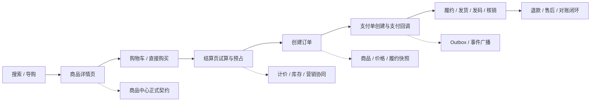

这条主链路表达的是：

1. 搜索、列表和详情是交易前的信息发现链路，允许适度弱一致。
2. 结算、下单、支付是交易承诺链路，必须逐步收紧校验口径。
3. 履约和售后是交易后事实链路，必须围绕订单快照和支付结果闭环。

### 2.3 决策点 1：为什么 C 端不能只用一个“大前台服务”承接全部链路

如果把搜索、详情、购物车、结算、订单、支付、履约全塞进一个“大前台交易服务”，短期当然看似简单，但长期一定会失控。

| 方案 | 优点 | 缺点 / 风险 | 推荐结论 |
| --- | --- | --- | --- |
| 方案 A：大一统前台服务 | 入口统一、联调简单 | 搜索弱一致和交易强一致混在一起；边界塌陷；状态机膨胀 | 不推荐 |
| 方案 B：按交易旅程拆域 | 职责清晰；一致性口径可分层；便于扩容和治理 | 系统间编排更复杂 | 推荐 |

推荐结论：

- 搜索 / 导购负责发现。
- 商品详情负责解释。
- 购物车负责意愿暂存。
- 结算负责强校验编排。
- 订单负责承诺落地。
- 支付负责资金事实。
- 履约与售后负责交易后闭环。

### 2.4 决策点 2：为什么搜索结果和详情页允许不同一致性口径

搜索结果页面对的是高 QPS 召回，详情页面对的是单商品强解释。

| 对象 | 推荐一致性 | 原因 |
| --- | --- | --- |
| 搜索结果页 | 弱一致 | 索引是投影，允许短暂滞后 |
| 详情页 | 近实时一致 | 需要展示交易前关键信息 |
| 下单 / 支付 | 强校验 | 不能靠展示信息直接成交 |

推荐结论：

- 搜索索引和列表投影可以异步刷新。
- 搜索结果页不是“所有字段都由 ES 直接吐出”；只有参与召回、过滤、排序且可容忍滞后的骨架字段进索引，高频强一致字段要通过商品中心、计价和库存批量 Hydrate。
- 详情页必须以正式商品契约为底，再补充当前价、库存和营销。
- 下单永远不能只信列表或详情页展示结果。

### 2.5 决策点 3：为什么购物车不锁库存，结算才预占库存

购物车表达的是“想买”，不是“已经占用交易资源”。

| 方案 | 风险 | 推荐结论 |
| --- | --- | --- |
| 购物车加购即锁库存 | 大量僵尸占用；资源利用率极差；售罄假象 | 不推荐 |
| 结算时再预占库存 | 只在交易临门一脚时收紧资源 | 推荐 |

推荐结论：

- 购物车只保存用户意愿。
- 进入结算页时，库存中心才执行 `ReserveInventory`。
- 支付失败、超时取消、风控拒绝后，必须显式释放预占。

### 2.6 决策点 4：为什么订单必须保存商品 / 价格 / 履约快照

如果订单创建后还依赖“实时查最新商品”，未来只会产生解释灾难。

| 事实 | 为什么要快照 |
| --- | --- |
| 商品标题、规格、履约规则 | 商品可能后续被改名、改规格、改退款口径 |
| 价格与优惠结果 | 价格和活动经常变化 |
| 履约参数 | 发码、预约、核销规则可能调整 |

推荐结论：

- 订单保存或引用创单时的商品快照、价格快照、履约快照。
- 售后和客服解释历史订单时，只认快照，不认最新商品。

### 2.7 决策点 5：为什么支付不能反向驱动订单主状态机

支付是资金事实，但不是订单全业务事实。

| 方案 | 风险 | 推荐结论 |
| --- | --- | --- |
| 支付中心直接改订单所有主状态 | 状态主权错位；订单域被支付绑死 | 不推荐 |
| 支付中心发支付事实事件，订单域自行推进状态 | 支付和订单解耦；幂等更清晰 | 推荐 |

推荐结论：

- 支付系统只负责支付单与支付结果。
- 订单系统消费支付成功 / 失败事件，自行推进自己的状态机。

### 2.8 决策点 6：为什么售后必须基于订单事实，而不是回查最新商品

退款、退货、取消和争议处理面对的是“历史承诺”，不是“当前最新售卖状态”。

推荐结论：

- 售后判断以订单快照、支付结果、履约状态和库存回补策略为准。
- 不允许用最新商品标题、最新价格、最新规则反向解释旧单。

### 2.9 统一业务模型：意愿、凭证、承诺与事实

把搜索、购物车、结算、订单、支付、履约和售后放在同一张图里观察，可以发现它们并不是七个互相独立的 CRUD 系统，而是在推动四类业务对象依次变形：

| 业务对象 | 产生位置 | 生命周期 | 允许被什么覆盖 | 不能被什么替代 |
| --- | --- | --- | --- | --- |
| 意愿 | 搜索、详情、购物车 | 分钟到数月 | 用户主动修改、商品失效标记 | 不能当作库存或订单承诺 |
| 凭证 | 结算、库存、营销、计价 | 秒级到分钟级 | 刷新、过期、撤销 | 不能当作最终订单事实 |
| 承诺 | 订单与订单项 | 订单全生命周期 | 合法的取消、退款、售后状态 | 不能被最新商品配置覆盖 |
| 事实 | 支付、履约、核销、退款 | 永久留痕 | 纠错事件和审计记录 | 不能靠页面展示推断 |

这四类对象必须有清晰的转换条件。购物车中的意愿只有在商品可售、价格有效、库存预占、营销占用和用户约束都通过后，才能生成一组结算凭证；凭证被订单中心消费并写入本地事务后，才形成订单承诺；支付、发货、核销和退款的外部结果，再以事实事件的形式推动承诺的状态变化。

这一模型可以避免一个常见误区：把任何接口返回的数据都叫作“订单状态”。例如，搜索索引中的 `available=true` 只是召回条件，库存服务返回的 `reserved` 只是临时资源凭证，支付渠道返回的 `succeeded` 只是资金事实。它们都不能直接替代订单域的状态主权。分布式事务研究强调，跨资源的长期业务事务应拆成可提交、可补偿的业务步骤，而不是依赖一个持续持锁的全局事务。[1][2] 因此在本场景中，我们把每次转换的输入、输出和补偿动作都显式建模。

### 2.10 权威数据源与状态主权

每个字段都应该有且只有一个权威写入者，其他系统只保存投影、快照或引用。建议在设计评审时强制填写下面的“事实归属表”：

| 事实 | 权威系统 | 其他系统可以保存 | 其他系统不能做 |
| --- | --- | --- | --- |
| 商品可售、规格、类目 | 商品中心 | 搜索索引、订单快照 | 不能由搜索索引反写商品正式态 |
| 当前价格与优惠计算 | 计价 / 营销中心 | 结算凭证、订单价格快照 | 不能由前端金额直接覆盖 |
| 可用库存与预占 | 库存中心 | 结算凭证、订单资源引用 | 不能由订单状态猜库存余额 |
| 订单主状态 | 订单中心 | 读模型、消息消费者状态 | 支付或履约系统不能直接改主状态 |
| 支付结果 | 支付中心及渠道凭证 | 订单支付投影、对账记录 | 不能由前端回调参数直接认定成功 |
| 履约结果 | 仓配、发码、预约等履约域 | 订单履约投影、客服视图 | 不能用商品配置推断已经履约 |
| 退款结果 | 支付 / 售后域 | 订单售后投影、审计记录 | 不能只凭申请成功显示退款完成 |

“权威”不等于“所有请求都必须同步访问主库”。它表示发生冲突时谁拥有最终解释权。搜索可以从索引读取，订单列表可以读取投影，客服可以读宽表；但发生金额争议时，应回到订单价格快照和支付凭证，发生库存争议时，应回到库存流水和预占记录。数据密集型系统设计通常把派生数据视为可重建投影，把不可替代的业务事实与投影分离。[4] 本书进一步把这一原则应用到电商：所有可重建的数据都要带版本、来源和更新时间，所有不可重建的数据都要落本地事实或外部凭证。

### 2.11 一致性分层：展示、交易前提与交易事实

本章不把“一致性”当作一个二元开关，而是按用户动作分成三层：

| 层次 | 典型请求 | 可接受延迟 | 失败时的用户体验 | 设计重点 |
| --- | --- | --- | --- | --- |
| 展示一致性 | 搜索列表、推荐、普通购物车读取 | 秒级到分钟级 | 刷新、提示数据已变化 | 缓存、索引、降级、版本标记 |
| 前提一致性 | 价格试算、库存预占、优惠占用 | 通常需要在线确认 | 阻断提交并指导刷新 | 凭证、TTL、版本校验、释放 |
| 事实一致性 | 订单落库、支付入账、退款完成 | 必须可追溯 | 显示处理中并异步收敛 | 本地事务、幂等、事件、对账 |

展示层允许短暂滞后，并不意味着交易可以信任展示结果。反过来，交易事实需要可追溯，也不意味着所有下游都必须在一个同步请求里完成。Google SRE 关于过载和尾延迟的实践指出，系统应明确哪些请求可以降级，哪些请求必须被拒绝或延后，否则低价值读流量会挤压高价值写入。[6][11] 因此在本章中，搜索可以返回“价格待刷新”，结算可以返回“优惠已失效”，订单提交则宁可快速失败，也不接受未经验证的旧凭证。

### 2.12 跨域协作的最小契约

跨域接口不应该只返回一个布尔值。一个可重试、可审计、可补偿的交易接口，至少需要包含：

| 契约部分 | 示例 | 作用 |
| --- | --- | --- |
| 请求身份 | `request_id`、`idempotency_key`、`user_id` | 防止重复执行和越权 |
| 业务版本 | `product_version`、`price_version`、`rule_version` | 判断凭证是否过期 |
| 资源引用 | `reserve_id`、`coupon_token`、`payment_intent_id` | 将短期资源与订单绑定 |
| 时间边界 | `expires_at`、`created_at` | 限制重放和无限等待 |
| 结果语义 | `accepted`、`confirmed`、`rejected`、`pending` | 区分收到请求与事实已完成 |
| 纠错入口 | `query_status`、`cancel`、`compensate` | 超时和异常时反查或补偿 |

接口成功的含义必须写清楚。例如库存 `Reserve` 成功只代表库存中心创建了预占记录，不代表订单已经创建；支付 `CreatePayment` 成功只代表支付单可被继续支付，不代表资金已入账；退款申请受理也不等于渠道已经退款完成。事件驱动系统通常需要同时处理重复、乱序和延迟消息，CloudEvents 对事件元数据的规范化以及企业集成模式中的幂等消费者模式，都说明了“可识别、可追踪、可重放”应成为跨域契约的一部分。[3][13][25] 在本章的实现里，所有事实事件都携带 `event_id`、`aggregate_id`、`event_type`、`occurred_at`、`schema_version` 和 `trace_id`。

---

## 3. 搜索导购、详情与交易前读链路

### 3.1 场景画像

从用户进入平台到决定”我要不要买”，通常依次经过两种读路径：

1. 搜索 / 导购结果页：看的是候选集。
2. 商品详情页：看的是交易前解释。

这两条链路看起来都只是”读”，但它们的职责截然不同：

- 搜索结果页服务于召回和转化，强调高吞吐和可排序。
- 详情页服务于交易前理解，强调解释性和当前性。

从系统角度看，搜索、导购、详情之间不能揉成一个系统，也不能简单地串成一条长链路，而应该按各自的职责边界和一致性要求独立设计，再通过编排层聚合。

### 3.2 关键技术点

这一节先前置所有高价值架构结论，后续场景化时序图再展开具体调用关系。

#### 3.2.1 为什么搜索、导购、详情不能揉成一个系统

很多团队早期会把”商品搜索、类目导购、详情查询”统一塞进一个搜索服务里，代码复用率高，看起来也方便。但这会带来三个致命问题：

- **职责塌陷**：搜索负责高吞吐召回和排序，导购负责多维度筛选和聚合卡片展示，详情负责多域事实聚合。三者面对的下游依赖链、缓存策略、降级粒度完全不同，揉在一起只会让每个场景都背上不该背的依赖。
- **一致性口子撕裂开**：搜索页天然允许弱一致，详情页需要近实时一致。如果把两个场景放在同一个服务里，开发人员很难在代码层面区分”这个字段可以滞后 5 分钟”和”这个字段必须实时校验”。
- **大促放大故障面**：搜索页 QPS 远高于详情页。一旦合并在同一个服务里，高并发搜索流量会直接把详情页的计价、库存、营销下游一起拖垮。

因此推荐结论很明确：

- 搜索服务解决召回、筛选、排序。
- 导购服务解决聚合卡片展示。
- 详情聚合服务解决多域事实聚合。

#### 3.2.2 哪些字段来自 ES，哪些字段来自商品中心

这条链路里最关键的设计点，不是”多调了几个下游”，而是：**搜索结果页到底哪些数据应该直接来自搜索中心，哪些数据应该回商品中心 / 计价 / 库存实时补齐**。

决策原则只有三条：

1. **是否参与召回、过滤、排序**：参与这些能力的字段，优先放到 ES。
2. **变动频次高不高**：高频变化字段不要把绝对真相压进 ES。
3. **对准确性要求高不高**：一旦字段直接影响成交，就应该让实时权威域说了算。

因此，搜索结果页通常采用”**ES 出骨架，商品中心与交易相关域补血肉**”的模式：

| 字段类型 | 主要来源 | 为什么这么设计 |
| --- | --- | --- |
| 标题、副标题、主图、品牌、类目、属性标签 | 搜索中心 / ES | 这些字段参与检索、过滤、聚合或高频展示，适合做索引骨架。 |
| 上下架状态、可搜状态 | 搜索中心 / ES 过滤 | 必须在搜索阶段先过滤掉不可售对象，避免返回无意义结果。 |
| 销量、评分、热度等排序因子 | 搜索中心 / ES | 直接用于粗排或综合排序，允许弱一致。 |
| 实时到手价、会员价、促销价 | 计价中心 / 商品中心 Hydrate | 高敏感、高频变化，列表允许短暂滞后，但展示时最好用实时结果覆盖。 |
| 绝对库存数、紧张库存文案 | 库存中心 Hydrate | 属于高频高并发变化字段，不能让 ES 承担绝对数写入。 |
| 活动标签、圈品命中、促销露出 | 营销中心 Hydrate | 露出逻辑变化快，且失败时可以局部降级。 |
| 冷门说明类字段 | 商品中心 | 不参与搜索与排序，没必要进 ES。 |

一个很实用的判断方法是：

- **只要字段决定”搜不搜得到、排在第几位、能不能按它筛选”**，就应该优先放进 ES。
- **只要字段决定”现在到底多少钱、到底还有没有货、这个活动此刻还能不能领”**，就应该优先让商品中心、计价或库存域返回实时结果。

#### 3.2.3 搜索结果页为什么只认 ES 骨架，不直接等于交易事实

搜索结果页的目标是高吞吐召回、排序和转化，不承担交易真相主权。它展示的是”当前最有可能被用户点击的候选集”，不是”此刻可以直接下单成交的最终合同”。

因此，搜索页允许：

- 索引异步刷新
- 列表字段局部滞后
- 某些弱展示字段降级缺失

但它不能越界去承担：

- 实时价格真相
- 实时库存真相
- 权益资格最终裁决

这也意味着：**下单前必须重新校验价格、库存、权益**。搜索结果页拿到的是”可浏览卡片”，不是”可下单事实”。

#### 3.2.4 搜索结果页的 Hydrate 编排为什么不是纯串行，也不是无脑全并行

Hydrate 层最容易被低估的一个问题是：**下游依赖到底应该串行调用，还是并行调用**。

如果完全按照”商品中心 -> 库存中心 -> 营销中心 -> 计价中心”的直觉串行走，业务理解上很顺，但性能上很危险。因为只要每个 RPC 平均耗时 20ms，四段串行下来就已经接近 80ms；任意一个下游轻微抖动，整条列表页链路就会很容易冲到 150ms 以上。

更稳妥的工程实践通常不是”全串行”，也不是”无脑全并行”，而是**带依赖关系的半并行编排**：

1. **第一阶段并行**
   - 商品中心：拿商品卡片骨架、类目、品牌、商家等基础信息
   - 库存中心：拿库存摘要、是否有货、紧张状态
2. **第二阶段**
   - 营销中心：基于商品基础信息和用户上下文，先判断活动命中、优惠资格、券与满减露出
3. **第三阶段**
   - 计价中心：在拿到营销结果之后，再基于商品基础信息、营销结果和用户上下文计算展示价、会员价、到手价

这样做的原因是：

- **库存中心通常只依赖 item_id / sku_id**，并不依赖商品标题、品牌、类目这些骨架字段；
- **商品中心也不依赖价格和库存**，它本身就是卡片骨架来源；
- **营销中心** 往往依赖商品类目、商家、售卖属性来判断露出与资格；
- **计价中心** 在很多实现里并不是独立”拍脑袋算价”，而是要把营销命中的结果、优惠叠加关系、会员折扣、活动门槛一起折进最终展示价，所以它天然位于营销之后。

这种编排的总耗时，更接近：

- `max(商品中心, 库存中心) + 营销中心 + 计价中心`

而不是四段简单相加。所以它通常仍然明显优于”商品 -> 库存 -> 营销 -> 计价”的纯串行模式，同时又不会像”盲目全并行”那样把前置依赖关系搞乱。

如果业务继续追求更低的列表页延迟，还可以进一步演进到**近似全并行**：在计价中心和营销中心内部也冗余一份极简的商品基础信息，例如：

- `item_id -> 类目`
- `item_id -> 商家`
- `item_id -> 基础售卖属性`

这样一来，Hydrate 层在收到 ES 返回的 item_id 列表后，就可以：

- 同时查商品中心
- 同时查库存中心
- 同时查营销中心
- 等营销结果返回后，再调计价中心

因为营销不再必须等待商品中心先返回类目信息，而计价至少不需要再回头额外查一次商品中心。这本质上是：

> **用数据冗余换实时编排延迟。**

但要注意，这种”绝对并行”只适合在两个前提下使用：

1. 营销和计价中心内部维护的商品轻量副本足够新鲜；
2. 你们愿意承担多一层数据同步和一致性治理的复杂度。

所以默认推荐结论是：

> **Hydrate 层优先采用”商品 + 库存第一阶段并行，营销第二阶段，计价第三阶段”的半并行架构；只有在对延迟极度敏感、且下游已经具备足够商品副本和营销结果缓存时，才继续压缩计价前置依赖。**

#### 3.2.5 详情页为什么必须做动静分离

商品详情页（PDP）是交易漏斗里最核心的读页面之一。它的特点是：

- 流量极大
- 读多写少
- 高可用要求极苛刻
- 用户对页面解释能力和加载速度都极其敏感

因此，详情页不能做成”每次请求实时查所有下游”的重聚合链路，而要先做**动静分离**。

从工程上看，详情页的数据通常可以拆成两类：

- **静态数据**：
  - 标题、副标题
  - 主图、详情图
  - 商品参数说明
  - 低频变化的文案和结构化描述
- **动态数据**：
  - 当前到手价
  - 库存摘要
  - 当前用户可见的权益和促销露出
  - 配送时效、门店核销、预约规则、评价摘要

更稳妥的详情页架构通常是：

1. **静态骨架优先**
   - 商品静态内容通过静态 JSON、静态片段或 CDN 化页面骨架快速返回。
   - 用户先看到稳定的页面结构、标题和主图，而不是等待所有后端系统都准备完毕。
2. **动态数据异步 Hydrate**
   - 前端或详情聚合层再去批量拿价格、库存、营销和履约数据。
   - 动态内容可以稍晚几十毫秒填充，但不能把首屏完全卡死。

为了让这条链路在大促和高并发下仍然稳定，通常要配合**多级缓存**：

- **CDN / 静态内容缓存**
  - 兜底标题、主图、详情骨架
- **聚合层本地缓存（如 Caffeine）**
  - 缓住极短时间内的重复请求和热点详情
- **分布式缓存（如 Redis）**
  - 缓住基础价、库存摘要、详情聚合片段或短期动态结果

这样做的目标不是追求”所有详情字段都绝对实时”，而是：

> **先保证详情页稳定打开，再保证动态关键信息足够新鲜，最后在创单前做最终强校验。**

#### 3.2.6 详情页里的实时计价、库存摘要与大促降级

详情页里最敏感的两个问题，永远是：

1. 现在多少钱
2. 现在还有没有货

这两个字段之所以难，是因为它们都不适合做成简单的全量缓存。

对于**价格**来说，真正的到手价往往同时受以下因素影响：

- 会员等级
- 商品基础价
- 店铺活动
- 平台券 / 品类券
- 用户专属权益

因此更常见的做法不是缓存”所有用户的最终价”，而是：

- 缓存**基础价 / 会员价矩阵 / 基础促销价**
- 在详情请求进来时，再结合用户上下文和营销命中做轻量实时计算

对于**库存**来说，详情页一般不追求展示精确库存数字，而是展示：

- 有货
- 无货
- 紧张库存
- 仅剩少量

这样可以显著降低库存读压力，同时也避免把高频变化的绝对库存数暴露到前台。

但真正的大问题出现在**大促、热点商品和下游抖动**场景下。此时详情页必须具备明确的降级能力：

- **计价服务超时**
  - 优先展示基础销售价或指导价
- **库存摘要超时**
  - 退化为保守文案，如”库存确认中”或”请以下单时校验为准”
- **营销露出超时**
  - 隐藏活动标签，不阻塞主页面
- **Redis 或下游依赖异常**
  - 先用本地缓存或静态兜底页保证详情可打开

对热点商品，还要配合：

- 热 Key 探测
- 本地热点缓存
- 限流与线程池隔离

这样即使某个爆款详情在几秒内被打到极高 QPS，也不至于把 Redis、计价、库存或营销服务一起拖崩。

所以详情页的核心不是”把所有数据都实时算到最准”，而是：

> **在可接受的一致性范围内，把最重要的动态字段算出来，把不重要的字段降级掉，并且永远保证详情页页面本身不因为单个下游故障而整体不可用。**

#### 3.2.7 搜索与详情的一致性边界怎么定

第 2 节已经给出了整体一致性分层，这里把结论聚焦到搜索和详情内部：

| 对象 | 推荐一致性 | 原因 |
| --- | --- | --- |
| 搜索结果页 | 弱一致 | 索引是投影，允许短暂滞后 |
| 详情页静态骨架 | 近实时一致 | 商品契约信息，变更频率低，可缓存 |
| 详情页动态字段 | 允许短暂偏差 | 计价、库存、营销可能发生秒级变化 |
| 创单 / 结算 | 强校验 | 不能靠展示信息直接成交 |

推荐结论：

- 搜索索引和列表投影可以异步刷新。
- 搜索结果页不是”所有字段都由 ES 直接吐出”；只有参与召回、过滤、排序且可容忍滞后的骨架字段进索引，高频强一致字段要通过商品中心、计价和库存批量 Hydrate。
- 详情页必须以正式商品契约为底，再补充当前价、库存和营销。
- 下单永远不能只信列表或详情页展示结果。

#### 3.2.8 为什么详情页之后还需要结算页和订单快照

详情页虽然比列表页更接近交易真相，但它仍然只是用户下单前的解释界面。它需要把：

- 正式商品契约
- 当前价格
- 当前库存摘要
- 营销露出
- 履约规则

聚合成一个可理解的商品页面，但它仍然不能替代：

- 结算页的价格试算
- 预占库存
- 优惠校验
- 创单前最终版本校验

一句话：**搜索与详情只负责”看”，结算与订单才负责”认”**。订单快照则是把”认下来的事实”持久化，确保后续履约和售后不再回头依赖最新商品真相。

#### 3.2.9 高并发下如何保护搜索 Hydrate 下游

搜索和详情链路的 Hydrate 阶段依赖多个下游：商品中心、库存中心、营销中心、计价中心。高并发下，这些下游很容易被放大后的请求量打穿。

工程上推荐用分层保护策略：

- **批量接口**：Hydrate 层不再逐条调用下游 RPC，而是按 item_id 列表做批量查询，减少 RPC 数量。
- **线程池隔离 / 舱壁隔离**：为商品、库存、营销、计价分别分配独立线程池，避免某一个下游慢调用占满公共线程池。
- **超时控制**：每个下游 RPC 独立设置超时时间，任一超时触发即时降级。
- **局部降级**：超时后按字段维度降级（如计价超时不阻断整个卡片，只用基础价兜底），而不是整页失败。
- **热点缓存**：热点商品在本地缓存和 Redis 里保护下游不被击穿。

这些技术和 3.6 的场景三时序图互相呼应，形成”文字说明原则 + 图说明流程”的对照。

#### 3.2.10 为什么酒店要单独作为特殊场景处理

普通实物电商商品，信息变更以商品本身为主（价格、库存、活动）。但酒店天然带有 **日期维度** 与 **用户上下文**。同一家酒店，在不同入住日、房型、会员等级和连住天数下，真实价格和真实可售状态都可能完全不同。这意味着：

- 酒店的”可检索属性”和”可交易真相”之间的鸿沟比普通商品大得多；
- 搜索索引、详情聚合、结算校验三层之间的一致性治理复杂度远高于标品；
- 价格排序、深翻页、实时房态一致性等问题需要专门的架构策略。

因此本章将酒店相关内容统一收口到 3.8 节作为独立特殊场景处理。以下内容从 3.3 开始按场景化时序图展开。

#### 3.2.11 统一 scene 查询服务与四阶段流水线

搜索与结构化导购可以共享一条查询内核，但不能共享一套含糊的业务语义。推荐由导购查询服务对外暴露统一接口，用 `scene` 表达用户意图，用结构化约束表达过滤条件，再在内部依次完成 Query、Recall、Rank、Hydrate 四个阶段。这样搜索、类目浏览和店铺内浏览共享批量接口、日志和降级机制，同时保留各自的产品目标。

| 场景 | 用户输入 | 主要约束 | 召回与排序重点 | 结果解释 |
| --- | --- | --- | --- | --- |
| `keyword` | 关键词、类目、品牌、筛选项 | 文本相关性与可售过滤 | 分词、同义词、相关性、业务排序 | 为什么匹配这个词 |
| `category` | 类目、品牌、属性筛选 | 类目树和 Facet 组合 | 稳定排序、运营陈列、库存信号 | 当前筛选条件是什么 |
| `shop` | 店铺、关键词、店内筛选 | 店铺边界与商家状态 | 店内相关性、店铺运营规则 | 商品属于哪个店铺 |

请求上下文至少携带 `query_id`、`scene`、用户和设备匿名标识、`filter_version`、`rank_version`、实验桶以及数据新鲜度要求。`scene` 不是前端随意传入的字符串，而应由网关或查询服务校验枚举、字段白名单和分页上限。若把排序逻辑散落在多个 BFF，后续会出现同一个商品在搜索、类目和店铺页的排序口径无法解释，实验也无法回滚。

四阶段的输入输出要明确：Query 阶段把用户输入转换为归一化查询和意图特征；Recall 阶段从索引、运营池或规则集合获得候选商品 ID；Rank 阶段在候选集上执行相关性、业务权重和实验配置；Hydrate 阶段批量补齐价格、库存、营销和履约摘要。每一阶段都应记录耗时、候选数量、丢弃原因和版本，避免只监控一个“搜索接口总耗时”。

#### 3.2.12 索引是版本化投影，不是第二个商品主库

搜索索引的数据流应从商品中心、上架系统、生命周期治理和运营配置产生事件，经消息总线进入索引 Worker，再写入 Elasticsearch 的写别名或新版本索引。索引 Worker 只拥有“如何构建搜索投影”的职责，不拥有商品正式状态、价格真相或库存总账。派生投影可重建这一点意味着：索引文档必须保留来源版本、更新时间和构建版本，不能只保存最终字段而丢失判断依据。[4]

增量更新至少需要三道保护。第一，以 `spu_id` 或 `sku_id` 作为分区键，让同一聚合的事件尽量有序；第二，在文档中写入 `source_version`，消费端使用版本条件更新，拒绝旧事件覆盖新事件；第三，消费者记录 `event_id` 和处理结果，重复投递只重放幂等写入。Kafka 的至少一次投递和幂等生产者可以降低重复风险，但不能替代索引文档版本和业务对账。[13][14]

全量重建不能直接覆盖线上索引。更稳妥的流程是创建带 `mapping_version` 的新索引，执行全量快照和增量追平，抽样比较文档数量、版本和关键字段，再通过原子别名切换读流量。切换后保留旧索引一段观察窗口，以便在零结果率、召回量或排序指标异常时快速回滚。别名切换的原子性只能保证读入口的一致，不能保证新索引已经包含所有最新事件，因此切换前后的版本差异仍需由对账任务检查。

#### 3.2.13 Query、Recall、Rank、Hydrate 的性能边界

四个阶段的优化目标不同，不能用“整体加机器”替代边界设计：

| 阶段 | 主要工作 | 关键指标 | 典型失败处理 |
| --- | --- | --- | --- |
| Query | 分词、纠错、同义词、意图和过滤归一 | 改写命中率、非法条件率、耗时 | 使用安全的原词或返回可解释空结果 |
| Recall | 倒排、结构化过滤、运营池、多路召回 | 候选数、零结果率、召回耗时 | 关闭高成本召回，保留主索引 |
| Rank | 相关性、业务权重、实验和稳定排序 | P99、排序版本、分桶差异 | 回退到稳定排序版本 |
| Hydrate | 商品、价格、库存、营销批量补齐 | 依赖成功率、字段缺失率、尾延迟 | 局部字段降级，不阻塞整页 |

Elasticsearch 的查询应尽量把过滤条件放在 filter 语义中，把不需要参与评分的限制从相关性计算中分离；排序字段需要评估 `doc_values`、内存和写入代价。`from/size` 深分页会随着页码增加而扩大协调节点和分片的工作量，面向用户的连续翻页应优先采用带稳定排序键的 `search_after`，并限制游标有效期。`search_after` 不是任意跳页方案，产品必须明确是否支持跳到第 N 页、结果快照是否需要稳定，以及索引切换后游标如何失效。[18]

排序必须有稳定的兜底键，例如业务排序值、更新时间和唯一 ID 的组合，不能只按一个会频繁变化的热度字段排序。否则同一用户连续翻页时会出现重复和漏项，Hydrate 后的局部重新排序也可能让用户感觉页面不稳定。对酒店等动态报价场景，可以先用基础价粗排，再对当前页做受控的实时修正，但不应把实时修正结果伪装成全局精确排序。

#### 3.2.14 缓存、热点和实验必须绑定版本

搜索缓存应区分查询结果缓存、静态详情缓存和动态 Hydrate 缓存。查询结果缓存的 key 至少包含归一化 query、scene、过滤条件、分页游标、站点和 `rank_version`；Hydrate 缓存还要包含用户权益上下文的必要摘要、价格版本或库存新鲜度边界。只用关键词作为 key，会把一次实验结果、过期价格或错误降级结果污染到其他用户。

热点保护通常分三层：边缘或网关短缓存吸收重复请求，搜索服务本地缓存保护最热 query，ES 和 Hydrate 下游使用限流、舱壁和批量接口控制放大倍数。对 suggest、联想词和热门榜单要设置独立配额，因为输入框每敲一个字符都会生成请求；不能让低价值的联想流量挤占交易前详情和结算的资源。

零结果率是搜索质量和数据健康的共同信号。零结果上升时，先区分用户真的没有匹配、索引延迟、过滤条件互斥、词典改错还是查询超时；可以在不改变交易事实的前提下回退同义词、放宽非关键筛选或展示类目引导，但不能为了降低零结果率返回已经下架或不合规的商品。实验请求要把 `exp_id` 和配置版本贯穿日志、缓存、排序和指标，影子流量或回放结果用于验证新排序，指标异常时能够按版本快速停止。

#### 3.2.15 搜索结果的可解释性与交易衔接

搜索不是只返回商品 ID。面向用户的结果应能解释命中、筛选、价格和可售状态的来源与新鲜度；面向工程和客服的结果还要带 `query_id`、索引版本、排序版本、Hydrate 依赖结果和降级原因。这样用户看到“参考价”“库存确认中”时，产品话术与后端事实是一致的，客服也能根据版本和 trace 还原问题。

搜索结果离开读链路进入详情、结算或订单时，必须显式丢弃“可直接成交”的假设：商品详情重新确认正式商品契约，结算重新试算价格和营销，库存重新预占，订单写入快照。读模型的版本可以作为校验输入，不能成为订单金额或库存的最终来源。这个边界把搜索的高吞吐优势与交易的资金安全连接起来，也避免把 ES 变成事实主库。

#### 3.2.16 删除、下架与索引修复的语义

搜索投影对删除和下架不能只做“把文档删掉”这一种处理。商品被软删除、下架、审核拒绝、店铺冻结或生命周期过期时，事件应携带原因、来源版本和生效时间；索引消费者根据事件类型决定是从可搜索集合移除、保留不可见文档供历史回放，还是只更新过滤字段。这样客服和数据团队仍能区分“用户没有搜到”与“商品本来存在但当前不可搜”，也便于重新上架时从主数据重建完整文档。

删除事件同样可能重复、乱序或丢失。推荐把“可搜索”作为带版本的投影字段，而不是仅依赖物理删除：较新的下架版本可以把文档标记为不可召回，后台异步清理；较旧的上架事件不能重新打开文档。索引抽样对账时，应同时检查主数据中的合规状态、投影的可搜索状态、最后来源版本和删除事件是否闭合。对账任务生成修复队列后，可以按聚合重放事件或从主数据重建单个文档，不能直接批量把 ES 字段改成猜测值。

查询回放还应区分“同一请求的结果可复现”和“线上结果必须永久冻结”。搜索通常只要求前者：保留归一化 query、scene、排序配置、索引别名和 Hydrate 结果摘要，就能在脱敏测试数据上重放并解释差异；详情和结算则要把价格、库存、营销版本固化为快照。这个边界既支持相关性和实验排障，也不会把高成本的全量搜索快照误当成交易凭证。

排序治理还要把相关性目标和商业规则分开。文本相关性、类目匹配和用户输入意图决定基础排序，运营加权、广告露出、库存状态和商家策略只能在声明的约束范围内参与，且每次调整都要记录规则版本、适用 scene 和影响指标。不能用一个不可解释的综合分数同时解决相关性、毛利、库存和活动目标，否则一旦转化下降，团队既无法定位是哪条规则生效，也无法在不重建全部索引的情况下回滚。

#### 3.2.17 查询契约要表达用户语义，而不是暴露索引细节

统一查询服务的接口不应让调用方直接传 Elasticsearch DSL。DSL 是当前检索实现的内部协议，一旦把它暴露给 App、运营后台或多个 BFF，任何一个调用方都可能依赖某个字段名、默认排序或脚本行为，最终导致索引 mapping 无法演进。更稳妥的接口是以业务语义表达请求：`scene`、关键词、类目、店铺、筛选条件、排序意图、分页游标、站点、用户上下文摘要和数据新鲜度要求。服务端负责校验字段白名单、规范化条件、补齐默认过滤，并将内部查询计划记录下来。

查询契约还要明确“没有提供”和“明确选择空值”的区别。例如用户未选择品牌，意味着不增加品牌过滤；用户选择“无品牌”或某个空属性，则可能是一个合法筛选条件。价格区间、时间区间、地理半径和库存状态也不能只用字符串传递，否则不同客户端会对边界、时区和单位产生不同解释。接口层应输出规范化后的条件摘要和拒绝原因，使日志能够回答“用户到底请求了什么”，而不是只留下一个无法复现的原始 URL。

查询取消同样属于契约的一部分。用户快速修改关键词时，前一个请求即使已经发出，也不应继续无限消耗召回、排序和 Hydrate 预算。网关可以使用请求截止时间和取消信号，服务内部在阶段边界检查剩余预算；已经进入不可取消的批量调用时，则通过小批量、连接池隔离和结果丢弃避免把过时请求写入缓存。W3C Trace Context 规定的传播字段可以帮助跨网关、查询编排和下游依赖关联同一条调用链，[21] 但 `trace_id` 只用于技术关联，不能替代业务上的 `query_id`、实验桶和结果版本。[22]

这一区分在故障排查时尤其重要：同一个 `trace_id` 可能因为重试产生多条尝试，而同一个 `query_id` 代表用户界面上的一次查询意图；页面刷新、自动补全和主搜索也应有不同的请求类型。若把这些标识混成一个字段，指标会把取消请求、重试请求和真正完成的请求混在一起，既无法计算搜索转化漏斗，也无法判断下游超时是用户主动离开还是系统确实变慢。

#### 3.2.18 多路召回必须有预算、去重和质量闭环

单路关键词召回并不能覆盖所有商品表达，但增加类目召回、品牌召回、运营池、历史点击召回或向量召回后，复杂度不会只增加一个接口。每一路都要声明候选上限、超时预算、过滤条件、优先级、去重键和失败语义。查询编排器先为每一路分配预算，再以展示单元的稳定 ID 去重，最后将候选集交给粗排和精排；任何一路超时，都应允许主链路使用其余候选完成，而不是把所有结果判为失败。

| 召回来源 | 适合解决的问题 | 需要控制的风险 | 建议的质量信号 |
| --- | --- | --- | --- |
| 关键词倒排 | 用户明确表达的意图 | 同义词不足、拼写噪声 | 命中率、零结果率、点击位置 |
| 类目与属性 | 结构化浏览和筛选 | 条件互斥、类目挂错 | Facet 使用率、过滤后候选数 |
| 运营池 | 会场、榜单和活动陈列 | 过度插入、规则污染相关性 | 资源位点击、投诉率、回滚次数 |
| 向量或行为召回 | 语义近似和长尾表达 | 不可解释、召回漂移 | 独立覆盖率、离线相关性、延迟 |

多路召回的合并不应直接按来源顺序拼接。若运营池永远排在关键词结果前面，用户会认为搜索不相关；若向量候选数量没有上限，泛化商品会挤掉精确匹配；若历史行为召回带入了用户不再允许看到的商品，还可能绕过合规过滤。因此，所有候选在合并前都必须经过统一的可搜索、站点、商家、类目和合规过滤，去重后再按来源配额进入排序。来源配额、截断数量和过滤原因要作为 `rank_version` 的一部分记录，便于解释某次结果为什么变化。

质量闭环也要区分“没有召回”和“召回后没有展示”。前者可能是词典、索引或过滤问题，后者可能是排序、去重、资源位或合规过滤问题。日志至少记录每个候选的 `recall_source`、进入和离开各阶段的原因、最终位置以及是否被 Hydrate 丢弃。这样离线评估可以构造“召回覆盖—排序质量—展示可用性”的分层指标，而不是只用最终点击率反推所有问题。对含有个性化行为的召回，还要遵守最小化采集和脱敏原则，避免把搜索框中的手机号、地址或订单号写入长期训练数据。

#### 3.2.19 Hydrate 的并发控制决定读链路是否会反噬交易链路

Hydrate 看似只是批量补字段，实际是一个跨域扇出器。假设一页有 50 个展示单元，同时需要价格、库存、营销和履约摘要，如果每个单元分别调用四个服务，就会把一次用户请求放大成数百次 RPC。批量接口只能降低网络次数，不能自动消除下游计算压力；查询服务还要按照依赖的容量、超时和业务重要性设置独立舱壁、并发上限和批次大小。

推荐把卡片字段分成三类：第一类是没有它就无法理解结果的核心字段，如标题、主图和商品标识；第二类是影响决策但可以显示“确认中”的动态字段，如参考价、库存摘要和配送时效；第三类是增强体验的可选字段，如活动标签、推荐理由和扩展卖点。核心字段失败时可以减少结果数量或切换到索引中的安全骨架，动态字段失败时要明确标注新鲜度，增强字段失败时直接省略。这个分层比对所有依赖设置同一个总超时更能保护用户语义。

Hydrate 的并发预算还应按照入口隔离。搜索主结果、详情页相似商品、购物车推荐、自动补全和运营后台不能共用一套无上限的线程池；suggest 的单字符请求量通常很高，但它对成交事实的价值低于结算前的价格和库存校验。每个入口应有最大候选数、最大批次数和最大下游等待时间，超出预算就返回部分结果。下游返回部分失败时，结果中应保留字段级状态，例如 `price_status=stale`、`inventory_status=unknown`，而不是将空值解释成“零元”或“无库存”。

价格和库存的降级尤其需要防止语义越界。索引中的基础价可以用于筛选和粗排，但不能在用户点击购买时继续沿用；库存摘要可以显示“有货”“库存紧张”或“确认中”，但不能把“确认中”渲染成已经锁定。进入详情、结算和创单时，系统必须重新读取权威计价和库存服务，按照当前用户、地址、优惠和时间窗口生成新的报价与预占。HTTP 的错误语义和问题详情格式可以帮助调用方区分参数错误、依赖不可用和请求过期，[23][24] 但最终能否下单仍由交易域的不变量决定。

#### 3.2.20 排序、词典和索引发布要形成可回放的变更流水线

搜索质量的发布对象不只有代码。分词器、同义词、类目映射、过滤规则、排序权重、模型、索引 mapping、运营资源位和缓存版本都可能改变结果。每次发布应生成一个不可变配置包，至少包含配置版本、适用 scene、输入数据快照或摘要、预期影响、回滚动作和责任人。索引映射变更要通过新物理索引验证，排序和词典变更则要先用固定 query 集离线回放；不能只在开发者自己的几个关键词上确认“结果看起来正常”。

回放数据应覆盖头部 query、长尾 query、零结果 query、品牌歧义、类目筛选、店铺搜索、活动资源位以及敏感词边界。对每个样本，比较候选覆盖、首屏相关性、过滤正确性、排序稳定性、响应大小和各阶段延迟；对于个性化结果，使用脱敏后的特征摘要和固定实验桶，避免把一次线上用户画像误当成通用结论。离线指标改善也不能直接等于线上收益，线上还要观察搜索到详情、详情到结算、价格投诉、取消和退款等后续信号。

实验平台应支持至少三种操作：shadow 只计算新方案但不影响用户，灰度按稳定用户或设备分桶，紧急停止按 `exp_id` 和配置版本关闭。缓存 key、日志和下游 Hydrate 请求必须带上实验上下文，否则用户已经被分到新方案，缓存却返回旧方案结果，指标会出现虚假的随机波动。实验结束后要清理失效配置和缓存命名空间，保留汇总结果、样本规模和统计口径；长期不清理的实验开关会把排序系统变成无法审计的条件树。

搜索读模型还应具备最小的隐私和合规治理：原始 query 按最小必要原则保留，账号、手机号、地址、支付信息等疑似敏感片段要脱敏或丢弃；运营人员只能看到完成授权的数据范围；删除用户数据时，查询日志、实验样本和离线回放副本也要有可执行的删除策略。搜索系统不是因为只读就天然没有合规责任，尤其当它同时沉淀用户意图、价格偏好和行为反馈时，数据生命周期应与交易审计、客服排障和模型训练分别定义。

由此可以把搜索读链路的验收标准收敛成四个问题：查询是否能被准确解释，候选是否在预算内产生，动态字段是否标明真实新鲜度，结果是否能安全地衔接到交易校验。四个问题分别对应查询契约、召回治理、Hydrate 降级和权威事实边界。任何一个问题没有答案，系统即使在压测中拥有很高吞吐，也仍然可能在大促、索引切换或价格波动时把读模型问题放大成交易投诉。

### 3.3 场景一：搜索索引视图的构建

在深入搜索结果页、详情页的查询链路之前，必须先回答一个更前置的问题：**搜索中心的索引数据到底是怎么从商品中心同步过来的**。

电商系统中，商品中心是商品数据的"权威源"（Source of Truth），存储在关系型数据库（如 MySQL、TiDB）中。而搜索中心使用专业的搜索引擎（如 Elasticsearch、OpenSearch）构建倒排索引。搜索中心本质上不是另一套"商品数据库"，而是商品中心数据的 **索引视图**。因此，索引视图的构建质量直接决定了搜索、导购和详情链路上所有查询的可用性和准确性。

#### 3.3.1 整体架构流程

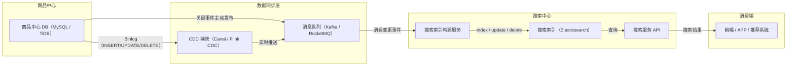

这条链路的核心思想是：**商品中心负责写入真相，搜索中心通过可靠的异步管道构建索引视图，搜索服务再基于索引视图对外提供高吞吐的读能力**。

#### 3.3.2 数据同步机制

搜索中心不能直接读写商品中心的库，而是通过以下方式同步数据。

**（1）增量同步（推荐主路径）**

- **CDC（Change Data Capture）**：使用 Canal、Flink CDC、Debezium 等工具监听商品中心数据库的 Binlog，捕获 `INSERT / UPDATE / DELETE` 操作，实时推送到 Kafka。
- **消息队列主动发布**：商品中心在商品创建、更新、上下架、价格变更等关键事件时，主动发布事件到 Kafka / RocketMQ。搜索中心消费者订阅消息，解析后更新索引。

**（2）全量同步**

定时任务（每天 / 每周）或手动触发，通过 DataX、Spark 等工具全量导出商品数据重建索引。用于新品类上线、索引重建、Mapping 字段调整等场景。

**（3）一致性保证**

- 搜索结果是 **最终一致**，允许秒级延迟（电商搜索通常可接受 1~5 秒）。
- 增量管道结合 Kafka 分区键（使用 `spu_id`），保证同一商品的消息有序消费。
- 使用版本号或 `seq_no` 控制更新顺序，防止消息乱序导致旧数据覆盖新数据（详见 3.3.4）。

#### 3.3.3 字段选择、映射与 ETL

从商品中心提取关键字段并映射到搜索索引，是索引构建中最核心的设计决策。

| 字段类型 | 示例字段 | 映射类型（Elasticsearch） | 用途 |
| --- | --- | --- | --- |
| 全文检索 | `title`, `subtitle`, `desc` | `text`（IK / jieba 分词） | 搜索匹配 |
| 精确匹配 / 过滤 | `spu_id`, `sku_id`, `brand_id`, `category_id`, `status` | `keyword` | 精确过滤 |
| 数值 | `price`, `sale_price`, `stock`, `sales`, `rating` | `integer` / `float` / `scaled_float` | 范围查询、排序 |
| 数组 / 分面 | `attrs`（颜色、尺寸等规格属性）, `tags` | `nested` / `object` | 多维度筛选 |
| 地理 | `location` | `geo_point` | 附近门店 / LBS 排序 |
| 权重 / 时间 | `create_time`, `update_time`, `weight` | `date` / `integer` | 排序、boost |

在写入索引之前，通常还需要经过一层轻量 ETL：

- **清洗**：去除 HTML 标签、特殊字符，统一单位。
- **丰富**：拆分 SKU 属性为独立字段或 `nested` 对象；生成搜索建议（`completion suggester`）；加入同义词（"手机"→"智能手机"）；计算动态权重（销量 × 0.4 + 评分 × 0.3 + 新品加分等）。
- **去重**：以 SPU 为维度聚合 SKU 信息。

**索引构建方式**：

- **单索引 + alias**：大多数情况用一个主索引 + alias 切换。
- **零停机重建**：新建索引 `products-2026-06-10-v2` → 全量导入 → 验证通过后切换 alias → 删除旧索引。
  - 中小型项目用 `products_v2` 命名即可。
  - 中大型或亿级以上数据，推荐**日期命名 + alias** 的方式，天然支持滚动索引和按时间归档。

#### 3.3.4 版本控制与更新顺序保证

搜索结果允许最终一致，但绝不能出现"旧数据覆盖新数据"。在 CDC / 消息队列场景下，网络乱序、消费者重平衡等都可能导致消息乱序到达，因此必须引入版本控制。

**核心机制**：

- **Elasticsearch 内置 `_version`**：每个文档都有内部版本号。使用 `version_type=external` 时，Elasticsearch 直接使用你传入的版本号（如商品 `update_time` 的毫秒时间戳，或数据库自增 `seq_no`）。只有当传入版本严格大于当前版本时才会写入，否则返回 `409 Conflict`。
- **消费者侧 seq_no 比对**：在消费 Kafka 消息时，消费者先提取消息中携带的业务 `seq_no`，查询当前索引中该文档已存的 `seq_no`（自定义字段），仅在新 `seq_no` 更大时才执行更新。
- **Kafka 分区键**：使用 `spu_id` 作为分区键，保证同一商品的消息天然有序。

这套机制的核心原则是：

> **用版本号做乐观锁，旧消息到了直接丢弃，新消息到了才覆盖。网络乱序不伤害数据正确性。**

#### 3.3.5 Nested 对象与 SKU 规格处理

**Nested** 是 Elasticsearch 中处理一对多关联字段的关键技术，在电商商品属性（多规格筛选）上几乎是必备。

**为什么需要 Nested**：普通 `object` 类型在数组场景下会被扁平化，导致 `key-value` 关联丢失。例如商品属性 `[{"颜色": "红色"}, {"尺寸": "XL"}]`，用 `object` 存储后，ES 会把所有 key 和 value 拆成两个独立集合，查询 `颜色=红色 AND 尺寸=XL` 时可能错误匹配到其他组合。而 `nested` 把每个对象作为独立的内部子文档存储，查询时必须使用 `nested query`，才能保证字段间的关联性。

**电商典型用途**：

- SKU 规格组合（颜色 + 尺码 + 版本）
- 商品动态属性（不同类目下的属性差异大）
- 商品标签列表、促销信息

**注意事项**：`nested` 会增加索引体积和查询开销（内部是隐藏的子文档），建议单个文档内 `nested` 对象不超过几百个。对于高频筛选的关键属性（如 `color`、`size`），可以同时提升为顶层 `keyword` 字段以加速过滤。

#### 3.3.6 高并发与大促下的索引写入保护

搜索索引不仅要承受高并发查询，还要承受商品变更带来的写入压力。大促期间，库存和价格高频变更会把写入放大到峰值，读写混合压力下 Elasticsearch 容易出现 `refresh` 积压和 GC 抖动。

工程上的保护策略通常包括：

- **价格与库存不压进搜索索引**：只在 ES 里保留用于排序的粗粒度 `base_min_price` 和 `has_stock` 标记，真实价格和库存摘要通过 Hydrate 层从商品中心、计价、库存服务实时补齐。这是 3.5、3.6、3.7 三张时序图的共同前提。
- **写入限流与批量提交**：索引构建服务控制写入并发度，合并小请求为 `_bulk` 批量提交。
- **冷热分离**：热数据（在售商品）与冷数据（下架 / 历史商品）分索引存放，减少单索引体积和写入放大面。

### 3.4 场景二：搜索结果页查询时序图

这张图的主旨是：**ES 负责召回、筛选、粗排，Hydrate 负责把搜索骨架补成用户能看的卡片**。商品骨架 + 库存摘要并行查询，再查营销，最后请求计价（因为计价依赖营销结果）。

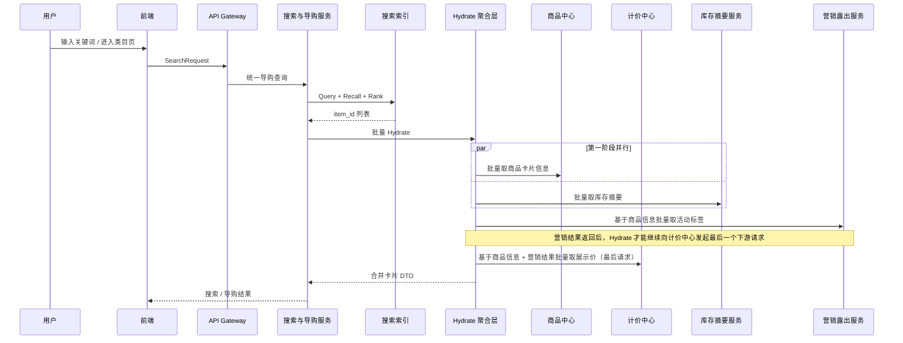

> **关键点**：
>
> - 搜索页拿到的是”可浏览卡片”，不是”可下单事实”。
> - 计价请求是最后一步，因为它依赖营销结果。

### 3.5 场景三：详情页聚合查询时序图

这张图的主旨是：**详情页是一个多域聚合页**——先拿商品正式态与履约规则作为骨架，再进入动态 Hydrate 补齐价格、库存、营销和履约摘要。详情页看到的动态值仍只是”当前展示真相”，后续进入结算与创单时仍需重新校验。

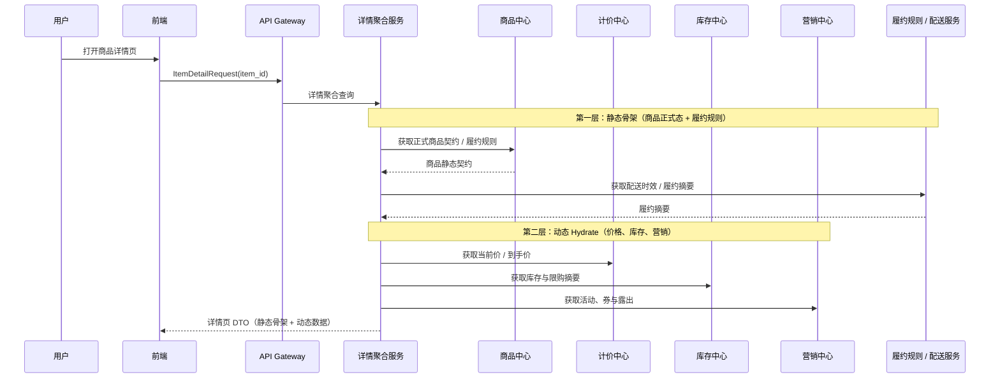

> **关键点**：
>
> - 详情页看到的动态值仍然只是”当前展示真相”，不是最终交易事实。
> - 后续进入结算与创单时仍需重新校验价格、库存和权益。

### 3.6 场景四：详情页动态 Hydrate 与降级时序图

这张图承接 3.2.5、3.2.6 和 3.2.9 中关于详情页动静分离、大促降级和高并发保护的内容，用一条时序图把”正常路径 + 降级路径”同时表达清楚。

核心思想是：**详情静态骨架优先返回，动态字段并行 / 半并行补齐；任一下游超时后，详情聚合服务按字段维度降级，而不是整页失败。**

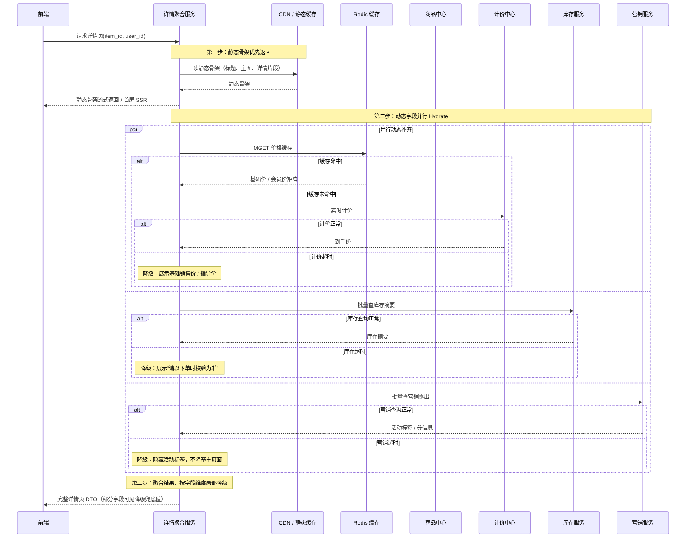

> **降级分支总结**：
>
> | 异常场景 | 降级策略 | 对用户体验的影响 |
> | --- | --- | --- |
> | 计价超时 | 展示基础销售价 / 指导价 | 到手价可能不够精确，但不影响浏览决策 |
> | 库存摘要超时 | 展示”请以下单时校验为准” | 用户无法在详情页看到库存余量 |
> | 营销露出超时 | 隐藏活动标签 | 用户看不到当前活动权益，但不阻塞页面 |
> | Redis 缓存异常 | 走本地缓存 / CDN 兜底 | 动态数据可能不够新鲜，但不影响页面打开 |

### 3.7 特殊场景：酒店搜索与动态报价

酒店搜索比普通实物电商更复杂，因为它的库存和价格天然带有 **日期维度** 与 **用户上下文**。同一家酒店，在不同入住日、房型、会员等级和连住天数下，真实价格和真实可售状态都可能完全不同。本节统一收口前面积累的酒店案例，用酒店证明：当商品是强时空属性资源时，搜索和详情链路必须做专门的动态报价与库存治理。

#### 3.7.1 酒店哪些信息放 ES，哪些信息回商品中心 / 报价引擎

酒店搜索的字段边界比标品电商更严格：

- **来自搜索中心 / ES 的信息**：
  - 酒店名称、别名、地址、经纬度、星级、品牌、设施标签、商圈、地标、基础房型名
  - 粗粒度的 `has_room`
  - 用于价格粗排的 `base_min_price`
- **来自商品中心 / 报价引擎的实时信息**：
  - 指定入住日到离店日之间的真实可售房态
  - 具体房型在该日期区间下的实时到手价、会员价、连住价
  - 退改政策、确认时效、最晚保留时间

所以酒店搜索的标准模式通常是：

1. ES 先负责按城市、星级、地理位置、设施等条件召回和粗排。
2. 搜索服务拿着 `hotel_ids + checkin + checkout + user_id` 去商品中心 / 计价 / 库存资源域批量查询。
3. 用实时价格和真实房态覆盖掉 ES 的粗粒度字段，再返回给前端。

这也解释了为什么列表页不能直接把 ES 的价格和库存当成交易真相：

- ES 擅长做大规模检索和排序。
- 商品中心、计价、库存才是交易前最后的权威真相。

#### 3.7.2 酒店列表页如何做价格排序

酒店搜索里，”按价格从低到高排序”是一个典型的工程取舍点。难点在于：**ES 必须先拿到一个字段值才能完成全局排序，但酒店的真实价格又是动态计算出来的**，它同时受到入住日期、连住天数、会员等级、售卖计划、实时促销和税费规则影响。

如果试图把”所有用户、所有日期、所有房型组合下的真实到手价”全部塞进 ES，不但索引维度会爆炸，写入频率也会把搜索集群拖垮。因此主结论固定为：

1. **ES 按 `base_min_price` 粗排**：ES 用基础价完成全局排序和分页。
2. **当前页实时查 30 家**：搜索服务拿当前页酒店 ID 去商品中心 / 计价引擎算真实价。
3. **当前页内存二次微调排序**：对这 30 条结果按真实价做轻量重排，确保用户看到的顺序基于真实到手价。

可以把它理解成两层排序：

- **第一层：ES 粗排**
  - 目标：快速筛出大体上价格更低的候选酒店。
  - 使用字段：`base_min_price`、地理距离、评分等低频或可容忍滞后的排序因子。
- **第二层：当前页精展 + 微调**
  - 目标：把当前用户、当前日期区间下的真实到手价展示给用户，并在当前页内按真实价微调顺序。
  - 使用输入：`hotel_ids + checkin + checkout + user_id + member_level`。

这种做法的优点是：

- ES 可以继续承担高并发检索和翻页，不会因为实时价格频繁变动而被拖垮。
- 商品中心只需要对当前页有限数量的酒店做实时算价，成本可控。
- 最终展示价足够新鲜，不至于让用户看到完全错误的成交价格。

它的代价也要诚实承认：**可能存在轻微排序错位**。例如某酒店在 ES 粗排时基础价更高，但在当前会员和促销条件下真实价反而更低。工程上通常接受这种小范围偏差，因为相比”绝对精确排序”，大促和高并发场景下的系统可用性更重要。

#### 3.7.3 深翻页怎么处理

在 ES 里，深翻页不是看”一个城市总共有多少家酒店”，而是看 **`from + size` 有多深**。默认情况下，`max_result_window = 10000`，超过这个窗口 ES 会直接拒绝请求。

因此，”一个城市 1000 家酒店”本身不算问题；真正的问题是：

- 用户是否在持续向后翻页；
- 系统是否还想对越往后的结果继续做高成本的实时算价和二次精排。

这也是酒店搜索比普通商品搜索更难的地方。因为一旦用户选择”按价格排序”，后端往往不只是简单翻页，而是在做：

1. ES 先按基础价召回一批候选；
2. 商品中心对候选酒店批量算真实价；
3. 搜索服务在内存里重新精排；
4. 再截取当前页返回。

如果对所有翻页都维持这套逻辑，哪怕用户只翻到第 3 页，后端也可能已经在做”前 100 条甚至前 300 条候选的批量算价和内存重排”，这就进入了**类深翻页**问题：不是 ES 一定先死，而是商品中心和 Hydrate 编排先被拖垮。

酒店搜索里更稳妥的处理方式通常有三层：

1. **产品侧先限深**
   - C 端列表采用懒加载，而不是允许无限页码跳转。
   - 滚到较深位置时，优先引导用户缩小日期、商圈、价格区间、设施等筛选范围。
   - 这一步往往比任何底层技术优化都更有效。

2. **ES 侧用 `search_after`，不用无脑 `from + size`**
   - 对 C 端连续下拉场景，使用 `search_after` 更合适。
   - 它不支持任意跳页，但非常适合移动端”下一页、再下一页”的滚动浏览。
   - 这样可以避免 ES 为了翻到更后面的页而反复丢弃前面的大量结果。

3. **精排只保证前 N 条，后面自动降级**
   - 可以定义一个”最高精排桶”，例如只保证前 100 家酒店的价格排序绝对精准。
   - 前 100 条以内：走”扩大召回 + 批量算价 + 内存精排”。
   - 超过 100 条之后：只对当前页做实时价覆盖，不再对更大候选集做二次精排。
   - 这样既保住前几屏的用户体验，也不会让后端为极低转化概率的深页结果付出无限成本。

为了进一步保护商品中心的报价引擎，通常还会加一层 **批量报价缓存**：

- 当用户带着同一组条件（如入住日、离店日、人数、会员等级）连续翻页时；
- 商品中心第一次批量算出来的结果可以短暂缓存；
- 后续翻页优先走缓存或 MGET，而不是每翻一页都重新全量计算。

因此，这里的推荐结论可以落成：

> **酒店搜索要把”深翻页问题”和”动态价格排序问题”一起看。ES 负责可扩展的游标翻页，商品中心只为前部高价值结果做精排和算价，越往后越要主动降级，而不是对所有结果做无限精确排序。**

#### 3.7.4 房态与价格的一致性怎么处理

酒店搜索里还有一个非常高频的决策点：**列表页到底应不应该实时去查 30 家酒店的价格和房态**。

这个问题没有统一答案，关键看两件事：

1. 单次批量查询的真实耗时能不能稳定控制在可接受范围内。
2. 高并发、大促、爬虫和跨境供应商抖动时，底层资源层能不能扛住放大的吞吐压力。

如果压测结果表明：

- 同一批次实时查询 30 家酒店的价格与房态只需大约 100ms；
- 且这条链路经过了限流、隔离、超时和降级设计；

那么列表页采用”**ES 粗排 + 当前页 30 家实时查询**”是完全合理的，并且会比死缓存带来更好的用户体验。因为它能显著减少”列表页看到 300 元有房，点进详情页变成 500 元或满房”的落差。

但这里真正的难点，不是”单次 100ms 能不能做到”，而是以下三个工程问题。

**第一，怎么扛住高并发下的整体吞吐量。**

单次查 30 家只要 100ms，不代表在大促、暑期、国庆或被外部爬虫高频抓取时依然成立。因为一旦搜索 QPS 被放大，请求总量会迅速变成：

- `搜索 QPS × 每次查询酒店数`

这时候真正需要保护的不是搜索服务本身，而是后面的：

- 商品中心 / 报价引擎
- 库存 / 房态资源层
- 海外供应商接口

因此更稳妥的做法是：

- 在搜索服务到资源层之间做 **线程池隔离 / 舱壁隔离**
- 对供应商或报价 RPC 做 **超时控制与限流**
- 对异常来源流量做 **防刷与防爬**
- 超过保护阈值时，自动退化为”ES 基础价 + 粗房态”模式

也就是说，**实时查 30 家可以作为主路径，但必须有明确的降级开关**。

**第二，怎么避免慢供应商拖垮整个列表页。**

酒店列表经常会混入海外供应商或跨境资源方，它们的接口 RT 波动可能远大于本地酒店资源系统。如果 30 家里有 2~3 家供应商超时，不能让整页结果跟着被拖慢。

因此列表页更推荐采用：

- 批量并行查询
- 严格的总超时预算
- 单酒店或单供应商分支的独立超时中断

在这种模式下：

- 100ms 内成功返回的酒店正常展示实时价
- 超时或失败的酒店退化成 ES 基础价、基础房态或”参考价”文案
- 绝不允许少数慢分支把整页响应时间拉穿

**第三，实时查和价格排序怎么同时成立。**

这正是为什么 3.7.2 里强调”**ES 粗排，当前页实时价覆盖 + 局部内存微调**”。因为即使当前页 30 家的实时查询只要 100ms，ES 在全局排序时也不可能提前知道所有酒店对当前用户、当前入住日期下的真实到手价。所以更现实的做法仍然是：

1. ES 先按 `base_min_price` 做全局粗排。
2. 取出当前页 30 家酒店 ID。
3. 搜索服务实时查这 30 家的真实价格与真实房态。
4. 在内存中对这 30 条结果做一次轻量二次微调排序。

同时，**必须在进入详情或结算时再做更强的校验**，因为：

- 列表页允许轻微延迟；
- 当前页 30 家虽然可实时查，但受总超时预算约束；
- 用户点进详情或进入结算时，才是真正要收紧校验口径的节点。

因此，这里的推荐结论不是”必须缓存”或”必须实时查”，而是：

> **酒店列表页可以实时查当前页 30 家数据，但前提是这条路径经过限流、隔离、超时和降级保护；真正的主架构仍然是 ES 负责粗排，商品中心 / 报价引擎负责当前页实时修正；进入详情和结算时再做更强的真实性校验。**

### 3.8 搜索、导购与详情链路的统一架构原则

最后，用 4 句话收口，和第 4、5、6 节保持风格一致：

1. 搜索负责召回和排序，不负责给出交易最终真相。
2. 详情页负责多域聚合展示，不负责生成交易事实。
3. 搜索与详情允许弱一致和局部降级，但结算与订单必须强校验。
4. ES 提供骨架，商品、库存、营销、计价提供动态血肉，订单只认快照与凭证。

把这 4 句话和第 3 节的技术要点、时序图、酒店特殊场景串在一起，搜索、导购与详情链路的全貌就已经足够清晰，也为后续第 4 节”购物车与结算链路”和第 5 节”下单、支付与订单编排链路”做好了准确的边界铺垫。

---

## 4. 购物车、结算与资源预占

### 4.1 场景画像

购物车和结算虽然常常出现在同一个前端页面体系里，但它们在系统设计上承担完全不同的角色：

- 购物车是“意愿篮”，弱一致、可长期暂存。
- 结算页是“交易前总校验器”，会触发价格试算、库存预占和优惠校验。

用户从加购到结算，通常会依次跨过下面几种典型动作：

1. 未登录用户把商品先放进匿名购物车。
2. 登录后把匿名购物车和账号购物车合并。
3. 在购物车里勾选部分商品进入结算页。
4. 结算服务对商品、价格、库存、权益、运费做一次交易前汇总校验。
5. 用户点击“提交订单”前，系统再次确认这些结算结果是否还有效。

因此，购物车与结算链路的本质不是“把商品列出来然后直接下单”，而是：

- 购物车负责保存用户意图；
- 结算负责把用户意图收敛成一次可提交的交易尝试；
- 订单创建必须建立在结算凭证仍然有效的前提之上。

### 4.2 关键技术点

#### 4.2.1 为什么购物车不锁库存，而要等到结算阶段才预占

购物车天然是一个长生命周期容器，商品可能被用户放进去几分钟、几小时，甚至几天。如果在加购时就锁库存，会出现两个严重问题：

- 资源被大量无效占用，真实买家反而看见“无货”；
- 购物车会从“意愿篮”退化成“半订单系统”，导致系统复杂度失控。

因此更合理的边界是：

- **加购阶段只记录意愿，不锁任何资源；**
- **结算阶段才做短 TTL 的库存预占和权益占用。**

#### 4.2.2 为什么购物车服务和结算服务要分开

购物车服务面对的是：

- 高读写、弱一致、频繁加减数量；
- 匿名态与登录态合并；
- 失效商品标记、限购截断、展示优化。

结算服务面对的是：

- 商品正式态校验；
- 价格试算与营销试算；
- 库存预占、权益占用；
- 生成一组可供订单提交消费的结算凭证。

二者虽然都服务于“买东西”，但读写模型完全不同。如果把它们揉进一个服务里，最终会变成：

- 购物车流量冲击交易校验逻辑；
- 结算逻辑污染购物车的简单读写路径；
- 系统很难分别做缓存、限流、降级和扩展。

所以更清晰的职责划分是：

- **购物车服务**负责意愿存储和合并；
- **结算服务**负责交易前编排和凭证生成。

#### 4.2.3 结算页为什么本质上是一笔短生命周期 Saga

进入结算页时，系统需要跨多个域临时拿到“当前这笔交易是否可成立”的真相：

- 商品是否仍然可售；
- 当前价格和优惠是否仍有效；
- 库存是否足够；
- 地址、运费、履约规则是否匹配。

这些结果不是永久事实，而是一组**瞬时成立的交易前提**。因此结算页本质上不是订单，而是一笔短生命周期的 Saga 编排，其输出通常包括：

- `price_token / price_snapshot_id`
- `reserve_ids`
- `coupon_tokens / benefit_tokens`
- `freight_snapshot`

这些凭证只在短时间内有效，供后续提交订单消费。

#### 4.2.4 结算页为什么必须返回凭证，而不是只返回一个总价

如果结算页只把“总价 299 元”返回给前端，而不携带任何可验证的结算凭证，那么提交订单时系统无法判断：

- 这个价格是不是旧价格；
- 这个优惠是不是已经失效；
- 这批库存是不是已经被别人买走；
- 用户有没有抓包篡改前端金额。

因此结算页必须返回可验证的凭证集合，而不是一个纯展示结果。到了提交订单阶段，结算服务或订单中心才能拿这些凭证再次校验，确认这次提交是否仍然合法。

#### 4.2.5 购物车合并为什么不是简单的“两个列表拼起来”

匿名购物车和登录购物车合并时，至少要处理下面几类现实问题：

- 同一 `sku` 在两个桶里都存在，需要合并数量；
- 合并后可能触发限购上限，需要截断；
- 某些商品已经下架、缺货或不可售，需要打失效标记；
- 某些商品规格变了、价格变了，需要提示刷新；
- 不同端（H5、App、小程序）带来的本地购物车格式可能不同。

所以购物车合并的正确语义不是“简单拼数组”，而是：

> **以用户账号购物车为权威桶，对匿名购物车做一次规则化并入。**

#### 4.2.6 结算确认为什么必须支持“失效与刷新”

用户进入结算页到真正提交订单，中间可能经过几十秒甚至几分钟。期间世界已经变了：

- 商品被下架；
- 价格发生变化；
- 优惠券被别的订单占用了；
- 库存被抢空；
- 配送范围或运费模板发生变化。

所以结算确认一定要支持：

- 显式校验失效；
- 告知前端“哪些条件失效了”；
- 允许用户一键刷新结算页重新生成凭证。

这也是为什么订单系统只认**校验通过后的结算凭证**，而不认用户页面上肉眼看到的旧数据。

#### 4.2.7 购物车数据模型：把意愿和展示状态分开

购物车最容易被低估的地方，是它同时承载了用户意愿、商品展示和跨端同步三个问题。建议将购物车项拆成“用户选择字段”和“系统观察字段”：

```text
CartItem
├── user_id / cart_id
├── sku_id / quantity / selected
├── added_at / updated_at
├── client_source / merge_version
├── last_seen_product_version
├── display_price_snapshot（仅展示）
├── invalid_reason（缺货、下架、超限、规格失效）
└── extension（端侧可扩展字段）
```

其中 `quantity`、`selected` 和 `sku_id` 是用户意愿，`display_price_snapshot` 和 `invalid_reason` 是系统观察结果，不能让后者覆盖前者。用户打开购物车时看到“价格已变动”，仍然可以保留该项并让用户决定是否刷新；系统也不能因为一次价格查询失败就静默删除购物车项。

在存储上，热点购物车适合使用按用户或购物车分桶的 KV 结构，必要时使用 Hash 保存商品项。Redis Hash 适合对字段进行增量更新，但它本身不提供跨多个业务动作的完整交易语义，因此“修改购物车、记录版本、写事件”不能仅凭多次普通命令完成。[15] 购物车主存可以使用 Redis 提升响应速度，同时以异步备份或可重建事件保留恢复能力；恢复时应以最新有效版本合并，而不是用旧备份覆盖用户最近一次操作。

#### 4.2.8 匿名购物车、登录合并与并发写

匿名购物车合并至少存在三种并发：用户在多个设备同时操作、登录合并与另一个加购请求并发、过期清理与用户读取并发。可以为每个购物车维护 `cart_version`，写操作携带客户端已知版本，服务端使用乐观并发校验：

1. 读取购物车版本 `v`。
2. 计算本次加购、删除或合并后的候选状态。
3. 只有当前版本仍为 `v` 时才提交为 `v+1`。
4. 版本冲突时重新读取并按业务规则重放用户操作。

合并动作要记录 `merge_id`，这样同一个登录重试不会将匿名数量重复并入账号购物车。对同一 `sku` 的数量合并可采用“相加后按限购截断”，但对不同销售主体、不同履约仓或不同促销资格的商品，不能仅凭 `sku_id` 合并，必须把销售主体和履约约束作为聚合键。这个判断属于本书对常见电商模型的推导，具体聚合键应由商品、库存和营销领域共同定义。

#### 4.2.9 结算凭证的生命周期与安全边界

结算凭证不是把金额加密后放进前端的字符串，而是服务端可查询、可撤销、可审计的资源引用。推荐的状态机如下：

```text
CREATED -> VALIDATING -> RESERVED -> CONSUMED
    |          |           |
    |          |           +--> RELEASED
    |          +--------------> EXPIRED
    +-------------------------> INVALID
```

每个凭证应至少绑定用户、购物车或会话、商品版本、数量、金额摘要、资源 ID、创建时间和过期时间。提交订单时要校验：

- 凭证归属的用户与当前认证身份一致；
- `sku_id`、数量、销售主体和履约方式没有被替换；
- 价格版本和营销规则仍在允许窗口内；
- 预占资源处于可消费状态，且没有被其他订单消费；
- 凭证只被当前订单消费一次。

如果凭证放入 Redis，`EXPIRE` 可以限制自然过期，但过期并不等于所有外部资源都自动回补；库存和优惠仍需要显式 `Release` 或由延迟任务扫描。[17] 凭证消费可以使用一次性状态转移或 Lua 原子脚本，不能依赖“先查询再删除”的两个非原子步骤。Stripe 的幂等请求实践也提醒我们，幂等键应与请求参数绑定并保留足够长的窗口，防止同一键被用于不同业务请求。[32]

#### 4.2.10 资源预占的补偿矩阵

结算编排不能只写成功路径，还要为每个已成功动作指定回滚动作和兜底查询：

| 已完成动作 | 后续失败 | 同步动作 | 异步兜底 | 最终状态 |
| --- | --- | --- | --- | --- |
| 商品校验通过 | 价格校验失败 | 直接返回失效项 | 无 | CHECKOUT_REJECTED |
| 价格试算成功 | 库存预占失败 | 取消价格上下文 | 过期清理价格上下文 | CHECKOUT_REJECTED |
| 库存预占成功 | 营销占用失败 | 释放库存 | 预占超时扫描 | RESERVE_RELEASED |
| 营销占用成功 | 订单落库失败 | 释放库存和权益 | 按 `checkout_id` 反查订单 | COMPENSATING |
| 订单已落库 | 支付未完成 | 保持待支付 | 超时关闭并回补 | CLOSED / EXPIRED |

这张表的关键不是“每一步都同步回滚”，而是为每一步保留可识别的凭证和可重试的补偿入口。Transactional Outbox 与 Polling Publisher 模式把本地事务中的业务事实和待发送消息绑定，再由发布器可靠投递，适合把订单落库与补偿事件连接起来。[26][27] 但 Outbox 只解决“事件不丢”的一部分问题，消费端仍必须幂等，外部资源仍必须支持查询和撤销。

#### 4.2.11 结算性能预算与降级顺序

结算是交易前同步链路，不能把所有可选权益都堆进主请求。可以按以下优先级做预算：

| 优先级 | 依赖 | 超时或不可用时的处理 |
| --- | --- | --- |
| P0 | 商品可售、库存预占、订单约束 | 直接阻断提交 |
| P1 | 基础计价、运费、支付方式 | 返回可解释错误，允许重试或更换方式 |
| P2 | 优惠券、会员权益、推荐权益 | 在明确告知的前提下关闭复杂优惠或重新计算 |
| P3 | 推荐、埋点、个性化展示 | 静默降级，不影响创单 |

每个下游要有独立超时、并发上限和熔断状态；不能因为营销服务重试，就拖住库存连接池。Google SRE 将过载处理视为服务设计的一部分，建议通过负载削减、排队和降级保护关键路径。[6] 本章因此把“优惠计算超时”定义为可解释失败，把“推荐超时”定义为无感降级，并把这两种结果写入统一的结算诊断字段，便于后续分析转化损失。

### 4.3 场景一：加购与购物车合并时序图

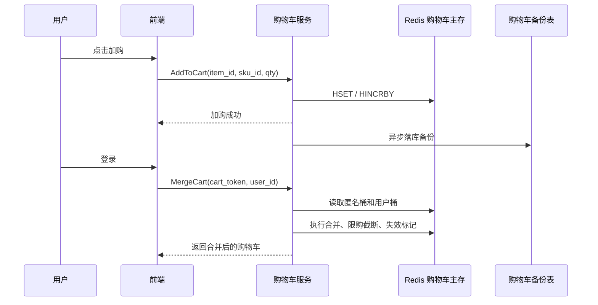

### 4.4 场景二：进入结算页的 Saga 编排时序图

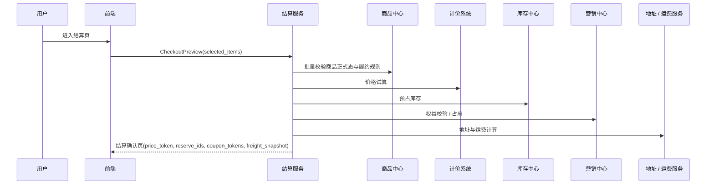

### 4.5 场景三：结算确认页失效与刷新时序图

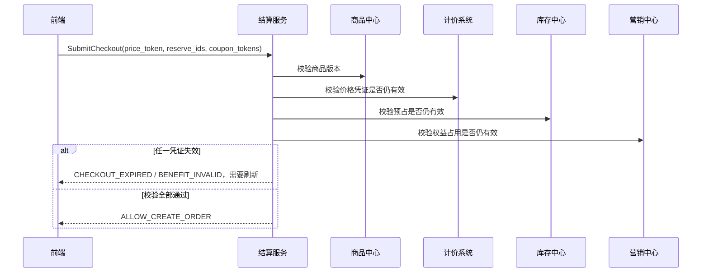

### 4.6 购物车与结算链路的统一架构原则

购物车与结算链路的统一设计原则，可以浓缩成下面四句话：

1. 购物车只保存购买意愿，不保存交易事实。
2. 结算服务负责把商品、价格、库存、权益和履约规则收敛成一次可提交的交易尝试。
3. 结算页返回的是一组短期有效的交易凭证，而不是最终订单。
4. 提交订单前必须再次校验这些凭证，才能把“意愿”推进成真正的“交易事实”。

---

## 5. 创单、订单数据模型与订单状态机

### 5.1 场景画像

用户点击“提交订单”时，系统会从“交易前校验”进入“交易事实落地”：

1. 订单中心基于结算凭证创建订单。
2. 订单保存商品、价格和履约快照。
3. 支付系统创建支付单并和外部渠道交互。
4. 支付结果回流后，订单状态推进。
5. 支付失败、超时取消或风控拒绝时，显式释放库存与权益。

### 5.2 关键技术点

在订单提交链路里，面试官最喜欢围绕“幂等、一致性、高并发、快照、补偿、安全、扩展”连续追问。为了便于答辩，可以先用一张总览表把这些问题压住：

| 追问方向 | 典型问题 | 简要回答口径 |
| --- | --- | --- |
| 幂等与重复提交 | `token/order_no` 过期怎么办 | 先按 `order_no` 反查订单；查到则返回已有订单，查不到再提示刷新确认页 |
| 幂等与重复提交 | Redis 挂了幂等怎么保证 | Redis 只做前置消峰，最终靠订单表 `order_no unique` 兜底 |
| 幂等与重复提交 | 多个请求同时消费凭证怎么办 | Redis 用 Lua / 原子删除一次性消费；提交时还要校验凭证绑定的 `user_id / session_id`，防止别人拿到凭证越权提交；数据库唯一索引做最后防线 |
| 幂等与重复提交 | 重复点击、网络重试、MQ 重发怎么分层处理 | 前端防抖处理点击；同步接口靠 `submit_token/order_no`；异步链路靠消息幂等键 |
| 幂等与重复提交 | 技术幂等和业务重复单提醒有什么区别 | 技术幂等解决“同一请求别处理两次”；业务重复单提醒解决“同一用户短时间内别无意中下两笔相似订单”，两者要同时存在但不要混为一谈 |
| 分布式事务与一致性 | 跨服务调用怎么保证一致性 | 不做 XA；主链路快速失败，靠事件补偿 + 延迟反查释放做最终一致性 |
| 分布式事务与一致性 | 库存预占成功但创单失败怎么办 | 发布 `OrderCreateFailedEvent`；库存和营销中心异步解冻，并保留延迟反查自愈 |
| 分布式事务与一致性 | 用 Saga、TCC 还是本地消息表 | 标准电商更常用 Saga / 本地消息表 + 补偿；避免重型强一致事务 |
| 分布式事务与一致性 | 真正扣库存在哪里做 | 创单阶段通常只预占；支付成功后由订单中心编排库存确认 |
| 高并发与性能 | `order_no` 怎么高性能全局唯一 | 常用 Snowflake / 号段；避免纯数据库自增暴露给外部 |
| 高并发与性能 | 这条链路瓶颈在哪里 | 通常在计价、库存预占、营销校验和订单库写入；通过缓存、批量接口、隔离和削峰扩容 |
| 高并发与性能 | 热点 `order_no` 被狂刷怎么办 | 网关限流 + 用户态校验 + Redis 短 TTL 幂等凭证 + 本地缓存已有结果 |
| 高并发与性能 | 唯一索引高并发插入有什么问题 | 会放大热点写竞争；但它是最后兜底，前面必须用 Redis 把大部分重复流量挡掉 |
| 下游凭证设计 | `price_token`、`reserve_ids`、`coupon_tokens` 是什么 | 分别代表价格真相、库存预占凭证、权益占用凭证，是创单前各域冻结结果的引用 |
| 下游凭证设计 | 这些凭证有效期怎么定 | 按业务风险定：价格一般秒级到分钟级，库存预占和券占用通常与结算超时时间一致 |
| 下游凭证设计 | 营销占用失败怎么办 | 直接阻断创单，主链路快速失败，不进入订单落库 |
| 下游凭证设计 | 商品静态合规校验校什么 | 上下架、可售状态、类目限制、店铺状态、限购规则、黑名单等交易前静态约束 |
| 下游凭证设计 | 价格版本校验意义是什么 | 防抓包改价、防旧价格重放、防优惠过期后继续创单 |
| 订单快照 | 为什么必须落快照 | 订单之后不能再依赖最新商品真相；退款、客诉、售后都要基于历史成交事实解释 |
| 订单快照 | 快照和订单主表怎么关联 | 一般按 `order_id` / `order_item_id` 一对一或一对多关联，主表和快照表物理分离 |
| 订单快照 | 快照数据量太大怎么办 | 只保留维权关键字段；大字段不进快照；历史快照可冷热分层下沉 |
| 异常与补偿 | 前端超时、后端超时怎么办 | 前端超时靠幂等重试；后端超时按订单真相反查，必要时用结果缓存顺水推舟 |
| 异常与补偿 | 部分成功怎么补偿 | 依赖事件补偿、延迟反查和人工对账，不在主请求里同步回滚所有域 |
| 异常与补偿 | 风控在哪做 | 一般在创单主链路前段或中段做硬拦截，避免无意义占库存和占券 |
| 数据一致性与查询 | 刷新页面如何立刻查到订单 | 创单成功后优先读主库 / 写后读一致路径，避免立刻落到延迟从库 |
| 数据一致性与查询 | 列表和详情走主库还是从库 | 订单详情、支付后短时间查询优先强一致；普通历史列表可走从库或读模型 |
| 数据一致性与查询 | `order_no` 和内部 `order_id` 区别 | `order_no` 偏业务外显与幂等；`order_id` 偏内部主键和关系索引 |
| 安全与风控 | 怎么防别人拿别人的 `order_no` 提交 | `order_no` 必须绑定用户身份、会话上下文和提交签名，不允许裸号直接创单 |
| 安全与风控 | 怎么防中间人改价 | 价格签名 / 价格版本核销 + 时间窗口 + nonce 防重放 |
| 安全与风控 | 怎么防恶意刷 Redis | 网关限流、人机校验、用户级频控、短 TTL、异常流量隔离 |
| 技术细节 | Redis 原子性怎么做 | 关键消费凭证通常用 Lua；简单抢锁可用 `SET NX EX` |
| 技术细节 | 数据库事务怎么开 | 创单本地事务只包订单事实与快照落库，保持短事务；隔离级别通常用 RC/RR 结合唯一键 |
| 技术细节 | 监控埋点看什么 | 提单 RT、成功率、重复提交率、Redis 命中率、唯一键冲突率、补偿成功率、订单创建失败率 |
| 扩展性与演进 | 合并支付、分单怎么扩展 | 结算服务继续负责编排，订单中心拆出主单/子单/支付单关系模型 |
| 扩展性与演进 | 预售、0 元购怎么扩展 | 复用创单骨架，替换价格确认、库存锁定和支付触发条件 |
| 扩展性与演进 | 怎么做降级和熔断 | 计价、营销、库存预占分别限流熔断；必要时关闭复杂权益，优先保核心创单链路 |

### 订单数据模型：主单、子单、订单项与快照

订单不是一个只有金额和状态的表，而是一组需要共同解释交易的事实集合。推荐按下面的关系拆分：

```text
Order（主单）
├── OrderSubOrder（销售主体 / 履约主体 / 店铺维度）
│   ├── OrderItem（sku、数量、成交金额、资源引用）
│   ├── ProductSnapshot（标题、规格、图片、规则摘要）
│   ├── PriceSnapshot（原价、成交价、优惠分摊、税费、运费）
│   └── FulfillmentSnapshot（地址、履约方式、预约或核销规则）
├── PaymentOrder（支付单、渠道、支付状态）
├── InventoryReservationRef（预占引用与释放状态）
├── AfterSaleCase（售后单及其范围）
└── OrderEvent / Outbox（事实事件与待投递消息）
```

主单适合表达用户一次提交的交易聚合，子单表达销售主体或履约主体的独立推进，订单项表达可售卖的最小业务单位。支付单不能简单等同于主单，因为一个主单可以合并支付多个子单，一个子单也可能拆成多次退款。售后单也不应覆盖订单原始字段，而应引用订单项和快照，记录“针对哪一项事实提出了什么后续请求”。

快照至少要满足三个条件：第一，字段足以支持客服、售后和争议解释；第二，快照有生成时间、来源版本和摘要校验；第三，快照在订单创建后不可被普通商品更新覆盖。并不是所有商品富文本都要塞进订单库，推荐保留标题、规格、销售主体、成交价格、优惠分摊、履约规则摘要和必要的图片 / 文案版本，长描述和展示素材可以通过不可变版本存储或归档引用获取。

### 订单状态机与不变量

订单状态机要先区分“用户可见主状态”和“内部协作状态”。例如库存预占失败、支付渠道处理中、物流回调重复等情况，未必都需要新增一个用户可见状态，但必须在内部事件和诊断字段中留下痕迹。

标准实物订单可以抽象为：

```text
CREATED -> PENDING_PAYMENT -> PAID -> FULFILLING -> SHIPPED
    |            |             |          |             |
    |            |             |          |             +--> DELIVERED
    |            |             |          +----------------> FULFILLMENT_FAILED
    |            |             +---------------------------> REFUNDING
    |            +------------------------------------------> CLOSED
    +-------------------------------------------------------> CANCELED
```

不同商品类型可以复用 `CREATED`、`PENDING_PAYMENT`、`PAID`、`REFUNDING` 等公共状态，再由履约子状态表达“待发码、已发码、已核销、已预约、已入住”等差异。状态迁移必须由事件和前置条件驱动，而不是由任意接口直接写字符串。建议为每条迁移记录：`from_state`、`event_id`、`event_type`、`actor`、`occurred_at`、`reason_code` 和 `to_state`。

至少要维护以下不变量：

1. 已支付金额不能超过订单应付金额，退款累计不能超过已支付金额。
2. 已确认的订单项数量不能大于提交时的数量，除非存在明确的拆单、换货或补发事实。
3. 订单进入 `PAID` 前不能产生“支付成功”的用户可见语义；收到重复支付通知只能返回幂等成功。
4. 订单进入 `CANCELED` 后不能再被普通支付成功事件推进为 `PAID`，异常情况必须转人工或进入纠错流程。
5. 售后完成必须引用支付、履约和退款事实，不能只凭售后申请记录关闭订单。
6. 主单状态由子单状态聚合得出时，聚合规则必须固定并可测试，不能依赖消息到达顺序。

这些不变量比“最终状态有哪些枚举值”更重要。事件乱序、重复和延迟是分布式系统的常态，Kafka 的交付语义文档也明确区分了至少一次、至多一次和恰好一次处理边界；业务状态机仍需要用事件 ID 和版本检查实现自己的幂等。[13] 因此，订单状态更新应使用 `order_id + version` 的乐观并发条件，更新失败时重新读取最新状态并判断事件是否已经生效。

### 创单本地事务与消息发布

提交订单的本地事务只做本域必须同时成立的事情：验证凭证归属、写入订单主单与子单、写入订单项和快照、创建支付单引用、生成初始状态事件或 Outbox 记录。它不应该在数据库事务中同步等待支付渠道、物流系统或所有回补动作。

事务边界可以表达为：

```text
BEGIN
  consume checkout token
  insert order / sub_order / item
  insert snapshots
  insert payment_order
  insert outbox(OrderCreated)
COMMIT

publisher -> payment / inventory / marketing / fulfillment
consumer  -> idempotent state transition
reconciler -> query status and compensate
```

Outbox 记录和订单事实必须在同一个本地事务提交，否则会出现“订单已经创建但没有事件”或“事件已发送但订单并不存在”的裂缝。[26] 发布器允许重复发送，因此事件消费者要以 `event_id` 或业务聚合版本去重；不能把“发布器没有收到确认”误判成“业务没有执行”。当发布器连续失败时，要有积压指标、重试退避、死信和人工重放入口。

MySQL InnoDB 的事务模型可以为本地订单事实提供行级锁和隔离保证，但数据库事务只覆盖同一个资源边界，不能自动把外部支付和库存纳入同一个可靠提交。[20] 本章选择短本地事务加异步补偿，牺牲跨服务瞬时强一致，换取较低锁持有时间、较高吞吐和可独立扩展的下游边界；这个牺牲必须在 ADR 中明确，而不能包装成“系统已经一致”。

### 主单、子单与合并支付

当一次提交包含多个店铺、仓库或履约类型时，主单只是用户视角的聚合，真正可独立履约的单位是子单。设计时要明确三组映射：

| 关系 | 例子 | 作用 |
| --- | --- | --- |
| 主单到子单 | 一个主单拆为多个店铺子单 | 展示一次提交与分别履约并存 |
| 子单到支付单 | 多个子单共用一个支付单 | 支持合并支付和统一收银台 |
| 订单项到资源 | 一个订单项对应预占、券码或预约资源 | 售后和补偿定位到最小范围 |

主单不能因为某个子单发货就直接显示“已完成”，也不能因为一个子单退款就把全部子单金额退回。可以定义聚合规则：全部子单支付完成才是主单支付完成；全部子单进入终态且没有待处理售后才是主单完成；部分退款以金额和订单项范围计算。聚合规则需要覆盖空集合、部分失败、部分取消和退款中的中间态。

### 超时、重复与反查

客户端看到“提交超时”时，服务端可能已经完成创单。正确处理不是立即再写一笔订单，而是按幂等键、业务订单号或结算凭证反查：

1. 按 `idempotency_key` 查询提交记录。
2. 查不到时按 `checkout_id` 和用户身份查询订单。
3. 查到待支付订单，返回原订单并允许继续支付。
4. 查到已支付订单，返回支付状态而不是重新创单。
5. 仍查不到且凭证已过期，提示刷新结算，不继续消费旧资源。

对外接口应使用明确的 HTTP 语义和问题详情，区分参数错误、凭证过期、资源不足、处理中和服务暂不可用；RFC 9110 定义了 HTTP 语义，RFC 9457 则提供了机器可读的错误详情表达方式。[23][24] 本章建议错误响应至少包含 `type`、`code`、`title`、`detail`、`retryable`、`request_id` 和可选的 `next_action`，使前端能选择“重试、刷新、换货或联系人工”，而不是把所有错误显示成“系统繁忙”。

#### 5.2.1 订单应该在“提交订单”时创建，还是在“点击支付”时创建

这在电商里是一个非常经典的交易架构决策点，通常有两种主流方案：

- **方案 A：提单时创单**
  - 用户点击“提交订单”时，先创建一笔待支付订单，再进入收银台选择支付渠道。
- **方案 B：支付时创单**
  - 用户点击“立即支付”时才真正建单；支付成功后，再落最终订单事实。

二者的本质区别在于：**库存锁定发生得早还是晚、订单事实生成得早还是晚**。

| 方案 | 优点 | 风险 | 适用场景 |
| --- | --- | --- | --- |
| 提单时创单 | 用户一旦进入收银台，库存和交易资格通常已经预留；支持待支付、催付、继续支付 | 更容易被恶意占库存；高并发时前置写库和锁资源压力更大 | 实物电商、大多数标准电商、酒店、机酒票务、重体验场景 |
| 支付时创单 | 极大减轻前置创单压力；不容易被恶意占库存；更适合极端高并发 | 可能出现“钱付了但后置建单 / 扣库存失败”的补偿复杂度；用户体验更容易受损 | 秒杀、抢购、部分虚拟商品、部分极端高并发场景 |

这章默认采用的是 **方案 A：提单时创单**。原因是本章的主线更偏向：

- 购物车 -> 结算 -> 提交订单 -> 支付 -> 履约

这类标准交易旅程。它的优点是：

- 订单能够稳定承接商品、价格、履约快照；
- 用户进入收银台后，交易关系已经明确；
- 支付结果回调只需要推进订单状态，而不是同时承担“先建单、再扣库存、再补偿”的复杂责任。

但也要明确：**这不是唯一正确答案**。如果业务是：

- 极端高并发秒杀
- 超稀缺票券抢购
- 低客单价虚拟商品

那么“支付时创单”往往更合理，因为它能把大量无效创单和恶意占坑挡在支付前面。

因此这里更稳妥的结论是：

> **标准电商与重体验商品，优先采用“先创单、后支付”；极端高并发和强防刷场景，再考虑“支付时创单”。**

#### 5.2.2 订单提交流程应该由独立聚合服务编排，还是由订单中心自己协调下游

这也是交易架构里非常经典的一个分歧点，通常存在两种方案：

- **方案 A：单独起一个结算 / 交易聚合服务**
  - 由结算服务或 Trade-CO 统一去协调商品、库存、计价、营销，再把最终结果交给订单中心落单。
- **方案 B：前端直接调用订单中心，由订单中心自己协调下游**
  - 订单中心既管订单写库，又去调用商品、库存、计价、营销这些服务完成前置校验与编排。

这两种方案的本质区别是：**交易主流程编排逻辑，是放在订单领域之外的场景聚合层，还是直接压进订单中心内部。**

| 方案 | 优点 | 风险 | 适用场景 |
| --- | --- | --- | --- |
| 独立聚合服务 | 订单中心更纯净；读写压力与场景编排隔离；更适合复杂结算页和多业务协同 | 多一跳 RPC；多一个服务需要治理 | 中大型电商、业务复杂、团队分工清晰、存在独立预结算页 |
| 订单中心自己协调 | 链路短；服务更少；前期开发快 | 订单中心容易膨胀成万能大管家；读写混合；迭代风险高 | 小团队、早期系统、短期快速上线 |

从工程演进角度看，很多系统早期会采用“订单中心自己协调”的方式快速上线，但随着以下问题出现，通常都会向独立聚合服务演进：

- 结算页逻辑越来越复杂
- 商品、计价、库存、营销团队开始独立演进
- 订单中心既要承接创单写流量，又要承接大量预览与预结算读流量
- 大促时希望把“重编排逻辑”和“订单写库主链路”物理隔离

本章默认采用的是 **方案 A：独立结算聚合服务编排，下游原子服务各自归位**。原因是：

- 结算页本身就天然是一个跨商品、库存、计价、营销、地址的聚合场景；
- 订单中心更适合回归为“交易事实持久化 + 状态机推进”的原子领域服务；
- 支付、履约、售后后续也都更容易围绕清晰的订单事实展开。

因此这里的推荐结论是：

> **当系统存在独立的确认订单页 / 预结算页，且交易链路已经明显跨多个领域服务时，优先采用“结算聚合服务编排，下游原子服务落地”的架构；只有在系统非常轻量时，才让订单中心临时兼做协调者。**

#### 5.2.3 创单接口的幂等性应该怎么设计

创单接口的幂等性，不能只理解成“用户重复点按钮怎么办”。它真正要解决的是：

- 同一个下单意图因为网络抖动、页面重试、MQ 重放或用户多次点击而重复到达时；
- 系统最多只能创建一笔订单；
- 如果第一次其实已经成功了，后续重试还应该尽量返回第一次成功的结果，而不是简单报错。

这类设计在工程上通常不是靠单点手段，而是靠一套**分层防御模型**完成：

- **第一层：前端轻量防抖**
  - 用户点击“提交订单”后，按钮立刻置灰
  - 页面进入 loading 状态，减少肉眼可见的重复点击
- **第二层：结算服务前置防重**
  - 用户进入确认订单页时，后端生成一个全局唯一的 `submit_token`
  - 提交订单时，前端必须把这个 `submit_token` 原样透传回来
  - 结算服务先在 Redis 上做一次幂等拦截，例如：
  - `SET submit_lock:{submit_token} 1 NX EX 30`
  - 如果没有拿到锁，说明相同提交意图正在处理中，或者已经处理过
- **第三层：订单中心存储级最终兜底**
  - Redis 分布式锁并不是绝对强一致的
  - 极端情况下，主从切换、锁过期或网络抖动仍然可能让重复请求穿透
  - 所以订单中心在落库时，仍然必须对 `submit_token` 做唯一约束
  - 即使两个请求同时穿透了 Redis，MySQL 也只能允许一笔订单真正写成功
- **第四层：结果幂等与顺水推舟**
  - 如果第一次创单已经成功，但响应前端时网络丢包
  - 第二次相同请求进来，不应该只返回“重复提交”
  - 更好的做法是缓存 `submit_token -> {status, order_id}`
  - 后续重试命中后，直接返回第一次成功的 `order_id`，把用户平滑带到收银台

这几层的职责并不相同：

| 防线 | 核心目标 | 典型实现 |
| --- | --- | --- |
| 前端防抖 | 减少普通重复点击 | 按钮置灰、loading、防重复提交 |
| Redis 防重 | 前置消峰，保护下游资源 | `submit_token` + 分布式锁 / SETNX |
| DB 唯一约束 | 存储层最终绝对幂等 | 订单表或防重表上的唯一索引 |
| 结果缓存 | 平滑处理“成功但回包丢失” | `submit_token -> order_id` 结果映射 |

面试里经常会被继续追问两个极端场景。

**场景一：业务还没执行完，Redis 锁先过期怎么办？**

如果创单链路比较长，固定的 `EX 30` 很容易在高峰期被打穿。更稳妥的工程实现通常是：

- 使用具备看门狗续期能力的分布式锁实现；
- 业务未结束时自动续期；
- 业务结束后显式解锁。

这样可以避免“创单事务还没跑完，锁却先失效”的幂等击穿问题。

**场景二：Redis 锁挡住了大部分流量，但极端情况下仍然漏了怎么办？**

这里真正的底线是：

> **Redis 负责前置消峰，MySQL 唯一键负责最终闭环。**

也就是说，Redis 锁不是为了替代数据库唯一约束，而是为了减少无意义的重复流量冲击商品、库存、营销和订单中心。

因此这里更稳妥的结论是：

> **创单幂等要做成“前端防抖 + 结算服务 submit_token 防重 + 订单中心唯一索引兜底 + 结果缓存顺水推舟”的四层模型。Redis 负责前置消峰，数据库负责最终绝对幂等。**

#### 5.2.4 预生成的订单号能不能直接作为创单幂等 token

在创单幂等设计里，还有一个非常实用的工程化问题：

- 结算页是不是一定要单独发一个随机 `submit_token`；
- 还是说，**预生成的订单号本身就可以兼做创单幂等键**。

答案是：**可以，而且在很多系统里这是更推荐的做法。**

这里的关键不是“先写一条待支付订单”，而是：

- 用户进入确认订单页时，系统先生成一个全局唯一的 `order_no`；
- 这个 `order_no` 先不落订单主表；
- 而是先作为一次性的创单提交凭证，写入 Redis，设置合理的过期时间；
- 真正提交订单时，前端带着这个 `order_no` 回来，由后端原子消费它，再执行正式创单。

这意味着，一个预生成订单号同时承担了两层身份：

- **业务主键**：后续支付、履约、售后都围绕这个订单号推进；
- **提交幂等键**：用于防止同一个结算确认页被重复提交多次。

与“纯随机 token”相比，它的优势很明显：

- 不需要再维护一套独立 token 体系；
- 幂等键和订单主键天然合一，链路更清晰；
- 如果提交时 Redis token 已经过期，后端可以直接按 `order_no` 去订单库反查是否已经成功创单；
- 即使前端回包丢失，用户重试时也更容易平滑返回已有订单。

但要想把这个方案用稳，必须满足几个前提：

| 设计点 | 要求 |
| --- | --- |
| 订单号生成时机 | 必须在确认订单页阶段就预生成，而不是创单事务最后才生成 |
| Redis 侧 | `order_no` 要作为一次性可消费凭证写入缓存，并设置 TTL |
| MySQL 侧 | 订单表必须对 `order_no` 做唯一索引，承担最终兜底 |
| 提交失败处理 | Redis token 失效后，不能直接报错，要先按 `order_no` 反查订单是否已存在 |

最稳妥的提交流程通常是：

1. 用户进入确认订单页；
2. 结算服务预生成 `order_no`；
3. Redis 写入 `order:submit:{order_no}`，TTL 例如 15~30 分钟；
4. 前端提交订单时，原样带回这个 `order_no`；
5. 后端先原子消费 Redis 中的提交凭证；
6. 再进入正式创单事务；
7. 订单表以 `order_no unique` 最终兜底。

这里尤其要注意一个容易答错的点：

> **token 过期，不等于订单一定创建失败。**

所以当 Redis 里发现 `order_no` 已不存在时，更合理的后端处理顺序是：

- 先按 `order_no` 去订单库查；
- 如果已经有订单，直接返回这笔已有订单；
- 如果没有订单，再提示用户“页面已超时，请刷新后重新提交”。

当然，这种方案也有边界：

- 不要直接暴露纯自增订单号；
- 更适合使用 Snowflake、号段 + 随机扰动、带业务前缀的全局唯一号；
- 并且 Redis 只负责前置防重，**绝不能替代数据库唯一约束**。

因此这里更稳妥的结论是：

> **预生成订单号完全可以直接作为创单幂等 token。最佳实践是“预生成订单号 = 提交幂等键 = 订单业务主键”，再配合 Redis 一次性消费和数据库唯一索引，形成一前一后的双保险。**

#### 5.2.5 技术幂等和业务重复单提醒，为什么要分两层设计

创单链路里还有一个很容易被忽略的点：

- **技术幂等**，解决的是“同一个请求重复到达，系统不要创建两笔订单”；
- **业务重复单提醒**，解决的是“同一个用户在很短时间内，可能无意中下了两笔高度相似的订单”。

这两者看起来都在处理“重复”，但其实完全不是一回事。

**技术幂等**的典型触发原因通常是：

- 用户重复点击提交；
- 网络抖动导致前端自动重试；
- 网关超时后客户端再次发起请求；
- 消息重发或服务重试。

它的目标非常纯粹：

> **同一个下单请求，多次到达，只能被系统真正处理一次。**

而**业务重复单提醒**更偏用户体验和业务治理，它处理的是：

- 用户已经成功下过一笔极其相似的订单；
- 但因为没注意页面状态、没看到待支付订单、或者切了支付方式，又重新下了一笔；
- 这两笔订单在技术上是两次不同请求，但在业务上很可能是用户误操作。

它的目标不是强拦截，而是：

> **在不破坏正常下单自由度的前提下，提示用户“你刚刚可能已经下过一笔类似订单了”。**

所以一个成熟的订单系统，通常要把这两层拆开设计：

| 层次 | 目标 | 典型手段 |
| --- | --- | --- |
| 技术幂等 | 防止同一请求被重复处理 | `submit_token/order_no`、Redis 一次性消费、数据库唯一索引 |
| 业务重复单提醒 | 防止用户短时间内误下两笔相似订单 | 按用户、商品、地址、金额、时间窗口做相似订单检测，并给出二次确认提示 |

业务重复单提醒一般不会像技术幂等那样做成强约束唯一键，而是更偏“软校验”。例如：

- 同一用户；
- 在最近 1~5 分钟；
- 针对相同商品 / SKU / 房型 / 行程；
- 收货地址、数量、金额高度一致；
- 且前一笔订单还处于待支付或刚支付状态。

这时系统更合理的动作通常是：

- 弹出提醒：
  - “你刚刚已经提交过一笔相似订单，是否继续下单？”
- 给用户两个选择：
  - 去查看已有订单；
  - 继续提交当前订单。

这样做的原因是：

- 有些重复单确实是误操作；
- 但也有些重复单是用户有意为之，例如：
  - 给不同人各买一份相同商品；
  - 同一酒店房型连续下两间；
  - 同一活动商品分开下单。

如果把业务重复单也像技术幂等一样硬挡掉，反而会伤害真实交易。

因此更稳妥的结论是：

> **技术幂等和业务重复单提醒必须分层设计：技术幂等前置，负责防止同一请求被系统处理两次；业务重复单提醒后置，负责识别“相似订单”并给用户二次确认。技术幂等优先，业务提醒辅助。**

#### 5.2.6 创单失败后，库存预占和权益占用怎么做最终一致性补偿

这也是结算编排里非常关键的一道资损防线。

在标准的提单链路里，前面往往已经发生了这些动作：

- 价格快照已经生成
- 库存已经预占，拿到了 `reserve_ids`
- 营销权益已经占用，拿到了 `coupon_tokens`

这时如果最后一步：

- `结算服务 -> 订单中心 CreateOrder`

在写库时因为数据库超时、网络断开、主从抖动等原因失败，系统就会落入一个非常危险的中间态：

- 前端看到的是“创单失败”
- 但库存和权益其实已经被前置链路冻结住了

如果不处理，就会出现：

- 僵尸库存预占
- 优惠券被卡死
- 用户无法再次下单
- 商家可售资源被无故锁住

这里不能靠 Seata / XA 这类强一致事务硬拉平，因为它们会把高并发交易主链路拖得过重。更可落地的做法是：

- **主链路快速失败**
- **异步补偿兜底**
- **延迟反查再兜底**

推荐的补偿模型一般有两层：

**第一层：消息补偿**

当结算服务或订单中心感知到创单明确失败时，发布一条 `OrderCreateFailedEvent`：

- 库存中心订阅后释放 `reserve_ids`
- 营销中心订阅后释放 `coupon_tokens`

这样可以把大部分“明确失败”的场景快速回滚掉，而不需要让前台请求同步等待所有补偿完成。

**第二层：下游主动反查 + 延迟释放**

为了防止消息丢失、网络抖动或“创单结果未知”这种灰色状态，库存中心和营销中心本身还应该有一层延迟自愈：

- 在预占 / 占用成功时，挂一条延迟检查任务
- 到达超时时间后，主动去订单中心反查：
  - 这个 `reserve_ids` / `coupon_tokens` 对应的订单到底创建成功了吗
- 如果订单不存在，或者订单已经被关闭 / 取消，就自动释放资源

这意味着：

- 结算服务负责主流程编排
- 订单中心负责创单真相
- 库存和营销中心各自对自己的冻结资源负责自我救赎

因此这里更稳妥的结论是：

> **创单失败后的最终一致性，不能依赖运行时强事务，而要依赖“失败事件补偿 + 延迟反查释放”的双层自愈机制。**

#### 5.2.7 价格防篡改应该重新计算一遍，还是依赖价格签名 / 版本核销

创单链路里还有一个非常关键的安全问题：**前端提交的价格到底能不能信**。

如果黑客通过抓包改包，把前端传给 `SubmitOrder` 的金额从 5999 改成 0.01，而后端又没有做价格防篡改校验，就会直接造成巨大资损。

这类防护一般有两种主流方案：

- **方案 A：无状态签名校验**
  - 预结算时由计价系统生成一个 `price_token`
  - 它通常由 `item_id + user_id + price + timestamp + secret` 等因子签名得到
  - 创单时前端把价格和 `price_token` 一起透传回来
  - 结算服务或计价服务重新验签，确认价格未被改包
- **方案 B：有状态版本核销**
  - 预结算时由计价系统生成一个 `price_version_id`
  - 并把对应价格结果写到 Redis 或计价缓存中
  - 创单时前端只透传版本号
  - 后端按版本号回查真实价格，再以缓存中的真相落单

这两种方案的本质区别是：

- 方案 A 更像“**数学签名防篡改**”
- 方案 B 更像“**后端状态核销防篡改**”

| 方案 | 优点 | 风险 | 适用场景 |
| --- | --- | --- | --- |
| 无状态签名校验 | 不需要高频读 Redis；延迟低；更适合高并发 | 如果只做简单签名，天然不防重放；仍需额外处理超时窗口和 nonce | 高并发场景、性能优先场景 |
| 有状态版本核销 | 安全边界清晰；天然适合做一次性核销；方便过期控制 | 对 Redis / 状态存储依赖更强；预结算和创单时会增加缓存 IO 压力 | 安全要求高、流程较长、可接受缓存成本的场景 |

工业界更常见的落地方式，往往是：

- 以 **无状态签名** 作为主防线，防止前端改价
- 再加上 **时间窗口 + nonce 防重放**
- 如有必要，再用轻量 Redis 记录短期 nonce 或一次性 token

这样既能保持高并发下的低延迟，又能防止用户把一个合法的价格签名反复提交多次。

因此这里更稳妥的结论是：

> **高并发电商链路里，优先采用“价格签名校验 + 时间窗口 / nonce 防重放”的轻量方案；只有在业务对一次性核销、价格版本冻结要求特别强时，再演进到有状态版本核销。**

#### 5.2.8 订单快照应该由谁构建：商品中心、订单中心，还是结算服务

订单快照的职责划分也是一个非常容易设计错的点。这里真正的问题不是“谁能拿到商品标题”，而是：

- 谁手里拥有最完整的下单上下文；
- 谁最适合在创单前把商品、价格、履约三类事实揉成一份订单解释材料；
- 谁应该只负责持久化，而不要再次退化成交易大管家。

这类职责一般会出现三种候选方案：

- **方案 A：由商品中心构建快照**
  - 看起来商品中心最懂商品，但它只拥有“当前商品真相”
  - 它并不知道这次交易用了什么券、最终成交价是多少、履约承诺是什么
  - 如果让商品中心在提单时参与组装订单快照，会把交易上下文反向污染到商品域
- **方案 B：由订单中心构建快照**
  - 订单中心在收到创单请求时，理论上可以再去查商品、计价、营销、履约
  - 但这会让订单中心重新变成“大管家”
  - 创单链路的耗时、依赖数和失败面都会急剧上升
- **方案 C：由结算服务构建快照，订单中心只负责落库**
  - 结算服务在提交订单前，本来就已经拿到了：
  - 商品静态信息
  - 价格明细和优惠分摊结果
  - 履约承诺与交付上下文
  - 它是最适合在内存里把这些信息揉成 `SnapshotDTO` 的那一层
  - 订单中心收到后，只需要把订单事实和快照 JSON 一起持久化

三种方案的关键差异如下：

| 方案 | 优点 | 风险 | 推荐度 |
| --- | --- | --- | --- |
| 商品中心构建 | 商品标题、主图、类目天然可得 | 职责越界；不拥有价格与履约上下文；容易把交易逻辑污染回商品域 | 不推荐 |
| 订单中心构建 | 创单和落库在一个服务里闭环 | 订单中心重新退化成大管家；创单链路变重；依赖面暴涨 | 谨慎使用 |
| 结算服务构建 | 最接近完整交易上下文；适合在创单前聚合和揉快照 | 需要明确快照字段边界，避免把无意义大字段塞进快照 | 推荐 |

因此这里更稳妥的结论是：

> **订单快照应由结算服务在提交订单前完成组装，订单中心只负责把订单事实与快照结果持久化；商品中心提供静态契约，但不直接参与快照构建。**

进一步说，快照也不能无限膨胀。真正应该进入订单快照的，通常是：

- 商品 ID、SKU ID、标题、下单时主图 URL、规格属性；
- 成交单价、原价、优惠分摊、券抵扣、运费、税费；
- 履约类型、承诺送达时间、退改规则摘要。

而像商品详情图文、长文本介绍、视频等大字段，不应该进入订单快照。订单列表查询也不应该把大 JSON 混在主表里，而应该通过独立的 `order_snapshot` 之类的附表按需读取。

#### 5.2.9 订单中心负责交易事实编排，商品中心负责交易前静态契约

商品中心负责“商品身份与价格合规”的静态校验，订单中心负责“交易行为与流水合规”的最终编排。

#### 5.2.10 订单必须保存商品快照、价格快照和履约快照

订单必须保存商品快照、价格快照和履约快照，而不是回读最新商品。

#### 5.2.11 支付发起和支付结果回调是两条不同链路

支付发起和支付结果回调是两条不同链路：前者负责创建支付单，后者负责提供支付事实。

#### 5.2.12 支付系统只提供支付事实，订单系统自己推进状态机

支付系统只提供支付事实，订单系统自行推进自己的状态机。

#### 5.2.13 支付成功之后，订单中心再去编排库存确认、权益确认和后续履约触发

支付成功回调之后，订单中心才去编排库存确认、权益确认和后续履约触发。

#### 5.2.14 支付失败、超时取消和风控拒绝后，库存和营销权益必须显式释放

支付失败、超时取消和风控拒绝后，库存和营销权益必须显式释放。

#### 5.2.15 订单模型的演进：从支付单 + 订单，到主单 / 子单 / 商品维度退款

订单模型的演进，本质上是在回答一个问题：系统到底要先解决“支付聚合”，还是先解决“履约拆分、售后拆分和商品维度退款”。

在业务早期，很多系统只有三张核心表：

- `pay_order_tab`
- `order_tab`
- `refund_tab`

这套模型足以支撑最基础的交易闭环：

- 一个支付单对应一个或多个订单
- 一个订单下挂多个订单明细
- 退款主要按整单维度处理

它的优点是简单、上线快、链路短。但当业务开始出现下面这些诉求时，模型就会越来越吃力：

- 一个支付单下挂多个业务订单，需要合并支付
- 一个用户视角上的“大订单”需要按商家、仓库、履约方式拆成多个子单
- 售后不再只是整单退款，而是按某个商品、某个 `order_item` 退款
- 后续还可能出现部分发货、部分签收、部分退款、部分核销

这时候，更稳妥的演进方向是把“支付域聚合”和“订单域聚合”拆开：

- `pay_order_tab`：属于支付域，只解决一次支付要付多少钱、走哪个渠道、支付状态是什么
- `parent_order`：属于订单域，解决用户视角和业务聚合问题
- `order_tab`：承载子单，解决分商家、分仓、分履约、分售后的独立处理
- `order_item_tab`：承载商品维度事实，给商品维度退款、部分售后、部分履约提供锚点
- `refund_tab`：从“只关联合同/整单”演进到既可关联订单，也可关联 `order_item_id`

可以用一句话概括这种演进模型：

> 主单解决“支付和用户视角的统一”问题，子单解决“履约、结算、售后等多维度独立处理”问题。

一个比较务实的演进顺序通常是三步走：

1. 先保留现有 `pay_order_tab + order_tab + refund_tab`，快速支撑基础交易。
2. 在订单域引入 `parent_order`，或者至少先在 `order_tab` 上补 `parent_order_id`，开始支持合并支付和业务聚合。
3. 在 `refund_tab` 上增加 `order_item_id`，让退款能力从整单退款演进到商品维度退款。

这里有一个很重要的边界要守住：

- `pay_order_tab` 不应该替代 `parent_order`
- 支付单是支付域对象，关注资金流
- 主单是订单域对象，关注用户视角、履约拆分和售后聚合

也就是说，支付单可以聚合多笔业务订单，但它不应该承接“用户看到的是一单还是多单”“履约怎么拆”“退款按哪个粒度处理”这类订单域问题。

如果系统还处在简单阶段，完全没必要一开始就把主单、子单、订单项、退款项全部做满；但设计时要预留一条清晰演进路径：

- 简单模式先跑通支付和整单退款
- 复杂模式再逐步引入主单、子单和商品维度退款

这样既能避免过度设计，也不会在后期被早期模型彻底卡死。

#### 5.2.16 为什么库存 Confirm 不应该反查订单中心，而订单中心必须主动查询支付网关

这两个场景表面上都像“结果确认”，但它们的依赖方向其实完全不同。

| 维度 | 库存 Confirm | 支付结果查询 |
| --- | --- | --- |
| 对象 | 库存中心（内部服务） | 支付网关（外部第三方） |
| 控制权 | 我们完全可控 | 我们不可控 |
| 推荐方向 | 订单中心主动调用库存 Confirm | 订单中心主动查询支付网关状态 |
| 是否希望被动反查订单中心 | 不希望 | 不适用 |
| 核心原因 | 避免内部服务双向依赖和职责污染 | 第三方回调不可靠，必须主动核实 |

库存中心之所以**不应该反查订单中心**，核心原因有三个：

- **避免循环依赖**
  - 订单中心调用库存中心做 `Reserve / Confirm / Cancel` 是合理的单向依赖；
  - 如果库存中心再反过来查询订单中心，就会形成双向耦合。
- **保持库存中心职责纯净**
  - 库存中心的职责是管理库存资源和 `reserve_token` 状态；
  - 它不应该理解“这个订单是不是已经支付成功”这样的订单域语义。
- **防止订单中心膨胀成上帝服务**
  - 如果库存、营销、物流都回头查订单中心，订单中心会变成整个交易系统的公共查询枢纽；
  - 这会放大瓶颈，也会放大故障传播面。

因此，更合理的做法是：

- 订单中心作为协调者，在支付成功后主动调用库存中心做 `Confirm`；
- 库存中心只根据 `reserve_token` 做幂等状态流转：
  - `RESERVED -> CONFIRMED`
  - 或 `RESERVED -> CANCELED`

这也意味着，**订单中心必须能正确处理库存 Confirm 的响应结果**：

- `SUCCESS`
- `ALREADY_CONFIRMED`
- `RESERVE_TOKEN_NOT_FOUND`
- 网络超时 / 调用失败

并且这条 `Confirm` 调用本身必须支持幂等重试。通常的推荐做法是：

- 支付成功后，订单中心在本地事务里写一条待确认库存的 Outbox / 本地消息；
- 异步 Worker 调用库存中心 `ConfirmInventory(reserve_token)`；
- 只有收到明确成功响应，才把本地消息标记为完成；
- 若响应丢失或调用失败，则按退避策略重试；
- 多次失败后，把订单打到“支付成功_库存确认异常”状态，进入自动退款或人工补偿。

和库存中心不同，**支付网关必须允许订单中心主动查询**。原因也非常明确：

- 它是外部第三方，我们无法完全掌控回调行为；
- 回调可能丢失、延迟、重复甚至异常；
- 所以只依赖回调不足以支撑订单状态推进。

因此支付结果的推荐模型通常是：

- **以回调为主**
- **以主动查询为兜底**

也就是说：

- 支付网关回调来了，订单中心先按回调推进支付事实；
- 如果回调迟迟不来，订单中心可以通过定时任务、用户主动查询或收银台轮询去调用支付网关 `query` 接口确认状态；
- 一旦确认支付成功，再继续触发库存 Confirm、权益 Confirm 和履约编排。

一句话总结就是：

> **库存是我们的内部资源中心，要保持干净、独立、单向依赖；支付网关是外部不可信第三方，订单中心必须主动多长一个心眼去确认它的最终状态。**

#### 5.2.17 Outbox 本地消息表：支付成功后如何可靠驱动库存 Confirm

如果订单中心承担了主动 `ConfirmInventory` 的职责，接下来最关键的问题就是：

- 支付成功后，怎么保证这条 Confirm 动作一定会被发出去；
- 如果调用库存中心时网络超时、响应丢失，怎么继续重试；
- 如果系统重启、进程崩溃，怎么保证这条确认任务不会消失。

这里最稳妥的工业级做法就是 **Outbox Pattern（本地消息表模式）**。

核心思想是：

> **把“订单状态更新”和“待确认库存消息写入”放进同一个本地事务里，先把消息落到订单库自己的 `outbox` 表，再由异步 Worker 扫描并可靠投递。**

这里推荐表名直接使用 `outbox`，而不是 `local_message`，原因有三点：

- `outbox` 更符合行业标准语义；
- 在面试和评审里，一说就能让人联想到 Outbox Pattern；
- 后续如果再引入 `inbox`、事件总线或双向事件处理，命名也更自然。

推荐的表结构大致如下：

```sql
CREATE TABLE `outbox` (
    `id` BIGINT(20) NOT NULL AUTO_INCREMENT COMMENT '主键',
    `message_id` VARCHAR(64) NOT NULL COMMENT '全局唯一消息ID',
    `biz_type` VARCHAR(32) NOT NULL COMMENT '业务类型：INVENTORY_CONFIRM、MARKETING_CONFIRM 等',
    `biz_key` VARCHAR(64) NOT NULL COMMENT '业务唯一键，如 order_no',
    `payload` JSON NOT NULL COMMENT '消息体',
    `status` VARCHAR(20) NOT NULL DEFAULT 'PENDING' COMMENT 'PENDING/PROCESSING/SUCCESS/FAILED/DEAD',
    `retry_count` INT NOT NULL DEFAULT 0 COMMENT '重试次数',
    `next_retry_time` DATETIME NOT NULL COMMENT '下次重试时间',
    `create_time` DATETIME NOT NULL DEFAULT CURRENT_TIMESTAMP COMMENT '创建时间',
    `update_time` DATETIME NOT NULL DEFAULT CURRENT_TIMESTAMP ON UPDATE CURRENT_TIMESTAMP COMMENT '更新时间',
    PRIMARY KEY (`id`),
    UNIQUE KEY `uk_message_id` (`message_id`),
    UNIQUE KEY `uk_biz` (`biz_type`, `biz_key`),
    KEY `idx_status_retry` (`status`, `next_retry_time`),
    KEY `idx_create_time` (`create_time`)
) ENGINE=InnoDB DEFAULT CHARSET=utf8mb4 COMMENT='Outbox 表（本地消息表）';
```

几个关键字段的职责分别是：

| 字段 | 作用 |
| --- | --- |
| `message_id` | 全局唯一消息标识，方便排障和防重 |
| `biz_type` | 区分库存确认、营销确认、退款等不同任务 |
| `biz_key` | 业务唯一键，通常用 `order_no` 或 `reserve_token` |
| `payload` | 真正的调用参数，如 `reserve_token / order_no / sku_list` |
| `status` | 当前处理状态，支持重试和死信管理 |
| `retry_count` | 已重试次数 |
| `next_retry_time` | 下一次允许被扫描和重试的时间点 |

对应到库存 Confirm 场景，订单中心最典型的本地事务写法就是：

1. 支付回调确认成功；
2. 在同一个数据库事务里：
   - 更新订单状态为 `PAID`
   - 插入一条 `biz_type = INVENTORY_CONFIRM` 的 Outbox 记录
3. 事务提交后，异步 Worker 扫描 `PENDING/FAILED` 且 `next_retry_time <= now()` 的消息；
4. Worker 调用库存中心 `ConfirmInventory(reserve_token)`；
5. 若收到明确成功响应，则把 Outbox 记录标记为 `SUCCESS`；
6. 若调用失败或响应丢失，则把状态改成 `FAILED`，并按指数退避推进 `next_retry_time`。

这里尤其要注意两层幂等：

- **订单中心侧幂等**
  - 同一笔 `biz_type + biz_key` 的 Outbox 记录只能插一次；
  - Worker 重复扫描时，也不能重复推进本地状态。
- **库存中心侧幂等**
  - 以 `reserve_token` 为主键推进状态机：
  - `RESERVED -> CONFIRMED`
  - 重复 Confirm 返回成功或 `ALREADY_CONFIRMED`

因此，订单中心处理库存 Confirm 的推荐口径可以总结成：

- 同步调用可以有，但**不能只依赖同步 response**；
- 最终必须以 Outbox + Worker 重试为准；
- 只有收到明确成功响应，才把本地消息标记完成；
- 多次重试仍失败，就把订单打到“支付成功_库存确认异常”状态，进入自动退款或人工补偿。

如果用 Go 落地，这个 Worker 的职责通常就是：

- 周期性扫描 `outbox`
- 反序列化 `payload`
- 调库存中心 Confirm 接口
- 根据返回结果更新 `status / retry_count / next_retry_time`

也就是说，Go 代码真正需要保证的不是“调一次 RPC 就好”，而是：

> **订单状态推进、Outbox 持久化、异步 Worker 重试、库存 Confirm 幂等，这四层一起构成最终一致性。**

#### 5.2.18 混合支付的状态机应该怎么设计

当一笔订单不是“纯现金支付”，而是由 `Coin + Voucher + 支付渠道` 共同组成时，支付链路的难点就不再只是调起支付，而是**多种资产的锁定顺序、状态流转以及部分失败时的回滚**。

这里最容易出问题的点有两个：

- 多种资产同时参与，扣减顺序稍有不慎就会在高并发下形成死锁
- 渠道支付成功、券已锁定、Coin 已冻结，但后续某一步失败时，必须能可靠回滚

因此，混合支付更推荐采用三段式状态流转：

| 阶段 | 动作 | 目标 |
| --- | --- | --- |
| 冻结阶段 | `Lock Voucher` + `Freeze Coin` | 在不真正消耗资产的前提下，先锁定用户可用权益 |
| 确认阶段 | `Use Voucher` + `Deduct Coin` | 渠道支付成功后，把冻结态转成最终消耗态 |
| 释放阶段 | `Unlock Voucher` + `Unfreeze Coin` | 用户取消、超时关闭或支付失败后，归还所有锁定资产 |

推荐的设计原则是：

- 结算服务或支付中心在拉起支付前，只做**锁定 / 冻结**
- 渠道支付成功回调之后，再做**确认使用**
- 支付失败、超时关闭、风控拦截之后，再做**逆向释放**

这样做的好处是：

- 用户点击支付时，平台已经知道这笔单最多能用多少券、多少 Coin
- 最终需要请求第三方支付网关的现金金额是确定的
- 资产和渠道支付被拆成“可逆阶段”和“不可逆阶段”，更适合 Saga 编排

在实现层面，推荐让营销 / 资产中心都提供三段式接口：

- `Lock / Freeze`
- `Confirm / Use / Deduct`
- `Cancel / Unlock / Unfreeze`

不要让订单中心或支付中心自己去推导“这张券是不是已经用了”“Coin 到底是冻结还是已扣减”，而应该以下游返回的凭证和状态机为准。

还有一个很关键的财务边界：

> 用户现金实付 + 平台营销补贴 = 商户实收 + 渠道手续费。

因此，混合支付场景下，系统不仅要记录最终现金支付金额，还要记录：

- `marketing_discount_amount`
- `coin_deduct_amount`
- `voucher_discount_amount`
- `channel_fee_amount`

否则后续对账、退款分摊、商家结算都会变得非常困难。

### 5.3 场景一：提交订单时序图

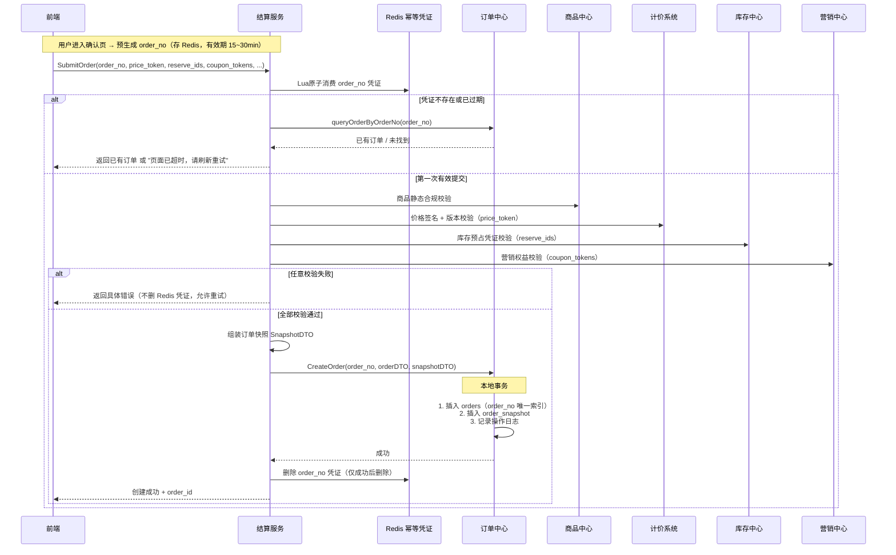

### 5.4 场景二：提交支付时序图

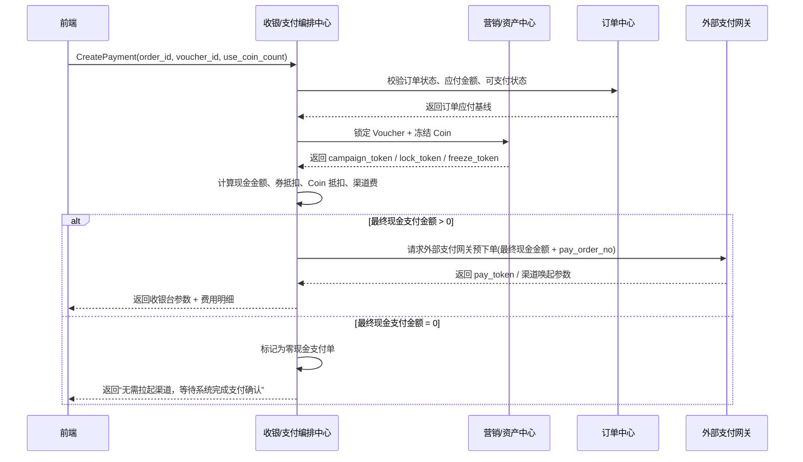

### 5.5 场景三：支付结果回调与订单编排时序图

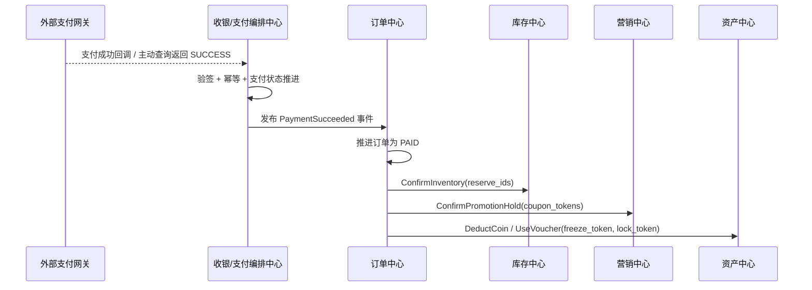

### 5.6 场景四：支付失败与超时回滚时序图

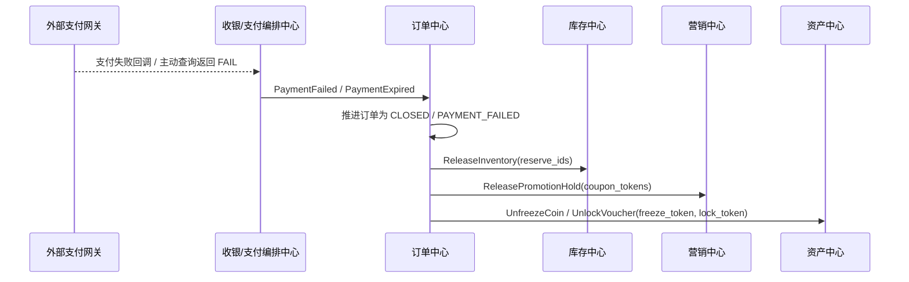

### 5.7 特殊场景：预售订单

预售订单的本质，不是“普通订单加一个活动标签”，而是**延迟履约 + 分阶段支付 + 长周期资源占用**。它和现货单最大的区别在于：交易事实可以先成立，但资源最终确认和履约发生在更晚的时间点。

#### 5.7.1 业务生命周期

一个典型的预售订单，通常会经历下面几个阶段：

- 预热期：用户可以浏览和加购，但还不能正式下单
- 定金期：用户支付定金，锁定购买资格
- 尾款期：活动切换到尾款支付窗口，用户补齐尾款
- 履约期：尾款支付成功后，订单才进入正常发货 / 履约流程
- 异常终止：定金支付后尾款超时、用户主动取消、活动终止

因此，预售订单不是一次支付完成全部交易，而是把“购买承诺”和“最终成交”拆成了两个时间点。

#### 5.7.2 核心模型

预售订单建议显式建模，而不是把逻辑散落在普通订单字段里拼凑：

- `order_type = PRESALE`
- `presale_end_time`：尾款支付截止时间
- `delivery_time`：预计发货时间
- `lock_deadline`：库存锁定截止时间

其中最关键的是“分阶段支付”模型。更推荐单独抽一层 `pay_stage` 或等价支付阶段表，而不是在 `pay_order_tab` 上硬塞一组定金 / 尾款字段。原因很简单：

- 每个阶段都可能有独立的支付流水 `trade_no`
- 退款时可能只退定金，或者只退尾款
- 财务对账更容易按阶段落账
- 后续即使出现三阶段支付，也不需要推翻原模型

#### 5.7.3 与其他服务的交互边界

预售单会把多个中心的责任拉得更长，因此边界必须先钉死：

- 商品中心：提供预售商品快照，尤其是定金金额、尾款金额、预计发货时间、活动承诺文案
- 营销中心：提供预售活动规则，如定金比例、尾款优惠、限购数量
- 库存中心：在定金支付成功后做长时间预占；在尾款支付成功后再转成最终 Confirm
- 消息中心：在尾款截止前做多轮提醒，例如提前 24 小时、3 小时、30 分钟

这里的设计重点是：

> 结算服务在定金阶段解决“资格锁定”，订单中心在尾款支付完成后才把这笔交易推进到真正可履约状态。

#### 5.7.4 预售链路的关键挑战

预售最大的风险，不在于普通创单，而在于它把资源和资金拉成了一个长周期博弈。

**挑战一：用户付了定金，但长时间不付尾款**

- 风险：库存被长时间占用，影响后续售卖
- 处理：库存中心使用长 TTL 预占；尾款超时后由订单中心通过 Outbox 异步 Cancel；必要时按规则扣除部分定金作为违约成本

**挑战二：尾款支付窗口集中爆发**

- 风险：大量用户在最后几小时同时补尾款，触发支付、库存 Confirm、营销结算的洪峰
- 处理：尾款支付仍然走普通支付主链路的幂等、防重、Outbox、Confirm 编排，不因为它是“第二阶段支付”就绕开主流程

**挑战三：退款复杂度更高**

- 风险：预售退款不再是简单整单退款，而可能区分定金退款、尾款退款、履约前退款
- 处理：退款模型增加 `refund_stage = DEPOSIT / FINAL` 一类字段，显式标记退款属于哪个支付阶段

#### 5.7.5 推荐的落地原则

预售场景最容易犯的错误，是把它当成“普通订单 + 两次付款”来实现。更稳妥的思路是：

- 把预售当成一种独立 `order_type`
- 把定金和尾款视为两个支付阶段
- 把库存看成“长预占 + 最终确认”的两段式资源状态
- 把尾款超时和活动终止视为标准 Saga Cancel 场景

一句话总结：

> 预售订单的核心，不是先收一笔钱，而是先锁定资格，再在更晚的时间点完成真正成交与履约。

### 5.8 特殊场景：0 元购订单

0 元购的本质，不是“没有支付所以更简单”，而是**营销驱动的超高风险低价订单**。它的目标通常是拉新、促活、带动搭售，但系统设计上反而要更谨慎，因为一旦风控、营销核销或库存确认做得不严，很容易直接形成资损。

#### 5.8.1 业务本质与核心模型

0 元购订单建议也显式建模，而不是混在普通订单里只靠金额判断：

- `order_type = ZERO_YUAN`
- `real_pay_amount`：实际支付金额，很多场景为 `0`
- `marketing_discount_amount`：营销补贴金额，给财务和活动归因使用
- `campaign_token`：营销中心返回的强凭证，后续用于核销和反查
- `risk_score / risk_level`：风控打分结果

这里要特别强调一个设计边界：

> 0 元购不是“没有成本”，只是用户不付钱，平台通过营销补贴替用户付款。

因此，订单里必须保留补贴金额和活动凭证，否则后续对账、活动归因、反作弊和财务核销都会变得很被动。

#### 5.8.2 是否一定要走支付网关

0 元购最常见的设计争议，是要不要经过支付网关。

推荐结论是：

- 如果用户仍需支付运费或其他附加费用，就必须走正常支付链路
- 如果商品、运费、附加费用全部为 `0`，可以跳过第三方支付网关

但即使跳过真实支付，也建议保留一笔 `pay_order_tab` 记录，原因包括：

- 用户订单列表和交易流水仍需要一条完整支付事实
- 财务和活动分析需要知道这笔单是“0 元成交”，不是“没有支付过程”
- 后续退款、活动冲正、对账也更容易统一模型

也就是说，0 元购可以**跳过外部支付渠道**，但不应该跳过系统内部的支付事实建模。

#### 5.8.3 库存、营销和风控的处理原则

0 元购最容易犯的错误，是把它当成“福利单”，然后在库存和营销链路上放松规则。更稳妥的做法是：

- 库存仍然走正常的 `Reserve -> Confirm / Cancel`
- 营销权益建议在订单创建成功后异步核销，而不是在主请求里同步硬卡死
- 风控必须前置，并且允许在订单创建后继续异步二次审查

为什么营销核销更推荐异步？

- 同步核销会把营销中心稳定性直接传染给下单主链路
- 0 元购经常是活动洪峰场景，营销系统更容易成为热点瓶颈
- 订单事实先落下，再通过 Outbox 异步核销，更符合本章的最终一致性设计

#### 5.8.4 风控是 0 元购的第一优先级

0 元购的最大风险，不是支付失败，而是被羊毛党刷穿。推荐采用三层风控：

**事前风控**

- 用户画像
- 设备指纹
- 历史 0 元购记录
- IP / 设备 / 账号限频

**事中风控**

- 营销中心限购规则
- 实时风险打分
- 对高风险请求直接拒绝创单

**事后风控**

- 订单创建成功后做异步复审
- 对异常订单做人工审核、活动回收或后续履约拦截

典型规则包括：

- 单用户 / 单设备每日限购 N 单
- 新用户 + 老设备组合高风险
- 短时间内同一商品出现大量 0 元单，直接熔断活动入口

#### 5.8.5 0 元购的共性架构要求

虽然预售和 0 元购看起来很不一样，但它们都在提醒我们一件事：

> 不要把所有业务特性都塞进一个大状态机，而要通过 `order_type + 扩展字段 + 异步编排` 来承接复杂场景。

因此，这类特殊订单更适合统一遵守下面几条原则：

- 基础交易状态仍保持简单：`PENDING -> PAID -> FULFILLING -> COMPLETED`
- 业务差异通过 `order_type` 和专属扩展字段表达
- 营销核销、库存确认、风控补偿都依赖 Outbox 和重试机制保证最终一致性
- 关键峰值场景仍要靠 Redis + 幂等 + 唯一索引兜底

一句话总结：

> 0 元购不是“省掉支付就结束了”，而是把支付简化成了营销补贴问题，同时把风控和最终一致性的要求提高到了更高优先级。

### 5.9 结算服务中的“预占凭证 + 本地事务 + 异步确认”Saga 编排

在标准电商创单链路里，结算服务最核心的一点，不是自己去做最终扣减，而是把整条交易链路组织成：

- **创单前只做预占（Reserve）**
- **创单成功后保存订单事实**
- **支付成功后再做确认（Confirm）**
- **创单失败、支付失败、超时取消后再做取消（Cancel）**

这本质上是一种非常典型的 **Saga 编排模式**。它的核心思想是：

> **所有下游都采用“预占（Reserve）+ 确认（Confirm）/ 取消（Cancel）”模式；结算服务只做预占校验，不做最终扣减；订单中心创建订单成功后，作为交易事实协调点，再通过本地消息表 / Outbox 异步完成最终确认或取消。**

这样设计的原因很直接：

- 结算服务面对的是商品、库存、营销、价格等多个下游域；
- 如果在提交订单时就要求所有域同步做最终扣减，主链路会非常重；
- 一旦订单落库失败，还会面临极其难看的跨域回滚问题；
- 因此更稳妥的工业级做法，是让每个下游先给出一个“可确认、可取消”的资源凭证。

这个模式通常会落成三段：

| 阶段 | 动作 | 目标 |
| --- | --- | --- |
| 创单前 | `Reserve` | 预占库存、预占权益、冻结报价结果，拿到 `reserve_ids / coupon_tokens / price_token` |
| 支付成功后 | `Confirm` | 正式确认库存消耗、权益消耗，把预占资源转成成交事实 |
| 失败或取消后 | `Cancel` | 释放库存、释放权益、失效价格凭证，避免僵尸资源 |

因此，结算服务在创单阶段的职责不是：

- 直接扣库存；
- 直接核销券；
- 直接把营销权益变成最终消耗。

而是：

- 收集并校验这些预占凭证是否有效；
- 把它们和订单事实绑定在一起；
- 在订单创建成功后，把后续确认责任交给订单中心；
- 通过本地消息表 / Outbox，把“确认”或“取消”动作异步可靠地下发给库存中心和营销中心。

一个更贴近落地的职责分工可以概括为：

| 系统 | 在 Saga 中的职责 |
| --- | --- |
| 结算服务 | 组织预占、校验凭证、提交创单请求 |
| 订单中心 | 落交易事实，成为后续确认 / 取消的协调点 |
| 库存中心 | 提供 `Reserve / Confirm / Cancel` 三段式库存能力 |
| 营销中心 | 提供权益占用、权益确认、权益释放三段式能力 |
| 支付中心 | 提供支付事实，不直接操作库存和营销资源 |

这里尤其要强调一个经常被问到的点：

> **为什么创单时只做预占，支付成功后再 Confirm？**

因为创单阶段的核心目标是：

- 快速、安全地把用户带到收银台；
- 让订单中心先拿到一笔清晰、可解释的交易事实；
- 把真正不可逆的资源消耗动作，推迟到“支付成功”这个更强的业务事实之后。

所以本章推荐的主流方案就是：

> **“预占凭证 + 本地事务落订单 + Outbox 异步确认 / 取消”的 Saga 模式。**

也就是说：

- **创单时做资源预占**
- **支付成功后 Confirm 库存和权益**
- **创单失败、支付失败或超时后 Cancel 资源**
- **通过本地消息表 / Outbox 保证最终一致性**

它的优势在于：

- 主请求足够轻，不需要 XA / Seata 这种重型运行时强一致；
- 下游域边界清楚，各自只负责自己的资源预占、确认和释放；
- 即使出现网络抖动或部分失败，也可以依赖消息补偿和延迟反查完成自愈。

#### 5.9.1 为什么核心交易长事务一定要做方案选型

“用户点击下单 -> 校验商品 -> 预占库存 -> 占用优惠 -> 请求支付” 这条链路，本质上是一个跨订单、库存、营销、支付多个服务的分布式长事务。单机时代的本地事务在这里已经失效，系统必须在下面几个目标之间做权衡：

- 数据一致性
- 高并发吞吐
- 外部支付网关可接入性
- 失败后的补偿成本

因此，创单链路不能只问“能不能保证一致”，而要问：

> **在高并发电商场景下，系统要用什么代价去换一致性。**

#### 5.9.2 四种典型方案的核心差异

**方案一：2PC / XA**

2PC 依赖全局协调器和底层数据库 XA 协议。所有参与方先进入 `Prepare`，锁住本地资源但不提交；只有全部成功后，协调器才下发 `Commit`。

它的问题非常直接：

- 底层数据库锁会跟着整个长事务一起悬挂
- 高并发下吞吐量会被严重拖死
- 外部支付网关根本不支持 XA 协议

所以在电商创单支付链路里，2PC 基本等于一条走不通的死路。

**方案二：经典 Saga**

经典 Saga 把长事务拆成一串本地子事务，每个服务先执行正向动作并立刻提交；如果后续失败，再逆向执行补偿。

它的优点是吞吐高、没有数据库全局锁，但缺点也很致命：

- 缺少隔离性，容易出现“先真扣库存，后又补回来”的僵尸占位
- 容易被网络乱序拖进悬挂、空补偿和重复补偿问题
- 防悬挂、防乱序的代码会越来越重

**方案三：标准 TCC**

TCC 把两阶段提交抬升到业务层，要求每个下游都实现：

- `Try`
- `Confirm`
- `Cancel`

库存中心在 `Try` 阶段不是直接扣库存，而是冻结一部分资源；支付成功后走 `Confirm`，失败时走 `Cancel`。

它的优点是隔离性很强，特别适合资金类、账户类系统；但代价也很高：

- 每个下游都要手写三套接口和状态机
- 编排器一般依赖同步 RPC，链路长时容易拖垮线程池
- 对研发规范和团队成熟度要求非常高

**方案四：工业级改良 Saga**

这也是本章一直在推荐的方案：把 TCC 的“预留资源思想”和 Saga 的“异步最终一致性”结合起来。

它的典型形态就是：

- 创单时只做 `Reserve`
- 订单中心先落本地交易事实
- 支付成功后再异步 `Confirm`
- 支付失败、超时关闭后异步 `Cancel`
- 整个过程依赖 `Outbox + Worker + 幂等状态机`

这也是为什么本章一直强调：

> **“预占凭证 + 本地事务落订单 + Outbox 异步确认 / 取消”** 才是标准电商创单支付链路的主流工业实现。

#### 5.9.3 四种方案综合对比

| 对比维度 | 2PC / XA | 经典 Saga | 标准 TCC | 改良版 Saga（推荐） |
| --- | --- | --- | --- | --- |
| 一致性级别 | 强一致 | 最终一致 | 业务层强一致 | 最终一致 |
| 并发吞吐 | 极低 | 高 | 中 | 高 |
| 资源隔离性 | 高，但依赖数据库锁 | 差 | 高 | 高 |
| 对外部支付友好度 | 极差 | 较好 | 一般 | 极好 |
| 开发成本 | 中 | 中 | 极高 | 中 |
| 高并发电商适配度 | 很差 | 一般 | 有限适配 | 最优 |

把它翻译成更贴近业务的话就是：

- 2PC 太重，锁不起
- 经典 Saga 太莽，容易伤库存和权益
- 标准 TCC 太贵，不适合所有链路都重做三段式
- 改良版 Saga 在复杂度、性能和一致性之间最平衡

#### 5.9.4 本章的选型结论

因此，对标准的电商创单支付链路，推荐结论非常明确：

- **坚决不选 2PC / XA**
- **不建议在核心交易主链路直接使用经典 Saga**
- **只有金融级资管、账务划转这类场景才值得咬牙做标准 TCC**
- **普通电商创单支付链路优先使用改良版 Saga**

这也是为什么结算服务在本章里的角色不是“硬拉所有服务做一次全局提交”，而是：

- 组织预占
- 快速确立订单事实
- 把最终确认和取消交给订单中心异步编排

一句话总结：

> **在电商结算场景中，我们追求的不是运行时强一致，而是“资源先预占、订单先落地、后续异步确认、失败可靠补偿”的高吞吐最终一致。**

#### 5.9.5 落地建议

如果团队自己维护状态机和消息补偿能力，改良版 Saga 完全可以直接落地为：

- 下游三段式接口：`Reserve / Confirm / Cancel`
- 订单中心本地事务：订单事实 + `outbox`
- Worker 异步扫描 + 幂等重试

如果后续链路继续拉长，比如：

- 跨境履约
- 多段商旅履约
- 超长时间预约 / 改签 / 多次补偿

那么也可以再演进到更成熟的工作流 / Saga 引擎，例如：

- Seata 的 Saga 模式
- Temporal / Cadence 这一类代码化工作流引擎

但无论是否引入框架，原则都不变：

> **先把交易链路拆成可预占、可确认、可取消的资源状态机，再谈框架选型。**

---

## 6. 支付、交易编排与最终一致性

### 6.1 支付不是一个按钮，而是两条事实链

支付链路至少包含“发起支付”和“确认支付结果”两条不同的事实链：

1. 订单中心依据订单应付金额创建或获取支付单。
2. 收银台向用户展示支付方式并向渠道发起支付。
3. 渠道可能同步返回成功、失败或处理中。
4. 渠道还可能通过异步通知、查询接口或对账文件给出最终结果。
5. 支付中心归一化渠道结果，订单中心消费支付事实并推进订单状态。

同步返回只代表一次请求的即时结果，不能自动覆盖异步通知和对账事实。尤其是移动端、网页支付和银行转账场景，用户可能在客户端超时后已经完成扣款，或者渠道通知先于前端响应到达。支付中心应维护支付单状态、渠道流水号、金额、币种、渠道和通知版本；订单中心只消费标准化的 `PaymentSucceeded`、`PaymentFailed`、`PaymentPending`、`RefundSucceeded` 等事实事件。

对外支付接口要采用幂等键。AWS Builders’ Library 将幂等 API 视为安全重试的基础：客户端可以重试同一请求，而服务端不会因为网络丢包重复创建副作用。[9] Stripe 的接口文档也将幂等键与请求参数绑定，避免同一个键被意外用于不同的请求。[32] 在本章的交易模型中，支付幂等键至少应包含订单或支付单身份，不能只使用用户 ID 或任意随机请求 ID。

#### 6.1.1 支付域中的四类对象

支付系统最容易出现的模型错误，是只设计一张“支付表”，让订单号、渠道号、退款号和分账信息都堆在同一行。支付过程至少包含四类对象，它们的生命周期和事实主权不同：

| 对象 | 作用 | 关键字段 | 生命周期 | 不能替代什么 |
| --- | --- | --- | --- | --- |
| 支付意图 | 表达订单希望完成的一次资金收口 | 订单、应付金额、币种、过期时间 | 从收银台创建到支付终态 | 不能直接证明渠道已扣款 |
| 支付尝试 | 表达一次具体的支付方式和渠道尝试 | 支付方式、渠道、商户号、路由版本 | 可因失败换渠道而产生多次 | 不能覆盖支付意图的累计金额 |
| 渠道交易 | 表达外部机构接收或完成的交易 | 渠道流水号、受理状态、原始报文摘要 | 受渠道查询和对账闭合 | 不能直接修改订单主状态 |
| 退款单 | 表达对已成立资金事实的逆向请求 | 原支付单、退款金额、原因、退款流水 | 从申请到渠道完成或人工终止 | 不能把原支付事实抹掉 |

因此，订单与支付之间更适合使用 `payment_intent_id` 关联，而不是让订单直接保存一个会不断变化的渠道流水号。一个支付意图可以有多次支付尝试，一个支付尝试可能因为渠道超时处于未知状态，渠道交易则需要由回调、主动查询和对账文件共同解释。退款也应独立建模，因为一次支付可以发生多次部分退款，退款完成时间和原支付完成时间并不相同。

这个拆分还有一个实际好处：用户点击“换一种支付方式”时，系统可以创建新的支付尝试，但仍然沿用同一个支付意图和金额快照；渠道回调到达时，只需依据渠道流水号定位尝试，再汇总到支付意图，而不会因为一次失败尝试覆盖另一条已经成功的渠道事实。支付域的金额计算、渠道状态归一和退款累计校验由支付系统负责；订单域只接收支付意图层面的标准事实。

#### 6.1.2 支付核心的分层与数据边界

原支付系统可以抽象为接入层、应用编排层、支付核心、渠道适配层和清结算层。分层的价值不在于增加服务数量，而在于隔离变更原因：换微信或银行卡 SDK 不应修改退款金额规则，调整商家结算周期也不应污染回调验签逻辑。

| 层次 | 主要职责 | 可依赖 | 不应承担 |
| --- | --- | --- | --- |
| 接入层 | 鉴权、限流、防重、原始通知接收 | 网关、密钥服务 | 订单状态推进和资金记账 |
| 应用编排层 | 创建支付、发起退款、主动查单、对账任务 | 支付核心、路由、任务队列 | 渠道字段的长期透传 |
| 支付核心 | 支付意图、尝试、状态机、金额闭合、事实事件 | 本地数据库、Outbox | 直接依赖某个渠道 SDK |
| 渠道适配层 | 报文转换、验签、预下单、查询、退款 | 第三方渠道 | 解释订单履约状态 |
| 清结算层 | 分账规则、结算批次、渠道账单、差错工单 | 支付事实、财务规则 | 伪造支付成功事实 |

支付主表宜保持窄表：状态、金额、币种、订单关联、渠道标识、幂等键、版本和时间边界是高频访问字段；原始回调、渠道扩展字段和大体积报文应放入追加式通知表、扩展表或受控对象存储。这样既能减少支付状态更新时的行放大，又能保留审计需要的原始证据。敏感报文的留存时间、访问权限和脱敏方式应由合规要求决定，不应为了排障把完整卡号、验证码或渠道密钥复制到普通业务日志中。[28]

### 6.2 支付状态机、渠道通知与验签

支付单可以使用独立于订单主状态的状态机：

```text
INIT -> REQUIRES_ACTION -> PROCESSING -> SUCCEEDED
  |          |                 |             |
  |          |                 |             +--> REFUNDING -> REFUNDED
  |          |                 +----------------> FAILED
  |          +----------------------------------> CANCELED
  +---------------------------------------------> EXPIRED
```

渠道回调处理顺序不能只是“收到成功就改状态”，而应是：验签、校验商户号和环境、校验订单与金额、校验通知时间窗口、按渠道流水号去重、按支付单版本推进、记录原始回调摘要、发布标准事件。Adyen 的 Webhook 处理建议也强调验签、持久化事件、返回成功响应以及异步处理业务动作；本章将其抽象为适用于多渠道的回调接入规范。[33]

回调可能重复、乱序或迟到，因此状态迁移需要定义优先级。例如 `SUCCEEDED` 已经成立后，迟到的 `PROCESSING` 只能记录为过时事件，不能把支付单退回处理中；已退款的支付单收到重复退款通知，只能幂等确认。每个渠道适配器负责将渠道状态翻译为内部语义，订单中心不应感知支付宝、微信、银行卡或钱包渠道的原始枚举。

#### 6.2.1 渠道路由不是简单的支付方式映射

“用户选择微信，所以调用微信接口”只是最小实现。生产路由还要考虑商户号、销售主体、币种、地区、渠道限额、费率、成功率、响应延迟、风控结果、渠道维护窗口和灰度比例。路由决策必须生成可追溯的快照，至少记录候选渠道、被选渠道、路由规则版本、商户号和选择原因；否则同一订单在重试或对账时无法解释为什么走了不同渠道。

可以把路由拆成三步：先做硬约束过滤，再对可用渠道评分，最后生成带版本的路由决策。硬约束包括支付方式是否支持、金额和币种是否在限额内、商户主体是否具备资质、渠道是否在当前地区开放；评分项才包括成功率、费率和延迟。渠道健康度只能影响未来尝试，不能把已经发生的渠道交易重新“切换”到另一渠道。

| 路由阶段 | 输入 | 输出 | 失败处理 |
| --- | --- | --- | --- |
| 资格过滤 | 用户、订单主体、币种、金额、地区 | 可用渠道集合 | 无可用渠道，返回明确不可支付 |
| 健康评分 | 渠道成功率、延迟、限额、费率 | 首选渠道与备用渠道 | 健康数据过期时使用保守规则 |
| 决策落库 | 路由规则、灰度桶、商户号 | `route_snapshot` | 不能仅放缓存，需可审计 |
| 尝试执行 | 支付意图、尝试号、渠道命令 | 受理结果或未知状态 | 只对幂等操作重试，未知写结果先查单 |

备用渠道并不等于可以无条件切换。若首选渠道的预下单已经返回未知，系统必须先查询首选渠道，确认没有形成资金事实，或者根据渠道明确支持的幂等语义关闭该尝试，才能创建下一次尝试；否则用户可能在两个渠道都完成扣款。这个约束也是为什么支付尝试要独立于支付意图建模。

#### 6.2.2 回调入口与主动查单的双保险

回调入口应与普通收银台查询路径隔离。入口层完成 TLS、来源校验、限流和轻量验签后，先把原始通知摘要及正文指纹以追加方式保存，再向渠道返回满足协议要求的确认响应；支付状态推进、订单事件和履约触发放入异步处理。这样即使下游订单服务抖动，渠道也不会因为平台迟迟不响应而无限重试，同时平台仍保留之后重放所需的证据。

主动查单是回调的补偿路径，不是回调的替代品。对处于 `PROCESSING` 的支付尝试，应按渠道建议的间隔查询，并根据支付意图的过期时间、渠道最终性和重试预算决定是否继续等待。查单结果也必须经过金额、商户号、渠道流水号和订单关联校验，不能因为渠道接口返回“成功”字符串就直接写入本地。回调和查单同时到达时，使用同一状态迁移函数和数据库条件更新，确保只有一个合法版本能够产生支付成功事件。

```text
通知接收 -> 保存原始证据 -> 验签与字段校验 -> 支付尝试状态迁移
                                      |                 |
                                      |                 +--> Outbox: PaymentSucceeded
                                      +--> 失败或未知 -> 查单任务 -> 对账闭合
```

这条路径中，“收到通知”“本地状态已更新”“订单已消费事件”“渠道账单已对账”是四个不同的完成层级。前端只需要得到面向用户的处理中或成功提示，运营和财务则需要能看到每个层级分别是否完成。

### 6.3 支付成功后的确认、履约和库存确认

支付成功并不意味着所有下游事实已完成。订单中心收到支付成功后，通常需要依次或并行触发：库存 `Confirm`、营销权益确认、履约创建、发票或会员权益发放。这个阶段的关键是让每个动作都具备幂等键和可查询结果：

| 动作 | 幂等键 | 成功含义 | 失败后的动作 |
| --- | --- | --- | --- |
| 库存确认 | `order_id + item_id` | 预占转为已售 | 重试、查询预占、人工对账 |
| 权益确认 | `order_id + benefit_id` | 优惠或资产正式消费 | 取消订单项或回补权益 |
| 履约创建 | `sub_order_id` | 生成仓配、券码或预约任务 | 延迟重试、转履约失败 |
| 发票申请 | `order_id` | 形成开票任务 | 保留待处理，不影响已支付事实 |

消息发布要使用 Outbox 或等价可靠投递；消费端要保存处理记录和最后成功版本。Kafka 的幂等生产者和事务能力可以减少特定消息链路中的重复，但它不能自动保证外部库存、支付和订单数据库之间的业务恰好一次。[13][14] 所以本章采用“至少一次投递 + 业务幂等 + 对账自愈”的组合，而不是把中间件语义误当成全局事务。

### 6.4 超时关闭与补偿顺序

待支付订单的超时关闭是一个竞争问题：关闭任务可能与支付成功通知同时到达，库存释放任务可能与支付成功后的库存确认同时到达。正确做法不是依赖定时任务先后，而是用订单版本和支付事实做条件判断：

```text
close_worker(order)
  -> lock or CAS order version
  -> query payment status
  -> if payment is SUCCEEDED: do not cancel
  -> if payment is PROCESSING: enter PAYMENT_PENDING and retry query
  -> if payment is FAILED or EXPIRED: move to CANCELED
  -> publish resource-release command
```

释放动作也要遵循“先确认事实、再释放资源”。不能仅因支付查询超时就释放库存；应先把订单置为处理中，经过重试窗口和渠道查询仍无结果后，才按照业务策略关闭。AWS Well-Architected 对重试限制的建议强调要设置重试预算和退避，避免多个层级各自重试导致重试风暴。[10] 因此支付服务、订单服务、库存服务不能各自无限重试，必须由一个明确的编排层控制总重试次数。

### 6.5 混合支付、部分支付与 0 元订单

混合支付把一个订单的应付金额拆成余额、优惠券、积分、银行卡或钱包等多个资金来源，不能用一个简单的 `paid=true` 字段描述。支付单应记录支付分摊明细和各渠道状态，订单只有在满足“应付金额已被合法覆盖”时才进入支付完成：

```text
ORDER_CREATED
  -> PAYMENT_PLAN_CREATED
  -> [balance authorized, coupon consumed, external payment pending]
  -> PAYMENT_PARTIALLY_AUTHORIZED
  -> PAYMENT_SUCCEEDED
```

某个渠道失败时，需要决定是释放所有已占用资产重新让用户支付，还是允许更换支付方式继续支付。对于优惠券、积分等资产，最好先产生可撤销的授权或冻结记录，等支付事实成立后再确认消费；否则外部支付失败会留下难以解释的资产损失。0 元订单可以跳过外部支付渠道，但不能跳过订单、风控、库存、权益和审计：它仍然要产生可追踪的“应付为零、支付条件满足、权益正式发放”的事实。

#### 6.5.1 退款不是支付成功的反向按钮

退款需要单独的退款单、退款项和退款状态机。创建退款时先读取订单快照和支付事实，计算原支付金额、已经成功退款金额、当前申请金额及剩余可退金额，并以条件更新或锁定方式保证累计值不超过可退上限。一个支付单允许多次部分退款，但每一笔退款都必须有业务原因、申请人、订单项分摊和渠道退款幂等键。

退款状态可以简化为 `REQUESTED -> PROCESSING -> SUCCEEDED / FAILED`。`FAILED` 不代表原支付失败，而只代表本次逆向动作未完成；若渠道支持安全重试，可以继续处理，若渠道返回未知，则保持处理中并进入主动查询和对账队列。退款成功后，支付域发布退款事实，订单售后域再决定是否把库存、优惠、积分、赠品或履约任务回补。支付系统不应因为退款成功就自行把订单改成“已取消”。

营销资金和平台补贴的回冲需要沿用下单时的分摊快照，而不是重新按当前规则计算。比如用户当时使用平台券、商家券和余额共同支付，部分退款时应先明确退款对象是某个订单项还是整单比例，再根据原始资金来源计算各方应回收或承担的金额。金额分摊、舍入和最小货币单位必须在退款创建时冻结，否则多次部分退款会出现累计误差或补贴被重复退回。

| 退款场景 | 支付域要记录 | 售后/履约域要处理 |
| --- | --- | --- |
| 未履约整单退款 | 原支付单、全额退款申请、渠道退款流水 | 关闭未执行履约、释放未消费权益 |
| 单项部分退款 | 订单项、数量、分摊金额、税费和优惠归属 | 回补对应库存或取消对应履约任务 |
| 已发货退货退款 | 退货验收事实、退款原因、退款金额 | 逆向物流、库存质检、重新入库策略 |
| 已核销商品退款 | 核销时间、核销状态、可退规则 | 判断是否允许人工售后或拒绝退款 |
| 渠道退款未知 | 请求幂等键、渠道受理号、查询次数 | 不重复发起，保持退款中并告警 |

退款闭环的判断句是：原支付事实不能删除，退款只能追加新的资金事实；库存、权益和履约是否回滚，必须由各自领域依据订单快照和售后规则决定。

### 6.6 对账、审计与敏感数据边界

支付系统的最终自愈依赖对账。至少要做三种对账：支付单与订单对账、支付单与渠道流水对账、退款申请与渠道退款结果对账。对账不是单纯比金额，还要比订单身份、渠道流水号、币种、支付时间、退款累计金额和状态版本。

对账差异应分类处理：

| 差异 | 可能原因 | 处理 |
| --- | --- | --- |
| 订单待支付、渠道已成功 | 回调丢失或消费积压 | 查询渠道并补发标准支付事件 |
| 订单已支付、渠道无流水 | 测试数据、错误环境或状态污染 | 冻结自动履约，进入人工核验 |
| 退款已申请、渠道处理中 | 渠道异步处理 | 保持退款中，按退避查询 |
| 订单退款金额大于支付金额 | 重复消费或分摊错误 | 阻断后续退款，生成高优先级告警 |

PCI DSS 资料库对支付卡数据保护、访问控制、监测和测试提出了正式要求；本章不把完整合规清单展开成实现细节，但坚持支付卡敏感数据最小化、令牌化、分权访问、审计留痕和环境隔离原则。[28] 订单快照也不应保存不必要的完整卡号、验证码或渠道密钥。

#### 6.6.1 清分、结算与财务总账的边界

清算、分账和结算经常被混称为“支付成功后的钱”，但它们回答的问题不同：清分是把一笔支付按平台、商家、服务商、税费和营销补贴拆成可核算的份额；结算是按冻结期、履约完成、售后窗口和渠道到账周期把可结算份额释放给收款主体；财务总账则按照会计科目和凭证规则记录账务。支付系统可以产出资金事实和分账明细，但不应直接冒充财务总账。

建议以“结算批次 + 结算明细 + 结算凭证”组织模型：结算批次绑定销售主体、账期、币种和规则版本；明细引用订单、支付、退款和分账快照；凭证记录批次冻结、审核、出款、失败和重试结果。结算计算必须可重算但不能静默覆盖历史结果，规则变更后应创建新的版本和差异报告。对于 B2B2C 场景，平台佣金、商家应收、供应商分成和营销补贴要分别列示，不能只保存一个“商家到账金额”。

| 层级 | 权威事实 | 典型状态 | 主要消费者 |
| --- | --- | --- | --- |
| 支付 | 渠道是否受理、扣款、退款 | 处理中、成功、失败、退款中 | 订单、售后、对账 |
| 清分 | 每笔资金应归属于谁 | 待清分、已清分、待结算 | 结算、财务核算 |
| 结算 | 哪个主体何时可收到钱 | 冻结、待审核、已出款、失败 | 商家、供应商、财务 |
| 总账 | 会计科目和凭证是否平衡 | 待入账、已入账、冲正 | 财务报表、审计 |

这一区分能避免两个危险做法：一是订单支付成功后立刻把所有钱标记为商家可提现，绕过履约和售后冻结；二是为了让财务报表对上，直接修改支付单状态。正确方式是追加清分、结算或冲正事实，并通过对账任务解释每一次差异。

#### 6.6.2 对账流程与差错闭环

日终或 T+N 对账应当是可重复执行的批处理，而不是一次性脚本。基本流程是：下载并校验渠道账单元数据，按渠道流水号和商户号解析，写入不可变的账单记录；读取平台支付、退款和分账事实；按币种和账单日期比对数量、金额、状态和退款累计；生成差异项；对可自动修复的差异执行查询或补发事件；其余差异进入人工工单并记录 SLA。

对账任务本身也需要幂等：同一渠道、日期、商户号和账单版本只能产生一个对账批次；账单下载成功不代表解析成功，解析成功不代表比对完成，比对完成也不代表差异已关闭。每个阶段都要有独立状态和重试入口。渠道账单可能晚到、重复下载或分片生成，因此不能以文件名作为唯一事实，应校验账单摘要、日期、渠道账号、版本和记录数。

自动修复必须有边界。仅缺失回调且渠道明确成功、金额和商户号都一致时，可以补发支付成功事件；金额不一致、币种不一致、平台不存在对应支付意图或退款累计超限时，应停止自动推进，冻结相关结算并创建高优先级工单。人工处理只能追加调整或冲正记录，不能直接删除平台账或覆盖原始渠道账单。

### 6.7 观测支付链路的完整性

支付链路需要同时具备业务指标和技术指标。业务指标包括支付发起成功率、支付成功率、支付处理中比例、回调延迟、退款成功率和对账差异率；技术指标包括接口延迟、渠道错误码分布、通知积压、重试次数、幂等命中率和死信数量。Google SRE 建议监控分布式系统时围绕延迟、流量、错误和饱和度组织指标，并使用面向用户可感知结果的告警。[7][8]

每次支付请求、渠道通知、订单状态迁移和库存确认都要通过 `trace_id` 关联。W3C Trace Context 规定了跨服务传播追踪上下文的标准字段，OpenTelemetry 语义约定则提供了统一的服务、HTTP、消息和数据库观测维度。[21][22] 因此，客服查询一笔“已扣款未出单”时，应能沿着订单号、支付单号、渠道流水号和 trace ID 找到完整证据，而不需要在多个系统中凭时间猜测。

## 7. 履约、售后与历史事实

### 7.1 场景画像

订单支付成功只是用户交易旅程的中点，不是终点。后面的系统挑战包括：

- 实物商品怎么发货、签收、退货退款。
- 券码商品怎么发码、核销、退款。
- 酒旅、到店和预约型商品怎么预约、履约、取消和退款。

这里最重要的统一原则是：

> **订单之后，系统不再回头依赖最新商品真相，而是基于订单快照和履约事实继续推进。**

### 7.2 关键技术点

履约、发码、核销、退款、库存回补、权益回补，看起来像很多独立动作，但真正落地时不能让订单中心自己直接编排所有下游，否则它会再次膨胀成“大管家”。

因此，第 6 节建议显式引入一个统一角色：

> **履约与售后服务**

它的职责不是拥有订单主状态，而是承接支付之后的流程编排：

- 组织履约创建
- 接收外部履约回调
- 路由发码、核销、预约等不同履约分支
- 编排退款、库存回补、权益回补
- 把这些结果统一翻译成订单中心可消费的标准化事实

这套设计里需要先钉死 5 个原则：

1. **订单中心拥有交易主事实和用户可见订单状态。**
   履约与售后服务只负责组织流程，不直接决定最终订单展示语义。

2. **履约结果、核销结果、退款结果都只是事实输入。**
   外部仓配、发码、核销、退款系统只负责回传“发生了什么”，状态推进仍由订单中心完成。

3. **售后必须基于订单快照、支付事实和履约事实。**
   不能在退款时重新查当前商品价格、当前详情页规则或当前库存展示。

4. **实物、券码、预约型商品虽然路径不同，但必须复用同一套幂等、回调归一和补偿机制。**

5. **外部回调先进入履约与售后服务，再由订单中心消费标准化事件。**
   不让仓配、核销、退款系统直接改订单主状态。

可以把它和第 5 节做一个镜像理解：

- 结算服务解决“如何生成一笔订单”
- 履约与售后服务解决“订单支付之后如何被执行、被核销、被退款、被回补”

### 7.3 场景一：履约发起时序图

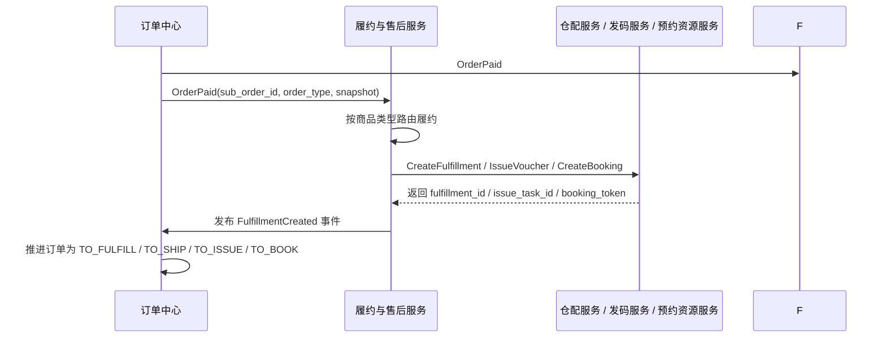

### 7.4 场景二：履约结果回调与订单编排时序图

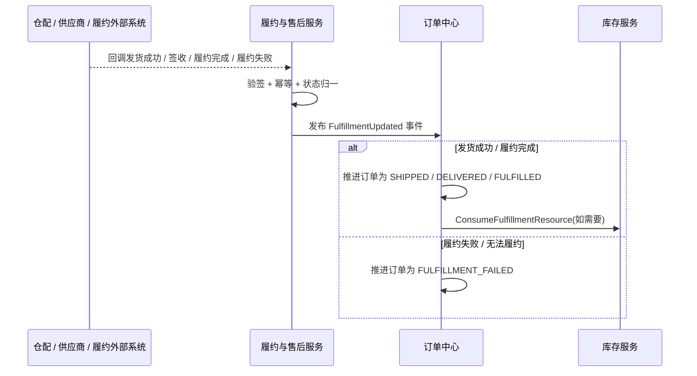

### 7.5 场景三：券码发码与核销时序图

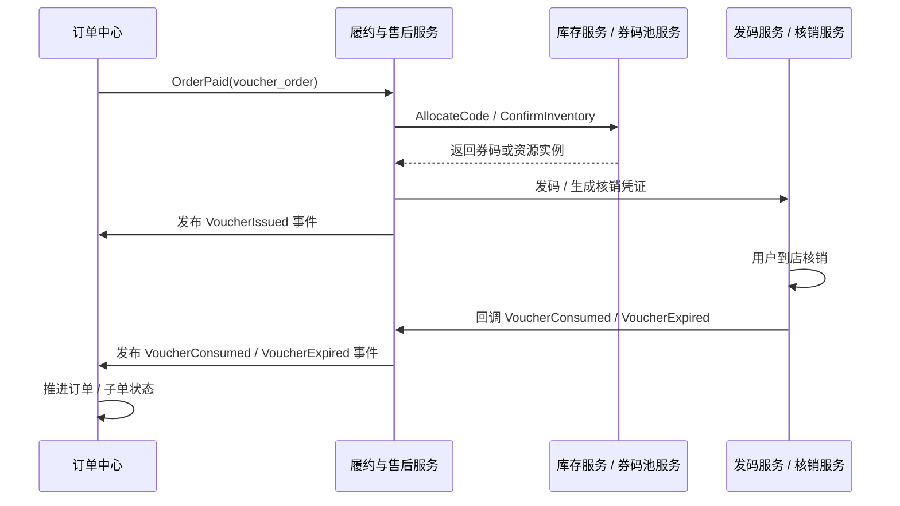

### 7.6 场景四：售后退款与库存 / 权益回补时序图

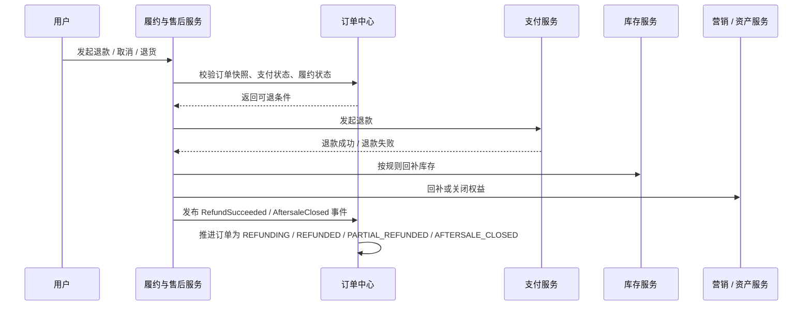

### 7.7 特殊场景：预约 / 酒旅 / 到店履约

这几类场景看起来不像传统“发货”，但它们并不是独立订单系统，而只是履约与售后服务下的不同履约分支。

它们的共同点是：

- 都不再依赖最新商品真相
- 都依赖订单快照和支付后的履约事实推进
- 都需要把外部世界的状态翻译成订单中心可理解的标准化事件

其中最典型的事实包括：

- 预约 / 酒旅：
  - `BookingConfirmed`
  - `CheckedIn`
  - `CheckedOut`
  - `BookingCanceled`
- 到店 / 券码：
  - `VoucherIssued`
  - `VoucherConsumed`
  - `VoucherExpired`

也就是说，履约与售后服务本质上承担了一个“协议翻译层”的角色：

- 下游系统说的是“已发码”“已预约”“已入住”“已核销”
- 订单中心认的是“这笔订单现在是否已履约、是否可退款、是否已完结”

### 7.8 履约与售后服务的统一架构原则

第 6 节之所以也需要一个明确的编排角色，原因和第 5 节是对称的：

- 第 5 节有结算服务 / 支付编排服务，解决“怎么生成一笔订单”
- 第 6 节有履约与售后服务，解决“订单支付之后如何被执行、核销、退款、回补”

如果没有这一层，订单中心就必须直接对接：

- 仓配
- 发码
- 核销
- 预约资源
- 退款
- 库存回补
- 权益回补

这样它会再次膨胀成“大管家”，把整个后交易阶段的复杂性都吸进去。

因此本章的统一结论是：

- 订单中心拥有订单主事实和用户可见订单状态
- 履约与售后服务拥有支付后的流程编排职责
- 下游仓配、发码、核销、退款、回补服务只提供事实，不直接拥有订单主状态

最后用一句话收口：

> 结算服务解决“如何生成订单”，履约与售后服务解决“订单支付之后如何被执行、被核销、被退款、被回补”。

---

## 8. 端到端案例与特殊订单类型

### 8.1 实物电商主链路

用户搜索手机 → 看详情页 → 加购物车 → 进入结算页试算和预占 → 创建订单 → 支付成功 → 仓配发货 → 签收完成 → 可发起退货退款。

这一链路的核心风险在于：

- 列表页展示价与下单价不一致。
- 支付失败后库存未释放。
- 发货后退款和库存回补规则错乱。

### 8.2 券码 / 到店商品主链路

用户搜索餐饮券或景区票 → 详情页看使用规则 → 结算页试算与预占 → 支付成功 → 发码 → 到店核销 → 核销完成 → 按规则退款或不可退。

这一链路的核心风险在于：

- 发空码。
- 券码核销与订单状态不一致。
- 退款后券码或权益没有正确回收。

### 8.3 酒旅 / 预约型商品主链路

用户查看房型、日期、价格日历 → 结算页锁房 / 预占 → 创建订单 → 支付成功 → 预约 / 确认单生成 → 入住 / 出行 / 使用完成 → 按取消规则退款。

这一链路的核心风险在于：

- 详情页看见的日期价与下单时的真实价格不一致。
- 预约资源已变动但订单仍按旧状态继续推进。
- 售后取消没有依据订单时的规则解释。

---

## 9. 可靠性、治理与演进

### 9.1 端到端失败矩阵

可靠性设计不能只按服务名列故障，而要按一笔交易已经走到哪一步来定义处理。下面的矩阵把“用户看到什么、系统保存什么、后台做什么”放在一起：

| 故障点 | 已发生事实 | 用户侧语义 | 后台动作 | 最终判定 |
| --- | --- | --- | --- | --- |
| 搜索索引落后 | 商品中心已更新 | 允许展示旧候选，但详情和结算需刷新 | 异步重建索引 | 读投影收敛 |
| 购物车写入超时 | 未知是否写入 | 允许查询后重试 | 按请求键反查版本 | 意愿不重复 |
| 价格成功、库存失败 | 价格上下文已生成 | 提示暂不可购买 | 释放或过期价格上下文 | 结算拒绝 |
| 库存成功、创单超时 | 可能已预占 | 不立即重复提交 | 按结算凭证反查订单并补偿 | 订单或预占收敛 |
| 创单成功、支付未返回 | 订单事实已落库 | 显示待支付 / 处理中 | 查询支付，超时关闭 | 订单有明确终态 |
| 渠道已扣款、订单未支付 | 外部资金事实存在 | 显示处理中，不允许重复支付 | 查询渠道、补发支付事件 | 支付与订单对账一致 |
| 支付成功、履约创建失败 | 资金事实已成立 | 显示支付成功、履约处理中 | 重试履约并告警 | 不回滚支付事实 |
| 发货回调重复 | 履约事实已处理 | 状态不变 | 事件幂等、记录重复通知 | 不重复发货 |
| 退款处理中 | 申请已受理 | 显示退款中 | 查询渠道、限制重复申请 | 退款最终收敛 |

这里有一个重要边界：补偿不是把时间倒流，而是产生新的业务事实。例如支付成功后不能简单把订单删除来“回滚”，而应保留支付记录，依据库存、履约和退款策略生成取消、退款或人工介入事实。Saga 的核心价值就在于把长事务拆成可补偿步骤，但补偿动作本身也必须幂等并可观测。[1][2]

### 9.2 幂等、防重与乱序处理

幂等要按层设计，而不是只加一个 Redis 锁：

| 层次 | 机制 | 解决的问题 | 不能解决的问题 |
| --- | --- | --- | --- |
| 客户端 | 防抖、按钮状态、提交令牌 | 减少重复点击 | 无法防网络重试和恶意请求 |
| 网关 | 用户 / IP / 设备限流 | 削减重复流量 | 无法保证业务只执行一次 |
| 服务接口 | 幂等键、参数摘要、结果缓存 | 同一请求重复调用 | 无法处理跨接口的业务冲突 |
| 数据库 | 唯一键、版本条件更新 | 最终事实防重 | 不能替代补偿和消息投递 |
| 消费端 | `event_id`、聚合版本、处理表 | 重复和乱序消息 | 不能自动修复错误业务规则 |
| 对账任务 | 状态查询、差异清单 | 长时间未知状态 | 不能替代实时用户体验 |

对于事件消费者，推荐使用“事件 ID 去重 + 聚合版本检查 + 业务前置条件”三道判断：先判断是否处理过，再判断版本是否更新，最后判断当前订单状态是否允许这次迁移。版本落后但事件未处理时不能简单丢弃，应按事件类型进入重放或反查队列；因为有些事件虽然晚到，仍可能代表一个尚未被当前读模型吸收的事实。

### 9.3 重试、退避、死信与人工接管

重试策略应由错误类型驱动：

- 参数错误、签名错误、权限错误：不重试，记录并告警。
- 资源暂时不足、连接超时、服务过载：有限次数重试，使用指数退避和抖动。
- 外部渠道处理中：按渠道建议间隔查询，不盲目重复发起支付或退款。
- 状态未知且超过自动窗口：进入对账队列或人工接管。
- 业务规则冲突：冻结当前聚合，保留证据，等待修复或人工决定。

重试预算应该在整条调用链上计算。例如前端最多重试 2 次，网关重试 1 次，服务内部重试 3 次，下游消息再重试 5 次，并不代表系统最多执行 11 次；嵌套重试可能形成乘法放大。AWS 的可靠性指导把限制重试、设置退避和避免跨层重复重试作为过载防护的一部分。[10] 本章建议把 `attempt`、`retry_budget`、`next_retry_at` 和 `last_error_class` 写入任务记录。

死信不是垃圾桶。死信消息必须带有原始事件、失败次数、最后错误、首次失败时间、所属聚合和可执行动作。运维人员重放前要确认当前状态、版本和补偿风险，重放后要能看到结果。对于支付、退款和库存这类敏感动作，人工操作也必须经过权限审批并留下审计记录。

#### 9.3.1 支付与退款的安全治理

支付系统的安全边界不能只靠“回调验签”四个字概括。至少要把身份、完整性、重放、权限和审计分开治理：

| 风险 | 需要证明的事实 | 控制措施 | 发现问题后的动作 |
| --- | --- | --- | --- |
| 伪造回调 | 通知确实来自渠道且未被篡改 | 渠道证书、公钥轮换、验签、时间窗口 | 拒绝处理并记录安全事件 |
| 金额篡改 | 渠道金额等于本地支付快照 | 订单号、商户号、币种、金额交叉校验 | 冻结支付尝试和相关结算 |
| 重放通知 | 同一渠道流水未重复产生副作用 | 通知指纹、流水号唯一键、版本条件更新 | 返回幂等成功但不重复发事件 |
| 越权退款 | 操作人和订单状态具备退款权限 | 角色分权、审批、订单项范围校验 | 拒绝并保留审计记录 |
| 敏感数据泄露 | 日志和快照不包含不必要的支付数据 | 令牌化、脱敏、密钥托管、最小权限 | 吊销凭证并启动安全响应 |
| 重试双扣 | 外部未知时没有重复创建扣款 | 幂等键、先查单后切换、重试预算 | 转处理中或人工核验 |

密钥轮换不能只替换配置文件。渠道适配器需要同时支持旧公钥和新公钥的过渡窗口，并记录每次验签使用的 key version；否则轮换期间的失败会被误判成渠道故障。支付通知的原文也不应永久暴露在日志系统，应该保留受访问控制保护的原始证据引用、摘要和脱敏字段。

退款和调账尤其需要职责分离：提出退款申请的人不应同时批准高风险退款，执行渠道退款的人不应拥有修改原始支付金额的权限。人工纠错不能直接改支付主表的金额或状态，而应生成带原因、审批人、前后差异和关联工单的纠错事件，再由状态机按规则应用。这样既能保留审计证据，也能避免“为了让页面显示正确”破坏对账依据。

#### 9.3.2 多渠道容量隔离与降级

渠道接入的容量曲线通常不同：某个渠道可能限制每秒请求数，另一个渠道可能在高峰时尾延迟显著上升，银行转账还可能依赖批量文件而不是实时接口。因此支付网关不能使用一个共享线程池和一个全局超时。应按渠道、商户号和操作类型隔离连接池、并发配额、超时和重试预算；支付创建、查单、退款和账单下载也要分开，避免账单任务占满实时支付资源。

降级必须保护资金事实而不是只保护接口成功率：

- 渠道预下单不可用时，可以隐藏该支付方式或切换到经过确认的备用渠道，但不能对未知扣款直接重发。
- 渠道回调处理积压时，可以让收银台显示处理中，不能把超时订单直接标成失败并释放资源。
- 对账文件晚到时，可以延后结算批次，但不能静默跳过差异。
- 退款渠道异常时，应保持退款中并展示预计处理状态，不能为了降低失败率重复扣减可退余额。

因此支付服务的核心 SLO 不应只有接口可用率，还应包含成功事实不重复率、未知状态闭合时延、退款累计金额不变量、回调积压时间和对账差异关闭时延。Google SRE 关于过载处理的观点可以支撑“先保护关键事实，再降低非关键体验”的排序；本章进一步将其推导到支付场景，即宁可让用户暂时看见处理中，也不能为了即时返回而制造重复资金动作。[6]

#### 9.3.3 搜索读链路的故障矩阵

搜索故障的用户影响通常先表现为“找不到、排得不对或页面变慢”，但处理方式不能只看搜索接口是否返回 200。应把索引投影、查询引擎和 Hydrate 下游分开判定：

| 故障点 | 用户语义 | 自动动作 | 不能做什么 |
| --- | --- | --- | --- |
| 索引事件积压 | 允许部分结果滞后 | 扩容消费者、按聚合版本追平、告警 | 不能把旧索引当商品正式状态 |
| 旧事件乱序到达 | 单个商品可能短暂旧 | 版本条件更新或丢弃旧写入 | 不能让旧文档覆盖新文档 |
| 重建索引失败 | 继续使用旧读别名 | 重试构建、保留旧索引、人工切换 | 不能半成品切读流量 |
| ES 慢查询或不可用 | 返回缓存、缩小召回或明确稍后重试 | 熔断高成本查询、限流、回滚排序 | 不能用无约束深分页拖垮集群 |
| Hydrate 部分超时 | 卡片显示参考价或库存确认中 | 按字段局部降级、记录依赖超时 | 不能把旧价格当实时成交价 |
| 热点 query / suggest 洪峰 | 结果可能延迟或被限流 | 独立配额、本地缓存、热点隔离 | 不能挤占结算和支付资源 |
| 零结果率异常升高 | 引导纠错或类目浏览 | 检查索引版本、词典、过滤互斥和事件链路 | 不能放宽合规和上下架过滤 |
| 实验排序异常 | 回退稳定排序版本 | 按 `exp_id` 停止实验、清理版本缓存 | 不能只看 CTR 忽略投诉和成交口径 |

索引对账应至少抽样比较主数据版本、文档可搜索状态、关键类目和删除事件；查询治理则要保留归一化 query、scene、rank 版本和超时分支。这样搜索的恢复动作才有证据，而不是“重启服务看看”。搜索可以在故障时降低体验，但不能越过商品合规、交易价格和库存事实边界；这与支付故障时保留资金事实的原则一致，都是先保护权威事实，再保护非关键体验。

### 9.4 可观测性：从技术指标到业务不变量

常规的 CPU、内存和接口 RT 不足以判断交易系统是否健康。至少需要四类指标：

1. **用户结果**：搜索成功率、结算成功率、创单成功率、支付成功率、履约及时率、退款完成时延。
2. **状态流转**：各状态停留时间、状态迁移失败数、重复事件数、乱序事件数、待处理聚合数。
3. **资源与消息**：库存预占量、预占超时量、Outbox 积压、消费者延迟、死信数、对账差异数。
4. **安全与合规**：签名失败、越权访问、异常支付频率、敏感字段访问、人工纠错操作。

告警要围绕“用户结果和不变量”设定，而不是为每个指标设置阈值。例如“支付成功但 10 分钟后仍无履约任务”的比例，比单独监控履约服务 CPU 更能发现真实故障；“退款累计金额大于支付金额”的不变量违反，应立即告警，即使服务总体错误率很低。Google SRE 的监控和告警原则要求告警能够驱动明确行动，并尽量减少无法行动的噪声。[7][8]

链路追踪要贯穿用户请求、结算凭证、订单、支付单、事件和下游任务。日志字段至少统一：`trace_id`、`request_id`、`user_id_hash`、`order_id`、`sub_order_id`、`payment_id`、`event_id`、`attempt`、`state_version` 和 `error_code`。个人信息与支付敏感字段要脱敏，日志不能为了方便排查而复制完整地址、身份证号、卡号或验证码。

支付治理还需要把指标组织成可验证的不变量，而不是只看各系统自己的成功率。可以每天或每小时计算以下关系：支付意图的成功金额不应大于订单应付金额；一笔支付的成功金额减去成功退款金额不应小于零；同一渠道流水号只能对应一个本地渠道交易；已发布的支付成功事件数量应能与支付状态历史中的成功迁移数量解释；已结算金额不应超过已确认支付金额扣除冻结和退款后的可结算金额。指标出现偏差时，先生成差异快照和影响范围，再决定是否暂停履约或结算，不能直接用批量更新把数字抹平。

这类不变量最好由独立的治理任务计算，而不是由支付主链路临时查询多个系统。治理任务读取不可变支付流水、退款流水、结算明细和事件投递记录，生成带时间窗口与版本的检查结果；检查结果本身也要可审计。这样既能避免高峰期把在线支付链路拖慢，也能让运营在故障复盘时回答“问题从哪个时间窗口开始、影响了多少金额、哪些订单已经自动收敛”。

搜索读链路也需要一组独立于交易写链路的观测面板：索引事件延迟和版本差异、Query 归一化失败率、各路召回贡献、零结果率、Rank P99、`search_after` 游标失效率、Hydrate 端到端成功率、各依赖超时比例、热点缓存命中率、实验分桶差异以及用户从搜索到详情的价格投诉率。指标必须按 `scene`、站点、类目、索引版本和实验版本切分，否则总体平均值会掩盖某个热门类目或某个排序版本的故障。

搜索问题的告警也应关联可行动的恢复入口：索引延迟升高触发消费者扩容或重放，版本差异触发对账队列，ES 慢查询触发高成本 DSL 限制，Hydrate 依赖超时触发字段级降级，零结果异常触发词典和过滤规则检查。把指标、用户语义和恢复动作绑定起来，才能避免“搜索接口成功率 99.9%”却已经让大批用户找不到可售商品的假健康状态。

### 9.5 灰度、回滚与数据修复

交易链路的灰度不能只按服务实例比例切流，还要考虑订单状态和数据版本。推荐按用户、设备、销售主体或订单号做稳定路由，并为每次变更记录：协议版本、状态机版本、快照 schema、事件 schema、回滚条件和观测窗口。

涉及状态机或金额计算的变更，应采用兼容优先的双读 / 双写策略：先让新版本能够读取旧快照和旧事件，再逐步写出新字段；确认新旧结果一致后，才切换主读路径。事件 schema 需要版本化，消费者要能在一段迁移窗口内处理至少两个版本。回滚应用版本不等于回滚已经产生的订单事实，数据修复应通过受控的纠错事件完成。

数据修复至少要遵循：先冻结自动动作、导出证据、计算影响范围、生成可审计的修复计划、小批量执行、复核结果、解除冻结。不能直接批量改订单状态来“修好看板”，否则会破坏支付、履约、售后和对账证据链。

### 9.6 容量估算与隔离

容量设计要按交易阶段拆分，而不是拿站点总访问量平均分配。设每日访问用户为 (U)，商品详情转化率为 (c_d)，加购率为 (c_a)，结算率为 (c_c)，支付率为 (c_p)，则可以用下列假设估算日级业务量：

```text
detail_views  = U × c_d
cart_actions  = detail_views × c_a
checkouts     = cart_actions × c_c
orders        = checkouts × c_p
```

峰值不能简单等于日均除以 86400，应另外给出峰值系数、活动集中系数和热点 SKU 系数。搜索和详情读流量通常数量级更大，应与结算、创单和支付写流量隔离；热点库存、支付回调、Outbox 消费和对账任务也应分别设置连接池、线程池和限流器。

容量估算最重要的不是得到一个“准确数字”，而是说明假设改变时哪个边界先失效。若支付成功率不变但结算转化率突然提升，库存预占和订单库写入可能先成为瓶颈；若支付渠道变慢，待处理支付和订单保留量会先膨胀。每个容量结论都要配套一个降级动作和一个扩容触发指标。

### 9.7 演进路线：从单体交易模块到领域协作

不建议一开始就把所有能力拆成大量微服务。可以按事实主权和变化速度分阶段演进：

1. 第一阶段：单体内按商品、购物车、结算、订单、支付、履约模块分层，先建立快照、状态机和幂等契约。
2. 第二阶段：将搜索读模型、购物车存储、支付渠道适配和履约回调接入独立出来，降低读写和外部不稳定性的影响。
3. 第三阶段：按销售主体和履约边界拆分订单子域，引入 Outbox、事件版本和对账平台。
4. 第四阶段：对高峰流量、跨境履约和复杂预约引入工作流编排，但保留订单事实和支付事实的主权边界。

拆分标准不是“服务越多越先进”，而是某个边界是否拥有独立的数据主权、容量曲线、发布节奏和故障隔离收益。Enterprise Integration Patterns 对消息通道、路由、转换、幂等接收者和事务消息等模式的总结，可作为跨域协作设计的共同语言。[3] 本章结合电商场景的推导是：只有当一个边界能够定义自己的事实、事件、补偿和运维责任时，才值得成为独立服务。

## 10. 方法论总结、ADR、评审清单与参考资料

如果面试官问“C 端交易链路最难的地方是什么”，比较好的回答不是背一串系统名词，而是先给出总心智：

> C 端系统的难点，不是把搜索、购物车、订单、支付这些服务拆出来，而是让用户在整条交易旅程里既感受到响应足够快，又始终不会用旧价格、旧库存、旧规则成功交易，更不会在支付后、履约后和售后阶段失去解释依据。

这章建议记住 6 句话：

1. 搜索结果页是弱一致投影，详情页是交易前解释，创单时再做强校验。
2. 购物车保存的是意愿，不是资源占用。
3. 结算页是一次短生命周期的 Saga，负责把价格、库存、营销和地址收敛成可提交交易。
4. 订单是交易事实，不是“重新查商品”的入口。
5. 支付系统提供资金事实，订单系统自己推进状态。
6. 订单之后，任何履约和售后都优先基于快照和履约事实解释。

当你能把这 6 句话和上面的时序图、快照、预占、幂等、回补策略串起来时，这一章就不只是一个“电商流程介绍”，而是一套真正可落地、可答辩、可治理的 C 端全生命周期设计。

### ADR-搜索：采用“异步版本化索引 + 受控实时 Hydrate”

- **背景与问题**：搜索和导购需要承受远高于交易写路径的读流量，索引字段又存在异步延迟；价格、库存、营销和履约摘要随用户和时间变化，不能全部固化在 ES，也不能每次列表请求都串行访问所有权威系统。
- **决策驱动因素**：召回吞吐、尾延迟、结果可解释性、数据新鲜度、索引可重建、下游隔离和交易前事实安全。
- **候选方案**：所有字段实时查询；所有字段写入 ES；异步索引承载检索骨架并对动态字段做批量 Hydrate。
- **最终决策**：商品、上架和生命周期事件通过版本化管道构建可重建索引；统一 scene 查询服务执行 Query → Recall → Rank；当前页通过有预算的批量 Hydrate 补齐动态字段；详情、结算和创单再次访问权威域并进行强校验。
- **获得的能力**：高吞吐召回、可控的实时字段、索引别名切换与回滚、按依赖局部降级、排序实验可复现、索引和主数据可对账。
- **主动牺牲的能力**：搜索结果可能短暂滞后，列表价可能只是参考价；需要维护索引重建、版本追平、缓存失效和 Hydrate 降级机制；不能支持任意深页的强快照语义。
- **已接受的风险**：索引事件乱序、ES 慢查询、热点 query 和实时依赖超时会造成局部体验下降；通过版本条件更新、别名切换、`search_after` 限制、舱壁隔离和用户话术控制风险。
- **验证指标**：索引版本延迟、零结果率、Recall 候选量、Rank P99、Hydrate 成功率、动态字段缺失率、搜索到详情价格差异率、实验回滚时间和主数据对账差异数。
- **重新评估条件**：搜索结果需要法律或业务上不可接受的实时性，或动态字段规模使 Hydrate 成本持续超过索引冗余收益时，再评估按场景拆分读模型；不能直接把 ES 升级为交易事实库。

### ADR-00：支付采用“支付意图—支付尝试—渠道交易”三级模型

- **背景与问题**：一个订单可能更换支付方式、重复打开收银台、收到重复或乱序通知，渠道同步返回也可能只是受理结果。若订单只保存一个渠道流水号，未知状态和部分退款会被迫覆盖原事实。
- **决策驱动因素**：资金安全、渠道可替换、幂等重试、对账可追溯、部分退款和多币种扩展能力。
- **候选方案**：订单直接绑定渠道交易；支付中心只维护一张支付表；支付意图、支付尝试和渠道交易分层建模。
- **最终决策**：支付意图绑定订单应付快照，支付尝试记录一次方式和路由决策，渠道交易保存外部流水与原始证据；退款单和结算明细继续作为独立事实对象。
- **获得的能力**：可以在不覆盖历史事实的前提下切换支付方式、处理未知状态和多次部分退款，并且能够按渠道流水号完成回调、查单和对账闭合。
- **主动牺牲的能力**：数据模型和查询编排更复杂，前端需要理解处理中状态，财务与客服需要使用多个关联号排查问题。
- **已接受的风险**：对象之间可能出现暂时未收敛的关联；通过唯一键、版本条件更新、Outbox、主动查单和对账批次控制风险。
- **验证指标**：重复扣款率、支付尝试未知状态闭合时间、支付与渠道流水匹配率、部分退款超限数、渠道路由切换后的成功率和对账差异关闭时间。
- **重新评估条件**：出现新的资金来源、跨境币种或监管要求，导致当前三级模型无法表达资金归属时，新增明确的事实对象，不把新字段继续堆到支付主表。

### ADR-01：采用“结算凭证 + 订单本地事务 + 异步补偿”

- **背景与问题**：结算需要同时接入商品、价格、库存、营销和履约规则；如果把所有调用放入全局强一致事务，会导致锁持有时间长、尾延迟放大，并且无法可靠覆盖外部支付渠道。
- **决策驱动因素**：吞吐、尾延迟、资源隔离、补偿能力、团队可运维性和外部系统可控程度。
- **候选方案**：XA / 2PC、经典 Saga、TCC、预占资源加改良 Saga。
- **最终决策**：结算阶段产生带 TTL 的价格、库存和权益凭证；订单中心用短本地事务保存订单事实和快照；通过 Outbox 发布事件，由下游幂等执行 Confirm / Cancel，使用对账任务处理长期未知状态。
- **获得的能力**：较短的数据库事务、较高吞吐、明确的资源释放入口、对外部支付友好、能够按域独立扩容。
- **主动牺牲的能力**：不保证跨所有域的瞬时强一致；用户可能短暂看到“处理中”；补偿和对账系统必须长期运行。
- **已接受的风险**：重复消息、乱序事件和补偿延迟会增加状态机复杂度；通过版本、幂等、审计和人工接管控制风险。
- **验证指标**：结算成功率、凭证失效率、预占超时量、补偿成功率、Outbox 延迟、支付成功后履约创建时延和对账差异率。
- **重新评估条件**：出现高比例资金级强一致需求、跨域补偿成本持续高于收益，或业务需要法律上不可拆分的原子转移时，再评估 TCC 或专用工作流。Seata 官方资料对 AT、TCC、SAGA 等模式的边界有明确说明；它们可以作为实现选项，但不能替代业务状态机设计。[29][30][31]

### ADR-02：订单保存不可变快照，搜索与详情使用分层读模型

- **背景与问题**：搜索需要吞吐和排序，详情需要解释当前商品，订单和售后需要解释历史成交事实。
- **最终决策**：搜索索引只保存可容忍滞后的召回与排序字段；详情和结算通过批量 Hydrate 获取当前正式契约；订单保存商品、价格和履约快照；快照版本不可被商品更新覆盖。
- **获得的能力**：读写隔离、搜索可扩展、历史订单可解释、交易前可以重新校验关键字段。
- **主动牺牲的能力**：搜索列表可能短暂落后；详情聚合多一次或多次调用；快照和索引需要额外存储及重建机制。
- **验证指标**：索引延迟、Hydrate 成功率、列表与结算价格差异率、快照完整率、订单争议可解释率。Elasticsearch 的乐观并发控制用于防止版本覆盖，分片请求缓存用于降低重复查询压力；这些能力只解决读模型和版本问题，不会替代库存或订单事实。[18][19]

### ADR-03：状态机由订单域拥有，支付与履约通过标准事实事件驱动

- **背景与问题**：支付、仓配、发码、预约和退款都有自己的状态，但用户需要一个统一、可解释的订单状态。
- **最终决策**：订单中心拥有用户可见主状态和状态迁移规则；支付中心拥有支付事实；履约与售后服务拥有流程编排；外部系统通过验签、幂等和事件归一后输入标准事实。
- **获得的能力**：状态主权清晰、渠道可替换、事件可重放、售后基于事实解释。
- **主动牺牲的能力**：订单详情可能短暂显示处理中；跨域排障需要 trace、事件和对账工具；各域要维护自己的幂等与补偿。
- **重新评估条件**：如果某个履约领域形成独立产品、拥有独立状态和独立 SLO，可以把它拆为更明确的子域，但不能通过让外部系统直接写订单主状态来“简化”当前链路。

### 评审清单

评审一条新的 C 端交易链路时，可以逐项追问：

1. 每个关键事实的权威系统是谁？其他系统保存的是投影、快照还是引用？
2. 展示数据、交易前提和交易事实分别允许多大延迟？
3. 结算凭证绑定了哪些身份、版本、金额、资源和过期信息？
4. 同一请求、同一事件、同一订单状态被重复处理时会发生什么？
5. 超时后如何反查，消息失败后如何重试，长期未知后谁来对账？
6. 订单快照是否足以解释客服、售后、退款和争议？是否误存敏感支付数据？
7. 支付成功后库存确认、权益确认和履约创建的幂等键分别是什么？
8. 是否有部分支付、部分退款、拆单、预售、0 元订单和预约商品的状态模型？
9. 是否能从 `trace_id`、订单号、支付单号和事件 ID 还原一条完整证据链？
10. 每个降级、回滚和人工接管动作是否有明确的触发条件、权限和审计记录？
11. 搜索请求是否有统一 `scene`、查询版本、排序版本和可回放的 `query_id`？
12. 索引文档的来源版本、事件幂等、别名切换和全量重建是否可验证、可回滚？
13. 深分页、热点 query、suggest、缓存 key 和实验分桶是否有边界与独立配额？
14. 搜索降级时是否明确区分参考价、库存摘要和可成交事实，并在详情与结算阶段重新校验？

### 参考资料

[1] Hector Garcia-Molina, Kenneth Salem, “Sagas”, ACM SIGMOD Record, 1987, https://doi.org/10.1145/38713.38742

[2] Pat Helland, “Life Beyond Distributed Transactions: An Apostate’s Opinion”, CIDR, 2007, https://www.cidrdb.org/cidr2007/papers/cidr07p15.pdf

[3] Gregor Hohpe, Bobby Woolf, “Enterprise Integration Patterns”, official pattern catalog, https://www.enterpriseintegrationpatterns.com/

[4] Martin Kleppmann, “Designing Data-Intensive Applications”, author resources, 2017, https://martin.kleppmann.com/2017/03/27/designing-data-intensive-applications.html

[5] Betsy Beyer et al., “Site Reliability Engineering”, Google, 2016, https://sre.google/sre-book/table-of-contents/

[6] Google SRE, “Handling Overload”, Google SRE Book, https://sre.google/sre-book/handling-overload/

[7] Google SRE, “Monitoring Distributed Systems”, Google SRE Book, https://sre.google/sre-book/monitoring-distributed-systems/

[8] Google SRE, “Practical Alerting from Time-Series Data”, Google SRE Book, https://sre.google/sre-book/practical-alerting/

[9] Amazon Web Services, “Making Retries Safe with Idempotent APIs”, Builders’ Library, https://aws.amazon.com/builders-library/making-retries-safe-with-idempotent-APIs/

[10] Amazon Web Services, “Limit Retries”, Well-Architected Framework, https://docs.aws.amazon.com/wellarchitected/latest/framework/rel_mitigate_interaction_failure_limit_retries.html

[11] Jeffrey Dean, Luiz André Barroso, “The Tail at Scale”, Communications of the ACM, 2013, https://research.google/pubs/the-tail-at-scale/

[12] Giuseppe DeCandia et al., “Dynamo: Amazon’s Highly Available Key-value Store”, SOSP, 2007, https://www.amazon.science/publications/dynamo-amazons-highly-available-key-value-store

[13] Apache Kafka, “Design: Message Delivery Semantics”, official documentation, https://kafka.apache.org/08/design/design/

[14] Apache Kafka, “Upgrade Notes: Idempotent and Transactional Producers”, official documentation, https://kafka.apache.org/38/getting-started/upgrade/

[15] Redis, “Hashes”, official documentation, https://redis.io/docs/latest/develop/data-types/hashes/

[16] Redis, “Transactions”, official documentation, https://redis.io/docs/latest/develop/using-commands/transactions/

[17] Redis, “EXPIRE command”, official documentation, https://redis.io/docs/latest/commands/expire/

[18] Elastic, “Optimistic Concurrency Control”, Elasticsearch Reference, https://www.elastic.co/docs/reference/elasticsearch/rest-apis/optimistic-concurrency-control

[19] Elastic, “Shard Request Cache”, Elasticsearch Reference, https://www.elastic.co/docs/reference/elasticsearch/rest-apis/shard-request-cache

[20] Oracle, “InnoDB Transaction Model”, MySQL Reference Manual, https://dev.mysql.com/doc/refman/26.7/en/innodb-transaction-model.html

[21] World Wide Web Consortium, “Trace Context”, W3C Recommendation, https://www.w3.org/TR/trace-context/

[22] OpenTelemetry, “General Semantic Conventions”, official specification, https://opentelemetry.io/docs/specs/semconv/general/

[23] IETF, “HTTP Semantics”, RFC 9110, 2022, https://datatracker.ietf.org/doc/rfc9110/

[24] IETF, “Problem Details for HTTP APIs”, RFC 9457, 2023, https://datatracker.ietf.org/doc/html/rfc9457

[25] Cloud Native Computing Foundation, “CloudEvents”, official specification, https://cloudevents.io/

[26] Chris Richardson, “Pattern: Transactional outbox”, microservices.io, https://microservices.io/patterns/data/transactional-outbox

[27] Chris Richardson, “Pattern: Polling publisher”, microservices.io, https://microservices.io/patterns/data/polling-publisher.html

[28] PCI Security Standards Council, “Document Library”, official standards library, https://www.pcisecuritystandards.org/document_library/

[29] Apache Seata, “What is Seata?”, 中文官方文档, https://seata.apache.org/zh-cn/docs/overview/what-is-seata/

[30] Apache Seata, “Saga 模式”, 中文官方文档, https://seata.apache.org/zh-cn/docs/user/mode/saga/

[31] Alibaba Cloud, “分布式事务参与者模式”, 中文官方文档, https://help.aliyun.com/zh/document_detail/132909.html

[32] Stripe, “Idempotent requests”, official API documentation, https://docs.stripe.com/api/idempotent_requests

[33] Adyen, “Handle webhook events”, official documentation, https://docs.adyen.com/development-resources/webhooks/handle-webhook-events
