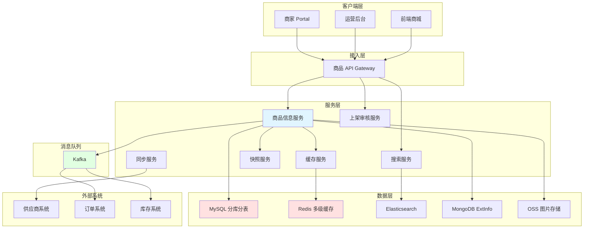
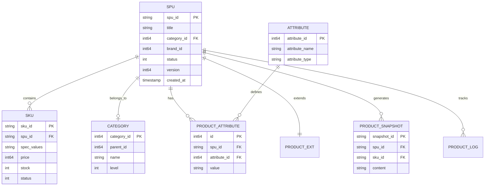
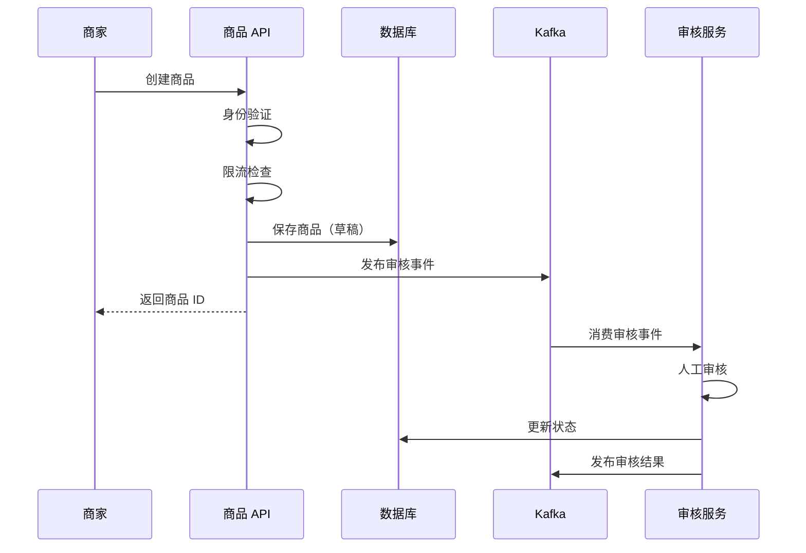

# 商品中心系统文章 Implementation Plan

> **For agentic workers:** REQUIRED SUB-SKILL: Use superpowers:subagent-driven-development (recommended) or superpowers:executing-plans to implement this plan task-by-task. Steps use checkbox (`- [ ]`) syntax for tracking.

**Goal:** 编写一篇完整的"电商系统设计：商品中心系统"技术文章

**Architecture:** 参考订单系统文章的成功模式，采用"通用技术 + 特色亮点 + 黄金案例"的组织方式，深度讲解 SPU/SKU 模型、异构商品治理、多级缓存、搜索优化等核心技术，通过 4 个典型案例展示设计灵活性。

**Tech Stack:** Markdown, Mermaid (图表), Go (伪代码), Hexo (静态博客生成)

**File Structure:**
- Create: `source/_posts/system-design/27-ecommerce-product-center.md` (主文章文件)
- Reference: `docs/superpowers/specs/2026-04-07-product-center-design.md` (设计文档)
- Reference: `source/_posts/system-design/26-ecommerce-order-system.md` (参考订单系统风格)

---

## Task 1: 创建文章骨架（Front Matter + 目录）

**Files:**
- Create: `source/_posts/system-design/27-ecommerce-product-center.md`

- [ ] **Step 1: 创建文章文件并添加 Front Matter**

创建文件，添加完整的 YAML front matter：

```markdown
---
title: 电商系统设计：商品中心系统
date: 2026-04-07
categories:
  - system-design
  - e-commerce
tags:
  - product-system
  - spu-sku
  - multi-category
  - cache
  - search
  - heterogeneous-product
  - e-commerce
---
```

- [ ] **Step 2: 添加文章标题和引言**

```markdown
# 电商系统设计：商品中心系统

商品中心是电商平台的"商品库"，负责商品全生命周期管理。本文将深入探讨商品系统的设计与实现，重点讲解 SPU/SKU 模型、异构商品治理、多级缓存三大核心技术，并通过标准商品、虚拟商品、服务商品、组合商品四个黄金案例，展示如何设计可扩展的商品系统。

本文既适合系统设计面试准备，也适合工程实践参考。
```

- [ ] **Step 3: 添加完整目录**

参考设计文档，添加 9 章完整目录结构：

```markdown
## 目录

- [1. 系统概览](#1-系统概览)
  - [1.1 业务场景](#11-业务场景)
  - [1.2 核心挑战](#12-核心挑战)
  - [1.3 系统架构](#13-系统架构)
  - [1.4 数据模型概览](#14-数据模型概览)
- [2. 商品创建和上架流程](#2-商品创建和上架流程)
  - [2.1 商家上传（Merchant）](#21-商家上传merchant)
  - [2.2 供应商同步（Partner）](#22-供应商同步partner)
  - [2.3 运营上传（Ops）](#23-运营上传ops)
  - [2.4 上架状态机与审核策略](#24-上架状态机与审核策略)
- [3. 商品数据模型设计专题](#3-商品数据模型设计专题)
  - [3.1 SPU/SKU 模型设计](#31-spusku-模型设计)
  - [3.2 类目与属性系统](#32-类目与属性系统)
  - [3.3 动态属性与 EAV 模型](#33-动态属性与-eav-模型)
  - [3.4 商品快照生成与复用](#34-商品快照生成与复用)
- [4. 异构商品治理](#4-异构商品治理)
  - [4.1 异构商品的挑战](#41-异构商品的挑战)
  - [4.2 统一抽象与适配器模式](#42-统一抽象与适配器模式)
  - [4.3 配置化与低代码平台](#43-配置化与低代码平台)
  - [4.4 多维度库存管理](#44-多维度库存管理)
- [5. 商品搜索与多级缓存](#5-商品搜索与多级缓存)
  - [5.1 Elasticsearch 索引设计](#51-elasticsearch-索引设计)
  - [5.2 多级缓存策略](#52-多级缓存策略)
  - [5.3 智能刷新规则](#53-智能刷新规则)
- [6. 特殊商品类型（黄金案例）](#6-特殊商品类型黄金案例)
  - [6.1 标准实物商品](#61-标准实物商品)
  - [6.2 虚拟商品](#62-虚拟商品)
  - [6.3 服务类商品](#63-服务类商品)
  - [6.4 组合商品](#64-组合商品)
- [7. 商品版本管理与快照](#7-商品版本管理与快照)
  - [7.1 版本控制](#71-版本控制)
  - [7.2 快照机制](#72-快照机制)
  - [7.3 变更事件与最终一致性](#73-变更事件与最终一致性)
- [8. 商品类型扩展设计](#8-商品类型扩展设计)
  - [8.1 扩展点识别](#81-扩展点识别)
  - [8.2 策略模式应用](#82-策略模式应用)
  - [8.3 新品类接入指南](#83-新品类接入指南)
  - [8.4 扩展性设计原则](#84-扩展性设计原则)
- [9. 工程实践要点](#9-工程实践要点)
  - [9.1 商品 ID 生成](#91-商品-id-生成)
  - [9.2 商品同步任务治理](#92-商品同步任务治理)
  - [9.3 监控告警体系](#93-监控告警体系)
  - [9.4 性能优化](#94-性能优化)
  - [9.5 故障处理](#95-故障处理)
- [总结](#总结)
- [参考资料](#参考资料)
```

- [ ] **Step 4: 验证 Front Matter 格式**

运行 Hexo 构建验证：
```bash
npm run clean && npm run build
```

预期：构建成功，无 Front Matter 错误

- [ ] **Step 5: 提交骨架**

```bash
git add source/_posts/system-design/27-ecommerce-product-center.md
git commit -m "feat: add product center article skeleton with front matter and TOC"
```

---

## Task 2: 第1章 - 系统概览

**Files:**
- Modify: `source/_posts/system-design/27-ecommerce-product-center.md`

- [ ] **Step 1: 添加 1.1 业务场景**

添加业务场景描述（约 100 行）：

```markdown
## 1. 系统概览

### 1.1 业务场景

商品中心是电商平台的"商品库"，负责商品全生命周期管理：

**核心职责：**
- **商品信息管理（PIM）**：SPU/SKU、属性、类目、图片、描述
- **商品上架流程**：商家上传、供应商同步、运营管理
- **商品导购服务**：搜索、详情、列表、筛选
- **商品快照生成**：为订单提供不可变的商品信息
- **库存协同**：与库存系统实时交互
- **价格协同**：为计价中心提供基础价格

商品系统的职责边界：
- **负责**：商品数据管理、上架审核、搜索缓存、快照生成
- **不负责**：具体的库存扣减（由库存系统负责）、具体的价格计算（由计价中心负责）

与其他系统的交互：
- **订单系统**：获取商品详情、库存校验、创建订单快照
- **库存系统**：实时库存查询、库存扣减/回补
- **计价中心**：提供基础价格、类目信息
- **营销系统**：提供商品标签、圈品规则
- **搜索系统**：同步商品索引
```

- [ ] **Step 2: 添加 1.2 核心挑战**

添加核心挑战描述和对比表格：

```markdown
### 1.2 核心挑战

商品系统面临以下核心技术挑战：

**1. 异构商品**
- 实物商品：多规格 SKU 组合（服装、3C）
- 虚拟商品：无 SKU 或简单 SKU（充值卡、会员）
- 服务商品：时间维度库存（酒店、机票）
- 组合商品：多 SKU 组合（套餐）

**2. 多角色上架**
- 商家上传：Portal/App，人工审核，限流防刷
- 供应商同步：Push/Pull，自动审核，幂等设计
- 运营管理：后台上传，免审核，批量处理

**3. 高并发读**
- 商品详情页：QPS 万级
- 商品列表页：QPS 千级
- 需要支持多级缓存、CDN、读写分离

**4. 数据一致性**
- 商品变更后：缓存失效、搜索索引更新、订单快照生成
- 最终一致性：Kafka CDC、事件驱动
- 补偿机制：定时任务扫描、数据对账

**5. 扩展性**
- 新品类快速接入：适配器模式、配置化平台
- 不影响现有系统：开闭原则、策略模式
```

- [ ] **Step 3: 添加 1.3 系统架构（含 Mermaid 图）**

添加架构描述和架构图：

```markdown
### 1.3 系统架构



**核心模块：**
1. **商品信息服务**：SPU/SKU CRUD、版本管理、属性管理
2. **类目属性服务**：类目树、动态属性、品牌管理
3. **上架审核服务**：多角色上架、状态机、审核流
4. **搜索服务**：Elasticsearch 索引、多维筛选、排序
5. **缓存服务**：多级缓存（L1/L2）、智能刷新、缓存预热
6. **快照服务**：商品快照生成、Hash 复用、订单引用
7. **同步服务**：供应商数据同步、全量/增量、失败重试

**技术栈：**
- 数据库：MySQL（分库分表 16 表）、MongoDB（ExtInfo）
- 缓存：Redis（多级）、本地缓存（Caffeine/LRU）
- 搜索：Elasticsearch 7.x
- 消息队列：Kafka（CDC、事件驱动）
- 存储：OSS（图片/视频）
- 监控：Prometheus + Grafana
```

- [ ] **Step 4: 添加 1.4 数据模型概览（含 ER 图）**

添加核心表结构和 ER 图：

```markdown
### 1.4 数据模型概览

**核心表：**
- `spu_tab`：商品主信息
- `sku_tab`：SKU 信息
- `category_tab`：类目
- `attribute_tab`：属性定义
- `product_attribute_tab`：商品属性值（EAV）
- `product_ext_tab`：扩展信息（MongoDB/JSON）
- `product_snapshot_tab`：商品快照
- `product_audit_tab`：审核记录
- `product_log_tab`：变更日志


```

- [ ] **Step 5: 验证章节内容和图表渲染**

运行构建验证：
```bash
npm run build
```

预期：Mermaid 图表正常渲染，ER 图和架构图显示正确

- [ ] **Step 6: 提交第1章**

```bash
git add source/_posts/system-design/27-ecommerce-product-center.md
git commit -m "feat: add chapter 1 - system overview with architecture and ER diagrams"
```

---

## Task 3: 第2.1章 - 商家上传

**Files:**
- Modify: `source/_posts/system-design/27-ecommerce-product-center.md`

- [ ] **Step 1: 添加第2章引言和2.1节标题**

```markdown
## 2. 商品创建和上架流程

商品上架流程需要区分三种角色：商家（Merchant）、供应商（Partner）、运营（Ops）。每种角色的上架流程、审核策略、技术实现都有所不同。

### 2.1 商家上传（Merchant）

商家通过 Portal 或 App 上传商品，需要经过人工审核，防止虚假商品和恶意刷单。
```

- [ ] **Step 2: 添加业务流程和技术要点**

```markdown
**业务流程：**
1. 商家在 Portal/App 填写商品信息
2. 提交后进入"待审核"状态
3. 审核通过后才能上架
4. 需要人工审核（防止虚假商品）

**技术要点：**
- 表单验证（前后端双重校验）
- 限流（防止恶意刷单）
- 审核队列（异步处理）
- 审核历史记录
```

- [ ] **Step 3: 添加商家上传流程图**

```markdown
**流程图：**


```

- [ ] **Step 4: 添加商家创建商品的 Go 伪代码**

参考设计文档中的完整代码（`MerchantCreateProduct` 函数），包含：
- 身份验证
- 限流检查
- 表单验证
- 创建商品（草稿状态）
- 提交审核
- 发送事件
- 记录日志

- [ ] **Step 5: 添加审核服务处理的 Go 伪代码**

参考设计文档中的 `HandleAudit` 函数。

- [ ] **Step 6: 提交2.1节**

```bash
git add source/_posts/system-design/27-ecommerce-product-center.md
git commit -m "feat: add section 2.1 - merchant upload with flow diagram and code"
```

---

## Task 4: 第2.2-2.4章 - 供应商同步、运营上传、状态机

**Files:**
- Modify: `source/_posts/system-design/27-ecommerce-product-center.md`

- [ ] **Step 1: 添加 2.2 供应商同步（Partner）**

添加内容：
- 业务流程（Push/Pull 模式）
- 技术要点（幂等性、数据映射、异常监控）
- Push 模式流程图（Mermaid）
- Push 模式 Go 伪代码（`PartnerPushProduct`）
- Pull 模式 Go 伪代码（`PartnerPullProducts`）
- 自动审核规则（`AutoAudit`）

- [ ] **Step 2: 添加 2.3 运营上传（Ops）**

添加内容：
- 业务流程（单品/批量上传）
- 技术要点（Excel 解析、批量验证、事务性）
- 批量上传流程图（Mermaid）
- 批量上传 Go 伪代码（`OpsBatchUpload`）
- 流式 Excel 解析器（`ExcelParser`）

- [ ] **Step 3: 添加 2.4 上架状态机与审核策略**

添加内容：
- 状态机定义（Go 常量）
- 状态转换规则（`allowedTransitions` map）
- 状态转换函数（`TransitionProductStatus`）
- 状态机图（Mermaid）
- 审核策略接口和实现（`AuditStrategy`）
- 策略路由（`RouteAuditStrategy`）

- [ ] **Step 4: 验证代码和图表**

```bash
npm run build
```

预期：所有 Mermaid 图表正常渲染，代码块格式正确

- [ ] **Step 5: 提交第2.2-2.4节**

```bash
git add source/_posts/system-design/27-ecommerce-product-center.md
git commit -m "feat: add sections 2.2-2.4 - partner sync, ops upload, and state machine"
```

---

## Task 5: 第3章 - 商品数据模型设计专题

**Files:**
- Modify: `source/_posts/system-design/27-ecommerce-product-center.md`

- [ ] **Step 1: 添加第3章引言和 3.1 SPU/SKU 模型设计**

添加内容：
- SPU/SKU 核心概念
- 数据模型（Go struct 定义）
- 规格组合生成（笛卡尔积算法）
- 示例：iPhone 规格组合

- [ ] **Step 2: 添加 3.2 类目与属性系统**

添加内容：
- 类目树设计（`Category` 结构）
- 查询类目树函数
- 动态属性系统（`Attribute`、`ProductAttribute`）

- [ ] **Step 3: 添加 3.3 动态属性与 EAV 模型**

添加内容：
- 异构商品属性问题
- 方案对比表（宽表 vs EAV vs 混合）
- 混合方案实现（`ProductBase` + `ProductExt` + EAV）

- [ ] **Step 4: 添加 3.4 商品快照生成与复用**

添加内容：
- 快照用途和设计
- 快照数据模型（`ProductSnapshot`）
- 快照生成函数（基于 Hash 复用）

- [ ] **Step 5: 提交第3章**

```bash
git add source/_posts/system-design/27-ecommerce-product-center.md
git commit -m "feat: add chapter 3 - product data model design (SPU/SKU, category, EAV, snapshot)"
```

---

## Task 6: 第4章 - 异构商品治理

**Files:**
- Modify: `source/_posts/system-design/27-ecommerce-product-center.md`

- [ ] **Step 1: 添加 4.1 异构商品的挑战**

添加内容：
- 核心矛盾（标准/虚拟/服务/组合商品）
- 差异对比表（SKU模型、库存、价格、履约）

- [ ] **Step 2: 添加 4.2 统一抽象与适配器模式**

添加内容：
- 核心思想
- 商品类型接口（`ProductType`）
- 标准商品适配器（`StandardProductAdapter`）
- 服务商品适配器（`ServiceProductAdapter`）
- 适配器注册和路由

- [ ] **Step 3: 添加 4.3 配置化与低代码平台**

添加内容：
- 配置化表单（`FormConfig`、`FormField`）
- 酒店品类表单配置示例

- [ ] **Step 4: 添加 4.4 多维度库存管理**

添加内容：
- 库存分层（L1/L2/L3）
- 库存查询网关（`GetStock`）

- [ ] **Step 5: 提交第4章**

```bash
git add source/_posts/system-design/27-ecommerce-product-center.md
git commit -m "feat: add chapter 4 - heterogeneous product governance with adapter pattern"
```

---

## Task 7: 第5章 - 商品搜索与多级缓存

**Files:**
- Modify: `source/_posts/system-design/27-ecommerce-product-center.md`

- [ ] **Step 1: 添加 5.1 Elasticsearch 索引设计**

添加内容：
- 商品搜索文档结构（Go struct）
- ES Mapping（JSON）
- 搜索查询函数（`SearchProducts`）

- [ ] **Step 2: 添加 5.2 多级缓存策略**

添加内容：
- 缓存架构图（文字描述）
- 多级缓存查询实现（`GetProductDetail`）

- [ ] **Step 3: 添加 5.3 智能刷新规则**

添加内容：
- 热门商品优先刷新策略
- 刷新间隔计算函数（`CalculateRefreshInterval`）

- [ ] **Step 4: 提交第5章**

```bash
git add source/_posts/system-design/27-ecommerce-product-center.md
git commit -m "feat: add chapter 5 - product search and multi-level cache"
```

---

## Task 8: 第6章 - 特殊商品类型（黄金案例）

**Files:**
- Modify: `source/_posts/system-design/27-ecommerce-product-center.md`

- [ ] **Step 1: 添加第6章引言和 6.1 标准实物商品**

添加内容：
- 服装 SPU 示例
- 规格组合生成（颜色 × 尺寸）
- 12 个 SKU 示例

- [ ] **Step 2: 添加 6.2 虚拟商品（充值卡）**

添加内容：
- 充值卡特点
- 数据模型（`TopUpCard`、`CardPool`）
- 发放卡密函数（`IssueCard`）

- [ ] **Step 3: 添加 6.3 服务类商品（酒店房间）**

添加内容：
- 酒店特点
- 数据模型（`HotelRoom`、`PriceCalendar`、`StockCalendar`）
- 动态定价函数（`CalculateHotelPrice`）

- [ ] **Step 4: 添加 6.4 组合商品（电影票+小食套餐）**

添加内容：
- 组合商品特点
- 数据模型（`BundleProduct`、`BundleItem`）
- 电影票套餐示例
- 库存校验函数（`CheckBundleStock`）

- [ ] **Step 5: 提交第6章**

```bash
git add source/_posts/system-design/27-ecommerce-product-center.md
git commit -m "feat: add chapter 6 - special product types (4 golden cases)"
```

---

## Task 9: 第7章 - 商品版本管理与快照

**Files:**
- Modify: `source/_posts/system-design/27-ecommerce-product-center.md`

- [ ] **Step 1: 添加 7.1 版本控制**

添加内容：
- 版本管理目标
- 版本模型（`ProductVersion`）
- 创建新版本函数（`CreateProductVersion`）
- 回滚函数（`RollbackToVersion`）

- [ ] **Step 2: 添加 7.2 快照机制**

添加内容：
- 快照用途
- 快照设计（`ProductSnapshot`）
- 快照生成函数（基于 Hash 复用）

- [ ] **Step 3: 添加 7.3 变更事件与最终一致性**

添加内容：
- 事件驱动架构
- 商品变更事件（`ProductChangedEvent`）
- 发布事件函数（`PublishProductChangedEvent`）
- 下游消费事件（`ConsumeProductChangedEvent`）

- [ ] **Step 4: 提交第7章**

```bash
git add source/_posts/system-design/27-ecommerce-product-center.md
git commit -m "feat: add chapter 7 - version management and snapshot mechanism"
```

---

## Task 10: 第8章 - 商品类型扩展设计

**Files:**
- Modify: `source/_posts/system-design/27-ecommerce-product-center.md`

- [ ] **Step 1: 添加 8.1 扩展点识别**

添加内容：
- 核心扩展点列表

- [ ] **Step 2: 添加 8.2 策略模式应用**

添加内容：
- 策略接口（`ProductTypeStrategy`）
- 引用第4章的详细实现

- [ ] **Step 3: 添加 8.3 新品类接入指南**

添加内容：
- 五步流程（Mermaid 流程图）
- 每步详细说明

- [ ] **Step 4: 添加 8.4 扩展性设计原则**

添加内容：
- 开闭原则
- 单一职责
- 依赖倒置

- [ ] **Step 5: 提交第8章**

```bash
git add source/_posts/system-design/27-ecommerce-product-center.md
git commit -m "feat: add chapter 8 - product type extension design"
```

---

## Task 11: 第9章 - 工程实践要点

**Files:**
- Modify: `source/_posts/system-design/27-ecommerce-product-center.md`

- [ ] **Step 1: 添加 9.1 商品 ID 生成**

添加内容：
- 方案对比表（Snowflake/UUID/DB 自增）
- Snowflake 算法图（Mermaid）
- Snowflake 实现（`SnowflakeGenerator`）

- [ ] **Step 2: 添加 9.2 商品同步任务治理**

添加内容：
- 全量同步函数（`FullSync`）
- 增量同步函数（`IncrementalSync`）
- 智能刷新规则（引用第5章）

- [ ] **Step 3: 添加 9.3 监控告警体系**

添加内容：
- 监控指标列表
- 监控上报函数（`RecordMetrics`）

- [ ] **Step 4: 添加 9.4 性能优化**

添加内容：
- 数据库优化
- 缓存优化
- 搜索优化

- [ ] **Step 5: 添加 9.5 故障处理**

添加内容：
- 常见故障表格

- [ ] **Step 6: 提交第9章**

```bash
git add source/_posts/system-design/27-ecommerce-product-center.md
git commit -m "feat: add chapter 9 - engineering practices"
```

---

## Task 12: 总结和参考资料

**Files:**
- Modify: `source/_posts/system-design/27-ecommerce-product-center.md`

- [ ] **Step 1: 添加总结章节**

```markdown
## 总结

**核心要点回顾：**

商品中心系统是电商平台的"商品库"，核心技术要点包括：

1. **SPU/SKU 模型**：标准产品单元 + 库存单位，规格组合
2. **多角色上架**：商家/供应商/运营，不同审核策略
3. **异构商品治理**：适配器模式 + 配置化，应对多品类差异
4. **多级缓存**：L1 本地 + L2 Redis + L3 DB，智能刷新
5. **商品搜索**：Elasticsearch 索引，多维筛选排序
6. **版本管理**：版本控制、快照机制、事件驱动

**面试要点：**

1. 画出 SPU/SKU 关系图，解释规格组合生成
2. 说明异构商品的挑战和解决方案（适配器模式）
3. 解释多级缓存架构和智能刷新规则
4. 对比宽表、EAV、混合方案的优缺点
5. 说明商品快照如何支持订单引用

**扩展阅读：**

- DDD 领域驱动设计在商品系统的应用
- 商品中台架构演进
- 搜索排序算法（相关性、个性化）
```

- [ ] **Step 2: 添加参考资料**

```markdown
## 参考资料

### 业界最佳实践与文章

1. 淘宝商品中心技术演进
2. 京东商品系统架构分享
3. 亚马逊商品目录设计

### 开源项目

1. [Elasticsearch](https://www.elastic.co/) - 搜索引擎
2. [Caffeine](https://github.com/ben-manes/caffeine) - 本地缓存
3. [Excelize](https://github.com/qax-os/excelize) - Excel 处理库

### 系列文章（同仓库电商系统设计）

1. `20-ecommerce-overview.md` - 电商总览
2. `21-ecommerce-listing.md` - 商品上架系统
3. `22-ecommerce-inventory.md` - 库存系统
4. `26-ecommerce-order-system.md` - 订单系统

设计过程与章节拆解可参考仓库内 `docs/superpowers/specs/2026-04-07-product-center-design.md`。
```

- [ ] **Step 3: 提交总结和参考资料**

```bash
git add source/_posts/system-design/27-ecommerce-product-center.md
git commit -m "feat: add conclusion and references"
```

---

## Task 13: 内容完善和自检

**Files:**
- Modify: `source/_posts/system-design/27-ecommerce-product-center.md`

- [ ] **Step 1: 全文扫描敏感信息**

扫描并去除公司特定信息：
```bash
grep -n "Shopee\|Garena\|SPM\|Hub\|SCC" source/_posts/system-design/27-ecommerce-product-center.md
```

预期：无匹配结果

- [ ] **Step 2: 扫描占位符**

检查是否有未完成内容：
```bash
grep -n "TODO\|TBD\|待补充\|待完善" source/_posts/system-design/27-ecommerce-product-center.md
```

预期：无匹配结果

- [ ] **Step 3: 检查章节引用**

验证所有内部链接正确：
- 目录中的锚点链接
- 章节之间的交叉引用

- [ ] **Step 4: 检查代码风格一致性**

确保：
- 所有代码块指定语言（go/markdown/bash）
- 变量命名一致（如 `SPUID` vs `SPUId`）
- 函数签名一致

- [ ] **Step 5: 检查图表质量**

验证所有 Mermaid 图表：
- 状态机图
- 流程图
- ER 图
- 架构图

- [ ] **Step 6: 提交完善内容**

```bash
git add source/_posts/system-design/27-ecommerce-product-center.md
git commit -m "refactor: polish content and fix inconsistencies"
```

---

## Task 14: 构建验证

**Files:**
- Verify: `source/_posts/system-design/27-ecommerce-product-center.md`

- [ ] **Step 1: 清理缓存**

```bash
npm run clean
```

预期：成功清理 db.json 和 public 目录

- [ ] **Step 2: 执行构建**

```bash
npm run build 2>&1 | tee build.log
```

预期：构建成功，生成 HTML 文件

- [ ] **Step 3: 检查构建输出**

```bash
grep "27-ecommerce-product-center" build.log
```

预期：看到类似 `INFO Generated: 2026/04/07/system-design/27-ecommerce-product-center/index.html`

- [ ] **Step 4: 验证生成的 HTML**

检查生成的 HTML 文件是否存在：
```bash
ls -lh public/2026/04/07/system-design/27-ecommerce-product-center/index.html
```

预期：文件存在且大小合理（> 50KB）

- [ ] **Step 5: 本地预览（可选）**

```bash
npm run server
```

在浏览器访问 http://localhost:4000，检查文章：
- Mermaid 图表正确渲染
- 代码块高亮正常
- 内部链接跳转正确

---

## Task 15: 最终检查和提交

**Files:**
- Review: `source/_posts/system-design/27-ecommerce-product-center.md`
- Review: `docs/superpowers/specs/2026-04-07-product-center-design.md`
- Review: `docs/superpowers/plans/2026-04-07-product-center.md`

- [ ] **Step 1: 统计文章字数和行数**

```bash
wc -l source/_posts/system-design/27-ecommerce-product-center.md
wc -w source/_posts/system-design/27-ecommerce-product-center.md
```

预期：约 2200-2500 行

- [ ] **Step 2: 统计代码块和图表数量**

```bash
grep -c "^```" source/_posts/system-design/27-ecommerce-product-center.md
grep -c "^```mermaid" source/_posts/system-design/27-ecommerce-product-center.md
```

预期：30+ 代码块，15+ Mermaid 图表

- [ ] **Step 3: Front Matter 最终检查**

确认 Front Matter 完整：
- title
- date
- categories (2 个)
- tags (7 个)

- [ ] **Step 4: 执行 Linter 检查（如果有）**

```bash
npm run lint 2>&1 | grep "27-ecommerce-product-center"
```

预期：无错误

- [ ] **Step 5: 最终 git 状态检查**

```bash
git status
```

预期：工作树干净，所有变更已提交

- [ ] **Step 6: 查看提交历史**

```bash
git log --oneline --grep="product center" -10
```

预期：看到所有相关提交

---

## 自检清单

完成实施后，进行以下自检：

### ✅ Spec 覆盖检查

- [ ] 第1章：系统概览 ✓
- [ ] 第2章：上架流程（三种角色）✓
- [ ] 第3章：数据模型 ✓
- [ ] 第4章：异构商品治理 ✓
- [ ] 第5章：搜索与缓存 ✓
- [ ] 第6章：4 个黄金案例 ✓
- [ ] 第7章：版本与快照 ✓
- [ ] 第8章：扩展设计 ✓
- [ ] 第9章：工程实践 ✓
- [ ] 总结和参考资料 ✓

### ✅ 占位符扫描

- [ ] 无 TODO/TBD
- [ ] 无"待补充"/"待完善"
- [ ] 所有代码块完整
- [ ] 所有图表完整

### ✅ 类型一致性

- [ ] 函数命名一致
- [ ] 变量命名一致
- [ ] 数据结构定义一致

### ✅ 其他检查

- [ ] 所有 Mermaid 图表渲染正常
- [ ] 代码块语言标注正确
- [ ] 内部链接跳转正确
- [ ] 无公司敏感信息
- [ ] 构建无错误

---

## 完成标准

文章达到以下标准即可视为完成：

1. **内容完整**：所有 9 章 + 总结 + 参考资料
2. **代码丰富**：30+ Go 伪代码示例
3. **图表清晰**：15+ Mermaid 图表
4. **案例详实**：4 个黄金案例详解
5. **风格统一**：与订单系统文章风格一致
6. **构建成功**：Hexo 构建无错误
7. **脱敏完整**：无公司特定信息
8. **质量达标**：通过自检清单

---

**预估工作量：**
- Task 1-2: 约 30 分钟
- Task 3-4: 约 60 分钟
- Task 5-6: 约 60 分钟
- Task 7-8: 约 60 分钟
- Task 9-12: 约 60 分钟
- Task 13-15: 约 30 分钟
- **总计：约 5 小时**

**建议执行方式：** Subagent-Driven Development（每个 Task 派遣独立的 subagent）
