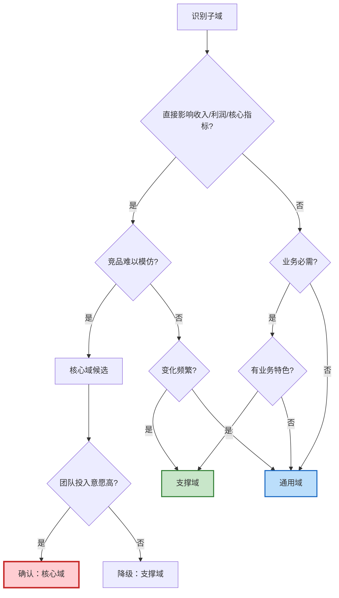

# DDD 领域分层与投资策略 Implementation Plan

> **For agentic workers:** REQUIRED SUB-SKILL: Use superpowers:subagent-driven-development (recommended) or superpowers:executing-plans to implement this plan task-by-task. Steps use checkbox (`- [ ]`) syntax for tracking.

**Goal:** 在 Clean Architecture、DDD 与 CQRS 学习笔记中新增「领域分层与投资策略」章节，系统讲解核心域、支撑域、通用域的划分方法论。

**Architecture:** 在现有 DDD 章节（第二章）中进行结构调整，将战略设计细分为三个小节（2.1.1 领域分层、2.1.2 限界上下文、2.1.3 上下文映射），战术设计内容归入 2.2 并增加小节标题。新增内容约 2200-2500 字，包含对比表格、评分模型、决策流程图、案例分析。

**Tech Stack:** Markdown, Mermaid (for flowchart), Hexo (static site generator)

---

## File Structure

### Files to Modify

**Primary File:**
- `source/_posts/system-design/30-clean-architecture-ddd-cqrs.md` (1370 lines)
  - Adjust existing section numbering (line 327-650)
  - Insert new content for 2.1.1 (after line 329)
  - Total addition: ~350-400 lines

### Sections to Touch

1. **Line 327-329**: DDD 章节标题和开篇 - 保持不变
2. **Line 331**: "2.1 战略设计 — 划分边界" → 改为 "2.1 战略设计：架构层面"
3. **After Line 331**: 插入新的 2.1.1 节（约 350 行）
4. **Line 333**: "#### Bounded Context" → 改为 "#### 2.1.2 Bounded Context（限界上下文）"
5. **Line 348**: "#### Context Map" → 改为 "#### 2.1.3 Context Map（上下文映射）"
6. **Line 358**: "### 2.2 战术设计 — 代码建模" → 改为 "### 2.2 战术设计：代码层面"
7. **After Line 358**: 插入 "#### 2.2.1 战术设计概述" 标题

---

## Task 1: 调整 DDD 章节结构和编号

**Files:**
- Modify: `source/_posts/system-design/30-clean-architecture-ddd-cqrs.md:327-358`

- [ ] **Step 1: 调整战略设计标题**

找到第 331 行的 `### 2.1 战略设计 — 划分边界`，改为：

```markdown
### 2.1 战略设计：架构层面

DDD 的战略设计关注的是架构层面的决策：如何划分领域、如何确定投资策略、如何划分上下文边界。
```

- [ ] **Step 2: 调整限界上下文为 2.1.2**

找到第 333 行的 `#### Bounded Context（限界上下文）`，改为：

```markdown
#### 2.1.2 Bounded Context（限界上下文）
```

- [ ] **Step 3: 调整上下文映射为 2.1.3**

找到第 348 行的 `#### Context Map（上下文映射）`，改为：

```markdown
#### 2.1.3 Context Map（上下文映射）
```

- [ ] **Step 4: 调整战术设计标题并添加概述**

找到第 358 行的 `### 2.2 战术设计 — 代码建模`，改为：

```markdown
### 2.2 战术设计：代码层面

DDD 的战术设计关注的是代码层面的实现：如何用聚合、实体、值对象等战术模式编写高质量的领域模型。

#### 2.2.1 战术设计概述
```

在这一行之后保留原有的表格（概念、定义、示例表格）。

- [ ] **Step 5: 验证编号调整**

阅读修改后的文件，确认：
- 2.1 战略设计：架构层面
- 2.1.2 Bounded Context
- 2.1.3 Context Map
- 2.2 战术设计：代码层面
- 2.2.1 战术设计概述

编号逻辑正确。

- [ ] **Step 6: 提交结构调整**

```bash
git add source/_posts/system-design/30-clean-architecture-ddd-cqrs.md
git commit -m "refactor(ddd): 调整章节结构，区分战略设计和战术设计

- 2.1 战略设计：架构层面（为新增 2.1.1 做准备）
- 2.1.2 限界上下文（原 2.1 下的小节）
- 2.1.3 上下文映射
- 2.2 战术设计：代码层面
- 2.2.1 战术设计概述（原 2.2 内容）"
```

---

## Task 2: 新增 2.1.1 引入部分

**Files:**
- Modify: `source/_posts/system-design/30-clean-architecture-ddd-cqrs.md:332` (在 2.1 标题后插入)

- [ ] **Step 1: 插入 2.1.1 标题和引入问题**

在 `### 2.1 战略设计：架构层面` 之后，`#### 2.1.2 Bounded Context` 之前插入：

```markdown
#### 2.1.1 领域分层与投资策略

**为什么需要领域分层？**

一个中大型系统往往包含十几个甚至几十个子系统。假设你是一家电商平台的 CTO，面对以下子系统：

- 订单系统、支付系统、商品管理、库存管理
- 用户系统、搜索系统、推荐系统、评价系统
- 消息通知、物流跟踪、风控系统、数据报表

**核心问题**：资源有限（人力、预算、时间），不可能对所有子系统投入同等精力。如何决定：
- 哪些系统必须自研，投入最好的团队？
- 哪些系统可以定制开发，用常规团队？
- 哪些系统直接买现成方案或用开源？

如果投资决策错误：
- ❌ 把资源浪费在通用能力上（如自研消息队列），错失核心业务创新
- ❌ 在核心竞争力上妥协（如用低质量的订单系统），导致业务受限

**DDD 的答案**：按照**业务价值**对领域分层，实施**差异化投资策略**。这就是核心域（Core Domain）、支撑域（Supporting Domain）、通用域（Generic Domain）的由来。
```

- [ ] **Step 2: 验证引入内容**

阅读插入的内容，确认：
- 问题描述清晰（CTO 的资源分配困境）
- 反例有说服力（错误投资的后果）
- 自然引出三种域的概念

- [ ] **Step 3: 提交引入部分**

```bash
git add source/_posts/system-design/30-clean-architecture-ddd-cqrs.md
git commit -m "feat(ddd): 添加领域分层引入部分

引入核心问题：
- 资源有限，如何分配研发投入
- 错误投资的风险
- 引出 DDD 的三层领域划分"
```

---

## Task 3: 新增基础定义和对比表格

**Files:**
- Modify: `source/_posts/system-design/30-clean-architecture-ddd-cqrs.md` (续接 Task 2)

- [ ] **Step 1: 添加三种域的定义对比表**

在 Task 2 内容之后插入：

```markdown
##### 三种领域的定义与特征

| 域类型 | 定义 | 业务价值 | 竞争差异化 | 投资策略 | 组织形式 | 技术选型 |
|-------|------|---------|-----------|---------|---------|---------|
| **核心域<br/>Core Domain** | 平台的核心竞争力，创造差异化价值 | 最高，决定平台成败 | 高度差异化，竞品难模仿 | 重点投入，自研 | 最优秀团队，独立编制 | 自主可控，完全掌握 |
| **支撑域<br/>Supporting Domain** | 支撑核心业务的必要能力 | 中等，必须有但不差异化 | 有一定特色但可被超越 | 适度投入，可定制 | 常规团队，共享资源 | 定制开发，参考业界 |
| **通用域<br/>Generic Domain** | 通用基础能力，行业共性 | 低，无差异化 | 行业标准，无竞争优势 | 最小投入，采购 | 外包/工具团队 | 开源/SaaS/采购 |
```

- [ ] **Step 2: 添加每种域的详细说明**

在表格之后插入：

```markdown
**核心域（Core Domain）**：

- **什么是"核心竞争力"？** 直接影响营收、用户体验、留存率的能力，是公司在市场中胜出的关键
- **特点**：频繁变化（紧跟业务创新）、技术复杂、需要领域专家
- **识别标志**：如果这个域做不好，公司会输；如果做得特别好，会赢
- **案例**：电商的订单系统、金融的交易系统、SaaS 的租户管理

**支撑域（Supporting Domain）**：

- **为什么"必须有但不差异化"？** 业务依赖但不产生竞争优势，做到 80 分和 95 分对业务影响不大
- **特点**：相对稳定、有一定复杂度、需要理解业务
- **识别标志**：缺了不行，但不是赢的关键
- **案例**：电商的商品管理、金融的账户系统、SaaS 的权限系统

**通用域（Generic Domain）**：

- **为什么可以采购？** 行业已有成熟方案，无需重复造轮子，自研的投入产出比很低
- **特点**：标准化、变化少、技术成熟
- **识别标志**：市面上有多个成熟产品可选
- **风险**：过度依赖外部服务，但可通过多供应商策略缓解
- **案例**：用户认证（Auth0/Keycloak）、消息推送（Twilio）、存储（AWS S3）
```

- [ ] **Step 3: 提交基础定义**

```bash
git add source/_posts/system-design/30-clean-architecture-ddd-cqrs.md
git commit -m "feat(ddd): 添加三种域的定义和对比表

新增内容：
- 核心域、支撑域、通用域的定义对比表
- 每种域的详细说明（特点、识别标志、案例）
- 投资策略、组织形式、技术选型建议"
```

---

## Task 4: 新增划分方法论 - 评分模型

**Files:**
- Modify: `source/_posts/system-design/30-clean-architecture-ddd-cqrs.md` (续接 Task 3)

- [ ] **Step 1: 添加方法论章节标题和评分模型**

在 Task 3 内容之后插入：

```markdown
##### 领域划分方法论

**如何判断一个子域属于哪一类？** 下面提供一套可操作的评分框架。

###### 判断维度与评分模型

| 判断维度 | 核心域（8-10分） | 支撑域（4-7分） | 通用域（1-3分） | 评分问题 |
|---------|----------------|----------------|----------------|---------|
| **业务价值** | 直接影响收入/利润/核心指标 | 间接影响业务，必需但不关键 | 不影响业务差异化 | 这个域对营收/留存的影响有多大？ |
| **竞争差异化** | 独特能力，竞品难以模仿 | 有特色但可被超越 | 行业标准，无差异 | 竞品能轻易复制这个能力吗？ |
| **变化频率** | 频繁变化，紧跟业务创新 | 定期调整优化 | 稳定，很少大改 | 多久需要大改一次？ |
| **技术复杂度** | 高度复杂，需要领域专家 | 中等复杂，需要业务理解 | 成熟方案可解决 | 普通团队能否 hold 住？ |

**评分方法**：
- 每个维度打分 1-10 分
- 总分 = 四个维度分数相加（满分 40 分）

**总分判断标准**：
- **32-40 分** → 核心域（Core Domain）
- **16-31 分** → 支撑域（Supporting Domain）
- **4-15 分** → 通用域（Generic Domain）

**注意事项**：
- 边界分数（如 31-32 分）需要结合公司战略、团队能力综合判断
- 初创公司可以适当放宽核心域标准（28 分以上即可），聚焦资源
- 成熟公司标准更严格，避免核心域过多导致资源分散
```

- [ ] **Step 2: 提交评分模型**

```bash
git add source/_posts/system-design/30-clean-architecture-ddd-cqrs.md
git commit -m "feat(ddd): 添加领域划分评分模型

新增四维度评分框架：
- 业务价值、竞争差异化、变化频率、技术复杂度
- 评分标准和判断阈值
- 注意事项（初创 vs 成熟公司）"
```

---

## Task 5: 新增划分方法论 - 决策流程图

**Files:**
- Modify: `source/_posts/system-design/30-clean-architecture-ddd-cqrs.md` (续接 Task 4)

- [ ] **Step 1: 添加决策流程图**

在 Task 4 内容之后插入：

```markdown
###### 决策流程图

除了评分模型，还可以用决策树快速判断：



**使用说明**：
1. 从顶部"识别子域"开始
2. 依次回答每个判断问题（是/否）
3. 沿着路径走到终点得出初步结论
4. 结合评分模型验证（两个工具互相补充）
```

- [ ] **Step 2: 提交决策流程图**

```bash
git add source/_posts/system-design/30-clean-architecture-ddd-cqrs.md
git commit -m "feat(ddd): 添加领域划分决策流程图

新增 Mermaid 流程图：
- 基于判断问题的决策树
- 三种域的不同路径和颜色标识
- 使用说明"
```

---

## Task 6: 新增划分方法论 - 常见误区

**Files:**
- Modify: `source/_posts/system-design/30-clean-architecture-ddd-cqrs.md` (续接 Task 5)

- [ ] **Step 1: 添加常见误区和边界案例**

在 Task 5 内容之后插入：

```markdown
###### 常见误区与边界案例

**误区 1：把技术复杂度高的当核心域**

❌ **错误示例**：自研分布式存储系统
- 技术复杂度：10 分（确实很难）
- 业务价值：3 分（存储本身不产生业务差异）
- 竞争差异化：2 分（用户不关心底层存储）
- 变化频率：2 分（相对稳定）
- **总分 17 分 → 支撑域，甚至应该考虑用成熟方案（通用域）**

✅ **正确理解**：技术难度不等于业务价值，除非你是做存储产品的公司。

---

**误区 2：把所有自研系统当核心域**

❌ **错误示例**：自研消息队列
- 很多公司自研 MQ 是因为早期没有好的开源方案
- 但 MQ 本身不是核心竞争力（除非你是 Kafka/RabbitMQ）
- 现在 Kafka 已成熟，继续维护自研 MQ 是资源浪费

✅ **正确理解**：自研 ≠ 核心域，要看是否产生业务差异化。

---

**误区 3：忽略核心域的动态性**

**案例**：推荐系统的演进
- 2010 年：推荐算法是电商核心域（个性化推荐是差异化竞争力）
- 2020 年：推荐已成为支撑域（算法已成熟，大家都在用）
- 现在：推荐仍重要，但不再是核心竞争力

✅ **正确理解**：核心域会随行业发展逐渐"标准化"，需要定期重新评估。

---

**边界案例 1：搜索系统的分类取决于公司类型**

| 公司类型 | 搜索系统分类 | 原因 |
|---------|------------|------|
| Google/百度 | 核心域 | 搜索就是产品本身 |
| 电商平台 | 支撑域 | 搜索影响转化，但不是核心竞争力 |
| 内部工具 | 通用域 | 可以直接用 Elasticsearch |

✅ **正确理解**：域的分类是相对的，取决于公司的业务模式和战略定位。

---

**边界案例 2：支付系统在不同公司的分类**

| 公司类型 | 支付系统分类 | 原因 |
|---------|------------|------|
| 支付宝/微信支付 | 核心域 | 支付就是产品 |
| 电商平台 | 核心域 | 支付流程影响转化和体验 |
| SaaS 平台 | 支撑域 | 可以接入 Stripe，自研价值不大 |
| 内容平台 | 通用域 | 直接用第三方支付 |
```

- [ ] **Step 2: 提交常见误区**

```bash
git add source/_posts/system-design/30-clean-architecture-ddd-cqrs.md
git commit -m "feat(ddd): 添加领域划分常见误区和边界案例

新增内容：
- 误区1：技术复杂度 ≠ 业务价值
- 误区2：自研 ≠ 核心域
- 误区3：核心域的动态性
- 边界案例：搜索和支付在不同公司的分类"
```

---

## Task 7: 新增电商案例分析 - 订单域

**Files:**
- Modify: `source/_posts/system-design/30-clean-architecture-ddd-cqrs.md` (续接 Task 6)

- [ ] **Step 1: 添加电商案例章节和订单域分析**

在 Task 6 内容之后插入：

```markdown
##### 方法论应用：电商系统实战分析

下面选择电商系统的 3 个典型域，应用评分模型进行深度分析。

###### 案例 1：订单域（核心域）

| 维度 | 评分 | 详细分析 |
|-----|------|---------|
| **业务价值** | 10 | 订单流程直接影响 GMV（成交总额），每提升 1% 转化率就是百万级营收 |
| **竞争差异化** | 9 | 拼团、秒杀、预售、分期等玩法是核心竞争力，竞品难以完全模仿 |
| **变化频率** | 9 | 每个大促（618、双11）都会调整订单流程，支持新的营销玩法 |
| **技术复杂度** | 9 | 分布式事务（Saga）、状态机、高并发、幂等性、最终一致性 |
| **总分** | **37** | **核心域** |

**为什么是核心域？**
- 订单流程的流畅度直接影响用户下单转化率
- 支持的营销玩法越丰富，平台竞争力越强
- 每个促销活动都可能需要调整订单逻辑
- 技术上涉及多个复杂的分布式系统问题

**投资建议**：
- **团队配置**：最优秀的架构师 + 3-5 名资深后端开发，独立团队
- **技术选型**：自研，完全掌控，不依赖外部服务
- **质量要求**：99.99% 可用性，全链路监控，灰度发布
- **迭代策略**：快速响应业务需求，2 周一个迭代
- **文档要求**：完整的设计文档、接口文档、故障预案
```

- [ ] **Step 2: 提交订单域分析**

```bash
git add source/_posts/system-design/30-clean-architecture-ddd-cqrs.md
git commit -m "feat(ddd): 添加电商订单域案例分析

应用评分模型分析订单域：
- 四维度评分（总分 37）
- 为什么是核心域的详细说明
- 投资建议（团队、技术、质量、迭代、文档）"
```

---

## Task 8: 新增电商案例分析 - 商品域和用户域

**Files:**
- Modify: `source/_posts/system-design/30-clean-architecture-ddd-cqrs.md` (续接 Task 7)

- [ ] **Step 1: 添加商品域分析**

在 Task 7 内容之后插入：

```markdown
###### 案例 2：商品域（支撑域）

| 维度 | 评分 | 详细分析 |
|-----|------|---------|
| **业务价值** | 7 | 商品管理是必需的，但 SPU/SKU 模型本身不产生差异化 |
| **竞争差异化** | 5 | 各家电商的商品模型大同小异，主要差异在类目和属性配置 |
| **变化频率** | 6 | 新品类上线时需要调整，但不频繁（季度级别） |
| **技术复杂度** | 6 | 有一定复杂度（EAV 模型、搜索索引），但方案成熟 |
| **总分** | **24** | **支撑域** |

**为什么是支撑域？**
- 商品管理做到 80 分和 95 分，对用户体验影响不大
- SPU/SKU 模型是行业通用方案，没有太多创新空间
- 但又不能没有（缺了商品管理，电商就玩不转）

**投资建议**：
- **团队配置**：常规开发团队 2-3 人，可以与其他支撑域共享资源
- **技术选型**：参考业界成熟方案（如有赞、Shopify 的商品模型），适度定制
- **质量要求**：99.9% 可用性，降级策略
- **迭代策略**：稳定为主，谨慎迭代，充分测试后再上线
- **文档要求**：基础设计文档和接口文档
```

- [ ] **Step 2: 添加用户域分析**

在商品域分析之后插入：

```markdown
###### 案例 3：用户域（通用域）

| 维度 | 评分 | 详细分析 |
|-----|------|---------|
| **业务价值** | 3 | 用户注册登录是基础能力，但不产生差异化（用户不会因为注册流程选择平台） |
| **竞争差异化** | 2 | 注册登录是行业标准（手机号、邮箱、第三方登录），无差异 |
| **变化频率** | 2 | 很少变化，除非监管要求（如实名认证） |
| **技术复杂度** | 3 | SSO、OAuth 2.0 都有成熟方案（Auth0、Keycloak） |
| **总分** | **10** | **通用域** |

**为什么是通用域？**
- 注册登录不会成为平台的竞争优势
- 市面上有大量成熟的身份认证服务
- 自研的投入产出比很低

**投资建议**：
- **团队配置**：外包或使用 SaaS 服务，内部只需 1 人对接
- **技术选型**：采购（Auth0、Keycloak、AWS Cognito）
- **质量要求**：依赖服务商 SLA（通常 99.95%+）
- **迭代策略**：按需对接新的认证方式（如生物识别），最小投入
- **文档要求**：对接文档即可
```

- [ ] **Step 3: 提交商品域和用户域分析**

```bash
git add source/_posts/system-design/30-clean-architecture-ddd-cqrs.md
git commit -m "feat(ddd): 添加电商商品域和用户域案例分析

新增两个案例：
- 商品域（支撑域，总分 24）
- 用户域（通用域，总分 10）
- 每个案例包含评分、原因分析、投资建议"
```

---

## Task 9: 新增跨行业对比

**Files:**
- Modify: `source/_posts/system-design/30-clean-architecture-ddd-cqrs.md` (续接 Task 8)

- [ ] **Step 1: 添加跨行业对比表格**

在 Task 8 内容之后插入：

```markdown
##### 跨行业对比：方法论的通用性

同样的方法论在不同行业如何应用？下表展示三个典型行业的域划分：

| 行业 | 核心域（差异化竞争力） | 支撑域（业务必需） | 通用域（行业标准） |
|-----|---------------------|------------------|------------------|
| **电商** | • 订单系统（交易流程）<br/>• 支付系统（资金安全） | • 商品管理<br/>• 库存管理<br/>• 计价引擎<br/>• 营销系统 | • 用户认证<br/>• 搜索<br/>• 消息推送<br/>• 物流跟踪<br/>• 风控 |
| **金融** | • 交易系统（买卖撮合）<br/>• 风控系统（反欺诈） | • 账户系统<br/>• 清结算<br/>• 合规报送 | • 用户认证<br/>• 消息通知<br/>• 报表系统<br/>• 存储 |
| **SaaS** | • 租户管理（多租户隔离）<br/>• 计费系统（订阅模式） | • 权限系统（RBAC）<br/>• 审计日志<br/>• 集成中心（API） | • 用户认证<br/>• 消息<br/>• 存储<br/>• 监控告警 |

**关键洞察**：

1. **核心域因行业而异**：
   - 电商的核心是"交易流程"和"资金安全"
   - 金融的核心是"买卖撮合"和"风控合规"
   - SaaS 的核心是"多租户"和"订阅计费"
   - → 核心域反映了行业的本质和竞争焦点

2. **通用域高度相似**：
   - 用户、消息、存储在各行业都是通用域
   - 这些能力已经高度标准化，有大量成熟方案
   - → 通用域是"不需要重新发明轮子"的领域

3. **支撑域体现业务特点**：
   - 电商的商品、库存、计价有一定特色，但不是核心竞争力
   - 金融的账户、清结算是必需的，但各家差异不大
   - SaaS 的权限、审计是基础能力，但实现相对标准
   - → 支撑域是"需要理解业务，但可以参考业界实践"的领域
```

- [ ] **Step 2: 提交跨行业对比**

```bash
git add source/_posts/system-design/30-clean-architecture-ddd-cqrs.md
git commit -m "feat(ddd): 添加跨行业领域划分对比

新增三个行业对比：
- 电商、金融、SaaS 的域划分
- 关键洞察：核心域因行业而异，通用域高度相似"
```

---

## Task 10: 新增实施策略 - 不同阶段公司

**Files:**
- Modify: `source/_posts/system-design/30-clean-architecture-ddd-cqrs.md` (续接 Task 9)

- [ ] **Step 1: 添加实施策略章节和不同阶段策略**

在 Task 9 内容之后插入：

```markdown
##### 实施策略与最佳实践

###### 不同阶段的公司策略

**初创公司（0-50 人）**：

- **原则**：极致聚焦核心域，其他全部采购/开源
- **策略**：
  - 核心域：只自研 1-2 个最关键的（如电商的订单）
  - 支撑域：先用简单实现（如商品管理用 Excel 导入），快速验证商业模式
  - 通用域：全部采购（用户用 Auth0，消息用 Twilio，支付接 Stripe）
- **避坑**：不要陷入"造轮子"陷阱，技术实现不是早期核心竞争力
- **案例**：Airbnb 早期只自研订单流程，其他全用第三方服务

**成长期公司（50-500 人）**：

- **原则**：逐步替换通用域中的瓶颈，支撑域开始定制化
- **策略**：
  - 核心域：持续投入，保持技术领先
  - 支撑域：根据业务需求定制开发（如商品管理加入多品类支持）
  - 通用域：评估 ROI，替换成本高或限制业务的服务（如自建用户系统支持千万级用户）
- **判断标准**：第三方服务的成本 > 自研成本，或功能无法满足需求
- **案例**：用户量到 100 万后自建用户系统，但仍用第三方消息和支付

**成熟公司（500+ 人）**：

- **原则**：核心域持续投入，支撑域定期优化，通用域评估自研 vs 采购
- **策略**：
  - 核心域：组建专家团队，引领行业创新
  - 支撑域：定期重构和性能优化
  - 通用域：当规模达到一定程度，某些通用域自研更划算（如 IM、推送）
- **动态调整**：支撑域可能升级为核心域（如推荐系统）
- **案例**：淘宝自研了旺旺（IM），因为 IM 成为电商的差异化能力
```

- [ ] **Step 2: 提交不同阶段策略**

```bash
git add source/_posts/system-design/30-clean-architecture-ddd-cqrs.md
git commit -m "feat(ddd): 添加不同阶段公司的实施策略

新增内容：
- 初创公司：极致聚焦核心域
- 成长期公司：逐步替换瓶颈
- 成熟公司：持续投入核心域
- 每个阶段包含原则、策略、避坑、案例"
```

---

## Task 11: 新增实施策略 - 动态演进和组织架构

**Files:**
- Modify: `source/_posts/system-design/30-clean-architecture-ddd-cqrs.md` (续接 Task 10)

- [ ] **Step 1: 添加域的动态演进**

在 Task 10 内容之后插入：

```markdown
###### 域的动态演进

**核心域可能降级**：
- 早期的核心创新逐渐变成行业标准
- 案例：电商早期的"在线支付"是核心域（支付宝），现在是支撑域（各家都有）

**支撑域可能升级**：
- 随着业务深入，某些支撑域变成核心竞争力
- 案例：电商的"推荐系统"从支撑域升级为核心域（个性化推荐成为差异化）

**通用域可能"去商品化"**：
- 某些通用域在特定场景下需要深度定制
- 案例：SaaS 平台的"消息系统"，如果涉及大量自定义通知规则，可能需要自研

**重新评估周期**：
- 初创公司：每 6 个月
- 成长期公司：每年
- 成熟公司：每 1-2 年
```

- [ ] **Step 2: 添加组织架构映射**

在动态演进之后插入：

```markdown
###### 组织架构与域的映射

| 域类型 | 团队形式 | 汇报关系 | 优先级 | 考核指标 |
|-------|---------|---------|--------|---------|
| **核心域** | 独立团队，最优秀的人 | 直接向 CTO 汇报 | P0 | 业务指标（GMV、转化率） |
| **支撑域** | 共享团队，按项目分配 | 向技术负责人汇报 | P1 | 稳定性、响应速度 |
| **通用域** | 平台团队，工具化 | 向基础架构负责人汇报 | P2 | 可用性、成本 |

**关键原则**：
- 核心域团队有最高的决策权和资源优先级
- 支撑域团队注重稳定性和效率
- 通用域团队追求标准化和成本优化

---

**总结**：领域分层不是一成不变的，它是动态的、相对的。核心域反映了公司当前的战略重点，支撑域是业务运转的基础，通用域是"不重新发明轮子"的智慧。定期重新评估领域分类，确保资源投向最有价值的地方，这就是 DDD 战略设计的核心价值。
```

- [ ] **Step 3: 提交动态演进和组织架构**

```bash
git add source/_posts/system-design/30-clean-architecture-ddd-cqrs.md
git commit -m "feat(ddd): 添加域的动态演进和组织架构映射

新增内容：
- 核心域降级、支撑域升级、通用域去商品化案例
- 重新评估周期建议
- 组织架构与域类型的映射关系
- 总结段落"
```

---

## Task 12: 验证构建和最终提交

**Files:**
- Verify: `source/_posts/system-design/30-clean-architecture-ddd-cqrs.md`

- [ ] **Step 1: 清理缓存并重新构建**

```bash
npm run clean
```

Expected: 清理 public 文件夹和数据库缓存

- [ ] **Step 2: 运行 Hexo 构建**

```bash
npm run build 2>&1 | tee build.log
```

Expected: 
- 构建成功
- 生成 `30-clean-architecture-ddd-cqrs/index.html`
- Mermaid 图表正常渲染
- 无 Markdown 语法错误

- [ ] **Step 3: 检查生成的 HTML**

```bash
ls -lh public/2026/04/07/system-design/30-clean-architecture-ddd-cqrs/index.html
```

Expected: 文件存在且大小合理（>100KB）

- [ ] **Step 4: 验证 Mermaid 图表**

```bash
grep -c "mermaid" public/2026/04/07/system-design/30-clean-architecture-ddd-cqrs/index.html
```

Expected: 至少有 1 个 mermaid 图表

- [ ] **Step 5: 统计新增内容行数**

```bash
git diff HEAD~11 source/_posts/system-design/30-clean-architecture-ddd-cqrs.md | grep "^+" | wc -l
```

Expected: 新增约 350-400 行

- [ ] **Step 6: 最终提交**

```bash
git add source/_posts/system-design/30-clean-architecture-ddd-cqrs.md
git commit -m "feat(ddd): 完成领域分层与投资策略章节

新增 2.1.1 领域分层与投资策略完整内容：

1. 章节结构调整
   - 2.1 战略设计：架构层面
   - 2.1.1 领域分层与投资策略（新增）
   - 2.1.2 限界上下文
   - 2.1.3 上下文映射
   - 2.2 战术设计：代码层面

2. 新增内容（约 2200-2500 字）
   - 引入问题：资源分配困境
   - 基础定义：核心域、支撑域、通用域对比表
   - 划分方法论：
     * 四维评分模型（业务价值、竞争差异化、变化频率、技术复杂度）
     * 决策流程图（Mermaid）
     * 常见误区和边界案例
   - 电商案例：订单域、商品域、用户域深度分析
   - 跨行业对比：电商、金融、SaaS 对比表
   - 实施策略：
     * 不同阶段公司策略（初创/成长/成熟）
     * 域的动态演进
     * 组织架构映射

参考设计文档：docs/superpowers/specs/2026-04-09-ddd-domain-classification-design.md"
```

---

## Self-Review Checklist

### 1. Spec Coverage

检查设计文档的每个部分是否都有对应的 task：

- [x] 章节结构调整 → Task 1
- [x] 引入问题 → Task 2
- [x] 基础定义（三种域对比表） → Task 3
- [x] 评分模型 → Task 4
- [x] 决策流程图 → Task 5
- [x] 常见误区 → Task 6
- [x] 电商案例（订单/商品/用户） → Task 7, 8
- [x] 跨行业对比 → Task 9
- [x] 不同阶段公司策略 → Task 10
- [x] 动态演进和组织架构 → Task 11
- [x] 验证和提交 → Task 12

**无遗漏**。

### 2. Placeholder Scan

检查是否有 placeholder：

- [x] 无 "TBD", "TODO", "implement later"
- [x] 所有表格都有完整内容
- [x] 所有案例都有具体分析
- [x] 决策流程图有完整的 Mermaid 代码
- [x] 所有 git commit 命令都有完整 message

**无 placeholder**。

### 3. Type Consistency

检查术语和名称一致性：

- [x] "核心域" / "Core Domain" 一致
- [x] "支撑域" / "Supporting Domain" 一致
- [x] "通用域" / "Generic Domain" 一致
- [x] 章节编号一致（2.1.1, 2.1.2, 2.1.3, 2.2）
- [x] 文件路径一致（`source/_posts/system-design/30-clean-architecture-ddd-cqrs.md`）

**类型一致**。

### 4. Task Granularity

检查每个 task 是否是 bite-sized（2-5 分钟）：

- [x] Task 1: 调整 4 个标题 - 约 3 分钟
- [x] Task 2: 插入引入段落 - 约 2 分钟
- [x] Task 3: 插入定义表格和说明 - 约 4 分钟
- [x] Task 4: 插入评分模型 - 约 3 分钟
- [x] Task 5: 插入决策流程图 - 约 2 分钟
- [x] Task 6: 插入误区案例 - 约 5 分钟
- [x] Task 7: 插入订单域分析 - 约 3 分钟
- [x] Task 8: 插入商品域和用户域 - 约 4 分钟
- [x] Task 9: 插入跨行业对比 - 约 3 分钟
- [x] Task 10: 插入公司策略 - 约 4 分钟
- [x] Task 11: 插入动态演进 - 约 3 分钟
- [x] Task 12: 验证和提交 - 约 5 分钟

**粒度合理**。

### 5. Complete Code

检查是否所有代码都完整：

- [x] 所有 Markdown 内容都完整（无 "..."）
- [x] Mermaid 流程图代码完整
- [x] 所有表格都完整
- [x] 所有 git commit 命令完整

**代码完整**。

---

## Execution Note

This plan is ready for execution. All tasks are:
- Bite-sized (2-5 minutes each)
- Self-contained with complete content
- Sequentially dependent (each builds on the previous)
- Verifiable with clear expected outcomes
- Free of placeholders

Total estimated time: 35-45 minutes
