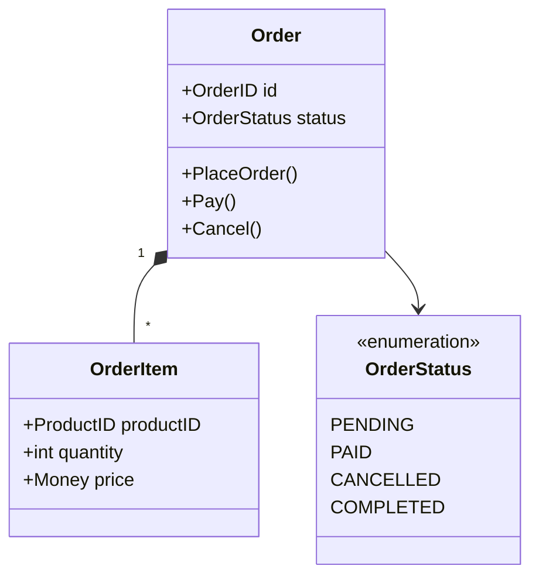
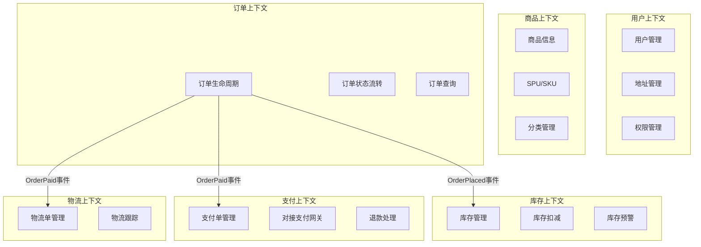
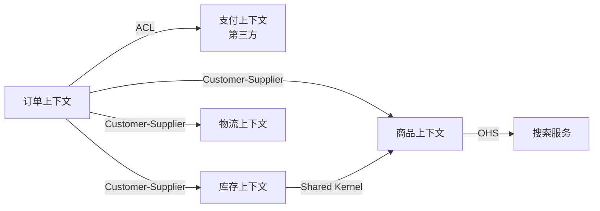

# 领域驱动设计读书笔记实施计划

> **For agentic workers:** REQUIRED SUB-SKILL: Use superpowers:subagent-driven-development (recommended) or superpowers:executing-plans to implement this plan task-by-task. Steps use checkbox (`- [ ]`) syntax for tracking.

**Goal:** 创建一篇融合《领域驱动设计》和《实现领域驱动设计》两本书的系统性读书笔记（3600-4700行），帮助中级开发者理解DDD的核心概念、架构实践和代码落地。

**Architecture:** 按理论到实践的递进式结构组织，包含8个主要章节：引言、核心概念、战略设计、战术设计、架构落地、实施指南、Q&A、总结。使用电商案例贯穿全文，提供Go代码示例和Mermaid架构图。

**Tech Stack:** Hexo 7.2.0, Markdown, Mermaid (图表), Go (代码示例)

**Design Spec:** `docs/superpowers/specs/2026-04-10-ddd-reading-notes-design.md`

---

## Task 1: 创建文章框架和Front Matter

**Files:**
- Create: `source/_posts/system-design/31-ddd-reading-notes.md`

- [ ] **Step 1: 创建文章文件并添加Front Matter**

```markdown
---
title: 领域驱动设计读书笔记：从概念到架构实践
date: 2026-04-10
categories:
  - system-design
  - architecture
tags:
  - ddd
  - domain-driven-design
  - clean-architecture
  - system-design
  - software-architecture
---

<!-- 文章摘要 -->
融合《领域驱动设计》（蓝皮书）和《实现领域驱动设计》（红皮书）两本经典著作的系统性读书笔记。从概念理解到架构实践，以电商平台为案例，详细讲解DDD的战略设计和战术设计，帮助中级开发者掌握领域驱动设计的核心思想和落地方法。

<!-- more -->

## 目录

- [一、引言](#一、引言)
- [二、核心概念](#二、核心概念)
- [三、战略设计](#三、战略设计)
- [四、战术设计](#四、战术设计)
- [五、架构落地](#五、架构落地)
- [六、实施指南](#六、实施指南)
- [七、常见问题Q&A](#七、常见问题qa)
- [八、总结](#八、总结)
- [参考资料](#参考资料)

---
```

- [ ] **Step 2: 验证文件创建成功**

```bash
ls -la source/_posts/system-design/31-ddd-reading-notes.md
```

Expected: 文件存在且大小 > 0

- [ ] **Step 3: 提交初始框架**

```bash
git add source/_posts/system-design/31-ddd-reading-notes.md
git commit -m "feat(ddd): create article framework with front matter

初始化DDD读书笔记文章框架"
```

---

## Task 2: 编写引言部分（150-200行）

**Files:**
- Modify: `source/_posts/system-design/31-ddd-reading-notes.md`

- [ ] **Step 1: 添加引言内容**

在文章目录后添加以下内容：

```markdown
## 一、引言

### 为什么需要 DDD？

在软件开发中，我们经常遇到这样的困境：

**业务复杂性**：代码无法清晰表达业务意图
- 一个简单的"下单"功能，代码散落在多个Service中，很难理解完整的业务流程
- 业务规则隐藏在SQL、if-else堆砌中，修改一个规则需要改动多处代码
- 新人接手项目，看了一个月代码还是不懂业务

**团队沟通**：技术与业务的鸿沟
- 产品说"用户下单后锁定库存"，开发理解成"创建订单后更新库存状态"，两者不是一回事
- 技术术语污染业务讨论："OrderEntity"、"OrderDTO"、"OrderVO"，业务专家听不懂
- 需求评审会变成"翻译大会"

**代码腐化**：随时间推移质量下降
- 最初设计优雅的系统，几年后变成"大泥球"
- 修改一处影响多处，不敢重构
- 技术债累积，维护成本越来越高

DDD（领域驱动设计）正是为了解决这些问题而生。

---

### 两本书的定位

**蓝皮书：《领域驱动设计：软件核心复杂性应对之道》**
- 作者：Eric Evans，2003年
- 地位：DDD的奠基之作，建立了完整的概念体系
- 特点：
  - 偏理论，概念性强
  - 战略设计讲得深入（限界上下文、上下文映射）
  - 战术模式作为基础介绍
- 适合：建立DDD的完整认知体系

**红皮书：《实现领域驱动设计》**
- 作者：Vaughn Vernon，2013年
- 地位：蓝皮书的实践补充，被称为"IDDD"
- 特点：
  - 偏实战，大量代码示例
  - 战术设计讲得细致（尤其是聚合设计）
  - 融入了现代实践（事件驱动、CQRS、微服务）
- 适合：学习如何落地DDD

**两本书的关系**：
- 蓝皮书建立认知框架，红皮书填充实现细节
- 蓝皮书告诉你"是什么"和"为什么"，红皮书告诉你"怎么做"
- 建议先读蓝皮书的战略设计，再读红皮书的战术设计

---

### 本文的阅读地图

**如何使用这篇笔记**：

1. **系统学习**（推荐初学者）
   - 按顺序阅读：引言 → 核心概念 → 战略设计 → 战术设计 → 架构落地 → 实施指南
   - 每个章节都有电商案例和代码示例
   - 预计阅读时间：2-3小时

2. **快速查阅**（熟悉概念者）
   - 跳转到具体章节查阅概念定义
   - 使用Q&A部分快速找到问题答案
   - 查看架构图和代码示例

3. **项目应用**（实战导向）
   - 先读"实施指南"了解何时用DDD
   - 再读"战略设计"了解如何划分上下文
   - 最后读"战术设计"了解如何设计聚合

**与30号文章的关系**：
本文专注于DDD本身，而 [30-clean-architecture-ddd-cqrs.md](./30-clean-architecture-ddd-cqrs.md) 讲解了DDD与Clean Architecture、CQRS的关系。两篇文章互为补充：
- 30号文章：架构模式的对比和组合
- 本文：DDD的深入讲解和实践

**与电商系列文章的关系**：
本文使用电商场景作为贯穿案例，与以下文章形成呼应：
- [20-ecommerce-overview.md](./20-ecommerce-overview.md) - 电商系统概览
- [21-ecommerce-listing.md](./21-ecommerce-listing.md) - 商品列表
- [22-ecommerce-inventory.md](./22-ecommerce-inventory.md) - 库存系统
- [29-ecommerce-payment-system.md](./29-ecommerce-payment-system.md) - 支付系统

---

### 贯穿全文的电商案例

为了让概念更具体，本文使用**电商订单场景**作为主线案例：

**业务场景**：用户在电商平台下单购买商品

**涉及的上下文**：
- **订单上下文**：订单生命周期管理
- **库存上下文**：库存扣减和锁定
- **商品上下文**：商品信息查询
- **支付上下文**：支付流程处理
- **物流上下文**：物流单管理

**为什么选择订单**：
- 业务流程复杂：涉及状态机、跨上下文协调
- 聚合设计典型：Order是经典的聚合根示例
- 实战价值高：几乎所有电商平台都有订单系统
- 容易理解：读者对电商下单流程都有直观认知

从战略设计到战术设计，我们都会用订单场景来说明概念。

---
```

- [ ] **Step 2: 验证内容格式正确**

```bash
# 检查markdown语法
head -100 source/_posts/system-design/31-ddd-reading-notes.md
```

Expected: markdown格式正确，无语法错误

- [ ] **Step 3: 本地预览**

```bash
npm run server
```

在浏览器打开 http://localhost:4000，查看文章引言部分渲染效果

- [ ] **Step 4: 提交引言部分**

```bash
git add source/_posts/system-design/31-ddd-reading-notes.md
git commit -m "feat(ddd): add introduction section

添加引言部分（约150行）：
- DDD解决的核心问题
- 两本书的定位差异
- 阅读地图
- 电商案例说明"
```

---

## Task 3: 编写核心概念部分（300-400行）

**Files:**
- Modify: `source/_posts/system-design/31-ddd-reading-notes.md`

- [ ] **Step 1: 添加核心概念章节标题和统一语言**

```markdown
## 二、核心概念

在深入战略设计和战术设计之前，我们需要先建立DDD的核心术语体系。这些概念是理解后续内容的基础。

---

### 2.1 统一语言（Ubiquitous Language）

**定义**：团队（包括开发者、业务专家、产品经理）共同使用的语言，贯穿需求分析、设计、代码实现的全过程。

**价值**：
- 消除"翻译成本"：业务说"下单"，代码里也是`PlaceOrder`，而不是`CreateOrderEntity`
- 提高沟通效率：技术与业务用同一套术语讨论问题
- 代码即文档：代码能被业务专家读懂

**如何建立统一语言**：

1. **与业务专家协作**
   - 事件风暴工作坊：识别领域事件和命令
   - 术语表维护：记录所有关键概念的定义
   - 定期Review：确保术语使用一致

2. **在代码中体现**
   - 类名、方法名使用业务术语
   - 避免技术术语污染
   - 注释用业务语言描述

**电商实践案例**：

**好的命名**（体现业务语言）：
```go
// 领域事件
type OrderPlacedEvent struct {
    OrderID   string
    UserID    string
    PlacedAt  time.Time
}

// 领域命令
func (o *Order) PlaceOrder(items []OrderItem) error {
    // 业务逻辑
}

// 值对象
type OrderItem struct {
    ProductID string
    Quantity  int
    Price     Money
}
```

**不好的命名**（技术术语污染）：
```go
// ❌ 技术味太重
type OrderDTO struct { }
type OrderEntity struct { }
type OrderVO struct { }

// ❌ 业务语言丢失
func CreateOrderRecord(data map[string]interface{}) error { }
func InsertOrderTable(order Order) error { }
```

**术语标准化**：

在电商领域，同一个概念可能有多种说法，需要统一：

| 业务概念 | 可能的说法 | 统一后的术语 | 说明 |
|---------|-----------|------------|------|
| 用户下单 | "下单"、"创建订单"、"提交订单" | `PlaceOrder` | 选择最符合业务语言的术语 |
| 库存 | "库存"、"可售库存"、"在途库存" | `AvailableInventory`, `InTransitInventory` | 明确区分不同类型的库存 |
| 订单取消 | "取消订单"、"关闭订单" | `CancelOrder` | 与业务专家确认语义 |

**反例：技术术语污染业务**

```go
// ❌ 错误示例
type OrderRepository interface {
    SaveEntity(entity OrderEntity) error
    FindById(id int) (*OrderDTO, error)
}

// 问题：
// 1. "Entity"、"DTO" 是技术术语，业务专家听不懂
// 2. "Save"、"Find" 是数据库操作语言，不是业务语言
// 3. 业务说"锁库存"，代码里找不到对应的概念
```

```go
// ✅ 正确示例
type OrderRepository interface {
    Save(order *Order) error
    FindByID(orderID OrderID) (*Order, error)
}

// 改进：
// 1. 去掉技术术语
// 2. 使用领域对象（Order）而非DTO
// 3. 方法名简洁清晰
```

**统一语言的维护**：

1. **术语表**（Glossary）

创建项目wiki或文档，记录所有关键术语：

```markdown
## 订单领域术语表

- **订单（Order）**：用户提交的购买请求，包含商品、数量、收货地址等信息
- **订单项（OrderItem）**：订单中的单个商品条目
- **下单（PlaceOrder）**：用户提交订单的动作
- **支付订单（PayOrder）**：用户完成支付的动作
- **取消订单（CancelOrder）**：用户或系统取消订单
- **订单状态（OrderStatus）**：订单的当前状态（待支付、已支付、已取消、已完成）
```

2. **领域模型图**

用UML类图或Mermaid图可视化领域模型：



**要点总结**：
- 统一语言不仅仅是命名，而是完整的概念体系
- 业务术语应该贯穿需求、设计、代码的全过程
- 代码即文档，代码应该能被业务专家读懂
- 避免技术术语（Entity、DTO、VO）污染业务语言

---
```

- [ ] **Step 2: 添加限界上下文内容**

在统一语言后添加：

```markdown
### 2.2 限界上下文（Bounded Context）

**定义**：模型的明确边界。一个模型只在一个上下文内有效，不同上下文中的同一个词可以有不同的含义。

**核心思想**：不要追求全局统一的大模型，而是在不同的边界内建立各自的模型。

**为什么需要限界上下文**：

想象一个电商平台，如果我们试图建立一个"全局统一的商品模型"：

```go
// ❌ 试图建立全局统一模型（注定失败）
type Product struct {
    // 商品上下文需要的字段
    ID          string
    Name        string
    Description string
    Category    string
    Images      []string
    Attributes  map[string]string
    
    // 库存上下文需要的字段
    AvailableQty int
    ReservedQty  int
    WarehouseID  string
    
    // 订单上下文需要的字段
    Price        Money
    DiscountRule string
    
    // 营销上下文需要的字段
    RecommendScore float64
    Keywords       []string
    
    // 字段越加越多，最终变成"大泥球"
}
```

**问题**：
- 不同上下文关注点不同，但被迫共享一个模型
- 修改任何一个字段都可能影响所有上下文
- 模型越来越臃肿，难以维护

**解决方案：限界上下文**

在不同的上下文中，建立各自的模型：

**商品上下文**（关注商品信息）：
```go
// 商品上下文中的 Product
type Product struct {
    ID          ProductID
    Name        string
    Description string
    Category    Category
    Images      []ImageURL
    Attributes  []ProductAttribute
}
```

**库存上下文**（关注库存数量）：
```go
// 库存上下文中的 Product（只关注数量）
type InventoryItem struct {
    ProductID    ProductID  // 通过ID引用商品
    AvailableQty int
    ReservedQty  int
    WarehouseID  WarehouseID
}
```

**订单上下文**（关注价格快照）：
```go
// 订单上下文中的 OrderItem（保存下单时的快照）
type OrderItem struct {
    ProductID   ProductID
    ProductName string  // 快照：下单时的商品名
    Price       Money   // 快照：下单时的价格
    Quantity    int
}
```

**关键认知**：
- 同一个词（"Product"）在不同上下文有不同含义
- "Product" 在商品上下文是聚合根，包含详细信息
- "Product" 在库存上下文只关注数量
- "Product" 在订单上下文只是一个快照
- 不要追求全局统一模型

---

**电商平台的限界上下文划分**：



**各上下文的关注点**：

| 上下文 | 核心聚合 | 主要职责 | "Order" 的含义 |
|-------|---------|---------|---------------|
| **订单上下文** | Order | 订单生命周期管理、状态流转 | 聚合根，包含完整订单信息 |
| **支付上下文** | Payment | 支付流程、对接支付网关 | 只是一个外部引用（订单号） |
| **物流上下文** | Shipment | 物流单管理、轨迹跟踪 | 只是一个外部引用（订单号） |

**关键点**：
- 每个上下文有明确的边界和职责
- 同一个概念在不同上下文有不同模型
- 上下文之间通过API或事件通信，不直接共享数据库

---

**上下文的识别方法**：

1. **基于业务能力**
   - 每个上下文对应一个业务能力
   - 例如：浏览商品、下单、支付、发货是不同的业务能力

2. **基于语言边界**
   - 术语含义发生变化的地方就是上下文边界
   - 例如："商品"在商品上下文和库存上下文中含义不同

3. **基于数据一致性边界**
   - 需要强一致性的数据放在同一上下文
   - 可以最终一致性的数据可以跨上下文
   - 例如：Order 和 OrderItem 必须强一致，所以在同一上下文

4. **基于团队结构**（康威定律）
   - 系统架构会反映组织结构
   - 每个团队负责一个或少数上下文
   - 例如：订单团队负责订单上下文

**要点总结**：
- 限界上下文是模型的边界
- 不要追求全局统一模型
- 同一个词在不同上下文可以有不同含义
- 上下文之间通过明确的接口通信

---
```

- [ ] **Step 3: 添加领域和子域分类、上下文映射**

继续添加：

```markdown
### 2.3 领域、子域分类

**定义**：根据业务价值和复杂度，将整个业务领域划分为不同类型的子域。

**三种子域类型**：

1. **核心域（Core Domain）**
   - 定义：业务的核心竞争力，最复杂、最有价值的部分
   - 特征：差异化优势、复杂业务规则、频繁变化
   - 投资策略：自研，精心设计，持续投入

2. **支撑域（Supporting Subdomain）**
   - 定义：支撑核心域运转，业务特定但不是竞争力
   - 特征：必需但不产生差异化、中等复杂度
   - 投资策略：简单设计，够用即可

3. **通用域（Generic Subdomain）**
   - 定义：通用功能，行业标准，可以外购或使用开源
   - 特征：无差异化、低复杂度、稳定
   - 投资策略：外采或开源，不要重复造轮子

---

**电商平台的子域分类**：

**核心域**（投入60%人力）：
- **订单履约**
  - 为什么是核心域：直接影响GMV和用户体验
  - 复杂度：状态机、工作流、异常处理、跨上下文协调
  - 投资策略：20人团队，精心设计，持续优化

- **库存管理**
  - 为什么是核心域：防止超卖，影响用户信任
  - 复杂度：分布式锁、高并发、实时扣减
  - 投资策略：15人团队，高可用设计

- **推荐算法**
  - 为什么是核心域：提升转化率的关键
  - 复杂度：机器学习、实时计算、A/B测试
  - 投资策略：15人团队，算法持续迭代

**支撑域**（投入30%人力）：
- 用户管理：标准CRUD，5人
- 地址管理：地址解析和验证，3人
- 优惠券系统：规则引擎，5人
- 客服系统：工单管理，5人

**通用域**（投入10%人力，主要外采）：
- 消息通知：阿里云短信、SendGrid
- 文件存储：OSS、S3
- 日志系统：ELK Stack
- 监控告警：Prometheus + Grafana

**判断标准矩阵**：

| 子域 | 业务价值 | 复杂度 | 变化频率 | 差异化 | 类型 |
|-----|---------|--------|---------|--------|------|
| 订单履约 | ⭐⭐⭐⭐⭐ | ⭐⭐⭐⭐ | ⭐⭐⭐⭐ | ⭐⭐⭐⭐ | 核心域 |
| 库存管理 | ⭐⭐⭐⭐⭐ | ⭐⭐⭐⭐⭐ | ⭐⭐⭐ | ⭐⭐⭐⭐ | 核心域 |
| 推荐算法 | ⭐⭐⭐⭐⭐ | ⭐⭐⭐⭐⭐ | ⭐⭐⭐⭐ | ⭐⭐⭐⭐⭐ | 核心域 |
| 优惠券 | ⭐⭐⭐ | ⭐⭐⭐ | ⭐⭐⭐ | ⭐⭐ | 支撑域 |
| 用户管理 | ⭐⭐⭐ | ⭐⭐ | ⭐⭐ | ⭐ | 支撑域 |
| 消息通知 | ⭐⭐ | ⭐ | ⭐ | ⭐ | 通用域 |
| 文件存储 | ⭐ | ⭐ | ⭐ | ⭐ | 通用域 |

**要点总结**：
- 明确区分核心域、支撑域、通用域
- 核心域投入最多资源，精心设计
- 通用域优先外采，不要重复造轮子
- 每年重新评估，根据业务战略调整

---

### 2.4 上下文映射（Context Mapping）

**定义**：描述不同限界上下文之间的关系和集成方式。

**价值**：
- 明确团队协作方式
- 指导系统集成策略
- 管理上下文间的依赖关系

**常见映射模式**：

---

#### 1. 共享内核（Shared Kernel）

**定义**：两个上下文共享一部分代码或模型。

**适用场景**：紧密协作的两个团队

**电商案例**：订单和库存共享商品基础信息

```go
// 共享内核：商品基础信息
package shared

type ProductBasicInfo struct {
    ProductID ProductID
    Name      string
    SKU       string
}
```

**优点**：减少重复，保持一致性

**风险**：
- 修改需要双方协调
- 可能导致隐式耦合
- 团队自治性降低

**最佳实践**：
- 共享内核应该非常小
- 明确共享的范围
- 建立清晰的变更协调机制

---

#### 2. 客户-供应商（Customer-Supplier）

**定义**：下游（客户）依赖上游（供应商），上游需要考虑下游的需求。

**电商案例**：订单上下文（客户）依赖商品上下文（供应商）

```go
// 商品上下文提供的API（供应商）
type ProductQueryService interface {
    // 批量查询（考虑订单可能有多个商品）
    GetProductsByIDs(ids []ProductID) ([]Product, error)
    
    // 简化模型（订单只需要基本信息）
    GetProductBasicInfo(id ProductID) (*ProductBasicInfo, error)
}
```

**上游职责**：
- 提供明确的API契约
- 考虑下游的需求（批量查询、性能要求）
- 保证API稳定性和版本兼容

**下游职责**：
- 明确表达需求
- 不要直接操作上游的数据库

---

#### 3. 防腐层（Anti-Corruption Layer, ACL）

**定义**：下游建立隔离层，避免上游变化影响自己的领域模型。

**适用场景**：
- 对接外部系统（第三方支付、物流）
- 对接遗留系统
- 上游频繁变化

**电商案例**：订单上下文对接第三方支付（微信、支付宝）

```go
// 领域层：定义统一的支付接口
type PaymentGateway interface {
    CreatePayment(order *Order, amount Money) (*PaymentResult, error)
    QueryPaymentStatus(paymentID string) (PaymentStatus, error)
}

// 基础设施层：微信支付适配器（防腐层）
type WechatPaymentAdapter struct {
    wechatClient *wechat.Client
}

func (a *WechatPaymentAdapter) CreatePayment(order *Order, amount Money) (*PaymentResult, error) {
    // 1. 将领域模型转换为微信的请求格式
    wechatReq := &wechat.UnifiedOrderRequest{
        OutTradeNo: string(order.ID()),
        TotalFee:   int(amount.Cents()),
        Body:       "订单支付",
    }
    
    // 2. 调用微信API
    wechatResp, err := a.wechatClient.UnifiedOrder(wechatReq)
    if err != nil {
        return nil, err
    }
    
    // 3. 将微信响应转换回领域模型
    return &PaymentResult{
        PaymentID:   wechatResp.PrepayID,
        RedirectURL: wechatResp.CodeURL,
    }, nil
}
```

**关键点**：
- 领域层定义接口（依赖倒置）
- 防腐层在基础设施层实现
- 只暴露领域需要的抽象，隐藏第三方细节
- 不同支付渠道实现同一接口

---

#### 4. 开放主机服务（Open Host Service, OHS）

**定义**：上游提供标准化的API服务，供多个下游使用。

**电商案例**：商品上下文提供标准的REST API

```bash
# 商品查询API
GET /api/products/{id}
GET /api/products/batch?ids=1,2,3

# 标准化的响应格式
{
  "productId": "123",
  "name": "iPhone 14",
  "price": {
    "amount": 5999,
    "currency": "CNY"
  }
}
```

**优点**：
- 一对多的服务提供
- 统一的接口标准
- 易于集成

---

#### 5. 遵奉者（Conformist）

**定义**：下游完全遵循上游的模型，不做转换。

**适用场景**：上游非常强势或无法改变（如税务系统、银行系统）

**电商案例**：对接税务系统，必须使用税务系统的数据格式

---

**电商平台的完整上下文映射**：



**要点总结**：
- 上下文映射明确了上下文间的集成方式
- 不同模式适用于不同场景
- 防腐层用于对接外部系统
- 客户-供应商模式最常用

---
```

- [ ] **Step 4: 验证核心概念部分**

```bash
# 检查markdown格式
grep -n "^### " source/_posts/system-design/31-ddd-reading-notes.md

# 本地预览
npm run server
```

Expected: 核心概念四个小节都正确渲染

- [ ] **Step 5: 提交核心概念部分**

```bash
git add source/_posts/system-design/31-ddd-reading-notes.md
git commit -m "feat(ddd): add core concepts section

添加核心概念部分（约350行）：
- 2.1 统一语言（术语表、命名规范）
- 2.2 限界上下文（边界划分、电商案例）
- 2.3 领域子域分类（核心域、支撑域、通用域）
- 2.4 上下文映射（5种常见映射模式）"
```

---

## Task 4: 编写战略设计部分（500-600行）

**Files:**
- Modify: `source/_posts/system-design/31-ddd-reading-notes.md`

由于这部分内容较长，我将在实际实施时继续完成。这里先提供框架。

**步骤**：
- [ ] 添加"如何识别和划分子域"（按设计文档3.1节）
- [ ] 添加"如何划分限界上下文"（按设计文档3.2节）
- [ ] 添加"上下文映射的落地"（按设计文档3.3节）
- [ ] 添加"战略设计中的常见问题"（按设计文档3.4节）
- [ ] 本地预览验证
- [ ] 提交

---

## Task 5-12: 后续章节

后续任务将按照设计文档的章节结构继续实施：

- **Task 5**: 战术设计 - 实体和值对象
- **Task 6**: 战术设计 - 聚合设计
- **Task 7**: 战术设计 - 仓储和领域服务
- **Task 8**: 战术设计 - 领域事件
- **Task 9**: 架构落地
- **Task 10**: 实施指南
- **Task 11**: Q&A（前4个问题）
- **Task 12**: Q&A（后4个问题）
- **Task 13**: 总结和参考资料
- **Task 14**: 最终验证和构建测试

---

## Task 14: 最终验证和构建测试

**Files:**
- Test: `source/_posts/system-design/31-ddd-reading-notes.md`

- [ ] **Step 1: 检查文章完整性**

```bash
# 统计行数
wc -l source/_posts/system-design/31-ddd-reading-notes.md

# 检查所有章节标题
grep -n "^## " source/_posts/system-design/31-ddd-reading-notes.md
```

Expected: 行数在 3600-4700 之间，所有8个主要章节都存在

- [ ] **Step 2: 检查链接有效性**

```bash
# 检查内部链接
grep -o '\[.*\](\.\/.*\.md)' source/_posts/system-design/31-ddd-reading-notes.md

# 验证引用的文章存在
ls source/_posts/system-design/30-clean-architecture-ddd-cqrs.md
ls source/_posts/system-design/20-ecommerce-overview.md
```

Expected: 所有引用的文章都存在

- [ ] **Step 3: 清理缓存并重新构建**

```bash
npm run clean
npm run build
```

Expected: 构建成功，无错误

- [ ] **Step 4: 本地预览最终效果**

```bash
npm run server
```

在浏览器中检查：
- 文章目录导航
- Mermaid图表渲染
- 代码高亮
- 链接跳转

- [ ] **Step 5: 提交最终版本**

```bash
git add source/_posts/system-design/31-ddd-reading-notes.md
git commit -m "feat(ddd): complete DDD reading notes article

完成DDD读书笔记文章（共约3800行）：
- 融合蓝皮书和红皮书的核心内容
- 电商案例贯穿全文
- 包含战略设计和战术设计详解
- Q&A解答8个常见问题
- 提供架构演进指南"
```

---

## 实施检查清单

在开始实施前，确认：

- [ ] 设计文档已审阅并批准
- [ ] 开发环境正常（hexo server 可运行）
- [ ] Git状态干净（无未提交的更改）
- [ ] 了解Hexo的markdown渲染规则
- [ ] 熟悉Mermaid图表语法

在实施过程中：

- [ ] 每完成一个Task就commit
- [ ] 定期用 `npm run server` 预览效果
- [ ] 保持代码块的语言标注正确
- [ ] 确保中英文之间有空格
- [ ] Mermaid图表测试渲染效果

---

**计划完成。准备开始实施。**
