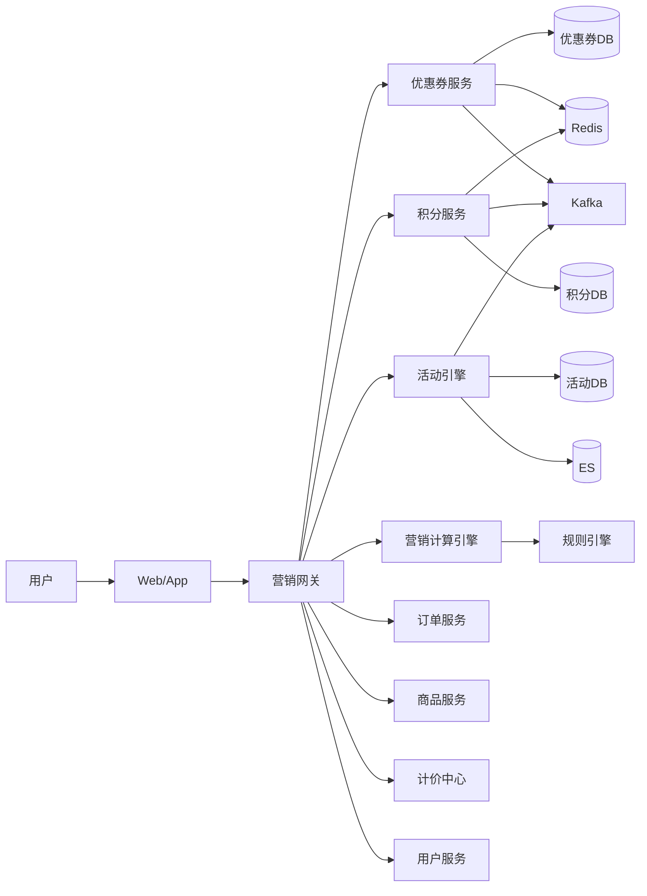
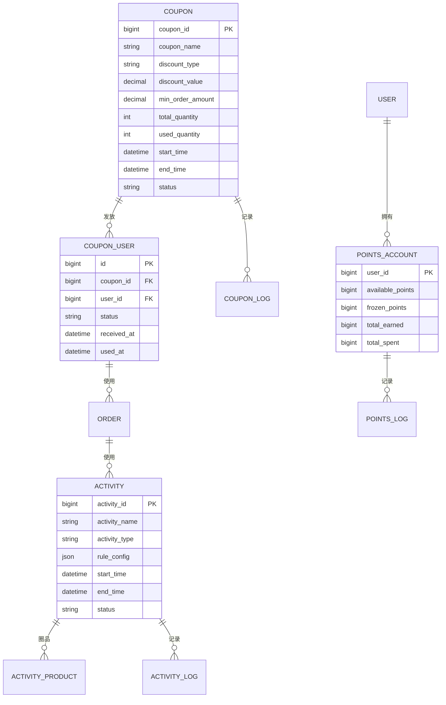
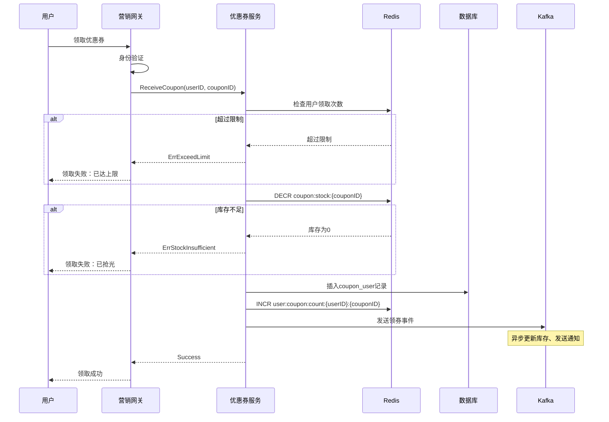
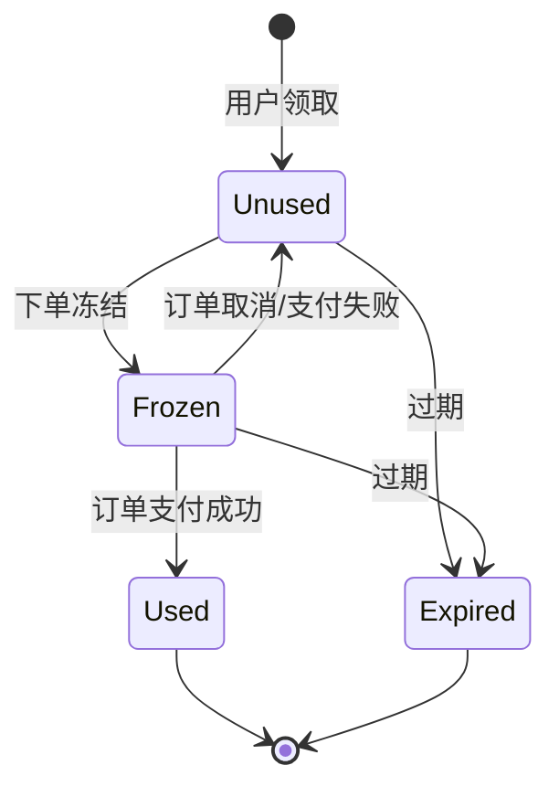
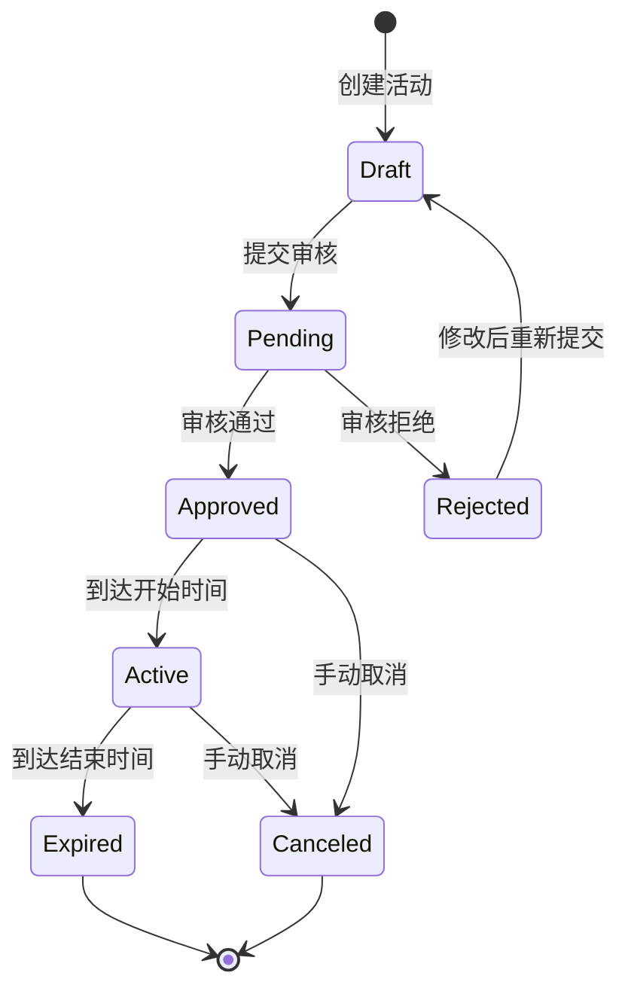
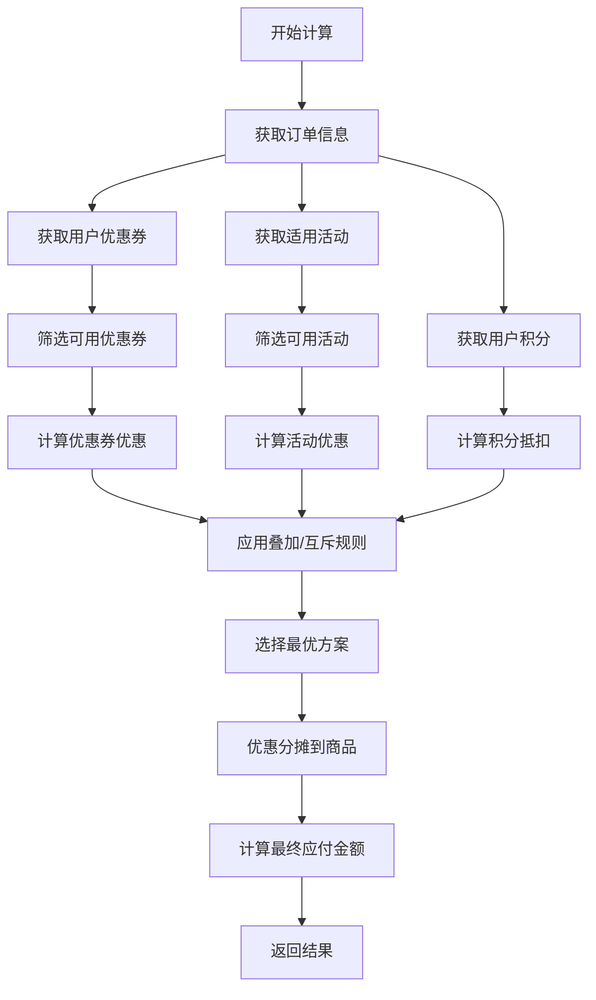
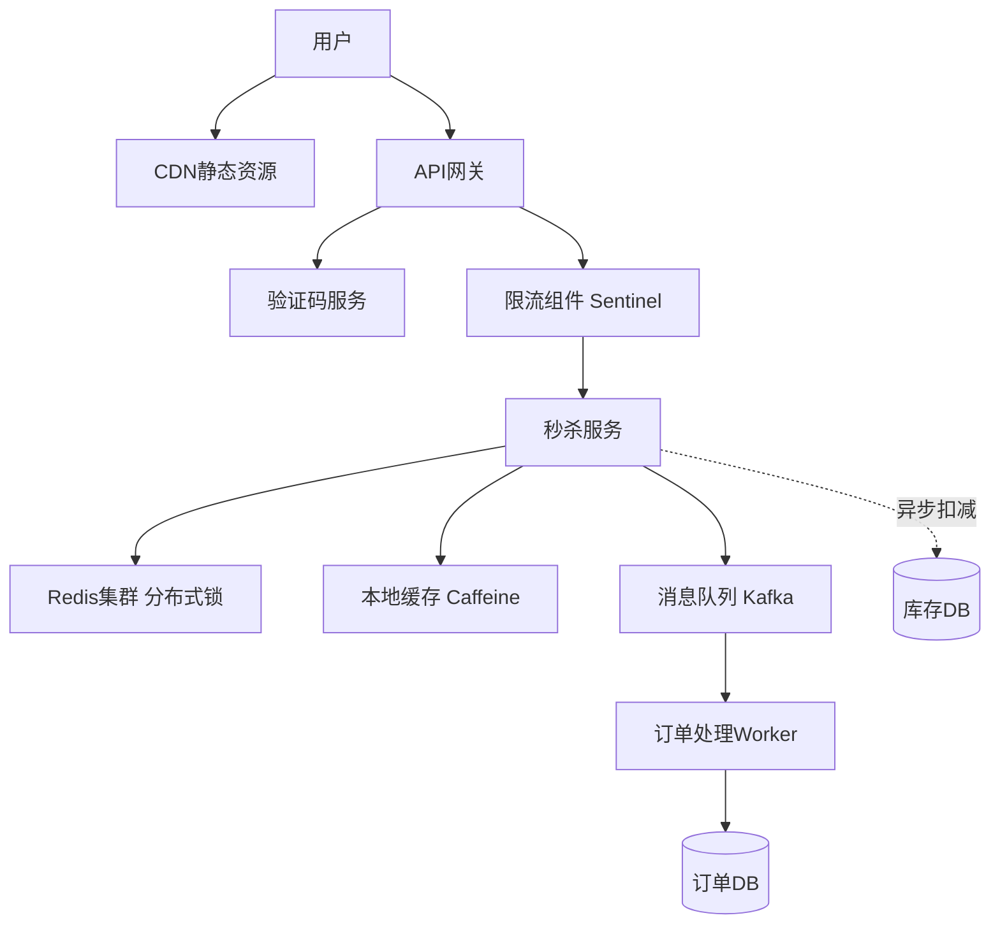
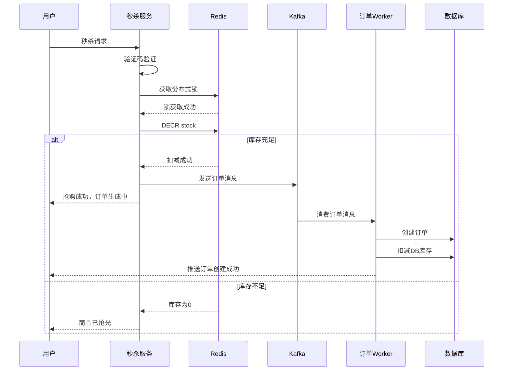
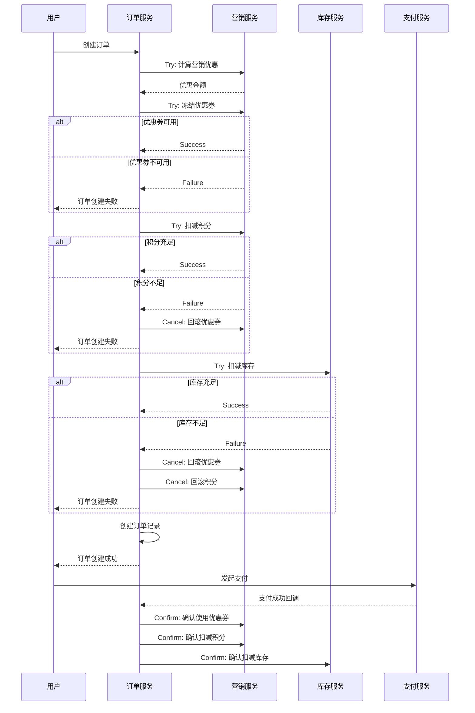
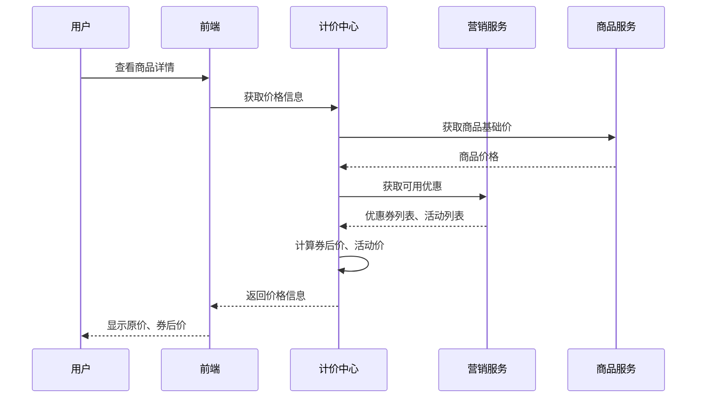

# 营销系统文章设计规范

## 文章元信息

### 基本信息
- **标题**：电商系统设计：营销系统深度解析
- **文件名**：`28-ecommerce-marketing-system.md`
- **日期**：2026-04-07
- **分类**：system-design
- **标签**：
  - system-design
  - ecommerce
  - marketing
  - coupon
  - points
  - promotion
  - high-concurrency
  - distributed-system

### 目标读者
1. **系统设计面试候选人**：关注架构设计、技术选型、trade-offs
2. **电商后端工程师**：关注完整的业务流程、代码实现、工程实践

### 预估规模
- **总行数**：2200-2500行
- **Go伪代码块**：35-40个
- **Mermaid图表**：18-22个
- **阅读时间**：30-40分钟

---

## 设计方案

**选中方案：C. 混合组织（推荐）**

### 方案特点
- 模块清晰（第2章工具、第3章计算）
- 流程完整（第5章订单集成、第6章全链路）
- 场景聚焦（第4章高并发、第8章特殊场景）
- 与订单/商品系统结构一致

---

## 第1章：系统概览

### 1.1 营销系统的定位

**内容要点**：
- 营销系统在电商平台中的角色（增长引擎、用户拉新留存、GMV提升）
- 与订单、商品、计价、用户、支付系统的关系
- 核心价值：精准营销、成本可控、效果可衡量

**Mermaid图表**：系统架构总览图（graph LR）


### 1.2 核心业务场景

**内容要点**：
1. **用户拉新**：新人专享券、首单立减
2. **用户促活**：签到积分、任务奖励
3. **用户留存**：会员积分、等级权益
4. **GMV提升**：满减活动、限时折扣、秒杀
5. **清库存**：N元购、买赠活动

**对比表格**：B2C vs B2B2C 营销差异

| 维度 | B2C（自营） | B2B2C（平台） |
|------|------------|--------------|
| 营销主体 | 平台 | 平台 + 商家 |
| 成本承担 | 平台全额 | 平台补贴 + 商家承担 |
| 活动审核 | 无需审核 | 商家活动需平台审核 |
| 优惠叠加 | 平台规则统一 | 需考虑跨店铺规则 |
| 结算复杂度 | 简单 | 需分账（平台/商家） |

### 1.3 核心挑战

**内容要点**：
1. **高并发**：秒杀/抢券场景，QPS峰值可达10万+
2. **复杂规则**：优惠叠加、互斥、优先级、最优解
3. **数据一致性**：营销扣减与订单创建的原子性
4. **防刷防薅**：黑产攻击、批量注册、恶意套现
5. **成本控制**：营销预算管理、ROI监控
6. **实时性**：库存实时扣减、优惠实时生效

### 1.4 系统架构

**内容要点**：
- 分层架构：接入层、服务层、数据层
- 核心模块：优惠券服务、积分服务、活动引擎、计算引擎
- 技术选型：MySQL（主存储）、Redis（缓存+分布式锁）、Kafka（事件驱动）、ES（活动搜索）

**Go代码**：核心常量定义
```go
// 营销工具类型
const (
    ToolTypeCoupon   = "coupon"   // 优惠券
    ToolTypePoints   = "points"   // 积分
    ToolTypeActivity = "activity" // 活动
)

// 优惠类型
const (
    DiscountTypeAmount     = "amount"      // 满减（满100减20）
    DiscountTypePercentage = "percentage"  // 折扣（8折）
    DiscountTypeFreeShip   = "free_ship"   // 包邮
    DiscountTypeGift       = "gift"        // 赠品
)

// 活动类型
const (
    ActivityTypeFlashSale  = "flash_sale"  // 秒杀
    ActivityTypeGroupBuy   = "group_buy"   // 拼团
    ActivityTypeSeckill    = "seckill"     // 限时抢购
    ActivityTypeNYuanGou   = "n_yuan_gou"  // N元购
)

// 营销状态
const (
    StatusDraft    = "draft"     // 草稿
    StatusPending  = "pending"   // 待审核
    StatusApproved = "approved"  // 已通过
    StatusRejected = "rejected"  // 已拒绝
    StatusActive   = "active"    // 进行中
    StatusExpired  = "expired"   // 已过期
    StatusCanceled = "canceled"  // 已取消
)
```

### 1.5 核心数据模型概览

**Mermaid ER图**：核心表关系


### 1.6 技术选型

**对比表格**：

| 组件 | 技术选型 | 用途 | 理由 |
|------|---------|------|------|
| 数据库 | MySQL 8.0 | 主存储 | ACID保证、成熟稳定 |
| 缓存 | Redis 6.0 | 热数据缓存、分布式锁 | 高性能、丰富数据结构 |
| 消息队列 | Kafka | 事件驱动、异步解耦 | 高吞吐、持久化 |
| 搜索引擎 | Elasticsearch | 活动搜索、用户画像 | 全文检索、聚合分析 |
| 分布式锁 | Redisson | 秒杀库存扣减 | 基于Redis、支持可重入 |
| 限流 | Sentinel | 接口限流、降级 | 实时监控、规则灵活 |
| ID生成 | Snowflake | 营销活动ID | 分布式、时间有序 |

---

## 第2章：营销工具体系

### 2.1 优惠券系统

#### 2.1.1 优惠券类型与数据模型

**Go代码**：优惠券核心结构
```go
// 优惠券主表
type Coupon struct {
    CouponID        int64           `json:"coupon_id"`
    CouponName      string          `json:"coupon_name"`
    CouponType      string          `json:"coupon_type"`       // platform/merchant
    DiscountType    string          `json:"discount_type"`     // amount/percentage/free_ship
    DiscountValue   decimal.Decimal `json:"discount_value"`    // 20元 或 0.8（8折）
    MinOrderAmount  decimal.Decimal `json:"min_order_amount"`  // 满100可用
    MaxDiscountAmt  decimal.Decimal `json:"max_discount_amount"` // 折扣券最高抵扣
    
    // 库存相关
    TotalQuantity   int64           `json:"total_quantity"`    // 总发行量
    UsedQuantity    int64           `json:"used_quantity"`     // 已使用数量
    RemainQuantity  int64           `json:"remain_quantity"`   // 剩余数量
    
    // 使用限制
    PerUserLimit    int             `json:"per_user_limit"`    // 每人限领数量
    ValidDays       int             `json:"valid_days"`        // 有效天数（领取后）
    StartTime       time.Time       `json:"start_time"`
    EndTime         time.Time       `json:"end_time"`
    
    // 适用范围
    ApplyScope      string          `json:"apply_scope"`       // all/category/product
    ApplyScopeIDs   []int64         `json:"apply_scope_ids"`   // 类目ID或商品ID列表
    
    // 状态
    Status          string          `json:"status"`
    CreatedAt       time.Time       `json:"created_at"`
    UpdatedAt       time.Time       `json:"updated_at"`
}

// 用户优惠券表
type CouponUser struct {
    ID              int64     `json:"id"`
    CouponID        int64     `json:"coupon_id"`
    UserID          int64     `json:"user_id"`
    Status          string    `json:"status"`         // unused/used/expired
    ReceivedAt      time.Time `json:"received_at"`
    UsedAt          *time.Time `json:"used_at"`
    OrderID         *int64    `json:"order_id"`       // 使用的订单ID
    ExpireAt        time.Time `json:"expire_at"`
}

// 优惠券操作日志
type CouponLog struct {
    ID              int64     `json:"id"`
    CouponUserID    int64     `json:"coupon_user_id"`
    CouponID        int64     `json:"coupon_id"`
    UserID          int64     `json:"user_id"`
    Action          string    `json:"action"`         // receive/use/expire/rollback
    OrderID         *int64    `json:"order_id"`
    BeforeStatus    string    `json:"before_status"`
    AfterStatus     string    `json:"after_status"`
    Reason          string    `json:"reason"`
    CreatedAt       time.Time `json:"created_at"`
}
```

#### 2.1.2 优惠券发放策略

**内容要点**：
1. **公开领取**：用户主动领取，先到先得
2. **定向推送**：根据用户画像精准推送
3. **裂变发券**：邀请好友注册/下单后发放
4. **订单赠送**：完成订单后赠送下次使用

**Mermaid流程图**：公开领券流程


**Go代码**：领券核心逻辑
```go
func (s *CouponService) ReceiveCoupon(ctx context.Context, userID, couponID int64) (*CouponUser, error) {
    // 1. 检查优惠券是否有效
    coupon, err := s.getCouponByID(ctx, couponID)
    if err != nil {
        return nil, err
    }
    
    if coupon.Status != StatusActive {
        return nil, ErrCouponNotActive
    }
    
    if time.Now().Before(coupon.StartTime) || time.Now().After(coupon.EndTime) {
        return nil, ErrCouponExpired
    }
    
    // 2. 检查用户领取次数（Redis）
    userReceiveKey := fmt.Sprintf("user:coupon:count:%d:%d", userID, couponID)
    receivedCount, err := s.redis.Get(ctx, userReceiveKey).Int64()
    if err != nil && err != redis.Nil {
        return nil, err
    }
    
    if receivedCount >= int64(coupon.PerUserLimit) {
        return nil, ErrExceedReceiveLimit
    }
    
    // 3. Redis库存扣减（原子操作）
    stockKey := fmt.Sprintf("coupon:stock:%d", couponID)
    remainStock, err := s.redis.Decr(ctx, stockKey).Result()
    if err != nil {
        return nil, err
    }
    
    if remainStock < 0 {
        // 回滚库存
        s.redis.Incr(ctx, stockKey)
        return nil, ErrCouponStockInsufficient
    }
    
    // 4. 数据库插入用户优惠券记录
    expireAt := time.Now().Add(time.Duration(coupon.ValidDays) * 24 * time.Hour)
    couponUser := &CouponUser{
        CouponID:   couponID,
        UserID:     userID,
        Status:     CouponStatusUnused,
        ReceivedAt: time.Now(),
        ExpireAt:   expireAt,
    }
    
    if err := s.db.InsertCouponUser(ctx, couponUser); err != nil {
        // 回滚库存
        s.redis.Incr(ctx, stockKey)
        return nil, err
    }
    
    // 5. Redis用户领取次数+1
    s.redis.Incr(ctx, userReceiveKey)
    s.redis.Expire(ctx, userReceiveKey, 7*24*time.Hour)
    
    // 6. 记录日志
    s.recordCouponLog(ctx, couponUser.ID, couponID, userID, "receive", "", CouponStatusUnused, "用户领取")
    
    // 7. 发送Kafka事件（异步）
    event := &CouponReceivedEvent{
        CouponUserID: couponUser.ID,
        CouponID:     couponID,
        UserID:       userID,
        ReceivedAt:   time.Now(),
    }
    s.publishCouponEvent(ctx, "coupon.received", event)
    
    return couponUser, nil
}
```

#### 2.1.3 优惠券核销流程

**Mermaid状态机图**：优惠券状态流转


**Go代码**：优惠券核销（订单侧调用）
```go
func (s *CouponService) UseCoupon(ctx context.Context, userID, couponUserID, orderID int64) error {
    // 1. 查询用户优惠券
    couponUser, err := s.db.GetCouponUser(ctx, couponUserID)
    if err != nil {
        return err
    }
    
    // 验证归属
    if couponUser.UserID != userID {
        return ErrCouponNotBelongToUser
    }
    
    // 验证状态（必须是unused或frozen）
    if couponUser.Status != CouponStatusUnused && couponUser.Status != CouponStatusFrozen {
        return ErrCouponAlreadyUsed
    }
    
    // 验证是否过期
    if time.Now().After(couponUser.ExpireAt) {
        return ErrCouponExpired
    }
    
    // 2. 查询优惠券详情（校验适用范围）
    coupon, err := s.getCouponByID(ctx, couponUser.CouponID)
    if err != nil {
        return err
    }
    
    // 3. 分布式锁（防止并发使用）
    lockKey := fmt.Sprintf("lock:coupon:use:%d", couponUserID)
    lock := s.redisson.GetLock(lockKey)
    if err := lock.Lock(ctx, 3*time.Second); err != nil {
        return ErrCouponLockFailed
    }
    defer lock.Unlock(ctx)
    
    // 4. 更新优惠券状态为已使用
    now := time.Now()
    if err := s.db.UpdateCouponUserStatus(ctx, couponUserID, CouponStatusUsed, orderID, &now); err != nil {
        return err
    }
    
    // 5. 优惠券主表已使用数量+1
    if err := s.db.IncrCouponUsedQuantity(ctx, couponUser.CouponID); err != nil {
        // 记录告警，异步补偿
        s.logger.Error("increment coupon used quantity failed", zap.Error(err))
    }
    
    // 6. 记录日志
    s.recordCouponLog(ctx, couponUserID, couponUser.CouponID, userID, "use", CouponStatusFrozen, CouponStatusUsed, fmt.Sprintf("订单%d使用", orderID))
    
    // 7. 发送Kafka事件
    event := &CouponUsedEvent{
        CouponUserID: couponUserID,
        CouponID:     couponUser.CouponID,
        UserID:       userID,
        OrderID:      orderID,
        UsedAt:       now,
    }
    s.publishCouponEvent(ctx, "coupon.used", event)
    
    return nil
}
```

#### 2.1.4 优惠券回退（订单取消/退款）

**Go代码**：优惠券回退
```go
func (s *CouponService) RollbackCoupon(ctx context.Context, userID, couponUserID int64, reason string) error {
    // 1. 查询用户优惠券
    couponUser, err := s.db.GetCouponUser(ctx, couponUserID)
    if err != nil {
        return err
    }
    
    // 验证归属
    if couponUser.UserID != userID {
        return ErrCouponNotBelongToUser
    }
    
    // 只有已使用或冻结状态才能回退
    if couponUser.Status != CouponStatusUsed && couponUser.Status != CouponStatusFrozen {
        return ErrCouponCannotRollback
    }
    
    // 2. 分布式锁
    lockKey := fmt.Sprintf("lock:coupon:rollback:%d", couponUserID)
    lock := s.redisson.GetLock(lockKey)
    if err := lock.Lock(ctx, 3*time.Second); err != nil {
        return ErrCouponLockFailed
    }
    defer lock.Unlock(ctx)
    
    // 3. 检查是否已过期
    newStatus := CouponStatusUnused
    if time.Now().After(couponUser.ExpireAt) {
        newStatus = CouponStatusExpired
    }
    
    // 4. 更新状态
    if err := s.db.UpdateCouponUserStatus(ctx, couponUserID, newStatus, nil, nil); err != nil {
        return err
    }
    
    // 5. 如果之前是已使用状态，需要减少已使用数量
    if couponUser.Status == CouponStatusUsed {
        if err := s.db.DecrCouponUsedQuantity(ctx, couponUser.CouponID); err != nil {
            s.logger.Error("decrement coupon used quantity failed", zap.Error(err))
        }
    }
    
    // 6. 记录日志
    s.recordCouponLog(ctx, couponUserID, couponUser.CouponID, userID, "rollback", couponUser.Status, newStatus, reason)
    
    // 7. 发送Kafka事件
    event := &CouponRolledBackEvent{
        CouponUserID: couponUserID,
        CouponID:     couponUser.CouponID,
        UserID:       userID,
        Reason:       reason,
        RolledBackAt: time.Now(),
    }
    s.publishCouponEvent(ctx, "coupon.rolled_back", event)
    
    return nil
}
```

### 2.2 积分系统

#### 2.2.1 积分账户模型

**Go代码**：积分账户结构
```go
// 积分账户表
type PointsAccount struct {
    UserID          int64     `json:"user_id"`          // PK
    AvailablePoints int64     `json:"available_points"` // 可用积分
    FrozenPoints    int64     `json:"frozen_points"`    // 冻结积分
    TotalEarned     int64     `json:"total_earned"`     // 累计获得
    TotalSpent      int64     `json:"total_spent"`      // 累计消费
    Version         int64     `json:"version"`          // 乐观锁版本号
    CreatedAt       time.Time `json:"created_at"`
    UpdatedAt       time.Time `json:"updated_at"`
}

// 积分流水表
type PointsLog struct {
    ID              int64     `json:"id"`               // PK
    UserID          int64     `json:"user_id"`
    ChangeType      string    `json:"change_type"`      // earn/spend/freeze/unfreeze/expire
    ChangeAmount    int64     `json:"change_amount"`    // 变动数量（正数=增加，负数=减少）
    BeforeBalance   int64     `json:"before_balance"`   // 变动前余额
    AfterBalance    int64     `json:"after_balance"`    // 变动后余额
    BizType         string    `json:"biz_type"`         // order/sign_in/task/refund
    BizID           string    `json:"biz_id"`           // 业务ID（订单ID等）
    Reason          string    `json:"reason"`           // 变动原因
    ExpireAt        *time.Time `json:"expire_at"`       // 过期时间
    CreatedAt       time.Time `json:"created_at"`
}

// 积分过期记录表（用于定时任务扫描）
type PointsExpire struct {
    ID              int64     `json:"id"`
    UserID          int64     `json:"user_id"`
    Points          int64     `json:"points"`           // 过期积分数
    ExpireAt        time.Time `json:"expire_at"`        // 过期时间
    Status          string    `json:"status"`           // pending/expired
    ProcessedAt     *time.Time `json:"processed_at"`
}
```

#### 2.2.2 积分发放

**内容要点**：
- **订单完成**：订单完成后按一定比例返积分
- **签到任务**：每日签到获得积分
- **邀请好友**：邀请好友注册/下单获得积分
- **评价晒单**：完成评价获得积分

**Go代码**：积分发放
```go
func (s *PointsService) EarnPoints(ctx context.Context, req *EarnPointsRequest) error {
    // 1. 验证参数
    if req.Points <= 0 {
        return ErrInvalidPoints
    }
    
    // 2. 乐观锁更新积分账户
    maxRetries := 3
    for i := 0; i < maxRetries; i++ {
        // 查询当前账户
        account, err := s.db.GetPointsAccount(ctx, req.UserID)
        if err != nil {
            if err == sql.ErrNoRows {
                // 账户不存在，创建新账户
                account = &PointsAccount{
                    UserID:          req.UserID,
                    AvailablePoints: 0,
                    FrozenPoints:    0,
                    TotalEarned:     0,
                    TotalSpent:      0,
                    Version:         0,
                }
                if err := s.db.InsertPointsAccount(ctx, account); err != nil {
                    return err
                }
            } else {
                return err
            }
        }
        
        // 计算新余额
        newAvailable := account.AvailablePoints + req.Points
        newTotalEarned := account.TotalEarned + req.Points
        
        // 乐观锁更新
        affected, err := s.db.UpdatePointsAccountWithVersion(ctx, req.UserID, account.Version, newAvailable, account.FrozenPoints, newTotalEarned, account.TotalSpent)
        if err != nil {
            return err
        }
        
        if affected > 0 {
            // 更新成功，记录流水
            expireAt := time.Now().Add(time.Duration(req.ValidDays) * 24 * time.Hour)
            log := &PointsLog{
                UserID:        req.UserID,
                ChangeType:    "earn",
                ChangeAmount:  req.Points,
                BeforeBalance: account.AvailablePoints,
                AfterBalance:  newAvailable,
                BizType:       req.BizType,
                BizID:         req.BizID,
                Reason:        req.Reason,
                ExpireAt:      &expireAt,
                CreatedAt:     time.Now(),
            }
            s.db.InsertPointsLog(ctx, log)
            
            // 插入过期记录
            expire := &PointsExpire{
                UserID:   req.UserID,
                Points:   req.Points,
                ExpireAt: expireAt,
                Status:   "pending",
            }
            s.db.InsertPointsExpire(ctx, expire)
            
            // 发送Kafka事件
            event := &PointsEarnedEvent{
                UserID:    req.UserID,
                Points:    req.Points,
                BizType:   req.BizType,
                BizID:     req.BizID,
                EarnedAt:  time.Now(),
            }
            s.publishPointsEvent(ctx, "points.earned", event)
            
            return nil
        }
        
        // 版本冲突，重试
        time.Sleep(time.Duration(i*10) * time.Millisecond)
    }
    
    return ErrPointsUpdateConflict
}
```

#### 2.2.3 积分扣减（订单侧调用）

**Go代码**：积分扣减
```go
func (s *PointsService) SpendPoints(ctx context.Context, userID int64, points int64, orderID int64) error {
    if points <= 0 {
        return ErrInvalidPoints
    }
    
    // 乐观锁更新
    maxRetries := 3
    for i := 0; i < maxRetries; i++ {
        account, err := s.db.GetPointsAccount(ctx, userID)
        if err != nil {
            return err
        }
        
        // 检查余额
        if account.AvailablePoints < points {
            return ErrPointsInsufficient
        }
        
        // 计算新余额
        newAvailable := account.AvailablePoints - points
        newTotalSpent := account.TotalSpent + points
        
        // 乐观锁更新
        affected, err := s.db.UpdatePointsAccountWithVersion(ctx, userID, account.Version, newAvailable, account.FrozenPoints, account.TotalEarned, newTotalSpent)
        if err != nil {
            return err
        }
        
        if affected > 0 {
            // 记录流水
            log := &PointsLog{
                UserID:        userID,
                ChangeType:    "spend",
                ChangeAmount:  -points,
                BeforeBalance: account.AvailablePoints,
                AfterBalance:  newAvailable,
                BizType:       "order",
                BizID:         fmt.Sprintf("%d", orderID),
                Reason:        fmt.Sprintf("订单%d抵扣", orderID),
                CreatedAt:     time.Now(),
            }
            s.db.InsertPointsLog(ctx, log)
            
            // 发送Kafka事件
            event := &PointsSpentEvent{
                UserID:   userID,
                Points:   points,
                OrderID:  orderID,
                SpentAt:  time.Now(),
            }
            s.publishPointsEvent(ctx, "points.spent", event)
            
            return nil
        }
        
        time.Sleep(time.Duration(i*10) * time.Millisecond)
    }
    
    return ErrPointsUpdateConflict
}
```

#### 2.2.4 积分退还（订单取消/退款）

**Go代码**：积分退还
```go
func (s *PointsService) RefundPoints(ctx context.Context, userID int64, points int64, orderID int64) error {
    if points <= 0 {
        return ErrInvalidPoints
    }
    
    // 乐观锁更新
    maxRetries := 3
    for i := 0; i < maxRetries; i++ {
        account, err := s.db.GetPointsAccount(ctx, userID)
        if err != nil {
            return err
        }
        
        // 计算新余额
        newAvailable := account.AvailablePoints + points
        newTotalSpent := account.TotalSpent - points
        
        // 乐观锁更新
        affected, err := s.db.UpdatePointsAccountWithVersion(ctx, userID, account.Version, newAvailable, account.FrozenPoints, account.TotalEarned, newTotalSpent)
        if err != nil {
            return err
        }
        
        if affected > 0 {
            // 记录流水
            log := &PointsLog{
                UserID:        userID,
                ChangeType:    "refund",
                ChangeAmount:  points,
                BeforeBalance: account.AvailablePoints,
                AfterBalance:  newAvailable,
                BizType:       "order",
                BizID:         fmt.Sprintf("%d", orderID),
                Reason:        fmt.Sprintf("订单%d取消/退款", orderID),
                CreatedAt:     time.Now(),
            }
            s.db.InsertPointsLog(ctx, log)
            
            // 发送Kafka事件
            event := &PointsRefundedEvent{
                UserID:     userID,
                Points:     points,
                OrderID:    orderID,
                RefundedAt: time.Now(),
            }
            s.publishPointsEvent(ctx, "points.refunded", event)
            
            return nil
        }
        
        time.Sleep(time.Duration(i*10) * time.Millisecond)
    }
    
    return ErrPointsUpdateConflict
}
```

#### 2.2.5 积分过期机制

**Go代码**：积分过期定时任务
```go
func (s *PointsService) ExpirePointsScanner(ctx context.Context) {
    ticker := time.NewTicker(1 * time.Hour)
    defer ticker.Stop()
    
    for {
        select {
        case <-ctx.Done():
            return
        case <-ticker.C:
            s.processExpiredPoints(ctx)
        }
    }
}

func (s *PointsService) processExpiredPoints(ctx context.Context) {
    // 1. 查询待过期的积分记录（过期时间 <= 当前时间 且 status=pending）
    expireList, err := s.db.GetPendingExpirePoints(ctx, time.Now())
    if err != nil {
        s.logger.Error("get pending expire points failed", zap.Error(err))
        return
    }
    
    for _, expire := range expireList {
        // 2. 扣减积分
        if err := s.expirePoints(ctx, expire); err != nil {
            s.logger.Error("expire points failed", zap.Int64("user_id", expire.UserID), zap.Error(err))
            continue
        }
    }
}

func (s *PointsService) expirePoints(ctx context.Context, expire *PointsExpire) error {
    // 乐观锁更新
    maxRetries := 3
    for i := 0; i < maxRetries; i++ {
        account, err := s.db.GetPointsAccount(ctx, expire.UserID)
        if err != nil {
            return err
        }
        
        // 计算新余额（不能扣减为负数）
        expireAmount := expire.Points
        if account.AvailablePoints < expireAmount {
            expireAmount = account.AvailablePoints
        }
        
        if expireAmount <= 0 {
            // 无可扣减积分，标记为已处理
            s.db.UpdatePointsExpireStatus(ctx, expire.ID, "expired")
            return nil
        }
        
        newAvailable := account.AvailablePoints - expireAmount
        
        // 乐观锁更新
        affected, err := s.db.UpdatePointsAccountWithVersion(ctx, expire.UserID, account.Version, newAvailable, account.FrozenPoints, account.TotalEarned, account.TotalSpent)
        if err != nil {
            return err
        }
        
        if affected > 0 {
            // 记录流水
            log := &PointsLog{
                UserID:        expire.UserID,
                ChangeType:    "expire",
                ChangeAmount:  -expireAmount,
                BeforeBalance: account.AvailablePoints,
                AfterBalance:  newAvailable,
                BizType:       "system",
                BizID:         fmt.Sprintf("expire_%d", expire.ID),
                Reason:        "积分过期",
                CreatedAt:     time.Now(),
            }
            s.db.InsertPointsLog(ctx, log)
            
            // 更新过期记录状态
            now := time.Now()
            s.db.UpdatePointsExpireStatusWithTime(ctx, expire.ID, "expired", &now)
            
            return nil
        }
        
        time.Sleep(time.Duration(i*10) * time.Millisecond)
    }
    
    return ErrPointsUpdateConflict
}
```

### 2.3 活动引擎

#### 2.3.1 活动类型

**对比表格**：常见活动类型

| 活动类型 | 业务逻辑 | 技术挑战 | 适用场景 |
|---------|---------|---------|---------|
| 满减 | 订单满X元减Y元 | 跨店铺叠加规则 | 提升客单价 |
| 折扣 | 商品打X折 | 与优惠券叠加规则 | 清库存 |
| 秒杀 | 限时限量特价 | 高并发、库存扣减 | 引流、造热点 |
| 拼团 | N人成团享优惠 | 成团判断、超时取消 | 社交裂变 |
| N元购 | 固定价格购买 | 限购、防刷 | 拉新、促活 |
| 买赠 | 买A送B | 库存联动扣减 | 关联销售 |

#### 2.3.2 活动数据模型

**Go代码**：活动结构
```go
// 活动主表
type Activity struct {
    ActivityID      int64           `json:"activity_id"`
    ActivityName    string          `json:"activity_name"`
    ActivityType    string          `json:"activity_type"`      // flash_sale/group_buy/full_reduction
    
    // 规则配置（JSON）
    RuleConfig      json.RawMessage `json:"rule_config"`
    
    // 适用范围
    ApplyScope      string          `json:"apply_scope"`        // all/category/product/shop
    
    // 时间
    StartTime       time.Time       `json:"start_time"`
    EndTime         time.Time       `json:"end_time"`
    
    // 库存（针对秒杀等）
    TotalStock      int64           `json:"total_stock"`
    UsedStock       int64           `json:"used_stock"`
    
    // 状态
    Status          string          `json:"status"`             // draft/pending/active/expired
    CreatedBy       int64           `json:"created_by"`         // 创建人（商家ID或运营ID）
    CreatedAt       time.Time       `json:"created_at"`
    UpdatedAt       time.Time       `json:"updated_at"`
}

// 活动圈品表
type ActivityProduct struct {
    ID              int64           `json:"id"`
    ActivityID      int64           `json:"activity_id"`
    ProductID       int64           `json:"product_id"`
    SKUID           int64           `json:"sku_id"`
    
    // 活动价格
    OriginalPrice   decimal.Decimal `json:"original_price"`
    ActivityPrice   decimal.Decimal `json:"activity_price"`
    
    // 库存
    ActivityStock   int64           `json:"activity_stock"`
    SoldCount       int64           `json:"sold_count"`
    
    CreatedAt       time.Time       `json:"created_at"`
}

// 满减规则示例
type FullReductionRule struct {
    Tiers []FullReductionTier `json:"tiers"`      // 阶梯规则
}

type FullReductionTier struct {
    MinAmount      decimal.Decimal `json:"min_amount"`      // 满X元
    DiscountAmount decimal.Decimal `json:"discount_amount"` // 减Y元
}

// 秒杀规则示例
type FlashSaleRule struct {
    PerUserLimit   int             `json:"per_user_limit"`  // 每人限购
    NeedVerify     bool            `json:"need_verify"`     // 是否需要验证码
}
```

#### 2.3.3 活动状态机

**Mermaid状态机图**：


#### 2.3.4 圈品规则

**内容要点**：
- **全场活动**：所有商品参与
- **指定类目**：特定类目参与
- **指定商品**：特定商品/SKU参与
- **排除规则**：某些商品不参与（如已参加其他活动）

**Go代码**：判断商品是否符合活动
```go
func (s *ActivityService) IsProductEligible(ctx context.Context, activityID, productID, skuID int64) (bool, error) {
    // 1. 查询活动
    activity, err := s.getActivityByID(ctx, activityID)
    if err != nil {
        return false, err
    }
    
    // 验证活动状态
    if activity.Status != StatusActive {
        return false, nil
    }
    
    // 验证活动时间
    now := time.Now()
    if now.Before(activity.StartTime) || now.After(activity.EndTime) {
        return false, nil
    }
    
    // 2. 根据适用范围判断
    switch activity.ApplyScope {
    case "all":
        // 全场活动
        return true, nil
        
    case "category":
        // 查询商品类目
        product, err := s.productClient.GetProduct(ctx, productID)
        if err != nil {
            return false, err
        }
        
        // 查询活动适用类目
        categories, err := s.db.GetActivityCategories(ctx, activityID)
        if err != nil {
            return false, err
        }
        
        for _, catID := range categories {
            if product.CategoryID == catID {
                return true, nil
            }
        }
        return false, nil
        
    case "product":
        // 查询活动圈品表
        activityProduct, err := s.db.GetActivityProduct(ctx, activityID, productID, skuID)
        if err != nil {
            if err == sql.ErrNoRows {
                return false, nil
            }
            return false, err
        }
        
        // 检查活动库存
        if activityProduct.SoldCount >= activityProduct.ActivityStock {
            return false, nil
        }
        
        return true, nil
        
    default:
        return false, nil
    }
}
```

---

## 第3章：营销计算引擎

### 3.1 优惠计算流程

**Mermaid流程图**：营销计算总览


**Go代码**：营销计算引擎入口
```go
type MarketingCalculationEngine struct {
    couponService   *CouponService
    pointsService   *PointsService
    activityService *ActivityService
    ruleEngine      *RuleEngine
}

type CalculateRequest struct {
    UserID      int64                  `json:"user_id"`
    Items       []*OrderItem           `json:"items"`        // 订单商品列表
    CouponIDs   []int64                `json:"coupon_ids"`   // 用户选择的优惠券
    UsePoints   int64                  `json:"use_points"`   // 使用积分数
}

type OrderItem struct {
    ProductID   int64           `json:"product_id"`
    SKUID       int64           `json:"sku_id"`
    Quantity    int             `json:"quantity"`
    Price       decimal.Decimal `json:"price"`        // 商品单价
    Amount      decimal.Decimal `json:"amount"`       // 小计（单价*数量）
}

type CalculateResponse struct {
    OriginalAmount    decimal.Decimal        `json:"original_amount"`    // 原价
    CouponDiscount    decimal.Decimal        `json:"coupon_discount"`    // 优惠券优惠
    ActivityDiscount  decimal.Decimal        `json:"activity_discount"`  // 活动优惠
    PointsDiscount    decimal.Decimal        `json:"points_discount"`    // 积分抵扣
    TotalDiscount     decimal.Decimal        `json:"total_discount"`     // 总优惠
    FinalAmount       decimal.Decimal        `json:"final_amount"`       // 最终应付
    
    ItemDiscounts     []*ItemDiscount        `json:"item_discounts"`     // 优惠分摊到商品
    UsedCoupons       []*UsedCoupon          `json:"used_coupons"`       // 使用的优惠券
    UsedActivities    []*UsedActivity        `json:"used_activities"`    // 使用的活动
    UsedPoints        int64                  `json:"used_points"`        // 使用的积分
}

func (e *MarketingCalculationEngine) Calculate(ctx context.Context, req *CalculateRequest) (*CalculateResponse, error) {
    // 1. 计算原始订单金额
    originalAmount := decimal.Zero
    for _, item := range req.Items {
        originalAmount = originalAmount.Add(item.Amount)
    }
    
    // 2. 获取可用优惠券
    availableCoupons, err := e.getAvailableCoupons(ctx, req.UserID, req.CouponIDs, req.Items)
    if err != nil {
        return nil, err
    }
    
    // 3. 获取可用活动
    availableActivities, err := e.getAvailableActivities(ctx, req.Items)
    if err != nil {
        return nil, err
    }
    
    // 4. 计算积分抵扣（1积分=0.01元）
    pointsDiscount := decimal.NewFromInt(req.UsePoints).Div(decimal.NewFromInt(100))
    
    // 5. 应用规则引擎，计算最优组合
    bestPlan, err := e.ruleEngine.FindBestCombination(ctx, originalAmount, availableCoupons, availableActivities, pointsDiscount)
    if err != nil {
        return nil, err
    }
    
    // 6. 优惠分摊到商品
    itemDiscounts := e.allocateDiscountToItems(req.Items, bestPlan)
    
    // 7. 计算最终应付金额
    totalDiscount := bestPlan.CouponDiscount.Add(bestPlan.ActivityDiscount).Add(pointsDiscount)
    finalAmount := originalAmount.Sub(totalDiscount)
    
    if finalAmount.LessThan(decimal.Zero) {
        finalAmount = decimal.Zero
    }
    
    return &CalculateResponse{
        OriginalAmount:   originalAmount,
        CouponDiscount:   bestPlan.CouponDiscount,
        ActivityDiscount: bestPlan.ActivityDiscount,
        PointsDiscount:   pointsDiscount,
        TotalDiscount:    totalDiscount,
        FinalAmount:      finalAmount,
        ItemDiscounts:    itemDiscounts,
        UsedCoupons:      bestPlan.UsedCoupons,
        UsedActivities:   bestPlan.UsedActivities,
        UsedPoints:       req.UsePoints,
    }, nil
}
```

### 3.2 优惠叠加与互斥规则

**内容要点**：
- **优惠券互斥**：同一订单只能使用一张优惠券
- **优惠券与活动叠加**：优惠券可与活动叠加（先活动后优惠券）
- **积分与优惠券/活动叠加**：积分可与优惠券、活动叠加
- **跨店铺规则**：不同店铺的优惠不能叠加

**Go代码**：规则引擎
```go
type RuleEngine struct{}

type PromotionPlan struct {
    CouponDiscount   decimal.Decimal
    ActivityDiscount decimal.Decimal
    UsedCoupons      []*UsedCoupon
    UsedActivities   []*UsedActivity
    TotalDiscount    decimal.Decimal
}

type UsedCoupon struct {
    CouponID       int64
    CouponUserID   int64
    DiscountAmount decimal.Decimal
}

type UsedActivity struct {
    ActivityID     int64
    DiscountAmount decimal.Decimal
}

func (r *RuleEngine) FindBestCombination(
    ctx context.Context,
    originalAmount decimal.Decimal,
    availableCoupons []*Coupon,
    availableActivities []*Activity,
    pointsDiscount decimal.Decimal,
) (*PromotionPlan, error) {
    
    var bestPlan *PromotionPlan
    maxDiscount := decimal.Zero
    
    // 遍历所有优惠券（每次只能用一张）
    for _, coupon := range availableCoupons {
        // 遍历所有活动组合
        activityCombinations := r.generateActivityCombinations(availableActivities)
        
        for _, activityCombo := range activityCombinations {
            // 计算本组合的优惠
            plan := r.calculatePlan(originalAmount, coupon, activityCombo)
            
            // 判断是否为最优
            if plan.TotalDiscount.GreaterThan(maxDiscount) {
                maxDiscount = plan.TotalDiscount
                bestPlan = plan
            }
        }
    }
    
    // 如果没有优惠券，只计算活动
    if bestPlan == nil {
        activityCombinations := r.generateActivityCombinations(availableActivities)
        for _, activityCombo := range activityCombinations {
            plan := r.calculatePlan(originalAmount, nil, activityCombo)
            if plan.TotalDiscount.GreaterThan(maxDiscount) {
                maxDiscount = plan.TotalDiscount
                bestPlan = plan
            }
        }
    }
    
    if bestPlan == nil {
        bestPlan = &PromotionPlan{
            CouponDiscount:   decimal.Zero,
            ActivityDiscount: decimal.Zero,
            TotalDiscount:    decimal.Zero,
        }
    }
    
    return bestPlan, nil
}

func (r *RuleEngine) calculatePlan(
    originalAmount decimal.Decimal,
    coupon *Coupon,
    activities []*Activity,
) *PromotionPlan {
    plan := &PromotionPlan{
        CouponDiscount:   decimal.Zero,
        ActivityDiscount: decimal.Zero,
        UsedCoupons:      []*UsedCoupon{},
        UsedActivities:   []*UsedActivity{},
    }
    
    currentAmount := originalAmount
    
    // 1. 先计算活动优惠
    for _, activity := range activities {
        activityDiscount := r.calculateActivityDiscount(currentAmount, activity)
        if activityDiscount.GreaterThan(decimal.Zero) {
            plan.ActivityDiscount = plan.ActivityDiscount.Add(activityDiscount)
            plan.UsedActivities = append(plan.UsedActivities, &UsedActivity{
                ActivityID:     activity.ActivityID,
                DiscountAmount: activityDiscount,
            })
            currentAmount = currentAmount.Sub(activityDiscount)
        }
    }
    
    // 2. 再计算优惠券优惠
    if coupon != nil {
        couponDiscount := r.calculateCouponDiscount(currentAmount, coupon)
        if couponDiscount.GreaterThan(decimal.Zero) {
            plan.CouponDiscount = couponDiscount
            plan.UsedCoupons = append(plan.UsedCoupons, &UsedCoupon{
                CouponID:       coupon.CouponID,
                DiscountAmount: couponDiscount,
            })
        }
    }
    
    plan.TotalDiscount = plan.ActivityDiscount.Add(plan.CouponDiscount)
    
    return plan
}

func (r *RuleEngine) calculateCouponDiscount(amount decimal.Decimal, coupon *Coupon) decimal.Decimal {
    // 检查门槛
    if amount.LessThan(coupon.MinOrderAmount) {
        return decimal.Zero
    }
    
    switch coupon.DiscountType {
    case DiscountTypeAmount:
        // 满减券：直接减discountValue
        return coupon.DiscountValue
        
    case DiscountTypePercentage:
        // 折扣券：amount * (1 - discountValue)，但不超过maxDiscountAmount
        discount := amount.Mul(decimal.NewFromInt(1).Sub(coupon.DiscountValue))
        if coupon.MaxDiscountAmt.GreaterThan(decimal.Zero) && discount.GreaterThan(coupon.MaxDiscountAmt) {
            return coupon.MaxDiscountAmt
        }
        return discount
        
    default:
        return decimal.Zero
    }
}

func (r *RuleEngine) calculateActivityDiscount(amount decimal.Decimal, activity *Activity) decimal.Decimal {
    switch activity.ActivityType {
    case ActivityTypeFlashSale:
        // 秒杀：商品级别优惠，在圈品时已计算
        return decimal.Zero
        
    case "full_reduction":
        // 满减活动
        var rule FullReductionRule
        if err := json.Unmarshal(activity.RuleConfig, &rule); err != nil {
            return decimal.Zero
        }
        
        // 找到满足的最高阶梯
        var maxTier *FullReductionTier
        for i := range rule.Tiers {
            tier := &rule.Tiers[i]
            if amount.GreaterThanOrEqual(tier.MinAmount) {
                if maxTier == nil || tier.MinAmount.GreaterThan(maxTier.MinAmount) {
                    maxTier = tier
                }
            }
        }
        
        if maxTier != nil {
            return maxTier.DiscountAmount
        }
        return decimal.Zero
        
    default:
        return decimal.Zero
    }
}

func (r *RuleEngine) generateActivityCombinations(activities []*Activity) [][]*Activity {
    // 简化处理：活动可以叠加
    // 实际场景可能需要根据活动互斥规则进行组合
    if len(activities) == 0 {
        return [][]*Activity{{}}
    }
    return [][]*Activity{activities}
}
```

### 3.3 优惠分摊到商品

**内容要点**：
- 按商品金额比例分摊优惠
- 处理分摊后的精度问题（尾差处理）

**Go代码**：优惠分摊
```go
type ItemDiscount struct {
    ProductID        int64           `json:"product_id"`
    SKUID            int64           `json:"sku_id"`
    OriginalAmount   decimal.Decimal `json:"original_amount"`
    CouponDiscount   decimal.Decimal `json:"coupon_discount"`
    ActivityDiscount decimal.Decimal `json:"activity_discount"`
    PointsDiscount   decimal.Decimal `json:"points_discount"`
    FinalAmount      decimal.Decimal `json:"final_amount"`
}

func (e *MarketingCalculationEngine) allocateDiscountToItems(
    items []*OrderItem,
    plan *PromotionPlan,
) []*ItemDiscount {
    
    itemDiscounts := make([]*ItemDiscount, len(items))
    
    // 计算总金额
    totalAmount := decimal.Zero
    for _, item := range items {
        totalAmount = totalAmount.Add(item.Amount)
    }
    
    // 按比例分摊优惠券优惠
    allocatedCouponDiscount := decimal.Zero
    for i, item := range items {
        ratio := item.Amount.Div(totalAmount)
        discount := plan.CouponDiscount.Mul(ratio).Round(2)
        
        itemDiscounts[i] = &ItemDiscount{
            ProductID:        item.ProductID,
            SKUID:            item.SKUID,
            OriginalAmount:   item.Amount,
            CouponDiscount:   discount,
            ActivityDiscount: decimal.Zero,
            PointsDiscount:   decimal.Zero,
        }
        
        allocatedCouponDiscount = allocatedCouponDiscount.Add(discount)
    }
    
    // 处理尾差（将剩余的优惠分摊到最后一个商品）
    couponDiff := plan.CouponDiscount.Sub(allocatedCouponDiscount)
    if len(itemDiscounts) > 0 && couponDiff.Abs().GreaterThan(decimal.NewFromFloat(0.01)) {
        itemDiscounts[len(itemDiscounts)-1].CouponDiscount = 
            itemDiscounts[len(itemDiscounts)-1].CouponDiscount.Add(couponDiff)
    }
    
    // 同样方式分摊活动优惠和积分优惠
    // ... (省略类似代码)
    
    // 计算每个商品的最终金额
    for i := range itemDiscounts {
        itemDiscounts[i].FinalAmount = itemDiscounts[i].OriginalAmount.
            Sub(itemDiscounts[i].CouponDiscount).
            Sub(itemDiscounts[i].ActivityDiscount).
            Sub(itemDiscounts[i].PointsDiscount)
    }
    
    return itemDiscounts
}
```

---

## 第4章：高并发场景设计

### 4.1 秒杀/抢券设计

#### 4.1.1 秒杀系统架构

**Mermaid架构图**：


#### 4.1.2 流量削峰

**内容要点**：
1. **CDN加速**：静态资源CDN缓存
2. **验证码**：人机验证，防止脚本刷单
3. **答题验证**：简单算术题，延缓请求
4. **排队机制**：超过阈值进入虚拟队列

**Go代码**：验证码验证
```go
func (s *SeckillService) VerifyCaptcha(ctx context.Context, userID int64, captchaID, captchaCode string) error {
    // 从Redis获取验证码
    key := fmt.Sprintf("captcha:%s", captchaID)
    correctCode, err := s.redis.Get(ctx, key).Result()
    if err != nil {
        if err == redis.Nil {
            return ErrCaptchaExpired
        }
        return err
    }
    
    // 验证
    if correctCode != captchaCode {
        return ErrCaptchaInvalid
    }
    
    // 删除验证码（一次性）
    s.redis.Del(ctx, key)
    
    return nil
}
```

#### 4.1.3 分布式锁

**Go代码**：基于Redis的分布式锁
```go
import (
    "github.com/go-redsync/redsync/v4"
    "github.com/go-redsync/redsync/v4/redis/goredis/v9"
)

func (s *SeckillService) SecKillProduct(ctx context.Context, req *SeckillRequest) error {
    // 1. 验证码验证
    if err := s.VerifyCaptcha(ctx, req.UserID, req.CaptchaID, req.CaptchaCode); err != nil {
        return err
    }
    
    // 2. 检查用户限购（本地缓存 + Redis）
    userPurchaseKey := fmt.Sprintf("seckill:user:%d:activity:%d", req.UserID, req.ActivityID)
    count, err := s.redis.Get(ctx, userPurchaseKey).Int()
    if err != nil && err != redis.Nil {
        return err
    }
    
    activity, _ := s.getActivity(ctx, req.ActivityID)
    if count >= activity.PerUserLimit {
        return ErrExceedPurchaseLimit
    }
    
    // 3. 分布式锁扣减库存
    stockKey := fmt.Sprintf("seckill:stock:%d", req.ActivityID)
    lockKey := fmt.Sprintf("lock:seckill:stock:%d", req.ActivityID)
    
    // 获取分布式锁
    pool := goredis.NewPool(s.redisClient)
    rs := redsync.New(pool)
    mutex := rs.NewMutex(lockKey, redsync.WithExpiry(3*time.Second))
    
    if err := mutex.Lock(); err != nil {
        return ErrSecKillBusy
    }
    defer mutex.Unlock()
    
    // 检查库存
    stock, err := s.redis.Get(ctx, stockKey).Int64()
    if err != nil {
        return err
    }
    
    if stock <= 0 {
        return ErrSecKillStockOut
    }
    
    // 扣减库存
    newStock, err := s.redis.Decr(ctx, stockKey).Result()
    if err != nil {
        return err
    }
    
    if newStock < 0 {
        // 回滚
        s.redis.Incr(ctx, stockKey)
        return ErrSecKillStockOut
    }
    
    // 4. 异步创建订单（发送Kafka消息）
    orderMsg := &SeckillOrderMessage{
        UserID:     req.UserID,
        ActivityID: req.ActivityID,
        ProductID:  req.ProductID,
        SKUID:      req.SKUID,
        Quantity:   1,
        Timestamp:  time.Now(),
    }
    
    if err := s.publishSeckillOrder(ctx, orderMsg); err != nil {
        // 回滚库存
        s.redis.Incr(ctx, stockKey)
        return err
    }
    
    // 5. 增加用户限购计数
    s.redis.Incr(ctx, userPurchaseKey)
    s.redis.Expire(ctx, userPurchaseKey, 24*time.Hour)
    
    return nil
}
```

#### 4.1.4 库存预扣与异步确认

**内容要点**：
- **Redis预扣**：快速扣减Redis库存
- **异步创单**：通过Kafka异步创建订单
- **库存同步**：定时任务将Redis库存同步到DB

**Mermaid流程图**：


### 4.2 防刷防薅

#### 4.2.1 用户行为风控

**内容要点**：
1. **设备指纹**：识别设备唯一性
2. **IP限制**：同一IP限制请求频率
3. **用户行为分析**：异常行为检测（如极短时间内多次请求）
4. **黑名单**：将作弊用户加入黑名单

**Go代码**：频率限制
```go
func (s *MarketingService) CheckRateLimit(ctx context.Context, userID int64, action string) error {
    // 1. 检查黑名单
    blacklistKey := fmt.Sprintf("blacklist:user:%d", userID)
    exists, err := s.redis.Exists(ctx, blacklistKey).Result()
    if err != nil {
        return err
    }
    if exists > 0 {
        return ErrUserInBlacklist
    }
    
    // 2. 滑动窗口限流
    // 1分钟内最多10次请求
    key := fmt.Sprintf("ratelimit:%s:%d", action, userID)
    
    now := time.Now().Unix()
    windowStart := now - 60
    
    pipe := s.redis.Pipeline()
    
    // 移除窗口外的记录
    pipe.ZRemRangeByScore(ctx, key, "0", fmt.Sprintf("%d", windowStart))
    
    // 统计窗口内的请求数
    countCmd := pipe.ZCount(ctx, key, fmt.Sprintf("%d", windowStart), fmt.Sprintf("%d", now))
    
    // 添加当前请求
    pipe.ZAdd(ctx, key, redis.Z{Score: float64(now), Member: fmt.Sprintf("%d", now)})
    
    // 设置过期时间
    pipe.Expire(ctx, key, 2*time.Minute)
    
    _, err = pipe.Exec(ctx)
    if err != nil {
        return err
    }
    
    count := countCmd.Val()
    if count >= 10 {
        return ErrRateLimitExceeded
    }
    
    return nil
}
```

#### 4.2.2 营销预算控制

**Go代码**：预算控制
```go
type BudgetController struct {
    redis *redis.Client
}

func (c *BudgetController) CheckBudget(ctx context.Context, activityID int64, amount decimal.Decimal) error {
    budgetKey := fmt.Sprintf("activity:budget:%d", activityID)
    
    // 获取剩余预算
    remainBudget, err := c.redis.Get(ctx, budgetKey).Result()
    if err != nil {
        if err == redis.Nil {
            return ErrBudgetExhausted
        }
        return err
    }
    
    remain, _ := decimal.NewFromString(remainBudget)
    if remain.LessThan(amount) {
        return ErrBudgetInsufficient
    }
    
    return nil
}

func (c *BudgetController) DeductBudget(ctx context.Context, activityID int64, amount decimal.Decimal) error {
    budgetKey := fmt.Sprintf("activity:budget:%d", activityID)
    
    // Lua脚本保证原子性
    luaScript := `
        local budget_key = KEYS[1]
        local amount = tonumber(ARGV[1])
        local remain = tonumber(redis.call('GET', budget_key) or 0)
        
        if remain >= amount then
            redis.call('DECRBY', budget_key, amount)
            return 1
        else
            return 0
        end
    `
    
    result, err := c.redis.Eval(ctx, luaScript, []string{budgetKey}, amount.String()).Int()
    if err != nil {
        return err
    }
    
    if result == 0 {
        return ErrBudgetInsufficient
    }
    
    return nil
}
```

---

## 第5章：营销与订单集成

### 5.1 下单时的营销扣减（Saga模式）

**Mermaid序列图**：订单创建流程


**Go代码**：Saga模式下单
```go
func (s *OrderService) CreateOrder(ctx context.Context, req *CreateOrderRequest) (*Order, error) {
    // 1. 构建Saga协调器
    saga := NewSaga()
    
    var marketingResult *MarketingCalculationResult
    var order *Order
    
    // Step 1: 计算营销优惠
    saga.AddStep(&SagaStep{
        Name: "计算营销优惠",
        TryFunc: func(ctx context.Context) error {
            calcReq := &CalculateRequest{
                UserID:    req.UserID,
                Items:     req.Items,
                CouponIDs: req.CouponIDs,
                UsePoints: req.UsePoints,
            }
            result, err := s.marketingClient.Calculate(ctx, calcReq)
            if err != nil {
                return err
            }
            marketingResult = result
            return nil
        },
        CancelFunc: func(ctx context.Context) error {
            return nil // 只是计算，无需回滚
        },
    })
    
    // Step 2: 冻结优惠券
    saga.AddStep(&SagaStep{
        Name: "冻结优惠券",
        TryFunc: func(ctx context.Context) error {
            if len(req.CouponIDs) == 0 {
                return nil
            }
            return s.marketingClient.FreezeCoupon(ctx, req.UserID, req.CouponIDs[0])
        },
        CancelFunc: func(ctx context.Context) error {
            if len(req.CouponIDs) == 0 {
                return nil
            }
            return s.marketingClient.UnfreezeCoupon(ctx, req.UserID, req.CouponIDs[0])
        },
    })
    
    // Step 3: 扣减积分
    saga.AddStep(&SagaStep{
        Name: "扣减积分",
        TryFunc: func(ctx context.Context) error {
            if req.UsePoints <= 0 {
                return nil
            }
            return s.marketingClient.SpendPoints(ctx, req.UserID, req.UsePoints, 0)
        },
        CancelFunc: func(ctx context.Context) error {
            if req.UsePoints <= 0 {
                return nil
            }
            return s.marketingClient.RefundPoints(ctx, req.UserID, req.UsePoints, 0)
        },
    })
    
    // Step 4: 扣减库存
    saga.AddStep(&SagaStep{
        Name: "扣减库存",
        TryFunc: func(ctx context.Context) error {
            for _, item := range req.Items {
                if err := s.inventoryClient.DeductStock(ctx, item.SKUID, item.Quantity); err != nil {
                    return err
                }
            }
            return nil
        },
        CancelFunc: func(ctx context.Context) error {
            for _, item := range req.Items {
                s.inventoryClient.RestoreStock(ctx, item.SKUID, item.Quantity)
            }
            return nil
        },
    })
    
    // Step 5: 创建订单记录
    saga.AddStep(&SagaStep{
        Name: "创建订单记录",
        TryFunc: func(ctx context.Context) error {
            order = &Order{
                OrderID:          GenerateOrderID(),
                UserID:           req.UserID,
                Status:           OrderStatusPending,
                OriginalAmount:   marketingResult.OriginalAmount,
                DiscountAmount:   marketingResult.TotalDiscount,
                FinalAmount:      marketingResult.FinalAmount,
                UsedCouponID:     req.CouponIDs,
                UsedPoints:       req.UsePoints,
                CreatedAt:        time.Now(),
            }
            return s.db.InsertOrder(ctx, order)
        },
        CancelFunc: func(ctx context.Context) error {
            if order != nil {
                return s.db.DeleteOrder(ctx, order.OrderID)
            }
            return nil
        },
    })
    
    // 执行Saga
    if err := saga.Execute(ctx); err != nil {
        return nil, err
    }
    
    return order, nil
}
```

### 5.2 取消订单时的营销回退

**Go代码**：订单取消
```go
func (s *OrderService) CancelOrder(ctx context.Context, orderID int64) error {
    // 1. 查询订单
    order, err := s.db.GetOrder(ctx, orderID)
    if err != nil {
        return err
    }
    
    // 验证状态
    if order.Status != OrderStatusPending && order.Status != OrderStatusPaid {
        return ErrOrderCannotCancel
    }
    
    // 2. 构建Saga回滚
    saga := NewSaga()
    
    // Step 1: 更新订单状态
    saga.AddStep(&SagaStep{
        Name: "更新订单状态",
        TryFunc: func(ctx context.Context) error {
            return s.db.UpdateOrderStatus(ctx, orderID, OrderStatusCanceled)
        },
        CancelFunc: func(ctx context.Context) error {
            return s.db.UpdateOrderStatus(ctx, orderID, order.Status)
        },
    })
    
    // Step 2: 回滚优惠券
    saga.AddStep(&SagaStep{
        Name: "回滚优惠券",
        TryFunc: func(ctx context.Context) error {
            if len(order.UsedCouponID) == 0 {
                return nil
            }
            return s.marketingClient.RollbackCoupon(ctx, order.UserID, order.UsedCouponID[0], "订单取消")
        },
        CancelFunc: func(ctx context.Context) error {
            return nil
        },
    })
    
    // Step 3: 退还积分
    saga.AddStep(&SagaStep{
        Name: "退还积分",
        TryFunc: func(ctx context.Context) error {
            if order.UsedPoints <= 0 {
                return nil
            }
            return s.marketingClient.RefundPoints(ctx, order.UserID, order.UsedPoints, orderID)
        },
        CancelFunc: func(ctx context.Context) error {
            return nil
        },
    })
    
    // Step 4: 回滚库存
    saga.AddStep(&SagaStep{
        Name: "回滚库存",
        TryFunc: func(ctx context.Context) error {
            items, _ := s.db.GetOrderItems(ctx, orderID)
            for _, item := range items {
                s.inventoryClient.RestoreStock(ctx, item.SKUID, item.Quantity)
            }
            return nil
        },
        CancelFunc: func(ctx context.Context) error {
            return nil
        },
    })
    
    // 执行Saga
    return saga.Execute(ctx)
}
```

---

## 第6章：跨系统全链路集成

### 6.1 与商品系统集成（圈品规则）

**内容要点**：
- 营销系统从商品系统获取商品信息（类目、价格、库存）
- 商品系统暴露营销标签（如可用券、活动Tag）

**Go代码**：查询商品营销信息
```go
func (s *MarketingService) GetProductMarketingInfo(ctx context.Context, productID int64) (*ProductMarketingInfo, error) {
    // 1. 从商品服务获取商品信息
    product, err := s.productClient.GetProduct(ctx, productID)
    if err != nil {
        return nil, err
    }
    
    // 2. 查询适用的优惠券
    availableCoupons, err := s.couponService.GetAvailableCouponsForProduct(ctx, productID, product.CategoryID)
    if err != nil {
        return nil, err
    }
    
    // 3. 查询适用的活动
    availableActivities, err := s.activityService.GetActivitiesForProduct(ctx, productID)
    if err != nil {
        return nil, err
    }
    
    return &ProductMarketingInfo{
        ProductID:           productID,
        AvailableCoupons:    availableCoupons,
        AvailableActivities: availableActivities,
        MarketingTags:       product.MarketingTags,
    }, nil
}
```

### 6.2 与计价中心集成（价格计算）

**内容要点**：
- 计价中心调用营销服务获取优惠信息
- 营销服务提供优惠试算接口

**Mermaid流程图**：


### 6.3 与用户系统集成（用户画像）

**内容要点**：
- 根据用户画像进行精准营销
- 用户标签：新用户、高价值用户、沉睡用户等

**Go代码**：用户画像营销
```go
type UserProfile struct {
    UserID       int64
    UserLevel    string    // normal/vip/svip
    IsNewUser    bool
    TotalOrders  int64
    TotalGMV     decimal.Decimal
    LastOrderAt  time.Time
    Tags         []string  // ["high_value", "fashion_lover"]
}

func (s *MarketingService) SendTargetedCoupons(ctx context.Context) {
    // 1. 获取目标用户群
    profiles, err := s.userClient.GetUserProfiles(ctx, &UserProfileQuery{
        IsNewUser: true,
        Limit:     1000,
    })
    if err != nil {
        return
    }
    
    // 2. 为每个用户发放新人券
    for _, profile := range profiles {
        couponID := int64(100001) // 新人专享券
        
        if err := s.couponService.IssueCouponToUser(ctx, profile.UserID, couponID); err != nil {
            s.logger.Error("issue coupon failed", zap.Int64("user_id", profile.UserID), zap.Error(err))
            continue
        }
        
        // 发送站内消息通知
        s.notificationClient.SendMessage(ctx, profile.UserID, "您有新人专享券待领取")
    }
}
```

### 6.4 与支付系统集成（补贴核算）

**内容要点**：
- 平台补贴与商家承担的优惠分账
- 支付成功后的营销费用结算

**Go代码**：营销费用结算
```go
type MarketingCostSettlement struct {
    OrderID              int64
    PlatformSubsidy      decimal.Decimal  // 平台补贴
    MerchantDiscount     decimal.Decimal  // 商家承担
    CouponCost           decimal.Decimal  // 优惠券成本
    ActivityCost         decimal.Decimal  // 活动成本
    PointsCost           decimal.Decimal  // 积分成本
}

func (s *MarketingService) SettleMarketingCost(ctx context.Context, orderID int64) (*MarketingCostSettlement, error) {
    // 1. 查询订单营销信息
    order, err := s.orderClient.GetOrder(ctx, orderID)
    if err != nil {
        return nil, err
    }
    
    settlement := &MarketingCostSettlement{
        OrderID: orderID,
    }
    
    // 2. 计算优惠券成本
    if len(order.UsedCouponID) > 0 {
        coupon, _ := s.couponService.GetCoupon(ctx, order.UsedCouponID[0])
        
        // 平台券：平台全额承担
        // 商家券：商家全额承担
        if coupon.CouponType == "platform" {
            settlement.PlatformSubsidy = settlement.PlatformSubsidy.Add(coupon.DiscountValue)
        } else {
            settlement.MerchantDiscount = settlement.MerchantDiscount.Add(coupon.DiscountValue)
        }
        
        settlement.CouponCost = coupon.DiscountValue
    }
    
    // 3. 计算活动成本
    activities, _ := s.activityService.GetActivitiesByOrder(ctx, orderID)
    for _, activity := range activities {
        activityCost := activity.DiscountAmount
        
        // 按活动配置的承担比例分摊
        platformRatio := activity.PlatformSubsidyRatio  // 如 0.5 表示平台承担50%
        settlement.PlatformSubsidy = settlement.PlatformSubsidy.Add(activityCost.Mul(decimal.NewFromFloat(platformRatio)))
        settlement.MerchantDiscount = settlement.MerchantDiscount.Add(activityCost.Mul(decimal.NewFromFloat(1 - platformRatio)))
        settlement.ActivityCost = settlement.ActivityCost.Add(activityCost)
    }
    
    // 4. 计算积分成本（平台承担）
    if order.UsedPoints > 0 {
        pointsCost := decimal.NewFromInt(order.UsedPoints).Div(decimal.NewFromInt(100))
        settlement.PointsCost = pointsCost
        settlement.PlatformSubsidy = settlement.PlatformSubsidy.Add(pointsCost)
    }
    
    // 5. 持久化结算记录
    s.db.InsertMarketingCostSettlement(ctx, settlement)
    
    return settlement, nil
}
```

---

## 第7章：数据一致性保障

### 7.1 分布式事务（Saga模式）

（已在第5章详细说明，此处可简化或引用）

**内容要点**：
- Saga模式：将长事务拆分为多个本地事务
- 每个本地事务有对应的补偿操作
- 正向执行失败时，逆序执行补偿操作

### 7.2 补偿任务与重试

**Go代码**：补偿任务
```go
type CompensationTask struct {
    TaskID      int64     `json:"task_id"`
    BizType     string    `json:"biz_type"`     // order/coupon/points
    BizID       string    `json:"biz_id"`
    Action      string    `json:"action"`       // rollback_coupon/refund_points
    Payload     string    `json:"payload"`      // JSON参数
    Status      string    `json:"status"`       // pending/success/failed
    RetryCount  int       `json:"retry_count"`
    MaxRetries  int       `json:"max_retries"`
    NextRetryAt time.Time `json:"next_retry_at"`
    CreatedAt   time.Time `json:"created_at"`
}

func (s *CompensationService) CompensationWorker(ctx context.Context) {
    ticker := time.NewTicker(10 * time.Second)
    defer ticker.Stop()
    
    for {
        select {
        case <-ctx.Done():
            return
        case <-ticker.C:
            s.processCompensationTasks(ctx)
        }
    }
}

func (s *CompensationService) processCompensationTasks(ctx context.Context) {
    // 1. 查询待补偿任务
    tasks, err := s.db.GetPendingCompensationTasks(ctx, time.Now(), 100)
    if err != nil {
        s.logger.Error("get pending compensation tasks failed", zap.Error(err))
        return
    }
    
    for _, task := range tasks {
        if err := s.executeCompensation(ctx, task); err != nil {
            // 更新重试次数
            task.RetryCount++
            
            if task.RetryCount >= task.MaxRetries {
                // 超过最大重试次数，标记为失败，发送告警
                s.db.UpdateCompensationTaskStatus(ctx, task.TaskID, "failed")
                s.alertClient.SendAlert(ctx, fmt.Sprintf("补偿任务失败: %d", task.TaskID))
            } else {
                // 指数退避重试
                nextRetryAt := time.Now().Add(time.Duration(math.Pow(2, float64(task.RetryCount))) * time.Minute)
                s.db.UpdateCompensationTaskRetry(ctx, task.TaskID, task.RetryCount, nextRetryAt)
            }
        } else {
            // 补偿成功
            s.db.UpdateCompensationTaskStatus(ctx, task.TaskID, "success")
        }
    }
}

func (s *CompensationService) executeCompensation(ctx context.Context, task *CompensationTask) error {
    switch task.Action {
    case "rollback_coupon":
        var payload struct {
            UserID       int64 `json:"user_id"`
            CouponUserID int64 `json:"coupon_user_id"`
        }
        if err := json.Unmarshal([]byte(task.Payload), &payload); err != nil {
            return err
        }
        return s.marketingClient.RollbackCoupon(ctx, payload.UserID, payload.CouponUserID, "补偿回滚")
        
    case "refund_points":
        var payload struct {
            UserID  int64 `json:"user_id"`
            Points  int64 `json:"points"`
            OrderID int64 `json:"order_id"`
        }
        if err := json.Unmarshal([]byte(task.Payload), &payload); err != nil {
            return err
        }
        return s.marketingClient.RefundPoints(ctx, payload.UserID, payload.Points, payload.OrderID)
        
    default:
        return fmt.Errorf("unknown compensation action: %s", task.Action)
    }
}
```

### 7.3 最终一致性方案

**内容要点**：
- 基于Kafka的事件驱动架构
- 下游系统消费事件，更新本地状态
- 定时对账任务发现并修复不一致

**Go代码**：事件发布
```go
func (s *MarketingService) publishMarketingEvent(ctx context.Context, topic string, event interface{}) error {
    eventData, err := json.Marshal(event)
    if err != nil {
        return err
    }
    
    msg := &kafka.Message{
        Topic: topic,
        Key:   []byte(fmt.Sprintf("%d", time.Now().UnixNano())),
        Value: eventData,
    }
    
    return s.kafkaProducer.WriteMessages(ctx, msg)
}

// 下游消费示例
func (s *OrderService) consumeMarketingEvents(ctx context.Context) {
    reader := kafka.NewReader(kafka.ReaderConfig{
        Brokers: []string{"localhost:9092"},
        Topic:   "marketing.coupon.used",
        GroupID: "order-service",
    })
    defer reader.Close()
    
    for {
        msg, err := reader.ReadMessage(ctx)
        if err != nil {
            s.logger.Error("read message failed", zap.Error(err))
            continue
        }
        
        var event CouponUsedEvent
        if err := json.Unmarshal(msg.Value, &event); err != nil {
            s.logger.Error("unmarshal event failed", zap.Error(err))
            continue
        }
        
        // 更新订单的营销信息
        s.updateOrderMarketingInfo(ctx, event.OrderID, &event)
    }
}
```

### 7.4 数据对账

**Go代码**：营销数据对账
```go
func (s *ReconciliationService) ReconcileMarketingData(ctx context.Context, date time.Time) error {
    // 1. 从营销服务获取当日优惠券使用记录
    marketingCouponUsage, err := s.marketingClient.GetCouponUsageByDate(ctx, date)
    if err != nil {
        return err
    }
    
    // 2. 从订单服务获取当日订单的优惠券使用记录
    orderCouponUsage, err := s.orderClient.GetOrderCouponUsageByDate(ctx, date)
    if err != nil {
        return err
    }
    
    // 3. 比对
    marketingMap := make(map[int64]*CouponUsageRecord)
    for _, record := range marketingCouponUsage {
        marketingMap[record.OrderID] = record
    }
    
    var discrepancies []*Discrepancy
    
    for _, orderRecord := range orderCouponUsage {
        marketingRecord, exists := marketingMap[orderRecord.OrderID]
        
        if !exists {
            // 订单中有记录，但营销系统中没有
            discrepancies = append(discrepancies, &Discrepancy{
                OrderID: orderRecord.OrderID,
                Type:    "missing_in_marketing",
                Detail:  fmt.Sprintf("订单%d的优惠券使用记录在营销系统中缺失", orderRecord.OrderID),
            })
            continue
        }
        
        // 比对金额
        if !orderRecord.DiscountAmount.Equal(marketingRecord.DiscountAmount) {
            discrepancies = append(discrepancies, &Discrepancy{
                OrderID: orderRecord.OrderID,
                Type:    "amount_mismatch",
                Detail:  fmt.Sprintf("订单%d的优惠金额不一致：订单=%s, 营销=%s", 
                    orderRecord.OrderID, 
                    orderRecord.DiscountAmount.String(), 
                    marketingRecord.DiscountAmount.String()),
            })
        }
    }
    
    // 4. 处理差异
    if len(discrepancies) > 0 {
        s.logger.Warn("found discrepancies in marketing data", zap.Int("count", len(discrepancies)))
        
        // 保存差异记录
        for _, d := range discrepancies {
            s.db.InsertDiscrepancy(ctx, d)
        }
        
        // 发送告警
        s.alertClient.SendAlert(ctx, fmt.Sprintf("营销数据对账发现%d条差异", len(discrepancies)))
    }
    
    return nil
}
```

---

## 第8章：特殊营销场景

### 8.1 跨店铺满减

**内容要点**：
- 用户在多个店铺购物，满足总金额后享受满减
- 优惠按店铺订单金额比例分摊

**Go代码**：跨店铺满减计算
```go
func (s *MarketingService) CalculateCrossShopFullReduction(
    ctx context.Context,
    userID int64,
    shopOrders map[int64]*ShopOrder, // shopID -> ShopOrder
) (*CrossShopDiscountResult, error) {
    
    // 1. 查询跨店满减活动
    activity, err := s.activityService.GetCrossShopActivity(ctx)
    if err != nil {
        return nil, err
    }
    
    var rule FullReductionRule
    if err := json.Unmarshal(activity.RuleConfig, &rule); err != nil {
        return nil, err
    }
    
    // 2. 计算总金额
    totalAmount := decimal.Zero
    for _, shopOrder := range shopOrders {
        totalAmount = totalAmount.Add(shopOrder.Amount)
    }
    
    // 3. 找到满足的最高阶梯
    var matchedTier *FullReductionTier
    for i := range rule.Tiers {
        tier := &rule.Tiers[i]
        if totalAmount.GreaterThanOrEqual(tier.MinAmount) {
            if matchedTier == nil || tier.MinAmount.GreaterThan(matchedTier.MinAmount) {
                matchedTier = tier
            }
        }
    }
    
    if matchedTier == nil {
        return &CrossShopDiscountResult{
            TotalDiscount: decimal.Zero,
            ShopDiscounts: map[int64]decimal.Decimal{},
        }, nil
    }
    
    // 4. 按比例分摊优惠到各店铺
    shopDiscounts := make(map[int64]decimal.Decimal)
    allocatedDiscount := decimal.Zero
    
    shopIDs := make([]int64, 0, len(shopOrders))
    for shopID := range shopOrders {
        shopIDs = append(shopIDs, shopID)
    }
    
    for i, shopID := range shopIDs {
        shopOrder := shopOrders[shopID]
        ratio := shopOrder.Amount.Div(totalAmount)
        discount := matchedTier.DiscountAmount.Mul(ratio).Round(2)
        
        // 最后一个店铺处理尾差
        if i == len(shopIDs)-1 {
            discount = matchedTier.DiscountAmount.Sub(allocatedDiscount)
        }
        
        shopDiscounts[shopID] = discount
        allocatedDiscount = allocatedDiscount.Add(discount)
    }
    
    return &CrossShopDiscountResult{
        ActivityID:    activity.ActivityID,
        TotalDiscount: matchedTier.DiscountAmount,
        ShopDiscounts: shopDiscounts,
    }, nil
}
```

### 8.2 阶梯优惠

**内容要点**：
- 购买越多，优惠越多
- 例如：买1件9折，买2件8折，买3件及以上7折

**Go代码**：阶梯优惠
```go
type TieredDiscountRule struct {
    Tiers []TieredDiscountTier `json:"tiers"`
}

type TieredDiscountTier struct {
    MinQuantity int             `json:"min_quantity"`
    Discount    decimal.Decimal `json:"discount"` // 0.9表示9折
}

func (s *MarketingService) CalculateTieredDiscount(
    ctx context.Context,
    productID int64,
    quantity int,
    unitPrice decimal.Decimal,
) decimal.Decimal {
    
    // 查询阶梯优惠规则
    activity, err := s.activityService.GetTieredDiscountActivity(ctx, productID)
    if err != nil {
        return decimal.Zero
    }
    
    var rule TieredDiscountRule
    if err := json.Unmarshal(activity.RuleConfig, &rule); err != nil {
        return decimal.Zero
    }
    
    // 找到匹配的阶梯
    var matchedTier *TieredDiscountTier
    for i := range rule.Tiers {
        tier := &rule.Tiers[i]
        if quantity >= tier.MinQuantity {
            if matchedTier == nil || tier.MinQuantity > matchedTier.MinQuantity {
                matchedTier = tier
            }
        }
    }
    
    if matchedTier == nil {
        return decimal.Zero
    }
    
    // 计算优惠
    originalAmount := unitPrice.Mul(decimal.NewFromInt(int64(quantity)))
    discountedAmount := originalAmount.Mul(matchedTier.Discount)
    discount := originalAmount.Sub(discountedAmount)
    
    return discount
}
```

### 8.3 组合优惠（买A送B）

**内容要点**：
- 购买指定商品A，赠送商品B
- 需同时扣减A和B的库存

**Go代码**：买赠活动
```go
type BundleGiftRule struct {
    BuyProductID  int64 `json:"buy_product_id"`   // 购买商品
    BuyQuantity   int   `json:"buy_quantity"`     // 购买数量
    GiftProductID int64 `json:"gift_product_id"`  // 赠品
    GiftQuantity  int   `json:"gift_quantity"`    // 赠品数量
}

func (s *MarketingService) ApplyBundleGiftActivity(
    ctx context.Context,
    orderItems []*OrderItem,
) ([]*OrderItem, error) {
    
    // 查询买赠活动
    activities, err := s.activityService.GetBundleGiftActivities(ctx)
    if err != nil {
        return orderItems, err
    }
    
    giftItems := []*OrderItem{}
    
    for _, activity := range activities {
        var rule BundleGiftRule
        if err := json.Unmarshal(activity.RuleConfig, &rule); err != nil {
            continue
        }
        
        // 检查订单中是否包含购买商品
        for _, item := range orderItems {
            if item.ProductID == rule.BuyProductID && item.Quantity >= rule.BuyQuantity {
                // 计算可获得的赠品数量
                giftCount := item.Quantity / rule.BuyQuantity
                totalGiftQty := giftCount * rule.GiftQuantity
                
                // 添加赠品到订单
                giftItem := &OrderItem{
                    ProductID: rule.GiftProductID,
                    Quantity:  totalGiftQty,
                    Price:     decimal.Zero, // 赠品价格为0
                    Amount:    decimal.Zero,
                    IsGift:    true,
                }
                
                giftItems = append(giftItems, giftItem)
            }
        }
    }
    
    // 合并原订单商品和赠品
    allItems := append(orderItems, giftItems...)
    
    return allItems, nil
}
```

### 8.4 新人专享

**内容要点**：
- 新注册用户专享优惠
- 首单立减

**Go代码**：新人专享判断
```go
func (s *MarketingService) IsNewUserEligible(ctx context.Context, userID int64) (bool, error) {
    // 1. 查询用户注册时间
    user, err := s.userClient.GetUser(ctx, userID)
    if err != nil {
        return false, err
    }
    
    // 注册时间在7天内
    if time.Since(user.RegisteredAt) > 7*24*time.Hour {
        return false, nil
    }
    
    // 2. 查询用户订单数
    orderCount, err := s.orderClient.GetUserOrderCount(ctx, userID)
    if err != nil {
        return false, err
    }
    
    // 未下过单
    if orderCount > 0 {
        return false, nil
    }
    
    return true, nil
}

func (s *MarketingService) ApplyNewUserDiscount(ctx context.Context, userID int64, amount decimal.Decimal) (decimal.Decimal, error) {
    isEligible, err := s.IsNewUserEligible(ctx, userID)
    if err != nil {
        return decimal.Zero, err
    }
    
    if !isEligible {
        return decimal.Zero, nil
    }
    
    // 新人立减20元
    discount := decimal.NewFromInt(20)
    
    // 不超过订单金额
    if discount.GreaterThan(amount) {
        discount = amount
    }
    
    return discount, nil
}
```

---

## 第9章：工程实践

### 9.1 营销活动ID生成

**Go代码**：Snowflake算法
```go
type SnowflakeIDGenerator struct {
    mu          sync.Mutex
    epoch       int64
    workerID    int64
    sequence    int64
    lastTimestamp int64
}

const (
    workerIDBits     = 10
    sequenceBits     = 12
    maxWorkerID      = -1 ^ (-1 << workerIDBits)
    maxSequence      = -1 ^ (-1 << sequenceBits)
    timeShift        = workerIDBits + sequenceBits
    workerIDShift    = sequenceBits
)

func NewSnowflakeIDGenerator(workerID int64) *SnowflakeIDGenerator {
    if workerID < 0 || workerID > maxWorkerID {
        panic("worker ID out of range")
    }
    
    return &SnowflakeIDGenerator{
        epoch:    1609459200000, // 2021-01-01 00:00:00
        workerID: workerID,
    }
}

func (g *SnowflakeIDGenerator) NextID() int64 {
    g.mu.Lock()
    defer g.mu.Unlock()
    
    timestamp := time.Now().UnixMilli()
    
    if timestamp < g.lastTimestamp {
        panic("clock moved backwards")
    }
    
    if timestamp == g.lastTimestamp {
        g.sequence = (g.sequence + 1) & maxSequence
        if g.sequence == 0 {
            // 序列号用完，等待下一毫秒
            for timestamp <= g.lastTimestamp {
                timestamp = time.Now().UnixMilli()
            }
        }
    } else {
        g.sequence = 0
    }
    
    g.lastTimestamp = timestamp
    
    id := ((timestamp - g.epoch) << timeShift) |
          (g.workerID << workerIDShift) |
          g.sequence
    
    return id
}
```

### 9.2 监控告警

**内容要点**：

**业务指标**：
- 优惠券发放量、核销率
- 积分发放量、消耗量
- 活动参与人数、转化率
- 营销ROI

**应用指标**：
- 接口QPS、RT、成功率
- 缓存命中率
- 消息队列积压

**系统指标**：
- CPU、内存使用率
- 数据库连接数
- Redis连接数

**Go代码**：监控埋点
```go
func (s *MarketingService) RecordMetrics(ctx context.Context, metricName string, value float64, tags map[string]string) {
    // 使用Prometheus客户端
    metric := prometheus.NewGaugeVec(
        prometheus.GaugeOpts{
            Name: metricName,
            Help: fmt.Sprintf("Marketing metric: %s", metricName),
        },
        []string{"tag_key"},
    )
    
    prometheus.MustRegister(metric)
    
    for key, val := range tags {
        metric.WithLabelValues(val).Set(value)
    }
}

// 示例：记录优惠券发放量
func (s *CouponService) ReceiveCoupon(ctx context.Context, userID, couponID int64) (*CouponUser, error) {
    // ... 领券逻辑 ...
    
    // 记录指标
    s.metrics.RecordMetrics(ctx, "coupon_received_total", 1, map[string]string{
        "coupon_id": fmt.Sprintf("%d", couponID),
    })
    
    return couponUser, nil
}
```

### 9.3 性能优化

**对比表格**：优化方案

| 场景 | 优化前 | 优化后 | 优化手段 |
|------|-------|-------|---------|
| 优惠券查询 | 100ms | 10ms | Redis缓存 + 本地缓存 |
| 秒杀库存扣减 | RT 500ms | RT 50ms | Redis预扣 + 异步落DB |
| 营销计算 | 200ms | 50ms | 规则引擎缓存 + 并行计算 |
| 优惠券发放 | 1000 QPS | 10000 QPS | 库存预热 + 分布式锁优化 |

**Go代码**：多级缓存
```go
type CouponCache struct {
    localCache  *cache.Cache          // Caffeine风格的本地缓存
    redisClient *redis.Client
    db          *gorm.DB
}

func (c *CouponCache) GetCoupon(ctx context.Context, couponID int64) (*Coupon, error) {
    // L1: 本地缓存
    key := fmt.Sprintf("coupon:%d", couponID)
    if val, found := c.localCache.Get(key); found {
        return val.(*Coupon), nil
    }
    
    // L2: Redis缓存
    redisKey := fmt.Sprintf("coupon:%d", couponID)
    data, err := c.redisClient.Get(ctx, redisKey).Bytes()
    if err == nil {
        var coupon Coupon
        if err := json.Unmarshal(data, &coupon); err == nil {
            // 写入L1缓存
            c.localCache.Set(key, &coupon, 5*time.Minute)
            return &coupon, nil
        }
    }
    
    // L3: 数据库
    var coupon Coupon
    if err := c.db.Where("coupon_id = ?", couponID).First(&coupon).Error; err != nil {
        return nil, err
    }
    
    // 回写缓存
    couponData, _ := json.Marshal(coupon)
    c.redisClient.Set(ctx, redisKey, couponData, 1*time.Hour)
    c.localCache.Set(key, &coupon, 5*time.Minute)
    
    return &coupon, nil
}
```

### 9.4 容量规划与压测

**内容要点**：
- 根据历史GMV预估活动流量
- 压测验证系统容量
- 弹性扩容方案

**压测指标**：
- 目标QPS：优惠券发放10000 QPS、秒杀50000 QPS
- RT：P99 < 200ms
- 错误率：< 0.1%

### 9.5 故障处理与降级

**对比表格**：常见故障与处理

| 故障类型 | 现象 | 处理方案 | 降级策略 |
|---------|------|---------|---------|
| Redis故障 | 缓存失效 | 降级到DB查询 | 关闭营销功能，按原价下单 |
| 营销服务挂掉 | 优惠计算失败 | 熔断，降级返回0优惠 | 允许下单但无优惠 |
| Kafka积压 | 消息延迟 | 扩容消费者 | 无需降级，异步处理 |
| 秒杀库存超卖 | 实际销量>库存 | 补偿退款 | 实时监控库存，提前下架 |
| 优惠券预算超支 | 实际花费>预算 | 紧急下线活动 | 实时预算监控 |

**Go代码**：熔断降级
```go
import "github.com/sony/gobreaker"

var cb *gobreaker.CircuitBreaker

func init() {
    cb = gobreaker.NewCircuitBreaker(gobreaker.Settings{
        Name:        "marketing-service",
        MaxRequests: 3,
        Timeout:     10 * time.Second,
        ReadyToTrip: func(counts gobreaker.Counts) bool {
            failureRatio := float64(counts.TotalFailures) / float64(counts.Requests)
            return counts.Requests >= 3 && failureRatio >= 0.6
        },
    })
}

func (s *OrderService) CalculateMarketing(ctx context.Context, req *CalculateRequest) (*CalculateResponse, error) {
    // 使用熔断器调用营销服务
    result, err := cb.Execute(func() (interface{}, error) {
        return s.marketingClient.Calculate(ctx, req)
    })
    
    if err != nil {
        // 降级：返回0优惠
        return &CalculateResponse{
            OriginalAmount:   req.TotalAmount,
            CouponDiscount:   decimal.Zero,
            ActivityDiscount: decimal.Zero,
            PointsDiscount:   decimal.Zero,
            TotalDiscount:    decimal.Zero,
            FinalAmount:      req.TotalAmount,
        }, nil
    }
    
    return result.(*CalculateResponse), nil
}
```

---

## 第10章：总结与参考

### 核心设计要点

1. **营销工具设计**：优惠券、积分、活动的数据模型与状态机
2. **营销计算引擎**：优惠叠加与互斥规则、最优组合算法、优惠分摊
3. **高并发场景**：秒杀/抢券的分布式锁、库存预扣、流量削峰
4. **数据一致性**：Saga模式、补偿任务、最终一致性
5. **跨系统集成**：与订单、商品、计价、用户、支付系统的全链路联动
6. **工程实践**：监控告警、性能优化、降级熔断

### 面试高频问题

1. **如何设计秒杀系统？**
   - 流量削峰（验证码、排队）
   - Redis分布式锁扣减库存
   - 异步创建订单
   
2. **优惠券系统如何防止超发？**
   - Redis原子扣减库存
   - 乐观锁或分布式锁
   
3. **如何处理优惠券回退？**
   - Saga模式补偿机制
   - 补偿任务与重试
   
4. **如何保证营销与订单的数据一致性？**
   - Saga分布式事务
   - 事件驱动最终一致性
   - 定时对账
   
5. **如何计算多种优惠的最优组合？**
   - 规则引擎
   - 遍历组合计算总优惠
   - 选择折扣最大方案

### 扩展阅读

- 《大规模分布式系统设计》
- 《高并发系统设计40问》
- 《Designing Data-Intensive Applications》
- 电商营销系统架构实践

### 相关系列文章

- [电商系统设计：订单系统深度解析](./26-ecommerce-order-system.md)
- [电商系统设计：商品中心深度解析](./27-ecommerce-product-center.md)

---

## 编写指南和质量标准

### 代码风格
- **语言**：Go伪代码
- **风格**：遵循Go官方规范，清晰易懂
- **注释**：关键逻辑添加中文注释，解释业务含义
- **错误处理**：完整展示错误处理逻辑

### 图表风格
- **Mermaid优先**：所有流程图、状态图、架构图使用Mermaid
- **清晰标注**：节点名称使用中文，便于理解
- **适度复杂度**：不超过15个节点

### 数据脱敏
- 所有示例数据为虚构
- IP、域名、Token等敏感信息使用占位符

### 完整性
- 每个Go代码块必须能独立理解
- 核心流程必须配有Mermaid图表
- 重要决策需说明trade-offs

### 一致性
- 术语统一（如"优惠券"不写成"券"）
- 命名规范统一（如`CouponService`）
- 与订单、商品系统文章的术语保持一致

### 技术准确性
- 算法实现正确
- 并发控制方案可行
- 数据模型设计合理

### 可读性
- 章节层次清晰
- 代码与图表搭配
- 关键概念加粗强调

---

## 预估内容分布

| 章节 | 预估行数 | Go代码块 | Mermaid图 |
|------|---------|---------|----------|
| 第1章：系统概览 | 200 | 2 | 3 |
| 第2章：营销工具体系 | 500 | 12 | 3 |
| 第3章：营销计算引擎 | 300 | 6 | 2 |
| 第4章：高并发场景设计 | 350 | 5 | 3 |
| 第5章：营销与订单集成 | 250 | 4 | 2 |
| 第6章：跨系统全链路集成 | 250 | 4 | 1 |
| 第7章：数据一致性保障 | 300 | 5 | 1 |
| 第8章：特殊营销场景 | 250 | 4 | 0 |
| 第9章：工程实践 | 300 | 4 | 1 |
| 第10章：总结与参考 | 100 | 0 | 0 |
| **总计** | **~2300** | **~46** | **~16** |

---

## 完成标志

- [ ] 所有章节内容完整
- [ ] 所有Go代码块编译通过（伪代码语义正确）
- [ ] 所有Mermaid图表渲染正确
- [ ] 文章通过Hexo构建验证（`npm run build`）
- [ ] 与订单、商品系统文章的链接互引正确
