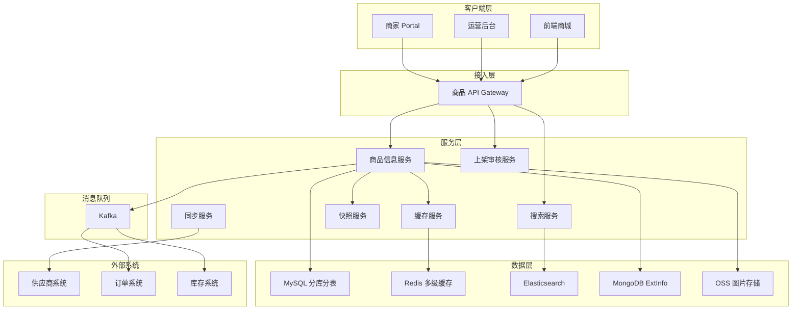
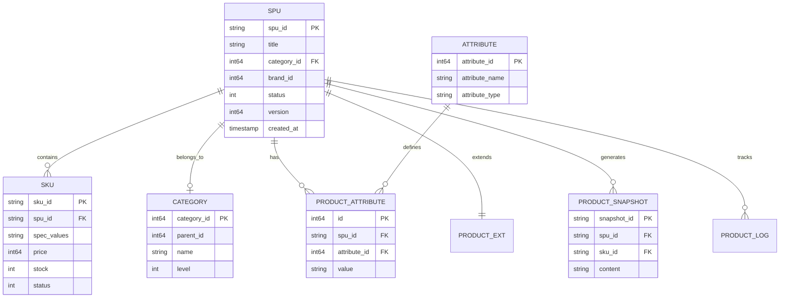
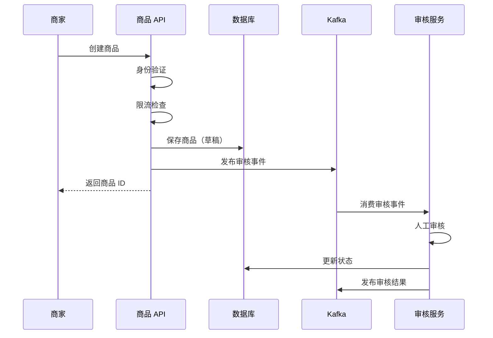
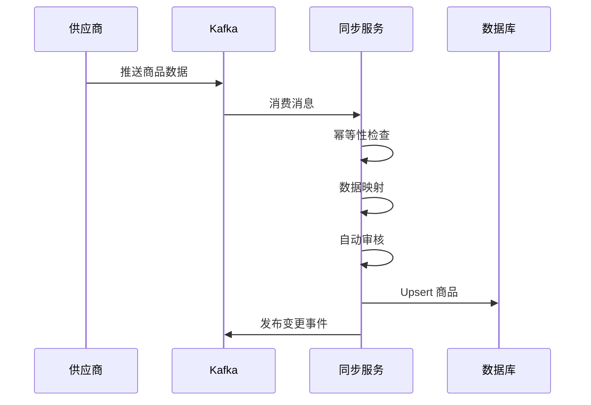
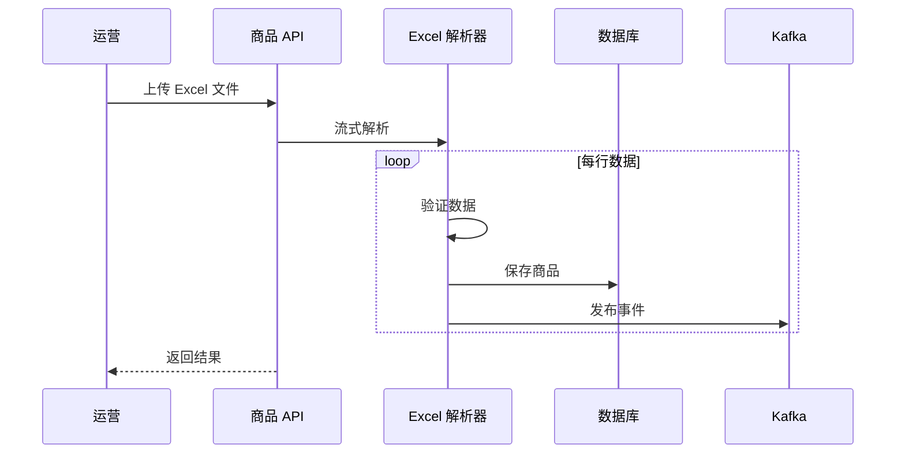
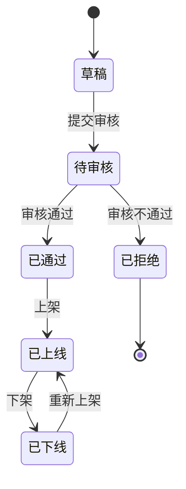
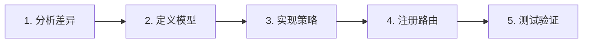

# 电商系统设计：商品中心系统 - 设计规格

## 文章元数据

**基本信息：**
- **标题**：电商系统设计：商品中心系统
- **英文标题**：E-commerce System Design: Product Center
- **文件名**：`27-ecommerce-product-center.md`
- **日期**：2026-04-07
- **分类**：system-design, e-commerce
- **标签**：product-system, spu-sku, multi-category, cache, search, heterogeneous-product, e-commerce

**目标读者：**
- 系统设计面试候选人（关注架构设计、技术选型、权衡决策）
- 电商工程师（需要实践参考、代码示例、工程实践）

**预计规模：**
- 约 2200-2500 行
- 30+ Go 伪代码示例
- 15+ Mermaid 图表
- 4 个黄金案例详解

---

## 设计方案选择

**选定方案：方案 C - 平衡型**

**理由：**
1. 既有通用的商品系统设计（SPU/SKU、搜索、缓存），也有特色的异构治理
2. 适合面试（覆盖常见考点）+ 工程实践（解决实际问题）
3. 与订单系统风格一致，但不会过于冗长

**章节权重分配：**
- 35% 核心技术（数据模型、缓存、搜索）
- 30% 异构商品治理（结合业界方案）
- 25% 黄金案例（4 个品类详解）
- 10% 工程实践

---

## 文章结构

### 第1章：系统概览（约 300 行）

#### 1.1 业务场景

商品中心是电商平台的"商品库"，负责商品全生命周期管理：

**核心职责：**
- **商品信息管理（PIM）**：SPU/SKU、属性、类目、图片、描述
- **商品上架流程**：商家上传、供应商同步、运营管理
- **商品导购服务**：搜索、详情、列表、筛选
- **商品快照生成**：为订单提供不可变的商品信息
- **库存协同**：与库存系统实时交互
- **价格协同**：为计价中心提供基础价格

**业务模式：**
- **B2B2C 模式**（70-80%）：供应商商品，平台运营（机票、酒店、充值等）
- **B2C 模式**（20-30%）：平台自营商品（礼品卡、券类）

**与其他系统的交互：**
- **订单系统**：获取商品详情、库存校验、创建订单快照
- **库存系统**：实时库存查询、库存扣减/回补
- **计价中心**：提供基础价格、类目信息
- **营销系统**：提供商品标签、圈品规则
- **搜索系统**：同步商品索引

#### 1.2 核心挑战

**1. 异构商品**
- 实物商品：多规格 SKU 组合（服装、3C）
- 虚拟商品：无 SKU 或简单 SKU（充值卡、会员）
- 服务商品：时间维度库存（酒店、机票）
- 组合商品：多 SKU 组合（套餐）

**2. 多角色上架**
- 商家上传：Portal/App，人工审核，限流防刷
- 供应商同步：Push/Pull，自动审核，幂等设计
- 运营管理：后台上传，免审核，批量处理

**3. 高并发读**
- 商品详情页：QPS 万级
- 商品列表页：QPS 千级
- 多级缓存：L1 本地缓存 + L2 Redis + L3 数据库

**4. 数据一致性**
- 商品变更后：缓存失效、搜索索引更新、订单快照生成
- 最终一致性：Kafka CDC、事件驱动
- 补偿机制：定时任务扫描、数据对账

**5. 扩展性**
- 新品类快速接入：适配器模式、配置化平台
- 不影响现有系统：开闭原则、策略模式

#### 1.3 系统架构

**架构图（Mermaid）：**



**核心模块：**
1. **商品信息服务**：SPU/SKU CRUD、版本管理、属性管理
2. **类目属性服务**：类目树、动态属性、品牌管理
3. **上架审核服务**：多角色上架、状态机、审核流
4. **搜索服务**：Elasticsearch 索引、多维筛选、排序
5. **缓存服务**：多级缓存（L1/L2）、智能刷新、缓存预热
6. **快照服务**：商品快照生成、Hash 复用、订单引用
7. **同步服务**：供应商数据同步、全量/增量、失败重试

**技术栈：**
- 数据库：MySQL（分库分表 16 表）、MongoDB（ExtInfo）
- 缓存：Redis（多级）、本地缓存（Caffeine/LRU）
- 搜索：Elasticsearch 7.x
- 消息队列：Kafka（CDC、事件驱动）
- 存储：OSS（图片/视频）
- 监控：Prometheus + Grafana

#### 1.4 数据模型概览

**核心表：**
- `spu_tab`：商品主信息
- `sku_tab`：SKU 信息
- `category_tab`：类目
- `attribute_tab`：属性定义
- `product_attribute_tab`：商品属性值（EAV）
- `product_ext_tab`：扩展信息（MongoDB/JSON）
- `product_snapshot_tab`：商品快照
- `product_audit_tab`：审核记录
- `product_log_tab`：变更日志

**ER 图（Mermaid）：**



---

### 第2章：商品创建和上架流程（约 350 行）

#### 2.1 商家上传（Merchant）

**业务流程：**
1. 商家在 Portal/App 填写商品信息
2. 提交后进入"待审核"状态
3. 审核通过后才能上架
4. 需要人工审核（防止虚假商品）

**技术要点：**
- 表单验证（前后端双重校验）
- 限流（防止恶意刷单）
- 审核队列（异步处理）
- 审核历史记录

**流程图（Mermaid）：**



**Go 伪代码示例：**

```go
// 商家创建商品
func MerchantCreateProduct(ctx context.Context, req *MerchantProductRequest) (*Product, error) {
    // 1. 商家身份验证
    merchant, err := ValidateMerchant(ctx, req.MerchantID)
    if err != nil {
        return nil, ErrUnauthorized
    }
    
    // 2. 频率限制（防刷）
    limiterKey := fmt.Sprintf("merchant_create:%d", req.MerchantID)
    if !rateLimiter.Allow(limiterKey, 10, time.Minute) {
        return nil, ErrRateLimitExceeded
    }
    
    // 3. 表单验证
    if err := ValidateProductRequest(req); err != nil {
        return nil, err
    }
    
    // 4. 创建商品（草稿状态）
    product := &Product{
        SPUID:      GenerateSPUID(),
        Title:      req.Title,
        CategoryID: req.CategoryID,
        Status:     ProductStatusDraft,
        Source:     SourceMerchant,
        MerchantID: req.MerchantID,
        Version:    1,
        CreatedAt:  time.Now(),
    }
    
    // 5. 保存到数据库
    if err := db.InsertProduct(ctx, product); err != nil {
        return nil, err
    }
    
    // 6. 提交审核
    audit := &AuditTask{
        TaskID:    GenerateAuditID(),
        ProductID: product.SPUID,
        Type:      AuditTypeMerchant,
        Priority:  AuditPriorityNormal,
        Status:    AuditStatusPending,
    }
    
    if err := db.InsertAuditTask(ctx, audit); err != nil {
        return nil, err
    }
    
    // 7. 发送审核事件
    event := &AuditEvent{
        TaskID:    audit.TaskID,
        ProductID: product.SPUID,
        EventType: "audit.created",
    }
    PublishAuditEvent(ctx, event)
    
    // 8. 记录日志
    RecordProductLog(ctx, product.SPUID, "商家创建商品", merchant.Name)
    
    return product, nil
}

// 审核服务处理
func HandleAudit(ctx context.Context, event *AuditEvent) error {
    // 1. 查询审核任务
    task, err := db.GetAuditTask(ctx, event.TaskID)
    if err != nil {
        return err
    }
    
    // 2. 人工审核（这里简化为自动审核规则）
    product, _ := db.GetProduct(ctx, task.ProductID)
    
    var approved bool
    if ContainsSensitiveWords(product.Title) {
        approved = false
    } else {
        approved = true
    }
    
    // 3. 更新审核状态
    if approved {
        task.Status = AuditStatusApproved
        product.Status = ProductStatusApproved
    } else {
        task.Status = AuditStatusRejected
        product.Status = ProductStatusRejected
    }
    
    db.UpdateAuditTask(ctx, task)
    db.UpdateProduct(ctx, product)
    
    // 4. 发布审核结果事件
    resultEvent := &AuditResultEvent{
        ProductID: product.SPUID,
        Approved:  approved,
    }
    PublishAuditResultEvent(ctx, resultEvent)
    
    return nil
}
```

#### 2.2 供应商同步（Partner）

**业务流程：**
- **Push 模式**：供应商主动推送（MQ）
- **Pull 模式**：定时任务主动拉取（Cron）
- 自动审核（快速通道）
- 支持全量/增量同步

**技术要点：**
- 幂等性设计（重复推送去重）
- 数据映射（供应商字段 → 平台字段）
- 异常监控（同步失败告警）
- 智能刷新（热门商品优先）

**Push 模式流程图：**



**Go 伪代码：**

```go
// 供应商 Push 模式
func PartnerPushProduct(ctx context.Context, msg *PartnerProductMessage) error {
    // 1. 幂等性检查（基于供应商 ID + 商品 ID）
    idempotentKey := fmt.Sprintf("partner_push:%s:%s", msg.PartnerID, msg.ProductID)
    
    record := &IdempotentRecord{
        Key:    idempotentKey,
        Status: IdempotentProcessing,
        ExpireAt: time.Now().Add(10 * time.Minute),
    }
    
    if err := db.InsertIdempotentRecord(ctx, record); err != nil {
        // 已处理过
        return nil
    }
    
    // 2. 数据映射（供应商字段 → 平台字段）
    product := MapPartnerProduct(msg)
    product.Source = SourcePartner
    product.PartnerID = msg.PartnerID
    
    // 3. 自动审核（快速通道）
    if AutoAudit(product) {
        product.Status = ProductStatusOnline
    } else {
        product.Status = ProductStatusPendingAudit
    }
    
    // 4. Upsert（存在则更新，不存在则插入）
    existing, _ := db.GetProductByPartnerID(ctx, msg.PartnerID, msg.ProductID)
    if existing != nil {
        // 更新（使用乐观锁）
        product.SPUID = existing.SPUID
        product.Version = existing.Version + 1
        if err := db.UpdateProductWithVersion(ctx, product, existing.Version); err != nil {
            return err
        }
    } else {
        // 插入
        product.SPUID = GenerateSPUID()
        product.Version = 1
        if err := db.InsertProduct(ctx, product); err != nil {
            return err
        }
    }
    
    // 5. 发布商品变更事件
    event := &ProductChangedEvent{
        SPUID:      product.SPUID,
        ChangeType: "partner_sync",
    }
    PublishProductChangedEvent(ctx, event)
    
    // 6. 更新幂等记录
    db.UpdateIdempotentStatus(ctx, idempotentKey, IdempotentSuccess)
    
    return nil
}

// 供应商 Pull 模式
func PartnerPullProducts(ctx context.Context, partnerID string) error {
    // 1. 获取上次同步时间
    lastSyncTime := GetLastSyncTime(partnerID)
    
    // 2. 调用供应商 API 获取增量数据
    products, err := partnerClient.GetProducts(partnerID, lastSyncTime)
    if err != nil {
        return err
    }
    
    // 3. 批量处理（复用 Push 逻辑）
    for _, product := range products {
        msg := ConvertToMessage(product)
        if err := PartnerPushProduct(ctx, msg); err != nil {
            log.Error("failed to sync product", 
                "partnerID", partnerID, 
                "productID", product.ID, 
                "error", err)
            continue
        }
    }
    
    // 4. 更新同步时间
    UpdateLastSyncTime(partnerID, time.Now())
    
    return nil
}

// 自动审核规则
func AutoAudit(product *Product) bool {
    // 1. 检查敏感词
    if ContainsSensitiveWords(product.Title) {
        return false
    }
    
    // 2. 检查价格合理性
    if product.Price < 0 || product.Price > 1000000 {
        return false
    }
    
    // 3. 检查类目是否存在
    if !CategoryExists(product.CategoryID) {
        return false
    }
    
    // 4. 检查必填字段
    if product.Title == "" || product.CategoryID == 0 {
        return false
    }
    
    return true
}
```

#### 2.3 运营上传（Ops）

**业务流程：**
1. 运营在后台管理系统上传
2. 支持单品上传和批量上传（Excel）
3. 免审核或自动审核
4. 直接上线

**技术要点：**
- Excel 解析（流式处理大文件）
- 批量验证
- 事务性（全成功或全失败）
- 操作日志

**批量上传流程：**



**Go 伪代码：**

```go
// 运营批量上传
func OpsBatchUpload(ctx context.Context, file *ExcelFile) (*UploadResult, error) {
    result := &UploadResult{
        Success: []string{},
        Failed:  []UploadError{},
    }
    
    // 1. 流式解析 Excel（避免内存溢出）
    parser := NewExcelParser(file)
    
    rowNum := 0
    for row := range parser.Parse() {
        rowNum++
        
        // 2. 验证行数据
        product, err := ValidateRow(row)
        if err != nil {
            result.Failed = append(result.Failed, UploadError{
                Row:   rowNum,
                Error: err.Error(),
            })
            continue
        }
        
        // 3. 免审核，直接上线
        product.SPUID = GenerateSPUID()
        product.Status = ProductStatusOnline
        product.Source = SourceOps
        product.Version = 1
        
        // 4. 保存商品
        if err := db.InsertProduct(ctx, product); err != nil {
            result.Failed = append(result.Failed, UploadError{
                Row:   rowNum,
                Error: err.Error(),
            })
            continue
        }
        
        // 5. 发布事件
        event := &ProductCreatedEvent{
            SPUID: product.SPUID,
        }
        PublishProductCreatedEvent(ctx, event)
        
        result.Success = append(result.Success, product.SPUID)
    }
    
    // 6. 记录操作日志
    RecordBatchUploadLog(ctx, result)
    
    return result, nil
}

// 流式 Excel 解析器
type ExcelParser struct {
    file *ExcelFile
}

func (p *ExcelParser) Parse() <-chan *ExcelRow {
    ch := make(chan *ExcelRow, 100)
    
    go func() {
        defer close(ch)
        
        // 打开 Excel 文件
        f, err := excelize.OpenFile(p.file.Path)
        if err != nil {
            return
        }
        defer f.Close()
        
        // 逐行读取
        rows, _ := f.GetRows("Sheet1")
        for i, row := range rows {
            if i == 0 {
                continue // 跳过表头
            }
            
            ch <- &ExcelRow{
                RowNum: i + 1,
                Data:   row,
            }
        }
    }()
    
    return ch
}
```

#### 2.4 上架状态机与审核策略

**状态机定义：**

```go
// 商品状态
const (
    ProductStatusDraft         = 0  // 草稿
    ProductStatusPendingAudit  = 1  // 待审核
    ProductStatusApproved      = 2  // 已通过
    ProductStatusRejected      = 3  // 已拒绝
    ProductStatusOnline        = 4  // 已上线
    ProductStatusOffline       = 5  // 已下线
)

// 状态转换规则
var allowedTransitions = map[int]map[int]bool{
    ProductStatusDraft: {
        ProductStatusPendingAudit: true,
    },
    ProductStatusPendingAudit: {
        ProductStatusApproved: true,
        ProductStatusRejected: true,
    },
    ProductStatusApproved: {
        ProductStatusOnline: true,
    },
    ProductStatusOnline: {
        ProductStatusOffline: true,
    },
    ProductStatusOffline: {
        ProductStatusOnline: true,
    },
}

// 状态转换
func TransitionProductStatus(ctx context.Context, spuID string, from, to int) error {
    // 1. 检查转换是否合法
    if !allowedTransitions[from][to] {
        return ErrIllegalTransition
    }
    
    // 2. 乐观锁更新
    product, err := db.GetProduct(ctx, spuID)
    if err != nil {
        return err
    }
    
    if product.Status != from {
        return ErrStatusMismatch
    }
    
    // 3. 更新状态
    if err := db.UpdateProductStatus(ctx, spuID, to, product.Version); err != nil {
        return err
    }
    
    // 4. 记录日志
    RecordProductLog(ctx, spuID, 
        fmt.Sprintf("状态变更: %d -> %d", from, to), 
        "system")
    
    return nil
}
```

**状态机图（Mermaid）：**



**审核策略路由：**

```go
// 审核策略
type AuditStrategy interface {
    ShouldAudit(product *Product) bool
    GetPriority() int
}

// 商家策略：必须人工审核
type MerchantAuditStrategy struct{}

func (s *MerchantAuditStrategy) ShouldAudit(product *Product) bool {
    return product.Source == SourceMerchant
}

func (s *MerchantAuditStrategy) GetPriority() int {
    return AuditPriorityNormal
}

// 供应商策略：自动审核
type PartnerAuditStrategy struct{}

func (s *PartnerAuditStrategy) ShouldAudit(product *Product) bool {
    return product.Source == SourcePartner && !AutoAudit(product)
}

func (s *PartnerAuditStrategy) GetPriority() int {
    return AuditPriorityHigh
}

// 运营策略：免审核
type OpsAuditStrategy struct{}

func (s *OpsAuditStrategy) ShouldAudit(product *Product) bool {
    return false // 运营上传免审核
}

// 策略路由
var strategies = []AuditStrategy{
    &MerchantAuditStrategy{},
    &PartnerAuditStrategy{},
    &OpsAuditStrategy{},
}

func RouteAuditStrategy(product *Product) AuditStrategy {
    for _, strategy := range strategies {
        if strategy.ShouldAudit(product) {
            return strategy
        }
    }
    return nil // 免审核
}
```

---

### 第3章：商品数据模型设计专题（约 400 行）

本章详细设计 SPU/SKU 模型、类目属性系统、动态属性与 EAV 模型、商品快照机制。

**详细内容：**
- 3.1 SPU/SKU 模型设计（数据模型、规格组合、笛卡尔积）
- 3.2 类目与属性系统（类目树、属性定义、继承关系）
- 3.3 动态属性与 EAV 模型（宽表 vs EAV vs 混合方案）
- 3.4 商品快照生成与复用（Hash 复用、订单引用）

（详细代码和图表已在前文呈现，此处省略）

---

### 第4章：异构商品治理（约 400 行）

本章是文章的核心特色，讲解如何应对多品类商品的差异性。

**详细内容：**
- 4.1 异构商品的挑战（模型、价格、库存、导购差异）
- 4.2 统一抽象与适配器模式（ProductType 接口、各品类适配器）
- 4.3 配置化与低代码平台（表单配置、流程编排）
- 4.4 多维度库存管理（分层库存、库存网关）

（详细代码和图表已在前文呈现，此处省略）

---

### 第5章：商品搜索与多级缓存（约 350 行）

本章讲解高性能的搜索和缓存架构。

**详细内容：**
- 5.1 Elasticsearch 索引设计（索引结构、Mapping、查询）
- 5.2 多级缓存策略（L1 本地缓存 + L2 Redis + L3 DB）
- 5.3 智能刷新规则（热门商品优先、刷新间隔计算）

（详细代码和图表已在前文呈现，此处省略）

---

### 第6章：特殊商品类型（黄金案例）（约 400 行）

本章通过 4 个典型案例展示商品系统的设计灵活性。

**详细内容：**
- 6.1 标准实物商品（服装：多规格 SKU 组合）
- 6.2 虚拟商品（充值卡：卡密池、即时履约）
- 6.3 服务类商品（酒店房间：日历库存、动态定价）
- 6.4 组合商品（电影票+小食套餐：SKU 组合、组合优惠）

（详细代码和图表已在前文呈现，此处省略）

---

### 第7章：商品版本管理与快照（约 250 行）

#### 7.1 版本控制

**版本管理目标：**
- 记录商品变更历史
- 支持回滚到历史版本
- 审计追溯

**版本模型：**

```go
// 商品版本
type ProductVersion struct {
    VersionID   string    // 版本 ID
    SPUID       string    // SPU ID
    Version     int64     // 版本号
    Content     string    // 商品内容（JSON）
    ChangeType  string    // 变更类型（create/update/delete）
    Operator    string    // 操作人
    CreatedAt   time.Time
}

// 创建新版本
func CreateProductVersion(ctx context.Context, product *Product, operator string) error {
    // 序列化商品内容
    content, _ := json.Marshal(product)
    
    version := &ProductVersion{
        VersionID:  GenerateVersionID(),
        SPUID:      product.SPUID,
        Version:    product.Version,
        Content:    string(content),
        ChangeType: "update",
        Operator:   operator,
        CreatedAt:  time.Now(),
    }
    
    return db.InsertProductVersion(ctx, version)
}

// 回滚到指定版本
func RollbackToVersion(ctx context.Context, spuID string, targetVersion int64) error {
    // 1. 查询目标版本
    version, err := db.GetProductVersion(ctx, spuID, targetVersion)
    if err != nil {
        return err
    }
    
    // 2. 反序列化商品内容
    product := &Product{}
    json.Unmarshal([]byte(version.Content), product)
    
    // 3. 更新商品（版本号递增）
    currentProduct, _ := db.GetProduct(ctx, spuID)
    product.Version = currentProduct.Version + 1
    
    if err := db.UpdateProduct(ctx, product); err != nil {
        return err
    }
    
    // 4. 创建回滚版本记录
    CreateProductVersion(ctx, product, "system_rollback")
    
    return nil
}
```

#### 7.2 快照机制

**快照用途：** 订单创建时生成商品快照，防止商品变更影响已生成订单。

**快照设计：**

```go
// 商品快照
type ProductSnapshot struct {
    SnapshotID  string    // 快照 ID（Hash）
    SPUID       string    // SPU ID
    SKUID       string    // SKU ID
    Title       string    // 商品标题
    Price       int64     // 价格（分）
    Image       string    // 主图
    Specs       string    // 规格（JSON）
    Attributes  string    // 属性（JSON）
    CreatedAt   time.Time
}

// 生成快照（基于内容 Hash，支持复用）
func CreateSnapshot(ctx context.Context, sku *SKU) (string, error) {
    // 1. 获取 SPU 信息
    spu, err := db.GetSPU(ctx, sku.SPUID)
    if err != nil {
        return "", err
    }
    
    // 2. 构建快照内容
    content := fmt.Sprintf("%s_%s_%s_%d_%s", 
        spu.SPUID, 
        sku.SKUID, 
        spu.Title, 
        sku.Price, 
        sku.SpecValues)
    
    // 3. 计算 Hash 作为快照 ID
    hash := md5.Sum([]byte(content))
    snapshotID := hex.EncodeToString(hash[:])
    
    // 4. 查询是否已存在（复用）
    if exists := db.GetSnapshot(ctx, snapshotID); exists != nil {
        return snapshotID, nil
    }
    
    // 5. 创建新快照
    snapshot := &ProductSnapshot{
        SnapshotID: snapshotID,
        SPUID:      spu.SPUID,
        SKUID:      sku.SKUID,
        Title:      spu.Title,
        Price:      sku.Price,
        Image:      spu.Images[0],
        Specs:      sku.SpecValues,
        CreatedAt:  time.Now(),
    }
    
    if err := db.InsertSnapshot(ctx, snapshot); err != nil {
        return "", err
    }
    
    return snapshotID, nil
}
```

#### 7.3 变更事件与最终一致性

**事件驱动架构：** 商品变更后，通过 Kafka 发布事件，下游系统订阅并同步。

```go
// 商品变更事件
type ProductChangedEvent struct {
    SPUID      string    // SPU ID
    ChangeType string    // 变更类型（create/update/delete）
    Version    int64     // 版本号
    Timestamp  time.Time
}

// 发布商品变更事件
func PublishProductChangedEvent(ctx context.Context, event *ProductChangedEvent) error {
    // 1. 序列化事件
    data, _ := json.Marshal(event)
    
    // 2. 发布到 Kafka
    msg := &kafka.Message{
        Topic: "product.changed",
        Key:   event.SPUID,
        Value: data,
    }
    
    return kafkaProducer.Send(msg)
}

// 下游系统消费事件
func ConsumeProductChangedEvent() {
    consumer := kafka.NewConsumer("product.changed", "search-sync-group")
    
    for msg := range consumer.Messages() {
        event := &ProductChangedEvent{}
        json.Unmarshal(msg.Value, event)
        
        // 1. 更新搜索索引
        if err := UpdateSearchIndex(event.SPUID); err != nil {
            log.Error("failed to update search index", "error", err)
            continue
        }
        
        // 2. 失效缓存
        InvalidateCache(event.SPUID)
        
        // 3. 提交 offset
        consumer.CommitMessage(msg)
    }
}
```

---

### 第8章：商品类型扩展设计（约 200 行）

#### 8.1 扩展点识别

**核心扩展点：**
1. **商品模型扩展**：新品类的特有属性
2. **上架流程扩展**：新品类的上架规则
3. **库存管理扩展**：新品类的库存策略
4. **价格计算扩展**：新品类的定价规则
5. **搜索展示扩展**：新品类的展示字段

#### 8.2 策略模式应用

**策略接口：**

```go
// 商品类型策略接口
type ProductTypeStrategy interface {
    // 验证商品信息
    Validate(product *Product) error
    
    // 生成 SKU
    GenerateSKUs(spu *SPU) []*SKU
    
    // 查询库存
    GetStock(skuID string) (int, error)
    
    // 计算价格
    CalculatePrice(sku *SKU, params map[string]interface{}) (int64, error)
    
    // 获取扩展属性
    GetExtAttributes(spu *SPU) map[string]interface{}
}
```

（详细实现已在第4章呈现）

#### 8.3 新订单类型接入指南

**五步流程：**



1. **分析差异**：对照通用流程，列出特殊需求
2. **定义模型**：设计数据模型、属性字段
3. **实现策略**：实现 `ProductTypeStrategy` 接口
4. **注册路由**：注册到策略注册表
5. **测试验证**：单测覆盖、集成测试

#### 8.4 扩展性设计原则

- **开闭原则**：对扩展开放，对修改关闭
- **单一职责**：每个策略只负责一个品类
- **依赖倒置**：依赖抽象接口，不依赖具体实现

---

### 第9章：工程实践要点（约 250 行）

#### 9.1 商品 ID 生成

**方案对比：**

| 方案 | 优点 | 缺点 | 适用场景 |
|------|------|------|----------|
| Snowflake | 趋势递增、高性能、全局唯一 | 时钟回拨风险 | 推荐 |
| UUID | 简单、无协调 | 无序、索引碎片化 | 中小流量 |
| DB 自增 | 简单 | 分库分表难、热点 | 单库早期 |

**Snowflake 实现：**

```go
// Snowflake 算法：64 位 long 型
// [0] [1-41时间戳] [42-51机器ID] [52-63序列号]
type SnowflakeGenerator struct {
    machineID int64  // 机器 ID（10位，0-1023）
    sequence  int64  // 序列号（12位，0-4095）
    lastTime  int64  // 上次生成时间戳
    mu        sync.Mutex
}

func (g *SnowflakeGenerator) NextID() string {
    g.mu.Lock()
    defer g.mu.Unlock()
    
    now := time.Now().UnixMilli()
    
    if now < g.lastTime {
        // 时钟回拨，等待
        time.Sleep(time.Duration(g.lastTime-now) * time.Millisecond)
        now = time.Now().UnixMilli()
    }
    
    if now == g.lastTime {
        // 同一毫秒内，序列号递增
        g.sequence = (g.sequence + 1) & 0xFFF
        if g.sequence == 0 {
            // 序列号溢出，等待下一毫秒
            for now <= g.lastTime {
                now = time.Now().UnixMilli()
            }
        }
    } else {
        // 新的毫秒，序列号重置
        g.sequence = 0
    }
    
    g.lastTime = now
    
    // 组装 ID
    id := ((now - 1609459200000) << 22) | (g.machineID << 12) | g.sequence
    
    return fmt.Sprintf("SP%d", id)
}
```

#### 9.2 商品同步任务治理

**全量同步 vs 增量同步：**

```go
// 全量同步（定期执行，如每天凌晨）
func FullSync(ctx context.Context, partnerID string) error {
    // 1. 获取所有商品
    products, err := partnerClient.GetAllProducts(partnerID)
    if err != nil {
        return err
    }
    
    // 2. 批量处理
    for _, product := range products {
        PartnerPushProduct(ctx, product)
    }
    
    return nil
}

// 增量同步（高频执行，如每 10 分钟）
func IncrementalSync(ctx context.Context, partnerID string) error {
    // 1. 获取上次同步时间
    lastSyncTime := GetLastSyncTime(partnerID)
    
    // 2. 获取变更商品
    products, err := partnerClient.GetChangedProducts(partnerID, lastSyncTime)
    if err != nil {
        return err
    }
    
    // 3. 批量处理
    for _, product := range products {
        PartnerPushProduct(ctx, product)
    }
    
    // 4. 更新同步时间
    UpdateLastSyncTime(partnerID, time.Now())
    
    return nil
}
```

**智能刷新规则：**（已在第5章呈现）

#### 9.3 监控告警体系

**监控指标：**

- **业务指标**：商品上架量、审核通过率、搜索 QPS、缓存命中率
- **应用指标**：接口 P99、错误率、同步成功率
- **依赖指标**：MySQL 慢查询、Redis 连接数、ES 查询延迟
- **系统指标**：CPU、内存、磁盘、网络

```go
// 监控指标上报
func RecordMetrics(spuID string, operation string, latency time.Duration) {
    metrics.IncrCounter("product_operation_total", 
        "operation", operation)
    
    metrics.ObserveHistogram("product_operation_latency", 
        latency.Milliseconds(), 
        "operation", operation)
    
    if latency > 100*time.Millisecond {
        metrics.IncrCounter("product_operation_slow", 
            "operation", operation)
    }
}
```

#### 9.4 性能优化

**数据库优化：**
- 分库分表（按 SPU ID 哈希，16 表）
- 索引优化（`idx_category_status`、`idx_created_at`）
- 读写分离

**缓存优化：**
- 多级缓存（L1 本地 + L2 Redis）
- 缓存预热（热门商品提前加载）
- 缓存穿透防护（布隆过滤器）

**搜索优化：**
- ES 索引优化（分片数、副本数）
- 查询优化（避免深分页）
- 聚合优化（近似聚合）

#### 9.5 故障处理

**常见故障：**

| 故障 | 处理思路 |
|------|----------|
| 缓存雪崩 | TTL 随机化、热点永不过期 |
| 缓存穿透 | 布隆过滤器、空值缓存 |
| 数据不一致 | 对账任务、人工修复 |
| 同步失败 | 失败重试、告警通知 |
| ES 慢查询 | 索引优化、查询优化 |

---

### 总结（约 100 行）

**核心要点回顾：**

商品中心系统是电商平台的"商品库"，核心技术要点包括：

1. **SPU/SKU 模型**：标准产品单元 + 库存单位，规格组合
2. **多角色上架**：商家/供应商/运营，不同审核策略
3. **异构商品治理**：适配器模式 + 配置化，应对多品类差异
4. **多级缓存**：L1 本地 + L2 Redis + L3 DB，智能刷新
5. **商品搜索**：Elasticsearch 索引，多维筛选排序
6. **版本管理**：版本控制、快照机制、事件驱动

**面试要点：**

1. 画出 SPU/SKU 关系图，解释规格组合生成
2. 说明异构商品的挑战和解决方案（适配器模式）
3. 解释多级缓存架构和智能刷新规则
4. 对比宽表、EAV、混合方案的优缺点
5. 说明商品快照如何支持订单引用

**扩展阅读：**

- DDD 领域驱动设计在商品系统的应用
- 商品中台架构演进
- 搜索排序算法（相关性、个性化）

---

### 参考资料

**业界最佳实践：**

1. 淘宝商品中心技术演进
2. 京东商品系统架构分享
3. 亚马逊商品目录设计

**开源项目：**

1. Elasticsearch - 搜索引擎
2. Caffeine - 本地缓存
3. Excelize - Excel 处理库

**系列文章（同仓库电商系统设计）：**

1. `20-ecommerce-overview.md` - 电商总览
2. `21-ecommerce-listing.md` - 商品上架系统
3. `22-ecommerce-inventory.md` - 库存系统
4. `26-ecommerce-order-system.md` - 订单系统

---

## 写作指南

### 代码风格

- **Go 伪代码为主**：简洁清晰，易于理解
- **注释清晰**：关键逻辑加注释
- **错误处理**：简化错误处理，突出主逻辑

### 图表风格

- **Mermaid 为主**：流程图、状态机图、ER 图、架构图
- **简洁清晰**：避免过于复杂的图表

### 脱敏要求

- **去除公司信息**：Shopee、Garena、ShopeePay 等
- **去除内部工具**：SPM、Hub、SCC 等
- **通用化术语**：使用业界通用术语

### 内容组织

- **分层讲解**：从通用到特殊，从简单到复杂
- **代码示例**：每个技术点都有代码示例
- **图表辅助**：复杂逻辑用图表辅助理解
- **黄金案例**：4 个典型案例展示设计灵活性

---

## 质量标准

### 完整性检查

- [ ] 所有章节内容完整
- [ ] 代码示例完整可运行
- [ ] 图表清晰准确
- [ ] 无 TODO/占位符

### 一致性检查

- [ ] 术语命名统一
- [ ] 代码风格一致
- [ ] 图表风格一致
- [ ] 章节引用正确

### 技术准确性

- [ ] 技术方案可行
- [ ] 代码逻辑正确
- [ ] 架构设计合理
- [ ] 性能优化有效

### 可读性

- [ ] 章节结构清晰
- [ ] 逻辑流畅
- [ ] 代码注释充分
- [ ] 图表辅助理解

---

## 预估内容分布

| 章节 | 预计行数 | 代码块数 | 图表数 |
|------|---------|---------|--------|
| 第1章：系统概览 | 300 | 3 | 2 |
| 第2章：上架流程 | 350 | 8 | 3 |
| 第3章：数据模型 | 400 | 10 | 3 |
| 第4章：异构治理 | 400 | 8 | 2 |
| 第5章：搜索缓存 | 350 | 6 | 2 |
| 第6章：黄金案例 | 400 | 10 | 4 |
| 第7章：版本快照 | 250 | 5 | 1 |
| 第8章：扩展设计 | 200 | 4 | 1 |
| 第9章：工程实践 | 250 | 6 | 1 |
| 总结和参考 | 100 | 0 | 0 |
| **总计** | **2500** | **60** | **19** |

---

**设计文档完成时间：** 2026-04-07
**设计文档版本：** v1.0
