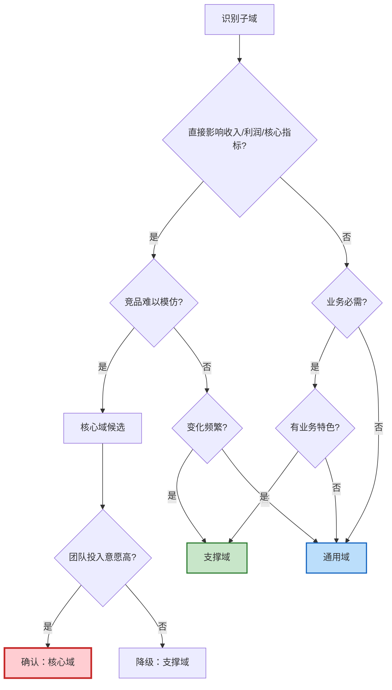

# DDD 领域分层与投资策略 - 设计文档

**日期**: 2026-04-09  
**目标文件**: `source/_posts/system-design/30-clean-architecture-ddd-cqrs.md`  
**章节**: 新增 2.1.1 领域分层与投资策略

---

## 一、设计目标

在现有的 Clean Architecture、DDD 与 CQRS 学习笔记中，补充 **DDD 领域分层（核心域、支撑域、通用域）** 的系统性知识，重点讲解划分方法论。

### 1.1 目标读者

- 架构学习者，对 DDD 三层领域划分概念不熟悉
- 希望理解"为什么这样划分"而不仅仅是"这样划分"
- 需要实际可操作的判断方法和决策框架

### 1.2 内容定位

- **深度**: 深入实战型（1800-2000 字 + 图表）
- **重心**: 方法论主导（60% 方法论 + 40% 案例）
- **案例**: 以电商系统为主，金融/SaaS 为辅
- **风格**: 问题解决路径，循序渐进

---

## 二、章节结构调整

### 2.1 现有结构

```
二、DDD（领域驱动设计）— 核心是"应对复杂性"
  2.1 战略设计 — 划分边界
    - Bounded Context（限界上下文）
    - Context Map（上下文映射）
  2.2 战术设计 — 代码建模
    - Aggregate、Entity、Value Object 等
```

### 2.2 调整后结构

```
二、DDD（领域驱动设计）— 核心是"应对复杂性"
  2.1 战略设计：架构层面
    2.1.1 领域分层与投资策略 ★ 新增
    2.1.2 限界上下文（Bounded Context）
    2.1.3 上下文映射（Context Map）
  
  2.2 战术设计：代码层面
    2.2.1 战术设计概述
    2.2.2 聚合与聚合根
    2.2.3 实体与值对象
    2.2.4 领域事件与 Outbox Pattern
    ...（现有内容归入此节）
```

**调整说明**:
- 将"2.1 战略设计"改为"2.1 战略设计：架构层面"，强调层面区分
- 新增"2.1.1 领域分层与投资策略"作为战略设计的第一小节
- 现有 Bounded Context 内容顺延为 2.1.2
- 战术设计统一为 2.2，现有内容归入其下并增加小节标题

---

## 三、2.1.1 节详细内容设计

### 3.1 内容大纲（理论到实践路径）

```
2.1.1 领域分层与投资策略
  一、为什么需要领域分层？（引入问题，150字）
  二、三种领域的定义与特征（基础定义，400字）
  三、领域划分方法论（核心重点，800字）
    - 判断维度与评分模型
    - 决策流程图
    - 常见误区与边界案例
  四、方法论应用：电商系统实战分析（案例验证，600字）
    - 订单域（核心域）
    - 商品域（支撑域）
    - 用户域（通用域）
  五、跨行业对比：方法论的通用性（扩展验证，300字）
  六、实施策略与最佳实践（落地指南，400字）
```

### 3.2 第一部分：引入问题（150字）

**核心问题**：
- 一个中大型系统有十几个甚至几十个子系统
- 资源有限，不可能对所有子系统投入同等精力
- 如何分配研发资源？哪些系统值得重点投入？

**案例引入**：
电商平台有订单、支付、商品、库存、用户、搜索、消息、评价、物流等十几个子系统。假设你是 CTO，如何决定：
- 哪些系统必须自研，投入最好的团队？
- 哪些系统可以定制开发，用常规团队？
- 哪些系统直接买现成方案或用开源？

**DDD 的答案**：按照业务价值分层，差异化投资。

### 3.3 第二部分：基础定义（400字）

#### 对比表格

| 域类型 | 定义 | 业务价值 | 竞争差异化 | 投资策略 | 组织形式 | 技术选型 |
|-------|------|---------|-----------|---------|---------|---------|
| **核心域<br/>Core Domain** | 平台的核心竞争力，创造差异化价值 | 最高，决定平台成败 | 高度差异化，竞品难模仿 | 重点投入，自研 | 最优秀团队，独立编制 | 自主可控，完全掌握 |
| **支撑域<br/>Supporting Domain** | 支撑核心业务的必要能力 | 中等，必须有但不差异化 | 有一定特色但可被超越 | 适度投入，可定制 | 常规团队，共享资源 | 定制开发，参考业界 |
| **通用域<br/>Generic Domain** | 通用基础能力，行业共性 | 低，无差异化 | 行业标准，无竞争优势 | 最小投入，采购 | 外包/工具团队 | 开源/SaaS/采购 |

#### 详细说明

**核心域（Core Domain）**：
- 什么是"核心竞争力"？直接影响营收、用户体验、留存的能力
- 特点：频繁变化（紧跟业务创新）、技术复杂、需要领域专家
- 识别标志：如果这个域做不好，公司会输；如果做得特别好，会赢
- 案例：电商的订单系统、金融的交易系统、SaaS 的租户管理

**支撑域（Supporting Domain）**：
- 为什么"必须有但不差异化"？业务依赖但不产生竞争优势
- 特点：相对稳定、有一定复杂度、需要理解业务
- 识别标志：缺了不行，但做到 80 分和 95 分对业务影响不大
- 案例：电商的商品管理、金融的账户系统、SaaS 的权限系统

**通用域（Generic Domain）**：
- 为什么可以采购？行业已有成熟方案，无需重复造轮子
- 特点：标准化、变化少、技术成熟
- 识别标志：市面上有多个成熟产品可选
- 风险：过度依赖外部服务，但通过多供应商策略可缓解
- 案例：用户认证（Auth0/Keycloak）、消息推送（Twilio）、存储（AWS S3）

### 3.4 第三部分：划分方法论（800字，核心重点）

#### 3.4.1 判断维度与评分模型

提供四维度评分框架：

| 判断维度 | 核心域（8-10分） | 支撑域（4-7分） | 通用域（1-3分） | 评分问题 |
|---------|----------------|----------------|----------------|---------|
| **业务价值** | 直接影响收入/利润/核心指标 | 间接影响业务，必需但不关键 | 不影响业务差异化 | 这个域对营收/留存的影响有多大？ |
| **竞争差异化** | 独特能力，竞品难以模仿 | 有特色但可被超越 | 行业标准，无差异 | 竞品能轻易复制这个能力吗？ |
| **变化频率** | 频繁变化，紧跟业务创新 | 定期调整优化 | 稳定，很少大改 | 多久需要大改一次？ |
| **技术复杂度** | 高度复杂，需要领域专家 | 中等复杂，需要业务理解 | 成熟方案可解决 | 普通团队能否 hold 住？ |

**评分方法**：
- 每个维度打分 1-10 分
- 总分 = 四个维度分数相加（满分 40 分）

**总分判断标准**：
- **32-40 分** → 核心域（Core Domain）
- **16-31 分** → 支撑域（Supporting Domain）
- **4-15 分** → 通用域（Generic Domain）

**注意事项**：
- 边界分数（如 31-32 分）需要结合公司战略、团队能力综合判断
- 初创公司可以适当放宽核心域标准（28 分以上即可），聚焦资源
- 成熟公司标准更严格，避免核心域过多导致资源分散

#### 3.4.2 决策流程图



**使用说明**：
1. 从顶部"识别子域"开始
2. 依次回答每个判断问题（是/否）
3. 沿着路径走到终点得出初步结论
4. 结合评分模型验证（两个工具互相补充）

#### 3.4.3 常见误区与边界案例

**误区 1：把技术复杂度高的当核心域**

❌ 错误示例：自研分布式存储系统  
- 技术复杂度：10 分（确实很难）
- 业务价值：3 分（存储本身不产生业务差异）
- 竞争差异化：2 分（用户不关心底层存储）
- 变化频率：2 分（相对稳定）
- **总分 17 分 → 支撑域，甚至应该考虑用成熟方案（通用域）**

✅ 正确理解：技术难度不等于业务价值，除非你是做存储产品的公司。

**误区 2：把所有自研系统当核心域**

❌ 错误示例：自研消息队列  
- 很多公司自研 MQ 是因为早期没有好的开源方案
- 但 MQ 本身不是核心竞争力（除非你是 Kafka/RabbitMQ）
- 现在 Kafka 已成熟，继续维护自研 MQ 是资源浪费

✅ 正确理解：自研 ≠ 核心域，要看是否产生业务差异化。

**误区 3：忽略核心域的动态性**

案例：推荐系统的演进
- 2010 年：推荐算法是电商核心域（个性化推荐是差异化竞争力）
- 2020 年：推荐已成为支撑域（算法已成熟，大家都在用）
- 现在：推荐仍重要，但不再是核心竞争力

✅ 正确理解：核心域会随行业发展逐渐"标准化"，需要定期重新评估。

**边界案例：搜索系统的分类取决于公司类型**

| 公司类型 | 搜索系统分类 | 原因 |
|---------|------------|------|
| Google/百度 | 核心域 | 搜索就是产品本身 |
| 电商平台 | 支撑域 | 搜索影响转化，但不是核心竞争力 |
| 内部工具 | 通用域 | 可以直接用 Elasticsearch |

✅ 正确理解：域的分类是相对的，取决于公司的业务模式和战略定位。

**边界案例：支付系统在不同公司的分类**

| 公司类型 | 支付系统分类 | 原因 |
|---------|------------|------|
| 支付宝/微信支付 | 核心域 | 支付就是产品 |
| 电商平台 | 核心域 | 支付流程影响转化和体验 |
| SaaS 平台 | 支撑域 | 可以接入 Stripe，自研价值不大 |
| 内容平台 | 通用域 | 直接用第三方支付 |

### 3.5 第四部分：电商系统实战分析（600字）

选择 3 个典型域，应用评分模型进行深度分析。

#### 案例 1：订单域（核心域）

| 维度 | 评分 | 详细分析 |
|-----|------|---------|
| **业务价值** | 10 | 订单流程直接影响 GMV（成交总额），每提升 1% 转化率就是百万级营收 |
| **竞争差异化** | 9 | 拼团、秒杀、预售、分期等玩法是核心竞争力，竞品难以完全模仿 |
| **变化频率** | 9 | 每个大促（618、双11）都会调整订单流程，支持新的营销玩法 |
| **技术复杂度** | 9 | 分布式事务（Saga）、状态机、高并发、幂等性、最终一致性 |
| **总分** | **37** | **核心域** |

**为什么是核心域？**
- 订单流程的流畅度直接影响用户下单转化率
- 支持的营销玩法越丰富，平台竞争力越强
- 每个促销活动都可能需要调整订单逻辑
- 技术上涉及多个复杂的分布式系统问题

**投资建议**：
- **团队配置**：最优秀的架构师 + 3-5 名资深后端开发，独立团队
- **技术选型**：自研，完全掌控，不依赖外部服务
- **质量要求**：99.99% 可用性，全链路监控，灰度发布
- **迭代策略**：快速响应业务需求，2 周一个迭代
- **文档要求**：完整的设计文档、接口文档、故障预案

#### 案例 2：商品域（支撑域）

| 维度 | 评分 | 详细分析 |
|-----|------|---------|
| **业务价值** | 7 | 商品管理是必需的，但 SPU/SKU 模型本身不产生差异化 |
| **竞争差异化** | 5 | 各家电商的商品模型大同小异，主要差异在类目和属性配置 |
| **变化频率** | 6 | 新品类上线时需要调整，但不频繁（季度级别） |
| **技术复杂度** | 6 | 有一定复杂度（EAV 模型、搜索索引），但方案成熟 |
| **总分** | **24** | **支撑域** |

**为什么是支撑域？**
- 商品管理做到 80 分和 95 分，对用户体验影响不大
- SPU/SKU 模型是行业通用方案，没有太多创新空间
- 但又不能没有（缺了商品管理，电商就玩不转）

**投资建议**：
- **团队配置**：常规开发团队 2-3 人，可以与其他支撑域共享资源
- **技术选型**：参考业界成熟方案（如有赞、Shopify 的商品模型），适度定制
- **质量要求**：99.9% 可用性，降级策略
- **迭代策略**：稳定为主，谨慎迭代，充分测试后再上线
- **文档要求**：基础设计文档和接口文档

#### 案例 3：用户域（通用域）

| 维度 | 评分 | 详细分析 |
|-----|------|---------|
| **业务价值** | 3 | 用户注册登录是基础能力，但不产生差异化（用户不会因为注册流程选择平台） |
| **竞争差异化** | 2 | 注册登录是行业标准（手机号、邮箱、第三方登录），无差异 |
| **变化频率** | 2 | 很少变化，除非监管要求（如实名认证） |
| **技术复杂度** | 3 | SSO、OAuth 2.0 都有成熟方案（Auth0、Keycloak） |
| **总分** | **10** | **通用域** |

**为什么是通用域？**
- 注册登录不会成为平台的竞争优势
- 市面上有大量成熟的身份认证服务
- 自研的投入产出比很低

**投资建议**：
- **团队配置**：外包或使用 SaaS 服务，内部只需 1 人对接
- **技术选型**：采购（Auth0、Keycloak、AWS Cognito）
- **质量要求**：依赖服务商 SLA（通常 99.95%+）
- **迭代策略**：按需对接新的认证方式（如生物识别），最小投入
- **文档要求**：对接文档即可

### 3.6 第五部分：跨行业对比（300字）

#### 对比表格

| 行业 | 核心域（差异化竞争力） | 支撑域（业务必需） | 通用域（行业标准） |
|-----|---------------------|------------------|------------------|
| **电商** | • 订单系统（交易流程）<br/>• 支付系统（资金安全） | • 商品管理<br/>• 库存管理<br/>• 计价引擎<br/>• 营销系统 | • 用户认证<br/>• 搜索<br/>• 消息推送<br/>• 物流跟踪<br/>• 风控 |
| **金融** | • 交易系统（买卖撮合）<br/>• 风控系统（反欺诈） | • 账户系统<br/>• 清结算<br/>• 合规报送 | • 用户认证<br/>• 消息通知<br/>• 报表系统<br/>• 存储 |
| **SaaS** | • 租户管理（多租户隔离）<br/>• 计费系统（订阅模式） | • 权限系统（RBAC）<br/>• 审计日志<br/>• 集成中心（API） | • 用户认证<br/>• 消息<br/>• 存储<br/>• 监控告警 |

#### 关键洞察

**核心域因行业而异**：
- 电商的核心是"交易流程"和"资金安全"
- 金融的核心是"买卖撮合"和"风控合规"
- SaaS 的核心是"多租户"和"订阅计费"
- → 核心域反映了行业的本质和竞争焦点

**通用域高度相似**：
- 用户、消息、存储在各行业都是通用域
- 这些能力已经高度标准化，有大量成熟方案
- → 通用域是"不需要重新发明轮子"的领域

**支撑域体现业务特点**：
- 电商的商品、库存、计价有一定特色，但不是核心竞争力
- 金融的账户、清结算是必需的，但各家差异不大
- SaaS 的权限、审计是基础能力，但实现相对标准
- → 支撑域是"需要理解业务，但可以参考业界实践"的领域

### 3.7 第六部分：实施策略（400字）

#### 6.1 不同阶段的公司策略

**初创公司（0-50 人）**：
- **原则**：极致聚焦核心域，其他全部采购/开源
- **策略**：
  - 核心域：只自研 1-2 个最关键的（如电商的订单）
  - 支撑域：先用简单实现（如商品管理用 Excel 导入），快速验证商业模式
  - 通用域：全部采购（用户用 Auth0，消息用 Twilio，支付接 Stripe）
- **避坑**：不要陷入"造轮子"陷阱，技术实现不是早期核心竞争力
- **案例**：Airbnb 早期只自研订单流程，其他全用第三方服务

**成长期公司（50-500 人）**：
- **原则**：逐步替换通用域中的瓶颈，支撑域开始定制化
- **策略**：
  - 核心域：持续投入，保持技术领先
  - 支撑域：根据业务需求定制开发（如商品管理加入多品类支持）
  - 通用域：评估 ROI，替换成本高或限制业务的服务（如自建用户系统支持千万级用户）
- **判断标准**：第三方服务的成本 > 自研成本，或功能无法满足需求
- **案例**：用户量到 100 万后自建用户系统，但仍用第三方消息和支付

**成熟公司（500+ 人）**：
- **原则**：核心域持续投入，支撑域定期优化，通用域评估自研 vs 采购
- **策略**：
  - 核心域：组建专家团队，引领行业创新
  - 支撑域：定期重构和性能优化
  - 通用域：当规模达到一定程度，某些通用域自研更划算（如 IM、推送）
- **动态调整**：支撑域可能升级为核心域（如推荐系统）
- **案例**：淘宝自研了旺旺（IM），因为 IM 成为电商的差异化能力

#### 6.2 域的动态演进

**核心域可能降级**：
- 早期的核心创新逐渐变成行业标准
- 案例：电商早期的"在线支付"是核心域（支付宝），现在是支撑域（各家都有）

**支撑域可能升级**：
- 随着业务深入，某些支撑域变成核心竞争力
- 案例：电商的"推荐系统"从支撑域升级为核心域（个性化推荐成为差异化）

**通用域可能"去商品化"**：
- 某些通用域在特定场景下需要深度定制
- 案例：SaaS 平台的"消息系统"，如果涉及大量自定义通知规则，可能需要自研

**重新评估周期**：
- 初创公司：每 6 个月
- 成长期公司：每年
- 成熟公司：每 1-2 年

#### 6.3 组织架构与域的映射

| 域类型 | 团队形式 | 汇报关系 | 优先级 | 考核指标 |
|-------|---------|---------|--------|---------|
| **核心域** | 独立团队，最优秀的人 | 直接向 CTO 汇报 | P0 | 业务指标（GMV、转化率） |
| **支撑域** | 共享团队，按项目分配 | 向技术负责人汇报 | P1 | 稳定性、响应速度 |
| **通用域** | 平台团队，工具化 | 向基础架构负责人汇报 | P2 | 可用性、成本 |

**关键原则**：
- 核心域团队有最高的决策权和资源优先级
- 支撑域团队注重稳定性和效率
- 通用域团队追求标准化和成本优化

---

## 四、与现有内容的衔接

### 4.1 与 2.1.2 限界上下文的关系

- **领域分层（2.1.1）**：垂直分类，按业务价值分层
- **限界上下文（2.1.2）**：水平划分，按业务边界分割

两者是战略设计的两个维度：
- 先用领域分层决定"投资策略"（哪些域重点投入）
- 再用限界上下文决定"边界划分"（如何拆分微服务）

### 4.2 与 2.2 战术设计的关系

战略设计决定"做什么"，战术设计决定"怎么做"：
- 核心域：使用最复杂的战术设计（充血模型、复杂聚合、领域事件）
- 支撑域：使用标准的战术设计（聚合根、仓储模式）
- 通用域：可以用简单的 CRUD，甚至不需要 DDD

### 4.3 与 20-ecommerce-overview.md 的关系

- `20-ecommerce-overview.md`：提供了电商系统 13 个子域的全景表格（概览）
- 本文 `2.1.1`：深入讲解域划分的方法论，并选 3 个典型域深度分析（方法）

两篇文章互为补充：
- 读者先看 overview 了解全景
- 再看本文理解划分方法论
- 最后可以自己判断其他 10 个域的分类

---

## 五、预期效果

### 5.1 学习价值

读完 2.1.1 节后，读者能够：
1. **理解概念**：清楚核心域、支撑域、通用域的定义和区别
2. **掌握方法**：能用评分模型和决策流程判断一个子域的分类
3. **避免误区**：不会把技术复杂度等同于业务价值
4. **实际应用**：能在自己的项目中识别和划分领域
5. **战略思维**：理解资源分配和投资策略

### 5.2 篇幅与可读性

- **总字数**：约 2200-2500 字（含图表）
- **阅读时间**：8-10 分钟
- **图表数量**：5-6 个（对比表、评分表、流程图）
- **代码示例**：无（此节聚焦架构思想，不涉及代码）

### 5.3 风格一致性

与现有文章保持一致：
- 使用对比表格清晰呈现概念
- 用 Mermaid 绘制流程图
- 提供实际案例和反例
- 避免过度学术化，注重实用性

---

## 六、实施检查清单

- [ ] 章节编号调整（2.1 → 2.1.1/2.1.2/2.1.3，2.2 小节化）
- [ ] 引入问题（为什么需要领域分层）
- [ ] 三种域的定义表格
- [ ] 评分模型和判断维度表格
- [ ] 决策流程图（Mermaid）
- [ ] 常见误区和边界案例
- [ ] 电商三个域的深度分析（订单/商品/用户）
- [ ] 跨行业对比表格（电商/金融/SaaS）
- [ ] 实施策略（初创/成长/成熟 + 动态演进 + 组织架构）
- [ ] 与现有章节的衔接说明（2.1.2/2.2 的关系）
- [ ] Hexo 构建验证（确保 Mermaid 图表正常渲染）
- [ ] 提交 Git（带完整 commit message）
