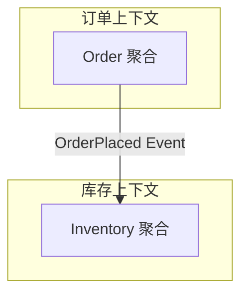

# 领域驱动设计读书笔记 - 设计文档

**创建日期**: 2026-04-10  
**设计状态**: 已批准  
**目标**: 创建一篇融合《领域驱动设计》和《实现领域驱动设计》两本书的系统性读书笔记

---

## 一、项目背景

### 1.1 动机

创建一篇深度读书笔记，帮助有一定基础的开发者系统性地理解DDD（领域驱动设计）的核心概念、架构实践和代码落地。

### 1.2 目标读者

- 有一定DDD概念基础的中级开发者
- 读过文章但没读过完整书籍的开发者
- 希望系统学习DDD并应用到架构设计中的技术人员

### 1.3 内容定位

- **概念理解为主**: 战略设计和战术设计的核心思想
- **架构实践为主**: 如何用DDD做系统架构设计
- **代码实现为辅**: 提供Go语言的轻量级代码示例说明概念

---

## 二、文章元信息

### 2.1 基本信息

- **文件路径**: `source/_posts/system-design/31-ddd-reading-notes.md`
- **标题**: 领域驱动设计读书笔记：从概念到架构实践
- **日期**: 2026-04-10
- **分类**: system-design, architecture
- **标签**: ddd, domain-driven-design, clean-architecture, system-design, software-architecture
- **编号**: 31（紧接30-clean-architecture-ddd-cqrs.md，形成架构系列）

### 2.2 命名规范

使用数字前缀 `31`，作为系统设计系列的重要文章，与30号文章形成呼应。

---

## 三、文章结构设计

### 3.1 整体结构（总篇幅: 3600-4700行）

```
一、引言 (150-200行)
二、核心概念 (300-400行)
三、战略设计 (500-600行)  ← 新增"如何识别和划分子域"章节
四、战术设计 (600-800行)
五、架构落地 (400-500行)
六、实施指南 (300-400行)
七、常见问题Q&A (400-500行)
八、总结 (100-150行)
九、参考资料
```

### 3.2 详细章节设计

#### 一、引言（150-200行）

**目标**: 建立读者对DDD的整体认知，明确两本书的定位和本文的使用方式

**内容要点**:
- DDD 解决的核心问题
  - 业务复杂性: 代码无法表达业务意图
  - 团队沟通: 技术人员与业务专家的鸿沟
  - 代码腐化: 随着时间推移代码质量下降
- 两本书的定位差异
  - **蓝皮书**（Eric Evans, 2003）: 概念奠基，战略设计为主，偏理论
  - **红皮书**（Vaughn Vernon, 2013）: 实践补充，战术设计细节，偏实战
  - 两本书的互补关系
- 本文的阅读地图
  - 如何使用这篇笔记（快速查阅 vs 系统学习）
  - 与30号文章的关系（DDD在Clean Architecture中的位置）
  - 与电商系列文章的关系
- 贯穿全文的电商案例
  - 订单管理场景介绍
  - 为什么选择订单作为主线案例

**写作要求**:
- 开门见山，快速切入主题
- 用具体问题说明DDD的价值（避免抽象概念堆砌）
- 提供清晰的导航，让读者知道如何使用这篇文章

---

#### 二、核心概念（300-400行）

**目标**: 建立DDD的核心术语体系，为后续章节打基础

**2.1 统一语言（Ubiquitous Language）** (80-100行)

**概念**:
- 定义: 团队共同使用的语言，贯穿需求、设计、代码
- 价值: 消除技术与业务的翻译成本
- 维护方式: 术语表、领域模型图

**电商实践**:
- 好的命名: `PlaceOrder`, `OrderPlaced`, `OrderItem`
- 不好的命名: `CreateOrderEntity`, `OrderDTO`, `OrderVO`
- 术语标准化案例:
  - "下单" vs "创建订单" vs "提交订单"（选择一个术语并全项目统一）
  - "库存" vs "可售库存" vs "在途库存"（明确区分概念）

**反例说明**:
- 技术术语污染业务: `OrderEntity`, `OrderDTO`, `OrderRepository`
- 业务概念在代码中找不到对应: 业务说"锁库存"，代码里是`updateInventoryStatus`

**要点**:
- 统一语言不仅仅是命名，而是完整的概念体系
- 代码即文档，代码应该能被业务专家读懂

---

**2.2 限界上下文（Bounded Context）** (120-150行)

**概念**:
- 定义: 模型的明确边界，一个模型只在一个上下文内有效
- 价值: 避免统一大模型的复杂性
- 上下文的识别方法: 业务能力、语言边界、数据一致性边界

**电商实践**:
- **订单上下文**: 关注订单生命周期、状态流转
  - Order 在这里是核心概念，包含状态、金额、买家信息
- **库存上下文**: 关注商品库存管理、库存扣减
  - Product 在这里关注可售数量、锁定数量
- **支付上下文**: 关注支付流程、资金安全
  - Order 在这里只是一个外部引用（订单号），关注点是支付单
- **商品上下文**: 关注商品信息、SPU/SKU
  - Product 在这里关注属性、分类、详情

**关键认知**:
- 同一个词在不同上下文有不同含义
  - "Order" 在订单上下文是聚合根
  - "Order" 在支付上下文只是一个ID引用
  - "Product" 在商品上下文关注详情，在库存上下文关注数量
- 不要追求全局统一模型

**架构图**:
- Mermaid 图：展示电商平台的上下文划分
- 包含：订单、库存、支付、商品、用户、营销等上下文及其关系

---

**2.3 领域、子域分类** (50-70行)

**概念**:
- **核心域（Core Domain）**: 业务的核心竞争力，最复杂、最有价值的部分
- **支撑域（Supporting Subdomain）**: 支撑核心域，业务特定但不是竞争力
- **通用域（Generic Subdomain）**: 通用功能，可以购买或使用开源方案

**电商实践**:
- **核心域**: 
  - 订单履约（下单、支付、发货流程）
  - 库存管理（实时库存扣减、超卖控制）
  - 推荐算法（个性化推荐）
- **支撑域**:
  - 用户管理（用户信息、权限）
  - 地址管理（收货地址）
  - 优惠券系统
- **通用域**:
  - 消息通知（短信、邮件）
  - 文件存储（图片、视频）
  - 日志系统

**投资策略**:
- 核心域: 自研，持续投入，精心设计
- 支撑域: 简单设计，够用即可
- 通用域: 外采或开源，不要重复造轮子

---

**2.4 上下文映射（Context Mapping）** (80-120行)

**概念**:
- 定义: 描述不同限界上下文之间的关系和集成方式
- 价值: 明确团队协作方式、系统集成策略

**常见映射模式**:

1. **共享内核（Shared Kernel）**
   - 定义: 两个上下文共享一部分代码/模型
   - 适用场景: 紧密协作的两个团队
   - 风险: 修改需要双方协调，可能导致耦合
   - 电商案例: 订单和库存共享商品基础信息

2. **客户-供应商（Customer-Supplier）**
   - 定义: 下游依赖上游，上游需要考虑下游需求
   - 适用场景: 有明确的上下游关系
   - 电商案例: 订单上下文（下游）依赖商品上下文（上游）

3. **防腐层（Anti-Corruption Layer, ACL）**
   - 定义: 下游建立隔离层，避免上游变化影响自己
   - 适用场景: 对接外部系统、遗留系统
   - 电商案例: 订单上下文对接第三方支付（微信、支付宝）
   - 架构图: 展示ACL的位置和作用

4. **开放主机服务（Open Host Service, OHS）**
   - 定义: 上游提供标准化的API服务
   - 适用场景: 一对多的服务提供
   - 电商案例: 商品上下文提供标准的商品查询API

5. **遵奉者（Conformist）**
   - 定义: 下游完全遵循上游的模型
   - 适用场景: 上游非常强势或无法改变
   - 电商案例: 对接税务系统

**电商平台的上下文映射示例**:
- 订单上下文 --[ACL]--> 支付上下文（第三方）
- 订单上下文 --[Customer-Supplier]--> 库存上下文
- 订单上下文 --[Customer-Supplier]--> 商品上下文

**架构图**:
- Mermaid 图：展示电商平台的完整上下文映射关系

---

#### 三、战略设计（500-600行）

**目标**: 教会读者如何在实际项目中进行战略设计，识别子域类型，划分上下文，建立上下文映射

**3.1 如何识别和划分子域** (120-150行)

**目标**: 教会读者如何判断一个子域是核心域、支撑域还是通用域

**识别方法：四维度评估**

每个子域从以下四个维度评估：

1. **业务价值（Business Value）**
   - 高：直接影响核心竞争力和收入
   - 中：支撑业务运转，但不是差异化优势
   - 低：通用功能，不产生业务价值

2. **复杂度（Complexity）**
   - 高：业务规则复杂，需要深度领域建模
   - 中：有一定业务逻辑
   - 低：简单CRUD

3. **变化频率（Change Frequency）**
   - 高：业务规则频繁变化
   - 中：偶尔调整
   - 低：基本稳定

4. **差异化（Differentiation）**
   - 高：行业独有，竞争优势所在
   - 中：行业通用做法，但有特色
   - 低：行业标准，无差异化

**判断标准矩阵**:

| 子域类型 | 业务价值 | 复杂度 | 变化频率 | 差异化 | 投资策略 |
|---------|---------|--------|---------|--------|---------|
| **核心域** | 高 | 高 | 高/中 | 高 | 自研，精心设计，持续投入 |
| **支撑域** | 中 | 中 | 中/低 | 中/低 | 自研，简单设计，够用即可 |
| **通用域** | 低 | 低/中 | 低 | 低 | 外采/开源，不要重复造轮子 |

**电商平台子域完整分析**:

**核心域候选**:

1. **订单履约**
   - 业务价值：⭐⭐⭐⭐⭐（直接影响GMV）
   - 复杂度：⭐⭐⭐⭐（状态机、工作流、异常处理）
   - 变化频率：⭐⭐⭐⭐（业务规则频繁调整）
   - 差异化：⭐⭐⭐⭐（履约效率是竞争力）
   - **结论：核心域**

2. **库存管理**
   - 业务价值：⭐⭐⭐⭐⭐（防止超卖）
   - 复杂度：⭐⭐⭐⭐⭐（分布式、高并发）
   - 变化频率：⭐⭐⭐（库存策略调整）
   - 差异化：⭐⭐⭐⭐（库存周转率影响效率）
   - **结论：核心域**

3. **推荐算法**
   - 业务价值：⭐⭐⭐⭐⭐（提升转化率）
   - 复杂度：⭐⭐⭐⭐⭐（机器学习、实时计算）
   - 变化频率：⭐⭐⭐⭐（算法持续优化）
   - 差异化：⭐⭐⭐⭐⭐（推荐质量是核心竞争力）
   - **结论：核心域**

**支撑域候选**:

4. **优惠券系统**
   - 业务价值：⭐⭐⭐（支撑营销活动）
   - 复杂度：⭐⭐⭐（规则引擎、计算逻辑）
   - 变化频率：⭐⭐⭐（营销策略调整）
   - 差异化：⭐⭐（大部分平台都有）
   - **结论：支撑域**

5. **用户管理**
   - 业务价值：⭐⭐⭐（必需但不是竞争力）
   - 复杂度：⭐⭐（标准用户CRUD）
   - 变化频率：⭐⭐（较稳定）
   - 差异化：⭐（行业标准）
   - **结论：支撑域**

6. **地址管理**
   - 业务价值：⭐⭐（辅助功能）
   - 复杂度：⭐⭐（地址解析、验证）
   - 变化频率：⭐（很少变化）
   - 差异化：⭐（无差异）
   - **结论：支撑域**

**通用域候选**:

7. **消息通知（短信、邮件）**
   - 业务价值：⭐⭐（必需但通用）
   - 复杂度：⭐（调用第三方API）
   - 变化频率：⭐（基本不变）
   - 差异化：⭐（完全无差异）
   - **结论：通用域** → 建议使用阿里云短信、SendGrid等服务

8. **文件存储**
   - 业务价值：⭐（基础设施）
   - 复杂度：⭐（标准存储）
   - 变化频率：⭐（不变）
   - 差异化：⭐（无差异）
   - **结论：通用域** → 建议使用OSS、S3等服务

9. **日志系统**
   - 业务价值：⭐（运维必需）
   - 复杂度：⭐⭐（日志采集、聚合）
   - 变化频率：⭐（不变）
   - 差异化：⭐（无差异）
   - **结论：通用域** → 建议使用ELK、Splunk等

**决策工作坊方法**（团队协作识别子域）:

**步骤1: 列出所有子域**
- 全员头脑风暴
- 列出系统的所有功能模块

**步骤2: 四维度打分**
- 每个子域从业务价值、复杂度、变化频率、差异化四个维度打分（1-5分）
- 团队投票，取平均值

**步骤3: 分类决策**
- 根据矩阵判断子域类型
- 边界情况团队讨论

**步骤4: 投资策略确定**
- 核心域：分配最优秀的人力，精心设计
- 支撑域：够用即可，不过度设计
- 通用域：评估外采方案

**电商案例的投资策略**:
```
核心域（60%人力）:
- 订单履约：20人
- 库存管理：15人
- 推荐算法：15人

支撑域（30%人力）:
- 优惠券：5人
- 用户管理：5人
- 地址/支付/物流：5人

通用域（10%人力）:
- 消息通知：外采（阿里云短信）
- 文件存储：外采（OSS）
- 日志：外采（ELK）
- 运维人力：5人
```

**常见错误**:

**错误1: 把所有功能都当核心域**
- 表现：每个模块都精心设计，过度投入
- 后果：资源分散，真正的核心域得不到足够重视
- 解决：强制排序，最多3-5个核心域

**错误2: 低估支撑域的重要性**
- 表现：支撑域设计太粗糙，成为瓶颈
- 后果：核心域被支撑域拖累
- 解决：支撑域也要有基本的设计质量

**错误3: 自研通用域**
- 表现：重复造轮子（自己实现消息队列、日志系统）
- 后果：投入大量人力在非核心领域
- 解决：优先考虑外采和开源方案

**错误4: 子域划分过于静态**
- 表现：子域类型一成不变
- 后果：业务变化后，投资策略未调整
- 解决：每年重新评估，根据业务战略调整

**决策检查清单**:
- [ ] 是否从业务价值、复杂度、变化频率、差异化四个维度评估？
- [ ] 核心域数量是否控制在3-5个？
- [ ] 核心域是否分配了最优秀的人力？
- [ ] 通用域是否优先考虑了外采/开源？
- [ ] 投资策略是否与业务战略对齐？

---

**3.2 如何划分限界上下文** (180-220行)

**划分原则**:

1. **基于业务能力**
   - 识别核心业务流程
   - 按业务能力聚合功能
   - 电商案例: 浏览商品、下单、支付、发货是不同的业务能力

2. **基于团队结构（康威定律）**
   - 系统架构反映组织结构
   - 每个团队负责一个或少数上下文
   - 电商案例: 订单团队、商品团队、支付团队

3. **基于数据一致性边界**
   - 强一致性要求在同一上下文内
   - 最终一致性可以跨上下文
   - 电商案例: 订单和订单项必须强一致，订单和库存可以最终一致

4. **基于语言边界**
   - 不同的业务术语体系
   - 术语含义发生变化的地方
   - 电商案例: "商品"在商品上下文和库存上下文中的含义不同

**实战：电商平台的上下文演进** (带完整架构图)

**阶段1: 单体架构**
```
[单一应用]
- 所有功能在一个代码库
- 共享数据库
- 问题: 耦合严重，难以扩展
```

**阶段2: 初步拆分（按功能模块）**
```
[用户服务] [商品服务] [订单服务] [库存服务]
- 按功能垂直拆分
- 每个服务有独立数据库
- 问题: 边界不清晰，职责混乱
```

**阶段3: DDD上下文拆分（最终形态）**
```
[用户上下文]
  - 用户管理、地址管理
  
[商品上下文]
  - SPU/SKU、商品详情、分类

[订单上下文]（核心域）
  - 订单生命周期管理
  - 订单聚合设计
  
[库存上下文]（核心域）
  - 可售库存、锁定库存
  - 库存扣减策略
  
[支付上下文]
  - 支付单管理
  - 对接第三方支付
  
[物流上下文]
  - 物流单管理
  - 物流轨迹跟踪
  
[营销上下文]（支撑域）
  - 优惠券、促销活动
```

**每个上下文的详细说明**:
- 核心聚合
- 主要职责
- 对外API
- 与其他上下文的关系

**架构图**:
- Mermaid C4 图：展示完整的电商平台上下文架构
- 标注上下文边界、数据流、调用关系

**拆分决策树** (Mermaid 流程图):
```
是否有明确的业务边界？
├─ 是 → 独立上下文
└─ 否 → 继续分析
    ├─ 是否有不同的一致性要求？
    │   ├─ 是 → 拆分上下文
    │   └─ 否 → 继续分析
    └─ 是否有不同的团队负责？
        ├─ 是 → 考虑拆分
        └─ 否 → 可暂时不拆分
```

**拆分的代价与收益分析**:
- 何时拆分: 明确的边界、不同团队、不同技术栈需求
- 何时合并: 过度拆分导致的分布式复杂性超过收益
- 判断标准: 团队认知负荷、调用链复杂度、数据一致性成本

---

**3.3 上下文映射的落地** (120-150行)

**防腐层（ACL）的设计**

**场景**: 订单上下文对接第三方支付（微信支付、支付宝）

**问题**:
- 第三方API经常变化
- 不同支付渠道的模型不同
- 不希望外部变化影响领域模型

**解决方案**: 建立防腐层

**架构设计**:
```go
// 领域层：统一的支付接口
type PaymentGateway interface {
    CreatePayment(order Order, amount Money) (PaymentResult, error)
    QueryPaymentStatus(paymentID string) (PaymentStatus, error)
}

// 基础设施层：防腐层实现
type WechatPaymentAdapter struct {
    wechatClient *wechat.Client
}

func (a *WechatPaymentAdapter) CreatePayment(order Order, amount Money) (PaymentResult, error) {
    // 将领域模型转换为微信支付的请求格式
    wechatReq := a.toWechatRequest(order, amount)
    wechatResp := a.wechatClient.CreateOrder(wechatReq)
    // 将微信响应转换回领域模型
    return a.toPaymentResult(wechatResp), nil
}
```

**架构图**: 展示防腐层的位置

**关键设计原则**:
- 领域层定义接口（依赖倒置）
- 防腐层在基础设施层实现
- 只暴露领域需要的抽象，隐藏第三方细节
- 不同支付渠道实现同一接口

---

**共享内核的适用场景和风险**

**适用场景**:
- 两个团队紧密协作
- 有共同的核心概念
- 变化频率低

**电商案例**: 订单和库存共享商品基础信息（SKU ID、商品名称）

**风险**:
- 修改需要双方协调
- 可能导致隐式耦合
- 团队自治性降低

**最佳实践**:
- 共享内核应该非常小
- 明确共享的范围和演进规则
- 建立清晰的协调机制

---

**客户-供应商关系的API设计**

**场景**: 订单上下文（客户）依赖商品上下文（供应商）

**API设计原则**:
1. 供应商提供明确的API契约
2. 考虑客户的需求（批量查询、缓存策略）
3. 版本管理和兼容性
4. 性能和可用性保障

**电商案例**:
```go
// 商品上下文提供的API
type ProductQueryService interface {
    // 批量查询（考虑订单可能有多个商品）
    GetProductsByIDs(ids []string) ([]Product, error)
    
    // 简化模型（订单只需要基本信息）
    GetProductBasicInfo(id string) (ProductBasicInfo, error)
}

// ProductBasicInfo 只包含订单需要的字段
type ProductBasicInfo struct {
    ID    string
    Name  string
    Price Money
    // 不包含商品详情、图片等订单不需要的信息
}
```

**关键点**:
- 下游明确表达需求
- 上游设计面向客户的API
- 避免暴露内部实现细节

---

**3.4 战略设计中的常见问题** (100-130行)

**问题1: 过度拆分 vs 拆分不足**

**过度拆分的表现**:
- 微服务数量过多（超过团队数量数倍）
- 简单功能需要跨多个服务
- 分布式事务到处都是
- 调用链路复杂，难以排查问题

**电商反例**: 将订单拆分成订单头服务、订单项服务、订单状态服务

**拆分不足的表现**:
- 单个上下文职责过多
- 团队无法独立演进
- 代码库过大，难以维护

**电商反例**: 将订单、库存、支付全部放在一个服务中

**判断标准**:
- 团队能否独立演进
- 是否有明确的业务边界
- 调用复杂度是否可控

---

**问题2: 上下文边界不清晰**

**表现**:
- 职责混乱：订单服务直接操作库存表
- 数据泄露：暴露内部实现细节
- 循环依赖：订单依赖库存，库存又依赖订单

**解决方案**:
- 明确每个上下文的职责边界
- 使用领域事件解耦
- 防止数据库直接共享

**电商案例**: 
- 错误做法：订单服务直接扣减库存表
- 正确做法：订单服务发布OrderPlaced事件，库存服务监听并扣减

---

**问题3: 团队结构与技术架构不匹配**

**康威定律**: 系统架构反映组织结构

**问题场景**:
- 按技术分层组织团队（前端团队、后端团队、DBA团队）
- 但系统按业务垂直拆分（订单服务、商品服务）
- 导致：任何功能都需要跨团队协作

**解决方案**:
- 调整团队结构与架构对齐
- 全栈团队负责完整的业务上下文
- 每个团队有前端、后端、数据库的完整能力

**电商案例**:
- 订单团队：负责订单上下文的前后端、数据库、运维
- 商品团队：负责商品上下文的全栈
- 避免"功能需求需要跨5个团队协调"的情况

---

**问题4: 忽略上下文映射，直接共享数据库**

**问题**: 多个服务直接操作同一个数据库表

**后果**:
- 隐式依赖，难以演进
- 数据一致性问题
- 无法独立部署

**解决方案**:
- 每个上下文有独立数据库
- 通过API或事件进行集成
- 明确上下文映射关系

---

#### 四、战术设计（600-800行）

**目标**: 详细讲解DDD的战术模式，提供代码级别的设计指导

**4.1 实体（Entity）** (90-110行)

**概念**:
- 有唯一标识（Identity）
- 有生命周期
- 身份的连续性比属性重要
- 可变的（状态会改变）

**与数据库实体的区别**:
- 数据库实体：数据载体，主要是getter/setter
- DDD实体：包含业务行为和规则

**电商案例：Order 实体**

**错误的设计（贫血模型）**:
```go
// 只有数据，没有行为
type Order struct {
    ID         string
    UserID     string
    Status     string
    TotalPrice float64
    Items      []OrderItem
    CreatedAt  time.Time
}

// 逻辑在Service中
func (s *OrderService) CancelOrder(orderID string) error {
    order := s.repo.FindByID(orderID)
    if order.Status == "paid" {
        order.Status = "cancelled"
        s.repo.Save(order)
        s.refundService.Refund(order.ID)
    }
}
```

**正确的设计（充血模型）**:
```go
// 实体包含业务行为
type Order struct {
    id         OrderID        // 值对象
    userID     UserID
    status     OrderStatus    // 值对象
    items      []OrderItem
    totalPrice Money          // 值对象
    createdAt  time.Time
}

// 业务方法封装在实体中
func (o *Order) Cancel(reason string) error {
    // 业务规则：只有已支付的订单才能取消
    if !o.status.CanCancel() {
        return errors.New("order cannot be cancelled")
    }
    
    // 状态转换
    o.status = OrderStatusCancelled
    
    // 发布领域事件
    o.addEvent(OrderCancelledEvent{
        OrderID: o.id,
        Reason:  reason,
        CancelledAt: time.Now(),
    })
    
    return nil
}

// 确保只有有效的状态转换
func (s OrderStatus) CanCancel() bool {
    return s == OrderStatusPaid || s == OrderStatusPending
}
```

**关键设计原则**:
1. **封装业务规则**: 状态转换规则在实体内部
2. **保证不变性**: 不允许非法状态（通过方法而不是直接修改字段）
3. **发布领域事件**: 实体状态改变时发布事件
4. **值对象组合**: 使用Money、OrderID等值对象，而不是原始类型

**实体的生命周期**:
- 创建: 通过工厂方法或构造函数
- 变更: 通过业务方法（如Cancel、Pay、Ship）
- 持久化: 通过仓储
- 销毁: 逻辑删除或归档

---

**4.2 值对象（Value Object）** (90-110行)

**概念**:
- 无唯一标识
- 不可变（Immutable）
- 可替换（Replaceable）
- 通过值相等判断（Value Equality）

**何时使用值对象**:
- 描述性的概念（Money、Address、DateRange）
- 需要值语义（两个Money(100, "CNY")是相等的）
- 希望保证不变性

**电商案例：多个值对象设计**

**Money（金额）**:
```go
type Money struct {
    amount   int64  // 以分为单位，避免浮点数精度问题
    currency string // 币种
}

// 工厂方法
func NewMoney(yuan float64, currency string) Money {
    return Money{
        amount:   int64(yuan * 100),
        currency: currency,
    }
}

// 值对象的行为：不修改自身，返回新对象
func (m Money) Add(other Money) (Money, error) {
    if m.currency != other.currency {
        return Money{}, errors.New("currency mismatch")
    }
    return Money{
        amount:   m.amount + other.amount,
        currency: m.currency,
    }, nil
}

func (m Money) Multiply(factor int) Money {
    return Money{
        amount:   m.amount * int64(factor),
        currency: m.currency,
    }
}

// 值相等
func (m Money) Equals(other Money) bool {
    return m.amount == other.amount && m.currency == other.currency
}
```

**Address（地址）**:
```go
type Address struct {
    province string
    city     string
    district string
    street   string
    zipCode  string
}

// 不可变：修改返回新对象
func (a Address) WithStreet(newStreet string) Address {
    return Address{
        province: a.province,
        city:     a.city,
        district: a.district,
        street:   newStreet,
        zipCode:  a.zipCode,
    }
}

// 业务方法：地址验证
func (a Address) IsValid() bool {
    return a.province != "" && a.city != "" && a.street != ""
}
```

**OrderItem（订单项）**:
```go
// 订单项作为值对象（没有独立标识，属于Order聚合）
type OrderItem struct {
    productID   ProductID
    productName string
    quantity    int
    price       Money
}

// 计算小计
func (item OrderItem) Subtotal() Money {
    return item.price.Multiply(item.quantity)
}
```

**关键设计原则**:
1. **不可变性**: 所有字段私有，不提供setter
2. **值语义**: 实现Equals方法
3. **自验证**: 创建时验证有效性，保证值对象始终有效
4. **业务方法**: 封装相关的业务计算

**值对象 vs 实体的判断标准**:
- 问："两个对象如果所有属性相同，是否认为它们是同一个？"
  - 是 → 值对象（如两个都是100元人民币）
  - 否 → 实体（如两个订单即使金额相同也是不同的订单）

---

**4.3 聚合（Aggregate）** (180-220行)

**概念**:
- 一致性边界
- 事务边界
- 聚合根（Aggregate Root）是唯一的对外接口
- 内部对象不能被外部直接访问

**聚合设计原则**（来自《实现领域驱动设计》）:

1. **在边界内保护业务规则不变性**
2. **设计小聚合**（Small Aggregates）
3. **通过ID引用其他聚合**（Reference by ID）
4. **在边界外使用最终一致性**（Eventual Consistency）

**电商案例：Order 聚合设计**

**聚合结构**:
```
Order (聚合根)
├── OrderID (值对象)
├── UserID (引用其他聚合)
├── OrderStatus (值对象)
├── OrderItem (值对象集合)
├── ShippingAddress (值对象)
├── Payment (值对象)
└── DomainEvents (领域事件)
```

**完整的Order聚合实现**:
```go
// Order 聚合根
type Order struct {
    // 标识
    id     OrderID
    userID UserID // 通过ID引用User聚合，而不是直接持有User对象
    
    // 值对象
    status          OrderStatus
    items           []OrderItem
    shippingAddress Address
    paymentInfo     Payment
    totalPrice      Money
    
    // 时间戳
    createdAt time.Time
    updatedAt time.Time
    
    // 领域事件（稍后持久化和发布）
    events []DomainEvent
}

// 聚合根的工厂方法（保证创建时的有效性）
func CreateOrder(userID UserID, items []OrderItem, address Address) (*Order, error) {
    // 验证
    if len(items) == 0 {
        return nil, errors.New("order must have at least one item")
    }
    
    // 计算总价
    totalPrice := Money{amount: 0, currency: "CNY"}
    for _, item := range items {
        totalPrice, _ = totalPrice.Add(item.Subtotal())
    }
    
    // 创建订单
    order := &Order{
        id:              GenerateOrderID(),
        userID:          userID,
        status:          OrderStatusPending,
        items:           items,
        shippingAddress: address,
        totalPrice:      totalPrice,
        createdAt:       time.Now(),
    }
    
    // 发布领域事件
    order.addEvent(OrderCreatedEvent{
        OrderID:    order.id,
        UserID:     order.userID,
        TotalPrice: order.totalPrice,
    })
    
    return order, nil
}

// 业务方法：支付订单
func (o *Order) Pay(paymentMethod PaymentMethod) error {
    // 业务规则验证
    if o.status != OrderStatusPending {
        return errors.New("only pending orders can be paid")
    }
    
    // 状态转换
    o.status = OrderStatusPaid
    o.paymentInfo = Payment{
        Method:  paymentMethod,
        PaidAt:  time.Now(),
        Amount:  o.totalPrice,
    }
    
    // 发布领域事件
    o.addEvent(OrderPaidEvent{
        OrderID: o.id,
        Amount:  o.totalPrice,
        PaidAt:  time.Now(),
    })
    
    return nil
}

// 业务方法：取消订单
func (o *Order) Cancel(reason string) error {
    if !o.status.CanCancel() {
        return errors.New("order cannot be cancelled")
    }
    
    o.status = OrderStatusCancelled
    o.addEvent(OrderCancelledEvent{
        OrderID: o.id,
        Reason:  reason,
    })
    
    return nil
}

// 获取领域事件（供基础设施层发布）
func (o *Order) GetEvents() []DomainEvent {
    return o.events
}

func (o *Order) ClearEvents() {
    o.events = nil
}

// 私有方法：添加事件
func (o *Order) addEvent(event DomainEvent) {
    o.events = append(o.events, event)
}
```

**关键设计决策**:

1. **通过ID引用User，而不是直接持有User对象**
   - 原因：User是另一个聚合，不应该在Order的事务边界内
   - 好处：解耦、避免大聚合

2. **OrderItem作为值对象集合**
   - 原因：OrderItem没有独立的生命周期，不需要被外部直接引用
   - 好处：简化设计，保证一致性

3. **不引用Product聚合对象**
   ```go
   // 错误：直接持有Product对象
   type OrderItem struct {
       product  *Product  // ❌ 跨聚合引用
       quantity int
   }
   
   // 正确：只保留必要的快照
   type OrderItem struct {
       productID   ProductID  // ✅ 只保留ID
       productName string     // 快照数据
       price       Money      // 下单时的价格（快照）
       quantity    int
   }
   ```
   - 原因：Product可能被修改（价格变动），但订单项不应该受影响
   - 解决方案：保存下单时的快照数据

**聚合设计的常见错误**:

**错误1：聚合过大**
```go
// ❌ 错误：将订单、库存、支付都放在一个聚合中
type Order struct {
    id       OrderID
    items    []OrderItem
    inventory *Inventory  // ❌ 不应该在Order聚合中
    payment   *Payment     // ❌ 可能应该独立成聚合
}
```

**错误2：跨聚合直接修改**
```go
// ❌ 错误：Order直接修改Inventory
func (o *Order) Pay() error {
    o.status = OrderStatusPaid
    o.inventory.Deduct(o.items)  // ❌ 不应该直接操作另一个聚合
}

// ✅ 正确：通过领域事件
func (o *Order) Pay() error {
    o.status = OrderStatusPaid
    o.addEvent(OrderPaidEvent{...})  // 库存上下文监听事件并扣减
}
```

**错误3：缺少聚合根保护**
```go
// ❌ 错误：外部可以直接修改OrderItem
order.Items[0].Quantity = 100  // 绕过了业务规则

// ✅ 正确：通过聚合根提供的方法
order.ChangeItemQuantity(itemIndex, newQuantity)  // 聚合根验证规则
```

**聚合设计检查清单**:
- [ ] 是否是一个事务边界？（需要强一致性）
- [ ] 聚合是否足够小？（避免大聚合）
- [ ] 是否通过ID引用其他聚合？（避免跨聚合直接引用）
- [ ] 是否只通过聚合根修改内部对象？（保护不变性）
- [ ] 是否使用领域事件来解耦聚合间的交互？

---

**4.4 仓储（Repository）** (80-100行)

**概念**:
- 聚合的持久化抽象
- 面向聚合设计，而不是面向表
- 隐藏持久化细节
- 通常一个聚合对应一个仓储

**仓储 vs DAO**:
- DAO: 面向数据表，CRUD操作
- Repository: 面向聚合，业务语义的查询

**电商案例：OrderRepository 接口**

```go
// 仓储接口（在领域层定义）
type OrderRepository interface {
    // 基本操作
    Save(order *Order) error
    FindByID(orderID OrderID) (*Order, error)
    Remove(orderID OrderID) error
    
    // 业务语义的查询方法
    FindPendingOrdersByUser(userID UserID) ([]*Order, error)
    FindOrdersNeedingPayment(timeout time.Duration) ([]*Order, error)
    
    // 聚合级别的查询
    NextOrderID() OrderID
}
```

**仓储实现（在基础设施层）**:
```go
// PostgreSQL 实现
type PostgresOrderRepository struct {
    db *sql.DB
}

func (r *PostgresOrderRepository) Save(order *Order) error {
    // 开启事务
    tx, _ := r.db.Begin()
    defer tx.Rollback()
    
    // 保存聚合根
    _, err := tx.Exec(
        "INSERT INTO orders (id, user_id, status, total_price, created_at) VALUES ($1, $2, $3, $4, $5) ON CONFLICT (id) DO UPDATE ...",
        order.ID(), order.UserID(), order.Status(), order.TotalPrice(), order.CreatedAt(),
    )
    if err != nil {
        return err
    }
    
    // 保存聚合内的OrderItem（级联保存）
    for _, item := range order.Items() {
        _, err := tx.Exec(
            "INSERT INTO order_items (order_id, product_id, quantity, price) VALUES ($1, $2, $3, $4)",
            order.ID(), item.ProductID, item.Quantity, item.Price,
        )
        if err != nil {
            return err
        }
    }
    
    // 提交事务
    return tx.Commit()
}

func (r *PostgresOrderRepository) FindByID(orderID OrderID) (*Order, error) {
    // 查询聚合根
    var order Order
    err := r.db.QueryRow(
        "SELECT id, user_id, status, total_price, created_at FROM orders WHERE id = $1",
        orderID,
    ).Scan(&order.id, &order.userID, &order.status, &order.totalPrice, &order.createdAt)
    if err != nil {
        return nil, err
    }
    
    // 查询OrderItem（重建聚合）
    rows, _ := r.db.Query("SELECT product_id, quantity, price FROM order_items WHERE order_id = $1", orderID)
    defer rows.Close()
    
    var items []OrderItem
    for rows.Next() {
        var item OrderItem
        rows.Scan(&item.ProductID, &item.Quantity, &item.Price)
        items = append(items, item)
    }
    order.items = items
    
    return &order, nil
}
```

**关键设计原则**:
1. **接口在领域层，实现在基础设施层**（依赖倒置）
2. **以聚合为单位加载和保存**（不是以表为单位）
3. **事务边界与聚合边界一致**
4. **业务语义的查询方法**（不是简单的CRUD）

---

**4.5 领域服务（Domain Service）** (70-90行)

**概念**:
- 无状态的领域逻辑
- 不属于任何实体或值对象
- 通常涉及多个聚合的操作

**何时使用领域服务**:
- 逻辑不自然属于某个实体或值对象
- 操作涉及多个聚合
- 有明确的业务含义

**与应用服务的区别**:
- **领域服务**: 纯领域逻辑，无基础设施依赖
- **应用服务**: 编排领域对象，处理基础设施（数据库、消息队列）

**电商案例：PricingService（价格计算）**

```go
// 领域服务接口
type PricingService interface {
    CalculateOrderPrice(items []OrderItem, user User, promotions []Promotion) Money
}

// 实现
type OrderPricingService struct {}

func (s *OrderPricingService) CalculateOrderPrice(
    items []OrderItem, 
    user User, 
    promotions []Promotion,
) Money {
    // 计算商品总价
    subtotal := Money{amount: 0, currency: "CNY"}
    for _, item := range items {
        subtotal, _ = subtotal.Add(item.Subtotal())
    }
    
    // 应用促销
    discount := s.calculateDiscount(subtotal, user, promotions)
    finalPrice, _ := subtotal.Subtract(discount)
    
    return finalPrice
}

func (s *OrderPricingService) calculateDiscount(
    subtotal Money, 
    user User, 
    promotions []Promotion,
) Money {
    // 复杂的折扣逻辑
    // 1. 用户等级折扣
    // 2. 促销活动折扣
    // 3. 优惠券
    // 4. 满减活动
    // ...
    return Money{amount: 1000, currency: "CNY"}
}
```

**为什么不放在Order实体中**?
- 价格计算需要外部信息（User、Promotion）
- 逻辑复杂，不属于Order的核心职责
- 可能被其他地方复用（购物车也需要价格计算）

**其他领域服务示例**:
- **TransferService**: 转账（涉及两个账户聚合）
- **InventoryAllocationService**: 库存分配策略
- **ShippingCostCalculator**: 运费计算

---

**4.6 领域事件（Domain Event）** (120-150行)

**概念**:
- 领域中发生的重要业务事件
- 过去时命名（OrderPlaced, OrderPaid）
- 不可变
- 用于解耦聚合

**领域事件的价值**:
1. **解耦聚合**: 避免聚合间直接调用
2. **最终一致性**: 跨聚合的一致性保证
3. **审计日志**: 完整的事件历史
4. **业务洞察**: 事件驱动的分析

**电商案例：下单流程的事件设计**

**事件定义**:
```go
// 基础事件接口
type DomainEvent interface {
    OccurredOn() time.Time
    EventType() string
}

// OrderPlaced 事件（订单已创建）
type OrderPlacedEvent struct {
    orderID    OrderID
    userID     UserID
    items      []OrderItem
    totalPrice Money
    occurredOn time.Time
}

func (e OrderPlacedEvent) EventType() string { return "OrderPlaced" }
func (e OrderPlacedEvent) OccurredOn() time.Time { return e.occurredOn }

// OrderPaid 事件（订单已支付）
type OrderPaidEvent struct {
    orderID    OrderID
    amount     Money
    paidAt     time.Time
    occurredOn time.Time
}

// InventoryReserved 事件（库存已锁定）
type InventoryReservedEvent struct {
    orderID    OrderID
    items      []ReservationItem
    occurredOn time.Time
}
```

**事件的发布与订阅**:

**在聚合中添加事件**:
```go
func (o *Order) Pay(paymentMethod PaymentMethod) error {
    // ... 状态变更 ...
    
    // 添加事件（暂存在内存中）
    o.addEvent(OrderPaidEvent{
        orderID:    o.id,
        amount:     o.totalPrice,
        paidAt:     time.Now(),
        occurredOn: time.Now(),
    })
    
    return nil
}
```

**在应用服务中发布事件**:
```go
// 应用服务：编排领域对象和基础设施
type OrderApplicationService struct {
    orderRepo    OrderRepository
    eventBus     EventBus
    unitOfWork   UnitOfWork
}

func (s *OrderApplicationService) PayOrder(orderID OrderID, payment PaymentMethod) error {
    // 开启工作单元
    uow := s.unitOfWork.Begin()
    defer uow.Rollback()
    
    // 加载聚合
    order, err := s.orderRepo.FindByID(orderID)
    if err != nil {
        return err
    }
    
    // 执行业务逻辑
    if err := order.Pay(payment); err != nil {
        return err
    }
    
    // 保存聚合
    if err := s.orderRepo.Save(order); err != nil {
        return err
    }
    
    // 发布事件（在事务提交后）
    events := order.GetEvents()
    uow.OnCommit(func() {
        for _, event := range events {
            s.eventBus.Publish(event)
        }
    })
    
    // 提交事务
    return uow.Commit()
}
```

**事件处理器**（在其他上下文中）:
```go
// 库存上下文监听OrderPaid事件
type OrderPaidEventHandler struct {
    inventoryService InventoryService
}

func (h *OrderPaidEventHandler) Handle(event OrderPaidEvent) error {
    // 扣减库存
    return h.inventoryService.DeductInventory(event.orderID, event.items)
}

// 通知上下文监听OrderPaid事件
type OrderPaidNotificationHandler struct {
    notificationService NotificationService
}

func (h *OrderPaidNotificationHandler) Handle(event OrderPaidEvent) error {
    // 发送支付成功通知
    return h.notificationService.SendPaymentSuccessEmail(event.userID)
}
```

**下单流程的事件编排**（架构图）:
```
用户下单
  ↓
[订单上下文] 创建订单 → 发布 OrderPlacedEvent
  ↓                          ↓
  ↓                    [库存上下文] 锁定库存 → 发布 InventoryReservedEvent
  ↓                          ↓
用户支付                     ↓
  ↓                          ↓
[订单上下文] 支付订单 → 发布 OrderPaidEvent
  ↓                          ↓
  ↓                    [库存上下文] 扣减库存 → 发布 InventoryDeductedEvent
  ↓                          ↓
  ↓                    [物流上下文] 创建物流单
  ↓                          ↓
  ↓                    [通知上下文] 发送通知
```

**关键设计原则**:
1. **事件不可变**: 一旦发布不能修改
2. **过去时命名**: 表示已经发生的事情
3. **包含足够信息**: 订阅者无需再查询
4. **保证至少一次投递**: 使用消息队列（Kafka、RabbitMQ）
5. **幂等处理**: 事件处理器需要幂等

**事件溯源（Event Sourcing）轻量级应用**:
- 不是完整的Event Sourcing（不用事件重建状态）
- 只是用事件来解耦和实现最终一致性
- 事件历史可以用于审计和分析

---

#### 五、架构落地（400-500行）

**目标**: 将DDD概念落地到具体的架构设计和代码结构中

**5.1 DDD 的分层架构** (120-150行)

**经典四层架构**:

```
┌─────────────────────────────────┐
│   表现层 (Presentation Layer)    │  ← HTTP/gRPC接口、序列化
├─────────────────────────────────┤
│   应用层 (Application Layer)      │  ← 用例编排、事务控制
├─────────────────────────────────┤
│   领域层 (Domain Layer)           │  ← 实体、值对象、聚合、领域服务
├─────────────────────────────────┤
│  基础设施层 (Infrastructure)       │  ← 数据库、消息队列、第三方服务
└─────────────────────────────────┘
```

**各层职责详解**:

**1. 表现层（Interfaces/Presentation Layer）**
- **职责**: 接收用户请求，调用应用层，返回响应
- **包含**: HTTP Handler、gRPC Service、消息队列Consumer
- **不应该包含**: 业务逻辑

```go
// HTTP Handler 示例
type OrderHandler struct {
    orderAppService *OrderApplicationService
}

func (h *OrderHandler) PlaceOrder(c *gin.Context) {
    // 1. 解析请求
    var req PlaceOrderRequest
    c.BindJSON(&req)
    
    // 2. 调用应用服务
    orderID, err := h.orderAppService.PlaceOrder(
        req.UserID,
        req.Items,
        req.ShippingAddress,
    )
    
    // 3. 返回响应
    c.JSON(200, gin.H{"orderID": orderID})
}
```

**2. 应用层（Application Layer）**
- **职责**: 编排领域对象，控制事务，发布事件
- **包含**: Application Service（用例实现）
- **特点**: 薄薄一层，不包含业务逻辑

```go
// 应用服务示例
type OrderApplicationService struct {
    orderRepo    OrderRepository
    inventoryAPI InventoryAPIClient
    eventBus     EventBus
    uow          UnitOfWork
}

func (s *OrderApplicationService) PlaceOrder(
    userID UserID,
    items []OrderItem,
    address Address,
) (OrderID, error) {
    // 1. 验证库存（跨上下文调用）
    if err := s.inventoryAPI.CheckInventory(items); err != nil {
        return "", err
    }
    
    // 2. 创建订单（调用领域层）
    order, err := CreateOrder(userID, items, address)
    if err != nil {
        return "", err
    }
    
    // 3. 开启事务
    uow := s.uow.Begin()
    defer uow.Rollback()
    
    // 4. 保存订单
    if err := s.orderRepo.Save(order); err != nil {
        return "", err
    }
    
    // 5. 发布事件
    events := order.GetEvents()
    uow.OnCommit(func() {
        for _, event := range events {
            s.eventBus.Publish(event)
        }
    })
    
    // 6. 提交事务
    if err := uow.Commit(); err != nil {
        return "", err
    }
    
    return order.ID(), nil
}
```

**3. 领域层（Domain Layer）**
- **职责**: 核心业务逻辑
- **包含**: 实体、值对象、聚合、领域服务、仓储接口、领域事件
- **特点**: 无基础设施依赖，纯业务逻辑

```go
// 领域层代码（纯粹的业务逻辑）
type Order struct {
    id     OrderID
    status OrderStatus
    // ...
}

func (o *Order) Pay(payment PaymentMethod) error {
    if o.status != OrderStatusPending {
        return errors.New("only pending orders can be paid")
    }
    o.status = OrderStatusPaid
    o.addEvent(OrderPaidEvent{...})
    return nil
}
```

**4. 基础设施层（Infrastructure Layer）**
- **职责**: 技术实现细节
- **包含**: 数据库实现、消息队列、缓存、第三方API客户端
- **特点**: 实现领域层定义的接口

```go
// 基础设施层：仓储实现
type PostgresOrderRepository struct {
    db *sql.DB
}

func (r *PostgresOrderRepository) Save(order *Order) error {
    // 数据库操作
}
```

**依赖方向**:
```
表现层 ──→ 应用层 ──→ 领域层 ←── 基础设施层
                         ↑
                         │
                     (依赖倒置)
```

- 依赖向内：表现层 → 应用层 → 领域层
- 依赖倒置：基础设施层实现领域层的接口

**与 Clean Architecture 的对应关系**（引用30号文章）:

| DDD 分层 | Clean Architecture | 说明 |
|---------|-------------------|------|
| 表现层 | Interface Adapters | HTTP/gRPC适配器 |
| 应用层 | Use Cases | 用例编排 |
| 领域层 | Entities | 核心业务逻辑 |
| 基础设施层 | Frameworks & Drivers | 技术实现 |

**参考**：详见 [30-clean-architecture-ddd-cqrs.md](./30-clean-architecture-ddd-cqrs.md) 的第四部分。

---

**5.2 目录结构设计** (100-120行)

**Go 项目的 DDD 目录结构**:

```
order-service/
├── cmd/
│   └── server/
│       └── main.go                    # 入口
├── internal/
│   ├── domain/                        # 领域层
│   │   ├── order/                     # Order 聚合
│   │   │   ├── order.go               # Order 实体（聚合根）
│   │   │   ├── order_item.go          # OrderItem 值对象
│   │   │   ├── order_status.go        # OrderStatus 值对象
│   │   │   ├── order_repository.go    # 仓储接口
│   │   │   └── order_test.go          # 单元测试
│   │   ├── pricing/                   # 定价领域服务
│   │   │   └── pricing_service.go
│   │   ├── events/                    # 领域事件
│   │   │   ├── order_placed.go
│   │   │   ├── order_paid.go
│   │   │   └── order_cancelled.go
│   │   └── shared/                    # 共享值对象
│   │       ├── money.go
│   │       ├── address.go
│   │       └── user_id.go
│   ├── application/                   # 应用层
│   │   ├── service/
│   │   │   └── order_service.go       # 应用服务
│   │   ├── dto/                       # 数据传输对象
│   │   │   ├── place_order_request.go
│   │   │   └── order_response.go
│   │   └── eventhandler/              # 事件处理器
│   │       └── order_paid_handler.go
│   ├── infrastructure/                # 基础设施层
│   │   ├── persistence/
│   │   │   ├── postgres_order_repo.go # 仓储实现
│   │   │   └── migrations/            # 数据库迁移
│   │   ├── messaging/
│   │   │   └── kafka_event_bus.go     # 事件总线实现
│   │   └── api/
│   │       └── inventory_client.go    # 外部API客户端
│   └── interfaces/                    # 表现层
│       ├── http/
│       │   ├── handler/
│       │   │   └── order_handler.go   # HTTP Handler
│       │   └── router.go              # 路由配置
│       └── grpc/
│           └── order_service.go       # gRPC 服务
├── pkg/                               # 公共包（可被外部引用）
│   └── eventbus/
│       └── event_bus.go
├── configs/
│   └── config.yaml                    # 配置文件
├── go.mod
└── go.sum
```

**目录设计原则**:

1. **按层划分**: domain、application、infrastructure、interfaces
2. **按聚合组织**: domain/order、domain/inventory
3. **依赖方向**: domain 不依赖任何其他层
4. **测试同目录**: order.go 和 order_test.go 在一起

**文件命名规范**:
- 领域对象：`order.go`, `order_item.go`
- 仓储接口：`order_repository.go`（接口）
- 仓储实现：`postgres_order_repo.go`（实现）
- 应用服务：`order_service.go`（应用层）
- 领域服务：`pricing_service.go`（领域层）

**Java/Spring Boot 项目的对比**:
```
order-service/
├── src/main/java/com/example/order/
│   ├── domain/
│   │   ├── model/               # 实体和值对象
│   │   ├── service/             # 领域服务
│   │   └── repository/          # 仓储接口
│   ├── application/
│   │   └── service/             # 应用服务
│   ├── infrastructure/
│   │   ├── persistence/         # JPA实现
│   │   └── messaging/           # 消息队列
│   └── interfaces/
│       └── rest/                # REST Controller
```

---

**5.3 DDD + CQRS** (90-110行)

**何时引入 CQRS**:
- 读写频率差异大（读多写少）
- 查询需求复杂（需要跨聚合的宽表查询）
- 读写的性能要求不同

**不适用场景**:
- 简单的CRUD应用
- 读写比例接近

**电商案例：订单的读写分离**

**问题**:
- 写：下单需要保证事务一致性（Order + OrderItem）
- 读：订单列表查询需要关联商品、用户、物流信息
- 写模型（规范化）与读模型（宽表）不同

**解决方案：CQRS**

**架构设计**:
```
写模型（订单上下文）
├── Order 聚合（规范化存储）
├── OrderRepository（写数据库：PostgreSQL）
└── 发布 OrderPlaced、OrderPaid 事件

读模型（查询服务）
├── 订阅领域事件
├── 构建宽表（OrderListView）
└── 查询优化（Elasticsearch 或 Redis）
```

**写模型**（事务一致性）:
```go
// 写模型：规范化存储
type Order struct {
    ID     string
    UserID string
    Status string
    // ...
}

// 写入数据库
orderRepo.Save(order)

// 发布事件
eventBus.Publish(OrderPlacedEvent{...})
```

**读模型**（查询优化）:
```go
// 读模型：宽表
type OrderListView struct {
    OrderID      string
    UserName     string         // 从User聚合获取
    UserAvatar   string
    ProductNames []string       // 从Product聚合获取
    ProductImages []string
    TotalPrice   float64
    Status       string
    CreatedAt    time.Time
}

// 事件处理器：构建读模型
type OrderListViewBuilder struct {
    esClient *elasticsearch.Client
}

func (b *OrderListViewBuilder) OnOrderPlaced(event OrderPlacedEvent) {
    // 查询关联数据
    user := userRepo.FindByID(event.UserID)
    products := productRepo.FindByIDs(event.ProductIDs)
    
    // 构建读模型
    view := OrderListView{
        OrderID:      event.OrderID,
        UserName:     user.Name,
        ProductNames: extractNames(products),
        TotalPrice:   event.TotalPrice,
        Status:       "Pending",
        CreatedAt:    event.OccurredOn,
    }
    
    // 存入Elasticsearch（查询优化）
    b.esClient.Index("order_list_view", view)
}
```

**架构图**（Mermaid）:
```
写请求 → [订单上下文] → PostgreSQL（规范化）
                     ↓
                 发布事件
                     ↓
读模型构建器 ← 订阅事件 → Elasticsearch（宽表）
                     ↓
查询请求 → [查询服务] → Elasticsearch
```

**关键设计点**:
1. **写模型保证强一致性**（事务）
2. **读模型最终一致性**（事件驱动）
3. **读模型可以有多个**（列表视图、详情视图、统计视图）
4. **读写独立扩展**（写库用PostgreSQL，读库用ES+Redis）

**参考**：详见 [30-clean-architecture-ddd-cqrs.md](./30-clean-architecture-ddd-cqrs.md) 的第五部分。

---

**5.4 DDD + 事件驱动架构** (90-110行)

**领域事件与消息队列**

**技术选型**:
- **Kafka**: 高吞吐、持久化、事件溯源
- **RabbitMQ**: 灵活路由、延迟队列
- **NATS**: 轻量级、高性能

**电商案例：下单流程的事件编排**

**完整流程**:
```
1. 用户下单
   ↓
[订单上下文] 创建订单（Pending）
   ↓
发布 OrderPlacedEvent → Kafka
   ↓
[库存上下文] 监听事件 → 锁定库存
   ↓
发布 InventoryReservedEvent
   ↓
[订单上下文] 更新订单状态（InventoryReserved）

2. 用户支付
   ↓
[订单上下文] 支付订单（Paid）
   ↓
发布 OrderPaidEvent → Kafka
   ↓
┌─────────────┬─────────────┬─────────────┐
│             │             │             │
[库存上下文]  [物流上下文]  [通知上下文]  [数据分析]
扣减库存      创建物流单    发送通知      用户行为分析
```

**事件发布**:
```go
// 事件总线接口
type EventBus interface {
    Publish(topic string, event DomainEvent) error
}

// Kafka 实现
type KafkaEventBus struct {
    producer sarama.SyncProducer
}

func (bus *KafkaEventBus) Publish(topic string, event DomainEvent) error {
    // 序列化事件
    data, _ := json.Marshal(event)
    
    // 发送到Kafka
    msg := &sarama.ProducerMessage{
        Topic: topic,
        Key:   sarama.StringEncoder(event.AggregateID()),
        Value: sarama.ByteEncoder(data),
    }
    
    _, _, err := bus.producer.SendMessage(msg)
    return err
}
```

**事件订阅**:
```go
// 库存上下文的事件处理器
type OrderPaidEventHandler struct {
    inventoryService InventoryService
}

func (h *OrderPaidEventHandler) Handle(event OrderPaidEvent) error {
    // 幂等性检查（防止重复消费）
    if h.isAlreadyProcessed(event.EventID) {
        return nil
    }
    
    // 扣减库存
    err := h.inventoryService.DeductInventory(event.OrderID, event.Items)
    if err != nil {
        return err // 重试
    }
    
    // 标记已处理
    h.markAsProcessed(event.EventID)
    return nil
}
```

**最终一致性的实现**

**Saga 模式**（长事务编排）:
```
订单已创建 → 库存锁定 → 支付 → 库存扣减 → 创建物流单
                ↓ 失败           ↓ 失败
            库存释放         库存释放 + 退款
```

**代码示例**:
```go
// Saga 编排器
type OrderSaga struct {
    orderRepo     OrderRepository
    inventoryAPI  InventoryAPIClient
    paymentAPI    PaymentAPIClient
    logisticsAPI  LogisticsAPIClient
}

func (saga *OrderSaga) Execute(orderID string) error {
    // 1. 锁定库存
    err := saga.inventoryAPI.Reserve(orderID)
    if err != nil {
        return err // 失败，订单创建失败
    }
    
    // 2. 支付
    err = saga.paymentAPI.Pay(orderID)
    if err != nil {
        // 补偿：释放库存
        saga.inventoryAPI.Release(orderID)
        return err
    }
    
    // 3. 扣减库存
    err = saga.inventoryAPI.Deduct(orderID)
    if err != nil {
        // 补偿：退款 + 释放库存
        saga.paymentAPI.Refund(orderID)
        saga.inventoryAPI.Release(orderID)
        return err
    }
    
    // 4. 创建物流单
    err = saga.logisticsAPI.CreateShipment(orderID)
    if err != nil {
        // 物流失败不回滚，人工处理
        log.Error("failed to create shipment", err)
    }
    
    return nil
}
```

**关键设计点**:
1. **事件幂等性**: 重复消费不会导致错误结果
2. **事件顺序**: 使用相同的PartitionKey保证顺序
3. **失败重试**: 消息队列自动重试
4. **补偿机制**: Saga模式处理失败场景

---

#### 六、实施指南（300-400行）

**目标**: 提供DDD在实际项目中的落地指南

**6.1 何时使用 DDD** (80-100行)

**适用场景**:

1. **复杂业务逻辑**
   - 业务规则复杂、多变
   - 状态机、工作流
   - 电商案例：订单状态流转、促销规则引擎

2. **长期演进的系统**
   - 需要持续迭代
   - 业务模型会变化
   - DDD的灵活性价值凸显

3. **多团队协作**
   - 大型团队、分布式开发
   - 需要清晰的边界
   - 限界上下文降低沟通成本

4. **领域知识丰富**
   - 有领域专家
   - 业务术语体系完善
   - 统一语言的价值明显

**不适用场景**:

1. **简单 CRUD 应用**
   - 增删改查为主
   - 业务逻辑简单
   - 反例：后台管理系统

2. **短期项目**
   - 项目周期短（< 3个月）
   - 一次性交付
   - DDD的投入产出比低

3. **技术驱动的项目**
   - 没有复杂业务
   - 数据管道、工具类系统
   - 反例：日志采集系统

4. **团队不熟悉DDD**
   - 学习成本高
   - 项目初期不建议

**决策矩阵**:

| 业务复杂度 / 项目周期 | 短期（< 6个月） | 中期（6-18个月） | 长期（> 18个月） |
|-------------------|--------------|----------------|----------------|
| **简单**（CRUD为主） | ❌ 不用DDD    | ❌ 不用DDD      | ⚠️ 考虑简化版DDD |
| **中等**（有业务规则）| ⚠️ 战术设计为主 | ✅ 推荐DDD      | ✅ 推荐DDD      |
| **复杂**（状态机、工作流）| ✅ 推荐DDD | ✅ 强烈推荐     | ✅ 强烈推荐     |

**判断清单**:
- [ ] 业务逻辑复杂度高（超过简单CRUD）
- [ ] 项目需要长期演进
- [ ] 有明确的领域专家可以合作
- [ ] 团队规模 > 3人
- [ ] 系统预期会有多个子系统/上下文

如果满足3项及以上，建议使用DDD。

---

**6.2 从既有系统迁移到 DDD** (120-150行)

**问题**: 如何从遗留系统（单体、贫血模型）迁移到DDD架构？

**策略：绞杀者模式（Strangler Fig Pattern）**

**原则**:
- 不要重写（风险太大）
- 渐进式演进
- 新功能用DDD，旧功能逐步重构
- 保持系统可运行

**电商案例：从单体到DDD微服务的演进路径**

**阶段0: 遗留系统（单体应用）**
```
[单体应用]
├── UserService
├── ProductService
├── OrderService（贫血模型，逻辑在Service层）
└── 共享数据库
```

**问题**:
- 代码耦合严重
- 订单逻辑散落在多个Service中
- 难以测试和演进

---

**阶段1: 识别聚合边界（不改代码结构）**

**目标**: 先理解业务，画出领域模型

**行动**:
1. 与业务专家进行事件风暴（Event Storming）
2. 识别核心聚合：Order、OrderItem
3. 识别限界上下文：订单、库存、商品、支付
4. 画出上下文映射图

**产出**: 
- 领域模型图
- 上下文边界文档
- 聚合设计文档

**时间**: 1-2周

---

**阶段2: 在代码中建立边界（重构）**

**目标**: 将订单相关逻辑收拢到Order聚合

**行动**:
1. 创建 Order 领域对象（从贫血到充血）
2. 将业务逻辑从OrderService迁移到Order实体
3. 引入值对象（Money、Address）
4. 定义OrderRepository接口

**重构示例**:

**之前（贫血模型）**:
```go
// 逻辑在Service中
func (s *OrderService) CancelOrder(orderID string) error {
    order := s.db.Query("SELECT * FROM orders WHERE id = ?", orderID)
    if order.Status == "paid" {
        s.db.Exec("UPDATE orders SET status = 'cancelled' WHERE id = ?", orderID)
        s.refundService.Refund(orderID)
    }
}
```

**之后（充血模型）**:
```go
// Order 实体
func (o *Order) Cancel(reason string) error {
    if !o.status.CanCancel() {
        return errors.New("order cannot be cancelled")
    }
    o.status = OrderStatusCancelled
    o.addEvent(OrderCancelledEvent{...})
    return nil
}

// Service 变薄
func (s *OrderApplicationService) CancelOrder(orderID string) error {
    order, _ := s.orderRepo.FindByID(orderID)
    return order.Cancel("user requested")
}
```

**时间**: 2-4周

---

**阶段3: 引入领域事件（解耦）**

**目标**: 用事件解耦订单与库存、支付的强依赖

**行动**:
1. 订单发布OrderCancelled事件
2. 库存上下文监听事件并释放库存
3. 支付上下文监听事件并退款
4. 移除直接调用

**之前**: 订单直接调用库存和支付
```go
func (s *OrderService) CancelOrder(orderID string) {
    // ...
    s.inventoryService.ReleaseInventory(orderID)  // 直接调用
    s.refundService.Refund(orderID)               // 直接调用
}
```

**之后**: 通过事件解耦
```go
func (s *OrderApplicationService) CancelOrder(orderID string) {
    order, _ := s.orderRepo.FindByID(orderID)
    order.Cancel("user requested")
    s.orderRepo.Save(order)
    
    // 发布事件
    s.eventBus.Publish(order.GetEvents())  // 库存和支付监听事件
}
```

**时间**: 2-3周

---

**阶段4: 拆分服务（微服务化）**

**目标**: 将订单上下文独立成微服务

**行动**:
1. 拆分订单数据库（独立数据库）
2. 提供订单API（REST/gRPC）
3. 通过API和事件与其他上下文交互
4. 独立部署

**架构演进**:
```
[单体应用]
    ↓
[单体 + 订单服务]（双写）
    ↓
[订单服务] + [剩余单体]（逐步拆分其他上下文）
```

**时间**: 4-6周

---

**阶段5: 持续演进**

**后续行动**:
- 继续拆分其他上下文（库存、支付、商品）
- 引入CQRS优化查询
- 完善领域事件和事件溯源

---

**关键成功因素**:
1. **渐进式**: 不要一次性重写
2. **保持可运行**: 每个阶段都能发布
3. **团队对齐**: 全员理解DDD
4. **业务价值优先**: 从核心域开始

**风险控制**:
- 双写期间保证数据一致性
- 灰度发布，逐步切换流量
- 保留回滚能力

---

**6.3 团队协作** (60-80行)

**事件风暴（Event Storming）**

**目标**: 团队共同建立领域模型

**参与者**:
- 领域专家（业务）
- 开发者（技术）
- 产品经理
- 测试

**流程**:
1. **识别领域事件**: 业务中发生的重要事件（橙色便利贴）
   - "订单已创建"、"订单已支付"、"商品已发货"
2. **识别命令**: 触发事件的动作（蓝色便利贴）
   - "下单"、"支付"、"取消订单"
3. **识别聚合**: 处理命令的聚合（黄色便利贴）
   - Order、Product、Inventory
4. **识别限界上下文**: 画出上下文边界
5. **建立上下文映射**: 标注上下文间的关系

**产出**:
- 领域事件流程图
- 聚合边界
- 上下文地图

**电商案例**:
```
[下单] → OrderPlaced → [锁定库存] → InventoryReserved → [支付] → OrderPaid → ...
```

**工具**: 实体墙 + 便利贴（线下），或 Miro/FigJam（线上）

---

**领域专家与开发者的协作**

**统一语言的维护**:
- 建立术语表（Glossary）
- 代码中使用业务术语
- 定期Review领域模型

**协作方式**:
- 周期性的领域建模会议
- 代码Review时邀请领域专家
- 领域模型可视化（类图、上下文图）

**电商案例**:
- 术语表：
  - 下单（PlaceOrder）: 用户提交订单的动作
  - 锁库存（ReserveInventory）: 暂时锁定商品库存
  - 订单已支付（OrderPaid）: 订单完成支付后的状态

---

**6.4 常见陷阱** (60-100行)

**陷阱1: 过度设计（为了DDD而DDD）**

**表现**:
- 简单的CRUD也用聚合、领域事件
- 引入不必要的复杂性
- 团队抱怨"代码太复杂"

**案例**: 用户地址管理（简单CRUD）用了完整的DDD模式

**解决**:
- 识别核心域和支撑域
- 核心域用DDD，支撑域简化
- 不是所有模块都需要聚合

---

**陷阱2: 贫血模型（Service承载所有逻辑）**

**表现**:
- 实体只有getter/setter
- 所有业务逻辑在Service中
- 领域层形同虚设

**案例**:
```go
// ❌ 贫血模型
type Order struct {
    ID     string
    Status string
}

func (s *OrderService) Cancel(order *Order) {
    if order.Status == "paid" {
        order.Status = "cancelled"  // 逻辑在Service
    }
}
```

**解决**:
- 将行为放入实体
- Service只做编排
- 问自己："这个逻辑属于哪个实体？"

---

**陷阱3: 聚合设计错误**

**错误1: 聚合过大**
```go
// ❌ 将订单、库存、支付放在一个聚合
type Order struct {
    Items     []OrderItem
    Inventory *Inventory  // 不应该在这里
    Payment   *Payment    // 可能应该独立
}
```

**错误2: 跨聚合直接修改**
```go
// ❌ Order直接修改Inventory
order.Inventory.Deduct()
```

**解决**:
- 保持聚合小而专注
- 通过ID引用其他聚合
- 用领域事件通信

---

**陷阱4: 忽略上下文映射**

**表现**:
- 多个服务共享数据库
- 直接操作其他服务的表
- 隐式依赖，难以演进

**解决**:
- 每个上下文独立数据库
- 明确上下文映射关系
- 通过API或事件集成

---

**陷阱5: 过早拆分微服务**

**表现**:
- 刚开始就拆成十几个服务
- 分布式事务到处都是
- 运维成本飙升

**解决**:
- 先在单体中建立限界上下文
- 验证边界正确后再拆分
- 模块化单体 → 微服务

---

#### 七、常见问题 Q&A（400-500行）

**目标**: 以Q&A形式回答实战中的常见困惑

**Q1: 如何避免贫血模型？** (50-60行)

**问题现象**:
- 实体只有getter/setter，没有业务方法
- 所有逻辑都在Service层
- 实体沦为数据载体（DTO）

**为什么会出现贫血模型**:
- 习惯了三层架构（Controller-Service-DAO）
- 不清楚行为应该放在哪里
- 框架的影响（如Hibernate、MyBatis）

**DDD 解决方案**:

**原则**: 数据和行为放在一起

**对比示例**（电商取消订单）:

**贫血模型**（❌）:
```go
// Order 只有数据
type Order struct {
    ID         string
    Status     string
    TotalPrice float64
}

// 逻辑在Service中
type OrderService struct {
    orderRepo OrderRepository
    refundService RefundService
}

func (s *OrderService) CancelOrder(orderID string) error {
    order := s.orderRepo.FindByID(orderID)
    
    // 业务规则在Service中（不好）
    if order.Status != "paid" && order.Status != "pending" {
        return errors.New("cannot cancel")
    }
    
    order.Status = "cancelled"
    s.orderRepo.Save(order)
    
    if order.Status == "paid" {
        s.refundService.Refund(order.ID, order.TotalPrice)
    }
    
    return nil
}
```

**充血模型**（✅）:
```go
// Order 包含行为
type Order struct {
    id         OrderID
    status     OrderStatus
    totalPrice Money
}

// 业务方法在实体中
func (o *Order) Cancel(reason string) error {
    // 业务规则封装在实体内部
    if !o.status.CanCancel() {
        return errors.New("order cannot be cancelled")
    }
    
    o.status = OrderStatusCancelled
    o.addEvent(OrderCancelledEvent{
        OrderID: o.id,
        Reason:  reason,
    })
    
    return nil
}

// Service 变薄（只做编排）
type OrderApplicationService struct {
    orderRepo OrderRepository
    eventBus  EventBus
}

func (s *OrderApplicationService) CancelOrder(orderID string, reason string) error {
    order, _ := s.orderRepo.FindByID(orderID)
    
    // 调用领域对象
    if err := order.Cancel(reason); err != nil {
        return err
    }
    
    // 持久化和发布事件
    s.orderRepo.Save(order)
    s.eventBus.Publish(order.GetEvents())
    
    return nil
}
```

**判断标准**: 问自己"这个逻辑属于谁？"
- 属于Order的业务规则 → 放在Order实体中
- 需要协调多个对象 → 放在应用服务或领域服务中
- 技术细节（数据库、HTTP） → 放在基础设施层

---

**Q2: 如何划分服务边界？** (60-70行)

**问题现象**:
- 微服务划分混乱，调用链复杂
- 服务间频繁调用，性能差
- 一个功能需要修改多个服务

**错误的划分方式**:
- 按技术分层（用户服务、订单服务但订单需要调用用户）
- 按数据表（orders表 → 订单服务，order_items表 → 订单项服务）
- 拍脑袋决定

**DDD 解决方案：以限界上下文为边界**

**划分原则**:
1. **业务能力**: 每个上下文对应一个业务能力
2. **语言边界**: 术语含义变化的地方
3. **数据一致性**: 需要强一致性的放在一起
4. **团队结构**: 一个团队负责一个上下文

**电商案例**:

**错误划分**（❌）:
```
[订单头服务] [订单项服务] [订单状态服务]
问题: 过度拆分，下单需要调用3个服务
```

**正确划分**（✅）:
```
[订单上下文]
- 包含: Order聚合（Order + OrderItem + OrderStatus）
- 职责: 订单生命周期管理
- 边界: 订单的一致性边界

[库存上下文]
- 包含: Inventory聚合
- 职责: 库存管理
- 边界: 库存的一致性边界
```

**决策清单**:
- [ ] 是否有明确的业务边界？
- [ ] 是否可以独立演进？
- [ ] 团队是否可以独立负责？
- [ ] 数据是否需要强一致性？

**电商平台的完整划分**: （参考第三部分）

---

**Q3: 如何保证聚合一致性？** (60-70行)

**问题现象**:
- 并发下库存超卖
- 订单状态不一致（如订单已支付，但状态还是Pending）
- 数据竞争导致的错误

**DDD 解决方案：聚合内强一致性**

**原则**:
- 聚合是事务边界
- 一个事务只修改一个聚合
- 并发控制在聚合级别

**电商案例：防止订单并发修改**

**乐观锁（Optimistic Locking）**:
```go
type Order struct {
    id      OrderID
    version int  // 版本号
    // ...
}

// 仓储保存时检查版本号
func (r *PostgresOrderRepository) Save(order *Order) error {
    result := r.db.Exec(
        "UPDATE orders SET status = $1, version = version + 1 WHERE id = $2 AND version = $3",
        order.Status(), order.ID(), order.Version(),
    )
    
    if result.RowsAffected() == 0 {
        return errors.New("concurrent modification detected")
    }
    
    return nil
}
```

**悲观锁（Pessimistic Locking）**:
```go
func (s *OrderApplicationService) CancelOrder(orderID string) error {
    // SELECT ... FOR UPDATE
    order, _ := s.orderRepo.FindByIDForUpdate(orderID)
    
    order.Cancel("user requested")
    s.orderRepo.Save(order)
    
    return nil
}
```

**库存超卖的防范**:
```go
type Inventory struct {
    productID      ProductID
    availableQty   int
    reservedQty    int
    version        int  // 乐观锁
}

func (inv *Inventory) Reserve(qty int) error {
    if inv.availableQty < qty {
        return errors.New("insufficient inventory")
    }
    
    inv.availableQty -= qty
    inv.reservedQty += qty
    
    return nil
}

// 数据库层面的约束
// ALTER TABLE inventory ADD CONSTRAINT check_qty CHECK (available_qty >= 0);
```

**关键点**:
- 聚合边界 = 事务边界
- 使用版本号或锁机制
- 数据库约束作为最后防线

---

**Q4: 如何处理跨聚合操作？** (70-80行)

**问题现象**:
- 下单需要同时操作订单、库存、支付
- 分布式事务复杂、性能差
- 如何保证一致性？

**DDD 解决方案：领域事件 + 最终一致性**

**原则**:
- 聚合内强一致性（事务）
- 聚合间最终一致性（事件）
- 避免分布式事务

**电商案例：下单流程**

**错误做法**（❌）: 分布式事务
```go
func (s *OrderService) PlaceOrder(...) error {
    tx := s.distributedTx.Begin()  // 分布式事务（复杂、性能差）
    
    order := CreateOrder(...)
    s.orderRepo.SaveInTx(tx, order)
    
    s.inventoryRepo.ReserveInTx(tx, items)  // 跨服务事务
    
    tx.Commit()
}
```

**正确做法**（✅）: 事件驱动
```go
// 1. 订单上下文：创建订单
func (s *OrderApplicationService) PlaceOrder(...) error {
    order := CreateOrder(...)
    s.orderRepo.Save(order)  // 本地事务
    
    // 发布事件
    s.eventBus.Publish(OrderPlacedEvent{
        OrderID: order.ID(),
        Items:   order.Items(),
    })
    
    return nil
}

// 2. 库存上下文：监听事件并锁定库存
type OrderPlacedEventHandler struct {
    inventoryService InventoryService
}

func (h *OrderPlacedEventHandler) Handle(event OrderPlacedEvent) error {
    return h.inventoryService.ReserveInventory(event.OrderID, event.Items)
}

// 3. 库存上下文：发布库存已锁定事件
func (s *InventoryService) ReserveInventory(...) error {
    // 锁定库存
    inventory.Reserve(qty)
    s.inventoryRepo.Save(inventory)
    
    // 发布事件
    s.eventBus.Publish(InventoryReservedEvent{...})
}
```

**Saga 模式处理失败**:
```
订单创建 → 库存锁定 → 支付 → 完成
             ↓ 失败
         释放库存（补偿）
```

**代码示例**（补偿机制）:
```go
// 库存锁定失败时，订单取消
type InventoryReservationFailedEventHandler struct {
    orderService OrderService
}

func (h *InventoryReservationFailedEventHandler) Handle(event InventoryReservationFailedEvent) error {
    return h.orderService.CancelOrder(event.OrderID, "inventory unavailable")
}
```

**关键点**:
- 用事件解耦聚合
- 接受最终一致性（而非强一致性）
- 设计补偿机制处理失败

---

**Q5: 如何组织代码结构避免循环依赖？** (50-60行)

**问题现象**:
- 领域层依赖基础设施层（如直接import数据库包）
- 包之间循环依赖
- 编译错误或运行时问题

**DDD 解决方案：依赖倒置原则**

**原则**:
- 领域层定义接口
- 基础设施层实现接口
- 依赖方向：基础设施 → 领域

**目录结构**（强调依赖方向）:
```
internal/
├── domain/
│   ├── order/
│   │   ├── order.go          # 实体（无外部依赖）
│   │   └── order_repository.go  # 接口定义
│   └── shared/
│       └── money.go          # 值对象
├── application/
│   └── order_service.go      # 依赖 domain
└── infrastructure/
    └── persistence/
        └── postgres_order_repo.go  # 实现 domain 的接口
```

**代码示例**:

**领域层**（定义接口）:
```go
// domain/order/order_repository.go
package order

type OrderRepository interface {
    Save(order *Order) error
    FindByID(id OrderID) (*Order, error)
}
```

**基础设施层**（实现接口）:
```go
// infrastructure/persistence/postgres_order_repo.go
package persistence

import "myapp/domain/order"  // 基础设施依赖领域

type PostgresOrderRepository struct {
    db *sql.DB
}

// 实现领域接口
func (r *PostgresOrderRepository) Save(o *order.Order) error {
    // ...
}
```

**应用层**（使用接口）:
```go
// application/order_service.go
package application

import "myapp/domain/order"  // 应用层依赖领域

type OrderApplicationService struct {
    orderRepo order.OrderRepository  // 依赖接口，不依赖实现
}
```

**依赖注入**（main.go）:
```go
// cmd/server/main.go
func main() {
    // 创建基础设施实现
    db := connectDB()
    orderRepo := persistence.NewPostgresOrderRepository(db)
    
    // 注入到应用服务
    orderService := application.NewOrderApplicationService(orderRepo)
    
    // 注入到HTTP Handler
    orderHandler := http.NewOrderHandler(orderService)
}
```

**关键点**:
- 接口在领域层，实现在基础设施层
- 依赖方向始终向内
- 依赖注入在入口（main）

---

**Q6: 如何从单体演进到 DDD 微服务？** (60-70行)

（参考 6.2 节的详细内容，这里做概要总结）

**问题**: 重写风险大，如何渐进式演进？

**解决方案：绞杀者模式**

**演进路径**:
```
阶段1: 识别聚合边界（不改代码）
  ↓
阶段2: 在代码中建立边界（重构为充血模型）
  ↓
阶段3: 引入领域事件（解耦）
  ↓
阶段4: 拆分服务（微服务化）
  ↓
阶段5: 持续演进
```

**关键原则**:
- 渐进式，保持系统可运行
- 从核心域开始
- 每个阶段都验证价值

**电商案例**: （详见6.2节）

---

**Q7: DDD 如何与现有框架结合？** (50-60行)

**问题现象**:
- ORM框架要求实体有公开字段
- 框架要求无参构造函数
- 与DDD的封装原则冲突

**解决方案：适配器模式**

**案例1: Go + GORM**

**领域实体**（保持封装）:
```go
// domain/order/order.go
type Order struct {
    id     OrderID  // 私有字段
    status OrderStatus
}

func (o *Order) ID() OrderID { return o.id }
```

**持久化模型**（适配GORM）:
```go
// infrastructure/persistence/order_po.go
type OrderPO struct {
    ID     string `gorm:"primaryKey"`  // 公开字段，适配GORM
    Status string
}

// 转换函数
func (po *OrderPO) ToDomain() *order.Order {
    return &order.Order{
        id:     order.OrderID(po.ID),
        status: order.OrderStatus(po.Status),
    }
}

func FromDomain(o *order.Order) *OrderPO {
    return &OrderPO{
        ID:     string(o.ID()),
        Status: string(o.Status()),
    }
}
```

**仓储实现**:
```go
func (r *PostgresOrderRepository) Save(o *order.Order) error {
    po := FromDomain(o)
    return r.db.Save(po).Error
}

func (r *PostgresOrderRepository) FindByID(id order.OrderID) (*order.Order, error) {
    var po OrderPO
    r.db.First(&po, "id = ?", id)
    return po.ToDomain(), nil
}
```

**案例2: Java + Spring Data JPA**

**领域实体**:
```java
// domain
public class Order {
    private OrderID id;
    private OrderStatus status;
    
    // 私有构造函数
    private Order() {}
    
    // 工厂方法
    public static Order create(...) {...}
}
```

**JPA实体**（适配器）:
```java
// infrastructure
@Entity
@Table(name = "orders")
public class OrderJpaEntity {
    @Id
    private String id;
    private String status;
    
    // JPA要求的公开构造函数
    public OrderJpaEntity() {}
    
    // 转换方法
    public Order toDomain() {...}
    public static OrderJpaEntity fromDomain(Order order) {...}
}
```

**关键点**:
- 领域模型与持久化模型分离
- 用适配器/转换层连接
- 框架约束不影响领域设计

---

**Q8: 何时不应该用 DDD？** (40-50行)

**明确不适用的场景**:

1. **简单 CRUD 应用**
   - 表单增删改查
   - 无复杂业务规则
   - 示例：后台管理系统、配置管理

2. **报表/数据分析系统**
   - 以查询为主
   - 无状态变更
   - 示例：BI报表、数据大屏

3. **技术驱动项目**
   - 无业务逻辑
   - 纯技术工具
   - 示例：日志采集、监控系统、数据同步

4. **短期项目**
   - 项目周期 < 3个月
   - 一次性交付
   - DDD的学习和设计成本不值得

5. **团队不具备条件**
   - 团队不熟悉DDD（学习成本高）
   - 无领域专家配合
   - 时间紧任务重

**判断标准**:
```
业务复杂度低 + 短期项目 = 不用DDD
业务复杂度低 + 长期项目 = 考虑简化版DDD（只用战术模式）
业务复杂度高 + 任何项目 = 推荐DDD
```

**替代方案**:
- 简单项目：MVC三层架构 + Service层
- 查询为主：直接用SQL + DTO
- 工具类：函数式编程

**核心原则**: 不要为了DDD而DDD，根据实际情况选择合适的架构。

---

#### 八、总结（100-150行）

**8.1 DDD 的价值** (40-50行)

**应对复杂性**:
- 将业务复杂性显式化
- 通过统一语言降低沟通成本
- 聚合保护业务不变性

**改善团队沟通**:
- 技术与业务的共同语言
- 明确的边界减少协调成本
- 限界上下文支持团队自治

**提高代码质量**:
- 充血模型提高内聚
- 领域事件降低耦合
- 分层架构提高可测试性

**电商案例总结**:
- 战略设计：清晰的上下文边界（订单、库存、支付独立演进）
- 战术设计：Order聚合封装订单逻辑
- 架构落地：DDD + Clean Architecture + CQRS

---

**8.2 两本书的阅读建议** (40-50行)

**蓝皮书（Eric Evans）重点章节**:

**必读**:
- 第1章：领域驱动设计的核心价值
- 第2章：统一语言
- 第4章：分离领域层
- 第5-7章：实体、值对象、服务（战术模式基础）
- 第14-17章：限界上下文、上下文映射（战略设计核心）

**选读**:
- 第8-13章：聚合、工厂、仓储（战术模式进阶）
- 第18-19章：重构、蒸馏（实践技巧）

**阅读顺序**: 建议先读战略设计（14-17章），理解大局后再读战术设计（5-13章）

---

**红皮书（Vaughn Vernon）重点章节**:

**必读**:
- 第1章：DDD入门（对蓝皮书的回顾）
- 第2-3章：限界上下文和上下文映射（战略设计细化）
- 第5-6章：实体和值对象（战术设计详解）
- 第10章：聚合设计（核心，必读！）
- 第8章：领域事件（现代DDD的关键）

**选读**:
- 第4章：架构（DDD + 六边形架构）
- 第7章：领域服务
- 第11-12章：工厂和仓储
- 第13章：集成上下文（微服务集成）

**阅读顺序**: 按章节顺序读，Vernon的结构更线性

---

**如何结合阅读**:

1. **先读蓝皮书的战略设计**（14-17章）
   - 理解限界上下文、上下文映射

2. **再读红皮书的战略设计**（2-3章）
   - 看实际案例和落地细节

3. **读蓝皮书的战术模式**（5-13章）
   - 建立基础概念

4. **读红皮书的战术模式**（5-7, 10章）
   - 特别关注第10章聚合设计（最实用）

5. **读红皮书的领域事件**（第8章）
   - 现代DDD的核心，蓝皮书未详细讲

6. **读红皮书的架构和集成**（4, 13章）
   - 微服务时代的DDD实践

---

**8.3 DDD 学习路径** (30-40行)

**阶段1: 概念理解**（1-2周）
- 阅读本文的核心概念和战略设计部分
- 理解统一语言、限界上下文、聚合的核心思想
- 参考：蓝皮书前4章 + 红皮书第1章

**阶段2: 战术模式实践**（2-4周）
- 用简单案例（如银行转账）练习
- 实现实体、值对象、聚合
- 写单元测试验证
- 参考：红皮书5-7章

**阶段3: 项目应用**（1-3个月）
- 从既有项目的一个模块开始
- 识别聚合边界
- 重构为充血模型
- 参考：本文的实施指南部分

**阶段4: 战略设计**（持续）
- 识别限界上下文
- 建立上下文映射
- 团队事件风暴
- 参考：蓝皮书14-17章 + 红皮书2-3章

**阶段5: 架构演进**（持续）
- 引入领域事件
- CQRS优化
- 微服务拆分
- 参考：红皮书8, 13章 + 本文架构落地部分

---

**8.4 与其他架构模式的关系** (20-30行)

**DDD + Clean Architecture**:
- DDD提供领域建模方法
- Clean Architecture提供依赖管理和分层
- 两者结合：领域层 = Clean Architecture的Entities层
- 参考：[30-clean-architecture-ddd-cqrs.md](./30-clean-architecture-ddd-cqrs.md)

**DDD + CQRS**:
- DDD聚合用于写模型
- CQRS分离读写
- 领域事件驱动读模型构建
- 参考：本文5.3节

**DDD + 事件驱动**:
- 领域事件是DDD的核心
- 事件驱动架构实现解耦
- 支持微服务集成
- 参考：本文5.4节

**DDD + 微服务**:
- 限界上下文 = 微服务边界
- 上下文映射 = 服务集成策略
- DDD指导微服务拆分
- 参考：本文6.2节

---

**最后的建议**:
- DDD不是银弹，根据项目选择
- 从小处开始，渐进式应用
- 重视团队协作和统一语言
- 持续重构，模型会演进

---

#### 九、参考资料

1. Eric Evans, *Domain-Driven Design: Tackling Complexity in the Heart of Software*, 2003（中文版：《领域驱动设计：软件核心复杂性应对之道》，2006）
2. Vaughn Vernon, *Implementing Domain-Driven Design*, 2013（中文版：《实现领域驱动设计》，2014）
3. Martin Fowler, *Patterns of Enterprise Application Architecture*, 2002
4. [Clean Architecture + DDD + CQRS](./30-clean-architecture-ddd-cqrs.md)
5. [电商系统概览](./20-ecommerce-overview.md)
6. [电商订单系统](./21-ecommerce-listing.md)
7. [电商库存系统](./22-ecommerce-inventory.md)
8. [电商支付系统](./29-ecommerce-payment-system.md)
9. Martin Fowler, [Event Sourcing](https://martinfowler.com/eaaDev/EventSourcing.html)
10. Microsoft, [Domain-Driven Design - Azure Architecture Center](https://learn.microsoft.com/en-us/azure/architecture/microservices/model/domain-analysis)

---

## 四、写作风格与规范

### 4.1 Mermaid 图表

**使用场景**:
- 上下文映射图（C4 Context Diagram）
- 事件流程图（Sequence Diagram）
- 聚合结构图（Class Diagram）
- 决策树（Flowchart）
- 架构演进图（Flowchart）

**示例**:


### 4.2 代码规范

**语言**: Go（主要），偶尔对比Java

**代码块特点**:
- 轻量级示例（重点在概念，不追求完整可运行）
- 包含注释说明关键点
- 突出DDD模式（如聚合根、值对象）

**示例**:
```go
// 聚合根
type Order struct {
    id     OrderID        // 值对象
    status OrderStatus    // 值对象
    items  []OrderItem    // 值对象集合
}

// 业务方法封装在实体中
func (o *Order) Cancel(reason string) error {
    // 业务规则
    if !o.status.CanCancel() {
        return errors.New("cannot cancel")
    }
    
    // 状态变更
    o.status = OrderStatusCancelled
    
    // 发布领域事件
    o.addEvent(OrderCancelledEvent{...})
    
    return nil
}
```

### 4.3 术语规范

**中英文对照**（首次出现时标注）:
- 限界上下文（Bounded Context）
- 聚合根（Aggregate Root）
- 统一语言（Ubiquitous Language）
- 防腐层（Anti-Corruption Layer, ACL）

**术语一致性**:
- 统一使用"聚合"而非"聚合体"
- 统一使用"值对象"而非"值类型"
- 统一使用"仓储"而非"存储库"

### 4.4 内部链接

**引用现有文章**:
- `[30-clean-architecture-ddd-cqrs.md](./30-clean-architecture-ddd-cqrs.md)` - 架构对比
- `[20-ecommerce-overview.md](./20-ecommerce-overview.md)` - 电商概览
- `[22-ecommerce-inventory.md](./22-ecommerce-inventory.md)` - 库存系统案例

---

## 五、特色亮点

### 5.1 电商案例贯穿

**一致性**:
- 从战略设计到战术设计都用订单场景
- 读者可以看到一个完整的业务场景如何用DDD建模

**场景选择**:
- 订单（Order）: 战术设计的核心案例
- 库存（Inventory）: 跨聚合交互
- 支付（Payment）: 防腐层案例
- 商品（Product）: 上下文映射案例

### 5.2 理论与实践结合

**每个概念都包含**:
- 定义（What）
- 价值（Why）
- 实践（How）
- 电商案例
- 代码示例（可选）

### 5.3 架构演进视角

**不是静态的架构设计，而是演进路径**:
- 从单体到DDD
- 从贫血到充血
- 从同步到事件驱动
- 从单一模型到CQRS

### 5.4 实战问题导向

**Q&A部分针对真实痛点**:
- 不是理论概念的重复
- 是实际开发中的困惑
- 提供可操作的解决方案

---

## 六、成功标准

**文章成功的标准**:

1. **目标读者满意**:
   - 中级开发者能够系统理解DDD
   - 读完能够在项目中应用DDD

2. **内容完整性**:
   - 覆盖两本书的核心内容
   - 战略设计 + 战术设计 + 实施落地

3. **实用性**:
   - 每个概念都有实际案例
   - Q&A解决常见困惑
   - 提供演进路径

4. **可读性**:
   - 结构清晰，易于查阅
   - 图表丰富，直观易懂
   - 代码示例精炼

5. **与现有文章呼应**:
   - 引用30号文章（架构对比）
   - 引用电商系列文章（案例来源）
   - 形成知识网络

---

## 七、后续扩展空间

**这篇文章作为基础，后续可以扩展**:

1. **专题深入文章**:
   - 聚合设计最佳实践
   - 领域事件与事件溯源
   - DDD在微服务中的应用

2. **不同语言实现**:
   - Go DDD实战
   - Java/Spring Boot DDD实战

3. **行业案例**:
   - 电商DDD实践（基于现有系列）
   - 金融DDD实践
   - SaaS DDD实践

---

**设计文档完成。**

这份设计涵盖了：
- 完整的文章结构（8个主要章节）
- 每个章节的详细内容设计
- 电商案例的贯穿使用
- 代码示例和架构图的规划
- Q&A部分的8个实战问题
- 与现有文章的呼应

总篇幅预计：3500-4500行，与你的电商系列文章规模相当。
