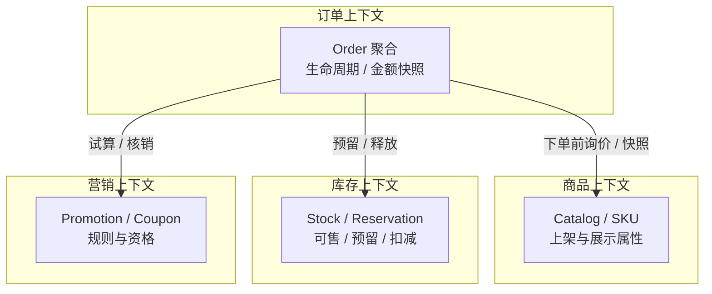
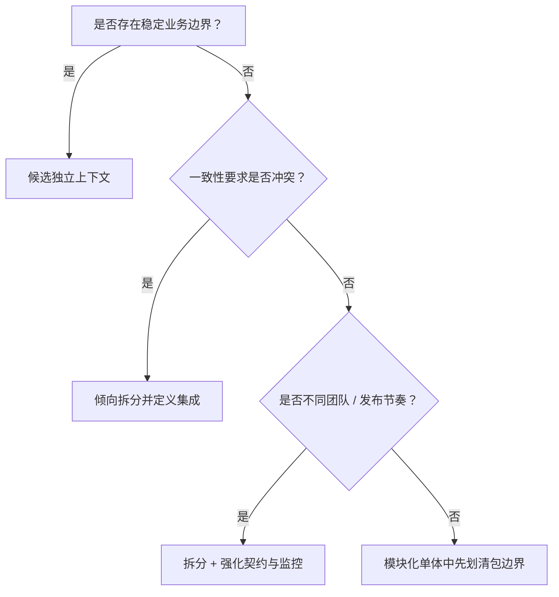
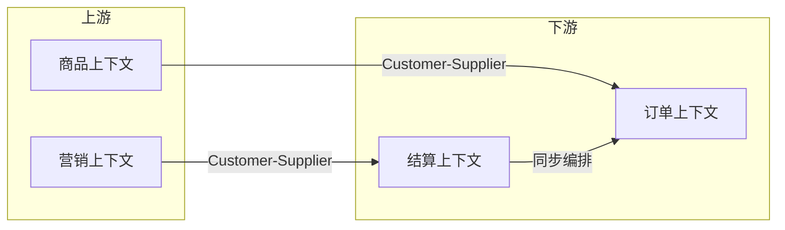
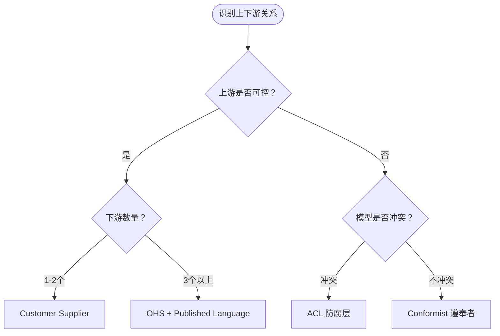
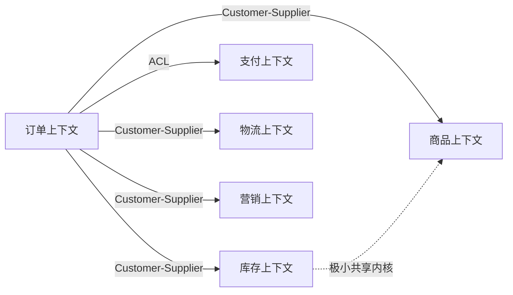
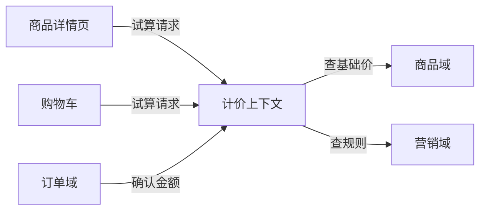

**导航**：[书籍主页](./index.md) | [完整目录](./TOC.md) | [上一章](./chapter1.md) | 下一章：第3章（即将发布）

---

# 第2章 领域驱动设计战略篇

> 限界上下文、通用语言与上下文映射——在写聚合之前先画地图

---

## 2.1 为什么需要战略设计

第 1 章从 **Clean Architecture**、**DDD** 与 **CQRS** 的协作关系出发，已经用「三位一体」搭好了工程骨架，并简要触及了限界上下文、上下文映射与通用语言。本章不再重复分层目录、Outbox 或读写分离的细节，而是把镜头拉近到 **DDD 的战略设计**：它回答的是「边界在哪里、团队如何协作、概念如何对齐」——这些问题若未澄清，战术层的聚合与仓储很容易变成「漂亮的样板代码」，却无法降低沟通与演进成本。

### 2.1.1 战术先行常见症状

许多团队第一次接触 DDD 时，会直接从「实体 / 聚合 / 仓储」入手，短期内代码结构变整齐，但很快遇到以下矛盾：

- **同名不同义**：产品口中的「商品」指前台可售的 SKU；库存同学口中的「商品」是可售量与仓位的组合；订单里的「商品」又是下单快照。没有上下文边界时，一个 `Product` 结构体会被迫承载三套语义。典型症状是代码中出现 `Product.InventoryQty`（库存关注）和 `Product.DisplayTitle`（商品关注）混杂在同一个类型中，任何修改都需要跨团队协调，变更成本高昂。

- **跨团队改同一张表**：订单服务为了赶需求直接更新库存表，或营销脚本回写订单金额字段。短期省事，长期让「谁拥有这条数据」变得模糊。某次故障中，订单团队修改了库存表的索引，导致库存域的查询性能暴跌；两边互相推诿责任，最终花了一周才定位问题。这种「绕过契约直连数据库」的路径，是边界模糊的最大隐患。

- **集成靠私下约定**：RPC 参数、Kafka Topic、回调字段在口口相传中演进，缺少显式的上下游关系与防腐策略。某次营销域修改了优惠券事件的字段名（从 `coupon_id` 改为 `couponCode`），订单域的消费者直接报错，才发现双方没有契约测试与版本策略。线上故障持续了 2 小时，影响了数万订单。

**真实案例**：某团队在引入 DDD 后，代码中充满了精美的聚合、仓储、领域服务，但每次跨服务需求都需要「拉群对齐」，因为没有明确的上下文地图。产品经理提需求时说「改一下商品价格显示逻辑」，三个团队（商品、订单、营销）都认为这是自己的职责，最终在会议室吵了一下午才确定归属。

战略设计的目标，是把上述隐性知识变成**可评审的工件**：上下文地图、术语表、子域投资优先级与集成模式（客户-供应商、防腐层等）。战术设计再在这些边界之内展开。有了清晰的上下文映射，「改商品价格显示」的需求可以在 10 分钟内定位到正确的上下文（计价域），而不是三方扯皮。

**关键认知**：战略设计不是「画图玩」，而是**团队协作的操作系统**。当产品提需求、技术做设计、代码做评审时，都参考同一张上下文地图、同一份术语表，沟通成本会显著降低。没有战略设计的团队，每个需求都要重新「对齐理解」；有战略设计的团队，大部分对齐工作已经提前完成。

### 2.1.2 战略设计与第 1 章的分工

| 主题 | 第 1 章侧重 | 本章侧重 |
|------|------------|---------|
| 限界上下文 | 与分层、CQRS 并列介绍概念 | 识别方法、划分原则、电商多域对照 |
| 上下文映射 | 模式列表与示意 | 关系选型、Go 侧接口与适配器落地 |
| 通用语言 | 命名对照示例 | 工作坊流程、术语治理与演进 |
| 子域分类 | 核心 / 支撑 / 通用与评分 | 投资策略、资源配比与常见误判 |

读完本章，你应能用一页纸向团队说明：**我们有哪些限界上下文、各自语言是什么、之间用哪种映射集成、哪几块值得重仓投入**。

**实践建议**：战略设计不必一次性做到完美。可以先用一次 2 小时的工作坊识别出 3-5 个核心上下文，画出简单的映射图，建立初版术语表（20-30 个核心术语）。在后续迭代中，根据实际协作痛点逐步细化边界、补充术语、调整映射关系。重要的是**让战略设计的产物（上下文地图、术语表、集成契约）成为团队评审与决策的依据**，而不是藏在某个架构师的脑子里。

---

## 2.2 限界上下文（Bounded Context）

**限界上下文**是模型的显式边界：在边界之内，术语含义稳定、规则可推敲；跨边界则允许同名不同义，但必须通过契约（API、事件、发布语言）连接。

### 2.2.1 识别限界上下文

识别不是一次性「微服务切分」，而是对业务能力与协作现实的建模。可组合使用以下线索：

1. **业务能力**：下单、收款、发货、圈品投放通常是不同能力，各自有独立生命周期。例如「订单履约」是一个完整的业务能力，包含订单创建、支付确认、发货、收货等完整流程，这些步骤紧密耦合，应该归属同一个上下文。而「商品展示」则是另一个独立能力，包含商品上架、搜索、详情页等，两者可以独立演进。

2. **语言边界**：当同一个词在两处讨论时含义开始分叉，往往意味着边界临近。例如「锁库」在订单侧可能是预留，在库存侧可能是可售量扣减。再比如「价格」，在商品域是「标价」，在计价域是「试算结果」，在订单域是「合同金额」，在支付域是「实付金额」——四个上下文中的「价格」含义完全不同，需要明确划分。

3. **一致性边界**：需要同事务维护的不变量，通常落在同一上下文内；可接受最终一致的协作，适合跨上下文用事件衔接。例如订单总价必须等于各明细之和（强一致），适合在订单上下文内用聚合保证；而库存扣减后通知搜索索引更新（可接受秒级延迟），适合跨上下文用事件。

4. **团队与发布节奏**（康威定律）：若两个模块永远由同一小队同节奏发布，拆成两个部署单元的紧迫性要重新评估；反之则倾向清晰上下文与契约。例如订单域和支付域虽然业务相关，但由不同团队维护、发布节奏独立、技术栈不同（订单用 Go，支付用 Java），应该拆分为独立上下文，通过清晰的 API 与事件集成。

**电商示例（订单链路）**：



**识别要点**：每个上下文有清晰的核心职责与生命周期——订单管理订单状态流转，商品管理可售商品信息，库存管理可售量与预占，营销管理优惠规则。它们通过定义明确的接口与事件协作，而不是共享同一个「大而全」的模型。

### 2.2.2 上下文边界的划分原则

1. **优先保护不变量**：订单总价与明细一致、库存不为负等，各自应在所属上下文的聚合内守护，而不是靠分布式事务「一把梭」。例如订单聚合在 `AddLine` 方法中同步更新 `TotalAmount`，保证总价与明细一致性；而库存扣减与订单创建分属两个上下文，通过事件最终一致。

2. **拒绝共享大模型**：不要把「全局统一 Product」当作目标；不同上下文各自建模，用 ID 与快照连接。订单上下文的 `OrderLine` 包含商品快照（标题、单价），商品上下文的 `Product` 包含展示信息（详情、图片），两者模型不同但通过 `ProductID` 关联。

3. **数据所有权清晰**：每个业务表有唯一写入方；其他上下文只通过 API 或事件消费。库存表只能由库存服务写入，订单服务需要库存数据时通过 `GetStock` API 查询，而不是直接读库存表。

4. **映射显式化**：同步调用、异步事件、批量对账的选择应写进架构说明，而不是隐含在代码路径里。例如在上下文映射图中明确标注「订单 → 库存：同步预占 API + 超时释放事件」。

**拆分决策树**（可与团队工作坊共用）：



**使用建议**：这个决策树适合在「是否拆分」的争议中使用。当团队对某个功能模块是否应该独立成服务有分歧时，逐个回答上述问题，多数情况下能达成共识。关键是**不要为了拆而拆**——模块化单体同样可以有清晰的限界上下文，只是物理部署在同一个进程中。等到团队规模、发布节奏确实需要独立时，再升级为独立服务。

### 2.2.3 电商案例：订单域、商品域、营销域

以下表格用于对齐**职责与对外能力**（示例命名可按团队语言替换）：

| 限界上下文 | 核心关注点 | 典型聚合（示例） | 对其他上下文承诺的能力 |
|------------|------------|------------------|-------------------------|
| **订单域** | 订单生命周期、应付金额、状态机 | `Order`、`OrderLine` | `PlaceOrder`、`CancelOrder`、领域事件 `OrderPlaced` / `OrderPaid` |
| **商品域** | 可售商品、类目属性、媒体素材 | `Product`、`SKU` | 批量查询基础信息、按 SKU 返回标题与规格 |
| **营销域** | 券、活动、互斥叠加规则 | `CouponCampaign`、`DiscountRule` | `PreviewPromotion`、`CommitPromotionHold` |

#### 实战案例：边界划分的决策过程

某电商平台早期把**计价能力**分散在订单、营销、商品三个域：订单域计算小计，营销域计算优惠，商品域返回基础价。随着业务复杂度上升，出现多处问题：

**症状**：
- 购物车、订单创建、支付确认三处的价格计算逻辑不一致
- 营销规则变更需要同步修改订单与商品的计算代码
- 无法支持「PDP 加购试算」场景，因为没有统一的计价入口

**重构决策**：
1. **识别核心能力**：「给定商品清单、营销规则、用户身份，计算出各层级价格」是一个完整的业务能力
2. **独立上下文**：新建**计价上下文**，职责是提供统一的试算接口，收敛所有价格计算逻辑
3. **定义边界**：
   - 计价上下文**不拥有**商品基础价、营销规则、订单状态——它是**编排者**
   - 对外提供 `Calculate(items, promotions, context) -> PriceBreakdown`
   - 各场景（PDP / 购物车 / 订单）通过统一接口获取价格

**收益**：
- 价格计算的一致性得到保证（同一套代码服务所有场景）
- 营销规则变更只需在营销域发布事件，计价域订阅后自动生效
- 支持了试算、价格预览、价格审计等新需求

**经验**：识别边界不是一次性切分，而是在「职责不清、协作成本高、重复逻辑多」的信号出现时，主动重构出清晰边界。

**Go 建模提示**：在订单上下文中，不要直接引用商品聚合的类型，而是使用 **ID + 快照** 表达跨边界依赖。

```go
package order

type ProductID string

// Money 在订单上下文中表示「合同金额」；实现细节可复用共享包，但语义归属订单。
type Money struct {
	Cents    int64
	Currency string
}

// OrderLine 属于订单上下文：保存下单时刻解释合同所需的快照。
type OrderLine struct {
	ProductID   ProductID
	ProductName string // 快照：避免商品改标题影响历史订单
	UnitPrice   Money  // 快照：避免改价影响已生成应付金额
	Qty         int
}
```

```go
package catalog

type ProductID string

// Product 属于商品上下文：关注展示与销售属性，而非订单合同解释。
type Product struct {
	ID          ProductID
	Title       string
	Description string
	OnShelf     bool
}
```

**要点**：两个包里的「商品信息」形状不同不是重复，而是**上下文各有权威**——合同解释以订单快照为准，陈列以商品上下文为准。

**实践建议**：在代码评审时，如果发现两个上下文共享同一个 `Product` 类型，应该追问：「这两处对商品的关注点是否相同？」如果答案是「不同」（一个关注展示，一个关注合同），那么应该拆分为两个独立的类型。宁可有一些字段重复，也不要为了「消除重复」而强行共享模型——这种重复是**有意义的重复**，体现了不同上下文的自治性。

---

## 2.3 通用语言（Ubiquitous Language）

通用语言是业务方与研发共同维护的**精确词汇系统**，贯穿需求、设计与代码。战略阶段的价值在于：先对齐语言，再讨论服务拆分与表结构。

### 2.3.1 建立通用语言

推荐从一次轻量工作坊开始：

1. **列出动词与名词**：下单、支付、发货、锁库、核销、退款……标记同义词（「关闭订单」vs「取消订单」）。
2. **为每个词写一句业务定义**：谁触发、前置状态、成功后的世界有何不同。
3. **映射到代码锚点**：包名、类型名、公开方法名尽量使用一致词汇（如 `PlaceOrder` 而非 `CreateOrderRecord`）。
4. **记录禁用词**：例如团队约定不用「更新状态 2」这类技术黑话对外沟通。

#### 工作坊实践流程（2 小时示例）

**参与者**：产品经理、领域专家、架构师、核心开发各 1-2 人。

**第一阶段（30 分钟）**：业务流程梳理
- 在白板上画出核心业务流程（如「用户下单到收货」）
- 标记出关键状态节点与触发动作
- 识别出现频率最高的业务名词（订单、商品、库存、优惠券）

**第二阶段（45 分钟）**：术语对齐
- 逐个讨论每个名词的**精确定义**
  - 示例：「库存」在商品上架时指初始可售量，在订单创建时指预占后的剩余量，在发货后指实际扣减
  - 决策：用「可售库存（Available Stock）」、「预占库存（Reserved Stock）」、「已扣库存（Deducted Stock）」三个明确术语替代模糊的「库存」
- 识别同义词并统一
  - 示例：技术侧说「关单」，业务侧说「取消订单」→ 统一为 `CancelOrder`
  - 示例：「锁库」、「预占库存」、「冻结库存」→ 统一为 `ReserveStock`

**第三阶段（30 分钟）**：映射到代码
- 为每个术语分配英文命名（供代码使用）
- 明确哪些术语属于哪个限界上下文
- 示例输出：

```markdown
| 中文术语 | 英文命名 | 所属上下文 | 定义 |
|---------|---------|-----------|------|
| 下单 | PlaceOrder | 订单域 | 用户提交购买意图，生成待支付订单 |
| 预占库存 | ReserveStock | 库存域 | 为订单预留库存，防止超卖；超时后自动释放 |
| 核销优惠券 | RedeemCoupon | 营销域 | 将优惠券从可用状态变更为已使用 |
```

**第四阶段（15 分钟）**：归档与宣导
- 将术语表提交到代码仓库（`docs/glossary.md`）
- 在下次需求评审时强制对齐：新需求必须使用术语表中的词汇
- 代码评审时检查：新增 API / 事件命名是否符合术语表

**工作坊成果示例**：

```markdown
## 订单上下文术语（v1.0）

- **下单（PlaceOrder）**：用户提交购买意图，生成待支付订单；不等于支付成功。
  - 前置条件：商品可售、库存充足、优惠券可用
  - 后置状态：订单状态为 `PendingPayment`，库存为 `Reserved`
  
- **锁库 / 预占库存（ReserveStock）**：为指定订单行预留可售库存，防止超卖；不等同于「扣减库存」。
  - 触发方：订单域在创单时调用库存域接口
  - 超时策略：30 分钟未支付自动释放
  
- **订单已支付（OrderPaid）**：支付渠道确认成功后的领域事实；会触发履约与扣减等后续流程。
  - 事件订阅者：库存域（扣减库存）、物流域（创建配送单）、营销域（核销优惠券）
```

**实战技巧**：
- 不要追求第一版术语表的完美——先建立 60% 共识，剩余在迭代中补充
- 争议术语标记「待定」，给出 2-3 个候选，在实际编码中验证哪个更顺
- 每季度 Review 一次术语表，淘汰不再使用的术语，补充新增的核心概念

**Go：让类型系统承载语言**：

```go
package order

type OrderID string
type UserID string
type ProductID string

// PlaceOrderCommand 用业务动词命名命令，而非数据库操作。
type PlaceOrderCommand struct {
	BuyerID UserID
	Lines   []OrderLineDraft
}

type OrderLineDraft struct {
	ProductID ProductID
	Qty       int
}
```

### 2.3.2 语言的演进与维护

语言会随业务演进，需要低成本维护机制：

- **ADR / RFC**：当术语含义变化（例如「预售」从全款改为定金），用简短架构记录说明新旧语义与兼容期。
- **版本化 API**：对外契约（REST / gRPC / 事件 Schema）与术语表联动更新，避免「文档是新的、代码是旧的」。
- **定期 Review**：每个迭代挑一个争议需求，反问「我们用的是哪一个上下文里的定义？」

**演进示例**：当业务引入「先用后付」，需明确它属于支付上下文的授信产品，还是订单上下文的支付子状态——结论应写回术语表，并调整 `OrderStatus` 与集成事件名，而不是仅在 if 分支加 flag。

**版本化策略**：术语表应该有版本号（如 v1.0、v1.1），每次重大变更（如删除术语、修改定义）都升级版本并记录变更日志。这样新人可以追溯「为什么当初选择这个词」，避免重复讨论已解决的问题。同时，对外API的命名也应该与术语表版本对应，例如`PlaceOrder v1`使用术语表v1.0的定义，`PlaceOrder v2`使用v1.1的定义，保证向后兼容。

**跨团队同步**：术语表变更应该通知所有相关团队。可以在 Git 仓库中设置术语表文件的 CODEOWNERS，任何修改都需要相关团队的 Approver 确认。这样可以避免「术语表改了但代码没改」或「不同团队理解不一致」的问题。

### 2.3.3 反模式：技术术语污染业务讨论

典型反模式包括：在评审中使用 `OrderDTO` / `OrderVO`、把数据库动词当业务语言（`InsertOrder`）、用魔法状态码沟通。它们会阻断业务专家的参与。

```go
package badexample

// ❌ 技术噪声：业务方无法从命名理解用例意图
type OrderService struct{}

func (s *OrderService) HandleSubmit(data map[string]any) error { return nil }
```

```go
// ✅ 使用业务动词与强类型参数，评审可对读
package order

import "context"

type OrderService interface {
	PlaceOrder(ctx context.Context, cmd PlaceOrderCommand) (OrderID, error)
}
```

#### 更多语言污染案例与纠正

**反模式 1：用数据库字段名代替业务概念**

```go
// BAD: 数据库思维泄漏到业务层
type Order struct {
    OrderNo    string
    UserId     int64
    TotalAmt   int64
    StatusCode int    // 0=待支付 1=已支付 2=已取消 3=已关闭
}

func (s *OrderService) UpdateStatusCode(orderNo string, code int) error {
    // 业务规则隐藏在魔法数字背后
}
```

```go
// GOOD: 业务语言驱动设计
type Order struct {
    ID         OrderID
    CustomerID CustomerID
    Total      Money
    Status     OrderStatus // 枚举类型
}

type OrderStatus int
const (
    StatusPendingPayment OrderStatus = iota
    StatusPaid
    StatusCanceled
    StatusFulfilled
)

// 业务动词显式化
func (o *Order) MarkAsPaid(paidAt time.Time) error {
    if o.Status != StatusPendingPayment {
        return ErrInvalidTransition
    }
    o.Status = StatusPaid
    o.PaidAt = paidAt
    return nil
}
```

**收益**：代码评审时，业务方能直接参与讨论状态转换规则，而不是盯着 SQL 猜测 `status = 1` 的含义。

---

**反模式 2：接口命名只有 CRUD，没有业务意图**

```go
// BAD: 贫血模型 + CRUD
type OrderRepository interface {
    Insert(ctx context.Context, order *Order) error
    Update(ctx context.Context, order *Order) error
    Delete(ctx context.Context, id string) error
    Select(ctx context.Context, id string) (*Order, error)
}
```

**问题**：
- `Update` 可以改任意字段，无法表达业务约束
- 新人看不出「订单支付」应该调用哪个方法
- 业务规则散落在 Service 层的 if-else 中

```go
// GOOD: 用例驱动的接口
type OrderUseCase interface {
    PlaceOrder(ctx context.Context, cmd PlaceOrderCommand) (OrderID, error)
    MarkAsPaid(ctx context.Context, orderID OrderID, paidAt time.Time) error
    CancelOrder(ctx context.Context, orderID OrderID, reason string) error
}
```

**收益**：接口即文档——每个方法对应一个明确的业务用例。

---

**反模式 3：在需求评审中使用技术黑话**

**真实案例**：产品提需求「用户支付后，订单状态改为 2」。

**问题**：
- 产品被迫记忆「2」的含义（下次可能记错）
- 新人无法从文档理解业务流程
- 数据库状态码变更时，文档需要全局替换

**纠正方案**：
- 需求文档使用业务语言：「用户支付后，订单状态改为**已支付**」
- 代码中使用枚举常量：`StatusPaid`
- 数据库存储可以是数字，但对外接口和文档必须是业务术语

**落地检查**：
- 代码评审时，发现「魔法数字」或「技术缩写」，要求作者用业务术语重命名
- API 文档生成时，枚举值自动展示为业务含义（如 `"status": "paid"`）
- 新人培训时，术语表是必读文档

---

## 2.4 上下文映射（Context Mapping）

上下文映射描述**谁依赖谁、如何集成**。它把组织关系与架构关系对齐，避免「谁都能改」的隐式耦合。

### 2.4.1 上下游关系模式

常见关系（节选）：

| 模式 | 关系 | 典型集成 | 电商提示 |
|------|------|----------|----------|
| **客户-供应商（Customer-Supplier）** | 下游依赖上游，上游需考虑下游诉求 | 版本化查询 API、批量接口 | 订单（客户）依赖商品（供应商） |
| **遵奉者（Conformist）** | 下游无力改变上游模型 | 直接采用对方模型 | 税务、监管、强势渠道 |
| **防腐层（ACL）** | 下游翻译上游模型，保护自身核心 | 适配器封装第三方 SDK | 对接微信 / 支付宝支付 |
| **开放主机服务（OHS）** | 上游提供稳定多租户接口 | 标准 REST / gRPC + 兼容策略 | 商品中心对搜索、推荐、活动统一供数 |
| **发布语言（Published Language）** | 双方约定中立交换格式 | JSON Schema、Avro、开放事件规范 | `OrderPaid` 事件字段集 |



#### 各模式的实战应用

**客户-供应商（Customer-Supplier）实践**

**场景**：订单域（客户）依赖商品域（供应商）获取商品信息。

**关键点**：
- 上游（商品域）提供**版本化 API**，保证向后兼容
- 下游（订单域）通过契约测试验证依赖稳定性
- 定期召开「契约评审会」，下游提需求，上游评估可行性

**实现示例**：

```go
// 商品域对外提供的稳定接口（v1版本）
package catalogapi

type GetProductRequest struct {
    ProductID string `json:"product_id"`
}

type GetProductResponse struct {
    ID          string  `json:"id"`
    Title       string  `json:"title"`
    Price       float64 `json:"price"`
    Available   bool    `json:"available"`
}

// 订单域依赖商品域的接口
package order

type ProductAPI interface {
    GetProduct(ctx context.Context, productID string) (*catalogapi.GetProductResponse, error)
}
```

**契约测试**：

```go
func TestProductAPI_Contract(t *testing.T) {
    // 验证商品域的响应格式是否符合订单域的预期
    resp := &catalogapi.GetProductResponse{
        ID:    "SKU123",
        Title: "iPhone 15",
        Price: 5999.00,
        Available: true,
    }
    // 断言必需字段存在
    assert.NotEmpty(t, resp.ID)
    assert.NotEmpty(t, resp.Title)
}
```

---

**遵奉者（Conformist）实践**

**场景**：对接税务系统、支付渠道等**强势上游**，无力改变对方模型。

**策略**：
- 直接使用对方的数据结构（避免无谓的翻译层）
- 在上游变更时快速跟进（监听对方发布公告）
- 内部文档记录「为什么使用对方模型」（避免后人困惑）

**示例**：

```go
// 直接使用支付宝 SDK 的类型
import "github.com/alipay/alipay-sdk-go"

type AlipayAdapter struct {
    client *alipay.Client
}

func (a *AlipayAdapter) CreatePayment(orderID string, amount float64) error {
    // 直接使用 Alipay SDK 的请求结构
    req := alipay.TradeCreateRequest{
        OutTradeNo:  orderID,
        TotalAmount: fmt.Sprintf("%.2f", amount),
        Subject:     "订单支付",
    }
    _, err := a.client.TradeCreate(&req)
    return err
}
```

**适用场景**：上游是成熟的外部系统，模型变更频率低，翻译成本高于收益。

---

**开放主机服务（OHS）+ 发布语言实践**

**场景**：商品中心需要服务多个下游（搜索、推荐、营销、订单），避免为每个下游定制接口。

**策略**：
- 设计**通用查询接口**，支持灵活的筛选与投影
- 发布**标准事件**（JSON Schema / Protobuf），所有下游订阅相同事件
- 使用 API Gateway 管理多租户访问（限流、鉴权、版本路由）

**示例**：

```go
// 商品域发布统一的查询接口
type ProductQueryAPI interface {
    ListProducts(ctx context.Context, req ListProductsRequest) (*ListProductsResponse, error)
}

type ListProductsRequest struct {
    CategoryID string   `json:"category_id,omitempty"`
    Tags       []string `json:"tags,omitempty"`
    OnShelf    *bool    `json:"on_shelf,omitempty"`
    Limit      int      `json:"limit"`
    Offset     int      `json:"offset"`
}
```

**发布语言（事件）**：

```json
{
  "event_type": "ProductOnShelf",
  "version": "1.0",
  "product_id": "SKU123",
  "title": "iPhone 15",
  "price": 5999.00,
  "occurred_at": "2026-04-17T10:00:00Z"
}
```

**收益**：
- 下游（搜索、推荐）可以独立订阅事件，无需与商品域强耦合
- 商品域只需维护一套接口，降低维护成本
- 通过 Schema Registry 管理事件版本，保证向后兼容

---

**选型决策树**：



### 2.4.2 共享内核

**共享内核**是两方共同维护的一小块模型或库。它减少重复，但会牺牲自治，需要强治理。

**电商谨慎场景**：订单与库存若共享「SKU ID 类型 + 基础校验函数」这类极小内核尚可；一旦共享「库存数量字段」或「订单状态枚举」，边界会迅速模糊。

```go
// sharedkernel/sku.go — 保持极小、稳定、少变更
package sharedkernel

type SKUCode string

func (c SKUCode) IsWellFormed() bool {
	return len(string(c)) >= 6 // 示例规则：长度下限
}
```

**实践建议**：共享内核应能通过**双人评审 + 语义化版本**演进；否则优先改为 **Published Language**（如清晰的事件字段）而非代码级共享。

**何时使用共享内核**：
- 两个上下文由同一团队维护，且模型变更成本低
- 共享的是极其稳定的基础类型（如 ID、Money、Email 等值对象）
- 双方都同意「修改共享内核需要通知并等待对方确认」

**何时避免共享内核**：
- 两个上下文由不同团队维护（会严重拖慢发布节奏）
- 共享的是经常变化的业务规则（如订单状态、库存策略）
- 无法保证「修改前通知」的纪律（会导致隐式破坏性变更）

**真实案例**：某团队在订单与库存之间共享了 `ProductStatus` 枚举。营销需求要求增加「预售」状态，订单团队快速修改了枚举并发布，但忘记通知库存团队。库存服务在处理「预售商品」时因为没有对应的分支处理逻辑，导致库存同步失败。最终双方约定：将共享内核降级为 Published Language（事件 Schema），每次变更必须走 RFC 流程并双方确认。

### 2.4.3 防腐层

防腐层把外部不稳定协议挡在边界之外，领域层只依赖自己的端口接口。

```go
package order

import (
	"context"
	"fmt"
)

type OrderID string

// Money 表示订单上下文的应付金额（示例：用分存储，避免 float）。
type Money struct {
	cents    int64
	currency string
}

func NewMoneyFromCents(cents int64, currency string) Money {
	return Money{cents: cents, currency: currency}
}

func (m Money) DecimalYuan() string {
	if m.cents < 0 {
		return "0.00"
	}
	yuan := m.cents / 100
	fen := m.cents % 100
	return fmt.Sprintf("%d.%02d", yuan, fen)
}

// PaymentSession 是领域侧对「可跳转支付」的最小抽象，不暴露渠道字段。
type PaymentSession struct {
	CheckoutURL string
}

type StartPaymentCommand struct {
	OrderID OrderID
	Payable Money
}

// PaymentGateway 由订单领域定义：表达「我需要的支付能力」，由基础设施实现。
type PaymentGateway interface {
	StartPayment(ctx context.Context, cmd StartPaymentCommand) (*PaymentSession, error)
}
```

```go
package alipayacl

import (
	"context"
	"fmt"

	"example/order"
)

// 仅示意第三方 SDK 的能力边界，避免示例依赖真实包名。
type alipayPrecreateClient interface {
	Precreate(ctx context.Context, body map[string]any) (*alipayPrecreateResult, error)
}

type alipayPrecreateResult struct {
	QRCodeURL string
}

// AlipayACL 位于基础设施侧：翻译领域命令 ↔ 支付宝请求 / 响应。
type AlipayACL struct {
	client alipayPrecreateClient
}

func NewAlipayACL(client alipayPrecreateClient) *AlipayACL {
	return &AlipayACL{client: client}
}

func (a *AlipayACL) StartPayment(ctx context.Context, cmd order.StartPaymentCommand) (*order.PaymentSession, error) {
	req := map[string]any{
		"out_trade_no": string(cmd.OrderID),
		"total_amount": cmd.Payable.DecimalYuan(),
		"subject":      fmt.Sprintf("订单支付 %s", string(cmd.OrderID)),
	}
	resp, err := a.client.Precreate(ctx, req)
	if err != nil {
		return nil, err
	}
	return &order.PaymentSession{CheckoutURL: resp.QRCodeURL}, nil
}
```

**收益**：
- 当渠道字段变更时，修改集中在 ACL；订单聚合与用例不被第三方类型污染
- 可以为同一个端口提供多个实现（支付宝 ACL、微信 ACL、PayPal ACL），通过工厂模式或配置切换
- 测试时可以使用 Fake 实现替代真实支付渠道，提升测试速度和可靠性
- 防腐层承担了「翻译」职责，领域层保持纯粹，不受外部依赖污染

**反模式警示**：有些团队会在防腐层之外再包一层「防防腐层」，过度封装导致代码层级过深。原则是**一次翻译足矣**——从第三方模型翻译到领域模型，中间不需要再多一层「通用模型」。

### 2.4.4 电商系统的上下文映射实例

综合一版可挂在 Wiki 首页的示意（箭头表示依赖方向）：



**落地检查清单**：

- [ ] 每个箭头是否有明确契约（OpenAPI / Proto / 事件表）？
- [ ] 失败模式（超时、重试、幂等）是否写清归属上下文？
- [ ] 是否存在「绕过契约直连数据库」的路径？若有，计划消除。

#### 集成失败案例与解决方案

**案例 1：订单域直接读取库存表（违反边界）**

**背景**：订单服务为了展示「剩余库存」，在查询订单详情时直接 JOIN 库存表。

**问题**：
- 库存表结构变更时，订单服务也要修改（耦合）
- 库存域无法独立演进（加缓存、分库、切换存储）
- 破坏了「库存域拥有库存数据」的所有权原则

**解决方案**：
```go
// 订单域定义端口
type StockQueryPort interface {
    GetAvailableQty(ctx context.Context, sku string) (int, error)
}

// 基础设施层实现（调用库存域 API）
type RemoteStockAdapter struct {
    client *stockservice.Client
}

func (a *RemoteStockAdapter) GetAvailableQty(ctx context.Context, sku string) (int, error) {
    resp, err := a.client.GetStock(ctx, &stockpb.GetStockRequest{Sku: sku})
    if err != nil {
        return 0, fmt.Errorf("query stock: %w", err)
    }
    return int(resp.AvailableQty), nil
}
```

**收益**：库存域可以独立优化存储、加缓存、切换数据库，订单域只依赖接口契约。

---

**案例 2：营销规则变更导致订单金额计算不一致**

**背景**：营销域上线新规则后，订单域的价格计算逻辑未同步更新，导致订单金额与用户预览不一致。

**根因**：没有统一的计价入口，订单域、购物车、PDP 各自实现计算逻辑。

**解决方案**：
1. 新建**计价上下文**作为编排者
2. 所有场景通过计价域的 `Calculate` 接口获取价格
3. 营销规则变更时，只需更新营销域；计价域自动订阅规则变更事件



---

**案例 3：支付回调丢失导致订单状态不同步**

**背景**：支付域通过 HTTP 回调通知订单域支付成功，但网络抖动导致回调丢失，订单长时间停留在「待支付」状态。

**问题**：
- 同步回调不可靠（网络、超时、重启）
- 缺少补偿机制

**解决方案**：
1. **异步事件 + 重试**：支付域发布 `PaymentCaptured` 事件到 Kafka，订单域订阅并幂等处理
2. **对账任务**：每小时扫描「待支付」订单，调用支付域查询实际状态，发现不一致则补偿
3. **状态机保护**：订单状态机禁止「已支付 → 待支付」的逆向转换，防止数据损坏

```go
// 订单域订阅支付事件
func (s *OrderService) HandlePaymentCaptured(ctx context.Context, event PaymentCapturedEvent) error {
    order, err := s.repo.FindByID(ctx, event.OrderID)
    if err != nil {
        return err
    }
    // 幂等检查
    if order.Status == StatusPaid {
        return nil // 已处理
    }
    return order.MarkAsPaid(event.PaidAt)
}
```

**经验**：跨上下文集成必须考虑失败场景——同步调用加超时与重试，异步事件加幂等与对账。

---

## 2.5 领域的分类

战略精炼的重要产出，是把公司能力地图分为 **核心域、支撑域、通用域**，以指导人力与风险的投放。

### 2.5.1 核心域、支撑域、通用域

- **核心域**：差异化竞争力所在，复杂且多变，应重仓自研与深度建模。例如亚马逊的推荐算法、阿里的交易风控，这些是竞争壁垒，必须投入顶尖人才与架构资源。
- **支撑域**：业务必需但非胜负手，可适度定制，避免过度设计。例如商品管理、库存管理，参考业界成熟模型即可，不必追求极致创新。
- **通用域**：行业共性，成熟外包或 SaaS 更划算。例如短信通知、对象存储、日志监控，云服务比自研更经济。

### 2.5.2 投资策略

可用「四维度」快速评分：**业务价值、复杂度、变化频率、差异化**。不必追求精确分数，关键是**相对比较**与资源承诺。

| 子域示例 | 倾向 | 投资建议（示意） |
|----------|------|------------------|
| 订单履约 | 核心域 | 架构师 + 高可用工程化，明确 SLA 与演练 |
| 库存准确性 | 核心域 | 并发控制、对账与仿真压测 |
| 商品管理 | 支撑域 | 参考业界模型，控制自定义范围 |
| 消息通知 | 通用域 | 使用云短信 / 邮件 SaaS，内部仅封装网关 |

#### 投资决策案例

**案例 1：搜索推荐从支撑域升级为核心域**

**背景**：某平台早期将搜索视为支撑域，采用开源 Elasticsearch + 简单配置。随着 GMV 增长，发现 **70% 流量来自搜索，转化率直接影响营收**。

**决策过程**：
- **重新评估**：搜索从「辅助发现」变为「核心转化入口」
- **投资升级**：
  - 组建搜索算法团队（相关性、个性化排序）
  - 自研召回引擎与排序服务（而非依赖 ES 默认评分）
  - 建设 ABTest 平台与实时指标体系
- **资源配比**：从 1 人维护 → 8 人团队（算法 + 工程）

**收益**：搜索点击率提升 40%，GMV 贡献占比从 70% 提升到 85%。

---

**案例 2：自研消息队列的代价**

**背景**：某团队因「担心 Kafka 运维复杂」，自研了轻量级消息队列。

**问题暴露**：
- **维护成本**：集群故障、数据丢失、性能瓶颈需要专人处理
- **功能缺失**：不支持事务、延迟消息、死信队列等企业级特性
- **团队分心**：核心业务开发被「救火中间件」打断

**纠正方案**：
- 迁移到云服务商托管的 Kafka（或 RocketMQ）
- 内部仅封装薄的 SDK 层（日志、监控、错误处理）
- 释放的人力投入到核心业务优化

**经验**：通用域的自研往往是「过早优化」——先用成熟方案，待瓶颈确认后再评估自研价值。

---

**常见误判**：

- **把所有模块都标成核心域**：资源分散，真正的差异化无人深耕。
- **把支撑域做成「无设计」**：质量太差会反向拖垮核心域（数据错误、不可用）。
- **在通用域自研中间件**：短期有掌控感，长期维护成本侵蚀核心业务投入。
- **忽视支撑域的稳定性**：商品数据错误、库存不准确会直接影响订单转化——支撑域不是「二等公民」。

#### 投资复盘机制

建议每半年召开一次「子域投资复盘会」：

1. **回顾当前分类**：哪些域的重要性发生了变化？
2. **评估资源配比**：核心域是否得到了足够的架构师与工程资源？
3. **识别欠投资域**：哪些支撑域因质量问题拖累了核心域？
4. **调整策略**：将资源从「过度投资的通用域」转移到「欠投资的核心域」

**输出示例**：

| 子域 | 上次分类 | 本次分类 | 资源变化 | 理由 |
|------|---------|---------|---------|------|
| 搜索推荐 | 支撑域 | **核心域** | +5 人 | 转化率提升是 Q1 关键目标 |
| 消息队列 | 通用域 | 通用域 | -2 人 | 迁移到云服务，释放人力 |
| 库存准确性 | 核心域 | 核心域 | +3 人 | 大促准备，加强对账与监控 |

### 2.5.3 电商平台的领域分类

结合国内中大型平台的常见划分（需按公司战略微调）：

**核心域候选**：交易订单、库存准确性、交易风控、推荐与搜索体验（若差异化来自发现与转化）。

**支撑域候选**：商品中心、营销规则、计价、物流对接、客服工单。

**通用域候选**：登录注册、对象存储、日志监控、基础消息通道。

#### 详细领域分类与资源配比

| 子域 | 分类 | 业务价值 | 复杂度 | 变化频率 | 差异化 | 资源配比示例 |
|------|------|---------|--------|---------|--------|-------------|
| 订单履约 | 核心域 | 极高 | 高 | 中 | 高 | 10人团队，架构师+高工 |
| 库存准确性 | 核心域 | 极高 | 高 | 中 | 高 | 8人团队，专项优化 |
| 交易风控 | 核心域 | 极高 | 极高 | 高 | 极高 | 算法团队+工程团队 |
| 搜索推荐 | 核心域 | 极高 | 极高 | 高 | 高 | 算法+工程双轨 |
| 商品中心 | 支撑域 | 高 | 中 | 低 | 中 | 5人团队，参考业界 |
| 营销系统 | 支撑域 | 高 | 高 | 高 | 中 | 6人团队，规则引擎 |
| 计价系统 | 支撑域 | 高 | 中 | 中 | 低 | 3人团队，统一接口 |
| 物流对接 | 支撑域 | 中 | 中 | 低 | 低 | 2人维护，适配器模式 |
| 登录注册 | 通用域 | 中 | 低 | 低 | 无 | 使用 OAuth2 服务 |
| 对象存储 | 通用域 | 低 | 低 | 低 | 无 | 云服务（OSS/S3） |
| 消息通知 | 通用域 | 中 | 低 | 低 | 无 | 云服务+薄封装 |

#### 分类决策的实战案例

**案例 1：库存系统从支撑域升级为核心域**

**初始阶段**：
- 分类：支撑域（「库存只是个数字，没啥复杂的」）
- 投资：2 人维护，简单 Redis + MySQL

**问题暴露**：
- 大促期间频繁超卖，投诉量激增
- 供应商库存同步延迟，导致用户下单后被取消
- 库存准确性成为用户信任的核心指标

**重新评估**：
- **业务价值**：库存不准 → 超卖 → 投诉 → 品牌损失（极高）
- **复杂度**：多仓、多供应商、实时同步、预占释放（高）
- **差异化**：准确率 99.9% vs 竞品 95%（高）
- **结论**：升级为核心域

**投资升级**：
- 团队扩充到 8 人（架构师 + 高工 + 算法）
- 建设预占释放机制、对账系统、实时监控
- 引入分布式锁与 Lua 脚本保证并发正确性
- 建立库存准确性 SLA（99.95%）

**收益**：超卖率从 5% 降到 0.1%，用户满意度显著提升。

---

**案例 2：消息通知从自研降级为云服务（通用域）**

**初始阶段**：
- 分类：支撑域
- 投资：4 人团队自研短信 / 邮件 / 推送网关

**问题暴露**：
- 维护成本高（渠道对接、失败重试、速率控制）
- 功能落后（不支持模板管理、A/B 测试）
- 团队被「救火」占用，无法投入核心业务

**重新评估**：
- **业务价值**：中（通知到达率影响体验，但非核心竞争力）
- **差异化**：无（所有平台都需要通知，无差异化空间）
- **结论**：降级为通用域，使用云服务

**调整方案**：
- 迁移到云服务商（阿里云 / 腾讯云 / AWS SNS）
- 内部仅保留薄封装层（日志、监控、降级）
- 释放的 4 人转投到核心域（搜索推荐优化）

**收益**：维护成本降低 80%，功能更丰富（模板管理、多渠道支持），团队聚焦核心业务。

---

#### 包结构与投资映射

```go
// 用包结构反映投资重心（示意）：核心域包内更完整领域模型，外围保持薄封装。

// 核心域：完整的 DDD 分层
// core/order/
//   ├── domain/       (聚合、实体、值对象、领域服务)
//   ├── application/  (用例、命令处理器)
//   ├── adapter/      (HTTP、gRPC、事件订阅)
//   └── infra/        (仓储实现、外部集成)

// 支撑域：适度建模，控制复杂度
// supporting/catalog/
//   ├── service/      (业务逻辑)
//   ├── repository/   (数据访问)
//   └── api/          (对外接口)

// 通用域：薄封装，优先使用外部服务
// generic/notification/
//   ├── client/       (云服务 SDK 封装)
//   └── config/       (配置与降级)
```

**说明**：包划分只是辅助沟通的手段，真正重要的是**团队边界、发布边界与数据所有权**是否与之一致。核心域投入更多架构设计与代码质量保障，支撑域保持适度复杂度，通用域优先复用成熟方案。

---

## 2.6 本章小结

### 2.6.1 核心要点回顾

- **战略设计**解决边界、协作与语言问题，是战术建模的前置条件；与第 1 章的架构骨架互补而非重复。
- **限界上下文**按业务能力、语言分叉、一致性与团队现实划分；订单、商品、营销应各自维护模型，以 ID 与快照连接。
- **通用语言**需要术语表、命令动词与演进机制，避免技术黑话污染评审。
- **上下文映射**把依赖关系产品化：客户-供应商、防腐层、共享内核（克制使用）、开放主机服务与发布语言各得其所。
- **子域分类**驱动投资：核心域求精，支撑域求稳，通用域求省，并定期复盘调整。

### 2.6.2 落地检查清单

在项目启动或重构时，可用以下清单自查：

**限界上下文识别**：
- [ ] 是否识别出 3-8 个主要限界上下文？（过少说明边界模糊，过多说明过度拆分）
- [ ] 每个上下文是否有清晰的职责描述（一句话能说清楚）？
- [ ] 是否避免了「大而全的领域模型」（如一个 Product 类服务所有上下文）？
- [ ] 跨上下文的数据引用是否通过 ID 与快照，而非直接依赖对方的聚合类型？

**通用语言建立**：
- [ ] 是否建立了术语表（`docs/glossary.md`）？
- [ ] 代码中的核心类型、方法名是否与术语表一致？
- [ ] 是否消除了魔法数字与技术黑话（如 `status=2`、`UpdateData`）？
- [ ] 新需求评审时，是否强制使用术语表中的词汇？

**上下文映射**：
- [ ] 是否有明确的上下文映射图（类似 2.4.4 的 Mermaid 图）？
- [ ] 每个依赖关系是否标注了集成模式（Customer-Supplier / ACL / OHS）？
- [ ] 是否为关键集成定义了契约（API 文档 / Proto / 事件 Schema）？
- [ ] 是否考虑了失败场景（超时、重试、降级、对账）？

**子域投资**：
- [ ] 是否明确标记了核心域、支撑域、通用域？
- [ ] 核心域是否得到了架构师与高级工程师的投入？
- [ ] 通用域是否优先使用成熟的开源 / 云服务，而非自研？
- [ ] 是否有定期复盘机制（每半年 Review 一次子域分类）？

### 2.6.3 常见陷阱总结

| 陷阱 | 症状 | 纠正方向 |
|------|------|----------|
| 战术先行 | 代码结构优美，但跨团队协作仍然混乱 | 补充战略设计：画出上下文地图，建立术语表 |
| 边界过度拆分 | 10+ 个微服务，每个只有几百行代码 | 合并职责相近的上下文，先模块化后服务化 |
| 共享大模型 | 一个 Product 类被所有服务依赖 | 每个上下文独立建模，用 ACL 翻译 |
| 术语不一致 | 同一概念有 3 种命名（Order / Purchase / Transaction） | 通过工作坊对齐，强制使用术语表 |
| 忽视集成失败 | 只考虑 Happy Path，线上频繁出现数据不一致 | 为每个集成点设计失败处理（重试、降级、对账） |
| 投资不均衡 | 核心域缺人，通用域自研中间件占用大量资源 | 重新评估子域分类，调整资源配比 |

### 2.6.4 实践建议

1. **战略设计不是一次性工作**——建议每季度召开一次「边界复盘会」，回顾上下文划分是否合理，术语表是否需要更新。

2. **工作坊轻量化**——不必追求「完美的限界上下文图」，先建立 60% 共识，剩余在实际编码中验证和调整。

3. **术语表即文档**——将术语表提交到代码仓库，作为新人培训与需求评审的必读材料。

4. **从小处着手**——若团队尚未实践 DDD，可以从「建立一个术语表」或「重命名一个核心 API」开始，而非一次性重构整个系统。

5. **与第 1 章方法论结合**——战略设计画出边界 → Clean Architecture 确保依赖方向 → DDD 战术设计守护不变量 → CQRS 优化读写路径，四者协同发力。

**与下一章的衔接**：第 3 章将回到代码层面的整洁性与可维护性（函数、Pipeline、策略模式等），把本章画出的边界落实为日常工程纪律。战略设计画出了「是什么、在哪里」，战术设计（第 3 章）将回答「怎么做、怎么守护」。两者结合，才能构建出既有清晰边界、又有良好代码质量的系统。

---

**导航**：[返回目录](./TOC.md) | [上一章](./chapter1.md) | [书籍主页](./index.md) | 下一章：第3章（即将发布）
