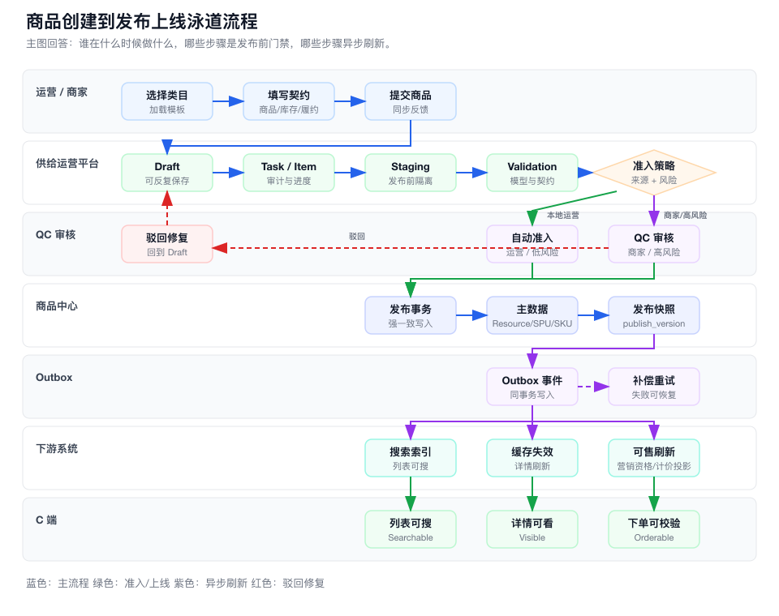
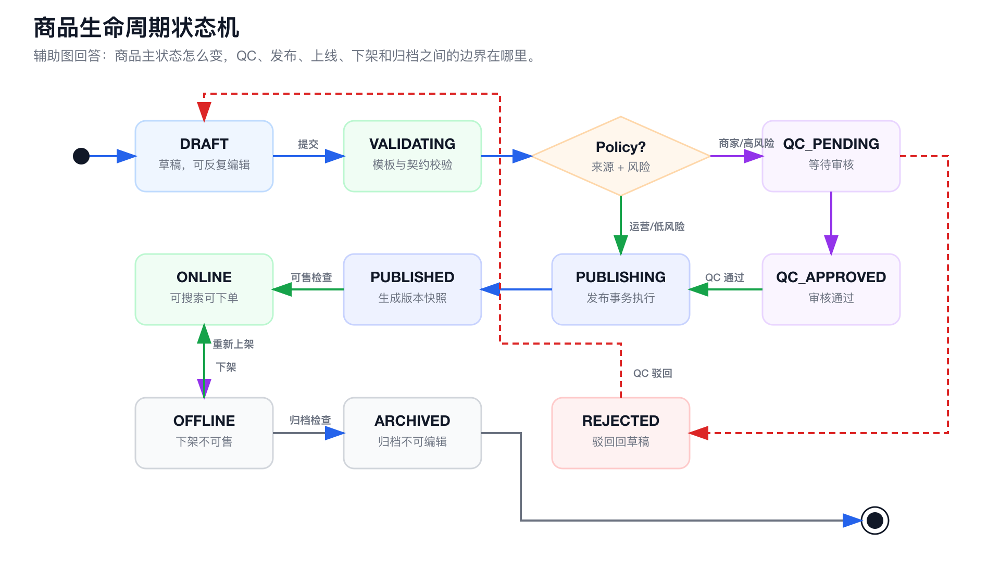
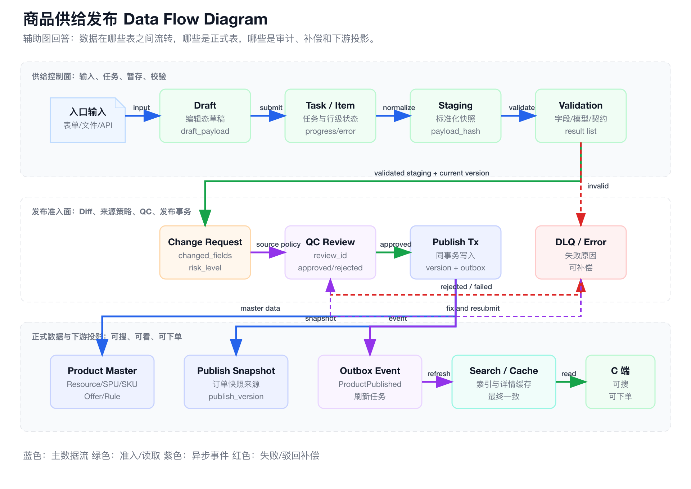
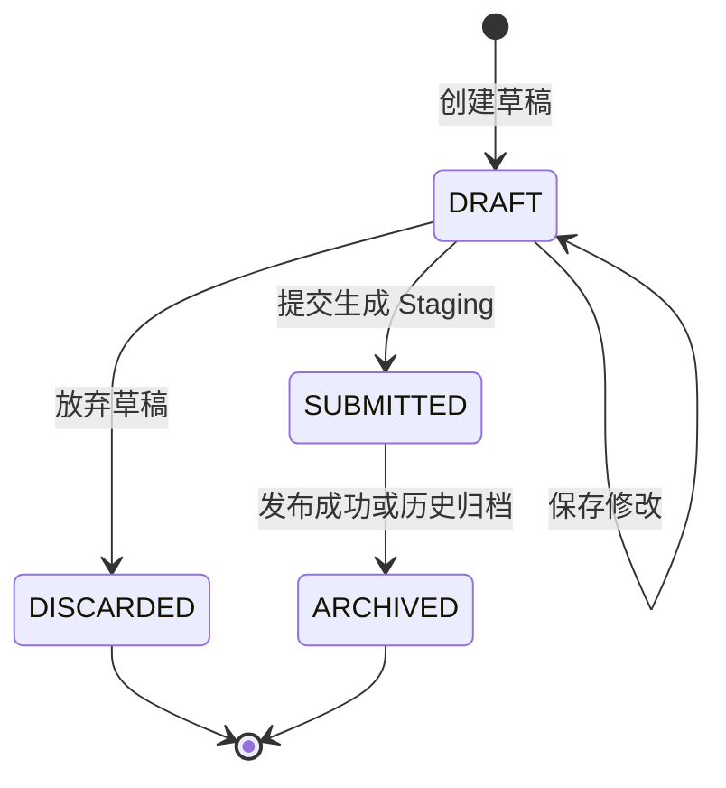
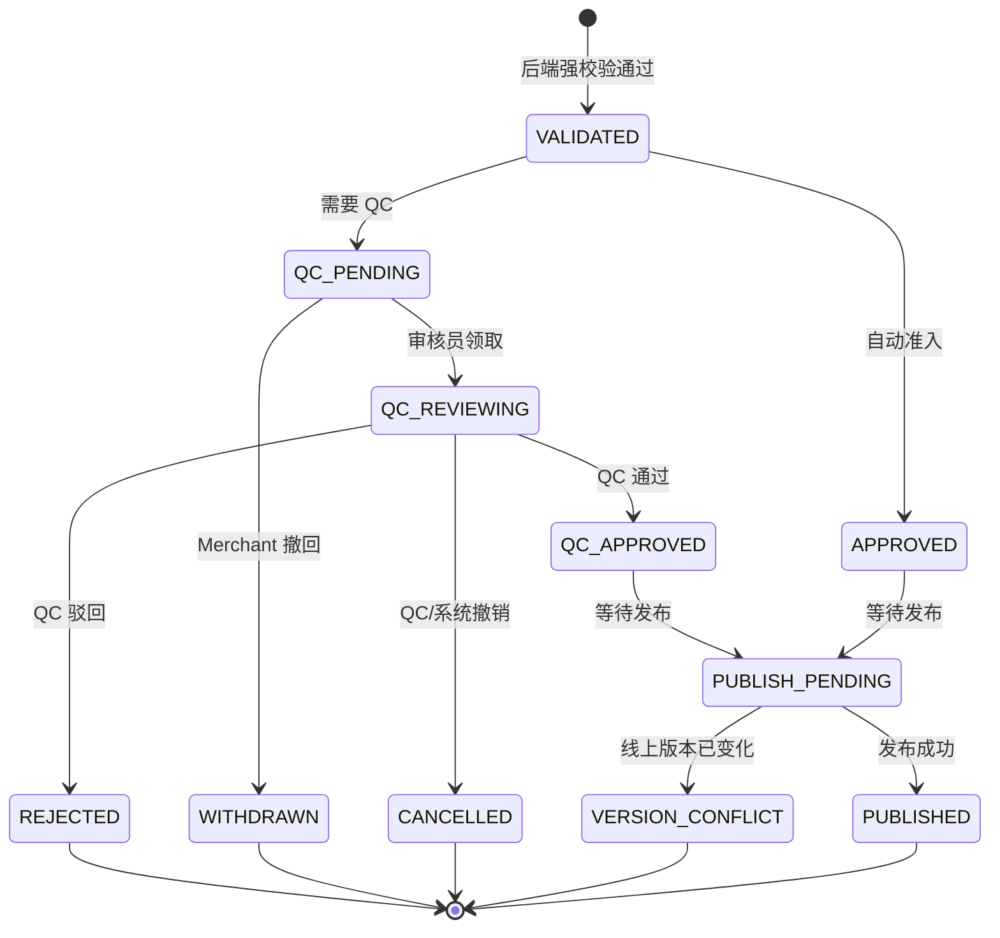
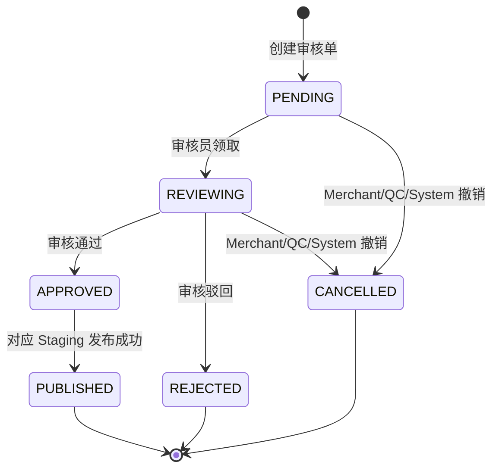
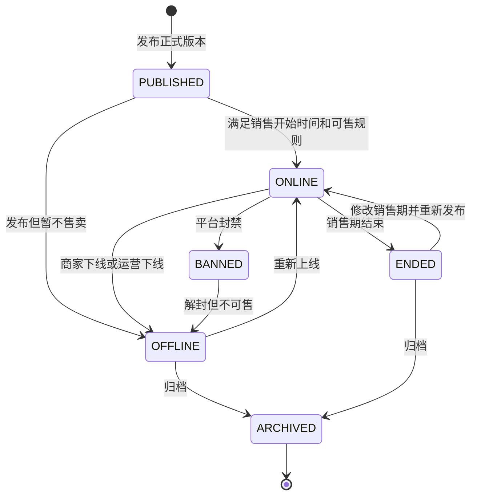

**导航**：[书籍主页](../../README.md) | [完整目录](../../SUMMARY.md) | [上一章：第10章](./chapter9.md) | [下一章：第12章](../transaction/chapter11.md)

---

# 第11章 商品供给管理：运营、库存与生命周期

> **本章定位**：承接第 8 章「商品中心」的 Resource、SPU/SKU、Offer、库存可售、搜索索引和订单快照模型，讨论商品如何进入平台、如何被审核发布、如何创建和修改库存、上线后如何持续运营，以及商品生命周期如何与供给任务、供应商同步、库存控制面、营销协同和下游投影保持一致。

商品供给管理不是后台 CRUD。它是一条长期运行的供给治理流水线：

```text
供给入口
  → Draft / Staging
  → Task / Item
  → 标准化与校验
  → Diff 与风险识别
  → 来源准入策略：商家 QC，本地运营自动准入
  → 版本化发布
  → 库存控制面 / 营销协同 / 交易契约生效
  → Outbox 下游投影刷新
  → DLQ / 补偿 / 质量巡检
```

本章要回答五个问题：

1. **商品生命周期如何设计？** Draft、Staging、QC、正式 Item、Task 状态不能混成一个字段。
2. **供给入口如何统一？** 人工创建、批量导入、运营编辑、库存创建 / 修改、供应商同步都进入统一治理框架，但执行策略不同。
3. **库存创建和修改归谁管？** 供给平台承接库存配置、补货、券码导入、生码和锁库存的运营工作流，库存系统维护库存事实和账本。
4. **同步与异步如何取舍？** 单商品创建和编辑需要同步体验，批量导入、批量编辑、库存批量导入和供应商同步必须异步任务化。
5. **发布如何保证一致？** 商品主数据、库存控制面、营销协同、交易契约、搜索缓存、计价上下文和订单快照要通过版本、命令和 Outbox 形成最终一致。

完整专项设计见：

- [附录G：商品供给与运营治理平台](../../appendix/product-supply-ops.md)
- [附录F：供应商数据同步链路](../../appendix/supplier-sync.md)

本章建议配合三张图阅读：

1. 主图用泳道流程图回答“谁在什么时候做什么”。



2. 辅助图用状态机回答“商品状态怎么变”。



3. 辅助图用 Data Flow Diagram 回答“数据在哪些表之间流转”。



图源文件：

- `ecommerce-book/images/product-create-publish-swimlane.svg`
- `ecommerce-book/images/product-lifecycle-state-machine.svg`
- `ecommerce-book/images/product-supply-data-flow.svg`

---

## 11.1 系统定位与边界

### 11.1.1 为什么不是商品中心 CRUD

商品中心负责主数据模型和查询契约；供给与运营平台负责商品进入平台和持续维护的流程治理。

| 系统 | 负责什么 | 不负责什么 |
|------|----------|------------|
| 商品中心 | Resource、SPU、SKU、Offer、类目、属性、正式发布版本 | 文件导入进度、审核队列、错误文件、运营任务 |
| 供给与运营平台 | 入口、草稿、任务、暂存、校验、QC 准入、发布编排、库存创建 / 修改的运营入口、营销活动配置入口、补偿、审计 | C 端高 QPS 查询、库存扣减、库存账本事实、计价试算、搜索索引直写、订单状态维护、营销优惠计算 |
| 库存系统 | 库存事实、库存创建命令执行、库存预占、扣减、释放、券码池、库存账本 | 商品标题、图片、类目治理、运营审核流 |
| 计价系统 | 基础价、渠道价、试算、优惠叠加、结算价 | 商品上架流程和审核流 |
| 营销系统 | 活动、券、补贴、预算、营销库存、圈品规则、优惠计算规则 | 商品供给流程、商品生命周期和库存账本 |
| 搜索系统 | 索引、召回、排序、可检索投影 | 商品发布事务 |
| 订单系统 | 商品快照、报价快照、履约契约快照 | 最新商品配置维护 |

供给平台与搜索、计价、订单的关系不是“后台同步调用并写入对方系统”。供给平台完成发布后写 Outbox，搜索索引、缓存、计价上下文、数据平台等由各自消费者按版本重建投影；订单系统不接收供给平台的直接写入，而是在创单时读取当时可交易上下文并保存商品、报价、履约和退款快照。

供给平台与营销系统的关系更近，但仍然是控制面协同：供给平台可以承接“这个商品参加什么活动、圈选哪些 SKU、活动资格何时生效”的运营入口，并向营销系统提交活动配置或圈品命令；营销系统负责活动规则、预算、券、补贴、营销库存和最终优惠计算。不要把活动价、优惠叠加结果或券核销状态写回商品供给表。

如果运营后台直接修改商品正式表，会快速产生几个问题：

1. 导入半成品污染线上。
2. 审核和变更原因不可追溯。
3. 搜索、缓存、计价上下文刷新不一致，营销活动协同状态不可见。
4. 历史订单被最新商品配置影响。
5. 供应商同步和人工编辑互相覆盖。

因此，供给与运营平台的核心不是“把商品写进数据库”，而是：

> 让一个商品从供给入口到可被搜索、可被下单、可被履约、可被追溯。

这里要特别区分 **运营入口归属** 和 **事实归属**：创建库存、补货、导入券码、系统生码、锁库存、门店库存调整、日期库存调整，都应该在供给与运营平台里有工作台、审批、任务进度、错误文件和审计记录；但最终的库存余额、券码状态机、预占记录和账本流水，必须由库存系统维护。供给平台发起 `CreateInventory / AdjustInventory / ImportCodeBatch / GenerateCodeBatch / LockInventory` 命令，库存系统幂等执行并返回 `InventoryReady / InventoryChanged / InventoryFailed`。

### 11.1.2 五类供给入口

商品供给来源通常有五类：

| 入口 | 典型场景 | 入口特点 | 执行方式 |
|------|----------|----------|----------|
| 本地运营创建 | 平台运营创建本地生活券、礼品卡、充值套餐、账单缴费入口 | 低量、强交互、可信操作源 | 同步体验 + 自动准入 + 发布治理 |
| 商家上传 | 商家自助上传门店、套餐、服务商品、素材 | 外部操作源，质量不稳定 | 同步提交 + 默认 QC |
| 批量导入 | 大促前批量创建商品、门店、套餐、价格计划、券码池 | 大量、行级失败、需要错误文件 | 异步任务 |
| 运营编辑 | 修改标题、图片、类目、价格、库存、上下架、退款规则 | 基于线上版本变更，风险差异大 | 同步提交 + 审核/发布 |
| 供应商同步 | 酒店、影院、票务、活动等外部数据全量/增量/Push/刷新 | 长任务、外部不稳定、需要断点续跑 | 专项同步链路 |

这五类入口不能完全拆成五套系统。更合理的设计是：

```text
入口层分开
  → 执行策略分开
  → 标准化后进入统一 Staging
  → 统一 Validation / Diff / Review / Publish / Outbox
```

### 11.1.3 主链路与专项链路

供应商同步属于商品供给链路，但它不是商品供给链路的全部。

```text
商品供给与运营治理平台
  ├─ 人工创建 / 商家上传
  ├─ 批量导入
  ├─ 运营编辑
  ├─ 库存创建 / 补货 / 券码导入
  └─ 供应商同步
```

供应商同步因为涉及 Raw Snapshot、Checkpoint、Worker Lease、Sync Batch Version、Supplier Mapping、新鲜度和供应商质量治理，所以执行层需要单独设计。

但发布治理层应该合流：

```text
supplier_sync_batch
  → Normalize
  → product_supply_task(task_type=SUPPLIER_SYNC_IMPORT)
  → product_supply_task_item
  → product_supply_staging
  → product_validation_result
  → product_change_request
  → Publish
```

一句话总结：

> 供应商同步执行层独立，商品发布治理层复用。

---

## 11.2 核心难点与设计策略：从供给治理到可售闭环

商品供给管理真正难的不是“建几张商品表”，而是把不同入口、不同状态、不同事实源和不同交易风险收敛成一条可治理、可回放、可补偿的供给链路。

| 核心矛盾 | 典型表现 | 设计策略 |
|----------|----------|----------|
| 多入口 | 人工创建、批量导入、运营编辑、库存创建 / 修改、供应商同步都会改变供给能力 | 入口分开，标准化后统一进入 Supply Task、Staging、Validation、Publish |
| 多状态 | Draft、Staging、QC、正式商品、库存任务、Outbox 都有自己的状态 | 谁拥有生命周期，谁拥有状态字段，避免一个 `status` 表达所有语义 |
| 多事实源 | 商品、库存、计价、营销、搜索、订单都关心商品变化，但事实归属不同 | 供给平台做控制面，事实数据留在各自系统，通过命令和事件协作 |
| 多交易风险 | 缺图、缺价、无库存、无履约规则、活动配置失败都会导致不可售 | 发布版本、交易契约、库存任务、营销协同和可售投影分层推进 |
| 多失败形态 | 导入失败、审核失败、发布失败、下游投影失败、库存创建失败 | DLQ、错误文件、补偿任务和运营看板把失败运营化 |

这一章后续所有设计都围绕六个目标展开：

1. **入口统一**：所有供给动作都有任务、来源、操作者和 TraceID。
2. **线上隔离**：草稿、导入中数据、未审核变更不进入正式表。
3. **质量可控**：标准化、类目模板、主数据校验、交易契约校验和风险规则形成发布门禁。
4. **状态分离**：发布、上线、可售、库存 ready、营销 ready 不能混成一个状态。
5. **最终一致**：正式表、快照、Outbox 同事务，读侧投影和营销协同异步完成。
6. **失败可运营**：任务、Item、DLQ、错误文件、补偿任务和可售诊断形成闭环。

### 11.2.1 供给链路的核心矛盾：多入口、多状态、多事实源

商品供给平台看上去像一个后台，但它本质上是供给控制面。控制面不直接承诺“库存一定够”“价格一定正确”“活动一定可用”“订单一定能履约”，它承诺的是：任何供给变更都必须有入口、有证据、有校验、有发布版本、有审计和可补偿路径。

一个商品从进入平台到被用户购买，至少会经过三类对象：

| 对象类型 | 例子 | 设计重点 |
|----------|------|----------|
| 流程对象 | Draft、Task、Task Item、Staging、QC Review | 记录供给变更如何被提交、校验、审核和发布 |
| 正式对象 | Resource、SPU、SKU、Offer、Rate Plan、交易前契约 | 支撑 C 端查询、交易校验和订单快照 |
| 派生对象 | 搜索索引、商品缓存、计价上下文、营销资格、可售投影 | 面向读性能、导购体验和交易前判断，可以异步重建 |

如果把这三类对象混在一张宽表里，短期会觉得简单，长期一定会遇到几个问题：未审核数据污染线上，供应商同步覆盖人工修复，库存补货绕过账本，搜索索引和商品版本对不上，历史订单无法解释当时为什么能买、为什么这个价。

### 11.2.2 发布、上线与可售三态分离

电商系统里最容易被混淆的三个词是：发布、上线、可售。

| 状态 | 含义 | 典型判断 |
|------|------|----------|
| `PUBLISHED` | 正式商品版本已经生成，交易契约和发布快照已经落库 | `publish_version` 递增，Outbox 已写入 |
| `ONLINE` | 商品生命周期允许 C 端展示和进入交易前校验 | 商品未下架、未封禁、未结束销售，当前时间在销售窗口内 |
| `SELLABLE` | 当前渠道、当前时间、当前范围内可以承诺给用户 | 商品在线，库存 ready，价格 ready，营销资格 ready，履约和风控通过 |

因此，审核通过不等于发布成功，发布成功不等于商品上线，商品上线也不等于可售。更稳的链路应该是：

```text
QC Approved
  → Publish Transaction
  → ProductPublished
  → InventoryReady / PricingContextReady / MarketingEligibilityReady
  → AvailabilityProjected
  → Search / Cache / Detail Page refresh
```

这样做的好处是，运营后台可以清楚解释“商品为什么不能卖”：

```text
商品已发布，但不可售：
- 库存创建任务失败：券码文件存在重复码
- 计价上下文未刷新：基础价版本落后
- 营销活动绑定失败：活动预算已关闭
- 搜索索引落后：等待 Outbox 补偿重放
```

### 11.2.3 供给控制面与事实数据面的边界

供给平台负责让变更安全进入平台，但不能替代各个事实系统。边界可以这样理解：

| 系统 | 在供给链路里的角色 | 权威事实 |
|------|--------------------|----------|
| 供给运营平台 | 入口、任务、暂存、校验、审核、发布编排、补偿和审计 | 供给流程事实 |
| 商品中心 | 正式商品主数据、交易前契约、发布版本和快照 | 商品定义事实 |
| 库存系统 | 库存实例、券码池、预占、扣减、释放和账本 | 库存事实 |
| 计价系统 | 基础价、渠道价、优惠叠加、试算和结算价 | 价格事实 |
| 营销系统 | 活动、券、补贴、预算、营销库存和优惠规则 | 营销事实 |
| 搜索系统 | 可检索投影、召回、排序和索引版本 | 搜索读模型 |
| 订单系统 | 商品快照、报价快照、履约和退款契约快照 | 订单交易事实 |

这里的关键不是“供给平台能不能调用别的系统”，而是“调用表达什么语义”。供给平台可以发起 `CreateInventory`、`BindProductToCampaign`、`PublishProductVersion` 这类业务命令；但不能直接更新库存余额、直接写 ES、直接写最终成交价，也不能修改订单状态。

### 11.2.4 库存创建 / 修改的运营归属

库存创建和修改属于供给运营平台的业务工作，但不属于供给运营平台的数据事实。原因很简单：库存动作往往带有强运营属性。

| 场景 | 为什么需要供给运营平台承接 |
|------|----------------------------|
| 简单数量库存随商品发布创建 | 需要和商品类目、Offer、销售范围、扣减时机一起校验 |
| 后台补货 / 调库存 / 锁库存 | 需要权限、审批、操作原因、风险提示和审计 |
| 手动上传券码 | 需要文件上传、行级错误、重复码提示、错误文件和任务进度 |
| 系统生成券码 | 需要生码规则、数量、有效期、审批和批次追踪 |
| 门店 / 日期 / 时段库存 | 需要门店范围、营业时间、节假日、批量复制和局部调整 |
| 批量编辑库存 | 需要异步任务、部分成功、失败重试和运营可见进度 |

所以更准确的说法是：

```text
供给运营平台：负责库存任务的入口、审批、编排、进度、错误文件和审计
库存系统：负责库存实例、余额、券码状态机、预占、扣减、释放和账本
```

库存任务会在 11.6 单独展开。这里先建立一个原则：**供给平台发起库存命令，库存系统幂等执行库存事实变更。**

### 11.2.5 发布后的最终一致与可售投影

供给发布事务内只做商品中心必须强一致的事情：写正式商品主数据、交易前契约、发布版本、发布快照、变更日志和 Outbox。事务外再由不同系统异步完成读模型和可售能力刷新。

```text
Publish Transaction
  → ProductPublished Outbox
  → Inventory Command / Inventory Event
  → Pricing Context Consumer
  → Marketing Command / Eligibility Event
  → Search Indexer / Cache Invalidator
  → Availability Projector
```

可售投影不替代任何事实系统。它只回答一个面向交易入口的问题：**当前这个商品，在这个渠道、这个城市、这个门店、这个时间点，能不能展示、能不能下单、为什么不能下单。**

```text
Sellable =
  product_status == ONLINE
  AND now in sale_time_window
  AND inventory_status in READY/AVAILABLE
  AND price_status == READY
  AND marketing_status in READY/NONE_REQUIRED
  AND fulfillment_status == READY
  AND channel_policy allows current channel
  AND risk_status not in BLOCKED
```

一个成熟平台最需要避免的反模式是：

1. 供给后台直接改库存余额，绕过库存账本。
2. 库存系统直接决定商品上下架，绕过发布版本和审核。
3. 商品发布事务同步调用 ES、计价、营销和订单，导致发布链路被下游拖垮。
4. 把活动价、最终优惠金额写回商品表，导致计价口径和营销成本无法解释。
5. 历史订单回读最新商品配置，导致售后和财务无法复盘。

---

## 11.3 商品生命周期管理

### 11.3.1 状态归属原则

商品供给系统最容易犯的错误，是把 Draft、Staging、QC、正式商品状态都塞进一个 `status` 字段。这样一来，状态很快会变成“大杂烩”：`DRAFT`、`QC_PENDING`、`ONLINE`、`REJECTED`、`PUBLISHING` 同时出现在同一张表里，最后没人说得清这个状态到底是在描述“编辑工作区”“提交快照”“审核工单”，还是“线上商品”。

更稳的建模方式是：**谁拥有生命周期，谁拥有状态字段**。

| 对象 | 表 | 状态回答的问题 | 典型状态 |
|------|----|----------------|----------|
| Draft | `product_supply_draft` | 这份草稿是否还能编辑 | `DRAFT/SUBMITTED/DISCARDED/ARCHIVED` |
| Staging | `product_supply_staging` | 这份提交快照走到校验、审核、发布的哪一步 | `VALIDATED/QC_PENDING/APPROVED/PUBLISH_PENDING/PUBLISHED/REJECTED/WITHDRAWN/CANCELLED/VERSION_CONFLICT` |
| QC Review | `product_qc_review` | 这张审核单是否被批准、驳回或撤销 | `PENDING/REVIEWING/APPROVED/REJECTED/CANCELLED/PUBLISHED` |
| Product Item | `product_item_tab` 或商品中心正式表 | 这个正式商品在线上是否可见、可售、可归档 | `PUBLISHED/ONLINE/OFFLINE/ENDED/BANNED/ARCHIVED` |
| Task / Task Item | `product_supply_task`、`product_supply_task_item` | 一次同步、导入、编辑任务执行到哪里 | `RUNNING/VALIDATING/QC_REVIEWING/PUBLISHING/PARTIAL_FAILED/SUCCESS` |

一个商品可以同时有多套状态，但它们属于不同对象：

```text
正式商品：
  item_id = item_80001
  item_status = ONLINE
  publish_version = 3

编辑草稿：
  draft_id = draft_20001
  draft_status = DRAFT

待审提交：
  staging_id = stg_20001
  staging_status = QC_PENDING

审核单：
  review_id = qc_20001
  qc_status = PENDING
```

这不是重复设计，而是避免“一个字段表达四种语义”。正式 `item_tab` 不应该出现 `DRAFT`、`QC_PENDING`、`REJECTED` 这类供给流程状态；新建商品在发布前甚至还没有正式 `item_id`。

### 11.3.2 四套核心状态机

#### 11.3.2.1 Draft 状态机

Draft 是编辑工作区，允许反复保存。它不进入审核，也不代表线上商品。



Draft 状态说明：

| 状态 | 含义 | 是否可编辑 |
|------|------|------------|
| `DRAFT` | 未提交草稿 | 是 |
| `SUBMITTED` | 已提交并生成 Staging | 否 |
| `DISCARDED` | 用户主动丢弃 | 否 |
| `ARCHIVED` | 发布成功或历史归档 | 否 |

如果 Pending 后撤回或 Rejected 后修改，推荐基于原 Staging 生成新的 Draft，而不是直接修改已提交 Draft。

#### 11.3.2.2 Staging 状态机

Staging 是提交快照，进入校验、风险评估、审核和发布。它的业务 payload 应该冻结，流程字段可以变化。



Staging 状态说明：

| 状态 | 含义 |
|------|------|
| `VALIDATED` | 提交快照已通过后端强校验 |
| `QC_PENDING` | 等待 QC 审核 |
| `QC_REVIEWING` | QC 审核中 |
| `QC_APPROVED` | QC 通过，但还未进入发布等待区 |
| `APPROVED` | 自动准入通过 |
| `PUBLISH_PENDING` | 允许发布，等待自动、手动或定时发布 |
| `PUBLISHED` | 已发布为正式商品版本 |
| `REJECTED` | QC 驳回 |
| `WITHDRAWN` | Merchant 主动撤回 |
| `CANCELLED` | QC、系统或任务主动撤销 |
| `VERSION_CONFLICT` | 编辑基于的 `base_publish_version` 已过期 |

#### 11.3.2.3 QC 状态机

QC Review 是审核工单，不保存完整商品正文，只保存审核对象、风险原因、审核结论、审核人和驳回原因。



QC 状态说明：

| 状态 | 含义 |
|------|------|
| `PENDING` | 等待审核 |
| `REVIEWING` | 审核中 |
| `APPROVED` | 审核通过，允许进入发布 |
| `REJECTED` | 审核驳回，展示给商家或运营修复 |
| `CANCELLED` | 审核单被撤销，不计入驳回率 |
| `PUBLISHED` | 对应提交已发布成功 |

`REJECTED` 和 `CANCELLED` 要严格区分：前者代表内容不合规，后者代表审核单不应该继续处理，例如重复单、任务取消、版本冲突或审核路由错误。

#### 11.3.2.4 正式 Item 状态机

正式 Item 是商品中心里的线上资产。它只关心商品是否可见、可售、下架、封禁或归档，不关心草稿是否提交、QC 是否驳回。



正式 Item 状态说明：

| 状态 | 含义 |
|------|------|
| `PUBLISHED` | 已有正式版本，但还未满足上线条件 |
| `ONLINE` | C 端可见且可下单 |
| `OFFLINE` | 人工下线或暂不售卖 |
| `ENDED` | 销售期结束 |
| `BANNED` | 平台封禁，不允许商家直接上线 |
| `ARCHIVED` | 归档，只保留历史查询和审计 |

正式商品表建议把“商品生命周期状态”和“交易可售状态”拆开：

```text
product_item_tab.item_status:
  PUBLISHED / ONLINE / OFFLINE / ENDED / BANNED / ARCHIVED

product_item_tab.sellable_status:
  SELLABLE / UNSALEABLE / NOT_STARTED / SOLD_OUT / EXPIRED / RISK_BLOCKED

product_item_tab.publish_version:
  当前正式发布版本
```

`item_status` 描述商品资产是否上线、下线、封禁、归档；`sellable_status` 描述当前是否允许交易。比如商品可以是 `ONLINE`，但因为库存为 0 而 `sellable_status=SOLD_OUT`。

对于编辑已上线商品，正式 Item 通常保持 `ONLINE`，新的 Draft、Staging、QC 在供给侧流转。只有发布事务成功后，正式 Item 的 `publish_version` 才递增。

### 11.3.3 状态联动规则

四套状态机不是互相复制，而是通过明确动作联动。

| 动作 | Draft | Staging | QC Review | 正式 Item |
|------|-------|---------|-----------|-----------|
| 新建草稿 | `DRAFT` | 无 | 无 | 无 |
| 提交草稿 | `SUBMITTED` | `VALIDATED/QC_PENDING/APPROVED` | 按策略创建 `PENDING` 或不创建 | 新建商品无 `item_id`；编辑商品不变 |
| QC 领取 | 不变 | `QC_REVIEWING` | `REVIEWING` | 不变 |
| QC 通过 | 不变 | `QC_APPROVED` 或 `PUBLISH_PENDING` | `APPROVED` | 不变 |
| QC 驳回 | 不变 | `REJECTED` | `REJECTED` | 新建商品仍无 `item_id`；编辑商品旧版本继续在线 |
| Merchant 撤回 | 新建或恢复可编辑 Draft | `WITHDRAWN` | `CANCELLED` | 不变 |
| QC/系统撤销 | 按 `cancel_action` 决定 | `CANCELLED/VERSION_CONFLICT` | `CANCELLED` | 不变 |
| 发布成功 | `ARCHIVED` | `PUBLISHED` | `PUBLISHED` 或无 QC | 创建或更新正式 Item，递增 `publish_version` |
| 下线 | 无关 | 无关 | 无关 | `ONLINE → OFFLINE/ENDED/BANNED` |

发布前要做 CAS 校验：

```text
Staging.base_publish_version == Item.current_publish_version
```

如果不相等，说明有人已经发布了更新版本，当前 Staging 不能继续发布，应进入 `VERSION_CONFLICT`，并要求基于最新版本重新编辑。

### 11.3.4 状态日志与生命周期事件

每个对象都要记录自己的状态变化，但落库可以收敛到通用操作流水和正式变更日志，避免为 Draft、Staging、QC 各建一套高度相似的日志表。

| 日志 | 记录什么 |
|------|----------|
| `product_supply_operation_log` | Draft 创建、保存、提交、丢弃、Staging 校验、进入 QC、撤回、驳回、QC 领取、撤销、发布完成 |
| `product_publish_record` | 发布批次、发布版本、发布结果 |
| `product_change_log` | 正式商品上线、下线、封禁、过期、归档、回滚等发布后变更 |

日志至少包含：

```text
object_type
object_id
old_status
new_status
operator_type
operator_id
reason
rule_code
supply_trace_id
operation_id
publish_version
created_at
```

生命周期事件也要分层：

| 事件 | 触发时机 | 典型消费者 |
|------|----------|------------|
| `ProductDraftCreated` | Draft 创建 | 运营后台 |
| `ProductSupplySubmitted` | Draft 提交并生成 Staging | 审核系统、通知系统 |
| `ProductQcApproved` | QC 通过 | 发布 Worker、通知系统 |
| `ProductQcRejected` | QC 驳回 | 商家 Portal、运营后台 |
| `ProductPublished` | 正式版本发布成功 | 搜索索引、缓存、计价上下文、数据平台、营销资格消费者 |
| `ProductMarketingEligibilityChanged` | 商品活动资格、圈品范围或活动标签变化 | 营销系统 |
| `ProductOnline` | 正式商品上线 | 搜索、推荐、营销资格消费者 |
| `ProductOffline` | 正式商品下架 | 搜索、订单前校验、运营看板 |
| `ProductArchived` | 正式商品归档 | 数据平台、审计系统 |

对搜索、缓存、计价上下文这类读侧投影来说，真正有交易意义的是 `ProductPublished/ProductOnline/ProductOffline`。营销系统既可以消费商品发布事件更新活动资格，也可以接收供给平台发起的活动配置命令，但供给平台不直接写营销规则和优惠计算结果。Draft、Staging、QC 事件主要服务于 B 端运营、审核、通知和审计。

事件发布建议走 Outbox：

```text
更新商品状态 / 写发布版本
  → 同事务写 product_outbox_event
  → Dispatcher 投递 Kafka
  → 消费者按 event_id 幂等处理
```

消费者侧要使用 `publish_version` 或事件版本防止旧事件覆盖新状态。

### 11.3.5 从 Draft 到下线的端到端流程

商品生命周期可以按“供给侧对象”和“商品中心正式对象”两条线理解：

```text
供给侧对象：
Draft
  → Staging Ticket
  → QC Ticket
  → Publish Record
  → Operation Log

商品中心正式对象：
item_id
  → publish_version
  → item_status / sellable_status
```

新建商品在 Draft、Staging、QC 阶段没有正式 `item_id`；编辑已有商品时，Draft 和 Staging 会指向已有 `item_id` 和 `base_publish_version`。无论创建还是编辑，`supply_trace_id` 都用于串起同一个商品生命周期，`operation_id` 用于标识一次创建、一次编辑、一次下线或一次重新上线操作。正式 `item_tab` 只保存正式商品资产状态，不保存 Draft、QC Pending、Rejected 这些供给流程状态。

#### 11.3.5.1 新建商品：Create Draft

Merchant 或 Local Ops 创建商品时，供给平台先创建 Draft，而不是直接创建商品中心正式商品。

```text
点击 Create
  → 后端生成 supply_trace_id
  → 后端生成 operation_id
  → 后端生成 draft_id
  → 保存 draft_payload
  → Draft.status = DRAFT
```

新建 Draft 示例：

```json
{
  "draft_id": "draft_10001",
  "draft_type": "CREATE",
  "supply_trace_id": "pst_90001",
  "operation_id": "op_10001",
  "item_id": null,
  "base_publish_version": null,
  "temporary_object_key": "tmp_item_10001",
  "source_type": "MERCHANT",
  "merchant_id": "merchant_001",
  "operator_id": "user_001",
  "category_code": "LOCAL_SERVICE",
  "draft_payload": {
    "item_name": "KFC Voucher 50K",
    "market_price": 70000,
    "discount_price": 50000,
    "stock": 1000,
    "redeem_methods": ["BSC", "CSB"]
  },
  "status": "DRAFT"
}
```

这里最重要的是：

| 字段 | 新建 Draft 的含义 |
|------|-------------------|
| `supply_trace_id` | 商品生命周期追踪 ID，首次创建时生成，后续编辑复用 |
| `operation_id` | 本次创建操作 ID，每次操作新生成 |
| `draft_id` | 草稿 ID，每份草稿新生成 |
| `item_id` | 为空，因为还没有正式商品 |
| `temporary_object_key` | 创建前临时对象键，用于 Staging、QC 和后续映射 |

#### 11.3.5.2 商家提交：Draft 到 Staging / QC

商家提交 Draft 后，系统不直接审核 Draft，而是生成一份不可随意修改的 Staging Ticket。QC Ticket 指向 Staging Ticket。

Draft 是工作区，允许商家反复保存、修改、预览；Staging Ticket 是提交快照，用来承载本次审核和发布。提交之后不能直接修改 Staging 的业务 payload，否则会出现“QC 审核的是 A，最终发布的是 B”的问题。

```text
Merchant Submit Draft
  → 后端强校验
  → 标准化 payload
  → 生成 staging_ticket_id
  → 生成 change_id
  → 判断 qc_policy
  → 创建 qc_ticket_id
  → Draft.status = SUBMITTED
  → Staging.status = QC_PENDING
  → QC.status = PENDING
```

新建商品提交后：

```text
staging_ticket_id = stg_10001
qc_ticket_id = qc_10001
supply_trace_id = pst_90001
operation_id = op_10001
item_id = NULL
temporary_object_key = tmp_item_10001
qc_policy = QC_REQUIRED
```

商家创建商品默认进入 QC。Local Ops 创建商品默认自动准入，但也必须经过 Staging、Validation、Publish，不允许绕过发布事务直接写正式表。

```text
MERCHANT:
  Validation Passed
    → QC_REQUIRED
    → QC Ticket

LOCAL_OPS:
  Validation Passed
    → AUTO_APPROVE
    → Publish
```

如果同一次编辑里既有“不需要 QC”的字段，又有“需要 QC”的字段，整份 Staging 应该一起等 QC 通过后发布，不能先发布一部分字段。否则同一次操作会拆成多个线上版本，审计和用户体验都会变复杂。

Staging 可以更新的是流程字段：

```text
status
qc_status
publish_status
reviewer_id
reject_reason
published_at
```

Staging 不应该直接更新的是商品业务字段：

```text
item_name
image_list
price
stock_rule
available_store_ids
fulfillment_rule
refund_rule
```

如果商家在 Pending 阶段发现内容填错，不能直接编辑这份待审 Staging，而应该走“撤回后编辑”的流程。

#### 11.3.5.3 QC 通过后：自动发布或等待手动 Publish

QC 通过只代表“允许发布”，不一定代表“已经发布”。是否立即发布由 `publish_policy` 决定。

```text
QC APPROVED
  → publish_policy = AUTO_PUBLISH
      → Publish Worker 自动发布

QC APPROVED
  → publish_policy = MANUAL_PUBLISH
      → Staging.status = PUBLISH_PENDING
      → 等商家或运营点击 Publish
```

推荐发布策略：

| 策略 | 含义 | 适用场景 |
|------|------|----------|
| `AUTO_PUBLISH` | QC 通过后自动进入发布事务 | 普通商家商品、低风险运营商品 |
| `MANUAL_PUBLISH` | QC 通过后等待点击 Publish | 活动商品、需要商家确认上线窗口 |
| `SCHEDULED_PUBLISH` | 到指定时间自动发布 | 大促、预售、定时上新 |

#### 11.3.5.4 Publish 背后的实际流程

Publish 是供给链路到交易链路的边界动作。它把 Staging 数据转换成商品中心正式模型，并生成版本、快照和下游刷新事件。

发布前必须重新校验：

```text
1. Staging.status 是否允许发布。
2. QC.status 是否 APPROVED，或 qc_policy 是否 AUTO_APPROVE。
3. operation_id / staging_ticket_id 是否已经发布过。
4. 编辑场景下 base_publish_version 是否等于线上当前版本。
5. 商品是否被删除、冻结、封禁。
6. 库存、券码池、门店、履约、退款、结算信息是否完整。
```

发布事务：

```text
BEGIN
  → 新建商品：生成 item_id
  → 编辑商品：锁定 item_id 当前版本
  → 写 product_item
  → 写价格、库存配置、门店映射
  → 写履约规则、退款规则、输入 Schema
  → 生成 new_publish_version
  → 写 product_publish_snapshot
  → 写 product_change_log
  → 写 product_outbox_event
  → 写 product_publish_record
COMMIT
```

新建商品发布成功后：

```text
temporary_object_key = tmp_item_10001
  → item_id = item_80001
  → publish_version = 1
```

编辑商品发布成功后：

```text
item_id = item_80001
publish_version: 3 → 4
```

正式 `item_id` 不变，只递增 `publish_version`。发布成功后，供给平台要把 Staging、QC、Task、Draft 状态推进到完成态：

```text
Staging.status = PUBLISHED
QC.status = PUBLISHED
TaskItem.status = SUCCESS
Task.status = PUBLISHED 或 PARTIAL_FAILED
Draft.status = ARCHIVED
```

#### 11.3.5.5 编辑在线商品：Edit Active Item

商品已经在线后，商家或运营再次编辑，必须基于正式 `item_id` 和当前 `publish_version` 创建新的编辑 Draft。

```text
打开 Active 商品
  → 读取 item_id
  → 读取 current_publish_version
  → 反查 supply_trace_id
  → 新建 operation_id
  → 新建 edit_draft_id
  → 预填当前线上版本
```

编辑 Draft 示例：

```json
{
  "draft_id": "draft_20001",
  "draft_type": "EDIT",
  "supply_trace_id": "pst_90001",
  "operation_id": "op_20001",
  "item_id": "item_80001",
  "base_publish_version": 3,
  "source_type": "MERCHANT",
  "draft_payload": {
    "item_name": "KFC Voucher 50K - Weekend Special",
    "discount_price": 48000,
    "add_stock": 200
  },
  "changed_fields": [
    {
      "field": "item_name",
      "old": "KFC Voucher 50K",
      "new": "KFC Voucher 50K - Weekend Special",
      "need_qc": true
    },
    {
      "field": "discount_price",
      "old": 50000,
      "new": 48000,
      "need_qc": true
    },
    {
      "field": "add_stock",
      "old": null,
      "new": 200,
      "need_qc": false
    }
  ],
  "qc_policy": "QC_REQUIRED",
  "status": "DRAFT"
}
```

编辑 Active 商品时的 ID 规则：

| ID | 是否新建 | 说明 |
|----|----------|------|
| `supply_trace_id` | 否 | 复用原商品生命周期 ID |
| `item_id` | 否 | 正式商品 ID 不变 |
| `operation_id` | 是 | 一次编辑一个新操作 |
| `draft_id` | 是 | 一份编辑草稿 |
| `staging_ticket_id` | 是 | 一份待发布快照 |
| `qc_ticket_id` | 按策略 | 商家编辑默认创建，本地运营默认不创建 |
| `publish_version` | 发布后递增 | `3 → 4` |

#### 11.3.5.6 QC 驳回、撤回和重新提交

QC 驳回后，不修改正式商品。对于新建商品，因为还没有 `item_id`，只影响 Staging 和 Draft；对于编辑商品，线上旧版本继续售卖。

这里要区分三种容易混淆的动作：

| 动作 | 发起方 | 业务含义 | QC 状态 | Staging 状态 | Merchant 端展示 | 后续动作 |
|------|--------|----------|---------|--------------|-----------------|----------|
| Merchant 撤回 | 商家 | 商家主动终止本次待审提交 | `CANCELLED` | `WITHDRAWN` | 回到 Draft 或从 Pending 消失 | 修改后重新提交 |
| QC 驳回 | 审核员 | 本次提交内容不符合平台要求 | `REJECTED` | `REJECTED` | Rejected Tab 展示驳回原因 | 点击 Revise 生成新 Draft |
| QC 主动撤销 | 审核员/系统 | 这张审核单不应该继续审核 | `CANCELLED` | `CANCELLED` | 通常不进 Rejected Tab | 按撤销原因返回 Draft、关闭或转风险单 |

QC 驳回用于表达“内容不通过”，例如图片违规、标题敏感、资质缺失、退款规则不符合平台要求。驳回必须带结构化原因，最好能落到字段级别：

```text
QC REJECTED
  → QC.status = REJECTED
  → Staging.status = REJECTED
  → 写 product_qc_review_item.reject_reason
  → 写 product_supply_operation_log(QC_REJECTED)
  → 通知 Merchant
  → Merchant 在 Rejected Tab 看到 Staging Ticket
  → 点击 Revise
  → 基于 rejected staging 生成新的 Draft 或恢复到 Draft
  → 修改后重新提交
```

QC 驳回不应该自动生成新 Draft。原因是驳回只是审核结论，是否修改、怎么修改，应该由商家或运营确认后再创建新草稿。这样可以避免系统自动生成大量无人处理的 Draft。

QC 主动撤销不是驳回。它适用于“审核单本身不应该继续走下去”的场景：

| 场景 | 为什么不是驳回 | 推荐处理 |
|------|----------------|----------|
| 商家已发起撤回，但 QC 页面还未刷新 | 商家主动终止，不是内容不合规 | `cancel_source=MERCHANT`，Staging `WITHDRAWN` |
| 重复提交了两张相同审核单 | 不是商品内容问题 | 保留最新单，旧单 `CANCELLED` |
| 商家账号、门店或类目权限失效 | 审核对象前置条件已失效 | `CANCELLED`，必要时创建风险单 |
| 任务被运营取消 | 批量任务不再执行 | 关联 TaskItem 标记 `CANCELLED` |
| 审核策略配置错误，需要重新路由 | 原审核队列不正确 | `CANCELLED` 后重新生成 QC Ticket |
| 线上版本已变化，当前 Staging 过期 | `base_publish_version` 不再匹配 | `CANCELLED` 或 `VERSION_CONFLICT`，要求重新编辑 |

QC 主动撤销流程：

```text
QC Cancel
  → 校验 QC.status IN (PENDING, REVIEWING)
  → 填写 cancel_reason
  → QC.status = CANCELLED
  → QC.cancel_source = QC 或 SYSTEM
  → QC.cancel_reason = ...
  → Staging.status = CANCELLED
  → 写 product_supply_operation_log(QC_CANCELLED)
  → 根据 cancel_action 决定后续动作
```

`cancel_action` 可以设计成：

| `cancel_action` | 含义 | 适用场景 |
|-----------------|------|----------|
| `RETURN_TO_DRAFT` | 回到草稿，允许修改后重新提交 | 审核策略错误、资料需补充 |
| `CLOSE_ONLY` | 只关闭审核单，不生成草稿 | 重复单、任务取消 |
| `CREATE_RISK_CASE` | 转成风险/合规问题单 | 商家资质失效、疑似违规 |
| `RECREATE_QC` | 重新生成审核单并路由到正确队列 | 审核队列配置错误 |

Merchant 也可以在 Pending 阶段撤回：

```text
Withdraw
  → QC.status = CANCELLED
  → QC.cancel_source = MERCHANT
  → QC.cancel_reason = merchant withdraw
  → Staging.status = WITHDRAWN
  → 基于 Staging 生成新的 Draft，或恢复原 Draft
  → OperationLog 记录 WITHDRAWN
```

Pending 阶段的编辑规则建议设计成：

| 当前状态 | 是否直接编辑 Staging | 推荐动作 |
|----------|----------------------|----------|
| `DRAFT` | 不涉及 | 直接编辑 Draft，保存或提交 |
| `QC_PENDING` | 不允许 | 查看详情、撤回、基于 Staging 生成新 Draft |
| `REJECTED` | 不允许改原 Staging | 点击 Revise，生成新 Draft 后重新提交 |
| `APPROVED` 但未发布 | 不建议改原 Staging | Publish、Withdraw，或创建新 Revision |
| `PUBLISHED` | 不允许改历史 Staging | 基于正式 `item_id` 创建编辑 Draft |

如果产品希望 Pending 页面也展示 `Edit` 按钮，底层语义也应该是：

```text
Edit Pending
  = Withdraw 当前 QC Ticket
  + Staging.status = WITHDRAWN
  + 基于当前 Staging payload 生成 draft_new
  + 用户编辑 draft_new
  + Submit 后生成 stg_new 和 qc_new
```

示例：

```text
draft_10001
  → submit
  → stg_10001
  → qc_10001(PENDING)

用户发现内容有误
  → withdraw qc_10001
  → stg_10001 = WITHDRAWN
  → draft_10002 基于 stg_10001 生成
  → submit draft_10002
  → stg_10002
  → qc_10002(PENDING)
```

撤回和驳回都不影响正式商品表。对于 Active 商品编辑，Active Tab 仍然展示当前线上版本；Pending / Rejected Tab 展示 Staging Ticket 中的待审或驳回版本。

#### 11.3.5.7 商品下线：Offline / Ended / Ban

下线不是删除商品。下线只是让商品不再对 C 端可见或不可下单，历史订单、核销、退款、结算仍然要能查到商品快照。

下线触发来源：

| 触发来源 | 示例 | 处理方式 |
|----------|------|----------|
| Merchant 主动下线 | 商家点击 Deactivate | 校验权限，更新商品状态为 `OFFLINE` |
| Ops Ban | 平台审核发现违规 | 更新状态为 `BANNED/OFFLINE`，记录 ban reason |
| 系统自动过期 | 销售结束时间已过 | 系统任务更新为 `ENDED/OFFLINE` |
| 库存不可售 | 库存为 0 或券码池为空 | 可进入 `SOLD_OUT` 或保持在线但不可下单 |
| 风控拦截 | 敏感内容、资质问题 | 强制下线并通知商家修复 |

Merchant 主动下线流程：

```text
点击 Deactivate
  → 校验商品属于该商家
  → 校验商品未被锁定发布中
  → 生成 operation_id
  → 写状态变更记录
  → BEGIN
      → item.status = OFFLINE
      → 写 product_status_log
      → 写 product_outbox_event(ProductOffline)
    COMMIT
  → 搜索下架 / 缓存失效 / 订单前校验不可下单
```

Ops Ban 流程：

```text
Ops Ban
  → 选择 ban_reason
  → item.status = BANNED
  → sellable_status = UNSALEABLE
  → 写 product_status_log
  → 写 ProductOffline / ProductBanned Outbox
  → Merchant 端展示 Ban Reason
```

自动过期流程：

```text
定时任务扫描 end_selling_at < now
  → item.status = ENDED
  → sellable_status = UNSALEABLE
  → 写 ProductOffline Outbox
```

下线后是否能重新上线，要看下线原因：

| 当前状态 | 是否可重新上线 | 条件 |
|----------|----------------|------|
| `OFFLINE` | 可以 | 商家手动下线且商品未过期 |
| `ENDED` | 可以 | 修改销售时间并重新发布 |
| `BANNED` | 不可直接上线 | 必须修复后提交 QC 或 Ops 解封 |
| `ARCHIVED` | 通常不可 | 只保留历史和审计 |

#### 11.3.5.8 列表读模型

Merchant Portal 不能只读正式商品表。不同 Tab 的数据源不同：

| Tab | 数据源 | 展示内容 |
|-----|--------|----------|
| Active | 正式商品表 | 当前线上版本 |
| Ended / Offline | 正式商品表 | 已下线、过期、手动停用商品 |
| Draft | `product_supply_draft` | 未提交草稿 |
| Pending | `product_supply_staging + product_qc_review` | 已提交、待审核、审核中、审核通过待发布版本 |
| Rejected | `product_supply_staging + product_qc_review` | 被驳回的提交版本和驳回原因 |

Draft Tab 只读 Draft，不直接读 Staging。Rejected 或 Withdrawn 的 Staging 只有在用户点击 Revise 或 Withdraw 后，才会派生出新的 Draft，进入 Draft Tab。

推荐过滤条件：

```text
Draft Tab:
  product_supply_draft.status = DRAFT

Pending Tab:
  product_supply_staging.status IN (
    QC_PENDING,
    QC_REVIEWING,
    QC_APPROVED,
    APPROVED,
    PUBLISH_PENDING
  )

Rejected Tab:
  product_supply_staging.status = REJECTED
  AND product_qc_review.status = REJECTED
```

同一个商品可以同时出现在 Active 和 Pending：

```text
Active Tab:
  item_id = item_80001
  展示 publish_version = 3

Pending Tab:
  staging_ticket_id = stg_20001
  展示待审编辑版本
  base_publish_version = 3
```

这样线上用户继续看到稳定版本，商家也能看到自己提交中的新版本。

#### 11.3.5.9 全链路日志

查看一个商品从 Draft 到下线的完整日志，靠 `supply_trace_id` 串联：

```text
DRAFT_CREATED
DRAFT_SUBMITTED
VALIDATION_PASSED
QC_CREATED
QC_APPROVED
PUBLISH_STARTED
PUBLISH_SUCCEEDED
PRODUCT_ONLINE
EDIT_DRAFT_CREATED
EDIT_SUBMITTED
QC_REJECTED
EDIT_RESUBMITTED
PUBLISH_SUCCEEDED
PRODUCT_OFFLINE
PRODUCT_REACTIVATED
PRODUCT_ARCHIVED
```

查询方式：

```sql
SELECT *
FROM product_supply_operation_log
WHERE supply_trace_id = ?
ORDER BY created_at ASC;
```

如果 Merchant 传入的是正式 `item_id`，后端先查映射表：

```sql
SELECT supply_trace_id
FROM product_supply_object_mapping
WHERE item_id = ?;
```

一句话总结：

> Draft / Staging / QC 是供给侧流程对象，`item_id / publish_version` 是商品中心正式对象。创建商品时先没有 `item_id`，QC 通过并 Publish 后才生成；编辑商品时复用 `item_id` 和 `supply_trace_id`，新建本次操作的 Draft、Staging、QC；下线只改变正式商品可售状态，不删除历史版本和订单快照。

### 11.3.6 用 Git 理解供给生命周期

商品供给生命周期和 Git 的版本化协作很像。它们本质上都在解决同一个问题：**如何把一次变更变成可审核、可发布、可回滚、可追溯的版本**。

| 商品供给链路 | Git 类比 | 含义 |
|--------------|----------|------|
| Draft | Working Tree | 本地正在编辑的工作区 |
| Draft 保存 | 保存文件 | 只是保存工作进度，还没有进入正式历史 |
| Staging Ticket | Commit Candidate / PR Candidate | 准备提交给系统审核和发布的一份确定内容 |
| QC Review | Code Review / PR Review | 审核这次提交是否允许进入正式版本 |
| Publish | Merge / Release | 正式进入线上商品版本 |
| `publish_version` | Release Tag / Commit Version | 线上版本号 |
| `product_publish_snapshot` | Commit Snapshot | 某个发布版本的完整内容快照 |
| `product_change_log` | Commit Diff | 这次版本相对上个版本改了什么 |
| `product_supply_operation_log` | Git Log / Reflog | 谁在什么时候做了什么 |
| `base_publish_version` | Base Commit | 本次编辑基于哪个线上版本 |
| `VERSION_CONFLICT` | Rebase Conflict / Merge Conflict | 编辑基于旧版本，但线上版本已经变化 |
| Withdraw | Close PR | 不继续审核这次提交 |
| Rejected | Request Changes | 审核没过，需要修改后重新提交 |

最关键的类比是：

```text
Draft
  ≈ Working Tree

Staging Ticket
  ≈ Commit / PR Candidate

QC
  ≈ Code Review

Publish
  ≈ Merge to main / Release
```

例如，一个线上商品当前是 `publish_version=3`，可以类比成主分支当前 commit 是 `C3`：

```text
线上商品 publish_version = 3
  ≈ main 当前 commit = C3

商家编辑 Draft
  ≈ 修改 working tree

提交 Draft 生成 Staging
  ≈ create commit / create PR，base = C3

QC 审核
  ≈ code review

发布成功
  ≈ merge 到 main，生成 C4
```

如果审核期间线上商品已经被另一次操作发布到了 `publish_version=4`，当前 Staging 仍然基于 `base_publish_version=3`，就应该进入 `VERSION_CONFLICT`：

```text
Staging.base_publish_version = 3
Item.current_publish_version = 4
  → VERSION_CONFLICT
  → 要求基于最新版本重新编辑
```

这和 Git 里的 rebase conflict 或 merge conflict 很像：不是简单拒绝变更，而是要求操作者基于最新版本重新生成 Diff。

不过商品供给比 Git 更复杂。Git 主要管理代码文件；商品供给还会影响价格、库存、履约、退款、搜索缓存、订单快照和供应商映射。因此发布时不能只“合并内容”，还要生成交易前契约、发布快照和 Outbox 事件，确保 C 端可搜、可买、可履约、可售后。

---

## 11.4 供给入口与执行方式

### 11.4.1 同步与异步的取舍

供给平台不能所有动作都异步，也不能所有动作都同步。

| 场景 | 推荐方式 | 原因 |
|------|----------|------|
| 单商品草稿保存 | 同步 | 运营需要立即看到保存结果 |
| 单商品提交校验 | 同步为主 | 基础错误要即时反馈 |
| 单商品发布 | 可同步也可异步 | 简单品类可同步，复杂品类进入发布任务 |
| 批量导入商品 | 异步 | 文件解析、行级错误、部分成功、错误文件 |
| 批量编辑价格 / 上下架 | 异步 | 风险高、影响面大，需要进度和审核 |
| 供应商全量同步 | 异步 | 长任务，需要 checkpoint、lease、DLQ |
| 供应商 Push 单条变更 | 异步优先 | 需要幂等、削峰、失败补偿 |

统一抽象：

```text
product_supply_task.execution_mode = SYNC / ASYNC
```

单商品创建也可以生成 `product_supply_task(total_count=1)`，这样审计、审核、发布记录统一。

### 11.4.2 来源与 QC 准入策略

商品上传是否需要 QC，不能只看字段风险，还要看来源和操作者信任等级。一个简单但实用的默认策略是：

```text
本地运营上传
  → Validation 通过
  → 自动准入
  → 发布事务

商家上传
  → Validation 通过
  → 默认进入 QC
  → QC 通过后发布
```

也就是说，本地运营是平台内部可信操作源，默认不需要 QC；商家是外部操作源，默认需要 QC。二者都不能绕过 Validation、Staging、发布版本和 Outbox。

| 来源 | 示例 | 默认 QC 策略 | 仍然必须做什么 |
|------|------|--------------|----------------|
| `LOCAL_OPS` | 平台本地运营创建商品、上传素材、配置套餐 | `AUTO_APPROVE`，不创建 QC 审核单 | 强校验、审计、发布版本、Outbox |
| `MERCHANT` | 商家自助上传门店、套餐、服务商品、图片 | `QC_REQUIRED`，默认创建 QC 审核单 | 强校验、字段 Diff、QC 通过后发布 |
| `SUPPLIER` | 供应商同步酒店、票务、活动商品 | 按风险分流，低风险自动准入，高风险 QC | Raw Snapshot、Diff、字段主导权、补偿 |
| `SYSTEM` | 补偿任务、质量修复任务、系统迁移 | 继承原任务策略或按规则准入 | 幂等、审计、可回放 |

本地运营“不需要 QC”不等于“可以直接写正式表”。它只是跳过人工审核工单，仍然要走：

```text
Draft / Task
  → Staging
  → Validation
  → Diff / Risk
  → AUTO_APPROVE
  → Publish
```

对于本地运营的超高风险动作，例如大批量改价、退款规则大范围变更、类目迁移，可以不走普通 QC，但要通过更合适的控制手段：

1. 高权限校验。
2. 二次确认。
3. 变更窗口。
4. 发布后巡检。
5. 快速回滚。

### 11.4.3 人工创建

人工创建是“从 0 到 1”生成商品，核心是完整性。这里要区分本地运营创建和商家自助创建：本地运营创建默认自动准入，商家创建默认进入 QC。

```text
选择类目
  → 加载类目模板
  → 填写 Resource / SPU / SKU / Offer / Rule
  → 前端实时校验
  → 后端同步强校验
  → 保存 Draft
  → 提交生成 Staging
  → 质量校验和风险判断
  → 来源准入策略：LOCAL_OPS 自动准入，MERCHANT 进入 QC
  → 发布正式表
```

人工创建必须一次性收齐交易前契约：

| 契约 | 示例 |
|------|------|
| 商品模型 | Resource、SPU、SKU、Offer、Rate Plan |
| 库存契约 | 库存来源、券码池、供应商实时库存能力 |
| 输入契约 | 手机号、账单号、入住人、乘客证件 |
| 履约契约 | 充值、发券、出票、预订确认 |
| 售后契约 | 退款规则、取消政策、过期处理 |

如果这些契约不完整，商品即使写入主表，也不能认为创建成功。

### 11.4.4 批量导入

批量导入适合大促、类目迁移、商家批量上新、套餐批量配置。

```text
下载模板
  → 上传文件
  → 文件格式预检
  → 创建 product_supply_task(status=PENDING, execution_mode=ASYNC)
  → Parser Worker 流式解析
  → 每行生成 product_supply_task_item
  → Item Worker 分批标准化和校验
  → 按来源生成准入策略
  → LOCAL_OPS 成功项进入发布
  → MERCHANT 成功项进入 QC
  → 失败项生成错误文件
  → 汇总任务状态
```

批量导入的重点不是“快”，而是：

1. 可恢复。
2. 可解释。
3. 可部分成功。
4. 可生成错误文件。
5. 可控制下游压力。

### 11.4.5 运营编辑

运营编辑是“基于线上版本的变更”，核心是 Diff、风险和主导权。

```text
读取 current_publish_version
  → 创建编辑 Draft
  → 修改字段
  → 提交生成 Staging
  → 与线上版本做 Diff
  → 判断字段主导权
  → 计算风险等级
  → 来源准入策略 / QC 审核 / 阻断
  → 发布新 publish_version
```

常见风险：

| 变更 | 风险 | 策略 |
|------|------|------|
| 标题、描述、小图修正 | 低 | 自动准入，记录变更日志 |
| 普通图片变更 | 低/中 | 图片质量校验后发布 |
| 库存水位调整 | 中 | 自动校验，通过后发布，异常告警 |
| 价格或 Offer 规则变更 | 中高 | 超阈值进入 QC |
| 类目变更 | 高 | 强制 QC |
| 履约类型或退款规则变更 | 高 | 强制 QC |
| Resource / Supplier Mapping 变更 | 高 | 强制 QC 并触发巡检 |

### 11.4.6 供应商同步

供应商同步是自动化程度最高、数据治理要求最强的入口。

它需要独立执行层：

```text
supplier_sync_task
  → supplier_sync_batch
  → Page / Cursor Fetch
  → Raw Snapshot
  → Normalize
  → Supplier Mapping
  → Diff
  → product_supply_staging
  → Publish
```

供应商同步不应该直接写正式商品表。它应该先保存 Raw Snapshot，再标准化、校验、映射、Diff，然后进入统一发布治理链路。

---

## 11.5 核心表模型

供给与运营链路的表设计要围绕十类能力组织：草稿、任务、行级处理、暂存、校验、QC 审核、Diff / Change、发布快照、下游一致性、补偿审计。

重新 review 表模型时，要先确认每张表回答的问题：

| 问题 | 应该由谁回答 |
|------|--------------|
| 用户正在编辑哪份内容 | Draft |
| 提交给审核和发布的是哪份冻结快照 | Staging |
| 这次变更为什么需要审核 | Change Request / Risk |
| 审核员审核了什么、结论是什么 | QC Review |
| 为什么不能发布 | Validation / DLQ |
| 已经发布了哪个正式版本 | Publish Record / Publish Snapshot |
| 搜索、缓存、计价上下文是否收到变更，营销活动协同是否完成 | Outbox / Compensation |
| 从 Draft 到下线的全链路日志怎么查 | Operation Log / Object Mapping |

### 11.5.1 表分组

| 表组 | 典型表 | 作用 |
|------|--------|------|
| Draft 草稿表 | `product_supply_draft`、`product_supply_draft_version` | 保存单商品创建和编辑过程中的草稿 |
| Task 任务表 | `product_supply_task` | 记录一次供给动作 |
| File 文件表 | `product_supply_file` | 保存批量导入源文件、规范化文件、错误文件和文件 hash |
| Task Item 明细表 | `product_supply_task_item` | 记录每一行、每个商品、每个 Offer 或每条规则的处理状态 |
| Staging 暂存表 | `product_supply_staging`、`product_supply_staging_snapshot` | 保存已提交、已标准化、但未发布的数据 |
| Validation 校验表 | `product_validation_result` | 保存字段、类目、主数据、交易契约、风险规则的校验结果 |
| QC Review 审核表 | `product_qc_review`、`product_qc_review_item` | 保存发布前 QC 审核单、审核项、审核结论和驳回原因 |
| Change / Audit 表 | `product_change_request`、`product_supply_operation_log`、`product_field_ownership` | 保存 Diff、风险等级、审核策略、字段主导权和操作流水 |
| Publish / Snapshot 表 | `product_publish_record`、`product_publish_snapshot`、`product_change_log` | 保存发布批次、商品快照和变更日志 |
| Mapping 表 | `product_supply_object_mapping` | 串联 `supply_trace_id`、临时对象键和正式 `item_id` |
| Outbox / DLQ / Compensation 表 | `product_outbox_event`、`product_supply_dead_letter`、`product_compensation_task`、`product_quality_issue` | 保证下游一致性和失败补偿 |

第一期最小闭环建议：

```text
product_supply_draft
product_supply_task
product_supply_file
product_supply_task_item
product_supply_staging
product_validation_result
product_qc_review
product_qc_review_item
product_change_request
product_field_ownership
product_supply_operation_log
product_supply_object_mapping
product_publish_record
product_publish_snapshot
product_change_log
product_outbox_event
product_supply_dead_letter
product_compensation_task
product_quality_issue
```

二期再补强：

```text
product_supply_draft_version
product_supply_staging_snapshot
```

### 11.5.2 Draft 表

Draft 偏编辑态，允许反复保存，不进入审核，不影响线上。

```sql
CREATE TABLE product_supply_draft (
    id BIGINT PRIMARY KEY AUTO_INCREMENT,
    draft_id VARCHAR(64) NOT NULL,
    draft_type VARCHAR(32) NOT NULL COMMENT 'CREATE/EDIT',
    supply_trace_id VARCHAR(64) NOT NULL COMMENT '同一商品供给生命周期追踪 ID',
    operation_id VARCHAR(64) NOT NULL COMMENT '本次创建、编辑、撤回或重新提交操作 ID',
    category_code VARCHAR(32) NOT NULL,
    source_type VARCHAR(32) NOT NULL COMMENT 'LOCAL_OPS/MERCHANT/SUPPLIER/SYSTEM',
    merchant_id VARCHAR(64) DEFAULT NULL,
    operator_id VARCHAR(64) NOT NULL,
    item_id VARCHAR(64) DEFAULT NULL COMMENT '正式商品 ID，新建发布前为空',
    temporary_object_key VARCHAR(128) DEFAULT NULL COMMENT '新建商品发布前的临时对象键',
    platform_resource_id BIGINT DEFAULT NULL,
    spu_id BIGINT DEFAULT NULL,
    sku_id BIGINT DEFAULT NULL,
    offer_id BIGINT DEFAULT NULL,
    source_staging_id VARCHAR(64) DEFAULT NULL COMMENT '从 Rejected/Withdrawn Staging 派生草稿时记录来源',
    parent_draft_id VARCHAR(64) DEFAULT NULL,
    draft_version INT NOT NULL DEFAULT 1,
    base_publish_version BIGINT DEFAULT NULL,
    draft_payload JSON NOT NULL,
    status VARCHAR(32) NOT NULL COMMENT 'DRAFT/SUBMITTED/DISCARDED/ARCHIVED',
    created_at DATETIME NOT NULL,
    submitted_at DATETIME DEFAULT NULL,
    archived_at DATETIME DEFAULT NULL,
    updated_at DATETIME NOT NULL,
    UNIQUE KEY uk_draft_id (draft_id),
    KEY idx_trace (supply_trace_id),
    KEY idx_item_status (item_id, status),
    KEY idx_operator_status (operator_id, status)
) ENGINE=InnoDB DEFAULT CHARSET=utf8mb4 COMMENT='商品供给草稿';
```

### 11.5.3 Task 表

Task 管一次供给动作的整体状态。

```sql
CREATE TABLE product_supply_task (
    id BIGINT PRIMARY KEY AUTO_INCREMENT,
    task_id VARCHAR(64) NOT NULL,
    task_type VARCHAR(32) NOT NULL
        COMMENT 'MANUAL_CREATE/MANUAL_EDIT/BATCH_IMPORT/BATCH_EDIT/SUPPLIER_SYNC_IMPORT',
    execution_mode VARCHAR(16) NOT NULL COMMENT 'SYNC/ASYNC',
    source_type VARCHAR(32) NOT NULL COMMENT 'LOCAL_OPS/MERCHANT/SUPPLIER/SYSTEM',
    source_id VARCHAR(64) DEFAULT NULL,
    category_code VARCHAR(32) NOT NULL,
    operator_id VARCHAR(64) DEFAULT NULL,
    supply_trace_id VARCHAR(64) DEFAULT NULL COMMENT '单商品任务可直接关联，多商品任务为空',
    operation_id VARCHAR(64) DEFAULT NULL COMMENT '单商品创建、编辑、上下线操作 ID',
    draft_id VARCHAR(64) DEFAULT NULL,
    operator_trust_level VARCHAR(32) DEFAULT NULL COMMENT 'INTERNAL/TRUSTED/EXTERNAL',
    qc_policy VARCHAR(32) DEFAULT NULL COMMENT 'AUTO_APPROVE/QC_REQUIRED/BLOCK',
    trigger_id VARCHAR(64) DEFAULT NULL,
    template_version VARCHAR(64) DEFAULT NULL,
    status VARCHAR(32) NOT NULL
        COMMENT 'DRAFT/PENDING/PARSING/RUNNING/VALIDATING/QC_PENDING/QC_REVIEWING/QC_APPROVED/APPROVED/PUBLISHING/PUBLISHED/PARTIAL_FAILED/FAILED/CANCELLED',
    total_count INT NOT NULL DEFAULT 0,
    parsed_count INT NOT NULL DEFAULT 0,
    success_count INT NOT NULL DEFAULT 0,
    failed_count INT NOT NULL DEFAULT 0,
    skipped_count INT NOT NULL DEFAULT 0,
    current_stage VARCHAR(64) DEFAULT NULL,
    input_file_ref VARCHAR(512) DEFAULT NULL,
    parse_checkpoint VARCHAR(1024) DEFAULT NULL,
    error_file_ref VARCHAR(512) DEFAULT NULL,
    publish_version BIGINT DEFAULT NULL,
    worker_id VARCHAR(64) DEFAULT NULL,
    lease_token VARCHAR(64) DEFAULT NULL,
    lease_until DATETIME DEFAULT NULL,
    heartbeat_at DATETIME DEFAULT NULL,
    created_at DATETIME NOT NULL,
    started_at DATETIME DEFAULT NULL,
    finished_at DATETIME DEFAULT NULL,
    updated_at DATETIME NOT NULL,
    UNIQUE KEY uk_task_id (task_id),
    UNIQUE KEY uk_task_trigger (task_type, trigger_id),
    KEY idx_trace (supply_trace_id),
    KEY idx_status (status),
    KEY idx_category_status (category_code, status)
) ENGINE=InnoDB DEFAULT CHARSET=utf8mb4 COMMENT='商品供给任务';
```

### 11.5.4 File 文件表

批量导入不建议只在 Task 表里放一个 `input_file_ref`。源文件、规范化文件、错误文件、文件 hash、扫描状态都需要独立记录，方便幂等、审计、错误文件下载和重新解析。

```sql
CREATE TABLE product_supply_file (
    id BIGINT PRIMARY KEY AUTO_INCREMENT,
    file_id VARCHAR(64) NOT NULL,
    task_id VARCHAR(64) NOT NULL,
    file_type VARCHAR(32) NOT NULL COMMENT 'INPUT/NORMALIZED/ERROR/REPORT',
    file_name VARCHAR(256) DEFAULT NULL,
    file_ref VARCHAR(512) NOT NULL,
    file_hash VARCHAR(64) NOT NULL,
    file_size BIGINT DEFAULT NULL,
    template_version VARCHAR(64) DEFAULT NULL,
    row_count INT DEFAULT NULL,
    status VARCHAR(32) NOT NULL
        COMMENT 'UPLOADED/SCANNING/READY/PARSING/PARSED/FAILED/EXPIRED',
    error_code VARCHAR(128) DEFAULT NULL,
    error_message VARCHAR(1024) DEFAULT NULL,
    uploader_id VARCHAR(64) DEFAULT NULL,
    created_at DATETIME NOT NULL,
    parsed_at DATETIME DEFAULT NULL,
    updated_at DATETIME NOT NULL,
    UNIQUE KEY uk_file_id (file_id),
    UNIQUE KEY uk_task_file_type (task_id, file_type),
    KEY idx_task (task_id),
    KEY idx_hash (file_hash),
    KEY idx_status (status)
) ENGINE=InnoDB DEFAULT CHARSET=utf8mb4 COMMENT='商品供给文件';
```

如果一个任务支持多个附件，可以把 `uk_task_file_type` 改成 `(task_id, file_type, file_id)`，并增加 `file_seq`。

### 11.5.5 Task Item 表

Task Item 是批量任务的核心表，也是失败定位单元。

```sql
CREATE TABLE product_supply_task_item (
    id BIGINT PRIMARY KEY AUTO_INCREMENT,
    task_id VARCHAR(64) NOT NULL,
    item_no VARCHAR(64) NOT NULL COMMENT '文件行号、对象序号或外部对象序号',
    item_type VARCHAR(32) NOT NULL COMMENT 'RESOURCE/SPU/SKU/OFFER/RATE_PLAN/STOCK/RULE',
    idempotency_key VARCHAR(128) NOT NULL,
    supply_trace_id VARCHAR(64) DEFAULT NULL,
    operation_id VARCHAR(64) DEFAULT NULL,
    draft_id VARCHAR(64) DEFAULT NULL,
    item_id VARCHAR(64) DEFAULT NULL,
    platform_resource_id BIGINT DEFAULT NULL,
    spu_id BIGINT DEFAULT NULL,
    sku_id BIGINT DEFAULT NULL,
    offer_id BIGINT DEFAULT NULL,
    status VARCHAR(32) NOT NULL
        COMMENT 'PENDING/NORMALIZING/VALIDATING/STAGING/DIFFING/QC_PENDING/QC_REVIEWING/QC_APPROVED/PUBLISHING/SUCCESS/FAILED/DLQ/SKIPPED',
    risk_level VARCHAR(32) DEFAULT NULL COMMENT 'LOW/MEDIUM/HIGH',
    qc_policy VARCHAR(32) DEFAULT NULL COMMENT 'AUTO_APPROVE/QC_REQUIRED/BLOCK',
    error_code VARCHAR(128) DEFAULT NULL,
    error_message VARCHAR(1024) DEFAULT NULL,
    raw_row_ref VARCHAR(512) DEFAULT NULL,
    normalized_ref VARCHAR(512) DEFAULT NULL,
    staging_id VARCHAR(64) DEFAULT NULL,
    change_id VARCHAR(64) DEFAULT NULL,
    retry_count INT NOT NULL DEFAULT 0,
    next_retry_at DATETIME DEFAULT NULL,
    created_at DATETIME NOT NULL,
    updated_at DATETIME NOT NULL,
    UNIQUE KEY uk_task_item (task_id, item_no),
    UNIQUE KEY uk_task_idempotency (task_id, idempotency_key),
    KEY idx_trace (supply_trace_id),
    KEY idx_item_status (item_id, status),
    KEY idx_task_status (task_id, status)
) ENGINE=InnoDB DEFAULT CHARSET=utf8mb4 COMMENT='商品供给任务明细';
```

### 11.5.6 Staging 表

Staging 是正式表前的隔离层。

```sql
CREATE TABLE product_supply_staging (
    id BIGINT PRIMARY KEY AUTO_INCREMENT,
    staging_id VARCHAR(64) NOT NULL,
    task_id VARCHAR(64) NOT NULL,
    item_no VARCHAR(64) NOT NULL,
    draft_id VARCHAR(64) DEFAULT NULL,
    supply_trace_id VARCHAR(64) NOT NULL,
    operation_id VARCHAR(64) NOT NULL,
    object_type VARCHAR(32) NOT NULL COMMENT 'RESOURCE/SPU/SKU/OFFER/RATE_PLAN/STOCK/RULE',
    object_key VARCHAR(128) NOT NULL,
    item_id VARCHAR(64) DEFAULT NULL COMMENT '正式商品 ID，新建发布前为空',
    temporary_object_key VARCHAR(128) DEFAULT NULL COMMENT '新建商品发布前的临时对象键',
    source_type VARCHAR(32) NOT NULL,
    change_id VARCHAR(64) DEFAULT NULL,
    qc_policy VARCHAR(32) DEFAULT NULL COMMENT 'AUTO_APPROVE/QC_REQUIRED/BLOCK',
    risk_level VARCHAR(32) DEFAULT NULL COMMENT 'LOW/MEDIUM/HIGH',
    publish_policy VARCHAR(32) DEFAULT NULL COMMENT 'AUTO_PUBLISH/MANUAL_PUBLISH/SCHEDULED_PUBLISH',
    publish_after DATETIME DEFAULT NULL,
    raw_payload_ref VARCHAR(512) DEFAULT NULL,
    normalized_payload JSON NOT NULL,
    payload_hash VARCHAR(64) NOT NULL,
    base_publish_version BIGINT DEFAULT NULL,
    status VARCHAR(32) NOT NULL
        COMMENT 'VALIDATED/QC_PENDING/QC_REVIEWING/QC_APPROVED/APPROVED/PUBLISH_PENDING/PUBLISHED/REJECTED/WITHDRAWN/CANCELLED/VERSION_CONFLICT',
    created_at DATETIME NOT NULL,
    updated_at DATETIME NOT NULL,
    UNIQUE KEY uk_staging_id (staging_id),
    UNIQUE KEY uk_task_object (task_id, object_type, object_key),
    KEY idx_trace (supply_trace_id),
    KEY idx_item_status (item_id, status)
) ENGINE=InnoDB DEFAULT CHARSET=utf8mb4 COMMENT='商品供给暂存数据';
```

`base_publish_version` 很重要。运营编辑或批量导入可能基于旧版本，如果发布时线上版本已经变化，必须识别冲突，不能静默覆盖。

### 11.5.7 QC 审核表

QC 审核表位于“标准化校验之后、正式发布之前”。它不是商品正式数据表，而是发布准入工单。商品数据仍然保存在 Draft、Staging、Snapshot 或正式商品表中；QC 表只记录谁审核、审核什么、为什么需要审核、审核结论是什么。

```text
Staging
  → Validation
  → Diff / Risk
  → QC Review
  → Publish
```

QC 审核要同时支持单商品和批量任务：

| 场景 | QC 粒度 | 说明 |
|------|---------|------|
| 单商品创建 | 一个审核单对应一个商品上下文 | 审核 Resource、SPU/SKU、Offer、交易契约是否完整 |
| 单商品编辑 | 一个审核单对应一次字段变更 | 审核字段 Diff、风险原因和历史版本 |
| 批量导入 | 一个任务下多个审核项 | 低风险项自动准入，高风险行进入 QC |
| 批量编辑 | 按商品、SKU、Offer 或规则生成审核项 | 避免整批等待一个高风险项 |
| 供应商同步 | 按 Diff 风险生成审核项 | 坐标漂移、类目变化、映射变化、退款规则变化进入 QC |
| 质量巡检 | 按问题单生成审核项 | 缺图、缺价、不可履约等问题修复后再发布 |

审核主表：

```sql
CREATE TABLE product_qc_review (
    id BIGINT PRIMARY KEY AUTO_INCREMENT,
    review_id VARCHAR(64) NOT NULL,
    task_id VARCHAR(64) DEFAULT NULL,
    source_type VARCHAR(32) NOT NULL COMMENT 'LOCAL_OPS/MERCHANT/SUPPLIER_SYNC/QUALITY_INSPECTION',
    review_type VARCHAR(32) NOT NULL COMMENT 'CREATE/EDIT/DIFF/RISK/QUALITY_FIX',
    category_code VARCHAR(32) NOT NULL,
    supply_trace_id VARCHAR(64) NOT NULL,
    operation_id VARCHAR(64) NOT NULL,
    item_id VARCHAR(64) DEFAULT NULL,
    platform_resource_id BIGINT DEFAULT NULL,
    spu_id BIGINT DEFAULT NULL,
    sku_id BIGINT DEFAULT NULL,
    offer_id BIGINT DEFAULT NULL,
    staging_id VARCHAR(64) DEFAULT NULL,
    change_id VARCHAR(64) DEFAULT NULL,
    base_publish_version BIGINT DEFAULT NULL,
    risk_level VARCHAR(32) NOT NULL COMMENT 'LOW/MEDIUM/HIGH',
    review_policy VARCHAR(32) NOT NULL COMMENT 'AUTO_APPROVE/QC_REQUIRED/BLOCK',
    status VARCHAR(32) NOT NULL
        COMMENT 'PENDING/REVIEWING/APPROVED/REJECTED/CANCELLED/PUBLISHED',
    cancel_source VARCHAR(32) DEFAULT NULL COMMENT 'MERCHANT/QC/SYSTEM/TASK',
    cancel_reason VARCHAR(1024) DEFAULT NULL,
    cancel_action VARCHAR(32) DEFAULT NULL COMMENT 'RETURN_TO_DRAFT/CLOSE_ONLY/CREATE_RISK_CASE/RECREATE_QC',
    submitter_id VARCHAR(64) DEFAULT NULL,
    reviewer_id VARCHAR(64) DEFAULT NULL,
    review_note VARCHAR(1024) DEFAULT NULL,
    reject_reason VARCHAR(1024) DEFAULT NULL,
    submitted_at DATETIME DEFAULT NULL,
    reviewed_at DATETIME DEFAULT NULL,
    cancelled_at DATETIME DEFAULT NULL,
    created_at DATETIME NOT NULL,
    updated_at DATETIME NOT NULL,
    UNIQUE KEY uk_review_id (review_id),
    KEY idx_trace (supply_trace_id),
    KEY idx_item_status (item_id, status),
    KEY idx_task_status (task_id, status),
    KEY idx_status_risk (status, risk_level),
    KEY idx_object (platform_resource_id, spu_id, sku_id, offer_id)
) ENGINE=InnoDB DEFAULT CHARSET=utf8mb4 COMMENT='商品供给 QC 审核单';
```

审核明细表：

```sql
CREATE TABLE product_qc_review_item (
    id BIGINT PRIMARY KEY AUTO_INCREMENT,
    review_id VARCHAR(64) NOT NULL,
    task_id VARCHAR(64) DEFAULT NULL,
    item_no VARCHAR(64) DEFAULT NULL,
    object_type VARCHAR(32) NOT NULL COMMENT 'RESOURCE/SPU/SKU/OFFER/RATE_PLAN/STOCK/RULE',
    object_key VARCHAR(128) NOT NULL,
    staging_id VARCHAR(64) DEFAULT NULL,
    change_id VARCHAR(64) DEFAULT NULL,
    changed_fields JSON NOT NULL,
    risk_reasons JSON NOT NULL,
    evidence_ref VARCHAR(512) DEFAULT NULL COMMENT '原始文件、供应商快照、图片质检或巡检证据',
    status VARCHAR(32) NOT NULL COMMENT 'PENDING/APPROVED/REJECTED/CANCELLED/SKIPPED',
    reviewer_id VARCHAR(64) DEFAULT NULL,
    review_note VARCHAR(1024) DEFAULT NULL,
    reject_reason VARCHAR(1024) DEFAULT NULL,
    created_at DATETIME NOT NULL,
    updated_at DATETIME NOT NULL,
    UNIQUE KEY uk_review_item (review_id, object_type, object_key),
    KEY idx_task_item (task_id, item_no),
    KEY idx_status (status)
) ENGINE=InnoDB DEFAULT CHARSET=utf8mb4 COMMENT='商品供给 QC 审核明细';
```

`product_qc_review` 管一次审核工单，`product_qc_review_item` 管工单下的审核项。对于单商品，通常一张审核单只有一个或少量 item；对于批量导入，可能一个任务生成多个 QC item，QC 通过的 item 可以继续发布，驳回的 item 回到草稿、错误文件或 DLQ。

QC 状态和任务状态要分开。一个 `product_supply_task` 可以处于 `QC_REVIEWING` 或 `PARTIAL_FAILED`，其中部分 `product_qc_review_item` 已经 `APPROVED` 并发布，另一些仍然 `PENDING` 或 `REJECTED`。不要把整批任务强行卡成一个大审核单。

`REJECTED` 和 `CANCELLED` 也要分开统计。`REJECTED` 表示审核员认为本次提交内容不符合平台要求，应计入 QC 驳回率；`CANCELLED` 表示审核单被商家、QC、系统或任务主动终止，不应计入驳回率，而应单独看撤销率和撤销原因分布。

### 11.5.8 Validation 校验结果表

Validation 负责保存“为什么不能进入 Staging、QC 或 Publish”。错误文件、表单错误提示、DLQ 修复建议都应该从这里或 Task Item 中生成，而不是从日志里拼。

```sql
CREATE TABLE product_validation_result (
    id BIGINT PRIMARY KEY AUTO_INCREMENT,
    validation_id VARCHAR(64) NOT NULL,
    task_id VARCHAR(64) DEFAULT NULL,
    item_no VARCHAR(64) DEFAULT NULL,
    draft_id VARCHAR(64) DEFAULT NULL,
    staging_id VARCHAR(64) DEFAULT NULL,
    supply_trace_id VARCHAR(64) DEFAULT NULL,
    operation_id VARCHAR(64) DEFAULT NULL,
    item_id VARCHAR(64) DEFAULT NULL,
    validation_layer VARCHAR(64) NOT NULL
        COMMENT 'SCHEMA/MASTER_DATA/MODEL/TRADE_CONTRACT/SELLABLE/RISK',
    field_path VARCHAR(256) DEFAULT NULL,
    severity VARCHAR(32) NOT NULL COMMENT 'INFO/WARN/BLOCK',
    error_code VARCHAR(128) NOT NULL,
    error_message VARCHAR(1024) NOT NULL,
    suggested_action VARCHAR(512) DEFAULT NULL,
    status VARCHAR(32) NOT NULL COMMENT 'OPEN/RESOLVED/IGNORED',
    created_at DATETIME NOT NULL,
    resolved_at DATETIME DEFAULT NULL,
    updated_at DATETIME NOT NULL,
    UNIQUE KEY uk_validation_id (validation_id),
    KEY idx_task_item (task_id, item_no),
    KEY idx_staging (staging_id),
    KEY idx_trace (supply_trace_id),
    KEY idx_status_error (status, error_code)
) ENGINE=InnoDB DEFAULT CHARSET=utf8mb4 COMMENT='商品供给校验结果';
```

### 11.5.9 Change Request 表

Change Request 保存字段 Diff、风险等级和准入策略。QC 审核的是 Change Request 对应的 Staging，而不是直接审核 Draft。

```sql
CREATE TABLE product_change_request (
    id BIGINT PRIMARY KEY AUTO_INCREMENT,
    change_id VARCHAR(64) NOT NULL,
    task_id VARCHAR(64) DEFAULT NULL,
    item_no VARCHAR(64) DEFAULT NULL,
    draft_id VARCHAR(64) DEFAULT NULL,
    staging_id VARCHAR(64) NOT NULL,
    supply_trace_id VARCHAR(64) NOT NULL,
    operation_id VARCHAR(64) NOT NULL,
    item_id VARCHAR(64) DEFAULT NULL,
    object_type VARCHAR(32) NOT NULL COMMENT 'RESOURCE/SPU/SKU/OFFER/RATE_PLAN/STOCK/RULE',
    object_key VARCHAR(128) NOT NULL,
    change_type VARCHAR(32) NOT NULL COMMENT 'CREATE/EDIT/OFFLINE/ONLINE/ARCHIVE/SUPPLIER_DIFF',
    base_publish_version BIGINT DEFAULT NULL,
    changed_fields JSON NOT NULL,
    risk_level VARCHAR(32) NOT NULL COMMENT 'LOW/MEDIUM/HIGH',
    risk_reasons JSON DEFAULT NULL,
    qc_policy VARCHAR(32) NOT NULL COMMENT 'AUTO_APPROVE/QC_REQUIRED/BLOCK',
    publish_policy VARCHAR(32) DEFAULT NULL COMMENT 'AUTO_PUBLISH/MANUAL_PUBLISH/SCHEDULED_PUBLISH',
    status VARCHAR(32) NOT NULL
        COMMENT 'CREATED/VALIDATED/QC_PENDING/APPROVED/REJECTED/PUBLISHING/PUBLISHED/CANCELLED',
    created_at DATETIME NOT NULL,
    updated_at DATETIME NOT NULL,
    UNIQUE KEY uk_change_id (change_id),
    KEY idx_task_item (task_id, item_no),
    KEY idx_staging (staging_id),
    KEY idx_trace (supply_trace_id),
    KEY idx_item_status (item_id, status)
) ENGINE=InnoDB DEFAULT CHARSET=utf8mb4 COMMENT='商品供给变更请求';
```

### 11.5.10 发布记录与发布快照表

Publish Record 记录一次发布动作，Publish Snapshot 保存发布后的正式商品上下文。订单快照、回滚、对账、问题排查都依赖发布快照。

```sql
CREATE TABLE product_publish_record (
    id BIGINT PRIMARY KEY AUTO_INCREMENT,
    publish_id VARCHAR(64) NOT NULL,
    task_id VARCHAR(64) DEFAULT NULL,
    item_no VARCHAR(64) DEFAULT NULL,
    staging_id VARCHAR(64) NOT NULL,
    change_id VARCHAR(64) DEFAULT NULL,
    review_id VARCHAR(64) DEFAULT NULL,
    supply_trace_id VARCHAR(64) NOT NULL,
    operation_id VARCHAR(64) NOT NULL,
    item_id VARCHAR(64) NOT NULL,
    old_publish_version BIGINT DEFAULT NULL,
    new_publish_version BIGINT NOT NULL,
    publish_type VARCHAR(32) NOT NULL COMMENT 'CREATE/EDIT/OFFLINE/ONLINE/ARCHIVE/ROLLBACK',
    status VARCHAR(32) NOT NULL COMMENT 'PENDING/PUBLISHING/SUCCESS/FAILED/CANCELLED',
    error_code VARCHAR(128) DEFAULT NULL,
    error_message VARCHAR(1024) DEFAULT NULL,
    operator_id VARCHAR(64) DEFAULT NULL,
    created_at DATETIME NOT NULL,
    published_at DATETIME DEFAULT NULL,
    updated_at DATETIME NOT NULL,
    UNIQUE KEY uk_publish_id (publish_id),
    UNIQUE KEY uk_item_version (item_id, new_publish_version),
    KEY idx_staging (staging_id),
    KEY idx_trace (supply_trace_id),
    KEY idx_status (status)
) ENGINE=InnoDB DEFAULT CHARSET=utf8mb4 COMMENT='商品供给发布记录';
```

```sql
CREATE TABLE product_publish_snapshot (
    id BIGINT PRIMARY KEY AUTO_INCREMENT,
    snapshot_id VARCHAR(64) NOT NULL,
    publish_id VARCHAR(64) NOT NULL,
    item_id VARCHAR(64) NOT NULL,
    publish_version BIGINT NOT NULL,
    category_code VARCHAR(32) NOT NULL,
    snapshot_type VARCHAR(32) NOT NULL COMMENT 'FULL/RESOURCE/SPU/SKU/OFFER/RULE',
    snapshot_payload JSON NOT NULL,
    payload_hash VARCHAR(64) NOT NULL,
    payload_ref VARCHAR(512) DEFAULT NULL,
    created_at DATETIME NOT NULL,
    UNIQUE KEY uk_snapshot_id (snapshot_id),
    UNIQUE KEY uk_item_version_type (item_id, publish_version, snapshot_type),
    KEY idx_publish (publish_id)
) ENGINE=InnoDB DEFAULT CHARSET=utf8mb4 COMMENT='商品发布快照';
```

### 11.5.11 商品变更日志表

`product_change_log` 是正式发布后的变更流水，用于后台展示、审计、回滚和数据平台消费。

```sql
CREATE TABLE product_change_log (
    id BIGINT PRIMARY KEY AUTO_INCREMENT,
    change_log_id VARCHAR(64) NOT NULL,
    publish_id VARCHAR(64) NOT NULL,
    item_id VARCHAR(64) NOT NULL,
    old_publish_version BIGINT DEFAULT NULL,
    new_publish_version BIGINT NOT NULL,
    change_type VARCHAR(32) NOT NULL COMMENT 'CREATE/EDIT/OFFLINE/ONLINE/BAN/UNBAN/ARCHIVE/ROLLBACK',
    changed_fields JSON DEFAULT NULL,
    operator_type VARCHAR(32) NOT NULL COMMENT 'LOCAL_OPS/MERCHANT/SYSTEM/SUPPLIER',
    operator_id VARCHAR(64) DEFAULT NULL,
    reason VARCHAR(1024) DEFAULT NULL,
    created_at DATETIME NOT NULL,
    UNIQUE KEY uk_change_log_id (change_log_id),
    KEY idx_item_version (item_id, new_publish_version),
    KEY idx_publish (publish_id)
) ENGINE=InnoDB DEFAULT CHARSET=utf8mb4 COMMENT='商品正式发布变更日志';
```

### 11.5.12 Outbox 事件表

Outbox 解决“商品正式表已变更，但搜索、缓存、计价上下文或营销资格消费者没收到事件”的问题。商品正式写入、发布记录、Outbox 必须在同一个事务里完成。

```sql
CREATE TABLE product_outbox_event (
    id BIGINT PRIMARY KEY AUTO_INCREMENT,
    event_id VARCHAR(64) NOT NULL,
    aggregate_type VARCHAR(64) NOT NULL COMMENT 'PRODUCT_ITEM/SUPPLY_TASK/PUBLISH_RECORD',
    aggregate_id VARCHAR(64) NOT NULL,
    event_type VARCHAR(128) NOT NULL COMMENT 'ProductPublished/ProductOnline/ProductOffline/ProductQcRejected',
    item_id VARCHAR(64) DEFAULT NULL,
    publish_version BIGINT DEFAULT NULL,
    payload JSON NOT NULL,
    status VARCHAR(32) NOT NULL DEFAULT 'PENDING'
        COMMENT 'PENDING/SENDING/SENT/FAILED/DLQ',
    retry_count INT NOT NULL DEFAULT 0,
    next_retry_at DATETIME DEFAULT NULL,
    last_error_message VARCHAR(1024) DEFAULT NULL,
    created_at DATETIME NOT NULL,
    sent_at DATETIME DEFAULT NULL,
    updated_at DATETIME NOT NULL,
    UNIQUE KEY uk_event_id (event_id),
    KEY idx_status_retry (status, next_retry_at),
    KEY idx_item_version (item_id, publish_version)
) ENGINE=InnoDB DEFAULT CHARSET=utf8mb4 COMMENT='商品供给 Outbox 事件';
```

### 11.5.13 DLQ 表

DLQ 是运营可处理的问题单，不是简单日志。它要能支持自动重试、人工分派、修复备注和重新投递。

```sql
CREATE TABLE product_supply_dead_letter (
    id BIGINT PRIMARY KEY AUTO_INCREMENT,
    dead_letter_id VARCHAR(64) NOT NULL,
    task_id VARCHAR(64) DEFAULT NULL,
    item_no VARCHAR(64) DEFAULT NULL,
    draft_id VARCHAR(64) DEFAULT NULL,
    staging_id VARCHAR(64) DEFAULT NULL,
    review_id VARCHAR(64) DEFAULT NULL,
    publish_id VARCHAR(64) DEFAULT NULL,
    supply_trace_id VARCHAR(64) DEFAULT NULL,
    operation_id VARCHAR(64) DEFAULT NULL,
    item_id VARCHAR(64) DEFAULT NULL,
    error_stage VARCHAR(64) NOT NULL COMMENT 'PARSE/VALIDATION/STAGING/QC/PUBLISH/OUTBOX/INDEX/CACHE',
    error_type VARCHAR(64) NOT NULL COMMENT 'RETRYABLE/NON_RETRYABLE/MANUAL_FIX/RISK_BLOCKED',
    error_code VARCHAR(128) NOT NULL,
    error_message VARCHAR(1024) NOT NULL,
    payload_ref VARCHAR(512) DEFAULT NULL,
    status VARCHAR(32) NOT NULL DEFAULT 'PENDING'
        COMMENT 'PENDING/RETRYING/MANUAL_FIX/RESOLVED/IGNORED/FAILED',
    retry_count INT NOT NULL DEFAULT 0,
    max_retry_count INT NOT NULL DEFAULT 5,
    next_retry_at DATETIME DEFAULT NULL,
    assignee VARCHAR(64) DEFAULT NULL,
    fix_note VARCHAR(1024) DEFAULT NULL,
    created_at DATETIME NOT NULL,
    updated_at DATETIME NOT NULL,
    resolved_at DATETIME DEFAULT NULL,
    UNIQUE KEY uk_dead_letter_id (dead_letter_id),
    KEY idx_status_retry (status, next_retry_at),
    KEY idx_task_item (task_id, item_no),
    KEY idx_trace (supply_trace_id),
    KEY idx_item_status (item_id, status)
) ENGINE=InnoDB DEFAULT CHARSET=utf8mb4 COMMENT='商品供给死信问题单';
```

### 11.5.14 对象映射表

`product_supply_object_mapping` 用来解决“创建前没有 `item_id`，发布后如何从 `item_id` 反查整个供给生命周期”的问题。

```sql
CREATE TABLE product_supply_object_mapping (
    id BIGINT PRIMARY KEY AUTO_INCREMENT,
    mapping_id VARCHAR(64) NOT NULL,
    supply_trace_id VARCHAR(64) NOT NULL,
    temporary_object_key VARCHAR(128) DEFAULT NULL,
    item_id VARCHAR(64) NOT NULL,
    first_draft_id VARCHAR(64) DEFAULT NULL,
    first_staging_id VARCHAR(64) DEFAULT NULL,
    first_publish_id VARCHAR(64) DEFAULT NULL,
    source_type VARCHAR(32) NOT NULL COMMENT 'LOCAL_OPS/MERCHANT/SUPPLIER/SYSTEM',
    category_code VARCHAR(32) NOT NULL,
    status VARCHAR(32) NOT NULL COMMENT 'ACTIVE/ARCHIVED',
    created_at DATETIME NOT NULL,
    updated_at DATETIME NOT NULL,
    UNIQUE KEY uk_mapping_id (mapping_id),
    UNIQUE KEY uk_trace (supply_trace_id),
    UNIQUE KEY uk_item_id (item_id),
    KEY idx_temp_key (temporary_object_key)
) ENGINE=InnoDB DEFAULT CHARSET=utf8mb4 COMMENT='供给对象与正式商品映射';
```

### 11.5.15 操作流水表

`product_supply_operation_log` 串联 Draft、Staging、QC、Publish、Item Status，是 B 端“View Log”的主要数据源。

```sql
CREATE TABLE product_supply_operation_log (
    id BIGINT PRIMARY KEY AUTO_INCREMENT,
    log_id VARCHAR(64) NOT NULL,
    supply_trace_id VARCHAR(64) NOT NULL,
    operation_id VARCHAR(64) DEFAULT NULL,
    object_type VARCHAR(64) NOT NULL COMMENT 'DRAFT/STAGING/QC/PUBLISH/ITEM/TASK/DLQ',
    object_id VARCHAR(64) NOT NULL,
    action VARCHAR(64) NOT NULL COMMENT 'DRAFT_CREATED/SUBMITTED/QC_APPROVED/PUBLISHED/OFFLINE',
    old_status VARCHAR(64) DEFAULT NULL,
    new_status VARCHAR(64) DEFAULT NULL,
    operator_type VARCHAR(32) NOT NULL COMMENT 'LOCAL_OPS/MERCHANT/SYSTEM/SUPPLIER/QC',
    operator_id VARCHAR(64) DEFAULT NULL,
    reason VARCHAR(1024) DEFAULT NULL,
    ext_info JSON DEFAULT NULL,
    created_at DATETIME NOT NULL,
    UNIQUE KEY uk_log_id (log_id),
    KEY idx_trace_time (supply_trace_id, created_at),
    KEY idx_object (object_type, object_id)
) ENGINE=InnoDB DEFAULT CHARSET=utf8mb4 COMMENT='商品供给操作流水';
```

### 11.5.16 字段主导权表

字段主导权用于解决供应商同步和人工运营编辑互相覆盖的问题。没有这张表，供应商同步很容易把运营刚修复的标题、坐标、退款规则覆盖掉。

```sql
CREATE TABLE product_field_ownership (
    id BIGINT PRIMARY KEY AUTO_INCREMENT,
    ownership_id VARCHAR(64) NOT NULL,
    item_id VARCHAR(64) NOT NULL,
    field_path VARCHAR(256) NOT NULL,
    owner_type VARCHAR(32) NOT NULL COMMENT 'SUPPLIER/LOCAL_OPS/MERCHANT/PLATFORM_RULE',
    owner_id VARCHAR(64) DEFAULT NULL,
    override_until DATETIME DEFAULT NULL,
    override_reason VARCHAR(1024) DEFAULT NULL,
    status VARCHAR(32) NOT NULL COMMENT 'ACTIVE/EXPIRED/CANCELLED',
    created_at DATETIME NOT NULL,
    updated_at DATETIME NOT NULL,
    UNIQUE KEY uk_ownership_id (ownership_id),
    UNIQUE KEY uk_item_field (item_id, field_path),
    KEY idx_status_until (status, override_until)
) ENGINE=InnoDB DEFAULT CHARSET=utf8mb4 COMMENT='商品字段主导权';
```

### 11.5.17 补偿任务表

Outbox 自身可以重试事件投递，但商品供给还需要更宽的补偿任务：重建搜索索引、刷新缓存、修复发布版本和索引不一致、重新生成错误文件、重新投递质量修复结果等。这类任务不要混在业务 Task 里，否则运营看板会分不清“供给任务失败”和“下游补偿任务失败”。

```sql
CREATE TABLE product_compensation_task (
    id BIGINT PRIMARY KEY AUTO_INCREMENT,
    compensation_id VARCHAR(64) NOT NULL,
    source_type VARCHAR(64) NOT NULL COMMENT 'OUTBOX/DLQ/QUALITY_CHECK/MANUAL/SYSTEM',
    source_id VARCHAR(64) DEFAULT NULL,
    compensation_type VARCHAR(64) NOT NULL
        COMMENT 'REBUILD_INDEX/INVALIDATE_CACHE/REPLAY_OUTBOX/RETRY_PUBLISH/REGENERATE_ERROR_FILE/QUALITY_FIX',
    item_id VARCHAR(64) DEFAULT NULL,
    publish_version BIGINT DEFAULT NULL,
    task_id VARCHAR(64) DEFAULT NULL,
    dead_letter_id VARCHAR(64) DEFAULT NULL,
    payload JSON DEFAULT NULL,
    status VARCHAR(32) NOT NULL DEFAULT 'PENDING'
        COMMENT 'PENDING/RUNNING/SUCCESS/FAILED/CANCELLED',
    retry_count INT NOT NULL DEFAULT 0,
    max_retry_count INT NOT NULL DEFAULT 5,
    next_retry_at DATETIME DEFAULT NULL,
    worker_id VARCHAR(64) DEFAULT NULL,
    lease_token VARCHAR(64) DEFAULT NULL,
    lease_until DATETIME DEFAULT NULL,
    error_code VARCHAR(128) DEFAULT NULL,
    error_message VARCHAR(1024) DEFAULT NULL,
    created_at DATETIME NOT NULL,
    started_at DATETIME DEFAULT NULL,
    finished_at DATETIME DEFAULT NULL,
    updated_at DATETIME NOT NULL,
    UNIQUE KEY uk_compensation_id (compensation_id),
    KEY idx_status_retry (status, next_retry_at),
    KEY idx_item_version (item_id, publish_version),
    KEY idx_source (source_type, source_id)
) ENGINE=InnoDB DEFAULT CHARSET=utf8mb4 COMMENT='商品供给补偿任务';
```

### 11.5.18 质量问题表

质量巡检发现的问题要变成可分派、可跟进、可统计的问题单。它和 DLQ 的区别是：DLQ 通常来自链路执行失败，质量问题表来自发布后巡检、数据对账和运营治理。

```sql
CREATE TABLE product_quality_issue (
    id BIGINT PRIMARY KEY AUTO_INCREMENT,
    issue_id VARCHAR(64) NOT NULL,
    issue_type VARCHAR(64) NOT NULL
        COMMENT 'MISSING_IMAGE/MISSING_PRICE/NO_STOCK/MAPPING_MISSING/RULE_MISSING/INDEX_INCONSISTENT/FIELD_OWNERSHIP_EXPIRED',
    category_code VARCHAR(32) NOT NULL,
    item_id VARCHAR(64) NOT NULL,
    publish_version BIGINT DEFAULT NULL,
    object_type VARCHAR(32) DEFAULT NULL COMMENT 'RESOURCE/SPU/SKU/OFFER/RULE/INDEX',
    object_key VARCHAR(128) DEFAULT NULL,
    severity VARCHAR(32) NOT NULL COMMENT 'LOW/MEDIUM/HIGH/CRITICAL',
    issue_payload JSON DEFAULT NULL,
    status VARCHAR(32) NOT NULL DEFAULT 'OPEN'
        COMMENT 'OPEN/ASSIGNED/FIXING/FIX_SUBMITTED/RESOLVED/IGNORED',
    owner_team VARCHAR(64) DEFAULT NULL,
    assignee VARCHAR(64) DEFAULT NULL,
    source_task_id VARCHAR(64) DEFAULT NULL,
    related_dead_letter_id VARCHAR(64) DEFAULT NULL,
    fix_staging_id VARCHAR(64) DEFAULT NULL,
    fix_publish_id VARCHAR(64) DEFAULT NULL,
    created_at DATETIME NOT NULL,
    updated_at DATETIME NOT NULL,
    resolved_at DATETIME DEFAULT NULL,
    UNIQUE KEY uk_issue_id (issue_id),
    KEY idx_item_status (item_id, status),
    KEY idx_type_status (issue_type, status),
    KEY idx_severity (severity)
) ENGINE=InnoDB DEFAULT CHARSET=utf8mb4 COMMENT='商品质量问题单';
```

### 11.5.19 表模型 review 结论

这一组表的边界可以这样记：

| 表 | 一句话定位 |
|----|------------|
| `product_supply_draft` | 可编辑工作区 |
| `product_supply_task` | 一次供给动作的执行批次 |
| `product_supply_file` | 批量导入和错误文件元数据 |
| `product_supply_task_item` | 批量任务的行级处理单元 |
| `product_supply_staging` | 已提交冻结快照 |
| `product_validation_result` | 为什么不能继续流转 |
| `product_change_request` | 改了什么、风险多高、需不需要 QC |
| `product_qc_review` | 审核工单 |
| `product_qc_review_item` | 审核工单里的字段或对象级审核项 |
| `product_publish_record` | 发布动作 |
| `product_publish_snapshot` | 发布后的正式商品上下文 |
| `product_change_log` | 正式商品发布后的变更流水 |
| `product_outbox_event` | 通知下游 |
| `product_supply_dead_letter` | 可运营的问题单 |
| `product_supply_object_mapping` | 从临时对象追到正式 `item_id` |
| `product_supply_operation_log` | 从 Draft 到下线的完整日志 |
| `product_field_ownership` | 防止同步覆盖人工治理字段 |
| `product_compensation_task` | 下游刷新、重放和一致性修复任务 |
| `product_quality_issue` | 发布后质量巡检问题单 |

正式商品主数据表，例如 `resource_tab`、`product_spu_tab`、`product_sku_tab`、`product_offer_tab`、`stock_config_tab`、`fulfillment_rule_tab`、`refund_rule_tab`，仍然属于商品中心和交易前契约，不属于供给任务表。供给平台只通过发布事务写入它们。

---

## 11.6 库存运营任务：从库存创建、补货到券码池管理

库存系统负责库存事实，但库存任务的运营入口应该在供给平台。原因是库存创建、补货、券码导入、系统生码、门店日期库存调整，往往不是一个纯技术接口调用，而是一组带有类目约束、审批、批量进度、错误文件、风险提示和审计要求的运营工作。

本节讨论的是 **库存任务如何被供给平台发起和治理**，不是库存系统内部如何扣减。库存系统内部的余额、预占、扣减、释放、券码状态机和账本，仍然属于第 9 章库存系统。

### 11.6.1 为什么库存任务属于供给运营平台

有些库存很简单，商品发布时顺手创建一行数量库存即可；有些库存很复杂，需要运营手动上传券码、系统生成券码、按门店和日期批量物化库存切片，还要支持后续补货、锁库存、局部调整和错误修复。如果这些入口散落在库存后台、商品后台、商家后台和供应商同步任务里，后续一定会出现三类问题：

1. **入口不可控**：同一个 SKU 的库存可以从多个后台修改，谁改的、为什么改、基于哪个商品版本改，很难追踪。
2. **风险不可审**：大额补货、批量锁库存、券码导入失败、活动前临时调库存，没有统一的风险评分和审批。
3. **失败不可运营**：文件第几行错了、哪批券码重复、哪些门店日期库存创建失败，如果只在库存系统日志里，运营无法闭环。

因此更合理的分工是：

```text
供给运营平台：
  负责库存任务的入口、表单、审批、任务编排、进度、错误文件、补偿和审计

库存系统：
  负责库存配置、余额、券码池、预占、扣减、释放、账本和对账
```

这个边界和商品发布一致：供给平台不直接改正式商品表，也不直接改库存余额。它发起表达业务意图的命令，由库存系统幂等执行。

### 11.6.2 库存任务的通用模型

库存运营任务可以复用供给平台的 Task / Task Item / File / DLQ 模型，但要有清晰的 `task_type` 和执行阶段。

常见 `task_type`：

| 任务类型 | 说明 | 典型触发 |
|----------|------|----------|
| `INVENTORY_CREATE` | 创建初始库存实例 | 商品发布、供应商商品首次映射 |
| `INVENTORY_ADJUST` | 数量补货、盘点调整、扣减修正 | 运营补货、库存盘点、售后修正 |
| `INVENTORY_LOCK` | 锁定或解锁库存范围 | 风控、质检、活动预留、门店停业 |
| `CODE_IMPORT` | 手动上传券码或卡密文件 | 运营导入、供应商批量交付 |
| `CODE_GENERATE` | 系统生成券码 | 平台自营券、礼品卡、充值码 |
| `TIME_STORE_STOCK_MATERIALIZE` | 门店、日期、时段库存物化 | 本地生活、预约、票务、酒店库存日历 |
| `INVENTORY_BULK_EDIT` | 批量编辑库存配置或库存水位 | 大促前批量调整、门店批量上下线 |

任务状态建议和普通供给任务保持一致，但要额外表达库存系统执行结果：

```text
DRAFT
  → SUBMITTED
  → VALIDATING
  → REVIEWING
  → APPROVED
  → DISPATCHING
  → EXECUTING
  → SUCCESS

EXECUTING
  → PARTIAL_FAILED
  → DLQ

任意非终态
  → CANCELLED
```

供给平台里的任务状态回答“运营任务走到哪一步”；库存系统里的命令结果回答“库存事实是否已经变更”。两者不要合成一个字段，否则会出现“任务已审批但库存未 ready”“库存部分成功但任务显示成功”这类语义混乱。

库存命令至少要携带：

```text
operation_id
task_id
item_no
source_type
source_id
item_id / sku_id / offer_id
inventory_key
inventory_type
scope_type / scope_id
quantity_delta / initial_quantity
code_batch_id
effective_time
operator_id
reason
idempotency_key
publish_version
```

其中 `idempotency_key` 很关键。它通常来自：

```text
商品发布创建库存：publish_id + sku_id + inventory_scope
运营补货：task_id + item_no
券码导入：batch_id + code_hash
系统生码：task_id + generation_seq
门店日期库存：task_id + store_id + date + time_slot
```

### 11.6.3 数量制库存：随商品发布自动创建

简单数量制库存通常和商品发布强相关。例如平台自营的充值套餐、通用券包、虚拟权益包，商品创建时就知道库存类型、初始数量、销售范围和扣减时机。此时可以让库存创建随商品发布自动触发，但仍然不要把库存创建放进商品发布事务里同步执行。

推荐链路：

```text
Publish Transaction
  → 写商品正式表、库存配置、交易契约、Outbox
  → ProductPublished
  → InventoryCreateCoordinator 消费事件
  → 生成 CreateInventory 命令
  → 库存系统创建 inventory_config / inventory_balance
  → 写 INIT / INBOUND 账本
  → InventoryReady / InventoryCreateFailed
  → 可售投影刷新
```

这种设计有几个好处：

1. 商品发布事务不会被库存系统写放大拖慢。
2. 同一个 `publish_id + inventory_key` 可以幂等创建，Outbox 重放不会重复加库存。
3. 库存创建失败可以展示为“商品已发布但库存未 ready”，由运营重试或修复。
4. 库存系统仍然通过账本解释初始库存来源，而不是凭空出现一行余额。

数量制库存也要区分三个概念：

| 概念 | 含义 | 是否可以直接改 |
|------|------|----------------|
| `initial_quantity` | 初始化或本次入库数量 | 只能通过创建 / 入库命令产生 |
| `available_quantity` | 当前可承诺数量 | 由库存系统根据预占、扣减、释放计算 |
| `locked_quantity` | 被运营、风控或活动锁住的数量 | 通过锁定 / 解锁命令变化 |

供给平台可以展示这些数值，但不能执行：

```sql
UPDATE inventory_balance SET available_quantity = ? WHERE inventory_key = ?;
```

### 11.6.4 数量制库存：后台补货、调库存与锁库存

商品上线后，运营仍然会做补货、盘点调整、锁库存和解锁。它们都属于库存任务，但业务语义不同，不能都叫“改库存”。

| 操作 | 业务语义 | 典型风险 | 库存系统动作 |
|------|----------|----------|--------------|
| 补货 | 增加可售供给 | 补错 SKU、补错门店、活动前超卖 | 写入库流水，增加可用或总量 |
| 盘点调整 | 修正账实差异 | 人工改错导致账本不可解释 | 写调整流水，保留原因和审批单 |
| 锁库存 | 暂停某部分库存继续售卖 | 误锁导致大面积售罄 | 增加锁定量或锁定范围 |
| 解锁库存 | 恢复被锁库存可售 | 解锁已售或异常库存 | 校验状态后释放锁定 |
| 活动预留 | 给营销活动预留一部分库存 | 与普通售卖池冲突 | 生成独立 reservation 或 lock reason |

补货任务建议至少经过：

```text
创建补货草稿
  → 选择商品 / SKU / 门店 / 日期范围
  → 输入补货数量和原因
  → 风险校验：数量阈值、活动中商品、历史投诉、供应商主导权
  → 自动通过 / 人工审批
  → 发 AdjustInventory 命令
  → 库存系统 CAS 执行并写 inventory_ledger
  → 返回 InventoryChanged
```

锁库存任务要更加谨慎。它经常来自风控、质检、履约异常、供应商停供或门店停业。锁定后不能删除库存行，也不能影响历史订单和已预占记录；它只应该阻止新的 Reserve。

### 11.6.5 券码制库存：手动上传券码批次

券码制库存不能只用一个数量字段表达。每个券码都是一份可交付资源，必须一码一行、有状态机、有加密存储、有去重能力、有订单关联和审计记录。

手动上传券码推荐链路：

```text
上传券码文件
  → 写 product_supply_file(file_type=CODE_IMPORT)
  → 创建 CODE_IMPORT task
  → Parser Worker 流式解析
  → 生成 task_item(row_no, code_hash, raw_ref)
  → 校验格式、重复码、有效期、批次、SKU 归属
  → 低风险自动通过 / 高风险进入审批
  → 发 ImportCodeBatch 命令
  → 库存系统加密写 inventory_code_batch
  → 分表写 inventory_code_pool_XX
  → Redis LIST 预热 code_id
  → 返回 CodeBatchReady / CodeBatchPartialFailed
```

`inventory_code_pool_XX` 的核心原则是：**一码一行，MySQL 状态机是权威，Redis LIST 只保存 `code_id` 热数据。**

```text
inventory_code_pool_XX
  code_id
  batch_id
  inventory_key
  sku_id / offer_id
  code_cipher
  code_hash
  status
  reservation_id
  order_id
  user_id
  booked_at
  sold_at
  expire_at
  version
```

券码导入要特别注意：

1. 明文码不进入日志、错误文件和 Redis。
2. `code_hash` 用于去重和问题排查，`code_cipher` 用于加密交付。
3. 重复码、格式错误、过期码要行级失败，不能拖垮整批。
4. MySQL CAS 成功后才算锁码成功，Redis 弹出 `code_id` 只是候选。
5. `SOLD` 码不要因为退款直接回到可售池，退款要走售后和履约规则。

### 11.6.6 券码制库存：系统生码与码池初始化

系统生码和手动上传券码相似，但多了生码规则和安全要求。供给平台负责生码任务配置，库存系统负责真正生成、落库和维护状态机。

生码任务通常包含：

```text
sku_id / offer_id
generate_count
code_length
code_prefix
validity_start / validity_end
redeem_channel
merchant_id / supplier_id
batch_reason
approval_id
idempotency_key
```

系统生码的关键不是“生成随机字符串”，而是保证不可猜测、不可重复、可审计、可恢复：

1. 使用足够熵的随机源，避免连续号或可推导规则。
2. 生成前先创建 `inventory_code_batch`，所有码归属同一批次。
3. 每个 `code_hash` 有唯一约束，重复生成要丢弃并补足数量。
4. 生成成功后先写 MySQL，再按需预热 Redis `code_id`。
5. 任务失败可以按 `task_id + generation_seq` 恢复，不重复生成已成功的码。

对于大批量生码，建议分片执行：

```text
CODE_GENERATE task
  → task_item 1: generate 1 - 10000
  → task_item 2: generate 10001 - 20000
  → ...
```

这样可以支持进度展示、部分失败重试和批次级对账。

### 11.6.7 门店 / 日期 / 时段库存：批量物化与局部调整

本地生活、预约、票务、酒店、活动类商品经常不是一行全局库存，而是按门店、日期、时段、房型、场次等维度切片。供给平台要提供适合运营使用的批量工具，库存系统负责物化和扣减。

典型库存范围：

```text
GLOBAL
STORE
CITY
DATE
STORE_DATE
STORE_DATE_TIME_SLOT
SUPPLIER_SKU
CHANNEL
```

门店日期库存任务要支持三种创建方式：

| 创建方式 | 适用场景 | 设计要点 |
|----------|----------|----------|
| 提前物化 | 热门门店、热门日期、活动库存 | 发布后批量创建未来 N 天切片 |
| 懒创建 | 长尾门店、低频日期 | 首次查询或首次编辑时创建库存行 |
| 模板复制 | 多门店同规则、多日期同库存 | 从营业模板、节假日模板或门店分组复制 |

例如运营要给 100 家门店创建未来 30 天、每天 6 个时段的库存，任务会展开成 18000 个库存切片。这个操作不能同步阻塞在页面提交里，必须任务化、分批执行、展示进度、支持部分失败。

局部调整也很重要。例如某门店临时停业，只应该锁定该门店未来几天的库存切片，不应该下架整个商品；某个时段履约能力不足，也只应该调整这个时段的可售能力。

### 11.6.8 库存批量编辑任务：行级处理、部分成功与错误文件

库存批量编辑和商品批量导入一样，必须按任务和行级明细设计。常见文件行可能长这样：

```text
row_no
sku_id
store_id
date
time_slot
operation_type
quantity_delta
lock_reason
effective_time
idempotency_key
```

处理流程：

```text
上传库存批量文件
  → 校验模板版本和列结构
  → 流式解析为 task_item
  → 行级校验：SKU 是否存在、门店是否有效、日期是否合法、数量是否越界
  → 风险评分：大额调整、活动商品、供应商主导字段、临近开售
  → 自动通过 / 人工审批
  → 分批发送库存命令
  → 聚合成功、失败、跳过、DLQ
  → 生成错误文件
```

部分成功是必须能力。10000 行库存调整里 100 行门店不存在，不应该让 9900 行全部失败。错误文件要能让运营直接修复，至少包含：

```text
row_no
sku_id
store_id
date
operation_type
error_code
error_message
suggestion
retryable
```

### 11.6.9 库存任务状态机与幂等设计

库存任务最怕重复执行。重复导入券码会造成重复码，重复补货会造成库存虚增，重复锁库存会导致可售水位异常。因此每一层都要有幂等键。

| 层级 | 幂等 Key | 作用 |
|------|----------|------|
| 任务层 | `task_type + trigger_id` | 防止同一次发布或同一个文件重复创建任务 |
| 行级层 | `task_id + item_no` 或业务 `idempotency_key` | 防止重复处理同一行 |
| 库存命令层 | `operation_id` | 防止命令重复投递 |
| 券码层 | `batch_id + code_hash` | 防止重复码入库 |
| 库存切片层 | `inventory_key + scope + date + slot` | 防止重复物化切片 |
| 账本层 | `operation_id + ledger_type` | 防止重复写入入库、调整或锁定流水 |

任务状态推进建议用 CAS：

```sql
UPDATE product_supply_task
SET status = 'EXECUTING',
    updated_at = NOW()
WHERE task_id = ?
  AND status = 'APPROVED';
```

库存系统执行命令也要返回明确结果：

```text
SUCCESS
DUPLICATE_IGNORED
PARTIAL_FAILED
VALIDATION_FAILED
CONFLICT
RETRYABLE_FAILED
```

`DUPLICATE_IGNORED` 不是失败，而是说明幂等命中；`CONFLICT` 通常需要运营重新基于最新库存状态编辑。

### 11.6.10 供给平台与库存系统的命令边界

供给平台和库存系统之间建议使用业务命令，而不是让供给平台直连库存表。

| 命令 | 语义 | 返回事件 |
|------|------|----------|
| `CreateInventory` | 创建库存配置和初始库存实例 | `InventoryReady / InventoryCreateFailed` |
| `AdjustInventory` | 补货、盘点调整、修正库存 | `InventoryChanged / InventoryAdjustFailed` |
| `LockInventory` | 锁定库存范围或数量 | `InventoryLocked / InventoryLockFailed` |
| `UnlockInventory` | 解锁库存范围或数量 | `InventoryUnlocked / InventoryUnlockFailed` |
| `ImportCodeBatch` | 导入券码批次 | `CodeBatchReady / CodeBatchPartialFailed` |
| `GenerateCodeBatch` | 系统生成券码批次 | `CodeBatchReady / CodeBatchFailed` |
| `MaterializeTimeStoreStock` | 物化门店、日期、时段库存 | `StockSliceReady / StockSlicePartialFailed` |
| `RebuildAvailability` | 触发可售投影重建 | `AvailabilityProjected / AvailabilityProjectFailed` |

命令请求里要带 `operator_id`、`reason`、`source_type`、`task_id`、`operation_id` 和 `publish_version`。库存系统写账本时也要保存这些字段，后续才能从一条库存流水反查到对应的供给任务、审批单和发布版本。

### 11.6.11 库存任务的审计、补偿与可售诊断

库存任务完成后，运营后台不能只显示“成功 / 失败”。更好的展示是：

```text
任务状态：PARTIAL_FAILED
总行数：10000
成功：9850
失败：120
跳过：30
库存系统命令成功率：98.5%
错误文件：可下载
影响商品：128 个
影响门店：46 个
可售投影：等待 12 个商品刷新
```

补偿要区分三类：

| 失败类型 | 示例 | 处理方式 |
|----------|------|----------|
| 供给侧失败 | 文件格式错误、字段缺失、门店不存在 | 生成错误文件，运营修复后重新提交 |
| 库存侧失败 | 库存系统超时、CAS 冲突、重复码 | 自动重试、DLQ、人工确认 |
| 投影侧失败 | 可售投影刷新失败、缓存未失效、搜索状态落后 | Outbox 重放、补偿任务重建 |

最终运营要能看到一条完整链路：

```text
谁在什么时间
基于哪个商品版本
因为什么原因
创建了哪个库存任务
影响了哪些库存实例或券码批次
库存系统是否执行成功
可售投影是否刷新成功
如果失败，下一步该谁处理
```

这就是把库存运营任务放在供给平台里的价值：库存事实不被供给平台篡改，但库存变更过程被供给平台治理起来。

---

## 11.7 单商品创建和编辑链路

### 11.7.1 单商品创建

单商品创建要保证运营体验，所以保存和基础校验走同步；正式发布仍然走治理链路。

```text
选择类目
  → 加载类目模板
  → 填写商品信息
  → 前端实时校验
  → 保存 Draft
  → 提交
  → 后端同步强校验
  → 生成 Staging
  → 生成 product_supply_task(total_count=1, execution_mode=SYNC)
  → 生成 product_supply_task_item
  → Validation
  → Diff / Risk
  → 自动准入 / QC 审核 / 阻断
  → Publish
  → Outbox
```

同步接口可以返回：

```json
{
  "task_id": "task_001",
  "draft_id": "draft_001",
  "staging_id": "stg_001",
  "status": "VALIDATED",
  "validation_errors": []
}
```

如果校验失败，必须返回字段级错误，而不是只说“提交失败”：

```json
{
  "status": "FAILED",
  "errors": [
    {
      "field": "refund_rule",
      "error_code": "REFUND_RULE_MISSING",
      "message": "hotel offer requires refund rule"
    }
  ]
}
```

### 11.7.2 单商品编辑

编辑比创建更复杂，因为它基于线上版本修改。

```text
打开商品详情
  → 读取 current_publish_version
  → 创建编辑 Draft
  → 修改字段
  → 保存草稿
  → 提交编辑
  → 同步校验
  → 生成 Staging
  → 与 current_publish_version 做 Diff
  → 判断字段主导权
  → 计算风险等级
  → 自动准入 / 创建 QC 审核单 / 阻断
  → 发布新 publish_version
```

单商品编辑必须具备三种能力：

| 能力 | 说明 |
|------|------|
| 版本锁 | 编辑基于 `base_publish_version`，发布时如果线上版本已变化，要提示冲突 |
| 字段 Diff | 审核员看到字段级变化，而不是整段 JSON |
| 字段主导权 | 判断运营编辑是否可以覆盖供应商同步字段 |

编辑示例：

| 操作 | 策略 |
|------|------|
| 改标题 | 低风险，自动准入 |
| 改主图 | 图片质量校验，通过后自动准入或进入 QC |
| 改价格 | 超过阈值进入 QC |
| 改退款规则 | 高风险，强制 QC |
| 改供应商映射 | 高风险，强制 QC 并触发巡检 |

### 11.7.3 Draft 与 Staging 的区别

| 层 | 作用 | 是否影响线上 |
|----|------|--------------|
| Draft | 编辑中的草稿，允许反复保存 | 否 |
| Staging | 提交后的待发布快照，进入校验、审核、发布 | 否 |
| 正式表 | C 端、搜索、订单真正读取的数据 | 是 |

```text
Draft
  → 用户可反复修改

Staging
  → 系统校验、审核、发布使用

正式表
  → 只有发布事务能写入
```

---

## 11.8 批量导入和批量编辑链路

批量链路要按“任务 + 行级明细 + 暂存快照 + 错误文件 + 补偿”设计，不能把整个 Excel 读进内存后循环写正式表。

### 11.8.1 异步执行总流程

```text
上传文件 / 批量提交
  → 写 product_supply_file(file_type=INPUT)
  → 创建 product_supply_task(status=PENDING, execution_mode=ASYNC)
  → Parser Worker 抢占任务并流式解析文件
  → 批量写入 product_supply_task_item
  → Item Worker 分批处理 item
  → 标准化 / 校验 / Staging / Diff
  → 低风险自动准入，高风险生成 QC item
  → QC 通过项进入发布，驳回项进入错误文件或 DLQ
  → Publish Worker 发布正式表并写 Outbox
  → 生成错误文件 / DLQ / 质量报告
```

这个拆法有三个好处：

1. 解析失败不会污染正式商品表。
2. 行级失败不会拖垮整批任务。
3. 发布和下游刷新可以限速、重试和补偿。

### 11.8.2 Parser Worker

Parser Worker 只负责解析，不负责发布。

```text
1. CAS 抢占 product_supply_task
2. 读取 product_supply_file，校验 input_file_ref、文件 hash、模板版本和列结构
3. 流式读取文件，不能一次性加载到内存
4. 每 N 行批量插入 product_supply_task_item
5. 更新 parsed_count、parse_checkpoint、heartbeat_at
6. 解析完成后写 total_count
7. task.status 从 PARSING 推进到 RUNNING
```

`parse_checkpoint` 示例：

```json
{
  "sheet": "Sheet1",
  "row_no": 12000,
  "byte_offset": 8842211
}
```

Excel 不一定天然支持稳定的 `byte_offset` 恢复。工程上可以先把上传文件转换成规范化 CSV 或行级 JSONL，再按 offset 恢复；也可以按 `row_no` 从头快速跳过。

重复解析靠唯一键兜住：

```text
UNIQUE(task_id, item_no)
UNIQUE(task_id, idempotency_key)
```

### 11.8.3 Item Worker

Item Worker 不按整个文件处理，而是扫描小批量 item。

```sql
SELECT *
FROM product_supply_task_item
WHERE task_id = ?
  AND status IN ('PENDING', 'FAILED')
  AND next_retry_at <= NOW()
ORDER BY item_no ASC
LIMIT 500;
```

每个 item 或小批次独立事务：

```text
读取 raw_row_ref
  → CAS 将 item 推进到 NORMALIZING
  → 按类目模板标准化
  → 写 normalized_ref
  → 执行 Schema / 主数据 / 商品模型 / 交易契约校验
  → 校验通过后写 product_supply_staging
  → 与线上 publish_version 做 Diff
  → 生成 product_change_request
  → 根据 risk_level 自动准入或创建 product_qc_review_item
  → 更新 item.status
```

不要用一个大事务包住 500 行。否则一行失败会拖垮整批，也会造成长事务和锁等待。

### 11.8.4 Item 状态机

```text
PENDING
  → NORMALIZING
  → VALIDATING
  → STAGING
  → DIFFING
  → QC_PENDING
  → QC_REVIEWING
  → QC_APPROVED
  → PUBLISHING
  → SUCCESS

失败分支：
NORMALIZING / VALIDATING / STAGING / DIFFING / QC_REVIEWING / PUBLISHING
  → FAILED / DLQ / SKIPPED
```

Task 状态从 item 聚合：

| Item 汇总结果 | Task 状态 |
|---------------|-----------|
| 全部 `SUCCESS` | `PUBLISHED` |
| 部分 `SUCCESS`，部分 `FAILED/DLQ` | `PARTIAL_FAILED` |
| 全部失败 | `FAILED` |
| 存在 `QC_PENDING/QC_REVIEWING` | `QC_REVIEWING` |
| 存在 `PUBLISHING` | `PUBLISHING` |

### 11.8.5 错误文件

错误文件要能指导运营修复，而不是只写“导入失败”。

```text
row_no, object_key, field, error_code, error_message, suggestion
12, SKU_001, price, PRICE_TOO_LOW, price lower than floor price, adjust price >= 100
25, OFFER_014, refund_rule, REFUND_RULE_MISSING, refund rule is required, choose a refund template
31, HOTEL_020, city_code, CITY_NOT_FOUND, city cannot map to platform city, add city mapping first
```

错误文件应该从 `product_supply_task_item` 和 `product_validation_result` 生成，而不是从日志里拼。

生成错误文件后，建议写一条 `product_supply_file(file_type=ERROR)`，这样运营后台可以通过 task 直接找到源文件、规范化文件和错误文件。

---

## 11.9 供应商商品同步链路

### 11.9.1 为什么单独设计

供应商同步和批量导入有相似之处：都是外部或非正式数据进入平台商品模型，都需要任务、明细、标准化、校验、Diff、发布和补偿。

但供应商同步还有额外复杂度：

| 维度 | 批量导入 / 批量编辑 | 供应商同步 |
|------|---------------------|------------|
| 来源 | 运营、商家、内部系统 | 外部供应商 |
| 触发方式 | 人工上传、运营操作 | 定时、全量、增量、Push、刷新 |
| 数据形态 | Excel、CSV、表单 | API、消息、分页、游标 |
| 失败原因 | 格式错误、字段缺失、人工误操作 | 超时、限流、5xx、游标失效、字段漂移 |
| 恢复重点 | 错误文件、失败行重提 | Checkpoint、Worker Lease、Raw Snapshot、DLQ |
| 新鲜度 | 通常不是秒级 | 很多品类强依赖新鲜度 |
| 交易前确认 | 多数依赖平台配置 | Hotel / Flight / Movie 必须实时确认 |

### 11.9.2 推荐架构

```text
Supplier Adapter
  → Sync Task / Batch
  → Page / Cursor Fetch
  → Raw Snapshot
  → Normalize
  → Quality Check
  → Supplier Mapping
  → Diff
  → product_supply_staging
  → Auto Approve / QC Review
  → Publish
  → Search / Cache / Downstream Event
  → Metrics / DLQ / Compensation
```

同步执行层使用专项表：

```text
supplier_sync_task
supplier_sync_batch
supplier_sync_snapshot
supplier_sync_diff_log
supplier_sync_dead_letter
```

发布治理层复用供给平台：

```text
product_supply_task
product_supply_task_item
product_supply_staging
product_validation_result
product_change_request
product_qc_review
product_qc_review_item
product_publish_snapshot
product_outbox_event
```

### 11.9.3 新鲜度分层

不同数据的刷新策略不同。

| 数据类型 | 示例 | 新鲜度要求 | 策略 |
|----------|------|------------|------|
| 静态资源 | 酒店名称、地址、设施、机场、车站 | 小时级或天级 | 全量 + 增量同步 |
| 半动态数据 | 酒店最低价、可售状态、热门库存水位 | 分钟级 | 定时刷新 + 热门加频 |
| 强动态数据 | 机票报价、座位图、下单前房态房价 | 秒级或实时 | 搜索缓存，详情刷新，下单实时确认 |
| 交易契约 | 退款规则、履约参数、供应商映射 | 强一致倾向 | 发布版本控制，不随意覆盖 |

原则是：

> 列表页可以快，详情页要准，创单必须安全。

---

## 11.10 标准化、质量校验与风险审核

### 11.10.1 标准化

不同入口的数据格式不同，但必须统一到平台商品模型：

```text
入口数据
  → Resource
  → SPU / SKU
  → Offer / Rate Plan
  → Stock Config / Sellable Rule
  → Input Schema
  → Fulfillment Rule
  → Refund Rule
```

标准化阶段要记录字段来源和 payload hash：

```text
field_source:
  title: OPS
  hotel_address: SUPPLIER
  refund_rule: PLATFORM
```

这对字段主导权、供应商覆盖、事故追溯非常重要。

### 11.10.2 质量校验

质量校验不能只做字段必填。

| 校验层 | 校验内容 | 失败处理 |
|--------|----------|----------|
| Schema 校验 | 类型、必填、枚举、长度、格式 | 行级失败 |
| 类目模板校验 | 类目要求的对象和字段是否完整 | 阻断提交 |
| 主数据校验 | 城市、商户、品牌、Resource 是否存在 | 进入人工映射 |
| 商品模型校验 | SPU、SKU、Offer、Rate Plan 关系是否成立 | 阻断发布 |
| 交易契约校验 | 库存来源、Input Schema、履约规则、退款规则 | 阻断发布 |
| 可售校验 | 商品状态、库存、价格、渠道、站点是否允许售卖 | 阻断上线或告警 |
| 风险校验 | 价格、类目、履约、退款、映射是否高风险 | 自动准入、进入 QC 或阻断 |

### 11.10.3 来源准入与风险审核

审核策略应该差异化，而不是所有变更都人工 QC。这里的“审核”落库到 `product_qc_review` 和 `product_qc_review_item`，`product_change_request` 负责记录字段 Diff 和风险结论，QC 表负责记录审核工单和审核结论。

准入策略先看来源，再看风险：

```text
qc_policy =
  source_policy
  + operator_trust_level
  + risk_level
  + category_policy
  + field_policy
```

默认推荐：

| 来源 | 默认策略 | 说明 |
|------|----------|------|
| `LOCAL_OPS` | `AUTO_APPROVE` | 本地运营是内部可信操作源，校验通过后自动准入，不创建 QC 审核单 |
| `MERCHANT` | `QC_REQUIRED` | 商家是外部操作源，上传创建和编辑默认进入 QC |
| `SUPPLIER` | 风险分流 | 静态低风险字段可自动准入，高风险 Diff 进入 QC |
| `SYSTEM` | 继承策略 | 补偿、回放、迁移任务继承原始任务或质量问题单策略 |

这个策略能避免两个极端：一是把本地运营所有动作都堆进 QC，导致运营效率很低；二是让商家自助上传绕过 QC，导致低质量商品污染线上。

```text
risk_score =
  field_weight
  + change_ratio_weight
  + category_weight
  + operator_risk_weight
  + product_heat_weight
  + supplier_quality_weight
```

| 变更类型 | 风险等级 | 策略 |
|----------|----------|------|
| 本地运营创建商品 | 低/中 | 校验通过后自动准入，不创建 QC |
| 商家上传商品 | 低/中 | 默认进入 QC，审核素材、类目、交易契约 |
| 标题、描述、小图修正 | 低 | 本地运营自动准入，商家进入 QC |
| 普通图片变更 | 低/中 | 图片质量校验通过后，本地运营自动准入，商家进入 QC |
| 库存水位调整 | 中 | 自动校验，通过后发布，异常告警 |
| 价格或 Offer 规则变更 | 中高 | 超阈值进入 QC |
| 类目变更 | 高 | 强制 QC |
| 履约类型或退款规则变更 | 高 | 强制 QC |
| Resource / Supplier Mapping 变更 | 高 | 强制 QC 并触发巡检 |

QC 审核单要保存：

```text
review_id
task_id
source_type
staging_id
change_id
changed_fields
risk_level
review_policy
reviewer_id
review_note
reject_reason
status
```

审核员看到的不是一段 JSON，而是字段级 Diff、风险原因、历史版本、供应商原始数据或运营输入证据。

### 11.10.4 QC 阶段位置

QC 是发布前质量闸口，不是录入阶段，也不是最终商品主表。但并不是所有来源都需要 QC：商家上传默认需要，本地运营上传默认不需要。

```text
供给入口
  → Draft / Task / Item
  → Staging
  → Validation
  → Diff / Risk
  → Source Policy
  → Auto Approve / QC Pending / Block
  → QC Review
  → Publish
```

不同入口的 QC 处理方式不同：

| 入口 | QC 触发点 | 处理方式 |
|------|-----------|----------|
| 本地运营单商品创建 | 后端强校验通过后 | 自动准入，不创建 QC 审核单 |
| 商家单商品创建 | 后端强校验通过后 | 创建 QC 审核单，QC 通过后发布 |
| 本地运营编辑 | 字段 Diff 和风险评分后 | 默认自动准入，高危动作走权限和二次确认 |
| 商家编辑 | 字段 Diff 和风险评分后 | 默认进入 QC，驳回后回到 Draft |
| 本地运营批量导入 | 每个 `product_supply_task_item` 校验完成后 | 成功项自动准入，失败项生成错误文件 |
| 商家批量导入 | 每个 `product_supply_task_item` 校验完成后 | 成功项生成 QC item，不阻塞失败项错误文件 |
| 批量编辑 | 每个商品、SKU、Offer 或规则 Diff 后 | 按来源和风险生成准入策略，支持部分通过、部分驳回 |
| 供应商同步 | Normalize + Diff 后 | 高风险差异进入 QC，低风险差异自动发布 |
| 质量巡检 | 缺陷修复提交后 | 修复结果进入 QC，避免修复动作二次污染线上 |

QC 的关键原则是：**QC 通过才允许进入发布事务，QC 驳回不能修改正式商品表**。驳回项应该回到 Draft、错误文件、DLQ 或质量问题单，由运营修复后重新提交。

---

## 11.11 发布一致性设计

QC 通过或自动准入不代表商品已经可售。发布要保证商品主数据、资源映射、交易契约、库存可售、搜索缓存和下游系统最终一致。

### 11.11.1 发布事务

```text
QC 通过 / 自动准入
  → 开启发布事务
  → 写 Resource / SPU / SKU / Offer / Rate Plan
  → 写 Stock Config / Sellable Rule
  → 写 Input Schema / Fulfillment Rule / Refund Rule
  → 生成 publish_version
  → 写 product_publish_snapshot
  → 写 product_change_log
  → 写 product_outbox_event
  → 提交事务
  → 异步刷新搜索、缓存、计价上下文、数据平台
  → 如涉及活动配置，异步调用营销系统命令
```

发布事务内只做商品中心必须强一致的事情。ES 刷新、缓存失效、计价上下文刷新都通过 Outbox 异步执行；营销活动配置走营销系统命令或营销资格事件，不放进商品发布事务同步调用。

发布前必须二次确认 QC 状态：

```sql
SELECT status
FROM product_qc_review
WHERE review_id = ?
  AND status = 'APPROVED';
```

如果高风险变更没有对应的 `APPROVED` QC 审核单，Publish Worker 必须拒绝发布。这样可以防止绕过审核接口直接调用发布接口。

### 11.11.2 发布版本和快照

每次发布生成 `publish_version`：

```text
product_id = 10001
old_publish_version = 21
new_publish_version = 22
```

发布快照用于：

1. 订单创单保存商品上下文。
2. 事故回滚。
3. 对账和排查。
4. 审核复盘。
5. 搜索索引一致性校验。

订单系统不能回读最新商品解释历史订单，必须保存：

```text
商品快照
报价快照
履约契约快照
退款规则快照
供应商映射快照
```

### 11.11.3 Outbox

Outbox 事件示例：

```text
ProductPublished
ProductContentChanged
OfferChanged
SellableRuleChanged
FulfillmentRuleChanged
SearchIndexRefreshRequired
ProductCacheInvalidationRequired
```

`product_outbox_event` 至少包含：

```text
event_id
event_type
aggregate_type
aggregate_id
publish_version
payload
status
retry_count
next_retry_at
```

如果搜索刷新失败，不回滚商品发布，而是进入 Outbox 补偿。

---

## 11.12 运营管理能力

### 11.12.1 字段主导权

字段主导权解决的是“供应商同步和人工运营谁覆盖谁”。

| 字段 | 主导方 | 供应商同步能否覆盖 | 运营策略 |
|------|--------|-------------------|----------|
| 标题、卖点、活动标签 | 平台运营 | 否 | 运营编辑为准 |
| 酒店名称、地址、设施 | 供应商/平台治理 | 低风险可覆盖，高风险审核 | 可人工修正并设置保护期 |
| 展示图片 | 平台运营/供应商 | 取决于来源质量 | 图片变更需要质量校验 |
| 基础价、Rate Plan | 供应商/计价 | 取决于品类 | 超阈值审核 |
| 库存水位、可售状态 | 库存域/供应商 | 是 | 人工覆盖必须有有效期 |
| 退款规则、履约规则 | 平台/供应商契约 | 高风险覆盖 | 强制 QC |
| 类目、Resource 映射 | 平台治理 | 否 | 强制 QC 和数据巡检 |

当运营覆盖供应商字段时，建议记录：

```text
field_path
owner_type
override_until
override_reason
operator_id
```

供应商同步遇到保护字段时，不自动覆盖，只记录 Diff 和冲突日志。

### 11.12.2 权限与审计

权限要拆成两层：

1. **功能权限**：是否能创建、编辑、导入、审核、发布。
2. **数据范围权限**：能操作哪些类目、商家、供应商、站点、渠道。

审计日志至少记录：

```text
who
when
what
before
after
reason
trace_id
task_id
publish_version
```

高风险操作必须强制备注，例如：

1. 批量改价。
2. 类目迁移。
3. 退款规则变更。
4. 供应商映射变更。
5. 热门商品下架。

### 11.12.3 回滚与灰度

回滚不是简单把字段改回去。需要区分：

| 回滚对象 | 处理 |
|----------|------|
| 商品主数据 | 回滚到指定 `publish_version` |
| 搜索索引 | 根据快照重建索引 |
| 缓存 | 失效或刷新旧版本 |
| 营销圈品 | 重新向营销系统提交活动配置命令，或重新投递商品营销资格事件 |
| 订单 | 不回滚历史订单快照 |

灰度发布可以按：

1. 站点。
2. 渠道。
3. 城市。
4. 白名单用户。
5. 商品热度。

---

## 11.13 DLQ、补偿与质量巡检

### 11.13.1 失败分类

| 失败类型 | 示例 | 处理 |
|----------|------|------|
| 输入失败 | Excel 字段非法、必填缺失 | 生成错误文件，运营修复后重新提交 |
| 映射失败 | 城市、商户、品牌、Resource 找不到 | 进入人工映射队列 |
| 审核失败 | 高风险变更被驳回 | 回到草稿，保留驳回原因 |
| 发布失败 | DB 冲突、版本过期 | 重试或要求基于最新版本重新编辑 |
| 下游失败 | ES 刷新失败、缓存失效失败 | Outbox 补偿 |
| 质量失败 | 缺图、缺价、无库存、不可履约 | 质量巡检下架或告警 |

### 11.13.2 DLQ 表

`product_supply_dead_letter` 是可运营问题单，不只是消息队列里的失败消息。

```text
dead_letter_id
task_id
item_no
error_stage
error_type
error_code
error_message
raw_payload_ref
status
retry_count
next_retry_at
assignee
fix_note
```

DLQ 状态机：

```text
PENDING
  → RETRYING
  → RESOLVED

PENDING
  → MANUAL_FIX
  → RETRYING
  → RESOLVED

PENDING
  → IGNORED

RETRYING
  → FAILED
```

### 11.13.3 质量巡检

质量巡检要覆盖：

1. 缺图商品。
2. 缺价商品。
3. 无库存商品。
4. 无履约规则商品。
5. 退款规则缺失商品。
6. 供应商映射缺失商品。
7. 发布版本与搜索索引不一致。
8. 运营覆盖字段过期。

质量指标：

```text
商品质量缺陷率 = 缺陷商品数 / 在线商品数
发布失败率 = 发布失败任务 / 发布任务
索引刷新成功率 = ES 刷新成功 / 总刷新
DLQ 修复率 = RESOLVED DLQ / TOTAL DLQ
```

---

## 11.14 可观测性与稳定性

### 11.14.1 任务看板

运营后台至少要能看到：

```text
任务进度：总数、成功、失败、跳过、当前阶段
失败原因：错误码、错误字段、建议修复方式、错误文件
审核队列：风险等级、命中规则、Diff、责任人
发布结果：publish_version、Outbox 状态、索引/缓存刷新状态
质量看板：缺图、缺价、无库存、无履约规则、映射缺失
```

核心指标：

| 指标 | 说明 |
|------|------|
| 任务成功率 | 成功任务 / 总任务 |
| 行级成功率 | 成功 item / 总 item |
| 任务完成耗时 | 从创建到发布完成 |
| 自动准入占比 | 自动准入 / 总提交 |
| QC 驳回率 | 驳回 / QC 提交 |
| 发布失败率 | 发布失败 / 发布任务 |
| 索引刷新成功率 | ES 刷新成功 / 总刷新 |
| 商品质量缺陷率 | 缺图、缺价、无库存、映射缺失商品占比 |

### 11.14.2 隔离与限流

批量任务不能拖垮交易链路。

建议隔离：

1. 批量导入队列。
2. 批量发布队列。
3. 供应商同步队列。
4. Outbox 刷新队列。
5. 质量巡检队列。

大促前夜，运营批量改价、供应商全量同步、搜索索引重建如果共用同一组 Worker 和数据库连接池，很容易互相放大故障。默认策略应该是：

```text
交易读链路优先
单商品编辑优先
小批量发布优先
大批量任务限速
供应商异常熔断
```

### 11.14.3 幂等与并发

幂等分层：

| 层级 | 幂等 Key |
|------|----------|
| 任务触发 | `task_type + trigger_id` |
| 批量行级 | `task_id + item_no`、`task_id + idempotency_key` |
| 暂存对象 | `task_id + object_type + object_key` |
| 发布 | `object_id + payload_hash + base_publish_version` |
| Outbox | `event_id` |

并发控制：

1. 编辑基于 `base_publish_version`。
2. 发布时 CAS 校验版本。
3. 失败后要求重新基于最新版本生成 Diff。
4. 供应商同步遇到运营保护字段时不覆盖。

---

## 11.15 与其他系统的集成

### 11.15.1 商品中心

供给平台通过命令 API 写商品中心，不直连商品正式表。

命令应该表达业务意图：

```text
CreateProductDefinition
ChangeProductContent
ChangeOfferRule
ChangeRefundRule
PublishProductVersion
OfflineProduct
```

不要让运营后台执行：

```sql
UPDATE product_sku SET price = ? WHERE sku_id = ?;
```

### 11.15.2 库存系统

库存创建和修改的运营入口在供给平台，但库存事实必须留在库存系统。11.6 已经展开库存运营任务的设计，这里只强调系统集成边界：供给平台发起库存命令，库存系统幂等执行事实变更并返回事件。

供给平台可以发起的库存命令包括：

1. `CreateInventory`：初始化库存来源、范围、扣减时机和初始库存实例。
2. `AdjustInventory`：数量补货、库存调整、锁定和解锁。
3. `ImportCodeBatch / GenerateCodeBatch`：导入或生成券码批次，由库存系统加密落库和维护状态机。
4. `MaterializeTimeStoreStock`：创建门店、日期、时段等库存切片。
5. `RebuildAvailability`：发布可售规则并刷新可售投影。
6. 创单时仍由交易链路调用库存系统 Reserve / Confirm / Release。

这里的底线是：供给平台负责表单、审批、任务、错误文件、进度和审计；库存系统负责幂等执行、CAS、预占、账本和对账。不要让运营后台执行：

```sql
UPDATE inventory_balance SET available_stock = ? WHERE inventory_key = ?;
```

### 11.15.3 营销系统

供给平台可以和营销系统集成，但集成的是活动配置、圈品和营销资格，不是优惠计算。常见动作包括：

1. `BindProductToCampaign`：把商品、SKU 或门店范围加入活动。
2. `UpdatePromotionEligibility`：同步商品是否具备参加活动的资格。
3. `SyncProductMarketingTags`：同步活动标签、频道标签或运营分组。
4. `UnbindProductFromCampaign`：商品下架、售罄、禁售或活动结束时解除圈品。

边界要清楚：供给平台负责表单、审批、Diff、发布版本和审计；营销系统负责活动规则、预算、券、补贴、营销库存、优惠叠加和成本归因。供给平台不要保存最终活动价，也不要直接核销券或锁定营销预算。

活动配置不能放进商品发布事务里同步调用。更稳妥的链路是：

```text
商品发布 / 活动资格变更
  → 写 product_outbox_event
  → Marketing Coordinator 消费事件
  → 调用营销系统命令
  → 营销系统返回 CampaignBindingReady / Failed
  → 供给运营后台展示协同状态和补偿入口
```

### 11.15.4 计价系统

商品供给发布的是基础价格事实和 Offer 规则，计价系统根据商品版本、渠道、会员、营销活动和结算规则做试算。供给平台不要直接调用计价系统写最终成交价，发布后只通过 Outbox 让计价上下文消费者重建价格投影。

不要把活动价手填到商品表里，否则会造成：

1. 计价口径漂移。
2. 营销成本无法对账。
3. 退款时无法解释优惠来源。

### 11.15.5 搜索系统

发布后通过 Outbox 刷新搜索索引。供给平台不直接写 ES，也不把 ES 写入成功作为商品发布事务的一部分。

搜索索引要保存：

```text
product_id
publish_version
title
category
tags
display_price
sellable_status
updated_at
```

索引版本落后时，巡检任务要能发现：

```text
product_publish_version != search_index_publish_version
```

### 11.15.6 订单系统

供给平台不直接调用订单系统修改订单，也不向订单系统推送“最新商品配置”。订单系统只在创单时读取当时可交易上下文，并保存商品、报价、履约和退款规则快照。

订单创建时不能只保存 `sku_id`，还要保存商品上下文快照。

```text
product_snapshot
offer_snapshot
price_snapshot
input_schema_snapshot
fulfillment_rule_snapshot
refund_rule_snapshot
supplier_mapping_snapshot
```

这样后续商品改价、下架、退款规则调整，不影响历史订单解释。

---

## 11.16 答辩材料

本章相关总结、常见问题和参考要点已统一收录到[附录B](../../appendix/interview.md)。

**延伸阅读建议**：

- 第8章：商品中心模型（Resource、SPU/SKU、Offer、类目属性）
- 第10章：营销系统
- 第12章：计价系统设计与实现
- [附录G：商品供给与运营治理平台](../../appendix/product-supply-ops.md)
- [附录F：供应商数据同步链路](../../appendix/supplier-sync.md)

---

**导航**：[书籍主页](../../README.md) | [完整目录](../../SUMMARY.md) | [上一章：第10章](./chapter9.md) | [下一章：第12章](../transaction/chapter11.md)
