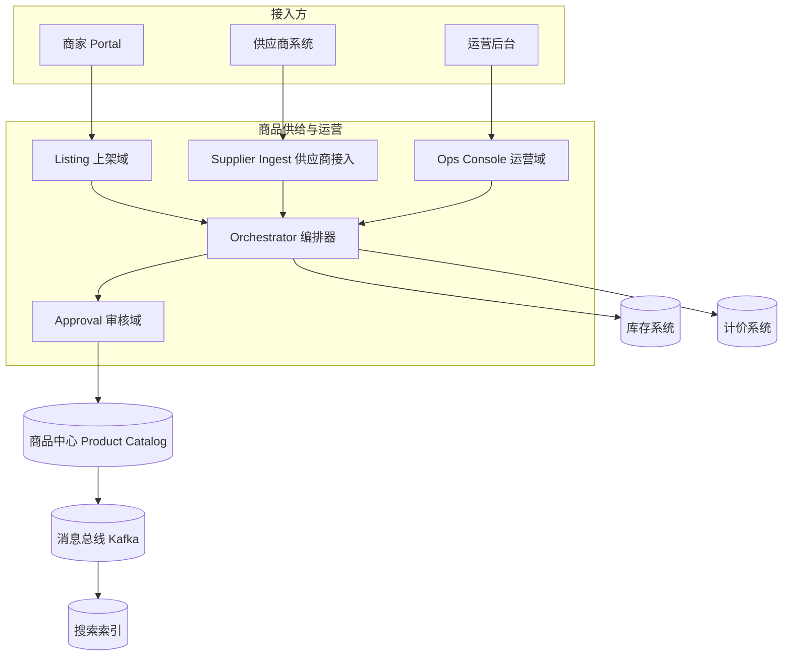
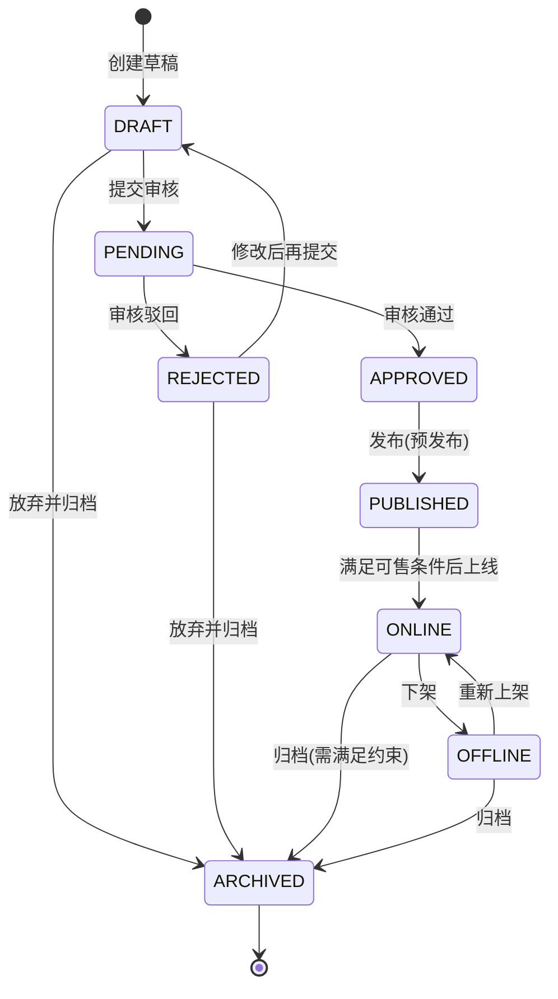
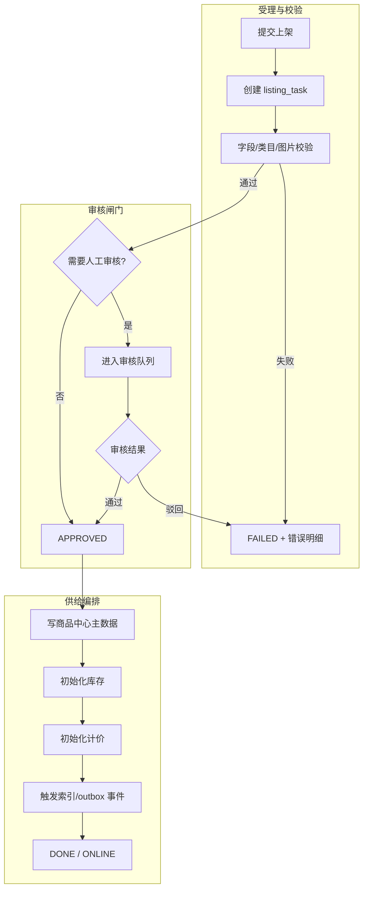
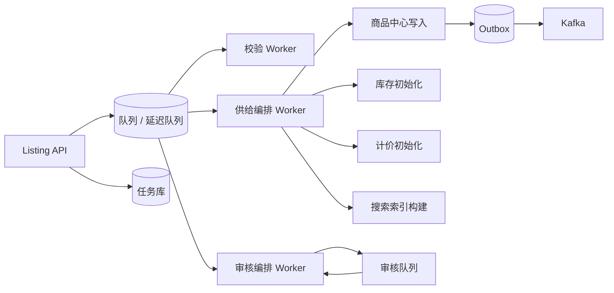
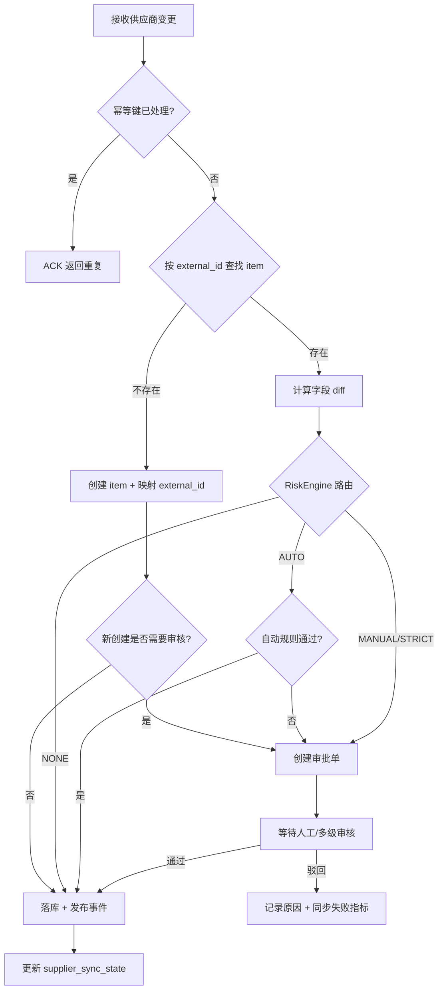
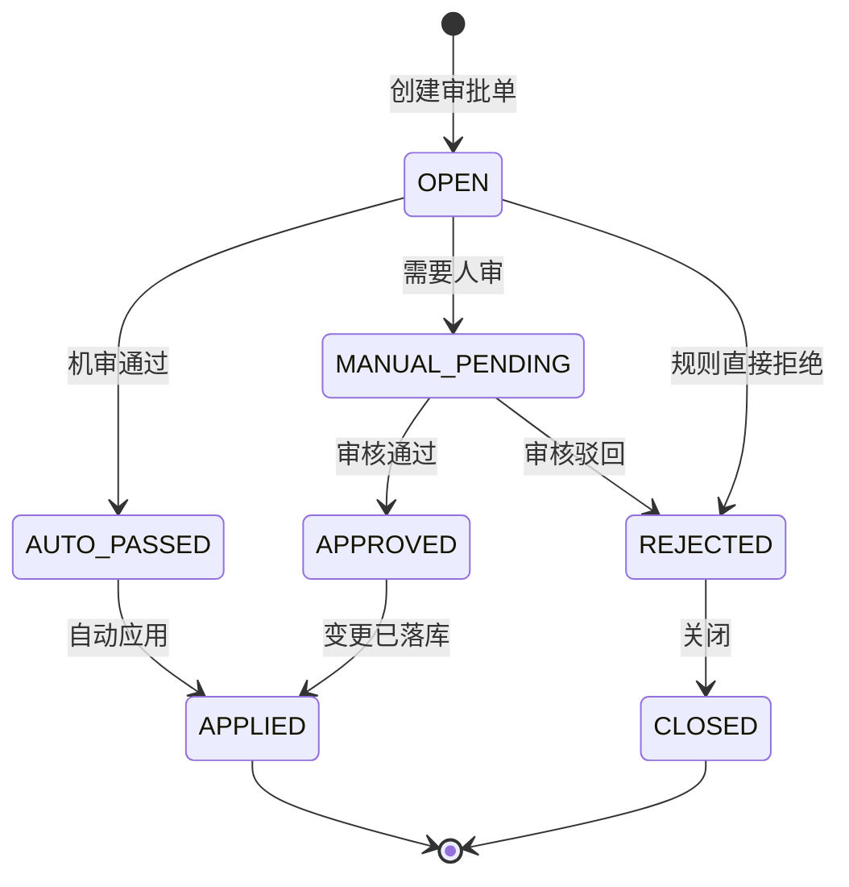
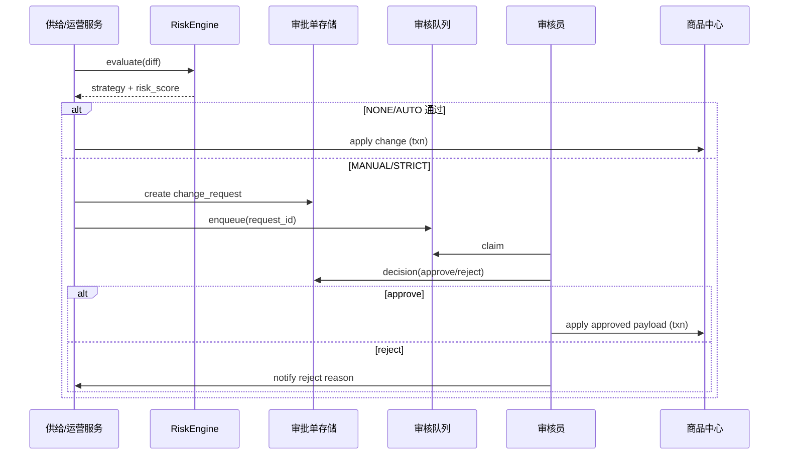
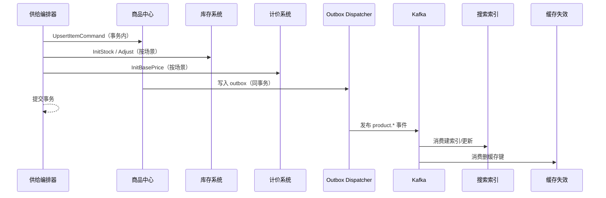
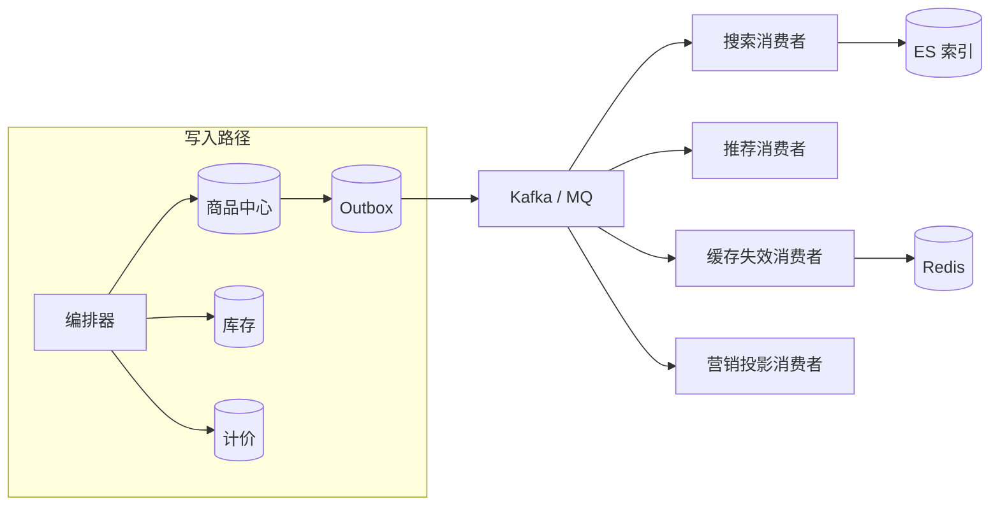

**导航**：[书籍主页](../../README.md) | [完整目录](../../SUMMARY.md) | [上一章：第10章](./chapter9.md) | [下一章：第12章](../transaction/chapter11.md)

---

# 第11章 商品供给与运营管理

> **本章定位**：承接第8章「商品中心」的主数据模型，聚焦商品如何**进入平台**、如何**被持续维护**、如何与**供应商与运营**两类角色协同。核心命题是：在同一套商品主数据之上，区分「上架（Create）」「同步（Upsert）」「运营编辑（Update）」三种语义，并用**状态机 + 差异化审核 + 异步编排**把风险、成本与时效性平衡到可运营的水平。

**读完本章你应能回答的关键问题**：

1. **为什么「上架系统」不等价于商品中心？** 前者解决流程、编排与风控；后者解决主数据模型与查询契约。混写会导致状态爆炸与审计缺口。
2. **供应商同步何时必须审核、何时可以直写？** 取决于字段敏感度、幅度、商品热度与来源可信度；应用「风险评估引擎」把策略从 if-else 中解放出来。
3. **如何保证跨系统初始化可恢复？** 用任务状态机 + Saga/补偿 + Outbox，把「一次上架」变成可观测、可重试、可回滚的事务序列。
4. **如何定义系统边界与数据主导权？** 外部事实与平台治理字段不同源；边界不清时优先回到「单一真源 + 明确写入入口 + 事件传播读模型」三原则。

**与源材料的映射**：本章内容对齐博客《商品生命周期管理（上架、同步与运营编辑）》的方法论，并把它放回全书目录中的「商品供给与运营」位置：你既会看到熟悉的 diff/幂等/审核分层，也会看到面向落地的服务拆分、监控与集成时序。

**阅读建议**：第一次阅读可顺着 10.1 → 10.4 建立语义与边界；第二次阅读建议直接跳到 10.6 与 10.11，把审核与集成事件流当作跨团队对齐的「合同条款」来审。第三次阅读可对照自家系统的监控面板，把文中指标一项项补齐或替换为等价口径，并与 10.13 本章小结对照验收，再分阶段逐步推广。

---

## 10.1 系统定位与架构

### 10.1.1 供给侧 vs 运营侧

在大型电商平台中，「商品」从来不是单一系统的产物，而是一条跨组织的价值链：

- **供给侧（Supply）**：负责把**外部事实**（供应商目录、库存、价格、可售状态）可靠地映射到平台主数据。典型诉求是高频、批量、可回放、可补偿。
- **运营侧（Ops）**：负责把**平台策略**（类目治理、内容合规、活动圈品、展示排序的输入条件）落到商品上。典型诉求是可控、可审计、可灰度、可追责。

如果把商品中心比作「**账本**」，那么本章讨论的系统更像「**入账与调账流程**」：它决定一笔变更以什么身份进入账本、是否需要复核、何时对下游生效。

### 10.1.2 三类用户（供应商 / 运营 / 商家）

| 角色 | 主要目标 | 典型操作 | 风险画像 |
|------|----------|----------|----------|
| **供应商** | 把真实可售商品同步到平台 | Push / Pull、批量增量 | 数据错误、接口不稳定、重复投递 |
| **运营** | 平台治理与效率 | 批量导入、批量上下架、内容修正 | 误操作、批量事故、权限越界 |
| **商家** | 在规则内经营 | Portal 上架、改价、改库存 | 刷单、违规内容、恶意改价 |

工程上建议用**统一的操作者模型**（`Operator`）抽象三者，但在策略路由时必须保留**来源维度**（`Source = SUPPLIER|OPS|MERCHANT`），否则审核与幂等语义会被混在一起。

### 10.1.3 整体架构

推荐将「供给与运营」拆成**三个相互独立又可组合**的应用能力（可部署为独立服务，也可先以模块化单体落地）：

1. **Listing（上架域）**：处理「从无到有」的创建语义，产出 `item_id` 与上架任务。
2. **Supplier Ingest（供应商接入域）**：处理 Upsert、增量水位、冲突合并、同步监控。
3. **Ops Console（运营域）**：批量任务、导入导出、权限审计、运营配置入口。

它们与「商品中心（Product Catalog）」的关系应当是：**本域负责流程与决策，商品中心负责主数据存储与对外查询契约**。跨域写入尽量通过**明确 API 或领域事件**，避免运营后台直连商品库。



### 10.1.4 核心挑战

**挑战 1：语义混叠**  
如果把供应商同步误走「完整上架审核」，会把中低风险的高频变更拖进人工队列；如果把运营批量改价直接写主库，会失去审计与风控抓手。

**挑战 2：最终一致性与可观测性**  
上架往往伴随「初始化库存 / 初始化价格 / 建索引」等多步骤。必须用 **Saga / Outbox** 明确每一步的可补偿性与可重试性。

**挑战 3：并发与主导权**  
同一 `item_id` 上可能同时存在：供应商改价、运营改标题、系统自动下架（库存为 0）。必须定义**冲突解决优先级**与**乐观锁版本**策略。

**挑战 4：规模化批量**  
十万级导入若采用「一次性读入内存 + 单线程写库」，会在大促筹备期制造人为故障。需要**流式解析、分批提交、背压与隔离舱**。

**挑战 5：合规与可审计性并行**  
商品内容涉及广告法、知识产权、类目资质与禁限售清单。系统层面要把「可发布」从直觉判断，拆成**可机读规则 + 可追踪证据链**：规则版本号、命中条款、模型版本、审核员决策与修改前后快照必须能关联到同一次 `trace_id`，否则事后监管问询时无法复盘。

**挑战 6：组织协作与系统边界的动态漂移**  
业务扩张期最常出现的不是技术债，而是**职责漂移**：运营为了赶进度直连数据库改价；供应商为了抢流量绕过网关重复推送；商品中心团队被迫在库里补字段兼容历史脏数据。治理抓手应回到三件事：**写入入口单一化**（只认命令 API）、**策略配置中心化**（阈值与权重可灰度）、**变更可回放**（任务与事件双账本）。

下表给出本章讨论域与相邻系统之间「最容易踩界」的协作点，可作为架构评审的检查项（与第 7、8、11 章呼应）：

| 协作点 | 常见误放置 | 推荐归属 | 一致性手段 |
|--------|------------|----------|------------|
| 基础价写入 | 运营脚本直写商品表 | 商品中心 / 计价初始化 API | 命令幂等 + Outbox |
| 可售库存事实 | 商品中心自算库存 | 库存系统为唯一真源 | 事件投影 + 对账 |
| 促销价 | 商品中心拼活动价 | 营销 + 计价试算 | 读路径组装，写路径分离 |
| 搜索可见性 | 同步阻塞写 ES | 异步索引 + 可观测 SLA | 消费者幂等 + 重放 |
| 审核策略 | 散落在各服务 if-else | 审核域统一路由 | 配置版本 + 影子对比 |

---

## 10.2 商品生命周期管理

商品生命周期回答的是：**商品在平台内被允许处于哪些状态、谁可以驱动迁移、迁移时下游如何感知**。它与「上架任务状态机」相关但不等价：前者偏**主数据生命周期**，后者偏**流程实例**。

### 10.2.1 完整生命周期状态机

下图给出中大型平台常见、且可与审核/发布解耦的主状态集合（可按业务裁剪，但不宜再合并「审核中」与「在售」）：



**设计说明**：

- `PUBLISHED` 作为**预发布**态，便于在「审核通过」与「对用户可见」之间插入**价格/库存初始化、索引预热、风控抽检**等步骤。
- `REJECTED` 必须能回到 `DRAFT`，否则运营流会被「只能重建」的坏体验拖垮。

### 10.2.2 状态流转规则

状态机要落地为**可执行的规则表**，并显式区分三类约束：

1. **结构约束**：状态图允许的边（非法迁移直接拒绝）。
2. **业务前置条件**：例如上线要求 `price > 0`、`available_stock > 0`、类目必填、敏感字段已审核。
3. **权限约束**：商家能否从 `OFFLINE` 自恢复 `ONLINE`，通常取决于平台模式（POP 与自营差异极大）。

| 迁移 | 前置条件（示例） | 典型操作者 |
|------|------------------|------------|
| `DRAFT → PENDING` | 必填字段完整、图片合规 | 商家 / 运营 |
| `PENDING → APPROVED` | 审核通过 | 审核员 / 系统(自动) |
| `APPROVED → PUBLISHED` | 基础价已落库、关键属性锁定 | 系统编排 |
| `PUBLISHED → ONLINE` | 库存初始化成功、索引可用(可降级为异步) | 系统编排 |
| `ONLINE → OFFLINE` | 无强约束 / 或存在风控拦截 | 运营 / 系统(库存0) |
| `* → ARCHIVED` | 无未完成订单、无未结算争议(按业务) | 运营 |

**权限与职责矩阵（落地提示）**  
生命周期状态迁移不仅要「技术上可执行」，还要能回答审计问题：**谁在什么证据下推动了状态变化**。建议将权限检查拆为两层：

1. **领域权限**：角色是否允许触发该边（例如商家通常不允许从 `APPROVED` 直跳 `ONLINE`）。
2. **数据范围权限**：运营仅能操作其负责类目；供应商账号仅能操作绑定 `supplier_id` 的映射商品。

对于系统自动迁移（例如库存为 0 触发 `ONLINE → OFFLINE`），必须在状态日志中记录 `operator_type=SYSTEM` 与触发规则编号，避免被误解为「后台偷偷改数据」。

**与「变更审批」的关系澄清**  
主数据生命周期状态（`DRAFT/.../ONLINE`）与「字段级变更审批单」是两条正交维度：商品可以长期处于 `ONLINE`，但某个高价差改价仍可能处于 `pending_approval`。工程上不要让 `item.status` 承担所有流程语义，否则报表、搜索与交易链路会对状态产生错误假设。

**Go：状态机骨架（结构约束 + 前置条件 + 乐观锁）**

```go
package lifecycle

import (
	"context"
	"errors"
	"fmt"
	"time"
)

type ItemStatus string

const (
	StatusDraft     ItemStatus = "DRAFT"
	StatusPending   ItemStatus = "PENDING"
	StatusRejected  ItemStatus = "REJECTED"
	StatusApproved  ItemStatus = "APPROVED"
	StatusPublished ItemStatus = "PUBLISHED"
	StatusOnline    ItemStatus = "ONLINE"
	StatusOffline   ItemStatus = "OFFLINE"
	StatusArchived  ItemStatus = "ARCHIVED"
)

type Item struct {
	ItemID     int64
	Status     ItemStatus
	Version    int64
	Title      string
	CategoryID int64
	BasePrice  int64
	Stock      int64
}

type ItemRepository interface {
	GetByID(ctx context.Context, itemID int64) (*Item, error)
	UpdateStatusCAS(ctx context.Context, itemID int64, from, to ItemStatus, expectedVersion int64, now time.Time) (int64, error)
}

type Preconditions interface {
	Check(ctx context.Context, item *Item, to ItemStatus) error
}

type StateMachine struct {
	repo    ItemRepository
	precond Preconditions
}

func NewStateMachine(repo ItemRepository, pre Preconditions) *StateMachine {
	return &StateMachine{repo: repo, precond: pre}
}

func (sm *StateMachine) CanTransition(from, to ItemStatus) bool {
	allowed := map[ItemStatus][]ItemStatus{
		StatusDraft:     {StatusPending, StatusArchived},
		StatusPending:   {StatusApproved, StatusRejected},
		StatusRejected:  {StatusDraft, StatusArchived},
		StatusApproved:  {StatusPublished},
		StatusPublished: {StatusOnline},
		StatusOnline:    {StatusOffline, StatusArchived},
		StatusOffline:   {StatusOnline, StatusArchived},
	}
	nexts, ok := allowed[from]
	if !ok {
		return false
	}
	for _, s := range nexts {
		if s == to {
			return true
		}
	}
	return false
}

func (sm *StateMachine) Transition(ctx context.Context, itemID int64, to ItemStatus) error {
	for attempt := 0; attempt < 3; attempt++ {
		item, err := sm.repo.GetByID(ctx, itemID)
		if err != nil {
			return err
		}
		if !sm.CanTransition(item.Status, to) {
			return fmt.Errorf("invalid transition: %s -> %s", item.Status, to)
		}
		if err := sm.precond.Check(ctx, item, to); err != nil {
			return err
		}

		rows, err := sm.repo.UpdateStatusCAS(ctx, itemID, item.Status, to, item.Version, time.Now())
		if err != nil {
			return err
		}
		if rows == 1 {
			return nil
		}
		// version conflict: retry
	}
	return errors.New("concurrent update: exceeded retries")
}
```

### 10.2.3 生命周期事件

状态迁移的**可观测产物**应是领域事件，而不是「下游轮询商品表」。建议事件携带：

- `event_id`（幂等键）、`item_id`、`from_status`、`to_status`、`occurred_at`
- `trace_id`（全链路）
- `payload`（尽量小：变更摘要 + 版本号，避免把大 JSON 塞进总线）

**消费者边界建议**：

- **搜索**：关注 `ONLINE/OFFLINE/ARCHIVED` 与影响召回的字段变更。
- **推荐**：关注类目、品牌、标签变更。
- **缓存**：关注价格与可售状态变更（或统一订阅「商品变更投影」）。

```go
package lifecycle

import "time"

type DomainEvent struct {
	EventID   string         `json:"event_id"`
	EventType string         `json:"event_type"`
	ItemID    int64          `json:"item_id"`
	From      ItemStatus     `json:"from_status"`
	To        ItemStatus     `json:"to_status"`
	Occurred  time.Time      `json:"occurred_at"`
	Payload   map[string]any `json:"payload"`
}

func MapEventType(from, to ItemStatus) string {
	if from == StatusDraft && to == StatusPending {
		return "product.submitted_for_review"
	}
	if from == StatusPending && to == StatusApproved {
		return "product.approved"
	}
	if from == StatusPublished && to == StatusOnline {
		return "product.online"
	}
	if to == StatusOffline {
		return "product.offline"
	}
	if to == StatusArchived {
		return "product.archived"
	}
	return "product.status_changed"
}
```

**可靠性**：事件发布优先采用 **Outbox**：状态落库与 `outbox` 插入同事务，异步 Dispatcher 投递到 Kafka，消费者以 `event_id` 去重。

**事件契约与版本治理**  
生命周期事件是跨团队集成的「公共 API」，建议显式包含：

- `schema_version`：事件体字段演进时用于兼容消费端。
- `aggregate_version`：商品聚合版本号，便于投影端检测乱序或重复。
- `causation_id` / `correlation_id`：把一次上架编排中的多步调用串起来，排障时极有用。

**乱序与重复的现实处理**  
消息系统通常只保证「至少一次」投递。消费者侧除了 `event_id` 去重，还要对「迟到事件」做策略：若收到 `product.offline` 时本地缓存仍是上架态，应以**单调版本**或**最后写入时间戳（带时钟偏移保护）**决定是否覆盖，避免旧事件把新状态回滚。

**投影读模型（可选但强烈建议）**  
前台读链路往往需要「可售 + 展示价 + 活动标签 + 库存水位」的合成视图。与其让搜索/推荐各自拼表，不如由商品域维护一份**只读投影**（可由 CDC 或消费生命周期事件构建），并把 SLA（延迟上限、允许缺失字段）写清楚。投影失败不应反向阻断主数据状态机，否则会形成分布式死锁。

---

## 10.3 商品上架（从无到有）

### 10.3.1 数据来源分类

| 来源 | 输入形态 | 质量特征 | 典型治理 |
|------|----------|----------|----------|
| **运营后台表单** | 结构化字段 | 相对稳定 | 模板校验 + 审核 |
| **商家 Portal** | 结构化字段 + 图片 | 波动大 | 更严格内容安全 |
| **批量 Excel/CSV** | 半结构化 | 错误率高 | 行级错误报告、可部分成功 |
| **供应商首批导入** | API / 文件 | 字段映射复杂 | 适配器 + 映射版本化 |

### 10.3.2 上架状态机（流程实例）

上架流程建议用**任务表**建模（`listing_task`），不要直接把「流程状态」与 `item.status` 混在一张表里，否则供应商 Upsert 与运营改价会把任务状态污染。

推荐任务状态：

`CREATED → VALIDATING → APPROVAL_PENDING → APPROVED → PROVISIONING → DONE / FAILED`

其中 `PROVISIONING` 对应多系统初始化（库存、计价、索引）。

**为什么需要任务状态机与主数据状态机「双层」**  
如果只维护 `item.status`，你会被迫把「校验失败」「图片异步检测中」「库存初始化重试中」等流程态硬塞进主数据，结果是：

- 报表口径混乱：运营统计「在售商品数」会把中间态算进去或漏算。
- 搜索与交易耦合：索引系统不得不理解大量非业务态。
- 失败恢复困难：无法只对任务重试而不触碰已发布主数据。

任务状态机记录**流程实例**（`listing_task`），主数据状态机记录**业务允许态**（`item`）。失败重试应优先重放任务，而不是反复触发主数据迁移。

**上架主流程（从受理到可售）**：



### 10.3.3 异步处理架构

上架的长耗时环节包括：图片转码、敏感词检测、类目预测、价格合规校验、写索引。API 层应**快速受理**，把重活交给异步 Worker，并通过 Webhook / 轮询接口返回进度。



**Go：受理请求（落库 + 投递 + 幂等键）**

```go
package listing

import (
	"context"
	"crypto/sha256"
	"encoding/hex"
	"fmt"
	"time"
)

type CreateListingCommand struct {
	IdempotencyKey string
	OperatorID     int64
	CategoryID     int64
	PayloadJSON    []byte
}

type ListingTask struct {
	TaskID    int64
	TaskCode  string
	Status    string
	CreatedAt time.Time
}

type Store interface {
	InsertTaskIfAbsent(ctx context.Context, t *ListingTask) (inserted bool, err error)
	EnqueueValidateJob(ctx context.Context, taskID int64) error
}

type Service struct {
	store Store
	clock func() time.Time
}

func taskCodeFrom(cmd CreateListingCommand, now time.Time) string {
	h := sha256.Sum256([]byte(fmt.Sprintf("%s|%d|%d|%d",
		cmd.IdempotencyKey, cmd.OperatorID, cmd.CategoryID, now.UnixNano())))
	return hex.EncodeToString(h[:12])
}

func (s *Service) CreateTask(ctx context.Context, cmd CreateListingCommand) (*ListingTask, bool, error) {
	now := s.clock()
	task := &ListingTask{
		TaskCode:  taskCodeFrom(cmd, now),
		Status:    "CREATED",
		CreatedAt: now,
	}
	inserted, err := s.store.InsertTaskIfAbsent(ctx, task)
	if err != nil {
		return nil, false, err
	}
	if !inserted {
		// 返回已有任务：幂等语义
		return task, false, nil
	}
	if err := s.store.EnqueueValidateJob(ctx, task.TaskID); err != nil {
		return task, true, err
	}
	return task, true, nil
}
```

### 10.3.4 批量上传

批量上传的关键不是「快」，而是**可恢复**与**可解释**：

- **流式读取**：避免 OOM。
- **分批事务**：每批 200～2000 行（按行宽调参），批内失败可重试。
- **错误文件回传**：失败行附带 `error_code / message / raw_line`。
- **背压**：限制全局并发导入数，避免拖垮商品中心连接池。

**运营侧体验：从「提交文件」到「可追责结果」**  
大促筹备期的批量导入，价值不仅在于吞吐，还在于**可运营**：需要进度百分比、可暂停、可重试失败子集、以及「部分成功」的明确语义。建议任务表至少记录：`batch_id`、总行数、已处理游标、失败桶对象存储路径、以及最后一次心跳时间（用于检测 worker 假死）。

**Go：流式读取 + Worker Pool（骨架）**

```go
package batchimport

import (
	"bufio"
	"context"
	"io"
	"sync"
)

type RowJob struct {
	LineNo int
	Text   string
}

type RowHandler func(ctx context.Context, job RowJob) error

type ImportRunner struct {
	workers int
}

func NewImportRunner(workers int) *ImportRunner {
	if workers <= 0 {
		workers = 8
	}
	return &ImportRunner{workers: workers}
}

func (r *ImportRunner) Run(ctx context.Context, rd io.Reader, handle RowHandler) error {
	sc := bufio.NewScanner(rd)
	const max = 1024 * 1024
	buf := make([]byte, 0, 64*1024)
	sc.Buffer(buf, max)

	jobs := make(chan RowJob, r.workers*4)
	errCh := make(chan error, r.workers)

	var wg sync.WaitGroup
	for i := 0; i < r.workers; i++ {
		wg.Add(1)
		go func() {
			defer wg.Done()
			for job := range jobs {
				if err := handle(ctx, job); err != nil {
					errCh <- err
					return
				}
			}
		}()
	}

	lineNo := 0
	for sc.Scan() {
		if err := ctx.Err(); err != nil {
			close(jobs)
			wg.Wait()
			return err
		}
		lineNo++
		jobs <- RowJob{LineNo: lineNo, Text: sc.Text()}
	}
	close(jobs)
	wg.Wait()
	close(errCh)

	select {
	case err := <-errCh:
		return err
	default:
	}
	return sc.Err()
}
```

> 说明：生产环境通常不会「首错即停」，而是把错误写入失败桶并继续；同时用独立 `semaphore` 限制写库 QPS，并把 `batch_id` 写入审计日志，便于按批次回放。

---

## 10.4 供应商同步（Upsert 场景）

### 10.4.1 实时推送 vs 定时拉取

| 模式 | 优点 | 缺点 | 适用 |
|------|------|------|------|
| **Push（供应商回调/Webhook）** | 延迟低 | 需要签名验真、重放治理 | 价格/库存强实时品类 |
| **Pull（定时增量拉取）** | 平台掌控节奏 | 延迟与水位设计成本高 | 供应商能力弱、批量目录 |

工程上通常是 **Pull 为主、Push 为辅**，并在网关层统一：**认证、限流、幂等、审计**。

**水位与游标：增量 Pull 的「正确打开方式」**  
定时拉取最容易失败在「我以为增量了，其实漏了」：供应商侧若只提供 `updated_at`，在时钟回拨、批量修复、或「先删后建」时会制造空洞。更稳妥的组合是：

- **单调游标**：优先使用供应商侧稳定的 `change_seq` / `event_id`。
- **时间窗冗余**：拉取 `[last_cursor, now)` 时向左重叠 2～5 分钟，再用幂等消化重复。
- **对账补偿**：每日一次按 `supplier_id` 做抽样全量校验（热点 SKU 全量），发现漂移自动修复。

**Push 模式的工程清单**  
Webhook 不是 HTTP 回调这么简单，至少要覆盖：

- **签名校验**（HMAC / 公钥验签）与 **时钟偏移容忍**。
- **重放窗口**：保存近期 `message_id` 去重表，防止攻击者重放历史回调。
- **快速 ACK 与异步落库**：网关先 ACK，再投递内部队列；否则供应商超时重试会放大流量。
- **乱序处理**：回调到达顺序未必与业务发生顺序一致，Upsert 必须以业务时间戳或版本号裁决。

### 10.4.2 幂等性设计

Upsert 的幂等主键建议稳定为：

- `UNIQUE(supplier_id, external_item_id)`

同步消息层再叠加：

- `UNIQUE(supplier_id, message_id)` 或 `dedupe_key`（供应商若不能提供稳定 message id，则由 `(supplier_id, external_item_id, updated_at_bucket)` 退化，但要谨慎）

### 10.4.3 差异化审核

供应商同步不应复用「新上架全量人工审核」，否则会把运营资源烧穿。应当：

- **字段级 diff**：只对高风险字段触发审批单。
- **阈值策略**：如价格变动超过 30% 进入人工审核（阈值应可配置并按品类分层）。
- **白名单供应商**：降低审核等级，但仍保留日志与抽检。

### 10.4.4 冲突处理

当供应商同步与运营编辑并发时，推荐默认策略：

1. **人工运营变更优先于供应商自动同步**（在「内容类字段」上）。
2. **供应商在「库存/可售状态」上优先**（更接近真实供给）。
3. **价格字段**：可用「时间戳新者胜出 + 风险阈值审核」组合，避免运营锁价被无意覆盖。

**字段级「锁」与合并策略（平台治理常见需求）**  
运营有时会明确标注「标题不允许供应商覆盖」「主图允许供应商更新」。实现上建议在商品主数据或扩展表中维护 `field_locks`（bitmap 或 JSON），同步管线在 `diff` 之后执行 `merge_policy`：

- `LOCKED_BY_OPS`：供应商变更到达时跳过该字段，并记录审计日志（不是静默吞掉，而是可查询）。
- `MERGE_IF_NEWER`：比较 `external_updated_at` 与本地 `supplier_projection.updated_at`。
- `ALWAYS_REVIEW`：字段变更永远生成审批单（适合品牌、类目、合规属性）。

**Upsert 处理流程（含审核分支）**



**Go：Upsert 入口（展示分支，不含具体 ORM）**

```go
package supplier

import (
	"context"
	"errors"
	"fmt"
)

type ExternalItem struct {
	ExternalID string
	Title      string
	PriceCent  int64
	Stock      int64
}

type ItemRepository interface {
	FindBySupplierExternal(ctx context.Context, supplierID int64, externalID string) (*Item, error)
	CreateFromExternal(ctx context.Context, supplierID int64, ext *ExternalItem) (*Item, error)
}

type RiskRouter interface {
	Route(ctx context.Context, item *Item, ext *ExternalItem) (Strategy, error)
}

type Strategy string

const (
	StrategyNone   Strategy = "NONE"
	StrategyAuto   Strategy = "AUTO"
	StrategyManual Strategy = "MANUAL"
)

type SyncService struct {
	items ItemRepository
	risk  RiskRouter
}

type Item struct {
	ItemID     int64
	SupplierID int64
	ExternalID string
}

func (s *SyncService) Upsert(ctx context.Context, supplierID int64, ext *ExternalItem) error {
	if ext.ExternalID == "" {
		return errors.New("external_id required")
	}

	item, err := s.items.FindBySupplierExternal(ctx, supplierID, ext.ExternalID)
	if errors.Is(err, ErrNotFound) {
		_, err := s.items.CreateFromExternal(ctx, supplierID, ext)
		return err
	}
	if err != nil {
		return err
	}

	strategy, err := s.risk.Route(ctx, item, ext)
	if err != nil {
		return err
	}

	switch strategy {
	case StrategyNone:
		return s.applyDirect(ctx, item, ext)
	case StrategyAuto:
		return s.applyAuto(ctx, item, ext)
	case StrategyManual:
		return s.enqueueApproval(ctx, item, ext)
	default:
		return fmt.Errorf("unknown strategy: %s", strategy)
	}
}

var ErrNotFound = errors.New("not found")

func (s *SyncService) applyDirect(ctx context.Context, item *Item, ext *ExternalItem) error {
	// TODO: txn + outbox + downstream projections
	return nil
}

func (s *SyncService) applyAuto(ctx context.Context, item *Item, ext *ExternalItem) error { return nil }

func (s *SyncService) enqueueApproval(ctx context.Context, item *Item, ext *ExternalItem) error {
	return nil
}
```

---

## 10.5 运营管理能力

### 10.5.1 单品编辑

单品编辑要支持：

- **字段级变更预览**（diff）
- **灰度发布**（先预览环境 / 白名单用户可见）
- **强制备注**（高风险字段变更必须填写原因）

**单品编辑的「体验细节」往往是事故分水岭**  
很多系统只保存最新值，不保存修改意图与对比，导致客诉时无法解释「为什么昨天还能买今天不能买」。建议在 UI 层提供 diff，在服务端保存**结构化变更单**（即使最终免审直写），至少保留：变更前后摘要、策略路由结果、操作者、来源（Portal/OPS）、以及关联的 `batch_id`（若来自批量任务）。

对于高敏字段（类目、品牌、主图），推荐引入**草稿预览态**：先在副本聚合上验证规则与索引影响，再一次性提交，降低「半截修改」造成的中间不一致。

### 10.5.2 批量编辑

批量编辑必须引入 `batch_id`：

- 任务表：`batch_operation(batch_id, operator_id, type, status, total, succeeded, failed)`
- 子任务表：`batch_operation_item(batch_id, item_id, status, error)`

**批量编辑的「原子性」要面对现实**  
十万级商品不可能在一个数据库事务里完成。工程上应承诺的是：**可追踪的最终一致性**，而不是全有或全无。常见做法是：

- 子任务粒度提交，每行独立事务；批次级别记录成功/失败统计。
- 对「强一致需求」的字段（例如统一改错类目）提供**补偿任务**：自动扫描失败子任务并支持一键重试。

### 10.5.3 批量导入导出

导出常用于：

- 大促前核对「活动圈品清单」
- 与供应商对账（外部 id 映射）

导入导出都应**异步化**，并限制文件大小与行数。

**导入模板版本化**  
Excel 导入的最大维护成本来自列变更。建议把模板当作契约：`template_version` 随文件上传，服务端按版本选择解析器；旧版本文件在宽限期内仍可导入，避免运营同学「一列调整全员停摆」。

### 10.5.4 任务编排与进度追踪

推荐统一任务框架能力：

- 可暂停 / 可继续（checkpoint）
- 可重试（按错误类型区分重试策略）
- 可取消（合作传播取消信号到 worker）

### 10.5.5 权限与审计

最小权限模型（RBAC + 数据范围）：

- **类目负责人**只能审批本类目
- **运营专员**可改长尾商品，但不可改「平台核心爆品」
- **供应商账号**只能操作映射到自己的 `supplier_id`

审计日志至少记录：`who/when/what/before/after/reason/trace_id`。

**Go：批量子任务状态更新（减少热点行）**

```go
package opsbatch

import (
	"context"
	"database/sql"
	"time"
)

type BatchItemRepo struct {
	db *sql.DB
}

func (r *BatchItemRepo) MarkProgress(ctx context.Context, batchID string, succeeded, failed int) error {
	_, err := r.db.ExecContext(ctx, `
UPDATE batch_operation
SET succeeded = succeeded + ?, failed = failed + ?, updated_at = ?
WHERE batch_id = ?
`, succeeded, failed, time.Now(), batchID)
	return err
}
```

> 说明：超大批次不要把进度累计在单行上形成热点，可按 `shard = hash(item_id) % N` 分片多张进度子表，周期聚合到总表。

**导入导出的安全边界**  
导出接口是高危面：既能泄露商业数据，也能被用作 DoS（全表导出）。必须叠加：**最小权限 + 异步生成 + 下载链接短期有效 + 水印与审计**。

---

## 10.6 商品审核系统

### 10.6.1 差异化审核策略

审核策略建议拆成四层，从「成本最低」到「成本最高」递进：

1. **NONE（免审直写）**：低敏字段、低幅度、低影响商品。
2. **AUTO（机审）**：敏感词、图片 OCR、价格阈值、黑白名单、供应商信誉分。
3. **MANUAL（人审）**：中高敏字段或 AUTO 失败兜底。
4. **STRICT（多级/会签）**：类目迁移、品牌变更、批量影响面大。

**策略配置如何「可运营」**  
审核阈值不要写死在代码里，而要沉淀为可发布配置（建议分环境：dev/stage/prod），并至少支持：

- **按类目覆盖**：数码品类对标题与参数更敏感；虚拟商品对履约属性更敏感。
- **按供应商等级覆盖**：战略供应商在库存字段上可走快速通道，但在类目字段上仍应严格。
- **影子模式**：新策略先计算「如果生效会如何路由」，输出对比报表，再灰度放量。

**与合规审核的边界**  
商品审核通常同时包含「业务风险审核」与「合规审核」。工程上建议拆队列：业务审核关注价格毛利与经营策略；合规审核关注内容与资质。混队列会导致 SLA 互相拖累，且难以后台化统计。

### 10.6.2 风险评估引擎

风险评估引擎输入：`diff + item_profile + operator_profile + supplier_profile`  
输出：`risk_score` 与 `strategy`，并附带**可解释原因**（给审核员与客诉）。

可用简化公式（示例，便于实现与调参）：

`risk_score = Σ_i w(field_i) × m(magnitude_i) × p(item_profile)`

其中：

- `w(field)`：字段权重（类目、价格、标题通常更高）
- `m(magnitude)`：幅度函数（价格变动比例、标题相似度）
- `p(item_profile)`：商品热度因子（热销品变更更敏感）

**Go：风险路由（示意）**

```go
package approval

import "math"

type FieldChange struct {
	Field      string
	OldFloat   float64
	NewFloat   float64
	ChangeRate float64
}

type ItemDiff struct {
	ItemID  int64
	Changes []FieldChange
}

type ItemProfile struct {
	MonthlySales int64
	IsHot        bool
}

type RiskEvaluator struct{}

func (e RiskEvaluator) Score(diff ItemDiff, prof ItemProfile) float64 {
	var score float64
	hot := 1.0
	if prof.IsHot || prof.MonthlySales > 1000 {
		hot = 1.5
	}

	for _, c := range diff.Changes {
		switch c.Field {
		case "price":
			mag := 1.0
			if math.Abs(c.ChangeRate) >= 0.5 {
				mag = 3.0
			} else if math.Abs(c.ChangeRate) >= 0.3 {
				mag = 2.0
			} else if math.Abs(c.ChangeRate) >= 0.1 {
				mag = 1.0
			} else {
				mag = 0.5
			}
			score += 3.0 * mag * hot
		case "category_id":
			score += 5.0 * 2.0 * hot
		case "title":
			score += 3.0 * 1.0 * hot
		case "stock":
			score += 1.0 * 1.0 * 1.0
		}
	}
	return score
}

func (e RiskEvaluator) Route(score float64) Strategy {
	switch {
	case score <= 3:
		return StrategyNone
	case score <= 6:
		return StrategyAuto
	case score <= 10:
		return StrategyManual
	default:
		return StrategyStrict
	}
}
```

### 10.6.3 人工审核工作流

人工审核建议 BPMN 能力最小集：

- 认领（claim）避免重复审核
- 转交（reassign）
- 驳回理由模板化（减少「不同意」式无效信息）
- 审核 SLA 与升级（超时升级到主管队列）

**变更审批单自身的生命周期（与商品主状态解耦）**  
为避免把「审批中」误写到 `item.status`，建议对 `change_request` 单独建状态机：



**SLA、升级与「可解释的排队」**  
审核队列的产品体验，核心在**可解释**：审核员需要看到风险因子拆解（价格幅度、敏感词命中、历史违规、供应商评分），而不是只有一个「风险分」。SLA 建议与策略绑定：

| 策略 | 目标处理时效 | 超时动作 |
|------|--------------|----------|
| AUTO | 秒级 | 转 MANUAL 或自动拒绝（按业务） |
| MANUAL | 分钟～小时级 | 升级到主管池 + 通知申请人 |
| STRICT | 小时级 | 升级 + 限制相关商品营销投放（保护用户） |

**审核流程（从变更到落库）**



### 10.6.4 快速通道

快速通道（Fast Lane）用于**已建立信任**的变更：

- 旗舰供应商 + 低敏字段（库存）
- 已通过机器学习模型打分的「低概率违规」标题微调

快速通道仍要保留：

- 抽样复核（随机 1% 进人工）
- 事后审计（T+1 扫描）

---

## 10.7 配置工具

配置工具的本质是：**把「可运营参数」从代码里拽出来**，并绑定审批与发布。

### 10.7.1 价格配置

- **基础价**：通常归属商品中心或计价的基础层（与第11章衔接）。
- **临时锁价**：必须带生效区间与原因，避免永久锁死供应链反应。

**价格配置最容易踩的坑**是把「运营想锁价」实现成「直接改商品表里的展示价」，这会让促销试算、对账与审计全部失真。更稳妥的做法是：

- 在计价系统引入**显式锁价策略对象**（带生效区间、优先级、适用范围），商品中心只保存**基础价事实**或「锁价引用 ID」。
- 任何锁价变更走与改价类似的审核路由，但审核重点从「幅度」转向**毛利保护与合约合规**（是否违反供应商协议价）。

### 10.7.2 库存配置

库存配置应落到库存系统；商品侧最多是「展示阈值 / 可售开关」，避免双写库存事实。

**展示阈值与真实库存要区分语义**  
例如「剩余 3 件以下展示为紧张」属于 UX 配置，不应写回库存真值；而「可售开关」若由运营控制，应与库存系统的渠道可售策略对齐，避免出现「库存系统仍可卖，但商品中心显示不可售」的双真源。

### 10.7.3 营销配置

运营在商品上绑活动属于**圈品动作**，应由营销系统持有规则，商品侧保存 `campaign_tags` 类投影要谨慎：更推荐事件投影或查询时组装。

**圈品与商品主数据的关系**  
实践中常见两条路线：

1. **查询时组装**：PDP/列表在 Hydrate 阶段调用营销服务计算标签与活动价展示，商品中心不存活动态。
2. **异步投影**：为降低在线 QPS，将「命中活动摘要」投影到只读字段，但必须明确投影延迟 SLA，并接受短暂不一致。

路线 1 更干净；路线 2 更省流量。无论哪条，都要避免运营在商品后台「手填活动价」——那是计价与营销域的职责溢出。

### 10.7.4 首页配置

首页位属于运营配置域（CMS / 投放系统），与商品主数据解耦，通过 `slot + item_id + schedule` 引用商品即可。

**配置发布的灰度与回滚**  
首页配置变更往往是高频且高风险的（错误投放会带来巨额损失）。建议：

- 配置版本化：`config_version` + 发布单。
- 预演校验：引用 `item_id` 必须存在且 `ONLINE`，否则拒绝发布。
- 一键回滚：保留上一版本快照与生效时间线。

---

## 10.8 稳定性保障

### 10.8.1 限流与降级

- **按供应商限流**：保护自身与供应商。
- **按运营批量任务限流**：避免大任务挤占在线交易连接池。
- **降级**：审核排队过长时，自动切换「更严格但可预测」的策略不如「停写只读」危险；更合理的是**阻塞新批量任务**而不是阻塞下单读链路。

### 10.8.2 熔断机制

对供应商接口熔断时：

- Pull 同步进入 `HALF_OPEN` 试探恢复
- Push 写入进入磁盘队列（注意顺序与背压）

### 10.8.3 灰度发布

上架与同步规则（阈值、字段权重）应支持：

- 按供应商灰度
- 按类目灰度
- 按「读写分离影子模式」：只计算策略不落库，对比差异报表

### 10.8.4 故障隔离

- **线程池/队列隔离**：大导入与实时 Push 分队列，避免相互抢 worker。
- **Bulkhead**：商品写入与索引构建拆不同资源池。

**容量事故的一个典型路径（供自我对照）**  
大促前夜运营提交「10 万行批量改价」，与供应商夜间全量同步撞车，双方共用同一消费组与同一数据库连接池，导致：

1. 消费延迟上升 → Outbox 堆积 → 搜索索引滞后；
2. 在线交易读路径因连接池耗尽开始抖动；
3. 团队开始「加机器」，但瓶颈在 DB 与锁竞争，扩容无效，反而放大重试风暴。

治理的关键不是事后加机器，而是事前把**队列、连接池、线程池**按租户/场景隔离，并把批量任务的默认并发调到「永远杀不死核心链路」。

---

## 10.9 数据看板与监控

### 10.9.1 运营指标

| 指标 | 解释 | 作用 |
|------|------|------|
| 上架成功率 | `DONE / CREATED` | 发现编排失败 |
| 审核时效 P95 | 从创建到决策 | SLA 治理 |
| 同步延迟 | `now - last_success_time` | 供应商健康 |
| 冲突率 | 并发写冲突次数 | 调参乐观锁/队列 |

**建议补充的三类「经营向」指标（可选但高价值）**  
技术指标能告诉你系统坏没坏，经营指标能告诉你业务卡在哪：

1. **上架漏斗转化率**：从创建任务到 `ONLINE` 各阶段停留时长分布，定位审核、初始化、索引哪一段最慢。
2. **供应商数据质量分**：字段缺失率、重复推送率、价格跳变率，驱动供应商治理与合作条款。
3. **运营批量任务失败 Top 原因**：把 `error_code` 聚类，推动模板校验、权限提示与培训材料迭代。

### 10.9.2 实时监控

必须对接：

- 队列堆积、消费延迟
- Outbox 未投递计数
- 供应商错误码分布（签名失败 / 限流 / 超时）

**把「可观测」嵌进领域对象**  
除了基础设施指标，建议在任务与审批单上直接暴露业务字段到指标标签（注意基数控制）：`supplier_id`、`task_type`、`approval_strategy` 等。这样报警通知里能直接定位「哪类供应商的哪种同步在恶化」，而不是只有 CPU 曲线。

### 10.9.3 报警机制

报警分级建议：

- **P0**：上架编排大面积失败、Outbox 堆积导致事件断流
- **P1**：同步失败率升高、审核队列 SLA 违约
- **P2**：单供应商异常（可降级）

**On-call 视角：把指标映射到「可操作手册」**  
监控的价值在于缩短 MTTR。建议为每类报警准备一页 runbook（可放在内部 wiki），至少回答四个问题：**影响面是谁**、**第一动作是什么**、**可启用哪个开关**、**如何验证恢复**。例如 `Outbox pending_count` 持续升高：先区分是 DB 写入变慢还是 Dispatcher 假死；再检查 Kafka 集群健康；最后才考虑临时扩容与降级非核心消费者。

**Prometheus 规则示例（片段）**

```yaml
groups:
  - name: supply_ops_slo
    rules:
      - alert: ListingOrchestrationFailureBurst
        expr: increase(listing_task_failed_total[10m]) > 50
        for: 10m
        labels:
          severity: critical
        annotations:
          summary: "上架编排失败突增"
          description: "10 分钟内失败任务超过阈值，优先检查库存/计价初始化与供应商回调签名"

      - alert: OutboxDispatchLag
        expr: outbox_pending_rows > 100000
        for: 5m
        labels:
          severity: critical
        annotations:
          summary: "Outbox 堆积"
          description: "事件投递延迟将扩散到搜索/缓存，检查 dispatcher 与消息集群"
```

---

## 10.10 系统边界与职责

### 10.10.1 上架系统 vs 商品中心：边界划分

| 维度 | 上架/供给运营域 | 商品中心 |
|------|-----------------|----------|
| 职责 | 流程、编排、审核、任务 | 主数据存储、查询契约、版本 |
| 数据 | 任务、审批单、同步水位 | `item/spu/sku` 及稳定属性 |
| 一致性 | Saga / 事务边界在应用层 | 聚合内强一致 |

**反模式**：运营后台直连商品库表；短期快，长期必然审计与耦合灾难。

### 10.10.2 供给侧 vs 运营侧的职责

- **供给侧**：保证映射正确、增量可恢复、对供应商接口容错。
- **运营侧**：保证平台规则落地、内容合规、经营策略可执行。

### 10.10.3 数据主导权归属

推荐原则：

- **外部事实**（库存、供应商可售状态）以供应商为准，平台可缓存但要有对账。
- **平台治理字段**（类目、品牌授权、禁售标签）以平台为准，供应商不可静默覆盖。

### 10.10.4 审核权限边界

审核权属于**风险域**，不要散落在各业务服务 if-else 中。应沉淀为：

- `Policy`（配置）
- `RiskEvaluator`（计算）
- `ApprovalService`（生命周期）

**「谁能审什么」与「谁能改什么」要分开建模**  
很多团队把审核权限与运营编辑权限混在一个 RBAC 角色里，结果要么审核权过大（普通运营也能放行高风险变更），要么审核权过小（主管也被卡在细枝末节字段）。推荐做法：

- **审核权限**按风险域与类目维度授权（并可临时委派）。
- **编辑权限**按组织与店铺维度授权。
- 二者交叉点用「二次确认」与「双人复核」解决，而不是把字段校验堆在前端。

---

## 10.11 与其他系统的集成

### 10.11.1 与商品中心集成（数据写入）

写入路径建议：

- **同步 API**：强一致的小范围字段更新（谨慎使用）
- **命令模式**：`UpsertItemCommand` 由商品中心统一校验不变量

**写入契约：命令应携带「意图」而非「表字段集合」**  
运营后台很容易把表单直接映射成 `UPDATE item SET ...`，这会让商品中心失去聚合边界。更推荐命令携带业务意图，例如 `AdjustBasePrice`、`ChangeTitleForCompliance`、`MoveCategoryWithReindex`。商品中心在聚合根内做不变量校验（类目必填属性、品牌授权、禁限售），再决定生成哪些领域事件。

### 10.11.2 与库存系统集成（初始化库存）

上架 `PUBLISHED → ONLINE` 之前应确保库存记录存在；失败应停留在 `PROVISIONING` 并可重试。

**初始化失败的分层处理**  
库存初始化失败可能是瞬时网络问题，也可能是供应商 SKU 映射错误。任务层应区分：

- **可重试错误**：指数退避重试，记录重试次数上限。
- **不可重试错误**：将任务标记失败并给出明确错误码（例如映射缺失），避免无限重试刷爆库存服务。

### 10.11.3 与计价系统集成（价格初始化）

基础价初始化失败应阻断上线或进入「不可售」保护态，避免用户看到不可结算价格。

**与「试算」系统的衔接说明**  
用户看到的价格通常是计价系统基于基础价、活动、会员等因素试算结果。上架阶段初始化的是**基础价事实**与必要的价目表结构；不要把「活动价计算」塞进上架编排，否则会把营销耦合进供给链路，导致编排耗时不可控。

### 10.11.4 与搜索系统集成（索引更新）

索引更新可异步，但要监控「在线商品不可搜」窗口；可对热点商品同步刷新。

**索引字段的分层**  
建议把索引字段分为「强一致必要字段」（标题、类目、可售状态）与「弱一致增强字段」（销量统计、标签）。弱一致字段允许更长延迟，必要时可走独立 topic，避免阻塞强一致更新。

### 10.11.5 与供应商系统集成（数据同步）

对接层单独做 **Anti-Corruption Layer（防腐层）**，把供应商 DTO 映射为平台统一命令，避免供应商字段污染核心模型。

**适配器治理：把「对接复杂度」关进笼子**  
供应商越多，适配器越容易变成垃圾场。建议：

- 每个供应商独立模块（package），对外只暴露 `IngestHandler`。
- 映射规则版本化：`mapping_version` 与数据一起存储，便于回放与回滚。
- 统一错误码翻译：把供应商千奇百怪的错误映射为平台内部枚举，便于监控聚合。

### 10.11.6 集成事件流与幂等性保证

**端到端时序：从「编排完成」到「用户可感知」**  
下图强调两个事实：其一，商品中心仍是主数据写入枢纽；其二，搜索/缓存等读模型是**异步最终一致**，因此「商品已 ONLINE」与「用户可搜到」之间存在可度量时间窗，应用监控覆盖该窗口，而不是假设同步完成。





**消费者幂等**要点：

- 以 `event_id` 做 Redis `SETNX` 或 DB 唯一表去重
- 处理逻辑尽量**可重放**（replay）而非依赖「刚好一次」网络

```go
package integration

import (
	"context"
	"errors"
)

type Consumer interface {
	Handle(ctx context.Context, evt Event) error
}

type Event struct {
	EventID string
	Type    string
	ItemID  int64
}

type Deduper interface {
	Seen(ctx context.Context, eventID string) (bool, error)
	Mark(ctx context.Context, eventID string) error
}

type IdempotentConsumer struct {
	inner   Consumer
	deduper Deduper
}

func (c IdempotentConsumer) Handle(ctx context.Context, evt Event) error {
	seen, err := c.deduper.Seen(ctx, evt.EventID)
	if err != nil {
		return err
	}
	if seen {
		return nil
	}
	if err := c.inner.Handle(ctx, evt); err != nil {
		return err
	}
	if err := c.deduper.Mark(ctx, evt.EventID); err != nil {
		return err
	}
	return nil
}

var ErrRetry = errors.New("retryable failure")
```

---

## 10.12 工程实践

### 10.12.1 并发控制

- 主数据更新：`version` 乐观锁 + 有限重试
- 批量任务：分片（shard）避免热点行更新

### 10.12.2 性能优化

- 批量 DB：多值 `INSERT`、必要时 `COPY`
- 计算 diff：先哈希整行，再细 diff，减少 CPU

### 10.12.3 监控告警

把「业务失败」映射成可行动报警：

- `supplier_auth_error_rate` 上升 → 证书/时钟问题
- `approval_queue_wait_p95` 上升 → 人审容量不足

### 10.12.4 故障案例（典型复盘模板）

1. **现象**：索引延迟升高，搜索空窗扩大  
2. **直接原因**：批量导入与实时变更共用同一 consumer group  
3. **根因**：缺少队列隔离与背压  
4. **修复**：拆分 topic / group，导入走独立链路  
5. **预防**：容量基线与灰度开关纳入发布检查清单  

**案例 B：供应商重复推送导致「幽灵改价」**  
某供应商在网关超时后重试回调，平台侧未做 `message_id` 去重，导致短时间内价格被回滚到旧值，又触发自动审核通过，最终造成活动价与展示价不一致。

- **修复点**：Push 入口落「去重表 + 业务版本号」；应用变更前比较 `external_version`。
- **预防点**：把供应商重试策略纳入联调验收清单（超时、重试间隔、幂等键）。

**案例 C：乐观锁重试风暴**  
大促期间运营批量改标题，与搜索 Hydrate 触发的轻量回写并发，导致大量 `version conflict`，worker 无限重试放大 DB 压力。

- **修复点**：批量任务改为分片串行 per item；读路径回写避免触碰高频 version 字段。
- **预防点**：区分「内容字段版本」与「展示投影版本」，避免所有变更都 bump 同一 version。

**Go：基于版本号的并发写（带退避）**

```go
package concurrency

import (
	"context"
	"errors"
	"time"
)

var ErrConflict = errors.New("version conflict")

type ItemWriter interface {
	Load(ctx context.Context, itemID int64) (price int64, version int64, err error)
	CASUpdatePrice(ctx context.Context, itemID int64, newPrice int64, fromVersion int64) (rows int64, err error)
}

func UpdatePriceWithRetry(ctx context.Context, w ItemWriter, itemID int64, newPrice int64) error {
	var last error
	for i := 0; i < 5; i++ {
		_, ver, err := w.Load(ctx, itemID)
		if err != nil {
			return err
		}
		n, err := w.CASUpdatePrice(ctx, itemID, newPrice, ver)
		if err != nil {
			last = err
		} else if n == 1 {
			return nil
		} else {
			last = ErrConflict
		}
		time.Sleep(time.Duration(10*(i+1)) * time.Millisecond)
	}
	return last
}
```

---

## 10.13 本章小结

本章围绕「商品如何进入平台并被持续运营」这一链路，给出了可落地的架构切分与关键机制：

- 用 **Listing / Supplier Ingest / Ops** 分离三种业务语义，避免 Create / Upsert / Update 混写。
- 用 **完整生命周期状态机** 管理主数据状态，用 **任务状态机** 管理流程实例。
- 用 **风险评估引擎 + 差异化审核** 在成本与风险之间取得运营可承受平衡。
- 用 **异步编排 + Outbox** 保证跨系统写入可恢复、事件可投递。
- 用 **边界章节** 明确商品中心、库存、计价、搜索、供应商适配层的职责与数据主导权。

**落地建议（按优先级）**  
如果你只能做三件事：第一，把写入入口收敛为命令 API，消灭后台直连数据库；第二，把审核策略从代码搬到可灰度配置，并建立风险解释字段；第三，把跨系统编排做成可观测任务（可重试、可补偿、可报警）。其余优化（缓存、分片、影子对比）都应建立在这三板斧之上。

在下一章（第11章）中，我们将进入交易链路的基础能力：**计价系统**，把「上架时初始化价格」与「全链路试算」衔接到同一套价格模型之下。

---

**延伸阅读建议**：

- 第8章：商品中心模型（SPU/SKU、类目属性）
- 第8章：库存系统（库存事实与预占）
- 第4章：Saga、Outbox 与最终一致性策略

---

**导航**：[书籍主页](../../README.md) | [完整目录](../../SUMMARY.md) | [上一章：第10章](./chapter9.md) | [下一章：第12章](../transaction/chapter11.md)
