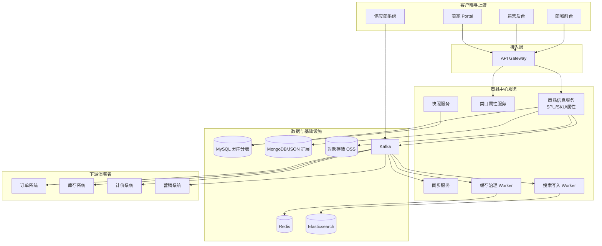
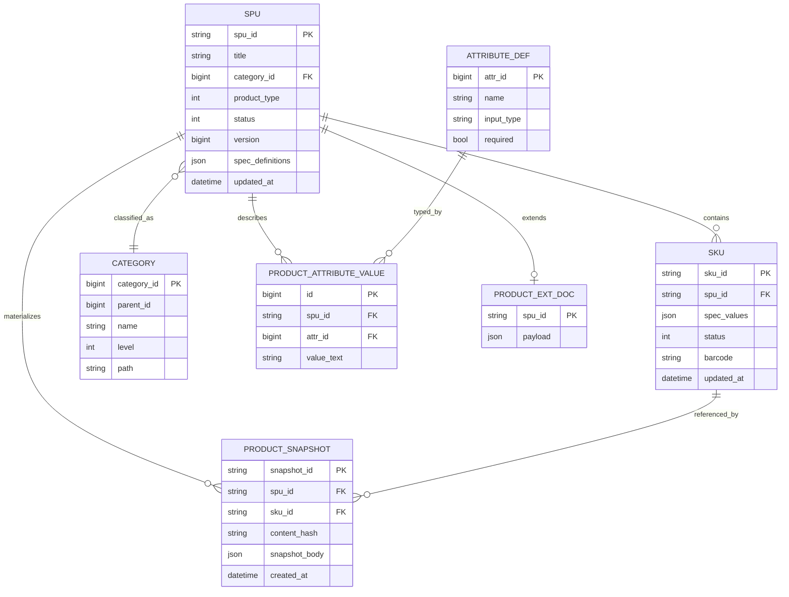
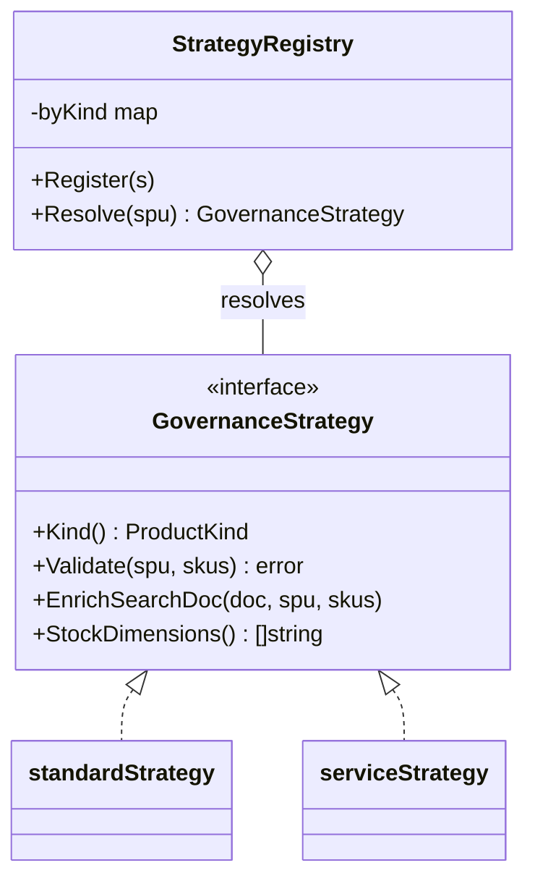
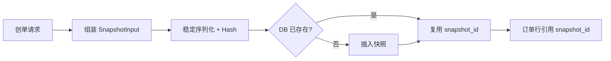
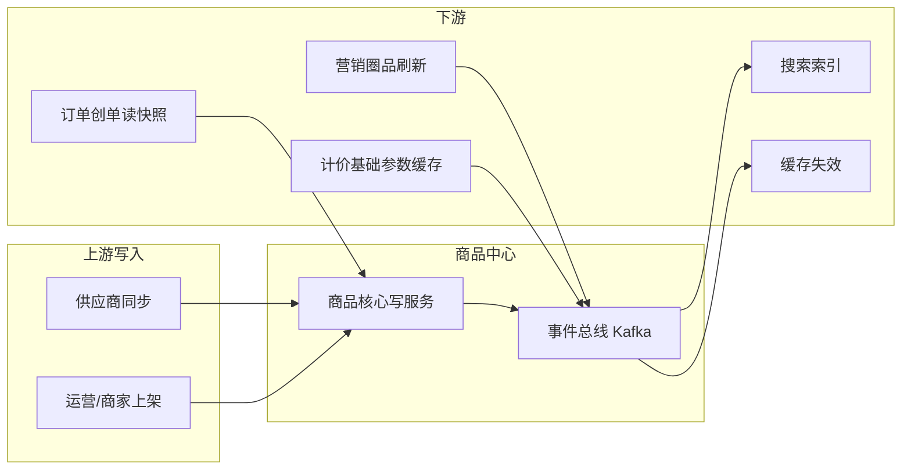

**导航**：[书籍主页](../../README.md) | [完整目录](../../SUMMARY.md) | [上一章：第7章](../overview/chapter5.md) | [下一章：第9章](./chapter8.md)

---

# 第8章 商品中心系统

> **本章定位**：商品中心是电商平台的「商品库」与「商品事实源（Source of Truth）」。本章在统一 SPU/SKU 内核的前提下，讨论类目属性、异构品类治理、搜索缓存、订单侧快照，以及与库存、计价等系统的边界与集成模式。内容基于中大型平台常见实践，可直接映射到工程落地与面试追问。

---

## 7.1 系统概览

### 7.1.1 业务场景

商品中心承担 **商品信息管理（PIM）**、**导购读模型供给**、**订单不可变快照的原材料** 三类职责。典型调用方包括：商城前台（详情、列表、加购）、搜索与推荐（索引与 Hydrate）、上架与运营系统（写入与审核）、订单与计价（快照与试算参数）、营销（圈品与标签）。

**业务模式上**，B2B2C 聚合平台往往以供应商同步为主，商家自营为辅；B2C 自营平台则更强调运营配置效率与品牌一致性。无论哪种模式，商品中心都应坚持一条原则：**商品域只表达「卖什么、长什么样、属于哪一类」，不把「卖多少钱、还剩多少」等易变事实硬编码为唯一真相**（后文 7.7 展开）。

从 **生命周期** 看，商品中心至少覆盖：建模（类目与模板）→ 创建（草稿）→ 审核（机审/人审）→ 上架（可售）→ 迭代（改图改文改规格）→ 下架/失效。每一步都应留下 **可追溯审计信息**（谁在何时改了什么），否则一旦出现合规纠纷或供应商对账争议，团队只能依赖数据库备份「猜历史」。从 **组织协作** 看，商品团队常与类目运营、搜索推荐、风控审核、供应商接入等多角色交叉；接口契约（字段含义、枚举口径、版本策略）要比代码实现更早被文档化，否则「同名不同义」会在集成边界反复爆炸。

### 7.1.2 核心挑战

| 挑战 | 表现 | 设计回应 |
|------|------|----------|
| 异构商品 | 实物多规格、虚拟卡密、服务日历、组合捆绑 | 统一内核 + 策略/适配器 + 扩展存储（7.4） |
| 多角色上架 | 商家、供应商、运营入口与审核差异 | 状态机 + 审核策略路由 + 幂等同步 |
| 高并发读 | 详情万级 QPS、列表千级 QPS | 多级缓存 + 搜索卸载 + 热点治理（7.6） |
| 数据一致性 | 改价改图后搜索/缓存滞后 | 事件驱动 + 可接受最终一致 + 对账补偿 |
| 订单纠纷风险 | 下单后商品信息变化 | 商品快照与版本引用（7.7） |

**非功能需求（摘录）**：商品详情读接口通常要求 **P99 低于百毫秒量级**（在命中 L1/L2 缓存的前提下）；搜索列表可接受更高延迟，但需控制 **长尾查询** 对 ES 集群的冲击。可用性方面，写入链路可短暂降级（例如暂停供应商同步），但读取链路应尽量 **只读降级**（返回缓存旧版本 + 明确提示），避免核心导购全站不可用。扩展性方面，新品类接入应尽量做到 **「配置 + 插件」**，避免每个品类复制一套微服务。

### 7.1.3 系统架构

商品中心在应用架构上通常拆为 **写入域（上架/同步）** 与 **读取域（导购详情/列表）** 两条链路：写入强调事务边界、审核与版本；读取强调延迟、命中率与降级。二者通过领域事件（如 `product.changed`）与投影（搜索索引、缓存失效）解耦。



**读路径建议**：前台详情优先走 **缓存 + 必要时的 DB 回源**；列表与筛选走 **搜索服务**，避免让商品中心 MySQL 直接承担复杂筛选与相关性排序。

**写入与读取消耦的工程含义**：写库成功后，不必强要求搜索与缓存立刻一致；但必须保证 **事件不丢、可重放、可观测**。实践中常见组合是：业务事务内写 MySQL，同事务写 **Outbox** 表，再由独立进程把变更投递到 Kafka（见第 1 章 Outbox 模式）。这样即使消息中间件短时故障，也不会出现「数据库已提交但下游永远收不到变更」的静默失败。读侧投影（ES 文档、Redis 详情）应能根据 `version` 或 `updated_at` 做幂等更新，避免乱序消息把新数据覆盖成旧数据。

**容量与分片提示**：当 SPU 规模达到亿级、SKU 达到数十亿级时，单库单表不可持续。常见拆分是按 `spu_id` 哈希分库分表，SKU 表与 SPU 表同学路由键，保证同一 SPU 的子 SKU 聚合查询在同一分片完成。热点 SPU（大促单品）还需要在缓存层做 **单飞（singleflight）** 与 **热点 key 拆分**，否则会出现 Redis 单 key QPS 顶满、集群倾斜。

---

## 7.2 SPU/SKU 模型设计

### 7.2.1 标准商品模型

**SPU（Standard Product Unit）** 表达「卖的是什么」：标题、类目、品牌、图文、共用属性、规格维度定义。**SKU（Stock Keeping Unit）** 表达「可售卖的最小单元」：在某个规格取值组合下的可独立售卖与履约单元。实践中，**下单行项目通常锚定 SKU**，而搜索列表常以 SPU 聚合展示，用户进入详情后再选择 SKU。

标准模型还应区分 **销售属性**（参与生成 SKU 组合，如颜色、尺码）与 **关键属性**（不参与 SKU 组合但影响购买决策，如材质、保修条款），避免把「展示字段」误建模为「规格维度」，导致 SKU 爆炸。

**面试与评审常问**：「既然订单行指向 SKU，为什么还需要 SPU？」答案是 **聚合展示与运营效率**：SPU 承载共性信息（标题、主图、详情图文、类目属性），SKU 承载差异信息（规格取值、条码、可单独下架）。没有 SPU，运营每次改标题要批量改一万个 SKU；没有 SKU，则无法表达「同款不同价不同库存」的现实售卖粒度。另一个追问是：「SKU 是否一定要对应物理库存单元？」在虚拟/服务类里不一定，但仍建议保留 SKU 作为 **订单锚点**，让库存、计价、履约系统能用统一字段对接。

### 7.2.2 SPU 与 SKU 的关系

一对多关系是常态；特殊场景包括：

- **单 SKU SPU**：虚拟充值面额、单一规格标品。
- **无显式 SKU**：极少数极简虚拟品可用「默认 SKU」技巧保持订单模型统一。
- **组合商品**：父 SPU 下挂子 SKU 引用（7.4），库存与价格在组合层做编排。

**关系一致性与删除策略**：当 SPU 被下架或删除时，SKU 的处理策略必须在系统层明确：通常采用 **级联不可售**（SKU 状态同步为不可售）而不是物理删除，以保留历史订单可解释性。若业务允许「换款不换链」，还要考虑外部系统保存的 deep link：更安全的做法是 **SPU 永久不可复用旧 ID**，或通过跳转映射表承接流量。

### 7.2.3 规格与属性

规格维度在数据层建议 **稳定排序**（`sort_order`），以保证笛卡尔积生成与前端展示一致。对无效组合（如某颜色不提供某尺码）应引入 **约束表或规则引擎输出**，避免「先生成再删除」带来的垃圾 SKU 与库存初始化成本。

**无效组合治理**：服装行业常见「断码」不是随机缺失，而是可枚举规则。工程上可用 `deny_rules` 表表达（`color_id`, `size_id`）黑名单，或在运营后台用矩阵编辑器生成 allowed pairs。生成 SKU 时先求笛卡尔积，再过滤；过滤结果应写审计日志，便于排查「为什么少了一个 SKU」。另一种模式是 **不预生成 SKU**，仅在用户选择规格时动态创建（适合长尾、组合爆炸品类），但订单与库存对接会更复杂，需要团队能力匹配。

**多维度扩展**：当规格维度超过三维（例如颜色 × 尺码 × 版本 × 渠道专供）时，组合数会指数增长。此时应回到业务问三个问题：哪些维度真的影响履约与库存？哪些维度只是展示差异？哪些维度应转为「同一 SKU + 购买选项」而不是硬 SKU？错误的建模会把库存系统拖入「每个渠道一个 SKU」的泥潭。

### 7.2.4 多维度 SKU

多维度 SKU 本质是规格维度的笛卡尔积；工程上要额外考虑：

- **SKU 编码**：建议包含 `spu_id` 语义前缀 + 哈希/序列，便于分片与排障。
- **价格带**：列表可展示 `price_min` / `price_max`（维护在 SPU 投影或搜索文档），减少详情外的重计算。
- **上下架粒度**：可细化到 SKU 级，SPU 级状态为其子 SKU 的聚合结果。

**列表价字段归属说明**：许多团队在 SKU 表存放 `list_price` 作为展示参考，但「可售价格」仍应由计价系统决定。商品中心若保存价格，必须明确它是 **标价/厂商指导价** 还是 **实时可售价**，并在接口文档中对前台展示与试算链路分别说明，避免产品同学把字段当成「最终价」。

#### 数据模型图（逻辑 ER）

下列 ER 图强调 **SPU 为聚合根、SKU 为子实体** 的主从关系，以及属性、扩展、快照的外挂结构。



#### Go 领域模型骨架

```go
// SpecDimension 销售属性维度（如颜色、存储）
type SpecDimension struct {
	Code   string   // machine key, e.g. "color"
	Label  string   // display, e.g. "颜色"
	Values []string // allowed values
	Sort   int
}

// SPU 聚合根：规格定义挂在 SPU，SKU 只承载取值组合
type SPU struct {
	SPUID        string
	Title        string
	CategoryID   int64
	BrandID      int64
	ProductType  string // standard/virtual/service/bundle
	Status       int
	Version      int64
	SpecDims     []SpecDimension
	MainImages   []string
	Description  string
	UpdatedAt    int64
}

// SKU：可售卖最小单元
type SKU struct {
	SKUID      string
	SPUID      string
	SpecValues map[string]string // {"color":"black","storage":"256G"}
	Status     int
	UpdatedAt  int64
}

// BuildSKUsFromSpecs 生成笛卡尔积；调用方应再套用无效组合过滤
func BuildSKUsFromSpecs(spuID string, dims []SpecDimension) []*SKU {
	if len(dims) == 0 {
		return []*SKU{{SPUID: spuID, SKUID: defaultSKUID(spuID), SpecValues: map[string]string{}}}
	}
	var out []*SKU
	var dfs func(i int, cur map[string]string)
	dfs = func(i int, cur map[string]string) {
		if i == len(dims) {
			m := cloneMap(cur)
			out = append(out, &SKU{
				SPUID:      spuID,
				SKUID:      deterministicSKUID(spuID, m),
				SpecValues: m,
			})
			return
		}
		d := dims[i]
		for _, v := range d.Values {
			cur[d.Code] = v
			dfs(i+1, cur)
			delete(cur, d.Code)
		}
	}
	dfs(0, map[string]string{})
	return out
}

func cloneMap(in map[string]string) map[string]string {
	out := make(map[string]string, len(in))
	for k, v := range in {
		out[k] = v
	}
	return out
}
```

**领域不变量（建议写进模块文档）**：

1. 任意可售 SKU 必须属于已上架且合规通过的 SPU。
2. `sku_id` 一旦对外发布（产生历史订单引用），默认不可复用给另一商品。
3. 规格取值必须落在 SPU 规格维度定义允许集合内（防止脏数据写入）。
4. 类目叶子节点才允许创建商品（可配置例外，但必须有审批）。

这些不变量是代码评审时判断「补丁是否破坏模型」的抓手，也能帮助新同学快速建立心智模型。

---

## 7.3 类目与属性系统

### 7.3.1 类目树设计

类目树承担三类能力：**前台导航**、**属性模板绑定**、**搜索 facet 配置**。工程上常用 **物化路径**（`path = /1/10/1005/`）或 **闭包表** 加速「取子树」；叶子类目才允许挂商品，避免分类语义漂移。

**类目治理的现实问题**：业务方常会提出「临时类目」「活动类目」需求。建议把活动类展示交给运营配置与搜索标签，而不是把类目树当成运营画布频繁改结构；类目树变更会牵动属性模板、搜索 facet、供应商映射，成本高。另一个常见坑是 **跨站点类目复用**：全球化平台不同国家类目不完全一致，要么维护「全球基础类目 + 本地扩展节点」，要么在商品上增加 `site` 维度，不要把两套语义硬塞进同一棵树导致无法筛选。

```go
type CategoryNode struct {
	CategoryID int64
	ParentID   int64
	Name       string
	Level      int
	Path       string
	IsLeaf     bool
	Sort       int
}

// ChildrenIndex 将平铺类目转为邻接表
func ChildrenIndex(nodes []*CategoryNode) map[int64][]*CategoryNode {
	m := make(map[int64][]*CategoryNode)
	for _, n := range nodes {
		m[n.ParentID] = append(m[n.ParentID], n)
	}
	return m
}
```

### 7.3.2 属性模板

**属性模板**按叶子类目绑定：定义字段类型、是否必填、校验规则、枚举数据源。运营变更模板会影响新发商品与编辑表单，因此需要 **版本号** 与 **兼容策略**（老商品字段只读、新字段默认空）。

**继承与覆盖**：父类目可定义通用属性（如「3C 的保修方式」），子类目继承；子类目可 **覆盖** 是否必填、枚举范围、展示顺序。实现上可用「解析时合并」：读取叶子类目模板时，向上回溯合并父链配置，子级优先级更高。注意性能：缓存合并后的模板结构，避免每次保存商品都递归查整棵树。

**校验分层**：前端校验提升体验；商品中心服务端必须 **再次校验**（防绕过）。对供应商同步，还要区分「硬错误」（阻断上架）与「软警告」（进入待运营确认），否则同步成功率会被不重要的字段噪声拉低。

### 7.3.3 动态属性（EAV 模型）

对长尾属性，全宽表不可维护，全 EAV 查询成本高。主流做法是 **混合模型**：

- **强筛选 / 强展示字段**：进入 SPU 主表或 JSON 索引字段（如品牌、型号）。
- **长尾属性**：`spu_id + attr_id + value` 的 EAV 表或文档库存 `payload`。

**查询与索引**：EAV 的最大痛点是详情页组装需要多行查询。常见优化包括：按 `spu_id` 聚簇、批量 `WHERE spu_id IN (...)`、热点属性冗余到 JSON。对「强筛选属性」，应评估是否值得进入 ES keyword 字段；否则会出现「列表筛不出来，但详情能看到」的体验问题。

**一致性与迁移**：当属性从 EAV 提升到主表字段时，需要离线迁移任务回填，并双写一段时间校验 diff。迁移失败往往来自 **单位/枚举口径** 不一致（例如「英寸」与「厘米」），这类问题应在模板层用统一单位约束解决。

```go
type AttrValueRow struct {
	ID        int64
	SPUID     string
	AttrID    int64
	ValueText string
}

// LoadAttrMap 读模型聚合：详情页一次组装
func LoadAttrMap(rows []AttrValueRow) map[int64]string {
	out := make(map[int64]string, len(rows))
	for _, r := range rows {
		out[r.AttrID] = r.ValueText
	}
	return out
}
```

---

## 7.4 异构商品治理

### 7.4.1 异构商品的挑战

异构性体现在 **SKU 颗粒度**、**库存维度**、**价格输入**、**履约方式** 四个轴上。若用大量 `if product_type == ...` 污染核心写入链路，短期能交付，长期必然失控。

下表用于评审会上快速对齐「差异在哪里」，避免团队只在名词层面争论「商品」：

| 维度 | 标准实物 | 虚拟卡密 | 服务日历 | 组合套餐 |
|------|----------|----------|----------|----------|
| SKU 复杂度 | 中到高 | 低到中 | 高（房型/时段） | 高（子品约束） |
| 库存真相位置 | 仓配库存系统 | 卡密池/渠道额度 | 日历房态/座位图 | 子品库存联合 |
| 价格形态 | 标价 + 促销叠加 | 面额/折扣 | 日历价/动态溢价 | 打包价 + 分摊 |
| 履约 | 物流发货 | 发码/直充 | 预约/入住/出行 | 分履约合并展示 |

### 7.4.2 统一抽象

统一抽象的目标是：**同一套生命周期事件、同一套搜索文档骨架、同一套订单行引用模型**。差异部分下沉到：

- **扩展存储**（MongoDB / JSON）承载品类特有字段；
- **策略** 承载校验、规格生成、搜索归一化；
- **适配器** 承载外部供应商模型到平台模型的映射（同步服务内）。

### 7.4.3 适配器模式

适配器聚焦 **Partner → Platform** 的字段与枚举映射，不在此处理业务规则（避免上帝类）。商品中心核心服务只认识平台内的 `SPU` / `SKU`。

**适配器落地的接口切分**：建议为每个大类供应商提供 `PartnerProductNormalizer` 实现，输入为供应商 DTO，输出为平台 `UpsertCommand`。命令进入商品核心服务前，完成 **币种、单位、类目映射、图片 URL 清洗（防盗链/水印策略）** 等纯转换工作。对无法映射的字段，进入 `unknown_payload` 并触发运营任务，而不是静默丢弃，否则会出现「供应商有字段但平台永远看不见」的隐性损失。

### 7.4.4 配置化方案与策略模式应用

策略模式适合放在 **「写路径规则选择」**：例如校验、规格展开、搜索文档 enrich、库存维度声明。下面示例展示 **注册表 + 显式策略接口**，避免核心服务直接依赖具体品类包（可拆插件模块）。

```go
type ProductKind string

const (
	KindStandard ProductKind = "standard"
	KindVirtual  ProductKind = "virtual"
	KindService  ProductKind = "service"
	KindBundle   ProductKind = "bundle"
)

// GovernanceStrategy：异构治理策略（写路径/建模路径）
type GovernanceStrategy interface {
	Kind() ProductKind
	Validate(spu *SPU, skus []*SKU) error
	EnrichSearchDoc(doc *SearchDoc, spu *SPU, skus []*SKU)
	StockDimensions() []string
}

type SearchDoc struct {
	SPUID      string
	Title      string
	CategoryID int64
	Tags       []string
	Extra      map[string]string
}

type standardStrategy struct{}

func (standardStrategy) Kind() ProductKind { return KindStandard }

func (standardStrategy) Validate(spu *SPU, skus []*SKU) error {
	if len(skus) == 0 {
		return ErrSKUsRequired
	}
	return nil
}

func (standardStrategy) EnrichSearchDoc(doc *SearchDoc, spu *SPU, skus []*SKU) {
	doc.Tags = append(doc.Tags, "physical")
}

func (standardStrategy) StockDimensions() []string { return []string{"warehouse_sku"} }

type serviceStrategy struct{}

func (serviceStrategy) Kind() ProductKind { return KindService }

func (serviceStrategy) Validate(spu *SPU, skus []*SKU) error {
	// 允许 SKU 对应房型等；库存走日历维度（库存系统）
	return nil
}

func (serviceStrategy) EnrichSearchDoc(doc *SearchDoc, spu *SPU, skus []*SKU) {
	doc.Extra["inventory_profile"] = "calendar"
	doc.Tags = append(doc.Tags, "service")
}

func (serviceStrategy) StockDimensions() []string { return []string{"date", "room_type"} }

type StrategyRegistry struct {
	byKind map[ProductKind]GovernanceStrategy
}

func NewStrategyRegistry() *StrategyRegistry {
	r := &StrategyRegistry{byKind: map[ProductKind]GovernanceStrategy{}}
	r.Register(standardStrategy{})
	r.Register(serviceStrategy{})
	// virtual/bundle 同理注册
	return r
}

func (r *StrategyRegistry) Register(s GovernanceStrategy) {
	r.byKind[s.Kind()] = s
}

func (r *StrategyRegistry) Resolve(spu *SPU) GovernanceStrategy {
	k := ProductKind(spu.ProductType)
	if s, ok := r.byKind[k]; ok {
		return s
	}
	return r.byKind[KindStandard]
}

// UpsertSPU 演示策略介入点：校验 + 搜索投影 enrich
func UpsertSPU(ctx context.Context, reg *StrategyRegistry, repo ProductRepository, spu *SPU, skus []*SKU) error {
	st := reg.Resolve(spu)
	if err := st.Validate(spu, skus); err != nil {
		return err
	}
	if err := repo.SaveSPUAndSKUs(ctx, spu, skus); err != nil {
		return err
	}
	doc := &SearchDoc{SPUID: spu.SPUID, Title: spu.Title, CategoryID: spu.CategoryID, Extra: map[string]string{}}
	st.EnrichSearchDoc(doc, spu, skus)
	return PublishSearchUpsert(ctx, doc)
}
```



**与适配器的边界**：适配器解决 **外部形状不一致**；策略解决 **内部规则不一致**。二者可组合：同步适配器产出平台 SPU，再进入策略校验。

**配置化平台的边界**：表单、步骤、审核模板配置能显著加快新品类接入，但不要把「强业务规则」无限制脚本化到运营可编辑，否则难以测试与回滚。建议把规则分级：**L1 配置**（字段/枚举/展示）运营可改；**L2 规则**（库存维度声明、搜索 enrich）需要发布评审；**L3 代码**（复杂约束、组合分摊）必须走研发变更。

**组合商品补充**：组合 SPU 的子项引用建议存「子 `spu_id` + 子 `sku_id` + 数量」，并在策略层实现 **联合校验**（子品任一不可售则父不可售）。组合售价分摊属于计价/订单域更合适；商品中心可提供「子品结构事实」(BOM)，但不负责最终金额计算。

---

## 7.5 领域模型设计（DDD四层架构完整实现）

> **本节定位**：深入讲解商品中心的DDD四层架构实现（Domain、Application、Infrastructure、Interface），包含领域模型、聚合根、Repository模式、三级缓存、事件驱动等核心技术。与16.6.1的实战案例形成"理论 ↔ 实践"互补。

### 7.5.1 服务定位与职责

**职责边界**:
- ✅ 负责:商品基础信息、类目、属性、多媒体素材
- ✅ 负责:SPU/SKU管理、上架下架
- ✅ 负责:商品基础价格(base_price,作为计价输入)
- ❌ 不负责:营销价格(由Pricing Service计算)
- ❌ 不负责:库存(由Inventory Service管理)

**核心场景**:
1. **商品查询**:聚合服务、详情页、搜索结果查询商品信息
2. **商品创建**:运营人员/供应商创建新商品
3. **商品更新**:修改商品信息、调整基础价格
4. **上下架管理**:控制商品可售状态

**与其他服务的区别**:
- **vs Search Service**:Search负责ES查询返回SKU ID列表,Product Center负责根据SKU ID查询详细信息
- **vs Pricing Service**:Product Center只管理base_price(成本价),Pricing Service基于base_price+营销活动计算最终售价
- **vs Inventory Service**:Product Center管"商品是什么",Inventory管"商品有多少"

---

### 7.5.2 领域模型设计（Domain Layer）

**领域模型设计思想**:商品域的特点是"树形结构+读多写少",与订单域的"复杂状态机+高并发写"完全不同。

#### 7.5.2.1 Product聚合根

```go
// Product聚合根(SKU维度)
type Product struct {
    // 聚合根ID
    skuID SKU_ID  // 值对象
    
    // SPU信息(实体引用)
    spu *SPU
    
    // SKU规格(值对象)
    specs Specifications
    
    // 基础价格(值对象)
    basePrice Price
    
    // 状态(值对象)
    status ProductStatus
    
    // 多媒体素材
    images []ImageURL
    
    // 时间戳
    createdAt time.Time
    updatedAt time.Time
    
    // 领域事件(未提交)
    domainEvents []DomainEvent
}

// 值对象:SKU_ID
type SKU_ID struct {
    value int64
}

func NewSKU_ID(id int64) SKU_ID {
    return SKU_ID{value: id}
}

func (id SKU_ID) Int64() int64 {
    return id.value
}

// 值对象:Price(基础价格,单位:分)
type Price struct {
    amount int64  // 分为单位
}

func NewPrice(amount int64) (Price, error) {
    if amount < 0 {
        return Price{}, errors.New("价格不能为负数")
    }
    if amount > 100000000 { // 100万元上限
        return Price{}, errors.New("价格超过上限")
    }
    return Price{amount: amount}, nil
}

func (p Price) Amount() int64 {
    return p.amount
}

func (p Price) Yuan() float64 {
    return float64(p.amount) / 100.0
}

// 值对象:Specifications(SKU规格)
type Specifications struct {
    attributes map[string]string  // {"颜色":"红色","尺寸":"L"}
}

func NewSpecifications(attrs map[string]string) Specifications {
    return Specifications{attributes: attrs}
}

func (s Specifications) Get(key string) string {
    return s.attributes[key]
}

func (s Specifications) ToJSON() string {
    data, _ := json.Marshal(s.attributes)
    return string(data)
}

// 值对象:ProductStatus
type ProductStatus string

const (
    ProductDraft     ProductStatus = "DRAFT"      // 草稿
    ProductOnShelf   ProductStatus = "ON_SHELF"   // 在架
    ProductOffShelf  ProductStatus = "OFF_SHELF"  // 下架
)

// 实体:SPU(标准产品单元)
type SPU struct {
    id         SPU_ID
    title      string
    categoryID int64
    brandID    int64
    attributes map[string][]string  // 属性模板{"颜色":["红","蓝"],"尺寸":["S","M","L"]}
    description string
    
    // SPU下的所有SKU(聚合内实体集合)
    skus []*Product
}

func (spu *SPU) ID() SPU_ID {
    return spu.id
}

func (spu *SPU) Title() string {
    return spu.title
}

func (spu *SPU) AddSKU(sku *Product) error {
    // 不变量检查:SKU规格必须符合SPU属性模板
    if !spu.isValidSpecs(sku.specs) {
        return errors.New("SKU规格不符合SPU属性模板")
    }
    spu.skus = append(spu.skus, sku)
    return nil
}

func (spu *SPU) isValidSpecs(specs Specifications) bool {
    // 检查SKU的规格是否都在SPU的属性模板中
    for key, value := range specs.attributes {
        allowedValues, exists := spu.attributes[key]
        if !exists {
            return false
        }
        if !contains(allowedValues, value) {
            return false
        }
    }
    return true
}
```

#### 7.5.2.2 聚合根方法

```go
// 上架(状态转换)
func (p *Product) OnShelf() error {
    if p.status == ProductOnShelf {
        return errors.New("商品已在架")
    }
    
    // 不变量检查:必须有基础价格
    if p.basePrice.Amount() == 0 {
        return errors.New("商品未设置价格,不能上架")
    }
    
    // 不变量检查:必须有商品图片
    if len(p.images) == 0 {
        return errors.New("商品未上传图片,不能上架")
    }
    
    oldStatus := p.status
    p.status = ProductOnShelf
    p.updatedAt = time.Now()
    
    // 发布领域事件
    p.addDomainEvent(&ProductOnShelfEvent{
        SKUID:      p.skuID,
        SPUID:      p.spu.id,
        OnShelfTime: p.updatedAt,
    })
    
    return nil
}

// 下架
func (p *Product) OffShelf(reason string) error {
    if p.status == ProductOffShelf {
        return errors.New("商品已下架")
    }
    
    oldStatus := p.status
    p.status = ProductOffShelf
    p.updatedAt = time.Now()
    
    // 发布领域事件
    p.addDomainEvent(&ProductOffShelfEvent{
        SKUID:       p.skuID,
        Reason:      reason,
        OffShelfTime: p.updatedAt,
    })
    
    return nil
}

// 更新基础价格
func (p *Product) UpdateBasePrice(newPrice Price) error {
    if newPrice.Amount() == p.basePrice.Amount() {
        return nil  // 价格未变化
    }
    
    oldPrice := p.basePrice
    p.basePrice = newPrice
    p.updatedAt = time.Now()
    
    // 发布领域事件
    p.addDomainEvent(&PriceChangedEvent{
        SKUID:    p.skuID,
        OldPrice: oldPrice.Amount(),
        NewPrice: newPrice.Amount(),
        ChangedAt: p.updatedAt,
    })
    
    return nil
}

// 领域事件管理
func (p *Product) addDomainEvent(event DomainEvent) {
    p.domainEvents = append(p.domainEvents, event)
}

func (p *Product) DomainEvents() []DomainEvent {
    return p.domainEvents
}

func (p *Product) ClearDomainEvents() {
    p.domainEvents = nil
}

// 查询方法
func (p *Product) IsOnShelf() bool {
    return p.status == ProductOnShelf
}

func (p *Product) BasePrice() Price {
    return p.basePrice
}

func (p *Product) Specs() Specifications {
    return p.specs
}
```

#### 7.5.2.3 Repository模式(防腐层)

```go
// ProductRepository接口(领域层定义)
type ProductRepository interface {
    // 查询
    FindBySKUID(ctx context.Context, skuID SKU_ID) (*Product, error)
    FindBySPUID(ctx context.Context, spuID SPU_ID) ([]*Product, error)
    BatchFindBySKUIDs(ctx context.Context, skuIDs []SKU_ID) ([]*Product, error)
    
    // 保存
    Save(ctx context.Context, product *Product) error
    Update(ctx context.Context, product *Product) error
    
    // 删除
    Delete(ctx context.Context, skuID SKU_ID) error
}

// ProductRepositoryImpl实现(基础设施层)
type ProductRepositoryImpl struct {
    db             *gorm.DB
    cache          cache.Cache
    eventPublisher EventPublisher
    sharding       ShardingStrategy
}

func (r *ProductRepositoryImpl) FindBySKUID(ctx context.Context, skuID SKU_ID) (*Product, error) {
    // Step 1: 查询L1本地缓存
    cacheKey := fmt.Sprintf("product:%d", skuID.Int64())
    if cached, found := r.cache.GetLocal(cacheKey); found {
        return cached.(*Product), nil
    }
    
    // Step 2: 查询L2 Redis缓存
    if cached, err := r.cache.Get(ctx, cacheKey); err == nil {
        product := r.unmarshalProduct(cached)
        r.cache.SetLocal(cacheKey, product, 1*time.Minute)
        return product, nil
    }
    
    // Step 3: 查询MySQL
    productDO, err := r.queryFromDB(ctx, skuID)
    if err != nil {
        return nil, err
    }
    
    // Step 4: 转换DO → Domain Model
    product := r.toDomain(productDO)
    
    // Step 5: 回写缓存
    r.cache.Set(ctx, cacheKey, r.marshalProduct(product), 30*time.Minute)
    r.cache.SetLocal(cacheKey, product, 1*time.Minute)
    
    return product, nil
}

func (r *ProductRepositoryImpl) Save(ctx context.Context, product *Product) error {
    // Step 1: 转换Domain Model → DO
    productDO := r.toDataObject(product)
    
    // Step 2: 分库路由
    db := r.sharding.Route(product.spu.categoryID)
    
    // Step 3: 保存到数据库
    if err := db.WithContext(ctx).Create(productDO).Error; err != nil {
        return fmt.Errorf("save product failed: %w", err)
    }
    
    // Step 4: 发布领域事件(事务提交后)
    for _, event := range product.DomainEvents() {
        if err := r.eventPublisher.Publish(ctx, event); err != nil {
            log.Errorf("publish event failed: %v", err)
        }
    }
    product.ClearDomainEvents()
    
    // Step 5: 清除缓存
    cacheKey := fmt.Sprintf("product:%d", product.skuID.Int64())
    r.cache.Delete(ctx, cacheKey)
    
    return nil
}

func (r *ProductRepositoryImpl) BatchFindBySKUIDs(ctx context.Context, skuIDs []SKU_ID) ([]*Product, error) {
    products := make([]*Product, 0, len(skuIDs))
    
    // 批量查询优化:分离缓存命中和未命中
    var missedIDs []SKU_ID
    
    for _, skuID := range skuIDs {
        cacheKey := fmt.Sprintf("product:%d", skuID.Int64())
        if cached, err := r.cache.Get(ctx, cacheKey); err == nil {
            products = append(products, r.unmarshalProduct(cached))
        } else {
            missedIDs = append(missedIDs, skuID)
        }
    }
    
    // 批量查询数据库(未命中的)
    if len(missedIDs) > 0 {
        missedProducts, err := r.batchQueryFromDB(ctx, missedIDs)
        if err != nil {
            return nil, err
        }
        
        // 回写缓存
        for _, product := range missedProducts {
            cacheKey := fmt.Sprintf("product:%d", product.skuID.Int64())
            r.cache.Set(ctx, cacheKey, r.marshalProduct(product), 30*time.Minute)
        }
        
        products = append(products, missedProducts...)
    }
    
    return products, nil
}
```

---

### 7.5.3 基础设施层(Infrastructure Layer)

#### 7.5.3.1 核心存储设计

**表结构设计**:

```sql
-- SPU表(标准产品单元)
CREATE TABLE product_spu (
    id BIGINT PRIMARY KEY AUTO_INCREMENT,
    title VARCHAR(255) NOT NULL COMMENT '商品标题',
    category_id BIGINT NOT NULL COMMENT '类目ID',
    brand_id BIGINT COMMENT '品牌ID',
    attributes JSON COMMENT '属性模板',
    description TEXT COMMENT '商品描述',
    status VARCHAR(20) DEFAULT 'DRAFT' COMMENT '状态',
    created_at TIMESTAMP DEFAULT CURRENT_TIMESTAMP,
    updated_at TIMESTAMP DEFAULT CURRENT_TIMESTAMP ON UPDATE CURRENT_TIMESTAMP,
    INDEX idx_category (category_id),
    INDEX idx_brand (brand_id),
    INDEX idx_status (status)
) ENGINE=InnoDB DEFAULT CHARSET=utf8mb4 COMMENT='SPU表';

-- SKU表(库存保持单元)
CREATE TABLE product_sku (
    id BIGINT PRIMARY KEY AUTO_INCREMENT,
    spu_id BIGINT NOT NULL COMMENT 'SPU ID',
    sku_code VARCHAR(100) UNIQUE NOT NULL COMMENT 'SKU编码',
    specs JSON COMMENT '规格值',
    base_price BIGINT NOT NULL COMMENT '基础价格(分)',
    images JSON COMMENT '商品图片',
    status VARCHAR(20) DEFAULT 'DRAFT' COMMENT '状态',
    created_at TIMESTAMP DEFAULT CURRENT_TIMESTAMP,
    updated_at TIMESTAMP DEFAULT CURRENT_TIMESTAMP ON UPDATE CURRENT_TIMESTAMP,
    INDEX idx_spu (spu_id),
    INDEX idx_code (sku_code),
    INDEX idx_status (status)
) ENGINE=InnoDB DEFAULT CHARSET=utf8mb4 COMMENT='SKU表';

-- 类目表
CREATE TABLE product_category (
    id BIGINT PRIMARY KEY AUTO_INCREMENT,
    name VARCHAR(100) NOT NULL,
    parent_id BIGINT DEFAULT 0 COMMENT '父类目ID',
    level INT DEFAULT 1 COMMENT '层级',
    sort_order INT DEFAULT 0 COMMENT '排序',
    status VARCHAR(20) DEFAULT 'ACTIVE',
    INDEX idx_parent (parent_id),
    INDEX idx_level (level)
) ENGINE=InnoDB DEFAULT CHARSET=utf8mb4 COMMENT='商品类目表';
```

**分库分表策略**:

```sql
-- 按 category_id 分4库
-- 理由:同品类商品通常一起查询(搜索、推荐)
db_index = category_id % 4

-- 单表不分表
-- 理由:单品类商品数量可控(< 100万),查询模式简单
```

**索引策略**:

| 索引名 | 字段 | 类型 | 用途 |
|-------|------|------|------|
| PRIMARY | id | 主键 | 主键查询 |
| idx_category | category_id | 普通 | 类目查询 |
| idx_brand | brand_id | 普通 | 品牌查询 |
| idx_status | status | 普通 | 状态筛选 |
| idx_spu | spu_id | 普通 | SPU查SKU |
| idx_code | sku_code | 唯一 | SKU编码查询 |

#### 7.5.3.2 消息中间件(Messaging)

**职责划分**:

| 组件 | 层级 | 职责 | 示例 |
|-----|------|------|------|
| **Kafka Producer** | Infrastructure | 事件发布(技术实现) | 发送消息到Kafka Topic |
| **Kafka Consumer** | Infrastructure | 事件消费(技术实现) | 订阅Topic、接收消息、路由 |
| **Event Handler** | Interface | 协议适配 | Kafka消息 → DTO |

**Topic设计**:

| Topic | 生产者 | 消费者 | 用途 |
|-------|--------|--------|------|
| `product-domain-events` | Product Service | Search Service, Marketing Service | 商品领域事件(商品创建、上架、价格变更) |
| `supplier-product-events` | Supplier Service | Product Service | 供应商商品事件(供应商创建商品) |
| `pricing-events` | Pricing Service | Product Service | 定价事件(价格计算完成) |

---

### 7.5.4 接口层(Interface Layer)

#### 7.5.4.1 gRPC接口定义

**核心接口**(product.proto):

```protobuf
// ProductService商品服务
service ProductService {
    // 查询单个商品
    rpc GetProduct(GetProductRequest) returns (GetProductResponse);
    
    // 批量查询商品
    rpc BatchGetProducts(BatchGetProductsRequest) returns (BatchGetProductsResponse);
    
    // 创建商品
    rpc CreateProduct(CreateProductRequest) returns (CreateProductResponse);
    
    // 更新基础价格
    rpc UpdateBasePrice(UpdateBasePriceRequest) returns (UpdateBasePriceResponse);
    
    // 上架
    rpc OnShelf(OnShelfRequest) returns (OnShelfResponse);
    
    // 下架
    rpc OffShelf(OffShelfRequest) returns (OffShelfResponse);
}

message GetProductRequest {
    int64 sku_id = 1;
}

message GetProductResponse {
    ProductInfo product = 1;
}

message BatchGetProductsRequest {
    repeated int64 sku_ids = 1;  // 最多100个
}

message BatchGetProductsResponse {
    repeated ProductInfo products = 1;
}

message ProductInfo {
    int64 sku_id = 1;
    int64 spu_id = 2;
    string sku_code = 3;
    string sku_name = 4;
    Price base_price = 5;
    Specifications specs = 6;
    ProductStatus status = 7;
}

message Price {
    int64 amount = 1;  // 金额(分)
    string currency = 2;  // 货币(CNY)
}

message Specifications {
    string color = 1;
    string size = 2;
    map<string, string> attrs = 3;  // 其他属性
}

enum ProductStatus {
    DRAFT = 0;      // 草稿
    ON_SHELF = 1;   // 上架
    OFF_SHELF = 2;  // 下架
}
```

#### 7.5.4.2 HTTP接口(可选)

```go
// HTTP接口(供运营后台使用)
GET    /api/v1/products/:sku_id           # 查询商品
POST   /api/v1/products                    # 创建商品
PUT    /api/v1/products/:sku_id           # 更新商品
POST   /api/v1/products/:sku_id/on-shelf  # 上架
POST   /api/v1/products/:sku_id/off-shelf # 下架
```

#### 7.5.4.3 Event接口(异步)

**事件订阅接口**(接收外部服务事件):

```go
// ProductEventHandler 商品事件处理器(接口层)
// 职责:适配外部事件消息 → 调用Application Service
type ProductEventHandler struct {
    productService *service.ProductService
}

// 处理消息入口
func (h *ProductEventHandler) HandleMessage(ctx context.Context, messageType string, data []byte) error

// 订阅的事件类型
const (
    SupplierProductCreated = "supplier.product.created"  // 供应商商品创建
    PricingPriceChanged    = "pricing.price_changed"     // 定价变更
)
```

**与HTTP/gRPC的区别**:
- **同步接口**(HTTP/gRPC):客户端等待响应
- **异步接口**(Event):消息队列异步触发,无响应

**职责**:
- ✅ 协议适配(Kafka消息 → DTO)
- ✅ 调用Application Service
- ❌ 不负责Kafka连接(由Infrastructure Layer的Kafka Consumer负责)

---

### 7.5.5 应用服务层(Application Layer)

#### 7.5.5.1 核心代码结构

```
product-service/
├── cmd/
│   └── main.go                          # 服务入口
├── internal/
│   ├── domain/                          # 领域模型层
│   │   ├── product.go                   # Product聚合根
│   │   ├── spu.go                       # SPU实体
│   │   ├── value_objects.go             # 值对象(SKU_ID, Price, Specifications)
│   │   ├── events.go                    # 领域事件
│   │   └── repository.go                # Repository接口
│   ├── application/                     # 应用服务层
│   │   ├── dto/
│   │   │   ├── product_request.go       # 请求DTO
│   │   │   └── product_response.go      # 响应DTO
│   │   └── service/
│   │       ├── product_service.go       # 商品应用服务
│   │       └── product_query_service.go # 查询服务(CQRS)
│   ├── infrastructure/                  # 基础设施层
│   │   ├── persistence/
│   │   │   ├── product_repository.go    # Repository实现
│   │   │   ├── data_object.go           # 数据对象(DO)
│   │   │   └── sharding.go              # 分库路由
│   │   ├── cache/
│   │   │   ├── redis_cache.go           # Redis缓存
│   │   │   └── local_cache.go           # 本地缓存
│   │   └── messaging/                   # 消息中间件
│   │       ├── kafka_producer.go        # Kafka生产者(事件发布)
│   │       └── kafka_consumer.go        # Kafka消费者(技术实现)
│   └── interfaces/                      # 接口层
│       ├── grpc/
│       │   ├── product_handler.go       # gRPC处理器
│       │   └── proto/
│       │       └── product.proto        # Protobuf定义
│       ├── http/
│       │   └── product_handler.go       # HTTP处理器(可选)
│       └── event/                       # 事件接口(异步)
│           └── product_event_handler.go # Event Handler
├── config/
│   └── config.yaml                      # 配置文件
├── migrations/                          # 数据库迁移
│   └── 001_create_product_tables.sql
└── go.mod
```

#### 7.5.5.2 核心应用服务实现

**应用服务层**(product_service.go):

```go
type ProductService struct {
    repo           domain.ProductRepository
    eventPublisher EventPublisher
}

// GetProduct 查询商品(三级缓存)
func (s *ProductService) GetProduct(ctx context.Context, skuID int64) (*dto.ProductResponse, error) {
    // Step 1: 通过Repository查询(Repository内部实现三级缓存)
    product, err := s.repo.FindBySKUID(ctx, domain.NewSKU_ID(skuID))
    if err != nil {
        return nil, fmt.Errorf("product not found: %w", err)
    }
    
    // Step 2: Domain Model → DTO
    return s.toDTO(product), nil
}

// BatchGetProducts 批量查询商品
func (s *ProductService) BatchGetProducts(ctx context.Context, skuIDs []int64) ([]*dto.ProductResponse, error) {
    // 参数校验:限制批量大小
    if len(skuIDs) > 100 {
        return nil, errors.New("批量查询最多100个")
    }
    
    // 转换为值对象
    domainIDs := make([]domain.SKU_ID, len(skuIDs))
    for i, id := range skuIDs {
        domainIDs[i] = domain.NewSKU_ID(id)
    }
    
    // 批量查询
    products, err := s.repo.BatchFindBySKUIDs(ctx, domainIDs)
    if err != nil {
        return nil, err
    }
    
    // 转换为DTO
    dtos := make([]*dto.ProductResponse, len(products))
    for i, p := range products {
        dtos[i] = s.toDTO(p)
    }
    
    return dtos, nil
}

// CreateProduct 创建商品
func (s *ProductService) CreateProduct(ctx context.Context, req *dto.CreateProductRequest) (*dto.ProductResponse, error) {
    // Step 1: DTO → Domain Model
    product, err := s.buildProduct(req)
    if err != nil {
        return nil, fmt.Errorf("build product failed: %w", err)
    }
    
    // Step 2: 保存(Repository内部发布领域事件)
    if err := s.repo.Save(ctx, product); err != nil {
        return nil, fmt.Errorf("save product failed: %w", err)
    }
    
    return s.toDTO(product), nil
}

// OnShelf 商品上架
func (s *ProductService) OnShelf(ctx context.Context, skuID int64) error {
    // Step 1: 查询聚合根
    product, err := s.repo.FindBySKUID(ctx, domain.NewSKU_ID(skuID))
    if err != nil {
        return err
    }
    
    // Step 2: 执行领域逻辑(状态转换)
    if err := product.OnShelf(); err != nil {
        return err
    }
    
    // Step 3: 保存聚合根(自动发布领域事件)
    return s.repo.Update(ctx, product)
}

// UpdateBasePrice 更新基础价格
func (s *ProductService) UpdateBasePrice(ctx context.Context, skuID int64, newPrice int64) error {
    // Step 1: 查询聚合根
    product, err := s.repo.FindBySKUID(ctx, domain.NewSKU_ID(skuID))
    if err != nil {
        return err
    }
    
    // Step 2: 创建价格值对象(带校验)
    price, err := domain.NewPrice(newPrice)
    if err != nil {
        return fmt.Errorf("invalid price: %w", err)
    }
    
    // Step 3: 执行领域逻辑
    if err := product.UpdateBasePrice(price); err != nil {
        return err
    }
    
    // Step 4: 保存聚合根(自动发布PriceChangedEvent)
    return s.repo.Update(ctx, product)
}
```

#### 7.5.5.3 领域事件

| 事件名 | 触发时机 | 事件数据 | 消费方 | Topic | 用途 |
|-------|---------|---------|--------|-------|------|
| **ProductCreated** | 商品创建成功 | sku_id, spu_id, title, category_id, base_price | Search Service, Recommendation | product-events | 同步到ES索引 |
| **ProductUpdated** | 商品信息更新 | sku_id, changed_fields | Search Service, Cache Invalidation | product-events | 更新ES、清缓存 |
| **ProductOnShelf** | 商品上架 | sku_id, spu_id, on_shelf_time | Search Service, Marketing | product-events | 上架通知、活动关联 |
| **ProductOffShelf** | 商品下架 | sku_id, reason, off_shelf_time | Search Service, Order Service | product-events | 从ES移除、停止接单 |
| **PriceChanged** | 基础价格变更 | sku_id, old_price, new_price | Pricing Service, Analytics | product-events | 重新计算售价、价格分析 |

**事件结构定义**:

```go
// ProductCreatedEvent 商品创建事件
type ProductCreatedEvent struct {
    SKUID      int64     `json:"sku_id"`
    SPUID      int64     `json:"spu_id"`
    Title      string    `json:"title"`
    CategoryID int64     `json:"category_id"`
    BasePrice  int64     `json:"base_price"`
    CreatedAt  time.Time `json:"created_at"`
}

func (e *ProductCreatedEvent) Type() string {
    return "product.created"
}

// ProductOnShelfEvent 商品上架事件
type ProductOnShelfEvent struct {
    SKUID       int64     `json:"sku_id"`
    SPUID       int64     `json:"spu_id"`
    OnShelfTime time.Time `json:"on_shelf_time"`
}

func (e *ProductOnShelfEvent) Type() string {
    return "product.on_shelf"
}

// PriceChangedEvent 价格变更事件
type PriceChangedEvent struct {
    SKUID     int64     `json:"sku_id"`
    OldPrice  int64     `json:"old_price"`
    NewPrice  int64     `json:"new_price"`
    ChangedAt time.Time `json:"changed_at"`
}

func (e *PriceChangedEvent) Type() string {
    return "product.price_changed"
}
```

#### 7.5.5.4 事件订阅者的分层设计

**核心问题**:DDD架构中,事件订阅者(Event Subscriber)应该放在哪一层?

这是微服务架构中的经典设计问题。不同的分层方案会影响代码的复用性、可测试性和职责清晰度。

**方案对比**

**方案A:Interface Layer(推荐)**

事件订阅者是"异步接口",与HTTP/gRPC同级。

```
┌─────────────────────────────────────────────────────────────┐
│              Interface Layer (接口层)                          │
│  ┌──────────────┐  ┌──────────────┐  ┌──────────────┐       │
│  │ HTTP Handler │  │ gRPC Handler │  │Event Subscriber│     │
│  │  (同步接口)   │  │  (同步接口)   │  │  (异步接口)    │     │
│  └──────┬───────┘  └──────┬───────┘  └──────┬───────┘       │
│         │                  │                  │               │
└─────────┼──────────────────┼──────────────────┼─────────────┘
          ↓                  ↓                  ↓
┌─────────────────────────────────────────────────────────────┐
│    同一个 Application Service (ProductService)                │
│    - GetProduct()     (查询)                                 │
│    - CreateProduct()  (命令)                                 │
│    - OnShelf()        (命令)                                 │
│    - UpdatePrice()    (命令)                                 │
└─────────────────────────────────────────────────────────────┘
```

**推荐方案A的原因**:

1. **对称性**:HTTP、gRPC、Event都是外部触发源,应该同级
2. **复用性**:Application Service被所有接口复用,业务逻辑只写一次
3. **职责清晰**:Interface负责协议适配,Infrastructure负责技术实现
4. **易于测试**:可以直接测试Application Service,不依赖Kafka
5. **易于替换**:更换消息队列只需修改Infrastructure Layer

---

### 7.5.6 三级缓存实现(Infrastructure Layer详细实现)

**三级缓存架构**:

```go
// L1: 本地缓存(1分钟)
// 优点:延迟最低(<1ms),适合热点商品
// 缺点:容量有限,多实例不一致
localCache.Set("product:"+skuID, product, 1*time.Minute)

// L2: Redis缓存(30分钟)
// 优点:容量大,多实例共享
// 缺点:网络开销(1-5ms)
redis.Set("product:"+skuID, marshal(product), 30*time.Minute)

// L3: MySQL(源数据)
// 优点:数据权威、一致
// 缺点:延迟最高(10-50ms)
db.QueryOne("SELECT * FROM product_sku WHERE id = ?", skuID)
```

**缓存更新策略**:

1. **商品更新时**:主动删除缓存(Cache Aside模式)
2. **上下架时**:删除L1+L2缓存,强制下次查询走DB
3. **价格变更时**:删除缓存 + 发布PriceChangedEvent通知Pricing Service

**缓存Key设计**:

```
product:{sku_id}                    # 单个商品
product:spu:{spu_id}                # SPU下所有SKU(Hash结构)
product:category:{category_id}      # 类目商品列表(Set结构)
```

---

### 7.5.7 完整示例代码

本章节的完整代码实现(包含DDD四层架构、事件发布订阅、三级缓存等)详见:

**示例代码路径**:`/ecommerce-book/examples/product-service/`

**运行Demo**:

```bash
cd ecommerce-book/examples/product-service
go run cmd/main.go
```

**学习要点**:

1. **DDD分层架构**:Domain、Application、Infrastructure、Interface四层
2. **事件订阅者分层**:Interface Layer作为异步接口(推荐阅读 `EVENT_SUBSCRIBER_LAYER.md`)
3. **三级缓存实现**:L1本地缓存 → L2 Redis → L3 MySQL
4. **领域事件发布订阅**:Domain产生事件 → Application发布 → Infrastructure投递 → Interface消费

---

## 7.6 商品搜索与缓存

### 7.5.1 Elasticsearch 索引设计

索引文档建议同时携带 **SPU 级字段** 与 **nested SKU 列表**，以支持「按规格价区间过滤」「按 SKU 库存状态过滤」等复杂导购。`title` 建议 `text + keyword` 双字段；筛选字段尽量 `keyword` / `long`；高基数标签谨慎正排。

**nested vs 扁平化**：nested 查询语义正确但成本更高；若列表页只需要 `price_min/max` 聚合，SKU 细节仅在详情需要，可采用 **SPU 文档 + SKU 侧车索引**（sidecar index）或在详情回源商品中心。取舍原则是：**列表查询模式** 决定索引形状，而不是把 DB 表结构原样搬进 ES。

**字段爆炸治理**：`flattened` 类型适合高基数动态属性，但会牺牲部分查询精度；对强运营筛选字段仍应显式建模。图片、长文本详情不建议全量进索引文档，Hydrate 阶段再补。

### 7.5.2 多级缓存策略

典型路径：**L1 本地（Caffeine）→ L2 Redis → L3 DB**。本地缓存 TTL 应短（秒级），避免集群间长时间不一致；Redis 承担跨实例一致性，事件驱动失效。

**预热与穿透**：大促前可对 Top N SPU 预热；对不存在商品要缓存 **空值短 TTL**，配合布隆过滤器降低穿透。热点 key 过大时，可将详情拆为「基础信息」与「重信息」两个 key，避免单 value 过大导致 Redis 网络抖动。

**压缩与序列化**：详情 DTO 建议使用紧凑 JSON 或 protobuf；同时注意 CPU 与包大小的权衡。对图片 URL 只存引用，不把大图 base64 塞进缓存。

### 7.5.3 缓存一致性

完全强一致代价高，主流接受 **秒级到分钟级** 的最终一致。要点：

- **写后发布** `product.changed`（带 `version`）；
- **消费者顺序**：同 `spu_id` 使用分区键保序；
- **兜底**：定时对账任务比对 DB 与 ES 的版本号。

**智能刷新（可选）**：对高曝光商品缩短投影延迟，对长尾商品降低刷新频率，以节省 ES 写入与缓存抖动。热度可结合曝光、加购、销量与运营打标计算（参考原博文「热点分数」思路），但注意 **反馈回路**：缓存命中高 ≠ 商品更重要，避免错误加权。

```go
func InvalidateProductReadModels(ctx context.Context, redis RedisClient, spuID string) {
	_ = redis.Del(ctx, "pd:"+spuID)
	// 本地缓存由订阅线程或带版本广播清理
}
```

---

## 7.7 商品快照

### 7.7.1 快照的必要性

订单域需要展示 **下单瞬间** 的商品标题、主图、规格文本等，若直接引用实时商品，会遇到改价、换图、改标题后的纠纷。**商品快照**提供不可变展示材料；**应付金额**仍应以计价系统快照为准（第 12 章），二者不可混为一谈。

**法务与客服视角**：客服工单里最常见的问题之一是「我下单时页面明明写的是 A」。若订单只存 `spu_id` 而不存快照，团队只能凭日志猜测。快照不是为了替代审计日志，而是给 **用户可见解释** 提供最低成本证据链。对跨境业务，还要考虑快照是否包含 **合规字段**（例如能量标、成分表、警示语），这些字段若仅存在运营后台而未进入快照，纠纷时依旧说不清。

### 7.7.2 生成策略

推荐策略：

1. **创单前**：订单服务向商品中心请求 `CreateSnapshot(spu_id, sku_id)`，返回 `snapshot_id`。
2. **内容寻址**：对快照正文做规范化序列化（稳定 key 排序）后计算哈希；哈希即 `snapshot_id`（或映射到 UUID）。
3. **并发创建**：数据库层对 `snapshot_id` 做唯一约束，插入冲突则直接返回已存在记录。

**与计价快照的衔接**：商品快照建议只固化 **展示相关字段**（标题、图、规格文本、基础属性）。若把促销价、券后价写入商品快照，会与营销域频繁变化纠缠，复用率也会骤降。更干净的做法是：订单表同时引用 `product_snapshot_id` 与 `pricing_snapshot_id`（或等价结构），客服展示时组合渲染。

**版本字段**：除内容哈希外，可增加 `spu_version` 字段写入快照正文，用于快速判断「商品中心是否发生过大版本回滚」；但它不应替代哈希作为主键，否则会出现「内容相同但版本号不同导致无法复用」的浪费。

```go
import (
	"context"
	"crypto/sha256"
	"encoding/hex"
	"encoding/json"
	"time"
)

type ProductSnapshot struct {
	SnapshotID  string // content hash
	SPUID       string
	SKUID       string
	BodyJSON    string
	ContentHash string
	CreatedAt   int64
}

type SnapshotInput struct {
	SPU         *SPU
	SKU         *SKU
	AttrDisplay map[int64]string // 已解析展示属性
}

func stableJSON(v any) (string, error) {
	// 使用稳定序列化：sort keys，避免 map 迭代顺序导致 hash 抖动
	// 生产可替换为 jsoniter + SortMapKeys 或 canonical JSON 库
	b, err := json.Marshal(v)
	return string(b), err
}

func BuildSnapshotBody(in SnapshotInput) (string, string, error) {
	payload := map[string]any{
		"spu_id": in.SPU.SPUID,
		"sku_id": in.SKU.SKUID,
		"title":  in.SPU.Title,
		"specs":  in.SKU.SpecValues,
		"attrs":  in.AttrDisplay,
		"images": in.SPU.MainImages,
		// 注意：可不包含实时价，避免与计价域重复；或仅保存 list_price 作为展示参考
	}
	body, err := stableJSON(payload)
	if err != nil {
		return "", "", err
	}
	sum := sha256.Sum256([]byte(body))
	hash := hex.EncodeToString(sum[:])
	return body, hash, nil
}

func FindOrCreateSnapshot(ctx context.Context, repo SnapshotRepository, in SnapshotInput) (*ProductSnapshot, error) {
	body, hash, err := BuildSnapshotBody(in)
	if err != nil {
		return nil, err
	}
	if snap, _ := repo.GetByID(ctx, hash); snap != nil {
		return snap, nil
	}
	snap := &ProductSnapshot{
		SnapshotID:  hash,
		SPUID:       in.SPU.SPUID,
		SKUID:       in.SKU.SKUID,
		BodyJSON:    body,
		ContentHash: hash,
		CreatedAt:   time.Now().UnixMilli(),
	}
	if err := repo.InsertIgnoreDuplicate(ctx, snap); err != nil {
		// 并发下可能命中唯一键冲突，回读即可
		if isUniqueViolation(err) {
			return repo.GetByID(ctx, hash)
		}
		return nil, err
	}
	return snap, nil
}
```

### 7.7.3 复用优化

- **内容寻址**：相同 `spu + sku + 展示属性集合` 自然复用一条记录，极大节省存储。
- **分层快照**：若属性来自模板且变化频繁，可将「模板版本号」写入快照正文，减少字段膨胀。
- **冷热分离**：历史订单引用极多的快照可归档到低频存储，在线库保留近期热数据。

**哈希稳定性工程清单**：字段序列化必须 **键有序**；浮点数要谨慎（不同 CPU/JSON 库可能格式不同）；图片列表建议只存 **稳定 URL 或对象存储 key**；对运营富文本详情，若强需求进快照，应做 HTML 归一化（去空白、属性排序），否则哈希会频繁变化导致复用失败。

**碰撞处理**：理论上 SHA-256 碰撞可忽略；若业务偏执，可采用 `hash + business_salt` 或在插入后使用数据库自增 ID 作为外部引用。对外订单引用仍建议用 **短 ID**（Snowflake）映射内容哈希，避免把过长哈希直接暴露给客户端日志。



---

## 7.8 系统边界与职责

### 7.8.1 商品中心的职责边界

**负责**：SPU/SKU 与类目属性、商品状态与版本、导购读模型（经缓存/搜索）、商品展示快照的生成与存储、商品变更事件。

**不负责**：库存数量真相、预占扣减、实时价与促销价计算、支付、履约执行。

**「商品可售」到底是谁说了算**：前台常把「上架 + 有货 + 可售卖区域」合成一个可售状态。建议拆分为：**商品中心给出上架与基础合规**；**库存系统给出是否有货/可预占**；**计价系统给出是否可成交价格**；**风控/合规系统给出是否允许售卖**（必要时）。任何「一个字段代表一切」的聚合，最终都会在边界扩张时崩掉。

### 7.8.2 商品 vs 库存:边界划分

| 主题 | 商品中心 | 库存系统 |
|------|----------|----------|
| SKU 是否存在 | ✓ | 引用 SKU ID |
| 可售数量 | 展示可来自投影 | ✓ 唯一真相 |
| 预占/扣减 | ✗ | ✓ |
| 仓库/批次 | 可选展示维度 | ✓ |

商品中心最多保留 **非权威的「展示库存」投影**（来自库存系统的异步同步），下单前必须以库存接口为准。

**多仓与渠道**：若同一 SKU 在多仓有库存，商品中心不应尝试计算「总可售」作为唯一真相；最多展示 **汇总估算** 并明确免责声明。渠道专供（例如某 SKU 仅 App 可售）属于 **售卖规则**，更接近营销/交易配置域，商品中心可提供绑定关系，但执行应在下单链路校验。

### 7.8.3 商品 vs 价格:边界划分

| 主题 | 商品中心 | 计价系统 |
|------|----------|----------|
| 标价 / list price | 可选字段 | ✓ 可接管基础价源 |
| 促销/券/会员价 | ✗ | ✓ |
| 税费/运费 | ✗ | ✓（或结算域） |
| 价格快照 | 不参与应付金额 | ✓ 订单金额真相 |

**反模式**：商品中心内部「顺手算最终价」并写入订单，会导致营销规则重复实现、一致性灾难。

**基础价与协议价**：B2B2C 里常见「供应商底价 + 平台加价」。底价协议可能在供应商合同系统，商品中心只存展示标价与必要的 **成本参考字段**（权限严格控制）。无论如何，**对用户展示价** 仍应由计价试算输出，以避免前台与结算页价格不一致。

### 7.8.4 不负责的内容(反模式)

- 在商品服务内直连扣减库存或调用支付。
- 把供应商原始 JSON 不经映射直接暴露给前台（破坏防腐层）。
- 用搜索索引当作交易真相（ES 丢失/延迟不可用）。
- 在商品中心实现「下单级营销最优解」或「券叠加求解」。
- 把商品详情缓存当作库存预占凭证（缓存命中不代表可售）。

**边界评审清单（可复用）**：每次需求评审问五个问题：写入哪个系统的数据库？谁是唯一真相？失败如何补偿？读路径是否可降级？事件顺序是否可保证？商品中心相关需求，至少应画出 **写事务边界** 与 **读权威来源**。

---

## 7.9 与其他系统的集成

### 7.9.1 上游:供应商、运营、商家

- **供应商**：Push / Pull 进入同步服务，强调幂等键、版本号与乱序保护。
- **运营/商家**：经上架系统或运营后台进入，附带审核流（第 11 章）。

**上游权限与审计**：同一 `spu_id` 可能被供应商改价、运营改标题、商家改图同时触发。需要 **来源优先级** 规则（例如「运营锁定字段」）与冲突检测，否则会出现后写覆盖先写但业务上不合理的结果。审计日志应记录来源系统、操作者、trace id。

### 7.9.2 下游:搜索、订单、营销、计价

- **搜索**：消费 `product.changed` 或 CDC，更新 ES 文档。
- **订单**：创单读取快照 ID；库存/价格各自调用对应系统。
- **营销**：读取标签、类目、圈品所需属性；避免反向写入商品事实。
- **计价**：读取商品类型、类目、基础价参数（不负责促销计算）。

**Hydrate 模式的注意点**：搜索列表常做「列表价、活动标签、库存状态」的 Hydrate。若 Hydrate 强依赖多个下游，商品中心不应成为 **同步扇出中心**；更合理的是由 **导购聚合服务**（第 13 章）编排，商品中心提供批量查询接口即可。

### 7.9.3 商品数据同步策略

| 模式 | 适用 | 风险 |
|------|------|------|
| 同步 RPC | 强一致读（少） | 链路放大、故障串联 |
| 领域事件 | 搜索/缓存投影 | 需要幂等与重放治理 |
| CDC | 数仓/旁路系统 | schema 变更敏感 |

### 7.9.4 商品变更事件发布

事件应携带 **`spu_id`、变更类型、`version`、发生时间**；必要时携带 diff 摘要以减少消费者回源。分区键使用 `spu_id` 保序。

**事件版本与兼容性**：事件 schema 演进要遵循向后兼容或双写窗口。消费者（尤其外部团队维护的搜索管道）最怕「静默新增必填字段」。建议在事件头加入 `schema_version`，并在治理平台登记兼容策略。

**重放与幂等**：消费者应以 `spu_id + version` 或 `event_id` 做幂等表，避免重启消费组后重复投影导致 ES 写入放大。

### 7.9.5 集成失败处理与降级

- **搜索延迟**：详情仍可由 DB/缓存提供；列表可提示「结果可能非最新」。
- **快照创建失败**：创单失败快速返回，不入单；禁止「无快照先进单」。
- **供应商同步堆积**：限速 + 死信队列 + 可观测重放工具。



**集成模式对比（落地选型）**：当下游需要强一致读最新商品字段时，优先评估是否 **其实需要交易快照** 而不是实时商品；多数「强一致」诉求源于边界未划清。对搜索索引，默认选 **异步最终一致**；对创单快照，选 **同步 RPC + DB 唯一约束**；对营销圈品刷新，可用延迟队列合并短时间多次变更，降低风暴。

---

## 7.10 工程实践要点

### 7.10.1 商品 ID 生成

Snowflake / UUID / DB 分段取号皆可；分库分表场景优先 **全局可路由 ID**（如 Snowflake）。注意时钟回拨治理与跨机房时钟同步。

**可读性与安全**：对外暴露的商品编码是否可预测，会影响爬虫与撞库风险。若需要公开分享链接，建议 `spu_id` 与 **公开 token** 分离：内部用 Snowflake，外部用短链随机 token 映射。

### 7.10.2 性能优化

- **读写分离**：导购读走从库 + 缓存。
- **热点 SPU**：单 key 拆分（本地缓存短 TTL + 单飞回源）。
- **批量接口**：列表避免 N+1 查询。

**数据库侧**：为 `(category_id, status, updated_at)` 等常见筛选加组合索引；大文本与富文本尽量拆附属表，避免主行过宽拖慢缓存组装。对 `sku_tab` 高频按 `spu_id` 查询，确保聚簇或覆盖索引命中。

**发布峰值**：大促前供应商全量同步可能造成写入排队。应准备 **限速、批处理合并、异步队列削峰**，并提前扩容 Kafka 分区与消费组并行度，避免搜索投影长时间滞后引发「上架了搜不到」事故。

### 7.10.3 监控告警

关注：同步失败率、ES 消费滞后、`product.changed` 重试队列深度、详情接口 P99、缓存命中率、快照插入冲突率（过高可能暗示序列化不稳定）。

**业务指标**：审核通过率、供应商字段映射失败率、类目覆盖率、快照创建耗时分布。把技术指标与业务指标关联，才能判断「慢」是系统问题还是供应商数据质量问题。

**API 契约、向后兼容与演练（纳入同一治理面）**：商品中心的对外接口往往是全链路最高频依赖之一，**契约治理**与第 4 章「系统集成」方法天然衔接：对供应商同步接口，必须定义 **幂等键**、**最大重试窗口**、**字段默认值**、**未知字段忽略策略**；对前台导购接口，必须定义 **分页稳定性**（游标与 offset 的取舍）、**批量上限**、**降级字段**（例如缺图时的占位图策略）。读取接口新增字段一般向后兼容；删除或改语义字段应走版本化路径（例如 `/v2/products`）或灰度窗口。写入接口对「部分更新 PATCH」要特别谨慎：SKU 列表部分更新容易导致客户端误删未提交字段，常见做法是显式 `replace_skus` 模式或提交 `version` 乐观锁。建议每季度做一次「Kafka 消费滞后 + ES 写入失败 + 缓存大面积失效」的组合演练，验证商品详情是否仍能 **降级可读**、创单是否 **快速失败**、供应商同步是否 **可暂停可恢复**。

---

## 7.11 本章小结

商品中心的核心是 **以 SPU/SKU 与类目属性为内核**，用 **事件驱动** 连接搜索与缓存读模型，用 **快照** 服务订单不可变展示，用 **策略与适配器** 治理异构品类。与库存、计价的边界一旦模糊，就会出现超卖、错价、补偿困难等系统性风险。落地时建议团队反复使用三句话自检：**商品中心只保证商品事实**；**库存系统保证数量真相**；**计价系统保证成交金额解释链**。

**与全书其他章节的衔接建议**：读完本章再读第 9 章《库存系统》理解「数量真相」与预占；读第 12 章《计价系统》理解「试算与快照」；读第 13 章《搜索与导购》理解 Hydrate 与索引延迟；读第 15 章《订单系统》理解订单行如何引用商品快照并与 Saga 编排协同。这样可以把「商品写入 → 投影 → 导购 → 创单」串成一条完整的可讲解链路。

下一章《库存系统》将从库存真相与预占扣减视角，继续完善交易链路拼图。

---

**导航**：[书籍主页](../../README.md) | [完整目录](../../SUMMARY.md) | [上一章：第7章](../overview/chapter5.md) | [下一章：第9章](./chapter8.md)
