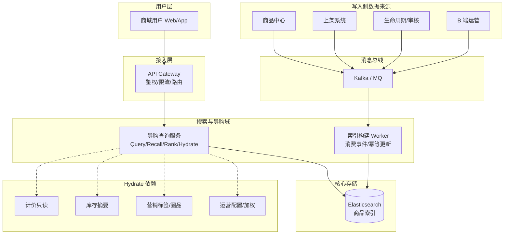
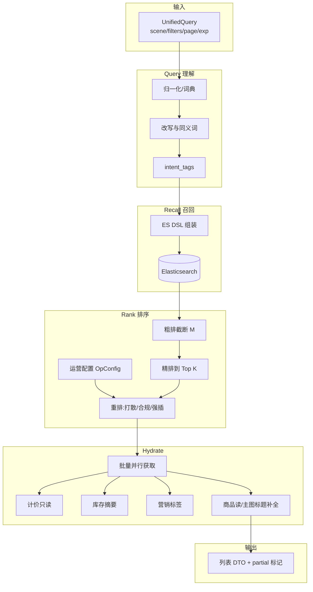
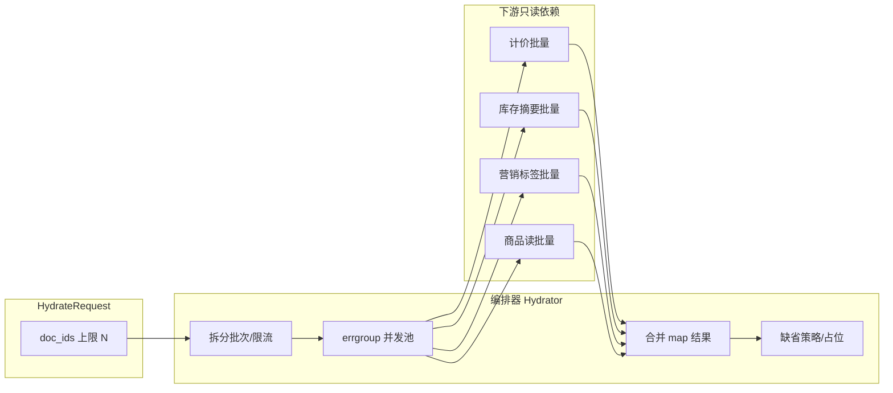
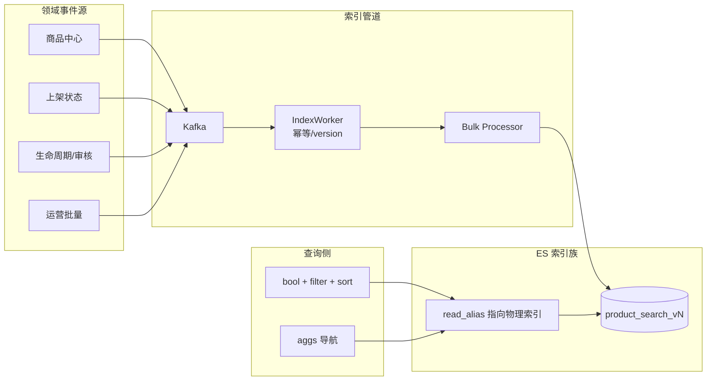
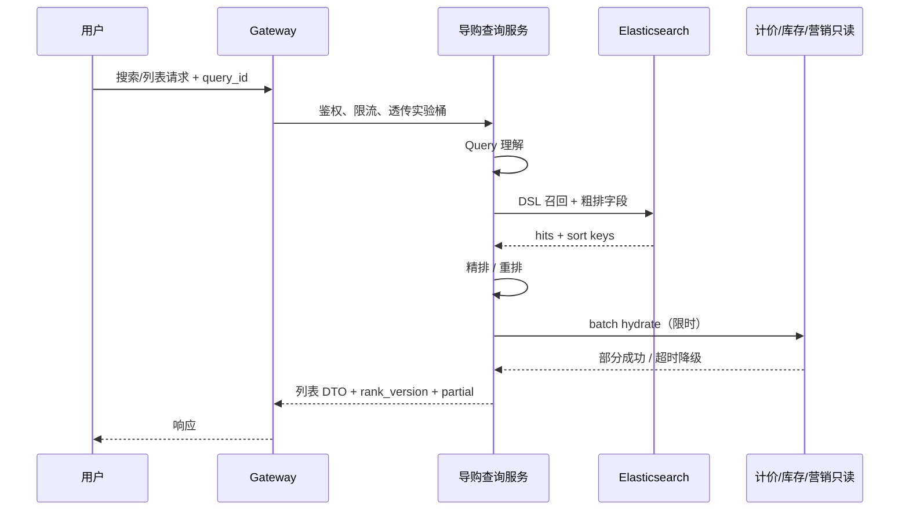
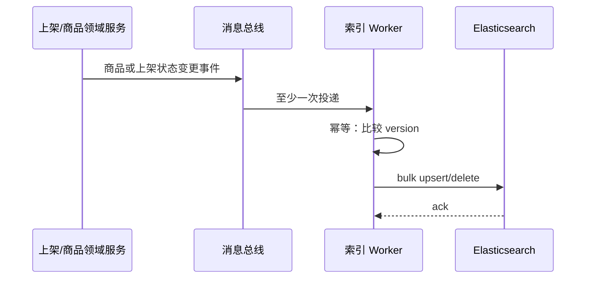

**导航**：[书籍主页](./index.md) | [完整目录](./TOC.md) | [上一章](./chapter11.md) | [下一章](./chapter13.md)

---

# 第12章 搜索与导购

> **本章定位**：搜索与结构化导购（类目列表、店铺内浏览）是电商平台最主要的 **读流量入口** 之一，直接影响转化与 GMV。本章在「统一导购查询服务」主叙事下，串起 **Query → Recall → Rank → Hydrate** 全链路，并以 **Elasticsearch** 作为召回与粗排主引擎，厘清与商品中心、计价、库存、营销、推荐等系统的 **边界与契约**。内容基于《电商系统设计（十二）：搜索与导购》扩展，面向中大型团队的工程落地与系统设计面试。

**阅读提示**：若你习惯把「列表页」简单等同于「查 ES 返回 JSON」，建议带着三个问题读完全章——第一，**搜索与导购在产品目标上与推荐有何不同**；第二，**哪些字段必须进索引、哪些必须 Hydrate**；第三，**索引滞后与 Hydrate 超时时，列表弱一致如何不与交易强一致冲突**。搞清这三点，就能把读路径工程化讲清楚，而不是停留在「调个 DSL」的层面。文中 Go 示例为教学裁剪版，落地时请补全观测、注入与错误包装。

---

## 12.1 系统定位

### 12.1.1 搜索与导购的区别

在日常口语里，「搜索」「列表」「导购」常被混用；在架构文档里，建议用 **用户意图** 与 **约束形态** 区分：

| 维度 | 关键词搜索（Search） | 结构化导购（Browse / Merchandising） |
|------|----------------------|--------------------------------------|
| 用户输入 | 显式 query，可能含糊、多义 | 通常无文本 query，或 query 为辅助 |
| 主约束 | 文本相关性 + 硬 filter | 类目 / 品牌 / 店铺 / 多维筛选项 |
| 失败体验 | 零结果、纠错、同义词 | 空列表、Facet 互斥错误 |
| 典型 scene | `keyword` | `category`、`shop` |
| 引擎侧重 | 分析链、改写、BM25 / 向量（可选） | 聚合导航、稳定排序、强 filter |

二者在工程上应 **共享同一套流水线内核**（召回 → 排序 → Hydrate），否则极易出现「同一批商品在搜索与类目列表排序不一致」的线上事故。产品层面，**搜索偏意图检索**：用户带着问题来，系统要回答「最相关的候选集」；**导购偏可控陈列**：运营希望用户在既定类目树与筛选体系内高效浏览。推荐系统（Feed）则偏 **个性化发现**，目标函数、特征 freshness、在线学习与搜索不同，本章在 12.5.2 单独划界。

### 12.1.2 核心挑战

| 挑战 | 根因 | 设计方向 |
|------|------|----------|
| 相关性 | 同义词多、类目错挂、拼写噪声 | 可控词典与改写 + 埋点闭环 |
| 列表价与索引不一致 | 促销、会员、渠道价变化快于索引 | **Hydrate** + 产品话术；结算强一致 |
| 高并发读 | 大促与热搜集中 | ES 扩展、缓存、限流、降级 |
| 深分页 | `from/size` 成本随页数上升 | `search_after` + 产品限制 |
| 跨系统编排 | Hydrate 依赖多、尾延迟叠加 | 并发上限、独立超时、部分降级 |
| 索引与主数据漂移 | 异步链路、至少一次消费 | 幂等 version、对账与补偿任务 |

与订单、支付等 **写路径** 不同，导购链路往往 **QPS 高、容忍短暂最终一致**，但必须处理好 **相关性、价格与库存展示口径、营销露出、以及索引滞后** 带来的用户预期落差。详情页应以 **商品中心读模型** 为准做强一致或近实时；列表页承认 **弱一致**，并在创单 / 结算阶段由库存、计价、营销再次校验。

从 **组织协作** 视角看，导购链路往往是「商品、搜索、推荐、营销、前端、数据」多条职能线的交汇点：任何一方在接口里多塞一点排序逻辑，短期能加快需求交付，长期会把 **归因、回滚、实验** 变成不可能任务。因此本章反复强调 **统一查询内核 + 版本化 rank**，并不是架构洁癖，而是把 **变更半径** 收敛到可治理的边界内。另一个常被低估的协作点是 **口径对齐**：运营口中的「到手价」、产品文档里的「列表价」、计价服务返回的字段名，若不能在数据字典层统一，Hydrate 再快也只能放大混乱。

从 **风险** 视角看，导购事故通常不是「ES 挂了」这种单点，而是 **组合型**：索引滞后叠加 Hydrate 超时，再叠加前端把「展示价」当成「下单价」渲染，最终在社交媒体被放大成「平台偷偷涨价」。工程上要用 **字段语义 + UI 文案 + 快照校验** 三道闸兜底；单纯优化 ES 延迟并不能消灭这类问题。

### 12.1.3 系统架构

下图给出 **搜索与导购** 在全局中的位置：**写入侧** 不拥有商品主数据，仅消费事件维护 **派生索引**；**读取侧** 负责召回与排序，卡片动态字段由 **Hydrate 编排** 多系统补齐。



**关键边界**：搜索索引存放 **相对静态或可容忍滞后** 的字段（标题、类目、上架状态、部分排序特征）；**易变字段**（展示价、库存紧张度、活动标）优先 **Hydrate**，或在索引中以「粗粒度信号 + 版本」形式存在并与 Hydrate 对齐。

在 **非功能需求** 上，建议把导购链路的 SLO 拆成「可分别报警」的三段：**ES 召回 P99**、**应用内排序 P99**、**Hydrate 端到端成功率**。很多团队只监控入口延迟，结果线上表现为「整体还不慢」，但 **Hydrate 超时率缓慢爬升**，直到大促才被计价或库存的连接池打爆一次性暴露。更稳妥的做法是把 Hydrate 每个依赖的 **超时次数、空返回比例、批量大小分布** 都做成 TopN 维度，并在压测脚本里显式模拟「半数依赖降级」。

**容量估算**（面试与立项常问）可以按乘法拆解：峰值 QPS × 每页条数 ×（Hydrate 下游 RPC 数）≈ 下游扇出；再叠加 **重试风暴** 系数（建议保守取 1.3～1.8）。ES 侧则关注 **分片热点**（超大店、超级品牌）与 **聚合查询** 对 CPU 的抢占；必要时对 `shop` 场景做 **单独索引或单独副本组**，把热点从全站检索隔离出去，成本换稳定性。

---

## 12.2 统一导购查询服务

### 12.2.1 场景识别（scene 设计）

对外推荐 **单一主叙事**：**导购查询服务（Merchandising Query Service）** 暴露统一查询接口，用 `scene` 区分业务语义；内部共享 **Query → Recall → Rank → Hydrate** 流水线。网关可做鉴权、限流与字段裁剪，但 **不要把排序规则散落在多个 BFF** 中。

| scene | 用户输入 | 典型 filter | 召回主索引 |
|-------|----------|-------------|------------|
| `keyword` | 关键词 + 可选类目 / 品牌 | 上架可售、合规、店铺黑名单 | 全站商品索引（或按站点分片） |
| `category` | 无关键词或空 query | 固定 `category_id` + 同上 | 同上 |
| `shop` | 可选关键词 | 固定 `shop_id` + 同上 | 店铺子索引或单索引强 filter |

店铺维度实现二选一：**独立索引别名**（写入侧按 shop 路由，查询简单）或 **单索引 + 强 filter**（运维简单，超大店需关注分片热点）。scene 应进入 **日志、追踪与实验分桶**，与 `query_id`、`rank_version` 一并贯穿。

```go
// Scene 为导购域的稳定枚举，避免魔法字符串散落。
type Scene string

const (
    SceneKeyword  Scene = "keyword"
    SceneCategory Scene = "category"
    SceneShop     Scene = "shop"
)

type UnifiedQuery struct {
    Scene         Scene
    SiteID        string
    UserID        string // 可选，用于会员价 Hydrate
    RawQuery      string // keyword 场景必填；category 可空
    CategoryID    string
    ShopID        string
    Filters       []Filter // 品牌、价格带、属性等
    Page          PageCursor
    ExpID         string
    RankVersion   string
}

func RouteScene(req UnifiedQuery) (Scene, error) {
    if req.Scene != "" {
        return req.Scene, nil
    }
    switch {
    case req.ShopID != "":
        return SceneShop, nil
    case req.CategoryID != "" && strings.TrimSpace(req.RawQuery) == "":
        return SceneCategory, nil
    case strings.TrimSpace(req.RawQuery) != "":
        return SceneKeyword, nil
    default:
        return "", errors.New("unable to route scene: missing query/category/shop")
    }
}
```

### 12.2.2 查询编排

**编排（Orchestration）** 负责：scene 路由 → Query 理解 → 构建 ES DSL → 执行召回 → 粗精重排 → 触发 Hydrate → 合并 DTO。编排层应保持 **无业务状态的纯函数倾向**：依赖通过接口注入，核心流水线可单测。

```go
type MerchandisingQueryService struct {
    QU   QueryUnderstanding
    ES   SearchClient
    Rank Ranker
    Hydr Hydrator
    CFG  OpConfigClient
}

func (s *MerchandisingQueryService) Search(ctx context.Context, req UnifiedQuery) (*SearchResult, error) {
    scene, err := RouteScene(req)
    if err != nil {
        return nil, err
    }
    qctx, err := s.QU.Normalize(ctx, scene, req)
    if err != nil {
        return nil, err
    }
    recall, err := s.ES.Recall(ctx, qctx)
    if err != nil {
        return nil, err
    }
    ranked := s.Rank.Score(ctx, req, recall)
    reranked := s.Rank.Rerank(ctx, req, ranked, s.CFG) // 运营配置、打散、强插
    cards, err := s.Hydr.Hydrate(ctx, HydrateRequest{
        Scene:       scene,
        UserID:      req.UserID,
        DocIDs:      reranked.IDs(),
        RankVersion: req.RankVersion,
    })
    if err != nil {
        // Hydrate 全局失败应极少：通常部分降级
        return nil, err
    }
    return AssembleResult(reranked, cards), nil
}
```

**演进注记：何时拆 BFF**。当「列表卡片组装」与「搜索实验」发布节奏被不同团队强绑定时，常见折中是把 **Hydrate 后的视图组装** 下沉到 BFF，但 **排序分数、实验桶、rank_version** 仍应由导购查询内核产出并透传。否则会出现「实验只在 App 搜索生效、H5 列表不生效」的割裂，排查时日志还对不齐。另一个反模式是把 ES DSL 拼接散落在多个网关插件里：短期看似减少了一次 RPC，长期 DSL 变更无法回归测试，**零结果率** 波动也无法定位是改写问题还是索引问题。

编排层还应内置 **最小可观测上下文**：`query_id` 应在进入 `QU.Normalize` 之前生成，并注入到 ES 查询注解（如 `preference` / custom header）与下游 RPC metadata 中，保证一次用户请求能在日志系统里 **串起全链路**。若你们使用 OpenTelemetry，建议把 `scene`、`rank_version`、`exp_id` 作为 span attributes，而不是塞进自由文本日志。

### 12.2.3 结果聚合

**结果聚合** 关注三类合并：

1. **多路召回合并**（如关键词 BM25 + 可选向量）：需 **quota、去重、延迟预算**；MVP 常单路 ES。
2. **排序分与业务字段合并**：ES `_score`、销量、上新等与 Hydrate 返回的展示价、库存标合并为统一 DTO。
3. **Facet 与列表一致性**：侧边栏聚合必须与当前 filter 同一 query 范围，否则出现「互斥筛选仍显示有货计数」的体验问题；大流量下可 **异步加载 facet** 或 **近似聚合**。

对外响应建议显式携带 **`partial`**、`index_version` 或 `price_as_of`**（时间戳），便于客诉定位与前端提示「价格以结算为准」。

**多路召回合并**（例如 BM25 + 向量）在工程上要提前写清 **配额策略**：两路各取多少、按什么键去重、合并后是否二次截断。没有配额时，最常见事故是「向量路召回大量泛化商品」把关键词路的相关性稀释掉，表现为 **CTR 下降但延迟上升**。若团队尚未建立向量索引运维与回放体系，MVP 阶段更建议 **单路 ES + 强词典**，把复杂度留给数据运营而不是平台第一天的 midnight。

**Facet 与列表一致性** 的实现细节是：用户每点击一次筛选，服务端应以 **同一套 UnifiedQuery** 生成 ES 请求体，其中 `post_filter` 与 `aggs` 的嵌套关系必须遵循「先算子集再聚合」的语义。很多初版实现为了省事，把 facet 请求拆成第二次查询，若不在客户端做强一致串行，会出现 **列表已空但 facet 仍显示有货** 的短暂撕裂。工程上更推荐 **单次 ES 往返**（列表 + facet）或在产品层声明「facet 异步刷新」并做骨架屏。

**DTO 稳定性**：导购接口是前台最高频契约之一，字段增删应走 **版本化 JSON schema** 或 protobuf 的向后兼容规则。特别是 `partial` 语义一旦上线，就不应在无迁移的情况下改变含义（例如从「仅价格缺失」扩展成「任意字段缺失」），否则前端埋点与客服话术会同时失效。

---

## 12.3 主链路：Query → Recall → Rank → Hydrate

主链路是本章的「脊柱」。下图给出 **端到端数据流**（含实验与运营配置注入位点）：



### 12.3.1 Query 理解

目标不是通用 NLP 搜索引擎，而是 **可控、可解释、可回归**：

- **归一化**：全半角、大小写、去噪字符、重复空格。
- **同义词 / 类目词典**：运营可配表驱动；变更走 **版本号**，与排序实验解耦。
- **拼写纠错**：可选；需 **限流 + 白名单**，避免引入合规或品牌风险。

输出物建议固定为：`normalized_query`、`intent_tags`、`rewrites[]`（有限条数），供 DSL 组装与埋点。

**工程落地建议**：把 Query 理解的输出定义成 **不可变结构体**（或值对象），并在日志里同时打印 `raw_query` 与 `normalized_query`，但注意隐私合规（手机号、地址片段误入搜索框并不少见）。改写表（同义词、类目映射）应支持 **灰度发布**：先 shadow 记录「若启用改写将变成什么」，再按桶启用，避免运营配置错误导致大面积零结果。

**与「大模型改写」的边界**：生成式改写很诱人，但在电商场景要先回答 **责任归属**：改写后的 query 若召回违规商品，谁承担合规责任？更稳妥的路径通常是 **受控词典 + 小模型 / 规则纠错**，把 LLM 放在离线挖掘与运营辅助，而不是在线默认链路的第一跳。

### 12.3.2 召回策略

召回阶段输出 **候选 doc 列表**（通常为 SPU 或展示单元 ID）及 ES 内已可用的排序分量。**不要在召回阶段做重 CPU 的跨系统调用**。硬条件（上架状态、类目、店铺、站点）应优先放在 `filter` 上下文以利用缓存与免评分。

**bool 查询语义** 是面试高频点：`must` 参与评分，适合承载关键词相关性；`filter` 不计分且可缓存，适合承载「硬门槛」。实践中常见错误是把「品牌=耐克」放在 `must` 里参与打分，导致品牌词意外影响相关性曲线；更推荐 **品牌进 filter**，把「品牌相关 boost」交给 `function_score` 或在精排阶段处理。另一个错误是把大量 **低选择性** 条件全部堆在 `must`，使 `_score` 退化为常数，精排阶段只能「白手起家」——这会放大后续服务压力。

**召回截断** 需要与后续粗排预算对齐：若 ES `size` 直接取 2000 返回全字段，网络与反序列化会先拖垮应用。更常见做法是 ES 侧 **只回 id 与排序必要字段**（`docvalue_fields` / `_source: false`），把重字段留给 Hydrate 或商品读服务。对于「店铺内搜索」这类可能触发热点店铺的场景，可在 DSL 增加 **routing** 或独立索引，把查询分散到更小分片集合上。

**可选扩展：向量召回**。若引入向量，需要同步建设 **向量更新延迟、ANN 参数、召回评测集** 三件事；否则极易出现「文本搜得到、向量搜不到」的双轨撕裂。多数业务在规模化前，**同义词 + 类目意图 + 运营纠错** 的投入产出比更高。

### 12.3.3 粗精排序

| 阶段 | 典型输入 | 典型输出 | 说明 |
|------|----------|----------|------|
| 粗排 | ES 召回前 N（如 500～2000） | 截断到 M（如 200） | `_score` + `function_score`（销量、上新衰减等） |
| 精排 | M 条 doc id | Top K（如 50） | 转化率预估、价格带、店铺分；LTR 可替换此阶段 |
| 重排 | K 条 | 页大小 P | 多样性、类目打散、疲劳度、**合规过滤**、运营强插 |

**合规默认值**：**明确违法禁售** 应在索引写入侧即不可召回；审核「灰区」更适合 **召回 filter**；最后一道 **重排后、返回前** 再过滤，避免已排序商品在末尾被剔除导致 **空洞位**。

**AB 与配置版本（最小集）**：`exp_id` 贯穿日志；`rank_version` 绑定权重 / 规则 / 模型版本可快速回滚；`query_id` 关联 ES 与 Hydrate 子调用。发布建议 **shadow traffic** 双写日志对比，再按桶放量；与计价、营销大促窗口 **错峰改排序**，避免归因困难。

**粗排放在 ES 还是应用内** 没有银弹：ES 内 `function_score` 的好处是 **少一次数据搬运**；坏处是调试困难、权重爆炸、且与「精排模型特征」割裂。常见折中是：ES 负责 **硬过滤 + 文本相关 + 少量可解释加权**；应用内精排负责 **复杂特征交叉** 与 **业务规则解释**。无论选哪条路径，都要保证 **同一套 rank_version** 能在离线回放数据集上复现，否则线上调参只能靠运气。

**重排的业务含义** 需要写清：多样性（同店铺打散、同品牌打散）、疲劳度（用户反复看到同一 SPU）、运营强插（置顶资源位）都属于「非相关性目标」，若不与相关性分层，就会出现「搜牙刷全是运营想卖的电器」。工程上建议把重排规则 **配置化 + 可视化回归**，并在报表里同时看 CTR 与 **投诉率 / 零结果率**。

### 12.3.4 Hydrate 编排

列表卡片常需：**展示价、原价划线、库存状态、营销标、店铺名**。变化快于索引刷新时，必须由 Hydrate 补齐。**契约建议**：入参 `doc_ids[]`（上限如 50）、`user_id`（可选）、`scene`、`rank_version`；出参为 `map[id]CardEnrichment`，缺失键表示单卡失败。

**Hydrate 编排** 强调：批量、限时、可降级、可观测。下图描述 **并行依赖** 与 **超时隔离**（示意）：



```go
type CardEnrichment struct {
    ListPriceCents   *int64 // 展示价（分）；nil 表示 Hydrate 未取到
    StrikePriceCents *int64 // 划线价（分）
    StockLevel       string // 如 IN_STOCK / LOW / UNKNOWN
    PromoTags     []string
    Title         string
    MainImageURL  string
}

type HydrateRequest struct {
    Scene       Scene
    UserID      string
    SiteID      string
    DocIDs      []int64
    RankVersion string
}

type Hydrator struct {
    Pricing  PricingBatchClient
    Inv      InventoryBatchClient
    Mkt      MarketingBatchClient
    Product  ProductBatchClient
    Parallel int
    PerDep   time.Duration
}

func (h *Hydrator) Hydrate(ctx context.Context, req HydrateRequest) (map[int64]CardEnrichment, error) {
    g, ctx := errgroup.WithContext(ctx)
    if h.Parallel > 0 {
        g.SetLimit(h.Parallel)
    }

    out := sync.Map{} // map[int64]CardEnrichment

    run := func(fn func(context.Context) map[int64]CardEnrichment) {
        g.Go(func() error {
            cctx, cancel := context.WithTimeout(ctx, h.PerDep)
            defer cancel()
            partial := fn(cctx)
            for id, card := range partial {
                v, _ := out.LoadOrStore(id, CardEnrichment{})
                base := v.(CardEnrichment)
                out.Store(id, mergeCard(base, card))
            }
            return nil // 单依赖失败不失败整页：在 fn 内部吞错
        })
    }

    run(func(c context.Context) map[int64]CardEnrichment {
        m, _ := h.Pricing.BatchListPrices(c, req.SiteID, req.UserID, req.DocIDs)
        return m
    })
    run(func(c context.Context) map[int64]CardEnrichment {
        m, _ := h.Inv.BatchStockSummary(c, req.SiteID, req.DocIDs)
        return m
    })
    run(func(c context.Context) map[int64]CardEnrichment {
        m, _ := h.Mkt.BatchPromoTags(c, req.SiteID, req.UserID, req.DocIDs)
        return m
    })
    run(func(c context.Context) map[int64]CardEnrichment {
        m, _ := h.Product.BatchCardFields(c, req.SiteID, req.DocIDs)
        return m
    })

    _ = g.Wait()

    merged := make(map[int64]CardEnrichment, len(req.DocIDs))
    for _, id := range req.DocIDs {
        if v, ok := out.Load(id); ok {
            merged[id] = v.(CardEnrichment)
        }
    }
    return merged, nil
}

func mergeCard(a, b CardEnrichment) CardEnrichment {
    // 教学示例：按字段非空合并
    if b.ListPriceCents != nil {
        a.ListPriceCents = b.ListPriceCents
    }
    if b.StrikePriceCents != nil {
        a.StrikePriceCents = b.StrikePriceCents
    }
    if b.StockLevel != "" {
        a.StockLevel = b.StockLevel
    }
    if len(b.PromoTags) > 0 {
        a.PromoTags = append(a.PromoTags, b.PromoTags...)
    }
    if b.Title != "" {
        a.Title = b.Title
    }
    if b.MainImageURL != "" {
        a.MainImageURL = b.MainImageURL
    }
    return a
}
```

**Hydrate 与「列表一致性」**：当某个 SPU 在 ES 中仍存在，但商品中心已下架或不可售时，应以 **商品读返回的状态** 为准做最终过滤，并在必要时 **剔除该位** 或 **显示不可用**（取决于产品策略）。这意味着 Hydrate 不只是「加字段」，也可能反向改变 **可展示集合**；若发生剔除，需要在前端处理 **页大小不足** 的补位逻辑（例如自动补拉一条），否则会出现末尾空洞。

**连接池与超时**：Hydrate 依赖往往共享连接池，若列表 QPS 高且每页 50 条，极易把下游 **最大并发** 顶满。除了限制 `Parallel` 与批量大小，还应对 **同一用户** 做轻量节流（例如滑动窗口），防止脚本或异常客户端发起「并发多页请求」放大扇出。

---

## 12.4 Elasticsearch 专题

> **与商品中心的分工**：索引字段清单、nested 取舍、商品变更如何进索引，以商品中心相关章节为权威叙述。本节聚焦 **查询侧契约**、典型 DSL、深分页与性能调优，并给出 **索引生命周期与 mapping 视角** 的架构图。

### 12.4.1 索引设计

**索引设计** 要在「召回质量」「写入吞吐」「运维成本」三者间折中。下图从 **写入投影** 与 **查询路径** 两侧展示（与 IndexWorker 呼应）：



**文档建模的两种典型切分**：一是以 **SPU** 为展示单元（服装、标品多规格常如此），SKU 维度属性用 nested 或扁平化字段表达；二是以 **SKU** 为展示单元（强价格/库存差异的品类），索引文档更细但写入放大。切分没有绝对正确，关键是 **列表页用户心智** 与 **下单单元** 一致：若用户认为自己在买「一款多规格商品」，却以 SKU 文档展示，容易出现 **重复占位** 与 **排序抖动**（同一 SPU 多个 SKU 同时出现在列表）。切分确定后，Hydrate 的 `doc_ids` 语义也要固定，否则计价批量接口的入参会频繁返工。

**nested 的决策树（落地版）**：当查询必须表达「父文档条件 ∧ 子文档条件」且无法通过扁平化字段无损表达时，才引入 nested；否则优先 **写入侧展开**（例如把可检索属性汇总到父级 `attrs.searchable`）以降低查询成本。nested 还会让 **聚合** 更复杂：facet 若需要 SKU 级分布，必须清楚产品是否真的需要，很多类目列表只需要 SPU 级导航。

**mapping 要点（查询视角）**：

| 实践 | 说明 |
|------|------|
| 筛选 / 聚合 / 排序字段 | 优先 `keyword` 或数值类型，保证 `doc_values` |
| 全文检索 | `text` + 子字段 `keyword` 谨慎用于排序 |
| nested | 仅当 SKU 级属性必须父子联合约束时使用；滥用会放大成本 |
| 反模式 | 对大文本无意义排序；高基数深度聚合默认全开 |

### 12.4.2 查询 DSL 模式

**分析链与中文分词**：索引与查询使用 **同一分析链**（或查询链为索引链的有意子集）。`filter` 不参与评分且可缓存，适合 **站点、上架状态、类目、店铺、价格区间** 等硬条件。

```json
{
  "query": {
    "bool": {
      "must": [
        {
          "multi_match": {
            "query": "无线耳机",
            "fields": ["title^3", "brand^2", "attrs.searchable"],
            "type": "best_fields"
          }
        }
      ],
      "filter": [
        { "term": { "site_id": "SG" } },
        { "term": { "listing_status": "ONLINE" } },
        { "term": { "category_id": "cat-3c-audio" } },
        { "range": { "list_price": { "gte": 50, "lte": 500 } } }
      ]
    }
  },
  "sort": [
    { "_score": "desc" },
    { "sales_30d": "desc" },
    { "spu_id": "asc" }
  ],
  "_source": false,
  "docvalue_fields": ["spu_id", "list_price", "shop_id"]
}
```

列表页应 **裁剪 `_source`**，避免返回大段正文。生产可用 `docvalue_fields` 与 `_source` 组合权衡包大小。

**高亮与摘要**：高亮字段应控制在 `title` 等短字段；对大段描述开启高亮会显著增加响应体与序列化成本。若产品需要「摘要片段」，更推荐由商品中心提供 **预生成摘要** 或在索引中维护 `short_description` 的受控长度字段，而不是在查询时从正文动态截取。

**聚合导航（facets）与筛选互斥**：当用户选择 `brand=A` 后，其它 facet 的桶计数应基于「已选条件下的子集」重算，否则会出现互斥筛选仍显示「有库存计数」的错觉。实现上可以用 `filter` aggs、`post_filter` 组合，或在单次请求中拆成「列表 query」与「facet query」两段但由同一 `UnifiedQuery` 生成，避免前后端各自拼装 filter 造成漂移。

```go
// Go 侧可用结构体拼装 DSL（示意字段，非完整客户端）
type BoolQuery struct {
    Must   []any `json:"must,omitempty"`
    Filter []any `json:"filter,omitempty"`
}

type SearchBody struct {
    Query  map[string]any `json:"query"`
    Sort   []any          `json:"sort,omitempty"`
    Size   int            `json:"size"`
    Source any            `json:"_source,omitempty"`
}

func BuildKeywordDSL(site, cat, q string, from, size int) SearchBody {
    return SearchBody{
        Query: map[string]any{
            "bool": BoolQuery{
                Must: []any{
                    map[string]any{
                        "multi_match": map[string]any{
                            "query":  q,
                            "fields": []string{"title^3", "brand^2", "attrs.searchable"},
                            "type":   "best_fields",
                        },
                    },
                },
                Filter: []any{
                    map[string]any{"term": map[string]any{"site_id": site}},
                    map[string]any{"term": map[string]any{"listing_status": "ONLINE"}},
                    map[string]any{"term": map[string]any{"category_id": cat}},
                },
            },
        },
        Sort: []any{
            map[string]any{"_score": "desc"},
            map[string]any{"sales_30d": "desc"},
            map[string]any{"spu_id": "asc"},
        },
        Size: size,
        Source: false,
    }
}
```

### 12.4.3 深分页问题

| 方式 | 适用 | 风险 |
|------|------|------|
| `from + size` | 前若干页 | `from` 过大时全局排序，内存与延迟陡增 |
| `search_after` | 深度翻页 / 连续浏览 | 需稳定 sort key；不适合随机跳页 |
| `scroll` | 离线导出、对账 | 不适合 C 端高并发 |

**面试标准答法**：C 端深分页用 `search_after` + 稳定 tie-breaker（如 `spu_id`）；随机跳页用产品约束（最多第 N 页）或改写交互。

**`search_after` 的工程细节**：sort 数组必须 **全链路稳定**，任何「仅用于展示」的字段都不应参与 tie-break，否则会出现翻页跳变。常见做法是 `_score` + 业务排序字段 + 主键升序。客户端需要缓存上一页最后一条的 sort 值；若中间发生 **索引刷新** 导致顺序变化，产品上要接受「轻微抖动」或通过 **会话级快照**（成本更高）解决。

**随机跳页的产品替代**：电商 C 端常见替代是「跳到第 N 页」改为「继续浏览 / 相似推荐 / 细化筛选」，把深分页需求转化为 **更强的约束** 与 **更相关的子集**，既保护集群也提升转化。

### 12.4.4 性能调优

- **Profile**：区分评分、聚合、`function_score` 热点。
- **分片与副本**：分片数与数据量、查询并发匹配；副本换读吞吐但写入放大。
- **段合并与冷热**：写入高峰观察 merge；冷热索引降副本或迁移。
- **`function_score` 粗排**：销量 `log1p`、上新高斯衰减等可进 ES，注意权重爆炸与可调试性。

**Facet 性能**：限制桶数、`min_doc_count`；首屏列表优先，facet 可异步。Suggest（completion / search_as_you_type）应 **单独限流**，并与 Query 纠错 **二选一主路径** 以防延迟放大。

**慢查询清单（发布前自检）**：

| 症状 | 可能原因 | 处理方向 |
|------|----------|----------|
| P99 随页数线性变差 | `from/size` 深分页 | `search_after` + 产品限制 |
| CPU 尖刺 | 大聚合 / 高基数 terms | 降桶、采样、异步 facet |
| 写入延迟升高 | 分片过大 / merge 压力 | 分片再规划、冷热分层 |
| 命中不稳定 | 分析链不一致 / synonym 热更 | 统一分析链 + 版本化词表 |
| 结果「看起来对但排序怪」 | `function_score` 权重叠加 | 归一化与离线回放 |

**索引别名与零停机切换**：大版本 mapping 变更往往需要 reindex。生产上应使用 **双写 / 回填 + read_alias 原子切换**，并在切换后保留旧索引一段时间用于回滚与对账。切换窗口内还要特别注意 **缓存层**（CDN、应用本地缓存）是否仍指向旧索引版本，否则会出现「列表已新、详情仍旧」的短暂错觉。

**运行时字段与脚本**：能用 mapping 解决的不建议长期依赖脚本字段；脚本会把成本从索引时挪到查询时，且更难做 **成本预算**。若必须使用脚本，务必加 **采样 profile** 与 **熔断**（例如限制每节点脚本编译频率）。

---

## 12.5 系统边界与职责

### 12.5.1 搜索系统的职责边界

搜索与导购系统应负责：

- **派生索引的构建与查询**（含增量、幂等、版本对齐）。
- **召回与（可配置）排序**，以及 **列表读模型的编排（Hydrate）**。
- **观测与实验** 位点（`query_id`、`rank_version`、`exp_id`）。

不应负责：

- 商品主数据真相源、订单事务、营销算价与券扣减、库存预占。

### 12.5.2 搜索 vs 推荐：边界划分

| 维度 | 搜索 / 导购 | 推荐（Feed） |
|------|-------------|----------------|
| 主信号 | query + 筛选意图 | 用户行为序列与画像 |
| 目标 | 相关性 + 平台规则下的转化 | 发现与时长 / GMV 组合目标 |
| 失败模式 | 零结果、相关性差 | 信息茧房、疲劳 |
| 架构 | 检索引擎 + 规则/LTR | 特征平台 + 在线排序 + 重排 |

二者可 **共享埋点、特征与实验平台**，但服务边界建议解耦，避免「搜索里偷偷塞推荐」导致可解释性与合规审计困难。

**落地协作模式**：推荐团队常希望复用搜索召回做「候选池」，这在技术上是可行的，但要把契约写清：**候选池的版本、过滤条件、以及责任边界**（例如禁售过滤由谁兜底）。更推荐的方式是推荐系统维护 **自己的候选生成链路**，在特征层复用搜索的 **类目、品牌、文本 embedding** 等中间产物，而不是在运行时强耦合调用搜索 HTTP 接口——否则搜索一旦降级，推荐会被连带拖死，故障半径不可控。

### 12.5.3 索引数据 vs 实时数据

| 数据类型 | 放索引 | Hydrate / 实时读 |
|----------|--------|------------------|
| 标题、主图、类目、品牌 | 是 | 可选补全 |
| 上架状态、站点 | 是 | 强一致场景再二次校验 |
| 展示价、会员价 | 粗粒度 / 索引价 | 是（列表口径） |
| 可售 / 紧张 | 粗信号 | 是（更准确） |
| 活动标、圈品命中 | 可缓存只读 | 是（失败可降级） |

### 12.5.4 召回 vs 排序 vs Hydrate 的职责

- **召回**：在高召回率前提下控延迟；避免跨系统调用。
- **排序**：可解释、可版本化、可回滚；重排承载运营与合规。
- **Hydrate**：补齐易变展示字段；**单卡失败不拖死整页**。

**面试追问小结（边界类）**：「搜索是不是商品中心的一部分？」标准回答是 **否**：商品中心是主数据真相源；搜索维护 **派生读模型** 以优化检索与排序特征。「为什么不在 ES 里算最终价？」因为价格解释依赖会员、渠道、动态规则与版本，索引天然滞后；列表允许弱一致，交易必须强一致。「推荐能否直接调用搜索接口拿候选？」不建议默认耦合：推荐候选集生成逻辑与搜索意图不同，但可以在 **特征与埋点层复用**。

---

## 12.6 与上下游系统集成

### 12.6.1 与商品中心集成（索引数据来源）

商品中心提供 **主数据与读模型版本**；索引 Worker 消费 `product.changed` 等事件，比较 **version / updated_at** 后 bulk upsert。删除语义需显式：`HARD_DELETE` vs `UNSEARCHABLE`（保留文档但 filter 掉）。

**批量读接口的契约**：商品中心面向 Hydrate 的批量接口应返回 **卡片级最小字段集**（标题、主图、类目路径、店铺名等），并携带 `content_version` 便于与索引对齐。切忌让导购服务在列表场景调用「详情级大对象」接口，否则会把商品中心的 **详情缓存击穿** 间接变成搜索事故。

**图片与多媒体**：主图 URL 是否进索引取决于列表是否必须在 ES 故障时仍能展示基本内容；更常见是把图片放在 Hydrate，索引只存 `image_id` 或稳定 CDN key，避免 URL 频繁变更触发无意义 reindex。

```go
func ApplyProductEvent(doc ProductDoc, evt ProductEvent) (bool, error) {
    if evt.Version < doc.Version {
        return false, nil
    }
    return true, UpsertES(doc.Merge(evt))
}
```

### 12.6.2 与计价系统集成（列表价 Hydrate）

计价只读接口建议 **批量 + 站点 + 会员等级** 维度；字段命名与 PDP / 结算 **严格区分**「列表价」与「应付价」，避免客户端误用。超时策略见 12.7.2。

**会员价与未登录态**：未登录用户可能只能看到「起售价」或「公开价」，此时 Hydrate 请求不应隐式携带会员身份；登录态切换时要小心 **前端缓存** 造成「登录后列表仍显示旧价」，可通过 `price_as_of` 或短 TTL 缓存失效解决。对「登录看价」类降级，建议同时返回 **可解释的降级原因码**（如 `PRICING_TIMEOUT`），便于埋点区分转化率下降根因。

### 12.6.3 与库存系统集成（可售状态）

列表展示 **弱一致** 库存摘要即可；下单前以库存服务 **强校验** 为准（与订单、库存章节衔接）。降级策略需业务拍板：偏保守利于防客诉，偏乐观利于转化。

### 12.6.4 与营销系统集成（活动标签）

营销在列表侧 **只读展示**：活动标、圈品是否命中；**不算价、不锁券**。资格与叠加仍以结算与创单为准。

**活动标与合规**：列表展示「满减」「券」等文案时，要避免暗示用户已领取或已满足门槛。活动标更像 **广告露出**，不是 **权益状态**；否则容易与营销执行域产生口径冲突并引发投诉。对敏感类目（医疗、金融类比商品），活动文案可能需要额外 **合规审核字段** 控制展示。

### 12.6.5 Hydrate 编排与降级策略

| 失败 | 建议降级 |
|------|----------|
| 计价超时 | 展示索引价或「登录看价」 |
| 库存超时 | 保守文案或 UNKNOWN，不断言有货 |
| 营销标签失败 | 隐藏活动标，不影响下单资格判定 |
| ES 集群故障 | 短时返回缓存快照 / 简化查询 / 明确提示 |

批量契约建议：`doc_ids` 上限 20～60；并行度 4～16；单依赖超时 30～120ms；响应带 `partial=true`。

**列表请求时序（典型）**：



**索引更新时序（典型）**：



### 12.6.6 集成性能优化

- **批量 RPC** 合并网络往返；连接池按 `QPS × 每页条数` 估算。
- **热门 SPU 短 TTL 缓存** + **singleflight** 防击穿；注意 **个性化价** 与缓存 key 冲突。
- **重试** 指数退避 + **用户维度熔断**，避免拖垮计价 / 库存。

**依赖拓扑与故障隔离**：Hydrate 依赖建议按 **关键路径分级**：标题主图属于「强展示」；活动标属于「弱展示」；价格属于「强体验但可降级」。分级后可以定义 **不同的超时与重试策略**，避免弱依赖拖长尾。若使用服务网格，可为营销只读设置更小的超时与更激进的熔断，把尾延迟从全链路中剥离出去。

---

## 12.7 一致性与降级

### 12.7.1 索引延迟处理

**现象**：上架后短暂搜不到；改价后列表旧价。**组合手段**：详情强一致读商品中心；列表展示 **数据时间戳** 或「价格以结算为准」；大促关键池可走 **强制刷新队列**（与商品中心刷新策略对齐）。

**运营活动窗口的同步策略**：大促「清单商品」往往要求更高新鲜度，技术上可采用 **活动商品白名单 + 更高优先级消费队列**，甚至短时 **双写直刷**（写入路径旁路触发索引更新）。但要警惕：旁路越多，幂等与对账越复杂；因此白名单规模必须可控，并在活动结束后及时回收，避免把临时机制固化成永久债务。

### 12.7.2 降级策略

与 12.6.5 呼应：Hydrate **独立超时**；ES 故障 **缓存 / 简化查询**；suggest 与主搜 **配额隔离**。

### 12.7.3 缓存策略

- **查询结果缓存**：key 需含站点、筛选 hash、排序版本；个性化价场景慎用或细分桶。
- **Facet 缓存**：更短 TTL 或异步；注意筛选变更失效。
- **索引别名切换**：蓝绿 reindex 后一次性切 `read_alias`，缩短双读不一致窗口。

**索引延迟的「产品 + 技术」组合拳**：除了技术手段（强制刷新队列、提高消费并行、热点分片治理），还需要 **产品话术与 UI 引导**：例如「刚刚上架，正在全网同步」或提供 **直达详情** 的链接入口。否则用户会把「搜不到」理解为「平台没货」，对转化伤害更大。对价格类客诉，客服工具应能输入 `spu_id` 查到 **`index_version` 与 `price_as_of`**，否则只能复读「以结算为准」。

**Hydrate 风暴的防护**：当 ES 变慢时，应用层往往会 **放大重试** 或 **拉长等待**，进而把计价与库存拖入雪崩。防护要点是：**入口限流**先于下游扩容；**超时短**于下游默认；**失败快速返回 partial**；并对同一 `query_id` 的重复提交做 **去重**（幂等键 + 短窗缓存）。

---

## 12.8 工程实践

### 12.8.1 性能优化

- 网关按 **用户 / IP / 设备** 限流；异常流量对接风控。
- 压测覆盖：**大 filter + 多排序键 + `search_after`**、**Hydrate 半数超时**。
- 对 **零结果率**、**P99 端到端**、**hydrate 超时率** 建立 SLO。

**热点治理**：除店铺维度外，还要关注 **超级品牌、超级类目、大促会场** 的查询模式是否会把 ES 查询打成「同一 filter 反复出现」的形状。此类热点更适合 **边缘缓存** 或 **查询结果短缓存**，并把缓存 key 与 `rank_version` 绑定，避免实验回滚后缓存污染。对 suggest 接口要单独做 **更低配额**，否则 App 输入框的每个字符都会放大成 ES 压力。

### 12.8.2 可观测性

日志与追踪携带 **`query_id`、`scene`、`exp_id`、`rank_version`**；ES 查询记录 **归一化 query**（注意隐私脱敏）。对慢查询 **profile 采样**。

**「可回放」是搜索排障的生命线**：建议在测试环境保存 **DSL 生成器版本** 与 **fixture query 集**，线上问题能一键回放同一 DSL（脱敏后）到预发集群对比 hits。没有回放能力时，团队只能依赖工程师记忆改写了什么，排障周期会从小时级变成天级。

### 12.8.3 AB 实验

实验桶进请求上下文；指标按桶对比 CTR / CVR；与排序配置 **版本绑定**，支持快速回滚与 shadow diff。

**发布前自检清单（摘录）**：

- [ ] **索引别名切换**：reindex 完成后一次性切 `read_alias`，并验证读写两侧别名一致。
- [ ] **mapping 变更评审**：是否需要全量重建；是否影响排序字段 `doc_values`。
- [ ] **压测**：覆盖「大 filter + 多排序键 + `search_after`」与「Hydrate 半数超时」。
- [ ] **降级开关**：ES 故障、hydrate 超时、实验回滚在配置中心可一键切换，并有演练记录。
- [ ] **对账任务**：抽样对比 ES 文档版本与商品中心版本，差异进入修复队列。

**指标面板建议**（与稳定性并列）：零结果率、Top query 延迟、hydrate 成功率分依赖、ES 慢查询计数、实验分桶 CTR/CVR、以及 **客服价格类工单占比**。最后一项能把「体验问题」翻译成管理层听得懂的损失函数。

---

## 12.9 本章小结

搜索与导购是电商 **读模型工程化** 的主战场：**统一 scene 与编排** 降低系统熵；**Elasticsearch** 承担召回与部分粗排，但必须与商品、上架、生命周期、计价、库存、营销的 **契约** 清晰划分；**Query → Recall → Rank → Hydrate** 主链路上，一致性与体验通过 **索引版本化 + Hydrate 限时降级 + 产品话术** 组合兜底。与推荐系统保持 **目标与架构边界** 上的解耦，在特征与实验平台上 **复用能力**，是多数中大型平台的务实演进路径。

若你用一句话向面试官总结本章，可以这样说：**搜索索引解决「找得到与排得动」，Hydrate 解决「展示得像且不太假」；交易链路再用强一致服务解决「买得对」。** 三条链路各司其职，边界清晰，才能把高并发读路径做成 **可演进、可回滚、可观测** 的工程系统，而不是一堆 DSL 拼接技巧。

从 **演进路线** 看，多数团队会经历「ES 直出 → 引入 Hydrate → 引入统一 scene 与 rank 版本 → 引入完整观测与对账」四阶段；每一阶段都能单独带来收益，但不要把四阶段压缩成一次「大爆炸重构」，否则会在大促窗口付出惨痛代价。最稳妥的切分是：**先统一排序内核与日志字段**，再逐步把易变字段迁出索引。

---

## 参考资料

1. [Elasticsearch 官方文档](https://www.elastic.co/guide/en/elasticsearch/reference/current/index.md) — 查询 DSL、分页、`profile`、聚合。  
2. 本书相关章节：商品中心（索引与缓存）、库存系统、营销系统、计价系统、商品供给与运营管理。  
3. 博客原文：[电商系统设计（十二）：搜索与导购（Search & Discovery）](/system-design/31-ecommerce-search-discovery/)。
