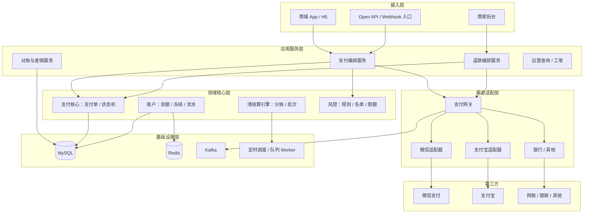
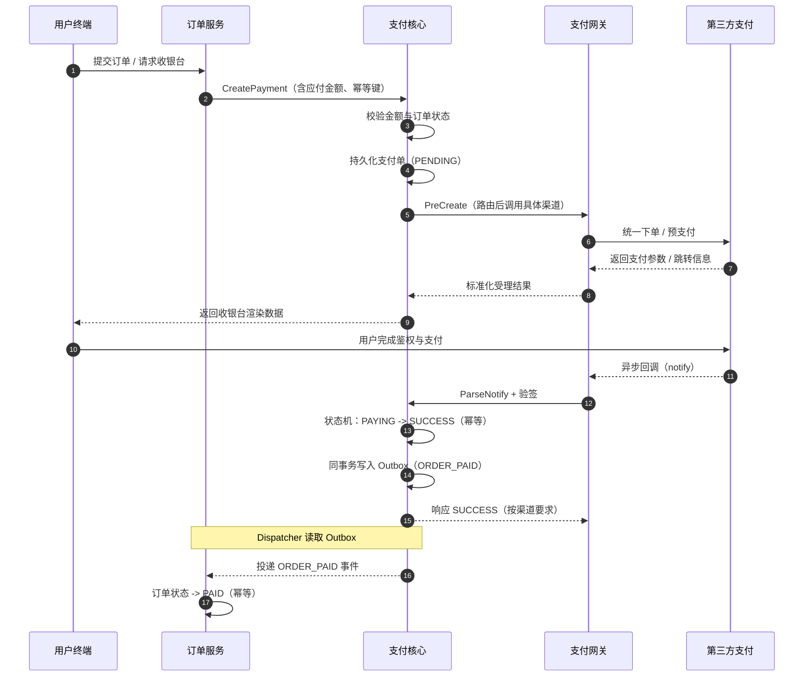
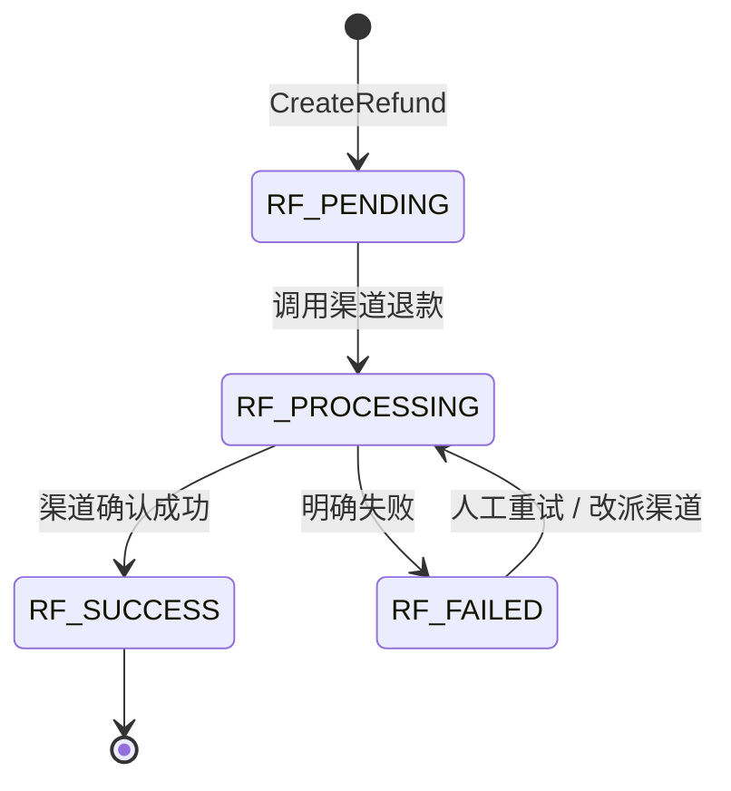
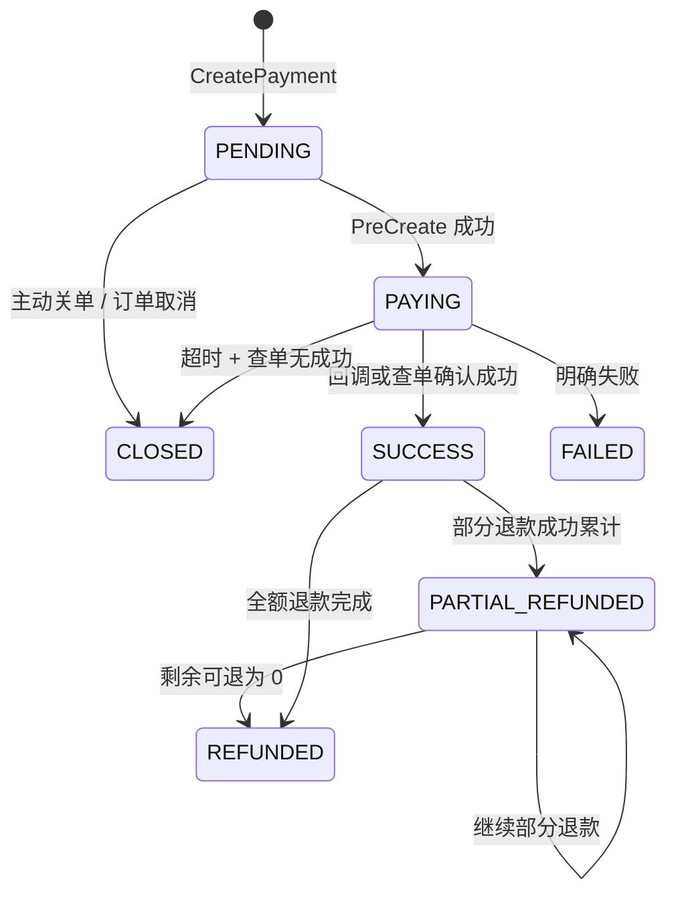
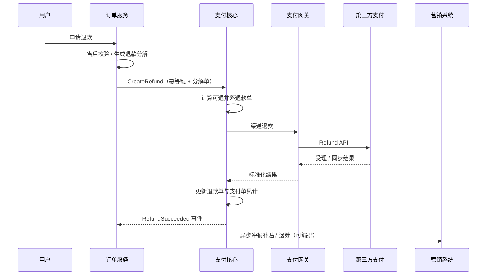
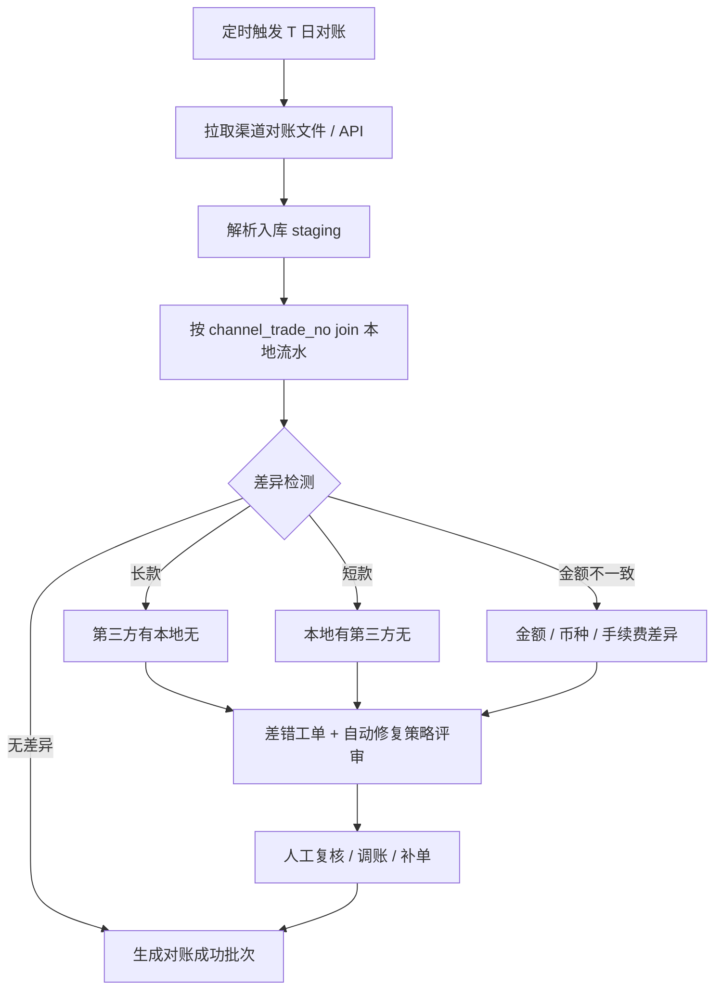
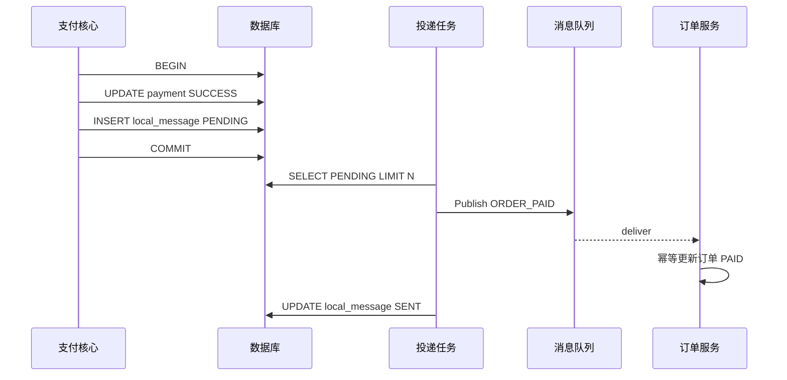

**导航**：[书籍主页](../../README.md) | [完整目录](../../SUMMARY.md) | [上一章：第15章](./chapter14.md) | [下一章：第17章](../../part3/chapter16.md)

---

# 第16章 支付系统

> **本章定位**：支付系统是交易链路的**资金收口**与**外部渠道适配中心**。本章在《电商系统设计（八）：支付系统深度解析》的基础上，按书籍体例展开：**分层架构、主链路时序、状态机、退款与营销核算、清结算与对账、幂等与一致性、系统边界与集成**。文中 Go 示例为教学裁剪版，落地时请补全观测、鉴权、错误包装与依赖注入。

**阅读提示**：读本章时建议始终带着三个问题——**谁拥有支付单的真相状态**、**回调与主动查询以谁为准闭合**、**差错入账如何可审计回滚**。把这三个问题回答清楚，就能把「渠道差异」与「分布式一致性」从口号落到可执行的工程清单。

**与全书脉络的关系**：第 12 章计价给出「应付金额的合理解释」，第 14 章结算完成「资源锁定」，第 15 章订单沉淀「业务承诺」，本章则把承诺兑现为**外部世界的扣款事实**；第 17 章会把支付放回 B2B2C 聚合场景，观察供应商履约与渠道结算如何共同挤压支付边界。

---

## 15.1 业务背景

### 15.1.1 支付系统的定位

在电商交易链路中，订单系统负责「承诺与履约编排」，计价系统负责「金额解释与快照」，而支付系统负责把**应付金额**转化为**真实资金转移**（或渠道侧支付承诺），并把结果以**可审计、可幂等、可对账**的方式回写给订单、营销、财务等协作方。

支付系统通常同时服务三类角色：

- **消费者（C 端）**：收银台展示、组合支付、支付结果通知、退款进度查询；
- **商家与平台（B 端）**：结算、提现、分账视图、对账差错工单；
- **内部中台**：风控、财务核算、客服调账、数据仓库离线口径。

因此，支付系统既不是「订单的子模块」，也不是「财务系统的渠道壳」。更合理的边界是：**支付域管理支付单、渠道交互、资金事实；订单域管理履约状态机；财务域管理会计科目与总账口径**。三者通过事件与对账任务最终对齐。

从**交易形态**看，实物电商更强调「支付成功 → 库存扣减 / 发货」的串联；虚拟商品与 B2B2C 聚合平台则更强调「支付成功 → 供应商下单 / 出票」的外部 API 依赖。支付系统不应把供应商履约细节写进支付单，但必须在扩展字段中保留**可追溯的外联单号**（例如渠道子商户号、分账接收方），否则一旦出现拒付或 chargeback，运营与风控很难在分钟级定位问题根因。

从**组织协作**看，支付团队往往与财务、风控、客服、数据治理交叉。接口契约里最容易被忽略的不是「字段类型」，而是**语义口径**：例如「成功」到底指渠道受理成功、银行扣款成功，还是可结算到账。建议在支付域建立**统一语言表**（状态枚举、事件名、对账字段含义），并在评审门禁中与订单、财务双签，避免线上出现「订单已支付但财务未入账」的真空地带。

### 15.1.2 核心业务场景

| 场景 | 说明 | 工程要点 |
|------|------|----------|
| 标准支付 | 微信 / 支付宝 / 银行卡 / 余额等 | 渠道路由、渠道限额、组合支付顺序 |
| 退款 | 全额 / 多次部分退款 | 可退金额闭合、营销资金回冲、渠道退款单号 |
| 清结算 | 平台佣金、商家应收、营销补贴 | 分账模型版本、结算周期、冻结与解冻 |
| 对账 | 交易对账、资金对账、差错闭环 | 文件解析幂等、长短款分类、人工复核 SLA |
| 风控与合规 | 限额、黑白名单、反洗钱报送（视地区） | 规则引擎、审计日志、敏感字段脱敏 |
| 争议与拒付 | chargeback、调单、凭证上传 | 证据链留存、订单快照关联、工单闭环 |
| 企业采购 | 对公转账、账期支付、开票衔接 | 支付单与应收单映射、核销流程 |

**场景串联示例**：用户在结算页确认应付 199 元 → 订单系统生成待支付订单并携带计价快照 → 支付系统创建支付单并把金额与快照版本绑定 → 用户选择微信 → 网关路由到指定商户号与费率套餐 → 回调成功后 Outbox 投递 `ORDER_PAID` → 库存与营销在各自消费者内幂等确认。任何一步回滚都必须明确**补偿顺序**（先释放营销锁定还是先关支付单），否则会出现「钱没付但券没了」的资损路径。

### 15.1.3 核心挑战

| 维度 | 具体问题 | 典型技术回应 |
|------|----------|----------------|
| 资金安全 | 重复支付、伪造回调、金额篡改 | 验签、幂等键、乐观锁、不可变流水 |
| 高并发 | 大促峰值、热点商户 | 限流、异步化、渠道 QPS 配额与降级 |
| 最终一致性 | 支付成功与订单已支付不同步 | Outbox、本地消息表、补偿扫描 |
| 渠道异构 | 字段、状态、回调时序不一致 | 网关适配器、统一渠道模型、对账闭合 |
| 可运营性 | 差错处理、调账、追溯 | 工单系统、操作审计、双人复核 |
| 观测与排障 | 渠道抖动、跨系统扯皮 | TraceID 贯通、支付会话回放、原始报文留存策略 |
| 合规与隐私 | PCI、卡号、证件信息 | 最小采集、字段加密、密钥托管、脱敏展示 |

**挑战之间的耦合**需要提前说清：例如「极致性能」往往鼓励异步化与缓存，但「资金安全」又要求强审计与落库完整性；「渠道快速接入」若缺少网关隔离，会把各渠道 `if-else` 泄漏到支付核心，最终形成不可测试的巨石。折中办法通常是：**热路径短事务 + 冷数据异步落盘 + 严格分层单测与对账兜底**——性能靠结构与容量规划解决，而不是靠跳过幂等校验解决。

---

## 15.2 整体架构

### 15.2.1 分层架构

支付平台常见分层如下：**接入层**（多端统一鉴权与防重）、**应用服务层**（支付编排、退款编排、运营查询）、**领域核心层**（支付单聚合、账户、清结算规则）、**渠道适配层**（网关与 SPI）、**基础设施层**（数据库、缓存、消息、任务调度）。分层的目标不是画框，而是让**变更原因单一**：换渠道不应驱动清结算规则重写，改分账比例不应污染回调验签逻辑。



### 15.2.2 支付网关

**支付网关**对外暴露统一的 `CreatePayment`、`QueryPayment`、`Refund`、`ParseNotify` 等接口，对内以**策略 + 适配器**组合消化渠道差异。网关层应内聚以下能力：

- **渠道路由**：按支付方式、费率、成功率、灰度比例、商户号维度选择具体适配器；
- **报文转换**：统一内部 `ChannelCommand` 与外部 API 字段映射；
- **签名与加密**：各渠道证书、公钥轮换、时钟偏移容错；
- **超时与重试策略**：仅对**可安全重试**的读操作与幂等写操作重试；
- **观测**：按 `channel`、`merchant_no`、`scene` 打点，便于大促排障。

### 15.2.3 支付核心

**支付核心**维护支付单聚合根、状态机、流水与幂等索引。它不应直接调用「原始 HTTP 渠道 SDK」，而应依赖网关接口，从而保证**领域模型**不被渠道 JSON 污染。支付核心还应产出**领域事件**（如 `PaymentSucceeded`），通过 Outbox 保证与数据库状态同事务。

### 15.2.4 支付渠道

**渠道层**实现的是「如何把统一命令变成第三方可理解请求」。实践中建议每个渠道独立模块（Go package），统一实现小接口集合，例如：

```go
// ChannelClient 描述支付网关对单个渠道的抽象。
// 真实系统还应包含上下文、超时控制、指标与可观测字段。
type ChannelClient interface {
	PreCreate(ctx context.Context, in PreCreateInput) (PreCreateOutput, error)
	QueryTrade(ctx context.Context, in QueryTradeInput) (TradeStatus, error)
	Refund(ctx context.Context, in RefundInput) (RefundOutput, error)
	ParseNotify(ctx context.Context, httpHeader map[string][]string, body []byte) (NotifyEvent, error)
}
```

渠道差异集中在：**同步返回是否可信**（多数场景仅表示受理）、**回调到达顺序**、**退款是否同步到账**、**对账文件粒度**。网关要把这些差异折叠为**有限的内部枚举**（如 `ACCEPTED`、`SUCCEEDED`、`FAILED`、`UNKNOWN`），避免把渠道字符串透传到订单域。

**子系统职责对照**（面试与评审常用）：

| 子系统 | 核心职责 | 关键数据 | 典型反模式 |
|--------|-----------|----------|------------|
| 账户系统 | 余额、冻结、流水、充值提现 | 账户余额、冻结单、账务流水 | 把渠道手续费写进用户余额宽表 |
| 支付网关 | 路由、报文、签名、重试 | 渠道请求 / 响应摘要、路由决策 | 在网关里改支付单状态机 |
| 支付核心 | 支付单、退款单、幂等、Outbox | `payment`、`refund`、`outbox` | Handler 直连第三方 SDK |
| 清结算引擎 | 分账、批次、结算周期 | 分账明细、结算单、提现单 | 清结算回调里直接操作支付单 |
| 风控系统 | 限额、名单、挑战 | 风控决策流水 | 风控结果不落库导致无法复盘 |

**数据落库建议**：支付单主表保持「窄」——只放状态、金额、币种、渠道标识、幂等键、版本号；大报文、扩展参数、渠道原始回调进入**扩展表或对象存储**，查询走异步索引。这样可以在大促时显著降低行更新放大效应，同时满足合规留存。

---

## 15.3 支付流程

主链路可以概括为：**创建支付单（幂等）→ 渠道路由与预下单 → 用户交互 → 异步回调 / 主动查单 → 发布成功事实 → 下游投影**。其中「回调」与「查单」是双保险：回调丢包时必须靠**主动查询 + 补偿任务**闭合。

### 15.3.1 支付创建

创建支付单的关键是**稳定幂等键**与**金额校验**。幂等键建议至少覆盖：`order_id` + `payer_id` + `pay_scene`（如收银台二次发起）。数据库层以唯一索引兜底，缓存锁仅作为热点优化而非唯一手段。

```go
type CreatePaymentCmd struct {
	OrderID         int64
	PayerID         int64
	PayScene        string
	PayableAmount   int64 // 分
	IdempotencyKey  string
	ExpireAt        time.Time
}

func (s *PaymentService) CreatePayment(ctx context.Context, cmd CreatePaymentCmd) (*Payment, error) {
	if cmd.IdempotencyKey == "" {
		return nil, fmt.Errorf("missing idempotency key")
	}
	// 1) 先查：快速幂等返回
	if p, err := s.repo.FindByIdempotencyKey(ctx, cmd.IdempotencyKey); err == nil && p != nil {
		return p, nil
	}
	// 2) 插入：唯一约束冲突则回查
	p := NewPayment(cmd)
	if err := s.repo.Insert(ctx, p); err != nil {
		if IsDuplicateKey(err) {
			return s.repo.FindByIdempotencyKey(ctx, cmd.IdempotencyKey)
		}
		return nil, err
	}
	return p, nil
}
```

**金额校验**应读取订单侧「应付快照」或「支付试算结果」，在支付核心内做二次比对（容忍 0 还是容忍营销舍入误差需产品口径明确）。禁止仅依赖前端传参。

创单后常见并发展示：用户双击支付、客户端重试、网关超时重放。除了数据库唯一索引，仍建议在应用层返回**明确可理解的幂等响应**（HTTP 409 或业务码 `PAYMENT_ALREADY_CREATED`），让前端可以稳定切换到「轮询支付结果」而不是再次创单。

### 15.3.2 渠道路由

路由策略常见维度：**用户支付方式偏好**、**余额是否充足**、**渠道费率**、**渠道健康度**、**商户号维度黑白名单**。路由输出应写入支付单扩展字段，便于事后追溯「为何走了该渠道」。

路由在工程上可抽象为「评分函数」：对每个候选渠道计算加权分，选择最高分。下面示例演示**余额优先 + 渠道兜底**的简化策略（真实系统还需接入风控否决与渠道健康度面板）：

```go
type RouteInput struct {
	BalanceFen      int64
	PayableFen      int64
	PreferredMethod string // WECHAT / ALIPAY / BALANCE
}

type RouteDecision struct {
	UseBalance int64
	UseChannel string
}

func Route(in RouteInput) RouteDecision {
	if in.PreferredMethod == "BALANCE" && in.BalanceFen >= in.PayableFen {
		return RouteDecision{UseBalance: in.PayableFen, UseChannel: ""}
	}
	if in.BalanceFen > 0 && in.BalanceFen < in.PayableFen {
		// 组合支付：余额抵扣一部分，剩余金额走渠道侧收银台。
		return RouteDecision{UseBalance: in.BalanceFen, UseChannel: in.PreferredMethod}
	}
	return RouteDecision{UseBalance: 0, UseChannel: in.PreferredMethod}
}
```

**灰度与容灾**：路由层应能按百分比切流到新渠道、在新渠道错误率超阈值时自动回滚到旧渠道。此类「动态路由」必须有**审计记录**，否则财务对账会发现同一商户号在不同日期走了不同费率套餐却无法解释。

### 15.3.3 支付回调

回调处理必须「**先验签、再幂等、再状态机推进、再副作用**」。副作用包括：写流水、记渠道交易号、插入 Outbox 事件。任何一步失败都要有**可重试**或**明确失败码**，避免渠道端无限重试雪崩。

回调入口建议独立部署（甚至独立集群），与创单读多路径隔离，避免大促时查询流量挤占回调写路径。入口层完成 TLS、限流、IP 白名单后，应尽快把报文写入**原始回调表**（append-only），再异步处理——这样即使后续逻辑发布回滚，也不会丢凭证。

```go
func firstHeader(headers map[string][]string, key string) string {
	v := headers[key]
	if len(v) == 0 {
		return ""
	}
	return v[0]
}

func VerifyNotify(channel string, headers map[string][]string, body []byte, pubKey string) error {
	// 伪代码：不同 channel 选择不同验签算法与字段拼接顺序。
	sig := firstHeader(headers, "X-Signature")
	if sig == "" {
		return fmt.Errorf("missing signature")
	}
	ok, err := verifyChannelSignature(channel, body, sig, pubKey)
	if err != nil {
		return err
	}
	if !ok {
		return fmt.Errorf("bad signature")
	}
	return nil
}

func verifyChannelSignature(channel string, body []byte, sig string, pubKey string) (bool, error) {
	// 落地时在此处分发到各渠道验签实现。
	return true, nil
}
```

### 15.3.4 状态同步

支付成功后，订单系统需要进入「已支付 / 待发货」等状态。推荐用 **Transactional Outbox**：支付成功与 `order_paid` 事件同事务提交，再由 Dispatcher 投递到消息系统，订单消费者重试直至成功或进入死信人工处理。

**为什么不推荐支付直接 RPC 订单同步更新**：回调线程会被订单可用性绑架；一旦订单服务抖动，容易出现「支付已成功但本地事务回滚」的灾难组合。Outbox 把跨系统写入变成**同库同事务**，失败面显著收敛。

**同步查询路径**：用户在收银台返回 App 后，前端会高频轮询支付结果。轮询应读取**本地支付单状态缓存**（短 TTL），命中失败再穿透数据库；穿透时要防止缓存击穿打爆主库。



---

## 15.4 支付状态机

### 15.4.1 支付状态

建议将支付单状态控制在**可理解且可枚举**的集合内。示例（可按业务增删）：

- `PENDING`：已创单，尚未唤起渠道；
- `PAYING`：已唤起渠道，等待最终结果；
- `SUCCESS`：支付成功；
- `FAILED`：明确失败，可重新发起（是否允许换渠道由产品决定）；
- `CLOSED`：超时关单或业务关闭；
- `PARTIAL_REFUNDED`：仍存在可退余额；
- `REFUNDED`：已无可退余额（含全额退款累计闭合）。

### 15.4.2 状态转换

状态转换必须集中校验，禁止在 Handler 内随手 `UPDATE status='SUCCESS'`。下面给出**集中规则表**思路（节选）：

```go
var allowed = map[string][]string{
	"PENDING":  {"PAYING", "CLOSED"},
	"PAYING":   {"SUCCESS", "FAILED", "CLOSED"},
	"SUCCESS":  {"PARTIAL_REFUNDED", "REFUNDED"},
	"PARTIAL_REFUNDED": {"PARTIAL_REFUNDED", "REFUNDED"},
}

func CanTransit(from, to string) bool {
	nexts, ok := allowed[from]
	if !ok {
		return false
	}
	for _, n := range nexts {
		if n == to {
			return true
		}
	}
	return false
}
```

### 15.4.3 超时处理

`PAYING` 状态建议配置**支付超时时间**（与渠道侧 TTL 对齐），由定时任务扫描：

1. 先 `QueryTrade` 主动确认，防止「用户已付但回调丢失」；
2. 若渠道仍返回处理中，推迟下次扫描（指数退避）；
3. 若超过最大等待仍不明，标记 `UNKNOWN` 或保持 `PAYING` 并提升告警，**禁止直接 SUCCESS**。

**状态历史表**强烈建议与业务表解耦：每次迁移插入 `payment_status_history(old,new,actor,reason)`。客服在工单系统里追问「谁把支付单改成 SUCCESS」时，历史表比 grep 日志可靠得多。若还需满足合规审计，可对历史表做**只追加**与定期归档。

**退款单状态机**（与支付单联动，字段命名示例）：



```go
type RefundStatus string

const (
	RefundPending    RefundStatus = "PENDING"
	RefundProcessing RefundStatus = "PROCESSING"
	RefundSuccess    RefundStatus = "SUCCESS"
	RefundFailed     RefundStatus = "FAILED"
)

func RefundCanTransit(from, to RefundStatus) bool {
	switch from {
	case RefundPending:
		return to == RefundProcessing
	case RefundProcessing:
		return to == RefundSuccess || to == RefundFailed
	case RefundFailed:
		return to == RefundProcessing
	default:
		return false
	}
}
```



---

## 15.5 退款流程

### 15.5.1 退款创建

退款单应独立建模，关联 `payment_id` 与 `order_id`，并具备自己的幂等键（如 `order_id` + `refund_batch_no`）。创建退款单时需要：

- 校验支付单处于可退状态；
- 校验退款权限（售后窗口、履约状态由订单域返回或事件驱动）；
- 锁定「可退余额」计算，防止并发双退。

并发双退的典型漏洞是「两次请求同时读到相同已退金额」。工程上可用**数据库行锁**（`SELECT ... FOR UPDATE` 锁支付单）或**原子 SQL**（`UPDATE payment SET refunded = refunded + ? WHERE id=? AND paid-refunded>=?`）保证上限。若退款跨多个支付单（组合支付），要么在订单域生成**退款编排单**一次性下发，要么在支付域引入**分布式锁 / 事务消息**串行化。

```go
// 以下为退款创建事务骨架：CreateRefundCmd / Refund / lockPaymentForRefund 由项目定义。
func (s *RefundService) CreateRefund(ctx context.Context, cmd CreateRefundCmd) (*Refund, error) {
	tx, err := s.db.BeginTx(ctx, nil)
	if err != nil {
		return nil, err
	}
	defer tx.Rollback()

	p, err := lockPaymentForRefund(ctx, tx, cmd.PaymentID)
	if err != nil {
		return nil, err
	}
	if p.Status != StatusSuccess && p.Status != StatusPartialRefunded {
		return nil, fmt.Errorf("payment not refundable")
	}
	refundable := p.PaidFen - p.RefundedFen
	if cmd.AmountFen <= 0 || cmd.AmountFen > refundable {
		return nil, fmt.Errorf("invalid refund amount")
	}
	r := NewRefund(cmd)
	if err := insertRefund(ctx, tx, r); err != nil {
		return nil, err
	}
	return r, tx.Commit()
}
```

### 15.5.2 可退金额计算

可退金额应以**支付成功时的实付**为上限，扣减已成功退款单金额，并处理营销侧「平台承担 / 商家承担 / 用户让渡」的拆分。教学示例：

```go
type Money = int64 // 分

func Refundable(paid Money, refunded Money) (Money, error) {
	if paid < 0 || refunded < 0 {
		return 0, fmt.Errorf("invalid money")
	}
	if refunded > paid {
		return 0, fmt.Errorf("refunded overflow")
	}
	return paid - refunded, nil
}
```

真实系统还要处理：**运费是否可退**、**行级分摊是否已闭合**、**跨境税额**等，这些规则应读取订单退款域算好的结构化结果，而不是在支付服务里拍脑袋重算。

当订单存在「平台券抵扣」时，常见业务口径是：**按本次退款占实付比例回冲营销账**。下面给出与博客一致的比例思路（教学版，舍入策略需统一）：

```go
type RefundBreakdown struct {
	RefundCashFen      int64
	RefundPromotionFen int64
}

// 假设 promotion 由平台承担，需要单独记账回冲；现金部分走渠道退款。
func AllocatePromotionRefund(paidFen, promotionFen, refundCashFen int64) RefundBreakdown {
	if paidFen <= 0 || refundCashFen <= 0 {
		return RefundBreakdown{RefundCashFen: refundCashFen}
	}
	if promotionFen <= 0 {
		return RefundBreakdown{RefundCashFen: refundCashFen}
	}
	// 按比例拆分营销回冲；生产请使用 decimal 或整数比避免累积误差。
	promo := (promotionFen * refundCashFen) / paidFen
	cash := refundCashFen - promo
	return RefundBreakdown{RefundCashFen: cash, RefundPromotionFen: promo}
}
```

### 15.5.3 部分退款

每一次部分退款生成独立退款单，记录渠道退款单号。支付单维度的 `refunded_amount` 单调递增，直到等于 `paid_amount` 才进入 `REFUNDED`。若业务需要展示「第 N 次退款」，应对退款单列表做分页查询。

### 15.5.4 营销退款

当订单存在平台券、满减、积分抵现时，退款往往不仅是「把钱退回支付渠道」，还包括：

- **营销资产回冲**：券是否退回、积分是否返还；
- **补贴冲销**：平台补贴在清结算层的冲减分录。

支付系统应消费订单域提供的**退款分解单**（RefundBreakdown），将其映射为支付退款 + 财务应收应付调整。不要在支付回调里直接调用营销扣减接口的长链路同步调用，避免放大故障半径。



---

## 15.6 清结算与对账

### 15.6.1 分账模型

清结算层把单笔支付成功事实拆成多方应收应付：**平台佣金**、**商家货款**、**渠道手续费**、**营销补贴**等。模型要点：

- **分账版本**：规则应版本化，支付单引用 `split_rule_version`；
- **最小粒度**：通常到「子订单 / 明细行」级别，避免汇总误差；
- **冻结与解冻**：未到结算日期的资金先记入「待结算余额」，防止重复提现。

**示例**（简化，不含税与渠道费）：用户实付 100 元，平台佣金 5%，商家货款 95%，营销补贴由平台另行记账，不重复从商家侧扣减。

| 角色 | 口径 | 金额（元） | 说明 |
|------|------|------------|------|
| 用户 | 实付 | 100 | 支付单记录 |
| 平台 | 佣金 | 5 | 清结算生成应收 |
| 商家 | 货款 | 95 | 进入待结算余额 |
| 渠道 | 手续费 | 按渠道账单 | 往往单独维度对账 |

分账计算输入应来自**支付成功事件 + 订单行快照**，而不是实时去读商品中心促销价，否则会出现「支付按 A 规则、结算按 B 规则」的结构性差错。

### 15.6.2 T+N结算

`T+N` 表示在交易发生日 `T` 之后第 `N` 个工作日完成可提现或完成渠道结算。工程上要区分：

- **渠道结算周期**（微信支付宝对平台）；
- **平台对商家账期**（业务合同）。

两者不一致时，**现金流**与**收入确认**可能不同步，财务口径由会计政策决定，技术侧提供可追溯批次与明细即可。

**提现限额**属于清结算风控交叉域：既要满足合规，又要避免误伤正常商家。可参考如下校验骨架：

```go
func ValidateWithdraw(ctx context.Context, merchantID int64, amountFen int64, sumToday int64) error {
	const singleLimit = 50_000_00 // 50 万（分）
	const dailyLimit = 200_000_00
	if amountFen > singleLimit {
		return fmt.Errorf("single withdraw limit exceeded")
	}
	if sumToday+amountFen > dailyLimit {
		return fmt.Errorf("daily withdraw limit exceeded")
	}
	return nil
}
```

`sumToday` 由仓储层查询当日已提现金额后传入，避免示例函数隐式依赖未定义符号。

### 15.6.3 对账流程

对账的本质是：**用第三方权威数据校准本地事实**。本地事实应至少包括支付单、渠道流水号、金额、手续费、清算日期。对账任务必须幂等：同一日的文件重复拉取不应产生重复分录。

**实现要点**：先把第三方文件标准化为 `ReconRow{trade_no, amount, fee, currency, trade_time}`，再与本地 `payment_channel_log` 做外连接。Join 键应优先使用**渠道交易号**，其次才是商户订单号（部分渠道存在换单号）。对账批任务写入 `recon_batch` 表，明细写入 `recon_diff`，避免直接在支付单上打补丁丢失审计链。

```go
func DiffOne(local, remote ReconRow) string {
	switch {
	case local.TradeNo == "":
		return "LONG"
	case remote.TradeNo == "":
		return "SHORT"
	case local.AmountFen != remote.AmountFen:
		return "AMOUNT_MISMATCH"
	default:
		return "OK"
	}
}
```



### 15.6.4 差错处理

差错应分类闭环：**数据修复类**（补记支付成功）、**重复记账类**（幂等破坏，需冻结）、**金额差异类**（舍入、币种转换、部分退款叠加）。下面示例演示「将差错写入不可变表 + 状态机」的思路：

```go
type ReconIssueType string

const (
	IssueLong  ReconIssueType = "LONG"  // 渠道多
	IssueShort ReconIssueType = "SHORT" // 本地多
	IssueAmt   ReconIssueType = "AMOUNT_MISMATCH"
)

type ReconIssue struct {
	ID               int64
	Type             ReconIssueType
	ChannelTradeNo   string
	LocalPaymentID   int64
	ExpectedAmountFen int64
	ActualAmountFen   int64
	Status           string // OPEN / APPROVED / FIXED
	CreatedAt        time.Time
}

func (s *ReconService) OpenIssue(ctx context.Context, issue ReconIssue) error {
	// 插入唯一键：(channel, channel_trade_no, type) 防止重复开单
	return s.repo.InsertIssue(ctx, issue)
}
```

**自动修复**只应对极少数确定性场景开放（例如「回调晚到导致短款」且查单已证实成功），且必须双人复核或二次审批，避免自动化把资金风险放大。

**人工复核材料包**应一键生成：本地流水、渠道流水、原始回调、查单响应、订单快照、客服沟通记录链接。没有材料包的差错工单往往会在团队之间空转数日，最后靠「某个老员工记得当时切了灰度」来收场——这是可复用的技术债。

**长短款的业务含义**也要培训到位：长款不等于立刻给用户加余额，短款也不等于立刻从商家扣回；它们首先是对账系统的**待确认差异项**，必须经过规则引擎与人工阈值判断，避免把运营操作变成新的资金风险源。

---

## 15.7 幂等性与一致性

### 15.7.1 支付幂等

幂等键分层建议：

| 场景 | 幂等键 | 实现要点 |
|------|--------|----------|
| 创建支付单 | 业务方传入 `Idempotency-Key` | DB 唯一索引 + 冲突回查 |
| 渠道预下单 | `payment_id` 映射 `out_trade_no` | 渠道侧 out_trade_no 唯一 |
| 回调处理 | `channel_trade_no` + 支付单 `version` | 验签后乐观锁更新 |
| 退款创建 | `refund_idempotency_key` | 与订单退款单绑定 |
| 消息消费 | `event_id` / 业务唯一键 | consumer 侧去重表或状态条件更新 |

**幂等与「恰好一次」**：分布式系统里更现实的目标是**效果幂等**——重复执行不会产生额外副作用。消息系统通常是至少一次投递，因此消费者必须能扛重复。

**与第4章的衔接**：支付是幂等设计「压力最大的考场」，因为它同时承受用户重试、渠道重放、内部补偿三路冲击。建议把幂等键规范写成**跨团队接口标准**（HTTP Header 命名、长度、字符集、过期策略），否则订单、支付、营销各自发明一套键，联调阶段会指数级爆炸。

### 15.7.2 重试机制

重试划分为三类：

1. **用户端重试**：按钮防抖 + 服务端幂等；
2. **同步调用重试**：仅对幂等读、幂等写（带键）执行有限次退避；
3. **异步补偿重试**：Outbox、消息队列、定时查单，需要**最大重试次数 + 死信队列**。

```go
func Retry(ctx context.Context, attempts int, base time.Duration, fn func() error) error {
	var err error
	for i := 0; i < attempts; i++ {
		if err = fn(); err == nil {
			return nil
		}
		select {
		case <-ctx.Done():
			return ctx.Err()
		case <-time.After(base * time.Duration(1<<i)):
		}
	}
	return err
}
```

**退避与抖动**：对渠道主动查询类任务，应加**随机抖动**，避免整点对渠道形成查询尖峰。对内部消息重试，应区分**可重试错误**（网络）与**业务错误**（余额不足），后者重试只会放大噪音。

### 15.7.3 补偿任务

补偿任务清单建议包括：

- **支付结果补偿**：`PAYING` 超时查单；
- **通知订单补偿**：Outbox 未投递；
- **退款结果补偿**：退款受理中查单；
- **对账补偿**：文件拉取失败重试。

补偿任务要有**全局锁或分区调度**，避免多实例重复打满渠道 QPS。

**Saga + 本地消息表（Outbox 的等价实现）**：当团队尚未引入独立 Outbox 组件时，可用「支付成功 + 本地消息」同事务，定时任务扫描投递。

```go
import (
	"database/sql"
	"encoding/json"
)

type LocalMessage struct {
	ID         int64
	Topic      string
	Payload    []byte
	Status     string // PENDING/SENT/FAILED
	RetryCount int
	CreatedAt  time.Time
}

func marshalOrderPaid(orderID, paymentID int64) ([]byte, error) {
	return json.Marshal(map[string]any{
		"order_id":   orderID,
		"payment_id": paymentID,
	})
}

func OnPaymentSuccessTx(tx *sql.Tx, paymentID, orderID int64) error {
	if _, err := tx.Exec(`UPDATE payment SET status='SUCCESS' WHERE id=?`, paymentID); err != nil {
		return err
	}
	payload, err := marshalOrderPaid(orderID, paymentID)
	if err != nil {
		return err
	}
	_, err = tx.Exec(`
		INSERT INTO local_message(topic,payload,status,retry_count,created_at)
		VALUES('ORDER_PAID', ?, 'PENDING', 0, NOW())
	`, payload)
	return err
}
```



**TCC 何时值得**：当余额类扣减与渠道退款需要**短窗口内强一致**，且参与者可控（内部服务）时，TCC 仍有一席之地。但其运维成本、悬挂事务处理、监控接入都显著高于 Saga。多数电商支付主链路仍以 **Saga + 对账** 为主，TCC 用于**账户冻结 / 营销锁定**等局部。

**一致性小结**：支付与订单之间优先接受**最终一致**，用「事务边界内的状态 + Outbox」保证**至少一次**投递；消费者侧必须幂等。强一致场景（如余额 + 渠道同时扣减）谨慎使用 TCC，成本高且难维护。

**账户余额与缓存（常见追问）**：若余额读走 Redis，必须定义**回源与修复策略**（定时对账或以 MySQL 为准覆盖）。支付扣减建议「**数据库为权威** + Redis 仅作加速」，否则容易出现 Redis 与 DB 长时间分叉不自知。

---

## 15.8 系统边界与职责

边界章节的判据很简单：**如果某个需求改动会让支付团队与订单团队同时大改表结构，通常说明边界画错了**。好的边界让「最常变」的渠道差异停在网关，让「最不该变」的资金状态机停在支付核心。

### 15.8.1 支付系统的职责边界

支付系统应拥有：**支付单与退款单**、**渠道交互与回调验签**、**支付侧流水与幂等索引**、**触发清结算批次的事实**、**渠道对账原始凭证关联**。不应拥有：订单履约、物流、商品库存数量真相（除非余额支付与账户强绑定）。

反模式清单（面试与评审可直用）：在支付服务里写供应商下单、在支付服务里计算运费、在支付回调里直接改 SKU 库存、在支付库里维护商品税率版本。它们共同症状是：**支付发布频率被迫与业务域绑定**，任何小改动都触碰资金链路。

### 15.8.2 支付 vs 订单：谁负责什么

| 主题 | 订单域 | 支付域 |
|------|--------|--------|
| 应付金额解释 | 引用计价快照 | 校验快照与支付单金额 |
| 支付状态 | `PAID` 等业务状态 | `SUCCESS` 等资金状态 |
| 关单 / 取消 | 驱动是否允许继续支付 | 执行关单并同步渠道撤销（若支持） |
| 售后退款策略 | 是否允许退、退多少（业务规则） | 执行资金退回与累计已退 |
| 发票与税务展示 | 订单展示口径 | 提供支付流水号、渠道单号 |

**关单竞态**：用户支付最后一秒订单被取消，或支付成功回调晚于关单。必须在订单状态机定义**终态优先级**（例如「已支付优先于待支付关闭」），支付侧也要能识别「订单已关但支付已成功」并进入**异常工单**而不是静默吞掉。

### 15.8.3 支付 vs 财务清结算

支付系统产出**资金事实与分账明细**，财务系统将其映射为**会计凭证**与**税务口径**。不要在支付库直接记总账。

技术团队常低估的点：财务需要**期间**与**币种折算**信息，而支付系统常只存「展示币种」。若平台做多币种，应在支付成功事件中固化**清算币种与汇率来源**，否则月末调账会演变成跨团队扯皮。

### 15.8.4 平台支付 vs 第三方支付渠道

平台支付（余额、礼品卡）往往走**账户系统闭环**，仍需流水与对账；第三方支付走渠道。组合支付要定义**失败回滚顺序**（例如先渠道后余额或相反），并在状态机里显式建模。

**部分成功**是组合支付的最大坑：渠道成功、余额扣减失败如何处理？常见策略是：**先扣内部可控资源，再调渠道**（降低外部不可控失败面），或在产品层直接禁止某些组合。无论哪种，都要写进**用户可见的错误文案**与客服话术。

### 15.8.5 支付 vs 钱包 / 余额

余额属于**预付价值**，涉及充值、提现、冻结、监管要求（视地区）。建议独立「账户子域」，支付核心通过账户服务完成扣减，避免把账户表与支付单表强耦合在同一张宽表。

钱包若支持「零钱 + 银行卡」混合，仍建议把零钱视作**内部渠道**走同一套路由与对账框架，这样运营监控可以统一看「渠道成功率」，而不是另起炉灶一套报表。

---

## 15.9 与其他系统的集成

集成章节的共同目标是：把支付系统变成**可替换、可观测、可回滚**的协作节点，而不是「所有系统都要在支付回调里串一圈」的上帝节点。

### 15.9.1 与订单系统集成（状态同步）

订单系统应订阅 `ORDER_PAID` 事件或通过同步 API（弱不推荐）更新状态。无论哪种，订单更新接口必须**幂等**：重复 `payment_id` 不应推进到非法状态。

推荐事件载荷至少包含：`order_id`、`payment_id`、`paid_amount_fen`、`currency`、`pricing_snapshot_version`、`paid_at`。订单侧据此做**二次校验**（金额是否与创单快照一致），不一致进入人工工单而不是静默成功。

### 15.9.2 与营销系统集成（补贴核算）

营销补贴如果是**支付时分账**，需要明确分账参与方与失败重试；如果是**事后结算**，支付成功事件应携带可被清结算消费的补贴分解标识。

若营销侧需要「支付成功后才真正扣减预算」，必须定义**失败回滚语义**：支付关单时发送 `PAYMENT_CLOSED`，营销消费者释放锁定；若营销扣减失败但支付已成功，应进入**异步补扣或人工处理**，绝不能反向把支付单改成失败。

### 15.9.3 与用户系统集成（余额 / 积分）

余额支付应走 `Deduct -> Confirm` 或 `Try -> Confirm/Cancel` 的可补偿路径，并与支付单状态机关联。积分抵现建议由订单 / 计价域先行锁定，支付成功后再确认扣减，失败则释放。

余额账户建议提供**可查询的冻结单号**与支付单关联，客服排障时可以直接回答「这笔钱对应哪笔冻结」。积分系统若延迟较高，应避免在支付回调线程同步等待。

### 15.9.4 与第三方支付渠道集成

渠道集成要点：**证书轮换**、**时钟同步**、**回调 IP 白名单**、**沙箱与生产隔离配置**。网关层提供模拟器（mock）支撑联调。

生产环境还需准备：**渠道公告订阅**（费率、维护窗口）、**密钥到期提醒**、**多商户号容灾**（主商户异常时切备用）。渠道 SDK 升级应走灰度，并用回放样本验证验签与解析路径。

### 15.9.5 与财务系统集成（分账与对账）

向财务导出**结算批次**与**明细行**，并保证金额字段为整数分、附带币种与汇率快照。任何手工调账必须留下审计记录。

财务更关心**会计期间**与**科目映射**：技术侧输出应携带 `biz_date`、`settlement_batch_id`、`merchant_id`、`fee_item`。避免让财务同学从 JSON 大字段里手工抠数。

### 15.9.6 集成异常处理与重试

对下游失败应区分：**可重试（网络抖动）**、**不可重试（业务拒绝）**、**需要人工（数据不一致）**。消息消费者应使用**幂等处理表**或业务唯一键防重复消费。

**典型异常**：订单服务短暂不可用 → Outbox 堆积；解决思路是扩容消费者、限流非核心订阅、并对核心 `ORDER_PAID` 单独 topic 保障 SLA。**另一类异常**是订单返回成功但内部逻辑部分失败（例如库存服务超时）——这属于订单域自己的 Saga，支付侧不应「自作主张退款」，除非产品明确配置自动拒单策略。

### 15.9.7 回调幂等性保证

回调幂等的工程清单：

1. **验签失败直接拒绝**，记录原始报文哈希；
2. **以渠道交易号为天然幂等键**，数据库唯一索引；
3. **状态推进使用乐观锁**（`version` 或 `status + updated_at` 条件更新）；
4. **成功响应只在本地事务提交后返回**，避免「渠道认为成功、本地实际失败」；
5. 对重复回调返回与首次一致的**业务成功响应**，避免渠道无限重试。

```go
func (s *NotifyHandler) Handle(ctx context.Context, ev NotifyEvent) error {
	return s.tx.Run(ctx, func(tx Tx) error {
		p, err := tx.LockPayment(ctx, ev.OutTradeNo)
		if err != nil {
			return err
		}
		if p.Status == StatusSuccess {
			return nil
		}
		if !CanTransit(string(p.Status), string(StatusSuccess)) {
			return fmt.Errorf("invalid transit: %s -> SUCCESS", p.Status)
		}
		if err := tx.UpdatePaymentSuccess(ctx, p.ID, p.Version, ev); err != nil {
			return err
		}
		return tx.EnqueueOutbox(ctx, OutboxOrderPaid{OrderID: p.OrderID, PaymentID: p.ID})
	})
}
```

---

## 15.10 工程实践

### 15.10.1 多渠道接入

新渠道接入建议清单：沙箱对齐用例集、字段映射表、对账文件样本、异常码枚举、回调重放工具、灰度开关（按商户 / 百分比）。

建议为每个渠道维护**兼容性矩阵**：API 版本、最低 SDK 版本、已知缺陷列表（例如某版本退款接口延迟）。上线前用「同一批黄金用例」在沙箱回放，避免只在 happy path 自测。

### 15.10.2 性能优化

热点路径：**创单读多写少**可用缓存；**回调写路径**应短事务，只更新必要列；大字段（原始报文）异步落对象存储。避免在回调线程同步调用多个下游。

数据库层可对 `payment(status,updated_at)`、`refund(payment_id,status)` 建立合适组合索引；对 `channel_trade_no` 建立唯一索引支撑幂等。大促前做**容量评估**：预估回调峰值、写入 QPS、消息投递延迟，并准备只读副本承载客服查询。

### 15.10.3 监控告警

最低限度指标：`notify_latency`、`notify_fail_rate`、`paying_timeout_count`、`outbox_backlog`、`recon_open_issues`、`refund_unknown_count`。每条指标应能下钻到 `payment_id`。

告警阈值建议分层：**页面级**（影响用户支付成功率）、**资金级**（对账差异、短款）、**运维级**（证书到期、磁盘满）。资金级告警必须带跳转链接到工单或 Runbook，减少 On-call 临场检索成本。

### 15.10.4 资金安全

原则：**最小权限密钥**、**双人复核调账**、**不可变审计日志**、**敏感信息脱敏展示**、**关键操作二次验证**。技术方案之外，运营流程同样是系统的一部分。

建议每年至少进行一次**红队演练或渗透测试**，覆盖伪造回调、重放报文、越权查询他人支付单等路径；密钥使用 KMS / HSM 托管，开发人员默认不应接触生产明文私钥。

---

## 15.11 本章小结

本章从**业务背景**出发，给出了支付平台的**分层架构图**，并以**时序图**贯穿「创单 → 路由 → 回调 → Outbox 同步订单」的主链路；用**状态机图**约束支付单生命周期，并补充退款单状态联动；在**清结算与对账**部分给出分账示例、T+N 口径区分、对账 join 思路与差错闭环流程图；在**幂等与一致性**部分拆分创建、回调、退款、消息消费等幂等键，并给出指数退避重试、补偿任务调度、Saga + 本地消息表与 TCC 选型边界；最后通过**系统边界**与**对外集成**回扣订单、营销、用户、渠道、财务协作中的异常分层与回调幂等清单。

若把本章压缩成上线前检查表，可以只保留八条：**唯一幂等键**、**验签先于业务**、**状态机集中校验**、**成功响应晚于提交**、**Outbox 同事务**、**消费者幂等**、**对账可回放**、**密钥与权限最小化**。这八条都做到，未必能保证「永不故障」，但能保证故障**可定位、可止血、可复盘**。

把支付系统做好，本质上是在持续回答一句话：**在不可靠的网络与不可控的第三方之上，如何让用户与平台都相信「这笔钱的状态是真的」**。下一章将进入全书综合案例（第17章），从平台视角回看支付在整体架构中的位置与演进路径。

---

**导航**：[书籍主页](../../README.md) | [完整目录](../../SUMMARY.md) | [上一章：第15章](./chapter14.md) | [下一章：第17章](../../part3/chapter16.md)
