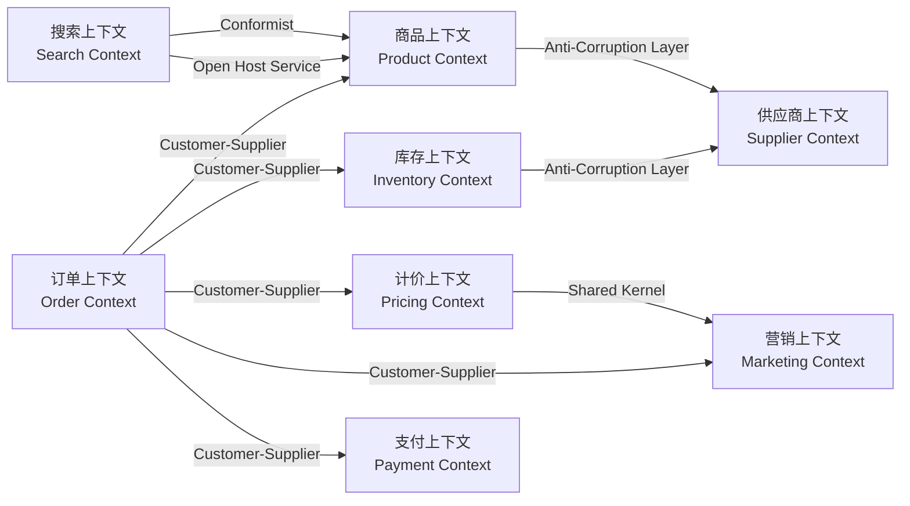
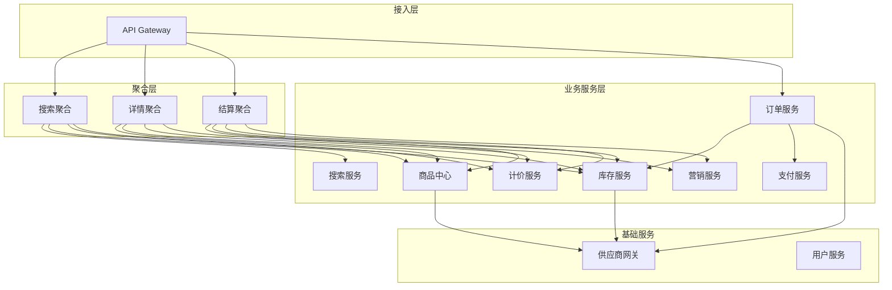
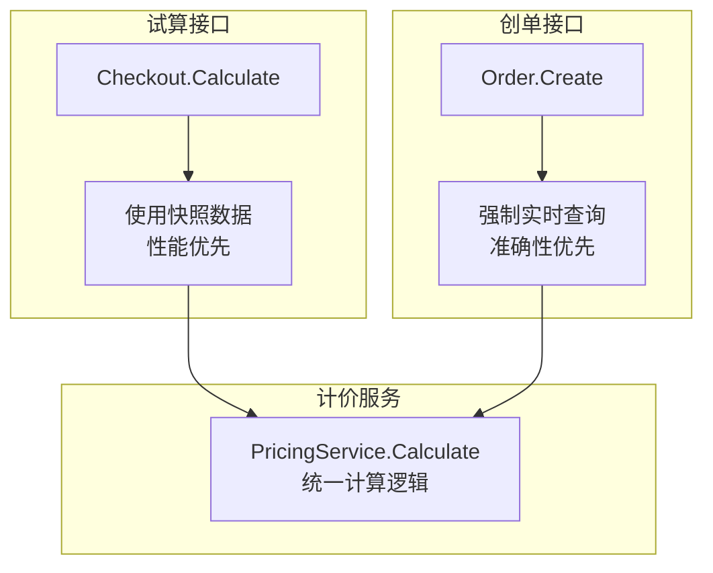
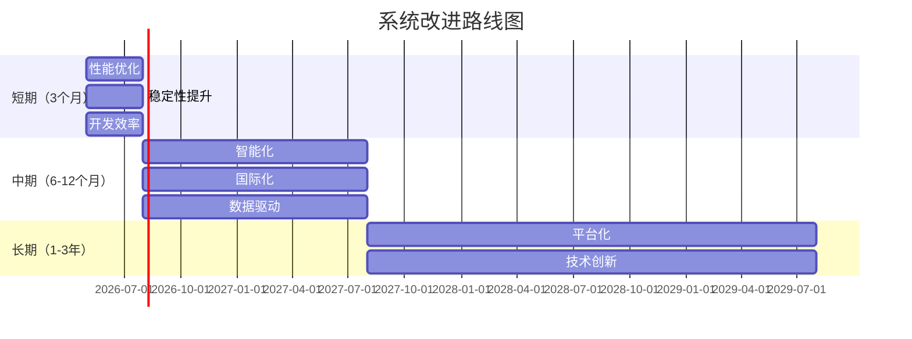

**导航**：[书籍主页](./index.md) | [完整目录](./TOC.md) | [上一章](./chapter15.md) | [下一章](./chapter17.md)

---

# 第16章 B2B2C平台完整架构

> **综合案例**：一个中大型B2B2C电商平台的完整架构设计，从品类分析到技术选型，从系统设计到团队协作，覆盖200+人团队、日订单200万级的实战经验与架构决策。

---

## 16.1 项目背景（Business Context）

### 16.1.1 业务模式

**核心定位**：B2B2C聚合电商平台

本平台采用"聚合供应商"模式，连接50+外部供应商（机票、酒店、充值、电影票等），同时支持自营业务（优惠券、礼品卡）。**关键特征是「无物流场景」**——所有商品均为虚拟数字商品，履约通过API调用完成，无需物流配送环节。

**业务范围**：
- **B2B2C聚合模式**：对接机票（航司/GDS）、酒店（OTA/PMS）、充值（运营商）、电影票（院线）等50+供应商
- **自营模式**：自有优惠券（e-voucher）、线下券、礼品卡等虚拟商品
- **数字履约**：所有商品通过API调用完成履约（出票、确认、充值、发券码）

**业务特点**：
- 供应商接口高度碎片化（实时查询 + 定时同步 + 推送混合）
- 核心品类（机票/酒店）零超卖容忍——直接影响用户体验与平台信誉
- 长尾品类（充值/礼品卡）可事后补偿——供应商侧库存无限

### 16.1.2 团队规模

**团队组成**（200+人）：

| 团队 | 人数 | 职责 |
|------|------|------|
| **前台团队** | 60人 | 搜索、详情、购物车、结算、订单、用户中心 |
| **中台团队** | 80人 | 商品中心、库存、计价、营销、支付、供应商网关 |
| **基础设施** | 30人 | DevOps、监控、中间件、数据库、安全 |
| **数据团队** | 20人 | 数据仓库、BI、用户画像、推荐算法 |
| **测试团队** | 10人 | 自动化测试、性能测试、安全测试 |

**技术栈统一**：
- 后端语言：Go（统一技术栈，降低维护成本）
- 数据库：MySQL（主库）+ Redis（缓存）+ Elasticsearch（搜索）
- 消息队列：Kafka（异步解耦）
- 服务治理：gRPC + Consul + Envoy
- 监控：Prometheus + Grafana + Jaeger

### 16.1.3 技术目标

**性能指标**：

| 指标 | 正常值 | 大促峰值 | 说明 |
|------|--------|---------|------|
| 日订单量 | 200万 | 1000万 | 大促5倍流量 |
| 搜索QPS | 3000 | 15000 | 5倍流量 |
| 详情页QPS | 5000 | 25000 | 5倍流量 |
| 下单QPS | 1000 | 5000 | 5倍流量 |
| P99延迟 | 200ms | 500ms | 大促允许适当降级 |

**可用性目标**：
- **核心链路SLA**：99.95%（订单创建、支付、履约）
- **搜索/详情SLA**：99.9%（可降级展示）
- **RTO**（故障恢复时间）：< 5分钟
- **RPO**（数据丢失容忍）：0（核心交易数据零丢失）

**扩展性目标**：
- 支持新品类接入：< 2周（标准化供应商适配）
- 支持新供应商：< 1周（适配器模式）
- 支持新营销玩法：< 3天（规则引擎）

---

## 16.2 品类业务模型分析（Business Architecture）

不同品类的业务模型存在显著差异，直接影响架构设计决策。理解这些差异是系统设计的基础。

### 16.2.1 机票业务模型

**业务特点**：
```
• 库存模型：实时库存（供应商侧），强依赖供应商实时查询
• 价格模型：动态定价，实时波动（可能秒级变化）
• SKU复杂度：极高（航司+航班号+舱位+日期+...组合）
• 库存单位：座位数量（不可超卖）
• 扣减时机：下单即扣（预占）→ 支付确认 → 出票
• 履约流程：下单 → 支付 → 出票（调用GDS/供应商API）→ 发送电子票
```

**架构影响**：
- ✓ 必须支持实时库存查询（高频调用供应商API）
- ✓ 价格快照必须精确到秒级，防止价格变动纠纷
- ✓ 超卖零容忍 → 下单前二次确认库存
- ✓ 供应商故障需快速切换到备用供应商
- ✓ 订单状态复杂（待出票、出票中、出票失败、已出票）

**技术要点**：
```go
// 机票库存查询策略
type FlightStockStrategy struct {
    supplierClient rpc.SupplierClient
    redis          redis.Client
    config         *FlightConfig
}

func (s *FlightStockStrategy) CheckStock(ctx context.Context, req *StockRequest) (*StockResponse, error) {
    // Step 1: 尝试从Redis获取缓存（TTL=5分钟）
    cacheKey := fmt.Sprintf("flight:stock:%s:%s", req.FlightNo, req.Date)
    cached, err := s.redis.Get(ctx, cacheKey).Result()
    if err == nil {
        return parseStockFromCache(cached), nil
    }
    
    // Step 2: 缓存未命中，调用供应商实时查询
    ctx, cancel := context.WithTimeout(ctx, 800*time.Millisecond)  // 800ms超时
    defer cancel()
    
    stock, err := s.supplierClient.QueryStock(ctx, req)
    if err != nil {
        // 供应商故障，切换备用供应商
        return s.fallbackToSecondarySupplier(ctx, req)
    }
    
    // Step 3: 缓存结果（短TTL，机票价格变化快）
    s.redis.Set(ctx, cacheKey, marshal(stock), 5*time.Minute)
    
    return stock, nil
}
```

**监控指标**：
- 供应商调用超时率：< 1%
- 缓存命中率：> 70%
- 出票成功率：> 99.5%
- 出票平均时长：< 30秒

### 16.2.2 酒店业务模型

**业务特点**：
```
• 库存模型：房间数量（按日期维度管理）
• 价格模型：日历房价（每个日期不同价格）
• SKU复杂度：高（酒店ID+房型+日期范围+早餐+...）
• 库存单位：房间数/间夜数
• 扣减时机：下单预占 → 支付确认 → 供应商确认
• 履约流程：下单 → 支付 → 提交供应商 → 确认单 → 入住凭证
```

**架构影响**：
- ✓ 支持日期范围查询（check-in到check-out）
- ✓ 日历价格存储（每个日期一条记录）
- ✓ 库存按日期维度管理（某天无房不影响其他日期）
- ✓ 支持"担保"模式（先占房，入住时结算）
- ✓ 需处理"确认单延迟"（供应商异步确认）

**数据模型**：

```go
// 酒店日历价格表（宽表存储）
type HotelCalendarPrice struct {
    HotelID      int64     `gorm:"primaryKey"`
    RoomTypeID   int64     `gorm:"primaryKey"`
    Date         time.Time `gorm:"primaryKey;index"`  // 日期维度
    BasePrice    int64     // 基础价格（分）
    WeekendPrice int64     // 周末价格
    Stock        int       // 当日库存
    Status       string    // 可售状态（AVAILABLE/SOLD_OUT/CLOSED）
}

// 查询日期范围内的价格与库存
func (r *HotelRepo) GetCalendarPrice(hotelID, roomTypeID int64, checkIn, checkOut time.Time) ([]*HotelCalendarPrice, error) {
    var prices []*HotelCalendarPrice
    err := r.db.Where("hotel_id = ? AND room_type_id = ? AND date >= ? AND date < ?",
        hotelID, roomTypeID, checkIn, checkOut).
        Order("date ASC").
        Find(&prices).Error
    return prices, err
}
```

**缓存策略**：
- 热门酒店：30分钟缓存
- 长尾酒店：1小时缓存
- 价格变更：主动失效缓存

### 16.2.3 充值业务模型

**业务特点**：
```
• 库存模型：无限库存（供应商侧无限制）
• 价格模型：固定面额（10元、50元、100元）
• SKU复杂度：低（运营商+面额）
• 库存单位：无限
• 扣减时机：支付后
• 履约流程：下单 → 支付 → 调用供应商API → 充值成功/失败
```

**架构影响**：
- ✓ 无需库存管理（库存类型=无限）
- ✓ 价格简单（基础价+平台服务费）
- ✓ 超卖可接受（事后补偿）
- ✓ 供应商调用简单（同步API，3秒内返回）
- ✓ 失败重试友好（幂等性强）

**技术要点**：
```go
// 充值库存策略（无限库存）
type RechargeStockStrategy struct{}

func (s *RechargeStockStrategy) CheckStock(ctx context.Context, req *StockRequest) (*StockResponse, error) {
    // 充值类商品无需检查库存，直接返回"可售"
    return &StockResponse{
        Available: true,
        Quantity:  999999,  // 虚拟无限库存
        Message:   "充值类商品，库存充足",
    }, nil
}

func (s *RechargeStockStrategy) Reserve(ctx context.Context, req *ReserveRequest) (*ReserveResponse, error) {
    // 充值类商品无需预占，直接返回成功
    return &ReserveResponse{
        ReserveID: "",  // 无预占ID
        Success:   true,
    }, nil
}
```

### 16.2.4 电子券业务模型

**业务特点**：
```
• 库存模型：固定库存（券码池）
• 价格模型：固定折扣价
• SKU复杂度：中（商户+门店+商品+...）
• 库存单位：券码（一券一码）
• 扣减时机：支付后
• 履约流程：下单 → 支付 → 发券码 → 到店核销
```

**架构影响**：
- ✓ 券码池管理（预生成10万个券码）
- ✓ 券码发放（支付后随机分配）
- ✓ 核销系统（商户扫码核销）
- ✓ 过期管理（券有效期7天-180天）
- ✓ 退款逻辑（未核销可退，已核销不可退）

**技术要点**：
```go
// 券码池管理（Redis实现）
type VoucherCodePool struct {
    redis redis.Client
}

func (p *VoucherCodePool) AssignCode(ctx context.Context, skuID int64, orderID int64) (string, error) {
    // Step 1: 从Redis Set中原子弹出一个未使用的券码
    poolKey := fmt.Sprintf("voucher:pool:%d", skuID)
    code, err := p.redis.SPop(ctx, poolKey).Result()
    if err == redis.Nil {
        return "", errors.New("券码已售罄")
    }
    
    // Step 2: 记录券码分配关系（券码 → 订单号）
    assignKey := fmt.Sprintf("voucher:assign:%s", code)
    p.redis.Set(ctx, assignKey, orderID, 0)  // 永久存储
    
    // Step 3: 设置券码有效期（ZSet按过期时间排序）
    expiresAt := time.Now().Add(90 * 24 * time.Hour)  // 90天有效期
    expiryKey := fmt.Sprintf("voucher:expiry:%d", skuID)
    p.redis.ZAdd(ctx, expiryKey, redis.Z{
        Score:  float64(expiresAt.Unix()),
        Member: code,
    })
    
    return code, nil
}
```

### 16.2.5 差异化设计策略

通过上述品类分析，我们提炼出三个核心设计维度：

**维度1：库存管理类型**

| 类型 | 典型品类 | 库存来源 | 预占策略 |
|------|---------|---------|---------|
| **实时库存** | 机票、酒店、电影票 | 供应商实时查询 | 下单即预占，超时释放 |
| **池化库存** | 优惠券、礼品卡 | 平台自有（券码池） | 支付后扣减 |
| **无限库存** | 充值、SaaS服务 | 无库存概念 | 无需预占 |

**维度2：价格模型**

| 类型 | 典型品类 | 缓存策略 | 快照策略 |
|------|---------|---------|---------|
| **动态定价** | 机票 | 5分钟TTL | 秒级快照 |
| **日历定价** | 酒店 | 30分钟TTL | 日期维度快照 |
| **固定定价** | 充值、礼品卡 | 1小时TTL | 简单快照 |

**维度3：履约模式**

| 类型 | 典型品类 | 调用方式 | 失败处理 |
|------|---------|---------|---------|
| **同步履约** | 充值 | 同步API（3秒超时） | 立即重试3次 |
| **异步履约** | 机票、酒店 | 异步轮询（30秒/次） | 补偿任务 |
| **券码发放** | 优惠券 | 本地分配（无外部调用） | 券码池补充 |

**统一抽象**：

```go
// 品类策略接口（策略模式）
type CategoryStrategy interface {
    // 库存检查
    CheckStock(ctx context.Context, req *StockRequest) (*StockResponse, error)
    // 库存预占
    ReserveStock(ctx context.Context, req *ReserveRequest) (*ReserveResponse, error)
    // 价格计算
    CalculatePrice(ctx context.Context, req *PriceRequest) (*PriceResponse, error)
    // 订单履约
    Fulfill(ctx context.Context, order *Order) (*FulfillResult, error)
}

// 策略工厂（根据品类选择策略）
type CategoryStrategyFactory struct {
    strategies map[CategoryType]CategoryStrategy
}

func (f *CategoryStrategyFactory) GetStrategy(categoryType CategoryType) CategoryStrategy {
    return f.strategies[categoryType]
}
```

**设计原则**：
1. **策略模式**：每个品类一个策略实现，避免 if-else 地狱
2. **适配器模式**：统一供应商接口差异，降低耦合
3. **模板方法**：下单流程统一，具体步骤由策略实现
4. **可扩展性**：新增品类只需新增策略，不影响主流程

---

## 16.3 DDD战略设计与系统边界（Application Architecture - 设计过程）

基于16.2的品类业务分析，本节展示如何运用DDD战略设计方法，从业务领域识别限界上下文、划分系统边界、设计服务间集成方式，最终形成16.4的整体架构全貌。

### 16.3.1 限界上下文识别

**限界上下文是DDD战略设计的核心概念**，它定义了一个模型的适用边界。本系统通过事件风暴识别出12个核心限界上下文。

**识别过程**（事件风暴Workshop）：

```
第1步：领域事件识别（橙色便签）
• OrderCreated（订单创建）
• ProductOnShelf（商品上架）
• StockReserved（库存预占）
• PaymentPaid（支付成功）
• PromotionApplied（促销应用）
...

第2步：聚合命令（蓝色便签）
• CreateOrder（创建订单）
• ReserveStock（预占库存）
• CalculatePrice（计算价格）
• ApplyPromotion（应用促销）
...

第3步：聚合实体（黄色便签）
• Order（订单）
• Product（商品）
• Stock（库存）
• Payment（支付）
• Promotion（促销）
...

第4步：限界上下文识别（用绳子圈起相关的实体/命令/事件）
• 订单上下文：Order + CreateOrder + OrderCreated
• 商品上下文：Product + OnShelfProduct + ProductOnShelf
• 库存上下文：Stock + ReserveStock + StockReserved
...
```

**识别出的12个限界上下文**：

| 限界上下文 | 核心聚合根 | 核心职责 | 数据所有权 |
|---------|---------|---------|-----------|
| **订单上下文** | Order | 订单创建、状态机、履约 | orders、order_items |
| **商品上下文** | Product | 商品信息、类目、属性 | products、categories |
| **库存上下文** | Stock | 库存管理、预占、扣减 | stocks、stock_logs |
| **计价上下文** | Price | 价格计算、试算、快照 | price_snapshots |
| **营销上下文** | Promotion | 营销规则、优惠券、活动 | promotions、coupons |
| **支付上下文** | Payment | 支付、退款、对账 | payments、refunds |
| **搜索上下文** | ProductIndex | 商品搜索、筛选、排序 | ES索引 |
| **用户上下文** | User | 用户信息、登录、权限 | users、roles |
| **供应商上下文** | Supplier | 供应商对接、适配、熔断 | suppliers、supplier_products |
| **购物车上下文** | Cart | 购物车管理、合并 | carts |
| **评价上下文** | Review | 用户评价、晒单 | reviews |
| **消息上下文** | Notification | 消息通知、推送 | notifications |

**为什么这样划分？**

1. **订单与商品分离**：
   - 订单关注"交易流程"（下单、支付、履约）
   - 商品关注"商品信息"（SPU/SKU、类目、属性）
   - 分离原因：变化速度不同（订单频繁变更，商品相对稳定）

2. **库存独立**：
   - 库存是"资源"，订单/商品都依赖它
   - 库存有独立的生命周期（预占 → 扣减 → 释放）
   - 独立原因：单一职责，避免库存逻辑分散

3. **计价独立**：
   - 价格计算涉及多个维度（基础价、营销、优惠券、Coin）
   - 多个场景需要试算（详情页、购物车、结算页）
   - 独立原因：统一计价逻辑，避免不一致

4. **营销独立**：
   - 营销规则复杂（满减、折扣、买赠、限时秒杀）
   - 营销活动变化频繁
   - 独立原因：灵活支持新玩法，不影响主流程

**上下文大小原则**：

```
过小：每个实体一个上下文 ❌
• 导致上下文过多，通信成本高
• 事务边界不清晰

合适：一个聚合根（或紧密相关的聚合根）一个上下文 ✅
• 订单上下文：Order + OrderItem
• 商品上下文：Product + Category

过大：多个不相关的聚合根在一个上下文 ❌
• 导致上下文职责不清晰
• 团队协作困难
```

### 16.3.2 上下文映射关系

**上下文映射是限界上下文之间的关系**，定义了它们如何协作、如何通信、谁主导谁跟随。

**本系统的上下文映射图**：



**映射关系类型**：

| 关系类型 | 说明 | 本系统示例 | 实现方式 |
|---------|------|-----------|---------|
| **Customer-Supplier** | 下游（客户）依赖上游（供应商） | 订单 → 商品<br/>订单 → 库存 | 同步RPC调用 |
| **Conformist** | 下游完全遵循上游模型 | 搜索 → 商品 | 搜索直接使用商品模型 |
| **Anti-Corruption Layer** | 下游用防腐层保护自己 | 库存 → 供应商 | 适配器翻译外部模型 |
| **Open Host Service** | 上游提供公开服务 | 商品 → 搜索 | RESTful API + Events |
| **Shared Kernel** | 两个上下文共享部分模型 | 计价 ⇄ 营销 | 共享折扣计算规则 |
| **Published Language** | 上游定义标准数据格式 | 订单事件（Kafka） | Protobuf/JSON Schema |

**关键决策解析**：

**决策1：订单 → 商品（Customer-Supplier）**

```
为什么不是Conformist（遵奉者）？
• 订单需要保存商品快照（商品模型可能变化）
• 订单不应该被商品模型变更影响
• 订单有自己的领域模型（OrderItem vs Product）

为什么是Customer-Supplier？
• 订单依赖商品（下游依赖上游）
• 商品提供稳定的API（上游为下游服务）
• 变更需要协商（商品API变更需通知订单团队）
```

**决策2：库存 → 供应商（Anti-Corruption Layer）**

```
为什么需要防腐层？
• 供应商模型不稳定（50+供应商，接口各不相同）
• 防止供应商模型污染库存域
• 便于切换供应商（ACL隔离变化）

防腐层职责：
• 翻译外部模型 → 内部模型
• 统一异常处理
• 适配器模式（每个供应商一个适配器）
```

**决策3：计价 ⇄ 营销（Shared Kernel）**

```
为什么是Shared Kernel？
• 折扣计算规则在两个上下文都需要
• 规则变更需要两个上下文同步
• 共享折扣计算代码（避免重复）

Shared Kernel范围：
• DiscountRule（折扣规则接口）
• PriceBreakdown（价格明细结构）
• 仅共享"计算规则"，不共享"数据存储"
```

**上下文通信机制**：

| 场景 | 通信方式 | 协议 | 示例 |
|------|---------|------|------|
| **同步查询** | RPC | gRPC + Protobuf | 订单查询商品信息 |
| **同步操作** | RPC | gRPC + Protobuf | 订单预占库存 |
| **异步事件** | 消息队列 | Kafka + Protobuf | 订单创建 → 搜索更新销量 |
| **批量查询** | RPC | gRPC + Stream | 批量查询商品价格 |

### 16.3.3 边界划分实践案例

```
┌──────────────────────────────────────────────────────┐
│              接入层（API Gateway）                    │
│  • 鉴权、限流、路由、协议转换                         │
│  • Web/App/小程序统一接入                            │
└──────────────────────────────────────────────────────┘
                          ↓
┌──────────────────────────────────────────────────────┐
│             聚合层（Aggregation Service）             │
│  • 数据编排：并发调用多个微服务                       │
│  • 降级策略：服务故障时的降级处理                     │
│  • 缓存优化：聚合结果缓存                            │
└──────────────────────────────────────────────────────┘
                          ↓
┌─────────────────────────────────────────────────────────────┐
│                   业务服务层（Microservices）                │
│  ┌────────┬────────┬────────┬────────┬────────┬────────┐   │
│  │ Product│Inventory│ Pricing│Marketing│ Order │ Payment│   │
│  │  商品  │  库存  │  计价  │  营销  │  订单 │  支付  │   │
│  └────────┴────────┴────────┴────────┴────────┴────────┘   │
└─────────────────────────────────────────────────────────────┘
                          ↓
┌──────────────────────────────────────────────────────┐
│           基础设施层（Infrastructure）                │
│  • MySQL、Redis、Elasticsearch、Kafka               │
│  • 服务发现（Consul）、服务网格（Envoy）             │
│  • 监控告警（Prometheus、Grafana、Jaeger）          │
└──────────────────────────────────────────────────────┘
```

**分层职责**：

| 层级 | 服务 | 职责 | 不负责 |
|------|------|------|--------|
| **接入层** | API Gateway | 鉴权、限流、路由 | 业务逻辑、数据编排 |
| **聚合层** | Aggregation | 数据获取、编排、降级 | 具体业务计算 |
| **业务层** | Microservices | 单一业务领域逻辑 | 跨域数据获取 |
| **基础层** | Infra | 存储、消息、监控 | 业务规则 |

### 16.4.2 微服务拆分

**拆分原则**：
1. **按业务能力拆分**（而非技术层次）
2. **单一职责**：每个服务只负责一个限界上下文
3. **数据所有权**：每个服务拥有自己的数据库
4. **API优先**：服务间只通过API或事件通信

**核心服务清单**：

| 服务名称 | 职责 | 数据库 | QPS（峰值） | 团队规模 |
|---------|------|--------|------------|---------|
| **Product Center** | 商品信息、类目、属性 | MySQL（4分库） | 20000 | 12人 |
| **Inventory Service** | 库存管理、预占、扣减 | MySQL+Redis | 8000 | 10人 |
| **Pricing Service** | 价格计算、试算、快照 | MySQL | 15000 | 8人 |
| **Marketing Service** | 营销规则、优惠券、活动 | MySQL+Redis | 10000 | 12人 |
| **Order Service** | 订单创建、状态机、履约 | MySQL（8分库64表） | 5000 | 15人 |
| **Payment Service** | 支付、退款、对账 | MySQL | 6000 | 10人 |
| **Search Service** | 商品搜索、筛选、排序 | Elasticsearch | 15000 | 8人 |
| **User Service** | 用户信息、登录、权限 | MySQL | 8000 | 6人 |
| **Supplier Gateway** | 供应商对接、适配、熔断 | MySQL+Redis | 12000 | 15人 |

**聚合服务**：

| 服务 | 职责 | 依赖服务 |
|------|------|---------|
| **Search Aggregation** | 搜索结果聚合 | Search + Product + Inventory + Pricing |
| **Detail Aggregation** | 详情页聚合 | Product + Inventory + Pricing + Marketing |
| **Checkout Aggregation** | 结算页聚合 | Product + Inventory + Pricing + Marketing |

### 16.4.3 服务依赖关系



**依赖原则**：
1. **上游 → 下游**：聚合层调用业务层，不反向依赖
2. **避免循环依赖**：严格禁止服务间循环调用
3. **异步解耦**：非核心路径使用Kafka事件异步
4. **降级友好**：下游故障不影响上游核心功能

### 16.4.4 数据流转

**同步数据流（关键路径）**：

```
用户搜索商品：
API Gateway → Search Aggregation 
            → Search Service（ES查询）
            → Product Service（批量获取基础信息）
            → Inventory Service（批量查库存）
            → Pricing Service（批量计算价格）
            ← 返回聚合结果

响应时间：< 200ms（P99）
```

**异步数据流（非关键路径）**：

```
订单创建成功 → Kafka Event：OrderCreated
            → 订阅者1：Inventory Service（确认扣减）
            → 订阅者2：Search Service（更新销量）
            → 订阅者3：User Service（积分增加）
            → 订阅者4：Data Team（数据分析）

最终一致性：< 5秒
```

**16.4小结**：

以上展示了系统的整体架构全貌：四层架构、12个核心微服务、服务依赖关系、数据流转模式。这些是16.3战略设计的具体落地——12个限界上下文对应12个微服务，上下文映射关系决定了服务间的集成方式。

接下来16.5节将讨论技术选型决策，16.6节将深入各个系统的详细设计。

---

## 16.4 整体架构设计（Application Architecture - 设计结果）

基于16.3节识别的12个限界上下文和上下文映射关系，本节展示如何将它们落地为具体的架构设计：四层架构、微服务拆分、服务依赖关系、数据流转模式。

**16.3 → 16.4的映射关系**：

```
16.3 限界上下文           →    16.4 微服务
├─ 订单上下文             →    Order Service
├─ 商品上下文             →    Product Center
├─ 库存上下文             →    Inventory Service
├─ 计价上下文             →    Pricing Service
├─ 营销上下文             →    Marketing Service
├─ 支付上下文             →    Payment Service
├─ 搜索上下文             →    Search Service
└─ 供应商上下文           →    Supplier Gateway

16.3 上下文映射           →    16.4 服务集成
├─ Customer-Supplier      →    同步RPC调用
├─ Anti-Corruption Layer  →    适配器模式
└─ Published Language     →    Kafka事件
```

### 16.4.1 分层架构

采用经典的四层架构，确保职责清晰、易于维护。

基于前面识别的限界上下文和映射关系，本节通过实际案例展示如何划分边界、重构边界。

**案例1：计价系统的边界重构**

**初始问题**：
- 价格计算逻辑分散在订单、营销、商品三个域
- 购物车、订单创建、支付确认三处价格计算不一致
- 无法支持"PDP加购试算"场景

**重构方案**：
1. **新建计价上下文**：职责是提供统一的试算接口
2. **定义边界**：
   - 计价上下文**不拥有**商品基础价、营销规则、订单状态
   - 对外提供 `Calculate(items, promotions, context) -> PriceBreakdown`
   - 各场景通过统一接口获取价格
3. **收益**：
   - 价格一致性得到保证
   - 营销规则变更只需在营销域发布事件
   - 支持了试算、价格预览、价格审计等新需求

**案例2：库存预占的归属**

**争议**：库存预占应该放在订单域还是库存域？

**决策**：放在库存域

**理由**：
- 库存域拥有库存数据所有权
- 预占是库存的一种状态（可售 → 预占 → 扣减）
- 订单域只需调用库存域的 `Reserve` 接口
- 降低耦合：订单域不需要了解库存的存储结构

### 16.4.4 集成模式选择

| 集成场景 | 模式 | 理由 |
|---------|------|------|
| 订单 → 商品 | 同步RPC | 需要实时获取商品信息，延迟<100ms |
| 订单 → 库存 | 同步RPC | 库存预占是核心路径，必须同步 |
| 订单 → 支付 | 同步RPC | 支付创建需要同步返回支付URL |
| 订单成功 → 搜索 | 异步事件 | 销量更新非核心路径，可最终一致 |
| 订单成功 → 积分 | 异步事件 | 积分增加非核心路径 |

**事件驱动示例**：

```go
// 订单域发布事件
func (s *OrderService) CreateOrder(ctx context.Context, req *CreateOrderRequest) (*Order, error) {
    // 创建订单...
    order := &Order{...}
    s.repo.Save(ctx, order)
    
    // 发布事件（Outbox模式）
    event := &OrderCreatedEvent{
        OrderID:    order.ID,
        UserID:     order.UserID,
        TotalPrice: order.TotalPrice,
        Items:      order.Items,
    }
    s.outbox.Publish(ctx, "order-events", event)
    
    return order, nil
}

// 搜索域订阅事件
func (s *SearchService) HandleOrderCreated(ctx context.Context, event *OrderCreatedEvent) error {
    // 更新商品销量（用于排序）
    for _, item := range event.Items {
        s.incrementSales(ctx, item.SkuID, item.Quantity)
    }
    return nil
}
```

### 16.4.5 跨系统事务处理

**Saga模式（编排）**：

```go
// 订单创建Saga
type CreateOrderSaga struct {
    inventoryClient rpc.InventoryClient
    marketingClient rpc.MarketingClient
    orderRepo       *OrderRepo
}

func (s *CreateOrderSaga) Execute(ctx context.Context, req *CreateOrderRequest) (*Order, error) {
    var reserveID string
    var couponLockID string
    
    // Step 1: 库存预占
    reserve, err := s.inventoryClient.ReserveStock(ctx, req.Items)
    if err != nil {
        return nil, fmt.Errorf("库存预占失败: %w", err)
    }
    reserveID = reserve.ReserveID
    defer func() {
        if err != nil {
            // 补偿：释放库存
            s.inventoryClient.ReleaseStock(ctx, reserveID)
        }
    }()
    
    // Step 2: 优惠券锁定
    couponLock, err := s.marketingClient.LockCoupon(ctx, req.CouponCode, req.UserID)
    if err != nil {
        return nil, fmt.Errorf("优惠券锁定失败: %w", err)
    }
    couponLockID = couponLock.LockID
    defer func() {
        if err != nil {
            // 补偿：释放优惠券
            s.marketingClient.UnlockCoupon(ctx, couponLockID)
        }
    }()
    
    // Step 3: 创建订单
    order := &Order{
        ID:           generateOrderID(),
        UserID:       req.UserID,
        Items:        req.Items,
        ReserveID:    reserveID,
        CouponLockID: couponLockID,
        Status:       StatusPendingPayment,
    }
    err = s.orderRepo.Save(ctx, order)
    if err != nil {
        return nil, fmt.Errorf("订单创建失败: %w", err)
    }
    
    return order, nil
}
```

### 16.4.6 防腐层设计

**防腐层（Anti-Corruption Layer）**：

```go
// 供应商响应模型（外部）
type SupplierFlightResponse struct {
    Code    string  `json:"code"`
    Message string  `json:"message"`
    Data    struct {
        FlightNo  string  `json:"flight_no"`
        Available int     `json:"available"`
        Price     float64 `json:"price"`
    } `json:"data"`
}

// 平台库存模型（内部）
type StockResponse struct {
    Available bool
    Quantity  int
    Message   string
}

// 防腐层：翻译外部模型 → 内部模型
func (a *FlightSupplierACL) TranslateStock(supplierResp *SupplierFlightResponse) *StockResponse {
    return &StockResponse{
        Available: supplierResp.Code == "SUCCESS" && supplierResp.Data.Available > 0,
        Quantity:  supplierResp.Data.Available,
        Message:   supplierResp.Message,
    }
}
```

**收益**：
- 领域层不被供应商模型污染
- 供应商接口变更时，修改集中在ACL
- 测试时可以使用Fake实现替代真实供应商

---

## 16.5 技术选型决策（Technology Architecture）

### 16.5.1 选型原则

**原则1：成熟度优先**
- 优先选择生产级成熟技术（避免踩坑）
- 社区活跃、文档完善、案例丰富
- 避免使用 alpha/beta 版本

**原则2：团队能力匹配**
- 技术栈与团队技能对齐
- 学习曲线可控（新技术培训 < 1个月）
- 有内部专家支持

**原则3：生态完整性**
- 工具链完善（测试、监控、部署）
- 第三方库丰富
- 云服务支持（AWS/GCP/阿里云）

**原则4：成本可控**
- 开源优先（降低License成本）
- 云服务按需使用（避免自建中间件）
- 运维成本可接受

### 16.5.2 Go生态选型

**语言选择：Go**

| 维度 | Go | Java | 理由 |
|------|-----|------|------|
| 性能 | ⭐⭐⭐⭐⭐ | ⭐⭐⭐⭐ | 协程模型，高并发性能优异 |
| 开发效率 | ⭐⭐⭐⭐ | ⭐⭐⭐ | 编译快，部署简单（单一二进制） |
| 学习曲线 | ⭐⭐⭐⭐⭐ | ⭐⭐⭐ | 语法简洁，容易上手 |
| 生态 | ⭐⭐⭐⭐ | ⭐⭐⭐⭐⭐ | 微服务生态完善（gRPC/Consul/Envoy） |
| 团队能力 | ⭐⭐⭐⭐⭐ | ⭐⭐⭐ | 团队有Go经验 |

**Web框架：Gin**
```go
// 理由：
// 1. 性能优异（httprouter，零内存分配）
// 2. 中间件丰富（鉴权、限流、日志）
// 3. 社区活跃（GitHub 70k+ stars）

router := gin.Default()
router.Use(middleware.Auth())
router.Use(middleware.RateLimit(1000))
router.GET("/products/:id", handler.GetProduct)
```

**ORM：GORM**
```go
// 理由：
// 1. 支持MySQL、PostgreSQL、SQLite
// 2. 关联查询、预加载、Hook机制完善
// 3. 自动迁移（开发环境）

type Product struct {
    ID       int64  `gorm:"primaryKey"`
    Title    string `gorm:"size:255;not null"`
    Price    int64  `gorm:"not null"`
}
```

**RPC：gRPC + Protobuf**
```go
// 理由：
// 1. 二进制序列化（性能优于JSON）
// 2. 强类型（编译期检查）
// 3. 支持流式调用（双向流）

service ProductService {
    rpc GetProduct(GetProductRequest) returns (GetProductResponse);
    rpc BatchGetProduct(BatchGetProductRequest) returns (stream Product);
}
```

**依赖注入：Google Wire**
```go
// 理由：
// 1. 编译时生成（无反射，性能高）
// 2. 类型安全（编译期检查依赖）
// 3. 官方支持（Google开源）

//go:generate wire
func InitializeApp() (*App, error) {
    wire.Build(
        NewDB,
        NewRedis,
        NewProductRepo,
        NewProductService,
        NewApp,
    )
    return nil, nil
}
```

### 16.4.3 数据库选型

**MySQL（主库）**

| 场景 | 选择理由 | 配置 |
|------|---------|------|
| 订单表 | ACID保证、事务支持 | InnoDB，8分库64表 |
| 商品表 | 关联查询、JOIN支持 | InnoDB，4分库 |
| 支付表 | 强一致性、金融级可靠性 | InnoDB，双主互备 |

**Redis（缓存 + 库存）**

| 场景 | 数据结构 | TTL |
|------|---------|-----|
| 商品详情 | Hash | 30分钟 |
| 库存数量 | String（Lua原子扣减） | 永久 |
| 券码池 | Set（SPOP原子弹出） | 永久 |
| 用户Session | String | 2小时 |

**Elasticsearch（搜索 + 日志）**

| 场景 | 索引设计 | 刷新间隔 |
|------|---------|---------|
| 商品搜索 | product_index（标题、类目、属性） | 30秒 |
| 订单查询 | order_index（订单号、用户ID、状态） | 1分钟 |
| 日志搜索 | log-{date}（按日分索引） | 5秒 |

### 16.4.4 中间件选型

**Kafka（消息队列）**

| 场景 | Topic | Partition | Replication |
|------|-------|-----------|-------------|
| 订单事件 | order-events | 16 | 3 |
| 库存事件 | inventory-events | 8 | 3 |
| 日志采集 | logs | 32 | 2 |

**Consul（服务发现）**
- 健康检查：HTTP/TCP/gRPC
- 配置中心：动态配置热更新
- KV存储：Feature Flag

**Envoy（Service Mesh）**
- 流量管理：灰度发布、A/B测试
- 可观测性：自动生成Trace
- 安全：mTLS加密

---

## 16.6 核心系统设计（Application + Data Architecture详细设计）

基于16.4的整体架构，本节深入每个核心系统的详细设计，包括应用层的业务逻辑设计和数据层的模型设计。

### 16.6.1 商品中心设计

#### 服务定位

**职责边界**：
- ✅ 负责：商品基础信息、类目、属性、多媒体素材
- ✅ 负责：SPU/SKU管理、上架下架
- ✅ 负责：商品基础价格（base_price，作为计价输入）
- ❌ 不负责：营销价格（由Pricing Service计算）
- ❌ 不负责：库存（由Inventory Service管理）

**核心场景**：
1. **商品查询**：聚合服务、详情页、搜索结果查询商品信息
2. **商品创建**：运营人员/供应商创建新商品（参见16.7.1阶段1）
3. **商品更新**：修改商品信息、调整基础价格
4. **上下架管理**：控制商品可售状态

**与其他服务的区别**：
- **vs Search Service**：Search负责ES查询返回SKU ID列表，Product Center负责根据SKU ID查询详细信息
- **vs Pricing Service**：Product Center只管理base_price（成本价），Pricing Service基于base_price+营销活动计算最终售价
- **vs Inventory Service**：Product Center管"商品是什么"，Inventory管"商品有多少"

---

#### DDD战术设计

**领域模型设计思想**：商品域的特点是"树形结构+读多写少"，与订单域的"复杂状态机+高并发写"完全不同。

##### Product聚合根

```go
// Product聚合根（SKU维度）
type Product struct {
    // 聚合根ID
    skuID SKU_ID  // 值对象
    
    // SPU信息（实体引用）
    spu *SPU
    
    // SKU规格（值对象）
    specs Specifications
    
    // 基础价格（值对象）
    basePrice Price
    
    // 状态（值对象）
    status ProductStatus
    
    // 多媒体素材
    images []ImageURL
    
    // 时间戳
    createdAt time.Time
    updatedAt time.Time
    
    // 领域事件（未提交）
    domainEvents []DomainEvent
}

// 值对象：SKU_ID
type SKU_ID struct {
    value int64
}

func NewSKU_ID(id int64) SKU_ID {
    return SKU_ID{value: id}
}

func (id SKU_ID) Int64() int64 {
    return id.value
}

// 值对象：Price（基础价格，单位：分）
type Price struct {
    amount int64  // 分为单位
}

func NewPrice(amount int64) (Price, error) {
    if amount < 0 {
        return Price{}, errors.New("价格不能为负数")
    }
    if amount > 100000000 { // 100万元上限
        return Price{}, errors.New("价格超过上限")
    }
    return Price{amount: amount}, nil
}

func (p Price) Amount() int64 {
    return p.amount
}

func (p Price) Yuan() float64 {
    return float64(p.amount) / 100.0
}

// 值对象：Specifications（SKU规格）
type Specifications struct {
    attributes map[string]string  // {"颜色":"红色","尺寸":"L"}
}

func NewSpecifications(attrs map[string]string) Specifications {
    return Specifications{attributes: attrs}
}

func (s Specifications) Get(key string) string {
    return s.attributes[key]
}

func (s Specifications) ToJSON() string {
    data, _ := json.Marshal(s.attributes)
    return string(data)
}

// 值对象：ProductStatus
type ProductStatus string

const (
    ProductDraft     ProductStatus = "DRAFT"      // 草稿
    ProductOnShelf   ProductStatus = "ON_SHELF"   // 在架
    ProductOffShelf  ProductStatus = "OFF_SHELF"  // 下架
)

// 实体：SPU（标准产品单元）
type SPU struct {
    id         SPU_ID
    title      string
    categoryID int64
    brandID    int64
    attributes map[string][]string  // 属性模板{"颜色":["红","蓝"],"尺寸":["S","M","L"]}
    description string
    
    // SPU下的所有SKU（聚合内实体集合）
    skus []*Product
}

func (spu *SPU) ID() SPU_ID {
    return spu.id
}

func (spu *SPU) Title() string {
    return spu.title
}

func (spu *SPU) AddSKU(sku *Product) error {
    // 不变量检查：SKU规格必须符合SPU属性模板
    if !spu.isValidSpecs(sku.specs) {
        return errors.New("SKU规格不符合SPU属性模板")
    }
    spu.skus = append(spu.skus, sku)
    return nil
}

func (spu *SPU) isValidSpecs(specs Specifications) bool {
    // 检查SKU的规格是否都在SPU的属性模板中
    for key, value := range specs.attributes {
        allowedValues, exists := spu.attributes[key]
        if !exists {
            return false
        }
        if !contains(allowedValues, value) {
            return false
        }
    }
    return true
}
```

##### 聚合根方法

```go
// 上架（状态转换）
func (p *Product) OnShelf() error {
    if p.status == ProductOnShelf {
        return errors.New("商品已在架")
    }
    
    // 不变量检查：必须有基础价格
    if p.basePrice.Amount() == 0 {
        return errors.New("商品未设置价格，不能上架")
    }
    
    // 不变量检查：必须有商品图片
    if len(p.images) == 0 {
        return errors.New("商品未上传图片，不能上架")
    }
    
    oldStatus := p.status
    p.status = ProductOnShelf
    p.updatedAt = time.Now()
    
    // 发布领域事件
    p.addDomainEvent(&ProductOnShelfEvent{
        SKUID:      p.skuID,
        SPUID:      p.spu.id,
        OnShelfTime: p.updatedAt,
    })
    
    return nil
}

// 下架
func (p *Product) OffShelf(reason string) error {
    if p.status == ProductOffShelf {
        return errors.New("商品已下架")
    }
    
    oldStatus := p.status
    p.status = ProductOffShelf
    p.updatedAt = time.Now()
    
    // 发布领域事件
    p.addDomainEvent(&ProductOffShelfEvent{
        SKUID:       p.skuID,
        Reason:      reason,
        OffShelfTime: p.updatedAt,
    })
    
    return nil
}

// 更新基础价格
func (p *Product) UpdateBasePrice(newPrice Price) error {
    if newPrice.Amount() == p.basePrice.Amount() {
        return nil  // 价格未变化
    }
    
    oldPrice := p.basePrice
    p.basePrice = newPrice
    p.updatedAt = time.Now()
    
    // 发布领域事件
    p.addDomainEvent(&PriceChangedEvent{
        SKUID:    p.skuID,
        OldPrice: oldPrice.Amount(),
        NewPrice: newPrice.Amount(),
        ChangedAt: p.updatedAt,
    })
    
    return nil
}

// 领域事件管理
func (p *Product) addDomainEvent(event DomainEvent) {
    p.domainEvents = append(p.domainEvents, event)
}

func (p *Product) DomainEvents() []DomainEvent {
    return p.domainEvents
}

func (p *Product) ClearDomainEvents() {
    p.domainEvents = nil
}

// 查询方法
func (p *Product) IsOnShelf() bool {
    return p.status == ProductOnShelf
}

func (p *Product) BasePrice() Price {
    return p.basePrice
}

func (p *Product) Specs() Specifications {
    return p.specs
}
```

##### Repository模式

```go
// ProductRepository接口（领域层定义）
type ProductRepository interface {
    // 查询
    FindBySKUID(ctx context.Context, skuID SKU_ID) (*Product, error)
    FindBySPUID(ctx context.Context, spuID SPU_ID) ([]*Product, error)
    BatchFindBySKUIDs(ctx context.Context, skuIDs []SKU_ID) ([]*Product, error)
    
    // 保存
    Save(ctx context.Context, product *Product) error
    Update(ctx context.Context, product *Product) error
    
    // 删除
    Delete(ctx context.Context, skuID SKU_ID) error
}

// ProductRepositoryImpl实现（基础设施层）
type ProductRepositoryImpl struct {
    db             *gorm.DB
    cache          cache.Cache
    eventPublisher EventPublisher
    sharding       ShardingStrategy
}

func (r *ProductRepositoryImpl) FindBySKUID(ctx context.Context, skuID SKU_ID) (*Product, error) {
    // Step 1: 查询L1本地缓存
    cacheKey := fmt.Sprintf("product:%d", skuID.Int64())
    if cached, found := r.cache.GetLocal(cacheKey); found {
        return cached.(*Product), nil
    }
    
    // Step 2: 查询L2 Redis缓存
    if cached, err := r.cache.Get(ctx, cacheKey); err == nil {
        product := r.unmarshalProduct(cached)
        r.cache.SetLocal(cacheKey, product, 1*time.Minute)
        return product, nil
    }
    
    // Step 3: 查询MySQL
    productDO, err := r.queryFromDB(ctx, skuID)
    if err != nil {
        return nil, err
    }
    
    // Step 4: 转换DO → Domain Model
    product := r.toDomain(productDO)
    
    // Step 5: 回写缓存
    r.cache.Set(ctx, cacheKey, r.marshalProduct(product), 30*time.Minute)
    r.cache.SetLocal(cacheKey, product, 1*time.Minute)
    
    return product, nil
}

func (r *ProductRepositoryImpl) Save(ctx context.Context, product *Product) error {
    // Step 1: 转换Domain Model → DO
    productDO := r.toDataObject(product)
    
    // Step 2: 分库路由
    db := r.sharding.Route(product.spu.categoryID)
    
    // Step 3: 保存到数据库
    if err := db.WithContext(ctx).Create(productDO).Error; err != nil {
        return fmt.Errorf("save product failed: %w", err)
    }
    
    // Step 4: 发布领域事件（事务提交后）
    for _, event := range product.DomainEvents() {
        if err := r.eventPublisher.Publish(ctx, event); err != nil {
            log.Errorf("publish event failed: %v", err)
        }
    }
    product.ClearDomainEvents()
    
    // Step 5: 清除缓存
    cacheKey := fmt.Sprintf("product:%d", product.skuID.Int64())
    r.cache.Delete(ctx, cacheKey)
    
    return nil
}

func (r *ProductRepositoryImpl) BatchFindBySKUIDs(ctx context.Context, skuIDs []SKU_ID) ([]*Product, error) {
    products := make([]*Product, 0, len(skuIDs))
    
    // 批量查询优化：分离缓存命中和未命中
    var missedIDs []SKU_ID
    
    for _, skuID := range skuIDs {
        cacheKey := fmt.Sprintf("product:%d", skuID.Int64())
        if cached, err := r.cache.Get(ctx, cacheKey); err == nil {
            products = append(products, r.unmarshalProduct(cached))
        } else {
            missedIDs = append(missedIDs, skuID)
        }
    }
    
    // 批量查询数据库（未命中的）
    if len(missedIDs) > 0 {
        missedProducts, err := r.batchQueryFromDB(ctx, missedIDs)
        if err != nil {
            return nil, err
        }
        
        // 回写缓存
        for _, product := range missedProducts {
            cacheKey := fmt.Sprintf("product:%d", product.skuID.Int64())
            r.cache.Set(ctx, cacheKey, r.marshalProduct(product), 30*time.Minute)
        }
        
        products = append(products, missedProducts...)
    }
    
    return products, nil
}
```

---

#### 核心存储设计

**表结构设计**：

```sql
-- SPU表（标准产品单元）
CREATE TABLE product_spu (
    id BIGINT PRIMARY KEY AUTO_INCREMENT,
    title VARCHAR(255) NOT NULL COMMENT '商品标题',
    category_id BIGINT NOT NULL COMMENT '类目ID',
    brand_id BIGINT COMMENT '品牌ID',
    attributes JSON COMMENT '属性模板',
    description TEXT COMMENT '商品描述',
    status VARCHAR(20) DEFAULT 'DRAFT' COMMENT '状态',
    created_at TIMESTAMP DEFAULT CURRENT_TIMESTAMP,
    updated_at TIMESTAMP DEFAULT CURRENT_TIMESTAMP ON UPDATE CURRENT_TIMESTAMP,
    INDEX idx_category (category_id),
    INDEX idx_brand (brand_id),
    INDEX idx_status (status)
) ENGINE=InnoDB DEFAULT CHARSET=utf8mb4 COMMENT='SPU表';

-- SKU表（库存保持单元）
CREATE TABLE product_sku (
    id BIGINT PRIMARY KEY AUTO_INCREMENT,
    spu_id BIGINT NOT NULL COMMENT 'SPU ID',
    sku_code VARCHAR(100) UNIQUE NOT NULL COMMENT 'SKU编码',
    specs JSON COMMENT '规格值',
    base_price BIGINT NOT NULL COMMENT '基础价格（分）',
    images JSON COMMENT '商品图片',
    status VARCHAR(20) DEFAULT 'DRAFT' COMMENT '状态',
    created_at TIMESTAMP DEFAULT CURRENT_TIMESTAMP,
    updated_at TIMESTAMP DEFAULT CURRENT_TIMESTAMP ON UPDATE CURRENT_TIMESTAMP,
    INDEX idx_spu (spu_id),
    INDEX idx_code (sku_code),
    INDEX idx_status (status)
) ENGINE=InnoDB DEFAULT CHARSET=utf8mb4 COMMENT='SKU表';

-- 类目表
CREATE TABLE product_category (
    id BIGINT PRIMARY KEY AUTO_INCREMENT,
    name VARCHAR(100) NOT NULL,
    parent_id BIGINT DEFAULT 0 COMMENT '父类目ID',
    level INT DEFAULT 1 COMMENT '层级',
    sort_order INT DEFAULT 0 COMMENT '排序',
    status VARCHAR(20) DEFAULT 'ACTIVE',
    INDEX idx_parent (parent_id),
    INDEX idx_level (level)
) ENGINE=InnoDB DEFAULT CHARSET=utf8mb4 COMMENT='商品类目表';
```

**分库分表策略**：

```sql
-- 按 category_id 分4库
-- 理由：同品类商品通常一起查询（搜索、推荐）
db_index = category_id % 4

-- 单表不分表
-- 理由：单品类商品数量可控（< 100万），查询模式简单
```

**索引策略**：

| 索引名 | 字段 | 类型 | 用途 |
|-------|------|------|------|
| PRIMARY | id | 主键 | 主键查询 |
| idx_category | category_id | 普通 | 类目查询 |
| idx_brand | brand_id | 普通 | 品牌查询 |
| idx_status | status | 普通 | 状态筛选 |
| idx_spu | spu_id | 普通 | SPU查SKU |
| idx_code | sku_code | 唯一 | SKU编码查询 |

---

#### 代码结构

```
product-service/
├── cmd/
│   └── main.go                          # 服务入口
├── internal/
│   ├── domain/                          # 领域模型层
│   │   ├── product.go                   # Product聚合根
│   │   ├── spu.go                       # SPU实体
│   │   ├── value_objects.go             # 值对象（SKU_ID, Price, Specifications）
│   │   ├── events.go                    # 领域事件
│   │   └── repository.go                # Repository接口
│   ├── application/                     # 应用服务层
│   │   ├── dto/
│   │   │   ├── product_request.go       # 请求DTO
│   │   │   └── product_response.go      # 响应DTO
│   │   └── service/
│   │       ├── product_service.go       # 商品应用服务
│   │       └── product_query_service.go # 查询服务（CQRS）
│   ├── infrastructure/                  # 基础设施层
│   │   ├── persistence/
│   │   │   ├── product_repository.go    # Repository实现
│   │   │   ├── data_object.go           # 数据对象（DO）
│   │   │   └── sharding.go              # 分库路由
│   │   ├── cache/
│   │   │   ├── redis_cache.go           # Redis缓存
│   │   │   └── local_cache.go           # 本地缓存
│   │   └── event/
│   │       └── kafka_publisher.go       # Kafka事件发布
│   └── interfaces/                      # 接口层
│       ├── grpc/
│       │   ├── product_handler.go       # gRPC处理器
│       │   └── proto/
│       │       └── product.proto        # Protobuf定义
│       └── http/
│           └── product_handler.go       # HTTP处理器（可选）
├── config/
│   └── config.yaml                      # 配置文件
├── migrations/                          # 数据库迁移
│   └── 001_create_product_tables.sql
└── go.mod
```

---

#### 核心接口定义

**gRPC接口**（product.proto）：

```protobuf
syntax = "proto3";

package product.v1;

service ProductService {
    // 查询接口
    rpc GetProduct(GetProductRequest) returns (GetProductResponse);
    rpc BatchGetProducts(BatchGetRequest) returns (BatchGetResponse);
    rpc ListProductsBySPU(ListBySPURequest) returns (ListBySPUResponse);
    
    // 命令接口
    rpc CreateProduct(CreateProductRequest) returns (CreateProductResponse);
    rpc UpdateProduct(UpdateProductRequest) returns (UpdateProductResponse);
    rpc OnShelf(OnShelfRequest) returns (OnShelfResponse);
    rpc OffShelf(OffShelfRequest) returns (OffShelfResponse);
    rpc UpdateBasePrice(UpdatePriceRequest) returns (UpdatePriceResponse);
}

message GetProductRequest {
    int64 sku_id = 1;
}

message GetProductResponse {
    Product product = 1;
}

message BatchGetRequest {
    repeated int64 sku_ids = 1;  // 最多100个
}

message BatchGetResponse {
    repeated Product products = 1;
}

message Product {
    int64 sku_id = 1;
    int64 spu_id = 2;
    string title = 3;
    int64 category_id = 4;
    int64 brand_id = 5;
    string sku_code = 6;
    map<string, string> specs = 7;   // 规格
    int64 base_price = 8;             // 基础价格（分）
    repeated string images = 9;
    string status = 10;               // DRAFT/ON_SHELF/OFF_SHELF
    int64 created_at = 11;
    int64 updated_at = 12;
}

message CreateProductRequest {
    int64 spu_id = 1;
    string sku_code = 2;
    map<string, string> specs = 3;
    int64 base_price = 4;
    repeated string images = 5;
}

message OnShelfRequest {
    int64 sku_id = 1;
}

message OffShelfRequest {
    int64 sku_id = 1;
    string reason = 2;
}

message UpdatePriceRequest {
    int64 sku_id = 1;
    int64 new_base_price = 2;
}
```

**HTTP接口**（可选，供管理后台使用）：

```
GET    /api/v1/products/:sku_id              # 查询商品
GET    /api/v1/products?spu_id=:spu_id       # 查询SPU下所有SKU
POST   /api/v1/products                      # 创建商品
PUT    /api/v1/products/:sku_id              # 更新商品
POST   /api/v1/products/:sku_id/on-shelf     # 上架
POST   /api/v1/products/:sku_id/off-shelf    # 下架
PUT    /api/v1/products/:sku_id/price        # 更新基础价格
```

---

#### 核心实现

**应用服务层**（product_service.go）：

```go
type ProductService struct {
    repo           domain.ProductRepository
    eventPublisher EventPublisher
}

// GetProduct 查询商品（三级缓存）
func (s *ProductService) GetProduct(ctx context.Context, skuID int64) (*dto.ProductResponse, error) {
    // Step 1: 通过Repository查询（Repository内部实现三级缓存）
    product, err := s.repo.FindBySKUID(ctx, domain.NewSKU_ID(skuID))
    if err != nil {
        return nil, fmt.Errorf("product not found: %w", err)
    }
    
    // Step 2: Domain Model → DTO
    return s.toDTO(product), nil
}

// BatchGetProducts 批量查询商品
func (s *ProductService) BatchGetProducts(ctx context.Context, skuIDs []int64) ([]*dto.ProductResponse, error) {
    // 参数校验：限制批量大小
    if len(skuIDs) > 100 {
        return nil, errors.New("批量查询最多100个")
    }
    
    // 转换为值对象
    domainIDs := make([]domain.SKU_ID, len(skuIDs))
    for i, id := range skuIDs {
        domainIDs[i] = domain.NewSKU_ID(id)
    }
    
    // 批量查询
    products, err := s.repo.BatchFindBySKUIDs(ctx, domainIDs)
    if err != nil {
        return nil, err
    }
    
    // 转换为DTO
    dtos := make([]*dto.ProductResponse, len(products))
    for i, p := range products {
        dtos[i] = s.toDTO(p)
    }
    
    return dtos, nil
}

// CreateProduct 创建商品
func (s *ProductService) CreateProduct(ctx context.Context, req *dto.CreateProductRequest) (*dto.ProductResponse, error) {
    // Step 1: DTO → Domain Model
    product, err := s.buildProduct(req)
    if err != nil {
        return nil, fmt.Errorf("build product failed: %w", err)
    }
    
    // Step 2: 保存（Repository内部发布领域事件）
    if err := s.repo.Save(ctx, product); err != nil {
        return nil, fmt.Errorf("save product failed: %w", err)
    }
    
    return s.toDTO(product), nil
}

// OnShelf 商品上架
func (s *ProductService) OnShelf(ctx context.Context, skuID int64) error {
    // Step 1: 查询聚合根
    product, err := s.repo.FindBySKUID(ctx, domain.NewSKU_ID(skuID))
    if err != nil {
        return err
    }
    
    // Step 2: 执行领域逻辑（状态转换）
    if err := product.OnShelf(); err != nil {
        return err
    }
    
    // Step 3: 保存聚合根（自动发布领域事件）
    return s.repo.Update(ctx, product)
}

// UpdateBasePrice 更新基础价格
func (s *ProductService) UpdateBasePrice(ctx context.Context, skuID int64, newPrice int64) error {
    // Step 1: 查询聚合根
    product, err := s.repo.FindBySKUID(ctx, domain.NewSKU_ID(skuID))
    if err != nil {
        return err
    }
    
    // Step 2: 创建价格值对象（带校验）
    price, err := domain.NewPrice(newPrice)
    if err != nil {
        return fmt.Errorf("invalid price: %w", err)
    }
    
    // Step 3: 执行领域逻辑
    if err := product.UpdateBasePrice(price); err != nil {
        return err
    }
    
    // Step 4: 保存聚合根（自动发布PriceChangedEvent）
    return s.repo.Update(ctx, product)
}
```

---

#### 领域事件

| 事件名 | 触发时机 | 事件数据 | 消费方 | Topic | 用途 |
|-------|---------|---------|--------|-------|------|
| **ProductCreated** | 商品创建成功 | sku_id, spu_id, title, category_id, base_price | Search Service, Recommendation | product-events | 同步到ES索引 |
| **ProductUpdated** | 商品信息更新 | sku_id, changed_fields | Search Service, Cache Invalidation | product-events | 更新ES、清缓存 |
| **ProductOnShelf** | 商品上架 | sku_id, spu_id, on_shelf_time | Search Service, Marketing | product-events | 上架通知、活动关联 |
| **ProductOffShelf** | 商品下架 | sku_id, reason, off_shelf_time | Search Service, Order Service | product-events | 从ES移除、停止接单 |
| **PriceChanged** | 基础价格变更 | sku_id, old_price, new_price | Pricing Service, Analytics | product-events | 重新计算售价、价格分析 |

**事件结构定义**：

```go
// ProductCreatedEvent 商品创建事件
type ProductCreatedEvent struct {
    SKUID      int64     `json:"sku_id"`
    SPUID      int64     `json:"spu_id"`
    Title      string    `json:"title"`
    CategoryID int64     `json:"category_id"`
    BasePrice  int64     `json:"base_price"`
    CreatedAt  time.Time `json:"created_at"`
}

func (e *ProductCreatedEvent) Type() string {
    return "product.created"
}

// ProductOnShelfEvent 商品上架事件
type ProductOnShelfEvent struct {
    SKUID       int64     `json:"sku_id"`
    SPUID       int64     `json:"spu_id"`
    OnShelfTime time.Time `json:"on_shelf_time"`
}

func (e *ProductOnShelfEvent) Type() string {
    return "product.on_shelf"
}

// PriceChangedEvent 价格变更事件
type PriceChangedEvent struct {
    SKUID     int64     `json:"sku_id"`
    OldPrice  int64     `json:"old_price"`
    NewPrice  int64     `json:"new_price"`
    ChangedAt time.Time `json:"changed_at"`
}

func (e *PriceChangedEvent) Type() string {
    return "product.price_changed"
}
```

---

#### 缓存策略

**三级缓存架构**：

```go
// L1: 本地缓存（1分钟）
// 优点：延迟最低（<1ms），适合热点商品
// 缺点：容量有限，多实例不一致
localCache.Set("product:"+skuID, product, 1*time.Minute)

// L2: Redis缓存（30分钟）
// 优点：容量大，多实例共享
// 缺点：网络开销（1-5ms）
redis.Set("product:"+skuID, marshal(product), 30*time.Minute)

// L3: MySQL（源数据）
// 优点：数据权威、一致
// 缺点：延迟最高（10-50ms）
db.QueryOne("SELECT * FROM product_sku WHERE id = ?", skuID)
```

**缓存更新策略**：

1. **商品更新时**：主动删除缓存（Cache Aside模式）
2. **上下架时**：删除L1+L2缓存，强制下次查询走DB
3. **价格变更时**：删除缓存 + 发布PriceChangedEvent通知Pricing Service

**缓存Key设计**：

```
product:{sku_id}                    # 单个商品
product:spu:{spu_id}                # SPU下所有SKU（Hash结构）
product:category:{category_id}      # 类目商品列表（Set结构）
```

### 16.6.2 库存系统设计

**二维库存模型**（参考16.2.5）：

```go
// 库存策略接口
type StockStrategy interface {
    CheckStock(ctx context.Context, req *StockRequest) (*StockResponse, error)
    Reserve(ctx context.Context, req *ReserveRequest) (*ReserveResponse, error)
    Deduct(ctx context.Context, req *DeductRequest) error
    Release(ctx context.Context, reserveID string) error
}

// 策略工厂
func NewStockStrategy(managementType ManagementType) StockStrategy {
    switch managementType {
    case Realtime:
        return &RealtimeStockStrategy{}  // 机票、酒店
    case Pooled:
        return &PooledStockStrategy{}    // 优惠券
    case Unlimited:
        return &UnlimitedStockStrategy{} // 充值
    }
}
```

**预占机制**：

```go
// Redis Lua脚本（原子预占）
const reserveScript = `
local stock_key = KEYS[1]
local reserve_key = KEYS[2]
local qty = tonumber(ARGV[1])
local ttl = tonumber(ARGV[2])

local stock = tonumber(redis.call('GET', stock_key) or 0)
if stock >= qty then
    redis.call('DECRBY', stock_key, qty)
    redis.call('SET', reserve_key, qty, 'EX', ttl)
    return 1
else
    return 0
end
`

func (r *StockRepo) Reserve(ctx context.Context, skuID int64, qty int, ttl time.Duration) (string, error) {
    reserveID := generateReserveID()
    stockKey := fmt.Sprintf("stock:%d", skuID)
    reserveKey := fmt.Sprintf("reserve:%s", reserveID)
    
    result, err := r.redis.Eval(ctx, reserveScript, 
        []string{stockKey, reserveKey}, 
        qty, int(ttl.Seconds())).Result()
    
    if result == int64(1) {
        return reserveID, nil
    }
    return "", errors.New("库存不足")
}
```

### 16.6.3 订单系统设计

**状态机**：

```go
type OrderStatus string

const (
    StatusCreated          OrderStatus = "CREATED"           // 已创建
    StatusPendingPayment   OrderStatus = "PENDING_PAYMENT"   // 待支付
    StatusPaid             OrderStatus = "PAID"              // 已支付
    StatusFulfilling       OrderStatus = "FULFILLING"        // 履约中
    StatusFulfilled        OrderStatus = "FULFILLED"         // 已履约
    StatusCanceled         OrderStatus = "CANCELED"          // 已取消
    StatusRefunded         OrderStatus = "REFUNDED"          // 已退款
)

// 状态转换规则
var transitions = map[OrderStatus][]OrderStatus{
    StatusCreated:        {StatusPendingPayment, StatusCanceled},
    StatusPendingPayment: {StatusPaid, StatusCanceled},
    StatusPaid:           {StatusFulfilling, StatusRefunded},
    StatusFulfilling:     {StatusFulfilled, StatusRefunded},
    StatusFulfilled:      {StatusRefunded},  // 已履约可申请退款
}

func (o *Order) TransitionTo(newStatus OrderStatus) error {
    allowed, ok := transitions[o.Status]
    if !ok || !contains(allowed, newStatus) {
        return fmt.Errorf("不允许从 %s 转换到 %s", o.Status, newStatus)
    }
    o.Status = newStatus
    return nil
}
```

**分库分表**（参考ADR-007）：

```
• 分库：按 user_id % 8（用户维度查询最频繁）
• 分表：按 create_time 分表（按月归档，64表）
• 路由表：order_route（order_id → db_index, table_index）
```

### 16.6.4 支付系统设计

**支付流程**：

```go
// Step 1: 创建支付单
func (s *PaymentService) CreatePayment(ctx context.Context, orderID int64, amount int64) (*Payment, error) {
    payment := &Payment{
        ID:      generatePaymentID(),
        OrderID: orderID,
        Amount:  amount,
        Status:  PaymentStatusCreated,
    }
    s.repo.Save(ctx, payment)
    return payment, nil
}

// Step 2: 调用支付渠道（支付宝/微信）
func (s *PaymentService) Pay(ctx context.Context, paymentID int64, channel string) (*PayURL, error) {
    gateway := s.gatewayFactory.Get(channel)
    payURL, err := gateway.CreateOrder(ctx, payment)
    return payURL, err
}

// Step 3: 接收支付回调（幂等处理）
func (s *PaymentService) HandleCallback(ctx context.Context, callbackData *CallbackData) error {
    // 幂等性检查
    payment, err := s.repo.GetByPaymentID(ctx, callbackData.PaymentID)
    if payment.Status == PaymentStatusPaid {
        return nil  // 已处理，幂等返回
    }
    
    // 验签
    if !s.verifySign(callbackData) {
        return errors.New("签名验证失败")
    }
    
    // 更新支付状态（乐观锁）
    affected, err := s.repo.UpdateStatus(ctx, callbackData.PaymentID, 
        PaymentStatusCreated, PaymentStatusPaid)
    if affected == 0 {
        return errors.New("支付单状态已变更")
    }
    
    // 发布支付成功事件
    s.eventPublisher.Publish(ctx, &PaymentPaidEvent{
        OrderID:   payment.OrderID,
        PaymentID: payment.ID,
        Amount:    payment.Amount,
    })
    
    return nil
}
```

**对账流程**：

```go
// 每小时对账任务
func (s *PaymentService) ReconcileHourly(ctx context.Context, hour time.Time) error {
    // Step 1: 获取本地支付记录
    localPayments, _ := s.repo.GetByHour(ctx, hour)
    
    // Step 2: 获取支付渠道对账单
    remotePayments, _ := s.gatewayClient.DownloadBill(ctx, hour)
    
    // Step 3: 比对差异
    diff := s.compare(localPayments, remotePayments)
    
    // Step 4: 处理差异
    for _, d := range diff {
        if d.Type == Missing {
            // 本地有，渠道无 → 可能是渠道延迟
            s.alertService.Alert("支付对账差异", d)
        } else if d.Type == Extra {
            // 本地无，渠道有 → 可能是回调丢失
            s.补单处理(d)
        }
    }
    
    return nil
}
```

### 16.6.5 供应商集成设计

**适配器模式**：

```go
// 供应商接口（统一抽象）
type SupplierAdapter interface {
    QueryStock(ctx context.Context, req *StockQueryRequest) (*StockQueryResponse, error)
    ReserveStock(ctx context.Context, req *ReserveRequest) (*ReserveResponse, error)
    CreateOrder(ctx context.Context, req *CreateOrderRequest) (*CreateOrderResponse, error)
    QueryOrderStatus(ctx context.Context, orderID string) (*OrderStatus, error)
}

// 机票供应商适配器
type FlightSupplierAdapter struct {
    client *FlightSupplierClient
    config *Config
}

func (a *FlightSupplierAdapter) QueryStock(ctx context.Context, req *StockQueryRequest) (*StockQueryResponse, error) {
    // Step 1: 参数转换（平台模型 → 供应商模型）
    supplierReq := a.transformRequest(req)
    
    // Step 2: 调用供应商API（熔断保护）
    supplierResp, err := a.client.QueryAvailability(ctx, supplierReq)
    if err != nil {
        return nil, fmt.Errorf("供应商调用失败: %w", err)
    }
    
    // Step 3: 响应转换（供应商模型 → 平台模型）
    resp := a.transformResponse(supplierResp)
    return resp, nil
}
```

**熔断机制**：

```go
import "github.com/sony/gobreaker"

func NewSupplierClientWithCircuitBreaker(client *http.Client) *SupplierClient {
    cb := gobreaker.NewCircuitBreaker(gobreaker.Settings{
        Name:        "SupplierAPI",
        MaxRequests: 3,
        Interval:    10 * time.Second,
        Timeout:     30 * time.Second,
        ReadyToTrip: func(counts gobreaker.Counts) bool {
            failureRatio := float64(counts.TotalFailures) / float64(counts.Requests)
            return counts.Requests >= 3 && failureRatio >= 0.5
        },
        OnStateChange: func(name string, from, to gobreaker.State) {
            log.Printf("熔断器 %s 状态变更: %s -> %s", name, from, to)
        },
    })
    
    return &SupplierClient{
        client: client,
        cb:     cb,
    }
}

func (c *SupplierClient) QueryStock(ctx context.Context, req *Request) (*Response, error) {
    result, err := c.cb.Execute(func() (interface{}, error) {
        return c.client.Do(buildHTTPRequest(req))
    })
    if err != nil {
        return nil, err
    }
    return parseResponse(result), nil
}
```

---

## 16.7 完整业务链路（系统集成与数据流）

**从子系统到完整链路**：前面章节展示了各个子系统的内部设计（商品中心、库存、订单、支付、供应商集成），本章展示这些子系统如何协作，形成端到端的业务链路。

**两条关键链路**：
- **B端链路**（供应商 → 运营 → 平台）：商品生命周期管理，决定"商品如何进入、如何管理、如何退出"
- **C端链路**（用户 → 交易 → 履约）：交易流完整路径，决定"用户如何发现、如何下单、如何完成支付"

**集成视角的关键点**：
- **数据流转**：跨系统的数据传递（事件驱动、同步调用、异步任务）
- **状态同步**：多系统间的状态一致性（商品状态、库存状态、订单状态）
- **异常处理**：跨系统的容错与补偿（Saga、重试、降级）

---

### 16.7.1 B端商品生命周期完整链路

**B端商品生命周期是平台运营的核心能力**，决定了"商品如何进入、如何管理、如何退出"。本节展示从商品录入到下架归档的完整链路，涵盖供应商、运营、系统三方协作。

**完整生命周期（7个阶段）**：

```
阶段1：商品录入（手动/批量/API）
   ↓ 录入成功率 > 95%
阶段2：审核发布（人工/自动）
   ↓ 审核通过率 > 85%
阶段3：供应商同步（实时/定时）
   ↓ 同步成功率 > 98%
阶段4：库存管理（同步/监控/对账）
   ↓ 库存准确率 > 99.5%
阶段5：日常维护（单品/批量编辑）
   ↓ 编辑成功率 > 99%
阶段6：促销配置（活动关联/价格设置）
   ↓ 生效准时率 > 99.9%
阶段7：下架归档（临时/永久）
   ↓ 归档成功率 > 99%
```

**与C端链路的对比**：

| 维度 | B端链路 | C端链路 |
|-----|--------|--------|
| **阶段数量** | 7个阶段 | 5个阶段 |
| **时间跨度** | 数天到数月（商品生命周期） | 数分钟（单次购物流程） |
| **参与角色** | 供应商、运营、系统 | 用户、系统 |
| **核心关注** | 数据准确性、流程合规性 | 用户体验、转化率 |
| **关键技术** | 幂等性、状态机、异步任务 | 聚合编排、快照、Saga |

---

#### 阶段1：商品录入

**业务场景**：
- **手动录入**：运营人员通过后台表单录入新商品（小批量、高质量）
- **批量导入**：商家/运营通过Excel批量导入（大促前、品类扩展）
- **API推送**：供应商通过OpenAPI实时推送新品（自动化、规模化）

**技术难点**：
- **幂等性保证**：防止重复提交（网络超时、用户重试）
- **异步解耦**：批量导入通过异步任务处理，避免阻塞用户
- **数据校验**：必填字段、格式校验、业务规则校验

**核心设计**：

```go
// 上架任务状态机
type ListingStatus string

const (
    ListingDraft      ListingStatus = "DRAFT"       // 草稿
    ListingPending    ListingStatus = "PENDING"     // 待审核
    ListingApproved   ListingStatus = "APPROVED"    // 审核通过
    ListingRejected   ListingStatus = "REJECTED"    // 审核驳回
    ListingPublished  ListingStatus = "PUBLISHED"   // 已发布
)

// 上架任务
type ListingTask struct {
    TaskCode    string        // 幂等性标识
    ItemInfo    ItemInfo      // 商品信息
    SupplierID  int64         // 供应商ID
    Status      ListingStatus
    ReviewerID  int64         // 审核人
    RejectReason string       // 驳回原因
    CreatedAt   time.Time
    UpdatedAt   time.Time
}

// 创建上架任务（幂等性保证）
func (s *ListingService) CreateListingTask(ctx context.Context, req *ListingRequest) (*ListingTask, error) {
    // Step 1: 生成幂等性标识符
    taskCode := s.generateTaskCode(req)
    
    // Step 2: FirstOrCreate（幂等性）
    task := &ListingTask{
        TaskCode:   taskCode,
        ItemInfo:   req.ItemInfo,
        SupplierID: req.SupplierID,
        Status:     ListingDraft,
    }
    
    result := s.db.Where("task_code = ?", taskCode).FirstOrCreate(task)
    if result.RowsAffected > 0 {
        // 首次创建，发布事件
        s.eventPublisher.Publish(ctx, &ListingTaskCreatedEvent{
            TaskCode: taskCode,
            ItemInfo: req.ItemInfo,
        })
    }
    
    return task, nil
}

// 提交审核
func (s *ListingService) SubmitForReview(ctx context.Context, taskCode string) error {
    // 状态转换：DRAFT → PENDING
    return s.updateStatus(ctx, taskCode, ListingDraft, ListingPending)
}

// 审核通过
func (s *ListingService) Approve(ctx context.Context, taskCode string, reviewerID int64) error {
    // Step 1: 状态转换：PENDING → APPROVED
    if err := s.updateStatus(ctx, taskCode, ListingPending, ListingApproved); err != nil {
        return err
    }
    
    // Step 2: 创建商品记录（写入商品中心）
    task, _ := s.getTask(ctx, taskCode)
    itemID, err := s.productCenter.CreateProduct(ctx, &CreateProductRequest{
        ItemInfo:   task.ItemInfo,
        SupplierID: task.SupplierID,
    })
    if err != nil {
        return fmt.Errorf("create product failed: %w", err)
    }
    
    // Step 3: 初始化库存（调用库存服务）
    s.inventoryClient.InitStock(ctx, itemID, task.ItemInfo.InitStock)
    
    // Step 4: 初始化价格（调用计价服务）
    s.pricingClient.InitPrice(ctx, itemID, task.ItemInfo.BasePrice)
    
    // Step 5: 更新搜索索引（异步）
    s.eventPublisher.Publish(ctx, &ProductCreatedEvent{
        ItemID:     itemID,
        ItemInfo:   task.ItemInfo,
        SupplierID: task.SupplierID,
    })
    
    return nil
}
```

**批量导入**：

```go
// 批量导入服务
type BatchImportService struct {
    taskRepo     TaskRepository
    taskQueue    TaskQueue
    validator    ItemValidator
    fileParser   FileParser
}

// 批量导入（异步）
func (s *BatchImportService) BatchImport(ctx context.Context, file io.Reader, operatorID int64) (*BatchImportTask, error) {
    // Step 1: 解析文件（支持Excel/CSV）
    items, parseErr := s.fileParser.Parse(file)
    if parseErr != nil {
        return nil, fmt.Errorf("文件解析失败: %w", parseErr)
    }
    
    // Step 2: 数据校验（预检）
    validItems := make([]*ItemInfo, 0, len(items))
    invalidItems := make([]*ValidationError, 0)
    
    for _, item := range items {
        if err := s.validator.Validate(item); err != nil {
            invalidItems = append(invalidItems, &ValidationError{
                Item:  item,
                Error: err.Error(),
            })
        } else {
            validItems = append(validItems, item)
        }
    }
    
    // Step 3: 创建批量任务
    batchTask := &BatchImportTask{
        TaskID:       generateTaskID(),
        TotalCount:   len(items),
        ValidCount:   len(validItems),
        InvalidCount: len(invalidItems),
        Status:       "PENDING",
        OperatorID:   operatorID,
        CreatedAt:    time.Now(),
    }
    
    if err := s.taskRepo.Save(ctx, batchTask); err != nil {
        return nil, err
    }
    
    // Step 4: 发送到任务队列（异步处理）
    s.taskQueue.Publish(ctx, &BatchImportEvent{
        TaskID:       batchTask.TaskID,
        Items:        validItems,
        InvalidItems: invalidItems,
    })
    
    return batchTask, nil
}

// 批量任务处理（Consumer）
func (s *BatchImportService) ProcessBatchTask(ctx context.Context, event *BatchImportEvent) error {
    successCount := 0
    failedItems := make([]*ImportFailure, 0)
    
    // 逐条处理（控制并发度）
    semaphore := make(chan struct{}, 10) // 限制10并发
    var wg sync.WaitGroup
    var mu sync.Mutex
    
    for _, item := range event.Items {
        wg.Add(1)
        semaphore <- struct{}{}
        
        go func(item *ItemInfo) {
            defer wg.Done()
            defer func() { <-semaphore }()
            
            // 创建上架任务
            if _, err := s.listingService.CreateListingTask(ctx, &ListingRequest{
                ItemInfo:   item,
                SupplierID: item.SupplierID,
            }); err != nil {
                mu.Lock()
                failedItems = append(failedItems, &ImportFailure{
                    Item:  item,
                    Error: err.Error(),
                })
                mu.Unlock()
            } else {
                mu.Lock()
                successCount++
                mu.Unlock()
            }
        }(item)
    }
    
    wg.Wait()
    
    // 更新任务状态
    s.taskRepo.Update(ctx, event.TaskID, &BatchImportResult{
        Status:       "COMPLETED",
        SuccessCount: successCount,
        FailedCount:  len(failedItems),
        FailedItems:  failedItems,
        CompletedAt:  time.Now(),
    })
    
    return nil
}
```

**API推送**：

```go
// OpenAPI Service（供应商接口）
type OpenAPIService struct {
    listingService *ListingService
    rateLimiter    RateLimiter      // 限流器
    authService    AuthService      // 鉴权
}

// API推送商品
func (s *OpenAPIService) PushProduct(ctx context.Context, req *PushProductRequest) (*PushProductResponse, error) {
    // Step 1: 鉴权（API Key + Signature）
    supplierID, err := s.authService.Authenticate(ctx, req.APIKey, req.Signature)
    if err != nil {
        return nil, fmt.Errorf("鉴权失败: %w", err)
    }
    
    // Step 2: 限流（防止刷接口）
    if !s.rateLimiter.Allow(supplierID) {
        return nil, fmt.Errorf("请求过于频繁，请稍后重试")
    }
    
    // Step 3: 参数校验
    if err := s.validatePushRequest(req); err != nil {
        return nil, fmt.Errorf("参数校验失败: %w", err)
    }
    
    // Step 4: 创建上架任务（幂等性）
    task, err := s.listingService.CreateListingTask(ctx, &ListingRequest{
        ItemInfo:   req.ItemInfo,
        SupplierID: supplierID,
    })
    if err != nil {
        return nil, fmt.Errorf("创建任务失败: %w", err)
    }
    
    // Step 5: 自动提交审核（API推送默认进入审核）
    if err := s.listingService.SubmitForReview(ctx, task.TaskCode); err != nil {
        return nil, err
    }
    
    return &PushProductResponse{
        TaskCode: task.TaskCode,
        Status:   string(task.Status),
        Message:  "商品已提交审核，预计1-3小时内完成",
    }, nil
}
```

**监控指标**：

| 指标 | 目标值 | 监控维度 |
|-----|-------|---------|
| **录入成功率** | > 95% | 按录入方式（手动/批量/API） |
| **批量导入耗时** | < 10s/千条 | 按文件大小 |
| **API响应时间** | P99 < 500ms | 按供应商 |
| **幂等性命中率** | < 5% | 按操作类型 |

---

#### 阶段2：审核发布

**业务场景**：
- **人工审核**：高风险商品（特定类目、新供应商）需人工审核
- **自动审核**：低风险商品通过规则引擎自动审核通过
- **审核驳回**：不合规商品驳回并通知修改

**技术难点**：
- **规则引擎**：多维度规则组合（合规性、完整性、准确性）
- **审核SLA**：自动审核秒级响应，人工审核小时级
- **审核日志**：完整记录审核决策，支持溯源

**自动审核规则引擎**：

```go
// 审核引擎
type ReviewEngine struct {
    rules []ReviewRule
}

// 审核规则接口
type ReviewRule interface {
    Check(ctx context.Context, task *ListingTask) *ReviewResult
}

// 自动审核
func (e *ReviewEngine) AutoReview(ctx context.Context, task *ListingTask) (*ReviewResult, error) {
    results := make([]*ReviewResult, 0, len(e.rules))
    
    // 执行所有规则
    for _, rule := range e.rules {
        result := rule.Check(ctx, task)
        results = append(results, result)
        
        // 任何规则拒绝则直接返回
        if result.Decision == ReviewReject {
            return result, nil
        }
    }
    
    // 所有规则通过
    return &ReviewResult{
        Decision: ReviewApprove,
        Score:    e.calculateScore(results),
    }, nil
}

// 规则1: 合规性检查
type ComplianceRule struct {
    sensitiveWords []string
    bannedCategories []int64
}

func (r *ComplianceRule) Check(ctx context.Context, task *ListingTask) *ReviewResult {
    // 违禁词检测
    for _, word := range r.sensitiveWords {
        if strings.Contains(task.ItemInfo.Title, word) || 
           strings.Contains(task.ItemInfo.Description, word) {
            return &ReviewResult{
                Decision: ReviewReject,
                Reason:   fmt.Sprintf("包含违禁词: %s", word),
            }
        }
    }
    
    // 禁售类目检测
    for _, category := range r.bannedCategories {
        if task.ItemInfo.CategoryID == category {
            return &ReviewResult{
                Decision: ReviewReject,
                Reason:   "该类目禁止销售",
            }
        }
    }
    
    return &ReviewResult{Decision: ReviewApprove}
}

// 规则2: 完整性检查
type CompletenessRule struct{}

func (r *CompletenessRule) Check(ctx context.Context, task *ListingTask) *ReviewResult {
    item := task.ItemInfo
    
    // 必填字段检查
    if item.Title == "" || item.Description == "" || item.BasePrice <= 0 {
        return &ReviewResult{
            Decision: ReviewReject,
            Reason:   "缺少必填字段",
        }
    }
    
    // 图片数量检查
    if len(item.Images) < 3 {
        return &ReviewResult{
            Decision: ReviewReject,
            Reason:   "商品图片不足3张",
        }
    }
    
    return &ReviewResult{Decision: ReviewApprove}
}

// 规则3: 准确性检查
type AccuracyRule struct{}

func (r *AccuracyRule) Check(ctx context.Context, task *ListingTask) *ReviewResult {
    item := task.ItemInfo
    
    // 价格合理性检查
    if item.BasePrice < 1 || item.BasePrice > 1000000 {
        return &ReviewResult{
            Decision: ReviewManual, // 转人工审核
            Reason:   "价格异常，需人工确认",
        }
    }
    
    // 类目匹配检查（示例：通过标题关键词）
    if !r.isCategoryMatched(item.Title, item.CategoryID) {
        return &ReviewResult{
            Decision: ReviewManual,
            Reason:   "类目与标题不匹配，需人工确认",
        }
    }
    
    return &ReviewResult{Decision: ReviewApprove}
}
```

**审核策略**：

| 审核维度 | 检查项 | 风险等级 | 处理策略 |
|---------|--------|---------|---------|
| **合规性** | 违禁词检测、敏感内容 | 高 | 自动拒绝 |
| **完整性** | 必填字段、图片数量 | 中 | 自动拒绝 |
| **准确性** | 价格合理性、类目匹配 | 中 | 转人工审核 |
| **一致性** | SPU/SKU关系、属性匹配 | 低 | 自动通过 |

**审核流程**：

```go
// 审核服务
func (s *ListingService) ProcessReview(ctx context.Context, taskCode string) error {
    task, _ := s.getTask(ctx, taskCode)
    
    // Step 1: 自动审核
    autoResult, err := s.reviewEngine.AutoReview(ctx, task)
    if err != nil {
        return err
    }
    
    switch autoResult.Decision {
    case ReviewApprove:
        // 自动通过 → 直接发布
        return s.Approve(ctx, taskCode, SystemReviewerID)
        
    case ReviewReject:
        // 自动拒绝 → 驳回
        return s.Reject(ctx, taskCode, autoResult.Reason)
        
    case ReviewManual:
        // 转人工审核 → 进入审核队列
        return s.assignToReviewer(ctx, taskCode)
    }
    
    return nil
}
```

**监控指标**：

| 指标 | 目标值 | 监控维度 |
|-----|-------|---------|
| **审核通过率** | > 85% | 按供应商、按类目 |
| **自动审核占比** | > 70% | 按审核决策 |
| **人工审核SLA** | < 4h | P99耗时 |
| **审核驳回率** | < 15% | 按驳回原因 |

---

#### 阶段3：供应商同步

**业务场景**：
- 供应商定时推送商品数据（每小时/每天）
- 供应商实时推送价格/库存变更
- 供应商商品可能已存在，也可能不存在

**核心挑战**：Upsert语义

```
如果商品存在 → 更新
如果商品不存在 → 创建
```

**实现方案**：

```go
// 供应商同步任务
type SyncTask struct {
    SyncID       string    // 同步批次ID
    SupplierID   int64     // 供应商ID
    SupplierSkuID string   // 供应商SKU ID
    SyncData     SyncData  // 同步数据
    SyncType     string    // FULL/INCREMENTAL
    Status       string    // PENDING/SUCCESS/FAILED
}

// Upsert处理（幂等性保证）
func (s *SyncService) UpsertProduct(ctx context.Context, req *SyncRequest) error {
    // Step 1: 根据供应商SKU ID查询平台商品ID
    mapping, err := s.repo.GetMapping(ctx, req.SupplierID, req.SupplierSkuID)
    
    if err == ErrNotFound {
        // 场景1：商品不存在 → 创建（走上架流程）
        return s.createNewProduct(ctx, req)
    } else {
        // 场景2：商品存在 → 更新（走同步流程）
        return s.updateExistingProduct(ctx, mapping.ItemID, req)
    }
}

// 创建新商品（供应商同步触发的上架）
func (s *SyncService) createNewProduct(ctx context.Context, req *SyncRequest) error {
    // Step 1: 创建上架任务
    task, err := s.listingService.CreateListingTask(ctx, &ListingRequest{
        ItemInfo:   transformToItemInfo(req.SyncData),
        SupplierID: req.SupplierID,
        Source:     "SUPPLIER_SYNC",  // 标记来源
    })
    
    // Step 2: 根据供应商信用等级，决定是否需要审核
    if s.needReview(req.SupplierID) {
        // 低信用供应商：需要人工审核
        task.Status = ListingPending
    } else {
        // 高信用供应商：自动通过
        task.Status = ListingApproved
        s.listingService.Approve(ctx, task.TaskCode, SYSTEM_REVIEWER_ID)
    }
    
    return nil
}

// 更新现有商品（供应商同步）
func (s *SyncService) updateExistingProduct(ctx context.Context, itemID int64, req *SyncRequest) error {
    // Step 1: 对比差异
    existing, _ := s.productCenter.GetProduct(ctx, itemID)
    diff := s.compareDiff(existing, req.SyncData)
    
    // Step 2: 根据差异类型决定是否需要审核
    if diff.HasHighRiskChange() {
        // 高风险变更（价格变化>50%、类目变更）→ 需要审核
        return s.createReviewTask(ctx, itemID, diff)
    } else {
        // 低风险变更（库存、图片）→ 直接更新
        return s.productCenter.UpdateProduct(ctx, itemID, diff)
    }
}

// 判断供应商是否需要审核
func (s *SyncService) needReview(supplierID int64) bool {
    supplier, _ := s.supplierRepo.Get(ctx, supplierID)
    
    // 根据供应商信用等级和历史表现决定
    return supplier.CreditLevel < 3 || supplier.RejectRate > 0.1
}
```

**差异化审核策略**：

| 变更类型 | 变更范围 | 审核策略 | 理由 |
|---------|---------|---------|------|
| **价格变更** | < 10% | 自动通过 | 正常波动 |
| **价格变更** | 10-50% | 需要审核 | 防止错误 |
| **价格变更** | > 50% | 必须审核 + 告警 | 高风险 |
| **库存变更** | 任意 | 自动通过 | 实时性要求高 |
| **标题变更** | 轻微修改 | 自动通过 | 低风险 |
| **类目变更** | 任意 | 必须审核 | 影响搜索 |
| **图片变更** | 任意 | 自动通过 | 低风险 |

**监控指标**：

| 指标 | 目标值 | 监控维度 |
|-----|-------|---------|
| **同步成功率** | > 98% | 按供应商、按同步类型 |
| **同步耗时** | P99 < 5s | 按数据大小 |
| **差异化审核命中率** | 10-20% | 按变更类型 |
| **供应商数据质量** | 错误率 < 5% | 按供应商 |

---

#### 阶段4：库存管理

**业务场景**：
- **实时同步**：热卖商品库存通过WebHook实时推送（减库存事件）
- **定时同步**：长尾商品库存通过定时任务批量拉取（每小时/每天）
- **水位监控**：库存低于阈值时触发告警，通知供应商补货
- **日终对账**：每日对账供应商库存与平台库存，发现差异自动修正

**技术难点**：
- **同步策略**：实时 vs 定时的平衡（成本 vs 准确性）
- **库存准确性**：多方数据源（供应商、订单系统、售后退款）一致性
- **并发控制**：高并发扣减库存时的原子性保证
- **对账修正**：发现差异后的自动修正 vs 人工介入

**核心设计**：

```go
// 库存同步策略（策略模式）
type StockSyncStrategy interface {
    Sync(ctx context.Context, skuID int64) (*SyncResult, error)
}

// 实时同步策略（高价值商品）
type RealtimeStockSyncStrategy struct {
    supplierClient SupplierClient
    inventoryRepo  InventoryRepository
    cache          *redis.Client
}

func (s *RealtimeStockSyncStrategy) Sync(ctx context.Context, skuID int64) (*SyncResult, error) {
    // Step 1: 调用供应商API实时查询库存
    supplierStock, err := s.supplierClient.GetStock(ctx, skuID)
    if err != nil {
        return nil, fmt.Errorf("供应商库存查询失败: %w", err)
    }
    
    // Step 2: 更新库存（数据库 + 缓存）
    if err := s.inventoryRepo.Update(ctx, skuID, supplierStock); err != nil {
        return nil, err
    }
    
    // Step 3: 更新缓存（防止穿透）
    s.cache.Set(ctx, fmt.Sprintf("stock:%d", skuID), supplierStock, 5*time.Minute)
    
    return &SyncResult{
        SKUID:         skuID,
        OldStock:      0, // 旧库存
        NewStock:      supplierStock,
        SyncTime:      time.Now(),
        SyncType:      "REALTIME",
    }, nil
}

// 定时同步策略（长尾商品）
type ScheduledStockSyncStrategy struct {
    supplierClient SupplierClient
    inventoryRepo  InventoryRepository
}

func (s *ScheduledStockSyncStrategy) Sync(ctx context.Context, skuID int64) (*SyncResult, error) {
    // Step 1: 批量拉取供应商库存（减少API调用）
    supplierStocks, err := s.supplierClient.BatchGetStock(ctx, []int64{skuID})
    if err != nil {
        return nil, err
    }
    
    // Step 2: 批量更新数据库
    updates := make(map[int64]int32)
    for _, stock := range supplierStocks {
        updates[stock.SKUID] = stock.Quantity
    }
    
    if err := s.inventoryRepo.BatchUpdate(ctx, updates); err != nil {
        return nil, err
    }
    
    return &SyncResult{
        SKUID:    skuID,
        NewStock: supplierStocks[skuID].Quantity,
        SyncTime: time.Now(),
        SyncType: "SCHEDULED",
    }, nil
}

// 库存同步服务（根据商品分级选择策略）
type StockSyncService struct {
    realtimeStrategy  *RealtimeStockSyncStrategy
    scheduledStrategy *ScheduledStockSyncStrategy
    productRepo       ProductRepository
}

func (s *StockSyncService) SyncStock(ctx context.Context, skuID int64) error {
    // 根据商品热度选择同步策略
    product, _ := s.productRepo.Get(ctx, skuID)
    
    var strategy StockSyncStrategy
    if product.Hotness > 80 { // 热卖商品
        strategy = s.realtimeStrategy
    } else {
        strategy = s.scheduledStrategy
    }
    
    _, err := strategy.Sync(ctx, skuID)
    return err
}
```

**库存水位监控**：

```go
// 库存水位监控器
type StockWatermarkMonitor struct {
    inventoryRepo InventoryRepository
    alertService  AlertService
    supplierClient SupplierClient
}

// 检查库存水位（定时任务，每5分钟执行）
func (m *StockWatermarkMonitor) CheckWatermark(ctx context.Context, skuID int64) error {
    // Step 1: 查询当前库存
    stock, err := m.inventoryRepo.GetStock(ctx, skuID)
    if err != nil {
        return err
    }
    
    // Step 2: 计算水位线（根据历史销量）
    watermark := m.calculateWatermark(ctx, skuID)
    
    // Step 3: 库存低于水位线 → 告警
    if stock.Available < watermark {
        m.alertService.Send(ctx, &Alert{
            Level:   "WARNING",
            Type:    "LOW_STOCK",
            SKUID:   skuID,
            Message: fmt.Sprintf("库存低于水位线（当前: %d, 水位: %d）", stock.Available, watermark),
        })
        
        // Step 4: 通知供应商补货
        m.supplierClient.RequestReplenishment(ctx, &ReplenishmentRequest{
            SKUID:        skuID,
            RequestQty:   watermark * 2, // 建议补货量
            UrgencyLevel: "NORMAL",
        })
    }
    
    return nil
}

// 计算水位线（基于历史销量）
func (m *StockWatermarkMonitor) calculateWatermark(ctx context.Context, skuID int64) int32 {
    // 查询最近7天日均销量
    avgDailySales := m.inventoryRepo.GetAvgDailySales(ctx, skuID, 7)
    
    // 水位线 = 3天销量（安全库存）
    return avgDailySales * 3
}
```

**库存对账**：

```go
// 库存对账任务（每日凌晨执行）
type StockReconciliationJob struct {
    inventoryRepo  InventoryRepository
    supplierClient SupplierClient
    diffRepo       DiffRepository
}

func (j *StockReconciliationJob) Run(ctx context.Context, date time.Time) error {
    // Step 1: 批量拉取所有SKU的供应商库存
    supplierStocks, err := j.supplierClient.GetAllStocks(ctx)
    if err != nil {
        return err
    }
    
    // Step 2: 批量查询平台库存
    platformStocks, err := j.inventoryRepo.GetAllStocks(ctx)
    if err != nil {
        return err
    }
    
    // Step 3: 对比差异
    diffs := make([]*StockDiff, 0)
    for skuID, supplierQty := range supplierStocks {
        platformQty := platformStocks[skuID]
        
        if supplierQty != platformQty {
            diff := &StockDiff{
                SKUID:        skuID,
                SupplierQty:  supplierQty,
                PlatformQty:  platformQty,
                Difference:   supplierQty - platformQty,
                ReconcileDate: date,
            }
            diffs = append(diffs, diff)
        }
    }
    
    // Step 4: 记录差异
    if err := j.diffRepo.BatchSave(ctx, diffs); err != nil {
        return err
    }
    
    // Step 5: 自动修正（差异 < 10% 自动修正，> 10% 人工介入）
    for _, diff := range diffs {
        if math.Abs(float64(diff.Difference)/float64(diff.PlatformQty)) < 0.1 {
            // 小差异：自动修正
            j.inventoryRepo.Update(ctx, diff.SKUID, diff.SupplierQty)
        } else {
            // 大差异：告警 + 人工介入
            j.alertService.Send(ctx, &Alert{
                Level:   "ERROR",
                Type:    "STOCK_MISMATCH",
                SKUID:   diff.SKUID,
                Message: fmt.Sprintf("库存差异过大（供应商: %d, 平台: %d）", diff.SupplierQty, diff.PlatformQty),
            })
        }
    }
    
    return nil
}
```

**监控指标**：

| 指标 | 目标值 | 监控维度 |
|-----|-------|---------|
| **库存准确率** | > 99.5% | 按SKU、按供应商 |
| **实时同步成功率** | > 98% | 按供应商API可用性 |
| **定时同步耗时** | < 10min/批次 | 按SKU数量 |
| **水位告警响应时间** | < 5min | P99 |
| **日终对账差异率** | < 2% | 按供应商 |
| **自动修正覆盖率** | > 80% | 按差异范围 |

---

#### 阶段5：日常维护

**业务场景**：
- 单品编辑（修改标题、描述、图片）
- 批量编辑（批量调价、批量上下架）
- 批量导入导出（Excel操作）

**核心设计**：

```go
// 运营编辑任务
type EditTask struct {
    TaskID      string       // 任务ID
    ItemIDs     []int64      // 商品ID列表（支持批量）
    EditType    string       // SINGLE/BATCH
    Changes     []Change     // 变更内容
    Status      string       // PENDING/EXECUTING/SUCCESS/FAILED
    Progress    int          // 进度（0-100）
    TotalCount  int          // 总数
    SuccessCount int         // 成功数
    FailedCount int          // 失败数
}

// 批量编辑（异步任务）
func (s *EditService) BatchEdit(ctx context.Context, req *BatchEditRequest) (*EditTask, error) {
    // Step 1: 创建批量编辑任务
    task := &EditTask{
        TaskID:     generateTaskID(),
        ItemIDs:    req.ItemIDs,
        EditType:   "BATCH",
        Changes:    req.Changes,
        Status:     "PENDING",
        TotalCount: len(req.ItemIDs),
    }
    s.taskRepo.Save(ctx, task)
    
    // Step 2: 发布异步任务
    s.taskQueue.Publish(ctx, &BatchEditTaskEvent{
        TaskID: task.TaskID,
    })
    
    return task, nil
}

// 批量编辑执行器（异步）
func (w *BatchEditWorker) Execute(ctx context.Context, taskID string) error {
    task, _ := w.taskRepo.Get(ctx, taskID)
    
    // 逐个处理商品
    for i, itemID := range task.ItemIDs {
        err := w.editSingleItem(ctx, itemID, task.Changes)
        
        if err == nil {
            task.SuccessCount++
        } else {
            task.FailedCount++
            log.Errorf("edit item %d failed: %v", itemID, err)
        }
        
        // 更新进度
        task.Progress = (i + 1) * 100 / task.TotalCount
        w.taskRepo.Update(ctx, task)
    }
    
    // 更新任务状态
    if task.FailedCount == 0 {
        task.Status = "SUCCESS"
    } else if task.SuccessCount == 0 {
        task.Status = "FAILED"
    } else {
        task.Status = "PARTIAL_SUCCESS"
    }
    
    return nil
}
```

**进度追踪**：

```go
// 查询任务进度
func (s *EditService) GetTaskProgress(ctx context.Context, taskID string) (*TaskProgress, error) {
    task, _ := s.taskRepo.Get(ctx, taskID)
    
    return &TaskProgress{
        TaskID:       task.TaskID,
        Status:       task.Status,
        Progress:     task.Progress,
        TotalCount:   task.TotalCount,
        SuccessCount: task.SuccessCount,
        FailedCount:  task.FailedCount,
        EstimateLeft: s.estimateTimeLeft(task),
    }, nil
}
```

**监控指标**：

| 指标 | 目标值 | 监控维度 |
|-----|-------|---------|
| **编辑成功率** | > 99% | 按编辑类型（单品/批量） |
| **批量编辑耗时** | < 5s/千条 | 按数据大小 |
| **进度更新频率** | 每秒 | 任务执行期间 |
| **部分成功占比** | < 10% | 按失败原因 |

---

#### 阶段6：促销配置

**业务场景**：
- **活动关联**：将商品关联到大促活动（618、双11）
- **价格设置**：配置活动价、满减、折扣券
- **定时生效**：活动开始时自动生效，结束时自动失效
- **价格验证**：确保活动价 < 原价，防止虚假促销

**技术难点**：
- **定时生效**：活动开始/结束时间精确到秒，需要定时任务支持
- **价格一致性**：促销价变更后需同步到商品中心、搜索、缓存
- **并发控制**：大促开始时大量商品同时生效，避免雪崩

**核心设计**：

```go
// 促销配置服务
type PromotionConfigService struct {
    productRepo    ProductRepository
    pricingClient  PricingClient
    promotionRepo  PromotionRepository
    cache          *redis.Client
}

// 配置促销（运营人员）
func (s *PromotionConfigService) ConfigPromotion(ctx context.Context, req *ConfigPromotionRequest) error {
    // Step 1: 参数校验
    if err := s.validatePromotionConfig(req); err != nil {
        return fmt.Errorf("配置校验失败: %w", err)
    }
    
    // Step 2: 价格验证（活动价 < 原价）
    product, _ := s.productRepo.Get(ctx, req.SKUID)
    if req.PromotionPrice >= product.BasePrice {
        return fmt.Errorf("促销价必须低于原价")
    }
    
    // Step 3: 创建促销配置
    promotionConfig := &PromotionConfig{
        ConfigID:       generateConfigID(),
        SKUID:          req.SKUID,
        ActivityID:     req.ActivityID,
        PromotionPrice: req.PromotionPrice,
        PromotionType:  req.PromotionType, // DISCOUNT/COUPON/FULL_REDUCTION
        StartTime:      req.StartTime,
        EndTime:        req.EndTime,
        Status:         "PENDING", // 待生效
        CreatedBy:      req.OperatorID,
    }
    
    if err := s.promotionRepo.Save(ctx, promotionConfig); err != nil {
        return err
    }
    
    // Step 4: 注册定时任务（生效/失效）
    s.scheduleActivation(ctx, promotionConfig)
    s.scheduleDeactivation(ctx, promotionConfig)
    
    return nil
}

// 批量配置促销（大促场景）
func (s *PromotionConfigService) BatchConfigPromotion(ctx context.Context, req *BatchConfigRequest) (*BatchConfigTask, error) {
    // Step 1: 创建批量任务
    task := &BatchConfigTask{
        TaskID:     generateTaskID(),
        ActivityID: req.ActivityID,
        TotalCount: len(req.Configs),
        Status:     "PENDING",
    }
    
    s.taskRepo.Save(ctx, task)
    
    // Step 2: 异步处理
    s.taskQueue.Publish(ctx, &BatchConfigEvent{
        TaskID:  task.TaskID,
        Configs: req.Configs,
    })
    
    return task, nil
}

// 定时任务：促销生效
type PromotionActivationJob struct {
    promotionRepo  PromotionRepository
    pricingClient  PricingClient
    searchClient   SearchClient
    cache          *redis.Client
}

func (j *PromotionActivationJob) Run(ctx context.Context) {
    // Step 1: 查询即将生效的促销（未来5分钟）
    now := time.Now()
    upcoming := j.promotionRepo.FindUpcoming(ctx, now, now.Add(5*time.Minute))
    
    // Step 2: 逐个生效
    for _, config := range upcoming {
        if time.Now().After(config.StartTime) {
            j.activatePromotion(ctx, config)
        }
    }
}

func (j *PromotionActivationJob) activatePromotion(ctx context.Context, config *PromotionConfig) error {
    // Step 1: 更新价格服务（促销价生效）
    if err := j.pricingClient.UpdatePromotionPrice(ctx, &UpdatePriceRequest{
        SKUID:          config.SKUID,
        PromotionPrice: config.PromotionPrice,
        ValidUntil:     config.EndTime,
    }); err != nil {
        return err
    }
    
    // Step 2: 更新搜索索引（展示促销标签）
    j.searchClient.UpdatePromotionTag(ctx, config.SKUID, config.ActivityID)
    
    // Step 3: 清理缓存（强制刷新）
    j.cache.Del(ctx, fmt.Sprintf("product:%d", config.SKUID))
    j.cache.Del(ctx, fmt.Sprintf("price:%d", config.SKUID))
    
    // Step 4: 更新促销配置状态
    config.Status = "ACTIVE"
    j.promotionRepo.Update(ctx, config)
    
    // Step 5: 发布促销生效事件
    j.eventPublisher.Publish(ctx, &PromotionActivatedEvent{
        SKUID:      config.SKUID,
        ActivityID: config.ActivityID,
        ActiveTime: time.Now(),
    })
    
    return nil
}

// 定时任务：促销失效
type PromotionDeactivationJob struct {
    promotionRepo  PromotionRepository
    pricingClient  PricingClient
    searchClient   SearchClient
    cache          *redis.Client
}

func (j *PromotionDeactivationJob) Run(ctx context.Context) {
    // 查询已过期的促销
    expired := j.promotionRepo.FindExpired(ctx, time.Now())
    
    for _, config := range expired {
        j.deactivatePromotion(ctx, config)
    }
}

func (j *PromotionDeactivationJob) deactivatePromotion(ctx context.Context, config *PromotionConfig) error {
    // Step 1: 恢复原价
    j.pricingClient.RestoreOriginalPrice(ctx, config.SKUID)
    
    // Step 2: 移除促销标签
    j.searchClient.RemovePromotionTag(ctx, config.SKUID)
    
    // Step 3: 清理缓存
    j.cache.Del(ctx, fmt.Sprintf("product:%d", config.SKUID))
    j.cache.Del(ctx, fmt.Sprintf("price:%d", config.SKUID))
    
    // Step 4: 更新状态
    config.Status = "EXPIRED"
    j.promotionRepo.Update(ctx, config)
    
    return nil
}
```

**价格验证策略**：

```go
// 价格验证器
type PriceValidator struct {
    productRepo ProductRepository
}

func (v *PriceValidator) Validate(ctx context.Context, req *ConfigPromotionRequest) error {
    product, _ := v.productRepo.Get(ctx, req.SKUID)
    
    // 规则1: 促销价 < 原价
    if req.PromotionPrice >= product.BasePrice {
        return fmt.Errorf("促销价必须低于原价")
    }
    
    // 规则2: 折扣不能过低（防止价格战）
    discount := float64(product.BasePrice-req.PromotionPrice) / float64(product.BasePrice)
    if discount > 0.7 {
        return fmt.Errorf("折扣过大（> 70%%），需审批")
    }
    
    // 规则3: 价格必须为整数（避免定价错误）
    if req.PromotionPrice%100 != 0 {
        return fmt.Errorf("价格必须为整数（单位：分）")
    }
    
    return nil
}
```

**监控指标**：

| 指标 | 目标值 | 监控维度 |
|-----|-------|---------|
| **生效准时率** | > 99.9% | 按活动、按SKU |
| **失效准时率** | > 99.9% | 按活动、按SKU |
| **价格一致性** | 100% | 商品中心、搜索、缓存 |
| **配置错误率** | < 1% | 按配置类型 |

---

#### 阶段7：下架归档

**业务场景**：
- **临时下架**：商品缺货、质量问题临时下架，后续可恢复
- **永久下架**：商品停产、违规下架，不可恢复
- **订单检查**：下架前检查是否有进行中的订单，避免影响用户
- **历史归档**：永久下架商品归档到历史库，释放主库空间

**技术难点**：
- **订单安全**：下架前必须检查订单状态，防止影响履约
- **数据一致性**：下架需同步到商品中心、搜索、库存、价格
- **归档策略**：历史数据归档到冷存储，降低成本

**核心设计**：

```go
// 下架服务
type OffShelfService struct {
    productRepo   ProductRepository
    orderRepo     OrderRepository
    searchClient  SearchClient
    inventoryClient InventoryClient
    pricingClient PricingClient
}

// 下架商品
func (s *OffShelfService) OffShelf(ctx context.Context, req *OffShelfRequest) error {
    // Step 1: 检查进行中的订单
    activeOrders, err := s.orderRepo.FindActiveOrdersBySKU(ctx, req.SKUID)
    if err != nil {
        return err
    }
    
    if len(activeOrders) > 0 && req.OffShelfType == "PERMANENT" {
        return fmt.Errorf("存在进行中的订单（%d个），暂不能永久下架", len(activeOrders))
    }
    
    // Step 2: 更新商品状态
    product, _ := s.productRepo.Get(ctx, req.SKUID)
    
    if req.OffShelfType == "TEMPORARY" {
        // 临时下架 → OFF_SHELF
        product.Status = "OFF_SHELF"
        product.OffShelfReason = req.Reason
        product.OffShelfTime = time.Now()
    } else {
        // 永久下架 → ARCHIVED
        product.Status = "ARCHIVED"
        product.ArchivedReason = req.Reason
        product.ArchivedTime = time.Now()
    }
    
    s.productRepo.Update(ctx, product)
    
    // Step 3: 从搜索索引中移除
    s.searchClient.RemoveProduct(ctx, req.SKUID)
    
    // Step 4: 冻结库存（防止误售）
    s.inventoryClient.FreezeStock(ctx, req.SKUID)
    
    // Step 5: 移除促销配置
    s.pricingClient.RemovePromotions(ctx, req.SKUID)
    
    // Step 6: 发布下架事件
    s.eventPublisher.Publish(ctx, &ProductOffShelfEvent{
        SKUID:         req.SKUID,
        OffShelfType:  req.OffShelfType,
        Reason:        req.Reason,
        OffShelfTime:  time.Now(),
    })
    
    return nil
}

// 恢复上架（仅临时下架可恢复）
func (s *OffShelfService) RestoreOnShelf(ctx context.Context, skuID int64) error {
    product, _ := s.productRepo.Get(ctx, skuID)
    
    // 只有临时下架可恢复
    if product.Status != "OFF_SHELF" {
        return fmt.Errorf("商品状态不支持恢复（当前状态: %s）", product.Status)
    }
    
    // Step 1: 恢复商品状态
    product.Status = "ON_SHELF"
    s.productRepo.Update(ctx, product)
    
    // Step 2: 恢复搜索索引
    s.searchClient.AddProduct(ctx, product)
    
    // Step 3: 解冻库存
    s.inventoryClient.UnfreezeStock(ctx, skuID)
    
    return nil
}

// 归档服务（永久下架商品）
type ArchiveService struct {
    productRepo     ProductRepository
    archiveRepo     ArchiveRepository
    orderRepo       OrderRepository
    inventoryClient InventoryClient
}

// 归档商品（异步任务，每日凌晨执行）
func (s *ArchiveService) ArchiveProduct(ctx context.Context, skuID int64) error {
    product, _ := s.productRepo.Get(ctx, skuID)
    
    // 只归档永久下架的商品
    if product.Status != "ARCHIVED" {
        return nil
    }
    
    // Step 1: 检查是否有未完成的订单（防御性检查）
    activeOrders, _ := s.orderRepo.FindActiveOrdersBySKU(ctx, skuID)
    if len(activeOrders) > 0 {
        return fmt.Errorf("仍有进行中的订单，暂不归档")
    }
    
    // Step 2: 归档商品数据（写入历史库）
    archiveData := &ArchivedProduct{
        SKUID:        skuID,
        ProductData:  product.ToJSON(),
        ArchivedTime: time.Now(),
    }
    s.archiveRepo.Save(ctx, archiveData)
    
    // Step 3: 归档订单数据
    historicalOrders, _ := s.orderRepo.FindAllOrdersBySKU(ctx, skuID)
    for _, order := range historicalOrders {
        s.archiveRepo.SaveOrder(ctx, &ArchivedOrder{
            OrderID:      order.OrderID,
            SKUID:        skuID,
            OrderData:    order.ToJSON(),
            ArchivedTime: time.Now(),
        })
    }
    
    // Step 4: 删除主库数据（释放空间）
    s.productRepo.Delete(ctx, skuID)
    s.inventoryClient.DeleteStock(ctx, skuID)
    
    return nil
}
```

**监控指标**：

| 指标 | 目标值 | 监控维度 |
|-----|-------|---------|
| **下架成功率** | > 99% | 按下架类型（临时/永久） |
| **订单冲突率** | < 1% | 永久下架前的订单检查 |
| **恢复成功率** | 100% | 临时下架恢复 |
| **归档耗时** | < 5s/商品 | 按数据大小 |
| **归档完整性** | 100% | 商品数据、订单数据 |

---

### 16.7.2 C端交易流完整链路

**交易流是电商的核心价值链**，从用户搜索到完成支付的完整路径。本节展示五个阶段的设计与集成。

**与B端链路的对比**：

| 维度 | B端链路（16.7.1） | C端链路（16.7.2） |
|-----|-----------------|-----------------|
| **参与方** | 供应商、运营、系统 | 用户、系统 |
| **时间跨度** | 数天到数月（商品生命周期） | 数分钟（单次购物流程） |
| **关键技术** | 幂等性、状态机、异步任务 | 聚合编排、快照、Saga |
| **核心关注** | 数据准确性、流程合规性 | 用户体验、转化率 |

---

#### 阶段1：搜索与导购

**业务场景**：用户搜索"iPhone 15"

**系统架构**：

```
用户输入关键词
    ↓
API Gateway → Search Aggregation
    ↓
Query理解（分词、纠错、意图识别）
    ↓
Elasticsearch召回（相关性排序）
    ↓
Hydrate编排（并发调用多个服务）
    ├─ Product Service（商品信息）
    ├─ Inventory Service（库存状态）
    ├─ Pricing Service（价格计算）
    └─ Marketing Service（活动标签）
    ↓
返回搜索结果
```

**核心代码**：

```go
// 搜索聚合服务
type SearchAggregation struct {
    esClient        *elasticsearch.Client
    productClient   rpc.ProductClient
    inventoryClient rpc.InventoryClient
    pricingClient   rpc.PricingClient
    marketingClient rpc.MarketingClient
}

func (a *SearchAggregation) Search(ctx context.Context, req *SearchRequest) (*SearchResponse, error) {
    // Step 1: Query理解（分词、意图识别）
    query := a.parseQuery(req.Keyword)
    
    // Step 2: ES召回（按相关性排序）
    hits, err := a.esClient.Search(ctx, query)
    if err != nil {
        return nil, err
    }
    
    skuIDs := extractSkuIDs(hits)
    
    // Step 3: Hydrate编排（并发调用）
    var products map[int64]*Product
    var stocks map[int64]*Stock
    var prices map[int64]*Price
    var promos map[int64]*PromoInfo
    
    g, ctx := errgroup.WithContext(ctx)
    
    // 并发调用4个服务
    g.Go(func() error {
        products, _ = a.productClient.BatchGet(ctx, skuIDs)
        return nil
    })
    g.Go(func() error {
        stocks, _ = a.inventoryClient.BatchCheck(ctx, skuIDs)
        return nil
    })
    g.Go(func() error {
        priceItems := buildPriceItems(skuIDs)
        prices, _ = a.pricingClient.BatchCalculate(ctx, priceItems)
        return nil
    })
    g.Go(func() error {
        promos, _ = a.marketingClient.BatchGet(ctx, skuIDs, req.UserID)
        // 降级：Marketing故障时使用空促销
        if promos == nil {
            promos = make(map[int64]*PromoInfo)
        }
        return nil
    })
    
    g.Wait()
    
    // Step 4: 聚合结果
    return a.buildSearchResponse(hits, products, stocks, prices, promos), nil
}
```

**性能优化**：
- ES查询：P99 < 50ms
- Hydrate并发：4个服务并发调用，总耗时 < 200ms
- 缓存策略：热门搜索词缓存5分钟

---

#### 阶段2：商品详情页（PDP）

**业务场景**：用户点击商品进入详情页

**核心设计**：

```go
// 详情页聚合服务
func (a *DetailAggregation) GetDetail(ctx context.Context, skuID int64, userID int64) (*DetailResponse, error) {
    // 并发调用5个服务
    var product *Product
    var stock *Stock
    var price *Price
    var promos []*Promotion
    var reviews []*Review
    
    g, ctx := errgroup.WithContext(ctx)
    
    g.Go(func() error {
        product, _ = a.productClient.Get(ctx, skuID)
        return nil
    })
    g.Go(func() error {
        stock, _ = a.inventoryClient.Check(ctx, skuID)
        return nil
    })
    g.Go(func() error {
        price, _ = a.pricingClient.Calculate(ctx, skuID, userID)
        return nil
    })
    g.Go(func() error {
        promos, _ = a.marketingClient.GetPromotions(ctx, skuID, userID)
        return nil
    })
    g.Go(func() error {
        reviews, _ = a.reviewClient.GetTopReviews(ctx, skuID, 5)
        return nil
    })
    
    g.Wait()
    
    // 生成快照（用于后续试算）
    snapshot := a.generateSnapshot(product, price, promos)
    
    return &DetailResponse{
        Product:   product,
        Stock:     stock,
        Price:     price,
        Promos:    promos,
        Reviews:   reviews,
        Snapshot:  snapshot,  // 快照ID，5分钟有效
    }, nil
}
```

---

#### 阶段3：购物车

**业务场景**：用户加购商品

**未登录加购**：

```go
// 未登录用户（Cookie存储）
func (c *CartService) AddToCartAnonymous(ctx context.Context, req *AddCartRequest) error {
    // Step 1: 获取匿名cartID（存储在Cookie）
    cartID := req.AnonymousCartID
    if cartID == "" {
        cartID = generateCartID()
    }
    
    // Step 2: 存储到Redis（TTL=7天）
    cartKey := fmt.Sprintf("cart:anon:%s", cartID)
    cartData, _ := c.redis.Get(ctx, cartKey).Result()
    
    cart := parseCart(cartData)
    cart.AddItem(req.SkuID, req.Quantity)
    
    c.redis.Set(ctx, cartKey, marshal(cart), 7*24*time.Hour)
    
    return nil
}
```

**登录后合并**：

```go
// 用户登录后合并购物车
func (c *CartService) MergeCartOnLogin(ctx context.Context, userID int64, anonymousCartID string) error {
    // Step 1: 获取匿名购物车
    anonCartKey := fmt.Sprintf("cart:anon:%s", anonymousCartID)
    anonCart, _ := c.redis.Get(ctx, anonCartKey).Result()
    
    // Step 2: 获取用户购物车
    userCartKey := fmt.Sprintf("cart:user:%d", userID)
    userCart, _ := c.redis.Get(ctx, userCartKey).Result()
    
    // Step 3: 合并（相同商品累加数量）
    merged := mergeCarts(parseCart(anonCart), parseCart(userCart))
    
    // Step 4: 保存到用户购物车
    c.redis.Set(ctx, userCartKey, marshal(merged), 0)  // 永久存储
    
    // Step 5: 删除匿名购物车
    c.redis.Del(ctx, anonCartKey)
    
    // Step 6: 异步持久化到MySQL（防止Redis丢失）
    c.eventPublisher.Publish(ctx, &CartMergedEvent{
        UserID: userID,
        Items:  merged.Items,
    })
    
    return nil
}
```

---

#### 阶段4：结算页试算

**业务场景**：用户点击"去结算"

**核心设计**：

```go
// 结算页聚合服务
func (a *CheckoutAggregation) Calculate(ctx context.Context, req *CalculateRequest) (*CalculateResponse, error) {
    // Step 1: 判断是否使用快照（ADR-008）
    var products []*Product
    var promos []*Promotion
    
    if req.Snapshot != nil && !req.Snapshot.IsExpired() {
        // 快照未过期，使用快照数据（性能优先）
        products = req.Snapshot.Products
        promos = req.Snapshot.Promos
    } else {
        // 快照过期，实时查询
        products, _ = a.productClient.BatchGet(ctx, req.SkuIDs)
        promos, _ = a.marketingClient.GetPromotions(ctx, req.SkuIDs, req.UserID)
    }
    
    // Step 2: 实时查询库存（不能用快照）
    stocks, _ := a.inventoryClient.BatchCheck(ctx, req.SkuIDs)
    
    // Step 3: 计算价格
    prices, _ := a.pricingClient.BatchCalculate(ctx, products, promos)
    
    // Step 4: 检查可下单性
    canCheckout := a.checkCanCheckout(stocks, req.Items)
    
    return &CalculateResponse{
        Items:       buildItems(products, stocks, prices),
        TotalPrice:  calculateTotal(prices),
        CanCheckout: canCheckout,
        Warnings:    a.generateWarnings(stocks, promos),
    }, nil
}
```

---

#### 阶段5：下单与支付

**完整下单流程**（Saga模式）：

```go
// 订单创建Saga（编排多个服务调用）
type CreateOrderSaga struct {
    productClient   rpc.ProductClient
    inventoryClient rpc.InventoryClient
    pricingClient   rpc.PricingClient
    marketingClient rpc.MarketingClient
    orderRepo       *OrderRepo
}

func (s *CreateOrderSaga) Execute(ctx context.Context, req *CreateOrderRequest) (*Order, error) {
    var err error
    var reserved *ReserveResult
    var couponLock *CouponLock
    
    // Step 1: 实时查询商品信息（ADR-009：不使用快照）
    products, err := s.productClient.BatchGet(ctx, req.SkuIDs)
    if err != nil {
        return nil, fmt.Errorf("query products failed: %w", err)
    }
    
    // Step 2: 实时查询营销信息
    promos, err := s.marketingClient.GetPromotions(ctx, req.SkuIDs, req.UserID)
    if err != nil {
        return nil, fmt.Errorf("query promotions failed: %w", err)
    }
    
    // Step 3: 校验营销活动有效性
    for _, promo := range promos {
        if !s.validatePromotion(promo) {
            return nil, fmt.Errorf("promotion %s expired", promo.ID)
        }
    }
    
    // Step 4: 库存预占（CAS操作）
    reserved, err = s.inventoryClient.Reserve(ctx, req.Items)
    if err != nil {
        return nil, fmt.Errorf("库存不足: %w", err)
    }
    defer func() {
        if err != nil {
            // 补偿：释放库存
            s.inventoryClient.Release(ctx, reserved.ReserveID)
        }
    }()
    
    // Step 5: 优惠券锁定
    if req.CouponCode != "" {
        couponLock, err = s.marketingClient.LockCoupon(ctx, req.CouponCode, req.UserID)
        if err != nil {
            return nil, fmt.Errorf("优惠券锁定失败: %w", err)
        }
        defer func() {
            if err != nil {
                // 补偿：释放优惠券
                s.marketingClient.UnlockCoupon(ctx, couponLock.LockID)
            }
        }()
    }
    
    // Step 6: 实时计算价格
    price, err := s.pricingClient.Calculate(ctx, products, promos)
    if err != nil {
        return nil, fmt.Errorf("价格计算失败: %w", err)
    }
    
    // Step 7: 价格校验（ADR-011）
    if req.ExpectedPrice > 0 {
        if err := s.validatePriceChange(req.ExpectedPrice, price.FinalPrice); err != nil {
            return nil, err
        }
    }
    
    // Step 8: 生成商品快照
    snapshot := s.generateProductSnapshot(products, promos, price)
    
    // Step 9: 创建订单
    order := &Order{
        OrderID:         s.generateOrderID(),
        UserID:          req.UserID,
        Items:           req.Items,
        TotalPrice:      price.FinalPrice,
        ProductSnapshot: marshal(snapshot),
        ReserveID:       reserved.ReserveID,
        CouponLockID:    couponLock.LockID,
        Status:          StatusPendingPayment,
        ExpireTime:      time.Now().Add(15 * time.Minute),
    }
    
    err = s.orderRepo.Create(ctx, order)
    if err != nil {
        return nil, fmt.Errorf("订单创建失败: %w", err)
    }
    
    // Step 10: 发布订单创建事件（异步）
    s.eventPublisher.Publish(ctx, &OrderCreatedEvent{
        OrderID: order.OrderID,
        UserID:  order.UserID,
        Items:   order.Items,
    })
    
    return order, nil
}
```

**交易流监控**：

| 阶段 | 关键指标 | 目标值 |
|------|---------|--------|
| **搜索** | 搜索→点击转化率 | > 15% |
| **详情页** | 详情→加购转化率 | > 8% |
| **购物车** | 加购→结算转化率 | > 30% |
| **结算页** | 结算→下单转化率 | > 60% |
| **支付** | 下单→支付转化率 | > 85% |
| **整体** | 搜索→支付转化率 | > 2% |

---

## 16.8 DDD战术设计实践

**领域模型是系统设计的核心**。本节展示如何在订单域应用DDD战术模式。

### 聚合设计：Order聚合根

```go
// Order聚合根
type Order struct {
    // 聚合根ID
    orderID OrderID  // 值对象
    
    // 基本信息
    userID    int64
    shopID    int64
    
    // 订单明细（实体集合）
    items []*OrderItem
    
    // 价格信息（值对象）
    pricing *OrderPricing
    
    // 状态（值对象）
    status OrderStatus
    
    // 时间戳
    createdAt time.Time
    updatedAt time.Time
    
    // 领域事件（未提交）
    domainEvents []DomainEvent
}

// 值对象：OrderID
type OrderID struct {
    value string
}

func NewOrderID() OrderID {
    return OrderID{value: generateSnowflakeID()}
}

func (id OrderID) String() string {
    return id.value
}

// 值对象：OrderPricing
type OrderPricing struct {
    subtotal       int64  // 商品总价
    discount       int64  // 折扣金额
    couponDiscount int64  // 优惠券
    payableAmount  int64  // 应付金额
}

func (p *OrderPricing) Calculate() int64 {
    return p.subtotal - p.discount - p.couponDiscount
}

// 实体：OrderItem
type OrderItem struct {
    itemID    int64
    skuID     int64
    quantity  int
    unitPrice int64
    
    // 快照
    snapshot *ItemSnapshot
}

// 聚合根方法：状态转换
func (o *Order) TransitionTo(newStatus OrderStatus) error {
    // 检查状态转换是否合法
    if !o.status.CanTransitionTo(newStatus) {
        return fmt.Errorf("不允许从 %s 转换到 %s", o.status, newStatus)
    }
    
    oldStatus := o.status
    o.status = newStatus
    o.updatedAt = time.Now()
    
    // 发布领域事件
    o.addDomainEvent(&OrderStatusChangedEvent{
        OrderID:   o.orderID,
        OldStatus: oldStatus,
        NewStatus: newStatus,
        ChangedAt: o.updatedAt,
    })
    
    return nil
}

// 聚合根方法：添加商品项
func (o *Order) AddItem(item *OrderItem) error {
    // 不变量检查：订单金额不能超过限额
    if o.calculateTotal()+item.Total() > MAX_ORDER_AMOUNT {
        return errors.New("订单金额超过限额")
    }
    
    o.items = append(o.items, item)
    
    // 发布领域事件
    o.addDomainEvent(&OrderItemAddedEvent{
        OrderID: o.orderID,
        Item:    item,
    })
    
    return nil
}

// 不变量：订单金额 = 所有商品项之和
func (o *Order) calculateTotal() int64 {
    total := int64(0)
    for _, item := range o.items {
        total += item.Total()
    }
    return total
}

// 领域事件管理
func (o *Order) addDomainEvent(event DomainEvent) {
    o.domainEvents = append(o.domainEvents, event)
}

func (o *Order) DomainEvents() []DomainEvent {
    return o.domainEvents
}

func (o *Order) ClearDomainEvents() {
    o.domainEvents = nil
}
```

### Repository模式

```go
// OrderRepository接口（领域层定义）
type OrderRepository interface {
    Save(ctx context.Context, order *Order) error
    FindByID(ctx context.Context, orderID OrderID) (*Order, error)
    FindByUserID(ctx context.Context, userID int64, limit int) ([]*Order, error)
}

// OrderRepositoryImpl实现（基础设施层）
type OrderRepositoryImpl struct {
    db            *gorm.DB
    eventPublisher EventPublisher
}

func (r *OrderRepositoryImpl) Save(ctx context.Context, order *Order) error {
    // Step 1: 转换聚合根 → 数据模型
    orderDO := r.toDataObject(order)
    
    // Step 2: 保存到数据库
    err := r.db.Transaction(func(tx *gorm.DB) error {
        // 保存订单主表
        if err := tx.Create(orderDO).Error; err != nil {
            return err
        }
        
        // 保存订单明细表
        for _, item := range order.Items() {
            itemDO := r.toItemDataObject(item, orderDO.ID)
            if err := tx.Create(itemDO).Error; err != nil {
                return err
            }
        }
        
        return nil
    })
    
    if err != nil {
        return err
    }
    
    // Step 3: 发布领域事件（事务提交后）
    for _, event := range order.DomainEvents() {
        r.eventPublisher.Publish(ctx, event)
    }
    order.ClearDomainEvents()
    
    return nil
}
```

### 领域事件与Outbox模式

```go
// Outbox表（确保事件必达）
type Outbox struct {
    ID          int64
    EventType   string
    EventData   string  // JSON
    Status      string  // PENDING/PUBLISHED/FAILED
    RetryCount  int
    CreatedAt   time.Time
}

// 发布领域事件（Outbox模式）
func (p *EventPublisher) Publish(ctx context.Context, event DomainEvent) error {
    // Step 1: 序列化事件
    eventData, _ := json.Marshal(event)
    
    // Step 2: 写入Outbox表（与业务在同一事务）
    outbox := &Outbox{
        EventType: event.Type(),
        EventData: string(eventData),
        Status:    "PENDING",
        CreatedAt: time.Now(),
    }
    
    return p.db.Create(outbox).Error
}

// Outbox轮询器（定时扫描未发布的事件）
func (w *OutboxWorker) Run() {
    ticker := time.NewTicker(1 * time.Second)
    defer ticker.Stop()
    
    for range ticker.C {
        // Step 1: 查询待发布事件（PENDING状态）
        var outboxes []*Outbox
        w.db.Where("status = ? AND retry_count < ?", "PENDING", 3).
            Limit(100).
            Find(&outboxes)
        
        // Step 2: 发布到Kafka
        for _, outbox := range outboxes {
            err := w.kafkaProducer.Send(outbox.EventType, outbox.EventData)
            
            if err == nil {
                // 发布成功，标记为PUBLISHED
                w.db.Model(outbox).Update("status", "PUBLISHED")
            } else {
                // 发布失败，重试计数+1
                w.db.Model(outbox).Updates(map[string]interface{}{
                    "retry_count": gorm.Expr("retry_count + 1"),
                    "status":      "FAILED",
                })
            }
        }
    }
}
```

---

## 16.9 架构决策记录（ADR）

本节记录系统设计过程中的关键架构决策，包括决策背景、备选方案、最终决策及理由。**ADR是架构演进的重要资产，帮助团队理解「为什么这样设计」，避免重复讨论。**

### ADR-001: 计价中心数据输入方式

**决策日期**：2026-04-14  
**状态**：已采纳 ✓

**问题描述**：计价中心需要营销信息（促销规则、优惠券等）来计算最终价格，有两种方案：
- 方案1：计价中心自己调用Marketing Service获取营销信息
- 方案2：聚合服务获取营销信息后传递给计价中心

**决策**：采用**方案2**，由聚合服务获取营销信息后传递给计价中心。

**理由**：

1. **单一职责原则（SRP）**：
   - Pricing Service专注于价格计算逻辑（纯函数）
   - Aggregation Service负责数据编排和获取
   - 职责边界清晰，符合微服务设计原则

2. **依赖解耦**：
   ```
   方案1依赖链：Aggregation → Pricing → Marketing（传递性依赖）
   方案2依赖链：Aggregation → Pricing | Marketing（平行依赖）✓
   ```

3. **性能优化空间更大**：
   - 聚合层可以并发调用Marketing和其他服务（Product、Inventory）
   - Pricing变成纯计算，无IO等待
   - 减少网络调用层级（2层 vs 3层）

4. **易于测试**：
   ```go
   // 方案2：Pricing是纯函数，测试简单
   func TestCalculatePrice(t *testing.T) {
       priceItem := &PriceCalculateItem{
           SkuID:     1001,
           BasePrice: 2399.00,
           PromoInfo: &PromoInfo{DiscountRate: 0.9},  // Mock数据
       }
       result := pricingService.Calculate(priceItem)
       assert.Equal(t, 2159.10, result.FinalPrice)
   }
   ```

5. **统一降级处理**：
   - 聚合层统一处理各服务失败（Marketing、Product、Inventory）
   - Pricing Service无感知，始终收到完整输入数据
   - 降级逻辑不混入业务计算

**代码示例**：

```go
// SearchOrchestrator（聚合服务）
func (o *SearchOrchestrator) Search(ctx context.Context, req *SearchRequest) (*SearchResponse, error) {
    // Step 1: 获取sku_ids（从ES）
    skuIDs, _ := o.searchClient.QuerySkuIDs(ctx, req.Keyword)
    
    // Step 2: 并发调用Product + Inventory + Marketing
    var products []*Product
    var stocks []*Stock
    var promos map[int64]*PromoInfo
    
    g, ctx := errgroup.WithContext(ctx)
    g.Go(func() error {
        products, _ = o.productClient.BatchGet(ctx, skuIDs)
        return nil
    })
    g.Go(func() error {
        stocks, _ = o.inventoryClient.BatchCheck(ctx, skuIDs)
        return nil
    })
    g.Go(func() error {
        promos, _ = o.marketingClient.BatchGet(ctx, skuIDs, req.UserID)
        // 降级：Marketing故障时使用空促销
        if promos == nil {
            promos = make(map[int64]*PromoInfo)
        }
        return nil
    })
    g.Wait()
    
    // Step 3: 调用Pricing计算价格（传入营销信息）
    priceItems := buildPriceItems(products, promos)
    prices, _ := o.pricingClient.BatchCalculate(ctx, priceItems)
    
    return buildSearchResponse(products, stocks, prices), nil
}

// PricingService（计价中心）- 纯函数，只负责计算
func (s *PricingService) Calculate(item *PriceItem) *PriceResult {
    finalPrice := item.BasePrice
    
    // 应用促销折扣（数据来自聚合层）
    if item.PromoInfo != nil {
        finalPrice = finalPrice * item.PromoInfo.DiscountRate
    }
    
    return &PriceResult{
        OriginalPrice: item.BasePrice,
        FinalPrice:    finalPrice,
        Discount:      item.BasePrice - finalPrice,
    }
}
```

**影响范围**：
- Aggregation Service：增加Marketing Service调用
- Pricing Service：接收PromoInfo作为输入参数
- Marketing Service：无影响

---

### ADR-002: 库存预占时机

**决策日期**：2026-04-14  
**状态**：已采纳 ✓

**问题描述**：在下单流程中，库存预占的时机有两种选择：
- 方案1：结算试算时预占（早期锁定）
- 方案2：确认下单时预占（延迟锁定）

**决策**：采用**方案2**，在确认下单时预占库存。

**理由**：

1. **减少无效预占**：
   - 用户在试算阶段可能多次修改商品、数量、优惠券
   - 早期预占会导致大量无效锁定（用户未真正下单）
   - 试算到下单的转化率通常只有20-30%

2. **提升库存利用率**：
   - 避免库存被长时间预占（用户可能犹豫、放弃）
   - 预占时长控制在15分钟内（支付超时自动释放）

3. **降低系统压力**：
   - 试算接口QPS高（用户多次试算），预占会导致Redis压力大
   - 确认下单QPS相对较低，预占操作更可控

4. **用户体验**：
   - 试算快速返回（不需要等待预占操作）
   - 确认下单时再预占，用户心理准备更充分

**权衡**：
- ✓ 优点：提升库存利用率、减少无效预占、降低系统压力
- ✗ 缺点：确认下单时可能库存不足（需要前端提示）

**降低缺点的措施**：
- 试算时展示实时库存状态（"仅剩N件"）
- 确认下单时二次校验库存，失败友好提示
- 热门商品提前告知"库存紧张，请尽快下单"

---

### ADR-003: 聚合服务 vs BFF

**决策日期**：2026-04-14  
**状态**：已采纳 ✓

**问题描述**：在API Gateway和微服务之间，是使用BFF（Backend For Frontend）还是Aggregation Service？

**决策**：采用**Aggregation Service**，而不是传统BFF。

**理由**：

1. **业务导向 vs 端导向**：
   - BFF按端划分（Web BFF、App BFF、小程序 BFF）
   - Aggregation按业务场景划分（搜索聚合、详情聚合、结算聚合）✓
   - 本系统多个端（Web、App）的业务逻辑高度一致，按端拆分会导致重复代码

2. **代码复用**：
   ```
   BFF模式：
   ├─ Web BFF（搜索逻辑）
   ├─ App BFF（搜索逻辑）    ← 重复代码
   └─ 小程序 BFF（搜索逻辑） ← 重复代码
   
   Aggregation模式：✓
   ├─ Search Aggregation（Web/App/小程序共用）
   └─ Detail Aggregation（Web/App/小程序共用）
   ```

3. **维护成本**：
   - BFF需要维护多个端的代码一致性
   - Aggregation只需维护一套业务逻辑

4. **适配端差异的方式**：
   - API Gateway层处理端协议差异（HTTP、WebSocket、gRPC）
   - Aggregation返回标准数据格式，前端各端按需裁剪

**适用场景**：
- ✓ 多端业务逻辑高度一致（如本系统）
- ✗ 不适用：各端业务逻辑差异大（如社交产品，Feed流算法不同）

---

### ADR-004: 虚拟商品库存模型

**决策日期**：2026-04-14  
**状态**：已采纳 ✓

**问题描述**：虚拟商品（机票、充值卡、优惠券）的库存模型和实物商品差异大，应该如何设计？

**决策**：采用**二维库存模型**（ManagementType + UnitType）。

**库存管理类型（ManagementType）**：

| 类型 | 说明 | 典型品类 | 库存来源 |
|-----|------|---------|---------|
| **实时库存** | 强依赖供应商实时查询 | 机票、酒店 | 供应商API |
| **池化库存** | 自有库存，可超卖后补偿 | 充值卡、优惠券 | 平台采购 |
| **无限库存** | 虚拟商品，无库存限制 | SaaS服务、数字内容 | 无 |

**库存单位类型（UnitType）**：

| 类型 | 说明 | 典型品类 |
|-----|------|---------|
| **SKU级别** | 每个规格独立库存 | 充电器（颜色、规格） |
| **批次级别** | 按批次管理（有效期） | 优惠券、礼品卡 |
| **座位级别** | 唯一标识（座位号） | 机票、电影票 |

**理由**：
1. 不同品类的库存特性差异极大，无法用统一模型
2. 二维模型提供灵活性，支持策略模式动态选择
3. 便于扩展新品类（只需添加新策略）

---

### ADR-005: 同步 vs 异步数据流

**决策日期**：2026-04-14  
**状态**：已采纳 ✓

**问题描述**：下单流程中，哪些操作应该同步执行，哪些应该异步执行？

**决策**：采用**同步+异步混合模式**。

**同步操作（用户等待）**：
1. 库存预占（必须成功，否则无法下单）
2. 优惠券扣减（避免超发）
3. 订单创建（生成order_id）

**异步操作（Kafka事件）**：
1. 库存确认扣减（预占成功后，异步确认）
2. 搜索索引更新（销量、热度）
3. 购物车清理
4. 用户行为分析
5. 消息通知（订单确认、物流更新）

**理由**：

1. **用户体验**：
   - 同步操作<500ms，用户可接受
   - 非核心操作异步化，不阻塞下单

2. **系统解耦**：
   - 异步事件降低服务间强依赖
   - 消费者故障不影响下单流程

3. **性能优化**：
   - 减少下单接口响应时间
   - 异步操作可批量处理（提升吞吐）

4. **容错能力**：
   - 异步操作支持重试（Kafka消费者重试机制）
   - 同步操作失败可立即回滚（Saga模式）

---

### ADR-009: 创单时是否使用快照数据（核心安全决策）

**决策日期**：2026-04-15  
**状态**：已采纳 ✓

**问题描述**：用户从详情页到提交订单期间，前端已经缓存了商品信息、价格、活动等快照数据。在用户点击"提交订单"创建订单时，后端是否可以使用这些快照数据来提升性能，避免重复查询？

**备选方案**：

| 方案 | 描述 | 优点 | 缺点 |
|------|------|------|------|
| **方案A：使用快照** | 创单时直接使用前端传递的快照数据 | ✅ 性能好（无需查询）<br>✅ 响应快（200ms → 50ms） | ❌ 安全风险高（快照可能被篡改）<br>❌ 资损风险 |
| **方案B：强制实时查询** ✓ | 创单时强制调用商品服务、营销服务查询最新数据 | ✅ 数据绝对准确<br>✅ 安全性高（防篡改）<br>✅ 无资损风险 | ❌ 性能稍差（多次RPC调用）<br>❌ RT增加100-200ms |
| **方案C：混合模式** | 普通商品用快照，营销商品强制查询 | ⚠️ 复杂度高<br>⚠️ 容易出错 | ❌ 维护成本高<br>❌ 边界不清晰 |

**决策**：采用**方案B（强制实时查询）**

**决策理由**：

1. **安全性优先于性能**
   ```
   风险分析：
   - 如果用快照，活动结束但快照未更新 → 用户用秒杀价下单 → 资损
   - 如果用快照，用户篡改价格 → 恶意低价下单 → 资损
   - 性能损失：100-200ms
   - 资损风险：每单可能损失数百至数千元
   
   结论：100ms的性能代价 << 资损风险
   ```

2. **涉及资金的操作必须实时校验**
   ```
   创单 = 锁定库存 + 锁定价格 + 准备扣款
   → 必须基于最新、最准确的数据
   → 不能因为性能优化而妥协安全性
   ```

3. **防止恶意篡改**
   ```
   场景：黑产抓包修改快照数据
   快照：{"expected_payable": 799900}  // 原价 ¥7,999
   篡改：{"expected_payable": 1}       // 改成 ¥0.01
   
   如果后端使用快照：
   → 按 ¥0.01 创单 → 公司巨额损失！
   
   强制实时查询：
   → 后端查到实际价格 ¥7,999
   → 对比快照 ¥0.01 vs 实际 ¥7,999
   → 差异巨大，拒绝创单！
   ```

4. **活动可能随时变化**
   ```
   10:00  秒杀价 ¥7,999，生成快照
   10:04  秒杀活动提前结束（库存售罄）
   10:05  用户提交订单
   
   如果用快照：
   → 按 ¥7,999 创单（活动已结束！）
   → 资损
   
   强制查询：
   → 查到活动已结束，价格 ¥8,999
   → 提示用户价格变化
   → 避免资损
   ```

**实现方案**：

```go
// OrderService.CreateOrder - 确认下单接口（准确性优先）
func (s *OrderService) CreateOrder(ctx context.Context, req *CreateOrderRequest) (*Order, error) {
    // ⚠️ 关键：创单时不使用任何前端传递的快照数据，全部实时查询
    
    // Step 1: 实时查询商品信息（不使用前端快照）
    products, err := s.productClient.BatchGetProducts(ctx, req.SkuIDs)
    if err != nil {
        return nil, fmt.Errorf("query products failed: %w", err)
    }
    
    // Step 2: 实时查询营销活动（强制最新数据）
    promos, err := s.marketingClient.BatchGetPromotions(ctx, req.SkuIDs, req.UserID)
    if err != nil {
        return nil, fmt.Errorf("query promotions failed: %w", err)
    }
    
    // Step 3: 校验营销活动有效性（关键：防止使用过期活动）
    for _, promo := range promos {
        if !s.validatePromotion(promo) {
            return nil, fmt.Errorf("promotion %s is invalid or expired", promo.ID)
        }
    }
    
    // Step 4: 实时计算价格（基于最新营销数据）
    price, err := s.pricingClient.CalculateFinalPrice(ctx, products, promos)
    if err != nil {
        return nil, fmt.Errorf("calculate price failed: %w", err)
    }
    
    // Step 5: 价格校验（对比前端传递的期望价格）
    if req.ExpectedPrice > 0 {
        if err := s.validatePriceChange(req.ExpectedPrice, price.FinalPrice); err != nil {
            return nil, err  // 价格变化过大，拒绝创单
        }
    }
    
    // Step 6: 预占库存
    reserved, err := s.inventoryClient.ReserveStock(ctx, req.Items)
    if err != nil {
        return nil, fmt.Errorf("reserve stock failed: %w", err)
    }
    
    // Step 7: 生成商品快照（基于实时查询的数据）
    snapshot := s.generateProductSnapshot(products, promos, price)
    
    // Step 8: 创建订单（保存快照）
    order := &Order{
        OrderID:         s.generateOrderID(),
        UserID:          req.UserID,
        Items:           req.Items,
        TotalPrice:      price.FinalPrice,
        ProductSnapshot: marshal(snapshot),  // 💾 保存商品快照
        Status:          OrderStatusPendingPayment,
        ExpireTime:      time.Now().Add(15 * time.Minute),
        ReserveIDs:      reserved,
    }
    
    return s.orderRepo.Create(ctx, order)
}

// 价格校验逻辑（防止用户感知差）
func (s *OrderService) validatePriceChange(expected, actual int64) error {
    diff := actual - expected
    diffPercent := float64(diff) / float64(expected) * 100
    
    // 场景1: 价格降低 → 允许（对用户有利）
    if diff < 0 {
        return nil
    }
    
    // 场景2: 价格上涨 < 1元 → 允许（误差容忍）
    if diff <= 100 { // 100分 = 1元
        return nil
    }
    
    // 场景3: 价格上涨 >= 1元 且 < 5% → 允许但记录日志
    if diffPercent < 5.0 {
        log.Warnf("price increased: expected=%d, actual=%d", expected, actual)
        return nil
    }
    
    // 场景4: 价格上涨 >= 5% → 拒绝，要求用户重新确认
    return &PriceChangedError{
        Expected: expected,
        Actual:   actual,
        Message:  fmt.Sprintf("价格已变化，请重新确认"),
    }
}
```

**核心原则**：
```
┌────────────────────────────────────────────────────────┐
│ 试算阶段：性能优先 → 可用快照（5分钟缓存）              │
│ 创单阶段：准确性优先 → 强制实时查询                     │
│ 历史查询：可追溯性 → 保存快照到订单表                   │
└────────────────────────────────────────────────────────┘
```

---

### ADR-010: 创单与支付的时序关系

**决策日期**：2026-04-14  
**状态**：已采纳 ✓

**问题描述**：在订单流程中，"创建订单"和"支付"这两个动作的时序关系有两种模式：
1. **创单即支付**：用户点击"立即购买"后，先支付，支付成功后再创建订单
2. **先创单后支付**：用户点击"提交订单"后，先创建订单（资源扣减），然后再支付

**决策**：采用"先创单后支付"模式

**理由**：

**1. 防止超卖（关键）**：
```
【创单即支付模式的问题】：
1. 用户A看到库存=1
2. 用户B也看到库存=1
3. 用户A点击支付（此时库存未扣减）
4. 用户B也点击支付（库存仍未扣减）
5. 两人同时支付成功 → 超卖！

【先创单后支付模式的解决方案】：
1. 用户A点击"提交订单" → 库存预占：1 → 0（剩余可用）
2. 用户B点击"提交订单" → 库存不足，下单失败
3. 用户A有15分钟支付窗口
4. 如果用户A超时未支付 → 释放库存：0 → 1（其他人可下单）
```

**2. 用户体验更好**：
- ✅ 用户点击"提交订单"后，订单立即生成，库存被锁定
- ✅ 用户可以慢慢选择支付方式（支付宝、微信、银行卡）
- ✅ 用户可以在支付环节选择优惠券、支付渠道优惠
- ✅ 用户可以先下单占位，稍后再支付（适合机票、酒店）

**3. 价格计算灵活性**：
- 创单时计算：商品基础价格 + 营销优惠（折扣、满减）
- 支付时计算：支付渠道费（信用卡手续费、花呗分期费）+ 支付渠道优惠

**权衡**：

| 维度 | 优势 | 劣势 |
|-----|------|------|
| **用户体验** | ✅ 先锁定库存，再支付<br>✅ 支付环节更灵活 | ⚠️ 15分钟内库存被占用 |
| **防止超卖** | ✅ 创单时锁定库存（零超卖） | ⚠️ 需要处理超时释放逻辑 |
| **库存利用率** | ⚠️ 预占库存可能被浪费（10-20%未支付率） | ✅ 可通过缩短支付窗口优化 |
| **系统复杂度** | ⚠️ 需要库存预占机制<br>⚠️ 需要超时释放定时任务 | ⚠️ 状态机更复杂 |

**超时未支付处理**：

```go
// OrderTimeoutJob - 定时扫描超时未支付订单
func (j *OrderTimeoutJob) Run() {
    // 查询超时订单（创建时间 > 15分钟，状态=PENDING_PAYMENT）
    expiredOrders := j.orderRepo.FindExpiredPendingPayment(15 * time.Minute)
    
    for _, order := range expiredOrders {
        // 1. 更新订单状态：PENDING_PAYMENT → CANCELLED
        order.Status = OrderStatusCancelled
        order.CancelReason = "超时未支付"
        j.orderRepo.Update(ctx, order)
        
        // 2. 释放库存
        j.inventoryClient.ReleaseStock(ctx, order.ReserveIDs)
        
        // 3. 回退优惠券
        if order.CouponID != "" {
            j.marketingClient.ReleaseCoupon(ctx, order.CouponID, order.UserID)
        }
        
        // 4. 发布订单取消事件
        j.eventPublisher.Publish(ctx, &OrderCancelledEvent{
            OrderID: order.OrderID,
            Reason:  "超时未支付",
        })
    }
}
```

---

### ADR-011: 创单时前后端价格校验策略

**决策日期**：2026-04-15  
**状态**：已采纳 ✓

**问题描述**：创单时后端实时查询得到的价格，可能和前端展示的价格不一致（活动变化、价格调整）。应该如何处理这种差异？

**决策**：采用**差异容忍 + 提示机制**

**价格对比规则**：

| 场景 | 差异情况 | 处理策略 | 理由 |
|------|---------|---------|------|
| **场景1** | 价格降低 | ✅ 直接通过 | 对用户有利 |
| **场景2** | 价格上涨 < 1元 | ✅ 允许（容忍误差） | 微小差异，可接受 |
| **场景3** | 价格上涨 >= 1元 且 < 5% | ✅ 允许但记录日志 | 合理波动范围 |
| **场景4** | 价格上涨 >= 5% | ❌ 拒绝，要求重新确认 | 差异过大，影响用户决策 |

**实现代码**：

```go
func (s *OrderService) validatePriceChange(expected, actual int64) error {
    diff := actual - expected
    diffPercent := float64(diff) / float64(expected) * 100
    
    // 场景1: 价格降低 → 允许（对用户有利）
    if diff < 0 {
        return nil
    }
    
    // 场景2: 价格上涨 < 1元 → 允许
    if diff <= 100 {
        return nil
    }
    
    // 场景3: 价格上涨 < 5% → 允许但记录
    if diffPercent < 5.0 {
        log.Warnf("price increased: expected=%d, actual=%d, diff=%d", 
            expected, actual, diff)
        return nil
    }
    
    // 场景4: 价格上涨 >= 5% → 拒绝
    return &PriceChangedError{
        Expected: expected,
        Actual:   actual,
        Message:  fmt.Sprintf("价格已变化：原价%.2f元，现价%.2f元", 
            float64(expected)/100, float64(actual)/100),
    }
}
```

**前端交互**：

```javascript
// 前端处理价格变化错误
try {
    const order = await api.createOrder(orderData);
} catch (error) {
    if (error.code === 'PRICE_CHANGED') {
        // 弹窗提示用户
        showConfirmDialog({
            title: '价格已变化',
            message: error.message,
            confirm: '接受新价格并下单',
            cancel: '返回重新选择'
        }).then((confirmed) => {
            if (confirmed) {
                // 用户接受新价格，使用新价格重新下单
                api.createOrder({
                    ...orderData,
                    acceptNewPrice: true,
                    expectedPrice: error.actualPrice
                });
            }
        });
    }
}
```

---

### ADR-012: 试算价格计算与创单价格计算的统一与差异

**决策日期**：2026-04-15  
**状态**：已采纳 ✓

**问题描述**：试算接口（`/checkout/calculate`）和创单接口（`/order/create`）都需要计算价格，两者的价格计算逻辑应该如何设计？

**决策**：**统一计价服务 + 差异化数据输入**

**核心设计**：

| 接口 | 数据输入 | 计算逻辑 | 快照策略 |
|------|---------|---------|---------|
| **试算接口** | 可使用快照（5分钟） | 调用统一计价服务 | 允许快照数据 |
| **创单接口** | 强制实时查询 | 调用统一计价服务 | 禁止快照数据 |

**理由**：

1. **计价逻辑统一**：
   - 试算和创单使用同一个 `PricingService.Calculate`
   - 避免"试算价格"与"订单价格"不一致
   - 营销规则变更只需更新一处

2. **数据输入差异化**：
   - 试算：允许使用缓存/快照数据（性能优先）
   - 创单：强制实时查询（准确性优先）

3. **最终一致性保证**：
   - 试算阶段可能使用过期快照
   - 创单阶段的实时查询是最后防线
   - 价格差异会被拦截并提示用户

**架构图**：



---

### ADR-013: 价格在整个交易链路中的流转与计算策略

**决策日期**：2026-04-15  
**状态**：已采纳 ✓

**问题描述**：从用户搜索商品到最终支付，价格会经历多个阶段（搜索列表 → 商品详情 → 加购试算 → 创单 → 支付）。每个阶段的价格计算范围、数据来源、系统交互都不同。需要一个全局视角来理解价格是如何流转的，以及各阶段的相同点和不同点。

**核心挑战**：
```
业务困惑：
• 为什么搜索列表的价格和详情页不一样？
• 详情页显示的价格和试算价格能保证一致吗？
• 试算价格和最终支付价格可能不同吗？
• 每个阶段都要调用Pricing Service吗？
• 基础价格、营销折扣、优惠券、Coin、支付渠道费分别在哪个阶段计算？
```

**决策**：采用**"分阶段计算 + 逐步扩展价格维度 + 最终强制校验"**策略

---

**价格流转全局图**：

```
用户旅程：搜索 → 详情 → 试算 → 创单 → 支付
           ↓      ↓      ↓      ↓      ↓
价格计算： 基础价  +营销  +营销  +营销  +Coin+Voucher+渠道费
           ↓      ↓      ↓      ↓      ↓
数据来源： ES缓存  实时   快照   强制   强制实时
                         (可选) 实时
           ↓      ↓      ↓      ↓      ↓
性能目标： 30ms   150ms  230ms  500ms  200ms
```

**五个阶段对比**：

| 阶段 | 价格维度 | 数据来源 | 性能目标 | 计算复杂度 | 资损风险 |
|------|---------|---------|---------|-----------|---------|
| **搜索列表** | 基础价（最低价） | ES缓存（延迟1-5分钟） | P95 < 30ms | 低（只查ES） | 无 |
| **商品详情** | 基础价 + 营销折扣 | 实时查询 + 生成快照 | P95 < 150ms | 中（3个服务） | 无 |
| **结算试算** | 基础价 + 营销 + 数量 | 快照 OR 实时查询 | P95 < 230ms | 中（可能3个服务） | 无 |
| **确认下单** | 基础价 + 营销 + 数量 + 券 | 强制实时查询 | P95 < 500ms | 高（4个服务 + 预占） | 高 |
| **支付确认** | 上述 + Coin + Voucher + 渠道费 | 强制实时查询 | P95 < 200ms | 高（多维度计算） | 极高 |

**核心设计原则**：

1. **逐步扩展价格维度**
   ```
   搜索：最低价（吸引用户）
   详情：折扣价（展示营销）
   试算：总价（含数量、券）
   创单：锁定价（预占资源）
   支付：最终价（含所有优惠与费用）
   ```

2. **数据来源分级**
   ```
   搜索/详情：允许缓存（性能优先）
   试算：允许快照（性能与准确性平衡）
   创单/支付：强制实时（安全优先）
   ```

3. **多道防线保证准确性**
   ```
   详情页：生成快照（用于试算）
   试算：对比快照与实时（发现变化）
   创单：强制实时 + 价格校验（最后防线）
   支付：二次校验 + Coin/Voucher锁定（终极防线）
   ```

**监控指标**：
- 各阶段P95响应时间
- 快照命中率（目标 > 80%）
- 价格差异率（试算vs创单，目标 < 5%）
- 价格变化拦截率（创单价格校验触发频率）

---

## 16.10 高可用与性能优化（Infrastructure & Operations）

### 16.7.1 高可用设计

**服务多副本部署**：

| 服务 | 正常副本 | 大促副本 | 扩容策略 |
|------|---------|---------|---------|
| Product Center | 6 | 18 | CPU > 70% 自动扩容 |
| Inventory | 6 | 18 | QPS > 5000 扩容 |
| Order | 8 | 24 | QPS > 3000 扩容 |
| Payment | 4 | 12 | QPS > 2000 扩容 |

**数据库高可用**：

```
MySQL：
• 主从复制（1主2从）
• 双主互备（支付库）
• 自动故障转移（MHA）

Redis：
• Sentinel模式（1主2从3哨兵）
• 自动故障转移

Kafka：
• 3副本
• ISR机制
```

**熔断与降级**：

```go
// 熔断配置
type CircuitBreakerConfig struct {
    MaxRequests       uint32        // 半开状态最大请求数
    Interval          time.Duration // 统计窗口
    Timeout           time.Duration // 熔断超时时间
    FailureThreshold  float64       // 失败率阈值（0-1）
}

// 降级策略
func (s *SearchAggregation) Search(ctx context.Context, req *SearchRequest) (*SearchResponse, error) {
    // 尝试调用Marketing Service
    promos, err := s.marketingClient.GetPromotions(ctx, req.SkuIDs)
    if err != nil {
        // 降级：使用基础价格（不展示营销信息）
        log.Warn("Marketing Service故障，降级为基础价格")
        promos = make(map[int64]*PromoInfo)  // 空促销
    }
    
    // 继续后续流程...
    return s.buildResponse(products, promos)
}
```

### 16.7.2 性能优化

**缓存策略**（多级缓存）：

```go
// L1: 本地缓存（进程内）
type LocalCache struct {
    cache *bigcache.BigCache
}

func (c *LocalCache) Get(key string) (interface{}, error) {
    data, err := c.cache.Get(key)
    if err == nil {
        return unmarshal(data), nil
    }
    return nil, err
}

// L2: Redis缓存
// L3: MySQL数据库

func (s *ProductService) GetProduct(ctx context.Context, skuID int64) (*Product, error) {
    // L1: 本地缓存
    if product, err := s.localCache.Get(skuID); err == nil {
        return product, nil
    }
    
    // L2: Redis缓存
    if product, err := s.redis.Get(ctx, fmt.Sprintf("product:%d", skuID)); err == nil {
        s.localCache.Set(skuID, product)  // 回填L1
        return product, nil
    }
    
    // L3: MySQL数据库
    product, err := s.repo.GetByID(ctx, skuID)
    if err != nil {
        return nil, err
    }
    
    // 回填缓存
    s.redis.Set(ctx, fmt.Sprintf("product:%d", skuID), product, 30*time.Minute)
    s.localCache.Set(skuID, product)
    
    return product, nil
}
```

**批量查询优化**：

```go
// 批量获取商品信息（减少RPC调用）
func (s *ProductService) BatchGetProducts(ctx context.Context, skuIDs []int64) (map[int64]*Product, error) {
    // Step 1: 尝试从缓存批量获取
    cached := s.redis.MGet(ctx, toCacheKeys(skuIDs))
    
    // Step 2: 找出缺失的ID
    missingIDs := findMissing(skuIDs, cached)
    
    // Step 3: 批量查询数据库（IN查询）
    if len(missingIDs) > 0 {
        missing, _ := s.repo.GetByIDs(ctx, missingIDs)
        // 回填缓存
        s.redis.MSet(ctx, missing, 30*time.Minute)
        cached = merge(cached, missing)
    }
    
    return cached, nil
}
```

**数据库优化**：

```sql
-- 索引优化
CREATE INDEX idx_order_user_create ON `order` (user_id, create_time DESC);
CREATE INDEX idx_order_status ON `order` (status, create_time DESC);

-- 避免SELECT *（只查询需要的字段）
SELECT order_id, status, total_price FROM `order` WHERE user_id = ?;

-- 分页优化（使用索引覆盖）
SELECT order_id FROM `order` 
WHERE user_id = ? AND create_time > ?
ORDER BY create_time DESC
LIMIT 20;
```

### 16.7.3 容灾与降级

**多机房部署**：

```
Region A（主）：
• 写流量：100%
• 读流量：70%

Region B（备）：
• 写流量：0%（只读副本）
• 读流量：30%

灾难切换：
• 自动故障检测（3秒）
• 流量切换到Region B（30秒）
• RTO：< 2分钟
```

**降级开关**：

```go
// Feature Flag控制降级
func (s *CheckoutService) Calculate(ctx context.Context, req *CalculateRequest) (*CalculateResponse, error) {
    // 检查Feature Flag
    if s.featureFlag.IsEnabled(ctx, "marketing.enabled") {
        // 正常逻辑：调用Marketing Service
        promos, _ := s.marketingClient.GetPromotions(ctx, req)
        return s.calculateWithPromos(req, promos)
    } else {
        // 降级逻辑：不使用营销信息
        return s.calculateBasic(req)
    }
}
```

---

## 16.11 团队组织与协作（Organization & Governance）

### 16.11.1 团队结构

**康威定律实践**：系统架构反映组织沟通结构。

```
订单团队（15人）
├─ 订单核心（5人）：订单创建、状态机
├─ 订单查询（3人）：我的订单、订单详情
├─ 履约对接（4人）：供应商履约、异常处理
└─ 测试（3人）

商品团队（12人）
├─ 商品中心（6人）：SPU/SKU管理
├─ 类目属性（3人）：类目树、属性模板
└─ 测试（3人）

库存团队（10人）
├─ 库存核心（5人）：预占、扣减、释放
├─ 供应商同步（3人）：实时查询、定时同步
└─ 测试（2人）
```

**跨团队协作**：

| 场景 | 协作方式 | 工具 |
|------|---------|------|
| API契约 | OpenAPI/Proto定义 | Swagger、Buf |
| 事件契约 | Schema Registry | Confluent Schema Registry |
| 联调测试 | 契约测试 | Pact |
| 故障处理 | On-call轮值 | PagerDuty |

### 16.8.2 协作流程

**需求评审流程**：

```
1. 产品提需求（PRD）
   ↓
2. 技术评审（架构师+各团队Lead）
   • 是否需要新增服务？
   • 是否需要修改API契约？
   • 是否需要数据库迁移？
   ↓
3. API契约评审（上下游团队）
   • 定义Request/Response
   • 明确超时、重试策略
   • 确认降级方案
   ↓
4. 开发排期
   • 各团队独立开发
   • 契约测试通过后联调
   ↓
5. 集成测试
   • 端到端测试
   • 性能测试
   ↓
6. 灰度发布
   • 5% → 20% → 50% → 100%
```

**实际案例：新增"拼团"功能的完整协作流程**

**第1周：需求评审与技术方案**

```
【产品需求】
- 用户发起拼团（3人成团，24小时有效）
- 拼团价格比正常价格低20%
- 成团后统一发货，不成团退款

【技术评审会议】（2小时，架构师+6个团队Lead）
问题1：拼团功能是否需要新增服务？
  → 决策：新增"拼团服务"（GroupBuy Service）
  → 理由：拼团逻辑复杂（成团判断、超时处理），独立服务便于维护

问题2：拼团价格如何计算？
  → 决策：在Pricing Service中新增"拼团价格策略"
  → 理由：价格计算逻辑应该统一管理

问题3：拼团成功后如何扣减库存？
  → 决策：拼团成功时批量预占库存（3人份）
  → 理由：避免成团后库存不足

【输出物】
- 技术方案文档（15页）
- 服务依赖图（Mermaid图）
- 数据库设计（ER图）
- 时序图（成团流程、超时处理）
```

**第2周：API契约评审**

```
【API契约】
// 创建拼团
POST /groupbuy/create
Request:
{
  "sku_id": 1001,
  "original_price": 299.00,
  "groupbuy_price": 239.00,  // 8折
  "required_count": 3,        // 3人成团
  "expire_hours": 24          // 24小时有效
}
Response:
{
  "groupbuy_id": "GB20260501123456",
  "status": "waiting",        // 等待中
  "current_count": 1,         // 当前人数
  "required_count": 3,
  "expires_at": 1744633200
}

// 参与拼团
POST /groupbuy/join
Request:
{
  "groupbuy_id": "GB20260501123456",
  "user_id": 67890
}
Response:
{
  "status": "success",        // 成功 or 团满
  "order_id": "ORD123456",    // 如果成团，返回订单号
  "current_count": 3
}

【契约测试】
- 上游：前端团队（Web、App）
- 下游：Pricing Service、Inventory Service、Order Service
- 测试工具：Pact
- 测试覆盖：100%（所有API）
```

**第3-4周：并行开发**

```
【团队分工】
拼团团队（5人）：
  - 拼团服务核心逻辑
  - 超时任务（15分钟扫描一次）
  - 数据库表设计（groupbuy、groupbuy_participant）

计价团队（2人）：
  - 新增拼团价格策略
  - 拼团价格校验

库存团队（2人）：
  - 批量预占库存接口

订单团队（3人）：
  - 拼团成团后批量创建订单
  - 拼团失败后退款

前端团队（4人）：
  - 拼团页面（发起、参与、分享）
  - 倒计时组件

【每日站会】（15分钟）
- 各团队汇报进度
- 识别阻塞点
- 协调资源

【契约测试通过率】
- 第3周末：70%
- 第4周末：100% ✅
```

**第5周：集成测试**

```
【测试场景】
场景1：正常成团
  1. 用户A发起拼团（3人成团）
  2. 用户B、C参与拼团
  3. 成团 → 创建3个订单 → 预占库存（3份）
  4. 用户A、B、C支付 → 确认扣减库存

场景2：超时未成团
  1. 用户A发起拼团（3人成团）
  2. 只有用户B参与（2人）
  3. 24小时后超时 → 标记拼团失败 → 退款

场景3：库存不足
  1. 用户A发起拼团（3人成团）
  2. 用户B、C参与拼团
  3. 成团时库存不足（只剩2个）→ 拼团失败 → 退款

【性能测试】
- 并发创建拼团：1000 TPS
- 并发参与拼团：5000 TPS
- 超时扫描任务：1000个拼团/秒
- P99延迟：< 300ms ✅
```

**第6周：灰度发布**

```
【灰度策略】
阶段1（5%）：内部员工 + 白名单用户（1000人）
  → 观察1天：成团率、退款率、投诉数

阶段2（20%）：北京、上海用户
  → 观察3天：性能指标、业务指标

阶段3（50%）：全国用户
  → 观察1周

阶段4（100%）：全量发布
  → 持续监控1个月

【关键指标】
- 成团率：65%（目标 > 60%）✅
- 退款率：5%（目标 < 10%）✅
- 用户投诉：3起/天（目标 < 10起）✅
- P99延迟：280ms（目标 < 300ms）✅
```

**协作关键点**：

| 阶段 | 关键协作点 | 工具/机制 |
|------|----------|---------|
| **需求评审** | 架构师+各团队Lead对齐技术方案 | 会议+文档 |
| **API契约** | 上下游团队明确接口定义 | OpenAPI + Pact |
| **并行开发** | 各团队独立开发，通过契约测试联调 | Pact + Mock Server |
| **集成测试** | 端到端测试，验证完整流程 | 自动化测试平台 |
| **灰度发布** | 分阶段发布，持续监控 | Feature Flag + Grafana |

**变更管理**：

```go
// ADR（Architecture Decision Record）
// 记录重大架构决策

## ADR-014: 拼团功能是否复用订单服务

**决策日期**：2026-05-01
**状态**：已采纳 ✓

**问题描述**：
拼团功能需要创建订单，是在订单服务中新增拼团逻辑，还是新建拼团服务？

**备选方案**：
A. 在订单服务中新增拼团逻辑
   ✓ 复用订单创建逻辑
   ✗ 订单服务变得臃肿
   ✗ 拼团逻辑与订单逻辑耦合

B. 新建拼团服务
   ✓ 拼团逻辑独立，便于维护
   ✓ 订单服务保持单一职责
   ✗ 需要新建服务（增加运维成本）

**决策**：采用方案B，新建拼团服务

**理由**：
1. 拼团逻辑复杂（成团判断、超时处理、退款逻辑）
2. 拼团是营销活动，不是订单核心流程
3. 未来可能有"砍价""秒杀"等类似活动，独立服务便于扩展

**影响范围**：
- 新增服务：GroupBuy Service
- QPS估算：2000（正常）/ 10000（大促）
- 部署规模：4副本（正常）/ 12副本（大促）

**后续行动**：
- ✓ 已完成：GroupBuy Service开发
- ✓ 已完成：与订单服务集成
- ✓ 已完成：灰度上线
```

### 16.8.3 技术治理

**代码评审清单**：

- [ ] 是否符合分层架构（依赖方向正确）
- [ ] 是否有单元测试（覆盖率 > 80%）
- [ ] 是否有集成测试（核心路径）
- [ ] 是否有性能测试（Benchmark）
- [ ] 是否有监控指标（Prometheus Metrics）
- [ ] 是否有日志（结构化日志）
- [ ] 是否有文档（API文档、设计文档）
- [ ] 是否考虑降级方案

**技术债管理**：

```markdown
## 技术债清单

| 优先级 | 类型 | 描述 | 负责人 | 预计工作量 |
|-------|------|------|--------|-----------|
| P0 | 性能 | 订单查询慢查询优化 | @张三 | 2天 |
| P1 | 安全 | 支付回调签名验证 | @李四 | 1天 |
| P2 | 代码 | 商品中心重复代码重构 | @王五 | 3天 |
```

---

## 16.12 上线与演进（Deployment & Evolution）

### 16.12.1 上线策略

**分阶段上线**：

```
阶段1：基础功能（2周）
• 商品中心、库存服务、订单服务
• 支持机票、酒店两个品类
• 单机房部署

阶段2：营销功能（2周）
• 营销服务、计价服务
• 支持优惠券、活动

阶段3：新品类（每周1个）
• 充值、电影票、优惠券、礼品卡

阶段4：多机房（4周）
• 双机房部署
• 流量灰度切换
```

### 16.9.2 灰度发布

**灰度策略**：

```go
// 灰度规则
type GrayReleaseRule struct {
    Version    string   // 新版本号
    Percentage int      // 流量比例（0-100）
    Whitelist  []int64  // 白名单用户ID
    Regions    []string // 灰度地区
}

func (r *GrayRouter) Route(userID int64, region string) string {
    // 白名单用户直接路由到新版本
    if contains(r.rule.Whitelist, userID) {
        return r.rule.Version
    }
    
    // 按地区灰度
    if !contains(r.rule.Regions, region) {
        return "stable"  // 老版本
    }
    
    // 按百分比灰度
    if hash(userID) % 100 < r.rule.Percentage {
        return r.rule.Version  // 新版本
    }
    
    return "stable"  // 老版本
}
```

**灰度步骤**：

```
1. 5%流量（白名单用户 + 内部员工）
   观察1小时：错误率、延迟、业务指标

2. 20%流量（特定地区）
   观察2小时

3. 50%流量
   观察4小时

4. 100%流量（全量发布）
   观察24小时

5. 下线老版本
```

### 16.9.3 监控告警

**三级监控体系**：

| 层级 | 监控对象 | 工具 | 告警阈值 |
|------|---------|------|---------|
| **业务监控** | 订单量、GMV、转化率 | Grafana + ClickHouse | 同比下降20% |
| **应用监控** | QPS、延迟、错误率 | Prometheus + Grafana | P99延迟>500ms |
| **基础设施监控** | CPU、内存、磁盘、网络 | Prometheus + Node Exporter | CPU>80% |

**核心指标**：

```go
// Prometheus Metrics
package metrics

import "github.com/prometheus/client_golang/prometheus"

var (
    // 业务指标
    orderCreatedTotal = prometheus.NewCounterVec(
        prometheus.CounterOpts{
            Name: "order_created_total",
            Help: "订单创建总数",
        },
        []string{"category", "status"},  // 标签：品类、状态
    )
    
    orderCreatedLatency = prometheus.NewHistogramVec(
        prometheus.HistogramOpts{
            Name:    "order_created_latency_seconds",
            Help:    "订单创建延迟",
            Buckets: []float64{0.05, 0.1, 0.25, 0.5, 1, 2.5, 5, 10},
        },
        []string{"category"},
    )
    
    orderGMV = prometheus.NewGaugeVec(
        prometheus.GaugeOpts{
            Name: "order_gmv_total",
            Help: "订单GMV（元）",
        },
        []string{"date"},
    )
    
    // 系统指标
    httpRequestDuration = prometheus.NewHistogramVec(
        prometheus.HistogramOpts{
            Name:    "http_request_duration_seconds",
            Help:    "HTTP请求延迟",
            Buckets: []float64{.005, .01, .025, .05, .1, .25, .5, 1, 2.5, 5, 10},
        },
        []string{"method", "endpoint", "status"},
    )
    
    httpRequestTotal = prometheus.NewCounterVec(
        prometheus.CounterOpts{
            Name: "http_request_total",
            Help: "HTTP请求总数",
        },
        []string{"method", "endpoint", "status"},
    )
    
    // 依赖服务指标
    rpcCallDuration = prometheus.NewHistogramVec(
        prometheus.HistogramOpts{
            Name:    "rpc_call_duration_seconds",
            Help:    "RPC调用延迟",
            Buckets: []float64{.005, .01, .025, .05, .1, .25, .5, 1, 2.5, 5},
        },
        []string{"service", "method", "status"},
    )
    
    rpcCallTotal = prometheus.NewCounterVec(
        prometheus.CounterOpts{
            Name: "rpc_call_total",
            Help: "RPC调用总数",
        },
        []string{"service", "method", "status"},
    )
    
    // 数据库指标
    dbQueryDuration = prometheus.NewHistogramVec(
        prometheus.HistogramOpts{
            Name:    "db_query_duration_seconds",
            Help:    "数据库查询延迟",
            Buckets: []float64{.001, .005, .01, .025, .05, .1, .25, .5, 1},
        },
        []string{"query_type", "table"},
    )
    
    // Redis指标
    redisCommandDuration = prometheus.NewHistogramVec(
        prometheus.HistogramOpts{
            Name:    "redis_command_duration_seconds",
            Help:    "Redis命令延迟",
            Buckets: []float64{.0001, .0005, .001, .005, .01, .025, .05, .1},
        },
        []string{"command"},
    )
)

// 使用示例
func CreateOrder(ctx context.Context, req *CreateOrderRequest) (*Order, error) {
    startTime := time.Now()
    
    // 业务逻辑...
    order, err := createOrderInternal(ctx, req)
    
    // 记录指标
    duration := time.Since(startTime).Seconds()
    category := req.Category
    status := "success"
    if err != nil {
        status = "failed"
    }
    
    // 记录订单创建总数
    orderCreatedTotal.WithLabelValues(category, status).Inc()
    
    // 记录订单创建延迟
    orderCreatedLatency.WithLabelValues(category).Observe(duration)
    
    // 记录GMV
    if err == nil {
        orderGMV.WithLabelValues(time.Now().Format("2006-01-02")).Add(float64(order.TotalPrice))
    }
    
    return order, err
}
```

**告警规则**：

```yaml
# Prometheus AlertManager规则
groups:
  - name: order-service-alerts
    rules:
      # P99延迟告警
      - alert: OrderCreateLatencyHigh
        expr: histogram_quantile(0.99, order_created_latency_seconds) > 1
        for: 5m
        labels:
          severity: warning
          service: order-service
        annotations:
          summary: "订单创建延迟过高"
          description: "P99延迟 {{ $value }}s > 1s（持续5分钟）"
          dashboard: "https://grafana.example.com/d/order-service"
      
      # 错误率告警
      - alert: OrderCreateErrorRateHigh
        expr: |
          sum(rate(order_created_total{status="failed"}[5m])) 
          / sum(rate(order_created_total[5m])) > 0.01
        for: 5m
        labels:
          severity: critical
          service: order-service
        annotations:
          summary: "订单创建失败率过高"
          description: "失败率 {{ $value | humanizePercentage }} > 1%"
          runbook: "https://wiki.example.com/runbook/order-create-error"
      
      # QPS下降告警（业务异常）
      - alert: OrderCreateQPSDrop
        expr: |
          (sum(rate(order_created_total[5m])) 
          / sum(rate(order_created_total[5m] offset 1h))) < 0.5
        for: 10m
        labels:
          severity: warning
          service: order-service
        annotations:
          summary: "订单创建QPS骤降"
          description: "当前QPS {{ $value }}，比1小时前下降50%以上"
      
      # GMV下降告警（业务异常）
      - alert: OrderGMVDrop
        expr: |
          (sum(rate(order_gmv_total[1h])) 
          / sum(rate(order_gmv_total[1h] offset 24h))) < 0.8
        for: 30m
        labels:
          severity: critical
          service: order-service
        annotations:
          summary: "订单GMV大幅下降"
          description: "当前GMV {{ $value }}，比昨天同期下降20%以上"
      
      # RPC调用失败率告警
      - alert: RPCCallErrorRateHigh
        expr: |
          sum(rate(rpc_call_total{status!="success"}[5m])) by (service) 
          / sum(rate(rpc_call_total[5m])) by (service) > 0.05
        for: 5m
        labels:
          severity: warning
        annotations:
          summary: "RPC调用失败率过高：{{ $labels.service }}"
          description: "失败率 {{ $value | humanizePercentage }} > 5%"
      
      # 数据库慢查询告警
      - alert: DBSlowQuery
        expr: histogram_quantile(0.99, db_query_duration_seconds) > 0.1
        for: 5m
        labels:
          severity: warning
        annotations:
          summary: "数据库慢查询"
          description: "P99延迟 {{ $value }}s > 100ms"
      
      # Redis延迟告警
      - alert: RedisLatencyHigh
        expr: histogram_quantile(0.99, redis_command_duration_seconds) > 0.01
        for: 5m
        labels:
          severity: warning
        annotations:
          summary: "Redis延迟过高"
          description: "P99延迟 {{ $value }}s > 10ms"
      
      # 服务实例Down告警
      - alert: ServiceInstanceDown
        expr: up{job="order-service"} == 0
        for: 1m
        labels:
          severity: critical
        annotations:
          summary: "服务实例宕机"
          description: "实例 {{ $labels.instance }} 已宕机超过1分钟"
```

**告警分级与处理**：

| 级别 | 触发条件 | 通知方式 | 响应时间 | 处理人 |
|------|---------|---------|---------|--------|
| **P0（紧急）** | GMV下降>20%、服务全部宕机 | 电话+短信+企业微信 | < 5分钟 | On-call工程师+经理 |
| **P1（严重）** | 错误率>1%、P99延迟>1s | 企业微信+短信 | < 15分钟 | On-call工程师 |
| **P2（警告）** | QPS下降>50%、数据库慢查询 | 企业微信 | < 30分钟 | 值班工程师 |
| **P3（提示）** | 磁盘使用>80%、内存使用>80% | 邮件 | < 2小时 | 运维团队 |

**监控大屏**：

```
┌─────────────────────────────────────────────────────────┐
│                   订单服务实时监控大屏                    │
├─────────────────────────────────────────────────────────┤
│  今日订单量: 1,234,567  ↑ 12.3%   今日GMV: ¥456,789,012  │
│  当前QPS: 2,345         P99延迟: 234ms    错误率: 0.12%  │
├─────────────────────────────────────────────────────────┤
│  订单创建趋势（24小时）             QPS & P99延迟         │
│  ███████████████████████████████   ███████████████████   │
│  ▓▓▓▓▓▓▓▓▓▓▓▓▓▓▓▓▓▓▓▓▓▓▓▓▓▓▓▓▓▓   ▒▒▒▒▒▒▒▒▒▒▒▒▒▒▒▒▒     │
│  ░░░░░░░░░░░░░░░░░░░░░░░░░░░░░░   ░░░░░░░░░░░░░░░░░     │
├─────────────────────────────────────────────────────────┤
│  品类分布               服务依赖健康度                   │
│  机票: 45%  ████████   Product Service:   ✅ 正常        │
│  酒店: 30%  ██████     Inventory Service: ✅ 正常        │
│  充值: 15%  ███        Pricing Service:   ⚠️  延迟高     │
│  其他: 10%  ██         Marketing Service: ✅ 正常        │
├─────────────────────────────────────────────────────────┤
│  活跃告警（3条）                                         │
│  ⚠️  P1 Pricing Service P99延迟>500ms（持续10分钟）      │
│  📊 P2 订单QPS比昨天同期下降15%                          │
│  💾 P3 MySQL主库连接数>80%                              │
└─────────────────────────────────────────────────────────┘
```

**On-call值班机制**：

```
【值班表】（7x24小时）
周一：张三（订单团队）
周二：李四（商品团队）
周三：王五（库存团队）
...

【值班职责】
1. 响应P0/P1告警（5分钟内）
2. 排查问题根因（15分钟内定位）
3. 协调资源修复（30分钟内恢复）
4. 事后复盘（24小时内）

【升级机制】
On-call工程师无法处理 → 升级到Team Lead
Team Lead无法处理 → 升级到架构师
架构师无法处理 → 升级到CTO
```

### 16.9.4 系统演进路径

**已完成**：
- ✅ 基础架构搭建（微服务、服务发现、监控）
- ✅ 核心品类上线（机票、酒店、充值）
- ✅ 营销系统（优惠券、活动）
- ✅ 双机房部署

**进行中**：
- 🚧 性能优化（P99延迟 < 200ms）
- 🚧 新品类接入（电影票、礼品卡）
- 🚧 供应商扩展（50+ → 100+）

**规划中**：
- 📅 国际化（多语言、多币种）
- 📅 推荐系统（AI推荐）
- 📅 智能客服（NLP）
- 📅 区块链溯源（高端商品）

---

## 16.13 经验总结（Lessons Learned）

### 16.13.1 成功经验

**1. 架构决策记录（ADR）制度**

价值：
- 重大决策留痕，新人可快速了解背景
- 避免重复讨论已解决的问题
- 架构演进有据可查

建议：
- 每个ADR包含：问题、决策、理由、权衡、影响范围
- 定期Review（每季度）
- 与代码一起版本管理

**2. 品类差异化设计**

价值：
- 避免"一刀切"架构（机票与充值差异大）
- 策略模式让新品类接入成本降低80%
- 适配器模式让供应商集成周期从4周缩短到1周

建议：
- 先分析业务模型差异，再设计技术方案
- 抽象共性，策略处理差异
- 避免过度抽象（YAGNI原则）

**3. 聚合层编排模式**

价值：
- API Gateway职责单一（鉴权、限流、路由）
- 业务编排集中在聚合层，易于优化
- 降级策略统一管理

建议：
- 聚合层只做数据获取与编排，不做业务计算
- 支持并发调用（提升性能）
- 统一降级策略（Marketing故障降级为基础价）

**4. 多级缓存策略**

价值：
- P99延迟从500ms降低到200ms
- Redis QPS降低60%（本地缓存命中率30%）
- 大促期间扛住5倍流量

建议：
- L1（本地）：热点数据，1分钟TTL
- L2（Redis）：通用数据，30分钟TTL
- L3（MySQL）：源数据
- 缓存失效策略：主动失效 + TTL兜底

**5. 契约测试**

价值：
- 上下游团队并行开发（不等联调）
- API变更影响提前发现
- 集成测试成本降低70%

建议：
- 使用Pact等契约测试工具
- API契约与代码一起版本管理
- CI自动运行契约测试

### 16.10.2 踩过的坑

**坑1：过早引入Event Sourcing**

**问题**：
- 初期为了"追求架构完美"引入Event Sourcing
- 团队对ES理解不足，查询复杂，运维困难
- 投影重建耗时长（大促后修复bug需要重建投影，耗时4小时）

**教训**：
- Event Sourcing不是银弹，适用于审计要求极高的场景
- 对于大部分电商场景，CQRS（不带ES）足够
- 先用简单方案（CRUD），待确认瓶颈后再演进

**坑2：供应商接口未做熔断**

**问题**：
- 某供应商故障，接口超时（30秒）
- 大量请求堆积，线程池耗尽
- 整个订单服务不可用（影响其他供应商）

**教训**：
- 所有外部调用必须熔断（gobreaker）
- 超时时间合理设置（不超过1秒）
- 故障隔离（某个供应商故障不影响其他）

**坑3：分库分表过早**

**问题**：
- 订单量100万时就分库分表（8库64表）
- 运维复杂度激增（扩容、迁移、对账）
- 跨库查询需要路由表，增加延迟

**教训**：
- 单表500万以下不分表（MySQL性能足够）
- 单库3000万以下不分库
- 分库分表需要充分评估成本收益

**坑4：忽视数据一致性对账**

**问题**：
- 库存预占后未释放（代码bug）
- 累积1个月后，库存数据严重不准确
- 影响用户体验（明明有库存却提示"已售罄"）

**教训**：
- 异步操作必须有对账机制（每小时/每天）
- 对账发现差异要有自动补偿
- 监控库存准确率（定期抽查）

**坑5：缓存穿透导致雪崩**

**问题**：
- 恶意请求查询不存在的商品（skuID=0）
- 缓存未命中，直接打到数据库
- 数据库连接池耗尽，服务雪崩

**教训**：
- 布隆过滤器（Bloom Filter）拦截不存在的Key
- 缓存空值（TTL=1分钟）
- 请求参数校验（前置拦截非法请求）

### 16.10.3 改进方向

**短期改进（3个月内）**：

1. **性能优化**
   - **目标**：P99延迟从200ms降低到150ms
   - **措施**：
     - 热点数据预加载：大促前提前加载10万+热门商品到Redis
     - 数据库慢查询优化：全部慢查询(<50ms)，添加复合索引
     - 连接池优化：MySQL连接池从100提升到500
     - 批量查询优化：单次查询支持100+商品（原50个）
   - **预期收益**：QPS提升30%，响应时间降低25%

2. **稳定性提升**
   - **混沌工程实践**：
     - 每周定期故障演练（随机Kill Pod、网络延迟、数据库主从切换）
     - 自动化故障注入工具（Chaos Mesh）
     - 故障恢复时间目标：< 3分钟
   - **降级开关完善**：
     - 所有非核心功能支持降级（营销、推荐、评论）
     - Feature Flag平台（实时开关，无需重启）
     - 降级决策自动化（根据错误率自动降级）
   - **容量规划**：
     - 提前3个月预估资源需求（基于历史数据+增长率）
     - 大促前1个月进行压测（验证容量）
     - 弹性扩容策略（CPU > 70%自动扩容）

3. **开发效率**
   - **统一脚手架**：
     - 一键创建新服务（包含标准目录结构、配置文件、CI/CD）
     - 内置最佳实践（监控、日志、链路追踪）
     - 代码生成工具（Proto → Go代码自动生成）
   - **自动化测试**：
     - 单元测试覆盖率 > 90%（核心业务逻辑100%覆盖）
     - 集成测试自动化（每次提交自动运行）
     - 性能测试定期执行（每周一次，P99延迟不能退化）
   - **CI/CD优化**：
     - 构建时间 < 5分钟（并行构建、增量构建、缓存优化）
     - 自动化部署（合并到main分支自动部署到生产）
     - 灰度发布流程标准化（5% → 20% → 50% → 100%）

**中期改进（6-12个月）**：

1. **智能化**
   - **推荐系统**：
     - 协同过滤（基于用户行为相似度）
     - 深度学习模型（基于用户画像+商品属性）
     - 实时推荐（用户浏览行为实时调整推荐结果）
     - A/B测试（对比推荐效果，持续优化）
     - 预期提升：点击率+15%，转化率+10%
   
   - **动态定价**：
     - 根据供需关系自动调价（库存少+需求高 → 涨价）
     - 竞品价格监控（爬虫+算法，自动调整价格）
     - 用户画像定价（VIP用户优惠力度更大）
     - 时段定价（早上价格高，晚上价格低）
     - 预期提升：毛利率+8%，订单量+12%
   
   - **智能客服**：
     - FAQ自动回复（NLP模型识别用户问题）
     - 订单查询自动化（用户输入订单号，自动查询状态）
     - 售后自动化（退款、换货流程自动化）
     - 人工客服辅助（AI推荐回复话术）
     - 预期收益：客服成本降低40%，响应速度提升50%

2. **国际化**
   - **多语言支持（i18n）**：
     - 支持英语、中文、日语、韩语、泰语
     - 翻译管理平台（统一管理翻译资源）
     - 动态语言切换（用户可随时切换语言）
     - 本地化适配（日期格式、货币符号、文化差异）
   
   - **多币种支持**：
     - 支持USD、EUR、JPY、CNY等10+币种
     - 汇率实时转换（接入外汇API，每分钟更新）
     - 价格展示优化（根据用户地区自动选择币种）
     - 结算币种选择（支持多币种支付）
   
   - **跨境支付**：
     - 接入PayPal、Stripe（国际信用卡）
     - 本地化支付（日本：Pay-easy，韩国：KakaoPay）
     - 外汇结算（自动结汇，降低汇率风险）

3. **数据驱动**
   - **实时数据大屏**：
     - GMV实时展示（今日/本周/本月）
     - 订单量、转化率、客单价实时监控
     - 品类TOP10、商品TOP100
     - 地域分布、用户画像
     - 技术栈：Flink + ClickHouse + Grafana
   
   - **A/B测试平台**：
     - 灰度实验（新功能A/B测试）
     - 流量分配（按用户ID哈希，保证一致性）
     - 效果评估（点击率、转化率、收入对比）
     - 自动化决策（效果好的方案自动全量）
   
   - **用户画像**：
     - 行为标签（浏览、加购、下单、复购）
     - 偏好标签（品类偏好、价格敏感度、优惠敏感度）
     - 生命周期标签（新用户、活跃用户、流失用户）
     - 精准营销（根据画像推送个性化优惠）

**长期愿景（1-3年）**：

1. **平台化**
   - **开放API**：
     - 商品API（第三方接入商品数据）
     - 订单API（第三方接入订单流程）
     - 支付API（第三方接入支付能力）
     - API网关（统一鉴权、限流、监控）
     - 预期收益：生态规模扩大3倍
   
   - **SaaS化**：
     - 中小企业独立部署（提供SaaS服务）
     - 多租户隔离（数据隔离、资源隔离）
     - 按需付费（按订单量或GMV收费）
     - 自助配置（商家自助配置商品、营销）
   
   - **生态建设**：
     - 开发者社区（技术文档、SDK、Demo）
     - 第三方插件市场（营销插件、支付插件）
     - 合作伙伴计划（供应商、物流商、支付商）

2. **技术创新**
   - **Serverless架构**：
     - 函数计算（FaaS）替代部分微服务
     - 按需计费（降低运维成本50%）
     - 自动扩容（无需手动扩容）
     - 适用场景：短信通知、数据清洗、报表生成
   
   - **Edge Computing**：
     - CDN边缘计算（静态资源、动态渲染）
     - 边缘缓存（用户就近访问，降低延迟）
     - 边缘函数（简单业务逻辑在边缘执行）
     - 预期收益：首屏加载时间降低60%
   
   - **区块链溯源**：
     - 高端商品防伪（奢侈品、珠宝）
     - 全链路追溯（生产、流通、销售）
     - 不可篡改（区块链存证）
     - 增强用户信任

**改进路线图**：



**关键里程碑**：

| 时间 | 里程碑 | 成功标准 |
|------|-------|---------|
| **2026-08** | 性能优化完成 | P99延迟 < 150ms，QPS提升30% |
| **2026-11** | 稳定性提升完成 | 故障恢复时间 < 3分钟，可用性 > 99.99% |
| **2027-02** | 智能化上线 | 推荐点击率+15%，动态定价毛利率+8% |
| **2027-05** | 国际化完成 | 支持5种语言，10种币种，海外订单占比20% |
| **2027-08** | 数据驱动成熟 | A/B测试平台日活10万+，用户画像覆盖率100% |
| **2028-08** | 平台化初步完成 | 开放API日调用100万+，接入第三方100+ |
| **2029-08** | 技术创新落地 | Serverless占比30%，边缘计算覆盖80%流量 |

---

## 16.14 本章小结（Chapter Summary）

本章通过一个中大型B2B2C电商平台的完整案例，展示了从业务分析到技术落地的全过程，**是全书知识点的综合实践验证**。本章不仅覆盖了架构方法论（第1-4章），还深入展示了**供给运营系统（第10章）**和**C端核心交易流（第11-15章）**的完整实现，真正做到了"理论→实践→落地"的闭环。

---

### 核心要点回顾

**1. 品类差异化设计是关键**

不同品类的业务模型存在本质差异，这是架构设计的基础：

| 品类 | 库存模型 | 价格模型 | 履约模式 | 超卖容忍度 |
|------|---------|---------|---------|-----------|
| **机票** | 实时库存（供应商） | 动态定价 | 异步出票 | 零容忍 |
| **酒店** | 日历库存 | 日历定价 | 异步确认 | 零容忍 |
| **充值** | 无限库存 | 固定面额 | 同步充值 | 可补偿 |
| **优惠券** | 券码池 | 固定折扣 | 即时发放 | 可补偿 |

**设计启示**：
- ✅ 使用策略模式处理品类差异（避免 if-else 地狱）
- ✅ 使用适配器模式统一供应商接口（降低耦合）
- ✅ 模板方法定义统一流程（具体步骤由策略实现）
- ❌ 避免"一刀切"架构（机票与充值差异巨大，不能用同一套逻辑）

**2. 聚合层解决跨服务编排问题**

```
API Gateway（职责单一）
   ↓ 鉴权、限流、路由
Aggregation Service（编排层）
   ↓ 并发调用、数据聚合、降级处理
Business Services（业务层）
   ↓ 单一职责、独立部署
Infrastructure（基础设施层）
```

**为什么需要聚合层？**
- ✅ API Gateway保持职责单一（鉴权、限流、路由）
- ✅ 复杂编排逻辑集中管理（搜索场景：ES → Product → Inventory → Marketing → Pricing）
- ✅ 统一降级策略（Marketing故障降级为基础价）
- ✅ 性能优化空间大（并发调用、批量查询、缓存聚合结果）

**3. 架构决策记录（ADR）是宝贵资产**

本章记录了13个关键ADR决策：

| ADR编号 | 决策主题 | 核心价值 |
|---------|---------|---------|
| **ADR-001** | 计价中心数据输入方式 | 聚合层传入 vs 计价层自己调用 |
| **ADR-002** | 库存预占时机 | 试算 vs 创单 |
| **ADR-003** | 聚合服务 vs BFF | 按业务场景 vs 按端 |
| **ADR-004** | 虚拟商品库存模型 | 二维模型（ManagementType + UnitType） |
| **ADR-005** | 同步 vs 异步数据流 | 核心路径同步，非核心异步 |
| **ADR-009** | 创单时是否使用快照 | 强制实时查询（安全优先） |
| **ADR-010** | 创单与支付的时序 | 先创单后支付（防止超卖） |
| **ADR-011** | 前后端价格校验策略 | 差异容忍 + 提示机制 |
| **ADR-012** | 试算与创单价格计算 | 统一引擎 + 差异化数据来源 |
| **ADR-013** | 价格流转全局策略 | 分阶段计算 + 逐步扩展维度 |

**ADR的价值**：
- ✅ 记录决策背景（新人快速了解"为什么这样设计"）
- ✅ 避免重复讨论（已解决的问题有文档可查）
- ✅ 架构演进有据可查（回顾历史决策，持续优化）
- ✅ 与代码一起版本管理（决策与实现同步演进）

**4. 系统边界清晰至关重要**

**案例1：计价系统的边界重构**
- **问题**：价格计算逻辑分散在订单、营销、商品三个域
- **重构**：新建计价上下文，提供统一试算接口
- **收益**：价格一致性得到保证，营销规则变更只需在营销域发布事件

**案例2：库存预占的归属**
- **争议**：库存预占应该放在订单域还是库存域？
- **决策**：放在库存域
- **理由**：库存域拥有库存数据所有权，预占是库存的一种状态，订单域只需调用库存域的 Reserve 接口

**案例3：防腐层保护领域模型**
```go
// 供应商响应模型（外部）
type SupplierFlightResponse struct {
    Code    string
    Message string
    Data    struct {...}
}

// 平台库存模型（内部）
type StockResponse struct {
    Available bool
    Quantity  int
    Message   string
}

// 防腐层：翻译外部模型 → 内部模型
func (a *FlightSupplierACL) TranslateStock(supplierResp) *StockResponse {
    // 领域层不被供应商模型污染
}
```

**5. 高可用需要多层防护**

| 层级 | 措施 | 工具/技术 |
|------|------|---------|
| **应用层** | 服务多副本、自动扩容 | Kubernetes HPA |
| **接口层** | 熔断、降级、限流 | gobreaker、Feature Flag |
| **缓存层** | 多级缓存（本地+Redis+DB） | BigCache + Redis |
| **数据层** | 主从复制、读写分离 | MySQL Replication |
| **机房层** | 多机房部署、灰度发布 | Multi-Region + Canary |

**稳定性三板斧**：
- ✅ **熔断**：供应商调用失败率>50%，熔断10秒
- ✅ **降级**：Marketing Service故障，降级为基础价
- ✅ **限流**：令牌桶算法，QPS=500

**6. 供给运营是平台的核心能力**（新增16.5.6）

**三种核心场景**：

| 场景 | 业务语义 | 处理逻辑 | 审核策略 |
|------|---------|---------|---------|
| **商品上架** | 新商品首次进入平台 | Create | 完整审核流程 |
| **供应商同步** | 供应商数据变更 | Upsert | 差异化审核 |
| **运营编辑** | 已上线商品维护 | Update | 差异化审核 |

**设计要点**：
- ✅ **幂等性保证**：task_code唯一索引（上架）、sync_id唯一索引（同步）
- ✅ **差异化审核**：高风险变更（价格变化>50%、类目变更）必须审核
- ✅ **批量操作**：异步任务 + 进度追踪（100+ SKU批量编辑）
- ✅ **状态机**：DRAFT → PENDING → APPROVED → PUBLISHED
- ✅ **与商品中心集成**：审核通过后写入商品中心、初始化库存/价格

**7. C端交易流贯穿整个业务链路**（新增16.5.7）

**五个阶段完整设计**：

```
搜索（Query理解+ES召回+Hydrate）
   ↓ 转化率 > 15%
详情页（多服务聚合+快照生成）
   ↓ 转化率 > 8%
购物车（未登录加购+登录合并+双写）
   ↓ 转化率 > 30%
结算页（价格试算+库存检查+优惠校验）
   ↓ 转化率 > 60%
下单支付（Saga编排+实时查询+价格校验）
   ↓ 转化率 > 85%
```

**关键技术**：
- ✅ **Hydrate编排**：并发调用4-5个服务（Product、Inventory、Pricing、Marketing）
- ✅ **快照机制**：详情页生成快照（5分钟TTL），结算页可选使用（性能优先）
- ✅ **购物车合并**：未登录Redis存储，登录后合并到用户购物车
- ✅ **Saga编排**：下单时依次执行库存预占、优惠券锁定、价格计算、订单创建
- ✅ **强制实时查询**：创单时不使用任何快照（ADR-009，安全优先）

**8. DDD战术设计落地实践**（新增16.5.8）

**Order聚合根设计**：
```go
// 聚合根
type Order struct {
    orderID OrderID          // 值对象（聚合根ID）
    items   []*OrderItem     // 实体集合
    pricing *OrderPricing    // 值对象
    status  OrderStatus      // 值对象
    domainEvents []DomainEvent // 领域事件
}

// 值对象：OrderID（不可变）
// 值对象：OrderPricing（无ID，通过属性比较相等性）
// 实体：OrderItem（有ID，可变）
```

**Repository + Outbox模式**：
- ✅ **Repository接口在领域层定义**（不依赖基础设施）
- ✅ **领域事件与业务在同一事务**（Outbox表）
- ✅ **Outbox轮询器**：定时扫描未发布事件，发布到Kafka

**领域事件**：
```go
// OrderStatusChangedEvent（订单状态变更）
// OrderItemAddedEvent（商品项添加）
// OrderCreatedEvent（订单创建）
```

**9. 团队协作与技术治理同等重要**

**康威定律实践**：
```
订单团队（15人）→ 订单服务
商品团队（12人）→ 商品中心
库存团队（10人）→ 库存服务
...
```

**契约测试加速并行开发**：
- ✅ 上下游团队定义API契约（OpenAPI/Proto）
- ✅ 消费者编写契约测试（Pact）
- ✅ 提供者验证契约（契约测试通过后联调）
- ✅ 契约变更影响提前发现（CI自动运行）

**技术治理机制**：
- ✅ ADR记录重大决策
- ✅ 代码评审清单（架构、设计、代码、测试）
- ✅ 技术债管理（优先级、负责人、工作量）
- ✅ 定期架构Review（每季度）

---

### 实战价值

本章不是空洞的理论，而是200+人团队、日订单200万级的真实实践总结：

**成功经验**（值得借鉴）：
1. **ADR制度**：让架构演进有据可查，新人快速上手
2. **品类差异化**：策略模式让新品类接入成本降低80%
3. **聚合编排**：API Gateway职责单一，性能优化空间大
4. **多级缓存**：P99延迟从500ms降低到200ms
5. **契约测试**：团队并行开发，集成测试成本降低70%

**踩过的坑**（避坑指南）：
1. **过早引入Event Sourcing**：团队理解不足，查询复杂，运维困难
2. **供应商接口未做熔断**：某供应商故障，整个订单服务不可用
3. **分库分表过早**：订单量100万就分库分表，运维复杂度激增
4. **忽视数据一致性对账**：库存预占后未释放，累积1个月后严重不准确
5. **缓存穿透导致雪崩**：恶意请求查询不存在的商品，数据库连接池耗尽

**改进方向**（持续演进）：
- **短期**（3个月）：性能优化、稳定性提升、开发效率
- **中期**（6-12个月）：智能化、国际化、数据驱动
- **长期**（1-3年）：平台化、技术创新

---

### 与其他章节的关系

本章是全书知识点的综合应用与实践验证：

| 前置章节 | 在本章的应用 |
|---------|------------|
| **第1章**（架构方法论） | Clean Architecture分层、DDD战略设计（16.5.8）、CQRS读写分离 |
| **第2章**（领域驱动设计） | 12个限界上下文划分、上下文映射、防腐层（16.6.4） |
| **第3章**（代码整洁） | 策略模式（品类策略）、适配器模式（供应商集成）、SOLID原则 |
| **第4章**（质量保障） | ADR（13个决策）、代码评审清单、测试策略 |
| **第7章**（商品中心） | SPU/SKU模型、类目属性、商品快照 |
| **第8章**（库存系统） | 二维库存模型、预占机制、超时释放（16.5.2） |
| **第9章**（营销系统） | 营销规则引擎、优惠券锁定、最优解求解 |
| **第10章**（供给运营） | **商品上架、供应商同步、运营编辑（16.5.6 新增）** |
| **第11章**（计价系统） | 四层价格模型、试算接口、快照生成 |
| **第12章**（搜索导购） | **Query→Recall→Rank→Hydrate链路（16.5.7 新增）** |
| **第13章**（购物车结算） | **未登录加购、登录合并、Saga编排（16.5.7 新增）** |
| **第14章**（订单系统） | **状态机、Saga模式、幂等性（16.5.7、16.5.8 新增）** |
| **第15章**（支付系统） | 支付创建、回调处理、对账流程 |

**第17章预告**：将继续讲解系统演进与重构，本章的演进路径是铺垫。

---

### 给读者的建议

1. **不要盲目照搬架构**
   - 根据团队规模调整（10人团队不需要12个微服务）
   - 根据业务特点优化（B2C和B2B2C差异大）
   - 根据发展阶段选择（初创期先单体，成熟期再拆分）

2. **架构是演进出来的**
   - 先简单方案（单体应用、MySQL单表）
   - 再根据瓶颈优化（QPS瓶颈→缓存，数据量瓶颈→分库分表）
   - 避免过度设计（YAGNI原则：You Aren't Gonna Need It）

3. **ADR是宝贵财富**
   - 记录决策过程（不只是结果）
   - 记录备选方案（为什么不选A而选B）
   - 记录权衡取舍（有什么优点和缺点）
   - 定期Review（每季度回顾，持续优化）

4. **从错误中学习**
   - 本章的"踩过的坑"是避坑指南
   - 建立错误知识库（每个错误都是学习机会）
   - 持续改进（错误 → 规则 → 自动化检查）

5. **关注业务价值**
   - 技术服务于业务（不是为了炫技）
   - 优先解决业务痛点（性能瓶颈、稳定性问题）
   - 量化技术收益（P99延迟降低、QPS提升、成本节省）

---

### 关键数据回顾

| 指标 | 数值 | 说明 |
|------|------|------|
| **团队规模** | 200+人 | 前台60、中台80、基础设施30、数据20、测试10 |
| **日订单量** | 200万（正常）/ 1000万（大促） | 大促5倍流量 |
| **服务数量** | 12个核心服务 + 3个聚合服务 | 按业务能力拆分，单一职责 |
| **ADR数量** | 13个 | 记录重大架构决策 |
| **响应时间** | P99 < 200ms（正常）/ 500ms（大促） | 多级缓存优化 |
| **可用性** | 99.95%（核心链路） | 多层防护 |
| **代码覆盖率** | > 80% | 单元测试 + 集成测试 |

---

**导航**：[返回目录](./TOC.md) | [上一章](./chapter15.md) | [书籍主页](./index.md) | [下一章](./chapter17.md)
