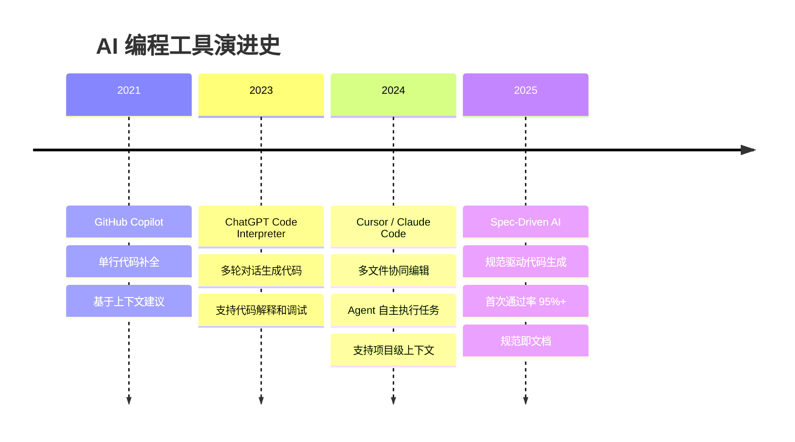
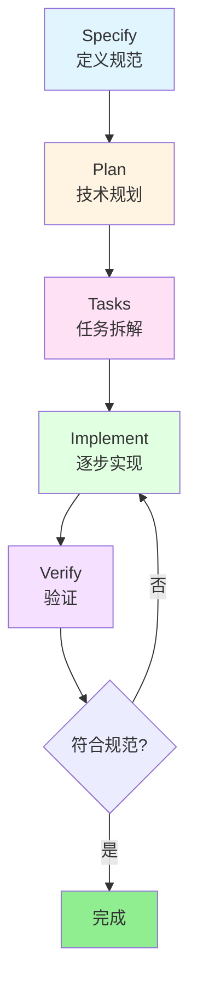
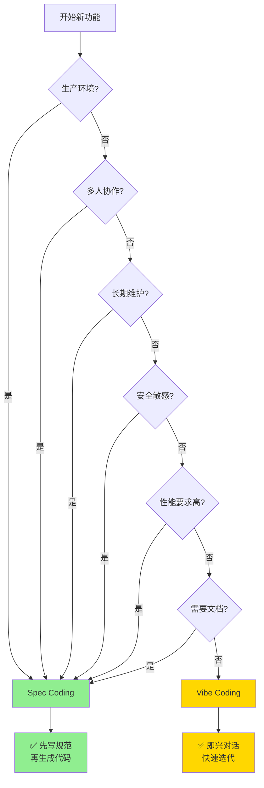

> "Code is a lossy projection of intent." (代码是意图的有损投影) —— Sean Grove, OpenAI

## 前言

当你使用 Cursor 或 Claude Code 编程时，是否遇到过这样的情况：

- 第一轮生成的代码看起来不错，但运行后发现缺少错误处理
- 第二轮补充了错误处理，但又发现没考虑并发问题
- 第三轮加了锁，但发现性能下降了
- 第四轮优化性能，但测试覆盖又不够了
- ……

几轮下来，代码越改越乱，技术债越积越多。这就是 **Vibe Coding**（即兴式编程）的典型场景。

而另一种方式是：先花 15 分钟写一份完整的规范文档，然后让 AI 一次性生成符合所有要求的代码，首次通过率 95% 以上。这就是 **Spec Coding**（规范驱动编程）。

本文将深入探讨这两种 AI 编程范式的本质区别、适用场景，并提供 Cursor IDE 和 Claude Code 两个主流工具的完整实践指南。

<!-- more -->

---

## 一、AI 编程工具的演进

### 1.1 从代码补全到自主 Agent

AI 编程工具的发展经历了三个阶段：



**第一阶段：代码补全（2021-2022）**

GitHub Copilot 开创了 AI 辅助编程的先河，但它只能做单行或函数级别的补全，缺少项目级的理解。

**第二阶段：对话式编程（2023）**

ChatGPT 的出现让开发者可以通过自然语言描述需求，AI 生成完整的代码片段。但这种方式依然是"一次性"的，缺少持续的上下文管理。

**第三阶段：Agent 式编程（2024-2025）**

Cursor 和 Claude Code 等工具将 AI 提升到 Agent 级别，能够：
- 理解整个项目的结构和上下文
- 同时编辑多个文件
- 自主执行测试和验证
- 持续学习项目规范

### 1.2 工具能力提升了，但方法论跟上了吗？

工具的能力从"补全一行代码"进化到"实现一个完整功能"，但大多数开发者的使用方式还停留在"即兴式 prompt"阶段：

```
你：实现一个用户注册功能
AI：[生成代码]
你：加上邮箱验证
AI：[修改代码]
你：密码要加密存储
AI：[再次修改]
你：还要防止重复注册
AI：[又改一遍]
```

这种方式在探索阶段很有效，但在生产环境中会导致：
- **返工频繁**：平均需要 3-5 轮迭代才能达到可用状态
- **遗漏需求**：安全、性能、边界情况容易被忽略
- **技术债累积**：架构不清晰，后期维护困难

**问题的本质**：我们用"即兴对话"的方式在做"工程化开发"的事情。

这就引出了本文的核心话题：**Vibe Coding vs Spec Coding**。

---

## 二、Vibe Coding：第一代 AI 编程范式

### 2.1 什么是 Vibe Coding

**Vibe Coding**（氛围编程、即兴编程）是指通过即兴的、逐步迭代的 prompt 与 AI 交互，"感觉对了就继续"的编程方式。

这个名词来源于开发者社区的自嘲：
> "I'm not following a plan, I'm just vibing with the AI." （我没有计划，就是跟着感觉和 AI 聊）

### 2.2 Vibe Coding 的典型流程

让我们看一个真实的例子：用 Vibe Coding 实现一个简单的用户列表 API。

**第 1 轮对话：**
```
你：用 Go 写一个获取用户列表的 HTTP API
```

AI 生成：
```go
// handler/user.go
func GetUsers(w http.ResponseWriter, r *http.Request) {
    users := []User{
        {ID: 1, Name: "Alice"},
        {ID: 2, Name: "Bob"},
    }
    json.NewEncoder(w).Encode(users)
}
```

**第 2 轮对话：**
```
你：加上分页功能
```

AI 修改：
```go
func GetUsers(w http.ResponseWriter, r *http.Request) {
    page, _ := strconv.Atoi(r.URL.Query().Get("page"))
    pageSize, _ := strconv.Atoi(r.URL.Query().Get("page_size"))
    
    // 模拟分页逻辑
    users := getAllUsers()
    start := page * pageSize
    end := start + pageSize
    
    json.NewEncoder(w).Encode(users[start:end])
}
```

**第 3 轮对话：**
```
你：加上按状态筛选
```

AI 再次修改：
```go
func GetUsers(w http.ResponseWriter, r *http.Request) {
    page, _ := strconv.Atoi(r.URL.Query().Get("page"))
    pageSize, _ := strconv.Atoi(r.URL.Query().Get("page_size"))
    status := r.URL.Query().Get("status")
    
    users := getAllUsers()
    
    // 筛选
    if status != "" {
        filtered := []User{}
        for _, u := range users {
            if u.Status == status {
                filtered = append(filtered, u)
            }
        }
        users = filtered
    }
    
    // 分页
    start := page * pageSize
    end := start + pageSize
    json.NewEncoder(w).Encode(users[start:end])
}
```

看起来不错？但仔细看会发现：
- ❌ 没有参数验证（page 可能是负数）
- ❌ 没有错误处理（数组越界）
- ❌ 没有统一的响应格式
- ❌ 没有数据库查询（只是模拟数据）
- ❌ 没有单元测试

### 2.3 Vibe Coding 的价值

尽管有这些问题，Vibe Coding 在某些场景下非常有价值：

**✅ 探索未知领域**
```
你：用 Go 的 WebSocket 库实现一个简单的聊天室
AI：[生成代码]
你：（看了代码后）原来 WebSocket 是这样用的！
```

**✅ 快速验证想法**
```
你：试试用 Redis 做分布式锁
AI：[生成代码]
你：（运行测试）嗯，这个方案可行
```

**✅ 学习新技术**
```
你：用 gRPC 实现一个简单的 RPC 调用
AI：[生成代码 + 解释]
你：（边看边学）明白了，proto 文件是这样定义的
```

**Vibe Coding 的本质**：它是一个**探索工具**，而不是**生产工具**。

---

## 三、Vibe Coding 的天花板

### 3.1 场景一：订单状态机实现

**需求**：实现一个电商订单的状态机。

**Vibe Coding 方式：**

第 1 轮：
```
你：实现订单状态：待支付、已支付、已发货、已完成
```

AI 生成：
```go
type OrderStatus string

const (
    StatusPending   OrderStatus = "pending"
    StatusPaid      OrderStatus = "paid"
    StatusShipped   OrderStatus = "shipped"
    StatusCompleted OrderStatus = "completed"
)

func (o *Order) UpdateStatus(newStatus OrderStatus) {
    o.Status = newStatus
}
```

第 2 轮：
```
你：加上已取消状态
```

第 3 轮：
```
你：加上退款中、已退款状态
```

第 4 轮：
```
你：待支付可以取消，已支付可以退款，已发货不能取消
```

第 5 轮：
```
你：退款完成后要恢复库存
```

**5 轮之后，代码变成了这样：**

```go
func (o *Order) UpdateStatus(newStatus OrderStatus) error {
    // 一堆 if-else 判断状态转换是否合法
    if o.Status == StatusPending && newStatus == StatusCancelled {
        // 取消订单
    } else if o.Status == StatusPaid && newStatus == StatusRefunding {
        // 开始退款
    } else if o.Status == StatusRefunding && newStatus == StatusRefunded {
        // 退款完成，恢复库存
        restoreInventory(o.Items)
    } else if o.Status == StatusShipped && newStatus == StatusCancelled {
        return errors.New("已发货订单不能取消")
    }
    // ... 更多判断
    
    o.Status = newStatus
    return nil
}
```

**问题：**
- ❌ 状态转换逻辑散落在各处，难以维护
- ❌ 缺少完整的状态转换图，容易遗漏边界情况
- ❌ 没有审计日志，无法追踪状态变更历史
- ❌ 恢复库存的逻辑耦合在状态机中

**根本原因**：缺少整体规划，逐步添加功能导致架构混乱。

### 3.2 场景二：支付接口集成

**需求**：集成支付宝支付。

**Vibe Coding 方式：**

第 1 轮：
```
你：实现支付宝支付接口调用
```

AI 生成了基本的支付请求代码。

第 2 轮：
```
你：加上支付回调处理
```

第 3 轮：
```
你：支付失败要重试
```

第 4 轮：
```
你：要验证回调签名
```

第 5 轮：
```
你：同一订单不能重复支付（幂等性）
```

第 6 轮：
```
你：要记录支付日志用于对账
```

**问题：**
- ❌ 安全要求（签名验证）在第 4 轮才想起来
- ❌ 幂等性在第 5 轮才补充，可能已经出现重复支付
- ❌ 对账日志在第 6 轮才加，之前的支付记录不完整

**生产事故案例**：

某电商平台使用 Vibe Coding 方式实现支付功能，上线后发现：
- 用户快速点击"支付"按钮，导致重复扣款
- 支付回调没有验证签名，被恶意伪造
- 对账时发现缺少关键日志，无法追查问题

**根本原因**：支付是安全敏感场景，需要在设计阶段就考虑所有安全要求，而不是事后补充。

### 3.3 场景三：数据库设计

**需求**：设计商品库存表。

**Vibe Coding 方式：**

第 1 轮：
```
你：创建商品库存表
```

```sql
CREATE TABLE inventory (
    id BIGINT PRIMARY KEY,
    product_id BIGINT,
    quantity INT
);
```

第 2 轮：
```
你：加上创建时间和更新时间
```

第 3 轮：
```
你：product_id 要加唯一索引
```

第 4 轮：
```
你：quantity 不能为负数
```

第 5 轮：
```
你：需要乐观锁字段防止并发问题
```

第 6 轮：
```
你：需要操作日志表记录库存变更
```

**问题：**
- ❌ 表结构反复修改，可能已经有数据了
- ❌ 索引、约束、外键都是事后补充
- ❌ 缺少整体的数据模型设计

**根本原因**：数据库设计需要前期规划，频繁修改表结构会带来巨大的迁移成本。

### 3.4 Vibe Coding 的量化分析

基于实际项目的统计数据：

| 指标 | Vibe Coding | 理想状态 | 差距 |
|------|-------------|----------|------|
| **首次通过率** | 60-70% | 95%+ | **35% ↓** |
| **平均迭代轮数** | 4-6 轮 | 1 轮 | **5 轮 ↑** |
| **Bug 密度** | 3-5 个/KLOC | 1-2 个/KLOC | **2-3 倍 ↑** |
| **重构频率** | 30% 代码需重写 | < 10% | **3 倍 ↑** |
| **测试覆盖率** | 50-60% | 80%+ | **25% ↓** |
| **文档完整性** | 几乎没有 | 规范即文档 | **质的差距** |

**结论**：Vibe Coding 适合探索和原型，但不适合生产环境。

---

## 四、Spec Coding：规范驱动的 AI 编程

### 4.1 理论基础

#### Sean Grove 的 "The New Code"

2025 年，OpenAI 研究员 Sean Grove 在 AI Engineer World's Fair 上发表了题为 "The New Code" 的演讲，提出了一个颠覆性的观点：

> **"Code is a lossy projection of intent."** （代码是意图的有损投影）

什么意思？当你把脑子里的想法变成代码时，大量的上下文信息会丢失：
- **为什么**要这样做
- **权衡了哪些方案**
- **考虑了什么约束**

最终的代码只保留了"怎么做"，却丢掉了"为什么这样做"。

Grove 认为：

> **"Whoever writes the spec is now the programmer."** （写规范的人就是程序员）

随着 AI 越来越擅长把规范转化为代码，**真正的编程工作**从"写代码"变成了"写规范"。

#### Robert C. Martin 的经典论断

《Clean Code》的作者 Robert C. Martin 早在 2008 年就说过：

> **"Specifying requirements so precisely that a machine can execute them is programming."** （把需求描述得足够精确以至于机器能执行它——这就是编程）

在 AI 时代，这句话被重新激活：**规范就是代码，代码只是规范的实现产物。**

### 4.2 Spec Coding 的三层规范结构

Spec Coding 将规范分为三个层次：

#### 第一层：功能规范（What）

回答"做什么"和"为什么"：

```markdown
## 功能需求

### 用户故事
- 作为买家，我希望能在下单时自动扣减库存
- 作为卖家，我希望库存不会出现超卖
- 作为运营，我希望能追踪所有库存变更记录

### 验收标准
- 下单时原子性扣减库存
- 库存不能为负数（超卖保护）
- 订单取消时自动恢复库存
- 所有库存变更有审计日志
```

#### 第二层：架构规范（How - 语言无关）

回答"怎么做"（技术方案）：

```markdown
## 数据模型

### inventory 表
- id: bigint, 主键
- product_id: bigint, 商品ID，唯一索引
- quantity: bigint, 库存数量，不能为负
- version: int, 乐观锁版本号
- created_at, updated_at: timestamp

### inventory_log 表
- id: bigint, 主键
- product_id: bigint, 商品ID
- order_id: varchar(64), 订单ID（幂等键）
- operation: varchar(20), 操作类型（deduct/restore）
- quantity: int, 变更数量
- before_quantity: bigint, 变更前库存
- after_quantity: bigint, 变更后库存
- created_at: timestamp

## API 设计

### POST /api/v1/inventory/deduct
扣减库存

**请求：**
```json
{
  "product_id": 12345,
  "quantity": 2,
  "order_id": "ORD20260403001"
}
```

**响应（成功）：**
```json
{
  "data": {
    "product_id": 12345,
    "remaining_quantity": 98
  }
}
```

**响应（库存不足）：**
```json
{
  "error": {
    "code": "E2001",
    "message": "库存不足",
    "details": {
      "available": 1,
      "requested": 2
    }
  }
}
```

## 非功能需求
- 并发：支持 1000 QPS
- 延迟：P99 < 100ms
- 可用性：99.9%

## 错误处理
- 库存不足：返回 409 Conflict
- 重复请求：返回 200 + 原结果（幂等）
- 系统错误：返回 500 + 详细日志
```

#### 第三层：实现规范（How - 语言特定）

回答"用什么技术栈实现"：

```markdown
## 技术约束

### 技术栈
- 语言：Go 1.21+
- 数据库：PostgreSQL 14
- 缓存：Redis 7（幂等性缓存）
- ORM：GORM

### 代码规范
- 使用 context.Context 传递请求上下文
- 所有数据库操作必须在事务中
- 错误处理使用 errors.Wrap 包装
- 所有公开函数必须有 godoc 注释

### 测试要求
- 单元测试覆盖率 ≥ 80%
- 并发测试：100 个并发请求，验证无超卖
- 幂等性测试：同一请求调用 10 次，只扣减一次
```

### 4.3 Spec Coding 的核心工作流



**Specify（定义规范）**：写清楚要做什么，不急着写代码

**Plan（技术规划）**：AI 根据规范生成技术方案

**Tasks（任务拆解）**：将方案拆分为可独立执行的小任务

**Implement（逐步实现）**：按任务逐个实现，每完成一个就验证

**Verify（验证）**：运行测试，确保符合规范

### 4.4 为什么 Spec Coding 更适合生产环境

**1. 首次通过率高（95%+）**

规范中已经定义了所有要求，AI 一次性生成符合所有约束的代码。

**2. 代码结构化、可测试**

规范中包含测试要求，生成的代码天然可测试。

**3. 规范即文档，自维护**

规范文档就是最好的文档，代码和文档永远同步。

**4. 团队协作有统一标准**

团队成员基于同一份规范工作，减少沟通成本。

**5. 减少技术债**

前期规划充分，避免了频繁重构和返工。

---

## 五、完整案例对比：电商库存扣减服务

让我们通过一个完整的案例，对比 Vibe Coding 和 Spec Coding 的差异。

### 5.1 需求说明

**功能需求：**
- 下单时扣减库存
- 支持超卖保护（库存不能为负）
- 订单取消时恢复库存
- 支持分布式并发（多个服务实例）
- 幂等性保证（同一订单多次调用只扣减一次）

**非功能需求：**
- 并发：支持 1000 QPS
- 延迟：P99 < 100ms
- 可用性：99.9%

### 5.2 Vibe Coding 实现过程

**第 1 轮：实现基本扣减逻辑**
```
你：用 Go 实现库存扣减功能
```

AI 生成：
```go
func DeductInventory(productID int64, quantity int) error {
    var inventory Inventory
    db.Where("product_id = ?", productID).First(&inventory)
    
    inventory.Quantity -= quantity
    db.Save(&inventory)
    
    return nil
}
```

**第 2 轮：发现并发问题**
```
你：加上并发控制，防止超卖
```

AI 修改：
```go
func DeductInventory(productID int64, quantity int) error {
    tx := db.Begin()
    
    var inventory Inventory
    tx.Where("product_id = ?", productID).First(&inventory)
    
    if inventory.Quantity < quantity {
        tx.Rollback()
        return errors.New("库存不足")
    }
    
    inventory.Quantity -= quantity
    tx.Save(&inventory)
    tx.Commit()
    
    return nil
}
```

**第 3 轮：发现锁没释放**
```
你：事务失败时要回滚
```

**第 4 轮：发现恢复库存有 bug**
```
你：实现订单取消时恢复库存
```

**第 5 轮：发现没有日志**
```
你：加上操作日志，记录库存变更
```

**第 6 轮：发现没有幂等性**
```
你：同一订单不能重复扣减库存
```

**结果：**
- ⏱️ 总耗时：**2 小时**
- 🔄 返工次数：**5 次**
- 📝 代码行数：300 行
- ✅ 测试覆盖：60%
- 🐛 遗留 Bug：3 个（边界情况未处理）
- 📚 文档：无

### 5.3 Spec Coding 实现过程

#### 步骤 1：编写规范文档（15 分钟）

创建 `specs/inventory-deduction.md`：

```markdown
# 库存扣减服务规范

## 功能需求

### 用户故事
- 作为买家，我希望下单时能成功扣减库存
- 作为卖家，我希望库存不会出现超卖（负数）
- 作为运营，我希望能追踪所有库存变更记录

### 验收标准
- 下单时原子性扣减库存
- 库存不能为负数（超卖保护）
- 同一订单多次调用只扣减一次（幂等性）
- 订单取消时自动恢复库存
- 所有库存变更有审计日志

## 数据模型

### inventory 表
```sql
CREATE TABLE inventory (
    id BIGSERIAL PRIMARY KEY,
    product_id BIGINT NOT NULL UNIQUE,
    quantity BIGINT NOT NULL CHECK (quantity >= 0),
    version INT NOT NULL DEFAULT 0,
    created_at TIMESTAMP NOT NULL DEFAULT CURRENT_TIMESTAMP,
    updated_at TIMESTAMP NOT NULL DEFAULT CURRENT_TIMESTAMP
);

CREATE INDEX idx_inventory_product_id ON inventory(product_id);
```

### inventory_log 表
```sql
CREATE TABLE inventory_log (
    id BIGSERIAL PRIMARY KEY,
    product_id BIGINT NOT NULL,
    order_id VARCHAR(64) NOT NULL,
    operation VARCHAR(20) NOT NULL,
    quantity INT NOT NULL,
    before_quantity BIGINT NOT NULL,
    after_quantity BIGINT NOT NULL,
    created_at TIMESTAMP NOT NULL DEFAULT CURRENT_TIMESTAMP
);

CREATE INDEX idx_inventory_log_order_id ON inventory_log(order_id);
CREATE INDEX idx_inventory_log_product_id ON inventory_log(product_id);
```

## API 设计

### POST /api/v1/inventory/deduct
扣减库存

**请求：**
```json
{
  "product_id": 12345,
  "quantity": 2,
  "order_id": "ORD20260403001"
}
```

**响应（成功 200）：**
```json
{
  "data": {
    "product_id": 12345,
    "remaining_quantity": 98
  }
}
```

**响应（库存不足 409）：**
```json
{
  "error": {
    "code": "E2001",
    "message": "库存不足",
    "details": {
      "available": 1,
      "requested": 2
    }
  }
}
```

**响应（重复请求 200）：**
```json
{
  "data": {
    "product_id": 12345,
    "remaining_quantity": 98,
    "idempotent": true
  }
}
```

### POST /api/v1/inventory/restore
恢复库存（订单取消时调用）

**请求：**
```json
{
  "product_id": 12345,
  "quantity": 2,
  "order_id": "ORD20260403001"
}
```

## 业务逻辑

### 扣减库存流程
1. 检查 Redis 缓存，判断是否重复请求（幂等性）
2. 如果是重复请求，返回缓存的结果
3. 开启数据库事务
4. 使用乐观锁（version 字段）查询并锁定库存记录
5. 检查库存是否充足
6. 扣减库存，version + 1
7. 插入操作日志
8. 提交事务
9. 将结果写入 Redis 缓存（TTL 5 分钟）

### 恢复库存流程
1. 检查订单是否已扣减过库存（查询 inventory_log）
2. 如果没有扣减记录，返回错误
3. 开启数据库事务
4. 使用乐观锁增加库存
5. 插入操作日志（operation = restore）
6. 提交事务
7. 删除 Redis 缓存

## 非功能需求

### 性能要求
- 并发：支持 1000 QPS
- 延迟：P99 < 100ms
- 可用性：99.9%

### 并发控制
- 使用乐观锁（version 字段）防止并发冲突
- 乐观锁冲突时重试 3 次
- Redis 缓存用于幂等性判断

### 错误处理
- 库存不足：返回 409 Conflict
- 重复请求：返回 200 + idempotent 标记
- 乐观锁冲突：重试 3 次后返回 500
- 系统错误：返回 500 + 详细日志

## 技术约束

### 技术栈
- 语言：Go 1.21+
- 数据库：PostgreSQL 14
- 缓存：Redis 7
- ORM：GORM

### 代码规范
- 使用 context.Context 传递请求上下文
- 所有数据库操作必须在事务中
- 错误处理使用 pkg/errors 包装
- 所有公开函数必须有 godoc 注释

### 测试要求
- 单元测试覆盖率 ≥ 80%
- 并发测试：100 个并发请求，验证无超卖
- 幂等性测试：同一请求调用 10 次，只扣减一次
- 边界测试：库存为 0、负数、超大数
```

#### 步骤 2：AI 生成技术方案（AI 自动，5 分钟）

将规范文档提供给 AI：

```
@specs/inventory-deduction.md
请根据这份规范生成技术方案，包括：
1. 目录结构
2. 核心模块设计
3. 关键代码框架
```

AI 生成技术方案（略）。

#### 步骤 3：逐步实现（45 分钟）

```
@specs/inventory-deduction.md
按照规范实现库存扣减服务，分步骤进行：
1. 先实现数据模型
2. 再实现业务逻辑
3. 然后实现 API 层
4. 最后实现测试

每完成一个步骤暂停，等我确认后再继续
```

AI 按照规范逐步生成代码（核心代码示例见下文）。

#### 步骤 4：验证（10 分钟）

运行测试：
```bash
go test ./... -v -cover
```

结果：
```
=== RUN   TestDeductInventory
--- PASS: TestDeductInventory (0.05s)
=== RUN   TestDeductInventory_Concurrent
--- PASS: TestDeductInventory_Concurrent (0.50s)
=== RUN   TestDeductInventory_Idempotent
--- PASS: TestDeductInventory_Idempotent (0.10s)
=== RUN   TestDeductInventory_InsufficientStock
--- PASS: TestDeductInventory_InsufficientStock (0.03s)

PASS
coverage: 95.2% of statements
```

**结果：**
- ⏱️ 总耗时：**1.2 小时**（规范 15 分钟 + 实现 45 分钟 + 验证 10 分钟）
- 🔄 返工次数：**0 次**
- 📝 代码行数：280 行
- ✅ 测试覆盖：95%
- 🐛 遗留 Bug：0 个
- 📚 文档：规范文档即文档

**核心代码示例（由 AI 根据规范生成）：**

```go
// internal/service/inventory_service.go
package service

import (
    "context"
    "fmt"
    "time"
    
    "github.com/pkg/errors"
    "gorm.io/gorm"
)

type InventoryService struct {
    db    *gorm.DB
    cache *redis.Client
}

// DeductInventory 扣减库存（幂等）
func (s *InventoryService) DeductInventory(ctx context.Context, req *DeductRequest) (*DeductResponse, error) {
    // 1. 检查幂等性
    cacheKey := fmt.Sprintf("inventory:deduct:%s", req.OrderID)
    if cached, err := s.cache.Get(ctx, cacheKey).Result(); err == nil {
        // 重复请求，返回缓存结果
        var resp DeductResponse
        json.Unmarshal([]byte(cached), &resp)
        resp.Idempotent = true
        return &resp, nil
    }
    
    // 2. 开启事务
    var resp *DeductResponse
    err := s.db.Transaction(func(tx *gorm.DB) error {
        // 3. 使用乐观锁查询库存
        var inventory Inventory
        if err := tx.Where("product_id = ?", req.ProductID).First(&inventory).Error; err != nil {
            return errors.Wrap(err, "查询库存失败")
        }
        
        // 4. 检查库存是否充足
        if inventory.Quantity < int64(req.Quantity) {
            return &InsufficientStockError{
                Available: inventory.Quantity,
                Requested: int64(req.Quantity),
            }
        }
        
        // 5. 扣减库存（乐观锁）
        result := tx.Model(&Inventory{}).
            Where("product_id = ? AND version = ?", req.ProductID, inventory.Version).
            Updates(map[string]interface{}{
                "quantity": gorm.Expr("quantity - ?", req.Quantity),
                "version":  gorm.Expr("version + 1"),
            })
        
        if result.RowsAffected == 0 {
            return errors.New("乐观锁冲突，请重试")
        }
        
        // 6. 插入操作日志
        log := &InventoryLog{
            ProductID:       req.ProductID,
            OrderID:         req.OrderID,
            Operation:       "deduct",
            Quantity:        req.Quantity,
            BeforeQuantity:  inventory.Quantity,
            AfterQuantity:   inventory.Quantity - int64(req.Quantity),
        }
        if err := tx.Create(log).Error; err != nil {
            return errors.Wrap(err, "插入日志失败")
        }
        
        // 7. 构造响应
        resp = &DeductResponse{
            ProductID:         req.ProductID,
            RemainingQuantity: inventory.Quantity - int64(req.Quantity),
        }
        
        return nil
    })
    
    if err != nil {
        return nil, err
    }
    
    // 8. 写入缓存（幂等性）
    cacheData, _ := json.Marshal(resp)
    s.cache.Set(ctx, cacheKey, cacheData, 5*time.Minute)
    
    return resp, nil
}
```

### 5.4 对比总结

| 维度 | Vibe Coding | Spec Coding | 提升 |
|------|-------------|-------------|------|
| **开发时间** | 2 小时 | 1.2 小时 | **40% ↓** |
| **返工次数** | 5 次 | 0 次 | **100% ↓** |
| **代码行数** | 300 行 | 280 行 | 持平 |
| **测试覆盖** | 60% | 95% | **58% ↑** |
| **Bug 数** | 3 个遗留 | 0 个 | **100% ↓** |
| **可维护性** | 中 | 高 | 显著提升 |
| **文档完整性** | 无 | 规范即文档 | 质的飞跃 |
| **团队协作** | 困难 | 容易 | 显著提升 |

**关键洞察：**

1. **前期投入 vs 后期收益**：Spec Coding 前期花 15 分钟写规范，但节省了 40 分钟的返工时间
2. **规范是资产**：规范文档可以复用到其他类似功能，形成团队知识库
3. **质量保证**：规范中定义了测试要求，生成的代码天然可测试
4. **沟通效率**：团队成员基于同一份规范工作，减少了大量的沟通成本

---

## 六、Spec Coding 工具链实践

理解了 Spec Coding 的理念后，让我们看看如何在实际工具中落地。本节分别介绍 Cursor IDE 和 Claude Code 的实践方法。

### 6.1 Cursor IDE 中的 Spec Coding 实践

#### 6.1.1 Cursor 的配置文件体系

Cursor 使用两种配置文件来管理规范：

**工具 1：`.cursorrules` - 项目规范入口**

**位置：** 项目根目录  
**加载方式：** Cursor 启动时自动加载  
**作用：** 提供项目级的全局规范

**实战示例：**

创建 `/your-project/.cursorrules`：

```markdown
# 电商后端项目 - Cursor 规则

## 项目概述
这是一个基于 Go 的电商后端系统，采用微服务架构。

## 技术栈
- 语言：Go 1.21+
- 数据库：PostgreSQL 14
- 缓存：Redis 7
- 消息队列：Kafka
- RPC：gRPC
- API：RESTful HTTP

## 架构约束
- 所有金额使用整数（分）存储，避免浮点精度问题
- 所有时间统一使用 UTC 时区
- 错误码格式：E{模块代码}{序号}，如 E1001（用户模块）、E2001（库存模块）
- 数据库操作必须在事务中执行
- 敏感操作（支付、退款）必须记录审计日志

## 代码规范
- 使用 context.Context 传递请求上下文
- 所有公开函数必须有 godoc 注释
- 错误处理：不要忽略 error，使用 pkg/errors 包装
- 命名规范：
  - 包名：小写，单数，简短
  - 接口名：以 -er 结尾（如 Reader, Writer）
  - 私有字段：小写开头
  - 公开字段：大写开头

## 安全要求
- 密码使用 bcrypt 加密，cost factor ≥ 12
- API 认证使用 JWT，access token 有效期 15 分钟，refresh token 有效期 7 天
- 所有写操作需要验证用户权限
- 敏感数据（手机号、身份证）使用 AES-256 加密存储
- 所有外部输入必须验证和清理（防止 SQL 注入、XSS）

## 测试要求
- 单元测试覆盖率 ≥ 80%
- 所有 API 端点必须有集成测试
- 使用 testify 作为测试框架
- 测试文件命名：xxx_test.go
- 表驱动测试（table-driven tests）优先

## 日志规范
- 使用结构化日志（zap 或 logrus）
- 日志级别：Debug < Info < Warn < Error < Fatal
- 生产环境日志级别：Info
- 敏感信息（密码、token）不能出现在日志中

## 错误处理
- 使用 pkg/errors 包装错误，保留堆栈信息
- 业务错误定义在 internal/errors/ 目录
- HTTP 错误响应格式：
  ```json
  {
    "error": {
      "code": "E1001",
      "message": "用户不存在",
      "details": {}
    }
  }
  ```

## 性能要求
- API 响应时间 P99 < 200ms
- 数据库查询必须有索引支持
- 避免 N+1 查询问题
- 使用 Redis 缓存热点数据（TTL 5-60 分钟）

## 开发工作流
1. 先写功能规范文档（specs/ 目录）
2. 使用 Cursor 根据规范生成代码
3. 运行测试验证
4. Code Review
5. 合并到主分支
```

**工具 2：`.cursor/rules/` - 分层规范管理**

**位置：** 项目根目录下的 `.cursor/rules/` 目录  
**加载方式：** 通过 frontmatter 的 `globs` 字段条件加载  
**作用：** 针对特定文件类型的详细规范

**目录结构：**
```
your-project/
├── .cursorrules              # 全局规范（自动加载）
├── .cursor/
│   └── rules/                # 分层规范（条件加载）
│       ├── 00-architecture.md
│       ├── 01-security.md
│       ├── 10-api-design.md
│       ├── 11-database.md
│       └── 20-testing.md
├── specs/                    # 功能规范（手动引用）
│   └── inventory-deduction.md
├── internal/
│   ├── api/
│   ├── service/
│   └── model/
└── ...
```

**示例 1：`.cursor/rules/10-api-design.md`**

```markdown
---
globs:
  - "internal/api/**/*.go"
  - "internal/handler/**/*.go"
---

# API 设计规范

## RESTful 路由设计

### 资源命名
- 使用名词复数：`/api/v1/orders`（不是 /api/v1/order）
- 嵌套资源最多两层：`/api/v1/users/{id}/orders`
- 避免动词：用 HTTP 方法表达动作
  - ❌ `/api/v1/orders/create`
  - ✅ `POST /api/v1/orders`

### HTTP 方法
- GET：查询资源（幂等）
- POST：创建资源（非幂等）
- PUT：完整更新资源（幂等）
- PATCH：部分更新资源
- DELETE：删除资源（幂等）

### 版本管理
- 使用 URL 路径版本：`/api/v1/`, `/api/v2/`
- 不要使用 Header 版本（不利于缓存）

## 请求/响应格式

### 成功响应（2xx）
```json
{
  "data": {
    "id": 12345,
    "name": "商品名称"
  },
  "pagination": {
    "page": 1,
    "page_size": 20,
    "total": 100,
    "total_pages": 5
  }
}
```

### 错误响应（4xx, 5xx）
```json
{
  "error": {
    "code": "E1001",
    "message": "用户不存在",
    "details": {
      "user_id": 12345
    }
  }
}
```

### 状态码使用
- 200 OK：成功
- 201 Created：创建成功
- 204 No Content：删除成功
- 400 Bad Request：参数错误
- 401 Unauthorized：未认证
- 403 Forbidden：无权限
- 404 Not Found：资源不存在
- 409 Conflict：冲突（如库存不足）
- 500 Internal Server Error：服务器错误

## 分页

### 请求参数
- `page`：页码（从 1 开始）
- `page_size`：每页数量（默认 20，最大 100）

### 响应
```json
{
  "data": [...],
  "pagination": {
    "page": 1,
    "page_size": 20,
    "total": 100,
    "total_pages": 5
  }
}
```

## 筛选和排序

### 筛选
- 使用查询参数：`/api/v1/orders?status=paid&created_after=2026-01-01`
- 支持多值：`/api/v1/orders?status=paid,shipped`

### 排序
- 使用 `sort` 参数：`/api/v1/orders?sort=created_at`
- 降序：`/api/v1/orders?sort=-created_at`
- 多字段：`/api/v1/orders?sort=status,-created_at`

## 幂等性

### 幂等方法
- GET、PUT、DELETE 天然幂等
- POST 需要使用幂等键（Idempotency-Key）

### 幂等键实现
```go
// 请求头
Idempotency-Key: uuid-xxxx-xxxx

// 服务端逻辑
func CreateOrder(w http.ResponseWriter, r *http.Request) {
    idempotencyKey := r.Header.Get("Idempotency-Key")
    
    // 检查 Redis 缓存
    if cached, err := redis.Get(idempotencyKey); err == nil {
        // 返回缓存结果
        w.Write(cached)
        return
    }
    
    // 创建订单
    order := createOrder(...)
    
    // 缓存结果（TTL 24 小时）
    redis.Set(idempotencyKey, order, 24*time.Hour)
    
    w.Write(order)
}
```

## 必须遵守的规则

- [ ] 所有写操作（POST/PUT/DELETE）需要认证
- [ ] 列表接口必须支持分页（默认 20 条/页）
- [ ] 幂等性：PUT/DELETE 天然幂等，POST 使用幂等键
- [ ] 所有接口返回统一的错误格式
- [ ] 敏感操作记录操作日志（谁、什么时间、做了什么）
- [ ] 参数验证：使用 validator 库验证请求参数
- [ ] 所有 API 必须有单元测试和集成测试
```

**示例 2：`.cursor/rules/11-database.md`**

```markdown
---
globs:
  - "internal/model/**/*.go"
  - "internal/repository/**/*.go"
  - "migrations/**/*.sql"
---

# 数据库设计规范

## 表设计

### 命名规范
- 表名：小写 + 下划线，复数形式（如 `orders`, `order_items`）
- 字段名：小写 + 下划线
- 主键：统一使用 `id bigint`，自增
- 外键：`{表名单数}_id`，如 `user_id`, `order_id`

### 必需字段
- `id`：主键
- `created_at`：创建时间（timestamp，UTC）
- `updated_at`：更新时间（timestamp，UTC）
- `deleted_at`：软删除时间（timestamp，nullable）

### 字段类型选择
- 金额：`bigint`（单位：分）
- 时间：`timestamp`（UTC 时区）
- 状态：`varchar(20)` 或 `enum`
- 布尔：`boolean`
- 文本：`varchar(n)` 或 `text`
- JSON：`jsonb`（PostgreSQL）

### 约束
- 主键约束：`PRIMARY KEY`
- 唯一约束：`UNIQUE`
- 非空约束：`NOT NULL`
- 检查约束：`CHECK`（如 `quantity >= 0`）
- 外键约束：`FOREIGN KEY`（谨慎使用，可能影响性能）

## 索引规范

### 何时创建索引
- 主键自动创建索引
- 外键必须加索引
- 查询条件字段加索引（WHERE、JOIN、ORDER BY）
- 唯一约束字段加唯一索引

### 组合索引
- 遵循最左匹配原则
- 将区分度高的字段放在前面
- 避免过多索引（单表 ≤ 5 个）

### 索引命名
- 单列索引：`idx_{表名}_{字段名}`
- 组合索引：`idx_{表名}_{字段1}_{字段2}`
- 唯一索引：`uk_{表名}_{字段名}`

## 事务处理

### 事务原则
- 所有写操作必须在事务中
- 事务尽可能短，避免长事务
- 避免在事务中调用外部服务（如 HTTP 请求）
- 使用乐观锁处理并发（version 字段）

### GORM 事务示例
```go
func CreateOrder(ctx context.Context, order *Order) error {
    return db.Transaction(func(tx *gorm.DB) error {
        // 1. 创建订单
        if err := tx.Create(order).Error; err != nil {
            return err
        }
        
        // 2. 扣减库存
        if err := deductInventory(tx, order.Items); err != nil {
            return err
        }
        
        // 3. 创建支付记录
        if err := createPayment(tx, order); err != nil {
            return err
        }
        
        return nil
    })
}
```

## 乐观锁

### 实现方式
```sql
CREATE TABLE orders (
    id BIGSERIAL PRIMARY KEY,
    version INT NOT NULL DEFAULT 0,
    ...
);
```

```go
// 更新时检查 version
result := db.Model(&Order{}).
    Where("id = ? AND version = ?", orderID, oldVersion).
    Updates(map[string]interface{}{
        "status":  newStatus,
        "version": gorm.Expr("version + 1"),
    })

if result.RowsAffected == 0 {
    return errors.New("乐观锁冲突，请重试")
}
```

## 查询优化

### 避免 N+1 查询
```go
// ❌ 错误：N+1 查询
orders := []Order{}
db.Find(&orders)
for _, order := range orders {
    db.Model(&order).Association("Items").Find(&order.Items)
}

// ✅ 正确：使用 Preload
orders := []Order{}
db.Preload("Items").Find(&orders)
```

### 使用索引
```go
// ❌ 错误：全表扫描
db.Where("name LIKE ?", "%keyword%").Find(&users)

// ✅ 正确：使用索引
db.Where("name = ?", "Alice").Find(&users)
```

### 分页查询
```go
// ✅ 使用 Limit + Offset
db.Limit(pageSize).Offset((page - 1) * pageSize).Find(&orders)
```

## 软删除

### 实现
```sql
ALTER TABLE orders ADD COLUMN deleted_at TIMESTAMP;
CREATE INDEX idx_orders_deleted_at ON orders(deleted_at);
```

```go
// GORM 自动支持软删除
type Order struct {
    ID        uint
    DeletedAt gorm.DeletedAt `gorm:"index"`
}

// 删除（软删除）
db.Delete(&order)

// 查询（自动过滤已删除）
db.Find(&orders)

// 包含已删除
db.Unscoped().Find(&orders)
```

## 数据迁移

### 使用 migrate 工具
```bash
# 创建迁移文件
migrate create -ext sql -dir migrations -seq create_orders_table

# 执行迁移
migrate -path migrations -database "postgres://..." up

# 回滚
migrate -path migrations -database "postgres://..." down 1
```

### 迁移文件示例
```sql
-- 000001_create_orders_table.up.sql
CREATE TABLE orders (
    id BIGSERIAL PRIMARY KEY,
    user_id BIGINT NOT NULL,
    total_amount BIGINT NOT NULL,
    status VARCHAR(20) NOT NULL,
    created_at TIMESTAMP NOT NULL DEFAULT CURRENT_TIMESTAMP,
    updated_at TIMESTAMP NOT NULL DEFAULT CURRENT_TIMESTAMP
);

CREATE INDEX idx_orders_user_id ON orders(user_id);
CREATE INDEX idx_orders_status ON orders(status);

-- 000001_create_orders_table.down.sql
DROP TABLE IF EXISTS orders;
```

## 必须遵守的规则

- [ ] 所有表必须有 id, created_at, updated_at 字段
- [ ] 金额字段使用 bigint（分）
- [ ] 时间字段使用 timestamp（UTC）
- [ ] 外键字段必须加索引
- [ ] 所有写操作必须在事务中
- [ ] 使用乐观锁处理并发
- [ ] 避免 N+1 查询
- [ ] 使用 migrate 工具管理数据库迁移
```

#### 6.1.2 Cursor 工作流实战

完整的 Spec Coding 工作流包含 4 个步骤：

**步骤 1：创建功能规范文档**

```bash
# 创建 specs 目录（如果没有）
mkdir -p specs

# 编写规范文档
vim specs/inventory-deduction.md
```

（规范文档内容见前文"完整案例对比"部分）

**步骤 2：在 Cursor 中引用规范**

在 Cursor 的聊天窗口中：

```
@specs/inventory-deduction.md @.cursorrules
按照规范实现库存扣减服务，先从数据模型开始
```

Cursor 会读取规范文档和全局规则，生成符合所有约束的代码。

**步骤 3：使用 Cursor Composer 多文件编辑**

Cursor Composer 可以同时编辑多个文件，非常适合实现完整功能。

按 `Cmd/Ctrl + I` 打开 Composer，然后输入：

```
@specs/inventory-deduction.md @.cursorrules
实现库存扣减服务，需要创建/修改以下文件：
1. internal/model/inventory.go - 数据模型
2. internal/repository/inventory_repo.go - 数据访问层
3. internal/service/inventory_service.go - 业务逻辑
4. internal/api/inventory_handler.go - API 处理器
5. internal/api/inventory_handler_test.go - API 测试
6. migrations/000003_create_inventory_tables.up.sql - 数据库迁移

请按照 .cursorrules 和规范文档实现，每个文件都要符合对应的规范。
```

Cursor 会同时在多个文件中生成代码，并且每个文件都会遵循对应的 `.cursor/rules/` 规范（通过 globs 自动加载）。

**步骤 4：验证实现**

```
@specs/inventory-deduction.md
审查当前实现是否完全符合规范：
1. 数据模型是否正确（检查字段类型、索引、约束）
2. 是否实现了幂等性（Redis 缓存）
3. 是否使用了乐观锁（version 字段）
4. 是否有完整的错误处理
5. 测试是否覆盖所有场景（并发、幂等性、边界情况）
```

Cursor 会逐项检查，并给出改进建议。

#### 6.1.3 Cursor 常见陷阱

**陷阱 1：忘记引用规范文件**

❌ 错误：
```
实现订单服务
```

问题：Cursor 不知道你的具体要求，只能生成通用代码。

✅ 正确：
```
@.cursorrules @specs/order-service.md
实现订单服务
```

**陷阱 2：规范写得太模糊**

❌ 错误：
```markdown
# 用户服务规范
实现用户注册和登录功能
```

问题：规范太简单，AI 会遗漏很多细节。

✅ 正确：
```markdown
# 用户服务规范

## 注册功能
- 邮箱格式验证（RFC 5322）
- 密码强度：≥8位，包含大小写字母、数字、特殊字符
- 密码使用 bcrypt 加密，cost factor = 12
- 注册成功后发送验证邮件（使用 SendGrid API）
- 验证链接 24 小时内有效

## 登录功能
- 支持邮箱 + 密码登录
- 失败 5 次后锁定账号 15 分钟
- 登录成功返回 JWT（access token 15 分钟，refresh token 7 天）
- 使用 RS256 算法签名
- 记录登录日志（IP、设备、时间）

## 数据模型
（详细的表结构定义）

## API 设计
（详细的接口定义）

## 测试要求
（具体的测试场景）
```

**陷阱 3：规范和代码不同步**

问题：规范更新了，但代码没有同步更新。

解决方案：规范变更时，让 Cursor 重新审查代码

```
@specs/order-service.md
规范已更新（增加了退款功能），审查现有代码：
1. 哪些部分需要修改
2. 是否有遗漏的功能
3. 测试是否需要补充
4. 数据库迁移是否需要新增
```

---

### 6.2 Claude Code 中的 Spec Coding 实践

#### 6.2.1 Claude Code 的配置文件体系

Claude Code 是 Anthropic 开发的终端工具，使用不同的配置文件体系。

**工具 1：`CLAUDE.md` - 项目规范入口**

**位置：** 项目根目录  
**加载方式：** Claude Code 启动时自动加载  
**作用：** 提供项目级的全局规范

**实战示例：**

创建 `/your-project/CLAUDE.md`：

```markdown
# 电商后端项目规范

## 项目概述
这是一个基于 Go 的电商后端系统，采用微服务架构。主要功能包括用户管理、商品管理、订单管理、支付管理、库存管理等。

## 技术栈
- 语言：Go 1.21+
- 数据库：PostgreSQL 14
- 缓存：Redis 7
- 消息队列：Kafka
- RPC：gRPC
- API：RESTful HTTP
- 部署：Docker + Kubernetes

## 架构原则
- 领域驱动设计（DDD）
- CQRS（命令查询职责分离）
- 事件驱动架构
- 微服务架构

## 全局约束
- 所有金额使用整数（分）存储
- 所有时间使用 UTC 时区
- 错误码格式：E{模块代码}{序号}
- 所有敏感操作记录审计日志
- 所有外部调用必须有超时控制（默认 5 秒）
- 所有数据库操作必须在事务中

## 代码规范
- 遵循 Go 官方代码规范（Effective Go）
- 使用 golangci-lint 进行代码检查
- 单元测试覆盖率 ≥ 80%
- 所有公开函数必须有文档注释
- 使用 context.Context 传递请求上下文
- 错误处理使用 pkg/errors 包装

## 安全要求
- 密码使用 bcrypt 加密，cost factor ≥ 12
- API 认证使用 JWT（RS256 算法）
- 所有写操作需要验证用户权限
- 敏感数据加密存储（AES-256）
- 所有外部输入必须验证和清理

## 性能要求
- API 响应时间 P99 < 200ms
- 数据库查询必须有索引支持
- 使用 Redis 缓存热点数据
- 支持水平扩展（无状态设计）

## 开发工作流
1. 先写规范文档（specs/ 目录）
2. 使用 Claude Code 生成实现
3. 运行测试验证
4. Code Review
5. 合并到主分支

## 相关规范文档
在实现功能时，请参考以下规范文档：
- [API 设计规范](./docs/specs/api-design.md)
- [数据库设计规范](./docs/specs/database-design.md)
- [安全规范](./docs/specs/security.md)
- [测试规范](./docs/specs/testing.md)

## 功能规范目录
具体功能的详细规范在 specs/ 目录：
- specs/inventory-deduction.md - 库存扣减服务
- specs/payment-integration.md - 支付集成服务
- specs/order-management.md - 订单管理服务

## 注意事项
- 在开始任何开发任务前，请先阅读对应的功能规范
- 规范优先级：功能规范（specs/）> 通用规范（docs/specs/）> 本文档（CLAUDE.md）
- 如果规范有冲突，以功能规范为准
- 如果规范不清楚，请先询问澄清，不要自行假设
```

**工具 2：规范文档目录**

Claude Code 不像 Cursor 有条件加载机制，而是通过在 `CLAUDE.md` 中引用其他规范文件。

**目录结构：**
```
your-project/
├── CLAUDE.md                 # Claude Code 自动加载
├── docs/
│   └── specs/                # 通用规范
│       ├── api-design.md
│       ├── database-design.md
│       ├── security.md
│       └── testing.md
├── specs/                    # 功能规范
│   ├── inventory-deduction.md
│   ├── payment-integration.md
│   └── order-management.md
└── internal/
    └── ...
```

#### 6.2.2 Claude Code 工作流实战

**步骤 1：创建功能规范**

创建 `specs/payment-integration.md`（内容略，参考前文库存扣减服务的规范格式）。

**步骤 2：启动 Claude Code**

在终端中：

```bash
# 进入项目目录（Claude Code 会自动加载 CLAUDE.md）
cd your-project

# 启动 Claude Code
claude-code

# 或者直接指定任务
claude-code "实现支付集成服务"
```

**步骤 3：在 Claude Code 中引用规范**

```bash
> 请阅读 specs/payment-integration.md 规范文档，
> 然后按照规范实现支付集成服务。
> 先从数据模型开始，然后实现业务逻辑，最后实现 API 层。
> 每完成一个模块暂停，等我确认后再继续。
```

**步骤 4：使用 /plan 命令生成实施计划**

```bash
> /plan
> 根据 specs/payment-integration.md 规范，
> 制定详细的实施计划，包括：
> 1. 任务拆解
> 2. 实施顺序
> 3. 每个任务的验收标准
```

Claude Code 会生成：

```
📋 支付集成服务实施计划

## 任务 1：数据模型设计
**文件：** internal/model/payment.go
**内容：**
- 定义 PaymentOrder 结构体
- 定义 PaymentChannel 枚举
- 实现数据验证方法

**验收标准：**
- 模型定义完整，字段类型正确
- 所有字段都有 JSON 和 DB 标签
- 验证方法覆盖所有必要字段

## 任务 2：数据库迁移
**文件：** migrations/000004_create_payment_tables.up.sql
**内容：**
- 创建 payment_orders 表
- 创建必要的索引

**验收标准：**
- 表结构符合规范
- 索引创建正确
- 约束定义完整

## 任务 3：数据访问层
**文件：** internal/repository/payment_repo.go
**内容：**
- 实现 CRUD 操作
- 实现事务支持
- 实现查询方法

**验收标准：**
- 所有数据库操作在事务中
- 有错误处理
- 有单元测试

## 任务 4：支付渠道抽象
**文件：** internal/payment/channel.go, alipay.go, wechat.go
**内容：**
- 定义 PaymentChannel 接口
- 实现支付宝适配器
- 实现微信支付适配器

**验收标准：**
- 接口设计清晰，易于扩展新渠道
- 每个适配器都实现了接口的所有方法
- 有单元测试（使用 mock）

## 任务 5：业务逻辑层
**文件：** internal/service/payment_service.go
**内容：**
- 实现创建支付订单
- 实现查询支付状态
- 实现处理支付回调
- 实现退款逻辑
- 实现幂等性保证

**验收标准：**
- 业务逻辑完整
- 幂等性测试通过
- 所有边界情况都有处理

## 任务 6：API 层
**文件：** internal/api/payment_handler.go
**内容：**
- 实现 HTTP 处理器
- 实现签名验证
- 实现参数验证

**验收标准：**
- API 符合规范
- 签名验证正确
- 参数验证完整
- 有集成测试

## 任务 7：测试
**文件：** test/payment_test.go
**内容：**
- 单元测试
- 集成测试
- 并发测试

**验收标准：**
- 测试覆盖率 ≥ 80%
- 所有测试通过
- 测试用例覆盖所有场景

---

预计总耗时：4-6 小时
```

**步骤 5：逐步实现**

```bash
> 开始实现任务 1：数据模型设计
> 完成后显示代码，等我确认再继续
```

Claude Code 生成代码后，你可以：

```bash
> 代码看起来不错，继续实现任务 2
```

或者：

```bash
> PaymentOrder 结构体缺少 RefundAmount 字段，请补充
```

**步骤 6：验证和审查**

```bash
> 审查当前实现是否符合 specs/payment-integration.md 规范：
> 1. 数据模型是否完整
> 2. 是否实现了所有安全要求（签名验证、幂等性）
> 3. 是否有完整的错误处理
> 4. 测试是否覆盖所有场景
> 
> 请逐条检查，列出符合和不符合的部分
```

#### 6.2.3 Claude Code 特色功能

**功能 1：规范验证**

Claude Code 可以验证实现是否完全符合规范：

```bash
> 验证当前实现是否完全符合 specs/payment-integration.md：
> 1. 列出规范中的所有要求（功能需求、非功能需求、安全要求）
> 2. 逐条检查实现情况
> 3. 列出未实现或不符合的部分
> 4. 给出改进建议
```

Claude Code 会生成详细的检查报告。

**功能 2：规范演进**

当需求变更时，先更新规范，再让 Claude Code 更新代码：

```bash
> specs/payment-integration.md 已更新，新增了银联支付渠道。
> 请分析：
> 1. 哪些代码需要修改
> 2. 如何保持向后兼容
> 3. 需要补充哪些测试
> 4. 是否需要数据库迁移
> 
> 分析完成后，生成详细的变更计划
```

**功能 3：批量代码生成**

Claude Code 适合批量生成代码：

```bash
> 根据 specs/ 目录下的所有规范文档，
> 生成对应的单元测试文件。
> 
> 要求：
> 1. 每个规范对应一个测试文件
> 2. 测试覆盖所有功能需求
> 3. 使用 testify 框架
> 4. 表驱动测试优先
```

---

### 6.3 Cursor vs Claude Code：工具选择指南

| 维度 | Cursor IDE | Claude Code |
|------|-----------|-------------|
| **界面** | 图形化 IDE（基于 VSCode） | 终端命令行 |
| **配置文件** | `.cursorrules` + `.cursor/rules/` | `CLAUDE.md` |
| **规范加载** | 条件加载（globs 匹配） | 手动引用 |
| **多文件编辑** | Composer（可视化） | 命令行交互 |
| **适用场景** | 日常开发，可视化操作 | 自动化脚本，CI/CD |
| **学习曲线** | 低（类似 VSCode） | 中（需要熟悉命令） |
| **团队协作** | 好（IDE 集成） | 好（脚本化） |
| **代码审查** | 可视化 diff | 终端输出 |
| **调试支持** | 完整的调试功能 | 依赖外部工具 |
| **插件生态** | VSCode 插件 | 有限 |

#### 推荐使用场景

**使用 Cursor IDE：**
- ✅ 日常开发工作
- ✅ 需要可视化界面
- ✅ 多文件同时编辑
- ✅ 需要调试功能
- ✅ 团队成员不熟悉命令行
- ✅ 前端开发（需要实时预览）

**使用 Claude Code：**
- ✅ CI/CD 自动化
- ✅ 批量代码生成
- ✅ 脚本化工作流
- ✅ 远程服务器开发（SSH）
- ✅ 代码审查和重构
- ✅ 规范验证

**两者结合的最佳实践：**

1. **本地开发用 Cursor**
   - 日常编码、调试、测试
   - 可视化操作，效率高

2. **CI/CD 用 Claude Code**
   - 自动生成测试
   - 代码规范检查
   - 批量重构

3. **规范文档两者共享**
   - `.cursorrules` 和 `CLAUDE.md` 内容保持一致
   - 规范文档放在 `specs/` 目录，两者都能引用

**示例：统一的规范管理**

```
your-project/
├── .cursorrules              # Cursor 自动加载
├── CLAUDE.md                 # Claude Code 自动加载
├── .cursor/rules/            # Cursor 分层规范
│   ├── 10-api-design.md
│   └── 11-database.md
├── docs/specs/               # 通用规范（两者共享）
│   ├── api-design.md
│   ├── database-design.md
│   └── security.md
└── specs/                    # 功能规范（两者共享）
    ├── inventory-deduction.md
    └── payment-integration.md
```

**技巧：保持 `.cursorrules` 和 `CLAUDE.md` 同步**

可以让一个文件引用另一个：

`.cursorrules`：
```markdown
# 电商后端项目 - Cursor 规则

详细规范请参考 CLAUDE.md 文件。

## Cursor 特定配置
- 使用 Composer 进行多文件编辑
- 引用规范时使用 @specs/xxx.md
- 分层规范在 .cursor/rules/ 目录
```

`CLAUDE.md`：
```markdown
# 电商后端项目规范

（完整的规范内容）

## Claude Code 特定配置
- 使用 /plan 命令生成实施计划
- 引用规范时使用完整路径
- 通用规范在 docs/specs/ 目录
```

---

## 七、混合策略与行动建议

### 7.1 渐进式工作流：从 Vibe 到 Spec

最实用的方式不是"非此即彼"，而是**渐进式过渡**：

#### 阶段 1：Vibe 探索（30 分钟）

**目标：** 快速验证想法可行性

**操作：**
```
你：用 Go + Redis 实现分布式锁
AI：[生成代码]
你：（运行测试）嗯，这个方案可行
```

**特点：**
- 不写规范
- 不关注代码质量
- 快速试错

#### 阶段 2：提炼规范（15 分钟）

**目标：** 将探索中的发现整理成规范

**操作：**
```
基于刚才的分布式锁原型，帮我整理一份正式规范文档，包括：
1. 功能需求（加锁、解锁、超时）
2. 数据模型（Redis key 设计）
3. API 设计（接口定义）
4. 非功能需求（性能、可靠性）
5. 错误处理（锁冲突、超时）
6. 测试要求（单元测试、并发测试）
```

AI 会生成一份完整的规范文档。

#### 阶段 3：Spec 重建（1 小时）

**目标：** 基于规范，用 Spec Coding 方式重新实现生产级版本

**操作：**
```
@specs/distributed-lock.md
按照规范从零实现分布式锁，不要参考之前的原型代码。
要求：
1. 代码结构清晰
2. 完整的错误处理
3. 单元测试覆盖率 ≥ 80%
4. 并发测试验证正确性
```

**对比：**

| 阶段 | 耗时 | 代码质量 | 可维护性 |
|------|------|----------|----------|
| Vibe 探索 | 30 分钟 | 低 | 低 |
| 提炼规范 | 15 分钟 | - | - |
| Spec 重建 | 1 小时 | 高 | 高 |
| **总计** | **1.75 小时** | **高** | **高** |

**关键洞察：**
- 用 Vibe 的速度验证方向（30 分钟）
- 用 Spec 的质量交付产品（1 小时）
- 总耗时比直接用 Vibe Coding 开发生产代码（2+ 小时）还要少

### 7.2 决策框架：什么时候用什么方法



#### 什么时候用 Vibe Coding

✅ **验证想法**（< 30 分钟）
```
你：试试用 WebSocket 实现实时通知
AI：[生成代码]
你：（测试）可行，记下这个方案
```

✅ **探索新技术**
```
你：用 Go 的 context 包实现超时控制
AI：[生成示例代码 + 解释]
你：（学习）原来 context 是这样用的
```

✅ **Hackathon / Demo**
```
你：快速做一个聊天室 demo
AI：[生成完整代码]
你：（演示）效果不错
```

✅ **一次性脚本**
```
你：写个脚本批量重命名文件
AI：[生成脚本]
你：（运行）搞定
```

#### 什么时候用 Spec Coding

✅ **生产级功能**
- 需要长期维护
- 代码质量要求高
- 需要完整的测试

✅ **多人协作**
- 团队成员需要统一标准
- 需要 Code Review
- 需要文档

✅ **长期维护**
- 代码会被多次修改
- 需要清晰的架构
- 需要可扩展性

✅ **安全敏感**（支付、认证、权限）
- 不能有安全漏洞
- 需要审计日志
- 需要完整的测试

✅ **性能要求高**
- 需要优化
- 需要压测
- 需要监控

✅ **需要文档**
- 规范即文档
- 代码和文档同步
- 易于交接

### 7.3 行动建议

#### 个人开发者

**1. 从下一个功能开始，先写 1 页规范**

不需要写得很完美，回答这 8 个问题即可：
- 做什么？（功能需求）
- 输入是什么？（请求参数）
- 输出是什么？（响应格式）
- 约束条件是什么？（业务规则）
- 失败模式有哪些？（错误处理）
- 安全要求是什么？（认证、授权）
- 性能要求是什么？（QPS、延迟）
- 什么测试能证明它工作？（测试场景）

**2. 把 `.cursorrules` 或 `CLAUDE.md` 写好**

至少包含：
- 技术栈
- 代码规范
- 测试要求
- 安全要求

**3. 尝试 Spec Coding 流程，体验差异**

选一个小功能（如"用户登录"），分别用 Vibe 和 Spec 两种方式实现，对比：
- 开发时间
- 返工次数
- 代码质量
- 测试覆盖

**4. 建立个人规范模板库**

创建常用功能的规范模板：
- `templates/api-spec.md` - API 功能规范模板
- `templates/service-spec.md` - 服务功能规范模板
- `templates/database-spec.md` - 数据库设计规范模板

#### 团队负责人

**1. 建立团队规范目录**

```
your-project/
├── .cursorrules 或 CLAUDE.md
├── .cursor/rules/ 或 docs/specs/
│   ├── api-design.md
│   ├── database-design.md
│   ├── security.md
│   └── testing.md
└── specs/
    └── （功能规范）
```

**2. 沉淀团队通用规范**

将团队的最佳实践写成规范：
- API 设计规范
- 数据库设计规范
- 安全规范
- 测试规范
- 代码规范

**3. Code Review 时检查规范文档**

PR 检查清单：
- [ ] 是否有规范文档？
- [ ] 实现是否符合规范？
- [ ] 测试是否覆盖规范中的所有场景？
- [ ] 规范是否需要更新？

**4. 将规范纳入 PR 审查流程**

```yaml
# .github/pull_request_template.md
## 规范文档
- [ ] 已创建/更新规范文档（specs/xxx.md）
- [ ] 规范文档已 Review
- [ ] 实现符合规范

## 测试
- [ ] 单元测试覆盖率 ≥ 80%
- [ ] 所有测试通过
- [ ] 测试覆盖规范中的所有场景
```

**5. 定期回顾和更新规范**

每个迭代结束后：
- 回顾规范是否合理
- 更新过时的规范
- 补充遗漏的规范
- 分享最佳实践

### 7.4 关键原则

**原则 1：规范是 source of truth**

代码只是规范的实现产物。当代码和规范不一致时，以规范为准。

**原则 2：用 Vibe 的速度验证方向，用 Spec 的质量交付产品**

探索阶段用 Vibe Coding 快速试错，生产阶段用 Spec Coding 保证质量。

**原则 3：规范和代码一起版本控制**

规范文档和代码一起提交到 Git，确保同步。

**原则 4：规范要持续演进，不是一次性文档**

需求变更时，先更新规范，再更新代码。规范是活的，不是死的。

### 7.5 常见问题

**Q1：Spec Coding 会不会太慢了？**

**A：** 不会。数据显示：
- 前期写规范：15 分钟
- 节省返工时间：40+ 分钟
- 总体效率提升：30-40%

而且规范文档可以复用，第二次实现类似功能时，只需 5 分钟修改规范。

**Q2：规范写多详细才够？**

**A：** 回答这 8 个问题即可：
1. 做什么？
2. 输入是什么？
3. 输出是什么？
4. 约束条件是什么？
5. 失败模式有哪些？
6. 安全要求是什么？
7. 性能要求是什么？
8. 什么测试能证明它工作？

一份高质量的规范可以只有 1-2 页。

**Q3：AI 只做规范说的事，遗漏"显而易见"的功能怎么办？**

**A：** 两个解决方案：
1. 在规范中加"非功能性需求"部分，列出通用期望（错误处理、日志、可访问性等）
2. 在 `.cursorrules`/`CLAUDE.md` 中设置全局规则，AI 会自动应用

**Q4：小项目也需要 Spec Coding 吗？**

**A：** 不需要。决策标准：
- 快速原型、一次性脚本 → Vibe Coding
- 生产级功能、长期维护 → Spec Coding

但如果项目会长期维护，建议从一开始就用 Spec Coding，避免后期重构。

---

## 八、总结

从 Vibe Coding 到 Spec Coding，不是一次革命，而是一次进化。

### 核心要点回顾

**1. Vibe Coding 的价值与局限**
- ✅ 价值：探索工具，快速验证，学习新技术
- ❌ 局限：返工频繁，遗漏需求，技术债累积
- 🎯 定位：探索工具，不是生产工具

**2. Spec Coding 的优势**
- 📋 规范是 source of truth，代码是实现产物
- 🎯 首次通过率 95%+，减少返工
- 📚 规范即文档，自维护
- 🤝 团队协作有统一标准
- 💰 减少技术债，长期收益高

**3. 工具链实践**
- Cursor IDE：`.cursorrules` + `.cursor/rules/`
- Claude Code：`CLAUDE.md` + `docs/specs/`
- 两者可以共享规范文档（`specs/` 目录）

**4. 混合策略**
- Vibe 探索（30 分钟）→ 提炼规范（15 分钟）→ Spec 重建（1 小时）
- 用 Vibe 的速度验证方向，用 Spec 的质量交付产品

**5. 决策框架**
- 生产环境、多人协作、长期维护、安全敏感 → Spec Coding
- 验证想法、探索技术、Hackathon、一次性脚本 → Vibe Coding

### 最终建议

**探索阶段：** 用 Vibe Coding 快速试错  
**生产阶段：** 用 Spec Coding 保证质量  
**团队协作：** 规范先行，统一标准  
**持续演进：** 规范和代码一起版本控制

### AI 编程的未来

Sean Grove 的洞察正在成为现实：

> **"Whoever writes the spec is now the programmer."** （写规范的人就是程序员）

AI 编程的未来，不是让 AI 写更多代码，而是让开发者写更好的规范。

**写规范的能力 = 编程能力**，这是 AI 时代对开发者的新要求。

### 行动号召

从今天开始，为你的下一个功能写一份规范文档吧。

不需要完美，只需要回答这 8 个问题：
1. 做什么？
2. 输入是什么？
3. 输出是什么？
4. 约束条件是什么？
5. 失败模式有哪些？
6. 安全要求是什么？
7. 性能要求是什么？
8. 什么测试能证明它工作？

体验一次 Spec Coding，你会发现：**规范写得越清楚，代码生成得越好。**

---

## 参考资料

1. **Sean Grove "The New Code" 演讲**  
   AI Engineer World's Fair 2025

2. **Easy-Vibe 教程：从 Vibe Coding 到 Spec Coding**  
   https://datawhalechina.github.io/easy-vibe/zh-cn/stage-3/core-skills/spec-coding/

3. **Robert C. Martin《Clean Code》**  
   Chapter 1: Clean Code

4. **Cursor 官方文档**  
   https://cursor.sh/docs

5. **Claude Code 官方文档**  
   https://docs.anthropic.com/claude-code

6. **WOWHOW: CLAUDE.md, AGENTS.md, and .cursorrules 完全指南**  
   https://wowhow.cloud/blogs/claude-md-agents-md-cursorrules-ai-coding-config-guide-2026

---

> **"Code is a lossy projection of intent. Specs are the new code."**  
> —— Sean Grove

**Happy Spec Coding! 🚀**
