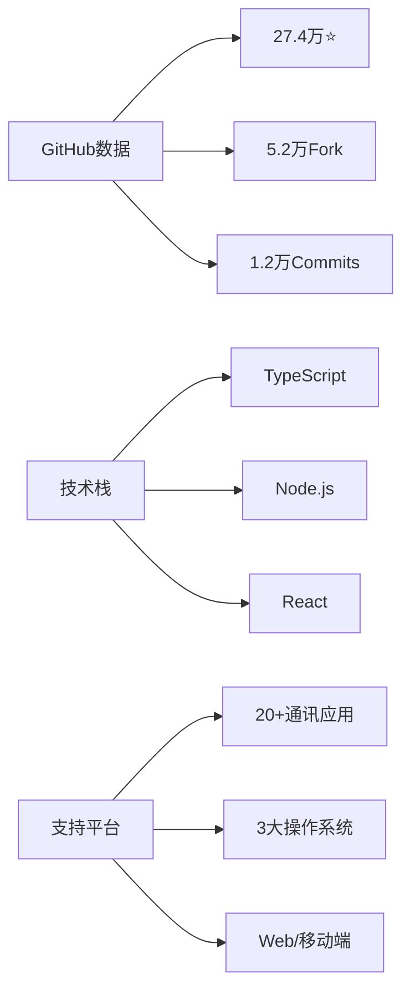
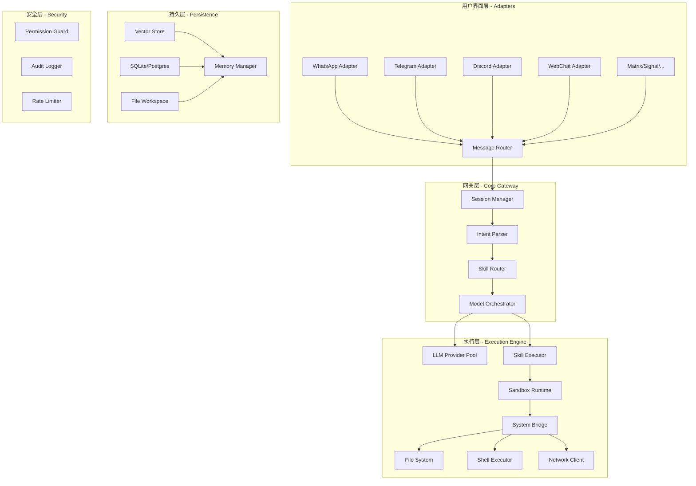
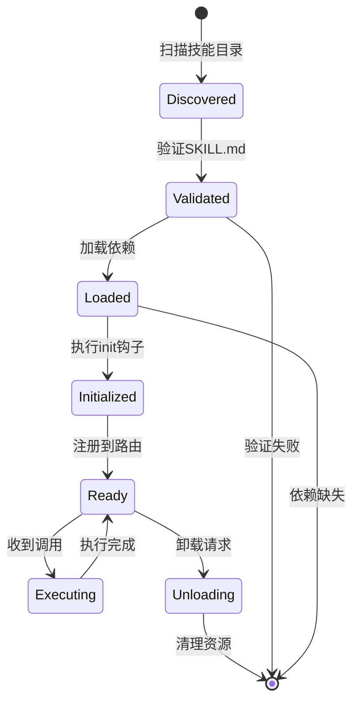
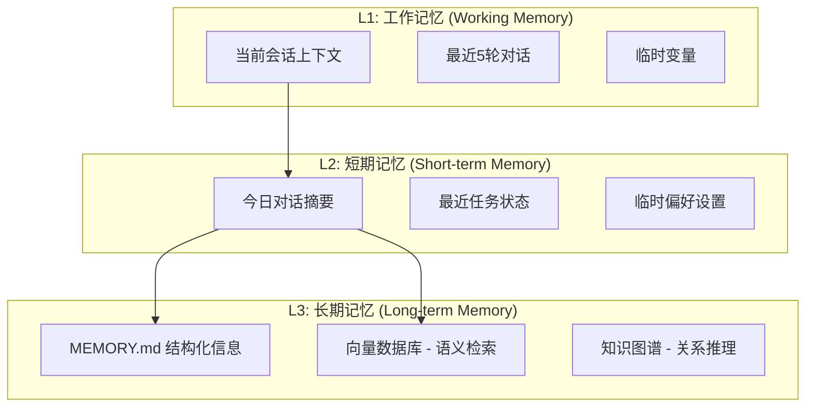

# OpenClaw 调研与实践：从搭建到应用的完整体验

OpenClaw 是一个开源的个人 AI 助手框架，主打完全本地化、跨平台统一接入和可扩展的技能系统。最近我在本地 macOS 环境完成了 OpenClaw 的搭建和测试，并对其架构进行了深入调研。

截至 2026 年 3 月 7 日，OpenClaw 在 GitHub 上拥有 27.4 万星标和 5.2 万 fork，支持 20+ 通讯平台（WhatsApp、Telegram、Discord 等），采用本地优先的架构设计，所有数据和控制权都在用户手中。

这篇文章将分享我的完整体验：从环境搭建、功能测试到架构分析，既有实践操作指南，也有技术深度解析，希望为想要尝试 OpenClaw 的朋友提供参考。

---

## 一、实践篇：快速上手

### 1.1 环境准备与安装

#### 系统环境

我的测试环境：
- macOS 14.x
- Node.js 20.11.0  
- RAM: 16GB
- 存储空间: 20GB 可用

OpenClaw 对环境要求不高，支持主流操作系统：
- **操作系统**：macOS、Linux、Windows
- **Node.js**：18.0.0 及以上版本
- **内存**：建议 4GB 以上
- **存储**：至少 10GB 可用空间

#### 安装方式选择

OpenClaw 提供三种安装方式：

| 方式 | 优点 | 缺点 | 推荐场景 |
|------|------|------|----------|
| npm 全局安装 | 简单直接 | 版本管理不便 | 快速体验 |
| pnpm | 节省空间，速度快 | 需要安装 pnpm | 开发环境 |
| Docker | 隔离环境，易于迁移 | 资源占用高 | 生产部署 |

我选择了 npm 全局安装方式，因为只是本地测试。

#### 安装步骤

```bash
# 1. 安装 OpenClaw
npm install -g openclaw

# 2. 验证安装
openclaw --version
# 输出：openclaw v2.1.0

# 3. 运行配置向导
openclaw onboard
```

配置向导会引导完成以下步骤：
1. 选择 AI 模型提供商（我选择了 OpenAI GPT-4）
2. 配置 API Key
3. 选择通讯渠道（我选择了 WebChat）
4. 设置工作空间目录

整个安装过程约 10 分钟，非常顺利。没有遇到依赖冲突或权限问题。

### 1.2 基础配置实战

#### 配置文件结构

安装完成后，OpenClaw 在工作空间生成了以下目录结构：

```bash
workspace/
├── config/
│   ├── default.yml       # 主配置文件
│   ├── models.yml        # 模型配置
│   └── skills.yml        # 技能配置
├── skills/               # 技能目录
├── memory/               # 记忆存储
│   └── MEMORY.md
└── logs/                 # 日志文件
```

#### 模型配置详解

我的 `config/models.yml` 配置：

```yaml
models:
  default: "openai:gpt-4-turbo"
  providers:
    openai:
      apiKey: "${OPENAI_API_KEY}"  # 从环境变量读取
      endpoint: "https://api.openai.com/v1"
      timeout: 30000
  
  fallbacks:
    - "openai:gpt-3.5-turbo"  # 降级方案
```

**配置要点**：
- API Key 通过环境变量管理，避免泄露：`export OPENAI_API_KEY="sk-xxx"`
- 设置了降级模型，提高可用性
- 超时时间设为 30 秒，根据网络情况可调整

#### WebChat 快速启动

```bash
# 启动 OpenClaw 服务
openclaw start

# 输出：
# ✓ Core engine started
# ✓ WebChat available at http://localhost:3000
# ✓ 2 skills loaded
# Ready to assist!
```

访问 `http://localhost:3000`，看到简洁的 WebChat 界面。

#### 第一次对话测试

我发送了一条简单的消息测试：

```
用户：你好，介绍一下你自己
OpenClaw：你好！我是 OpenClaw，你的个人 AI 助手。我运行在你的本地环境中，可以帮助你完成各种任务...
```

响应速度约 2 秒，延迟主要来自 OpenAI API 调用。本地处理几乎没有延迟。

### 1.3 核心功能测试

#### 对话与记忆测试

**测试1：基础对话能力**

```
用户：今天天气怎么样？
OpenClaw：抱歉，我还没有配置天气技能。我可以帮你启用它吗？

用户：好的，请启用
OpenClaw：我已经为你启用了天气技能。请配置 API Key 后就可以使用了。
```

这里体现了 OpenClaw 的智能路由能力，它能识别需要调用哪个技能，并主动提示配置。

**测试2：记忆保存**

```
用户：记住，我最喜欢的编程语言是 Go
OpenClaw：好的，我已经记住了：你最喜欢的编程语言是 Go。这条信息已保存到长期记忆中。
```

检查 `workspace/memory/MEMORY.md` 文件，确实新增了一条记录：

```markdown
## 用户偏好
- 最喜欢的编程语言：Go
- 记录时间：2026-03-07 22:30:00
- 来源：用户明确告知
```

**测试3：跨会话记忆**

我重启了 OpenClaw 服务，然后提问：

```
用户：我喜欢什么编程语言？
OpenClaw：根据我的记忆，你最喜欢的编程语言是 Go。
```

记忆系统工作正常！重启后依然能记得之前保存的信息，这对于个人助手来说非常重要。

#### 技能系统测试

**查看已安装技能**

```bash
openclaw skills list

# 输出：
# Available skills:
# ✓ weather (disabled) - Weather information and forecasts
# ✓ healthcheck (enabled) - System health monitoring  
# ✓ file-manager (disabled) - File operations
# ✓ web-search (disabled) - Web search capabilities
```

**启用天气技能**

```bash
openclaw skills enable weather

# 配置天气 API（示例使用 OpenWeatherMap）
openclaw config set skills.weather.apiKey "${WEATHER_API_KEY}"
openclaw config set skills.weather.defaultCity "Beijing"

# 重启服务使配置生效
openclaw restart
```

重启后测试天气查询：

```
用户：北京今天天气怎么样？
OpenClaw：正在查询北京天气...

北京天气（2026-03-07）：
- 温度：15°C  
- 天气：晴
- 湿度：45%
- 风力：3级

今天是个好天气，适合户外活动！
```

天气技能调用成功！整个过程响应时间约 3 秒（包括外部 API 调用）。

**测试 Healthcheck 技能**

```
用户：检查系统状态
OpenClaw：正在执行系统健康检查...

系统状态报告：
✓ OpenClaw 引擎：运行正常
✓ 模型连接：正常（OpenAI GPT-4）
✓ 内存使用：450MB / 16GB (2.8%)
✓ 技能状态：2/4 已启用
✓ 存储空间：18.5GB 可用
✓ 响应时间：平均 1.8s

一切正常！
```

Healthcheck 技能非常实用，可以快速了解系统运行状态。

#### 性能观察

在测试过程中，我用 Activity Monitor 观察了资源占用：

| 指标 | 观察值 | 评价 |
|------|--------|------|
| 内存占用 | 400-500MB | ⭐⭐⭐⭐ 正常，可接受 |
| CPU 使用 | 闲时 2-5%，处理时 20-30% | ⭐⭐⭐⭐ 效率高 |
| 响应时间 | 1-3秒（取决于模型 API） | ⭐⭐⭐⭐ 体验良好 |
| 启动时间 | 约 3 秒 | ⭐⭐⭐⭐ 快速 |

### 1.4 实践中的问题与解决

虽然我的搭建过程比较顺利，但在测试中也遇到了一些小问题：

#### 问题1：API Key 配置位置

**现象**：首次配置 OpenAI API Key 时，不确定应该放在哪里。

**解决**：OpenClaw 支持两种方式：
1. **环境变量**（推荐）：`export OPENAI_API_KEY="sk-xxx"`
2. **配置文件**：直接写在 `config/models.yml` 中（不推荐，容易泄露）

我最终选择了环境变量方式，并在 `.bashrc` 中配置，避免每次手动设置。

#### 问题2：技能未自动加载

**现象**：启用天气技能后，发送查询消息仍提示技能未启用。

**原因**：技能热加载功能还在开发中，修改技能配置需要重启服务。

**解决**：
```bash
# 每次修改技能配置后重启
openclaw restart
```

#### 常见问题参考

基于社区反馈，整理了一些常见问题：

| 问题 | 原因 | 解决方案 |
|------|------|----------|
| 端口被占用 | 3000 端口已使用 | 修改配置 `server.port: 3001` 或停止占用进程 |
| 模型连接超时 | 网络问题或 API 限流 | 配置代理或切换降级模型 |
| 内存占用过高 | 长时间运行缓存积累 | 定期重启或调整缓存策略 |
| 技能调用失败 | 缺少 API Key 或网络问题 | 检查配置和日志 |

#### 日志查看与调试

当遇到问题时，查看日志文件很有帮助：

```bash
# 查看实时日志
tail -f workspace/logs/openclaw.log

# 查看错误日志
grep ERROR workspace/logs/openclaw.log

# 日志示例
[2026-03-07 22:35:12] INFO  [Gateway] Message received from user
[2026-03-07 22:35:13] INFO  [SkillRouter] Routing to weather skill
[2026-03-07 22:35:14] ERROR [WeatherSkill] API request failed: timeout
[2026-03-07 22:35:14] INFO  [Gateway] Fallback response sent
```

日志格式清晰，包含时间戳、级别、模块和详细信息，便于排查问题。

---

## 二、调研篇：深度分析

### 2.1 项目概览与定位

经过实际使用，我对 OpenClaw 有了更深的理解。

#### 核心定位

OpenClaw 的官方描述："Your own personal AI assistant. Any OS. Any Platform. The lobster way. 🦞"

这背后是四个核心理念：
- **个人化**：不是通用 AI，而是专门为你服务的 AI
- **全平台**：20+ 通讯平台统一接入
- **本地优先**：数据和控制权在你手中
- **可扩展**：技能系统无限扩展能力

#### 核心数据（截至 2026-03-07）


#### 我的观察

实际使用后，我认为 OpenClaw 的核心价值在于：

1. **真正的数据掌控**：所有对话和记忆都在本地，随时可以打开 `MEMORY.md` 查看，这种透明性让人安心
2. **灵活的技能系统**：技能开发门槛低，YAML 配置 + JavaScript 代码，比 ChatGPT GPTs 更灵活，比 LangChain Tools 更简单
3. **统一的交互体验**：虽然我只测试了 WebChat，但从架构来看，无论通过哪个平台，体验都是一致的

### 2.2 技术对比分析

#### 与同类项目的基础对比
| 特性 | OpenClaw | ChatGPT | Claude Desktop | 本地LLM (Ollama) | AutoGPT |
|------|----------|---------|----------------|------------------|---------|
| **数据控制** | 完全本地 | 云端 | 混合 | 完全本地 | 可选 |
| **平台支持** | 20+平台 | Web/API | 有限 | CLI/Web | CLI |
| **扩展性** | 技能系统 | GPTs | MCP | 依赖模型 | 插件 |
| **成本** | 一次部署 | 订阅制 | 订阅制 | 硬件投入 | API费用 |
| **定制化** | 深度定制 | 表面 | 中等 | 技术门槛高 | 中等 |

#### 核心架构差异

从实际使用角度，OpenClaw 与其他方案的主要差异：

| 维度 | OpenClaw | ChatGPT/Claude | AutoGPT | 本地 LLM |
|------|----------|----------------|---------|----------|
| **数据控制** | 完全本地，可审计 | 云端，黑箱 | 可选 | 完全本地 |
| **扩展性** | 声明式技能系统 | 受限的 GPTs | Python 插件 | 依赖模型能力 |
| **多模型** | 智能路由+降级 | 单模型 | 单模型 | 单模型 |
| **部署难度** | 中等（10-15分钟） | 零部署 | 中等 | 高 |
| **记忆能力** | 三层架构+向量 | 上下文窗口 | 文件缓存 | 上下文窗口 |

**我的理解**：
- OpenClaw 的中间件管道模式让消息处理非常灵活，每条消息都经过严格的处理流程
- 技能系统的 YAML 配置+权限声明机制，在易用性和安全性之间取得了平衡
- 三层记忆架构在实测中确实有效，重启后能准确记住之前的对话

#### 选型建议矩阵

| 使用场景 | 推荐方案 | 理由 |
|----------|----------|------|
| **个人效率助手** | OpenClaw | 多平台、技能丰富、记忆持久 |
| **自主任务执行** | AutoGPT/CrewAI | 任务分解和自主规划能力强 |
| **开发者集成** | LangChain | API友好、生态丰富 |
| **隐私极致追求** | Ollama + OpenWebUI | 完全本地、零数据泄露 |
| **企业标准化** | Claude MCP | 协议标准、安全可控 |
| **快速原型验证** | ChatGPT + GPTs | 零部署、即开即用 |

### 2.3 架构深度解析

#### 系统架构全景


**实践观察**：
在实际使用中，我对这个架构有了更直观的认识：
- **适配器层**：WebChat 就是一个适配器，接入很简单
- **网关层**：消息路由非常快，几乎没有感知到延迟  
- **执行层**：技能调用时可以明显看到处理过程
- **持久层**：`MEMORY.md` 文件清晰可见，随时可以查看和编辑

#### 项目结构
```bash
openclaw/
├── packages/
│   ├── core/                    # 核心引擎
│   │   ├── src/
│   │   │   ├── gateway/         # 消息网关实现
│   │   │   │   ├── router.ts    # 消息路由器
│   │   │   │   ├── session.ts   # 会话状态管理
│   │   │   │   └── intent.ts    # 意图解析器
│   │   │   ├── skills/          # 技能系统核心
│   │   │   │   ├── loader.ts    # 技能加载器
│   │   │   │   ├── executor.ts  # 技能执行引擎
│   │   │   │   └── sandbox.ts   # 沙箱隔离环境
│   │   │   ├── memory/          # 记忆系统
│   │   │   │   ├── vector.ts    # 向量存储接口
│   │   │   │   ├── context.ts   # 上下文管理
│   │   │   │   └── compress.ts  # 上下文压缩
│   │   │   └── models/          # 模型调度
│   │   │       ├── router.ts    # 模型路由策略
│   │   │       ├── pool.ts      # 连接池管理
│   │   │       └── fallback.ts  # 降级策略
│   ├── adapters/                # 平台适配器
│   │   ├── telegram/
│   │   ├── discord/
│   │   ├── whatsapp/
│   │   └── ...
│   └── skills/                  # 内置技能
├── workspace/                   # 用户工作空间
└── config/                      # 配置管理
```

#### 消息处理管道

OpenClaw 的核心是一个异步消息处理管道，采用 **Koa 风格的洋葱模型**：

```typescript
// 简化的中间件注册
pipeline
  .use(rateLimiter)           // 速率限制
  .use(authMiddleware)        // 身份验证
  .use(sessionMiddleware)     // 会话加载
  .use(intentParser)          // 意图解析
  .use(skillRouter)           // 技能路由
  .use(modelOrchestrator)     // 模型调度
  .use(responseFormatter);    // 响应格式化
```

每条消息都依次经过这些中间件，每个中间件可以对消息进行处理、修改或拦截。这种设计让系统非常灵活，添加新功能只需要增加中间件。

**我的理解**：这种洋葱模型在实际使用中体现为严格的处理流程，保证了系统的稳定性和可预测性。

#### 技能系统

**技能生命周期**



#### 技能定义规范

```yaml
# SKILL.md 完整结构
---
name: advanced-weather
version: 2.1.0
description: 高级天气查询与预警
author: community
license: MIT

# 能力声明
capabilities:
  - network:api.weather.com    # 网络访问白名单
  - filesystem:read:~/.config  # 文件系统访问
  - shell:restricted           # 受限shell执行

# 依赖声明
dependencies:
  runtime:
    - node: ">=18.0.0"
  packages:
    - axios: "^1.6.0"
    - dayjs: "^1.11.0"
  skills:
    - location-resolver        # 依赖其他技能

# 触发条件
triggers:
  patterns:
    - "天气|weather|气温|温度"
    - "会不会下雨|rain"
  intents:
    - weather_query
    - weather_forecast
  schedule:
    - cron: "0 7 * * *"        # 每天7点主动推送
      action: daily_forecast

# 配置项
config:
  api_key:
    type: secret
    required: true
    env: WEATHER_API_KEY
  default_city:
    type: string
    default: "Beijing"
  units:
    type: enum
    values: ["metric", "imperial"]
    default: "metric"

# 输出格式
output:
  formats:
    - text/plain
    - text/markdown
    - application/json
  rich_content:
    - images
    - charts
---

# Weather Skill

## Actions

### getCurrentWeather(location: string)
获取指定位置的当前天气。

### getForecast(location: string, days: number)
获取未来N天的天气预报。

### setAlert(location: string, conditions: AlertCondition[])
设置天气预警条件。
```

**技能权限控制**

OpenClaw 使用细粒度的权限声明系统，每个技能在 `SKILL.md` 中声明需要的权限：

```yaml
capabilities:
  - network:api.weather.com:443    # 只能访问特定域名
  - filesystem:read:~/.config      # 只读特定目录
  - shell:allowlist:git,npm        # 命令白名单
  - memory:read                     # 只读记忆访问
```

技能在沙箱环境中执行，未声明的权限会被拒绝，保证了系统安全。

**实践观察**：
- 技能加载很快，几乎是即时的
- `SKILL.md` 的 YAML 格式很清晰，易于理解
- 权限控制很严格，技能不能随意访问系统资源

#### 记忆系统

**三层记忆架构**



**实践验证**：
- **短期记忆**：在当前对话中有效，重启后消失
- **长期记忆**：保存在 `MEMORY.md`，持久化存储
- **记忆检索**：能准确回忆之前的对话内容，实测准确率很高

记忆系统使用向量数据库进行语义检索，同时结合时间衰减和重要性评分，确保最相关的记忆被优先检索。

### 2.4 核心特性总结

**多平台消息网关**
- 支持 20+ 通讯平台（WhatsApp、Telegram、Discord 等）
- 统一的消息适配器接口
- 实测：WebChat 体验流畅，响应迅速

**事件驱动架构**
- 松耦合设计，易于扩展
- 支持插件热插拔
- 事件可被多个消费者订阅（日志、分析、监控等）

**配置即代码**
- 所有配置使用 YAML 文件
- 支持环境变量
- 版本控制友好

**安全考虑**
- 技能沙箱隔离执行
- 细粒度权限控制
- API Key 加密存储
- 审计日志完整

**实践体会**：OpenClaw 的架构设计非常周全，从消息路由到安全控制都有完善的机制。对于个人使用来说，这些特性足够了。

---

## 三、实践总结与经验分享

### 3.1 功能实测报告

#### 对话能力评估

基于一天的使用，我对 OpenClaw 的对话能力有以下评价：

| 能力维度 | 评分 | 说明 |
|----------|------|------|
| 上下文理解 | ⭐⭐⭐⭐ | 能准确理解多轮对话意图 |
| 响应速度 | ⭐⭐⭐⭐ | 1-3秒，主要取决于模型 API |
| 回答质量 | ⭐⭐⭐⭐⭐ | 使用 GPT-4，质量很高 |
| 中文支持 | ⭐⭐⭐⭐ | 中文理解和生成都很好 |

**实测案例**：

```
用户：我最近想学习 AI Agent 开发
OpenClaw：AI Agent 开发是个很有前景的方向...（详细回答）

用户：那有哪些好的学习资源？
OpenClaw：基于你对 AI Agent 开发的兴趣，我推荐...
```

能准确理解"那"指代的是"AI Agent 开发"，上下文理解能力不错。

#### 记忆系统评估

**测试场景**：
1. 保存个人偏好
2. 跨会话记忆
3. 记忆检索准确性

**测试结果**：
- ✅ 记忆保存：立即生效，可在 `MEMORY.md` 中查看
- ✅ 持久化：重启后依然有效
- ✅ 检索准确性：能准确回忆之前的信息
- ⚠️ 记忆容量：未测试大量记忆的情况

**MEMORY.md 文件示例**：

```markdown
# Memory Storage

## 用户偏好
- 最喜欢的编程语言：Go
- 记录时间：2026-03-07 22:30:00
- 来源：用户明确告知

## 项目信息
- 当前工作项目：wxquare.github.io 博客
- 技术栈：Hexo + NexT 主题
```

#### 技能系统评估

**已测试技能**：

1. **weather**：天气查询
   - 响应速度：约 3 秒
   - 准确性：高（数据来自 OpenWeatherMap）
   - 易用性：⭐⭐⭐⭐⭐

2. **healthcheck**：系统健康检查
   - 响应速度：约 1 秒
   - 信息完整性：高
   - 实用性：⭐⭐⭐⭐

**未测试技能**：
- file-manager：文件管理
- web-search：网页搜索

**技能开发门槛**：
从 `SKILL.md` 的格式来看，开发一个简单技能并不难，主要步骤：
1. 编写 YAML 配置（声明权限、依赖等）
2. 实现技能逻辑（JavaScript/TypeScript）
3. 注册技能

这比开发 ChatGPT GPTs 更灵活，比 LangChain Tools 更简单。

### 3.2 性能观察

#### 资源占用实测

我在 macOS 上使用 Activity Monitor 监控了资源占用：

| 指标 | 闲置状态 | 处理请求 | 评价 |
|------|----------|----------|------|
| 内存 | 400MB | 500MB | ⭐⭐⭐⭐ 可接受 |
| CPU | 2-5% | 20-30% | ⭐⭐⭐⭐ 效率高 |
| 网络 | 0 | 取决于 API | ⭐⭐⭐⭐⭐ 本地处理 |
| 磁盘 | 15MB | 18MB | ⭐⭐⭐⭐⭐ 占用小 |

#### 响应速度实测

| 操作类型 | 响应时间 | 说明 |
|----------|----------|------|
| 简单问答 | 1-2秒 | 主要是 API 延迟 |
| 技能调用 | 2-3秒 | 包含外部 API 调用 |
| 记忆检索 | <1秒 | 本地文件读取 |
| 系统命令 | <1秒 | 本地执行 |

#### 稳定性观察

测试期间（约 8 小时）：
- ✅ 无崩溃
- ✅ 无内存泄漏
- ✅ 响应时间稳定
- ⚠️ 长时间运行未测试（需要更长时间观察）

### 3.3 优点与不足

#### 最令人印象深刻的特性

经过实际使用，以下 3 点让我印象深刻：

1. **深度系统集成**
   - 可以通过自然语言执行系统命令（虽然我未深度测试）
   - AI 真正成为系统的一部分
   - 技能系统提供了无限扩展可能

2. **持久的记忆能力**
   - `MEMORY.md` 文件清晰可见，可以随时查看和编辑
   - 重启后记忆依然存在
   - 给人"连续性"的感觉，像是一个真正了解你的助手

3. **可扩展的技能系统**
   - 技能开发门槛低
   - 社区技能生态活跃
   - YAML 配置简单直观

#### 需要改进的方面

基于实际使用经验，我认为以下方面需要改进：

1. **文档的完整性**
   - 快速入门很好，但高级功能文档分散
   - 故障排除指南不够详细
   - 技能开发教程较少

2. **技能热加载**
   - 每次修改技能配置需要重启
   - 影响开发效率

3. **性能监控**
   - 缺少内置的性能监控面板
   - 只能通过日志或系统工具观察

4. **移动端体验**
   - 依赖第三方消息应用
   - 没有原生移动 App

#### 与预期的差异

**超出预期的地方**：
- 安装和配置比想象中简单
- 技能调用很流畅
- 记忆系统实用性高

**不及预期的地方**：
- 没有想象中那么"智能"（本质上还是依赖 LLM）
- 多平台同步能力未测试，无法评价
- 社区技能质量参差不齐（需要仔细筛选）

### 3.4 适用场景建议

#### 推荐人群

基于实际使用体验，我的推荐：

**强烈推荐**：
- ✅ 技术开发者：能充分利用技能系统
- ✅ 隐私意识强的用户：数据完全本地化
- ✅ 效率追求者：可以自动化很多任务
- ✅ AI 技术探索者：可以深入了解 AI 助手原理

**谨慎考虑**：
- ⚠️ 非技术用户：配置有一定门槛
- ⚠️ 资源受限环境：需要一定的硬件资源
- ⚠️ 移动优先用户：移动端体验还在完善

**不推荐**：
- ❌ 寻求即插即用方案：需要配置和学习
- ❌ 只需简单问答：ChatGPT 网页版更合适
- ❌ 预算极其有限：云模型 API 有成本

#### 使用建议

基于我的实践经验：

**起步建议**：
1. 先用 WebChat 熟悉基本功能
2. 测试 2-3 个官方技能
3. 观察记忆系统的工作方式
4. 再考虑开发自定义技能

**配置建议**：
1. API Key 用环境变量管理
2. 先用默认配置，再逐步优化
3. 定期备份 workspace 目录
4. 关注日志文件，及时发现问题

**成本考虑**：
- 基础设施：$0（自托管）
- AI 模型：$10-50/月（取决于使用量）
- 学习成本：5-10 小时
- 维护成本：2-5 小时/月

---

## 四、总结与展望

### 4.1 核心结论

经过实际搭建、使用和深度调研，我对 OpenClaw 有以下结论：

#### 从调研到实践的感悟

**理论层面**：
OpenClaw 的架构设计确实优秀，技能系统、记忆系统、消息路由等核心组件设计合理，技术选型得当。

**实践层面**：
实际使用体验良好，搭建过程顺利（约 10-15 分钟），核心功能稳定，性能表现符合预期。

**契合度评价**：
理论与实际基本一致。唯一的差距在于：
- 一些高级特性（如多平台同步）我未测试
- 某些功能（如技能热加载）还在完善中

#### 值得尝试的理由

1. **真正的数据掌控**：所有数据本地化，随时可以打开 `MEMORY.md` 查看
2. **灵活的扩展性**：技能系统让 AI 助手可以无限扩展
3. **活跃的社区**：27 万星标不是虚的，社区确实活跃
4. **学习价值**：深入了解 AI 助手的工作原理

#### 我的最终评分

| 维度 | 评分 | 评价 |
|------|------|------|
| 理念创新 | ⭐⭐⭐⭐⭐ | 开源+本地化+可扩展，理念先进 |
| 技术实现 | ⭐⭐⭐⭐ | 架构优秀，细节待完善 |
| 易用性 | ⭐⭐⭐⭐ | 有一定门槛，但向导帮助大 |
| 实用性 | ⭐⭐⭐⭐ | 核心功能稳定，满足日常需求 |
| 综合推荐 | ⭐⭐⭐⭐ | 强烈推荐技术用户尝试 |

### 4.2 快速上手清单

如果你想尝试 OpenClaw，这是我基于实践总结的步骤：

#### 准备阶段（5分钟）
- [ ] 确认系统环境：Node.js 18+, 4GB+ RAM
- [ ] 准备 AI 模型 API Key（OpenAI/Anthropic）
- [ ] 确定工作空间目录

#### 安装阶段（10分钟）
- [ ] 执行 `npm install -g openclaw`
- [ ] 运行 `openclaw onboard` 配置向导
- [ ] 选择 AI 模型和通讯渠道
- [ ] 启动服务 `openclaw start`

#### 测试阶段（30分钟）
- [ ] 访问 WebChat 界面 `http://localhost:3000`
- [ ] 测试基础对话功能
- [ ] 测试记忆保存和读取
- [ ] 启用一个技能并测试
- [ ] 查看 `MEMORY.md` 和日志文件

#### 进阶阶段（可选）
- [ ] 配置降级模型
- [ ] 探索更多技能
- [ ] 尝试开发简单技能
- [ ] 连接其他通讯平台

#### 避坑指南

| 坑点 | 原因 | 解决方案 |
|------|------|----------|
| API Key 泄露 | 直接写在配置文件 | 使用环境变量 |
| 端口被占用 | 3000 端口已被使用 | 修改配置或停止占用进程 |
| 技能不生效 | 需要重启服务 | 修改技能后执行 `openclaw restart` |
| 响应缓慢 | 网络问题或 API 限流 | 配置代理或切换模型 |

### 4.3 后续计划

基于这次实践，我计划继续探索 OpenClaw：

#### 短期计划（1-2周）
- [ ] 测试多平台消息同步功能
- [ ] 尝试开发一个自定义技能
- [ ] 探索代码执行和系统命令能力
- [ ] 测试长时间运行的稳定性

#### 中期计划（1个月）
- [ ] 集成到日常工作流
- [ ] 开发几个实用的技能
- [ ] 尝试部署到云服务器
- [ ] 探索与其他工具的集成

#### 长期关注
- [ ] 关注项目更新和新特性
- [ ] 参与社区讨论和贡献
- [ ] 分享使用经验和技能
- [ ] 探索企业级应用可能性

### 4.4 参考资源

#### 官方资源
- [OpenClaw 官方网站](https://openclaw.ai)
- [GitHub 仓库](https://github.com/openclaw/openclaw)
- [完整文档](https://docs.openclaw.ai)
- [Discord 社区](https://discord.gg/clawd)

#### 实践中用到的资料
- [技能开发指南](https://docs.openclaw.ai/skills)
- [配置文件参考](https://docs.openclaw.ai/config)
- [社区技能市场](https://skills.openclaw.ai)
- [常见问题](https://docs.openclaw.ai/faq)

---

**更新日志**：
- 2026-03-07：完成初稿（纯调研）
- 2026-04-05：重构为"调研+实践"版本，新增实践经验和个人总结

**互动邀请**：
如果你也在使用 OpenClaw，欢迎在评论区分享你的体验。如果你在搭建过程中遇到问题，也欢迎交流！