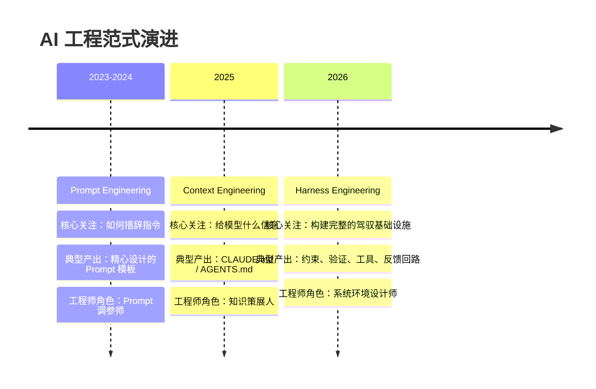
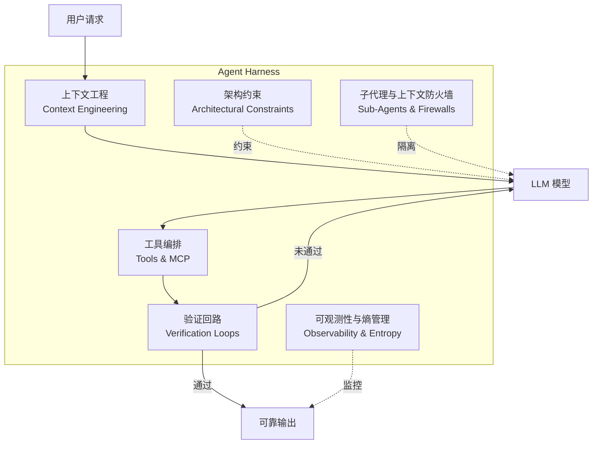
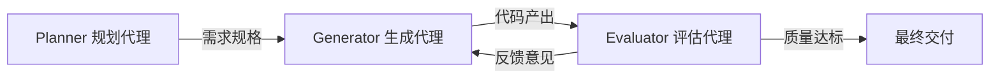

> "Agents aren't hard; the Harness is hard." —— Ryan Lopopolo, OpenAI

## 前言

你一定经历过这样的时刻：用 Cursor 或 Claude Code 让 Agent 完成一个功能，第一次跑通了，信心满满。换个场景，同样的 Agent 却莫名其妙地崩了。你开始优化 Prompt——加更多约束、给更详细的指令、甚至逐字调整措辞。效果呢？提升不到 3%。

问题出在哪里？

2026 年，行业给出了一个越来越清晰的答案：**问题不在 Prompt，不在模型，而在模型周围的一切**。

LangChain 的 Harrison Chase 提出了一个简洁的公式：

$$Agent = Model + Harness$$

**Harness**（驾驭基础设施），指的是围绕 AI 模型的所有系统——上下文组装、工具编排、验证回路、架构约束、可观测性、成本控制。这个术语借用了马具的隐喻：模型是一匹强大但不可预测的马，Harness 是引导它产出正确结果的缰绳、鞍具和围栏。

换模型，输出质量变化 10-15%。换 Harness，决定系统**能不能用**。

本文将梳理从 Prompt Engineering 到 Harness Engineering 的三次范式跃迁，拆解 Harness 的核心组件，并结合行业案例和我自己使用 Cursor、Claude Code 构建 Agent 的实践经验，给出一份可落地的指南。

<!-- more -->

---

## 一、三次范式跃迁

AI 工程的核心关注点经历了三次重大转移。每一次跃迁不是否定前者，而是将其包含在更大的体系中。



### 1.1 Prompt Engineering：教人做事只靠口头说（2023-2024）

Prompt Engineering（提示工程）是 AI 工程的起点。它的核心问题是：**如何措辞指令，才能让模型给出正确答案？**

这个阶段产出了大量有价值的技巧——Chain of Thought、Few-Shot、Role Prompting 等。它们在模型能力较弱时确实是关键的杠杆。

但随着模型越来越强，一个趋势变得明显：**Prompt 技巧的边际收益在递减**。2026 年的研究数据显示，在合理的基础 Prompt 之上，进一步优化措辞的效果通常不到 3%。模型已经强大到不需要你"教它怎么想"——它需要的是正确的信息和环境。

类比：教一个聪明人做事，光靠口头说明是不够的。

### 1.2 Context Engineering：给了参考资料，但还不够（2025）

Context Engineering（上下文工程）将关注点从"说什么"升级到"知道什么"。

标志性的变化是 `CLAUDE.md` 和 `AGENTS.md` 等项目级配置文件的出现。工程师不再纠结于 Prompt 的遣词造句，而是思考：**Agent 需要知道哪些信息才能正确完成任务？** 这包括项目结构、编码规范、架构约束、技术栈信息等。

这是一个重大进步。但上下文是必要条件，不是充分条件——你给 Agent 提供了完整的项目知识，它依然可能：

- 生成了正确的代码，但没跑测试就宣布完成
- 修改了功能 A，但意外破坏了功能 B
- 在长会话中逐渐偏离正轨（上下文退化）
- 缺少回滚机制，一次错误操作就需要人工介入

类比：不仅说了怎么做，还给了参考资料——但没有流程、没有检查点、没有安全栏。

### 1.3 Harness Engineering：设计整个工作环境（2026）

Harness Engineering（驾驭工程）是 Context Engineering 的系统级延伸。它不只关注"给 Agent 什么信息"，而是关注**构建一个让 Agent 可靠产出正确结果的完整系统**。

Harrison Chase 这样定义：Harness 涵盖了系统提示（System Prompt）、专用工具、文件系统抽象、中间件和自验证反馈回路。它给 LLM 赋予了在循环中运行、调用工具、管理自身上下文窗口、以及作为长时间自主助手运行的能力。

LangChain 用实验数据证明了 Harness 的价值：在他们的编码 Agent `deepagents-cli` 上，**不换模型（GPT-5.2-Codex），只改 Harness**，Terminal Bench 2.0 的准确率从 52.8% 跳到 66.5%，排名从 30 开外直接进入前 5。

类比：不只是教人做事、给参考资料，而是设计了整个工作环境——工具箱、操作流程、质检站、安全围栏、甚至自动纠错机制。

### 三者对比

| 维度 | Prompt Engineering | Context Engineering | Harness Engineering |
|:-----|:-------------------|:-------------------|:-------------------|
| **核心关注** | 如何措辞指令 | 给模型什么信息 | 构建完整的驾驭系统 |
| **核心产出** | Prompt 模板 | CLAUDE.md / AGENTS.md | 约束 + 验证 + 工具 + 反馈回路 |
| **效果上限** | ~3% 提升 | ~15% 提升 | 28-64% 提升 |
| **工程师角色** | Prompt 调参师 | 知识策展人 | 系统环境设计师 |
| **关注层次** | 单次输入 | 信息供给 | 生产基础设施 |
| **包含关系** | 最内层 | 包含 Prompt | 包含 Context + Prompt |

> 关键洞察：Context Engineering 和 Prompt Engineering 并没有消失，它们都成为了 Harness 的组成部分。Harness 是最外层的包裹，是让一切生效的生产基础设施。

---

## 二、Harness 的核心组件

一个完整的 Agent Harness 包含六大核心组件。它们共同构成了围绕模型的"驾驭层"。



### 2.1 上下文工程（Context Engineering）

上下文工程是 Harness 的信息层，负责回答一个关键问题：**Agent 需要知道什么？**

**OpenAI 的做法**：他们的 `AGENTS.md` 文件控制在约 100 行以内，作为**目录**而非百科全书。顶层文件指向 `docs/` 目录中更深层的文档，Agent 按需检索。过长的上下文反而会让 Agent 迷失焦点。

**我的实践**：在我的博客项目中，我维护了两个层次的上下文文件：

- `CLAUDE.md`（~50 行）：项目级全局配置，涵盖项目概述、目录结构、开发命令和常见陷阱
- `.cursorrules`（~180 行）：更详细的写作规范、审查清单和协作流程

```
# CLAUDE.md 的结构（精简示例）
├── 项目概述（4 行：技术栈、主题、部署方式）
├── 目录结构（6 行：核心目录映射）
├── 开发命令（4 行：server/build/clean/deploy）
├── 写作规范（7 行：Front Matter、命名、格式）
├── 常见陷阱（5 行：避免的操作）
└── 不要做（5 行：硬性禁止项）
```

踩过的坑：最初我把所有规范塞进一个文件（超过 300 行），结果 Agent 反而频繁忽略关键规则。精简到 50 行后，规则遵从率显著提升。这印证了 OpenAI 的经验——**上下文不是越多越好，精准比全面更重要**。

核心原则：**仓库即唯一真理来源（Repository as the system of record）**。所有 Agent 需要的知识都应该推入代码仓库，而不是存在某个人的脑子里或者散落在 Confluence 文档中。

### 2.2 架构约束（Architectural Constraints）

这是 Harness 中最反直觉的组件：**限制 Agent 的自由度，反而提高它的产出质量**。

为什么？因为 LLM 在开放空间中容易做出"创造性"但错误的决策。通过机械化的约束缩小解决方案空间，Agent 更容易命中正确答案。

**OpenAI 的做法**：在他们用 Codex 生成百万行代码的项目中，强制执行严格的依赖分层：

```
Types → Config → Repo → Service → Runtime → UI
```

任何违反依赖方向的代码都会被 linter 拦截。这不是文档建议，而是 CI 中的硬性检查——Agent 的代码如果违反约束，直接构建失败。

**Stripe 的做法**：他们的编码 Agent "Minions" 每周生成超过 1,000 个已合并的 Pull Request。关键不是模型多强，而是 Harness 的约束体系：pre-commit hook 自动检查代码风格、linter 执行架构规范、CI 流水线运行完整测试套件。

**我的实践**：在我的博客项目中，`.cursorrules` 定义了一系列"不要做"的硬约束：

```yaml
# 硬约束示例（摘自 .cursorrules）
- ❌ 不要修改 themes/ 目录下的文件
- ❌ 不要直接编辑 db.json
- ❌ 不要在文章中使用绝对路径引用图片
- ❌ Front Matter 的 date 字段必须是字符串格式
```

这些看似简单的规则，实际上是从 Agent 犯错中总结出来的。每次 Agent 犯了一个新错误，我就加一条约束。这和 OpenAI 的理念一致——**CLAUDE.md 从护栏开始，每次 Agent 犯错就加一条规则**。

### 2.3 工具编排（Tools & MCP Servers）

Agent 通过工具与外界交互。工具不仅决定了 Agent 的能力边界，也决定了它的可靠性边界。

**MCP（Model Context Protocol，模型上下文协议）** 的出现统一了工具接口，让不同的 AI 工具可以通过标准化的方式访问外部服务——数据库、API、文件系统、CLI 工具等。

**最佳实践**：

- **优先使用标准工具**（git、docker、npm）而非自定义 CLI。LLM 在标准工具上有海量训练数据，执行可靠性远高于自定义工具
- **工具文档化**：每个工具都应该有清晰的输入/输出规范，Agent 才能正确调用
- **最小权限原则**：只给 Agent 完成任务所需的最少工具权限

**我的实践**：在 Cursor 中，我配置了多个 MCP Server 来扩展 Agent 的能力——Confluence 知识库访问、内部框架文档查询、代码仓库搜索等。关键经验是：不是接入越多工具越好，而是每个工具都要有明确的使用场景和清晰的文档。Agent 面对模糊的工具描述时，调用准确率会大幅下降。

### 2.4 验证回路（Verification Loops）

验证回路是 Harness 中最关键的组件，也是 Prompt Engineering 时代最缺失的部分。

核心问题：**Agent 不能自我评估——它会给自己打高分。** 如果你让一个 Agent 评价自己的输出质量，它几乎总是说"做得很好"。必须有外部的、客观的验证机制。

三层验证体系：

**第一层：确定性验证**（零容忍）
- 单元测试、集成测试
- Linter、类型检查
- 架构约束检查（依赖方向、命名规范等）
- 构建是否通过

**第二层：AI 驱动验证**（辅助判断）
- 用另一个 Agent 审查代码质量
- 自验证回路：让 Agent 对比输出与原始需求
- LangChain 的"完成前检查表"模式

**第三层：人工审核**（关键决策）
- 架构决策的最终审批
- 涉及安全或资金的操作
- Agent 置信度低于阈值时的升级

**我的实践**：在我设计的 [DoD Agent（电商告警处理系统）](/2026/04/03/03-dod-agent-design/) 中，验证机制是核心设计要素。Agent 的每次操作都经过三级风险评估：

- **低风险操作**（查询日志、读取监控）：自动执行，事后审计
- **中风险操作**（重启服务、调整配置）：需要 Agent 生成操作计划并自我检验后执行
- **高风险操作**（数据库变更、流量切换）：必须经过人工审批

这种分级验证的设计思路，和 Harness Engineering 的核心理念完全一致——**不是要控制 Agent 做什么，而是确保它做对**。

### 2.5 子代理与上下文防火墙（Sub-Agents & Context Firewalls）

长时间运行的 Agent 会话有一个隐蔽的陷阱：**上下文退化（Context Rot）**。

随着对话轮数增加，早期的指令被稀释，错误信息被累积，Agent 的行为逐渐偏离预期。这就像一个人连续工作 20 小时后，判断力和注意力都会严重下降。

解决方案：**上下文防火墙**——为每个独立子任务创建新的子代理，而不是在一个持续膨胀的会话中完成所有工作。

**LangChain 的做法**：他们的 Deep Agents 架构中，每个子任务都在独立的上下文窗口中执行。主代理负责任务分解和结果汇总，子代理在干净的上下文中执行具体工作。

**我的实践**：在使用 Claude Code 时，我严格遵循 **Plan → 新会话执行** 的工作流：

1. 在第一个会话中使用 Plan 模式充分讨论方案，来回迭代直到满意
2. 把最终方案整理成详细的执行指令
3. **开一个全新的会话**执行，避免讨论过程的上下文污染执行阶段

这和直觉相反——你可能觉得保持上下文连贯性更好。但实践表明，干净的上下文 + 明确的指令，远比"带着一堆历史包袱"执行要可靠得多。这正是 Boris Cherny（Claude Code 创建者）反复强调的最佳实践。

### 2.6 可观测性与熵管理（Observability & Entropy Management）

Agent 产出的代码会随时间积累技术债——这是一个被低估的问题。单次任务看起来没问题，但 Agent 生成的代码在不同会话之间缺乏统一的架构愿景，**代码熵**会持续增长。

**OpenAI 的做法**：他们在 Codex 项目中建立了持续的"垃圾回收"机制：

- **依赖审计 Agent**：定期检查依赖关系是否违反架构分层
- **模式执行 Agent**：确保新代码遵循已建立的设计模式
- **文档一致性 Agent**：检查代码变更后文档是否同步更新

可观测性的核心不是传统的日志和监控，而是**Agent 行为的可追踪性**：

- 每次 Agent 调用了什么工具？
- 决策路径是什么？
- 在哪个步骤偏离了预期？
- 什么样的输入导致了失败？

当 Agent 产出错误时，工程师需要回答的核心问题从"代码哪里写错了"变成了"**Harness 的哪个环节失效了，如何修改系统使 Agent 永远不再犯这个错**"。

---

## 三、行业实证

### 3.1 OpenAI：百万行零手写代码

2026 年初，OpenAI 公开了一个令人震撼的内部实验：一个 3-7 人的团队，在约 5 个月内，构建了一个超过 **100 万行代码**的生产应用——**零行手写代码**，全部由 Codex Agent 生成。开发效率约为传统方式的 **10 倍**。

但这里的关键信息不是"模型多强"，而是他们在 Harness 上的投入：

- **AGENTS.md 作为目录**：~100 行的入口文件，指向深层文档，而不是试图在一个文件里描述所有
- **机械化架构约束**：自定义 linter + 结构化测试，任何违反依赖分层的代码自动失败
- **Agent 可访问可观测性工具**：让 Agent 自己查看日志、指标和 trace，自主调试而非依赖人工
- **持续的熵回收**：专门的 Agent 定期清理架构偏移、废弃代码和不一致的模式

关键启示：**这不是一个"模型足够强就能做到"的成就。换一个同等水平的模型但没有这套 Harness，结果会完全不同。**

### 3.2 LangChain：Deep Agents 的 Harness 优化

Harrison Chase 的团队提供了最干净的 A/B 测试：在 Terminal Bench 2.0 上，使用**完全相同的模型**（GPT-5.2-Codex），只改变 Harness 设计。

| 指标 | 优化前 | 优化后 |
|:-----|:------|:------|
| 准确率 | 52.8% | 66.5% |
| 排名 | 30 名开外 | 前 5 |
| 模型变更 | 无 | 无 |

他们具体改了什么：

- **自验证回路（Self-Verification Loops）**：Agent 在提交结果前，先运行测试验证自己的输出
- **循环检测中间件（Loop Detection Middleware）**：当 Agent 陷入重复尝试同一个失败策略时，自动打断并换策略
- **主动上下文工程（Proactive Context Engineering）**：不是一次性给 Agent 所有信息，而是在执行过程中按需注入相关上下文
- **完成前检查表（Pre-Completion Checklist）**：在 Agent 宣布"完成"之前，强制执行一个检查清单

这组数据是 Harness Engineering 最有说服力的证据：**同一匹马，不同的驾驭方式，表现天差地别。**

### 3.3 Anthropic：三代理架构

Anthropic 展示了 Harness 在创意和质量方面的价值。他们使用了一个三代理协作架构：



- **Planner（规划代理）**：将用户需求展开为完整的规格说明
- **Generator（生成代理）**：按规格实现具体功能
- **Evaluator（评估代理）**：用明确的评分标准（设计质量、原创性、工艺、功能性）评估输出，未达标则反馈给 Generator 重做

代价是成本提升了约 22 倍。但在需要高质量输出的场景下，这种 Harness 设计实现了单 Agent 无法达到的功能完整度和代码质量。

---

## 四、工程师角色的转变

Harness Engineering 正在重新定义软件工程师的工作。

传统模式下，工程师的核心产出是**代码**。在 Harness Engineering 时代，核心产出变成了**环境**——让 Agent 能可靠产出正确代码的环境。

这不是一个"AI 取代工程师"的故事。恰恰相反，它要求工程师具备更高层次的能力：

| 传统能力 | Harness 时代的新能力 |
|:---------|:-------------------|
| 编写业务逻辑代码 | 设计架构约束和验证规则 |
| 手动调试 Bug | 分析 Agent 行为模式，修复 Harness 缺陷 |
| 阅读文档学习 API | 编写高质量的上下文文档供 Agent 消费 |
| 代码评审 | 设计自动化评审回路 |
| 性能优化 | 成本控制和 Agent 效率优化 |

回顾我这个 AI 系列的写作历程：

- [00-Vibe Coding vs Spec Coding](/2026/04/03/00-vibe-coding-vs-spec-coding/)：从"即兴编程"到"规范驱动编程"——这是思维方式的第一次升级
- [01-Claude Code](/2026/04/02/01-claude-code-practices/)：学习与 Agent 协作的具体技巧——这是工具使用的升级
- [02-Agent 系统设计](/2026/04/03/02-agent-system-design-guid/)：学习如何设计 Agent 架构——这是设计能力的升级

**Harness Engineering 是这条线的自然延伸**：不只是设计单个 Agent，而是设计让 Agent 可靠运行的整个系统。Spec Coding 中强调的"先写规范再执行"，本质上就是 Harness 思维的雏形——规范就是最基础的约束和验证标准。

---

## 五、总结与展望

Harness Engineering 的核心洞察可以浓缩为一句话：

> **模型是动力，Harness 是方向盘。没有方向盘的引擎，跑得越快越危险。**

### 最小可行 Harness 检查清单

如果你今天就想开始构建自己的 Agent Harness，从这 7 条开始：

- [ ] **精简的入口文件**：`CLAUDE.md` 或 `AGENTS.md` 控制在 100 行以内，作为目录指向深层文档
- [ ] **可复现的开发环境**：一键启动，per-worktree 隔离，Agent 和人类用相同的环境
- [ ] **机械化的架构约束**：用 linter、pre-commit hook、CI 检查来执行规范，而非依赖文档
- [ ] **自验证回路**：Agent 提交前必须通过测试和构建，失败自动反馈
- [ ] **上下文防火墙**：长任务拆分为子任务，每个子任务在干净的上下文中执行
- [ ] **最小权限与回滚能力**：Agent 只拥有必要的操作权限，关键操作可回滚
- [ ] **定期的代码熵清理**：定期审计 Agent 产出的代码，防止架构偏移和技术债累积

### 展望

2026 年正在形成一个共识：**模型已经是商品，Harness 才是竞争护城河**。

当所有团队都可以接入同等水平的 LLM 时，决定 Agent 产出质量的不再是模型选择，而是 Harness 的设计水平——上下文策略有多精准、约束体系有多严格、验证回路有多完善、可观测性有多透明。

对于工程师来说，这反而是一个好消息：**我们积累多年的系统设计、架构思维、工程实践经验，在 Harness Engineering 时代比以往任何时候都更有价值。** 不同的是，我们设计的系统服务的对象，从人类开发者扩展到了 AI Agent。

---

## 参考资料

1. [What Is Harness Engineering? The Discipline That Makes AI Agents Reliable](https://harness-engineering.ai/blog/what-is-harness-engineering/)
2. [Harness engineering: leveraging Codex in an agent-first world — OpenAI Engineering Blog](https://www.engineering.fyi/article/harness-engineering-leveraging-codex-in-an-agent-first-world)
3. [Improving Deep Agents with harness engineering — LangChain Blog](https://blog.langchain.dev/improving-deep-agents-with-harness-engineering/)
4. [The Anatomy of an Agent Harness — LangChain Blog](https://blog.langchain.com/the-anatomy-of-an-agent-harness/)
5. [Why Better LLMs Aren't Enough: Harrison Chase on Harness Engineering and Deep Agents](https://www.techbuddies.io/2026/03/08/why-better-llms-arent-enough-langchains-harrison-chase-on-harness-engineering-and-deep-agents/)
6. [Prompt Engineering vs Context Engineering vs Harness Engineering — dev.to](https://dev.to/ljhao/prompt-engineering-vs-context-engineering-vs-harness-engineering-whats-the-difference-in-2026-37pb)
7. [Beyond AGENTS.md: Harness Engineering, Loop-Based Delivery — dev.to](https://dev.to/codesoda/beyond-agentsmd-harness-engineering-loop-based-delivery-and-context-aware-prompting-ec9)
8. [Harness Engineering: The Discipline of Building Systems That... — gtcode.com](https://gtcode.com/articles/harness-engineering/)
9. [OpenAI Introduces Harness Engineering — InfoQ](http://infoq.com/news/2026/02/openai-harness-engineering-codex/)
10. [Agent 系列（三）：Harness Engineering — 腾讯云](https://cloud.tencent.com/developer/article/2647887)
11. [Harness Engineering：从驾驭百万行 AI 代码到软件工程的范式革命 — 晨涧云](https://www.mornai.cn/news/ai-agent/harness-engineering/)
12. [Beyond Prompting: Why Harness Engineering is the Most Important AI Skill of 2026](https://haiai.world/beyond-prompting-why-harness-engineering-is-the-most-important-ai-skill-of-2026/)
