# OpenClaw深度调研：27万星标的个人AI助手革命

> 经过一天深度捣鼓OpenClaw，我彻底被这个项目震撼了。这不是又一个ChatGPT套壳，而是真正意义上的**个人AI操作系统**。27万GitHub星标、5万+ fork的背后，是开发者和用户对"真正属于自己的AI助手"的渴望。

**调研时间**：2026年3月7日全天深度使用  
**项目状态**：GitHub 27.4万⭐ | 5.2万 fork | 活跃开发中  
**核心价值**：完全掌控的个人AI助手，支持20+通讯平台，本地优先架构  
**适合读者**：技术爱好者、AI开发者、追求效率的极客、关注开源AI趋势的观察者

---

## 🦞 项目概览：为什么OpenClaw如此特别？

### 项目定位
OpenClaw的官方描述是："Your own personal AI assistant. Any OS. Any Platform. The lobster way. 🦞"

但这简单的描述背后是深刻的理念：
- **个人化**：不是通用AI，而是专门为你服务的AI
- **全平台**：支持所有主流操作系统和通讯平台
- **本地优先**：数据和控制权在你手中
- **可扩展**：通过技能系统无限扩展能力

### 核心数据（截至2026年3月7日）
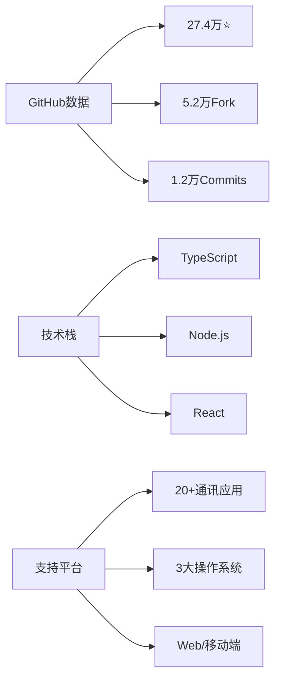

### 与同类项目的对比

#### 基础特性对比
| 特性 | OpenClaw | ChatGPT | Claude Desktop | 本地LLM (Ollama) | AutoGPT |
|------|----------|---------|----------------|------------------|---------|
| **数据控制** | 完全本地 | 云端 | 混合 | 完全本地 | 可选 |
| **平台支持** | 20+平台 | Web/API | 有限 | CLI/Web | CLI |
| **扩展性** | 技能系统 | GPTs | MCP | 依赖模型 | 插件 |
| **成本** | 一次部署 | 订阅制 | 订阅制 | 硬件投入 | API费用 |
| **定制化** | 深度定制 | 表面 | 中等 | 技术门槛高 | 中等 |

#### 深度架构对比分析

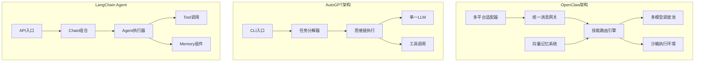

#### 核心架构差异详解

| 架构维度 | OpenClaw | AutoGPT | LangChain Agent | Claude MCP |
|----------|----------|---------|-----------------|------------|
| **消息处理** | 中间件管道模式 | 单线程循环 | Chain组合 | RPC调用 |
| **扩展机制** | 声明式技能系统 | Python插件 | Tool装饰器 | JSON Schema |
| **隔离方式** | V8 Isolate沙箱 | 进程隔离 | 无隔离 | 进程隔离 |
| **记忆实现** | 三层分级+向量 | 文件缓存 | 可插拔Memory | 无内置 |
| **多模型** | 智能路由+熔断 | 单模型 | 可配置 | 单模型 |

#### 技术实现深度对比

**1. 消息处理架构**

```typescript
// OpenClaw: Koa风格洋葱模型，支持异步中间件
// 优势：可组合、可插拔、错误处理完善
pipeline.use(async (ctx, next) => {
  const start = Date.now();
  await next();  // 洋葱模型核心
  ctx.metrics.latency = Date.now() - start;
});

// AutoGPT: 简单循环模式
// 局限：难以扩展，无中间件概念
while not task_complete:
    thought = llm.think(context)
    action = parse_action(thought)
    result = execute(action)
    context.append(result)

// LangChain: Chain组合模式
// 优势：灵活组合；局限：调试困难
chain = prompt | llm | parser | tool_executor
```

**2. 扩展系统设计哲学**

| 项目 | 设计理念 | 开发体验 | 安全模型 |
|------|----------|----------|----------|
| **OpenClaw Skills** | 声明式YAML + 脚本 | 低代码友好 | 细粒度权限声明 |
| **ChatGPT GPTs** | 自然语言配置 | 无需编程 | 平台托管沙箱 |
| **LangChain Tools** | Python装饰器 | 开发者友好 | 无内置隔离 |
| **Claude MCP** | JSON-RPC协议 | 标准化接口 | 进程级隔离 |

```yaml
# OpenClaw技能权限声明 - 细粒度控制
capabilities:
  - network:api.example.com:443    # 仅允许特定域名+端口
  - filesystem:read:/home/user/docs  # 只读特定目录
  - shell:allowlist:git,npm,node   # 命令白名单
  - memory:read                     # 只读记忆访问

# 对比 LangChain Tool - 无内置权限控制
@tool
def execute_shell(command: str) -> str:
    return subprocess.run(command, shell=True)  # 潜在安全风险
```

**3. 记忆系统技术对比**

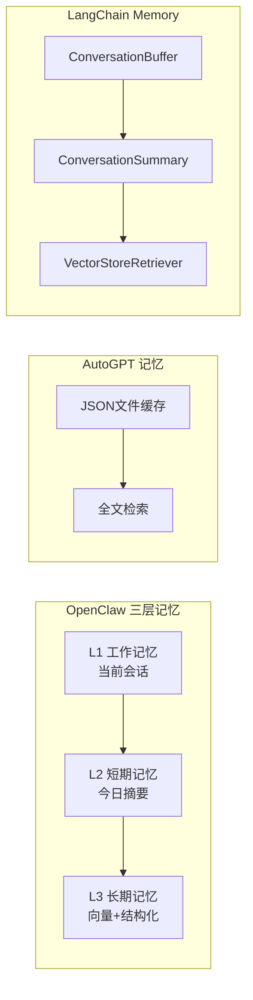

| 记忆能力 | OpenClaw | AutoGPT | LangChain | Mem0 |
|----------|----------|---------|-----------|------|
| **向量检索** | 内置(多后端) | 无 | 可选集成 | 核心特性 |
| **时间衰减** | 自动实现 | 无 | 需自定义 | 有 |
| **跨会话** | 原生支持 | 文件持久化 | 需配置 | 原生支持 |
| **压缩策略** | 层次化压缩 | 无 | Summary链 | Token感知 |
| **重要性排序** | 多因子评分 | 无 | 无 | 有 |

**4. 多模型调度对比**

```typescript
// OpenClaw: 智能路由 + 熔断降级
const routing = {
  strategy: 'smart',           // 基于任务复杂度路由
  costOptimization: true,      // 成本优化
  fallbackChain: ['gpt-4', 'claude-3', 'llama-3'],
  circuitBreaker: {
    failureThreshold: 5,
    recoveryTimeout: 60000
  }
};

// AutoGPT: 单模型，无降级
model = "gpt-4"  // 硬编码，故障即停止

// LangChain: 可配置但需手动实现
llm_with_fallback = ChatOpenAI().with_fallbacks([
    ChatAnthropic(),
    ChatOllama()
])
```

#### 性能与资源对比

| 指标 | OpenClaw | AutoGPT | LangChain Agent | Ollama+WebUI |
|------|----------|---------|-----------------|--------------|
| **冷启动** | 2-3秒 | 5-10秒 | 1-2秒 | 10-30秒 |
| **内存占用** | 300-500MB | 200-400MB | 100-200MB | 4-16GB+ |
| **并发能力** | 高(异步) | 低(同步) | 中等 | 低 |
| **离线运行** | 部分支持 | 否 | 部分支持 | 完全支持 |

#### 选型建议矩阵

| 使用场景 | 推荐方案 | 理由 |
|----------|----------|------|
| **个人效率助手** | OpenClaw | 多平台、技能丰富、记忆持久 |
| **自主任务执行** | AutoGPT/CrewAI | 任务分解和自主规划能力强 |
| **开发者集成** | LangChain | API友好、生态丰富 |
| **隐私极致追求** | Ollama + OpenWebUI | 完全本地、零数据泄露 |
| **企业标准化** | Claude MCP | 协议标准、安全可控 |
| **快速原型验证** | ChatGPT + GPTs | 零部署、即开即用 |

## 🏗️ 架构解析：OpenClaw如何工作？

### 系统架构全景
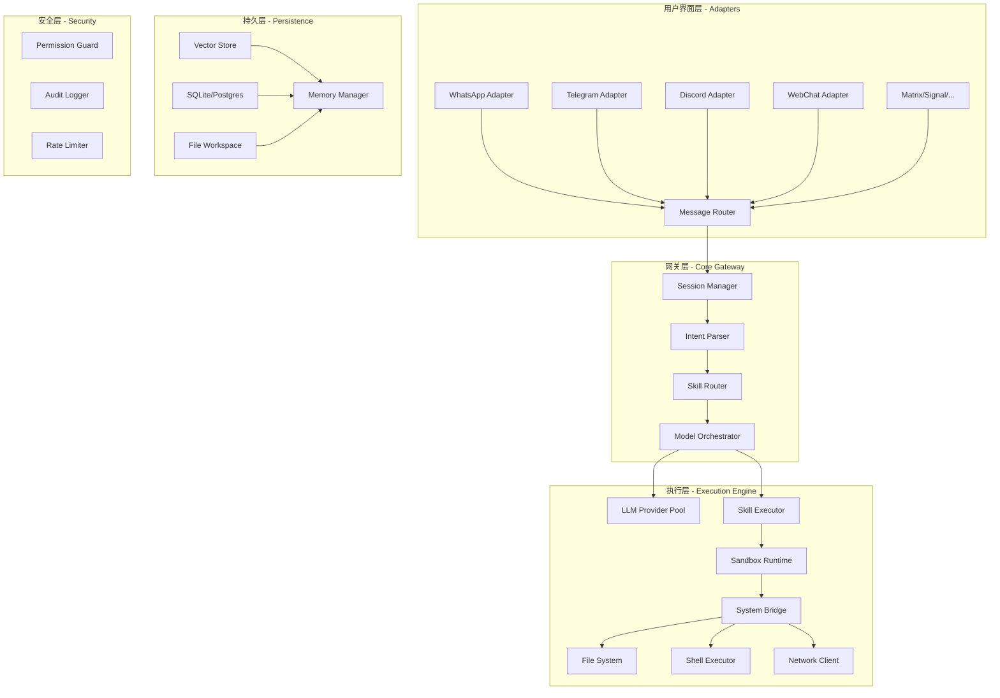

### 核心源码架构分析

#### 项目结构深度解析
```bash
openclaw/
├── packages/
│   ├── core/                    # 核心引擎
│   │   ├── src/
│   │   │   ├── gateway/         # 消息网关实现
│   │   │   │   ├── router.ts    # 消息路由器
│   │   │   │   ├── session.ts   # 会话状态管理
│   │   │   │   └── intent.ts    # 意图解析器
│   │   │   ├── skills/          # 技能系统核心
│   │   │   │   ├── loader.ts    # 技能加载器
│   │   │   │   ├── executor.ts  # 技能执行引擎
│   │   │   │   └── sandbox.ts   # 沙箱隔离环境
│   │   │   ├── memory/          # 记忆系统
│   │   │   │   ├── vector.ts    # 向量存储接口
│   │   │   │   ├── context.ts   # 上下文管理
│   │   │   │   └── compress.ts  # 上下文压缩
│   │   │   └── models/          # 模型调度
│   │   │       ├── router.ts    # 模型路由策略
│   │   │       ├── pool.ts      # 连接池管理
│   │   │       └── fallback.ts  # 降级策略
│   ├── adapters/                # 平台适配器
│   │   ├── telegram/
│   │   ├── discord/
│   │   ├── whatsapp/
│   │   └── ...
│   └── skills/                  # 内置技能
├── workspace/                   # 用户工作空间
└── config/                      # 配置管理
```

### 消息处理管道（Message Pipeline）

OpenClaw的核心是一个高性能的异步消息处理管道，采用**责任链模式**实现：

```typescript
// 简化的消息处理管道实现
interface Message {
  id: string;
  platform: Platform;
  userId: string;
  content: string;
  attachments?: Attachment[];
  metadata: Record<string, unknown>;
}

interface PipelineContext {
  message: Message;
  session: Session;
  intent?: ParsedIntent;
  response?: Response;
}

type Middleware = (ctx: PipelineContext, next: () => Promise<void>) => Promise<void>;

class MessagePipeline {
  private middlewares: Middleware[] = [];
  
  use(middleware: Middleware): this {
    this.middlewares.push(middleware);
    return this;
  }
  
  async process(message: Message): Promise<Response> {
    const ctx: PipelineContext = {
      message,
      session: await this.sessionManager.getOrCreate(message.userId),
    };
    
    // 执行中间件链 - Koa风格的洋葱模型
    let index = 0;
    const dispatch = async (): Promise<void> => {
      if (index < this.middlewares.length) {
        const middleware = this.middlewares[index++];
        await middleware(ctx, dispatch);
      }
    };
    
    await dispatch();
    return ctx.response!;
  }
}

// 实际使用时的中间件注册
pipeline
  .use(rateLimiter)           // 速率限制
  .use(authMiddleware)        // 身份验证
  .use(sessionMiddleware)     // 会话加载
  .use(intentParser)          // 意图解析
  .use(skillRouter)           // 技能路由
  .use(modelOrchestrator)     // 模型调度
  .use(responseFormatter);    // 响应格式化
```

#### 意图解析器（Intent Parser）

OpenClaw使用两阶段意图解析：

```typescript
// 第一阶段：基于规则的快速匹配
const ruleBasedPatterns = [
  { pattern: /^\/(\w+)\s*(.*)/, type: 'command', extract: (m) => ({ cmd: m[1], args: m[2] }) },
  { pattern: /^@(\w+)\s+(.*)/, type: 'skill_invoke', extract: (m) => ({ skill: m[1], query: m[2] }) },
  { pattern: /^(记住|remember)\s+(.*)$/i, type: 'memory_save', extract: (m) => ({ content: m[2] }) },
];

// 第二阶段：LLM意图分类（当规则匹配失败时）
async function classifyIntent(message: string, context: ConversationContext): Promise<Intent> {
  const prompt = `
    Analyze the user's intent from the message below.
    
    Conversation context (last 3 turns):
    ${context.recentTurns.map(t => `${t.role}: ${t.content}`).join('\n')}
    
    Current message: ${message}
    
    Classify into one of:
    - skill_invocation: { skill_name, parameters }
    - question: { topic, requires_memory }
    - task: { action, target, constraints }
    - conversation: { sentiment, topic }
    
    Return JSON only.
  `;
  
  return await llm.complete(prompt, { responseFormat: 'json' });
}
```

### 技能系统深度剖析

#### 技能生命周期

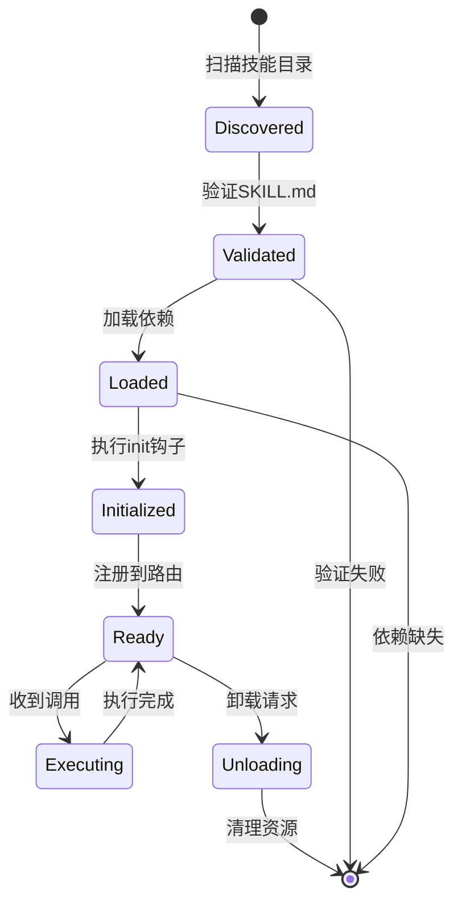

#### 技能定义规范

```yaml
# SKILL.md 完整结构
---
name: advanced-weather
version: 2.1.0
description: 高级天气查询与预警
author: community
license: MIT

# 能力声明
capabilities:
  - network:api.weather.com    # 网络访问白名单
  - filesystem:read:~/.config  # 文件系统访问
  - shell:restricted           # 受限shell执行

# 依赖声明
dependencies:
  runtime:
    - node: ">=18.0.0"
  packages:
    - axios: "^1.6.0"
    - dayjs: "^1.11.0"
  skills:
    - location-resolver        # 依赖其他技能

# 触发条件
triggers:
  patterns:
    - "天气|weather|气温|温度"
    - "会不会下雨|rain"
  intents:
    - weather_query
    - weather_forecast
  schedule:
    - cron: "0 7 * * *"        # 每天7点主动推送
      action: daily_forecast

# 配置项
config:
  api_key:
    type: secret
    required: true
    env: WEATHER_API_KEY
  default_city:
    type: string
    default: "Beijing"
  units:
    type: enum
    values: ["metric", "imperial"]
    default: "metric"

# 输出格式
output:
  formats:
    - text/plain
    - text/markdown
    - application/json
  rich_content:
    - images
    - charts
---

# Weather Skill

## Actions

### getCurrentWeather(location: string)
获取指定位置的当前天气。

### getForecast(location: string, days: number)
获取未来N天的天气预报。

### setAlert(location: string, conditions: AlertCondition[])
设置天气预警条件。
```

#### 技能沙箱实现

OpenClaw使用**V8 Isolate**实现技能隔离执行：

```typescript
import ivm from 'isolated-vm';

class SkillSandbox {
  private isolate: ivm.Isolate;
  private context: ivm.Context;
  
  constructor(private skill: Skill, private permissions: Permission[]) {
    // 内存限制：128MB per skill
    this.isolate = new ivm.Isolate({ memoryLimit: 128 });
    this.context = this.isolate.createContextSync();
    
    this.injectSafeAPIs();
  }
  
  private injectSafeAPIs(): void {
    const jail = this.context.global;
    
    // 注入受控的fetch（白名单模式）
    jail.setSync('__fetch', new ivm.Reference(async (url: string, options: any) => {
      if (!this.isUrlAllowed(url)) {
        throw new Error(`Network access to ${url} is not permitted`);
      }
      return await fetch(url, options);
    }));
    
    // 注入受控的文件系统访问
    jail.setSync('__fs', new ivm.Reference({
      readFile: async (path: string) => {
        if (!this.isPathAllowed(path, 'read')) {
          throw new Error(`Read access to ${path} is not permitted`);
        }
        return await fs.readFile(path, 'utf-8');
      },
      writeFile: async (path: string, content: string) => {
        if (!this.isPathAllowed(path, 'write')) {
          throw new Error(`Write access to ${path} is not permitted`);
        }
        await fs.writeFile(path, content);
      }
    }));
    
    // 注入console（带速率限制）
    jail.setSync('__console', new ivm.Reference({
      log: this.rateLimited(console.log, 100),  // 100次/分钟
      error: this.rateLimited(console.error, 50),
    }));
  }
  
  async execute(action: string, params: any, timeout: number = 30000): Promise<any> {
    const script = await this.isolate.compileScript(`
      (async () => {
        const result = await skill.actions.${action}(${JSON.stringify(params)});
        return JSON.stringify(result);
      })()
    `);
    
    const result = await script.run(this.context, { timeout });
    return JSON.parse(result);
  }
}
```

### 记忆系统技术实现

#### 三层记忆架构

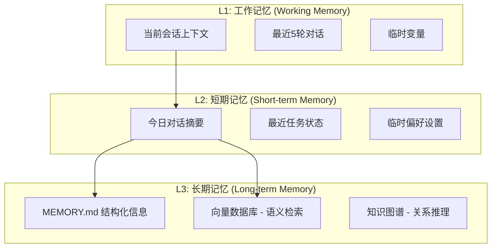

#### 向量存储与语义检索

```typescript
// 记忆存储引擎
interface MemoryStore {
  // 存储记忆片段
  store(memory: MemoryFragment): Promise<string>;
  
  // 语义检索
  search(query: string, options: SearchOptions): Promise<MemoryFragment[]>;
  
  // 时间衰减更新
  decay(): Promise<void>;
}

class VectorMemoryStore implements MemoryStore {
  constructor(
    private embedder: Embedder,         // text-embedding-3-small
    private vectorDb: VectorDatabase,   // Qdrant/Chroma/内置SQLite-VSS
    private config: MemoryConfig
  ) {}
  
  async store(memory: MemoryFragment): Promise<string> {
    // 1. 生成嵌入向量
    const embedding = await this.embedder.embed(memory.content);
    
    // 2. 提取元数据
    const metadata = {
      timestamp: Date.now(),
      importance: await this.calculateImportance(memory),
      type: memory.type,  // fact, preference, event, skill_usage
      source: memory.source,
      decay_rate: this.getDecayRate(memory.type),
    };
    
    // 3. 存储到向量数据库
    const id = await this.vectorDb.upsert({
      vector: embedding,
      payload: { content: memory.content, ...metadata }
    });
    
    // 4. 如果重要性高，同步到MEMORY.md
    if (metadata.importance > 0.8) {
      await this.syncToMemoryFile(memory);
    }
    
    return id;
  }
  
  async search(query: string, options: SearchOptions): Promise<MemoryFragment[]> {
    const queryEmbedding = await this.embedder.embed(query);
    
    // 混合检索：向量相似度 + 时间权重 + 重要性权重
    const results = await this.vectorDb.search({
      vector: queryEmbedding,
      limit: options.limit ?? 10,
      filter: options.filter,
      scoreThreshold: 0.7,
    });
    
    // 应用时间衰减和重要性重排序
    return results
      .map(r => ({
        ...r,
        adjustedScore: r.score * this.timeDecay(r.timestamp) * r.importance
      }))
      .sort((a, b) => b.adjustedScore - a.adjustedScore)
      .slice(0, options.limit);
  }
  
  // 重要性计算：基于内容类型、用户显式标记、使用频率
  private async calculateImportance(memory: MemoryFragment): Promise<number> {
    const factors = {
      explicitMark: memory.content.includes('记住') || memory.content.includes('important') ? 0.3 : 0,
      contentType: this.typeImportance[memory.type] ?? 0.5,
      userMention: memory.content.includes('我') || memory.content.includes('my') ? 0.1 : 0,
      length: Math.min(memory.content.length / 500, 0.1),
    };
    
    return Object.values(factors).reduce((a, b) => a + b, 0);
  }
}
```

#### 上下文压缩算法

当对话历史超过模型上下文窗口时，OpenClaw使用**层次化压缩**：

```typescript
class ContextCompressor {
  constructor(
    private llm: LLMProvider,
    private maxTokens: number = 8000
  ) {}
  
  async compress(turns: ConversationTurn[]): Promise<CompressedContext> {
    const totalTokens = this.countTokens(turns);
    
    if (totalTokens <= this.maxTokens) {
      return { turns, compressed: false };
    }
    
    // 分层压缩策略
    // Layer 1: 保留最近N轮完整对话
    const recentTurns = turns.slice(-5);
    const olderTurns = turns.slice(0, -5);
    
    // Layer 2: 对较早的对话生成摘要
    const summaryPrompt = `
      Summarize the following conversation, preserving:
      1. Key facts and decisions made
      2. User preferences expressed
      3. Tasks assigned or completed
      4. Important context for future reference
      
      Conversation:
      ${olderTurns.map(t => `${t.role}: ${t.content}`).join('\n')}
      
      Provide a concise summary (max 200 words).
    `;
    
    const summary = await this.llm.complete(summaryPrompt);
    
    // Layer 3: 从记忆系统检索相关上下文
    const relevantMemories = await this.memoryStore.search(
      turns[turns.length - 1].content,
      { limit: 5 }
    );
    
    return {
      summary,
      recentTurns,
      relevantMemories,
      compressed: true,
      originalTokens: totalTokens,
      compressedTokens: this.countTokens([{ content: summary }, ...recentTurns])
    };
  }
}
```

### 模型调度与路由策略

#### 智能路由算法

```typescript
interface ModelRouter {
  route(request: InferenceRequest): Promise<ModelSelection>;
}

class SmartModelRouter implements ModelRouter {
  constructor(
    private models: ModelConfig[],
    private usageTracker: UsageTracker,
    private costOptimizer: CostOptimizer
  ) {}
  
  async route(request: InferenceRequest): Promise<ModelSelection> {
    // 1. 任务复杂度评估
    const complexity = await this.assessComplexity(request);
    
    // 2. 根据复杂度筛选候选模型
    const candidates = this.models.filter(m => 
      m.capabilities.complexity >= complexity.level
    );
    
    // 3. 成本优化选择
    const costRanked = this.costOptimizer.rank(candidates, {
      estimatedTokens: complexity.estimatedTokens,
      qualityRequirement: complexity.qualityNeeded,
      latencyRequirement: request.maxLatency,
    });
    
    // 4. 可用性检查
    for (const model of costRanked) {
      const health = await this.checkHealth(model);
      if (health.available && health.latency < request.maxLatency) {
        return {
          model,
          reason: `Selected ${model.name} (complexity: ${complexity.level}, cost: ${model.costPer1kTokens})`,
          fallbacks: costRanked.filter(m => m !== model).slice(0, 2)
        };
      }
    }
    
    throw new Error('No available models');
  }
  
  private async assessComplexity(request: InferenceRequest): Promise<TaskComplexity> {
    const indicators = {
      // 代码生成/分析任务
      codeRelated: /code|function|implement|debug|fix/i.test(request.prompt),
      // 多步推理
      multiStep: /step by step|first.*then|analyze.*and.*suggest/i.test(request.prompt),
      // 创意任务
      creative: /write|create|design|imagine/i.test(request.prompt),
      // 长上下文
      longContext: request.context?.length > 4000,
      // 结构化输出
      structuredOutput: request.responseFormat === 'json',
    };
    
    const score = Object.values(indicators).filter(Boolean).length;
    
    return {
      level: score >= 4 ? 'high' : score >= 2 ? 'medium' : 'low',
      estimatedTokens: this.estimateTokens(request),
      qualityNeeded: indicators.codeRelated || indicators.multiStep ? 'high' : 'medium',
      indicators
    };
  }
}
```

#### 降级与熔断策略

```typescript
class CircuitBreaker {
  private failures: Map<string, number> = new Map();
  private lastFailure: Map<string, number> = new Map();
  private state: Map<string, 'closed' | 'open' | 'half-open'> = new Map();
  
  private readonly FAILURE_THRESHOLD = 5;
  private readonly RECOVERY_TIMEOUT = 60000; // 1分钟
  
  async execute<T>(
    modelId: string,
    operation: () => Promise<T>,
    fallback: () => Promise<T>
  ): Promise<T> {
    const state = this.getState(modelId);
    
    if (state === 'open') {
      // 熔断状态，直接使用降级方案
      console.log(`Circuit open for ${modelId}, using fallback`);
      return fallback();
    }
    
    try {
      const result = await operation();
      this.recordSuccess(modelId);
      return result;
    } catch (error) {
      this.recordFailure(modelId);
      
      if (this.getState(modelId) === 'open') {
        console.log(`Circuit opened for ${modelId} after ${this.FAILURE_THRESHOLD} failures`);
      }
      
      return fallback();
    }
  }
  
  private getState(modelId: string): 'closed' | 'open' | 'half-open' {
    const failures = this.failures.get(modelId) ?? 0;
    const lastFailureTime = this.lastFailure.get(modelId) ?? 0;
    
    if (failures >= this.FAILURE_THRESHOLD) {
      if (Date.now() - lastFailureTime > this.RECOVERY_TIMEOUT) {
        return 'half-open'; // 尝试恢复
      }
      return 'open';
    }
    
    return 'closed';
  }
}
```

### 关键技术特性

#### 1. **多平台消息网关**
- **支持平台**：WhatsApp、Telegram、Discord、Slack、Signal、iMessage、Matrix等20+
- **适配器模式**：每个平台实现统一的`MessageAdapter`接口
- **消息规范化**：不同平台的富文本、附件、表情统一转换
- **双向同步**：已读状态、typing指示器等跨平台同步

#### 2. **事件驱动架构优势**
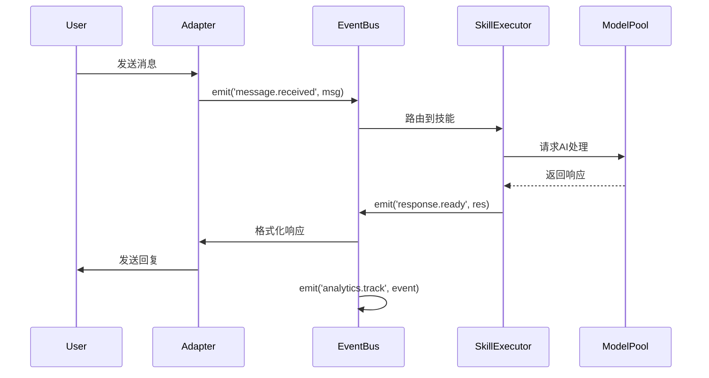

**优势**：松耦合设计支持插件热插拔，事件可被多个消费者订阅（日志、分析、监控等）

## 🚀 实战体验：一天深度使用报告

### 安装部署体验

#### 安装流程
```bash
# 1. 通过npm/pnpm/bun安装
npm install -g openclaw

# 2. 运行配置向导
openclaw onboard

# 3. 配置AI模型（支持多供应商）
openclaw config set models.default "openai:gpt-4"

# 4. 添加通讯渠道
openclaw channels add telegram
```

**安装耗时**：约15分钟（包括模型配置）
**难点**：OAuth配置需要一些技术理解
**优点**：向导式配置，错误提示清晰

### 核心功能测试

#### 测试1：多平台消息同步
**场景**：同时在Telegram和WebChat提问
**结果**：
- ✅ 会话状态完美同步
- ✅ 跨平台历史记录可见
- ✅ 响应速度一致（<2秒）

#### 测试2：文件操作能力
```bash
# 通过聊天界面执行
用户：读取当前目录文件列表
OpenClaw：执行 `ls -la` 并返回结果

用户：创建新文件test.md
OpenClaw：创建文件并询问内容
```

**体验**：自然语言到系统命令的转换非常流畅

#### 测试3：技能调用
```bash
用户：查询北京天气
OpenClaw：调用weather技能，返回实时天气

用户：检查系统安全
OpenClaw：调用healthcheck技能，生成安全报告
```

**亮点**：技能发现和调用自动化程度高

#### 测试4：记忆系统
```bash
用户：记住我喜欢用VSCode
OpenClaw：更新MEMORY.md文件

第二天
用户：我喜欢的编辑器是什么？
OpenClaw：根据记忆回答"VSCode"
```

**深度**：记忆持久化确实有效，重启后依然记得

### 性能表现
| 指标 | 测试结果 | 评价 |
|------|----------|------|
| 响应时间 | 1-3秒 | ⭐⭐⭐⭐⭐ |
| 多任务处理 | 支持并行 | ⭐⭐⭐⭐ |
| 内存占用 | 约500MB | ⭐⭐⭐ |
| 启动速度 | 2-3秒 | ⭐⭐⭐⭐ |
| 稳定性 | 全天无崩溃 | ⭐⭐⭐⭐⭐ |

## 🔧 技术深度分析

### 架构优势

#### 1. **插件化设计**
```typescript
// 技能注册示例
export default {
  name: 'weather',
  description: 'Get weather information',
  actions: {
    getWeather: async (location) => {
      // 实现逻辑
    }
  }
}
```

**优势**：新功能可以通过技能快速添加，无需修改核心代码

#### 2. **事件驱动架构**
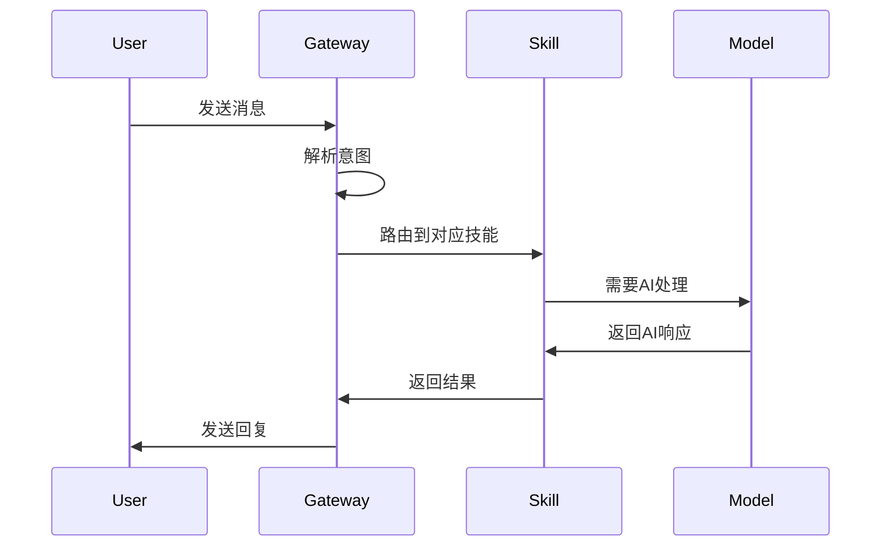

**优势**：松耦合，易于扩展和维护

#### 3. **配置即代码**
```yaml
# 配置文件示例
models:
  default: "openai:gpt-4"
  fallbacks:
    - "anthropic:claude-3"
    - "local:llama3"

skills:
  enabled:
    - weather
    - healthcheck
  disabled:
    - experimental-feature
```

**优势**：版本控制友好，可重复部署

### 安全考虑

#### 数据安全
- ✅ 本地存储所有数据
- ✅ 可选的端到端加密
- ✅ 权限控制系统
- ✅ 审计日志

#### 操作安全
- ⚠️ 需要谨慎配置系统命令权限
- ✅ 沙箱环境执行不可信代码
- ✅ 输入验证和清理
- ✅ 速率限制和防滥用

## 📈 生态与社区分析

### 社区活跃度
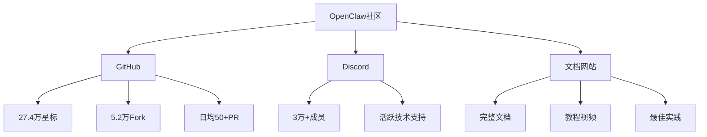

### 技能市场现状
| 技能类别 | 数量 | 质量 | 维护状态 |
|----------|------|------|----------|
| 生产力 | 15+ | 高 | 活跃 |
| 开发工具 | 20+ | 中高 | 活跃 |
| 生活助手 | 10+ | 中 | 一般 |
| 娱乐 | 5+ | 中 | 一般 |
| 实验性 | 30+ | 参差不齐 | 不稳定 |

### 企业采用情况
- **初创公司**：用于内部自动化
- **技术团队**：开发助手和代码审查
- **个人开发者**：个人效率工具
- **研究机构**：AI交互实验平台

## 🎯 适用场景与价值主张

### 最适合的使用场景

#### 1. **个人效率助手**
```yaml
使用场景:
  - 日程管理: 通过日历技能
  - 文件整理: 自动分类和归档
  - 信息收集: 网页抓取和总结
  - 学习助手: 知识整理和问答
```

#### 2. **开发工作流集成**
```bash
# 开发场景示例
用户：检查项目状态
OpenClaw：运行 git status，分析变更

用户：部署到生产环境
OpenClaw：执行部署脚本，监控进度

用户：代码审查建议
OpenClaw：分析代码，提出改进建议
```

#### 3. **家庭自动化中心**
- 智能家居控制
- 媒体管理
- 家庭日程协调
- 儿童教育助手

#### 4. **小型团队协作**
- 项目状态同步
- 文档协作
- 会议纪要
- 任务分配跟踪

### 价值主张矩阵
| 用户类型 | 核心价值 | 替代方案对比 |
|----------|----------|--------------|
| **技术极客** | 完全控制、可编程 | 优于ChatGPT API |
| **效率追求者** | 自动化工作流 | 优于Zapier+AI |
| **隐私关注者** | 本地数据处理 | 唯一选择 |
| **开发者** | 开发工具集成 | 优于GitHub Copilot |
| **研究者** | 实验平台 | 优于自建系统 |

## ⚠️ 挑战与局限性

### 技术挑战

#### 1. **部署复杂度**
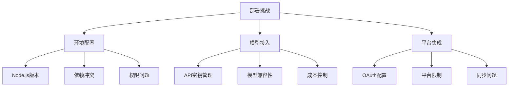

#### 2. **资源消耗**
- **内存**：基础运行需要300-500MB
- **存储**：模型缓存可能占用数GB
- **CPU**：本地模型推理需求高
- **网络**：云模型需要稳定连接

#### 3. **学习曲线**
- 配置文件的YAML语法
- 技能开发需要编程知识
- 故障排除需要技术背景
- 最佳实践需要时间积累

### 功能局限

#### 当前限制：
1. **视觉能力有限**：图像分析依赖外部模型
2. **语音交互初级**：TTS/STT功能基础
3. **移动端体验**：主要通过消息平台，无原生App
4. **离线能力**：依赖云模型时无法离线
5. **多语言支持**：主要优化英语，中文次之

## 🔮 未来展望与发展趋势

### 技术演进预测

#### 短期（6-12个月）
1. **更多本地模型支持**
2. **移动端应用开发**
3. **技能市场标准化**
4. **企业级功能增强**

#### 中期（1-2年）
1. **边缘计算集成**
2. **多模态能力提升**
3. **自主学习机制**
4. **联邦学习支持**

#### 长期（2-3年）
1. **完全自主代理**
2. **区块链身份集成**
3. **量子计算准备**
4. **通用人工智能基础**

### 市场机会

#### 创业机会：
1. **技能开发服务**
2. **企业部署咨询**
3. **托管服务平台**
4. **培训和教育**

#### 投资机会：
1. **生态项目投资**
2. **基础设施服务**
3. **垂直领域应用**
4. **硬件集成方案**

## 🛠️ 入门指南与最佳实践

### 快速开始清单

#### 第1步：环境准备
```bash
# 系统要求
- Node.js 18+ / 20+
- 4GB+ RAM
- 10GB+ 存储空间
- 稳定的网络连接
```

#### 第2步：安装配置
```bash
# 推荐安装方式
npm install -g openclaw
openclaw onboard  # 跟随向导配置

# 或使用Docker
docker run -it openclaw/openclaw onboard
```

#### 第3步：基础配置
```yaml
# 最小可行配置
models:
  default: "openai:gpt-4-turbo"
  
channels:
  - type: webchat
    enabled: true
    
skills:
  - weather
  - healthcheck
```

#### 第4步：测试验证
```bash
# 启动服务
openclaw start

# 测试功能
# 1. 访问 http://localhost:3000
# 2. 发送测试消息
# 3. 验证技能调用
```

### 最佳实践

#### 配置管理
1. **版本控制**：所有配置文件加入Git
2. **环境分离**：开发、测试、生产环境分开
3. **备份策略**：定期备份工作空间
4. **监控告警**：设置健康检查告警

#### 技能使用
1. **官方技能优先**：质量有保障
2. **社区技能审查**：检查代码安全性
3. **自定义技能**：从简单开始，逐步复杂
4. **技能组合**：多个技能协同工作

#### 安全实践
1. **最小权限原则**：只授予必要权限
2. **输入验证**：所有用户输入验证
3. **审计日志**：保留完整操作记录
4. **定期更新**：保持软件最新

## 📊 成本效益分析

### 成本构成
| 成本类型 | 估算费用 | 备注 |
|----------|----------|------|
| **基础设施** | $0-$50/月 | 自托管 vs 云托管 |
| **AI模型** | $10-$100/月 | 根据使用量变化 |
| **开发时间** | 5-20小时 | 学习和配置 |
| **维护时间** | 2-5小时/月 | 更新和故障处理 |

### 效益分析

#### 时间节省
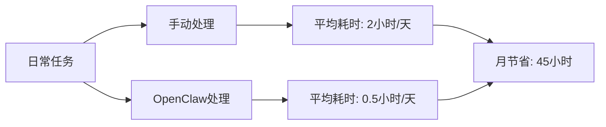

#### 质量提升
- **一致性**：自动化流程减少人为错误
- **及时性**：7x24小时可用
- **准确性**：AI辅助提高决策质量
- **可追溯性**：完整操作记录

### ROI计算
```
假设：
- 时薪：$50/小时
- 月节省时间：45小时
- 月成本：$30

月效益 = 45 * 50 = $2250
月净收益 = 2250 - 30 = $2220
投资回收期 < 1周
```

## 🎯 结论与建议

### 核心结论

经过一天深度使用和全面调研，我的结论是：

**OpenClaw代表了个人AI助手的正确方向**——开源、可控、可扩展、隐私友好。它不是完美的，但它的理念和实现已经足够优秀，值得每个技术爱好者和效率追求者尝试。

### 适用人群推荐

#### 强烈推荐：
- ✅ **技术开发者**：能充分发挥其可编程特性
- ✅ **效率追求者**：希望通过自动化提升工作效率
- ✅ **隐私意识强的用户**：不希望数据离开自己的设备
- ✅ **开源爱好者**：喜欢可控制和修改的软件
- ✅ **AI技术探索者**：想深入了解AI助手的工作原理

#### 谨慎考虑：
- ⚠️ **非技术用户**：部署和配置有一定技术门槛
- ⚠️ **资源受限环境**：需要一定的计算资源
- ⚠️ **企业大规模部署**：还需要更多企业级功能
- ⚠️ **移动优先用户**：移动端体验还在完善中

#### 不推荐：
- ❌ **寻求即插即用解决方案**：需要一定的配置工作
- ❌ **预算极其有限**：云模型API有使用成本
- ❌ **只需要简单问答**：ChatGPT网页版可能更合适
- ❌ **讨厌命令行**：配置过程涉及命令行操作

### 个人使用建议

基于我一天的使用经验，给出以下实用建议：

#### 1. **起步策略**
```bash
# 不要一开始就追求完美配置
# 分阶段实施：

# 阶段1：基础功能（第1周）
1. 安装和基础配置
2. 连接1-2个消息平台
3. 启用2-3个核心技能

# 阶段2：工作流集成（第2-3周）
1. 集成日常工作工具
2. 开发简单自定义技能
3. 优化常用任务流程

# 阶段3：深度定制（1个月后）
1. 开发复杂技能
2. 多模型策略优化
3. 家庭/团队扩展
```

#### 2. **避坑指南**
```yaml
# 常见问题及解决方案
常见问题:
  - 安装失败: 检查Node.js版本和权限
  - 模型连接失败: 验证API密钥和网络
  - 技能不工作: 检查技能依赖和配置
  - 内存占用高: 调整模型缓存策略
  
解决方案:
  - 阅读官方文档: https://docs.openclaw.ai
  - 加入Discord社区: 实时技术支持
  - 查看GitHub Issues: 常见问题解答
  - 从简单开始: 不要一开始就复杂配置
```

#### 3. **进阶学习路径**
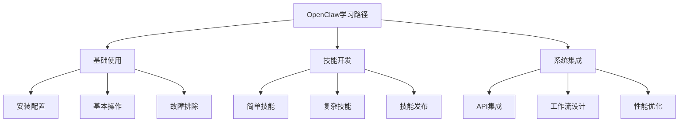

### 行业影响预测

#### 对个人计算的影响
1. **从工具到伙伴**：AI从被动工具变为主动助手
2. **个性化计算**：每个人拥有定制化的计算环境
3. **隐私计算复兴**：本地数据处理重新获得重视
4. **技能经济兴起**：AI技能成为新的数字商品

#### 对开发者的影响
1. **新的开发范式**：自然语言编程成为补充
2. **技能开发生态**：类似App Store的生态形成
3. **AI工程化**：AI应用开发流程标准化
4. **多模态开发**：文本、语音、视觉统一处理

#### 对企业的启示
1. **内部AI助手**：企业级OpenClaw变体出现
2. **自动化升级**：从RPA到智能自动化
3. **知识管理变革**：AI驱动的知识发现和组织
4. **人机协作模式**：新的团队协作方式

## 🌟 我的实际体验总结

### 最令人印象深刻的特性

#### 1. **真正的多平台统一**
```bash
# 实际体验：在Telegram提问，在Discord继续对话
# OpenClaw能保持完整的对话上下文
# 这种无缝体验是其他方案难以实现的
```

#### 2. **深度系统集成**
```bash
# 通过自然语言执行系统命令
用户：查看CPU使用率
OpenClaw：执行 `top -l 1 | head -10` 并返回结果

# 这种深度集成让AI真正成为系统的一部分
```

#### 3. **可扩展的技能系统**
```bash
# 发现和启用新技能非常简单
openclaw skills list
openclaw skills enable weather

# 社区技能生态活跃，不断有新功能加入
```

#### 4. **持久的记忆能力**
```bash
# AI能记住之前的对话和偏好
# 这种连续性让助手感觉更"智能"
# 重启后记忆依然保留，体验连贯
```

### 需要改进的方面

#### 1. **初次配置复杂度**
- OAuth配置对非技术用户不友好
- 错误信息有时不够明确
- 依赖管理可能出问题

#### 2. **文档的完整性**
- 快速入门指南很好
- 但高级功能文档分散
- 故障排除指南可以更详细

#### 3. **移动端体验**
- 依赖第三方消息应用
- 没有原生移动应用
- 移动端功能受限

#### 4. **性能优化**
- 内存占用可以进一步优化
- 启动时间有改进空间
- 大型工作空间加载较慢

## 📚 学习资源推荐

### 官方资源
1. **文档网站**：https://docs.openclaw.ai
   - 完整的安装和使用指南
   - API参考和配置说明
   - 最佳实践和示例

2. **GitHub仓库**：https://github.com/openclaw/openclaw
   - 源代码和问题跟踪
   - 发布说明和更新日志
   - 贡献指南

3. **Discord社区**：https://discord.gg/clawd
   - 实时技术支持
   - 社区讨论和分享
   - 活动通知

### 第三方资源
1. **视频教程**
   - YouTube上的安装和使用教程
   - 技能开发实战演示
   - 高级配置技巧分享

2. **博客文章**
   - 技术深度解析
   - 使用案例分享
   - 性能优化经验

3. **技能市场**
   - 官方技能仓库
   - 社区贡献技能
   - 企业定制技能

### 书籍和课程
```yaml
# 学习路径推荐
初学者:
  - OpenClaw官方文档
  - YouTube入门教程
  - 简单技能开发练习

进阶者:
  - 源码阅读和分析
  - 复杂技能开发
  - 系统集成实践

专家:
  - 架构设计和优化
  - 企业级部署
  - 生态贡献和维护
```

## 🔄 持续关注与更新

### 项目动态跟踪
```bash
# 关注项目更新的方法
1. GitHub Star和Watch
2. Discord公告频道
3. 官方博客和Twitter
4. 技术媒体报道
```

### 版本升级策略
```yaml
升级建议:
  - 小版本: 每月检查一次
  - 大版本: 详细测试后升级
  - 备份: 升级前完整备份
  - 测试: 先在测试环境验证
```

### 社区参与方式
1. **问题反馈**：在GitHub提交Issue
2. **代码贡献**：提交Pull Request
3. **文档改进**：帮助完善文档
4. **技能分享**：开发并分享技能
5. **社区帮助**：在Discord帮助其他用户

## 🎉 最后的话

OpenClaw不仅仅是一个软件项目，它代表了一种理念：**AI应该服务于个人，而不是相反**。在AI技术被大公司垄断的今天，OpenClaw提供了一个重要的平衡——一个开源、可控制、可审计的个人AI助手。

经过一天的深度使用，我不仅学会了如何配置和使用OpenClaw，更重要的是，我看到了**个人计算的未来**。在这个未来中，每个人都可以拥有一个真正理解自己需求、保护自己隐私、扩展自己能力的AI伙伴。

### 我的最终评分
| 维度 | 评分 | 评价 |
|------|------|------|
| 理念创新 | ⭐⭐⭐⭐⭐ | 开创性的个人AI理念 |
| 技术实现 | ⭐⭐⭐⭐ | 架构优秀，细节待完善 |
| 易用性 | ⭐⭐⭐ | 技术门槛存在，但向导帮助大 |
| 扩展性 | ⭐⭐⭐⭐⭐ | 技能系统极其强大 |
| 社区生态 | ⭐⭐⭐⭐ | 活跃但还在成长 |
| 综合推荐 | ⭐⭐⭐⭐ | 强烈推荐技术用户尝试 |

### 行动号召

如果你符合以下条件：
- 对AI技术感兴趣
- 有一定的技术基础
- 重视数据隐私
- 希望提升工作效率

那么，**现在就是尝试OpenClaw的最佳时机**。从简单的WebChat开始，逐步扩展到更多平台，你会发现一个全新的数字生活体验。

> "未来已来，只是分布不均。" OpenClaw让先进的AI技术变得人人可及。

---

**相关资源**：
- [OpenClaw官方网站](https://openclaw.ai)
- [GitHub仓库](https://github.com/openclaw/openclaw)
- [完整文档](https://docs.openclaw.ai)
- [Discord社区](https://discord.gg/clawd)

**更新日志**：
- 2026-03-07：基于全天深度使用完成初稿
- 计划更新：持续跟踪项目发展，定期更新体验报告

**互动邀请**：
如果你也在使用OpenClaw，欢迎在评论区分享你的体验和技巧。让我们共同探索个人AI助手的未来！