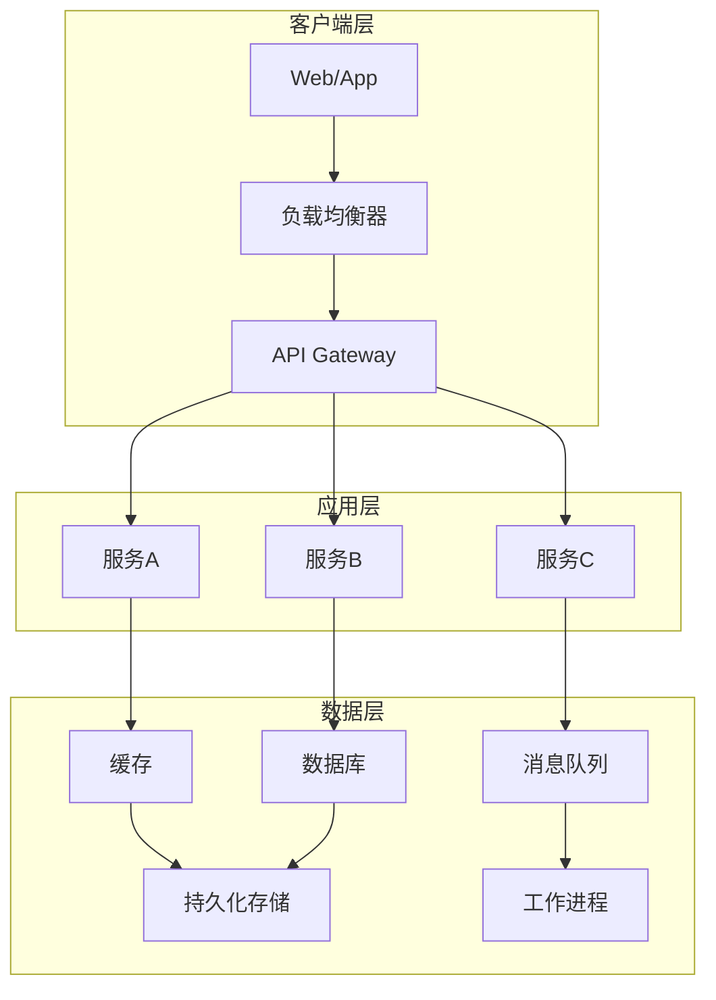

> 想要掌握系统设计却不知从何开始？本文是你的终极学习路线图。我将带你从基础概念出发，通过实战案例，最终成为系统设计高手。无论你是准备面试还是提升实际工作能力，这里都有完整的学习路径。

**阅读时间**：约15分钟  
**适合读者**：中级开发者、准备系统设计面试的工程师、想提升架构能力的技术人员  
**最后更新**：2026-03-07  
**系列导航**：[← 返回系列首页](/categories/system-design/) | [下一篇：存储系统设计 →](/2024/03/04/system-design/07-storage-mysql/)

---

## 🎯 快速开始：你的学习路线图

如果你时间有限，直接按这个路线学习：

```mermaid
timeline
    title 系统设计学习路线图
    section 第1-2周 : 基础入门
        掌握核心概念 : 可扩展性, 可用性, 可靠性
        学习基础组件 : 存储, 缓存, 消息队列
        完成练习 : 设计博客系统
    
    section 第3-5周 : 进阶组件
        分布式概念 : 一致性, 分区容错
        复杂组件 : 搜索, 容器化
        完成练习 : 设计短链接系统
    
    section 第6-8周 : 实战案例
        完整系统 : 电商, 社交平台
        高并发场景 : 秒杀, 实时系统
        完成练习 : 设计Twitter系统
    
    section 第9-10周 : 面试准备
        模拟面试 : 经典题目练习
        沟通训练 : 表达设计思路
        简历准备 : 项目经验整理
```

## 📚 核心概念速查表

### 可扩展性策略
| 场景 | 解决方案 | 技术实现 |
|------|----------|----------|
| 读多写少 | 缓存+读写分离 | Redis + MySQL主从 |
| 写多读少 | 消息队列异步 | Kafka + 批量写入 |
| 两者都多 | 分库分表+缓存 | ShardingSphere + Redis集群 |
| 热点数据 | 多级缓存+CDN | 本地缓存+Redis+CDN |

### 可用性保障
| 级别 | 年宕机时间 | 实现方案 |
|------|------------|----------|
| 99% | 3.65天 | 单机+定期备份 |
| 99.9% | 8.76小时 | 主从复制+自动故障转移 |
| 99.99% | 52分钟 | 多可用区+负载均衡 |
| 99.999% | 5分钟 | 多地多活+智能路由 |

### 数据一致性选择
| 一致性级别 | 适用场景 | 技术实现 |
|------------|----------|----------|
| 强一致性 | 金融交易 | 分布式事务(2PC, TCC) |
| 最终一致性 | 社交动态 | 消息队列+重试 |
| 会话一致性 | 用户会话 | 粘性会话+缓存 |
| 因果一致性 | 评论系统 | 向量时钟 |

## 🔧 4步设计法实战模板

### 步骤1：需求澄清清单
```markdown
## 需求澄清记录

### 功能需求
- [ ] 核心功能1: 
- [ ] 核心功能2: 
- [ ] 核心功能3: 

### 非功能需求
- **规模**: 用户数__，日活__，数据量__
- **性能**: QPS__，响应时间__，吞吐量__
- **可用性**: __% (年宕机时间__)
- **成本**: 预算__，资源限制__

### 假设与约束
- 技术栈: 
- 时间限制: 
- 团队技能: 
```

### 步骤2：高层设计模板


### 步骤3：细节设计检查表
- [ ] 数据模型设计完成
- [ ] 关键算法选择合理
- [ ] API接口定义清晰
- [ ] 错误处理方案完善
- [ ] 安全考虑周全

### 步骤4：评估优化问题
1. 瓶颈在哪里？如何优化？
2. 单点故障有哪些？如何消除？
3. 扩展性限制是什么？如何突破？
4. 成本能否进一步优化？

## 🗺️ 我的博客学习路径

### 基础阶段（建议2周）
1. **本文** - 系统设计基础概念 ✅
2. **[存储系统设计](/2024/03/04/system-design/07-storage-mysql/)** - 数据持久化
3. **[缓存系统设计](/2024/03/06/system-design/8-cache-redis/)** - 性能优化
4. **[消息队列设计](/2024/03/10/system-design/09-kafka-mq/)** - 异步处理

### 进阶阶段（建议3周）
5. **[搜索系统设计](/2024/03/07/system-design/10-elasticsearch/)** - 全文检索
6. **[容器化实践](/2024/12/20/system-design/11-k8s-docker/)** - 部署运维
7. **[技术架构设计](/2025/04/01/system-design/12-tech-design/)** - 架构决策

### 实战阶段（建议4周）
8. **[电商系统设计](/2025/05/01/system-design/13-e-commerce/)** - 完整案例
9. **[高并发系统设计](/2025/06/25/system-design/17-high-frequency-system-design/)** - 性能极致
10. **[可靠性工程](/2025/05/15/system-design/14-system-reliability/)** - 容错设计

### 面试阶段（建议2周）
11. **[Clean Code实践](/2025/06/20/system-design/31-clean-code/)** - 代码质量
12. **[LeetCode系统设计](/2025/06/20/system-design/16-leetcode/)** - 面试真题
13. **[程序员生存指南](/2024/10/16/other/programmer-survival-guide/)** - 职业发展

## 💼 10大经典面试题速解

### 1. 设计短链接系统
**核心要点**：短码生成、高并发重定向、防止冲突  
**关键技术**：Base62编码、布隆过滤器、缓存策略

### 2. 设计Twitter/微博
**核心要点**：时间线生成、大V问题、数据一致性  
**关键技术**：推拉混合模式、分级缓存、最终一致性

### 3. 设计网盘系统
**核心要点**：文件存储、版本控制、分享机制  
**关键技术**：对象存储、分块上传、权限管理

### 4. 设计电商秒杀系统
**核心要点**：库存扣减、防超卖、流量控制  
**关键技术**：Redis原子操作、令牌桶限流、队列削峰

### 5. 设计实时聊天系统
**核心要点**：消息推送、在线状态、消息同步  
**关键技术**：WebSocket、消息队列、读扩散写扩散

### 6. 设计搜索引擎
**核心要点**：爬虫调度、索引构建、相关性排序  
**关键技术**：倒排索引、PageRank、分布式爬虫

### 7. 设计推荐系统
**核心要点**：用户画像、物品特征、实时更新  
**关键技术**：协同过滤、Embedding、流式计算

### 8. 设计支付系统
**核心要点**：事务一致性、对账清算、风控安全  
**关键技术**：分布式事务、幂等性、熔断降级

### 9. 设计监控告警系统
**核心要点**：指标采集、异常检测、通知路由  
**关键技术**：时间序列数据库、异常检测算法、工作流引擎

### 10. 设计API网关
**核心要点**：路由转发、限流熔断、认证授权  
**关键技术**：反向代理、令牌桶算法、JWT认证

## 🛠️ 工具资源一键获取

### 设计绘图工具
- **[Excalidraw](https://excalidraw.com/)** - 手绘风格，面试神器
- **[Draw.io](https://app.diagrams.net/)** - 功能全面，免费开源
- **Mermaid** - 代码生成，本文同款

### 学习练习平台
- **[LeetCode系统设计](https://leetcode.com/explore/interview/card/system-design/)** - 免费题库
- **[DesignGurus](https://www.designgurus.io/)** - 付费但质量高
- **[system-design-primer](https://github.com/donnemartin/system-design-primer)** - GitHub星标190k+

### 我的资源合集
- **[系统设计系列首页](/categories/system-design/)** - 所有文章分类
- **[文章归档](/archives/)** - 按时间顺序查看
- **[实战案例库]** - 持续更新中（收藏本文获取更新）

## 📈 学习进度追踪器

复制以下代码到你的笔记中，自动追踪进度：

```markdown
## 系统设计学习进度

### 基础概念 ✅
- [x] 可扩展性理解
- [x] 可用性计算
- [x] 一致性选择
- [x] 4步设计法掌握

### 文章学习进度
| 文章 | 状态 | 完成日期 | 掌握程度 | 练习完成 |
|------|------|----------|----------|----------|
| 本文 | ✅ 完成 | 2026-03-07 | ⭐⭐⭐⭐⭐ | ✅ |
| 存储系统 | ⬜ 待学习 | | | |
| 缓存系统 | ⬜ 待学习 | | | |
| 消息队列 | ⬜ 待学习 | | | |
| 搜索系统 | ⬜ 待学习 | | | |
| 容器化 | ⬜ 待学习 | | | |
| 技术架构 | ⬜ 待学习 | | | |
| 电商系统 | ⬜ 待学习 | | | |
| 高并发系统 | ⬜ 待学习 | | | |
| 可靠性工程 | ⬜ 待学习 | | | |

### 练习完成情况
- [ ] 设计博客系统
- [ ] 设计短链接系统  
- [ ] 设计Twitter系统
- [ ] 设计秒杀系统
- [ ] 设计网盘系统

### 模拟面试记录
| 日期 | 题目 | 表现 | 改进点 |
|------|------|------|--------|
| | | | |
```

## 🚀 立即行动指南

### 如果你有30分钟：
1. 精读"核心概念速查表"
2. 理解"4步设计法实战模板"
3. 选择一个面试题思考解决方案

### 如果你有2小时：
1. 完整阅读本文
2. 尝试设计"短链接系统"
3. 使用模板记录设计过程

### 如果你有1周：
1. 按学习路径完成基础阶段
2. 每天练习一个设计题
3. 周末进行模拟面试

### 如果你有1个月：
1. 完成全部学习路径
2. 建立个人设计作品集
3. 准备真实面试

## 📞 获取帮助与支持

### 问题分类与解决渠道：
| 问题类型 | 最佳解决方式 | 资源链接 |
|----------|--------------|----------|
| 概念理解 | 重读本文相关章节 | 本文对应章节 |
| 设计练习 | 参考实战模板 | 4步设计法模板 |
| 技术细节 | 查阅具体文章 | 对应技术文章 |
| 面试准备 | 模拟面试练习 | 10大面试题 |
| 职业发展 | 阅读生存指南 | 程序员生存指南 |

### 紧急问题处理：
1. **概念混淆** → 查看"核心概念速查表"
2. **设计卡壳** → 使用"4步设计法模板"
3. **面试紧张** → 练习"沟通技巧要点"
4. **学习迷茫** → 回到"学习路线图"

---

## 📢 最后的重要提醒

1. **理论必须结合实践**：只看不练等于没学
2. **设计没有标准答案**：重要的是思考过程
3. **持续学习是关键**：技术领域日新月异
4. **分享促进成长**：教别人是最好的学习方式

**现在，选择你的起点，开始行动吧！**

> "系统设计能力的提升，不是一次飞跃，而是每天进步一点点。" - 与所有学习者共勉

---

**系列导航**：
- [← 返回系列首页](/categories/system-design/)
- [下一篇：存储系统设计 →](/2024/03/04/system-design/07-storage-mysql/)
- [所有系统设计文章 →](/archives/)

**📅 更新计划**：
- 2026-03-14：添加更多实战案例
- 2026-03-21：更新工具资源推荐
- 2026-04-01：发布系统设计面试真题解析

**💬 互动邀请**：
在评论区分享你的学习进度、遇到的问题或成功经验。我们一起进步！