<!-- toc -->

> **电商系统设计系列** —— 推荐阅读顺序
> 
> 本系列按照**业务流程 + 系统分层**组织，从基础到应用，先供给后销售：
> 
> **📖 第一部分：入门与全局观**
> - **（一）全景概览与领域划分**（本文）— 建立全局认知，理解系统边界
> 
> **🏗️ 第二部分：数据与规则基础（系统地基）**
> - [（二）商品中心系统](/system-design/21-ecommerce-product-center/) — SPU/SKU 模型、类目属性、商品快照
> - [（三）库存系统](/system-design/22-ecommerce-inventory/) — 库存预占、扣减、对账、二维分类模型
> - [（四）营销系统深度解析](/system-design/23-ecommerce-marketing-system/) — 优惠券、活动、补贴、圈品规则
> - [（五）计价引擎](/system-design/24-ecommerce-pricing-engine/) — 价格计算、费用、快照、降级策略
> - [（六）计价系统 DDD 实践](/system-design/25-ecommerce-pricing-ddd/) — 深入理解计价设计（与五对照阅读）
> 
> **🏭 第三部分：B 端供给链路（商家如何上架商品）**
> - [（九）商品上架系统](/system-design/28-ecommerce-listing/) — 审核流程、状态机、Saga 编排
> - [（十）B 端运营系统](/system-design/29-ecommerce-b-side-ops/) — 批量管理、配置工具、稳定性保障
> - [（十一）商品生命周期管理](/system-design/30-ecommerce-product-lifecycle-management/) — 上架、同步与运营编辑边界
> 
> **🛍️ 第四部分：C 端交易链路（用户如何购买商品）**
> - [（十二）搜索与导购](/system-design/31-ecommerce-search-discovery/) — Query 理解、召回、排序、Hydrate 编排
> - [（十三）购物车与结算域](/system-design/32-ecommerce-cart-checkout/) — 加购暂存、结算预占、Saga 编排
> - [（七）订单系统](/system-design/26-ecommerce-order-system/) — 订单创建、状态机、拆单、履约
> - [（八）支付系统深度解析](/system-design/27-ecommerce-payment-system/) — 支付流程、退款、清结算、对账

## 一、系统全景架构（EA + 4A 视角）

### 1.1 业务架构（BA）：基于 DDD 的领域全景

**视角说明**：采用 DDD（领域驱动设计）的**核心域、支撑域、通用域**三层结构，展示完整的电商业务能力。

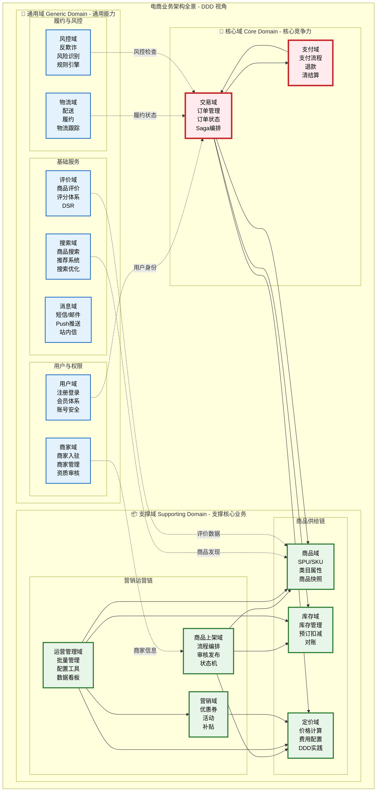

**DDD 领域划分说明**：

| 域类型 | 定义 | 业务价值 | 投资策略 | 本系列覆盖 |
|-------|------|---------|---------|----------|
| **核心域** | 平台的核心竞争力，差异化能力 | 最高，决定平台成败 | 重点投入，自研 | ✅ 订单、支付 |
| **支撑域** | 支撑核心业务的必要能力 | 中等，必须有但非差异化 | 适度投入，可定制 | ✅ 商品、库存、计价、营销、上架、运营 |
| **通用域** | 通用基础能力，行业共性 | 低，无差异化 | 最小投入，采购或开源 | ❌ 未详述（聚焦核心） |

**完整领域能力图谱**：

| 域层级 | 子域 | 核心能力 | 本系列文章 | 备注 |
|-------|------|---------|-----------|------|
| **🎯 核心域** | 交易域 | 订单创建、状态流转、Saga 编排 | （七）订单系统 | 电商核心竞争力 |
| | 支付域 | 支付流程、退款、清结算、对账 | （八）支付系统 | 资金安全核心 |
| **📦 支撑域** | 商品域 | SPU/SKU 模型、类目属性、商品快照 | （二）商品中心 | 交易的基础数据 |
| | 库存域 | 库存管理、预订扣减、库存对账 | （三）库存系统 | 保证可售性 |
| | 定价域 | 价格计算、费用配置、DDD 实践 | （五）（六）计价引擎 | 价格准确性 |
| | 营销域 | 优惠券、活动管理、补贴规则 | （四）营销系统 | 促进转化 |
| | 商品上架域 | 流程编排、审核发布、状态机 | （九）商品上架 | B 端供给流程 |
| | 运营管理域 | 批量管理、配置工具、数据看板 | （十）B 端运营 | B 端管理工具 |
| **🔧 通用域** | 搜索域 | 商品搜索、推荐系统、搜索优化 | ✅（十二）搜索与导购 | Query/召回/排序 |
| | 用户域 | 注册登录、会员体系、账号安全 | ❌ | 可采购 SSO |
| | 商家域 | 商家入驻、商家管理、资质审核 | ❌ | 通用商家平台 |
| | 消息域 | 短信/邮件、Push 推送、站内信 | ❌ | 可用消息中间件 |
| | 评价域 | 商品评价、评分体系、DSR | ❌ | 通用评价系统 |
| | 物流域 | 配送、履约、物流跟踪 | ❌ | 可对接三方物流 |
| | 风控域 | 反欺诈、风险识别、规则引擎 | ❌ | 可用风控平台 |

**本系列覆盖范围说明**：

> **为什么重点详述核心域和支撑域，以及完整的 B/C 端流程？**
> 
> 1. **面试高频**：核心域（订单、支付）和支撑域（商品、库存、计价）是系统设计面试的高频考点
> 2. **技术深度**：这些域涉及分布式事务、状态机、一致性等核心技术挑战
> 3. **差异化设计**：不同公司的实现差异大，需要深入理解设计思路
> 4. **业务流程完整**：从 B 端供给（上架）到 C 端交易（搜索 → 购物车 → 订单 → 支付），覆盖完整商业闭环
> 5. **通用域标准化**：用户、消息等通用域已有成熟解决方案（SSO、Kafka），无需详述

---

### 1.2 应用架构（AA）：系统依赖与技术分层

**视角说明**：从应用系统的技术依赖角度，展示各系统之间的调用关系和分层结构。本节侧重技术架构，与文首"推荐阅读顺序"的业务流程视角互补。

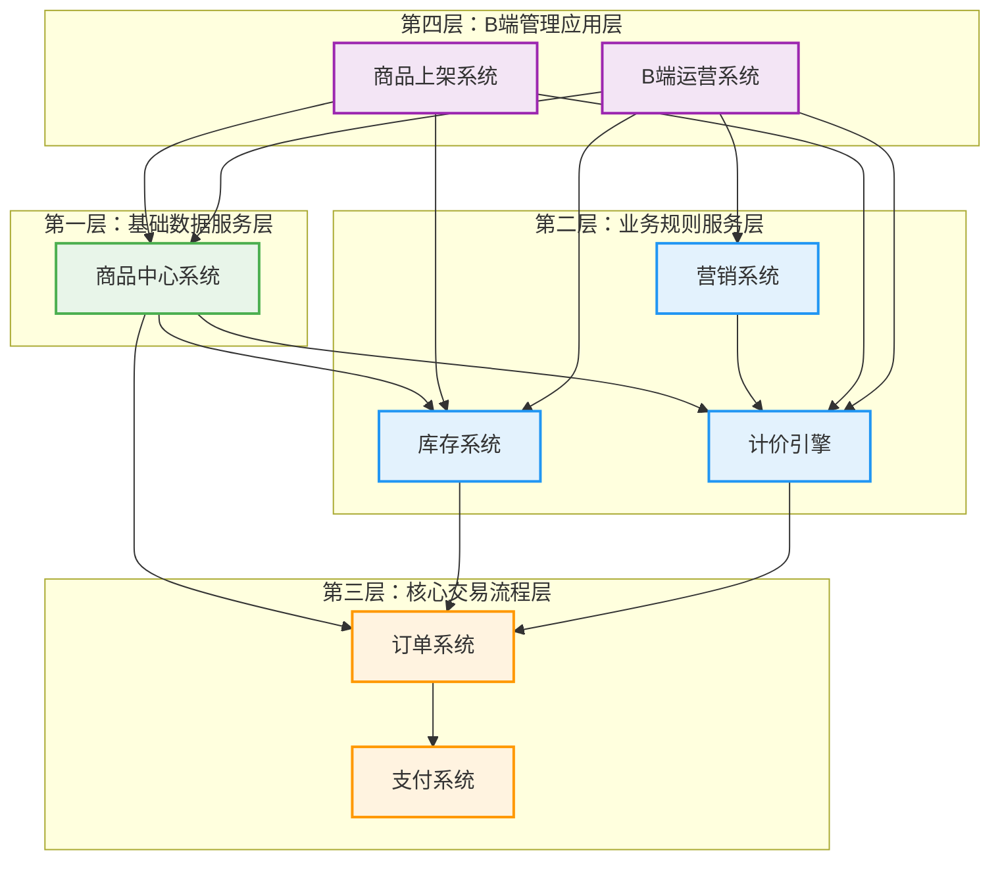

**应用分层原则**：

| 层级 | 系统 | 依赖的系统 | 核心职责 | 文章编号 |
|-----|------|----------|---------|---------|
| **第一层** | 商品中心 | - | SPU/SKU 数据服务 | （二） |
| **第二层** | 库存系统 | 商品中心 | 库存管理与扣减 | （三） |
| | 营销系统 | - | 优惠规则与补贴 | （四） |
| | 计价引擎 | 商品中心、营销 | 价格计算与快照 | （五）（六） |
| **第三层** | 订单系统 | 商品、库存、计价 | 订单创建与流转 | （七） |
| | 支付系统 | 订单 | 支付、退款、结算 | （八） |
| **第四层** | 商品上架 | 商品、库存、计价 | 供给流程编排 | （九） |
| | B端运营 | 商品、库存、营销、计价 | 管理界面与工具 | （十） |

**依赖方向**：箭头指向表示依赖关系，上层依赖下层，下层不依赖上层

### 1.3 业务流程视角：三条核心流程

**1. C端购物流程**（对应文章二→七→八）

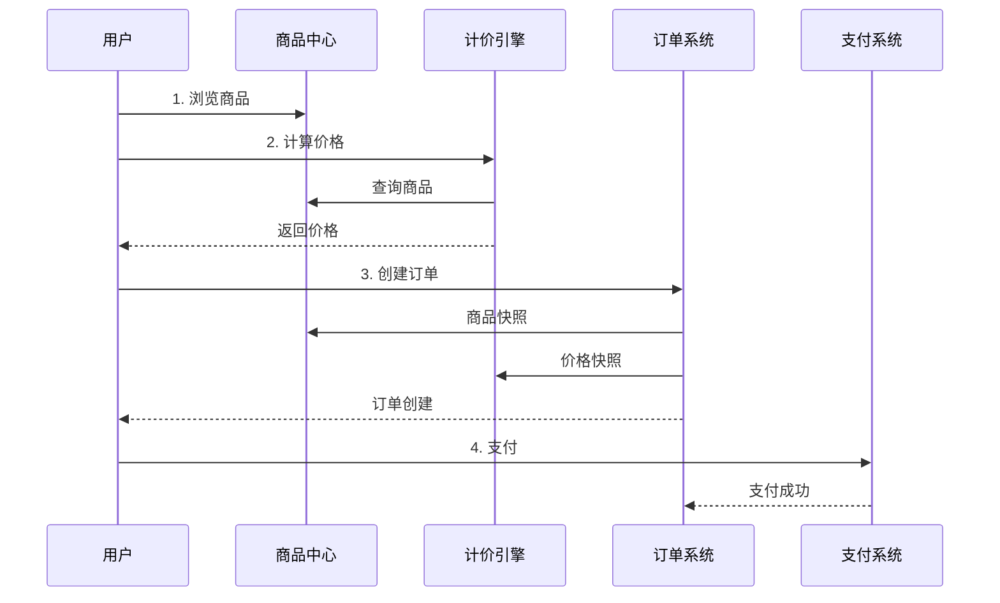

**2. B端供给流程**（对应文章九）

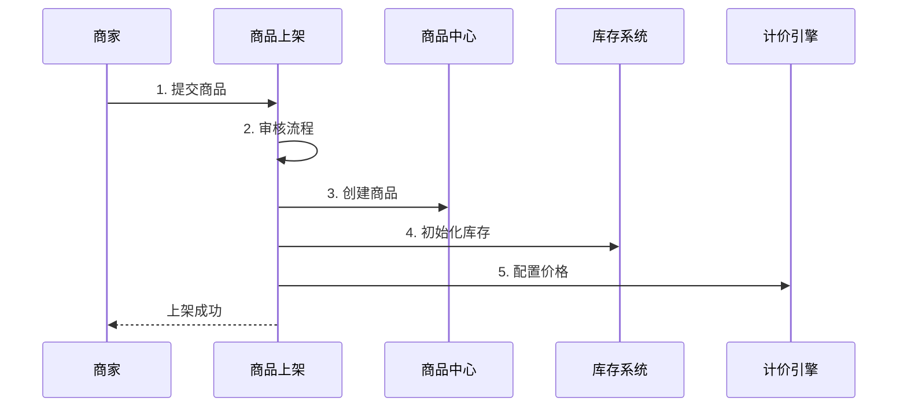

**3. B端管理流程**（对应文章十）

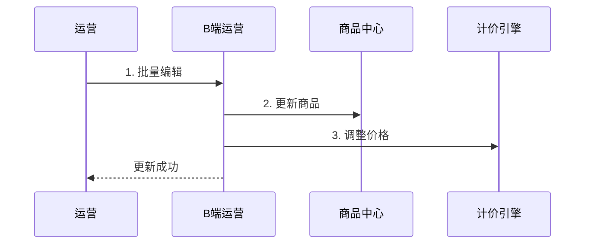

### 1.4 两种阅读顺序对比

**业务流程顺序 vs 技术依赖层级**：

| 维度 | 业务流程顺序（推荐） | 技术依赖层级（1.2 节） |
|------|---------------------|----------------------|
| **组织逻辑** | 按商业价值链：供给 → 销售 | 按系统依赖：底层 → 上层 |
| **学习曲线** | 符合业务直觉，易于理解 | 技术层级清晰，便于架构设计 |
| **适用场景** | 第一次阅读、业务流程面试 | 架构设计面试、系统拆分讨论 |
| **核心优势** | 完整业务闭环，先有货后卖货 | 依赖关系清晰，避免循环依赖 |

**建议**：
- **第一次阅读**：按文首"推荐阅读顺序"（业务流程）
- **深入理解架构**：结合 1.2 节的技术分层图
- **准备面试**：两种顺序都要掌握（不同面试官视角不同）

### 1.5 架构设计原则

**为什么采用 EA + 4A 视角？**

| 架构视角 | 关注点 | 价值 | 本系列覆盖 |
|---------|--------|------|----------|
| **BA（业务架构）** | 业务能力和业务流程 | 理解"做什么" | ✅ 1.1 节 |
| **AA（应用架构）** | 系统划分和依赖关系 | 理解"怎么做" | ✅ 1.2 节 |
| **DA（数据架构）** | 数据模型和数据流 | 理解"数据在哪" | 各文章详述 |
| **TA（技术架构）** | 技术选型和基础设施 | 理解"用什么技术" | 各文章详述 |

**应用分层设计原则**：

1. **单向依赖**：上层依赖下层，避免循环依赖
2. **职责清晰**：每层有明确的职责边界（数据/规则/流程/界面）
3. **可测试性**：下层系统可独立测试
4. **可扩展性**：新系统遵循分层原则插入对应层级

**业务与系统的映射关系**：

| 业务域 | 核心能力 | 应用系统 | 文章编号 |
|-------|---------|---------|---------|
| C端业务域 | 商品发现 | 商品中心 | （二） |
| | 购物决策 | 库存系统、计价引擎、营销系统 | （三）（四）（五）（六） |
| | 交易履约 | 订单系统、支付系统 | （七）（八） |
| B端业务域 | 商品供给 | 商品上架系统 | （九） |
| | 商品管理 | B端运营系统 | （十） |

**关键洞察**：

- **业务架构** 回答"平台提供哪些业务能力"
- **应用架构** 回答"如何用系统实现这些能力"
- **商品上架系统** 是流程编排器（非数据存储）
- **B端运营系统** 是管理界面（非业务逻辑）
- **商品中心/库存/计价** 是数据服务（被创建、被修改）

**推荐学习路径**：

1. **先看业务架构**（1.1）：理解平台的业务能力全景
2. **再看应用架构**（1.2）：理解系统如何分层实现业务
3. **按文章顺序学习**：
   - **新手**：按文首"推荐阅读顺序"（业务流程）
   - **进阶**：对照 1.2 节技术分层，理解系统依赖关系

---

## 1.7 系统边界与交互详解（重点章节）

> **本章为系统边界核心**，详细说明电商系统中各模块的职责边界、依赖关系、接口契约与数据流向。

### 1.7.1 系统边界全景架构

下图展示电商系统中所有核心模块的边界、依赖关系与数据流向：

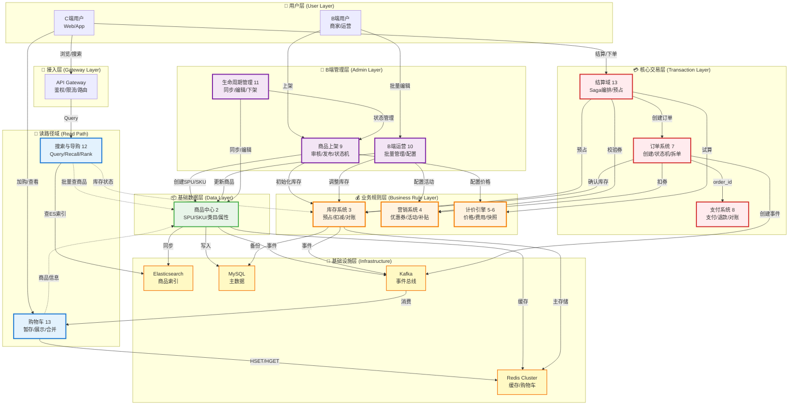

### 1.7.2 系统职责边界总表

| 系统 | 核心职责 | 不做什么 | 文章编号 | 依赖的上游 | 提供给下游 |
|------|----------|----------|---------|------------|------------|
| **商品中心（2）** | SPU/SKU 数据服务、类目属性、商品快照 | ❌ 不做库存扣减<br>❌ 不做价格计算<br>❌ 不做审核流程 | （二） | - | 商品信息、快照 ID |
| **库存系统（3）** | 库存预占/扣减、对账、供应商同步 | ❌ 不做价格校验<br>❌ 不做营销规则 | （三） | 商品中心 | 库存状态、预占 ID |
| **营销系统（4）** | 优惠券、活动、补贴、圈品规则 | ❌ 不做价格计算（由计价引擎应用）<br>❌ 不做库存校验 | （四） | - | 券可用性、活动标签 |
| **计价引擎（5-6）** | 价格计算、费用、快照、DDD 实践 | ❌ 不做库存扣减<br>❌ 不做订单创建 | （五）（六） | 商品中心、营销系统 | 价格明细、快照 ID |
| **订单系统（7）** | 订单创建、状态机、拆单、履约编排 | ❌ 不做支付（调支付接口）<br>❌ 不做计价（使用快照） | （七） | 商品中心、库存、计价、营销 | 订单 ID、订单状态 |
| **支付系统（8）** | 支付流程、退款、清结算、对账 | ❌ 不做订单管理<br>❌ 不做库存管理 | （八） | 订单系统 | 支付结果、退款状态 |
| **商品上架（9）** | 审核流程、发布、状态机编排 | ❌ 不存储商品数据（写入商品中心）<br>❌ 不做价格计算 | （九） | 商品中心、库存、计价 | 上架任务状态 |
| **B端运营（10）** | 批量管理、配置工具、数据看板 | ❌ 不实现业务规则（调用各系统接口）<br>❌ 不做审核流程 | （十） | 商品中心、库存、营销、计价 | 操作日志 |
| **生命周期管理（11）** | 同步、编辑、下架、操作语义 | ❌ 不做审核（引用上架系统）<br>❌ 不做真正拆单 | （十一） | 商品中心、上架、运营 | 同步状态 |
| **搜索与导购（12）** | Query 理解、召回、排序、列表 | ❌ 不存储主数据（查 ES 索引）<br>❌ 不做价格计算（hydrate 调计价） | （十二） | 商品中心、库存、计价 | 商品列表 |
| **购物车（13）** | 暂存商品、登录合并、展示 | ❌ 不锁定库存<br>❌ 不锁定价格 | （十三） | 商品中心 | 购物车项 |
| **结算域（13）** | 价格试算、库存预占、Saga 编排 | ❌ 不实现计价规则<br>❌ 不扣券（校验可用） | （十三） | 商品中心、计价、库存、营销 | 预占 ID、快照 ID |

### 1.7.3 各系统边界详细说明

#### （1）搜索与导购系统（12）边界

**系统定位**：电商平台读流量主入口，提供关键词搜索、类目导购、店铺内搜索能力。

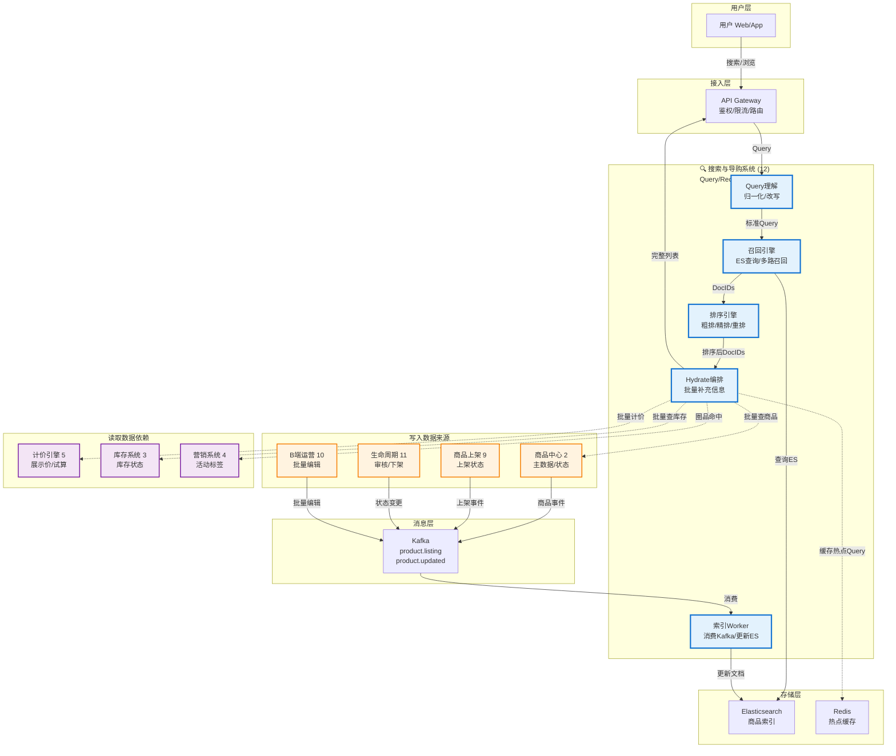

**关键边界**：

| 边界类型 | 说明 | 实现 |
|---------|------|------|
| **索引写入** | 搜索系统 **不直接写主数据**；通过 Kafka 消费商品事件更新 ES | Worker 消费 `product.created/updated/delisted` |
| **Hydrate 编排** | 搜索系统 **只读批量查询**；不实现计价/库存规则 | 调用计价展示价接口、库存状态接口 |
| **降级策略** | 计价/库存超时 **可降级**；不影响列表返回 | 展示索引价、不展示库存状态 |
| **一致性要求** | **最终一致**（索引滞后可接受）；产品话术配合"价格以详情为准" | Kafka 异步 + 定时全量对账 |

#### （2）购物车与结算域（13）边界

**系统定位**：转化漏斗关键卡点，购物车负责暂存展示，结算域负责预占与 Saga 编排。

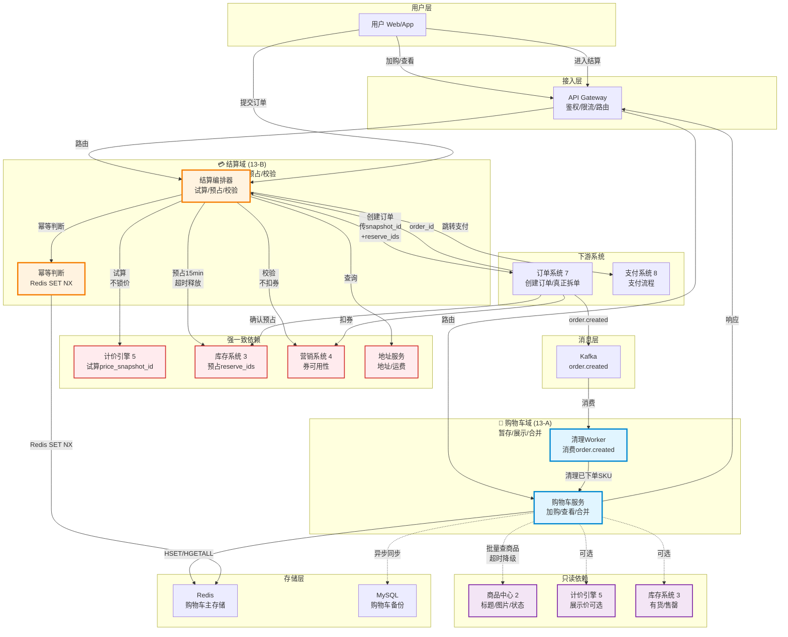

**关键边界**：

| 边界类型 | 购物车域 | 结算域 |
|---------|---------|--------|
| **资源锁定** | ❌ 不锁定任何资源 | ✅ 预占库存 15 分钟 |
| **一致性** | 弱一致（展示可滞后） | 强一致（实时校验） |
| **与订单关系** | 独立生命周期（可长期保留） | 订单前置状态（用完即焚） |
| **计价调用** | 可选（展示价仅供参考） | 必须（试算生成快照） |
| **库存调用** | 可选（展示有货/售罄） | 必须（预占 reserve_id） |
| **营销调用** | ❌ 不查询优惠 | ✅ 校验可用（不扣券） |
| **拆单责任** | ❌ 无 | ✅ 预览拆单（轻量） |

#### （3）商品中心（2）边界

**系统定位**：电商基础数据层核心，提供 SPU/SKU 数据服务、商品快照、搜索索引同步。

**关键边界**：

| 依赖方向 | 系统 | 调用接口 | 边界说明 |
|---------|------|---------|---------|
| **被调用** | 搜索导购（12） | `POST /product/batch-get`（批量查商品） | 返回标题、图片、状态；**不返回价格**（由计价提供） |
| **被调用** | 购物车（13） | `POST /product/batch-get`（购物车展示） | 返回商品基础信息；**不做库存校验** |
| **被调用** | 结算域（13） | `GET /product/snapshot/{id}`（查询快照） | 返回商品快照；**不做价格计算** |
| **被调用** | 订单系统（7） | `POST /product/create-snapshot`（创建快照） | 生成快照 ID；**快照只读**，订单持有 ID |
| **被调用** | 上架系统（9） | `POST /product/create`（创建商品） | 创建 SPU/SKU；**不做审核**（由上架系统管理状态） |
| **被调用** | B端运营（10） | `POST /product/batch-update`（批量编辑） | 更新商品信息；**不做价格库存更新**（调用各自系统） |
| **主动调用** | Elasticsearch | 发布 `product.created/updated` 事件 → Kafka | 搜索系统消费事件更新索引 |
| **主动调用** | Redis 缓存 | 写入多级缓存 | L1 本地 + L2 Redis + L3 MySQL |

**商品中心不做什么**：
- ❌ 不做库存扣减（由库存系统负责）
- ❌ 不做价格计算（由计价引擎负责）
- ❌ 不做审核流程（由上架系统负责）
- ❌ 不做搜索索引维护（发事件，由搜索系统消费）

### 1.7.4 数据流向与事件总线

#### Kafka 事件发布与订阅关系

| 事件 Topic | 发布者 | 订阅者 | 事件内容 | 用途 |
|-----------|--------|--------|---------|------|
| `product.created` | 商品中心（2） | 搜索导购（12） | `{spu_id, sku_id, title, category_id, status}` | 新建商品索引 |
| `product.updated` | 商品中心（2）<br/>生命周期（11） | 搜索导购（12） | `{sku_id, updated_fields}` | 更新商品索引 |
| `product.delisted` | 生命周期（11） | 搜索导购（12） | `{sku_id, reason}` | 下架商品（更新 status） |
| `listing.approved` | 商品上架（9） | 商品中心（2）<br/>搜索导购（12） | `{task_id, sku_id, status}` | 上架成功，创建商品+索引 |
| `order.created` | 订单系统（7） | 购物车（13）<br/>库存系统（3） | `{order_id, user_id, items[]}` | 清理购物车、确认库存 |
| `order.paid` | 支付系统（8） | 订单系统（7）<br/>营销系统（4） | `{order_id, payment_id}` | 更新订单状态、核销券 |
| `inventory.reserved` | 库存系统（3） | 订单系统（7） | `{reserve_id, sku_id, quantity, expires_at}` | 库存预占成功 |
| `inventory.insufficient` | 库存系统（3） | 结算域（13） | `{sku_id, requested, available}` | 库存不足通知 |

#### 同步调用 vs 异步事件

| 场景 | 实现方式 | 原因 |
|------|---------|------|
| **结算页试算价格** | 同步 RPC | 用户等待结果，需要立即返回 |
| **结算页预占库存** | 同步 RPC | 必须确认预占成功才能进入下一步 |
| **订单创建成功** | 异步 Kafka | 清理购物车可延迟，不阻塞订单返回 |
| **商品信息变更** | 异步 Kafka | 索引更新可最终一致，不阻塞商品编辑 |
| **支付成功回调** | 同步 RPC + 异步补偿 | 支付回调需立即更新订单状态；补偿任务异步处理 |

### 1.7.5 系统集成反模式（避免常见错误）

| 反模式 | 为什么错 | 正确做法 |
|--------|----------|----------|
| 购物车预占库存 | 用户可能长期不结算，预占资源浪费 | 购物车只读展示；预占在结算页 |
| 搜索系统存储商品主数据 | 数据重复，不一致风险高 | 搜索系统只存 ES 索引；查商品调商品中心 |
| 结算页实现计价规则 | 规则散落多处，难以统一 | 调用计价引擎接口；结算页只编排 |
| 结算页直接扣券 | 订单创建失败时难以回滚 | 结算页只校验可用；扣券在订单创建 |
| 商品中心做审核 | 审核流程与数据存储耦合 | 审核由上架系统负责；商品中心只存数据 |
| 搜索系统同步调用计价 | 列表页性能差（N 次 RPC） | 批量 hydrate；超时可降级展示索引价 |
| 订单系统管理购物车 | 职责不清，购物车可独立存在 | 订单系统只创建订单；购物车独立服务 |

### 1.7.6 各系统详细边界矩阵

#### 商品中心系统（2）

| 维度 | 详细说明 |
|------|----------|
| **核心职责** | SPU/SKU 数据模型、类目树、属性管理、商品快照、多级缓存 |
| **上游依赖** | 无（基础数据层） |
| **下游调用方** | 搜索（12）、购物车（13）、结算域（13）、订单（7）、上架（9）、运营（10）、生命周期（11） |
| **提供的接口** | `GET /product/{id}` 单个查询<br>`POST /product/batch-get` 批量查询<br>`POST /product/create-snapshot` 创建快照<br>`GET /product/snapshot/{id}` 查询快照 |
| **发布的事件** | `product.created`、`product.updated`、`product.delisted` |
| **存储** | MySQL（主数据）+ Redis（缓存）+ ES（索引，由搜索系统维护） |
| **一致性** | 强一致（主数据写入）；缓存最终一致 |
| **不做什么** | ❌ 不做库存扣减<br>❌ 不做价格计算<br>❌ 不做审核流程<br>❌ 不维护 ES 索引 |

#### 库存系统（3）

| 维度 | 详细说明 |
|------|----------|
| **核心职责** | 库存预占/扣减/回补、对账、供应商同步、(ManagementType, UnitType) 策略 |
| **上游依赖** | 商品中心（2）查询商品信息 |
| **下游调用方** | 结算域（13）、订单（7）、搜索（12，可选）、购物车（13，可选） |
| **提供的接口** | `POST /inventory/reserve` 预占库存（15 分钟）<br>`POST /inventory/confirm-reserve` 确认扣减<br>`POST /inventory/release-reserve` 释放预占<br>`POST /inventory/batch-status` 批量查状态 |
| **订阅的事件** | `order.created`（确认扣减）、`order.cancelled`（回补库存） |
| **发布的事件** | `inventory.reserved`、`inventory.insufficient`、`inventory.sold` |
| **存储** | Redis（主，热路径）+ MySQL（备，权威数据） |
| **一致性** | 强一致（预占与扣减）；Redis ↔ MySQL 最终一致 |
| **不做什么** | ❌ 不做价格校验<br>❌ 不做营销规则<br>❌ 不管理商品主数据 |

#### 计价引擎（5-6）

| 维度 | 详细说明 |
|------|----------|
| **核心职责** | 价格计算（Base + Promotion + Fee + Voucher）、价格快照、DDD 实践 |
| **上游依赖** | 商品中心（2）查商品基础价、营销系统（4）查活动规则 |
| **下游调用方** | 搜索（12）、购物车（13，可选）、结算域（13）、订单（7） |
| **提供的接口** | `POST /pricing/calculate` 单个计价<br>`POST /pricing/batch-calculate` 批量计价（列表页）<br>`POST /pricing/trial-calculate` 结算页试算<br>`GET /pricing/snapshot/{id}` 查询快照 |
| **订阅的事件** | `product.updated`（价格变更）、`marketing.activity-updated`（活动变更） |
| **发布的事件** | `pricing.snapshot-created` |
| **存储** | MySQL（价格配置 + 快照）+ Redis（缓存） |
| **一致性** | 强一致（试算时）；展示价可最终一致 |
| **不做什么** | ❌ 不做库存扣减<br>❌ 不做订单创建<br>❌ 不管理快照过期（调用方校验） |

#### 营销系统（4）

| 维度 | 详细说明 |
|------|----------|
| **核心职责** | 优惠券、活动管理、圈品规则、补贴、配额管理 |
| **上游依赖** | 商品中心（2）查商品类目（圈品判断） |
| **下游调用方** | 结算域（13）、订单（7）、搜索（12，圈品标签） |
| **提供的接口** | `POST /marketing/validate-coupons` 校验券可用<br>`POST /marketing/deduct-coupons` 扣券<br>`GET /marketing/activity-tags` 活动标签（列表页） |
| **订阅的事件** | `order.created`（扣券）、`order.cancelled`（回退券） |
| **发布的事件** | `marketing.coupon-deducted`、`marketing.activity-updated` |
| **存储** | MySQL（券配置 + 用户券）+ Redis（配额） |
| **一致性** | 强一致（扣券时）；活动标签可最终一致 |
| **不做什么** | ❌ 不做价格计算（提供规则给计价引擎）<br>❌ 不做库存校验 |

#### 订单系统（7）

| 维度 | 详细说明 |
|------|----------|
| **核心职责** | 订单创建、状态机、拆单、履约编排、订单查询 |
| **上游依赖** | 商品中心（2）快照、计价（5）快照 ID、库存（3）确认预占、营销（4）扣券 |
| **下游调用方** | 支付系统（8）、结算域（13）调用创建接口 |
| **提供的接口** | `POST /order/create` 创建订单<br>`GET /order/{id}` 查询订单<br>`POST /order/cancel` 取消订单<br>`POST /order/split-preview` 拆单预览 |
| **订阅的事件** | `payment.paid`（更新订单状态）、`inventory.sold`（确认履约） |
| **发布的事件** | `order.created`、`order.paid`、`order.cancelled` |
| **存储** | MySQL（订单主表 + 子订单 + 订单项） |
| **一致性** | 强一致（订单创建事务）；与库存/营销通过 Saga 补偿 |
| **不做什么** | ❌ 不做支付（调支付接口）<br>❌ 不做计价（使用快照 ID）<br>❌ 不管理购物车 |

#### 支付系统（8）

| 维度 | 详细说明 |
|------|----------|
| **核心职责** | 支付流程、退款、清结算、对账、多渠道路由 |
| **上游依赖** | 订单系统（7）查订单金额 |
| **下游调用方** | 结算域（13）跳转支付、订单（7）查询支付状态 |
| **提供的接口** | `POST /payment/create` 创建支付单<br>`GET /payment/{id}` 查询支付状态<br>`POST /payment/refund` 退款 |
| **订阅的事件** | `order.created`（创建支付单）、`order.cancelled`（取消支付） |
| **发布的事件** | `payment.paid`、`payment.refunded` |
| **存储** | MySQL（支付单 + 支付流水） |
| **一致性** | 强一致（支付事务）；与第三方支付通过异步回调 + 补偿 |
| **不做什么** | ❌ 不做订单管理<br>❌ 不做库存管理<br>❌ 不做价格计算 |

#### 商品上架系统（9）

| 维度 | 详细说明 |
|------|----------|
| **核心职责** | 审核流程、发布、状态机编排、供应商对接 |
| **上游依赖** | 无（B 端入口） |
| **下游调用方** | 商品中心（2）创建商品、库存（3）初始化、计价（5）配置价格 |
| **提供的接口** | `POST /listing/create-task` 创建上架任务<br>`POST /listing/approve` 审核通过<br>`GET /listing/task/{id}` 查询任务状态 |
| **订阅的事件** | 无 |
| **发布的事件** | `listing.approved`、`listing.rejected` |
| **存储** | MySQL（上架任务表 + 审核记录） |
| **一致性** | 强一致（状态机流转） |
| **不做什么** | ❌ 不存储商品数据（写入商品中心）<br>❌ 不做价格计算<br>❌ 不管理库存 |

#### B端运营系统（10）

| 维度 | 详细说明 |
|------|----------|
| **核心职责** | 批量管理界面、配置工具、数据看板、操作日志 |
| **上游依赖** | 商品中心（2）、库存（3）、营销（4）、计价（5） |
| **下游调用方** | 无（管理界面） |
| **提供的接口** | `POST /ops/batch-update-product` 批量编辑商品<br>`POST /ops/batch-adjust-inventory` 批量调整库存<br>`POST /ops/batch-adjust-price` 批量调价 |
| **订阅的事件** | 无 |
| **发布的事件** | `ops.batch-updated`（触发索引更新） |
| **存储** | MySQL（操作日志） |
| **一致性** | 调用各系统接口，继承各系统一致性 |
| **不做什么** | ❌ 不实现业务规则（调用各系统接口）<br>❌ 不做审核流程 |

#### 生命周期管理（11）

| 维度 | 详细说明 |
|------|----------|
| **核心职责** | 同步管理、编辑权限、下架原因、操作语义 |
| **上游依赖** | 商品中心（2）、上架（9）状态、运营（10）操作 |
| **下游调用方** | 商品中心（2）更新状态 |
| **提供的接口** | `POST /lifecycle/sync` 触发同步<br>`POST /lifecycle/delist` 下架商品<br>`GET /lifecycle/status/{id}` 查询状态 |
| **订阅的事件** | `listing.approved`（上架成功） |
| **发布的事件** | `product.delisted`、`product.updated` |
| **存储** | MySQL（状态记录 + 操作历史） |
| **一致性** | 强一致（状态更新） |
| **不做什么** | ❌ 不做审核（引用上架系统）<br>❌ 不做真正拆单 |

### 1.7.7 系统集成调用链路图（C 端下单全流程）

下图展示用户从 **浏览商品 → 加购 → 结算 → 下单 → 支付** 的完整系统调用链路：

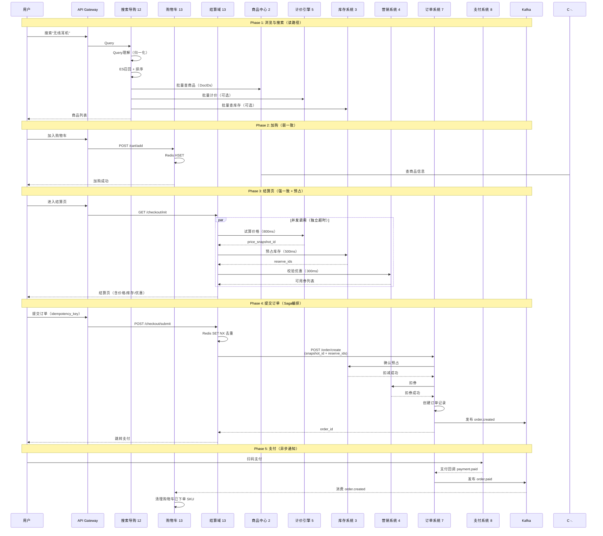

**关键调用约束**：

| 调用方 | 被调用方 | 超时时间 | 重试策略 | 失败降级 |
|--------|----------|----------|----------|----------|
| 搜索 → 商品中心 | 批量查商品 | 200ms | 0 次 | 展示"商品已失效" |
| 搜索 → 计价引擎 | 批量计价 | 300ms | 0 次 | 展示索引价或不展示价格 |
| 购物车 → 商品中心 | 批量查商品 | 500ms | 0 次 | 标记"商品已失效" |
| 结算域 → 计价引擎 | 试算价格 | 800ms | 0 次 | **不可降级**，返回错误 |
| 结算域 → 库存系统 | 预占库存 | 500ms | 1 次 | **不可降级**，返回错误 |
| 结算域 → 营销系统 | 校验券 | 300ms | 0 次 | 可降级，隐藏优惠 |
| 订单 → 库存系统 | 确认预占 | 1000ms | 3 次 | 重试失败则订单创建失败 |
| 订单 → 营销系统 | 扣券 | 1000ms | 3 次 | 失败则回滚库存 |

### 1.7.8 B 端管理链路图（供给与运营）

下图展示 B 端 **商品供给 → 日常运营** 的系统调用链路：

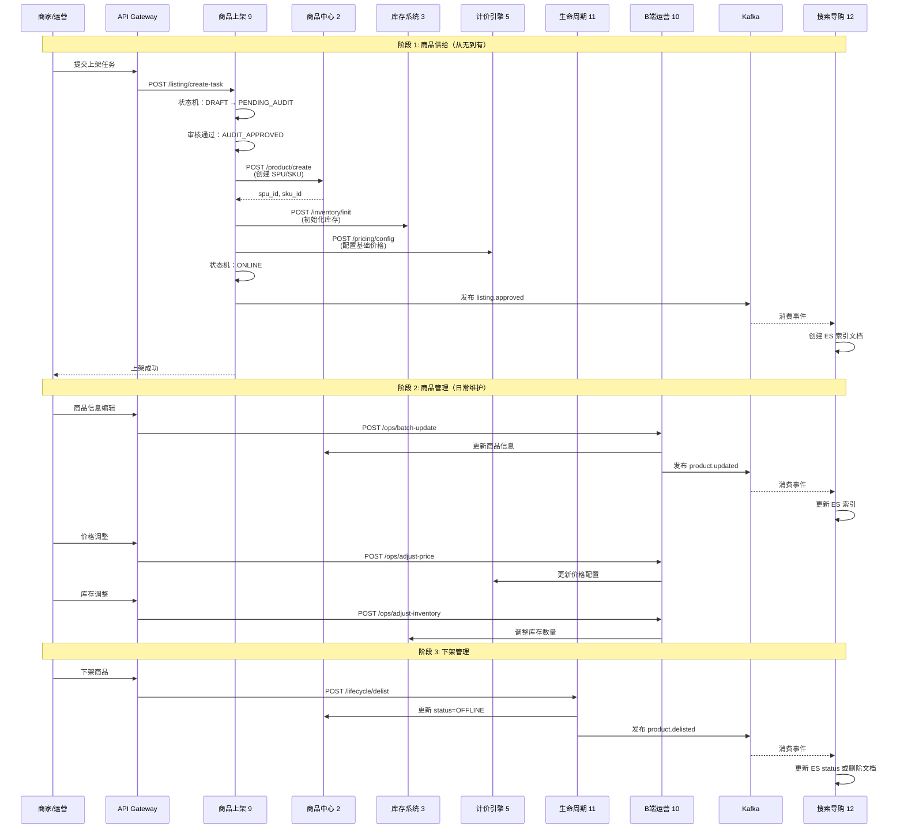

### 1.7.9 系统间数据流向总表

| 数据类型 | 权威系统 | 同步到 | 同步方式 | 延迟 | 一致性 |
|---------|---------|--------|----------|------|--------|
| **商品主数据** | 商品中心（2） | ES（搜索）、Redis（缓存） | Kafka 异步 | 秒级 | 最终一致 |
| **库存数量** | 库存系统（3） | Redis、MySQL | 双写 | 实时 | 强一致 |
| **价格配置** | 计价引擎（5） | Redis（缓存） | 主动写入 | 实时 | 强一致 |
| **价格快照** | 计价引擎（5） | 订单（7）持有快照 ID | RPC 同步 | 实时 | 强一致 |
| **商品快照** | 商品中心（2） | 订单（7）持有快照 ID | RPC 同步 | 实时 | 强一致 |
| **库存预占** | 库存系统（3） | 订单（7）持有 reserve_id | RPC 同步 | 实时 | 强一致 |
| **优惠券状态** | 营销系统（4） | Redis、MySQL | 双写 | 实时 | 强一致 |
| **订单状态** | 订单系统（7） | MySQL | 主动写入 | 实时 | 强一致 |
| **购物车数据** | 购物车（13） | Redis（主）、MySQL（备） | 主动写 + 异步同步 | 秒级 | 最终一致 |

### 1.7.10 系统边界设计原则（Six Principles）

**1. 职责单一原则（Single Responsibility）**

每个系统只负责一个核心领域：
- 商品中心：只管 SPU/SKU 数据
- 库存系统：只管库存数量
- 计价引擎：只管价格计算
- 订单系统：只管订单状态机

**2. 数据所有权原则（Data Ownership）**

每个数据实体只有一个 **权威系统**：
- 商品主数据 → 商品中心
- 库存数量 → 库存系统
- 价格配置 → 计价引擎
- 订单记录 → 订单系统

**3. 编排不实现原则（Orchestration Not Implementation）**

编排器（结算域、上架系统）**只调用接口**，不实现业务规则：
- 结算域调用计价接口，不实现计价规则
- 上架系统调用商品接口，不存储商品数据

**4. 同步查询异步写入原则（Sync Read Async Write）**

- **同步调用**：用户等待的读操作（查商品、试算价格、预占库存）
- **异步事件**：不阻塞用户的写操作（索引更新、购物车清理）

**5. 快照与引用原则（Snapshot By Reference）**

不复制完整数据，只持有 **快照 ID**：
- 订单持有 `price_snapshot_id`（不复制价格明细）
- 订单持有 `reserve_id`（不复制库存记录）

**6. 补偿优于事务原则（Compensation Over Transaction）**

跨系统操作用 **Saga 补偿** 而非分布式事务：
- 结算页预占失败 → 释放已锁定资源
- 订单创建失败 → 回滚库存与营销

### 1.7.11 读路径 vs 写路径对比

| 维度 | 读路径（搜索/购物车） | 写路径（结算/订单） |
|------|---------------------|-------------------|
| **典型系统** | 搜索导购（12）、购物车（13-A） | 结算域（13-B）、订单（7）、支付（8） |
| **QPS 特点** | 高（10k～100k） | 相对低（1k～10k） |
| **一致性要求** | 最终一致（索引滞后可接受） | 强一致（库存/价格实时） |
| **超时容忍** | 高（部分降级可接受） | 低（不允许降级） |
| **缓存策略** | 多级缓存（L1 + L2 + L3） | 直查权威数据 |
| **资源锁定** | ❌ 不锁定 | ✅ 预占库存、锁价格 |
| **依赖外部系统** | 批量查询（可降级） | 同步 RPC（不可降级） |
| **数据来源** | ES 索引 + Redis 缓存 | MySQL 主库 + Redis |
| **失败重试** | 0 次（返回部分结果） | 3 次（重试 + 补偿） |

**核心差异**：
- **读路径追求吞吐**：用缓存、降级、异步换性能
- **写路径追求准确**：用同步、重试、补偿保证一致

### 1.7.12 常见集成陷阱与避免方案

| 陷阱 | 场景 | 后果 | 避免方案 |
|------|------|------|----------|
| **循环依赖** | 商品中心 ↔ 库存系统互相调用 | 启动死锁、级联故障 | 明确依赖方向；库存只依赖商品，不反向调用 |
| **同步调用超时** | 搜索系统同步调用计价计算列表价 | 列表页 P99 > 1s | 批量 hydrate；超时降级 |
| **数据重复存储** | 搜索系统存储商品全量字段 | 数据不一致；存储成本高 | 搜索只存索引；查详情调商品中心 |
| **跨库事务** | 订单创建时开启跨商品/库存/营销的分布式事务 | 死锁、性能差 | 用 Saga 补偿；本地事务 + 消息 |
| **缓存穿透** | 商品不存在时仍查 MySQL | 缓存击穿；DB 压力大 | 缓存空值（5 分钟 TTL） |
| **热点商品** | 秒杀商品库存查询集中 | Redis 单 Key 热点 | 库存分片；本地缓存 |
| **未幂等接口** | 支付回调重复处理 | 重复扣券、重复扣库存 | Redis SET NX 去重；DB 唯一索引 |
| **慢查询拖累** | 订单详情查询关联 10 张表 | 单个慢查询拖垮整个服务 | 异步补全；查询超时熔断 |
| **依赖方雪崩** | 计价引擎故障 → 结算页不可用 → 订单下跌 | 级联故障 | 熔断降级；返回缓存价格 |
| **事件乱序** | Kafka 消费 product.updated 乱序到达 | 索引版本错乱 | 事件带 version；消费端去重 |

### 1.7.13 系统边界落地检查清单（Code Review 必查）

**1. 接口定义检查**

- [ ] 接口是否明确 **职责边界**？（不做本系统不该做的事）
- [ ] 接口是否 **幂等**？（支持重复调用）
- [ ] 接口是否有 **超时配置**？（避免无限等待）
- [ ] 接口是否有 **降级策略**？（失败时的后备方案）
- [ ] 接口文档是否包含 **失败场景**？（不只写成功 case）

**2. 数据依赖检查**

- [ ] 是否直接存储 **其他系统的主数据**？（应只持有 ID 或快照 ID）
- [ ] 是否有 **循环依赖**？（A 依赖 B，B 又依赖 A）
- [ ] 是否有 **未授权的跨库查询**？（直接查其他系统的 DB）
- [ ] 缓存失效是否会 **雪崩**？（应有多级缓存 + 降级）
- [ ] 数据同步是否 **异步**？（不阻塞主流程）

**3. 事务与一致性检查**

- [ ] 跨系统操作是否用 **Saga 补偿**？（不用分布式事务）
- [ ] 失败是否有 **回滚逻辑**？（释放预占资源）
- [ ] 是否有 **补偿任务**？（处理极端失败场景）
- [ ] 消息消费是否 **幂等**？（Kafka 重复消费）
- [ ] 状态流转是否 **原子**？（用数据库事务 + 乐观锁）

**4. 性能与可观测性检查**

- [ ] 批量接口是否有 **数量上限**？（防止单次查询过大）
- [ ] 慢查询是否有 **索引**？（explain 分析）
- [ ] 关键路径是否有 **Trace ID**？（链路追踪）
- [ ] 是否埋点 **业务指标**？（成功率、P99、零结果率）
- [ ] 是否有 **降级开关**？（线上可动态调整）

### 1.7.14 面试高频问答：系统边界

**Q1: 商品中心和商品上架系统有什么区别？**

A: 
- **商品中心**（2）：存储 SPU/SKU **数据**（标题、属性、类目、快照）
- **商品上架系统**（9）：管理上架 **流程**（审核、状态机、供应商对接）
- **边界**：上架系统不存储商品数据，审核通过后调用商品中心接口创建商品

**Q2: 价格存在哪个系统？商品中心存价格吗？**

A:
- **价格配置** → 计价引擎（5）存储
- **商品中心** → ❌ 不存价格（避免不一致）
- **展示价** → 搜索系统调用计价引擎批量计算；订单持有 `price_snapshot_id`

**Q3: 购物车和结算页有什么本质区别？**

A:

| 维度 | 购物车（13-A） | 结算页（13-B） |
|------|---------------|---------------|
| **职责** | 暂存商品，方便用户选购 | 编排下单前的预占与校验 |
| **一致性** | 弱一致（展示可滞后） | 强一致（实时校验） |
| **资源锁定** | ❌ 不锁库存、不锁价格 | ✅ 预占库存 15 分钟 |
| **生命周期** | 长期保留（跨设备） | 用完即焚（订单创建后失效） |
| **计价调用** | 可选（仅供参考） | 必须（生成快照） |

**Q4: 结算页为什么不直接扣券？**

A:
- **原因**：订单创建可能失败（库存不足、系统异常），扣券后难以回滚
- **正确做法**：
  - 结算页：**校验券可用**（调用 `validate-coupons`）
  - 订单创建时：**真正扣券**（调用 `deduct-coupons`）
  - 失败时：**自动回退**（营销系统内部处理）

**Q5: 搜索系统存储商品数据吗？**

A:
- ❌ 不存主数据（只存 ES 索引）
- 索引包含：`sku_id, title, price_range, category_id, status`（搜索必要字段）
- 详细信息：批量调用商品中心 `POST /product/batch-get`
- **边界**：搜索系统 **不是** 商品数据源，只是索引服务

**Q6: 订单系统如何获取价格？为什么不自己计算？**

A:
- **不自己计算**：避免计价规则散落多处（促销、费用、券的计算逻辑复杂）
- **使用快照 ID**：结算页调用计价引擎生成 `price_snapshot_id`，订单持有 ID
- **快照内容**：完整价格明细（Base、Promotion、Fee、Voucher、Final）
- **查询快照**：`GET /pricing/snapshot/{id}`（30 分钟有效期）

**Q7: 库存预占在哪个系统？谁调用预占接口？**

A:
- **预占接口** → 库存系统（3）`POST /inventory/reserve`
- **调用方** → 结算域（13）在结算页调用
- **确认接口** → 订单系统（7）创建订单时调用 `POST /inventory/confirm-reserve`
- **超时释放** → 库存系统内部定时任务，15 分钟未确认自动释放

**Q8: 商品信息变更如何同步到搜索？**

A:
1. 商品中心发布 `product.updated` 事件 → Kafka
2. 搜索系统消费事件 → 更新 ES 索引
3. **异步延迟**：秒级（可接受）
4. **产品话术**："价格以详情页为准"（索引价仅供参考）
5. **对账机制**：定时全量比对商品中心与 ES 差异

**Q9: 为什么要有生命周期管理系统（11）？**

A:
- **背景**：商品数据（商品中心）与流程（上架系统）分离，需要协调
- **职责**：
  - 统一管理 **同步、编辑、下架** 的语义（谁能改、如何改）
  - 处理 **供应商同步** vs **运营编辑** 的冲突
  - 管理 **下架原因**（售罄、审核、违规）
- **边界**：不存储商品数据，只管理 **操作权限** 与 **状态流转**

**Q10: 跨系统调用失败怎么办？**

A:

| 系统 | 调用 | 失败策略 | 原因 |
|------|------|----------|------|
| 搜索 → 计价 | 批量计价 | 降级：展示索引价 | 不影响列表返回 |
| 购物车 → 商品 | 查商品 | 降级：标记"商品失效" | 不阻塞购物车展示 |
| 结算 → 计价 | 试算 | **不降级**：返回错误 | 价格错误不允许下单 |
| 结算 → 库存 | 预占 | **不降级**：返回错误 | 库存不足不允许下单 |
| 订单 → 库存 | 确认 | **重试 3 次**：失败则订单失败 | 必须扣减库存 |

**Q11: 系统边界设计有哪些反模式？**

A:

| 反模式 | 错在哪里 | 正确做法 |
|--------|----------|----------|
| 购物车预占库存 | 资源浪费（用户可能长期不结算） | 预占在结算页（15 分钟） |
| 结算页实现计价规则 | 规则散落多处（难以统一） | 调用计价引擎 |
| 结算页直接扣券 | 订单失败时难以回滚 | 结算页校验可用；订单创建时扣 |
| 搜索系统存主数据 | 数据重复、不一致 | 只存索引；查详情调商品中心 |
| 订单管理购物车 | 职责不清 | 购物车独立服务 |

---

### 1.6 B端商品生命周期操作全景

**关键问题**：商品上架、商品信息编辑、价格编辑、上传库存、库存修改，这些操作属于什么模块？

**答案**：这些操作分属于商品生命周期的两个阶段：

#### 1.6.1 商品生命周期两阶段

| 阶段 | 主要系统 | 核心操作 | 操作者 | 特点 |
|-----|---------|---------|--------|------|
| **供给阶段** | 商品上架系统（LIST） | 商品上架、初始信息录入、初始价格、初始库存 | 商家/供应商/运营 | 从无到有，需审核流程 |
| **管理阶段** | B端运营系统（OPS） | 商品信息编辑、价格编辑、库存修改 | 运营人员 | 日常维护，直接修改 |

#### 1.6.2 B端操作与系统模块关系

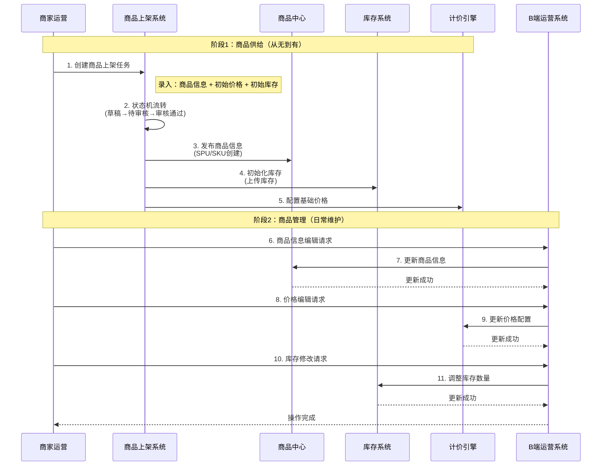

#### 1.6.3 操作详细归属

| 操作 | 所属阶段 | 主要系统 | 数据最终存储 | 操作特点 |
|-----|---------|---------|-------------|---------|
| **商品上架** | 供给阶段 | 商品上架系统 | 商品中心 | 流程编排，状态机管理，需审核 |
| **商品信息录入（上架时）** | 供给阶段 | 商品上架系统 | 商品中心 | 初始数据，通过上架流程创建 |
| **初始价格配置** | 供给阶段 | 商品上架系统 | 计价引擎 | 基础价格配置，通过上架流程创建 |
| **上传库存（初始化）** | 供给阶段 | 商品上架系统 | 库存系统 | 初始库存，通过上架流程创建 |
| **商品信息编辑** | 管理阶段 | B端运营系统 | 商品中心 | 已上架商品的信息维护 |
| **价格编辑** | 管理阶段 | B端运营系统 | 计价引擎 | 价格调整、促销配置 |
| **库存修改** | 管理阶段 | B端运营系统 | 库存系统 | 库存补货、调整 |

#### 1.6.4 关键设计原则

**1. 职责分离**

- **商品上架系统**：负责"流程编排"（状态机、审核、工作流）
- **商品中心/库存/计价**：负责"数据存储"（商品、库存、价格的数据服务）
- **B端运营系统**：负责"管理界面"（统一的运营工具入口）

**2. 数据流向**

```
供给阶段：商品上架系统 → 商品中心/库存/计价（创建数据）
管理阶段：B端运营系统 → 商品中心/库存/计价（修改数据）
```

**3. 为什么要分两个阶段？**

- **审核控制**：上架阶段需要严格的审核流程（防止垃圾商品），管理阶段可以直接修改（已审核商品）
- **权限分离**：商家可以上架商品，但只有运营可以批量管理所有商品
- **流程复杂度**：上架是复杂的异步流程（状态机），编辑是简单的CRUD操作

---

## 二、背景与挑战

### 2.1 业务背景

在数字电商/本地生活平台中，**商品管理、库存管理、价格管理**是三大核心支柱系统，它们相互依赖、紧密协作，共同支撑着平台的商品从上架到售卖的完整生命周期。

```
商品上架 → 库存同步 → 价格配置 → 用户浏览列表 → 查看详情 → 加入购物车 → 用户下单 → 库存扣减 → 订单履约
   ↓         ↓         ↓            ↓            ↓         ↓          ↓         ↓         ↓
商品信息   库存状态   基础定价   批量价格计算   实时价格   价格快照   订单创建   预订/售出   发货/核销
                                (缓存优化)     (促销匹配)  (30分钟)
```

### 1.2 多品类差异与挑战

不同品类在商品属性、库存特性、定价逻辑上差异极大：

| 品类 | 商品特点 | 库存特性 | 价格特点 | 典型示例 |
|------|----------|----------|----------|----------|
| **电子券 (Deal)** | 券码制，每券唯一 | 券码池，预订扣减 | 面值 vs 售价 | 咖啡店电子券 |
| **虚拟服务券 (OPV)** | 数量制，分平台统计 | 数量制，预订扣减 | 固定价 + 促销 | 美甲服务券 |
| **酒店 (Hotel)** | 房型 × 日期 | 时间维度库存 | 日历价 + 动态定价 | 在线酒店预订 |
| **电影票 (Movie)** | 场次 × 座位 × 票种 | 座位制库存 | 场次定价 + Fee | IMAX 电影票 |
| **机票/票务** | 航班 × 舱位 | 座位/场次制 | 动态定价 | 航班经济舱 |
| **礼品卡 (Giftcard)** | 实时生成或预采购 | 券码制 / 无限 | 面值定价 | 应用商店充值卡 |
| **话费充值 (TopUp)** | 面额制 | 无限库存 | 面额 + 折扣 | 手机话费充值 |
| **本地生活套餐** | 组合型，多子项 | 组合库存联动 | 套餐价 + 子项加总 | 火锅双人套餐 |

### 1.3 核心痛点

#### 1.3.1 商品管理痛点

1. **流程不统一**：每个品类上架流程各异，代码无法复用
2. **状态管理混乱**：草稿、审核、上线、下线等状态散落在不同表中
3. **供应商对接不统一**：推送/拉取/API 各自实现，缺乏标准化
4. **审核策略不灵活**：无法根据数据来源（供应商/运营/商家）动态调整审核策略

#### 1.3.2 库存管理痛点

1. **模型割裂**：每个品类独立设计库存逻辑，无法复用
2. **数据不一致**：Redis 与 MySQL 之间、预订数量与实际状态脱节
3. **供应商策略不统一**：实时查询、定时同步、推送等策略混乱
4. **缺乏统一服务**：业务方直接操作 DB/Redis，维护成本高
5. **监控缺失**：超卖、库存差异、供应商同步延迟难以发现

#### 1.3.3 价格管理痛点

1. **价格散落多表**：基础价、营销价、费用、优惠券分散在不同模块
2. **计算逻辑分散**：各品类各自实现价格计算，重复代码多
3. **营销活动隔离**：促销规则硬编码在业务逻辑中，扩展性差
4. **Fee 管理混乱**：平台手续费、商户服务费、合作方费用等缺乏统一配置
5. **优惠券叠加复杂**：多种优惠方式叠加规则不清晰
6. **审计困难**：价格变更历史难以追溯，无法准确还原计算过程

### 1.4 设计目标

| 目标 | 说明 | 优先级 |
|------|------|--------|
| **统一模型** | 商品、库存、价格共用一套统一模型，多品类复用 | P0 |
| **高性能** | 支持万级 QPS 秒杀场景，P99 < 100ms | P0 |
| **灵活扩展** | 新品类接入无需修改核心代码 | P0 |
| **最终一致** | Redis 与 MySQL 数据最终一致 | P0 |
| **异步化** | 上传、审核、发布、价格快照异步化 | P0 |
| **状态可追溯** | 完整的状态变更历史记录 | P0 |
| **供应商集成** | 支持实时/定时/推送多种同步策略 | P1 |
| **多级降级** | 促销/优惠券服务不可用时，仍能返回基础价格 | P1 |

---

## 电商系统整体架构设计
### 三大系统协作架构

### 2.1 三大系统总览

```
┌─────────────────────────────────────────────────────────────────────────────┐
│                         统一商品·库存·价格管理平台                            │
├─────────────────────────────────────────────────────────────────────────────┤
│                                                                               │
│  ┌────────────────────────────────────────────────────────────────────────┐ │
│  │                      商品上架管理系统 (Listing)                          │ │
│  │  数据来源: 运营/商家/供应商Push/供应商Pull/API                            │ │
│  │  核心流程: DRAFT → Pending Audit → Approved → Online                    │ │
│  │  策略: 审核策略路由（免审/自动审核/人工审核/快速通道）                     │ │
│  └────────────────────────────────────────────────────────────────────────┘ │
│                                      ↓                                        │
│  ┌────────────────────────────────────────────────────────────────────────┐ │
│  │                      统一库存管理系统 (Inventory)                         │ │
│  │  管理类型: 自管理/供应商管理/无限库存                                      │ │
│  │  单元类型: 券码制/数量制/时间维度/组合型                                   │ │
│  │  核心操作: BookStock / UnbookStock / SellStock / RefundStock            │ │
│  │  存储: Redis(热) + MySQL(冷) + Kafka(事件)                               │ │
│  └────────────────────────────────────────────────────────────────────────┘ │
│                                      ↓                                        │
│  ┌────────────────────────────────────────────────────────────────────────┐ │
│  │                      统一价格管理系统 (Pricing)                           │ │
│  │  四层架构: Base Price → Promotion → Fee → Voucher                       │ │
│  │  核心能力: 价格计算引擎 / 营销匹配器 / 费用计算器 / 优惠券应用器          │ │
│  │  降级策略: 5级降级（促销/费用/优惠券可降级）                               │ │
│  │  审计: 价格快照 + 变更日志 + 人类可读公式                                 │ │
│  └────────────────────────────────────────────────────────────────────────┘ │
│                                      ↓                                        │
│  ┌────────────────────────────────────────────────────────────────────────┐ │
│  │                        订单服务 (Order Service)                          │ │
│  │  下单 → 价格锁定(快照) → 库存预订 → 支付 → 库存售出 → 履约                │ │
│  └────────────────────────────────────────────────────────────────────────┘ │
│                                                                               │
└─────────────────────────────────────────────────────────────────────────────┘
```

### 2.2 分层服务架构

```
┌───────────────────────────────────────────────────────────────────────────┐
│                            API Gateway / BFF                               │
└───────────────────────────────────────────────────────────────────────────┘
                                      │
        ┌─────────────────────────────┼─────────────────────────────┐
        │                             │                             │
        ▼                             ▼                             ▼
┌───────────────────┐     ┌───────────────────┐       ┌───────────────────┐
│ Listing Service   │     │ Inventory Service │       │ Pricing Service   │
│ ─────────────     │     │ ───────────────   │       │ ─────────────     │
│ • 上架API         │     │ • 库存查询        │       │ • 价格计算API      │
│ • 审核API         │     │ • 库存预订        │       │ • 快照API         │
│ • 发布API         │     │ • 库存售出        │       │ • 审计API         │
│ • 状态机引擎      │     │ • 库存退还        │       │ • 价格公式        │
│                   │     │                   │       │                   │
│ Workers:          │     │ Strategies:       │       │ Calculators:      │
│ • ExcelParser     │     │ • SelfManaged     │       │ • BasePriceCalc   │
│ • AuditWorker     │     │ • SupplierManaged │       │ • PromotionMatch  │
│ • PublishWorker   │     │ • Unlimited       │       │ • FeeCalculator   │
│ • Watchdog        │     │ • Estimated       │       │ • VoucherApplier  │
└───────────────────┘     └───────────────────┘       └───────────────────┘
        │                             │                             │
        └─────────────────────────────┼─────────────────────────────┘
                                      ▼
┌───────────────────────────────────────────────────────────────────────────┐
│                    Infrastructure & Data Layer                             │
│  ┌──────────┐  ┌──────────┐  ┌──────────┐  ┌──────────┐  ┌──────────┐   │
│  │  MySQL   │  │  Redis   │  │  Kafka   │  │    ES    │  │   OSS    │   │
│  │  (分库表) │  │  Cluster │  │  Events  │  │  Search  │  │  Files   │   │
│  └──────────┘  └──────────┘  └──────────┘  └──────────┘  └──────────┘   │
└───────────────────────────────────────────────────────────────────────────┘
```

### 2.3 核心设计思想

1. **统一模型 + 策略模式**：
   - 商品管理：统一状态机 + 审核策略路由
   - 库存管理：(ManagementType, UnitType) 二维分类 + 策略接口
   - 价格管理：四层计算架构 + 可插拔规则引擎

2. **异步化 + 事件驱动**：
   - 所有耗时操作（文件解析、审核、发布、快照）通过 Kafka + Worker 异步处理
   - 每个状态变更都发送 Kafka 事件，下游消费者解耦处理

3. **多级缓存 + 降级保障**：
   - L1 本地缓存 + L2 Redis + L3 MySQL，保证高性能
   - 5级降级策略，保证核心链路不中断

4. **数据一致性保障**：
   - Redis 是热路径，MySQL 是权威数据源
   - Kafka 异步持久化，定时对账修复

5. **审计与追溯**：
   - 价格快照保留完整计算明细
   - 库存操作日志留痕
   - 状态变更历史完整记录

### 2.4 核心业务流

平台业务可以划分为三大核心流：

```
┌────────────────────────────────────────────────────────────────────────┐
│                          三大核心业务流                                  │
├────────────────────────────────────────────────────────────────────────┤
│                                                                         │
│  流程一：商品管理 B 端流程 (Listing Management - B2B Operations)        │
│  ┌──────────────────────────────────────────────────────────────┐     │
│  │  【商品供给侧】                                                │     │
│  │  供应商/运营/商家 → 批量上传/API推送 → 审核 → 发布 → 商品上线  │     │
│  │  • Excel 批量导入（单次最多 10000 SKU）                       │     │
│  │  • 供应商 Push/Pull（实时同步/定时拉取）                       │     │
│  │  • 运营后台表单（单品/批量编辑）                               │     │
│  │                                                                │     │
│  │  【运营管理侧】                                                │     │
│  │  商品编辑 → 价格调整 → 库存管理 → 类目维护 → 首页配置         │     │
│  │  • 价格批量调整（促销价、成本价）                              │     │
│  │  • 库存批量设置（导入券码、设置库存数）                         │     │
│  │  • Entrance/Group 首页入口配置                                │     │
│  │  • Tag 标签管理（推荐、热门、新品）                            │     │
│  └──────────────────────────────────────────────────────────────┘     │
│                                                                         │
│  流程二：用户交易流 (User Journey - C2C Customer Facing)                │
│  ┌──────────────────────────────────────────────────────────────┐     │
│  │  首页浏览 → 搜索/筛选 → 查看详情 → 加购 → 下单 → 支付 → 查看订单│     │
│  │  • 列表页：批量价格计算 + 库存展示                             │     │
│  │  • 详情页：实时价格 + 促销匹配 + 库存校验                       │     │
│  │  • 购物车：价格快照锁定（30分钟）                              │     │
│  │  • 下单：价格验证 + 库存预订 + 订单创建                         │     │
│  │  • 支付：支付中台 + 优惠券核销 + 积分抵扣                      │     │
│  └──────────────────────────────────────────────────────────────┘     │
│                                                                         │
│  流程三：系统履约流 (System Fulfillment - Backend Processing)          │
│  ┌──────────────────────────────────────────────────────────────┐     │
│  │  支付回调 → 库存确认 → 供应商履约 → 券码发放 → 订单完成         │     │
│  │  • 库存售出：booking → sold，Kafka 异步落库                    │     │
│  │  • 供应商履约：调供应商平台 API 创建订单/出票                   │     │
│  │  • 券码发放：电子券/礼品卡卡密展示                              │     │
│  │  • 退款处理：库存回退 + 优惠券/配额归还                         │     │
│  └──────────────────────────────────────────────────────────────┘     │
│                                                                         │
└────────────────────────────────────────────────────────────────────────┘
```

#### 2.4.1 流程职责划分

| 业务流 | 核心系统 | 主要用户 | 职责范围 | 关键指标 |
|--------|---------|---------|---------|---------|
| **商品管理 B 端流程** | Listing + Inventory + Pricing | 供应商、运营、商家 | 商品供给（上架/审核/发布）<br>运营管理（批量编辑/价格调整/库存管理/配置发布） | 上架成功率、审核通过率<br>供应商同步延迟、操作效率 |
| **用户交易 C 端流程** | Pricing + Inventory + Order | 终端用户（消费者） | 商品浏览、价格展示、库存查询<br>下单、支付、订单查询 | 转化率、下单成功率<br>支付成功率 |
| **系统履约流** | Order + Inventory + Supplier Platform | 系统自动化 | 支付回调处理、库存确认<br>供应商履约、券码发放、退款处理 | 履约成功率、履约时长<br>退款处理时长 |

**三大流程的关系**：
- **B 端流程**：负责"供给"，确保平台有丰富的商品可售
- **C 端流程**：负责"销售"，为用户提供流畅的购买体验  
- **履约流程**：负责"交付"，确保订单正确履约和售后处理

---

### 业务流 (business process)
<p align="center">
  
  <br/>
  <strong><a href="https://axureboutique.com/blogs/product-design/understanding-the-structure-of-e-commerce-products">E-commerce process</a></strong>
</p>

### 系统流 (system process)
<p align="center">
  
  <br/>
  <strong><a href="https://axureboutique.com/blogs/product-design/understanding-the-structure-of-e-commerce-products">E-commerce whole process of system</a></strong>
</p>

### 统一术语和关键实体

#### 核心业务术语

**商品相关术语**
- **SPU (Standard Product Unit)**：标准化产品单元，描述商品的通用属性（如"iPhone 15"）
- **SKU (Stock Keeping Unit)**：库存量单位，最小销售单元（如"iPhone 15 256GB 黑色"）
- **商品 (Item/Product)**：平台上可销售的实体
- **类目 (Category)**：商品分类体系，通常为多级树状结构
- **品牌 (Brand)**：商品品牌标识
- **属性 (Attribute)**：商品的描述信息，分为销售属性（影响SKU）和非销售属性

**交易相关术语**
- **订单 (Order)**：用户购买商品的请求记录
- **子订单 (Sub-Order)**：按店铺或仓库拆分的订单
- **购物车 (Cart)**：用户临时存放待购商品的容器
- **支付单 (Payment)**：订单的支付凭证
- **退款单 (Refund)**：退款请求和处理记录

**库存相关术语**
- **库存 (Inventory/Stock)**：商品的可售数量
- **占用库存 (Reserved Stock)**：已下单未支付占用的库存
- **真实库存 (Available Stock)**：实际可销售的库存
- **安全库存 (Safety Stock)**：为防止缺货设置的最低库存量

**用户相关术语**
- **买家 (Buyer/Customer)**：购买商品的用户
- **卖家 (Seller/Merchant)**：商品的提供方
- **会员等级 (Membership Level)**：用户等级体系
- **收货地址 (Shipping Address)**：订单配送地址

**营销相关术语**
- **优惠券 (Coupon)**：折扣凭证
- **促销活动 (Promotion)**：限时折扣、满减等营销活动
- **秒杀 (Flash Sale)**：限时限量抢购活动
- **拼团 (Group Buy)**：多人成团购买

**物流相关术语**
- **物流单 (Logistics Order)**：配送信息记录
- **运单号 (Tracking Number)**：快递追踪编号
- **仓库 (Warehouse)**：商品存储和配送中心
- **配送状态 (Delivery Status)**：待发货、已发货、配送中、已签收等

#### 关键实体定义

**1. 用户实体 (User)**
```
属性：
- 用户ID (user_id)
- 用户名 (username)
- 手机号 (mobile)
- 邮箱 (email)
- 用户类型 (user_type): 买家/卖家
- 会员等级 (membership_level)
- 注册时间 (created_at)
- 状态 (status): 正常/冻结/注销
```

**2. 商品实体 (Product/Item)**
```
SPU 属性：
- SPU ID (spu_id)
- 商品名称 (product_name)
- 类目ID (category_id)
- 品牌ID (brand_id)
- 商品描述 (description)
- 商品图片 (images)
- 基本属性 (base_attributes)

SKU 属性：
- SKU ID (sku_id)
- SPU ID (spu_id)
- 销售属性 (sale_attributes): 颜色、尺寸等
- 价格 (price)
- 库存 (stock)
- SKU编码 (sku_code)
- 状态 (status): 上架/下架/售罄
```

**3. 订单实体 (Order)**
```
属性：
- 订单ID (order_id)
- 用户ID (user_id)
- 订单编号 (order_no)
- 订单总额 (total_amount)
- 实付金额 (paid_amount)
- 优惠金额 (discount_amount)
- 订单状态 (status): 待支付/已支付/已发货/已完成/已取消
- 收货地址ID (address_id)
- 支付方式 (payment_method)
- 下单时间 (created_at)
- 支付时间 (paid_at)

订单明细 (Order Item):
- 明细ID (item_id)
- 订单ID (order_id)
- SKU ID (sku_id)
- 商品名称 (product_name)
- 数量 (quantity)
- 单价 (price)
- 小计 (subtotal)
```

**4. 库存实体 (Inventory)**
```
属性：
- 库存ID (inventory_id)
- SKU ID (sku_id)
- 仓库ID (warehouse_id)
- 总库存 (total_stock)
- 可用库存 (available_stock)
- 占用库存 (reserved_stock)
- 安全库存 (safety_stock)
- 更新时间 (updated_at)
```

**5. 支付实体 (Payment)**
```
属性：
- 支付ID (payment_id)
- 订单ID (order_id)
- 支付编号 (payment_no)
- 支付金额 (amount)
- 支付方式 (method): 微信/支付宝/银行卡
- 支付状态 (status): 待支付/已支付/已退款
- 第三方流水号 (transaction_id)
- 支付时间 (paid_at)
```

**6. 物流实体 (Logistics)**
```
属性：
- 物流ID (logistics_id)
- 订单ID (order_id)
- 物流公司 (logistics_company)
- 运单号 (tracking_number)
- 发货时间 (shipped_at)
- 签收时间 (received_at)
- 物流状态 (status)
- 物流轨迹 (tracking_info)
```

### 核心领域模型和 ER 图

#### 电商系统核心实体关系图 (ER Diagram)

```
┌─────────────┐         ┌─────────────┐         ┌─────────────┐
│   Category  │         │    Brand    │         │  Attribute  │
│   (类目)    │         │   (品牌)    │         │   (属性)    │
└──────┬──────┘         └──────┬──────┘         └──────┬──────┘
       │                       │                        │
       │ 1:N                   │ 1:N                    │ 1:N
       │                       │                        │
       └───────────────────────┴────────────────────────┘
                               │
                               ▼
                        ┌──────────────┐
                        │      SPU     │◄──────────┐
                        │   (标准品)    │           │
                        └──────┬───────┘           │
                               │ 1:N               │
                               ▼                   │ N:N
                        ┌──────────────┐           │
                        │      SKU     │───────────┘
                        │  (库存单位)  │
                        └──────┬───────┘
                               │
                ┌──────────────┼──────────────┐
                │              │              │
                ▼ N:1          ▼ 1:1          ▼ N:N
         ┌──────────────┐ ┌──────────────┐ ┌──────────────┐
         │  OrderItem   │ │  Inventory   │ │  Promotion   │
         │ (订单明细)   │ │   (库存)     │ │   (促销)     │
         └──────┬───────┘ └──────────────┘ └──────────────┘
                │ N:1
                ▼
         ┌──────────────┐
         │    Order     │
         │   (订单)     │
         └──────┬───────┘
                │
        ┌───────┼───────┬─────────┐
        │ 1:1   │ 1:1   │ N:1     │
        ▼       ▼       ▼         ▼
   ┌────────┐ ┌────┐ ┌──────┐ ┌──────┐
   │Payment │ │Logis│ │ User │ │Addr  │
   │ (支付) │ │tics │ │(用户)│ │ess   │
   └────────┘ └─────┘ └──────┘ └──────┘
```

#### 详细 ER 关系说明

**1. 商品域关系**
- Category → SPU (1:N): 一个类目包含多个SPU
- Brand → SPU (1:N): 一个品牌包含多个SPU
- SPU → SKU (1:N): 一个SPU对应多个SKU
- Attribute ← → SKU (N:N): SKU与属性多对多关系

**2. 交易域关系**
- User → Order (1:N): 一个用户可以有多个订单
- Order → OrderItem (1:N): 一个订单包含多个商品明细
- SKU → OrderItem (1:N): 一个SKU可以在多个订单中
- Order → Payment (1:1): 一个订单对应一个支付记录
- Order → Logistics (1:1或1:N): 一个订单对应一个或多个物流单

**3. 库存域关系**
- SKU → Inventory (1:1或1:N): 一个SKU在一个或多个仓库有库存
- Warehouse → Inventory (1:N): 一个仓库管理多个SKU库存

**4. 营销域关系**
- Promotion ← → SKU (N:N): 促销活动与商品多对多
- Coupon → User (N:N): 优惠券与用户多对多
- Order → Coupon (N:N): 订单可使用多张优惠券

### 领域驱动设计架构 (DDD)

#### 电商系统领域划分

**1. 用户域 (User Domain)**
- **核心功能**: 用户注册、登录、个人信息管理、会员体系
- **聚合根**: User (用户)
- **实体**: 用户、用户资料、收货地址、会员等级
- **值对象**: 手机号、邮箱、身份证号
- **领域服务**: 用户认证服务、会员升级服务

**2. 商品域 (Product Domain)**
- **核心功能**: 商品创建、上下架、属性管理、类目管理
- **聚合根**: SPU (标准商品单元)
- **实体**: SPU、SKU、类目、品牌、属性
- **值对象**: 商品编码、价格、商品图片
- **领域服务**: 商品搜索服务、商品审核服务、价格计算服务

**3. 交易域 (Order Domain)**
- **核心功能**: 购物车、下单、支付、订单管理
- **聚合根**: Order (订单)
- **实体**: 订单、订单明细、购物车、支付记录
- **值对象**: 订单号、金额、订单状态
- **领域服务**: 订单创建服务、价格计算服务、订单状态机

**4. 库存域 (Inventory Domain)**
- **核心功能**: 库存管理、库存扣减、库存同步
- **聚合根**: Inventory (库存)
- **实体**: 库存记录、库存流水、仓库
- **值对象**: 库存数量、仓库编码
- **领域服务**: 库存扣减服务、库存预占服务、库存释放服务

**5. 营销域 (Marketing Domain)**
- **核心功能**: 优惠券、促销活动、满减、秒杀
- **聚合根**: Promotion (促销活动)
- **实体**: 优惠券、促销规则、活动商品
- **值对象**: 折扣规则、使用条件
- **领域服务**: 优惠计算服务、活动资格校验服务

**6. 物流域 (Logistics Domain)**
- **核心功能**: 发货、配送、物流追踪
- **聚合根**: LogisticsOrder (物流单)
- **实体**: 物流单、物流轨迹、快递公司
- **值对象**: 运单号、收货地址
- **领域服务**: 物流路由服务、配送状态更新服务

**7. 支付域 (Payment Domain)**
- **核心功能**: 支付、退款、对账
- **聚合根**: Payment (支付单)
- **实体**: 支付记录、退款记录、支付渠道
- **值对象**: 支付流水号、支付金额
- **领域服务**: 支付路由服务、退款服务、对账服务

#### 领域架构分层

```
┌──────────────────────────────────────────────────────┐
│              用户接口层 (User Interface)              │
│  Web、Mobile、API Gateway、Admin Console             │
└────────────────────┬─────────────────────────────────┘
                     │
┌────────────────────┴─────────────────────────────────┐
│             应用服务层 (Application Layer)            │
│  OrderAppService、ProductAppService、UserAppService  │
│  - 编排领域服务                                       │
│  - 事务管理                                           │
│  - 权限控制                                           │
└────────────────────┬─────────────────────────────────┘
                     │
┌────────────────────┴─────────────────────────────────┐
│              领域层 (Domain Layer)                    │
│                                                       │
│  ┌─────────┐  ┌─────────┐  ┌─────────┐             │
│  │  商品域  │  │  交易域  │  │  库存域  │             │
│  └─────────┘  └─────────┘  └─────────┘             │
│  ┌─────────┐  ┌─────────┐  ┌─────────┐             │
│  │  用户域  │  │  营销域  │  │  物流域  │             │
│  └─────────┘  └─────────┘  └─────────┘             │
│                                                       │
│  - 领域模型 (Entities、Value Objects、Aggregates)    │
│  - 领域服务 (Domain Services)                        │
│  - 领域事件 (Domain Events)                          │
│  - 仓储接口 (Repository Interfaces)                  │
└────────────────────┬─────────────────────────────────┘
                     │
┌────────────────────┴─────────────────────────────────┐
│            基础设施层 (Infrastructure Layer)          │
│  - 仓储实现 (MySQL、Redis、MongoDB)                   │
│  - 消息队列 (Kafka、RabbitMQ)                        │
│  - 缓存 (Redis、Memcached)                           │
│  - 第三方服务 (支付网关、物流接口)                     │
│  - 配置中心、服务注册发现                             │
└──────────────────────────────────────────────────────┘
```

#### 领域事件驱动

**核心领域事件**
1. **OrderCreatedEvent** (订单创建事件)
   - 触发: 用户下单成功
   - 订阅者: 库存服务(扣减库存)、营销服务(更新活动数据)、消息服务(发送通知)

2. **OrderPaidEvent** (订单支付事件)
   - 触发: 支付成功
   - 订阅者: 订单服务(更新状态)、物流服务(准备发货)、会员服务(积分增加)

3. **OrderCancelledEvent** (订单取消事件)
   - 触发: 用户或系统取消订单
   - 订阅者: 库存服务(释放库存)、支付服务(退款)、营销服务(返还优惠券)

4. **InventoryInsufficientEvent** (库存不足事件)
   - 触发: 库存检查失败
   - 订阅者: 订单服务(取消订单)、消息服务(通知用户)

5. **ProductUpdatedEvent** (商品更新事件)
   - 触发: 商品信息变更
   - 订阅者: 搜索服务(更新索引)、缓存服务(清除缓存)、推荐服务(更新模型)

#### 限界上下文 (Bounded Context)

```
电商系统限界上下文划分：

┌──────────────────────────────────────────────────────┐
│                   前台购物上下文                      │
│  - 商品展示、搜索、购物车、下单                       │
└──────────────────────────────────────────────────────┘

┌──────────────────────────────────────────────────────┐
│                   商家管理上下文                      │
│  - 商品发布、订单管理、营销活动配置                   │
└──────────────────────────────────────────────────────┘

┌──────────────────────────────────────────────────────┐
│                   平台运营上下文                      │
│  - 商品审核、类目管理、数据分析、风控                 │
└──────────────────────────────────────────────────────┘

┌──────────────────────────────────────────────────────┐
│                   履约配送上下文                      │
│  - 仓储管理、库存管理、物流配送                       │
└──────────────────────────────────────────────────────┘

┌──────────────────────────────────────────────────────┐
│                   财务结算上下文                      │
│  - 支付、退款、对账、结算                             │
└──────────────────────────────────────────────────────┘
```

### 产品架构 (Product Structure/组织架构)
<p align="center">
  
  <br/>
  <strong><a href="https://axureboutique.com/blogs/product-design/understanding-the-structure-of-e-commerce-products">E-commerce product structure</a></strong>
</p>

### 应用架构
<p align="center">
  
</p>

### 技术架构tech architecture

<p align="center">
  
</p>

<p align="center">
  
</p>

### 数据架构

## C 端用户旅程

> **本章涵盖**：本章描述面向终端用户（消费者）的 C 端交易流程，从首页浏览到支付完成的完整用户旅程，包括商品展示、价格计算、库存校验、下单支付等核心环节。

### 5.1 完整用户旅程

```
┌────────────────────────────────────────────────────────────────────────┐
│                      用户交易完整旅程 (User Journey)                     │
├────────────────────────────────────────────────────────────────────────┤
│                                                                         │
│  Phase 1: 首页浏览 (Homepage Browsing)                                  │
│  ┌──────────────────────────────────────────────────────────────┐     │
│  │  用户打开 APP → 加载首页 Entrance/Group 配置                  │     │
│  │  • 拉取首页配置（CDN + Redis，分散热 Key）                    │     │
│  │  • 展示品类卡片（电影/酒店/美食/娱乐/充值）                   │     │
│  │  • 展示营销 Banner（秒杀/新人专享/限时特惠）                  │     │
│  └──────────────────────────────────────────────────────────────┘     │
│         │                                                               │
│         ▼                                                               │
│  Phase 2: 商品列表 (Product List)                                       │
│  ┌──────────────────────────────────────────────────────────────┐     │
│  │  用户点击品类 → 进入商品列表                                  │     │
│  │  • ES 搜索（按类目/Tag/筛选条件）                             │     │
│  │  • 批量价格计算（BatchCalculate，20-50 商品/页）             │     │
│  │  • 库存状态展示（有货/缺货/少量库存）                         │     │
│  │  • 促销标签展示（限时特惠/新人专享/买一送一）                 │     │
│  └──────────────────────────────────────────────────────────────┘     │
│         │                                                               │
│         ▼                                                               │
│  Phase 3: 商品详情 (Item Detail)                                        │
│  ┌──────────────────────────────────────────────────────────────┐     │
│  │  用户点击商品 → 进入详情页                                    │     │
│  │  • 查询商品详情（L1 本地缓存 → L2 Redis → L3 MySQL）         │     │
│  │  • 实时价格计算（Calculate API）                              │     │
│  │    - Base Price: 450฿                                         │     │
│  │    - Promotion: -50฿ (新人立减)                               │     │
│  │    - Fee: +15฿ (平台手续费)                                   │     │
│  │    - Final: 415฿                                              │     │
│  │  • 库存实时查询（Redis CheckStock）                           │     │
│  │  • SKU 切换（规格选择）                                       │     │
│  │  • 推荐商品（"你可能还喜欢"）                                 │     │
│  └──────────────────────────────────────────────────────────────┘     │
│         │                                                               │
│         ▼                                                               │
│  Phase 4: 加入购物车 (Add to Cart)                                      │
│  ┌──────────────────────────────────────────────────────────────┐     │
│  │  用户点击"加入购物车"                                          │     │
│  │  • 创建购物车项（cart_item_tab）                              │     │
│  │  • 生成价格快照（30 分钟有效期）                              │     │
│  │  • 锁定价格公式和优惠明细                                     │     │
│  │  • 展示"已加入购物车，共 N 件商品"                            │     │
│  └──────────────────────────────────────────────────────────────┘     │
│         │                                                               │
│         ▼                                                               │
│  Phase 5: 购物车结算 (Cart Checkout)                                    │
│  ┌──────────────────────────────────────────────────────────────┐     │
│  │  用户进入购物车 → 点击"去结算"                                │     │
│  │  • 批量验证价格快照（是否过期？）                             │     │
│  │    - 未过期：使用快照价格                                     │     │
│  │    - 已过期：重新计算 → 价格变动提示用户                      │     │
│  │  • 优惠券选择（展示可用券列表）                               │     │
│  │  • 实时校验库存（批量 CheckStock）                            │     │
│  │  • 计算订单总价（Subtotal + Fee - Voucher）                  │     │
│  └──────────────────────────────────────────────────────────────┘     │
│         │                                                               │
│         ▼                                                               │
│  Phase 6: 创建订单 (Create Order)                                       │
│  ┌──────────────────────────────────────────────────────────────┐     │
│  │  用户点击"提交订单"                                            │     │
│  │  • 验证价格快照（最后一次检查）                               │     │
│  │  • 库存预订（BookStock，Redis 原子扣减）                      │     │
│  │    - 成功：booking_stock += quantity                          │     │
│  │    - 失败：返回"库存不足，请选择其他商品"                      │     │
│  │  • 营销配额扣减（促销活动/优惠券配额）                         │     │
│  │  • 创建订单（order_tab，status=PENDING_PAYMENT）              │     │
│  │  • 返回订单号 + 支付二维码                                    │     │
│  └──────────────────────────────────────────────────────────────┘     │
│         │                                                               │
│         ▼                                                               │
│  Phase 7: 支付 (Payment)                                                │
│  ┌──────────────────────────────────────────────────────────────┐     │
│  │  用户扫码支付 / 使用电子钱包 / 积分抵扣                       │     │
│  │  • 跳转支付中台（统一收银台）                                 │     │
│  │  • 选择支付方式（钱包余额/信用卡/借记卡）                      │     │
│  │  • 积分部分抵扣（100 积分 = 1฿）                              │     │
│  │  • 优惠券最终核销（锁定优惠券，扣减配额）                      │     │
│  │  • 支付成功 → Webhook 回调订单服务                            │     │
│  └──────────────────────────────────────────────────────────────┘     │
│         │                                                               │
│         ▼                                                               │
│  Phase 8: 查看订单 (View Order)                                         │
│  ┌──────────────────────────────────────────────────────────────┐     │
│  │  支付成功 → 跳转订单详情页                                    │     │
│  │  • 订单状态：PAID → PROCESSING → COMPLETED                    │     │
│  │  • 展示价格明细（Base/Promotion/Fee/Voucher/Final）          │     │
│  │  • 券码展示（电子券直接可用）                                 │     │
│  │  • 履约进度（订单创建 → 供应商确认 → 券码发放）               │     │
│  │  • 订单操作：申请退款 / 联系客服 / 查看详情                   │     │
│  └──────────────────────────────────────────────────────────────┘     │
│                                                                         │
└────────────────────────────────────────────────────────────────────────┘
```

### 5.2 关键节点详细流程

#### 5.2.1 列表页批量价格计算

**场景**：用户浏览商品列表，单页展示 20-50 件商品，需要批量计算价格并展示促销信息。

```go
// 列表页批量价格计算（优化版）
func (s *ListPageService) LoadProductList(ctx context.Context, req *ListPageRequest) (*ListPageResponse, error) {
    // 1. ES 搜索商品（按类目/Tag/筛选条件）
    esResp, _ := s.esClient.Search(ctx, &ESSearchRequest{
        CategoryID: req.CategoryID,
        Tags: req.Tags,
        Filters: req.Filters,
        Page: req.Page,
        PageSize: 20,
    })
    
    // 2. 提取 SKU ID 列表
    skuIDs := make([]int64, 0)
    for _, item := range esResp.Items {
        skuIDs = append(skuIDs, item.DefaultSKUID)
    }
    
    // 3. 批量价格计算（单次调用）
    priceReqs := make([]*PriceRequest, len(skuIDs))
    for i, skuID := range skuIDs {
        priceReqs[i] = &PriceRequest{
            SKUID: skuID,
            Quantity: 1,
            UserID: req.UserID,
        }
    }
    priceResults, _ := s.pricingEngine.BatchCalculate(ctx, priceReqs)
    
    // 4. 批量库存查询（Redis Pipeline）
    stockResults, _ := s.inventoryService.BatchCheckStock(ctx, skuIDs)
    
    // 5. 组装返回结果
    products := make([]*ProductCard, 0)
    for i, item := range esResp.Items {
        products = append(products, &ProductCard{
            ItemID: item.ItemID,
            Title: item.Title,
            ImageURL: item.ImageURL,
            BasePrice: priceResults[i].BasePrice,
            FinalPrice: priceResults[i].FinalPrice,
            PromotionTag: priceResults[i].PromotionTag,  // "限时特惠", "新人专享"
            StockStatus: stockResults[i].Status,         // "有货", "缺货", "少量库存"
        })
    }
    
    return &ListPageResponse{Products: products}, nil
}
```

**性能优化**：
- ES 搜索 + 批量价格计算：P99 < 150ms
- 本地缓存命中：80%+，P99 < 50ms
- Redis Pipeline 批量查库存：10ms/次

#### 5.2.2 详情页实时价格计算

**场景**：用户进入详情页，需要实时计算价格并展示促销活动、优惠券、费用明细。

```go
// 详情页实时价格计算
func (s *DetailPageService) LoadItemDetail(ctx context.Context, req *DetailPageRequest) (*DetailPageResponse, error) {
    // 1. 查询商品详情（多级缓存）
    item, _ := s.itemService.GetByID(ctx, req.ItemID)
    
    // 2. 实时价格计算
    priceResp, _ := s.pricingEngine.Calculate(ctx, &PriceRequest{
        ItemID: req.ItemID,
        SKUID: req.SKUID,
        Quantity: req.Quantity,
        UserID: req.UserID,
        VoucherCodes: req.VoucherCodes,  // 用户选择的优惠券
    })
    
    // 3. 库存实时查询
    stockResp, _ := s.inventoryService.CheckStock(ctx, req.SKUID)
    
    // 4. 查询可用优惠券
    vouchers, _ := s.voucherService.GetAvailableVouchers(ctx, req.UserID, req.ItemID)
    
    // 5. 推荐商品（协同过滤）
    recommendations, _ := s.recommendService.GetRecommendations(ctx, req.UserID, req.ItemID)
    
    return &DetailPageResponse{
        Item: item,
        Price: &PriceDetail{
            BasePrice: priceResp.BasePrice,
            PromotionDiscount: priceResp.PromotionDiscount,
            PromotionDetails: priceResp.PromotionDetails,  // 具体促销活动列表
            TotalFee: priceResp.TotalFee,
            FeeDetails: priceResp.FeeDetails,              // 平台手续费, 商户服务费, 其他费用
            VoucherDiscount: priceResp.VoucherDiscount,
            FinalPrice: priceResp.FinalPrice,
            PriceFormula: priceResp.PriceFormula,          // "450฿ - 50฿ + 15฿ = 415฿"
        },
        Stock: &StockInfo{
            Available: stockResp.AvailableStock,
            Status: stockResp.Status,  // "有货" / "仅剩 5 件" / "缺货"
        },
        Vouchers: vouchers,
        Recommendations: recommendations,
    }, nil
}
```

#### 5.2.3 购物车价格快照

**场景**：用户加入购物车，需要锁定价格 30 分钟，避免结算时价格变动。

```go
// 加入购物车 + 价格快照
func (s *CartService) AddToCart(ctx context.Context, req *AddToCartRequest) (*AddToCartResponse, error) {
    // 1. 实时计算价格
    priceResp, _ := s.pricingEngine.Calculate(ctx, &PriceRequest{
        ItemID: req.ItemID,
        SKUID: req.SKUID,
        Quantity: req.Quantity,
        UserID: req.UserID,
    })
    
    // 2. 生成价格快照（30 分钟有效）
    snapshot := &PriceSnapshot{
        SnapshotCode: generateSnapshotCode(),
        UserID: req.UserID,
        SKUID: req.SKUID,
        Quantity: req.Quantity,
        BasePrice: priceResp.BasePrice,
        PromotionDiscount: priceResp.PromotionDiscount,
        PromotionDetails: priceResp.PromotionDetails,
        TotalFee: priceResp.TotalFee,
        FeeDetails: priceResp.FeeDetails,
        FinalPrice: priceResp.FinalPrice,
        PriceFormula: priceResp.PriceFormula,
        ExpiredAt: time.Now().Add(30 * time.Minute),
    }
    s.snapshotRepo.Create(ctx, snapshot)
    
    // 3. 创建购物车项
    cartItem := &CartItem{
        UserID: req.UserID,
        ItemID: req.ItemID,
        SKUID: req.SKUID,
        Quantity: req.Quantity,
        SnapshotCode: snapshot.SnapshotCode,  // 关联价格快照
    }
    s.cartRepo.Create(ctx, cartItem)
    
    return &AddToCartResponse{
        Success: true,
        SnapshotCode: snapshot.SnapshotCode,
        FinalPrice: priceResp.FinalPrice,
    }, nil
}
```

#### 5.2.4 下单流程（核心）

```go
// 创建订单（含库存预订 + 配额扣减）
func (s *OrderService) CreateOrder(ctx context.Context, req *CreateOrderRequest) (*CreateOrderResponse, error) {
    // Step 1: 验证价格快照
    snapshot, err := s.snapshotRepo.GetByCode(ctx, req.SnapshotCode)
    if err != nil {
        return nil, errors.New("价格快照不存在")
    }
    if snapshot.ExpiredAt.Before(time.Now()) {
        // 快照已过期，重新计算价格
        newPrice, _ := s.pricingEngine.Calculate(ctx, &PriceRequest{
            ItemID: snapshot.ItemID, SKUID: snapshot.SKUID, Quantity: snapshot.Quantity,
        })
        if !newPrice.FinalPrice.Equal(snapshot.FinalPrice) {
            return nil, errors.New("价格已变动，请重新确认")
        }
    }
    
    // Step 2: 库存预订（原子操作）
    bookResp, err := s.inventoryService.BookStock(ctx, &BookStockReq{
        ItemID: snapshot.ItemID,
        SKUID: snapshot.SKUID,
        Quantity: snapshot.Quantity,
        OrderID: generateOrderID(),
    })
    if err != nil || !bookResp.Success {
        return nil, errors.New("库存不足")
    }
    
    // Step 3: 营销配额扣减（Redis Lua 原子操作）
    if len(snapshot.PromotionDetails) > 0 {
        for _, promo := range snapshot.PromotionDetails {
            if err := s.promotionService.ConsumeQuota(ctx, promo.ActivityID, 1); err != nil {
                // 配额不足，回滚库存
                s.inventoryService.UnbookStock(ctx, bookResp.BookingID)
                return nil, errors.New("活动配额已用完")
            }
        }
    }
    
    // Step 4: 优惠券锁定（待支付后核销）
    if req.VoucherCode != "" {
        if err := s.voucherService.LockVoucher(ctx, req.VoucherCode, req.UserID); err != nil {
            // 优惠券锁定失败，回滚库存和配额
            s.inventoryService.UnbookStock(ctx, bookResp.BookingID)
            return nil, errors.New("优惠券不可用")
        }
    }
    
    // Step 5: 创建订单
    order := &Order{
        OrderID: bookResp.OrderID,
        UserID: req.UserID,
        ItemID: snapshot.ItemID,
        SKUID: snapshot.SKUID,
        Quantity: snapshot.Quantity,
        SnapshotCode: snapshot.SnapshotCode,
        Status: OrderStatusPendingPayment,
        TotalAmount: snapshot.FinalPrice,
    }
    s.orderRepo.Create(ctx, order)
    
    // Step 6: 发送 Kafka 事件
    s.eventPublisher.Publish(&OrderCreatedEvent{OrderID: order.OrderID})
    
    return &CreateOrderResponse{
        OrderID: order.OrderID,
        PaymentURL: s.generatePaymentURL(order.OrderID),
    }, nil
}
```

### 5.3 用户体验优化

#### 5.3.1 价格变动提示

```go
// 购物车结算时检查价格变动
func (s *CartService) CheckPriceChange(ctx context.Context, snapshotCode string) (*PriceChangeAlert, error) {
    snapshot, _ := s.snapshotRepo.GetByCode(ctx, snapshotCode)
    
    // 重新计算当前价格
    currentPrice, _ := s.pricingEngine.Calculate(ctx, &PriceRequest{
        ItemID: snapshot.ItemID, SKUID: snapshot.SKUID, Quantity: snapshot.Quantity,
    })
    
    priceDiff := currentPrice.FinalPrice.Sub(snapshot.FinalPrice)
    
    if priceDiff.Abs().GreaterThan(decimal.NewFromFloat(0.01)) {
        return &PriceChangeAlert{
            HasChange: true,
            OldPrice: snapshot.FinalPrice,
            NewPrice: currentPrice.FinalPrice,
            ChangeReason: "促销活动已结束",  // 或 "基础价格调整"
            Message: fmt.Sprintf("价格已从 %s฿ 变为 %s฿", 
                snapshot.FinalPrice.String(), currentPrice.FinalPrice.String()),
        }, nil
    }
    
    return &PriceChangeAlert{HasChange: false}, nil
}
```

#### 5.3.2 缺货降级提示

```
当前商品暂时缺货，您可以：
1. 查看相似商品（推荐 3 款同类商品）
2. 到货通知（输入手机号，库存补充时短信提醒）
3. 联系客服咨询（跳转客服对话）
```

---


## 商品管理 Product Center


> 商品上架系统的完整设计（状态机、审核策略、Saga 事务），详见[（九）商品上架系统](/system-design/28-ecommerce-listing/)。
> 库存系统的完整设计（二维分类模型、策略模式、Redis/MySQL 双写），详见[（三）库存系统](/system-design/22-ecommerce-inventory/)。


### 商品信息包括哪些内容
<p align="center">
  
</p>

### 商品系统的演进

| 阶段         | 主要特征/能力                                                         | 技术架构/数据模型           | 适用场景/目标                         | 实现方式简单说明 |
|--------------|---------------------------------------------------------------------|-----------------------------|--------------------------------------|----------------|
| 初始阶段     | - 商品信息简单，字段少<br>- SKU/SPU未严格区分<br>- 价格库存直接在商品表<br>- 仅支持基本的增删改查 | 单表/简单表结构              | 小型电商、业务初期，SKU数量少         | 单体应用，单表存储，简单业务逻辑，直接数据库操作 |
| 成长阶段     | - 引入SPU/SKU模型<br>- 属性、类目、品牌等实体独立<br>- 支持多规格商品<br>- 价格库存可拆分为独立表 | 关系型数据库，ER模型优化      | SKU多样化，品类扩展，业务快速增长     | 关系型数据库，ER模型优化，多表存储，业务逻辑复杂 |
| 成熟阶段     | - 商品中台化，支持多业务线/多渠道<br>- 属性体系灵活可扩展<br>- 多级类目、标签、图片、描述等丰富<br>- 商品快照、操作日志、版本控制 | 中台架构，微服务/多表/NoSQL   | 大型平台，业务复杂，需支撑多业务场景   | 分布式服务，插件化/配置化流程，状态机驱动，异步消息，灵活数据模型 |
| 未来演进     | - 多语言多币种支持<br>- 商品内容多媒体化（视频、3D等）<br>- AI智能标签/推荐<br>- 商品数据实时分析与洞察 | 分布式/云原生/大数据平台      | 国际化、智能化、数据驱动的电商生态    | 云原生架构，AI/大数据分析，自动化运维，弹性伸缩，智能路由与风控 |

### 什么是SPU、SKU
方案一：同时创建多个SKU，并同步生成关联的SPU。整体方案是直接创建SKU，并维护多个不同的属性；该方案适用于大多数C2C综合电商平台（例如，阿里巴巴就是采用这种方式创建商品）。
方案二：先创建SPU，再根据SPU创建SKU。整体方案是由平台的主数据团队负责维护SPU，商家（包括自营和POP）根据SPU维护SKU。在创建SKU时，首先选择SPU（SPU中的基本属性由数据团队维护），然后基于SPU维护销售属性和物流属性，最后生成SKU；该方案适用于高度专业化的垂直B2B行业，如汽车、医药等。
这两种方案的原因是：垂直B2B平台上的业务（传统行业、年长的商家）操作能力有限，维护产品属性的错误率远高于C2C平台，同时平台对产品结构控制的要求较高。为了避免同一产品被不同商家维护成多个不同的属性（例如，汽车轮胎的胎面宽度、尺寸等属性），平台通常选择专门的数据团队来维护产品的基本属性，即维护SPU。
此外，B2B垂直电商的品类较少，SKU数量相对较小，品类标准化程度高，平台统一维护的可行性较高。
对于拥有成千上万品类的综合电商平台，依靠平台数据团队的统一维护是不现实的，或者像服装这样非标准化的品类对商品结构化管理的要求较低。因此，综合平台（阿里巴巴和亚马逊）的设计方向与垂直平台有所不同。
实际上，即使对于综合平台，不同的品类也会有不同的设计方法。一些品类具有垂直深度，因此也采用平台维护SPU和商家创建SKU的方式

### 数据库模型
- 类目category
- 品牌brand
- 属性attribute
- 标签tag
- 商品主表/spu表/item表、item_stat 统计表、item属性值表
- 商品变体表/variant表/sku表、sku attribute表
- 其它实体表、其它实体和商品表的关联表

<p align="center">
  
  <br/>
  <strong><a href="https://axureboutique.com/blogs/product-design/build-an-e-commerce-product-center-from-scratch">E-commerce product center</a></strong>
</p>

#### 模型说明：
- 商品（item/SPU）与商品变体（sku）分离，便于管理不同规格、价格、库存的商品。
- 属性（attribute）、类目（category）、品牌（brand）等实体独立，便于扩展和维护
- 商品分类体系如何设计？采用多级分类？分类的动态扩展只需插入新分类，指定其 parent_id，即可动态扩展任意层级
- 灵活的属性体系。通过 category_attribute 和 spu_attr_value 支持不同类目下的不同属性，适应多样化商品需求。属性值与商品解耦，支持动态扩展
- item_stat 单独存储统计信息，便于高并发下的读写优化。
- 可以方便地增加标签（tag）、图片、描述、规格等字段，适应业务变化

#### 商品信息录入JSON示例

##### 实体商品

<details>
<summary>1、实体商品男士T恤 JSON 数据</summary>
<pre><code class="json">
```json
{
  "categoryId": 1003001,
  "spu": {
    "name": "经典圆领男士T恤",
    "brandId": 2001,
    "description": "柔软舒适，100%纯棉"
  },
  "basicAttributes": [
    {
      "attributeId": 101,         // 品牌
      "attributeName": "品牌",
      "value": "NIKE"
    },
    {
      "attributeId": 102,         // 材质
      "attributeName": "材质",
      "value": "棉"
    },
    {
      "attributeId": 103,         // 产地
      "attributeName": "产地",
      "value": "中国"
    },
    {
      "attributeId": 104,         // 袖型
      "attributeName": "袖型",
      "value": "短袖"
    }
  ],
  "skus": [
    {
      "skuName": "黑色 L",
      "price": 79.00,
      "stock": 100,
      "salesAttributes": [
        {
          "attributeId": 201,
          "attributeName": "颜色",
          "value": "黑色"
        },
        {
          "attributeId": 202,
          "attributeName": "尺码",
          "value": "L"
        }
      ]
    },
    {
      "skuName": "白色 M",
      "price": 79.00,
      "stock": 150,
      "salesAttributes": [
        {
          "attributeId": 201,
          "attributeName": "颜色",
          "value": "白色"
        },
        {
          "attributeId": 202,
          "attributeName": "尺码",
          "value": "M"
        }
      ]
    }
  ]
}
```
</code></pre>
</details> 

##### 虚拟商品

<details>
<summary>2、虚拟商品流量充值 JSON 数据</summary>
<pre><code class="json">
```json
{
  "categoryId": 1005002,
  "spu": {
    "name": "中国移动流量包充值",
    "brandId": 3001,
    "description": "全国通用流量包充值，按需选择，自动到账"
  },
  "basicAttributes": [
    {
      "attributeId": 301,
      "attributeName": "运营商",
      "value": "中国移动"
    },
    {
      "attributeId": 302,
      "attributeName": "适用网络",
      "value": "4G/5G"
    }
  ],
  "skus": [
    {
      "skuName": "中国移动1GB全国流量包（7天）",
      "price": 5.00,
      "stock": 9999,
      "salesAttributes": [
        {
          "attributeId": 401,
          "attributeName": "流量容量",
          "value": "1GB"
        },
        {
          "attributeId": 402,
          "attributeName": "有效期",
          "value": "7天"
        },
        {
          "attributeId": 403,
          "attributeName": "流量类型",
          "value": "全国通用"
        }
      ]
    },
    {
      "skuName": "中国移动5GB全国流量包（30天）",
      "price": 20.00,
      "stock": 9999,
      "salesAttributes": [
        {
          "attributeId": 401,
          "attributeName": "流量容量",
          "value": "5GB"
        },
        {
          "attributeId": 402,
          "attributeName": "有效期",
          "value": "30天"
        },
        {
          "attributeId": 403,
          "attributeName": "流量类型",
          "value": "全国通用"
        }
      ]
    },
    {
      "skuName": "中国移动10GB全国流量包（90天）",
      "price": 38.00,
      "stock": 9999,
      "salesAttributes": [
        {
          "attributeId": 401,
          "attributeName": "流量容量",
          "value": "10GB"
        },
        {
          "attributeId": 402,
          "attributeName": "有效期",
          "value": "90天"
        },
        {
          "attributeId": 403,
          "attributeName": "流量类型",
          "value": "全国通用"
        }
      ]
    }
  ]
}

```
</code></pre>
</details> 

#### 商品的价格和库存

##### 方案1. 价格和库存直接放在sku表中 （变化小）
在这种方案中，SKU（Stock Keeping Unit） 表包含商品的所有信息，包括价格和库存数量。每个 SKU 记录一个独立的商品实例，它有唯一的标识符，直接关联价格和库存。
```sql
CREATE TABLE sku_tab (
    sku_id INT PRIMARY KEY,             -- SKU ID
    product_id INT,                     -- 商品ID (外键，指向商品表)
    sku_name VARCHAR(255),              -- SKU 名称
    original_price DECIMAL(10, 2),      -- 原始价格
    price DECIMAL(10, 2),               -- 销售价格
    discount_price DECIMAL(10, 2),      -- 折扣价格（如果有）
    stock_quantity INT,                 -- 库存数量
    warehouse_id INT,                   -- 仓库ID（如果有多个仓库）
    created_at TIMESTAMP,               -- 创建时间
    updated_at TIMESTAMP                -- 更新时间
);
```

优点：
- 简单：所有信息都集中在一个表中，查询和管理都很方便。
- 查询效率：查询某个商品的价格和库存不需要多表联接，减少了数据库查询的复杂度。
- 维护方便：商品的所有信息（包括价格和库存）都在一个地方，减少了冗余数据和数据不一致的可能性。

缺点：
- 灵活性差：如果价格和库存的管理策略较复杂（如促销、库存管理、动态定价等），这种方式可能不太适用。修改价格或库存时需要直接更新 SKU 表。
- 扩展性差：对于一些复杂的定价和库存管理需求（如多层次的定价结构、分仓库管理等），直接放在 SKU 表中可能不够灵活。

适用场景：
- 商品种类较少，SKU 数量相对固定且不复杂的场景。
- 价格和库存变动较少，不涉及复杂的促销或动态定价的场景


##### 方案2. 价格和库存单独管理（变化大）

```sql

CREATE TABLE price_tab (
    price_id INT PRIMARY KEY,         -- 价格ID
    sku_id INT,                       -- SKU ID (外键)
    price DECIMAL(10, 2),             -- 商品价格
    discount_price DECIMAL(10, 2),    -- 折扣价格
    effective_date TIMESTAMP,         -- 价格生效时间
    expiry_date TIMESTAMP,            -- 价格失效时间
    price_type VARCHAR(50),           -- 价格类型（如标准价、促销价等）
    FOREIGN KEY (sku_id) REFERENCES ProductSKUs(sku_id)
);

CREATE TABLE inventory_tab (
    inventory_id INT PRIMARY KEY,     -- 库存ID
    sku_id INT,                        -- SKU ID (外键)
    quantity INT,                      -- 库存数量
    warehouse_id INT,                  -- 仓库ID（如果有多个仓库）
    updated_at TIMESTAMP,              -- 库存更新时间
    FOREIGN KEY (sku_id) REFERENCES ProductSKUs(sku_id)
);
```
优点：
- 灵活性高：价格和库存信息可以独立管理，更容易支持多样化的定价策略、促销活动、库存管理等。
- 可扩展性强：对于需要频繁更新价格、库存、促销等信息的商品，这种方案更容易扩展和适应变化。例如，可以灵活地增加新的价格策略或库存仓库。
- 数据结构清晰：避免了价格和库存在 SKU 表中的冗余存储，使得数据结构更清晰。

缺点：
- 查询复杂：获取某个商品的价格和库存信息时，需要联接多个表，查询效率可能会降低，尤其是在数据量大时。
- 管理复杂：需要更多的表和关系，增加了维护成本和系统复杂度。

适用场景：
- 商品种类繁多，SKU 数量较大，且需要支持动态定价、促销、库存管理等复杂需求的场景。
- 需要频繁变动价格或库存的商品，且这些信息与 SKU 无法紧密绑定的场景


#### 商品快照 item_snapshots
1. 商品编辑时生成快照:
- 每次商品信息（如价格、描述、属性等）发生编辑时，生成一个新的商品快照。
- 将快照信息存储在 item_snapshots 表中，并生成一个唯一的 snapshot_id。

2. 订单创建时使用快照:
在用户下单时，查找当前商品的最新 snapshot_id。
在 order_items 表中记录该 snapshot_id，以确保订单项反映下单时的商品状态
```sql
  CREATE TABLE `snapshot_tab` (
    `snapshot_id` int(11) NOT NULL AUTO_INCREMENT,
    `snapshot_type` int(11) NOT NULL, 
    `create_time` int(11) NOT NULL DEFAULT '0',
    `data` text NOT NULL,
    `entity_id` int(11) DEFAULT NULL,
    PRIMARY KEY (`snapshot_id`),
    KEY `idx_entity_id` (`entity_id`)
  ) 
```

#### 用户操作日志
```sql
CREATE TABLE user_operation_logs (
  log_id INT PRIMARY KEY AUTO_INCREMENT,  -- Unique identifier for each log entry
  user_id INT NOT NULL,                   -- ID of the user who made the edit
  entity_id INT NOT NULL,                 -- ID of the entity being edited
  entity_type VARCHAR(50) NOT NULL,       -- Type of entity (e.g., SPU, SKU, Price, Stock)
  operation_type VARCHAR(50) NOT NULL,    -- Type of operation (e.g., CREATE, UPDATE, DELETE)
  timestamp TIMESTAMP DEFAULT CURRENT_TIMESTAMP,  -- Time of the operation
  details TEXT,                           -- Additional details about the operation
  FOREIGN KEY (user_id) REFERENCES users(id)  -- Assuming a users table exists
) ENGINE=InnoDB DEFAULT CHARSET=utf8mb4;
```
#### 商品的统计信息


### 缓存的使用
### 核心流程
#### B端：商品创建和发布的流程
- 批量上传、批量编辑
- 单个上传、编辑
- 审核、发布
- OpenAPI，支持外部同步API push 商品
- auto-sync，自动同步外部商品
#### C端：商品搜索、商品详情
- 商品搜索
  - elastic search 索引构建。获取商品列表(首页索引)
  - 如何处理商品的SEO优化？
<details>
<summary>1、item index</summary>
<pre><code class="json">
```json
POST /products/_doc/1
{
  "product_id": "123456",
  "name": "Wireless Bluetooth Headphones",
  "description": "High-quality wireless headphones with noise-cancellation.",
  "price": 99.99,
  "stock": 50,
  "category": "Electronics",
  "brand": "SoundMax",
  "sku": "SM-123",
  "spu": "SPU-456",
  "image_urls": [
    "http://example.com/images/headphones1.jpg",
    "http://example.com/images/headphones2.jpg"
  ],
  "ratings": 4.5,
  "seller_info": {
    "seller_id": "78910",
    "seller_name": "BestSeller"
  },
  "attributes": {
    "color": "Black",
    "size": "Standard",
    "material": "Plastic"
  },
  "release_date": "2023-01-15",
  "location": {
    "lat": 40.7128,
    "lon": -74.0060
  },
  "tags": ["headphones", "bluetooth", "wireless"],
  "promotional_info": "20% off for a limited time"
}
```
</code></pre>
</details> 
- 商品推荐
  - 商品的A/B测试如何设计？
  - 如何设计商品的推荐算法？
  - 商品的个性化定制如何实现？
- 获取商品详情


## 订单管理 Order Center
[订单系统，平台的"生命中轴线"](https://www.woshipm.com/pd/753646.html)
### 订单中需要包含哪些信息
<p align="center">
  
</p>

### 常见的订单类型
1. 实物订单
典型场景：电商平台购物（如买衣服、家电）
核心特征：
需要物流配送，涉及收货地址、运费、物流跟踪
需要库存校验与扣减
售后流程（退货、换货、退款）复杂
订单状态多（待发货、已发货、已收货等）

2. 虚拟订单
典型场景：会员卡、电子券、游戏点卡、电影票等
核心特征：
无物流配送，不需要收货地址和运费
通常无需库存（或库存为虚拟库存）
订单完成后直接发放虚拟物品或凭证
售后流程简单或无售后

3. 预售订单
典型场景：新品预售、定金膨胀、众筹等
核心特征：
订单分为定金和尾款两阶段
需校验定金支付、尾款支付的时效
可能涉及定金不退、尾款未付订单自动关闭等规则
发货时间通常在尾款支付后

4. O2O订单，外卖订单
典型场景：酒店预订
核心特征：
需选择入住/离店日期、房型、入住人信息
需对接第三方酒店系统实时查房、锁房
取消、变更政策复杂，可能涉及违约金
无物流，但有电子凭证或入住确认

### 订单系统的演进

| 阶段         | 主要特征/能力                                                                 | 技术架构/数据模型           | 适用场景/目标                         | 实现方式简单说明 |
|--------------|----------------------------------------------------------------------------|-----------------------------|--------------------------------------|----------------|
| 初始阶段     | - 实现订单基本流转（下单、支付、发货、收货、取消）<br>- 单一订单类型（实物订单）<br>- 订单与商品、用户简单关联 | 单体应用/单表或少量表结构    | 业务初期，订单量小，流程简单，SKU/商家数量有限 | 单体应用，单表存储，简单业务逻辑，直接数据库操作 |
| 成长阶段（订单中心） | - 支持订单拆单、合单（如多仓发货、合并支付）<br>- 支持多品类订单（如实物+虚拟）<br>- 订单中心化，订单与支付、配送、售后等子系统解耦<br>- 订单与商品快照、操作日志关联 | 微服务/多表/订单中心架构         | 平台型电商，业务扩展，需支持多商家、多类型订单，订单量大幅增长 | 订单中心服务，微服务拆分，多表关联，服务间接口调用，快照与日志表设计 |
| 成熟期（平台化）   | - 支持多样化订单类型（预售、虚拟、O2O、定制、JIT等）<br>- 订单流程可配置/插件化/工作流引擎/状态机框架/规则引擎等<br>- 订单状态机、履约、支付、退款等子流程解耦<br>- 支持复杂的促销、分账、履约模式 | 分布式/服务化/灵活数据模型    | 大型/综合电商，业务复杂，需快速适应新业务模式和高并发场景 | 分布式服务，插件化/配置化流程，状态机驱动，异步消息，灵活数据模型 |
| 未来智能化   | - 订单智能路由与分配（如智能分仓、智能客服）<br>- 实时风控与反欺诈<br>- 订单数据实时分析与洞察<br>- 高可用、弹性伸缩、自动化运维 | 云原生/大数据/AI驱动架构      | 超大规模平台，国际化、智能化、数据驱动，需极致稳定与创新能力 | 云原生架构，AI/大数据分析，自动化运维，弹性伸缩，智能路由与风控 |

### 常见的订单模型设计
<p align="center">
  
</p>

#### 订单表（order_tab）：记录用户的购买订单信息。主键为 order_id。
  - pay_order_id：支付订单ID，作为外键关联支付订单。
  - user_id：用户ID，标识购买订单的用户。
  - total_amount：订单的总金额。
  - order_status：订单状态，如已完成、已取消等。
  - payment_status：支付状态，与支付订单相关。
  - fulfillment_status：履约状态，表示订单的配送或服务状态。
  - refund_status：退款状态，用于标识订单是否有退款

#### 订单商品表（order_item_tab：记录订单中具体商品的信息。主键为 order_item_id。
  - order_id：订单ID，作为外键关联订单。
  - item_id：商品ID，表示订单中的商品。
  - item_snapshot_id：商品快照ID，记录当时购买时的商品信息快照。
  - item_status：商品状态，如已发货、退货等。
  - quantity：购买数量。
  - price：商品单价。
  - discount：商品折扣金额

#### 订单支付表（pay_order_tab）：主要用于记录用户的支付信息。主键为 pay_order_id，标识唯一的支付订单。
  - user_id：用户ID，标识支付的用户。
  - payment_method：支付方式，如信用卡、支付宝等。
  - payment_status：支付状态，如已支付、未支付等。
  - pay_amount、cash_amount、coin_amount、voucher_amount：支付金额、现金支付金额、代币支付金额、优惠券使用金额。
  - 时间戳字段包括创建时间、初始化时间和更新时间

#### 退款表（refund_tab）：记录订单或订单项的退款信息。主键为 refund_id。
  - order_id：订单ID，作为外键关联订单。
  - order_item_id：订单项ID，标识具体商品的退款。
  - refund_amount：退款金额。
  - reason：退款原因。
  - quantity：退款的商品数量。
  - refund_status：退款状态。
  - refund_time：退款操作时间。

#### 实体间关系：
- 支付订单与订单：
- 一个支付订单可能关联多个购买订单，形成 一对多 关系。
例如，用户可以通过一次支付购买多个不同的订单。
- 订单与订单商品：
一个订单可以包含多个订单项，形成 一对多 关系。
订单项代表订单中所购买的每个商品的详细信息。
- 订单与退款：
  - 一个订单可能包含多个退款，形成 一对多 关系。
  - 退款可以是针对订单整体，也可以针对订单中的某个商品


### 订单状态机设计


#### Order 主状态机
<p align="center">
  
</p>


#### 支付状态机
<p align="center">
  
</p>


#### 履约状态机
<p align="center">
  
</p>

#### 退货退款状体机
<p align="center">
  
</p>


#### 异常单人工介入
- 用户发起退款单拒绝
- 退货失败，订单状态无法流转
- 退款失败
- 退营销失败


### 订单ID 生成策略
``` python 
  # 时间戳 + 机器id + uid % 1000 + 自增序号

import time
import threading
from typing import Union

class OrderNoGenerator:
    def __init__(self, machine_id: int):
        """
        初始化订单号生成器
        :param machine_id: 机器ID (0-999)
        """
        if not 0 <= machine_id <= 999:
            raise ValueError("机器ID必须在0-999之间")
        
        self.machine_id = machine_id
        self.sequence = 0
        self.last_timestamp = -1
        self.lock = threading.Lock()  # 线程锁，保证线程安全

    def _wait_next_second(self, last_timestamp: int) -> int:
        """
        等待下一秒
        :param last_timestamp: 上次时间戳
        :return: 新的时间戳
        """
        timestamp = int(time.time())
        while timestamp <= last_timestamp:
            timestamp = int(time.time())
        return timestamp

    def generate_order_no(self, user_id: int) -> Union[int, str]:
        """
        生成订单号
        :param user_id: 用户ID
        :return: 订单号（整数或字符串形式）
        """
        with self.lock:  # 使用线程锁保证线程安全
            # 获取当前时间戳（秒级）
            timestamp = int(time.time())
            
            # 处理时间回拨
            if timestamp < self.last_timestamp:
                raise RuntimeError("系统时间回拨，拒绝生成订单号")
            
            # 如果是同一秒，序列号自增
            if timestamp == self.last_timestamp:
                self.sequence = (self.sequence + 1) % 1000
                # 如果序列号用完了，等待下一秒
                if self.sequence == 0:
                    timestamp = self._wait_next_second(self.last_timestamp)
            else:
                # 不同秒，序列号重置
                self.sequence = 0
            
            self.last_timestamp = timestamp
            
            # 获取用户ID的后3位
            user_id_suffix = user_id % 1000
            
            # 组装订单号
            order_no = (timestamp * 1000000000 +  # 时间戳左移9位
                       self.machine_id * 1000000 +  # 机器ID左移6位
                       user_id_suffix * 1000 +      # 用户ID左移3位
                       self.sequence)               # 序列号
            
            return order_no

    def generate_order_no_str(self, user_id: int) -> str:
        """
        生成字符串形式的订单号
        :param user_id: 用户ID
        :return: 字符串形式的订单号
        """
        order_no = self.generate_order_no(user_id)
        return f"{order_no:019d}"  # 补零到19位

# 使用示例
def main():
    # 创建订单号生成器实例
    generator = OrderNoGenerator(machine_id=1)
    
    # 生成订单号
    user_id = 12345
    order_no = generator.generate_order_no(user_id)
    order_no_str = generator.generate_order_no_str(user_id)
    
    print(f"整数形式订单号: {order_no}")
    print(f"字符串形式订单号: {order_no_str}")
    
    # 测试并发
    def test_concurrent():
        for _ in range(5):
            order_no = generator.generate_order_no(user_id)
            print(f"并发生成的订单号: {order_no}")
    
    # 创建多个线程测试并发
    threads = []
    for _ in range(3):
        t = threading.Thread(target=test_concurrent)
        threads.append(t)
        t.start()
    
    # 等待所有线程完成
    for t in threads:
        t.join()

if __name__ == "__main__":
    main()
```

### 订单商品快照

#### 方案1. 直接使用商品系统的item snapshot。（由商品系统维护快照）
- 商品系统负责维护商品快照
- 订单系统通过引用商品快照ID来关联商品信息
- 商品信息变更时，商品系统生成新的快照版本
```sql
-- 商品系统维护的快照表
CREATE TABLE item_snapshot_tab (
    snapshot_id BIGINT PRIMARY KEY,
    item_id BIGINT NOT NULL,
    version INT NOT NULL,
    data JSON NOT NULL,  -- 存储商品完整信息
    created_at TIMESTAMP NOT NULL,
    INDEX idx_item_version (item_id, version)
);

-- 订单系统引用快照
CREATE TABLE order_item_tab (
    order_id BIGINT,
    item_id BIGINT,
    snapshot_id BIGINT,  -- 引用商品快照
    quantity INT,
    price DECIMAL(10,2),
    FOREIGN KEY (snapshot_id) REFERENCES item_snapshot(snapshot_id)
);
```
优点
- 数据一致性高：商品系统统一管理快照，避免数据不一致
- 存储效率高：多个订单可以共享同一个快照版本
- 维护成本低：订单系统不需要关心快照的生成和管理
- 查询性能好：可以直接通过快照ID获取完整商品信息

缺点
- 系统耦合度高：订单系统强依赖商品系统的快照服务
- 扩展性受限：商品系统需要支持所有订单系统可能需要的商品信息
- 版本管理复杂：需要处理快照的版本控制和清理
- 跨系统调用：订单系统需要调用商品系统获取快照信息

#### 方案2. 创单时提供商品详情信息。（由订单维护商品快照)
```sql
CREATE TABLE order_item (
    order_id BIGINT,
    item_id BIGINT,
    quantity INT,
    price DECIMAL(10,2),
    snapshot_data JSON NOT NULL,  -- 存储下单时的商品信息
    FOREIGN KEY (order_id, item_id) REFERENCES order_item_snapshot(order_id, item_id)
);
```

#### 方案3. 创单时提供商品详情信息。（由订单维护商品快照）+ 快照复用
设计思路：
- 订单系统维护自己的快照表，但增加快照复用机制
- 使用商品信息的摘要(摘要算法如MD5)作为快照的唯一标识
- 相同摘要的商品信息共享同一个快照记录
- 创单时先检查摘要是否存在，存在则复用，不存在则创建新快照

```sql
-- 订单系统维护的快照表
CREATE TABLE order_item_snapshot (
    snapshot_id BIGINT PRIMARY KEY,
    item_id BIGINT NOT NULL,
    item_hash VARCHAR(32) NOT NULL COMMENT '商品信息摘要',
    snapshot_data JSON NOT NULL COMMENT '存储下单时的商品信息',
    created_at TIMESTAMP NOT NULL,
    INDEX idx_item_hash (item_hash),
    INDEX idx_item_id (item_id)
);
-- 订单商品表
CREATE TABLE order_item (
    order_id BIGINT,
    item_id BIGINT,
    snapshot_id BIGINT,
    quantity INT,
    price DECIMAL(10,2),
    FOREIGN KEY (snapshot_id) REFERENCES order_item_snapshot(snapshot_id)
);
```
适用场景：
- 商品模型比较固定，项目初期，团队比较小，能接受系统之间的耦合，可以考虑用1
- 不同商品差异比较大，商品信息结构复杂，考虑用2
- 订单量太大，考虑复用快照
### 核心流程
#### 正常流程和逆向流程
#### 创单
##### 核心步骤
1. 参数校验。用户校验，是否异常用户。
2. 商品与价格校验。校验商品是否存在、是否上架、价格是否有效
3. 库存校验与预占。检查库存是否充足，部分场景下进行库存预占（锁库存）。
4. 营销信息校验。校验优惠券、积分等是否可用，计算优惠金额。
6. 订单金额计算。计算订单总金额、应付金额、各项明细。
7. 生成订单号。生成全局唯一订单号，保证幂等性。
8. 订单数据落库。写入订单主表、订单明细表、扩展表等。
9. 扣减库存、扣减实际库存（有的系统在支付后扣减）。
10. 发送消息/异步处理。发送订单创建成功消息，通知库存、物流、营销等系统。
11. 返回下单结果。返回订单号、支付信息等给前端。

##### 实现思路
- 接口定义：通过OrderCreationStep接口定义了每个步骤必须实现的方法
- 上下文共享：使用OrderCreationContext在步骤间共享数据
- 步骤独立：每个步骤都是独立的，便于维护和测试
- 回滚机制：每个步骤都实现了回滚方法
- 流程管理：通过OrderCreationManager统一管理步骤的执行和回滚
- 错误处理：统一的错误处理和回滚机制
- 可扩展性：易于添加新的步骤或修改现有步骤
- 如何解决不同category 创单差异较大的问题？
  - 插件化/策略模式。将订单处理流程拆分为多个步骤（如校验、支付、通知等）。不同订单类型实现各自的处理逻辑，通过策略模式动态选择。
  2. 订单类型标识。在订单主表中增加订单类型字段，根据类型选择不同的处理流程。
  3. 扩展字段。使用JSON或扩展表存储特定订单类型的特殊字段（如酒店的入住日期、机票的航班信息）。
  4. 流程引擎。使用流程引擎（如BPMN）定义和管理复杂的订单处理流程，支持动态调整。

<details>
<summary>点击查看创单核心逻辑代码实现</summary>
<pre><code class="go">

``` Go
package order

import (
	"context"
	"encoding/json"
	"errors"
	"fmt"
	"log"
	"time"
)

// OrderType 订单类型
type OrderType string

const (
	OrderTypePhysical OrderType = "physical" // 实物订单
	OrderTypeVirtual  OrderType = "virtual"  // 虚拟订单
	OrderTypePresale  OrderType = "presale"  // 预售订单
	OrderTypeHotel    OrderType = "hotel"    // 酒店订单
	OrderTypeTopUp    OrderType = "topup"    // 充值订单
)

// OrderStatus 订单状态
type OrderStatus string

const (
	OrderStatusInit     OrderStatus = "init"     // 初始化
	OrderStatusPending  OrderStatus = "pending"  // 待支付
	OrderStatusPaid     OrderStatus = "paid"     // 已支付
	OrderStatusShipping OrderStatus = "shipping" // 发货中
	OrderStatusSuccess  OrderStatus = "success"  // 成功
	OrderStatusFailed   OrderStatus = "failed"   // 失败
	OrderStatusCanceled OrderStatus = "canceled" // 已取消
)

// Order 订单基础信息
type Order struct {
	ID        string          `json:"id"`
	UserID    string          `json:"user_id"`
	Type      OrderType       `json:"type"`
	Status    OrderStatus     `json:"status"`
	Amount    float64         `json:"amount"`
	Detail    json.RawMessage `json:"detail"` // 不同类型订单的特殊字段
	CreatedAt time.Time       `json:"created_at"`
	UpdatedAt time.Time       `json:"updated_at"`
}

// OrderCreationContext 创单上下文
type OrderCreationContext struct {
	Ctx                 context.Context
	Order               *Order
	Params              map[string]interface{} // 创单参数
	Cache               map[string]interface{} // 步骤间共享数据
	Errors              []error                // 错误记录
	StepResults         map[string]StepResult  // 每个步骤的执行结果
	RollbackFailedSteps []string               // 记录回滚失败的步骤
}

// StepResult 步骤执行结果
type StepResult struct {
	Success        bool
	Error          error
	Data           interface{}
	CompensateData interface{} // 用于补偿的数据
}

// OrderCreationStep 创单步骤接口
type OrderCreationStep interface {
	Execute(ctx *OrderCreationContext) error
	Rollback(ctx *OrderCreationContext) error
	Compensate(ctx *OrderCreationContext) error // 异步补偿
	Name() string
}

// 错误定义
var (
	ErrInvalidParams     = errors.New("invalid parameters")
	ErrProductNotFound   = errors.New("product not found")
	ErrProductOffline    = errors.New("product is offline")
	ErrStockInsufficient = errors.New("stock insufficient")
	ErrUserBlocked       = errors.New("user is blocked")
	ErrSystemBusy        = errors.New("system is busy")
)

// OrderError 订单错误
type OrderError struct {
	Step    string
	Message string
	Err     error
}

func (e *OrderError) Error() string {
	return fmt.Sprintf("step: %s, message: %s, error: %v", e.Step, e.Message, e.Err)
}

// 参数校验步骤
type ParamValidationStep struct{}

func (s *ParamValidationStep) Execute(ctx *OrderCreationContext) error {
	// 通用参数校验
	if ctx.Order.UserID == "" || ctx.Order.Type == "" {
		return &OrderError{Step: s.Name(), Message: "missing required fields", Err: ErrInvalidParams}
	}

	// 订单类型特殊参数校验
	switch ctx.Order.Type {
	case OrderTypePhysical:
		if addr, ok := ctx.Params["address"].(string); !ok || addr == "" {
			return &OrderError{Step: s.Name(), Message: "missing address for physical order", Err: ErrInvalidParams}
		}
	case OrderTypeHotel:
		if _, ok := ctx.Params["check_in_date"].(time.Time); !ok {
			return &OrderError{Step: s.Name(), Message: "missing check-in date for hotel order", Err: ErrInvalidParams}
		}
	}
	return nil
}

func (s *ParamValidationStep) Rollback(ctx *OrderCreationContext) error {
	// 参数校验步骤无需回滚
	return nil
}

func (s *ParamValidationStep) Compensate(ctx *OrderCreationContext) error {
	// 参数校验步骤无需补偿
	return nil
}

func (s *ParamValidationStep) Name() string {
	return "param_validation"
}

// Product 商品信息
type Product struct {
	ID       string
	Name     string
	Price    float64
	IsOnSale bool
}

// ProductService 商品服务接口
type ProductService interface {
	GetProduct(ctx context.Context, productID string) (*Product, error)
}

// StockService 库存服务接口
type StockService interface {
	LockStock(ctx context.Context, productID string, quantity int) (string, error)
	UnlockStock(ctx context.Context, lockID string) error
	DeductStock(ctx context.Context, productID string, quantity int) error
	RevertDeductStock(ctx context.Context, productID string, quantity int) error
}

// PromotionService 营销服务接口
type PromotionService interface {
	ValidateCoupon(ctx context.Context, couponCode string, userID string, orderAmount float64) (*Coupon, error)
	UseCoupon(ctx context.Context, couponCode string, userID string, orderID string) error
	RevertCouponUsage(ctx context.Context, couponCode string, userID string, orderID string) error
	DeductPoints(ctx context.Context, userID string, points int) error
	RevertPointsDeduction(ctx context.Context, userID string, points int) error
}

// Coupon 优惠券信息
type Coupon struct {
	Code       string
	Type       string
	Amount     float64
	Threshold  float64
	ExpireTime time.Time
}

// 商品校验步骤
type ProductValidationStep struct {
	productService ProductService
}

func (s *ProductValidationStep) Execute(ctx *OrderCreationContext) error {
	productID := ctx.Params["product_id"].(string)
	product, err := s.productService.GetProduct(ctx.Ctx, productID)
	if err != nil {
		return &OrderError{Step: s.Name(), Message: "failed to get product", Err: err}
	}

	if !product.IsOnSale {
		return &OrderError{Step: s.Name(), Message: "product is offline", Err: ErrProductOffline}
	}

	ctx.Cache["product"] = product
	return nil
}

func (s *ProductValidationStep) Rollback(ctx *OrderCreationContext) error {
	return nil
}

func (s *ProductValidationStep) Compensate(ctx *OrderCreationContext) error {
	return nil
}

func (s *ProductValidationStep) Name() string {
	return "product_validation"
}

// 库存校验步骤
type StockValidationStep struct {
	stockService StockService
}

func (s *StockValidationStep) Execute(ctx *OrderCreationContext) error {
	if ctx.Order.Type == OrderTypeVirtual || ctx.Order.Type == OrderTypeTopUp {
		return nil
	}

	productID := ctx.Params["product_id"].(string)
	quantity := ctx.Params["quantity"].(int)

	lockID, err := s.stockService.LockStock(ctx.Ctx, productID, quantity)
	if err != nil {
		return &OrderError{Step: s.Name(), Message: "failed to lock stock", Err: err}
	}

	ctx.Cache["stock_lock_id"] = lockID
	return nil
}

func (s *StockValidationStep) Rollback(ctx *OrderCreationContext) error {
	if lockID, ok := ctx.Cache["stock_lock_id"].(string); ok {
		return s.stockService.UnlockStock(ctx.Ctx, lockID)
	}
	return nil
}

func (s *StockValidationStep) Compensate(ctx *OrderCreationContext) error {
	return nil
}

func (s *StockValidationStep) Name() string {
	return "stock_validation"
}

// 库存扣减步骤
type StockDeductionStep struct {
	stockService StockService
}

func (s *StockDeductionStep) Execute(ctx *OrderCreationContext) error {
	// 虚拟商品和充值订单跳过库存扣减
	if ctx.Order.Type == OrderTypeVirtual || ctx.Order.Type == OrderTypeTopUp {
		return nil
	}

	productID := ctx.Params["product_id"].(string)
	quantity := ctx.Params["quantity"].(int)

	// 执行库存扣减
	if err := s.stockService.DeductStock(ctx.Ctx, productID, quantity); err != nil {
		return &OrderError{
			Step:    s.Name(),
			Message: "failed to deduct stock",
			Err:     err,
		}
	}

	// 记录扣减信息，用于回滚
	ctx.Cache["stock_deducted"] = map[string]interface{}{
		"product_id": productID,
		"quantity":   quantity,
	}

	return nil
}

func (s *StockDeductionStep) Rollback(ctx *OrderCreationContext) error {
	deducted, ok := ctx.Cache["stock_deducted"].(map[string]interface{})
	if !ok {
		return nil
	}

	productID := deducted["product_id"].(string)
	quantity := deducted["quantity"].(int)

	return s.stockService.RevertDeductStock(ctx.Ctx, productID, quantity)
}

func (s *StockDeductionStep) Compensate(ctx *OrderCreationContext) error {
	deducted, ok := ctx.Cache["stock_deducted"].(map[string]interface{})
	if !ok {
		return nil
	}

	productID := deducted["product_id"].(string)
	quantity := deducted["quantity"].(int)

	// 创建补偿消息
	compensationMsg := StockCompensationMessage{
		OrderID:   ctx.Order.ID,
		ProductID: productID,
		Quantity:  quantity,
		Timestamp: time.Now(),
	}

	// TODO: 实现发送到补偿队列的逻辑
	// return sendToCompensationQueue("stock_compensation", compensationMsg)
	return nil
}

func (s *StockDeductionStep) Name() string {
	return "stock_deduction"
}

// 营销活动扣减步骤
type PromotionDeductionStep struct {
	promotionService PromotionService
}

func (s *PromotionDeductionStep) Execute(ctx *OrderCreationContext) error {
	// 处理优惠券
	if couponCode, ok := ctx.Params["coupon_code"].(string); ok {
		// 验证优惠券
		coupon, err := s.promotionService.ValidateCoupon(
			ctx.Ctx,
			couponCode,
			ctx.Order.UserID,
			ctx.Order.Amount,
		)
		if err != nil {
			return &OrderError{
				Step:    s.Name(),
				Message: "invalid coupon",
				Err:     err,
			}
		}

		// 使用优惠券
		if err := s.promotionService.UseCoupon(ctx.Ctx, couponCode, ctx.Order.UserID, ctx.Order.ID); err != nil {
			return &OrderError{
				Step:    s.Name(),
				Message: "failed to use coupon",
				Err:     err,
			}
		}

		// 记录优惠券使用信息，用于回滚
		ctx.Cache["used_coupon"] = couponCode

		// 更新订单金额
		ctx.Order.Amount -= coupon.Amount
	}

	// 处理积分抵扣
	if points, ok := ctx.Params["use_points"].(int); ok && points > 0 {
		// 扣减积分
		if err := s.promotionService.DeductPoints(ctx.Ctx, ctx.Order.UserID, points); err != nil {
			return &OrderError{
				Step:    s.Name(),
				Message: "failed to deduct points",
				Err:     err,
			}
		}

		// 记录积分扣减信息，用于回滚
		ctx.Cache["deducted_points"] = points

		// 更新订单金额（假设1积分=0.01元）
		ctx.Order.Amount -= float64(points) * 0.01
	}

	return nil
}

func (s *PromotionDeductionStep) Rollback(ctx *OrderCreationContext) error {
	// 回滚优惠券使用
	if couponCode, ok := ctx.Cache["used_coupon"].(string); ok {
		if err := s.promotionService.RevertCouponUsage(ctx.Ctx, couponCode, ctx.Order.UserID, ctx.Order.ID); err != nil {
			return err
		}
	}

	// 回滚积分扣减
	if points, ok := ctx.Cache["deducted_points"].(int); ok {
		if err := s.promotionService.RevertPointsDeduction(ctx.Ctx, ctx.Order.UserID, points); err != nil {
			return err
		}
	}

	return nil
}

func (s *PromotionDeductionStep) Compensate(ctx *OrderCreationContext) error {
	// 优惠券补偿
	if couponCode, ok := ctx.Cache["used_coupon"].(string); ok {
		// TODO: 实现优惠券补偿逻辑
		// 1. 发送到补偿队列
		// 2. 记录补偿日志
		// 3. 通知运营人员
	}

	// 积分补偿
	if points, ok := ctx.Cache["deducted_points"].(int); ok {
		// TODO: 实现积分补偿逻辑
		// 1. 发送到补偿队列
		// 2. 记录补偿日志
		// 3. 通知运营人员
	}

	return nil
}

func (s *PromotionDeductionStep) Name() string {
	return "promotion_deduction"
}

// OrderFactory 订单工厂
type OrderFactory struct {
	commonSteps []OrderCreationStep
	typeSteps   map[OrderType][]OrderCreationStep
}

func NewOrderFactory() *OrderFactory {
	f := &OrderFactory{
		commonSteps: []OrderCreationStep{
			&ParamValidationStep{},
			&ProductValidationStep{},
			&PromotionDeductionStep{},
		},
		typeSteps: make(map[OrderType][]OrderCreationStep),
	}

	// 实物订单特有步骤
	f.typeSteps[OrderTypePhysical] = []OrderCreationStep{
		&StockValidationStep{},
		&StockDeductionStep{},
	}

	// 虚拟订单特有步骤
	f.typeSteps[OrderTypeVirtual] = []OrderCreationStep{}

	// 预售订单特有步骤
	f.typeSteps[OrderTypePresale] = []OrderCreationStep{
		&StockValidationStep{},
	}

	// 酒店订单特有步骤
	f.typeSteps[OrderTypeHotel] = []OrderCreationStep{}

	return f
}

func (f *OrderFactory) GetSteps(orderType OrderType) []OrderCreationStep {
	steps := make([]OrderCreationStep, 0)
	steps = append(steps, f.commonSteps...)
	if typeSteps, ok := f.typeSteps[orderType]; ok {
		steps = append(steps, typeSteps...)
	}
	return steps
}

// Logger 日志接口
type Logger interface {
	Info(msg string, args ...interface{})
	Error(msg string, args ...interface{})
}

// OrderCreationManager 订单创建管理器
type OrderCreationManager struct {
	factory *OrderFactory
	logger  Logger
}

func (m *OrderCreationManager) CreateOrder(ctx context.Context, params map[string]interface{}) (*Order, error) {
	orderCtx := &OrderCreationContext{
		Ctx:                 ctx,
		Params:              params,
		Cache:               make(map[string]interface{}),
		StepResults:         make(map[string]StepResult),
		RollbackFailedSteps: make([]string, 0),
	}

	// 初始化订单
	order := &Order{
		ID:        generateOrderID(),
		UserID:    params["user_id"].(string),
		Type:      OrderType(params["type"].(string)),
		Status:    OrderStatusInit,
		CreatedAt: time.Now(),
		UpdatedAt: time.Now(),
	}
	orderCtx.Order = order

	// 获取订单类型对应的处理步骤
	steps := m.factory.GetSteps(order.Type)

	// 执行步骤
	executedSteps := make([]OrderCreationStep, 0)
	for _, step := range steps {
		stepName := step.Name()
		m.logger.Info("executing step", "step", stepName)

		err := step.Execute(orderCtx)
		if err != nil {
			m.logger.Error("step execution failed", "step", stepName, "error", err)

			orderCtx.Errors = append(orderCtx.Errors, err)

			// 执行回滚，并记录回滚失败的步骤
			m.rollbackSteps(orderCtx, executedSteps)

			// 只对回滚失败的步骤进行补偿
			if len(orderCtx.RollbackFailedSteps) > 0 {
				go m.compensateFailedRollbacks(orderCtx)
			}

			return nil, err
		}

		executedSteps = append(executedSteps, step)
		m.logger.Info("step executed successfully", "step", stepName)
	}

	return order, nil
}

// 修改回滚逻辑，记录回滚失败的步骤
func (m *OrderCreationManager) rollbackSteps(ctx *OrderCreationContext, steps []OrderCreationStep) {
	for i := len(steps) - 1; i >= 0; i-- {
		step := steps[i]
		stepName := step.Name()

		if err := step.Rollback(ctx); err != nil {
			m.logger.Error("step rollback failed", "step", stepName, "error", err)
			// 记录回滚失败的步骤
			ctx.RollbackFailedSteps = append(ctx.RollbackFailedSteps, stepName)
		}
	}
}

// 新的补偿方法，只处理回滚失败的步骤
func (m *OrderCreationManager) compensateFailedRollbacks(ctx *OrderCreationContext) {
	m.logger.Info("starting compensation for failed rollbacks",
		"failed_steps", ctx.RollbackFailedSteps)

	// 获取所有步骤的映射
	allSteps := make(map[string]OrderCreationStep)
	for _, step := range m.factory.GetSteps(ctx.Order.Type) {
		allSteps[step.Name()] = step
	}

	// 只对回滚失败的步骤进行补偿
	for _, failedStepName := range ctx.RollbackFailedSteps {
		if step, ok := allSteps[failedStepName]; ok {
			if err := step.Compensate(ctx); err != nil {
				m.logger.Error("step compensation failed",
					"step", failedStepName,
					"error", err)

				// 补偿失败处理
				m.handleCompensationFailure(ctx, failedStepName, err)
			}
		}
	}
}

// 处理补偿失败的情况
func (m *OrderCreationManager) handleCompensationFailure(ctx *OrderCreationContext, stepName string, err error) {
	// 创建补偿任务
	compensationTask := CompensationTask{
		OrderID:    ctx.Order.ID,
		StepName:   stepName,
		Params:     ctx.Params,
		Cache:      ctx.Cache,
		RetryCount: 0,
		MaxRetries: 3,
		CreatedAt:  time.Now(),
	}

	// 记录错误日志
	m.logger.Error("compensation task created for failed step",
		"order_id", compensationTask.OrderID,
		"step", compensationTask.StepName,
		"error", err)

	// TODO: 实现具体的补偿任务处理逻辑
	// 1. 将任务保存到数据库
	// 2. 发送到消息队列
	// 3. 触发告警
}

// DefaultLogger 默认日志实现
type DefaultLogger struct{}

func NewDefaultLogger() Logger {
	return &DefaultLogger{}
}

func (l *DefaultLogger) Info(msg string, args ...interface{}) {
	log.Printf("INFO: "+msg, args...)
}

func (l *DefaultLogger) Error(msg string, args ...interface{}) {
	log.Printf("ERROR: "+msg, args...)
}

// 辅助函数
func generateOrderID() string {
	return fmt.Sprintf("ORDER_%d", time.Now().UnixNano())
}

// CompensationTask 补偿任务结构
type CompensationTask struct {
	OrderID    string
	StepName   string
	Params     map[string]interface{}
	Cache      map[string]interface{}
	RetryCount int
	MaxRetries int
	CreatedAt  time.Time
}

// StockCompensationMessage 库存补偿消息
type StockCompensationMessage struct {
	OrderID   string
	ProductID string
	Quantity  int
	Timestamp time.Time
}
```

</code></pre>
</details>


#### 支付

##### 支付流程
<p align="center">
  
</p>
1. 支付校验。用户校验，订单状态校验等
2. 营销活动扣减deduction、回滚rollback、补偿compensation.
3. 支付初始化
4. 支付回调
5. 补偿队列
6. OrderBus 订单事件

##### 支付状态的设计
```
P0: PAYMENT_NOT_STARTED - 未开始
P1: PAYMENT_PENDING - 支付中,用户点击了pay按钮，等待支付）

P2: MARKETING_Init - 营销初始化
P3: MARKETING_FAILED - 营销扣减失败
P4: MARKETING_SUCCESS - 营销扣减成功

P5: PAYMENT_INITIALIZED - 支付初始化
P6: PAYMENT_INITIALIZED_FAILED - 支付初始化失败
P7: PAYMENT_PROCESSING - 支付处理中。（支付系统正在处理支付请求）
P8: PAYMENT_SUCCESS - 支付成功
P9: PAYMENT_FAILED - 支付失败
P10: PAYMENT_CANCELLED - 支付取消
P11: PAYMENT_TIMEOUT - 支付超时
```
##### 异常和补偿设计
常见的异常：
营销部分：
1. 营销扣减补偿操作重复。（营销接口幂等设计）
2. 营销已经扣减了，但是后续步骤失败，需要回滚扣减的操作。（业务代码中需要有rollback操作）
3. 营销已经扣减了，回滚扣减失败。延时队列任务补偿。（回滚失败发送延时队列，任务补偿）
4. 营销已经扣减了，写延时队列失败，任务没有补偿成功。（补偿任务通过扫描异常单进行补偿）
5. 营销已经扣减了，延时队列消息重复，重复回滚。（依赖营销系统的幂等操作）
6. 营销已经扣减了，请求已经发给了营销服务，营销服务已经扣减了，但是回包失败。（请求营销接口之前更新订单状态为P2,针对P2的订单进行补偿）

支付部分：
1. 重复支付。（支付接口幂等设计）
2. 支付初始化请求支付成功，但是回包失败（重续针对P5的订单进行补偿，查询支付系统是否收单，已经支付结果查询）
3. 支付回调包重复，更新回调结果幂等。
4. 支付回调包丢失，对于P7支付单需要补偿。

#### 履约
##### 履约核心流程
<p align="center">
  
</p>


##### 履约状态机的设计
```
  F0: FULFILLMENT_NOT_STARTED - 未开始
  F1: FULFILLMENT_PENDING - 履约开始
  F2: FULFILLMENT_PROCESSING - 履约处理中
  F3: FULFILLMENT_FAILED - 履约失败
  F4: FULFILLMENT_SUCCESS - 履约成功
  F5: FULFILLMENT_CANCELLED - 履约取消
```

##### 异常和补偿的设计
1. 订阅支付完成的事件O2
2. 在请求fulfillment/init履约初始化之前，更新订单状态为F1
3. fulfillment/init 接口的回包丢了。（针对F1订单进行补偿）
4. fulfillment/init 重复请求（幂等设计）
5. F2订单补偿。（fulfillment/callback 丢包，处理失败等）


#### return & refund
<p align="center">
  
</p>

##### 主要流程
1. 订单服务作为协调者。与履约服务、营销服务、支付服务解耦
2. 用 OrderBus 进行事件传递
3. 状体机设计
4. 异常处理

##### 异常和补偿机制
1. 退货环节异常
- 退货初始化失败：直接发送退款失败事件
- 退货回调失败：更新状态为 R7，发送失败事件
2. 营销退款异常
- 营销处理失败：更新状态为 R14，发送失败事件
- 营销处理成功：更新状态为 R13，继续后续流程
3. 支付退款异常
- 支付退款失败：更新状态为 R11，发送失败事件
- 支付退款成功：更新状态为 R10，发送成功事件

##### 订单详情查询


## 系统挑战和解决方案
### 如何维护订单状态的最终一致性？
<p align="center">
  
</p>

#### 不一致的原因
- 重复请求
- 丢包。例如，请求发货，对方收单，回包失败。
- 资源回滚：营销、库存
- 并发问题

#### 状态机
  - 设计层面，严格的状态转换规则 + 状态转换的触发事件
  - 状态转换的原子性。（事务性）

#### 并发更新数据库前，要用乐观锁或者悲观锁，
  - 乐观锁：同时在更新时判断版本号是否是之前取出来的版本号，更新成功就结束
  - 悲观锁：先使用select for update进行锁行记录，然后更新

```sql
 UPDATE orders 
   SET status = 'NEW_STATUS', 
       version = version + 1 
   WHERE id = ? AND version = ?

   BEGIN;
   SELECT * FROM orders WHERE id = ? FOR UPDATE;
   UPDATE orders SET status = 'NEW_STATUS' WHERE id = ?;
   COMMIT;
```


#### 幂等设计。比如重复支付、重复扣减营销、重复履约等
  - 支付重复支付，支付回调幂等设计。
  - 重复营销扣减，回滚，
  - 重复履约
  - 重复回调

``` java
   // 使用支付单号作为幂等键
   @Transactional
   public void handlePaymentCallback(String paymentId, String status) {
       // 检查是否已处理
       if (isProcessed(paymentId)) {
           return;
       }
       // 处理支付回调
       processPaymentCallback(paymentId, status);
       // 记录处理状态
       markAsProcessed(paymentId);
   }


      // 使用订单号+营销资源ID作为幂等键
   @Transactional
   public void deductMarketingResource(String orderId, String resourceId) {
       if (isDeducted(orderId, resourceId)) {
           return;
       }
       // 扣减营销资源
       deductResource(orderId, resourceId);
       // 记录扣减状态
       markAsDeducted(orderId, resourceId);
   }

```

#### 补偿机制兜底
  - 异常回滚。营销扣减回滚
  - 消息队列补偿：补偿队列，重试。（可能丢消息）
  - 定时任务补偿：扫表补偿
  - 依赖方支付查询和幂等设计

#### 分布式事务
 - 营销扣减
 - 库存扣减
 - 支付等业务
 - 实现状态转换和业务操作在同一个事务中完成
 ```java
  @Transactional
   public void processOrderWithDistributedTransaction(Order order) {
       try {
           // 1. 更新订单状态
           updateOrderStatus(order);
           // 2. 扣减库存
           deductInventory(order);
           // 3. 创建物流单
           createLogistics(order);
       } catch (Exception e) {
           // 触发补偿机制
           triggerCompensation(order);
       }
   }
 ```

#### 异常单人工介入
#### 对账机制

### 商品信息缓存和数据一致性
<p align="center">
  
</p>

### 主从架构中如何获取最新的数据，避免因为主从延时导致获得脏数据
<p align="center">
  
</p>

| **策略**     | **优点**                                                                         | **缺点**                                                                        |
|-------------|----------------------------------------------------------------------------------|--------------------------------------------------------------------------------|
| **1. 直接读取主库** | - **一致性:** 始终获取最新的数据。                | - **性能:** 增加主库的负载，可能导致性能瓶颈。                                                                     |
|                   | - **简单性:** 实现简单直接，因为它直接查询可信的源。 | - **可扩展性:** 主库可能成为瓶颈，限制系统在高读流量下有效扩展的能力。                                                 |
|                   |                                               |                                                                                                             |
| **2. 使用VersionCache与从库** | - **性能:** 分散读取负载到从库，减少主库的压力。  | - **复杂性:** 实现更加复杂，需要进行缓存管理并处理潜在的不一致性问题。                                   |
|                             | - **可扩展性:** 通过将大部分读取操作卸载到从库，实现更好的扩展性。      | - **缓存管理:** 需要进行适当的缓存失效处理和同步，以确保数据的一致性。                 |
|                             | - **一致性:** 通过比较版本并在必要时回退到主库，提供确保最新数据的机制。| - **潜在延迟:** 从库的数据可能仍然存在不同步的可能性，导致数据更新前有轻微延迟。         |


### 常见问题1: 重复下单、支付、履约问题（重复和幂等问题)
场景：
1. 下单、去重、DB唯一键兜底。去重逻辑是约定的
2. 支付、checkoutid，唯一键
3. 履约、先获取reference id，再履约

解决方案：
1. 前端方案
前端通过js脚本控制，无法解决用户刷新提交的请求。另外也无法解决恶意提交。
不建议采用该方案，如果想用，也只是作为一个补充方案。


2. 中间环节去重。根据请求参数中间去重
当用户点击购买按钮时，渲染下单页面，展示商品、收货地址、运费、价格等信息，同时页面会埋上 Token 信息，用户提交订单时，后端业务逻辑会校验token，有且匹配才认为是合理请求。

3. 利用数据库自身特性 "主键唯一约束"，在插入订单记录时，带上主键值，如果订单重复，记录插入会失败。
操作过程如下：
引入一个服务，用于生成一个"全局唯一的订单号"；
进入创建订单页面时，前端请求该服务，预生成订单ID；
提交订单时，请求参数除了业务参数外，还要带上这个预生成订单ID

### 快照和操作日志
为了保证数据的 完整性、可追溯性，写操作需要关注的问题
场景：
商品信息是可以修改的，当用户下单后，为了更好解决后面可能存在的买卖纠纷，创建订单时会同步保存一份商品详情信息，称之为订单快照

解决方案：
同一件商品，会有很多用户会购买，如果热销商品，短时间就会有上万的订单。如果每个订单都创建一份快照，存储成本太高。另外商品信息虽然支持修改，但毕竟是一个低频动作。我们可以理解成，大部分订单的商品快照信息都是一样的，除非下单时用户修改过。
如何实时识别修改动作是解决快照成本的关键所在。我们采用摘要比对的方法‍。创建订单时，先检查商品信息摘要是否已经存在，如果不存在，会创建快照记录。订单明细会关联商品的快照主键。

账户余额更新，保证事务
用户支付，我们要从买家账户减掉一定金额，再往卖家增加一定金额，为了保证数据的 完整性、可追溯性， 变更余额时，我们通常会同时插入一条 记录流水。

账户流水核心字段： 流水ID、金额、交易双方账户、交易时间戳、订单号。
账户流水只能新增，不能修改和删除。流水号必须是自增的。
后续，系统对账时，我们只需要对交易流水明细数据做累计即可，如果出现和余额不一致情况，一般以交易流水为准来修复余额数据。
更新余额、记录流水 虽属于两个操作，但是要保证要么都成功，要么都失败。要做到事务。
当然，如果涉及多个微服务调用，会用到 分布式事务。
分布式事务，细想下也很容易理解，就是 将一个大事务拆分为多个本地事务， 本地事务依然借助于数据库自身事务来解决，难点在于解决这个分布式一致性问题，借助重试机制，保证最终一致是我们常用的方案。

### 常见问题3: 并发更新的ABA问题 （订单表的version)
场景：
商家发货，填写运单号，开始填了 123，后来发现填错了，然后又修改为 456。此时，如果就为某种特殊场景埋下错误伏笔，具体我们来看下，过程如下：
开始「请求A」发货，调订单服务接口，更新运单号 123，但是响应有点慢，超时了；
此时，商家发现运单号填错了，发起了「请求B」，更新运单号为 456 ，订单服务也响应成功了；
这时，「请求A」触发了重试，再次调用订单服务，更新运单号 123，订单服务也响应成功了；订单服务最后保存的 运单号 是 123。

是不是犯错了！！！！，那么有什么好的解决方案吗？
数据库表引入一个额外字段 version ，每次更新时，判断表中的版本号与请求参数携带的版本号是否一致。这个版本字段可以是时间戳
复制
update order
set logistics_num = #{logistics_num} , version = #{version} + 1
where order_id= 1111 and version = #{version}

### 秒杀系统中的库存管理和订单蓄洪
常见的库存扣减方式有：
下单减库存： 即当买家下单后，在商品的总库存中减去买家购买数量。下单减库存是最简单的减库存方式，也是控制最精确的一种，但是有些人下完单可能并不会付款。
付款减库存： 即买家下单后，并不立即减库存，而是等到有用户付款后才真正减库存，否则库存一直保留给其他买家。但因为付款时才减库存，如果并发比较高，有可能出现买家下单后付不了款的情况，因为可能商品已经被其他人买走了。
预扣库存： 这种方式相对复杂一些，买家下单后，库存为其保留一定的时间（如 30 分钟），超过这个时间，库存将会自动释放，释放后其他买家就可以继续购买。在买家付款前，系统会校验该订单的库存是否还有保留：如果没有保留，则再次尝试预扣；
方案一：数据库乐观锁扣减库存
通常在扣减库存的场景下使用行级锁，通过数据库引擎本身对记录加锁的控制，保证数据库的更新的安全性，并且通过where语句的条件，保证库存不会被减到 0 以下，也就是能够有效的控制超卖的场景。
先查库存
然后乐观锁更新：update ... set amount = amount - 1 where id = $id and amount = x
设置数据库的字段数据为无符号整数，这样减后库存字段值小于零时 SQL 语句会报错
方案二：redis 扣减库存，异步同步到DB
redis 原子操作扣减库存
异步通过MQ消息同步到DB


### 购物车模块的实现和优化
技术设计并不是特别复杂，存储的信息也相对有限（用户id、商品id、sku_id、数量、添加时间）。这里特别拿出来单讲主要是用户体验层面要注意几个问题：
添加购物车时，后端校验用户未登录，常规思路，引导用户跳转登录页，待登录成功后，再添加购物车。多了一步操作，给用户一种强迫的感觉，体验会比较差。有没有更好的方式？
如果细心体验京东、淘宝等大平台，你会发现即使未登录态也可以添加购物车，这到底是怎么实现的？
细细琢磨其实原理并不复杂，服务端这边在用户登录态校验时，做了分支路由，当用户未登录时，会创建一个临时Token，作为用户的唯一标识，购物车数据挂载在该Token下，为了避免购物车数据相互影响以及设计的复杂度，这里会有一个临时购物车表。
当然，临时购物车表的数据量并不会太大，why？用户不会一直闲着添加购物车玩，当用户登录后，查看自己的购物车，服务端会从请求的cookie里查找购物车Token标识，并查询临时购物车表是否有数据，然后合并到正式购物车表里。
临时购物车是不是一定要在服务端存储？未必。
有架构师倾向前置存储，将数据存储在浏览器或者 APP LocalStorage， 这部分数据毕竟不是共享的，但是不太好的增加了设计的复杂度。

客户端需要借助本地数据索引，远程请求查完整信息；
如果是登录态，还要增加数据合并逻辑；
考虑到这两部分数据只是用户标识的差异性，所以作者还是建议统一存到服务端，日后即使业务逻辑变更，只需要改一处就可以了，毕竟自运营系统，良好的可维护性也需要我们非常关注的。

购物车是电商系统的标配功能，暂存用户想要购买的商品。
- 分为添加商品、列表查看、结算下单三个动作。
- 用户未登录时，将数据存储在浏览器或者 APP LocalStorage。登录后写入后端
- 后端使用DB，为了性能考虑可以结合redis和DB联合存储
- 存redis定期同步到DB
- 前后端联合存储


### 系统中的分布式ID是怎么生成的
item ID 自增。（100w级别）
order id. 时间戳 + 机器ID + uid % 100 + sequence
DP唯一ID生成调研说明
request 生成方法：时间戳 + 机器mac地址 + sequence


## 系统稳定性建设


> B 端运营系统的稳定性设计和监控体系，详见[（十）B 端运营系统](/system-design/29-ecommerce-b-side-ops/)。


### Google 理论：怎样的系统算是稳定高可用的
Google SRE中(SRE三部曲[1])有一个层级模型来描述系统可靠性基础和高层次需求(Dickerson's Hierarchy of Service Reliability)，如下图：

<p align="center">
  
  <br/>
</p>


该模型由Google SRE工程师Mikey Dickerson在2013年提出，将系统稳定性需求按照基础程度进行了不同层次的体系化区分，形成稳定性标准金字塔模型:
1. 金字塔的底座是监控(Monitoring)，这是一个系统对于稳定性最基础的要求，缺少监控的系统，如同蒙上眼睛狂奔的野马，无从谈及可控性，更遑论稳定性。

2. 更上层是应急响应(Incident Response)，从一个问题被监控发现到最终解决，这期间的耗时直接取决于应急响应机制的成熟度。合理的应急策略能保证当故障发生时，所有问题能得到有序且妥善的处理，而不是慌乱成一锅粥。

3. 研发流程规范
  - 测试和发布管控(Testing&Release procedures),大大小小的应用都离不开不断的变更与发布,有效的测试与发布策略能保障系统所有新增变量都处于可控稳定区间内，从而达到整体服务终态稳定
  - 事后总结以及根因分析(Postmortem&Root Caue Analysis)，即我们平时谈到的"复盘"，虽然很多人都不太喜欢这项活动，但是不得不承认这是避免我们下次犯同样错误的最有效手段，只有当摸清故障的根因以及对应的缺陷，我们才能对症下药，合理进行规避

4. 容量规划(Capacity Planning)则是针对于这方面变化进行的保障策略。现有系统体量是否足够支撑新的流量需求，整体链路上是否存在不对等的薄弱节点，都是容量规划需要考虑的问题。

5. 高可用性产品设计(Product)与软件研发(Development)，即通过优秀的产品设计与软件设计使系统具备更高的可靠性，构建高可用产品架构体系，从而提升用户体验

6. 除此之外，还需要系统资损防控等

下面也会从六个个方面分别介绍

<p align="center">
  
  <br/>
</p>


### 可观测性设计

#### 监控指标 - 完备性
<p align="center">
  
  <br/>
</p>

| 监控类型 | 监控指标 |
|----------|----------|
| 业务监控 | - 订单量、GMV、转化率等业务KPI<br>- 用户活跃度、留存率等用户指标<br>- 支付成功率、退款率等交易指标<br>- 下单失败率<br>- 支付超时率<br>- 库存不足率 |
| 应用监控 | - 接口响应时间(RT)<br>- 接口调用量(QPS)<br>- 接口成功率<br>- 应用JVM指标<br>- 线程池使用情况<br>- 应用日志监控 |
| 系统监控 | - 服务器CPU/内存/磁盘使用率<br>- 网络带宽使用率<br>- 系统负载<br>- 容器资源使用情况<br>- 网关流量/延迟/错误率 |
| 外部依赖 | - RPC调用成功率/延迟<br>- 数据库连接池状态/慢查询<br>- 缓存命中率/延迟<br>- 消息队列积压量/消费延迟<br>- 第三方服务调用成功率/超时率<br>- 分布式锁获取成功率<br>- 分布式事务状态<br>- CDN服务质量<br>- 对象存储可用性 |
| 其它 | - 安全相关指标(登录失败/异常IP等)<br>- 业务告警统计/处理率<br>- 系统变更记录/回滚率<br>- 运维操作审计<br>- 数据备份状态<br>- 证书过期监控<br>- 配置变更记录<br>- 资源成本监控<br>- 服务SLA达标率 |

#### 告警 - 实时性和有效性
是不是每项监控都需要告警？答案当然是否定的。建议优先设置Biz层告警，因为Biz层我们对外服务最直观业务表现，最贴切用户感受。Application&System层指标主要用于监控，部分关键&高风险指标可设置告警，用于问题排查定位以及故障提前发现。对于一项告警，我们一般需要关注级别、阈值、通知人等几个点。

1. 级别
即当前告警被触发时，问题的严重程度，一般来说有几个衡量点：
- 是否关联NOC.影响业务指标，事故级别
- 是否影响核心链路，应用指标异常
- 是否产生资损

2. 阈值
- 即一项告警的触发条件&时间，需根据具体场景合理制定。一般遵循以下原则：
- 不可过于迟钝。一个合理的监控体系中，任何异常发生后都应触发相关告警。
- 不可过于敏感。过于敏感的阈值会造成频繁告警，从而导致响应人员疲劳应对，无法筛选真实异常。若一个告警频繁出现，一般是两个原因：系统设计不合理 or 阈值设置不合理。
- 若单一指标无法反馈覆盖整体业务场景，可结合多项指标关联构建。
- 需符合业务波动曲线，不同时段可设置不同条件&通知策略。
- 定期review 告警指标合理性

3. 通知人&方式
- 若为业务指标异常(Biz层告警)，通知人应为问题处理人员(开发、运维同学)与业务关注人员(TL、业务同学)的集合，通知方式较为实时，比如电话通知。
- 若为应用 & 系统层告警，主要用于定位异常原因，通知人设置问题排查处理人员即可，通知方式可考虑钉钉、短信等低干扰方式。
- 除了关联层次，对于不同级别的告警，通知人范围也可适当扩大，尤其是关联GOC故障的告警指标，应适当放宽范围，通知方式也应更为实时直接


#### 日志体系
   - 日志收集
   - 日志分析
   - 日志存储
   - 日志检索

#### 追踪体系
   - 分布式追踪
   - 性能分析
   - 异常追踪
   - 依赖分析


### 异常应急策略

常用的应急策略
- 降级策略
- 限流策略
- 熔断策略
- 超时配置化(context 超时配置和传递)
- 补偿策略
- 其它业务策略：
  - 商品暂停销售
  - 营销券暂停发送等


#### 降级策略
| 策略类型 | 具体场景 | 实现方式 | 应用案例 | 配置建议 |
|---------|---------|----------|----------|----------|
| 降级策略 | 服务降级 | 降级开关 | 推荐服务返回本地缓存 | 开关粒度: 接口级<br>降级时长: 5min |
| | 功能降级 | 业务降级 | 搜索服务简化召回逻辑 | 降级优先级配置<br>降级比例配置 |


#### 限流策略
| 策略类型 | 具体场景 | 实现方式 | 应用案例 | 配置建议 |
|---------|---------|----------|----------|----------|
| 限流策略 | 单机接口限流（粗略） | 令牌桶/漏桶算法 | 下单接口限制QPS为1000 | QPS: 1000<br>突发流量: 1200 |
| | 分布式限流(全局限流) | Redis + Lua脚本 | 秒杀接口全局限限流 \n 用户维度限流 | 全局QPS: 5000<br>单机QPS: 1000,时间窗口: 1min<br>最大请求数: 5 |

#### 熔断策略
| 策略类型 | 具体场景 | 实现方式 | 应用案例 | 配置建议 |
|---------|---------|----------|----------|----------|
| 熔断策略 | 服务调用熔断 | Hystrix-go | 外部支付服务调用保护 | 错误阈值: 50%<br>最小请求数: 20<br>超时时间: 1s |
| | 中间件数据库、缓存熔断 | Circuit Breaker | 数据库访问保护,缓存访问保护 | 错误阈值: 30%<br>恢复时间: 5s |

#### 补偿策略
| 策略类型 | 具体场景 | 实现方式 | 应用案例 | 配置建议 |
|---------|---------|----------|----------|----------|
| 补偿机制 | 状态机补偿 | 定时任务 | 订单状态异常修复 | 执行间隔: 5min<br>重试次数: 3 |
| | 数据补偿 | 人工触发 | 库存数据不一致修复 | 补偿任务可回滚<br>补偿日志记录 |
| | 业务补偿 | 消息队列 | 支付结果异步通知 | 重试策略配置<br>补偿通知方式 |
| | 降级补偿 | 降级恢复 | 服务恢复后数据同步 | 补偿优先级<br>补偿超时时间 |

#### 组合策略
组合策略应用场景
| 业务场景 | 组合策略 | 实现方式 | 配置建议 |
|---------|---------|----------|----------|
| 秒杀系统 | 限流 + 熔断 + 降级 | 1. 入口限流<br>2. 服务熔断<br>3. 降级返回 | - 限流: 5000 QPS<br>- 熔断: 50% 错误率<br>- 降级: 返回售罄 |
| 订单系统 | 限流 + 补偿 + 熔断 | 1. 用户限流<br>2. 状态补偿<br>3. DB熔断 | - 用户限流: 5次/分钟<br>- 补偿间隔: 1分钟<br>- DB超时: 1秒 |
| 支付系统 | 熔断 + 降级 + 补偿 | 1. 支付熔断<br>2. 降级支付<br>3. 异步补偿 | - 熔断阈值: 30%<br>- 降级通道: 备用<br>- 补偿周期: 实时 |
| 库存系统 | 限流 + 熔断 + 补偿 | 1. 接口限流<br>2. 缓存熔断<br>3. 数据补偿 | - QPS限制: 1000<br>- 熔断恢复: 5s<br>- 补偿策略: 定时 |


#### 其它业务策略：
1. 商品暂停销售
2. 营销券暂停发送等

### 业务和容量规划


#### 业务策略
不同于高可用系统建设体系，大促稳定性保障体系与面向特定业务活动的针对性保障建设，因此，业务策略与数据是我们进行保障前不可或缺的数据。
一般大促业务数据可分为两类，全局业务形态评估以及应急策略&玩法。

#### 流量模型评估
1. 入口流量
对于一次大促，系统峰值入口流量一般由常规业务流量与非常规增量（比如容灾预案&业务营销策略变化带来的流量模型配比变化）叠加拟合而成。
- 常规业务流量一般有两类计算方式：
  - 历史流量算法：该类算法假设当年大促增幅完全符合历史流量模型，根据当前&历年日常流量，计算整体业务体量同比增量模型；然后根据历年大促-日常对比，计算预估流量环比增量模型；最后二者拟合得到最终评估数据。
  - 由于计算时无需依赖任何业务信息输入，该类算法可用于保障工作初期业务尚未给出业务总量评估时使用，得到初估业务流量。
  - 业务量-流量转化算法(GMV\DAU\订单量)：该类算法一般以业务预估总量（GMV\DAU\订单量）为输入，根据历史大促&日常业务量-流量转化模型（比如经典漏洞模型）换算得到对应子域业务体量评估。- 该种方式强依赖业务总量预估，可在保障工作中后期使用，在初估业务流量基础上纳入业务评估因素考虑。
- 非常规增量一般指前台业务营销策略变更或系统应急预案执行后流量模型变化造成的增量流量。例如，NA61机房故障时，流量100%切换到NA62后，带来的增量变化.考虑到成本最小化，非常规增量P计算时一般无需与常规业务流量W一起，全量纳入叠加入口流量K，一般会将非常规策略发生概率λ作为权重

2. 节点流量
节点流量由入口流量根据流量分支模型，按比例转化而来。分支流量模型以系统链路为计算基础，遵循以下原则：
- 同一入口，不同链路占比流量独立计算。
- 针对同一链路上同一节点，若存在多次调用，需计算按倍数同比放大（比如DB\Tair等）。
- DB写流量重点关注，可能出现热点造成DB HANG死。

#### 容量转化

节点容量是指一个节点在运行过程中，能够**同时处理的最大请求数**。它反映了系统的瞬时负载能力。

1）Little Law衍生法则
不同类型资源节点(应用容器、Tair、DB、HBASE等)流量-容量转化比各不相同，但都服从Little Law衍生法则，即：
  节点容量=节点吞吐率×平均响应时间
2）N + X 冗余原则

在满足目标流量所需要的最小容量基础上，冗余保留X单位冗余能力
X与目标成本与资源节点故障概率成正相关，不可用概率越高，X越高
对于一般应用容器集群，可考虑X = 0.2N

#### 全链路压测

#### 成本优化

### 研发流程规范
 - 研发
 - 测试
 - 发布

### 高可用的架构设计
#### 整体架构
| 架构层面 | 设计类型 | 具体措施 | 说明 |
|---------|---------|---------|------|
| 整体架构和部署 | 冗余设计 | 多机房部署 | 在不同地理位置部署多个机房,避免单点故障 |
|  |  | 服务多副本 | 每个服务部署多个实例,提供故障转移能力 |
|  |  | 数据多副本 | 数据多副本存储,保证数据可靠性 |
|  |  | 无状态服务设计 | 服务无状态化,便于水平扩展 |
|  | 容灾设计 | 同城双活 | 同一城市两个机房同时对外服务 |
|  |  | 异地多活 | 多地机房同时对外服务,就近访问 |
|  |  | 机房级容灾 | 单机房故障时可切换到其他机房 |
|  |  | 数据中心容灾 | 数据中心级别的容灾能力 |
|  | 灾备演练 | 演练计划 | 定期制定灾备演练计划 |
|  |  | 演练流程 | 标准化的演练流程和checklist |
|  |  | 效果评估 | 对演练结果进行评估和复盘 |
|  |  | 持续改进 | 根据演练反馈持续优化容灾方案 |
| 安全架构 | 网络安全 | 防火墙/WAF | 防御网络攻击,过滤恶意流量 |
|  |  | VPN/专线 | 安全的网络连接方式 |
|  | 数据安全 | 加密存储 | 敏感数据加密存储 |
|  |  | 访问控制 | 严格的数据访问权限控制 |
|  | 应用安全 | 身份认证 | 多因素认证,防止账号盗用 |
|  |  | 操作审计 | 记录关键操作审计日志 |


#### 应用层架构

| 设计类型 | 具体措施 | 说明 |
|---------|---------|------|
| 隔离设计 | 服务隔离 | 核心服务独立部署,避免互相影响 |
|         | 数据隔离 | 按业务领域划分数据存储 |
|         | 故障隔离 | 故障隔离机制,防止故障扩散 |
|         | 资源隔离 | CPU/内存等资源隔离管理 |
| 水平扩展设计 | 服务无状态化 | 服务设计无状态,便于扩容 |
|             | 数据分片策略 | 数据分片存储,支持横向扩展 |
|             | 弹性伸缩 | 根据负载自动扩缩容 |
|             | 负载均衡 | 多实例间的负载分配策略 |

#### 系统链路梳理和维护 System & Biz Profiling
系统链路梳理是所有保障工作的基础，它就像对整个应用系统进行一次全面体检。从流量入口开始，按照链路轨迹，逐级分层节点，最终得到系统全局画像与核心保障点。主要包含以下几个方面:

1. 入口梳理盘点
系统通常有多个流量入口，包括HTTP、RPC、消息等多种来源。建议优先从以下三类重点入口开始梳理:
- 核心重保流量入口
  - 有明确的服务SLI承诺,对数据准确性、响应时间、可靠度有严格要求
  - 业务核心链路(浏览、下单、支付、履约等)
  - 面向企业级用户的服务
- 资损风险入口
  - 涉及公司或客户资金收入的收费服务
  - 可能造成资金损失的关键节点
- 大流量入口
  - 系统TPS/QPS排名前5-10的入口
  - 虽无高SLI要求但流量大,对系统整体负载影响显著

2. 节点分层分析
按照流量轨迹,对链路上的各类节点(HSF、DB、Tair、HBase等外部依赖)进行分层分析:
- 强弱依赖判定
  - 业务强依赖:节点不可用会导致业务中断或严重受损
  - 系统强依赖:节点不可用会导致系统执行中断
  - 性能强依赖:节点不可用会严重影响系统性能
  - 弱依赖:有降级方案或影响较小
- 可用性风险判定
  - 日常超时频发的节点
  - 系统资源紧张的节点
  - 历史故障频发的节点

- 高风险节点识别  
  - 近期改造过的节点
  - 首次参与大促的新节点
  - 曾出现过高级别故障的节点
  - 可能造成资损的关键节点

3. 调用关系分析

- 绘制核心接口调用拓扑图或时序图
- 计算各节点间调用比例
- 分析调用链路上的资损风险点
- 识别内外部系统依赖关系

4. 系统调用拓扑图(可借助分布式链路追踪系统)，包含QPS、强弱依赖、高风险节点标注
<p align="center">
  
</p>

5. 接口时序图(以创建订单为例)
<p align="center">
  
</p>


#### 资损防控架构

##### 定期review资损风险

##### 事中及时发现
<p align="center">
  
  <br/>
  <strong><a href="https://segmentfault.com/a/1190000040286146">【得物技术】浅谈资损防控</a></strong>
  <br/>
</p>

##### 事后复盘和知识沉淀

### 性能优化
<p align="center">
  
  <br/>
</p>

1. 应用层优化
   - 代码优化
   - JVM调优
   - 线程池优化
   - 连接池优化

2. 数据层优化
   - SQL优化
   - 索引优化
   - 分库分表
   - 读写分离

3. 缓存优化
   - 多级缓存
   - 热点缓存
   - 缓存预热
   - 缓存穿透/击穿防护

## 新品类接入指南

### 11.1 接入检查清单

| 检查项 | 商品管理 | 库存管理 | 价格管理 |
|--------|----------|----------|----------|
| **数据模型** | 确定品类属性和 SKU 结构 | 确定 (ManagementType, UnitType) | 确定基础价格来源 |
| **流程配置** | 配置审核策略（运营/商家/供应商） | 配置扣减时机（下单/支付） | 配置费用类型 |
| **供应商对接** | 配置 Push/Pull 策略 | 配置同步策略（实时/定时） | 配置动态定价规则 |
| **校验规则** | 注册品类校验规则 | - | - |
| **自定义逻辑** | 实现 ValidationRule 接口 | 实现 Strategy 接口（如需） | 实现 BasePriceCalculator（如需） |

### 11.2 四步接入示例：演唱会门票

#### Step 1: 商品管理配置

```sql
-- 1. 配置审核策略
INSERT INTO listing_audit_config_tab (category_id, source_type, audit_strategy)
VALUES 
  (50001, 'supplier_push', 'fast_track'),  -- 供应商推送：快速通道
  (50001, 'operator_form', 'skip'),        -- 运营上传：免审核
  (50001, 'merchant_portal', 'manual');    -- 商家上传：人工审核
```

```go
// 2. 注册校验规则
engine.RegisterRule("concert", &ConcertValidationRule{
    // 演唱会特殊校验：场次时间、座位区域、票价范围
})
```

#### Step 2: 库存管理配置

```sql
-- 1. 配置库存策略
INSERT INTO inventory_config (item_id, management_type, unit_type, deduct_timing, supplier_id, sync_strategy)
VALUES (900001, 2, 3, 2, 700001, 2);
-- 供应商管理 + 时间维度 + 支付扣减 + 实时同步
```

```go
// 2. 调用统一接口（无需修改核心代码）
inventoryManager.BookStock(ctx, &BookStockReq{
    ItemID:   900001,
    SKUID:    900001001,
    Quantity: 2,
    OrderID:  orderID,
    Context:  map[string]interface{}{"session_id": "202608150900"},
})
```

#### Step 3: 价格管理配置

```sql
-- 1. 配置基础价格（按场次 × 区域）
INSERT INTO sku_tab (item_id, sku_code, sku_name, price)
VALUES (900001, 'SKU_CONCERT_VIP', 'VIP区', 2800.00);

-- 2. 配置费用
INSERT INTO fee_config_tab (fee_code, fee_name, fee_type, category_id, calculation_type, calculation_config)
VALUES 
  ('FEE_PLATFORM_CONCERT', '平台手续费', 'platform_fee', 50001, 'percentage', '{"percentage": 3}'),
  ('FEE_TICKET_SERVICE', '票务服务费', 'service_fee', 50001, 'fixed', '{"amount": 15}');

-- 3. 关联营销活动（在活动 category_ids 中加入 50001）
UPDATE promotion_activity_tab 
SET category_ids = JSON_ARRAY_APPEND(category_ids, '$', 50001)
WHERE activity_code = 'PROMO_SUMMER_SALE';
```

#### Step 4: 验证接入

```go
// 完整流程测试
func TestConcertTicketFlow(t *testing.T) {
    // 1. 创建演唱会商品
    task := listingService.CreateTask(&CreateTaskRequest{
        CategoryID: 50001,
        SourceType: "operator_form",
        ItemData: map[string]interface{}{
            "title": "周杰伦2026演唱会",
            "venue": "鸟巢",
            "date": "2026-08-15",
            "session_time": "19:00",
        },
    })
    assert.Equal(t, StatusOnline, task.Status)

    // 2. 查询价格
    priceResp := pricingEngine.Calculate(ctx, &PriceRequest{
        ItemID: task.ItemID,
        SKUID: 900001001,
        Quantity: 2,
    })
    assert.Equal(t, decimal.NewFromFloat(5630.00), priceResp.FinalPrice)
    // 2800 × 2 + 3% 平台手续费 + 15 × 2 服务费 = 5630

    // 3. 预订库存
    bookResp := inventoryManager.BookStock(ctx, &BookStockReq{
        ItemID: task.ItemID,
        SKUID: 900001001,
        Quantity: 2,
    })
    assert.True(t, bookResp.Success)

    // 4. 支付 → 库存售出
    inventoryManager.SellStock(ctx, &SellStockReq{
        ItemID: task.ItemID,
        SKUID: 900001001,
        Quantity: 2,
        OrderID: 123456,
    })
}
```

---

## 其它常见问题
### 基础概念与架构设计
- 电商后台系统的核心架构设计原则有哪些？
- 电商后台系统与前端系统的交互方式有哪些？各自的特点是什么？
- 如何设计电商后台系统的用户权限管理模块？
- 电商后台系统中，微服务架构和单体架构的适用场景分别是什么？
- 简述电商后台系统的分层架构设计，各层的主要职责是什么？
- 如何实现电商后台系统的接口幂等性？
- 电商后台系统中，分布式 Session 管理有哪些常见方案？
- 设计电商后台系统时，如何考虑系统的可扩展性和可维护性？
- 电商后台系统的 API 设计规范应包含哪些内容？
- 如何设计电商后台系统的异常处理机制？

### 商品管理
- 什么是SPU和SKU？它们之间的关系是什么？
- 电商系统中的商品分类体系是如何设计的？ category 父子类目
- 什么是商品属性？如何区分规格属性（Sales Attributes））和非规格属性？属性，会影响商品SKU的属性直接关系到库存和价格，用户购买时需要选择的属性，例如：颜色、尺码、内存容量等。非规格属性（Basic Attributes）：用于描述商品特征，产地、材质、生产日期
- 商品的生命周期包含哪些状态？
```
  创建阶段
  DRAFT(0): 草稿状态
  PENDING_AUDIT(1): 待审核
  AUDIT_REJECTED(2): 审核拒绝
  AUDIT_APPROVED(3): 审核通过
  销售阶段
  ON_SHELF(10): 在售/上架
  OFF_SHELF(11): 下架
  SOLD_OUT(12): 售罄
  特殊状态
  FROZEN(20): 冻结（违规/投诉）
  DELETED(99): 删除
```
什么是商品快照？为什么需要商品快照？

- 商品的 SKU 和 SPU 概念在后台系统中如何体现？两者的关系是怎样的？
- 电商后台系统中商品的基础信息包括哪些？如何设计商品表的数据库模型？
- 商品的库存管理和价格管理在后台系统中是如何关联的？
- 如何处理商品的多规格（如颜色、尺寸、型号等）信息？数据库表结构如何设计？
- 商品详情页的信息（如描述、图片、参数）在后台系统中如何存储和管理？
- 商品上下架的逻辑在后台系统中是如何实现的？需要考虑哪些因素（如库存、审核状态等）？
- 商品的搜索和筛选功能在后台系统中是如何实现的？涉及哪些技术（如全文搜索、数据库索引等）？
- 新品发布和商品淘汰在后台系统中的处理流程是怎样的？
- 如何保证商品信息的唯一性和完整性，避免重复录入和数据错误？
1) 唯一性保证：
使用唯一索引
引入商品编码系统
查重机制
2) 完整性保证：
必填字段验证
数据格式校验
关联完整性检查
业务规则校验

### 订单管理
- 电商后台系统中订单的主要状态有哪些？状态流转的触发条件和处理逻辑是怎样的？
- 订单的创建流程在后台系统中是如何处理的？涉及哪些模块（如库存、价格、用户信息等）的交互？
- 如何实现订单的分单处理（如不同仓库发货、不同店铺订单拆分）？
- 订单的支付状态如何与支付系统进行同步？后台系统需要处理哪些异常情况？
- 订单的取消、修改（如收货地址、商品数量）在后台系统中有哪些限制和处理逻辑？
- 如何计算订单的总价（包括商品价格、运费、优惠活动等）？优惠分摊的逻辑是怎样的？
- 订单的物流信息在后台系统中如何获取和更新？与物流服务商的接口如何对接？
- 历史订单的存储和查询在后台系统中如何优化？涉及大量数据时如何提高查询效率？
- 如何设计订单的反欺诈机制，识别和防范恶意订单？
- 订单的售后服务（如退货、换货、退款）在后台系统中的处理流程是怎样的？与库存、财务等模块如何交互？

### 用户与账户管理
- 电商后台系统中用户信息通常包含哪些字段？如何设计用户表的数据库结构？
- 如何实现用户的注册、登录（包括第三方登录）功能在后台系统中的处理逻辑？
- 怎样处理用户密码的加密存储和找回功能？
- 电商后台如何管理用户的收货地址？地址数据的增删改查逻辑是怎样的？
- 用户账户余额和积分的管理在后台系统中有哪些注意事项？如何保证数据的一致性？
- 如何实现用户权限的分级管理（如普通用户、VIP 用户、管理员等）？
- 当用户账户出现异常登录时，后台系统应如何处理和记录？
- 电商后台如何统计用户的活跃度、留存率等指标？数据来源和计算逻辑是怎样的？
- 用户信息修改（如手机号、邮箱）时，后台系统需要进行哪些验证和处理？
- 如何设计用户操作日志的记录和查询功能，以满足审计和问题排查需求？

### 库存管理
- 电商后台系统中库存管理的主要目标是什么？常见的库存管理策略有哪些？
- 如何实现库存的实时更新？在高并发场景下如何保证库存数据的一致性？
- 库存预警机制如何设计？预警的条件（如安全库存、滞销库存等）和通知方式是怎样的？
- 多仓库库存管理在后台系统中如何实现？库存的分配和调拨逻辑是怎样的？
- 库存盘点功能在后台系统中的实现步骤是怎样的？如何处理盘点差异？
- 预售商品的库存管理与普通商品有何不同？后台系统需要特殊处理哪些方面？
- 如何防止超卖现象的发生？在库存不足时，订单的处理逻辑是怎样的？
- 库存数据与订单、采购、物流等模块的交互接口是如何设计的？
- 对于虚拟商品（如电子卡券），库存管理的方式与实物商品有何区别？
- 如何统计库存的周转率、缺货率等指标？数据来源和计算方法是怎样的？

### 支付与结算
- 电商后台系统支持哪些支付方式？每种支付方式的对接流程和注意事项是什么？
- 支付系统与电商后台系统的交互接口应包含哪些关键信息？如何保证支付数据的安全性？
- 支付过程中的异步通知机制是如何实现的？后台系统如何处理重复通知和通知失败的情况？
- 如何实现支付订单与业务订单的关联和对账功能？
- 结算周期和结算规则在后台系统中如何配置和管理？（如供应商结算、平台佣金结算等）
- 支付过程中的手续费计算和分摊逻辑是怎样的？如何在后台系统中实现？
- 对于跨境支付，后台系统需要处理哪些特殊问题（如汇率转换、支付合规性等）？
- 如何设计支付系统的异常处理和回滚机制？
- 支付成功后，后台系统如何触发后续的业务流程（如订单发货、积分发放等）？
- 财务对账在后台系统中的实现方式有哪些？如何保证财务数据与业务数据的一致性？

### 物流与供应链
- 电商后台系统如何与物流服务商（如快递、仓储）进行接口对接？需要获取哪些物流信息？
- 物流单号的生成和管理在后台系统中是如何实现的？如何避免重复和错误？
- 发货流程在后台系统中的处理逻辑是怎样的？涉及哪些部门或系统的协作（如仓库、库存、订单等）？
- 如何实现物流信息的实时追踪和更新？在后台系统中如何展示给用户和客服？
- 退换货的物流处理在后台系统中有哪些特殊流程？如何与原订单和库存进行关联？
- 供应链管理在电商后台系统中包括哪些主要功能？如何实现供应商管理、采购管理和库存管理的协同？
- 如何根据商品的特性和用户地址选择合适的物流方案（如快递类型、运费模板等）？
- 物流异常（如包裹丢失、破损）在后台系统中的处理流程是怎样的？如何与用户和物流服务商沟通协调？
- 如何统计物流成本和物流效率（如发货时效、配送成功率等）？数据来源和分析方法是怎样的？
- 对于海外仓和跨境物流，后台系统需要处理哪些额外的业务逻辑（如清关、关税计算等）？

### 营销与促销
- 电商后台系统中常见的促销策略有哪些（如满减、打折、优惠券、秒杀、拼团等）？如何设计支持多种促销策略的模块？
- 优惠券的生成、发放、使用和核销在后台系统中的处理流程是怎样的？
- 促销活动的时间管理和范围管理（如针对特定用户群体、特定商品、特定时间段）如何实现？
- 如何避免促销活动中的超卖和优惠叠加错误？后台系统的校验逻辑是怎样的？
- 秒杀活动在后台系统中如何应对高并发场景？需要进行哪些技术优化？
- 营销活动的效果评估指标（如转化率、客单价提升、销售额增长等）在后台系统中如何统计和分析？
- 如何设计推荐系统与后台营销模块的集成，实现个性化的促销推荐？
- 会员体系（如 VIP 等级、积分兑换）在后台系统中如何与营销活动结合？
- 促销活动的库存预留和释放逻辑是怎样的？如何与库存管理模块进行交互？
- 营销费用的预算管理和成本核算在后台系统中如何实现？

### 数据统计与分析
- 电商后台系统需要统计哪些核心业务指标（如 GMV、UV、PV、转化率、复购率等）？数据采集的方式和频率是怎样的？
- 如何设计数据报表功能，支持不同角色（如运营、管理层、客服）的个性化报表需求？
- 数据统计中的维度和指标如何定义和管理？如何实现多维度的交叉分析？
- 实时数据统计和离线数据统计在后台系统中的实现方式有何不同？各自的适用场景是什么？
- 如何保证数据统计的准确性和完整性？数据清洗和校验的流程是怎样的？
- 数据分析结果如何反馈到业务模块（如库存调整、促销策略优化等）？
- 数据可视化在后台系统中的实现方式有哪些（如图表、仪表盘、数据大屏等）？
- 对于海量数据的统计分析，后台系统需要进行哪些性能优化（如分布式计算、缓存、索引等）？
- 如何设计数据权限管理，确保不同用户只能查看和操作其权限范围内的数据？
- 数据统计分析模块与其他业务模块（如订单、商品、用户等）的数据接口是如何设计的？
### 其他综合问题
- 电商后台系统在应对大促（如双 11、618）时，需要进行哪些准备工作和技术优化？
- 如何保障电商后台系统的高可用性和容灾能力？常见的解决方案有哪些？
- 后台系统的代码维护和版本管理有哪些最佳实践？如何保证多人协作开发的效率和代码质量？
- 当电商业务拓展到新的领域或增加新的业务模块时，后台系统如何进行适应性改造？
- 如何处理不同国家和地区的电商业务在后台系统中的差异化需求（如语言、货币、法规等）？
- 电商后台系统中的日志管理有哪些重要性？如何设计日志的记录、存储和查询功能？
- 对于第三方服务（如短信验证码、邮件通知、数据分析工具等）的接入，后台系统需要注意哪些问题？
- 如何评估电商后台系统的性能瓶颈？常见的性能测试工具和方法有哪些？
- 简述你在以往项目中参与过的电商后台系统开发经验，遇到过哪些挑战，是如何解决的？
- 对于电商后台系统的未来发展趋势（如智能化、自动化、区块链应用等），你有哪些了解和思考？


---

> **系列导航**（按推荐阅读顺序）
> 
> **🏗️ 数据与规则基础**
> - [（二）商品中心系统](/system-design/21-ecommerce-product-center/)
> - [（三）库存系统](/system-design/22-ecommerce-inventory/)
> - [（四）营销系统深度解析](/system-design/23-ecommerce-marketing-system/)
> - [（五）计价引擎](/system-design/24-ecommerce-pricing-engine/)
> - [（六）计价系统 DDD 实践](/system-design/25-ecommerce-pricing-ddd/)
> 
> **🏭 B 端供给链路**
> - [（九）商品上架系统](/system-design/28-ecommerce-listing/)
> - [（十）B 端运营系统](/system-design/29-ecommerce-b-side-ops/)
> - [（十一）商品生命周期管理](/system-design/30-ecommerce-product-lifecycle-management/)
> 
> **🛍️ C 端交易链路**
> - [（十二）搜索与导购](/system-design/31-ecommerce-search-discovery/)
> - [（十三）购物车与结算域](/system-design/32-ecommerce-cart-checkout/)
> - [（七）订单系统](/system-design/26-ecommerce-order-system/)
> - [（八）支付系统深度解析](/system-design/27-ecommerce-payment-system/)


## 参考:
- [订单状态机的设计和实现](https://www.cnblogs.com/wanglifeng717/p/16214122.html)
- [Understanding the Structure of E-Commerce Products](https://axureboutique.com/blogs/product-design/understanding-the-structure-of-e-commerce-products?srsltid=AfmBOorcMDfLRBbuCUYyKtkpkf5Vf8yQUjJSRKR0FzQSI2lvcvMmIK--)
- [Build an E-Commerce Product Center from Scratch](https://axureboutique.com/blogs/product-design/build-an-e-commerce-product-center-from-scratch)
- [SRE三部曲](https://sre.google/books/)
- [得物技术 - 浅谈资损防控](https://tech.dewu.com/article?id=73)
- [浅谈资损防控](https://segmentfault.com/a/1190000040286146)
- [稳定性保障6步走：高可用系统大促作战指南](https://mp.weixin.qq.com/s/w2tOXR6rcTmUHGsJKJilzg)