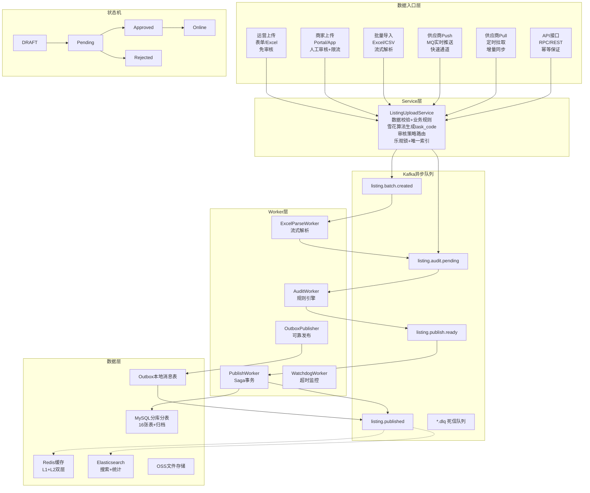

<!-- toc -->

> **电商系统设计系列**（篇次与[（一）推荐阅读顺序](/system-design/20-ecommerce-overview/)一致）
> - [（一）全景概览与领域划分](/system-design/20-ecommerce-overview/)
> - [（二）商品中心系统](/system-design/27-ecommerce-product-center/)
> - [（三）库存系统](/system-design/22-ecommerce-inventory/)
> - [（四）营销系统深度解析](/system-design/28-ecommerce-marketing-system/)
> - [（五）计价引擎](/system-design/23-ecommerce-pricing-engine/)
> - [（六）计价系统 DDD 实践](/system-design/24-ecommerce-pricing-ddd/)
> - [（七）订单系统](/system-design/26-ecommerce-order-system/)
> - [（八）支付系统深度解析](/system-design/29-ecommerce-payment-system/)
> - **（九）商品上架系统**（本文）
> - [（十）B 端运营系统](/system-design/25-ecommerce-b-side-ops/)

本文是电商系统设计系列的第九篇（运营管理层），建议先阅读[（一）全景概览与领域划分](/system-design/20-ecommerce-overview/)与[（二）商品中心系统](/system-design/27-ecommerce-product-center/)了解商品主数据与领域边界。

## 一、背景与挑战

### 1.1 现状痛点

在数字电商/本地生活平台中，商品上架的数据来源和审核策略差异极大：

#### 1.1.1 数据来源分类

| 数据来源 | 触发方式 | 数据可信度 | 审核策略 | 典型场景 |
|---------|---------|-----------|---------|----------|
| **供应商 Push** | 供应商实时推送 MQ 消息 | 高（合作方） | 自动审核（快速通道） | 电影票场次变更 |
| **供应商 Pull** | 定时任务主动拉取 API | 高（合作方） | 自动审核（快速通道） | 酒店房型价格同步 |
| **运营上传** | 运营后台单品/批量 | 高（内部） | 免审核或自动审核 | 话费充值面额配置 |
| **商家上传** | Merchant App/Portal | 低（需审核） | 人工审核 | 商家自营电子券 |
| **API 接口** | 第三方系统调用 | 中（看调用方） | 根据来源配置 | 批量导入工具 |

#### 1.1.2 品类上架流程对比

| 品类 | 主要数据来源 | 对接方式 | 审核策略 | 特殊处理 |
|------|------------|---------|---------|----------|
| **酒店 (Hotel)** | 供应商 Pull / 运营批量 | 定时拉取 API (Cron) | 自动审核 | 价格日历校验 |
| **电影票 (Movie)** | 供应商 Push | 实时推送 (MQ) | 自动审核（快速通道） | 场次时间校验 |
| **话费充值 (TopUp)** | 运营上传 | 单品表单 / Excel 批量 | 免审核 | 面额范围校验 |
| **电子券 (E-voucher)** | 商家上传 / 供应商 Pull | Portal + 券码池 / API | 人工审核 | 券码池异步导入 |
| **礼品卡 (Giftcard)** | 运营上传 / 商家上传 | 单品表单 / Merchant App | 商家需审核，运营免审 | 库存校验 |

**核心痛点**：

1. **流程不统一**：每个品类上架流程各异，代码无法复用。
2. **状态管理混乱**：草稿、审核、上线、下线等状态散落在不同表中。
3. **批量上传困难**：Excel 批量上传缺乏统一处理机制。
4. **数据一致性差**：并发上架时数据冲突频发，缺乏乐观锁保护。
5. **审核策略不灵活**：无法根据数据来源（供应商/运营/商家）动态调整审核策略。
6. **供应商对接方式不统一**：有的推送、有的拉取，各自实现，缺乏标准化。

### 1.2 设计目标

| 目标 | 说明 | 优先级 |
|------|------|--------|
| **统一上架流程** | 所有品类共享统一状态机和流程 | P0 |
| **异步化处理** | 上传、审核、发布异步化，提升响应速度 | P0 |
| **批量上传** | 支持 Excel/CSV 批量上传 | P0 |
| **状态可追溯** | 完整的状态变更历史记录 | P0 |
| **并发安全** | 乐观锁 + 唯一索引保证一致性 | P1 |
| **故障自愈** | 看门狗机制监控超时任务，自动重试 | P1 |

---

## 二、整体架构

> **📊 可视化架构图**：
> - [Excalidraw 架构图](../../diagrams/Excalidraw/listing-upload-architecture.excalidraw)（可在 [Excalidraw](https://excalidraw.com) 中打开编辑）
> - [Mermaid 流程图](../../diagrams/mermaid/listing-upload-architecture.mmd)（可直接在支持 Mermaid 的编辑器中渲染）

### 2.1 分层架构

#### 架构流程图（Mermaid）



#### 文字描述

```
┌─────────────────────────────────────────────────────────────┐
│  上架入口层 (Entry Layer)                                    │
│  ┌────────┬────────┬────────┬────────┬────────┬────────┐   │
│  │运营上传│商家上传│ 批量导入│供应商  │供应商  │ API接口│   │
│  │ (Form) │(Portal)│ (Excel)│ Push   │ Pull   │ (RPC)  │   │
│  │        │  (App) │        │ (MQ)   │ (Cron) │        │   │
│  └────────┴────────┴────────┴────────┴────────┴────────┘   │
│           ↓                                      │
│  ┌───────────────────────────────────────────┐  │
│  │       Listing Upload Service              │  │
│  │  • 数据校验  • 格式转换  • 任务创建       │  │
│  └───────────────────────────────────────────┘  │
│           ↓                                      │
│  ┌───────────────────────────────────────────┐  │
│  │       Async Task Queue (Kafka)            │  │
│  │  • listing.upload.created                 │  │
│  │  • listing.audit.pending                  │  │
│  │  • listing.publish.ready                  │  │
│  └───────────────────────────────────────────┘  │
│           ↓                                      │
│  ┌───────────────────────────────────────────┐  │
│  │       Async Workers                       │  │
│  │  ┌──────────┬──────────┬──────────┐      │  │
│  │  │ 数据处理  │ 审核引擎  │ 发布引擎 │      │  │
│  │  │ Worker   │ Worker   │ Worker   │      │  │
│  │  └──────────┴──────────┴──────────┘      │  │
│  └───────────────────────────────────────────┘  │
│           ↓                                      │
│  ┌───────────────────────────────────────────┐  │
│  │       状态机引擎 (State Machine)           │  │
│  │  DRAFT → Pending → Approved → Online      │  │
│  └───────────────────────────────────────────┘  │
│           ↓                                      │
│  ┌───────────────────────────────────────────┐  │
│  │       数据持久化层                         │  │
│  │  MySQL / Redis / ES / OSS                 │  │
│  └───────────────────────────────────────────┘  │
└─────────────────────────────────────────────────┘
```

### 2.2 核心设计思想

1. **统一状态机**：所有品类共享同一套状态流转（DRAFT → Pending → Approved → Online），通过审核规则引擎适配不同品类的校验逻辑。
2. **策略模式**：不同品类的校验规则、供应商对接方式通过策略模式实现，新品类只需注册校验规则即可接入。
3. **数据来源驱动审核**：根据数据来源（供应商/运营/商家）自动选择审核策略（快速通道/免审核/人工审核）。
4. **异步化**：所有耗时操作（文件解析、审核、发布）通过 Kafka + Worker 异步处理，API 层只负责创建任务和返回 task_code。
5. **事件驱动**：每个状态变更都发送 Kafka 事件，下游消费者（ES 同步、缓存刷新、通知）解耦处理。

---

## 三、状态机设计

### 3.1 状态流转图

```
┌──────────┐
│  DRAFT   │  草稿（0）
│          │  • 运营创建/编辑商品
└─────┬────┘
      │ submit()
      ▼
┌──────────────┐
│Pending Audit │  待审核（10）
│              │  • 提交后不可编辑
└──────┬───────┘
 ┌─────┴─────┐
 │           │
 │ approve() │ reject()
 ▼           ▼
┌────────┐ ┌────────┐
│Approved│ │Rejected│  审核拒绝（12）→ 可重新提交
│  (11)  │ │  (12)  │
└───┬────┘ └────────┘
    │ publish()
    ▼
┌────────┐
│ Online │  已上线（20）→ 商品可售
│  (20)  │
└───┬────┘
    │
    ├── offline()      → Offline (21)    下线
    ├── maintain()     → Maintain (22)   维护中
    └── outOfStock()   → OutOfStock (23) 缺货
```

### 3.2 状态枚举

```go
const (
    StatusDraft         = 0   // 草稿
    StatusPendingAudit  = 10  // 待审核
    StatusApproved      = 11  // 审核通过
    StatusRejected      = 12  // 审核拒绝
    StatusOnline        = 20  // 已上线
    StatusOffline       = 21  // 已下线
    StatusMaintain      = 22  // 维护中
    StatusOutOfStock    = 23  // 缺货
)
```

---

## 四、数据模型

### 4.1 上架任务表（listing_task_tab）

每次上架操作对应一条任务记录，是整个流程的核心载体：

```sql
CREATE TABLE listing_task_tab (
  id              BIGINT PRIMARY KEY AUTO_INCREMENT,
  task_code       VARCHAR(64) NOT NULL COMMENT '任务编码(唯一)',
  task_type       VARCHAR(50) NOT NULL COMMENT 'single_create/batch_import/supplier_sync/api_import',
  category_id     BIGINT NOT NULL COMMENT '类目ID',
  item_id         BIGINT COMMENT '商品ID(创建成功后关联)',
  
  -- 状态
  status          TINYINT NOT NULL DEFAULT 0 COMMENT '主状态(状态机)',
  sub_status      VARCHAR(50) COMMENT '子状态: processing/waiting_retry/failed',
  
  -- 任务数据
  source_type     VARCHAR(50) NOT NULL COMMENT 'operator_form/merchant_portal/merchant_app/excel_batch/supplier_push/supplier_pull/api',
  source_file     VARCHAR(500) COMMENT '源文件路径(Excel时)',
  source_user_id  BIGINT COMMENT '来源用户ID（商家上传时）',
  source_user_type VARCHAR(50) COMMENT '来源用户类型: operator/merchant/system',
  item_data       JSON NOT NULL COMMENT '商品数据(待处理)',
  validation_result JSON COMMENT '校验结果',
  error_message   TEXT COMMENT '错误信息',
  
  -- 审核信息
  audit_type      VARCHAR(50) DEFAULT 'auto' COMMENT 'auto/manual',
  auditor_id      BIGINT COMMENT '审核人',
  audit_time      TIMESTAMP NULL,
  audit_comment   TEXT COMMENT '审核意见',
  
  -- 重试与超时
  retry_count     INT DEFAULT 0,
  max_retry       INT DEFAULT 3,
  timeout_at      TIMESTAMP NULL,
  
  -- 乐观锁
  version         INT NOT NULL DEFAULT 0,
  
  created_by      BIGINT NOT NULL,
  created_at      TIMESTAMP DEFAULT CURRENT_TIMESTAMP,
  updated_at      TIMESTAMP DEFAULT CURRENT_TIMESTAMP ON UPDATE CURRENT_TIMESTAMP,
  
  UNIQUE KEY uk_task_code (task_code),
  KEY idx_category_status (category_id, status),
  KEY idx_timeout (timeout_at, status)
);
```

### 4.2 批量任务表（listing_batch_task_tab）

Excel 批量导入时，一个文件对应一条批量任务，下挂多条 listing_task：

```sql
CREATE TABLE listing_batch_task_tab (
  id              BIGINT PRIMARY KEY AUTO_INCREMENT,
  batch_code      VARCHAR(64) NOT NULL COMMENT '批次编码',
  category_id     BIGINT NOT NULL,
  task_type       VARCHAR(50) NOT NULL COMMENT 'excel_import/api_batch',
  
  -- 文件信息
  file_name       VARCHAR(255),
  file_path       VARCHAR(500),
  file_size       BIGINT,
  file_md5        VARCHAR(64),
  
  -- 进度统计
  total_count     INT DEFAULT 0,
  success_count   INT DEFAULT 0,
  failed_count    INT DEFAULT 0,
  processing_count INT DEFAULT 0,
  
  status          VARCHAR(50) DEFAULT 'created' COMMENT 'created/processing/completed/failed',
  progress        INT DEFAULT 0 COMMENT '0-100',
  
  result_file     VARCHAR(500) COMMENT '结果文件(含成功/失败明细)',
  
  start_time      TIMESTAMP NULL,
  end_time        TIMESTAMP NULL,
  created_by      BIGINT NOT NULL,
  created_at      TIMESTAMP DEFAULT CURRENT_TIMESTAMP,
  updated_at      TIMESTAMP DEFAULT CURRENT_TIMESTAMP ON UPDATE CURRENT_TIMESTAMP,
  
  UNIQUE KEY uk_batch_code (batch_code),
  KEY idx_status (status)
);
```

### 4.3 批量任务明细表（listing_batch_item_tab）

```sql
CREATE TABLE listing_batch_item_tab (
  id              BIGINT PRIMARY KEY AUTO_INCREMENT,
  batch_id        BIGINT NOT NULL,
  task_id         BIGINT COMMENT '关联的 listing_task_id',
  item_id         BIGINT COMMENT '关联的商品ID',
  
  row_number      INT NOT NULL COMMENT 'Excel行号',
  row_data        JSON NOT NULL COMMENT '行数据(原始)',
  
  status          VARCHAR(50) DEFAULT 'pending' COMMENT 'pending/processing/success/failed',
  error_message   TEXT,
  
  created_at      TIMESTAMP DEFAULT CURRENT_TIMESTAMP,
  
  KEY idx_batch_status (batch_id, status)
);
```

### 4.4 审核日志表 & 状态变更历史表

```sql
-- 审核日志
CREATE TABLE listing_audit_log_tab (
  id              BIGINT PRIMARY KEY AUTO_INCREMENT,
  task_id         BIGINT NOT NULL,
  item_id         BIGINT,
  audit_type      VARCHAR(50) NOT NULL COMMENT 'auto/manual',
  audit_action    VARCHAR(50) NOT NULL COMMENT 'approve/reject',
  audit_reason    TEXT,
  rules_applied   JSON COMMENT '应用的审核规则',
  rule_results    JSON COMMENT '规则执行结果',
  auditor_id      BIGINT,
  audit_time      TIMESTAMP DEFAULT CURRENT_TIMESTAMP,
  KEY idx_task (task_id)
);

-- 状态变更历史
CREATE TABLE listing_state_history_tab (
  id              BIGINT PRIMARY KEY AUTO_INCREMENT,
  task_id         BIGINT NOT NULL,
  item_id         BIGINT,
  from_status     TINYINT NOT NULL,
  to_status       TINYINT NOT NULL,
  action          VARCHAR(50) NOT NULL COMMENT 'submit/approve/reject/publish/offline',
  reason          VARCHAR(500),
  operator_id     BIGINT,
  changed_at      TIMESTAMP DEFAULT CURRENT_TIMESTAMP,
  KEY idx_task (task_id)
);
```

### 4.5 审核策略配置表

根据数据来源自动选择审核策略：

```sql
CREATE TABLE listing_audit_config_tab (
  id              BIGINT PRIMARY KEY AUTO_INCREMENT,
  category_id     BIGINT NOT NULL COMMENT '类目ID',
  source_type     VARCHAR(50) NOT NULL COMMENT '数据来源类型',
  source_user_type VARCHAR(50) COMMENT '用户类型: operator/merchant/system',
  
  -- 审核策略
  audit_strategy  VARCHAR(50) NOT NULL COMMENT 'skip/auto/manual/fast_track',
  skip_audit      BOOLEAN DEFAULT FALSE COMMENT '是否跳过审核',
  fast_track      BOOLEAN DEFAULT FALSE COMMENT '是否快速通道',
  require_manual  BOOLEAN DEFAULT FALSE COMMENT '是否需要人工审核',
  
  -- 审核规则
  validation_rules JSON COMMENT '校验规则配置',
  auto_approve_conditions JSON COMMENT '自动通过条件',
  
  is_active       BOOLEAN DEFAULT TRUE,
  created_at      TIMESTAMP DEFAULT CURRENT_TIMESTAMP,
  updated_at      TIMESTAMP DEFAULT CURRENT_TIMESTAMP ON UPDATE CURRENT_TIMESTAMP,
  
  UNIQUE KEY uk_category_source (category_id, source_type, source_user_type),
  KEY idx_category (category_id)
);

-- 示例配置数据
INSERT INTO listing_audit_config_tab (category_id, source_type, source_user_type, audit_strategy, skip_audit, fast_track) VALUES
  (1, 'supplier_push', 'system', 'fast_track', FALSE, TRUE),      -- 供应商推送：快速通道
  (1, 'supplier_pull', 'system', 'fast_track', FALSE, TRUE),      -- 供应商拉取：快速通道
  (1, 'operator_form', 'operator', 'skip', TRUE, FALSE),          -- 运营上传：免审核
  (1, 'merchant_portal', 'merchant', 'manual', FALSE, FALSE),     -- 商家上传：人工审核
  (1, 'merchant_app', 'merchant', 'manual', FALSE, FALSE);        -- 商家App：人工审核
```

### 4.6 分库分表策略

当商品量达到千万级时，单表会成为性能瓶颈，需要采用分库分表策略。

#### 4.6.1 分表策略

**方案一：按时间分表（推荐用于历史任务）**

```sql
-- 按月分表，适合历史数据查询
listing_task_tab_202601
listing_task_tab_202602
listing_task_tab_202603
...

-- 路由规则
func GetTableName(createdAt time.Time) string {
    return fmt.Sprintf("listing_task_tab_%s", createdAt.Format("200601"))
}
```

**方案二：按品类 ID 取模分表（推荐用于活跃数据）**

```sql
-- 按 category_id 取模分 16 张表
listing_task_tab_0
listing_task_tab_1
...
listing_task_tab_15

-- 路由规则
func GetTableName(categoryID int64) string {
    shardIndex := categoryID % 16
    return fmt.Sprintf("listing_task_tab_%d", shardIndex)
}
```

**方案三：混合分表（推荐）**

```sql
-- 先按品类分表，再按时间归档
-- 活跃表（近 30 天）
listing_task_tab_0   -- 品类 0, 4, 8, 12...
listing_task_tab_1   -- 品类 1, 5, 9, 13...
...
listing_task_tab_15

-- 归档表（按月）
listing_task_archive_202601
listing_task_archive_202602
```

#### 4.6.2 分库策略

按业务维度垂直分库：

```
listing_db_core      -- 核心任务表（listing_task_tab, listing_batch_task_tab）
listing_db_log       -- 日志表（audit_log, state_history）
listing_db_config    -- 配置表（audit_config, supplier_sync_state）
```

#### 4.6.3 全局唯一 ID 生成

分表后需要保证 task_code 全局唯一：

```go
// 雪花算法生成 task_code
type SnowflakeIDGenerator struct {
    workerID   int64  // 机器ID（0-1023）
    datacenter int64  // 数据中心ID（0-31）
    sequence   int64  // 序列号（0-4095）
    lastTime   int64
    mu         sync.Mutex
}

func (g *SnowflakeIDGenerator) GenerateTaskCode(categoryID int64) string {
    id := g.NextID()
    return fmt.Sprintf("TASK%d%013d", categoryID, id)
    // 示例: TASK100001234567890123
}
```

### 4.7 软删除与数据归档

#### 4.7.1 软删除设计

所有核心表增加软删除字段，避免误删和支持数据恢复：

```sql
-- 为核心表添加软删除字段
ALTER TABLE listing_task_tab ADD COLUMN deleted_at TIMESTAMP NULL COMMENT '软删除时间';
ALTER TABLE listing_batch_task_tab ADD COLUMN deleted_at TIMESTAMP NULL;
ALTER TABLE listing_batch_item_tab ADD COLUMN deleted_at TIMESTAMP NULL;

-- 软删除索引优化
CREATE INDEX idx_deleted_at ON listing_task_tab(deleted_at);

-- 查询时排除已删除数据
SELECT * FROM listing_task_tab WHERE deleted_at IS NULL;

-- 软删除操作
UPDATE listing_task_tab 
SET deleted_at = NOW() 
WHERE id = ? AND deleted_at IS NULL;

-- 恢复删除
UPDATE listing_task_tab 
SET deleted_at = NULL 
WHERE id = ? AND deleted_at IS NOT NULL;
```

#### 4.7.2 数据归档策略

**归档规则**：

| 表名 | 归档条件 | 归档周期 | 保留时长 |
|------|----------|----------|----------|
| listing_task_tab | 已完成/已失败且创建时间 > 30天 | 每天凌晨 2 点 | 活跃表保留 30 天 |
| listing_batch_task_tab | 状态=completed/failed 且创建时间 > 60天 | 每周一次 | 活跃表保留 60 天 |
| listing_audit_log_tab | 创建时间 > 90天 | 每月一次 | 活跃表保留 90 天 |
| listing_state_history_tab | 创建时间 > 90天 | 每月一次 | 活跃表保留 90 天 |

**归档表设计**：

```sql
-- 归档表（按月分表）
CREATE TABLE listing_task_archive_202601 LIKE listing_task_tab;
CREATE TABLE listing_task_archive_202602 LIKE listing_task_tab;

-- 归档表增加索引优化历史查询
ALTER TABLE listing_task_archive_202601 
ADD INDEX idx_task_code (task_code),
ADD INDEX idx_category_created (category_id, created_at);
```

**归档流程**：

```go
type ArchiveService struct {
    db *gorm.DB
}

// 归档 30 天前的已完成任务
func (s *ArchiveService) ArchiveOldTasks() error {
    cutoffTime := time.Now().AddDate(0, 0, -30)
    archiveTable := fmt.Sprintf("listing_task_archive_%s", 
        cutoffTime.Format("200601"))
    
    // 1. 创建归档表（如不存在）
    s.createArchiveTableIfNotExists(archiveTable)
    
    // 2. 迁移数据
    result := s.db.Exec(fmt.Sprintf(`
        INSERT INTO %s 
        SELECT * FROM listing_task_tab
        WHERE (status IN (20, 21, 23) OR status = 12)  -- Online/Offline/Failed/Rejected
        AND created_at < ?
        AND deleted_at IS NULL
    `, archiveTable), cutoffTime)
    
    log.Infof("Archived %d tasks to %s", result.RowsAffected, archiveTable)
    
    // 3. 删除原表数据（软删除）
    s.db.Exec(`
        UPDATE listing_task_tab
        SET deleted_at = NOW()
        WHERE (status IN (20, 21, 23) OR status = 12)
        AND created_at < ?
        AND deleted_at IS NULL
    `, cutoffTime)
    
    // 4. 定期物理删除软删除数据（90天后）
    s.db.Exec(`
        DELETE FROM listing_task_tab
        WHERE deleted_at < ?
    `, time.Now().AddDate(0, 0, -90))
    
    return nil
}

// 跨表查询（活跃表 + 归档表）
func (s *ArchiveService) QueryTaskByCode(taskCode string) (*ListingTask, error) {
    var task ListingTask
    
    // 1. 先查活跃表
    err := s.db.Where("task_code = ? AND deleted_at IS NULL", taskCode).
        First(&task).Error
    if err == nil {
        return &task, nil
    }
    
    // 2. 查归档表（最近 6 个月）
    for i := 0; i < 6; i++ {
        month := time.Now().AddDate(0, -i, 0)
        archiveTable := fmt.Sprintf("listing_task_archive_%s", 
            month.Format("200601"))
        
        err = s.db.Table(archiveTable).
            Where("task_code = ?", taskCode).
            First(&task).Error
        if err == nil {
            return &task, nil
        }
    }
    
    return nil, errors.New("task not found")
}
```

**归档监控**：

```go
// Prometheus 指标
listing_archive_total{table, month}           // 归档记录数
listing_archive_duration_seconds{table}       // 归档耗时
listing_active_table_size_bytes{table}        // 活跃表大小
listing_archive_query_total{table, found}     // 归档查询次数
```

---

## 五、核心流程设计

### 5.1 审核策略决策流程

根据数据来源自动选择审核策略：

```
创建上架任务
  │
  ▼
识别数据来源 (source_type + source_user_type)
  │
  ├─ 供应商 Push/Pull (system) ────→ 快速通道（自动审核）
  │                                   • 仅校验必填项和格式
  │                                   • 秒级完成
  │
  ├─ 运营上传 (operator) ──────────→ 免审核
  │                                   • 跳过审核环节
  │                                   • 直接发布
  │
  ├─ 商家上传 (merchant) ──────────→ 人工审核
  │                                   • 完整校验规则
  │                                   • 推送审核队列
  │                                   • 人工审批
  │
  └─ API 接口 (根据调用方配置) ────→ 按配置决策
```

### 5.2 单品上架流程

```
用户提交表单
  │
  ▼
1. ListingUploadService.createSingle()
   • 数据校验（必填项、格式、范围）
   • 业务规则校验（价格、库存、属性）
   • 创建 listing_task (status=DRAFT)
   • 返回 task_code
  │
  ▼
2. 用户确认 → submit()
   • 状态: DRAFT → Pending (10)
   • 发送 Kafka: listing.audit.pending
   • 启动看门狗（超时 30 分钟）
  │
  ▼
3. AuditWorker 消费处理
   • 获取任务（乐观锁 + version 校验）
   • 执行审核规则引擎
   •   - 自动审核：价格/库存/属性校验
   •   - 人工审核：推送审核队列
   • 状态: Pending → Approved (11)
   • 记录审核日志
   • 发送 Kafka: listing.publish.ready
  │
  ▼
4. PublishWorker 消费处理
   • 创建 item_tab / sku_tab 记录
   • 创建关联实体和属性
   • 状态: Approved → Online (20)
   • 清除缓存 + 同步 ES
   • 发送 Kafka: listing.published
  │
  ▼
5. 商品上线成功
```

### 5.3 批量上架流程（Excel）

```
用户上传 Excel
  │
  ▼
1. 上传文件到 OSS → 创建 listing_batch_task → 返回 batch_code
   • 发送 Kafka: listing.batch.created
  │
  ▼
2. ExcelParseWorker
   • 从 OSS 下载文件 → 逐行解析
   • 数据格式校验 → 为每行创建 listing_task + listing_batch_item
   • 更新 batch_task 统计 → 发送 Kafka: listing.batch.parsed
  │
  ▼
3. BatchAuditWorker
   • 获取 batch 下所有 tasks → 并行审核（goroutine pool）
   • 自动审核: Approved / 审核失败: Rejected
   • 更新 batch_item 状态和 batch_task 进度
  │
  ▼
4. BatchPublishWorker
   • 获取所有 Approved tasks → 分批处理（每批 100 条）
   • 批量创建 item/sku 记录（事务保证）
   • 批量清缓存 + 同步 ES
   • 生成结果文件（含失败明细）→ 上传 OSS
   • batch_task 状态 → completed
  │
  ▼
5. 用户下载结果文件
```

### 5.4 供应商推送同步流程（Movie — 实时）

```
供应商发送影片/场次变更消息 (MQ)
  │
  ▼
1. SupplierPushConsumer 消费消息
   • 解析供应商数据格式 → 数据映射转换
   • 创建 listing_task (source_type=supplier_push, status=DRAFT)
  │
  ▼
2. 自动审核（快速通道）
   • 供应商数据可信，仅校验必填项
   • 状态: DRAFT → Approved → 自动发布
  │
  ▼
3. PublishWorker
   • 创建 item (Film+Cinema+Session)
   • 创建 sku (票种)
   • 状态: Approved → Online
   • 同步缓存和 ES
  │
  ▼
4. 电影票自动上线
```

### 5.5 供应商定时拉取流程（Hotel — 批量）

```
定时任务触发（每小时 / 每 30 分钟）
  │
  ▼
1. SupplierPullScheduler
   • 读取 last_sync_time
   • 调用供应商 API: GET /api/hotels/changes?since=xxx
   • 获取增量酒店+房型+价格数据
  │
  ▼
2. SupplierPullProcessor
   • 数据转换: 供应商 Hotel → 平台 Item / 供应商 Room Type → 平台 SKU
   • 价格日历生成
   • 批量创建 listing_task (source_type=supplier_pull)
   • 创建 listing_batch_task → 发送批量审核消息
  │
  ▼
3. BatchAutoAuditWorker
   • 校验价格日历合法性（价格 > 0、日期连续、库存 >= 0）
   • 审核失败记录错误日志
  │
  ▼
4. BatchPublishWorker
   • 批量创建 item (Hotel + Room Type) / sku (产品包)
   • 批量创建价格日历记录
   • 批量更新缓存和 ES
  │
  ▼
5. 更新 last_sync_time，等待下次定时任务
```

---

## 六、供应商对接双模式设计

### 6.1 推送 vs 拉取对比

| 对比项 | 推送模式 (Push) | 拉取模式 (Pull) |
|--------|-----------------|-----------------|
| **代表品类** | Movie（电影票） | Hotel（酒店）、E-voucher |
| **触发方式** | 供应商主动推送 MQ 消息 | 定时任务周期性拉取 |
| **实时性** | 高（毫秒级） | 中（分钟级） |
| **数据完整性** | 依赖 MQ 可靠性 | 主动拉取保证完整 |
| **系统耦合度** | 供应商需感知平台 | 平台主动拉取，供应商无感知 |
| **适用场景** | 高频变更、实时性要求高、单次数据量小 | 低频变更、可接受延迟、单次数据量大 |

### 6.2 选型建议

- **推送模式**：实时性要求 < 1s、变更频率高、供应商支持 MQ 推送。
- **拉取模式**：可接受分钟级延迟、数据量大、需保证不丢失。
- **混合模式**：E-voucher 等品类可同时支持两种 — 推送处理实时变更，拉取做每日全量对账。

### 6.3 同步状态管理

```sql
CREATE TABLE supplier_sync_state_tab (
  id              BIGINT PRIMARY KEY AUTO_INCREMENT,
  supplier_id     BIGINT NOT NULL COMMENT '供应商ID',
  category_id     BIGINT NOT NULL COMMENT '类目ID',
  last_sync_time  TIMESTAMP NOT NULL COMMENT '上次同步时间',
  sync_count      INT DEFAULT 0,
  last_success_time TIMESTAMP NULL,
  last_error      TEXT,
  created_at      TIMESTAMP DEFAULT CURRENT_TIMESTAMP,
  updated_at      TIMESTAMP DEFAULT CURRENT_TIMESTAMP ON UPDATE CURRENT_TIMESTAMP,
  UNIQUE KEY uk_supplier_category (supplier_id, category_id)
);
```

---

## 七、关键技术方案

### 7.1 乐观锁 + 版本号（并发安全）

所有状态变更使用乐观锁，防止并发冲突：

```go
func UpdateStatus(taskID int64, fromStatus, toStatus int, action string) error {
    result, err := db.Exec(`
        UPDATE listing_task_tab
        SET status = ?, version = version + 1, updated_at = NOW()
        WHERE id = ? AND status = ? AND version = ?
    `, toStatus, taskID, fromStatus, currentVersion)

    if result.RowsAffected() == 0 {
        return errors.New("concurrent modification or status changed")
    }

    // 记录状态变更历史
    recordStateHistory(taskID, fromStatus, toStatus, action)
    return nil
}
```

### 7.2 唯一索引保证幂等

task_code 唯一索引保证同一上架操作不会重复创建：

```go
func CreateTask(req *CreateTaskRequest) (*ListingTask, error) {
    taskCode := generateTaskCode(req.CategoryID, req.CreatedBy, time.Now())

    err := db.Create(&ListingTask{TaskCode: taskCode, ...})
    if isDuplicateKeyError(err) {
        return db.GetByTaskCode(taskCode) // 幂等返回已存在任务
    }
    return task, err
}
```

### 7.3 看门狗机制（Watchdog）

监控超时和卡住的任务，自动重试或告警：

```go
func (w *WatchdogService) Start() {
    ticker := time.NewTicker(1 * time.Minute)
    for range ticker.C {
        w.checkTimeoutTasks()  // 超时 → 重试或标记失败
        w.checkStuckTasks()    // 卡住 2 小时 → 告警
    }
}

func (w *WatchdogService) checkTimeoutTasks() {
    tasks := queryTimeoutTasks(time.Now())
    for _, task := range tasks {
        if task.RetryCount < task.MaxRetry {
            task.RetryCount++
            task.TimeoutAt = time.Now().Add(30 * time.Minute)
            requeueTask(task) // 重新发送 Kafka 消息
        } else {
            markTaskFailed(task, "timeout after max retries")
            sendAlert("task_timeout", task.ID)
        }
    }
}
```

### 7.4 数据校验引擎（策略模式）

不同品类注册不同校验规则，通过规则引擎统一执行：

```go
type ValidationEngine struct {
    rules map[string][]ValidationRule // category → rules
}

type ValidationRule interface {
    Validate(ctx context.Context, data interface{}) *ValidationError
}

// 注册品类规则
engine.RegisterRule("hotel", &HotelPriceValidationRule{})    // 价格 > 0, 日历连续
engine.RegisterRule("movie", &MovieSessionValidationRule{})   // 场次在未来, 票价 > 0
engine.RegisterRule("topup", &TopUpDenominationRule{})        // 面额范围校验
engine.RegisterRule("evoucher", &VoucherCodePoolRule{})       // 券码池完整性

// 统一执行
errors := engine.Validate(ctx, categoryID, itemData)
```

### 7.5 Worker Pool 并发处理

批量上架使用 Worker Pool 控制并发度：

```go
func PublishBatch(batchID int64) error {
    tasks := getApprovedTasks(batchID)

    pool := &WorkerPool{
        workerCount: 20,
        taskChan:    make(chan *ListingTask, 100),
    }
    pool.Start()

    for _, task := range tasks {
        pool.Submit(task) // 分发到 worker
    }

    pool.Stop() // 等待全部完成
    return nil
}
```

### 7.6 分布式事务处理

商品发布流程涉及多表写入（item_tab、sku_tab、属性表、价格表等），需要保证分布式事务一致性。

#### 7.6.1 Saga 模式设计

采用 Saga 编排模式（Orchestration），每个步骤可独立回滚：

```go
type PublishSaga struct {
    taskID    int64
    steps     []SagaStep
    completed []SagaStep  // 已完成步骤（用于回滚）
}

type SagaStep interface {
    Execute(ctx context.Context) error      // 执行
    Compensate(ctx context.Context) error   // 补偿（回滚）
    GetName() string
}

// 定义发布流程的各个步骤
func NewPublishSaga(taskID int64) *PublishSaga {
    return &PublishSaga{
        taskID: taskID,
        steps: []SagaStep{
            &CreateItemStep{taskID: taskID},           // 步骤1: 创建商品主体
            &CreateSKUStep{taskID: taskID},            // 步骤2: 创建SKU
            &CreateAttributesStep{taskID: taskID},     // 步骤3: 创建属性
            &CreatePriceStep{taskID: taskID},          // 步骤4: 创建价格
            &UpdateStatusStep{taskID: taskID},         // 步骤5: 更新任务状态
            &PublishEventStep{taskID: taskID},         // 步骤6: 发送事件
            &UpdateCacheStep{taskID: taskID},          // 步骤7: 更新缓存
            &SyncESStep{taskID: taskID},               // 步骤8: 同步ES
        },
    }
}

func (s *PublishSaga) Execute(ctx context.Context) error {
    for i, step := range s.steps {
        log.Infof("Saga[%d] executing step %d: %s", s.taskID, i+1, step.GetName())
        
        if err := step.Execute(ctx); err != nil {
            log.Errorf("Saga[%d] step %s failed: %v", s.taskID, step.GetName(), err)
            
            // 执行失败，开始补偿（回滚已完成的步骤）
            s.compensate(ctx)
            return fmt.Errorf("saga failed at step %s: %w", step.GetName(), err)
        }
        
        s.completed = append(s.completed, step)
    }
    
    log.Infof("Saga[%d] completed successfully", s.taskID)
    return nil
}

func (s *PublishSaga) compensate(ctx context.Context) {
    log.Warnf("Saga[%d] starting compensation, rolling back %d steps", 
        s.taskID, len(s.completed))
    
    // 逆序回滚已完成的步骤
    for i := len(s.completed) - 1; i >= 0; i-- {
        step := s.completed[i]
        log.Infof("Saga[%d] compensating step: %s", s.taskID, step.GetName())
        
        if err := step.Compensate(ctx); err != nil {
            log.Errorf("Saga[%d] compensation failed for %s: %v", 
                s.taskID, step.GetName(), err)
            // 补偿失败记录告警，需人工介入
            sendAlert("saga_compensation_failed", s.taskID, step.GetName())
        }
    }
}
```

#### 7.6.2 具体步骤实现

```go
// 步骤1: 创建商品主体
type CreateItemStep struct {
    taskID int64
    itemID int64  // 执行后记录，用于补偿
}

func (s *CreateItemStep) Execute(ctx context.Context) error {
    task := getTask(s.taskID)
    
    item := &Item{
        CategoryID:  task.CategoryID,
        Title:       task.ItemData["title"].(string),
        Description: task.ItemData["description"].(string),
        Status:      ItemStatusDraft,  // 先创建草稿状态
    }
    
    if err := db.Create(item).Error; err != nil {
        return err
    }
    
    s.itemID = item.ID
    
    // 更新 task 关联
    db.Model(&ListingTask{}).Where("id = ?", s.taskID).
        Update("item_id", item.ID)
    
    return nil
}

func (s *CreateItemStep) Compensate(ctx context.Context) error {
    if s.itemID == 0 {
        return nil
    }
    
    // 软删除商品
    return db.Model(&Item{}).Where("id = ?", s.itemID).
        Update("deleted_at", time.Now()).Error
}

func (s *CreateItemStep) GetName() string {
    return "CreateItem"
}

// 步骤2: 创建SKU
type CreateSKUStep struct {
    taskID int64
    skuIDs []int64
}

func (s *CreateSKUStep) Execute(ctx context.Context) error {
    task := getTask(s.taskID)
    skus := parseSkusFromItemData(task.ItemData)
    
    for _, sku := range skus {
        if err := db.Create(sku).Error; err != nil {
            return err
        }
        s.skuIDs = append(s.skuIDs, sku.ID)
    }
    
    return nil
}

func (s *CreateSKUStep) Compensate(ctx context.Context) error {
    if len(s.skuIDs) == 0 {
        return nil
    }
    
    // 批量软删除SKU
    return db.Model(&SKU{}).Where("id IN ?", s.skuIDs).
        Update("deleted_at", time.Now()).Error
}

func (s *CreateSKUStep) GetName() string {
    return "CreateSKU"
}

// 步骤5: 更新任务状态（最后提交）
type UpdateStatusStep struct {
    taskID int64
}

func (s *UpdateStatusStep) Execute(ctx context.Context) error {
    // 所有数据创建成功后，才更新商品和任务状态为 Online
    
    task := getTask(s.taskID)
    
    // 开启事务，同时更新商品状态和任务状态
    return db.Transaction(func(tx *gorm.DB) error {
        // 更新商品状态: Draft → Online
        if err := tx.Model(&Item{}).Where("id = ?", task.ItemID).
            Update("status", ItemStatusOnline).Error; err != nil {
            return err
        }
        
        // 更新任务状态: Approved → Online
        if err := tx.Model(&ListingTask{}).
            Where("id = ? AND status = ?", s.taskID, StatusApproved).
            Updates(map[string]interface{}{
                "status":     StatusOnline,
                "version":    gorm.Expr("version + 1"),
                "updated_at": time.Now(),
            }).Error; err != nil {
            return err
        }
        
        // 记录状态变更历史
        return tx.Create(&ListingStateHistory{
            TaskID:     s.taskID,
            ItemID:     task.ItemID,
            FromStatus: StatusApproved,
            ToStatus:   StatusOnline,
            Action:     "publish",
            ChangedAt:  time.Now(),
        }).Error
    })
}

func (s *UpdateStatusStep) Compensate(ctx context.Context) error {
    task := getTask(s.taskID)
    
    return db.Transaction(func(tx *gorm.DB) error {
        // 回滚商品状态: Online → Draft
        tx.Model(&Item{}).Where("id = ?", task.ItemID).
            Update("status", ItemStatusDraft)
        
        // 回滚任务状态: Online → Approved
        return tx.Model(&ListingTask{}).
            Where("id = ?", s.taskID).
            Updates(map[string]interface{}{
                "status":     StatusApproved,
                "version":    gorm.Expr("version + 1"),
                "updated_at": time.Now(),
            }).Error
    })
}

func (s *UpdateStatusStep) GetName() string {
    return "UpdateStatus"
}
```

#### 7.6.3 Saga 状态持久化

为了支持断点恢复和故障排查，将 Saga 执行状态持久化：

```sql
CREATE TABLE listing_saga_log_tab (
  id              BIGINT PRIMARY KEY AUTO_INCREMENT,
  task_id         BIGINT NOT NULL,
  saga_id         VARCHAR(64) NOT NULL COMMENT 'Saga实例ID',
  step_name       VARCHAR(100) NOT NULL,
  step_order      INT NOT NULL,
  status          VARCHAR(50) NOT NULL COMMENT 'pending/success/failed/compensated',
  action          VARCHAR(50) NOT NULL COMMENT 'execute/compensate',
  error_message   TEXT,
  started_at      TIMESTAMP NOT NULL,
  completed_at    TIMESTAMP NULL,
  duration_ms     INT,
  
  KEY idx_task_id (task_id),
  KEY idx_saga_id (saga_id)
);
```

```go
// 记录 Saga 步骤执行
func (s *PublishSaga) recordStepExecution(step SagaStep, status string, err error) {
    log := &SagaLog{
        TaskID:    s.taskID,
        SagaID:    s.sagaID,
        StepName:  step.GetName(),
        StepOrder: s.getCurrentStepOrder(),
        Status:    status,
        Action:    "execute",
        StartedAt: time.Now(),
    }
    
    if err != nil {
        log.ErrorMessage = err.Error()
    }
    
    db.Create(log)
}

// 支持断点恢复
func (s *PublishSaga) Resume(ctx context.Context) error {
    // 查询已完成的步骤
    var logs []SagaLog
    db.Where("task_id = ? AND status = 'success'", s.taskID).
        Order("step_order ASC").Find(&logs)
    
    // 跳过已完成的步骤
    startIndex := len(logs)
    
    for i := startIndex; i < len(s.steps); i++ {
        step := s.steps[i]
        if err := step.Execute(ctx); err != nil {
            s.compensate(ctx)
            return err
        }
        s.completed = append(s.completed, step)
    }
    
    return nil
}
```

#### 7.6.4 本地消息表方案（可靠事件发布）

对于 Kafka 事件发布，使用本地消息表保证最终一致性：

```sql
CREATE TABLE listing_outbox_tab (
  id              BIGINT PRIMARY KEY AUTO_INCREMENT,
  task_id         BIGINT NOT NULL,
  event_type      VARCHAR(50) NOT NULL,
  event_payload   JSON NOT NULL,
  status          VARCHAR(50) DEFAULT 'pending' COMMENT 'pending/published/failed',
  retry_count     INT DEFAULT 0,
  max_retry       INT DEFAULT 3,
  next_retry_at   TIMESTAMP NULL,
  published_at    TIMESTAMP NULL,
  created_at      TIMESTAMP DEFAULT CURRENT_TIMESTAMP,
  
  KEY idx_status_retry (status, next_retry_at)
);
```

```go
// 步骤6: 发送事件（本地消息表）
type PublishEventStep struct {
    taskID    int64
    outboxID  int64
}

func (s *PublishEventStep) Execute(ctx context.Context) error {
    task := getTask(s.taskID)
    
    event := &ListingEvent{
        EventType:  "listing.published",
        TaskID:     s.taskID,
        ItemID:     task.ItemID,
        CategoryID: task.CategoryID,
        SourceType: task.SourceType,
        ToStatus:   StatusOnline,
    }
    
    payload, _ := json.Marshal(event)
    
    // 1. 先写本地消息表（与业务数据在同一事务）
    outbox := &OutboxMessage{
        TaskID:       s.taskID,
        EventType:    "listing.published",
        EventPayload: payload,
        Status:       "pending",
    }
    
    if err := db.Create(outbox).Error; err != nil {
        return err
    }
    
    s.outboxID = outbox.ID
    
    // 2. 异步发送到 Kafka（由独立的 Publisher 轮询处理）
    // 这里不阻塞，保证本地事务快速提交
    
    return nil
}

func (s *PublishEventStep) Compensate(ctx context.Context) error {
    // 标记消息为已取消，不再发送
    if s.outboxID > 0 {
        db.Model(&OutboxMessage{}).Where("id = ?", s.outboxID).
            Update("status", "cancelled")
    }
    return nil
}

// Outbox Publisher（独立 Worker）
type OutboxPublisher struct {
    kafka *kafka.Producer
}

func (p *OutboxPublisher) Start() {
    ticker := time.NewTicker(5 * time.Second)
    for range ticker.C {
        p.publishPendingMessages()
    }
}

func (p *OutboxPublisher) publishPendingMessages() {
    var messages []OutboxMessage
    
    // 查询待发送消息（含重试）
    db.Where("status = 'pending' AND (next_retry_at IS NULL OR next_retry_at <= NOW())").
        Limit(100).Find(&messages)
    
    for _, msg := range messages {
        err := p.kafka.Publish("listing.events", msg.EventPayload)
        
        if err == nil {
            // 发送成功，标记已发布
            db.Model(&OutboxMessage{}).Where("id = ?", msg.ID).
                Updates(map[string]interface{}{
                    "status":       "published",
                    "published_at": time.Now(),
                })
        } else {
            // 发送失败，增加重试
            msg.RetryCount++
            if msg.RetryCount >= msg.MaxRetry {
                db.Model(&OutboxMessage{}).Where("id = ?", msg.ID).
                    Update("status", "failed")
                sendAlert("outbox_publish_failed", msg.ID)
            } else {
                // 指数退避重试
                nextRetry := time.Now().Add(time.Duration(math.Pow(2, float64(msg.RetryCount))) * time.Minute)
                db.Model(&OutboxMessage{}).Where("id = ?", msg.ID).
                    Updates(map[string]interface{}{
                        "retry_count":   msg.RetryCount,
                        "next_retry_at": nextRetry,
                    })
            }
        }
    }
}
```

#### 7.6.5 分布式事务监控

```go
// Prometheus 指标
saga_execution_total{status="success|failed"}
saga_step_duration_seconds{step_name}
saga_compensation_total{step_name}
outbox_pending_count                           // 待发送消息数
outbox_publish_success_rate                    // 发送成功率
```

---

## 八、Kafka 事件设计

### 8.1 Topic 设计

| Topic | 触发时机 | 消费者 |
|-------|----------|--------|
| `listing.batch.created` | Excel 上传完成 | ExcelParseWorker |
| `listing.audit.pending` | 提交审核 | AuditWorker |
| `listing.publish.ready` | 审核通过 | PublishWorker |
| `listing.published` | 发布成功 | ES 同步、缓存刷新、通知 |
| `listing.batch.parsed` | Excel 解析完成 | BatchAuditWorker |
| `listing.batch.audited` | 批量审核完成 | BatchPublishWorker |

### 8.2 消息格式

```protobuf
message ListingEvent {
    string event_id     = 1;  // UUID
    string event_type   = 2;  // created/audited/published/rejected
    int64  timestamp    = 3;

    int64  task_id      = 10;
    string task_code    = 11;
    int64  category_id  = 12;
    int64  batch_id     = 13; // 批量任务时

    int64  item_id      = 20; // 发布成功后
    string source_type  = 21; // operator_form/merchant_portal/excel_batch/supplier_push/supplier_pull

    int32  from_status  = 30;
    int32  to_status    = 31;
    string action       = 32;
}
```

---

## 九、业界最佳实践参考

### 9.1 淘宝/天猫

- **强模板约束**：不同类目不同发布模板，必填项严格校验。
- **分阶段发布**：草稿 → 待审核 → 审核通过 → 定时上架 → 已上线。
- **AI 图片审核**：AI + 人工双重审核，识别违规图片。
- **定时上架**：支持定时自动上架，营销活动同步上线。

### 9.2 京东

- **三级审核**：自动审核 → 算法审核（价格异常检测、重复商品识别） → 人工审核。
- **商品池概念**：草稿池 → 待审核池 → 在售池 → 下架池。
- **快速通道**：VIP 商家快速审核通道。
- **实时监控**：异常自动下架。

### 9.3 Amazon

- **ASIN 去重**：自动生成全球唯一商品标识，防止重复上架。
- **商品质量评分**：图片/标题/描述完整度评分，引导商家优化。
- **Buy Box 算法**：多卖家同一商品，算法决定展示归属。
- **API 接入**：Seller Central 表单 + MWS/SP-API 双通道。

### 9.4 本设计借鉴点

| 借鉴来源 | 应用方式 |
|----------|----------|
| 淘宝：强模板 + 定时上架 | 品类校验规则引擎 + 定时发布 |
| 京东：三级审核 + 商品池 | 自动/人工审核 + 状态机管理 |
| Amazon：质量评分 + API 接入 | 数据完整度校验 + 供应商/API 双模式 |
| Shopee：本地化 + 快速上架 | 多国家模板 + 供应商快速通道 |

---

## 十、监控与告警

### 10.1 关键指标

| 指标 | 目标值 | 告警阈值 |
|------|--------|----------|
| **上架成功率** | > 95% | < 90% |
| **平均上架时长** | < 5 分钟 | > 10 分钟 |
| **批量处理速度** | > 100 条/分钟 | < 50 条/分钟 |
| **审核通过率** | > 90% | < 80% |
| **Worker 处理延迟** | < 1 分钟 | > 5 分钟 |
| **Kafka 消息积压** | < 1000 条 | > 5000 条 |

### 10.2 Prometheus Metrics

```
listing_task_total{type="single|batch|supplier", status="success|fail"}
listing_task_duration_seconds{stage="audit|publish"}
listing_batch_progress{batch_id}
listing_worker_queue_size{worker="audit|publish|parse"}
listing_supplier_sync_lag_seconds{category, supplier_id, mode="push|pull"}
listing_audit_strategy_total{source_type, audit_strategy}
```

---

## 十一、新品类接入指南

**四步接入**：

1. **定义品类模板**：确定必填字段、可选字段、校验规则。
2. **注册校验规则**：实现 `ValidationRule` 接口，注册到校验引擎。
3. **配置审核策略**：根据数据来源配置（运营免审/商家人工审/供应商快速通道）。
4. **配置供应商对接**（可选）：推送模式注册 Consumer，拉取模式配置 Cron。

```go
// 示例：接入新品类"演唱会门票"
// 1. 注册校验规则
engine.RegisterRule("concert", &ConcertValidationRule{})

// 2. 配置审核策略
INSERT INTO listing_audit_config_tab (category_id, source_type, source_user_type, audit_strategy) VALUES
  (10, 'supplier_push', 'system', 'fast_track'),      -- 供应商推送：快速通道
  (10, 'operator_form', 'operator', 'skip'),          -- 运营上传：免审核
  (10, 'merchant_portal', 'merchant', 'manual');      -- 商家上传：人工审核

// 3. 配置供应商拉取（如需要）
supplierPullScheduler.Register("concert", &SupplierPullConfig{
    SupplierID: 123,
    Interval:   30 * time.Minute,
    API:        "/api/concerts/changes",
})
```

---

## 十二、设计总结

### 核心设计决策

| 决策 | 选择 | 原因 |
|------|------|------|
| **统一 vs 独立流程** | 统一状态机 + 策略模式 | 复用流程，新品类零代码接入 |
| **同步 vs 异步** | API 层同步创建任务，审核/发布异步 Worker | 快速响应 + 后台可靠处理 |
| **供应商对接** | Push + Pull 双模式 | 适配不同供应商实时性需求 |
| **审核策略** | 数据来源驱动（供应商/运营/商家） | 灵活控制审核流程 |
| **并发控制** | 乐观锁 + 唯一索引 | 轻量级，无分布式锁开销 |
| **故障恢复** | 看门狗 + 自动重试 | 超时/卡住任务自动恢复 |
| **批量处理** | Worker Pool + 分批事务 | 控制并发 + 保证一致性 |

---

> **系列导航**
> 上架完成后，商品的库存管理详见[（三）库存系统](/system-design/22-ecommerce-inventory/)，价格配置详见[（五）计价引擎](/system-design/23-ecommerce-pricing-engine/)。
