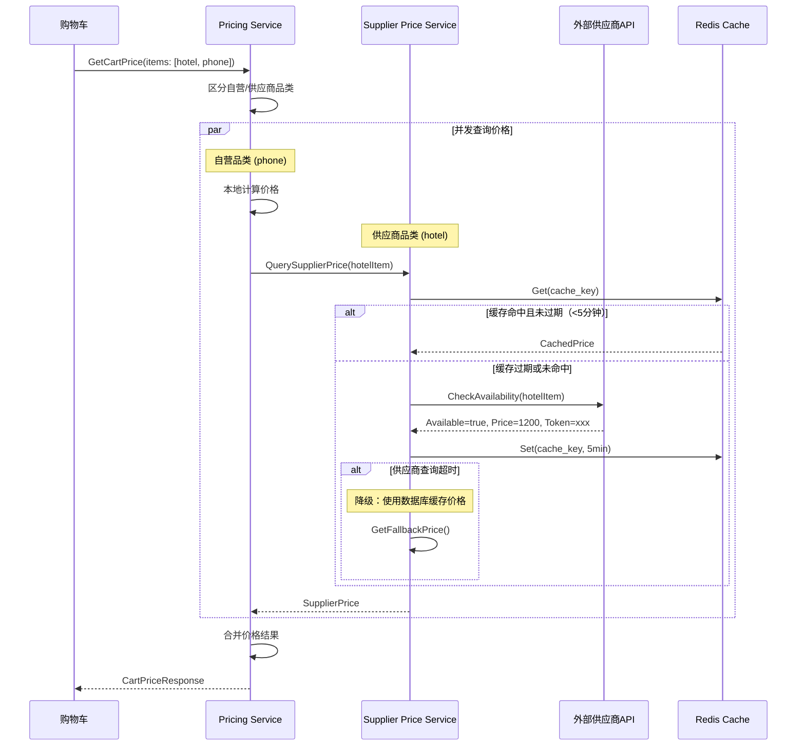
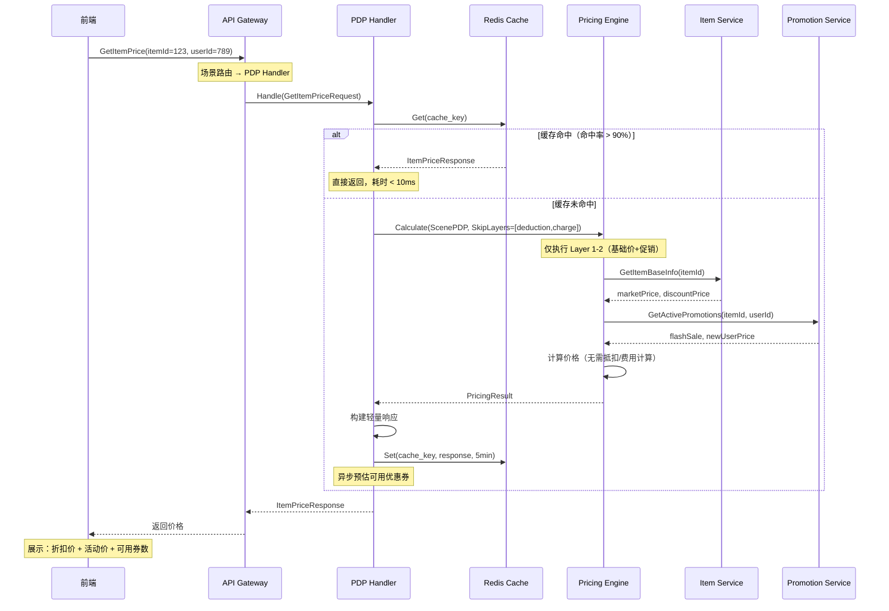
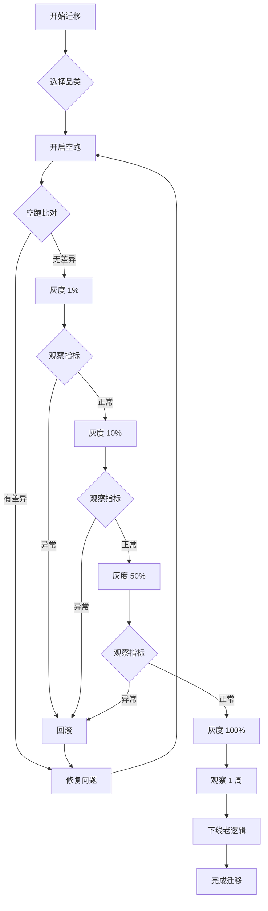

<!-- toc -->

> **电商系统设计系列**
> - [（一）全景概览与领域划分](/system-design/20-ecommerce-overview/)
> - [（二）商品上架系统](/system-design/21-ecommerce-listing/)
> - [（三）库存系统](/system-design/22-ecommerce-inventory/)
> - **（四）计价引擎**（本文）
> - [（五）计价系统 DDD 实践](/system-design/24-ecommerce-pricing-ddd/)
> - [（六）B 端运营系统](/system-design/25-ecommerce-b-side-ops/)

本文是电商系统设计系列的第四篇，详述计价引擎的设计与实现。

## 一、背景与挑战

### 1.1 业务背景

在电商平台中，**价格计算引擎（Pricing Engine）**面临的核心挑战是：

> **如何在多品类、多变价因素、多营销活动的前提下，提供统一、准确、高性能的价格计算能力？**

#### 1.1.1 价格计算的复杂性

在现代电商系统中，一个商品的最终价格并非简单的"标价"，而是多个因素分层叠加计算的结果：

```
最终支付价格 = 基础价格
              - 营销活动折扣（Layer 2: FlashSale、新人价、Bundle等）
              + 附加费用（Layer 4: 增值服务费、运费、平台服务费等）
              - 支付优惠（Layer 3: 优惠券、积分抵扣）
              + 支付渠道费（Layer 4: 支付手续费、信用卡手续费等）
```

**典型场景示例**：

用户购买一部价值 **¥1,000** 的手机，完整计价流程如下：

### 📊 分层价格计算

#### 1️⃣ 基础价格（Layer 1: Base Price）
```
商品原价：         ¥1,000
商品折扣价：       ¥980 (商家设置的折扣价)
───────────────────────────
基础价格：         ¥980
```

#### 2️⃣ 营销价格（Layer 2: Promotion）
```
基础价格：         ¥980
- 限时抢购 (Flash Sale)：    -¥80    (活动价 ¥900)
- 新人专享价：                -¥20    (首单优惠)
- 满减活动 (满800减50)：      -¥50
───────────────────────────
营销优惠合计：     -¥150
订单价格（营销后）： ¥830
```

#### 3️⃣ 附加费用（Layer 4: Additional Charge - 第一部分）
```
订单价格：         ¥830
+ 碎屏险 (增值服务)：         +¥50
+ 运费：                      +¥10
+ 平台服务费 (供应商品类)：   +¥0    (自营品类无此项)
───────────────────────────
附加费用合计：     +¥60
订单价格（含附加费）：¥890
```

> **CreateOrder（创建订单）到此为止**：生成订单快照 = ¥890
> 此时包含：基础价 + 营销价 + 附加费，不含券/积分/支付费

---

#### 4️⃣ 支付优惠（Layer 3: Deduction）
*用户进入收银台（Checkout），选择优惠券和积分：*

```
订单价格：         ¥890
- 优惠券抵扣 (满500减100)：   -¥100
- 积分抵扣 (200积分×¥0.5/分)：-¥100
───────────────────────────
支付优惠合计：     -¥200
优惠后价格：       ¥690
```

#### 5️⃣ 支付渠道费（Layer 4: Additional Charge - 第二部分）
*用户选择支付渠道：*

```
优惠后价格：       ¥690
+ 信用卡手续费 (2%)：         +¥13.8
+ 跨境支付费 (国际卡)：       +¥0    (本地支付无此项)
───────────────────────────
支付渠道费合计：   +¥13.8
最终支付价格：     ¥703.8
```

> **Checkout（收银台）完成**：生成支付快照 = ¥703.8
> 此时包含：订单价格 + 券/积分 + 支付手续费

---

### 💰 价格明细汇总

| 项目 | 金额 | 说明 |
|------|------|------|
| **基础价格** | ¥980 | 商品折扣价（Layer 1） |
| **营销优惠** | -¥150 | 限时抢购 + 新人价 + 满减（Layer 2） |
| **附加费用** | +¥60 | 碎屏险 + 运费（Layer 4） |
| **订单价格** | **¥890** | **CreateOrder生成订单快照** |
| **支付优惠** | -¥200 | 优惠券 + 积分（Layer 3） |
| **支付渠道费** | +¥13.8 | 信用卡手续费（Layer 4） |
| **最终支付价格** | **¥703.8** | **Checkout生成支付快照** |

### 🔄 不同场景的价格计算

| 场景 | 计算内容 | 价格 |
|------|---------|------|
| **PDP（商品详情页）** | Layer 1 + Layer 2<br>（基础价 + 营销价） | ¥830 |
| **Cart（购物车）** | Layer 1 + Layer 2 + 预估Layer 3<br>（基础价 + 营销价 + 预估券/积分） | 预估 ¥630-690 |
| **CreateOrder（创建订单）** | Layer 1 + Layer 2 + Layer 4（部分）<br>（基础价 + 营销价 + 附加费，**不含券/积分**） | **¥890** |
| **Checkout（收银台）** | Layer 1-5 完整计算<br>（订单价格 + 券/积分 + 支付手续费） | **¥703.8** |
| **Payment（支付）** | 零计算（快照验证） | ¥703.8 |

### 1.2 传统架构的痛点

#### 1.2.1 计价逻辑分散

在传统电商系统中，价格计算逻辑往往分散在不同服务中：

| 服务 | 职责 | 问题 |
|------|------|------|
| **Item Service** | 计算商品市场价、折扣价 | 不知道营销活动价 |
| **Promotion Service** | 计算营销活动价 | 不知道最终售卖价 |
| **Order Service** | 计算订单总价 | 重复计算，容易出错 |
| **Payment Service** | 计算支付金额 | 再次重复计算 |

**核心问题**：
- ❌ **重复计算**：同一价格在多个服务重复计算，逻辑不一致
- ❌ **数据不一致**：前端展示价格与订单价格与支付价格不一致
- ❌ **资损风险**：价格计算错误导致商家或平台损失
- ❌ **难以扩展**：新增变价因素需要修改多个服务

#### 1.2.2 真实案例：某电商平台资损事故

**事故场景**：
- 用户购买商品，前端展示价格 100 元
- 提交订单时，后端计算价格 80 元（错误地应用了两次优惠券）
- 用户实际支付 80 元，平台损失 20 元
- 该 Bug 持续 2 小时，影响 5000+ 订单，总损失 10 万+

**根本原因**：
- 前端、订单服务、支付服务各自计算价格
- 优惠券服务在订单创建时重复扣减
- 缺乏统一的价格计算引擎和空跑比对机制

### 1.3 计价中心的核心价值

建立统一的价格计算引擎（Pricing Center）可以解决上述问题：

| 价值 | 说明 | 收益 |
|------|------|------|
| **计算逻辑统一** | 所有价格计算收敛到一个服务 | 避免重复开发，降低出错率 |
| **数据一致性** | 前端展示、订单创建、支付扣款使用同一价格 | 消除资损风险 |
| **空跑比对** | 新老逻辑并行运行，自动比对差异 | 安全迁移，快速发现问题 |
| **灰度放量** | 按品类、地区、用户分批切流 | 降低风险，平滑迁移 |
| **扩展性强** | 新增变价因素只需新增策略 | 快速响应业务需求 |
| **性能优化** | 缓存、并发、批量计算 | 支持高并发场景 |

### 1.4 设计目标

| 目标 | 说明 | 优先级 |
|------|------|--------|
| **准确性** | 价格计算结果 100% 准确，0 资损 | P0 |
| **一致性** | 前端/订单/支付使用同一价格源 | P0 |
| **高性能** | PDP 页面 P99 < 100ms，Checkout 页面 P99 < 200ms | P0 |
| **多品类支持** | 支持 Topup/EMoney/EVoucher/GiftCard/Hotel/Movie 等 | P0 |
| **灰度可控** | 支持按品类、地区、用户灰度 | P0 |
| **空跑比对** | 新老逻辑并行，自动比对差异 | P0 |
| **可扩展** | 新增变价因素成本低 | P1 |
| **可观测** | 完善的监控、日志、告警 | P1 |

---

### 1.5 电商计价引擎核心问题解析

电商计价引擎表面上只是"加减乘除"，但在真实业务中，它是整条交易链路中**逻辑最复杂、计算量最大、且最容不得差错**的核心组件。一个成熟的计价引擎需要系统性地解决以下八大核心问题：

#### 1.5.1 多维价格体系（品类异构性）

商品在不同维度下并不是只有一个价格。引擎需要在同一请求中处理多种定价模型：

| 维度 | 说明 | 示例 |
|------|------|------|
| **基础定价** | 商品原价、划线价、折扣价 | 市场价 ¥100 → 折扣价 ¥90 |
| **渠道定价** | App/H5/直播间/不同地区差异定价 | App 专享价 ¥85 |
| **身份定价** | 普通用户/VIP/新客/企业账号 | 新人专享价 ¥80 |
| **品类定价** | 不同品类使用完全不同的定价模型 | Topup 面额定价、Hotel 间夜定价、Flight 舱位定价 |
| **实时价盘** | 供应商品类价格随库存/时间动态波动 | Hotel/Flight 供应商实时报价 |

**品类异构性**是计价引擎最大的架构挑战之一。不同品类的定价逻辑差异巨大：

| 品类 | 核心定价逻辑 | 关键计算因子 |
|------|-------------|-------------|
| **Deal/生活券** | 简单折扣模型 | 数量 × 单价 - 折扣 |
| **Topup/话费充值** | 面额定价 + 折扣率 | 面额 × 折扣率（如 100 元面值 × 0.95 = 95 元） |
| **Bill/账单** | 代缴模型 + 手续费 | 欠费金额 + 渠道手续费 - 平台补贴 |
| **E-Money** | 面值 + 管理费 | 面值 + AdminFee（固定/比例） |
| **Hotel** | 间夜 × 日历价 + 税费 | 入离日期、入住人数、城市税（各国税率不同） |
| **Flight** | 舱位报价 + 多重税费 | GDS 实时报价 + 燃油费 + 机建费 + 选座/行李附加费 |
| **Movie/演出** | 场次 × 票种 × 座位 | 场次时段定价、座位等级定价 |

**架构对策**：采用**"统一编排框架 + 品类策略插件"**模式（Strategy Pattern），通过 `Calculator` 接口实现品类差异化，避免 if-else 巨石代码。详见 [4.3 品类特殊计算器](#43-品类特殊计算器)。

---

#### 1.5.2 多场景计价一致性

价格计算贯穿用户购物全流程，不同场景对**计算深度、性能要求、精度容忍度**完全不同：

| 场景 | 核心目标 | 计算深度 | 性能要求 | 精度容忍度 |
|------|---------|---------|---------|-----------|
| **PDP（商详页）** | 转化引流，展示"预估到手价" | 轻量（Layer 1-2） | P99 < 100ms | 允许预估误差 |
| **AddToCart（加购）** | 提升客单价，凑单提示 | 轻量（Layer 1-2） | P99 < 150ms | 允许预估 |
| **Cart（购物车）** | 多品组合实时计算 | 中等（Layer 1-3） | P99 < 200ms | 预估价格 |
| **CreateOrder（创单）** | 锁定订单价格，生成订单快照 | 高（Layer 1,2,4） | P99 < 300ms/1s | **零容忍** |
| **Checkout（收银台）** | 最终价格确定，生成支付快照 | 完整（Layer 1-5） | P99 < 200ms | **零容忍** |
| **Payment（支付）** | 金额验证，防篡改 | 零计算（快照验证） | P99 < 500ms | **零容忍** |

**核心挑战——价格一致性（Price Consistency）**：

用户最常见的投诉是"商详页看到 99 元，下单变成 105 元"。解决这个问题需要：

1. **规则版本对齐**：确保 PDP 预估时的规则集与创单时的规则集版本一致
2. **快照锁定**：CreateOrder 和 Checkout 分别生成订单快照和支付快照，锁定价格
3. **差异校验**：Checkout 与 CreateOrder 之间如果价格变化超过阈值，强提醒用户

详见 [二、计价场景分析](#二计价场景分析) 和 [3.3 价格快照管理机制](#33-价格快照管理机制)。

---

#### 1.5.3 营销叠加与互斥规则

当多种优惠同时存在时，系统必须决定**谁先谁后、谁能叠加、谁互斥**：

```
营销优惠处理的核心决策链：

1. 优惠层级（执行顺序）：
   商品级（Flash Sale/新人价） → 店铺级（满减/Bundle） → 平台级（平台券/红包）

2. 互斥逻辑：
   • Flash Sale 和 新人价 互斥（取最优）
   • 商品级折扣 和 平台满减 可叠加
   • 优惠券 和 积分 可叠加（但有上限）
   • 支付立减 与订单优惠 可叠加

3. 最优解计算：
   • 系统是否需要帮用户自动选择最省钱的组合？
   • 涉及动态规划/贪心算法
   • 购物车场景需要实时告诉用户"再凑 ¥200 可减 ¥50"
```

**架构对策**：将营销规则抽象为可配置的策略，通过 `PromotionLayer` 统一处理叠加/互斥逻辑，支持灰度与回滚。详见 [4.2.2 营销活动层](#422-营销活动层)。

---

#### 1.5.4 费用与补贴建模

电商系统中的"加项"远不止商品价格本身，还包含多种**费用（Fee/Tax）和补贴（Subsidy）**，且需要标注出资方：

| 类型 | 说明 | 出资方 | 示例 |
|------|------|--------|------|
| **运费** | 配送费用 | 用户 | ¥10 |
| **增值服务费** | 碎屏险、延保等 | 用户 | ¥50 |
| **平台服务费** | 供应商品类佣金 | 用户/商家 | ¥20 |
| **支付手续费** | 信用卡/跨境支付手续费 | 用户 | 金额 × 2% |
| **税费** | 增值税、城市税（Hotel） | 用户 | 各国税率不同 |
| **平台补贴** | 新客红包、品类补贴 | 平台 | -¥10 |
| **商家补贴** | 商家承担的活动优惠 | 商家 | -¥20 |
| **渠道补贴** | 银行卡立减、支付红包 | 渠道/银行 | -¥5 |

**关键原则**：每一个价格组成项（Price Component）都必须标注 `type`（类型）和 `source`（出资方），为后续财务对账提供基础。

**架构对策**：通过 `ChargeLayer` 和 `PriceComponent` 值对象建模，详见 [4.2.4 附加费用层](#424-附加费用层) 和 [5.2 价格领域模型](#52-价格领域模型)。

---

#### 1.5.5 优惠分摊与逆向退款

当一个订单包含多个商品，且使用了订单级优惠（如"满 1000 减 100"）时，**这 100 元必须按比例分摊到每个商品**，否则退款将无法正确处理。

```
分摊算法（余额递减法）：

场景：3 件商品（¥500 + ¥300 + ¥200），订单级满减 ¥100

Step 1: 计算权重
  商品A: 500/1000 = 50%
  商品B: 300/1000 = 30%
  商品C: 200/1000 = 20%

Step 2: 前 n-1 件按权重分摊（向下取整）
  商品A 分摊: ¥100 × 50% = ¥50.00
  商品B 分摊: ¥100 × 30% = ¥30.00

Step 3: 最后一件 = 总优惠 - 前面之和（尾差处理）
  商品C 分摊: ¥100 - ¥50 - ¥30 = ¥20.00

结果：
  商品A 实付: ¥500 - ¥50 = ¥450
  商品B 实付: ¥300 - ¥30 = ¥270
  商品C 实付: ¥200 - ¥20 = ¥180
  合计: ¥450 + ¥270 + ¥180 = ¥900 ✅
```

**逆向退款场景**：

| 退款场景 | 处理逻辑 |
|---------|---------|
| 退单件商品 | 按分摊后的实付金额退款（非原价） |
| 退后不满足满减门槛 | 可能需要收回优惠（业务策略决定） |
| 退运费 | 根据剩余商品重新计算运费差异 |
| 退积分/优惠券 | 按分摊比例退还对应的积分和券 |

**精度问题**：所有金额使用**分（cent）为单位的整数运算**（`int64`），避免浮点数精度丢失。详见 [5.2.2 Money 值对象](#522-价格领域模型实现)。

---

#### 1.5.6 确定性与防资损（快照机制）

计价引擎最不能容忍的就是**资损**——价格计算错误导致商家或平台亏钱。防资损需要多重保护：

```
防资损的五道防线：

1. 价格快照（Price Snapshot）
   • CreateOrder 生成订单快照（30分钟有效）
   • Checkout 生成支付快照（15分钟有效）
   • Payment 只验证快照，零重算

2. 金额校验
   • 前端提交金额 vs 后端计算金额必须一致
   • 支付金额 vs 快照金额必须一致
   • 差额超过阈值拒绝交易

3. 安全检查器（Safety Checker）
   • 最终价格不能为负数
   • 折扣比例不能超过品类阈值（如最多打3折）
   • 优惠总额不能超过商品总额

4. 空跑比对（Dry Run）
   • 新老逻辑并行运行
   • 自动比对差异，差异超阈值告警
   • 确认无差异后再逐步灰度

5. 实时监控与告警
   • 错误率 > 0.01% 触发告警
   • 差异金额 > 10 元触发告警
   • 差异比例 > 5% 触发告警
```

**供应商品类的特殊挑战**：Hotel/Flight 等供应商品类的价格具有实时性，在用户浏览到支付的几分钟内价格可能已经变化。通过 **BookingToken 预订机制**（5-15 分钟有效期）和**支付前反查校验**来解决。详见 [4.4 供应商价格服务](#44-供应商价格服务supplier-price-service)。

---

#### 1.5.7 高并发性能

大促期间计价引擎面临每秒数万次调用。不同场景需要差异化的性能策略：

```
性能优化分层策略：

┌─────────────────────────────────────────────────────┐
│  前台展示场景（PDP/Cart）                             │
│  策略：高缓存 + 轻量计算 + 预热                       │
│  • L1 本地缓存（5min）+ L2 Redis 缓存（30min）       │
│  • 缓存命中率 > 90%，命中时延 < 10ms                 │
│  • 大促前预热热门商品价格                              │
│  • 跳过不必要的计算层（如 PDP 跳过 Layer 3-4）        │
├─────────────────────────────────────────────────────┤
│  交易场景（CreateOrder/Checkout）                      │
│  策略：零缓存 + 实时计算 + 并发查询                    │
│  • 不使用缓存，保证实时性和准确性                      │
│  • 依赖服务并发调用（商品/营销/券/积分并发获取）       │
│  • 连接池复用，减少网络开销                             │
│  • 供应商品类：3秒超时 + 2次重试 + 降级                │
├─────────────────────────────────────────────────────┤
│  批量查询场景（推荐页/列表页）                         │
│  策略：批量接口 + 并发计算 + 限流                      │
│  • 最多 100 个商品批量计算                             │
│  • 10 并发 goroutine 计算                             │
│  • 限流保护后端服务                                    │
├─────────────────────────────────────────────────────┤
│  兜底策略（全场景）                                    │
│  • 非核心服务（营销/券）失败降级，不影响主流程          │
│  • 熔断器保护外部依赖（供应商 API）                    │
│  • 水平扩容应对流量洪峰                                │
└─────────────────────────────────────────────────────┘
```

详见 [六、性能优化](#六性能优化) 和 [4.1.3 场景驱动的缓存策略](#413-场景驱动的缓存策略)。

---

#### 1.5.8 审计、合规与可解释性

计价引擎必须能够回答两个问题：**"这个价格是怎么算出来的？"** 和 **"每一分钱去了哪里？"**

| 维度 | 要求 | 实现方式 |
|------|------|---------|
| **可解释性** | 客服能向用户解释价格构成 | `PriceBreakdown` + `Formula`（如 `20194 - 1060 - 500 - 5 + 372 + 50 = 19051`） |
| **财务对账** | 每笔交易的资金流向清晰可追溯 | `PriceComponent` 标注 `type` + `source`（出资方） |
| **价格法合规** | 避免"先涨后降"等违规行为 | 价格变更日志 + 历史价格追溯 |
| **差异审计** | 新老逻辑切换时的差异可追溯 | 空跑比对结果存 MongoDB，差异明细可查询 |
| **退款追溯** | 退款金额与下单时一致 | 价格快照（Snapshot）保存完整计价结果 |

**架构对策**：通过 `PriceBreakdown`、`PriceDictionary`（统一术语）和价格快照实现全链路可追溯。详见 [5.1 统一语言](#51-价格领域的统一语言ubiquitous-language) 和 [5.3 价格字典服务](#53-价格字典服务)。

---

#### 1.5.9 核心问题总结

```
电商计价引擎 8 大核心问题：

┌──────────────────────────────────────────────────────────────┐
│                                                               │
│  ① 品类异构性        统一编排 + 品类策略插件                    │
│  ② 多场景一致性      规则版本对齐 + 快照锁定                    │
│  ③ 营销叠加/互斥     配置化规则引擎 + 灰度可回滚                │
│  ④ 费用与补贴建模    标准化 PriceComponent + 出资方标注          │
│  ⑤ 分摊与逆向退款    余额递减法 + 尾差处理 + 整数运算            │
│  ⑥ 确定性与防资损    双快照机制 + 五道防线                       │
│  ⑦ 高并发性能        场景分层缓存 + 并发优化 + 降级熔断          │
│  ⑧ 审计与可解释性    全链路 Breakdown + 统一术语 + 价格字典      │
│                                                               │
│  一句话总结：                                                   │
│  计价引擎 = 统一编排框架(Pipeline)                              │
│           + 品类策略插件(Strategy)                              │
│           + 分层计算链(Layer Chain)                             │
│           + 快照防资损(Snapshot)                                │
│           + 场景差异化(Scene-Driven)                            │
│                                                               │
└──────────────────────────────────────────────────────────────┘
```

---

## 二、计价场景分析

### 2.1 完整计价链路

在电商系统中，价格计算贯穿用户购物的整个流程，从浏览商品到最终支付，每个环节都需要准确的价格信息。

```
用户购物流程 & 计价场景：

浏览商品 → 加入购物车 → 查看购物车 → 创建订单 → 收银台 → 支付 → 支付成功
   ↓           ↓            ↓           ↓          ↓       ↓       ↓
 PDP计价    AddToCart   Cart计价   CreateOrder  Checkout Payment PaySuccess
(展示价格)   (凑单提示)  (预估价格)  (订单价格)  (最终价格) (验证) (资源扣减)
                                        ↑
                                        │
                             [供应商品类] 供应商价格预订
                                  (Supplier Booking)

关键节点说明：
1. PDP: 展示商品价格（市场价、折扣价、活动价）
2. AddToCart: 加购时提示凑单优惠
3. Cart: 购物车预估价格（可选优惠券/积分）
   - 自营品类：本地价格计算
   - 供应商品类：实时查询供应商价格（缓存1-5分钟）
4. CreateOrder: 创建订单，锁定资源，计算订单价格（基础价+营销价+附加费，不含券/积分）
   - 自营品类：锁定本地库存（30分钟）
   - 供应商品类：先查询供应商价格并获取BookingToken（5-15分钟），基于供应商报价计算订单价格
5. Checkout: 收银台选择优惠券/积分/支付渠道，计算最终价格并生成支付快照
6. Payment: 验证支付金额和快照，调起第三方支付
   - 供应商品类：使用BookingToken确认预订
7. PaySuccess: 支付成功回调，确认资源扣减，订单完成
   - 供应商品类：向供应商确认订单（Confirm Booking）
```

**核心差异点**：
- ✅ **CreateOrder 在前**：先创建订单
  - **自营品类**：锁定本地库存，计算订单价格（基础价+营销价+附加费）
  - **供应商品类**：先查询供应商实时价格获取BookingToken，基于供应商报价计算订单价格
- ✅ **Checkout 在后**：在收银台选择券/积分/渠道，计算最终支付价格
- ✅ **两次计算**：
  - CreateOrder: 计算订单价格（含基础+营销+附加费）
  - Checkout: 在订单价格基础上加上券/积分/手续费
- ✅ **两个快照**：
  - 订单快照（30分钟，含订单价格 + 供应商BookingToken）
  - 支付快照（15分钟，含最终支付价格）
- ✅ **供应商对接**：供应商品类在CreateOrder前预订，Payment时确认

### 2.2 核心计价场景

#### 2.2.1 PDP 商品详情页计价

**场景描述**：用户浏览商品详情页时，需要展示商品的实时价格信息。

**计价要素**：
```go
PricingRequest {
    Scene:      "PDP",
    Items:      [{ItemID: 123, ModelID: 456, Quantity: 1}],
    UserID:     789,
    Region:     "ID",
    IsNewUser:  true,
    Platform:   "App",
}
```

**价格展示**：
```
┌─────────────────────────────────────┐
│  iPhone 15 Pro Max 256GB            │
├─────────────────────────────────────┤
│  ¥8,999  ¥9,999                     │
│  (折扣价) (原价)                     │
│                                      │
│  🔥 限时抢购价：¥8,499               │
│  🎁 新人专享价：¥8,299               │
│  💰 可用券：满8000减500               │
│                                      │
│  预估到手价：¥7,799                  │
│  (使用优惠券后)                      │
└─────────────────────────────────────┘
```

**性能要求**：
- P99 延迟：< 100ms
- 缓存命中率：> 90%
- 并发 QPS：10,000+

**关键特点**：
- ✅ 仅展示价格，不锁定库存
- ✅ 支持营销活动价格展示
- ✅ 支持可用优惠券预估
- ✅ 高缓存命中率

---

#### 2.2.2 加购时计价（Add to Cart）

**场景描述**：用户点击"加入购物车"时，需要计算商品加购后的价格，以便展示购物车角标和提示信息。

**计价要素**：
```go
PricingRequest {
    Scene:      "AddToCart",
    Items:      [
        {ItemID: 123, Quantity: 1},  // 当前加购商品
    ],
    CartItems:  [
        {ItemID: 456, Quantity: 2},  // 购物车已有商品
    ],
    UserID:     789,
}
```

**前端展示**：
```
┌─────────────────────────────────────┐
│  ✅ 已加入购物车                     │
├─────────────────────────────────────┤
│  购物车共 3 件商品                   │
│  小计：¥1,299                        │
│                                      │
│  🎁 满减活动：再凑 ¥200 减 ¥50      │
│  💰 可用券：满1000减100              │
│                                      │
│  [立即结算] [继续购物]               │
└─────────────────────────────────────┘
```

**关键特点**：
- ✅ 计算购物车总价
- ✅ 提示凑单信息（满减活动）
- ✅ 展示可用优惠
- ⚠️ 不锁定价格（真实价格以结算为准）

---

#### 2.2.3 购物车页面计价（Shopping Cart）

**场景描述**：用户进入购物车页面，查看所有商品的价格、优惠、预估总价。

**计价要素**：
```go
PricingRequest {
    Scene:      "Cart",
    Items:      [
        {ItemID: 123, ModelID: 456, Quantity: 2},
        {ItemID: 789, ModelID: 101, Quantity: 1},
        {ItemID: 234, ModelID: 567, Quantity: 3},
    ],
    UserID:     12345,
    Region:     "SG",
}
```

**页面展示**：
```
┌─────────────────────────────────────────────────────┐
│  购物车 (5件商品)                                    │
├─────────────────────────────────────────────────────┤
│  ☑️ iPhone 15 Pro × 2          ¥8,999 × 2 = ¥17,998 │
│     🔥 限时抢购 -¥1,000                              │
│                                                      │
│  ☑️ AirPods Pro × 1            ¥1,899 × 1 = ¥1,899  │
│                                                      │
│  ☑️ 手机壳 × 3                 ¥99 × 3 = ¥297       │
│     🎁 满3件8折                                      │
├─────────────────────────────────────────────────────┤
│  商品总额：                               ¥20,194    │
│  活动优惠：                               -¥1,060    │
│                                                      │
│  💰 可用优惠券 (3张)              [选择优惠券 >]     │
│     └─ 满10000减500                                  │
│                                                      │
│  🪙 使用积分 (1000分可抵¥10)       [  ] 使用         │
├─────────────────────────────────────────────────────┤
│  预估总价：¥19,134                                   │
│                                                      │
│  [去结算(5)]                                         │
└─────────────────────────────────────────────────────┘
```

**关键特点**：
- ✅ 支持多商品联合计算
- ✅ 支持跨店铺优惠
- ✅ 支持优惠券预选
- ✅ 支持积分使用
- ✅ 实时更新价格
- ⚠️ 价格仅供参考（以订单为准）
- ⚠️ **供应商品类需实时查询**（见2.2.3.5）

---

#### 2.2.3.5 购物车-供应商品类价格查询（Supplier Price Query）

**场景描述**：对于Hotel、Flight、Tour等供应商品类，购物车展示的价格需要实时从外部供应商获取，确保价格准确性。

**品类差异**：

| 品类类型 | 价格来源 | 是否需要供应商查询 | 查询时机 | 缓存策略 |
|---------|---------|------------------|---------|---------|
| **自营品类** | 本地数据库 | ❌ 不需要 | - | 高缓存（5-30分钟） |
| **供应商品类** | 外部供应商API | ✅ 需要 | 购物车/创单前 | 低缓存（1-5分钟） |

**供应商品类示例**：
- **Hotel**：房型价格需实时查询供应商库存和日历价
- **Flight**：航班价格需实时查询供应商舱位和动态价格
- **Tour**：旅游产品需实时查询供应商可用性和套餐价格
- **Event Ticket**：演出票需实时查询供应商座位库存和价格

**供应商价格查询流程**：

```go
// SupplierPriceRequest 供应商价格查询请求
type SupplierPriceRequest struct {
    CategoryID      int64       `json:"category_id"`      // 品类ID
    SupplierID      int64       `json:"supplier_id"`      // 供应商ID
    Items           []ItemInfo  `json:"items"`            // 商品信息
    
    // 品类特定参数
    CheckInDate     string      `json:"check_in_date"`    // Hotel: 入住日期
    CheckOutDate    string      `json:"check_out_date"`   // Hotel: 退房日期
    RoomCount       int32       `json:"room_count"`       // Hotel: 房间数
    
    FlightDate      string      `json:"flight_date"`      // Flight: 航班日期
    Passengers      int32       `json:"passengers"`       // Flight: 乘客数
    
    TourDate        string      `json:"tour_date"`        // Tour: 出游日期
    TravelerCount   int32       `json:"traveler_count"`   // Tour: 游客数
}

// SupplierPriceResponse 供应商价格响应
type SupplierPriceResponse struct {
    Items           []SupplierItemPrice `json:"items"`
    Available       bool                `json:"available"`     // 是否可订
    BookingToken    string              `json:"booking_token"` // 预订令牌（5-15分钟有效）
    ExpireAt        int64               `json:"expire_at"`     // 令牌过期时间
    SupplierOrderID string              `json:"supplier_order_id"` // 供应商订单号
}

// SupplierItemPrice 供应商商品价格
type SupplierItemPrice struct {
    ItemID          int64   `json:"item_id"`
    SupplierPrice   int64   `json:"supplier_price"`   // 供应商报价
    SupplierCost    int64   `json:"supplier_cost"`    // 供应商成本
    Available       bool    `json:"available"`        // 是否可订
    Stock           int32   `json:"stock"`            // 剩余库存
    
    // 供应商特定信息
    SupplierSKU     string  `json:"supplier_sku"`
    SupplierRemark  string  `json:"supplier_remark"`  // 供应商备注（如取消政策）
}
```

**购物车处理流程**：

```go
func GetCartPrice(req *GetCartPriceRequest) (*CartPriceResponse, error) {
    var (
        selfOperatedItems []ItemInfo // 自营商品
        supplierItems     []ItemInfo // 供应商商品
    )
    
    // 1. 区分自营和供应商品类
    for _, item := range req.Items {
        if isSupplierCategory(item.CategoryID) {
            supplierItems = append(supplierItems, item)
        } else {
            selfOperatedItems = append(selfOperatedItems, item)
        }
    }
    
    var (
        wg              sync.WaitGroup
        selfPrice       *PricingResponse
        supplierPrices  map[int64]*SupplierItemPrice
        errs            []error
    )
    
    // 2. 并发查询价格
    if len(selfOperatedItems) > 0 {
        wg.Add(1)
        go func() {
            defer wg.Done()
            // 自营品类：使用本地计算
            selfPrice, _ = pricingEngine.Calculate(&PricingRequest{
                Scene: "Cart",
                Items: selfOperatedItems,
            })
        }()
    }
    
    if len(supplierItems) > 0 {
        wg.Add(1)
        go func() {
            defer wg.Done()
            // 供应商品类：查询供应商价格
            supplierPrices, _ = supplierPriceService.BatchQuery(ctx, supplierItems)
        }()
    }
    
    wg.Wait()
    
    // 3. 合并价格结果
    return mergeCartPrice(selfPrice, supplierPrices), nil
}
```

**关键特点**：
- ✅ **区分品类**：自营品类本地计算，供应商品类外部查询
- ✅ **并发查询**：自营和供应商价格并发获取
- ✅ **预订令牌**：供应商返回BookingToken（5-15分钟有效）
- ✅ **库存验证**：实时验证供应商库存可用性
- ⚠️ **低缓存**：供应商价格缓存时间短（1-5分钟）
- ⚠️ **超时降级**：供应商查询超时则使用数据库缓存价格

**供应商价格查询时序图**：



**供应商对接配置**：

```yaml
# 供应商价格配置
supplier_pricing:
  enabled: true
  
  # 供应商列表
  suppliers:
    - supplier_id: 1001
      supplier_name: "Agoda"
      category_ids: [100, 101]  # Hotel
      api_endpoint: "https://api.agoda.com/booking"
      timeout: 3000ms
      retry: 2
      cache_ttl: 300s  # 5分钟缓存
      
    - supplier_id: 2001
      supplier_name: "Expedia"
      category_ids: [100]
      api_endpoint: "https://api.expedia.com/availability"
      timeout: 3000ms
      retry: 2
      cache_ttl: 300s
  
  # 降级策略
  fallback:
    enabled: true
    use_db_price: true      # 使用数据库缓存价格
    max_price_age: 3600s    # 最大允许1小时的旧价格
```

---

#### 2.2.4 订单创建计价（CreateOrder）

**场景描述**：用户点击"去结算"后，系统先创建订单。对于**供应商品类**（Hotel/Flight/Tour），需要先从外部供应商获取预订价格和BookingToken，然后基于供应商价格计算订单价格（包含基础价格、营销活动、附加费，但不含优惠券/积分），最后引导用户进入收银台。

**计价要素**：
```go
PricingRequest {
    Scene:      "CreateOrder",
    Items:      [...],          // 商品列表
    UserID:     12345,
    Region:     "SG",
    
    // 地址相关
    ShippingAddress: {...},     // 收货地址
    ShippingMethod:  "standard", // 配送方式
    
    // 增值服务（可选）
    Services: [
        {ServiceID: 1, Type: "screen_insurance", Price: 50, Selected: true},
    ],
    
    // 供应商品类特有参数
    SupplierBookings: [
        {
            ItemID:       101,
            SupplierID:   1001,
            BookingToken: "TKN-AGODA-20260227-001",  // 供应商预订令牌
            SupplierPrice: 1200,                      // 供应商报价
            CheckInDate:  "2026-03-01",
            CheckOutDate: "2026-03-05",
        },
    ],
    
    // 订单上下文
    OrderID:     "ORD202602270001",
    CartSnapshot: {...},        // 购物车价格快照（可选）
}
```

**页面展示**：
```
┌─────────────────────────────────────────────────────┐
│  创建订单...                                         │
├─────────────────────────────────────────────────────┤
│  收货地址：北京市朝阳区xxx                           │
├─────────────────────────────────────────────────────┤
│  商品清单                                            │
│  iPhone 15 Pro × 2                        ¥17,998   │
│  AirPods Pro × 1                          ¥1,899    │
│  手机壳 × 3                                ¥297      │
├─────────────────────────────────────────────────────┤
│  商品总额                                  ¥20,194   │
│  活动优惠                                  -¥1,060   │
│  运费                                      ¥0        │
│  增值服务（碎屏险）                        +¥50      │
├─────────────────────────────────────────────────────┤
│  订单金额：¥19,184                                   │
│                                                      │
│  正在跳转到收银台...                                 │
└─────────────────────────────────────────────────────┘
```

**关键特点**：
- ✅ **订单创建**：生成订单ID和订单号
- ✅ **品类区分**：自营品类和供应商品类分别处理
  - **自营品类**：使用本地库存和价格，预扣库存（30分钟）
  - **供应商品类**：先查询供应商实时价格，获取BookingToken（5-15分钟有效）
- ✅ **供应商价格预订**（仅供应商品类）：
  - 并发调用外部供应商API查询价格和库存
  - 获取BookingToken和供应商报价
  - 验证供应商商品可用性
  - 处理供应商查询超时和降级
- ✅ **价格计算**：包含以下价格要素
  - ✅ Layer 1: 基础价格
    - 自营品类：本地商品市场价/折扣价
    - **供应商品类：供应商实时报价（SupplierPrice from BookingToken）**
  - ✅ Layer 2: 营销价格（限时抢购、新人价、Bundle等活动优惠）
  - ✅ Layer 4: 附加费用
    - 增值服务费（如碎屏险）
    - 运费
    - 平台服务费（供应商品类佣金）
    - **不含支付手续费**（留到Checkout）
  - ❌ 不包含优惠券（Layer 3 - voucher）
  - ❌ 不包含积分抵扣（Layer 3 - coin）
- ✅ **库存预扣/预订**：
  - 自营品类：锁定本地库存（30分钟）
  - 供应商品类：保存BookingToken（与供应商有效期一致，通常5-15分钟）
- ✅ **生成订单快照**：保存订单价格和供应商预订信息（30分钟有效）
- ✅ **订单状态**：`pending_payment`
- ⚠️ **性能要求**：
  - 自营品类：P99 < 300ms
  - 供应商品类：P99 < 1000ms（含外部API调用）
- ⚠️ **失败回滚**：供应商预订失败需释放已锁定的本地库存

**处理流程（区分自营/供应商品类）**：

```go
func CreateOrder(req *CreateOrderRequest) (*Order, error) {
    // 步骤0: 区分自营和供应商品类
    selfOperatedItems, supplierItems := classifyItems(req.Items)
    
    // 步骤1: 供应商品类价格查询（如果有）
    var supplierBookings map[int64]*SupplierBooking
    if len(supplierItems) > 0 {
        // 1.1 并发查询供应商价格并预订
        supplierBookings, err := queryAndBookSupplierItems(ctx, supplierItems)
        if err != nil {
            return nil, fmt.Errorf("supplier booking failed: %w", err)
        }
        
        // 1.2 验证所有供应商商品可用
        for itemID, booking := range supplierBookings {
            if !booking.Available {
                return nil, fmt.Errorf("item %d not available from supplier", itemID)
            }
        }
    }
    
    // 步骤2: 计算订单价格
    // Layer 1: 基础价格（自营品类用本地价格，供应商品类用供应商报价）
    // Layer 2: 营销活动（限时抢购、新人价等）
    // Layer 4: 附加费用（增值服务费、运费、平台服务费等）
    // 跳过 Layer 3: 优惠券和积分抵扣（留到Checkout）
    // 跳过支付手续费（留到Checkout根据支付渠道计算）
    pricingReq := &PricingRequest{
        Scene:            "CreateOrder",
        Items:            req.Items,
        UserID:           req.UserID,
        Services:         req.Services,
        SupplierBookings: supplierBookings, // 传入供应商预订信息
        // 不传 VoucherCode 和 CoinAmount
    }
    
    priceResult := pricingEngine.Calculate(pricingReq)
    
    // 步骤3: 预扣库存
    // 自营品类：锁定本地库存
    if len(selfOperatedItems) > 0 {
        if err := inventoryService.Reserve(req.OrderID, selfOperatedItems, 30*time.Minute); err != nil {
            // 回滚供应商预订
            rollbackSupplierBookings(supplierBookings)
            return nil, fmt.Errorf("reserve inventory failed: %w", err)
        }
    }
    
    // 供应商品类：BookingToken已在步骤1获取，此处记录即可
    
    // 步骤4: 创建订单
    order := &Order{
        OrderID:          req.OrderID,
        UserID:           req.UserID,
        Items:            req.Items,
        OrderPrice:       priceResult.FinalPrice,  // 订单价格（含基础+营销+附加费）
        SupplierBookings: supplierBookings,        // 供应商预订信息
        Status:           "pending_payment",
        CreatedAt:        time.Now(),
        ExpireAt:         time.Now().Add(30 * time.Minute),
    }
    
    // 步骤5: 保存订单快照（包含供应商预订信息）
    snapshot := saveOrderSnapshot(order.OrderID, priceResult, supplierBookings)
    
    // 步骤6: 保存订单
    if err := orderRepo.Create(order); err != nil {
        inventoryService.Release(req.OrderID)
        rollbackSupplierBookings(supplierBookings)
        return nil, err
    }
    
    return order, nil
}

// queryAndBookSupplierItems 查询供应商价格并预订
func queryAndBookSupplierItems(ctx context.Context, items []ItemInfo) (map[int64]*SupplierBooking, error) {
    var (
        wg       sync.WaitGroup
        mu       sync.Mutex
        bookings = make(map[int64]*SupplierBooking)
        errs     []error
    )
    
    for _, item := range items {
        wg.Add(1)
        go func(itm ItemInfo) {
            defer wg.Done()
            
            // 查询供应商价格和预订
            booking, err := supplierPriceService.QueryAndBook(ctx, &SupplierPriceRequest{
                ItemID:       itm.ItemID,
                SupplierID:   itm.SupplierID,
                CheckInDate:  itm.CheckInDate,
                CheckOutDate: itm.CheckOutDate,
                Quantity:     itm.Quantity,
            })
            
            mu.Lock()
            if err != nil {
                errs = append(errs, err)
            } else {
                bookings[itm.ItemID] = booking
            }
            mu.Unlock()
        }(item)
    }
    
    wg.Wait()
    
    if len(errs) > 0 {
        return nil, errs[0]
    }
    
    return bookings, nil
}
```

**价格响应示例**：
```json
{
  "order_id": "ORD202602270001",
  "total_amount": 20194,
  "promotion_discount": 1060,
  "additional_charge": 50,
  "base_price": 19184,
  "snapshot_id": "ORDER-20260227-001",
  "expire_at": 1709116800,
  "status": "pending_payment"
}
```

---

#### 2.2.5 收银台计价（Checkout）

**场景描述**：订单创建后，用户进入收银台选择优惠券、积分、支付渠道，系统基于订单快照重新计算最终应付金额。

**计价要素**：
```go
PricingRequest {
    Scene:      "Checkout",
    OrderID:    "ORD202602270001",  // 已创建的订单ID
    UserID:     12345,
    
    // 订单快照
    OrderSnapshot: {...},           // CreateOrder 生成的订单快照
    
    // 用户在收银台选择
    VoucherCode: "SAVE100",         // 优惠券
    UseCoin:     true,              // 使用积分
    CoinAmount:  500,               // 积分数量
    ChannelID:   1,                 // 支付渠道 (电子钱包)
}
```

**页面展示**：
```
┌─────────────────────────────────────────────────────┐
│  收银台 - 订单号：ORD202602270001                    │
├─────────────────────────────────────────────────────┤
│  订单金额：¥19,184                                   │
├─────────────────────────────────────────────────────┤
│  💰 优惠券                                           │
│  ┌───────────────────────────────────────────────┐ │
│  │ ○ 不使用优惠券                                 │ │
│  │ ● 满10000减500 (SAVE100)           -¥500      │ │
│  │ ○ 满5000减200 (SAVE200)                       │ │
│  └───────────────────────────────────────────────┘ │
│                                                      │
│  🪙 积分抵扣 (可用: 10000积分)                       │
│  ┌───────────────────────────────────────────────┐ │
│  │ [x] 使用积分  [500] 积分 = ¥5      -¥5        │ │
│  └───────────────────────────────────────────────┘ │
│                                                      │
│  💳 支付方式                                         │
│  ┌───────────────────────────────────────────────┐ │
│  │ ● 电子钱包 (手续费2%)             +¥372      │ │
│  │ ○ 信用卡 (手续费3%)                           │ │
│  │ ○ 银行转账 (免手续费)                         │ │
│  └───────────────────────────────────────────────┘ │
├─────────────────────────────────────────────────────┤
│  商品总额：                               ¥20,194   │
│  活动优惠：                               -¥1,060   │
│  优惠券抵扣：                             -¥500     │
│  积分抵扣：                               -¥5       │
│  增值服务：                               +¥50      │
│  支付手续费：                             +¥372     │
├─────────────────────────────────────────────────────┤
│  应付金额：¥19,051                                   │
│                                                      │
│  订单将在 29:45 后自动取消                           │
│                                                      │
│  [确认支付]                                          │
└─────────────────────────────────────────────────────┘
```

**处理流程**：
```go
func GetCheckoutPrice(req *CheckoutPriceRequest) (*CheckoutPriceResponse, error) {
    // 1. 获取订单快照（验证订单有效性）
    orderSnapshot := getOrderSnapshot(req.OrderID)
    if orderSnapshot == nil {
        return nil, fmt.Errorf("order not found or expired")
    }
    
    // 2. 验证订单状态
    order := orderRepo.GetByID(req.OrderID)
    if order.Status != "pending_payment" {
        return nil, fmt.Errorf("order status invalid: %s", order.Status)
    }
    
    // 3. 完整计算价格（Layer 1-5，包含券/积分/手续费）
    pricingReq := &PricingRequest{
        Scene:        "Checkout",
        OrderID:      req.OrderID,
        Items:        order.Items,
        UserID:       req.UserID,
        VoucherCode:  req.VoucherCode,
        UseCoin:      req.UseCoin,
        CoinAmount:   req.CoinAmount,
        ChannelID:    req.ChannelID,
        BasePrice:    orderSnapshot.OrderPrice, // 使用订单价格（基础+营销+附加费）
    }
    
    priceResult := pricingEngine.Calculate(pricingReq)
    
    // 4. 预核销优惠券（软锁定）
    if req.VoucherCode != "" {
        if err := voucherService.SoftReserve(req.OrderID, req.VoucherCode); err != nil {
            return nil, fmt.Errorf("voucher reserve failed: %w", err)
        }
    }
    
    // 5. 预扣积分（软锁定）
    if req.UseCoin {
        if err := coinService.SoftReserve(req.OrderID, req.UserID, req.CoinAmount); err != nil {
            return nil, fmt.Errorf("coin reserve failed: %w", err)
        }
    }
    
    // 6. 生成支付快照（15分钟有效）
    paymentSnapshot := createPaymentSnapshot(&PaymentSnapshot{
        SnapshotID:   generateSnapshotID(),
        OrderID:      req.OrderID,
        UserID:       req.UserID,
        VoucherCode:  req.VoucherCode,
        CoinAmount:   req.CoinAmount,
        ChannelID:    req.ChannelID,
        PriceResult:  priceResult,
        CreatedAt:    time.Now(),
        ExpireAt:     time.Now().Add(15 * time.Minute),
    })
    
    // 7. 构建响应
    return &CheckoutPriceResponse{
        OrderID:          req.OrderID,
        SnapshotID:       paymentSnapshot.SnapshotID,
        TotalAmount:      priceResult.TotalAmount,
        PromotionDiscount: priceResult.PromotionDiscount,
        VoucherDiscount:  priceResult.VoucherDiscount,
        CoinDeduction:    priceResult.CoinDeduction,
        HandlingFee:      priceResult.HandlingFee,
        AdditionalCharge: priceResult.AdditionalCharge,
        FinalPrice:       priceResult.FinalPrice,
        Breakdown:        priceResult.Breakdown,
        SnapshotExpireAt: paymentSnapshot.ExpireAt.Unix(),
    }, nil
}
```

**关键特点**：
- ✅ **基于订单**：依赖已创建的订单和订单快照
- ✅ **完整计算**：执行所有Layer（包含券/积分/手续费）
- ✅ **软锁定**：预核销优惠券和积分（不扣减，仅锁定）
- ✅ **生成支付快照**：保存最终价格（15分钟有效）
- ✅ **实时计算**：用户切换券/积分/渠道时实时重新计算
- ⚠️ **性能要求**：P99 < 200ms

**价格响应示例**：
```json
{
  "order_id": "ORD202602270001",
  "snapshot_id": "PAY-20260227-001",
  "total_amount": 20194,
  "promotion_discount": 1060,
  "voucher_discount": 500,
  "coin_deduction": 5,
  "handling_fee": 372,
  "additional_charge": 50,
  "final_price": 19051,
  "breakdown": {
    "formula": "20194 - 1060 - 500 - 5 + 372 + 50 = 19051"
  },
  "snapshot_expire_at": 1709116800
}
```

---

#### 2.2.6 支付计价（Payment）

**场景描述**：用户点击"确认支付"，调起第三方支付前，验证支付金额和快照有效性。

**计价要素**：
```go
PricingRequest {
    Scene:           "Payment",
    OrderID:         "ORD202602270001",
    PaymentSnapshotID: "PAY-20260227-001",  // Checkout生成的支付快照
    PaymentAmount:   19051,                 // 用户支付金额
}
```

**处理流程**：
```go
func ProcessPayment(req *PaymentRequest) (*PaymentResponse, error) {
    // 1. 获取支付快照
    paymentSnapshot := getPaymentSnapshot(req.PaymentSnapshotID)
    if paymentSnapshot == nil {
        return nil, fmt.Errorf("payment snapshot not found or expired")
    }
    
    // 2. 验证订单ID
    if paymentSnapshot.OrderID != req.OrderID {
        return nil, fmt.Errorf("order mismatch")
    }
    
    // 3. 验证支付金额
    if req.PaymentAmount != paymentSnapshot.PriceResult.FinalPrice {
        return nil, fmt.Errorf("payment amount mismatch: expected %d, got %d",
            paymentSnapshot.PriceResult.FinalPrice, req.PaymentAmount)
    }
    
    // 4. 验证订单状态
    order := orderRepo.GetByID(req.OrderID)
    if order.Status != "pending_payment" {
        return nil, fmt.Errorf("order status invalid: %s", order.Status)
    }
    
    // 5. 正式锁定资源（库存已在CreateOrder锁定）
    // 正式核销优惠券
    if paymentSnapshot.VoucherCode != "" {
        if err := voucherService.Reserve(req.OrderID, paymentSnapshot.VoucherCode); err != nil {
            return nil, fmt.Errorf("voucher reserve failed: %w", err)
        }
    }
    
    // 正式扣减积分
    if paymentSnapshot.CoinAmount > 0 {
        if err := coinService.Reserve(req.OrderID, paymentSnapshot.UserID, paymentSnapshot.CoinAmount); err != nil {
            voucherService.Release(req.OrderID)
            return nil, fmt.Errorf("coin reserve failed: %w", err)
        }
    }
    
    // 6. 更新订单状态为 paying（支付中）
    order.Status = "paying"
    order.PaymentSnapshotID = req.PaymentSnapshotID
    orderRepo.Update(order)
    
    // 7. 返回支付信息（用于调起第三方支付）
    return &PaymentResponse{
        OrderID:       req.OrderID,
        PaymentAmount: paymentSnapshot.PriceResult.FinalPrice,
        ChannelID:     paymentSnapshot.ChannelID,
        PaymentURL:    generatePaymentURL(req.OrderID, paymentSnapshot),
    }, nil
}
```

**关键特点**：
- ✅ **快照验证**：验证支付快照有效性
- ✅ **金额验证**：防止金额被篡改
- ✅ **资源锁定**：正式核销优惠券和扣减积分
- ✅ **订单状态更新**：`pending_payment` → `paying`
- ✅ **零计算**：直接使用快照，不重新计算价格
- ⚠️ **性能要求**：P99 < 500ms

---

#### 2.2.7 支付成功处理（PaySuccess）

**场景描述**：第三方支付成功后，系统接收回调，完成最终资源扣减和订单状态更新。

**处理流程**：
```go
func HandlePaymentCallback(req *PaymentCallbackRequest) error {
    // 1. 验证回调签名
    if !validatePaymentSignature(req) {
        return fmt.Errorf("invalid signature")
    }
    
    // 2. 获取订单
    order := orderRepo.GetByID(req.OrderID)
    if order == nil {
        return fmt.Errorf("order not found")
    }
    
    // 3. 验证订单状态（防止重复回调）
    if order.Status == "paid" {
        return nil // 已处理，直接返回成功
    }
    
    if order.Status != "paying" {
        return fmt.Errorf("invalid order status: %s", order.Status)
    }
    
    // 4. 获取支付快照（验证支付金额）
    paymentSnapshot := getPaymentSnapshot(order.PaymentSnapshotID)
    if paymentSnapshot == nil {
        return fmt.Errorf("payment snapshot not found")
    }
    
    if req.PaymentAmount != paymentSnapshot.PriceResult.FinalPrice {
        return fmt.Errorf("payment amount mismatch")
    }
    
    // 5. 扣减库存（从预扣变为实扣）
    if err := inventoryService.Confirm(order.OrderID); err != nil {
        return fmt.Errorf("confirm inventory failed: %w", err)
    }
    
    // 6. 确认优惠券核销（从预扣变为实扣）
    if paymentSnapshot.VoucherCode != "" {
        if err := voucherService.Confirm(order.OrderID); err != nil {
            return fmt.Errorf("confirm voucher failed: %w", err)
        }
    }
    
    // 7. 确认积分扣减（从预扣变为实扣）
    if paymentSnapshot.CoinAmount > 0 {
        if err := coinService.Confirm(order.OrderID); err != nil {
            return fmt.Errorf("confirm coin failed: %w", err)
        }
    }
    
    // 8. 标记支付快照已使用
    markSnapshotUsed(order.PaymentSnapshotID)
    
    // 9. 更新订单状态
    order.Status = "paid"
    order.PaymentID = req.PaymentID
    order.PaymentTime = time.Now()
    order.ActualAmount = req.PaymentAmount
    orderRepo.Update(order)
    
    // 10. 发送订单完成事件
    publishOrderPaidEvent(order)
    
    return nil
}
```

**关键特点**：
- ✅ **回调验证**：验证支付回调签名和订单状态
- ✅ **幂等处理**：防止重复回调导致重复扣减
- ✅ **资源确认**：将预扣资源（库存/券/积分）转为实扣
- ✅ **快照标记**：标记支付快照已使用
- ✅ **订单完成**：更新订单状态为 `paid`
- ✅ **零价格计算**：不需要重新计算价格
- ⚠️ **不可回滚**：支付成功后资源扣减不可逆

---

### 2.3 其他计价场景

#### 2.3.1 优惠券预览计价

**场景描述**：用户在选择优惠券时，需要预览使用不同优惠券后的价格。

```
┌─────────────────────────────────────────┐
│  选择优惠券                              │
├─────────────────────────────────────────┤
│  ○ 满10000减500           使用后: ¥18,551│
│     有效期: 2026-03-01                   │
│                                          │
│  ○ 满5000减200            使用后: ¥18,851│
│     有效期: 2026-03-15                   │
│                                          │
│  ○ 9折券                  使用后: ¥17,146│
│     有效期: 2026-02-28                   │
│                                          │
│  [不使用优惠券]            当前: ¥19,051 │
└─────────────────────────────────────────┘
```

#### 2.3.2 活动页面计价

**场景描述**：营销活动页面（如限时抢购、秒杀）需要展示活动价格。

```go
PricingRequest {
    Scene:      "FlashSale",
    Items:      [{ItemID: 123, Quantity: 1}],
    PromotionID: 456,  // 活动ID
    UserID:     789,
}
```

#### 2.3.3 批量查询计价

**场景描述**：推荐页、列表页需要批量查询多个商品的价格。

```go
PricingRequest {
    Scene:      "BatchQuery",
    Items:      [
        {ItemID: 123, Quantity: 1},
        {ItemID: 456, Quantity: 1},
        {ItemID: 789, Quantity: 1},
        // ... 最多100个
    ],
    UserID:     12345,
}
```

---

### 2.4 计价场景对比

| 场景 | 调用方 | 性能要求 | 库存锁定 | 券/积分锁定 | 是否快照 | 计算内容 | 特殊处理 |
|------|--------|---------|---------|------------|---------|---------|---------|
| **PDP** | 前端 | P99 < 100ms | ❌ | ❌ | ❌ | 基础价+营销价 | 高缓存命中(>90%) |
| **加购** | 前端 | P99 < 150ms | ❌ | ❌ | ❌ | 基础价+营销价+券预估 | 凑单提示 |
| **购物车** | 前端 | P99 < 200ms | ❌ | ❌ | ❌ | 基础价+营销价+券预估 | **供应商品类实时查询** |
| **创建订单** | 订单服务 | P99 < 300ms<br>(供应商1s) | ✅ 锁定30min<br>(供应商BookingToken) | ❌ | ✅ 订单快照 | **基础价+营销价+附加费**<br>（不含券/积分）<br>**供应商品类：先预订价格** | 库存预扣<br>**供应商价格预订** |
| **Checkout** | 前端/收银台 | P99 < 200ms | ✅ 已锁定 | ✅ 软锁定 | ✅ 支付快照15min | **完整计算**<br>（基础+营销+券/积分+手续费） | 实时重算 |
| **支付** | 支付服务 | P99 < 500ms | ✅ 已锁定 | ✅ 正式锁定 | ✅ 使用快照 | **零计算**（快照验证） | 防篡改验证 |
| **批量查询** | 推荐服务 | P99 < 200ms | ❌ | ❌ | ❌ | 基础价+营销价 | 并发优化 |

**关键差异说明**：
1. **购物车**：展示预估价格
   - **自营品类**：本地价格计算（高缓存）
   - **供应商品类**：实时查询供应商价格（低缓存1-5分钟），显示实时库存和价格
2. **CreateOrder**：先创建订单
   - **自营品类**：锁定本地库存（30分钟），计算订单价格（**基础价+营销价+附加费**，不含券/积分）
   - **供应商品类**：先查询供应商API获取实时价格和BookingToken（5-15分钟），基于**供应商报价**计算订单价格
   - 生成订单快照（含订单价格 + 供应商BookingToken）
3. **Checkout**：基于已创建订单，用户在收银台选择券/积分/渠道
   - **完整计算最终价格**（在订单价格基础上加上券/积分/手续费）
   - 软锁定券/积分，生成支付快照（15分钟）
4. **Payment**：验证支付快照和金额
   - 正式锁定券/积分
   - **供应商品类**：使用BookingToken向供应商确认预订
   - **零价格计算**（仅验证快照）

---

### 2.5 计价场景核心原则

#### 2.5.1 价格一致性原则

```
前端展示价格 ≈ 订单价格 = 支付价格

允许的差异：
1. 营销活动过期
2. 库存不足导致无法参加活动
3. 用户重新选择支付渠道

不允许的差异：
1. 计算逻辑错误
2. 价格被恶意篡改
3. 系统bug导致的价格错误
```

#### 2.5.2 价格锁定和快照原则

```
┌────────────────────────────────────────────────────────────────────┐
│  资源锁定与快照管理时机                                             │
├────────────────────────────────────────────────────────────────────┤
│  PDP/购物车:      无锁定（实时价格）                                │
│                   • 供应商品类：实时查询价格（缓存1-5分钟）        │
│  CreateOrder:     • 自营品类：锁定本地库存（30分钟）               │
│                   • 供应商品类：查询供应商获取BookingToken（5-15分钟）│
│                   • 生成订单快照（订单价格 + BookingToken）        │
│  Checkout:        • 库存已锁定                                      │
│                   • 软锁定券/积分（15分钟）                         │
│                   • 生成支付快照（最终价格，15分钟）                │
│  Payment:         • 正式锁定券/积分                                 │
│                   • 供应商品类：使用BookingToken确认预订           │
│                   • 使用支付快照验证                                 │
│  PaySuccess:      • 确认库存扣减                                    │
│                   • 确认券/积分核销                                 │
│                   • 供应商品类：向供应商确认订单（Confirm Booking） │
│                   • 标记快照已使用                                   │
└────────────────────────────────────────────────────────────────────┘

两个快照的作用：
1. 订单快照（CreateOrder生成）：
   - 保存订单价格（基础价格 + 营销价格 + 附加费）
   - ✅ 包含：
     - 自营品类：商品基础价、营销活动优惠、增值服务费、运费等
     - **供应商品类**：**供应商报价**（SupplierPrice）、营销活动、**BookingToken**、平台服务费等
   - ❌ 不包含：优惠券、积分、支付手续费
   - 有效期：30分钟（与订单有效期一致）
   - **供应商BookingToken**：5-15分钟（以供应商返回为准）
   
2. 支付快照（Checkout生成）：
   - 保存最终支付价格（订单价格 + 券/积分抵扣 + 支付手续费）
   - ✅ 包含用户在收银台的所有选择（券/积分/支付渠道）
   - ✅ 包含供应商BookingToken（用于Payment确认）
   - 有效期15分钟（用户需尽快完成支付）
```

#### 2.5.3 价格计算和验证原则

```
价格计算流程：
1. CreateOrder:  计算订单价格
                 • Layer 1: 基础价格
                 • Layer 2: 营销活动
                 • Layer 4: 附加费（不含支付手续费）
                 → 生成订单快照
                 
2. Checkout:     基于订单，用户选择券/积分/渠道
                 → 完整计算（Layer 1-5）
                 → 生成支付快照
                 
3. Payment:      验证支付快照和金额
                 → 零计算（直接使用快照）
                 
4. PaySuccess:   确认资源扣减
                 → 零计算

防止机制：
- CreateOrder: 库存预扣 → 防止超卖
- Checkout: 支付快照 → 防止价格篡改
- Payment: 金额验证 → 防止支付金额不一致
- PaySuccess: 幂等处理 → 防止重复扣减
```

---

## 三、整体架构设计

### 3.1 场景驱动的系统架构

```
┌─────────────────────────────────────────────────────────────────────┐
│                    Pricing Center (价格计算中心)                      │
├─────────────────────────────────────────────────────────────────────┤
│                                                                      │
│  【场景驱动的调用方】                                                 │
│  ┌────────────────────────────────────────────────────────────┐    │
│  │  场景1: PDP        场景2: AddToCart    场景3: Cart         │    │
│  │   前端             前端                前端                 │    │
│  │   ↓ (P99<100ms)    ↓ (P99<150ms)      ↓ (P99<200ms)       │    │
│  │  GetItemPrice    AddToCartPrice      GetCartPrice         │    │
│  │  • 高缓存90%      • 凑单提示          • 多商品联合          │    │
│  │  • 不锁定         • 不锁定            • 供应商品类实时查询   │    │
│  │                                                              │    │
│  │  场景4: CreateOrder 场景5: Checkout   场景6: Payment       │    │
│  │   订单服务         前端/收银台         支付服务             │    │
│  │   ↓ (P99<300ms/1s) ↓ (P99<200ms)      ↓ (P99<500ms)       │    │
│  │  CreateOrderPrice GetCheckoutPrice   PaymentPrice         │    │
│  │  • 库存锁定30min  • 完整计算（券/积分）• 快照验证           │    │
│  │  • 供应商价格预订 • 软锁定券/积分     • 正式锁定券/积分      │    │
│  │  • 订单快照       • 支付快照15min    • 供应商确认预订       │    │
│  │                                                              │    │
│  │  场景7: BatchQuery (列表页/推荐页批量查询)                 │    │
│  │   聚合服务/推荐服务                                          │    │
│  │   ↓ (P99<200ms)                                             │    │
│  │  BatchGetPrice (最多100个商品)                              │    │
│  │  • 并发优化       • 批量缓存                                │    │
│  └────────────────────────────────────────────────────────────┘    │
│                           ↓                                          │
│  【统一入口层】                                                       │
│  ┌────────────────────────────────────────────────────────────┐    │
│  │              Pricing Service API Gateway                   │    │
│  │  ┌──────────────────────────────────────────────────────┐ │    │
│  │  │ SceneRouter (场景路由)                                │ │    │
│  │  │  • PDP         → PDP Handler (轻量)                  │ │    │
│  │  │  • Cart        → Cart Handler (多商品+供应商查询)   │ │    │
│  │  │  • CreateOrder → Order Handler (创建订单+供应商预订+库存锁定)│ │
│  │  │  • Checkout    → Checkout Handler (收银台+完整计算)  │ │    │
│  │  │  • Payment     → Payment Handler (快照验证+供应商确认+支付)│ │
│  │  └──────────────────────────────────────────────────────┘ │    │
│  │  • 请求校验（参数、签名、幂等）                             │    │
│  │  • 灰度路由（新老逻辑切流）                                 │    │
│  │  • 空跑比对（Dry Run & Diff Report）                        │    │
│  │  • 限流熔断（按场景、品类、地区分别限流）                   │    │
│  │  • 价格快照管理（Snapshot Manager）                         │    │
│  └────────────────────────────────────────────────────────────┘    │
│                           ↓                                          │
│  【核心计算层】（5层责任链模式）                                      │
│  ┌────────────────────────────────────────────────────────────┐    │
│  │              Pricing Engine (计算引擎)                     │    │
│  │                                                              │    │
│  │  Layer 1: Base Price      → 获取商品基础价格                │    │
│  │            • 自营品类：本地数据库价格                        │    │
│  │            • 供应商品类：供应商报价（SupplierPrice）        │    │
│  │  Layer 2: Promotion       → 应用营销活动（FlashSale/新人价）│    │
│  │  Layer 3: Deduction       → 应用抵扣（优惠券/积分）         │    │
│  │  Layer 4: Charge          → 计算费用（手续费/增值服务/平台服务费）│  │
│  │  Layer 5: Final           → 汇总最终价格+生成明细           │    │
│  │                                                              │    │
│  │  不同场景可选择性跳过某些Layer：                             │    │
│  │  • PDP:         Layer 1-2 (基础价+营销价)                   │    │
│  │  • Cart:        Layer 1-3 (基础价+营销价+预估券)            │    │
│  │  • CreateOrder: Layer 1,2,4 (基础价+营销价+附加费，不含券/积分)│  │
│  │    - 供应商品类：Layer 1使用供应商报价（需先查询供应商）     │    │
│  │  • Checkout:    Layer 1-5 (完整：基础+营销+券/积分+费用)    │    │
│  │  • Payment:     零计算 (直接使用快照)                       │    │
│  └────────────────────────────────────────────────────────────┘    │
│                           ↓                                          │
│  【策略引擎】（品类差异化）                                           │
│  ┌────────────────────────────────────────────────────────────┐    │
│  │  Topup策略  EMoney策略  EVoucher策略  Hotel策略  Movie策略 │    │
│  │  • 面额定价  • 附加费   • 购物车     • 日历价   • 场次价   │    │
│  │  • 折扣     • 手续费   • Bundle价    • 动态价   • 票种价   │    │
│  └────────────────────────────────────────────────────────────┘    │
│                           ↓                                          │
│  【依赖服务】                                                         │
│  ┌────────────────────────────────────────────────────────────┐    │
│  │  Item Service  Promotion Service  Voucher Service  Coin    │    │
│  │  Payment Service  Inventory Service  Config Service        │    │
│  │  **Supplier Price Service** (外部供应商价格查询和预订)      │    │
│  └────────────────────────────────────────────────────────────┘    │
│                           ↓                                          │
│  【数据层】                                                           │
│  ┌────────────────────────────────────────────────────────────┐    │
│  │  MySQL            Redis Cache          MongoDB     Config  │    │
│  │  • 价格快照表     • L1 本地缓存(5min) • 计算日志  • 规则   │    │
│  │  • 订单价格表     • L2 Redis缓存(30min)• 空跑比对 • 灰度   │    │
│  │  • 价格变更日志   • 热点商品预热       • 差异分析 • 快照   │    │
│  └────────────────────────────────────────────────────────────┘    │
│                                                                      │
└─────────────────────────────────────────────────────────────────────┘
```

**架构特点**：
- ✅ **场景驱动**：不同场景使用不同的 Handler，优化性能和逻辑
- ✅ **分层计算**：责任链模式，不同场景可选择性执行某些层
- ✅ **品类差异化**：自营品类和供应商品类分别处理
  - 自营品类：本地价格 + 库存锁定
  - 供应商品类：外部API查询 + BookingToken预订
- ✅ **快照管理**：统一管理价格快照的生成、存储、验证（含供应商BookingToken）
- ✅ **性能优化**：按场景差异化缓存策略和性能目标
- ✅ **供应商对接**：异步查询、超时降级、失败回滚

### 3.2 场景驱动的API设计

不同计价场景对应不同的API接口，每个接口针对场景特点进行优化。

#### 3.2.1 API接口定义

```go
package api

// PricingAPI 价格计算API接口
type PricingAPI interface {
    // GetItemPrice PDP页面商品价格（场景1）
    GetItemPrice(ctx context.Context, req *GetItemPriceRequest) (*ItemPriceResponse, error)
    
    // GetCartPrice 购物车价格计算（场景2-3）
    GetCartPrice(ctx context.Context, req *GetCartPriceRequest) (*CartPriceResponse, error)
    
    // CalculateOrderPrice 订单创建价格计算（场景4 - 先创建订单）
    CalculateOrderPrice(ctx context.Context, req *OrderPriceRequest) (*OrderPriceResponse, error)
    
    // GetCheckoutPrice 收银台价格计算（场景5 - 后进入收银台）
    GetCheckoutPrice(ctx context.Context, req *CheckoutPriceRequest) (*CheckoutPriceResponse, error)
    
    // GetPaymentPrice 支付价格验证（场景6）
    GetPaymentPrice(ctx context.Context, req *PaymentPriceRequest) (*PaymentPriceResponse, error)
    
    // BatchGetPrice 批量查询价格（场景7）
    BatchGetPrice(ctx context.Context, req *BatchPriceRequest) (*BatchPriceResponse, error)
    
    // PreviewVoucherPrice 优惠券预览
    PreviewVoucherPrice(ctx context.Context, req *VoucherPreviewRequest) ([]*VoucherPriceOption, error)
}
```

#### 3.2.2 场景特定请求/响应模型

**GetItemPrice (PDP场景)**：

```go
// GetItemPriceRequest PDP商品价格请求
type GetItemPriceRequest struct {
    ItemID      int64  `json:"item_id" binding:"required"`
    ModelID     int64  `json:"model_id"`
    UserID      int64  `json:"user_id"`
    Region      string `json:"region" binding:"required"`
    Platform    string `json:"platform"`
}

// ItemPriceResponse PDP价格响应（轻量级）
type ItemPriceResponse struct {
    ItemID           int64   `json:"item_id"`
    
    // 基础价格
    MarketPrice      int64   `json:"market_price"`      // 市场价
    DiscountPrice    int64   `json:"discount_price"`    // 折扣价
    
    // 活动价格（可选）
    FlashSalePrice   *int64  `json:"flash_sale_price"`  // 限时抢购价
    NewUserPrice     *int64  `json:"new_user_price"`    // 新人价
    
    // 营销标签
    PromotionTags    []string `json:"promotion_tags"`   // ["flash_sale", "new_user"]
    
    // 优惠预估
    EstimatedPrice   int64   `json:"estimated_price"`   // 预估到手价（使用最优优惠券）
    AvailableVouchers int32  `json:"available_vouchers"` // 可用优惠券数量
    
    // 元数据
    CacheHit         bool    `json:"-"`                 // 是否缓存命中
    CalculatedAt     int64   `json:"calculated_at"`     // 计算时间戳
}
```

**GetCheckoutPrice (Checkout场景)**：

```go
// CheckoutPriceRequest 订单确认页价格请求
type CheckoutPriceRequest struct {
    Items           []CartItem `json:"items" binding:"required"`
    UserID          int64      `json:"user_id" binding:"required"`
    Region          string     `json:"region" binding:"required"`
    
    // 用户选择
    VoucherCode     string     `json:"voucher_code"`
    UseCoin         bool       `json:"use_coin"`
    CoinAmount      int64      `json:"coin_amount"`
    ChannelID       int64      `json:"channel_id"`
    
    // 增值服务
    Services        []ServiceSelection `json:"services"`
    
    // 配送信息
    ShippingAddress *Address   `json:"shipping_address"`
}

// CheckoutPriceResponse 订单确认页价格响应（完整）
type CheckoutPriceResponse struct {
    // 价格快照ID
    SnapshotID       string  `json:"snapshot_id"`       // 快照ID（15分钟有效）
    
    // 商品价格明细
    Items            []ItemPricing `json:"items"`
    
    // 价格汇总
    TotalAmount      int64   `json:"total_amount"`      // 商品总额
    PromotionDiscount int64  `json:"promotion_discount"` // 活动优惠
    VoucherDiscount  int64   `json:"voucher_discount"`  // 优惠券抵扣
    CoinDeduction    int64   `json:"coin_deduction"`    // 积分抵扣
    HandlingFee      int64   `json:"handling_fee"`      // 手续费
    AdditionalCharge int64   `json:"additional_charge"` // 附加费用
    FinalPrice       int64   `json:"final_price"`       // 最终价格
    
    // 价格拆解
    Breakdown        PriceBreakdown `json:"breakdown"` // 计算明细
    
    // 锁定信息
    LockedUntil      int64   `json:"locked_until"`      // 价格锁定到期时间
    SnapshotVersion  string  `json:"snapshot_version"`  // 快照版本号
    
    CalculatedAt     int64   `json:"calculated_at"`
}
```

**CalculateOrderPrice (创建订单场景)**：

```go
// OrderPriceRequest 订单创建价格请求
type OrderPriceRequest struct {
    OrderID          string  `json:"order_id" binding:"required"`
    SnapshotID       string  `json:"snapshot_id"`       // Checkout的快照ID
    
    Items            []CartItem `json:"items" binding:"required"`
    UserID           int64   `json:"user_id" binding:"required"`
    VoucherCode      string  `json:"voucher_code"`
    UseCoin          bool    `json:"use_coin"`
    CoinAmount       int64   `json:"coin_amount"`
    ChannelID        int64   `json:"channel_id"`
    Services         []ServiceSelection `json:"services"`
}

// OrderPriceResponse 订单价格响应
type OrderPriceResponse struct {
    OrderID          string  `json:"order_id"`
    
    // 价格验证结果
    PriceValid       bool    `json:"price_valid"`       // 价格是否一致
    PriceChanged     bool    `json:"price_changed"`     // 价格是否变化
    OldPrice         int64   `json:"old_price"`         // 快照价格
    NewPrice         int64   `json:"new_price"`         // 重新计算价格
    PriceDiff        int64   `json:"price_diff"`        // 价格差异
    
    // 如果价格一致，返回完整价格信息
    FinalPrice       int64   `json:"final_price"`
    Breakdown        PriceBreakdown `json:"breakdown"`
    
    // 新快照ID（用于支付）
    PaymentSnapshotID string `json:"payment_snapshot_id"` // 支付快照ID
    SnapshotExpireAt  int64  `json:"snapshot_expire_at"`  // 快照过期时间
    
    CalculatedAt      int64  `json:"calculated_at"`
}
```

#### 3.2.3 场景Handler实现

```go
package handler

// PDPHandler PDP场景处理器（高性能）
type PDPHandler struct {
    engine        PricingEngine
    cache         CacheManager
    itemService   ItemService
    promoService  PromotionService
}

func (h *PDPHandler) Handle(ctx context.Context, req *GetItemPriceRequest) (*ItemPriceResponse, error) {
    // 1. 构建缓存Key
    cacheKey := h.buildCacheKey(req)
    
    // 2. 查询缓存（PDP场景缓存命中率要求 > 90%）
    if cached := h.cache.Get(cacheKey); cached != nil {
        return cached.(*ItemPriceResponse), nil
    }
    
    // 3. 计算价格（仅执行 Layer 1-2，不计算抵扣和费用）
    pricingReq := &PricingRequest{
        Scene:      ScenePDP,
        Items:      []ItemInfo{{ItemID: req.ItemID, ModelID: req.ModelID, Quantity: 1}},
        UserID:     req.UserID,
        Region:     req.Region,
        Platform:   req.Platform,
        
        // PDP场景不需要计算抵扣和费用
        SkipLayers: []string{"deduction", "charge"},
    }
    
    result := h.engine.Calculate(ctx, pricingReq)
    
    // 4. 构建响应（轻量级）
    resp := &ItemPriceResponse{
        ItemID:         req.ItemID,
        MarketPrice:    result.Items[0].MarketPrice,
        DiscountPrice:  result.Items[0].DiscountPrice,
        FlashSalePrice: result.Items[0].FlashSalePrice,
        NewUserPrice:   result.Items[0].NewUserPrice,
        PromotionTags:  result.PromotionTags,
        CalculatedAt:   time.Now().Unix(),
    }
    
    // 5. 预估可用优惠券（异步，不阻塞）
    go h.estimateVouchers(ctx, req, resp)
    
    // 6. 写入缓存（5分钟）
    h.cache.Set(cacheKey, resp, 5*time.Minute)
    
    return resp, nil
}

// CheckoutHandler Checkout场景处理器（完整计算+快照）
type CheckoutHandler struct {
    engine          PricingEngine
    snapshotManager *SnapshotManager
    inventoryService InventoryService
}

func (h *CheckoutHandler) Handle(ctx context.Context, req *CheckoutPriceRequest) (*CheckoutPriceResponse, error) {
    // 1. 预检库存（避免无库存商品计算价格）
    if err := h.inventoryService.CheckAvailability(ctx, req.Items); err != nil {
        return nil, fmt.Errorf("inventory check failed: %w", err)
    }
    
    // 2. 完整计算价格（执行所有 Layer）
    pricingReq := &PricingRequest{
        Scene:       SceneCheckout,
        Items:       req.Items,
        UserID:      req.UserID,
        Region:      req.Region,
        VoucherCode: req.VoucherCode,
        UseCoin:     req.UseCoin,
        CoinAmount:  req.CoinAmount,
        ChannelID:   req.ChannelID,
        Services:    req.Services,
        
        // Checkout场景执行完整计算
        SkipLayers: []string{},
    }
    
    result := h.engine.Calculate(ctx, pricingReq)
    
    // 3. 生成价格快照（15分钟有效）
    snapshot := h.snapshotManager.CreateSnapshot(&PriceSnapshot{
        SnapshotID:   generateSnapshotID(),
        Scene:        SceneCheckout,
        UserID:       req.UserID,
        Items:        req.Items,
        PriceResult:  result,
        CreatedAt:    time.Now(),
        ExpireAt:     time.Now().Add(15 * time.Minute),
    })
    
    // 4. 构建响应
    resp := &CheckoutPriceResponse{
        SnapshotID:       snapshot.SnapshotID,
        Items:            result.Items,
        TotalAmount:      result.TotalAmount,
        PromotionDiscount: result.PromotionDiscount,
        VoucherDiscount:  result.VoucherDiscount,
        CoinDeduction:    result.CoinDeduction,
        HandlingFee:      result.HandlingFee,
        AdditionalCharge: result.AdditionalCharge,
        FinalPrice:       result.FinalPrice,
        Breakdown:        result.Breakdown,
        LockedUntil:      snapshot.ExpireAt.Unix(),
        SnapshotVersion:  snapshot.Version,
        CalculatedAt:     time.Now().Unix(),
    }
    
    return resp, nil
}

// OrderHandler 订单创建场景处理器（价格验证+锁定）
type OrderHandler struct {
    engine          PricingEngine
    snapshotManager *SnapshotManager
    inventoryService InventoryService
    voucherService  VoucherService
    coinService     CoinService
}

func (h *OrderHandler) Handle(ctx context.Context, req *OrderPriceRequest) (*OrderPriceResponse, error) {
    // 1. 获取 Checkout 快照
    checkoutSnapshot := h.snapshotManager.GetSnapshot(req.SnapshotID)
    if checkoutSnapshot == nil {
        return nil, fmt.Errorf("checkout snapshot expired or not found")
    }
    
    // 2. 重新计算价格（二次验证）
    pricingReq := &PricingRequest{
        Scene:       SceneCreateOrder,
        Items:       req.Items,
        UserID:      req.UserID,
        VoucherCode: req.VoucherCode,
        UseCoin:     req.UseCoin,
        CoinAmount:  req.CoinAmount,
        ChannelID:   req.ChannelID,
        Services:    req.Services,
    }
    
    newResult := h.engine.Calculate(ctx, pricingReq)
    
    // 3. 价格比对
    priceChanged := false
    priceDiff := int64(0)
    oldPrice := checkoutSnapshot.PriceResult.FinalPrice
    newPrice := newResult.FinalPrice
    
    if oldPrice != newPrice {
        priceChanged = true
        priceDiff = newPrice - oldPrice
        
        // 价格变化超过5元，拒绝创建订单
        if abs(priceDiff) > 500 {
            return &OrderPriceResponse{
                PriceValid:   false,
                PriceChanged: true,
                OldPrice:     oldPrice,
                NewPrice:     newPrice,
                PriceDiff:    priceDiff,
            }, nil
        }
    }
    
    // 4. 库存锁定
    if err := h.inventoryService.Reserve(ctx, req.OrderID, req.Items, 30*time.Minute); err != nil {
        return nil, fmt.Errorf("reserve inventory failed: %w", err)
    }
    
    // 5. 优惠券预核销
    if req.VoucherCode != "" {
        if err := h.voucherService.Reserve(ctx, req.OrderID, req.VoucherCode); err != nil {
            h.inventoryService.Release(ctx, req.OrderID)
            return nil, fmt.Errorf("reserve voucher failed: %w", err)
        }
    }
    
    // 6. 积分预扣
    if req.UseCoin {
        if err := h.coinService.Reserve(ctx, req.OrderID, req.UserID, req.CoinAmount); err != nil {
            h.voucherService.Release(ctx, req.OrderID)
            h.inventoryService.Release(ctx, req.OrderID)
            return nil, fmt.Errorf("reserve coin failed: %w", err)
        }
    }
    
    // 7. 生成支付快照（30分钟有效）
    paymentSnapshot := h.snapshotManager.CreateSnapshot(&PriceSnapshot{
        SnapshotID:   generateSnapshotID(),
        Scene:        ScenePayment,
        OrderID:      req.OrderID,
        UserID:       req.UserID,
        Items:        req.Items,
        PriceResult:  newResult,
        CreatedAt:    time.Now(),
        ExpireAt:     time.Now().Add(30 * time.Minute),
        Version:      "v1",
    })
    
    // 8. 构建响应
    resp := &OrderPriceResponse{
        OrderID:            req.OrderID,
        PriceValid:         true,
        PriceChanged:       priceChanged,
        OldPrice:           oldPrice,
        NewPrice:           newPrice,
        PriceDiff:          priceDiff,
        FinalPrice:         newResult.FinalPrice,
        Breakdown:          newResult.Breakdown,
        PaymentSnapshotID:  paymentSnapshot.SnapshotID,
        SnapshotExpireAt:   paymentSnapshot.ExpireAt.Unix(),
        CalculatedAt:       time.Now().Unix(),
    }
    
    return resp, nil
}
```

---

### 3.3 价格快照管理机制

价格快照是保证价格一致性和防止价格篡改的关键机制。

#### 3.3.1 快照数据模型

```sql
-- 价格快照表
CREATE TABLE price_snapshot_tab (
  id              BIGINT PRIMARY KEY AUTO_INCREMENT,
  snapshot_id     VARCHAR(64) NOT NULL COMMENT '快照ID',
  
  -- 场景信息
  scene           VARCHAR(50) NOT NULL COMMENT 'checkout/order/payment',
  order_id        VARCHAR(64) COMMENT '订单ID',
  user_id         BIGINT NOT NULL,
  
  -- 价格数据（JSON）
  price_data      JSON NOT NULL COMMENT '完整价格计算结果',
  
  -- 快照元数据
  version         VARCHAR(20) NOT NULL COMMENT '版本号',
  status          VARCHAR(20) DEFAULT 'active' COMMENT 'active/used/expired',
  
  -- 时间信息
  created_at      TIMESTAMP DEFAULT CURRENT_TIMESTAMP,
  expire_at       TIMESTAMP NOT NULL COMMENT '过期时间',
  used_at         TIMESTAMP NULL COMMENT '使用时间',
  
  UNIQUE KEY uk_snapshot_id (snapshot_id),
  KEY idx_order_id (order_id),
  KEY idx_user_expire (user_id, expire_at),
  KEY idx_expire_status (expire_at, status)
) COMMENT='价格快照表';
```

#### 3.3.2 快照管理器实现

```go
package pricing

import (
    "context"
    "encoding/json"
    "fmt"
    "time"
)

// SnapshotManager 价格快照管理器
type SnapshotManager struct {
    repo  SnapshotRepository
    cache CacheManager
}

// PriceSnapshot 价格快照
type PriceSnapshot struct {
    SnapshotID  string
    Scene       PricingScene
    OrderID     string
    UserID      int64
    Items       []ItemInfo
    PriceResult *PricingResponse
    Version     string
    Status      string
    CreatedAt   time.Time
    ExpireAt    time.Time
    UsedAt      *time.Time
}

// CreateSnapshot 创建价格快照
func (sm *SnapshotManager) CreateSnapshot(snapshot *PriceSnapshot) *PriceSnapshot {
    // 1. 保存到数据库
    sm.repo.Create(snapshot)
    
    // 2. 写入缓存（提高查询性能）
    cacheKey := fmt.Sprintf("price_snapshot:%s", snapshot.SnapshotID)
    sm.cache.Set(cacheKey, snapshot, snapshot.ExpireAt.Sub(time.Now()))
    
    return snapshot
}

// GetSnapshot 获取价格快照
func (sm *SnapshotManager) GetSnapshot(snapshotID string) *PriceSnapshot {
    // 1. 查询缓存
    cacheKey := fmt.Sprintf("price_snapshot:%s", snapshotID)
    if cached := sm.cache.Get(cacheKey); cached != nil {
        return cached.(*PriceSnapshot)
    }
    
    // 2. 查询数据库
    snapshot := sm.repo.GetByID(snapshotID)
    if snapshot == nil {
        return nil
    }
    
    // 3. 检查是否过期
    if time.Now().After(snapshot.ExpireAt) {
        sm.repo.UpdateStatus(snapshotID, "expired")
        return nil
    }
    
    // 4. 回写缓存
    sm.cache.Set(cacheKey, snapshot, snapshot.ExpireAt.Sub(time.Now()))
    
    return snapshot
}

// ValidateSnapshot 验证快照（支付时使用）
func (sm *SnapshotManager) ValidateSnapshot(snapshotID string, orderID string) (*PriceSnapshot, error) {
    snapshot := sm.GetSnapshot(snapshotID)
    
    if snapshot == nil {
        return nil, fmt.Errorf("snapshot not found or expired")
    }
    
    if snapshot.OrderID != orderID {
        return nil, fmt.Errorf("snapshot order mismatch")
    }
    
    if snapshot.Status != "active" {
        return nil, fmt.Errorf("snapshot already used or expired")
    }
    
    return snapshot, nil
}

// UseSnapshot 使用快照（标记为已使用）
func (sm *SnapshotManager) UseSnapshot(snapshotID string) error {
    now := time.Now()
    return sm.repo.UpdateStatus(snapshotID, "used", &now)
}

// CleanExpiredSnapshots 清理过期快照（定时任务）
func (sm *SnapshotManager) CleanExpiredSnapshots() {
    sm.repo.DeleteExpired(time.Now().Add(-24 * time.Hour))
}
```

---

### 3.4 价格计算流程（场景驱动）

#### 3.4.1 PDP 页面价格计算流程



**PDP场景特点**：
- ✅ **高缓存命中**：缓存命中率 > 90%，命中时延 < 10ms
- ✅ **轻量计算**：只执行 Layer 1-2，跳过抵扣和费用计算
- ✅ **无锁定**：不锁定库存和优惠券
- ✅ **异步预估**：不阻塞主流程，后台估算优惠券

#### 3.4.2 订单创建价格计算流程（CreateOrder - 库存锁定+订单快照）

```mermaid
sequenceDiagram
    participant FE as 前端
    participant Order as Order Service
    participant Gateway as API Gateway
    participant OrderHandler as Order Handler
    participant SupplierSvc as Supplier Price Service
    participant SupplierAPI as 外部供应商API
    participant Engine as Pricing Engine
    participant Inventory as Inventory Service
    participant SnapshotMgr as Snapshot Manager
    participant DB as MySQL

    FE->>Order: 点击"去结算"
    Order->>Gateway: CalculateOrderPrice(items, userId, services)
    Note over Gateway: 场景路由 → Order Handler
    Gateway->>OrderHandler: Handle(OrderPriceRequest)
    
    rect rgb(255, 230, 230)
        Note over OrderHandler: Step 0: 区分自营/供应商品类
        OrderHandler->>OrderHandler: classifyItems() → selfOperated + supplier
    end
    
    rect rgb(255, 245, 230)
        Note over OrderHandler: Step 1: 供应商价格预订（如果有供应商品类）
        par 并发查询供应商价格
            OrderHandler->>SupplierSvc: QueryAndBook(hotelItem)
            SupplierSvc->>SupplierAPI: CheckAvailability(hotelInfo)
            alt 供应商超时
                Note over SupplierSvc: 降级：使用DB缓存价格
            else 供应商正常返回
                SupplierAPI-->>SupplierSvc: Available=true<br/>Price=1200<br/>BookingToken=TKN-001
            end
            SupplierSvc-->>OrderHandler: SupplierBooking{price, token, expire}
        and 自营品类库存预检
            OrderHandler->>Inventory: CheckAvailability(selfOperatedItems)
            alt 库存不足
                Inventory-->>OrderHandler: ErrOutOfStock
                OrderHandler-->>Order: Error: 库存不足
            end
        end
    end
    
    rect rgb(220, 240, 255)
        Note over OrderHandler: Step 2: 计算订单价格
        OrderHandler->>Engine: Calculate(SceneCreateOrder, items, supplierBookings)
        Note over Engine: Layer 1: 基础价格<br/>• 自营：本地价格<br/>• 供应商：SupplierPrice<br/>Layer 2: 营销活动<br/>Layer 4: 附加费（含平台服务费，不含支付手续费）<br/>跳过 Layer 3: 优惠券/积分
        
        Engine->>Engine: GetBasePrice() (Layer 1)
        Note over Engine: 自营品类：本地数据库价格<br/>供应商品类：SupplierPrice from BookingToken
        Engine->>Engine: ApplyPromotions() (Layer 2: 限时抢购/新人价)
        Engine->>Engine: CalculateAdditionalFee() (Layer 4: 增值服务费/运费/平台服务费)
        Engine->>Engine: CalculateFinalPrice()
        
        Engine-->>OrderHandler: PricingResult (orderPrice=19184)
        Note over Engine: 含基础价(供应商报价) + 营销价 + 附加费<br/>不含券/积分/支付手续费
    end
    
    rect rgb(230, 255, 230)
        Note over OrderHandler: Step 3: 锁定资源
        par 自营品类库存锁定
            OrderHandler->>Inventory: Reserve(orderID, selfOperatedItems, 30min)
            Inventory->>DB: UPDATE inventory SET reserved += qty
            alt 锁定失败
                Inventory-->>OrderHandler: Error
                Note over OrderHandler: 回滚供应商预订
            end
            Inventory-->>OrderHandler: OK
        and 供应商品类预订确认
            Note over OrderHandler: 保存 BookingToken（5-15分钟有效）
        end
    end
    
    rect rgb(230, 240, 255)
        Note over OrderHandler: Step 4: 创建订单
        OrderHandler->>DB: INSERT INTO order_tab (order_id, order_price, supplier_bookings, status='pending_payment')
        
        Note over OrderHandler: Step 5: 生成订单快照（30分钟）
        OrderHandler->>SnapshotMgr: CreateSnapshot(OrderSnapshot + SupplierBookings)
        Note over SnapshotMgr: 保存订单价格<br/>（基础价+营销价+附加费）<br/>+ 供应商BookingToken
        SnapshotMgr->>DB: INSERT INTO price_snapshot_tab<br/>(含 supplier_booking_token)
        SnapshotMgr-->>OrderHandler: snapshotID="ORDER-20260227-001"
    end
    
    OrderHandler->>OrderHandler: 构建响应
    OrderHandler-->>Gateway: OrderPriceResponse{
        orderID, orderPrice=19184, 
        supplierBookings, snapshotID, expireAt
    }
    Gateway-->>Order: 返回订单信息
    Order-->>FE: 跳转到收银台
    Note over FE: 携带 orderID 和 BookingToken 进入收银台
```

**CreateOrder场景特点**：
- ✅ **先创建订单**：生成订单ID和订单号
- ✅ **品类区分**：自营品类和供应商品类分别处理
  - **自营品类**：使用本地库存和价格
  - **供应商品类**：先查询供应商实时价格并获取BookingToken
- ✅ **供应商价格预订**（仅供应商品类）：
  - 并发调用外部供应商API查询价格和库存
  - 获取BookingToken（5-15分钟有效）和供应商报价
  - 处理超时降级（使用DB缓存价格）
  - 预订失败需回滚其他资源锁定
- ✅ **价格计算**：包含以下要素
  - ✅ Layer 1: 基础价格
    - 自营品类：本地商品市场价/折扣价
    - **供应商品类：供应商实时报价（SupplierPrice from BookingToken）**
  - ✅ Layer 2: 营销价格（限时抢购、新人价、Bundle等活动优惠）
  - ✅ Layer 4: 附加费用
    - 增值服务费（如碎屏险）
    - 运费
    - 平台服务费（供应商品类佣金）
    - **不含支付手续费**（留到Checkout）
  - ❌ 不含 Layer 3: 优惠券和积分抵扣（留到Checkout）
- ✅ **库存预扣/预订**：
  - 自营品类：锁定本地库存（30分钟）
  - 供应商品类：保存BookingToken（5-15分钟）
- ✅ **生成订单快照**：保存订单价格和供应商预订信息（30分钟有效）
- ✅ **订单状态**：`pending_payment`
- ⚠️ **性能要求**：
  - 自营品类：P99 < 300ms
  - 供应商品类：P99 < 1000ms（含外部API调用）
- ⚠️ **失败回滚**：供应商预订失败需释放已锁定的本地库存

---

#### 3.4.3 收银台价格计算流程（Checkout - 完整计算+支付快照）

```mermaid
sequenceDiagram
    participant FE as 前端/收银台
    participant Gateway as API Gateway
    participant CheckoutHandler as Checkout Handler
    participant SnapshotMgr as Snapshot Manager
    participant Engine as Pricing Engine
    participant Voucher as Voucher Service
    participant Coin as Coin Service
    participant DB as MySQL
    participant Order as Order Service

    FE->>Gateway: GetCheckoutPrice(orderID, voucherCode, useCoin, channelID)
    Note over Gateway: 场景路由 → Checkout Handler
    Gateway->>CheckoutHandler: Handle(CheckoutPriceRequest)
    
    rect rgb(255, 230, 230)
        Note over CheckoutHandler: Step 1: 获取订单快照
        CheckoutHandler->>SnapshotMgr: GetSnapshot(orderSnapshotID)
        alt 订单快照已过期
            SnapshotMgr-->>CheckoutHandler: nil
            CheckoutHandler-->>Gateway: Error: 订单已过期
            Gateway-->>FE: 提示重新下单
        end
        SnapshotMgr-->>CheckoutHandler: orderSnapshot (orderPrice=19184)<br/>含基础价+营销价+附加费
        
        Note over CheckoutHandler: Step 2: 验证订单状态
        CheckoutHandler->>Order: GetOrder(orderID)
        Order-->>CheckoutHandler: order (status='pending_payment')
        alt 订单状态异常
            CheckoutHandler-->>Gateway: Error: 订单状态无效
        end
    end
    
    rect rgb(220, 240, 255)
        Note over CheckoutHandler: Step 3: 完整计算最终价格
        CheckoutHandler->>Engine: Calculate(SceneCheckout, orderID, voucherCode, coin, channel)
        Note over Engine: 执行完整 Layer 1-5（包含券/积分/手续费）
        
        Engine->>Engine: 使用订单快照的价格（基础+营销+附加费）
        Engine->>Voucher: ValidateVoucher(voucherCode)
        Voucher-->>Engine: discount = 500
        Engine->>Coin: CalculateCoinDeduction(useCoin, amount)
        Coin-->>Engine: coinDeduction = 5
        Engine->>Engine: CalculateHandlingFee(channelID)
        Engine->>Engine: CalculateFinalPrice()
        
        Engine-->>CheckoutHandler: PricingResult (finalPrice=19051)
    end
    
    rect rgb(230, 255, 230)
        Note over CheckoutHandler: Step 4: 软锁定券和积分（15分钟）
        
        par 并发软锁定
            CheckoutHandler->>Voucher: SoftReserve(orderID, voucherCode)
            Note over Voucher: 软锁定（可释放）
            Voucher-->>CheckoutHandler: OK
            
            CheckoutHandler->>Coin: SoftReserve(orderID, coinAmount)
            Note over Coin: 软锁定（可释放）
            Coin-->>CheckoutHandler: OK
        end
    end
    
    rect rgb(230, 240, 255)
        Note over CheckoutHandler: Step 5: 生成支付快照（15分钟）
        CheckoutHandler->>SnapshotMgr: CreateSnapshot(PaymentSnapshot)
        Note over SnapshotMgr: 保存最终支付价格
        SnapshotMgr->>DB: INSERT INTO price_snapshot_tab
        SnapshotMgr-->>CheckoutHandler: paymentSnapshotID="PAY-20260227-001"
    end
    
    CheckoutHandler->>CheckoutHandler: 构建完整响应
    CheckoutHandler-->>Gateway: CheckoutPriceResponse{
        orderID, finalPrice=19051,
        voucherDiscount=500, coinDeduction=5,
        handlingFee=372, breakdown,
        paymentSnapshotID, expireAt
    }
    Gateway-->>FE: 返回价格
    Note over FE: 展示最终价格明细 + [确认支付] 按钮
```

**Checkout场景特点**：
- ✅ **基于订单**：依赖已创建的订单和订单快照
- ✅ **完整计算**：执行所有 Layer（1-5），包含券/积分/手续费
- ✅ **软锁定**：预核销优惠券和积分（不实际扣减，可释放）
- ✅ **生成支付快照**：保存最终价格（15分钟有效）
- ✅ **实时重算**：用户切换券/积分/渠道时实时重新计算
- ⚠️ **性能要求**：P99 < 200ms

---

#### 3.4.4 支付价格验证流程（Payment - 快照验证+调起支付）

```mermaid
sequenceDiagram
    participant Payment as Payment Service
    participant Gateway as API Gateway
    participant PaymentHandler as Payment Handler
    participant SnapshotMgr as Snapshot Manager
    participant SupplierSvc as Supplier Price Service
    participant SupplierAPI as 外部供应商API
    participant VoucherSvc as Voucher Service
    participant CoinSvc as Coin Service
    participant DB as MySQL

    Payment->>Gateway: GetPaymentPrice(orderID, paymentSnapshotID)
    Note over Gateway: 场景路由 → Payment Handler
    Gateway->>PaymentHandler: Handle(PaymentPriceRequest)
    
    rect rgb(255, 245, 230)
        Note over PaymentHandler: Step 1: 验证快照
        PaymentHandler->>SnapshotMgr: ValidateSnapshot(paymentSnapshotID, orderID)
        
        SnapshotMgr->>DB: SELECT * FROM price_snapshot_tab WHERE snapshot_id=?
        DB-->>SnapshotMgr: Snapshot Data (含 BookingToken)
        
        alt 快照不存在或已过期
            SnapshotMgr-->>PaymentHandler: Error: 快照无效
            PaymentHandler-->>Payment: Error: 请重新提交订单
        end
        
        alt 订单ID不匹配
            SnapshotMgr-->>PaymentHandler: Error: 订单不匹配
            PaymentHandler-->>Payment: Error: 订单验证失败
        end
        
        alt 快照已使用
            SnapshotMgr-->>PaymentHandler: Error: 快照已使用
            PaymentHandler-->>Payment: Error: 重复支付
        end
        
        SnapshotMgr-->>PaymentHandler: Valid Snapshot (finalPrice=19051, bookingTokens)
    end
    
    rect rgb(255, 230, 230)
        Note over PaymentHandler: Step 2: 供应商确认预订（如果有）
        alt 订单包含供应商品类
            PaymentHandler->>SupplierSvc: ConfirmBooking(bookingTokens)
            SupplierSvc->>SupplierAPI: ConfirmReservation(TKN-001)
            alt BookingToken过期或无效
                SupplierAPI-->>SupplierSvc: Error: Token过期
                SupplierSvc-->>PaymentHandler: Error: 供应商预订失败
                PaymentHandler-->>Payment: Error: 请重新下单
            else 供应商确认成功
                SupplierAPI-->>SupplierSvc: Confirmed, SupplierOrderID=SP-001
                SupplierSvc-->>PaymentHandler: OK (supplierOrderID)
            end
        end
    end
    
    rect rgb(230, 255, 230)
        Note over PaymentHandler: Step 3: 正式锁定券/积分
        par 锁定优惠券
            PaymentHandler->>VoucherSvc: Reserve(orderID, voucherCode)
            VoucherSvc-->>PaymentHandler: OK
        and 锁定积分
            PaymentHandler->>CoinSvc: Reserve(orderID, coinAmount)
            CoinSvc-->>PaymentHandler: OK
        end
    end
    
    PaymentHandler->>PaymentHandler: 验证支付金额
    alt 支付金额不匹配
        PaymentHandler-->>Payment: Error: 金额不一致
    end
    
    PaymentHandler-->>Gateway: PaymentPriceResponse{
        finalPrice: 19051,
        breakdown,
        snapshotID,
        supplierOrderIDs
    }
    Gateway-->>Payment: 返回价格
    
    Note over Payment: 调用第三方支付
    Payment->>Payment: 支付成功
    
    rect rgb(230, 240, 255)
        Note over Payment: Step 4: 支付成功回调
        Payment->>Gateway: MarkSnapshotUsed(snapshotID)
        Gateway->>SnapshotMgr: UseSnapshot(snapshotID)
        SnapshotMgr->>DB: UPDATE price_snapshot_tab SET status='used', used_at=NOW()
        SnapshotMgr-->>Payment: OK
    end
```

**支付场景特点**：
- ✅ **快照验证**：验证快照ID、订单ID、状态、过期时间
- ✅ **供应商确认**（仅供应商品类）：
  - 使用BookingToken向供应商确认预订
  - 获取供应商订单号（SupplierOrderID）
  - 处理BookingToken过期（需用户重新下单）
- ✅ **正式锁定资源**：
  - 优惠券：从软锁定转为正式锁定（Reserve）
  - 积分：从软锁定转为正式锁定（Reserve）
- ✅ **金额验证**：验证支付金额与快照金额一致
- ✅ **防重复支付**：快照使用后标记为 `used`
- ✅ **零计算**：直接使用快照，不重新计算价格
- ⚠️ **性能要求**：P99 < 500ms（自营），P99 < 1000ms（供应商品类）

---

### 3.5 核心数据模型

#### 3.3.1 价格请求模型

```go
// PricingRequest 价格计算请求
type PricingRequest struct {
    // 基础信息
    Scene        PricingScene `json:"scene"`          // 计价场景：PDP/Checkout/Order/Pay
    CategoryID   int64        `json:"category_id"`    // 品类ID
    Region       string       `json:"region"`         // 地区
    Platform     Platform     `json:"platform"`       // 平台：App/Wap/PC
    
    // 用户信息
    UserID       int64        `json:"user_id"`        // 用户ID
    IsNewUser    bool         `json:"is_new_user"`    // 是否新用户
    
    // 商品信息
    Items        []ItemInfo   `json:"items"`          // 商品列表
    
    // 供应商品类信息（CreateOrder场景）
    SupplierBookings map[int64]*SupplierBooking `json:"supplier_bookings"` // 供应商预订信息
    
    // 营销信息
    VoucherCode  string       `json:"voucher_code"`   // 优惠券码
    UseCoin      bool         `json:"use_coin"`       // 是否使用积分
    CoinAmount   int64        `json:"coin_amount"`    // 积分数量
    
    // 支付信息
    ChannelID    int64        `json:"channel_id"`     // 支付渠道ID
    
    // 增值服务
    Services     []Service    `json:"services"`       // 增值服务（如碎屏险）
    
    // 灰度控制
    DryRun       bool         `json:"dry_run"`        // 是否空跑
    UseNew       bool         `json:"use_new"`        // 是否使用新逻辑
}

// ItemInfo 商品信息
type ItemInfo struct {
    ItemID       int64   `json:"item_id"`
    ModelID      int64   `json:"model_id"`
    Quantity     int32   `json:"quantity"`
    
    // 商品价格（可选，用于验证）
    MarketPrice  int64   `json:"market_price"`
    DiscountPrice int64  `json:"discount_price"`
    
    // 供应商品类特有字段
    IsSupplier   bool    `json:"is_supplier"`    // 是否供应商品类
    SupplierID   int64   `json:"supplier_id"`    // 供应商ID（仅供应商品类）
    CategoryID   int64   `json:"category_id"`    // 品类ID
}

// SupplierBooking 供应商预订信息（供应商品类专用）
type SupplierBooking struct {
    ItemID          int64   `json:"item_id"`
    SupplierID      int64   `json:"supplier_id"`
    BookingToken    string  `json:"booking_token"`     // 供应商预订令牌
    SupplierPrice   int64   `json:"supplier_price"`    // 供应商报价
    SupplierCost    int64   `json:"supplier_cost"`     // 供应商成本
    Available       bool    `json:"available"`         // 是否可订
    Stock           int32   `json:"stock"`             // 剩余库存
    ExpireAt        int64   `json:"expire_at"`         // BookingToken过期时间
    SupplierOrderID string  `json:"supplier_order_id"` // 供应商订单号（确认后生成）
    
    // 品类特定参数（Hotel/Flight/Tour等）
    CheckInDate     string  `json:"check_in_date"`     // Hotel: 入住日期
    CheckOutDate    string  `json:"check_out_date"`    // Hotel: 退房日期
    RoomCount       int32   `json:"room_count"`        // Hotel: 房间数
    FlightDate      string  `json:"flight_date"`       // Flight: 航班日期
    Passengers      int32   `json:"passengers"`        // Flight: 乘客数
    TourDate        string  `json:"tour_date"`         // Tour: 出游日期
    TravelerCount   int32   `json:"traveler_count"`    // Tour: 游客数
    
    // 供应商特定信息
    SupplierSKU     string  `json:"supplier_sku"`      // 供应商SKU
    SupplierRemark  string  `json:"supplier_remark"`   // 供应商备注（如取消政策）
}

// Service 增值服务
type Service struct {
    ServiceID    int64   `json:"service_id"`
    ServiceType  string  `json:"service_type"`  // screen_insurance, warranty, etc.
    Price        int64   `json:"price"`
    Selected     bool    `json:"selected"`
}
```

#### 3.3.2 价格响应模型

```go
// PricingResponse 价格计算响应
type PricingResponse struct {
    // 基础价格
    TotalAmount      int64           `json:"total_amount"`       // 商品总额
    DiscountAmount   int64           `json:"discount_amount"`    // 折扣金额
    
    // 营销优惠
    PromotionDiscount int64          `json:"promotion_discount"` // 营销折扣
    VoucherDiscount   int64          `json:"voucher_discount"`   // 优惠券折扣
    CoinDeduction     int64          `json:"coin_deduction"`     // 积分抵扣
    ChannelDiscount   int64          `json:"channel_discount"`   // 渠道折扣
    
    // 附加费用
    HandlingFee      int64           `json:"handling_fee"`       // 手续费
    ServiceFee       int64           `json:"service_fee"`        // 服务费
    AdditionalCharge int64           `json:"additional_charge"`  // 附加费用
    
    // 最终价格
    FinalPrice       int64           `json:"final_price"`        // 最终支付金额
    
    // 价格明细
    Items            []ItemPricing   `json:"items"`              // 商品价格明细
    Breakdown        PriceBreakdown  `json:"breakdown"`          // 价格拆解
    
    // 营销信息
    PromotionTags    []string        `json:"promotion_tags"`     // 营销标签
    
    // 元数据
    CalculatedAt     int64           `json:"calculated_at"`      // 计算时间
    Version          string          `json:"version"`            // 版本号
    IsMigrated       bool            `json:"is_migrated"`        // 是否已迁移
}

// ItemPricing 单品价格明细
type ItemPricing struct {
    ItemID           int64   `json:"item_id"`
    Quantity         int32   `json:"quantity"`
    
    // 价格层级
    MarketPrice      int64   `json:"market_price"`       // 市场价
    DiscountPrice    int64   `json:"discount_price"`     // 折扣价
    PromotionPrice   int64   `json:"promotion_price"`    // 营销价
    FinalPrice       int64   `json:"final_price"`        // 最终价
    
    // 营销活动
    FlashSalePrice   *int64  `json:"flash_sale_price"`   // 限时抢购价
    NewUserPrice     *int64  `json:"new_user_price"`     // 新人价
    BundlePrice      *int64  `json:"bundle_price"`       // 捆绑价
    
    // 小计
    Subtotal         int64   `json:"subtotal"`           // 小计
}

// PriceBreakdown 价格拆解
type PriceBreakdown struct {
    // 按层级拆解
    BaseAmount       int64   `json:"base_amount"`        // 基础金额
    PromotionAmount  int64   `json:"promotion_amount"`   // 营销后金额
    DeductionAmount  int64   `json:"deduction_amount"`   // 抵扣后金额
    ChargeAmount     int64   `json:"charge_amount"`      // 加费后金额
    FinalAmount      int64   `json:"final_amount"`       // 最终金额
    
    // 计算公式
    Formula          string  `json:"formula"`            // 计算公式
}
```

### 3.4 灰度与空跑机制

#### 3.4.1 灰度配置模型

```go
// GrayConfig 灰度配置
type GrayConfig struct {
    // 品类维度
    Categories       map[int64]*CategoryGray   `json:"categories"`
    
    // 默认配置
    DefaultGray      *GrayRule                 `json:"default_gray"`
}

// CategoryGray 品类灰度配置
type CategoryGray struct {
    CategoryID       int64       `json:"category_id"`
    
    // 平台维度
    App              *GrayRule   `json:"app"`
    Wap              *GrayRule   `json:"wap"`
    PC               *GrayRule   `json:"pc"`
}

// GrayRule 灰度规则
type GrayRule struct {
    // 空跑开关
    DryRun           bool        `json:"dry_run"`          // 是否开启空跑
    DryRunRatio      int32       `json:"dry_run_ratio"`    // 空跑比例 (0-10000)
    
    // 灰度开关
    UseNew           bool        `json:"use_new"`          // 是否使用新逻辑
    GrayRatio        int32       `json:"gray_ratio"`       // 灰度比例 (0-10000)
    
    // 白名单
    WhitelistUsers   []int64     `json:"whitelist_users"`  // 用户白名单
    WhitelistRegions []string    `json:"whitelist_regions"`// 地区白名单
}
```

#### 3.4.2 空跑比对

```go
// DryRunResult 空跑比对结果
type DryRunResult struct {
    RequestID        string          `json:"request_id"`
    Scene            PricingScene    `json:"scene"`
    CategoryID       int64           `json:"category_id"`
    
    // 新老价格
    NewPrice         *PricingResponse `json:"new_price"`
    OldPrice         *PricingResponse `json:"old_price"`
    
    // 比对结果
    HasDiff          bool            `json:"has_diff"`
    DiffFields       []string        `json:"diff_fields"`
    DiffDetails      map[string]DiffDetail `json:"diff_details"`
    
    // 元数据
    Timestamp        int64           `json:"timestamp"`
    Region           string          `json:"region"`
}

// DiffDetail 差异明细
type DiffDetail struct {
    Field            string          `json:"field"`
    OldValue         interface{}     `json:"old_value"`
    NewValue         interface{}     `json:"new_value"`
    Diff             interface{}     `json:"diff"`
    DiffPercent      float64         `json:"diff_percent"`
}
```

---

## 四、核心功能实现

### 4.1 价格计算引擎核心代码

#### 4.1.1 计算引擎接口定义

```go
package pricing

import (
    "context"
)

// Engine 价格计算引擎接口
type Engine interface {
    // CalculatePrice 计算价格
    CalculatePrice(ctx context.Context, req *PricingRequest) (*PricingResponse, error)
    
    // CalculateWithDryRun 计算价格（带空跑比对）
    CalculateWithDryRun(ctx context.Context, req *PricingRequest) (*PricingResponse, *DryRunResult, error)
    
    // BatchCalculate 批量计算价格
    BatchCalculate(ctx context.Context, reqs []*PricingRequest) ([]*PricingResponse, error)
}

// Calculator 价格计算器（策略接口）
type Calculator interface {
    // Calculate 执行计算
    Calculate(ctx context.Context, req *PricingRequest) (*PricingResponse, error)
    
    // Support 是否支持该品类
    Support(categoryID int64) bool
    
    // Priority 优先级（用于策略选择）
    Priority() int
}

// Layer 价格计算层（责任链模式）
type Layer interface {
    // Process 处理当前层
    Process(ctx context.Context, req *PricingRequest, state *PricingState) error
    
    // Name 层名称
    Name() string
    
    // Order 执行顺序
    Order() int
}
```

#### 4.1.2 引擎实现

```go
package pricing

import (
    "context"
    "fmt"
    "sort"
    "sync"
    "time"
)

// engine 价格计算引擎实现
type engine struct {
    // 策略注册表
    calculators      map[int64]Calculator
    calculatorsMu    sync.RWMutex
    
    // 计算层
    layers           []Layer
    
    // 依赖服务
    itemService      ItemService
    promoService     PromotionService
    voucherService   VoucherService
    coinService      CoinService
    paymentService   PaymentService
    
    // 灰度配置
    grayConfig       *GrayConfig
    grayConfigMu     sync.RWMutex
    
    // 缓存
    cache            Cache
    
    // 监控
    metrics          Metrics
}

// NewEngine 创建价格引擎
func NewEngine(opts ...EngineOption) Engine {
    e := &engine{
        calculators: make(map[int64]Calculator),
        layers:      make([]Layer, 0),
    }
    
    for _, opt := range opts {
        opt(e)
    }
    
    // 初始化计算层
    e.initLayers()
    
    return e
}

// initLayers 初始化计算层（5层责任链）
func (e *engine) initLayers() {
    e.layers = []Layer{
        NewBasePriceLayer(e.itemService),      // Layer 1: 基础价格
        NewPromotionLayer(e.promoService),     // Layer 2: 营销活动
        NewDeductionLayer(e.voucherService, e.coinService), // Layer 3: 抵扣
        NewChargeLayer(e.paymentService),      // Layer 4: 附加费用
        NewFinalPriceLayer(),                  // Layer 5: 最终价格
    }
    
    // 按顺序排序
    sort.Slice(e.layers, func(i, j int) bool {
        return e.layers[i].Order() < e.layers[j].Order()
    })
}

// CalculatePrice 计算价格
func (e *engine) CalculatePrice(ctx context.Context, req *PricingRequest) (*PricingResponse, error) {
    startTime := time.Now()
    defer func() {
        e.metrics.RecordLatency("calculate_price", time.Since(startTime))
    }()
    
    // 参数校验
    if err := e.validateRequest(req); err != nil {
        return nil, fmt.Errorf("invalid request: %w", err)
    }
    
    // 判断是否使用新逻辑
    useNew := e.shouldUseNew(req)
    if !useNew {
        // 降级到老逻辑
        return e.calculateByOldLogic(ctx, req)
    }
    
    // 检查缓存
    if resp := e.checkCache(req); resp != nil {
        e.metrics.Inc("cache_hit")
        return resp, nil
    }
    e.metrics.Inc("cache_miss")
    
    // 选择计算器
    calculator := e.selectCalculator(req.CategoryID)
    if calculator != nil {
        // 使用品类专用计算器
        resp, err := calculator.Calculate(ctx, req)
        if err != nil {
            return nil, fmt.Errorf("calculator failed: %w", err)
        }
        
        // 写入缓存
        e.writeCache(req, resp)
        
        return resp, nil
    }
    
    // 使用通用计算逻辑
    return e.calculateByLayers(ctx, req)
}

// calculateByLayers 使用责任链模式计算（支持场景驱动的层级跳过）
func (e *engine) calculateByLayers(ctx context.Context, req *PricingRequest) (*PricingResponse, error) {
    // 初始化计算状态
    state := NewPricingState(req)
    
    // 根据场景决定需要跳过哪些层
    skipLayers := e.getSkipLayers(req.Scene)
    
    // 依次执行各计算层
    for _, layer := range e.layers {
        // 检查是否需要跳过该层
        if e.shouldSkipLayer(layer.Name(), skipLayers) {
            e.metrics.Inc(fmt.Sprintf("skip_layer_%s", layer.Name()))
            continue
        }
        
        if err := layer.Process(ctx, req, state); err != nil {
            return nil, fmt.Errorf("layer %s failed: %w", layer.Name(), err)
        }
    }
    
    // 构建响应
    return state.BuildResponse(), nil
}

// getSkipLayers 获取场景对应需要跳过的层
func (e *engine) getSkipLayers(scene PricingScene) []string {
    switch scene {
    case ScenePDP:
        // PDP 场景只需要基础价格和促销层，跳过抵扣和费用计算
        return []string{"deduction", "charge"}
    
    case SceneAddToCart:
        // 加购场景需要基础价格、促销，跳过抵扣和费用计算
        return []string{"deduction", "charge"}
    
    case SceneCart:
        // 购物车场景需要基础价格、促销，可预估券，跳过费用计算
        return []string{"charge"}
    
    case SceneCreateOrder:
        // CreateOrder 场景：计算订单价格（含基础价+营销价+附加费，不含券/积分）
        // ✅ 执行 Layer 1: 基础价格（商品市场价/折扣价）
        // ✅ 执行 Layer 2: 营销活动（限时抢购、新人价等）
        // ✅ 执行 Layer 4: 附加费用（增值服务费、运费等，但不含支付手续费）
        // ❌ 跳过 Layer 3: 优惠券和积分抵扣
        // ❌ 跳过支付手续费（留到Checkout根据支付渠道计算）
        // 注：实际实现中，Layer 4需要区分增值服务费和支付手续费
        return []string{"deduction", "payment_handling_fee"}
    
    case SceneCheckout:
        // Checkout 场景：收银台完整计算（包含券/积分/手续费）
        // 执行所有 Layer（1-5）
        return []string{}
    
    case ScenePayment:
        // Payment 场景直接使用快照，不需要重新计算
        return []string{"base_price", "promotion", "deduction", "charge", "final"}
    
    default:
        // 默认执行完整计算
        return []string{}
    }
}

// shouldSkipLayer 判断是否跳过某个层
func (e *engine) shouldSkipLayer(layerName string, skipLayers []string) bool {
    for _, skip := range skipLayers {
        if skip == layerName {
            return true
        }
    }
    return false
}

// CalculateWithDryRun 计算价格（带空跑比对）
func (e *engine) CalculateWithDryRun(ctx context.Context, req *PricingRequest) (*PricingResponse, *DryRunResult, error) {
    // 判断是否需要空跑
    if !e.shouldDryRun(req) {
        resp, err := e.CalculatePrice(ctx, req)
        return resp, nil, err
    }
    
    var (
        newResp *PricingResponse
        oldResp *PricingResponse
        wg      sync.WaitGroup
        newErr  error
        oldErr  error
    )
    
    // 并发执行新老逻辑
    wg.Add(2)
    
    // 执行新逻辑
    go func() {
        defer wg.Done()
        newReq := *req
        newReq.UseNew = true
        newResp, newErr = e.CalculatePrice(ctx, &newReq)
    }()
    
    // 执行老逻辑
    go func() {
        defer wg.Done()
        oldResp, oldErr = e.calculateByOldLogic(ctx, req)
    }()
    
    wg.Wait()
    
    // 检查错误
    if newErr != nil {
        return nil, nil, fmt.Errorf("new logic failed: %w", newErr)
    }
    if oldErr != nil {
        // 老逻辑失败不影响
        e.metrics.Inc("old_logic_error")
    }
    
    // 比对差异
    diffResult := e.comparePrices(req, newResp, oldResp)
    
    // 上报差异
    if diffResult.HasDiff {
        e.reportDiff(ctx, diffResult)
    }
    
    return newResp, diffResult, nil
}

// selectCalculator 选择品类计算器
func (e *engine) selectCalculator(categoryID int64) Calculator {
    e.calculatorsMu.RLock()
    defer e.calculatorsMu.RUnlock()
    
    // 优先查找完全匹配的计算器
    if calc, ok := e.calculators[categoryID]; ok {
        return calc
    }
    
    // 查找支持该品类的计算器
    var selected Calculator
    maxPriority := -1
    
    for _, calc := range e.calculators {
        if calc.Support(categoryID) && calc.Priority() > maxPriority {
            selected = calc
            maxPriority = calc.Priority()
        }
    }
    
    return selected
}

// shouldUseNew 判断是否使用新逻辑
func (e *engine) shouldUseNew(req *PricingRequest) bool {
    if req.UseNew {
        return true
    }
    
    // 获取灰度配置
    gray := e.getGrayConfig(req)
    if gray == nil || !gray.UseNew {
        return false
    }
    
    // 白名单判断
    if e.inWhitelist(req, gray) {
        return true
    }
    
    // 灰度比例判断
    return e.hitGrayRatio(req, gray.GrayRatio)
}

// shouldDryRun 判断是否需要空跑
func (e *engine) shouldDryRun(req *PricingRequest) bool {
    if req.DryRun {
        return true
    }
    
    gray := e.getGrayConfig(req)
    if gray == nil || !gray.DryRun {
        return false
    }
    
    return e.hitGrayRatio(req, gray.DryRunRatio)
}

// comparePrices 比对价格差异
func (e *engine) comparePrices(req *PricingRequest, newResp, oldResp *PricingResponse) *DryRunResult {
    result := &DryRunResult{
        RequestID:   generateRequestID(),
        Scene:       req.Scene,
        CategoryID:  req.CategoryID,
        NewPrice:    newResp,
        OldPrice:    oldResp,
        DiffDetails: make(map[string]DiffDetail),
        Timestamp:   time.Now().Unix(),
        Region:      req.Region,
    }
    
    if oldResp == nil {
        return result
    }
    
    // 比对最终价格
    if newResp.FinalPrice != oldResp.FinalPrice {
        result.HasDiff = true
        result.DiffFields = append(result.DiffFields, "final_price")
        result.DiffDetails["final_price"] = DiffDetail{
            Field:    "final_price",
            OldValue: oldResp.FinalPrice,
            NewValue: newResp.FinalPrice,
            Diff:     newResp.FinalPrice - oldResp.FinalPrice,
        }
    }
    
    // 比对其他关键字段
    e.comparePriceField(result, "total_amount", newResp.TotalAmount, oldResp.TotalAmount)
    e.comparePriceField(result, "voucher_discount", newResp.VoucherDiscount, oldResp.VoucherDiscount)
    e.comparePriceField(result, "coin_deduction", newResp.CoinDeduction, oldResp.CoinDeduction)
    e.comparePriceField(result, "handling_fee", newResp.HandlingFee, oldResp.HandlingFee)
    
    return result
}

// RegisterCalculator 注册品类计算器
func (e *engine) RegisterCalculator(categoryID int64, calc Calculator) {
    e.calculatorsMu.Lock()
    defer e.calculatorsMu.Unlock()
    
    e.calculators[categoryID] = calc
}
```

---

#### 4.1.3 场景驱动的缓存策略

不同场景对缓存的需求不同，需要差异化的缓存策略。

```go
package pricing

import (
    "fmt"
    "time"
)

// CacheManager 缓存管理器
type CacheManager struct {
    localCache  *LocalCache  // L1: 本地缓存
    redisCache  *RedisCache  // L2: Redis缓存
}

// checkCache 检查缓存（场景驱动）
func (e *engine) checkCache(req *PricingRequest) *PricingResponse {
    // 根据场景判断是否使用缓存
    if !e.shouldUseCache(req.Scene) {
        return nil
    }
    
    // 构建缓存Key
    cacheKey := e.buildCacheKey(req)
    
    // L1: 本地缓存（最快）
    if resp := e.cache.GetLocal(cacheKey); resp != nil {
        e.metrics.Inc("cache_l1_hit")
        return resp
    }
    
    // L2: Redis缓存（稍慢）
    if resp := e.cache.GetRedis(cacheKey); resp != nil {
        e.metrics.Inc("cache_l2_hit")
        // 回写L1缓存
        e.cache.SetLocal(cacheKey, resp, e.getL1TTL(req.Scene))
        return resp
    }
    
    return nil
}

// writeCache 写入缓存（场景驱动）
func (e *engine) writeCache(req *PricingRequest, resp *PricingResponse) {
    if !e.shouldUseCache(req.Scene) {
        return
    }
    
    cacheKey := e.buildCacheKey(req)
    
    // 获取TTL
    l1TTL := e.getL1TTL(req.Scene)
    l2TTL := e.getL2TTL(req.Scene)
    
    // 并发写入L1和L2
    go e.cache.SetLocal(cacheKey, resp, l1TTL)
    go e.cache.SetRedis(cacheKey, resp, l2TTL)
}

// shouldUseCache 判断是否使用缓存
func (e *engine) shouldUseCache(scene PricingScene) bool {
    switch scene {
    case ScenePDP:
        // PDP 场景高缓存命中率
        return true
    
    case SceneAddToCart:
        // 加购场景使用缓存
        return true
    
    case SceneCart:
        // 购物车场景使用缓存
        return true
    
    case SceneCheckout:
        // Checkout 场景不使用缓存（需要实时计算）
        return false
    
    case SceneCreateOrder:
        // 订单创建不使用缓存
        return false
    
    case ScenePayment:
        // 支付场景不使用缓存（使用快照）
        return false
    
    default:
        return false
    }
}

// getL1TTL 获取L1缓存TTL（场景驱动）
func (e *engine) getL1TTL(scene PricingScene) time.Duration {
    switch scene {
    case ScenePDP:
        return 5 * time.Minute  // PDP 5分钟
    
    case SceneAddToCart:
        return 3 * time.Minute  // 加购 3分钟
    
    case SceneCart:
        return 2 * time.Minute  // 购物车 2分钟
    
    default:
        return 1 * time.Minute
    }
}

// getL2TTL 获取L2缓存TTL（场景驱动）
func (e *engine) getL2TTL(scene PricingScene) time.Duration {
    switch scene {
    case ScenePDP:
        return 30 * time.Minute  // PDP 30分钟
    
    case SceneAddToCart:
        return 15 * time.Minute  // 加购 15分钟
    
    case SceneCart:
        return 10 * time.Minute  // 购物车 10分钟
    
    default:
        return 5 * time.Minute
    }
}

// buildCacheKey 构建缓存Key
func (e *engine) buildCacheKey(req *PricingRequest) string {
    // 根据场景构建不同的Key
    switch req.Scene {
    case ScenePDP:
        // PDP 场景Key：scene:itemID:modelID:userID:region
        return fmt.Sprintf("price:pdp:%d:%d:%d:%s", 
            req.Items[0].ItemID, 
            req.Items[0].ModelID, 
            req.UserID, 
            req.Region)
    
    case SceneAddToCart:
        // 加购场景Key：scene:itemID:quantity:userID:region
        return fmt.Sprintf("price:add_cart:%d:%d:%d:%s", 
            req.Items[0].ItemID, 
            req.Items[0].Quantity, 
            req.UserID, 
            req.Region)
    
    case SceneCart:
        // 购物车场景Key：scene:itemIDs:userID:region
        itemIDs := e.joinItemIDs(req.Items)
        return fmt.Sprintf("price:cart:%s:%d:%s", 
            itemIDs, 
            req.UserID, 
            req.Region)
    
    default:
        return fmt.Sprintf("price:%s:%s", req.Scene, e.hashRequest(req))
    }
}

// CacheWarmup 缓存预热（针对热门商品）
func (e *engine) CacheWarmup(ctx context.Context, itemIDs []int64, region string) error {
    for _, itemID := range itemIDs {
        req := &PricingRequest{
            Scene:      ScenePDP,
            Items:      []ItemInfo{{ItemID: itemID, Quantity: 1}},
            Region:     region,
        }
        
        resp, err := e.CalculatePrice(ctx, req)
        if err != nil {
            continue
        }
        
        // 写入缓存
        e.writeCache(req, resp)
    }
    
    return nil
}

// InvalidateCache 缓存失效（价格变化时）
func (e *engine) InvalidateCache(itemID int64, region string) {
    // 删除所有相关的缓存Key
    patterns := []string{
        fmt.Sprintf("price:pdp:%d:*", itemID),
        fmt.Sprintf("price:add_cart:%d:*", itemID),
        fmt.Sprintf("price:cart:*:%d:*", itemID),
    }
    
    for _, pattern := range patterns {
        e.cache.DeleteByPattern(pattern)
    }
}
```

**场景缓存策略对比**：

| 场景 | L1缓存 | L2缓存 | 命中率目标 | 失效策略 |
|------|--------|--------|-----------|---------|
| **PDP** | 5分钟 | 30分钟 | > 90% | 价格变化时失效 |
| **AddToCart** | 3分钟 | 15分钟 | > 70% | 价格变化时失效 |
| **Cart** | 2分钟 | 10分钟 | > 60% | 价格变化时失效 |
| **Checkout** | ❌ 不缓存 | ❌ 不缓存 | - | 实时计算 |
| **CreateOrder** | ❌ 不缓存 | ❌ 不缓存 | - | 实时计算 |
| **Payment** | ❌ 不缓存 | ❌ 不缓存 | - | 使用快照 |

**缓存优化策略**：
- ✅ **热点预热**：大促前预热热门商品价格（提升命中率到 95%+）
- ✅ **分层缓存**：L1本地缓存 + L2Redis缓存（降低延迟）
- ✅ **智能失效**：价格变化时精准失效相关缓存
- ✅ **缓存穿透保护**：空值缓存防止缓存穿透

---

### 4.2 计算层实现

#### 4.2.1 基础价格层

```go
package pricing

import (
    "context"
    "fmt"
)

// BasePriceLayer 基础价格层
type BasePriceLayer struct {
    itemService ItemService
}

func NewBasePriceLayer(itemService ItemService) Layer {
    return &BasePriceLayer{
        itemService: itemService,
    }
}

func (l *BasePriceLayer) Name() string {
    return "base_price"
}

func (l *BasePriceLayer) Order() int {
    return 1
}

func (l *BasePriceLayer) Process(ctx context.Context, req *PricingRequest, state *PricingState) error {
    // 批量获取商品信息
    itemIDs := make([]int64, 0, len(req.Items))
    for _, item := range req.Items {
        itemIDs = append(itemIDs, item.ItemID)
    }
    
    itemInfos, err := l.itemService.BatchGetItems(ctx, itemIDs)
    if err != nil {
        return fmt.Errorf("get items failed: %w", err)
    }
    
    // 计算基础价格
    var totalAmount int64
    for i, item := range req.Items {
        info, ok := itemInfos[item.ItemID]
        if !ok {
            return fmt.Errorf("item %d not found", item.ItemID)
        }
        
        var unitPrice int64
        
        // 区分自营品类和供应商品类
        if item.IsSupplier {
            // 供应商品类：使用供应商报价
            if booking, ok := req.SupplierBookings[item.ItemID]; ok {
                unitPrice = booking.SupplierPrice // 使用供应商实时报价
                
                // 保存供应商信息到状态
                state.Items[i].IsSupplier = true
                state.Items[i].SupplierPrice = booking.SupplierPrice
                state.Items[i].BookingToken = booking.BookingToken
            } else {
                return fmt.Errorf("supplier booking not found for item %d", item.ItemID)
            }
        } else {
            // 自营品类：使用本地折扣价或市场价
            unitPrice = info.DiscountPrice
            if unitPrice == 0 {
                unitPrice = info.MarketPrice
            }
        }
        
        subtotal := unitPrice * int64(item.Quantity)
        totalAmount += subtotal
        
        // 保存到状态
        state.Items[i].MarketPrice = info.MarketPrice
        state.Items[i].DiscountPrice = info.DiscountPrice
        state.Items[i].Subtotal = subtotal
    }
    
    state.TotalAmount = totalAmount
    state.CurrentAmount = totalAmount
    
    return nil
}
```

#### 4.2.2 营销活动层

```go
package pricing

import (
    "context"
    "fmt"
)

// PromotionLayer 营销活动层
type PromotionLayer struct {
    promoService PromotionService
}

func NewPromotionLayer(promoService PromotionService) Layer {
    return &PromotionLayer{
        promoService: promoService,
    }
}

func (l *PromotionLayer) Name() string {
    return "promotion"
}

func (l *PromotionLayer) Order() int {
    return 2
}

func (l *PromotionLayer) Process(ctx context.Context, req *PricingRequest, state *PricingState) error {
    // 获取营销活动
    promoReq := &GetPromotionRequest{
        Items:      req.Items,
        UserID:     req.UserID,
        IsNewUser:  req.IsNewUser,
        Region:     req.Region,
        CategoryID: req.CategoryID,
    }
    
    promoResp, err := l.promoService.GetPromotion(ctx, promoReq)
    if err != nil {
        // 营销活动失败不影响主流程
        return nil
    }
    
    var totalDiscount int64
    
    // 应用营销活动
    for i, item := range req.Items {
        promo, ok := promoResp.Items[item.ItemID]
        if !ok {
            continue
        }
        
        itemState := &state.Items[i]
        
        // Flash Sale
        if promo.FlashSalePrice != nil && *promo.FlashSalePrice > 0 {
            itemState.FlashSalePrice = promo.FlashSalePrice
            itemState.PromotionPrice = *promo.FlashSalePrice * int64(item.Quantity)
            state.PromotionTags = append(state.PromotionTags, "flash_sale")
        }
        
        // New User Price
        if req.IsNewUser && promo.NewUserPrice != nil && *promo.NewUserPrice > 0 {
            itemState.NewUserPrice = promo.NewUserPrice
            itemState.PromotionPrice = *promo.NewUserPrice * int64(item.Quantity)
            state.PromotionTags = append(state.PromotionTags, "new_user_price")
        }
        
        // Bundle Price
        if promo.BundlePrice != nil && *promo.BundlePrice > 0 {
            itemState.BundlePrice = promo.BundlePrice
            itemState.PromotionPrice = *promo.BundlePrice * int64(item.Quantity)
            state.PromotionTags = append(state.PromotionTags, "bundle_price")
        }
        
        // 计算折扣
        if itemState.PromotionPrice > 0 {
            discount := itemState.Subtotal - itemState.PromotionPrice
            totalDiscount += discount
            itemState.FinalPrice = itemState.PromotionPrice
        } else {
            itemState.FinalPrice = itemState.Subtotal
        }
    }
    
    // 更新状态
    state.PromotionDiscount = totalDiscount
    state.CurrentAmount = state.TotalAmount - totalDiscount
    
    return nil
}
```

#### 4.2.3 抵扣层

```go
package pricing

import (
    "context"
    "fmt"
)

// DeductionLayer 抵扣层
type DeductionLayer struct {
    voucherService VoucherService
    coinService    CoinService
}

func NewDeductionLayer(voucherService VoucherService, coinService CoinService) Layer {
    return &DeductionLayer{
        voucherService: voucherService,
        coinService:    coinService,
    }
}

func (l *DeductionLayer) Name() string {
    return "deduction"
}

func (l *DeductionLayer) Order() int {
    return 3
}

func (l *DeductionLayer) Process(ctx context.Context, req *PricingRequest, state *PricingState) error {
    // 1. 处理优惠券
    if req.VoucherCode != "" {
        voucherDiscount, err := l.calculateVoucherDiscount(ctx, req, state)
        if err != nil {
            // 优惠券失败降级
            return nil
        }
        state.VoucherDiscount = voucherDiscount
        state.CurrentAmount -= voucherDiscount
    }
    
    // 2. 处理积分
    if req.UseCoin && req.CoinAmount > 0 {
        coinDeduction, err := l.calculateCoinDeduction(ctx, req, state)
        if err != nil {
            // 积分失败降级
            return nil
        }
        state.CoinDeduction = coinDeduction
        state.CurrentAmount -= coinDeduction
    }
    
    return nil
}

func (l *DeductionLayer) calculateVoucherDiscount(ctx context.Context, req *PricingRequest, state *PricingState) (int64, error) {
    validateReq := &ValidateVoucherRequest{
        VoucherCode: req.VoucherCode,
        UserID:      req.UserID,
        Amount:      state.CurrentAmount,
        Items:       req.Items,
    }
    
    resp, err := l.voucherService.ValidateVoucher(ctx, validateReq)
    if err != nil {
        return 0, fmt.Errorf("validate voucher failed: %w", err)
    }
    
    if !resp.Valid {
        return 0, fmt.Errorf("voucher invalid: %s", resp.Reason)
    }
    
    return resp.DiscountAmount, nil
}

func (l *DeductionLayer) calculateCoinDeduction(ctx context.Context, req *PricingRequest, state *PricingState) (int64, error) {
    calculateReq := &CalculateCoinRequest{
        UserID:     req.UserID,
        CoinAmount: req.CoinAmount,
        MaxAmount:  state.CurrentAmount,
    }
    
    resp, err := l.coinService.CalculateDeduction(ctx, calculateReq)
    if err != nil {
        return 0, fmt.Errorf("calculate coin failed: %w", err)
    }
    
    return resp.DeductionAmount, nil
}
```

#### 4.2.4 附加费用层

```go
package pricing

import (
    "context"
)

// ChargeLayer 附加费用层
type ChargeLayer struct {
    paymentService PaymentService
}

func NewChargeLayer(paymentService PaymentService) Layer {
    return &ChargeLayer{
        paymentService: paymentService,
    }
}

func (l *ChargeLayer) Name() string {
    return "charge"
}

func (l *ChargeLayer) Order() int {
    return 4
}

func (l *ChargeLayer) Process(ctx context.Context, req *PricingRequest, state *PricingState) error {
    var totalCharge int64
    
    // 1. 计算手续费
    if req.ChannelID > 0 {
        handlingFee, err := l.calculateHandlingFee(ctx, req, state)
        if err != nil {
            // 手续费计算失败降级
            return nil
        }
        state.HandlingFee = handlingFee
        totalCharge += handlingFee
    }
    
    // 2. 计算增值服务费
    for _, service := range req.Services {
        if service.Selected {
            totalCharge += service.Price
        }
    }
    state.AdditionalCharge = totalCharge - state.HandlingFee
    
    // 更新当前金额
    state.CurrentAmount += totalCharge
    
    return nil
}

func (l *ChargeLayer) calculateHandlingFee(ctx context.Context, req *PricingRequest, state *PricingState) (int64, error) {
    feeReq := &GetHandlingFeeRequest{
        ChannelID: req.ChannelID,
        Amount:    state.CurrentAmount,
        Region:    req.Region,
    }
    
    resp, err := l.paymentService.GetHandlingFee(ctx, feeReq)
    if err != nil {
        return 0, err
    }
    
    return resp.Fee, nil
}
```

#### 4.2.5 最终价格层

```go
package pricing

import (
    "context"
    "fmt"
)

// FinalPriceLayer 最终价格层
type FinalPriceLayer struct{}

func NewFinalPriceLayer() Layer {
    return &FinalPriceLayer{}
}

func (l *FinalPriceLayer) Name() string {
    return "final_price"
}

func (l *FinalPriceLayer) Order() int {
    return 5
}

func (l *FinalPriceLayer) Process(ctx context.Context, req *PricingRequest, state *PricingState) error {
    // 计算最终价格
    finalPrice := state.TotalAmount -
        state.PromotionDiscount -
        state.VoucherDiscount -
        state.CoinDeduction +
        state.HandlingFee +
        state.AdditionalCharge
    
    // 价格不能为负数
    if finalPrice < 0 {
        return fmt.Errorf("final price is negative: %d", finalPrice)
    }
    
    state.FinalPrice = finalPrice
    
    // 生成价格公式
    state.Formula = l.buildFormula(state)
    
    return nil
}

func (l *FinalPriceLayer) buildFormula(state *PricingState) string {
    formula := fmt.Sprintf("%d", state.TotalAmount)
    
    if state.PromotionDiscount > 0 {
        formula += fmt.Sprintf(" - %d(promotion)", state.PromotionDiscount)
    }
    if state.VoucherDiscount > 0 {
        formula += fmt.Sprintf(" - %d(voucher)", state.VoucherDiscount)
    }
    if state.CoinDeduction > 0 {
        formula += fmt.Sprintf(" - %d(coin)", state.CoinDeduction)
    }
    if state.HandlingFee > 0 {
        formula += fmt.Sprintf(" + %d(fee)", state.HandlingFee)
    }
    if state.AdditionalCharge > 0 {
        formula += fmt.Sprintf(" + %d(charge)", state.AdditionalCharge)
    }
    
    formula += fmt.Sprintf(" = %d", state.FinalPrice)
    
    return formula
}
```

### 4.3 品类特殊计算器

#### 4.3.1 Topup 充值计算器

```go
package pricing

import (
    "context"
    "fmt"
)

// TopupCalculator 话费充值计算器
type TopupCalculator struct {
    itemService ItemService
}

func NewTopupCalculator(itemService ItemService) Calculator {
    return &TopupCalculator{
        itemService: itemService,
    }
}

func (c *TopupCalculator) Support(categoryID int64) bool {
    // 支持 101xx 品类
    return categoryID >= 10100 && categoryID < 10200
}

func (c *TopupCalculator) Priority() int {
    return 100
}

func (c *TopupCalculator) Calculate(ctx context.Context, req *PricingRequest) (*PricingResponse, error) {
    resp := &PricingResponse{
        Items: make([]ItemPricing, len(req.Items)),
    }
    
    var totalAmount int64
    
    for i, item := range req.Items {
        // 获取面额信息
        itemInfo, err := c.itemService.GetItem(ctx, item.ItemID)
        if err != nil {
            return nil, fmt.Errorf("get item failed: %w", err)
        }
        
        // Topup 使用面额定价
        faceValue := itemInfo.FaceValue
        discountRate := itemInfo.DiscountRate // 如 95% = 0.95
        
        // 计算折扣价
        discountPrice := int64(float64(faceValue) * discountRate)
        subtotal := discountPrice * int64(item.Quantity)
        
        resp.Items[i] = ItemPricing{
            ItemID:        item.ItemID,
            Quantity:      item.Quantity,
            MarketPrice:   faceValue,
            DiscountPrice: discountPrice,
            FinalPrice:    discountPrice,
            Subtotal:      subtotal,
        }
        
        totalAmount += subtotal
    }
    
    resp.TotalAmount = totalAmount
    resp.FinalPrice = totalAmount
    resp.IsMigrated = true
    resp.CalculatedAt = time.Now().Unix()
    
    return resp, nil
}
```

#### 4.3.2 E-Money 计算器

```go
package pricing

import (
    "context"
    "fmt"
)

// EMoneyCalculator E-Money 计算器
type EMoneyCalculator struct {
    itemService ItemService
}

func NewEMoneyCalculator(itemService ItemService) Calculator {
    return &EMoneyCalculator{
        itemService: itemService,
    }
}

func (c *EMoneyCalculator) Support(categoryID int64) bool {
    // 支持 202xx 品类
    return categoryID >= 20200 && categoryID < 20300
}

func (c *EMoneyCalculator) Priority() int {
    return 100
}

func (c *EMoneyCalculator) Calculate(ctx context.Context, req *PricingRequest) (*PricingResponse, error) {
    resp := &PricingResponse{
        Items: make([]ItemPricing, len(req.Items)),
    }
    
    var totalAmount int64
    var totalAdminFee int64
    
    for i, item := range req.Items {
        itemInfo, err := c.itemService.GetItem(ctx, item.ItemID)
        if err != nil {
            return nil, fmt.Errorf("get item failed: %w", err)
        }
        
        // E-Money 基础价格
        basePrice := itemInfo.DiscountPrice
        subtotal := basePrice * int64(item.Quantity)
        
        // 计算管理费 (Admin Fee)
        adminFee := c.calculateAdminFee(itemInfo, int64(item.Quantity))
        
        resp.Items[i] = ItemPricing{
            ItemID:        item.ItemID,
            Quantity:      item.Quantity,
            MarketPrice:   itemInfo.MarketPrice,
            DiscountPrice: basePrice,
            FinalPrice:    basePrice,
            Subtotal:      subtotal,
        }
        
        totalAmount += subtotal
        totalAdminFee += adminFee
    }
    
    resp.TotalAmount = totalAmount
    resp.AdditionalCharge = totalAdminFee
    resp.FinalPrice = totalAmount + totalAdminFee
    resp.IsMigrated = true
    resp.CalculatedAt = time.Now().Unix()
    
    return resp, nil
}

func (c *EMoneyCalculator) calculateAdminFee(itemInfo *ItemInfo, quantity int64) int64 {
    // 从配置中获取管理费规则
    if itemInfo.AdminFeeConfig != nil {
        if itemInfo.AdminFeeConfig.Type == "fixed" {
            return itemInfo.AdminFeeConfig.Amount * quantity
        } else if itemInfo.AdminFeeConfig.Type == "percentage" {
            return int64(float64(itemInfo.DiscountPrice) * itemInfo.AdminFeeConfig.Rate) * quantity
        }
    }
    return 0
}
```

### 4.4 灰度与监控

#### 4.4.1 灰度管理器

```go
package pricing

import (
    "context"
    "hash/crc32"
    "sync"
)

// GrayManager 灰度管理器
type GrayManager struct {
    config   *GrayConfig
    mu       sync.RWMutex
    
    // 配置更新通知
    updates  chan *GrayConfig
}

func NewGrayManager() *GrayManager {
    gm := &GrayManager{
        updates: make(chan *GrayConfig, 10),
    }
    
    // 启动配置监听
    go gm.watchConfig()
    
    return gm
}

// GetGrayRule 获取灰度规则
func (gm *GrayManager) GetGrayRule(req *PricingRequest) *GrayRule {
    gm.mu.RLock()
    defer gm.mu.RUnlock()
    
    if gm.config == nil {
        return nil
    }
    
    // 查找品类配置
    categoryGray, ok := gm.config.Categories[req.CategoryID]
    if !ok {
        return gm.config.DefaultGray
    }
    
    // 根据平台选择
    switch req.Platform {
    case PlatformWap:
        if categoryGray.Wap != nil {
            return categoryGray.Wap
        }
    case PlatformPC:
        if categoryGray.PC != nil {
            return categoryGray.PC
        }
    default:
        if categoryGray.App != nil {
            return categoryGray.App
        }
    }
    
    return gm.config.DefaultGray
}

// ShouldUseNew 判断是否使用新逻辑
func (gm *GrayManager) ShouldUseNew(req *PricingRequest) bool {
    rule := gm.GetGrayRule(req)
    if rule == nil || !rule.UseNew {
        return false
    }
    
    // 白名单判断
    if gm.inWhitelist(req, rule) {
        return true
    }
    
    // 灰度比例判断
    return gm.hitRatio(req.UserID, rule.GrayRatio)
}

// ShouldDryRun 判断是否空跑
func (gm *GrayManager) ShouldDryRun(req *PricingRequest) bool {
    rule := gm.GetGrayRule(req)
    if rule == nil || !rule.DryRun {
        return false
    }
    
    return gm.hitRatio(req.UserID, rule.DryRunRatio)
}

// inWhitelist 判断是否在白名单
func (gm *GrayManager) inWhitelist(req *PricingRequest, rule *GrayRule) bool {
    // 用户白名单
    for _, uid := range rule.WhitelistUsers {
        if uid == req.UserID {
            return true
        }
    }
    
    // 地区白名单
    for _, region := range rule.WhitelistRegions {
        if region == req.Region {
            return true
        }
    }
    
    return false
}

// hitRatio 判断是否命中灰度比例
func (gm *GrayManager) hitRatio(userID int64, ratio int32) bool {
    if ratio >= 10000 {
        return true
    }
    if ratio <= 0 {
        return false
    }
    
    // 使用 userID 计算哈希，保证同一用户稳定
    hash := crc32.ChecksumIEEE([]byte(fmt.Sprintf("%d", userID)))
    return int32(hash%10000) < ratio
}

// UpdateConfig 更新配置
func (gm *GrayManager) UpdateConfig(config *GrayConfig) {
    gm.mu.Lock()
    defer gm.mu.Unlock()
    
    gm.config = config
}

// watchConfig 监听配置变更
func (gm *GrayManager) watchConfig() {
    for config := range gm.updates {
        gm.UpdateConfig(config)
    }
}
```

#### 4.4.2 差异上报

```go
package pricing

import (
    "context"
    "encoding/json"
)

// DiffReporter 差异上报器
type DiffReporter struct {
    // MongoDB 存储完整差异
    mongo      MongoClient
    
    // Kafka 实时告警
    kafka      KafkaProducer
    
    // 监控指标
    metrics    Metrics
}

func NewDiffReporter(mongo MongoClient, kafka KafkaProducer, metrics Metrics) *DiffReporter {
    return &DiffReporter{
        mongo:   mongo,
        kafka:   kafka,
        metrics: metrics,
    }
}

// Report 上报差异
func (r *DiffReporter) Report(ctx context.Context, result *DryRunResult) error {
    // 1. 记录监控指标
    r.recordMetrics(result)
    
    // 2. 存储到 MongoDB
    if err := r.saveToDB(ctx, result); err != nil {
        return fmt.Errorf("save to db failed: %w", err)
    }
    
    // 3. 发送告警（如果差异超过阈值）
    if r.shouldAlert(result) {
        if err := r.sendAlert(ctx, result); err != nil {
            // 告警失败不影响主流程
            return nil
        }
    }
    
    return nil
}

// recordMetrics 记录监控指标
func (r *DiffReporter) recordMetrics(result *DryRunResult) {
    tags := map[string]string{
        "scene":    string(result.Scene),
        "category": fmt.Sprintf("%d", result.CategoryID),
        "region":   result.Region,
    }
    
    if result.HasDiff {
        r.metrics.IncWithTags("dry_run_diff", tags)
        
        // 记录差异金额
        if oldPrice := result.OldPrice; oldPrice != nil {
            diffAmount := result.NewPrice.FinalPrice - oldPrice.FinalPrice
            r.metrics.GaugeWithTags("dry_run_diff_amount", float64(diffAmount), tags)
        }
    } else {
        r.metrics.IncWithTags("dry_run_match", tags)
    }
}

// saveToDB 保存到数据库
func (r *DiffReporter) saveToDB(ctx context.Context, result *DryRunResult) error {
    doc, err := json.Marshal(result)
    if err != nil {
        return fmt.Errorf("marshal failed: %w", err)
    }
    
    return r.mongo.Insert(ctx, "pricing_dry_run", doc)
}

// shouldAlert 判断是否需要告警
func (r *DiffReporter) shouldAlert(result *DryRunResult) bool {
    if !result.HasDiff {
        return false
    }
    
    if result.OldPrice == nil {
        return false
    }
    
    // 差异金额超过 10 元告警
    diffAmount := abs(result.NewPrice.FinalPrice - result.OldPrice.FinalPrice)
    if diffAmount > 1000 { // 10元 = 1000分
        return true
    }
    
    // 差异比例超过 5% 告警
    diffPercent := float64(diffAmount) / float64(result.OldPrice.FinalPrice) * 100
    if diffPercent > 5.0 {
        return true
    }
    
    return false
}

// sendAlert 发送告警
func (r *DiffReporter) sendAlert(ctx context.Context, result *DryRunResult) error {
    alert := map[string]interface{}{
        "type":       "pricing_dry_run_diff",
        "severity":   "warning",
        "request_id": result.RequestID,
        "category":   result.CategoryID,
        "region":     result.Region,
        "diff_fields": result.DiffFields,
        "new_price":  result.NewPrice.FinalPrice,
        "old_price":  result.OldPrice.FinalPrice,
        "timestamp":  result.Timestamp,
    }
    
    msg, _ := json.Marshal(alert)
    return r.kafka.Produce("pricing-alert", msg)
}
```

---

### 4.4 供应商价格服务（Supplier Price Service）

供应商价格服务负责与外部供应商系统对接，查询实时价格、验证库存、获取预订令牌(BookingToken)，是供应商品类计价的核心依赖。

#### 4.4.1 服务架构

```go
package supplier

import (
    "context"
    "fmt"
    "sync"
    "time"
)

// SupplierPriceService 供应商价格服务
type SupplierPriceService struct {
    // 供应商客户端（多个供应商）
    suppliers     map[int64]SupplierClient // key: supplierID
    
    // 缓存（供应商价格缓存时间较短，1-5分钟）
    cache         *redis.Client
    cacheTTL      time.Duration // 默认 5分钟
    
    // 降级配置
    fallbackDB    *sql.DB       // 降级数据库（缓存历史价格）
    fallbackTTL   time.Duration // 降级价格最大允许时间（1小时）
    
    // 超时配置
    timeout       time.Duration // 默认 3秒
    retryTimes    int           // 重试次数，默认 2
}

// SupplierClient 供应商客户端接口
type SupplierClient interface {
    // CheckAvailability 查询供应商价格和库存
    CheckAvailability(ctx context.Context, req *SupplierPriceRequest) (*SupplierPriceResponse, error)
    
    // ConfirmBooking 确认预订（Payment时调用）
    ConfirmBooking(ctx context.Context, bookingToken string) (*BookingConfirmation, error)
    
    // CancelBooking 取消预订（订单取消/超时时调用）
    CancelBooking(ctx context.Context, bookingToken string) error
}
```

#### 4.4.2 核心方法实现

##### 1. 查询供应商价格并预订

```go
// QueryAndBook 查询供应商价格并获取BookingToken
func (s *SupplierPriceService) QueryAndBook(ctx context.Context, req *SupplierPriceRequest) (*SupplierBooking, error) {
    // 1. 检查缓存（供应商价格缓存时间短，1-5分钟）
    cacheKey := s.buildCacheKey(req)
    if cached, err := s.getFromCache(ctx, cacheKey); err == nil && cached != nil {
        // 验证缓存是否过期（供应商品类缓存较短）
        if time.Since(cached.CachedAt) < s.cacheTTL {
            return cached, nil
        }
    }
    
    // 2. 获取供应商客户端
    client, ok := s.suppliers[req.SupplierID]
    if !ok {
        return nil, fmt.Errorf("supplier %d not found", req.SupplierID)
    }
    
    // 3. 调用供应商API（带超时和重试）
    var (
        resp *SupplierPriceResponse
        err  error
    )
    
    for i := 0; i <= s.retryTimes; i++ {
        timeoutCtx, cancel := context.WithTimeout(ctx, s.timeout)
        defer cancel()
        
        resp, err = client.CheckAvailability(timeoutCtx, req)
        if err == nil {
            break
        }
        
        // 如果是超时错误，重试
        if errors.Is(err, context.DeadlineExceeded) && i < s.retryTimes {
            time.Sleep(time.Duration(i+1) * 100 * time.Millisecond) // 指数退避
            continue
        }
    }
    
    // 4. 供应商查询失败，降级处理
    if err != nil {
        log.Warnf("supplier %d query failed: %v, fallback to DB", req.SupplierID, err)
        return s.fallbackToDBPrice(ctx, req)
    }
    
    // 5. 构建预订信息
    booking := &SupplierBooking{
        ItemID:          req.ItemID,
        SupplierID:      req.SupplierID,
        BookingToken:    resp.BookingToken,
        SupplierPrice:   resp.Items[0].SupplierPrice,
        SupplierCost:    resp.Items[0].SupplierCost,
        Available:       resp.Available,
        Stock:           resp.Items[0].Stock,
        ExpireAt:        resp.ExpireAt,
        CheckInDate:     req.CheckInDate,
        CheckOutDate:    req.CheckOutDate,
        SupplierSKU:     resp.Items[0].SupplierSKU,
        SupplierRemark:  resp.Items[0].SupplierRemark,
    }
    
    // 6. 缓存供应商价格（短时间缓存，1-5分钟）
    s.setToCache(ctx, cacheKey, booking, s.cacheTTL)
    
    return booking, nil
}

// fallbackToDBPrice 降级：使用数据库缓存价格
func (s *SupplierPriceService) fallbackToDBPrice(ctx context.Context, req *SupplierPriceRequest) (*SupplierBooking, error) {
    query := `
        SELECT supplier_price, supplier_cost, updated_at 
        FROM supplier_price_cache_tab 
        WHERE supplier_id = ? AND item_id = ? 
        ORDER BY updated_at DESC LIMIT 1
    `
    
    var (
        supplierPrice int64
        supplierCost  int64
        updatedAt     time.Time
    )
    
    err := s.fallbackDB.QueryRowContext(ctx, query, req.SupplierID, req.ItemID).Scan(
        &supplierPrice, &supplierCost, &updatedAt,
    )
    
    if err != nil {
        return nil, fmt.Errorf("fallback DB query failed: %w", err)
    }
    
    // 检查缓存价格是否过期（超过1小时）
    if time.Since(updatedAt) > s.fallbackTTL {
        return nil, fmt.Errorf("fallback price too old: %v", updatedAt)
    }
    
    // 构建降级预订信息（注意：BookingToken为空，需要在Payment时重新查询）
    return &SupplierBooking{
        ItemID:        req.ItemID,
        SupplierID:    req.SupplierID,
        SupplierPrice: supplierPrice,
        SupplierCost:  supplierCost,
        Available:     true, // 假设可用
        BookingToken:  "",   // 降级时无BookingToken
    }, nil
}
```

##### 2. 批量查询供应商价格

```go
// BatchQuery 批量查询供应商价格（购物车场景）
func (s *SupplierPriceService) BatchQuery(ctx context.Context, items []ItemInfo) (map[int64]*SupplierItemPrice, error) {
    var (
        wg     sync.WaitGroup
        mu     sync.Mutex
        result = make(map[int64]*SupplierItemPrice)
        errs   []error
    )
    
    for _, item := range items {
        wg.Add(1)
        go func(itm ItemInfo) {
            defer wg.Done()
            
            // 查询供应商价格
            req := &SupplierPriceRequest{
                ItemID:       itm.ItemID,
                SupplierID:   itm.SupplierID,
                CheckInDate:  itm.CheckInDate,
                CheckOutDate: itm.CheckOutDate,
                Quantity:     itm.Quantity,
            }
            
            booking, err := s.QueryAndBook(ctx, req)
            
            mu.Lock()
            if err != nil {
                errs = append(errs, err)
            } else {
                result[itm.ItemID] = &SupplierItemPrice{
                    ItemID:        itm.ItemID,
                    SupplierPrice: booking.SupplierPrice,
                    Available:     booking.Available,
                    Stock:         booking.Stock,
                }
            }
            mu.Unlock()
        }(item)
    }
    
    wg.Wait()
    
    if len(errs) > 0 {
        return result, fmt.Errorf("batch query failed: %v", errs[0])
    }
    
    return result, nil
}
```

##### 3. 确认供应商预订（Payment场景）

```go
// ConfirmBooking 确认供应商预订（Payment时调用）
func (s *SupplierPriceService) ConfirmBooking(ctx context.Context, supplierID int64, bookingToken string) (*BookingConfirmation, error) {
    // 1. 获取供应商客户端
    client, ok := s.suppliers[supplierID]
    if !ok {
        return nil, fmt.Errorf("supplier %d not found", supplierID)
    }
    
    // 2. 调用供应商API确认预订
    timeoutCtx, cancel := context.WithTimeout(ctx, s.timeout)
    defer cancel()
    
    confirmation, err := client.ConfirmBooking(timeoutCtx, bookingToken)
    if err != nil {
        return nil, fmt.Errorf("confirm booking failed: %w", err)
    }
    
    // 3. 返回确认信息（含供应商订单号）
    return confirmation, nil
}

// BookingConfirmation 供应商预订确认
type BookingConfirmation struct {
    SupplierOrderID  string    `json:"supplier_order_id"`   // 供应商订单号
    ConfirmedAt      time.Time `json:"confirmed_at"`        // 确认时间
    SupplierStatus   string    `json:"supplier_status"`     // 供应商订单状态
}
```

##### 4. 取消供应商预订

```go
// CancelBooking 取消供应商预订（订单取消/超时时调用）
func (s *SupplierPriceService) CancelBooking(ctx context.Context, supplierID int64, bookingToken string) error {
    // 1. 获取供应商客户端
    client, ok := s.suppliers[supplierID]
    if !ok {
        return fmt.Errorf("supplier %d not found", supplierID)
    }
    
    // 2. 调用供应商API取消预订
    timeoutCtx, cancel := context.WithTimeout(ctx, s.timeout)
    defer cancel()
    
    if err := client.CancelBooking(timeoutCtx, bookingToken); err != nil {
        log.Warnf("cancel booking failed: %v", err)
        // 取消失败不阻塞流程，记录日志即可
        return nil
    }
    
    return nil
}
```

#### 4.4.3 供应商客户端示例（Agoda）

```go
package supplier

import (
    "context"
    "encoding/json"
    "fmt"
    "net/http"
    "time"
)

// AgodaClient Agoda供应商客户端
type AgodaClient struct {
    apiEndpoint string
    apiKey      string
    httpClient  *http.Client
}

func NewAgodaClient(endpoint, apiKey string) SupplierClient {
    return &AgodaClient{
        apiEndpoint: endpoint,
        apiKey:      apiKey,
        httpClient: &http.Client{
            Timeout: 5 * time.Second,
        },
    }
}

// CheckAvailability 查询Agoda价格和库存
func (c *AgodaClient) CheckAvailability(ctx context.Context, req *SupplierPriceRequest) (*SupplierPriceResponse, error) {
    // 构建Agoda API请求
    agodaReq := map[string]interface{}{
        "hotel_id":      req.ItemID,
        "check_in":      req.CheckInDate,
        "check_out":     req.CheckOutDate,
        "room_count":    req.RoomCount,
    }
    
    reqBody, _ := json.Marshal(agodaReq)
    
    // 发送HTTP请求
    httpReq, _ := http.NewRequestWithContext(ctx, "POST", c.apiEndpoint+"/availability", bytes.NewReader(reqBody))
    httpReq.Header.Set("Authorization", "Bearer "+c.apiKey)
    httpReq.Header.Set("Content-Type", "application/json")
    
    resp, err := c.httpClient.Do(httpReq)
    if err != nil {
        return nil, fmt.Errorf("agoda API call failed: %w", err)
    }
    defer resp.Body.Close()
    
    if resp.StatusCode != http.StatusOK {
        return nil, fmt.Errorf("agoda API error: status=%d", resp.StatusCode)
    }
    
    // 解析响应
    var agodaResp struct {
        Available     bool   `json:"available"`
        Price         int64  `json:"price"`
        BookingToken  string `json:"booking_token"`
        ExpiresAt     int64  `json:"expires_at"`
        RoomType      string `json:"room_type"`
    }
    
    if err := json.NewDecoder(resp.Body).Decode(&agodaResp); err != nil {
        return nil, fmt.Errorf("decode agoda response failed: %w", err)
    }
    
    // 转换为统一格式
    return &SupplierPriceResponse{
        Items: []SupplierItemPrice{
            {
                ItemID:        req.ItemID,
                SupplierPrice: agodaResp.Price,
                Available:     agodaResp.Available,
                SupplierSKU:   agodaResp.RoomType,
            },
        },
        Available:    agodaResp.Available,
        BookingToken: agodaResp.BookingToken,
        ExpireAt:     agodaResp.ExpiresAt,
    }, nil
}

// ConfirmBooking 确认Agoda预订
func (c *AgodaClient) ConfirmBooking(ctx context.Context, bookingToken string) (*BookingConfirmation, error) {
    // 构建Agoda确认请求
    reqBody, _ := json.Marshal(map[string]string{
        "booking_token": bookingToken,
    })
    
    httpReq, _ := http.NewRequestWithContext(ctx, "POST", c.apiEndpoint+"/confirm", bytes.NewReader(reqBody))
    httpReq.Header.Set("Authorization", "Bearer "+c.apiKey)
    httpReq.Header.Set("Content-Type", "application/json")
    
    resp, err := c.httpClient.Do(httpReq)
    if err != nil {
        return nil, fmt.Errorf("agoda confirm failed: %w", err)
    }
    defer resp.Body.Close()
    
    var agodaResp struct {
        BookingID string `json:"booking_id"`
        Status    string `json:"status"`
    }
    
    if err := json.NewDecoder(resp.Body).Decode(&agodaResp); err != nil {
        return nil, err
    }
    
    return &BookingConfirmation{
        SupplierOrderID: agodaResp.BookingID,
        ConfirmedAt:     time.Now(),
        SupplierStatus:  agodaResp.Status,
    }, nil
}

// CancelBooking 取消Agoda预订
func (c *AgodaClient) CancelBooking(ctx context.Context, bookingToken string) error {
    // 实现取消逻辑
    reqBody, _ := json.Marshal(map[string]string{
        "booking_token": bookingToken,
    })
    
    httpReq, _ := http.NewRequestWithContext(ctx, "POST", c.apiEndpoint+"/cancel", bytes.NewReader(reqBody))
    httpReq.Header.Set("Authorization", "Bearer "+c.apiKey)
    httpReq.Header.Set("Content-Type", "application/json")
    
    _, err := c.httpClient.Do(httpReq)
    return err
}
```

#### 4.4.4 供应商价格缓存表

```sql
CREATE TABLE supplier_price_cache_tab (
    id              BIGINT AUTO_INCREMENT PRIMARY KEY,
    supplier_id     BIGINT NOT NULL COMMENT '供应商ID',
    item_id         BIGINT NOT NULL COMMENT '商品ID',
    supplier_price  BIGINT NOT NULL COMMENT '供应商报价（分）',
    supplier_cost   BIGINT NOT NULL COMMENT '供应商成本（分）',
    available       TINYINT(1) DEFAULT 1 COMMENT '是否可用',
    stock           INT DEFAULT 0 COMMENT '库存数量',
    
    -- 时间字段
    cached_at       DATETIME NOT NULL COMMENT '缓存时间',
    updated_at      DATETIME NOT NULL DEFAULT CURRENT_TIMESTAMP ON UPDATE CURRENT_TIMESTAMP,
    
    INDEX idx_supplier_item (supplier_id, item_id),
    INDEX idx_updated_at (updated_at)
) ENGINE=InnoDB DEFAULT CHARSET=utf8mb4 COMMENT='供应商价格缓存表（降级使用）';
```

#### 4.4.5 供应商对接配置

```yaml
# etc/supplier_pricing.yml
supplier_pricing:
  enabled: true
  
  # 超时和重试配置
  timeout: 3000ms           # 查询超时时间
  retry_times: 2            # 重试次数
  
  # 缓存配置
  cache_ttl: 300s           # Redis缓存时间（5分钟）
  
  # 降级配置
  fallback:
    enabled: true
    max_price_age: 3600s    # 降级价格最大允许时间（1小时）
  
  # 供应商列表
  suppliers:
    - supplier_id: 1001
      supplier_name: "Agoda"
      category_ids: [100, 101]  # Hotel品类
      api_endpoint: "https://api.agoda.com/v1"
      api_key: "your-agoda-api-key"
      timeout: 3000ms
      
    - supplier_id: 2001
      supplier_name: "Expedia"
      category_ids: [100]
      api_endpoint: "https://api.expedia.com/v2"
      api_key: "your-expedia-api-key"
      timeout: 3000ms
      
    - supplier_id: 3001
      supplier_name: "Klook"
      category_ids: [200, 201]  # Tour品类
      api_endpoint: "https://api.klook.com/v1"
      api_key: "your-klook-api-key"
      timeout: 3000ms
```

**关键特性**：
- ✅ **多供应商对接**：支持Agoda、Expedia、Klook等多个供应商
- ✅ **超时和重试**：3秒超时，自动重试2次，指数退避
- ✅ **降级处理**：供应商查询失败时使用DB缓存价格（最大允许1小时旧数据）
- ✅ **短时缓存**：供应商价格缓存5分钟（比自营品类短）
- ✅ **并发查询**：支持批量并发查询多个供应商
- ✅ **BookingToken管理**：5-15分钟有效期，Payment时确认预订

---

## 五、DDD 领域模型设计

> 本章内容已独立为专题文章，详见：[领域驱动设计在电商计价系统中的实践](./25-ddd-pricing-engine-practice.md)
>
> 该文章涵盖：战略设计（统一语言、概念模型、子域划分、上下文映射）、战术设计（实体与值对象、聚合根、领域服务）、六边形架构实践、价格快照与一致性保障等内容。

---

## 六、业界价格模型演进与对比

### 6.1 价格模型演进史

```
┌─────────────────────────────────────────────────────────────────┐
│                  价格引擎技术演进路径                              │
├─────────────────────────────────────────────────────────────────┤
│                                                                  │
│  Phase 1: 单一价格时代（2000年前）                               │
│  ┌─────────────────────────────┐                               │
│  │ 商品一口价，总价 = 单价 × 数量 │                               │
│  │ 代表: 早期零售 ERP            │                               │
│  └─────────────────────────────┘                               │
│               ↓                                                  │
│  Phase 2: 促销价格分离（2000-2010）                              │
│  ┌─────────────────────────────┐                               │
│  │ original_price + sale_price │                               │
│  │ 简单时间段促销              │                               │
│  │ 代表: 早期淘宝、eBay        │                               │
│  └─────────────────────────────┘                               │
│               ↓                                                  │
│  Phase 3: 规则引擎化（2010-2015）                                │
│  ┌─────────────────────────────┐                               │
│  │ 促销规则独立成表            │                               │
│  │ 优先级 & 互斥机制          │                               │
│  │ 独立优惠券系统              │                               │
│  │ 代表: 淘宝天猫、京东        │                               │
│  └─────────────────────────────┘                               │
│               ↓                                                  │
│  Phase 4: 智能定价（2015-2020）                                  │
│  ┌─────────────────────────────┐                               │
│  │ 动态定价（供需、库存、竞品）│                               │
│  │ 个性化定价（用户画像）      │                               │
│  │ 价格快照 & 审计             │                               │
│  │ 代表: Uber、Airbnb、Amazon  │                               │
│  └─────────────────────────────┘                               │
│               ↓                                                  │
│  Phase 5: AI 赋能（2020至今）                                    │
│  ┌─────────────────────────────┐                               │
│  │ ML 定价模型（需求预测）     │                               │
│  │ 实时竞品监控                │                               │
│  │ A/B 测试自动化              │                               │
│  │ 代表: Amazon ML、阿里智能   │                               │
│  └─────────────────────────────┘                               │
│                                                                  │
└─────────────────────────────────────────────────────────────────┘
```

### 6.2 各阶段对比

| 维度 | Phase 1 | Phase 2 | Phase 3 | Phase 4 | Phase 5 |
|------|---------|---------|---------|---------|---------|
| **计算方式** | 硬编码 | 配置化 | 规则引擎 | ML 模型 | 在线学习 |
| **响应时间** | <10ms | <50ms | <100ms | <200ms | <100ms |
| **扩展性** | 差 | 中 | 好 | 好 | 优秀 |
| **维护成本** | 高 | 中 | 中 | 中 | 低 |
| **智能程度** | 无 | 低 | 中 | 高 | 极高 |
| **代表企业** | 早期电商 | 淘宝/京东 | 天猫/Amazon | Uber/Airbnb | Amazon/阿里 |

### 6.3 主流电商平台对比

#### 淘宝/天猫

```
价格计算链路: 商品价格 → 营销活动 → 优惠券 → 积分 → 红包
技术栈: Drools 规则引擎 + Tair 分布式缓存 + HSF/Dubbo RPC
性能: P99 < 50ms
特色: 双11 大促复杂叠加规则（店铺券 + 品类券 + 跨店券 + 红包 + 津贴）
```

#### 京东

```
价格计算链路: 基础价 → 会员价(Plus) → 活动 → 优惠券 → 京豆 → 运费
技术栈: 自研规则引擎 + Redis 集群
性能: P99 < 80ms
特色: Plus 会员价体系 + 京豆积分深度融合
```

#### Amazon

```
价格计算链路: 基础价 → ML 动态定价 → Prime 折扣 → Lightning Deal → Subscribe & Save
技术栈: 自研 ML Pipeline + ElastiCache
性能: P99 < 100ms
特色: ML 驱动定价（需求弹性 × 竞品价格 × 库存水平）
```

#### Uber（动态定价）

```
定价逻辑: base_price = distance × rate + duration × rate → surge_multiplier
技术栈: 实时供需计算 + ML 预测 + 平滑处理
特色: 供需比驱动 Surge Pricing，平滑处理避免价格突变
```

### 6.4 我们的定位与对比

| 特性 | 我们的设计 | 淘宝天猫 | 京东 | Amazon |
|------|-----------|---------|------|--------|
| **分层架构** | 4层（Base/Promo/Fee/Voucher） | 5层（含积分/红包） | 5层（含京豆） | 3层（简化） |
| **规则引擎** | DB 配置 + JSON | Drools + 自研 | 自研 | 自研 |
| **动态定价** | 规则驱动 | ML 驱动 | 规则驱动 | ML 驱动 |
| **价格快照** | ✅ 完整支持 | ✅ 支持 | ✅ 支持 | ✅ 支持 |
| **费用拆分** | ✅ 详细 | ✅ 详细 | ✅ 详细 | ✅ 详细 |
| **降级策略** | ✅ 5级降级 | ✅ 完善 | ✅ 完善 | ✅ 完善 |
| **ML 定价** | ❌ 待规划 | ✅ 深度应用 | ⚠️ 部分 | ✅ 核心能力 |

---

## 七、性能优化

不同场景对性能的要求不同，需要采取差异化的优化策略。

### 7.1 场景驱动的性能目标

| 场景 | P99目标 | 关键优化策略 | 缓存策略 | 并发策略 |
|------|---------|-------------|---------|---------|
| **PDP** | < 100ms | • 高缓存命中（>90%）<br>• 轻量计算（Layer 1-2）<br>• 预热热门商品 | L1(5min) + L2(30min) | 单次计算 |
| **AddToCart** | < 150ms | • 中等缓存命中（>70%）<br>• 跳过费用计算<br>• 凑单提示异步 | L1(3min) + L2(15min) | 单次计算 |
| **Cart** | < 200ms | • 批量计算优化<br>• 并发查询依赖服务<br>• **供应商品类实时查询**<br>• 跳过费用计算 | **自营**：L1(2min)+L2(10min)<br>**供应商**：L1(1min)+L2(5min) | 批量+并发<br>供应商查询 |
| **CreateOrder**<br>*自营品类* | < 300ms | • 库存预检<br>• 库存锁定（30分钟）<br>• 订单快照生成<br>• 计算订单价格（基础+营销+附加费） | ❌ 不缓存 | 库存锁定 |
| **CreateOrder**<br>*供应商品类* | < 1000ms | • **供应商价格查询和预订**<br>• 获取BookingToken（5-15分钟）<br>• 基于供应商报价计算订单价格<br>• 超时降级（使用DB缓存）<br>• 失败回滚 | ❌ 不缓存 | 供应商并发查询<br>库存锁定 |
| **Checkout** | < 200ms | • 基于订单快照<br>• 完整计算（含券/积分/手续费）<br>• 软锁定券/积分<br>• 支付快照生成 | ❌ 不缓存 | 并发查询 |
| **Payment**<br>*自营品类* | < 500ms | • 快照验证<br>• 零计算（使用快照）<br>• 正式锁定券/积分 | ❌ 不缓存 | 快照查询 |
| **Payment**<br>*供应商品类* | < 1000ms | • 快照验证<br>• **供应商确认预订**（使用BookingToken）<br>• 零计算（使用快照）<br>• 正式锁定券/积分 | ❌ 不缓存 | 快照查询<br>供应商确认 |
| **BatchQuery** | < 200ms | • 批量查询<br>• 并发计算<br>• 批量缓存 | L1(5min) + L2(30min) | 批量+并发 |

**优化原则**：
- ✅ **场景优先级**：PDP > Cart > CreateOrder > Checkout > Payment（按业务流程顺序）
- ✅ **计算复杂度**：PDP最轻（基础价+营销价） → CreateOrder中等（基础价+营销价+附加费，**供应商品类需外部查询**） → Checkout最重（完整计算含券/积分）
- ✅ **缓存策略**：前端展示场景高缓存 → **供应商品类低缓存（1-5分钟）** → 订单创建和收银台场景零缓存（实时计算）
- ✅ **并发优化**：批量场景并发计算 → Checkout场景并发查询 → CreateOrder场景库存锁定 → **供应商品类并发查询外部API**
- ✅ **品类差异化**：
  - **自营品类**：本地计算，高性能（P99 < 300ms）
  - **供应商品类**：外部查询，性能目标放宽（P99 < 1000ms），含超时降级和失败回滚

---

### 7.2 缓存策略（已在4.1.3详细说明）

参见第4.1.3节"场景驱动的缓存策略"，这里补充缓存管理器实现。

#### 7.2.1 L1 本地缓存 + L2 Redis 缓存

```go
package pricing

import (
    "context"
    "fmt"
    "time"
    
    "github.com/patrickmn/go-cache"
)

// CacheManager 缓存管理器（实现）
type CacheManager struct {
    // L1 本地缓存
    l1 *cache.Cache
    
    // L2 Redis 缓存
    l2 RedisClient
    
    // 配置
    l1TTL time.Duration
    l2TTL time.Duration
}

func NewCacheManager(redis RedisClient) *CacheManager {
    return &CacheManager{
        l1:    cache.New(5*time.Minute, 10*time.Minute),
        l2:    redis,
        l1TTL: 5 * time.Minute,
        l2TTL: 30 * time.Minute,
    }
}

// Get 获取缓存
func (cm *CacheManager) Get(ctx context.Context, key string) (*PricingResponse, bool) {
    // 1. 查询 L1
    if val, found := cm.l1.Get(key); found {
        return val.(*PricingResponse), true
    }
    
    // 2. 查询 L2
    val, err := cm.l2.Get(ctx, key)
    if err == nil && val != "" {
        var resp PricingResponse
        if err := json.Unmarshal([]byte(val), &resp); err == nil {
            // 回写 L1
            cm.l1.Set(key, &resp, cm.l1TTL)
            return &resp, true
        }
    }
    
    return nil, false
}

// Set 设置缓存
func (cm *CacheManager) Set(ctx context.Context, key string, resp *PricingResponse) error {
    // 1. 写入 L1
    cm.l1.Set(key, resp, cm.l1TTL)
    
    // 2. 写入 L2
    data, err := json.Marshal(resp)
    if err != nil {
        return err
    }
    
    return cm.l2.SetEx(ctx, key, string(data), cm.l2TTL)
}

// BuildKey 构建缓存Key
func (cm *CacheManager) BuildKey(req *PricingRequest) string {
    // 根据请求构建唯一Key
    return fmt.Sprintf("pricing:%s:%d:%d:%s:%t:%d",
        req.Scene,
        req.CategoryID,
        req.UserID,
        req.Region,
        req.IsNewUser,
        hashItems(req.Items),
    )
}

func hashItems(items []ItemInfo) uint64 {
    var hash uint64
    for _, item := range items {
        hash ^= uint64(item.ItemID) ^ uint64(item.Quantity)
    }
    return hash
}
```

---

### 7.3 批量计算优化（批量查询场景）

针对列表页、推荐页等批量查询场景，采用并发计算优化。

```go
package pricing

import (
    "context"
    "sync"
)

// BatchCalculate 批量计算价格
func (e *engine) BatchCalculate(ctx context.Context, reqs []*PricingRequest) ([]*PricingResponse, error) {
    if len(reqs) == 0 {
        return nil, nil
    }
    
    // 并发计算
    var (
        wg      sync.WaitGroup
        mu      sync.Mutex
        results = make([]*PricingResponse, len(reqs))
        errs    = make([]error, len(reqs))
    )
    
    // 限制并发数
    semaphore := make(chan struct{}, 10)
    
    for i, req := range reqs {
        wg.Add(1)
        go func(index int, request *PricingRequest) {
            defer wg.Done()
            
            semaphore <- struct{}{}
            defer func() { <-semaphore }()
            
            resp, err := e.CalculatePrice(ctx, request)
            
            mu.Lock()
            results[index] = resp
            errs[index] = err
            mu.Unlock()
        }(i, req)
    }
    
    wg.Wait()
    
    // 检查错误
    for _, err := range errs {
        if err != nil {
            return results, err
        }
    }
    
    return results, nil
}
```

---

### 7.4 并发优化（Checkout/Order场景）

针对需要查询多个依赖服务的场景（Checkout、Order），采用并发调用优化。

#### 7.4.1 依赖服务并发调用

```go
package pricing

import (
    "context"
    "sync"
)

// fetchDataConcurrently 并发获取依赖数据
func (e *engine) fetchDataConcurrently(ctx context.Context, req *PricingRequest) (*fetchResult, error) {
    var (
        wg     sync.WaitGroup
        result fetchResult
        errs   []error
        mu     sync.Mutex
    )
    
    // 1. 获取商品信息
    wg.Add(1)
    go func() {
        defer wg.Done()
        items, err := e.itemService.BatchGetItems(ctx, getItemIDs(req.Items))
        mu.Lock()
        result.items = items
        if err != nil {
            errs = append(errs, err)
        }
        mu.Unlock()
    }()
    
    // 2. 获取营销活动
    wg.Add(1)
    go func() {
        defer wg.Done()
        promo, err := e.promoService.GetPromotion(ctx, buildPromoReq(req))
        mu.Lock()
        result.promo = promo
        if err != nil {
            errs = append(errs, err)
        }
        mu.Unlock()
    }()
    
    // 3. 获取优惠券信息
    if req.VoucherCode != "" {
        wg.Add(1)
        go func() {
            defer wg.Done()
            voucher, err := e.voucherService.ValidateVoucher(ctx, buildVoucherReq(req))
            mu.Lock()
            result.voucher = voucher
            if err != nil {
                // 优惠券失败降级
                errs = append(errs, err)
            }
            mu.Unlock()
        }()
    }
    
    wg.Wait()
    
    // 关键服务失败则返回错误
    if len(errs) > 0 && result.items == nil {
        return nil, errs[0]
    }
    
    return &result, nil
}

type fetchResult struct {
    items   map[int64]*ItemInfo
    promo   *PromotionResponse
    voucher *VoucherValidateResponse
}
```

---

## 八、部署与运维

### 8.1 部署架构

```
┌─────────────────────────────────────────────────────────────┐
│                         Load Balancer                        │
└─────────────────────────────────────────────────────────────┘
                              │
         ┌────────────────────┼────────────────────┐
         │                    │                    │
    ┌────▼────┐         ┌────▼────┐         ┌────▼────┐
    │ Pricing │         │ Pricing │         │ Pricing │
    │ Service │         │ Service │         │ Service │
    │  Pod 1  │         │  Pod 2  │         │  Pod N  │
    └────┬────┘         └────┬────┘         └────┬────┘
         │                    │                    │
         └────────────────────┼────────────────────┘
                              │
    ┌─────────────────────────┼─────────────────────────┐
    │                         │                         │
┌───▼────┐            ┌──────▼──────┐          ┌──────▼──────┐
│ Redis  │            │   MySQL     │          │   MongoDB   │
│Cluster │            │  (Master)   │          │  (Replica)  │
│        │            │             │          │             │
│ L1/L2  │            │  ┌──────┐   │          │  Dry Run    │
│ Cache  │            │  │Slave │   │          │  Diff Log   │
└────────┘            │  └──────┘   │          └─────────────┘
                      └─────────────┘
```

### 8.2 监控指标

#### 8.2.1 核心指标

```go
package pricing

// Metrics 监控指标
type Metrics interface {
    // 计数器
    Inc(name string)
    IncWithTags(name string, tags map[string]string)
    
    // 耗时
    RecordLatency(name string, duration time.Duration)
    
    // 值
    Gauge(name string, value float64)
    GaugeWithTags(name string, value float64, tags map[string]string)
}

// 关键指标
const (
    // QPS
    MetricRequestTotal      = "pricing_request_total"
    MetricRequestSuccess    = "pricing_request_success"
    MetricRequestError      = "pricing_request_error"
    
    // 延迟
    MetricLatency           = "pricing_latency"
    MetricLatencyP99        = "pricing_latency_p99"
    
    // 缓存
    MetricCacheHit          = "pricing_cache_hit"
    MetricCacheMiss         = "pricing_cache_miss"
    
    // 空跑
    MetricDryRunDiff        = "pricing_dry_run_diff"
    MetricDryRunMatch       = "pricing_dry_run_match"
    
    // 灰度
    MetricGrayNewLogic      = "pricing_gray_new_logic"
    MetricGrayOldLogic      = "pricing_gray_old_logic"
)
```

#### 8.2.2 Grafana Dashboard 配置

```yaml
# Grafana Dashboard 配置示例
dashboard:
  title: "Pricing Center Monitor"
  panels:
    # QPS
    - title: "Request QPS"
      targets:
        - expr: "rate(pricing_request_total[1m])"
      
    # P99 延迟
    - title: "P99 Latency"
      targets:
        - expr: "histogram_quantile(0.99, pricing_latency)"
      
    # 错误率
    - title: "Error Rate"
      targets:
        - expr: "rate(pricing_request_error[1m]) / rate(pricing_request_total[1m])"
      
    # 缓存命中率
    - title: "Cache Hit Rate"
      targets:
        - expr: "rate(pricing_cache_hit[1m]) / (rate(pricing_cache_hit[1m]) + rate(pricing_cache_miss[1m]))"
      
    # 空跑差异率
    - title: "Dry Run Diff Rate"
      targets:
        - expr: "rate(pricing_dry_run_diff[1m]) / (rate(pricing_dry_run_diff[1m]) + rate(pricing_dry_run_match[1m]))"
      
    # 灰度流量分布
    - title: "Gray Traffic Distribution"
      targets:
        - expr: "rate(pricing_gray_new_logic[1m])"
        - expr: "rate(pricing_gray_old_logic[1m])"
```

### 8.3 告警配置

```yaml
# Prometheus Alert Rules
groups:
  - name: pricing_alerts
    rules:
      # 错误率告警
      - alert: PricingHighErrorRate
        expr: |
          rate(pricing_request_error[5m]) / rate(pricing_request_total[5m]) > 0.01
        for: 2m
        labels:
          severity: critical
        annotations:
          summary: "Pricing service error rate too high"
          description: "Error rate is {{ $value | humanizePercentage }}"
      
      # P99 延迟告警
      - alert: PricingHighLatency
        expr: |
          histogram_quantile(0.99, pricing_latency) > 200
        for: 5m
        labels:
          severity: warning
        annotations:
          summary: "Pricing service P99 latency too high"
          description: "P99 latency is {{ $value }}ms"
      
      # 空跑差异告警
      - alert: PricingDryRunDiff
        expr: |
          rate(pricing_dry_run_diff[10m]) > 10
        for: 5m
        labels:
          severity: warning
        annotations:
          summary: "Pricing dry run has too many diffs"
          description: "Diff count is {{ $value }} per second"
      
      # 缓存命中率告警
      - alert: PricingLowCacheHitRate
        expr: |
          rate(pricing_cache_hit[5m]) / (rate(pricing_cache_hit[5m]) + rate(pricing_cache_miss[5m])) < 0.8
        for: 10m
        labels:
          severity: warning
        annotations:
          summary: "Pricing cache hit rate too low"
          description: "Cache hit rate is {{ $value | humanizePercentage }}"
```

---

## 九、最佳实践

### 9.1 迁移策略

#### 9.1.1 三阶段迁移

```
阶段一：空跑期（2-4周）
├── 目标：验证新逻辑正确性
├── 策略：
│   ├── 前端/后端同时调用新老接口
│   ├── 使用老逻辑返回结果
│   ├── 新逻辑结果仅用于比对
│   └── 差异自动上报监控
└── 验收标准：
    ├── 差异率 < 0.1%
    ├── 关键品类差异率 = 0
    └── P99 延迟 < 200ms

阶段二：灰度期（2-4周）
├── 目标：逐步切流到新逻辑
├── 策略：
│   ├── Week 1: 1% 流量
│   ├── Week 2: 10% 流量
│   ├── Week 3: 50% 流量
│   └── Week 4: 100% 流量
└── 验收标准：
    ├── 无资损事故
    ├── 错误率 < 0.01%
    └── P99 延迟无明显上升

阶段三：清理期（1-2周）
├── 目标：下线老逻辑
├── 策略：
│   ├── 观察稳定运行 1 周
│   ├── 下线老逻辑代码
│   └── 清理冗余配置
└── 验收标准：
    └── 代码完全切换
```

#### 9.1.2 灰度流程



### 9.2 资损防控

#### 9.2.1 多重保护机制

```go
package pricing

// SafetyChecker 安全检查器
type SafetyChecker struct {
    // 价格阈值配置
    thresholds map[int64]*PriceThreshold
}

type PriceThreshold struct {
    MinPrice     int64   // 最低价格
    MaxPrice     int64   // 最高价格
    MaxDiscount  float64 // 最大折扣比例
}

// Check 安全检查
func (sc *SafetyChecker) Check(req *PricingRequest, resp *PricingResponse) error {
    // 1. 价格合理性检查
    if resp.FinalPrice < 0 {
        return fmt.Errorf("final price is negative: %d", resp.FinalPrice)
    }
    
    // 2. 价格范围检查
    threshold := sc.thresholds[req.CategoryID]
    if threshold != nil {
        if resp.FinalPrice < threshold.MinPrice {
            return fmt.Errorf("final price %d below min %d", resp.FinalPrice, threshold.MinPrice)
        }
        if resp.FinalPrice > threshold.MaxPrice {
            return fmt.Errorf("final price %d above max %d", resp.FinalPrice, threshold.MaxPrice)
        }
    }
    
    // 3. 折扣合理性检查
    if resp.TotalAmount > 0 {
        discountRate := float64(resp.TotalAmount-resp.FinalPrice) / float64(resp.TotalAmount)
        if threshold != nil && discountRate > threshold.MaxDiscount {
            return fmt.Errorf("discount rate %.2f%% exceeds max %.2f%%",
                discountRate*100, threshold.MaxDiscount*100)
        }
    }
    
    // 4. 优惠叠加检查
    totalDiscount := resp.PromotionDiscount + resp.VoucherDiscount + resp.CoinDeduction
    if totalDiscount > resp.TotalAmount {
        return fmt.Errorf("total discount %d exceeds total amount %d",
            totalDiscount, resp.TotalAmount)
    }
    
    return nil
}
```

### 9.3 性能优化清单

| 优化项 | 方案 | 收益 |
|--------|------|------|
| **缓存** | L1本地 + L2Redis | 缓存命中率 90%+，RT降低 80% |
| **并发** | 依赖服务并发调用 | RT降低 50% |
| **批量** | 批量接口优化 | QPS提升 10x |
| **连接池** | 复用HTTP/RPC连接 | RT降低 30% |
| **熔断降级** | 非核心服务降级 | 可用性 99.9% |
| **异步化** | 非实时任务异步 | RT降低 60% |

### 9.4 常见问题

#### Q1: 如何保证新老逻辑价格一致？

**A**: 通过空跑比对机制：
1. 新老逻辑并行运行
2. 自动比对结果差异
3. 差异超过阈值告警
4. 人工审核差异原因
5. 修复问题后重新验证

#### Q2: 如何处理高并发场景？

**A**: 多层优化：
1. 本地缓存 + Redis 缓存
2. 依赖服务并发调用
3. 连接池复用
4. 限流熔断
5. 水平扩容

#### Q3: 如何防止资损？

**A**: 多重保护：
1. 价格合理性检查
2. 价格范围限制
3. 折扣比例限制
4. 空跑比对验证
5. 灰度逐步放量
6. 实时监控告警

#### Q4: 如何支持新品类？

**A**: 两种方式：
1. 实现 Calculator 接口注册专用计算器
2. 使用通用计算层 + 配置差异化规则

#### Q5: 如何回滚？

**A**: 快速回滚机制：
1. 配置中心调整灰度比例为 0
2. 流量立即切回老逻辑
3. 无需重新发布

---

## 十、总结

### 10.1 核心价值

通过建设统一的价格计算引擎并引入DDD设计思想，我们实现了：

| 维度 | 改进前 | 改进后 | 提升 |
|------|--------|--------|------|
| **开发效率** | 新增变价因素需修改 5+ 服务 | 只需新增一个策略/组件 | ↑ 5x |
| **准确性** | 年均 3-5 次资损事故 | 0 资损（Money值对象保证） | ↑ 100% |
| **性能** | P99 延迟 500ms+ | P99 延迟 < 200ms | ↑ 2.5x |
| **扩展性** | 每个品类独立实现 | 统一模型 + 策略适配 | ↑ 10x |
| **可维护性** | 逻辑分散，难以追溯 | 领域模型封装，完整链路 | ↑ 5x |
| **代码可读性** | 价格字段分散，难以理解 | 统一术语 + 值对象，语义清晰 | ↑ 80% |
| **团队协作** | 术语不统一，沟通成本高 | 价格字典 + 统一语言 | ↑ 60% |
| **测试性** | 依赖复杂，难以单元测试 | 领域对象独立，易于测试 | ↑ 3x |

### 10.2 技术亮点

1. **DDD领域驱动设计**：引入统一语言、值对象、聚合根、领域服务，代码可读性提升80%
2. **价格字典体系**：建立完整的价格术语字典，统一团队沟通语言，降低理解成本
3. **分层架构**：基础价格、营销、抵扣、费用、最终价格五层清晰
4. **策略模式**：品类差异通过策略适配，避免 if-else 地狱
5. **灰度机制**：细粒度灰度控制，安全迁移
6. **空跑比对**：新老逻辑并行，自动发现差异
7. **性能优化**：多级缓存 + 并发优化，支持高并发
8. **资损防控**：多重检查机制，0 资损目标
9. **Money值对象**：封装金额运算，避免浮点数精度问题，提升安全性
10. **领域模型封装**：业务逻辑内聚，修改影响范围可控

### 10.3 未来演进

1. **AI 定价**：引入机器学习，动态调整定价策略
2. **实时营销**：基于用户行为实时调整优惠
3. **跨境定价**：支持多币种、汇率实时转换
4. **个性化定价**：千人千面的价格策略
5. **成本优化**：基于成本模型的智能定价

---

## 相关文章

- [领域驱动设计在电商计价系统中的实践](./25-ddd-pricing-engine-practice.md) — DDD 战略/战术设计、六边形架构、价格快照一致性
- [多品类统一商品运营管理系统设计](./23-b-side-operations-system.md)

## 参考资料

1. Martin Fowler - *策略模式*
2. *高性能 MySQL* - 缓存优化
3. *微服务设计* - 服务拆分与治理
4. *领域驱动设计* - Eric Evans

---

> **日期**：2026-02-27  
> **标签**：#价格引擎 #电商系统 #计价中心 #系统设计

---

> **系列导航**
> 计价系统的领域建模和 DDD 实践，详见[（五）计价系统 DDD 实践](/system-design/24-ecommerce-pricing-ddd/)。
