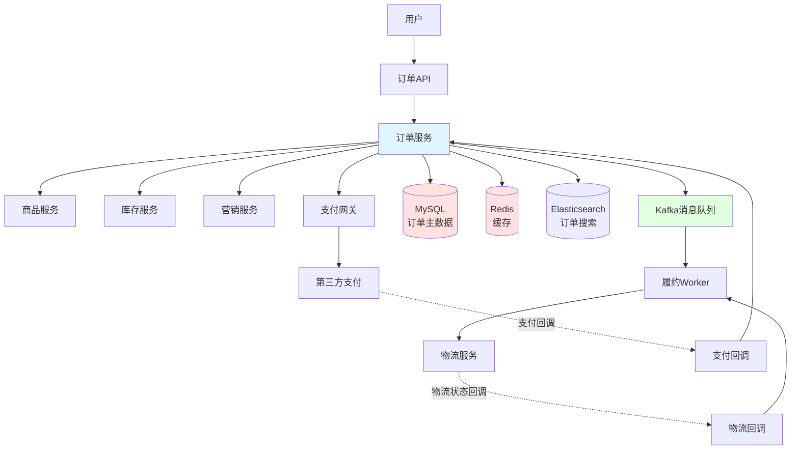
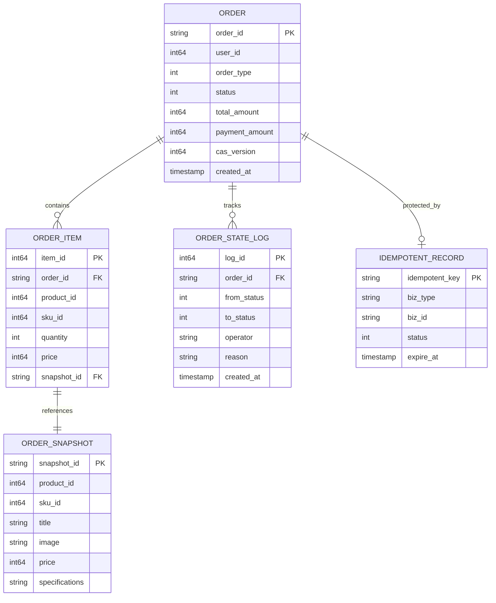

# 电商系统设计：订单系统

订单系统是电商平台的核心，承载着从下单到履约的完整业务流程。本文将深入探讨订单系统的设计与实现，重点讲解状态机、分布式事务、幂等性三大核心技术，并通过虚拟订单、O2O订单、预售订单三个黄金案例，展示如何设计可扩展的订单系统。

本文既适合系统设计面试准备，也适合工程实践参考。

## 目录

- [1. 系统概览](#1-系统概览)
  - [1.1 业务场景](#11-业务场景)
  - [1.2 核心挑战](#12-核心挑战)
  - [1.3 系统架构](#13-系统架构)
  - [1.4 数据模型设计](#14-数据模型设计)
- [2. 通用订单流程](#2-通用订单流程)
  - [2.1 订单创建](#21-订单创建)
  - [2.2 订单支付](#22-订单支付)
  - [2.3 订单履约](#23-订单履约)
  - [2.4 订单售后](#24-订单售后)
- [3. 状态机设计专题](#3-状态机设计专题)
- [4. 分布式事务与一致性](#4-分布式事务与一致性)
- [5. 幂等性与去重](#5-幂等性与去重)
- [6. 特殊订单类型](#6-特殊订单类型)
  - [6.1 虚拟订单](#61-虚拟订单)
  - [6.2 O2O订单](#62-o2o订单)
  - [6.3 预售订单](#63-预售订单)
- [7. 订单类型扩展设计](#7-订单类型扩展设计)
- [8. 工程实践要点](#8-工程实践要点)
- [总结](#总结)
- [参考资料](#参考资料)

## 1. 系统概览

### 1.1 业务场景

订单系统是电商平台的核心枢纽，连接用户、商品、库存、支付、物流、营销等多个子系统。它的主要职责包括：

- **订单创建**：接收用户下单请求，协调库存扣减、优惠计算、积分扣减等操作
- **订单支付**：对接支付系统，处理支付回调，更新订单状态
- **订单履约**：对接物流系统，跟踪物流状态，自动确认收货
- **订单售后**：处理退款退货，协调库存回补、优惠退还等逆向操作

订单系统的职责边界：
- **负责**：订单状态管理、订单数据持久化、订单流程编排
- **不负责**：具体的库存扣减逻辑（由库存系统负责）、具体的支付逻辑（由支付系统负责）

与其他系统的交互：
- **商品系统**：获取商品信息，创建订单快照
- **库存系统**：扣减库存、回补库存
- **支付系统**：发起支付、接收支付回调
- **物流系统**：创建物流单、接收物流状态更新
- **营销系统**：扣减优惠券、扣减积分、回退优惠

### 1.2 核心挑战

订单系统面临以下核心技术挑战：

**1. 高并发**
- 大促期间订单创建QPS可达百万级
- 需要支持数据库分库分表、缓存、消息队列削峰
- 需要合理的限流和熔断策略

**2. 强一致性**
- 订单创建涉及库存、优惠、积分等多个系统，需要保证事务一致性
- 支付回调需要防止重复扣款
- 库存扣减和订单创建需要原子性

**3. 状态复杂**
- 订单生命周期涉及多个状态：待支付、已支付、待发货、已发货、运输中、已送达、已完成、已取消、售后中等
- 状态转换需要严格控制，防止非法转换
- 需要记录完整的状态变更历史

**4. 类型多样**
- 物理订单：需要物流配送
- 虚拟订单：无需物流，即时履约
- O2O订单：需要商家接单、骑手配送
- 预售订单：定金尾款分期支付、延迟履约
- 每种订单类型的状态机和业务逻辑都有差异

**5. 幂等性**
- 支付回调可能重复：同一笔支付可能收到多次回调
- 物流回调可能重复：同一个物流状态可能上报多次
- 用户重复点击：用户可能多次点击支付按钮
- 需要在订单创建、支付、履约、售后等各个环节保证幂等性

**6. 可追溯**
- 需要保存订单快照：商品信息、价格、优惠信息在下单时的状态
- 需要记录完整的状态变更历史：谁在什么时间做了什么操作
- 需要支持订单审计和数据对账

### 1.3 系统架构

#### 整体架构

订单系统在电商平台中处于核心位置，通过同步API和异步消息与其他系统交互：

- **同步调用**：订单创建时同步调用库存系统、营销系统（需要立即返回结果）
- **异步消息**：订单支付成功后发布事件，履约系统异步消费（允许延迟处理）

#### 模块划分

订单系统内部分为以下核心模块：

**1. Order Service（订单核心服务）**
- 订单创建：接收下单请求，编排分布式事务
- 订单查询：提供订单查询API
- 订单状态管理：状态机驱动的状态转换

**2. Payment Service（支付服务）**
- 支付发起：调用第三方支付平台
- 支付回调：处理支付平台回调，更新订单状态
- 支付对账：定期与支付平台对账

**3. Fulfillment Service（履约服务）**
- 履约编排：订单支付成功后触发履约流程
- 物流对接：创建物流单，跟踪物流状态
- 自动确认：超时自动确认收货

**4. After-sale Service（售后服务）**
- 售后申请：用户发起退款退货
- 售后审核：人工或自动审核
- 退款处理：调用支付系统退款，回退库存和优惠

#### 技术栈

**存储层**
- **MySQL**：订单主数据存储，支持ACID事务
- **Redis**：订单缓存，提高查询性能
- **Elasticsearch**：订单搜索，支持复杂查询

**消息队列**
- **Kafka**：事件驱动架构，发布订单事件（OrderCreatedEvent、OrderPaidEvent等）

**分布式事务**
- **TCC框架**：支付场景，强一致性
- **Saga框架**：订单创建、售后场景，最终一致性

#### 系统架构图



### 1.4 数据模型设计

订单系统的核心数据模型包括订单主表、订单明细表、订单快照表、状态变更历史表、幂等表。

#### 订单主表（order）

存储订单的基本信息：

```go
type Order struct {
    OrderID       string    // 订单ID（Snowflake生成）
    UserID        int64     // 用户ID
    OrderType     int       // 订单类型：1-物理订单 2-虚拟订单 3-O2O订单 4-预售订单
    Status        int       // 订单状态：1-待支付 2-已支付 3-待发货 4-已发货 ...
    TotalAmount   int64     // 订单总金额（分）
    PaymentAmount int64     // 实付金额（分）
    DiscountAmount int64    // 优惠金额（分）
    CASVersion    int64     // 乐观锁版本号
    CreatedAt     time.Time // 创建时间
    UpdatedAt     time.Time // 更新时间
}
```

**索引设计**：
- 主键：`order_id`
- 唯一索引：`user_id, created_at`（支持用户订单查询）
- 普通索引：`status`（支持按状态查询）

#### 订单明细表（order_item）

存储订单的商品明细：

```go
type OrderItem struct {
    ItemID      int64     // 明细ID
    OrderID     string    // 订单ID
    ProductID   int64     // 商品ID
    SkuID       int64     // SKU ID
    Quantity    int       // 数量
    Price       int64     // 单价（分）
    SnapshotID  string    // 快照ID
    CreatedAt   time.Time // 创建时间
}
```

**索引设计**：
- 主键：`item_id`
- 普通索引：`order_id`（支持根据订单查询明细）

#### 订单快照表（order_snapshot）

存储下单时的商品快照（价格、标题、图片等），防止商品信息变更影响订单：

```go
type OrderSnapshot struct {
    SnapshotID    string    // 快照ID（Hash生成，支持复用）
    ProductID     int64     // 商品ID
    SkuID         int64     // SKU ID
    Title         string    // 商品标题
    Image         string    // 商品图片
    Price         int64     // 商品价格（分）
    Specifications string   // 规格信息（JSON）
    CreatedAt     time.Time // 创建时间
}
```

**快照复用策略**：
- 基于商品ID、SKU ID、价格、规格等信息计算Hash
- 相同Hash的快照复用同一条记录，节省存储空间

#### 订单状态变更历史表（order_state_log）

记录订单的所有状态变更，支持审计和追溯：

```go
type OrderStateLog struct {
    LogID       int64     // 日志ID
    OrderID     string    // 订单ID
    FromStatus  int       // 变更前状态
    ToStatus    int       // 变更后状态
    Operator    string    // 操作人（系统/用户ID）
    Reason      string    // 变更原因
    CreatedAt   time.Time // 创建时间
}
```

#### 幂等表（idempotent_record）

记录幂等键，防止重复操作：

```go
type IdempotentRecord struct {
    IdempotentKey string    // 幂等键（唯一）
    BizType       string    // 业务类型：order_create/payment/fulfillment
    BizID         string    // 业务ID（订单ID/支付单号等）
    Status        int       // 状态：1-处理中 2-成功 3-失败
    ExpireAt      time.Time // 过期时间
    CreatedAt     time.Time // 创建时间
}
```

**索引设计**：
- 唯一索引：`idempotent_key`（防止重复插入）

#### ER图


