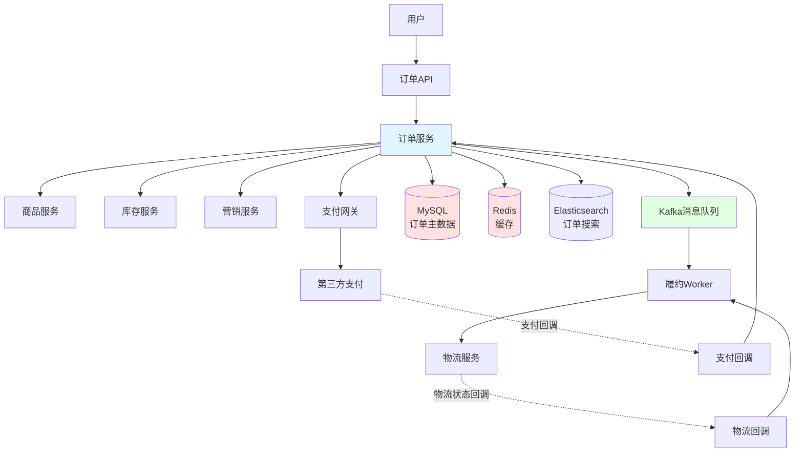
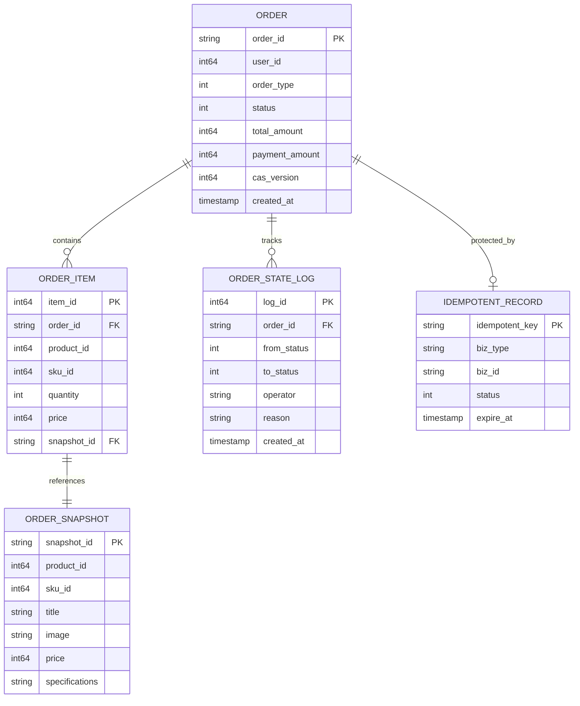
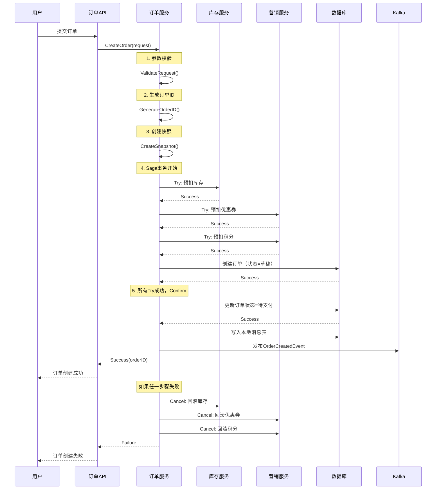
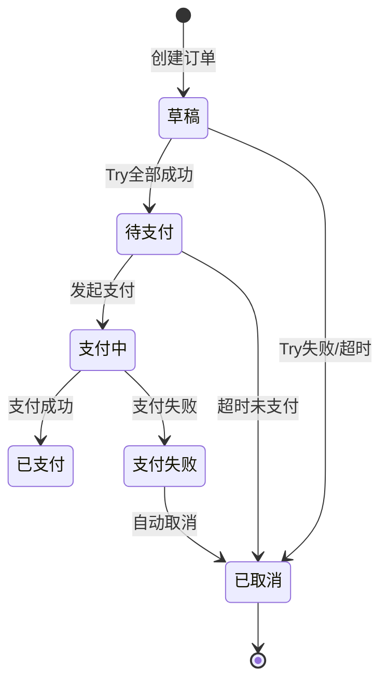
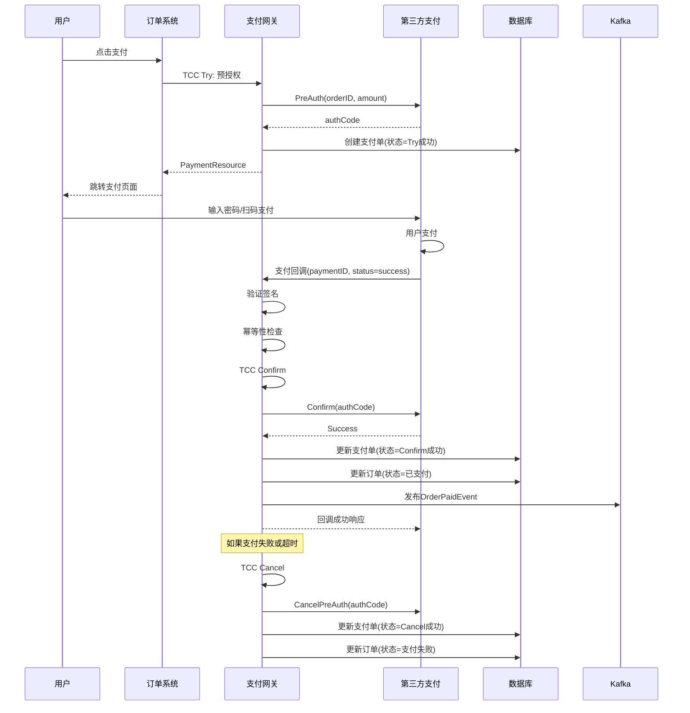
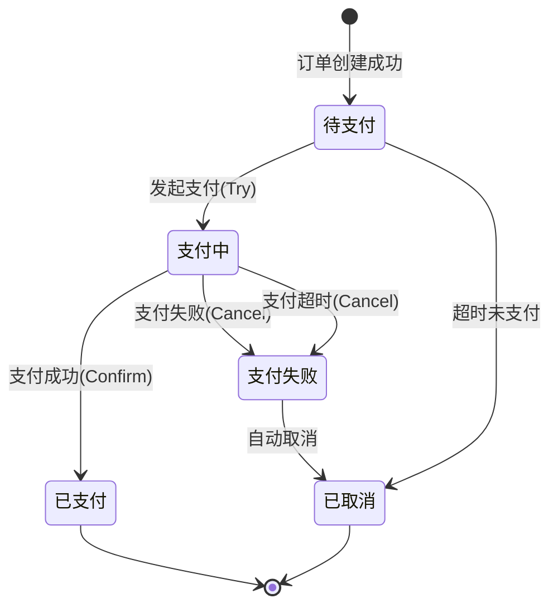
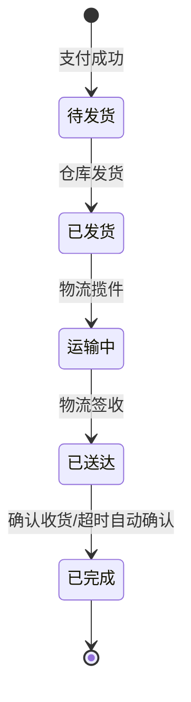
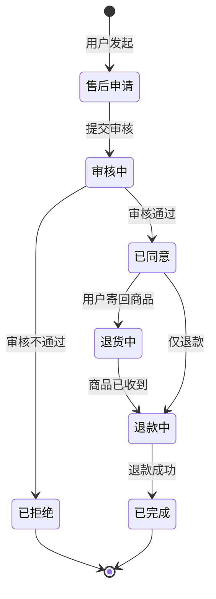

# 电商系统设计：订单系统

订单系统是电商平台的核心，承载着从下单到履约的完整业务流程。本文将深入探讨订单系统的设计与实现，重点讲解状态机、分布式事务、幂等性三大核心技术，并通过虚拟订单、O2O订单、预售订单三个黄金案例，展示如何设计可扩展的订单系统。

本文既适合系统设计面试准备，也适合工程实践参考。

## 目录

- [1. 系统概览](#1-系统概览)
  - [1.1 业务场景](#11-业务场景)
  - [1.2 核心挑战](#12-核心挑战)
  - [1.3 系统架构](#13-系统架构)
  - [1.4 数据模型设计](#14-数据模型设计)
- [2. 通用订单流程](#2-通用订单流程)
  - [2.1 订单创建](#21-订单创建)
  - [2.2 订单支付](#22-订单支付)
  - [2.3 订单履约](#23-订单履约)
  - [2.4 订单售后](#24-订单售后)
- [3. 状态机设计专题](#3-状态机设计专题)
- [4. 分布式事务与一致性](#4-分布式事务与一致性)
- [5. 幂等性与去重](#5-幂等性与去重)
- [6. 特殊订单类型](#6-特殊订单类型)
  - [6.1 虚拟订单](#61-虚拟订单)
  - [6.2 O2O订单](#62-o2o订单)
  - [6.3 预售订单](#63-预售订单)
- [7. 订单类型扩展设计](#7-订单类型扩展设计)
- [8. 工程实践要点](#8-工程实践要点)
- [总结](#总结)
- [参考资料](#参考资料)

## 1. 系统概览

### 1.1 业务场景

订单系统是电商平台的核心枢纽，连接用户、商品、库存、支付、物流、营销等多个子系统。它的主要职责包括：

- **订单创建**：接收用户下单请求，协调库存扣减、优惠计算、积分扣减等操作
- **订单支付**：对接支付系统，处理支付回调，更新订单状态
- **订单履约**：对接物流系统，跟踪物流状态，自动确认收货
- **订单售后**：处理退款退货，协调库存回补、优惠退还等逆向操作

订单系统的职责边界：
- **负责**：订单状态管理、订单数据持久化、订单流程编排
- **不负责**：具体的库存扣减逻辑（由库存系统负责）、具体的支付逻辑（由支付系统负责）

与其他系统的交互：
- **商品系统**：获取商品信息，创建订单快照
- **库存系统**：扣减库存、回补库存
- **支付系统**：发起支付、接收支付回调
- **物流系统**：创建物流单、接收物流状态更新
- **营销系统**：扣减优惠券、扣减积分、回退优惠

### 1.2 核心挑战

订单系统面临以下核心技术挑战：

**1. 高并发**
- 大促期间订单创建QPS可达百万级
- 需要支持数据库分库分表、缓存、消息队列削峰
- 需要合理的限流和熔断策略

**2. 强一致性**
- 订单创建涉及库存、优惠、积分等多个系统，需要保证事务一致性
- 支付回调需要防止重复扣款
- 库存扣减和订单创建需要原子性

**3. 状态复杂**
- 订单生命周期涉及多个状态：待支付、已支付、待发货、已发货、运输中、已送达、已完成、已取消、售后中等
- 状态转换需要严格控制，防止非法转换
- 需要记录完整的状态变更历史

**4. 类型多样**
- 物理订单：需要物流配送
- 虚拟订单：无需物流，即时履约
- O2O订单：需要商家接单、骑手配送
- 预售订单：定金尾款分期支付、延迟履约
- 每种订单类型的状态机和业务逻辑都有差异

**5. 幂等性**
- 支付回调可能重复：同一笔支付可能收到多次回调
- 物流回调可能重复：同一个物流状态可能上报多次
- 用户重复点击：用户可能多次点击支付按钮
- 需要在订单创建、支付、履约、售后等各个环节保证幂等性

**6. 可追溯**
- 需要保存订单快照：商品信息、价格、优惠信息在下单时的状态
- 需要记录完整的状态变更历史：谁在什么时间做了什么操作
- 需要支持订单审计和数据对账

### 1.3 系统架构

#### 整体架构

订单系统在电商平台中处于核心位置，通过同步API和异步消息与其他系统交互：

- **同步调用**：订单创建时同步调用库存系统、营销系统（需要立即返回结果）
- **异步消息**：订单支付成功后发布事件，履约系统异步消费（允许延迟处理）

#### 模块划分

订单系统内部分为以下核心模块：

**1. Order Service（订单核心服务）**
- 订单创建：接收下单请求，编排分布式事务
- 订单查询：提供订单查询API
- 订单状态管理：状态机驱动的状态转换

**2. Payment Service（支付服务）**
- 支付发起：调用第三方支付平台
- 支付回调：处理支付平台回调，更新订单状态
- 支付对账：定期与支付平台对账

**3. Fulfillment Service（履约服务）**
- 履约编排：订单支付成功后触发履约流程
- 物流对接：创建物流单，跟踪物流状态
- 自动确认：超时自动确认收货

**4. After-sale Service（售后服务）**
- 售后申请：用户发起退款退货
- 售后审核：人工或自动审核
- 退款处理：调用支付系统退款，回退库存和优惠

#### 技术栈

**存储层**
- **MySQL**：订单主数据存储，支持ACID事务
- **Redis**：订单缓存，提高查询性能
- **Elasticsearch**：订单搜索，支持复杂查询

**消息队列**
- **Kafka**：事件驱动架构，发布订单事件（OrderCreatedEvent、OrderPaidEvent等）

**分布式事务**
- **TCC框架**：支付场景，强一致性
- **Saga框架**：订单创建、售后场景，最终一致性

#### 系统架构图



### 1.4 数据模型设计

订单系统的核心数据模型包括订单主表、订单明细表、订单快照表、状态变更历史表、幂等表。

#### 订单主表（order）

存储订单的基本信息：

```go
type Order struct {
    OrderID       string    // 订单ID（Snowflake生成）
    UserID        int64     // 用户ID
    OrderType     int       // 订单类型：1-物理订单 2-虚拟订单 3-O2O订单 4-预售订单
    Status        int       // 订单状态：1-待支付 2-已支付 3-待发货 4-已发货 ...
    TotalAmount   int64     // 订单总金额（分）
    PaymentAmount int64     // 实付金额（分）
    DiscountAmount int64    // 优惠金额（分）
    CASVersion    int64     // 乐观锁版本号
    CreatedAt     time.Time // 创建时间
    UpdatedAt     time.Time // 更新时间
}
```

**索引设计**：
- 主键：`order_id`
- 唯一索引：`user_id, created_at`（支持用户订单查询）
- 普通索引：`status`（支持按状态查询）

#### 订单明细表（order_item）

存储订单的商品明细：

```go
type OrderItem struct {
    ItemID      int64     // 明细ID
    OrderID     string    // 订单ID
    ProductID   int64     // 商品ID
    SkuID       int64     // SKU ID
    Quantity    int       // 数量
    Price       int64     // 单价（分）
    SnapshotID  string    // 快照ID
    CreatedAt   time.Time // 创建时间
}
```

**索引设计**：
- 主键：`item_id`
- 普通索引：`order_id`（支持根据订单查询明细）

#### 订单快照表（order_snapshot）

存储下单时的商品快照（价格、标题、图片等），防止商品信息变更影响订单：

```go
type OrderSnapshot struct {
    SnapshotID    string    // 快照ID（Hash生成，支持复用）
    ProductID     int64     // 商品ID
    SkuID         int64     // SKU ID
    Title         string    // 商品标题
    Image         string    // 商品图片
    Price         int64     // 商品价格（分）
    Specifications string   // 规格信息（JSON）
    CreatedAt     time.Time // 创建时间
}
```

**快照复用策略**：
- 基于商品ID、SKU ID、价格、规格等信息计算Hash
- 相同Hash的快照复用同一条记录，节省存储空间

#### 订单状态变更历史表（order_state_log）

记录订单的所有状态变更，支持审计和追溯：

```go
type OrderStateLog struct {
    LogID       int64     // 日志ID
    OrderID     string    // 订单ID
    FromStatus  int       // 变更前状态
    ToStatus    int       // 变更后状态
    Operator    string    // 操作人（系统/用户ID）
    Reason      string    // 变更原因
    CreatedAt   time.Time // 创建时间
}
```

#### 幂等表（idempotent_record）

记录幂等键，防止重复操作：

```go
type IdempotentRecord struct {
    IdempotentKey string    // 幂等键（唯一）
    BizType       string    // 业务类型：order_create/payment/fulfillment
    BizID         string    // 业务ID（订单ID/支付单号等）
    Status        int       // 状态：1-处理中 2-成功 3-失败
    ExpireAt      time.Time // 过期时间
    CreatedAt     time.Time // 创建时间
}
```

**索引设计**：
- 唯一索引：`idempotent_key`（防止重复插入）

#### ER图



## 2. 通用订单流程

本章讲解标准订单从创建到完成的完整流程，覆盖大部分订单类型的通用逻辑（约占50%内容）。特殊订单类型的差异将在第6章详细讲解。

### 2.1 订单创建

订单创建是整个订单流程的起点，需要协调多个系统完成库存扣减、优惠计算、积分扣减等操作。由于涉及多个系统，需要使用分布式事务保证一致性。

#### 业务流程

1. **参数校验**：验证商品是否存在、库存是否充足、优惠券是否可用等
2. **生成订单ID**：使用Snowflake算法生成全局唯一的订单ID
3. **创建订单快照**：保存下单时的商品信息（价格、标题、图片等）
4. **分布式事务编排**：
   - Try阶段：预扣库存、预扣优惠券、预扣积分、创建订单（状态为"草稿"）
   - Confirm阶段：所有Try成功后，订单状态变为"待支付"
   - Cancel阶段：任何Try失败，执行补偿回滚

#### 订单ID生成策略

使用Snowflake算法生成订单ID：

```go
// Snowflake算法：64位long型
// [0] [1-41时间戳] [42-51机器ID] [52-63序列号]

type SnowflakeGenerator struct {
    machineID int64  // 机器ID（10位，0-1023）
    sequence  int64  // 序列号（12位，0-4095）
    lastTime  int64  // 上次生成时间戳
    mu        sync.Mutex
}

func (s *SnowflakeGenerator) NextID() string {
    s.mu.Lock()
    defer s.mu.Unlock()
    
    now := time.Now().UnixMilli()
    
    // 如果时间戳相同，序列号递增
    if now == s.lastTime {
        s.sequence = (s.sequence + 1) & 4095
        if s.sequence == 0 {
            // 序列号溢出，等待下一毫秒
            for now <= s.lastTime {
                now = time.Now().UnixMilli()
            }
        }
    } else {
        s.sequence = 0
    }
    
    s.lastTime = now
    
    // 组装：时间戳(41位) + 机器ID(10位) + 序列号(12位)
    id := ((now - 1640995200000) << 22) | (s.machineID << 12) | s.sequence
    return strconv.FormatInt(id, 10)
}
```

**优点**：
- 全局唯一：机器ID + 时间戳 + 序列号保证唯一性
- 趋势递增：按时间递增，对数据库索引友好
- 高性能：无需数据库交互，本地生成

**缺点**：
- 依赖时钟：时钟回拨会导致ID重复（需要拒绝服务并告警）
- 需要机器ID分配：在分布式环境下需要全局唯一的机器ID

#### 订单快照管理

订单快照保存下单时的商品信息，防止商品信息变更影响订单：

```go
// 生成快照ID（基于Hash，支持复用）
func GenerateSnapshotID(productID, skuID int64, price int64, spec string) string {
    data := fmt.Sprintf("%d_%d_%d_%s", productID, skuID, price, spec)
    hash := sha256.Sum256([]byte(data))
    return hex.EncodeToString(hash[:16]) // 使用前16字节
}

// 创建或复用快照
func CreateOrReuseSnapshot(snapshot *OrderSnapshot) (string, error) {
    snapshotID := GenerateSnapshotID(
        snapshot.ProductID,
        snapshot.SkuID,
        snapshot.Price,
        snapshot.Specifications,
    )
    
    // 尝试查询是否已存在
    existing, err := db.GetSnapshotByID(snapshotID)
    if err == nil && existing != nil {
        return snapshotID, nil // 复用现有快照
    }
    
    // 不存在，创建新快照
    snapshot.SnapshotID = snapshotID
    if err := db.InsertSnapshot(snapshot); err != nil {
        return "", err
    }
    
    return snapshotID, nil
}
```

**快照复用的好处**：
- 节省存储空间：相同商品信息的快照只存储一份
- 提高查询性能：减少数据量，加快查询速度

#### 订单创建流程图



#### 订单创建状态机



#### Saga分布式事务

订单创建涉及多个系统，使用Saga模式保证最终一致性：

```go
// Saga步骤定义
type SagaStep struct {
    Name       string
    TryFunc    func(ctx context.Context) error    // 正向操作
    CancelFunc func(ctx context.Context) error    // 补偿操作
}

// Saga协调器
type SagaOrchestrator struct {
    steps []*SagaStep
}

func (s *SagaOrchestrator) Execute(ctx context.Context) error {
    executed := make([]*SagaStep, 0)
    
    // 顺序执行Try
    for _, step := range s.steps {
        if err := step.TryFunc(ctx); err != nil {
            // 失败，执行补偿
            s.compensate(ctx, executed)
            return fmt.Errorf("saga step %s failed: %w", step.Name, err)
        }
        executed = append(executed, step)
    }
    
    return nil
}

func (s *SagaOrchestrator) compensate(ctx context.Context, executed []*SagaStep) {
    // 逆序执行Cancel
    for i := len(executed) - 1; i >= 0; i-- {
        step := executed[i]
        if err := step.CancelFunc(ctx); err != nil {
            // 补偿失败，记录日志并告警
            log.Error("saga compensation failed", 
                "step", step.Name, 
                "error", err)
            // 发送告警，人工介入
            alert.Send("saga_compensation_failed", step.Name, err)
        }
    }
}

// 订单创建Saga
func CreateOrderSaga(ctx context.Context, req *CreateOrderRequest) error {
    saga := &SagaOrchestrator{
        steps: []*SagaStep{
            {
                Name: "扣减库存",
                TryFunc: func(ctx context.Context) error {
                    return inventoryClient.DeductStock(ctx, req.Items)
                },
                CancelFunc: func(ctx context.Context) error {
                    return inventoryClient.RollbackStock(ctx, req.Items)
                },
            },
            {
                Name: "扣减优惠券",
                TryFunc: func(ctx context.Context) error {
                    return marketingClient.DeductCoupon(ctx, req.CouponID)
                },
                CancelFunc: func(ctx context.Context) error {
                    return marketingClient.RollbackCoupon(ctx, req.CouponID)
                },
            },
            {
                Name: "扣减积分",
                TryFunc: func(ctx context.Context) error {
                    return marketingClient.DeductPoints(ctx, req.UserID, req.Points)
                },
                CancelFunc: func(ctx context.Context) error {
                    return marketingClient.RollbackPoints(ctx, req.UserID, req.Points)
                },
            },
            {
                Name: "创建订单",
                TryFunc: func(ctx context.Context) error {
                    order := buildOrder(req)
                    order.Status = OrderStatusDraft // 草稿状态
                    return db.InsertOrder(ctx, order)
                },
                CancelFunc: func(ctx context.Context) error {
                    return db.DeleteOrder(ctx, req.OrderID)
                },
            },
        },
    }
    
    // 执行Saga
    if err := saga.Execute(ctx); err != nil {
        return err
    }
    
    // 所有Try成功，更新订单状态为"待支付"
    return db.UpdateOrderStatus(ctx, req.OrderID, OrderStatusPending)
}
```

**Saga vs TCC对比**：
- Saga适合订单创建场景：步骤多、允许最终一致性
- TCC适合支付场景：步骤少、需要强一致性（下一节详述）

#### 幂等性设计

防止用户重复提交订单：

```go
// 基于请求ID的幂等性
func CreateOrderIdempotent(ctx context.Context, req *CreateOrderRequest) (*Order, error) {
    // 1. 幂等键：用户ID + 请求ID
    idempotentKey := fmt.Sprintf("order_create_%d_%s", req.UserID, req.RequestID)
    
    // 2. 尝试插入幂等记录（唯一索引保证原子性）
    record := &IdempotentRecord{
        IdempotentKey: idempotentKey,
        BizType:       "order_create",
        Status:        IdempotentProcessing,
        ExpireAt:      time.Now().Add(24 * time.Hour),
    }
    
    if err := db.InsertIdempotentRecord(ctx, record); err != nil {
        // 插入失败，说明已经处理过
        existing, _ := db.GetIdempotentRecord(ctx, idempotentKey)
        if existing.Status == IdempotentSuccess {
            // 已成功，返回之前的订单
            order, _ := db.GetOrder(ctx, existing.BizID)
            return order, nil
        }
        // 处理中，返回错误提示稍后重试
        return nil, ErrRequestProcessing
    }
    
    // 3. 执行订单创建
    order, err := CreateOrderSaga(ctx, req)
    if err != nil {
        // 失败，更新幂等记录状态
        db.UpdateIdempotentStatus(ctx, idempotentKey, IdempotentFailed)
        return nil, err
    }
    
    // 4. 成功，更新幂等记录
    db.UpdateIdempotentRecord(ctx, idempotentKey, IdempotentSuccess, order.OrderID)
    
    return order, nil
}
```

#### 数据一致性保证

**乐观锁更新订单状态**：

```go
// 使用CAS版本号防止并发冲突
func UpdateOrderStatus(ctx context.Context, orderID string, oldStatus, newStatus int) error {
    query := `
        UPDATE orders 
        SET status = ?, cas_version = cas_version + 1, updated_at = ?
        WHERE order_id = ? AND status = ? AND cas_version = ?
    `
    
    // 先查询当前版本号
    order, err := db.GetOrder(ctx, orderID)
    if err != nil {
        return err
    }
    
    if order.Status != oldStatus {
        return ErrInvalidStatusTransition
    }
    
    // CAS更新
    result, err := db.Exec(ctx, query, newStatus, time.Now(), orderID, oldStatus, order.CASVersion)
    if err != nil {
        return err
    }
    
    if result.RowsAffected == 0 {
        // 更新失败，可能被其他请求修改了
        return ErrConcurrentUpdate
    }
    
    return nil
}
```

**本地消息表 + Kafka事件发布**：

```go
// Outbox Pattern：保证消息一定发送
func PublishOrderCreatedEvent(ctx context.Context, order *Order) error {
    // 1. 在同一事务中：插入订单 + 插入本地消息
    tx, err := db.Begin(ctx)
    if err != nil {
        return err
    }
    defer tx.Rollback()
    
    // 插入订单
    if err := tx.InsertOrder(ctx, order); err != nil {
        return err
    }
    
    // 插入本地消息
    msg := &OutboxMessage{
        MessageID: uuid.New().String(),
        Topic:     "order.created",
        Payload:   json.Marshal(order),
        Status:    OutboxPending,
    }
    if err := tx.InsertOutboxMessage(ctx, msg); err != nil {
        return err
    }
    
    // 提交事务
    if err := tx.Commit(); err != nil {
        return err
    }
    
    // 2. 异步发送Kafka消息（定时任务扫描本地消息表）
    // 这里只是插入，实际发送由后台任务完成
    return nil
}

// 后台任务：扫描本地消息表并发送
func OutboxMessageSender() {
    ticker := time.NewTicker(1 * time.Second)
    for range ticker.C {
        messages, _ := db.GetPendingOutboxMessages(context.Background(), 100)
        for _, msg := range messages {
            if err := kafkaProducer.Send(msg.Topic, msg.Payload); err != nil {
                log.Error("failed to send kafka message", "error", err)
                continue
            }
            // 发送成功，更新状态
            db.UpdateOutboxMessageStatus(context.Background(), msg.MessageID, OutboxSent)
        }
    }
}
```

### 2.2 订单支付

订单支付是订单流程的关键环节，需要对接第三方支付平台，处理支付回调，确保资金安全。支付场景下需要使用TCC模式保证强一致性。

#### 业务流程

1. **发起支付**：调用支付网关，传递订单信息和支付金额
2. **用户支付**：跳转到第三方支付页面（微信/支付宝等）
3. **支付回调**：支付平台异步回调订单系统，通知支付结果
4. **更新订单状态**：支付成功后，订单状态从"待支付"变为"已支付"
5. **发布事件**：发布OrderPaidEvent，触发履约流程

#### TCC分布式事务

支付涉及资金操作，需要保证强一致性，使用TCC模式：

- **Try**：冻结用户账户资金（或向支付平台发起预授权）
- **Confirm**：支付平台回调成功，扣款并更新订单状态为"已支付"
- **Cancel**：支付失败或超时，解冻资金并更新订单状态为"支付失败"

```go
// TCC支付接口
type PaymentTCC interface {
    Try(ctx context.Context, req *PaymentRequest) (*PaymentResource, error)
    Confirm(ctx context.Context, resource *PaymentResource) error
    Cancel(ctx context.Context, resource *PaymentResource) error
}

// TCC资源
type PaymentResource struct {
    PaymentID string // 支付单号
    OrderID   string // 订单ID
    Amount    int64  // 支付金额
    Status    int    // 状态：1-Try成功 2-Confirm成功 3-Cancel成功
}

// Try：冻结资金
func (p *PaymentService) Try(ctx context.Context, req *PaymentRequest) (*PaymentResource, error) {
    // 1. 调用支付平台预授权接口
    authResp, err := paymentGateway.PreAuth(ctx, &PreAuthRequest{
        OrderID: req.OrderID,
        Amount:  req.Amount,
        UserID:  req.UserID,
    })
    if err != nil {
        return nil, fmt.Errorf("pre-auth failed: %w", err)
    }
    
    // 2. 创建支付单（状态=Try成功）
    payment := &Payment{
        PaymentID:   authResp.PaymentID,
        OrderID:     req.OrderID,
        Amount:      req.Amount,
        Status:      PaymentStatusTrySuccess,
        AuthCode:    authResp.AuthCode, // 预授权码
    }
    if err := db.InsertPayment(ctx, payment); err != nil {
        // 插入失败，取消预授权
        paymentGateway.CancelPreAuth(ctx, authResp.AuthCode)
        return nil, err
    }
    
    return &PaymentResource{
        PaymentID: payment.PaymentID,
        OrderID:   req.OrderID,
        Amount:    req.Amount,
        Status:    PaymentStatusTrySuccess,
    }, nil
}

// Confirm：扣款
func (p *PaymentService) Confirm(ctx context.Context, resource *PaymentResource) error {
    // 1. 查询支付单
    payment, err := db.GetPayment(ctx, resource.PaymentID)
    if err != nil {
        return err
    }
    
    if payment.Status == PaymentStatusConfirmSuccess {
        return nil // 幂等：已经Confirm成功
    }
    
    // 2. 调用支付平台扣款接口
    if err := paymentGateway.Confirm(ctx, payment.AuthCode); err != nil {
        return fmt.Errorf("payment confirm failed: %w", err)
    }
    
    // 3. 更新支付单状态
    if err := db.UpdatePaymentStatus(ctx, payment.PaymentID, PaymentStatusConfirmSuccess); err != nil {
        return err
    }
    
    // 4. 更新订单状态为"已支付"
    if err := UpdateOrderStatus(ctx, payment.OrderID, OrderStatusPending, OrderStatusPaid); err != nil {
        return err
    }
    
    // 5. 发布事件
    PublishOrderPaidEvent(ctx, payment.OrderID)
    
    return nil
}

// Cancel：解冻资金
func (p *PaymentService) Cancel(ctx context.Context, resource *PaymentResource) error {
    // 1. 查询支付单
    payment, err := db.GetPayment(ctx, resource.PaymentID)
    if err != nil {
        return err
    }
    
    if payment.Status == PaymentStatusCancelSuccess {
        return nil // 幂等：已经Cancel成功
    }
    
    // 2. 调用支付平台取消预授权
    if err := paymentGateway.CancelPreAuth(ctx, payment.AuthCode); err != nil {
        log.Error("cancel pre-auth failed", "error", err)
        // 取消预授权失败，记录告警
        alert.Send("cancel_pre_auth_failed", payment.PaymentID, err)
    }
    
    // 3. 更新支付单状态
    if err := db.UpdatePaymentStatus(ctx, payment.PaymentID, PaymentStatusCancelSuccess); err != nil {
        return err
    }
    
    // 4. 更新订单状态为"支付失败"
    UpdateOrderStatus(ctx, payment.OrderID, OrderStatusPending, OrderStatusPaymentFailed)
    
    return nil
}
```

#### 支付流程图



#### 支付状态机



#### 支付回调幂等性

第三方支付平台可能多次回调，需要保证幂等性：

```go
// 支付回调处理
func HandlePaymentCallback(ctx context.Context, callbackReq *PaymentCallbackRequest) error {
    // 1. 验证签名
    if !verifySignature(callbackReq) {
        return ErrInvalidSignature
    }
    
    // 2. 幂等性检查：基于支付平台订单号
    idempotentKey := fmt.Sprintf("payment_callback_%s", callbackReq.ThirdPartyOrderID)
    
    record := &IdempotentRecord{
        IdempotentKey: idempotentKey,
        BizType:       "payment_callback",
        BizID:         callbackReq.PaymentID,
        Status:        IdempotentProcessing,
        ExpireAt:      time.Now().Add(24 * time.Hour),
    }
    
    if err := db.InsertIdempotentRecord(ctx, record); err != nil {
        // 已处理过，直接返回成功
        existing, _ := db.GetIdempotentRecord(ctx, idempotentKey)
        if existing.Status == IdempotentSuccess {
            return nil // 幂等：已处理成功
        }
        return ErrRequestProcessing
    }
    
    // 3. 查询支付单
    payment, err := db.GetPayment(ctx, callbackReq.PaymentID)
    if err != nil {
        db.UpdateIdempotentStatus(ctx, idempotentKey, IdempotentFailed)
        return err
    }
    
    // 4. 状态机检查：只有"支付中"状态才能处理回调
    if payment.Status != PaymentStatusTrying {
        db.UpdateIdempotentStatus(ctx, idempotentKey, IdempotentSuccess)
        return nil // 幂等：状态已变更，不需要重复处理
    }
    
    // 5. 根据回调结果执行TCC Confirm或Cancel
    if callbackReq.Status == "success" {
        resource := &PaymentResource{
            PaymentID: payment.PaymentID,
            OrderID:   payment.OrderID,
            Amount:    payment.Amount,
        }
        if err := paymentTCC.Confirm(ctx, resource); err != nil {
            db.UpdateIdempotentStatus(ctx, idempotentKey, IdempotentFailed)
            return err
        }
    } else {
        resource := &PaymentResource{
            PaymentID: payment.PaymentID,
            OrderID:   payment.OrderID,
            Amount:    payment.Amount,
        }
        paymentTCC.Cancel(ctx, resource)
    }
    
    // 6. 更新幂等记录
    db.UpdateIdempotentStatus(ctx, idempotentKey, IdempotentSuccess)
    
    return nil
}
```

**幂等性保证的三重机制**：
1. **幂等表**：基于第三方订单号的唯一索引，防止并发重复处理
2. **状态机**：只有"支付中"状态才能变更为"已支付"，重复回调会被状态机拦截
3. **TCC Confirm幂等**：Confirm方法内部检查支付单状态，已Confirm成功直接返回

#### 支付超时处理

订单创建后，用户可能不支付，需要定时扫描并取消超时订单：

```go
// 支付超时定时任务
func PaymentTimeoutScanner() {
    ticker := time.NewTicker(1 * time.Minute)
    for range ticker.C {
        ctx := context.Background()
        
        // 1. 查询超时未支付订单（创建时间 > 30分钟，状态=待支付）
        timeout := time.Now().Add(-30 * time.Minute)
        orders, err := db.GetTimeoutOrders(ctx, OrderStatusPending, timeout, 1000)
        if err != nil {
            log.Error("failed to get timeout orders", "error", err)
            continue
        }
        
        // 2. 批量取消订单
        for _, order := range orders {
            if err := CancelTimeoutOrder(ctx, order.OrderID); err != nil {
                log.Error("failed to cancel timeout order", 
                    "orderID", order.OrderID, 
                    "error", err)
                continue
            }
        }
    }
}

// 取消超时订单
func CancelTimeoutOrder(ctx context.Context, orderID string) error {
    // 1. 悲观锁查询订单（防止并发）
    order, err := db.GetOrderForUpdate(ctx, orderID)
    if err != nil {
        return err
    }
    
    // 2. 状态检查：只有"待支付"状态才能取消
    if order.Status != OrderStatusPending {
        return nil // 已被其他流程处理
    }
    
    // 3. 更新订单状态为"已取消"
    if err := UpdateOrderStatus(ctx, orderID, OrderStatusPending, OrderStatusCancelled); err != nil {
        return err
    }
    
    // 4. 回退库存、优惠券、积分（Saga补偿）
    if err := CompensateOrderResources(ctx, order); err != nil {
        log.Error("failed to compensate order resources", 
            "orderID", orderID, 
            "error", err)
        // 补偿失败，发送告警，人工介入
        alert.Send("order_compensation_failed", orderID, err)
    }
    
    // 5. 发布事件
    PublishOrderCancelledEvent(ctx, orderID)
    
    return nil
}
```

**超时时间设置**：
- 物理订单：30分钟（给用户充足时间选择支付方式）
- 虚拟订单：15分钟（无需物流，时效性更强）
- O2O订单：10分钟（即时性要求高）

### 2.3 订单履约

订单履约是订单支付成功后的下一个环节，负责将商品配送给用户。履约过程需要对接物流系统，跟踪物流状态，并在适当时候自动确认收货。

#### 业务流程

1. **触发履约**：监听OrderPaidEvent，订单支付成功后自动触发履约
2. **创建物流单**：调用物流系统创建物流单，获取物流单号
3. **发货**：仓库发货，更新订单状态为"已发货"
4. **物流跟踪**：订阅物流状态变更，更新订单状态（运输中 → 已送达）
5. **自动确认收货**：超过N天自动确认收货，订单状态变为"已完成"

#### 履约状态机



#### 异步履约处理

使用Kafka事件驱动，异步处理履约任务：

```go
// Kafka消费者：监听订单支付事件
func FulfillmentWorker() {
    consumer := kafka.NewConsumer("order.paid", "fulfillment-group")
    
    for msg := range consumer.Messages() {
        event := &OrderPaidEvent{}
        if err := json.Unmarshal(msg.Value, event); err != nil {
            log.Error("failed to unmarshal event", "error", err)
            continue
        }
        
        // 处理履约
        if err := ProcessFulfillment(context.Background(), event.OrderID); err != nil {
            log.Error("failed to process fulfillment", 
                "orderID", event.OrderID, 
                "error", err)
            // 失败后重试（Kafka会重新投递）
            continue
        }
        
        // 提交offset
        consumer.CommitMessage(msg)
    }
}

// 履约处理主流程
func ProcessFulfillment(ctx context.Context, orderID string) error {
    // 1. 查询订单
    order, err := db.GetOrder(ctx, orderID)
    if err != nil {
        return err
    }
    
    // 2. 状态检查：只有"已支付"状态才能履约
    if order.Status != OrderStatusPaid {
        return nil // 已被处理
    }
    
    // 3. 创建物流单
    logisticsResp, err := logisticsClient.CreateShipment(ctx, &CreateShipmentRequest{
        OrderID:      orderID,
        ReceiverName: order.ReceiverName,
        ReceiverAddr: order.ReceiverAddress,
        Items:        order.Items,
    })
    if err != nil {
        return fmt.Errorf("create shipment failed: %w", err)
    }
    
    // 4. 更新订单状态为"待发货"
    if err := UpdateOrderStatus(ctx, orderID, OrderStatusPaid, OrderStatusPendingShipment); err != nil {
        return err
    }
    
    // 5. 保存物流单号
    if err := db.UpdateOrderLogistics(ctx, orderID, logisticsResp.ShipmentID); err != nil {
        return err
    }
    
    // 6. 发布事件
    PublishFulfillmentCreatedEvent(ctx, orderID, logisticsResp.ShipmentID)
    
    return nil
}
```

#### 物流状态回调处理

物流系统会主动推送物流状态变更：

```go
// 物流状态回调处理
func HandleLogisticsCallback(ctx context.Context, callback *LogisticsCallbackRequest) error {
    // 1. 幂等性检查
    idempotentKey := fmt.Sprintf("logistics_callback_%s_%s", 
        callback.ShipmentID, callback.Status)
    
    if err := db.InsertIdempotentRecord(ctx, &IdempotentRecord{
        IdempotentKey: idempotentKey,
        BizType:       "logistics_callback",
        BizID:         callback.OrderID,
        Status:        IdempotentProcessing,
    }); err != nil {
        return nil // 已处理
    }
    
    // 2. 根据物流状态更新订单
    switch callback.Status {
    case "SHIPPED":
        // 已发货
        UpdateOrderStatus(ctx, callback.OrderID, OrderStatusPendingShipment, OrderStatusShipped)
    case "IN_TRANSIT":
        // 运输中
        UpdateOrderStatus(ctx, callback.OrderID, OrderStatusShipped, OrderStatusInTransit)
    case "DELIVERED":
        // 已送达
        UpdateOrderStatus(ctx, callback.OrderID, OrderStatusInTransit, OrderStatusDelivered)
        // 发布事件，触发自动确认收货定时器
        PublishOrderDeliveredEvent(ctx, callback.OrderID)
    default:
        log.Warn("unknown logistics status", "status", callback.Status)
    }
    
    // 3. 更新幂等记录
    db.UpdateIdempotentStatus(ctx, idempotentKey, IdempotentSuccess)
    
    return nil
}
```

#### 自动确认收货

订单送达后，超过N天自动确认收货：

```go
// 自动确认收货定时任务
func AutoConfirmReceiptScanner() {
    ticker := time.NewTicker(1 * time.Hour)
    for range ticker.C {
        ctx := context.Background()
        
        // 查询已送达超过7天的订单
        timeout := time.Now().Add(-7 * 24 * time.Hour)
        orders, err := db.GetDeliveredOrders(ctx, timeout, 1000)
        if err != nil {
            log.Error("failed to get delivered orders", "error", err)
            continue
        }
        
        // 批量确认收货
        for _, order := range orders {
            if err := ConfirmReceipt(ctx, order.OrderID); err != nil {
                log.Error("failed to confirm receipt", 
                    "orderID", order.OrderID, 
                    "error", err)
            }
        }
    }
}

// 确认收货
func ConfirmReceipt(ctx context.Context, orderID string) error {
    // 1. 更新订单状态为"已完成"
    if err := UpdateOrderStatus(ctx, orderID, OrderStatusDelivered, OrderStatusCompleted); err != nil {
        return err
    }
    
    // 2. 发布事件
    PublishOrderCompletedEvent(ctx, orderID)
    
    return nil
}
```

### 2.4 订单售后

订单售后处理用户的退款退货请求，需要协调库存回补、优惠退还、资金退回等多个系统。售后场景下使用Saga模式保证最终一致性。

#### 业务流程

1. **售后申请**：用户发起退款退货申请
2. **售后审核**：系统自动审核或人工审核
3. **退货物流**：用户寄回商品（退货场景）
4. **退款处理**：Saga事务：回退库存 → 退还优惠券 → 退还积分 → 退款
5. **完成售后**：售后单状态变为"已完成"

#### 售后状态机



#### Saga退款事务

使用Saga模式协调退款流程：

```go
// 退款Saga
func RefundSaga(ctx context.Context, refundReq *RefundRequest) error {
    saga := &SagaOrchestrator{
        steps: []*SagaStep{
            {
                Name: "创建售后单",
                TryFunc: func(ctx context.Context) error {
                    refund := &Refund{
                        RefundID: generateRefundID(),
                        OrderID:  refundReq.OrderID,
                        Amount:   refundReq.Amount,
                        Status:   RefundStatusProcessing,
                    }
                    return db.InsertRefund(ctx, refund)
                },
                CancelFunc: func(ctx context.Context) error {
                    return db.DeleteRefund(ctx, refundReq.RefundID)
                },
            },
            {
                Name: "回退库存",
                TryFunc: func(ctx context.Context) error {
                    return inventoryClient.RestoreStock(ctx, refundReq.Items)
                },
                CancelFunc: func(ctx context.Context) error {
                    // 回退库存失败，记录日志
                    log.Error("restore stock compensation failed")
                    return nil // 允许继续
                },
            },
            {
                Name: "退还优惠券",
                TryFunc: func(ctx context.Context) error {
                    if refundReq.CouponID == "" {
                        return nil // 无优惠券
                    }
                    return marketingClient.RestoreCoupon(ctx, refundReq.CouponID)
                },
                CancelFunc: func(ctx context.Context) error {
                    log.Error("restore coupon compensation failed")
                    return nil
                },
            },
            {
                Name: "退还积分",
                TryFunc: func(ctx context.Context) error {
                    if refundReq.Points == 0 {
                        return nil // 无积分抵扣
                    }
                    return marketingClient.RestorePoints(ctx, refundReq.UserID, refundReq.Points)
                },
                CancelFunc: func(ctx context.Context) error {
                    log.Error("restore points compensation failed")
                    return nil
                },
            },
            {
                Name: "退款",
                TryFunc: func(ctx context.Context) error {
                    return paymentClient.Refund(ctx, &RefundPaymentRequest{
                        OrderID: refundReq.OrderID,
                        Amount:  refundReq.Amount,
                    })
                },
                CancelFunc: func(ctx context.Context) error {
                    // 退款失败，人工介入
                    alert.Send("refund_failed", refundReq.OrderID, nil)
                    return nil
                },
            },
        },
    }
    
    // 执行Saga
    if err := saga.Execute(ctx); err != nil {
        // 任一步骤失败，记录售后单状态为"失败"
        db.UpdateRefundStatus(ctx, refundReq.RefundID, RefundStatusFailed)
        return err
    }
    
    // 所有步骤成功，更新售后单状态为"已完成"
    db.UpdateRefundStatus(ctx, refundReq.RefundID, RefundStatusCompleted)
    
    // 发布事件
    PublishRefundCompletedEvent(ctx, refundReq.RefundID)
    
    return nil
}
```

#### 补偿机制

售后流程中的补偿需要特别处理：

```go
// 库存回补补偿
func CompensateInventory(ctx context.Context, order *Order) error {
    // 重试3次
    for i := 0; i < 3; i++ {
        if err := inventoryClient.RestoreStock(ctx, order.Items); err == nil {
            return nil
        }
        time.Sleep(time.Duration(i+1) * time.Second)
    }
    
    // 重试失败，创建补偿任务
    task := &CompensationTask{
        TaskID:   uuid.New().String(),
        BizType:  "inventory_restore",
        BizID:    order.OrderID,
        Status:   CompensationPending,
        RetryCount: 0,
    }
    db.InsertCompensationTask(ctx, task)
    
    // 发送告警
    alert.Send("inventory_restore_failed", order.OrderID, nil)
    
    return fmt.Errorf("inventory restore failed after retries")
}

// 补偿任务定时处理
func CompensationTaskWorker() {
    ticker := time.NewTicker(5 * time.Minute)
    for range ticker.C {
        ctx := context.Background()
        
        // 查询待补偿任务
        tasks, _ := db.GetPendingCompensationTasks(ctx, 100)
        for _, task := range tasks {
            if err := ProcessCompensation(ctx, task); err != nil {
                // 更新重试次数
                db.IncrementTaskRetryCount(ctx, task.TaskID)
                
                // 超过最大重试次数，标记为失败
                if task.RetryCount >= 10 {
                    db.UpdateTaskStatus(ctx, task.TaskID, CompensationFailed)
                    alert.Send("compensation_task_failed", task.TaskID, nil)
                }
            } else {
                // 补偿成功
                db.UpdateTaskStatus(ctx, task.TaskID, CompensationCompleted)
            }
        }
    }
}
```
