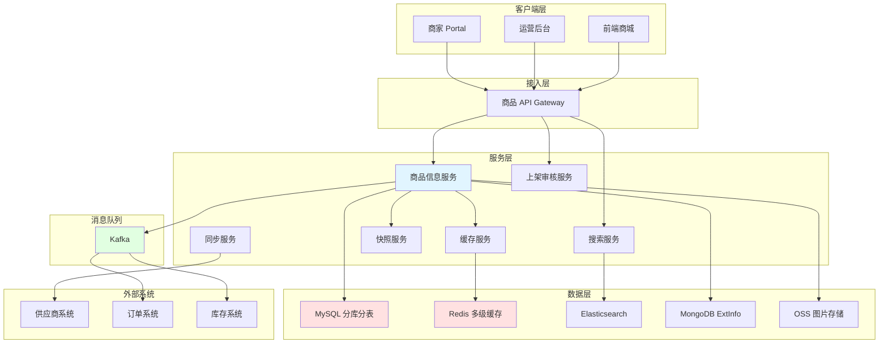
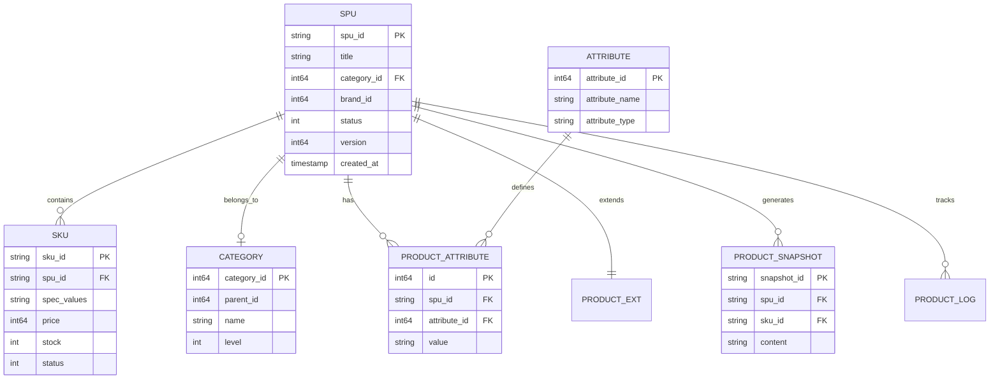

# 电商系统设计：商品中心系统

商品中心是电商平台的「商品库」，负责商品全生命周期管理。本文将深入探讨商品系统的设计与实现，重点讲解 SPU/SKU 模型、异构商品治理、多级缓存三大核心技术，并通过标准实物商品、虚拟商品、服务商品、组合商品四个黄金案例，展示如何设计可扩展的商品系统。

本文既适合系统设计面试准备，也适合工程实践参考。

## 目录

- [1. 系统概览](#1-系统概览)
  - [1.1 业务场景](#11-业务场景)
  - [1.2 核心挑战](#12-核心挑战)
  - [1.3 系统架构](#13-系统架构)
  - [1.4 数据模型概览](#14-数据模型概览)
- [2. 商品创建和上架流程](#2-商品创建和上架流程)
  - [2.1 商家上传（Merchant）](#21-商家上传merchant)
  - [2.2 供应商同步（Partner）](#22-供应商同步partner)
  - [2.3 运营上传（Ops）](#23-运营上传ops)
  - [2.4 上架状态机与审核策略](#24-上架状态机与审核策略)
- [3. 商品数据模型设计专题](#3-商品数据模型设计专题)
  - [3.1 SPU/SKU 模型设计](#31-spusku-模型设计)
  - [3.2 类目与属性系统](#32-类目与属性系统)
  - [3.3 动态属性与 EAV 模型](#33-动态属性与-eav-模型)
  - [3.4 商品快照生成与复用](#34-商品快照生成与复用)
- [4. 异构商品治理](#4-异构商品治理)
  - [4.1 异构商品的挑战](#41-异构商品的挑战)
  - [4.2 统一抽象与适配器模式](#42-统一抽象与适配器模式)
  - [4.3 配置化与低代码平台](#43-配置化与低代码平台)
  - [4.4 多维度库存管理](#44-多维度库存管理)
- [5. 商品搜索与多级缓存](#5-商品搜索与多级缓存)
  - [5.1 Elasticsearch 索引设计](#51-elasticsearch-索引设计)
  - [5.2 多级缓存策略](#52-多级缓存策略)
  - [5.3 智能刷新规则](#53-智能刷新规则)
- [6. 特殊商品类型（黄金案例）](#6-特殊商品类型黄金案例)
  - [6.1 标准实物商品](#61-标准实物商品)
  - [6.2 虚拟商品](#62-虚拟商品)
  - [6.3 服务类商品](#63-服务类商品)
  - [6.4 组合商品](#64-组合商品)
- [7. 商品版本管理与快照](#7-商品版本管理与快照)
  - [7.1 版本控制](#71-版本控制)
  - [7.2 快照机制](#72-快照机制)
  - [7.3 变更事件与最终一致性](#73-变更事件与最终一致性)
- [8. 商品类型扩展设计](#8-商品类型扩展设计)
  - [8.1 扩展点识别](#81-扩展点识别)
  - [8.2 策略模式应用](#82-策略模式应用)
  - [8.3 新品类接入指南](#83-新品类接入指南)
  - [8.4 扩展性设计原则](#84-扩展性设计原则)
- [9. 工程实践要点](#9-工程实践要点)
  - [9.1 商品 ID 生成](#91-商品-id-生成)
  - [9.2 商品同步任务治理](#92-商品同步任务治理)
  - [9.3 监控告警体系](#93-监控告警体系)
  - [9.4 性能优化](#94-性能优化)
  - [9.5 故障处理](#95-故障处理)
- [总结](#总结)
- [参考资料](#参考资料)

## 1. 系统概览

### 1.1 业务场景

商品中心是电商平台的「商品库」，负责商品全生命周期管理。

**核心职责：**

- **商品信息管理（PIM）**：SPU/SKU、属性、类目、图片、描述
- **商品上架流程**：商家上传、供应商同步、运营管理
- **商品导购服务**：搜索、详情、列表、筛选
- **商品快照生成**：为订单提供不可变的商品信息
- **库存协同**：与库存系统实时交互
- **价格协同**：为计价中心提供基础价格

**业务模式：**

- **B2B2C 模式**（约 70%～80%）：供应商商品，平台运营（机票、酒店、充值等）
- **B2C 模式**（约 20%～30%）：平台自营商品（礼品卡、券类等）

商品系统的职责边界：

- **负责**：商品数据管理、上架审核、搜索与缓存、快照生成
- **不负责**：具体库存扣减逻辑（由库存系统负责）、最终售价计算（由计价中心负责）

**与其他系统的交互：**

- **订单系统**：获取商品详情、库存校验、创建订单快照
- **库存系统**：实时库存查询、库存扣减与回补
- **计价中心**：提供基础价格、类目信息
- **营销系统**：提供商品标签、圈品规则
- **搜索系统**：同步商品索引

### 1.2 核心挑战

**1. 异构商品**

- 实物商品：多规格 SKU 组合（服装、3C）
- 虚拟商品：无 SKU 或简单 SKU（充值卡、会员）
- 服务商品：时间维度库存（酒店、机票）
- 组合商品：多 SKU 组合（套餐）

**2. 多角色上架**

- 商家上传：Portal/App，人工审核，限流防刷
- 供应商同步：Push/Pull，自动审核，幂等设计
- 运营管理：后台上传，免审核或轻审核，批量处理

**3. 高并发读**

- 商品详情页：QPS 可达万级
- 商品列表页：QPS 可达千级
- 多级缓存：L1 本地缓存 + L2 Redis + L3 数据库，配合 CDN

**4. 数据一致性**

- 商品变更后：缓存失效、搜索索引更新、下游感知版本
- 最终一致性：Kafka 事件、CDC
- 补偿机制：定时对账、修复任务

**5. 扩展性**

- 新品类快速接入：适配器模式、配置化平台
- 尽量少改核心链路：开闭原则、策略模式

### 1.3 系统架构

商品系统在平台中承接上架写入与导购读取，经网关统一接入，核心能力按领域拆分为多个服务，并通过消息队列与订单、库存等系统解耦。

**核心模块：**

1. **商品信息服务**：SPU/SKU CRUD、版本管理、属性管理
2. **类目属性服务**：类目树、动态属性、品牌管理
3. **上架审核服务**：多角色上架、状态机、审核流
4. **搜索服务**：Elasticsearch 索引、多维筛选、排序
5. **缓存服务**：多级缓存（L1/L2）、智能刷新、缓存预热
6. **快照服务**：商品快照生成、Hash 复用、订单引用
7. **同步服务**：供应商数据同步、全量/增量、失败重试

**技术栈：**

- 数据库：MySQL（分库分表，例如按 SPU 哈希 16 张表）、MongoDB（ExtInfo）
- 缓存：Redis、本地缓存（Caffeine 等）
- 搜索：Elasticsearch 7.x
- 消息队列：Kafka（变更事件、CDC）
- 对象存储：OSS（图片/视频）
- 监控：Prometheus + Grafana

#### 系统架构图

### 1.4 数据模型概览

**核心表（逻辑名）：**

- `spu_tab`：商品主信息（SPU）
- `sku_tab`：SKU 信息
- `category_tab`：类目
- `attribute_tab`：属性定义
- `product_attribute_tab`：商品属性值（EAV）
- `product_ext_tab` 或 MongoDB 集合：扩展信息
- `product_snapshot_tab`：商品快照
- `product_audit_tab`：审核记录
- `product_log_tab`：变更日志

#### ER 图

