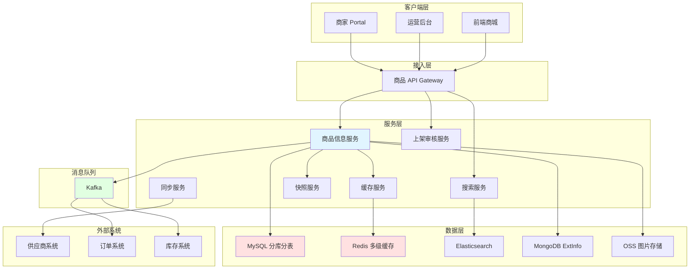
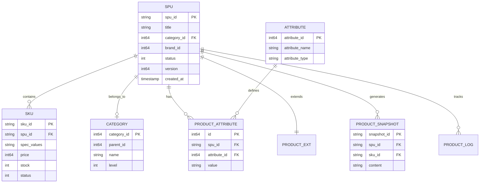
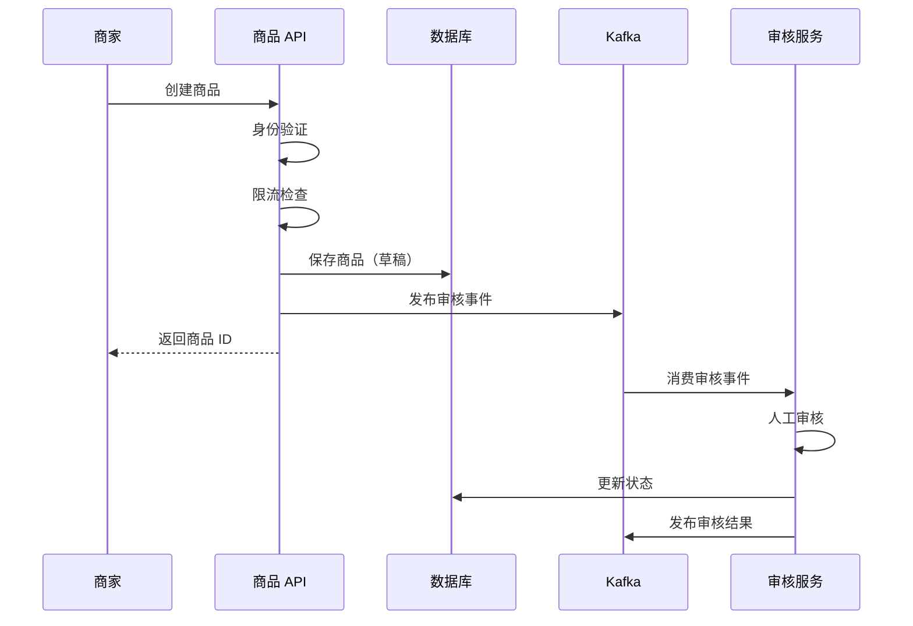
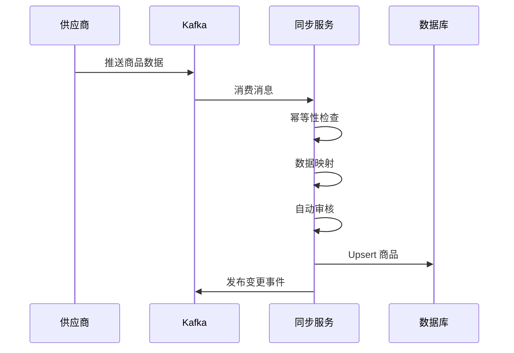
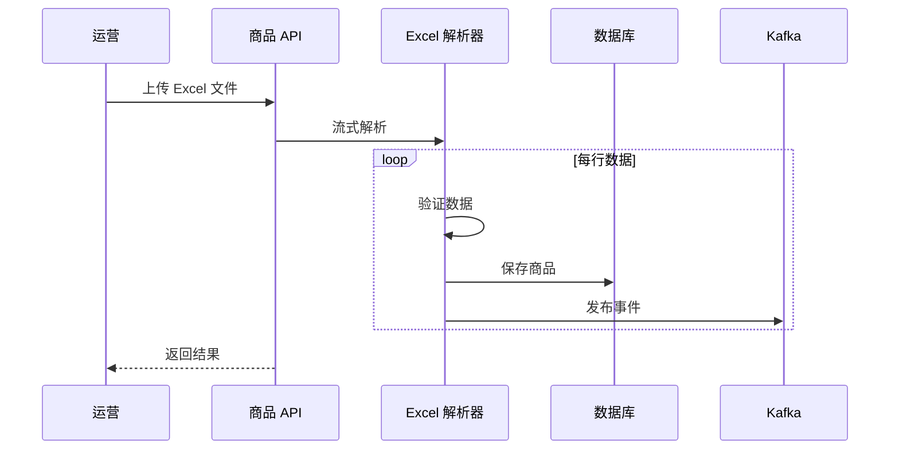
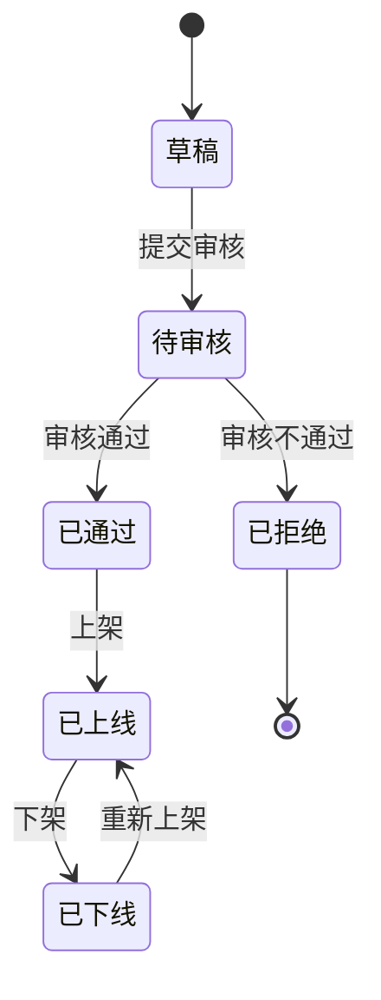

# 电商系统设计：商品中心系统

商品中心是电商平台的「商品库」，负责商品全生命周期管理。本文将深入探讨商品系统的设计与实现，重点讲解 SPU/SKU 模型、异构商品治理、多级缓存三大核心技术，并通过标准实物商品、虚拟商品、服务商品、组合商品四个黄金案例，展示如何设计可扩展的商品系统。

本文既适合系统设计面试准备，也适合工程实践参考。

## 目录

- [1. 系统概览](#1-系统概览)
  - [1.1 业务场景](#11-业务场景)
  - [1.2 核心挑战](#12-核心挑战)
  - [1.3 系统架构](#13-系统架构)
  - [1.4 数据模型概览](#14-数据模型概览)
- [2. 商品创建和上架流程](#2-商品创建和上架流程)
  - [2.1 商家上传（Merchant）](#21-商家上传merchant)
  - [2.2 供应商同步（Partner）](#22-供应商同步partner)
  - [2.3 运营上传（Ops）](#23-运营上传ops)
  - [2.4 上架状态机与审核策略](#24-上架状态机与审核策略)
- [3. 商品数据模型设计专题](#3-商品数据模型设计专题)
  - [3.1 SPU/SKU 模型设计](#31-spusku-模型设计)
  - [3.2 类目与属性系统](#32-类目与属性系统)
  - [3.3 动态属性与 EAV 模型](#33-动态属性与-eav-模型)
  - [3.4 商品快照生成与复用](#34-商品快照生成与复用)
- [4. 异构商品治理](#4-异构商品治理)
  - [4.1 异构商品的挑战](#41-异构商品的挑战)
  - [4.2 统一抽象与适配器模式](#42-统一抽象与适配器模式)
  - [4.3 配置化与低代码平台](#43-配置化与低代码平台)
  - [4.4 多维度库存管理](#44-多维度库存管理)
- [5. 商品搜索与多级缓存](#5-商品搜索与多级缓存)
  - [5.1 Elasticsearch 索引设计](#51-elasticsearch-索引设计)
  - [5.2 多级缓存策略](#52-多级缓存策略)
  - [5.3 智能刷新规则](#53-智能刷新规则)
- [6. 特殊商品类型（黄金案例）](#6-特殊商品类型黄金案例)
  - [6.1 标准实物商品](#61-标准实物商品)
  - [6.2 虚拟商品](#62-虚拟商品)
  - [6.3 服务类商品](#63-服务类商品)
  - [6.4 组合商品](#64-组合商品)
- [7. 商品版本管理与快照](#7-商品版本管理与快照)
  - [7.1 版本控制](#71-版本控制)
  - [7.2 快照机制](#72-快照机制)
  - [7.3 变更事件与最终一致性](#73-变更事件与最终一致性)
- [8. 商品类型扩展设计](#8-商品类型扩展设计)
  - [8.1 扩展点识别](#81-扩展点识别)
  - [8.2 策略模式应用](#82-策略模式应用)
  - [8.3 新品类接入指南](#83-新品类接入指南)
  - [8.4 扩展性设计原则](#84-扩展性设计原则)
- [9. 工程实践要点](#9-工程实践要点)
  - [9.1 商品 ID 生成](#91-商品-id-生成)
  - [9.2 商品同步任务治理](#92-商品同步任务治理)
  - [9.3 监控告警体系](#93-监控告警体系)
  - [9.4 性能优化](#94-性能优化)
  - [9.5 故障处理](#95-故障处理)
- [总结](#总结)
- [参考资料](#参考资料)

## 1. 系统概览

### 1.1 业务场景

商品中心是电商平台的「商品库」，负责商品全生命周期管理。

**核心职责：**

- **商品信息管理（PIM）**：SPU/SKU、属性、类目、图片、描述
- **商品上架流程**：商家上传、供应商同步、运营管理
- **商品导购服务**：搜索、详情、列表、筛选
- **商品快照生成**：为订单提供不可变的商品信息
- **库存协同**：与库存系统实时交互
- **价格协同**：为计价中心提供基础价格

**业务模式：**

- **B2B2C 模式**（约 70%～80%）：供应商商品，平台运营（机票、酒店、充值等）
- **B2C 模式**（约 20%～30%）：平台自营商品（礼品卡、券类等）

商品系统的职责边界：

- **负责**：商品数据管理、上架审核、搜索与缓存、快照生成
- **不负责**：具体库存扣减逻辑（由库存系统负责）、最终售价计算（由计价中心负责）

**与其他系统的交互：**

- **订单系统**：获取商品详情、库存校验、创建订单快照
- **库存系统**：实时库存查询、库存扣减与回补
- **计价中心**：提供基础价格、类目信息
- **营销系统**：提供商品标签、圈品规则
- **搜索系统**：同步商品索引

### 1.2 核心挑战

**1. 异构商品**

- 实物商品：多规格 SKU 组合（服装、3C）
- 虚拟商品：无 SKU 或简单 SKU（充值卡、会员）
- 服务商品：时间维度库存（酒店、机票）
- 组合商品：多 SKU 组合（套餐）

**2. 多角色上架**

- 商家上传：Portal/App，人工审核，限流防刷
- 供应商同步：Push/Pull，自动审核，幂等设计
- 运营管理：后台上传，免审核或轻审核，批量处理

**3. 高并发读**

- 商品详情页：QPS 可达万级
- 商品列表页：QPS 可达千级
- 多级缓存：L1 本地缓存 + L2 Redis + L3 数据库，配合 CDN

**4. 数据一致性**

- 商品变更后：缓存失效、搜索索引更新、下游感知版本
- 最终一致性：Kafka 事件、CDC
- 补偿机制：定时对账、修复任务

**5. 扩展性**

- 新品类快速接入：适配器模式、配置化平台
- 尽量少改核心链路：开闭原则、策略模式

### 1.3 系统架构

商品系统在平台中承接上架写入与导购读取，经网关统一接入，核心能力按领域拆分为多个服务，并通过消息队列与订单、库存等系统解耦。

**核心模块：**

1. **商品信息服务**：SPU/SKU CRUD、版本管理、属性管理
2. **类目属性服务**：类目树、动态属性、品牌管理
3. **上架审核服务**：多角色上架、状态机、审核流
4. **搜索服务**：Elasticsearch 索引、多维筛选、排序
5. **缓存服务**：多级缓存（L1/L2）、智能刷新、缓存预热
6. **快照服务**：商品快照生成、Hash 复用、订单引用
7. **同步服务**：供应商数据同步、全量/增量、失败重试

**技术栈：**

- 数据库：MySQL（分库分表，例如按 SPU 哈希 16 张表）、MongoDB（ExtInfo）
- 缓存：Redis、本地缓存（Caffeine 等）
- 搜索：Elasticsearch 7.x
- 消息队列：Kafka（变更事件、CDC）
- 对象存储：OSS（图片/视频）
- 监控：Prometheus + Grafana

#### 系统架构图



### 1.4 数据模型概览

**核心表（逻辑名）：**

- `spu_tab`：商品主信息（SPU）
- `sku_tab`：SKU 信息
- `category_tab`：类目
- `attribute_tab`：属性定义
- `product_attribute_tab`：商品属性值（EAV）
- `product_ext_tab` 或 MongoDB 集合：扩展信息
- `product_snapshot_tab`：商品快照
- `product_audit_tab`：审核记录
- `product_log_tab`：变更日志

#### ER 图



## 2. 商品创建和上架流程

商品上架需要区分三种角色：商家（Merchant）、供应商（Partner）、运营（Ops）。不同角色的入口、审核策略与幂等要求不同，但底层都落在统一的 SPU/SKU 模型与状态机上。

### 2.1 商家上传（Merchant）

商家通过 Portal 或 App 上传商品，通常需要人工审核，并配合限流与风控，降低虚假商品与刷单风险。

**业务流程：**

1. 商家在 Portal/App 填写商品信息
2. 提交后进入「待审核」状态
3. 审核通过后才能上架
4. 需要人工审核（防止虚假商品）

**技术要点：**

- 表单验证（前后端双重校验）
- 限流（防止恶意刷单）
- 审核队列（异步处理）
- 审核历史可追溯

**流程图：**



```go
// 商家创建商品
func MerchantCreateProduct(ctx context.Context, req *MerchantProductRequest) (*Product, error) {
    merchant, err := ValidateMerchant(ctx, req.MerchantID)
    if err != nil {
        return nil, ErrUnauthorized
    }

    limiterKey := fmt.Sprintf("merchant_create:%d", req.MerchantID)
    if !rateLimiter.Allow(limiterKey, 10, time.Minute) {
        return nil, ErrRateLimitExceeded
    }

    if err := ValidateProductRequest(req); err != nil {
        return nil, err
    }

    product := &Product{
        SPUID:      GenerateSPUID(),
        Title:      req.Title,
        CategoryID: req.CategoryID,
        Status:     ProductStatusDraft,
        Source:     SourceMerchant,
        MerchantID: req.MerchantID,
        Version:    1,
        CreatedAt:  time.Now(),
    }

    if err := db.InsertProduct(ctx, product); err != nil {
        return nil, err
    }

    audit := &AuditTask{
        TaskID:    GenerateAuditID(),
        ProductID: product.SPUID,
        Type:      AuditTypeMerchant,
        Priority:  AuditPriorityNormal,
        Status:    AuditStatusPending,
    }

    if err := db.InsertAuditTask(ctx, audit); err != nil {
        return nil, err
    }

    event := &AuditEvent{
        TaskID:    audit.TaskID,
        ProductID: product.SPUID,
        EventType: "audit.created",
    }
    PublishAuditEvent(ctx, event)

    RecordProductLog(ctx, product.SPUID, "商家创建商品", merchant.Name)

    return product, nil
}

// 审核服务处理（示意：规则引擎 + 人工兜底）
func HandleAudit(ctx context.Context, event *AuditEvent) error {
    task, err := db.GetAuditTask(ctx, event.TaskID)
    if err != nil {
        return err
    }

    product, _ := db.GetProduct(ctx, task.ProductID)

    var approved bool
    if ContainsSensitiveWords(product.Title) {
        approved = false
    } else {
        approved = true
    }

    if approved {
        task.Status = AuditStatusApproved
        product.Status = ProductStatusApproved
    } else {
        task.Status = AuditStatusRejected
        product.Status = ProductStatusRejected
    }

    db.UpdateAuditTask(ctx, task)
    db.UpdateProduct(ctx, product)

    resultEvent := &AuditResultEvent{
        ProductID: product.SPUID,
        Approved:  approved,
    }
    PublishAuditResultEvent(ctx, resultEvent)

    return nil
}
```

### 2.2 供应商同步（Partner）

供应商侧数据可通过 **Push**（供应商推送到平台 MQ）或 **Pull**（平台定时拉取）进入商品中心。自动审核可走快速通道，同时必须用幂等与版本控制避免重复写入与乱序覆盖。

**技术要点：**

- 幂等性（重复推送去重）
- 字段映射（供应商模型 → 平台模型）
- 同步监控与告警
- 热门商品可配合更积极的缓存刷新策略（见第 5 章）

**Push 模式流程图：**



```go
// 供应商 Push 模式
func PartnerPushProduct(ctx context.Context, msg *PartnerProductMessage) error {
    idempotentKey := fmt.Sprintf("partner_push:%s:%s", msg.PartnerID, msg.ProductID)

    record := &IdempotentRecord{
        Key:      idempotentKey,
        Status:   IdempotentProcessing,
        ExpireAt: time.Now().Add(10 * time.Minute),
    }

    if err := db.InsertIdempotentRecord(ctx, record); err != nil {
        return nil
    }

    product := MapPartnerProduct(msg)
    product.Source = SourcePartner
    product.PartnerID = msg.PartnerID

    if AutoAudit(product) {
        product.Status = ProductStatusOnline
    } else {
        product.Status = ProductStatusPendingAudit
    }

    existing, _ := db.GetProductByPartnerID(ctx, msg.PartnerID, msg.ProductID)
    if existing != nil {
        product.SPUID = existing.SPUID
        product.Version = existing.Version + 1
        if err := db.UpdateProductWithVersion(ctx, product, existing.Version); err != nil {
            return err
        }
    } else {
        product.SPUID = GenerateSPUID()
        product.Version = 1
        if err := db.InsertProduct(ctx, product); err != nil {
            return err
        }
    }

    changed := &ProductChangedEvent{
        SPUID:      product.SPUID,
        ChangeType: "partner_sync",
    }
    PublishProductChangedEvent(ctx, changed)

    db.UpdateIdempotentStatus(ctx, idempotentKey, IdempotentSuccess)

    return nil
}

// 供应商 Pull 模式
func PartnerPullProducts(ctx context.Context, partnerID string) error {
    lastSyncTime := GetLastSyncTime(partnerID)

    products, err := partnerClient.GetProducts(partnerID, lastSyncTime)
    if err != nil {
        return err
    }

    for _, p := range products {
        msg := ConvertToMessage(p)
        if err := PartnerPushProduct(ctx, msg); err != nil {
            log.Error("failed to sync product", "partnerID", partnerID, "productID", p.ID, "error", err)
            continue
        }
    }

    UpdateLastSyncTime(partnerID, time.Now())
    return nil
}

func AutoAudit(product *Product) bool {
    if ContainsSensitiveWords(product.Title) {
        return false
    }
    if product.Price < 0 || product.Price > 1000000 {
        return false
    }
    if !CategoryExists(product.CategoryID) {
        return false
    }
    if product.Title == "" || product.CategoryID == 0 {
        return false
    }
    return true
}
```

### 2.3 运营上传（Ops）

运营在后台可单品录入或批量导入（如 Excel）。通常免人工审核或仅做抽检，要求批量任务可观测、单行失败可定位。

**技术要点：**

- Excel 流式解析，控制内存
- 行级校验与错误汇总
- 写库与发事件的一致策略（必要时按批次事务）
- 操作审计日志

**批量上传流程图：**



```go
// 运营批量上传
func OpsBatchUpload(ctx context.Context, file *ExcelFile) (*UploadResult, error) {
    result := &UploadResult{
        Success: []string{},
        Failed:  []UploadError{},
    }

    parser := NewExcelParser(file)
    rowNum := 0
    for row := range parser.Parse() {
        rowNum++

        product, err := ValidateRow(row)
        if err != nil {
            result.Failed = append(result.Failed, UploadError{Row: rowNum, Error: err.Error()})
            continue
        }

        product.SPUID = GenerateSPUID()
        product.Status = ProductStatusOnline
        product.Source = SourceOps
        product.Version = 1

        if err := db.InsertProduct(ctx, product); err != nil {
            result.Failed = append(result.Failed, UploadError{Row: rowNum, Error: err.Error()})
            continue
        }

        evt := &ProductCreatedEvent{SPUID: product.SPUID}
        PublishProductCreatedEvent(ctx, evt)

        result.Success = append(result.Success, product.SPUID)
    }

    RecordBatchUploadLog(ctx, result)
    return result, nil
}

type ExcelParser struct {
    file *ExcelFile
}

func (p *ExcelParser) Parse() <-chan *ExcelRow {
    ch := make(chan *ExcelRow, 100)
    go func() {
        defer close(ch)
        f, err := excelize.OpenFile(p.file.Path)
        if err != nil {
            return
        }
        defer f.Close()

        rows, _ := f.GetRows("Sheet1")
        for i, row := range rows {
            if i == 0 {
                continue
            }
            ch <- &ExcelRow{RowNum: i + 1, Data: row}
        }
    }()
    return ch
}
```

### 2.4 上架状态机与审核策略

商品状态驱动上架生命周期：草稿 → 待审核 → 通过/拒绝 → 上线/下线。转换规则应集中配置，写库时使用乐观锁或状态条件更新，避免并发覆盖。

```go
const (
    ProductStatusDraft        = 0
    ProductStatusPendingAudit = 1
    ProductStatusApproved     = 2
    ProductStatusRejected     = 3
    ProductStatusOnline       = 4
    ProductStatusOffline      = 5
)

var allowedTransitions = map[int]map[int]bool{
    ProductStatusDraft: {ProductStatusPendingAudit: true},
    ProductStatusPendingAudit: {
        ProductStatusApproved: true,
        ProductStatusRejected: true,
    },
    ProductStatusApproved: {ProductStatusOnline: true},
    ProductStatusOnline:   {ProductStatusOffline: true},
    ProductStatusOffline:  {ProductStatusOnline: true},
}

func TransitionProductStatus(ctx context.Context, spuID string, from, to int) error {
    if !allowedTransitions[from][to] {
        return ErrIllegalTransition
    }

    product, err := db.GetProduct(ctx, spuID)
    if err != nil {
        return err
    }
    if product.Status != from {
        return ErrStatusMismatch
    }

    if err := db.UpdateProductStatus(ctx, spuID, to, product.Version); err != nil {
        return err
    }

    RecordProductLog(ctx, spuID, fmt.Sprintf("状态变更: %d -> %d", from, to), "system")
    return nil
}
```



```go
type AuditStrategy interface {
    ShouldAudit(product *Product) bool
    GetPriority() int
}

type MerchantAuditStrategy struct{}

func (s *MerchantAuditStrategy) ShouldAudit(product *Product) bool {
    return product.Source == SourceMerchant
}

func (s *MerchantAuditStrategy) GetPriority() int {
    return AuditPriorityNormal
}

type PartnerAuditStrategy struct{}

func (s *PartnerAuditStrategy) ShouldAudit(product *Product) bool {
    return product.Source == SourcePartner && !AutoAudit(product)
}

func (s *PartnerAuditStrategy) GetPriority() int {
    return AuditPriorityHigh
}

type OpsAuditStrategy struct{}

func (s *OpsAuditStrategy) ShouldAudit(product *Product) bool {
    return false
}

var strategies = []AuditStrategy{
    &MerchantAuditStrategy{},
    &PartnerAuditStrategy{},
    &OpsAuditStrategy{},
}

func RouteAuditStrategy(product *Product) AuditStrategy {
    for _, strategy := range strategies {
        if strategy.ShouldAudit(product) {
            return strategy
        }
    }
    return nil
}
```
