> **电商系统设计系列**（篇次与[（一）推荐阅读顺序](/system-design/20-ecommerce-overview/)一致）
> - [（一）全景概览与领域划分](/system-design/20-ecommerce-overview/)
> - **（二）商品中心系统**（本文）
> - [（三）库存系统](/system-design/22-ecommerce-inventory/)
> - [（四）营销系统深度解析](/system-design/28-ecommerce-marketing-system/)
> - [（五）计价引擎](/system-design/23-ecommerce-pricing-engine/)
> - [（六）计价系统 DDD 实践](/system-design/24-ecommerce-pricing-ddd/)
> - [（七）订单系统](/system-design/26-ecommerce-order-system/)
> - [（八）支付系统深度解析](/system-design/29-ecommerce-payment-system/)
> - [（九）商品上架系统](/system-design/21-ecommerce-listing/)
> - [（十）B 端运营系统](/system-design/25-ecommerce-b-side-ops/)

# 电商系统设计：商品中心系统

商品中心是电商平台的「商品库」，负责商品全生命周期管理。本文将深入探讨商品系统的设计与实现，重点讲解 SPU/SKU 模型、异构商品治理、多级缓存三大核心技术，并通过标准实物商品、虚拟商品、服务商品、组合商品四个黄金案例，展示如何设计可扩展的商品系统。

本文既适合系统设计面试准备，也适合工程实践参考。

## 目录

- [1. 系统概览](#1-系统概览)
  - [1.1 业务场景](#11-业务场景)
  - [1.2 核心挑战](#12-核心挑战)
  - [1.3 系统架构](#13-系统架构)
  - [1.4 数据模型概览](#14-数据模型概览)
- [2. 商品创建和上架流程](#2-商品创建和上架流程)
  - [2.1 商家上传（Merchant）](#21-商家上传merchant)
  - [2.2 供应商同步（Partner）](#22-供应商同步partner)
  - [2.3 运营上传（Ops）](#23-运营上传ops)
  - [2.4 上架状态机与审核策略](#24-上架状态机与审核策略)
- [3. 商品数据模型设计专题](#3-商品数据模型设计专题)
  - [3.1 SPU/SKU 模型设计](#31-spusku-模型设计)
  - [3.2 类目与属性系统](#32-类目与属性系统)
  - [3.3 动态属性与 EAV 模型](#33-动态属性与-eav-模型)
  - [3.4 商品快照生成与复用](#34-商品快照生成与复用)
- [4. 异构商品治理](#4-异构商品治理)
  - [4.1 异构商品的挑战](#41-异构商品的挑战)
  - [4.2 统一抽象与适配器模式](#42-统一抽象与适配器模式)
  - [4.3 配置化与低代码平台](#43-配置化与低代码平台)
  - [4.4 多维度库存管理](#44-多维度库存管理)
- [5. 商品搜索与多级缓存](#5-商品搜索与多级缓存)
  - [5.1 Elasticsearch 索引设计](#51-elasticsearch-索引设计)
  - [5.2 多级缓存策略](#52-多级缓存策略)
  - [5.3 智能刷新规则](#53-智能刷新规则)
- [6. 特殊商品类型（黄金案例）](#6-特殊商品类型黄金案例)
  - [6.1 标准实物商品](#61-标准实物商品)
  - [6.2 虚拟商品](#62-虚拟商品)
  - [6.3 服务类商品](#63-服务类商品)
  - [6.4 组合商品](#64-组合商品)
- [7. 商品版本管理与快照](#7-商品版本管理与快照)
  - [7.1 版本控制](#71-版本控制)
  - [7.2 快照机制](#72-快照机制)
  - [7.3 变更事件与最终一致性](#73-变更事件与最终一致性)
- [8. 商品类型扩展设计](#8-商品类型扩展设计)
  - [8.1 扩展点识别](#81-扩展点识别)
  - [8.2 策略模式应用](#82-策略模式应用)
  - [8.3 新品类接入指南](#83-新品类接入指南)
  - [8.4 扩展性设计原则](#84-扩展性设计原则)
- [9. 工程实践要点](#9-工程实践要点)
  - [9.1 商品 ID 生成](#91-商品-id-生成)
  - [9.2 商品同步任务治理](#92-商品同步任务治理)
  - [9.3 监控告警体系](#93-监控告警体系)
  - [9.4 性能优化](#94-性能优化)
  - [9.5 故障处理](#95-故障处理)
- [总结](#总结)
- [参考资料](#参考资料)

## 1. 系统概览

### 1.1 业务场景

商品中心是电商平台的「商品库」，负责商品全生命周期管理。

**核心职责：**

- **商品信息管理（PIM）**：SPU/SKU、属性、类目、图片、描述
- **商品上架流程**：商家上传、供应商同步、运营管理
- **商品导购服务**：搜索、详情、列表、筛选
- **商品快照生成**：为订单提供不可变的商品信息
- **库存协同**：与库存系统实时交互
- **价格协同**：为计价中心提供基础价格

**业务模式：**

- **B2B2C 模式**（约 70%～80%）：供应商商品，平台运营（机票、酒店、充值等）
- **B2C 模式**（约 20%～30%）：平台自营商品（礼品卡、券类等）

商品系统的职责边界：

- **负责**：商品数据管理、上架审核、搜索与缓存、快照生成
- **不负责**：具体库存扣减逻辑（由库存系统负责）、最终售价计算（由计价中心负责）

**与其他系统的交互：**

- **订单系统**：获取商品详情、库存校验、创建订单快照
- **库存系统**：实时库存查询、库存扣减与回补
- **计价中心**：提供基础价格、类目信息
- **营销系统**：提供商品标签、圈品规则
- **搜索系统**：同步商品索引

### 1.2 核心挑战

**1. 异构商品**

- 实物商品：多规格 SKU 组合（服装、3C）
- 虚拟商品：无 SKU 或简单 SKU（充值卡、会员）
- 服务商品：时间维度库存（酒店、机票）
- 组合商品：多 SKU 组合（套餐）

**2. 多角色上架**

- 商家上传：Portal/App，人工审核，限流防刷
- 供应商同步：Push/Pull，自动审核，幂等设计
- 运营管理：后台上传，免审核或轻审核，批量处理

**3. 高并发读**

- 商品详情页：QPS 可达万级
- 商品列表页：QPS 可达千级
- 多级缓存：L1 本地缓存 + L2 Redis + L3 数据库，配合 CDN

**4. 数据一致性**

- 商品变更后：缓存失效、搜索索引更新、下游感知版本
- 最终一致性：Kafka 事件、CDC
- 补偿机制：定时对账、修复任务

**5. 扩展性**

- 新品类快速接入：适配器模式、配置化平台
- 尽量少改核心链路：开闭原则、策略模式

### 1.3 系统架构

商品系统在平台中承接上架写入与导购读取，经网关统一接入，核心能力按领域拆分为多个服务，并通过消息队列与订单、库存等系统解耦。

**核心模块：**

1. **商品信息服务**：SPU/SKU CRUD、版本管理、属性管理
2. **类目属性服务**：类目树、动态属性、品牌管理
3. **上架审核服务**：多角色上架、状态机、审核流
4. **搜索服务**：Elasticsearch 索引、多维筛选、排序
5. **缓存服务**：多级缓存（L1/L2）、智能刷新、缓存预热
6. **快照服务**：商品快照生成、Hash 复用、订单引用
7. **同步服务**：供应商数据同步、全量/增量、失败重试

**技术栈：**

- 数据库：MySQL（分库分表，例如按 SPU 哈希 16 张表）、MongoDB（ExtInfo）
- 缓存：Redis、本地缓存（Caffeine 等）
- 搜索：Elasticsearch 7.x
- 消息队列：Kafka（变更事件、CDC）
- 对象存储：OSS（图片/视频）
- 监控：Prometheus + Grafana

#### 系统架构图

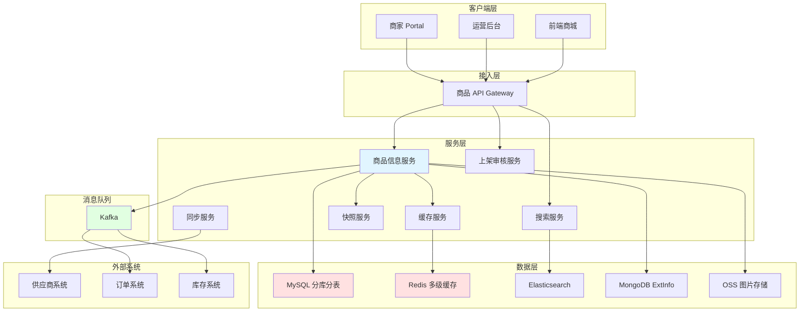

### 1.4 数据模型概览

**核心表（逻辑名）：**

- `spu_tab`：商品主信息（SPU）
- `sku_tab`：SKU 信息
- `category_tab`：类目
- `attribute_tab`：属性定义
- `product_attribute_tab`：商品属性值（EAV）
- `product_ext_tab` 或 MongoDB 集合：扩展信息
- `product_snapshot_tab`：商品快照
- `product_audit_tab`：审核记录
- `product_log_tab`：变更日志

#### ER 图

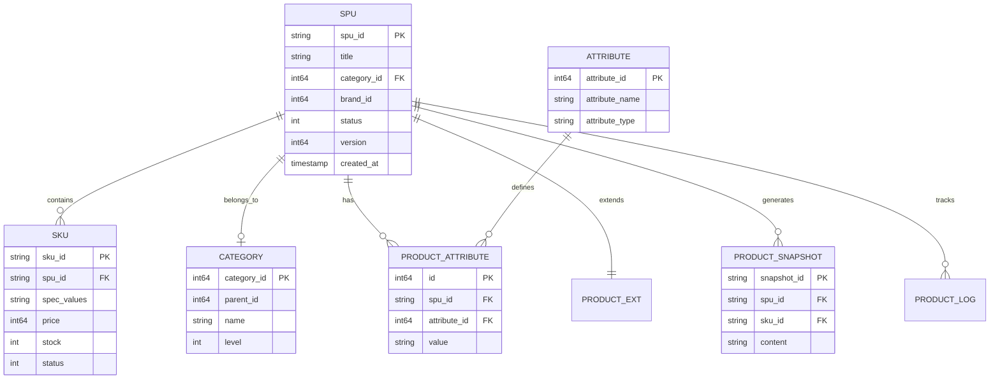

## 2. 商品创建和上架流程

商品上架需要区分三种角色：商家（Merchant）、供应商（Partner）、运营（Ops）。不同角色的入口、审核策略与幂等要求不同，但底层都落在统一的 SPU/SKU 模型与状态机上。

### 2.1 商家上传（Merchant）

商家通过 Portal 或 App 上传商品，通常需要人工审核，并配合限流与风控，降低虚假商品与刷单风险。

**业务流程：**

1. 商家在 Portal/App 填写商品信息
2. 提交后进入「待审核」状态
3. 审核通过后才能上架
4. 需要人工审核（防止虚假商品）

**技术要点：**

- 表单验证（前后端双重校验）
- 限流（防止恶意刷单）
- 审核队列（异步处理）
- 审核历史可追溯

**流程图：**

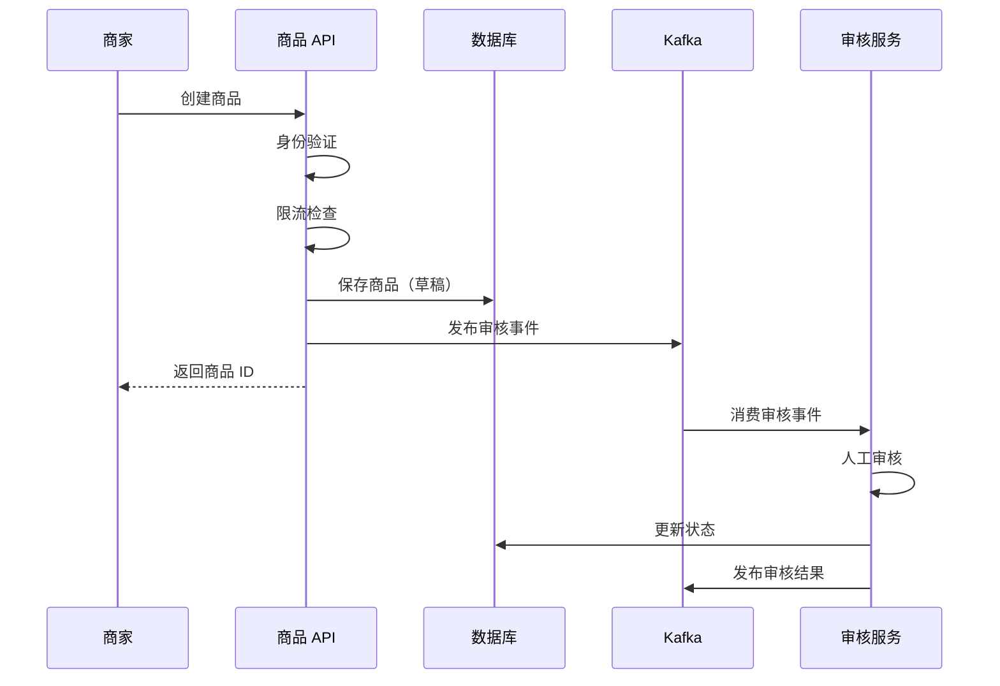

```go
// 商家创建商品
func MerchantCreateProduct(ctx context.Context, req *MerchantProductRequest) (*Product, error) {
    merchant, err := ValidateMerchant(ctx, req.MerchantID)
    if err != nil {
        return nil, ErrUnauthorized
    }

    limiterKey := fmt.Sprintf("merchant_create:%d", req.MerchantID)
    if !rateLimiter.Allow(limiterKey, 10, time.Minute) {
        return nil, ErrRateLimitExceeded
    }

    if err := ValidateProductRequest(req); err != nil {
        return nil, err
    }

    product := &Product{
        SPUID:      GenerateSPUID(),
        Title:      req.Title,
        CategoryID: req.CategoryID,
        Status:     ProductStatusDraft,
        Source:     SourceMerchant,
        MerchantID: req.MerchantID,
        Version:    1,
        CreatedAt:  time.Now(),
    }

    if err := db.InsertProduct(ctx, product); err != nil {
        return nil, err
    }

    audit := &AuditTask{
        TaskID:    GenerateAuditID(),
        ProductID: product.SPUID,
        Type:      AuditTypeMerchant,
        Priority:  AuditPriorityNormal,
        Status:    AuditStatusPending,
    }

    if err := db.InsertAuditTask(ctx, audit); err != nil {
        return nil, err
    }

    event := &AuditEvent{
        TaskID:    audit.TaskID,
        ProductID: product.SPUID,
        EventType: "audit.created",
    }
    PublishAuditEvent(ctx, event)

    RecordProductLog(ctx, product.SPUID, "商家创建商品", merchant.Name)

    return product, nil
}

// 审核服务处理（示意：规则引擎 + 人工兜底）
func HandleAudit(ctx context.Context, event *AuditEvent) error {
    task, err := db.GetAuditTask(ctx, event.TaskID)
    if err != nil {
        return err
    }

    product, _ := db.GetProduct(ctx, task.ProductID)

    var approved bool
    if ContainsSensitiveWords(product.Title) {
        approved = false
    } else {
        approved = true
    }

    if approved {
        task.Status = AuditStatusApproved
        product.Status = ProductStatusApproved
    } else {
        task.Status = AuditStatusRejected
        product.Status = ProductStatusRejected
    }

    db.UpdateAuditTask(ctx, task)
    db.UpdateProduct(ctx, product)

    resultEvent := &AuditResultEvent{
        ProductID: product.SPUID,
        Approved:  approved,
    }
    PublishAuditResultEvent(ctx, resultEvent)

    return nil
}
```

### 2.2 供应商同步（Partner）

供应商侧数据可通过 **Push**（供应商推送到平台 MQ）或 **Pull**（平台定时拉取）进入商品中心。自动审核可走快速通道，同时必须用幂等与版本控制避免重复写入与乱序覆盖。

**技术要点：**

- 幂等性（重复推送去重）
- 字段映射（供应商模型 → 平台模型）
- 同步监控与告警
- 热门商品可配合更积极的缓存刷新策略（见第 5 章）

**Push 模式流程图：**

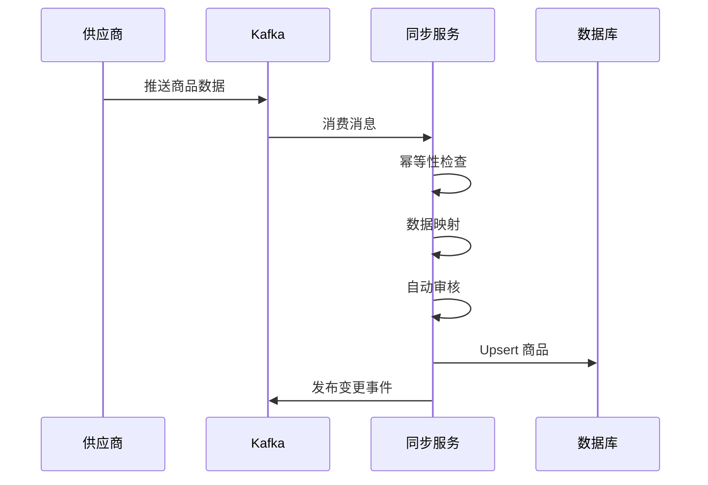

```go
// 供应商 Push 模式
func PartnerPushProduct(ctx context.Context, msg *PartnerProductMessage) error {
    idempotentKey := fmt.Sprintf("partner_push:%s:%s", msg.PartnerID, msg.ProductID)

    record := &IdempotentRecord{
        Key:      idempotentKey,
        Status:   IdempotentProcessing,
        ExpireAt: time.Now().Add(10 * time.Minute),
    }

    if err := db.InsertIdempotentRecord(ctx, record); err != nil {
        return nil
    }

    product := MapPartnerProduct(msg)
    product.Source = SourcePartner
    product.PartnerID = msg.PartnerID

    if AutoAudit(product) {
        product.Status = ProductStatusOnline
    } else {
        product.Status = ProductStatusPendingAudit
    }

    existing, _ := db.GetProductByPartnerID(ctx, msg.PartnerID, msg.ProductID)
    if existing != nil {
        product.SPUID = existing.SPUID
        product.Version = existing.Version + 1
        if err := db.UpdateProductWithVersion(ctx, product, existing.Version); err != nil {
            return err
        }
    } else {
        product.SPUID = GenerateSPUID()
        product.Version = 1
        if err := db.InsertProduct(ctx, product); err != nil {
            return err
        }
    }

    changed := &ProductChangedEvent{
        SPUID:      product.SPUID,
        ChangeType: "partner_sync",
    }
    PublishProductChangedEvent(ctx, changed)

    db.UpdateIdempotentStatus(ctx, idempotentKey, IdempotentSuccess)

    return nil
}

// 供应商 Pull 模式
func PartnerPullProducts(ctx context.Context, partnerID string) error {
    lastSyncTime := GetLastSyncTime(partnerID)

    products, err := partnerClient.GetProducts(partnerID, lastSyncTime)
    if err != nil {
        return err
    }

    for _, p := range products {
        msg := ConvertToMessage(p)
        if err := PartnerPushProduct(ctx, msg); err != nil {
            log.Error("failed to sync product", "partnerID", partnerID, "productID", p.ID, "error", err)
            continue
        }
    }

    UpdateLastSyncTime(partnerID, time.Now())
    return nil
}

func AutoAudit(product *Product) bool {
    if ContainsSensitiveWords(product.Title) {
        return false
    }
    if product.Price < 0 || product.Price > 1000000 {
        return false
    }
    if !CategoryExists(product.CategoryID) {
        return false
    }
    if product.Title == "" || product.CategoryID == 0 {
        return false
    }
    return true
}
```

### 2.3 运营上传（Ops）

运营在后台可单品录入或批量导入（如 Excel）。通常免人工审核或仅做抽检，要求批量任务可观测、单行失败可定位。

**技术要点：**

- Excel 流式解析，控制内存
- 行级校验与错误汇总
- 写库与发事件的一致策略（必要时按批次事务）
- 操作审计日志

**批量上传流程图：**

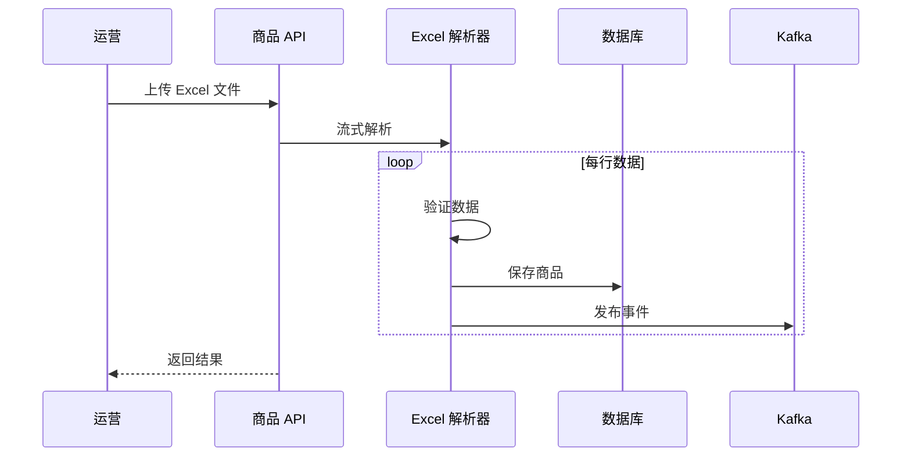

```go
// 运营批量上传
func OpsBatchUpload(ctx context.Context, file *ExcelFile) (*UploadResult, error) {
    result := &UploadResult{
        Success: []string{},
        Failed:  []UploadError{},
    }

    parser := NewExcelParser(file)
    rowNum := 0
    for row := range parser.Parse() {
        rowNum++

        product, err := ValidateRow(row)
        if err != nil {
            result.Failed = append(result.Failed, UploadError{Row: rowNum, Error: err.Error()})
            continue
        }

        product.SPUID = GenerateSPUID()
        product.Status = ProductStatusOnline
        product.Source = SourceOps
        product.Version = 1

        if err := db.InsertProduct(ctx, product); err != nil {
            result.Failed = append(result.Failed, UploadError{Row: rowNum, Error: err.Error()})
            continue
        }

        evt := &ProductCreatedEvent{SPUID: product.SPUID}
        PublishProductCreatedEvent(ctx, evt)

        result.Success = append(result.Success, product.SPUID)
    }

    RecordBatchUploadLog(ctx, result)
    return result, nil
}

type ExcelParser struct {
    file *ExcelFile
}

func (p *ExcelParser) Parse() <-chan *ExcelRow {
    ch := make(chan *ExcelRow, 100)
    go func() {
        defer close(ch)
        f, err := excelize.OpenFile(p.file.Path)
        if err != nil {
            return
        }
        defer f.Close()

        rows, _ := f.GetRows("Sheet1")
        for i, row := range rows {
            if i == 0 {
                continue
            }
            ch <- &ExcelRow{RowNum: i + 1, Data: row}
        }
    }()
    return ch
}
```

### 2.4 上架状态机与审核策略

商品状态驱动上架生命周期：草稿 → 待审核 → 通过/拒绝 → 上线/下线。转换规则应集中配置，写库时使用乐观锁或状态条件更新，避免并发覆盖。

```go
const (
    ProductStatusDraft        = 0
    ProductStatusPendingAudit = 1
    ProductStatusApproved     = 2
    ProductStatusRejected     = 3
    ProductStatusOnline       = 4
    ProductStatusOffline      = 5
)

var allowedTransitions = map[int]map[int]bool{
    ProductStatusDraft: {ProductStatusPendingAudit: true},
    ProductStatusPendingAudit: {
        ProductStatusApproved: true,
        ProductStatusRejected: true,
    },
    ProductStatusApproved: {ProductStatusOnline: true},
    ProductStatusOnline:   {ProductStatusOffline: true},
    ProductStatusOffline:  {ProductStatusOnline: true},
}

func TransitionProductStatus(ctx context.Context, spuID string, from, to int) error {
    if !allowedTransitions[from][to] {
        return ErrIllegalTransition
    }

    product, err := db.GetProduct(ctx, spuID)
    if err != nil {
        return err
    }
    if product.Status != from {
        return ErrStatusMismatch
    }

    if err := db.UpdateProductStatus(ctx, spuID, to, product.Version); err != nil {
        return err
    }

    RecordProductLog(ctx, spuID, fmt.Sprintf("状态变更: %d -> %d", from, to), "system")
    return nil
}
```

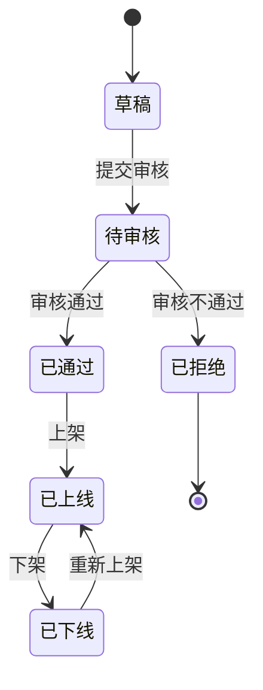

```go
type AuditStrategy interface {
    ShouldAudit(product *Product) bool
    GetPriority() int
}

type MerchantAuditStrategy struct{}

func (s *MerchantAuditStrategy) ShouldAudit(product *Product) bool {
    return product.Source == SourceMerchant
}

func (s *MerchantAuditStrategy) GetPriority() int {
    return AuditPriorityNormal
}

type PartnerAuditStrategy struct{}

func (s *PartnerAuditStrategy) ShouldAudit(product *Product) bool {
    return product.Source == SourcePartner && !AutoAudit(product)
}

func (s *PartnerAuditStrategy) GetPriority() int {
    return AuditPriorityHigh
}

type OpsAuditStrategy struct{}

func (s *OpsAuditStrategy) ShouldAudit(product *Product) bool {
    return false
}

var strategies = []AuditStrategy{
    &MerchantAuditStrategy{},
    &PartnerAuditStrategy{},
    &OpsAuditStrategy{},
}

func RouteAuditStrategy(product *Product) AuditStrategy {
    for _, strategy := range strategies {
        if strategy.ShouldAudit(product) {
            return strategy
        }
    }
    return nil
}
```

## 3. 商品数据模型设计专题

本章从 SPU/SKU、类目属性、动态字段存储到订单快照，串起商品中心最核心的数据面设计。

### 3.1 SPU/SKU 模型设计

**SPU（Standard Product Unit）** 描述「卖的是什么」：标题、类目、图文、共用属性。**SKU（Stock Keeping Unit）** 描述「可售卖的最小单元」：规格组合、价格、可售状态。一笔下单通常指向 SKU，搜索与列表常聚合在 SPU 维度展示。

```go
type SPU struct {
    SPUID       string
    Title       string
    CategoryID  int64
    BrandID     int64
    MainImages  []string
    Description string
    SpecDefs    []SpecDef // 规格维度定义，如颜色、尺码
    ProductType string    // standard/virtual/service/bundle
    Status      int
    Version     int64
}

type SpecDef struct {
    Name   string
    Values []string // 可选值集合
}

type SKU struct {
    SKUID      string
    SPUID      string
    SpecValues map[string]string // 如 {"颜色":"黑","存储":"256G"}
    Price      int64
    Status     int
}
```

**规格组合（笛卡尔积）**：给定多个规格维度及其取值，生成所有合法 SKU。实务中常加规则表剔除无效组合（例如某颜色不提供某尺码）。

```go
func CartesianSKUs(spuID string, defs []SpecDef) []*SKU {
    if len(defs) == 0 {
        return []*SKU{{SPUID: spuID, SKUID: GenerateSKUID(spuID, nil), SpecValues: map[string]string{}}}
    }
    var out []*SKU
    var dfs func(i int, cur map[string]string)
    dfs = func(i int, cur map[string]string) {
        if i == len(defs) {
            m := make(map[string]string, len(cur))
            for k, v := range cur {
                m[k] = v
            }
            out = append(out, &SKU{
                SPUID:      spuID,
                SKUID:      GenerateSKUID(spuID, m),
                SpecValues: m,
            })
            return
        }
        d := defs[i]
        for _, val := range d.Values {
            cur[d.Name] = val
            dfs(i+1, cur)
            delete(cur, d.Name)
        }
    }
    dfs(0, map[string]string{})
    return out
}
```

**示例（手机）**：颜色 {黑, 白} × 存储 {128G, 256G} → 4 个 SKU；若再 × 版本 {标准, Pro} → 8 个 SKU。服装类目常见「颜色 × 尺码」，SKU 数量更易膨胀，需要规格模板与批量编辑工具。

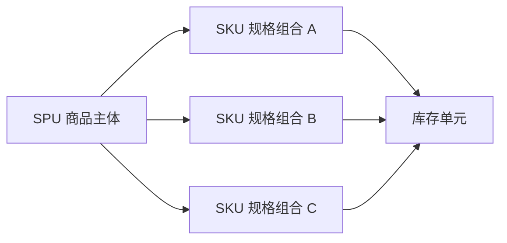

### 3.2 类目与属性系统

类目树支持前台导航、属性继承与搜索筛选维度配置。叶子类目绑定「销售属性」与「关键属性」，非叶子类目可定义通用属性并由子类目继承或覆盖。

```go
type Category struct {
    CategoryID int64
    ParentID   int64
    Name       string
    Level      int
    Path       string // 物化路径，如 "1/10/1005"
    IsLeaf     bool
}

type Attribute struct {
    AttributeID   int64
    Name          string
    InputType     string // text/select/multi/date
    Required      bool
    CategoryIDs   []int64 // 绑定类目
}

type ProductAttribute struct {
    SPUID       string
    AttributeID int64
    Value       string
}

func BuildCategoryTree(nodes []*Category) map[int64][]*Category {
    children := make(map[int64][]*Category)
    for _, n := range nodes {
        children[n.ParentID] = append(children[n.ParentID], n)
    }
    return children
}

func IndexCategoriesByID(nodes []*Category) map[int64]*Category {
    m := make(map[int64]*Category, len(nodes))
    for _, n := range nodes {
        m[n.CategoryID] = n
    }
    return m
}

func GetCategoryPath(byID map[int64]*Category, leafID int64) []*Category {
    var path []*Category
    cur, ok := byID[leafID]
    for ok && cur != nil {
        path = append([]*Category{cur}, path...)
        if cur.ParentID == 0 {
            break
        }
        cur, ok = byID[cur.ParentID]
    }
    return path
}
```

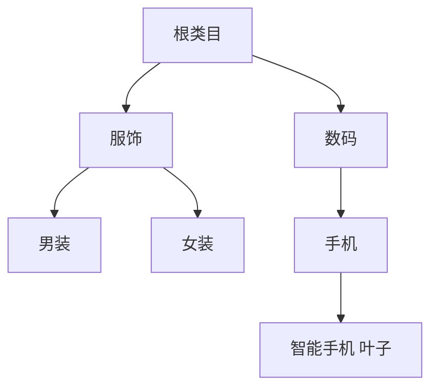

```go
func ExampleCategoryPath(nodes []*Category, leafID int64) []*Category {
    return GetCategoryPath(IndexCategoriesByID(nodes), leafID)
}
```

### 3.3 动态属性与 EAV 模型

不同类目字段差异大：服装要「材质、版型」，手机要「CPU、屏幕」。直接用超宽表会导致大量稀疏列；全 EAV 查询与索引压力大。**工程上常见混合方案**：高频筛选字段进主表或 JSON 索引，长尾属性走 EAV 或文档库。

| 方案 | 优点 | 缺点 | 适用 |
|------|------|------|------|
| 宽表 | 查询简单、性能好 |  schema 僵化、稀疏列浪费 | 属性稳定的标品类 |
| EAV | 扩展灵活 | 多表 Join、索引复杂 | 长尾属性、运营可配字段 |
| 混合 | 平衡性能与扩展 | 需要治理与同步策略 | 大型平台主流选择 |

```go
type ProductBase struct {
    SPUID      string
    Title      string
    CategoryID int64
    BrandID    int64
    PriceMin   int64 // 列表价展示用
    PriceMax   int64
}

// MongoDB / JSON 存非强筛选扩展
type ProductExt struct {
    SPUID   string
    Payload map[string]interface{}
}

func LoadProductFull(ctx context.Context, spuID string) (*SPU, map[int64]string, *ProductExt, error) {
    spu, err := db.GetSPU(ctx, spuID)
    if err != nil {
        return nil, nil, nil, err
    }
    eav, _ := db.ListProductAttributes(ctx, spuID)
    ext, _ := extStore.Get(ctx, spuID)
    return spu, eav, ext, nil
}
```

### 3.4 商品快照生成与复用

订单需要固化「下单瞬间」的商品展示信息与价格依据，避免后续改价改图引发纠纷。快照内容建议与计价结果、税费规则版本等一并由订单域引用。

```go
import (
    "context"
    "crypto/md5"
    "encoding/hex"
    "encoding/json"
    "fmt"
    "time"
)

type ProductSnapshot struct {
    SnapshotID string
    SPUID      string
    SKUID      string
    Title      string
    Price      int64
    Image      string
    SpecsJSON  string
    AttrsJSON  string
    CreatedAt  time.Time
}

func SnapshotContentKey(spu *SPU, sku *SKU) string {
    b, _ := json.Marshal(sku.SpecValues)
    return fmt.Sprintf("%s|%s|%s|%d|%s", spu.SPUID, sku.SKUID, spu.Title, sku.Price, string(b))
}

func FindOrCreateSnapshot(ctx context.Context, spu *SPU, sku *SKU) (string, error) {
    key := SnapshotContentKey(spu, sku)
    sum := md5.Sum([]byte(key))
    snapshotID := hex.EncodeToString(sum[:])

    if snap, _ := db.GetSnapshot(ctx, snapshotID); snap != nil {
        return snapshotID, nil
    }

    specsJSON, _ := json.Marshal(sku.SpecValues)
    snap := &ProductSnapshot{
        SnapshotID: snapshotID,
        SPUID:      spu.SPUID,
        SKUID:      sku.SKUID,
        Title:      spu.Title,
        Price:      sku.Price,
        Image:      spu.MainImages[0],
        SpecsJSON:  string(specsJSON),
        CreatedAt:  time.Now(),
    }
    if err := db.InsertSnapshot(ctx, snap); err != nil {
        return "", err
    }
    return snapshotID, nil
}
```

## 4. 异构商品治理

实物、虚拟、服务、组合在 SKU 形态、库存维度、价格与履约链路上差异显著。治理目标是：**统一生命周期与检索体验**，又允许品类在扩展点上替换实现。

### 4.1 异构商品的挑战

| 维度 | 标准实物 | 虚拟商品 | 服务商品 | 组合商品 |
|------|----------|----------|----------|----------|
| SKU 模型 | 多规格 SKU | 常单 SKU 或无 SKU | 房型/时段颗粒度 | 子 SKU 组合 |
| 库存 | 数量库存 | 卡密池/核销码 | 日历房态/座位图 | 子品库存联合约束 |
| 价格 | 标价 + 促销 | 面值/折扣规则 | 日历价、动态溢价 | 打包价、分摊规则 |
| 履约 | 物流发货 | 直充/发码 | 预约/入住/出行 | 分履约合并展示 |

核心矛盾：**一套核心表与流程** vs **品类特有字段与规则**。解法是把「共性」沉到内核，把「差异」关进扩展点（适配器/策略/配置）。

### 4.2 统一抽象与适配器模式

```go
import "errors"

// 与第 5 章搜索文档对齐的简化结构（完整字段见 5.1）
type ProductSearchDoc struct {
    SPUID      string
    Title      string
    CategoryID int64
    ExtraTags  []string
}

type ProductType string

const (
    ProductTypeStandard ProductType = "standard"
    ProductTypeVirtual  ProductType = "virtual"
    ProductTypeService  ProductType = "service"
    ProductTypeBundle   ProductType = "bundle"
)

type ProductAdapter interface {
    Type() ProductType
    Validate(spu *SPU, skus []*SKU) error
    NormalizeForSearch(doc *ProductSearchDoc) error
    StockDimensions() []string
}

type StandardProductAdapter struct{}

func (a *StandardProductAdapter) Type() ProductType { return ProductTypeStandard }

func (a *StandardProductAdapter) Validate(spu *SPU, skus []*SKU) error {
    if len(skus) == 0 {
        return errors.New("standard product requires skus")
    }
    return nil
}

func (a *StandardProductAdapter) NormalizeForSearch(doc *ProductSearchDoc) error {
    return nil
}

func (a *StandardProductAdapter) StockDimensions() []string {
    return []string{"warehouse_sku"}
}

type ServiceProductAdapter struct{}

func (a *ServiceProductAdapter) Type() ProductType { return ProductTypeService }

func (a *ServiceProductAdapter) Validate(spu *SPU, skus []*SKU) error {
    // 服务类可允许「按日库存」在扩展表维护
    return nil
}

func (a *ServiceProductAdapter) NormalizeForSearch(doc *ProductSearchDoc) error {
    doc.ExtraTags = append(doc.ExtraTags, "service")
    return nil
}

func (a *ServiceProductAdapter) StockDimensions() []string {
    return []string{"date", "room_type"}
}

var adapterRegistry = map[ProductType]ProductAdapter{
    ProductTypeStandard: &StandardProductAdapter{},
    ProductTypeService:  &ServiceProductAdapter{},
}

func RouteAdapter(spu *SPU) ProductAdapter {
    t := ProductType(spu.ProductType)
    if a, ok := adapterRegistry[t]; ok {
        return a
    }
    return adapterRegistry[ProductTypeStandard]
}
```

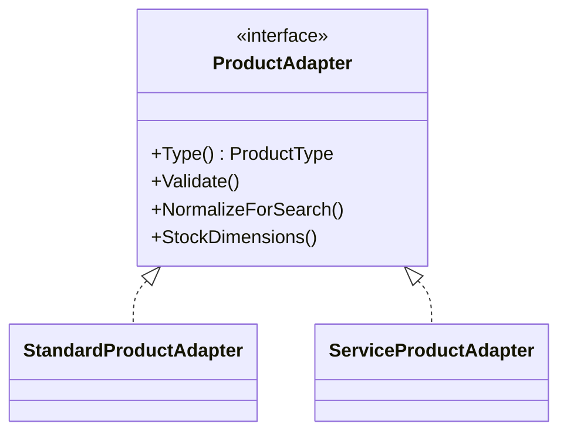

### 4.3 配置化与低代码平台

将「表单字段、校验规则、上架步骤、审核模板」配置化，新品类主要工作是配置 + 少量插件，而不是复制一套后台。

```go
type FormField struct {
    Key        string
    Label      string
    Widget     string // input/select/date/city
    Required   bool
    Validator  string // 正则或规则名
    DataSource string // 枚举接口
}

type FormConfig struct {
    ProductType ProductType
    Fields      []FormField
    Steps       []string
}

var HotelSPUForm = FormConfig{
    ProductType: ProductTypeService,
    Fields: []FormField{
        {Key: "hotel.star", Label: "星级", Widget: "select", Required: true, DataSource: "/meta/stars"},
        {Key: "hotel.city", Label: "城市", Widget: "city", Required: true},
        {Key: "hotel.address", Label: "地址", Widget: "input", Required: true},
    },
    Steps: []string{"basic", "room", "policy", "media"},
}
```

### 4.4 多维度库存管理

库存可分层：**平台库存网关** 统一对外，`GetStock` 根据 `ProductType` 与维度路由到仓库库存、卡密池、房态服务等。

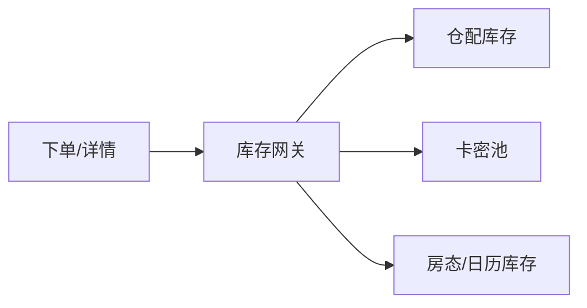

```go
type StockQuery struct {
    SKUID     string
    Date      string
    Warehouse string
}

type InventoryGateway struct {
    warehouse StockProvider
    cardPool  StockProvider
    roomState StockProvider
}

type StockProvider interface {
    Name() string
    Available(ctx context.Context, q StockQuery) (int64, error)
}

func (g *InventoryGateway) GetStock(ctx context.Context, adapter ProductAdapter, q StockQuery) (int64, error) {
    dims := adapter.StockDimensions()
    switch {
    case contains(dims, "warehouse_sku"):
        return g.warehouse.Available(ctx, q)
    case contains(dims, "date"):
        return g.roomState.Available(ctx, q)
    default:
        return g.cardPool.Available(ctx, q)
    }
}

func contains(arr []string, v string) bool {
    for _, x := range arr {
        if x == v {
            return true
        }
    }
    return false
}
```
## 5. 商品搜索与多级缓存

导购链路读多写少，典型优化是 **Elasticsearch 承担检索与排序**，**Redis + 本地缓存承担热点详情**。写入路径发布变更事件，异步刷新索引与失效缓存，接受短暂最终一致。

### 5.1 Elasticsearch 索引设计

索引文档应同时满足：**关键词检索、类目/品牌筛选、价格区间、标签过滤、排序**（销量、上架时间、相关性得分）。`sku_list` 可用 nested 或扁平化子文档，视查询复杂度权衡。

```go
type ProductSearchDoc struct {
    SPUID       string            `json:"spu_id"`
    Title       string            `json:"title"`
    CategoryID  int64             `json:"category_id"`
    BrandID     int64             `json:"brand_id"`
    Tags        []string          `json:"tags"`
    PriceMin    int64             `json:"price_min"`
    PriceMax    int64             `json:"price_max"`
    Status      int               `json:"status"`
    Sales30d    int64             `json:"sales_30d"`
    OnShelfAt   int64             `json:"on_shelf_at"`
    ExtraTags   []string          `json:"extra_tags"`
    SKUs        []SearchSKUInline `json:"skus"`
}

type SearchSKUInline struct {
    SKUID   string            `json:"sku_id"`
    Specs   map[string]string `json:"specs"`
    Price   int64             `json:"price"`
    InStock bool              `json:"in_stock"`
}
```

**Mapping 要点**：`title` 使用 `text` + `keyword` 子字段；筛选字段 `keyword`；价格 `long`；`skus` 使用 `nested` 以便按规格价查询。

```json
{
  "mappings": {
    "properties": {
      "spu_id": { "type": "keyword" },
      "title": {
        "type": "text",
        "fields": { "kw": { "type": "keyword", "ignore_above": 256 } }
      },
      "category_id": { "type": "long" },
      "brand_id": { "type": "long" },
      "tags": { "type": "keyword" },
      "price_min": { "type": "long" },
      "price_max": { "type": "long" },
      "status": { "type": "integer" },
      "sales_30d": { "type": "long" },
      "on_shelf_at": { "type": "long" },
      "extra_tags": { "type": "keyword" },
      "skus": {
        "type": "nested",
        "properties": {
          "sku_id": { "type": "keyword" },
          "specs": { "type": "flattened" },
          "price": { "type": "long" },
          "in_stock": { "type": "boolean" }
        }
      }
    }
  }
}
```

```go
import (
    "context"
    "encoding/json"
)

type SearchRequest struct {
    Keyword    string
    CategoryID int64
    BrandID    int64
    PriceMin   int64
    PriceMax   int64
    Page       int
    PageSize   int
    Sort       string
}

func SearchProducts(ctx context.Context, es *ESClient, req *SearchRequest) ([]ProductSearchDoc, int, error) {
    must := []map[string]interface{}{
        {"term": map[string]interface{}{"status": 4}},
    }
    if req.Keyword != "" {
        must = append(must, map[string]interface{}{
            "multi_match": map[string]interface{}{
                "query":  req.Keyword,
                "fields": []string{"title^2", "title.kw"},
            },
        })
    }

    filters := []map[string]interface{}{}
    if req.CategoryID > 0 {
        filters = append(filters, map[string]interface{}{
            "term": map[string]interface{}{"category_id": req.CategoryID},
        })
    }
    if req.BrandID > 0 {
        filters = append(filters, map[string]interface{}{
            "term": map[string]interface{}{"brand_id": req.BrandID},
        })
    }
    if req.PriceMin > 0 || req.PriceMax > 0 {
        rng := map[string]interface{}{}
        if req.PriceMin > 0 {
            rng["gte"] = req.PriceMin
        }
        if req.PriceMax > 0 {
            rng["lte"] = req.PriceMax
        }
        filters = append(filters, map[string]interface{}{
            "range": map[string]interface{}{"price_min": rng},
        })
    }

    boolQ := map[string]interface{}{"must": must}
    if len(filters) > 0 {
        boolQ["filter"] = filters
    }
    body := map[string]interface{}{
        "query": map[string]interface{}{"bool": boolQ},
        "from":  (req.Page - 1) * req.PageSize,
        "size":  req.PageSize,
    }
    payload, err := json.Marshal(body)
    if err != nil {
        return nil, 0, err
    }
    return es.Search(ctx, "product_index", payload)
}
```

### 5.2 多级缓存策略

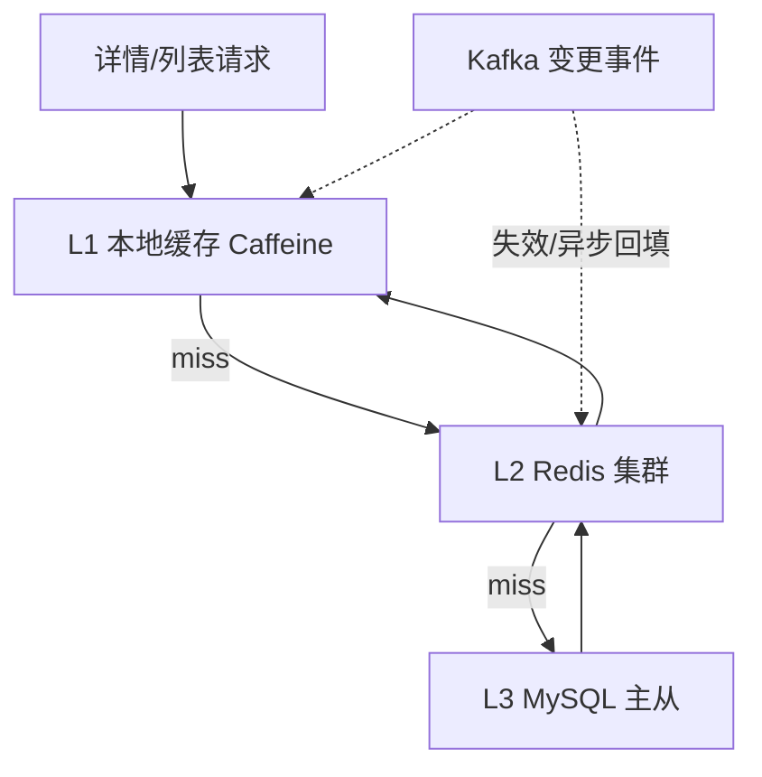

```go
import (
    "context"
    "encoding/json"
    "fmt"
    "time"
)

type ProductDetailDTO struct {
    SPU  *SPU
    SKUs []*SKU
}

func cacheKeyDetail(spuID string) string {
    return fmt.Sprintf("pd:%s", spuID)
}

func GetProductDetail(ctx context.Context, spuID string) (*ProductDetailDTO, error) {
    if v, ok := localCache.Get(spuID); ok {
        return v.(*ProductDetailDTO), nil
    }

    raw, err := redis.Get(ctx, cacheKeyDetail(spuID))
    if err == nil && raw != "" {
        var dto ProductDetailDTO
        if json.Unmarshal([]byte(raw), &dto) == nil {
            localCache.Set(spuID, &dto, 5*time.Second)
            return &dto, nil
        }
    }

    spu, err := db.GetSPU(ctx, spuID)
    if err != nil {
        return nil, err
    }
    skus, err := db.ListSKUBySPU(ctx, spuID)
    if err != nil {
        return nil, err
    }
    dto := &ProductDetailDTO{SPU: spu, SKUs: skus}

    b, _ := json.Marshal(dto)
    _ = redis.Set(ctx, cacheKeyDetail(spuID), string(b), 10*time.Minute)
    localCache.Set(spuID, dto, 5*time.Second)

    return dto, nil
}

func InvalidateProductCaches(ctx context.Context, spuID string) {
    _ = redis.Del(ctx, cacheKeyDetail(spuID))
    localCache.Invalidate(spuID)
}
```

### 5.3 智能刷新规则

热门商品变更后应更快可见；长尾商品可降低刷新频率以节省 ES 与 Redis 成本。可结合 **近实时销量、搜索曝光、运营打标** 计算刷新间隔。

```go
func CalculateRefreshInterval(spuID string, score float64) time.Duration {
    if score > 1000 {
        return 5 * time.Second
    }
    if score > 100 {
        return 30 * time.Second
    }
    if score > 10 {
        return 2 * time.Minute
    }
    return 10 * time.Minute
}

func HotnessScore(expose1h, cart1h, sales30d int64) float64 {
    return float64(expose1h)*0.1 + float64(cart1h)*2 + float64(sales30d)*0.01
}
```

## 6. 特殊商品类型（黄金案例）

以下四个案例覆盖多数面试与工程追问：**规格矩阵、虚拟履约、日历库存、组合约束**。

### 6.1 标准实物商品

**场景**：T 恤，颜色 {红, 蓝, 黑}，尺码 {S, M, L, XL}，共 12 个 SKU。列表价可一致，也可按颜色区分。

```go
func ExampleTShirtSPU() *SPU {
    return &SPU{
        SPUID:       "SPU_TSHIRT_DEMO",
        Title:       "纯棉圆领 T 恤",
        CategoryID:  5001,
        ProductType: "standard",
        SpecDefs: []SpecDef{
            {Name: "颜色", Values: []string{"红", "蓝", "黑"}},
            {Name: "尺码", Values: []string{"S", "M", "L", "XL"}},
        },
    }
}

// 12 个 SKU：CartesianSKUs("SPU_TSHIRT_DEMO", specDefs)
```

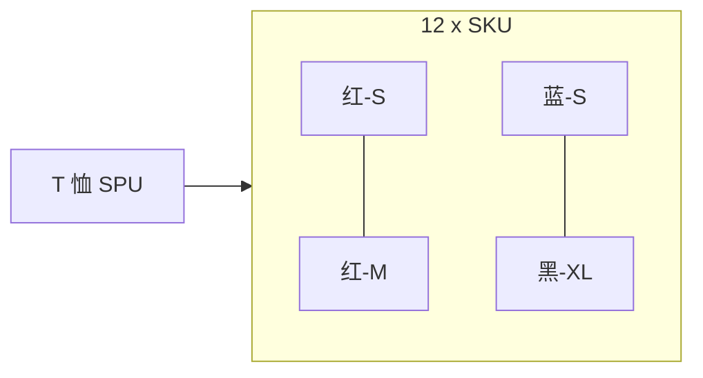

### 6.2 虚拟商品

**场景**：话费充值，SKU 对应面额；库存来自 **卡密池** 或 **直充渠道额度**。下单后即时履约，无需物流。

```go
type TopUpSKU struct {
    SKUID     string
    FaceValue int64
    Channel   string
}

type CardPool struct {
    PoolID string
    SKUID  string
}

type CardSecret struct {
    CardID string
    SKUID  string
    Secret string
    Status int
}

func IssueCard(ctx context.Context, skuID string) (*CardSecret, error) {
    card, err := db.AcquireOneCard(ctx, skuID)
    if err != nil {
        return nil, err
    }
    if err := db.MarkCardIssued(ctx, card.CardID); err != nil {
        return nil, err
    }
    return card, nil
}
```

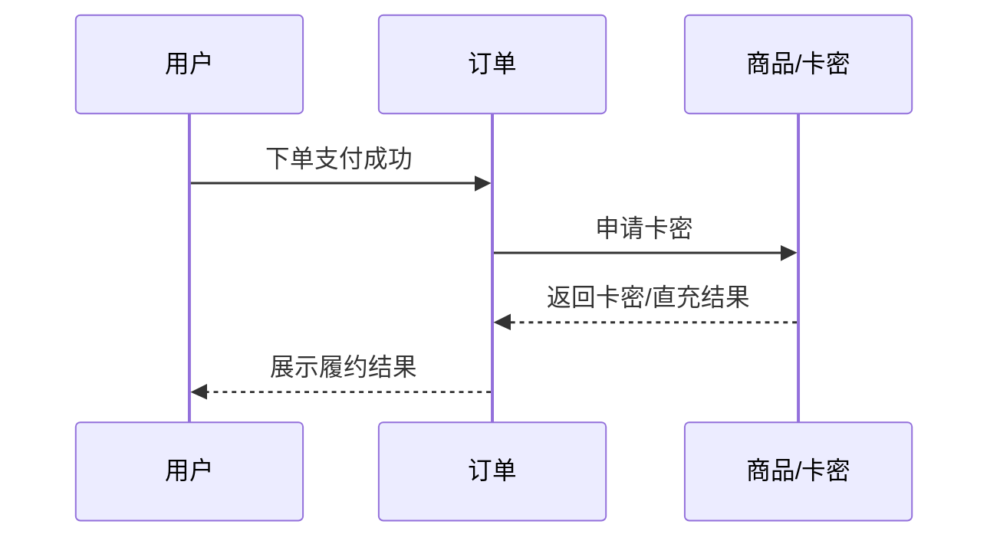

### 6.3 服务类商品

**场景**：酒店房型，价格随 **日期** 波动，库存为 **每日可售间夜**。搜索与下单需传入住离店日期。

```go
type HotelRoomSKU struct {
    SKUID    string
    RoomType string
    HotelID  string
}

type PriceCalendar struct {
    SKUID string
    Date  string
    Price int64
}

type StockCalendar struct {
    SKUID string
    Date  string
    Stock int64
}

func CalculateHotelPrice(ctx context.Context, skuID, checkIn, checkOut string) (int64, error) {
    nights := NightsBetween(checkIn, checkOut)
    var total int64
    for d := range EachNight(checkIn, nights) {
        p, err := db.GetDailyPrice(ctx, skuID, d)
        if err != nil {
            return 0, err
        }
        total += p
    }
    return total, nil
}

func NightsBetween(checkIn, checkOut string) int { return 1 }
func EachNight(checkIn string, n int) []string   { return []string{checkIn} }
```

### 6.4 组合商品

**场景**：电影票 + 小食套餐，子商品各自有 SKU 与库存，下单需 **联合校验** 与 **打包售价分摊**（可固定价或按比例）。

```go
import "fmt"

type BundleItem struct {
    ChildSPUID string
    ChildSKUID string
    Quantity   int
}

type BundleProduct struct {
    SPUID string
    Items []BundleItem
    Price int64
}

func CheckBundleStock(ctx context.Context, b *BundleProduct) error {
    for _, it := range b.Items {
        n, err := inventory.GetStock(ctx, it.ChildSKUID, "")
        if err != nil {
            return err
        }
        if n < int64(it.Quantity) {
            return fmt.Errorf("insufficient stock for %s", it.ChildSKUID)
        }
    }
    return nil
}

func AllocateBundlePrice(items []BundleItem, total int64) map[string]int64 {
    out := make(map[string]int64)
    var units int64
    for _, it := range items {
        units += int64(it.Quantity)
    }
    if units == 0 {
        return out
    }
    var allocated int64
    for i, it := range items {
        var share int64
        if i == len(items)-1 {
            share = total - allocated
        } else {
            share = total * int64(it.Quantity) / units
        }
        out[it.ChildSKUID] = share
        allocated += share
    }
    return out
}
```

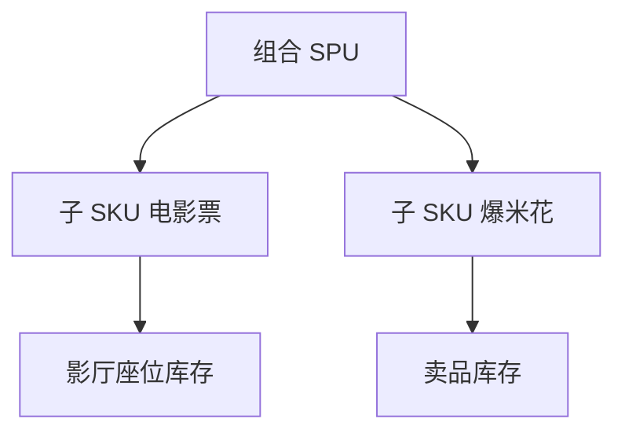

## 7. 商品版本管理与快照

商品变更频繁，需要 **可追溯的版本历史** 与 **面向订单的不可变快照**。版本表支撑审计与回滚；快照表支撑下单展示与纠纷处理；Kafka 将变更广播给搜索与缓存等消费者。

### 7.1 版本控制

**目标**：记录每次变更、支持回滚、满足合规审计。

```go
import (
    "context"
    "encoding/json"
    "time"
)

type ProductVersion struct {
    VersionID  string
    SPUID      string
    Version    int64
    Content    string
    ChangeType string
    Operator   string
    CreatedAt  time.Time
}

func CreateProductVersion(ctx context.Context, product *Product, operator string) error {
    content, _ := json.Marshal(product)
    version := &ProductVersion{
        VersionID:  GenerateVersionID(),
        SPUID:      product.SPUID,
        Version:    product.Version,
        Content:    string(content),
        ChangeType: "update",
        Operator:   operator,
        CreatedAt:  time.Now(),
    }
    return db.InsertProductVersion(ctx, version)
}

func RollbackToVersion(ctx context.Context, spuID string, targetVersion int64) error {
    ver, err := db.GetProductVersion(ctx, spuID, targetVersion)
    if err != nil {
        return err
    }
    product := &Product{}
    if err := json.Unmarshal([]byte(ver.Content), product); err != nil {
        return err
    }
    current, _ := db.GetProduct(ctx, spuID)
    product.Version = current.Version + 1
    if err := db.UpdateProduct(ctx, product); err != nil {
        return err
    }
    return CreateProductVersion(ctx, product, "system_rollback")
}
```

### 7.2 快照机制

订单创建时引用快照 ID，即使商品改价改图，订单详情仍展示下单时内容。内容 Hash 相同则复用一条快照记录，节省存储。

```go
import (
    "context"
    "crypto/md5"
    "encoding/hex"
    "encoding/json"
    "fmt"
    "time"
)

type ProductSnapshotOrder struct {
    SnapshotID string
    SPUID      string
    SKUID      string
    Title      string
    Price      int64
    Image      string
    Specs      string
    Attributes string
    CreatedAt  time.Time
}

func CreateSnapshot(ctx context.Context, sku *SKU) (string, error) {
    spu, err := db.GetSPU(ctx, sku.SPUID)
    if err != nil {
        return "", err
    }
    content := fmt.Sprintf("%s_%s_%s_%d_%s",
        spu.SPUID, sku.SKUID, spu.Title, sku.Price, encodeSpecs(sku.SpecValues))
    sum := md5.Sum([]byte(content))
    snapshotID := hex.EncodeToString(sum[:])

    if existing, _ := db.GetSnapshot(ctx, snapshotID); existing != nil {
        return snapshotID, nil
    }

    snap := &ProductSnapshotOrder{
        SnapshotID: snapshotID,
        SPUID:      spu.SPUID,
        SKUID:      sku.SKUID,
        Title:      spu.Title,
        Price:      sku.Price,
        Image:      spu.MainImages[0],
        Specs:      encodeSpecs(sku.SpecValues),
        CreatedAt:  time.Now(),
    }
    if err := db.InsertSnapshot(ctx, snap); err != nil {
        return "", err
    }
    return snapshotID, nil
}

func encodeSpecs(m map[string]string) string {
    b, _ := json.Marshal(m)
    return string(b)
}
```

### 7.3 变更事件与最终一致性

```go
import (
    "encoding/json"
    "time"
)

type ProductChangedEvent struct {
    SPUID      string
    ChangeType string
    Version    int64
    Timestamp  time.Time
}

func PublishProductChangedEvent(ctx context.Context, event *ProductChangedEvent) error {
    data, _ := json.Marshal(event)
    msg := &KafkaMessage{
        Topic: "product.changed",
        Key:   event.SPUID,
        Value: data,
    }
    return kafkaProducer.Send(msg)
}

func ConsumeProductChangedEvent() {
    consumer := kafka.NewConsumer("product.changed", "search-sync-group")
    for msg := range consumer.Messages() {
        event := &ProductChangedEvent{}
        if err := json.Unmarshal(msg.Value, event); err != nil {
            continue
        }
        if err := UpdateSearchIndex(event.SPUID); err != nil {
            log.Error("failed to update search index", "error", err)
            continue
        }
        InvalidateCache(event.SPUID)
        consumer.CommitMessage(msg)
    }
}
```

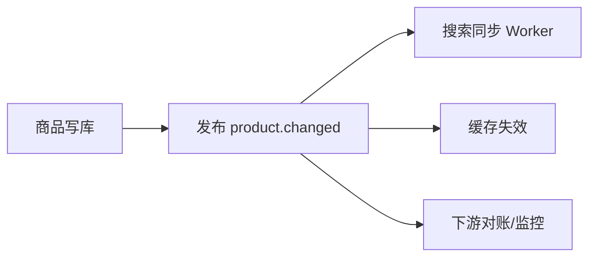

## 8. 商品类型扩展设计

### 8.1 扩展点识别

1. **商品模型扩展**：品类特有属性与扩展存储（MongoDB / JSON / EAV）
2. **上架流程扩展**：审核模板、必填项、校验插件
3. **库存扩展**：库存维度与网关路由（见第 4 章）
4. **价格扩展**：计价参数、日历价、动态溢价
5. **搜索与展示扩展**：索引字段、列表卡片模板、筛选器组件

### 8.2 策略模式应用

```go
type ProductTypeStrategy interface {
    Validate(product *Product) error
    GenerateSKUs(spu *SPU) []*SKU
    GetStock(skuID string) (int, error)
    CalculatePrice(sku *SKU, params map[string]interface{}) (int64, error)
    GetExtAttributes(spu *SPU) map[string]interface{}
}

// 具体策略按品类实现，注册到表；与第 4 章 ProductAdapter 可合并或分层（适配器偏写模型，策略偏业务规则）
```

### 8.3 新品类接入指南

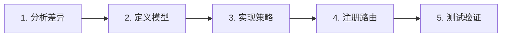

1. **分析差异**：相对标准实物，列出 SKU、库存、价格、履约差异
2. **定义模型**：SPU/SKU 扩展字段、Ext 文档 schema
3. **实现策略**：实现 `ProductTypeStrategy`（或 `ProductAdapter`）并补单测
4. **注册路由**：在注册表挂载 `ProductType` → 实现，并配置表单/索引
5. **测试验证**：集成测试覆盖上架、搜索、下单快照全链路

### 8.4 扩展性设计原则

- **开闭原则**：新增品类以注册策略为主，避免修改核心状态机主干
- **单一职责**：每个策略只处理一个品类或一族相似品类
- **依赖倒置**：上层依赖 `ProductTypeStrategy` 接口，而非具体类

## 9. 工程实践要点

### 9.1 商品 ID 生成

| 方案 | 优点 | 缺点 | 适用 |
|------|------|------|------|
| Snowflake | 趋势递增、高性能、全局唯一 | 时钟回拨需治理 | 大规模推荐 |
| UUID | 实现简单 | 无序、索引碎片化 | 中小流量 |
| DB 自增 | 简单 | 分库分表扩展难 | 单库早期 |

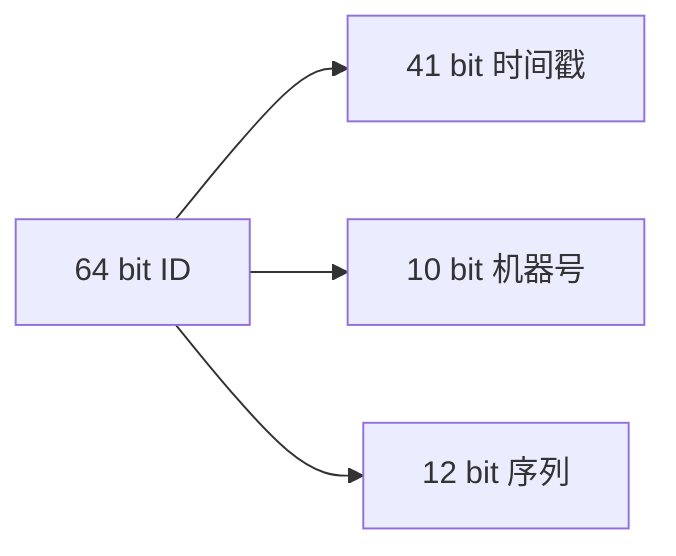

```go
import (
    "fmt"
    "sync"
    "time"
)

type SnowflakeGenerator struct {
    machineID int64
    sequence  int64
    lastTime  int64
    mu        sync.Mutex
}

func (g *SnowflakeGenerator) NextID() string {
    g.mu.Lock()
    defer g.mu.Unlock()

    now := time.Now().UnixMilli()
    if now < g.lastTime {
        time.Sleep(time.Duration(g.lastTime-now) * time.Millisecond)
        now = time.Now().UnixMilli()
    }
    if now == g.lastTime {
        g.sequence = (g.sequence + 1) & 0xFFF
        if g.sequence == 0 {
            for now <= g.lastTime {
                now = time.Now().UnixMilli()
            }
        }
    } else {
        g.sequence = 0
    }
    g.lastTime = now
    id := ((now - 1609459200000) << 22) | (g.machineID << 12) | g.sequence
    return fmt.Sprintf("SP%d", id)
}
```

### 9.2 商品同步任务治理

```go
import "time"

func FullSync(ctx context.Context, partnerID string) error {
    products, err := partnerClient.GetAllProducts(partnerID)
    if err != nil {
        return err
    }
    for _, p := range products {
        msg := ConvertToMessage(p)
        if err := PartnerPushProduct(ctx, msg); err != nil {
            log.Error("full sync row failed", "err", err)
        }
    }
    return nil
}

func IncrementalSync(ctx context.Context, partnerID string) error {
    last := GetLastSyncTime(partnerID)
    products, err := partnerClient.GetChangedProducts(partnerID, last)
    if err != nil {
        return err
    }
    for _, p := range products {
        msg := ConvertToMessage(p)
        if err := PartnerPushProduct(ctx, msg); err != nil {
            log.Error("incr sync row failed", "err", err)
        }
    }
    UpdateLastSyncTime(partnerID, time.Now())
    return nil
}
```

热门商品刷新间隔见第 5.3 节 `CalculateRefreshInterval`。

### 9.3 监控告警体系

- **业务**：上架量、审核通过率、搜索 QPS、缓存命中率
- **应用**：核心接口 P99、错误率、同步成功率
- **依赖**：MySQL 慢查询、Redis 连接、ES 查询延迟
- **系统**：CPU、内存、磁盘、网络

```go
import "time"

func RecordMetrics(spuID string, operation string, latency time.Duration) {
    metrics.IncrCounter("product_operation_total", "operation", operation)
    metrics.ObserveHistogram("product_operation_latency", latency.Milliseconds(), "operation", operation)
    if latency > 100*time.Millisecond {
        metrics.IncrCounter("product_operation_slow", "operation", operation)
    }
}
```

### 9.4 性能优化

- **数据库**：按 SPU ID 哈希分表；组合索引如 `(category_id, status)`；读写分离
- **缓存**：多级缓存、预热 TOP N、布隆过滤器防穿透、空值短 TTL
- **搜索**：合理分片与副本、避免深分页、聚合用近似算法

```go
func ShardIndex(spuID string, shards int) int {
    return int(fnv32(spuID) % uint32(shards))
}

func fnv32(s string) uint32 {
    var h uint32 = 2166136261
    for i := 0; i < len(s); i++ {
        h ^= uint32(s[i])
        h *= 16777619
    }
    return h
}
```

```go
// 缓存穿透：布隆过滤器判断「一定不存在」时再短路，避免打穿 DB
func MaybeProductExists(bloom *BloomFilter, spuID string) bool {
    return bloom.MightContain(spuID)
}
```

### 9.5 故障处理

| 故障 | 处理思路 |
|------|----------|
| 缓存雪崩 | TTL 加随机抖动、热点 key 独立策略 |
| 缓存穿透 | 布隆过滤器、空值缓存 |
| 数据不一致 | 定时对账、修复任务、人工兜底 |
| 同步失败 | 重试队列、死信告警 |
| ES 慢查询 | 优化 mapping、查询裁剪、冷热索引 |

## 总结

**核心要点回顾：**

商品中心是电商平台的「商品库」，核心技术要点包括：

1. **SPU/SKU 模型**：标准产品单元 + 库存单位，规格组合与笛卡尔积生成 SKU
2. **多角色上架**：商家、供应商、运营三条链路，配合状态机与审核策略
3. **异构商品治理**：适配器 + 配置化 + 库存网关，隔离品类差异
4. **多级缓存与搜索**：Elasticsearch 负责检索，L1/L2 缓存扛热点读
5. **版本与快照**：版本审计与回滚，快照 Hash 复用服务订单域
6. **事件驱动**：`product.changed` 串联搜索、缓存与下游

**面试要点：**

1. 画出 SPU/SKU 关系，说明规格组合如何生成与如何剔除无效组合
2. 说明异构商品的挑战与适配器、策略模式如何落地
3. 描述多级缓存与热点刷新策略，以及接受怎样的最终一致窗口
4. 对比宽表、EAV、混合存储的取舍
5. 说明订单为何引用商品快照，以及 Hash 复用如何做

**扩展阅读：**

- DDD 在商品域的建模与限界上下文划分
- 商品中台演进与多租户隔离
- 搜索排序：相关性、商业化、个性化权重

## 参考资料

### 业界文章与分享

1. 淘宝商品中心技术演进相关分享
2. 京东商品系统架构实践
3. 亚马逊商品目录（Catalog）设计公开资料

### 开源项目

1. [Elasticsearch](https://www.elastic.co/) — 搜索引擎
2. [Caffeine](https://github.com/ben-manes/caffeine) — 本地缓存
3. [Excelize](https://github.com/qax-os/excelize) — Excel 处理

### 系列文章（本仓库）

1. `20-ecommerce-overview.md` — 电商总览
2. `21-ecommerce-listing.md` — 商品上架系统
3. `22-ecommerce-inventory.md` — 库存系统
4. `26-ecommerce-order-system.md` — 订单系统

设计过程与章节拆解见仓库内 `docs/superpowers/specs/2026-04-07-product-center-design.md`。
