# 电商系统设计：营销系统深度解析

营销系统是电商平台的增长引擎，通过优惠券、积分、活动等手段实现用户拉新、促活、留存和 GMV 提升。本文深入解析营销系统的架构设计、核心模块、高并发场景处理和工程实践，适合系统设计面试和电商后端工程师阅读。

<!-- more -->

## 目录

1. [系统概览](#1-系统概览)
2. [营销工具体系](#2-营销工具体系)
3. [营销计算引擎](#3-营销计算引擎)
4. [高并发场景设计](#4-高并发场景设计)
5. [营销与订单集成](#5-营销与订单集成)
6. [跨系统全链路集成](#6-跨系统全链路集成)
7. [数据一致性保障](#7-数据一致性保障)
8. [特殊营销场景](#8-特殊营销场景)
9. [工程实践](#9-工程实践)
10. [总结与参考](#10-总结与参考)

---

## 1. 系统概览

### 1.1 营销系统的定位

营销系统在电商平台中承担**增长引擎**角色：通过优惠券、积分、活动与精准投放，支撑用户拉新、促活、留存与 GMV 提升。它与订单、商品、计价、用户、支付等系统紧密协作：订单侧负责扣减与回退的编排，商品与计价侧提供圈品与价格试算输入，用户侧提供画像与风控维度，支付侧完成补贴与分账核算。

**核心价值**可概括为：在**成本可控**前提下实现**精准营销**，并通过数据闭环让效果**可衡量、可优化**。

### 1.2 核心业务场景

典型业务场景包括：

- **用户拉新**：新人专享券、首单立减
- **用户促活**：签到积分、任务奖励
- **用户留存**：会员积分、等级权益
- **GMV 提升**：满减活动、限时折扣、秒杀
- **清库存**：N 元购、买赠活动

**B2C 与 B2B2C 营销差异**对比如下。

| 维度 | B2C（自营） | B2B2C（平台） |
|------|------------|--------------|
| 营销主体 | 平台 | 平台 + 商家 |
| 成本承担 | 平台全额 | 平台补贴 + 商家承担 |
| 活动审核 | 无需审核 | 商家活动需平台审核 |
| 优惠叠加 | 平台规则统一 | 需考虑跨店铺规则 |
| 结算复杂度 | 简单 | 需分账（平台 / 商家） |

### 1.3 核心挑战

1. **高并发**：秒杀、抢券等场景 QPS 峰值可达 10 万+
2. **复杂规则**：优惠叠加、互斥、优先级与「最优解」求解
3. **数据一致性**：营销扣减与订单创建的原子性与补偿
4. **防刷防薅**：黑产、批量注册、恶意套现
5. **成本控制**：营销预算、ROI 监控
6. **实时性**：库存实时扣减、优惠实时生效

### 1.4 系统架构

整体采用**接入层 → 服务层 → 数据层**分层：接入层统一鉴权与路由；服务层拆分优惠券、积分、活动与营销计算；数据层以 MySQL 为主存储，Redis 承担缓存与分布式锁，Kafka 做事件驱动，Elasticsearch 支撑活动检索与画像类查询。

**系统架构总览**如下。

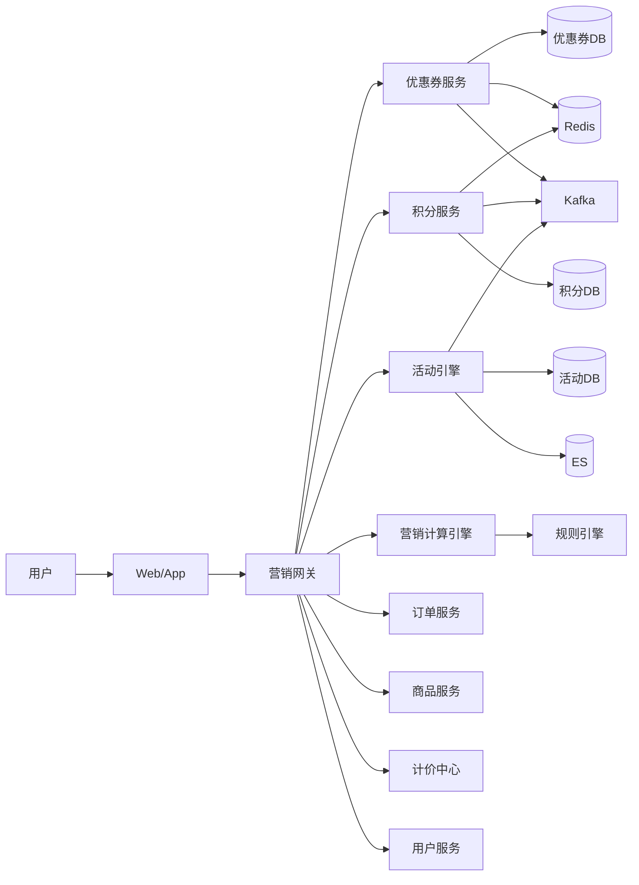

**核心模块协作**可概括为：网关编排，各工具服务自治，计算引擎读多源数据并调用规则引擎；异步事件通过 Kafka 广播给下游（通知、对账、报表等）。

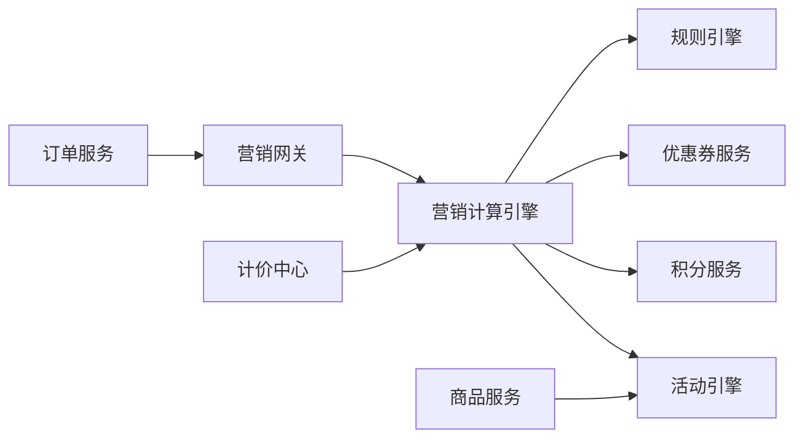

**核心常量定义**（类型与状态枚举，便于各服务对齐语义）：

```go
// 营销工具类型
const (
	ToolTypeCoupon   = "coupon"   // 优惠券
	ToolTypePoints   = "points"   // 积分
	ToolTypeActivity = "activity" // 活动
)

// 优惠类型
const (
	DiscountTypeAmount     = "amount"     // 满减（满100减20）
	DiscountTypePercentage = "percentage" // 折扣（8折）
	DiscountTypeFreeShip   = "free_ship"  // 包邮
	DiscountTypeGift       = "gift"       // 赠品
)

// 活动类型
const (
	ActivityTypeFlashSale = "flash_sale" // 秒杀
	ActivityTypeGroupBuy  = "group_buy"  // 拼团
	ActivityTypeSeckill   = "seckill"    // 限时抢购
	ActivityTypeNYuanGou  = "n_yuan_gou" // N元购
)

// 营销状态
const (
	StatusDraft    = "draft"    // 草稿
	StatusPending  = "pending"  // 待审核
	StatusApproved = "approved" // 已通过
	StatusRejected = "rejected" // 已拒绝
	StatusActive   = "active"   // 进行中
	StatusExpired  = "expired"  // 已过期
	StatusCanceled = "canceled" // 已取消
)
```

### 1.5 核心数据模型概览

以下为优惠券、积分、活动相关核心表关系的**逻辑 ER 示意**（实际分库分表与字段以线上为准）。

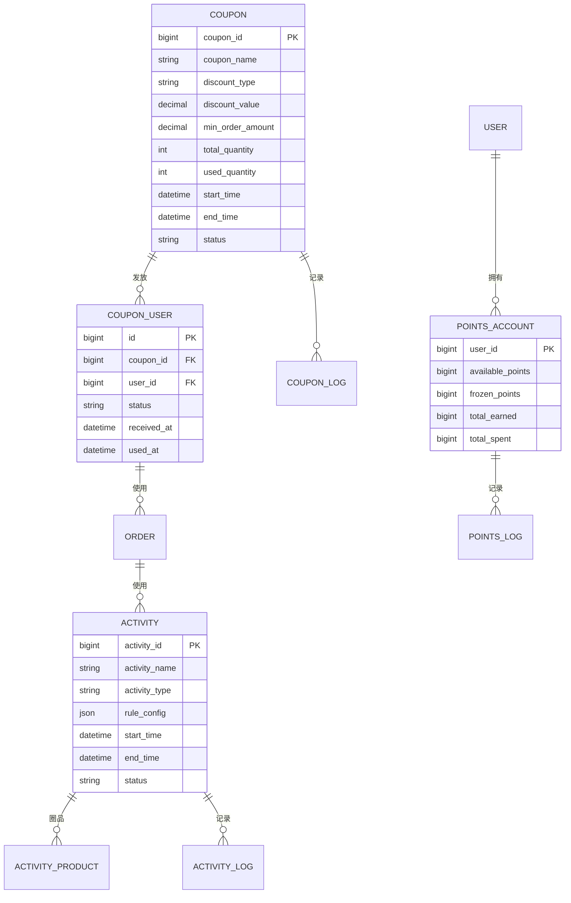

### 1.6 技术选型

| 组件 | 技术选型 | 用途 | 理由 |
|------|---------|------|------|
| 数据库 | MySQL 8.0 | 主存储 | ACID 保证、成熟稳定 |
| 缓存 | Redis 6.0 | 热数据缓存、分布式锁 | 高性能、丰富数据结构 |
| 消息队列 | Kafka | 事件驱动、异步解耦 | 高吞吐、持久化 |
| 搜索引擎 | Elasticsearch | 活动搜索、用户画像 | 全文检索、聚合分析 |
| 分布式锁 | Redisson | 秒杀库存扣减 | 基于 Redis、支持可重入 |
| 限流 | Sentinel | 接口限流、降级 | 实时监控、规则灵活 |
| ID 生成 | Snowflake | 营销活动 ID | 分布式、时间有序 |

## 2. 营销工具体系

### 2.1 优惠券系统

#### 2.1.1 优惠券类型与数据模型

优惠券按**平台券 / 商家券**、**满减 / 折扣 / 包邮**等维度组合配置；用户侧以 `CouponUser` 记录领取与核销生命周期，`CouponLog` 用于审计与对账。

```go
// 优惠券主表
type Coupon struct {
	CouponID       int64           `json:"coupon_id"`
	CouponName     string          `json:"coupon_name"`
	CouponType     string          `json:"coupon_type"`    // platform/merchant
	DiscountType   string          `json:"discount_type"`  // amount/percentage/free_ship
	DiscountValue  decimal.Decimal `json:"discount_value"` // 20元 或 0.8（8折）
	MinOrderAmount decimal.Decimal `json:"min_order_amount"`
	MaxDiscountAmt decimal.Decimal `json:"max_discount_amount"` // 折扣券最高抵扣

	TotalQuantity  int64 `json:"total_quantity"`
	UsedQuantity   int64 `json:"used_quantity"`
	RemainQuantity int64 `json:"remain_quantity"`

	PerUserLimit int       `json:"per_user_limit"`
	ValidDays    int       `json:"valid_days"`
	StartTime    time.Time `json:"start_time"`
	EndTime      time.Time `json:"end_time"`

	ApplyScope    string  `json:"apply_scope"`     // all/category/product
	ApplyScopeIDs []int64 `json:"apply_scope_ids"`

	Status    string    `json:"status"`
	CreatedAt time.Time `json:"created_at"`
	UpdatedAt time.Time `json:"updated_at"`
}

// 用户优惠券表
type CouponUser struct {
	ID         int64      `json:"id"`
	CouponID   int64      `json:"coupon_id"`
	UserID     int64      `json:"user_id"`
	Status     string     `json:"status"` // unused/used/expired
	ReceivedAt time.Time  `json:"received_at"`
	UsedAt     *time.Time `json:"used_at"`
	OrderID    *int64     `json:"order_id"`
	ExpireAt   time.Time  `json:"expire_at"`
}

// 优惠券操作日志
type CouponLog struct {
	ID           int64     `json:"id"`
	CouponUserID int64     `json:"coupon_user_id"`
	CouponID     int64     `json:"coupon_id"`
	UserID       int64     `json:"user_id"`
	Action       string    `json:"action"` // receive/use/expire/rollback
	OrderID      *int64    `json:"order_id"`
	BeforeStatus string    `json:"before_status"`
	AfterStatus  string    `json:"after_status"`
	Reason       string    `json:"reason"`
	CreatedAt    time.Time `json:"created_at"`
}
```

#### 2.1.2 优惠券发放策略

常见发放方式包括：**公开领取**（先到先得）、**定向推送**（画像圈人）、**裂变发券**（邀请达标）、**订单赠送**（履约后发放）。

公开领券链路强调：Redis 控频次与库存、DB 落库、消息异步刷新与通知。

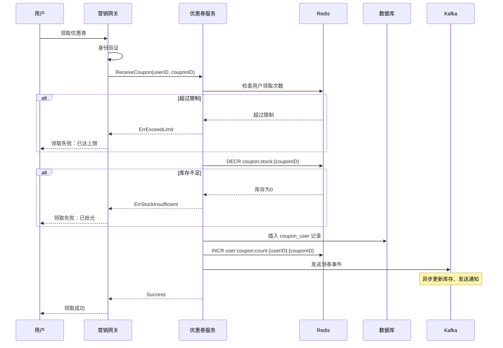

```go
func (s *CouponService) ReceiveCoupon(ctx context.Context, userID, couponID int64) (*CouponUser, error) {
	// 1. 检查优惠券是否有效
	coupon, err := s.getCouponByID(ctx, couponID)
	if err != nil {
		return nil, err
	}

	if coupon.Status != StatusActive {
		return nil, ErrCouponNotActive
	}

	if time.Now().Before(coupon.StartTime) || time.Now().After(coupon.EndTime) {
		return nil, ErrCouponExpired
	}

	// 2. 检查用户领取次数（Redis）
	userReceiveKey := fmt.Sprintf("user:coupon:count:%d:%d", userID, couponID)
	receivedCount, err := s.redis.Get(ctx, userReceiveKey).Int64()
	if err != nil && err != redis.Nil {
		return nil, err
	}

	if receivedCount >= int64(coupon.PerUserLimit) {
		return nil, ErrExceedReceiveLimit
	}

	// 3. Redis 库存扣减（原子操作）
	stockKey := fmt.Sprintf("coupon:stock:%d", couponID)
	remainStock, err := s.redis.Decr(ctx, stockKey).Result()
	if err != nil {
		return nil, err
	}

	if remainStock < 0 {
		// 回滚库存
		s.redis.Incr(ctx, stockKey)
		return nil, ErrCouponStockInsufficient
	}

	// 4. 数据库插入用户优惠券记录
	expireAt := time.Now().Add(time.Duration(coupon.ValidDays) * 24 * time.Hour)
	couponUser := &CouponUser{
		CouponID:   couponID,
		UserID:     userID,
		Status:     CouponStatusUnused,
		ReceivedAt: time.Now(),
		ExpireAt:   expireAt,
	}

	if err := s.db.InsertCouponUser(ctx, couponUser); err != nil {
		// 回滚库存
		s.redis.Incr(ctx, stockKey)
		return nil, err
	}

	// 5. Redis 用户领取次数 +1
	s.redis.Incr(ctx, userReceiveKey)
	s.redis.Expire(ctx, userReceiveKey, 7*24*time.Hour)

	// 6. 记录日志
	s.recordCouponLog(ctx, couponUser.ID, couponID, userID, "receive", "", CouponStatusUnused, "用户领取")

	// 7. 发送 Kafka 事件（异步）
	event := &CouponReceivedEvent{
		CouponUserID: couponUser.ID,
		CouponID:     couponID,
		UserID:       userID,
		ReceivedAt:   time.Now(),
	}
	s.publishCouponEvent(ctx, "coupon.received", event)

	return couponUser, nil
}
```

#### 2.1.3 优惠券核销流程

下单阶段通常先**冻结**，支付成功后再**核销**；取消 / 支付失败则解冻或回退。状态机如下。

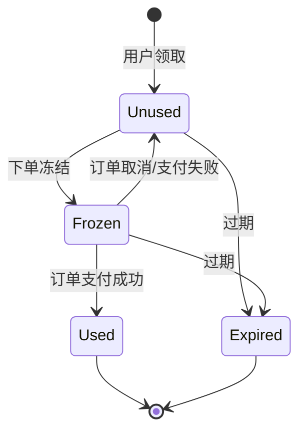

```go
func (s *CouponService) UseCoupon(ctx context.Context, userID, couponUserID, orderID int64) error {
	// 1. 查询用户优惠券
	couponUser, err := s.db.GetCouponUser(ctx, couponUserID)
	if err != nil {
		return err
	}

	if couponUser.UserID != userID {
		return ErrCouponNotBelongToUser
	}

	if couponUser.Status != CouponStatusUnused && couponUser.Status != CouponStatusFrozen {
		return ErrCouponAlreadyUsed
	}

	if time.Now().After(couponUser.ExpireAt) {
		return ErrCouponExpired
	}

	// 2. 查询优惠券详情（校验适用范围）
	coupon, err := s.getCouponByID(ctx, couponUser.CouponID)
	if err != nil {
		return err
	}

	// 3. 分布式锁（防止并发使用）
	lockKey := fmt.Sprintf("lock:coupon:use:%d", couponUserID)
	lock := s.redisson.GetLock(lockKey)
	if err := lock.Lock(ctx, 3*time.Second); err != nil {
		return ErrCouponLockFailed
	}
	defer lock.Unlock(ctx)

	// 4. 更新优惠券状态为已使用
	now := time.Now()
	if err := s.db.UpdateCouponUserStatus(ctx, couponUserID, CouponStatusUsed, orderID, &now); err != nil {
		return err
	}

	// 5. 优惠券主表已使用数量 +1
	if err := s.db.IncrCouponUsedQuantity(ctx, couponUser.CouponID); err != nil {
		s.logger.Error("increment coupon used quantity failed", zap.Error(err))
	}

	// 6. 记录日志
	s.recordCouponLog(ctx, couponUserID, couponUser.CouponID, userID, "use", CouponStatusFrozen, CouponStatusUsed, fmt.Sprintf("订单%d使用", orderID))

	// 7. 发送 Kafka 事件
	event := &CouponUsedEvent{
		CouponUserID: couponUserID,
		CouponID:     couponUser.CouponID,
		UserID:       userID,
		OrderID:      orderID,
		UsedAt:       now,
	}
	s.publishCouponEvent(ctx, "coupon.used", event)

	return nil
}
```

#### 2.1.4 优惠券回退（订单取消 / 退款）

订单取消或全额退款时，需将用户券恢复为可用（若已过期则标记过期），并同步主表已使用量、写审计日志。

```go
func (s *CouponService) RollbackCoupon(ctx context.Context, userID, couponUserID int64, reason string) error {
	couponUser, err := s.db.GetCouponUser(ctx, couponUserID)
	if err != nil {
		return err
	}

	if couponUser.UserID != userID {
		return ErrCouponNotBelongToUser
	}

	if couponUser.Status != CouponStatusUsed && couponUser.Status != CouponStatusFrozen {
		return ErrCouponCannotRollback
	}

	lockKey := fmt.Sprintf("lock:coupon:rollback:%d", couponUserID)
	lock := s.redisson.GetLock(lockKey)
	if err := lock.Lock(ctx, 3*time.Second); err != nil {
		return ErrCouponLockFailed
	}
	defer lock.Unlock(ctx)

	newStatus := CouponStatusUnused
	if time.Now().After(couponUser.ExpireAt) {
		newStatus = CouponStatusExpired
	}

	if err := s.db.UpdateCouponUserStatus(ctx, couponUserID, newStatus, nil, nil); err != nil {
		return err
	}

	if couponUser.Status == CouponStatusUsed {
		if err := s.db.DecrCouponUsedQuantity(ctx, couponUser.CouponID); err != nil {
			s.logger.Error("decrement coupon used quantity failed", zap.Error(err))
		}
	}

	s.recordCouponLog(ctx, couponUserID, couponUser.CouponID, userID, "rollback", couponUser.Status, newStatus, reason)

	event := &CouponRolledBackEvent{
		CouponUserID: couponUserID,
		CouponID:     couponUser.CouponID,
		UserID:       userID,
		Reason:       reason,
		RolledBackAt: time.Now(),
	}
	s.publishCouponEvent(ctx, "coupon.rolled_back", event)

	return nil
}

### 2.2 积分系统

#### 2.2.1 积分账户模型

积分账户采用**可用 / 冻结**余额与**乐观锁版本号**；流水表支撑对账与审计，`PointsExpire` 供定时任务批量过期。

```go
// 积分账户表
type PointsAccount struct {
	UserID          int64     `json:"user_id"`
	AvailablePoints int64     `json:"available_points"`
	FrozenPoints    int64     `json:"frozen_points"`
	TotalEarned     int64     `json:"total_earned"`
	TotalSpent      int64     `json:"total_spent"`
	Version         int64     `json:"version"`
	CreatedAt       time.Time `json:"created_at"`
	UpdatedAt       time.Time `json:"updated_at"`
}

// 积分流水表
type PointsLog struct {
	ID            int64      `json:"id"`
	UserID        int64      `json:"user_id"`
	ChangeType    string     `json:"change_type"` // earn/spend/freeze/unfreeze/expire
	ChangeAmount  int64      `json:"change_amount"`
	BeforeBalance int64      `json:"before_balance"`
	AfterBalance  int64      `json:"after_balance"`
	BizType       string     `json:"biz_type"`
	BizID         string     `json:"biz_id"`
	Reason        string     `json:"reason"`
	ExpireAt      *time.Time `json:"expire_at"`
	CreatedAt     time.Time  `json:"created_at"`
}

// 积分过期记录表（用于定时任务扫描）
type PointsExpire struct {
	ID          int64      `json:"id"`
	UserID      int64      `json:"user_id"`
	Points      int64      `json:"points"`
	ExpireAt    time.Time  `json:"expire_at"`
	Status      string     `json:"status"` // pending/expired
	ProcessedAt *time.Time `json:"processed_at"`
}
```

#### 2.2.2 积分发放

典型来源：**订单完成返利**、**签到 / 任务**、**邀请好友**、**评价晒单**等。

```go
type EarnPointsRequest struct {
	UserID    int64
	Points    int64
	ValidDays int
	BizType   string
	BizID     string
	Reason    string
}

func (s *PointsService) EarnPoints(ctx context.Context, req *EarnPointsRequest) error {
	if req.Points <= 0 {
		return ErrInvalidPoints
	}

	maxRetries := 3
	for i := 0; i < maxRetries; i++ {
		account, err := s.db.GetPointsAccount(ctx, req.UserID)
		if err != nil {
			if err == sql.ErrNoRows {
				account = &PointsAccount{
					UserID: req.UserID, AvailablePoints: 0, FrozenPoints: 0,
					TotalEarned: 0, TotalSpent: 0, Version: 0,
				}
				if err := s.db.InsertPointsAccount(ctx, account); err != nil {
					return err
				}
			} else {
				return err
			}
		}

		newAvailable := account.AvailablePoints + req.Points
		newTotalEarned := account.TotalEarned + req.Points

		affected, err := s.db.UpdatePointsAccountWithVersion(ctx, req.UserID, account.Version, newAvailable, account.FrozenPoints, newTotalEarned, account.TotalSpent)
		if err != nil {
			return err
		}

		if affected > 0 {
			expireAt := time.Now().Add(time.Duration(req.ValidDays) * 24 * time.Hour)
			log := &PointsLog{
				UserID: req.UserID, ChangeType: "earn", ChangeAmount: req.Points,
				BeforeBalance: account.AvailablePoints, AfterBalance: newAvailable,
				BizType: req.BizType, BizID: req.BizID, Reason: req.Reason,
				ExpireAt: &expireAt, CreatedAt: time.Now(),
			}
			s.db.InsertPointsLog(ctx, log)

			expire := &PointsExpire{UserID: req.UserID, Points: req.Points, ExpireAt: expireAt, Status: "pending"}
			s.db.InsertPointsExpire(ctx, expire)

			s.publishPointsEvent(ctx, "points.earned", &PointsEarnedEvent{
				UserID: req.UserID, Points: req.Points, BizType: req.BizType, BizID: req.BizID, EarnedAt: time.Now(),
			})
			return nil
		}

		time.Sleep(time.Duration(i*10) * time.Millisecond)
	}

	return ErrPointsUpdateConflict
}
```

#### 2.2.3 积分扣减（订单侧调用）

```go
func (s *PointsService) SpendPoints(ctx context.Context, userID int64, points int64, orderID int64) error {
	if points <= 0 {
		return ErrInvalidPoints
	}

	maxRetries := 3
	for i := 0; i < maxRetries; i++ {
		account, err := s.db.GetPointsAccount(ctx, userID)
		if err != nil {
			return err
		}

		if account.AvailablePoints < points {
			return ErrPointsInsufficient
		}

		newAvailable := account.AvailablePoints - points
		newTotalSpent := account.TotalSpent + points

		affected, err := s.db.UpdatePointsAccountWithVersion(ctx, userID, account.Version, newAvailable, account.FrozenPoints, account.TotalEarned, newTotalSpent)
		if err != nil {
			return err
		}

		if affected > 0 {
			log := &PointsLog{
				UserID: userID, ChangeType: "spend", ChangeAmount: -points,
				BeforeBalance: account.AvailablePoints, AfterBalance: newAvailable,
				BizType: "order", BizID: fmt.Sprintf("%d", orderID),
				Reason: fmt.Sprintf("订单%d抵扣", orderID), CreatedAt: time.Now(),
			}
			s.db.InsertPointsLog(ctx, log)

			s.publishPointsEvent(ctx, "points.spent", &PointsSpentEvent{
				UserID: userID, Points: points, OrderID: orderID, SpentAt: time.Now(),
			})
			return nil
		}

		time.Sleep(time.Duration(i*10) * time.Millisecond)
	}

	return ErrPointsUpdateConflict
}
```

#### 2.2.4 积分退还（订单取消 / 退款）

```go
func (s *PointsService) RefundPoints(ctx context.Context, userID int64, points int64, orderID int64) error {
	if points <= 0 {
		return ErrInvalidPoints
	}

	maxRetries := 3
	for i := 0; i < maxRetries; i++ {
		account, err := s.db.GetPointsAccount(ctx, userID)
		if err != nil {
			return err
		}

		newAvailable := account.AvailablePoints + points
		newTotalSpent := account.TotalSpent - points

		affected, err := s.db.UpdatePointsAccountWithVersion(ctx, userID, account.Version, newAvailable, account.FrozenPoints, account.TotalEarned, newTotalSpent)
		if err != nil {
			return err
		}

		if affected > 0 {
			log := &PointsLog{
				UserID: userID, ChangeType: "refund", ChangeAmount: points,
				BeforeBalance: account.AvailablePoints, AfterBalance: newAvailable,
				BizType: "order", BizID: fmt.Sprintf("%d", orderID),
				Reason: fmt.Sprintf("订单%d取消/退款", orderID), CreatedAt: time.Now(),
			}
			s.db.InsertPointsLog(ctx, log)

			s.publishPointsEvent(ctx, "points.refunded", &PointsRefundedEvent{
				UserID: userID, Points: points, OrderID: orderID, RefundedAt: time.Now(),
			})
			return nil
		}

		time.Sleep(time.Duration(i*10) * time.Millisecond)
	}

	return ErrPointsUpdateConflict
}
```

#### 2.2.5 积分过期机制

定时扫描 `PointsExpire` 表中到期且 `pending` 的记录，按乐观锁扣减可用余额并写流水。

```go
func (s *PointsService) ExpirePointsScanner(ctx context.Context) {
	ticker := time.NewTicker(1 * time.Hour)
	defer ticker.Stop()

	for {
		select {
		case <-ctx.Done():
			return
		case <-ticker.C:
			s.processExpiredPoints(ctx)
		}
	}
}

func (s *PointsService) processExpiredPoints(ctx context.Context) {
	expireList, err := s.db.GetPendingExpirePoints(ctx, time.Now())
	if err != nil {
		s.logger.Error("get pending expire points failed", zap.Error(err))
		return
	}

	for _, expire := range expireList {
		if err := s.expirePoints(ctx, expire); err != nil {
			s.logger.Error("expire points failed", zap.Int64("user_id", expire.UserID), zap.Error(err))
		}
	}
}
```

```go
func (s *PointsService) expirePoints(ctx context.Context, expire *PointsExpire) error {
	maxRetries := 3
	for i := 0; i < maxRetries; i++ {
		account, err := s.db.GetPointsAccount(ctx, expire.UserID)
		if err != nil {
			return err
		}

		expireAmount := expire.Points
		if account.AvailablePoints < expireAmount {
			expireAmount = account.AvailablePoints
		}

		if expireAmount <= 0 {
			s.db.UpdatePointsExpireStatus(ctx, expire.ID, "expired")
			return nil
		}

		newAvailable := account.AvailablePoints - expireAmount

		affected, err := s.db.UpdatePointsAccountWithVersion(ctx, expire.UserID, account.Version, newAvailable, account.FrozenPoints, account.TotalEarned, account.TotalSpent)
		if err != nil {
			return err
		}

		if affected > 0 {
			log := &PointsLog{
				UserID: expire.UserID, ChangeType: "expire", ChangeAmount: -expireAmount,
				BeforeBalance: account.AvailablePoints, AfterBalance: newAvailable,
				BizType: "system", BizID: fmt.Sprintf("expire_%d", expire.ID),
				Reason: "积分过期", CreatedAt: time.Now(),
			}
			s.db.InsertPointsLog(ctx, log)

			now := time.Now()
			s.db.UpdatePointsExpireStatusWithTime(ctx, expire.ID, "expired", &now)
			return nil
		}

		time.Sleep(time.Duration(i*10) * time.Millisecond)
	}

	return ErrPointsUpdateConflict
}
```

### 2.3 活动引擎

#### 2.3.1 活动类型

| 活动类型 | 业务逻辑 | 技术挑战 | 适用场景 |
|---------|---------|---------|---------|
| 满减 | 订单满 X 元减 Y 元 | 跨店铺叠加规则 | 提升客单价 |
| 折扣 | 商品打 X 折 | 与优惠券叠加规则 | 清库存 |
| 秒杀 | 限时限量特价 | 高并发、库存扣减 | 引流、造热点 |
| 拼团 | N 人成团享优惠 | 成团判断、超时取消 | 社交裂变 |
| N 元购 | 固定价格购买 | 限购、防刷 | 拉新、促活 |
| 买赠 | 买 A 送 B | 库存联动扣减 | 关联销售 |

#### 2.3.2 活动数据模型

```go
// 活动主表
type Activity struct {
	ActivityID   int64           `json:"activity_id"`
	ActivityName string          `json:"activity_name"`
	ActivityType string          `json:"activity_type"`
	RuleConfig   json.RawMessage `json:"rule_config"`
	ApplyScope   string          `json:"apply_scope"`
	StartTime    time.Time       `json:"start_time"`
	EndTime      time.Time       `json:"end_time"`
	TotalStock   int64           `json:"total_stock"`
	UsedStock    int64           `json:"used_stock"`
	Status       string          `json:"status"`
	CreatedBy    int64           `json:"created_by"`
	CreatedAt    time.Time       `json:"created_at"`
	UpdatedAt    time.Time       `json:"updated_at"`
}

// 活动圈品表
type ActivityProduct struct {
	ID            int64           `json:"id"`
	ActivityID    int64           `json:"activity_id"`
	ProductID     int64           `json:"product_id"`
	SKUID         int64           `json:"sku_id"`
	OriginalPrice decimal.Decimal `json:"original_price"`
	ActivityPrice decimal.Decimal `json:"activity_price"`
	ActivityStock int64           `json:"activity_stock"`
	SoldCount     int64           `json:"sold_count"`
	CreatedAt     time.Time       `json:"created_at"`
}

// 满减规则示例
type FullReductionRule struct {
	Tiers []FullReductionTier `json:"tiers"`
}

type FullReductionTier struct {
	MinAmount      decimal.Decimal `json:"min_amount"`
	DiscountAmount decimal.Decimal `json:"discount_amount"`
}

// 秒杀规则示例
type FlashSaleRule struct {
	PerUserLimit int  `json:"per_user_limit"`
	NeedVerify   bool `json:"need_verify"`
}
```

#### 2.3.3 活动状态机

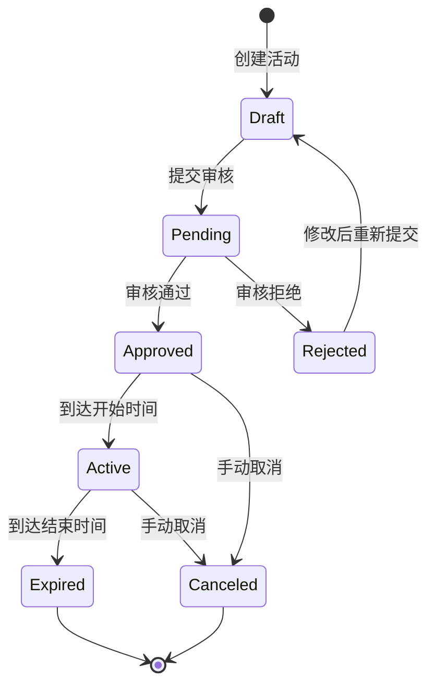

#### 2.3.4 圈品规则

支持**全场**、**指定类目**、**指定商品 / SKU**，并可扩展**排除规则**（例如已参加互斥活动的商品）。

```go
func (s *ActivityService) IsProductEligible(ctx context.Context, activityID, productID, skuID int64) (bool, error) {
	activity, err := s.getActivityByID(ctx, activityID)
	if err != nil {
		return false, err
	}

	if activity.Status != StatusActive {
		return false, nil
	}

	now := time.Now()
	if now.Before(activity.StartTime) || now.After(activity.EndTime) {
		return false, nil
	}

	switch activity.ApplyScope {
	case "all":
		return true, nil

	case "category":
		product, err := s.productClient.GetProduct(ctx, productID)
		if err != nil {
			return false, err
		}

		categories, err := s.db.GetActivityCategories(ctx, activityID)
		if err != nil {
			return false, err
		}

		for _, catID := range categories {
			if product.CategoryID == catID {
				return true, nil
			}
		}
		return false, nil

	case "product":
		activityProduct, err := s.db.GetActivityProduct(ctx, activityID, productID, skuID)
		if err != nil {
			if err == sql.ErrNoRows {
				return false, nil
			}
			return false, err
		}

		if activityProduct.SoldCount >= activityProduct.ActivityStock {
			return false, nil
		}

		return true, nil

	default:
		return false, nil
	}
}

## 3. 营销计算引擎

### 3.1 优惠计算流程

营销计算在购物车 / 结算页被高频调用：需要聚合用户券、活动、积分，应用叠加与互斥规则，输出**最优方案**并**分摊到行**。

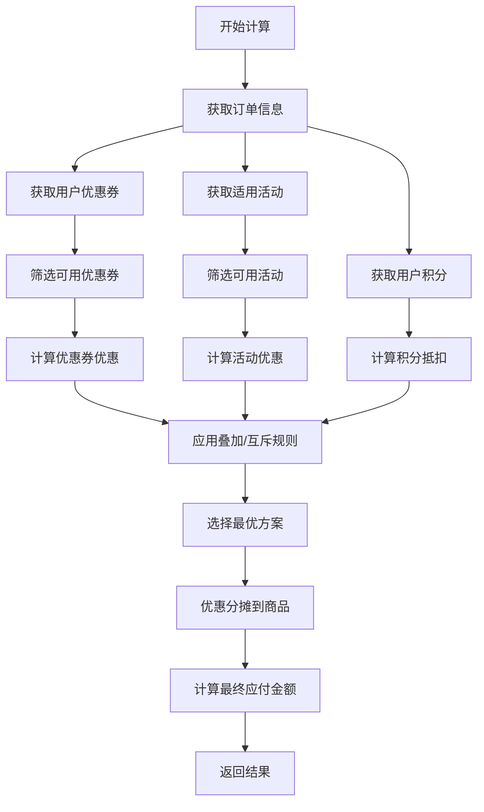

```go
type MarketingCalculationEngine struct {
	couponService   *CouponService
	pointsService   *PointsService
	activityService *ActivityService
	ruleEngine      *RuleEngine
}

type CalculateRequest struct {
	UserID    int64        `json:"user_id"`
	Items     []*OrderItem `json:"items"`
	CouponIDs []int64      `json:"coupon_ids"`
	UsePoints int64        `json:"use_points"`
}

type OrderItem struct {
	ProductID int64           `json:"product_id"`
	SKUID     int64           `json:"sku_id"`
	Quantity  int             `json:"quantity"`
	Price     decimal.Decimal `json:"price"`
	Amount    decimal.Decimal `json:"amount"`
}

type CalculateResponse struct {
	OriginalAmount   decimal.Decimal `json:"original_amount"`
	CouponDiscount   decimal.Decimal `json:"coupon_discount"`
	ActivityDiscount decimal.Decimal `json:"activity_discount"`
	PointsDiscount   decimal.Decimal `json:"points_discount"`
	TotalDiscount    decimal.Decimal `json:"total_discount"`
	FinalAmount      decimal.Decimal `json:"final_amount"`

	ItemDiscounts  []*ItemDiscount `json:"item_discounts"`
	UsedCoupons    []*UsedCoupon   `json:"used_coupons"`
	UsedActivities []*UsedActivity `json:"used_activities"`
	UsedPoints     int64           `json:"used_points"`
}

func (e *MarketingCalculationEngine) Calculate(ctx context.Context, req *CalculateRequest) (*CalculateResponse, error) {
	originalAmount := decimal.Zero
	for _, item := range req.Items {
		originalAmount = originalAmount.Add(item.Amount)
	}

	availableCoupons, err := e.getAvailableCoupons(ctx, req.UserID, req.CouponIDs, req.Items)
	if err != nil {
		return nil, err
	}

	availableActivities, err := e.getAvailableActivities(ctx, req.Items)
	if err != nil {
		return nil, err
	}

	pointsDiscount := decimal.NewFromInt(req.UsePoints).Div(decimal.NewFromInt(100))

	bestPlan, err := e.ruleEngine.FindBestCombination(ctx, originalAmount, availableCoupons, availableActivities, pointsDiscount)
	if err != nil {
		return nil, err
	}

	itemDiscounts := e.allocateDiscountToItems(req.Items, bestPlan)

	totalDiscount := bestPlan.CouponDiscount.Add(bestPlan.ActivityDiscount).Add(pointsDiscount)
	finalAmount := originalAmount.Sub(totalDiscount)
	if finalAmount.LessThan(decimal.Zero) {
		finalAmount = decimal.Zero
	}

	return &CalculateResponse{
		OriginalAmount:   originalAmount,
		CouponDiscount:   bestPlan.CouponDiscount,
		ActivityDiscount: bestPlan.ActivityDiscount,
		PointsDiscount:   pointsDiscount,
		TotalDiscount:    totalDiscount,
		FinalAmount:      finalAmount,
		ItemDiscounts:    itemDiscounts,
		UsedCoupons:      bestPlan.UsedCoupons,
		UsedActivities:   bestPlan.UsedActivities,
		UsedPoints:       req.UsePoints,
	}, nil
}
```

### 3.2 优惠叠加与互斥规则

常见规则：**同一订单一张券**；**活动与券可叠加**（示例实现为**先活动后券**）；**积分可与券、活动叠加**；**跨店铺**需单独策略（不同店铺优惠不可简单合并）。

```go
type RuleEngine struct{}

type PromotionPlan struct {
	CouponDiscount   decimal.Decimal
	ActivityDiscount decimal.Decimal
	UsedCoupons      []*UsedCoupon
	UsedActivities   []*UsedActivity
	TotalDiscount    decimal.Decimal
}

type UsedCoupon struct {
	CouponID       int64
	CouponUserID   int64
	DiscountAmount decimal.Decimal
}

type UsedActivity struct {
	ActivityID     int64
	DiscountAmount decimal.Decimal
}

func (r *RuleEngine) FindBestCombination(
	ctx context.Context,
	originalAmount decimal.Decimal,
	availableCoupons []*Coupon,
	availableActivities []*Activity,
	pointsDiscount decimal.Decimal,
) (*PromotionPlan, error) {

	var bestPlan *PromotionPlan
	maxDiscount := decimal.Zero

	for _, coupon := range availableCoupons {
		activityCombinations := r.generateActivityCombinations(availableActivities)

		for _, activityCombo := range activityCombinations {
			plan := r.calculatePlan(originalAmount, coupon, activityCombo)

			if plan.TotalDiscount.GreaterThan(maxDiscount) {
				maxDiscount = plan.TotalDiscount
				bestPlan = plan
			}
		}
	}

	if bestPlan == nil {
		activityCombinations := r.generateActivityCombinations(availableActivities)
		for _, activityCombo := range activityCombinations {
			plan := r.calculatePlan(originalAmount, nil, activityCombo)
			if plan.TotalDiscount.GreaterThan(maxDiscount) {
				maxDiscount = plan.TotalDiscount
				bestPlan = plan
			}
		}
	}

	if bestPlan == nil {
		bestPlan = &PromotionPlan{
			CouponDiscount:   decimal.Zero,
			ActivityDiscount: decimal.Zero,
			TotalDiscount:    decimal.Zero,
		}
	}

	return bestPlan, nil
}
```

```go
func (r *RuleEngine) calculatePlan(
	originalAmount decimal.Decimal,
	coupon *Coupon,
	activities []*Activity,
) *PromotionPlan {
	plan := &PromotionPlan{
		CouponDiscount:   decimal.Zero,
		ActivityDiscount: decimal.Zero,
		UsedCoupons:      []*UsedCoupon{},
		UsedActivities:   []*UsedActivity{},
	}

	currentAmount := originalAmount

	for _, activity := range activities {
		activityDiscount := r.calculateActivityDiscount(currentAmount, activity)
		if activityDiscount.GreaterThan(decimal.Zero) {
			plan.ActivityDiscount = plan.ActivityDiscount.Add(activityDiscount)
			plan.UsedActivities = append(plan.UsedActivities, &UsedActivity{
				ActivityID:     activity.ActivityID,
				DiscountAmount: activityDiscount,
			})
			currentAmount = currentAmount.Sub(activityDiscount)
		}
	}

	if coupon != nil {
		couponDiscount := r.calculateCouponDiscount(currentAmount, coupon)
		if couponDiscount.GreaterThan(decimal.Zero) {
			plan.CouponDiscount = couponDiscount
			plan.UsedCoupons = append(plan.UsedCoupons, &UsedCoupon{
				CouponID:       coupon.CouponID,
				DiscountAmount: couponDiscount,
			})
		}
	}

	plan.TotalDiscount = plan.ActivityDiscount.Add(plan.CouponDiscount)

	return plan
}
```

```go
func (r *RuleEngine) calculateCouponDiscount(amount decimal.Decimal, coupon *Coupon) decimal.Decimal {
	if amount.LessThan(coupon.MinOrderAmount) {
		return decimal.Zero
	}

	switch coupon.DiscountType {
	case DiscountTypeAmount:
		return coupon.DiscountValue

	case DiscountTypePercentage:
		discount := amount.Mul(decimal.NewFromInt(1).Sub(coupon.DiscountValue))
		if coupon.MaxDiscountAmt.GreaterThan(decimal.Zero) && discount.GreaterThan(coupon.MaxDiscountAmt) {
			return coupon.MaxDiscountAmt
		}
		return discount

	default:
		return decimal.Zero
	}
}
```

```go
func (r *RuleEngine) calculateActivityDiscount(amount decimal.Decimal, activity *Activity) decimal.Decimal {
	switch activity.ActivityType {
	case ActivityTypeFlashSale:
		return decimal.Zero

	case "full_reduction":
		var rule FullReductionRule
		if err := json.Unmarshal(activity.RuleConfig, &rule); err != nil {
			return decimal.Zero
		}

		var maxTier *FullReductionTier
		for i := range rule.Tiers {
			tier := &rule.Tiers[i]
			if amount.GreaterThanOrEqual(tier.MinAmount) {
				if maxTier == nil || tier.MinAmount.GreaterThan(maxTier.MinAmount) {
					maxTier = tier
				}
			}
		}

		if maxTier != nil {
			return maxTier.DiscountAmount
		}
		return decimal.Zero

	default:
		return decimal.Zero
	}
}

func (r *RuleEngine) generateActivityCombinations(activities []*Activity) [][]*Activity {
	if len(activities) == 0 {
		return [][]*Activity{{}}
	}
	return [][]*Activity{activities}
}
```

### 3.3 优惠分摊到商品

按**商品行金额占比**分摊券 / 活动 / 积分优惠，并对**尾差**做最后一行兜底，避免舍入导致总额不平。

```go
type ItemDiscount struct {
	ProductID        int64           `json:"product_id"`
	SKUID            int64           `json:"sku_id"`
	OriginalAmount   decimal.Decimal `json:"original_amount"`
	CouponDiscount   decimal.Decimal `json:"coupon_discount"`
	ActivityDiscount decimal.Decimal `json:"activity_discount"`
	PointsDiscount   decimal.Decimal `json:"points_discount"`
	FinalAmount      decimal.Decimal `json:"final_amount"`
}

func (e *MarketingCalculationEngine) allocateDiscountToItems(
	items []*OrderItem,
	plan *PromotionPlan,
) []*ItemDiscount {

	itemDiscounts := make([]*ItemDiscount, len(items))

	totalAmount := decimal.Zero
	for _, item := range items {
		totalAmount = totalAmount.Add(item.Amount)
	}

	allocatedCouponDiscount := decimal.Zero
	for i, item := range items {
		ratio := item.Amount.Div(totalAmount)
		discount := plan.CouponDiscount.Mul(ratio).Round(2)

		itemDiscounts[i] = &ItemDiscount{
			ProductID:        item.ProductID,
			SKUID:            item.SKUID,
			OriginalAmount:   item.Amount,
			CouponDiscount:   discount,
			ActivityDiscount: decimal.Zero,
			PointsDiscount:   decimal.Zero,
		}

		allocatedCouponDiscount = allocatedCouponDiscount.Add(discount)
	}

	couponDiff := plan.CouponDiscount.Sub(allocatedCouponDiscount)
	if len(itemDiscounts) > 0 && couponDiff.Abs().GreaterThan(decimal.NewFromFloat(0.01)) {
		last := itemDiscounts[len(itemDiscounts)-1]
		last.CouponDiscount = last.CouponDiscount.Add(couponDiff)
	}

	// 活动优惠、积分抵扣可按同样比例分摊（此处省略类似代码）

	for i := range itemDiscounts {
		itemDiscounts[i].FinalAmount = itemDiscounts[i].OriginalAmount.
			Sub(itemDiscounts[i].CouponDiscount).
			Sub(itemDiscounts[i].ActivityDiscount).
			Sub(itemDiscounts[i].PointsDiscount)
	}

	return itemDiscounts
}
```

## 4. 高并发场景设计

### 4.1 秒杀 / 抢券设计

#### 4.1.1 秒杀系统架构

秒杀链路强调：**边缘削峰**（CDN、验证码、网关限流）、**热点库存**（Redis 预扣 + 分布式锁）、**异步落单**（消息队列 + Worker），并与库存 DB **最终一致**同步。

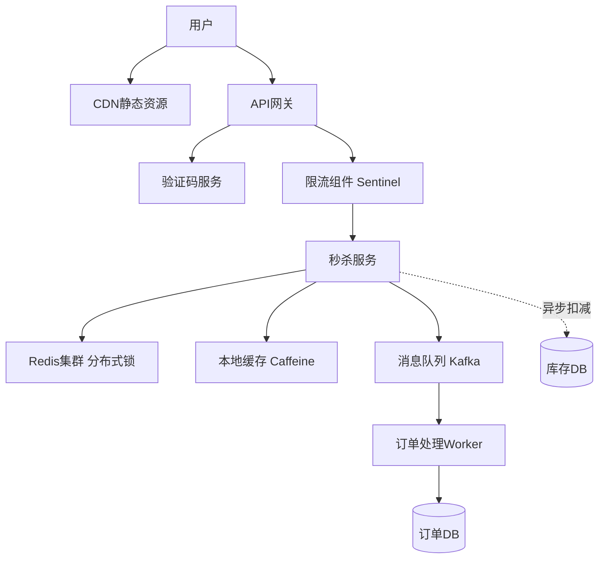

#### 4.1.2 流量削峰

常用手段：**CDN 加速**静态资源、**验证码 / 答题**延缓脚本、**排队**或**令牌桶**在网关侧削峰。

```go
func (s *SeckillService) VerifyCaptcha(ctx context.Context, userID int64, captchaID, captchaCode string) error {
	key := fmt.Sprintf("captcha:%s", captchaID)
	correctCode, err := s.redis.Get(ctx, key).Result()
	if err != nil {
		if err == redis.Nil {
			return ErrCaptchaExpired
		}
		return err
	}

	if correctCode != captchaCode {
		return ErrCaptchaInvalid
	}

	s.redis.Del(ctx, key)

	return nil
}
```

#### 4.1.3 分布式锁

```go
import (
	"github.com/go-redsync/redsync/v4"
	"github.com/go-redsync/redsync/v4/redis/goredis/v9"
)

func (s *SeckillService) SecKillProduct(ctx context.Context, req *SeckillRequest) error {
	if err := s.VerifyCaptcha(ctx, req.UserID, req.CaptchaID, req.CaptchaCode); err != nil {
		return err
	}

	userPurchaseKey := fmt.Sprintf("seckill:user:%d:activity:%d", req.UserID, req.ActivityID)
	count, err := s.redis.Get(ctx, userPurchaseKey).Int()
	if err != nil && err != redis.Nil {
		return err
	}

	activity, _ := s.getActivity(ctx, req.ActivityID)
	if count >= activity.PerUserLimit {
		return ErrExceedPurchaseLimit
	}

	stockKey := fmt.Sprintf("seckill:stock:%d", req.ActivityID)
	lockKey := fmt.Sprintf("lock:seckill:stock:%d", req.ActivityID)

	pool := goredis.NewPool(s.redisClient)
	rs := redsync.New(pool)
	mutex := rs.NewMutex(lockKey, redsync.WithExpiry(3*time.Second))

	if err := mutex.Lock(); err != nil {
		return ErrSecKillBusy
	}
	defer mutex.Unlock()

	stock, err := s.redis.Get(ctx, stockKey).Int64()
	if err != nil {
		return err
	}

	if stock <= 0 {
		return ErrSecKillStockOut
	}

	newStock, err := s.redis.Decr(ctx, stockKey).Result()
	if err != nil {
		return err
	}

	if newStock < 0 {
		s.redis.Incr(ctx, stockKey)
		return ErrSecKillStockOut
	}

	orderMsg := &SeckillOrderMessage{
		UserID: req.UserID, ActivityID: req.ActivityID, ProductID: req.ProductID,
		SKUID: req.SKUID, Quantity: 1, Timestamp: time.Now(),
	}

	if err := s.publishSeckillOrder(ctx, orderMsg); err != nil {
		s.redis.Incr(ctx, stockKey)
		return err
	}

	s.redis.Incr(ctx, userPurchaseKey)
	s.redis.Expire(ctx, userPurchaseKey, 24*time.Hour)

	return nil
}
```

#### 4.1.4 库存预扣与异步确认

Redis **预扣**保证热点路径低延迟；**Kafka** 异步创单与落库；定时任务校准 Redis 与 DB 库存。

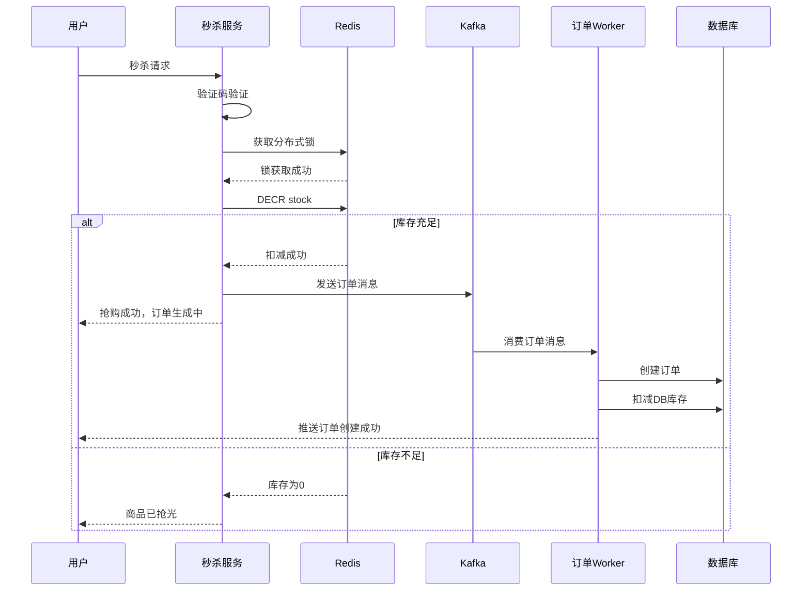

### 4.2 防刷防薅

#### 4.2.1 用户行为风控

结合**设备指纹**、**IP 限流**、**行为序列分析**与**黑名单**；接口侧用**滑动窗口**限制单用户调用频率。

```go
func (s *MarketingService) CheckRateLimit(ctx context.Context, userID int64, action string) error {
	blacklistKey := fmt.Sprintf("blacklist:user:%d", userID)
	exists, err := s.redis.Exists(ctx, blacklistKey).Result()
	if err != nil {
		return err
	}
	if exists > 0 {
		return ErrUserInBlacklist
	}

	key := fmt.Sprintf("ratelimit:%s:%d", action, userID)

	now := time.Now().Unix()
	windowStart := now - 60

	pipe := s.redis.Pipeline()

	pipe.ZRemRangeByScore(ctx, key, "0", fmt.Sprintf("%d", windowStart))

	countCmd := pipe.ZCount(ctx, key, fmt.Sprintf("%d", windowStart), fmt.Sprintf("%d", now))

	pipe.ZAdd(ctx, key, redis.Z{Score: float64(now), Member: fmt.Sprintf("%d", now)})

	pipe.Expire(ctx, key, 2*time.Minute)

	_, err = pipe.Exec(ctx)
	if err != nil {
		return err
	}

	count := countCmd.Val()
	if count >= 10 {
		return ErrRateLimitExceeded
	}

	return nil
}
```

#### 4.2.2 营销预算控制

活动维度维护**剩余预算**，下单 / 核销前校验；扣减建议用 **Lua** 保证原子性。

```go
type BudgetController struct {
	redis *redis.Client
}

func (c *BudgetController) CheckBudget(ctx context.Context, activityID int64, amount decimal.Decimal) error {
	budgetKey := fmt.Sprintf("activity:budget:%d", activityID)

	remainBudget, err := c.redis.Get(ctx, budgetKey).Result()
	if err != nil {
		if err == redis.Nil {
			return ErrBudgetExhausted
		}
		return err
	}

	remain, _ := decimal.NewFromString(remainBudget)
	if remain.LessThan(amount) {
		return ErrBudgetInsufficient
	}

	return nil
}
```

```go
func (c *BudgetController) DeductBudget(ctx context.Context, activityID int64, amount decimal.Decimal) error {
	budgetKey := fmt.Sprintf("activity:budget:%d", activityID)

	luaScript := `
        local budget_key = KEYS[1]
        local amount = tonumber(ARGV[1])
        local remain = tonumber(redis.call('GET', budget_key) or 0)

        if remain >= amount then
            redis.call('DECRBY', budget_key, amount)
            return 1
        else
            return 0
        end
    `

	result, err := c.redis.Eval(ctx, luaScript, []string{budgetKey}, amount.String()).Int()
	if err != nil {
		return err
	}

	if result == 0 {
		return ErrBudgetInsufficient
	}

	return nil
}
```

## 5. 营销与订单集成

### 5.1 下单时的营销扣减（Saga 模式）

下单链路中，**试算**与**冻结 / 扣减**需与库存、订单落库编排一致；失败时按逆序补偿。典型实现可采用 **Saga**（每步 Try + Cancel）。

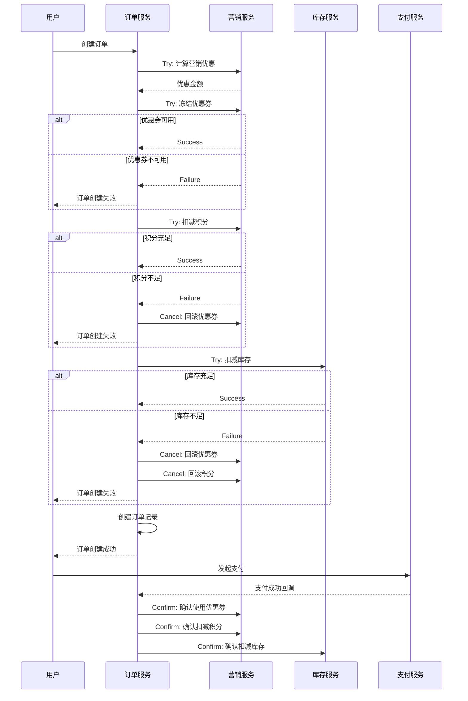

```go
// MarketingCalculationResult 与营销试算返回结构一致（字段示意）
type MarketingCalculationResult struct {
	OriginalAmount decimal.Decimal
	TotalDiscount  decimal.Decimal
	FinalAmount    decimal.Decimal
}

func (s *OrderService) CreateOrder(ctx context.Context, req *CreateOrderRequest) (*Order, error) {
	saga := NewSaga()

	var marketingResult *MarketingCalculationResult
	var order *Order

	saga.AddStep(&SagaStep{
		Name: "计算营销优惠",
		TryFunc: func(ctx context.Context) error {
			calcReq := &CalculateRequest{
				UserID: req.UserID, Items: req.Items,
				CouponIDs: req.CouponIDs, UsePoints: req.UsePoints,
			}
			result, err := s.marketingClient.Calculate(ctx, calcReq)
			if err != nil {
				return err
			}
			marketingResult = &MarketingCalculationResult{
				OriginalAmount: result.OriginalAmount,
				TotalDiscount:  result.TotalDiscount,
				FinalAmount:    result.FinalAmount,
			}
			return nil
		},
		CancelFunc: func(ctx context.Context) error { return nil },
	})

	saga.AddStep(&SagaStep{
		Name: "冻结优惠券",
		TryFunc: func(ctx context.Context) error {
			if len(req.CouponIDs) == 0 {
				return nil
			}
			return s.marketingClient.FreezeCoupon(ctx, req.UserID, req.CouponIDs[0])
		},
		CancelFunc: func(ctx context.Context) error {
			if len(req.CouponIDs) == 0 {
				return nil
			}
			return s.marketingClient.UnfreezeCoupon(ctx, req.UserID, req.CouponIDs[0])
		},
	})

	saga.AddStep(&SagaStep{
		Name: "扣减积分",
		TryFunc: func(ctx context.Context) error {
			if req.UsePoints <= 0 {
				return nil
			}
			return s.marketingClient.SpendPoints(ctx, req.UserID, req.UsePoints, 0)
		},
		CancelFunc: func(ctx context.Context) error {
			if req.UsePoints <= 0 {
				return nil
			}
			return s.marketingClient.RefundPoints(ctx, req.UserID, req.UsePoints, 0)
		},
	})

	saga.AddStep(&SagaStep{
		Name: "扣减库存",
		TryFunc: func(ctx context.Context) error {
			for _, item := range req.Items {
				if err := s.inventoryClient.DeductStock(ctx, item.SKUID, item.Quantity); err != nil {
					return err
				}
			}
			return nil
		},
		CancelFunc: func(ctx context.Context) error {
			for _, item := range req.Items {
				s.inventoryClient.RestoreStock(ctx, item.SKUID, item.Quantity)
			}
			return nil
		},
	})

	saga.AddStep(&SagaStep{
		Name: "创建订单记录",
		TryFunc: func(ctx context.Context) error {
			order = &Order{
				OrderID:        GenerateOrderID(),
				UserID:         req.UserID,
				Status:         OrderStatusPending,
				OriginalAmount: marketingResult.OriginalAmount,
				DiscountAmount: marketingResult.TotalDiscount,
				FinalAmount:    marketingResult.FinalAmount,
				UsedCouponID:   req.CouponIDs,
				UsedPoints:     req.UsePoints,
				CreatedAt:      time.Now(),
			}
			return s.db.InsertOrder(ctx, order)
		},
		CancelFunc: func(ctx context.Context) error {
			if order != nil {
				return s.db.DeleteOrder(ctx, order.OrderID)
			}
			return nil
		},
	})

	if err := saga.Execute(ctx); err != nil {
		return nil, err
	}

	return order, nil
}
```

### 5.2 取消订单时的营销回退

取消待支付 / 已支付订单（按业务规则）时，需**解冻或回滚券**、**退还积分**、**回补库存**，同样可用 Saga 编排。

```go
func (s *OrderService) CancelOrder(ctx context.Context, orderID int64) error {
	order, err := s.db.GetOrder(ctx, orderID)
	if err != nil {
		return err
	}

	if order.Status != OrderStatusPending && order.Status != OrderStatusPaid {
		return ErrOrderCannotCancel
	}

	saga := NewSaga()

	saga.AddStep(&SagaStep{
		Name: "更新订单状态",
		TryFunc: func(ctx context.Context) error {
			return s.db.UpdateOrderStatus(ctx, orderID, OrderStatusCanceled)
		},
		CancelFunc: func(ctx context.Context) error {
			return s.db.UpdateOrderStatus(ctx, orderID, order.Status)
		},
	})

	saga.AddStep(&SagaStep{
		Name: "回滚优惠券",
		TryFunc: func(ctx context.Context) error {
			if len(order.UsedCouponID) == 0 {
				return nil
			}
			return s.marketingClient.RollbackCoupon(ctx, order.UserID, order.UsedCouponID[0], "订单取消")
		},
		CancelFunc: func(ctx context.Context) error { return nil },
	})

	saga.AddStep(&SagaStep{
		Name: "退还积分",
		TryFunc: func(ctx context.Context) error {
			if order.UsedPoints <= 0 {
				return nil
			}
			return s.marketingClient.RefundPoints(ctx, order.UserID, order.UsedPoints, orderID)
		},
		CancelFunc: func(ctx context.Context) error { return nil },
	})

	saga.AddStep(&SagaStep{
		Name: "回滚库存",
		TryFunc: func(ctx context.Context) error {
			items, _ := s.db.GetOrderItems(ctx, orderID)
			for _, item := range items {
				s.inventoryClient.RestoreStock(ctx, item.SKUID, item.Quantity)
			}
			return nil
		},
		CancelFunc: func(ctx context.Context) error { return nil },
	})

	return saga.Execute(ctx)
}
```

## 6. 跨系统全链路集成

### 6.1 与商品系统集成（圈品规则）

商品中心提供**类目、价格、标签**；营销侧据此做圈品、券适用范围与活动价展示。

```go
func (s *MarketingService) GetProductMarketingInfo(ctx context.Context, productID int64) (*ProductMarketingInfo, error) {
	product, err := s.productClient.GetProduct(ctx, productID)
	if err != nil {
		return nil, err
	}

	availableCoupons, err := s.couponService.GetAvailableCouponsForProduct(ctx, productID, product.CategoryID)
	if err != nil {
		return nil, err
	}

	availableActivities, err := s.activityService.GetActivitiesForProduct(ctx, productID)
	if err != nil {
		return nil, err
	}

	return &ProductMarketingInfo{
		ProductID:           productID,
		AvailableCoupons:    availableCoupons,
		AvailableActivities: availableActivities,
		MarketingTags:       product.MarketingTags,
	}, nil
}
```

### 6.2 与计价中心集成（价格计算）

计价中心聚合**基础价 + 活动价 + 券后价**试算结果，供详情页、购物车、结算页一致展示。

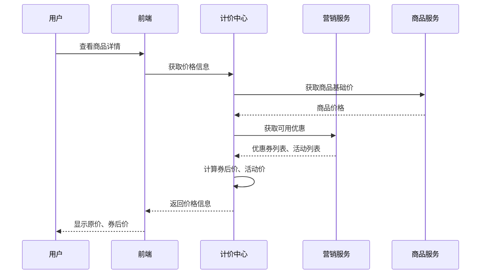

### 6.3 与用户系统集成（用户画像）

基于**注册时长、等级、订单、标签**做定向发券与触达，注意频控与隐私合规。

```go
type UserProfile struct {
	UserID      int64
	UserLevel   string
	IsNewUser   bool
	TotalOrders int64
	TotalGMV    decimal.Decimal
	LastOrderAt time.Time
	Tags        []string
}

func (s *MarketingService) SendTargetedCoupons(ctx context.Context) {
	profiles, err := s.userClient.GetUserProfiles(ctx, &UserProfileQuery{
		IsNewUser: true,
		Limit:     1000,
	})
	if err != nil {
		return
	}

	for _, profile := range profiles {
		couponID := int64(100001)

		if err := s.couponService.IssueCouponToUser(ctx, profile.UserID, couponID); err != nil {
			s.logger.Error("issue coupon failed", zap.Int64("user_id", profile.UserID), zap.Error(err))
			continue
		}

		s.notificationClient.SendMessage(ctx, profile.UserID, "您有新人专享券待领取")
	}
}
```

### 6.4 与支付系统集成（补贴核算）

支付完成后，按**平台 / 商家承担比例**拆分营销成本，支撑结算与对账。

```go
type MarketingCostSettlement struct {
	OrderID          int64
	PlatformSubsidy  decimal.Decimal
	MerchantDiscount decimal.Decimal
	CouponCost       decimal.Decimal
	ActivityCost     decimal.Decimal
	PointsCost       decimal.Decimal
}

func (s *MarketingService) SettleMarketingCost(ctx context.Context, orderID int64) (*MarketingCostSettlement, error) {
	order, err := s.orderClient.GetOrder(ctx, orderID)
	if err != nil {
		return nil, err
	}

	settlement := &MarketingCostSettlement{OrderID: orderID}

	if len(order.UsedCouponID) > 0 {
		coupon, _ := s.couponService.GetCoupon(ctx, order.UsedCouponID[0])

		if coupon.CouponType == "platform" {
			settlement.PlatformSubsidy = settlement.PlatformSubsidy.Add(coupon.DiscountValue)
		} else {
			settlement.MerchantDiscount = settlement.MerchantDiscount.Add(coupon.DiscountValue)
		}

		settlement.CouponCost = coupon.DiscountValue
	}

	activities, _ := s.activityService.GetActivitiesByOrder(ctx, orderID)
	for _, activity := range activities {
		activityCost := activity.DiscountAmount

		platformRatio := activity.PlatformSubsidyRatio
		settlement.PlatformSubsidy = settlement.PlatformSubsidy.Add(activityCost.Mul(decimal.NewFromFloat(platformRatio)))
		settlement.MerchantDiscount = settlement.MerchantDiscount.Add(activityCost.Mul(decimal.NewFromFloat(1 - platformRatio)))
		settlement.ActivityCost = settlement.ActivityCost.Add(activityCost)
	}

	if order.UsedPoints > 0 {
		pointsCost := decimal.NewFromInt(order.UsedPoints).Div(decimal.NewFromInt(100))
		settlement.PointsCost = pointsCost
		settlement.PlatformSubsidy = settlement.PlatformSubsidy.Add(pointsCost)
	}

	s.db.InsertMarketingCostSettlement(ctx, settlement)

	return settlement, nil
}
```

## 7. 数据一致性保障

### 7.1 分布式事务（Saga 模式）

Saga 将长事务拆为多个**本地事务**，每步配套**补偿**；任一步失败则**逆序**执行已成功的补偿。第 5 章订单创建即典型编排；本章补充**异步补偿**与**对账**。

### 7.2 补偿任务与重试

补偿任务表持久化待执行动作，Worker 定时拉取，失败按**指数退避**重试，超过阈值**告警人工介入**。

```go
type CompensationTask struct {
	TaskID      int64     `json:"task_id"`
	BizType     string    `json:"biz_type"`
	BizID       string    `json:"biz_id"`
	Action      string    `json:"action"`
	Payload     string    `json:"payload"`
	Status      string    `json:"status"`
	RetryCount  int       `json:"retry_count"`
	MaxRetries  int       `json:"max_retries"`
	NextRetryAt time.Time `json:"next_retry_at"`
	CreatedAt   time.Time `json:"created_at"`
}

func (s *CompensationService) CompensationWorker(ctx context.Context) {
	ticker := time.NewTicker(10 * time.Second)
	defer ticker.Stop()

	for {
		select {
		case <-ctx.Done():
			return
		case <-ticker.C:
			s.processCompensationTasks(ctx)
		}
	}
}
```

```go
func (s *CompensationService) processCompensationTasks(ctx context.Context) {
	tasks, err := s.db.GetPendingCompensationTasks(ctx, time.Now(), 100)
	if err != nil {
		s.logger.Error("get pending compensation tasks failed", zap.Error(err))
		return
	}

	for _, task := range tasks {
		if err := s.executeCompensation(ctx, task); err != nil {
			task.RetryCount++

			if task.RetryCount >= task.MaxRetries {
				s.db.UpdateCompensationTaskStatus(ctx, task.TaskID, "failed")
				s.alertClient.SendAlert(ctx, fmt.Sprintf("补偿任务失败: %d", task.TaskID))
			} else {
				nextRetryAt := time.Now().Add(time.Duration(math.Pow(2, float64(task.RetryCount))) * time.Minute)
				s.db.UpdateCompensationTaskRetry(ctx, task.TaskID, task.RetryCount, nextRetryAt)
			}
		} else {
			s.db.UpdateCompensationTaskStatus(ctx, task.TaskID, "success")
		}
	}
}
```

```go
func (s *CompensationService) executeCompensation(ctx context.Context, task *CompensationTask) error {
	switch task.Action {
	case "rollback_coupon":
		var payload struct {
			UserID       int64 `json:"user_id"`
			CouponUserID int64 `json:"coupon_user_id"`
		}
		if err := json.Unmarshal([]byte(task.Payload), &payload); err != nil {
			return err
		}
		return s.marketingClient.RollbackCoupon(ctx, payload.UserID, payload.CouponUserID, "补偿回滚")

	case "refund_points":
		var payload struct {
			UserID  int64 `json:"user_id"`
			Points  int64 `json:"points"`
			OrderID int64 `json:"order_id"`
		}
		if err := json.Unmarshal([]byte(task.Payload), &payload); err != nil {
			return err
		}
		return s.marketingClient.RefundPoints(ctx, payload.UserID, payload.Points, payload.OrderID)

	default:
		return fmt.Errorf("unknown compensation action: %s", task.Action)
	}
}
```

### 7.3 最终一致性方案

通过 **Kafka** 广播券核销、积分变动等事件，下游订单、报表、风控等系统**异步更新**；配合**幂等消费**与**死信队列**。

```go
func (s *MarketingService) publishMarketingEvent(ctx context.Context, topic string, event interface{}) error {
	eventData, err := json.Marshal(event)
	if err != nil {
		return err
	}

	msg := &kafka.Message{
		Topic: topic,
		Key:   []byte(fmt.Sprintf("%d", time.Now().UnixNano())),
		Value: eventData,
	}

	return s.kafkaProducer.WriteMessages(ctx, msg)
}
```

```go
func (s *OrderService) consumeMarketingEvents(ctx context.Context) {
	reader := kafka.NewReader(kafka.ReaderConfig{
		Brokers: []string{"localhost:9092"},
		Topic:   "marketing.coupon.used",
		GroupID: "order-service",
	})
	defer reader.Close()

	for {
		msg, err := reader.ReadMessage(ctx)
		if err != nil {
			s.logger.Error("read message failed", zap.Error(err))
			continue
		}

		var event CouponUsedEvent
		if err := json.Unmarshal(msg.Value, &event); err != nil {
			s.logger.Error("unmarshal event failed", zap.Error(err))
			continue
		}

		s.updateOrderMarketingInfo(ctx, event.OrderID, &event)
	}
}
```

### 7.4 数据对账

按日聚合**营销侧核销**与**订单侧记录**，比对金额与笔数，差异入库并告警。

```go
func (s *ReconciliationService) ReconcileMarketingData(ctx context.Context, date time.Time) error {
	marketingCouponUsage, err := s.marketingClient.GetCouponUsageByDate(ctx, date)
	if err != nil {
		return err
	}

	orderCouponUsage, err := s.orderClient.GetOrderCouponUsageByDate(ctx, date)
	if err != nil {
		return err
	}

	marketingMap := make(map[int64]*CouponUsageRecord)
	for _, record := range marketingCouponUsage {
		marketingMap[record.OrderID] = record
	}

	var discrepancies []*Discrepancy

	for _, orderRecord := range orderCouponUsage {
		marketingRecord, exists := marketingMap[orderRecord.OrderID]

		if !exists {
			discrepancies = append(discrepancies, &Discrepancy{
				OrderID: orderRecord.OrderID,
				Type:    "missing_in_marketing",
				Detail:  fmt.Sprintf("订单%d的优惠券使用记录在营销系统中缺失", orderRecord.OrderID),
			})
			continue
		}

		if !orderRecord.DiscountAmount.Equal(marketingRecord.DiscountAmount) {
			discrepancies = append(discrepancies, &Discrepancy{
				OrderID: orderRecord.OrderID,
				Type:    "amount_mismatch",
				Detail: fmt.Sprintf("订单%d的优惠金额不一致：订单=%s, 营销=%s",
					orderRecord.OrderID,
					orderRecord.DiscountAmount.String(),
					marketingRecord.DiscountAmount.String()),
			})
		}
	}

	if len(discrepancies) > 0 {
		s.logger.Warn("found discrepancies in marketing data", zap.Int("count", len(discrepancies)))

		for _, d := range discrepancies {
			s.db.InsertDiscrepancy(ctx, d)
		}

		s.alertClient.SendAlert(ctx, fmt.Sprintf("营销数据对账发现%d条差异", len(discrepancies)))
	}

	return nil
}
```

## 8. 特殊营销场景

### 8.1 跨店铺满减

用户购物车跨多店时，按**订单总金额**命中平台级满减阶梯，再按**各店金额占比**分摊优惠，注意尾差。

```go
func (s *MarketingService) CalculateCrossShopFullReduction(
	ctx context.Context,
	userID int64,
	shopOrders map[int64]*ShopOrder,
) (*CrossShopDiscountResult, error) {

	activity, err := s.activityService.GetCrossShopActivity(ctx)
	if err != nil {
		return nil, err
	}

	var rule FullReductionRule
	if err := json.Unmarshal(activity.RuleConfig, &rule); err != nil {
		return nil, err
	}

	totalAmount := decimal.Zero
	for _, shopOrder := range shopOrders {
		totalAmount = totalAmount.Add(shopOrder.Amount)
	}

	var matchedTier *FullReductionTier
	for i := range rule.Tiers {
		tier := &rule.Tiers[i]
		if totalAmount.GreaterThanOrEqual(tier.MinAmount) {
			if matchedTier == nil || tier.MinAmount.GreaterThan(matchedTier.MinAmount) {
				matchedTier = tier
			}
		}
	}

	if matchedTier == nil {
		return &CrossShopDiscountResult{
			TotalDiscount: decimal.Zero,
			ShopDiscounts: map[int64]decimal.Decimal{},
		}, nil
	}

	shopDiscounts := make(map[int64]decimal.Decimal)
	allocatedDiscount := decimal.Zero

	shopIDs := make([]int64, 0, len(shopOrders))
	for shopID := range shopOrders {
		shopIDs = append(shopIDs, shopID)
	}

	for i, shopID := range shopIDs {
		shopOrder := shopOrders[shopID]
		ratio := shopOrder.Amount.Div(totalAmount)
		discount := matchedTier.DiscountAmount.Mul(ratio).Round(2)

		if i == len(shopIDs)-1 {
			discount = matchedTier.DiscountAmount.Sub(allocatedDiscount)
		}

		shopDiscounts[shopID] = discount
		allocatedDiscount = allocatedDiscount.Add(discount)
	}

	return &CrossShopDiscountResult{
		ActivityID:    activity.ActivityID,
		TotalDiscount: matchedTier.DiscountAmount,
		ShopDiscounts: shopDiscounts,
	}, nil
}
```

### 8.2 阶梯优惠

购买件数越多折扣越大，命中**最高满足阶梯**后计算减免额。

```go
type TieredDiscountRule struct {
	Tiers []TieredDiscountTier `json:"tiers"`
}

type TieredDiscountTier struct {
	MinQuantity int             `json:"min_quantity"`
	Discount    decimal.Decimal `json:"discount"`
}

func (s *MarketingService) CalculateTieredDiscount(
	ctx context.Context,
	productID int64,
	quantity int,
	unitPrice decimal.Decimal,
) decimal.Decimal {

	activity, err := s.activityService.GetTieredDiscountActivity(ctx, productID)
	if err != nil {
		return decimal.Zero
	}

	var rule TieredDiscountRule
	if err := json.Unmarshal(activity.RuleConfig, &rule); err != nil {
		return decimal.Zero
	}

	var matchedTier *TieredDiscountTier
	for i := range rule.Tiers {
		tier := &rule.Tiers[i]
		if quantity >= tier.MinQuantity {
			if matchedTier == nil || tier.MinQuantity > matchedTier.MinQuantity {
				matchedTier = tier
			}
		}
	}

	if matchedTier == nil {
		return decimal.Zero
	}

	originalAmount := unitPrice.Mul(decimal.NewFromInt(int64(quantity)))
	discountedAmount := originalAmount.Mul(matchedTier.Discount)
	discount := originalAmount.Sub(discountedAmount)

	return discount
}
```

### 8.3 组合优惠（买 A 送 B）

订单行满足买赠规则时，追加**赠品行**（价为 0），履约侧需同步扣减赠品库存。

```go
type BundleGiftRule struct {
	BuyProductID  int64 `json:"buy_product_id"`
	BuyQuantity   int   `json:"buy_quantity"`
	GiftProductID int64 `json:"gift_product_id"`
	GiftQuantity  int   `json:"gift_quantity"`
}

func (s *MarketingService) ApplyBundleGiftActivity(
	ctx context.Context,
	orderItems []*OrderItem,
) ([]*OrderItem, error) {

	activities, err := s.activityService.GetBundleGiftActivities(ctx)
	if err != nil {
		return orderItems, err
	}

	giftItems := []*OrderItem{}

	for _, activity := range activities {
		var rule BundleGiftRule
		if err := json.Unmarshal(activity.RuleConfig, &rule); err != nil {
			continue
		}

		for _, item := range orderItems {
			if item.ProductID == rule.BuyProductID && item.Quantity >= rule.BuyQuantity {
				giftCount := item.Quantity / rule.BuyQuantity
				totalGiftQty := giftCount * rule.GiftQuantity

				giftItem := &OrderItem{
					ProductID: rule.GiftProductID,
					Quantity:  totalGiftQty,
					Price:     decimal.Zero,
					Amount:    decimal.Zero,
					IsGift:    true,
				}

				giftItems = append(giftItems, giftItem)
			}
		}
	}

	allItems := append(orderItems, giftItems...)

	return allItems, nil
}
```

### 8.4 新人专享

结合**注册时间窗口**与**历史订单数**判断是否新人；优惠金额**封顶订单实付**。

```go
func (s *MarketingService) IsNewUserEligible(ctx context.Context, userID int64) (bool, error) {
	user, err := s.userClient.GetUser(ctx, userID)
	if err != nil {
		return false, err
	}

	if time.Since(user.RegisteredAt) > 7*24*time.Hour {
		return false, nil
	}

	orderCount, err := s.orderClient.GetUserOrderCount(ctx, userID)
	if err != nil {
		return false, err
	}

	if orderCount > 0 {
		return false, nil
	}

	return true, nil
}

func (s *MarketingService) ApplyNewUserDiscount(ctx context.Context, userID int64, amount decimal.Decimal) (decimal.Decimal, error) {
	isEligible, err := s.IsNewUserEligible(ctx, userID)
	if err != nil {
		return decimal.Zero, err
	}

	if !isEligible {
		return decimal.Zero, nil
	}

	discount := decimal.NewFromInt(20)

	if discount.GreaterThan(amount) {
		discount = amount
	}

	return discount, nil
}
```

## 9. 工程实践

### 9.1 营销活动 ID 生成

分布式场景下使用 **Snowflake** 生成趋势递增、全局唯一的活动 / 批次 ID（需统一时钟与 workerId 分配）。

```go
type SnowflakeIDGenerator struct {
	mu            sync.Mutex
	epoch         int64
	workerID      int64
	sequence      int64
	lastTimestamp int64
}

const (
	workerIDBits  = 10
	sequenceBits  = 12
	maxWorkerID   = -1 ^ (-1 << workerIDBits)
	maxSequence   = -1 ^ (-1 << sequenceBits)
	timeShift     = workerIDBits + sequenceBits
	workerIDShift = sequenceBits
)

func NewSnowflakeIDGenerator(workerID int64) *SnowflakeIDGenerator {
	if workerID < 0 || workerID > maxWorkerID {
		panic("worker ID out of range")
	}

	return &SnowflakeIDGenerator{
		epoch:    1609459200000,
		workerID: workerID,
	}
}

func (g *SnowflakeIDGenerator) NextID() int64 {
	g.mu.Lock()
	defer g.mu.Unlock()

	timestamp := time.Now().UnixMilli()

	if timestamp < g.lastTimestamp {
		panic("clock moved backwards")
	}

	if timestamp == g.lastTimestamp {
		g.sequence = (g.sequence + 1) & maxSequence
		if g.sequence == 0 {
			for timestamp <= g.lastTimestamp {
				timestamp = time.Now().UnixMilli()
			}
		}
	} else {
		g.sequence = 0
	}

	g.lastTimestamp = timestamp

	id := ((timestamp - g.epoch) << timeShift) |
		(g.workerID << workerIDShift) |
		g.sequence

	return id
}
```

### 9.2 监控告警

**业务指标**：发券量、核销率、积分进出、活动参与与转化、营销 ROI。**应用指标**：QPS、RT、成功率、缓存命中率、MQ 积压。**系统指标**：CPU、内存、DB / Redis 连接。

```go
func (s *MarketingService) RecordMetrics(ctx context.Context, metricName string, value float64, tags map[string]string) {
	metric := prometheus.NewGaugeVec(
		prometheus.GaugeOpts{
			Name: metricName,
			Help: fmt.Sprintf("Marketing metric: %s", metricName),
		},
		[]string{"tag_key"},
	)

	prometheus.MustRegister(metric)

	for key, val := range tags {
		metric.WithLabelValues(val).Set(value)
	}
}

// 示例：记录优惠券发放量（在 ReceiveCoupon 成功路径调用）
func (s *CouponService) recordCouponReceivedMetric(ctx context.Context, couponID int64) {
	s.metrics.RecordMetrics(ctx, "coupon_received_total", 1, map[string]string{
		"coupon_id": fmt.Sprintf("%d", couponID),
	})
}
```

### 9.3 性能优化

| 场景 | 优化前 | 优化后 | 优化手段 |
|------|-------|-------|---------|
| 优惠券查询 | 100ms | 10ms | Redis 缓存 + 本地缓存 |
| 秒杀库存扣减 | RT 500ms | RT 50ms | Redis 预扣 + 异步落 DB |
| 营销计算 | 200ms | 50ms | 规则缓存 + 并行计算 |
| 优惠券发放 | 1000 QPS | 10000 QPS | 库存预热 + 锁粒度优化 |

```go
type CouponCache struct {
	localCache  *cache.Cache
	redisClient *redis.Client
	db          *gorm.DB
}

func (c *CouponCache) GetCoupon(ctx context.Context, couponID int64) (*Coupon, error) {
	key := fmt.Sprintf("coupon:%d", couponID)
	if val, found := c.localCache.Get(key); found {
		return val.(*Coupon), nil
	}

	redisKey := fmt.Sprintf("coupon:%d", couponID)
	data, err := c.redisClient.Get(ctx, redisKey).Bytes()
	if err == nil {
		var coupon Coupon
		if err := json.Unmarshal(data, &coupon); err == nil {
			c.localCache.Set(key, &coupon, 5*time.Minute)
			return &coupon, nil
		}
	}

	var coupon Coupon
	if err := c.db.Where("coupon_id = ?", couponID).First(&coupon).Error; err != nil {
		return nil, err
	}

	couponData, _ := json.Marshal(coupon)
	c.redisClient.Set(ctx, redisKey, couponData, 1*time.Hour)
	c.localCache.Set(key, &coupon, 5*time.Minute)

	return &coupon, nil
}
```

### 9.4 容量规划与压测

结合历史 GMV 与大促目标预估峰值 QPS；全链路压测验证网关、营销、库存、下单链路。**目标参考**：发券 1 万 QPS、秒杀 5 万 QPS；P99 RT 小于 200ms；错误率低于 0.1%。

### 9.5 故障处理与降级

| 故障类型 | 现象 | 处理方案 | 降级策略 |
|---------|------|---------|---------|
| Redis 故障 | 缓存失效 | 降级 DB 查询 | 关闭部分营销能力，按原价下单 |
| 营销服务不可用 | 试算失败 | 熔断 | 0 优惠下单或排队重试 |
| Kafka 积压 | 消息延迟 | 扩容消费者 | 异步场景可容忍延迟 |
| 秒杀超卖 | 销量大于库存 | 补偿退款 | 实时监控与下架 |
| 预算超支 | 实际补贴超预算 | 紧急下线活动 | 实时预算 Redis / 对账 |

```go
import "github.com/sony/gobreaker"

var cb *gobreaker.CircuitBreaker

func init() {
	cb = gobreaker.NewCircuitBreaker(gobreaker.Settings{
		Name:        "marketing-service",
		MaxRequests: 3,
		Timeout:     10 * time.Second,
		ReadyToTrip: func(counts gobreaker.Counts) bool {
			failureRatio := float64(counts.TotalFailures) / float64(counts.Requests)
			return counts.Requests >= 3 && failureRatio >= 0.6
		},
	})
}

func (s *OrderService) CalculateMarketing(ctx context.Context, req *CalculateRequest) (*CalculateResponse, error) {
	result, err := cb.Execute(func() (interface{}, error) {
		return s.marketingClient.Calculate(ctx, req)
	})

	if err != nil {
		original := decimal.Zero
		for _, item := range req.Items {
			original = original.Add(item.Amount)
		}
		return &CalculateResponse{
			OriginalAmount:   original,
			CouponDiscount:   decimal.Zero,
			ActivityDiscount: decimal.Zero,
			PointsDiscount:   decimal.Zero,
			TotalDiscount:    decimal.Zero,
			FinalAmount:      original,
		}, nil
	}

	return result.(*CalculateResponse), nil
}
```
```
```
