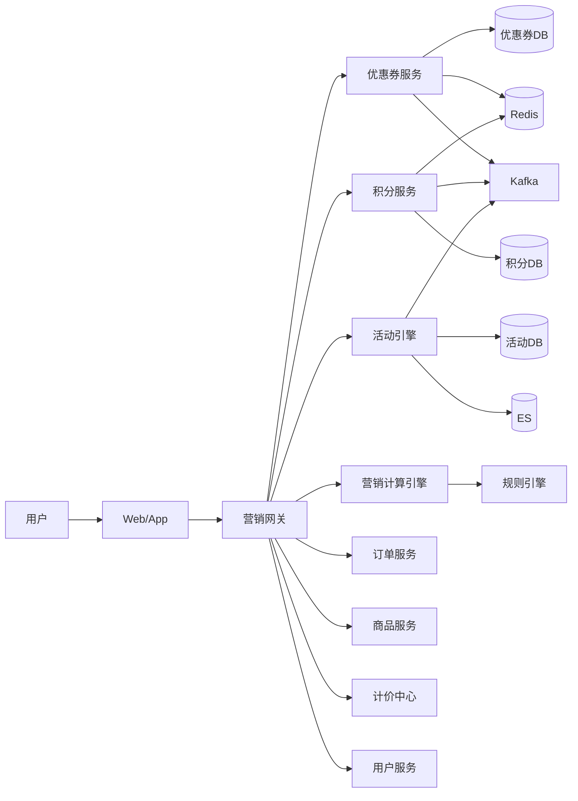
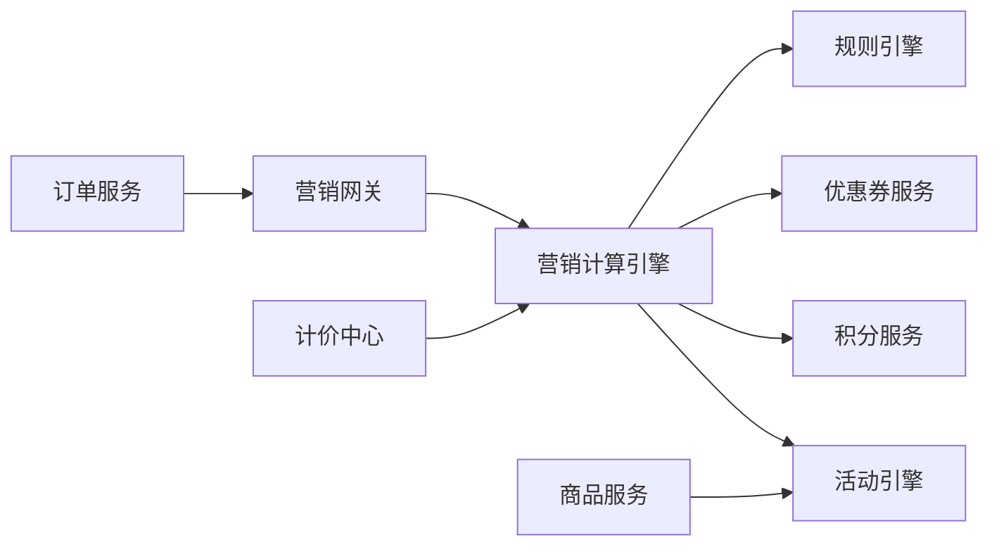
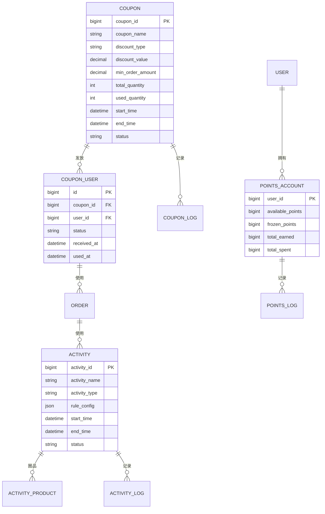
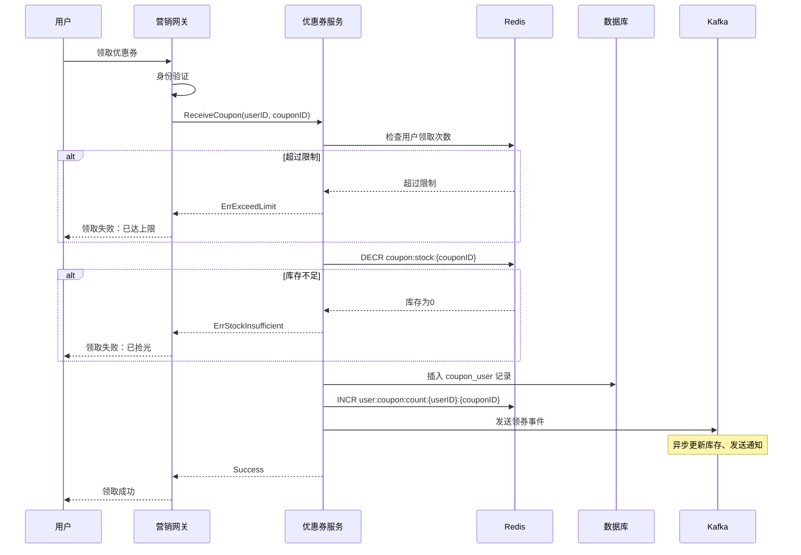
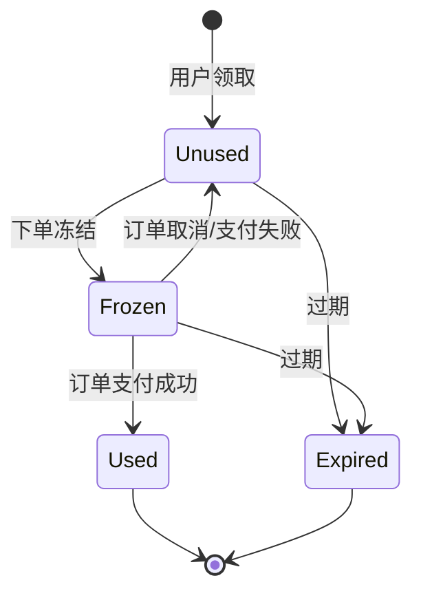

# 电商系统设计：营销系统深度解析

营销系统是电商平台的增长引擎，通过优惠券、积分、活动等手段实现用户拉新、促活、留存和 GMV 提升。本文深入解析营销系统的架构设计、核心模块、高并发场景处理和工程实践，适合系统设计面试和电商后端工程师阅读。

<!-- more -->

## 目录

1. [系统概览](#1-系统概览)
2. [营销工具体系](#2-营销工具体系)
3. [营销计算引擎](#3-营销计算引擎)
4. [高并发场景设计](#4-高并发场景设计)
5. [营销与订单集成](#5-营销与订单集成)
6. [跨系统全链路集成](#6-跨系统全链路集成)
7. [数据一致性保障](#7-数据一致性保障)
8. [特殊营销场景](#8-特殊营销场景)
9. [工程实践](#9-工程实践)
10. [总结与参考](#10-总结与参考)

---

## 1. 系统概览

### 1.1 营销系统的定位

营销系统在电商平台中承担**增长引擎**角色：通过优惠券、积分、活动与精准投放，支撑用户拉新、促活、留存与 GMV 提升。它与订单、商品、计价、用户、支付等系统紧密协作：订单侧负责扣减与回退的编排，商品与计价侧提供圈品与价格试算输入，用户侧提供画像与风控维度，支付侧完成补贴与分账核算。

**核心价值**可概括为：在**成本可控**前提下实现**精准营销**，并通过数据闭环让效果**可衡量、可优化**。

### 1.2 核心业务场景

典型业务场景包括：

- **用户拉新**：新人专享券、首单立减
- **用户促活**：签到积分、任务奖励
- **用户留存**：会员积分、等级权益
- **GMV 提升**：满减活动、限时折扣、秒杀
- **清库存**：N 元购、买赠活动

**B2C 与 B2B2C 营销差异**对比如下。

| 维度 | B2C（自营） | B2B2C（平台） |
|------|------------|--------------|
| 营销主体 | 平台 | 平台 + 商家 |
| 成本承担 | 平台全额 | 平台补贴 + 商家承担 |
| 活动审核 | 无需审核 | 商家活动需平台审核 |
| 优惠叠加 | 平台规则统一 | 需考虑跨店铺规则 |
| 结算复杂度 | 简单 | 需分账（平台 / 商家） |

### 1.3 核心挑战

1. **高并发**：秒杀、抢券等场景 QPS 峰值可达 10 万+
2. **复杂规则**：优惠叠加、互斥、优先级与「最优解」求解
3. **数据一致性**：营销扣减与订单创建的原子性与补偿
4. **防刷防薅**：黑产、批量注册、恶意套现
5. **成本控制**：营销预算、ROI 监控
6. **实时性**：库存实时扣减、优惠实时生效

### 1.4 系统架构

整体采用**接入层 → 服务层 → 数据层**分层：接入层统一鉴权与路由；服务层拆分优惠券、积分、活动与营销计算；数据层以 MySQL 为主存储，Redis 承担缓存与分布式锁，Kafka 做事件驱动，Elasticsearch 支撑活动检索与画像类查询。

**系统架构总览**如下。



**核心模块协作**可概括为：网关编排，各工具服务自治，计算引擎读多源数据并调用规则引擎；异步事件通过 Kafka 广播给下游（通知、对账、报表等）。



**核心常量定义**（类型与状态枚举，便于各服务对齐语义）：

```go
// 营销工具类型
const (
	ToolTypeCoupon   = "coupon"   // 优惠券
	ToolTypePoints   = "points"   // 积分
	ToolTypeActivity = "activity" // 活动
)

// 优惠类型
const (
	DiscountTypeAmount     = "amount"     // 满减（满100减20）
	DiscountTypePercentage = "percentage" // 折扣（8折）
	DiscountTypeFreeShip   = "free_ship"  // 包邮
	DiscountTypeGift       = "gift"       // 赠品
)

// 活动类型
const (
	ActivityTypeFlashSale = "flash_sale" // 秒杀
	ActivityTypeGroupBuy  = "group_buy"  // 拼团
	ActivityTypeSeckill   = "seckill"    // 限时抢购
	ActivityTypeNYuanGou  = "n_yuan_gou" // N元购
)

// 营销状态
const (
	StatusDraft    = "draft"    // 草稿
	StatusPending  = "pending"  // 待审核
	StatusApproved = "approved" // 已通过
	StatusRejected = "rejected" // 已拒绝
	StatusActive   = "active"   // 进行中
	StatusExpired  = "expired"  // 已过期
	StatusCanceled = "canceled" // 已取消
)
```

### 1.5 核心数据模型概览

以下为优惠券、积分、活动相关核心表关系的**逻辑 ER 示意**（实际分库分表与字段以线上为准）。



### 1.6 技术选型

| 组件 | 技术选型 | 用途 | 理由 |
|------|---------|------|------|
| 数据库 | MySQL 8.0 | 主存储 | ACID 保证、成熟稳定 |
| 缓存 | Redis 6.0 | 热数据缓存、分布式锁 | 高性能、丰富数据结构 |
| 消息队列 | Kafka | 事件驱动、异步解耦 | 高吞吐、持久化 |
| 搜索引擎 | Elasticsearch | 活动搜索、用户画像 | 全文检索、聚合分析 |
| 分布式锁 | Redisson | 秒杀库存扣减 | 基于 Redis、支持可重入 |
| 限流 | Sentinel | 接口限流、降级 | 实时监控、规则灵活 |
| ID 生成 | Snowflake | 营销活动 ID | 分布式、时间有序 |

## 2. 营销工具体系

### 2.1 优惠券系统

#### 2.1.1 优惠券类型与数据模型

优惠券按**平台券 / 商家券**、**满减 / 折扣 / 包邮**等维度组合配置；用户侧以 `CouponUser` 记录领取与核销生命周期，`CouponLog` 用于审计与对账。

```go
// 优惠券主表
type Coupon struct {
	CouponID       int64           `json:"coupon_id"`
	CouponName     string          `json:"coupon_name"`
	CouponType     string          `json:"coupon_type"`    // platform/merchant
	DiscountType   string          `json:"discount_type"`  // amount/percentage/free_ship
	DiscountValue  decimal.Decimal `json:"discount_value"` // 20元 或 0.8（8折）
	MinOrderAmount decimal.Decimal `json:"min_order_amount"`
	MaxDiscountAmt decimal.Decimal `json:"max_discount_amount"` // 折扣券最高抵扣

	TotalQuantity  int64 `json:"total_quantity"`
	UsedQuantity   int64 `json:"used_quantity"`
	RemainQuantity int64 `json:"remain_quantity"`

	PerUserLimit int       `json:"per_user_limit"`
	ValidDays    int       `json:"valid_days"`
	StartTime    time.Time `json:"start_time"`
	EndTime      time.Time `json:"end_time"`

	ApplyScope    string  `json:"apply_scope"`     // all/category/product
	ApplyScopeIDs []int64 `json:"apply_scope_ids"`

	Status    string    `json:"status"`
	CreatedAt time.Time `json:"created_at"`
	UpdatedAt time.Time `json:"updated_at"`
}

// 用户优惠券表
type CouponUser struct {
	ID         int64      `json:"id"`
	CouponID   int64      `json:"coupon_id"`
	UserID     int64      `json:"user_id"`
	Status     string     `json:"status"` // unused/used/expired
	ReceivedAt time.Time  `json:"received_at"`
	UsedAt     *time.Time `json:"used_at"`
	OrderID    *int64     `json:"order_id"`
	ExpireAt   time.Time  `json:"expire_at"`
}

// 优惠券操作日志
type CouponLog struct {
	ID           int64     `json:"id"`
	CouponUserID int64     `json:"coupon_user_id"`
	CouponID     int64     `json:"coupon_id"`
	UserID       int64     `json:"user_id"`
	Action       string    `json:"action"` // receive/use/expire/rollback
	OrderID      *int64    `json:"order_id"`
	BeforeStatus string    `json:"before_status"`
	AfterStatus  string    `json:"after_status"`
	Reason       string    `json:"reason"`
	CreatedAt    time.Time `json:"created_at"`
}
```

#### 2.1.2 优惠券发放策略

常见发放方式包括：**公开领取**（先到先得）、**定向推送**（画像圈人）、**裂变发券**（邀请达标）、**订单赠送**（履约后发放）。

公开领券链路强调：Redis 控频次与库存、DB 落库、消息异步刷新与通知。



```go
func (s *CouponService) ReceiveCoupon(ctx context.Context, userID, couponID int64) (*CouponUser, error) {
	// 1. 检查优惠券是否有效
	coupon, err := s.getCouponByID(ctx, couponID)
	if err != nil {
		return nil, err
	}

	if coupon.Status != StatusActive {
		return nil, ErrCouponNotActive
	}

	if time.Now().Before(coupon.StartTime) || time.Now().After(coupon.EndTime) {
		return nil, ErrCouponExpired
	}

	// 2. 检查用户领取次数（Redis）
	userReceiveKey := fmt.Sprintf("user:coupon:count:%d:%d", userID, couponID)
	receivedCount, err := s.redis.Get(ctx, userReceiveKey).Int64()
	if err != nil && err != redis.Nil {
		return nil, err
	}

	if receivedCount >= int64(coupon.PerUserLimit) {
		return nil, ErrExceedReceiveLimit
	}

	// 3. Redis 库存扣减（原子操作）
	stockKey := fmt.Sprintf("coupon:stock:%d", couponID)
	remainStock, err := s.redis.Decr(ctx, stockKey).Result()
	if err != nil {
		return nil, err
	}

	if remainStock < 0 {
		// 回滚库存
		s.redis.Incr(ctx, stockKey)
		return nil, ErrCouponStockInsufficient
	}

	// 4. 数据库插入用户优惠券记录
	expireAt := time.Now().Add(time.Duration(coupon.ValidDays) * 24 * time.Hour)
	couponUser := &CouponUser{
		CouponID:   couponID,
		UserID:     userID,
		Status:     CouponStatusUnused,
		ReceivedAt: time.Now(),
		ExpireAt:   expireAt,
	}

	if err := s.db.InsertCouponUser(ctx, couponUser); err != nil {
		// 回滚库存
		s.redis.Incr(ctx, stockKey)
		return nil, err
	}

	// 5. Redis 用户领取次数 +1
	s.redis.Incr(ctx, userReceiveKey)
	s.redis.Expire(ctx, userReceiveKey, 7*24*time.Hour)

	// 6. 记录日志
	s.recordCouponLog(ctx, couponUser.ID, couponID, userID, "receive", "", CouponStatusUnused, "用户领取")

	// 7. 发送 Kafka 事件（异步）
	event := &CouponReceivedEvent{
		CouponUserID: couponUser.ID,
		CouponID:     couponID,
		UserID:       userID,
		ReceivedAt:   time.Now(),
	}
	s.publishCouponEvent(ctx, "coupon.received", event)

	return couponUser, nil
}
```

#### 2.1.3 优惠券核销流程

下单阶段通常先**冻结**，支付成功后再**核销**；取消 / 支付失败则解冻或回退。状态机如下。



```go
func (s *CouponService) UseCoupon(ctx context.Context, userID, couponUserID, orderID int64) error {
	// 1. 查询用户优惠券
	couponUser, err := s.db.GetCouponUser(ctx, couponUserID)
	if err != nil {
		return err
	}

	if couponUser.UserID != userID {
		return ErrCouponNotBelongToUser
	}

	if couponUser.Status != CouponStatusUnused && couponUser.Status != CouponStatusFrozen {
		return ErrCouponAlreadyUsed
	}

	if time.Now().After(couponUser.ExpireAt) {
		return ErrCouponExpired
	}

	// 2. 查询优惠券详情（校验适用范围）
	coupon, err := s.getCouponByID(ctx, couponUser.CouponID)
	if err != nil {
		return err
	}

	// 3. 分布式锁（防止并发使用）
	lockKey := fmt.Sprintf("lock:coupon:use:%d", couponUserID)
	lock := s.redisson.GetLock(lockKey)
	if err := lock.Lock(ctx, 3*time.Second); err != nil {
		return ErrCouponLockFailed
	}
	defer lock.Unlock(ctx)

	// 4. 更新优惠券状态为已使用
	now := time.Now()
	if err := s.db.UpdateCouponUserStatus(ctx, couponUserID, CouponStatusUsed, orderID, &now); err != nil {
		return err
	}

	// 5. 优惠券主表已使用数量 +1
	if err := s.db.IncrCouponUsedQuantity(ctx, couponUser.CouponID); err != nil {
		s.logger.Error("increment coupon used quantity failed", zap.Error(err))
	}

	// 6. 记录日志
	s.recordCouponLog(ctx, couponUserID, couponUser.CouponID, userID, "use", CouponStatusFrozen, CouponStatusUsed, fmt.Sprintf("订单%d使用", orderID))

	// 7. 发送 Kafka 事件
	event := &CouponUsedEvent{
		CouponUserID: couponUserID,
		CouponID:     couponUser.CouponID,
		UserID:       userID,
		OrderID:      orderID,
		UsedAt:       now,
	}
	s.publishCouponEvent(ctx, "coupon.used", event)

	return nil
}
```

#### 2.1.4 优惠券回退（订单取消 / 退款）

订单取消或全额退款时，需将用户券恢复为可用（若已过期则标记过期），并同步主表已使用量、写审计日志。

```go
func (s *CouponService) RollbackCoupon(ctx context.Context, userID, couponUserID int64, reason string) error {
	couponUser, err := s.db.GetCouponUser(ctx, couponUserID)
	if err != nil {
		return err
	}

	if couponUser.UserID != userID {
		return ErrCouponNotBelongToUser
	}

	if couponUser.Status != CouponStatusUsed && couponUser.Status != CouponStatusFrozen {
		return ErrCouponCannotRollback
	}

	lockKey := fmt.Sprintf("lock:coupon:rollback:%d", couponUserID)
	lock := s.redisson.GetLock(lockKey)
	if err := lock.Lock(ctx, 3*time.Second); err != nil {
		return ErrCouponLockFailed
	}
	defer lock.Unlock(ctx)

	newStatus := CouponStatusUnused
	if time.Now().After(couponUser.ExpireAt) {
		newStatus = CouponStatusExpired
	}

	if err := s.db.UpdateCouponUserStatus(ctx, couponUserID, newStatus, nil, nil); err != nil {
		return err
	}

	if couponUser.Status == CouponStatusUsed {
		if err := s.db.DecrCouponUsedQuantity(ctx, couponUser.CouponID); err != nil {
			s.logger.Error("decrement coupon used quantity failed", zap.Error(err))
		}
	}

	s.recordCouponLog(ctx, couponUserID, couponUser.CouponID, userID, "rollback", couponUser.Status, newStatus, reason)

	event := &CouponRolledBackEvent{
		CouponUserID: couponUserID,
		CouponID:     couponUser.CouponID,
		UserID:       userID,
		Reason:       reason,
		RolledBackAt: time.Now(),
	}
	s.publishCouponEvent(ctx, "coupon.rolled_back", event)

	return nil
}
```
