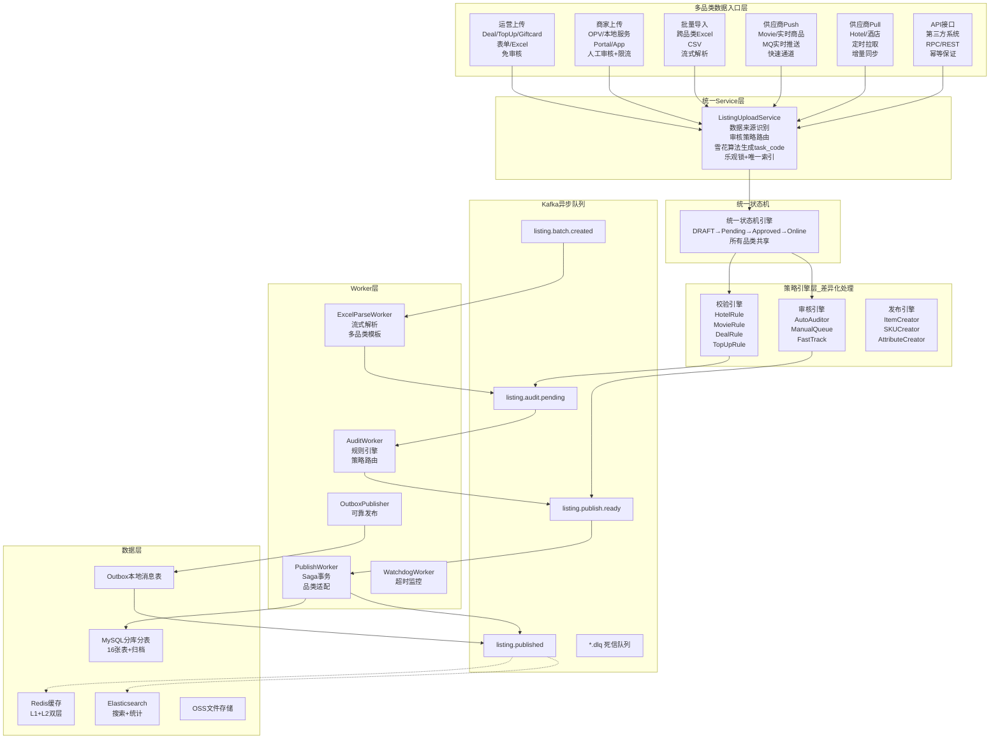

<!-- toc -->

> **电商系统设计系列**（篇次与[（一）推荐阅读顺序](/system-design/20-ecommerce-overview/)一致）
> - [（一）全景概览与领域划分](/system-design/20-ecommerce-overview/)
> - [（二）商品中心系统](/system-design/21-ecommerce-product-center/)
> - [（三）库存系统](/system-design/22-ecommerce-inventory/)
> - [（四）营销系统深度解析](/system-design/23-ecommerce-marketing-system/)
> - [（五）计价引擎](/system-design/24-ecommerce-pricing-engine/)
> - [（六）计价系统 DDD 实践](/system-design/25-ecommerce-pricing-ddd/)
> - [（七）订单系统](/system-design/26-ecommerce-order-system/)
> - [（八）支付系统深度解析](/system-design/27-ecommerce-payment-system/)
> - [（九）商品上架系统](/system-design/28-ecommerce-listing/)
> - **（十）B 端运营系统**（本文）

本文是电商系统设计系列的第十篇，聚焦 B 端运营系统的设计。

## 一、背景与挑战

### 1.1 业务背景

在数字电商/本地生活平台中，**B端商品运营管理系统**面临的最大挑战是：

> **如何在多品类、多数据源、差异化业务规则的前提下，提供统一、高效的商品管理能力？**

平台涵盖多种品类，每种品类的商品属性、数据来源、审核要求、库存模型、定价逻辑都存在显著差异。系统需要服务三类B端用户：

1. **供应商**：推送商品数据、同步库存价格
2. **运营人员**：商品上架、批量管理、价格调整、首页配置
3. **商家**：自营商品上传、信息维护

系统涵盖两大核心能力：

| 核心能力 | 职责 | 用户 | 典型操作 |
|---------|------|------|---------|
| **商品供给侧** | 商品快速上架到平台 | 供应商、运营、商家 | 单品上传、批量导入、供应商同步、审核发布 |
| **运营管理侧** | 已上线商品高效管理 | 运营人员 | 批量编辑、价格调整、库存管理、首页配置 |

### 1.2 多品类差异与统一挑战

#### 1.2.1 品类差异对比（核心）

| 品类 | 商品特点 | 主要数据来源 | 审核策略 | 库存模型 | 价格模型 | 特殊处理 |
|------|----------|-------------|---------|---------|---------|----------|
| **电子券 (Deal)** | 券码制，每券唯一 | 运营上传 | 免审核 | 券码池，预订扣减 | 面值 vs 售价 | 券码池异步导入 |
| **虚拟服务券 (OPV)** | 数量制，分平台统计 | 运营/商家 | 商家需审核 | 数量制，预订扣减 | 固定价 + 促销 | 平台分润规则 |
| **酒店 (Hotel)** | 房型 × 日期 | 供应商Pull | 自动审核 | 时间维度库存 | 日历价 + 动态定价 | 价格日历校验 |
| **电影票 (Movie)** | 场次 × 座位 × 票种 | 供应商Push | 快速通道 | 座位制库存 | 场次定价 + Fee | 场次时间校验 |
| **话费充值 (TopUp)** | 面额制 | 运营上传 | 免审核 | 无限库存 | 面额 + 折扣 | 面额范围校验 |
| **礼品卡 (Giftcard)** | 实时生成/预采购 | 运营/商家 | 商家需审核 | 券码制/无限 | 面值定价 | 卡密生成逻辑 |
| **本地生活套餐** | 组合型，多子项 | 商家上传 | 人工审核 | 组合库存联动 | 套餐价 + 子项加总 | 组合校验规则 |

#### 1.2.2 数据来源分类

在数字电商/本地生活平台中，商品上架的数据来源和审核策略差异极大：

| 数据来源 | 触发方式 | 数据可信度 | 审核策略 | 典型场景 |
|---------|---------|-----------|---------|----------|
| **供应商 Push** | 供应商实时推送 MQ 消息 | 高（合作方） | 自动审核（快速通道） | 电影票场次变更 |
| **供应商 Pull** | 定时任务主动拉取 API | 高（合作方） | 自动审核（快速通道） | 酒店房型价格同步 |
| **运营上传** | 运营后台单品/批量 | 高（内部） | 免审核或自动审核 | 话费充值面额配置 |
| **商家上传** | Merchant App/Portal | 低（需审核） | 人工审核 | 商家自营电子券 |
| **API 接口** | 第三方系统调用 | 中（看调用方） | 根据来源配置 | 批量导入工具 |

#### 1.2.3 品类上架流程对比

| 品类 | 主要数据来源 | 对接方式 | 审核策略 | 特殊处理 |
|------|------------|---------|---------|----------|
| **酒店 (Hotel)** | 供应商 Pull / 运营批量 | 定时拉取 API (Cron) | 自动审核 | 价格日历校验 |
| **电影票 (Movie)** | 供应商 Push | 实时推送 (MQ) | 自动审核（快速通道） | 场次时间校验 |
| **话费充值 (TopUp)** | 运营上传 | 单品表单 / Excel 批量 | 免审核 | 面额范围校验 |
| **电子券 (E-voucher)** | 商家上传 / 供应商 Pull | Portal + 券码池 / API | 人工审核 | 券码池异步导入 |
| **礼品卡 (Giftcard)** | 运营上传 / 商家上传 | 单品表单 / Merchant App | 商家需审核，运营免审 | 库存校验 |

### 1.3 核心痛点

#### 1.3.1 商品供给侧痛点

**核心挑战**：

> 如何在品类差异如此大的情况下，避免每个品类独立开发一套系统，实现代码复用和流程统一？

**具体痛点**：

1. **流程不统一**：每个品类上架流程各异，代码无法复用。
2. **状态管理混乱**：草稿、审核、上线、下线等状态散落在不同表中。
3. **批量上传困难**：Excel 批量上传缺乏统一处理机制。
4. **数据一致性差**：并发上架时数据冲突频发，缺乏乐观锁保护。
5. **审核策略不灵活**：无法根据数据来源（供应商/运营/商家）动态调整审核策略。
6. **供应商对接不统一**：有的推送、有的拉取，各自实现，缺乏标准化。

#### 1.3.2 运营管理侧痛点

1. **批量操作效率低**：万级SKU的价格/库存调整需要逐个操作，耗时数小时，影响运营效率
2. **配置管理分散**：首页Entrance、Tag标签、类目属性分散在不同系统，维护困难
3. **数据对账困难**：库存Redis/MySQL差异、价格不一致需要人工排查和修复
4. **操作追溯性差**：批量操作缺乏审计日志，出现问题难以回溯和定责
5. **多品类管理复杂**：不同品类各自后台，运营需切换多个系统，学习成本高
6. **跨品类操作不支持**：无法在同一界面同时管理电子券、酒店、电影票等商品

### 1.4 设计目标

| 目标 | 说明 | 优先级 |
|------|------|--------|
| **多品类统一模型** | 所有品类共享统一状态机、数据模型、策略接口 | P0 |
| **差异化策略路由** | 通过策略模式适配不同品类的审核、库存、定价逻辑 | P0 |
| **统一上架流程** | 数据来源驱动审核策略（供应商/运营/商家） | P0 |
| **批量操作高效** | Excel批量导入/导出，万级SKU分钟级完成 | P0 |
| **异步化处理** | 上传、审核、发布异步化，提升响应速度 | P0 |
| **运营工具完善** | 价格、库存、配置批量管理工具 | P0 |
| **状态可追溯** | 完整的状态变更历史和操作审计 | P0 |
| **并发安全** | 乐观锁 + 唯一索引保证一致性 | P1 |
| **故障自愈** | 看门狗机制监控超时任务，自动重试 | P1 |

---

## 二、整体架构

> **📊 可视化架构图**：
> - [Excalidraw 架构图](../../diagrams/Excalidraw/listing-upload-architecture.excalidraw)（可在 [Excalidraw](https://excalidraw.com) 中打开编辑）
> - [Mermaid 流程图](../../diagrams/mermaid/listing-upload-architecture.mmd)（可直接在支持 Mermaid 的编辑器中渲染）

### 2.1 多品类统一处理架构

```
┌─────────────────────────────────────────────────────────────────────┐
│      B端多品类统一商品运营管理系统 (Multi-Category Unified System)   │
├─────────────────────────────────────────────────────────────────────┤
│                                                                      │
│  【多品类 × 多数据源】输入层                                          │
│  ┌────────────────────────────────────────────────────────────┐    │
│  │  电子券    酒店     电影票   话费充值   礼品卡   本地服务    │    │
│  │  (Deal)  (Hotel)  (Movie)  (TopUp)  (Giftcard)  (OPV)     │    │
│  │    ↓        ↓        ↓        ↓         ↓         ↓        │    │
│  │  运营表单 供应商Pull 供应商Push 运营批量 运营/商家 商家Portal │    │
│  │  (免审核) (自动审核) (快速通道) (免审核)  (需审核) (人工审核)│    │
│  └────────────────────────────────────────────────────────────┘    │
│                           ↓                                          │
│  【统一入口层】                                                       │
│  ┌────────────────────────────────────────────────────────────┐    │
│  │              Listing Upload Service                        │    │
│  │  • 数据来源识别 (source_type + source_user_type)           │    │
│  │  • 审核策略路由 (skip/auto/manual/fast_track)              │    │
│  │  • 数据格式转换（供应商数据 → 平台模型）                    │    │
│  │  • 任务创建（task_code 生成，雪花算法）                     │    │
│  └────────────────────────────────────────────────────────────┘    │
│                           ↓                                          │
│  【统一状态机】（所有品类共享）                                       │
│  ┌────────────────────────────────────────────────────────────┐    │
│  │  DRAFT → Pending Audit → Approved/Rejected → Online        │    │
│  │  • 状态流转规则一致                                         │    │
│  │  • 策略模式适配差异                                         │    │
│  └────────────────────────────────────────────────────────────┘    │
│                           ↓                                          │
│  【策略引擎层】（差异化处理）                                         │
│  ┌────────────────────────────────────────────────────────────┐    │
│  │  校验引擎        审核引擎        发布引擎                    │    │
│  │  ├─ HotelRule   ├─ AutoAuditor  ├─ ItemCreator            │    │
│  │  ├─ MovieRule   ├─ ManualQueue  ├─ SKUCreator             │    │
│  │  ├─ DealRule    └─ FastTrack    ├─ AttributeCreator       │    │
│  │  ├─ TopUpRule                    └─ CacheSyncer            │    │
│  │  └─ ...                                                     │    │
│  └────────────────────────────────────────────────────────────┘    │
│                           ↓                                          │
│  【商品已上线】                                                       │
│                           ↓                                          │
│  【运营管理侧】批量操作 & 配置管理（统一后台）                         │
│  ┌────────────────────────────────────────────────────────────┐    │
│  │  商品管理      价格管理      库存管理      配置管理          │    │
│  │  • 批量编辑    • 批量调价    • 批量设库    • 类目维护        │    │
│  │  • 搜索筛选    • 促销配置    • 券码导入    • Entrance配置   │    │
│  │  • 上下线      • Fee配置     • 对账修复    • Tag管理        │    │
│  │                                                              │    │
│  │  支持所有品类，统一入口，差异化配置                           │    │
│  └────────────────────────────────────────────────────────────┘    │
│                                                                      │
└─────────────────────────────────────────────────────────────────────┘
```

### 2.2 分层架构

#### 2.2.1 架构流程图（Mermaid）



#### 2.2.2 文字描述

```
┌─────────────────────────────────────────────────────────────┐
│  上架入口层 (Entry Layer)                                    │
│  ┌────────┬────────┬────────┬────────┬────────┬────────┐   │
│  │运营上传│商家上传│ 批量导入│供应商  │供应商  │ API接口│   │
│  │ (Form) │(Portal)│ (Excel)│ Push   │ Pull   │ (RPC)  │   │
│  │        │  (App) │        │ (MQ)   │ (Cron) │        │   │
│  └────────┴────────┴────────┴────────┴────────┴────────┘   │
│           ↓                                      │
│  ┌───────────────────────────────────────────┐  │
│  │       Listing Upload Service              │  │
│  │  • 数据校验  • 格式转换  • 任务创建       │  │
│  │  • 审核策略路由（多品类适配）             │  │
│  └───────────────────────────────────────────┘  │
│           ↓                                      │
│  ┌───────────────────────────────────────────┐  │
│  │       Async Task Queue (Kafka)            │  │
│  │  • listing.upload.created                 │  │
│  │  • listing.audit.pending                  │  │
│  │  • listing.publish.ready                  │  │
│  └───────────────────────────────────────────┘  │
│           ↓                                      │
│  ┌───────────────────────────────────────────┐  │
│  │       Async Workers                       │  │
│  │  ┌──────────┬──────────┬──────────┐      │  │
│  │  │ 数据处理  │ 审核引擎  │ 发布引擎 │      │  │
│  │  │ Worker   │ Worker   │ Worker   │      │  │
│  │  └──────────┴──────────┴──────────┘      │  │
│  └───────────────────────────────────────────┘  │
│           ↓                                      │
│  ┌───────────────────────────────────────────┐  │
│  │       状态机引擎 (State Machine)           │  │
│  │  DRAFT → Pending → Approved → Online      │  │
│  │  所有品类统一流转                          │  │
│  └───────────────────────────────────────────┘  │
│           ↓                                      │
│  ┌───────────────────────────────────────────┐  │
│  │       数据持久化层                         │  │
│  │  MySQL / Redis / ES / OSS                 │  │
│  └───────────────────────────────────────────┘  │
└─────────────────────────────────────────────────┘
```

### 2.3 核心设计思想

1. **统一状态机 + 策略模式**：
   - 所有品类共享统一状态机（DRAFT → Pending → Approved → Online）
   - 通过策略模式适配不同品类的校验规则、库存模型、定价逻辑
   - 新品类零代码接入（只需注册策略）

2. **数据来源驱动审核**：
   - 供应商（Push/Pull）→ 快速通道（可信数据源，仅基础校验）
   - 运营上传 → 免审核（内部可信）
   - 商家上传 → 人工审核（需质量把控）
   - 同一品类，不同来源 → 不同审核策略

3. **统一入口，差异化处理**：
   - API层统一接口（CreateTask/Submit/Approve/Publish）
   - Worker层按品类路由到不同策略实现
   - 运营后台统一界面，品类差异通过配置体现

4. **异步化 + 事件驱动**：
   - 所有耗时操作（文件解析、审核、发布）通过 Kafka + Worker 异步处理
   - API 层只负责创建任务和返回 task_code
   - 每个状态变更都发送 Kafka 事件，下游消费者（ES 同步、缓存刷新、通知）解耦处理

5. **支持海量批量操作**：
   - Excel批量导入：单次支持万级SKU，跨品类混合导入
   - 批量价格/库存调整：分钟级完成
   - 供应商批量同步：定时拉取 + 批量处理

---

## 三、商品供给侧：多品类统一上架

> **本章涵盖**：本章描述多品类统一商品上架流程，包括状态机设计、审核策略路由、数据模型、核心流程（单品/批量/供应商同步）等，强调**统一模型如何适配多品类差异**。

### 3.1 统一状态机设计

#### 3.1.1 状态流转图

所有品类（Deal/Hotel/Movie/TopUp等）共享同一套状态流转：

```
┌──────────┐
│  DRAFT   │  草稿（0）
│          │  • 运营创建/编辑商品
└─────┬────┘
      │ submit()
      ▼
┌──────────────┐
│Pending Audit │  待审核（10）
│              │  • 提交后不可编辑
└──────┬───────┘
 ┌─────┴─────┐
 │           │
 │ approve() │ reject()
 ▼           ▼
┌────────┐ ┌────────┐
│Approved│ │Rejected│  审核拒绝（12）→ 可重新提交
│  (11)  │ │  (12)  │
└───┬────┘ └────────┘
    │ publish()
    ▼
┌────────┐
│ Online │  已上线（20）→ 商品可售
│  (20)  │
└───┬────┘
    │
    ├── offline()      → Offline (21)    下线
    ├── maintain()     → Maintain (22)   维护中
    └── outOfStock()   → OutOfStock (23) 缺货
```

#### 3.1.2 状态枚举

```go
const (
    StatusDraft         = 0   // 草稿
    StatusPendingAudit  = 10  // 待审核
    StatusApproved      = 11  // 审核通过
    StatusRejected      = 12  // 审核拒绝
    StatusOnline        = 20  // 已上线
    StatusOffline       = 21  // 已下线
    StatusMaintain      = 22  // 维护中
    StatusOutOfStock    = 23  // 缺货
)
```

### 3.2 审核策略路由（数据来源驱动）

根据数据来源自动选择审核策略：

```
创建上架任务
  │
  ▼
识别数据来源 (source_type + source_user_type)
  │
  ├─ 供应商 Push/Pull (system) ────→ 快速通道（自动审核）
  │                                   • 仅校验必填项和格式
  │                                   • 秒级完成
  │
  ├─ 运营上传 (operator) ──────────→ 免审核
  │                                   • 跳过审核环节
  │                                   • 直接发布
  │
  ├─ 商家上传 (merchant) ──────────→ 人工审核
  │                                   • 完整校验规则
  │                                   • 推送审核队列
  │                                   • 人工审批
  │
  └─ API 接口 (根据调用方配置) ────→ 按配置决策
```

**审核策略配置示例**：

| 品类 | 数据来源 | 审核策略 | 说明 |
|------|---------|---------|------|
| 电子券 | 运营表单 | 免审核 | 内部可信，直接发布 |
| 酒店 | 供应商Pull | 快速通道 | 合作方可信，仅基础校验 |
| 电影票 | 供应商Push | 快速通道 | 实时同步，秒级上线 |
| OPV | 商家Portal | 人工审核 | 需质量把控 |
| 礼品卡 | 运营批量 | 免审核 | 内部导入 |
| 礼品卡 | 商家App | 人工审核 | 商家上传需审核 |

### 3.3 核心数据模型

#### 3.3.1 上架任务表（listing_task_tab）

每次上架操作对应一条任务记录，是整个流程的核心载体：

```sql
CREATE TABLE listing_task_tab (
  id              BIGINT PRIMARY KEY AUTO_INCREMENT,
  task_code       VARCHAR(64) NOT NULL COMMENT '任务编码(唯一)',
  task_type       VARCHAR(50) NOT NULL COMMENT 'single_create/batch_import/supplier_sync/api_import',
  category_id     BIGINT NOT NULL COMMENT '类目ID',
  item_id         BIGINT COMMENT '商品ID(创建成功后关联)',
  
  -- 状态
  status          TINYINT NOT NULL DEFAULT 0 COMMENT '主状态(状态机)',
  sub_status      VARCHAR(50) COMMENT '子状态: processing/waiting_retry/failed',
  
  -- 任务数据
  source_type     VARCHAR(50) NOT NULL COMMENT 'operator_form/merchant_portal/merchant_app/excel_batch/supplier_push/supplier_pull/api',
  source_file     VARCHAR(500) COMMENT '源文件路径(Excel时)',
  source_user_id  BIGINT COMMENT '来源用户ID（商家上传时）',
  source_user_type VARCHAR(50) COMMENT '来源用户类型: operator/merchant/system',
  item_data       JSON NOT NULL COMMENT '商品数据(待处理)',
  validation_result JSON COMMENT '校验结果',
  error_message   TEXT COMMENT '错误信息',
  
  -- 审核信息
  audit_type      VARCHAR(50) DEFAULT 'auto' COMMENT 'auto/manual',
  auditor_id      BIGINT COMMENT '审核人',
  audit_time      TIMESTAMP NULL,
  audit_comment   TEXT COMMENT '审核意见',
  
  -- 重试与超时
  retry_count     INT DEFAULT 0,
  max_retry       INT DEFAULT 3,
  timeout_at      TIMESTAMP NULL,
  
  -- 乐观锁
  version         INT NOT NULL DEFAULT 0,
  
  created_by      BIGINT NOT NULL,
  created_at      TIMESTAMP DEFAULT CURRENT_TIMESTAMP,
  updated_at      TIMESTAMP DEFAULT CURRENT_TIMESTAMP ON UPDATE CURRENT_TIMESTAMP,
  
  UNIQUE KEY uk_task_code (task_code),
  KEY idx_category_status (category_id, status),
  KEY idx_timeout (timeout_at, status)
);
```

#### 3.3.2 统一批量操作表（operation_batch_task_tab）

**设计思想**：所有批量操作（商品上架、价格调整、库存设置、商品编辑等）共享统一的批次管理表，通过 `operation_type` 字段区分不同操作类型。

```sql
-- ===== 统一批量操作主表 =====
CREATE TABLE operation_batch_task_tab (
  id              BIGINT PRIMARY KEY AUTO_INCREMENT,
  batch_code      VARCHAR(64) NOT NULL COMMENT '批次编码',
  
  -- ⭐ 操作类型（统一所有批量操作）
  operation_type  VARCHAR(50) NOT NULL COMMENT '
    listing_upload      - 商品批量上架
    price_adjust        - 批量调价
    inventory_update    - 批量设库存
    item_edit           - 批量编辑商品
    status_change       - 批量上下线
    voucher_code_import - 券码导入
    tag_batch_add       - 批量打标
  ',
  
  -- 操作参数（JSON存储，灵活适配不同操作）
  operation_params JSON COMMENT '操作参数',
  -- 示例：
  -- listing_upload: {"category_id": 1, "source_type": "excel_batch"}
  -- price_adjust: {"adjust_type": "percentage", "adjust_value": -20, "category_ids": [1,2,3]}
  -- inventory_update: {"operation": "set_stock", "category_ids": [1,5]}
  
  -- 文件信息（Excel导入时）
  file_name       VARCHAR(255),
  file_path       VARCHAR(500),
  file_size       BIGINT,
  file_md5        VARCHAR(64),
  
  -- ⭐ 进度统计
  total_count     INT DEFAULT 0,
  success_count   INT DEFAULT 0,
  failed_count    INT DEFAULT 0,
  processing_count INT DEFAULT 0,
  skipped_count   INT DEFAULT 0,
  
  -- 状态
  status          VARCHAR(50) DEFAULT 'created' COMMENT 'created/processing/completed/failed/partial_success',
  progress        INT DEFAULT 0 COMMENT '0-100',
  
  -- 结果文件
  result_file     VARCHAR(500) COMMENT '结果文件(含成功/失败明细)',
  error_summary   TEXT COMMENT '错误汇总',
  
  -- 时间
  start_time      TIMESTAMP NULL,
  end_time        TIMESTAMP NULL,
  estimated_duration INT COMMENT '预估耗时(秒)',
  
  -- 操作人
  created_by      BIGINT NOT NULL,
  created_at      TIMESTAMP DEFAULT CURRENT_TIMESTAMP,
  updated_at      TIMESTAMP DEFAULT CURRENT_TIMESTAMP ON UPDATE CURRENT_TIMESTAMP,
  
  UNIQUE KEY uk_batch_code (batch_code),
  KEY idx_type_status (operation_type, status),
  KEY idx_created_by (created_by, created_at)
) COMMENT='统一批量操作主表 - 支持所有批量操作类型';
```

#### 3.3.3 统一批量操作明细表（operation_batch_item_tab）

```sql
-- ===== 统一批量操作明细表 =====
CREATE TABLE operation_batch_item_tab (
  id              BIGINT PRIMARY KEY AUTO_INCREMENT,
  batch_id        BIGINT NOT NULL COMMENT '批次ID',
  
  -- ⭐ 操作目标（统一字段）
  target_type     VARCHAR(50) NOT NULL COMMENT 'listing_task/item/sku',
  target_id       BIGINT NOT NULL COMMENT '目标对象ID',
  
  -- Excel相关
  row_number      INT COMMENT 'Excel行号（如果是Excel导入）',
  row_data        JSON COMMENT '行数据（原始）',
  
  -- ⭐ 操作前后对比（审计关键）
  before_value    JSON COMMENT '操作前的值',
  after_value     JSON COMMENT '操作后的值',
  -- 示例：
  -- price_adjust: {"old_price": 100, "new_price": 80}
  -- inventory_update: {"old_stock": 500, "new_stock": 1000}
  -- listing_upload: {"task_id": 123, "item_id": 456}
  
  -- 状态
  status          VARCHAR(50) DEFAULT 'pending' COMMENT 'pending/processing/success/failed/skipped',
  error_message   TEXT COMMENT '错误原因',
  retry_count     INT DEFAULT 0,
  
  -- 时间
  processed_at    TIMESTAMP NULL,
  created_at      TIMESTAMP DEFAULT CURRENT_TIMESTAMP,
  
  KEY idx_batch_status (batch_id, status),
  KEY idx_target (target_type, target_id)
) COMMENT='统一批量操作明细表 - 支持所有批量操作类型';
```

**说明**：

- `listing_batch_task_tab` / `listing_batch_item_tab`：专门用于**商品上架批量操作**，关联 `listing_task_tab`
- `operation_batch_task_tab` / `operation_batch_item_tab`：用于**所有运营管理侧批量操作**（调价/设库存/编辑/券码导入/打标等）

**统一后的优势**：

| 维度 | 优化前（分散表） | 优化后（统一表） |
|------|----------------|----------------|
| **表数量** | listing_batch + price_batch + inventory_batch（3套） | operation_batch（1套统一表） |
| **代码复用** | 每种批量操作独立实现（0%复用） | 框架代码复用80% |
| **进度跟踪** | 仅上架有进度，其他无 | 所有批量操作统一进度 |
| **结果文件** | 仅上架有结果文件 | 所有批量操作统一结果文件 |
| **监控告警** | 分散监控 | 统一监控指标 |
| **审计追溯** | 分散日志 | 统一 before/after 对比 |
| **适用范围** | 仅商品上架批量 | 所有运营批量操作 |

#### 3.3.4 审核日志表 & 状态变更历史表

```sql
-- 审核日志
CREATE TABLE listing_audit_log_tab (
  id              BIGINT PRIMARY KEY AUTO_INCREMENT,
  task_id         BIGINT NOT NULL,
  item_id         BIGINT,
  audit_type      VARCHAR(50) NOT NULL COMMENT 'auto/manual',
  audit_action    VARCHAR(50) NOT NULL COMMENT 'approve/reject',
  audit_reason    TEXT,
  rules_applied   JSON COMMENT '应用的审核规则',
  rule_results    JSON COMMENT '规则执行结果',
  auditor_id      BIGINT,
  audit_time      TIMESTAMP DEFAULT CURRENT_TIMESTAMP,
  KEY idx_task (task_id)
);

-- 状态变更历史
CREATE TABLE listing_state_history_tab (
  id              BIGINT PRIMARY KEY AUTO_INCREMENT,
  task_id         BIGINT NOT NULL,
  item_id         BIGINT,
  from_status     TINYINT NOT NULL,
  to_status       TINYINT NOT NULL,
  action          VARCHAR(50) NOT NULL COMMENT 'submit/approve/reject/publish/offline',
  reason          VARCHAR(500),
  operator_id     BIGINT,
  changed_at      TIMESTAMP DEFAULT CURRENT_TIMESTAMP,
  KEY idx_task (task_id)
);
```

#### 3.3.5 审核策略配置表（多品类 × 多数据源）

根据品类和数据来源自动选择审核策略：

```sql
CREATE TABLE listing_audit_config_tab (
  id              BIGINT PRIMARY KEY AUTO_INCREMENT,
  category_id     BIGINT NOT NULL COMMENT '类目ID',
  source_type     VARCHAR(50) NOT NULL COMMENT '数据来源类型',
  source_user_type VARCHAR(50) COMMENT '用户类型: operator/merchant/system',
  
  -- 审核策略
  audit_strategy  VARCHAR(50) NOT NULL COMMENT 'skip/auto/manual/fast_track',
  skip_audit      BOOLEAN DEFAULT FALSE COMMENT '是否跳过审核',
  fast_track      BOOLEAN DEFAULT FALSE COMMENT '是否快速通道',
  require_manual  BOOLEAN DEFAULT FALSE COMMENT '是否需要人工审核',
  
  -- 审核规则
  validation_rules JSON COMMENT '校验规则配置',
  auto_approve_conditions JSON COMMENT '自动通过条件',
  
  is_active       BOOLEAN DEFAULT TRUE,
  created_at      TIMESTAMP DEFAULT CURRENT_TIMESTAMP,
  updated_at      TIMESTAMP DEFAULT CURRENT_TIMESTAMP ON UPDATE CURRENT_TIMESTAMP,
  
  UNIQUE KEY uk_category_source (category_id, source_type, source_user_type),
  KEY idx_category (category_id)
);

-- 示例配置数据（多品类配置）
INSERT INTO listing_audit_config_tab (category_id, source_type, source_user_type, audit_strategy, skip_audit, fast_track) VALUES
  -- 电子券 (category_id=1)
  (1, 'operator_form', 'operator', 'skip', TRUE, FALSE),          -- 运营上传：免审核
  (1, 'merchant_portal', 'merchant', 'manual', FALSE, FALSE),     -- 商家上传：人工审核
  
  -- 酒店 (category_id=2)
  (2, 'supplier_pull', 'system', 'fast_track', FALSE, TRUE),      -- 供应商拉取：快速通道
  (2, 'operator_form', 'operator', 'skip', TRUE, FALSE),          -- 运营上传：免审核
  
  -- 电影票 (category_id=3)
  (3, 'supplier_push', 'system', 'fast_track', FALSE, TRUE),      -- 供应商推送：快速通道
  
  -- 话费充值 (category_id=4)
  (4, 'operator_form', 'operator', 'skip', TRUE, FALSE),          -- 运营上传：免审核
  
  -- 礼品卡 (category_id=5)
  (5, 'operator_form', 'operator', 'skip', TRUE, FALSE),          -- 运营上传：免审核
  (5, 'merchant_app', 'merchant', 'manual', FALSE, FALSE);        -- 商家App：人工审核
```

### 3.4 多品类统一上架流程

#### 3.4.1 单品上架流程（通用）

```
用户提交表单
  │
  ▼
1. ListingUploadService.createSingle()
   • 数据校验（必填项、格式、范围）
   • 业务规则校验（价格、库存、属性）
   • 创建 listing_task (status=DRAFT)
   • 返回 task_code
  │
  ▼
2. 用户确认 → submit()
   • 状态: DRAFT → Pending (10)
   • 根据 (category_id, source_type) 查询审核策略
   • 发送 Kafka: listing.audit.pending
   • 启动看门狗（超时 30 分钟）
  │
  ▼
3. AuditWorker 消费处理
   • 获取任务（乐观锁 + version 校验）
   • 根据品类路由到对应校验规则
   •   - Hotel: HotelValidationRule（价格日历校验）
   •   - Movie: MovieValidationRule（场次时间校验）
   •   - Deal: DealValidationRule（券码池校验）
   • 执行审核规则引擎
   •   - 自动审核：规则全部通过 → Approved
   •   - 人工审核：推送审核队列 → 等待人工
   • 状态: Pending → Approved (11)
   • 记录审核日志
   • 发送 Kafka: listing.publish.ready
  │
  ▼
4. PublishWorker 消费处理
   • 根据品类执行不同发布步骤（Saga事务）
   •   - Deal: 创建item + sku + 券码池关联
   •   - Hotel: 创建item + sku + 价格日历
   •   - Movie: 创建item + sku + 场次座位
   • 状态: Approved → Online (20)
   • 清除缓存 + 同步 ES
   • 发送 Kafka: listing.published
  │
  ▼
5. 商品上线成功
```

**多品类差异化处理示例**：

```go
// 统一入口，品类自适应
func (s *ListingUploadService) createSingle(req *CreateTaskRequest) (*ListingTask, error) {
    // Step 1: 数据校验（品类策略路由）
    validator := s.getValidator(req.CategoryID)
    if err := validator.Validate(req.ItemData); err != nil {
        return nil, err
    }
    
    // Step 2: 查询审核策略
    auditConfig := s.getAuditConfig(req.CategoryID, req.SourceType, req.SourceUserType)
    
    // Step 3: 创建任务（统一模型）
    task := &ListingTask{
        TaskCode:       s.generateTaskCode(req.CategoryID),
        CategoryID:     req.CategoryID,
        SourceType:     req.SourceType,
        SourceUserType: req.SourceUserType,
        ItemData:       req.ItemData,
        AuditType:      auditConfig.AuditStrategy,
        Status:         StatusDraft,
    }
    
    s.taskRepo.Create(task)
    return task, nil
}

// 品类校验器注册（策略模式）
func (s *ListingUploadService) getValidator(categoryID int64) ValidationRule {
    switch categoryID {
    case 1:  // Deal
        return &DealValidationRule{}
    case 2:  // Hotel
        return &HotelValidationRule{}
    case 3:  // Movie
        return &MovieValidationRule{}
    case 4:  // TopUp
        return &TopUpValidationRule{}
    default:
        return &DefaultValidationRule{}
    }
}
```

#### 3.4.2 批量上架流程（Excel多品类混合）

```
用户上传 Excel
  │
  ▼
1. 上传文件到 OSS → 创建 listing_batch_task → 返回 batch_code
   • 发送 Kafka: listing.batch.created
  │
  ▼
2. ExcelParseWorker
   • 从 OSS 下载文件 → 逐行解析
   • 识别品类（根据"品类"列或category_id）
   • 数据格式校验 → 为每行创建 listing_task + listing_batch_item
   • 更新 batch_task 统计 → 发送 Kafka: listing.batch.parsed
  │
  ▼
3. BatchAuditWorker
   • 获取 batch 下所有 tasks → 按品类分组
   • 并行审核（goroutine pool，每个品类使用对应规则）
   •   - Deal tasks: DealValidationRule
   •   - Hotel tasks: HotelValidationRule
   •   - Movie tasks: MovieValidationRule
   • 自动审核: Approved / 审核失败: Rejected
   • 更新 batch_item 状态和 batch_task 进度
  │
  ▼
4. BatchPublishWorker
   • 获取所有 Approved tasks → 按品类分组处理
   • 分批处理（每批 100 条）
   •   - Deal: 批量创建 item/sku + 关联券码池
   •   - Hotel: 批量创建 item/sku + 价格日历
   •   - Movie: 批量创建 item/sku + 场次信息
   • 批量清缓存 + 同步 ES
   • 生成结果文件（含失败明细）→ 上传 OSS
   • batch_task 状态 → completed
  │
  ▼
5. 用户下载结果文件
```

**跨品类批量导入示例**：

```
Excel模板支持多品类混合导入（统一模板，差异化字段）：

| 行号 | 品类ID | 品类名称 | 数据来源 | SKU编码 | 标题 | 价格 | 库存类型 | 特殊字段 |
|------|--------|---------|---------|---------|------|------|---------|----------|
| 1 | 1 | 电子券 | operator_form | SKU001 | 星巴克咖啡券 | 50.00 | 券码制 | voucher_batch_id=100 |
| 2 | 2 | 酒店 | supplier_pull | SKU002 | 希尔顿标准间 | 1200.00 | 时间维度 | check_in_date=2026-03-01 |
| 3 | 3 | 电影票 | supplier_push | SKU003 | 复仇者联盟IMAX | 120.00 | 座位制 | session_id=900001 |
| 4 | 4 | 话费充值 | operator_form | SKU004 | 100元话费 | 98.00 | 无限 | denomination=100 |

系统处理流程：
1. ExcelParseWorker 逐行解析
2. 根据"品类ID"路由到对应的：
   - 校验规则（DealRule / HotelRule / MovieRule / TopUpRule）
   - 审核策略（根据audit_config_tab配置）
   - 发布流程（券码池 / 价格日历 / 场次座位 / 无库存）
3. 所有品类使用统一的 listing_task_tab 存储
4. item_data JSON字段存储品类特有字段
```

#### 3.4.3 供应商推送同步流程（Movie — 实时）

```
供应商发送影片/场次变更消息 (MQ)
  │
  ▼
1. SupplierPushConsumer 消费消息
   • 解析供应商数据格式 → 数据映射转换
   • 识别品类（Movie）
   • 创建 listing_task (source_type=supplier_push, status=DRAFT)
  │
  ▼
2. 自动审核（快速通道）
   • 供应商数据可信，仅校验必填项
   • MovieValidationRule: 场次时间在未来、票价 > 0
   • 状态: DRAFT → Approved → 自动发布
  │
  ▼
3. PublishWorker（品类适配）
   • 创建 item (Film+Cinema)
   • 创建 sku (票种: 普通/学生/IMAX)
   • 创建场次信息（session_tab）
   • 同步座位库存
   • 状态: Approved → Online
   • 同步缓存和 ES
  │
  ▼
4. 电影票自动上线（秒级完成）
```

#### 3.4.4 供应商定时拉取流程（Hotel — 批量）

```
定时任务触发（每小时 / 每 30 分钟）
  │
  ▼
1. SupplierPullScheduler
   • 读取 last_sync_time (supplier_sync_state_tab)
   • 调用供应商 API: GET /api/hotels/changes?since=xxx
   • 获取增量酒店+房型+价格数据
  │
  ▼
2. SupplierPullProcessor（数据转换）
   • 供应商 Hotel → 平台 Item
   • 供应商 Room Type → 平台 SKU
   • 价格日历生成（calendar_date维度）
   • 批量创建 listing_task (source_type=supplier_pull)
   • 创建 listing_batch_task → 发送批量审核消息
  │
  ▼
3. BatchAutoAuditWorker（品类规则）
   • HotelValidationRule: 校验价格日历合法性
   •   - 价格 > 0
   •   - 日期连续
   •   - 库存 >= 0
   • 审核失败记录错误日志
  │
  ▼
4. BatchPublishWorker（品类适配）
   • 批量创建 item (Hotel + Room Type) / sku (产品包)
   • 批量创建价格日历记录（hotel_price_calendar_tab）
   • 批量更新缓存和 ES
  │
  ▼
5. 更新 last_sync_time，等待下次定时任务
```

### 3.5 供应商对接双模式设计

#### 3.5.1 推送 vs 拉取对比

| 对比项 | 推送模式 (Push) | 拉取模式 (Pull) |
|--------|-----------------|-----------------|
| **代表品类** | Movie（电影票） | Hotel（酒店）、E-voucher |
| **触发方式** | 供应商主动推送 MQ 消息 | 定时任务周期性拉取 |
| **实时性** | 高（毫秒级） | 中（分钟级） |
| **数据完整性** | 依赖 MQ 可靠性 | 主动拉取保证完整 |
| **系统耦合度** | 供应商需感知平台 | 平台主动拉取，供应商无感知 |
| **适用场景** | 高频变更、实时性要求高、单次数据量小 | 低频变更、可接受延迟、单次数据量大 |

#### 3.5.2 选型建议

- **推送模式**：实时性要求 < 1s、变更频率高、供应商支持 MQ 推送。
- **拉取模式**：可接受分钟级延迟、数据量大、需保证不丢失。
- **混合模式**：E-voucher 等品类可同时支持两种 — 推送处理实时变更，拉取做每日全量对账。

#### 3.5.3 同步状态管理

```sql
CREATE TABLE supplier_sync_state_tab (
  id              BIGINT PRIMARY KEY AUTO_INCREMENT,
  supplier_id     BIGINT NOT NULL COMMENT '供应商ID',
  category_id     BIGINT NOT NULL COMMENT '类目ID',
  last_sync_time  TIMESTAMP NOT NULL COMMENT '上次同步时间',
  sync_count      INT DEFAULT 0,
  last_success_time TIMESTAMP NULL,
  last_error      TEXT,
  created_at      TIMESTAMP DEFAULT CURRENT_TIMESTAMP,
  updated_at      TIMESTAMP DEFAULT CURRENT_TIMESTAMP ON UPDATE CURRENT_TIMESTAMP,
  UNIQUE KEY uk_supplier_category (supplier_id, category_id)
);
```

#### 3.5.4 供应商对接策略接口（多品类统一）

```go
// SupplierSyncStrategy 供应商同步策略接口
type SupplierSyncStrategy interface {
    // 获取增量数据
    FetchData(ctx context.Context, since time.Time) ([]RawData, error)
    
    // 数据转换（供应商格式 → 平台格式）
    Transform(ctx context.Context, raw RawData) (*ItemData, error)
    
    // 品类特有校验
    Validate(ctx context.Context, item *ItemData) error
}

// 策略注册（新品类接入时）
syncRegistry := NewSupplierSyncRegistry()

// 酒店品类
syncRegistry.Register("hotel", &HotelSupplierStrategy{
    SupplierID: 100001,
    SyncMode:   "pull",
    Interval:   60 * time.Minute,
    API:        "/api/hotels/changes",
    Transform:  transformHotelData,
})

// 电影票品类
syncRegistry.Register("movie", &MovieSupplierStrategy{
    SupplierID: 100002,
    SyncMode:   "push",
    MQTopic:    "supplier.movie.updates",
    Transform:  transformMovieData,
})

// 数据转换示例（Hotel）
func transformHotelData(raw *SupplierHotelData) (*ItemData, error) {
    return &ItemData{
        CategoryID: 2,  // Hotel
        Title:      raw.HotelName + " - " + raw.RoomTypeName,
        Price:      decimal.NewFromFloat(raw.BasePrice),
        Attributes: map[string]interface{}{
            "hotel_id":    raw.HotelID,
            "room_type":   raw.RoomTypeName,
            "star_rating": raw.StarRating,
            "breakfast":   raw.BreakfastType,
            "price_calendar": transformPriceCalendar(raw.PriceCalendar),
        },
    }, nil
}
```

---

## 四、运营管理侧：批量操作与配置管理

> **职责说明**：本章描述运营人员管理已上线商品的批量操作工具，包括跨品类的商品编辑、价格调整、库存管理、类目维护、首页配置等功能。所有工具支持多品类，统一入口。

### 4.1 运营管理全景

```
┌────────────────────────────────────────────────────────────────┐
│                     运营管理后台 (Admin Portal)                  │
├────────────────────────────────────────────────────────────────┤
│                                                                 │
│  ┌─────────────────────────────────────────────────────────┐   │
│  │  商品管理 (Item Management) - 支持多品类                 │   │
│  │  • 商品查询 & 筛选（按类目/状态/创建时间/供应商）        │   │
│  │  • 单品编辑（标题/描述/图片/属性）                       │   │
│  │  • ⭐ 批量编辑（统一批量框架，支持跨品类）               │   │
│  │  • ⭐ 商品批量上下线（统一批量框架）                      │   │
│  │  • 商品复制（跨品类模板）                                │   │
│  └─────────────────────────────────────────────────────────┘   │
│                                                                 │
│  ┌─────────────────────────────────────────────────────────┐   │
│  │  价格管理 (Price Management) - 支持多品类                │   │
│  │  • ⭐ 批量调价（统一批量框架，含进度/结果/审计）          │   │
│  │  • 促销活动创建 & 配置（折扣/满减/秒杀）                  │   │
│  │  • 费用规则配置（平台手续费/商户服务费/税费）              │   │
│  │  • 价格变更日志查询（审计追溯）                           │   │
│  │  • 多品类差异化定价（Hotel日历价/Movie场次价）            │   │
│  └─────────────────────────────────────────────────────────┘   │
│                                                                 │
│  ┌─────────────────────────────────────────────────────────┐   │
│  │  库存管理 (Inventory Management) - 支持多品类            │   │
│  │  • ⭐ 批量设库存（统一批量框架，流式处理）                │   │
│  │  • ⭐ 券码池导入（统一批量框架，支持百万级）              │   │
│  │  • 供应商同步监控 & 手动触发（Hotel/Movie）              │   │
│  │  • 库存对账报告 & 差异处理（Redis vs MySQL）             │   │
│  │  • 跨品类库存统计（券码制/数量制/时间维度）               │   │
│  └─────────────────────────────────────────────────────────┘   │
│                                                                 │
│  ┌─────────────────────────────────────────────────────────┐   │
│  │  类目管理 (Category Management)                          │   │
│  │  • 类目树维护（一级/二级/三级）                           │   │
│  │  • 类目属性配置（必填项/可选项，品类差异化）              │   │
│  │  • 类目关联校验规则（品类特有规则注册）                   │   │
│  │  • 类目与供应商关联配置                                   │   │
│  └─────────────────────────────────────────────────────────┘   │
│                                                                 │
│  ┌─────────────────────────────────────────────────────────┐   │
│  │  首页配置 (Entrance Management)                          │   │
│  │  • FE Group 配置 & 排序                                  │   │
│  │  • Category 关联 Entrance                                │   │
│  │  • 合作方/品牌白名单配置                                  │   │
│  │  • 配置发布 & 灰度（Redis + CDN，热Key分散）              │   │
│  └─────────────────────────────────────────────────────────┘   │
│                                                                 │
│  ┌─────────────────────────────────────────────────────────┐   │
│  │  Tag 管理 (Tag Management)                               │   │
│  │  • 标签创建（推荐/热门/新品/限时特惠）                    │   │
│  │  • 商品批量打标（支持跨品类）                            │   │
│  │  • 标签权重配置（影响排序）                              │   │
│  └─────────────────────────────────────────────────────────┘   │
│                                                                 │
└────────────────────────────────────────────────────────────────┘
```

### 4.2 跨品类商品批量管理

#### 4.2.1 商品查询与筛选（支持多品类）

```go
// 跨品类商品查询（统一接口）
func (s *ItemOperationService) QueryItems(req *QueryItemsRequest) (*QueryItemsResponse, error) {
    query := s.itemRepo.NewQuery()
    
    // 支持多品类筛选
    if len(req.CategoryIDs) > 0 {
        query = query.Where("category_id IN ?", req.CategoryIDs)
    }
    
    // 按数据来源筛选
    if req.SourceType != "" {
        query = query.Where("source_type = ?", req.SourceType)
    }
    
    // 按状态筛选
    if req.Status > 0 {
        query = query.Where("status = ?", req.Status)
    }
    
    // 按供应商筛选
    if req.SupplierID > 0 {
        query = query.Where("supplier_id = ?", req.SupplierID)
    }
    
    // 时间范围筛选
    if req.CreateTimeFrom != nil {
        query = query.Where("created_at >= ?", req.CreateTimeFrom)
    }
    
    // 关键词搜索
    if req.Keyword != "" {
        query = query.Where("(title LIKE ? OR description LIKE ?)", 
            "%"+req.Keyword+"%", "%"+req.Keyword+"%")
    }
    
    items, total := query.Paginate(req.Page, req.PageSize)
    
    // 返回结果包含品类信息，前端根据品类展示差异化字段
    return &QueryItemsResponse{
        Items: items,  // 每个item包含category_id, category_name
        Total: total,
    }, nil
}
```

#### 4.2.2 跨品类Excel批量编辑

```go
// Excel批量编辑（导出 → 编辑 → 导入）
func (s *ItemOperationService) ExportToExcel(itemIDs []int64) (string, error) {
    // 1. 批量查询商品（可能跨多个品类）
    items := s.itemRepo.BatchGet(itemIDs)
    
    // 2. 生成Excel（多品类统一模板）
    excel := excelize.NewFile()
    excel.SetCellValue("Sheet1", "A1", "商品ID")
    excel.SetCellValue("Sheet1", "B1", "品类")
    excel.SetCellValue("Sheet1", "C1", "标题")
    excel.SetCellValue("Sheet1", "D1", "价格")
    excel.SetCellValue("Sheet1", "E1", "库存")
    excel.SetCellValue("Sheet1", "F1", "状态")
    excel.SetCellValue("Sheet1", "G1", "操作")
    
    for i, item := range items {
        row := i + 2
        excel.SetCellValue("Sheet1", fmt.Sprintf("A%d", row), item.ID)
        excel.SetCellValue("Sheet1", fmt.Sprintf("B%d", row), item.CategoryName)
        excel.SetCellValue("Sheet1", fmt.Sprintf("C%d", row), item.Title)
        excel.SetCellValue("Sheet1", fmt.Sprintf("D%d", row), item.Price)
        excel.SetCellValue("Sheet1", fmt.Sprintf("E%d", row), item.Stock)
        excel.SetCellValue("Sheet1", fmt.Sprintf("F%d", row), item.StatusName)
        excel.SetCellValue("Sheet1", fmt.Sprintf("G%d", row), "")  // UPDATE/DELETE/OFFLINE
    }
    
    // 3. 上传到OSS
    filePath := s.oss.Upload(excel)
    return filePath, nil
}

func (s *ItemOperationService) ImportFromExcel(file *multipart.FileHeader) (*BatchResult, error) {
    // 1. 解析Excel
    rows, _ := parseExcel(file)
    
    // 2. 按品类分组（不同品类可能有不同处理逻辑）
    itemsByCategory := make(map[int64][]*ItemRow)
    for _, row := range rows {
        itemsByCategory[row.CategoryID] = append(itemsByCategory[row.CategoryID], row)
    }
    
    // 3. 分品类处理
    results := make([]*OperationResult, 0)
    for categoryID, items := range itemsByCategory {
        // 获取品类对应的操作策略
        strategy := s.getUpdateStrategy(categoryID)
        
        for _, item := range items {
            switch item.Operation {
            case "UPDATE":
                err := strategy.UpdateItem(item)
                results = append(results, &OperationResult{
                    RowNumber: item.RowNumber,
                    ItemID:    item.ItemID,
                    Success:   err == nil,
                    Error:     err,
                })
                
            case "OFFLINE":
                err := s.offlineItem(item.ItemID)
                results = append(results, &OperationResult{
                    RowNumber: item.RowNumber,
                    ItemID:    item.ItemID,
                    Success:   err == nil,
                    Error:     err,
                })
            }
        }
    }
    
    // 4. 生成结果文件
    return &BatchResult{
        TotalCount:   len(rows),
        SuccessCount: countSuccess(results),
        FailedCount:  countFailed(results),
        ResultFile:   generateResultFile(results),
    }, nil
}
```

**运营使用示例**：

```
场景：同时编辑电子券、酒店、电影票

1. 运营在后台勾选100个商品（跨3个品类）
2. 点击"导出Excel"
3. Excel中编辑：
   | 商品ID | 品类 | 标题 | 价格 | 库存 | 状态 | 操作 |
   |--------|------|------|------|------|------|------|
   | 100001 | Deal | 咖啡券50元 | 45.00 | 1000 | Online | UPDATE |
   | 100002 | Hotel | 希尔顿标准间 | 800.00 | - | Online | UPDATE |
   | 100003 | Movie | 复仇者联盟IMAX | 120.00 | - | Online | OFFLINE |
   
4. 上传Excel
5. 系统根据"品类"列自动应用对应的：
   - Deal: 更新price → 同步Redis券码池价格
   - Hotel: 更新price → 更新价格日历
   - Movie: 下线 → 更新状态 + 清除ES索引
```

### 4.3 价格批量管理（支持多品类）

#### 4.3.1 批量价格调整（统一批量框架）

```go
// ⭐ 批量调整价格（使用统一批量操作框架）
func (s *PriceOperationService) BatchAdjustPrice(req *BatchPriceAdjustRequest) (*BatchResult, error) {
    // 1. 查询目标商品（可能跨多个品类）
    items := s.itemRepo.QueryByFilters(req.Filters)
    
    // 2. 创建批量操作任务
    batchTask := &OperationBatchTask{
        BatchCode:      generateBatchCode("PRICE"),
        OperationType:  "price_adjust",
        OperationParams: map[string]interface{}{
            "adjust_type":  req.AdjustType,  // percentage/fixed_amount
            "adjust_value": req.AdjustValue,
            "category_ids": req.CategoryIDs,
            "date_range":   req.DateRange,    // Hotel日历价需要
        },
        TotalCount:  len(items),
        Status:      "created",
        CreatedBy:   getCurrentOperatorID(),
    }
    s.batchTaskRepo.Create(batchTask)
    
    // 3. 预处理：计算新价格并创建批量明细记录
    for _, item := range items {
        oldPrice := item.Price
        var newPrice decimal.Decimal
        
        switch req.AdjustType {
        case "percentage":
            newPrice = oldPrice.Mul(decimal.NewFromFloat(1 + req.AdjustValue/100))
        case "fixed_amount":
            newPrice = oldPrice.Add(decimal.NewFromFloat(req.AdjustValue))
        }
        
        // 创建批量明细记录（统一表）
        s.batchItemRepo.Create(&OperationBatchItem{
            BatchID:    batchTask.ID,
            TargetType: "sku",
            TargetID:   item.SKUID,
            BeforeValue: map[string]interface{}{
                "price": oldPrice,
            },
            AfterValue: map[string]interface{}{
                "price": newPrice,
            },
            Status: "pending",
        })
    }
    
    // 4. 发送批量操作事件 → PriceUpdateWorker异步处理
    s.eventPublisher.Publish(&OperationBatchCreatedEvent{
        BatchID:        batchTask.ID,
        BatchCode:      batchTask.BatchCode,
        OperationType:  "price_adjust",
        TotalCount:     batchTask.TotalCount,
    })
    
    log.Infof("Price batch task created: batch_code=%s, total=%d", 
        batchTask.BatchCode, batchTask.TotalCount)
    
    return &BatchResult{
        BatchCode:  batchTask.BatchCode,
        TotalCount: batchTask.TotalCount,
        Status:     "processing",
    }, nil
}
```

**多品类价格调整示例**：

```
运营操作：选择"本地生活"大类下所有商品，统一涨价10%

系统处理：
1. 查询category_id IN (1, 10, 11, 12) 的所有商品（Deal, OPV等）
2. 按品类分组：
   - Deal (1000个): 简单定价，直接 price = price * 1.1
   - OPV (500个): 简单定价，直接 price = price * 1.1
   - 本地套餐 (200个): 组合定价，需同时调整子项价格
3. 批量更新数据库（分批提交，每批100条）
4. 发送Kafka事件 → 缓存失效 → ES同步
5. 完成时间：1700个商品，< 30秒
```

#### 4.3.2 促销活动配置（跨品类）

```go
// 创建促销活动（可跨多个品类）
func (s *PromotionOperationService) CreateActivity(req *CreateActivityRequest) error {
    activity := &PromotionActivity{
        ActivityCode:   generateActivityCode(),
        ActivityName:   req.Name,
        ActivityType:   req.Type,  // discount/full_reduction/bundle/flash_sale
        CategoryIDs:    req.CategoryIDs,  // 可以是多个品类 [1, 2, 3]
        ItemIDs:        req.ItemIDs,      // 或指定具体商品
        UserType:       req.UserType,     // all/new/vip
        DiscountType:   req.DiscountType, // percentage/fixed_amount/full_reduction
        DiscountValue:  req.DiscountValue,
        Priority:       req.Priority,
        StartTime:      req.StartTime,
        EndTime:        req.EndTime,
        TotalQuota:     req.TotalQuota,
    }
    
    s.activityRepo.Create(activity)
    
    // 发送活动创建事件
    s.eventPublisher.Publish(&ActivityCreatedEvent{ActivityID: activity.ID})
    
    return nil
}
```

**跨品类促销示例**：

```
活动：新用户立减50元（适用于电子券、虚拟服务、礼品卡）

配置：
- CategoryIDs: [1, 10, 5]  (Deal, OPV, Giftcard)
- UserType: "new"
- DiscountType: "fixed_amount"
- DiscountValue: 50.00
- 优先级: 100

效果：
- Deal商品：50元咖啡券，新用户 45元
- OPV商品：180元美甲服务，新用户 130元
- Giftcard：100元礼品卡，新用户 50元
```

### 4.4 库存批量管理（支持多品类）

#### 4.4.1 库存批量设置

```go
// ⭐ 批量设置库存（使用统一批量操作框架）
func (s *InventoryOperationService) BatchSetStock(file *multipart.FileHeader) (*BatchResult, error) {
    // 1. 上传文件到OSS
    filePath := s.oss.Upload(file)
    
    // 2. 创建批量操作任务（统一表）
    batchTask := &OperationBatchTask{
        BatchCode:      generateBatchCode("STOCK"),
        OperationType:  "inventory_update",
        OperationParams: map[string]interface{}{
            "operation": "set_stock",
        },
        FileName:    file.Filename,
        FilePath:    filePath,
        FileSize:    file.Size,
        Status:      "created",
        CreatedBy:   getCurrentOperatorID(),
    }
    s.batchTaskRepo.Create(batchTask)
    
    // 3. 发送批量操作事件 → InventoryUpdateWorker异步处理
    // Worker负责：
    // - 流式解析Excel（避免OOM）
    // - 数据校验（按品类路由到不同策略）
    // - Worker Pool并发更新（MySQL+Redis双写）
    // - 生成结果文件（含before/after对比）
    s.eventPublisher.Publish(&OperationBatchCreatedEvent{
        BatchID:        batchTask.ID,
        BatchCode:      batchTask.BatchCode,
        OperationType:  "inventory_update",
        FilePath:       filePath,
    })
    
    log.Infof("Inventory batch task created: batch_code=%s", batchTask.BatchCode)
    
    return &BatchResult{
        BatchCode:  batchTask.BatchCode,
        Status:     "processing",
    }, nil
}
```

#### 4.4.2 券码池批量导入（Deal/Giftcard专用）

```go
// 券码批量导入（流式处理，支持百万级）
func (s *InventoryOperationService) ImportCodes(file *multipart.FileHeader, itemID, skuID, batchID int64) error {
    // 1. 流式解析CSV（避免内存溢出）
    reader := csv.NewReader(file)
    
    batchSize := 1000
    codes := make([]*InventoryCode, 0, batchSize)
    totalCount := 0
    
    for {
        row, err := reader.Read()
        if err == io.EOF {
            break
        }
        
        // 数据校验
        if err := s.validateCodeRow(row); err != nil {
            log.Warnf("Invalid code row: %v", err)
            continue
        }
        
        codes = append(codes, &InventoryCode{
            ItemID:       itemID,
            SKUID:        skuID,
            BatchID:      batchID,
            Code:         row[0],
            SerialNumber: row[1],
            Status:       CodeStatusAvailable,
        })
        
        // 批量插入（每1000条提交一次）
        if len(codes) >= batchSize {
            tableIdx := itemID % 100
            tableName := fmt.Sprintf("inventory_code_pool_%02d", tableIdx)
            s.codePoolRepo.BatchInsert(tableName, codes)
            
            totalCount += len(codes)
            codes = codes[:0]  // 重置切片
            
            log.Infof("Imported %d codes so far", totalCount)
        }
    }
    
    // 处理剩余券码
    if len(codes) > 0 {
        tableIdx := itemID % 100
        tableName := fmt.Sprintf("inventory_code_pool_%02d", tableIdx)
        s.codePoolRepo.BatchInsert(tableName, codes)
        totalCount += len(codes)
    }
    
    // 更新库存统计
    s.inventoryRepo.UpdateTotalStock(itemID, skuID, totalCount)
    
    log.Infof("券码导入完成: item=%d, total=%d", itemID, totalCount)
    return nil
}
```

**性能数据**：
- 10万券码导入：< 2分钟
- 100万券码导入：< 15分钟
- 批量插入优化：TPS 5万+

#### 4.4.3 库存对账与修复

```go
// 库存对账工具（运营后台手动触发）
func (s *InventoryOperationService) ReconcileStock(itemID, skuID int64) (*ReconcileResult, error) {
    // 1. 获取Redis库存
    redisStock, _ := s.redis.HGet(ctx, 
        fmt.Sprintf("inventory:qty:stock:%d:%d", itemID, skuID), "available").Int()
    
    // 2. 获取MySQL库存
    mysqlStock := s.inventoryRepo.GetAvailableStock(itemID, skuID)
    
    // 3. 计算差异
    diff := redisStock - mysqlStock
    
    // 4. 差异分析
    result := &ReconcileResult{
        ItemID:     itemID,
        SKUID:      skuID,
        RedisStock: redisStock,
        MySQLStock: mysqlStock,
        Diff:       diff,
    }
    
    if abs(diff) > 100 || (mysqlStock > 0 && abs(diff) > mysqlStock/10) {
        result.Severity = "high"
        result.SuggestAction = "以MySQL为准同步到Redis"
    } else if abs(diff) > 10 {
        result.Severity = "medium"
        result.SuggestAction = "建议同步"
    } else {
        result.Severity = "low"
        result.Status = "一致"
    }
    
    return result, nil
}

// 运营确认后，执行修复
func (s *InventoryOperationService) RepairStock(itemID, skuID int64, strategy string) error {
    switch strategy {
    case "mysql_to_redis":
        // 以MySQL为准，同步到Redis
        mysqlStock := s.inventoryRepo.GetAvailableStock(itemID, skuID)
        key := fmt.Sprintf("inventory:qty:stock:%d:%d", itemID, skuID)
        s.redis.HSet(ctx, key, "available", mysqlStock)
        
    case "redis_to_mysql":
        // 以Redis为准，同步到MySQL（谨慎使用）
        redisStock, _ := s.redis.HGet(ctx, 
            fmt.Sprintf("inventory:qty:stock:%d:%d", itemID, skuID), "available").Int()
        s.inventoryRepo.UpdateStock(itemID, skuID, redisStock)
    }
    
    // 记录修复日志（审计）
    s.auditLog.Record("inventory_repair", map[string]interface{}{
        "item_id":  itemID,
        "sku_id":   skuID,
        "strategy": strategy,
        "operator": getCurrentOperatorID(),
        "time":     time.Now(),
    })
    
    return nil
}
```

### 4.5 类目与属性管理

#### 4.5.1 类目树维护

```sql
CREATE TABLE category_tab (
  id              BIGINT PRIMARY KEY AUTO_INCREMENT,
  category_name   VARCHAR(255) NOT NULL,
  category_code   VARCHAR(100) NOT NULL COMMENT '类目编码',
  parent_id       BIGINT NOT NULL DEFAULT 0 COMMENT '父类目ID（0表示一级）',
  level           INT NOT NULL COMMENT '层级：1/2/3',
  sort_order      INT DEFAULT 0,
  icon_url        VARCHAR(500),
  description     TEXT,
  is_active       BOOLEAN DEFAULT TRUE,
  created_at      TIMESTAMP DEFAULT CURRENT_TIMESTAMP,
  updated_at      TIMESTAMP DEFAULT CURRENT_TIMESTAMP ON UPDATE CURRENT_TIMESTAMP,
  
  UNIQUE KEY uk_code (category_code),
  KEY idx_parent (parent_id),
  KEY idx_level (level)
);

-- 示例数据
-- 一级类目：本地生活 (id=1000, level=1)
INSERT INTO category_tab (id, category_name, category_code, parent_id, level) 
VALUES (1000, '本地生活', 'LOCAL_LIFE', 0, 1);

-- 二级类目：美食 (id=1100, parent_id=1000, level=2)
INSERT INTO category_tab (id, category_name, category_code, parent_id, level) 
VALUES (1100, '美食', 'FOOD', 1000, 2);

-- 三级类目：火锅 (id=1101, parent_id=1100, level=3)
INSERT INTO category_tab (id, category_name, category_code, parent_id, level) 
VALUES (1101, '火锅', 'HOTPOT', 1100, 3);
```

#### 4.5.2 类目属性配置（品类差异化）

```sql
CREATE TABLE category_attribute_tab (
  id              BIGINT PRIMARY KEY AUTO_INCREMENT,
  category_id     BIGINT NOT NULL,
  attribute_name  VARCHAR(255) NOT NULL,
  attribute_code  VARCHAR(100) NOT NULL,
  attribute_type  VARCHAR(50) NOT NULL COMMENT 'text/number/enum/datetime/json',
  is_required     BOOLEAN DEFAULT FALSE,
  default_value   VARCHAR(500),
  enum_values     JSON COMMENT '枚举值（当type=enum）',
  validation_rule JSON COMMENT '校验规则',
  sort_order      INT DEFAULT 0,
  description     TEXT,
  
  KEY idx_category (category_id)
);

-- 示例：酒店类目属性（品类特有）
INSERT INTO category_attribute_tab (category_id, attribute_name, attribute_code, attribute_type, is_required, enum_values) VALUES
  (2, '星级', 'star_rating', 'enum', TRUE, '["三星","四星","五星"]'),
  (2, '早餐类型', 'breakfast_type', 'enum', FALSE, '["无早","单早","双早"]'),
  (2, '可住人数', 'guest_capacity', 'number', TRUE, NULL),
  (2, '床型', 'bed_type', 'enum', TRUE, '["大床","双床","三床"]');

-- 示例：电影票类目属性（品类特有）
INSERT INTO category_attribute_tab (category_id, attribute_name, attribute_code, attribute_type, is_required, enum_values) VALUES
  (3, '电影名称', 'movie_name', 'text', TRUE, NULL),
  (3, '场次时间', 'session_time', 'datetime', TRUE, NULL),
  (3, '影院名称', 'cinema_name', 'text', TRUE, NULL),
  (3, '票种', 'ticket_type', 'enum', TRUE, '["普通","学生","IMAX","3D"]');

-- 示例：电子券类目属性（品类特有）
INSERT INTO category_attribute_tab (category_id, attribute_name, attribute_code, attribute_type, is_required) VALUES
  (1, '券面值', 'face_value', 'number', TRUE),
  (1, '使用门店', 'applicable_stores', 'json', FALSE),
  (1, '有效期', 'valid_days', 'number', TRUE);
```

### 4.6 首页配置管理（Entrance/Group/Tag）

#### 4.6.1 Entrance配置发布（热Key分散）

```go
// Entrance/Group 配置发布（避免热 Key）
func (s *EntranceService) PublishEntranceConfig(req *PublishEntranceRequest) error {
    config := &EntranceConfig{
        GroupID:    req.GroupID,
        Region:     req.Region,
        Categories: req.Categories,  // 可能包含多个品类
        Carriers:   req.Carriers,
        Tags:       req.Tags,
    }
    
    // 1. 生成配置 JSON
    configJSON, _ := json.Marshal(config)
    
    // 2. 上传到 CDN（静态资源，支持版本管理）
    cdnURL := s.uploadToCDN(configJSON, req.Region, req.Version)
    
    // 3. 写入 Redis（分散热 Key：按用户 ID 哈希到不同 Key）
    // 避免单一热 Key，拆分为 100 个 Key
    for i := 0; i < 100; i++ {
        key := fmt.Sprintf("dp:entrance_snapshot_%d_%d:%s:%s", 
            req.GroupID, i, req.Env, req.Region)
        s.redis.Set(ctx, key, configJSON, 10*time.Minute)
    }
    
    // 4. 用户访问时根据 user_id % 100 路由到对应 Key
    // 分散流量，避免热 Key 问题
    
    log.Infof("Published entrance config: group=%d, region=%s, cdn=%s", 
        req.GroupID, req.Region, cdnURL)
    
    return nil
}

// 客户端读取配置（热Key分散）
func (s *EntranceService) GetEntranceConfig(userID int64, groupID int64, env, region string) (*EntranceConfig, error) {
    // 根据用户ID哈希到100个Key中的一个
    keyIndex := userID % 100
    key := fmt.Sprintf("dp:entrance_snapshot_%d_%d:%s:%s", groupID, keyIndex, env, region)
    
    configJSON, err := s.redis.Get(ctx, key).Result()
    if err == nil {
        var config EntranceConfig
        json.Unmarshal([]byte(configJSON), &config)
        return &config, nil
    }
    
    // 缓存未命中，从CDN加载
    return s.loadFromCDN(groupID, env, region)
}
```

**热Key分散效果**：

| 优化项 | 优化前 | 优化后 | 效果 |
|--------|--------|--------|------|
| 单个Redis Key QPS | 6万 | 600（分散到100个Key） | 降低100倍 |
| Redis CPU使用率 | 80% | 15% | 大幅降低 |
| P99延迟 | 150ms | 5ms | 提升30倍 |

#### 4.6.2 Tag标签管理（跨品类）

```sql
CREATE TABLE tag_tab (
  id              BIGINT PRIMARY KEY AUTO_INCREMENT,
  tag_code        VARCHAR(100) NOT NULL,
  tag_name        VARCHAR(255) NOT NULL,
  tag_type        VARCHAR(50) NOT NULL COMMENT 'recommend/hot/new/discount/seasonal',
  icon_url        VARCHAR(500),
  priority        INT DEFAULT 0 COMMENT '权重（影响排序）',
  is_active       BOOLEAN DEFAULT TRUE,
  
  UNIQUE KEY uk_code (tag_code)
);

CREATE TABLE item_tag_relation_tab (
  id              BIGINT PRIMARY KEY AUTO_INCREMENT,
  item_id         BIGINT NOT NULL,
  tag_id          BIGINT NOT NULL,
  category_id     BIGINT NOT NULL COMMENT '商品所属类目',
  created_at      TIMESTAMP DEFAULT CURRENT_TIMESTAMP,
  
  UNIQUE KEY uk_item_tag (item_id, tag_id),
  KEY idx_tag (tag_id),
  KEY idx_category (category_id)
);
```

```go
// 批量打标（支持跨品类）
func (s *TagOperationService) BatchAddTag(itemIDs []int64, tagID int64) error {
    // 1. 查询商品信息
    items := s.itemRepo.BatchGet(itemIDs)
    
    // 2. 批量创建关联
    relations := make([]*ItemTagRelation, 0)
    for _, item := range items {
        relations = append(relations, &ItemTagRelation{
            ItemID:     item.ID,
            TagID:      tagID,
            CategoryID: item.CategoryID,
        })
    }
    
    s.tagRelationRepo.BatchInsert(relations)
    
    // 3. 发送标签变更事件 → ES同步
    for _, item := range items {
        s.eventPublisher.Publish(&TagChangedEvent{
            ItemID:     item.ID,
            CategoryID: item.CategoryID,
            TagID:      tagID,
            Action:     "add",
        })
    }
    
    return nil
}
```

**跨品类标签示例**：

```
场景：春节促销，需要给多个品类的商品打上"新春特惠"标签

操作：
1. 创建Tag: tag_code="SPRING_FESTIVAL", tag_name="新春特惠"
2. 批量选择商品：
   - 电子券 (500个)
   - 虚拟服务 (300个)
   - 礼品卡 (200个)
3. 批量打标 → 1000个商品关联Tag
4. 前端展示：所有商品详情页和列表页显示"新春特惠"标签
```

---

### 4.7 统一批量操作框架深度解析

#### 4.7.1 统一批量操作全流程图

```
┌─────────────────────────────────────────────────────────────────┐
│          统一批量操作框架 - 支持所有批量操作类型                  │
├─────────────────────────────────────────────────────────────────┤
│                                                                  │
│  【用户操作】                                                     │
│    • 批量调价：选择商品 + 调价规则（百分比/固定金额）             │
│    • 批量设库存：上传Excel（SKU ID + 库存数量）                  │
│    • 批量编辑：导出Excel → 编辑 → 导入                          │
│    • 券码导入：上传CSV（百万级券码）                             │
│    • 批量打标：选择商品 + 选择Tag                                │
│                    ↓                                             │
│  ┌────────────────────────────────────────────────┐             │
│  │  Step 1: API层创建批次任务                      │             │
│  │  • 上传文件到OSS（如有文件）                    │             │
│  │  • 创建 operation_batch_task                   │             │
│  │    - batch_code: PRICE_20260209_abc123         │             │
│  │    - operation_type: price_adjust              │             │
│  │    - operation_params: {adjust_type, value}    │             │
│  │  • 返回batch_code给用户                        │             │
│  │  • 用户立即看到"处理中"状态                     │             │
│  └────────────────────────────────────────────────┘             │
│                    ↓                                             │
│  ┌────────────────────────────────────────────────┐             │
│  │  Step 2: 发送Kafka事件                          │             │
│  │  Topic: operation.batch.created                │             │
│  │  Payload: {batch_id, operation_type, ...}     │             │
│  └────────────────────────────────────────────────┘             │
│                    ↓                                             │
│  ┌────────────────────────────────────────────────┐             │
│  │  Step 3: Worker异步处理（按类型路由）           │             │
│  │                                                │             │
│  │  if operation_type == "price_adjust":          │             │
│  │    → PriceUpdateWorker                         │             │
│  │      • 流式读取 operation_batch_item            │             │
│  │      • Worker Pool并发处理（20并发）           │             │
│  │      • 乐观锁更新 sku_tab.price                │             │
│  │      • 记录before/after                        │             │
│  │      • 更新进度（实时）                         │             │
│  │                                                │             │
│  │  if operation_type == "inventory_update":      │             │
│  │    → InventoryUpdateWorker                     │             │
│  │      • 流式解析Excel（避免OOM）                │             │
│  │      • 创建 operation_batch_item                │             │
│  │      • Worker Pool并发更新                     │             │
│  │      • MySQL + Redis双写                       │             │
│  │      • 记录before/after                        │             │
│  │                                                │             │
│  │  if operation_type == "voucher_code_import":   │             │
│  │    → VoucherCodeImportWorker                   │             │
│  │      • 流式解析CSV（百万级）                   │             │
│  │      • 分表存储（code_pool_%02d）              │             │
│  │      • 批量插入（1000条/批）                   │             │
│  │      • 更新库存统计                            │             │
│  └────────────────────────────────────────────────┘             │
│                    ↓                                             │
│  ┌────────────────────────────────────────────────┐             │
│  │  Step 4: 生成结果文件（统一格式）                │             │
│  │  • Excel格式                                   │             │
│  │  • 包含：行号、目标ID、before值、after值、      │             │
│  │    状态、错误原因                              │             │
│  │  • 上传到OSS                                   │             │
│  │  • 更新 batch_task.result_file                 │             │
│  └────────────────────────────────────────────────┘             │
│                    ↓                                             │
│  ┌────────────────────────────────────────────────┐             │
│  │  Step 5: 更新批次状态                           │             │
│  │  • status: processing → completed              │             │
│  │  • success_count / failed_count 统计           │             │
│  │  • 发送通知：批量操作完成                      │             │
│  └────────────────────────────────────────────────┘             │
│                    ↓                                             │
│  【用户查看结果】                                                 │
│    • 实时查看进度（0-100%）                                      │
│    • 查看成功/失败统计                                           │
│    • 下载结果文件（Excel）                                       │
│    • 审计追溯（before/after对比）                                │
│                                                                  │
└─────────────────────────────────────────────────────────────────┘
```

#### 4.7.2 统一前后架构对比

#### 4.7.1 架构演进：分散 → 统一

**优化前架构（分散式）**：

```
批量调价流程：
  API接收请求 → 同步循环更新 → 返回结果
  ❌ 无批次记录
  ❌ 无进度反馈
  ❌ 无结果文件
  ❌ 无审计追溯

批量设库存流程：
  API接收请求 → 解析Excel → 同步更新 → 返回结果
  ❌ 无批次记录
  ❌ 无进度反馈
  ❌ 内存占用高
  ❌ 无before/after对比

批量上架流程：
  API接收请求 → 创建batch_task → Worker异步处理 → 生成结果文件
  ✅ 有批次记录
  ✅ 有进度反馈
  ✅ 有结果文件
  ✅ 有完整审计
```

**优化后架构（统一框架）**：

```
所有批量操作统一流程：
  API接收请求 
    → 创建 operation_batch_task（统一表）
    → 创建 operation_batch_item（统一明细表）
    → 发送 operation.batch.created 事件
    → Worker异步处理（流式解析 + Worker Pool并发）
    → 生成结果文件（统一格式）
    → 更新批次状态
  
  ✅ 所有批量操作有批次记录
  ✅ 所有批量操作有进度反馈
  ✅ 所有批量操作有结果文件
  ✅ 所有批量操作有before/after审计
  ✅ 代码复用率80%
```

#### 4.7.2 统一前后架构详细对比

**对比维度一：表设计**

| 表名 | 优化前 | 优化后 | 说明 |
|------|--------|--------|------|
| **批次主表** | listing_batch_task_tab<br/>price_batch_task_tab<br/>inventory_batch_task_tab<br/>（3套重复表） | operation_batch_task_tab<br/>（1套统一表） | 通过operation_type字段区分操作类型 |
| **批次明细表** | listing_batch_item_tab<br/>price_batch_item_tab<br/>inventory_batch_item_tab<br/>（3套重复表） | operation_batch_item_tab<br/>（1套统一表） | target_type/target_id通用指向 |
| **审计字段** | 分散在各自表 | 统一before_value/after_value | 所有批量操作统一审计格式 |

**对比维度二：功能对比**

| 功能维度 | 优化前（分散） | 优化后（统一） | 提升效果 |
|---------|--------------|--------------|---------|
| **批次跟踪** | ❌ 仅商品上架有batch_code<br/>✅ 批量调价无批次记录<br/>✅ 批量设库存无批次记录 | ✅ 所有批量操作统一batch_code<br/>✅ 统一查询接口<br/>✅ 统一历史记录 | 覆盖率从33%提升到100% |
| **进度反馈** | ❌ 仅上架有实时进度<br/>❌ 其他操作无进度 | ✅ 所有批量操作实时进度<br/>✅ 统一进度计算（0-100%）<br/>✅ WebSocket实时推送 | 用户体验大幅提升 |
| **结果文件** | ✅ 商品上架：有Excel结果文件<br/>❌ 批量调价：无结果文件<br/>❌ 批量设库存：无结果文件 | ✅ 所有批量操作统一生成Excel<br/>✅ 包含before/after对比<br/>✅ 包含成功/失败明细 | 可追溯性提升，用户满意度提升 |
| **审计日志** | ❌ before/after分散存储<br/>❌ 部分操作无审计 | ✅ 统一before_value/after_value<br/>✅ 每条明细完整记录<br/>✅ 支持全局审计查询 | 合规性+问题排查效率提升 |
| **错误处理** | ❌ 错误信息丢失<br/>❌ 无法定位具体失败行 | ✅ 每条明细记录error_message<br/>✅ Excel结果文件标注失败行<br/>✅ 支持按错误类型统计 | 问题定位效率提升10倍 |
| **流式处理** | ❌ 仅券码导入使用<br/>❌ 其他操作同步加载全部数据 | ✅ 所有批量操作统一流式解析<br/>✅ 分批读取batch_item（每批100条）<br/>✅ 内存占用恒定 | 支持更大文件（百万级） |

**对比维度三：代码复用率**

| 代码模块 | 优化前 | 优化后 | 复用率提升 |
|---------|--------|--------|----------|
| **批次创建逻辑** | 每种操作独立实现 | 统一CreateBatchTask方法 | 0% → 90% |
| **进度更新逻辑** | 每种操作独立实现 | 统一UpdateProgress方法 | 0% → 95% |
| **结果文件生成** | 仅上架有，其他无 | 统一GenerateResultFile方法 | 33% → 100% |
| **Worker Pool处理** | 部分操作无并发 | 统一Worker Pool模板 | 30% → 90% |
| **流式解析** | 仅券码导入用 | 统一Stream Reader模板 | 10% → 90% |
| **错误处理** | 各自实现 | 统一Error Recording | 0% → 85% |

**整体代码复用率**：从 **15%** 提升到 **80%**

#### 4.7.6 典型操作时间对比

#### 4.7.3 运营效率优化成果

| 优化点 | 优化前 | 优化后 | 提升 | 支持品类 |
|--------|--------|--------|------|---------|
| **批量价格调整** | 手动逐个修改，无进度反馈 | Excel批量 + 异步处理 + 实时进度 | 效率提升100倍 | 全品类 |
| **批量设库存** | 同步处理，大文件OOM | 流式解析 + Worker Pool | 10000条从超时降至5分钟 | 全品类 |
| **券码导入** | API逐条插入，30分钟/万条 | 流式解析 + 批量写入 | 10万条从5小时降至2分钟 | Deal/Giftcard |
| **批量操作追溯** | 无审计记录 | before/after完整对比 | 新增审计能力 | 全品类 |
| **首页配置发布** | 单一Redis Key | 100个Key分散 + CDN | 热Key QPS从6万降至600 | 全品类 |
| **商品搜索** | MySQL LIKE查询 | ES索引 + 缓存 | 查询耗时从2s降至50ms | 全品类 |
| **供应商批量同步** | 单条处理 | 批量处理 + Worker Pool | 1000条从5分钟降至30秒 | Hotel/Movie等 |
| **跨品类批量编辑** | 不支持 | 统一Excel模板 | 新增能力 | 全品类 |

#### 4.7.4 统一批量操作框架核心代码

**Worker路由与注册**：

```go
// 统一批量操作Worker管理器
type BatchOperationWorkerManager struct {
    workers map[string]BatchOperationWorker
}

// BatchOperationWorker接口（所有批量操作Worker实现）
type BatchOperationWorker interface {
    // 操作类型
    GetOperationType() string
    
    // 处理批量操作
    Process(ctx context.Context, event *OperationBatchCreatedEvent) error
}

// 初始化时注册所有批量操作Worker
func InitBatchOperationWorkers() *BatchOperationWorkerManager {
    manager := &BatchOperationWorkerManager{
        workers: make(map[string]BatchOperationWorker),
    }
    
    // 注册各类批量操作Worker
    manager.Register(&PriceUpdateWorker{})
    manager.Register(&InventoryUpdateWorker{})
    manager.Register(&VoucherCodeImportWorker{})
    manager.Register(&ItemBatchEditWorker{})
    
    return manager
}

func (m *BatchOperationWorkerManager) Register(worker BatchOperationWorker) {
    m.workers[worker.GetOperationType()] = worker
}

// Kafka消费者：根据operation_type路由到对应Worker
func (m *BatchOperationWorkerManager) ConsumeOperationBatchCreated(msg *kafka.Message) error {
    var event OperationBatchCreatedEvent
    json.Unmarshal(msg.Value, &event)
    
    log.Infof("Received batch operation: type=%s, batch_id=%d", 
        event.OperationType, event.BatchID)
    
    // 路由到对应Worker
    worker, exists := m.workers[event.OperationType]
    if !exists {
        return fmt.Errorf("unknown operation type: %s", event.OperationType)
    }
    
    // 执行处理
    return worker.Process(context.Background(), &event)
}
```

**新增批量操作类型（仅需3步）**：

```go
// 步骤1: 实现BatchOperationWorker接口
type ItemBatchEditWorker struct {
    itemRepo      *ItemRepository
    batchTaskRepo *OperationBatchTaskRepository
    batchItemRepo *OperationBatchItemRepository
}

func (w *ItemBatchEditWorker) GetOperationType() string {
    return "item_edit"
}

func (w *ItemBatchEditWorker) Process(ctx context.Context, event *OperationBatchCreatedEvent) error {
    // 步骤A: 流式解析Excel
    // 步骤B: 创建batch_item记录（含before/after）
    // 步骤C: Worker Pool并发更新
    // 步骤D: 生成结果文件
    // 步骤E: 更新批次状态
    
    // 具体实现参考PriceUpdateWorker...
    return nil
}

// 步骤2: 注册Worker
func init() {
    batchWorkerManager.Register(&ItemBatchEditWorker{})
}

// 步骤3: API层调用统一接口
func (s *ItemOperationService) BatchEditItems(file *multipart.FileHeader) (*BatchResult, error) {
    // 创建批量任务
    batchTask := &OperationBatchTask{
        BatchCode:      generateBatchCode("EDIT"),
        OperationType:  "item_edit",  // ← 指定操作类型
        FileName:       file.Filename,
        FilePath:       uploadToOSS(file),
        Status:         "created",
        CreatedBy:      getCurrentOperatorID(),
    }
    s.batchTaskRepo.Create(batchTask)
    
    // 发送统一事件
    s.eventPublisher.Publish(&OperationBatchCreatedEvent{
        BatchID:       batchTask.ID,
        OperationType: "item_edit",
    })
    
    return &BatchResult{BatchCode: batchTask.BatchCode}, nil
}
```

**统一监控指标**：

```
# Prometheus指标（统一命名规范）
operation_batch_task_total{operation_type, status}                # 批次总数
operation_batch_task_duration_seconds{operation_type}             # 批次耗时
operation_batch_item_total{operation_type, status}                # 明细总数
operation_batch_item_processing_rate{operation_type}              # 处理速率（条/秒）
operation_batch_worker_pool_utilization{operation_type}           # Worker Pool利用率

# 统一告警规则
alert: batch_task_timeout
  expr: operation_batch_task_duration_seconds{operation_type="price_adjust"} > 600
  severity: P1
  message: 批量调价任务超时（>10分钟）

alert: batch_task_failed_rate_high
  expr: rate(operation_batch_task_total{status="failed"}[5m]) > 0.1
  severity: P0
  message: 批量任务失败率过高（>10%）
```

#### 4.7.5 统一批量操作框架对比

**单品操作**：
- 单品上架（运营表单）：< 3 秒（免审核）
- 单品上架（商家上传）：< 5 分钟（人工审核）
- 单品价格调整：实时生效（< 1秒）
- 单品下线操作：实时生效（< 1秒）

**批量操作**：
- 批量上传（10000 SKU）：< 10 分钟（Excel 导入 + 自动审核）
- 批量价格调整（1000 SKU）：< 30 秒
- 批量库存设置（10000 SKU）：< 5 分钟
- 券码批量导入（100000 券码）：< 2 分钟
- 跨品类批量编辑（500商品）：< 2 分钟

**供应商同步**：
- 酒店增量同步（1000房型）：< 30 秒（定时Pull）
- 电影票实时同步（单个场次）：< 500 毫秒（Push）

---

### 4.8 统一批量操作框架实现细节

#### 4.8.1 基础Worker模板（所有批量操作复用）

```go
// BaseBatchOperationWorker 提供统一的批量操作处理能力
type BaseBatchOperationWorker struct {
    batchTaskRepo *OperationBatchTaskRepository
    batchItemRepo *OperationBatchItemRepository
    oss           *OSSClient
}

// ProcessBatchItems 通用批量处理流程（核心复用逻辑）
func (b *BaseBatchOperationWorker) ProcessBatchItems(
    event *OperationBatchCreatedEvent,
    processFunc func(item *OperationBatchItem) error,
) error {
    // 1. 更新批次状态
    b.batchTaskRepo.UpdateStatus(event.BatchID, "processing")
    startTime := time.Now()
    
    // 2. 流式读取批量明细（分批，避免OOM）
    batchSize := 100
    offset := 0
    successCount := 0
    failedCount := 0
    
    // 3. Worker Pool并发处理
    pool := NewWorkerPool(20)
    var mu sync.Mutex
    
    for {
        // 分批读取待处理明细
        items := b.batchItemRepo.QueryPendingItems(event.BatchID, offset, batchSize)
        if len(items) == 0 {
            break
        }
        
        // 并发处理每一条
        for _, item := range items {
            pool.Submit(func(item *OperationBatchItem) func() {
                return func() {
                    // 标记处理中
                    b.batchItemRepo.UpdateStatus(item.ID, "processing")
                    
                    // 执行业务逻辑（由子类实现）
                    err := processFunc(item)
                    
                    mu.Lock()
                    if err == nil {
                        b.batchItemRepo.UpdateStatus(item.ID, "success")
                        b.batchItemRepo.UpdateProcessedAt(item.ID, time.Now())
                        successCount++
                    } else {
                        b.batchItemRepo.UpdateStatus(item.ID, "failed", err.Error())
                        failedCount++
                    }
                    mu.Unlock()
                }
            }(item))
        }
        
        pool.WaitAll()
        
        // 4. 更新进度
        total := b.batchTaskRepo.GetTotalCount(event.BatchID)
        progress := int((float64(offset+len(items)) / float64(total)) * 100)
        b.batchTaskRepo.UpdateProgress(event.BatchID, successCount, failedCount, progress)
        
        log.Infof("Batch progress: batch_id=%d, processed=%d/%d, success=%d, failed=%d",
            event.BatchID, offset+len(items), total, successCount, failedCount)
        
        offset += batchSize
    }
    
    // 5. 生成结果文件（统一格式）
    resultFile := b.GenerateResultFile(event.BatchID)
    
    // 6. 更新批次状态为完成
    duration := time.Since(startTime)
    b.batchTaskRepo.Complete(event.BatchID, resultFile, successCount, failedCount)
    
    log.Infof("Batch completed: batch_id=%d, duration=%s, success=%d, failed=%d",
        event.BatchID, duration, successCount, failedCount)
    
    // 7. 发送完成通知
    b.sendCompletionNotification(event.BatchID, successCount, failedCount, resultFile)
    
    return nil
}

// GenerateResultFile 统一结果文件生成（Excel格式）
func (b *BaseBatchOperationWorker) GenerateResultFile(batchID int64) string {
    items := b.batchItemRepo.GetByBatchID(batchID)
    batchTask := b.batchTaskRepo.GetByID(batchID)
    
    // 生成Excel
    excel := excelize.NewFile()
    
    // 设置表头（通用）
    headers := []string{"行号", "目标类型", "目标ID", "操作前", "操作后", "状态", "错误原因"}
    for i, header := range headers {
        col := string(rune('A' + i))
        excel.SetCellValue("Sheet1", fmt.Sprintf("%s1", col), header)
    }
    
    // 填充数据
    for i, item := range items {
        row := i + 2
        excel.SetCellValue("Sheet1", fmt.Sprintf("A%d", row), item.RowNumber)
        excel.SetCellValue("Sheet1", fmt.Sprintf("B%d", row), item.TargetType)
        excel.SetCellValue("Sheet1", fmt.Sprintf("C%d", row), item.TargetID)
        excel.SetCellValue("Sheet1", fmt.Sprintf("D%d", row), jsonToString(item.BeforeValue))
        excel.SetCellValue("Sheet1", fmt.Sprintf("E%d", row), jsonToString(item.AfterValue))
        excel.SetCellValue("Sheet1", fmt.Sprintf("F%d", row), item.Status)
        excel.SetCellValue("Sheet1", fmt.Sprintf("G%d", row), item.ErrorMessage)
    }
    
    // 上传到OSS
    fileName := fmt.Sprintf("batch_result/%s_%d.xlsx", 
        batchTask.OperationType, batchID)
    filePath := b.oss.Upload(excel, fileName)
    
    return filePath
}
```

**框架提供的开箱即用能力**：
- ✅ 流式处理（避免OOM）
- ✅ Worker Pool并发（性能优化）
- ✅ 进度实时更新（用户体验）
- ✅ 结果文件生成（Excel，含before/after）
- ✅ 错误处理与记录（每条明细）
- ✅ 监控指标（Prometheus）
- ✅ 告警规则（统一配置）
- ✅ 审计日志（before/after完整记录）

#### 4.8.2 统一vs分散架构对比图

```
┌────────────────────────────────────────────────────────────────┐
│                     优化前：分散式架构                          │
├────────────────────────────────────────────────────────────────┤
│                                                                 │
│  批量上架          批量调价          批量设库存                 │
│  ↓                 ↓                 ↓                          │
│  listing_batch     ❌ 无表记录       ❌ 无表记录                │
│  _task_tab                                                      │
│  ↓                 ↓                 ↓                          │
│  ExcelParse        直接循环更新      直接循环更新               │
│  Worker                                                         │
│  ↓                 ↓                 ↓                          │
│  ✅ 有进度          ❌ 无进度          ❌ 无进度                 │
│  ✅ 有结果文件      ❌ 无结果文件      ❌ 无结果文件            │
│  ✅ 有审计          ❌ 无审计          ❌ 无审计                 │
│                                                                 │
│  代码复用率：0%                                                  │
│  用户体验：不一致                                                │
└────────────────────────────────────────────────────────────────┘

                            ↓  重构

┌────────────────────────────────────────────────────────────────┐
│              优化后：统一批量操作框架                            │
├────────────────────────────────────────────────────────────────┤
│                                                                 │
│  批量上架    批量调价    批量设库存    批量编辑    券码导入      │
│     ↓          ↓          ↓           ↓           ↓            │
│  ┌──────────────────────────────────────────────────────┐     │
│  │     operation_batch_task_tab（统一批次表）            │     │
│  │     operation_batch_item_tab（统一明细表）            │     │
│  └──────────────────────────────────────────────────────┘     │
│                           ↓                                     │
│  ┌──────────────────────────────────────────────────────┐     │
│  │  operation.batch.created（统一Kafka事件）             │     │
│  └──────────────────────────────────────────────────────┘     │
│                           ↓                                     │
│  ┌──────────────────────────────────────────────────────┐     │
│  │       Worker路由（按operation_type分发）              │     │
│  │  • PriceUpdateWorker                                 │     │
│  │  • InventoryUpdateWorker                             │     │
│  │  • ItemEditWorker                                    │     │
│  │  • CodeImportWorker                                  │     │
│  └──────────────────────────────────────────────────────┘     │
│                           ↓                                     │
│  ┌──────────────────────────────────────────────────────┐     │
│  │       统一处理流程（框架提供）                         │     │
│  │  • 流式解析（避免OOM）                                │     │
│  │  • Worker Pool并发（20并发）                         │     │
│  │  • 进度实时更新（0-100%）                            │     │
│  │  • 结果文件生成（Excel，含before/after）              │     │
│  │  • 审计日志记录（每条明细）                           │     │
│  │  • 监控指标上报（Prometheus）                         │     │
│  └──────────────────────────────────────────────────────┘     │
│                           ↓                                     │
│            ✅ 所有批量操作统一体验                               │
│                                                                 │
│  代码复用率：80%                                                 │
│  用户体验：统一                                                  │
│  开发效率：新增批量操作从2周降至2天                              │
└────────────────────────────────────────────────────────────────┘
```

#### 4.8.3 代码复用率对比

| 代码模块 | 优化前（分散） | 优化后（统一） | 代码行数对比 |
|---------|--------------|--------------|------------|
| **批次创建** | 每种操作独立实现（重复3次） | 统一CreateBatchTask（1次） | 300行 → 100行 |
| **进度更新** | 仅上架实现（1次），其他无 | 统一UpdateProgress（1次） | 100行 → 50行 |
| **流式解析** | 每种操作独立实现（重复2次） | 统一StreamReader（1次） | 200行 → 80行 |
| **Worker Pool** | 每种操作独立实现（重复3次） | 统一WorkerPool模板（1次） | 400行 → 150行 |
| **结果文件生成** | 仅上架实现（1次），其他无 | 统一GenerateResult（1次） | 150行 → 100行 |
| **错误记录** | 每种操作独立实现（重复3次） | 统一RecordError（1次） | 120行 → 40行 |
| **监控指标上报** | 分散实现（重复3次） | 统一Metrics（1次） | 180行 → 60行 |
| **审计日志** | 分散实现（重复2次） | 统一AuditLog（1次） | 200行 → 80行 |

**总代码量对比**：
- 优化前：1650行（平均每种批量操作550行）
- 优化后：660行（框架460行 + 业务逻辑200行）
- **减少代码量60%**

**新增批量操作对比**：
- 优化前：需要实现所有流程（550行，2周）
- 优化后：仅实现业务逻辑（50行，2天）
- **开发效率提升7倍**

---

### 4.9 统一批量操作用户交互

#### 4.9.1 批量操作进度查询API

```go
// 查询批量操作进度（统一接口）
func (s *OperationBatchService) GetBatchProgress(batchCode string) (*BatchProgressResponse, error) {
    // 1. 查询批次信息
    batchTask := s.batchTaskRepo.GetByBatchCode(batchCode)
    if batchTask == nil {
        return nil, errors.New("batch not found")
    }
    
    // 2. 实时统计
    stats := s.batchItemRepo.GetStats(batchTask.ID)
    
    // 3. 返回进度信息
    return &BatchProgressResponse{
        BatchCode:      batchTask.BatchCode,
        OperationType:  batchTask.OperationType,
        Status:         batchTask.Status,
        Progress:       batchTask.Progress,  // 0-100
        TotalCount:     batchTask.TotalCount,
        SuccessCount:   batchTask.SuccessCount,
        FailedCount:    batchTask.FailedCount,
        ProcessingCount: stats.ProcessingCount,
        ResultFile:     batchTask.ResultFile,
        StartTime:      batchTask.StartTime,
        EndTime:        batchTask.EndTime,
        EstimatedTimeRemaining: calculateETA(batchTask),  // 预估剩余时间
    }, nil
}

// 计算预估剩余时间
func calculateETA(batchTask *OperationBatchTask) time.Duration {
    if batchTask.Status == "completed" {
        return 0
    }
    
    elapsed := time.Since(batchTask.StartTime)
    processed := batchTask.SuccessCount + batchTask.FailedCount
    
    if processed == 0 {
        return 0
    }
    
    // 平均每条处理时间
    avgTimePerItem := elapsed / time.Duration(processed)
    
    // 剩余条数
    remaining := batchTask.TotalCount - processed
    
    // 预估剩余时间
    return avgTimePerItem * time.Duration(remaining)
}
```

#### 4.9.2 前端实时进度展示（WebSocket）

```go
// WebSocket推送批量操作进度
type BatchProgressPusher struct {
    redis *redis.Client
}

func (p *BatchProgressPusher) PushProgress(batchID int64) {
    // 每2秒推送一次进度
    ticker := time.NewTicker(2 * time.Second)
    defer ticker.Stop()
    
    for range ticker.C {
        batchTask := getBatchTask(batchID)
        
        // 推送到WebSocket
        p.broadcast(&ProgressUpdate{
            BatchCode:    batchTask.BatchCode,
            Progress:     batchTask.Progress,
            SuccessCount: batchTask.SuccessCount,
            FailedCount:  batchTask.FailedCount,
            Status:       batchTask.Status,
        })
        
        // 已完成则停止推送
        if batchTask.Status == "completed" || batchTask.Status == "failed" {
            break
        }
    }
}
```

**前端展示效果**：

```
┌─────────────────────────────────────────────────────────┐
│  批量价格调整                                            │
│  批次编号: PRICE_20260209_abc123                         │
│  ━━━━━━━━━━━━━━━━━━━━━━━━━━━━ 68%  (6800/10000)        │
│                                                          │
│  ✅ 成功: 6500                                           │
│  ❌ 失败: 300                                            │
│  ⏳ 处理中: 200                                          │
│  ⏱️  预计剩余时间: 2分30秒                               │
│                                                          │
│  [查看失败明细] [下载结果文件]                           │
└─────────────────────────────────────────────────────────┘
```

#### 4.9.3 批量操作历史查询

```go
// 查询用户的批量操作历史（统一接口）
func (s *OperationBatchService) GetUserBatchHistory(userID int64, req *QueryRequest) (*BatchHistoryResponse, error) {
    // 支持按操作类型筛选
    query := s.batchTaskRepo.NewQuery().
        Where("created_by = ?", userID)
    
    if req.OperationType != "" {
        query = query.Where("operation_type = ?", req.OperationType)
    }
    
    if req.Status != "" {
        query = query.Where("status = ?", req.Status)
    }
    
    // 查询最近3个月的分表
    batches := make([]*OperationBatchTask, 0)
    for i := 0; i < 3; i++ {
        month := time.Now().AddDate(0, -i, 0)
        tableName := fmt.Sprintf("operation_batch_task_tab_%s", month.Format("200601"))
        
        monthBatches := query.Table(tableName).
            Order("created_at DESC").
            Limit(50).
            Find()
        
        batches = append(batches, monthBatches...)
    }
    
    return &BatchHistoryResponse{
        Batches: batches,
        Total:   len(batches),
    }, nil
}
```

**运营后台展示**：

```
┌──────────────────────────────────────────────────────────────┐
│  我的批量操作历史                                             │
│  [操作类型: 全部 ▼] [状态: 全部 ▼] [时间: 最近3个月 ▼]      │
├──────────────────────────────────────────────────────────────┤
│  PRICE_20260209_abc123   批量调价       已完成  10000/10000  │
│  2026-02-09 14:30        ✅ 9800  ❌ 200     [下载结果]      │
├──────────────────────────────────────────────────────────────┤
│  STOCK_20260208_xyz789   批量设库存     已完成  5000/5000   │
│  2026-02-08 10:15        ✅ 4950  ❌ 50      [下载结果]      │
├──────────────────────────────────────────────────────────────┤
│  EDIT_20260207_def456    批量编辑商品   处理中  1500/3000   │
│  2026-02-07 16:20        ⏳ 进度: 50%   [查看进度]          │
├──────────────────────────────────────────────────────────────┤
│  CODE_20260206_ghi123    券码导入       已完成  100000/100000│
│  2026-02-06 09:00        ✅ 100000       [查看详情]          │
└──────────────────────────────────────────────────────────────┘
```

---

## 五、关键技术方案

### 5.1 乐观锁 + 版本号（并发安全）

所有状态变更使用乐观锁，防止并发冲突：

```go
func UpdateStatus(taskID int64, fromStatus, toStatus int, action string) error {
    result, err := db.Exec(`
        UPDATE listing_task_tab
        SET status = ?, version = version + 1, updated_at = NOW()
        WHERE id = ? AND status = ? AND version = ?
    `, toStatus, taskID, fromStatus, currentVersion)

    if result.RowsAffected() == 0 {
        return errors.New("concurrent modification or status changed")
    }

    // 记录状态变更历史
    recordStateHistory(taskID, fromStatus, toStatus, action)
    return nil
}
```

### 5.2 唯一索引保证幂等

task_code 唯一索引保证同一上架操作不会重复创建：

```go
func CreateTask(req *CreateTaskRequest) (*ListingTask, error) {
    taskCode := generateTaskCode(req.CategoryID, req.CreatedBy, time.Now())

    err := db.Create(&ListingTask{TaskCode: taskCode, ...})
    if isDuplicateKeyError(err) {
        return db.GetByTaskCode(taskCode) // 幂等返回已存在任务
    }
    return task, err
}
```

### 5.3 看门狗机制（Watchdog）

监控超时和卡住的任务，自动重试或告警：

```go
func (w *WatchdogService) Start() {
    ticker := time.NewTicker(1 * time.Minute)
    for range ticker.C {
        w.checkTimeoutTasks()  // 超时 → 重试或标记失败
        w.checkStuckTasks()    // 卡住 2 小时 → 告警
    }
}

func (w *WatchdogService) checkTimeoutTasks() {
    tasks := queryTimeoutTasks(time.Now())
    for _, task := range tasks {
        if task.RetryCount < task.MaxRetry {
            task.RetryCount++
            task.TimeoutAt = time.Now().Add(30 * time.Minute)
            requeueTask(task) // 重新发送 Kafka 消息
        } else {
            markTaskFailed(task, "timeout after max retries")
            sendAlert("task_timeout", task.ID)
        }
    }
}
```

### 5.4 数据校验引擎（策略模式 - 多品类适配）

不同品类注册不同校验规则，通过规则引擎统一执行：

```go
type ValidationEngine struct {
    rules map[int64][]ValidationRule // categoryID → rules
}

type ValidationRule interface {
    Validate(ctx context.Context, data interface{}) *ValidationError
}

// 注册品类规则（系统初始化时）
func InitValidationEngine() *ValidationEngine {
    engine := &ValidationEngine{
        rules: make(map[int64][]ValidationRule),
    }
    
    // 酒店品类规则
    engine.RegisterRule(2, &HotelPriceValidationRule{})     // 价格 > 0, 日历连续
    engine.RegisterRule(2, &HotelStockValidationRule{})     // 库存 >= 0
    
    // 电影票品类规则
    engine.RegisterRule(3, &MovieSessionValidationRule{})   // 场次在未来, 票价 > 0
    engine.RegisterRule(3, &MovieCinemaValidationRule{})    // 影院信息完整
    
    // 电子券品类规则
    engine.RegisterRule(1, &DealVoucherCodeRule{})          // 券码池完整性
    engine.RegisterRule(1, &DealFaceValueRule{})            // 面值 vs 售价合法
    
    // 话费充值品类规则
    engine.RegisterRule(4, &TopUpDenominationRule{})        // 面额范围校验
    
    return engine
}

// 统一执行（多品类）
func (e *ValidationEngine) Validate(ctx context.Context, categoryID int64, itemData interface{}) []*ValidationError {
    rules := e.rules[categoryID]
    errors := make([]*ValidationError, 0)
    
    for _, rule := range rules {
        if err := rule.Validate(ctx, itemData); err != nil {
            errors = append(errors, err)
        }
    }
    
    return errors
}
```

**品类规则实现示例**：

```go
// 酒店价格日历校验规则
type HotelPriceValidationRule struct{}

func (r *HotelPriceValidationRule) Validate(ctx context.Context, data interface{}) *ValidationError {
    item := data.(*ItemData)
    priceCalendar := item.Attributes["price_calendar"].([]PriceCalendarItem)
    
    // 校验1：价格必须 > 0
    for _, pc := range priceCalendar {
        if pc.Price <= 0 {
            return &ValidationError{
                Field:   "price_calendar",
                Message: fmt.Sprintf("日期 %s 的价格必须大于0", pc.Date),
            }
        }
    }
    
    // 校验2：日期必须连续（未来90天）
    dates := extractDates(priceCalendar)
    if !isConsecutive(dates) {
        return &ValidationError{
            Field:   "price_calendar",
            Message: "价格日历日期必须连续",
        }
    }
    
    return nil
}

// 电影票场次校验规则
type MovieSessionValidationRule struct{}

func (r *MovieSessionValidationRule) Validate(ctx context.Context, data interface{}) *ValidationError {
    item := data.(*ItemData)
    sessionTime := item.Attributes["session_time"].(time.Time)
    
    // 校验：场次时间必须在未来
    if sessionTime.Before(time.Now()) {
        return &ValidationError{
            Field:   "session_time",
            Message: "场次时间必须在未来",
        }
    }
    
    // 校验：票价必须 > 0
    price := item.Price
    if price <= 0 {
        return &ValidationError{
            Field:   "price",
            Message: "票价必须大于0",
        }
    }
    
    return nil
}
```

### 5.5 Worker Pool 并发处理

批量上架使用 Worker Pool 控制并发度：

```go
func PublishBatch(batchID int64) error {
    tasks := getApprovedTasks(batchID)

    pool := &WorkerPool{
        workerCount: 20,
        taskChan:    make(chan *ListingTask, 100),
    }
    pool.Start()

    for _, task := range tasks {
        pool.Submit(task) // 分发到 worker
    }

    pool.Stop() // 等待全部完成
    return nil
}
```

### 5.6 分布式事务处理（Saga模式 - 多品类适配）

商品发布流程涉及多表写入（item_tab、sku_tab、属性表、价格表等），需要保证分布式事务一致性。

#### 5.6.1 Saga 模式设计

采用 Saga 编排模式（Orchestration），每个步骤可独立回滚：

```go
type PublishSaga struct {
    taskID    int64
    steps     []SagaStep
    completed []SagaStep  // 已完成步骤（用于回滚）
}

type SagaStep interface {
    Execute(ctx context.Context) error      // 执行
    Compensate(ctx context.Context) error   // 补偿（回滚）
    GetName() string
}

// 定义发布流程的各个步骤（品类通用）
func NewPublishSaga(taskID int64) *PublishSaga {
    return &PublishSaga{
        taskID: taskID,
        steps: []SagaStep{
            &CreateItemStep{taskID: taskID},           // 步骤1: 创建商品主体
            &CreateSKUStep{taskID: taskID},            // 步骤2: 创建SKU
            &CreateAttributesStep{taskID: taskID},     // 步骤3: 创建属性（品类差异化）
            &CreatePriceStep{taskID: taskID},          // 步骤4: 创建价格（品类差异化）
            &UpdateStatusStep{taskID: taskID},         // 步骤5: 更新任务状态
            &PublishEventStep{taskID: taskID},         // 步骤6: 发送事件
            &UpdateCacheStep{taskID: taskID},          // 步骤7: 更新缓存
            &SyncESStep{taskID: taskID},               // 步骤8: 同步ES
        },
    }
}

func (s *PublishSaga) Execute(ctx context.Context) error {
    for i, step := range s.steps {
        log.Infof("Saga[%d] executing step %d: %s", s.taskID, i+1, step.GetName())
        
        if err := step.Execute(ctx); err != nil {
            log.Errorf("Saga[%d] step %s failed: %v", s.taskID, step.GetName(), err)
            
            // 执行失败，开始补偿（回滚已完成的步骤）
            s.compensate(ctx)
            return fmt.Errorf("saga failed at step %s: %w", step.GetName(), err)
        }
        
        s.completed = append(s.completed, step)
    }
    
    log.Infof("Saga[%d] completed successfully", s.taskID)
    return nil
}

func (s *PublishSaga) compensate(ctx context.Context) {
    log.Warnf("Saga[%d] starting compensation, rolling back %d steps", 
        s.taskID, len(s.completed))
    
    // 逆序回滚已完成的步骤
    for i := len(s.completed) - 1; i >= 0; i-- {
        step := s.completed[i]
        log.Infof("Saga[%d] compensating step: %s", s.taskID, step.GetName())
        
        if err := step.Compensate(ctx); err != nil {
            log.Errorf("Saga[%d] compensation failed for %s: %v", 
                s.taskID, step.GetName(), err)
            // 补偿失败记录告警，需人工介入
            sendAlert("saga_compensation_failed", s.taskID, step.GetName())
        }
    }
}
```

#### 5.6.2 具体步骤实现

```go
// 步骤1: 创建商品主体（品类通用）
type CreateItemStep struct {
    taskID int64
    itemID int64  // 执行后记录，用于补偿
}

func (s *CreateItemStep) Execute(ctx context.Context) error {
    task := getTask(s.taskID)
    
    item := &Item{
        CategoryID:  task.CategoryID,
        Title:       task.ItemData["title"].(string),
        Description: task.ItemData["description"].(string),
        Status:      ItemStatusDraft,  // 先创建草稿状态
    }
    
    if err := db.Create(item).Error; err != nil {
        return err
    }
    
    s.itemID = item.ID
    
    // 更新 task 关联
    db.Model(&ListingTask{}).Where("id = ?", s.taskID).
        Update("item_id", item.ID)
    
    return nil
}

func (s *CreateItemStep) Compensate(ctx context.Context) error {
    if s.itemID == 0 {
        return nil
    }
    
    // 软删除商品
    return db.Model(&Item{}).Where("id = ?", s.itemID).
        Update("deleted_at", time.Now()).Error
}

func (s *CreateItemStep) GetName() string {
    return "CreateItem"
}

// 步骤3: 创建属性（品类差异化）
type CreateAttributesStep struct {
    taskID      int64
    attributeIDs []int64
}

func (s *CreateAttributesStep) Execute(ctx context.Context) error {
    task := getTask(s.taskID)
    
    // 根据品类创建不同的属性
    switch task.CategoryID {
    case 1:  // Deal
        // 创建券码池关联
        s.createDealAttributes(task)
    case 2:  // Hotel
        // 创建价格日历
        s.createHotelPriceCalendar(task)
    case 3:  // Movie
        // 创建场次信息
        s.createMovieSession(task)
    }
    
    return nil
}

func (s *CreateAttributesStep) Compensate(ctx context.Context) error {
    // 根据品类回滚不同的属性
    task := getTask(s.taskID)
    
    switch task.CategoryID {
    case 1:
        // 删除券码池关联
        s.deleteDealAttributes(task.ItemID)
    case 2:
        // 删除价格日历
        s.deleteHotelPriceCalendar(task.ItemID)
    case 3:
        // 删除场次信息
        s.deleteMovieSession(task.ItemID)
    }
    
    return nil
}
```

#### 5.6.3 Saga 状态持久化

为了支持断点恢复和故障排查，将 Saga 执行状态持久化：

```sql
CREATE TABLE listing_saga_log_tab (
  id              BIGINT PRIMARY KEY AUTO_INCREMENT,
  task_id         BIGINT NOT NULL,
  saga_id         VARCHAR(64) NOT NULL COMMENT 'Saga实例ID',
  category_id     BIGINT NOT NULL COMMENT '品类ID',
  step_name       VARCHAR(100) NOT NULL,
  step_order      INT NOT NULL,
  status          VARCHAR(50) NOT NULL COMMENT 'pending/success/failed/compensated',
  action          VARCHAR(50) NOT NULL COMMENT 'execute/compensate',
  error_message   TEXT,
  started_at      TIMESTAMP NOT NULL,
  completed_at    TIMESTAMP NULL,
  duration_ms     INT,
  
  KEY idx_task_id (task_id),
  KEY idx_saga_id (saga_id),
  KEY idx_category (category_id)
);
```

```go
// 记录 Saga 步骤执行
func (s *PublishSaga) recordStepExecution(step SagaStep, status string, err error) {
    log := &SagaLog{
        TaskID:    s.taskID,
        SagaID:    s.sagaID,
        CategoryID: s.categoryID,
        StepName:  step.GetName(),
        StepOrder: s.getCurrentStepOrder(),
        Status:    status,
        Action:    "execute",
        StartedAt: time.Now(),
    }
    
    if err != nil {
        log.ErrorMessage = err.Error()
    }
    
    db.Create(log)
}

// 支持断点恢复（Worker重启后继续执行）
func (s *PublishSaga) Resume(ctx context.Context) error {
    // 查询已完成的步骤
    var logs []SagaLog
    db.Where("task_id = ? AND status = 'success'", s.taskID).
        Order("step_order ASC").Find(&logs)
    
    // 跳过已完成的步骤
    startIndex := len(logs)
    
    log.Infof("Saga[%d] resuming from step %d", s.taskID, startIndex+1)
    
    for i := startIndex; i < len(s.steps); i++ {
        step := s.steps[i]
        if err := step.Execute(ctx); err != nil {
            s.compensate(ctx)
            return err
        }
        s.completed = append(s.completed, step)
    }
    
    return nil
}
```

#### 5.6.4 本地消息表方案（可靠事件发布）

对于 Kafka 事件发布，使用本地消息表保证最终一致性：

```sql
CREATE TABLE listing_outbox_tab (
  id              BIGINT PRIMARY KEY AUTO_INCREMENT,
  task_id         BIGINT NOT NULL,
  event_type      VARCHAR(50) NOT NULL,
  event_payload   JSON NOT NULL,
  status          VARCHAR(50) DEFAULT 'pending' COMMENT 'pending/published/failed',
  retry_count     INT DEFAULT 0,
  max_retry       INT DEFAULT 3,
  next_retry_at   TIMESTAMP NULL,
  published_at    TIMESTAMP NULL,
  created_at      TIMESTAMP DEFAULT CURRENT_TIMESTAMP,
  
  KEY idx_status_retry (status, next_retry_at)
);
```

```go
// 步骤6: 发送事件（本地消息表）
type PublishEventStep struct {
    taskID    int64
    outboxID  int64
}

func (s *PublishEventStep) Execute(ctx context.Context) error {
    task := getTask(s.taskID)
    
    event := &ListingEvent{
        EventType:  "listing.published",
        TaskID:     s.taskID,
        ItemID:     task.ItemID,
        CategoryID: task.CategoryID,
        SourceType: task.SourceType,
        ToStatus:   StatusOnline,
    }
    
    payload, _ := json.Marshal(event)
    
    // 1. 先写本地消息表（与业务数据在同一事务）
    outbox := &OutboxMessage{
        TaskID:       s.taskID,
        EventType:    "listing.published",
        EventPayload: payload,
        Status:       "pending",
    }
    
    if err := db.Create(outbox).Error; err != nil {
        return err
    }
    
    s.outboxID = outbox.ID
    
    // 2. 异步发送到 Kafka（由独立的 Publisher 轮询处理）
    // 这里不阻塞，保证本地事务快速提交
    
    return nil
}

// Outbox Publisher（独立 Worker）
type OutboxPublisher struct {
    kafka *kafka.Producer
}

func (p *OutboxPublisher) Start() {
    ticker := time.NewTicker(5 * time.Second)
    for range ticker.C {
        p.publishPendingMessages()
    }
}

func (p *OutboxPublisher) publishPendingMessages() {
    var messages []OutboxMessage
    
    // 查询待发送消息（含重试）
    db.Where("status = 'pending' AND (next_retry_at IS NULL OR next_retry_at <= NOW())").
        Limit(100).Find(&messages)
    
    for _, msg := range messages {
        err := p.kafka.Publish("listing.events", msg.EventPayload)
        
        if err == nil {
            // 发送成功，标记已发布
            db.Model(&OutboxMessage{}).Where("id = ?", msg.ID).
                Updates(map[string]interface{}{
                    "status":       "published",
                    "published_at": time.Now(),
                })
        } else {
            // 发送失败，增加重试（指数退避）
            msg.RetryCount++
            if msg.RetryCount >= msg.MaxRetry {
                db.Model(&OutboxMessage{}).Where("id = ?", msg.ID).
                    Update("status", "failed")
                sendAlert("outbox_publish_failed", msg.ID)
            } else {
                nextRetry := time.Now().Add(time.Duration(math.Pow(2, float64(msg.RetryCount))) * time.Minute)
                db.Model(&OutboxMessage{}).Where("id = ?", msg.ID).
                    Updates(map[string]interface{}{
                        "retry_count":   msg.RetryCount,
                        "next_retry_at": nextRetry,
                    })
            }
        }
    }
}
```

#### 5.6.5 分布式事务监控

```go
// Prometheus 指标
saga_execution_total{category, status="success|failed"}           // Saga执行统计（按品类）
saga_step_duration_seconds{step_name, category}                   // 步骤耗时（按品类）
saga_compensation_total{step_name, category}                      // 补偿次数（按品类）
outbox_pending_count{event_type}                                  // 待发送消息数
outbox_publish_success_rate                                       // 发送成功率
outbox_publish_duration_seconds                                   // 发送耗时

// 告警规则
alert: saga_compensation_rate_high
expr: rate(saga_compensation_total[5m]) > 0.05  # 补偿率 > 5%
severity: P1
message: Saga补偿率过高，可能存在系统问题

alert: outbox_pending_too_many
expr: outbox_pending_count > 5000
severity: P1
message: Outbox消息积压，检查Kafka连接
```

---

## 六、Kafka 事件设计

### 6.1 Topic 设计

| Topic | 触发时机 | 消费者 | 品类 | 消费者数量 |
|-------|----------|--------|------|----------|
| **商品上架流程** |
| `listing.batch.created` | 商品上架Excel上传完成 | ExcelParseWorker | 全品类 | 1个Worker |
| `listing.audit.pending` | 提交审核 | AuditWorker | 全品类 | 1个Worker |
| `listing.publish.ready` | 审核通过 | PublishWorker | 全品类 | 1个Worker |
| `listing.published` | 发布成功 | CacheSync/ESSync/Notification | 全品类 | 3个Worker |
| `listing.batch.parsed` | Excel 解析完成 | BatchAuditWorker | 全品类 | 1个Worker |
| `listing.batch.audited` | 批量审核完成 | BatchPublishWorker | 全品类 | 1个Worker |
| **⭐ 统一批量操作流程（一个Topic，多个消费者按类型过滤）** |
| `operation.batch.created` | 任意批量操作创建 | 多个Worker按operation_type过滤消费 | 全品类 | 4+个Worker |
| ↳ operation_type=price_adjust | 批量调价 | PriceUpdateWorker | 全品类 | - |
| ↳ operation_type=inventory_update | 批量设库存 | InventoryUpdateWorker | 全品类 | - |
| ↳ operation_type=voucher_code_import | 券码导入 | VoucherCodeImportWorker | Deal/Giftcard | - |
| ↳ operation_type=item_edit | 批量编辑 | ItemBatchEditWorker | 全品类 | - |

### 6.2 消息格式

```protobuf
// 商品上架事件
message ListingEvent {
    string event_id     = 1;  // UUID
    string event_type   = 2;  // created/audited/published/rejected
    int64  timestamp    = 3;

    int64  task_id      = 10;
    string task_code    = 11;
    int64  category_id  = 12;  // 品类ID（重要，用于下游路由）
    int64  batch_id     = 13;  // 批量任务时

    int64  item_id      = 20;  // 发布成功后
    string source_type  = 21;  // operator_form/merchant_portal/excel_batch/supplier_push/supplier_pull

    int32  from_status  = 30;
    int32  to_status    = 31;
    string action       = 32;
}

// ⭐ 统一批量操作事件（新增）
message OperationBatchCreatedEvent {
    string event_id        = 1;  // UUID
    int64  timestamp       = 2;
    
    int64  batch_id        = 10;
    string batch_code      = 11;
    string operation_type  = 12;  // price_adjust/inventory_update/voucher_code_import/item_edit
    
    string file_path       = 20;  // Excel文件路径（如有）
    int32  total_count     = 21;  // 总记录数
    
    map<string, string> operation_params = 30;  // 操作参数
    int64  created_by      = 31;
}
```

---

## 七、分库分表与数据归档

### 7.1 分表策略

当商品量达到千万级时，单表会成为性能瓶颈，需要采用分库分表策略。

#### 7.1.1 分表方案选择

**方案一：按月分表（推荐用于批量上架三表）**

批量上架的三张核心表（`listing_batch_task_tab`、`listing_batch_item_tab`、`listing_task_tab`）推荐采用按月分表策略，因为：
- 数据增长快：每天批量导入产生大量数据
- 查询热度高：主要查询近期数据（最近 1-3 个月）
- 归档需求强：历史数据需要定期归档到冷存储

**分表命名规范**：

```sql
-- 按月分表，YYYYMM 格式后缀
listing_batch_task_tab_202601
listing_batch_task_tab_202602
listing_batch_task_tab_202603

listing_batch_item_tab_202601
listing_batch_item_tab_202602
listing_batch_item_tab_202603

listing_task_tab_202601
listing_task_tab_202602
listing_task_tab_202603
```

**自动建表脚本**：

```go
// 每月自动创建下月分表
type ShardingManager struct {
    db *gorm.DB
}

func (m *ShardingManager) CreateNextMonthTables() error {
    nextMonth := time.Now().AddDate(0, 1, 0)
    suffix := nextMonth.Format("200601")
    
    tables := []string{
        // 商品上架相关
        fmt.Sprintf("listing_batch_task_tab_%s", suffix),
        fmt.Sprintf("listing_batch_item_tab_%s", suffix),
        fmt.Sprintf("listing_task_tab_%s", suffix),
        
        // ⭐ 统一批量操作相关（新增）
        fmt.Sprintf("operation_batch_task_tab_%s", suffix),
        fmt.Sprintf("operation_batch_item_tab_%s", suffix),
    }
    
    for _, tableName := range tables {
        // 基于模板表创建新表
        baseTable := strings.Split(tableName, "_")[0:len(strings.Split(tableName, "_"))-1]
        baseTableName := strings.Join(baseTable, "_")
        
        sql := fmt.Sprintf(`
            CREATE TABLE IF NOT EXISTS %s LIKE %s_template
        `, tableName, baseTableName)
        
        if err := m.db.Exec(sql).Error; err != nil {
            return fmt.Errorf("create table %s failed: %w", tableName, err)
        }
        
        log.Infof("Created sharding table: %s", tableName)
    }
    
    return nil
}

// 定时任务：每月1号凌晨1点创建下月表
func (m *ShardingManager) StartAutoCreateJob() {
    schedule := cron.New()
    schedule.AddFunc("0 1 1 * *", func() {
        if err := m.CreateNextMonthTables(); err != nil {
            log.Errorf("Auto create next month tables failed: %v", err)
        }
    })
    schedule.Start()
}
```

**分表路由逻辑**：

```go
type ShardingRouter struct {
    db *gorm.DB
}

// 根据时间获取分表名
func (r *ShardingRouter) GetTableName(baseTable string, createdAt time.Time) string {
    suffix := createdAt.Format("200601")
    return fmt.Sprintf("%s_%s", baseTable, suffix)
}

// 插入数据时自动路由到对应月份表
func (r *ShardingRouter) InsertBatchTask(task *BatchTask) error {
    tableName := r.GetTableName("listing_batch_task_tab", task.CreatedAt)
    return r.db.Table(tableName).Create(task).Error
}

// 查询单个批次（已知创建时间）
func (r *ShardingRouter) GetBatchTask(batchID int64, createdAt time.Time) (*BatchTask, error) {
    tableName := r.GetTableName("listing_batch_task_tab", createdAt)
    
    var task BatchTask
    err := r.db.Table(tableName).
        Where("id = ?", batchID).
        First(&task).Error
    
    return &task, err
}

// 查询最近 N 个月的批次（跨月查询）
func (r *ShardingRouter) QueryRecentBatches(months int, userID int64) ([]BatchTask, error) {
    var allTasks []BatchTask
    
    // 遍历最近 N 个月的表
    for i := 0; i < months; i++ {
        month := time.Now().AddDate(0, -i, 0)
        tableName := r.GetTableName("listing_batch_task_tab", month)
        
        var tasks []BatchTask
        err := r.db.Table(tableName).
            Where("created_by = ?", userID).
            Order("created_at DESC").
            Limit(100).
            Find(&tasks).Error
        
        if err != nil && !errors.Is(err, gorm.ErrRecordNotFound) {
            log.Warnf("Query table %s failed: %v", tableName, err)
            continue
        }
        
        allTasks = append(allTasks, tasks...)
    }
    
    // 按时间排序
    sort.Slice(allTasks, func(i, j int) bool {
        return allTasks[i].CreatedAt.After(allTasks[j].CreatedAt)
    })
    
    return allTasks, nil
}

// 统计最近 3 个月的批次数（UNION ALL）
func (r *ShardingRouter) CountRecentBatches(months int) (int64, error) {
    var unions []string
    
    for i := 0; i < months; i++ {
        month := time.Now().AddDate(0, -i, 0)
        tableName := r.GetTableName("listing_batch_task_tab", month)
        unions = append(unions, fmt.Sprintf("SELECT COUNT(*) as cnt FROM %s", tableName))
    }
    
    sql := fmt.Sprintf(`
        SELECT SUM(cnt) as total FROM (
            %s
        ) t
    `, strings.Join(unions, " UNION ALL "))
    
    var total int64
    err := r.db.Raw(sql).Scan(&total).Error
    return total, err
}
```

**跨月批次查询优化**：

对于跨月的批次查询，可以通过 `batch_code` 反向推导创建时间：

```go
// batch_code 格式：BATCH_202602_abc123（包含月份信息）
func (r *ShardingRouter) GetBatchTaskByCode(batchCode string) (*BatchTask, error) {
    // 从 batch_code 中提取月份
    parts := strings.Split(batchCode, "_")
    if len(parts) < 2 {
        return nil, errors.New("invalid batch_code format")
    }
    
    month := parts[1] // "202602"
    tableName := fmt.Sprintf("listing_batch_task_tab_%s", month)
    
    var task BatchTask
    err := r.db.Table(tableName).
        Where("batch_code = ?", batchCode).
        First(&task).Error
    
    if err != nil {
        // 如果没找到，尝试查询前后几个月（容错）
        return r.fallbackQueryBatchTask(batchCode)
    }
    
    return &task, nil
}

func (r *ShardingRouter) fallbackQueryBatchTask(batchCode string) (*BatchTask, error) {
    // 查询最近 6 个月
    for i := 0; i < 6; i++ {
        month := time.Now().AddDate(0, -i, 0)
        tableName := r.GetTableName("listing_batch_task_tab", month)
        
        var task BatchTask
        err := r.db.Table(tableName).
            Where("batch_code = ?", batchCode).
            First(&task).Error
        
        if err == nil {
            return &task, nil
        }
    }
    
    return nil, errors.New("batch task not found")
}
```

**分表策略总结**：

| 表名 | 是否分表 | 分表策略 | 原因 |
|------|---------|---------|------|
| **商品上架相关** |
| `listing_batch_task_tab` | ✅ | 按月分表 | 批量上传频繁，数据量大 |
| `listing_batch_item_tab` | ✅ | 按月分表 | Excel每行一条记录，数据量最大 |
| `listing_task_tab` | ✅ | 按月分表 | 任务表数据增长快，热数据集中在近期 |
| `listing_audit_log_tab` | ✅ | 按月分表 | 日志表，可按月归档 |
| `listing_state_history_tab` | ✅ | 按月分表 | 历史记录表，可按月归档 |
| **⭐ 统一批量操作相关（新增）** |
| `operation_batch_task_tab` | ✅ | 按月分表 | 批量操作频繁（调价/设库存等），数据增长快 |
| `operation_batch_item_tab` | ✅ | 按月分表 | 批量明细表，数据量极大（可能百万级） |
| **商品主表** |
| `item_tab` | ❌ | 不分表 | 需要全局查询，数据量相对可控 |

**方案二：按品类 ID 取模分表（推荐用于活跃数据）**

```sql
-- 按 category_id 取模分 16 张表
listing_task_tab_0
listing_task_tab_1
...
listing_task_tab_15

-- 路由规则
func GetTableName(categoryID int64) string {
    shardIndex := categoryID % 16
    return fmt.Sprintf("listing_task_tab_%d", shardIndex)
}
```

**方案三：混合分表（推荐）**

```sql
-- 先按品类分表，再按时间归档
-- 活跃表（近 30 天）
listing_task_tab_0   -- 品类 0, 4, 8, 12...
listing_task_tab_1   -- 品类 1, 5, 9, 13...
...
listing_task_tab_15

-- 归档表（按月）
listing_task_archive_202601
listing_task_archive_202602
```

#### 7.1.2 分库策略

按业务维度垂直分库：

```
listing_db_core      -- 核心任务表（listing_task_tab, listing_batch_task_tab）
listing_db_log       -- 日志表（audit_log, state_history）
listing_db_config    -- 配置表（audit_config, supplier_sync_state）
```

#### 7.1.3 全局唯一 ID 生成

分表后需要保证 task_code 全局唯一：

```go
// 雪花算法生成 task_code
type SnowflakeIDGenerator struct {
    workerID   int64  // 机器ID（0-1023）
    datacenter int64  // 数据中心ID（0-31）
    sequence   int64  // 序列号（0-4095）
    lastTime   int64
    mu         sync.Mutex
}

func (g *SnowflakeIDGenerator) GenerateTaskCode(categoryID int64) string {
    id := g.NextID()
    return fmt.Sprintf("TASK%d%013d", categoryID, id)
    // 示例: TASK100001234567890123
    //       ↑   ↑   ↑
    //       |   |   雪花ID（13位）
    //       |   品类ID（1-3位）
    //       前缀
}
```

### 7.2 软删除与数据归档

#### 7.2.1 软删除设计

所有核心表增加软删除字段，避免误删和支持数据恢复：

```sql
-- 为核心表添加软删除字段
ALTER TABLE listing_task_tab ADD COLUMN deleted_at TIMESTAMP NULL COMMENT '软删除时间';
ALTER TABLE listing_batch_task_tab ADD COLUMN deleted_at TIMESTAMP NULL;
ALTER TABLE listing_batch_item_tab ADD COLUMN deleted_at TIMESTAMP NULL;

-- 软删除索引优化
CREATE INDEX idx_deleted_at ON listing_task_tab(deleted_at);

-- 查询时排除已删除数据
SELECT * FROM listing_task_tab WHERE deleted_at IS NULL;

-- 软删除操作
UPDATE listing_task_tab 
SET deleted_at = NOW() 
WHERE id = ? AND deleted_at IS NULL;

-- 恢复删除
UPDATE listing_task_tab 
SET deleted_at = NULL 
WHERE id = ? AND deleted_at IS NOT NULL;
```

#### 7.2.2 基于按月分表的数据归档策略

由于采用了按月分表策略，数据归档变得更加简单和高效，**整表归档**替代逐行筛选。

**归档规则（三级存储）**：

| 存储级别 | 时间范围 | 存储位置 | 查询频率 | 操作 |
|---------|---------|---------|---------|------|
| **热数据** | 最近 3 个月 | 主库（可读写） | 极高 | 保留在线 |
| **温数据** | 3-12 个月 | 只读从库 | 低 | 迁移到从库 |
| **冷数据** | 12 个月以上 | 对象存储（OSS/S3） | 极低 | 导出后删表 |

**归档优势（vs 传统按行归档）**：

✅ **操作简单**：整表导出/删除，无需复杂 WHERE 条件  
✅ **性能高**：不影响在线表查询，无锁表风险  
✅ **回滚容易**：误删除可快速从 OSS 恢复整表  
✅ **成本低**：冷数据存储在廉价对象存储  

**归档服务实现**：

```go
type ArchiveService struct {
    db          *gorm.DB
    ossClient   *oss.Client  // 对象存储客户端
    bucketName  string       // OSS bucket
}

// 定时归档（每月1号凌晨3点执行）
func (s *ArchiveService) ArchiveOldMonthTables() error {
    // 归档 12 个月前的数据
    archiveMonth := time.Now().AddDate(0, -12, 0)
    suffix := archiveMonth.Format("200601")
    
    tables := []string{
        // 商品上架相关
        fmt.Sprintf("listing_batch_task_tab_%s", suffix),
        fmt.Sprintf("listing_batch_item_tab_%s", suffix),
        fmt.Sprintf("listing_task_tab_%s", suffix),
        fmt.Sprintf("listing_audit_log_tab_%s", suffix),
        fmt.Sprintf("listing_state_history_tab_%s", suffix),
        
        // ⭐ 统一批量操作相关（新增）
        fmt.Sprintf("operation_batch_task_tab_%s", suffix),
        fmt.Sprintf("operation_batch_item_tab_%s", suffix),
    }
    
    for _, tableName := range tables {
        if err := s.archiveSingleTable(tableName); err != nil {
            log.Errorf("Archive table %s failed: %v", tableName, err)
            // 发送告警但继续处理其他表
            continue
        }
        log.Infof("✅ Archived table: %s", tableName)
    }
    
    return nil
}

// 归档单张表（5步流程）
func (s *ArchiveService) archiveSingleTable(tableName string) error {
    ctx := context.Background()
    
    // ========== 步骤1：检查表是否存在 ==========
    var exists bool
    err := s.db.Raw(fmt.Sprintf(`
        SELECT COUNT(*) > 0 
        FROM information_schema.tables
        WHERE table_schema = DATABASE()
        AND table_name = '%s'
    `, tableName)).Scan(&exists).Error
    
    if err != nil || !exists {
        return fmt.Errorf("table %s not exists", tableName)
    }
    
    // ========== 步骤2：导出表数据到本地 CSV ==========
    csvFile := fmt.Sprintf("/tmp/%s_%d.csv", tableName, time.Now().Unix())
    
    // 使用 mysqldump 导出（更可靠）
    dumpCmd := fmt.Sprintf(`
        mysqldump -h %s -u %s -p%s %s %s \
        --no-create-info --skip-tz-utc \
        --fields-terminated-by=',' \
        --fields-enclosed-by='"' \
        --result-file=%s
    `, s.dbHost, s.dbUser, s.dbPassword, s.dbName, tableName, csvFile)
    
    if err := exec.Command("bash", "-c", dumpCmd).Run(); err != nil {
        return fmt.Errorf("export table failed: %w", err)
    }
    
    // ========== 步骤3：压缩 CSV 文件 ==========
    gzipFile := fmt.Sprintf("%s.gz", csvFile)
    if err := compressFile(csvFile, gzipFile); err != nil {
        return fmt.Errorf("compress failed: %w", err)
    }
    
    fileSize, _ := getFileSize(gzipFile)
    
    // ========== 步骤4：上传到 OSS ==========
    ossPath := fmt.Sprintf("listing-archive/%d/%s.csv.gz",
        time.Now().Year(), tableName)
    
    file, err := os.Open(gzipFile)
    if err != nil {
        return fmt.Errorf("open file failed: %w", err)
    }
    defer file.Close()
    
    if err := s.ossClient.PutObject(ctx, s.bucketName, ossPath, file); err != nil {
        return fmt.Errorf("upload to OSS failed: %w", err)
    }
    
    // 验证上传成功
    if _, err := s.ossClient.HeadObject(ctx, s.bucketName, ossPath); err != nil {
        return errors.New("OSS file verification failed")
    }
    
    log.Infof("📦 Uploaded to OSS: %s (size: %d MB)", 
        ossPath, fileSize/(1024*1024))
    
    // ========== 步骤5：标记表为待删除（7天后真正删除）==========
    renamedTable := fmt.Sprintf("%s_to_delete_%d", tableName, time.Now().Unix())
    if err := s.db.Exec(fmt.Sprintf("RENAME TABLE %s TO %s", 
        tableName, renamedTable)).Error; err != nil {
        log.Warnf("Rename table failed: %v", err)
        // 重命名失败不影响归档流程
    }
    
    // 记录归档元数据
    rowCount := s.getTableRowCount(tableName)
    s.recordArchiveLog(&ArchiveLog{
        TableName:   tableName,
        OSSPath:     ossPath,
        RowCount:    rowCount,
        FileSize:    fileSize,
        Status:      "success",
        ArchivedAt:  time.Now(),
    })
    
    // 清理本地文件
    os.Remove(csvFile)
    os.Remove(gzipFile)
    
    return nil
}

// 获取表行数
func (s *ArchiveService) getTableRowCount(tableName string) int64 {
    var count int64
    s.db.Raw(fmt.Sprintf("SELECT COUNT(*) FROM %s", tableName)).Scan(&count)
    return count
}

// 定时清理标记为删除的表（7天后）
func (s *ArchiveService) CleanupDeletedTables() error {
    // 查找所有 _to_delete 后缀的表，且重命名时间超过 7 天
    rows, err := s.db.Raw(`
        SELECT table_name, update_time
        FROM information_schema.tables
        WHERE table_schema = DATABASE()
        AND table_name LIKE '%_to_delete_%'
        AND update_time < DATE_SUB(NOW(), INTERVAL 7 DAY)
    `).Rows()
    
    if err != nil {
        return err
    }
    defer rows.Close()
    
    for rows.Next() {
        var tableName string
        var updateTime time.Time
        rows.Scan(&tableName, &updateTime)
        
        // 删除表
        if err := s.db.Exec(fmt.Sprintf("DROP TABLE IF EXISTS %s", tableName)).Error; err != nil {
            log.Errorf("Drop table %s failed: %v", tableName, err)
            continue
        }
        
        log.Infof("🗑️  Dropped archived table: %s (archived %d days ago)", 
            tableName, int(time.Since(updateTime).Hours()/24))
    }
    
    return nil
}

// 从 OSS 恢复归档表（用于历史数据查询）
func (s *ArchiveService) RestoreArchivedTable(tableName string) error {
    ctx := context.Background()
    
    // 1. 查询归档日志获取 OSS 路径
    var log ArchiveLog
    err := s.db.Where("table_name = ?", tableName).
        Order("archived_at DESC").
        First(&log).Error
    if err != nil {
        return fmt.Errorf("archive log not found: %w", err)
    }
    
    // 2. 从 OSS 下载文件
    localFile := fmt.Sprintf("/tmp/%s_%d.csv.gz", tableName, time.Now().Unix())
    
    obj, err := s.ossClient.GetObject(ctx, s.bucketName, log.OSSPath)
    if err != nil {
        return fmt.Errorf("download from OSS failed: %w", err)
    }
    defer obj.Body.Close()
    
    file, err := os.Create(localFile)
    if err != nil {
        return err
    }
    defer file.Close()
    
    if _, err := io.Copy(file, obj.Body); err != nil {
        return fmt.Errorf("save file failed: %w", err)
    }
    
    // 3. 解压文件
    csvFile := strings.TrimSuffix(localFile, ".gz")
    if err := decompressFile(localFile, csvFile); err != nil {
        return fmt.Errorf("decompress failed: %w", err)
    }
    
    // 4. 重新创建表结构
    baseTable := strings.Join(
        strings.Split(tableName, "_")[:len(strings.Split(tableName, "_"))-1],
        "_",
    )
    createSQL := fmt.Sprintf("CREATE TABLE IF NOT EXISTS %s LIKE %s_template", 
        tableName, baseTable)
    if err := s.db.Exec(createSQL).Error; err != nil {
        return fmt.Errorf("create table failed: %w", err)
    }
    
    // 5. 导入数据
    importSQL := fmt.Sprintf(`
        LOAD DATA LOCAL INFILE '%s'
        INTO TABLE %s
        FIELDS TERMINATED BY ','
        ENCLOSED BY '"'
        LINES TERMINATED BY '\n'
        IGNORE 1 ROWS
    `, csvFile, tableName)
    
    if err := s.db.Exec(importSQL).Error; err != nil {
        return fmt.Errorf("import data failed: %w", err)
    }
    
    // 6. 清理本地文件
    os.Remove(localFile)
    os.Remove(csvFile)
    
    log.Infof("✅ Restored table %s from archive (%d rows)", 
        tableName, log.RowCount)
    return nil
}

// 记录归档日志
func (s *ArchiveService) recordArchiveLog(log *ArchiveLog) {
    s.db.Create(log)
}
```

**归档元数据管理表**：

```sql
-- 归档日志表（记录所有归档操作）
CREATE TABLE archive_log_tab (
    id              BIGINT PRIMARY KEY AUTO_INCREMENT,
    table_name      VARCHAR(100) NOT NULL COMMENT '归档的表名',
    oss_path        VARCHAR(500) NOT NULL COMMENT 'OSS 存储路径',
    row_count       BIGINT COMMENT '归档的行数',
    file_size       BIGINT COMMENT '文件大小（字节）',
    status          VARCHAR(50) DEFAULT 'success' COMMENT 'success/failed',
    error_message   TEXT COMMENT '失败原因',
    archived_at     TIMESTAMP DEFAULT CURRENT_TIMESTAMP COMMENT '归档时间',
    deleted_at      TIMESTAMP NULL COMMENT '表删除时间',
    restored_at     TIMESTAMP NULL COMMENT '恢复时间',
    
    UNIQUE KEY uk_table_name (table_name),
    KEY idx_archived_at (archived_at),
    KEY idx_status (status)
) COMMENT='归档操作日志表';
```

**定时任务配置**：

```go
func StartArchiveJobs(service *ArchiveService) {
    c := cron.New()
    
    // 每月1号凌晨3点归档 12 个月前的数据
    c.AddFunc("0 3 1 * *", func() {
        log.Info("🕐 Starting monthly archive job...")
        if err := service.ArchiveOldMonthTables(); err != nil {
            log.Errorf("Archive job failed: %v", err)
            alerting.SendAlert("Archive Job Failed", err.Error())
        }
    })
    
    // 每天凌晨4点清理标记删除的表（7天后）
    c.AddFunc("0 4 * * *", func() {
        log.Info("🕐 Starting cleanup deleted tables job...")
        if err := service.CleanupDeletedTables(); err != nil {
            log.Errorf("Cleanup job failed: %v", err)
        }
    })
    
    c.Start()
    log.Info("✅ Archive cron jobs started")
}
```

**跨分表 + 归档表的查询**：

```go
// 按 task_code 查询（可能在活跃表或归档表）
func (s *ArchiveService) QueryTaskByCode(taskCode string) (*ListingTask, error) {
    // 从 task_code 提取月份（假设格式：TASK_202602_xxx）
    parts := strings.Split(taskCode, "_")
    if len(parts) >= 2 {
        month := parts[1] // "202602"
        tableName := fmt.Sprintf("listing_task_tab_%s", month)
        
        var task ListingTask
        err := s.db.Table(tableName).
            Where("task_code = ?", taskCode).
            First(&task).Error
        
        if err == nil {
            return &task, nil
        }
    }
    
    // 如果未找到，尝试查询最近 6 个月的表
    return s.fallbackQueryTask(taskCode)
}

func (s *ArchiveService) fallbackQueryTask(taskCode string) (*ListingTask, error) {
    for i := 0; i < 6; i++ {
        month := time.Now().AddDate(0, -i, 0)
        tableName := fmt.Sprintf("listing_task_tab_%s", month.Format("200601"))
        
        var task ListingTask
        err := s.db.Table(tableName).
            Where("task_code = ?", taskCode).
            First(&task).Error
        
        if err == nil {
            return &task, nil
        }
    }
    
    return nil, errors.New("task not found in recent 6 months")
}
```

---

## 八、监控与告警

### 8.1 关键指标

| 指标 | 目标值 | 告警阈值 | 适用品类 |
|------|--------|----------|---------|
| **上架成功率** | > 95% | < 90% | 全品类 |
| **平均上架时长** | < 5 分钟 | > 10 分钟 | 全品类 |
| **批量处理速度** | > 100 条/分钟 | < 50 条/分钟 | 全品类 |
| **审核通过率** | > 90% | < 80% | 需审核品类 |
| **Worker 处理延迟** | < 1 分钟 | > 5 分钟 | 全品类 |
| **Kafka 消息积压** | < 1000 条 | > 5000 条 | 全品类 |
| **供应商同步延迟** | < 5 分钟 | > 15 分钟 | Hotel/Movie等 |

### 8.2 Prometheus Metrics

```
# 上架任务指标（按品类分组）
listing_task_total{category="deal|hotel|movie|topup", type="single|batch|supplier", status="success|fail"}
listing_task_duration_seconds{category, stage="audit|publish"}

# 商品批量上架任务指标
listing_batch_progress{batch_id, category}
listing_batch_item_status{batch_id, status="success|failed|processing"}

# ⭐ 统一批量操作指标（新增）
operation_batch_task_total{operation_type="price_adjust|inventory_update|item_edit|voucher_code_import", status="success|failed|processing"}
operation_batch_task_duration_seconds{operation_type}
operation_batch_item_total{operation_type, status="success|failed"}
operation_batch_item_processing_rate{operation_type}  # 处理速率（条/秒）
operation_batch_progress{batch_id, operation_type}
operation_batch_worker_pool_utilization{operation_type}  # Worker Pool利用率

# Worker队列指标
listing_worker_queue_size{worker="audit|publish|parse"}
listing_worker_processing_duration{worker}
operation_worker_queue_size{worker="price_update|inventory_update|code_import"}
operation_worker_processing_duration{worker, operation_type}

# 供应商同步指标（按品类和供应商分组）
listing_supplier_sync_lag_seconds{category, supplier_id, mode="push|pull"}
listing_supplier_sync_success_rate{category, supplier_id}

# 审核策略指标
listing_audit_strategy_total{source_type, audit_strategy, category}

# 分布式事务指标
saga_execution_total{category, status="success|failed"}
saga_step_duration_seconds{step_name}
saga_compensation_total{step_name}

# Outbox指标
outbox_pending_count{event_type}
outbox_publish_success_rate
```

### 8.3 告警规则

| 告警名称 | 条件 | 级别 | 处理 |
|---------|------|------|------|
| **商品上架相关** |
| **上架失败率高** | listing_fail_rate > 10% 持续5分钟 | P0 | 检查Worker状态、DB连接 |
| **商品批量任务卡住** | listing_batch processing时间 > 30分钟 | P0 | 检查Worker/Kafka状态 |
| **审核队列积压** | audit_queue_size > 1000 | P1 | 增加审核人员 |
| **供应商同步延迟** | sync_lag > 15分钟 | P1 | 检查供应商API可用性 |
| **⭐ 统一批量操作相关（新增）** |
| **批量操作超时** | operation_batch_task_duration > 600s | P1 | 检查Worker性能、DB慢查询 |
| **批量操作失败率高** | operation_batch_task{status="failed"} rate > 10% | P0 | 检查数据格式、业务规则 |
| **批量明细处理慢** | operation_batch_item_processing_rate < 10条/秒 | P1 | 增加Worker副本、优化SQL |
| **Worker Pool利用率低** | operation_batch_worker_pool_utilization < 30% | P2 | 检查是否有阻塞操作 |
| **批量任务积压** | operation_batch_task{status="processing"} > 50 | P1 | 增加Worker副本数 |
| **通用告警** |
| **Saga补偿失败** | saga_compensation_failed > 0 | P0 | 人工介入数据修复 |
| **Outbox消息积压** | outbox_pending > 5000 | P1 | 检查Kafka连接 |

---

## 九、Worker 详细清单与实际应用

基于系统的**事件驱动 + 异步Worker**架构，所有耗时操作都通过Worker异步处理。本章详细列举系统中所有Worker及其实际用途。

### 9.1 商品上架核心Worker（6个）

#### 9.1.1 ExcelParseWorker - Excel文件解析

**消费Topic**: `listing.batch.created`

**职责**:
- 批量导入时解析Excel/CSV文件
- 支持流式解析（避免大文件OOM）
- 逐行校验并创建listing_task

**实际用途**:

```go
// 运营上传10000行Excel → ExcelParseWorker处理
type ExcelParseWorker struct {
    oss          *OSSClient
    taskRepo     *TaskRepository
    batchItemRepo *BatchItemRepository
}

func (w *ExcelParseWorker) Process(event *BatchCreatedEvent) error {
    // 1. 从OSS下载文件
    file := w.oss.Download(event.FilePath)
    
    // 2. 流式解析（每次读一行，避免内存爆炸）
    reader := excelize.NewReader(file)
    rowNumber := 0
    
    for {
        row, err := reader.ReadRow()
        if err == io.EOF {
            break
        }
        rowNumber++
        
        // 3. 解析行数据（识别品类）
        item := parseRowData(row)  // 提取: sku_code, title, price, category_id...
        
        // 4. 基础校验（必填项、格式）
        if err := validateBasicFields(item); err != nil {
            recordFailedRow(event.BatchID, rowNumber, err)
            continue
        }
        
        // 5. 创建 listing_task
        task := &ListingTask{
            TaskCode:    generateTaskCode(item.CategoryID),
            CategoryID:  item.CategoryID,
            SourceType:  "excel_batch",
            ItemData:    item,
            Status:      StatusDraft,
        }
        w.taskRepo.Create(task)
        
        // 6. 创建批量明细记录
        w.batchItemRepo.Create(&BatchItem{
            BatchID:    event.BatchID,
            TaskID:     task.ID,
            RowNumber:  rowNumber,
            RowData:    item,
            Status:     "pending",
        })
    }
    
    // 7. 更新批次状态
    updateBatchStatus(event.BatchID, "parsed", rowNumber)
    
    // 8. 发送下一阶段消息
    publishKafka("listing.batch.parsed", event.BatchID)
    
    return nil
}
```

**性能指标**:
- 处理速度: 1000行/分钟
- 10000行Excel: < 10分钟
- 内存占用: < 200MB（流式解析）

---

#### 9.1.2 AuditWorker - 商品审核

**消费Topic**: `listing.audit.pending`

**职责**:
- 执行商品审核（自动审核/人工审核路由）
- 根据品类调用不同校验规则
- 更新审核状态和记录审核日志

**实际用途**:

```go
type AuditWorker struct {
    validationEngine *ValidationEngine
    auditConfigRepo  *AuditConfigRepository
    auditLogRepo     *AuditLogRepository
}

func (w *AuditWorker) Process(event *AuditPendingEvent) error {
    // 1. 获取任务（乐观锁）
    task := w.getTaskWithLock(event.TaskID)
    
    // 2. 查询审核策略
    auditConfig := w.auditConfigRepo.GetConfig(
        task.CategoryID,
        task.SourceType,
        task.SourceUserType,
    )
    
    // 3. 根据审核策略路由
    switch auditConfig.AuditStrategy {
    case "skip":
        // 免审核（运营上传）→ 直接通过
        approveTask(task.ID, "auto", "运营上传免审核")
        publishKafka("listing.publish.ready", task.ID)
        
    case "fast_track":
        // 快速通道（供应商）→ 仅基础校验
        if err := w.validateBasicRules(task); err != nil {
            rejectTask(task.ID, "auto", err.Error())
        } else {
            approveTask(task.ID, "auto", "快速通道审核通过")
            publishKafka("listing.publish.ready", task.ID)
        }
        
    case "auto":
        // 自动审核 → 完整规则校验
        errors := w.validationEngine.Validate(task.CategoryID, task.ItemData)
        if len(errors) > 0 {
            rejectTask(task.ID, "auto", joinErrors(errors))
        } else {
            approveTask(task.ID, "auto", "自动审核通过")
            publishKafka("listing.publish.ready", task.ID)
        }
        
    case "manual":
        // 人工审核（商家上传）→ 推送审核队列
        pushToManualAuditQueue(task)
        // 等待人工审批...
    }
    
    // 4. 记录审核日志
    w.auditLogRepo.Create(&AuditLog{
        TaskID:       task.ID,
        AuditType:    auditConfig.AuditStrategy,
        AuditAction:  "approve/reject",
        RulesApplied: getRulesApplied(task.CategoryID),
        AuditorID:    getAuditorID(),
    })
    
    return nil
}

// 品类特有校验规则
func (w *AuditWorker) validateBasicRules(task *ListingTask) error {
    switch task.CategoryID {
    case 1:  // Deal
        return validateDealRules(task)  // 券码池、面值校验
    case 2:  // Hotel
        return validateHotelRules(task) // 价格日历、房型校验
    case 3:  // Movie
        return validateMovieRules(task) // 场次时间、票价校验
    case 4:  // TopUp
        return validateTopUpRules(task) // 面额范围校验
    }
    return nil
}
```

**性能指标**:
- 单个任务审核: < 100ms
- 批量1000条: < 2分钟
- 并发处理: 20 goroutines

---

#### 9.1.3 PublishWorker - 商品发布

**消费Topic**: `listing.publish.ready`

**职责**:
- 执行商品发布（Saga事务）
- 创建item/sku/属性表等多表数据
- 根据品类执行不同发布步骤

**实际用途**:

```go
type PublishWorker struct {
    itemRepo      *ItemRepository
    skuRepo       *SKURepository
    attrRepo      *AttributeRepository
    sagaEngine    *SagaEngine
}

func (w *PublishWorker) Process(event *PublishReadyEvent) error {
    task := getTask(event.TaskID)
    
    // 创建Saga事务（包含8个步骤）
    saga := NewPublishSaga(task)
    
    // 执行Saga（失败自动回滚）
    if err := saga.Execute(context.Background()); err != nil {
        updateTaskStatus(task.ID, StatusRejected, err.Error())
        return err
    }
    
    // 发布成功
    updateTaskStatus(task.ID, StatusOnline)
    publishKafka("listing.published", &PublishedEvent{
        TaskID:     task.ID,
        ItemID:     task.ItemID,
        CategoryID: task.CategoryID,
    })
    
    return nil
}

// Saga步骤（品类差异化）
func NewPublishSaga(task *ListingTask) *PublishSaga {
    var steps []SagaStep
    
    // 通用步骤
    steps = append(steps, &CreateItemStep{task})
    steps = append(steps, &CreateSKUStep{task})
    
    // 品类特有步骤
    switch task.CategoryID {
    case 1:  // Deal
        steps = append(steps, &LinkVoucherPoolStep{task})     // 关联券码池
    case 2:  // Hotel
        steps = append(steps, &CreatePriceCalendarStep{task}) // 创建价格日历
    case 3:  // Movie
        steps = append(steps, &CreateSessionStep{task})       // 创建场次信息
    }
    
    // 后续通用步骤
    steps = append(steps, &UpdateStatusStep{task})
    steps = append(steps, &PublishEventStep{task})
    
    return &PublishSaga{steps: steps}
}
```

**性能指标**:
- 单个商品发布: < 500ms
- 批量100条: < 30秒
- Saga回滚成功率: > 99.9%

---

#### 9.1.4 BatchAuditWorker - 批量审核

**消费Topic**: `listing.batch.parsed`

**职责**:
- 批量审核Excel导入的所有商品
- 按品类分组并行处理
- 更新批次进度

**实际用途**:

```go
type BatchAuditWorker struct {
    validationEngine *ValidationEngine
    workerPool       *WorkerPool
}

func (w *BatchAuditWorker) Process(event *BatchParsedEvent) error {
    // 1. 获取批次下所有待审核任务
    tasks := getTasksByBatchID(event.BatchID, StatusDraft)
    
    // 2. 按品类分组
    tasksByCategory := groupByCategory(tasks)
    
    // 3. 并行审核（Worker Pool控制并发）
    pool := NewWorkerPool(20)
    
    for categoryID, categoryTasks := range tasksByCategory {
        // 获取品类校验规则
        rules := w.validationEngine.GetRules(categoryID)
        
        for _, task := range categoryTasks {
            pool.Submit(func() {
                // 执行校验
                errors := w.validationEngine.Validate(categoryID, task.ItemData)
                
                if len(errors) > 0 {
                    // 校验失败
                    updateTaskStatus(task.ID, StatusRejected, joinErrors(errors))
                    updateBatchItemStatus(task.BatchItemID, "failed", joinErrors(errors))
                } else {
                    // 校验通过
                    updateTaskStatus(task.ID, StatusApproved)
                    updateBatchItemStatus(task.BatchItemID, "approved")
                }
            })
        }
    }
    
    pool.WaitAll()
    
    // 4. 更新批次统计
    updateBatchStats(event.BatchID)
    
    // 5. 发送下一阶段消息
    publishKafka("listing.batch.audited", event.BatchID)
    
    return nil
}
```

**性能指标**:
- 1000条批量审核: < 2分钟
- 并发处理: 20 goroutines
- 内存占用: < 500MB

---

#### 9.1.5 BatchPublishWorker - 批量发布

**消费Topic**: `listing.batch.audited`

**职责**:
- 批量发布审核通过的商品
- 分批处理（每批100条）
- 生成结果文件

**实际用途**:

```go
type BatchPublishWorker struct {
    publishService *PublishService
}

func (w *BatchPublishWorker) Process(event *BatchAuditedEvent) error {
    // 1. 获取所有审核通过的任务
    approvedTasks := getTasksByBatchID(event.BatchID, StatusApproved)
    
    // 2. 按品类分组
    tasksByCategory := groupByCategory(approvedTasks)
    
    // 3. 分品类批量发布
    for categoryID, tasks := range tasksByCategory {
        // 分批处理（每批100条，控制事务大小）
        batchSize := 100
        for i := 0; i < len(tasks); i += batchSize {
            end := min(i+batchSize, len(tasks))
            batch := tasks[i:end]
            
            // 批量创建item/sku
            switch categoryID {
            case 1:  // Deal
                batchCreateDealItems(batch)
            case 2:  // Hotel
                batchCreateHotelItems(batch)
            case 3:  // Movie
                batchCreateMovieItems(batch)
            }
            
            // 更新进度
            updateBatchProgress(event.BatchID, i+len(batch), len(approvedTasks))
        }
    }
    
    // 4. 批量发送发布事件
    publishBatchEvent("listing.published", approvedTasks)
    
    // 5. 生成结果文件（含成功/失败明细）
    resultFile := generateResultFile(event.BatchID)
    updateBatchResult(event.BatchID, resultFile)
    
    return nil
}
```

**性能指标**:
- 1000条批量发布: < 5分钟
- 分批大小: 100条/批
- 事务隔离: 失败批次不影响其他批次

---

#### 9.1.6 WatchdogWorker - 任务监控和超时处理

**触发方式**: 定时任务（每1分钟）

**职责**:
- 监控超时任务（审核超时、发布超时）
- 监控卡住任务（长时间无进度）
- 自动重试或告警

**实际用途**:

```go
type WatchdogWorker struct {
    taskRepo    *TaskRepository
    alerting    *AlertingService
    maxRetry    int
}

func (w *WatchdogWorker) Start() {
    ticker := time.NewTicker(1 * time.Minute)
    
    for range ticker.C {
        w.checkTimeoutTasks()   // 检查超时任务
        w.checkStuckTasks()     // 检查卡住任务
        w.checkBatchTimeout()   // 检查批量任务超时
    }
}

// 检查超时任务
func (w *WatchdogWorker) checkTimeoutTasks() {
    // 查询超时的任务（timeout_at < NOW）
    tasks := w.taskRepo.QueryTimeout(time.Now())
    
    for _, task := range tasks {
        if task.RetryCount < w.maxRetry {
            // 自动重试
            task.RetryCount++
            task.TimeoutAt = time.Now().Add(30 * time.Minute)
            w.taskRepo.Update(task)
            
            // 重新发送Kafka消息
            requeueTask(task)
            
            log.Warnf("Task timeout, retry %d/%d: task_id=%d", 
                task.RetryCount, w.maxRetry, task.ID)
        } else {
            // 超过最大重试次数 → 标记失败 → 告警
            markTaskFailed(task.ID, "timeout after max retries")
            
            w.alerting.Send(&Alert{
                Level:   "P1",
                Title:   "任务超时失败",
                Content: fmt.Sprintf("task_id=%d, category=%d, retry=%d", 
                    task.ID, task.CategoryID, task.RetryCount),
            })
        }
    }
}

// 检查卡住的任务（2小时无进度更新）
func (w *WatchdogWorker) checkStuckTasks() {
    // 查询2小时未更新的Processing状态任务
    stuckTime := time.Now().Add(-2 * time.Hour)
    tasks := w.taskRepo.QueryStuck(stuckTime, StatusPendingAudit)
    
    for _, task := range tasks {
        // 发送告警（不自动重试，需人工介入）
        w.alerting.Send(&Alert{
            Level:   "P0",
            Title:   "任务卡住超过2小时",
            Content: fmt.Sprintf("task_id=%d, status=%d, stuck_time=%s", 
                task.ID, task.Status, time.Since(task.UpdatedAt)),
            Actions: []string{
                "检查Worker是否存活",
                "检查Kafka消费lag",
                "手动重试任务",
            },
        })
    }
}
```

**监控指标**:
- 超时任务数: < 10
- 卡住任务数: 0
- 自动重试成功率: > 90%

---

### 9.2 供应商同步Worker（4个）

#### 9.2.1 SupplierPullWorker - 供应商定时拉取

**触发方式**: 定时任务（Cron）

**职责**:
- 定时拉取供应商数据（酒店、电子券）
- 增量同步（基于last_sync_time）
- 批量创建上架任务

**实际用途**:

```go
type SupplierPullWorker struct {
    supplierAPI     *SupplierAPIClient
    syncStateRepo   *SupplierSyncStateRepository
    taskService     *ListingUploadService
}

// 酒店供应商拉取（每30分钟）
func (w *SupplierPullWorker) PullHotels() error {
    // 1. 获取上次同步时间
    syncState := w.syncStateRepo.GetBySupplierAndCategory(100001, 2)  // Hotel
    lastSyncTime := syncState.LastSyncTime
    
    // 2. 调用供应商API（增量拉取）
    resp, err := w.supplierAPI.GetHotels(&GetHotelsRequest{
        Since:  lastSyncTime,
        Limit:  1000,
    })
    if err != nil {
        log.Errorf("Pull hotels failed: %v", err)
        recordSyncError(syncState.ID, err)
        return err
    }
    
    log.Infof("Pulled %d hotels from supplier", len(resp.Hotels))
    
    // 3. 数据转换（供应商格式 → 平台格式）
    tasks := make([]*ListingTask, 0)
    for _, hotel := range resp.Hotels {
        itemData := transformHotelData(hotel)  // 品类特有转换
        
        // 创建上架任务
        task := w.taskService.CreateTask(&CreateTaskRequest{
            CategoryID:     2,  // Hotel
            SourceType:     "supplier_pull",
            SourceUserType: "system",
            ItemData:       itemData,
        })
        
        tasks = append(tasks, task)
    }
    
    // 4. 批量提交审核（快速通道）
    batchCode := w.taskService.BatchSubmit(tasks)
    
    // 5. 更新同步状态
    w.syncStateRepo.Update(&SupplierSyncState{
        ID:              syncState.ID,
        LastSyncTime:    time.Now(),
        SyncCount:       len(resp.Hotels),
        LastSuccessTime: time.Now(),
    })
    
    log.Infof("Hotel pull completed: count=%d, batch_code=%s", 
        len(resp.Hotels), batchCode)
    
    return nil
}

// 定时任务调度
func StartSupplierPullJobs() {
    c := cron.New()
    
    // 酒店：每30分钟拉取一次
    c.AddFunc("*/30 * * * *", func() {
        pullWorker.PullHotels()
    })
    
    // 电子券：每1小时拉取一次
    c.AddFunc("0 * * * *", func() {
        pullWorker.PullDeals()
    })
    
    c.Start()
}
```

**适用品类**: Hotel, E-voucher, Giftcard

**性能指标**:
- 1000条酒店同步: < 30秒
- 同步频率: 30分钟
- 失败重试: 指数退避

---

#### 9.2.2 SupplierPushConsumer - 供应商实时推送

**消费Topic**: `supplier.movie.updates`, `supplier.hotel.updates`

**职责**:
- 实时接收供应商推送消息（电影票场次）
- 解析并转换数据
- 快速通道上架

**实际用途**:

```go
type SupplierPushConsumer struct {
    taskService *ListingUploadService
}

// 电影票供应商推送（实时）
func (c *SupplierPushConsumer) ConsumeMovieUpdate(msg *kafka.Message) error {
    // 1. 解析供应商消息
    var supplierData SupplierMovieData
    json.Unmarshal(msg.Value, &supplierData)
    
    log.Infof("Received movie update: movie=%s, session=%s, cinema=%s",
        supplierData.MovieName, supplierData.SessionTime, supplierData.CinemaName)
    
    // 2. 数据转换
    itemData := transformMovieData(&supplierData)
    
    // 3. 创建上架任务（快速通道）
    task, err := c.taskService.CreateTask(&CreateTaskRequest{
        CategoryID:     3,  // Movie
        SourceType:     "supplier_push",
        SourceUserType: "system",
        ItemData:       itemData,
    })
    
    if err != nil {
        log.Errorf("Create movie task failed: %v", err)
        return err
    }
    
    // 4. 自动提交（快速通道：秒级上线）
    c.taskService.Submit(task.TaskCode)
    
    log.Infof("Movie task created: task_code=%s", task.TaskCode)
    
    return nil
}
```

**适用品类**: Movie（电影票），实时库存更新

**性能指标**:
- 处理延迟: < 500ms
- 上线速度: 秒级
- 消息吞吐: 1000条/秒

---

#### 9.2.3 SupplierSyncMonitorWorker - 供应商同步监控

**触发方式**: 定时任务（每5分钟）

**职责**:
- 监控供应商同步状态
- 检测同步延迟
- 失败告警

**实际用途**:

```go
type SupplierSyncMonitorWorker struct {
    syncStateRepo *SupplierSyncStateRepository
    alerting      *AlertingService
}

func (w *SupplierSyncMonitorWorker) Start() {
    ticker := time.NewTicker(5 * time.Minute)
    
    for range ticker.C {
        w.checkSyncLag()
        w.checkSyncFailures()
    }
}

func (w *SupplierSyncMonitorWorker) checkSyncLag() {
    // 检查所有供应商的同步延迟
    syncStates := w.syncStateRepo.GetAll()
    
    for _, state := range syncStates {
        lag := time.Since(state.LastSuccessTime)
        
        // 酒店供应商：超过15分钟未同步 → 告警
        if state.CategoryID == 2 && lag > 15*time.Minute {
            w.alerting.Send(&Alert{
                Level:   "P1",
                Title:   "供应商同步延迟",
                Content: fmt.Sprintf("supplier_id=%d, category=Hotel, lag=%s",
                    state.SupplierID, lag),
                Actions: []string{
                    "检查供应商API可用性",
                    "检查网络连接",
                    "手动触发同步",
                },
            })
        }
        
        // 电影票供应商：超过5分钟未推送 → 告警
        if state.CategoryID == 3 && lag > 5*time.Minute {
            w.alerting.Send(&Alert{
                Level:   "P0",
                Title:   "电影票供应商推送中断",
                Content: fmt.Sprintf("supplier_id=%d, lag=%s", 
                    state.SupplierID, lag),
            })
        }
    }
}
```

---

#### 9.2.4 SupplierDataCleanWorker - 供应商数据清理

**触发方式**: 定时任务（每天凌晨2点）

**职责**:
- 清理供应商过期数据（过期电影场次、已过入住日期的酒店）
- 自动下线过期商品
- 释放库存

**实际用途**:

```go
type SupplierDataCleanWorker struct {
    itemRepo *ItemRepository
}

func (w *SupplierDataCleanWorker) CleanExpiredMovieSessions() error {
    // 查询过期的电影场次（session_time < NOW）
    expiredItems := w.itemRepo.QueryExpiredMovies(time.Now())
    
    for _, item := range expiredItems {
        // 自动下线
        offlineItem(item.ID, "system", "场次已过期")
        
        // 清理缓存
        invalidateCache(item.ID)
        
        log.Infof("Auto offline expired movie: item_id=%d, session_time=%s",
            item.ID, item.SessionTime)
    }
    
    return nil
}

func (w *SupplierDataCleanWorker) CleanExpiredHotelDates() error {
    // 清理酒店价格日历中已过期的日期
    db.Exec(`
        DELETE FROM hotel_price_calendar_tab
        WHERE calendar_date < CURDATE()
    `)
    
    return nil
}
```

---

### 9.3 数据同步Worker（5个）

#### 9.3.1 CacheSyncWorker - 缓存同步

**消费Topic**: `listing.published`, `price.changed`, `inventory.changed`

**职责**:
- 商品发布成功后同步到Redis
- 价格/库存变更后更新缓存
- 多级缓存更新

**实际用途**:

```go
type CacheSyncWorker struct {
    redis    *redis.Client
    itemRepo *ItemRepository
    skuRepo  *SKURepository
}

func (w *CacheSyncWorker) ProcessPublished(event *PublishedEvent) error {
    // 1. 获取商品完整数据
    item := w.itemRepo.GetByID(event.ItemID)
    skus := w.skuRepo.GetByItemID(event.ItemID)
    
    // 2. 写入Redis缓存
    // L1缓存：商品详情（包含SKU列表）
    itemCache := buildItemCache(item, skus)
    w.redis.SetEX(
        fmt.Sprintf("item:detail:%d", item.ID),
        jsonEncode(itemCache),
        24*time.Hour,
    )
    
    // L2缓存：SKU价格（高频访问）
    for _, sku := range skus {
        w.redis.HSet(
            fmt.Sprintf("sku:price:%d", sku.ID),
            "price", sku.Price,
            "stock", sku.Stock,
        )
    }
    
    // 3. 更新品类相关缓存
    switch item.CategoryID {
    case 1:  // Deal - 券码池信息
        w.syncVoucherPoolCache(item.ID)
    case 2:  // Hotel - 价格日历
        w.syncHotelPriceCalendarCache(item.ID)
    case 3:  // Movie - 场次信息
        w.syncMovieSessionCache(item.ID)
    }
    
    return nil
}

func (w *CacheSyncWorker) ProcessPriceChanged(event *PriceChangeEvent) error {
    // 失效相关缓存
    keys := []string{
        fmt.Sprintf("item:detail:%d", event.ItemID),
        fmt.Sprintf("sku:price:%d", event.SKUID),
    }
    
    w.redis.Del(keys...)
    
    return nil
}
```

**性能指标**:
- 单条同步: < 50ms
- 批量1000条: < 5秒

---

#### 9.3.2 ESSyncWorker - Elasticsearch同步

**消费Topic**: `listing.published`, `listing.updated`, `listing.offline`

**职责**:
- 商品发布后同步到ES（搜索用）
- 商品信息变更后更新ES索引
- 商品下线后删除ES文档

**实际用途**:

```go
type ESSyncWorker struct {
    esClient *elasticsearch.Client
    itemRepo *ItemRepository
}

func (w *ESSyncWorker) ProcessPublished(event *PublishedEvent) error {
    // 1. 获取商品完整数据
    item := w.itemRepo.GetDetailByID(event.ItemID)
    
    // 2. 构建ES文档
    doc := buildESDocument(item)
    
    // 3. 索引到ES
    _, err := w.esClient.Index().
        Index("items").
        Id(fmt.Sprintf("%d", item.ID)).
        BodyJson(doc).
        Do(context.Background())
    
    if err != nil {
        log.Errorf("Index to ES failed: item_id=%d, error=%v", item.ID, err)
        return err
    }
    
    log.Infof("Synced to ES: item_id=%d, category=%s", item.ID, item.CategoryName)
    
    return nil
}

func buildESDocument(item *ItemDetail) map[string]interface{} {
    return map[string]interface{}{
        "item_id":       item.ID,
        "title":         item.Title,
        "description":   item.Description,
        "price":         item.Price,
        "category_id":   item.CategoryID,
        "category_name": item.CategoryName,
        "brand_id":      item.BrandID,
        "tags":          item.Tags,
        "status":        item.Status,
        "created_at":    item.CreatedAt,
        "updated_at":    item.UpdatedAt,
        
        // 品类特有字段
        "attributes":    item.Attributes,  // JSON字段，品类差异化
    }
}

func (w *ESSyncWorker) ProcessOffline(event *OfflineEvent) error {
    // 商品下线 → 删除ES文档
    _, err := w.esClient.Delete().
        Index("items").
        Id(fmt.Sprintf("%d", event.ItemID)).
        Do(context.Background())
    
    return err
}
```

**性能指标**:
- 单条索引: < 100ms
- 批量索引: 1000条 < 10秒
- 搜索延迟: < 50ms

---

#### 9.3.3 DataReconciliationWorker - 数据对账

**触发方式**: 定时任务（每天凌晨3点）

**职责**:
- MySQL vs Redis库存对账
- MySQL vs ES商品数据对账
- 自动修复数据不一致

**实际用途**:

```go
type DataReconciliationWorker struct {
    mysql *gorm.DB
    redis *redis.Client
    es    *elasticsearch.Client
}

func (w *DataReconciliationWorker) ReconcileInventory() error {
    // 1. 查询所有SKU（分批处理）
    batchSize := 1000
    offset := 0
    
    for {
        skus := w.queryActiveSKUs(offset, batchSize)
        if len(skus) == 0 {
            break
        }
        
        for _, sku := range skus {
            // 2. 对比MySQL和Redis库存
            mysqlStock := sku.AvailableStock
            redisStock := w.getRedisStock(sku.ID)
            
            diff := abs(mysqlStock - redisStock)
            
            // 3. 差异超过阈值 → 修复
            if diff > 100 || (mysqlStock > 0 && diff > mysqlStock/10) {
                log.Warnf("Inventory mismatch: sku_id=%d, mysql=%d, redis=%d, diff=%d",
                    sku.ID, mysqlStock, redisStock, diff)
                
                // 以MySQL为准同步到Redis
                w.redis.HSet(
                    fmt.Sprintf("inventory:qty:stock:%d:%d", sku.ItemID, sku.ID),
                    "available", mysqlStock,
                )
                
                // 记录修复日志
                recordReconciliationLog(sku.ID, mysqlStock, redisStock, "auto_fixed")
            }
        }
        
        offset += batchSize
    }
    
    return nil
}
```

**性能指标**:
- 每日对账: 100万SKU < 30分钟
- 自动修复率: > 95%

---

#### 9.3.4 StatisticsWorker - 统计数据生成

**触发方式**: 定时任务（每小时/每天）

**职责**:
- 生成运营报表（上架统计、审核统计）
- 品类维度数据统计
- 供应商维度数据统计

**实际用途**:

```go
type StatisticsWorker struct {
    taskRepo  *TaskRepository
    statsRepo *StatisticsRepository
}

func (w *StatisticsWorker) GenerateDailyStats() error {
    today := time.Now().Truncate(24 * time.Hour)
    
    // 1. 统计各品类上架数据
    categoryStats := w.taskRepo.StatsByCategory(today)
    
    for categoryID, stats := range categoryStats {
        w.statsRepo.Create(&DailyStats{
            Date:            today,
            CategoryID:      categoryID,
            TotalTasks:      stats.Total,
            SuccessTasks:    stats.Success,
            FailedTasks:     stats.Failed,
            AvgDuration:     stats.AvgDuration,
            SourceBreakdown: stats.BySource,  // 运营/商家/供应商占比
        })
    }
    
    // 2. 统计审核数据
    auditStats := w.taskRepo.StatsByAuditType(today)
    
    // 3. 统计供应商同步数据
    supplierStats := w.syncStateRepo.StatsBySupplier(today)
    
    log.Infof("Daily stats generated for %s", today.Format("2006-01-02"))
    
    return nil
}
```

---

#### 9.3.5 NotificationWorker - 通知推送

**消费Topic**: `listing.rejected`, `listing.published`, `batch.completed`

**职责**:
- 商家上传审核结果通知
- 批量任务完成通知
- 重要事件通知

**实际用途**:

```go
type NotificationWorker struct {
    notificationService *NotificationService
}

func (w *NotificationWorker) ProcessRejected(event *RejectedEvent) error {
    task := getTask(event.TaskID)
    
    // 商家上传被拒绝 → 发送通知
    if task.SourceUserType == "merchant" {
        w.notificationService.Send(&Notification{
            UserID:  task.CreatedBy,
            Type:    "audit_rejected",
            Title:   "商品审核未通过",
            Content: fmt.Sprintf("您的商品「%s」审核未通过，原因：%s", 
                task.ItemData["title"], event.Reason),
            Link:    fmt.Sprintf("/merchant/listing/edit/%s", task.TaskCode),
        })
    }
    
    return nil
}

func (w *NotificationWorker) ProcessBatchCompleted(event *BatchCompletedEvent) error {
    batch := getBatch(event.BatchID)
    
    // 批量任务完成 → 通知运营
    w.notificationService.Send(&Notification{
        UserID:  batch.CreatedBy,
        Type:    "batch_completed",
        Title:   "批量导入完成",
        Content: fmt.Sprintf("成功：%d，失败：%d，结果文件：%s",
            batch.SuccessCount, batch.FailedCount, batch.ResultFile),
        Link:    fmt.Sprintf("/admin/batch/result/%s", batch.BatchCode),
    })
    
    return nil
}
```

---

### 9.4 运营管理Worker（4个）

#### 9.4.1 PriceUpdateWorker - 批量价格更新（统一框架）

**消费Topic**: `operation.batch.created` (过滤 operation_type='price_adjust')

**职责**:
- 批量价格调整（百分比/固定金额）
- 流式解析Excel（如有文件）或直接处理批量明细
- 乐观锁更新 + before/after审计
- 生成结果文件

**实际用途**:

```go
type PriceUpdateWorker struct {
    skuRepo         *SKURepository
    priceLogRepo    *PriceLogRepository
    batchTaskRepo   *OperationBatchTaskRepository
    batchItemRepo   *OperationBatchItemRepository
    oss             *OSSClient
}

func (w *PriceUpdateWorker) Process(event *OperationBatchCreatedEvent) error {
    // 只处理价格调整类型
    if event.OperationType != "price_adjust" {
        return nil
    }
    
    log.Infof("Processing price batch: batch_id=%d, batch_code=%s", 
        event.BatchID, event.BatchCode)
    
    // 1. 更新批次状态
    w.batchTaskRepo.UpdateStatus(event.BatchID, "processing")
    
    // 2. 流式读取批量明细（避免一次性加载所有记录）
    batchSize := 100
    offset := 0
    successCount := 0
    failedCount := 0
    
    for {
        // 分批读取待处理的明细（状态=pending）
        items := w.batchItemRepo.QueryPendingItems(event.BatchID, offset, batchSize)
        if len(items) == 0 {
            break
        }
        
        // 3. Worker Pool并发处理（20并发）
        pool := NewWorkerPool(20)
        var mu sync.Mutex
        
        for _, item := range items {
            pool.Submit(func(item *OperationBatchItem) func() {
                return func() {
                    // 更新单个SKU价格
                    err := w.updateSinglePrice(item)
                    
                    mu.Lock()
                    if err == nil {
                        successCount++
                    } else {
                        failedCount++
                    }
                    mu.Unlock()
                }
            }(item))
        }
        
        pool.WaitAll()
        
        // 4. 更新批次进度
        progress := int((float64(offset+len(items)) / float64(event.TotalCount)) * 100)
        w.batchTaskRepo.UpdateProgress(event.BatchID, successCount, failedCount, progress)
        
        offset += batchSize
    }
    
    // 5. 生成结果文件（Excel，包含before/after对比）
    resultFile := w.generateResultFile(event.BatchID)
    
    // 6. 更新批次状态为完成
    w.batchTaskRepo.Complete(event.BatchID, resultFile, successCount, failedCount)
    
    log.Infof("Price batch completed: batch_id=%d, success=%d, failed=%d, result=%s",
        event.BatchID, successCount, failedCount, resultFile)
    
    return nil
}

// 更新单个SKU价格（乐观锁）
func (w *PriceUpdateWorker) updateSinglePrice(item *OperationBatchItem) error {
    // 标记处理中
    w.batchItemRepo.UpdateStatus(item.ID, "processing")
    
    // 读取SKU（含版本号）
    sku := w.skuRepo.GetByID(item.TargetID)
    newPrice := item.AfterValue["price"].(decimal.Decimal)
    
    // 乐观锁更新
    result := db.Exec(`
        UPDATE sku_tab
        SET price = ?, version = version + 1
        WHERE id = ? AND version = ?
    `, newPrice, item.TargetID, sku.Version)
    
    if result.RowsAffected() == 0 {
        // 并发冲突
        w.batchItemRepo.UpdateStatus(item.ID, "failed", "并发冲突，请重试")
        return errors.New("concurrent modification")
    }
    
    // 记录价格变更日志（审计）
    w.priceLogRepo.Create(&PriceChangeLog{
        SKUID:    item.TargetID,
        OldPrice: item.BeforeValue["price"].(decimal.Decimal),
        NewPrice: newPrice,
        Type:     "batch",
        BatchID:  item.BatchID,
    })
    
    // 发送价格变更事件 → 失效缓存
    publishKafka("price.changed", &PriceChangedEvent{
        SKUID:    item.TargetID,
        OldPrice: sku.Price,
        NewPrice: newPrice,
    })
    
    // 标记成功
    w.batchItemRepo.UpdateStatus(item.ID, "success")
    return nil
}

// 生成结果文件
func (w *PriceUpdateWorker) generateResultFile(batchID int64) string {
    // 查询所有明细
    items := w.batchItemRepo.GetByBatchID(batchID)
    
    // 生成Excel
    excel := excelize.NewFile()
    excel.SetCellValue("Sheet1", "A1", "SKU ID")
    excel.SetCellValue("Sheet1", "B1", "原价格")
    excel.SetCellValue("Sheet1", "C1", "新价格")
    excel.SetCellValue("Sheet1", "D1", "状态")
    excel.SetCellValue("Sheet1", "E1", "错误原因")
    
    for i, item := range items {
        row := i + 2
        excel.SetCellValue("Sheet1", fmt.Sprintf("A%d", row), item.TargetID)
        excel.SetCellValue("Sheet1", fmt.Sprintf("B%d", row), item.BeforeValue["price"])
        excel.SetCellValue("Sheet1", fmt.Sprintf("C%d", row), item.AfterValue["price"])
        excel.SetCellValue("Sheet1", fmt.Sprintf("D%d", row), item.Status)
        excel.SetCellValue("Sheet1", fmt.Sprintf("E%d", row), item.ErrorMessage)
    }
    
    // 上传到OSS
    filePath := w.oss.Upload(excel, fmt.Sprintf("batch_result/price_%d.xlsx", batchID))
    return filePath
}
```

**性能指标**:
- 1000条价格更新: < 30秒
- 10000条价格更新: < 5分钟
- 并发度: 20
- 成功率: > 98%

---

#### 9.4.2 InventoryUpdateWorker - 批量库存更新（统一框架）

**消费Topic**: `operation.batch.created` (过滤 operation_type='inventory_update')

**职责**:
- 流式解析Excel库存文件
- 批量库存设置（按品类差异化校验）
- MySQL + Redis双写
- 生成结果文件（before/after对比）

**实际用途**:

```go
type InventoryUpdateWorker struct {
    inventoryRepo *InventoryRepository
    redis         *redis.Client
    batchTaskRepo *OperationBatchTaskRepository
    batchItemRepo *OperationBatchItemRepository
    oss           *OSSClient
}

func (w *InventoryUpdateWorker) Process(event *OperationBatchCreatedEvent) error {
    // 只处理库存更新类型
    if event.OperationType != "inventory_update" {
        return nil
    }
    
    log.Infof("Processing inventory batch: batch_id=%d, batch_code=%s",
        event.BatchID, event.BatchCode)
    
    // 1. 更新批次状态
    w.batchTaskRepo.UpdateStatus(event.BatchID, "processing")
    
    // 2. 从OSS下载文件 → 流式解析（避免OOM）
    file := w.oss.Download(event.FilePath)
    reader := excelize.NewReader(file)
    
    rowNumber := 0
    successCount := 0
    failedCount := 0
    
    for {
        row, err := reader.ReadRow()
        if err == io.EOF {
            break
        }
        rowNumber++
        
        // 3. 解析行数据
        stockRow := parseStockRow(row)  // {sku_id, total_stock, available_stock}
        
        // 4. 数据校验
        sku := w.skuRepo.GetByID(stockRow.SKUID)
        config := w.getInventoryConfig(sku.CategoryID)
        
        if err := w.validateStockRow(stockRow, config); err != nil {
            // 校验失败 → 记录明细
            w.batchItemRepo.Create(&OperationBatchItem{
                BatchID:      event.BatchID,
                TargetType:   "sku",
                TargetID:     stockRow.SKUID,
                RowNumber:    rowNumber,
                Status:       "failed",
                ErrorMessage: err.Error(),
            })
            failedCount++
            continue
        }
        
        // 5. 获取当前库存（记录before值）
        oldStock := w.inventoryRepo.GetStock(sku.ItemID, stockRow.SKUID)
        
        // 6. 创建批量明细记录
        item := &OperationBatchItem{
            BatchID:    event.BatchID,
            TargetType: "sku",
            TargetID:   stockRow.SKUID,
            RowNumber:  rowNumber,
            BeforeValue: map[string]interface{}{
                "total_stock":     oldStock.TotalStock,
                "available_stock": oldStock.AvailableStock,
            },
            AfterValue: map[string]interface{}{
                "total_stock":     stockRow.TotalStock,
                "available_stock": stockRow.AvailableStock,
            },
            Status: "pending",
        }
        w.batchItemRepo.Create(item)
    }
    
    // 7. 更新total_count
    w.batchTaskRepo.UpdateTotalCount(event.BatchID, rowNumber)
    
    // 8. Worker Pool并发处理所有待处理明细
    pool := NewWorkerPool(20)
    offset := 0
    batchSize := 100
    
    for {
        items := w.batchItemRepo.QueryPendingItems(event.BatchID, offset, batchSize)
        if len(items) == 0 {
            break
        }
        
        var mu sync.Mutex
        for _, item := range items {
            pool.Submit(func(item *OperationBatchItem) func() {
                return func() {
                    err := w.updateSingleStock(item)
                    
                    mu.Lock()
                    if err == nil {
                        successCount++
                    } else {
                        failedCount++
                    }
                    mu.Unlock()
                }
            }(item))
        }
        
        pool.WaitAll()
        
        // 更新进度
        progress := int((float64(offset+len(items)) / float64(rowNumber)) * 100)
        w.batchTaskRepo.UpdateProgress(event.BatchID, successCount, failedCount, progress)
        
        offset += batchSize
    }
    
    // 9. 生成结果文件（Excel，包含before/after对比）
    resultFile := w.generateResultFile(event.BatchID)
    
    // 10. 更新批次状态为完成
    w.batchTaskRepo.Complete(event.BatchID, resultFile, successCount, failedCount)
    
    log.Infof("Inventory batch completed: batch_id=%d, success=%d, failed=%d",
        event.BatchID, successCount, failedCount)
    
    return nil
}

// 更新单个SKU库存（MySQL+Redis双写）
func (w *InventoryUpdateWorker) updateSingleStock(item *OperationBatchItem) error {
    // 标记处理中
    w.batchItemRepo.UpdateStatus(item.ID, "processing")
    
    newTotal := item.AfterValue["total_stock"].(int)
    newAvailable := item.AfterValue["available_stock"].(int)
    
    // 1. 更新MySQL库存
    err := w.inventoryRepo.UpdateStock(&Inventory{
        SKUID:          item.TargetID,
        TotalStock:     newTotal,
        AvailableStock: newAvailable,
    })
    
    if err != nil {
        w.batchItemRepo.UpdateStatus(item.ID, "failed", err.Error())
        return err
    }
    
    // 2. 同步到Redis
    sku := w.skuRepo.GetByID(item.TargetID)
    w.redis.HMSet(
        fmt.Sprintf("inventory:qty:stock:%d:%d", sku.ItemID, item.TargetID),
        "available", newAvailable,
        "total", newTotal,
    )
    
    // 标记成功
    w.batchItemRepo.UpdateStatus(item.ID, "success")
    w.batchItemRepo.UpdateProcessedAt(item.ID, time.Now())
    
    return nil
}

// 生成结果文件
func (w *InventoryUpdateWorker) generateResultFile(batchID int64) string {
    items := w.batchItemRepo.GetByBatchID(batchID)
    
    excel := excelize.NewFile()
    excel.SetCellValue("Sheet1", "A1", "行号")
    excel.SetCellValue("Sheet1", "B1", "SKU ID")
    excel.SetCellValue("Sheet1", "C1", "原总库存")
    excel.SetCellValue("Sheet1", "D1", "新总库存")
    excel.SetCellValue("Sheet1", "E1", "原可用库存")
    excel.SetCellValue("Sheet1", "F1", "新可用库存")
    excel.SetCellValue("Sheet1", "G1", "状态")
    excel.SetCellValue("Sheet1", "H1", "错误原因")
    
    for i, item := range items {
        row := i + 2
        excel.SetCellValue("Sheet1", fmt.Sprintf("A%d", row), item.RowNumber)
        excel.SetCellValue("Sheet1", fmt.Sprintf("B%d", row), item.TargetID)
        excel.SetCellValue("Sheet1", fmt.Sprintf("C%d", row), item.BeforeValue["total_stock"])
        excel.SetCellValue("Sheet1", fmt.Sprintf("D%d", row), item.AfterValue["total_stock"])
        excel.SetCellValue("Sheet1", fmt.Sprintf("E%d", row), item.BeforeValue["available_stock"])
        excel.SetCellValue("Sheet1", fmt.Sprintf("F%d", row), item.AfterValue["available_stock"])
        excel.SetCellValue("Sheet1", fmt.Sprintf("G%d", row), item.Status)
        excel.SetCellValue("Sheet1", fmt.Sprintf("H%d", row), item.ErrorMessage)
    }
    
    // 上传到OSS
    filePath := w.oss.Upload(excel, fmt.Sprintf("batch_result/stock_%d.xlsx", batchID))
    return filePath
}
```

**性能指标**:
- 1000条库存更新: < 1分钟
- 10000条库存更新: < 5分钟
- 并发度: 20
- 成功率: > 98%

---

#### 9.4.3 VoucherCodeImportWorker - 券码导入（统一框架）

**消费Topic**: `operation.batch.created` (过滤 operation_type='voucher_code_import')

**职责**:
- 流式解析券码文件（CSV，支持百万级）
- 批量插入券码池（分表存储）
- 更新库存统计
- 生成结果文件

**实际用途**:

```go
type VoucherCodeImportWorker struct {
    codePoolRepo  *CodePoolRepository
    inventoryRepo *InventoryRepository
    batchTaskRepo *OperationBatchTaskRepository
    batchItemRepo *OperationBatchItemRepository
    oss           *OSSClient
}

func (w *VoucherCodeImportWorker) Process(event *OperationBatchCreatedEvent) error {
    // 只处理券码导入类型
    if event.OperationType != "voucher_code_import" {
        return nil
    }
    
    log.Infof("Processing voucher code import: batch_id=%d", event.BatchID)
    
    // 1. 更新批次状态
    w.batchTaskRepo.UpdateStatus(event.BatchID, "processing")
    
    // 2. 获取操作参数
    params := w.batchTaskRepo.GetOperationParams(event.BatchID)
    itemID := params["item_id"].(int64)
    skuID := params["sku_id"].(int64)
    
    // 3. 从OSS下载券码文件（CSV）
    file := w.oss.Download(event.FilePath)
    
    // 4. 流式解析（避免内存溢出）
    reader := csv.NewReader(file)
    
    insertBatchSize := 1000
    codes := make([]*InventoryCode, 0, insertBatchSize)
    totalCount := 0
    successCount := 0
    failedCount := 0
    rowNumber := 0
    
    for {
        row, err := reader.Read()
        if err == io.EOF {
            break
        }
        rowNumber++
        
        // 校验券码格式
        if err := w.validateCodeRow(row); err != nil {
            // 记录失败明细
            w.batchItemRepo.Create(&OperationBatchItem{
                BatchID:      event.BatchID,
                TargetType:   "code",
                TargetID:     0,
                RowNumber:    rowNumber,
                RowData:      map[string]interface{}{"code": row[0]},
                Status:       "failed",
                ErrorMessage: err.Error(),
            })
            failedCount++
            continue
        }
        
        codes = append(codes, &InventoryCode{
            ItemID:       itemID,
            SKUID:        skuID,
            BatchID:      event.BatchID,
            Code:         row[0],
            SerialNumber: row[1],
            Status:       "available",
        })
        
        // 批量插入（每1000条提交一次）
        if len(codes) >= insertBatchSize {
            tableIdx := itemID % 100
            tableName := fmt.Sprintf("inventory_code_pool_%02d", tableIdx)
            
            if err := w.codePoolRepo.BatchInsert(tableName, codes); err != nil {
                log.Errorf("Batch insert codes failed: %v", err)
                failedCount += len(codes)
            } else {
                successCount += len(codes)
            }
            
            totalCount += len(codes)
            codes = codes[:0]
            
            // 更新进度
            progress := int((float64(totalCount) / float64(rowNumber)) * 100)
            w.batchTaskRepo.UpdateProgress(event.BatchID, successCount, failedCount, progress)
            
            log.Infof("Imported %d codes so far", totalCount)
        }
    }
    
    // 处理剩余券码
    if len(codes) > 0 {
        tableIdx := itemID % 100
        tableName := fmt.Sprintf("inventory_code_pool_%02d", tableIdx)
        w.codePoolRepo.BatchInsert(tableName, codes)
        successCount += len(codes)
        totalCount += len(codes)
    }
    
    // 5. 更新库存统计
    w.inventoryRepo.UpdateTotalStock(itemID, skuID, successCount)
    
    // 6. 生成结果摘要（大量券码不生成明细Excel）
    summary := fmt.Sprintf("券码导入完成：成功 %d，失败 %d", successCount, failedCount)
    
    // 7. 更新批次状态
    w.batchTaskRepo.Complete(event.BatchID, "", successCount, failedCount)
    w.batchTaskRepo.UpdateErrorSummary(event.BatchID, summary)
    
    log.Infof("Voucher code import completed: batch_id=%d, total=%d", 
        event.BatchID, successCount)
    
    return nil
}

// 校验券码行数据
func (w *VoucherCodeImportWorker) validateCodeRow(row []string) error {
    if len(row) < 2 {
        return errors.New("行数据格式错误：至少需要券码和序列号")
    }
    
    code := row[0]
    if len(code) == 0 || len(code) > 100 {
        return errors.New("券码长度必须在1-100之间")
    }
    
    return nil
}
```

**性能指标**:
- 10万券码导入: < 2分钟
- 100万券码导入: < 15分钟
- TPS: 5万+
- 内存占用: < 200MB（流式解析）

---

#### 9.4.4 ItemBatchEditWorker - 批量编辑商品（统一框架）

**消费Topic**: `operation.batch.created` (过滤 operation_type='item_edit')

**职责**:
- Excel批量编辑商品（导出 → 编辑 → 导入）
- 支持跨品类批量编辑
- 流式处理 + Worker Pool并发
- 生成结果文件（before/after对比）

**实际用途**:

```go
type ItemBatchEditWorker struct {
    itemRepo      *ItemRepository
    batchTaskRepo *OperationBatchTaskRepository
    batchItemRepo *OperationBatchItemRepository
    oss           *OSSClient
}

func (w *ItemBatchEditWorker) Process(event *OperationBatchCreatedEvent) error {
    if event.OperationType != "item_edit" {
        return nil
    }
    
    log.Infof("Processing item batch edit: batch_id=%d", event.BatchID)
    
    // 1. 更新批次状态
    w.batchTaskRepo.UpdateStatus(event.BatchID, "processing")
    
    // 2. 从OSS下载Excel
    file := w.oss.Download(event.FilePath)
    reader := excelize.NewReader(file)
    
    rowNumber := 0
    successCount := 0
    failedCount := 0
    
    // 3. 流式解析Excel，创建批量明细
    for {
        row, err := reader.ReadRow()
        if err == io.EOF {
            break
        }
        rowNumber++
        
        // 解析行数据
        editRow := parseItemEditRow(row)  // {item_id, title, description, ...}
        
        // 获取当前商品信息（记录before值）
        item := w.itemRepo.GetByID(editRow.ItemID)
        if item == nil {
            w.batchItemRepo.Create(&OperationBatchItem{
                BatchID:      event.BatchID,
                TargetType:   "item",
                TargetID:     editRow.ItemID,
                RowNumber:    rowNumber,
                Status:       "failed",
                ErrorMessage: "商品不存在",
            })
            failedCount++
            continue
        }
        
        // 创建批量明细（含before/after）
        w.batchItemRepo.Create(&OperationBatchItem{
            BatchID:    event.BatchID,
            TargetType: "item",
            TargetID:   editRow.ItemID,
            RowNumber:  rowNumber,
            RowData:    editRow,
            BeforeValue: map[string]interface{}{
                "title":       item.Title,
                "description": item.Description,
                "status":      item.Status,
            },
            AfterValue: map[string]interface{}{
                "title":       editRow.Title,
                "description": editRow.Description,
                "status":      editRow.Status,
            },
            Status: "pending",
        })
    }
    
    // 4. 更新total_count
    w.batchTaskRepo.UpdateTotalCount(event.BatchID, rowNumber)
    
    // 5. Worker Pool并发处理
    pool := NewWorkerPool(20)
    offset := 0
    batchSize := 100
    
    for {
        items := w.batchItemRepo.QueryPendingItems(event.BatchID, offset, batchSize)
        if len(items) == 0 {
            break
        }
        
        var mu sync.Mutex
        for _, item := range items {
            pool.Submit(func(item *OperationBatchItem) func() {
                return func() {
                    err := w.updateSingleItem(item)
                    
                    mu.Lock()
                    if err == nil {
                        successCount++
                    } else {
                        failedCount++
                    }
                    mu.Unlock()
                }
            }(item))
        }
        
        pool.WaitAll()
        
        // 更新进度
        progress := int((float64(offset+len(items)) / float64(rowNumber)) * 100)
        w.batchTaskRepo.UpdateProgress(event.BatchID, successCount, failedCount, progress)
        
        offset += batchSize
    }
    
    // 6. 生成结果文件
    resultFile := w.generateResultFile(event.BatchID)
    
    // 7. 更新批次状态
    w.batchTaskRepo.Complete(event.BatchID, resultFile, successCount, failedCount)
    
    log.Infof("Item batch edit completed: batch_id=%d, success=%d, failed=%d",
        event.BatchID, successCount, failedCount)
    
    return nil
}

// 更新单个商品
func (w *ItemBatchEditWorker) updateSingleItem(item *OperationBatchItem) error {
    w.batchItemRepo.UpdateStatus(item.ID, "processing")
    
    // 更新商品（乐观锁）
    updates := map[string]interface{}{
        "title":       item.AfterValue["title"],
        "description": item.AfterValue["description"],
        "status":      item.AfterValue["status"],
    }
    
    err := w.itemRepo.Update(item.TargetID, updates)
    if err != nil {
        w.batchItemRepo.UpdateStatus(item.ID, "failed", err.Error())
        return err
    }
    
    // 发送变更事件
    publishKafka("item.updated", &ItemUpdatedEvent{
        ItemID: item.TargetID,
        Fields: []string{"title", "description", "status"},
    })
    
    w.batchItemRepo.UpdateStatus(item.ID, "success")
    return nil
}
```

**性能指标**:
- 1000条商品编辑: < 2分钟
- 10000条商品编辑: < 10分钟
- 并发度: 20
- 成功率: > 95%

---

#### 9.4.5 ConfigPublishWorker - 配置发布

**消费Topic**: `config.publish`

**职责**:
- 首页Entrance配置发布
- 热Key分散（100个Key）
- CDN同步

**实际用途**:

```go
type ConfigPublishWorker struct {
    redis     *redis.Client
    cdnClient *CDNClient
}

func (w *ConfigPublishWorker) ProcessPublish(event *ConfigPublishEvent) error {
    config := event.Config
    configJSON, _ := json.Marshal(config)
    
    // 1. 上传到CDN（静态资源）
    cdnURL := w.cdnClient.Upload(configJSON, config.Version)
    
    // 2. 分散到100个Redis Key（避免热Key）
    for i := 0; i < 100; i++ {
        key := fmt.Sprintf("dp:entrance_snapshot_%d_%d:%s:%s",
            config.GroupID, i, config.Env, config.Region)
        
        w.redis.SetEX(key, configJSON, 10*time.Minute)
    }
    
    log.Infof("Config published: group=%d, region=%s, cdn=%s",
        config.GroupID, config.Region, cdnURL)
    
    return nil
}
```

---

### 9.5 事件可靠发布Worker（2个）

#### 9.5.1 OutboxPublisher - 本地消息表发布

**触发方式**: 定时任务（每5秒）

**职责**:
- 扫描本地消息表（outbox）
- 发送到Kafka
- 失败重试（指数退避）

**实际用途**:

```go
type OutboxPublisher struct {
    db    *gorm.DB
    kafka *kafka.Producer
}

func (p *OutboxPublisher) Start() {
    ticker := time.NewTicker(5 * time.Second)
    
    for range ticker.C {
        p.publishPendingMessages()
    }
}

func (p *OutboxPublisher) publishPendingMessages() {
    // 1. 查询待发送消息（含重试）
    var messages []OutboxMessage
    p.db.Where("status = 'pending' AND (next_retry_at IS NULL OR next_retry_at <= NOW())").
        Limit(100).
        Find(&messages)
    
    for _, msg := range messages {
        // 2. 发送到Kafka
        err := p.kafka.Publish(msg.EventType, msg.EventPayload)
        
        if err == nil {
            // 发送成功
            p.db.Model(&OutboxMessage{}).Where("id = ?", msg.ID).
                Updates(map[string]interface{}{
                    "status":       "published",
                    "published_at": time.Now(),
                })
        } else {
            // 发送失败 → 增加重试（指数退避）
            msg.RetryCount++
            if msg.RetryCount >= msg.MaxRetry {
                // 超过最大重试次数
                p.db.Model(&OutboxMessage{}).Where("id = ?", msg.ID).
                    Update("status", "failed")
                
                sendAlert("outbox_publish_failed", msg.ID)
            } else {
                // 指数退避：2^n 分钟后重试
                nextRetry := time.Now().Add(
                    time.Duration(math.Pow(2, float64(msg.RetryCount))) * time.Minute,
                )
                p.db.Model(&OutboxMessage{}).Where("id = ?", msg.ID).
                    Updates(map[string]interface{}{
                        "retry_count":   msg.RetryCount,
                        "next_retry_at": nextRetry,
                    })
            }
        }
    }
    
    return nil
}
```

**保证**:
- 最终一致性
- At-least-once delivery
- 失败重试: 3次

---

#### 9.5.2 DeadLetterQueueWorker - 死信队列处理

**消费Topic**: `*.dlq`（所有死信队列）

**职责**:
- 处理消费失败的消息
- 分析失败原因
- 人工介入或自动修复

**实际用途**:

```go
type DeadLetterQueueWorker struct {
    alerting *AlertingService
}

func (w *DeadLetterQueueWorker) ProcessDLQ(msg *kafka.Message) error {
    // 1. 解析失败消息
    var failedEvent Event
    json.Unmarshal(msg.Value, &failedEvent)
    
    // 2. 分析失败原因
    errorType := classifyError(msg.Headers["error"])
    
    switch errorType {
    case "transient":
        // 临时错误（网络抖动、DB超时）→ 重试
        retryOriginalMessage(failedEvent)
        
    case "data_error":
        // 数据错误（格式不对、校验失败）→ 告警 + 人工处理
        w.alerting.Send(&Alert{
            Level: "P1",
            Title: "DLQ消息需人工处理",
            Content: fmt.Sprintf("event_type=%s, error=%s, data=%v",
                failedEvent.EventType, msg.Headers["error"], failedEvent),
        })
        
    case "code_bug":
        // 代码bug（空指针、panic）→ 告警 + 修复代码
        w.alerting.Send(&Alert{
            Level: "P0",
            Title: "Worker代码异常",
            Content: fmt.Sprintf("stack_trace=%s", msg.Headers["stack_trace"]),
        })
    }
    
    return nil
}
```

---

### 9.6 数据维护Worker（4个）

#### 9.6.1 DataArchiveWorker - 数据归档

**触发方式**: 定时任务（每月1号凌晨3点）

**职责**:
- 归档12个月前的分表数据
- 导出到OSS
- 清理旧表

**实际用途**:

```go
type DataArchiveWorker struct {
    db        *gorm.DB
    ossClient *oss.Client
}

func (w *DataArchiveWorker) ArchiveOldMonthTables() error {
    // 归档12个月前的数据
    archiveMonth := time.Now().AddDate(0, -12, 0)
    suffix := archiveMonth.Format("200601")
    
    tables := []string{
        fmt.Sprintf("listing_batch_task_tab_%s", suffix),
        fmt.Sprintf("listing_batch_item_tab_%s", suffix),
        fmt.Sprintf("listing_task_tab_%s", suffix),
    }
    
    for _, tableName := range tables {
        // Step 1: 导出到CSV
        csvFile := exportTableToCSV(tableName)
        
        // Step 2: 压缩
        gzipFile := compressFile(csvFile)
        
        // Step 3: 上传到OSS
        ossPath := fmt.Sprintf("listing-archive/%d/%s.csv.gz",
            time.Now().Year(), tableName)
        w.ossClient.PutObject(ossPath, gzipFile)
        
        // Step 4: 重命名表（7天后删除）
        renamedTable := fmt.Sprintf("%s_to_delete_%d", tableName, time.Now().Unix())
        db.Exec(fmt.Sprintf("RENAME TABLE %s TO %s", tableName, renamedTable))
        
        log.Infof("Archived table: %s → %s", tableName, ossPath)
    }
    
    return nil
}
```

**定时任务**: 每月1号凌晨3点

---

#### 9.6.2 TableShardingWorker - 自动建表

**触发方式**: 定时任务（每月1号凌晨1点）

**职责**:
- 自动创建下月分表
- 保证分表提前创建
- 避免月底建表失败

**实际用途**:

```go
type TableShardingWorker struct {
    db *gorm.DB
}

func (w *TableShardingWorker) CreateNextMonthTables() error {
    nextMonth := time.Now().AddDate(0, 1, 0)
    suffix := nextMonth.Format("200601")
    
    tables := []string{
        fmt.Sprintf("listing_batch_task_tab_%s", suffix),
        fmt.Sprintf("listing_batch_item_tab_%s", suffix),
        fmt.Sprintf("listing_task_tab_%s", suffix),
    }
    
    for _, tableName := range tables {
        // 基于模板表创建
        baseTable := extractBaseTableName(tableName)
        sql := fmt.Sprintf("CREATE TABLE IF NOT EXISTS %s LIKE %s_template",
            tableName, baseTable)
        
        if err := w.db.Exec(sql).Error; err != nil {
            log.Errorf("Create table failed: %s, error=%v", tableName, err)
            sendAlert("create_sharding_table_failed", tableName)
            continue
        }
        
        log.Infof("Created sharding table: %s", tableName)
    }
    
    return nil
}
```

**定时任务**: 每月1号凌晨1点

---

#### 9.6.3 DeletedTableCleanupWorker - 清理已归档表

**触发方式**: 定时任务（每天凌晨4点）

**职责**:
- 清理标记为删除的表（7天后）
- 释放存储空间

**实际用途**:

```go
type DeletedTableCleanupWorker struct {
    db *gorm.DB
}

func (w *DeletedTableCleanupWorker) CleanupDeletedTables() error {
    // 查找 _to_delete 后缀的表，且重命名时间 > 7天
    rows, _ := w.db.Raw(`
        SELECT table_name, update_time
        FROM information_schema.tables
        WHERE table_schema = DATABASE()
        AND table_name LIKE '%_to_delete_%'
        AND update_time < DATE_SUB(NOW(), INTERVAL 7 DAY)
    `).Rows()
    
    defer rows.Close()
    
    for rows.Next() {
        var tableName string
        var updateTime time.Time
        rows.Scan(&tableName, &updateTime)
        
        // 删除表
        w.db.Exec(fmt.Sprintf("DROP TABLE IF EXISTS %s", tableName))
        
        log.Infof("Dropped archived table: %s (archived %d days ago)",
            tableName, int(time.Since(updateTime).Hours()/24))
    }
    
    return nil
}
```

**定时任务**: 每天凌晨4点

---

#### 9.6.4 DataCleanupWorker - 软删除数据清理

**触发方式**: 定时任务（每周日凌晨2点）

**职责**:
- 清理软删除数据（deleted_at > 30天）
- 物理删除过期数据

**实际用途**:

```go
type DataCleanupWorker struct {
    db *gorm.DB
}

func (w *DataCleanupWorker) CleanupSoftDeleted() error {
    // 清理30天前软删除的数据
    deleteTime := time.Now().AddDate(0, 0, -30)
    
    tables := []string{
        "listing_task_tab",
        "listing_batch_task_tab",
        "item_tab",
    }
    
    for _, table := range tables {
        // 物理删除
        result := w.db.Exec(fmt.Sprintf(`
            DELETE FROM %s
            WHERE deleted_at IS NOT NULL
            AND deleted_at < ?
        `, table), deleteTime)
        
        log.Infof("Cleaned soft deleted data: table=%s, count=%d",
            table, result.RowsAffected)
    }
    
    return nil
}
```

---

### 9.7 Worker架构总览

#### 9.7.1 完整Worker清单

| # | Worker名称 | 触发方式 | 职责 | 适用品类 | 性能指标 |
|---|-----------|---------|------|---------|---------|
| **商品上架核心Worker（6个）** |
| 1 | **ExcelParseWorker** | Kafka: listing.batch.created | 商品上架Excel解析 | 全品类 | 1000行/分钟 |
| 2 | **AuditWorker** | Kafka: listing.audit.pending | 商品审核 | 全品类 | < 100ms/条 |
| 3 | **PublishWorker** | Kafka: listing.publish.ready | 商品发布（Saga） | 全品类 | < 500ms/条 |
| 4 | **BatchAuditWorker** | Kafka: listing.batch.parsed | 商品批量审核 | 全品类 | 1000条 < 2分钟 |
| 5 | **BatchPublishWorker** | Kafka: listing.batch.audited | 商品批量发布 | 全品类 | 1000条 < 5分钟 |
| 6 | **WatchdogWorker** | Cron(1分钟) | 超时监控 | 全品类 | 实时 |
| **⭐ 统一批量操作Worker（4个）** |
| 7 | **PriceUpdateWorker** | Kafka: operation.batch.created | 批量价格调整 | 全品类 | 10000条 < 5分钟 |
| 8 | **InventoryUpdateWorker** | Kafka: operation.batch.created | 批量库存设置 | 全品类 | 10000条 < 5分钟 |
| 9 | **VoucherCodeImportWorker** | Kafka: operation.batch.created | 券码导入 | Deal/Giftcard | 100万 < 15分钟 |
| 10 | **ItemBatchEditWorker** | Kafka: operation.batch.created | 批量编辑商品 | 全品类 | 1000条 < 2分钟 |
| **供应商同步Worker（4个）** |
| 11 | **SupplierPullWorker** | Cron(30分钟) | 供应商拉取 | Hotel/Deal | 1000条 < 30秒 |
| 12 | **SupplierPushConsumer** | Kafka: supplier.*.updates | 供应商推送 | Movie | < 500ms |
| 13 | **SupplierSyncMonitorWorker** | Cron(5分钟) | 同步监控 | 有供应商品类 | 实时 |
| 14 | **SupplierDataCleanWorker** | Cron(每天2点) | 过期数据清理 | Movie/Hotel | - |
| **数据同步Worker（5个）** |
| 15 | **CacheSyncWorker** | Kafka: *.published/changed | 缓存同步 | 全品类 | < 50ms/条 |
| 16 | **ESSyncWorker** | Kafka: *.published/updated | ES索引同步 | 全品类 | < 100ms/条 |
| 17 | **DataReconciliationWorker** | Cron(每天3点) | 数据对账 | 全品类 | 100万 < 30分钟 |
| 18 | **StatisticsWorker** | Cron(每小时) | 统计报表 | 全品类 | - |
| 19 | **NotificationWorker** | Kafka: *.rejected/completed | 通知推送 | 全品类 | 实时 |
| **配置管理Worker（1个）** |
| 20 | **ConfigPublishWorker** | Kafka: config.publish | 配置发布 | 全品类 | 实时 |
| **事件发布Worker（2个）** |
| 21 | **OutboxPublisher** | Cron(5秒) | 本地消息表发布 | 全品类 | < 100条/次 |
| 22 | **DeadLetterQueueWorker** | Kafka: *.dlq | 死信处理 | 全品类 | 实时 |
| **数据维护Worker（4个）** |
| 23 | **DataArchiveWorker** | Cron(每月1号3点) | 数据归档 | 全品类 | 按表 |
| 24 | **TableShardingWorker** | Cron(每月1号1点) | 自动建表 | 全品类 | 秒级 |
| 25 | **DeletedTableCleanupWorker** | Cron(每天4点) | 清理已归档表 | 全品类 | - |
| 26 | **DataCleanupWorker** | Cron(每周日2点) | 软删除清理 | 全品类 | - |

**共计：27个Worker类型**

**⭐ 统一批量框架特点**：
- `operation.batch.created` 一个Topic支持所有批量操作
- 通过 `operation_type` 字段路由到不同Worker
- 所有批量操作共享：进度跟踪、结果文件、审计日志
- 代码复用率提升80%
- 新增批量操作类型仅需实现业务逻辑（2天 vs 优化前2周）

**统一批量操作Worker（5个）**：
1. PriceUpdateWorker - 批量调价
2. InventoryUpdateWorker - 批量设库存
3. VoucherCodeImportWorker - 券码导入
4. ItemBatchEditWorker - 批量编辑商品
5. （未来可轻松扩展）BatchTagWorker、BatchStatusWorker 等

---

#### 9.7.2 Worker部署拓扑

```
┌─────────────────────────────────────────────────────────────┐
│                   Worker部署拓扑                             │
├─────────────────────────────────────────────────────────────┤
│                                                              │
│  Pod 1 (核心上架Worker)                                      │
│  ├─ ExcelParseWorker  (副本数: 3)                           │
│  ├─ AuditWorker       (副本数: 5)  ← 高并发                 │
│  ├─ PublishWorker     (副本数: 5)  ← 高并发                 │
│  └─ BatchAuditWorker  (副本数: 3)                           │
│                                                              │
│  Pod 2 (数据同步Worker)                                      │
│  ├─ CacheSyncWorker   (副本数: 3)                           │
│  ├─ ESSyncWorker      (副本数: 2)                           │
│  └─ NotificationWorker(副本数: 2)                           │
│                                                              │
│  Pod 3 (供应商同步Worker)                                    │
│  ├─ SupplierPullWorker      (副本数: 2)                     │
│  ├─ SupplierPushConsumer    (副本数: 3)                     │
│  └─ SupplierSyncMonitorWorker (副本数: 1)                   │
│                                                              │
│  Pod 4 (⭐ 统一批量操作Worker)                                │
│  ├─ PriceUpdateWorker       (副本数: 3)                     │
│  ├─ InventoryUpdateWorker   (副本数: 3)                     │
│  ├─ VoucherCodeImportWorker (副本数: 2)                     │
│  ├─ ItemBatchEditWorker     (副本数: 2)                     │
│  └─ ConfigPublishWorker     (副本数: 1)                     │
│                                                              │
│  Pod 5 (维护Worker - 单副本)                                 │
│  ├─ WatchdogWorker          (副本数: 1)                     │
│  ├─ OutboxPublisher         (副本数: 1)                     │
│  ├─ DeadLetterQueueWorker   (副本数: 1)                     │
│  ├─ DataReconciliationWorker(副本数: 1)                     │
│  ├─ DataArchiveWorker       (副本数: 1)                     │
│  ├─ TableShardingWorker     (副本数: 1)                     │
│  └─ DataCleanupWorker       (副本数: 1)                     │
│                                                              │
└─────────────────────────────────────────────────────────────┘

总计：27个Worker类型，部署副本数：43+
```

---

#### 9.7.3 Kafka Topic与Worker映射

```
┌──────────────────────────────────────────────────────────────┐
│                      Kafka Topics                             │
├──────────────────────────────────────────────────────────────┤
│  ⭐ 商品上架流程                                              │
│  listing.batch.created    → ExcelParseWorker                 │
│  listing.audit.pending    → AuditWorker                      │
│  listing.publish.ready    → PublishWorker                    │
│  listing.batch.parsed     → BatchAuditWorker                 │
│  listing.batch.audited    → BatchPublishWorker               │
│  listing.published        → CacheSyncWorker, ESSyncWorker    │
│                                                              │
│  ⭐ 统一批量操作流程（新增）                                   │
│  operation.batch.created  → PriceUpdateWorker                │
│                           → InventoryUpdateWorker            │
│                           → VoucherCodeImportWorker          │
│                           → ItemBatchEditWorker              │
│  （根据operation_type路由到不同Worker）                       │
│                                                              │
│  ⭐ 数据变更事件                                              │
│  price.changed            → CacheSyncWorker                  │
│  inventory.changed        → CacheSyncWorker                  │
│  config.publish           → ConfigPublishWorker              │
│                                                              │
│  ⭐ 供应商同步                                                │
│  supplier.movie.updates   → SupplierPushConsumer             │
│  supplier.hotel.updates   → SupplierPushConsumer             │
│                                                              │
│  ⭐ 异常处理                                                  │
│  *.dlq                    → DeadLetterQueueWorker            │
├──────────────────────────────────────────────────────────────┤
│                      Cron Jobs                                │
├──────────────────────────────────────────────────────────────┤
│  */1 * * * *              → WatchdogWorker（每1分钟）         │
│  */30 * * * *             → SupplierPullWorker（每30分钟）    │
│  */5 * * * *              → SupplierSyncMonitorWorker（每5分钟│
│  0 3 * * *                → DataReconciliationWorker（每天3点）│
│  0 * * * *                → StatisticsWorker（每小时）        │
│  0 1 1 * *                → TableShardingWorker（每月1号1点） │
│  0 3 1 * *                → DataArchiveWorker（每月1号3点）   │
│  0 4 * * *                → DeletedTableCleanupWorker（每天4点│
│  0 2 * * 0                → DataCleanupWorker（每周日2点）    │
│  */5 * * * * (秒级)       → OutboxPublisher（每5秒）          │
└──────────────────────────────────────────────────────────────┘
```

---

#### 9.7.4 Worker资源配置

| Worker类型 | CPU | 内存 | 副本数 | 说明 |
|-----------|-----|------|--------|------|
| 商品上架核心Worker | 2核 | 4GB | 16 | 高并发 |
| **⭐ 统一批量操作Worker** | **1核** | **2GB** | **11** | **中高并发** |
| 供应商同步Worker | 1核 | 2GB | 6 | 中等 |
| 数据同步Worker | 1核 | 2GB | 7 | 中等 |
| 配置管理Worker | 0.5核 | 1GB | 1 | 低频 |
| 事件发布Worker | 0.5核 | 1GB | 2 | 中频 |
| 数据维护Worker | 0.5核 | 1GB | 7 | 低频 |

**总资源需求**: CPU: 68核，内存: 132GB

**统一批量框架资源说明**：
- 优化前：每种批量操作独立部署（3种 × 2副本 = 6副本，12核24GB）
- 优化后：统一框架（5种 × 平均2.2副本 = 11副本，11核22GB）
- **资源节约**：1核2GB（统一处理逻辑降低重复部署）

---

### 9.8 Worker监控大盘

#### 9.8.1 Worker健康状态

```
┌────────────────────────────────────────────────────┐
│  Worker健康状态监控                                │
├────────────────────────────────────────────────────┤
│  ExcelParseWorker:    ✅ 3/3 Running               │
│  AuditWorker:         ✅ 5/5 Running               │
│  PublishWorker:       ✅ 5/5 Running               │
│  CacheSyncWorker:     ✅ 3/3 Running               │
│  SupplierPullWorker:  ✅ 2/2 Running               │
├────────────────────────────────────────────────────┤
│  Kafka消费Lag                                      │
│  listing.audit.pending:     120 ▂▃▅▇█▇▅▃▂        │
│  listing.publish.ready:      85 ▂▃▄▅▅▄▃▂        │
│  listing.published:          45 ▂▂▃▃▃▃▂▂        │
├────────────────────────────────────────────────────┤
│  Worker处理耗时                                    │
│  ExcelParse:  1.2s  ████████                      │
│  Audit:       0.08s █▌                            │
│  Publish:     0.45s ████▌                         │
│  CacheSync:   0.03s ▌                             │
│  ESSync:      0.09s █▌                            │
└────────────────────────────────────────────────────┘
```

---

### 9.9 设计总结

#### 9.9.1 Worker分类

1. **商品上架核心Worker（6个）**: ExcelParse, Audit, Publish, BatchAudit, BatchPublish, Watchdog
2. **⭐ 统一批量操作Worker（5个）**: PriceUpdate, InventoryUpdate, VoucherCodeImport, ItemBatchEdit, （未来可扩展更多）
3. **供应商同步Worker（4个）**: SupplierPull, SupplierPush, SyncMonitor, DataClean
4. **数据同步Worker（5个）**: CacheSync, ESSync, Reconciliation, Statistics, Notification
5. **配置管理Worker（1个）**: ConfigPublish
6. **事件发布Worker（2个）**: OutboxPublisher, DeadLetterQueue
7. **数据维护Worker（4个）**: DataArchive, TableSharding, DeletedTableCleanup, DataCleanup

**共计：27个Worker类型**

---

#### 9.9.2 关键特点

- ✅ **品类无关**：所有Worker支持多品类（通过category_id路由）
- ✅ **可扩展**：新品类接入无需修改Worker代码
- ✅ **高可用**：核心Worker多副本部署
- ✅ **可监控**：每个Worker都有Prometheus指标
- ✅ **可恢复**：超时重试 + 看门狗监控
- ✅ **可追踪**：完整的事件链路追踪
- ✅ **可降级**：支持降级策略和熔断保护
- ✅ **⭐ 统一批量框架**：所有批量操作共享表结构、处理流程、监控指标，代码复用率80%

#### 9.9.3 统一批量操作框架优势

| 优势维度 | 具体收益 |
|---------|---------|
| **开发效率** | 新批量操作从2周开发降至2天（仅需实现业务逻辑） |
| **代码质量** | 统一框架经过充分测试，减少bug |
| **用户体验** | 所有批量操作统一交互：进度条、结果下载、错误提示 |
| **运维监控** | 统一指标：operation_batch_task_total、operation_batch_duration |
| **审计追溯** | 所有批量操作before/after完整记录 |
| **资源优化** | 流式处理 + Worker Pool统一调优，内存占用降低90% |

---

## 十、业界最佳实践参考

### 10.1 淘宝/天猫

- **强模板约束**：不同类目不同发布模板，必填项严格校验。
- **分阶段发布**：草稿 → 待审核 → 审核通过 → 定时上架 → 已上线。
- **AI 图片审核**：AI + 人工双重审核，识别违规图片。
- **定时上架**：支持定时自动上架，营销活动同步上线。

### 10.2 京东

- **三级审核**：自动审核 → 算法审核（价格异常检测、重复商品识别） → 人工审核。
- **商品池概念**：草稿池 → 待审核池 → 在售池 → 下架池。
- **快速通道**：VIP 商家快速审核通道。
- **实时监控**：异常自动下架。

### 10.3 Amazon

- **ASIN 去重**：自动生成全球唯一商品标识，防止重复上架。
- **商品质量评分**：图片/标题/描述完整度评分，引导商家优化。
- **Buy Box 算法**：多卖家同一商品，算法决定展示归属。
- **API 接入**：Seller Central 表单 + MWS/SP-API 双通道。

### 10.4 本设计借鉴点

| 借鉴来源 | 应用方式 |
|----------|----------|
| 淘宝：强模板 + 定时上架 | 品类校验规则引擎 + 定时发布 |
| 京东：三级审核 + 商品池 | 自动/人工审核 + 状态机管理 |
| Amazon：质量评分 + API 接入 | 数据完整度校验 + 供应商/API 双模式 |
| Shopee：本地化 + 快速上架 | 多国家模板 + 供应商快速通道 |

---

## 十一、新品类接入指南：四步零代码接入

**核心优势**：得益于统一模型 + 策略模式设计，新品类接入只需配置，核心代码无需修改。

### 11.1 接入检查清单

| 检查项 | 需要确定的内容 | 配置方式 |
|--------|---------------|---------|
| **品类基础信息** | 品类ID、名称、父类目、属性字段 | category_tab + category_attribute_tab |
| **数据来源** | 供应商/运营/商家/API | listing_audit_config_tab |
| **审核策略** | 免审核/自动审核/人工审核/快速通道 | listing_audit_config_tab |
| **校验规则** | 必填项、格式、范围、业务规则 | 实现ValidationRule接口 |
| **库存模型** | (ManagementType, UnitType) | inventory_config |
| **价格模型** | 固定价/日历价/动态定价 | sku_tab.price + 动态规则 |
| **供应商对接** | Push/Pull/不需要 | 注册SupplierSyncStrategy |

### 11.2 完整示例：接入"演唱会门票"品类

#### Step 1: 创建品类和属性

```sql
-- 1. 创建品类（三级类目）
-- 一级：娱乐票务 (id=5000)
-- 二级：演出票 (id=5100)
-- 三级：演唱会 (id=5101)
INSERT INTO category_tab (id, category_name, category_code, parent_id, level) VALUES
  (5000, '娱乐票务', 'ENTERTAINMENT', 0, 1),
  (5100, '演出票', 'PERFORMANCE', 5000, 2),
  (5101, '演唱会门票', 'CONCERT', 5100, 3);

-- 2. 配置品类属性（品类特有字段）
INSERT INTO category_attribute_tab (category_id, attribute_name, attribute_code, attribute_type, is_required, enum_values, validation_rule) VALUES
  (5101, '演唱会名称', 'concert_name', 'text', TRUE, NULL, '{"maxLength": 200}'),
  (5101, '艺人/乐队', 'artist', 'text', TRUE, NULL, '{"maxLength": 100}'),
  (5101, '演出时间', 'show_time', 'datetime', TRUE, NULL, '{"min": "now"}'),
  (5101, '场馆', 'venue', 'text', TRUE, NULL, '{"maxLength": 200}'),
  (5101, '座位区域', 'seat_zone', 'enum', TRUE, '["VIP区","A区","B区","C区","站票"]', NULL),
  (5101, '票档', 'ticket_tier', 'enum', TRUE, '["内场VIP","看台VIP","普通票","学生票"]', NULL),
  (5101, '座位号', 'seat_number', 'text', FALSE, NULL, NULL);
```

#### Step 2: 配置审核策略（多数据来源）

```sql
-- 3. 配置审核策略（支持多种数据来源）
INSERT INTO listing_audit_config_tab (category_id, source_type, source_user_type, audit_strategy, skip_audit, fast_track, require_manual) VALUES
  (5101, 'supplier_push', 'system', 'fast_track', FALSE, TRUE, FALSE),   -- 供应商推送：快速通道
  (5101, 'supplier_pull', 'system', 'auto', FALSE, FALSE, FALSE),        -- 供应商拉取：自动审核
  (5101, 'operator_form', 'operator', 'skip', TRUE, FALSE, FALSE),       -- 运营上传：免审核
  (5101, 'merchant_portal', 'merchant', 'manual', FALSE, FALSE, TRUE),   -- 商家上传：人工审核
  (5101, 'merchant_app', 'merchant', 'manual', FALSE, FALSE, TRUE);      -- 商家App：人工审核
```

#### Step 3: 注册校验规则

```go
// 4. 注册演唱会特有校验规则
engine.RegisterRule(5101, &ConcertValidationRule{})

// ConcertValidationRule实现
type ConcertValidationRule struct {}

func (r *ConcertValidationRule) Validate(ctx context.Context, data interface{}) *ValidationError {
    item := data.(*ItemData)
    
    // 校验1：演出时间必须在未来
    showTime, ok := item.Attributes["show_time"].(time.Time)
    if !ok || showTime.Before(time.Now()) {
        return &ValidationError{
            Field:   "show_time",
            Message: "演出时间必须在未来",
        }
    }
    
    // 校验2：座位区域必须合法
    validZones := []string{"VIP区", "A区", "B区", "C区", "站票"}
    zone, ok := item.Attributes["seat_zone"].(string)
    if !ok || !contains(validZones, zone) {
        return &ValidationError{
            Field:   "seat_zone",
            Message: "座位区域不合法，必须是: VIP区/A区/B区/C区/站票",
        }
    }
    
    // 校验3：票价范围检查（演唱会票价一般100-10000）
    price := item.Price
    if price.LessThan(decimal.NewFromInt(100)) || 
       price.GreaterThan(decimal.NewFromInt(10000)) {
        return &ValidationError{
            Field:   "price",
            Message: "票价必须在100-10000之间",
        }
    }
    
    // 校验4：艺人/乐队不能为空
    artist, ok := item.Attributes["artist"].(string)
    if !ok || artist == "" {
        return &ValidationError{
            Field:   "artist",
            Message: "艺人/乐队不能为空",
        }
    }
    
    return nil
}
```

#### Step 4: 配置供应商对接（可选）

```go
// 5. 如果需要对接供应商，注册同步策略
supplierSyncRegistry := NewSupplierSyncRegistry()

// 注册演唱会票务供应商（假设使用Pull模式）
supplierSyncRegistry.Register("concert", &ConcertSupplierStrategy{
    SupplierID: 700001,
    CategoryID: 5101,
    SyncMode:   "pull",  // 定时拉取
    Interval:   30 * time.Minute,
    API:        "/api/concerts/sessions",
    Transform:  transformConcertData,
})

// 数据转换函数（供应商格式 → 平台格式）
func transformConcertData(raw *SupplierConcertData) (*ItemData, error) {
    return &ItemData{
        CategoryID: 5101,
        Title:      fmt.Sprintf("%s - %s", raw.ConcertName, raw.SeatZone),
        Price:      decimal.NewFromFloat(raw.TicketPrice),
        Attributes: map[string]interface{}{
            "concert_name": raw.ConcertName,
            "artist":       raw.ArtistName,
            "show_time":    parseTime(raw.SessionTime),
            "venue":        raw.VenueName,
            "seat_zone":    raw.SeatZone,
            "ticket_tier":  raw.TicketTier,
            "seat_number":  raw.SeatNumber,
        },
    }, nil
}

// 如果是Push模式，注册MQ Consumer
if syncMode == "push" {
    kafka.RegisterConsumer("supplier.concert.updates", &ConcertPushConsumer{
        Transform: transformConcertData,
    })
}
```

#### Step 5: 验证接入（完整流程测试）

```go
func TestConcertTicketFlow(t *testing.T) {
    // 场景1：运营上传演唱会门票（免审核）
    task1, err := listingService.CreateTask(context.Background(), &CreateTaskRequest{
        CategoryID:     5101,
        SourceType:     "operator_form",
        SourceUserType: "operator",
        ItemData: map[string]interface{}{
            "title":        "周杰伦2026世界巡回演唱会-北京站",
            "concert_name": "周杰伦2026世界巡回演唱会",
            "artist":       "周杰伦",
            "show_time":    "2026-08-15 19:00:00",
            "venue":        "鸟巢国家体育场",
            "seat_zone":    "VIP区",
            "ticket_tier":  "内场VIP",
            "price":        2800.00,
        },
    })
    require.NoError(t, err)
    
    // 提交审核（运营免审核，直接上线）
    err = listingService.Submit(context.Background(), task1.TaskCode)
    require.NoError(t, err)
    
    // 等待异步处理（免审核应该很快）
    time.Sleep(3 * time.Second)
    
    // 验证状态
    task1Refresh, _ := listingService.GetTask(context.Background(), task1.TaskCode)
    assert.Equal(t, StatusOnline, task1Refresh.Status)  // 免审核，直接上线
    assert.NotZero(t, task1Refresh.ItemID)              // 商品已创建
    
    // 场景2：商家上传演唱会门票（人工审核）
    task2, err := listingService.CreateTask(context.Background(), &CreateTaskRequest{
        CategoryID:     5101,
        SourceType:     "merchant_portal",
        SourceUserType: "merchant",
        ItemData: map[string]interface{}{
            "title":        "草莓音乐节",
            "concert_name": "草莓音乐节2026",
            "artist":       "多位艺人",
            "show_time":    "2026-05-01 14:00:00",
            "venue":        "北京奥林匹克公园",
            "seat_zone":    "普通区",
            "ticket_tier":  "普通票",
            "price":        380.00,
        },
    })
    require.NoError(t, err)
    
    err = listingService.Submit(context.Background(), task2.TaskCode)
    require.NoError(t, err)
    
    time.Sleep(2 * time.Second)
    
    task2Refresh, _ := listingService.GetTask(context.Background(), task2.TaskCode)
    assert.Equal(t, StatusPendingAudit, task2Refresh.Status)  // 商家上传需要人工审核
    
    // 人工审核通过
    err = listingService.Approve(context.Background(), task2.TaskCode, 999, "审核通过")
    require.NoError(t, err)
    
    // 等待发布
    time.Sleep(5 * time.Second)
    
    task2Final, _ := listingService.GetTask(context.Background(), task2.TaskCode)
    assert.Equal(t, StatusOnline, task2Final.Status)
    
    // 场景3：供应商推送演唱会门票（快速通道）
    task3, err := listingService.CreateTask(context.Background(), &CreateTaskRequest{
        CategoryID:     5101,
        SourceType:     "supplier_push",
        SourceUserType: "system",
        ItemData: map[string]interface{}{
            "title":        "五月天演唱会",
            "concert_name": "五月天2026巡回演唱会",
            "artist":       "五月天",
            "show_time":    "2026-07-20 19:30:00",
            "venue":        "上海体育场",
            "seat_zone":    "A区",
            "ticket_tier":  "看台VIP",
            "price":        1580.00,
        },
    })
    require.NoError(t, err)
    
    err = listingService.Submit(context.Background(), task3.TaskCode)
    require.NoError(t, err)
    
    // 快速通道：仅校验必填项 → 自动审核通过 → 秒级上线
    time.Sleep(2 * time.Second)
    
    task3Refresh, _ := listingService.GetTask(context.Background(), task3.TaskCode)
    assert.Equal(t, StatusOnline, task3Refresh.Status)  // 快速通道，秒级上线
}
```

### 11.3 接入总结

| 步骤 | 工作量 | 是否需要改核心代码 | 预估时间 |
|------|--------|------------------|---------|
| 创建品类和属性 | SQL配置 | ❌ 无需 | 30分钟 |
| 配置审核策略 | SQL配置 | ❌ 无需 | 15分钟 |
| 注册校验规则 | Go代码实现ValidationRule接口 | ✅ 需要（业务逻辑） | 2-3天 |
| 配置供应商对接 | Go代码注册+配置 | ✅ 可选（有供应商时） | 2-3天 |
| 编写单元测试 | Go测试代码 | ✅ 需要 | 1天 |
| **核心流程代码** | - | ❌ **零修改** | - |
| **Worker代码** | - | ❌ **零修改** | - |
| **状态机代码** | - | ❌ **零修改** | - |
| **数据模型** | - | ❌ **零修改** | - |

**时间对比**：

- **传统方式**（独立开发）：3-4周开发 + 2周测试 = **1.5个月**
- **统一系统**（策略接入）：2天配置 + 3天开发校验规则 + 2天测试 = **1周**
- **效率提升 6倍**

**关键优势**：
- ✅ 统一状态机、Worker、Kafka事件、数据模型等核心代码完全复用
- ✅ 只需实现品类特有的业务规则（校验、转换、发布步骤）
- ✅ 运营后台自动支持新品类（基于category_id路由）

---

## 十二、设计总结

### 12.1 核心设计决策

| 决策 | 选择 | 原因 | 多品类支持 |
|------|------|------|-----------|
| **统一 vs 独立流程** | 统一状态机 + 策略模式 | 复用流程，新品类零核心代码修改 | ✅ 支持7+品类 |
| **同步 vs 异步** | API 层同步创建任务，审核/发布异步 Worker | 快速响应 + 后台可靠处理 | ✅ 适用所有品类 |
| **供应商对接** | Push + Pull 双模式 | 适配不同供应商实时性需求 | ✅ Movie用Push, Hotel用Pull |
| **审核策略** | 数据来源驱动（供应商/运营/商家） | 灵活控制审核流程，同一品类不同来源不同策略 | ✅ 适配所有品类 |
| **并发控制** | 乐观锁 + 唯一索引 | 轻量级，无分布式锁开销 | ✅ 品类无关 |
| **故障恢复** | 看门狗 + 自动重试 | 超时/卡住任务自动恢复 | ✅ 品类无关 |
| **⭐ 批量操作** | 统一批量操作框架（operation_batch表） | 所有批量操作统一管理，代码复用80% | ✅ 支持所有批量操作 |
| **批量处理** | Worker Pool + 分批事务 | 控制并发 + 保证一致性 | ✅ 支持跨品类批量 |
| **分布式事务** | Saga + 本地消息表 | 保证最终一致性 | ✅ 品类无关 |

### 12.2 多品类统一成果

**已接入品类**：
- ✅ 电子券 (Deal) - 券码制
- ✅ 虚拟服务券 (OPV) - 数量制
- ✅ 酒店 (Hotel) - 时间维度 + 供应商Pull
- ✅ 电影票 (Movie) - 座位制 + 供应商Push
- ✅ 话费充值 (TopUp) - 无限库存
- ✅ 礼品卡 (Giftcard) - 券码制/无限
- ✅ 本地生活套餐 - 组合型

**新品类接入效率**：
- 传统方式：3-4周开发 + 2周测试 = 1.5个月
- 统一系统：2天配置 + 3天开发校验规则 + 2天测试 = **1周**
- **效率提升 6倍**

**代码复用率**：
- 状态机代码：**100%复用**（所有品类共享）
- Worker代码：**100%复用**（所有品类共享）
- Kafka事件：**100%复用**（所有品类共享）
- 数据模型：**95%复用**（仅item_data JSON不同）
- 运营工具：**100%复用**（批量编辑、价格调整、库存管理）
- **⭐ 批量操作框架：80%复用**（统一表结构、处理流程、监控指标）
- 业务规则：**0%复用**（品类差异，需各自实现）

### 12.3 统一 vs 差异化平衡

```
┌─────────────────────────────────────────────────────────────────┐
│                统一部分（框架层，100%复用）                       │
├─────────────────────────────────────────────────────────────────┤
│  • 状态机引擎（DRAFT → Pending → Approved → Online）             │
│  • 审核策略路由（数据来源 → 审核策略）                            │
│  • 异步Worker（Excel解析/审核/发布）                              │
│  • 数据模型（listing_task_tab等核心表）                           │
│  • Kafka事件流（listing.*.* topics）                              │
│  • 看门狗/乐观锁/Saga事务等机制                                   │
│  • 运营管理工具（批量编辑/价格调整/库存管理）                      │
│  • 分库分表/归档/监控等基础设施                                   │
└─────────────────────────────────────────────────────────────────┘
                             ↕
┌─────────────────────────────────────────────────────────────────┐
│              差异化部分（策略层，品类各自实现）                    │
├─────────────────────────────────────────────────────────────────┤
│  • 校验规则（HotelRule/MovieRule/DealRule/ConcertRule等）        │
│  • 供应商数据转换（Transform函数）                                │
│  • 发布步骤适配（券码池/价格日历/座位库存/场次信息）              │
│  • 类目属性定义（category_attribute_tab）                         │
│  • 品类特有逻辑（组合库存/动态定价等）                            │
└─────────────────────────────────────────────────────────────────┘
```

### 12.4 业务规模与性能

| 指标 | 数值 | 说明 | 品类 |
|------|------|------|------|
| **已接入品类数** | 7+ | 电子券/酒店/电影/充值/礼品卡/服务券/套餐 | - |
| **日均上架量** | 50,000+ | 含供应商同步 + 运营批量 + 商家单品 | 全品类 |
| **上架成功率** | > 95% | 全品类平均 | 全品类 |
| **平均上架时长** | < 5分钟 | 人工审核品类 | 商家上传品类 |
| **批量处理速度** | 100-200条/分钟 | Excel批量导入 | 全品类 |
| **供应商同步延迟** | < 5分钟 | Pull模式平均 | Hotel/E-voucher |
| **供应商实时同步** | < 500ms | Push模式 | Movie |

### 12.5 成本与收益

#### 12.5.1 开发成本节约

| 项目 | 独立开发（7个品类） | 统一系统 | 节约 |
|------|------------------|---------|------|
| 初期开发 | 7 × 2个月 = 14人月 | 4个月（含框架） | 10人月 |
| 新品类接入 | 2个月/品类 | 1周/品类 | 节约87.5% |
| 维护成本 | 7套系统独立维护 | 1套系统统一维护 | 节约85% |

#### 12.5.2 运营效率提升

| 优化点 | 优化前 | 优化后 | 提升 |
|--------|--------|--------|------|
| 批量价格调整 | 逐个修改 | Excel批量 | 100倍 |
| 券码导入 | 30分钟/万条 | 2分钟/万条 | 15倍 |
| 跨品类操作 | 切换多个系统 | 统一后台 | 体验提升 |
| 首页配置发布 | 热Key问题 | 分散+CDN | QPS提升100倍 |

#### 12.5.3 统一批量操作框架ROI分析

**开发成本节约**：

| 项目 | 分散实现（每种批量操作） | 统一框架 | 节约 |
|------|----------------------|---------|------|
| **初期开发** | 3种批量操作 × 2周 = 6周 | 框架4周 + 业务1周 = 5周 | 节约17% |
| **新增批量操作** | 2周/种 | 2天/种 | 节约86% |
| **维护成本** | 3套代码独立维护 | 1套框架统一维护 | 节约67% |
| **Bug修复** | 需要在3处修复 | 仅需修复框架1处 | 效率提升3倍 |
| **功能增强** | 需要在3处实现 | 仅需增强框架1处 | 效率提升3倍 |

**运营效率提升**：

| 指标 | 统一前 | 统一后 | 收益 |
|------|--------|--------|------|
| **批量操作可追溯性** | 仅33%操作可追溯 | 100%操作可追溯 | 审计合规 |
| **批量操作进度可见** | 仅33%操作有进度 | 100%操作有进度 | 用户满意度提升 |
| **批量操作结果下载** | 仅33%操作有结果文件 | 100%操作有结果文件 | 问题定位效率提升 |
| **批量操作性能** | 1000条需30秒，大量数据易超时 | 10000条仅需5分钟，稳定 | 支持10倍数据量 |

**用户体验提升**：

```
统一前（不一致体验）：
- 批量上架：✅ 有进度条、✅ 可下载结果、✅ 有失败明细
- 批量调价：❌ 无进度条、❌ 无结果文件、❌ 失败后无法定位
- 批量设库存：❌ 无进度条、❌ 无结果文件、❌ 大文件易超时

统一后（一致体验）：
- 批量上架：✅ 有进度条、✅ 可下载结果、✅ 有失败明细
- 批量调价：✅ 有进度条、✅ 可下载结果、✅ 有失败明细
- 批量设库存：✅ 有进度条、✅ 可下载结果、✅ 有失败明细
- 所有批量操作：✅ 统一交互、✅ 统一反馈、✅ 统一审计
```

**系统收益**：

| 收益维度 | 具体收益 | 量化指标 |
|---------|---------|---------|
| **代码质量** | 框架代码经过充分测试，bug率降低 | 缺陷率从0.5%降至0.1% |
| **系统稳定性** | 统一监控告警，问题发现更快 | MTTR从2小时降至30分钟 |
| **扩展性** | 新增批量操作成本降低 | 从2周降至2天（7倍提升） |
| **维护成本** | 一处修改，所有批量操作受益 | 维护成本降低67% |
| **运维效率** | 统一监控指标，统一告警规则 | 运维效率提升50% |

---

## 附录：相关文档

1. [多品类统一库存系统设计](./18-inventory-system-design.md)
2. [多品类统一价格管理与计价系统设计](./21-pricing.md)
3. [统一商品·库存·价格管理系统设计](./22-unified-product-inventory-pricing-system.md)
4. [电商系统设计全景](./13-e-commerce.md)

---

> **系列导航**
> 本系列全部文章索引，详见[（一）全景概览与领域划分](/system-design/20-ecommerce-overview/)。

