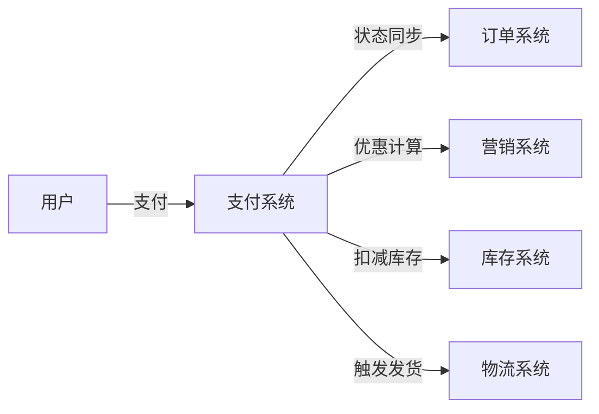
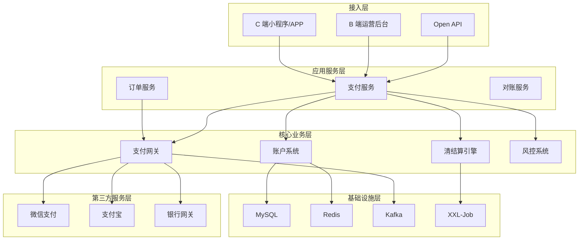
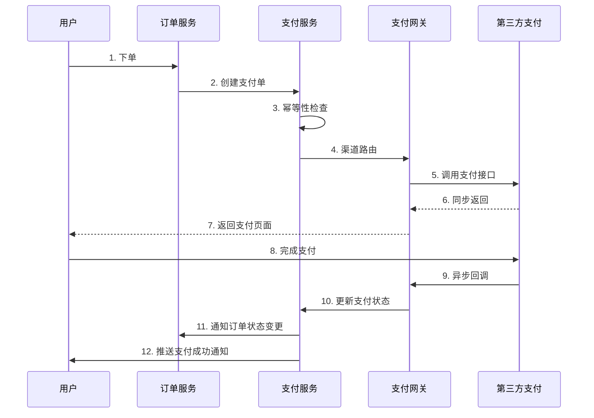
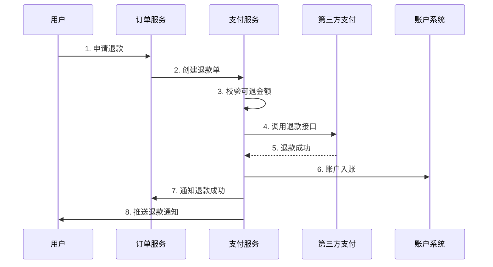
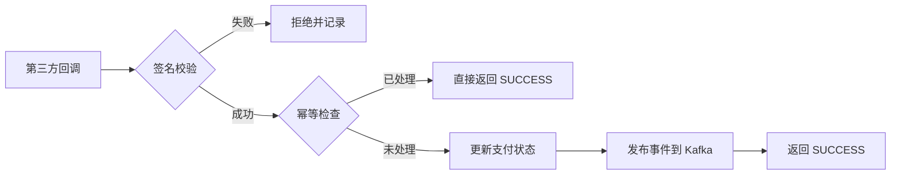

## 引言

支付系统是电商平台的资金流枢纽，连接用户、平台、商家、第三方支付等多方角色。本文从系统设计面试的角度，深入解析支付系统的核心流程、状态机设计、分布式事务等高频考点。

**适合读者**：准备系统设计面试的候选人

**阅读时长**：30-40 分钟

**核心内容**：
- 支付系统整体架构
- 支付和退款流程
- 状态机设计
- 分布式事务（Saga/TCC）
- 幂等性设计
- 一致性保证

## 一、业务背景与挑战

### 1.1 支付系统的定位

支付系统是电商平台的**资金流枢纽**，承担以下职责：

- **C 端**：用户支付、退款、余额管理
- **B 端**：商家结算、提现、对账
- **平台**：分账、风控、审计

支付系统与其他系统的协作关系：



### 1.2 核心业务场景

| 场景 | 说明 | 关键点 |
|-----|------|-------|
| 标准支付 | 用户使用余额、微信、支付宝支付订单 | 组合支付、渠道路由 |
| 退款 | 全额退款、部分退款、营销优惠退款 | 可退金额计算、多次退款 |
| 清结算 | 平台佣金、商家收益、营销补贴分账 | T+N 结算、提现管理 |
| 对账 | 交易对账、资金对账、差错处理 | 长款、短款、人工复核 |

### 1.3 核心挑战

支付系统面临的核心挑战及对应技术方案：

| 挑战维度 | 具体问题 | 技术方案 |
|---------|---------|---------|
| **资金安全** | 强一致性、防重防篡改、审计追溯 | 分布式事务、幂等性、操作日志 |
| **高并发** | 大促期间支付峰值（如双 11） | Redis 缓存、限流、降级、异步化 |
| **分布式事务** | 支付成功后订单状态同步 | Saga、TCC、本地消息表 |
| **多渠道接入** | 微信、支付宝、银行等渠道差异 | 支付网关、策略模式、适配器模式 |
| **对账复杂度** | 多方对账、差错处理 | 定时任务、对账算法、人工复核 |

**面试重点**：

在系统设计面试中，面试官通常会从以下角度考察：

1. **如何保证支付与订单的最终一致性？** → 分布式事务
2. **如何防止用户重复支付？** → 幂等性设计
3. **支付系统如何应对高并发？** → 缓存、限流、降级
4. **第三方支付回调失败怎么办？** → 重试机制、补偿

## 二、整体架构设计

### 2.1 分层架构

支付系统采用经典的分层架构，每层职责清晰：



### 2.2 核心子系统

| 子系统 | 核心职责 | 关键技术 |
|-------|---------|---------|
| **账户系统** | 管理用户账户、商家账户、平台账户<br>- 余额查询、冻结/解冻<br>- 充值、提现<br>- 账户流水 | - Redis + MySQL 双写<br>- 账户流水表<br>- 定时对账 |
| **支付网关** | 统一支付入口，屏蔽第三方差异<br>- 渠道抽象（适配器模式）<br>- 路由策略（余额优先、组合支付）<br>- 重试补偿 | - 策略模式<br>- 适配器模式<br>- 异步回调 |
| **清结算引擎** | 分账计算和结算管理<br>- 分账规则（平台佣金、商家收益）<br>- 结算周期（T+1、T+7）<br>- 提现管理 | - 定时任务<br>- 分账算法<br>- 限额控制 |
| **风控系统** | 保障资金安全<br>- 支付密码验证<br>- 异常交易监控<br>- 限额控制 | - 规则引擎<br>- 实时监控<br>- 黑名单 |

### 2.3 设计原则

在架构设计中，遵循以下原则：

**1. 领域边界清晰**

账户、支付、清结算、对账等各司其职，通过明确的接口交互。

**2. 事件驱动解耦**

系统间通过 Kafka 事件解耦，支付服务发布"支付成功"事件，订单服务订阅并更新状态。

**3. 可扩展性**

- 支持新支付渠道接入（如数字货币）
- 支持新支付方式（如分期付款）
- 支持新业务场景（如预售、拼团）

**4. 可观测性**

- 结构化日志（JSON 格式）
- 全链路追踪（TraceID）
- 实时监控告警（Prometheus + Grafana）

**面试加分项**：

能够在白板上快速画出以上架构图，并说明各层职责，会给面试官留下深刻印象。

## 三、核心业务流程

### 3.1 支付流程

#### 3.1.1 时序图



#### 3.1.2 关键步骤

**Step 1: 创建支付单（幂等性保证）**

```go
// 支付单创建接口
func CreatePaymentOrder(req *CreatePaymentRequest) (*PaymentOrder, error) {
    // 1. 生成幂等键（order_id + user_id）
    idempotencyKey := fmt.Sprintf("%d_%d", req.OrderID, req.UserID)
    
    // 2. Redis 分布式锁（防并发）
    lock := redis.Lock(idempotencyKey, 10*time.Second)
    if !lock.TryLock() {
        return nil, errors.New("concurrent request, please retry")
    }
    defer lock.Unlock()
    
    // 3. 检查是否已存在
    existing := queryPaymentByIdempotencyKey(idempotencyKey)
    if existing != nil {
        return existing, nil  // 幂等返回
    }
    
    // 4. 创建支付单
    payment := &PaymentOrder{
        PaymentID:      snowflake.Generate(),
        OrderID:        req.OrderID,
        UserID:         req.UserID,
        PaymentAmount:  req.Amount,
        PaymentStatus:  "PENDING",
        IdempotencyKey: idempotencyKey,
    }
    
    // 5. 插入数据库（唯一索引保证幂等）
    if err := db.Insert(payment); err != nil {
        if isDuplicateKeyError(err) {
            return queryPaymentByIdempotencyKey(idempotencyKey), nil
        }
        return nil, err
    }
    
    return payment, nil
}
```

**Step 2: 渠道路由**

支付网关根据策略选择支付渠道：

1. **余额优先策略**：用户余额足够则优先使用余额
2. **组合支付**：余额不足时，余额 + 第三方支付
3. **渠道降级**：主渠道不可用时切换备用渠道

**Step 3: 异步回调处理（幂等性保证）**

```go
// 处理第三方支付回调
func HandlePaymentCallback(callbackData *CallbackData) error {
    // 1. 验签
    if !verifySignature(callbackData) {
        return errors.New("invalid signature")
    }
    
    // 2. 幂等检查（第三方交易号）
    existing := queryPaymentByChannelTradeNo(callbackData.ChannelTradeNo)
    if existing != nil && existing.PaymentStatus == "SUCCESS" {
        return nil  // 已处理过，直接返回
    }
    
    // 3. 更新支付状态（乐观锁）
    affected := db.Exec(`
        UPDATE payment_order 
        SET payment_status = 'SUCCESS',
            channel_trade_no = ?,
            callback_time = ?,
            version = version + 1
        WHERE payment_id = ? AND version = ?
    `, callbackData.ChannelTradeNo, time.Now(), 
       callbackData.PaymentID, callbackData.Version)
    
    if affected == 0 {
        return errors.New("concurrent update conflict")
    }
    
    // 4. 发布支付成功事件（Saga）
    publishPaymentSuccessEvent(callbackData.PaymentID, callbackData.OrderID)
    
    return nil
}
```

**Step 4: 重试机制**

第三方回调可能失败，需要重试机制：

- **主动重试**：最多 3 次，指数退避（1s, 2s, 4s）
- **定时补偿**：每分钟扫描超时支付单，主动查询第三方状态
- **人工介入**：超过重试次数，进入人工复核

### 3.2 退款流程

#### 3.2.1 时序图



#### 3.2.2 可退金额计算

```go
// 计算可退金额
func CalculateRefundableAmount(paymentID int64) (*RefundableAmount, error) {
    // 1. 查询支付单
    payment := queryPaymentOrder(paymentID)
    if payment.PaymentStatus != "SUCCESS" {
        return nil, errors.New("payment not success")
    }
    
    // 2. 查询已退款金额
    refundedAmount := sumRefundedAmount(paymentID)
    
    // 3. 可退金额 = 实付金额 - 已退金额
    refundable := payment.PaymentAmount.Sub(refundedAmount)
    if refundable.LessThanOrEqual(decimal.Zero) {
        return nil, errors.New("no refundable amount")
    }
    
    // 4. 营销优惠按比例退款
    // 例如：实付 100（原价 120，优惠 20），退款 50
    // 则退实付 50，营销优惠退 10
    result := &RefundableAmount{
        TotalRefundable: refundable,
    }
    
    if payment.PromotionAmount.GreaterThan(decimal.Zero) {
        ratio := refundable.Div(payment.PaymentAmount)
        result.PromotionRefund = payment.PromotionAmount.Mul(ratio)
        result.ActualRefund = refundable.Sub(result.PromotionRefund)
    } else {
        result.ActualRefund = refundable
    }
    
    return result, nil
}
```

#### 3.2.3 部分退款

支持多次部分退款：

- **累计限制**：所有退款金额之和 ≤ 实付金额
- **退款记录**：每次退款都生成独立的退款单
- **状态联动**：全额退款后，支付单状态变为 `REFUNDED`

### 3.3 异步回调处理



**回调要点**：

1. **签名校验**：防止伪造回调
2. **幂等检查**：第三方交易号去重
3. **乐观锁**：version 字段防止并发
4. **事件驱动**：发布到 Kafka，解耦订单服务
