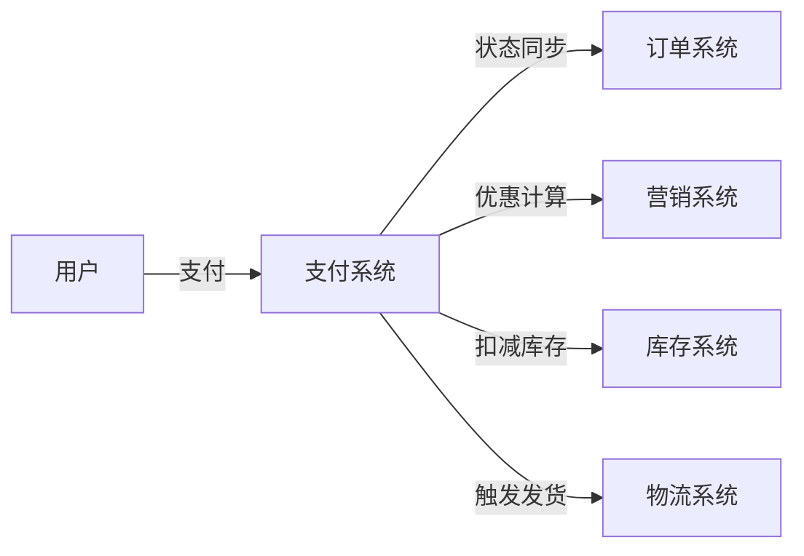
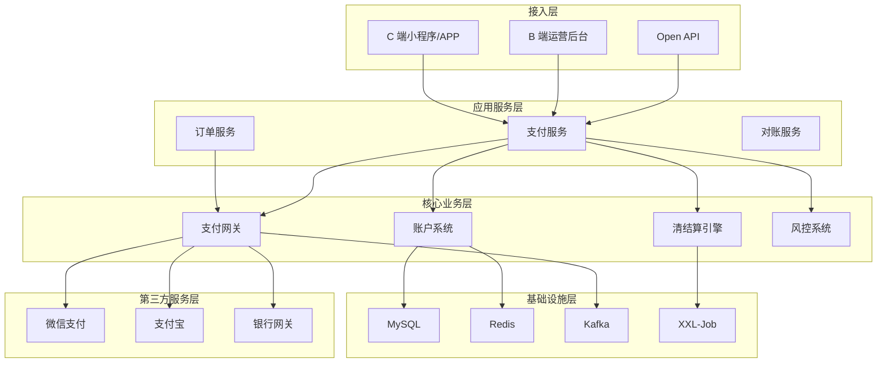
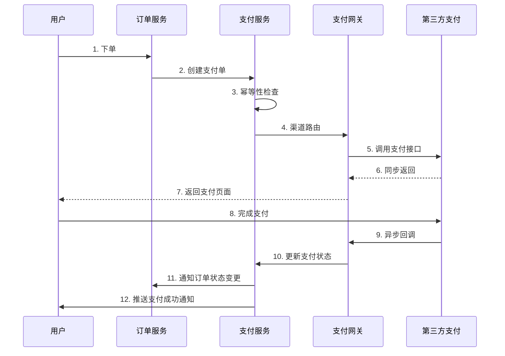
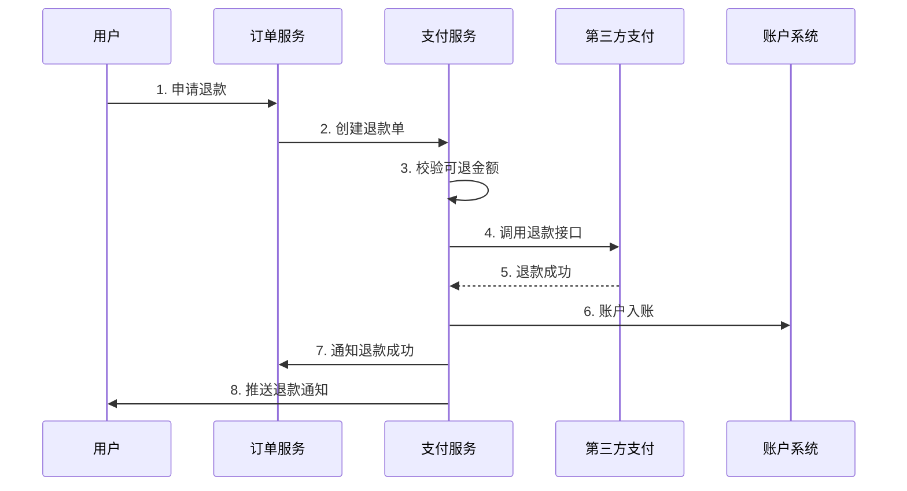
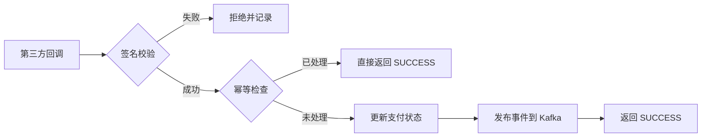
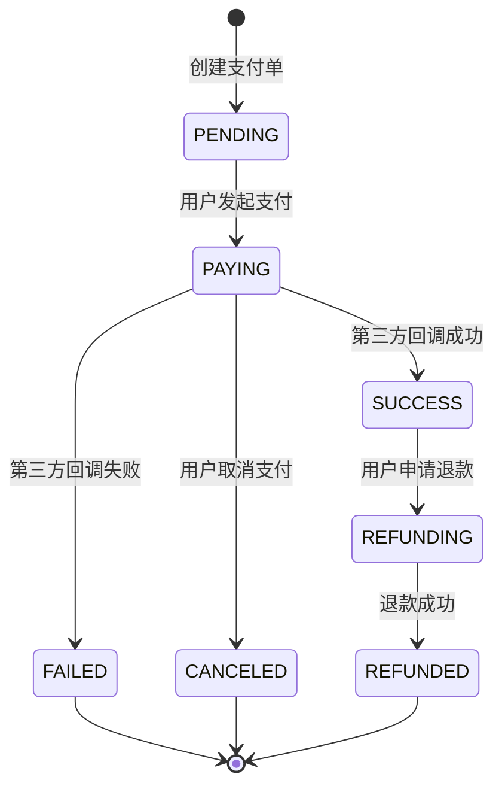
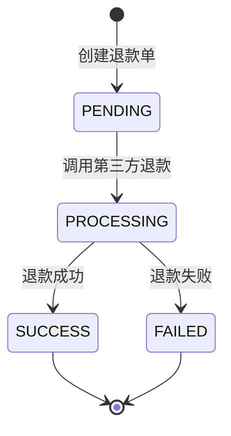
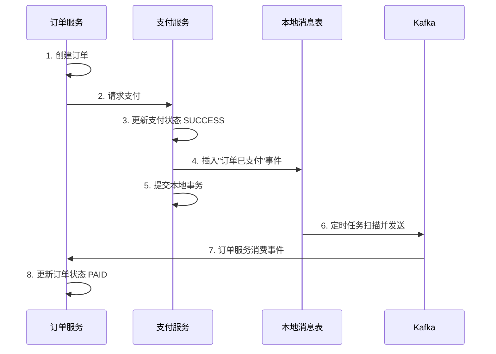
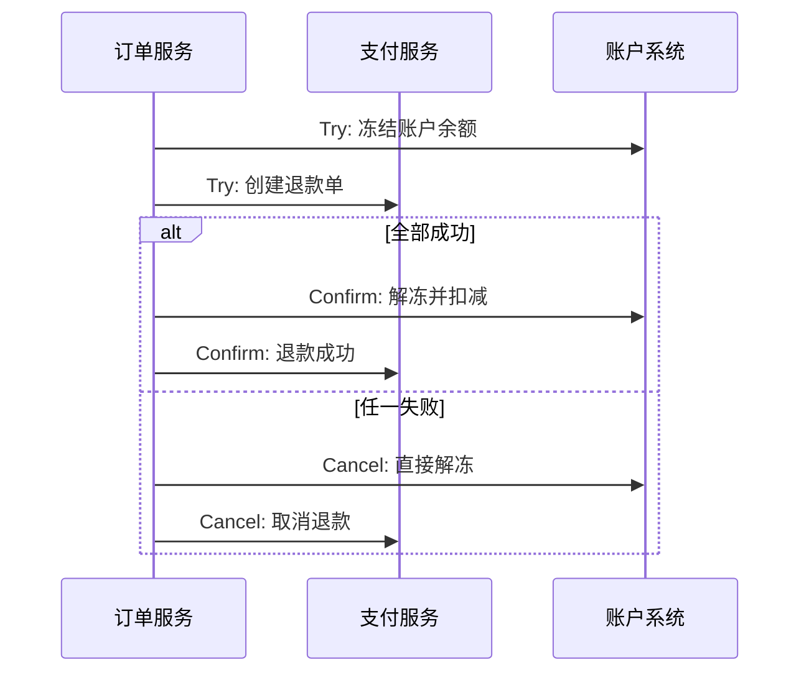

## 引言

支付系统是电商平台的资金流枢纽，连接用户、平台、商家、第三方支付等多方角色。本文从系统设计面试的角度，深入解析支付系统的核心流程、状态机设计、分布式事务等高频考点。

**适合读者**：准备系统设计面试的候选人

**阅读时长**：30-40 分钟

**核心内容**：
- 支付系统整体架构
- 支付和退款流程
- 状态机设计
- 分布式事务（Saga/TCC）
- 幂等性设计
- 一致性保证

## 一、业务背景与挑战

### 1.1 支付系统的定位

支付系统是电商平台的**资金流枢纽**，承担以下职责：

- **C 端**：用户支付、退款、余额管理
- **B 端**：商家结算、提现、对账
- **平台**：分账、风控、审计

支付系统与其他系统的协作关系：



### 1.2 核心业务场景

| 场景 | 说明 | 关键点 |
|-----|------|-------|
| 标准支付 | 用户使用余额、微信、支付宝支付订单 | 组合支付、渠道路由 |
| 退款 | 全额退款、部分退款、营销优惠退款 | 可退金额计算、多次退款 |
| 清结算 | 平台佣金、商家收益、营销补贴分账 | T+N 结算、提现管理 |
| 对账 | 交易对账、资金对账、差错处理 | 长款、短款、人工复核 |

### 1.3 核心挑战

支付系统面临的核心挑战及对应技术方案：

| 挑战维度 | 具体问题 | 技术方案 |
|---------|---------|---------|
| **资金安全** | 强一致性、防重防篡改、审计追溯 | 分布式事务、幂等性、操作日志 |
| **高并发** | 大促期间支付峰值（如双 11） | Redis 缓存、限流、降级、异步化 |
| **分布式事务** | 支付成功后订单状态同步 | Saga、TCC、本地消息表 |
| **多渠道接入** | 微信、支付宝、银行等渠道差异 | 支付网关、策略模式、适配器模式 |
| **对账复杂度** | 多方对账、差错处理 | 定时任务、对账算法、人工复核 |

**面试重点**：

在系统设计面试中，面试官通常会从以下角度考察：

1. **如何保证支付与订单的最终一致性？** → 分布式事务
2. **如何防止用户重复支付？** → 幂等性设计
3. **支付系统如何应对高并发？** → 缓存、限流、降级
4. **第三方支付回调失败怎么办？** → 重试机制、补偿

## 二、整体架构设计

### 2.1 分层架构

支付系统采用经典的分层架构，每层职责清晰：



### 2.2 核心子系统

| 子系统 | 核心职责 | 关键技术 |
|-------|---------|---------|
| **账户系统** | 管理用户账户、商家账户、平台账户<br>- 余额查询、冻结/解冻<br>- 充值、提现<br>- 账户流水 | - Redis + MySQL 双写<br>- 账户流水表<br>- 定时对账 |
| **支付网关** | 统一支付入口，屏蔽第三方差异<br>- 渠道抽象（适配器模式）<br>- 路由策略（余额优先、组合支付）<br>- 重试补偿 | - 策略模式<br>- 适配器模式<br>- 异步回调 |
| **清结算引擎** | 分账计算和结算管理<br>- 分账规则（平台佣金、商家收益）<br>- 结算周期（T+1、T+7）<br>- 提现管理 | - 定时任务<br>- 分账算法<br>- 限额控制 |
| **风控系统** | 保障资金安全<br>- 支付密码验证<br>- 异常交易监控<br>- 限额控制 | - 规则引擎<br>- 实时监控<br>- 黑名单 |

### 2.3 设计原则

在架构设计中，遵循以下原则：

**1. 领域边界清晰**

账户、支付、清结算、对账等各司其职，通过明确的接口交互。

**2. 事件驱动解耦**

系统间通过 Kafka 事件解耦，支付服务发布"支付成功"事件，订单服务订阅并更新状态。

**3. 可扩展性**

- 支持新支付渠道接入（如数字货币）
- 支持新支付方式（如分期付款）
- 支持新业务场景（如预售、拼团）

**4. 可观测性**

- 结构化日志（JSON 格式）
- 全链路追踪（TraceID）
- 实时监控告警（Prometheus + Grafana）

**面试加分项**：

能够在白板上快速画出以上架构图，并说明各层职责，会给面试官留下深刻印象。

## 三、核心业务流程

### 3.1 支付流程

#### 3.1.1 时序图



#### 3.1.2 关键步骤

**Step 1: 创建支付单（幂等性保证）**

```go
// 支付单创建接口
func CreatePaymentOrder(req *CreatePaymentRequest) (*PaymentOrder, error) {
    // 1. 生成幂等键（order_id + user_id）
    idempotencyKey := fmt.Sprintf("%d_%d", req.OrderID, req.UserID)
    
    // 2. Redis 分布式锁（防并发）
    lock := redis.Lock(idempotencyKey, 10*time.Second)
    if !lock.TryLock() {
        return nil, errors.New("concurrent request, please retry")
    }
    defer lock.Unlock()
    
    // 3. 检查是否已存在
    existing := queryPaymentByIdempotencyKey(idempotencyKey)
    if existing != nil {
        return existing, nil  // 幂等返回
    }
    
    // 4. 创建支付单
    payment := &PaymentOrder{
        PaymentID:      snowflake.Generate(),
        OrderID:        req.OrderID,
        UserID:         req.UserID,
        PaymentAmount:  req.Amount,
        PaymentStatus:  "PENDING",
        IdempotencyKey: idempotencyKey,
    }
    
    // 5. 插入数据库（唯一索引保证幂等）
    if err := db.Insert(payment); err != nil {
        if isDuplicateKeyError(err) {
            return queryPaymentByIdempotencyKey(idempotencyKey), nil
        }
        return nil, err
    }
    
    return payment, nil
}
```

**Step 2: 渠道路由**

支付网关根据策略选择支付渠道：

1. **余额优先策略**：用户余额足够则优先使用余额
2. **组合支付**：余额不足时，余额 + 第三方支付
3. **渠道降级**：主渠道不可用时切换备用渠道

**Step 3: 异步回调处理（幂等性保证）**

```go
// 处理第三方支付回调
func HandlePaymentCallback(callbackData *CallbackData) error {
    // 1. 验签
    if !verifySignature(callbackData) {
        return errors.New("invalid signature")
    }
    
    // 2. 幂等检查（第三方交易号）
    existing := queryPaymentByChannelTradeNo(callbackData.ChannelTradeNo)
    if existing != nil && existing.PaymentStatus == "SUCCESS" {
        return nil  // 已处理过，直接返回
    }
    
    // 3. 更新支付状态（乐观锁）
    affected := db.Exec(`
        UPDATE payment_order 
        SET payment_status = 'SUCCESS',
            channel_trade_no = ?,
            callback_time = ?,
            version = version + 1
        WHERE payment_id = ? AND version = ?
    `, callbackData.ChannelTradeNo, time.Now(), 
       callbackData.PaymentID, callbackData.Version)
    
    if affected == 0 {
        return errors.New("concurrent update conflict")
    }
    
    // 4. 发布支付成功事件（Saga）
    publishPaymentSuccessEvent(callbackData.PaymentID, callbackData.OrderID)
    
    return nil
}
```

**Step 4: 重试机制**

第三方回调可能失败，需要重试机制：

- **主动重试**：最多 3 次，指数退避（1s, 2s, 4s）
- **定时补偿**：每分钟扫描超时支付单，主动查询第三方状态
- **人工介入**：超过重试次数，进入人工复核

### 3.2 退款流程

#### 3.2.1 时序图



#### 3.2.2 可退金额计算

```go
// 计算可退金额
func CalculateRefundableAmount(paymentID int64) (*RefundableAmount, error) {
    // 1. 查询支付单
    payment := queryPaymentOrder(paymentID)
    if payment.PaymentStatus != "SUCCESS" {
        return nil, errors.New("payment not success")
    }
    
    // 2. 查询已退款金额
    refundedAmount := sumRefundedAmount(paymentID)
    
    // 3. 可退金额 = 实付金额 - 已退金额
    refundable := payment.PaymentAmount.Sub(refundedAmount)
    if refundable.LessThanOrEqual(decimal.Zero) {
        return nil, errors.New("no refundable amount")
    }
    
    // 4. 营销优惠按比例退款
    // 例如：实付 100（原价 120，优惠 20），退款 50
    // 则退实付 50，营销优惠退 10
    result := &RefundableAmount{
        TotalRefundable: refundable,
    }
    
    if payment.PromotionAmount.GreaterThan(decimal.Zero) {
        ratio := refundable.Div(payment.PaymentAmount)
        result.PromotionRefund = payment.PromotionAmount.Mul(ratio)
        result.ActualRefund = refundable.Sub(result.PromotionRefund)
    } else {
        result.ActualRefund = refundable
    }
    
    return result, nil
}
```

#### 3.2.3 部分退款

支持多次部分退款：

- **累计限制**：所有退款金额之和 ≤ 实付金额
- **退款记录**：每次退款都生成独立的退款单
- **状态联动**：全额退款后，支付单状态变为 `REFUNDED`

### 3.3 异步回调处理



**回调要点**：

1. **签名校验**：防止伪造回调
2. **幂等检查**：第三方交易号去重
3. **乐观锁**：version 字段防止并发
4. **事件驱动**：发布到 Kafka，解耦订单服务

## 四、状态机设计

状态机是支付系统的核心设计之一，清晰的状态定义和转换规则能够保证系统的稳定性。

### 4.1 支付单状态机

#### 4.1.1 状态定义



#### 4.1.2 状态转换表

| 当前状态 | 允许的下一状态 | 触发条件 | 备注 |
|---------|--------------|---------|-----|
| PENDING | PAYING | 用户发起支付 | - |
| PAYING | SUCCESS | 第三方回调成功 | - |
| PAYING | FAILED | 第三方回调失败 | 可重新发起支付 |
| PAYING | CANCELED | 用户取消支付 | 超时自动取消 |
| SUCCESS | REFUNDING | 用户申请退款 | - |
| REFUNDING | REFUNDED | 退款成功 | 支持部分退款 |

**非法状态转换示例**：

- PENDING → SUCCESS（跳过 PAYING 状态）
- FAILED → REFUNDING（失败的支付单不能退款）
- REFUNDED → SUCCESS（已退款不能恢复）

### 4.2 退款单状态机

#### 4.2.1 状态定义



#### 4.2.2 与支付单状态联动

- **前置条件**：支付单必须是 `SUCCESS` 状态才能发起退款
- **状态同步**：退款成功后，支付单状态变为 `REFUNDED`
- **部分退款**：第一次退款成功后，支付单状态变为 `PARTIAL_REFUNDED`

### 4.3 状态机实现

#### 4.3.1 状态转换校验

```go
// 状态转换规则
var stateTransitionRules = map[string][]string{
    "PENDING":   {"PAYING"},
    "PAYING":    {"SUCCESS", "FAILED", "CANCELED"},
    "SUCCESS":   {"REFUNDING"},
    "REFUNDING": {"REFUNDED"},
}

// 校验状态转换是否合法
func isValidTransition(currentState, targetState string) bool {
    allowedStates, exists := stateTransitionRules[currentState]
    if !exists {
        return false
    }
    
    for _, state := range allowedStates {
        if state == targetState {
            return true
        }
    }
    return false
}
```

#### 4.3.2 状态转换（乐观锁）

```go
// 状态转换函数
func TransitState(paymentID int64, targetState string, version int) error {
    // 1. 查询当前状态
    current := queryPaymentOrder(paymentID)
    
    // 2. 校验状态转换是否合法
    if !isValidTransition(current.PaymentStatus, targetState) {
        return errors.New(fmt.Sprintf(
            "invalid state transition: %s -> %s",
            current.PaymentStatus, targetState))
    }
    
    // 3. 乐观锁更新
    affected := db.Exec(`
        UPDATE payment_order 
        SET payment_status = ?,
            updated_at = ?,
            version = version + 1
        WHERE payment_id = ? AND version = ?
    `, targetState, time.Now(), paymentID, version)
    
    if affected == 0 {
        return errors.New("concurrent update conflict, please retry")
    }
    
    // 4. 发布状态变更事件
    publishStateChangeEvent(paymentID, current.PaymentStatus, targetState)
    
    return nil
}
```

#### 4.3.3 状态变更事件

```go
// 状态变更事件
type PaymentStateChangeEvent struct {
    PaymentID    int64  `json:"payment_id"`
    OrderID      int64  `json:"order_id"`
    OldState     string `json:"old_state"`
    NewState     string `json:"new_state"`
    ChangeTime   time.Time `json:"change_time"`
}

// 发布事件到 Kafka
func publishStateChangeEvent(paymentID int64, oldState, newState string) {
    event := &PaymentStateChangeEvent{
        PaymentID:  paymentID,
        OrderID:    getOrderIDByPaymentID(paymentID),
        OldState:   oldState,
        NewState:   newState,
        ChangeTime: time.Now(),
    }
    
    kafka.Publish("payment_state_change", event)
}
```

**面试要点**：

1. **为什么需要状态机**：确保状态转换的合法性，防止业务逻辑错误
2. **如何保证并发安全**：乐观锁（version 字段）
3. **如何与其他系统协作**：通过 Kafka 事件驱动

## 五、高频考点深入

### 5.1 分布式事务

#### 5.1.1 问题场景

**面试问题**：支付成功后，如何保证订单状态同步更新？

这是一个典型的分布式事务问题：

- 支付服务：更新支付单状态为 `SUCCESS`
- 订单服务：更新订单状态为 `PAID`

两个操作在不同的服务和数据库中，无法使用传统的 ACID 事务保证一致性。

#### 5.1.2 Saga 模式

Saga 模式是微服务架构下常用的分布式事务解决方案，通过一系列本地事务和补偿机制实现最终一致性。

**Saga 流程图**：



**本地消息表实现**：

```go
// 本地消息表结构
type LocalMessage struct {
    ID          int64     `db:"id"`
    OrderID     int64     `db:"order_id"`
    PaymentID   int64     `db:"payment_id"`
    Event       string    `db:"event"`
    Status      string    `db:"status"`  // PENDING, SENT, FAILED
    RetryCount  int       `db:"retry_count"`
    CreatedAt   time.Time `db:"created_at"`
}

// 支付成功后插入本地消息表
func OnPaymentSuccess(paymentID int64, orderID int64) error {
    // 开启本地事务
    tx, _ := db.Begin()
    
    // 1. 更新支付状态
    tx.Exec(`
        UPDATE payment_order 
        SET payment_status = 'SUCCESS'
        WHERE payment_id = ?
    `, paymentID)
    
    // 2. 插入本地消息表
    tx.Exec(`
        INSERT INTO local_message (order_id, payment_id, event, status, retry_count)
        VALUES (?, ?, 'ORDER_PAID', 'PENDING', 0)
    `, orderID, paymentID)
    
    // 3. 提交本地事务
    return tx.Commit()
}

// 定时任务扫描并发送消息
func ScanAndSendMessages() {
    messages := db.Query(`
        SELECT * FROM local_message 
        WHERE status = 'PENDING' AND retry_count < 3
        ORDER BY created_at ASC
        LIMIT 100
    `)
    
    for _, msg := range messages {
        // 发送到 Kafka
        if err := kafka.Publish("order_paid", msg); err == nil {
            db.Exec(`
                UPDATE local_message 
                SET status = 'SENT' 
                WHERE id = ?
            `, msg.ID)
        } else {
            db.Exec(`
                UPDATE local_message 
                SET retry_count = retry_count + 1 
                WHERE id = ?
            `, msg.ID)
        }
    }
}
```

**补偿机制**：

如果支付失败，订单服务需要取消订单：

```go
// 支付失败补偿
func OnPaymentFailed(paymentID int64, orderID int64) error {
    // 1. 更新支付状态
    db.Exec(`UPDATE payment_order SET payment_status = 'FAILED' WHERE payment_id = ?`, paymentID)
    
    // 2. 发布支付失败事件
    kafka.Publish("payment_failed", &PaymentFailedEvent{
        PaymentID: paymentID,
        OrderID:   orderID,
    })
    
    // 订单服务消费事件并取消订单
    return nil
}
```

#### 5.1.3 TCC 模式

TCC（Try-Confirm-Cancel）模式适用于对一致性要求较高的场景，如退款流程。

**TCC 三阶段**：



**TCC 实现示例**：

```go
// Try 阶段：冻结账户余额
func TryFreezeBalance(userID int64, amount decimal.Decimal) (string, error) {
    // 生成冻结记录 ID
    freezeID := uuid.New().String()
    
    // 冻结余额
    affected := db.Exec(`
        UPDATE account 
        SET balance = balance - ?,
            frozen_balance = frozen_balance + ?
        WHERE user_id = ? AND balance >= ?
    `, amount, amount, userID, amount)
    
    if affected == 0 {
        return "", errors.New("insufficient balance")
    }
    
    // 记录冻结记录
    db.Exec(`
        INSERT INTO account_freeze (freeze_id, user_id, amount, status)
        VALUES (?, ?, ?, 'FROZEN')
    `, freezeID, userID, amount)
    
    return freezeID, nil
}

// Confirm 阶段：解冻并扣减
func ConfirmFreezeBalance(freezeID string) error {
    // 查询冻结记录
    freeze := db.QueryRow(`
        SELECT user_id, amount FROM account_freeze 
        WHERE freeze_id = ? AND status = 'FROZEN'
    `, freezeID)
    
    // 更新冻结记录状态
    db.Exec(`
        UPDATE account_freeze 
        SET status = 'CONFIRMED' 
        WHERE freeze_id = ?
    `, freezeID)
    
    // 扣减冻结余额
    db.Exec(`
        UPDATE account 
        SET frozen_balance = frozen_balance - ?
        WHERE user_id = ?
    `, freeze.Amount, freeze.UserID)
    
    return nil
}

// Cancel 阶段：直接解冻
func CancelFreezeBalance(freezeID string) error {
    // 查询冻结记录
    freeze := db.QueryRow(`
        SELECT user_id, amount FROM account_freeze 
        WHERE freeze_id = ? AND status = 'FROZEN'
    `, freezeID)
    
    // 解冻余额
    db.Exec(`
        UPDATE account 
        SET balance = balance + ?,
            frozen_balance = frozen_balance - ?
        WHERE user_id = ?
    `, freeze.Amount, freeze.Amount, freeze.UserID)
    
    // 更新冻结记录状态
    db.Exec(`
        UPDATE account_freeze 
        SET status = 'CANCELED' 
        WHERE freeze_id = ?
    `, freezeID)
    
    return nil
}
```

#### 5.1.4 Saga vs TCC

| 维度 | Saga | TCC |
|-----|------|-----|
| **一致性** | 最终一致性 | 强一致性 |
| **实现复杂度** | 低 | 高 |
| **性能** | 高（异步） | 中（同步） |
| **适用场景** | 支付流程 | 退款流程 |
| **回滚方式** | 补偿操作 | Cancel 操作 |

**面试建议**：

- Saga 适合长事务、跨服务场景
- TCC 适合短事务、强一致性场景

### 5.2 幂等性设计

#### 5.2.1 为什么需要幂等

- **第三方回调重复**：网络抖动导致重复回调
- **用户重复点击**：前端未防抖，用户多次点击
- **系统重试**：超时重试导致重复请求

#### 5.2.2 三个关键场景

**场景 1: 支付单创建幂等**

```go
// 幂等键：order_id + user_id
func CreatePaymentOrder(orderID int64, userID int64, amount decimal.Decimal) (*PaymentOrder, error) {
    idempotencyKey := fmt.Sprintf("payment_%d_%d", orderID, userID)
    
    // Redis 分布式锁（防并发）
    lock := redis.Lock(idempotencyKey, 10*time.Second)
    if !lock.TryLock() {
        return nil, errors.New("concurrent request")
    }
    defer lock.Unlock()
    
    // 检查是否已存在
    existing := db.QueryRow(`
        SELECT * FROM payment_order 
        WHERE order_id = ? AND user_id = ?
    `, orderID, userID)
    
    if existing != nil {
        return existing, nil  // 幂等返回
    }
    
    // 创建支付单（数据库唯一索引保证幂等）
    payment := &PaymentOrder{
        PaymentID: snowflake.Generate(),
        OrderID:   orderID,
        UserID:    userID,
        Amount:    amount,
    }
    
    if err := db.Insert(payment); err != nil {
        if isDuplicateKeyError(err) {
            return db.QueryRow(`SELECT * FROM payment_order WHERE order_id = ? AND user_id = ?`, orderID, userID), nil
        }
        return nil, err
    }
    
    return payment, nil
}
```

**场景 2: 支付回调幂等**

```go
// 幂等键：channel_trade_no（第三方交易号）
func HandlePaymentCallback(channelTradeNo string, status string) error {
    // 检查是否已处理
    existing := db.QueryRow(`
        SELECT * FROM payment_order 
        WHERE channel_trade_no = ?
    `, channelTradeNo)
    
    if existing != nil && existing.PaymentStatus == "SUCCESS" {
        return nil  // 已处理，直接返回
    }
    
    // 更新支付状态
    db.Exec(`
        UPDATE payment_order 
        SET payment_status = ?, channel_trade_no = ?
        WHERE payment_id = ?
    `, status, channelTradeNo, existing.PaymentID)
    
    return nil
}
```

**场景 3: 退款幂等**

```go
// 幂等键：refund_id
func CreateRefundOrder(paymentID int64, amount decimal.Decimal) (*RefundOrder, error) {
    refundID := snowflake.Generate()
    
    // 检查是否已存在
    existing := db.QueryRow(`
        SELECT * FROM refund_order 
        WHERE payment_id = ? AND amount = ?
    `, paymentID, amount)
    
    if existing != nil {
        return existing, nil  // 幂等返回
    }
    
    // 创建退款单
    refund := &RefundOrder{
        RefundID:  refundID,
        PaymentID: paymentID,
        Amount:    amount,
        Status:    "PENDING",
    }
    
    db.Insert(refund)
    return refund, nil
}
```

#### 5.2.3 实现手段总结

| 手段 | 使用场景 | 优点 | 缺点 |
|-----|---------|------|-----|
| **Redis 分布式锁** | 高并发场景 | 性能好，防并发 | 需要考虑锁超时 |
| **数据库唯一索引** | 防重复插入 | 可靠，数据库保证 | 性能略低 |
| **乐观锁** | 防并发更新 | 无锁开销 | 需要重试 |

### 5.3 一致性保证

#### 5.3.1 账户余额一致性

**问题**：Redis 缓存和 MySQL 数据不一致

**方案**：Redis + MySQL 双写 + Lua 脚本 + 定时对账

```lua
-- Redis Lua 脚本（原子操作）
local balance_key = KEYS[1]
local amount = tonumber(ARGV[1])

local balance = tonumber(redis.call('GET', balance_key) or '0')

if balance >= amount then
    redis.call('DECRBY', balance_key, amount)
    return 1
else
    return 0
end
```

```go
// 扣减余额
func DeductBalance(userID int64, amount decimal.Decimal) error {
    // 1. Redis 扣减（Lua 脚本保证原子性）
    result := redis.Eval(luaScript, []string{fmt.Sprintf("balance:%d", userID)}, amount.String())
    if result == 0 {
        return errors.New("insufficient balance")
    }
    
    // 2. MySQL 扣减
    affected := db.Exec(`
        UPDATE account 
        SET balance = balance - ?
        WHERE user_id = ? AND balance >= ?
    `, amount, userID, amount)
    
    if affected == 0 {
        // 回滚 Redis
        redis.IncrBy(fmt.Sprintf("balance:%d", userID), amount.IntPart())
        return errors.New("insufficient balance")
    }
    
    // 3. 记录流水
    db.Exec(`
        INSERT INTO account_transaction (user_id, amount, type, created_at)
        VALUES (?, ?, 'DEDUCT', NOW())
    `, userID, amount)
    
    return nil
}

// 定时对账任务
func ReconcileAccountBalance() {
    users := db.Query("SELECT user_id FROM account")
    
    for _, user := range users {
        // 查询 MySQL 余额
        mysqlBalance := db.QueryRow(`SELECT balance FROM account WHERE user_id = ?`, user.ID)
        
        // 查询 Redis 余额
        redisBalance := redis.Get(fmt.Sprintf("balance:%d", user.ID))
        
        // 对比
        if mysqlBalance != redisBalance {
            log.Error("balance mismatch", "user_id", user.ID, "mysql", mysqlBalance, "redis", redisBalance)
            
            // 以 MySQL 为准，修复 Redis
            redis.Set(fmt.Sprintf("balance:%d", user.ID), mysqlBalance)
        }
    }
}
```

#### 5.3.2 支付流水一致性

**问题**：支付单金额与流水表汇总金额不一致

**方案**：

1. 每笔支付/退款都记录流水
2. 流水表不可更新，只能插入
3. 定时任务校验：支付单金额 = 流水表汇总金额

```go
// 定时对账任务
func ReconcilePaymentTransaction() {
    payments := db.Query("SELECT payment_id, payment_amount FROM payment_order WHERE payment_status = 'SUCCESS'")
    
    for _, payment := range payments {
        // 查询流水表汇总金额
        transactionAmount := db.QueryRow(`
            SELECT SUM(amount) FROM payment_transaction 
            WHERE payment_id = ?
        `, payment.PaymentID)
        
        // 对比
        if payment.PaymentAmount != transactionAmount {
            log.Error("amount mismatch", "payment_id", payment.PaymentID, 
                      "payment", payment.PaymentAmount, "transaction", transactionAmount)
            
            // 人工介入
            notifyAdmin(payment.PaymentID)
        }
    }
}
```

**面试要点**：

1. **一致性方案**: Redis + MySQL 双写 + 定时对账
2. **原子性保证**: Lua 脚本
3. **数据源优先级**: MySQL 为准，Redis 为辅
