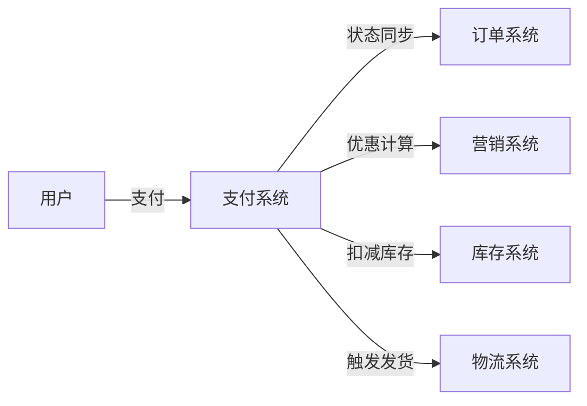

## 引言

支付系统是电商平台的资金流枢纽，连接用户、平台、商家、第三方支付等多方角色。本文从系统设计面试的角度，深入解析支付系统的核心流程、状态机设计、分布式事务等高频考点。

**适合读者**：准备系统设计面试的候选人

**阅读时长**：30-40 分钟

**核心内容**：
- 支付系统整体架构
- 支付和退款流程
- 状态机设计
- 分布式事务（Saga/TCC）
- 幂等性设计
- 一致性保证

## 一、业务背景与挑战

### 1.1 支付系统的定位

支付系统是电商平台的**资金流枢纽**，承担以下职责：

- **C 端**：用户支付、退款、余额管理
- **B 端**：商家结算、提现、对账
- **平台**：分账、风控、审计

支付系统与其他系统的协作关系：

### 1.2 核心业务场景

| 场景 | 说明 | 关键点 |
|-----|------|-------|
| 标准支付 | 用户使用余额、微信、支付宝支付订单 | 组合支付、渠道路由 |
| 退款 | 全额退款、部分退款、营销优惠退款 | 可退金额计算、多次退款 |
| 清结算 | 平台佣金、商家收益、营销补贴分账 | T+N 结算、提现管理 |
| 对账 | 交易对账、资金对账、差错处理 | 长款、短款、人工复核 |

### 1.3 核心挑战

支付系统面临的核心挑战及对应技术方案：

| 挑战维度 | 具体问题 | 技术方案 |
|---------|---------|---------|
| **资金安全** | 强一致性、防重防篡改、审计追溯 | 分布式事务、幂等性、操作日志 |
| **高并发** | 大促期间支付峰值（如双 11） | Redis 缓存、限流、降级、异步化 |
| **分布式事务** | 支付成功后订单状态同步 | Saga、TCC、本地消息表 |
| **多渠道接入** | 微信、支付宝、银行等渠道差异 | 支付网关、策略模式、适配器模式 |
| **对账复杂度** | 多方对账、差错处理 | 定时任务、对账算法、人工复核 |

**面试重点**：

在系统设计面试中，面试官通常会从以下角度考察：

1. **如何保证支付与订单的最终一致性？** → 分布式事务
2. **如何防止用户重复支付？** → 幂等性设计
3. **支付系统如何应对高并发？** → 缓存、限流、降级
4. **第三方支付回调失败怎么办？** → 重试机制、补偿
