<!-- toc -->

## 引言

Clean Architecture、DDD 和 CQRS 这三个概念经常被一起提及，甚至被误认为是一回事。但实际上，它们关注的维度完全不同：

- **Clean Architecture** 关注分层与解耦
- **DDD** 关注业务建模
- **CQRS** 关注数据读写的路径优化

如果把开发一套复杂的软件比作经营一家餐厅：

| 概念 | 餐厅类比 | 核心关注点 |
|------|----------|------------|
| Clean Architecture | 餐厅的**平面布局图**（前台、后厨、仓库界限清晰） | 依赖方向与边界 |
| DDD | **菜单的设计和后厨的工作流程**（怎么定义招牌菜，主厨和二厨怎么分工） | 业务建模与通用语言 |
| CQRS | **点餐和上菜的通道设计**（点餐走前台系统，上菜走传菜电梯，互不干扰） | 读写路径分离 |

---

## 一、Clean Architecture（整洁架构）— 核心是"依赖规则"

由 Robert C. Martin（Uncle Bob）提出，其核心思想是：**业务逻辑应该独立于 UI、数据库、框架或任何外部代理**。

### 1.1 依赖规则

源代码的依赖方向**只能向内**。外层（如数据库、Web 框架）可以依赖内层，但**内层绝不能知道外层的存在**。

```text
┌──────────────────────────────────────────────────────────────┐
│  Frameworks & Drivers  (Web, DB, External APIs)              │
│  ┌──────────────────────────────────────────────────────┐    │
│  │  Interface Adapters  (Controllers, Gateways, Repos)  │    │
│  │  ┌──────────────────────────────────────────────┐    │    │
│  │  │  Application Business Rules  (Use Cases)     │    │    │
│  │  │  ┌──────────────────────────────────────┐    │    │    │
│  │  │  │  Enterprise Business Rules (Entities) │    │    │    │
│  │  │  └──────────────────────────────────────┘    │    │    │
│  │  └──────────────────────────────────────────────┘    │    │
│  └──────────────────────────────────────────────────────┘    │
└──────────────────────────────────────────────────────────────┘

                   依赖方向 ──────→ 向内
```

### 1.2 四层模型

| 层级 | 职责 | 示例 |
|------|------|------|
| **Entity（实体）** | 最核心的业务规则，与应用无关 | `Order`, `Product` 的领域模型 |
| **Use Cases（用例）** | 特定于应用的业务逻辑 | "处理订单"、"计算运费" |
| **Interface Adapters（接口适配器）** | 数据格式转换，连接内外层 | Controller, Presenter, Repository 接口实现 |
| **Frameworks & Drivers（框架和驱动）** | 具体技术实现 | MySQL, Redis, Gin, gRPC |

### 1.3 Go 项目中的典型目录映射

```text
myapp/
├── domain/           # Entity 层：纯业务模型和接口定义
│   ├── order.go
│   └── repository.go # 接口（Port），不含实现
├── usecase/          # Use Case 层：应用业务逻辑
│   └── place_order.go
├── adapter/          # Interface Adapter 层
│   ├── handler/      #   HTTP/gRPC handler
│   └── persistence/  #   数据库实现（实现 domain 接口）
├── infra/            # Frameworks & Drivers 层
│   ├── mysql/
│   └── redis/
└── main.go           # 组装（依赖注入）
```

### 1.4 核心价值

当你决定从 MySQL 换到 MongoDB，或者把 Web 框架从 Gin 换到 Echo 时，核心的业务逻辑（Use Cases 和 Entities）**不需要改动一行代码**。

```go
// domain/repository.go — 内层只定义接口
type OrderRepository interface {
    Save(ctx context.Context, order *Order) error
    FindByID(ctx context.Context, id string) (*Order, error)
}

// adapter/persistence/mysql_order_repo.go — 外层实现接口
type MySQLOrderRepo struct{ db *sql.DB }
func (r *MySQLOrderRepo) Save(ctx context.Context, order *domain.Order) error { /* ... */ }

// adapter/persistence/mongo_order_repo.go — 换存储只需新增实现
type MongoOrderRepo struct{ col *mongo.Collection }
func (r *MongoOrderRepo) Save(ctx context.Context, order *domain.Order) error { /* ... */ }
```

### 1.5 架构风格对比：Clean vs 六边形 vs 洋葱

三种架构风格经常被混用，它们的核心共识都是**依赖反转**，但切入角度不同：

| 维度 | Clean Architecture | 六边形架构 (Hexagonal) | 洋葱架构 (Onion) |
|------|-------------------|----------------------|-----------------|
| **提出者** | Robert C. Martin (2012) | Alistair Cockburn (2005) | Jeffrey Palermo (2008) |
| **核心隐喻** | 同心圆，层层向内 | 六边形，端口与适配器 | 洋葱，层层剥开 |
| **关键概念** | Entity, Use Case, Adapter | Port（接口）, Adapter（实现） | Domain Model, Domain Service, App Service |
| **外部交互方式** | 通过 Interface Adapter 层 | 通过 Port + Adapter 对 | 通过 Infrastructure 层 |
| **核心共识** | 依赖方向向内，业务逻辑不依赖外部技术 | 同左 | 同左 |

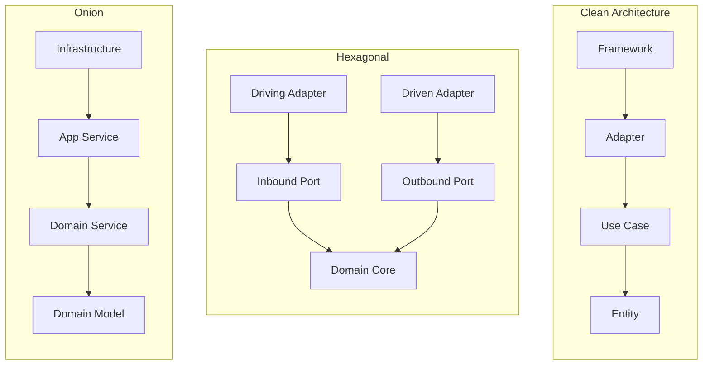

**实际差异很小**，三者在 Go 项目中的落地几乎一样——关键是守住一条线：**内层定义接口，外层实现接口**。

#### Port & Adapter 模式的 Go 实现

六边形架构中，Port 是接口，Adapter 是实现。在 Go 中天然契合：

```go
// domain/port.go — Outbound Port（领域层定义）
type PaymentGateway interface {
    Charge(ctx context.Context, orderID string, amount Money) (*PaymentResult, error)
}

// adapter/payment/stripe_adapter.go — Driven Adapter（基础设施层实现）
type StripeAdapter struct {
    client *stripe.Client
}

func (a *StripeAdapter) Charge(ctx context.Context, orderID string, amount Money) (*PaymentResult, error) {
    resp, err := a.client.Charges.New(&stripe.ChargeParams{
        Amount:   stripe.Int64(amount.Amount),
        Currency: stripe.String(amount.Currency),
    })
    if err != nil {
        return nil, fmt.Errorf("stripe charge failed: %w", err)
    }
    return &PaymentResult{TransactionID: resp.ID, Status: "success"}, nil
}

// adapter/payment/mock_adapter.go — 测试时可替换为 Mock
type MockPaymentAdapter struct {
    ShouldFail bool
}

func (a *MockPaymentAdapter) Charge(ctx context.Context, orderID string, amount Money) (*PaymentResult, error) {
    if a.ShouldFail {
        return nil, errors.New("mock payment failure")
    }
    return &PaymentResult{TransactionID: "mock-txn-001", Status: "success"}, nil
}
```

### 1.6 依赖注入的 Go 实现

在 Clean Architecture 中，**组装**（将接口与实现绑定）发生在最外层——通常是 `main.go`。

#### 手动注入（推荐，适合中小项目）

```go
// cmd/server/main.go
func main() {
    // Infrastructure
    db := mysql.NewConnection(cfg.DSN)
    producer := kafka.NewProducer(cfg.Kafka)

    // Adapters（实现 domain 接口）
    orderRepo := persistence.NewMySQLOrderRepo(db)
    eventBus := messaging.NewKafkaEventBus(producer)
    paymentGW := payment.NewStripeAdapter(cfg.StripeKey)

    // Use Cases（注入依赖）
    placeOrderUC := command.NewPlaceOrderHandler(orderRepo, eventBus, paymentGW)
    orderQueryUC := query.NewOrderDetailHandler(readmodel.NewESOrderReader(esClient))

    // Inbound Adapters
    httpHandler := http.NewOrderHandler(placeOrderUC, orderQueryUC)

    // Start server
    server := gin.Default()
    httpHandler.RegisterRoutes(server)
    server.Run(":8080")
}
```

优点：零依赖、编译时检查、调试直观。
缺点：当依赖超过 20 个时，`main.go` 变得冗长。

#### Wire（适合大型项目）

Google 的 [Wire](https://github.com/google/wire) 通过代码生成实现依赖注入：

```go
// wire.go
//go:build wireinject

func InitializeOrderHandler() *http.OrderHandler {
    wire.Build(
        mysql.NewConnection,
        persistence.NewMySQLOrderRepo,
        messaging.NewKafkaEventBus,
        command.NewPlaceOrderHandler,
        http.NewOrderHandler,
    )
    return nil
}
```

运行 `wire ./...` 生成 `wire_gen.go`，编译时完成所有连接。

### 1.7 Anti-pattern：常见违规案例

#### Anti-pattern 1：跨层调用

```go
// ❌ Handler 直接引用了 MySQL 包（跳过了 domain 和 usecase 层）
package handler

import (
    "database/sql"
    "net/http"
)

func GetOrder(db *sql.DB) http.HandlerFunc {
    return func(w http.ResponseWriter, r *http.Request) {
        row := db.QueryRow("SELECT * FROM orders WHERE id = ?", r.URL.Query().Get("id"))
        // 直接在 handler 里写 SQL...
    }
}
```

```go
// ✅ Handler 只依赖 Use Case 接口
package handler

type OrderQuerier interface {
    GetOrderDetail(ctx context.Context, id string) (*OrderDetailDTO, error)
}

func NewGetOrderHandler(q OrderQuerier) http.HandlerFunc {
    return func(w http.ResponseWriter, r *http.Request) {
        dto, err := q.GetOrderDetail(r.Context(), r.URL.Query().Get("id"))
        // ...
    }
}
```

#### Anti-pattern 2：基础设施泄漏到领域层

```go
// ❌ 领域实体中使用了 sql.NullString（基础设施类型侵入领域）
package domain

import "database/sql"

type Order struct {
    ID       string
    Remark   sql.NullString  // ← 领域层不应该知道 SQL 的存在
}
```

```go
// ✅ 领域层使用纯 Go 类型，转换在 adapter 层完成
package domain

type Order struct {
    ID     string
    Remark string  // 空字符串表示无备注
}

// adapter/persistence/converter.go
func toDomain(po *OrderPO) *domain.Order {
    remark := ""
    if po.Remark.Valid {
        remark = po.Remark.String
    }
    return &domain.Order{ID: po.ID, Remark: remark}
}
```

#### Anti-pattern 3：循环依赖

```text
❌ domain/order.go imports adapter/notification
   adapter/notification imports domain/order
   → 编译失败：import cycle
```

解法：在 domain 层定义 `Notifier` 接口，adapter 层实现它。方向始终**向内**。

---

## 二、DDD（领域驱动设计）— 核心是"应对复杂性"

DDD 不是一种架构，而是一套**方法论**。它认为软件的灵魂在于其解决的业务问题（即"领域"）。

### 2.1 战略设计：架构层面

DDD 的战略设计关注的是架构层面的决策：如何划分领域、如何确定投资策略、如何划分上下文边界。

#### 2.1.1 领域分层与投资策略

**为什么需要领域分层？**

一个中大型系统往往包含十几个甚至几十个子系统。假设你是一家电商平台的 CTO，面对以下子系统：

- 订单系统、支付系统、商品管理、库存管理
- 用户系统、搜索系统、推荐系统、评价系统
- 消息通知、物流跟踪、风控系统、数据报表

**核心问题**：资源有限（人力、预算、时间），不可能对所有子系统投入同等精力。如何决定：
- 哪些系统必须自研，投入最好的团队？
- 哪些系统可以定制开发，用常规团队？
- 哪些系统直接买现成方案或用开源？

如果投资决策错误：
- ❌ 把资源浪费在通用能力上（如自研消息队列），错失核心业务创新
- ❌ 在核心竞争力上妥协（如用低质量的订单系统），导致业务受限

**DDD 的答案**：按照**业务价值**对领域分层，实施**差异化投资策略**。这就是核心域（Core Domain）、支撑域（Supporting Domain）、通用域（Generic Domain）的由来。

##### 三种领域的定义与特征

| 域类型 | 定义 | 业务价值 | 竞争差异化 | 投资策略 | 组织形式 | 技术选型 |
|-------|------|---------|-----------|---------|---------|---------|
| **核心域<br/>Core Domain** | 平台的核心竞争力，创造差异化价值 | 最高，决定平台成败 | 高度差异化，竞品难模仿 | 重点投入，自研 | 最优秀团队，独立编制 | 自主可控，完全掌握 |
| **支撑域<br/>Supporting Domain** | 支撑核心业务的必要能力 | 中等，必须有但不差异化 | 有一定特色但可被超越 | 适度投入，可定制 | 常规团队，共享资源 | 定制开发，参考业界 |
| **通用域<br/>Generic Domain** | 通用基础能力，行业共性 | 低，无差异化 | 行业标准，无竞争优势 | 最小投入，采购 | 外包/工具团队 | 开源/SaaS/采购 |

**核心域（Core Domain）**：

- **什么是"核心竞争力"？** 直接影响营收、用户体验、留存率的能力，是公司在市场中胜出的关键
- **特点**：频繁变化（紧跟业务创新）、技术复杂、需要领域专家
- **识别标志**：如果这个域做不好，公司会输；如果做得特别好，会赢
- **案例**：电商的订单系统、金融的交易系统、SaaS 的租户管理

**支撑域（Supporting Domain）**：

- **为什么"必须有但不差异化"？** 业务依赖但不产生竞争优势，做到 80 分和 95 分对业务影响不大
- **特点**：相对稳定、有一定复杂度、需要理解业务
- **识别标志**：缺了不行，但不是赢的关键
- **案例**：电商的商品管理、金融的账户系统、SaaS 的权限系统

**通用域（Generic Domain）**：

- **为什么可以采购？** 行业已有成熟方案，无需重复造轮子，自研的投入产出比很低
- **特点**：标准化、变化少、技术成熟
- **识别标志**：市面上有多个成熟产品可选
- **风险**：过度依赖外部服务，但可通过多供应商策略缓解
- **案例**：用户认证（Auth0/Keycloak）、消息推送（Twilio）、存储（AWS S3）

##### 领域划分方法论

**如何判断一个子域属于哪一类？** 下面提供一套可操作的评分框架。

###### 判断维度与评分模型

| 判断维度 | 核心域（8-10分） | 支撑域（4-7分） | 通用域（1-3分） | 评分问题 |
|---------|----------------|----------------|----------------|---------|
| **业务价值** | 直接影响收入/利润/核心指标 | 间接影响业务，必需但不关键 | 不影响业务差异化 | 这个域对营收/留存的影响有多大？ |
| **竞争差异化** | 独特能力，竞品难以模仿 | 有特色但可被超越 | 行业标准，无差异 | 竞品能轻易复制这个能力吗？ |
| **变化频率** | 频繁变化，紧跟业务创新 | 定期调整优化 | 稳定，很少大改 | 多久需要大改一次？ |
| **技术复杂度** | 高度复杂，需要领域专家 | 中等复杂，需要业务理解 | 成熟方案可解决 | 普通团队能否 hold 住？ |

**评分方法**：

- 每个维度打分 1-10 分
- 总分 = 四个维度分数相加（满分 40 分）

**总分判断标准**：

- **32-40 分** → 核心域（Core Domain）
- **16-31 分** → 支撑域（Supporting Domain）
- **4-15 分** → 通用域（Generic Domain）

**注意事项**：

- 边界分数（如 31-32 分）需要结合公司战略、团队能力综合判断
- 初创公司可以适当放宽核心域标准（28 分以上即可），聚焦资源
- 成熟公司标准更严格，避免核心域过多导致资源分散

###### 决策流程图

除了评分模型，还可以用决策树快速判断：

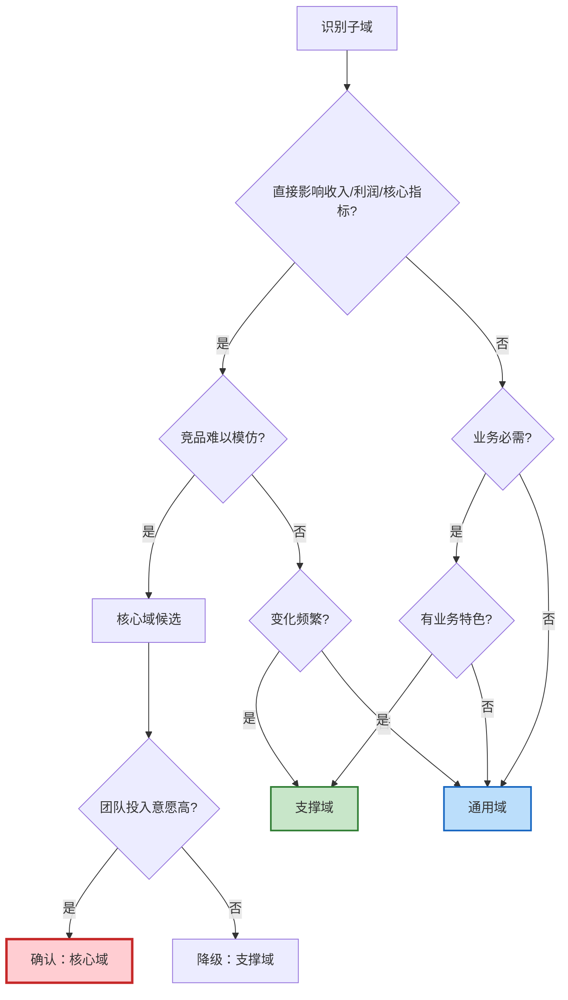

**使用说明**：

1. 从顶部"识别子域"开始
2. 依次回答每个判断问题（是/否）
3. 沿着路径走到终点得出初步结论
4. 结合评分模型验证（两个工具互相补充）

###### 常见误区与边界案例

**误区 1：把技术复杂度高的当核心域**

❌ **错误示例**：自研分布式存储系统

- 技术复杂度：10 分（确实很难）
- 业务价值：3 分（存储本身不产生业务差异）
- 竞争差异化：2 分（用户不关心底层存储）
- 变化频率：2 分（相对稳定）
- **总分 17 分 → 支撑域，甚至应该考虑用成熟方案（通用域）**

✅ **正确理解**：技术难度不等于业务价值，除非你是做存储产品的公司。

---

**误区 2：把所有自研系统当核心域**

❌ **错误示例**：自研消息队列

- 很多公司自研 MQ 是因为早期没有好的开源方案
- 但 MQ 本身不是核心竞争力（除非你是 Kafka/RabbitMQ）
- 现在 Kafka 已成熟，继续维护自研 MQ 是资源浪费

✅ **正确理解**：自研 ≠ 核心域，要看是否产生业务差异化。

---

**误区 3：忽略核心域的动态性**

**案例**：推荐系统的演进

- 2010 年：推荐算法是电商核心域（个性化推荐是差异化竞争力）
- 2020 年：推荐已成为支撑域（算法已成熟，大家都在用）
- 现在：推荐仍重要，但不再是核心竞争力

✅ **正确理解**：核心域会随行业发展逐渐"标准化"，需要定期重新评估。

---

**边界案例 1：搜索系统的分类取决于公司类型**

| 公司类型 | 搜索系统分类 | 原因 |
|---------|------------|------|
| Google/百度 | 核心域 | 搜索就是产品本身 |
| 电商平台 | 支撑域 | 搜索影响转化，但不是核心竞争力 |
| 内部工具 | 通用域 | 可以直接用 Elasticsearch |

✅ **正确理解**：域的分类是相对的，取决于公司的业务模式和战略定位。

---

**边界案例 2：支付系统在不同公司的分类**

| 公司类型 | 支付系统分类 | 原因 |
|---------|------------|------|
| 支付宝/微信支付 | 核心域 | 支付就是产品 |
| 电商平台 | 核心域 | 支付流程影响转化和体验 |
| SaaS 平台 | 支撑域 | 可以接入 Stripe，自研价值不大 |
| 内容平台 | 通用域 | 直接用第三方支付 |

##### 方法论应用：电商系统实战分析

下面选择电商系统的 3 个典型域，应用评分模型进行深度分析。

###### 案例 1：订单域（核心域）

| 维度 | 评分 | 详细分析 |
|-----|------|---------|
| **业务价值** | 10 | 订单流程直接影响 GMV（成交总额），每提升 1% 转化率就是百万级营收 |
| **竞争差异化** | 9 | 拼团、秒杀、预售、分期等玩法是核心竞争力，竞品难以完全模仿 |
| **变化频率** | 9 | 每个大促（618、双11）都会调整订单流程，支持新的营销玩法 |
| **技术复杂度** | 9 | 分布式事务（Saga）、状态机、高并发、幂等性、最终一致性 |
| **总分** | **37** | **核心域** |

**为什么是核心域？**

- 订单流程的流畅度直接影响用户下单转化率
- 支持的营销玩法越丰富，平台竞争力越强
- 每个促销活动都可能需要调整订单逻辑
- 技术上涉及多个复杂的分布式系统问题

**投资建议**：

- **团队配置**：最优秀的架构师 + 3-5 名资深后端开发，独立团队
- **技术选型**：自研，完全掌控，不依赖外部服务
- **质量要求**：99.99% 可用性，全链路监控，灰度发布
- **迭代策略**：快速响应业务需求，2 周一个迭代
- **文档要求**：完整的设计文档、接口文档、故障预案

###### 案例 2：商品域（支撑域）

| 维度 | 评分 | 详细分析 |
|-----|------|---------|
| **业务价值** | 7 | 商品管理是必需的，但 SPU/SKU 模型本身不产生差异化 |
| **竞争差异化** | 5 | 各家电商的商品模型大同小异，主要差异在类目和属性配置 |
| **变化频率** | 6 | 新品类上线时需要调整，但不频繁（季度级别） |
| **技术复杂度** | 6 | 有一定复杂度（EAV 模型、搜索索引），但方案成熟 |
| **总分** | **24** | **支撑域** |

**为什么是支撑域？**

- 商品管理做到 80 分和 95 分，对用户体验影响不大
- SPU/SKU 模型是行业通用方案，没有太多创新空间
- 但又不能没有（缺了商品管理，电商就玩不转）

**投资建议**：

- **团队配置**：常规开发团队 2-3 人，可以与其他支撑域共享资源
- **技术选型**：参考业界成熟方案（如有赞、Shopify 的商品模型），适度定制
- **质量要求**：99.9% 可用性，降级策略
- **迭代策略**：稳定为主，谨慎迭代，充分测试后再上线
- **文档要求**：基础设计文档和接口文档

###### 案例 3：用户域（通用域）

| 维度 | 评分 | 详细分析 |
|-----|------|---------|
| **业务价值** | 3 | 用户注册登录是基础能力，但不产生差异化（用户不会因为注册流程选择平台） |
| **竞争差异化** | 2 | 注册登录是行业标准（手机号、邮箱、第三方登录），无差异 |
| **变化频率** | 2 | 很少变化，除非监管要求（如实名认证） |
| **技术复杂度** | 3 | SSO、OAuth 2.0 都有成熟方案（Auth0、Keycloak） |
| **总分** | **10** | **通用域** |

**为什么是通用域？**

- 注册登录不会成为平台的竞争优势
- 市面上有大量成熟的身份认证服务
- 自研的投入产出比很低

**投资建议**：

- **团队配置**：外包或使用 SaaS 服务，内部只需 1 人对接
- **技术选型**：采购（Auth0、Keycloak、AWS Cognito）
- **质量要求**：依赖服务商 SLA（通常 99.95%+）
- **迭代策略**：按需对接新的认证方式（如生物识别），最小投入
- **文档要求**：对接文档即可

##### 跨行业对比：方法论的通用性

同样的方法论在不同行业如何应用？下表展示三个典型行业的域划分：

| 行业 | 核心域（差异化竞争力） | 支撑域（业务必需） | 通用域（行业标准） |
|-----|---------------------|------------------|------------------|
| **电商** | • 订单系统（交易流程）<br/>• 支付系统（资金安全） | • 商品管理<br/>• 库存管理<br/>• 计价引擎<br/>• 营销系统 | • 用户认证<br/>• 搜索<br/>• 消息推送<br/>• 物流跟踪<br/>• 风控 |
| **金融** | • 交易系统（买卖撮合）<br/>• 风控系统（反欺诈） | • 账户系统<br/>• 清结算<br/>• 合规报送 | • 用户认证<br/>• 消息通知<br/>• 报表系统<br/>• 存储 |
| **SaaS** | • 租户管理（多租户隔离）<br/>• 计费系统（订阅模式） | • 权限系统（RBAC）<br/>• 审计日志<br/>• 集成中心（API） | • 用户认证<br/>• 消息<br/>• 存储<br/>• 监控告警 |

**关键洞察**：

1. **核心域因行业而异**：
   - 电商的核心是「交易流程」和「资金安全」
   - 金融的核心是「买卖撮合」和「风控合规」
   - SaaS 的核心是「多租户」和「订阅计费」
   - → 核心域反映了行业的本质和竞争焦点

2. **通用域高度相似**：
   - 用户、消息、存储在各行业都是通用域
   - 这些能力已经高度标准化，有大量成熟方案
   - → 通用域是「不需要重新发明轮子」的领域

3. **支撑域体现业务特点**：
   - 电商的商品、库存、计价有一定特色，但不是核心竞争力
   - 金融的账户、清结算是必需的，但各家差异不大
   - SaaS 的权限、审计是基础能力，但实现相对标准
   - → 支撑域是「需要理解业务，但可以参考业界实践」的领域

##### 实施策略与最佳实践

###### 不同阶段的公司策略

**初创公司（0-50 人）**：

- **原则**：极致聚焦核心域，其他全部采购/开源
- **策略**：
  - 核心域：只自研 1-2 个最关键的（如电商的订单）
  - 支撑域：先用简单实现（如商品管理用 Excel 导入），快速验证商业模式
  - 通用域：全部采购（用户用 Auth0，消息用 Twilio，支付接 Stripe）
- **避坑**：不要陷入「造轮子」陷阱，技术实现不是早期核心竞争力
- **案例**：Airbnb 早期只自研订单流程，其他全用第三方服务

**成长期公司（50-500 人）**：

- **原则**：逐步替换通用域中的瓶颈，支撑域开始定制化
- **策略**：
  - 核心域：持续投入，保持技术领先
  - 支撑域：根据业务需求定制开发（如商品管理加入多品类支持）
  - 通用域：评估 ROI，替换成本高或限制业务的服务（如自建用户系统支持千万级用户）
- **判断标准**：第三方服务的成本 > 自研成本，或功能无法满足需求
- **案例**：用户量到 100 万后自建用户系统，但仍用第三方消息和支付

**成熟公司（500+ 人）**：

- **原则**：核心域持续投入，支撑域定期优化，通用域评估自研 vs 采购
- **策略**：
  - 核心域：组建专家团队，引领行业创新
  - 支撑域：定期重构和性能优化
  - 通用域：当规模达到一定程度，某些通用域自研更划算（如 IM、推送）
- **动态调整**：支撑域可能升级为核心域（如推荐系统）
- **案例**：淘宝自研了旺旺（IM），因为 IM 成为电商的差异化能力

###### 域的动态演进

**核心域可能降级**：

- 早期的核心创新逐渐变成行业标准
- 案例：电商早期的「在线支付」是核心域（支付宝），现在是支撑域（各家都有）

**支撑域可能升级**：

- 随着业务深入，某些支撑域变成核心竞争力
- 案例：电商的「推荐系统」从支撑域升级为核心域（个性化推荐成为差异化）

**通用域可能「去商品化」**：

- 某些通用域在特定场景下需要深度定制
- 案例：SaaS 平台的「消息系统」，如果涉及大量自定义通知规则，可能需要自研

**重新评估周期**：

- 初创公司：每 6 个月
- 成长期公司：每年
- 成熟公司：每 1-2 年

###### 组织架构与域的映射

| 域类型 | 团队形式 | 汇报关系 | 优先级 | 考核指标 |
|-------|---------|---------|--------|---------|
| **核心域** | 独立团队，最优秀的人 | 直接向 CTO 汇报 | P0 | 业务指标（GMV、转化率） |
| **支撑域** | 共享团队，按项目分配 | 向技术负责人汇报 | P1 | 稳定性、响应速度 |
| **通用域** | 平台团队，工具化 | 向基础架构负责人汇报 | P2 | 可用性、成本 |

**关键原则**：

- 核心域团队有最高的决策权和资源优先级
- 支撑域团队注重稳定性和效率
- 通用域团队追求标准化和成本优化

---

**总结**：领域分层不是一成不变的，它是动态的、相对的。核心域反映了公司当前的战略重点，支撑域是业务运转的基础，通用域是「不重新发明轮子」的智慧。定期重新评估领域分类，确保资源投向最有价值的地方，这就是 DDD 战略设计的核心价值。

#### 2.1.2 Bounded Context（限界上下文）

同一个"商品"在不同的上下文中有完全不同的含义：

```text
 ┌─────────────────┐     ┌─────────────────┐     ┌─────────────────┐
 │   商品上下文      │     │   订单上下文      │     │   物流上下文      │
 │                  │     │                  │     │                  │
 │  商品 = SKU +    │     │  商品 = 商品快照 + │     │  商品 = 包裹 +    │
 │  价格 + 库存     │     │  购买数量 + 金额   │     │  重量 + 体积      │
 └─────────────────┘     └─────────────────┘     └─────────────────┘
```

不同上下文之间通过**防腐层（Anti-Corruption Layer）**或**领域事件**通信，避免概念混淆。

#### 2.1.3 Context Map（上下文映射）

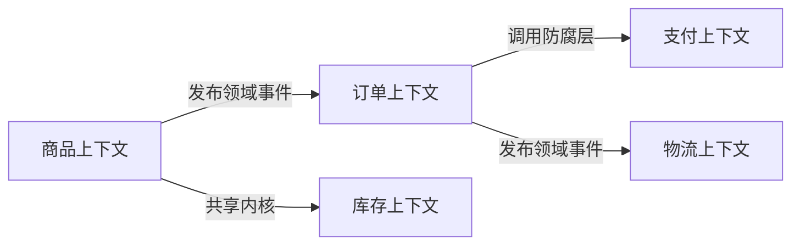

### 2.2 战术设计：代码层面

DDD 的战术设计关注的是代码层面的实现：如何用聚合、实体、值对象等战术模式编写高质量的领域模型。

#### 2.2.1 战术设计概述

| 概念 | 定义 | 示例 |
|------|------|------|
| **Aggregate（聚合）** | 一组相关对象的集合，确保数据的一致性边界 | `Order` 聚合包含 `OrderItem` 列表 |
| **Aggregate Root（聚合根）** | 聚合的入口对象，外部只能通过它访问聚合 | `Order` 是聚合根，`OrderItem` 不能被单独访问 |
| **Entity（实体）** | 有唯一标识的对象，按 ID 区分 | `User`（不同 ID = 不同用户） |
| **Value Object（值对象）** | 没有唯一标识，仅由属性定义 | `Money(100, "USD")`、`Address` |
| **Domain Event（领域事件）** | 领域中发生的有意义的事实 | `OrderPlaced`、`PaymentCompleted` |
| **Domain Service（领域服务）** | 不属于任何实体的业务逻辑 | 跨聚合的转账操作 |

#### Go 代码示例：Order 聚合

```go
// domain/order.go

type OrderID string

type Order struct {
    id         OrderID
    customerID string
    items      []OrderItem
    status     OrderStatus
    totalPrice Money
    createdAt  time.Time
}

// 聚合根通过方法保护业务不变量
func (o *Order) AddItem(product Product, qty int) error {
    if o.status != OrderStatusDraft {
        return ErrOrderNotEditable
    }
    if qty <= 0 {
        return ErrInvalidQuantity
    }
    item := NewOrderItem(product, qty)
    o.items = append(o.items, item)
    o.recalculateTotal()
    return nil
}

func (o *Order) Place() ([]DomainEvent, error) {
    if len(o.items) == 0 {
        return nil, ErrEmptyOrder
    }
    o.status = OrderStatusPlaced
    return []DomainEvent{
        OrderPlacedEvent{OrderID: o.id, Total: o.totalPrice, At: time.Now()},
    }, nil
}
```

```go
// domain/money.go — Value Object

type Money struct {
    Amount   int64  // 分为单位，避免浮点精度问题
    Currency string
}

func (m Money) Add(other Money) (Money, error) {
    if m.Currency != other.Currency {
        return Money{}, ErrCurrencyMismatch
    }
    return Money{Amount: m.Amount + other.Amount, Currency: m.Currency}, nil
}
```

### 2.3 Ubiquitous Language（通用语言）

开发者和业务专家用**同一套词汇**交流，代码里的变量名就是业务里的术语：

| 业务术语 | 代码命名 | 反面教材 |
|----------|----------|----------|
| 下单 | `Order.Place()` | `Order.SetStatus(1)` |
| 加入购物车 | `Cart.AddItem()` | `Cart.Insert()` |
| 发起退款 | `Refund.Initiate()` | `Refund.Create()` |
| 库存扣减 | `Stock.Deduct()` | `Stock.Update()` |

### 2.4 核心价值

解决"代码写着写着就成了屎山"的问题。它让代码结构高度贴合业务逻辑，而不是技术实现。

### 2.5 Aggregate 设计原则

聚合设计是 DDD 战术层面最难的部分。三条核心原则：

#### 原则一：一个事务只修改一个聚合

```go
// ❌ 反例：一个事务同时修改 Order 和 Inventory 两个聚合
func (s *OrderService) PlaceOrder(ctx context.Context, cmd PlaceOrderCmd) error {
    return s.txManager.RunInTx(ctx, func(tx *sql.Tx) error {
        order := domain.NewOrder(cmd.CustomerID)
        order.AddItem(cmd.ProductID, cmd.Qty)
        order.Place()
        s.orderRepo.SaveTx(tx, order)      // 修改 Order 聚合
        s.inventoryRepo.DeductTx(tx, cmd.ProductID, cmd.Qty) // ← 同时修改 Inventory 聚合
        return nil
    })
}
```

```go
// ✅ 正例：通过领域事件实现跨聚合协作
func (s *OrderService) PlaceOrder(ctx context.Context, cmd PlaceOrderCmd) error {
    order := domain.NewOrder(cmd.CustomerID)
    order.AddItem(cmd.ProductID, cmd.Qty)
    events, err := order.Place()
    if err != nil {
        return err
    }
    if err := s.orderRepo.Save(ctx, order); err != nil {
        return err
    }
    s.eventBus.Publish(ctx, events...) // OrderPlacedEvent → Inventory 服务异步消费
    return nil
}

// inventory 服务的事件处理器
func (h *InventoryEventHandler) OnOrderPlaced(ctx context.Context, e OrderPlacedEvent) error {
    return h.stock.Deduct(ctx, e.ProductID, e.Qty)
}
```

#### 原则二：小聚合优于大聚合

| 维度 | 小聚合 | 大聚合 |
|------|--------|--------|
| 并发冲突 | 低（锁粒度小） | 高（整个大聚合被锁） |
| 内存占用 | 小（按需加载） | 大（整棵树一次加载） |
| 一致性范围 | 单个核心不变量 | 多个不变量混在一起 |
| 适用场景 | 高并发写入 | 强一致性要求的小规模数据 |

**判断标准**：如果两个实体之间没有需要在同一个事务中保护的**业务不变量**，就应该拆成两个聚合。

#### 原则三：通过 ID 引用其他聚合

```go
// ❌ 聚合内直接持有另一个聚合的引用
type Order struct {
    customer *Customer  // 直接引用 → 加载 Order 时被迫加载 Customer
}

// ✅ 通过 ID 引用
type Order struct {
    customerID CustomerID  // 只存 ID，需要时按需查询
}
```

### 2.6 Repository 深入：Unit of Work 模式

标准 Repository 每个操作独立，但有时需要在一个事务中协调多个 Repository（例如保存聚合根 + 写 Outbox 表）。Unit of Work 模式解决这个问题：

```go
// domain/uow.go — 领域层定义接口
type UnitOfWork interface {
    OrderRepo() OrderRepository
    OutboxRepo() OutboxRepository
    Commit(ctx context.Context) error
    Rollback(ctx context.Context) error
}

// infrastructure/uow_impl.go — 基础设施层实现
type mysqlUnitOfWork struct {
    tx        *sql.Tx
    orderRepo *MySQLOrderRepo
    outboxRepo *MySQLOutboxRepo
}

func NewUnitOfWork(db *sql.DB) (UnitOfWork, error) {
    tx, err := db.Begin()
    if err != nil {
        return nil, err
    }
    return &mysqlUnitOfWork{
        tx:         tx,
        orderRepo:  &MySQLOrderRepo{tx: tx},
        outboxRepo: &MySQLOutboxRepo{tx: tx},
    }, nil
}

func (u *mysqlUnitOfWork) OrderRepo() OrderRepository  { return u.orderRepo }
func (u *mysqlUnitOfWork) OutboxRepo() OutboxRepository { return u.outboxRepo }
func (u *mysqlUnitOfWork) Commit(ctx context.Context) error   { return u.tx.Commit() }
func (u *mysqlUnitOfWork) Rollback(ctx context.Context) error { return u.tx.Rollback() }
```

```go
// application/command/place_order.go — Use Case 使用 UoW
func (h *PlaceOrderHandler) Handle(ctx context.Context, cmd PlaceOrderCmd) error {
    uow, err := h.uowFactory(ctx)
    if err != nil {
        return err
    }
    defer uow.Rollback(ctx)

    order := domain.NewOrder(cmd.CustomerID)
    events, err := order.Place()
    if err != nil {
        return err
    }

    if err := uow.OrderRepo().Save(ctx, order); err != nil {
        return err
    }
    for _, e := range events {
        if err := uow.OutboxRepo().Save(ctx, toOutboxEntry(e)); err != nil {
            return err
        }
    }
    return uow.Commit(ctx)
}
```

### 2.7 领域事件异步化：Outbox Pattern

**问题**：保存聚合到数据库后，还要发送事件到 Kafka。这两个操作无法在一个事务中完成（双写问题）。如果先写 DB 再发 Kafka，发送失败则事件丢失；如果先发 Kafka 再写 DB，写 DB 失败则产生幽灵事件。

**解法**：Outbox Pattern——将事件写入本地数据库的 Outbox 表（与业务数据同一事务），再由独立的 Relay 进程异步发送到 Kafka。

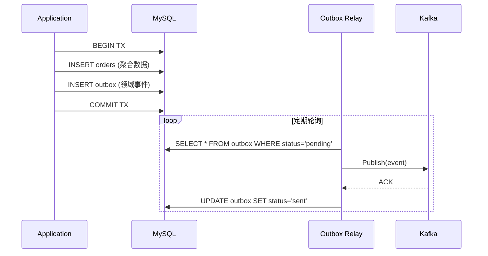

#### Outbox 表设计

```sql
CREATE TABLE outbox (
    id          BIGINT AUTO_INCREMENT PRIMARY KEY,
    event_type  VARCHAR(128) NOT NULL,
    event_key   VARCHAR(128) NOT NULL,
    payload     JSON NOT NULL,
    status      ENUM('pending', 'sent', 'failed') DEFAULT 'pending',
    created_at  TIMESTAMP DEFAULT CURRENT_TIMESTAMP,
    sent_at     TIMESTAMP NULL,
    retry_count INT DEFAULT 0,
    INDEX idx_status_created (status, created_at)
);
```

#### Relay 实现

```go
func (r *OutboxRelay) Run(ctx context.Context) {
    ticker := time.NewTicker(500 * time.Millisecond)
    defer ticker.Stop()

    for {
        select {
        case <-ctx.Done():
            return
        case <-ticker.C:
            entries, err := r.outboxRepo.FetchPending(ctx, 100)
            if err != nil {
                slog.Error("fetch outbox failed", "error", err)
                continue
            }
            for _, entry := range entries {
                if err := r.producer.Publish(ctx, entry.EventType, entry.EventKey, entry.Payload); err != nil {
                    slog.Error("publish event failed", "id", entry.ID, "error", err)
                    r.outboxRepo.MarkFailed(ctx, entry.ID)
                    continue
                }
                r.outboxRepo.MarkSent(ctx, entry.ID)
            }
        }
    }
}
```

**关键保证**：
- **At-least-once delivery**：Relay 崩溃后重启会重新发送 pending 的事件，消费者必须做幂等处理
- **顺序保证**：按 `created_at` 顺序拉取，同一 `event_key` 的事件保持顺序
- **死信处理**：`retry_count > 5` 的事件转入死信表，人工介入

---

## 三、CQRS（命令查询职责分离）— 核心是"读写分离"

CQRS 的逻辑非常直白：处理"改变数据"（Command）的逻辑和处理"读取数据"（Query）的逻辑应该**完全分开**。

### 3.1 为什么要分？

在复杂系统中，写的逻辑和读的需求往往是**矛盾的**：

| 维度 | 写（Command） | 读（Query） |
|------|---------------|-------------|
| 关注点 | 业务规则、校验、权限、事务 | 跨表关联、全文搜索、分页排序 |
| 数据模型 | 范式化（3NF），保证一致性 | 反范式化（宽表），优化查询速度 |
| 性能目标 | 保证正确性 > 速度 | 保证速度 > 实时性 |
| 扩展方式 | 垂直扩展（事务安全） | 水平扩展（读副本、缓存） |
| 典型存储 | MySQL, PostgreSQL | Elasticsearch, Redis, ClickHouse |

### 3.2 架构全景

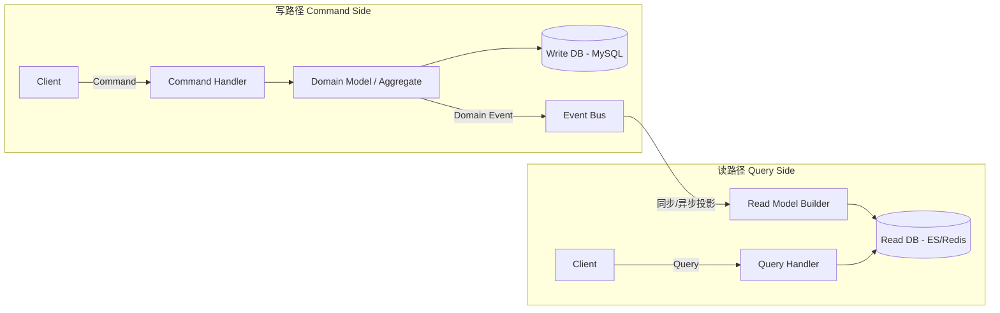

### 3.3 Command 与 Query 的设计

```go
// Command — 表达意图，不返回业务数据
type PlaceOrderCommand struct {
    CustomerID string
    Items      []OrderItemDTO
}

type CommandResult struct {
    Success bool
    ID      string
    Error   error
}

// Command Handler — 走领域模型，执行业务逻辑
func (h *OrderCommandHandler) PlaceOrder(ctx context.Context, cmd PlaceOrderCommand) CommandResult {
    order := domain.NewOrder(cmd.CustomerID)
    for _, item := range cmd.Items {
        if err := order.AddItem(item.ProductID, item.Qty); err != nil {
            return CommandResult{Error: err}
        }
    }
    events, err := order.Place()
    if err != nil {
        return CommandResult{Error: err}
    }
    if err := h.repo.Save(ctx, order); err != nil {
        return CommandResult{Error: err}
    }
    h.eventBus.Publish(ctx, events...)
    return CommandResult{Success: true, ID: string(order.ID())}
}
```

```go
// Query — 直接返回展示层需要的 DTO，不触发任何业务逻辑
type OrderDetailQuery struct {
    OrderID string
}

type OrderDetailDTO struct {
    OrderID     string        `json:"order_id"`
    CustomerName string       `json:"customer_name"`
    Items       []ItemDTO     `json:"items"`
    TotalPrice  string        `json:"total_price"`
    Status      string        `json:"status"`
    CreatedAt   string        `json:"created_at"`
}

// Query Handler — 绕过领域模型，直接从读库获取
func (h *OrderQueryHandler) GetOrderDetail(ctx context.Context, q OrderDetailQuery) (*OrderDetailDTO, error) {
    return h.readDB.FindOrderDetail(ctx, q.OrderID)
}
```

### 3.4 核心价值

**极致的性能优化**。你可以针对写操作使用关系型数据库（保证强一致性），针对读操作使用 Elasticsearch 或 Redis（保证高并发）。读写模型可以**独立扩展、独立优化**。

### 3.5 Event Sourcing：事件溯源

Event Sourcing 经常和 CQRS 一起被提及，但它们是**独立的概念**，可以单独使用，也可以组合使用。

#### 核心思想

传统方式存储的是**当前状态**（state），Event Sourcing 存储的是**导致状态变化的事件序列**（events）。当前状态通过重放事件计算得出。

```text
传统方式：
  orders 表: {id: 1, status: "paid", total: 200, updated_at: "2026-04-07"}

Event Sourcing：
  events 表:
    {seq: 1, type: "OrderCreated",  data: {id: 1, customer: "alice"}}
    {seq: 2, type: "ItemAdded",     data: {product: "shoe", price: 100, qty: 2}}
    {seq: 3, type: "OrderPlaced",   data: {total: 200}}
    {seq: 4, type: "PaymentReceived", data: {amount: 200, method: "credit_card"}}
```

#### 与 CQRS 的关系

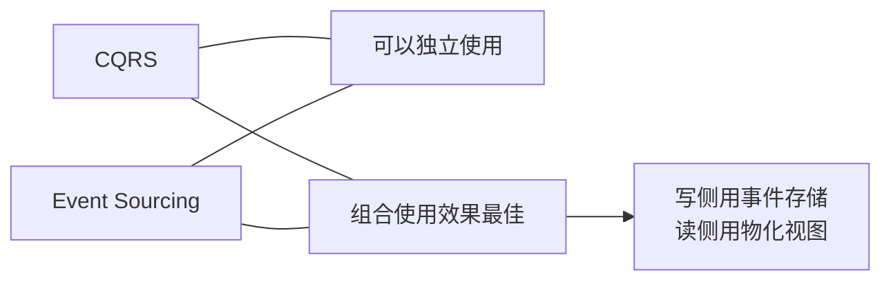

- **只用 CQRS 不用 ES**：写侧用普通数据库，读侧用独立的读模型。最常见的方式。
- **只用 ES 不用 CQRS**：事件存储 + 重放计算状态，读写用同一个模型。适合审计场景。
- **CQRS + ES**：写侧用事件存储，读侧通过投影事件构建物化视图。适合金融、交易系统。

#### 适用与不适用场景

| 适用 | 不适用 |
|------|--------|
| 需要完整审计追踪（金融、合规） | 简单 CRUD 应用 |
| 需要时间旅行/回放（调试、分析） | 高频更新的状态（计数器、在线人数） |
| 事件本身有业务价值 | 数据模型频繁变更 |
| 需要撤销/补偿操作 | 团队对 ES 没有经验且交期紧 |

### 3.6 最终一致性处理策略

引入 CQRS 后，写模型和读模型之间存在**延迟**（通常毫秒到秒级）。这需要在架构层面和用户体验层面同时处理。

#### 架构层面

**策略一：幂等消费**

投影器可能收到重复事件（at-least-once delivery），必须做幂等处理：

```go
func (p *OrderProjector) Project(ctx context.Context, event DomainEvent) error {
    exists, err := p.readDB.EventProcessed(ctx, event.ID())
    if err != nil {
        return err
    }
    if exists {
        return nil // 幂等：已处理过，跳过
    }

    switch e := event.(type) {
    case OrderPlacedEvent:
        dto := OrderDetailDTO{
            OrderID:    string(e.OrderID),
            Status:     "placed",
            TotalPrice: e.Total.String(),
            CreatedAt:  e.At.Format(time.RFC3339),
        }
        if err := p.readDB.Upsert(ctx, dto); err != nil {
            return err
        }
    }
    return p.readDB.MarkEventProcessed(ctx, event.ID())
}
```

**策略二：补偿事务（Saga）**

当跨服务操作中某一步失败，通过发布补偿事件回滚前面的步骤：

```text
正向流程：CreateOrder → ReserveStock → ChargePayment
补偿流程：                ReleaseStock ← RefundPayment ← PaymentFailed
```

#### 用户体验层面

**Optimistic UI（乐观更新）**：前端在发送 Command 后立即更新 UI，不等待读模型同步。

```text
用户点击"下单" 
  → 前端立即显示"订单已创建"（乐观更新）
  → 后端 Command 异步处理
  → 读模型延迟 200ms 后更新
  → 用户下次刷新时看到真实状态
```

**Read-your-writes**：Command 成功后返回版本号，Query 时带上版本号，确保读到的是自己写入之后的数据。

### 3.7 投影器（Projector）实现模式

投影器是 CQRS 架构中将**领域事件**转化为**读模型**的组件。

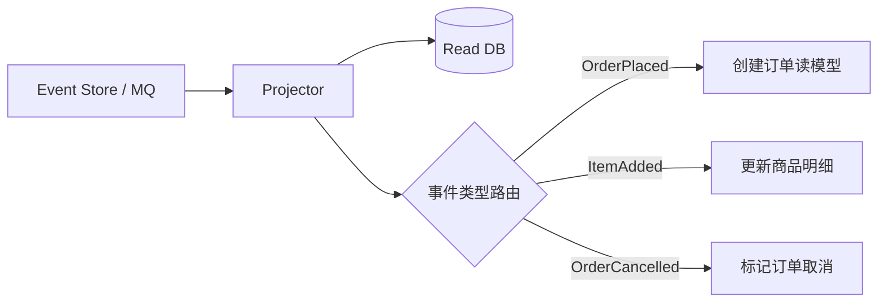

#### 完整实现

```go
// adapter/projection/projector.go

type Projector interface {
    Handles() []string // 返回该 Projector 关心的事件类型列表
    Project(ctx context.Context, event DomainEvent) error
}

type OrderReadModelProjector struct {
    readDB ReadModelRepository
}

func (p *OrderReadModelProjector) Handles() []string {
    return []string{"OrderPlaced", "OrderCancelled", "ItemAdded", "PaymentCompleted"}
}

func (p *OrderReadModelProjector) Project(ctx context.Context, event DomainEvent) error {
    switch e := event.(type) {
    case OrderPlacedEvent:
        return p.readDB.Upsert(ctx, OrderReadModel{
            OrderID:   string(e.OrderID),
            Status:    "placed",
            Total:     e.Total.Amount,
            Currency:  e.Total.Currency,
            CreatedAt: e.At,
        })
    case OrderCancelledEvent:
        return p.readDB.UpdateStatus(ctx, string(e.OrderID), "cancelled")
    case PaymentCompletedEvent:
        return p.readDB.UpdateStatus(ctx, string(e.OrderID), "paid")
    default:
        return nil
    }
}
```

#### 投影器的运行模式

| 模式 | 机制 | 延迟 | 适用场景 |
|------|------|------|----------|
| **同步投影** | Command Handler 执行完后同步调用 Projector | 零延迟 | 读写在同一进程、低吞吐 |
| **异步投影** | 事件通过 MQ 传递，Projector 独立消费 | 毫秒~秒级 | 高吞吐、读写分离部署 |
| **Catch-up 投影** | Projector 从事件存储按序号拉取事件 | 可控 | 重建读模型、新增投影视图 |

---

## 四、三者如何联手？

在现代大型微服务或复杂单体中，它们通常是这样组合的：

### 4.1 协作关系

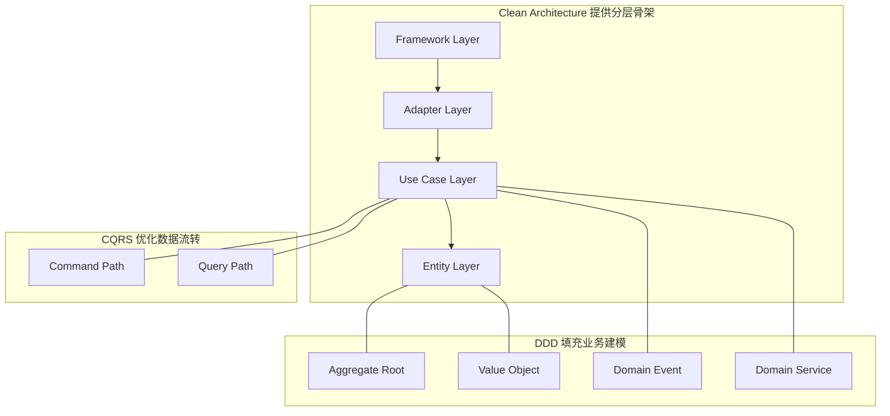

| 角色 | 职责 |
|------|------|
| **Clean Architecture（架构底座）** | 定义目录结构和依赖方向，确保领域层位于中心，不依赖外部技术 |
| **DDD（核心建模）** | 在 Entity 和 Use Cases 层中，利用聚合根、实体和领域服务编写复杂的业务逻辑 |
| **CQRS（数据流转）** | 在 Use Cases 层进行读写拆分：写操作走 DDD 的领域模型（Command），读操作绕过复杂的领域模型，直接通过 DTO 投影（Query）到前端 |

### 4.2 在 Go 项目中的落地结构

```text
myapp/
├── cmd/
│   └── server/main.go              # 启动入口 & 依赖注入
│
├── domain/                          # ← Clean Arch: Entity 层
│   ├── order/                       # ← DDD: Order 聚合
│   │   ├── order.go                 #   聚合根
│   │   ├── order_item.go            #   实体
│   │   ├── money.go                 #   值对象
│   │   ├── events.go                #   领域事件
│   │   └── repository.go           #   仓储接口（Port）
│   └── inventory/                   # ← DDD: Inventory 聚合
│       ├── stock.go
│       └── repository.go
│
├── application/                     # ← Clean Arch: Use Case 层
│   ├── command/                     # ← CQRS: 写路径
│   │   ├── place_order.go
│   │   └── cancel_order.go
│   └── query/                       # ← CQRS: 读路径
│       ├── order_detail.go
│       └── order_list.go
│
├── adapter/                         # ← Clean Arch: Interface Adapter 层
│   ├── inbound/
│   │   ├── http/                    #   HTTP handler
│   │   └── grpc/                    #   gRPC handler
│   ├── outbound/
│   │   ├── persistence/             #   Write DB 实现
│   │   ├── readmodel/               #   Read DB 实现
│   │   └── messaging/               #   Event Bus 实现
│   └── projection/                  #   事件 → 读模型的投影器
│
└── infra/                           # ← Clean Arch: Frameworks & Drivers 层
    ├── mysql/
    ├── elasticsearch/
    ├── redis/
    └── kafka/
```

### 4.3 数据流全景

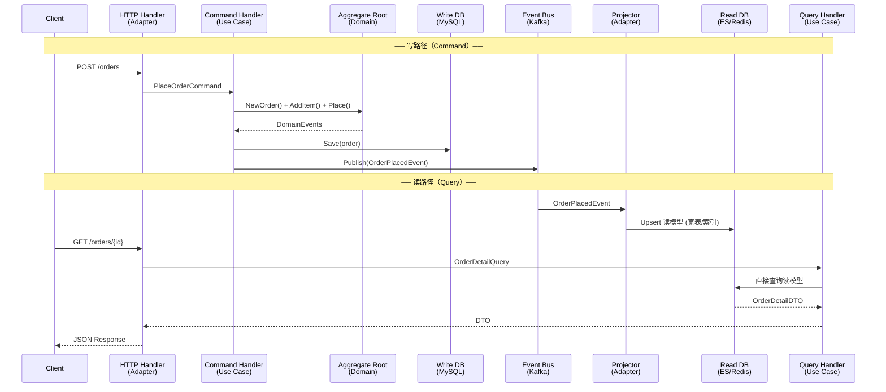

### 4.4 完整链路 Walk-through：下单请求

以一个电商"下单"请求为例，完整走一遍三件套协作的全链路。每一步标注所属的**架构层**和**概念**。

```go
// ① [Adapter 层 / Inbound] HTTP Handler 接收请求
func (h *OrderHandler) PlaceOrder(c *gin.Context) {
    var req PlaceOrderRequest
    if err := c.ShouldBindJSON(&req); err != nil {
        c.JSON(400, gin.H{"error": err.Error()})
        return
    }
    // 转换为 Command（DTO → Command）
    cmd := command.PlaceOrderCommand{
        CustomerID: req.CustomerID,
        Items:      toCommandItems(req.Items),
    }
    result := h.placeOrderHandler.Handle(c.Request.Context(), cmd)
    if result.Error != nil {
        c.JSON(500, gin.H{"error": result.Error.Error()})
        return
    }
    c.JSON(201, gin.H{"order_id": result.ID})
}
```

```go
// ② [Application 层 / CQRS Command Path] Command Handler 编排业务流程
func (h *PlaceOrderHandler) Handle(ctx context.Context, cmd PlaceOrderCommand) CommandResult {
    // 创建 UoW（事务边界）
    uow, err := h.uowFactory(ctx)
    if err != nil {
        return CommandResult{Error: err}
    }
    defer uow.Rollback(ctx)

    // ③ [Domain 层 / DDD Aggregate] 操作聚合根
    order := domain.NewOrder(domain.CustomerID(cmd.CustomerID))
    for _, item := range cmd.Items {
        product, err := h.productReader.GetByID(ctx, item.ProductID)
        if err != nil {
            return CommandResult{Error: err}
        }
        if err := order.AddItem(product, item.Qty); err != nil {
            return CommandResult{Error: err}
        }
    }
    events, err := order.Place() // 聚合根返回领域事件
    if err != nil {
        return CommandResult{Error: err}
    }

    // ④ [Adapter 层 / Outbound] 持久化聚合 + Outbox
    if err := uow.OrderRepo().Save(ctx, order); err != nil {
        return CommandResult{Error: err}
    }
    for _, e := range events {
        if err := uow.OutboxRepo().Save(ctx, toOutboxEntry(e)); err != nil {
            return CommandResult{Error: err}
        }
    }
    if err := uow.Commit(ctx); err != nil {
        return CommandResult{Error: err}
    }

    return CommandResult{Success: true, ID: string(order.ID())}
}
```

```go
// ⑤ [Adapter 层 / Projection] Outbox Relay 发送事件 → Projector 更新读模型
func (p *OrderProjector) Project(ctx context.Context, event DomainEvent) error {
    switch e := event.(type) {
    case domain.OrderPlacedEvent:
        return p.readDB.Upsert(ctx, ReadOrderModel{
            OrderID:      string(e.OrderID),
            CustomerName: p.customerName(ctx, e.CustomerID),
            Items:        p.buildItemList(ctx, e.Items),
            TotalPrice:   e.Total.String(),
            Status:       "placed",
            CreatedAt:    e.At,
        })
    }
    return nil
}
```

```go
// ⑥ [Application 层 / CQRS Query Path] 读请求绕过领域模型
func (h *OrderDetailHandler) Handle(ctx context.Context, q OrderDetailQuery) (*OrderDetailDTO, error) {
    return h.readDB.FindByOrderID(ctx, q.OrderID) // 直接从读库返回 DTO
}
```

**全链路概览**：

| 步骤 | 架构层 | 概念 | 代码位置 |
|------|--------|------|----------|
| ① 接收 HTTP 请求 | Adapter (Inbound) | - | `handler/order_handler.go` |
| ② 编排业务流程 | Application | CQRS Command | `command/place_order.go` |
| ③ 操作聚合根 | Domain | DDD Aggregate | `domain/order/order.go` |
| ④ 持久化 + Outbox | Adapter (Outbound) | Outbox Pattern | `persistence/mysql_order_repo.go` |
| ⑤ 投影到读模型 | Adapter (Projection) | CQRS Projector | `projection/order_projector.go` |
| ⑥ 读请求直查 | Application | CQRS Query | `query/order_detail.go` |

---

## 五、常见误区与最佳实践

### 5.1 常见误区

| 误区 | 澄清 |
|------|------|
| "用了 DDD 就必须用 CQRS" | 两者独立，简单 CRUD 场景用 DDD 不需要 CQRS |
| "CQRS 等于 Event Sourcing" | Event Sourcing 是可选的，CQRS 可以只做读写模型分离 |
| "Clean Architecture = 洋葱架构 = 六边形架构" | 思想相似但不完全等同，核心都是**依赖反转** |
| "所有项目都应该用这三件套" | 简单的 CRUD 应用用这套是过度设计 |
| "DDD 就是 Entity + Repository" | 战略设计（Bounded Context 划分）比战术设计更重要 |

### 5.2 何时采用？

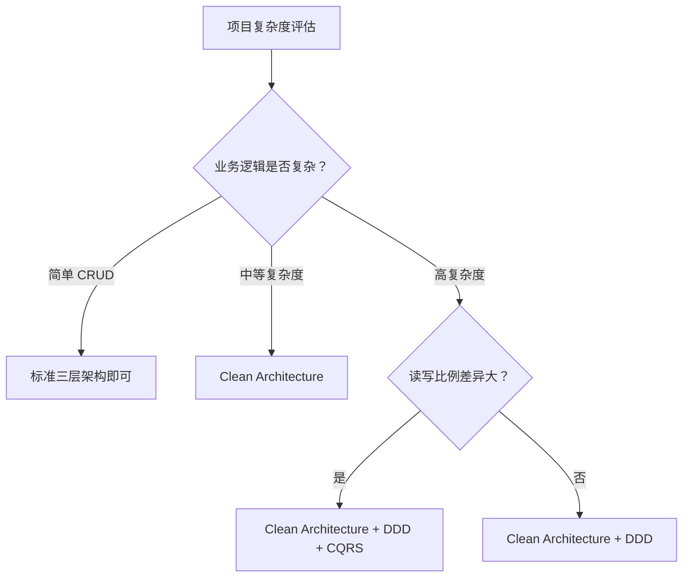

**适用场景（适合上三件套）：**
- 业务规则复杂且频繁变化（电商、金融、保险）
- 读写比例悬殊（读:写 > 10:1）
- 多团队协作，需要清晰的 Bounded Context 边界
- 需要针对读写使用不同存储引擎

**不适用场景：**
- 简单的管理后台 / CRUD 应用
- 原型验证（MVP）阶段
- 团队缺乏 DDD 经验且没有时间学习

### 5.3 过度设计的识别方法

在实际项目中，**过度设计**比**设计不足**更常见。以下是几个危险信号：

| 信号 | 说明 | 应该怎么做 |
|------|------|------------|
| 聚合根只有 CRUD 操作 | 没有真正的业务不变量需要保护 | 回退到简单的 Service + Repository |
| 读模型和写模型完全一样 | 没有读写分离的必要 | 去掉 CQRS，用同一个模型 |
| Bounded Context 只有一个实体 | 过度拆分，上下文太小 | 合并到相邻上下文 |
| 领域事件没有消费者 | 为了 DDD 而 DDD | 去掉事件，直接方法调用 |
| 接口只有一个实现 | 除非是为了测试或已知的未来扩展 | 考虑直接使用具体类型 |

**经验法则**：如果你花在架构上的时间超过了写业务逻辑的时间，大概率过度设计了。

### 5.4 团队能力评估

引入架构方法论是一项**投资**，需要评估团队的准备程度：

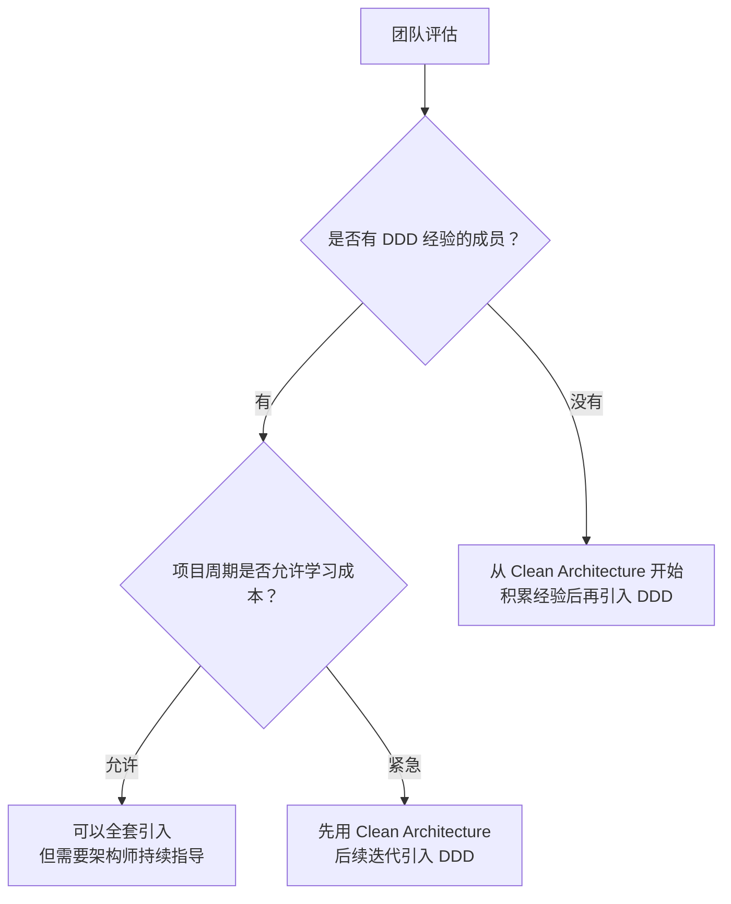

---

## 六、渐进式采用指南

三件套不需要一步到位。从最简单的三层架构出发，**在痛点出现时**逐步演进。

### 阶段 0：标准三层架构

**触发条件**：项目启动，业务简单明确

```text
myapp/
├── handler/        # 表现层
│   └── order.go
├── service/        # 业务逻辑层
│   └── order.go
├── repository/     # 数据访问层
│   └── order.go
└── main.go
```

```go
// service/order.go — 典型的三层架构
type OrderService struct {
    repo *repository.OrderRepository  // 直接依赖具体实现
    db   *sql.DB
}

func (s *OrderService) CreateOrder(ctx context.Context, req CreateOrderReq) (*Order, error) {
    order := &Order{CustomerID: req.CustomerID, Items: req.Items}
    order.Total = s.calculateTotal(order.Items)
    return s.repo.Save(ctx, order)
}
```

**问题浮现**：当你想从 MySQL 换到 PostgreSQL 时，发现 `OrderService` 到处都是 `*sql.DB` 和 MySQL 特有的语法。

### 阶段 1：引入 Clean Architecture

**触发条件**：需要更换数据库/框架，或需要编写不依赖基础设施的单元测试

**改造要点**：引入接口层，依赖方向反转

```text
myapp/
├── domain/
│   ├── order.go         # 实体 + 业务规则
│   └── repository.go    # 接口定义（Port）
├── usecase/
│   └── create_order.go  # 应用逻辑
├── adapter/
│   ├── handler/
│   └── persistence/     # 接口实现
└── main.go              # 依赖注入
```

```go
// domain/repository.go — 内层定义接口
type OrderRepository interface {
    Save(ctx context.Context, order *Order) error
}

// usecase/create_order.go — 依赖接口而非实现
type CreateOrderUseCase struct {
    repo domain.OrderRepository  // 依赖抽象
}
```

**收益**：`CreateOrderUseCase` 可以用 Mock Repository 做单元测试，不需要启动数据库。

### 阶段 2：引入 DDD

**触发条件**：业务规则越来越复杂，Service 层开始膨胀，同一个概念在不同模块有不同含义

**改造要点**：识别聚合根、值对象、领域事件

```go
// 阶段 1 的 "贫血模型"
type Order struct {
    ID     string
    Status int     // 用魔数表示状态
    Total  float64 // 用 float 表示金额
}

// 阶段 2 的 "充血模型"
type Order struct {
    id     OrderID
    status OrderStatus   // 值对象，枚举约束
    total  Money         // 值对象，精度安全
    items  []OrderItem
}

func (o *Order) Place() ([]DomainEvent, error) {
    if len(o.items) == 0 {
        return nil, ErrEmptyOrder  // 聚合根保护不变量
    }
    o.status = OrderStatusPlaced
    return []DomainEvent{OrderPlacedEvent{...}}, nil
}
```

**收益**：业务规则内聚在聚合根中，不再散落在 Service 层。新成员阅读 `Order.Place()` 就能理解下单的所有约束。

### 阶段 3：引入 CQRS

**触发条件**：读写性能矛盾突出（读 QPS 远大于写，或读需要跨聚合的宽表查询）

**改造要点**：分离 Command/Query Handler，引入独立读模型

```text
application/
├── command/              # 写路径 → 走领域模型
│   └── place_order.go
└── query/                # 读路径 → 直查读库
    └── order_detail.go

adapter/outbound/
├── persistence/          # Write DB (MySQL)
├── readmodel/            # Read DB (ES/Redis)
└── projection/           # Event → Read Model
```

**收益**：写操作保证事务一致性，读操作针对查询优化。两者可以**独立扩展**。

### 演进决策树

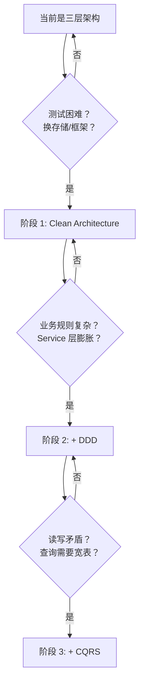

**关键原则**：每次只前进一步，在当前阶段的痛点确实出现后再演进。过早引入会带来不必要的复杂性。

---

## 七、总结

一句话总结三者的关系：

> **Clean Architecture 给你的代码盖房子，DDD 决定房间里怎么住人，CQRS 给房子装了专门的入户门和逃生通道。**

| 维度 | Clean Architecture | DDD | CQRS |
|------|-------------------|-----|------|
| **提出者** | Robert C. Martin | Eric Evans | Greg Young / Bertrand Meyer |
| **核心思想** | 依赖向内，业务逻辑独立于技术 | 代码反映业务，应对复杂性 | 读写分离，独立优化 |
| **关注层面** | 代码组织与依赖方向 | 业务建模与团队沟通 | 数据流转与性能 |
| **最小应用粒度** | 单个服务 / 模块 | 一个 Bounded Context | 一个 Use Case |
| **学习曲线** | 中等 | 较高（尤其战略设计） | 中等 |

它们不是互相替代的关系，而是在不同维度上解决不同问题。在**真正复杂**的业务系统中，三者组合使用能发挥最大价值。

## 参考资料

1. Robert C. Martin, *Clean Architecture: A Craftsman's Guide to Software Structure and Design*, 2017
2. Eric Evans, *Domain-Driven Design: Tackling Complexity in the Heart of Software*, 2003（中文版：《领域驱动设计：软件核心复杂性应对之道》，2006）
3. Vaughn Vernon, *Implementing Domain-Driven Design*, 2013（中文版：《实现领域驱动设计》，2014）
4. Martin Fowler, [CQRS Pattern](https://martinfowler.com/bliki/CQRS.html)
5. Microsoft, [CQRS Pattern - Azure Architecture Center](https://learn.microsoft.com/en-us/azure/architecture/patterns/cqrs)
