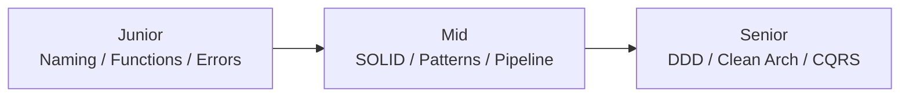

<!-- toc -->

## 一、复杂业务代码的"痛点画像"

### 1.1 为什么复杂业务的代码容易变烂？

在电商、金融、社交等复杂业务场景中，代码腐化几乎是必然趋势。根本原因包括：

- **需求频繁变更**：营销活动每周上新，代码不断打补丁
- **多人协作冲突**：10+ 开发者同时修改，缺乏统一规范
- **性能优化压力**：为了提升性能，牺牲代码可读性
- **历史包袱沉重**：不敢重构老代码，只能在上面继续堆砌
- **业务理解偏差**：产品、技术、运营对同一需求理解不一致

**典型场景**：一个最初只有 100 行的下单函数，经过 2 年迭代后膨胀到 1500 行，包含 15 个 if-else 嵌套，8 个外部依赖调用，3 个数据库事务，无人敢动。

---

### 1.2 典型的"烂代码"症状

#### 1.2.1 千行函数的噩梦

```go
// ❌ 反例：1500行的下单函数
func CreateOrder(req *CreateOrderRequest) (*Order, error) {
    // 1. 参数校验 (50行)
    if req == nil {
        return nil, errors.New("request is nil")
    }
    if req.UserID == 0 {
        return nil, errors.New("user_id is required")
    }
    if len(req.Items) == 0 {
        return nil, errors.New("items is required")
    }
    // ... 还有 40 行校验
    
    // 2. 用户信息获取 (80行)
    userResp, err := userService.GetUser(req.UserID)
    if err != nil {
        // 错误处理 20行
    }
    // 用户等级判断 30行
    // 新用户判断 30行
    
    // 3. 库存检查 (100行)
    for _, item := range req.Items {
        stock, err := inventoryService.CheckStock(item.ItemID)
        // 复杂的库存逻辑
        // 预扣库存
        // 库存不足处理
    }
    
    // 4. 价格计算 (200行)
    var totalPrice int64
    // 商品价格计算
    // 营销活动计算
    // 优惠券计算
    // 积分抵扣计算
    // 运费计算
    // 手续费计算
    
    // 5. 优惠券校验 (150行)
    // ... 复杂的优惠券规则
    
    // 6. 积分计算 (100行)
    // ... 积分抵扣逻辑
    
    // 7. 运费计算 (80行)
    // ... 根据地址计算运费
    
    // 8. 营销活动校验 (200行)
    // ... 各种营销活动规则
    
    // 9. 风控检查 (150行)
    // ... 反作弊、反刷单
    
    // 10. 订单创建 (100行)
    // ... 构建订单对象
    // ... 保存到数据库
    
    // 11. 支付预创建 (120行)
    // ... 调用支付服务
    
    // 12. 消息通知 (80行)
    // ... 发送短信、推送
    
    // 13. 日志记录 (50行)
    // ... 记录各种日志
    
    // 14. 异常回滚 (140行)
    // ... 各种资源回滚
    
    return order, nil
}
```

**问题分析**：
- ❌ 单个函数承担了 14 个职责
- ❌ 无法单元测试（依赖太多外部服务）
- ❌ 修改任何一个环节都可能影响其他环节
- ❌ 新人无法快速理解业务流程
- ❌ 代码复用率极低

---

#### 1.2.2 if-else 地狱

```go
// ❌ 反例：嵌套6层的条件判断
func CalculatePrice(order *Order) (int64, error) {
    if order.Type == "normal" {
        if order.Region == "SG" {
            if order.UserLevel == "VIP" {
                if order.PaymentMethod == "credit_card" {
                    if order.PromotionType == "flash_sale" {
                        if order.ItemStock > 0 {
                            // 实际业务逻辑埋在第6层
                            return order.BasePrice * 0.5, nil
                        } else {
                            return 0, errors.New("out of stock")
                        }
                    } else if order.PromotionType == "bundle" {
                        if order.BundleItemCount >= 3 {
                            return order.BasePrice * 0.7, nil
                        } else {
                            return order.BasePrice * 0.8, nil
                        }
                    } else {
                        return order.BasePrice * 0.9, nil
                    }
                } else if order.PaymentMethod == "ewallet" {
                    // 又是一层嵌套
                    return order.BasePrice * 0.95, nil
                } else {
                    return order.BasePrice, nil
                }
            } else if order.UserLevel == "SVIP" {
                // 再来一层
            } else {
                // 普通用户逻辑
            }
        } else if order.Region == "ID" {
            // 印尼地区逻辑
        } else {
            // 其他地区逻辑
        }
    } else if order.Type == "topup" {
        // 充值订单逻辑
    } else if order.Type == "hotel" {
        // 酒店订单逻辑
    }
    
    return 0, errors.New("unsupported order type")
}
```

**问题分析**：
- ❌ 认知负担极高（需要记住 6 层条件）
- ❌ 圈复杂度爆炸（McCabe > 50）
- ❌ 新增条件需要修改现有代码（违反开闭原则）
- ❌ 测试用例数量 = 2^n（条件分支数）

---

#### 1.2.3 上下文爆炸（参数传递链）

```go
// ❌ 反例：15个参数的函数
func CalculatePrice(
    itemID int64,
    modelID int64,
    userID int64,
    regionID int64,
    quantity int32,
    isNewUser bool,
    useVoucher bool,
    useCoin bool,
    voucherCode string,
    coinAmount int64,
    promotionIDs []int64,
    shippingAddress *Address,
    paymentMethod string,
    platform string,
    deviceType string,
) (*Price, error) {
    // 函数内部需要理解15个参数的含义和关系
    // ...
}

// 调用时也是灾难
price, err := CalculatePrice(
    123,           // itemID
    456,           // modelID
    789,           // userID
    1,             // regionID
    2,             // quantity
    true,          // isNewUser
    true,          // useVoucher
    false,         // useCoin
    "SAVE100",     // voucherCode
    0,             // coinAmount
    []int64{1, 2}, // promotionIDs
    address,       // shippingAddress
    "credit_card", // paymentMethod
    "app",         // platform
    "ios",         // deviceType
)
```

**问题分析**：
- ❌ 调用方容易传错参数顺序
- ❌ 参数类型相似（多个 int64），编译器无法检查
- ❌ 新增参数需要修改所有调用方
- ❌ 参数之间可能有隐含的依赖关系（如 useVoucher=true 时必须传 voucherCode）

---

#### 1.2.4 改一处动全身

```go
// 场景：修改优惠券抵扣规则

// 需要修改的文件列表：
1. order_service.go       (订单创建逻辑)
2. price_calculator.go    (价格计算逻辑)
3. voucher_service.go     (优惠券服务)
4. promotion_service.go   (营销服务)
5. payment_service.go     (支付服务)
6. refund_service.go      (退款服务 - 逆向计算)
7. order_dto.go           (DTO 定义)
8. order_test.go          (单元测试)

// 影响分析：
- 修改了 8 个文件
- 可能引入 3-5 个新 Bug
- 测试回归需要 2 天
- 不敢删除老代码，只能注释掉（留下大量"僵尸代码"）
```

**根本原因**：
- ❌ 逻辑分散在多个服务
- ❌ 缺乏统一的抽象层
- ❌ 职责边界不清晰
- ❌ 依赖关系混乱

---

#### 1.2.5 无法单元测试

```go
// ❌ 反例：无法测试的函数
func ProcessOrder(orderID int64) error {
    // 1. 直接调用全局变量
    db := global.DB
    cache := global.Redis
    
    // 2. 直接调用外部服务（无法 mock）
    user, err := userService.GetUser(orderID)
    if err != nil {
        return err
    }
    
    // 3. 函数内部创建依赖
    paymentClient := payment.NewClient("http://payment-service")
    
    // 4. 直接操作文件系统
    file, _ := os.Open("/var/log/order.log")
    defer file.Close()
    
    // 5. 使用当前时间（不可预测）
    now := time.Now()
    
    // 6. 生成随机数（不可预测）
    orderNo := fmt.Sprintf("ORD%d", rand.Int63())
    
    return nil
}
```

**问题分析**：
- ❌ 依赖全局变量，无法 mock
- ❌ 依赖外部服务，测试需要真实环境
- ❌ 依赖文件系统，测试需要真实文件
- ❌ 依赖时间和随机数，结果不可预测
- ❌ 函数内部创建依赖，无法注入 mock 对象

---

### 1.3 代码腐化的根本原因

#### 1.3.1 职责不清（违反单一职责原则）

```go
// ❌ 一个 Service 做了太多事情
type OrderService struct {
    // 订单创建
    // 价格计算
    // 库存管理
    // 支付处理
    // 退款处理
    // 物流跟踪
    // 消息通知
    // 数据分析
}
```

#### 1.3.2 耦合过高（模块间相互依赖）

```
OrderService → PriceService → PromotionService → ItemService → OrderService
                    ↑                                               ↓
                    └───────────────────────────────────────────────┘
                                  (循环依赖)
```

#### 1.3.3 抽象缺失（直接调用底层实现）

```go
// ❌ Controller 直接调用 Repository
func CreateOrderHandler(ctx *gin.Context) {
    // 跳过 Service 层，直接操作数据库
    order := &Order{...}
    db.Create(order)
}
```

#### 1.3.4 缺乏约束（没有统一规范）

- 每个人的错误处理方式不同
- 日志格式不统一
- 命名风格各异
- 没有 Code Review 流程

---

## 二、Clean Code 的判断标准

### 2.1 可读性：代码即文档

**目标**：新人在不依赖文档的情况下，能够快速理解代码逻辑。

#### 2.1.1 命名清晰

```go
// ❌ 反例：晦涩的命名
var d int         // 什么意思？
var list []int    // 什么的列表？
var flag bool     // 什么标志？
var tmp string    // 临时什么？

// ✅ 正例：见名知意
var daysSinceCreation int
var activeUserIDs []int
var isNewUser bool
var tempOrderNumber string
```

#### 2.1.2 结构简单

```go
// ✅ 正例：一个函数只做一件事
func GetUserOrder(userID, orderID int64) (*Order, error) {
    // 1. 验证用户
    if err := validateUser(userID); err != nil {
        return nil, err
    }
    
    // 2. 获取订单
    order, err := getOrder(orderID)
    if err != nil {
        return nil, err
    }
    
    // 3. 权限检查
    if !canAccessOrder(userID, order) {
        return nil, ErrPermissionDenied
    }
    
    return order, nil
}
```

#### 2.1.3 注释恰当

```go
// ❌ 反例：无用的注释
// 获取用户ID
userID := req.GetUserID()

// ✅ 正例：解释"为什么"
// 由于供应商 API 不稳定，这里加 3 次重试
// 每次失败后等待时间递增（1s、2s、3s）
for i := 0; i < 3; i++ {
    if err := supplierAPI.Book(ctx, req); err == nil {
        break
    }
    time.Sleep(time.Second * time.Duration(i+1))
}
```

---

### 2.2 可测试性：单元测试覆盖率

**目标**：核心业务逻辑单元测试覆盖率 > 70%。

#### 2.2.1 依赖可注入

```go
// ✅ 正例：通过接口注入依赖
type OrderService struct {
    userRepo    UserRepository      // 接口
    orderRepo   OrderRepository     // 接口
    paymentSvc  PaymentService      // 接口
}

// 测试时可以注入 mock 对象
func TestCreateOrder(t *testing.T) {
    mockUserRepo := &MockUserRepository{}
    mockOrderRepo := &MockOrderRepository{}
    mockPaymentSvc := &MockPaymentService{}
    
    service := NewOrderService(mockUserRepo, mockOrderRepo, mockPaymentSvc)
    
    order, err := service.CreateOrder(ctx, req)
    
    assert.NoError(t, err)
    assert.NotNil(t, order)
}
```

#### 2.2.2 职责单一

```go
// ✅ 正例：每个函数只做一件事
func ValidateOrder(order *Order) error { /* 只校验 */ }
func CalculatePrice(order *Order) (*Price, error) { /* 只计算 */ }
func SaveOrder(order *Order) error { /* 只存储 */ }

// 测试时可以独立测试每个函数
func TestValidateOrder(t *testing.T) { /* ... */ }
func TestCalculatePrice(t *testing.T) { /* ... */ }
func TestSaveOrder(t *testing.T) { /* ... */ }
```

#### 2.2.3 无副作用

```go
// ✅ 正例：纯函数，相同输入产生相同输出
func CalculateDiscount(basePrice int64, discountRate float64) int64 {
    return int64(float64(basePrice) * discountRate)
}

// 测试非常简单
func TestCalculateDiscount(t *testing.T) {
    assert.Equal(t, int64(90), CalculateDiscount(100, 0.9))
    assert.Equal(t, int64(80), CalculateDiscount(100, 0.8))
}
```

---

### 2.3 可维护性：修改成本低

**目标**：修改一个功能，平均只需要改动 1-2 个文件。

#### 2.3.1 低耦合

```go
// ✅ 正例：模块间通过接口通信
type PriceCalculator interface {
    Calculate(ctx context.Context, order *Order) (*Price, error)
}

type OrderService struct {
    calculator PriceCalculator // 依赖抽象
}

// 修改价格计算逻辑，只需要修改 PriceCalculator 的实现
// OrderService 不需要改动
```

#### 2.3.2 高内聚

```go
// ✅ 正例：相关逻辑聚合在一起
package pricing

type Calculator struct {}
func (c *Calculator) CalculateBasePrice() {}
func (c *Calculator) ApplyPromotions() {}
func (c *Calculator) ApplyVoucher() {}
func (c *Calculator) CalculateFinalPrice() {}

// 所有价格相关逻辑都在 pricing 包内
// 修改价格计算只需要修改这个包
```

#### 2.3.3 可追溯

```go
// ✅ 正例：完整的日志和监控
func CreateOrder(ctx context.Context, req *Req) (*Order, error) {
    logger.Infof("CreateOrder start, userID=%d, items=%v", req.UserID, req.Items)
    
    // 记录每个步骤
    logger.Debugf("Step1: validate request")
    if err := validateRequest(req); err != nil {
        logger.Errorf("validate failed: %v", err)
        return nil, err
    }
    
    logger.Debugf("Step2: calculate price")
    price, err := calculatePrice(ctx, req)
    if err != nil {
        logger.Errorf("calculate price failed: %v", err)
        return nil, err
    }
    
    logger.Infof("CreateOrder success, orderID=%s, price=%d", order.ID, price.Final)
    return order, nil
}
```

---

### 2.4 可扩展性：新增功能不改老代码

**目标**：符合开闭原则（对扩展开放，对修改封闭）。

#### 2.4.1 开闭原则

```go
// ✅ 正例：通过接口实现扩展
type PriceCalculator interface {
    Calculate(ctx context.Context, req *PriceRequest) (*Price, error)
}

// 新增品类计算器，不修改现有代码
type TopupCalculator struct{}     // 充值计算器
type HotelCalculator struct{}     // 酒店计算器
type FlightCalculator struct{}    // 机票计算器

// 通过工厂模式选择计算器
func GetCalculator(categoryID int64) PriceCalculator {
    switch categoryID {
    case CategoryTopup:
        return &TopupCalculator{}
    case CategoryHotel:
        return &HotelCalculator{}
    case CategoryFlight:
        return &FlightCalculator{}
    default:
        return &DefaultCalculator{}
    }
}
```

#### 2.4.2 插件化

```go
// ✅ 正例：Pipeline 支持插件式扩展
pipeline := NewPipeline().
    AddProcessor(NewValidationProcessor()).
    AddProcessor(NewPriceCalculator()).
    AddProcessor(NewInventoryChecker()).
    // 新增功能只需要添加新的 Processor
    AddProcessor(NewRiskChecker()).      // 新增：风控检查
    AddProcessor(NewCacheProcessor())    // 新增：缓存

// 不需要修改 Pipeline 本身的代码
```

#### 2.4.3 配置驱动

```yaml
# 通过配置控制行为
features:
  risk_check:
    enabled: true
    threshold: 1000
  cache:
    enabled: true
    ttl: 300s
  new_user_discount:
    enabled: true
    discount_rate: 0.8
```

```go
// 代码根据配置决定行为
func ProcessOrder(order *Order) error {
    if config.Features.RiskCheck.Enabled {
        if err := riskCheck(order); err != nil {
            return err
        }
    }
    
    if config.Features.Cache.Enabled {
        // 使用缓存
    }
    
    return nil
}
```

---

## 三、核心设计原则

### 3.1 SOLID 原则在复杂业务中的应用

#### 3.1.1 单一职责原则 (Single Responsibility Principle)

**定义**：一个类/函数应该只有一个引起它变化的原因。

```go
// ❌ 反例：一个函数做太多事
func ProcessOrder(order *Order) error {
    // 1. 校验
    if order.UserID == 0 {
        return errors.New("invalid user")
    }
    
    // 2. 计算价格
    price := order.BasePrice * order.Quantity
    
    // 3. 扣库存
    if err := reduceStock(order.ItemID, order.Quantity); err != nil {
        return err
    }
    
    // 4. 保存订单
    if err := db.Create(order); err != nil {
        return err
    }
    
    // 5. 发送通知
    sendNotification(order.UserID, "order_created")
    
    return nil
}

// ✅ 正例：职责拆分
func ValidateOrder(order *Order) error {
    if order.UserID == 0 {
        return errors.New("invalid user")
    }
    return nil
}

func CalculatePrice(order *Order) (*Price, error) {
    return &Price{
        Total: order.BasePrice * order.Quantity,
    }, nil
}

func ReserveInventory(itemID int64, quantity int32) error {
    return inventoryService.Reserve(itemID, quantity)
}

func SaveOrder(order *Order) error {
    return orderRepo.Create(order)
}

func NotifyUser(userID int64, event string) error {
    return notificationService.Send(userID, event)
}

// 主流程编排
func ProcessOrder(order *Order) error {
    if err := ValidateOrder(order); err != nil {
        return err
    }
    
    price, err := CalculatePrice(order)
    if err != nil {
        return err
    }
    order.Price = price
    
    if err := ReserveInventory(order.ItemID, order.Quantity); err != nil {
        return err
    }
    
    if err := SaveOrder(order); err != nil {
        // 回滚库存
        ReleaseInventory(order.ItemID, order.Quantity)
        return err
    }
    
    NotifyUser(order.UserID, "order_created")
    
    return nil
}
```

**收益**：
- ✅ 每个函数职责清晰
- ✅ 可以独立测试每个函数
- ✅ 修改某个职责不影响其他职责
- ✅ 代码复用率高

---

#### 3.1.2 开闭原则 (Open/Closed Principle)

**定义**：软件实体应该对扩展开放，对修改封闭。

```go
// ❌ 反例：新增品类需要修改现有代码
func CalculatePrice(categoryID int64, order *Order) (*Price, error) {
    if categoryID == CategoryTopup {
        // 充值计算逻辑
        return calculateTopupPrice(order), nil
    } else if categoryID == CategoryHotel {
        // 酒店计算逻辑
        return calculateHotelPrice(order), nil
    } else if categoryID == CategoryFlight {
        // 机票计算逻辑（新增）
        // 需要修改这个函数！
        return calculateFlightPrice(order), nil
    }
    
    return nil, errors.New("unsupported category")
}

// ✅ 正例：通过接口和策略模式实现扩展
type PriceCalculator interface {
    Calculate(ctx context.Context, order *Order) (*Price, error)
    Support(categoryID int64) bool
}

// 充值计算器
type TopupCalculator struct{}

func (c *TopupCalculator) Calculate(ctx context.Context, order *Order) (*Price, error) {
    // 充值计算逻辑
    return &Price{Total: order.FaceValue * 0.95}, nil
}

func (c *TopupCalculator) Support(categoryID int64) bool {
    return categoryID == CategoryTopup
}

// 酒店计算器
type HotelCalculator struct{}

func (c *HotelCalculator) Calculate(ctx context.Context, order *Order) (*Price, error) {
    // 酒店计算逻辑
    return &Price{Total: order.RoomPrice * order.Nights}, nil
}

func (c *HotelCalculator) Support(categoryID int64) bool {
    return categoryID == CategoryHotel
}

// 机票计算器（新增，不需要修改现有代码！）
type FlightCalculator struct{}

func (c *FlightCalculator) Calculate(ctx context.Context, order *Order) (*Price, error) {
    // 机票计算逻辑
    return &Price{Total: order.TicketPrice + order.Tax}, nil
}

func (c *FlightCalculator) Support(categoryID int64) bool {
    return categoryID == CategoryFlight
}

// 计算器注册表
type CalculatorRegistry struct {
    calculators []PriceCalculator
}

func (r *CalculatorRegistry) Register(calculator PriceCalculator) {
    r.calculators = append(r.calculators, calculator)
}

func (r *CalculatorRegistry) GetCalculator(categoryID int64) PriceCalculator {
    for _, calc := range r.calculators {
        if calc.Support(categoryID) {
            return calc
        }
    }
    return nil
}

// 使用
registry := &CalculatorRegistry{}
registry.Register(&TopupCalculator{})
registry.Register(&HotelCalculator{})
registry.Register(&FlightCalculator{})  // 新增计算器

calculator := registry.GetCalculator(order.CategoryID)
price, err := calculator.Calculate(ctx, order)
```

**收益**：
- ✅ 新增品类不需要修改现有代码
- ✅ 每个计算器独立开发和测试
- ✅ 降低代码耦合度
- ✅ 支持动态注册（如插件机制）

---

#### 3.1.3 里氏替换原则 (Liskov Substitution Principle)

**定义**：子类应该能够替换父类并出现在父类能够出现的任何地方。

```go
// ✅ 正例：子类完全兼容父类接口
type PaymentService interface {
    Pay(ctx context.Context, order *Order) (*PaymentResult, error)
    Refund(ctx context.Context, paymentID string, amount int64) error
}

// 信用卡支付
type CreditCardPayment struct{}

func (p *CreditCardPayment) Pay(ctx context.Context, order *Order) (*PaymentResult, error) {
    // 信用卡支付逻辑
    return &PaymentResult{PaymentID: "CC123"}, nil
}

func (p *CreditCardPayment) Refund(ctx context.Context, paymentID string, amount int64) error {
    // 信用卡退款逻辑
    return nil
}

// 电子钱包支付
type EWalletPayment struct{}

func (p *EWalletPayment) Pay(ctx context.Context, order *Order) (*PaymentResult, error) {
    // 电子钱包支付逻辑
    return &PaymentResult{PaymentID: "EW456"}, nil
}

func (p *EWalletPayment) Refund(ctx context.Context, paymentID string, amount int64) error {
    // 电子钱包退款逻辑
    return nil
}

// 使用方不需要关心具体实现
func ProcessPayment(paymentService PaymentService, order *Order) error {
    result, err := paymentService.Pay(ctx, order)
    if err != nil {
        return err
    }
    
    order.PaymentID = result.PaymentID
    return nil
}

// 两种支付方式可以互相替换
ProcessPayment(&CreditCardPayment{}, order)  // ✅
ProcessPayment(&EWalletPayment{}, order)     // ✅
```

---

#### 3.1.4 接口隔离原则 (Interface Segregation Principle)

**定义**：客户端不应该依赖它不需要的接口。

```go
// ❌ 反例：接口过于臃肿
type OrderService interface {
    CreateOrder(ctx context.Context, req *Req) (*Order, error)
    CancelOrder(ctx context.Context, orderID string) error
    GetOrder(ctx context.Context, orderID string) (*Order, error)
    ListOrders(ctx context.Context, userID int64) ([]*Order, error)
    UpdateShipping(ctx context.Context, orderID string, tracking string) error
    CalculateRefund(ctx context.Context, orderID string) (*Refund, error)
    ProcessRefund(ctx context.Context, orderID string) error
    // ... 还有 20 个方法
}

// 问题：客户端可能只需要查询功能，但被迫依赖了所有方法

// ✅ 正例：接口拆分
type OrderCreator interface {
    CreateOrder(ctx context.Context, req *Req) (*Order, error)
}

type OrderCanceller interface {
    CancelOrder(ctx context.Context, orderID string) error
}

type OrderReader interface {
    GetOrder(ctx context.Context, orderID string) (*Order, error)
    ListOrders(ctx context.Context, userID int64) ([]*Order, error)
}

type OrderShipper interface {
    UpdateShipping(ctx context.Context, orderID string, tracking string) error
}

type OrderRefunder interface {
    CalculateRefund(ctx context.Context, orderID string) (*Refund, error)
    ProcessRefund(ctx context.Context, orderID string) error
}

// 客户端根据需要选择接口
type OrderDisplayService struct {
    reader OrderReader  // 只依赖查询接口
}

type OrderCheckoutService struct {
    creator OrderCreator  // 只依赖创建接口
    reader  OrderReader
}
```

---

#### 3.1.5 依赖倒置原则 (Dependency Inversion Principle)

**定义**：高层模块不应该依赖低层模块，两者都应该依赖抽象。

```go
// ❌ 反例：直接依赖具体实现
type OrderService struct {
    db    *gorm.DB            // 直接依赖 GORM
    redis *redis.Client       // 直接依赖 Redis
}

func (s *OrderService) GetOrder(orderID string) (*Order, error) {
    var order Order
    // 直接使用 GORM API
    if err := s.db.Where("id = ?", orderID).First(&order).Error; err != nil {
        return nil, err
    }
    return &order, nil
}

// 问题：
// 1. 无法 mock 数据库进行测试
// 2. 如果要换数据库（如 MongoDB），需要修改 OrderService

// ✅ 正例：依赖抽象（仓储模式）
// 定义仓储接口
type OrderRepository interface {
    GetByID(ctx context.Context, orderID string) (*Order, error)
    Save(ctx context.Context, order *Order) error
    Update(ctx context.Context, order *Order) error
    Delete(ctx context.Context, orderID string) error
}

// Service 依赖接口
type OrderService struct {
    repo OrderRepository  // 依赖抽象
}

func (s *OrderService) GetOrder(ctx context.Context, orderID string) (*Order, error) {
    return s.repo.GetByID(ctx, orderID)
}

// GORM 实现
type GormOrderRepository struct {
    db *gorm.DB
}

func (r *GormOrderRepository) GetByID(ctx context.Context, orderID string) (*Order, error) {
    var order Order
    if err := r.db.Where("id = ?", orderID).First(&order).Error; err != nil {
        return nil, err
    }
    return &order, nil
}

// MongoDB 实现（可以替换，不影响 Service）
type MongoOrderRepository struct {
    client *mongo.Client
}

func (r *MongoOrderRepository) GetByID(ctx context.Context, orderID string) (*Order, error) {
    // MongoDB 查询逻辑
    return &Order{}, nil
}

// 测试时使用 Mock
type MockOrderRepository struct {
    orders map[string]*Order
}

func (r *MockOrderRepository) GetByID(ctx context.Context, orderID string) (*Order, error) {
    if order, ok := r.orders[orderID]; ok {
        return order, nil
    }
    return nil, errors.New("order not found")
}

// 测试
func TestGetOrder(t *testing.T) {
    mockRepo := &MockOrderRepository{
        orders: map[string]*Order{
            "123": {ID: "123", UserID: 456},
        },
    }
    
    service := &OrderService{repo: mockRepo}
    order, err := service.GetOrder(ctx, "123")
    
    assert.NoError(t, err)
    assert.Equal(t, "123", order.ID)
}
```

**收益**：
- ✅ 高层模块（Service）不依赖低层模块（DB）的具体实现
- ✅ 可以轻松切换底层实现（GORM → MongoDB）
- ✅ 可以轻松进行单元测试（使用 Mock）
- ✅ 符合开闭原则

---

### 3.2 分层架构：职责清晰的代码组织

#### 3.2.1 经典三层架构

```
┌─────────────────────────────────────────────────────┐
│  Controller Layer (控制层 / 接口层)                  │
│  ─────────────────────────────────────────────────  │
│  职责：                                              │
│  • HTTP 请求/响应处理                                │
│  • 参数校验和格式转换                                │
│  • 调用 Service 层处理业务逻辑                       │
│  • 统一错误处理和响应封装                            │
│                                                      │
│  特点：                                              │
│  • 薄薄的一层，不包含业务逻辑                        │
│  • 负责协议转换（HTTP → 内部对象）                   │
│  • 处理框架相关的逻辑                                │
└─────────────────────────────────────────────────────┘
                        ↓
┌─────────────────────────────────────────────────────┐
│  Service Layer (服务层 / 业务层)                     │
│  ─────────────────────────────────────────────────  │
│  职责：                                              │
│  • 业务逻辑编排                                      │
│  • 事务管理                                          │
│  • 异常处理                                          │
│  • 调用 Repository 层获取/保存数据                   │
│                                                      │
│  特点：                                              │
│  • 核心业务逻辑所在                                  │
│  • 可复用的业务能力                                  │
│  • 独立于具体的存储和通信协议                        │
└─────────────────────────────────────────────────────┘
                        ↓
┌─────────────────────────────────────────────────────┐
│  Repository Layer (数据访问层 / 持久化层)            │
│  ─────────────────────────────────────────────────  │
│  职责：                                              │
│  • 数据库操作（CRUD）                                │
│  • 缓存操作                                          │
│  • 外部服务调用                                      │
│  • 数据格式转换（DO ↔ PO）                          │
│                                                      │
│  特点：                                              │
│  • 封装数据访问细节                                  │
│  • 对上层屏蔽具体的存储实现                          │
│  • 可以独立切换存储方案                              │
└─────────────────────────────────────────────────────┘
```

**示例代码**：

```go
// ═══════════════════════════════════════════════════
// Controller Layer
// ═══════════════════════════════════════════════════
type OrderController struct {
    orderService OrderService
}

func (c *OrderController) CreateOrder(ctx *gin.Context) {
    // 1. 参数校验
    var req CreateOrderRequest
    if err := ctx.ShouldBindJSON(&req); err != nil {
        ctx.JSON(400, gin.H{"error": "invalid request"})
        return
    }
    
    // 2. 调用 Service 层
    order, err := c.orderService.CreateOrder(ctx, &req)
    if err != nil {
        ctx.JSON(500, gin.H{"error": err.Error()})
        return
    }
    
    // 3. 返回响应
    ctx.JSON(200, gin.H{"data": order})
}

// ═══════════════════════════════════════════════════
// Service Layer
// ═══════════════════════════════════════════════════
type OrderService interface {
    CreateOrder(ctx context.Context, req *CreateOrderRequest) (*Order, error)
}

type orderService struct {
    orderRepo     OrderRepository
    inventoryRepo InventoryRepository
    priceService  PriceService
}

func (s *orderService) CreateOrder(ctx context.Context, req *CreateOrderRequest) (*Order, error) {
    // 1. 业务逻辑：校验库存
    if err := s.inventoryRepo.CheckStock(ctx, req.ItemID, req.Quantity); err != nil {
        return nil, fmt.Errorf("insufficient stock: %w", err)
    }
    
    // 2. 业务逻辑：计算价格
    price, err := s.priceService.Calculate(ctx, req)
    if err != nil {
        return nil, fmt.Errorf("calculate price failed: %w", err)
    }
    
    // 3. 业务逻辑：创建订单
    order := &Order{
        ID:       generateOrderID(),
        UserID:   req.UserID,
        ItemID:   req.ItemID,
        Quantity: req.Quantity,
        Price:    price.Total,
        Status:   "pending",
    }
    
    // 4. 调用 Repository 保存
    if err := s.orderRepo.Save(ctx, order); err != nil {
        return nil, fmt.Errorf("save order failed: %w", err)
    }
    
    return order, nil
}

// ═══════════════════════════════════════════════════
// Repository Layer
// ═══════════════════════════════════════════════════
type OrderRepository interface {
    Save(ctx context.Context, order *Order) error
    GetByID(ctx context.Context, orderID string) (*Order, error)
    Update(ctx context.Context, order *Order) error
}

type orderRepository struct {
    db *gorm.DB
}

func (r *orderRepository) Save(ctx context.Context, order *Order) error {
    return r.db.WithContext(ctx).Create(order).Error
}

func (r *orderRepository) GetByID(ctx context.Context, orderID string) (*Order, error) {
    var order Order
    if err := r.db.WithContext(ctx).Where("id = ?", orderID).First(&order).Error; err != nil {
        return nil, err
    }
    return &order, nil
}

func (r *orderRepository) Update(ctx context.Context, order *Order) error {
    return r.db.WithContext(ctx).Save(order).Error
}
```

**三层架构的优势**：
- ✅ 职责清晰：每一层只关注自己的职责
- ✅ 易于测试：Service 层可以 mock Repository 进行测试
- ✅ 易于替换：可以轻松切换 Web 框架或数据库
- ✅ 易于理解：新人能快速找到代码位置

---

#### 3.2.2 DDD 四层架构（参考 nsf-lotto 项目）

DDD（Domain-Driven Design，领域驱动设计）在三层架构基础上，进一步强调**领域模型**的重要性，并将基础设施与领域逻辑解耦。

```
项目结构示例（参考 nsf-lotto）:

nsf-lotto/
├── processor.go          # 插件入口（Pipeline 处理器）
├── application/          # 应用层（Application Layer）
│   ├── lottery_service.go
│   ├── lottery_service_test.go
│   └── converter.go      # DTO 转换
├── domain/               # 领域层（Domain Layer）
│   ├── lottery.go        # 领域模型/实体
│   ├── lottery_test.go
│   └── repository.go     # 仓储接口（DIP）
└── infrastructure/       # 基础设施层（Infrastructure Layer）
    ├── lottery_repo.go   # 仓储实现
    ├── cache_repo.go     # 缓存实现
    ├── item_repo.go
    └── user_repo.go
```

**各层职责详解**：

```
┌─────────────────────────────────────────────────────┐
│  Processor Layer (处理器层 / 入口层)                 │
│  ─────────────────────────────────────────────────  │
│  职责：                                              │
│  • Pipeline 入口                                     │
│  • 路由和流程编排                                    │
│  • 集成到框架（如 GAS Plugin）                       │
│                                                      │
│  示例：processor.go                                  │
└─────────────────────────────────────────────────────┘
                        ↓
┌─────────────────────────────────────────────────────┐
│  Application Layer (应用层)                          │
│  ─────────────────────────────────────────────────  │
│  职责：                                              │
│  • 应用服务（Use Case 编排）                         │
│  • 协调领域对象完成业务用例                          │
│  • DTO 转换（Domain Object ↔ DTO）                  │
│  • 事务控制                                          │
│                                                      │
│  示例：lottery_service.go, converter.go              │
└─────────────────────────────────────────────────────┘
                        ↓
┌─────────────────────────────────────────────────────┐
│  Domain Layer (领域层) - 核心！                       │
│  ─────────────────────────────────────────────────  │
│  职责：                                              │
│  • 领域模型/实体（Entity）                           │
│  • 值对象（Value Object）                            │
│  • 领域服务（Domain Service）                        │
│  • 仓储接口（Repository Interface）                  │
│  • 领域事件（Domain Event）                          │
│                                                      │
│  特点：                                              │
│  • 不依赖基础设施层（通过接口依赖倒置）              │
│  • 包含核心业务规则                                  │
│  • 可以独立测试（纯业务逻辑）                        │
│                                                      │
│  示例：lottery.go (领域模型), repository.go (接口)   │
└─────────────────────────────────────────────────────┘
                        ↓
┌─────────────────────────────────────────────────────┐
│  Infrastructure Layer (基础设施层)                   │
│  ─────────────────────────────────────────────────  │
│  职责：                                              │
│  • 仓储实现（实现 Domain 层定义的接口）              │
│  • 数据库访问                                        │
│  • 缓存访问                                          │
│  • RPC 客户端                                        │
│  • 消息队列                                          │
│  • 外部服务集成                                      │
│                                                      │
│  特点：                                              │
│  • 依赖 Domain 层的接口                              │
│  • 可替换的实现（如切换数据库）                      │
│                                                      │
│  示例：lottery_repo.go, cache_repo.go, user_repo.go  │
└─────────────────────────────────────────────────────┘
```

**示例代码**：

```go
// ═══════════════════════════════════════════════════
// Domain Layer (领域层)
// ═══════════════════════════════════════════════════
package domain

// 领域模型/实体
type Lottery struct {
    ID          string
    UserID      int64
    PrizeID     string
    Status      string
    DrawTime    time.Time
    
    // 领域逻辑
    func (l *Lottery) CanDraw() bool {
        return l.Status == "pending" && time.Now().After(l.DrawTime)
    }
    
    func (l *Lottery) Draw() error {
        if !l.CanDraw() {
            return errors.New("cannot draw")
        }
        l.Status = "drawn"
        return nil
    }
}

// 仓储接口（定义在 Domain 层！）
type LotteryRepository interface {
    Save(ctx context.Context, lottery *Lottery) error
    GetByID(ctx context.Context, lotteryID string) (*Lottery, error)
    GetByUserID(ctx context.Context, userID int64) ([]*Lottery, error)
}

// ═══════════════════════════════════════════════════
// Application Layer (应用层)
// ═══════════════════════════════════════════════════
package application

type LotteryService struct {
    lotteryRepo domain.LotteryRepository  // 依赖 Domain 层的接口
    userRepo    UserRepository
    cacheRepo   CacheRepository
}

func (s *LotteryService) CreateLottery(ctx context.Context, req *CreateLotteryReq) (*LotteryDTO, error) {
    // 1. 校验用户
    user, err := s.userRepo.GetByID(ctx, req.UserID)
    if err != nil {
        return nil, fmt.Errorf("get user failed: %w", err)
    }
    
    // 2. 创建领域对象
    lottery := &domain.Lottery{
        ID:       generateID(),
        UserID:   req.UserID,
        PrizeID:  req.PrizeID,
        Status:   "pending",
        DrawTime: time.Now().Add(24 * time.Hour),
    }
    
    // 3. 保存
    if err := s.lotteryRepo.Save(ctx, lottery); err != nil {
        return nil, fmt.Errorf("save lottery failed: %w", err)
    }
    
    // 4. 转换为 DTO
    return convertToDTO(lottery), nil
}

// DTO 转换器
func convertToDTO(lottery *domain.Lottery) *LotteryDTO {
    return &LotteryDTO{
        ID:       lottery.ID,
        UserID:   lottery.UserID,
        PrizeID:  lottery.PrizeID,
        Status:   lottery.Status,
        DrawTime: lottery.DrawTime.Unix(),
    }
}

// ═══════════════════════════════════════════════════
// Infrastructure Layer (基础设施层)
// ═══════════════════════════════════════════════════
package infrastructure

// 实现 Domain 层定义的接口
type LotteryRepository struct {
    db *gorm.DB
}

func (r *LotteryRepository) Save(ctx context.Context, lottery *domain.Lottery) error {
    // 将领域对象转换为数据库模型
    po := &LotteryPO{
        ID:       lottery.ID,
        UserID:   lottery.UserID,
        PrizeID:  lottery.PrizeID,
        Status:   lottery.Status,
        DrawTime: lottery.DrawTime,
    }
    
    return r.db.WithContext(ctx).Create(po).Error
}

func (r *LotteryRepository) GetByID(ctx context.Context, lotteryID string) (*domain.Lottery, error) {
    var po LotteryPO
    if err := r.db.WithContext(ctx).Where("id = ?", lotteryID).First(&po).Error; err != nil {
        return nil, err
    }
    
    // 将数据库模型转换为领域对象
    return &domain.Lottery{
        ID:       po.ID,
        UserID:   po.UserID,
        PrizeID:  po.PrizeID,
        Status:   po.Status,
        DrawTime: po.DrawTime,
    }, nil
}

// 数据库模型（PO）
type LotteryPO struct {
    ID       string    `gorm:"primary_key"`
    UserID   int64     `gorm:"index"`
    PrizeID  string
    Status   string
    DrawTime time.Time
}
```

**DDD 四层架构的优势**：
- ✅ **领域模型独立**：核心业务逻辑不依赖基础设施
- ✅ **依赖倒置**：Domain 层定义接口，Infrastructure 层实现
- ✅ **易于测试**：领域逻辑可以独立测试（不需要数据库）
- ✅ **易于替换**：可以轻松切换基础设施实现

**对比**：

| 维度 | 三层架构 | DDD 四层架构 |
|------|---------|-------------|
| **复杂度** | 简单，易于理解 | 较复杂，需要理解 DDD 概念 |
| **领域模型** | 通常是贫血模型（只有数据） | 充血模型（包含业务逻辑） |
| **依赖方向** | 上层依赖下层 | 都依赖 Domain 层（依赖倒置） |
| **测试性** | Service 需要 mock Repository | Domain 层可以独立测试 |
| **适用场景** | 简单 CRUD 应用 | 复杂业务逻辑 |

---

## 四、Pipeline 架构模式（深度实践）

### 4.1 为什么选择 Pipeline？

#### 4.1.1 Pipeline 解决的核心问题

在复杂业务中，一个完整的流程往往包含多个步骤：

```
创建订单流程：
参数校验 → 用户验证 → 库存检查 → 价格计算 → 营销活动 → 优惠券 → 积分 → 风控 → 保存订单 → 支付预创建 → 通知

问题：
1. 这么多步骤写在一个函数里 → 函数过长
2. 步骤之间有依赖关系 → 逻辑复杂
3. 某些步骤可能需要并行执行 → 性能优化困难
4. 某些步骤可能需要跳过 → 条件判断复杂
5. 步骤需要灵活调整顺序 → 代码修改成本高
```

**Pipeline 模式的价值**：

```
┌────────────────────────────────────────────────────┐
│  Pipeline 模式 = 责任链模式 + 管道模式              │
│                                                     │
│  核心思想：                                         │
│  将复杂的处理流程拆分为多个独立的处理器（Processor），│
│  通过管道（Pipeline）串联起来，数据流经每个处理器， │
│  最终得到处理结果。                                 │
│                                                     │
│  ┌────────┐  ┌────────┐  ┌────────┐  ┌────────┐  │
│  │Proc 1  │→ │Proc 2  │→ │Proc 3  │→ │Proc 4  │  │
│  └────────┘  └────────┘  └────────┘  └────────┘  │
│                                                     │
│  优势：                                             │
│  ✅ 流程可视化：一目了然看清楚整个处理流程         │
│  ✅ 逻辑解耦：每个 Processor 独立开发和测试        │
│  ✅ 灵活编排：通过配置改变执行顺序                 │
│  ✅ 并行优化：支持并行执行多个 Processor           │
│  ✅ 易于扩展：新增功能只需添加新 Processor         │
└────────────────────────────────────────────────────┘
```

---

#### 4.1.2 适用场景

✅ **适合使用 Pipeline 的场景**：

1. **多步骤的数据处理流程**
   - 订单处理：校验 → 计算 → 扣库存 → 保存 → 通知
   - 价格计算：基础价 → 营销价 → 优惠券 → 积分 → 手续费
   - 数据同步：提取 → 转换 → 验证 → 加载（ETL）

2. **需要灵活配置的业务流程**
   - 不同品类使用不同的处理流程
   - 不同地区使用不同的处理规则
   - A/B 测试需要切换不同的处理逻辑

3. **高测试覆盖率要求**
   - 金融系统、支付系统
   - 风控系统、资损防控

4. **团队协作开发**
   - 10+ 开发者并行开发不同的 Processor
   - 减少代码冲突

5. **需要监控和调试**
   - 需要了解每个步骤的执行情况
   - 需要定位性能瓶颈

❌ **不适合使用 Pipeline 的场景**：

1. **简单的 CRUD 操作**
   - 只有单次数据库查询/更新
   - 过度设计，增加复杂度

2. **性能要求极高的场景**
   - Pipeline 会引入额外的函数调用开销
   - 延迟敏感（如 P99 < 10ms）

3. **流程固定且变化少**
   - 流程几年不变
   - 引入 Pipeline 增加理解成本

---

### 4.2 Pipeline 架构层次详解

Pipeline 架构分为 4 层：

```
┌──────────────────────────────────────────────────┐
│  Layer 1: Controller (控制层)                    │
│  • 接收 HTTP 请求                                 │
│  • 委托给 Service 层                              │
└──────────────────────────────────────────────────┘
                    ↓
┌──────────────────────────────────────────────────┐
│  Layer 2: Service (服务层)                       │
│  • 创建 Context                                   │
│  • 执行 Pipeline                                  │
│  • 构建响应                                       │
└──────────────────────────────────────────────────┘
                    ↓
┌──────────────────────────────────────────────────┐
│  Layer 3: Pipeline (管道层)                      │
│  • 管理 Processor 执行顺序                        │
│  • 统一错误处理                                   │
│  • 支持并行/条件执行                              │
└──────────────────────────────────────────────────┘
                    ↓
┌──────────────────────────────────────────────────┐
│  Layer 4: Processor (处理器层)                   │
│  • 实现具体的处理逻辑                             │
│  • 读写 Context                                   │
│  • 可独立测试                                     │
└──────────────────────────────────────────────────┘
```

---

#### 4.2.1 Layer 1: Controller Layer (控制层)

**职责**：处理 HTTP 请求，委托给 Service 层。

```go
package controller

type FlashSaleController struct {
    flashSaleService FlashSaleService
}

// FlashSaleListV2 限时抢购列表（V2版本）
func (c *FlashSaleController) FlashSaleListV2(ctx *gin.Context) {
    // 1. 参数绑定
    var req FlashSaleListReq
    if err := ctx.ShouldBindJSON(&req); err != nil {
        ctx.JSON(400, gin.H{"error": "invalid request"})
        return
    }
    
    // 2. 委托给 Service 层处理业务逻辑
    resp, err := c.flashSaleService.GetFlashSaleList(ctx, &req)
    if err != nil {
        ctx.JSON(500, gin.H{"error": err.Error()})
        return
    }
    
    // 3. 返回响应
    ctx.JSON(200, gin.H{"data": resp})
}
```

**特点**：
- ✅ 薄薄的一层，不包含业务逻辑
- ✅ 负责请求/响应的格式转换
- ✅ 处理框架相关的逻辑（如参数绑定、响应格式化）

---

#### 4.2.2 Layer 2: Service Layer (服务层)

**职责**：创建 Context，执行 Pipeline，构建响应。

```go
package service

type FlashSaleService interface {
    GetFlashSaleList(ctx context.Context, req *FlashSaleListReq) (*FlashSaleListResp, error)
}

type flashSaleService struct {
    pipeline Pipeline  // 依赖 Pipeline 来处理具体流程
}

func NewFlashSaleService() FlashSaleService {
    // 构建 Pipeline
    pipeline := NewFlashSalePipeline().
        AddProcessor(NewValidationProcessor()).        // 1. 参数校验
        AddProcessor(NewPromotionDataProcessor()).     // 2. 获取营销数据
        AddProcessor(NewItemDataProcessor()).          // 3. 获取商品数据
        AddProcessor(NewFilterProcessor()).            // 4. 过滤逻辑
        AddProcessor(NewAssemblyProcessor()).          // 5. 数据组装
        AddProcessor(NewSortProcessor()).              // 6. 排序
        AddProcessor(NewCacheProcessor())              // 7. 缓存
    
    return &flashSaleService{
        pipeline: pipeline,
    }
}

func (s *flashSaleService) GetFlashSaleList(ctx context.Context, req *FlashSaleListReq) (*FlashSaleListResp, error) {
    // 1. 创建处理上下文
    fsCtx := &FlashSaleContext{
        Request:     req,
        ProcessedAt: time.Now(),
    }
    
    // 2. 执行处理管道
    if err := s.pipeline.Execute(ctx, fsCtx); err != nil {
        return nil, fmt.Errorf("pipeline execute failed: %w", err)
    }
    
    // 3. 构建响应
    return s.buildResponse(fsCtx), nil
}

func (s *flashSaleService) buildResponse(fsCtx *FlashSaleContext) *FlashSaleListResp {
    return &FlashSaleListResp{
        Items:      fsCtx.FlashSaleItems,
        BriefItems: fsCtx.FlashSaleBriefItems,
        Session:    fsCtx.Session,
    }
}
```

**特点**：
- ✅ 定义业务接口
- ✅ 管理 Pipeline 的构建和执行
- ✅ 不包含具体的处理逻辑（委托给 Processor）

---

#### 4.2.3 Layer 3: Pipeline Layer (管道层)

**职责**：管理 Processor 的执行顺序，统一错误处理。

```go
package pipeline

type Pipeline interface {
    AddProcessor(processor Processor) Pipeline
    Execute(ctx context.Context, fsCtx *FlashSaleContext) error
}

type flashSalePipeline struct {
    processors []Processor
}

func NewFlashSalePipeline() Pipeline {
    return &flashSalePipeline{
        processors: make([]Processor, 0),
    }
}

func (p *flashSalePipeline) AddProcessor(processor Processor) Pipeline {
    p.processors = append(p.processors, processor)
    return p  // 支持链式调用
}

func (p *flashSalePipeline) Execute(ctx context.Context, fsCtx *FlashSaleContext) error {
    for _, processor := range p.processors {
        // 检查上下文是否超时
        if ctx.Err() != nil {
            return fmt.Errorf("context cancelled: %w", ctx.Err())
        }
        
        // 执行处理器
        if err := processor.Process(ctx, fsCtx); err != nil {
            return fmt.Errorf("processor %s failed: %w", processor.Name(), err)
        }
    }
    
    return nil
}
```

**特点**：
- ✅ 管理处理器的执行顺序
- ✅ 统一的错误处理
- ✅ 支持流程编排
- ✅ 可插拔的处理器架构

---

#### 4.2.4 Layer 4: Processor Layer (处理器层)

**职责**：实现具体的处理逻辑。

```go
package processor

// 处理器接口
type Processor interface {
    Process(ctx context.Context, fsCtx *FlashSaleContext) error
    Name() string
}

// ═══════════════════════════════════════════════════
// 示例1：营销数据处理器
// ═══════════════════════════════════════════════════
type PromotionDataProcessor struct {
    promoService PromotionService
}

func NewPromotionDataProcessor(promoService PromotionService) Processor {
    return &PromotionDataProcessor{
        promoService: promoService,
    }
}

func (p *PromotionDataProcessor) Name() string {
    return "PromotionDataProcessor"
}

func (p *PromotionDataProcessor) Process(ctx context.Context, fsCtx *FlashSaleContext) error {
    // 1. 从营销服务获取数据
    promoItems, err := p.promoService.GetActivePromotions(ctx, &PromotionRequest{
        Platform:   fsCtx.Request.Platform,
        Region:     fsCtx.Request.Region,
        CategoryID: fsCtx.Request.CategoryID,
    })
    if err != nil {
        return fmt.Errorf("get promotions failed: %w", err)
    }
    
    // 2. 设置到上下文中
    fsCtx.OriginalPromotionItems = promoItems
    
    return nil
}

// ═══════════════════════════════════════════════════
// 示例2：过滤处理器
// ═══════════════════════════════════════════════════
type FilterProcessor struct{}

func NewFilterProcessor() Processor {
    return &FilterProcessor{}
}

func (p *FilterProcessor) Name() string {
    return "FilterProcessor"
}

func (p *FilterProcessor) Process(ctx context.Context, fsCtx *FlashSaleContext) error {
    // 1. 读取上一个 Processor 的结果
    originalItems := fsCtx.OriginalPromotionItems
    
    // 2. 过滤逻辑
    filteredItems := make([]*PromotionItem, 0)
    for _, item := range originalItems {
        // 库存检查
        if item.Stock > 0 &&
           // 状态检查
           item.Status == "active" &&
           // 时间检查
           item.StartTime.Before(time.Now()) &&
           item.EndTime.After(time.Now()) {
            filteredItems = append(filteredItems, item)
        }
    }
    
    // 3. 设置到上下文中
    fsCtx.FilteredPromotionItems = filteredItems
    
    return nil
}

// ═══════════════════════════════════════════════════
// 示例3：组装处理器
// ═══════════════════════════════════════════════════
type AssemblyProcessor struct{}

func NewAssemblyProcessor() Processor {
    return &AssemblyProcessor{}
}

func (p *AssemblyProcessor) Name() string {
    return "AssemblyProcessor"
}

func (p *AssemblyProcessor) Process(ctx context.Context, fsCtx *FlashSaleContext) error {
    // 1. 读取多个 Processor 的结果
    promoItems := fsCtx.FilteredPromotionItems
    lsItems := fsCtx.LSItemList
    
    // 2. 数据组装
    flashSaleItems := make([]*FlashSaleItem, 0)
    for _, promoItem := range promoItems {
        // 查找对应的商品信息
        lsItem := findLSItem(lsItems, promoItem.ItemID)
        if lsItem == nil {
            continue
        }
        
        // 组装
        flashSaleItems = append(flashSaleItems, &FlashSaleItem{
            ItemID:        promoItem.ItemID,
            ItemName:      lsItem.Name,
            OriginalPrice: lsItem.Price,
            FlashSalePrice: promoItem.ActivityPrice,
            Discount:      calculateDiscount(lsItem.Price, promoItem.ActivityPrice),
            Stock:         promoItem.Stock,
            ImageURL:      lsItem.ImageURL,
        })
    }
    
    // 3. 设置到上下文中
    fsCtx.FlashSaleItems = flashSaleItems
    
    return nil
}
```

**特点**：
- ✅ 实现具体的处理逻辑
- ✅ 可独立测试
- ✅ 可重用（同一个 Processor 可以用在不同的 Pipeline）
- ✅ 职责单一（每个 Processor 只做一件事）

---

### 4.3 Pipeline 初始化与配置

#### 4.3.1 构建器模式（推荐）

```go
func NewFlashSaleService() FlashSaleService {
    // 初始化依赖
    promoService := NewPromotionService()
    itemService := NewItemService()
    
    // 构建 Pipeline
    pipeline := NewFlashSalePipeline().
        AddProcessor(NewValidationProcessor()).                    // 1. 参数校验
        AddProcessor(NewPromotionDataProcessor(promoService)).     // 2. 获取营销数据
        AddProcessor(NewItemDataProcessor(itemService)).           // 3. 获取商品数据
        AddProcessor(NewFilterProcessor()).                        // 4. 过滤逻辑
        AddProcessor(NewAssemblyProcessor()).                      // 5. 数据组装
        AddProcessor(NewSortProcessor()).                          // 6. 排序
        AddProcessor(NewCacheProcessor())                          // 7. 缓存
    
    return &flashSaleService{
        pipeline: pipeline,
    }
}
```

**优点**：
- ✅ 流程一目了然
- ✅ 支持链式调用
- ✅ 编译期检查类型

---

#### 4.3.2 配置驱动（高级，适合大型项目）

```yaml
# config/pipeline.yaml
pipelines:
  flash_sale:
    processors:
      - name: validation
        type: ValidationProcessor
        enabled: true
        timeout: 100ms
        
      - name: promotion_data
        type: PromotionDataProcessor
        enabled: true
        parallel: true
        
      - name: item_data
        type: ItemDataProcessor
        enabled: true
        parallel: true
        
      - name: filter
        type: FilterProcessor
        enabled: true
        
      - name: assembly
        type: AssemblyProcessor
        enabled: true
        
      - name: sort
        type: SortProcessor
        enabled: true
        config:
          strategy: discount_first  # 按折扣排序
          
      - name: cache
        type: CacheProcessor
        enabled: false  # 可以动态开关
```

```go
// 从配置加载 Pipeline
func NewFlashSaleServiceFromConfig(configPath string) (FlashSaleService, error) {
    // 1. 加载配置
    config, err := loadPipelineConfig(configPath)
    if err != nil {
        return nil, err
    }
    
    // 2. 创建 Processor 工厂
    factory := NewProcessorFactory()
    
    // 3. 根据配置构建 Pipeline
    pipeline := NewFlashSalePipeline()
    for _, procConfig := range config.Processors {
        if !procConfig.Enabled {
            continue  // 跳过未启用的处理器
        }
        
        // 通过工厂创建处理器
        processor, err := factory.Create(procConfig.Type, procConfig.Config)
        if err != nil {
            return nil, err
        }
        
        // 添加到 Pipeline
        pipeline.AddProcessor(processor)
    }
    
    return &flashSaleService{
        pipeline: pipeline,
    }, nil
}
```

**优点**：
- ✅ 可以动态开关某个处理器
- ✅ 可以调整处理器顺序
- ✅ 可以配置处理器参数
- ✅ 支持 A/B 测试（不同配置）

---

### 4.4 高级特性

#### 4.4.1 并行 Pipeline

某些 Processor 之间没有依赖关系，可以并行执行以提升性能。

```go
type ParallelPipeline struct {
    processors [][]Processor // 二维数组，支持并行
}

func (p *ParallelPipeline) Execute(ctx context.Context, fsCtx *FlashSaleContext) error {
    for _, parallelGroup := range p.processors {
        if len(parallelGroup) == 1 {
            // 单个处理器，直接执行
            if err := parallelGroup[0].Process(ctx, fsCtx); err != nil {
                return err
            }
            continue
        }
        
        // 并行执行
        errChan := make(chan error, len(parallelGroup))
        var wg sync.WaitGroup
        
        for _, processor := range parallelGroup {
            wg.Add(1)
            go func(proc Processor) {
                defer wg.Done()
                if err := proc.Process(ctx, fsCtx); err != nil {
                    errChan <- fmt.Errorf("processor %s failed: %w", proc.Name(), err)
                }
            }(processor)
        }
        
        wg.Wait()
        close(errChan)
        
        // 检查错误
        if len(errChan) > 0 {
            return <-errChan
        }
    }
    
    return nil
}

// 使用
pipeline := NewParallelPipeline()
pipeline.AddSequential(NewValidationProcessor())  // 串行
pipeline.AddParallel([]Processor{                 // 并行
    NewPromotionDataProcessor(),
    NewItemDataProcessor(),
})
pipeline.AddSequential(NewAssemblyProcessor())    // 串行
```

---

#### 4.4.2 条件执行 Pipeline

某些 Processor 只在特定条件下执行。

```go
type ConditionalProcessor struct {
    wrapped   Processor
    condition func(*FlashSaleContext) bool
}

func NewConditionalProcessor(wrapped Processor, condition func(*FlashSaleContext) bool) Processor {
    return &ConditionalProcessor{
        wrapped:   wrapped,
        condition: condition,
    }
}

func (p *ConditionalProcessor) Name() string {
    return fmt.Sprintf("Conditional(%s)", p.wrapped.Name())
}

func (p *ConditionalProcessor) Process(ctx context.Context, fsCtx *FlashSaleContext) error {
    // 检查条件
    if !p.condition(fsCtx) {
        return nil // 跳过
    }
    
    // 执行
    return p.wrapped.Process(ctx, fsCtx)
}

// 使用
pipeline := NewFlashSalePipeline().
    AddProcessor(NewValidationProcessor()).
    // 只有新用户才执行这个处理器
    AddProcessor(NewConditionalProcessor(
        NewNewUserDiscountProcessor(),
        func(fsCtx *FlashSaleContext) bool {
            return fsCtx.Request.IsNewUser
        },
    )).
    AddProcessor(NewAssemblyProcessor())
```

---

#### 4.4.3 重试 Pipeline

某些 Processor 可能失败（如网络抖动），支持自动重试。

```go
type RetryProcessor struct {
    wrapped    Processor
    maxRetries int
    backoff    time.Duration
}

func NewRetryProcessor(wrapped Processor, maxRetries int, backoff time.Duration) Processor {
    return &RetryProcessor{
        wrapped:    wrapped,
        maxRetries: maxRetries,
        backoff:    backoff,
    }
}

func (p *RetryProcessor) Name() string {
    return fmt.Sprintf("Retry(%s)", p.wrapped.Name())
}

func (p *RetryProcessor) Process(ctx context.Context, fsCtx *FlashSaleContext) error {
    var lastErr error
    
    for i := 0; i <= p.maxRetries; i++ {
        if i > 0 {
            // 等待后重试
            time.Sleep(p.backoff * time.Duration(i))
        }
        
        if err := p.wrapped.Process(ctx, fsCtx); err == nil {
            return nil // 成功
        } else {
            lastErr = err
        }
    }
    
    return fmt.Errorf("retry failed after %d attempts: %w", p.maxRetries, lastErr)
}

// 使用
pipeline := NewFlashSalePipeline().
    // 营销数据获取可能失败，最多重试 3 次
    AddProcessor(NewRetryProcessor(
        NewPromotionDataProcessor(),
        3,              // 最多重试 3 次
        100*time.Millisecond,  // 每次等待 100ms, 200ms, 300ms
    ))
```

---

#### 4.4.4 超时控制 Pipeline

为每个 Processor 设置超时时间。

```go
type TimeoutProcessor struct {
    wrapped Processor
    timeout time.Duration
}

func NewTimeoutProcessor(wrapped Processor, timeout time.Duration) Processor {
    return &TimeoutProcessor{
        wrapped: wrapped,
        timeout: timeout,
    }
}

func (p *TimeoutProcessor) Name() string {
    return fmt.Sprintf("Timeout(%s)", p.wrapped.Name())
}

func (p *TimeoutProcessor) Process(ctx context.Context, fsCtx *FlashSaleContext) error {
    // 创建带超时的上下文
    timeoutCtx, cancel := context.WithTimeout(ctx, p.timeout)
    defer cancel()
    
    // 在 goroutine 中执行
    errChan := make(chan error, 1)
    go func() {
        errChan <- p.wrapped.Process(timeoutCtx, fsCtx)
    }()
    
    // 等待结果或超时
    select {
    case err := <-errChan:
        return err
    case <-timeoutCtx.Done():
        return fmt.Errorf("processor %s timeout after %v", p.wrapped.Name(), p.timeout)
    }
}

// 使用
pipeline := NewFlashSalePipeline().
    AddProcessor(NewTimeoutProcessor(
        NewPromotionDataProcessor(),
        500*time.Millisecond,  // 超时时间 500ms
    ))
```

---

### 4.5 Pipeline 最佳实践

#### 4.5.1 Processor 设计原则

1. **无状态**：Processor 应该是无状态的

```go
// ❌ 反例：有状态的 Processor
type BadProcessor struct {
    counter int  // 状态！并发不安全
}

func (p *BadProcessor) Process(ctx context.Context, fsCtx *FlashSaleContext) error {
    p.counter++  // ❌ 修改状态
    return nil
}

// ✅ 正例：无状态的 Processor
type GoodProcessor struct {
    config Config  // 只读配置，可以
}

func (p *GoodProcessor) Process(ctx context.Context, fsCtx *FlashSaleContext) error {
    // 所有状态都存储在 fsCtx 中
    fsCtx.ProcessCount++  // ✅ 修改 Context，不修改 Processor
    return nil
}
```

2. **幂等性**：相同输入应该产生相同输出

```go
// ✅ 正例：幂等的 Processor
func (p *FilterProcessor) Process(ctx context.Context, fsCtx *FlashSaleContext) error {
    // 每次执行结果相同
    filtered := filterItems(fsCtx.OriginalItems, func(item *Item) bool {
        return item.Stock > 0
    })
    
    fsCtx.FilteredItems = filtered
    return nil
}
```

3. **快速失败**：尽早发现并报告错误

```go
// ✅ 正例：快速失败
func (p *ValidationProcessor) Process(ctx context.Context, fsCtx *FlashSaleContext) error {
    req := fsCtx.Request
    
    if req.UserID == 0 {
        return errors.New("user_id is required")  // 立即返回错误
    }
    
    if len(req.Items) == 0 {
        return errors.New("items is required")
    }
    
    return nil
}
```

4. **清晰命名**：Processor 名称要清楚表达职责

```go
// ❌ 反例：模糊的名称
type DataProcessor struct{}    // 什么数据？
type Handler struct{}          // 处理什么？
type Helper struct{}           // 帮助什么？

// ✅ 正例：清晰的名称
type PromotionDataProcessor struct{}   // 处理营销数据
type InventoryFilterProcessor struct{} // 过滤库存
type PriceAssemblyProcessor struct{}   // 组装价格信息
```

---

#### 4.5.2 Context 设计原则

1. **分区管理**：Input/Intermediate/Output 明确区分（详见第五章）

2. **类型安全**：避免 `interface{}`

```go
// ❌ 反例：使用 interface{}
type BadContext struct {
    Data map[string]interface{}  // ❌ 类型不安全
}

// ✅ 正例：使用强类型
type GoodContext struct {
    OriginalItems  []*Item
    FilteredItems  []*Item
    AssembledItems []*AssembledItem
}
```

---

#### 4.5.3 Pipeline 设计原则

1. **顺序重要**：Processor 的顺序要有逻辑意义

```go
// ✅ 正确的顺序
pipeline := NewPipeline().
    AddProcessor(NewValidationProcessor()).    // 1. 先校验
    AddProcessor(NewDataFetchProcessor()).     // 2. 再获取数据
    AddProcessor(NewFilterProcessor()).        // 3. 然后过滤
    AddProcessor(NewAssemblyProcessor())       // 4. 最后组装

// ❌ 错误的顺序
pipeline := NewPipeline().
    AddProcessor(NewAssemblyProcessor()).      // ❌ 组装在前？数据还没获取
    AddProcessor(NewFilterProcessor()).        // ❌ 过滤在中间？
    AddProcessor(NewDataFetchProcessor())      // ❌ 获取数据在最后？
```

2. **错误传播**：错误要能正确向上传播

```go
func (p *pipeline) Execute(ctx context.Context, fsCtx *FlashSaleContext) error {
    for _, processor := range p.processors {
        if err := processor.Process(ctx, fsCtx); err != nil {
            // 包装错误，保留调用链
            return fmt.Errorf("processor %s failed: %w", processor.Name(), err)
        }
    }
    return nil
}
```

3. **资源管理**：确保资源得到正确释放

```go
func (p *ResourceProcessor) Process(ctx context.Context, fsCtx *FlashSaleContext) error {
    // 获取资源
    conn, err := getDBConnection()
    if err != nil {
        return err
    }
    defer conn.Close()  // ✅ 确保释放
    
    // 使用资源
    // ...
    
    return nil
}
```

---

## 五、Context Pattern（上下文模式）

### 5.1 为什么需要 Context？

#### 5.1.1 解决的核心问题

1. **参数传递地狱**

```go
// ❌ 反例：每个函数都要传一堆参数
func step1(userID int64, items []Item, region string, platform string) (*Result1, error) {
    return step2(userID, items, region, platform, result1Data)
}

func step2(userID int64, items []Item, region string, platform string, result1 *Result1) (*Result2, error) {
    return step3(userID, items, region, platform, result1, result2Data)
}

func step3(userID int64, items []Item, region string, platform string, result1 *Result1, result2 *Result2) (*Result3, error) {
    // 参数越来越多...
}

// ✅ 正例：使用 Context 传递
type ProcessContext struct {
    // Input
    UserID   int64
    Items    []Item
    Region   string
    Platform string
    
    // Intermediate
    Result1  *Result1
    Result2  *Result2
    
    // Output
    Result3  *Result3
}

func step1(ctx *ProcessContext) error {
    ctx.Result1 = calculateResult1(ctx)
    return nil
}

func step2(ctx *ProcessContext) error {
    ctx.Result2 = calculateResult2(ctx)
    return nil
}

func step3(ctx *ProcessContext) error {
    ctx.Result3 = calculateResult3(ctx)
    return nil
}
```

2. **状态共享**

Pipeline 中各 Processor 需要共享数据：

```
Processor 1 产生数据 → Processor 2 读取并处理 → Processor 3 读取并组装
```

3. **可追溯性**

记录完整的处理过程，便于调试和监控：

```go
type Context struct {
    // 元数据
    ProcessedAt    time.Time
    ProcessorLogs  []ProcessorLog
    Errors         []error
}
```

---

### 5.2 Context 设计原则

#### 5.2.1 标准 Context 结构

```go
type FlashSaleContext struct {
    // ═══════════════════════════════════════════════
    // Input - 输入数据（只读）
    // ═══════════════════════════════════════════════
    Request     *FlashSaleListReq
    UserID      int64
    Region      string
    Platform    string
    IsNewUser   bool
    
    // ═══════════════════════════════════════════════
    // Intermediate - 中间数据（可读写）
    // 各个 Processor 之间传递的数据
    // ═══════════════════════════════════════════════
    OriginalPromotionItems []*promotionCmd.ActivityItem  // 原始营销数据
    FilteredPromotionItems []*promotionCmd.ActivityItem  // 过滤后的营销数据
    LSItemList             []*lsitemcmd.Item             // 商品列表数据
    UserInfo               *UserInfo                     // 用户信息
    
    // ═══════════════════════════════════════════════
    // Output - 输出数据（最终结果）
    // ═══════════════════════════════════════════════
    FlashSaleItems      []*FlashSaleItem           // 限时抢购商品列表
    FlashSaleBriefItems []*FlashSaleBriefItem      // 简要信息列表
    Session             *FlashSaleSession          // 会话信息
    
    // ═══════════════════════════════════════════════
    // Metadata - 元数据（调试/监控用）
    // ═══════════════════════════════════════════════
    ProcessedAt    time.Time                      // 处理开始时间
    ProcessorLogs  []ProcessorLog                 // 每个 Processor 的执行日志
    Errors         []error                        // 错误列表（非致命错误）
}

type ProcessorLog struct {
    ProcessorName string
    StartTime     time.Time
    EndTime       time.Time
    Duration      time.Duration
    Success       bool
    Error         error
}
```

---

#### 5.2.2 Context 最佳实践

1. **分区管理**：Input/Intermediate/Output 明确区分

```go
// ✅ 正例：明确分区
type Context struct {
    // Input（只读）
    Request *Req
    
    // Intermediate（读写）
    TempData1 *Data1
    TempData2 *Data2
    
    // Output（只写）
    Response *Resp
}

// ❌ 反例：混在一起
type Context struct {
    Request   *Req
    TempData1 *Data1
    Response  *Resp
    TempData2 *Data2  // 顺序混乱，难以理解
}
```

2. **类型安全**：避免 `interface{}`

```go
// ❌ 反例：使用 interface{}
type BadContext struct {
    Data map[string]interface{}  // 类型不安全，容易出错
}

func (ctx *BadContext) GetData(key string) interface{} {
    return ctx.Data[key]
}

// 使用时需要类型断言，容易 panic
items := ctx.GetData("items").([]*Item)  // 如果类型不对，panic！

// ✅ 正例：使用强类型
type GoodContext struct {
    Items       []*Item
    Promotions  []*Promotion
    Users       []*User
}

// 使用时类型安全
items := ctx.Items  // 编译期检查类型
```

3. **不可变性**：Input 数据只读

```go
type Context struct {
    // Input（应该是不可变的）
    Request *Req  // 使用指针，但 Processor 不应该修改它
}

// Processor 中
func (p *Processor) Process(ctx context.Context, fsCtx *FlashSaleContext) error {
    // ✅ 只读
    userID := fsCtx.Request.UserID
    
    // ❌ 不应该修改 Input
    // fsCtx.Request.UserID = 999
    
    return nil
}

// 如果需要不可变性保证，可以使用值类型
type Context struct {
    Request Req  // 值类型，自动复制
}
```

4. **清晰命名**：字段名清楚表达含义

```go
// ❌ 反例：模糊的命名
type BadContext struct {
    Data  []interface{}  // 什么数据？
    List  []string       // 什么列表？
    Temp  *Temp          // 临时什么？
    Flag  bool           // 什么标志？
}

// ✅ 正例：清晰的命名
type GoodContext struct {
    OriginalPromotionItems []*PromotionItem  // 原始营销商品
    FilteredItems          []*Item           // 过滤后的商品
    AssembledResponse      *Response         // 组装后的响应
    IsNewUser              bool              // 是否新用户
}
```

---

### 5.3 Context 的生命周期管理

```go
// ═══════════════════════════════════════════════════
// 1. Service 创建 Context
// ═══════════════════════════════════════════════════
func (s *flashSaleService) GetFlashSaleList(ctx context.Context, req *Req) (*Resp, error) {
    // 创建 Context
    fsCtx := &FlashSaleContext{
        Request:     req,
        UserID:      req.UserID,
        Region:      req.Region,
        Platform:    req.Platform,
        ProcessedAt: time.Now(),
    }
    
    // 执行 Pipeline
    if err := s.pipeline.Execute(ctx, fsCtx); err != nil {
        return nil, err
    }
    
    // 构建响应
    return s.buildResponse(fsCtx), nil
}

// ═══════════════════════════════════════════════════
// 2. Processor 读写 Context
// ═══════════════════════════════════════════════════
func (p *PromotionDataProcessor) Process(ctx context.Context, fsCtx *FlashSaleContext) error {
    // 读取 Input
    req := fsCtx.Request
    region := fsCtx.Region
    
    // 处理
    promoItems, err := p.promoService.GetPromotions(ctx, &PromotionRequest{
        Platform:   req.Platform,
        Region:     region,
        CategoryID: req.CategoryID,
    })
    if err != nil {
        return err
    }
    
    // 写入 Intermediate
    fsCtx.OriginalPromotionItems = promoItems
    
    // 记录日志
    fsCtx.ProcessorLogs = append(fsCtx.ProcessorLogs, ProcessorLog{
        ProcessorName: p.Name(),
        StartTime:     time.Now(),
        EndTime:       time.Now(),
        Success:       true,
    })
    
    return nil
}

func (p *FilterProcessor) Process(ctx context.Context, fsCtx *FlashSaleContext) error {
    // 读取 Intermediate（上一个 Processor 的输出）
    originalItems := fsCtx.OriginalPromotionItems
    
    // 处理
    filteredItems := filterItems(originalItems, func(item *PromotionItem) bool {
        return item.Stock > 0 && item.Status == "active"
    })
    
    // 写入 Intermediate
    fsCtx.FilteredPromotionItems = filteredItems
    
    return nil
}

func (p *AssemblyProcessor) Process(ctx context.Context, fsCtx *FlashSaleContext) error {
    // 读取多个 Intermediate 数据
    promoItems := fsCtx.FilteredPromotionItems
    lsItems := fsCtx.LSItemList
    
    // 处理：组装数据
    flashSaleItems := assembleItems(promoItems, lsItems)
    
    // 写入 Output
    fsCtx.FlashSaleItems = flashSaleItems
    
    return nil
}

// ═══════════════════════════════════════════════════
// 3. Service 销毁 Context（自动 GC）
// ═══════════════════════════════════════════════════
// Context 在函数返回后自动被 GC 回收，无需手动释放
```

---

### 5.4 Context 的高级用法

#### 5.4.1 Context 快照（用于调试）

```go
type ContextSnapshot struct {
    StepName  string
    Timestamp time.Time
    Data      interface{}  // 深拷贝的数据
}

func (fsCtx *FlashSaleContext) TakeSnapshot(stepName string) {
    snapshot := ContextSnapshot{
        StepName:  stepName,
        Timestamp: time.Now(),
        Data:      fsCtx.Clone(),  // 深拷贝
    }
    
    fsCtx.Snapshots = append(fsCtx.Snapshots, snapshot)
}

// 使用
func (p *FilterProcessor) Process(ctx context.Context, fsCtx *FlashSaleContext) error {
    // 处理前拍快照
    fsCtx.TakeSnapshot("before_filter")
    
    // 处理
    fsCtx.FilteredItems = filter(fsCtx.OriginalItems)
    
    // 处理后拍快照
    fsCtx.TakeSnapshot("after_filter")
    
    return nil
}

// 调试时可以查看快照
for _, snapshot := range fsCtx.Snapshots {
    fmt.Printf("Step: %s, Time: %v\n", snapshot.StepName, snapshot.Timestamp)
}
```

---

#### 5.4.2 Context 验证器

```go
func (fsCtx *FlashSaleContext) Validate() error {
    if fsCtx.Request == nil {
        return errors.New("request is nil")
    }
    
    if len(fsCtx.FlashSaleItems) == 0 {
        return errors.New("no items found")
    }
    
    return nil
}

// 使用
func (s *flashSaleService) GetFlashSaleList(ctx context.Context, req *Req) (*Resp, error) {
    fsCtx := &FlashSaleContext{Request: req}
    
    if err := s.pipeline.Execute(ctx, fsCtx); err != nil {
        return nil, err
    }
    
    // 验证最终结果
    if err := fsCtx.Validate(); err != nil {
        return nil, fmt.Errorf("context validation failed: %w", err)
    }
    
    return s.buildResponse(fsCtx), nil
}
```

---

#### 5.4.3 Context 池化（性能优化）

对于高并发场景，可以使用 `sync.Pool` 复用 Context 对象。

```go
var contextPool = sync.Pool{
    New: func() interface{} {
        return &FlashSaleContext{}
    },
}

func (s *flashSaleService) GetFlashSaleList(ctx context.Context, req *Req) (*Resp, error) {
    // 从池中获取
    fsCtx := contextPool.Get().(*FlashSaleContext)
    defer contextPool.Put(fsCtx)  // 用完放回池中
    
    // 重置 Context
    fsCtx.Reset()
    
    // 初始化
    fsCtx.Request = req
    fsCtx.UserID = req.UserID
    fsCtx.ProcessedAt = time.Now()
    
    // 执行 Pipeline
    if err := s.pipeline.Execute(ctx, fsCtx); err != nil {
        return nil, err
    }
    
    return s.buildResponse(fsCtx), nil
}

func (fsCtx *FlashSaleContext) Reset() {
    fsCtx.Request = nil
    fsCtx.OriginalPromotionItems = nil
    fsCtx.FilteredPromotionItems = nil
    fsCtx.LSItemList = nil
    fsCtx.FlashSaleItems = nil
    fsCtx.ProcessorLogs = fsCtx.ProcessorLogs[:0]
}
```

**注意**：池化适合高并发场景，但会增加代码复杂度，需要谨慎使用。

---

## 六、设计模式实战应用

设计模式不是银弹，但在复杂业务场景中，合理使用设计模式能显著提升代码质量。本章将介绍 6 个在电商、金融等复杂业务中最常用的设计模式。

### 6.1 策略模式 (Strategy Pattern)

#### 6.1.1 场景：不同的价格计算策略

在电商系统中，不同品类的价格计算逻辑完全不同：

| 品类 | 计算逻辑 |
|------|---------|
| **Topup（充值）** | 面额 × 折扣率 |
| **Hotel（酒店）** | 间夜数 × 日历价 + 城市税 |
| **Flight（机票）** | 基础票价 + 燃油费 + 机建费 + 选座费 |
| **Deal（生活券）** | 单价 × 数量 - 满减优惠 |

如果用 if-else 实现，会导致代码难以维护：

```go
// ❌ 反例：if-else 实现
func CalculatePrice(categoryID int64, order *Order) (*Price, error) {
    if categoryID == CategoryTopup {
        // 充值计算逻辑 (50行)
        faceValue := order.FaceValue
        discountRate := getDiscountRate(order.ItemID)
        finalPrice := int64(float64(faceValue) * discountRate)
        return &Price{Total: finalPrice}, nil
        
    } else if categoryID == CategoryHotel {
        // 酒店计算逻辑 (100行)
        nights := calculateNights(order.CheckIn, order.CheckOut)
        roomPrice := getRoomPrice(order.RoomID)
        tax := calculateTax(roomPrice, order.Region)
        finalPrice := (roomPrice * nights) + tax
        return &Price{Total: finalPrice}, nil
        
    } else if categoryID == CategoryFlight {
        // 机票计算逻辑 (150行)
        basePrice := getFlightPrice(order.FlightID)
        fuelSurcharge := calculateFuelSurcharge(basePrice)
        airportFee := getAirportFee(order.AirportCode)
        seatFee := order.SeatPrice
        finalPrice := basePrice + fuelSurcharge + airportFee + seatFee
        return &Price{Total: finalPrice}, nil
        
    } else if categoryID == CategoryDeal {
        // Deal 计算逻辑 (80行)
        subtotal := order.UnitPrice * order.Quantity
        discount := calculateFullReductionDiscount(subtotal)
        finalPrice := subtotal - discount
        return &Price{Total: finalPrice}, nil
    }
    
    return nil, errors.New("unsupported category")
}
```

**问题分析**：
- ❌ 单个函数包含多个品类的逻辑（违反单一职责）
- ❌ 新增品类需要修改这个函数（违反开闭原则）
- ❌ 无法单独测试某个品类的逻辑
- ❌ 函数过长（380+ 行）

---

#### 6.1.2 实现：Calculator 接口 + 品类计算器

使用策略模式重构：

```go
// ═══════════════════════════════════════════════════
// 1. 定义策略接口
// ═══════════════════════════════════════════════════
type PriceCalculator interface {
    // Calculate 计算价格
    Calculate(ctx context.Context, order *Order) (*Price, error)
    
    // Support 是否支持该品类
    Support(categoryID int64) bool
    
    // Priority 优先级（用于策略选择）
    Priority() int
}

// ═══════════════════════════════════════════════════
// 2. 实现具体策略 - Topup 充值计算器
// ═══════════════════════════════════════════════════
type TopupCalculator struct {
    itemService ItemService
}

func NewTopupCalculator(itemService ItemService) PriceCalculator {
    return &TopupCalculator{
        itemService: itemService,
    }
}

func (c *TopupCalculator) Support(categoryID int64) bool {
    // 支持 101xx 品类
    return categoryID >= 10100 && categoryID < 10200
}

func (c *TopupCalculator) Priority() int {
    return 100
}

func (c *TopupCalculator) Calculate(ctx context.Context, order *Order) (*Price, error) {
    // 获取面额信息
    itemInfo, err := c.itemService.GetItem(ctx, order.ItemID)
    if err != nil {
        return nil, fmt.Errorf("get item failed: %w", err)
    }
    
    // Topup 使用面额定价
    faceValue := itemInfo.FaceValue
    discountRate := itemInfo.DiscountRate // 如 95% = 0.95
    
    // 计算折扣价
    discountPrice := int64(float64(faceValue) * discountRate)
    totalPrice := discountPrice * int64(order.Quantity)
    
    return &Price{
        BasePrice:     faceValue * int64(order.Quantity),
        DiscountPrice: discountPrice * int64(order.Quantity),
        FinalPrice:    totalPrice,
        Breakdown: PriceBreakdown{
            Formula: fmt.Sprintf("%d × %.2f × %d = %d", 
                faceValue, discountRate, order.Quantity, totalPrice),
        },
    }, nil
}

// ═══════════════════════════════════════════════════
// 3. 实现具体策略 - Hotel 酒店计算器
// ═══════════════════════════════════════════════════
type HotelCalculator struct {
    hotelService HotelService
}

func NewHotelCalculator(hotelService HotelService) PriceCalculator {
    return &HotelCalculator{
        hotelService: hotelService,
    }
}

func (c *HotelCalculator) Support(categoryID int64) bool {
    return categoryID >= 10000 && categoryID < 10100
}

func (c *HotelCalculator) Priority() int {
    return 100
}

func (c *HotelCalculator) Calculate(ctx context.Context, order *Order) (*Price, error) {
    // 计算间夜数
    checkIn, _ := time.Parse("2006-01-02", order.CheckInDate)
    checkOut, _ := time.Parse("2006-01-02", order.CheckOutDate)
    nights := int(checkOut.Sub(checkIn).Hours() / 24)
    
    // 获取房间日历价
    roomPrice, err := c.hotelService.GetRoomPrice(ctx, order.RoomID, order.CheckInDate)
    if err != nil {
        return nil, fmt.Errorf("get room price failed: %w", err)
    }
    
    // 计算税费
    tax := c.calculateTax(roomPrice, nights, order.Region)
    
    // 计算总价
    subtotal := roomPrice * int64(nights)
    totalPrice := subtotal + tax
    
    return &Price{
        BasePrice:  subtotal,
        Tax:        tax,
        FinalPrice: totalPrice,
        Breakdown: PriceBreakdown{
            Formula: fmt.Sprintf("(%d × %d nights) + %d tax = %d", 
                roomPrice, nights, tax, totalPrice),
        },
    }, nil
}

func (c *HotelCalculator) calculateTax(roomPrice int64, nights int, region string) int64 {
    // 不同地区税率不同
    taxRates := map[string]float64{
        "SG": 0.07,  // 新加坡 7%
        "ID": 0.10,  // 印尼 10%
        "TH": 0.07,  // 泰国 7%
    }
    
    rate, ok := taxRates[region]
    if !ok {
        rate = 0.05  // 默认 5%
    }
    
    return int64(float64(roomPrice*int64(nights)) * rate)
}

// ═══════════════════════════════════════════════════
// 4. 实现具体策略 - Flight 机票计算器
// ═══════════════════════════════════════════════════
type FlightCalculator struct {
    flightService FlightService
}

func NewFlightCalculator(flightService FlightService) PriceCalculator {
    return &FlightCalculator{
        flightService: flightService,
    }
}

func (c *FlightCalculator) Support(categoryID int64) bool {
    return categoryID >= 20000 && categoryID < 20100
}

func (c *FlightCalculator) Priority() int {
    return 100
}

func (c *FlightCalculator) Calculate(ctx context.Context, order *Order) (*Price, error) {
    // 获取航班基础票价
    basePrice, err := c.flightService.GetFlightPrice(ctx, order.FlightID)
    if err != nil {
        return nil, fmt.Errorf("get flight price failed: %w", err)
    }
    
    // 计算燃油附加费
    fuelSurcharge := c.calculateFuelSurcharge(basePrice)
    
    // 机场建设费
    airportFee := c.getAirportFee(order.DepartureAirport)
    
    // 选座费
    seatFee := order.SeatPrice
    
    // 行李费
    baggageFee := order.BaggagePrice
    
    // 总价
    totalPrice := basePrice + fuelSurcharge + airportFee + seatFee + baggageFee
    
    return &Price{
        BasePrice:      basePrice,
        FuelSurcharge:  fuelSurcharge,
        AirportFee:     airportFee,
        SeatFee:        seatFee,
        BaggageFee:     baggageFee,
        FinalPrice:     totalPrice,
        Breakdown: PriceBreakdown{
            Formula: fmt.Sprintf("%d + %d(fuel) + %d(airport) + %d(seat) + %d(baggage) = %d",
                basePrice, fuelSurcharge, airportFee, seatFee, baggageFee, totalPrice),
        },
    }, nil
}

func (c *FlightCalculator) calculateFuelSurcharge(basePrice int64) int64 {
    // 燃油附加费通常是票价的 10%
    return int64(float64(basePrice) * 0.10)
}

func (c *FlightCalculator) getAirportFee(airportCode string) int64 {
    // 机场建设费
    fees := map[string]int64{
        "SIN": 5000, // 新加坡 50元
        "CGK": 3000, // 雅加达 30元
        "BKK": 4000, // 曼谷 40元
    }
    
    if fee, ok := fees[airportCode]; ok {
        return fee
    }
    return 2000 // 默认 20元
}

// ═══════════════════════════════════════════════════
// 5. 实现默认计算器（Deal 等普通商品）
// ═══════════════════════════════════════════════════
type DefaultCalculator struct {
    itemService ItemService
}

func NewDefaultCalculator(itemService ItemService) PriceCalculator {
    return &DefaultCalculator{
        itemService: itemService,
    }
}

func (c *DefaultCalculator) Support(categoryID int64) bool {
    return true  // 支持所有品类（兜底）
}

func (c *DefaultCalculator) Priority() int {
    return 0  // 最低优先级
}

func (c *DefaultCalculator) Calculate(ctx context.Context, order *Order) (*Price, error) {
    // 获取商品信息
    itemInfo, err := c.itemService.GetItem(ctx, order.ItemID)
    if err != nil {
        return nil, fmt.Errorf("get item failed: %w", err)
    }
    
    // 简单的价格计算
    unitPrice := itemInfo.DiscountPrice
    if unitPrice == 0 {
        unitPrice = itemInfo.MarketPrice
    }
    
    totalPrice := unitPrice * int64(order.Quantity)
    
    return &Price{
        BasePrice:  itemInfo.MarketPrice * int64(order.Quantity),
        FinalPrice: totalPrice,
    }, nil
}
```

---

#### 6.1.3 策略工厂 + 注册表模式

```go
// ═══════════════════════════════════════════════════
// 策略工厂（管理所有计算器）
// ═══════════════════════════════════════════════════
type CalculatorFactory struct {
    calculators []PriceCalculator
    mu          sync.RWMutex
}

func NewCalculatorFactory() *CalculatorFactory {
    return &CalculatorFactory{
        calculators: make([]PriceCalculator, 0),
    }
}

// Register 注册计算器
func (f *CalculatorFactory) Register(calculator PriceCalculator) {
    f.mu.Lock()
    defer f.mu.Unlock()
    
    f.calculators = append(f.calculators, calculator)
    
    // 按优先级排序
    sort.Slice(f.calculators, func(i, j int) bool {
        return f.calculators[i].Priority() > f.calculators[j].Priority()
    })
}

// GetCalculator 获取计算器
func (f *CalculatorFactory) GetCalculator(categoryID int64) PriceCalculator {
    f.mu.RLock()
    defer f.mu.RUnlock()
    
    // 按优先级查找支持该品类的计算器
    for _, calc := range f.calculators {
        if calc.Support(categoryID) {
            return calc
        }
    }
    
    return nil
}

// ═══════════════════════════════════════════════════
// 使用示例
// ═══════════════════════════════════════════════════
func InitPricingEngine() *PricingEngine {
    // 创建工厂
    factory := NewCalculatorFactory()
    
    // 注册各个品类的计算器
    factory.Register(NewTopupCalculator(itemService))      // Topup
    factory.Register(NewHotelCalculator(hotelService))     // Hotel
    factory.Register(NewFlightCalculator(flightService))   // Flight
    factory.Register(NewDefaultCalculator(itemService))    // 默认（兜底）
    
    return &PricingEngine{
        factory: factory,
    }
}

func (e *PricingEngine) CalculatePrice(ctx context.Context, order *Order) (*Price, error) {
    // 根据品类选择计算器
    calculator := e.factory.GetCalculator(order.CategoryID)
    if calculator == nil {
        return nil, fmt.Errorf("no calculator found for category %d", order.CategoryID)
    }
    
    // 执行计算
    return calculator.Calculate(ctx, order)
}

// 新增品类时，只需注册新的计算器
func AddNewCategory() {
    factory.Register(NewMovieCalculator(movieService))  // ✅ 不需要修改现有代码
}
```

**策略模式的优势**：
- ✅ 每个策略独立开发和测试
- ✅ 新增策略不需要修改现有代码（开闭原则）
- ✅ 可以动态切换策略
- ✅ 降低圈复杂度

---

### 6.2 责任链模式 (Chain of Responsibility)

#### 6.2.1 场景：多级审批流程

订单创建前需要经过多个检查环节：

```
风控检查 → 库存检查 → 价格检查 → 用户额度检查 → 营销规则检查
```

如果某个环节失败，直接拒绝订单。

---

#### 6.2.2 实现：Handler 链式调用

```go
// ═══════════════════════════════════════════════════
// 1. 定义责任链接口
// ═══════════════════════════════════════════════════
type ApprovalHandler interface {
    SetNext(handler ApprovalHandler) ApprovalHandler
    Handle(ctx context.Context, order *Order) error
}

// ═══════════════════════════════════════════════════
// 2. 基础 Handler（提供 SetNext 实现）
// ═══════════════════════════════════════════════════
type baseHandler struct {
    next ApprovalHandler
}

func (h *baseHandler) SetNext(handler ApprovalHandler) ApprovalHandler {
    h.next = handler
    return handler
}

// ═══════════════════════════════════════════════════
// 3. 具体 Handler - 风控检查
// ═══════════════════════════════════════════════════
type RiskCheckHandler struct {
    baseHandler
    riskService RiskService
}

func NewRiskCheckHandler(riskService RiskService) ApprovalHandler {
    return &RiskCheckHandler{
        riskService: riskService,
    }
}

func (h *RiskCheckHandler) Handle(ctx context.Context, order *Order) error {
    // 1. 风控检查
    if err := h.riskService.Check(ctx, order); err != nil {
        return fmt.Errorf("risk check failed: %w", err)
    }
    
    // 2. 传递给下一个 Handler
    if h.next != nil {
        return h.next.Handle(ctx, order)
    }
    
    return nil
}

// ═══════════════════════════════════════════════════
// 4. 具体 Handler - 库存检查
// ═══════════════════════════════════════════════════
type InventoryCheckHandler struct {
    baseHandler
    inventoryService InventoryService
}

func NewInventoryCheckHandler(inventoryService InventoryService) ApprovalHandler {
    return &InventoryCheckHandler{
        inventoryService: inventoryService,
    }
}

func (h *InventoryCheckHandler) Handle(ctx context.Context, order *Order) error {
    // 1. 检查库存
    for _, item := range order.Items {
        available, err := h.inventoryService.CheckStock(ctx, item.ItemID, item.Quantity)
        if err != nil {
            return fmt.Errorf("check stock failed: %w", err)
        }
        if !available {
            return fmt.Errorf("item %d out of stock", item.ItemID)
        }
    }
    
    // 2. 传递给下一个 Handler
    if h.next != nil {
        return h.next.Handle(ctx, order)
    }
    
    return nil
}

// ═══════════════════════════════════════════════════
// 5. 具体 Handler - 价格检查
// ═══════════════════════════════════════════════════
type PriceCheckHandler struct {
    baseHandler
    priceService PriceService
}

func NewPriceCheckHandler(priceService PriceService) ApprovalHandler {
    return &PriceCheckHandler{
        priceService: priceService,
    }
}

func (h *PriceCheckHandler) Handle(ctx context.Context, order *Order) error {
    // 1. 验证价格
    calculatedPrice, err := h.priceService.Calculate(ctx, order)
    if err != nil {
        return fmt.Errorf("calculate price failed: %w", err)
    }
    
    // 价格差异超过 5% 拒绝
    if abs(calculatedPrice-order.TotalPrice) > calculatedPrice/20 {
        return fmt.Errorf("price mismatch: expected %d, got %d", 
            calculatedPrice, order.TotalPrice)
    }
    
    // 2. 传递给下一个 Handler
    if h.next != nil {
        return h.next.Handle(ctx, order)
    }
    
    return nil
}

// ═══════════════════════════════════════════════════
// 6. 使用责任链
// ═══════════════════════════════════════════════════
func CreateOrder(ctx context.Context, order *Order) error {
    // 构建责任链
    chain := NewRiskCheckHandler(riskService)
    chain.SetNext(NewInventoryCheckHandler(inventoryService)).
          SetNext(NewPriceCheckHandler(priceService)).
          SetNext(NewUserQuotaCheckHandler(quotaService)).
          SetNext(NewPromotionCheckHandler(promotionService))
    
    // 执行责任链
    if err := chain.Handle(ctx, order); err != nil {
        return fmt.Errorf("order approval failed: %w", err)
    }
    
    // 所有检查通过，创建订单
    return saveOrder(ctx, order)
}
```

**责任链模式的优势**：
- ✅ 每个 Handler 职责单一
- ✅ 可以动态调整 Handler 顺序
- ✅ 可以动态增加/删除 Handler
- ✅ 每个 Handler 可以独立测试

**责任链 vs Pipeline 对比**：

| 维度 | 责任链 | Pipeline |
|------|--------|----------|
| **核心目的** | 多个对象处理请求，找到合适的处理者 | 多个步骤依次处理，完成完整流程 |
| **执行方式** | 找到能处理的就停止 | 所有步骤都执行 |
| **典型场景** | 审批流程、事件处理 | 数据转换、流程编排 |
| **示例** | 报销审批（经理→总监→VP） | 订单处理（校验→计价→扣库存→保存） |

---

### 6.3 装饰器模式 (Decorator Pattern)

#### 6.3.1 场景：为 Processor 添加通用能力

在 Pipeline 中，我们希望为 Processor 添加日志、监控、缓存、重试等通用能力，但又不想修改每个 Processor 的代码。

---

#### 6.3.2 实现：装饰器包装 Processor

```go
// ═══════════════════════════════════════════════════
// 1. 日志装饰器
// ═══════════════════════════════════════════════════
type LoggingProcessor struct {
    wrapped Processor
    logger  Logger
}

func NewLoggingProcessor(wrapped Processor, logger Logger) Processor {
    return &LoggingProcessor{
        wrapped: wrapped,
        logger:  logger,
    }
}

func (p *LoggingProcessor) Name() string {
    return p.wrapped.Name()
}

func (p *LoggingProcessor) Process(ctx context.Context, fsCtx *FlashSaleContext) error {
    // 前置日志
    p.logger.Infof("[%s] Start processing", p.wrapped.Name())
    start := time.Now()
    
    // 执行原始 Processor
    err := p.wrapped.Process(ctx, fsCtx)
    
    // 后置日志
    duration := time.Since(start)
    if err != nil {
        p.logger.Errorf("[%s] Failed after %v: %v", p.wrapped.Name(), duration, err)
    } else {
        p.logger.Infof("[%s] Success in %v", p.wrapped.Name(), duration)
    }
    
    return err
}

// ═══════════════════════════════════════════════════
// 2. 监控装饰器
// ═══════════════════════════════════════════════════
type MetricsProcessor struct {
    wrapped Processor
    metrics Metrics
}

func NewMetricsProcessor(wrapped Processor, metrics Metrics) Processor {
    return &MetricsProcessor{
        wrapped: wrapped,
        metrics: metrics,
    }
}

func (p *MetricsProcessor) Name() string {
    return p.wrapped.Name()
}

func (p *MetricsProcessor) Process(ctx context.Context, fsCtx *FlashSaleContext) error {
    // 记录开始时间
    start := time.Now()
    
    // 执行原始 Processor
    err := p.wrapped.Process(ctx, fsCtx)
    
    // 记录指标
    duration := time.Since(start)
    p.metrics.RecordProcessorLatency(p.wrapped.Name(), duration)
    
    if err != nil {
        p.metrics.RecordProcessorError(p.wrapped.Name(), err.Error())
    } else {
        p.metrics.RecordProcessorSuccess(p.wrapped.Name())
    }
    
    return err
}

// ═══════════════════════════════════════════════════
// 3. 缓存装饰器
// ═══════════════════════════════════════════════════
type CacheProcessor struct {
    wrapped   Processor
    cache     Cache
    keyFunc   func(*FlashSaleContext) string  // 如何构建缓存 Key
    ttl       time.Duration
}

func NewCacheProcessor(
    wrapped Processor, 
    cache Cache, 
    keyFunc func(*FlashSaleContext) string,
    ttl time.Duration,
) Processor {
    return &CacheProcessor{
        wrapped: wrapped,
        cache:   cache,
        keyFunc: keyFunc,
        ttl:     ttl,
    }
}

func (p *CacheProcessor) Name() string {
    return fmt.Sprintf("Cache(%s)", p.wrapped.Name())
}

func (p *CacheProcessor) Process(ctx context.Context, fsCtx *FlashSaleContext) error {
    // 1. 构建缓存 Key
    cacheKey := p.keyFunc(fsCtx)
    
    // 2. 尝试从缓存获取
    if cached := p.cache.Get(cacheKey); cached != nil {
        // 缓存命中，直接使用
        fsCtx.FlashSaleItems = cached.([]*FlashSaleItem)
        return nil
    }
    
    // 3. 缓存未命中，执行原始 Processor
    if err := p.wrapped.Process(ctx, fsCtx); err != nil {
        return err
    }
    
    // 4. 写入缓存
    p.cache.Set(cacheKey, fsCtx.FlashSaleItems, p.ttl)
    
    return nil
}

// ═══════════════════════════════════════════════════
// 4. 熔断器装饰器
// ═══════════════════════════════════════════════════
type CircuitBreakerProcessor struct {
    wrapped        Processor
    circuitBreaker *CircuitBreaker
}

func NewCircuitBreakerProcessor(wrapped Processor) Processor {
    return &CircuitBreakerProcessor{
        wrapped:        wrapped,
        circuitBreaker: NewCircuitBreaker(10, 30*time.Second), // 10次失败，熔断30秒
    }
}

func (p *CircuitBreakerProcessor) Name() string {
    return p.wrapped.Name()
}

func (p *CircuitBreakerProcessor) Process(ctx context.Context, fsCtx *FlashSaleContext) error {
    // 检查熔断器状态
    if p.circuitBreaker.IsOpen() {
        return fmt.Errorf("circuit breaker is open for %s", p.wrapped.Name())
    }
    
    // 执行原始 Processor
    err := p.wrapped.Process(ctx, fsCtx)
    
    // 记录结果
    if err != nil {
        p.circuitBreaker.RecordFailure()
    } else {
        p.circuitBreaker.RecordSuccess()
    }
    
    return err
}

// 熔断器实现
type CircuitBreaker struct {
    failureCount    int
    failureThreshold int
    state           string // "closed", "open", "half_open"
    lastFailureTime time.Time
    timeout         time.Duration
    mu              sync.Mutex
}

func NewCircuitBreaker(threshold int, timeout time.Duration) *CircuitBreaker {
    return &CircuitBreaker{
        failureThreshold: threshold,
        timeout:          timeout,
        state:            "closed",
    }
}

func (cb *CircuitBreaker) IsOpen() bool {
    cb.mu.Lock()
    defer cb.mu.Unlock()
    
    if cb.state == "open" {
        // 检查是否可以转为半开状态
        if time.Since(cb.lastFailureTime) > cb.timeout {
            cb.state = "half_open"
            return false
        }
        return true
    }
    
    return false
}

func (cb *CircuitBreaker) RecordFailure() {
    cb.mu.Lock()
    defer cb.mu.Unlock()
    
    cb.failureCount++
    cb.lastFailureTime = time.Now()
    
    if cb.failureCount >= cb.failureThreshold {
        cb.state = "open"
    }
}

func (cb *CircuitBreaker) RecordSuccess() {
    cb.mu.Lock()
    defer cb.mu.Unlock()
    
    cb.failureCount = 0
    cb.state = "closed"
}

// ═══════════════════════════════════════════════════
// 5. 组合使用多个装饰器
// ═══════════════════════════════════════════════════
func NewFlashSaleService() FlashSaleService {
    // 原始 Processor
    promotionProcessor := NewPromotionDataProcessor(promoService)
    
    // 包装：日志 → 监控 → 缓存 → 熔断
    decoratedProcessor := NewLoggingProcessor(
        NewMetricsProcessor(
            NewCacheProcessor(
                NewCircuitBreakerProcessor(
                    promotionProcessor,
                ),
                cache,
                buildCacheKey,
                5*time.Minute,
            ),
            metrics,
        ),
        logger,
    )
    
    // 添加到 Pipeline
    pipeline := NewFlashSalePipeline().
        AddProcessor(decoratedProcessor)
    
    return &flashSaleService{pipeline: pipeline}
}
```

**装饰器模式的优势**：
- ✅ 动态添加功能，不修改原始类
- ✅ 装饰器可以任意组合
- ✅ 符合单一职责原则（每个装饰器只负责一个功能）
- ✅ 符合开闭原则（对扩展开放）

---

### 6.4 工厂模式 (Factory Pattern)

#### 6.4.1 场景：创建不同类型的 Processor

```go
// ═══════════════════════════════════════════════════
// 1. Processor 工厂
// ═══════════════════════════════════════════════════
type ProcessorFactory struct {
    // 依赖的服务
    promoService PromotionService
    itemService  ItemService
    userService  UserService
    cache        Cache
    metrics      Metrics
    logger       Logger
}

func NewProcessorFactory(
    promoService PromotionService,
    itemService ItemService,
    userService UserService,
    cache Cache,
    metrics Metrics,
    logger Logger,
) *ProcessorFactory {
    return &ProcessorFactory{
        promoService: promoService,
        itemService:  itemService,
        userService:  userService,
        cache:        cache,
        metrics:      metrics,
        logger:       logger,
    }
}

// CreateProcessor 根据类型创建 Processor
func (f *ProcessorFactory) CreateProcessor(processorType string) (Processor, error) {
    switch processorType {
    case "validation":
        return NewValidationProcessor(), nil
        
    case "promotion_data":
        processor := NewPromotionDataProcessor(f.promoService)
        // 自动添加装饰器
        return f.decorateProcessor(processor), nil
        
    case "item_data":
        processor := NewItemDataProcessor(f.itemService)
        return f.decorateProcessor(processor), nil
        
    case "filter":
        return NewFilterProcessor(), nil
        
    case "assembly":
        return NewAssemblyProcessor(), nil
        
    case "sort":
        return NewSortProcessor(), nil
        
    default:
        return nil, fmt.Errorf("unknown processor type: %s", processorType)
    }
}

// decorateProcessor 自动为 Processor 添加装饰器
func (f *ProcessorFactory) decorateProcessor(processor Processor) Processor {
    // 包装：日志 → 监控 → 熔断
    return NewLoggingProcessor(
        NewMetricsProcessor(
            NewCircuitBreakerProcessor(processor),
            f.metrics,
        ),
        f.logger,
    )
}

// ═══════════════════════════════════════════════════
// 2. 使用工厂创建 Pipeline
// ═══════════════════════════════════════════════════
func NewFlashSaleServiceWithFactory(factory *ProcessorFactory) (FlashSaleService, error) {
    pipeline := NewFlashSalePipeline()
    
    // 通过工厂创建所有 Processor
    processorTypes := []string{
        "validation",
        "promotion_data",
        "item_data",
        "filter",
        "assembly",
        "sort",
    }
    
    for _, typ := range processorTypes {
        processor, err := factory.CreateProcessor(typ)
        if err != nil {
            return nil, err
        }
        pipeline.AddProcessor(processor)
    }
    
    return &flashSaleService{pipeline: pipeline}, nil
}
```

---

### 6.5 建造者模式 (Builder Pattern)

#### 6.5.1 场景：构建复杂的 Pipeline

```go
// ═══════════════════════════════════════════════════
// PipelineBuilder
// ═══════════════════════════════════════════════════
type PipelineBuilder struct {
    processors []Processor
    logger     Logger
    metrics    Metrics
    cache      Cache
    
    // 配置选项
    enableLogging    bool
    enableMetrics    bool
    enableCache      bool
    enableCircuitBreaker bool
}

func NewPipelineBuilder() *PipelineBuilder {
    return &PipelineBuilder{
        processors:       make([]Processor, 0),
        enableLogging:    true,
        enableMetrics:    true,
        enableCache:      false,
        enableCircuitBreaker: false,
    }
}

// WithLogger 设置 Logger
func (b *PipelineBuilder) WithLogger(logger Logger) *PipelineBuilder {
    b.logger = logger
    return b
}

// WithMetrics 设置 Metrics
func (b *PipelineBuilder) WithMetrics(metrics Metrics) *PipelineBuilder {
    b.metrics = metrics
    return b
}

// WithCache 设置 Cache
func (b *PipelineBuilder) WithCache(cache Cache) *PipelineBuilder {
    b.cache = cache
    return b
}

// EnableLogging 启用日志
func (b *PipelineBuilder) EnableLogging(enable bool) *PipelineBuilder {
    b.enableLogging = enable
    return b
}

// EnableMetrics 启用监控
func (b *PipelineBuilder) EnableMetrics(enable bool) *PipelineBuilder {
    b.enableMetrics = enable
    return b
}

// EnableCache 启用缓存
func (b *PipelineBuilder) EnableCache(enable bool) *PipelineBuilder {
    b.enableCache = enable
    return b
}

// EnableCircuitBreaker 启用熔断
func (b *PipelineBuilder) EnableCircuitBreaker(enable bool) *PipelineBuilder {
    b.enableCircuitBreaker = enable
    return b
}

// AddProcessor 添加 Processor
func (b *PipelineBuilder) AddProcessor(processor Processor) *PipelineBuilder {
    // 根据配置自动添加装饰器
    decorated := processor
    
    if b.enableCircuitBreaker {
        decorated = NewCircuitBreakerProcessor(decorated)
    }
    
    if b.enableCache && b.cache != nil {
        decorated = NewCacheProcessor(decorated, b.cache, nil, 5*time.Minute)
    }
    
    if b.enableMetrics && b.metrics != nil {
        decorated = NewMetricsProcessor(decorated, b.metrics)
    }
    
    if b.enableLogging && b.logger != nil {
        decorated = NewLoggingProcessor(decorated, b.logger)
    }
    
    b.processors = append(b.processors, decorated)
    return b
}

// Build 构建 Pipeline
func (b *PipelineBuilder) Build() Pipeline {
    pipeline := NewFlashSalePipeline()
    for _, processor := range b.processors {
        pipeline.AddProcessor(processor)
    }
    return pipeline
}

// ═══════════════════════════════════════════════════
// 使用建造者模式
// ═══════════════════════════════════════════════════
func NewFlashSaleService() FlashSaleService {
    pipeline := NewPipelineBuilder().
        WithLogger(logger).
        WithMetrics(metrics).
        WithCache(cache).
        EnableLogging(true).
        EnableMetrics(true).
        EnableCache(false).
        EnableCircuitBreaker(true).
        AddProcessor(NewValidationProcessor()).
        AddProcessor(NewPromotionDataProcessor(promoService)).
        AddProcessor(NewItemDataProcessor(itemService)).
        AddProcessor(NewFilterProcessor()).
        AddProcessor(NewAssemblyProcessor()).
        AddProcessor(NewSortProcessor()).
        Build()
    
    return &flashSaleService{pipeline: pipeline}
}
```

**建造者模式的优势**：
- ✅ 支持链式调用，代码优雅
- ✅ 参数可选，灵活配置
- ✅ 隐藏复杂的构建逻辑
- ✅ 支持不同的构建配置

---

### 6.6 模板方法模式 (Template Method)

#### 6.6.1 场景：标准化 Processor 的执行流程

所有 Processor 都有相同的执行流程：前置处理 → 主要逻辑 → 后置处理。

```go
// ═══════════════════════════════════════════════════
// 1. 基础 Processor（提供模板方法）
// ═══════════════════════════════════════════════════
type BaseProcessor struct {
    processorName string
}

// Process 模板方法（定义执行流程）
func (p *BaseProcessor) Process(ctx context.Context, fsCtx *FlashSaleContext) error {
    // 1. 前置处理
    if err := p.preProcess(ctx, fsCtx); err != nil {
        return fmt.Errorf("pre-process failed: %w", err)
    }
    
    // 2. 主要处理逻辑（由子类实现）
    if err := p.doProcess(ctx, fsCtx); err != nil {
        return fmt.Errorf("do-process failed: %w", err)
    }
    
    // 3. 后置处理
    if err := p.postProcess(ctx, fsCtx); err != nil {
        return fmt.Errorf("post-process failed: %w", err)
    }
    
    return nil
}

// 钩子方法（子类可以覆盖）
func (p *BaseProcessor) preProcess(ctx context.Context, fsCtx *FlashSaleContext) error {
    // 默认实现：记录日志
    log.Infof("Start processing: %s", p.processorName)
    return nil
}

func (p *BaseProcessor) doProcess(ctx context.Context, fsCtx *FlashSaleContext) error {
    // 由子类实现
    return nil
}

func (p *BaseProcessor) postProcess(ctx context.Context, fsCtx *FlashSaleContext) error {
    // 默认实现：记录日志
    log.Infof("End processing: %s", p.processorName)
    return nil
}

// ═══════════════════════════════════════════════════
// 2. 具体 Processor（继承 BaseProcessor）
// ═══════════════════════════════════════════════════
type PromotionDataProcessor struct {
    BaseProcessor
    promoService PromotionService
}

func NewPromotionDataProcessor(promoService PromotionService) Processor {
    return &PromotionDataProcessor{
        BaseProcessor: BaseProcessor{processorName: "PromotionDataProcessor"},
        promoService:  promoService,
    }
}

func (p *PromotionDataProcessor) Name() string {
    return p.processorName
}

// 只需要实现 doProcess
func (p *PromotionDataProcessor) doProcess(ctx context.Context, fsCtx *FlashSaleContext) error {
    promoItems, err := p.promoService.GetActivePromotions(ctx, fsCtx.Request)
    if err != nil {
        return err
    }
    
    fsCtx.OriginalPromotionItems = promoItems
    return nil
}

// 可以覆盖 preProcess/postProcess
func (p *PromotionDataProcessor) preProcess(ctx context.Context, fsCtx *FlashSaleContext) error {
    // 自定义前置处理
    if err := p.BaseProcessor.preProcess(ctx, fsCtx); err != nil {
        return err
    }
    
    // 额外的前置逻辑
    if fsCtx.Request == nil {
        return errors.New("request is nil")
    }
    
    return nil
}
```

**模板方法模式的优势**：
- ✅ 标准化流程，避免遗漏步骤
- ✅ 复用通用逻辑
- ✅ 子类只需实现核心逻辑
- ✅ 易于维护和扩展

---

## 七、规则引擎模式

### 7.1 为什么需要规则引擎?

在电商/金融等业务中，存在大量**频繁变化的业务规则**：

| 业务场景 | 规则示例 |
|---------|---------|
| **营销活动** | "新用户首单立减20元" <br> "满100减15" <br> "连续签到7天送券" |
| **风控规则** | "单日交易次数 > 10 次触发风控" <br> "交易金额 > 1000 且用户注册时间 < 3天，需要人工审核" |
| **定价规则** | "VIP 用户享受 95 折" <br> "周末酒店价格上浮 20%" |
| **审批流程** | "金额 < 1000 经理审批" <br> "金额 >= 1000 且 < 10000 总监审批" |

**传统硬编码的问题**：

```go
// ❌ 反例：硬编码的营销规则
func ApplyDiscount(user *User, order *Order) int64 {
    discount := int64(0)
    
    // 新用户首单立减 20 元
    if user.IsNewUser && user.OrderCount == 0 {
        discount += 2000
    }
    
    // 满 100 减 15
    if order.Subtotal >= 10000 {
        discount += 1500
    }
    
    // VIP 用户 95 折
    if user.VIPLevel >= 3 {
        discount += int64(float64(order.Subtotal) * 0.05)
    }
    
    // 周末酒店订单上浮 20%（负折扣）
    if order.CategoryID == CategoryHotel && isWeekend() {
        discount -= int64(float64(order.Subtotal) * 0.20)
    }
    
    return discount
}
```

**硬编码的痛点**：
- ❌ 每次规则变更都需要修改代码、发布上线（耗时 1-2 天）
- ❌ 规则逻辑分散在多个函数中，难以维护
- ❌ 运营无法自主配置规则，完全依赖研发
- ❌ 规则之间的优先级、互斥关系难以管理
- ❌ 无法灰度验证规则效果

---

### 7.2 规则引擎架构

规则引擎的核心思想：**将业务规则从代码中分离出来，存储为数据（配置），由引擎动态解析执行**。

```
┌─────────────────────────────────────────────────────┐
│                   业务代码层                          │
│  (调用规则引擎，传入上下文，获取执行结果)               │
└────────────────┬────────────────────────────────────┘
                 │
                 ▼
┌─────────────────────────────────────────────────────┐
│                   规则引擎                            │
│  ┌─────────────────────────────────────────────┐   │
│  │  规则加载器 (Rule Loader)                    │   │
│  │  - 从数据库/配置文件加载规则                  │   │
│  │  - 缓存规则、支持热更新                       │   │
│  └─────────────────────────────────────────────┘   │
│                         │                            │
│                         ▼                            │
│  ┌─────────────────────────────────────────────┐   │
│  │  规则引擎核心 (Rule Engine)                  │   │
│  │  - 解析规则表达式                            │   │
│  │  - 执行规则匹配                              │   │
│  │  - 执行规则动作                              │   │
│  └─────────────────────────────────────────────┘   │
│                         │                            │
│                         ▼                            │
│  ┌─────────────────────────────────────────────┐   │
│  │  规则执行器 (Rule Executor)                  │   │
│  │  - 优先级排序                                │   │
│  │  - 互斥规则检查                              │   │
│  │  - 执行动作                                  │   │
│  └─────────────────────────────────────────────┘   │
└─────────────────────────────────────────────────────┘
                         │
                         ▼
┌─────────────────────────────────────────────────────┐
│                   规则存储层                          │
│  - MySQL/PostgreSQL (规则配置)                       │
│  - Redis (规则缓存)                                  │
│  - YAML/JSON (静态规则)                              │
└─────────────────────────────────────────────────────┘
```

**规则引擎的核心组件**：

1. **规则定义**：描述规则的条件和动作
2. **规则加载器**：从存储层加载规则，支持缓存和热更新
3. **规则引擎**：解析和执行规则
4. **规则执行器**：管理规则的优先级、互斥关系

---

### 7.3 规则引擎实战案例

#### 7.3.1 方案一：配置驱动的轻量级规则引擎

适用于**规则数量少（< 100 个）、逻辑简单**的场景。

##### Step 1: 定义规则结构

```go
// ═══════════════════════════════════════════════════
// 1. 规则定义
// ═══════════════════════════════════════════════════
type Rule struct {
    ID          int64             `json:"id"`
    Name        string            `json:"name"`
    Description string            `json:"description"`
    Priority    int               `json:"priority"`     // 优先级（越大越高）
    Enabled     bool              `json:"enabled"`      // 是否启用
    StartTime   time.Time         `json:"start_time"`   // 生效开始时间
    EndTime     time.Time         `json:"end_time"`     // 生效结束时间
    
    // 规则条件
    Conditions []Condition       `json:"conditions"`
    
    // 规则动作
    Actions    []Action          `json:"actions"`
    
    // 互斥规则 ID 列表
    MutexRules []int64           `json:"mutex_rules"`
}

// 条件定义
type Condition struct {
    Field    string      `json:"field"`     // 字段名，如 "user.vip_level"
    Operator string      `json:"operator"`  // 操作符：==, !=, >, <, >=, <=, in, not_in
    Value    interface{} `json:"value"`     // 比较值
    LogicOp  string      `json:"logic_op"`  // 与下一个条件的逻辑关系：AND, OR
}

// 动作定义
type Action struct {
    Type   string                 `json:"type"`   // 动作类型：discount, charge, set_field
    Params map[string]interface{} `json:"params"` // 动作参数
}
```

##### Step 2: 规则配置示例（YAML）

```yaml
# rules.yaml
rules:
  - id: 1001
    name: "新用户首单立减20元"
    description: "新注册用户的第一笔订单立减20元"
    priority: 100
    enabled: true
    start_time: "2024-01-01T00:00:00Z"
    end_time: "2024-12-31T23:59:59Z"
    conditions:
      - field: "user.is_new_user"
        operator: "=="
        value: true
        logic_op: "AND"
      - field: "user.order_count"
        operator: "=="
        value: 0
    actions:
      - type: "discount"
        params:
          amount: 2000  # 20.00 元
          reason: "新用户首单优惠"
    mutex_rules: []

  - id: 1002
    name: "满100减15"
    description: "订单金额满100元减15元"
    priority: 80
    enabled: true
    start_time: "2024-01-01T00:00:00Z"
    end_time: "2024-12-31T23:59:59Z"
    conditions:
      - field: "order.subtotal"
        operator: ">="
        value: 10000  # 100.00 元
    actions:
      - type: "discount"
        params:
          amount: 1500  # 15.00 元
          reason: "满100减15"
    mutex_rules: [1001]  # 与"新用户首单立减"互斥

  - id: 1003
    name: "VIP用户95折"
    description: "VIP等级>=3的用户享受95折"
    priority: 90
    enabled: true
    start_time: "2024-01-01T00:00:00Z"
    end_time: "2024-12-31T23:59:59Z"
    conditions:
      - field: "user.vip_level"
        operator: ">="
        value: 3
    actions:
      - type: "discount_rate"
        params:
          rate: 0.05  # 5% 折扣
          reason: "VIP用户折扣"
    mutex_rules: []

  - id: 1004
    name: "周末酒店上浮20%"
    description: "周末酒店订单价格上浮20%"
    priority: 110
    enabled: true
    start_time: "2024-01-01T00:00:00Z"
    end_time: "2024-12-31T23:59:59Z"
    conditions:
      - field: "order.category_id"
        operator: "=="
        value: 10000  # Hotel
        logic_op: "AND"
      - field: "order.is_weekend"
        operator: "=="
        value: true
    actions:
      - type: "charge_rate"
        params:
          rate: 0.20  # 上浮 20%
          reason: "周末酒店价格调整"
    mutex_rules: []
```

##### Step 3: 规则引擎实现

```go
// ═══════════════════════════════════════════════════
// 2. 规则引擎
// ═══════════════════════════════════════════════════
type RuleEngine struct {
    rules  []*Rule
    cache  Cache
    mu     sync.RWMutex
}

func NewRuleEngine() *RuleEngine {
    return &RuleEngine{
        rules: make([]*Rule, 0),
    }
}

// LoadRules 加载规则
func (e *RuleEngine) LoadRules(filePath string) error {
    data, err := ioutil.ReadFile(filePath)
    if err != nil {
        return fmt.Errorf("read rules file failed: %w", err)
    }
    
    var config struct {
        Rules []*Rule `yaml:"rules"`
    }
    
    if err := yaml.Unmarshal(data, &config); err != nil {
        return fmt.Errorf("unmarshal rules failed: %w", err)
    }
    
    e.mu.Lock()
    defer e.mu.Unlock()
    
    // 按优先级排序
    sort.Slice(config.Rules, func(i, j int) bool {
        return config.Rules[i].Priority > config.Rules[j].Priority
    })
    
    e.rules = config.Rules
    
    log.Infof("Loaded %d rules", len(e.rules))
    return nil
}

// Execute 执行规则引擎
func (e *RuleEngine) Execute(ctx context.Context, input *RuleInput) (*RuleOutput, error) {
    e.mu.RLock()
    defer e.mu.RUnlock()
    
    output := &RuleOutput{
        MatchedRules:  make([]*Rule, 0),
        AppliedDiscounts: make([]DiscountItem, 0),
    }
    
    matchedRuleIDs := make(map[int64]bool)
    
    // 遍历所有规则
    for _, rule := range e.rules {
        // 1. 检查规则是否启用
        if !rule.Enabled {
            continue
        }
        
        // 2. 检查时间范围
        now := time.Now()
        if now.Before(rule.StartTime) || now.After(rule.EndTime) {
            continue
        }
        
        // 3. 检查互斥规则
        if e.hasConflict(rule, matchedRuleIDs) {
            log.Infof("Rule %d conflicts with matched rules, skip", rule.ID)
            continue
        }
        
        // 4. 评估规则条件
        matched, err := e.evaluateConditions(rule.Conditions, input)
        if err != nil {
            log.Errorf("Evaluate rule %d failed: %v", rule.ID, err)
            continue
        }
        
        if !matched {
            continue
        }
        
        // 5. 执行规则动作
        if err := e.executeActions(rule.Actions, input, output); err != nil {
            log.Errorf("Execute rule %d actions failed: %v", rule.ID, err)
            continue
        }
        
        // 6. 记录已匹配的规则
        output.MatchedRules = append(output.MatchedRules, rule)
        matchedRuleIDs[rule.ID] = true
        
        log.Infof("Rule %d (%s) matched and applied", rule.ID, rule.Name)
    }
    
    return output, nil
}

// hasConflict 检查是否与已匹配的规则冲突
func (e *RuleEngine) hasConflict(rule *Rule, matchedRuleIDs map[int64]bool) bool {
    for _, mutexRuleID := range rule.MutexRules {
        if matchedRuleIDs[mutexRuleID] {
            return true
        }
    }
    return false
}

// evaluateConditions 评估条件
func (e *RuleEngine) evaluateConditions(conditions []Condition, input *RuleInput) (bool, error) {
    if len(conditions) == 0 {
        return true, nil
    }
    
    result := true
    
    for i, condition := range conditions {
        // 获取字段值
        fieldValue, err := e.getFieldValue(condition.Field, input)
        if err != nil {
            return false, err
        }
        
        // 执行比较
        matched, err := e.compare(fieldValue, condition.Operator, condition.Value)
        if err != nil {
            return false, err
        }
        
        // 应用逻辑运算
        if i == 0 {
            result = matched
        } else {
            prevCondition := conditions[i-1]
            if prevCondition.LogicOp == "AND" {
                result = result && matched
            } else if prevCondition.LogicOp == "OR" {
                result = result || matched
            }
        }
    }
    
    return result, nil
}

// getFieldValue 获取字段值（支持嵌套）
func (e *RuleEngine) getFieldValue(field string, input *RuleInput) (interface{}, error) {
    parts := strings.Split(field, ".")
    
    switch parts[0] {
    case "user":
        return e.getUserField(parts[1:], input.User)
    case "order":
        return e.getOrderField(parts[1:], input.Order)
    default:
        return nil, fmt.Errorf("unknown field prefix: %s", parts[0])
    }
}

func (e *RuleEngine) getUserField(path []string, user *User) (interface{}, error) {
    if len(path) == 0 {
        return nil, errors.New("empty field path")
    }
    
    switch path[0] {
    case "is_new_user":
        return user.IsNewUser, nil
    case "order_count":
        return user.OrderCount, nil
    case "vip_level":
        return user.VIPLevel, nil
    default:
        return nil, fmt.Errorf("unknown user field: %s", path[0])
    }
}

func (e *RuleEngine) getOrderField(path []string, order *Order) (interface{}, error) {
    if len(path) == 0 {
        return nil, errors.New("empty field path")
    }
    
    switch path[0] {
    case "subtotal":
        return order.Subtotal, nil
    case "category_id":
        return order.CategoryID, nil
    case "is_weekend":
        return order.IsWeekend, nil
    default:
        return nil, fmt.Errorf("unknown order field: %s", path[0])
    }
}

// compare 比较操作
func (e *RuleEngine) compare(fieldValue interface{}, operator string, targetValue interface{}) (bool, error) {
    switch operator {
    case "==":
        return fieldValue == targetValue, nil
        
    case "!=":
        return fieldValue != targetValue, nil
        
    case ">":
        fv, ok1 := fieldValue.(int64)
        tv, ok2 := targetValue.(int64)
        if !ok1 || !ok2 {
            fvi, ok1 := fieldValue.(int)
            tvi, ok2 := targetValue.(int)
            if ok1 && ok2 {
                return fvi > tvi, nil
            }
            return false, errors.New("type mismatch for > operator")
        }
        return fv > tv, nil
        
    case ">=":
        fv, ok1 := fieldValue.(int64)
        tv, ok2 := targetValue.(int64)
        if !ok1 || !ok2 {
            fvi, ok1 := fieldValue.(int)
            tvi, ok2 := targetValue.(int)
            if ok1 && ok2 {
                return fvi >= tvi, nil
            }
            return false, errors.New("type mismatch for >= operator")
        }
        return fv >= tv, nil
        
    case "<":
        fv, ok1 := fieldValue.(int64)
        tv, ok2 := targetValue.(int64)
        if !ok1 || !ok2 {
            return false, errors.New("type mismatch for < operator")
        }
        return fv < tv, nil
        
    case "<=":
        fv, ok1 := fieldValue.(int64)
        tv, ok2 := targetValue.(int64)
        if !ok1 || !ok2 {
            return false, errors.New("type mismatch for <= operator")
        }
        return fv <= tv, nil
        
    case "in":
        targetList, ok := targetValue.([]interface{})
        if !ok {
            return false, errors.New("target value must be a list for 'in' operator")
        }
        for _, item := range targetList {
            if fieldValue == item {
                return true, nil
            }
        }
        return false, nil
        
    case "not_in":
        targetList, ok := targetValue.([]interface{})
        if !ok {
            return false, errors.New("target value must be a list for 'not_in' operator")
        }
        for _, item := range targetList {
            if fieldValue == item {
                return false, nil
            }
        }
        return true, nil
        
    default:
        return false, fmt.Errorf("unknown operator: %s", operator)
    }
}

// executeActions 执行动作
func (e *RuleEngine) executeActions(actions []Action, input *RuleInput, output *RuleOutput) error {
    for _, action := range actions {
        switch action.Type {
        case "discount":
            amount, ok := action.Params["amount"].(int64)
            if !ok {
                amountFloat, ok := action.Params["amount"].(float64)
                if !ok {
                    return errors.New("invalid discount amount")
                }
                amount = int64(amountFloat)
            }
            reason, _ := action.Params["reason"].(string)
            
            output.AppliedDiscounts = append(output.AppliedDiscounts, DiscountItem{
                Type:   "fixed",
                Amount: amount,
                Reason: reason,
            })
            
        case "discount_rate":
            rate, ok := action.Params["rate"].(float64)
            if !ok {
                return errors.New("invalid discount rate")
            }
            reason, _ := action.Params["reason"].(string)
            
            discountAmount := int64(float64(input.Order.Subtotal) * rate)
            output.AppliedDiscounts = append(output.AppliedDiscounts, DiscountItem{
                Type:   "rate",
                Amount: discountAmount,
                Reason: reason,
            })
            
        case "charge_rate":
            rate, ok := action.Params["rate"].(float64)
            if !ok {
                return errors.New("invalid charge rate")
            }
            reason, _ := action.Params["reason"].(string)
            
            chargeAmount := int64(float64(input.Order.Subtotal) * rate)
            output.AppliedDiscounts = append(output.AppliedDiscounts, DiscountItem{
                Type:   "charge",
                Amount: -chargeAmount,  // 负数表示加价
                Reason: reason,
            })
            
        default:
            return fmt.Errorf("unknown action type: %s", action.Type)
        }
    }
    
    return nil
}

// ═══════════════════════════════════════════════════
// 3. 数据结构定义
// ═══════════════════════════════════════════════════
type RuleInput struct {
    User  *User
    Order *Order
}

type RuleOutput struct {
    MatchedRules     []*Rule
    AppliedDiscounts []DiscountItem
}

type DiscountItem struct {
    Type   string  // "fixed", "rate", "charge"
    Amount int64   // 金额（分）
    Reason string  // 原因
}

type User struct {
    UserID      int64
    IsNewUser   bool
    OrderCount  int
    VIPLevel    int
}

type Order struct {
    OrderID    int64
    Subtotal   int64
    CategoryID int64
    IsWeekend  bool
}
```

##### Step 4: 使用规则引擎

```go
func main() {
    // 1. 初始化规则引擎
    engine := NewRuleEngine()
    if err := engine.LoadRules("rules.yaml"); err != nil {
        log.Fatalf("Load rules failed: %v", err)
    }
    
    // 2. 构建输入
    input := &RuleInput{
        User: &User{
            UserID:     123,
            IsNewUser:  true,
            OrderCount: 0,
            VIPLevel:   1,
        },
        Order: &Order{
            OrderID:    456,
            Subtotal:   12000,  // 120.00 元
            CategoryID: 10000,  // Hotel
            IsWeekend:  false,
        },
    }
    
    // 3. 执行规则引擎
    output, err := engine.Execute(context.Background(), input)
    if err != nil {
        log.Fatalf("Execute rules failed: %v", err)
    }
    
    // 4. 输出结果
    fmt.Printf("Matched %d rules:\n", len(output.MatchedRules))
    for _, rule := range output.MatchedRules {
        fmt.Printf("- %s (priority=%d)\n", rule.Name, rule.Priority)
    }
    
    fmt.Printf("\nApplied discounts:\n")
    totalDiscount := int64(0)
    for _, discount := range output.AppliedDiscounts {
        fmt.Printf("- %s: %d (type=%s)\n", discount.Reason, discount.Amount, discount.Type)
        totalDiscount += discount.Amount
    }
    
    fmt.Printf("\nTotal discount: %d\n", totalDiscount)
    fmt.Printf("Final price: %d\n", input.Order.Subtotal-totalDiscount)
}
```

**输出**：

```
Matched 2 rules:
- 新用户首单立减20元 (priority=100)
- 满100减15 (priority=80)  ← 因为互斥，实际不会应用

Applied discounts:
- 新用户首单优惠: 2000 (type=fixed)

Total discount: 2000
Final price: 10000  # 120.00 - 20.00 = 100.00 元
```

---

#### 7.3.2 方案二：集成开源规则引擎（gengine）

适用于**规则数量多（> 100 个）、逻辑复杂**的场景。

##### 安装 gengine

```bash
go get github.com/bilibili/gengine@latest
```

##### 使用 gengine

```go
package main

import (
    "fmt"
    "github.com/bilibili/gengine/builder"
    "github.com/bilibili/gengine/context"
    "github.com/bilibili/gengine/engine"
)

// ═══════════════════════════════════════════════════
// 1. 定义业务对象
// ═══════════════════════════════════════════════════
type DiscountCalculator struct {
    TotalDiscount int64
    Reasons       []string
}

func (dc *DiscountCalculator) AddDiscount(amount int64, reason string) {
    dc.TotalDiscount += amount
    dc.Reasons = append(dc.Reasons, reason)
}

// ═══════════════════════════════════════════════════
// 2. 定义规则（DSL）
// ═══════════════════════════════════════════════════
const ruleContent = `
rule "新用户首单立减20元" "新用户首单优惠规则" salience 100
begin
    if user.IsNewUser && user.OrderCount == 0 {
        calculator.AddDiscount(2000, "新用户首单立减20元")
    }
end

rule "满100减15" "满减优惠" salience 80
begin
    if order.Subtotal >= 10000 {
        calculator.AddDiscount(1500, "满100减15")
    }
end

rule "VIP用户95折" "VIP折扣" salience 90
begin
    if user.VIPLevel >= 3 {
        discount := order.Subtotal * 5 / 100
        calculator.AddDiscount(discount, "VIP用户95折")
    }
end

rule "周末酒店上浮20%" "周末价格调整" salience 110
begin
    if order.CategoryID == 10000 && order.IsWeekend {
        charge := order.Subtotal * 20 / 100
        calculator.AddDiscount(-charge, "周末酒店上浮20%")
    }
end
`

// ═══════════════════════════════════════════════════
// 3. 使用 gengine
// ═══════════════════════════════════════════════════
func main() {
    // 创建数据上下文
    dataContext := context.NewDataContext()
    
    // 注入业务对象
    user := &User{
        UserID:     123,
        IsNewUser:  true,
        OrderCount: 0,
        VIPLevel:   1,
    }
    order := &Order{
        OrderID:    456,
        Subtotal:   12000,  // 120.00 元
        CategoryID: 10000,
        IsWeekend:  false,
    }
    calculator := &DiscountCalculator{
        TotalDiscount: 0,
        Reasons:       make([]string, 0),
    }
    
    dataContext.Add("user", user)
    dataContext.Add("order", order)
    dataContext.Add("calculator", calculator)
    
    // 构建规则引擎
    knowledgeContext := builder.NewKnowledgeBuilder()
    if err := knowledgeContext.BuildRuleFromString(ruleContent); err != nil {
        panic(err)
    }
    
    // 创建引擎
    eng := engine.NewGengine()
    
    // 执行规则
    if err := eng.Execute(knowledgeContext, dataContext, true); err != nil {
        panic(err)
    }
    
    // 输出结果
    fmt.Printf("Total discount: %d\n", calculator.TotalDiscount)
    fmt.Printf("Reasons:\n")
    for _, reason := range calculator.Reasons {
        fmt.Printf("- %s\n", reason)
    }
    fmt.Printf("Final price: %d\n", order.Subtotal-calculator.TotalDiscount)
}
```

---

### 7.4 规则引擎的优势

| 维度 | 硬编码 | 规则引擎 |
|------|--------|---------|
| **规则变更** | 修改代码 + 发布（1-2 天） | 修改配置，热更新（5 分钟） |
| **运营自主性** | 完全依赖研发 | 运营可自主配置规则 |
| **规则可见性** | 分散在代码中，难以查看 | 集中管理，清晰可见 |
| **规则测试** | 需要单元测试 | 可以通过配置灰度验证 |
| **优先级管理** | 代码中硬编码 if-else 顺序 | 通过 priority 字段控制 |
| **互斥关系** | 代码中手动判断 | 通过 mutex_rules 自动处理 |

---

### 7.5 规则引擎最佳实践

#### 7.5.1 什么时候使用规则引擎？

**适合使用规则引擎的场景**：
- ✅ 规则频繁变化（每周都有新活动）
- ✅ 规则逻辑复杂（条件多、组合多）
- ✅ 运营需要自主配置
- ✅ 需要灰度验证规则效果

**不适合使用规则引擎的场景**：
- ❌ 规则稳定，很少变化
- ❌ 规则逻辑简单（1-2 个 if 判断）
- ❌ 规则需要调用复杂的外部服务

#### 7.5.2 规则引擎 vs 代码的边界

```
┌───────────────────────────────────────────────┐
│               应用代码层                       │
│  - 数据加载（从 DB、RPC 获取数据）              │
│  - 数据预处理（转换、聚合）                     │
│  - 调用规则引擎                                │
│  - 结果后处理（落库、发送消息）                 │
└───────────────────────────────────────────────┘
                      │
                      ▼
┌───────────────────────────────────────────────┐
│               规则引擎层                       │
│  - 规则匹配（根据条件筛选规则）                 │
│  - 规则执行（应用折扣、设置字段）               │
│  - 优先级排序、互斥处理                        │
└───────────────────────────────────────────────┘
```

**原则**：
- 规则引擎只负责**纯计算逻辑**
- **数据加载、RPC 调用**应该在应用层完成

#### 7.5.3 规则引擎的监控与告警

```go
// 监控规则执行情况
type RuleMetrics struct {
    RuleID        int64
    RuleName      string
    ExecutionCount int64      // 执行次数
    MatchCount     int64      // 匹配次数
    MatchRate      float64    // 匹配率
    AvgDuration    time.Duration  // 平均执行时长
    ErrorCount     int64      // 错误次数
}

// 每次执行规则后记录指标
func (e *RuleEngine) recordMetrics(rule *Rule, duration time.Duration, matched bool, err error) {
    metrics := e.getOrCreateMetrics(rule.ID)
    metrics.ExecutionCount++
    
    if matched {
        metrics.MatchCount++
    }
    
    metrics.MatchRate = float64(metrics.MatchCount) / float64(metrics.ExecutionCount)
    metrics.AvgDuration = (metrics.AvgDuration*time.Duration(metrics.ExecutionCount-1) + duration) / time.Duration(metrics.ExecutionCount)
    
    if err != nil {
        metrics.ErrorCount++
    }
    
    // 上报到 Prometheus
    prometheusRuleExecutionCount.WithLabelValues(rule.Name).Inc()
    prometheusRuleMatchRate.WithLabelValues(rule.Name).Set(metrics.MatchRate)
    prometheusRuleDuration.WithLabelValues(rule.Name).Observe(duration.Seconds())
}
```

---

### 7.6 开源规则引擎推荐

| 规则引擎 | 语言 | 特点 | 适用场景 |
|---------|------|------|---------|
| **gengine** | Go | B 站开源，支持复杂规则 DSL | 复杂业务规则 |
| **Drools** | Java | 老牌规则引擎，功能强大 | Java 生态 |
| **Easy Rules** | Java | 轻量级，易于上手 | 简单规则场景 |
| **自研配置驱动** | - | 灵活可控 | 简单到中等复杂度 |

**推荐方案**：
- **小型项目（< 50 个规则）**：自研配置驱动的规则引擎
- **中大型项目（> 50 个规则）**：使用 gengine 等开源方案
- **规则极其复杂**：考虑 Drools（需要 Java）

---

## 八、代码组织最佳实践

好的代码组织能让项目结构清晰、职责分明，降低理解成本。本章将介绍 Go 项目的标准组织方式。

### 8.1 项目结构模板（参考 nsf-lotto）

#### 8.1.1 标准 Go 项目结构（DDD 四层架构）

```
nsf-lotto/
├── cmd/                              # 应用程序入口
│   └── server/
│       └── main.go                   # 主函数
│
├── internal/                         # 私有代码（不对外暴露）
│   ├── application/                  # 应用层（Application Layer）
│   │   ├── service/                  # 应用服务
│   │   │   ├── lotto_service.go      # 抽奖服务
│   │   │   ├── prize_service.go      # 奖品服务
│   │   │   └── activity_service.go   # 活动服务
│   │   │
│   │   ├── dto/                      # 数据传输对象
│   │   │   ├── lotto_dto.go          # 抽奖 DTO
│   │   │   └── prize_dto.go          # 奖品 DTO
│   │   │
│   │   └── assembler/                # 组装器（DTO ↔ Domain Entity）
│   │       ├── lotto_assembler.go
│   │       └── prize_assembler.go
│   │
│   ├── domain/                       # 领域层（Domain Layer）
│   │   ├── entity/                   # 实体
│   │   │   ├── lotto.go              # 抽奖实体
│   │   │   ├── prize.go              # 奖品实体
│   │   │   └── activity.go           # 活动实体
│   │   │
│   │   ├── valueobject/              # 值对象
│   │   │   ├── prize_type.go         # 奖品类型
│   │   │   ├── lotto_status.go       # 抽奖状态
│   │   │   └── probability.go        # 概率值对象
│   │   │
│   │   ├── repository/               # 仓储接口（Interface）
│   │   │   ├── lotto_repository.go
│   │   │   └── prize_repository.go
│   │   │
│   │   └── service/                  # 领域服务
│   │       ├── lotto_domain_service.go   # 抽奖领域服务
│   │       └── prize_allocation_service.go
│   │
│   ├── infrastructure/               # 基础设施层（Infrastructure Layer）
│   │   ├── persistence/              # 持久化
│   │   │   ├── mysql/
│   │   │   │   ├── lotto_repository_impl.go  # 仓储实现
│   │   │   │   └── prize_repository_impl.go
│   │   │   │
│   │   │   ├── redis/
│   │   │   │   └── lotto_cache.go    # 缓存实现
│   │   │   │
│   │   │   └── model/                # 数据库模型（PO）
│   │   │       ├── lotto_po.go
│   │   │       └── prize_po.go
│   │   │
│   │   ├── rpc/                      # RPC 客户端
│   │   │   ├── user_client.go        # 用户服务客户端
│   │   │   └── item_client.go        # 商品服务客户端
│   │   │
│   │   ├── mq/                       # 消息队列
│   │   │   ├── producer/
│   │   │   │   └── lotto_event_producer.go
│   │   │   └── consumer/
│   │   │       └── lotto_event_consumer.go
│   │   │
│   │   └── config/                   # 配置
│   │       ├── config.go
│   │       └── config.yaml
│   │
│   ├── interfaces/                   # 接口层（Interface Layer / Adapter Layer）
│   │   ├── http/                     # HTTP 控制器
│   │   │   ├── handler/
│   │   │   │   ├── lotto_handler.go  # 抽奖接口
│   │   │   │   └── prize_handler.go  # 奖品接口
│   │   │   │
│   │   │   ├── middleware/           # 中间件
│   │   │   │   ├── auth.go
│   │   │   │   └── rate_limit.go
│   │   │   │
│   │   │   └── router.go             # 路由
│   │   │
│   │   └── grpc/                     # gRPC 服务
│   │       ├── lotto_grpc_service.go
│   │       └── pb/                   # Protobuf 生成文件
│   │           └── lotto.pb.go
│   │
│   ├── processor/                    # Pipeline Processor（跨层）
│   │   ├── processor.go              # Processor 接口
│   │   ├── validation_processor.go   # 校验处理器
│   │   ├── data_prepare_processor.go # 数据准备处理器
│   │   ├── lottery_processor.go      # 抽奖处理器
│   │   └── result_assembly_processor.go
│   │
│   └── pipeline/                     # Pipeline 编排（跨层）
│       ├── pipeline.go               # Pipeline 接口
│       └── lotto_pipeline.go         # 抽奖流程编排
│
├── pkg/                              # 公共库（可对外复用）
│   ├── errors/                       # 错误定义
│   │   ├── error_code.go
│   │   └── business_error.go
│   │
│   ├── utils/                        # 工具类
│   │   ├── json_util.go
│   │   └── time_util.go
│   │
│   └── logger/                       # 日志
│       └── logger.go
│
├── configs/                          # 配置文件
│   ├── config.yaml                   # 默认配置
│   ├── config.dev.yaml               # 开发环境
│   └── config.prod.yaml              # 生产环境
│
├── scripts/                          # 脚本
│   ├── build.sh                      # 构建脚本
│   ├── deploy.sh                     # 部署脚本
│   └── gen_proto.sh                  # 生成 Protobuf
│
├── docs/                             # 文档
│   ├── api.md                        # API 文档
│   ├── architecture.md               # 架构文档
│   └── design/                       # 设计文档
│       └── lotto_algorithm.md
│
├── test/                             # 测试
│   ├── integration/                  # 集成测试
│   └── benchmark/                    # 性能测试
│
├── go.mod
├── go.sum
├── Makefile
└── README.md
```

---

#### 8.1.2 DDD 四层架构详解

##### 1. **接口层 (Interfaces Layer)**

**职责**：适配外部请求，转换为应用层可处理的格式。

```go
// internal/interfaces/http/handler/lotto_handler.go
package handler

type LottoHandler struct {
    lottoService application.LottoService
}

func NewLottoHandler(lottoService application.LottoService) *LottoHandler {
    return &LottoHandler{
        lottoService: lottoService,
    }
}

// DrawLotto 抽奖接口
func (h *LottoHandler) DrawLotto(c *gin.Context) {
    var req DrawLottoRequest
    if err := c.ShouldBindJSON(&req); err != nil {
        c.JSON(400, gin.H{"error": err.Error()})
        return
    }
    
    // 转换为 DTO
    dto := &dto.DrawLottoDTO{
        UserID:     req.UserID,
        ActivityID: req.ActivityID,
    }
    
    // 调用应用层服务
    result, err := h.lottoService.DrawLotto(c.Request.Context(), dto)
    if err != nil {
        c.JSON(500, gin.H{"error": err.Error()})
        return
    }
    
    // 返回响应
    c.JSON(200, gin.H{
        "prize_id":   result.PrizeID,
        "prize_name": result.PrizeName,
        "prize_type": result.PrizeType,
    })
}
```

**关键点**：
- ✅ 只负责 HTTP 协议的处理（参数绑定、响应序列化）
- ✅ 不包含业务逻辑
- ✅ 调用应用层服务

---

##### 2. **应用层 (Application Layer)**

**职责**：编排业务流程，协调多个领域服务。

```go
// internal/application/service/lotto_service.go
package service

type LottoService interface {
    DrawLotto(ctx context.Context, dto *dto.DrawLottoDTO) (*dto.DrawLottoResultDTO, error)
}

type lottoServiceImpl struct {
    // 领域服务
    lottoDomainService domain.LottoDomainService
    
    // 仓储
    lottoRepo domain.LottoRepository
    prizeRepo domain.PrizeRepository
    
    // 基础设施
    userClient   infrastructure.UserClient
    lottoCache   infrastructure.LottoCache
    eventProducer infrastructure.LottoEventProducer
}

func (s *lottoServiceImpl) DrawLotto(ctx context.Context, dto *dto.DrawLottoDTO) (*dto.DrawLottoResultDTO, error) {
    // 1. 参数校验
    if err := s.validateRequest(dto); err != nil {
        return nil, err
    }
    
    // 2. 调用外部服务（获取用户信息）
    user, err := s.userClient.GetUser(ctx, dto.UserID)
    if err != nil {
        return nil, fmt.Errorf("get user failed: %w", err)
    }
    
    // 3. 加载领域对象
    activity, err := s.lottoRepo.GetActivity(ctx, dto.ActivityID)
    if err != nil {
        return nil, err
    }
    
    prizes, err := s.prizeRepo.ListPrizesByActivity(ctx, dto.ActivityID)
    if err != nil {
        return nil, err
    }
    
    // 4. 调用领域服务执行抽奖
    wonPrize, err := s.lottoDomainService.Draw(ctx, user, activity, prizes)
    if err != nil {
        return nil, err
    }
    
    // 5. 保存抽奖记录
    lottoRecord := &entity.LottoRecord{
        UserID:     dto.UserID,
        ActivityID: dto.ActivityID,
        PrizeID:    wonPrize.ID,
        DrawTime:   time.Now(),
    }
    if err := s.lottoRepo.SaveLottoRecord(ctx, lottoRecord); err != nil {
        return nil, err
    }
    
    // 6. 发送事件
    event := &LottoDrawnEvent{
        UserID:     dto.UserID,
        PrizeID:    wonPrize.ID,
        ActivityID: dto.ActivityID,
    }
    s.eventProducer.PublishLottoDrawnEvent(ctx, event)
    
    // 7. 组装返回结果
    return &dto.DrawLottoResultDTO{
        PrizeID:   wonPrize.ID,
        PrizeName: wonPrize.Name,
        PrizeType: wonPrize.Type,
    }, nil
}
```

**关键点**：
- ✅ 编排业务流程（校验 → 加载数据 → 调用领域服务 → 保存结果 → 发送事件）
- ✅ 调用领域服务、仓储、基础设施
- ✅ 不包含核心业务逻辑（业务逻辑在领域层）

---

##### 3. **领域层 (Domain Layer)**

**职责**：核心业务逻辑，领域模型。

```go
// internal/domain/entity/activity.go
package entity

type Activity struct {
    ID          int64
    Name        string
    StartTime   time.Time
    EndTime     time.Time
    Status      ActivityStatus
    MaxDraws    int  // 最大抽奖次数
}

// IsActive 判断活动是否有效
func (a *Activity) IsActive() bool {
    now := time.Now()
    return a.Status == ActivityStatusActive &&
           now.After(a.StartTime) &&
           now.Before(a.EndTime)
}

// internal/domain/entity/prize.go
type Prize struct {
    ID          int64
    Name        string
    Type        PrizeType
    Probability float64  // 中奖概率
    Stock       int      // 库存
}

// IsAvailable 判断奖品是否可用
func (p *Prize) IsAvailable() bool {
    return p.Stock > 0
}

// internal/domain/service/lotto_domain_service.go
package service

type LottoDomainService interface {
    Draw(ctx context.Context, user *User, activity *Activity, prizes []*Prize) (*Prize, error)
}

type lottoDomainServiceImpl struct{}

func (s *lottoDomainServiceImpl) Draw(ctx context.Context, user *User, activity *Activity, prizes []*Prize) (*Prize, error) {
    // 1. 业务规则检查
    if !activity.IsActive() {
        return nil, errors.New("activity is not active")
    }
    
    if user.DrawCount >= activity.MaxDraws {
        return nil, errors.New("exceed max draws")
    }
    
    // 2. 过滤可用奖品
    availablePrizes := make([]*Prize, 0)
    for _, prize := range prizes {
        if prize.IsAvailable() {
            availablePrizes = append(availablePrizes, prize)
        }
    }
    
    if len(availablePrizes) == 0 {
        return nil, errors.New("no available prizes")
    }
    
    // 3. 概率抽奖算法
    wonPrize := s.drawByProbability(availablePrizes)
    
    // 4. 扣减库存
    wonPrize.Stock--
    
    return wonPrize, nil
}

// drawByProbability 概率抽奖算法
func (s *lottoDomainServiceImpl) drawByProbability(prizes []*Prize) *Prize {
    // 计算总概率
    totalProbability := 0.0
    for _, prize := range prizes {
        totalProbability += prize.Probability
    }
    
    // 生成随机数
    rand.Seed(time.Now().UnixNano())
    randomValue := rand.Float64() * totalProbability
    
    // 轮盘抽奖
    cumulativeProbability := 0.0
    for _, prize := range prizes {
        cumulativeProbability += prize.Probability
        if randomValue <= cumulativeProbability {
            return prize
        }
    }
    
    // 默认返回最后一个奖品
    return prizes[len(prizes)-1]
}
```

**关键点**：
- ✅ 核心业务逻辑（活动是否有效、抽奖算法）
- ✅ 领域对象（Entity、ValueObject）
- ✅ 不依赖外部服务（只处理纯逻辑）

---

##### 4. **基础设施层 (Infrastructure Layer)**

**职责**：实现技术细节（数据库、缓存、RPC、MQ）。

```go
// internal/infrastructure/persistence/mysql/lotto_repository_impl.go
package mysql

type lottoRepositoryImpl struct {
    db *gorm.DB
}

func NewLottoRepository(db *gorm.DB) domain.LottoRepository {
    return &lottoRepositoryImpl{db: db}
}

func (r *lottoRepositoryImpl) GetActivity(ctx context.Context, activityID int64) (*entity.Activity, error) {
    var po model.ActivityPO
    if err := r.db.WithContext(ctx).Where("id = ?", activityID).First(&po).Error; err != nil {
        return nil, err
    }
    
    // PO → Entity
    return &entity.Activity{
        ID:        po.ID,
        Name:      po.Name,
        StartTime: po.StartTime,
        EndTime:   po.EndTime,
        Status:    entity.ActivityStatus(po.Status),
        MaxDraws:  po.MaxDraws,
    }, nil
}

func (r *lottoRepositoryImpl) SaveLottoRecord(ctx context.Context, record *entity.LottoRecord) error {
    po := &model.LottoRecordPO{
        UserID:     record.UserID,
        ActivityID: record.ActivityID,
        PrizeID:    record.PrizeID,
        DrawTime:   record.DrawTime,
    }
    
    return r.db.WithContext(ctx).Create(po).Error
}

// internal/infrastructure/persistence/model/activity_po.go
package model

type ActivityPO struct {
    ID        int64     `gorm:"column:id;primaryKey"`
    Name      string    `gorm:"column:name"`
    StartTime time.Time `gorm:"column:start_time"`
    EndTime   time.Time `gorm:"column:end_time"`
    Status    int       `gorm:"column:status"`
    MaxDraws  int       `gorm:"column:max_draws"`
}

func (ActivityPO) TableName() string {
    return "lotto_activity"
}
```

**关键点**：
- ✅ 实现仓储接口（Repository Interface）
- ✅ 处理数据库模型转换（PO ↔ Entity）
- ✅ 不暴露技术细节给领域层

---

#### 8.1.3 Pipeline 在 DDD 中的位置

Pipeline 是**跨层的编排机制**，可以放在 `internal/processor/` 和 `internal/pipeline/` 目录。

```go
// internal/processor/processor.go
package processor

type Processor interface {
    Process(ctx context.Context, lottoCtx *LottoContext) error
}

// internal/pipeline/lotto_pipeline.go
package pipeline

type LottoPipeline struct {
    processors []processor.Processor
}

func NewLottoPipeline() *LottoPipeline {
    return &LottoPipeline{
        processors: make([]processor.Processor, 0),
    }
}

func (p *LottoPipeline) AddProcessor(proc processor.Processor) {
    p.processors = append(p.processors, proc)
}

func (p *LottoPipeline) Execute(ctx context.Context, lottoCtx *LottoContext) error {
    for _, proc := range p.processors {
        if err := proc.Process(ctx, lottoCtx); err != nil {
            return err
        }
    }
    return nil
}
```

**Pipeline 与 DDD 的关系**：
- Pipeline 是**应用层的编排工具**
- Processor 可以调用领域服务、仓储、基础设施

---

### 8.2 文件命名规范

#### 8.2.1 Go 文件命名规范

| 类型 | 命名规范 | 示例 |
|------|---------|------|
| **实体** | `{entity}_entity.go` 或 `{entity}.go` | `lotto.go`, `prize.go` |
| **仓储接口** | `{entity}_repository.go` | `lotto_repository.go` |
| **仓储实现** | `{entity}_repository_impl.go` | `lotto_repository_impl.go` |
| **服务** | `{service}_service.go` | `lotto_service.go` |
| **Handler** | `{resource}_handler.go` | `lotto_handler.go` |
| **DTO** | `{entity}_dto.go` | `lotto_dto.go` |
| **PO（数据库模型）** | `{entity}_po.go` | `lotto_po.go` |
| **Processor** | `{purpose}_processor.go` | `validation_processor.go` |
| **测试文件** | `{file}_test.go` | `lotto_service_test.go` |

#### 8.2.2 包命名规范

- ✅ 全小写，不使用下划线或驼峰
- ✅ 简短且有意义（`handler` 而非 `http_handler`）
- ✅ 与目录名一致

```go
// ✅ 正确
package handler

// ❌ 错误
package httpHandler
package http_handler
```

---

### 8.3 包设计原则

#### 8.3.1 依赖方向原则

DDD 四层架构的依赖方向：

```
Interfaces Layer  ──┐
                    │
Application Layer  ─┼──> Domain Layer
                    │
Infrastructure Layer┘
```

**依赖规则**：
- ✅ **接口层** 依赖 **应用层**
- ✅ **应用层** 依赖 **领域层** + **基础设施层**
- ✅ **基础设施层** 依赖 **领域层**（实现仓储接口）
- ❌ **领域层** 不依赖任何其他层（纯业务逻辑）

#### 8.3.2 接口反转原则（依赖倒置）

```go
// ✅ 正确：领域层定义接口，基础设施层实现
// internal/domain/repository/lotto_repository.go
package repository

type LottoRepository interface {
    GetActivity(ctx context.Context, activityID int64) (*entity.Activity, error)
    SaveLottoRecord(ctx context.Context, record *entity.LottoRecord) error
}

// internal/infrastructure/persistence/mysql/lotto_repository_impl.go
package mysql

type lottoRepositoryImpl struct {
    db *gorm.DB
}

func NewLottoRepository(db *gorm.DB) repository.LottoRepository {
    return &lottoRepositoryImpl{db: db}
}

// ❌ 错误：领域层直接依赖基础设施层
// internal/domain/service/lotto_domain_service.go
import "internal/infrastructure/persistence/mysql"  // ❌ 不应该依赖基础设施层

func (s *lottoDomainServiceImpl) Draw() {
    repo := mysql.NewLottoRepository()  // ❌ 不应该直接创建仓储实现
}
```

#### 8.3.3 包的职责边界

每个包应该有**明确的职责**，避免"上帝包"（God Package）。

```go
// ❌ 反例：utils 包包含所有工具类（职责不清）
package utils

func FormatTime() {}
func EncryptPassword() {}
func SendEmail() {}
func CalculateDiscount() {}

// ✅ 正例：按职责拆分包
package timeutil
func FormatTime() {}

package crypto
func EncryptPassword() {}

package email
func SendEmail() {}

package pricing
func CalculateDiscount() {}
```

---

### 8.4 常见反模式

#### 反模式 1：循环依赖

```go
// ❌ 错误：循环依赖
// package A
import "package B"

// package B
import "package A"
```

**解决方案**：
- 提取公共接口到第三个包
- 使用依赖注入

#### 反模式 2：God Service（上帝服务）

```go
// ❌ 反例：一个服务包含所有业务逻辑
type OrderService struct {
    // 1000+ 行代码
}

func (s *OrderService) CreateOrder() {}
func (s *OrderService) CalculatePrice() {}
func (s *OrderService) ApplyPromotion() {}
func (s *OrderService) SendNotification() {}
func (s *OrderService) UpdateInventory() {}
```

**解决方案**：
- 拆分为多个服务（`PricingService`, `PromotionService`, `NotificationService`）
- 使用 Pipeline 编排

#### 反模式 3：贫血模型（Anemic Domain Model）

```go
// ❌ 反例：Entity 只有 getter/setter，没有业务逻辑
type Activity struct {
    ID        int64
    StartTime time.Time
    EndTime   time.Time
}

// 业务逻辑在 Service 中
func (s *LottoService) IsActivityActive(activity *Activity) bool {
    now := time.Now()
    return now.After(activity.StartTime) && now.Before(activity.EndTime)
}

// ✅ 正例：Entity 包含业务逻辑
type Activity struct {
    ID        int64
    StartTime time.Time
    EndTime   time.Time
}

func (a *Activity) IsActive() bool {
    now := time.Now()
    return now.After(a.StartTime) && now.Before(a.EndTime)
}

// Service 调用 Entity 的方法
func (s *LottoService) DrawLotto(activity *Activity) error {
    if !activity.IsActive() {
        return errors.New("activity is not active")
    }
    // ...
}
```

---

### 8.5 项目结构演进路径

| 项目规模 | 推荐结构 |
|---------|---------|
| **小型项目（< 5000 行）** | 简单三层（Handler → Service → Repository） |
| **中型项目（5000-20000 行）** | DDD 四层架构 + Pipeline |
| **大型项目（> 20000 行）** | DDD 四层架构 + Pipeline + 子域拆分 |

**关键点**：
- 小项目不必过度设计，保持简单
- 大项目需要清晰的分层和职责边界
- 随着项目增长逐步演进架构

---

## 九、其他 Clean Code 实践

除了架构模式、设计模式，日常编码中的命名、函数设计、错误处理、注释等细节也至关重要。

### 9.1 命名的艺术

**命名是编程中最重要的技能之一**，好的命名能让代码自解释，减少注释需求。

#### 9.1.1 变量命名原则

##### 原则 1: 见名知意

```go
// ❌ 反例：缩写、单字母
func process(u *User, o *Order, p int64) {
    d := o.Total - p
    if d < 0 {
        return errors.New("invalid")
    }
}

// ✅ 正例：完整、清晰
func CalculateFinalPrice(user *User, order *Order, discountAmount int64) (int64, error) {
    finalPrice := order.TotalAmount - discountAmount
    if finalPrice < 0 {
        return 0, errors.New("discount exceeds total amount")
    }
    return finalPrice, nil
}
```

##### 原则 2: 使用领域术语

```go
// ❌ 反例：技术术语
func GetData(id int64) (*Entity, error) {}

// ✅ 正例：业务术语
func GetFlashSaleActivity(activityID int64) (*FlashSaleActivity, error) {}
```

##### 原则 3: 变量作用域越大，名称越详细

```go
// ✅ 正例：循环变量可以简写
for i, item := range items {
    // i 作用域小，可以用单字母
}

// ✅ 正例：全局变量/参数必须详细
var globalFlashSaleActivityCache Cache  // 全局变量，名称详细

func ProcessOrder(userID int64, orderID int64, calculationContext *PriceCalculationContext) {
    // 参数名称详细
}
```

##### 原则 4: 避免误导性命名

```go
// ❌ 反例：名称暗示是列表，实际是单个对象
var orderList *Order  // 应该是 order

// ❌ 反例：名称暗示是布尔值，实际是数字
var isValidCount int  // 应该是 validCount 或 isValid

// ✅ 正例
var order *Order
var validCount int
var isValid bool
```

---

#### 9.1.2 函数命名原则

##### 原则 1: 动词 + 名词

```go
// ✅ 正例：动词开头
func CalculatePrice() {}
func ValidateOrder() {}
func GetUser() {}
func CreateOrder() {}
func UpdateInventory() {}
func DeleteCache() {}
```

##### 原则 2: 布尔函数用 `Is/Has/Can/Should` 开头

```go
// ✅ 正例
func IsActive(activity *Activity) bool {}
func HasPermission(user *User, resource string) bool {}
func CanRefund(order *Order) bool {}
func ShouldRetry(err error) bool {}
```

##### 原则 3: 查询函数用 `Get/Find/Query/Fetch`

```go
// ✅ 正例
func GetUserByID(userID int64) (*User, error) {}           // 精确查询（期望一定存在）
func FindUserByEmail(email string) (*User, error) {}       // 可能不存在
func QueryOrdersByUser(userID int64) ([]*Order, error) {}  // 查询列表
func FetchPriceFromSupplier(itemID int64) (int64, error) {} // 从外部获取
```

##### 原则 4: 命名反映函数的副作用

```go
// ❌ 反例：GetUser 暗示只读，但实际会修改数据库
func GetUser(userID int64) (*User, error) {
    user := queryUserFromDB(userID)
    user.LastAccessTime = time.Now()
    updateUserToDB(user)  // 副作用：修改数据库
    return user, nil
}

// ✅ 正例：名称反映副作用
func GetUserAndUpdateAccessTime(userID int64) (*User, error) {
    user := queryUserFromDB(userID)
    user.LastAccessTime = time.Now()
    updateUserToDB(user)
    return user, nil
}
```

---

#### 9.1.3 常量/枚举命名

```go
// ✅ 正例：常量用大写 + 下划线
const (
    MAX_RETRY_COUNT       = 3
    DEFAULT_TIMEOUT       = 30 * time.Second
    CACHE_EXPIRATION_TIME = 5 * time.Minute
)

// ✅ 正例：枚举用驼峰 + 前缀
type OrderStatus int

const (
    OrderStatusPending   OrderStatus = 1
    OrderStatusPaid      OrderStatus = 2
    OrderStatusShipped   OrderStatus = 3
    OrderStatusCompleted OrderStatus = 4
    OrderStatusCancelled OrderStatus = 5
)

// ✅ 正例：错误码
const (
    ErrCodeInvalidParam     = 10001
    ErrCodeUserNotFound     = 10002
    ErrCodeOrderNotFound    = 10003
    ErrCodeInsufficientStock = 10004
)
```

---

### 9.2 函数设计的黄金法则

#### 9.2.1 单一职责原则（函数级别）

**一个函数只做一件事**。

```go
// ❌ 反例：函数做了 3 件事（校验 + 计算 + 保存）
func ProcessOrder(order *Order) error {
    // 1. 校验
    if order.UserID == 0 {
        return errors.New("invalid user")
    }
    if order.TotalAmount <= 0 {
        return errors.New("invalid amount")
    }
    
    // 2. 计算价格
    price := order.Subtotal
    if order.CouponID > 0 {
        coupon := getCoupon(order.CouponID)
        price -= coupon.DiscountAmount
    }
    order.FinalPrice = price
    
    // 3. 保存
    return saveOrder(order)
}

// ✅ 正例：拆分为 3 个函数
func ProcessOrder(order *Order) error {
    // 1. 校验
    if err := ValidateOrder(order); err != nil {
        return err
    }
    
    // 2. 计算价格
    if err := CalculateOrderPrice(order); err != nil {
        return err
    }
    
    // 3. 保存
    return SaveOrder(order)
}

func ValidateOrder(order *Order) error {
    if order.UserID == 0 {
        return errors.New("invalid user")
    }
    if order.TotalAmount <= 0 {
        return errors.New("invalid amount")
    }
    return nil
}

func CalculateOrderPrice(order *Order) error {
    price := order.Subtotal
    if order.CouponID > 0 {
        coupon := getCoupon(order.CouponID)
        price -= coupon.DiscountAmount
    }
    order.FinalPrice = price
    return nil
}

func SaveOrder(order *Order) error {
    return orderRepo.Save(order)
}
```

---

#### 9.2.2 参数数量限制

**函数参数不超过 3 个**，超过则使用结构体。

```go
// ❌ 反例：参数过多
func CreateOrder(
    userID int64,
    itemID int64,
    quantity int,
    couponID int64,
    addressID int64,
    paymentMethod int,
    deliveryTime time.Time,
    remark string,
) (*Order, error) {
    // ...
}

// ✅ 正例：使用结构体
type CreateOrderRequest struct {
    UserID        int64
    ItemID        int64
    Quantity      int
    CouponID      int64
    AddressID     int64
    PaymentMethod int
    DeliveryTime  time.Time
    Remark        string
}

func CreateOrder(req *CreateOrderRequest) (*Order, error) {
    // ...
}
```

---

#### 9.2.3 函数长度限制

**函数不超过 50 行**，超过则拆分。

```go
// ❌ 反例：200 行的函数
func ProcessFlashSaleOrder(order *Order) error {
    // 1. 校验 (20 行)
    // 2. 查询活动 (30 行)
    // 3. 查询商品 (30 行)
    // 4. 库存扣减 (40 行)
    // 5. 计算价格 (40 行)
    // 6. 创建订单 (40 行)
    // 总计 200+ 行
}

// ✅ 正例：拆分为 Pipeline
func ProcessFlashSaleOrder(ctx context.Context, order *Order) error {
    fsCtx := &FlashSaleContext{Order: order}
    
    pipeline := NewFlashSalePipeline().
        AddProcessor(NewValidationProcessor()).
        AddProcessor(NewActivityDataProcessor(activityService)).
        AddProcessor(NewItemDataProcessor(itemService)).
        AddProcessor(NewInventoryProcessor(inventoryService)).
        AddProcessor(NewPriceCalculationProcessor(priceService)).
        AddProcessor(NewOrderCreationProcessor(orderService))
    
    return pipeline.Execute(ctx, fsCtx)
}
```

---

#### 9.2.4 避免标志参数（Flag Argument）

**不要用布尔值控制函数行为**，应该拆分为两个函数。

```go
// ❌ 反例：用布尔值控制行为
func SaveOrder(order *Order, isAsync bool) error {
    if isAsync {
        // 异步保存
        go func() {
            db.Save(order)
        }()
        return nil
    } else {
        // 同步保存
        return db.Save(order)
    }
}

// ✅ 正例：拆分为两个函数
func SaveOrder(order *Order) error {
    return db.Save(order)
}

func SaveOrderAsync(order *Order) error {
    go func() {
        db.Save(order)
    }()
    return nil
}
```

---

#### 9.2.5 函数返回值原则

##### 原则 1: 错误处理用多返回值

```go
// ✅ 正例：Go 标准做法
func GetUser(userID int64) (*User, error) {
    // ...
}

// 调用方
user, err := GetUser(123)
if err != nil {
    return err
}
```

##### 原则 2: 避免返回 `nil` + `nil`

```go
// ❌ 反例：同时返回 nil
func FindUser(email string) (*User, error) {
    user := queryUser(email)
    if user == nil {
        return nil, nil  // ❌ 调用方无法区分"未找到"和"查询成功但为空"
    }
    return user, nil
}

// ✅ 正例：明确区分"未找到"和"错误"
func FindUser(email string) (*User, error) {
    user := queryUser(email)
    if user == nil {
        return nil, ErrUserNotFound  // 明确返回错误
    }
    return user, nil
}
```

##### 原则 3: 布尔函数避免返回 `error`

```go
// ❌ 反例：布尔函数返回 error
func IsActive(activity *Activity) (bool, error) {
    if activity == nil {
        return false, errors.New("activity is nil")
    }
    return activity.Status == StatusActive, nil
}

// ✅ 正例：输入保证非空，只返回布尔值
func IsActive(activity *Activity) bool {
    return activity.Status == StatusActive
}

// 调用方负责校验输入
if activity != nil && IsActive(activity) {
    // ...
}
```

---

### 9.3 错误处理的统一范式

#### 9.3.1 定义业务错误码

```go
// pkg/errors/error_code.go
package errors

type ErrorCode int

const (
    // 通用错误 (10000-10999)
    ErrCodeSuccess          ErrorCode = 0
    ErrCodeInvalidParam     ErrorCode = 10001
    ErrCodeUnauthorized     ErrorCode = 10002
    ErrCodeInternalError    ErrorCode = 10003
    
    // 用户相关错误 (20000-20999)
    ErrCodeUserNotFound     ErrorCode = 20001
    ErrCodeUserBlocked      ErrorCode = 20002
    
    // 订单相关错误 (30000-30999)
    ErrCodeOrderNotFound    ErrorCode = 30001
    ErrCodeOrderCancelled   ErrorCode = 30002
    
    // 商品相关错误 (40000-40999)
    ErrCodeItemNotFound     ErrorCode = 40001
    ErrCodeInsufficientStock ErrorCode = 40002
)

var errorMessages = map[ErrorCode]string{
    ErrCodeSuccess:           "Success",
    ErrCodeInvalidParam:      "Invalid parameter",
    ErrCodeUnauthorized:      "Unauthorized",
    ErrCodeInternalError:     "Internal error",
    ErrCodeUserNotFound:      "User not found",
    ErrCodeUserBlocked:       "User is blocked",
    ErrCodeOrderNotFound:     "Order not found",
    ErrCodeOrderCancelled:    "Order is cancelled",
    ErrCodeItemNotFound:      "Item not found",
    ErrCodeInsufficientStock: "Insufficient stock",
}

func (e ErrorCode) Message() string {
    if msg, ok := errorMessages[e]; ok {
        return msg
    }
    return "Unknown error"
}
```

---

#### 9.3.2 自定义业务错误

```go
// pkg/errors/business_error.go
package errors

import "fmt"

type BusinessError struct {
    Code    ErrorCode
    Message string
    Err     error  // 原始错误
}

func (e *BusinessError) Error() string {
    if e.Err != nil {
        return fmt.Sprintf("[%d] %s: %v", e.Code, e.Message, e.Err)
    }
    return fmt.Sprintf("[%d] %s", e.Code, e.Message)
}

func (e *BusinessError) Unwrap() error {
    return e.Err
}

// 构造函数
func New(code ErrorCode, message string) *BusinessError {
    return &BusinessError{
        Code:    code,
        Message: message,
    }
}

func Wrap(code ErrorCode, err error) *BusinessError {
    return &BusinessError{
        Code:    code,
        Message: code.Message(),
        Err:     err,
    }
}

// 预定义错误
var (
    ErrUserNotFound      = New(ErrCodeUserNotFound, "User not found")
    ErrInsufficientStock = New(ErrCodeInsufficientStock, "Insufficient stock")
    ErrOrderNotFound     = New(ErrCodeOrderNotFound, "Order not found")
)
```

---

#### 9.3.3 错误处理最佳实践

##### 实践 1: 及早返回（Early Return）

```go
// ❌ 反例：嵌套 if
func ProcessOrder(order *Order) error {
    if order != nil {
        if order.UserID > 0 {
            if order.TotalAmount > 0 {
                // 正常逻辑
                return saveOrder(order)
            } else {
                return errors.New("invalid amount")
            }
        } else {
            return errors.New("invalid user")
        }
    } else {
        return errors.New("order is nil")
    }
}

// ✅ 正例：及早返回
func ProcessOrder(order *Order) error {
    if order == nil {
        return errors.New("order is nil")
    }
    
    if order.UserID <= 0 {
        return errors.New("invalid user")
    }
    
    if order.TotalAmount <= 0 {
        return errors.New("invalid amount")
    }
    
    // 正常逻辑
    return saveOrder(order)
}
```

##### 实践 2: 错误包装（Error Wrapping）

```go
// ✅ 正例：使用 fmt.Errorf + %w 包装错误
func GetUser(userID int64) (*User, error) {
    user, err := userRepo.FindByID(userID)
    if err != nil {
        return nil, fmt.Errorf("get user from repo failed: %w", err)
    }
    return user, nil
}

// 调用方可以判断原始错误
user, err := GetUser(123)
if errors.Is(err, sql.ErrNoRows) {
    // 处理"用户不存在"
}
```

##### 实践 3: 统一错误响应

```go
// HTTP Handler 统一错误响应
func (h *OrderHandler) CreateOrder(c *gin.Context) {
    order, err := h.orderService.CreateOrder(ctx, req)
    if err != nil {
        // 解析业务错误
        var bizErr *errors.BusinessError
        if errors.As(err, &bizErr) {
            c.JSON(400, gin.H{
                "code":    bizErr.Code,
                "message": bizErr.Message,
            })
            return
        }
        
        // 未知错误
        c.JSON(500, gin.H{
            "code":    errors.ErrCodeInternalError,
            "message": "Internal error",
        })
        return
    }
    
    // 成功响应
    c.JSON(200, gin.H{
        "code": 0,
        "data": order,
    })
}
```

---

### 9.4 注释的正确打开方式

#### 9.4.1 注释原则

> **好的代码 > 好的注释 > 坏的注释 > 没有注释**

##### 原则 1: 代码即文档（优先用命名表达意图）

```go
// ❌ 反例：用注释解释代码
// 检查用户是否是新用户且订单数为 0
if u.IsNew && u.OrdCnt == 0 {
    // 给予 20 元折扣
    d = 2000
}

// ✅ 正例：用命名表达意图（不需要注释）
if user.IsNewUser && user.OrderCount == 0 {
    discountAmount = NEW_USER_DISCOUNT_AMOUNT
}
```

##### 原则 2: 只注释"为什么"，不注释"是什么"

```go
// ❌ 反例：注释只是重复代码
// 获取用户
user := getUser(userID)

// ✅ 正例：注释解释"为什么"
// 使用缓存预热避免启动时大量查询 DB
cache.WarmUp(popularItemIDs)

// 故意使用老版本算法，因为新算法在小数据集上性能反而更差
price := calculatePriceV1(order)
```

##### 原则 3: 注释复杂算法

```go
// ✅ 正例：注释复杂算法的思路
// 使用双指针算法求两个有序数组的中位数
// 时间复杂度：O(log(m+n))
// 参考：https://leetcode.com/problems/median-of-two-sorted-arrays/
func findMedianSortedArrays(nums1, nums2 []int) float64 {
    // 算法实现...
}

// ✅ 正例：注释业务规则
// 抽奖概率计算：
// 1. 累加所有奖品的概率（总概率可能 < 100%，剩余为"未中奖"）
// 2. 生成 [0, 总概率) 的随机数
// 3. 轮盘算法找到对应的奖品
func drawPrize(prizes []*Prize) *Prize {
    // 实现...
}
```

---

#### 9.4.2 函数注释（godoc 风格）

```go
// GetUser 根据用户 ID 获取用户信息
// 如果用户不存在，返回 ErrUserNotFound 错误
// 如果数据库查询失败，返回相应的错误
//
// 参数:
//   userID: 用户 ID
//
// 返回:
//   *User: 用户信息
//   error: 错误信息
//
// 示例:
//   user, err := GetUser(123)
//   if err != nil {
//       log.Error(err)
//       return
//   }
func GetUser(userID int64) (*User, error) {
    // ...
}
```

---

#### 9.4.3 TODO/FIXME/HACK 注释

```go
// TODO: 优化查询性能，考虑添加索引
func QueryOrders(userID int64) ([]*Order, error) {
    // ...
}

// FIXME: 这里存在并发问题，需要加锁
func UpdateInventory(itemID int64, quantity int) error {
    // ...
}

// HACK: 临时方案，等待上游服务修复后删除
func GetPriceWithFallback(itemID int64) (int64, error) {
    price, err := priceService.GetPrice(itemID)
    if err != nil {
        // 降级：使用缓存价格
        return cache.GetPrice(itemID), nil
    }
    return price, nil
}
```

---

#### 9.4.4 不要留下被注释掉的代码

```go
// ❌ 反例：留下被注释的代码
func CalculatePrice(order *Order) int64 {
    price := order.Subtotal
    // discount := getDiscount(order)
    // price -= discount
    return price
}

// ✅ 正例：删除无用代码（有版本控制系统，不怕找不回来）
func CalculatePrice(order *Order) int64 {
    return order.Subtotal
}
```

---

### 9.5 代码审查 Checklist

在 Code Review 时，可以参考以下 Checklist：

#### 命名检查
- [ ] 变量名是否见名知意？
- [ ] 函数名是否动词开头？
- [ ] 布尔变量是否以 `Is/Has/Can/Should` 开头？
- [ ] 常量是否全大写？

#### 函数检查
- [ ] 函数是否单一职责？
- [ ] 函数参数是否 ≤ 3 个？
- [ ] 函数长度是否 ≤ 50 行？
- [ ] 是否避免了标志参数？
- [ ] 函数是否有明确的错误处理？

#### 错误处理检查
- [ ] 是否使用了业务错误码？
- [ ] 错误是否被正确包装？
- [ ] 是否有统一的错误响应格式？

#### 注释检查
- [ ] 是否只注释"为什么"？
- [ ] 复杂算法是否有注释？
- [ ] 是否有 TODO/FIXME 注释？
- [ ] 是否删除了被注释掉的代码？

#### 性能检查
- [ ] 是否避免了不必要的数据库查询？
- [ ] 是否使用了缓存？
- [ ] 是否有 N+1 查询问题？
- [ ] 大循环是否可以优化？

---

## 十、重构实战案例

下面三个案例均来自电商域（下单、计价、库存），用 Go 示意「如何从坏味道走向可测、可扩展的结构」。代码为教学浓缩版，重点在思路而非生产完备性。

### 10.1 案例 1：千行函数重构为 Pipeline

#### 重构前

历史上存在一个约 1500 行的 `CreateOrder`，下面是其**逻辑骨架**（约 40 行），用注释标出 8 个步骤；真实代码每步内含大量 SQL、RPC 与分支——属于典型的「上帝函数」。

```go
// ❌ 反例：单函数承载全流程，圈复杂度与认知负荷极高
func (s *OrderService) CreateOrder(ctx context.Context, req *CreateOrderRequest) (*Order, error) {
	// 1. 校验
	if err := s.validateRequest(req); err != nil {
		return nil, err
	}
	// 2. 用户验证
	user, err := s.userClient.Verify(ctx, req.UserID)
	if err != nil {
		return nil, err
	}
	// 3. 库存检查
	if err := s.inventory.Reserve(ctx, req.SKUs); err != nil {
		return nil, err
	}
	// 4. 价格计算
	price, err := s.pricing.Calc(ctx, req)
	if err != nil {
		return nil, err
	}
	// 5. 营销活动
	discount, err := s.promo.Apply(ctx, user, req, price)
	if err != nil {
		return nil, err
	}
	// 6. 风控
	if err := s.risk.Check(ctx, user, req, price, discount); err != nil {
		return nil, err
	}
	// 7. 保存订单
	order, err := s.repo.InsertOrder(ctx, buildOrder(user, req, price, discount))
	if err != nil {
		return nil, err
	}
	// 8. 通知
	_ = s.notify.Send(ctx, order)
	return order, nil
}
```

#### 问题分析

| 维度 | 表现 |
|------|------|
| **SRP** | 一个函数同时负责校验、外部依赖编排、持久化与通知，修改任一环节都可能波及其他步骤。 |
| **圈复杂度** | 各步内部大量 `if/switch` 与错误分支，整体约 **45**，难以穷举路径。 |
| **测试** | 必须 mock 整条依赖链，单测脆弱；**覆盖率约 15%**，多为集成测试碰运气。 |
| **认知负荷** | 新人必须「读懂整个函数」才能安全改一行，Code Review 成本极高。 |

#### 重构步骤

1. **识别步骤边界**  
   将上述 8 步各自视为独立「处理器」，命名清晰、顺序固定：`ValidateProcessor`、`UserVerifyProcessor`、`InventoryReserveProcessor`、`PriceCalcProcessor`、`PromoProcessor`、`RiskProcessor`、`PersistOrderProcessor`、`NotifyProcessor`。

2. **定义 `OrderContext`**  
   用上下文承载输入、中间态与输出，避免在 Pipeline 里散落一堆局部变量。

```go
type OrderContext struct {
	Input struct {
		Req *CreateOrderRequest
	}
	Intermediate struct {
		User     *User
		Price    Money
		Discount Money
	}
	Output struct {
		Order *Order
	}
	Err error
}
```

3. **提取 Processor（示例：校验一步）**  
   每个 Processor 只做一件事，签名统一，便于单测与替换顺序。

```go
type OrderProcessor interface {
	Name() string
	Process(ctx context.Context, oc *OrderContext) error
}

type ValidateProcessor struct{}

func (ValidateProcessor) Name() string { return "validate" }

func (ValidateProcessor) Process(ctx context.Context, oc *OrderContext) error {
	if oc.Input.Req == nil || len(oc.Input.Req.SKUs) == 0 {
		return ErrInvalidRequest
	}
	return nil
}
```

4. **组装 Pipeline**  
   将处理器按业务顺序注册；执行时逐个 `Process`，出错即短路。

```go
func NewOrderCreatePipeline(
	v ValidateProcessor,
	u UserVerifyProcessor,
	inv InventoryReserveProcessor,
	p PriceCalcProcessor,
	pr PromoProcessor,
	r RiskProcessor,
	ps PersistOrderProcessor,
	n NotifyProcessor,
) *Pipeline {
	return &Pipeline{
		steps: []OrderProcessor{v, u, inv, p, pr, r, ps, n},
	}
}

type Pipeline struct {
	steps []OrderProcessor
}

func (p *Pipeline) Run(ctx context.Context, oc *OrderContext) error {
	for _, step := range p.steps {
		if err := step.Process(ctx, oc); err != nil {
			oc.Err = err
			return err
		}
	}
	return nil
}
```

#### 重构后效果

| 指标 | 重构前 | 重构后 |
|------|--------|--------|
| 圈复杂度（单函数/单步） | 约 45（整函数） | 典型每步 **≤5** |
| 测试覆盖率 | 约 **15%** | 可达 **85%**（每 Processor 独立 mock） |
| 新增业务步骤成本 | 改千行函数、牵一发而动全身 | **新增 1 个文件（Processor）+ Pipeline 注册 1 行** |
| 认知负荷 | 读懂整个 `CreateOrder` | **读懂单个 Processor** 即可安全修改 |

### 10.2 案例 2：if-else 地狱重构为策略模式

#### 重构前

计价逻辑按商品品类分支堆砌，每来一个新品类就要改这个函数，违反开闭原则。

```go
// ❌ 反例：品类分支集中在一处，OCP 受损
type CategoryID string

const (
	CatTopup   CategoryID = "topup"
	CatHotel   CategoryID = "hotel"
	CatFlight  CategoryID = "flight"
	CatDeal    CategoryID = "deal"
	CatVoucher CategoryID = "voucher"
)

func (s *PricingService) CalculatePrice(ctx context.Context, order *Order) (Money, error) {
	if order.Category == CatTopup {
		return s.calcTopup(ctx, order)
	} else if order.Category == CatHotel {
		return s.calcHotel(ctx, order)
	} else if order.Category == CatFlight {
		return s.calcFlight(ctx, order)
	} else if order.Category == CatDeal {
		return s.calcDeal(ctx, order)
	} else if order.Category == CatVoucher {
		return s.calcVoucher(ctx, order)
	}
	return Zero, ErrUnsupportedCategory
}
```

（真实代码里每个 `calcXxx` 前往往还有一层 `if` 做子类型与币种，此处省略。）

#### 问题分析

- **OCP**：每增加一个 `CategoryID`，必须修改 `CalculatePrice` 的 `if-else` 链，合并冲突与回归风险集中。  
- **可测性**：要对「酒店」计价做单测，仍需构造能走进该分支链的完整订单，边界用例与 mock 成本高。  
- **团队协作**：不同业务线改同一文件，Review 粒度粗，容易误伤其他品类。

#### 重构步骤

1. **定义策略接口**  
   统一入口：`Calculate(ctx, order) (Money, error)`。

```go
type PriceCalculator interface {
	Calculate(ctx context.Context, order *Order) (Money, error)
}
```

2. **具体实现（示例：酒店）**  
   酒店可单独测，不依赖其他品类的分支。

```go
type HotelPriceCalculator struct {
	rateAPI HotelRateClient
}

func (h HotelPriceCalculator) Calculate(ctx context.Context, order *Order) (Money, error) {
	nights := order.Nights
	base, err := h.rateAPI.NightlyRate(ctx, order.HotelID, order.CheckIn)
	if err != nil {
		return Zero, err
	}
	return base.MulInt(nights), nil
}
```

3. **构建注册表**  
   用 `map[CategoryID]PriceCalculator` 做查找，初始化时在 composition root 注入。

```go
func NewPricingService(calcs map[CategoryID]PriceCalculator) *PricingService {
	return &PricingService{calcs: calcs}
}

type PricingService struct {
	calcs map[CategoryID]PriceCalculator
}
```

4. **用注册表替代 if-else 链**

```go
func (s *PricingService) CalculatePrice(ctx context.Context, order *Order) (Money, error) {
	calc, ok := s.calcs[order.Category]
	if !ok {
		return Zero, ErrUnsupportedCategory
	}
	return calc.Calculate(ctx, order)
}
```

#### 重构后效果

**新增品类 = 1 个新文件（实现 `PriceCalculator`）+ 注册表处增加 1 行**（例如 `calcs[CatNewThing] = NewThingCalculator(...)`）。`CalculatePrice` 本身不再随品类膨胀，符合对扩展开放、对修改关闭。

### 10.3 案例 3：上下文爆炸重构为 Context Pattern

#### 重构前

参数在调用链上层层透传，函数签名冗长，任何一层增参都会波及上下游。

```go
// ❌ 反例：4 层调用链，每层都要带齐 8+ 个参数
func (s *CheckoutService) PlaceOrder(
	ctx context.Context,
	userID string,
	cartID string,
	region string,
	currency string,
	clientIP string,
	deviceID string,
	requestID string,
	traceID string,
) error {
	return s.orchestrator.RunCheckout(ctx, userID, cartID, region, currency, clientIP, deviceID, requestID, traceID)
}

func (o *Orchestrator) RunCheckout(
	ctx context.Context,
	userID, cartID, region, currency, clientIP, deviceID, requestID, traceID string,
) error {
	return o.reserveInventory(ctx, userID, cartID, region, currency, clientIP, deviceID, requestID, traceID)
}

func (o *Orchestrator) reserveInventory(
	ctx context.Context,
	userID, cartID, region, currency, clientIP, deviceID, requestID, traceID string,
) error {
	return o.payment.Charge(ctx, userID, cartID, region, currency, clientIP, deviceID, requestID, traceID)
}
```

#### 重构步骤

1. **按职责分组参数**  
   - **Input**：请求侧不变量（`UserID`、`CartID`、`Region`、`Currency` 等）。  
   - **Intermediate**：流程中写入的库存预留 ID、支付单号等（可在各阶段填充）。  
   - **Output**：最终订单 ID、错误等。

2. **定义 `ProcessContext`**

```go
type ProcessContext struct {
	Input struct {
		UserID     string
		CartID     string
		Region     string
		Currency   string
		ClientIP   string
		DeviceID   string
		RequestID  string
		TraceID    string
	}
	Intermediate struct {
		ReservationID string
		PaymentID     string
	}
	Output struct {
		OrderID string
	}
}
```

3. **各层只接受 `*ProcessContext`**  
   新增观测字段或中间态时，多数情况只改 struct 字段，不改每层函数签名。

```go
func (s *CheckoutService) PlaceOrder(ctx context.Context, pc *ProcessContext) error {
	return s.orchestrator.RunCheckout(ctx, pc)
}

func (o *Orchestrator) RunCheckout(ctx context.Context, pc *ProcessContext) error {
	return o.reserveInventory(ctx, pc)
}

func (o *Orchestrator) reserveInventory(ctx context.Context, pc *ProcessContext) error {
	return o.payment.Charge(ctx, pc)
}
```

#### 重构后效果

- **参数数量**：从调用链上累计 **12+ 个标量参数**（每层重复罗列）收敛为 **1 个 `*ProcessContext`**。  
- **扩展性**：加字段优先在 struct 上完成，避免「改签名雪崩」。  
- **注意**：Context Pattern 这里是**流程上下文 struct**，不要与 `context.Context` 混淆；两者可并存（第一个参数仍可保留 `ctx context.Context`）。

---

## 十一、性能优化与监控

Pipeline 与 Context Pattern 把业务拆清楚之后，下一关是**在高 QPS 下仍保持稳定延迟**，以及**出问题能秒级定位**。本节从「减分配、提并行、控超时、批写」到指标、链路、日志与告警，给出一套可落地的 Go 侧做法。

### 11.1 性能优化策略

#### 1. sync.Pool 复用 ProcessContext

高频路径里若每次 `Run` 都 `new(ProcessContext)`，小对象会推高 **allocation rate** 与 **GC 压力**。`sync.Pool` 适合**生命周期短、可重置**的缓冲区或上下文载体：在 `Get` 后清零字段，在 `Put` 前再次归零，避免脏数据泄漏。

```go
import (
	"context"
	"sync"
)

var processContextPool = sync.Pool{
	New: func() any {
		return &ProcessContext{}
	},
}

func acquireProcessContext() *ProcessContext {
	pc := processContextPool.Get().(*ProcessContext)
	*pc = ProcessContext{} // reset before use
	return pc
}

func releaseProcessContext(pc *ProcessContext) {
	if pc == nil {
		return
	}
	*pc = ProcessContext{}
	processContextPool.Put(pc)
}

func (p *Pipeline) RunPooled(ctx context.Context, seed *ProcessContext) error {
	pc := acquireProcessContext()
	defer releaseProcessContext(pc)
	if seed != nil {
		*pc = *seed // shallow copy seed fields as needed
	}
	for _, proc := range p.processors {
		if err := proc.Process(ctx, pc); err != nil {
			return err
		}
	}
	return nil
}
```

要点：**Pool 不保证对象存活**；只用于性能优化，不能当缓存存业务唯一态。重置用值赋值 `*pc = ProcessContext{}` 比逐字段置零更不容易漏字段。

#### 2. 并行 Stage：errgroup 扇出 / 扇入

当多个 Processor **彼此无数据依赖**（例如并行读用户、优惠券、库存快照），可用 `errgroup` 限制并发并统一错误处理。下面示意三个独立处理器并行执行，再合并结果到共享的 `*OrderContext`（与上文 Pipeline 示例一致；若你使用 `ProcessContext`，替换类型即可）。

```go
import (
	"context"

	"golang.org/x/sync/errgroup"
)

type ParallelBundle struct {
	userProc   OrderProcessor
	couponProc OrderProcessor
	stockProc  OrderProcessor
}

func (b *ParallelBundle) Process(ctx context.Context, pc *OrderContext) error {
	g, ctx := errgroup.WithContext(ctx)

	g.Go(func() error {
		return b.userProc.Process(ctx, pc)
	})
	g.Go(func() error {
		return b.couponProc.Process(ctx, pc)
	})
	g.Go(func() error {
		return b.stockProc.Process(ctx, pc)
	})

	return g.Wait()
}
```

`errgroup.WithContext` 在任一 `Go` 返回错误时会取消 `ctx`，避免其余 goroutine 白跑；若某步**不应因兄弟失败而取消**，应使用独立 `context` 或拆阶段设计。

#### 3. 超时：按 Stage 包裹与优雅降级

对外 SLA 常体现为「整链 P99」，对内则需要**每一跳的预算**。用 `context.WithTimeout`（或 `WithDeadline`）包住单个 `Process`，超时后返回 `context.DeadlineExceeded`，上层可选择重试、熔断或返回降级结果。

```go
import (
	"context"
	"errors"
	"fmt"
	"time"
)

func (p *Pipeline) RunWithTimeout(ctx context.Context, pc *ProcessContext, perStage time.Duration) error {
	for _, proc := range p.processors {
		stageCtx, cancel := context.WithTimeout(ctx, perStage)
		err := proc.Process(stageCtx, pc)
		cancel()
		if err != nil {
			if errors.Is(err, context.DeadlineExceeded) {
				return fmt.Errorf("stage %s exceeded %s: %w", proc.Name(), perStage, err)
			}
			return fmt.Errorf("stage %s: %w", proc.Name(), err)
		}
	}
	return nil
}
```

优雅降级示例：计价超时则使用缓存价或默认折扣（业务允许的前提下），并打标 `pc.Degraded = true` 供监控与对账。

#### 4. 批处理写库：聚合再 Flush

N 次单行 `INSERT` 会放大 RTT 与事务开销。Repository 层可做**按条数或时间窗口**批量 `INSERT`，用 `sync.Mutex` 或 channel 单协程刷盘，避免竞态。

```go
import (
	"context"
	"database/sql"
	"sync"
	"time"
)

type OrderEvent struct {
	OrderID int64
	Payload []byte
}

type BatchedOrderRepo struct {
	db     *sql.DB
	mu     sync.Mutex
	buf    []OrderEvent
	maxN   int
	flushD time.Duration
}

func (r *BatchedOrderRepo) Add(ctx context.Context, ev OrderEvent) error {
	r.mu.Lock()
	r.buf = append(r.buf, ev)
	needFlush := len(r.buf) >= r.maxN
	r.mu.Unlock()
	if needFlush {
		return r.Flush(ctx)
	}
	return nil
}

func (r *BatchedOrderRepo) Flush(ctx context.Context) error {
	r.mu.Lock()
	if len(r.buf) == 0 {
		r.mu.Unlock()
		return nil
	}
	batch := r.buf
	r.buf = nil
	r.mu.Unlock()

	tx, err := r.db.BeginTx(ctx, nil)
	if err != nil {
		return err
	}
	defer tx.Rollback()

	stmt, err := tx.PrepareContext(ctx, `INSERT INTO order_events(order_id, payload) VALUES (?, ?)`)
	if err != nil {
		return err
	}
	defer stmt.Close()

	for _, ev := range batch {
		if _, err := stmt.ExecContext(ctx, ev.OrderID, ev.Payload); err != nil {
			return err
		}
	}
	return tx.Commit()
}
```

生产环境还需：**定时 Flush**、`Flush` 失败重试、背压（队列满则阻塞或拒绝）以及与优雅关停（`drain`）结合。

### 11.2 监控与可观测性

#### 1. Metrics：Stage 耗时与成功 / 失败计数

Prometheus 侧用 **Histogram** 看 P50/P99，用 **Counter** 看吞吐与错误率。下面在 Pipeline 外包一层中间件，统一注册与打点。

```go
import (
	"time"

	"github.com/prometheus/client_golang/prometheus"
	"github.com/prometheus/client_golang/prometheus/promauto"
)

var (
	stageDuration = promauto.NewHistogramVec(
		prometheus.HistogramOpts{
			Name:    "pipeline_stage_duration_seconds",
			Help:    "Wall time per pipeline stage",
			Buckets: prometheus.ExponentialBuckets(0.001, 2, 16),
		},
		[]string{"stage"},
	)
	stageOutcome = promauto.NewCounterVec(
		prometheus.CounterOpts{
			Name: "pipeline_stage_total",
			Help: "Pipeline stage outcomes",
		},
		[]string{"stage", "result"},
	)
)

type MetricsProcessor struct {
	inner OrderProcessor
}

func (m MetricsProcessor) Name() string { return m.inner.Name() }

func (m MetricsProcessor) Process(ctx context.Context, pc *OrderContext) error {
	start := time.Now()
	err := m.inner.Process(ctx, pc)
	stageDuration.WithLabelValues(m.inner.Name()).Observe(time.Since(start).Seconds())
	if err != nil {
		stageOutcome.WithLabelValues(m.inner.Name(), "error").Inc()
		return err
	}
	stageOutcome.WithLabelValues(m.inner.Name(), "ok").Inc()
	return nil
}
```

#### 2. 分布式追踪：每 Stage 一个 Span

OpenTelemetry 将「Pipeline 第几步」映射为 span，便于在 Jaeger / Tempo 里看瀑布图。`tracer.Start` 务必 `defer span.End()`，并用 `span.RecordError` 记录错误。

```go
import (
	"context"

	"go.opentelemetry.io/otel"
	"go.opentelemetry.io/otel/codes"
)

var tracer = otel.Tracer("order/pipeline")

type TraceProcessor struct {
	inner OrderProcessor
}

func (t TraceProcessor) Name() string { return t.inner.Name() }

func (t TraceProcessor) Process(ctx context.Context, pc *OrderContext) error {
	ctx, span := tracer.Start(ctx, "pipeline."+t.inner.Name())
	defer span.End()

	err := t.inner.Process(ctx, pc)
	if err != nil {
		span.RecordError(err)
		span.SetStatus(codes.Error, err.Error())
		return err
	}
	return nil
}
```

#### 3. 结构化日志：trace_id、stage、duration

`slog` 与 `context` 中的 `trace_id`（由 OTel 或网关注入）结合，可在日志平台按链路检索。中间件统一打一条「阶段结束」日志。

```go
import (
	"context"
	"log/slog"
	"time"
)

type LogProcessor struct {
	inner OrderProcessor
	log   *slog.Logger
}

func (l LogProcessor) Name() string { return l.inner.Name() }

func (l LogProcessor) Process(ctx context.Context, pc *OrderContext) error {
	start := time.Now()
	err := l.inner.Process(ctx, pc)
	traceID, _ := ctx.Value("trace_id").(string)
	l.log.InfoContext(ctx, "pipeline_stage",
		slog.String("trace_id", traceID),
		slog.String("stage_name", l.inner.Name()),
		slog.Duration("duration", time.Since(start)),
		slog.String("result", resultString(err)),
	)
	return err
}

func resultString(err error) string {
	if err != nil {
		return "error"
	}
	return "ok"
}
```

#### 4. 告警规则（示例）

| 告警项 | 条件（示例） | 含义 |
|--------|----------------|------|
| Stage P99 过高 | `histogram_quantile(0.99, rate(pipeline_stage_duration_seconds_bucket[5m])) > 0.5` | 单阶段 P99 超过 **500ms** |
| 错误率 | `sum(rate(pipeline_stage_total{result="error"}[5m])) / sum(rate(pipeline_stage_total[5m])) > 0.05` | 错误率超过 **5%** |
| Goroutine 泄漏 | `go_goroutines > 10000` | 协程数异常，可能阻塞或泄漏 |

阈值需按业务与实例规格调优；错误率告警建议排除已知降级路径或配合 burn rate。

---

## 十二、团队落地建议

Clean Code 与 Pipeline 重构不仅是个人习惯，更是**团队契约**：Review 标准、说服资源、控制风险，三者缺一就容易「一次热情、长期回潮」。

### 12.1 Code Review Checklist

下面是一份**紧凑版**清单，适合贴在 MR 模板或团队 Wiki；完整维度（架构边界、聚合、CQRS 等）见专文。

**编码层（5 条）**

1. 函数主体是否在 **80 行**以内（含分支），超过是否已拆分或有充分理由？  
2. 命名是否**反映业务语义**（动词 + 领域对象），而非实现细节？  
3. 错误是否**包装上下文**（`fmt.Errorf("...: %w", err)`），避免裸返回？  
4. 修改是否违背 **SOLID** 中与本改动最相关的一条（尤其是 SRP、DIP）？  
5. 嵌套是否控制在 **3 层**以内，能否用早返回或小函数压平？

**设计层（5 条）**

1. 新增依赖是否**指向内侧抽象**（接口在调用方 / 领域侧），而非 concrete 泄漏？  
2. 是否尊重 **聚合边界**（不变式、事务范围、ID 引用而非对象图乱连）？  
3. **读写 / 领域 / 基础设施**是否仍分离，是否出现「为了省事」的跨层调用？  
4. 选用的模式（Pipeline、策略、规则引擎）是否**与复杂度匹配**，没有过度设计？  
5. 是否**可测**：关键路径能否用 fake / mock 在单测覆盖，而不必起全栈？

完整版检查清单见 [架构与编码 Code Review Checklist](/system-design/32-architecture-checklist/)。

### 12.2 如何说服团队重构

#### ROI 量化

用「缺陷密度下降 × 单次修复成本」估算节省。示意（数字为教学假设）：

| 指标 | 重构前 | 重构后（目标） | 说明 |
|------|--------|----------------|------|
| 生产缺陷 / 千行 / 年 | 8 | 4 | 流水线 + 小函数后，回归面缩小 |
| 年均相关缺陷数 | 40 | 20 | 50 万行业务代码量级示意 |
| 单次修复成本（人日） | 0.5 | 0.5 | 含定位、修复、发布 |
| **年节省人日** | — | **10** | \((40-20) \times 0.5\) |

再叠加 **需求交付周期**、**新人上手周数**，用表格对齐管理层语言，比「代码很臭」有效得多。

#### Boy Scout Rule（童子军规则）

约定：**每个 PR 顺带改善一小块**——命名、抽一个函数、补两条测试——不单独开「大重构项目」也能复利。

#### Before / After 指标表（示例）

| 维度 | Before | After |
|------|--------|-------|
| 月均与订单域相关的线上 bug | 12 | 6 |
| 中等需求从开发到上线的平均人日 | 9 | 6 |
| 新人读懂下单主路径所需时间 | 10 天 | 4 天 |

### 12.3 重构的风险控制

#### Feature flag：按配置切换实现

```go
type RuntimeFlags struct {
	UsePipelineV2 bool
}

type CheckoutService struct {
	flags    RuntimeFlags
	pipelineV1 *Pipeline
	pipelineV2 *Pipeline
}

func (s *CheckoutService) Run(ctx context.Context, pc *ProcessContext) error {
	if s.flags.UsePipelineV2 {
		return s.pipelineV2.Run(ctx, pc)
	}
	return s.pipelineV1.Run(ctx, pc)
}
```

配置来自远程配置中心或环境变量，**默认关闭新路径**，观察指标后再放量。

#### Canary：双跑比对结果

对关键输出（金额、库存预占结果）可同时跑旧逻辑与新逻辑，**以旧为准对外**，差异写日志或指标，用于发现语义漂移。

```go
func (s *PricingService) Quote(ctx context.Context, req *QuoteRequest) (Money, error) {
	if !s.flags.CanaryNewPricing {
		return s.legacy.Quote(ctx, req)
	}
	newVal, newErr := s.modern.Quote(ctx, req)
	oldVal, oldErr := s.legacy.Quote(ctx, req)
	// For decimal money, use tolerant compare instead of !=
	if newVal != oldVal || (newErr == nil) != (oldErr == nil) {
		s.log.Warn("pricing_canary_mismatch", "new", newVal, "old", oldVal)
	}
	// Still serve legacy until shadow period proves parity
	return oldVal, oldErr
}
```

（生产上可逐步改为新逻辑为主，此处强调**比对与观测**优先。）

#### 测试覆盖率门禁

约定：**本轮重构触及的包**行覆盖率 **> 80%**（或与基线 + 增量策略），CI 失败则禁止合并；避免「结构漂亮了、行为悄悄变了」。

#### 回滚程序（Checklist）

1. **关闭 Feature flag** 或切回旧 Deployment，确认流量已回到旧版本（Ingress / 配置中心 / 发布平台二次确认）。  
2. **验证核心监控**：错误率、P99、业务成功率恢复至发布前基线 ± 阈值。  
3. **记录事故单**：保留时间线、diff、指标截图，复盘是数据问题、边界遗漏还是发布节奏问题，再决定是否二次上线。

---

## 十三、总结与展望

### 13.1 核心要点回顾

| 章 | 一句话带走 |
|----|------------|
| 一、痛点画像 | 复杂业务之苦在认知负荷、变更成本与线上风险的三重叠加。 |
| 二、Clean Code 标准 | 可读性优先，命名与结构服务于读者而非作者。 |
| 三、核心原则 | SRP、OCP、LSP、ISP、DIP 是拆模块与依赖方向的罗盘。 |
| 四、Pipeline | 顺序阶段 + 统一上下文，是编排长流程的首选骨架。 |
| 五、Context Pattern | 用显式上下文对象收拢参数与中间态，消灭长参数列表。 |
| 六、设计模式 | 在真实分支与扩展点上用模式，而不是为了「像教科书」。 |
| 七、规则引擎 | 规则与代码解耦，适合高频变更的策略与活动逻辑。 |
| 八、代码组织 | 按领域与层次分包，依赖单向向内。 |
| 九、其他实践 | 注释、错误码、测试与风格细节决定长期可维护性。 |
| 十、重构案例 | 大函数 → Pipeline / Context，是电商域最常见的落地路径。 |
| 十一、性能与可观测 | 池化、并行、超时、批写 + 指标追踪日志告警，闭环运维。 |
| 十二、团队落地 | Review 清单、ROI 叙事与 flag / canary / 覆盖率 / 回滚控风险。 |

### 13.2 学习路径建议

- **Junior（0–2 年）**  
  顺序建议：**命名 → 函数分解 → 错误处理与边界**。  
  书目：《Clean Code》（Robert C. Martin）

- **Mid（2–5 年）**  
  **SOLID → 设计模式 → Pipeline / 重构手法**。  
  书目：《设计模式》（GoF）、《Refactoring》（Martin Fowler）

- **Senior（5 年+）**  
  **DDD → Clean Architecture → CQRS / 事件驱动**。  
  书目：《Domain-Driven Design》（Eric Evans）、《Clean Architecture》（Robert C. Martin）



### 13.3 从 Clean Code 到 Clean Architecture

认知升级可以概括为三层：**代码级**（函数与命名）、**模块级**（边界、依赖方向、聚合）、**系统级**（上下文映射、限界上下文、读写分离与演进式架构）。Clean Code 解决「这一行好不好懂」；Clean Architecture 与 DDD 回答「这一块该不该存在、跟谁说话、如何独立演进」。

若你希望把本篇的 Pipeline、Context 与团队实践，衔接到更系统的架构方法论，请继续阅读 [Clean Architecture、DDD 与 CQRS：三位一体的架构方法论](/system-design/30-clean-architecture-ddd-cqrs/)。

---

## 参考资料

### 书籍推荐
- 《Clean Code》（Robert C. Martin）
- 《设计模式：可复用面向对象软件的基础》（GoF）
- 《领域驱动设计》（Eric Evans）
- 《重构：改善既有代码的设计》（Martin Fowler）
- 《企业应用架构模式》（Martin Fowler）

### 开源项目推荐
- **工作流引擎**：
  - https://github.com/s8sg/goflow
  - https://github.com/go-workflow/go-workflow
- **规则引擎**：
  - https://github.com/bilibili/gengine
- **脚本引擎**：
  - https://github.com/d5/tengo
  - https://github.com/mattn/anko

---

> **最后的话**：
>
> Clean Code 不是一蹴而就的，而是一个持续改进的过程。从简单的命名规范开始，逐步应用设计模式，最终形成团队的编码规范。
>
> 记住：**好的代码是重构出来的，不是一次写出来的**。
>
> 希望这份指南能帮助你在复杂业务中写出更优雅、更易维护的代码！
