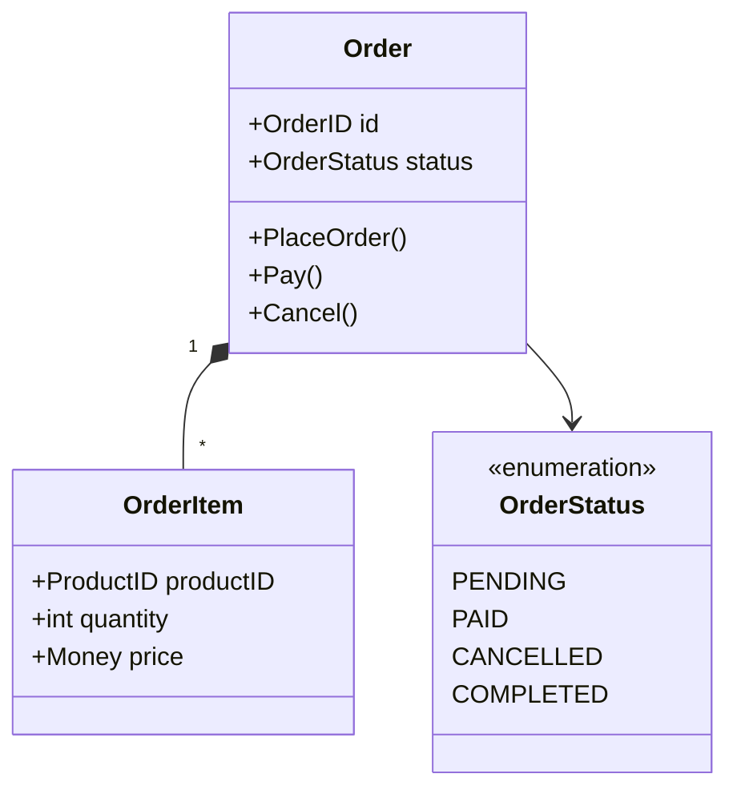
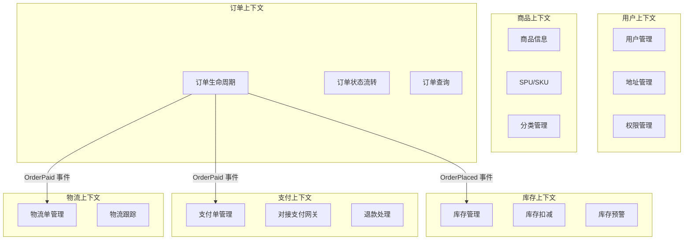
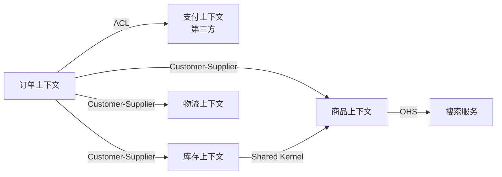

<!-- 文章摘要 -->
融合《领域驱动设计》（蓝皮书）和《实现领域驱动设计》（红皮书）两本经典著作的系统性读书笔记。从概念理解到架构实践，以电商平台为案例，详细讲解DDD的战略设计和战术设计，帮助中级开发者掌握领域驱动设计的核心思想和落地方法。

<!-- more -->

## 目录

- [一、引言](#一、引言)
- [二、核心概念](#二、核心概念)
- [三、战略设计](#三、战略设计)
- [四、战术设计](#四、战术设计)
- [五、架构落地](#五、架构落地)
- [六、实施指南](#六、实施指南)
- [七、常见问题Q&A](#七、常见问题qa)
- [八、总结](#八、总结)
- [参考资料](#参考资料)

---

## 一、引言

### 为什么需要 DDD？

在软件开发中，我们经常遇到这样的困境：

这些问题表面上是「代码难懂」，根因却常常是**模型与协作方式**没有随业务一起演进：需求一变就加接口、加表字段，却很少问「领域里的概念是否变了、边界是否该调整」。不同团队的表现形式不同——有的是接口爆炸，有的是报表与线上一套规则、运营另一套口径——但症结类似：缺少共享且精确的语言与结构。

**业务复杂性**：代码无法清晰表达业务意图
- 一个简单的"下单"功能，代码散落在多个 Service 中，很难理解完整的业务流程
- 业务规则隐藏在 SQL、if-else 堆砌中，修改一个规则需要改动多处代码
- 新人接手项目，看了一个月代码还是不懂业务
- 例如：促销叠加「满减 + 券 + 会员价」时，折扣计算分散在订单服务、营销配置和后台任务里，很少有人能一步说清成交价是如何算出来的。
- 例如：部分退款、换货、补发等变体流程各自加分支，**领域概念**（如「履约」「可退金额」）从未在代码里显式命名，排查问题只能靠打断点。

**团队沟通**：技术与业务的鸿沟
- 产品说"用户下单后锁定库存"，开发理解成"创建订单后更新库存状态"，两者不是一回事
- 技术术语污染业务讨论："OrderEntity"、"OrderDTO"、"OrderVO"，业务专家听不懂
- 需求评审会变成"翻译大会"
- 例如：业务口中的「锁库」可能指预留、冻结或可售量扣减；开发实现的却是「下单后改库存状态字段」。若不共建 **Ubiquitous Language（通用语言）**，接口、报表与客服话术会长期不一致。

**代码腐化**：随时间推移质量下降
- 最初设计优雅的系统，几年后变成"大泥球"
- 修改一处影响多处，不敢重构
- 技术债累积，维护成本越来越高
- 例如：为赶工期在 `OrderService` 里直接调支付 RPC、写物流表、发消息，**边界**逐渐模糊后，任何小需求都可能牵一发而动全身，重构成本被无限推迟。

DDD（领域驱动设计）正是为了解决这些问题而生。

这些问题往往不是「再多写几个 Service」能解决的，而是需要让**业务结构**在模型里可见：哪些是核心域、边界画在哪里、跨团队协作时用什么语言描述规则。后文会反复用订单案例，把抽象概念落到可评审、可实现的粒度。

---

### 两本书的定位

**蓝皮书：《领域驱动设计：软件核心复杂性应对之道》**
- 作者：Eric Evans，2003年
- 地位：DDD 的奠基之作，建立了完整的概念体系
- 特点：
  - 偏理论，概念性强
  - 战略设计讲得深入（限界上下文、上下文映射）
  - 战术模式作为基础介绍
- 适合：建立 DDD 的完整认知体系
- 强项：帮你把「限界上下文」「上下文映射」「战略精炼」等概念串成一张地图，避免只见战术模式、不见整体结构。
- 何时读：准备做系统拆分、治理大型单体或与产品共建领域语言之前；若团队连聚合、实体都还没概念，可先扫战术章节再回读战略部分。
- 阅读预期：部分案例偏传统企业信息化语境，初学者可主动把叙事换成互联网交易场景；本文以订单为主线，正是为了降低这种「时代感错位」带来的距离。

**红皮书：《实现领域驱动设计》**
- 作者：Vaughn Vernon，2013年
- 地位：蓝皮书的实践补充，被称为"IDDD"
- 特点：
  - 偏实战，大量代码示例
  - 战术设计讲得细致（尤其是聚合设计）
  - 融入了现代实践（事件驱动、CQRS、微服务）
- 适合：学习如何落地 DDD
- 强项：聚合设计、应用服务、领域事件、有界上下文落地的代码组织方式写得很细，适合对照自己的项目做 **checklist** 式自查。
- 何时读：已经在做模块化或微服务、需要具体的类与包结构参考时；若尚无蓝皮书里的战略概念，建议先建立「上下文」与「映射」的直觉，再读红皮书战术细节会更省力。
- 阅读预期：示例代码量较大，不必逐行跟写；更建议用「对照清单」的方式记下：聚合边界、应用服务职责、领域事件发布点是否与你的模块相吻合。

**两本书的关系**：
- 蓝皮书建立认知框架，红皮书填充实现细节
- 蓝皮书告诉你"是什么"和"为什么"，红皮书告诉你"怎么做"
- 建议先读蓝皮书的战略设计，再读红皮书的战术设计
- 只读红皮书容易「只见分层与示例、不见为何如此切分」；只读蓝皮书又容易停在概念层，落地时缺少参照，因此两本交叉阅读更稳。
- 时间极紧时，可优先：蓝皮书中的限界上下文与上下文映射 + 红皮书中的聚合、领域事件与集成章节，再按项目痛点回补其余篇目。

---

### 本文的阅读地图

**如何使用这篇笔记**：

1. **系统学习**（推荐初学者）
   - 按顺序阅读：引言 → 核心概念 → 战略设计 → 战术设计 → 架构落地 → 实施指南
   - 每个章节都有电商案例和代码示例
   - 预计阅读时间：2-3小时
   - 建议边读边整理一页「术语表」：把本文出现的领域词与你们业务里的说法对齐，读后能直接用于评审或设计文档。
   - 遇到战略与战术两章都出现的概念（如上下文与聚合边界），可用订单案例串起来，避免孤立记忆定义。
   - 每读完一章试写三句话：本章针对哪种业务痛点、对应哪种 DDD 手段、订单案例里哪一步能印证；若写不出，通常说明还停留在「认名词」而非「能讨论」的阶段。

2. **快速查阅**（熟悉概念者）
   - 跳转到具体章节查阅概念定义
   - 使用 Q&A 部分快速找到问题答案
   - 查看架构图和代码示例
   - 可按关键词检索：限界上下文、聚合根、领域事件、防腐层等，把本文当词典；若与 30 号文对照阅读，可快速定位「模式组合」与「纯 DDD 概念」的边界。
   - 查阅时优先看小节标题与加粗定义，再回到订单例子验证是否理解一致。

3. **项目应用**（实战导向）
   - 先读"实施指南"了解何时用 DDD
   - 再读"战略设计"了解如何划分上下文
   - 最后读"战术设计"了解如何设计聚合
   - 建议在迭代会上挑一个真实争议点（如「已支付未发货能否取消」），试用本文的通用语言与上下文划分方式推演一遍，再决定是否在代码里引入对应边界。
   - 落地时不必一次上齐所有模式：先稳定上下文边界与聚合不变量，再逐步引入事件与集成方式。

**与 30 号文章的关系**：
本文专注于 DDD 本身，而 [30-clean-architecture-ddd-cqrs.md](./30-clean-architecture-ddd-cqrs.md) 讲解了 DDD 与 Clean Architecture、CQRS 的关系。两篇文章互为补充：
- 30 号文章：架构模式的对比和组合
- 本文：DDD 的深入讲解和实践
- 若你关心「分层是否必须」「CQRS 是否与 DDD 绑定」这类问题，可先在 30 号文中看模式对比与取舍，再回到本文把**领域模型与上下文**讨论清楚，避免把架构风格误当成领域本身。
- 若团队已在实践 **Clean Architecture**，可把本文的聚合、领域事件看作内层规则如何暴露给外层用例；上下文映射则对应跨边界时如何防止外层概念泄漏进核心模型。

**与电商系列文章的关系**：
本文使用电商场景作为贯穿案例，与以下文章形成呼应：
- [20-ecommerce-overview.md](./20-ecommerce-overview.md) - 电商系统概览
- [21-ecommerce-listing.md](./21-ecommerce-listing.md) - 商品列表
- [22-ecommerce-inventory.md](./22-ecommerce-inventory.md) - 库存系统
- [29-ecommerce-payment-system.md](./29-ecommerce-payment-system.md) - 支付系统
- 阅读系列文时，可对照本文中的上下文划分，看同一能力在概览、列表、库存、支付等文中分别落在哪个子域、由哪个团队主责。
- 若你当前只负责其中一条链路（例如支付回调），仍建议先浏览订单全路径，再深入自己的上下文，避免局部优化破坏全局一致性。

---

### 贯穿全文的电商案例

为了让概念更具体，本文使用**电商订单场景**作为主线案例：

**业务场景**：用户在电商平台下单购买商品

一条常见路径是：浏览商品 → 加购 → 结算 → 创建订单 → 锁/扣库存 → 发起支付 → 支付成功 → 通知履约与物流。途中会出现超时关单、库存不足、支付失败回滚、部分退款等分支；这些分支正好暴露**跨上下文协作**与**领域规则**该放在哪里讨论。

**涉及的上下文**：
- **订单上下文**：订单生命周期管理（创建、取消、状态流转与订单级不变量）
- **库存上下文**：库存扣减和锁定（可售量、预留与释放的语义需与订单语言对齐）
- **商品上下文**：商品信息查询（价格、规格、上下架与订单快照如何解耦）
- **支付上下文**：支付流程处理（支付单、渠道回调与订单状态如何映射）
- **物流上下文**：物流单管理（出库、揽收与订单完成如何衔接）

**为什么选择订单**：
- 业务流程复杂：涉及状态机、跨上下文协调
- 聚合设计典型：Order 是经典的聚合根示例
- 实战价值高：几乎所有电商平台都有订单系统
- 容易理解：读者对电商下单流程都有直观认知
- 与日常经验贴近：秒杀、运费、发票、赠品等变体容易从生活场景切入讨论，降低领域建模的入门门槛。
- 不变量丰富：例如「已支付总额与明细一致」「取消后库存必须按规则释放」，适合讲清聚合内一致性边界。
- 集成点多：订单与库存、支付、物流之间的同步与异步协作，适合演示 **Anti-Corruption Layer（防腐层）**、领域事件等集成手段而不显得牵强。

**案例在全文中的用法**（读到对应章节时可对照本节路径思考）：
- **战略设计**：把订单、库存、支付、物流画成限界上下文，讨论上下游、合作关系与防腐层应落在哪里，避免「一个订单大表走天下」。
- **战术设计**：以 Order 为聚合根，讨论订单明细、金额、状态流转中哪些规则必须同事务一致提交，哪些宜通过领域事件异步通知其他上下文。
- **架构落地与实施**：当出现秒杀、回调延迟、对账不一致等工程现实时，如何把补丁写回模型（而不是在模型外再堆一层 if-else），是后文会反复对照订单场景说明的重点。

**读后续章节时可带着的问题**（答案分散在战略、战术与落地各节）：
- 用户点击「提交订单」的瞬间，订单侧与库存侧各自必须成立的不变量是什么？哪一侧应是权威？
- 支付回调到达时，是更新订单状态为主，还是以支付上下文的状态为主再同步到订单？如何避免双重写入与乱序？
- 超时关单、库存释放、支付关单三者若由不同定时任务驱动，如何用事件或显式用例描述保证业务上「只关一次、关得对」？

从战略设计到战术设计，我们都会用订单场景来说明概念；你在各节看到的示意图与伪代码，都可以尝试替换为自己系统的名词做一遍「语言校验」。

**可选小练习**：用非技术语言写清你们系统里「下单成功」对顾客、客服、财务分别意味着什么，再与上文订单路径对照；标出含义不一致或一词多义的词——它们往往就是限界上下文与通用语言工作的起点。

---

## 二、核心概念

在深入战略设计和战术设计之前，我们需要先建立 DDD 的核心术语体系。这些概念是理解后续内容的基础。

---

### 2.1 统一语言（Ubiquitous Language）

**定义**：团队（包括开发者、业务专家、产品经理）共同使用的语言，贯穿需求分析、设计、代码实现的全过程。

**价值**：
- 消除「翻译成本」：业务说「下单」，代码里也是 `PlaceOrder`，而不是 `CreateOrderEntity`
- 提高沟通效率：技术与业务用同一套术语讨论问题
- 代码即文档：代码能被业务专家读懂

**如何建立统一语言**：

1. **与业务专家协作**
   - 事件风暴工作坊：识别领域事件和命令
   - 术语表维护：记录所有关键概念的定义
   - 定期 Review：确保术语使用一致

2. **在代码中体现**
   - 类名、方法名使用业务术语
   - 避免技术术语污染
   - 注释用业务语言描述

**电商实践案例**：

**好的命名**（体现业务语言）：

```go
// 领域事件
type OrderPlacedEvent struct {
    OrderID   string
    UserID    string
    PlacedAt  time.Time
}

// 领域命令
func (o *Order) PlaceOrder(items []OrderItem) error {
    // 业务逻辑
}

// 值对象
type OrderItem struct {
    ProductID string
    Quantity  int
    Price     Money
}
```

**不好的命名**（技术术语污染）：

```go
// ❌ 技术味太重
type OrderDTO struct { }
type OrderEntity struct { }
type OrderVO struct { }

// ❌ 业务语言丢失
func CreateOrderRecord(data map[string]interface{}) error { }
func InsertOrderTable(order Order) error { }
```

**术语标准化**：

在电商领域，同一个概念可能有多种说法，需要统一：

| 业务概念 | 可能的说法 | 统一后的术语 | 说明 |
|---------|-----------|------------|------|
| 用户下单 | 「下单」、「创建订单」、「提交订单」 | `PlaceOrder` | 选择最符合业务语言的术语 |
| 库存 | 「库存」、「可售库存」、「在途库存」 | `AvailableInventory`, `InTransitInventory` | 明确区分不同类型的库存 |
| 订单取消 | 「取消订单」、「关闭订单」 | `CancelOrder` | 与业务专家确认语义 |

**反例：技术术语污染业务**

```go
// ❌ 错误示例
type OrderRepository interface {
    SaveEntity(entity OrderEntity) error
    FindById(id int) (*OrderDTO, error)
}

// 问题：
// 1. "Entity"、"DTO" 是技术术语，业务专家听不懂
// 2. "Save"、"Find" 是数据库操作语言，不是业务语言
// 3. 业务说「锁库存」，代码里找不到对应的概念
```

```go
// ✅ 正确示例
type OrderRepository interface {
    Save(order *Order) error
    FindByID(orderID OrderID) (*Order, error)
}

// 改进：
// 1. 去掉技术术语
// 2. 使用领域对象（Order）而非 DTO
// 3. 方法名简洁清晰
```

**统一语言的维护**：

1. **术语表**（Glossary）

创建项目 Wiki 或文档，记录所有关键术语：

```markdown
## 订单领域术语表

- **订单（Order）**：用户提交的购买请求，包含商品、数量、收货地址等信息
- **订单项（OrderItem）**：订单中的单个商品条目
- **下单（PlaceOrder）**：用户提交订单的动作
- **支付订单（PayOrder）**：用户完成支付的动作
- **取消订单（CancelOrder）**：用户或系统取消订单
- **订单状态（OrderStatus）**：订单的当前状态（待支付、已支付、已取消、已完成）
```

2. **领域模型图**

用 UML 类图或 Mermaid 图可视化领域模型：



**要点总结**：
- 统一语言不仅仅是命名，而是完整的概念体系
- 业务术语应该贯穿需求、设计、代码的全过程
- 代码即文档，代码应该能被业务专家读懂
- 避免技术术语（Entity、DTO、VO）污染业务语言

---

### 2.2 限界上下文（Bounded Context）

**定义**：模型的明确边界。一个模型只在一个上下文内有效，不同上下文中的同一个词可以有不同的含义。

**核心思想**：不要追求全局统一的大模型，而是在不同的边界内建立各自的模型。

**为什么需要限界上下文**：

想象一个电商平台，如果我们试图建立一个「全局统一的商品模型」：

```go
// ❌ 试图建立全局统一模型（注定失败）
type Product struct {
    // 商品上下文需要的字段
    ID          string
    Name        string
    Description string
    Category    string
    Images      []string
    Attributes  map[string]string

    // 库存上下文需要的字段
    AvailableQty int
    ReservedQty  int
    WarehouseID  string

    // 订单上下文需要的字段
    Price        Money
    DiscountRule string

    // 营销上下文需要的字段
    RecommendScore float64
    Keywords       []string

    // 字段越加越多，最终变成「大泥球」
}
```

**问题**：
- 不同上下文关注点不同，但被迫共享一个模型
- 修改任何一个字段都可能影响所有上下文
- 模型越来越臃肿，难以维护

**解决方案：限界上下文**

在不同的上下文中，建立各自的模型：

**商品上下文**（关注商品信息）：

```go
// 商品上下文中的 Product
type Product struct {
    ID          ProductID
    Name        string
    Description string
    Category    Category
    Images      []ImageURL
    Attributes  []ProductAttribute
}
```

**库存上下文**（关注库存数量）：

```go
// 库存上下文中的 Product（只关注数量）
type InventoryItem struct {
    ProductID    ProductID  // 通过 ID 引用商品
    AvailableQty int
    ReservedQty  int
    WarehouseID  WarehouseID
}
```

**订单上下文**（关注价格快照）：

```go
// 订单上下文中的 OrderItem（保存下单时的快照）
type OrderItem struct {
    ProductID   ProductID
    ProductName string  // 快照：下单时的商品名
    Price       Money   // 快照：下单时的价格
    Quantity    int
}
```

**关键认知**：
- 同一个词（「Product」）在不同上下文有不同含义
- 「Product」在商品上下文是聚合根，包含详细信息
- 「Product」在库存上下文只关注数量
- 「Product」在订单上下文只是一个快照
- 不要追求全局统一模型

---

**电商平台的限界上下文划分**：



**各上下文的关注点**：

| 上下文 | 核心聚合 | 主要职责 | 「Order」的含义 |
|-------|---------|---------|---------------|
| **订单上下文** | Order | 订单生命周期管理、状态流转 | 聚合根，包含完整订单信息 |
| **支付上下文** | Payment | 支付流程、对接支付网关 | 只是一个外部引用（订单号） |
| **物流上下文** | Shipment | 物流单管理、轨迹跟踪 | 只是一个外部引用（订单号） |

**关键点**：
- 每个上下文有明确的边界和职责
- 同一个概念在不同上下文有不同模型
- 上下文之间通过 API 或事件通信，不直接共享数据库

---

**上下文的识别方法**：

1. **基于业务能力**
   - 每个上下文对应一个业务能力
   - 例如：浏览商品、下单、支付、发货是不同的业务能力

2. **基于语言边界**
   - 术语含义发生变化的地方就是上下文边界
   - 例如：「商品」在商品上下文和库存上下文中含义不同

3. **基于数据一致性边界**
   - 需要强一致性的数据放在同一上下文
   - 可以最终一致性的数据可以跨上下文
   - 例如：Order 和 OrderItem 必须强一致，所以在同一上下文

4. **基于团队结构**（康威定律）
   - 系统架构会反映组织结构
   - 每个团队负责一个或少数上下文
   - 例如：订单团队负责订单上下文

**要点总结**：
- 限界上下文是模型的边界
- 不要追求全局统一模型
- 同一个词在不同上下文可以有不同含义
- 上下文之间通过明确的接口通信

---

### 2.3 领域、子域分类

**定义**：根据业务价值和复杂度，将整个业务领域划分为不同类型的子域。

**三种子域类型**：

1. **核心域（Core Domain）**
   - 定义：业务的核心竞争力，最复杂、最有价值的部分
   - 特征：差异化优势、复杂业务规则、频繁变化
   - 投资策略：自研，精心设计，持续投入

2. **支撑域（Supporting Subdomain）**
   - 定义：支撑核心域运转，业务特定但不是竞争力
   - 特征：必需但不产生差异化、中等复杂度
   - 投资策略：简单设计，够用即可

3. **通用域（Generic Subdomain）**
   - 定义：通用功能，行业标准，可以外购或使用开源
   - 特征：无差异化、低复杂度、稳定
   - 投资策略：外采或开源，不要重复造轮子

---

**电商平台的子域分类**：

**核心域**（投入 60% 人力）：
- **订单履约**
  - 为什么是核心域：直接影响 GMV 和用户体验
  - 复杂度：状态机、工作流、异常处理、跨上下文协调
  - 投资策略：20 人团队，精心设计，持续优化

- **库存管理**
  - 为什么是核心域：防止超卖，影响用户信任
  - 复杂度：分布式锁、高并发、实时扣减
  - 投资策略：15 人团队，高可用设计

- **推荐算法**
  - 为什么是核心域：提升转化率的关键
  - 复杂度：机器学习、实时计算、A/B 测试
  - 投资策略：15 人团队，算法持续迭代

**支撑域**（投入 30% 人力）：
- 用户管理：标准 CRUD，5 人
- 地址管理：地址解析和验证，3 人
- 优惠券系统：规则引擎，5 人
- 客服系统：工单管理，5 人

**通用域**（投入 10% 人力，主要外采）：
- 消息通知：阿里云短信、SendGrid
- 文件存储：OSS、S3
- 日志系统：ELK Stack
- 监控告警：Prometheus + Grafana

**判断标准矩阵**：

| 子域 | 业务价值 | 复杂度 | 变化频率 | 差异化 | 类型 |
|-----|---------|--------|---------|--------|------|
| 订单履约 | ⭐⭐⭐⭐⭐ | ⭐⭐⭐⭐ | ⭐⭐⭐⭐ | ⭐⭐⭐⭐ | 核心域 |
| 库存管理 | ⭐⭐⭐⭐⭐ | ⭐⭐⭐⭐⭐ | ⭐⭐⭐ | ⭐⭐⭐⭐ | 核心域 |
| 推荐算法 | ⭐⭐⭐⭐⭐ | ⭐⭐⭐⭐⭐ | ⭐⭐⭐⭐ | ⭐⭐⭐⭐⭐ | 核心域 |
| 优惠券 | ⭐⭐⭐ | ⭐⭐⭐ | ⭐⭐⭐ | ⭐⭐ | 支撑域 |
| 用户管理 | ⭐⭐⭐ | ⭐⭐ | ⭐⭐ | ⭐ | 支撑域 |
| 消息通知 | ⭐⭐ | ⭐ | ⭐ | ⭐ | 通用域 |
| 文件存储 | ⭐ | ⭐ | ⭐ | ⭐ | 通用域 |

**要点总结**：
- 明确区分核心域、支撑域、通用域
- 核心域投入最多资源，精心设计
- 通用域优先外采，不要重复造轮子
- 每年重新评估，根据业务战略调整

---

### 2.4 上下文映射（Context Mapping）

**定义**：描述不同限界上下文之间的关系和集成方式。

**价值**：
- 明确团队协作方式
- 指导系统集成策略
- 管理上下文间的依赖关系

**常见映射模式**：

---

#### 1. 共享内核（Shared Kernel）

**定义**：两个上下文共享一部分代码或模型。

**适用场景**：紧密协作的两个团队

**电商案例**：订单和库存共享商品基础信息

```go
// 共享内核：商品基础信息
package shared

type ProductBasicInfo struct {
    ProductID ProductID
    Name      string
    SKU       string
}
```

**优点**：减少重复，保持一致性

**风险**：
- 修改需要双方协调
- 可能导致隐式耦合
- 团队自治性降低

**最佳实践**：
- 共享内核应该非常小
- 明确共享的范围
- 建立清晰的变更协调机制

---

#### 2. 客户-供应商（Customer-Supplier）

**定义**：下游（客户）依赖上游（供应商），上游需要考虑下游的需求。

**电商案例**：订单上下文（客户）依赖商品上下文（供应商）

```go
// 商品上下文提供的 API（供应商）
type ProductQueryService interface {
    // 批量查询（考虑订单可能有多个商品）
    GetProductsByIDs(ids []ProductID) ([]Product, error)

    // 简化模型（订单只需要基本信息）
    GetProductBasicInfo(id ProductID) (*ProductBasicInfo, error)
}
```

**上游职责**：
- 提供明确的 API 契约
- 考虑下游的需求（批量查询、性能要求）
- 保证 API 稳定性和版本兼容

**下游职责**：
- 明确表达需求
- 不要直接操作上游的数据库

---

#### 3. 防腐层（Anti-Corruption Layer, ACL）

**定义**：下游建立隔离层，避免上游变化影响自己的领域模型。

**适用场景**：
- 对接外部系统（第三方支付、物流）
- 对接遗留系统
- 上游频繁变化

**电商案例**：订单上下文对接第三方支付（微信、支付宝）

```go
// 领域层：定义统一的支付接口
type PaymentGateway interface {
    CreatePayment(order *Order, amount Money) (*PaymentResult, error)
    QueryPaymentStatus(paymentID string) (PaymentStatus, error)
}

// 基础设施层：微信支付适配器（防腐层）
type WechatPaymentAdapter struct {
    wechatClient *wechat.Client
}

func (a *WechatPaymentAdapter) CreatePayment(order *Order, amount Money) (*PaymentResult, error) {
    // 1. 将领域模型转换为微信的请求格式
    wechatReq := &wechat.UnifiedOrderRequest{
        OutTradeNo: string(order.ID()),
        TotalFee:   int(amount.Cents()),
        Body:       "订单支付",
    }

    // 2. 调用微信 API
    wechatResp, err := a.wechatClient.UnifiedOrder(wechatReq)
    if err != nil {
        return nil, err
    }

    // 3. 将微信响应转换回领域模型
    return &PaymentResult{
        PaymentID:   wechatResp.PrepayID,
        RedirectURL: wechatResp.CodeURL,
    }, nil
}
```

**关键点**：
- 领域层定义接口（依赖倒置）
- 防腐层在基础设施层实现
- 只暴露领域需要的抽象，隐藏第三方细节
- 不同支付渠道实现同一接口

---

#### 4. 开放主机服务（Open Host Service, OHS）

**定义**：上游提供标准化的 API 服务，供多个下游使用。

**电商案例**：商品上下文提供标准的 REST API

```bash
# 商品查询 API
GET /api/products/{id}
GET /api/products/batch?ids=1,2,3

# 标准化的响应格式
{
  "productId": "123",
  "name": "iPhone 14",
  "price": {
    "amount": 5999,
    "currency": "CNY"
  }
}
```

**优点**：
- 一对多的服务提供
- 统一的接口标准
- 易于集成

---

#### 5. 遵奉者（Conformist）

**定义**：下游完全遵循上游的模型，不做转换。

**适用场景**：上游非常强势或无法改变（如税务系统、银行系统）

**电商案例**：对接税务系统，必须使用税务系统的数据格式

---

**电商平台的完整上下文映射**：



**要点总结**：
- 上下文映射明确了上下文间的集成方式
- 不同模式适用于不同场景
- 防腐层用于对接外部系统
- 客户-供应商模式最常用

---
