<!-- 文章摘要 -->
融合《领域驱动设计》（蓝皮书）和《实现领域驱动设计》（红皮书）两本经典著作的系统性读书笔记。从概念理解到架构实践，以电商平台为案例，详细讲解DDD的战略设计和战术设计，帮助中级开发者掌握领域驱动设计的核心思想和落地方法。

<!-- more -->

## 目录

- [一、引言](#一、引言)
- [二、核心概念](#二、核心概念)
- [三、战略设计](#三、战略设计)
- [四、战术设计](#四、战术设计)
- [五、架构落地](#五、架构落地)
- [六、实施指南](#六、实施指南)
- [七、常见问题Q&A](#七、常见问题qa)
- [八、总结](#八、总结)
- [参考资料](#参考资料)

---

## 一、引言

### 为什么需要 DDD？

在软件开发中，我们经常遇到这样的困境：

这些问题表面上是「代码难懂」，根因却常常是**模型与协作方式**没有随业务一起演进：需求一变就加接口、加表字段，却很少问「领域里的概念是否变了、边界是否该调整」。不同团队的表现形式不同——有的是接口爆炸，有的是报表与线上一套规则、运营另一套口径——但症结类似：缺少共享且精确的语言与结构。

**业务复杂性**：代码无法清晰表达业务意图
- 一个简单的"下单"功能，代码散落在多个 Service 中，很难理解完整的业务流程
- 业务规则隐藏在 SQL、if-else 堆砌中，修改一个规则需要改动多处代码
- 新人接手项目，看了一个月代码还是不懂业务
- 例如：促销叠加「满减 + 券 + 会员价」时，折扣计算分散在订单服务、营销配置和后台任务里，很少有人能一步说清成交价是如何算出来的。
- 例如：部分退款、换货、补发等变体流程各自加分支，**领域概念**（如「履约」「可退金额」）从未在代码里显式命名，排查问题只能靠打断点。

**团队沟通**：技术与业务的鸿沟
- 产品说"用户下单后锁定库存"，开发理解成"创建订单后更新库存状态"，两者不是一回事
- 技术术语污染业务讨论："OrderEntity"、"OrderDTO"、"OrderVO"，业务专家听不懂
- 需求评审会变成"翻译大会"
- 例如：业务口中的「锁库」可能指预留、冻结或可售量扣减；开发实现的却是「下单后改库存状态字段」。若不共建 **Ubiquitous Language（通用语言）**，接口、报表与客服话术会长期不一致。

**代码腐化**：随时间推移质量下降
- 最初设计优雅的系统，几年后变成"大泥球"
- 修改一处影响多处，不敢重构
- 技术债累积，维护成本越来越高
- 例如：为赶工期在 `OrderService` 里直接调支付 RPC、写物流表、发消息，**边界**逐渐模糊后，任何小需求都可能牵一发而动全身，重构成本被无限推迟。

DDD（领域驱动设计）正是为了解决这些问题而生。

这些问题往往不是「再多写几个 Service」能解决的，而是需要让**业务结构**在模型里可见：哪些是核心域、边界画在哪里、跨团队协作时用什么语言描述规则。后文会反复用订单案例，把抽象概念落到可评审、可实现的粒度。

---

### 两本书的定位

**蓝皮书：《领域驱动设计：软件核心复杂性应对之道》**
- 作者：Eric Evans，2003年
- 地位：DDD 的奠基之作，建立了完整的概念体系
- 特点：
  - 偏理论，概念性强
  - 战略设计讲得深入（限界上下文、上下文映射）
  - 战术模式作为基础介绍
- 适合：建立 DDD 的完整认知体系
- 强项：帮你把「限界上下文」「上下文映射」「战略精炼」等概念串成一张地图，避免只见战术模式、不见整体结构。
- 何时读：准备做系统拆分、治理大型单体或与产品共建领域语言之前；若团队连聚合、实体都还没概念，可先扫战术章节再回读战略部分。
- 阅读预期：部分案例偏传统企业信息化语境，初学者可主动把叙事换成互联网交易场景；本文以订单为主线，正是为了降低这种「时代感错位」带来的距离。

**红皮书：《实现领域驱动设计》**
- 作者：Vaughn Vernon，2013年
- 地位：蓝皮书的实践补充，被称为"IDDD"
- 特点：
  - 偏实战，大量代码示例
  - 战术设计讲得细致（尤其是聚合设计）
  - 融入了现代实践（事件驱动、CQRS、微服务）
- 适合：学习如何落地 DDD
- 强项：聚合设计、应用服务、领域事件、有界上下文落地的代码组织方式写得很细，适合对照自己的项目做 **checklist** 式自查。
- 何时读：已经在做模块化或微服务、需要具体的类与包结构参考时；若尚无蓝皮书里的战略概念，建议先建立「上下文」与「映射」的直觉，再读红皮书战术细节会更省力。
- 阅读预期：示例代码量较大，不必逐行跟写；更建议用「对照清单」的方式记下：聚合边界、应用服务职责、领域事件发布点是否与你的模块相吻合。

**两本书的关系**：
- 蓝皮书建立认知框架，红皮书填充实现细节
- 蓝皮书告诉你"是什么"和"为什么"，红皮书告诉你"怎么做"
- 建议先读蓝皮书的战略设计，再读红皮书的战术设计
- 只读红皮书容易「只见分层与示例、不见为何如此切分」；只读蓝皮书又容易停在概念层，落地时缺少参照，因此两本交叉阅读更稳。
- 时间极紧时，可优先：蓝皮书中的限界上下文与上下文映射 + 红皮书中的聚合、领域事件与集成章节，再按项目痛点回补其余篇目。

---

### 本文的阅读地图

**如何使用这篇笔记**：

1. **系统学习**（推荐初学者）
   - 按顺序阅读：引言 → 核心概念 → 战略设计 → 战术设计 → 架构落地 → 实施指南
   - 每个章节都有电商案例和代码示例
   - 预计阅读时间：2-3小时
   - 建议边读边整理一页「术语表」：把本文出现的领域词与你们业务里的说法对齐，读后能直接用于评审或设计文档。
   - 遇到战略与战术两章都出现的概念（如上下文与聚合边界），可用订单案例串起来，避免孤立记忆定义。
   - 每读完一章试写三句话：本章针对哪种业务痛点、对应哪种 DDD 手段、订单案例里哪一步能印证；若写不出，通常说明还停留在「认名词」而非「能讨论」的阶段。

2. **快速查阅**（熟悉概念者）
   - 跳转到具体章节查阅概念定义
   - 使用 Q&A 部分快速找到问题答案
   - 查看架构图和代码示例
   - 可按关键词检索：限界上下文、聚合根、领域事件、防腐层等，把本文当词典；若与 30 号文对照阅读，可快速定位「模式组合」与「纯 DDD 概念」的边界。
   - 查阅时优先看小节标题与加粗定义，再回到订单例子验证是否理解一致。

3. **项目应用**（实战导向）
   - 先读"实施指南"了解何时用 DDD
   - 再读"战略设计"了解如何划分上下文
   - 最后读"战术设计"了解如何设计聚合
   - 建议在迭代会上挑一个真实争议点（如「已支付未发货能否取消」），试用本文的通用语言与上下文划分方式推演一遍，再决定是否在代码里引入对应边界。
   - 落地时不必一次上齐所有模式：先稳定上下文边界与聚合不变量，再逐步引入事件与集成方式。

**与 30 号文章的关系**：
本文专注于 DDD 本身，而 [30-clean-architecture-ddd-cqrs.md](./30-clean-architecture-ddd-cqrs.md) 讲解了 DDD 与 Clean Architecture、CQRS 的关系。两篇文章互为补充：
- 30 号文章：架构模式的对比和组合
- 本文：DDD 的深入讲解和实践
- 若你关心「分层是否必须」「CQRS 是否与 DDD 绑定」这类问题，可先在 30 号文中看模式对比与取舍，再回到本文把**领域模型与上下文**讨论清楚，避免把架构风格误当成领域本身。
- 若团队已在实践 **Clean Architecture**，可把本文的聚合、领域事件看作内层规则如何暴露给外层用例；上下文映射则对应跨边界时如何防止外层概念泄漏进核心模型。

**与电商系列文章的关系**：
本文使用电商场景作为贯穿案例，与以下文章形成呼应：
- [20-ecommerce-overview.md](./20-ecommerce-overview.md) - 电商系统概览
- [21-ecommerce-listing.md](./21-ecommerce-listing.md) - 商品列表
- [22-ecommerce-inventory.md](./22-ecommerce-inventory.md) - 库存系统
- [29-ecommerce-payment-system.md](./29-ecommerce-payment-system.md) - 支付系统
- 阅读系列文时，可对照本文中的上下文划分，看同一能力在概览、列表、库存、支付等文中分别落在哪个子域、由哪个团队主责。
- 若你当前只负责其中一条链路（例如支付回调），仍建议先浏览订单全路径，再深入自己的上下文，避免局部优化破坏全局一致性。

---

### 贯穿全文的电商案例

为了让概念更具体，本文使用**电商订单场景**作为主线案例：

**业务场景**：用户在电商平台下单购买商品

一条常见路径是：浏览商品 → 加购 → 结算 → 创建订单 → 锁/扣库存 → 发起支付 → 支付成功 → 通知履约与物流。途中会出现超时关单、库存不足、支付失败回滚、部分退款等分支；这些分支正好暴露**跨上下文协作**与**领域规则**该放在哪里讨论。

**涉及的上下文**：
- **订单上下文**：订单生命周期管理（创建、取消、状态流转与订单级不变量）
- **库存上下文**：库存扣减和锁定（可售量、预留与释放的语义需与订单语言对齐）
- **商品上下文**：商品信息查询（价格、规格、上下架与订单快照如何解耦）
- **支付上下文**：支付流程处理（支付单、渠道回调与订单状态如何映射）
- **物流上下文**：物流单管理（出库、揽收与订单完成如何衔接）

**为什么选择订单**：
- 业务流程复杂：涉及状态机、跨上下文协调
- 聚合设计典型：Order 是经典的聚合根示例
- 实战价值高：几乎所有电商平台都有订单系统
- 容易理解：读者对电商下单流程都有直观认知
- 与日常经验贴近：秒杀、运费、发票、赠品等变体容易从生活场景切入讨论，降低领域建模的入门门槛。
- 不变量丰富：例如「已支付总额与明细一致」「取消后库存必须按规则释放」，适合讲清聚合内一致性边界。
- 集成点多：订单与库存、支付、物流之间的同步与异步协作，适合演示 **Anti-Corruption Layer（防腐层）**、领域事件等集成手段而不显得牵强。

**案例在全文中的用法**（读到对应章节时可对照本节路径思考）：
- **战略设计**：把订单、库存、支付、物流画成限界上下文，讨论上下游、合作关系与防腐层应落在哪里，避免「一个订单大表走天下」。
- **战术设计**：以 Order 为聚合根，讨论订单明细、金额、状态流转中哪些规则必须同事务一致提交，哪些宜通过领域事件异步通知其他上下文。
- **架构落地与实施**：当出现秒杀、回调延迟、对账不一致等工程现实时，如何把补丁写回模型（而不是在模型外再堆一层 if-else），是后文会反复对照订单场景说明的重点。

**读后续章节时可带着的问题**（答案分散在战略、战术与落地各节）：
- 用户点击「提交订单」的瞬间，订单侧与库存侧各自必须成立的不变量是什么？哪一侧应是权威？
- 支付回调到达时，是更新订单状态为主，还是以支付上下文的状态为主再同步到订单？如何避免双重写入与乱序？
- 超时关单、库存释放、支付关单三者若由不同定时任务驱动，如何用事件或显式用例描述保证业务上「只关一次、关得对」？

从战略设计到战术设计，我们都会用订单场景来说明概念；你在各节看到的示意图与伪代码，都可以尝试替换为自己系统的名词做一遍「语言校验」。

**可选小练习**：用非技术语言写清你们系统里「下单成功」对顾客、客服、财务分别意味着什么，再与上文订单路径对照；标出含义不一致或一词多义的词——它们往往就是限界上下文与通用语言工作的起点。

---

## 二、核心概念

在深入战略设计和战术设计之前，我们需要先建立 DDD 的核心术语体系。这些概念是理解后续内容的基础。

---

### 2.1 统一语言（Ubiquitous Language）

**定义**：团队（包括开发者、业务专家、产品经理）共同使用的语言，贯穿需求分析、设计、代码实现的全过程。

**价值**：
- 消除「翻译成本」：业务说「下单」，代码里也是 `PlaceOrder`，而不是 `CreateOrderEntity`
- 提高沟通效率：技术与业务用同一套术语讨论问题
- 代码即文档：代码能被业务专家读懂

**如何建立统一语言**：

1. **与业务专家协作**
   - 事件风暴工作坊：识别领域事件和命令
   - 术语表维护：记录所有关键概念的定义
   - 定期 Review：确保术语使用一致

2. **在代码中体现**
   - 类名、方法名使用业务术语
   - 避免技术术语污染
   - 注释用业务语言描述

**电商实践案例**：

**好的命名**（体现业务语言）：

```go
// 领域事件
type OrderPlacedEvent struct {
    OrderID   string
    UserID    string
    PlacedAt  time.Time
}

// 领域命令
func (o *Order) PlaceOrder(items []OrderItem) error {
    // 业务逻辑
}

// 值对象
type OrderItem struct {
    ProductID string
    Quantity  int
    Price     Money
}
```

**不好的命名**（技术术语污染）：

```go
// ❌ 技术味太重
type OrderDTO struct { }
type OrderEntity struct { }
type OrderVO struct { }

// ❌ 业务语言丢失
func CreateOrderRecord(data map[string]interface{}) error { }
func InsertOrderTable(order Order) error { }
```

**术语标准化**：

在电商领域，同一个概念可能有多种说法，需要统一：

| 业务概念 | 可能的说法 | 统一后的术语 | 说明 |
|---------|-----------|------------|------|
| 用户下单 | 「下单」、「创建订单」、「提交订单」 | `PlaceOrder` | 选择最符合业务语言的术语 |
| 库存 | 「库存」、「可售库存」、「在途库存」 | `AvailableInventory`, `InTransitInventory` | 明确区分不同类型的库存 |
| 订单取消 | 「取消订单」、「关闭订单」 | `CancelOrder` | 与业务专家确认语义 |

**反例：技术术语污染业务**

```go
// ❌ 错误示例
type OrderRepository interface {
    SaveEntity(entity OrderEntity) error
    FindById(id int) (*OrderDTO, error)
}

// 问题：
// 1. "Entity"、"DTO" 是技术术语，业务专家听不懂
// 2. "Save"、"Find" 是数据库操作语言，不是业务语言
// 3. 业务说「锁库存」，代码里找不到对应的概念
```

```go
// ✅ 正确示例
type OrderRepository interface {
    Save(order *Order) error
    FindByID(orderID OrderID) (*Order, error)
}

// 改进：
// 1. 去掉技术术语
// 2. 使用领域对象（Order）而非 DTO
// 3. 方法名简洁清晰
```

**统一语言的维护**：

1. **术语表**（Glossary）

创建项目 Wiki 或文档，记录所有关键术语：

```markdown
## 订单领域术语表

- **订单（Order）**：用户提交的购买请求，包含商品、数量、收货地址等信息
- **订单项（OrderItem）**：订单中的单个商品条目
- **下单（PlaceOrder）**：用户提交订单的动作
- **支付订单（PayOrder）**：用户完成支付的动作
- **取消订单（CancelOrder）**：用户或系统取消订单
- **订单状态（OrderStatus）**：订单的当前状态（待支付、已支付、已取消、已完成）
```

2. **领域模型图**

用 UML 类图或 Mermaid 图可视化领域模型：

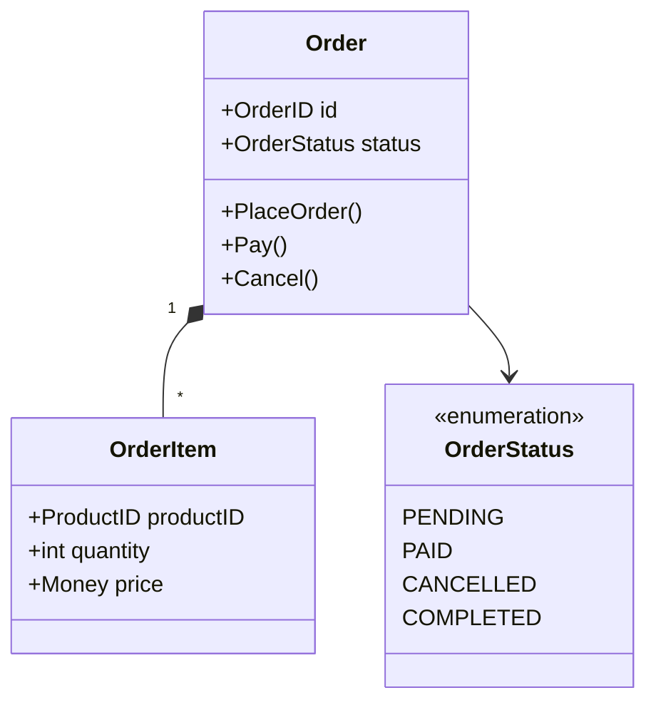

**要点总结**：
- 统一语言不仅仅是命名，而是完整的概念体系
- 业务术语应该贯穿需求、设计、代码的全过程
- 代码即文档，代码应该能被业务专家读懂
- 避免技术术语（Entity、DTO、VO）污染业务语言

---

### 2.2 限界上下文（Bounded Context）

**定义**：模型的明确边界。一个模型只在一个上下文内有效，不同上下文中的同一个词可以有不同的含义。

**核心思想**：不要追求全局统一的大模型，而是在不同的边界内建立各自的模型。

**为什么需要限界上下文**：

想象一个电商平台，如果我们试图建立一个「全局统一的商品模型」：

```go
// ❌ 试图建立全局统一模型（注定失败）
type Product struct {
    // 商品上下文需要的字段
    ID          string
    Name        string
    Description string
    Category    string
    Images      []string
    Attributes  map[string]string

    // 库存上下文需要的字段
    AvailableQty int
    ReservedQty  int
    WarehouseID  string

    // 订单上下文需要的字段
    Price        Money
    DiscountRule string

    // 营销上下文需要的字段
    RecommendScore float64
    Keywords       []string

    // 字段越加越多，最终变成「大泥球」
}
```

**问题**：
- 不同上下文关注点不同，但被迫共享一个模型
- 修改任何一个字段都可能影响所有上下文
- 模型越来越臃肿，难以维护

**解决方案：限界上下文**

在不同的上下文中，建立各自的模型：

**商品上下文**（关注商品信息）：

```go
// 商品上下文中的 Product
type Product struct {
    ID          ProductID
    Name        string
    Description string
    Category    Category
    Images      []ImageURL
    Attributes  []ProductAttribute
}
```

**库存上下文**（关注库存数量）：

```go
// 库存上下文中的 Product（只关注数量）
type InventoryItem struct {
    ProductID    ProductID  // 通过 ID 引用商品
    AvailableQty int
    ReservedQty  int
    WarehouseID  WarehouseID
}
```

**订单上下文**（关注价格快照）：

```go
// 订单上下文中的 OrderItem（保存下单时的快照）
type OrderItem struct {
    ProductID   ProductID
    ProductName string  // 快照：下单时的商品名
    Price       Money   // 快照：下单时的价格
    Quantity    int
}
```

**关键认知**：
- 同一个词（「Product」）在不同上下文有不同含义
- 「Product」在商品上下文是聚合根，包含详细信息
- 「Product」在库存上下文只关注数量
- 「Product」在订单上下文只是一个快照
- 不要追求全局统一模型

---

**电商平台的限界上下文划分**：

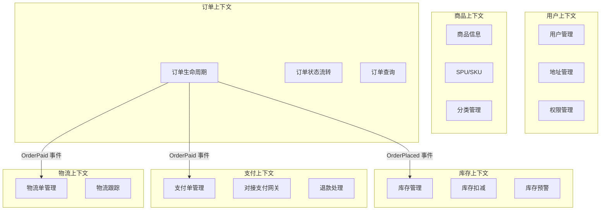

**各上下文的关注点**：

| 上下文 | 核心聚合 | 主要职责 | 「Order」的含义 |
|-------|---------|---------|---------------|
| **订单上下文** | Order | 订单生命周期管理、状态流转 | 聚合根，包含完整订单信息 |
| **支付上下文** | Payment | 支付流程、对接支付网关 | 只是一个外部引用（订单号） |
| **物流上下文** | Shipment | 物流单管理、轨迹跟踪 | 只是一个外部引用（订单号） |

**关键点**：
- 每个上下文有明确的边界和职责
- 同一个概念在不同上下文有不同模型
- 上下文之间通过 API 或事件通信，不直接共享数据库

---

**上下文的识别方法**：

1. **基于业务能力**
   - 每个上下文对应一个业务能力
   - 例如：浏览商品、下单、支付、发货是不同的业务能力

2. **基于语言边界**
   - 术语含义发生变化的地方就是上下文边界
   - 例如：「商品」在商品上下文和库存上下文中含义不同

3. **基于数据一致性边界**
   - 需要强一致性的数据放在同一上下文
   - 可以最终一致性的数据可以跨上下文
   - 例如：Order 和 OrderItem 必须强一致，所以在同一上下文

4. **基于团队结构**（康威定律）
   - 系统架构会反映组织结构
   - 每个团队负责一个或少数上下文
   - 例如：订单团队负责订单上下文

**要点总结**：
- 限界上下文是模型的边界
- 不要追求全局统一模型
- 同一个词在不同上下文可以有不同含义
- 上下文之间通过明确的接口通信

---

### 2.3 领域、子域分类

**定义**：根据业务价值和复杂度，将整个业务领域划分为不同类型的子域。

**三种子域类型**：

1. **核心域（Core Domain）**
   - 定义：业务的核心竞争力，最复杂、最有价值的部分
   - 特征：差异化优势、复杂业务规则、频繁变化
   - 投资策略：自研，精心设计，持续投入

2. **支撑域（Supporting Subdomain）**
   - 定义：支撑核心域运转，业务特定但不是竞争力
   - 特征：必需但不产生差异化、中等复杂度
   - 投资策略：简单设计，够用即可

3. **通用域（Generic Subdomain）**
   - 定义：通用功能，行业标准，可以外购或使用开源
   - 特征：无差异化、低复杂度、稳定
   - 投资策略：外采或开源，不要重复造轮子

---

**电商平台的子域分类**：

**核心域**（投入 60% 人力）：
- **订单履约**
  - 为什么是核心域：直接影响 GMV 和用户体验
  - 复杂度：状态机、工作流、异常处理、跨上下文协调
  - 投资策略：20 人团队，精心设计，持续优化

- **库存管理**
  - 为什么是核心域：防止超卖，影响用户信任
  - 复杂度：分布式锁、高并发、实时扣减
  - 投资策略：15 人团队，高可用设计

- **推荐算法**
  - 为什么是核心域：提升转化率的关键
  - 复杂度：机器学习、实时计算、A/B 测试
  - 投资策略：15 人团队，算法持续迭代

**支撑域**（投入 30% 人力）：
- 用户管理：标准 CRUD，5 人
- 地址管理：地址解析和验证，3 人
- 优惠券系统：规则引擎，5 人
- 客服系统：工单管理，5 人

**通用域**（投入 10% 人力，主要外采）：
- 消息通知：阿里云短信、SendGrid
- 文件存储：OSS、S3
- 日志系统：ELK Stack
- 监控告警：Prometheus + Grafana

**判断标准矩阵**：

| 子域 | 业务价值 | 复杂度 | 变化频率 | 差异化 | 类型 |
|-----|---------|--------|---------|--------|------|
| 订单履约 | ⭐⭐⭐⭐⭐ | ⭐⭐⭐⭐ | ⭐⭐⭐⭐ | ⭐⭐⭐⭐ | 核心域 |
| 库存管理 | ⭐⭐⭐⭐⭐ | ⭐⭐⭐⭐⭐ | ⭐⭐⭐ | ⭐⭐⭐⭐ | 核心域 |
| 推荐算法 | ⭐⭐⭐⭐⭐ | ⭐⭐⭐⭐⭐ | ⭐⭐⭐⭐ | ⭐⭐⭐⭐⭐ | 核心域 |
| 优惠券 | ⭐⭐⭐ | ⭐⭐⭐ | ⭐⭐⭐ | ⭐⭐ | 支撑域 |
| 用户管理 | ⭐⭐⭐ | ⭐⭐ | ⭐⭐ | ⭐ | 支撑域 |
| 消息通知 | ⭐⭐ | ⭐ | ⭐ | ⭐ | 通用域 |
| 文件存储 | ⭐ | ⭐ | ⭐ | ⭐ | 通用域 |

**要点总结**：
- 明确区分核心域、支撑域、通用域
- 核心域投入最多资源，精心设计
- 通用域优先外采，不要重复造轮子
- 每年重新评估，根据业务战略调整

---

### 2.4 上下文映射（Context Mapping）

**定义**：描述不同限界上下文之间的关系和集成方式。

**价值**：
- 明确团队协作方式
- 指导系统集成策略
- 管理上下文间的依赖关系

**常见映射模式**：

---

#### 1. 共享内核（Shared Kernel）

**定义**：两个上下文共享一部分代码或模型。

**适用场景**：紧密协作的两个团队

**电商案例**：订单和库存共享商品基础信息

```go
// 共享内核：商品基础信息
package shared

type ProductBasicInfo struct {
    ProductID ProductID
    Name      string
    SKU       string
}
```

**优点**：减少重复，保持一致性

**风险**：
- 修改需要双方协调
- 可能导致隐式耦合
- 团队自治性降低

**最佳实践**：
- 共享内核应该非常小
- 明确共享的范围
- 建立清晰的变更协调机制

---

#### 2. 客户-供应商（Customer-Supplier）

**定义**：下游（客户）依赖上游（供应商），上游需要考虑下游的需求。

**电商案例**：订单上下文（客户）依赖商品上下文（供应商）

```go
// 商品上下文提供的 API（供应商）
type ProductQueryService interface {
    // 批量查询（考虑订单可能有多个商品）
    GetProductsByIDs(ids []ProductID) ([]Product, error)

    // 简化模型（订单只需要基本信息）
    GetProductBasicInfo(id ProductID) (*ProductBasicInfo, error)
}
```

**上游职责**：
- 提供明确的 API 契约
- 考虑下游的需求（批量查询、性能要求）
- 保证 API 稳定性和版本兼容

**下游职责**：
- 明确表达需求
- 不要直接操作上游的数据库

---

#### 3. 防腐层（Anti-Corruption Layer, ACL）

**定义**：下游建立隔离层，避免上游变化影响自己的领域模型。

**适用场景**：
- 对接外部系统（第三方支付、物流）
- 对接遗留系统
- 上游频繁变化

**电商案例**：订单上下文对接第三方支付（微信、支付宝）

```go
// 领域层：定义统一的支付接口
type PaymentGateway interface {
    CreatePayment(order *Order, amount Money) (*PaymentResult, error)
    QueryPaymentStatus(paymentID string) (PaymentStatus, error)
}

// 基础设施层：微信支付适配器（防腐层）
type WechatPaymentAdapter struct {
    wechatClient *wechat.Client
}

func (a *WechatPaymentAdapter) CreatePayment(order *Order, amount Money) (*PaymentResult, error) {
    // 1. 将领域模型转换为微信的请求格式
    wechatReq := &wechat.UnifiedOrderRequest{
        OutTradeNo: string(order.ID()),
        TotalFee:   int(amount.Cents()),
        Body:       "订单支付",
    }

    // 2. 调用微信 API
    wechatResp, err := a.wechatClient.UnifiedOrder(wechatReq)
    if err != nil {
        return nil, err
    }

    // 3. 将微信响应转换回领域模型
    return &PaymentResult{
        PaymentID:   wechatResp.PrepayID,
        RedirectURL: wechatResp.CodeURL,
    }, nil
}
```

**关键点**：
- 领域层定义接口（依赖倒置）
- 防腐层在基础设施层实现
- 只暴露领域需要的抽象，隐藏第三方细节
- 不同支付渠道实现同一接口

---

#### 4. 开放主机服务（Open Host Service, OHS）

**定义**：上游提供标准化的 API 服务，供多个下游使用。

**电商案例**：商品上下文提供标准的 REST API

```bash
# 商品查询 API
GET /api/products/{id}
GET /api/products/batch?ids=1,2,3

# 标准化的响应格式
{
  "productId": "123",
  "name": "iPhone 14",
  "price": {
    "amount": 5999,
    "currency": "CNY"
  }
}
```

**优点**：
- 一对多的服务提供
- 统一的接口标准
- 易于集成

---

#### 5. 遵奉者（Conformist）

**定义**：下游完全遵循上游的模型，不做转换。

**适用场景**：上游非常强势或无法改变（如税务系统、银行系统）

**电商案例**：对接税务系统，必须使用税务系统的数据格式

---

**电商平台的完整上下文映射**：

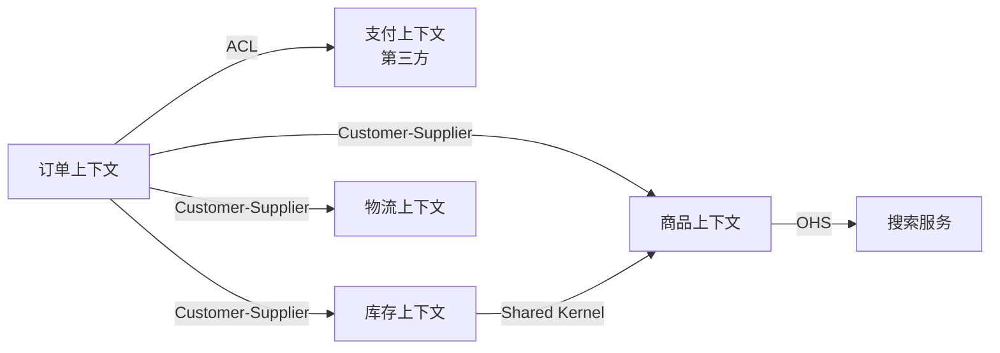

**要点总结**：
- 上下文映射明确了上下文间的集成方式
- 不同模式适用于不同场景
- 防腐层用于对接外部系统
- 客户-供应商模式最常用

---

## 三、战略设计

战略设计回答的是「边界在哪里、团队如何协作、集成关系如何表达」——在写聚合与仓储之前，先把子域类型、限界上下文与上下文映射说清楚，战术设计才有落点。本节仍以电商订单链路为主线，说明如何从业务中识别子域、如何划分上下文，以及如何把防腐层、共享内核与客户-供应商关系落到代码与 API 上。

---

### 3.1 如何识别和划分子域

子域（Subdomain）分类（核心域 / 支撑域 / 通用域）不是贴标签比赛，而是**投资策略**：决定把最优秀的人力和设计精力投在哪里，哪里可以「够用即可」，哪里应外采或开源。判断时建议同时看四个维度，而不是只看「是否赚钱」。

#### 识别方法：四维度评估

每个子域从以下四个维度评估：

1. **业务价值（Business Value）**
   - 高：直接影响核心竞争力和收入
   - 中：支撑业务运转，但不是差异化优势
   - 低：通用功能，不产生业务价值

2. **复杂度（Complexity）**
   - 高：业务规则复杂，需要深度领域建模
   - 中：有一定业务逻辑
   - 低：简单 CRUD

3. **变化频率（Change Frequency）**
   - 高：业务规则频繁变化
   - 中：偶尔调整
   - 低：基本稳定

4. **差异化（Differentiation）**
   - 高：行业独有，竞争优势所在
   - 中：行业通用做法，但有特色
   - 低：行业标准，无差异化

#### 判断标准矩阵

| 子域类型 | 业务价值 | 复杂度 | 变化频率 | 差异化 | 投资策略 |
|---------|---------|--------|---------|--------|---------|
| **核心域** | 高 | 高 | 高/中 | 高 | 自研，精心设计，持续投入 |
| **支撑域** | 中 | 中 | 中/低 | 中/低 | 自研，简单设计，够用即可 |
| **通用域** | 低 | 低/中 | 低 | 低 | 外采/开源，不要重复造轮子 |

#### 电商平台子域完整分析

以下用星级（⭐）做相对刻度，便于工作坊对齐口径；重点是**相对比较**与**结论**，而非绝对分数。

**核心域候选**：

1. **订单履约**
   - 业务价值：⭐⭐⭐⭐⭐（直接影响 GMV）
   - 复杂度：⭐⭐⭐⭐（状态机、工作流、异常处理）
   - 变化频率：⭐⭐⭐⭐（业务规则频繁调整）
   - 差异化：⭐⭐⭐⭐（履约效率是竞争力）
   - **结论：核心域**

2. **库存管理**
   - 业务价值：⭐⭐⭐⭐⭐（防止超卖、保障可售）
   - 复杂度：⭐⭐⭐⭐⭐（分布式、高并发）
   - 变化频率：⭐⭐⭐（库存策略调整）
   - 差异化：⭐⭐⭐⭐（库存周转与准确性影响效率）
   - **结论：核心域**

3. **推荐算法**
   - 业务价值：⭐⭐⭐⭐⭐（提升转化率）
   - 复杂度：⭐⭐⭐⭐⭐（机器学习、实时计算）
   - 变化频率：⭐⭐⭐⭐（算法持续优化）
   - 差异化：⭐⭐⭐⭐⭐（推荐质量是核心竞争力）
   - **结论：核心域**

**支撑域候选**：

4. **优惠券系统**
   - 业务价值：⭐⭐⭐（支撑营销活动）
   - 复杂度：⭐⭐⭐（规则引擎、计算逻辑）
   - 变化频率：⭐⭐⭐（营销策略调整）
   - 差异化：⭐⭐（大部分平台都有）
   - **结论：支撑域**

5. **用户管理**
   - 业务价值：⭐⭐⭐（必需但不是竞争力）
   - 复杂度：⭐⭐（标准用户 CRUD）
   - 变化频率：⭐⭐（较稳定）
   - 差异化：⭐（行业标准）
   - **结论：支撑域**

6. **地址管理**
   - 业务价值：⭐⭐（辅助功能）
   - 复杂度：⭐⭐（地址解析、验证）
   - 变化频率：⭐（很少变化）
   - 差异化：⭐（无差异）
   - **结论：支撑域**

**通用域候选**：

7. **消息通知（短信、邮件）**
   - 业务价值：⭐⭐（必需但通用）
   - 复杂度：⭐（调用第三方 API）
   - 变化频率：⭐（基本不变）
   - 差异化：⭐（完全无差异）
   - **结论：通用域** → 建议使用云厂商短信、SendGrid 等服务

8. **文件存储**
   - 业务价值：⭐（基础设施）
   - 复杂度：⭐（标准存储）
   - 变化频率：⭐（不变）
   - 差异化：⭐（无差异）
   - **结论：通用域** → 建议使用 OSS、S3 等服务

9. **日志系统**
   - 业务价值：⭐（运维必需）
   - 复杂度：⭐⭐（日志采集、聚合）
   - 变化频率：⭐（不变）
   - 差异化：⭐（无差异）
   - **结论：通用域** → 建议使用 ELK、Splunk 等

#### 决策工作坊方法（团队协作识别子域）

**步骤 1：列出所有子域**

- 全员头脑风暴
- 列出系统的所有功能模块

**步骤 2：四维度打分**

- 每个子域从业务价值、复杂度、变化频率、差异化四个维度打分（例如 1～5 分）
- 团队投票，取平均值或讨论收敛

**步骤 3：分类决策**

- 根据矩阵判断子域类型
- 边界情况必须团队讨论，避免「默认核心域」

**步骤 4：投资策略确定**

- 核心域：分配最优秀的人力，精心设计
- 支撑域：够用即可，不过度设计
- 通用域：评估外采方案

**电商案例的投资策略（示意）**：

```text
核心域（60% 人力）:
- 订单履约：20 人
- 库存管理：15 人
- 推荐算法：15 人

支撑域（30% 人力）:
- 优惠券：5 人
- 用户管理：5 人
- 地址/支付/物流：5 人

通用域（10% 人力）:
- 消息通知：外采（云短信）
- 文件存储：外采（OSS）
- 日志：外采（ELK）
- 运维人力：5 人
```

#### 常见错误

**错误 1：把所有功能都当核心域**

- 表现：每个模块都精心设计，过度投入
- 后果：资源分散，真正的核心域得不到足够重视
- 解决：强制排序，**最多 3～5 个核心域**

**错误 2：低估支撑域的重要性**

- 表现：支撑域设计太粗糙，成为瓶颈
- 后果：核心域被支撑域拖累（性能、可用性、数据质量）
- 解决：支撑域也要有基本的设计质量与 SLO

**错误 3：自研通用域**

- 表现：重复造轮子（自建消息平台、日志栈）
- 后果：大量人力花在非差异化能力上
- 解决：优先考虑外采和开源方案

**错误 4：子域划分过于静态**

- 表现：子域类型一成不变
- 后果：业务战略变化后，投资与组织仍按旧地图走路
- 解决：定期（例如每年）重新评估，与业务战略对齐

#### 决策检查清单

- [ ] 是否从业务价值、复杂度、变化频率、差异化四个维度评估？
- [ ] 核心域数量是否控制在 3～5 个？
- [ ] 核心域是否分配了最优秀的人力？
- [ ] 通用域是否优先考虑了外采/开源？
- [ ] 投资策略是否与业务战略对齐？

---

### 3.2 如何划分限界上下文

限界上下文（Bounded Context）是模型的**一致性边界**与**语言边界**：在边界内术语含义稳定、规则可推敲；跨边界则通过映射与集成协作。划分不是一次性的「微服务切分」，而是对业务能力与协作现实的建模。

#### 划分原则

1. **基于业务能力**
   - 识别核心业务流程
   - 按业务能力聚合功能
   - 电商案例：浏览商品、下单、支付、发货是不同的业务能力

2. **基于团队结构（康威定律）**
   - 系统架构反映组织结构
   - 每个团队负责一个或少数上下文
   - 电商案例：订单团队、商品团队、支付团队

3. **基于数据一致性边界**
   - 强一致性要求通常落在同一上下文内
   - 最终一致性可以跨上下文
   - 电商案例：订单与订单项必须强一致；订单与库存可最终一致

4. **基于语言边界**
   - 不同的业务术语体系
   - 术语含义发生变化的地方往往是边界
   - 电商案例：「商品」在商品上下文与库存上下文中的含义不同

#### 实战：电商平台的上下文演进

**阶段 1：单体架构**

```text
[单一应用]
- 所有功能在一个代码库
- 共享数据库
- 问题: 耦合严重，难以扩展
```

**阶段 2：初步拆分（按功能模块）**

```text
[用户服务] [商品服务] [订单服务] [库存服务]
- 按功能垂直拆分
- 每个服务有独立数据库
- 问题: 边界不清晰，职责混乱，易出现「按表拆分」
```

**阶段 3：DDD 上下文拆分（目标形态）**

```text
[用户上下文]
  - 用户管理、地址管理

[商品上下文]
  - SPU/SKU、商品详情、分类

[订单上下文]（核心域）
  - 订单生命周期管理
  - 订单聚合设计

[库存上下文]（核心域）
  - 可售库存、锁定库存
  - 库存扣减策略

[支付上下文]
  - 支付单管理
  - 对接第三方支付

[物流上下文]
  - 物流单管理
  - 物流轨迹跟踪

[营销上下文]（支撑域）
  - 优惠券、促销活动
```

#### 各限界上下文一览（电商示例）

将「阶段 3」中的上下文落到可评审的表格，便于工作坊对齐语言与责任边界；下表为示意，实际项目需替换为你们自己的统一语言与聚合名。

| 限界上下文 | 子域倾向 | 核心聚合（示例） | 主要职责 | 典型对外能力 | 与周边关系（示例） |
|------------|----------|------------------|----------|----------------|---------------------|
| 用户上下文 | 支撑域 | User、Address | 账户、认证、地址簿 | 查询用户与地址、地址校验与清洗 | 订单通过 API 拉取收货人与地址 |
| 商品上下文 | 视战略而定 | Product（SPU/SKU）、Category | 类目、商品详情、上下架 | 批量查询基础信息、按 ID 拉取售价与标题快照 | 订单 Customer-Supplier；库存可能共享极小内核 |
| 订单上下文 | 核心域 | Order、OrderLine | 下单、改单、取消、状态机 | 创建订单命令、订单查询、领域事件（已下单/已支付） | 依赖商品、库存、支付、物流、营销 |
| 库存上下文 | 核心域 | Stock、Reservation | 可售量、预留、扣减与释放 | 预留、确认扣减、释放预留 | 订阅订单事件；对商品信息需谨慎共享 |
| 支付上下文 | 支撑域 | Payment、Channel | 支付单、渠道路由、对账配合 | 创建支付、查单、回调处理 | 订单经 ACL 对接三方；内部可再分防腐 |
| 物流上下文 | 支撑域 | Shipment、Tracking | 运单、轨迹、承运商对接 | 创建运单、查询轨迹 | 订单 Customer-Supplier |
| 营销上下文 | 支撑域 | Coupon、Promotion | 券实例、活动规则 | 试算优惠、核销资格校验 | 订单在算价阶段调用 |

**使用方式**：把表格当作「上下文清单 v0.1」，在评审中不断改列名与关系，直到与团队口语一致；不要在第一次工作坊就追求填满每个单元格。

#### 从单体走向限界上下文的评审问题

在画架构图之前，先用下面一组问题压一遍假设，能减少「按表拆微服务」式的假边界：

1. **语言是否分叉**：同一词在两个模块是否含义不同？（如「商品」在售前与在库存中）
2. **一致性边界**：哪些不变量必须同事务、哪些可异步最终一致？
3. **变更主体**：谁有权修改这条业务数据？跨团队改同一表往往是边界没划清。
4. **发布节奏**：两侧是否必须独立部署；若永远一起发，拆分紧迫性要重新评估。
5. **失败隔离**：一侧故障时，另一侧能否降级；若不能，是否应暂时同上下文或强化契约。
6. **集成形态**：更适合同步 API、异步事件，还是批量对账；这会反过来约束边界。
7. **测试策略**：能否为单上下文写可重复的领域测试，而不必起全链路集成环境。
8. **数据所有权**：每个业务表是否有唯一写入所有者；读模型若非所有者，是否走明确定义的查询 API。

**落地建议**：选 3～5 个最痛的跨模块需求，把它们从「谁改哪张表」还原成「哪两个上下文在协作、用哪种映射」，往往比一次性画全图更有效。

**每个上下文建议写清四件事**（可放进架构决策记录 ADR）：

- **核心聚合**：谁是聚合根，哪些不变量必须在同事务内成立
- **主要职责**：对外承诺的业务能力（用统一语言写）
- **对外 API**：查询、命令、事件的契约形态
- **与其他上下文的关系**：客户-供应商、防腐层、共享内核等

#### 架构图：电商平台上下文与协作（C4 风格示意）

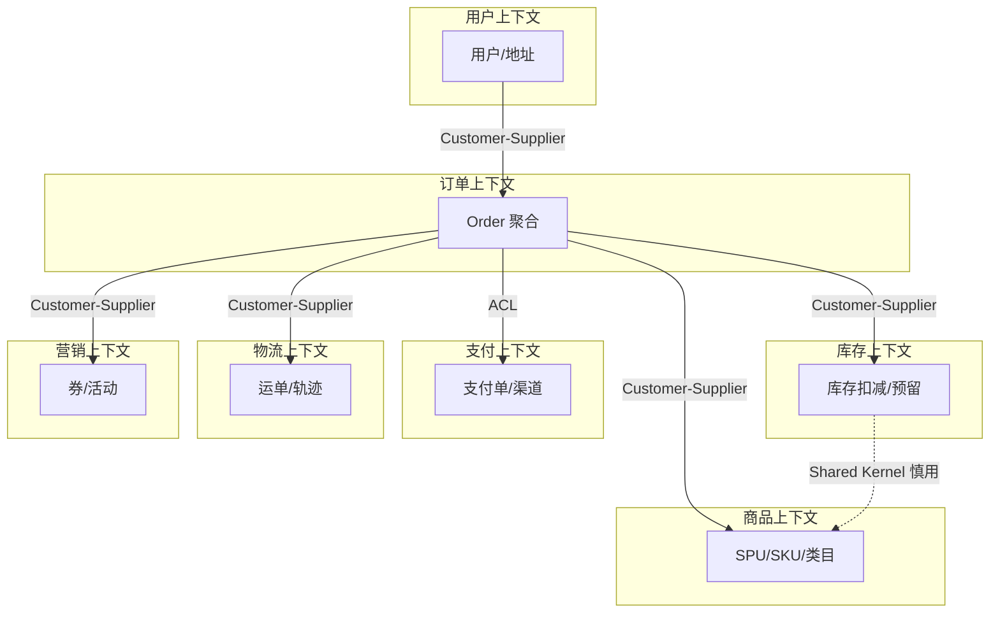

#### 拆分决策树

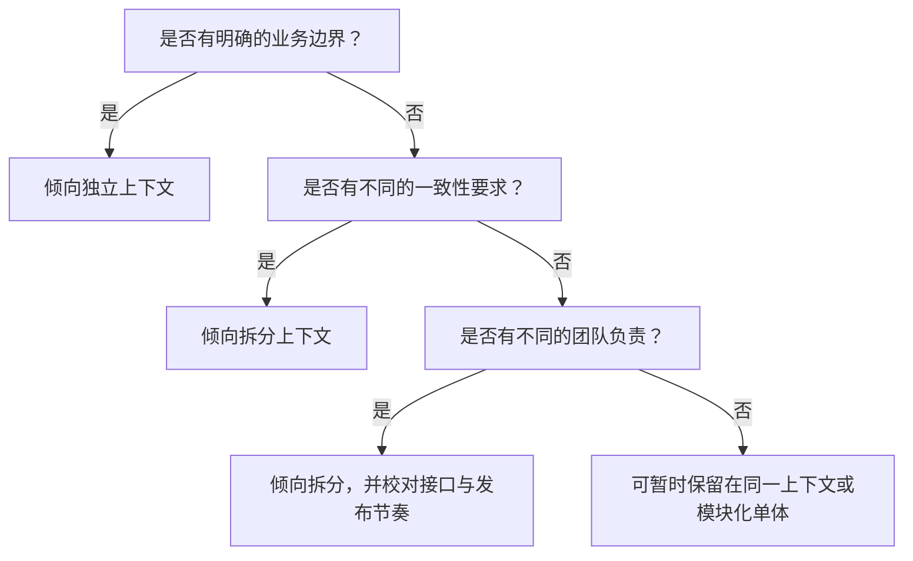

#### 拆分的代价与收益

- **何时拆分**：边界清晰、不同团队主责、不同发布节奏或技术栈诉求强、调用关系可治理
- **何时合并或暂缓拆分**：分布式复杂性（运维、一致性、排障）明显超过拆分收益
- **判断参考**：团队认知负荷、调用链复杂度、数据一致性成本、故障爆炸半径

---

### 3.3 上下文映射的落地

上下文映射（Context Mapping）把「谁依赖谁、如何集成」说清楚。下面三类在电商集成中最常落地：**防腐层**、**共享内核**、**客户-供应商**。

#### 防腐层（ACL）的设计

**场景**：订单上下文对接第三方支付（微信支付、支付宝等）。

**问题**：

- 第三方 API 经常变化
- 不同支付渠道的模型不同
- 不希望外部变化渗透进领域模型

**解决方案**：在基础设施层建立**防腐层**，把外部模型与协议隔离在适配器内。

**架构示意**：

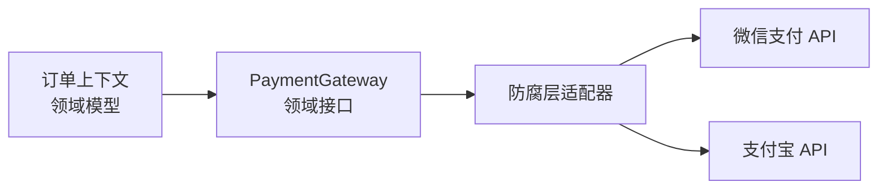

**代码示例**：

```go
// 领域层：统一的支付接口
type PaymentGateway interface {
    CreatePayment(order *Order, amount Money) (*PaymentResult, error)
    QueryPaymentStatus(paymentID string) (PaymentStatus, error)
}

// 基础设施层：防腐层实现
type WechatPaymentAdapter struct {
    wechatClient *wechat.Client
}

func (a *WechatPaymentAdapter) CreatePayment(order *Order, amount Money) (*PaymentResult, error) {
    // 将领域模型转换为微信支付的请求格式
    wechatReq := a.toWechatRequest(order, amount)
    wechatResp, err := a.wechatClient.CreateOrder(wechatReq)
    if err != nil {
        return nil, err
    }
    // 将微信响应转换回领域模型
    return a.toPaymentResult(wechatResp), nil
}
```

**关键设计原则**：

- 领域层定义接口（依赖倒置）
- 防腐层在基础设施层实现
- 只暴露领域需要的抽象，隐藏第三方细节
- 不同支付渠道实现同一接口，订单领域只依赖接口

#### 共享内核的适用场景和风险

**适用场景**：

- 两个团队紧密协作
- 有共同且稳定的概念（变化频率低）
- 共享范围可被文档与测试严格约束

**电商案例**：订单与库存共享**极小**的商品基础信息（如 SKU ID、商品名称快照策略的约定）——注意：共享的是「契约与少量类型」，不是把两个上下文的数据库绑在一起。

**风险**：

- 修改需要双方协调
- 容易产生隐式耦合
- 团队自治性降低

**最佳实践**：

- 共享内核应该**非常小**
- 明确共享范围与演进规则（版本、兼容策略）
- 建立清晰的协调机制（RFC、联合评审）

#### 客户-供应商关系的 API 设计

**场景**：订单上下文（客户）依赖商品上下文（供应商）。

**API 设计原则**：

1. 供应商提供明确的 API 契约
2. 考虑客户的需求（批量查询、缓存策略、限流与降级）
3. 版本管理和兼容性
4. 性能与可用性保障（与 SLO 对齐）

**电商案例**：

```go
// 商品上下文提供的 API（供应商）
type ProductQueryService interface {
    // 批量查询（考虑订单可能有多个商品）
    GetProductsByIDs(ids []ProductID) ([]Product, error)

    // 简化模型（订单只需要基本信息）
    GetProductBasicInfo(id ProductID) (*ProductBasicInfo, error)
}

// ProductBasicInfo 只包含订单需要的字段
type ProductBasicInfo struct {
    ID    string
    Name  string
    Price Money
    // 不包含商品详情、图片等订单不需要的信息
}
```

**关键点**：

- 下游明确表达需求（需要哪些字段、怎样的批量接口）
- 上游设计**面向客户**的 API，而不是暴露内部表结构
- 避免把内部实现细节泄漏为「公共契约」

---

### 3.4 战略设计中的常见问题

#### 问题 1：过度拆分 vs 拆分不足

**过度拆分的表现**：

- 微服务数量远超团队数量
- 简单功能需要跨多个服务
- 分布式事务或补偿到处都是
- 调用链路复杂，难以排障

**电商反例**：将订单拆成订单头服务、订单项服务、订单状态服务——下单路径被迫多次远程调用，**一致性边界被人为打碎**。

**拆分不足的表现**：

- 单个上下文职责过多
- 团队无法独立演进
- 代码库过大，变更冲突频繁

**电商反例**：订单、库存、支付、物流混在一个部署单元里却**没有模块化边界**，最终变成大泥球。

**判断标准**：

- 团队能否相对独立演进
- 是否有清晰的业务边界与统一语言
- 调用复杂度与故障半径是否可控

#### 问题 2：上下文边界不清晰

**表现**：

- 职责混乱：订单服务直接操作库存表
- 数据泄露：对外暴露内部存储形态
- 循环依赖：订单依赖库存，库存又依赖订单

**解决方案**：

- 明确每个上下文的职责边界（写进文档与代码门禁）
- 使用领域事件解耦协作路径
- **禁止**跨上下文直接共享数据库

**电商案例**：

- 错误做法：订单服务直接扣减库存表
- 正确做法：订单发布 `OrderPlaced` / `OrderPaid` 等事件，库存上下文监听并执行预留或扣减（配合幂等与重试）

#### 问题 3：团队结构与技术架构不匹配

**康威定律**：系统架构倾向于反映组织的沟通结构。

**问题场景**：

- 组织按技术栈分层（前端团队、后端团队、DBA 团队）
- 系统却按业务垂直拆分（订单、商品、支付）
- 结果：任何业务功能都要跨多团队排队

**解决方案**：

- 调整团队结构与架构对齐（业务全栈团队）
- 每个团队覆盖一个或少数上下文的端到端交付
- 明确接口负责人与 SLI/SLO

**电商案例**：

- 订单团队负责订单上下文的前后端、数据与运维协作界面
- 商品团队负责商品上下文全栈
- 避免「一个需求要拉五个团队开工会」成为常态

#### 问题 4：忽略上下文映射，直接共享数据库

**问题**：多个服务直接读写同一张业务表。

**后果**：

- 隐式依赖，难以演进与重构
- 数据一致性与并发语义不清晰
- 无法独立部署与扩缩

**解决方案**：

- 每个上下文优先**独立数据库**（或至少独立 schema 与明确所有权）
- 通过 API 或事件集成
- 把映射关系画出来：客户-供应商、防腐层、开放主机服务等

---

**本节小结**：

- 子域分类服务于投资策略：先四维度评估，再用矩阵与工作坊收敛
- 限界上下文划分同时尊重业务能力、一致性、语言与团队现实
- 上下文映射要落地到接口与适配器：ACL 隔离外部，共享内核极度克制，客户-供应商要「面向客户设计 API」
- 常见问题的根因多是边界、组织与数据所有权没有对齐

---

## 四、战术设计

战术设计回答的是「领域模型在代码里长什么样」：如何用实体与值对象表达概念，如何用聚合画出一致性边界，如何用仓储隐藏持久化，以及何时引入领域服务与领域事件。本节仍以**电商订单**为主线，给出可直接对照实现的 Go 示例（为可读性会省略部分工程细节，如错误包装与日志）。

---

### 4.1 实体（Entity）

#### 概念与特征

**实体（Entity）**是有**唯一标识（Identity）**且在时间上延续的对象：同一个订单在状态从「待支付」变为「已支付」之后，仍然是**同一张订单**。与标识相比，属性值可以变化。

| 特征 | 说明 |
|------|------|
| 唯一标识 | 用 ID 区分实例，而不是靠属性组合 |
| 生命周期 | 创建、变更、归档或删除 |
| 可变状态 | 业务操作会改变状态，但身份不变 |
| 封装规则 | 状态转换应由实体方法约束，避免「随处改字段」 |

#### 贫血模型 vs 充血模型

**贫血模型（Anemic Domain Model）**：`struct` 只有字段，业务规则散落在 `Service` 的 `if-else` 中。优点是上手快；缺点是规则分散、难以测试、模型无法表达「订单知道自己能做什么」。

**充血模型（Rich Domain Model）**：实体持有**与身份强相关**的行为与不变量，应用层只做编排。DDD 鼓励在复杂核心域采用后者——不是每个 CRUD 模块都要「充血」，但订单、账户、合同这类对象通常值得。

#### 反例：贫血的 Order

```go
// 仅数据载体，业务规则在 Service 中散落
type Order struct {
	ID         string
	UserID     string
	Status     string
	TotalPrice float64
	Items      []OrderItem
	CreatedAt  time.Time
}

func (s *OrderService) CancelOrder(orderID string) error {
	order, err := s.repo.FindByID(orderID)
	if err != nil {
		return err
	}
	if order.Status == "paid" {
		order.Status = "cancelled"
		if err := s.repo.Save(order); err != nil {
			return err
		}
		return s.refundService.Refund(order.ID)
	}
	return errors.New("cannot cancel")
}
```

问题一眼可见：`Status` 是裸字符串，取消规则与退款编排挤在应用服务里，**订单自身不保证合法状态机**。

#### 正例：充血 Order 与状态值对象

```go
type OrderID string
type UserID string

type OrderStatus string

const (
	OrderStatusPending   OrderStatus = "pending"
	OrderStatusPaid      OrderStatus = "paid"
	OrderStatusShipped   OrderStatus = "shipped"
	OrderStatusCancelled OrderStatus = "cancelled"
)

func (s OrderStatus) CanCancel() bool {
	return s == OrderStatusPaid || s == OrderStatusPending
}

// 实体：封装标识、状态与领域行为
type Order struct {
	id         OrderID
	userID     UserID
	status     OrderStatus
	items      []OrderItem
	totalPrice Money
	createdAt  time.Time
	events     []DomainEvent
}

func (o *Order) Cancel(reason string) error {
	if !o.status.CanCancel() {
		return errors.New("order cannot be cancelled")
	}
	o.status = OrderStatusCancelled
	o.addEvent(OrderCancelledEvent{
		OrderID:     o.id,
		Reason:      reason,
		CancelledAt: time.Now(),
	})
	return nil
}

func (o *Order) addEvent(e DomainEvent) {
	o.events = append(o.events, e)
}
```

#### 实体的关键设计原则

1. **封装业务规则**：哪些状态可以互转，由实体（或值对象）表达，而不是由调用方猜。
2. **保证不变性**：禁止外部绕过方法直接改关键字段；在 Go 中常用小写字段 + 构造/工厂 + 业务方法。
3. **与值对象组合**：金额用 `Money`，状态用 `OrderStatus`，避免魔法字符串与 `float64` 金额。
4. **领域事件（可选但常见）**：状态变更时记录事件，供基础设施在事务成功后发布（详见 4.4）。

#### 生命周期（简图）

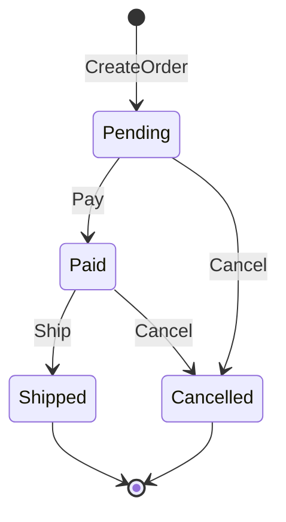

---

### 4.2 值对象（Value Object）

#### 概念与特征

**值对象（Value Object）**没有独立身份，靠**属性值**描述事物；通常**不可变**，用整体替换表示变更。相等语义是**值相等**而非引用相等。

| 特征 | 说明 |
|------|------|
| 无标识 | 不需要 `OrderID` 这类独立 ID |
| 不可变 | 修改返回新实例，不原地改字段 |
| 可替换 | `addr2 := addr1.WithStreet("…")` |
| 自验证 | 构造失败即非法，避免「无效值对象在系统里传递」 |

#### 何时使用值对象

- 描述性概念：`Money`、`Address`、`DateRange`、`Email`。
- 需要值语义：两个「100 CNY」在业务上相等。
- 希望减少无效状态：构造时校验，方法内不破坏不变量。

#### 电商示例：Money

金额用**整数分**存储，避免浮点误差；运算返回新 `Money`，不修改接收者。

```go
import "errors"

type Money struct {
	amount   int64  // 分
	currency string // 如 CNY
}

// AmountCents / Currency 供仓储等外层只读映射，避免跨包访问未导出字段。
func (m Money) AmountCents() int64 { return m.amount }
func (m Money) Currency() string   { return m.currency }

func NewMoneyFromYuan(yuan float64, currency string) Money {
	return Money{amount: int64(yuan * 100), currency: currency}
}

func (m Money) Add(other Money) (Money, error) {
	if m.currency != other.currency {
		return Money{}, errors.New("currency mismatch")
	}
	return Money{amount: m.amount + other.amount, currency: m.currency}, nil
}

func (m Money) Subtract(other Money) (Money, error) {
	if m.currency != other.currency {
		return Money{}, errors.New("currency mismatch")
	}
	if m.amount < other.amount {
		return Money{}, errors.New("insufficient amount")
	}
	return Money{amount: m.amount - other.amount, currency: m.currency}, nil
}

func (m Money) Multiply(qty int) Money {
	if qty < 0 {
		return Money{amount: 0, currency: m.currency}
	}
	return Money{amount: m.amount * int64(qty), currency: m.currency}
}

func (m Money) Equals(other Money) bool {
	return m.amount == other.amount && m.currency == other.currency
}
```

#### 电商示例：Address

```go
type Address struct {
	province string
	city     string
	district string
	street   string
	zipCode  string
}

func (a Address) WithStreet(newStreet string) Address {
	return Address{
		province: a.province,
		city:     a.city,
		district: a.district,
		street:   newStreet,
		zipCode:  a.zipCode,
	}
}

func (a Address) IsValid() bool {
	return a.province != "" && a.city != "" && a.street != ""
}
```

#### 电商示例：OrderItem（作为值对象）

订单行通常**不单独生命周期**：外部不引用「第 3 行」的持久化 ID，而是由订单聚合统一修改。典型做法是 `ProductID` + 下单**快照**（名称、单价）。字段导出便于仓储映射；业务不变量仍由聚合根方法守护。

```go
type ProductID string

type OrderItem struct {
	ProductID   ProductID
	ProductName string
	Quantity    int
	UnitPrice   Money
}

func (item OrderItem) Subtotal() Money {
	return item.UnitPrice.Multiply(item.Quantity)
}
```

#### 值对象 vs 实体：判断口诀

> 「若两个对象属性完全相同，业务上是否仍要区分成两个东西？」

- **是** → 实体（两张订单即使金额相同也是不同订单）。
- **否** → 值对象（两张 100 元纸币在记账语义下可互换）。

---

### 4.3 聚合（Aggregate）

#### 概念

**聚合（Aggregate）**是一组具有**一致性边界**的领域对象：**聚合根（Aggregate Root）**是对外唯一入口，外部只能通过根来修改内部；根负责维护边界内不变量。聚合也常被视为**一个事务边界**（在单体或同一数据库内）。

#### 设计原则（摘自《实现领域驱动设计》）

1. **在边界内保护业务规则不变量**。
2. **设计小聚合**（Small Aggregates），降低锁竞争与并发冲突。
3. **通过 ID 引用其他聚合**（Reference by ID），不直接持有其他根的对象图。
4. **边界外接受最终一致性**：跨聚合用领域事件等方式同步。

#### 聚合结构示意（Order）

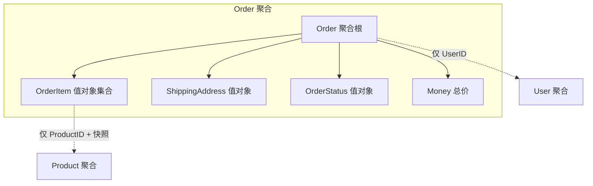

#### 完整示例：Order 聚合根

```go
package example

import (
	"errors"
	"fmt"
	"time"
)

type Payment struct {
	Method PaymentMethod
	PaidAt time.Time
	Amount Money
}

type PaymentMethod string

// Order 聚合根：外部只能通过它的方法改变状态
type Order struct {
	id              OrderID
	userID          UserID
	status          OrderStatus
	items           []OrderItem
	shippingAddress Address
	paymentInfo     Payment
	totalPrice      Money
	createdAt       time.Time
	updatedAt       time.Time
	events          []DomainEvent
}

func CreateOrder(userID UserID, items []OrderItem, address Address) (*Order, error) {
	if len(items) == 0 {
		return nil, errors.New("order must have at least one item")
	}
	if !address.IsValid() {
		return nil, errors.New("invalid shipping address")
	}

	total := Money{amount: 0, currency: "CNY"}
	for _, it := range items {
		var err error
		total, err = total.Add(it.Subtotal())
		if err != nil {
			return nil, err
		}
	}

	now := time.Now()
	order := &Order{
		id:              GenerateOrderID(),
		userID:          userID,
		status:          OrderStatusPending,
		items:           append([]OrderItem(nil), items...),
		shippingAddress: address,
		totalPrice:      total,
		createdAt:       now,
		updatedAt:       now,
	}
	order.addEvent(OrderCreatedEvent{
		OrderID:    order.id,
		UserID:     order.userID,
		TotalPrice: order.totalPrice,
		OccurredOn: now,
	})
	return order, nil
}

func (o *Order) Pay(method PaymentMethod) error {
	if o.status != OrderStatusPending {
		return errors.New("only pending orders can be paid")
	}
	now := time.Now()
	o.status = OrderStatusPaid
	o.paymentInfo = Payment{Method: method, PaidAt: now, Amount: o.totalPrice}
	o.updatedAt = now
	o.addEvent(OrderPaidEvent{
		OrderID:    o.id,
		UserID:     o.userID,
		Amount:     o.totalPrice,
		PaidAt:     now,
		Items:      append([]OrderItem(nil), o.items...),
		OccurredOn: now,
	})
	return nil
}

func (o *Order) Cancel(reason string) error {
	if !o.status.CanCancel() {
		return errors.New("order cannot be cancelled")
	}
	o.status = OrderStatusCancelled
	o.updatedAt = time.Now()
	o.addEvent(OrderCancelledEvent{
		OrderID:     o.id,
		Reason:      reason,
		CancelledAt: o.updatedAt,
	})
	return nil
}

func (o *Order) GetEvents() []DomainEvent {
	return o.events
}

func (o *Order) ClearEvents() {
	o.events = nil
}

func (o *Order) addEvent(e DomainEvent) {
	o.events = append(o.events, e)
}

// 访问器：供基础设施层持久化，避免直接暴露可变字段
func (o *Order) ID() OrderID                  { return o.id }
func (o *Order) UserID() UserID                { return o.userID }
func (o *Order) Status() OrderStatus           { return o.status }
func (o *Order) Items() []OrderItem            { return append([]OrderItem(nil), o.items...) }
func (o *Order) TotalPrice() Money            { return o.totalPrice }
func (o *Order) CreatedAt() time.Time          { return o.createdAt }
func (o *Order) ShippingAddress() Address     { return o.shippingAddress }
func (o *Order) PaymentInfo() Payment          { return o.paymentInfo }

func GenerateOrderID() OrderID {
	return OrderID(fmt.Sprintf("ORD-%d", time.Now().UnixNano()))
}
```

> 说明：`GenerateOrderID` 仅为示例；生产环境应使用发号器、UUID 或数据库序列，并处理时钟回拨与冲突。

#### 关键设计决策

1. **`userID` 而非 `*User`**：用户是另一聚合，订单事务不应加载整张用户对象图。
2. **`OrderItem` 用快照**：价格、名称在下单时刻固化，避免商品改价影响历史订单。
3. **不持有 `*Product`**：跨聚合引用用 ID + 快照，而不是 ORM 式「关联对象」。

#### 常见错误

**错误 1：聚合过大**

```go
// 将库存、支付细节全部塞进 Order —— 事务臃肿、并发差、职责混乱
type Order struct {
	id        OrderID
	items     []OrderItem
	inventory *Inventory // 通常是另一聚合
}
```

**错误 2：跨聚合直接修改**

```go
// 支付时直接扣库存：破坏边界，难以拆分服务
func (o *Order) PayBad(inventory *Inventory) error {
	// ...
	_ = inventory.Deduct(o.items)
	return nil
}

// 更好：发布领域事件，由库存上下文订阅处理
func (o *Order) PayGood(method PaymentMethod) error {
	// ...
	o.addEvent(OrderPaidEvent{ /* ... */ })
	return nil
}
```

**错误 3：绕过聚合根修改内部集合**

```go
// 外部直接改行项目——不变量失守
order.Items()[0] = OrderItem{} // 若 Items 返回切片底层可被改，风险更高
```

正确做法：由 `Order` 提供 `ChangeItemQuantity` 等方法，在根内校验「已支付不可改件数」等规则。

#### 聚合设计检查清单

- [ ] 该边界是否需要**强一致**一起提交？
- [ ] 聚合是否足够小，避免「大锁」？
- [ ] 是否只通过 **ID** 连接其他聚合？
- [ ] 外部是否**只能**通过根操作内部对象？
- [ ] 跨聚合协作是否首选**最终一致**（事件、Saga）？

---

### 4.4 仓储（Repository）+ 领域服务（Domain Service）+ 领域事件（Domain Event）

#### 4.4.1 仓储（Repository）

**仓储**是**面向聚合**的持久化抽象：领域层声明「需要什么」，基础设施层决定「怎么存」。它不同于面向表的 DAO：查询方法宜带**业务语义**，如「待支付超时订单」。

| 对比 | DAO | Repository |
|------|-----|------------|
| 视角 | 表与行 | 聚合与不变量 |
| 方法 | `Insert` / `Update` | `Save` / `FindByID` |
| 查询 | 通用 CRUD | 语义化查询 + 重建对象图 |
| 依赖方向 | 常泄漏到领域 | 接口在领域，实现在基础设施 |

**领域层接口示例**：

```go
import "time"

type OrderRepository interface {
	Save(order *Order) error
	FindByID(id OrderID) (*Order, error)
	Remove(id OrderID) error

	FindPendingOrdersByUser(userID UserID) ([]*Order, error)
	FindOrdersNeedingPayment(before time.Time) ([]*Order, error)
}
```

**PostgreSQL 实现（示意）**：以聚合为单位事务写入订单头与行表，`FindByID` 负责**重建**完整 `Order`。

```go
import (
	"database/sql"
	"time"
)

type PostgresOrderRepository struct {
	db *sql.DB
}

func (r *PostgresOrderRepository) Save(order *Order) error {
	tx, err := r.db.Begin()
	if err != nil {
		return err
	}
	defer func() { _ = tx.Rollback() }()

	_, err = tx.Exec(`
INSERT INTO orders (id, user_id, status, total_amount_cents, currency, created_at, updated_at)
VALUES ($1,$2,$3,$4,$5,$6,$7)
ON CONFLICT (id) DO UPDATE SET
  user_id = EXCLUDED.user_id,
  status = EXCLUDED.status,
  total_amount_cents = EXCLUDED.total_amount_cents,
  currency = EXCLUDED.currency,
  updated_at = EXCLUDED.updated_at`,
		string(order.ID()),
		string(order.UserID()),
		string(order.Status()),
		order.TotalPrice().AmountCents(),
		order.TotalPrice().Currency(),
		order.CreatedAt(),
		time.Now(),
	)
	if err != nil {
		return err
	}

	if _, err := tx.Exec(`DELETE FROM order_items WHERE order_id = $1`, string(order.ID())); err != nil {
		return err
	}
	for _, it := range order.Items() {
		_, err := tx.Exec(`
INSERT INTO order_items (order_id, product_id, product_name, quantity, unit_price_cents, currency)
VALUES ($1,$2,$3,$4,$5,$6)`,
			string(order.ID()),
			string(it.ProductID),
			it.ProductName,
			it.Quantity,
			it.UnitPrice.AmountCents(),
			it.UnitPrice.Currency(),
		)
		if err != nil {
			return err
		}
	}
	return tx.Commit()
}

func (r *PostgresOrderRepository) FindByID(id OrderID) (*Order, error) {
	row := r.db.QueryRow(`
SELECT user_id, status, total_amount_cents, currency, created_at, updated_at
FROM orders WHERE id = $1`, string(id))

	var (
		userID       string
		status       string
		amountCents  int64
		currency     string
		createdAt    time.Time
		updatedAt    time.Time
	)
	if err := row.Scan(&userID, &status, &amountCents, &currency, &createdAt, &updatedAt); err != nil {
		return nil, err
	}

	itemRows, err := r.db.Query(`
SELECT product_id, product_name, quantity, unit_price_cents, currency
FROM order_items WHERE order_id = $1`, string(id))
	if err != nil {
		return nil, err
	}
	defer itemRows.Close()

	var items []OrderItem
	for itemRows.Next() {
		var (
			pid, pname string
			qty        int
			ucents     int64
			ccy        string
		)
		if err := itemRows.Scan(&pid, &pname, &qty, &ucents, &ccy); err != nil {
			return nil, err
		}
		items = append(items, OrderItem{
			ProductID:   ProductID(pid),
			ProductName: pname,
			Quantity:    qty,
			UnitPrice:   Money{amount: ucents, currency: ccy},
		})
	}

	// 通过非导出字段重建聚合：实际项目中可用包内工厂或重建函数
	o := &Order{
		id:         id,
		userID:     UserID(userID),
		status:     OrderStatus(status),
		items:      items,
		totalPrice: Money{amount: amountCents, currency: currency},
		createdAt:  createdAt,
		updatedAt:  updatedAt,
	}
	return o, nil
}
```

> 注意：`Order` 若字段未导出，重建逻辑应放在 `domain` 包内的 `RehydrateOrder(...)` 工厂中，避免仓储跨包写入私有字段。上文为讲解方便采用同包示意。

#### 4.4.2 领域服务（Domain Service）

**领域服务**承载**不属于单一实体或值对象**、但又**纯粹属于领域**的逻辑：通常无状态、不直接依赖数据库。典型场景：**跨多个聚合**的规则、或需要多种输入对象的计算。

与**应用服务**分工：

| 层次 | 职责 | 依赖 |
|------|------|------|
| 领域服务 | 领域规则与计算 | 其他领域对象、接口（由外层实现） |
| 应用服务 | 用例编排、事务、调用仓储与消息 | 基础设施 |

**示例：订单计价（Promotion + User + Items）**

价格计算依赖促销、用户等级等，放在 `Order` 上往往臃肿，可下沉为 `PricingService`：

```go
type Promotion struct {
	Code   string
	Active bool
}

type User struct {
	ID    UserID
	Level int
}

type PricingService interface {
	CalculateOrderPrice(items []OrderItem, user User, promotions []Promotion) (Money, error)
}

type OrderPricingService struct{}

func (OrderPricingService) CalculateOrderPrice(
	items []OrderItem,
	user User,
	promotions []Promotion,
) (Money, error) {
	subtotal := NewMoneyFromYuan(0, "CNY")
	for _, it := range items {
		var err error
		subtotal, err = subtotal.Add(it.Subtotal())
		if err != nil {
			return Money{}, err
		}
	}

	discount := estimateDiscount(subtotal, user, promotions)
	return subtotal.Subtract(discount)
}

func estimateDiscount(subtotal Money, user User, promotions []Promotion) Money {
	// 示意：会员折扣 + 促销标签；真实系统会有规则引擎、券模板等
	_ = promotions
	if user.Level >= 3 && subtotal.AmountCents() > 10_000 {
		return NewMoneyFromYuan(10, subtotal.Currency()) // 减 10 元
	}
	return NewMoneyFromYuan(0, subtotal.Currency())
}
```

其他常见领域服务：**转账**（两端账户聚合）、**库存分配策略**、**运费计算器**等。

#### 4.4.3 领域事件（Domain Event）

**领域事件**表示**已发生**的重要业务事实：命名多用过去时（`OrderPaid`），**不可变**，携带订阅方所需的**最小充分信息**，用于解耦聚合与上下文。

**价值**：

1. 解耦聚合：不直接调用另一上下文的 `Service`。
2. 最终一致性：支付成功后异步扣库存、发通知。
3. 审计与分析：事件流即事实记录（是否做完整事件溯源另当别论）。

**接口与事件定义**：

```go
type DomainEvent interface {
	EventType() string
	OccurredOn() time.Time
}

type OrderCreatedEvent struct {
	OrderID    OrderID
	UserID     UserID
	TotalPrice Money
	OccurredOn time.Time
}

func (e OrderCreatedEvent) EventType() string   { return "OrderCreated" }
func (e OrderCreatedEvent) OccurredOn() time.Time { return e.OccurredOn }

type OrderPaidEvent struct {
	OrderID    OrderID
	UserID     UserID
	Amount     Money
	PaidAt     time.Time
	Items      []OrderItem
	OccurredOn time.Time
}

func (e OrderPaidEvent) EventType() string     { return "OrderPaid" }
func (e OrderPaidEvent) OccurredOn() time.Time { return e.OccurredOn }

type OrderCancelledEvent struct {
	OrderID     OrderID
	Reason      string
	CancelledAt time.Time
}

func (e OrderCancelledEvent) EventType() string     { return "OrderCancelled" }
func (e OrderCancelledEvent) OccurredOn() time.Time { return e.CancelledAt }
```

**应用服务内：事务与发布协调（示意）**

```go
type EventBus interface {
	Publish(events ...DomainEvent)
}

type UnitOfWork interface {
	Begin() UnitOfWork
	Commit() error
	Rollback()
	OnCommit(fn func())
}

type OrderApplicationService struct {
	orderRepo OrderRepository
	eventBus  EventBus
	uow       UnitOfWork
}

func (s *OrderApplicationService) PayOrder(id OrderID, method PaymentMethod) error {
	tx := s.uow.Begin()
	defer tx.Rollback()

	order, err := s.orderRepo.FindByID(id)
	if err != nil {
		return err
	}
	if err := order.Pay(method); err != nil {
		return err
	}
	if err := s.orderRepo.Save(order); err != nil {
		return err
	}

	events := append([]DomainEvent(nil), order.GetEvents()...)
	order.ClearEvents()

	tx.OnCommit(func() {
		s.eventBus.Publish(events...)
	})
	return tx.Commit()
}
```

**订阅方（其他上下文）**：处理器应**幂等**（至少一次投递）。

```go
type InventoryService interface {
	DeductForPaidOrder(orderID OrderID, items []OrderItem) error
}

type OrderPaidInventoryHandler struct {
	svc InventoryService
}

func (h OrderPaidInventoryHandler) Handle(e OrderPaidEvent) error {
	return h.svc.DeductForPaidOrder(e.OrderID, e.Items)
}

type NotificationService interface {
	SendPaymentSuccess(userID UserID, orderID OrderID)
}

type OrderPaidNotificationHandler struct {
	svc NotificationService
}

func (h OrderPaidNotificationHandler) Handle(e OrderPaidEvent) error {
	h.svc.SendPaymentSuccess(e.UserID, e.OrderID)
	return nil
}
```

#### 下单—支付链路的事件编排（Saga / 进程管理器思路）

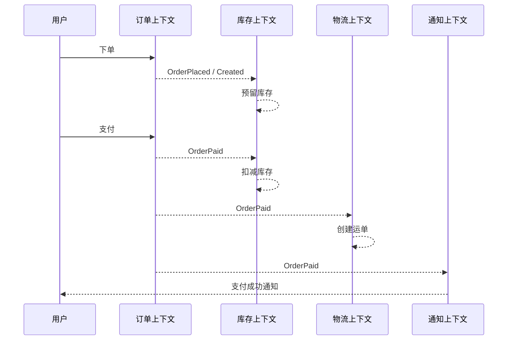

#### 事件设计原则小结

1. **不可变**：发布后不改写事件内容；纠错用补偿事件。
2. **过去时命名**：表达「已经发生」。
3. **自足性**：订阅者尽量少打回源系统；必要字段写在事件里。
4. **投递语义**：消息中间件上实现**至少一次**时，消费者必须**幂等**。
5. **与事务**：常见做法是**事务提交成功后再发布**（事务外发箱 Outbox 等模式可进一步保证一致性，此处不展开）。

**本节小结**：

- **实体**标识生命周期，封装状态机与不变量；避免贫血模型在核心域泛滥。
- **值对象**描述属性、不可变、值相等；金额与地址等应用值对象可显著减少 bug。
- **聚合**定义一致性边界，小聚合 + ID 引用 + 事件协作是实践主基调。
- **仓储**以聚合为读写单位；**领域服务**补齐跨对象规则；**领域事件**支撑解耦与最终一致。

---

## 五、架构落地

战略设计与战术设计解决「边界与模型」；**架构落地**则回答「目录怎么摆、分层怎么切、和 CQRS / 消息怎么配合」。本节给出经典四层、Go 目录示例、CQRS 读写分离思路，以及 Kafka 等消息设施上的事件驱动集成要点，可与 [30-clean-architecture-ddd-cqrs.md](./30-clean-architecture-ddd-cqrs.md) 对照阅读。

---

### 5.1 DDD 的分层架构

#### 经典四层

```text
┌─────────────────────────────────┐
│   表现层 (Presentation Layer)    │  ← HTTP/gRPC 接口、序列化
├─────────────────────────────────┤
│   应用层 (Application Layer)     │  ← 用例编排、事务边界
├─────────────────────────────────┤
│   领域层 (Domain Layer)          │  ← 实体、值对象、聚合、领域服务
├─────────────────────────────────┤
│  基础设施层 (Infrastructure)     │  ← 数据库、消息队列、第三方服务
└─────────────────────────────────┘
```

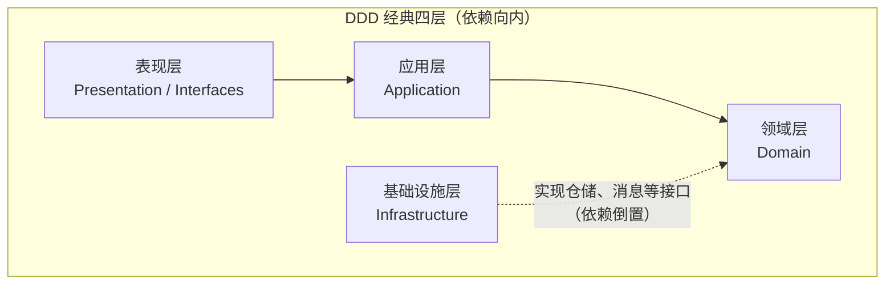

#### 各层职责与代码形态

**1. 表现层（Interfaces / Presentation）**

- **职责**：接入协议（HTTP、gRPC、消息消费者），解析输入、调用应用层、组装响应。
- **不应包含**：业务规则与不变量（只做适配与校验边界）。

```go
// HTTP Handler 示例
type OrderHandler struct {
	orderAppService *OrderApplicationService
}

func (h *OrderHandler) PlaceOrder(c *gin.Context) {
	var req PlaceOrderRequest
	if err := c.BindJSON(&req); err != nil {
		c.JSON(400, gin.H{"error": err.Error()})
		return
	}
	orderID, err := h.orderAppService.PlaceOrder(
		req.UserID,
		req.Items,
		req.ShippingAddress,
	)
	if err != nil {
		c.JSON(500, gin.H{"error": err.Error()})
		return
	}
	c.JSON(200, gin.H{"orderID": orderID})
}
```

**2. 应用层（Application）**

- **职责**：编排用例、控制事务、在提交后发布领域事件；**薄薄一层**。
- **包含**：Application Service、DTO、应用级事件处理器（若团队这样划分）。

```go
type OrderApplicationService struct {
	orderRepo    OrderRepository
	inventoryAPI InventoryAPIClient
	eventBus     EventBus
	uow          UnitOfWork
}

func (s *OrderApplicationService) PlaceOrder(
	userID UserID,
	items []OrderItem,
	address Address,
) (OrderID, error) {
	if err := s.inventoryAPI.CheckInventory(items); err != nil {
		return "", err
	}
	order, err := NewOrder(userID, items, address)
	if err != nil {
		return "", err
	}
	tx := s.uow.Begin()
	defer tx.Rollback()
	if err := s.orderRepo.Save(order); err != nil {
		return "", err
	}
	events := append([]DomainEvent(nil), order.GetEvents()...)
	order.ClearEvents()
	tx.OnCommit(func() {
		s.eventBus.Publish(events...)
	})
	if err := tx.Commit(); err != nil {
		return "", err
	}
	return order.ID(), nil
}
```

**3. 领域层（Domain）**

- **职责**：核心业务逻辑与不变量。
- **包含**：实体、值对象、聚合、领域服务、仓储**接口**、领域事件。
- **特点**：不依赖具体数据库、框架或消息 SDK。

```go
type Order struct {
	id     OrderID
	status OrderStatus
}

func (o *Order) Pay(payment PaymentMethod) error {
	if o.status != OrderStatusPending {
		return errors.New("only pending orders can be paid")
	}
	o.status = OrderStatusPaid
	o.addEvent(OrderPaidEvent{
		OrderID: o.id,
		Method:  payment,
	})
	return nil
}
```

**4. 基础设施层（Infrastructure）**

- **职责**：技术细节实现。
- **包含**：仓储实现、Outbox、Kafka Producer、缓存、第三方 HTTP 客户端等。

```go
type PostgresOrderRepository struct {
	db *sql.DB
}

func (r *PostgresOrderRepository) Save(order *Order) error {
	// INSERT / UPDATE，映射聚合根与持久化模型
	return nil
}
```

#### 依赖方向与 Clean Architecture 对照

```text
表现层 ──→ 应用层 ──→ 领域层 ←── 基础设施层
                         ↑
                         │
                    （依赖倒置）
```

- **依赖向内**：越外层越「面向用例与交付」，越内层越稳定。
- **依赖倒置**：基础设施实现领域层定义的端口（接口）。

| DDD 分层 | Clean Architecture | 说明 |
|---------|-------------------|------|
| 表现层 | Interface Adapters | HTTP / gRPC / 消息适配 |
| 应用层 | Use Cases | 用例编排与事务 |
| 领域层 | Entities（核心企业规则） | 与框架无关的领域模型 |
| 基础设施层 | Frameworks & Drivers | DB、MQ、外部系统 |

更系统的对照与 CQRS 分层变体见 [30-clean-architecture-ddd-cqrs.md](./30-clean-architecture-ddd-cqrs.md) 第四、五部分。

---

### 5.2 目录结构设计

下面给出一个典型的 **Go 单体服务内按 DDD 分层 + 按聚合分包** 的目录骨架（可按团队规范微调 `internal` 与 `pkg` 的边界）。

```text
order-service/
├── cmd/
│   └── server/
│       └── main.go                    # 入口
├── internal/
│   ├── domain/                        # 领域层
│   │   ├── order/                     # Order 聚合
│   │   │   ├── order.go               # 聚合根
│   │   │   ├── order_item.go          # 实体或值对象
│   │   │   ├── order_status.go        # 值对象 / 枚举
│   │   │   ├── order_repository.go    # 仓储接口
│   │   │   └── order_test.go
│   │   ├── pricing/
│   │   │   └── pricing_service.go     # 领域服务
│   │   ├── events/
│   │   │   ├── order_placed.go
│   │   │   ├── order_paid.go
│   │   │   └── order_cancelled.go
│   │   └── shared/
│   │       ├── money.go
│   │       ├── address.go
│   │       └── user_id.go
│   ├── application/
│   │   ├── service/
│   │   │   └── order_service.go
│   │   ├── dto/
│   │   │   ├── place_order_request.go
│   │   │   └── order_response.go
│   │   └── eventhandler/
│   │       └── order_paid_handler.go
│   ├── infrastructure/
│   │   ├── persistence/
│   │   │   ├── postgres_order_repo.go
│   │   │   └── migrations/
│   │   ├── messaging/
│   │   │   └── kafka_event_bus.go
│   │   └── api/
│   │       └── inventory_client.go
│   └── interfaces/
│       ├── http/
│       │   ├── handler/
│       │   │   └── order_handler.go
│       │   └── router.go
│       └── grpc/
│           └── order_service.go
├── pkg/                               # 可被外部模块稳定引用的库（谨慎暴露）
│   └── eventbus/
│       └── event_bus.go
├── configs/
│   └── config.yaml
├── go.mod
└── go.sum
```

**目录原则小结**：

1. **按层分**：`domain` / `application` / `infrastructure` / `interfaces` 一目了然。
2. **按聚合分**：`domain/order`、`domain/inventory` 等，避免「一个大 package 装所有实体」。
3. **依赖方向**：`domain` 不 import 其他层；外层依赖内层。
4. **测试贴近源码**：`order_test.go` 与 `order.go` 同目录，降低阅读成本。

**命名习惯（示例）**：

- 领域对象：`order.go`、`order_item.go`
- 仓储接口：`order_repository.go`；实现：`postgres_order_repo.go`
- 应用服务：`order_service.go`；领域服务：`pricing_service.go`

**与 Java / Spring Boot 常见布局对照**（概念等价，语法不同）：

```text
order-service/
└── src/main/java/com/example/order/
    ├── domain/
    │   ├── model/
    │   ├── service/
    │   └── repository/          # 仓储接口
    ├── application/
    │   └── service/
    ├── infrastructure/
    │   ├── persistence/
    │   └── messaging/
    └── interfaces/
        └── rest/
```

---

### 5.3 DDD + CQRS

**CQRS（Command Query Responsibility Segregation）**把「改状态的写模型」和「查数据的读模型」在模型与存储上拆开，常与事件驱动的读模型投影结合。

#### 何时引入

**适合**：

- 读写比例悬殊（读多写少）或 SLA 不同。
- 查询要跨聚合、跨上下文拼宽表，直接在写库上 join 成本高。
- 需要独立扩展读路径（缓存、搜索、物化视图）。

**谨慎**：

- 典型 CRUD、读写都简单且一致性强需求集中在单表。
- 团队尚无「最终一致」运维与监控经验时，不要一上来全站 CQRS。

#### 电商订单：写模型规范化、读模型宽表

**矛盾**：

- **写**：下单要保证 `Order` 与 `OrderItem` 等同聚合（或同一事务边界）内强一致。
- **读**：订单列表要展示用户昵称、商品主图、物流摘要等，来自多上下文；写库范式化则查询痛苦。

**思路**：写侧维持聚合与事务；读侧用事件增量维护投影（Elasticsearch、Redis、专用读库均可）。

```text
写模型（订单上下文）
├── Order 聚合（规范化存储）
├── OrderRepository → PostgreSQL
└── 发布 OrderPlaced、OrderPaid 等事件

读模型（查询侧）
├── 订阅领域事件
├── 构建 OrderListView 等宽表 / 文档
└── 查询走 ES / 只读副本 / 缓存
```

**写模型（示意）**：

```go
type Order struct {
	ID     string
	UserID string
	Status string
}

func (s *OrderApplicationService) PlaceOrder(/* ... */) error {
	order := /* 构建聚合 */
	if err := s.orderRepo.Save(order); err != nil {
		return err
	}
	s.eventBus.Publish(OrderPlacedEvent{OrderID: order.ID, /* ... */})
	return nil
}
```

**读模型（投影构建示意）**：

```go
type OrderListView struct {
	OrderID       string
	UserName      string
	UserAvatar    string
	ProductNames  []string
	ProductImages []string
	TotalPrice    float64
	Status        string
	CreatedAt     time.Time
}

type OrderListViewBuilder struct {
	searchClient SearchClient
	userRepo     UserLookup
	productRepo  ProductLookup
}

func (b *OrderListViewBuilder) OnOrderPlaced(event OrderPlacedEvent) {
	user := b.userRepo.FindByID(event.UserID)
	products := b.productRepo.FindByIDs(event.ProductIDs)
	view := OrderListView{
		OrderID:      event.OrderID,
		UserName:     user.Name,
		ProductNames: extractNames(products),
		TotalPrice:   event.TotalPrice,
		Status:       "Pending",
		CreatedAt:    event.OccurredOn,
	}
	_ = b.searchClient.IndexOrderListView(view)
}
```

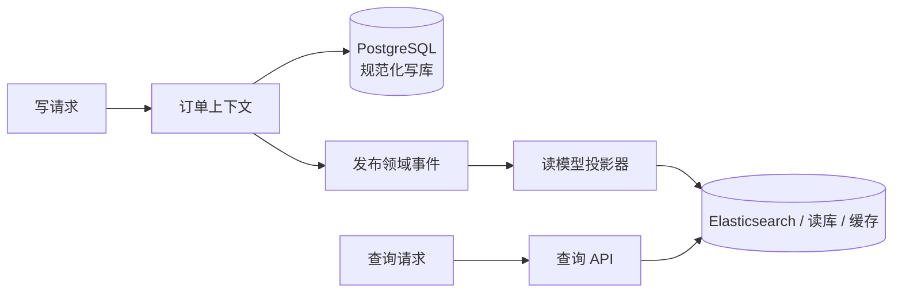

**设计要点**：

1. **写模型**负责事务与不变量；**读模型**可滞后，但要可观测（延迟、积压）。
2. 同一业务可有**多套读模型**（列表、详情、运营报表）。
3. 读写可**独立扩缩**与选型（OLTP + 搜索 / 分析引擎）。

更多分层与 CQRS 变体仍推荐对照 [30-clean-architecture-ddd-cqrs.md](./30-clean-architecture-ddd-cqrs.md) 第五部分。

---

### 5.4 DDD + 事件驱动架构

领域事件在**限界上下文之间**传递「已发生的事实」；落地时通常配合 **Kafka**（高吞吐、持久化、可回放）、**RabbitMQ**（灵活路由）、**NATS**（轻量）等中间件。选型取决于顺序性、投递语义、运维形态，这里不展开产品对比。

#### 下单—支付链路的逻辑视图

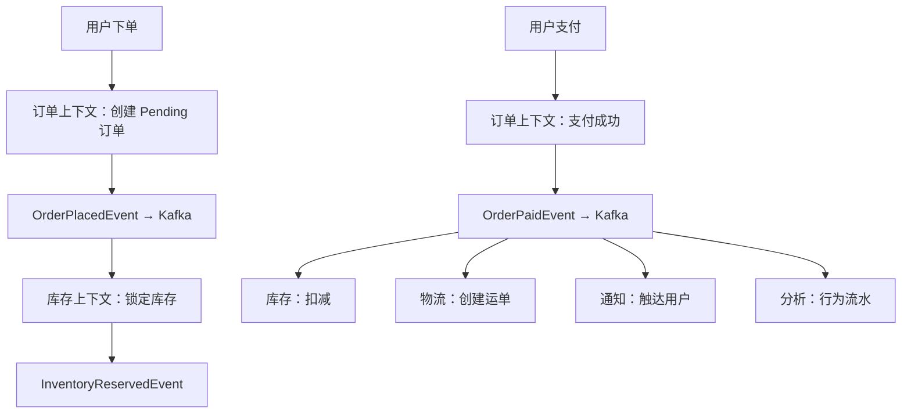

#### 发布与订阅（接口 + Kafka 示意）

```go
type EventBus interface {
	Publish(topic string, event DomainEvent) error
}

type KafkaEventBus struct {
	producer sarama.SyncProducer
}

func (bus *KafkaEventBus) Publish(topic string, event DomainEvent) error {
	data, err := json.Marshal(event)
	if err != nil {
		return err
	}
	msg := &sarama.ProducerMessage{
		Topic: topic,
		Key:   sarama.StringEncoder(event.AggregateID()),
		Value: sarama.ByteEncoder(data),
	}
	_, _, err = bus.producer.SendMessage(msg)
	return err
}
```

```go
type OrderPaidEventHandler struct {
	inventoryService InventoryService
	processed        ProcessedEventStore
}

func (h *OrderPaidEventHandler) Handle(event OrderPaidEvent) error {
	if h.processed.Exists(event.EventID) {
		return nil
	}
	if err := h.inventoryService.DeductInventory(event.OrderID, event.Items); err != nil {
		return err
	}
	return h.processed.Mark(event.EventID)
}
```

#### 长流程与 Saga（补偿）

事件编排实现**最终一致**；若需要显式「多步远程调用 + 补偿」，可引入 **Saga / 流程管理器**（与消息驱动可并存）。

```text
订单已创建 → 锁定库存 → 支付 → 扣减库存 → 创建运单
                ↓ 失败           ↓ 失败
            释放库存         释放库存 + 退款
```

```go
type OrderSaga struct {
	orderRepo    OrderRepository
	inventoryAPI InventoryAPIClient
	paymentAPI   PaymentAPIClient
	logisticsAPI LogisticsAPIClient
}

func (s *OrderSaga) Execute(orderID string) error {
	if err := s.inventoryAPI.Reserve(orderID); err != nil {
		return err
	}
	if err := s.paymentAPI.Pay(orderID); err != nil {
		_ = s.inventoryAPI.Release(orderID)
		return err
	}
	if err := s.inventoryAPI.Deduct(orderID); err != nil {
		_ = s.paymentAPI.Refund(orderID)
		_ = s.inventoryAPI.Release(orderID)
		return err
	}
	if err := s.logisticsAPI.CreateShipment(orderID); err != nil {
		// 示例：物流失败策略依业务而定，可记录待人工处理
		log.Printf("shipment failed: %v", err)
	}
	return nil
}
```

#### 关键工程要点

1. **消费者幂等**：至少一次投递下，重复消息不得破坏不变量。
2. **顺序与分区键**：同一聚合或业务流程使用稳定 `key` 映射到分区，避免乱序破坏状态机假设。
3. **重试与死信**：可重试错误与不可重试错误要区分； poison message 要隔离。
4. **补偿与对账**：跨上下文失败路径要可观测、可人工介入。

**本节小结**：

- **四层架构**划定职责与依赖方向，**依赖倒置**把技术细节挡在领域之外。
- **目录**按层 + 按聚合组织，有利于演进与代码导航。
- **CQRS**分离写模型与读模型，读侧多用**事件投影**换查询性能与扩展性。
- **事件驱动**用中间件连接上下文，配合**幂等、顺序、重试、Saga** 才能长期运维。

---

## 六、实施指南

从书本概念到团队日常交付，还需要回答：**要不要上 DDD**、**遗留系统怎么迁**、**工作坊怎么开**、**哪些坑别踩**。本节给出一套偏工程落地的 checklist 与阶段化路径，仍以电商为叙事背景。

---

### 6.1 何时使用 DDD

#### 往往值得投入的场景

1. **业务复杂**：规则多、变更多，状态机 / 促销 / 履约链路长。
2. **长生命周期**：系统会持续迭代，模型需要可演进、可讨论。
3. **多团队协作**：需要清晰的上下文边界与接口契约，降低「口口相传」成本。
4. **领域专家可参与**：能共建**统一语言**与验收示例（哪怕从简版术语表开始）。

#### 不太划算的场景

1. **简单 CRUD**：后台配置、纯表单管理，战术 DDD 全套易过度。
2. **短周期交付**：例如小于 3 个月的工具型项目，学习曲线摊不薄。
3. **技术主导、领域稀薄**：日志管道、纯基础设施类系统，DDD 核心收益有限。
4. **团队零铺垫硬上**：没有教练或共读，容易学成「伪 DDD」。

#### 决策矩阵（业务复杂度 × 周期）

| 业务复杂度 / 项目周期 | 短期（少于 6 个月） | 中期（6～18 个月） | 长期（大于 18 个月） |
|----------------------|-------------------|-------------------|---------------------|
| **简单**（CRUD 为主） | 不必强行 DDD | 不必强行 DDD | 可在核心域**轻量**战术 DDD |
| **中等**（有明显规则） | 以战术设计为主，边界先行 | 推荐 DDD | 推荐 DDD |
| **复杂**（状态机、工作流） | 推荐 DDD | 强烈推荐 | 强烈推荐 |

#### 快速自检（满足 3 条以上可认真考虑 DDD）

- [ ] 业务规则超出「单表 CRUD + if-else」可维护范围  
- [ ] 系统预期持续演进而非一次性交付  
- [ ] 能拉到业务方定期评审模型与术语  
- [ ] 团队规模与模块边界需要显式治理（通常多于 3 人协作同一产品）  
- [ ] 未来会有多个子系统 / 上下文集成（支付、库存、营销等）

---

### 6.2 从既有系统迁移到 DDD

遗留**单体 + 贫血服务 + 共享大库**是常见起点。建议采用**绞杀者模式（Strangler Fig）**：新能力用新结构承接，旧能力渐进搬迁，全程保持可发布。

#### 阶段 0：现状（典型问题）

```text
[单体应用]
├── UserService
├── ProductService
├── OrderService（贫血模型，规则散在 Service）
└── 共享数据库
```

- 业务规则散落、难以单测；团队不敢改「核心路径」。

#### 阶段 1：识别边界（少改代码，多对齐认知）

**目标**：用统一语言描述「聚合、上下文、事件」，形成共识图纸。

**行动**：

1. 组织 **Event Storming**（见 6.3），先事件后命令再聚合。
2. 标出核心聚合（如 `Order` + `OrderItem`）与上下文（订单、库存、支付、商品）。
3. 画**上下文映射**（客户-供应商、防腐层、开放主机服务等）。

**产出**：领域草图、上下文边界说明、聚合设计备忘。  
**周期感**：约 1～2 周（视领域规模与参与人可用性）。

#### 阶段 2：在代码里「收口」到聚合

**目标**：把订单相关不变量迁回 `Order` 聚合，服务层变薄。

**之前（贫血）**：

```go
func (s *OrderService) CancelOrder(orderID string) error {
	order := s.db.QueryOrder(orderID)
	if order.Status == "paid" {
		s.db.Exec("UPDATE orders SET status = 'cancelled' WHERE id = ?", orderID)
		return s.refundService.Refund(orderID)
	}
	return nil
}
```

**之后（充血 + 应用服务编排）**：

```go
func (o *Order) Cancel(reason string) error {
	if !o.status.CanCancel() {
		return errors.New("order cannot be cancelled")
	}
	o.status = OrderStatusCancelled
	o.addEvent(OrderCancelledEvent{OrderID: o.id, Reason: reason})
	return nil
}

func (s *OrderApplicationService) CancelOrder(orderID string) error {
	order, err := s.orderRepo.FindByID(orderID)
	if err != nil {
		return err
	}
	if err := order.Cancel("user requested"); err != nil {
		return err
	}
	return s.orderRepo.Save(order)
}
```

**周期感**：2～4 周（取决于测试防护与耦合程度）。

#### 阶段 3：引入领域事件，拆掉直连

**之前**：订单服务直接调用库存、退款接口，失败策略缠在一起。

```go
func (s *OrderService) CancelOrder(orderID string) {
	// ...
	s.inventoryService.ReleaseInventory(orderID)
	s.refundService.Refund(orderID)
}
```

**之后**：聚合内产生事件，提交后发布；库存 / 支付上下文各自订阅。

```go
func (s *OrderApplicationService) CancelOrder(orderID string) error {
	order, err := s.orderRepo.FindByID(orderID)
	if err != nil {
		return err
	}
	if err := order.Cancel("user requested"); err != nil {
		return err
	}
	if err := s.orderRepo.Save(order); err != nil {
		return err
	}
	s.eventBus.Publish(order.GetEvents()...)
	return nil
}
```

**周期感**：2～3 周（含幂等、重试与监控）。

#### 阶段 4：服务化 / 数据库拆分（在边界验证之后）

**目标**：订单上下文独立部署、独立数据存储，通过 API + 事件集成。

```text
[单体]
   ↓
[单体 + 订单服务]（可能经历双写 / 数据迁移）
   ↓
[订单服务] + [剩余单体] → 继续拆分其他上下文
```

**周期感**：4～6 周起，高度依赖数据一致性与流量迁移策略。

#### 阶段 5：持续演进

- 继续按上下文拆分；为读路径引入 CQRS / 投影；完善可观测性与对账工具。

#### 成功要素与风险

- **渐进**：禁止「停机半年重写」。  
- **可运行**：每个迭代都可发布、可回滚。  
- **对齐**：产品、研发、测试对术语与边界一致。  
- **价值优先**：从**核心域**下手，支撑域允许简单模式。  
- **风险**：双写期要有对账；灰度与特性开关；保留回滚剧本。

---

### 6.3 团队协作

#### Event Storming（事件风暴）简版流程

**参与者**：领域专家、开发、产品、测试（可选运维）。

1. **橙贴：领域事件** —— 「订单已创建」「库存已锁定」「订单已支付」。  
2. **蓝贴：命令** —— 谁触发？来自用户还是策略？  
3. **黄贴：聚合 / 策略** —— 哪个模型负责执行命令、维护不变量？  
4. **边界与上下文** —— 在哪里术语含义变化、事务必须切开？  
5. **关系** —— 客户-供应商、防腐层、发布语言等。

**产出**：端到端流程墙、候选聚合列表、上下文地图草稿。

```text
[下单] → OrderPlaced → [锁定库存] → InventoryReserved → [支付] → OrderPaid → ...
```

**工具**：实体墙 + 便利贴；远程可用 Miro、FigJam 等白板。

#### 与领域专家共建统一语言

- 维护**术语表（Glossary）**：中英文、禁用同义词混用。  
- **代码即文档**：类型名、方法名尽量用业务词（`PlaceOrder` 而非 `SubmitData`）。  
- **定期 Review**：新需求先问「改的是哪个上下文、哪个聚合」。  
- **可视化**：上下文图、核心序列图挂在团队可见处。

**电商术语表示例**：

| 术语 | 含义 |
|------|------|
| 下单（PlaceOrder） | 用户提交购买意图，生成待支付订单 |
| 锁库存（ReserveInventory） | 为订单预留可售库存，防超卖 |
| 订单已支付（OrderPaid） | 支付成功后的领域事实，触发履约链路 |

---

### 6.4 常见陷阱

#### 陷阱 1：为 DDD 而 DDD（过度设计）

**现象**：简单配置模块也硬拆聚合、事件、六边形，团队抱怨「样板比业务还多」。  
**对策**：用**子域分类**投资；核心域厚建模，支撑域允许贫血或事务脚本。

#### 陷阱 2：贫血模型回潮

**现象**：实体只有 getter/setter，所有规则在 `*Service`；领域层名存实亡。

```go
type Order struct {
	ID     string
	Status string
}

func (s *OrderService) Cancel(order *Order) {
	if order.Status == "paid" {
		order.Status = "cancelled"
	}
}
```

**对策**：反复问「这条规则属于哪个对象的生命周期？」；把状态机放进聚合；服务只做编排。

#### 陷阱 3：聚合切错（过大或互相践踏）

**过大**：把订单、库存、支付塞进同一聚合，事务与并发锁灾难。  
**跨聚合直接改**：`order.Inventory.Deduct()` 破坏边界。

```go
// 不推荐：库存不应作为订单聚合的内部可变部分
type Order struct {
	Items     []OrderItem
	Inventory *Inventory
}
```

**对策**：小聚合、**ID 引用**、跨聚合用**领域事件**或显式应用层编排 + 反腐蚀。

#### 陷阱 4：忽略上下文映射与数据所有权

**现象**：多服务读写同表、隐式依赖、无法独立部署。  
**对策**：一上下文优先**一库**；集成只走 API / 事件；把映射关系画成团队契约。

#### 陷阱 5：过早微服务化

**现象**：边界未验证就拆十几个服务，分布式事务与运维成本爆炸。  
**对策**：**模块化单体**先固化上下文；验证协作与数据边界后，再拆部署单元。

**本节小结**：

- **是否采用 DDD** 看复杂度、周期、团队与演进预期，用矩阵与 checklist 收敛决策。  
- **迁移**用绞杀者模式分阶段：认清边界 → 聚合收口 → 事件解耦 → 服务与数据拆分 → 持续演进。  
- **协作**靠 Event Storming 与术语表，让模型可讨论、可验收。  
- **避坑**的核心是：别过度、别贫血、别大聚合、别共享数据库、别过早拆分。

---

---
