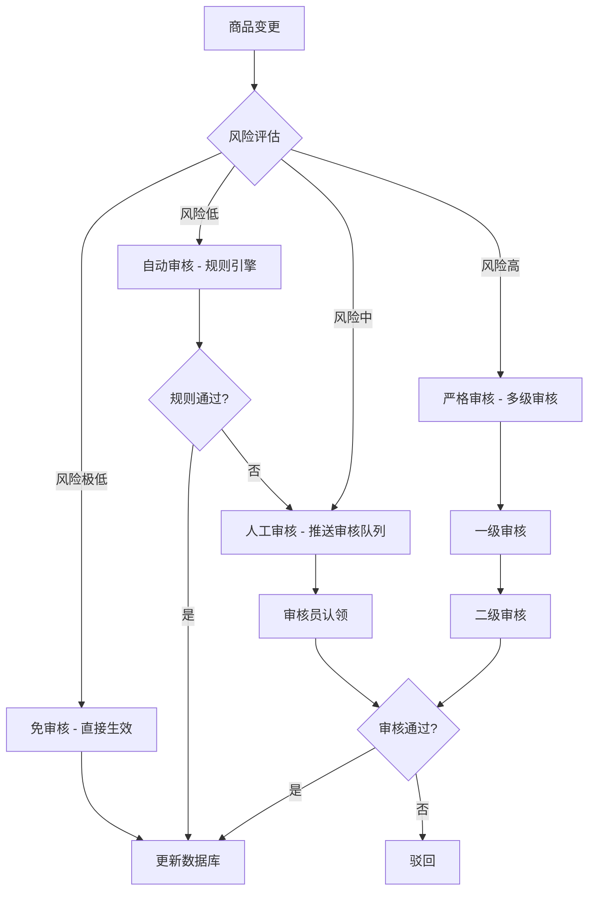
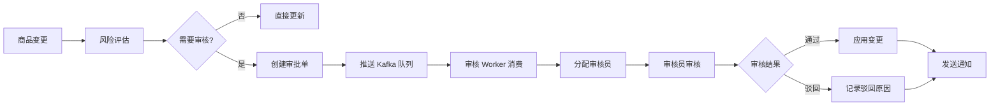

## 第三章：商品审核系统设计

在前面的章节中，我们多次提到"差异化审核"这个概念。在本章中，我们将深入探讨商品审核系统的设计，包括审核策略、风险评估引擎、审核流程编排。

### 3.1 差异化审核策略

#### 为什么需要差异化审核

如果所有变更都走人工审核，会带来以下问题：
- **效率低下**：运营人员需要审核大量低风险变更（例如库存+1）
- **成本高昂**：需要大量审核人员
- **用户体验差**：供应商价格变动需要等待审核，影响时效性

因此，我们需要根据变更的风险等级，设计不同的审核策略。

#### 审核策略分类



审核策略的四个层次：

1. **免审核（直接生效）**
   - 适用场景：库存调整、小幅价格调整（< 10%）、商品描述优化
   - 处理方式：直接更新数据库，无需创建审批单
   - 风险控制：设置操作频率限制，异常告警

2. **自动审核（规则引擎）**
   - 适用场景：商品标题修改（敏感词过滤）、中等幅度价格调整（10%-30%）
   - 处理方式：通过规则引擎验证，通过则直接生效，不通过则转人工审核
   - 规则示例：
     - 敏感词过滤
     - 价格合理性校验（不能低于成本价）
     - 商品信息完整性校验

3. **人工审核（推送审核队列）**
   - 适用场景：大幅价格调整（>= 30%）、商品标题大幅修改、新商品上架
   - 处理方式：创建审批单，推送到审核队列，审核员认领后审核
   - SLA：P1 级别（2小时内完成）

4. **严格审核（多级审核）**
   - 适用场景：类目变更、商品下线、批量操作（>1000个商品）
   - 处理方式：需要经过一级审核（运营主管）和二级审核（类目负责人）
   - SLA：P0 级别（4小时内完成）

#### 策略路由设计

```go
// ApprovalRouter 审核策略路由器
type ApprovalRouter struct {
    riskEvaluator *RiskEvaluator
    ruleEngine    *RuleEngine
}

// Route 根据变更内容路由到合适的审核策略
func (r *ApprovalRouter) Route(diff *ItemDiff) ApprovalStrategy {
    // 1. 计算风险分数
    riskScore := r.riskEvaluator.Evaluate(diff)
    
    // 2. 根据风险分数决定审核策略
    if riskScore <= 3 {
        return ApprovalStrategyNone // 免审核
    } else if riskScore <= 5 {
        return ApprovalStrategyAuto // 自动审核
    } else if riskScore <= 8 {
        return ApprovalStrategyManual // 人工审核
    } else {
        return ApprovalStrategyStrict // 严格审核
    }
}

// ApprovalStrategy 审核策略
type ApprovalStrategy int

const (
    ApprovalStrategyNone   ApprovalStrategy = 0 // 免审核
    ApprovalStrategyAuto   ApprovalStrategy = 1 // 自动审核
    ApprovalStrategyManual ApprovalStrategy = 2 // 人工审核
    ApprovalStrategyStrict ApprovalStrategy = 3 // 严格审核
)
```

---

### 3.2 风险评估引擎

风险评估引擎是差异化审核的核心，它需要量化变更的风险等级。

#### 风险评估模型

风险评估模型基于以下三个维度：

1. **变更字段的风险权重**：不同字段的变更风险不同
2. **变更幅度的风险系数**：变更幅度越大，风险越高
3. **商品当前状态的风险系数**：热销商品变更风险高于新品

**风险分数计算公式**：

```
risk_score = Σ(field_weight × change_magnitude × item_factor)
```

#### 字段风险权重表

| 字段 | 风险权重 | 说明 |
|------|----------|------|
| `title` | 3 | 标题变更影响搜索和用户体验 |
| `category_id` | 5 | 类目变更影响搜索和推荐 |
| `price` | 根据变动幅度 | 价格变动需要根据幅度评估 |
| `stock` | 1 | 库存变动风险低 |
| `description` | 1 | 描述变更风险低 |
| `images` | 2 | 图片变更可能影响用户体验 |
| `status` | 4 | 状态变更（上下架）风险高 |

#### 变更幅度风险系数

以价格变更为例：

| 价格变动幅度 | 风险系数 |
|--------------|----------|
| < 10% | 0.5 |
| 10% - 30% | 1.0 |
| 30% - 50% | 2.0 |
| >= 50% | 3.0 |

#### 商品状态风险系数

| 商品状态 | 风险系数 | 说明 |
|----------|----------|------|
| 热销商品（月销量 > 1000） | 1.5 | 热销商品变更影响大 |
| 普通商品（月销量 100-1000） | 1.0 | 普通商品变更影响中等 |
| 新品（月销量 < 100） | 0.8 | 新品变更影响小 |
| 已下架商品 | 0.5 | 已下架商品变更影响最小 |

#### 风险评估实现

```go
// RiskEvaluator 风险评估器
type RiskEvaluator struct {
    fieldWeights  map[string]float64
    itemRepo      ItemRepository
}

// Evaluate 评估变更风险分数
func (e *RiskEvaluator) Evaluate(diff *ItemDiff) float64 {
    var totalRisk float64
    
    // 1. 获取商品当前状态
    item, _ := e.itemRepo.GetItemByID(diff.ItemID)
    itemFactor := e.calculateItemFactor(item)
    
    // 2. 遍历所有变更字段，计算风险分数
    for _, change := range diff.Changes {
        fieldWeight := e.fieldWeights[change.Field]
        changeMagnitude := e.calculateChangeMagnitude(change)
        
        // 风险分数 = 字段权重 × 变更幅度 × 商品因子
        risk := fieldWeight * changeMagnitude * itemFactor
        totalRisk += risk
    }
    
    return totalRisk
}

// calculateItemFactor 计算商品状态风险系数
func (e *RiskEvaluator) calculateItemFactor(item *Item) float64 {
    if item.MonthlySales > 1000 {
        return 1.5 // 热销商品
    } else if item.MonthlySales > 100 {
        return 1.0 // 普通商品
    } else if item.Status == StatusOffline {
        return 0.5 // 已下架商品
    } else {
        return 0.8 // 新品
    }
}

// calculateChangeMagnitude 计算变更幅度风险系数
func (e *RiskEvaluator) calculateChangeMagnitude(change *FieldChange) float64 {
    switch change.Field {
    case "price":
        absRate := math.Abs(change.ChangeRate)
        if absRate < 0.1 {
            return 0.5
        } else if absRate < 0.3 {
            return 1.0
        } else if absRate < 0.5 {
            return 2.0
        } else {
            return 3.0
        }
        
    case "category_id":
        return 2.0 // 类目变更固定高风险
        
    case "title":
        // 根据标题变更的相似度计算
        similarity := e.calculateSimilarity(change.OldValue, change.NewValue)
        return 1.0 - similarity // 相似度越低，风险越高
        
    default:
        return 1.0
    }
}
```

#### 风险评估示例

**示例1：热销商品价格上涨50%**

```
risk_score = field_weight(price) × change_magnitude(50%) × item_factor(hot)
           = 3 × 3.0 × 1.5
           = 13.5
→ 严格审核（risk_score > 8）
```

**示例2：新品库存调整**

```
risk_score = field_weight(stock) × change_magnitude × item_factor(new)
           = 1 × 1.0 × 0.8
           = 0.8
→ 免审核（risk_score <= 3）
```

**示例3：普通商品标题修改（相似度80%）**

```
risk_score = field_weight(title) × change_magnitude(1-0.8) × item_factor(normal)
           = 3 × 0.2 × 1.0
           = 0.6
→ 免审核（risk_score <= 3）
```

---

### 3.3 审核流程编排

审核流程编排负责将需要审核的变更推送到审核队列，分配给审核员，并处理审核结果。

#### 审核引擎架构



#### 核心数据模型：变更审批单表

```sql
CREATE TABLE item_change_request_tab (
    -- 审批单基础信息
    request_code VARCHAR(64) PRIMARY KEY COMMENT '审批单唯一标识',
    item_id BIGINT NOT NULL COMMENT '商品ID',
    change_type VARCHAR(32) NOT NULL COMMENT '变更类型：price/stock/title/category',
    
    -- 变更内容
    change_fields JSON NOT NULL COMMENT '变更字段：{"price": {"old": 100, "new": 120}}',
    before_snapshot JSON COMMENT '变更前快照',
    after_snapshot JSON COMMENT '变更后快照',
    
    -- 审批信息
    status VARCHAR(32) NOT NULL COMMENT '状态：pending_approval/auto_approved/manual_approved/rejected',
    approval_strategy VARCHAR(32) NOT NULL COMMENT '审核策略：auto/manual/strict',
    approver_id BIGINT COMMENT '审核员ID',
    approved_at TIMESTAMP COMMENT '审核时间',
    reject_reason VARCHAR(512) COMMENT '驳回原因',
    
    -- 风险评估
    risk_score DECIMAL(10,2) NOT NULL COMMENT '风险分数',
    impact_analysis TEXT COMMENT '影响分析',
    
    -- 元数据
    created_by BIGINT NOT NULL COMMENT '创建人ID',
    created_at TIMESTAMP NOT NULL DEFAULT CURRENT_TIMESTAMP,
    updated_at TIMESTAMP NOT NULL DEFAULT CURRENT_TIMESTAMP ON UPDATE CURRENT_TIMESTAMP,
    
    INDEX idx_item_id (item_id),
    INDEX idx_status (status),
    INDEX idx_created_at (created_at)
) ENGINE=InnoDB DEFAULT CHARSET=utf8mb4 COMMENT='商品变更审批单表';
```

#### 创建审批单

```go
// createChangeRequest 创建变更审批单
func (s *ApprovalService) createChangeRequest(item *Item, diff *ItemDiff, strategy ApprovalStrategy) error {
    // 1. 生成审批单唯一标识
    requestCode := s.generateRequestCode(item.ItemID)
    
    // 2. 计算风险分数
    riskScore := s.riskEvaluator.Evaluate(diff)
    
    // 3. 创建审批单
    request := &ChangeRequest{
        RequestCode:      requestCode,
        ItemID:           item.ItemID,
        ChangeType:       diff.ChangeType,
        ChangeFields:     diff.ToJSON(),
        BeforeSnapshot:   item.ToJSON(),
        AfterSnapshot:    diff.ApplyTo(item).ToJSON(),
        Status:           StatusPendingApproval,
        ApprovalStrategy: strategy,
        RiskScore:        riskScore,
        ImpactAnalysis:   s.analyzeImpact(item, diff),
        CreatedBy:        diff.OperatorID,
        CreatedAt:        time.Now(),
    }
    
    // 4. 保存到数据库
    if err := s.repo.CreateChangeRequest(request); err != nil {
        return fmt.Errorf("create change request failed: %w", err)
    }
    
    // 5. 推送到审核队列
    event := &ChangeRequestCreatedEvent{
        RequestCode:      requestCode,
        ItemID:           item.ItemID,
        ApprovalStrategy: strategy,
        RiskScore:        riskScore,
    }
    return s.eventPublisher.Publish("approval.change_request.created", event)
}
```

#### 审核流转

审核流转的核心流程：

1. **审核员认领**：从审核队列中认领待审核的审批单
2. **审核决策**：审核员做出审核决策（通过/驳回）
3. **结果处理**：
   - 通过：应用变更到商品表
   - 驳回：记录驳回原因，通知申请人

```go
// ProcessApprovalResult 处理审核结果
func (s *ApprovalService) ProcessApprovalResult(requestCode string, result *ApprovalResult) error {
    // 1. 获取审批单
    request, err := s.repo.GetChangeRequest(requestCode)
    if err != nil {
        return fmt.Errorf("get change request failed: %w", err)
    }
    
    // 2. 更新审批单状态
    request.ApproverID = result.ApproverID
    request.ApprovedAt = time.Now()
    
    if result.Approved {
        // 审核通过
        request.Status = StatusApproved
        
        // 应用变更
        if err := s.applyChange(request); err != nil {
            return fmt.Errorf("apply change failed: %w", err)
        }
    } else {
        // 审核驳回
        request.Status = StatusRejected
        request.RejectReason = result.RejectReason
    }
    
    // 3. 保存审批单
    if err := s.repo.UpdateChangeRequest(request); err != nil {
        return fmt.Errorf("update change request failed: %w", err)
    }
    
    // 4. 发送通知
    s.sendNotification(request)
    
    return nil
}
```

#### 审核超时处理

为了避免审批单积压，需要设置 SLA 超时处理机制：

| 审核策略 | SLA 时间 | 超时处理 |
|----------|----------|----------|
| 自动审核 | 5分钟 | 自动通过 |
| 人工审核 | 2小时 | 升级到严格审核 |
| 严格审核 | 4小时 | 告警通知运营主管 |

```go
// CheckSLA 检查 SLA 超时
func (s *ApprovalService) CheckSLA() error {
    // 1. 查询超时的审批单
    requests, err := s.repo.GetTimeoutRequests()
    if err != nil {
        return err
    }
    
    // 2. 处理超时审批单
    for _, req := range requests {
        switch req.ApprovalStrategy {
        case ApprovalStrategyAuto:
            // 自动审核超时，自动通过
            s.autoApprove(req)
            
        case ApprovalStrategyManual:
            // 人工审核超时，升级到严格审核
            s.escalateToStrict(req)
            
        case ApprovalStrategyStrict:
            // 严格审核超时，告警通知
            s.sendAlert(req)
        }
    }
    
    return nil
}
```

---

## 引言：为什么需要区分三种操作场景

在实际电商系统中，商品数据的变更有多种来源和触发方式。作为系统设计者，我们经常会遇到这样的困惑：

- **"商品上架系统"和"B端运营系统"的商品编辑有什么区别？** 它们看起来都是在修改商品数据，为什么要设计成两套流程？
- **供应商定时同步数据，对于已存在的商品应该走上架流程还是编辑流程？** 如果供应商的商品ID在平台已存在，是创建新商品还是更新现有商品？
- **为什么有些变更需要审核，有些不需要？** 价格调整10%需要审核吗？库存调整呢？商品标题修改呢？

这些问题看似简单，但如果不深入思考，很容易设计出混乱的系统架构：所有操作都混在一起，审核流程不清晰，幂等性无法保证，并发冲突频发。

### 三种场景的本质区别

本文将深入分析电商商品生命周期管理中的三种核心操作场景：

1. **商品上架（从无到有）**：新商品首次进入平台，需要完整的审核流程
2. **供应商同步（Upsert 场景）**：供应商数据变更，需要同步到平台（商品可能存在，也可能不存在）
3. **运营编辑（日常维护）**：已上线商品的日常维护和批量管理

这三种场景的本质区别在于：**数据来源、业务语义、风险等级、审核策略**。

| 维度 | 商品上架 | 供应商同步 | 运营编辑 |
|------|----------|------------|----------|
| **数据来源** | 运营后台、商家Portal | 供应商系统 | 运营后台 |
| **业务语义** | 新商品首次进入平台 | 供应商数据变更 | 已上线商品维护 |
| **触发方式** | 手动上传、批量导入 | 定时拉取、实时推送 | 手动编辑、批量操作 |
| **处理逻辑** | Create（创建） | Upsert（创建或更新） | Update（更新） |
| **风险等级** | 高（需完整审核） | 中（差异化审核） | 中（差异化审核） |

### 文章内容组织

本文将从以下几个方面深入讲解：

1. **核心场景对比分析**（第二章）：详细对比三种场景的处理逻辑、幂等性设计、审核策略
2. **商品审核系统设计**（第三章）：差异化审核策略、风险评估引擎、审核流程编排
3. **商品生命周期管理**（第四章）：完整生命周期状态机、状态流转规则、生命周期事件
4. **批量操作的幂等性设计**（第五章）：幂等性关键设计、唯一标识符设计、并发控制策略
5. **跨系统协调设计**（第六章）：商品中心的职责边界、与定价引擎和库存系统的协作
6. **核心数据模型**（第七章）：商品表、变更审批单表、同步状态表
7. **性能优化与监控**（第八章）：性能优化策略、监控指标
8. **最佳实践总结**（第九章）：场景识别 Checklist、常见陷阱

让我们开始深入探讨这些核心问题。

