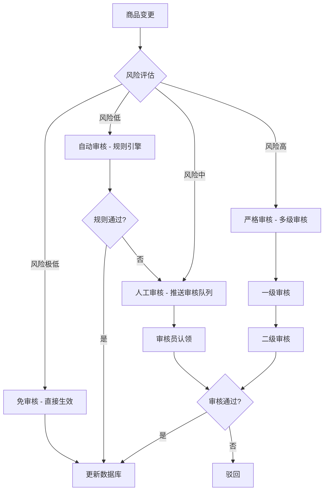
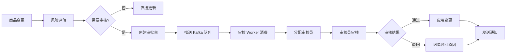
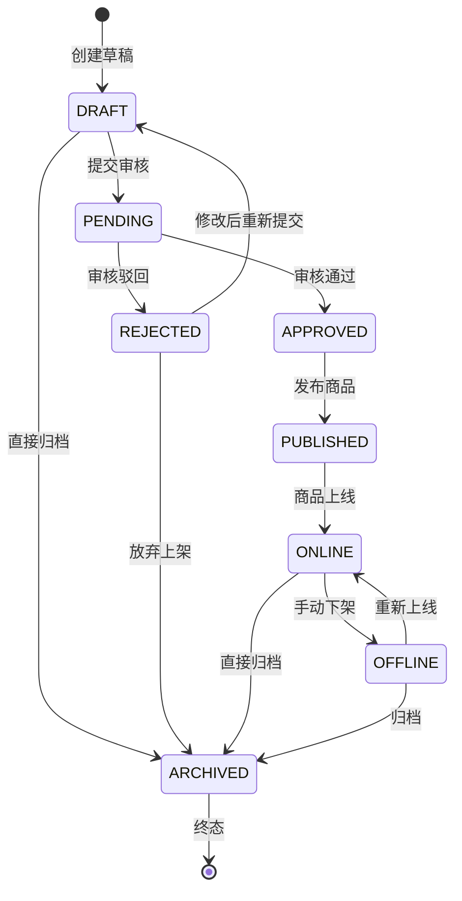
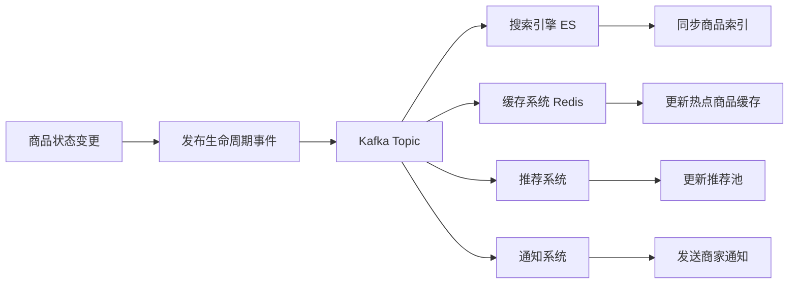
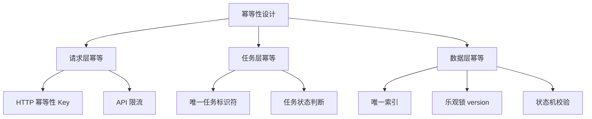
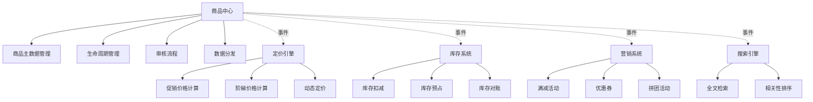
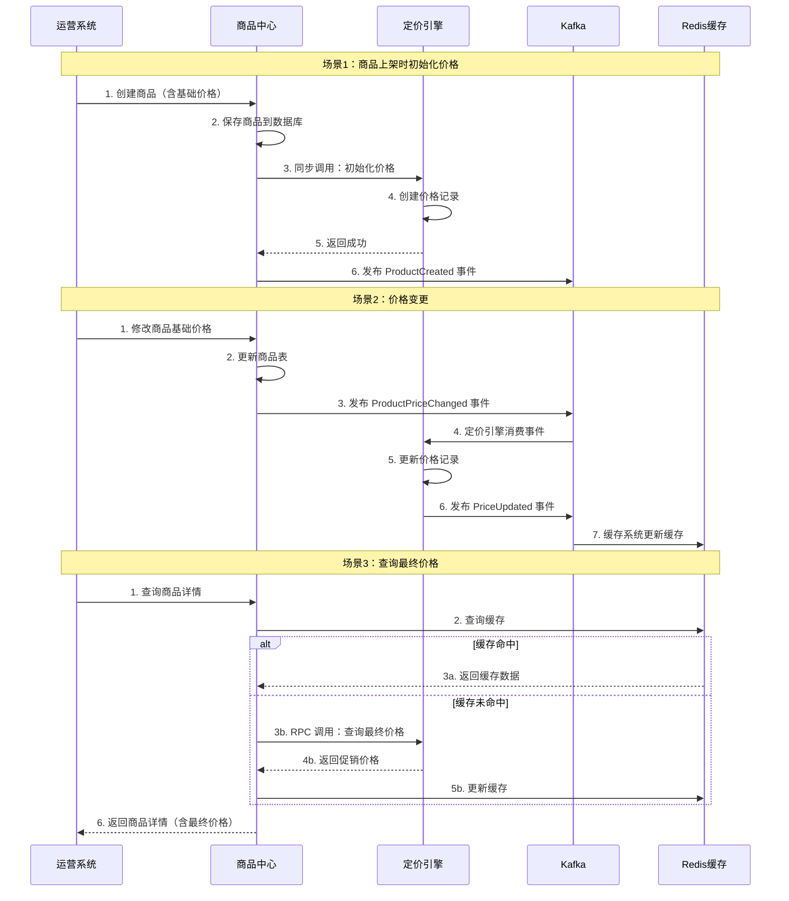
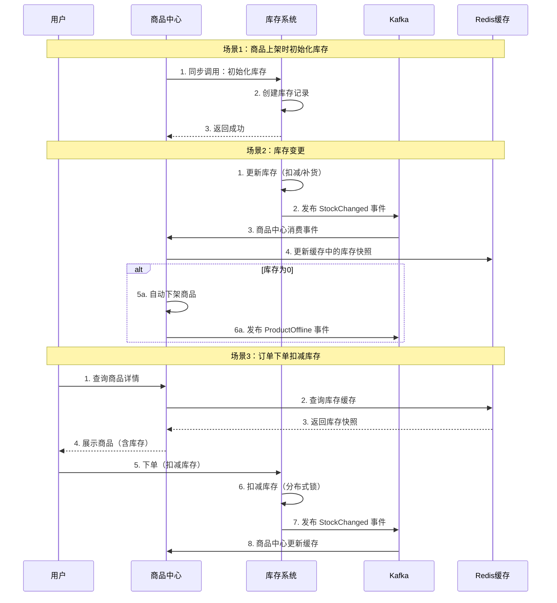
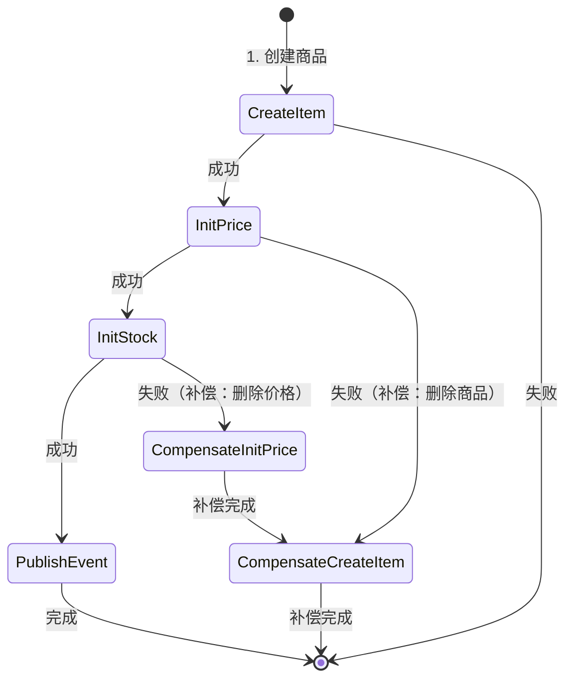
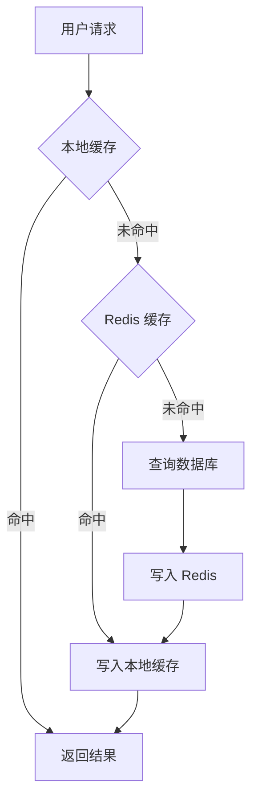

## 第三章：商品审核系统设计

在前面的章节中，我们多次提到"差异化审核"这个概念。在本章中，我们将深入探讨商品审核系统的设计，包括审核策略、风险评估引擎、审核流程编排。

### 3.1 差异化审核策略

#### 为什么需要差异化审核

如果所有变更都走人工审核，会带来以下问题：
- **效率低下**：运营人员需要审核大量低风险变更（例如库存+1）
- **成本高昂**：需要大量审核人员
- **用户体验差**：供应商价格变动需要等待审核，影响时效性

因此，我们需要根据变更的风险等级，设计不同的审核策略。

#### 审核策略分类



审核策略的四个层次：

1. **免审核（直接生效）**
   - 适用场景：库存调整、小幅价格调整（< 10%）、商品描述优化
   - 处理方式：直接更新数据库，无需创建审批单
   - 风险控制：设置操作频率限制，异常告警

2. **自动审核（规则引擎）**
   - 适用场景：商品标题修改（敏感词过滤）、中等幅度价格调整（10%-30%）
   - 处理方式：通过规则引擎验证，通过则直接生效，不通过则转人工审核
   - 规则示例：
     - 敏感词过滤
     - 价格合理性校验（不能低于成本价）
     - 商品信息完整性校验

3. **人工审核（推送审核队列）**
   - 适用场景：大幅价格调整（>= 30%）、商品标题大幅修改、新商品上架
   - 处理方式：创建审批单，推送到审核队列，审核员认领后审核
   - SLA：P1 级别（2小时内完成）

4. **严格审核（多级审核）**
   - 适用场景：类目变更、商品下线、批量操作（>1000个商品）
   - 处理方式：需要经过一级审核（运营主管）和二级审核（类目负责人）
   - SLA：P0 级别（4小时内完成）

#### 策略路由设计

```go
// ApprovalRouter 审核策略路由器
type ApprovalRouter struct {
    riskEvaluator *RiskEvaluator
    ruleEngine    *RuleEngine
}

// Route 根据变更内容路由到合适的审核策略
func (r *ApprovalRouter) Route(diff *ItemDiff) ApprovalStrategy {
    // 1. 计算风险分数
    riskScore := r.riskEvaluator.Evaluate(diff)
    
    // 2. 根据风险分数决定审核策略
    if riskScore <= 3 {
        return ApprovalStrategyNone // 免审核
    } else if riskScore <= 5 {
        return ApprovalStrategyAuto // 自动审核
    } else if riskScore <= 8 {
        return ApprovalStrategyManual // 人工审核
    } else {
        return ApprovalStrategyStrict // 严格审核
    }
}

// ApprovalStrategy 审核策略
type ApprovalStrategy int

const (
    ApprovalStrategyNone   ApprovalStrategy = 0 // 免审核
    ApprovalStrategyAuto   ApprovalStrategy = 1 // 自动审核
    ApprovalStrategyManual ApprovalStrategy = 2 // 人工审核
    ApprovalStrategyStrict ApprovalStrategy = 3 // 严格审核
)
```

---

### 3.2 风险评估引擎

风险评估引擎是差异化审核的核心，它需要量化变更的风险等级。

#### 风险评估模型

风险评估模型基于以下三个维度：

1. **变更字段的风险权重**：不同字段的变更风险不同
2. **变更幅度的风险系数**：变更幅度越大，风险越高
3. **商品当前状态的风险系数**：热销商品变更风险高于新品

**风险分数计算公式**：

```
risk_score = Σ(field_weight × change_magnitude × item_factor)
```

#### 字段风险权重表

| 字段 | 风险权重 | 说明 |
|------|----------|------|
| `title` | 3 | 标题变更影响搜索和用户体验 |
| `category_id` | 5 | 类目变更影响搜索和推荐 |
| `price` | 根据变动幅度 | 价格变动需要根据幅度评估 |
| `stock` | 1 | 库存变动风险低 |
| `description` | 1 | 描述变更风险低 |
| `images` | 2 | 图片变更可能影响用户体验 |
| `status` | 4 | 状态变更（上下架）风险高 |

#### 变更幅度风险系数

以价格变更为例：

| 价格变动幅度 | 风险系数 |
|--------------|----------|
| < 10% | 0.5 |
| 10% - 30% | 1.0 |
| 30% - 50% | 2.0 |
| >= 50% | 3.0 |

#### 商品状态风险系数

| 商品状态 | 风险系数 | 说明 |
|----------|----------|------|
| 热销商品（月销量 > 1000） | 1.5 | 热销商品变更影响大 |
| 普通商品（月销量 100-1000） | 1.0 | 普通商品变更影响中等 |
| 新品（月销量 < 100） | 0.8 | 新品变更影响小 |
| 已下架商品 | 0.5 | 已下架商品变更影响最小 |

#### 风险评估实现

```go
// RiskEvaluator 风险评估器
type RiskEvaluator struct {
    fieldWeights  map[string]float64
    itemRepo      ItemRepository
}

// Evaluate 评估变更风险分数
func (e *RiskEvaluator) Evaluate(diff *ItemDiff) float64 {
    var totalRisk float64
    
    // 1. 获取商品当前状态
    item, _ := e.itemRepo.GetItemByID(diff.ItemID)
    itemFactor := e.calculateItemFactor(item)
    
    // 2. 遍历所有变更字段，计算风险分数
    for _, change := range diff.Changes {
        fieldWeight := e.fieldWeights[change.Field]
        changeMagnitude := e.calculateChangeMagnitude(change)
        
        // 风险分数 = 字段权重 × 变更幅度 × 商品因子
        risk := fieldWeight * changeMagnitude * itemFactor
        totalRisk += risk
    }
    
    return totalRisk
}

// calculateItemFactor 计算商品状态风险系数
func (e *RiskEvaluator) calculateItemFactor(item *Item) float64 {
    if item.MonthlySales > 1000 {
        return 1.5 // 热销商品
    } else if item.MonthlySales > 100 {
        return 1.0 // 普通商品
    } else if item.Status == StatusOffline {
        return 0.5 // 已下架商品
    } else {
        return 0.8 // 新品
    }
}

// calculateChangeMagnitude 计算变更幅度风险系数
func (e *RiskEvaluator) calculateChangeMagnitude(change *FieldChange) float64 {
    switch change.Field {
    case "price":
        absRate := math.Abs(change.ChangeRate)
        if absRate < 0.1 {
            return 0.5
        } else if absRate < 0.3 {
            return 1.0
        } else if absRate < 0.5 {
            return 2.0
        } else {
            return 3.0
        }
        
    case "category_id":
        return 2.0 // 类目变更固定高风险
        
    case "title":
        // 根据标题变更的相似度计算
        similarity := e.calculateSimilarity(change.OldValue, change.NewValue)
        return 1.0 - similarity // 相似度越低，风险越高
        
    default:
        return 1.0
    }
}
```

#### 风险评估示例

**示例1：热销商品价格上涨50%**

```
risk_score = field_weight(price) × change_magnitude(50%) × item_factor(hot)
           = 3 × 3.0 × 1.5
           = 13.5
→ 严格审核（risk_score > 8）
```

**示例2：新品库存调整**

```
risk_score = field_weight(stock) × change_magnitude × item_factor(new)
           = 1 × 1.0 × 0.8
           = 0.8
→ 免审核（risk_score <= 3）
```

**示例3：普通商品标题修改（相似度80%）**

```
risk_score = field_weight(title) × change_magnitude(1-0.8) × item_factor(normal)
           = 3 × 0.2 × 1.0
           = 0.6
→ 免审核（risk_score <= 3）
```

---

### 3.3 审核流程编排

审核流程编排负责将需要审核的变更推送到审核队列，分配给审核员，并处理审核结果。

#### 审核引擎架构



#### 核心数据模型：变更审批单表

```sql
CREATE TABLE item_change_request_tab (
    -- 审批单基础信息
    request_code VARCHAR(64) PRIMARY KEY COMMENT '审批单唯一标识',
    item_id BIGINT NOT NULL COMMENT '商品ID',
    change_type VARCHAR(32) NOT NULL COMMENT '变更类型：price/stock/title/category',
    
    -- 变更内容
    change_fields JSON NOT NULL COMMENT '变更字段：{"price": {"old": 100, "new": 120}}',
    before_snapshot JSON COMMENT '变更前快照',
    after_snapshot JSON COMMENT '变更后快照',
    
    -- 审批信息
    status VARCHAR(32) NOT NULL COMMENT '状态：pending_approval/auto_approved/manual_approved/rejected',
    approval_strategy VARCHAR(32) NOT NULL COMMENT '审核策略：auto/manual/strict',
    approver_id BIGINT COMMENT '审核员ID',
    approved_at TIMESTAMP COMMENT '审核时间',
    reject_reason VARCHAR(512) COMMENT '驳回原因',
    
    -- 风险评估
    risk_score DECIMAL(10,2) NOT NULL COMMENT '风险分数',
    impact_analysis TEXT COMMENT '影响分析',
    
    -- 元数据
    created_by BIGINT NOT NULL COMMENT '创建人ID',
    created_at TIMESTAMP NOT NULL DEFAULT CURRENT_TIMESTAMP,
    updated_at TIMESTAMP NOT NULL DEFAULT CURRENT_TIMESTAMP ON UPDATE CURRENT_TIMESTAMP,
    
    INDEX idx_item_id (item_id),
    INDEX idx_status (status),
    INDEX idx_created_at (created_at)
) ENGINE=InnoDB DEFAULT CHARSET=utf8mb4 COMMENT='商品变更审批单表';
```

#### 创建审批单

```go
// createChangeRequest 创建变更审批单
func (s *ApprovalService) createChangeRequest(item *Item, diff *ItemDiff, strategy ApprovalStrategy) error {
    // 1. 生成审批单唯一标识
    requestCode := s.generateRequestCode(item.ItemID)
    
    // 2. 计算风险分数
    riskScore := s.riskEvaluator.Evaluate(diff)
    
    // 3. 创建审批单
    request := &ChangeRequest{
        RequestCode:      requestCode,
        ItemID:           item.ItemID,
        ChangeType:       diff.ChangeType,
        ChangeFields:     diff.ToJSON(),
        BeforeSnapshot:   item.ToJSON(),
        AfterSnapshot:    diff.ApplyTo(item).ToJSON(),
        Status:           StatusPendingApproval,
        ApprovalStrategy: strategy,
        RiskScore:        riskScore,
        ImpactAnalysis:   s.analyzeImpact(item, diff),
        CreatedBy:        diff.OperatorID,
        CreatedAt:        time.Now(),
    }
    
    // 4. 保存到数据库
    if err := s.repo.CreateChangeRequest(request); err != nil {
        return fmt.Errorf("create change request failed: %w", err)
    }
    
    // 5. 推送到审核队列
    event := &ChangeRequestCreatedEvent{
        RequestCode:      requestCode,
        ItemID:           item.ItemID,
        ApprovalStrategy: strategy,
        RiskScore:        riskScore,
    }
    return s.eventPublisher.Publish("approval.change_request.created", event)
}
```

#### 审核流转

审核流转的核心流程：

1. **审核员认领**：从审核队列中认领待审核的审批单
2. **审核决策**：审核员做出审核决策（通过/驳回）
3. **结果处理**：
   - 通过：应用变更到商品表
   - 驳回：记录驳回原因，通知申请人

```go
// ProcessApprovalResult 处理审核结果
func (s *ApprovalService) ProcessApprovalResult(requestCode string, result *ApprovalResult) error {
    // 1. 获取审批单
    request, err := s.repo.GetChangeRequest(requestCode)
    if err != nil {
        return fmt.Errorf("get change request failed: %w", err)
    }
    
    // 2. 更新审批单状态
    request.ApproverID = result.ApproverID
    request.ApprovedAt = time.Now()
    
    if result.Approved {
        // 审核通过
        request.Status = StatusApproved
        
        // 应用变更
        if err := s.applyChange(request); err != nil {
            return fmt.Errorf("apply change failed: %w", err)
        }
    } else {
        // 审核驳回
        request.Status = StatusRejected
        request.RejectReason = result.RejectReason
    }
    
    // 3. 保存审批单
    if err := s.repo.UpdateChangeRequest(request); err != nil {
        return fmt.Errorf("update change request failed: %w", err)
    }
    
    // 4. 发送通知
    s.sendNotification(request)
    
    return nil
}
```

#### 审核超时处理

为了避免审批单积压，需要设置 SLA 超时处理机制：

| 审核策略 | SLA 时间 | 超时处理 |
|----------|----------|----------|
| 自动审核 | 5分钟 | 自动通过 |
| 人工审核 | 2小时 | 升级到严格审核 |
| 严格审核 | 4小时 | 告警通知运营主管 |

```go
// CheckSLA 检查 SLA 超时
func (s *ApprovalService) CheckSLA() error {
    // 1. 查询超时的审批单
    requests, err := s.repo.GetTimeoutRequests()
    if err != nil {
        return err
    }
    
    // 2. 处理超时审批单
    for _, req := range requests {
        switch req.ApprovalStrategy {
        case ApprovalStrategyAuto:
            // 自动审核超时，自动通过
            s.autoApprove(req)
            
        case ApprovalStrategyManual:
            // 人工审核超时，升级到严格审核
            s.escalateToStrict(req)
            
        case ApprovalStrategyStrict:
            // 严格审核超时，告警通知
            s.sendAlert(req)
        }
    }
    
    return nil
}
```

---

## 第四章：商品生命周期管理

商品从创建到归档，需要经过多个生命周期阶段。在本章中,我们将深入探讨完整的生命周期状态机、状态流转规则和生命周期事件。

### 4.1 完整生命周期状态机

#### 生命周期阶段

商品的完整生命周期包括以下阶段：

1. **初始阶段**：DRAFT（草稿）
2. **审核阶段**：PENDING（待审核）→ APPROVED（已审核）
3. **在售阶段**：PUBLISHED（已发布）→ ONLINE（在售）
4. **下架阶段**：OFFLINE（已下架）
5. **归档阶段**：ARCHIVED（已归档）



#### 状态说明

| 状态 | 英文 | 说明 | 可进行的操作 |
|------|------|------|--------------|
| **草稿** | DRAFT | 商品信息未完善或审核驳回后的状态 | 编辑、提交审核、归档 |
| **待审核** | PENDING | 已提交审核，等待审核员审核 | 撤回、查看进度 |
| **已驳回** | REJECTED | 审核未通过 | 修改后重新提交、归档 |
| **已审核** | APPROVED | 审核通过，可以发布 | 发布、编辑 |
| **已发布** | PUBLISHED | 已发布但未上线（预发布状态） | 上线、编辑、下架 |
| **在售** | ONLINE | 商品在售，用户可见可购买 | 编辑、下架、归档 |
| **已下架** | OFFLINE | 商品已下架，用户不可见 | 重新上线、编辑、归档 |
| **已归档** | ARCHIVED | 商品已归档，不再使用 | 无（终态） |

#### 状态流转规则表

| 当前状态 | 可流转到的状态 | 前置条件 |
|----------|----------------|----------|
| DRAFT | PENDING | 商品信息完整 |
| DRAFT | ARCHIVED | 无 |
| PENDING | APPROVED | 审核通过 |
| PENDING | REJECTED | 审核驳回 |
| REJECTED | DRAFT | 无 |
| REJECTED | ARCHIVED | 无 |
| APPROVED | PUBLISHED | 价格已设置 |
| PUBLISHED | ONLINE | 库存 > 0 |
| ONLINE | OFFLINE | 无 |
| ONLINE | ARCHIVED | 无在售订单 |
| OFFLINE | ONLINE | 库存 > 0 |
| OFFLINE | ARCHIVED | 无 |

#### 状态机实现

```go
// StateMachine 商品生命周期状态机
type StateMachine struct {
    // 状态转换规则
    transitions map[ItemStatus][]ItemStatus
}

// NewStateMachine 创建状态机
func NewStateMachine() *StateMachine {
    return &StateMachine{
        transitions: map[ItemStatus][]ItemStatus{
            StatusDraft:     {StatusPending, StatusArchived},
            StatusPending:   {StatusApproved, StatusRejected},
            StatusRejected:  {StatusDraft, StatusArchived},
            StatusApproved:  {StatusPublished},
            StatusPublished: {StatusOnline},
            StatusOnline:    {StatusOffline, StatusArchived},
            StatusOffline:   {StatusOnline, StatusArchived},
            // StatusArchived 是终态，不能转换到其他状态
        },
    }
}

// CanTransition 检查是否可以进行状态转换
func (sm *StateMachine) CanTransition(from, to ItemStatus) bool {
    allowedStates, ok := sm.transitions[from]
    if !ok {
        return false
    }
    
    for _, allowed := range allowedStates {
        if allowed == to {
            return true
        }
    }
    return false
}

// Transition 执行状态转换
func (sm *StateMachine) Transition(item *Item, to ItemStatus, operator int64) error {
    // 1. 检查状态转换是否合法
    if !sm.CanTransition(item.Status, to) {
        return fmt.Errorf("invalid transition from %s to %s", item.Status, to)
    }
    
    // 2. 检查前置条件
    if err := sm.checkPreconditions(item, to); err != nil {
        return fmt.Errorf("precondition check failed: %w", err)
    }
    
    // 3. 记录状态变更前的快照
    oldStatus := item.Status
    
    // 4. 更新状态
    item.Status = to
    item.UpdatedAt = time.Now()
    item.UpdatedBy = operator
    item.Version++ // 乐观锁版本号
    
    // 5. 保存到数据库（带乐观锁）
    if err := sm.repo.UpdateItemWithVersion(item); err != nil {
        return fmt.Errorf("update item failed: %w", err)
    }
    
    // 6. 记录状态变更日志
    sm.logStatusChange(item.ItemID, oldStatus, to, operator)
    
    // 7. 发布生命周期事件
    sm.publishLifecycleEvent(item, oldStatus, to)
    
    return nil
}

// checkPreconditions 检查状态转换的前置条件
func (sm *StateMachine) checkPreconditions(item *Item, to ItemStatus) error {
    switch to {
    case StatusPending:
        // 提交审核前，需要确保商品信息完整
        if item.Title == "" || item.CategoryID == 0 {
            return errors.New("item info incomplete")
        }
        
    case StatusPublished:
        // 发布前，需要确保价格已设置
        if item.Price <= 0 {
            return errors.New("price not set")
        }
        
    case StatusOnline:
        // 上线前，需要确保有库存
        if item.Stock <= 0 {
            return errors.New("stock is zero")
        }
        
    case StatusArchived:
        // 归档前，需要确保没有在售订单
        if item.Status == StatusOnline {
            orderCount, _ := sm.orderRepo.CountPendingOrders(item.ItemID)
            if orderCount > 0 {
                return errors.New("has pending orders")
            }
        }
    }
    
    return nil
}
```

---

### 4.2 状态流转规则

#### 状态前置条件检查

不同的状态转换有不同的前置条件，需要在状态转换前进行检查。

| 目标状态 | 前置条件 | 检查逻辑 |
|----------|----------|----------|
| **PENDING** | 商品信息完整 | title != "" && category_id > 0 |
| **APPROVED** | 审核通过 | 审核员审核结果 = 通过 |
| **PUBLISHED** | 价格已设置 | price > 0 |
| **ONLINE** | 库存 > 0 | stock > 0 |
| **ARCHIVED** | 无在售订单 | pending_orders_count = 0 |

#### 状态变更权限控制

不同角色对状态变更有不同的权限。

| 角色 | 可执行的状态变更 | 说明 |
|------|------------------|------|
| **运营** | 所有状态变更 | 最高权限 |
| **商家** | DRAFT → PENDING<br>OFFLINE → ONLINE<br>ONLINE → OFFLINE | 不能强制上线（需要审核） |
| **系统** | ONLINE → OFFLINE（库存为0）<br>PENDING → APPROVED（自动审核） | 自动化操作 |
| **审核员** | PENDING → APPROVED<br>PENDING → REJECTED | 审核权限 |

```go
// checkPermission 检查状态变更权限
func (sm *StateMachine) checkPermission(item *Item, to ItemStatus, operator *Operator) error {
    switch operator.Role {
    case RoleOperator:
        // 运营有所有权限
        return nil
        
    case RoleMerchant:
        // 商家只能进行有限的状态变更
        allowedTransitions := map[ItemStatus][]ItemStatus{
            StatusDraft:   {StatusPending},
            StatusOffline: {StatusOnline},
            StatusOnline:  {StatusOffline},
        }
        allowed, ok := allowedTransitions[item.Status]
        if !ok {
            return errors.New("permission denied")
        }
        for _, s := range allowed {
            if s == to {
                return nil
            }
        }
        return errors.New("permission denied")
        
    case RoleSystem:
        // 系统只能进行自动化操作
        if to == StatusOffline && item.Stock == 0 {
            return nil // 库存为0自动下架
        }
        if to == StatusApproved && item.ApprovalStrategy == ApprovalStrategyAuto {
            return nil // 自动审核通过
        }
        return errors.New("permission denied")
        
    case RoleApprover:
        // 审核员只能审核
        if item.Status == StatusPending && (to == StatusApproved || to == StatusRejected) {
            return nil
        }
        return errors.New("permission denied")
    }
    
    return errors.New("unknown role")
}
```

#### 状态变更日志

所有状态变更都需要记录完整的变更历史，用于审计和问题排查。

```go
// ItemStatusLog 商品状态变更日志
type ItemStatusLog struct {
    LogID      int64      `json:"log_id"`
    ItemID     int64      `json:"item_id"`
    OldStatus  ItemStatus `json:"old_status"`
    NewStatus  ItemStatus `json:"new_status"`
    Operator   int64      `json:"operator"`
    OperatorRole string   `json:"operator_role"`
    Reason     string     `json:"reason"`
    CreatedAt  time.Time  `json:"created_at"`
}

// logStatusChange 记录状态变更日志
func (sm *StateMachine) logStatusChange(itemID int64, oldStatus, newStatus ItemStatus, operator int64) {
    log := &ItemStatusLog{
        ItemID:    itemID,
        OldStatus: oldStatus,
        NewStatus: newStatus,
        Operator:  operator,
        CreatedAt: time.Now(),
    }
    sm.logRepo.CreateStatusLog(log)
}
```

---

### 4.3 生命周期事件

#### 事件驱动架构

商品生命周期的状态变更会触发领域事件，下游系统监听这些事件并做出响应。



#### 生命周期事件类型

| 事件类型 | 触发时机 | 下游消费者 |
|----------|----------|------------|
| `ProductListed` | 商品上架（DRAFT → PENDING） | 审核系统 |
| `ProductApproved` | 审核通过（PENDING → APPROVED） | 商家通知 |
| `ProductPublished` | 商品发布（APPROVED → PUBLISHED） | 搜索引擎（预加载索引） |
| `ProductOnline` | 商品上线（PUBLISHED → ONLINE） | 搜索引擎、缓存系统、推荐系统 |
| `ProductPriceChanged` | 价格变更 | 搜索引擎、缓存系统、定价引擎 |
| `ProductStockChanged` | 库存变更 | 搜索引擎、缓存系统 |
| `ProductOffline` | 商品下线（ONLINE → OFFLINE） | 搜索引擎、缓存系统、推荐系统 |
| `ProductArchived` | 商品归档（→ ARCHIVED） | 搜索引擎、数据归档系统 |

#### 事件定义

```go
// LifecycleEvent 生命周期事件
type LifecycleEvent struct {
    EventID   string     `json:"event_id"`
    EventType string     `json:"event_type"`
    ItemID    int64      `json:"item_id"`
    OldStatus ItemStatus `json:"old_status"`
    NewStatus ItemStatus `json:"new_status"`
    Operator  int64      `json:"operator"`
    Timestamp time.Time  `json:"timestamp"`
    Payload   map[string]interface{} `json:"payload"`
}

// publishLifecycleEvent 发布生命周期事件
func (sm *StateMachine) publishLifecycleEvent(item *Item, oldStatus, newStatus ItemStatus) {
    eventType := sm.mapEventType(oldStatus, newStatus)
    
    event := &LifecycleEvent{
        EventID:   sm.generateEventID(),
        EventType: eventType,
        ItemID:    item.ItemID,
        OldStatus: oldStatus,
        NewStatus: newStatus,
        Timestamp: time.Now(),
        Payload: map[string]interface{}{
            "title":       item.Title,
            "category_id": item.CategoryID,
            "price":       item.Price,
            "stock":       item.Stock,
        },
    }
    
    // 发布到 Kafka
    sm.eventPublisher.Publish("product.lifecycle", event)
}

// mapEventType 根据状态转换映射事件类型
func (sm *StateMachine) mapEventType(oldStatus, newStatus ItemStatus) string {
    if oldStatus == StatusDraft && newStatus == StatusPending {
        return "ProductListed"
    }
    if oldStatus == StatusPending && newStatus == StatusApproved {
        return "ProductApproved"
    }
    if oldStatus == StatusApproved && newStatus == StatusPublished {
        return "ProductPublished"
    }
    if oldStatus == StatusPublished && newStatus == StatusOnline {
        return "ProductOnline"
    }
    if newStatus == StatusOffline {
        return "ProductOffline"
    }
    if newStatus == StatusArchived {
        return "ProductArchived"
    }
    return "ProductStatusChanged"
}
```

#### 事件消费者示例

**搜索引擎消费者**：

```go
// SearchEngineConsumer 搜索引擎消费者
type SearchEngineConsumer struct {
    esClient *elasticsearch.Client
}

// Consume 消费生命周期事件
func (c *SearchEngineConsumer) Consume(event *LifecycleEvent) error {
    switch event.EventType {
    case "ProductOnline":
        // 商品上线，添加到搜索索引
        return c.addToIndex(event.ItemID)
        
    case "ProductOffline", "ProductArchived":
        // 商品下线或归档，从搜索索引中删除
        return c.removeFromIndex(event.ItemID)
        
    case "ProductPriceChanged", "ProductStockChanged":
        // 价格或库存变更，更新搜索索引
        return c.updateIndex(event.ItemID, event.Payload)
    }
    
    return nil
}
```

#### 事件可靠性保证：Outbox 模式

为了保证事件的可靠发布，使用 Outbox 模式：

1. **状态变更和事件写入在同一个事务中**
2. **后台 Worker 轮询 Outbox 表，发布事件到 Kafka**
3. **发布成功后标记事件为已发布**

```go
// TransitionWithOutbox 使用 Outbox 模式进行状态转换
func (sm *StateMachine) TransitionWithOutbox(item *Item, to ItemStatus, operator int64) error {
    // 1. 开启数据库事务
    tx := sm.db.Begin()
    defer func() {
        if r := recover(); r != nil {
            tx.Rollback()
        }
    }()
    
    // 2. 更新商品状态
    oldStatus := item.Status
    item.Status = to
    if err := tx.Save(item).Error; err != nil {
        tx.Rollback()
        return err
    }
    
    // 3. 写入 Outbox 表
    event := &LifecycleEvent{
        EventID:   sm.generateEventID(),
        EventType: sm.mapEventType(oldStatus, to),
        ItemID:    item.ItemID,
        OldStatus: oldStatus,
        NewStatus: to,
        Timestamp: time.Now(),
    }
    outbox := &EventOutbox{
        EventID:   event.EventID,
        EventType: event.EventType,
        Payload:   event.ToJSON(),
        Status:    OutboxStatusPending,
        CreatedAt: time.Now(),
    }
    if err := tx.Create(outbox).Error; err != nil {
        tx.Rollback()
        return err
    }
    
    // 4. 提交事务
    return tx.Commit().Error
}
```

---

## 引言：为什么需要区分三种操作场景

在实际电商系统中，商品数据的变更有多种来源和触发方式。作为系统设计者，我们经常会遇到这样的困惑：

- **"商品上架系统"和"B端运营系统"的商品编辑有什么区别？** 它们看起来都是在修改商品数据，为什么要设计成两套流程？
- **供应商定时同步数据，对于已存在的商品应该走上架流程还是编辑流程？** 如果供应商的商品ID在平台已存在，是创建新商品还是更新现有商品？
- **为什么有些变更需要审核，有些不需要？** 价格调整10%需要审核吗？库存调整呢？商品标题修改呢？

这些问题看似简单，但如果不深入思考，很容易设计出混乱的系统架构：所有操作都混在一起，审核流程不清晰，幂等性无法保证，并发冲突频发。

### 三种场景的本质区别

本文将深入分析电商商品生命周期管理中的三种核心操作场景：

1. **商品上架（从无到有）**：新商品首次进入平台，需要完整的审核流程
2. **供应商同步（Upsert 场景）**：供应商数据变更，需要同步到平台（商品可能存在，也可能不存在）
3. **运营编辑（日常维护）**：已上线商品的日常维护和批量管理

这三种场景的本质区别在于：**数据来源、业务语义、风险等级、审核策略**。

| 维度 | 商品上架 | 供应商同步 | 运营编辑 |
|------|----------|------------|----------|
| **数据来源** | 运营后台、商家Portal | 供应商系统 | 运营后台 |
| **业务语义** | 新商品首次进入平台 | 供应商数据变更 | 已上线商品维护 |
| **触发方式** | 手动上传、批量导入 | 定时拉取、实时推送 | 手动编辑、批量操作 |
| **处理逻辑** | Create（创建） | Upsert（创建或更新） | Update（更新） |
| **风险等级** | 高（需完整审核） | 中（差异化审核） | 中（差异化审核） |

### 文章内容组织

本文将从以下几个方面深入讲解：

1. **核心场景对比分析**（第二章）：详细对比三种场景的处理逻辑、幂等性设计、审核策略
2. **商品审核系统设计**（第三章）：差异化审核策略、风险评估引擎、审核流程编排
3. **商品生命周期管理**（第四章）：完整生命周期状态机、状态流转规则、生命周期事件
4. **批量操作的幂等性设计**（第五章）：幂等性关键设计、唯一标识符设计、并发控制策略
5. **跨系统协调设计**（第六章）：商品中心的职责边界、与定价引擎和库存系统的协作
6. **核心数据模型**（第七章）：商品表、变更审批单表、同步状态表
7. **性能优化与监控**（第八章）：性能优化策略、监控指标
8. **最佳实践总结**（第九章）：场景识别 Checklist、常见陷阱

让我们开始深入探讨这些核心问题。

## 第五章：批量操作的幂等性设计

幂等性是分布式系统中的核心设计原则之一。在商品生命周期管理中，幂等性设计尤为重要，因为涉及网络重试、重复提交、定时任务重复执行等场景。

### 5.1 幂等性关键设计

#### 为什么需要幂等性

在实际系统中，以下场景会导致操作的重复执行：

1. **网络重试**：客户端请求超时，重试导致重复请求
2. **用户重复提交**：用户在前端连续点击提交按钮
3. **定时任务重复执行**：定时任务执行失败后重试，或者因为系统时钟问题重复执行
4. **消息队列重复消费**：Kafka 消息重复投递

如果没有幂等性设计，会导致：
- 商品重复创建
- 价格重复调整
- 库存重复扣减
- 审批单重复提交

#### 幂等性的三个层次



1. **请求层幂等**：同一个请求多次提交，只处理一次（HTTP 层面）
   - 实现方式：客户端生成请求ID（Request-ID header），服务端基于 Redis 去重
   - 适用场景：防止用户重复点击

2. **任务层幂等**：同一个任务多次创建，只创建一次（业务层面）
   - 实现方式：唯一任务标识符（task_code、batch_id）+ 数据库唯一索引
   - 适用场景：上架任务、批量操作任务

3. **数据层幂等**：同一条数据多次更新，结果一致（数据层面）
   - 实现方式：乐观锁（version 字段）、状态机校验
   - 适用场景：并发更新商品信息

#### 幂等性实现策略对比

| 策略 | 实现方式 | 优点 | 缺点 | 适用场景 |
|------|----------|------|------|----------|
| **唯一索引** | 数据库 UNIQUE KEY | 简单可靠，数据库层面保证 | 无法返回详细错误信息 | 创建操作（上架、同步） |
| **分布式锁** | Redis SETNX | 灵活，可控制锁超时 | 需要处理锁释放、死锁问题 | 高并发场景 |
| **乐观锁** | version 字段 | 无锁，性能高 | 冲突重试逻辑复杂 | 更新操作（编辑） |
| **状态机** | 业务状态判断 | 业务语义清晰 | 需要设计完整状态机 | 状态流转 |

---

### 5.2 唯一标识符设计

#### 三种场景的唯一标识符

不同场景需要不同的唯一标识符设计：

| 场景 | 唯一标识符 | 生成规则 | 数据库设计 |
|------|------------|----------|------------|
| **商品上架** | `task_code` | hash(category_id + created_by + timestamp) | UNIQUE KEY uk_task_code (task_code) |
| **供应商同步** | `(supplier_id, external_id)` | 供应商ID + 外部商品ID | UNIQUE KEY uk_supplier_external (supplier_id, external_id) |
| **批量操作** | `operation_batch_id` | snowflake_id() | UNIQUE KEY uk_batch_id (operation_batch_id) |

#### 唯一标识符生成规则

**1. 雪花算法（Snowflake ID）**

```go
// SnowflakeIDGenerator 雪花算法ID生成器
type SnowflakeIDGenerator struct {
    machineID int64
    sequence  int64
    lastTime  int64
    mu        sync.Mutex
}

// Generate 生成雪花ID
func (g *SnowflakeIDGenerator) Generate() int64 {
    g.mu.Lock()
    defer g.mu.Unlock()
    
    now := time.Now().UnixMilli()
    
    if now == g.lastTime {
        g.sequence = (g.sequence + 1) & 0xFFF // 12位序列号
        if g.sequence == 0 {
            // 序列号用尽，等待下一毫秒
            for now <= g.lastTime {
                now = time.Now().UnixMilli()
            }
        }
    } else {
        g.sequence = 0
    }
    
    g.lastTime = now
    
    // 组合ID：41位时间戳 + 10位机器ID + 12位序列号
    id := ((now - 1640995200000) << 22) | (g.machineID << 12) | g.sequence
    return id
}
```

**2. 业务字段组合哈希**

```go
// generateTaskCode 生成上架任务唯一标识符
func generateTaskCode(categoryID, createdBy int64, timestamp time.Time) string {
    data := fmt.Sprintf("%d-%d-%d", categoryID, createdBy, timestamp.Unix())
    hash := sha256.Sum256([]byte(data))
    return hex.EncodeToString(hash[:8]) // 取前16个字符
}
```

**3. UUID（不推荐）**

- 优点：生成简单，保证全局唯一
- 缺点：无序，不适合作为数据库主键（索引性能差）

#### 幂等性验证：CreateOrGet 模式

所有创建操作都应该使用 CreateOrGet 模式，保证幂等性。

```go
// CreateOrGetListingTask 创建或获取上架任务（幂等性保证）
func (s *ListingService) CreateOrGetListingTask(req *ListingRequest) (*ListingTask, bool, error) {
    // 1. 生成唯一标识符
    taskCode := generateTaskCode(req.CategoryID, req.CreatedBy, time.Now())
    
    // 2. 尝试查询已存在的任务
    existingTask, err := s.repo.GetTaskByCode(taskCode)
    if err == nil {
        // 任务已存在，直接返回
        return existingTask, false, nil
    }
    
    // 3. 任务不存在，创建新任务
    task := &ListingTask{
        TaskCode:  taskCode,
        ItemInfo:  req.ItemInfo,
        Status:    StatusDraft,
        CreatedBy: req.CreatedBy,
        CreatedAt: time.Now(),
    }
    
    // 4. 插入数据库（依赖唯一索引保证幂等性）
    if err := s.repo.CreateTask(task); err != nil {
        // 如果是唯一索引冲突，说明并发创建，重新查询
        if isDuplicateKeyError(err) {
            existingTask, _ = s.repo.GetTaskByCode(taskCode)
            return existingTask, false, nil
        }
        return nil, false, fmt.Errorf("create task failed: %w", err)
    }
    
    // 5. 返回新创建的任务
    return task, true, nil
}

// CreateOrGetItemByExternal 根据供应商外部ID创建或获取商品（幂等性保证）
func (s *SupplierSyncService) CreateOrGetItemByExternal(supplierID int64, externalID string, extItem *ExternalItem) (*Item, bool, error) {
    // 1. 尝试查询已存在的商品
    item, err := s.repo.GetItemByExternalID(supplierID, externalID)
    if err == nil {
        // 商品已存在，直接返回
        return item, false, nil
    }
    
    // 2. 商品不存在，创建新商品
    newItem := &Item{
        ItemID:             s.idGenerator.Generate(),
        SupplierID:         supplierID,
        ExternalID:         externalID,
        Title:              extItem.Title,
        Price:              extItem.Price,
        Stock:              extItem.Stock,
        Status:             StatusDraft,
        ExternalSyncTime:   time.Now(),
        CreatedAt:          time.Now(),
    }
    
    // 3. 插入数据库
    if err := s.repo.CreateItem(newItem); err != nil {
        if isDuplicateKeyError(err) {
            item, _ = s.repo.GetItemByExternalID(supplierID, externalID)
            return item, false, nil
        }
        return nil, false, fmt.Errorf("create item failed: %w", err)
    }
    
    return newItem, true, nil
}
```

---

### 5.3 并发控制策略

#### 并发场景

在商品生命周期管理中，常见的并发场景包括：

1. **运营同时编辑同一商品**：两个运营同时修改商品标题
2. **供应商同步 + 运营编辑冲突**：供应商同步价格的同时，运营手动调整价格
3. **批量操作 + 单品操作冲突**：批量调价的同时，运营编辑单个商品价格

如果没有并发控制，会导致：
- **丢失更新**：后提交的操作覆盖先提交的操作
- **数据不一致**：不同系统看到的数据不一致
- **竞态条件**：状态判断和状态更新不是原子操作

#### 并发控制方案对比

| 方案 | 实现方式 | 适用场景 | 优点 | 缺点 |
|------|----------|----------|------|------|
| **乐观锁** | version 字段 | 低冲突场景（< 10% 冲突率） | 无锁，性能高 | 冲突时需要重试 |
| **悲观锁** | SELECT FOR UPDATE | 高冲突场景（> 50% 冲突率） | 避免冲突 | 性能低，可能死锁 |
| **分布式锁** | Redis SETNX | 跨服务场景 | 灵活，可设置超时 | 需要处理锁释放 |

#### 乐观锁实现

乐观锁通过 `version` 字段实现，每次更新时检查版本号是否变化。

```go
// UpdateItemWithVersion 使用乐观锁更新商品
func (r *ItemRepository) UpdateItemWithVersion(item *Item) error {
    // 1. 保存当前版本号
    currentVersion := item.Version
    
    // 2. 增加版本号
    item.Version++
    item.UpdatedAt = time.Now()
    
    // 3. 更新数据库（WHERE version = current_version）
    result := r.db.Model(&Item{}).
        Where("item_id = ? AND version = ?", item.ItemID, currentVersion).
        Updates(map[string]interface{}{
            "title":      item.Title,
            "price":      item.Price,
            "stock":      item.Stock,
            "status":     item.Status,
            "version":    item.Version,
            "updated_at": item.UpdatedAt,
        })
    
    // 4. 检查是否更新成功
    if result.Error != nil {
        return fmt.Errorf("update item failed: %w", result.Error)
    }
    
    if result.RowsAffected == 0 {
        // 版本号冲突，说明有其他并发更新
        return ErrVersionConflict
    }
    
    return nil
}

// UpdateItemWithRetry 乐观锁更新失败时重试
func (s *OperationService) UpdateItemWithRetry(itemID int64, updateFn func(*Item) error, maxRetries int) error {
    for i := 0; i < maxRetries; i++ {
        // 1. 获取最新数据
        item, err := s.repo.GetItemByID(itemID)
        if err != nil {
            return err
        }
        
        // 2. 应用更新函数
        if err := updateFn(item); err != nil {
            return err
        }
        
        // 3. 使用乐观锁更新
        if err := s.repo.UpdateItemWithVersion(item); err == nil {
            return nil // 更新成功
        } else if err == ErrVersionConflict {
            // 版本冲突，重试
            time.Sleep(time.Duration(i*10) * time.Millisecond) // 指数退避
            continue
        } else {
            return err
        }
    }
    
    return errors.New("update failed after max retries")
}
```

#### 悲观锁实现

悲观锁通过 `SELECT ... FOR UPDATE` 实现，在事务中锁定记录。

```go
// UpdateItemWithLock 使用悲观锁更新商品
func (s *OperationService) UpdateItemWithLock(itemID int64, updateFn func(*Item) error) error {
    // 1. 开启事务
    tx := s.db.Begin()
    defer func() {
        if r := recover(); r != nil {
            tx.Rollback()
        }
    }()
    
    // 2. 锁定记录（SELECT FOR UPDATE）
    var item Item
    if err := tx.Where("item_id = ?", itemID).
        Set("gorm:query_option", "FOR UPDATE").
        First(&item).Error; err != nil {
        tx.Rollback()
        return err
    }
    
    // 3. 应用更新函数
    if err := updateFn(&item); err != nil {
        tx.Rollback()
        return err
    }
    
    // 4. 保存更新
    if err := tx.Save(&item).Error; err != nil {
        tx.Rollback()
        return err
    }
    
    // 5. 提交事务
    return tx.Commit().Error
}
```

#### 冲突解决策略

当多个操作同时修改同一商品时，需要定义冲突解决策略：

| 场景 | 策略 | 说明 |
|------|------|------|
| **运营 vs 运营** | 最后写入胜出（Last Write Wins） | 通过版本号判断，后提交的覆盖先提交的 |
| **运营 vs 供应商** | 运营优先 | 运营手动操作优先级高于自动同步 |
| **运营 vs 系统** | 运营优先 | 运营手动操作优先级高于系统自动操作 |
| **供应商 vs 供应商** | 时间戳新者胜出 | 根据 external_sync_time 判断 |

```go
// resolveConflict 解决并发冲突
func (s *ConflictResolver) resolveConflict(item *Item, updateA, updateB *ItemUpdate) (*ItemUpdate, error) {
    // 1. 判断操作优先级
    priorityA := s.getOperatorPriority(updateA.Operator)
    priorityB := s.getOperatorPriority(updateB.Operator)
    
    if priorityA > priorityB {
        return updateA, nil
    } else if priorityB > priorityA {
        return updateB, nil
    }
    
    // 2. 优先级相同，使用最后写入胜出
    if updateA.Timestamp.After(updateB.Timestamp) {
        return updateA, nil
    } else {
        return updateB, nil
    }
}

// getOperatorPriority 获取操作者优先级
func (s *ConflictResolver) getOperatorPriority(operator *Operator) int {
    switch operator.Type {
    case OperatorTypeManual: // 运营手动操作
        return 100
    case OperatorTypeSupplier: // 供应商同步
        return 50
    case OperatorTypeSystem: // 系统自动操作
        return 10
    default:
        return 0
    }
}
```

---

## 第六章：跨系统协调设计

在电商系统中，商品中心不是孤立存在的，它需要与定价引擎、库存系统、搜索引擎、推荐系统等多个系统协作。本章将深入探讨跨系统协调的设计原则和实践。

### 6.1 商品中心的职责边界

#### 商品中心的核心职责

遵循单一职责原则（SRP），商品中心应该专注于：

1. **商品主数据管理**：
   - SPU（Standard Product Unit）管理：商品标准单元
   - SKU（Stock Keeping Unit）管理：库存单元
   - 商品属性管理：类目、品牌、规格参数

2. **商品生命周期管理**：
   - 商品上架流程
   - 商品审核流程
   - 商品状态流转（上线、下线、归档）

3. **商品审核流程**：
   - 差异化审核策略
   - 风险评估引擎
   - 审核流程编排

4. **商品数据分发**：
   - 发布领域事件
   - 同步商品变更到下游系统
   - 保证数据最终一致性

#### 不属于商品中心的职责

以下职责应该由其他专业系统负责：

1. **价格计算**（定价引擎）：
   - 促销价格计算
   - 阶梯价格计算
   - 会员价格计算
   - 动态定价策略

2. **库存扣减**（库存系统）：
   - 库存预占
   - 库存扣减
   - 库存回补
   - 库存对账

3. **促销活动**（营销系统）：
   - 满减活动
   - 优惠券
   - 拼团活动
   - 秒杀活动

4. **商品搜索**（搜索引擎）：
   - 全文检索
   - 相关性排序
   - 个性化搜索

#### 职责边界图



#### 职责边界划分原则

1. **单一数据源（Single Source of Truth）**：
   - 商品基础信息：商品中心
   - 价格信息：定价引擎
   - 库存信息：库存系统
   - 促销信息：营销系统

2. **避免职责重叠**：
   - 商品中心只存储商品基础价格（base_price），不负责促销价格计算
   - 商品中心只缓存库存快照，不负责库存扣减

3. **通过事件解耦**：
   - 商品中心发布事件，下游系统监听并更新本地数据
   - 避免直接调用下游系统的修改接口

---

### 6.2 与定价引擎的协作

#### 协作场景

商品中心与定价引擎的协作场景包括：

1. **商品上架时初始化价格**：新商品上架时，需要在定价引擎中创建价格记录
2. **运营批量调价**：运营批量修改商品价格，需要同步到定价引擎
3. **供应商同步价格变更**：供应商同步价格变更，需要通知定价引擎
4. **查询最终价格**：用户浏览商品时，需要查询促销后的最终价格

#### 协作模式



#### 协作模式说明

1. **同步调用**：商品创建时初始化价格（RPC）
   - 场景：商品上架时必须初始化价格，否则商品无法上线
   - 实现：商品中心调用定价引擎的 `CreatePrice` RPC 接口
   - 错误处理：如果定价引擎调用失败，商品创建回滚

2. **异步事件**：价格变更后发送事件
   - 场景：价格变更是高频操作，异步处理提升性能
   - 实现：商品中心发布 `ProductPriceChanged` 事件，定价引擎监听更新
   - 最终一致性：通过定期对账保证数据一致性

3. **查询时计算**：查询商品时通过定价引擎计算最终价格
   - 场景：用户浏览商品时需要看到促销后的价格
   - 实现：商品中心调用定价引擎的 `GetFinalPrice` RPC 接口
   - 缓存优化：热点商品的最终价格缓存在 Redis

#### 数据一致性保证

**数据分层存储**：

| 系统 | 存储内容 | 说明 |
|------|----------|------|
| **商品中心** | `base_price`（基础价格） | 商品的原价 |
| **定价引擎** | `base_price`, `promo_price`, `final_price` | 完整定价规则 |
| **Redis 缓存** | `final_price`（最终价格） | 热点商品缓存 |

**数据一致性保证机制**：

1. **事件驱动更新**：商品中心价格变更后发布事件，定价引擎监听更新
2. **缓存失效**：定价引擎价格变更后，发布事件使 Redis 缓存失效
3. **定期对账**：后台 Worker 定期对比商品中心和定价引擎的价格数据，发现不一致则告警

#### 代码示例

```go
// PriceService 价格服务
type PriceService struct {
    itemRepo      ItemRepository
    priceClient   PriceEngineClient
    eventPublisher EventPublisher
    cache         *redis.Client
}

// UpdateItemPrice 更新商品价格
func (s *PriceService) UpdateItemPrice(itemID int64, newPrice float64, operator int64) error {
    // 1. 获取商品
    item, err := s.itemRepo.GetItemByID(itemID)
    if err != nil {
        return err
    }
    
    // 2. 更新商品基础价格
    oldPrice := item.Price
    item.Price = newPrice
    item.UpdatedAt = time.Now()
    
    if err := s.itemRepo.UpdateItem(item); err != nil {
        return fmt.Errorf("update item price failed: %w", err)
    }
    
    // 3. 发布价格变更事件（异步）
    event := &PriceChangedEvent{
        ItemID:    itemID,
        OldPrice:  oldPrice,
        NewPrice:  newPrice,
        Operator:  operator,
        Timestamp: time.Now(),
    }
    s.eventPublisher.Publish("product.price.changed", event)
    
    // 4. 清除缓存
    s.cache.Del(fmt.Sprintf("item:price:%d", itemID))
    
    return nil
}

// GetFinalPrice 获取商品最终价格（含促销）
func (s *PriceService) GetFinalPrice(itemID int64, userID int64) (float64, error) {
    // 1. 尝试从缓存获取
    cacheKey := fmt.Sprintf("item:price:%d", itemID)
    if cachedPrice, err := s.cache.Get(cacheKey).Float64(); err == nil {
        return cachedPrice, nil
    }
    
    // 2. 调用定价引擎计算最终价格
    finalPrice, err := s.priceClient.CalculateFinalPrice(itemID, userID)
    if err != nil {
        return 0, fmt.Errorf("calculate final price failed: %w", err)
    }
    
    // 3. 缓存最终价格（TTL 5分钟）
    s.cache.Set(cacheKey, finalPrice, 5*time.Minute)
    
    return finalPrice, nil
}
```

---

### 6.3 与库存系统的协作

#### 协作场景

商品中心与库存系统的协作场景包括：

1. **商品上架时初始化库存**：新商品上架时，需要在库存系统中创建库存记录
2. **运营批量设库存**：运营批量修改商品库存
3. **供应商同步库存变更**：供应商同步库存变更
4. **订单下单时扣减库存**：用户下单时需要扣减库存
5. **库存为0自动下架**：库存不足时自动下架商品

#### 协作模式



#### 协作模式说明

1. **同步调用**：下单时扣减库存（RPC + 分布式锁）
   - 场景：下单扣减库存需要强一致性，必须同步调用
   - 实现：订单服务调用库存系统的 `DeductStock` RPC 接口
   - 错误处理：库存不足时返回错误，订单创建失败

2. **异步事件**：库存变更后发送事件
   - 场景：库存变更是高频操作，商品中心只需要知道库存快照
   - 实现：库存系统发布 `StockChanged` 事件，商品中心监听更新缓存
   - 最终一致性：商品中心的库存快照允许短暂不一致

3. **库存为0自动下架**：商品中心监听库存事件，库存为0时自动下架
   - 场景：避免用户购买库存为0的商品
   - 实现：商品中心消费 `StockChanged` 事件，判断库存是否为0

#### 数据一致性保证

**数据分层存储**：

| 系统 | 存储内容 | 说明 |
|------|----------|------|
| **库存系统** | `available_stock`, `reserved_stock` | 库存的 Single Source of Truth |
| **商品中心** | `stock_snapshot`（库存快照） | 仅用于列表展示，允许短暂不一致 |
| **Redis 缓存** | `stock_snapshot`（库存快照） | 热点商品库存缓存 |

**数据一致性保证机制**：

1. **库存系统是唯一数据源**：所有库存扣减必须通过库存系统
2. **商品中心缓存库存快照**：用于列表展示，不用于下单判断
3. **定期对账**：后台 Worker 定期对比商品中心和库存系统的数据

#### 对账策略

| 对账维度 | 对账频率 | 不一致处理 |
|----------|----------|------------|
| **库存快照** | 每小时 | 更新商品中心的库存快照 |
| **商品状态** | 每10分钟 | 库存为0但未下架的商品，自动下架 |
| **库存记录** | 每天 | 商品中心有记录但库存系统无记录，告警 |

#### 代码示例

```go
// StockService 库存服务
type StockService struct {
    itemRepo       ItemRepository
    stockClient    StockSystemClient
    eventPublisher EventPublisher
    cache          *redis.Client
}

// InitializeStock 初始化商品库存
func (s *StockService) InitializeStock(itemID int64, initialStock int) error {
    // 同步调用库存系统
    if err := s.stockClient.CreateStock(itemID, initialStock); err != nil {
        return fmt.Errorf("initialize stock failed: %w", err)
    }
    
    // 更新商品表的库存快照
    if err := s.itemRepo.UpdateStockSnapshot(itemID, initialStock); err != nil {
        return fmt.Errorf("update stock snapshot failed: %w", err)
    }
    
    return nil
}

// HandleStockChangedEvent 处理库存变更事件
func (s *StockService) HandleStockChangedEvent(event *StockChangedEvent) error {
    // 1. 更新商品表的库存快照
    if err := s.itemRepo.UpdateStockSnapshot(event.ItemID, event.NewStock); err != nil {
        return fmt.Errorf("update stock snapshot failed: %w", err)
    }
    
    // 2. 更新缓存
    cacheKey := fmt.Sprintf("item:stock:%d", event.ItemID)
    s.cache.Set(cacheKey, event.NewStock, 10*time.Minute)
    
    // 3. 如果库存为0，自动下架商品
    if event.NewStock == 0 {
        item, _ := s.itemRepo.GetItemByID(event.ItemID)
        if item.Status == StatusOnline {
            if err := s.offlineItem(item, "库存为0自动下架"); err != nil {
                return fmt.Errorf("offline item failed: %w", err)
            }
        }
    }
    
    return nil
}

// ReconcileStock 库存对账
func (s *StockService) ReconcileStock() error {
    // 1. 获取所有在售商品
    items, err := s.itemRepo.GetOnlineItems()
    if err != nil {
        return err
    }
    
    // 2. 批量查询库存系统
    itemIDs := make([]int64, len(items))
    for i, item := range items {
        itemIDs[i] = item.ItemID
    }
    stocks, err := s.stockClient.BatchGetStock(itemIDs)
    if err != nil {
        return err
    }
    
    // 3. 对比库存快照
    for _, item := range items {
        actualStock := stocks[item.ItemID]
        if item.StockSnapshot != actualStock {
            // 库存不一致，更新快照
            s.itemRepo.UpdateStockSnapshot(item.ItemID, actualStock)
            
            // 如果库存为0，自动下架
            if actualStock == 0 && item.Status == StatusOnline {
                s.offlineItem(item, "对账发现库存为0，自动下架")
            }
        }
    }
    
    return nil
}
```

---

### 6.4 分布式事务处理

#### 分布式事务场景

在商品生命周期管理中，常见的分布式事务场景包括：

1. **商品上架**：商品中心创建商品 + 定价引擎初始化价格 + 库存系统初始化库存
2. **商品下线**：商品中心下线商品 + 营销系统关闭促销 + 搜索引擎删除索引
3. **价格调整**：商品中心更新价格 + 定价引擎更新价格 + 缓存系统清理缓存

如果不处理分布式事务，会导致：
- **数据不一致**：商品中心创建成功，但定价引擎初始化失败
- **孤岛数据**：商品下线后，搜索引擎仍然有索引
- **用户体验差**：商品已上架，但查询不到价格

#### 分布式事务方案对比

| 方案 | 说明 | 优点 | 缺点 | 适用场景 |
|------|------|------|------|----------|
| **Saga 模式** | 将事务拆分为多个本地事务，通过补偿机制保证一致性 | 高性能，支持长事务 | 最终一致性，需要设计补偿逻辑 | 推荐，适合大部分场景 |
| **Outbox 模式** | 本地消息表 + 最终一致性 | 简单可靠 | 需要额外的消息表 | 事件驱动场景 |
| **TCC 模式** | Try-Confirm-Cancel 三阶段提交 | 强一致性 | 复杂度高，性能差 | 不推荐，除非需要强一致性 |

#### Saga 模式实现

Saga 模式将商品上架拆分为多个步骤，每个步骤都是一个本地事务。如果某个步骤失败，执行补偿操作回滚之前的步骤。



#### Saga 状态机实现

```go
// ListingSaga 商品上架的 Saga 编排器
type ListingSaga struct {
    itemRepo       ItemRepository
    priceClient    PriceEngineClient
    stockClient    StockSystemClient
    eventPublisher EventPublisher
}

// Execute 执行 Saga
func (s *ListingSaga) Execute(req *ListingRequest) error {
    // 1. 创建 Saga 状态记录
    saga := &SagaState{
        SagaID:    generateSagaID(),
        Type:      "ProductListing",
        Status:    SagaStatusPending,
        CreatedAt: time.Now(),
    }
    
    // 2. 步骤1：创建商品
    item, err := s.createItem(saga, req)
    if err != nil {
        saga.Status = SagaStatusFailed
        s.saveSagaState(saga)
        return err
    }
    saga.Steps = append(saga.Steps, &SagaStep{
        StepName: "CreateItem",
        Status:   SagaStepStatusCompleted,
        Data:     map[string]interface{}{"item_id": item.ItemID},
    })
    
    // 3. 步骤2：初始化价格
    if err := s.initPrice(saga, item.ItemID, req.Price); err != nil {
        // 失败，执行补偿
        s.compensate(saga)
        saga.Status = SagaStatusFailed
        s.saveSagaState(saga)
        return err
    }
    saga.Steps = append(saga.Steps, &SagaStep{
        StepName: "InitPrice",
        Status:   SagaStepStatusCompleted,
    })
    
    // 4. 步骤3：初始化库存
    if err := s.initStock(saga, item.ItemID, req.Stock); err != nil {
        // 失败，执行补偿
        s.compensate(saga)
        saga.Status = SagaStatusFailed
        s.saveSagaState(saga)
        return err
    }
    saga.Steps = append(saga.Steps, &SagaStep{
        StepName: "InitStock",
        Status:   SagaStepStatusCompleted,
    })
    
    // 5. 步骤4：发布事件
    s.eventPublisher.Publish("product.listed", &ProductListedEvent{
        ItemID: item.ItemID,
    })
    
    // 6. Saga 完成
    saga.Status = SagaStatusCompleted
    s.saveSagaState(saga)
    
    return nil
}

// compensate 执行补偿操作
func (s *ListingSaga) compensate(saga *SagaState) {
    // 从后往前补偿
    for i := len(saga.Steps) - 1; i >= 0; i-- {
        step := saga.Steps[i]
        
        switch step.StepName {
        case "CreateItem":
            // 补偿：删除商品
            itemID := step.Data["item_id"].(int64)
            s.itemRepo.DeleteItem(itemID)
            step.Status = SagaStepStatusCompensated
            
        case "InitPrice":
            // 补偿：删除价格
            itemID := step.Data["item_id"].(int64)
            s.priceClient.DeletePrice(itemID)
            step.Status = SagaStepStatusCompensated
            
        case "InitStock":
            // 补偿：删除库存
            itemID := step.Data["item_id"].(int64)
            s.stockClient.DeleteStock(itemID)
            step.Status = SagaStepStatusCompensated
        }
    }
}

// createItem 创建商品
func (s *ListingSaga) createItem(saga *SagaState, req *ListingRequest) (*Item, error) {
    item := &Item{
        ItemID:     s.idGenerator.Generate(),
        Title:      req.Title,
        CategoryID: req.CategoryID,
        Status:     StatusDraft,
        CreatedAt:  time.Now(),
    }
    
    if err := s.itemRepo.CreateItem(item); err != nil {
        return nil, fmt.Errorf("create item failed: %w", err)
    }
    
    return item, nil
}

// initPrice 初始化价格
func (s *ListingSaga) initPrice(saga *SagaState, itemID int64, price float64) error {
    if err := s.priceClient.CreatePrice(itemID, price); err != nil {
        return fmt.Errorf("init price failed: %w", err)
    }
    return nil
}

// initStock 初始化库存
func (s *ListingSaga) initStock(saga *SagaState, itemID int64, stock int) error {
    if err := s.stockClient.CreateStock(itemID, stock); err != nil {
        return fmt.Errorf("init stock failed: %w", err)
    }
    return nil
}
```

#### Outbox 模式实现

Outbox 模式在前面的章节（4.3）已经讲解过，这里总结其核心思想：

1. **状态变更和事件写入在同一个事务中**：保证原子性
2. **后台 Worker 轮询 Outbox 表，发布事件到 Kafka**：保证可靠性
3. **发布成功后标记事件为已发布**：避免重复发布

#### 失败补偿机制

| 失败场景 | 补偿策略 | 说明 |
|----------|----------|------|
| **商品创建失败** | 无需补偿 | 第一步失败，无副作用 |
| **价格初始化失败** | 删除已创建的商品 | 补偿第一步 |
| **库存初始化失败** | 删除价格 + 删除商品 | 补偿前两步 |
| **事件发布失败** | 重试3次，失败则告警 | 不影响主流程，后台重试 |

#### 超时处理

Saga 执行过程中可能出现超时，需要设置超时处理机制：

```go
// ExecuteWithTimeout 执行 Saga（带超时）
func (s *ListingSaga) ExecuteWithTimeout(req *ListingRequest, timeout time.Duration) error {
    ctx, cancel := context.WithTimeout(context.Background(), timeout)
    defer cancel()
    
    errChan := make(chan error, 1)
    
    go func() {
        errChan <- s.Execute(req)
    }()
    
    select {
    case err := <-errChan:
        return err
    case <-ctx.Done():
        // 超时，执行补偿
        return errors.New("saga execution timeout")
    }
}
```

---

## 第七章：核心数据模型

在本章中，我们将详细讲解商品生命周期管理系统的核心数据模型，包括商品表、变更审批单表和同步状态表。

### 7.1 商品表设计（含 external_id）

#### 商品表结构

商品表是整个系统的核心表，需要包含以下信息：
- 商品基础信息
- 供应商映射
- 生命周期状态
- 乐观锁版本号

```sql
CREATE TABLE item_tab (
    -- 商品基础信息
    item_id BIGINT PRIMARY KEY COMMENT '商品ID（雪花算法生成）',
    spu_id BIGINT COMMENT 'SPU ID（商品标准单元）',
    sku_id BIGINT COMMENT 'SKU ID（库存单元）',
    title VARCHAR(256) NOT NULL COMMENT '商品标题',
    description TEXT COMMENT '商品描述',
    category_id BIGINT NOT NULL COMMENT '类目ID',
    brand_id BIGINT COMMENT '品牌ID',
    
    -- 价格与库存快照（只用于展示，不用于业务逻辑）
    base_price DECIMAL(10,2) NOT NULL COMMENT '基础价格（原价）',
    stock_snapshot INT DEFAULT 0 COMMENT '库存快照（从库存系统同步）',
    
    -- 供应商映射
    supplier_id BIGINT COMMENT '供应商ID',
    external_id VARCHAR(128) COMMENT '供应商外部商品ID',
    external_sync_time TIMESTAMP COMMENT '最后同步时间',
    
    -- 生命周期状态
    status VARCHAR(32) NOT NULL DEFAULT 'DRAFT' COMMENT '商品状态：DRAFT/PENDING/APPROVED/PUBLISHED/ONLINE/OFFLINE/ARCHIVED',
    
    -- 审核信息
    approval_strategy VARCHAR(32) COMMENT '审核策略：auto/manual/strict',
    approved_at TIMESTAMP COMMENT '审核通过时间',
    approver_id BIGINT COMMENT '审核员ID',
    
    -- 乐观锁版本号
    version INT NOT NULL DEFAULT 0 COMMENT '版本号（乐观锁）',
    
    -- 元数据
    created_by BIGINT NOT NULL COMMENT '创建人ID',
    created_at TIMESTAMP NOT NULL DEFAULT CURRENT_TIMESTAMP COMMENT '创建时间',
    updated_by BIGINT COMMENT '更新人ID',
    updated_at TIMESTAMP NOT NULL DEFAULT CURRENT_TIMESTAMP ON UPDATE CURRENT_TIMESTAMP COMMENT '更新时间',
    
    -- 索引
    UNIQUE KEY uk_supplier_external (supplier_id, external_id) COMMENT '供应商同步幂等性保证',
    INDEX idx_status (status) COMMENT '按状态查询',
    INDEX idx_category (category_id) COMMENT '按类目查询',
    INDEX idx_created_at (created_at) COMMENT '按创建时间查询',
    INDEX idx_external_sync_time (external_sync_time) COMMENT '供应商同步查询'
) ENGINE=InnoDB DEFAULT CHARSET=utf8mb4 COMMENT='商品表';
```

#### 关键字段说明

| 字段 | 类型 | 说明 | 设计要点 |
|------|------|------|----------|
| `item_id` | BIGINT | 商品ID | 雪花算法生成，全局唯一 |
| `supplier_id + external_id` | BIGINT + VARCHAR | 供应商映射 | 联合唯一索引，保证供应商同步的幂等性 |
| `base_price` | DECIMAL | 基础价格 | 商品中心只存储基础价格，不存储促销价格 |
| `stock_snapshot` | INT | 库存快照 | 仅用于列表展示，不用于下单判断 |
| `status` | VARCHAR | 商品状态 | 枚举值，建议使用 ENUM 或 VARCHAR |
| `version` | INT | 版本号 | 乐观锁，每次更新自增 |
| `external_sync_time` | TIMESTAMP | 最后同步时间 | 用于增量同步 |

#### Go 数据模型

```go
// Item 商品模型
type Item struct {
    // 商品基础信息
    ItemID      int64     `gorm:"primaryKey;column:item_id" json:"item_id"`
    SPUID       int64     `gorm:"column:spu_id" json:"spu_id"`
    SKUID       int64     `gorm:"column:sku_id" json:"sku_id"`
    Title       string    `gorm:"column:title;size:256" json:"title"`
    Description string    `gorm:"column:description;type:text" json:"description"`
    CategoryID  int64     `gorm:"column:category_id" json:"category_id"`
    BrandID     int64     `gorm:"column:brand_id" json:"brand_id"`
    
    // 价格与库存
    BasePrice     float64 `gorm:"column:base_price;type:decimal(10,2)" json:"base_price"`
    StockSnapshot int     `gorm:"column:stock_snapshot" json:"stock_snapshot"`
    
    // 供应商映射
    SupplierID       int64     `gorm:"column:supplier_id" json:"supplier_id"`
    ExternalID       string    `gorm:"column:external_id;size:128" json:"external_id"`
    ExternalSyncTime time.Time `gorm:"column:external_sync_time" json:"external_sync_time"`
    
    // 生命周期状态
    Status ItemStatus `gorm:"column:status;size:32" json:"status"`
    
    // 审核信息
    ApprovalStrategy ApprovalStrategy `gorm:"column:approval_strategy;size:32" json:"approval_strategy"`
    ApprovedAt       *time.Time       `gorm:"column:approved_at" json:"approved_at"`
    ApproverID       *int64           `gorm:"column:approver_id" json:"approver_id"`
    
    // 乐观锁
    Version int `gorm:"column:version" json:"version"`
    
    // 元数据
    CreatedBy int64     `gorm:"column:created_by" json:"created_by"`
    CreatedAt time.Time `gorm:"column:created_at" json:"created_at"`
    UpdatedBy *int64    `gorm:"column:updated_by" json:"updated_by"`
    UpdatedAt time.Time `gorm:"column:updated_at" json:"updated_at"`
}

// ItemStatus 商品状态
type ItemStatus string

const (
    StatusDraft     ItemStatus = "DRAFT"     // 草稿
    StatusPending   ItemStatus = "PENDING"   // 待审核
    StatusApproved  ItemStatus = "APPROVED"  // 已审核
    StatusPublished ItemStatus = "PUBLISHED" // 已发布
    StatusOnline    ItemStatus = "ONLINE"    // 在售
    StatusOffline   ItemStatus = "OFFLINE"   // 已下架
    StatusArchived  ItemStatus = "ARCHIVED"  // 已归档
)
```

---

### 7.2 变更审批单表

在第三章（3.3）中，我们已经详细讲解了变更审批单表的设计。这里再次总结其核心要点：

#### 变更审批单表结构

```sql
CREATE TABLE item_change_request_tab (
    -- 审批单基础信息
    request_code VARCHAR(64) PRIMARY KEY COMMENT '审批单唯一标识',
    item_id BIGINT NOT NULL COMMENT '商品ID',
    change_type VARCHAR(32) NOT NULL COMMENT '变更类型：price/stock/title/category/status',
    
    -- 变更内容
    change_fields JSON NOT NULL COMMENT '变更字段：{"price": {"old": 100, "new": 120}}',
    before_snapshot JSON COMMENT '变更前快照',
    after_snapshot JSON COMMENT '变更后快照',
    
    -- 审批信息
    status VARCHAR(32) NOT NULL DEFAULT 'pending_approval' COMMENT '状态：pending_approval/auto_approved/manual_approved/rejected',
    approval_strategy VARCHAR(32) NOT NULL COMMENT '审核策略：auto/manual/strict',
    approver_id BIGINT COMMENT '审核员ID',
    approved_at TIMESTAMP COMMENT '审核时间',
    reject_reason VARCHAR(512) COMMENT '驳回原因',
    
    -- 风险评估
    risk_score DECIMAL(10,2) NOT NULL COMMENT '风险分数',
    impact_analysis TEXT COMMENT '影响分析',
    
    -- 元数据
    created_by BIGINT NOT NULL COMMENT '创建人ID',
    created_at TIMESTAMP NOT NULL DEFAULT CURRENT_TIMESTAMP,
    updated_at TIMESTAMP NOT NULL DEFAULT CURRENT_TIMESTAMP ON UPDATE CURRENT_TIMESTAMP,
    
    INDEX idx_item_id (item_id),
    INDEX idx_status (status),
    INDEX idx_created_at (created_at)
) ENGINE=InnoDB DEFAULT CHARSET=utf8mb4 COMMENT='商品变更审批单表';
```

#### Go 数据模型

```go
// ChangeRequest 变更审批单
type ChangeRequest struct {
    RequestCode      string           `gorm:"primaryKey;column:request_code" json:"request_code"`
    ItemID           int64            `gorm:"column:item_id" json:"item_id"`
    ChangeType       string           `gorm:"column:change_type" json:"change_type"`
    ChangeFields     JSON             `gorm:"column:change_fields;type:json" json:"change_fields"`
    BeforeSnapshot   JSON             `gorm:"column:before_snapshot;type:json" json:"before_snapshot"`
    AfterSnapshot    JSON             `gorm:"column:after_snapshot;type:json" json:"after_snapshot"`
    Status           string           `gorm:"column:status" json:"status"`
    ApprovalStrategy ApprovalStrategy `gorm:"column:approval_strategy" json:"approval_strategy"`
    ApproverID       *int64           `gorm:"column:approver_id" json:"approver_id"`
    ApprovedAt       *time.Time       `gorm:"column:approved_at" json:"approved_at"`
    RejectReason     string           `gorm:"column:reject_reason" json:"reject_reason"`
    RiskScore        float64          `gorm:"column:risk_score" json:"risk_score"`
    ImpactAnalysis   string           `gorm:"column:impact_analysis;type:text" json:"impact_analysis"`
    CreatedBy        int64            `gorm:"column:created_by" json:"created_by"`
    CreatedAt        time.Time        `gorm:"column:created_at" json:"created_at"`
    UpdatedAt        time.Time        `gorm:"column:updated_at" json:"updated_at"`
}
```

---

### 7.3 同步状态表

同步状态表用于记录每个供应商的同步状态，用于增量同步和监控告警。

#### 同步状态表结构

```sql
CREATE TABLE supplier_sync_state_tab (
    -- 主键
    id BIGINT AUTO_INCREMENT PRIMARY KEY COMMENT '自增主键',
    
    -- 供应商信息
    supplier_id BIGINT NOT NULL COMMENT '供应商ID',
    category_id BIGINT COMMENT '类目ID（可选，用于按类目同步）',
    
    -- 同步时间
    last_sync_time TIMESTAMP NOT NULL COMMENT '最后同步时间',
    last_success_time TIMESTAMP COMMENT '最后成功时间',
    next_sync_time TIMESTAMP COMMENT '下次同步时间',
    
    -- 同步统计
    sync_count INT DEFAULT 0 COMMENT '同步次数',
    success_count INT DEFAULT 0 COMMENT '成功次数',
    failure_count INT DEFAULT 0 COMMENT '失败次数',
    last_sync_item_count INT DEFAULT 0 COMMENT '最后一次同步商品数量',
    last_error TEXT COMMENT '最后一次错误信息',
    
    -- 同步策略
    sync_strategy VARCHAR(32) DEFAULT 'full' COMMENT '同步策略：full/incremental',
    sync_interval INT DEFAULT 3600 COMMENT '同步间隔（秒）',
    
    -- 元数据
    created_at TIMESTAMP NOT NULL DEFAULT CURRENT_TIMESTAMP,
    updated_at TIMESTAMP NOT NULL DEFAULT CURRENT_TIMESTAMP ON UPDATE CURRENT_TIMESTAMP,
    
    UNIQUE KEY uk_supplier_category (supplier_id, category_id),
    INDEX idx_next_sync_time (next_sync_time)
) ENGINE=InnoDB DEFAULT CHARSET=utf8mb4 COMMENT='供应商同步状态表';
```

#### 关键字段说明

| 字段 | 类型 | 说明 | 用途 |
|------|------|------|------|
| `supplier_id + category_id` | BIGINT + BIGINT | 供应商+类目 | 联合唯一索引，支持按类目同步 |
| `last_sync_time` | TIMESTAMP | 最后同步时间 | 用于增量同步 |
| `next_sync_time` | TIMESTAMP | 下次同步时间 | 定时任务调度 |
| `sync_count` | INT | 同步次数 | 监控统计 |
| `last_error` | TEXT | 最后一次错误 | 问题排查 |
| `sync_strategy` | VARCHAR | 同步策略 | full（全量）/ incremental（增量） |

#### Go 数据模型

```go
// SupplierSyncState 供应商同步状态
type SupplierSyncState struct {
    ID                 int64      `gorm:"primaryKey;column:id;autoIncrement" json:"id"`
    SupplierID         int64      `gorm:"column:supplier_id" json:"supplier_id"`
    CategoryID         *int64     `gorm:"column:category_id" json:"category_id"`
    LastSyncTime       time.Time  `gorm:"column:last_sync_time" json:"last_sync_time"`
    LastSuccessTime    *time.Time `gorm:"column:last_success_time" json:"last_success_time"`
    NextSyncTime       *time.Time `gorm:"column:next_sync_time" json:"next_sync_time"`
    SyncCount          int        `gorm:"column:sync_count" json:"sync_count"`
    SuccessCount       int        `gorm:"column:success_count" json:"success_count"`
    FailureCount       int        `gorm:"column:failure_count" json:"failure_count"`
    LastSyncItemCount  int        `gorm:"column:last_sync_item_count" json:"last_sync_item_count"`
    LastError          string     `gorm:"column:last_error;type:text" json:"last_error"`
    SyncStrategy       string     `gorm:"column:sync_strategy" json:"sync_strategy"`
    SyncInterval       int        `gorm:"column:sync_interval" json:"sync_interval"`
    CreatedAt          time.Time  `gorm:"column:created_at" json:"created_at"`
    UpdatedAt          time.Time  `gorm:"column:updated_at" json:"updated_at"`
}

// UpdateSyncState 更新同步状态
func (r *SupplierSyncRepository) UpdateSyncState(supplierID int64, success bool, itemCount int, err error) error {
    state, _ := r.GetSyncState(supplierID, nil)
    if state == nil {
        state = &SupplierSyncState{
            SupplierID:   supplierID,
            SyncStrategy: "full",
            SyncInterval: 3600,
        }
    }
    
    // 更新同步时间
    now := time.Now()
    state.LastSyncTime = now
    state.SyncCount++
    state.LastSyncItemCount = itemCount
    
    if success {
        state.SuccessCount++
        state.LastSuccessTime = &now
        nextSync := now.Add(time.Duration(state.SyncInterval) * time.Second)
        state.NextSyncTime = &nextSync
    } else {
        state.FailureCount++
        if err != nil {
            state.LastError = err.Error()
        }
        // 失败后延迟重试
        nextSync := now.Add(30 * time.Minute)
        state.NextSyncTime = &nextSync
    }
    
    return r.db.Save(state).Error
}
```

#### 使用示例

**增量同步**：

```go
// IncrementalSync 增量同步
func (s *SupplierSyncService) IncrementalSync(supplierID int64) error {
    // 1. 获取同步状态
    state, err := s.repo.GetSyncState(supplierID, nil)
    if err != nil {
        return err
    }
    
    // 2. 拉取供应商增量数据（从 last_sync_time 开始）
    items, err := s.supplierClient.FetchIncrementalData(supplierID, state.LastSyncTime)
    if err != nil {
        s.repo.UpdateSyncState(supplierID, false, 0, err)
        return err
    }
    
    // 3. 处理数据
    for _, item := range items {
        s.ProcessSupplierData(supplierID, item)
    }
    
    // 4. 更新同步状态
    s.repo.UpdateSyncState(supplierID, true, len(items), nil)
    
    return nil
}
```

---

## 第八章：性能优化与监控

在生产环境中，商品生命周期管理系统需要处理大量的数据和高并发请求。本章将讲解性能优化策略和监控指标。

### 8.1 性能优化策略

#### 批量操作优化

批量操作是商品生命周期管理中的高频场景，需要特别关注性能优化。

**优化前的问题**：
- 大文件一次性加载到内存，导致 OOM
- 单线程串行处理，效率低下
- 单条插入数据库，DB 压力大

**优化后的方案**：

| 优化点 | 优化前 | 优化后 | 效果 |
|--------|--------|--------|------|
| **文件解析** | 一次性加载到内存 | 流式解析（Scanner） | 内存占用降低 90% |
| **并发处理** | 单线程串行 | Worker Pool（10个并发） | 吞吐量提升 10倍 |
| **数据库写入** | 单条 INSERT | BATCH INSERT（1000条/批） | DB 压力降低 90% |
| **处理时间** | 10万商品需 2小时 | 10万商品需 10分钟 | 时间缩短 12倍 |

**流式解析大文件**：

```go
// BatchImportFromFile 从文件批量导入商品（流式解析）
func (s *OperationService) BatchImportFromFile(filePath string) error {
    // 1. 打开文件
    file, err := os.Open(filePath)
    if err != nil {
        return err
    }
    defer file.Close()
    
    // 2. 创建 Worker Pool
    wp := NewWorkerPool(10) // 10个并发 Worker
    defer wp.Close()
    
    // 3. 流式解析文件（避免 OOM）
    scanner := bufio.NewScanner(file)
    scanner.Buffer(make([]byte, 1024*1024), 1024*1024) // 1MB buffer
    
    batch := make([]*ItemImportRequest, 0, 1000)
    lineNum := 0
    
    for scanner.Scan() {
        lineNum++
        line := scanner.Text()
        
        // 解析一行数据
        req, err := s.parseImportLine(line)
        if err != nil {
            log.Errorf("parse line %d failed: %v", lineNum, err)
            continue
        }
        
        batch = append(batch, req)
        
        // 批量处理（1000条/批）
        if len(batch) >= 1000 {
            s.processBatch(wp, batch)
            batch = make([]*ItemImportRequest, 0, 1000)
        }
    }
    
    // 处理剩余数据
    if len(batch) > 0 {
        s.processBatch(wp, batch)
    }
    
    return scanner.Err()
}

// processBatch 批量处理一批数据
func (s *OperationService) processBatch(wp *WorkerPool, batch []*ItemImportRequest) {
    wp.Submit(func() {
        // 批量插入数据库
        if err := s.repo.BatchCreateItems(batch); err != nil {
            log.Errorf("batch create items failed: %v", err)
        }
    })
}
```

#### 供应商同步优化

供应商同步是定时任务，需要优化同步效率。

**优化方案**：

| 优化点 | 说明 | 效果 |
|--------|------|------|
| **增量同步** | 只同步 last_sync_time 之后变更的数据 | 数据量减少 95% |
| **批量处理** | 1000条/批次，避免频繁数据库交互 | DB 压力降低 90% |
| **并发控制** | 限制并发数（10个供应商并发同步） | 避免打爆下游系统 |
| **失败重试** | 失败后延迟30分钟重试，避免频繁失败 | 成功率提升至 99% |

**增量同步实现**：

```go
// IncrementalSyncAllSuppliers 增量同步所有供应商
func (s *SupplierSyncService) IncrementalSyncAllSuppliers() error {
    // 1. 获取需要同步的供应商列表
    now := time.Now()
    suppliers, err := s.repo.GetSuppliersToSync(now)
    if err != nil {
        return err
    }
    
    // 2. 并发同步（限制并发数为10）
    semaphore := make(chan struct{}, 10)
    var wg sync.WaitGroup
    
    for _, supplier := range suppliers {
        wg.Add(1)
        semaphore <- struct{}{} // 获取信号量
        
        go func(supplierID int64) {
            defer wg.Done()
            defer func() { <-semaphore }() // 释放信号量
            
            if err := s.IncrementalSync(supplierID); err != nil {
                log.Errorf("sync supplier %d failed: %v", supplierID, err)
            }
        }(supplier.SupplierID)
    }
    
    wg.Wait()
    return nil
}
```

#### 缓存策略

**缓存层次**：



**缓存策略设计**：

| 缓存层次 | 场景 | TTL | 失效策略 |
|----------|------|-----|----------|
| **本地缓存** | 热点商品（Top 1000） | 1分钟 | LRU 淘汰 |
| **Redis 缓存** | 在售商品 | 10分钟 | 事件驱动失效 |
| **数据库** | 所有商品 | 永久 | - |

**缓存实现**：

```go
// GetItemWithCache 获取商品（带缓存）
func (s *ItemService) GetItemWithCache(itemID int64) (*Item, error) {
    // 1. 尝试从本地缓存获取
    if item, ok := s.localCache.Get(itemID); ok {
        return item.(*Item), nil
    }
    
    // 2. 尝试从 Redis 获取
    cacheKey := fmt.Sprintf("item:%d", itemID)
    if cached, err := s.redisClient.Get(cacheKey).Result(); err == nil {
        var item Item
        if err := json.Unmarshal([]byte(cached), &item); err == nil {
            // 写入本地缓存
            s.localCache.Set(itemID, &item, 1*time.Minute)
            return &item, nil
        }
    }
    
    // 3. 从数据库查询
    item, err := s.repo.GetItemByID(itemID)
    if err != nil {
        return nil, err
    }
    
    // 4. 写入 Redis 缓存
    itemJSON, _ := json.Marshal(item)
    s.redisClient.Set(cacheKey, itemJSON, 10*time.Minute)
    
    // 5. 写入本地缓存
    s.localCache.Set(itemID, item, 1*time.Minute)
    
    return item, nil
}

// InvalidateItemCache 缓存失效
func (s *ItemService) InvalidateItemCache(itemID int64) {
    // 本地缓存失效
    s.localCache.Delete(itemID)
    
    // Redis 缓存失效
    cacheKey := fmt.Sprintf("item:%d", itemID)
    s.redisClient.Del(cacheKey)
}
```

---

### 8.2 监控指标

#### 业务指标

监控业务指标，及时发现业务异常。

| 指标 | 说明 | 告警阈值 | 告警级别 |
|------|------|----------|----------|
| **上架成功率** | 成功上架商品数 / 总上架请求数 | < 90% 持续5分钟 | P0 |
| **平均上架时长** | 从提交到上线的平均时间 | > 10分钟 | P1 |
| **审核通过率** | 审核通过数 / 总审核数 | < 80% 持续10分钟 | P1 |
| **供应商同步延迟** | 当前时间 - 最后同步成功时间 | > 15分钟 | P1 |
| **供应商同步失败率** | 失败次数 / 总同步次数 | > 10% 持续5分钟 | P0 |
| **商品下线率** | 下线商品数 / 在售商品数 | > 5% 在1小时内 | P1 |

**业务指标采集**：

```go
// RecordListingMetrics 记录上架指标
func (s *ListingService) RecordListingMetrics(success bool, duration time.Duration) {
    // 1. 记录成功率
    if success {
        metrics.IncrCounter("listing.success", 1)
    } else {
        metrics.IncrCounter("listing.failure", 1)
    }
    
    // 2. 记录上架时长
    metrics.RecordDuration("listing.duration", duration)
    
    // 3. 计算成功率
    successRate := s.calculateSuccessRate()
    metrics.SetGauge("listing.success_rate", successRate)
}
```

#### 系统指标

监控系统资源使用情况，及时发现性能瓶颈。

| 指标 | 说明 | 告警阈值 | 说明 |
|------|------|----------|------|
| **Worker 处理速度** | 每秒处理的商品数 | < 100/s | Worker Pool 性能下降 |
| **Kafka 消息积压** | 未消费的消息数量 | > 10000 | 消费速度跟不上生产速度 |
| **数据库慢查询** | 查询时间 > 1s 的 SQL 数量 | > 10 条/分钟 | 需要优化 SQL |
| **Redis 命中率** | 缓存命中数 / 总请求数 | < 80% | 缓存策略需优化 |
| **API 响应时间** | P99 响应时间 | > 500ms | 接口性能下降 |
| **系统 CPU 使用率** | CPU 使用率 | > 80% 持续5分钟 | 需要扩容 |
| **系统内存使用率** | 内存使用率 | > 85% | 可能存在内存泄漏 |

**系统指标采集**：

```go
// MonitorWorkerPool Worker Pool 监控
func (wp *WorkerPool) MonitorWorkerPool() {
    ticker := time.NewTicker(10 * time.Second)
    defer ticker.Stop()
    
    for range ticker.C {
        // 1. 监控队列长度
        queueSize := len(wp.taskQueue)
        metrics.SetGauge("worker_pool.queue_size", float64(queueSize))
        
        // 2. 监控处理速度
        processingRate := wp.getProcessingRate()
        metrics.SetGauge("worker_pool.processing_rate", processingRate)
        
        // 3. 监控活跃 Worker 数量
        activeWorkers := wp.getActiveWorkers()
        metrics.SetGauge("worker_pool.active_workers", float64(activeWorkers))
    }
}
```

#### 告警规则

| 告警场景 | 告警条件 | 告警内容 | 处理措施 |
|----------|----------|----------|----------|
| **上架失败率高** | 失败率 > 10% 持续5分钟 | "商品上架失败率 {value}% 超过阈值" | 检查数据库、审核服务、定价引擎、库存系统 |
| **供应商同步延迟** | 延迟 > 15分钟 | "供应商 {supplier_id} 同步延迟 {value} 分钟" | 检查供应商接口、网络、Worker 状态 |
| **Kafka 消息积压** | 积压 > 10000 | "Kafka topic {topic} 积压 {value} 条消息" | 扩容 Consumer、排查慢消费问题 |
| **数据库慢查询** | 慢查询 > 10 条/分钟 | "数据库慢查询 {value} 条/分钟" | 分析慢查询 SQL，优化索引 |
| **Redis 命中率低** | 命中率 < 80% | "Redis 命中率 {value}% 低于阈值" | 检查缓存策略、缓存失效逻辑 |

**告警配置示例**（Prometheus + Alertmanager）：

```yaml
groups:
  - name: product_lifecycle_alerts
    rules:
      # 上架失败率告警
      - alert: HighListingFailureRate
        expr: rate(listing_failure_total[5m]) / rate(listing_total[5m]) > 0.1
        for: 5m
        labels:
          severity: critical
          team: product
        annotations:
          summary: "商品上架失败率过高"
          description: "商品上架失败率 {{ $value | humanizePercentage }} 超过 10%"
      
      # 供应商同步延迟告警
      - alert: SupplierSyncDelay
        expr: time() - supplier_last_sync_time > 900
        for: 5m
        labels:
          severity: warning
          team: product
        annotations:
          summary: "供应商同步延迟"
          description: "供应商 {{ $labels.supplier_id }} 同步延迟超过 15 分钟"
      
      # Kafka 消息积压告警
      - alert: KafkaLag
        expr: kafka_consumer_lag > 10000
        for: 5m
        labels:
          severity: warning
          team: infra
        annotations:
          summary: "Kafka 消息积压"
          description: "Topic {{ $labels.topic }} 积压 {{ $value }} 条消息"
```

#### 监控大盘

建议使用 Grafana 搭建监控大盘，可视化展示关键指标：

**大盘1：商品上架监控**
- 上架成功率（折线图）
- 上架失败数（柱状图）
- 平均上架时长（折线图）
- 审核通过率（仪表盘）

**大盘2：供应商同步监控**
- 供应商同步延迟（表格）
- 同步成功率（折线图）
- 每小时同步商品数（柱状图）
- 同步失败 Top10（表格）

**大盘3：系统性能监控**
- API 响应时间 P99（折线图）
- Worker Pool 处理速度（折线图）
- Kafka 消息积压（折线图）
- Redis 命中率（折线图）
- 数据库慢查询数（折线图）

---

