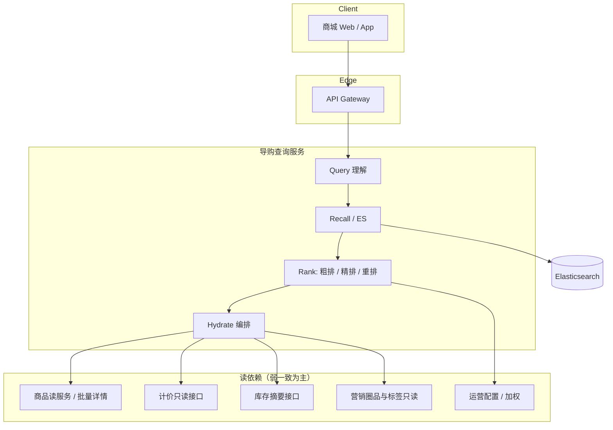
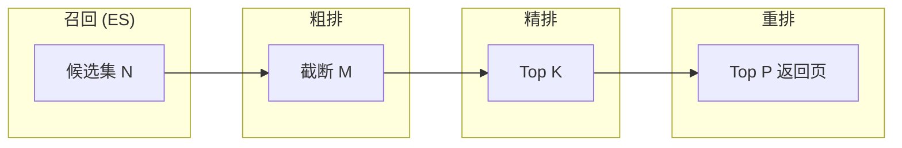
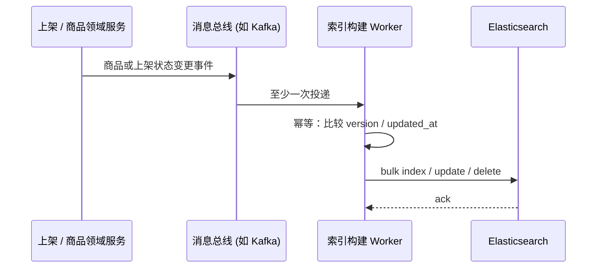
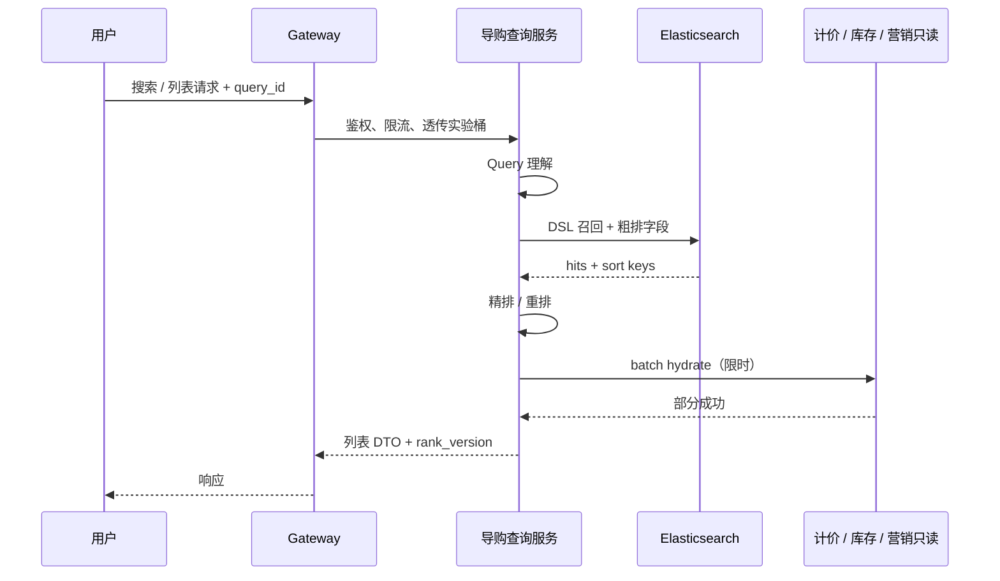

> **电商系统设计（十二）**（读路径专题；总索引见[（一）全景概览与领域划分](/system-design/20-ecommerce-overview/)）
> - [（一）全景概览与领域划分](/system-design/20-ecommerce-overview/)
> - [（二）商品中心系统](/system-design/27-ecommerce-product-center/)（索引与同步见第 5 章）
> - [（三）库存系统](/system-design/22-ecommerce-inventory/)
> - [（四）营销系统深度解析](/system-design/28-ecommerce-marketing-system/)
> - [（五）计价引擎](/system-design/23-ecommerce-pricing-engine/)
> - [（六）计价系统 DDD 实践](/system-design/24-ecommerce-pricing-ddd/)
> - [（七）订单系统](/system-design/26-ecommerce-order-system/)
> - [（八）支付系统深度解析](/system-design/29-ecommerce-payment-system/)
> - [（九）商品上架系统](/system-design/21-ecommerce-listing/)
> - [（十）B 端运营系统](/system-design/25-ecommerce-b-side-ops/)
> - [（十一）商品生命周期管理](/system-design/30-ecommerce-product-lifecycle-management/)
> - **（十二）搜索与导购（本文）**

## 引言

搜索与结构化导购（类目列表、店铺内浏览）是电商平台最主要的 **读流量入口** 之一，直接影响转化与 GMV。与订单、支付等 **写路径** 不同，导购链路往往 **QPS 高、容忍短暂最终一致**，但必须处理好 **相关性、价格与库存展示口径、营销露出、以及索引滞后** 带来的用户预期落差。

本文面向 **系统设计面试（A）** 与 **工程落地（B）**：用 **统一导购查询服务** 串起关键词搜索、类目导购、店铺内搜索；用 **Elasticsearch 查询侧专题** 补齐分析链、DSL 模式、深分页与性能要点。索引文档长什么样、如何从商品中心同步进 ES，仍以 [商品中心第 5 章](/system-design/27-ecommerce-product-center/) 为准，本篇不重复展开大段 mapping。

**适合读者**：准备电商 / 高并发读路径面试的候选人；负责搜索与列表的工程同学。

**阅读时长**：约 35～45 分钟。

**核心内容**：

- 统一导购查询服务与 `scene` 设计
- Query 理解、召回、粗精重排序与 AB 实验位点
- Elasticsearch：查询契约、典型 DSL、深分页、反模式与调优清单
- 与商品中心、上架、生命周期、运营、计价、库存、营销的 **集成与契约**
- 一致性、降级、可观测与面试问答锦囊

## 目录

- [1. 系统定位、范围与非目标](#1-系统定位范围与非目标)
- [2. 统一导购查询服务（方案 1）](#2-统一导购查询服务方案-1)
- [3. 主链路：Query → Recall → Rank → Hydrate](#3-主链路query--recall--rank--hydrate)
- [4. Elasticsearch 专题（方案 3）](#4-elasticsearch-专题方案-3)
- [5. 与上下游系统的集成与契约](#5-与上下游系统的集成与契约)
- [6. 一致性、降级与韧性](#6-一致性降级与韧性)
- [7. 可观测性与实验](#7-可观测性与实验)
- [8. 工程实践清单（发布前自检）](#8-工程实践清单发布前自检)
- [9. 面试问答锦囊](#9-面试问答锦囊)
- [10. 总结](#10-总结)

---

## 1. 系统定位、范围与非目标

### 1.1 本文覆盖（A + B）

| 维度 | 覆盖内容 |
|------|----------|
| **场景 B：结构化导购** | 类目树导航、类目 / 品牌列表、多维筛选与默认排序 |
| **场景 A：站内搜索闭环** | Query 归一化、召回、排序、聚合、suggest、高亮（点到为止） |
| **店铺内** | 限定 `shop_id`（或等价租户维度）的检索与列表 |
| **工程** | 编排、批量 hydrate、超时、限流、幂等与观测 |

### 1.2 显式非目标

- **首页 / 频道个性化 feed、重推荐系统**：不在正文展开（与「搜索召回」相邻但产品目标不同）；文末给扩展阅读方向即可。
- **营销优惠叠加计算**：见[营销系统](/system-design/28-ecommerce-marketing-system/)，本篇只写列表读侧 **标签 / 圈品命中展示** 与失败降级。
- **索引全量建模与多级缓存同步细节**：见[商品中心 5. 商品搜索与多级缓存](/system-design/27-ecommerce-product-center/)。

### 1.3 与系列文章的分工

| 文章 | 本篇边界 |
|------|----------|
| `27` 商品中心 §5 | **索引文档、nested/扁平化、缓存、同步** 的权威叙述；本篇只引用 **查询侧字段契约**。 |
| `21` / `25` 上架与 B 端 | **可搜可见** 与状态机语义；本篇写 **对 ES 文档生命周期的影响**，不复制 Worker 表结构。 |
| `30` 生命周期 / 审核 | **风控标、下架原因** → filter 或降权；本篇给出 **默认推荐位点**（见 §5）。 |
| `23` / `24` 计价 | **列表价**：索引价 vs hydrate；不展开计价引擎实现。 |
| `22` 库存 | **可售信号** 进索引粒度 vs 详情强一致；不展开 Lua 与供应商策略。 |
| `28` 营销 | 列表上 **只读** 应用活动标 / 圈品结果。 |

### 1.4 核心挑战（面试常问「难点在哪」）

| 挑战 | 根因 | 设计方向 |
|------|------|----------|
| **相关性** | 用户表达含糊、同义词多、类目错挂 | 词典 + 可控改写 + 埋点驱动迭代 |
| **列表价与索引不一致** | 促销、会员、渠道价变化快于索引 | hydrate + 产品话术 + 结算强一致 |
| **高并发读** | 大促与热搜集中 | ES 扩展、缓存、限流、降级 |
| **深分页** | `from/size` 成本指数上升 | `search_after` + 产品限制 |
| **跨系统编排** | hydrate 依赖多、尾延迟叠加 | 并发上限、超时、部分降级 |
| **索引与主数据漂移** | 异步链路、至少一次消费 | 幂等 version、对账与补偿任务 |

---

## 2. 统一导购查询服务（方案 1）

### 2.1 单一主叙事：一个服务，多种 scene

为降低面试叙述与运维心智负担，推荐对外的 **主叙事** 为：**导购查询服务（Merchandising Query Service）** 暴露统一查询接口，用 `scene` 区分业务语义；内部共享 **召回 → 排序 → hydrate** 流水线。网关可做鉴权、限流与字段裁剪，但 **不把排序规则散落在多个 BFF** 中。

若组织演进后存在 **搜索网关 + 列表 BFF** 两个 HTTP 入口，应保证二者调用 **同一排序内核与同一套实验配置**，避免出现「同一批商品在搜索与列表排序不一致」的线上问题。

### 2.2 scene 对比

| scene | 用户输入 | 典型 filter | 召回主索引 |
|-------|----------|--------------|-------------|
| `keyword` | 关键词 + 可选类目 / 品牌 | 上架可售、合规、店铺黑名单等 | 全站商品索引（或按站点分片） |
| `category` | 无关键词或空 query | 固定 `category_id` + 同上 | 同上 |
| `shop` | 可选关键词 | 固定 `shop_id` + 同上 | 店铺子索引或全索引加 filter |

店铺维度实现二选一即可：**独立索引别名**（写入侧按 shop 路由，查询简单）或 **单索引 + 强 filter**（运维简单，超大店需关注分片热点）。

### 2.3 逻辑架构



### 2.4 演进注记：何时拆 BFF

当 **列表卡片组装** 与 **搜索实验** 发布节奏强耦合不同团队时，可将 **Hydrate 结果组装** 下沉到独立 BFF，但 **排序分数与实验桶** 仍应由导购查询内核产出并通过版本化字段下发，避免「实验只在搜索生效」的割裂。

---

## 3. 主链路：Query → Recall → Rank → Hydrate

### 3.1 Query 理解（刻意保持轻量）

目标不是做通用 NLP 搜索引擎，而是 **可控、可解释、可回归**：

- **归一化**：全半角、大小写、去噪字符、重复空格。
- **同义词 / 类目词典**：运营可配表驱动；变更走版本号，与排序实验解耦。
- **拼写纠错**：可选；需 **限流 + 白名单**，避免纠错引入合规或品牌风险。

输出物建议固定为：`normalized_query`、`intent_tags`（如类目意图）、`rewrites[]`（有限条数），供后续 DSL 组装与埋点。

### 3.2 召回：以 ES 为主

召回阶段输出 **候选 doc 列表**（通常为 SPU 或「展示单元」ID）及 ES 内已可用的排序分量（`_score`、字段排序值）。**不要在召回阶段做重 CPU 的跨系统调用**。

**可选扩展（压缩叙述）**：关键词 BM25 + **向量召回** 做双路 merge 时，必须面对 **双路 quota、去重、延迟翻倍** 与向量索引运维成本。MVP 与多数面试场景 **单路 ES + hydrate** 已足够；向量可作为「演进」一句带过。

### 3.3 排序分层：粗排 → 精排 → 重排



| 阶段 | 典型输入 | 典型输出 | 说明 |
|------|----------|----------|------|
| **粗排** | ES 召回前 N（如 500～2000） | 截断到 M（如 200） | 主要用 `_score` + 简单线性特征（销量、上架时间）可在 ES `function_score` 或应用内完成 |
| **精排** | M 条 doc id | 有序列表 K（如 50） | 可解释加权：转化率预估、价格带、店铺分等；**LTR 模型**可在此替换，面试一笔带过即可 |
| **重排** | K 条 | 最终页大小 P | 多样性、类目打散、疲劳度、**合规与风控过滤**、运营强插合并 |

**合规 / 风控默认建议**：在 **重排后、返回前** 做最终过滤（避免 ES 已排序商品在最后一环被剔除导致空洞位）；对 **明确违法禁售** 商品应在 **索引写入侧** 即不可召回。审核中的「灰区」商品更适合 **召回阶段 filter**（见 `30` 与 `27` 状态定义）。

#### AB 与配置版本（工程落地最小集）

| 字段 | 作用 |
|------|------|
| `exp_id` | 实验桶标识，贯穿日志与报表 |
| `rank_version` | 绑定一套权重 / 规则 / 模型版本，可快速回滚 |
| `query_id` | 单次请求追踪，关联 ES 与 hydrate 子调用 |

发布流程建议：**先空跑双写日志对比（shadow traffic）**，再按桶放量；与计价、营销大促窗口 **错峰改排序**，避免归因困难。

### 3.4 Hydrate：批量、限时、可降级

列表卡片常需要：**展示价、原价划线、库存状态（有货 / 紧张 / 无货）、营销标、店铺名**。这些字段 **变化快于索引刷新** 时，必须在 hydrate 阶段补齐。

**契约建议**：

- 入参：`doc_ids[]`（长度上限，如 50）、`user_id`（可选，用于会员价）、`scene`、`rank_version`。
- 出参：与卡片一一对应的 **结构体 map**，缺失键表示该 doc hydrate 失败。
- **并发上限 + 单请求超时**（如 80ms～120ms 可调）；部分失败 **不阻断整页**：缺失字段走保守展示（见 §8）。

```go
// 伪代码：hydrate 编排（示意）
func (s *MerchandisingQuery) Hydrate(ctx context.Context, req HydrateRequest) (map[int64]CardEnrichment, error) {
    g, ctx := errgroup.WithContext(ctx)
    g.SetLimit(8)
    out := make(map[int64]CardEnrichment)
    var mu sync.Mutex
    for _, id := range req.DocIDs {
        id := id
        g.Go(func() error {
            cctx, cancel := context.WithTimeout(ctx, 100*time.Millisecond)
            defer cancel()
            card, err := s.deps.FetchCard(cctx, id, req.UserID, req.Scene)
            if err != nil {
                return nil // 降级：单卡失败不失败整页
            }
            mu.Lock()
            out[id] = card
            mu.Unlock()
            return nil
        })
    }
    _ = g.Wait()
    return out, nil
}
```

---

## 4. Elasticsearch 专题（方案 3）

> **再次强调**：索引字段清单、nested 取舍、商品变更如何进索引，请以 [商品中心 §5.1](/system-design/27-ecommerce-product-center/) 为准。本节只写 **查询侧契约与反模式**。

### 4.1 分析链与中文分词

- **索引与查询使用同一分析链**（或查询链为索引链的有意子集），避免「索引分词与查询分词不一致」导致召回漂移。
- 中文场景常见：**IK / smartcn 等**；需配置 **synonym filter 更新策略**（文件热更 vs 索引重建），与发布流程对齐。

### 4.2 mapping 要点（查询视角）

| 实践 | 说明 |
|------|------|
| **筛选 / 聚合 / 排序字段** | 优先 `keyword` 或数值类型，保证 `doc_values` 可用 |
| **全文检索字段** | `text` + 子字段 `keyword`（如 `title.keyword`）用于精确匹配或排序时要谨慎评估 |
| **nested** | 仅当 **SKU 级属性必须在查询中与父文档联合约束** 时使用；滥用 nested 会显著放大查询与索引成本 |
| **禁止** | 对大文本字段做无意义排序；对高基数字段做深度聚合默认全开 |

### 4.3 典型查询模式（bool + filter + sort）

`filter` 上下文 **不参与评分** 且可走缓存，适合 **上架状态、类目、店铺、价格区间** 等硬条件：

```json
{
  "query": {
    "bool": {
      "must": [
        {
          "multi_match": {
            "query": "无线耳机",
            "fields": ["title^3", "brand^2", "attrs.searchable"],
            "type": "best_fields"
          }
        }
      ],
      "filter": [
        { "term": { "site_id": "SG" } },
        { "term": { "listing_status": "ONLINE" } },
        { "term": { "category_id": "cat-3c-audio" } },
        { "range": { "list_price": { "gte": 50, "lte": 500 } } }
      ]
    }
  },
  "sort": [
    { "_score": "desc" },
    { "sales_30d": "desc" },
    { "spu_id": "asc" }
  ],
  "highlight": {
    "fields": { "title": {} }
  },
  "_source": false,
  "stored_fields": [],
  "docvalue_fields": ["spu_id", "list_price", "shop_id"]
}
```

实际生产中会结合 `_source` 裁剪与 `docvalue_fields` 权衡包大小；面试可强调：**列表页不要在 ES 返回大字段正文**。

### 4.4 深分页与 `search_after`

| 方式 | 适用 | 风险 |
|------|------|------|
| `from + size` | 前若干页 | `from` 过大时 ES 需全局排序，**内存与延迟爆炸** |
| `search_after` | 深度翻页 / 实时滚动 | 需稳定 sort key；不适合随机跳页 |
| `scroll` | 离线导出、对账 | 不适合用户请求 |

面试标准答法：**C 端列表深分页用 `search_after`；随机跳页用产品约束（最多翻到第 N 页）或改写交互。**

### 4.5 慢查询与容量清单（自检表）

- **Profile**：定位是评分、聚合还是 `function_score` 过重。
- **分片与副本**：分片数与数据量、查询并发匹配；副本提升读吞吐但增加写入放大。
- **强制合并与段数**：写入高峰后观察段合并策略；避免不当 force merge 影响写入。
- **冷热索引**：长尾类目或历史大促索引降副本或迁移冷节点（一句话与运维协作点）。

### 4.6 `function_score`：粗排阶段的业务加权（示例）

在 ES 内完成 **销量、上新、店铺分** 等可解释加权，可减少应用内精排压力；注意 **权重爆炸** 与 debug 难度，建议 **版本化脚本** 与离线回放数据集。

```json
{
  "query": {
    "function_score": {
      "query": { "bool": { "must": [], "filter": [] } },
      "functions": [
        {
          "field_value_factor": {
            "field": "sales_30d",
            "modifier": "log1p",
            "missing": 1
          },
          "weight": 1.2
        },
        {
          "gauss": {
            "listed_at": {
              "origin": "now",
              "scale": "30d",
              "decay": 0.5
            }
          },
          "weight": 0.8
        }
      ],
      "score_mode": "sum",
      "boost_mode": "multiply"
    }
  }
}
```

### 4.7 聚合与导航：筛选条（facets）

类目列表页常在侧边栏展示 **品牌、价格带、属性** 分布。注意：

- **聚合桶数上限** 与 **`min_doc_count`**，避免长尾拖垮查询。
- **筛选与聚合的 query 范围一致**：用户已选 `brand=A` 后，其他 facet 应基于子集重算（「带条件的聚合」），否则出现 **互斥筛选仍显示有货计数** 的体验问题。
- 大流量下可用 **近似聚合** 或 **异步加载 facet**（首屏商品列表优先）。

```json
{
  "size": 20,
  "aggs": {
    "by_brand": {
      "terms": { "field": "brand_id", "size": 30 }
    },
    "price_ranges": {
      "range": {
        "field": "list_price",
        "ranges": [
          { "to": 100 },
          { "from": 100, "to": 300 },
          { "from": 300 }
        ]
      }
    }
  }
}
```

### 4.8 Suggest：前缀与纠错（接口形态）

- **Completion suggester** 或 **search_as_you_type** 字段适合前缀补全；需单独控制 **QPS** 与 **字典更新延迟**。
- **phrase suggester** 可做「您是否要找」；与 Query 理解的纠错策略 **二选一主路径**，避免重复调用放大延迟。

---

## 5. 与上下游系统的集成与契约

### 5.1 责任边界表

| 系统 | 导购侧职责 | 典型交互 |
|------|--------------|----------|
| **商品中心** | 主数据与 **读模型版本**；batch 取标题、主图、类目 | 同步 REST / gRPC；hydrate 批量接口 |
| **上架系统** | **可搜可见** 状态驱动索引增删改 | 消息或任务驱动索引 Worker |
| **生命周期 / 审核** | 风控标、下架原因 → filter 或降权 | 与 `30` 风险评估结果字段对齐 |
| **B 端运营** | 置顶、加权、资源位 | 配置服务在 **重排** 合并；配置带 `version` |
| **计价** | 列表展示价、会员价 | 只读接口；超时降级 |
| **库存** | 列表级「有货摘要」 | 与 `22` 弱一致约定 |
| **营销** | 活动标、圈品是否命中 | 只读；不算价 |

### 5.2 索引更新路径（序列图）



### 5.3 列表请求路径（序列图）



### 5.4 列表 hydrate 的批量契约（建议写进接口文档）

| 项 | 建议值 | 说明 |
|------|--------|------|
| `doc_ids` 上限 | 20～60 | 与一页条数、卡片字段体积匹配 |
| 单次并行度 | 4～16 | 避免把计价 / 库存打爆 |
| 单依赖超时 | 30～120ms | 独立超时，合并用 deadline |
| 返回缺省策略 | 显式 `partial=true` | 前端可展示占位符或刷新提示 |
| 缓存 | 短时本地缓存热门 SPU | TTL 极短，防击穿用 singleflight |

计价只读接口建议支持 **批量 + 站点 + 会员等级** 维度，减少网络往返；与 [计价引擎](/system-design/23-ecommerce-pricing-engine/) 的「展示价场景」对齐命名，避免客户端混用「下单价」与「列表价」字段。

### 5.5 幂等与乱序事件

索引 Worker 在 **至少一次** 消费下必须 **幂等**：

- 使用 **`spu_id`（或主键）+ 领域 version** 做 compare-and-skip：旧版本事件直接丢弃。
- **删除事件** 需带明确语义：`HARD_DELETE`（物理删文档）vs `UNSEARCHABLE`（保留文档但 `listing_status` 过滤）。

```go
// 伪代码：索引更新幂等（示意）
func ApplyProductEvent(doc ProductDoc, evt ProductEvent) (bool, error) {
    if evt.Version < doc.Version {
        return false, nil
    }
    return true, UpsertES(doc.Merge(evt))
}
```

---

## 6. 一致性、降级与韧性

### 6.1 索引滞后

- **现象**：商品已上架，搜索短暂搜不到；价格已改，列表仍显示旧价。
- **产品与技术组合**：详情页 **强一致读商品中心**；列表页展示 **数据时间戳** 或「价格以结算为准」提示；关键运营活动可走 **强制刷新队列**（与 `27` 智能刷新策略呼应）。

### 6.2 Hydrate 部分失败

- **计价超时**：隐藏会员价差、展示索引价或「登录看价」。
- **库存服务降级**：默认「有货」或「库存紧张」需业务拍板；**更保守** 策略有利于避免超卖客诉，但可能损失转化。
- **营销标签失败**：不展示活动标，不影响下单资格判定（资格仍以结算页为准）。

### 6.3 ES 集群故障：推荐默认与备选

| 策略 | 优点 | 缺点 |
|------|------|------|
| **默认推荐：返回缓存快照 / 上一成功列表**（短时） | 体验连续、保护下游 | 结果新鲜度差；需缓存 key 设计（query + filter hash） |
| **备选：受限 DB LIKE / 关键字查询** | 数据相对新 | 延迟高、难支撑复杂筛选；必须 **强限流** |

面试可答：**优先保护核心交易链路，导购读路径可短时降级为缓存或简化查询。**

### 6.4 限流与防刷

- 网关按 **用户、IP、设备指纹** 维度限流；搜索 suggest 与列表 **不同配额**。
- 异常模式（零结果率骤降、同一 query QPS 飙升）对接 **风控与验证码**（细节见营销与运营体系，本篇只列位点）。

---

## 7. 可观测性与实验

### 7.1 关键指标

| 指标 | 说明 |
|------|------|
| **零结果率** | 无 hits 的 query 占比；驱动同义词与运营类目配置 |
| **P99 端到端延迟** | 含 hydrate；拆分 ES 与下游占比 |
| **hydrate 成功率 / 超时率** | 按依赖方拆分 |
| **ES 慢查询计数** | 阈值告警 + profile 采样 |
| **实验分桶 CTR / CVR** | 与 `rank_version` 关联 |

### 7.2 日志与追踪

- 全链路携带 **`query_id`**（或 `request_id`）、**`scene`**、**`exp_id`**、**`rank_version`**。
- ES 查询日志记录 **归一化后 query**（注意隐私脱敏与合规）。

### 7.3 容量与压测关注点（面试「如何估机器」）

- **峰值 QPS**：按大促系数 × 日常峰值；区分 **搜索 suggest** 与 **列表主请求**。
- **ES 数据量与分片**：单分片建议控制在 **几十 GB 内**（视版本与硬件调整），避免单分片过大导致恢复慢。
- **hydrate 扇出**：`QPS × 每页条数 × 下游 RPC 数` 估算连接池与超时；**失败重试** 需指数退避并合并到 **单用户维度熔断**。
- **缓存命中率**：热门 query 或类目前缀可走 CDN / 边缘缓存（注意 **个性化价** 与缓存 key 设计冲突）。

---

## 8. 工程实践清单（发布前自检）

- [ ] **索引别名切换**：蓝绿 reindex 后一次性切 `read_alias`，避免双写读不一致窗口过长。
- [ ] **mapping 变更评审**：是否需 reindex；是否影响排序字段 `doc_values`。
- [ ] **压测脚本**：覆盖「大 filter + 多排序键 + search_after」与「hydrate 下游一半超时」。
- [ ] **降级开关**：ES 故障、hydrate 超时、实验回滚的 **配置中心** 位点与演练记录。
- [ ] **与商品中心版本字段** 在 DTO 中对外可见，便于客诉定位。

---

## 9. 面试问答锦囊

1. **搜索与商品中心边界？** 商品中心是主数据真相源；搜索是 **派生读模型**，优化检索与排序特征。  
2. **为什么列表价不永远信任 ES？** 价格受会员、渠道、动态规则影响，索引有滞后；列表允许弱一致、结算强一致。  
3. **深分页怎么做？** `search_after` + 稳定 sort key；限制最大页或改交互。  
4. **`filter` 与 `must` 区别？** filter 不计分、可缓存；硬条件放 filter。  
5. **如何避免慢查询？** mapping 合理、避免深分页、控制聚合、`_source` 裁剪、profile 驱动迭代。  
6. **nested 何时用？** SKU 级联合约束且无法扁平化时；否则优先扁平化 + 查询拆分。  
7. **索引更新至少一次怎么幂等？** 主键 + version 比较；删除语义显式建模。  
8. **hydrate 部分失败怎么办？** 单卡降级，不拖死整页；监控超时率。  
9. **相关性 vs 商业化冲突？** 分层排序 + 重排打散 + 实验评估 CTR/CVR，不是二选一拍脑袋。  
10. **合规商品过滤放哪？** 禁售类应在索引不可见；灰区审核在召回 filter；最后一道在重排后。  
11. **ES 挂了还能搜吗？** 缓存快照 / 简化查询 / 降级提示，三选一讲清权衡。  
12. **店铺搜索如何实现？** 子索引或强 filter；大店热点单独治理。  
13. **类目列表没有 query 和搜索有何不同？** 同一流水线，`scene=category`，DSL 以 filter 为主。  
14. **如何做 AB？** 实验桶进请求上下文；`rank_version` 绑定配置；指标按桶对比。  
15. **向量检索要加吗？** 双路成本与收益评估；多数业务 ES + 同义词足够 MVP。  
16. **列表库存与详情不一致？** 预期内弱一致；下单前以库存服务校验为准（见订单与库存篇）。  
17. **运营强插会破坏相关性吗？** 在重排阶段合并并限制强插条数与位置，可观测 CTR。  
18. **为什么不用 scroll 做用户翻页？** scroll 为离线设计，占用集群资源不适合高并发 C 端。  
19. **高亮字段过大怎么办？** 仅对 title 等高亮；正文摘要另接口。  
20. **如何防刷搜索接口？** 网关限流 + 行为异常检测 + 验证码联动。  
21. **多语言站点？** 分析链 per locale；索引分片或 alias 按站点隔离。  
22. **排序用 ES 还是应用内？** 简单规则可 ES；复杂特征与业务规则应用内更可测。  
23. **如何验证索引与 DB 一致？** 定时抽样对账 + 版本号比对 + 差异修复任务。  
24. **导购服务需要事务吗？** 读路径通常无跨系统强事务；以超时、降级与最终一致为主。  
25. **与推荐系统关系？** 推荐偏个性化 feed；搜索偏意图检索；可共享特征与埋点，架构上仍建议服务解耦。

---

## 10. 总结

搜索与导购是电商 **读模型工程化** 的主战场：**统一 scene 流水线** 便于演进与面试叙述；**Elasticsearch** 承担召回与部分粗排，但必须与 **商品中心、上架与生命周期、计价、库存、营销** 的契约清晰划分；**一致性** 上承认列表弱一致，用 hydrate 超时策略与索引版本化兜底；**可观测性** 用 `query_id` + `rank_version` + 分桶指标闭环优化。

**系列扩展阅读（不在本文展开）**：首页与 discovery feed 的推荐系统、Learning-to-Rank 在线学习、图搜与多模态检索；若你正在补齐交易链路，可接续阅读[订单系统](/system-design/26-ecommerce-order-system/)与[库存系统](/system-design/22-ecommerce-inventory/)。

---

## 参考资料

1. [Elasticsearch 官方文档](https://www.elastic.co/guide/en/elasticsearch/reference/current/index.html) — 查询 DSL、分页与 profile。  
2. 本系列：[商品中心](/system-design/27-ecommerce-product-center/) · [上架系统](/system-design/21-ecommerce-listing/) · [生命周期管理](/system-design/30-ecommerce-product-lifecycle-management/) · [营销系统](/system-design/28-ecommerce-marketing-system/) · [计价引擎](/system-design/23-ecommerce-pricing-engine/) · [库存系统](/system-design/22-ecommerce-inventory/)。
