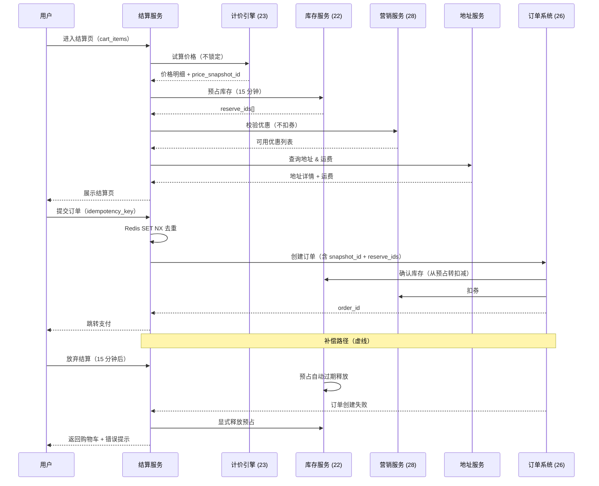
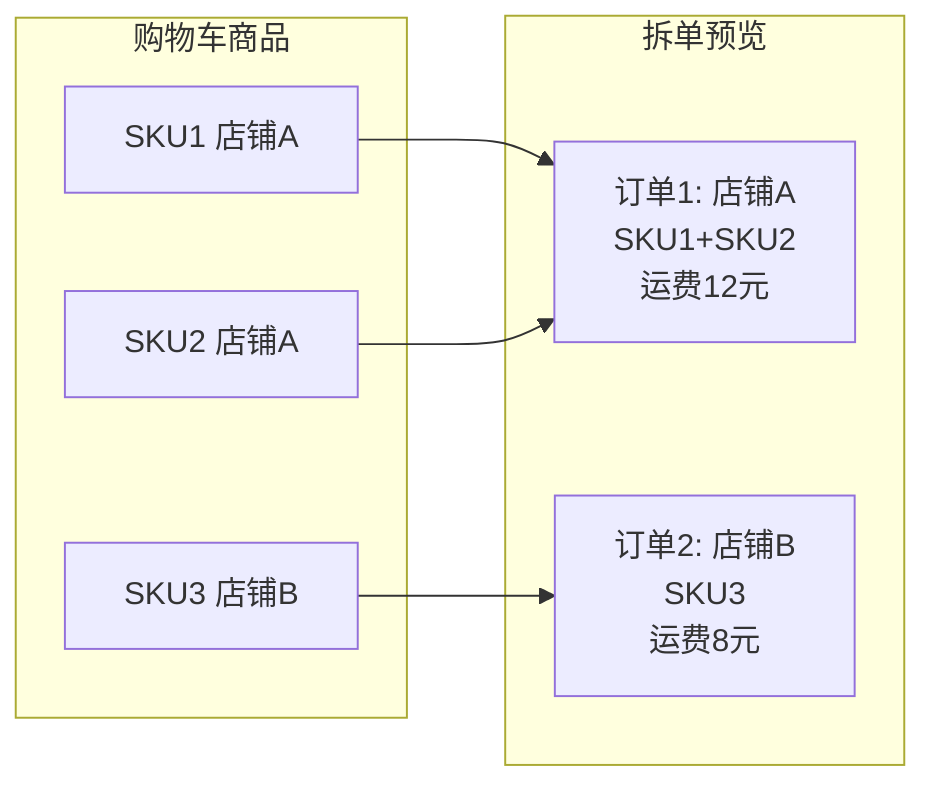
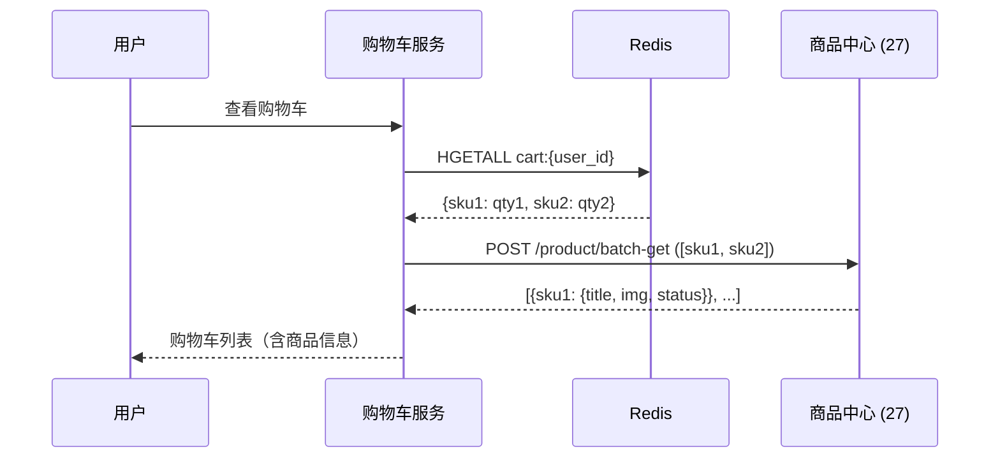

> **电商系统设计（十三）**（转化链路专题；总索引见[（一）全景概览与领域划分](/system-design/20-ecommerce-overview/)）
> - [（一）全景概览与领域划分](/system-design/20-ecommerce-overview/)
> - [（二）商品中心系统](/system-design/27-ecommerce-product-center/)
> - [（三）库存系统](/system-design/22-ecommerce-inventory/)
> - [（四）营销系统深度解析](/system-design/28-ecommerce-marketing-system/)
> - [（五）计价引擎](/system-design/23-ecommerce-pricing-engine/)
> - [（七）订单系统](/system-design/26-ecommerce-order-system/)
> - [（八）支付系统深度解析](/system-design/29-ecommerce-payment-system/)
> - [（十二）搜索与导购](/system-design/31-ecommerce-search-discovery/)
> - **（十三）购物车与结算域（本文）**

## 引言

购物车与结算域是电商转化漏斗的 **关键卡点**：**浏览 → 加购 → 结算 → 下单 → 支付**。在这条链路中，购物车承担 **"意愿暂存与展示"**，结算页承担 **"最终确认与资源预占"**，二者的设计哲学截然不同：

- **购物车**：读多写少、允许弱一致（价格可滞后）、不锁定任何资源；用户可长期保留。
- **结算页**：强一致校验（价格 / 库存 / 优惠必须实时）、资源预占（库存 15 分钟）、编排多系统、一旦提交必须幂等；用完即焚。

本文面向 **系统设计面试（A）** 与 **工程落地（B）**：用 **分域叙事（购物车域 + 结算域）** 讲清边界；用 **Saga 编排** 串起试算 → 预占 → 校验 → 提交订单；用 **边界表与反例** 避免常见陷阱。

**适合读者**：准备电商 / 高并发转化链路面试的候选人；负责购物车与结算的工程同学。

**阅读时长**：约 35～50 分钟。

**核心内容**：

- 购物车：未登录加购、匿名与登录态合并、Redis + DB 双写、批量操作幂等
- 结算页：Saga 编排（试算 → 预占 → 校验）、幂等与去重、补偿路径
- 与商品 / 计价 / 库存 / 营销 / 订单的 **集成边界表**（重点）
- 拆单预览、地址运费、转化漏斗监控与面试锦囊

## 目录

- [1. 系统定位、范围与非目标](#1-系统定位范围与非目标)
- [2. 核心场景与挑战](#2-核心场景与挑战)
- [3. 购物车设计](#3-购物车设计)
- [4. 结算页设计（Checkout Orchestrator）](#4-结算页设计checkout-orchestrator)
- [5. 拆单与地址运费](#5-拆单与地址运费)
- [6. 与其他系统的集成与契约（重点章节）](#6-与其他系统的集成与契约重点章节)
- [7. 一致性、降级与韧性](#7-一致性降级与韧性)
- [8. 可观测性与转化漏斗](#8-可观测性与转化漏斗)
- [9. 工程实践清单](#9-工程实践清单)
- [10. 面试问答锦囊](#10-面试问答锦囊)
- [11. 总结](#11-总结)

---

## 1. 系统定位、范围与非目标

### 1.1 本文覆盖（A + B）

| 维度 | 覆盖内容 |
|------|----------|
| **购物车域** | 暂存商品、未登录加购、登录后合并、批量操作、商品失效展示 |
| **结算域** | 价格试算、库存预占、营销校验、拆单预览、幂等提交、Saga 补偿 |
| **工程** | Redis + DB 双写、`idempotency_key`、超时配置、转化漏斗监控 |

### 1.2 显式非目标

- **支付流程实现**：见[支付系统](/system-design/29-ecommerce-payment-system/)，本篇只写"提交订单成功 → 跳转支付"的衔接点。
- **订单状态机全展开**：见[订单系统](/system-design/26-ecommerce-order-system/)，本篇只写"结算页创建订单"的调用契约。
- **秒杀专题**：库存预占在高并发下的极端优化可作为扩展阅读，正文不展开。

### 1.3 与系列文章的分工

| 文章 | 本篇边界 |
|------|----------|
| `26` 订单系统 | 结算页 **调用订单创建接口**，传入 `price_snapshot_id`、`reserve_ids`；不展开订单状态机与拆单实现全文；引用订单幂等（`26` §5）。 |
| `23` 计价引擎 | 结算页调用 **试算接口**（`scene=checkout`），返回价格明细与快照 ID；不重复计价规则与 DDD 实现。 |
| `22` 库存系统 | 结算页调用 **预占接口**（`Reserve`），传入 `expire_seconds=900`；引用库存策略（`22` §9）但不重复 Lua 与供应商集成。 |
| `28` 营销系统 | 结算页调用 **营销只读接口**（校验券码可用、圈品命中），不扣券；引用营销集成（`28` §5～6）。 |
| `27` 商品中心 | 购物车展示调用 **商品读服务批量接口**；不重复 SPU/SKU 模型与索引。 |
| `29` 支付系统 | 结算页"提交订单成功 → 跳转支付"为衔接点；不展开支付流程。 |

### 1.4 购物车与结算域的本质区别

| 维度 | 购物车 | 结算页（Checkout） |
|------|--------|-------------------|
| **核心职责** | 暂存商品、聚合展示、批量管理 | 价格最终确认、资源预占、提交订单前置校验 |
| **一致性要求** | 弱一致（展示可滞后） | 强一致（价格/库存/优惠必须实时校验） |
| **与订单关系** | **独立生命周期**（可长期保留） | **订单前置状态**（用完即焚或短暂保留） |
| **资源锁定** | **不锁定任何资源**（不扣库存、不锁价、不扣券） | **预占库存 15 分钟**；试算价格但不锁定；校验优惠但不扣券 |

**关键原则**：
- 购物车是 **"意愿篮"**，可失败、可过期、可合并。
- 结算页是 **"交易快照生成前的最后校验"**，必须 **幂等、可重入、可回滚**。

---

## 2. 核心场景与挑战

### 2.1 购物车场景

| 场景 | 技术挑战 | 方案 |
|------|----------|------|
| **未登录加购** | 前端存储 vs 后端匿名 Token | 推荐：后端生成匿名 `cart_token`（UUID），过期策略 7～30 天 |
| **登录后合并** | 匿名购物车与用户购物车冲突处理 | 相同 SKU **数量相加**；不同 SKU **追加**；商品已下架/售罄 **标记但不删除** |
| **商品失效** | 加购时可售，结算时下架 / 涨价 / 无货 | 购物车 **只读展示失效原因**，不自动删除；结算页 **强制重新校验** |
| **批量操作** | 全选/取消、删除、修改数量 | 批量接口 + 乐观锁版本号；前端本地先响应 |
| **跨端同步** | Web 加购、App 查看 | Redis / DB 统一存储；WebSocket / 长轮询实时推送（可选） |

### 2.2 结算页场景

| 场景 | 技术挑战 | 方案 |
|------|----------|------|
| **价格试算** | 优惠叠加、满减、跨店铺拆单 | 调用 **计价引擎试算接口**（见 `23`）；返回明细 + `price_snapshot_id` |
| **库存预占** | 高并发下避免超卖 | 调用 **库存预占接口**（见 `22`）；成功返回 `reserve_id`，超时释放 |
| **营销校验** | 券码是否可用、圈品命中 | 调用 **营销只读接口**（见 `28`）；结算页 **不扣券**，提交订单时才扣 |
| **拆单编排** | 跨店铺、跨仓、自营 + 第三方 | 结算页 **预览拆单结果**；真正拆单在 **订单创建** 时（见 `26`） |
| **地址 & 运费** | 多地址切换、运费实时计算 | 地址服务 + 运费规则引擎；运费可缓存短时（秒级 TTL） |
| **幂等与重试** | 用户重复点击"提交订单" | `idempotency_key`（前端生成 UUID）+ Redis 去重 + 订单幂等（见 `26`） |

### 2.3 核心挑战对比表

| 挑战 | 根因 | 设计方向 |
|------|------|----------|
| **未登录加购** | 用户体验与安全性矛盾 | 匿名 Token + 短期保留 + 登录后合并 |
| **价格不一致** | 购物车展示 vs 结算页最终价 | 购物车仅供参考；结算页强一致；产品话术配合 |
| **预占资源浪费** | 用户长期不结算 | 仅在结算页预占；15 分钟超时自动释放 |
| **Saga 补偿** | 跨系统编排无分布式事务 | 预占失败释放、订单创建失败回滚、幂等重试 |
| **拆单时机** | 结算页预览 vs 订单真正拆 | 结算页轻量预览；订单系统负责履约路由 |

---

## 3. 购物车设计

### 3.1 数据模型

#### `shopping_cart` 表

```sql
CREATE TABLE shopping_cart (
    id BIGINT PRIMARY KEY AUTO_INCREMENT,
    user_id BIGINT NOT NULL DEFAULT 0 COMMENT '用户ID，0 表示匿名',
    cart_token VARCHAR(64) DEFAULT NULL COMMENT '匿名购物车标识（UUID）',
    spu_id BIGINT NOT NULL,
    sku_id BIGINT NOT NULL,
    quantity INT NOT NULL DEFAULT 1,
    selected TINYINT NOT NULL DEFAULT 1 COMMENT '是否选中用于结算',
    version INT NOT NULL DEFAULT 1 COMMENT '乐观锁版本号',
    added_at TIMESTAMP DEFAULT CURRENT_TIMESTAMP,
    updated_at TIMESTAMP DEFAULT CURRENT_TIMESTAMP ON UPDATE CURRENT_TIMESTAMP,
    UNIQUE KEY uk_user_sku (user_id, sku_id),
    UNIQUE KEY uk_token_sku (cart_token, sku_id),
    INDEX idx_user (user_id),
    INDEX idx_token (cart_token),
    INDEX idx_updated (updated_at)
) COMMENT='购物车';
```

**设计要点**：
- `user_id = 0` + `cart_token` 标识匿名购物车。
- `selected` 字段支持"暂存但不结算"（用户可取消选中）。
- **不存储价格**：展示时实时调用商品/计价服务；避免价格不一致。
- `version` 字段用于修改数量时的乐观锁。

### 3.2 存储选型：Redis（主）+ DB（备）

**推荐方案**：Redis 为主（`HASH` 结构）+ 定时同步 DB。

```yaml
# Redis 结构
key: cart:{user_id}  # 或 cart:token:{cart_token}
field: sku_id
value: quantity

# 操作示例
HSET cart:123 456789 2  # 用户 123 加购 SKU 456789，数量 2
HINCRBY cart:123 456789 1  # 数量 +1
HDEL cart:123 456789  # 删除 SKU
HGETALL cart:123  # 获取整个购物车
```

**双写策略**：
- **写入**：Redis 立即写入（同步）；DB 异步写入（延迟 1～5 秒）。
- **读取**：优先读 Redis；Redis 未命中读 DB 并回填。
- **同步**：定时任务（每 5 分钟）将 Redis 增量同步到 DB；防止 Redis 丢失。

### 3.3 匿名与登录态合并策略

```go
// 伪代码：登录后合并购物车
func MergeCart(ctx context.Context, userID int64, cartToken string) error {
    // 1. 获取匿名购物车
    anonItems, _ := GetCartByToken(ctx, cartToken)
    // 2. 获取用户购物车
    userItems, _ := GetCartByUser(ctx, userID)
    
    for _, anonItem := range anonItems {
        if userItem, exists := userItems[anonItem.SKUID]; exists {
            // 相同 SKU：数量相加
            userItem.Quantity += anonItem.Quantity
            UpdateCartItem(ctx, userID, userItem)
        } else {
            // 不同 SKU：追加
            AddCartItem(ctx, userID, anonItem)
        }
    }
    
    // 3. 删除匿名购物车（可选：保留 7 天供调试）
    DeleteCartByToken(ctx, cartToken)
    return nil
}
```

**商品失效处理**：
- 购物车 **不自动删除** 失效商品；标记"已下架/无货/价格变动"。
- 结算页 **强制重新校验**；失效商品不允许提交。

### 3.4 批量操作幂等

修改数量时用 **乐观锁版本号**：

```sql
UPDATE shopping_cart
SET quantity = #{newQuantity}, version = version + 1, updated_at = NOW()
WHERE user_id = #{userID} AND sku_id = #{skuID} AND version = #{expectedVersion};
```

若更新行数为 0，表示并发冲突，返回前端重试。

---

## 4. 结算页设计（Checkout Orchestrator）

### 4.1 Saga 编排流程（序列图）



### 4.2 幂等与去重三层防护

| 层级 | 实现 | 说明 |
|------|------|------|
| **前端** | 提交按钮 loading + 禁用；生成 `idempotency_key`（UUID） | 防止用户快速双击 |
| **网关/结算服务** | Redis `SET NX idempotency:{key} 1 EX 60` | 60 秒内重复请求返回 409 或原结果 |
| **订单系统** | 订单表唯一索引 `uk_user_idempotency`（`user_id`, `idempotency_key`） | 数据库层兜底；见 `26` §5 |

```go
// 伪代码：结算服务幂等判断
func CheckIdempotency(ctx context.Context, key string) (bool, error) {
    ok, err := redis.SetNX(ctx, "idempotency:"+key, "1", 60*time.Second)
    if err != nil {
        return false, err
    }
    if !ok {
        // 重复请求：可返回之前的 order_id 或 409
        return false, ErrDuplicateRequest
    }
    return true, nil
}
```

### 4.3 补偿路径

| 场景 | 补偿操作 | 触发机制 |
|------|----------|----------|
| **用户放弃结算** | 预占自动过期释放 | 库存服务 TTL（15 分钟）或定时任务扫描 |
| **订单创建失败** | 显式调用 `POST /inventory/release-reserve` | 结算服务捕获订单创建异常，主动释放 |
| **支付超时未支付** | 订单取消 → 库存回补 → 营销回退 | 订单系统负责（见 `26`）；结算页不管 |

### 4.4 结算会话表（可选）

是否需要持久化 **结算会话**（支持用户刷新页面后恢复状态）？

| 方案 | 优点 | 缺点 |
|------|------|------|
| **无状态（推荐）** | 简单；每次重新计算 | 用户切换地址/优惠需重新调用接口 |
| **有状态** | 刷新页面仍保留选择 | 需 `checkout_session` 表；复杂度+1 |

**建议默认无状态**；若产品强需求"保存结算状态 30 分钟"，可加轻量 session 表：

```sql
CREATE TABLE checkout_session (
    session_id VARCHAR(64) PRIMARY KEY,
    user_id BIGINT NOT NULL,
    cart_snapshot JSON COMMENT 'SKU + 数量',
    price_snapshot_id VARCHAR(64),
    reserve_ids JSON,
    address_id BIGINT,
    expires_at TIMESTAMP,
    INDEX idx_user (user_id),
    INDEX idx_expires (expires_at)
) COMMENT='结算会话（可选）';
```

---

## 5. 拆单与地址运费

### 5.1 拆单策略：结算页预览 vs 订单真正拆

**拆单维度**：
- **跨店铺**：不同 `shop_id`。
- **跨仓**：同店铺但不同发货仓（取决于地址与库存路由）。
- **自营 + POP**：平台自营 vs 第三方商家。

**结算页职责**：
- 调用 **轻量拆单预览接口**（可能在订单系统或独立拆单服务）。
- 返回：预计拆成几单、每单预估运费、预计送达时间。
- **不做**：不生成真正的子订单；不调用履约路由。

**订单系统职责**（见 `26`）：
- 接收结算页传入的 `cart_items`。
- 执行 **真正拆单**：生成主订单 + 子订单。
- 调用履约系统路由仓库、推送物流。

### 5.2 地址服务集成

| 接口 | 场景 | 返回字段 |
|------|------|----------|
| `GET /address/list` | 用户进入结算页 | 地址列表（含默认地址标记） |
| `POST /freight/calculate` | 切换地址、修改商品数量 | 运费（可按拆单维度返回） |

**运费缓存**：
- 运费计算可 **短时缓存**（如 30 秒 TTL），Key 为 `freight:{address_id}:{cart_hash}`。
- 用户频繁切换地址时避免重复调用。

### 5.3 拆单预览示意（可选 Mermaid）



---

## 6. 与其他系统的集成与契约（重点章节）

### 6.1 购物车域边界表

| 系统 | 购物车调用的接口 | 调用场景 | 购物车不做什么 |
|------|-----------------|----------|----------------|
| **商品中心（27）** | `POST /product/batch-get`（标题、主图、状态） | 展示购物车列表 | ❌ 不缓存商品详情；❌ 不判断商品是否可售 |
| **计价引擎（23）** | `POST /pricing/batch-display-price`（可选） | 购物车列表价格展示 | ❌ 不锁定价格；❌ 不计算优惠；展示价仅供参考 |
| **库存系统（22）** | `POST /inventory/batch-status`（有货/售罄） | 展示库存状态 | ❌ 不预占库存；❌ 不扣减库存 |
| **营销系统（28）** | （不调用） | - | ❌ 购物车不查询优惠；优惠在结算页才校验 |

**购物车核心原则**：只读展示，不锁定任何资源；允许弱一致（展示滞后可接受）。

### 6.2 结算页（Checkout）边界表

| 系统 | 结算页调用的接口 | 调用时机 | 返回字段 | 失败处理 | 结算页不做什么 |
|------|-----------------|----------|----------|----------|----------------|
| **计价引擎（23）** | `POST /pricing/trial-calculate` | 进入结算页、切换地址/优惠时 | `price_snapshot_id`、明细、应付总额 | 超时降级："无法试算，请稍后重试" | ❌ 不实现计价规则；❌ 不持久化价格（由计价引擎管理快照） |
| **库存系统（22）** | `POST /inventory/reserve` | 进入结算页、切换 SKU 时 | `reserve_ids[]`、过期时间 | 超时或库存不足：提示"库存不足" | ❌ 不实现库存扣减逻辑；❌ 不管理预占释放（库存系统自动过期） |
| **营销系统（28）** | `POST /marketing/validate-coupons` | 用户选择优惠券时 | 可用券列表、不可用原因 | 超时：隐藏优惠选择 | ❌ 不扣券（扣券在订单创建时）；❌ 不实现圈品规则 |
| **地址服务** | `GET /address/list`, `POST /freight/calculate` | 进入结算页、切换地址时 | 地址详情、运费 | 超时：使用默认地址、运费待定 | ❌ 不存储地址；❌ 不实现运费规则 |
| **订单系统（26）** | `POST /order/create` | 用户点击"提交订单" | `order_id` | 失败：释放预占、返回购物车 | ❌ 不实现订单状态机；❌ 不拆单（拆单在订单系统） |

**结算页核心原则**：编排与预占，不实现业务规则；强一致校验，部分失败可降级；所有预占必须可超时释放。

### 6.3 订单系统接收的契约（从结算页到订单）

结算页调用 `POST /order/create` 时传入：

```json
{
  "idempotency_key": "uuid-from-frontend",
  "user_id": 123,
  "cart_items": [
    {"sku_id": 456, "quantity": 2},
    {"sku_id": 789, "quantity": 1}
  ],
  "price_snapshot_id": "price_snap_xyz",
  "reserve_ids": ["reserve_abc", "reserve_def"],
  "coupon_ids": [111, 222],
  "address_id": 999,
  "shipping_method": "standard"
}
```

订单系统职责：
- 调用库存 `POST /inventory/confirm-reserve`（从预占转扣减）
- 调用营销 `POST /marketing/deduct-coupons`（真正扣券）
- 真正拆单（跨店铺、跨仓）
- 创建订单记录与快照

### 6.4 购物车查商品序列图（补充）



### 6.5 边界陷阱反例表（避免常见错误）

| 反模式 | 为什么错 | 正确做法 |
|--------|----------|----------|
| 购物车预占库存 | 用户可能长期不结算，预占资源浪费 | 购物车只读展示；预占在结算页 |
| 结算页实现计价规则 | 规则散落多处，难以统一 | 调用计价引擎接口；结算页只编排 |
| 结算页直接扣券 | 订单创建失败时难以回滚 | 结算页只校验可用；扣券在订单创建 |
| 结算页拆单 | 拆单逻辑与订单履约路由耦合 | 结算页预览拆单；真正拆单在订单系统 |
| 购物车存价格 | 价格变动后购物车数据过期 | 购物车不存价格；展示时实时查询 |

### 6.6 事件消费语义（可选）

订单创建成功后 **清理购物车**：

- **方式**：订单系统发布 `order.created` 事件 → 购物车服务消费 → 删除已下单 SKU。
- **非强依赖**：购物车可异步清理（延迟数秒～数分钟）；用户手动删除也可。
- **幂等**：根据 `order_id` + `sku_id` 去重。

---

## 7. 一致性、降级与韧性

### 7.1 购物车弱一致

- **展示价可滞后**：购物车价格为"参考价"；结算页为"最终价"；产品话术："价格以结算为准"。
- **商品失效标记**：购物车 **不自动删除** 失效商品；标记"已下架/无货/价格变动"；用户可手动删除。
- **跨端同步延迟**：Redis → DB 同步延迟 1～5 秒可接受。

### 7.2 结算页强一致

- **价格/库存/优惠实时校验**：每次进入结算页或切换地址/优惠，必须重新调用计价/库存/营销接口。
- **部分失败降级**：
  - 计价超时：提示"无法试算，请稍后重试"；不允许提交订单。
  - 库存超时：提示"库存校验失败"；不允许提交订单。
  - 营销超时：隐藏优惠选择；允许以原价提交订单。

### 7.3 预占超时释放

**15 分钟过期机制**：

- **库存系统 TTL**：Redis key 自动过期（见 `22` §9）。
- **定时任务扫描**：每 5 分钟扫描 DB 中 `expires_at < NOW()` 的预占记录，释放。
- **幂等释放**：库存系统确保 `release-reserve` 接口幂等（重复释放不报错）。

### 7.4 降级开关（可选）

| 降级场景 | 触发条件 | 降级策略 |
|----------|----------|----------|
| 计价引擎故障 | 超时率 > 30% | 使用商品中心的"标价"展示；禁用优惠选择 |
| 库存服务故障 | 超时率 > 50% | 允许下单但标记"库存待确认"；订单创建时再校验 |
| 营销服务故障 | 超时率 > 30% | 隐藏优惠入口；原价下单 |

---

## 8. 可观测性与转化漏斗

### 8.1 转化漏斗指标


| 指标 | 计算公式 | 目标值（参考） |
|------|----------|----------------|
| **加购率** | 加购成功数 / 商品详情页 PV | 15%～25% |
| **进入结算率** | 进入结算页数 / 加购数 | 40%～60% |
| **提交订单率** | 提交成功数 / 进入结算数 | 60%～80% |
| **端到端转化率** | 支付成功数 / 商品详情页 PV | 5%～10% |

**漏斗分析**：按 `scene`（搜索、推荐、活动）、`device`（Web/App）、`region` 分组，定位卡点。

### 8.2 关键监控指标

| 指标 | 说明 | 告警阈值 |
|------|------|----------|
| **购物车加购 QPS** | 实时加购请求量 | > 平时 3 倍 |
| **结算页进入 QPS** | 实时结算请求量 | > 平时 5 倍 |
| **预占成功率** | 库存预占成功次数 / 请求次数 | < 95% |
| **试算成功率** | 计价试算成功次数 / 请求次数 | < 98% |
| **订单创建成功率** | 订单创建成功次数 / 提交次数 | < 95% |
| **幂等拦截率** | Redis SET NX 失败次数 / 总次数 | > 5%（异常高） |
| **预占释放任务执行率** | 定时任务执行成功率 | < 99% |

### 8.3 日志与 Trace

全链路携带：
- `cart_id`（购物车唯一标识）
- `checkout_session_id`（结算会话 ID，若有）
- `idempotency_key`（幂等键）
- `user_id`、`order_id`

---

## 9. 工程实践清单

### 9.1 购物车同步策略

- [ ] Redis 写入成功后异步写 DB（Kafka 或延迟队列）
- [ ] 定时任务每 5 分钟 Redis → DB 增量同步
- [ ] Redis 宕机后从 DB 回填，并标记为"冷启动"（监控告警）

### 9.2 结算页超时配置

| 依赖 | 超时时间 | 重试次数 | 说明 |
|------|----------|----------|------|
| 计价试算 | 800ms | 0 | 不重试；超时直接降级 |
| 库存预占 | 500ms | 1 | 重试一次；超时提示库存不足 |
| 营销校验 | 300ms | 0 | 超时隐藏优惠 |
| 地址查询 | 200ms | 0 | 超时使用默认地址 |

### 9.3 预占释放监控

- [ ] 监控 `inventory_reserve` 表中 `expires_at < NOW()` 未释放的记录数
- [ ] 告警：过期未释放数 > 100（定时任务可能挂了）
- [ ] 补偿：手动触发释放任务或重启定时任务

### 9.4 压测关注点

- [ ] 购物车并发加购：1000 QPS（Redis 集群水平扩展）
- [ ] 结算页并发进入：500 QPS（预占接口压测）
- [ ] 提交订单并发：200 QPS（幂等 Redis SET NX 性能）
- [ ] 预占过期释放：模拟 10000 个过期预占，任务执行时间 < 10 秒

---

## 10. 面试问答锦囊

1. **购物车数据存哪？** Redis 主（HASH 结构）+ DB 备；匿名用户用 `cart_token`。
2. **未登录加购如何实现？** 后端生成匿名 Token（UUID），过期 7～30 天；登录后合并（相同 SKU 数量相加）。
3. **购物车与结算页有何本质区别？** 购物车弱一致、不锁资源；结算页强一致、预占库存 15 分钟。
4. **结算页需要预占库存吗？** 需要；防止结算到支付窗口被抢光；15 分钟超时自动释放（TTL 或定时任务）。
5. **如何防止重复提交订单？** 前端生成 `idempotency_key`（UUID）+ Redis `SET NX` 去重 + 订单表唯一索引。
6. **结算页崩溃后如何恢复？** 默认无状态：重新计算；若需有状态：`checkout_session` 表（权衡复杂度）。
7. **跨店铺拆单在哪一步？** 结算页 **预览拆单结果**（轻量）；订单创建时 **真正拆单** 与履约路由（见 `26`）。
8. **价格在购物车显示与结算页不一致？** 预期内；购物车可缓存（展示价仅供参考）；结算页 **强制实时**（最终价）。
9. **营销优惠在结算页扣还是订单创建扣？** 结算页 **校验可用**；订单创建 **真正扣**（避免回滚困难）。
10. **购物车需要版本号吗？** 需要；修改数量时乐观锁避免并发覆盖（`version` 字段）。
11. **结算页超时怎么办？** 计价/库存/营销设独立超时；部分失败可降级（如营销超时隐藏优惠，仍可下单）。
12. **如何支持"暂存不结算"？** 购物车 `selected=0`；不进结算，仅展示。
13. **购物车与订单快照关系？** 购物车是"意愿"；订单创建时生成 **不可变快照**（见 `26`）。
14. **结算页需要分布式事务吗？** 不需要；用 **Saga 补偿**：预占失败释放、订单创建失败回滚、幂等重试。
15. **如何监控结算成功率？** 漏斗指标：加购率 → 进入结算率 → 提交订单率；分 scene/device/region 分析。
16. **购物车失效商品如何处理？** **不自动删除**；标记"已下架/无货"；结算页强制校验，失效商品不允许提交。
17. **Redis 宕机后购物车怎么办？** 从 DB 回填 Redis；短时降级为仅读 DB（性能下降但可用）。
18. **结算页拆单预览为什么不能是真正拆单？** 拆单涉及履约路由与仓库分配，属订单系统职责；结算页只需展示"预计拆成几单 + 运费"。
19. **如何设计运费缓存？** Key 为 `freight:{address_id}:{cart_hash}`；TTL 30 秒；用户频繁切换地址时避免重复调用。
20. **购物车跨端同步实时性要求？** 弱一致可接受；Redis → DB 同步延迟 1～5 秒；跨端查看购物车时优先读 Redis。

---

## 11. 总结

购物车与结算域是电商转化漏斗的 **关键卡点**：

- **购物车**：暂存与展示，弱一致，不锁资源；Redis + DB 双写，匿名与登录态合并。
- **结算页**：Saga 编排（试算 → 预占 → 校验 → 提交订单），强一致，幂等与补偿；与计价/库存/营销/订单的边界清晰。
- **工程实践**：`idempotency_key` 去重、预占超时释放、转化漏斗监控、压测关注点。

**系列扩展阅读（不在本文展开）**：履约与物流（订单拆单后的仓库路由与物流追踪）、商家结算与对账（平台抽佣与结算周期）；若你正在补齐支付链路，可接续阅读[支付系统](/system-design/29-ecommerce-payment-system/)与[订单系统](/system-design/26-ecommerce-order-system/)。

---

## 参考资料

1. 本系列：[订单系统](/system-design/26-ecommerce-order-system/) · [计价引擎](/system-design/23-ecommerce-pricing-engine/) · [库存系统](/system-design/22-ecommerce-inventory/) · [营销系统](/system-design/28-ecommerce-marketing-system/) · [商品中心](/system-design/27-ecommerce-product-center/) · [支付系统](/system-design/29-ecommerce-payment-system/)。
2. Saga 模式：[Microsoft - Saga Pattern](https://docs.microsoft.com/en-us/azure/architecture/reference-architectures/saga/saga)
3. Redis HASH 最佳实践：[Redis 官方文档](https://redis.io/docs/data-types/hashes/)
