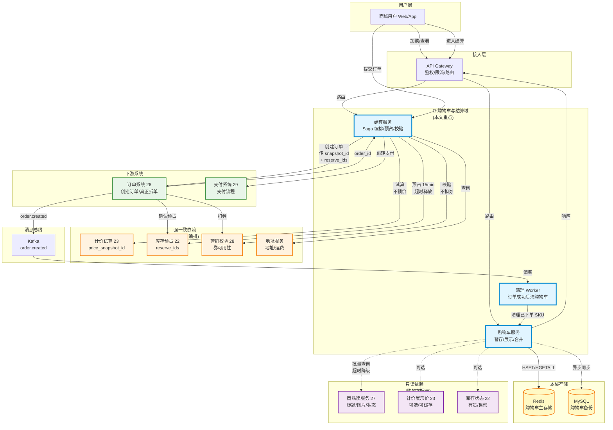
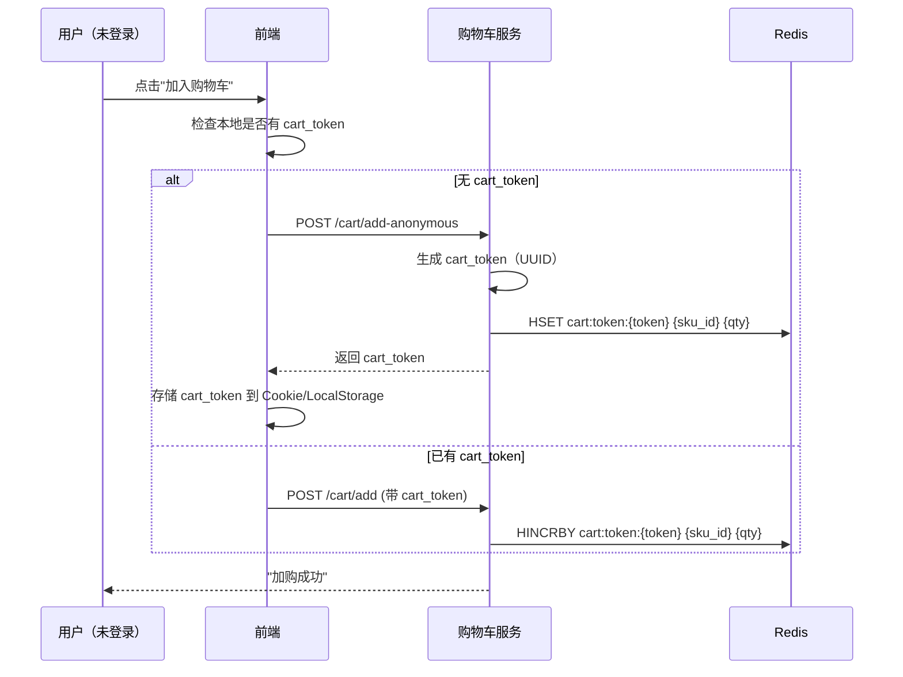
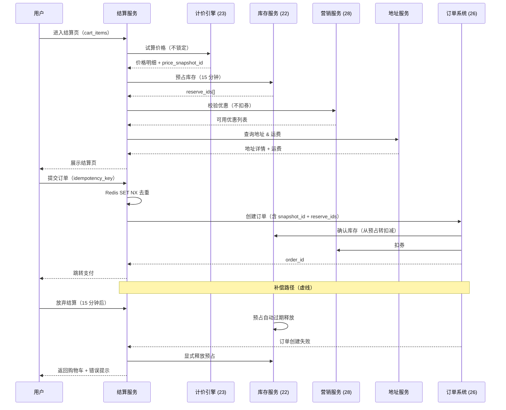
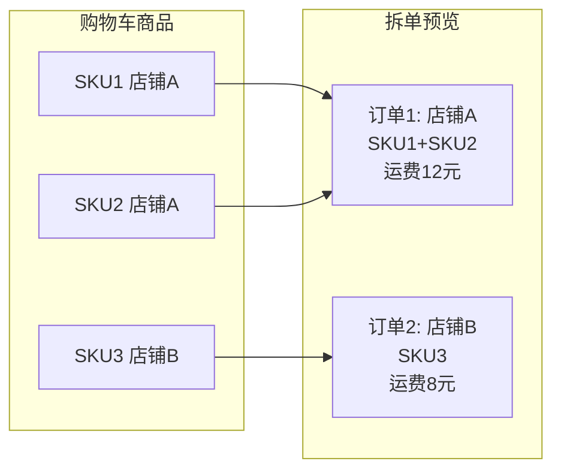
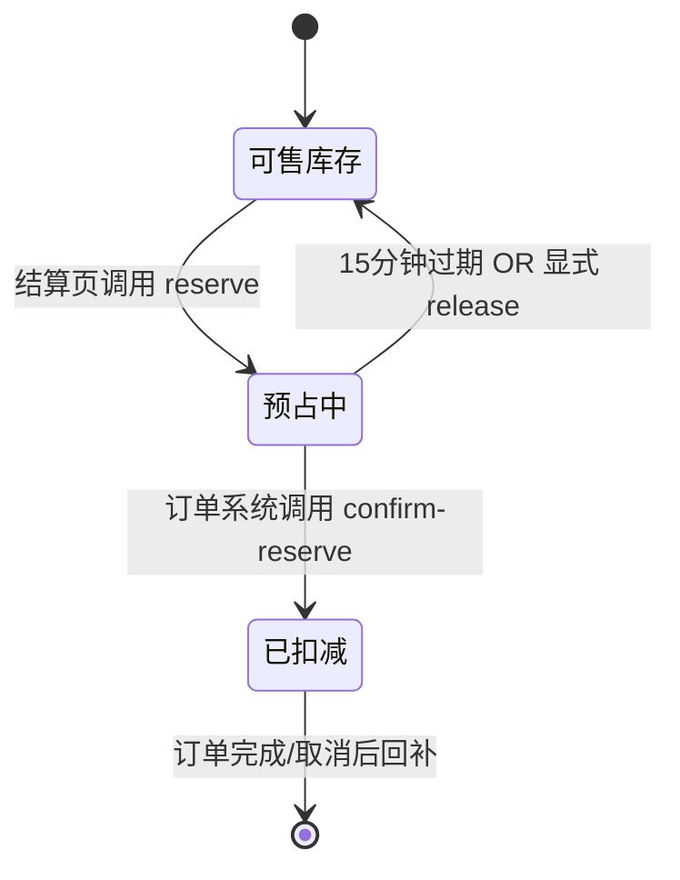
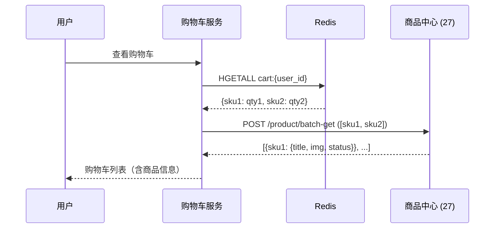

> **电商系统设计（十三）**（转化链路专题；总索引见[（一）全景概览与领域划分](/system-design/20-ecommerce-overview/)）
> - [（一）全景概览与领域划分](/system-design/20-ecommerce-overview/)
> - [（二）商品中心系统](/system-design/21-ecommerce-product-center/)
> - [（三）库存系统](/system-design/22-ecommerce-inventory/)
> - [（四）营销系统深度解析](/system-design/23-ecommerce-marketing-system/)
> - [（五）计价引擎](/system-design/24-ecommerce-pricing-engine/)
> - [（七）订单系统](/system-design/26-ecommerce-order-system/)
> - [（八）支付系统深度解析](/system-design/27-ecommerce-payment-system/)
> - [（十二）搜索与导购](/system-design/31-ecommerce-search-discovery/)
> - **（十三）购物车与结算域（本文）**

## 引言

购物车与结算域是电商转化漏斗的 **关键卡点**：**浏览 → 加购 → 结算 → 下单 → 支付**。在这条链路中，购物车承担 **"意愿暂存与展示"**，结算页承担 **"最终确认与资源预占"**，二者的设计哲学截然不同：

- **购物车**：读多写少、允许弱一致（价格可滞后）、不锁定任何资源；用户可长期保留。
- **结算页**：强一致校验（价格 / 库存 / 优惠必须实时）、资源预占（库存 15 分钟）、编排多系统、一旦提交必须幂等；用完即焚。

本文面向 **系统设计面试（A）** 与 **工程落地（B）**：用 **分域叙事（购物车域 + 结算域）** 讲清边界；用 **Saga 编排** 串起试算 → 预占 → 校验 → 提交订单；用 **边界表与反例** 避免常见陷阱。

**适合读者**：准备电商 / 高并发转化链路面试的候选人；负责购物车与结算的工程同学。

**阅读时长**：约 35～50 分钟。

**核心内容**：

- 购物车：未登录加购、匿名与登录态合并、Redis + DB 双写、批量操作幂等
- 结算页：Saga 编排（试算 → 预占 → 校验）、幂等与去重、补偿路径
- 与商品 / 计价 / 库存 / 营销 / 订单的 **集成边界表**（重点）
- 拆单预览、地址运费、转化漏斗监控与面试锦囊

## 目录

- [1. 系统定位、范围与非目标](#1-系统定位范围与非目标)
- [2. 核心场景与挑战](#2-核心场景与挑战)
- [3. 购物车设计](#3-购物车设计)
- [4. 结算页设计（Checkout Orchestrator）](#4-结算页设计checkout-orchestrator)
- [5. 拆单与地址运费](#5-拆单与地址运费)
- [6. 与其他系统的集成与契约（重点章节）](#6-与其他系统的集成与契约重点章节)
- [7. 一致性、降级与韧性](#7-一致性降级与韧性)
- [8. 可观测性与转化漏斗](#8-可观测性与转化漏斗)
- [9. 工程实践清单](#9-工程实践清单)
- [10. 面试问答锦囊](#10-面试问答锦囊)
- [11. 总结](#11-总结)

---

## 1. 系统定位、范围与非目标

### 1.1 本文覆盖（A + B）

| 维度 | 覆盖内容 |
|------|----------|
| **购物车域** | 暂存商品、未登录加购、登录后合并、批量操作、商品失效展示 |
| **结算域** | 价格试算、库存预占、营销校验、拆单预览、幂等提交、Saga 补偿 |
| **工程** | Redis + DB 双写、`idempotency_key`、超时配置、转化漏斗监控 |

### 1.2 显式非目标

- **支付流程实现**：见[支付系统](/system-design/27-ecommerce-payment-system/)，本篇只写"提交订单成功 → 跳转支付"的衔接点。
- **订单状态机全展开**：见[订单系统](/system-design/26-ecommerce-order-system/)，本篇只写"结算页创建订单"的调用契约。
- **秒杀专题**：库存预占在高并发下的极端优化可作为扩展阅读，正文不展开。

### 1.3 与系列文章的分工

| 文章 | 本篇边界 |
|------|----------|
| `26` 订单系统 | 结算页 **调用订单创建接口**，传入 `price_snapshot_id`、`reserve_ids`；不展开订单状态机与拆单实现全文；引用订单幂等（`26` §5）。 |
| `23` 计价引擎 | 结算页调用 **试算接口**（`scene=checkout`），返回价格明细与快照 ID；不重复计价规则与 DDD 实现。 |
| `22` 库存系统 | 结算页调用 **预占接口**（`Reserve`），传入 `expire_seconds=900`；引用库存策略（`22` §9）但不重复 Lua 与供应商集成。 |
| `28` 营销系统 | 结算页调用 **营销只读接口**（校验券码可用、圈品命中），不扣券；引用营销集成（`28` §5～6）。 |
| `27` 商品中心 | 购物车展示调用 **商品读服务批量接口**；不重复 SPU/SKU 模型与索引。 |
| `29` 支付系统 | 结算页"提交订单成功 → 跳转支付"为衔接点；不展开支付流程。 |

### 1.4 购物车与结算域的本质区别

| 维度 | 购物车 | 结算页（Checkout） |
|------|--------|-------------------|
| **核心职责** | 暂存商品、聚合展示、批量管理 | 价格最终确认、资源预占、提交订单前置校验 |
| **一致性要求** | 弱一致（展示可滞后） | 强一致（价格/库存/优惠必须实时校验） |
| **与订单关系** | **独立生命周期**（可长期保留） | **订单前置状态**（用完即焚或短暂保留） |
| **资源锁定** | **不锁定任何资源**（不扣库存、不锁价、不扣券） | **预占库存 15 分钟**；试算价格但不锁定；校验优惠但不扣券 |

**关键原则**：
- 购物车是 **"意愿篮"**，可失败、可过期、可合并。
- 结算页是 **"交易快照生成前的最后校验"**，必须 **幂等、可重入、可回滚**。

### 1.5 系统边界与交互全景

下图展示 **购物车与结算域** 在电商全局架构中的位置、与其他系统的边界、以及资源锁定时序：



**关键设计决策**：

| 维度 | 购物车 | 结算页 | 订单系统 |
|------|--------|--------|----------|
| **资源锁定** | ❌ 不锁定 | ✅ 预占 15 分钟 | ✅ 确认扣减 |
| **一致性** | 弱一致（允许滞后） | 强一致（实时校验） | 强一致（ACID） |
| **失败策略** | 展示失败原因，不阻断 | 降级或阻断提交 | 回滚与补偿 |
| **扣券时机** | ❌ 不查询优惠 | ✅ 校验可用（不扣） | ✅ 真正扣减 |
| **拆单责任** | ❌ 无 | ✅ 预览（轻量） | ✅ 真正拆单 + 履约路由 |

---

## 2. 核心场景与挑战

### 2.1 购物车场景

| 场景 | 技术挑战 | 方案 |
|------|----------|------|
| **未登录加购** | 前端存储 vs 后端匿名 Token | 推荐：后端生成匿名 `cart_token`（UUID），过期策略 7～30 天 |
| **登录后合并** | 匿名购物车与用户购物车冲突处理 | 相同 SKU **数量相加**；不同 SKU **追加**；商品已下架/售罄 **标记但不删除** |
| **商品失效** | 加购时可售，结算时下架 / 涨价 / 无货 | 购物车 **只读展示失效原因**，不自动删除；结算页 **强制重新校验** |
| **批量操作** | 全选/取消、删除、修改数量 | 批量接口 + 乐观锁版本号；前端本地先响应 |
| **跨端同步** | Web 加购、App 查看 | Redis / DB 统一存储；WebSocket / 长轮询实时推送（可选） |

### 2.2 结算页场景

| 场景 | 技术挑战 | 方案 |
|------|----------|------|
| **价格试算** | 优惠叠加、满减、跨店铺拆单 | 调用 **计价引擎试算接口**（见 `23`）；返回明细 + `price_snapshot_id` |
| **库存预占** | 高并发下避免超卖 | 调用 **库存预占接口**（见 `22`）；成功返回 `reserve_id`，超时释放 |
| **营销校验** | 券码是否可用、圈品命中 | 调用 **营销只读接口**（见 `28`）；结算页 **不扣券**，提交订单时才扣 |
| **拆单编排** | 跨店铺、跨仓、自营 + 第三方 | 结算页 **预览拆单结果**；真正拆单在 **订单创建** 时（见 `26`） |
| **地址 & 运费** | 多地址切换、运费实时计算 | 地址服务 + 运费规则引擎；运费可缓存短时（秒级 TTL） |
| **幂等与重试** | 用户重复点击"提交订单" | `idempotency_key`（前端生成 UUID）+ Redis 去重 + 订单幂等（见 `26`） |

### 2.3 核心挑战对比表

| 挑战 | 根因 | 设计方向 |
|------|------|----------|
| **未登录加购** | 用户体验与安全性矛盾 | 匿名 Token + 短期保留 + 登录后合并 |
| **价格不一致** | 购物车展示 vs 结算页最终价 | 购物车仅供参考；结算页强一致；产品话术配合 |
| **预占资源浪费** | 用户长期不结算 | 仅在结算页预占；15 分钟超时自动释放 |
| **Saga 补偿** | 跨系统编排无分布式事务 | 预占失败释放、订单创建失败回滚、幂等重试 |
| **拆单时机** | 结算页预览 vs 订单真正拆 | 结算页轻量预览；订单系统负责履约路由 |

---

## 3. 购物车设计

### 3.1 数据模型

#### `shopping_cart` 表

```sql
CREATE TABLE shopping_cart (
    id BIGINT PRIMARY KEY AUTO_INCREMENT,
    user_id BIGINT NOT NULL DEFAULT 0 COMMENT '用户ID，0 表示匿名',
    cart_token VARCHAR(64) DEFAULT NULL COMMENT '匿名购物车标识（UUID）',
    spu_id BIGINT NOT NULL,
    sku_id BIGINT NOT NULL,
    quantity INT NOT NULL DEFAULT 1,
    selected TINYINT NOT NULL DEFAULT 1 COMMENT '是否选中用于结算',
    version INT NOT NULL DEFAULT 1 COMMENT '乐观锁版本号',
    added_at TIMESTAMP DEFAULT CURRENT_TIMESTAMP,
    updated_at TIMESTAMP DEFAULT CURRENT_TIMESTAMP ON UPDATE CURRENT_TIMESTAMP,
    UNIQUE KEY uk_user_sku (user_id, sku_id),
    UNIQUE KEY uk_token_sku (cart_token, sku_id),
    INDEX idx_user (user_id),
    INDEX idx_token (cart_token),
    INDEX idx_updated (updated_at)
) COMMENT='购物车';
```

**设计要点**：
- `user_id = 0` + `cart_token` 标识匿名购物车。
- `selected` 字段支持"暂存但不结算"（用户可取消选中）。
- **不存储价格**：展示时实时调用商品/计价服务；避免价格不一致。
- `version` 字段用于修改数量时的乐观锁。

### 3.2 存储选型：Redis（主）+ DB（备）

**推荐方案**：Redis 为主（`HASH` 结构）+ 定时同步 DB。

```yaml
# Redis 结构
key: cart:{user_id}  # 或 cart:token:{cart_token}
field: sku_id
value: quantity

# 操作示例
HSET cart:123 456789 2  # 用户 123 加购 SKU 456789，数量 2
HINCRBY cart:123 456789 1  # 数量 +1
HDEL cart:123 456789  # 删除 SKU
HGETALL cart:123  # 获取整个购物车
```

**双写策略**：
- **写入**：Redis 立即写入（同步）；DB 异步写入（延迟 1～5 秒）。
- **读取**：优先读 Redis；Redis 未命中读 DB 并回填。
- **同步**：定时任务（每 5 分钟）将 Redis 增量同步到 DB；防止 Redis 丢失。

### 3.3 匿名与登录态合并策略

```go
// 伪代码：登录后合并购物车
func MergeCart(ctx context.Context, userID int64, cartToken string) error {
    // 1. 获取匿名购物车
    anonItems, _ := GetCartByToken(ctx, cartToken)
    // 2. 获取用户购物车
    userItems, _ := GetCartByUser(ctx, userID)
    
    for _, anonItem := range anonItems {
        if userItem, exists := userItems[anonItem.SKUID]; exists {
            // 相同 SKU：数量相加
            userItem.Quantity += anonItem.Quantity
            UpdateCartItem(ctx, userID, userItem)
        } else {
            // 不同 SKU：追加
            AddCartItem(ctx, userID, anonItem)
        }
    }
    
    // 3. 删除匿名购物车（可选：保留 7 天供调试）
    DeleteCartByToken(ctx, cartToken)
    return nil
}
```

**商品失效处理**：
- 购物车 **不自动删除** 失效商品；标记"已下架/无货/价格变动"。
- 结算页 **强制重新校验**；失效商品不允许提交。

### 3.4 批量操作幂等

修改数量时用 **乐观锁版本号**：

```sql
UPDATE shopping_cart
SET quantity = #{newQuantity}, version = version + 1, updated_at = NOW()
WHERE user_id = #{userID} AND sku_id = #{skuID} AND version = #{expectedVersion};
```

若更新行数为 0，表示并发冲突，返回前端重试。

### 3.5 购物车核心场景详解

#### 3.5.1 未登录加购流程



**关键设计**：
- `cart_token` 存储在前端 Cookie（30 天过期）或 LocalStorage。
- 后端 Redis 设置 TTL（7～30 天），过期自动清理。
- 用户登录后，前端携带 `cart_token` 调用合并接口。

#### 3.5.2 登录后合并冲突处理

| 场景 | 匿名购物车 | 用户购物车 | 合并策略 |
|------|------------|------------|----------|
| 相同 SKU | SKU 123, qty 2 | SKU 123, qty 3 | 数量相加：qty 5 |
| 不同 SKU | SKU 456, qty 1 | SKU 789, qty 2 | 追加：两个 SKU 都保留 |
| 商品已下架 | SKU 999（已下架） | - | 标记"已下架"，但仍保留在购物车；用户可手动删除 |
| 超出限购 | SKU 123, qty 10 | SKU 123, qty 5 | 合并后 qty 15，若限购 10 则截断为 10 + 提示 |

```go
// 伪代码：冲突处理细节
func MergeWithLimit(ctx context.Context, userID int64, cartToken string) error {
    anonItems, _ := GetCartByToken(ctx, cartToken)
    userItems, _ := GetCartByUser(ctx, userID)
    
    for _, anonItem := range anonItems {
        newQty := anonItem.Quantity
        
        if userItem, exists := userItems[anonItem.SKUID]; exists {
            newQty += userItem.Quantity
        }
        
        // 查询限购规则
        limit, _ := GetPurchaseLimit(ctx, anonItem.SKUID)
        if newQty > limit {
            newQty = limit
            // 发送提示消息："SKU 123 限购 10 件，已自动调整"
        }
        
        // 更新或插入
        UpsertCartItem(ctx, userID, anonItem.SKUID, newQty)
    }
    
    return nil
}
```

#### 3.5.3 商品失效展示策略

购物车中的商品可能在加购后发生以下变化：

| 变化 | 展示策略 | 用户操作 |
|------|----------|----------|
| **价格上涨** | 显示新价格 + 标签"价格已变动" | 可继续结算 |
| **价格下降** | 显示新价格 + 标签"降价了" | 可继续结算 |
| **商品下架** | 标题置灰 + 标签"已下架" | 不可结算；手动删除 |
| **库存售罄** | 标题置灰 + 标签"暂时缺货" | 不可结算；可保留等补货 |
| **SKU 删除** | 商品信息查询失败 | 标记"商品已失效"；手动删除 |

**产品话术配合**：
- "部分商品已失效，请删除后继续结算。"
- "价格以结算页为准。"

#### 3.5.4 跨端同步场景

| 场景 | 同步机制 | 延迟 |
|------|----------|------|
| Web 加购，App 查看 | Redis 统一存储（user_id 或 cart_token） | 秒级 |
| App 修改数量，Web 刷新 | Redis → DB 异步同步（5 分钟）；Web 读 Redis | 秒级（Redis）或 5 分钟（DB） |
| 实时同步（可选） | WebSocket 推送 `cart.updated` 事件 | 毫秒级 |

**实时同步实现（可选）**：

```go
// 加购成功后推送事件
func (s *CartService) AddToCart(ctx context.Context, req AddCartRequest) error {
    // 1. 写入 Redis
    _ = s.redis.HSET(ctx, fmt.Sprintf("cart:%d", req.UserID), req.SKUID, req.Quantity)
    
    // 2. 推送 WebSocket 事件（可选）
    _ = s.wsHub.Broadcast(req.UserID, CartUpdatedEvent{
        SKUID:    req.SKUID,
        Quantity: req.Quantity,
    })
    
    return nil
}
```

---

## 4. 结算页设计（Checkout Orchestrator）

### 4.1 Saga 编排流程（序列图）



### 4.2 幂等与去重三层防护

| 层级 | 实现 | 说明 |
|------|------|------|
| **前端** | 提交按钮 loading + 禁用；生成 `idempotency_key`（UUID） | 防止用户快速双击 |
| **网关/结算服务** | Redis `SET NX idempotency:{key} 1 EX 60` | 60 秒内重复请求返回 409 或原结果 |
| **订单系统** | 订单表唯一索引 `uk_user_idempotency`（`user_id`, `idempotency_key`） | 数据库层兜底；见 `26` §5 |

```go
// 伪代码：结算服务幂等判断
func CheckIdempotency(ctx context.Context, key string) (bool, error) {
    ok, err := redis.SetNX(ctx, "idempotency:"+key, "1", 60*time.Second)
    if err != nil {
        return false, err
    }
    if !ok {
        // 重复请求：可返回之前的 order_id 或 409
        return false, ErrDuplicateRequest
    }
    return true, nil
}
```

### 4.3 补偿路径

| 场景 | 补偿操作 | 触发机制 |
|------|----------|----------|
| **用户放弃结算** | 预占自动过期释放 | 库存服务 TTL（15 分钟）或定时任务扫描 |
| **订单创建失败** | 显式调用 `POST /inventory/release-reserve` | 结算服务捕获订单创建异常，主动释放 |
| **支付超时未支付** | 订单取消 → 库存回补 → 营销回退 | 订单系统负责（见 `26`）；结算页不管 |

### 4.4 结算会话表（可选）

是否需要持久化 **结算会话**（支持用户刷新页面后恢复状态）？

| 方案 | 优点 | 缺点 |
|------|------|------|
| **无状态（推荐）** | 简单；每次重新计算 | 用户切换地址/优惠需重新调用接口 |
| **有状态** | 刷新页面仍保留选择 | 需 `checkout_session` 表；复杂度+1 |

**建议默认无状态**；若产品强需求"保存结算状态 30 分钟"，可加轻量 session 表：

```sql
CREATE TABLE checkout_session (
    session_id VARCHAR(64) PRIMARY KEY,
    user_id BIGINT NOT NULL,
    cart_snapshot JSON COMMENT 'SKU + 数量',
    price_snapshot_id VARCHAR(64),
    reserve_ids JSON,
    address_id BIGINT,
    expires_at TIMESTAMP,
    INDEX idx_user (user_id),
    INDEX idx_expires (expires_at)
) COMMENT='结算会话（可选）';
```

---

## 5. 拆单与地址运费

### 5.1 拆单策略：结算页预览 vs 订单真正拆

**拆单维度**：
- **跨店铺**：不同 `shop_id`。
- **跨仓**：同店铺但不同发货仓（取决于地址与库存路由）。
- **自营 + POP**：平台自营 vs 第三方商家。

**结算页职责**：
- 调用 **轻量拆单预览接口**（可能在订单系统或独立拆单服务）。
- 返回：预计拆成几单、每单预估运费、预计送达时间。
- **不做**：不生成真正的子订单；不调用履约路由。

**订单系统职责**（见 `26`）：
- 接收结算页传入的 `cart_items`。
- 执行 **真正拆单**：生成主订单 + 子订单。
- 调用履约系统路由仓库、推送物流。

### 5.2 地址服务集成

| 接口 | 场景 | 返回字段 |
|------|------|----------|
| `GET /address/list` | 用户进入结算页 | 地址列表（含默认地址标记） |
| `POST /freight/calculate` | 切换地址、修改商品数量 | 运费（可按拆单维度返回） |

**运费缓存**：
- 运费计算可 **短时缓存**（如 30 秒 TTL），Key 为 `freight:{address_id}:{cart_hash}`。
- 用户频繁切换地址时避免重复调用。

### 5.3 拆单预览示意（可选 Mermaid）



### 5.4 拆单预览接口设计

结算页调用 **拆单预览接口**（可能在订单系统或独立拆单服务）：

```yaml
# 拆单预览
POST /order/split-preview
Request:
  cart_items:
    - sku_id: 123
      quantity: 2
      shop_id: 100
    - sku_id: 456
      quantity: 1
      shop_id: 200
  address_id: 999
Response:
  preview_orders:
    - order_index: 1
      shop_id: 100
      shop_name: "Apple 官方旗舰店"
      items:
        - sku_id: 123
          quantity: 2
      freight: 12.00
      estimated_delivery: "2026-04-15"
    - order_index: 2
      shop_id: 200
      shop_name: "Nike 官方旗舰店"
      items:
        - sku_id: 456
          quantity: 1
      freight: 8.00
      estimated_delivery: "2026-04-16"
  total_freight: 20.00
```

**拆单预览的轻量原则**：
- **不生成子订单 ID**（订单创建时才生成）。
- **不调用履约路由**（不查询仓库可用性）。
- **运费可缓存**（短时 TTL）。

---

## 6. 与其他系统的集成与契约（重点章节）

> **本章为系统边界核心**，详细说明购物车与结算域如何与其他 6 个系统交互，包括接口契约、数据流、失败处理、以及常见边界陷阱。

### 6.1 集成架构概览

购物车与结算域依赖的外部系统可分为 3 类：

| 类别 | 系统 | 调用方 | 一致性要求 |
|------|------|--------|------------|
| **商品域** | 商品中心（27） | 购物车、结算页 | 弱一致 |
| **交易域** | 计价（23）、库存（22）、营销（28） | 结算页 | 强一致 |
| **履约域** | 订单（26）、支付（29） | 结算页 | 强一致 |

### 6.2 购物车域边界表

| 系统 | 购物车调用的接口 | 调用场景 | 购物车不做什么 |
|------|-----------------|----------|----------------|
| **商品中心（27）** | `POST /product/batch-get`（标题、主图、状态） | 展示购物车列表 | ❌ 不缓存商品详情；❌ 不判断商品是否可售 |
| **计价引擎（23）** | `POST /pricing/batch-display-price`（可选） | 购物车列表价格展示 | ❌ 不锁定价格；❌ 不计算优惠；展示价仅供参考 |
| **库存系统（22）** | `POST /inventory/batch-status`（有货/售罄） | 展示库存状态 | ❌ 不预占库存；❌ 不扣减库存 |
| **营销系统（28）** | （不调用） | - | ❌ 购物车不查询优惠；优惠在结算页才校验 |

**购物车核心原则**：只读展示，不锁定任何资源；允许弱一致（展示滞后可接受）。

#### 购物车查商品流程详解

```go
// 伪代码：购物车列表展示
func (s *CartService) GetCartItems(ctx context.Context, userID int64) ([]CartItemVO, error) {
    // 1. 从 Redis 获取 SKU 列表
    cartData, err := s.redis.HGetAll(ctx, fmt.Sprintf("cart:%d", userID))
    if err != nil {
        // 降级：从 DB 读取
        cartData, err = s.db.GetCartByUser(ctx, userID)
        if err != nil {
            return nil, err
        }
    }
    
    skuIDs := extractSKUIDs(cartData)
    
    // 2. 批量查商品信息（商品中心）
    products, _ := s.productClient.BatchGet(ctx, BatchGetRequest{
        SKUIDs: skuIDs,
        Fields: []string{"title", "main_image", "listing_status", "spu_id"},
    })
    
    // 3. 可选：批量查展示价（计价引擎）
    prices, _ := s.pricingClient.BatchDisplayPrice(ctx, BatchPriceRequest{
        SKUIDs: skuIDs,
        UserID: userID,
        Scene:  "cart",
    })
    
    // 4. 可选：批量查库存状态（库存系统）
    invStatus, _ := s.inventoryClient.BatchStatus(ctx, skuIDs)
    
    // 5. 组装结果（部分失败不阻断）
    items := make([]CartItemVO, 0, len(skuIDs))
    for _, skuID := range skuIDs {
        item := CartItemVO{
            SKUID:    skuID,
            Quantity: cartData[skuID],
        }
        
        // 商品信息（必须）
        if product, ok := products[skuID]; ok {
            item.Title = product.Title
            item.Image = product.MainImage
            item.Status = product.ListingStatus
        } else {
            item.Status = "商品已失效"
        }
        
        // 价格（可选）
        if price, ok := prices[skuID]; ok {
            item.DisplayPrice = price
        }
        
        // 库存（可选）
        if inv, ok := invStatus[skuID]; ok {
            item.StockStatus = inv.Status // "有货" / "售罄"
        }
        
        items = append(items, item)
    }
    
    return items, nil
}
```

**降级策略**：
- 商品信息失败：标记"商品已失效"，仍展示。
- 价格失败：不展示价格，或使用"价格以结算为准"。
- 库存失败：不展示库存状态，或默认"有货"。

### 6.3 结算页（Checkout）边界表

| 系统 | 结算页调用的接口 | 调用时机 | 返回字段 | 失败处理 | 结算页不做什么 |
|------|-----------------|----------|----------|----------|----------------|
| **计价引擎（23）** | `POST /pricing/trial-calculate` | 进入结算页、切换地址/优惠时 | `price_snapshot_id`、明细、应付总额 | 超时降级："无法试算，请稍后重试" | ❌ 不实现计价规则；❌ 不持久化价格（由计价引擎管理快照） |
| **库存系统（22）** | `POST /inventory/reserve` | 进入结算页、切换 SKU 时 | `reserve_ids[]`、过期时间 | 超时或库存不足：提示"库存不足" | ❌ 不实现库存扣减逻辑；❌ 不管理预占释放（库存系统自动过期） |
| **营销系统（28）** | `POST /marketing/validate-coupons` | 用户选择优惠券时 | 可用券列表、不可用原因 | 超时：隐藏优惠选择 | ❌ 不扣券（扣券在订单创建时）；❌ 不实现圈品规则 |
| **地址服务** | `GET /address/list`, `POST /freight/calculate` | 进入结算页、切换地址时 | 地址详情、运费 | 超时：使用默认地址、运费待定 | ❌ 不存储地址；❌ 不实现运费规则 |
| **订单系统（26）** | `POST /order/create` | 用户点击"提交订单" | `order_id` | 失败：释放预占、返回购物车 | ❌ 不实现订单状态机；❌ 不拆单（拆单在订单系统） |

**结算页核心原则**：编排与预占，不实现业务规则；强一致校验，部分失败可降级；所有预占必须可超时释放。

### 6.4 结算页编排详细实现

#### 6.4.1 进入结算页流程

```go
// 伪代码：结算页初始化
func (s *CheckoutService) InitCheckout(ctx context.Context, req InitCheckoutRequest) (*CheckoutResponse, error) {
    var wg sync.WaitGroup
    var pricingResp *PricingTrialResponse
    var reserveResp *ReserveResponse
    var couponsResp *ValidateCouponsResponse
    var addressResp *AddressResponse
    var errs []error
    var mu sync.Mutex
    
    // 1. 并发调用多个服务（设置独立超时）
    wg.Add(4)
    
    // 调用计价试算
    go func() {
        defer wg.Done()
        ctx, cancel := context.WithTimeout(ctx, 800*time.Millisecond)
        defer cancel()
        resp, err := s.pricingClient.TrialCalculate(ctx, PricingTrialRequest{
            UserID:    req.UserID,
            CartItems: req.CartItems,
            AddressID: req.AddressID,
            Scene:     "checkout",
        })
        if err != nil {
            mu.Lock()
            errs = append(errs, fmt.Errorf("pricing: %w", err))
            mu.Unlock()
            return
        }
        pricingResp = resp
    }()
    
    // 调用库存预占
    go func() {
        defer wg.Done()
        ctx, cancel := context.WithTimeout(ctx, 500*time.Millisecond)
        defer cancel()
        resp, err := s.inventoryClient.Reserve(ctx, ReserveRequest{
            UserID:        req.UserID,
            Items:         req.CartItems,
            ExpireSeconds: 900, // 15 分钟
        })
        if err != nil {
            mu.Lock()
            errs = append(errs, fmt.Errorf("inventory: %w", err))
            mu.Unlock()
            return
        }
        reserveResp = resp
    }()
    
    // 调用营销校验
    go func() {
        defer wg.Done()
        ctx, cancel := context.WithTimeout(ctx, 300*time.Millisecond)
        defer cancel()
        resp, err := s.marketingClient.ValidateCoupons(ctx, ValidateCouponsRequest{
            UserID:    req.UserID,
            CartItems: req.CartItems,
        })
        if err != nil {
            mu.Lock()
            errs = append(errs, fmt.Errorf("marketing: %w", err))
            mu.Unlock()
            return
        }
        couponsResp = resp
    }()
    
    // 调用地址服务
    go func() {
        defer wg.Done()
        ctx, cancel := context.WithTimeout(ctx, 200*time.Millisecond)
        defer cancel()
        resp, err := s.addressClient.GetAddressAndFreight(ctx, AddressRequest{
            UserID:    req.UserID,
            AddressID: req.AddressID,
            CartItems: req.CartItems,
        })
        if err != nil {
            mu.Lock()
            errs = append(errs, fmt.Errorf("address: %w", err))
            mu.Unlock()
            return
        }
        addressResp = resp
    }()
    
    wg.Wait()
    
    // 2. 处理失败：计价和库存失败不可降级
    if pricingResp == nil {
        // 释放已预占的库存
        if reserveResp != nil {
            _ = s.inventoryClient.Release(ctx, reserveResp.ReserveIDs)
        }
        return nil, errors.New("价格试算失败，请稍后重试")
    }
    if reserveResp == nil {
        return nil, errors.New("库存不足或服务异常，请稍后重试")
    }
    
    // 3. 组装返回（营销和地址可降级）
    return &CheckoutResponse{
        PriceSnapshotID: pricingResp.SnapshotID,
        PriceDetails:    pricingResp.Details,
        TotalAmount:     pricingResp.TotalAmount,
        ReserveIDs:      reserveResp.ReserveIDs,
        ExpiresAt:       time.Now().Add(15 * time.Minute),
        AvailableCoupons: couponsResp.Coupons, // 可能为空
        Address:         addressResp.Address,   // 可能使用默认值
        Freight:         addressResp.Freight,
    }, nil
}
```

**关键点**：
- 并发调用提升性能；独立超时避免尾延迟放大。
- 计价与库存失败 **不可降级**（无法保证价格与库存正确性）。
- 营销与地址失败 **可降级**（隐藏优惠、使用默认地址）。
- 预占失败必须释放已锁定资源。

#### 6.4.2 提交订单流程

```go
// 伪代码：提交订单
func (s *CheckoutService) SubmitOrder(ctx context.Context, req SubmitOrderRequest) (*OrderResponse, error) {
    // 1. 幂等判断
    ok, err := s.checkIdempotency(ctx, req.IdempotencyKey)
    if err != nil {
        return nil, err
    }
    if !ok {
        // 返回之前的结果或 409
        return s.getExistingOrder(ctx, req.IdempotencyKey)
    }
    
    // 2. 调用订单系统创建订单
    orderResp, err := s.orderClient.CreateOrder(ctx, CreateOrderRequest{
        IdempotencyKey:  req.IdempotencyKey,
        UserID:          req.UserID,
        CartItems:       req.CartItems,
        PriceSnapshotID: req.PriceSnapshotID,
        ReserveIDs:      req.ReserveIDs,
        CouponIDs:       req.CouponIDs,
        AddressID:       req.AddressID,
        ShippingMethod:  req.ShippingMethod,
    })
    
    if err != nil {
        // 3. 订单创建失败：显式释放预占
        _ = s.inventoryClient.Release(ctx, req.ReserveIDs)
        return nil, fmt.Errorf("订单创建失败: %w", err)
    }
    
    // 4. 成功：返回 order_id（购物车清理由异步 Worker 处理）
    return &OrderResponse{
        OrderID:   orderResp.OrderID,
        PaymentURL: fmt.Sprintf("/payment/%s", orderResp.OrderID),
    }, nil
}
```

**补偿路径总结**：

| 失败点 | 已完成操作 | 补偿操作 |
|--------|------------|----------|
| 计价试算失败 | 无 | 无需补偿 |
| 库存预占失败 | 计价已试算（快照已生成） | 无需补偿（快照可复用） |
| 营销校验失败 | 计价、库存已预占 | 释放库存预占 |
| 订单创建失败 | 计价、库存、营销已完成 | 释放库存预占（营销未真正扣券，无需回退） |

### 6.5 与商品中心（27）的集成

#### 接口契约

```yaml
# 购物车批量查商品
POST /product/batch-get
Request:
  sku_ids: [123, 456, 789]
  fields: ["title", "main_image", "listing_status", "spu_id", "category_id"]
Response:
  items:
    - sku_id: 123
      title: "iPhone 15 Pro 256GB 黑色"
      main_image: "https://cdn.example.com/iphone15.jpg"
      listing_status: "ONLINE"
      spu_id: 100
    - sku_id: 456
      listing_status: "OFFLINE"  # 已下架
```

#### 数据一致性

- **购物车缓存商品信息吗？** 不缓存；每次查看购物车实时调用商品中心批量接口。
- **商品下架后购物车如何处理？** 标记"已下架"，不自动删除；用户可手动删除。
- **商品涨价后购物车如何处理？** 购物车展示"参考价"或不展示价格；结算页强制实时查价。

### 6.6 与计价引擎（23）的集成

#### 接口契约

```yaml
# 结算页价格试算
POST /pricing/trial-calculate
Request:
  user_id: 123
  cart_items:
    - sku_id: 456
      quantity: 2
  address_id: 999
  coupon_ids: [111, 222]  # 用户选择的优惠券
  scene: "checkout"
Response:
  price_snapshot_id: "price_snap_20260413_abc123"  # 快照 ID
  details:
    - sku_id: 456
      unit_price: 99.00
      quantity: 2
      subtotal: 198.00
      discount: 20.00  # 优惠金额
  total_amount: 178.00
  freight: 12.00
  payable_amount: 190.00
  expires_at: "2026-04-13T15:30:00Z"  # 快照过期时间（通常 1 小时）
```

#### 调用时机

| 触发事件 | 是否重新调用计价 | 说明 |
|----------|------------------|------|
| 初次进入结算页 | ✅ 是 | 必须实时试算 |
| 切换地址 | ✅ 是 | 运费可能变化 |
| 切换优惠券 | ✅ 是 | 优惠金额变化 |
| 修改商品数量 | ✅ 是 | 小计变化 |
| 页面刷新 | ✅ 是（无状态）或 ❌ 否（有状态，使用快照） | 取决于是否有 `checkout_session` |

#### 失败处理

```go
// 计价失败不可降级
if pricingResp == nil {
    return errors.New("价格试算失败，请稍后重试")
}

// 可选优化：使用过期快照 + 提示
if pricingResp.ExpiresAt.Before(time.Now()) {
    return errors.New("价格已过期，请刷新后重试")
}
```

### 6.7 与库存系统（22）的集成

#### 接口契约

```yaml
# 库存预占（结算页专用）
POST /inventory/reserve
Request:
  user_id: 123
  items:
    - sku_id: 456
      quantity: 2
    - sku_id: 789
      quantity: 1
  expire_seconds: 900  # 15 分钟
  scene: "checkout"
Response:
  reserve_ids: ["reserve_abc123", "reserve_def456"]
  expires_at: "2026-04-13T10:15:00Z"
  items:
    - sku_id: 456
      reserved_quantity: 2
      reserve_id: "reserve_abc123"
    - sku_id: 789
      reserved_quantity: 1
      reserve_id: "reserve_def456"

# 库存确认（订单系统调用，非结算页）
POST /inventory/confirm-reserve
Request:
  reserve_ids: ["reserve_abc123", "reserve_def456"]
  order_id: "order_xyz789"
Response:
  success: true

# 库存释放（结算页补偿时调用）
POST /inventory/release-reserve
Request:
  reserve_ids: ["reserve_abc123"]
Response:
  released_count: 1
```

#### 预占时序与状态转换



#### 调用时机与失败处理

| 场景 | 调用接口 | 失败处理 |
|------|----------|----------|
| 进入结算页 | `reserve` | 提示"库存不足"，不允许提交订单 |
| 切换 SKU 数量 | `release` 旧预占 + `reserve` 新数量 | 部分失败可降级为"请重新进入结算页" |
| 用户放弃结算（15 分钟后） | 无（自动过期） | 库存系统 TTL 或定时任务释放 |
| 订单创建成功 | `confirm-reserve`（订单系统调用） | 订单系统负责重试与补偿 |
| 订单创建失败 | `release-reserve`（结算页调用） | 幂等释放；失败记录日志告警 |

**关键设计**：
- 结算页 **不管理预占释放**；库存系统通过 TTL 或定时任务自动回收。
- 结算页只在 **订单创建失败时显式释放**，避免预占长期占用。

### 6.8 与营销系统（28）的集成

#### 接口契约

```yaml
# 校验优惠券可用性（结算页）
POST /marketing/validate-coupons
Request:
  user_id: 123
  cart_items:
    - sku_id: 456
      quantity: 2
  coupon_ids: [111, 222]  # 用户选择的券
Response:
  available_coupons:
    - coupon_id: 111
      discount_amount: 10.00
      applicable_items: [456]  # 圈品命中
    - coupon_id: 222
      available: false
      reason: "不满足满减条件"
  total_discount: 10.00

# 扣券（订单系统调用，非结算页）
POST /marketing/deduct-coupons
Request:
  user_id: 123
  order_id: "order_xyz"
  coupon_ids: [111]
Response:
  success: true
  deducted: [111]
```

#### 调用时机

- **进入结算页**：查询用户所有可用券（不传 `coupon_ids`）。
- **用户选择券**：校验该券是否可用（传 `coupon_ids`）。
- **提交订单时**：结算页 **不扣券**；传 `coupon_ids` 给订单系统，由订单系统调用 `deduct-coupons`。

#### 为什么结算页不扣券？

| 方案 | 优点 | 缺点 |
|------|------|------|
| 结算页扣券 | 减少一次 RPC | 订单创建失败时需回退券（补偿复杂）；券可能被其他订单抢走 |
| **订单系统扣券（推荐）** | 券扣减与订单创建原子；失败无需回退 | 需在订单创建事务中调用营销接口 |

### 6.9 与地址服务的集成

#### 接口契约

```yaml
# 查询用户地址列表
GET /address/list?user_id=123
Response:
  addresses:
    - address_id: 999
      receiver_name: "张三"
      phone: "13800138000"
      province: "广东省"
      city: "深圳市"
      district: "南山区"
      detail: "科技园南区"
      is_default: true

# 计算运费
POST /freight/calculate
Request:
  address_id: 999
  cart_items:
    - sku_id: 456
      quantity: 2
      shop_id: 100  # 用于拆单
Response:
  freight_details:
    - shop_id: 100
      freight: 12.00
      estimated_delivery: "2026-04-15"
  total_freight: 12.00
```

#### 运费缓存策略

```go
// 运费缓存 Key 设计
func GetFreightCacheKey(addressID int64, cartItems []CartItem) string {
    // cart_hash 包含 SKU + 数量 + 店铺，确保不同购物车不会错误命中
    cartHash := md5.Sum([]byte(fmt.Sprintf("%v", cartItems)))
    return fmt.Sprintf("freight:%d:%x", addressID, cartHash[:8])
}

// 运费缓存 TTL：30 秒（用户频繁切换地址时避免重复调用）
ttl := 30 * time.Second
```

### 6.10 订单系统接收的契约（从结算页到订单）

结算页调用 `POST /order/create` 时传入：

```json
{
  "idempotency_key": "uuid-from-frontend",
  "user_id": 123,
  "cart_items": [
    {"sku_id": 456, "quantity": 2},
    {"sku_id": 789, "quantity": 1}
  ],
  "price_snapshot_id": "price_snap_xyz",
  "reserve_ids": ["reserve_abc", "reserve_def"],
  "coupon_ids": [111, 222],
  "address_id": 999,
  "shipping_method": "standard"
}
```

订单系统职责：
- 调用库存 `POST /inventory/confirm-reserve`（从预占转扣减）
- 调用营销 `POST /marketing/deduct-coupons`（真正扣券）
- 真正拆单（跨店铺、跨仓）
- 创建订单记录与快照

#### 订单系统内部实现（参考，非本篇职责）

订单系统接收到结算页请求后的典型实现（引用 `26` §2.1）：

```go
// 订单系统伪代码（简化）
func (o *OrderService) CreateOrder(ctx context.Context, req CreateOrderRequest) (*CreateOrderResponse, error) {
    // 1. 幂等判断（订单表唯一索引）
    existing, _ := o.getOrderByIdempotencyKey(ctx, req.UserID, req.IdempotencyKey)
    if existing != nil {
        return &CreateOrderResponse{OrderID: existing.OrderID}, nil
    }
    
    // 2. 生成订单 ID
    orderID := o.snowflake.NextID()
    
    // 3. 拆单逻辑（真正拆单）
    subOrders := o.splitOrders(req.CartItems) // 按店铺/仓库拆分
    
    // 4. 开启数据库事务
    tx, _ := o.db.Begin(ctx)
    defer tx.Rollback()
    
    // 5. 创建主订单
    _ = tx.Insert(ctx, &Order{
        OrderID:         orderID,
        UserID:          req.UserID,
        PriceSnapshotID: req.PriceSnapshotID,
        Status:          "PENDING_PAYMENT",
        IdempotencyKey:  req.IdempotencyKey,
    })
    
    // 6. 创建子订单
    for _, sub := range subOrders {
        _ = tx.Insert(ctx, sub)
    }
    
    // 7. 确认库存（从预占转扣减）
    err := o.inventoryClient.ConfirmReserve(ctx, ConfirmReserveRequest{
        ReserveIDs: req.ReserveIDs,
        OrderID:    orderID,
    })
    if err != nil {
        return nil, fmt.Errorf("库存确认失败: %w", err)
    }
    
    // 8. 扣券
    err = o.marketingClient.DeductCoupons(ctx, DeductCouponsRequest{
        UserID:    req.UserID,
        OrderID:   orderID,
        CouponIDs: req.CouponIDs,
    })
    if err != nil {
        // 回滚库存
        _ = o.inventoryClient.Release(ctx, req.ReserveIDs)
        return nil, fmt.Errorf("优惠券扣减失败: %w", err)
    }
    
    // 9. 提交事务
    _ = tx.Commit()
    
    // 10. 发布订单创建事件（异步）
    _ = o.kafka.Publish("order.created", OrderCreatedEvent{
        OrderID: orderID,
        UserID:  req.UserID,
        Items:   req.CartItems,
    })
    
    return &CreateOrderResponse{OrderID: orderID}, nil
}
```

### 6.11 购物车查商品序列图（补充）



### 6.12 边界陷阱反例表（避免常见错误）

| 反模式 | 为什么错 | 正确做法 | 后果 |
|--------|----------|----------|------|
| 购物车预占库存 | 用户可能长期不结算，预占资源浪费 | 购物车只读展示；预占在结算页 | 库存利用率低、超卖风险 |
| 结算页实现计价规则 | 规则散落多处，难以统一 | 调用计价引擎接口；结算页只编排 | 价格不一致、维护成本高 |
| 结算页直接扣券 | 订单创建失败时难以回滚 | 结算页只校验可用；扣券在订单创建 | 券被误扣、用户投诉 |
| 结算页拆单 | 拆单逻辑与订单履约路由耦合 | 结算页预览拆单；真正拆单在订单系统 | 履约路由变更影响结算页 |
| 购物车存价格 | 价格变动后购物车数据过期 | 购物车不存价格；展示时实时查询 | 用户看到错误价格、客诉 |
| 结算页不校验库存 | 提交订单时才发现无货 | 结算页预占库存 | 用户体验差、订单失败率高 |
| 计价快照由结算页管理 | 结算页与计价系统耦合 | 计价引擎管理快照；结算页只持有 ID | 快照生命周期混乱 |

### 6.13 数据一致性保障机制

#### 6.13.1 购物车与商品中心的一致性

| 不一致场景 | 根因 | 保障机制 |
|------------|------|----------|
| 商品已下架，购物车仍展示 | 购物车不监听商品变更事件 | **可接受**；结算页强制校验；购物车标记"已下架" |
| 商品价格变动，购物车展示旧价 | 购物车不缓存价格，但商品中心更新有延迟 | **可接受**；产品话术："价格以结算为准" |
| 商品 SKU 删除，购物车仍有记录 | 购物车未清理 | **可接受**；查商品时返回"商品已失效" |

**推荐策略**：购物车 **不监听**商品变更事件（避免高频更新）；在展示时 **实时查询** 商品状态。

#### 6.13.2 结算页与计价引擎的一致性

| 不一致场景 | 根因 | 保障机制 |
|------------|------|----------|
| 结算页显示价格，提交订单时价格变了 | 快照过期或规则变更 | 订单系统创建订单时 **重新验证快照有效性**；失败返回"价格已变动，请重新结算" |
| 用户选择优惠券，提交时券不可用 | 券被其他订单抢走或过期 | 订单系统扣券时 **幂等判断**；失败返回"优惠券已失效" |

**保障机制**：
- 计价快照带 **过期时间**（通常 1 小时）；订单系统创建订单时校验快照未过期。
- 若快照过期，订单系统可 **重新试算** 或 **拒绝订单创建**，由产品决策。

#### 6.13.3 结算页与库存系统的一致性

| 不一致场景 | 根因 | 保障机制 |
|------------|------|----------|
| 预占成功，订单创建时库存被其他人买走 | 预占未正确转扣减 | **不应出现**；预占与扣减由库存系统保证原子性（见 `22` §9） |
| 预占超时，用户仍提交订单 | 15 分钟内未提交，预占已释放 | 订单系统确认预占时发现 `reserve_id` 不存在，返回"库存已释放，请重新结算" |
| 预占成功，库存服务宕机 | 订单系统调用 `confirm-reserve` 超时 | 订单系统重试（见 `26` 补偿机制）；库存系统保证幂等 |

**保障机制**：
- 库存预占使用 **唯一 `reserve_id`**；订单系统凭 `reserve_id` 确认扣减。
- 预占过期后 **不可再确认**；订单系统需捕获"预占已过期"错误并返回用户。

### 6.14 事件消费语义：订单成功后清理购物车（可选）

订单创建成功后 **清理购物车**：

- **方式**：订单系统发布 `order.created` 事件 → 购物车服务消费 → 删除已下单 SKU。
- **非强依赖**：购物车可异步清理（延迟数秒～数分钟）；用户手动删除也可。
- **幂等**：根据 `order_id` + `sku_id` 去重。

```go
// 伪代码：清理 Worker
func (w *CartCleanWorker) HandleOrderCreated(ctx context.Context, evt OrderCreatedEvent) error {
    // 1. 幂等判断
    processed, _ := w.redis.Get(ctx, fmt.Sprintf("cart_clean:%s", evt.OrderID))
    if processed != "" {
        return nil // 已处理
    }
    
    // 2. 从购物车删除已下单的 SKU
    for _, item := range evt.Items {
        _ = w.redis.HDel(ctx, fmt.Sprintf("cart:%d", evt.UserID), item.SKUID)
        _ = w.db.Delete(ctx, evt.UserID, item.SKUID)
    }
    
    // 3. 标记已处理（防重）
    _ = w.redis.SetEx(ctx, fmt.Sprintf("cart_clean:%s", evt.OrderID), "1", 7*24*time.Hour)
    return nil
}
```

### 6.15 调用链路全景（读 vs 写）

**购物车查看链路**（读多写少、弱一致）：

```
用户 → Gateway → 购物车服务 → Redis（主）→ 商品中心批量接口 → 返回
                              ↓
                            DB（备，Redis miss 时）
```

**结算页编排链路**（写路径、强一致）：

```
用户 → Gateway → 结算服务 → 并发调用（设置独立超时）：
                            ├─ 计价试算（800ms）
                            ├─ 库存预占（500ms）
                            ├─ 营销校验（300ms）
                            └─ 地址运费（200ms）
                          → 部分失败降级 → 返回结算页
```

**提交订单链路**（写路径、强一致 + 幂等）：

```
用户 → Gateway → 结算服务 → Redis SET NX 去重 → 订单系统 → 确认库存 + 扣券 → 拆单 → 返回 order_id → 跳转支付
```

---

## 7. 一致性、降级与韧性

### 7.1 购物车弱一致

- **展示价可滞后**：购物车价格为"参考价"；结算页为"最终价"；产品话术："价格以结算为准"。
- **商品失效标记**：购物车 **不自动删除** 失效商品；标记"已下架/无货/价格变动"；用户可手动删除。
- **跨端同步延迟**：Redis → DB 同步延迟 1～5 秒可接受。

### 7.2 结算页强一致

- **价格/库存/优惠实时校验**：每次进入结算页或切换地址/优惠，必须重新调用计价/库存/营销接口。
- **部分失败降级**：
  - 计价超时：提示"无法试算，请稍后重试"；不允许提交订单。
  - 库存超时：提示"库存校验失败"；不允许提交订单。
  - 营销超时：隐藏优惠选择；允许以原价提交订单。

### 7.3 预占超时释放

**15 分钟过期机制**：

- **库存系统 TTL**：Redis key 自动过期（见 `22` §9）。
- **定时任务扫描**：每 5 分钟扫描 DB 中 `expires_at < NOW()` 的预占记录，释放。
- **幂等释放**：库存系统确保 `release-reserve` 接口幂等（重复释放不报错）。

### 7.4 降级开关（可选）

| 降级场景 | 触发条件 | 降级策略 |
|----------|----------|----------|
| 计价引擎故障 | 超时率 > 30% | 使用商品中心的"标价"展示；禁用优惠选择 |
| 库存服务故障 | 超时率 > 50% | 允许下单但标记"库存待确认"；订单创建时再校验 |
| 营销服务故障 | 超时率 > 30% | 隐藏优惠入口；原价下单 |

---

## 8. 可观测性与转化漏斗

### 8.1 转化漏斗指标


| 指标 | 计算公式 | 目标值（参考） |
|------|----------|----------------|
| **加购率** | 加购成功数 / 商品详情页 PV | 15%～25% |
| **进入结算率** | 进入结算页数 / 加购数 | 40%～60% |
| **提交订单率** | 提交成功数 / 进入结算数 | 60%～80% |
| **端到端转化率** | 支付成功数 / 商品详情页 PV | 5%～10% |

**漏斗分析**：按 `scene`（搜索、推荐、活动）、`device`（Web/App）、`region` 分组，定位卡点。

### 8.2 关键监控指标

| 指标 | 说明 | 告警阈值 |
|------|------|----------|
| **购物车加购 QPS** | 实时加购请求量 | > 平时 3 倍 |
| **结算页进入 QPS** | 实时结算请求量 | > 平时 5 倍 |
| **预占成功率** | 库存预占成功次数 / 请求次数 | < 95% |
| **试算成功率** | 计价试算成功次数 / 请求次数 | < 98% |
| **订单创建成功率** | 订单创建成功次数 / 提交次数 | < 95% |
| **幂等拦截率** | Redis SET NX 失败次数 / 总次数 | > 5%（异常高） |
| **预占释放任务执行率** | 定时任务执行成功率 | < 99% |

### 8.3 日志与 Trace

全链路携带：
- `cart_id`（购物车唯一标识）
- `checkout_session_id`（结算会话 ID，若有）
- `idempotency_key`（幂等键）
- `user_id`、`order_id`

---

## 9. 工程实践清单

### 9.1 购物车同步策略

- [ ] Redis 写入成功后异步写 DB（Kafka 或延迟队列）
- [ ] 定时任务每 5 分钟 Redis → DB 增量同步
- [ ] Redis 宕机后从 DB 回填，并标记为"冷启动"（监控告警）

### 9.2 结算页超时配置

| 依赖 | 超时时间 | 重试次数 | 说明 |
|------|----------|----------|------|
| 计价试算 | 800ms | 0 | 不重试；超时直接降级 |
| 库存预占 | 500ms | 1 | 重试一次；超时提示库存不足 |
| 营销校验 | 300ms | 0 | 超时隐藏优惠 |
| 地址查询 | 200ms | 0 | 超时使用默认地址 |

### 9.3 预占释放监控

- [ ] 监控 `inventory_reserve` 表中 `expires_at < NOW()` 未释放的记录数
- [ ] 告警：过期未释放数 > 100（定时任务可能挂了）
- [ ] 补偿：手动触发释放任务或重启定时任务

### 9.4 压测关注点

- [ ] 购物车并发加购：1000 QPS（Redis 集群水平扩展）
- [ ] 结算页并发进入：500 QPS（预占接口压测）
- [ ] 提交订单并发：200 QPS（幂等 Redis SET NX 性能）
- [ ] 预占过期释放：模拟 10000 个过期预占，任务执行时间 < 10 秒

### 9.5 定时任务与 Worker 设计

#### 9.5.1 购物车同步 Worker

| Worker | 职责 | 执行频率 | 幂等策略 |
|--------|------|----------|----------|
| **Redis → DB 增量同步** | 将 Redis 中的购物车数据同步到 DB | 每 5 分钟 | 基于 `updated_at` 比较，仅同步更新的记录 |
| **清理过期匿名购物车** | 删除 30 天未登录的匿名购物车 | 每天凌晨 | `cart_token` + `added_at` 判断 |
| **清理已下单 SKU** | 消费 `order.created` 事件清理购物车 | 实时（Kafka 消费） | `order_id` 去重 |

```go
// 伪代码：Redis → DB 增量同步
func (w *CartSyncWorker) Run(ctx context.Context) error {
    // 1. 扫描 Redis 中所有购物车 key
    keys, _ := w.redis.Keys(ctx, "cart:*")
    
    for _, key := range keys {
        cartData, _ := w.redis.HGetAll(ctx, key)
        userID := extractUserID(key)
        
        for skuID, quantity := range cartData {
            // 2. 查询 DB 中的记录
            dbRecord, _ := w.db.GetCartItem(ctx, userID, skuID)
            
            // 3. 比较并更新（幂等）
            if dbRecord == nil {
                // DB 中不存在，插入
                _ = w.db.Insert(ctx, &CartItem{
                    UserID:   userID,
                    SKUID:    skuID,
                    Quantity: quantity,
                })
            } else if dbRecord.Quantity != quantity {
                // 数量不一致，更新
                _ = w.db.Update(ctx, userID, skuID, quantity)
            }
        }
    }
    return nil
}
```

#### 9.5.2 预占释放 Worker

| Worker | 职责 | 执行频率 | 幂等策略 |
|--------|------|----------|----------|
| **扫描过期预占** | 扫描 `expires_at < NOW()` 的预占记录并释放 | 每 5 分钟 | 库存系统 `release` 接口幂等 |

**注意**：预占释放的 **主责任方** 是库存系统（见 `22` §9）；结算页 Worker 仅作为 **备份补偿机制**，避免库存系统定时任务故障导致预占永久占用。

---

## 10. 面试问答锦囊

### 10.1 基础理解

1. **购物车数据存哪？** Redis 主（HASH 结构）+ DB 备；匿名用户用 `cart_token`。
2. **未登录加购如何实现？** 后端生成匿名 Token（UUID），过期 7～30 天；登录后合并（相同 SKU 数量相加）。
3. **购物车与结算页有何本质区别？** 购物车弱一致、不锁资源；结算页强一致、预占库存 15 分钟。
4. **购物车需要版本号吗？** 需要；修改数量时乐观锁避免并发覆盖（`version` 字段）。
5. **如何支持"暂存不结算"？** 购物车 `selected=0`；不进结算，仅展示。

### 10.2 结算页编排

6. **结算页需要预占库存吗？** 需要；防止结算到支付窗口被抢光；15 分钟超时自动释放（TTL 或定时任务）。
7. **如何防止重复提交订单？** 三层防护：前端生成 `idempotency_key`（UUID）+ Redis `SET NX` 去重 + 订单表唯一索引。
8. **结算页崩溃后如何恢复？** 默认无状态：重新计算；若需有状态：`checkout_session` 表（权衡复杂度）。
9. **结算页需要分布式事务吗？** 不需要；用 **Saga 补偿**：预占失败释放、订单创建失败回滚、幂等重试。
10. **结算页超时怎么办？** 计价/库存/营销设独立超时；部分失败可降级（如营销超时隐藏优惠，仍可下单）。

### 10.3 系统边界

11. **跨店铺拆单在哪一步？** 结算页 **预览拆单结果**（轻量）；订单创建时 **真正拆单** 与履约路由（见 `26`）。
12. **价格在购物车显示与结算页不一致？** 预期内；购物车可缓存（展示价仅供参考）；结算页 **强制实时**（最终价）。
13. **营销优惠在结算页扣还是订单创建扣？** 结算页 **校验可用**；订单创建 **真正扣**（避免回滚困难）。
14. **购物车与订单快照关系？** 购物车是"意愿"；订单创建时生成 **不可变快照**（见 `26`）。
15. **结算页拆单预览为什么不能是真正拆单？** 拆单涉及履约路由与仓库分配，属订单系统职责；结算页只需展示"预计拆成几单 + 运费"。

### 10.4 一致性与容错

16. **购物车失效商品如何处理？** **不自动删除**；标记"已下架/无货"；结算页强制校验，失效商品不允许提交。
17. **Redis 宕机后购物车怎么办？** 从 DB 回填 Redis；短时降级为仅读 DB（性能下降但可用）。
18. **预占超时未释放怎么办？** 库存系统 TTL 自动过期；备份机制：定时任务扫描 `expires_at < NOW()` 并释放。
19. **如何设计运费缓存？** Key 为 `freight:{address_id}:{cart_hash}`；TTL 30 秒；用户频繁切换地址时避免重复调用。
20. **购物车跨端同步实时性要求？** 弱一致可接受；Redis → DB 同步延迟 1～5 秒；跨端查看购物车时优先读 Redis。

### 10.5 高级场景

21. **如何监控结算成功率？** 漏斗指标：加购率 → 进入结算率 → 提交订单率；分 scene/device/region 分析。
22. **秒杀场景购物车如何优化？** 跳过购物车，直接结算；预占时间缩短至 5 分钟；计价固定值缓存。
23. **多店铺购物车合并策略？** 按 `shop_id` 分组展示；结算页预览拆单；运费分店铺计算。
24. **购物车清理策略？** 匿名购物车 30 天过期；已下单 SKU 通过 `order.created` 事件异步清理；用户可手动删除。
25. **结算页并发调用如何优化？** 使用 `errgroup` 并发调用计价/库存/营销/地址；设置独立超时（800/500/300/200ms）。
26. **购物车数量上限？** 推荐 100～200 SKU；超出提示"购物车已满"；防止恶意刷单。
27. **结算页 session 保存什么？** 若有状态：`cart_snapshot`、`price_snapshot_id`、`reserve_ids`、`address_id`、`expires_at`。
28. **购物车合并冲突如何处理？** 相同 SKU 数量相加；超出限购截断 + 提示；商品下架标记但保留。
29. **结算页价格快照过期怎么办？** 订单系统创建订单时校验快照未过期；过期返回"价格已变动，请重新结算"。
30. **如何防止购物车刷单？** 限购规则（SKU 级别）；频控（加购 QPS 限制）；风控识别（异常用户黑名单）。

---

## 11. 高级话题与扩展（可选）

### 11.1 秒杀场景的购物车与结算优化

在秒杀场景下，购物车与结算域需要特殊优化：

| 传统模式 | 秒杀模式 | 原因 |
|----------|----------|------|
| 购物车加购 | ❌ 跳过购物车，直接结算 | 减少跳转，提升转化 |
| 结算页预占 15 分钟 | ✅ 缩短至 5 分钟 | 提高库存利用率 |
| 并发调用计价/库存/营销 | ✅ 串行调用，计价可缓存 | 秒杀价固定，减少 RPC |
| 幂等依赖 Redis SET NX | ✅ 增加分布式锁 | 高并发下 Redis 压力大 |

**秒杀结算页简化实现**：

```go
// 秒杀专用结算
func (s *SeckillCheckoutService) InitCheckout(ctx context.Context, req SeckillCheckoutRequest) (*CheckoutResponse, error) {
    // 1. 计价（秒杀价固定，可缓存）
    price := s.getFixedSeckillPrice(req.SKUID) // 本地缓存
    
    // 2. 库存预占（5 分钟）
    reserveResp, err := s.inventoryClient.Reserve(ctx, ReserveRequest{
        UserID:        req.UserID,
        Items:         []CartItem{{SKUID: req.SKUID, Quantity: 1}},
        ExpireSeconds: 300, // 5 分钟
    })
    if err != nil {
        return nil, errors.New("库存不足")
    }
    
    // 3. 营销（秒杀不参与优惠）
    // 跳过营销校验
    
    return &CheckoutResponse{
        PriceSnapshotID: fmt.Sprintf("seckill_%d_%d", req.ActivityID, req.SKUID),
        TotalAmount:     price,
        ReserveIDs:      reserveResp.ReserveIDs,
        ExpiresAt:       time.Now().Add(5 * time.Minute),
    }, nil
}
```

### 11.2 多租户与跨境电商扩展

跨境电商场景下，购物车需要支持 **多站点（site）** 与 **多币种**：

| 扩展维度 | 实现方式 |
|----------|----------|
| **多站点** | 购物车 Key 加入站点标识：`cart:{site_id}:{user_id}` |
| **多币种** | 计价试算时传入 `currency_code`（USD/SGD/CNY） |
| **跨境运费** | 地址服务识别跨境，调用国际运费规则引擎 |
| **关税** | 结算页调用关税计算服务，单独展示关税明细 |

### 11.3 购物车推荐与个性化

购物车页面可作为 **推荐入口**，提升客单价（AOV）：

| 推荐类型 | 实现 | 目标 |
|----------|------|------|
| **凑单推荐** | 基于购物车 SKU，推荐"买了还买" | 提升件单价 |
| **满减提示** | 检测距离满减门槛差额，推荐补差商品 | 提升客单价 |
| **缺货替代** | 购物车中商品售罄时，推荐同类商品 | 降低流失率 |

---

## 12. 总结

购物车与结算域是电商转化漏斗的 **关键卡点**：

- **购物车**：暂存与展示，弱一致，不锁资源；Redis + DB 双写，匿名与登录态合并，商品失效标记。
- **结算页**：Saga 编排（试算 → 预占 → 校验 → 提交订单），强一致，幂等与补偿；与计价/库存/营销/订单的边界清晰。
- **系统集成**：6 个依赖系统（商品、计价、库存、营销、地址、订单）的接口契约、数据流、失败处理。
- **工程实践**：`idempotency_key` 去重、预占超时释放、转化漏斗监控、压测关注点、定时 Worker。

**关键设计思想**：
- 购物车与结算页 **责任分离**（意愿 vs 校验）。
- 结算页 **编排而非实现**（调用接口，不实现规则）。
- 预占 **有限时长**（15 分钟过期，提高资源利用率）。
- 补偿 **被动为主**（库存自动过期，结算页仅在订单失败时显式释放）。

**系列扩展阅读（不在本文展开）**：履约与物流（订单拆单后的仓库路由与物流追踪）、商家结算与对账（平台抽佣与结算周期）；若你正在补齐支付链路，可接续阅读[支付系统](/system-design/27-ecommerce-payment-system/)与[订单系统](/system-design/26-ecommerce-order-system/)。

---

## 参考资料

1. 本系列：[订单系统](/system-design/26-ecommerce-order-system/) · [计价引擎](/system-design/24-ecommerce-pricing-engine/) · [库存系统](/system-design/22-ecommerce-inventory/) · [营销系统](/system-design/23-ecommerce-marketing-system/) · [商品中心](/system-design/21-ecommerce-product-center/) · [支付系统](/system-design/27-ecommerce-payment-system/)。
2. Saga 模式：[Microsoft - Saga Pattern](https://docs.microsoft.com/en-us/azure/architecture/reference-architectures/saga/saga)
3. Redis HASH 最佳实践：[Redis 官方文档](https://redis.io/docs/data-types/hashes/)
4. 电商转化漏斗优化：[Google Analytics - Ecommerce Funnel](https://support.google.com/analytics/answer/6014872)
